# HarnessFlow 整体技术架构（Architecture Overview · L0 顶层）

> **本文档定位**：本文档是 **3-1-Solution-Technical** 层级的**顶层技术架构文档**，是 2-prd/L0/scope.md §8（产品级四类流图）的**技术实现视图版**。
>
> **与 2-prd 的分工**：2-prd/L0/scope.md §8 回答"产品流程上各 L1 是怎么协作的"；本文档回答"**落到 Claude Code Skill + hooks + jsonl + FastAPI + Vue3 这套物理底座上，HarnessFlow 究竟是几个进程、几个文件、几条网络连接、几块数据库**"。
>
> **与 10 个 L1 architecture.md 的分工**：本文档是**汇总视图**，给出 10 个 L1 的**物理部署 / 进程 / 文件系统 / 通信 / 数据库 / UI** 在同一张图上的位置；各 L1 architecture.md 是**本 L1 的技术自治文档**，不得与本文档冲突。冲突以本文档为准。
>
> **严格规则**：
> 1. 任何与产品 PRD（2-prd）矛盾的技术细节，以 2-prd 为准；
> 2. 任何 L1 architecture 与本文档矛盾的物理/进程/文件布局，以本文档为准；
> 3. 所有技术决策必须给出理由（不堆砌选择），形如 "Decision → Rationale → Alternatives → Trade-off"；
> 4. 不允许把 2-prd 的产品文字大段复制过来；本文档只做技术映射。

---

## 0. 撰写进度

- [x] §1 架构总视图（C4 · Context / Container / Component）
- [x] §2 物理部署图（Claude 会话 / 本地 FS / FastAPI / Vue3 浏览器）
- [x] §3 进程 / 线程模型
- [x] §4 文件系统布局（projects/<pid>/ + global_kb/ + failure_archive.jsonl + system.log）
- [x] §5 技术控制流（端到端技术栈路径）
- [x] §6 技术数据流（jsonl + yaml + md + JSON Schema）
- [x] §7 10 L1 技术模块关系（component diagram）
- [x] §8 PM-14 project 维度的物理隔离实现
- [x] §9 跨 L1 一致性保障（schema / hash / 审计）
- [x] §10 性能架构（时延 / 并发 / 资源预估）
- [x] §11 安全架构（白名单路径 / DoD AST / 硬红线 / 授权）
- [x] §12 扩展性架构（V1→V2→V3 演进）
- [x] §13 与现有 harnessFlow repo 对比（兼容 / 新增 / 废弃）
- [x] §14 开源调研（LangGraph / Temporal / OpenHands / CrewAI / AutoGen）
- [x] 附录 A 顶层架构 PlantUML 大图
- [x] 附录 B 与 2-prd scope §8 4 类流图的对应
- [x] 附录 C 术语速查

---

## 1. 架构总视图（C4 · Context → Container → Component）

> 以 Simon Brown 的 C4 模型分三层递进：**System Context**（黑盒）→ **Container**（进程级容器）→ **Component**（进程内模块）。C4 是 "**不产生新概念**、只对既有架构分层画图" 的轻量级表达框架，与 UML 4+1 相比对架构师更友好。本节只给 C4 骨架；具体部署 / 进程 / 文件 / 数据流落到后续 §2-§7。

### 1.1 Level 1 · System Context（黑盒 · HarnessFlow 在世界里的位置）

**解读 1（角色）**：HarnessFlow 的"**外部系统视图**"回答一个问题：在一个开发者日常工作的典型 Claude Code 工程现场，HarnessFlow 这个"AI 技术项目经理 + 架构师"**到底介于谁和谁之间**？上游是**单用户**（开发者本人，既下达目标也做 Gate 决定），下游是**Claude Code 主宿主进程**（提供 LLM / 工具 / 会话 / hooks / subagent / MCP / memory 生态）。HarnessFlow 本身不是一个独立可执行程序，它是 Claude Code 宿主进程里运行的一个 **Skill 生态 + sidecar subagent + 本地文件数据面 + 可选的 localhost Web UI**。

**解读 2（边界）**：所有对外的"集成"都经过**单用户**这一道人类介入面：没有 CI/CD pipeline 注入、没有 Slack webhook、没有外部 SaaS 账号、没有 SSO。上游唯一输入通道是 Claude Code session 内的自然语言对话 + 可选的 `localhost:8765` Web UI 点击；下游唯一输出是本地 git repo + 本地 `harnessFlow/` 数据目录 + 本地命令行终端日志。所有外部 LLM 调用（DeepSeek / Anthropic Claude）都通过 Claude Code 平台代理，不在 HarnessFlow 自己的进程里做 HTTPS 出站连接。

**解读 3（为何是黑盒）**：对"超大软件项目"场景而言，Claude Code session + HarnessFlow 这一组合已经是**唯一的工作台**，不需要考虑与 Jira / Linear / Confluence 等外部协作工具的对接（Goal §6 明确不做 PM 工具替代）。这种设计最大化 **portability**：把 HarnessFlow 装在任何支持 Claude Code 的 MacBook / Linux / Windows 上，`./setup.sh` 一下就能用。

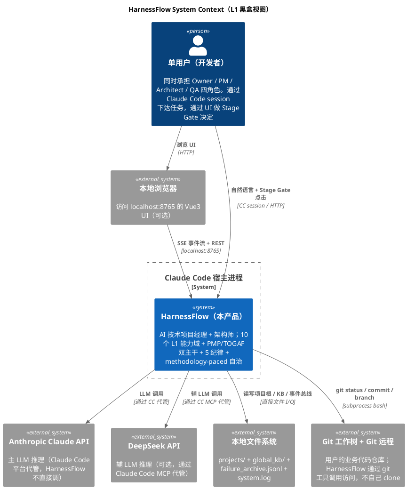

**关键技术决策**：

| 决策 | 选择 | 理由 | 备选方案弃用原因 |
|---|---|---|---|
| 部署形态 | Skill 生态 + 本地 FS + 可选 localhost UI | Goal §6 "开源 Claude Code Skill 形态"；portability 最高；无需云账号 | SaaS 形态：违反 Out-of-Scope #7；多租户复杂度指数级上升 |
| 单用户假设 | V1 / V2 固定 | 简化持久化模型 + 跨 session 恢复；避免 tenant_id 污染数据模型 | 多用户：需要 IAM + 权限隔离，PR scope-creep |
| LLM 代管 | 全部走 Claude Code 平台代理 | 密钥不落 HarnessFlow 自己的进程；遵循 Claude Code 生态的 security posture | 自管 API key：需实现密钥轮转 / rate-limit / 隔离，重复造轮 |
| 外部集成 | 0 个（除 Claude Code 宿主外）| 最小依赖 = 最高可测试性 + 最低运维成本 | Slack / Jira webhook：Goal §6 Out-of-Scope |

### 1.2 Level 2 · Container（进程级容器）

**解读 1（容器拆解）**：把 Level-1 的"HarnessFlow 系统"黑盒子打开，能看到 **5 个独立进程级容器**（含"逻辑容器"，并非都是独立 OS 进程）：

1. **主 Skill Runtime**（Claude Code session 内的 conversation context）—— L1-01/02/03/04/05/06/08/09 的执行器
2. **Supervisor Subagent Runtime**（独立 Claude session · 副驾 sidecar）—— L1-07 的执行器
3. **Verifier Subagent Runtime**（一次性 Claude session · 按需拉起）—— L1-04 委托 L1-05 的"独立审查者"
4. **本地 FS 数据面**（OS 文件系统的一组目录和 jsonl/yaml/md 文件）—— L1-09 / L1-06 的物理底座
5. **可选 UI 容器**（`python -m uvicorn` FastAPI 进程 + 本地浏览器的 Vue3 SPA）—— L1-10 的执行器

**解读 2（为何不是单进程）**：如果把 L1-01 至 L1-10 全部塞进同一个 Claude session（单进程），会违反 3 条 PRD 硬约束：
- **PM-02 主-副 Agent 协作**：Supervisor 必须"只读 + 旁路 + 独立 session"（`/scope §5.7.4`），共用 session 无法保证"不被污染"；
- **PM-03 子 Agent 独立 session 委托**：Verifier 每次校验必须在**一次性 subagent** 里跑（`/scope §8.1.3 + 5.1 中"执行/审查分离"`），共用 session 会把主 Agent 已有 bias 带进 Verifier；
- **"UI 只读事件总线 + 推用户输入"硬约束**（`/scope §5.10.4`）：UI 不应阻塞主 loop tick，必须独立进程；Vue3 必须在浏览器进程里跑。

**解读 3（容器间通信方式）**：每对容器之间的通信协议不同 —— 主 skill ↔ Supervisor 走 **PostToolUse hook + jsonl 文件订阅**（异步）；主 skill ↔ Verifier 走 **`/delegate` subagent 调用 + 返回 JSON 报告**（同步 block）；任何容器 ↔ FS 数据面 走 **直接 POSIX 文件 I/O + fsync**（同步）；UI ↔ 主 skill 走 **FastAPI REST + SSE 事件流**（异步拉 / 推双向）。这种**异构通信** 是为了匹配每种交互的**延迟/吞吐/可审计性**要求。

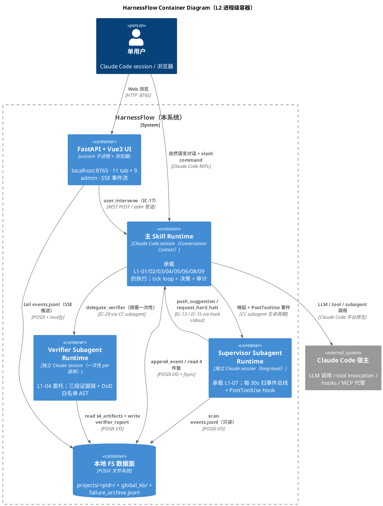

**关键技术决策**：

| 决策 | 选择 | 理由 | 备选方案弃用原因 |
|---|---|---|---|
| Supervisor 形态 | 独立 Claude subagent（long-lived）| PM-02 要求只读 + 旁路；独立 session 防 context 污染 | Python daemon：无 LLM 能力，无法做 8 维度语义判定 |
| Verifier 形态 | 一次性 subagent（per-call 拉起）| PM-03 每次独立；避免 bias 累积；延迟可接受（约 30-60s 启动）| long-lived subagent：session 污染累积；token 成本激增 |
| 通信方式 | 文件驱动（events.jsonl）为主，hook/stdin 为辅 | fsync 保证持久化；任何容器重启后可回放；单一事实源 | 消息队列（Redis / RabbitMQ）：额外依赖，违反 portability；单机场景过度设计 |
| UI 形态 | localhost FastAPI + Vue3 SPA（可选） | 跟 aigc 项目栈一致；Vue3 CDN 免编译 / FastAPI SSE 原生；可独立启停 | Electron：打包重；SvelteKit：团队栈迁移成本 |
| 数据面 | 本地 FS + jsonl + yaml + md | Unix 哲学；任何文本编辑器可查；git 友好 | SQLite：schema 迁移复杂；非文本 diff 不友好；违反 "文本优先" 原则 |

### 1.3 Level 3 · Component（进程内模块）

**解读 1（主 Skill 进程内部）**：把 Level-2 的"主 Skill Runtime"容器打开，能看到 **10 个 L1 能力域**作为 Component 存在，每个 L1 内部再有 3-7 个 L2（参考 `3-solution-design.md §4`：57 个 L2 总数）。Level-3 的核心抽象是 **"Component = 一个 L2 bounded context 里的 aggregate 或 service"**（见 `3-solution-design.md §6.5 DDD 映射`）。本节只画 L1 粒度，L2 粒度在 §7 component diagram 详细画。

**解读 2（Component 间调用方式）**：所有跨 L1 调用**必须走 IC 契约**（§8.2 of 2-prd，20 条 IC）。禁止 L1 之间直接 Python 函数调用（因为主 skill 不是 Python 程序，而是 "Claude LLM + 工具调用序列"；IC 是在 **Conversation Context 里表达成 "调用 X subagent / 写 Y 文件 / 触发 Z hook" 的规约**）。IC 的"物理载体"有三种：(a) 同进程内的 **Skill 调度**（主 skill 内的 L1 间通过 "调用另一个 skill / subagent" 表达）；(b) **文件系统介质**（L1-09 append_event 写 events.jsonl，其他 L1 订阅）；(c) **hook stdout / stdin**（Supervisor → 主 skill 的 push_suggestion 通过 hook 输出协议）。

**解读 3（component 的组合粒度）**：每个 L1 对应 1 个 architecture.md（顶层 `architecture.md`）+ N 个 tech-design.md（每 L2 一个）。本文档 §7 给出 10 L1 component diagram；每 L1 architecture.md 再进一步给出该 L1 内部 L2 间的 component diagram。组合关系：**本 L0 overview 负责 "L1 之间"**，每 L1 architecture 负责 **"L1 内部 L2 之间"**，每 L2 tech-design 负责 **"L2 内部 aggregate / service / entity 之间"**。三层粒度明确分工，互不越界。

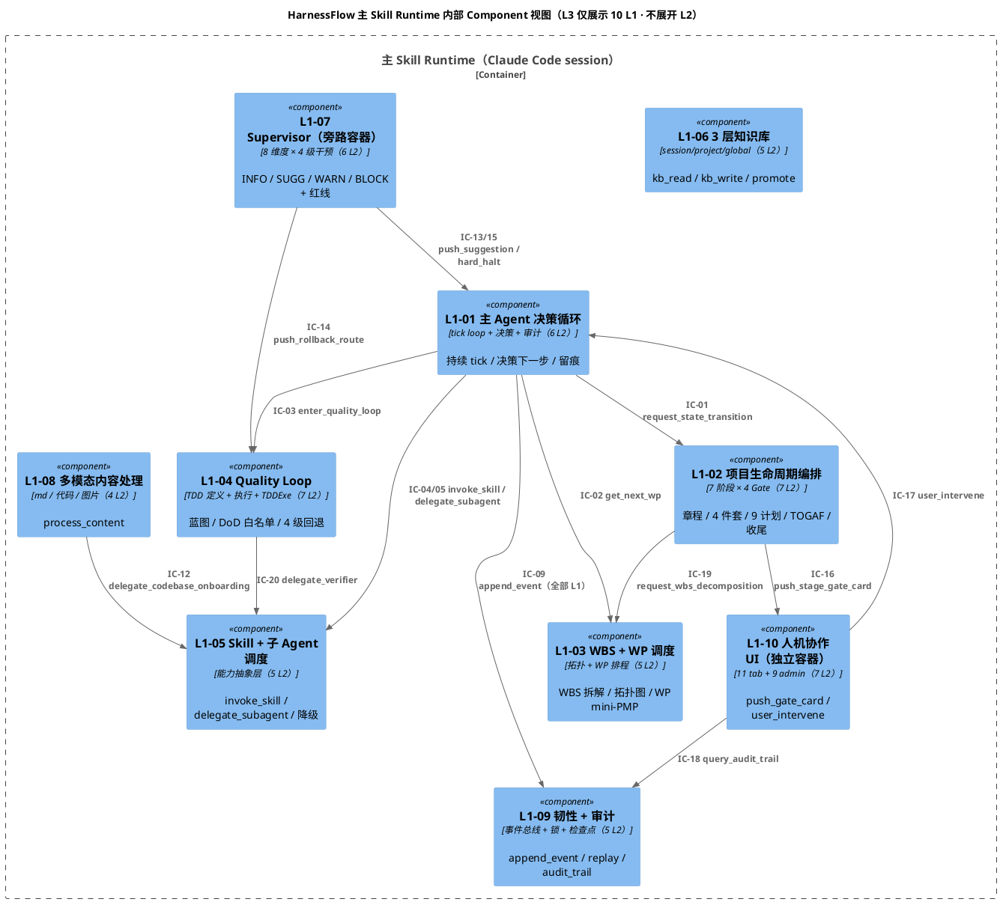

**关键技术决策**：

| 决策 | 选择 | 理由 | 备选方案弃用原因 |
|---|---|---|---|
| L1 粒度 | 10 个（来自 PRD `scope §2`）| 产品级聚类边界已在 PRD 固定；技术层不再拆分 | 按技术栈拆（LLM / FS / UI）：破坏 PRD 追溯性 |
| L2 数量 | 57 个（来自 `3-solution-design.md §4`）| 每 L1 独立 architecture.md 内再细化 | 全部塞 L0：单文档 10k+ 行，不可维护 |
| 跨 L1 调用协议 | 20 条 IC 契约（schema 固定）| PRD §8.2 已定义 schema；技术层仅做字段级映射 | 自由调用：破坏可审计 / 破坏版本兼容 |
| 同进程表达 | 对话上下文内的 skill/subagent 调度 | Claude Code 原生机制；无需引入 Python import 体系 | 自建 IPC：违反 "调度不造轮" 原则 |
| Component 层次 | 3 层（L0 / L1 / L2）严格分离 | 每层 review 独立；并行撰写不冲突 | 2 层扁平：57 份文档挤一起不可读 |


---

## 2. 物理部署图（Physical Deployment）

> 本节回答"**HarnessFlow 真正落到用户的那台 MacBook / Linux / Windows 机器上，究竟是哪几块 CPU / 内存 / 磁盘 / 网络端口在跑**"。物理部署视角刻意避开产品语义（谁负责什么），只看 "进程 / 文件 / 端口 / 网络拓扑"。

### 2.1 单机部署（V1 / V2 默认形态）

**解读 1（为何是单机）**：PRD `scope §4.2 Out-of-Scope #7` 明确 "开源 Claude Code Skill 形态，不做商业 SaaS"；`Goal §4 过程` 强调 single-user single-machine；`projectModel §7.1-7.3` 允许未来多项目但不承诺多机部署。单机部署是 HarnessFlow 的**永久形态**（V1 → V3+ 都不变），只不过 V2/V3 会增加"多 project 并发 / 多用户"两个维度。

**解读 2（网络拓扑）**：整个部署只有 **2 个网络端口暴露**（可选）：`127.0.0.1:8765`（FastAPI UI 监听）+ `127.0.0.1:5173`（Vite dev server，仅开发态）。生产态用户可以完全关闭 UI，HarnessFlow 依然全功能运行（CC session 内的所有操作不依赖 UI）。**从不监听外网端口**（不绑 0.0.0.0）、**从不发起入站连接**（没有 reverse shell / remote debug）、**对外出站连接只通过 Claude Code 宿主**（LLM API + MCP），这是安全底线。

**解读 3（资源足迹）**：典型资源使用：磁盘约 **200 MB - 2 GB**（取决于 project 数量和事件总线长度）；内存约 **300 MB - 800 MB**（主要是 FastAPI Python + Vue3 浏览器页）；CPU 稳态空闲，tick 时瞬时 10-20%（主要在 LLM 调用的 I/O 等待）。相比 aigc 项目的 PostgreSQL + OSS + ffmpeg 栈（动辄数 GB 磁盘），HarnessFlow 是极轻量级部署。

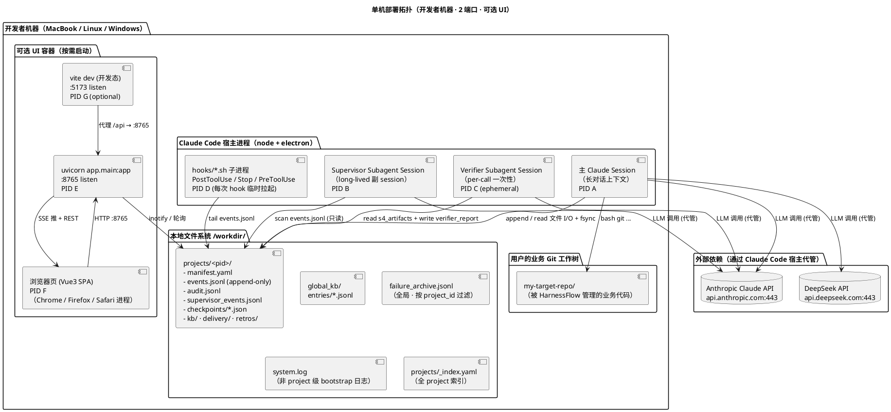

### 2.2 端口与网络（仅 localhost）

| 端口 | 协议 | 方向 | 监听进程 | 是否必须 | 绑定接口 |
|---|---|---|---|---|---|
| `8765` | HTTP / SSE | 入站 | FastAPI uvicorn | 可选（UI 关闭时不监听）| `127.0.0.1` only |
| `5173` | HTTP | 入站 | Vite dev server | 仅开发态 | `127.0.0.1` only |
| `443` | HTTPS | 出站 | Claude Code 宿主 | 必须（LLM 调用） | 任意 |

**硬约束**：HarnessFlow 任何进程 **不得监听 `0.0.0.0`**、**不得开启 CORS 放行外网**、**不得自己发起出站 HTTPS**（所有 LLM 调用经 Claude Code 代管）。这是"开源 Skill + 单用户单机"的安全底线。

### 2.3 目录约定 (HarnessFlow 工作目录)

**`$HARNESSFLOW_WORKDIR`** 默认为 `$HOME/.harnessFlow/`，可用环境变量覆盖。以下是技术层目录模型（产品级在 `projectModel §8` 已定义，本节给"物理实现"）：

| 子目录 | 用途 | 所有者 L1 | 是否被 git 追踪 |
|---|---|---|---|
| `projects/<pid>/` | 项目根 · 每 project 一个 | L1-02（写）/ L1-09（持久化）| 是（用户可选）|
| `projects/_index.yaml` | 全 project 索引（ID + status + created_at + last_active）| L1-09 | 是 |
| `global_kb/` | 晋升自 project 层的"无主"KB | L1-06 | 是 |
| `failure_archive.jsonl` | 跨 project 失败归档（每条含 project_id）| L1-02 L2-06 委托 L1-05 | 是 |
| `system.log` | 非 project 级系统日志（bootstrap / 跨 project 索引更新） | L1-09 | 否（放 `.gitignore`）|
| `cache/` | LLM 响应缓存 / multimodal 临时文件 / subagent 中间结果 | L1-05 / L1-08 | 否 |
| `tmp/` | 临时锁文件 / 进程间信号量（subagent IPC）| L1-09 L2-02 锁管理器 | 否 |

### 2.4 部署模式三档裁剪（PM-13）

PRD `scope §4.5 PM-13 合规可裁剪` 要求支持 "完整 / 精简 / 自定义" 三档。技术层实现：

| 档 | UI 启用 | Supervisor | Verifier | KB 全量 | 硬红线 | 适用场景 |
|---|---|---|---|---|---|---|
| 完整 | ✅ | ✅ 30s 扫描 | ✅ 每 S5 必跑 | ✅ 三层 | ✅ 全 5 类 | 生产级大项目 |
| 精简 | ❌（CLI only）| ✅ 60s 扫描 | ✅ 仅 Gate 必跑 | project + global | ✅ 全 5 类 | 中型项目 / 无 UI 偏好用户 |
| 自定义 | 用户配置 | 用户配置 | 用户配置 | 用户配置 | 最少 3 类（IRREVERSIBLE / HARD_HALT / PANIC）| 研究 / debug / 特殊需求 |

裁剪由根配置文件 `$HARNESSFLOW_WORKDIR/config.yaml` 的 `trim_level` 字段控制（L1-02 L2-01 Stage Gate 控制器读取）。

---

## 3. 进程 / 线程模型（Process & Thread Model）

> 本节回答"**HarnessFlow 在跑起来之后，OS `ps aux` 能看到的是哪几个进程；每个进程内部有几条线程；它们之间的调度关系是什么**"。这是和 §2 部署图互补的视角：§2 看空间（哪里），本节看时间（何时跑、跑多久、什么顺序）。

### 3.1 总览：5 类进程角色 + 2 种生命周期

**解读 1（Claude Code session 不是 OS 进程）**：Claude Code 的 "session" 是 **宿主 node/electron 进程里的一个对话上下文**（conversation state），不是独立 OS 进程。但从 **时间调度** 视角看，每个 session 表现为"有一个固定的 LLM-in-loop"，行为等同于进程。本节把 session 视为 **"逻辑进程"**。

**解读 2（为何 5 类进程）**：对应 §1.2 的 5 个 Container：主 skill session / Supervisor session / Verifier session / FS 数据面（无对应独立进程，是 OS 内核提供的）/ UI 进程。把 FS 数据面去掉，加上 **hook 脚本子进程** 和 **MCP 服务器子进程**（Claude Code 启动时拉起的子进程），总计 5 类：

| # | 进程角色 | OS 进程类型 | 生命周期 | 并发上限 | 运行时主体 |
|---|---|---|---|---|---|
| 1 | 主 skill session | 逻辑进程（宿主内）| 跟随 Claude Code session | 1（V1） / N（V2 多 project）| LLM-in-loop · tick 节奏 |
| 2 | Supervisor subagent session | 逻辑进程（宿主内）| long-lived · 主 skill 启动时拉起、结束时停 | 1（V1/V2 每 project 1 个）| LLM-in-loop · 30s 周期 + hook 触发 |
| 3 | Verifier subagent session | 逻辑进程（宿主内）| ephemeral · per IC-20 调用拉起 | 每 project ≤ 2 并发 | LLM-in-loop · 一次性任务 |
| 4 | Hook shell 子进程 | 真 OS 进程 | ephemeral · per hook 事件 | 不限（典型 ≤ 5 并发）| bash / python 脚本 |
| 5 | FastAPI UI 子进程 | 真 OS 进程 | long-lived · 用户手动启停 | 1 | uvicorn + Vue3 SPA |

**解读 3（谁调度谁）**：进程间调度关系是**严格层级树**（不是扁平网）：
```
Claude Code 宿主 (node)
  ├── 主 skill session (L1-01 tick loop 是总指挥)
  │     ├── Supervisor subagent session (启动 + 心跳 + 停)
  │     ├── Verifier subagent session (per-call 拉起 + 等返回 + 销毁)
  │     └── MCP servers (context7 / playwright / github / memory)
  ├── Hook subprocesses (PostToolUse / Stop / SubagentStop 每次临时拉起)
  └── uvicorn UI 子进程 (用户手动 start/stop)
```

### 3.2 主 skill session 的 tick 模型

**解读（tick 是什么）**：PRD `L1-01 主 Agent 决策循环` 定义主 loop 每 tick 的 6 步：查 KB → 拷问 5 纪律 → 决策 → 执行 → 审计 → 事件落盘。从技术实现角度，**每个 tick 是"主 skill 完整跑完一个 Claude conversation turn"**：LLM 输出一条"决策 + 工具调用序列" → 工具执行 → LLM 下一轮消化结果 → 输出下一条。

**tick 节奏**：
- **平均 tick 时长**：20 秒 - 2 分钟（取决于是否需要 LLM 的 agentic thinking、是否有外部 tool call、是否等待子 agent 返回）
- **tick 类型**：
  - **用户驱动 tick**：用户在 UI/CC 下达指令后的首 tick（优先级最高）
  - **事件驱动 tick**：事件总线有新事件（如 Supervisor push_suggestion / 子 Agent 返回）触发的 tick
  - **周期驱动 tick**：无新事件时每 60s 一次的 heartbeat tick（确保不会"死在那"）
  - **Hook 驱动 tick**：PostToolUse hook 发现关键事件（如硬红线信号）触发的 tick

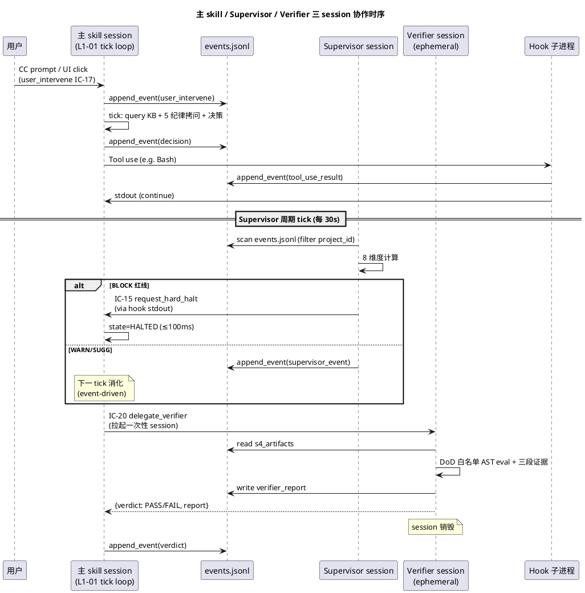

### 3.3 Supervisor long-lived session 的内部节奏

**解读**：Supervisor 不是"实时监控"（那需要 inotify + LLM 串行串联，成本不可控），而是 **准实时** —— 每 30s 周期 tick + PostToolUse hook 触发补充 tick。30s 周期是 PRD `scope §5.7.1` 约定，理由是"忘开火 / 顺序错 / 漏菜 / 走偏" 类漂移 在 30s 内不会造成 unrecoverable 损失。

**双模式触发**（`harnessFlow.md §4.2`）：
1. **周期 wake-up**（每 30s）：Supervisor session 内设 `while True: sleep(30); scan_events(); judge()` 的纯 LLM-in-loop 循环（Claude 本身有"等待 + 轮询"能力）
2. **Hook 触发**（PostToolUse）：主 skill 每次 tool use 后，PostToolUse hook 把事件摘要 inject 到 Supervisor session 的 context，Supervisor 立即处理

**线程模型**：Supervisor 是 **单线程 LLM-in-loop**（Claude session 本质单线程）。"周期 wake-up" 和 "hook 触发" 两路事件 **串行排队处理**，不并发（不存在 race condition）。如果两路同时来，后到的排队。

### 3.4 Verifier per-call ephemeral session 的生命周期

**解读**：Verifier 每次被 L1-04 通过 IC-20 调用时，**拉起一个全新的 Claude subagent session**（冷启动约 30-60s），在独立 context 里跑"读 s4_artifacts → AST eval DoD → 组三段证据 → 写 verifier_report.json"，完成后 session 销毁（context 不保留）。

**为何每次都新 session**：PRD `PM-03` + `scope §5.1 执行/审查分离`：Verifier 必须**零 bias**。如果复用 session，上次 PASS 的 context 会 anchor 本次判定（confirmation bias）。代价：每次 cold start + LLM 重新初始化约 30-60s token 成本，但换来的是 "100% 独立审查"。

**生命周期**：
```
T+0:    L1-04 S5 调用 IC-20 delegate_verifier
T+1s:   L1-05 通过 Claude Code `/delegate` 拉起 subagent
T+5s:   Verifier session 启动 + load s3_blueprint + s4_artifacts
T+10s:  Verifier 开始执行 DoD 表达式（文件存在 / curl 200 / pytest 绿 ...）
T+30s:  产出三段证据 + 写 verifier_report.json
T+31s:  Verifier session 销毁，L1-05 把 report 返回给 L1-04
```

### 3.5 Hook 子进程（临时拉起）

Claude Code hooks 机制：每次命中事件（PostToolUse / Stop / SubagentStop / PreToolUse / UserPromptSubmit / SessionStart / SessionEnd / PreCompact / Notification），Claude Code 宿主 **fork 一个 shell/python 子进程**，传入事件 JSON，脚本处理后通过 stdout/exit code 回主 skill。

**HarnessFlow 使用的 hook 脚本**（现有 repo `hooks/` 目录）：
- `PostToolUse-goal-drift-check.sh`：每次工具调用后检测 goal-anchor 漂移
- `Stop-final-gate.sh`：session 结束前兜底检测 verifier_report 是否存在，未存在则 force escalate

**hook 子进程生命周期极短**（≤ 500ms 典型）：
```
T+0:     Claude Code 宿主 fork hook 子进程
T+10ms:  hook 脚本启动 + read env + read stdin JSON
T+100ms: tail events.jsonl + 判断
T+300ms: stdout 返回判决（continue / halt）
T+400ms: exit 0/1，子进程销毁
```

### 3.6 FastAPI UI 子进程（long-lived）

**启动**：用户 `uvicorn app.main:app --port 8765` 手动启动（或通过 `hf ui start` 便捷命令）。
**关闭**：用户 `Ctrl+C` 或 `hf ui stop`。
**不自动启停**：主 skill 不自己拉起 UI 进程，**用户显式控制**（避免意外资源占用）。

**线程模型**（同 aigc 项目 FastAPI 栈）：
- uvicorn 主进程：ASGI event loop（单线程）
- Worker 线程池：处理阻塞 I/O（file read / inotify watch）
- SSE 连接：每个 Vue3 tab 1 个长连接，推 event stream

**UI 不持有业务状态**：所有状态从 `projects/<pid>/events.jsonl` tail 读取。UI 进程重启不影响主 skill 工作。

### 3.7 并发约束（硬性）

**V1 并发上限**：

| 资源 | 上限 | 理由 | 执行方 |
|---|---|---|---|
| 同时活跃 project | 1 | V1 单 project（Goal §6.11）| L1-02 + L1-09 锁 |
| WP 并发 in-flight | 2（PM-04）| 防认知爆炸 | L1-03 L2-02 |
| Quality Loop 并发 | 2 | 每 project 不允许 > 2 | L1-04 L2-01 |
| Verifier 并发 | 2 | 每 project 限制 | L1-05 |
| Supervisor 实例 | 1 | V1 一 project 一 supervisor | L1-07 |
| LLM 调用并发 | Claude Code 宿主决定 | 受宿主 rate-limit + API quota | 宿主 |
| Hook 子进程并发 | 5（典型）| OS fork 开销 | OS 内核 |
| UI 连接 | 1 个浏览器 tab | 单用户 | 用户自律 |

**V2+ 扩展**：多 project 并发时，每 project 一份上面配额（不共享）。

### 3.8 进程间通信协议矩阵

本节汇总所有跨进程 IPC 的技术实现细节，回答"每对进程之间具体通过什么机制说话"：

| 源 | 目标 | 协议 | 物理载体 | 延迟 | 可靠性 | 序列化 |
|---|---|---|---|---|---|---|
| 主 skill | FS | POSIX file I/O | open/write/fsync | ≤ 50ms | 强（fsync 强保证）| UTF-8 文本（jsonl/yaml/md）|
| 主 skill | Supervisor | CC subagent lifecycle | Claude session 生命周期 API | 启动 5-10s；常驻后 0 | 强（CC 宿主保证）| conversation context |
| 主 skill | Verifier | CC subagent delegation | `Task(...)` 工具调用 | 首调 30-60s | 强 | JSON in/out |
| 主 skill | Hook | CC hook 触发 | fork + stdin/stdout | ≤ 500ms | 中（hook 超时/失败主 skill 不感知，需 Stop hook 兜底）| env vars + JSON stdin |
| 主 skill | MCP | MCP JSON-RPC 2.0 | stdio 长连接 | ≤ 1s 典型 | 强 | JSON-RPC |
| Supervisor | FS | POSIX file I/O（只读）| open/read | ≤ 10ms | 强 | UTF-8 文本 |
| Supervisor | 主 skill | Hook stdout 注入 | CC hook 机制 | ≤ 30s 周期 | 中 | 结构化 JSON |
| Verifier | FS | POSIX file I/O | open/read（工件）/ write（report）| ≤ 50ms | 强 | UTF-8 + JSON |
| Hook | FS | POSIX file I/O（tail）| open/read（最后 N 行）| ≤ 10ms | 强 | 文本 |
| UI | FS | inotify + POSIX read | inotify_add_watch + open/read | ≤ 2s 推送 | 中（inotify 可能丢事件）| jsonl 解析 |
| UI | 主 skill | REST POST + SSE | HTTP :8765 | ≤ 200ms | 中（HTTP 连接可断）| JSON |
| Browser | UI FastAPI | HTTP / SSE | :8765 | ≤ 50ms | 中 | JSON / Event Stream |

### 3.9 tick 调度的内部状态机

主 skill 的 tick loop 不是简单 "while True"，内部有精细的状态机，决定每 tick 该做什么：

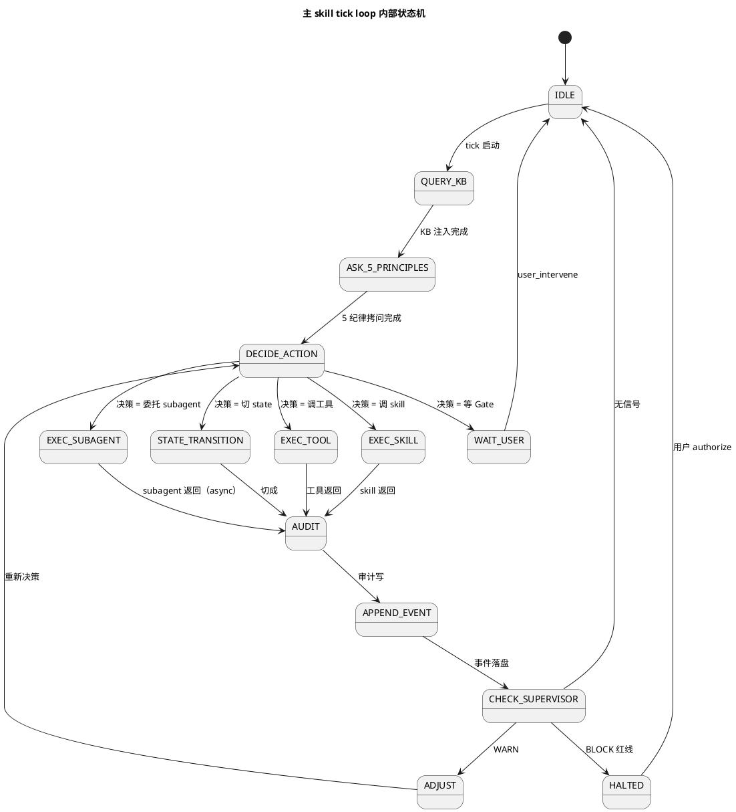

每个状态对应一个"主 skill 的 LLM 决策意图"，技术层通过系统 prompt 引导 LLM 按此顺序思考。

---

## 4. 文件系统布局（Filesystem Layout）

> 本节是 §2.3 的深化版：给出**每个文件的精确路径 + 格式 + 访问权限 + 写入方/读取方 + 锁粒度**。这是 L1-09 `韧性+审计` 能力的**物理落实单**。

### 4.1 全景树（参考 projectModel §8.1）

```
$HARNESSFLOW_WORKDIR/                         ← 默认 $HOME/.harnessFlow/
│
├── config.yaml                               ← 全局配置：trim_level / log_level / api 偏好（L1-02 读）
├── system.log                                ← 非 project 级系统日志（bootstrap / 跨 project 索引更新 / UI 进程）
│
├── projects/                                  ← 所有项目的根目录
│   │
│   ├── _index.yaml                           ← 全 project 索引（ID + status + created_at + last_active + trim_level）
│   │                                            写入方：L1-02 L2-02（创建）/ L1-02 L2-06（归档）
│   │                                            读取方：L1-09 bootstrap / L1-10 UI 切换面板
│   │                                            并发：全局写锁 $HARNESSFLOW_WORKDIR/tmp/.index.lock
│   │
│   ├── <project_id_foo>/                     ← 一个项目一个子目录
│   │   │
│   │   ├── manifest.yaml                     ← 项目元数据（project_id / goal_anchor_hash / state / created_at / trim_level / charter_ref）
│   │   │                                        写入方：L1-02 L2-02（S1 创建时锁定 project_id + goal_anchor_hash）
│   │   │                                                L1-02 L2-06（S7 归档时写 status=CLOSED）
│   │   │                                        读取方：所有 L1（PM-14 上下文取用）
│   │   │                                        更新：只 append 新版本 + `previous_version_hash`（不原地改）
│   │   │
│   │   ├── state.yaml                        ← project 主状态（PROJECT_STATE_MACHINE: NOT_EXIST→INIT→PLAN→TDD_PLAN→EXEC→CLOSE→CLOSED）
│   │   │                                        写入方：L1-02 L2-01 Stage Gate 控制器（独占）
│   │   │                                        读取方：L1-01 / L1-03 / L1-04 / L1-07 / L1-10
│   │   │                                        并发：project 粒度锁（L1-09 L2-02）
│   │   │
│   │   ├── charter.md / stakeholders.md      ← S1 章程 + 干系人（L1-02 L2-02 写）
│   │   ├── planning/                         ← 4 件套 + 9 计划（L1-02 L2-03/04 写）
│   │   │   ├── requirements.md
│   │   │   ├── goals.md
│   │   │   ├── acceptance_criteria.md
│   │   │   ├── quality_standards.md
│   │   │   ├── scope_plan.md / schedule_plan.md / cost_plan.md / ... (9 份)
│   │   ├── architecture/                     ← TOGAF A-D + ADR（L1-02 L2-05 写）
│   │   │   ├── a_vision.md / b_business.md / c_data.md / c_application.md / d_technology.md
│   │   │   └── adr/ADR-001.md ...            ← 每决策 1 份
│   │   ├── wbs.md                            ← WBS 主文件（L1-03 L2-01 写）
│   │   ├── wp/                               ← 每 WP 1 个子目录
│   │   │   └── <wp_id>/
│   │   │       ├── wp_def.yaml               ← WP 定义（contract + deps + effort + owner）
│   │   │       ├── mini_pmp.md               ← WP mini-PMP
│   │   │       └── commits.log               ← WP 关联 git commit 列表
│   │   ├── tdd/                              ← TDD 蓝图 + 测试代码（L1-04 L2-01 写）
│   │   │   ├── master_test_plan.md
│   │   │   ├── dod_expressions.yaml          ← DoD AST 表达式（白名单 eval 专用）
│   │   │   ├── test_skeletons/               ← 测试骨架
│   │   │   ├── quality_gates.md
│   │   │   └── acceptance_checklist.md
│   │   ├── verifier_reports/                 ← S5 验证报告（Verifier 写）
│   │   │   └── <wp_id>-<timestamp>.json      ← 三段证据链 JSON
│   │   │
│   │   ├── events.jsonl                      ← 本 project 事件总线（append-only）
│   │   │                                        写入方：**全部 L1**（通过 IC-09 append_event）
│   │   │                                        读取方：L1-07 supervisor scan / L1-09 replay / L1-10 UI tail
│   │   │                                        每行格式：{ts, type: "L1-XX:subtype", actor, state, content, links, project_id, hash}
│   │   │                                        fsync：每次 append 必 fsync（PRD `L1-09.硬约束 1+5`）
│   │   │                                        典型大小：中型项目 5-50 MB · 大型项目 200 MB-1 GB
│   │   │                                        并发：单写入锁 .events.lock（L1-09 L2-02）
│   │   │
│   │   ├── audit.jsonl                       ← 审计记录（L1-09 L2-03 写）
│   │   │                                        每行：{ts, decision_id, principle, rationale, evidence_links[]}
│   │   │                                        与 events.jsonl 分开是因为"决策审计"查询模式不同（按 decision_id 索引）
│   │   │
│   │   ├── supervisor_events.jsonl           ← 监督事件（L1-07 专属）
│   │   │                                        每行：{ts, dimension, level: INFO/SUGG/WARN/BLOCK, category, evidence}
│   │   │                                        与主 events.jsonl 分开便于 supervisor tab 独立展示
│   │   │
│   │   ├── checkpoints/                      ← 跨 session 恢复用
│   │   │   └── <timestamp>.json              ← task-board snapshot
│   │   │                                        写入方：L1-09 L2-04（周期 ≤ 1 分钟 + 关键事件后）
│   │   │                                        读取方：L1-09 L2-04 bootstrap 恢复
│   │   │
│   │   ├── kb/                               ← project 层 KB
│   │   │   └── entries/*.md                  ← 每条一个 md（含 YAML frontmatter）
│   │   │                                        写入方：L1-06 L2-02（project 层写）/ L1-06 L2-04（session 晋升入 project）
│   │   │                                        读取方：全部 L1（通过 IC-06 kb_read · 默认 scope=session+project+global）
│   │   │
│   │   ├── delivery/                         ← S7 交付包
│   │   │   ├── README.md
│   │   │   ├── artifacts/                    ← 产出物拷贝
│   │   │   └── manifest.yaml                 ← 交付清单 + 签名
│   │   │
│   │   └── retros/                           ← retro 文档
│   │       └── <project_id>-final.md         ← S7 收尾时委托 retro-generator subagent 产
│   │
│   └── <project_id_bar>/                     ← 另一个 project（V2+ 并发）
│       └── ...
│
├── global_kb/                                ← 跨 project 共享 KB
│   └── entries/*.md                          ← 晋升后脱离 project 归属
│
├── failure_archive.jsonl                     ← 全局失败归档
│                                                每行：{ts, project_id, wp_id, stage, failure_type, root_cause, evidence_links[]}
│                                                写入方：L1-02 L2-06 委托 L1-05 failure-archive-writer subagent
│                                                读取方：L1-01 启动时 KB 注入 / L1-07 已知 trap 辅助
│                                                schema：$HARNESSFLOW_WORKDIR/schemas/failure-archive.schema.json
│
├── cache/                                    ← 临时缓存（不追踪 git）
│   ├── llm_responses/                        ← LLM 响应缓存（L1-05 可选）
│   ├── multimodal_thumbnails/                ← 图片缩略图（L1-08）
│   └── subagent_intermediate/                ← subagent 中间输出
│
└── tmp/                                      ← 运行时临时文件（不追踪 git）
    ├── .index.lock / .<pid>.events.lock      ← 文件锁
    └── ipc/                                  ← subagent IPC 信号量
```

### 4.2 文件格式选型理由

| 格式 | 使用场景 | 为何选它 | 备选弃用原因 |
|---|---|---|---|
| **jsonl** | events / audit / supervisor_events / failure_archive / KB entries | append-only 友好；每行独立可解析；fsync 粒度到行；grep/jq 查询方便 | NDJSON：同义；SQLite：schema 迁移成本；CSV：schema 表达力差 |
| **yaml** | manifest / state / dod_expressions / wp_def / _index / config | 人类可读性最高；嵌套表达力；git diff 友好 | TOML：嵌套弱；JSON：无注释 + 可读性差 |
| **md** | 4 件套 / 9 计划 / TOGAF / WBS / mini_pmp / retros / delivery README | PRD PM-07 "产出物模板驱动"；git diff / Claude Code 原生支持 | docx：二进制 diff 不友好；PDF：只读 |
| **md + YAML frontmatter** | KB entries | 正文是叙述，frontmatter 是结构化字段；两者兼得 | 纯 md：无法结构化查询；纯 yaml：无法长文本 |
| **JSON** | verifier_report / checkpoints / schema 定义 | schema 严格；下游机器解析；已有 `schemas/*.schema.json` | yaml：schema 验证工具链弱 |

### 4.3 文件锁粒度

参考 `L1-09 L2-02 锁管理器`（PRD `scope §5.9.3 硬约束`）：

| 锁 | 锁粒度 | 持有时间 | 场景 |
|---|---|---|---|
| **全局 index 锁** | `$HARNESSFLOW_WORKDIR/tmp/.index.lock` | ≤ 100 ms | _index.yaml 更新（新增 project / 归档）|
| **project 主状态锁** | `projects/<pid>/tmp/.state.lock` | ≤ 500 ms | state.yaml 切换（Gate 通过）|
| **events append 锁** | `projects/<pid>/tmp/.events.lock` | ≤ 50 ms | events.jsonl 追加（IC-09）|
| **WP 锁** | `projects/<pid>/tmp/.wp-<wp_id>.lock` | tick 持有期间 | 同 WP 不允许 2 个 Quality Loop |
| **manifest 写锁** | `projects/<pid>/tmp/.manifest.lock` | ≤ 200 ms | manifest.yaml 版本追加 |

**锁实现**：`fcntl.flock(LOCK_EX | LOCK_NB)`（POSIX flock，宿主 OS 原生，无额外依赖）。持有时间超时自动释放（通过 LOCK_NB 避免死锁）。

### 4.4 持久化写入路径（IC-09 append_event 的物理实现）

IC-09 是所有 L1 唯一的持久化入口（PRD `scope §8.1.4`）。技术实现：

```
调用方 L1 → 构造 event dict (含 project_id) → 取 .events.lock
         → open(events.jsonl, 'a') → json.dumps(event) + '\n'
         → fsync(fileno) → 释放锁 → 返回 {event_id, sequence, hash}
```

**hash 链**：`event.hash = sha256(prev_hash + event_body_canonical_json)`。每事件都包含上一事件 hash，形成单向链；tamper 检测 = 重算整链 hash 对比 `last_event.hash`。

**崩溃恢复**：fsync 保证行已落盘；如果行写了一半崩溃，下次启动时 L1-09 L2-04 `replay_from_event` 会丢弃"最后一行格式错误"的事件（有 checksum 防误判 + `_partial` 标记）。

---

## 5. 技术控制流（End-to-End Technical Control Flow）

> 本节是 PRD `scope §8.1.1 控制流图` 的**技术视图**：从"用户在 CC session 输入自然语言" 到 "最后产出物落盘" 这一整条链路经过的**每一个技术栈元素**（LLM call / tool use / subprocess / file I/O / hook / subagent）。

### 5.1 端到端技术栈经过（一次 Quality Loop 为例）

**场景**：用户在 Claude Code 里说 "继续做下一个 WP"，系统自治跑完一轮 Quality Loop（S4 实现 → S5 验证），最终给用户展示 PASS/FAIL。这是最高频的"一次完整 tick"端到端链路。

**技术栈穿越顺序**（按时间先后）：

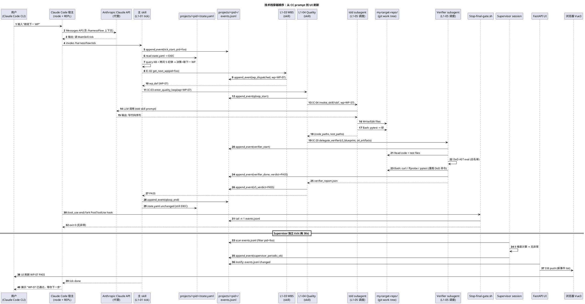

### 5.2 技术控制流的 7 条关键路径

**P1 · Tool use 路径**：主 skill 决策 → CC 宿主解析工具调用 → 对应工具（Write/Bash/Read）执行 → 结果回灌到 LLM context → LLM 下一轮推理。这条路径**每 tick 多次**走过，是最高频路径。

**P2 · Subagent delegation 路径**：主 skill 在 context 中输出 `Task(subagent='tdd', ...)` → CC 宿主 fork 一个 subagent session → 独立 LLM-in-loop 跑 → 返回结构化 JSON 给主 skill。这条路径**每 WP 2-3 次**（tdd / verifier / code-reviewer）。

**P3 · Hook 路径**：CC 宿主在 ToolUse 结束时 fork hook shell 子进程 → 脚本读 events.jsonl + 判断 → stdout 回主 skill（continue / halt）。这条路径**每次 tool use 1 次**，频率最高 **但最轻量**（≤ 500ms）。

**P4 · Event bus 路径**：任何 L1 → IC-09 → open+append+fsync events.jsonl → 释放锁 → 返回 event_id/hash。这条路径**每次状态变更 1 次**，是"单一事实源"的物理载体。

**P5 · MCP 路径**：主 skill 需要外部能力（context7 查文档 / playwright 浏览器 / github PR）→ MCP 子进程处理 → 结果回灌。这条路径**仅在需要外部能力时**，频率中等。

**P6 · UI 推送路径**：UI FastAPI 进程 inotify watch events.jsonl → 新事件 → SSE push → 浏览器 Vue3 SPA 更新视图。这条路径**每事件 1 次**，异步，不阻塞主 skill。

**P7 · Supervisor 反向路径**：Supervisor scan → 发现异常 → 构造 INFO/WARN/BLOCK 结构化输出 → 通过 hook stdout 注入主 skill context → 主 skill 下一 tick 消化。这条路径**每 30s 至少 1 次**，是"旁路干预"的物理载体。

### 5.3 异常控制流（硬红线触发）

当 Supervisor 通过 P7 输出 `status=BLOCK`，主 skill 控制流立即切换到**异常路径**：

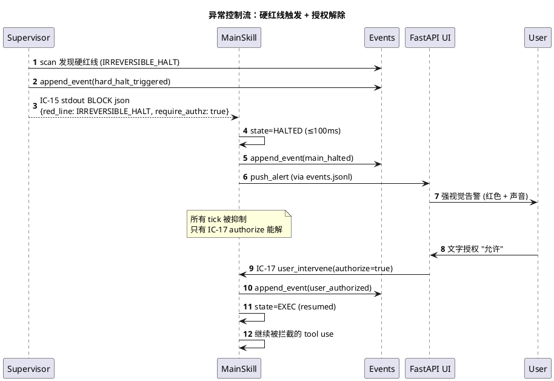

**关键时延要求**（PRD `L1-01 硬约束 panic=100ms`）：`halt` 传递从 Supervisor scan → 主 skill state=HALTED 总计 ≤ 30 秒 + 100ms = **≤ 30.1s**（30s 是 Supervisor scan 周期，100ms 是 main skill 响应）。用户体验上"感觉系统立即停了"。

---

## 6. 技术数据流（End-to-End Technical Data Flow）

> 本节是 PRD `scope §8.1.2 数据流图` 的**技术视图**：从"用户输入" 到 "交付包" 这一整条链路经过的**每一种数据形态 + 每一次格式转换 + 每一处 schema 验证**。

### 6.1 数据形态演进（S1 → S7 全景）

**解读**：一个项目从 S1 到 S7 的产出数据会经历 **8 种形态**的递进：自然语言对话 → 章程 md → 4 件套 md → TOGAF md → dod_expressions.yaml → WBS yaml → test skeletons → verifier_report.json → 交付包 zip。每一步都是**上一步的结构化提纯**，没有回写。

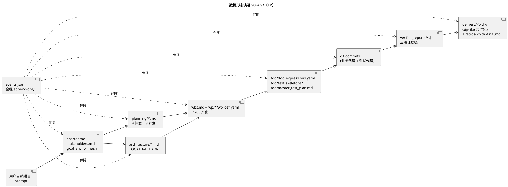

### 6.2 数据类型对照表

| 数据类别 | 存储形态 | 产生方 | 消费方 | schema 校验 | 加密/签名 |
|---|---|---|---|---|---|
| **自然语言输入** | CC conversation context | 用户 | 主 skill | 无（自由文本）| 无 |
| **章程/干系人** | md | L1-02 L2-02 | 所有 L1 | frontmatter + 必填 section | goal_anchor_hash（sha256）|
| **4 件套** | md | L1-02 L2-03 | L1-03 / L1-04 | md 模板（强制 section 顺序）| 无 |
| **9 计划** | md | L1-02 L2-04 | L1-03 / L1-07 | md 模板 | 无 |
| **TOGAF A-D** | md | L1-02 L2-05 | L1-03 | md 模板 | 无 |
| **ADR** | md | L1-02 L2-05 | 审计查询 | frontmatter (status/supersedes)| 无 |
| **WBS** | md + yaml | L1-03 L2-01 | L1-04 | `wbs.schema.yaml`（DAG 校验）| 无 |
| **wp_def** | yaml | L1-03 L2-02 | L1-04 | `wp_def.schema.yaml`（contract + deps）| 无 |
| **DoD expressions** | yaml | L1-04 L2-01 | Verifier | `dod.schema.yaml`（白名单 AST）| 无 |
| **test skeletons** | py/js/...（用户栈）| L1-04 L2-01 | git | 无（用户栈原生）| 无 |
| **verifier_report** | JSON | Verifier | L1-04 / UI / archive | `verifier_report.schema.json` | 无 |
| **events** | jsonl | 所有 L1 | 所有 L1 / UI / supervisor | `event.schema.json`（含 project_id）| **hash 链**（sha256）|
| **audit** | jsonl | L1-01 L2-05 + L1-09 L2-03 | UI audit 面板 | `audit.schema.json` | hash 链 |
| **supervisor_events** | jsonl | L1-07 | UI alert 角 / retro | `supervisor_event.schema.json` | 无 |
| **failure_archive** | jsonl | L1-05 failure-archive-writer | 启动注入 / retro | `schemas/failure-archive.schema.json`（现 repo 已有） | 无 |
| **KB entries** | md + yaml frontmatter | L1-06 L2-02/04 | 所有 L1 | `kb_entry.schema.yaml` | 无 |
| **checkpoints** | JSON | L1-09 L2-04 | L1-09 bootstrap | `checkpoint.schema.json`（含 task-board state）| 无 |
| **state** | yaml | L1-02 L2-01 | 所有 L1 | `state.schema.yaml`（enum 限定）| 无 |
| **manifest** | yaml (append-versioned) | L1-02 L2-02/06 | 所有 L1 | `manifest.schema.yaml`（PM-14 必填）| 无 |
| **delivery bundle** | md + zip-like | L1-02 L2-06 | 用户 | `delivery.schema.yaml`（必含项）| 内容签名（retro hash）|

### 6.3 Schema 校验时机

参考 PRD `PM-05 Stage Contract 机器可校验` + `scope §8.4.1 命名空间约束`：

| 时机 | 校验目标 | 执行方 | 失败处理 |
|---|---|---|---|
| **IC 调用入参** | 每 IC 的 params 必带 project_id | 被调 L1 | 拒绝 + `project_scope_violation` 事件 |
| **events.jsonl 行追加前** | event schema + project_id 存在性 + hash 链 | L1-09 L2-01 | reject + raise（halt 整系统）|
| **产出物落盘前** | 按文件类型查 schema | 对应 L1 | reject + 不写 |
| **Gate 前** | 产出物 schema + 齐全性 | L1-02 L2-01 | 拒绝 Gate + 要求补齐 |
| **DoD 表达式 eval 前** | AST 白名单 | Verifier 内 AST visitor | reject + INSUFFICIENT verdict |
| **跨 project 引用检测** | 所有产出物的外链必须在同 project 内 | L1-09 L2-03 审计器 | 审计违规 + supervisor 拦截 |

### 6.4 数据单向流（硬约束）

PRD `scope §8.1.2` 明确："数据流是**单向生产-消费链**，不允许下游回写上游"。技术实现：

1. **文件系统层**：上游产出文件标 `read_only: true` 元数据（linux chmod 444），下游只能 Read，Write 时 IC 拒绝；
2. **IC 层**：每 IC 的 schema 强制 `direction: 'read' | 'append' | 'write'`，接收方按方向拒绝；
3. **审计层**：L1-09 L2-03 审计器扫 events.jsonl，发现"下游 L1 写上游产出物路径"立即告警。

**唯一例外**：Quality Loop 4 级回退（PRD `scope §8.3 场景 4/7`）—— 下游 FAIL 可触发 Supervisor push_rollback_route，但回退**不是下游写上游**，而是 Supervisor 作为"旁路裁判"给主 skill 发指令，主 skill 触发 state 回退后让相关上游 L1 **重做一遍**（备份 v1 + 产 v2）。v1 和 v2 都保留，不是覆盖。

### 6.5 数据 GC / 归档策略

**归档前**：项目活跃期间，所有数据**累积不删**（events.jsonl 只追加不截断）。

**归档后**（PRD `PM-14 硬约束 5：保留至少 90 天`）：
- `projects/<pid>/state.yaml` → status=CLOSED，所有文件标 `read_only: true`
- `events.jsonl` 进一步标 `archive_ts` 并 chattr +i（Linux）/ flags uchg（macOS）
- 90 天后可选"冷存档"：打包 tgz 到 `archives/<pid>.tgz` 并从 `projects/` 移出（需用户显式 `hf project cold-store <pid>`）
- **KB 晋升条目永不删**（已脱离 project 归属进 global_kb/）

**failure_archive.jsonl 特殊处理**：即便 project 被删，failure_archive 条目仍保留（按 project_id 标记为 `deleted_project`），保证历史失败模式可跨项目学习。

---

## 7. 10 个 L1 技术模块关系（Component Diagram）

> 本节给出"10 L1 × L2 粒度的调用关系 + 数据依赖"的完整 component diagram，是 §1.3 Level 3 C4 视图的**技术深化**。

### 7.1 10 L1 × 主要 L2 全景

```plantuml
@startuml
title 10 L1 × 主要 L2 全景 Component View

package "L1-01 主 Agent 决策循环 (6 L2)" as L101 {
    component "L2-01 Tick 调度器" as L101_01
    component "L2-02 状态查询器" as L101_02
    component "L2-03 状态机编排器" as L101_03
    component "L2-04 5 纪律拷问器" as L101_04
    component "L2-05 审计持久化" as L101_05
    component "L2-06 决策裁决器" as L101_06
}

package "L1-02 项目生命周期 (7 L2)" as L102 {
    component "L2-01 Stage Gate 控制器" as L102_01
    component "L2-02 S1 启动产出器" as L102_02
    component "L2-03 4 件套生产器" as L102_03
    component "L2-04 9 计划生产器" as L102_04
    component "L2-05 TOGAF 生产器" as L102_05
    component "L2-06 S7 收尾器" as L102_06
    component "L2-07 变更请求处理器" as L102_07
}

package "L1-03 WBS+WP 调度 (5 L2)" as L103 {
    component "L2-01 WBS 拆解器" as L103_01
    component "L2-02 拓扑图管理器" as L103_02
    component "L2-03 WP 排程器" as L103_03
    component "L2-04 WP mini-PMP" as L103_04
    component "L2-05 依赖判定器" as L103_05
}

package "L1-04 Quality Loop (7 L2)" as L104 {
    component "L2-01 TDD 蓝图生成器" as L104_01
    component "L2-02 DoD 表达式编译器" as L104_02
    component "L2-03 S4 执行监控" as L104_03
    component "L2-04 S5 验证驱动" as L104_04
    component "L2-05 三段证据收集" as L104_05
    component "L2-06 4 级回退路由" as L104_06
    component "L2-07 死循环保护" as L104_07
}

package "L1-05 Skill+子Agent (5 L2)" as L105 {
    component "L2-01 能力抽象层" as L105_01
    component "L2-02 Skill 调度器" as L105_02
    component "L2-03 Subagent 委托" as L105_03
    component "L2-04 降级链" as L105_04
    component "L2-05 工具柜原子层" as L105_05
}

package "L1-06 3 层 KB (5 L2)" as L106 {
    component "L2-01 Session 层" as L106_01
    component "L2-02 Project 层" as L106_02
    component "L2-03 Global 层" as L106_03
    component "L2-04 晋升仪式" as L106_04
    component "L2-05 注入策略" as L106_05
}

package "L1-07 Supervisor (6 L2)" as L107 {
    component "L2-01 事件扫描器" as L107_01
    component "L2-02 8 维度计算" as L107_02
    component "L2-03 4 级分级判定" as L107_03
    component "L2-04 软红线自治" as L107_04
    component "L2-05 硬红线上报" as L107_05
    component "L2-06 回退路由决策" as L107_06
}

package "L1-08 多模态 (4 L2)" as L108 {
    component "L2-01 Markdown 处理器" as L108_01
    component "L2-02 代码分析器" as L108_02
    component "L2-03 图片理解器" as L108_03
    component "L2-04 Onboarding 委托" as L108_04
}

package "L1-09 韧性+审计 (5 L2)" as L109 {
    component "L2-01 事件总线" as L109_01
    component "L2-02 锁管理器" as L109_02
    component "L2-03 审计器" as L109_03
    component "L2-04 检查点/恢复器" as L109_04
    component "L2-05 异常降级" as L109_05
}

package "L1-10 人机协作 UI (7 L2)" as L110 {
    component "L2-01 FastAPI 服务" as L110_01
    component "L2-02 SSE 事件推送" as L110_02
    component "L2-03 11 Tab 视图" as L110_03
    component "L2-04 9 Admin 模块" as L110_04
    component "L2-05 Gate 卡片交互" as L110_05
    component "L2-06 Panic 按钮" as L110_06
    component "L2-07 审计查询面板" as L110_07
}

' L1-01 控制流
L101_06 --> L102_01 : IC-01
L101_06 --> L103_03 : IC-02
L101_06 --> L104_03 : IC-03
L101_06 --> L105_02 : IC-04/05
L101_06 --> L105_03 : IC-04/05

' L1-02 → L1-03
L102_01 --> L103_01 : IC-19
L102_01 --> L110_05 : IC-16

' L1-04 → L1-05
L104_04 --> L105_03 : IC-20
L104_01 --> L106_02 : read
L104_02 --> L106_02 : IC-06

' L1-07 监督
L107_01 --> L109_01 : scan
L107_03 --> L101_01 : IC-13
L107_05 --> L101_01 : IC-15
L107_06 --> L104_06 : IC-14

' L1-08 → L1-05
L108_02 --> L105_03 : IC-12
L108_01 --> L102_03 : write
L108_01 --> L102_04 : write

' 全部 L1 → L1-09
L101_05 --> L109_01 : IC-09
L102_06 --> L109_01 : IC-09
L103_03 --> L109_01 : IC-09
L104_04 --> L109_01 : IC-09
L105_02 --> L109_01 : IC-09
L106_04 --> L109_01 : IC-09
L107_01 --> L109_01 : IC-09
L108_02 --> L109_01 : IC-09
L110_01 --> L109_01 : IC-09

' UI 读取
L110_02 --> L109_01 : tail
L110_07 --> L109_03 : IC-18
L110_06 --> L101_01 : IC-17
@enduml
```

### 7.2 调用关系矩阵（L2 粒度）

**25 对必测对**（PRD `L1集成/prd.md §4.1`）对应的主要 L2 调用：

| 调用方 L2 | 被调方 L2 | IC | 频率 |
|---|---|---|---|
| L1-01 L2-06 决策裁决 | L1-02 L2-01 Stage Gate | IC-01 | 每 state 切换 |
| L1-01 L2-06 决策裁决 | L1-03 L2-03 WP 排程 | IC-02 | 每 tick 一次（EXEC 期）|
| L1-01 L2-06 决策裁决 | L1-04 L2-03 S4 监控 | IC-03 | 每 WP 开始 |
| L1-01 L2-06 决策裁决 | L1-05 L2-02 Skill 调度 | IC-04 | 每 skill 需求 |
| L1-01 L2-06 决策裁决 | L1-05 L2-03 Subagent 委托 | IC-05 | 每 subagent 需求 |
| L1-02 L2-01 Gate | L1-03 L2-01 WBS 拆解 | IC-19 | S2 Gate 后 |
| L1-02 L2-01 Gate | L1-10 L2-05 Gate 卡片 | IC-16 | 每 Gate |
| L1-04 L2-04 S5 验证 | L1-05 L2-03 Verifier | IC-20 | 每 S5 |
| L1-04 L2-06 回退路由 | L1-02 L2-01 Gate | IC-01 | 每回退 |
| L1-05 L2-03 子 Agent | L1-08 L2-04 Onboarding | IC-12（逆向）| 大代码库时 |
| L1-07 L2-03 判定 | L1-01 L2-01 Tick | IC-13 | INFO/WARN 实时 |
| L1-07 L2-05 红线 | L1-01 L2-01 Tick | IC-15 | 仅 BLOCK |
| L1-07 L2-06 回退 | L1-04 L2-06 | IC-14 | 死循环升级 |
| L1-10 L2-06 Panic | L1-01 L2-01 | IC-17 type=pause | 用户 panic |
| L1-10 L2-05 Gate | L1-01 L2-01 | IC-17 type=authorize | 每 Gate 决定 |
| L1-10 L2-07 审计 | L1-09 L2-03 | IC-18 | 用户查询 |
| 全部 L1 各 L2 | L1-09 L2-01 事件总线 | IC-09 | 每状态变更 |

### 7.3 数据依赖图（产出物 ↔ 消费 L2）

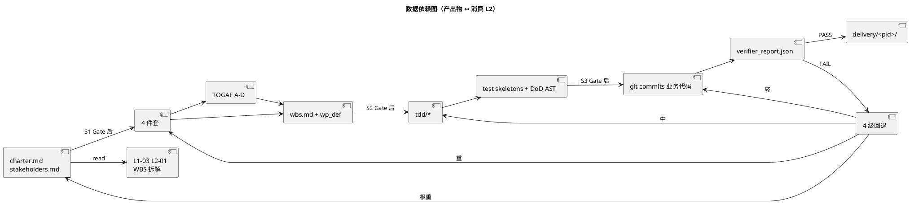

### 7.4 横切依赖（不走 IC 契约的"隐式"依赖）

除了 IC 契约显式定义的调用，还有**三类隐式依赖**，是技术架构层才能暴露的：

**H1 · events.jsonl 的扇入扇出**：所有 L1 写、所有 L1 读（Supervisor / UI / 审计器），是系统最高扇入的"数据 hub"。任何 L1 扩展都要谨慎不污染 events schema。

**H2 · CC 宿主的工具集白名单**：所有 L1 的 Bash/Write/Edit/Read 等工具调用**共享同一个 CC 宿主工具白名单**（`.claude/settings.json` 的 permissions）。某个 L1 新增 tool 需求会影响所有 L1 的安全边界。

**H3 · Claude session context budget**：主 skill 的 conversation context 是**所有 L1 L2 共享**的 token 预算（Claude 200k context window）。L1-06 KB 注入 / L1-08 多模态 / L1-05 skill result 都要消耗 budget；超 80% 时 L1-09 L2-05 异常降级启动 auto-compact（PRD `BF-E-06`）。这是隐式的"资源竞争"，架构上通过"L1-09 监控 + 按需压缩"保证不爆。

---

## 8. PM-14 · project 维度的物理隔离实现

> PRD `projectModel.md §8` + `scope §4.5-4.6 PM-14` 要求每个 project 数据**物理隔离**。本节回答"技术上这是怎么落地的"。

### 8.1 物理隔离的 4 条硬路径

| 硬路径 | 实现 | 验证 |
|---|---|---|
| **P1 · 独立根目录** | `projects/<pid>/` 每 project 独立子树 | ls + grep project_id 一致性 |
| **P2 · 独立事件总线** | `projects/<pid>/events.jsonl` 每 project 独立文件 | supervisor scan 时显式 filter project_id |
| **P3 · 独立审计链** | `projects/<pid>/audit.jsonl` + hash 链独立 | 跨 project hash 链断裂视为违规 |
| **P4 · 独立检查点** | `projects/<pid>/checkpoints/` 每 project 独立目录 | bootstrap 时按 project 加载 |

### 8.2 `project_id` 在技术栈的 7 个传播点

`harnessFlowProjectId` 从 S1 创建时锁定开始，贯穿整个技术栈。技术层必须保证它**不丢失、不混淆、不污染**：

| 传播点 | 技术载体 | 硬约束 |
|---|---|---|
| **1. CC conversation context** | 主 skill 的 system prompt + 每 tick 前 prepend 当前 project 上下文 | 切换 project 必须**重建 context**（不复用）|
| **2. IC 调用 params** | 每 IC 的 params.project_id（或 root-level）| 缺失即被被调 L1 拒绝 |
| **3. events.jsonl 每条行** | event.project_id 根字段 | L1-09 写入前校验；缺失 halt 系统 |
| **4. 子 Agent context_copy** | IC-05 delegate_subagent 传的 context_copy 必带 project_id | subagent 禁读其他 project 的 FS |
| **5. 文件路径** | `projects/<project_id>/...` 前缀 | L1-08 路径校验不允许跨 project |
| **6. Supervisor 订阅 filter** | supervisor 启动时注入 `my_project_id` env | 扫描仅读对应 events.jsonl |
| **7. UI 视图 session** | UI 当前激活 project（存浏览器 localStorage + 服务端 session）| 切换 project 时重建 SSE 连接 |

### 8.3 多 project 并发（V2+）的技术架构

V1 固定单 project，V2+ 支持多 project 并发。技术实现：

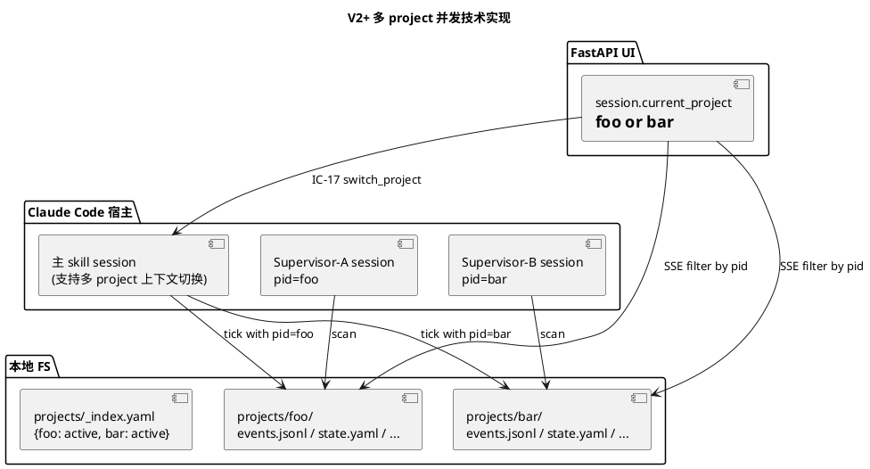

**V2+ 关键技术决策**：

| 决策 | V1 | V2+ | 技术实现 |
|---|---|---|---|
| Supervisor 实例数 | 1（固定）| N（每 project 1 个）| 主 skill 在 project 创建时 spawn 新 subagent |
| 主 skill session 数 | 1 | 1（共享 · 切换上下文）| 切换时 Save 当前 pid checkpoint + Load 目标 pid |
| events.jsonl 文件数 | 1 | N（每 project 1 份）| 分目录隔离 |
| UI tab 数 | 1 | 1 但有切换器 | localStorage 记忆 current_project + 切换时重建 SSE |
| LLM 调用 rate-limit | 全系统共享 | 全系统共享（不按 project 分配）| Claude Code 宿主代管 |

### 8.4 数据污染检测（L1-09 L2-03 审计器职责）

PRD `projectModel §6.3` 要求"归属完整性自检"。技术实现：

```bash
# 伪代码（L1-09 L2-03 审计器周期任务，每 5 min 一次）
for event in scan_all_events_jsonl():
    if not event.project_id:
        raise 'dirty_data'
    if event.project_id not in projects/_index.yaml:
        raise 'orphan_project_reference'
    # 跨 project 外链检测
    for link in event.links:
        target_pid = extract_pid_from_path(link)
        if target_pid and target_pid != event.project_id:
            raise 'cross_project_reference_violation'
```

发现违规 → 写 `audit.jsonl` + supervisor 归入"契约违规"维度（PRD `scope §4.6 #7`）→ 上升为 BLOCK 告警用户。

### 8.5 项目删除的技术实现（PM-14 硬约束 6）

用户删除 project（UI → 后台管理 → Danger Zone → Delete Project）：

```
1. UI 弹出二次确认（显示"将删除: events (XXX MB) / KB (XXX 条) / ..."）
2. 用户再次确认 → IC-17 user_intervene(type=delete_project, pid=X)
3. L1-02 L2-06 执行删除流程：
   a. 标记 state.yaml status=DELETING
   b. 停 project 的 Supervisor session
   c. 把 KB 晋升条目从 project 层移到 global_kb/（不删）
   d. 把 failure_archive 里本 project 条目标 `deleted_project=true`（不删）
   e. rm -rf projects/<pid>/ （硬删）
   f. 更新 _index.yaml 移除 entry
4. 操作落入 system.log（非 project 级，因 project 已不存在）
```

**不可逆性**：删除后**无法恢复**（除非用户自己 git 提交过）。UI 必须强提示。

---

## 9. 跨 L1 一致性保障

> 10 个 L1 并行开发时，如何保证拼接起来不打架？本节给出 3 层一致性机制。

### 9.1 L1 · IC schema 强制校验

参考 `3-solution-design.md §6.6`：每 L2 tech-design 必须先定义对外接口 schema。技术实现：

- 每 IC 对应一个 `schemas/ic/IC-XX.schema.json`（JSON Schema Draft 2020-12）
- IC 调用方 / 被调方**都**在入/出参处校验（`ajv-cli` 或等价 Python `jsonschema` lib）
- 校验失败：IC 返回 `{status: 'schema_violation', path: 'field.X'}` + 落事件 `schema_violation`
- 版本兼容：IC schema 带 `$version`，升级必 backward compat ≥ 1 minor（PRD `scope §8.4.1 #3`）

**关键 schema 列表**：
- `ic/IC-01 ~ IC-20`：20 条 IC（参考 PRD `scope §8.2`）
- `event.schema.json`：事件总线通用 schema（必含 project_id / ts / type / actor / state / content / links / hash）
- `wbs.schema.yaml`：WBS DAG 约束（无环 + 每 WP ≤ 5 天）
- `dod.schema.yaml`：DoD AST 白名单（仅允许：`file_exists / curl_status / pytest_exit_code / ffprobe_duration / text_contains / json_key_equals / and / or / not`）
- `verifier_report.schema.json`：三段证据链结构

### 9.2 L2 · 事件 hash 链（防篡改 · 事后检测）

PRD `L1-09 硬约束 5`：event 的 hash 含前事件 hash → 单向链 → 破坏即可检测。

**技术实现**：
```
event.hash = sha256(
    prev_event.hash +          ← 上一事件 hash（初始为 "GENESIS"）
    canonical_json(event_body)  ← 本事件去 hash 字段后 JCS（RFC 8785）序列化
)
```

**检测路径**：L1-09 L2-03 审计器周期重算 `events.jsonl` 整链 hash，比对 `last_event.hash` 与存储。不匹配 → 事件总线被外部篡改或文件损坏 → `halt_system` 事件 + supervisor BLOCK 告警。

**为何选 sha256 + JCS**：sha256 平衡碰撞安全与性能（典型事件 < 10ms）；JCS 保证 JSON 序列化确定（同样内容不同引擎必得同 hash，跨平台可验证）。

### 9.3 L3 · 审计追溯链（事前记录 · 事后查询）

PRD `scope §5.9.3 In-scope` + `IC-18 query_audit_trail`：任一代码行 / 产出物路径 / 决策 id 可反查完整链（决策 → 理由 → 事件 → 监督点评 → 用户批复）。

**技术实现**：
- 每次"重要决策"（L1-01 L2-06 决策裁决器产）写一条 `audit.jsonl` entry，含：
  - `decision_id`（uuid）
  - `related_event_ids[]`（关联到 events.jsonl 的 event_id）
  - `principle`（拷问的 5 纪律中的哪条）
  - `rationale`（LLM 决策理由文本）
  - `evidence_links[]`（文件路径 + 行号）
- IC-18 查询时，按 anchor（file_path / artifact_id / decision_id）反向扫 audit.jsonl：
  ```
  matching_decisions = []
  for entry in audit.jsonl:
      if anchor in entry.evidence_links or anchor == entry.decision_id:
          matching_decisions.append(entry)
          + join with events, supervisor_events by ids
  return matching_decisions
  ```
- UI L1-10 L2-07 审计面板消费结果，展示时间轴视图

### 9.4 L4 · 跨 L1 测试矩阵（事前防错）

PRD `L1集成/prd.md §4.1` 的 10×10 矩阵 + §5 的 12 个端到端场景是"一致性的质量门"。技术实现：
- 每对必测 L1 组合各写 ≥ 4 个 pytest（正向 / 负向 / PM-14 / 失败降级）
- 用 `pytest --cov=app.services` 跑矩阵
- CI 中必 100% 通过才允许合并

### 9.5 L5 · goal_anchor_hash（目标不漂移）

PRD `L1-07` 8 维度第一条就是"目标保真度"。技术实现：
- S1 锁定章程时计算 `goal_anchor_hash = sha256(canonical(charter.md))`
- 写入 `manifest.yaml.goal_anchor_hash`
- 此后任何要改 charter.md 的行为都会被 **Stop-final-gate.sh** hook 拦截
- Supervisor 每 tick 计算"当前决策 vs goal_anchor" 语义距离（通过 LLM 评分），超阈值 = DRIFT_CRITICAL 硬红线

---

## 10. 性能架构

> 本节回答"**HarnessFlow 的性能瓶颈在哪；端到端时延如何保障；资源预估是多少**"。所有数字来源于 PRD `L1集成/prd.md §7 性能集成约束` + `scope §5.X 各 L1 硬约束`。

### 10.1 端到端时延目标

| 场景 | 目标时延 | 瓶颈 | 优化手段 |
|---|---|---|---|
| 用户 IC-17 响应 | ≤ 100ms | CC session 消息派发 | CC 原生 |
| 单 tick 典型时长 | 20s - 2min | LLM 调用（Claude API）| prompt 精简 + prefix caching |
| Supervisor 检测 → halt 生效 | ≤ 30.1s | 周期 tick 30s + halt 100ms | 减少周期？牺牲成本 |
| 一次 Quality Loop | 5 min - 30 min | tdd skill + verifier 各自 LLM | 并行 subagent |
| IC-09 append_event | ≤ 50ms | 文件锁 + fsync | flock + fsync 已最优 |
| IC-18 query_audit_trail | ≤ 500ms（典型项目）| jsonl 全扫 | 加索引文件（V2+）|
| UI SSE push 延迟 | ≤ 2s | inotify + json.loads | inotify 已最优 |
| 跨 session bootstrap | ≤ 5s（中等项目）| events.jsonl replay + checkpoint load | checkpoint 粒度调优 |
| Panic → 暂停生效 | ≤ 100ms | CC session 中断 | CC 原生 |
| Gate 卡片推送 | ≤ 500ms | manifest + bundle 打包 | I/O 异步化 |

### 10.2 吞吐瓶颈

**LLM 调用吞吐**是最大瓶颈。单 Claude session 同时刻只能有 1 个 LLM 调用在飞（Anthropic API 队列）。瓶颈分析：

- **主 skill 单线程**：每 tick 内部的 LLM 调用串行，吞吐 = 1 / avg_tick_time（约 0.5-3 tick/min）
- **Supervisor 独立 session**：并行于主 skill，不抢占
- **Verifier 独立 session**：并行，但每次 cold start 30-60s，不能 rapid-fire（每 project ≤ 2 并发）
- **Skill subagent 多样化**：tdd / code-reviewer / verifier 等可并行（在独立 session 里）

**吞吐优化手段**：
1. **subagent 并行**：L1-04 可同时 dispatch `code-reviewer` + `test-generator` + `docs-writer` 到 3 个 subagent，一次 LLM 调用峰值 3x
2. **缓存 prefix**：Anthropic prompt caching 把 system prompt + KB 注入缓存，节省 70% token cost
3. **KB 精简注入**：按阶段只注入 relevant KB（L1-06 L2-05 注入策略），不全量
4. **Verifier 白名单快路径**：DoD AST eval 的 `file_exists / pytest_exit_code` 走 subprocess 不走 LLM，亚秒级

### 10.3 资源预估

**典型中型项目（10 WP · 100 events/WP）的资源占用**：

| 资源 | 预估 | 来源 |
|---|---|---|
| **磁盘** | 200-500 MB per project | events.jsonl ~50 MB + docs ~100 MB + KB ~20 MB + verifier_reports ~30 MB + checkpoints ~20 MB + delivery ~200 MB |
| **内存** | 主 skill 内存随 CC 宿主（不增量）；UI 进程 ~200 MB（Python + Vue3 static）| aigc 项目同栈参考 |
| **CPU** | tick 期间 10-20%（I/O 等待为主）；空闲 < 1% | MacBook M1 基线 |
| **LLM token 成本** | 中型项目约 500k-2M tokens（跨全生命周期）| Anthropic pricing ~$0.003/k input + $0.015/k output · 总成本约 $5-30 per project |
| **墙钟总时长** | 1-3 周（含用户 Gate 等待）| Goal §4.3 methodology-paced |

**大型项目（50 WP · 1000 events/WP）**：所有数字 × 10（磁盘 2-5 GB，token 成本 $50-300）。若磁盘 > 5 GB，自动触发 L1-09 L2-05 "冷归档" 建议（把已 closed 事件 gzip）。

### 10.4 性能回归防护

参考 `scope §8.4.1 集成约束 #3`：每 IC 有 version；升级必 backward compat。**性能层也有**：
- 每次主 skill 版本升级，`pytest --benchmark` 跑 `tests/performance/test_latency.py` 基线对比
- 关键指标（tick 时长 p50/p95/p99）超基线 20% = 性能回归阻断合并
- 大项目模拟压测（10k events）每月一次，避免 jsonl 线性扫性能劣化

---

## 11. 安全架构

> PRD `scope §5.7/5.8/5.9 各硬约束` + `scope §4.6 PM-14 硬约束` 构成安全基线。本节给技术落地。

### 11.1 白名单路径（L1-08 + L1-05 + L1-09）

**硬约束**：任何 L1 只能读写以下路径（其他路径拒绝）：
- `$HARNESSFLOW_WORKDIR/**` （本产品工作目录）
- `<current_project>.wd/` （用户 git 工作树的当前分支，通过 git 查询）
- `/tmp/harnessFlow/**` （临时文件）
- Read-only：`$HOME/.claude/` 的**特定**子路径（如 session-data/ 归档）

**技术实现**：
- 所有 Write/Edit/Read 工具调用前，`L1-08 L2-01 Markdown 处理器` 做 `path_check(path)` → 不在白名单 → 拒绝 + 报事件
- CC 原生 permissions（`.claude/settings.json`）限制 Bash 命令前缀
- Hook `PreToolUse-path-check.sh`（V1 可加）兜底拦截

### 11.2 DoD AST 白名单（L1-04 L2-02）

**硬约束**：DoD 表达式走 AST eval，禁 arbitrary exec（PRD `scope §8.2 IC-20` + `§5.4 硬约束 2`）。

**技术实现**：
- dod_expressions.yaml 内只能用白名单函数：
  ```yaml
  # 合法
  - file_exists: "src/main.py"
  - pytest_exit_code: "tests/"
  - ffprobe_duration: "out.mp4"
    operator: ">="
    value: 5.0
  - and:
      - file_exists: "a"
      - file_exists: "b"
  ```
- Verifier 内 AST visitor（Python `ast` 模块自定义）解析并 eval
- 任何非白名单节点（如 `eval`、`exec`、任意 attribute access）→ `INSUFFICIENT` verdict + 事件 `dod_ast_violation`

### 11.3 硬红线 5 类（L1-07 L2-05）

PRD `scope §5.7.6 硬红线`：
1. **IRREVERSIBLE_HALT**：不可逆操作前置缺失（`rm -rf` / `git push --force` / `drop database`）
2. **DOD_GAP_ALERT**：主 skill 声明完成但 DoD 缺证据
3. **DRIFT_CRITICAL**：决策语义距 goal_anchor > 阈值
4. **CONTRACT_VIOLATION**：IC 缺 project_id 或 schema 违规
5. **PANIC**：用户按 panic 按钮

**技术实现**：
- 每类有独立识别模式（regex / AST / LLM judge）
- 触发 → IC-15 request_hard_halt → 主 skill state=HALTED + UI 强告警
- 必须**用户文字授权**（IC-17 authorize） 才能解除

### 11.4 用户授权审计（IC-17）

**硬约束**：用户的每次授权（hard_halt 解除 / Gate Go/No-Go / 变更请求批准）必须**审计留痕**。

**技术实现**：
- IC-17 调用立即 append `audit.jsonl` 条目（含 user_id / ts / action / decision_hash）
- UI 展示时显示 "最后更新 2026-04-20 15:32 由 user"（便于用户自证）
- 审计条目 hash 链接入主 events hash 链，不可篡改

### 11.5 密钥与凭证管理

**硬约束**：HarnessFlow 进程**不持有任何密钥**。

**技术实现**：
- Anthropic API key / DeepSeek API key → Claude Code 宿主管理（用户在 CC 配置）
- GitHub PAT → Claude Code MCP (github) 管理
- HarnessFlow 不读 env 变量里的 API key
- 用户在 UI 输入的任何凭证（如 "允许 push" 的文字授权） → 仅 runtime 内存存在，**从不落盘**（PRD `scope §5.10.5 禁止`）

### 11.6 安全测试矩阵

每个 L1 都有对应"禁止行为"的负向测试（PRD `scope §7.2 集成验证硬约束 #6`）：
- 构造违规 IC 调用（缺 project_id / 跨 project path / schema 违规）→ 必被拒绝
- 构造不可逆命令 → Supervisor 必拦截
- 构造无权限写入 → 必失败

**黑盒渗透测试**：每次重大升级跑一次"尝试让 HarnessFlow 做坏事"的 adversarial test（LLM 红队），记录失败率作为安全基线。

### 11.7 威胁模型 (Threat Model)

按 **STRIDE** 模型分类 HarnessFlow 可能面临的威胁：

| 威胁类别 | 威胁场景 | 技术防御 | 剩余风险 |
|---|---|---|---|
| **S**poofing（身份伪造）| 攻击者篡改 events.jsonl 插入假事件 | hash 链 + 审计器周期重算 + chattr +i | 低（tamper 会被下次审计发现）|
| **T**ampering（数据篡改）| 攻击者修改 charter.md 让 goal_anchor 失效 | goal_anchor_hash + Stop-final-gate.sh 拦截 + supervisor DRIFT_CRITICAL | 低 |
| **R**epudiation（抵赖）| 用户事后否认授权过 rm -rf | IC-17 每次授权入 audit.jsonl + hash 链 | 极低（审计链不可篡改）|
| **I**nfo Disclosure（信息泄露）| Subagent 读取其他 project 的秘密 | Context copy 严格按 project_id · path whitelist · subagent 独立 session | 中（若 whitelist 配错会泄）|
| **D**oS（拒绝服务）| LLM 429 / 用户无限 tick 耗资源 | token budget watcher + rate-limit 识别 + panic | 中 |
| **E**oP（权限提升）| Supervisor 被诱导做"业务写入"突破只读边界 | Supervisor 权限仅 Read / Glob / Grep（CC `.claude/settings.json` 限定）| 低 |

### 11.8 审计合规建议

虽然 HarnessFlow 是单机单用户，但对"AI 重要决策全链可审计"有企业内部合规需求的用户，建议：
1. 开启完整档（trim_level=完整）+ 归档保留 ≥ 90 天
2. 定期 git commit `events.jsonl` + `audit.jsonl` 到业务 repo（便于 auditor 拉下离线审计）
3. 配置 `SubagentStop` hook 把每次 subagent 返回 dump 到 `audit.jsonl`（额外审计粒度）
4. UI 层面做"审计导出"按钮，一键生成给合规团队的 PDF 报告（MVP 不做，V2 考虑）

---

## 12. 扩展性架构（V1 → V2 → V3）

> PRD `HarnessFlowGoal` + `projectModel §7.3 / §11.3` 定义了版本演进路径。本节给每版本的**技术架构演进**。

### 12.1 V1（MVP · 2026 Q2-Q3）

**范围**：单用户 · 单 project · 单 Claude session · 可选 UI · 10 L1 全功能 · 典型中型项目支持

**关键技术决策**：
- 一个 project 对应一个 CC session 生命周期
- Supervisor 1 个 long-lived session
- UI 可选（默认不启）
- events.jsonl 单文件每 project
- KB 三层全支持但 global 层条目少

**性能基线**：参考 §10.3 中型项目数字

**边界验收**：PRD `scope §7.2` 的 7 项硬约束 100% 过 + Goal §4.1 量化指标 V1 要求达成

### 12.2 V2（多 project 并发 · 2026 Q4）

**新增**：同一用户 / 同一 CC session 同时激活 N 个 project，显式切换 current project。

**架构改动**：

| 维度 | V1 | V2 | 技术改动 |
|---|---|---|---|
| Supervisor 实例数 | 1 | N（每 project 1 个）| 主 skill 在 project 创建时 spawn + 归档时 stop |
| 主 skill context 切换 | N/A | 需要 Save/Load checkpoint | L1-09 L2-04 新增 `save_project_context` / `load_project_context` |
| UI tab 行为 | 单 project 固定 | UI 顶部加 project 切换器 | 新增 `current_project` localStorage + SSE 重连 |
| 事件总线 | 1 文件 | N 文件（已 V1 设计）| 无需改 |
| KB 读作用域 | project + global | 按 current_project + global（自动切换）| L1-06 L2-05 注入策略 |
| WP 并发上限 | 2（全系统）| 2 × N（每 project 2）| L1-03 锁粒度细化 |
| LLM 调用配额 | 全系统 | 按 project 分配（可选）| 可选 · 不强制 |

**兼容性**：V1 的 project 数据可无缝升级到 V2（只需 _index.yaml 新增索引），无需数据迁移。

### 12.3 V3（多用户协同 · 2027+ 展望）

**新增**：多个开发者可同时干预同一个 project（code review / Gate 决定 / 变更请求）。

**架构改动**（展望，未承诺）：

| 维度 | V2 | V3 | 技术改动 |
|---|---|---|---|
| 用户模型 | 单用户假设 | 多用户（需要 tenant_id）| 所有数据加 tenant_id 维度（project_id 之上）|
| 审计审批 | 单人授权 | 角色-based（developer / lead / architect）| 审批流；Gate 可能需 2 人以上 |
| UI 形态 | localhost | 可能是 self-hosted web app 或 CC 团队版 | FastAPI 改部署；CORS 策略调整 |
| 持久化 | 本地 FS | 可能是 shared NFS / S3 + 本地缓存 | L1-09 新增 storage backend 抽象层 |
| LLM 调用 | 代管 | 按团队分配配额 | 团队 API key + quota 管理 |
| 事件 hash 链 | 无需改 | 加"签名"（RSA/ECDSA 非对称）| 保证跨用户事件可信 |

**关键是 V2 → V3 的"不影响 V1/V2 使用者"**：V3 架构必须向下兼容，V1/V2 用户可继续用单人模式不改任何配置。

### 12.4 演进路径图

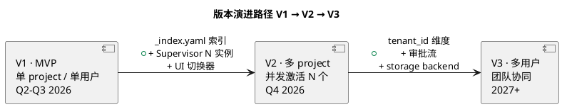

### 12.5 不做的扩展方向

PRD `Goal §6` 明确列了不做的事。技术架构层**也拒绝为这些方向留扩展点**（留 hooks 也是软风险）：

- ❌ 不做通用 Agent 框架 → 不引入 "pluggable LLM backend" 抽象层
- ❌ 不做 Scrum Agent → 不引入 "ceremony" 概念
- ❌ 不做 CI/CD → 不引入 "pipeline as code"
- ❌ 不做移动端 App → 不做 PWA / offline sync
- ❌ 不自研 LLM → 不引入 model training pipeline
- ❌ 不做 Figma 集成 → 不引入 "design token" 抽象

这是"克制"的架构原则：**少即是多**，专注 AI 技术项目经理 + 架构师这一核心定位。

---

## 13. 与现有 harnessFlow repo 的对比

> 现有 `~/work/code/harnessFlow/` 已有 MVP 工作蓝图（见 `harnessFlow.md` + repo 根目录文件）。本节列技术方案 v1.0 相对现有 repo 的**兼容改造 / 新增模块 / 废弃模块**。

### 13.1 现有 repo 结构（实地确认）

参考 `harnessFlow.md` 蓝图 + repo 根目录（`ls -la ~/work/code/harnessFlow/`）：

| 现有资产 | 类型 | 当前状态 | 对标本文档 L1 |
|---|---|---|---|
| `harnessFlow.md` | 架构蓝图 | MVP 文档 | 本文档升级版 |
| `method3.md` | 方法论规则 | MVP 文档 | PRD scope / L1-07 |
| `routing-matrix.md` + `.json` | 路由矩阵 | 有 | L1-05 L2-01 能力抽象层 |
| `flow-catalog.md` | 路线目录 | 有 | L1-02 L2-01 |
| `state-machine.md` | 任务级状态机 | MVP 雏形 | L1-01 L2-03 + L1-02 L2-01 |
| `stage-contracts.md` | Stage 契约 | 有 | L1-02 L2-01 |
| `task-board-template.md` | Task board 模板 | 有 | L1-09 L2-01 |
| `hooks/` | shell hooks | 2 个脚本 | L1-09 / L1-07 |
| `schemas/` | JSON/YAML schemas | 4 份 | L1-09 L2-01 + 本文档 §9.1 |
| `scripts/` | 自检脚本 | 2 个 .py | L1-09 测试工具 |
| `subagents/` | subagent prompts | 4 份 | L1-05 / L1-07 |
| `verifier_primitives/` | DoD 原语库 | 有 | L1-04 L2-02 |
| `task-boards/` | task-board 实例 | 有历史 | L1-09 |
| `retros/` | retro 历史 | 有 | L1-02 L2-06 |
| `failure-archive.jsonl` | 失败归档 | 有 | L1-02 L2-06 |
| `ui/` | UI mock | Vue + FastAPI | L1-10 |
| `archive/` | 归档工具 | Python 代码 | L1-02 L2-06 / L1-05 |
| `sessions/` | 会话归档 | 有 | L1-05 / L1-09 |
| `research/` | 研究资料 | 目录 | 非产品代码 |

### 13.2 兼容改造（保留并升级）

| 现有资产 | 改造方向 | 必做项 |
|---|---|---|
| `hooks/PostToolUse-goal-drift-check.sh` | 扩展为支持多 project | 读 current_project from env；事件 filter by pid |
| `hooks/Stop-final-gate.sh` | 升级为兼容 IC-09 | 按 events.jsonl 新 schema 检查 verifier_report |
| `schemas/failure-archive.schema.json` | 加必填 project_id 字段 | 符合 PM-14 |
| `schemas/task-board.schema.json` | 加 project_id 根字段 + hash 链字段 | 符合 L1-09 新设计 |
| `schemas/stage-contract.schema.json` | 对齐 L1-02 L2-01 Stage Gate | 按 PRD 细化 |
| `subagents/supervisor.md` | 升级到 8 维度 / 4 级干预 | 按 PRD L1-07 改 prompt |
| `subagents/verifier.md` | 升级到三段证据链 + DoD AST 白名单 | 按 PRD L1-04 改 prompt |
| `subagents/retro-generator.md` | 升级到 11 项 retro + PM-14 | 按 PRD L1-02 L2-06 改 |
| `subagents/failure-archive-writer.md` | 升级到按 project 分组 + PM-14 | 已有 jsonl schema |
| `routing-matrix.md` + .json | 升级为 L1-05 L2-01 能力抽象层 | 新增 project 维度过滤 |
| `state-machine.md` | 拆两层：主 loop state + project 主状态 | 按 `projectModel §5` |
| `stage-contracts.md` | 拆为 per-L1 contracts | 按 `scope §5.X 硬约束` |
| `ui/` | 升级 11 tab + 9 admin 对齐 L1-10 | 按 `scope §3.3 + §3.4` |
| `archive/writer.py` + `retro_renderer.py` | 升级为 L1-02 L2-06 内部工具 | 加 project_id |
| `verifier_primitives/` | 升级为 L1-04 L2-02 DoD 原语库 | 加白名单 AST |

### 13.3 新增模块（必须新建）

| 新模块 | 归属 L1 | 作用 | 文件/位置 |
|---|---|---|---|
| `projects/` 目录结构 | L1-09 | PM-14 物理隔离 | `$HARNESSFLOW_WORKDIR/projects/` |
| `projects/_index.yaml` | L1-09 | 全 project 索引 | 同上 |
| `global_kb/` | L1-06 | 跨 project 共享 KB | `$HARNESSFLOW_WORKDIR/global_kb/` |
| `config.yaml` | L1-02 | 全局配置（trim_level 等）| 根目录 |
| `schemas/ic/IC-01.schema.json ~ IC-20.schema.json` | 跨 L1 | 20 条 IC 校验 | `schemas/ic/` |
| `schemas/event.schema.json` | L1-09 | events 通用 schema | `schemas/` |
| `schemas/manifest.schema.yaml` | L1-02 | project manifest 校验 | `schemas/` |
| `schemas/dod.schema.yaml` | L1-04 | DoD AST 白名单 | `schemas/` |
| `schemas/wbs.schema.yaml` | L1-03 | WBS DAG 约束 | `schemas/` |
| `schemas/kb_entry.schema.yaml` | L1-06 | KB entry 结构 | `schemas/` |
| `hooks/PreToolUse-path-check.sh` | L1-08 | 白名单路径拦截（§11.1）| `hooks/` |
| `hooks/SubagentStop-verifier-gate.sh` | L1-04 | Verifier 返回兜底 | `hooks/` |
| `subagents/stage-gate-controller.md` | L1-02 L2-01 | Stage Gate 控制器 | `subagents/` |
| `subagents/wbs-decomposer.md` | L1-03 L2-01 | WBS 拆解 | `subagents/` |
| `subagents/codebase-onboarding.md` 调用契约 | L1-08 L2-04 | 委托 ECC onboarding | 调用指南 |
| `app/` (FastAPI) | L1-10 | UI 后端升级 | `app/` 目录 |
| `audit.jsonl` per project | L1-09 L2-03 | 审计记录（新独立文件）| `projects/<pid>/audit.jsonl` |
| `supervisor_events.jsonl` per project | L1-07 | 监督事件独立文件 | 同上 |
| `checkpoints/` per project | L1-09 L2-04 | 跨 session 恢复 | 同上 |

### 13.4 废弃模块（必须移除或重构）

| 现有模块 | 废弃原因 | 替代方案 |
|---|---|---|
| 根目录 `task-boards/` 扁平存储 | 违反 PM-14 | 移到 `projects/<pid>/` 子树 |
| 根目录 `retros/` 扁平存储 | 违反 PM-14 | 移到 `projects/<pid>/retros/` |
| 根目录 `verifier_reports/` 扁平存储 | 违反 PM-14 | 移到 `projects/<pid>/verifier_reports/` |
| 根目录 `supervisor-events/` 扁平存储 | 违反 PM-14 | 移到 `projects/<pid>/supervisor_events.jsonl` |
| 原 `routing-matrix.json` 自动权重调整 | 违反 `harnessFlow.md §3.3` 进化边界守护 | 改为 "只产建议 PR，不自动改 matrix" |
| `harnessFlowFlow.md` 中 task-level state machine 的单一状态 | PRD 要求两层状态（project 主状态 + tick state）| 按 `projectModel §5.2` 拆两层 |
| `method3.md` 里的"单人单 session"默认 | V1 正确但 V2+ 需要扩展点 | 保留但加"可扩展"注记 |
| 部分 hooks（如 `pre:bash:block-no-verify`）假设全局 task-board | 按 PM-14 应 project 级 | 读取 current_project env |

### 13.5 迁移路径（从 MVP 到 v1.0）

**步骤 1**：建立 `projects/_index.yaml`（空）+ 保留原有扁平数据
**步骤 2**：为现有 1 个 MVP project 创建 `projects/<pid>/` 并把扁平文件 move 过去（脚本化）
**步骤 3**：更新所有 jsonl 文件，每行 append `project_id` 字段（脚本化）
**步骤 4**：更新 hooks 读 current_project env
**步骤 5**：更新 subagents prompt 到新 schema
**步骤 6**：按 3-1 各 L1 architecture.md 指导实施新模块
**步骤 7**：全量回归测试 + 10×10 矩阵

**回滚策略**：每步后 `git commit`，失败可 `git revert`。所有 jsonl 迁移前做 `.bak` 备份。

---

## 14. 开源调研（Agent 编排系统对标）

> 按 `3-solution-design.md §6.3` 硬要求，本节对标至少 3 个 GitHub 高星（> 1k stars）Agent 编排系统。本节对 5 个代表系统做整体架构对比，回答"HarnessFlow 相对它们的定位差异 / 可以学到什么 / 为何不直接用它们"。
>
> 调研时间：2026-04（搜索引擎实时结果）

### 14.1 LangGraph（StateGraph 架构 · 126k+ stars）

**仓库**：`langchain-ai/langgraph`
**GitHub stars**：126,000+（2026-04）
**最近活跃**：高（langchain 生态核心）
**许可**：MIT

**架构核心**：
- **StateGraph**：核心抽象是"带类型状态的有向图"，节点是 function / agent / LLM call，边是条件转换；参考 Pregel（Google）+ Apache Beam + NetworkX 的 API
- **多 Agent 模式**：三种内置拓扑 —— Hierarchical（中心 Supervisor 协调专家）/ Swarm（agent 动态 handoff）/ Single（单 agent loop）
- **状态模式**：每个 node 读 state → 返回 partial update → reducer merge；支持 checkpoint（可恢复）
- **持久化**：Checkpoint API（内存 / SQLite / Postgres backend），支持跨 session 恢复
- **外部生态**：LangGraph Supervisor（langchain-ai/langgraph-supervisor-py）、LangGraph Swarm 等作为子库

**与 HarnessFlow 的关系 · 学习 / 参考 / 弃用**：

| 维度 | LangGraph | HarnessFlow | 结论 |
|---|---|---|---|
| **核心抽象** | StateGraph（图 + 状态）| 10 L1 能力域 + PMP/TOGAF 方法论 | **学习其 checkpoint 机制**（L1-09 L2-04 参考）|
| **Supervisor 模式** | LangGraph Supervisor（中心协调 + 专家 handoff）| L1-07（旁路 · 只读 · sidecar）| **参考其"Hierarchical"拓扑**，但 HarnessFlow 的 Supervisor **不协调业务**（只观察 + 建议 + 硬拦截）|
| **代码表达** | Python 代码定义图 + 节点 | Skill prompt + Claude Code 生态（对话上下文）| **弃用其"Python 代码编排"方式**，因 HarnessFlow 底座是 Skill，无 Python 主程序 |
| **状态管理** | 类型化 state + reducer | yaml + jsonl 文件 | **参考其 schema 强制校验**（本文档 §9.1）|
| **方法论层** | 无（纯技术框架）| PMP + TOGAF + 5 纪律（强方法论）| HarnessFlow 核心差异化，**LangGraph 不覆盖** |

**弃用直接使用的原因**：LangGraph 要求在 Python 程序里定义图结构，而 HarnessFlow 是 Claude Code Skill（对话驱动，无 Python 主程序）。强行套 LangGraph 会引入 Python runtime，打破 "Skill 生态内运行" 约束。

### 14.2 Temporal（Durable Execution · 19k+ stars）

**仓库**：`temporalio/temporal`
**GitHub stars**：~19,000（2026-04）
**最近活跃**：高（企业级 workflow 基础设施）
**许可**：MIT

**架构核心**：
- **Durable Execution**：Workflow 以"事件溯源 + 代码即编排"为核心，任何失败可自动重放
- **Event Sourcing**：每个 Workflow Execution 是 append-only 事件序列，任何时刻可从事件序列完全重建 state（与 HarnessFlow events.jsonl 同构思想）
- **架构组件**：History Service（事件存储）/ Matching Service（任务分发）/ Worker（执行器）/ Frontend（API）
- **Worker Versioning**（2026 新）：保证每个 workflow 运行在单一代码版本，解决 long-running workflow 升级问题
- **SDK 语言**：Go / Java / TypeScript / Python / .NET / PHP / Ruby（7 种官方 SDK）

**与 HarnessFlow 的关系 · 学习 / 参考 / 弃用**：

| 维度 | Temporal | HarnessFlow | 结论 |
|---|---|---|---|
| **事件溯源** | Append-only + replay 重建 state | events.jsonl + replay_from_event（IC-10）| **直接学习**其模型，HarnessFlow L1-09 的 events.jsonl 就是 Durable Execution 的轻量版 |
| **Worker Versioning** | 单 Workflow 单版本 | 无对应机制（V1）| **V2+ 借鉴**：给 L1-01 主 skill 加 version lock |
| **Task Queue** | 分布式 Matching Service | 无（单机 · 单 session）| 弃用 —— 分布式过度设计，违反单机 portability |
| **运行形态** | 集群 · 独立服务 · 需运维 | Claude Code 宿主内 · 无独立服务 | **弃用**其部署形态，HarnessFlow 定位 "开源 Skill + 零运维" |
| **方法论层** | 无 | PMP + TOGAF | Temporal 不覆盖 |
| **持久化存储** | Cassandra / MySQL / Postgres / ElasticSearch | 本地 FS + jsonl + yaml | **弃用**数据库，保文本优先 |

**弃用直接使用的原因**：Temporal 是"分布式 Durable Execution 基础设施"，需要集群部署 + 数据库后端 + 常驻服务。HarnessFlow 是"单机单用户 Claude Code Skill"，引入 Temporal 会把"零运维"优势全毁掉。但 HarnessFlow **深度借鉴 Event Sourcing 思想**（events.jsonl = lightweight Temporal history）。

### 14.3 OpenHands（Agent-First 架构 · 65k+ stars）

**仓库**：`OpenHands/OpenHands`（原 All-Hands-AI/OpenHands）
**GitHub stars**：65,000+（2026-04）
**最近活跃**：极高（AI 软件工程 agent 旗舰）
**许可**：MIT

**架构核心**：
- **Software Agent SDK**：V1 核心是一个 "event-sourced state model with deterministic replay + typed tool system + MCP integration"
- **Optional Isolation**：默认本地跑，需要时切换到 sandbox（docker / 远程 workspace）
- **Agent Core 解耦**：agent 核心作为共享库，downstream system 可复用
- **Two-Layer Composability**：独立部署包组合 + SDK 通过"添加 / 替换 typed components" 安全扩展
- **Workspace 抽象**：同一 agent 可本地原型、远程容器化 / 集群化（浏览器 VSCode / VNC 桌面 / Chromium）
- **REST/WebSocket Server**：内置远程执行接口

**与 HarnessFlow 的关系 · 学习 / 参考 / 弃用**：

| 维度 | OpenHands | HarnessFlow | 结论 |
|---|---|---|---|
| **Event Sourcing + Replay** | Deterministic replay for debugging | events.jsonl + replay（IC-10）| **直接学习** |
| **Typed Tool System** | MCP integration + typed tools | IC 契约 JSON Schema + 工具白名单 | **直接学习** schema 强制 |
| **Sandbox Isolation** | Docker / remote workspace | CC 原生 permissions + path whitelist | HarnessFlow 更轻量（无需 docker）|
| **单一职责 agent core** | Core 与 application 解耦 | L1-01 主 loop 与 10 L1 解耦 | **架构一致** |
| **定位** | 通用 AI 软件工程 agent | **AI 技术项目经理 + 架构师**（方法论层）| HarnessFlow 差异化 |
| **Workspace 形态** | 支持 1000s agents 云部署 | 单机 · 单 agent · 强调 portability | 弃用其云架构 |

**弃用直接使用的原因**：OpenHands 是"通用 software agent SDK"（面向任意 coding task），而 HarnessFlow 是"超大软件项目的 PM + Architect"（带强方法论 + Stage Gate）。两者在 coding 执行层重叠 ~30%，但 HarnessFlow 的 PMP/TOGAF 方法论层是 OpenHands 不覆盖的。**HarnessFlow 实际上可以把 OpenHands 作为"下游 executor"嵌入**（作为 L1-05 可调度的一个 skill 备选），未来可能集成。

### 14.4 AutoGen（Conversation-First · 54.5k+ stars）

**仓库**：`microsoft/autogen`
**GitHub stars**：54,500+（2026-04）
**最近活跃**：中高（Microsoft Research 维护）
**许可**：MIT / CLA

**架构核心**：
- **Multi-Agent Conversation**：agent 之间通过"结构化消息传递"通信，而非直接函数调用
- **Sandboxed Code Execution**：agent 可写代码 + 在沙盒执行 + 观察输出 + 迭代
- **Conversable Agent**：agent 基类，派生出 UserProxy / AssistantAgent / GroupChatManager 等
- **Group Chat**：多 agent 对话 manager 负责 turn-taking

**与 HarnessFlow 的关系 · 学习 / 参考 / 弃用**：

| 维度 | AutoGen | HarnessFlow | 结论 |
|---|---|---|---|
| **协作范式** | Agent 间自由对话 | **由主 skill 显式路由**（scope §8.1.1 "L1-01 唯一控制源"）| **弃用**其自由对话；HarnessFlow 不允许 L1 之间自由交流 |
| **代码执行** | Sandbox 内执行 | CC 原生工具 + hooks | 等价 |
| **拓扑表达** | Python 代码 | Skill prompt + IC 契约 | 弃用 Python |
| **方法论层** | 无 | PMP + TOGAF | HarnessFlow 差异化 |
| **可审计** | Group chat history | events.jsonl + hash 链 | HarnessFlow 更强（hash 链防篡改）|

**弃用直接使用的原因**：AutoGen 的 "自由对话" 与 HarnessFlow 的 "L1-01 唯一控制源" 根本矛盾（PM-08 可审计全链追溯要求决策单路径）。架构哲学冲突，无法折衷。

### 14.5 CrewAI（Role-First · 30k+ stars）

**仓库**：`crewAIInc/crewAI`
**GitHub stars**：30,000+（2026-04）
**最近活跃**：高（企业级 focus · Fortune 500 50% 采用）
**许可**：MIT

**架构核心**：
- **Crews + Flows**：Crews 是 "role-based agent 团队"（researcher / writer / analyst）；Flows 是"过程控制层"（workflow engine）
- **Role-Based Design**：每 agent 有 role / goal / backstory / tools，人格化（anthropomorphic）
- **高低层兼备**：Crews 高层编排 + Flows 低层精细控制

**与 HarnessFlow 的关系 · 学习 / 参考 / 弃用**：

| 维度 | CrewAI | HarnessFlow | 结论 |
|---|---|---|---|
| **Role 定义** | 角色 + 人格 + 工具 | L1-07 4 职责 / Verifier / Retro-generator / ... | **参考**其 role 抽象，但 HarnessFlow 用"L1 能力域"更工程化 |
| **Flows（过程控制）** | Workflow engine | Stage Gate + 7 阶段 | HarnessFlow 的 Stage Gate 是"人机协同 Flow"，比 CrewAI 的纯自动 Flow 更强 |
| **人格化** | 强调 anthropomorphic | 工程化 L1 边界 | 弃用 anthropomorphic（易导致 role 重叠 / 职责模糊）|
| **方法论层** | 无 | PMP + TOGAF | HarnessFlow 差异化 |

**弃用直接使用的原因**：CrewAI 强调"像人类团队一样思考"（role / backstory），而 HarnessFlow 的 10 L1 是严格的"能力域 + bounded context + IC 契约"工程化切分。两者哲学不同。

### 14.6 对标总览矩阵

| 系统 | stars | 核心抽象 | 方法论层 | Event Sourcing | 持久化 | 运行形态 | HarnessFlow 相对定位 |
|---|---|---|---|---|---|---|---|
| **LangGraph** | 126k | StateGraph（图 + reducer）| 无 | 有（checkpoint）| 内存 / SQLite / PG | Python lib | HarnessFlow 不直接用，**借鉴 checkpoint** |
| **Temporal** | 19k | Durable Execution（事件溯源）| 无 | 强（history service）| Cassandra / MySQL | 分布式集群 | 借鉴 Event Sourcing，**不用 Temporal 本体** |
| **OpenHands** | 65k | Software Agent SDK（event + tools）| 无（通用 coding）| 有（deterministic replay）| 本地 / cloud | Local 或 sandbox | **可作为下游 executor 集成**（未来）|
| **AutoGen** | 54.5k | Conversation + Code Exec | 无 | 有（chat history）| 内存 / 存档 | Python lib | **哲学冲突 · 弃用** |
| **CrewAI** | 30k | Role + Crews + Flows | 无（Flow 是工程化 workflow）| 弱 | 内存 | Python lib | 参考 role 思想，**不用 CrewAI** |
| **HarnessFlow** | — | 10 L1 能力域 + PMP/TOGAF + Stage Gate | **强** | 强（events.jsonl + hash）| 本地 FS jsonl/yaml/md | Claude Code Skill | **差异化定位 · 不造重复轮** |

### 14.7 关键借鉴点总结

HarnessFlow 从 5 个对标系统**深度借鉴**：

1. **Temporal / OpenHands · Event Sourcing + Deterministic Replay**：events.jsonl = 单一事实源 + 跨 session 恢复
2. **LangGraph · Checkpoint 机制**：L1-09 L2-04 检查点 / 恢复器借鉴 checkpoint API
3. **LangGraph Supervisor · Hierarchical 拓扑**：L1-07 旁路 Supervisor 借鉴"中心协调"思想，但**不协调业务**（只观察）
4. **OpenHands · Typed Tool System + MCP**：IC 契约 JSON Schema + CC 工具白名单
5. **CrewAI · Role-based 抽象**：L1-07 4 职责 / Verifier / Retro-generator 的角色划分思路

### 14.8 HarnessFlow 的不可替代差异化

HarnessFlow 相对所有 5 个对标系统的**唯一独特定位**：

1. **强方法论层**：PMP + TOGAF + 5 纪律 —— 所有对标系统都是"技术框架"，不管"项目管理与架构设计方法论"
2. **methodology-paced autonomy**：S1/S2/S3 强协同 + S4/S5/S6 自走 + S7 强 Gate 的 **人机协作节奏** —— 对标系统要么全自动（风险不可控）要么全人工（失去价值）
3. **超大软件项目的 Scope**：面向"3 周到 3 月周期的复杂项目"，而非单个 coding task。Stage Gate / WBS / 4 件套 / TOGAF 产出物都是对标系统不覆盖的
4. **Skill 生态集成**：直接用 SP / ECC / gstack 现有 200+ skills，**不造轮**。对标系统都要求"从零开始写 agent 代码"
5. **单机 portability**：零外部依赖，`./setup.sh` 即用。对标系统除 OpenHands local 模式外，多数需要 Python/Docker/DB 运维

**结论**：5 个对标系统的能力加起来，仍然无法替代 HarnessFlow 的核心价值（AI 技术项目经理 + 架构师 + 方法论）。这是 HarnessFlow 立项的理由。

---

## 附录 A · 顶层架构 PlantUML 大图

> 本附录给出一张"尽量信息密度最大"的 HarnessFlow 全景架构图，融合 §2 物理部署 + §3 进程模型 + §4 文件系统 + §7 L1 关系。这张图可作为 README / 新读者 onboarding / 技术 pitch 的 one-shot overview。

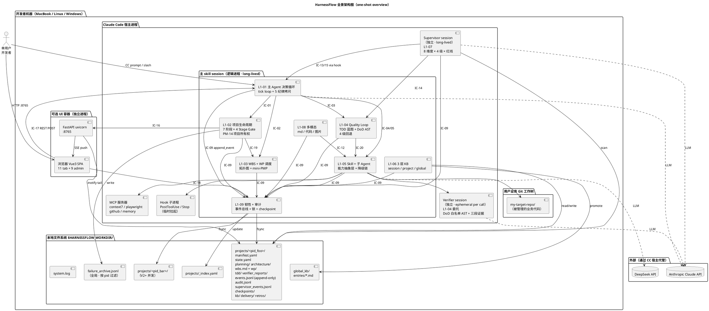

**图例**：
- 蓝色方框 = 主 skill 内部 L1（L1-07 独立为 sidecar、L1-10 独立为 UI 容器，不在本框内）
- 橙色方框 = Sidecar / 子进程 / 外部服务
- 黄色方框 = 本地文件系统
- 粉色方框 = UI 容器
- 紫色方框 = 外部 LLM API（通过 CC 代管）

---

## 附录 B · 与 2-prd scope §8 4 类流图的对应

> 本附录给出本文档技术视图 vs PRD `scope §8.1` 产品视图的**精确对应关系**。对每类流，列 "产品图在哪 → 技术图在哪 → 映射说明"。

### B.1 控制流图对应

| 产品层（scope §8.1.1）| 技术层（本文档）| 映射说明 |
|---|---|---|
| "用户 → L1-10 UI → L1-01 主 loop → 控制指令 → 其他 L1" | §1.3 Level 3 Component + §5.1 技术控制流 sequenceDiagram + §7.1 component diagram | 技术层把"L1-01 到其他 L1 的控制指令"具化为 IC-01/02/03/04/05 的 Skill 调度 / subagent delegation / 文件读写 三类物理载体 |
| "L1-01 是唯一控制源"硬规则 | §5.2 P1/P2 路径 + §3.1 调度树 | 技术层保证主 skill session 是唯一 tick 发起方，Supervisor / Verifier 都是被动响应 |

### B.2 数据流图对应

| 产品层（scope §8.1.2）| 技术层（本文档）| 映射说明 |
|---|---|---|
| "章程 → 4 件套 → TOGAF → WBS → TDD → 代码 → verifier → 交付" | §6.1 数据形态演进 + §4.1 全景树 + §7.3 数据依赖图 | 技术层把每个产品阶段产出具化到具体文件（charter.md / planning/*.md / tdd/dod_expressions.yaml / verifier_reports/*.json）+ schema 校验点 |
| "单向生产-消费链"硬规则 | §6.4 数据单向流（硬约束）| 技术层用 chmod + IC schema direction 字段 + 审计器 三层保证 |
| "4 级回退是唯一例外"规则 | §6.4 最后一段 + §7.3 的 Rollback 节点 | 技术层用 "备份 v1 + 产 v2" 物理实现（不是覆盖）|

### B.3 监督流图对应

| 产品层（scope §8.1.3）| 技术层（本文档）| 映射说明 |
|---|---|---|
| "L1-07 旁路 + 4 通道（A/B/C/D）" | §3.3 Supervisor 节奏 + §5.1 技术控制流 parallel 块 + §5.3 异常控制流 | 技术层把"通道 A/B/C/D" 具化为 PostToolUse hook + stdout 协议 + IC-13/14/15 三种 payload |
| "BLOCK 级权力：仅 L1-07 能硬暂停 L1-01" | §11.3 硬红线 5 类 + §5.3 异常 sequenceDiagram | 技术层用 hook stdout 的特殊 JSON 格式标 BLOCK，主 skill 内部状态机接受硬暂停只接受此协议 |
| "4 级回退路由权力：仅 L1-07 能发 rollback_route" | §7.2 调用关系矩阵中 IC-14 行 | 技术层在 L1-04 L2-06 回退路由接收器里 whitelist "来源 = L1-07 supervisor" |

### B.4 持久化流图对应

| 产品层（scope §8.1.4）| 技术层（本文档）| 映射说明 |
|---|---|---|
| "全部 L1 → IC-09 append_event → events.jsonl" | §4.4 IC-09 物理实现 + §6.2 数据类型对照 events 行 + §9.2 hash 链 | 技术层把"单一写入点"具化为 open+append+fsync+flock 的 POSIX 原子操作 |
| "fsync 每次" + "hash 链" | §4.4 + §9.2 | 用 sha256 + JCS 具化 hash 生成方式 |
| "重启必重放" + "事件总线是重建 task-board 的唯一来源" | §3.7 跨 session bootstrap + §4.3 checkpoint + §12.1 V1 验收 | 技术层通过 L1-09 L2-04 replay_from_event + checkpoint 加速，≤ 5s 完成恢复 |

### B.5 20 IC 契约对应

| 产品层（scope §8.2）| 技术层（本文档）| 映射说明 |
|---|---|---|
| 20 条 IC 的 method name + schema | §9.1 + schemas/ic/IC-XX.schema.json（新增）| 技术层把每条 IC schema 落地到 JSON Schema 文件，增加 `$version` 字段 + ajv 校验 |

### B.6 12 端到端场景对应（L1集成/prd §5）

| 产品层 | 技术层 | 映射说明 |
|---|---|---|
| 场景 1 · 正常 Quality Loop | §5.1 技术控制流 sequenceDiagram | 技术层给出完整的 LLM / tool / fs / subagent 交互顺序 |
| 场景 2 · S1→S7 完整流程 | §6.1 数据形态演进图 | 技术层按文件产出视角刻画整条链 |
| 场景 5 · 硬红线触发 | §5.3 异常控制流 + §11.3 硬红线 | 技术层给出 30.1s 时延分解 + 用户授权协议 |
| 场景 8 · 跨 session 重启恢复 | §3.7 bootstrap + §4.3 checkpoint | 技术层给出 events.jsonl replay + hash 校验机制 |
| 场景 11 · 多项目切换 | §8.3 V2+ 架构 | 技术层给出 Save/Load checkpoint + Supervisor spawn/stop |

---

## 附录 C · 术语速查

| 术语 | 技术层含义 | 产品层对应 |
|---|---|---|
| **主 skill session** | Claude Code 宿主内的 long-lived conversation context，承载 8 个 L1 | L1-01/02/03/04/05/06/08/09 执行器 |
| **Supervisor session** | 独立 CC subagent session（long-lived）| L1-07 执行器 |
| **Verifier session** | 独立 CC subagent session（per-call ephemeral） | L1-04 S5 委托 L1-05 |
| **Hook 子进程** | CC 宿主 fork 的 shell/python 短生命子进程 | PRD `hook` 机制 |
| **tick** | 主 skill 的"一次完整 Claude conversation turn"（含 LLM 调用 + tool 调用） | L1-01 L2-01 Tick 调度器 |
| **events.jsonl** | project 级事件总线文件（append-only + fsync + hash 链） | L1-09 L2-01 事件总线 |
| **audit.jsonl** | project 级决策审计文件（与 events 分离） | L1-09 L2-03 审计器 |
| **supervisor_events.jsonl** | project 级监督事件文件（L1-07 专属） | L1-07 持久化 |
| **checkpoints/** | 周期 task-board snapshot 目录 | L1-09 L2-04 检查点 |
| **IC** | Inter-L1 Contract（跨 L1 接口契约）· 20 条 · JSON Schema 校验 | PRD `scope §8.2` |
| **hash 链** | `event.hash = sha256(prev_hash + canonical_json(body))`，防篡改 | L1-09 硬约束 5 |
| **goal_anchor_hash** | `sha256(canonical(charter.md))`，锁定 S1 章程 | L1-07 "目标保真度" |
| **`harnessFlowProjectId`** | 全局唯一项目标识符（PM-14 根键） | PRD `projectModel` |
| **DoD AST 白名单** | Verifier 允许的表达式 AST 节点白名单 | L1-04 L2-02 |
| **三段证据链** | 存在 + 行为 + 质量 三段证据 | L1-04 L2-05 |
| **fsync** | POSIX 系统调用，强制文件写入落盘 | events.jsonl 每次 append 必 fsync |
| **flock** | POSIX 文件锁（LOCK_EX / LOCK_SH） | §4.3 锁粒度 |
| **SSE** | Server-Sent Events (HTTP 长连接单向推) | L1-10 L2-02 |
| **inotify** | Linux FS 事件通知 API（UI 监听 events.jsonl 更新） | §5.2 P6 UI 推送路径 |
| **Event Sourcing** | 事件溯源架构模式（事件序列即状态真源） | events.jsonl 核心思想（学自 Temporal）|
| **Durable Execution** | 可持久 / 可重放的执行模型 | L1-09 L2-04 跨 session 恢复 |
| **trim_level** | 合规裁剪档（完整 / 精简 / 自定义） | PM-13 |
| **project 主状态** | `{NOT_EXIST, INIT, PLAN, TDD_PLAN, EXEC, CLOSE, CLOSED}` | projectModel §5.1 |
| **tick state** | 主 loop 内部的微观决策状态（细于 project 主状态） | L1-01 L2-03 |
| **C4 模型** | Simon Brown 的 Context / Container / Component / Code 4 层架构表达法 | §1 |
| **DDD bounded context** | Domain-Driven Design 的限界上下文 | 每 L2 视为一个 bounded context（3-solution-design §6.5）|

---

## Sources（开源调研引用 · §14）

- [langchain-ai/langgraph · GitHub](https://github.com/langchain-ai/langgraph)
- [LangGraph: Agent Orchestration Framework for Reliable AI Agents](https://www.langchain.com/langgraph)
- [langchain-ai/langgraph-supervisor-py · GitHub](https://github.com/langchain-ai/langgraph-supervisor-py)
- [langchain-ai/langgraph-swarm-py · GitHub](https://github.com/langchain-ai/langgraph-swarm-py)
- [temporalio/temporal · GitHub](https://github.com/temporalio/temporal)
- [Durable Execution Solutions · Temporal.io](https://temporal.io/)
- [Temporal Architecture · docs](https://github.com/temporalio/temporal/blob/main/docs/architecture/README.md)
- [OpenHands · GitHub](https://github.com/OpenHands/OpenHands)
- [OpenHands Software Agent SDK · arxiv](https://arxiv.org/html/2511.03690v1)
- [crewAIInc/crewAI · GitHub](https://github.com/crewaiinc/crewai)
- [CrewAI vs AutoGen: Which AI Agent Framework Fits in 2026](https://kanerika.com/blogs/crewai-vs-autogen/)
- [LangGraph vs CrewAI vs AutoGen Comparison 2026](https://devops.gheware.com/blog/posts/langgraph-vs-crewai-vs-autogen-comparison-2026.html)

---

*— architecture-overview.md v1.0 ·  L0 顶层 · 10 L1 架构的汇总视图 —*
*— 下游：10 个 L1 architecture.md · 57 个 L2 tech-design.md · 4 个 integration tech-design · 必须对齐本文档 —*
*— 2026-04-20 · HarnessFlow 项目 · 3-Solution Technical Phase 1 产出 —*
