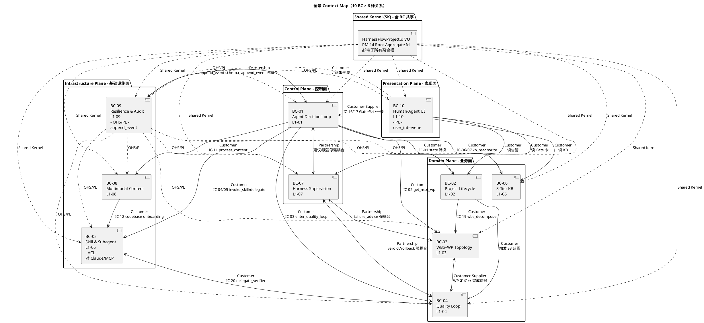
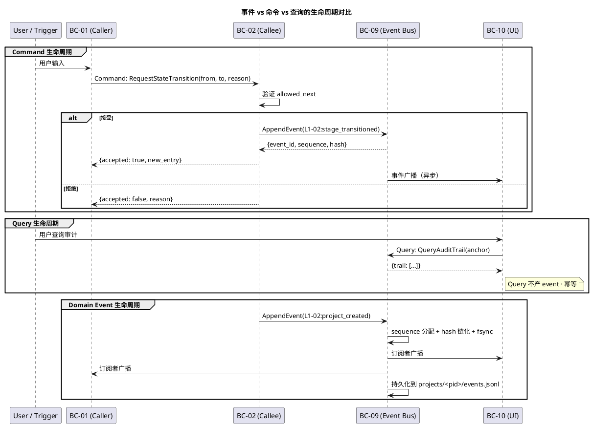
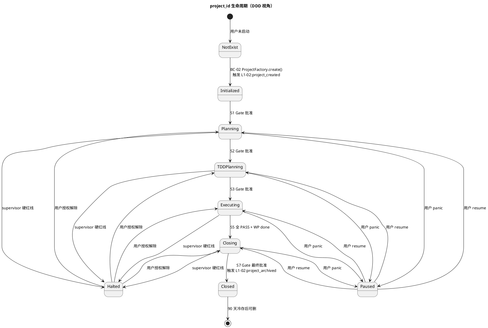

# HarnessFlow · L0 · DDD 限界上下文图（Context Map）

> **定位**：把 2-prd 的 **10 个 L1 能力域**正式映射为 DDD 语义下的 **10 个 Bounded Context（BC）**，以及它们之间的 Context Map（上下游关系）、aggregate/service/entity/value object 分类、domain events/commands/queries 清单、Repository 接口设计。本文档是 3-1 所有下游文档（10 个 L1 architecture.md + 57 个 L2 tech-design.md + 4 integration）的**DDD 公共词汇表 + 契约骨架**。
>
> **严格遵循**：
> - L1 ↔ BC 一一对应（不增不减）
> - 每个 L2 必须标注为 aggregate / domain service / application service / entity / value object 之一（不留"未分类"）
> - 所有 20 条 IC 契约必须在本文档 §5 重新分类为 domain event / command / query 之一
> - PM-14 `harnessFlowProjectId` 作为**跨 BC 共享键**（Shared Kernel 中的唯一值对象），任何 BC 的聚合根都必须包含它
> - 与 2-prd 的映射表放在 §9（单表镜像）

---

## 0. 撰写进度

- [x] §1 DDD 基础概念速查（Bounded Context / Aggregate / Entity / Value Object / Domain Service / Application Service / Domain Event / Repository / Context Map）
- [x] §2 10 个 Bounded Context 地图（每 BC ≥ 200 字定义 + aggregate 列表 + ubiquitous language + 对外事件）
- [x] §3 Context Map 关系图（Mermaid · Partnership / Customer-Supplier / Shared Kernel / ACL / OHS-PL / Published Language 六类）
- [x] §4 10 L1 的 aggregate / service / entity / VO 分类表（每 L1 一节，对标产品 PRD 的 L2 清单）
- [x] §5 Domain Events / Commands / Queries 清单（把 scope §8.2 的 20 IC 重新分类）
- [x] §6 PM-14 harnessFlowProjectId 在 DDD 中的角色（作为 Root Aggregate Id · 所有 BC 的聚合根共享键）
- [x] §7 Repository 模式映射（jsonl / yaml / md 的 Repository 接口设计）
- [x] §8 开源调研（Python DDD 框架 / Event-sourcing / CQRS 至少 3 个 >500★ 项目对比）
- [x] §9 与 2-prd 的映射表
- [x] 附录 A · DDD 术语表
- [x] 附录 B · 每 L1 的 ubiquitous language

---

## 1. DDD 基础概念速查（面向 HarnessFlow）

### 1.1 为什么要做 DDD 映射

HarnessFlow 是一个**大而复杂**的系统（10 个 L1 × 平均 5-7 个 L2 = 57 个子模块），且各 L1 的业务语义差异极大（项目生命周期编排 vs 知识库 vs 监督）。如果不做明确的**限界上下文划分**，会出现：

1. **同名不同义**："状态" 在 L1-01（主 loop）里是 tick 级决策循环状态，在 L1-02（生命周期）里是项目 7 阶段主状态，在 L1-04（Quality Loop）里是 S3/S4/S5 执行状态 —— 三个"状态"若混用，必然互相污染。
2. **同义不同名**："任务" 在 L1-03 叫 WP（Work Package），在 L1-01 叫 decision，在 L1-04 叫 test_run —— 同一概念不同名，导致 IC 字段对接时字段重映射混乱。
3. **跨 BC 直接调用**：没有明确的 BC 边界时，L1-02 会直接调 L1-03 的内部函数，导致耦合爆炸、可测试性崩溃。
4. **聚合边界模糊**：ProjectManifest / WBSTopology / TDDBlueprint 各自应由哪个 BC 持有？若无明确 DDD 分类，会出现多 BC 同时持有同一聚合根，破坏**一致性边界**。

DDD 的 Bounded Context 是**语言 + 模型 + 一致性边界**的三位一体，正好解决以上 4 类问题。

### 1.2 核心概念（HarnessFlow 语境下）

| 概念 | DDD 定义 | HarnessFlow 举例 |
|---|---|---|
| **Bounded Context（限界上下文 / BC）** | 一组概念共享同一套 **ubiquitous language**（通用语言）、同一套模型、同一致性边界的子域 | L1-01 主决策循环 BC / L1-02 项目生命周期 BC / ...（10 个） |
| **Aggregate（聚合）** | 一组紧密关联的 entity + VO 的集合，通过 **Aggregate Root（聚合根）** 对外暴露，聚合内部强一致，聚合间最终一致 | ProjectManifest Aggregate（L1-02）/ WBSTopology Aggregate（L1-03）/ TDDBlueprint Aggregate（L1-04）|
| **Aggregate Root（聚合根）** | 聚合的入口实体，外部只能通过它访问聚合内部；**业务不变式**在它这里保证 | ProjectManifest.root = Project；其持有的 GoalAnchor / Charter 只能经 ProjectManifest 访问 |
| **Entity（实体）** | 有唯一 ID + 生命周期 + 可变状态的对象 | Project / WorkPackage / TestCase / KBEntry / AuditEntry |
| **Value Object（值对象 / VO）** | 无 ID、不可变、用"值"比较相等的对象 | GoalAnchorHash / DoDExpression / EventId / SHA256Hash / Timestamp |
| **Domain Service（领域服务）** | 无状态的领域逻辑函数，**跨多个聚合**的操作放这里 | DoDExpressionCompiler（L1-04 L2-02）/ FiveDisciplineInterrogator（L1-01 L2-02 子组件）|
| **Application Service（应用服务）** | 编排领域对象 + 事务边界 + 对外 API，**不含领域逻辑**本身 | StageGateCoordinator（L1-02 L2-01）/ TickScheduler（L1-01 L2-01）|
| **Domain Event（领域事件）** | "过去发生的、领域内值得关心的"事件，不可变，append-only | `project_created` / `4_pieces_ready` / `verifier_verdict_issued` / `hard_halt_requested` |
| **Command（命令）** | 请求方希望系统执行某个动作，可拒绝，非纯函数 | `request_state_transition` / `enter_quality_loop` / `invoke_skill` |
| **Query（查询）** | 只读检索，幂等，无副作用 | `get_next_wp` / `kb_read` / `query_audit_trail` |
| **Repository（仓储）** | 聚合的持久化访问接口，隔离领域模型与存储实现 | ProjectManifestRepository / WBSTopologyRepository / EventStoreRepository |
| **Factory（工厂）** | 创建复杂聚合的工厂方法，封装构造逻辑 | ProjectFactory.create(goal_input) / WBSFactory.decompose(pieces_4) |
| **Context Map（上下文地图）** | 描述 BC 之间关系的图：Partnership / Customer-Supplier / Shared Kernel / ACL / OHS-PL / Published Language | 本文档 §3 是 HarnessFlow 的 Context Map |

### 1.3 Context Map 的 6 种 BC 间关系

| 关系模式 | 定义 | HarnessFlow 举例 |
|---|---|---|
| **Partnership（伙伴关系）** | 两个 BC 强耦合、必须共同演进、发版同步 | L1-01 主 loop BC ↔ L1-09 事件总线 BC（主 loop 任何决策必经 append_event） |
| **Customer-Supplier（客户-供应者）** | 上游供应者不得破坏下游客户；下游可对上游提需求 | L1-02 生命周期 BC（客户）↔ L1-03 WBS 调度 BC（供应者）— L1-02 依赖 L1-03 产 WBS 拓扑 |
| **Shared Kernel（共享内核）** | 两个 BC 共享一小段代码 / 模型，强约束双方同步改 | 所有 10 BC **共享** `HarnessFlowProjectId` 值对象（PM-14）|
| **Anti-Corruption Layer（防腐层 / ACL）** | 客户 BC 对上游构造一层防腐翻译，避免上游内部模型污染本 BC | L1-05 Skill 调度 BC 对外部 Claude Code Skill 生态构造 ACL（skill 返回的自由文本 / JSON → 本 BC 的结构化回传） |
| **Open Host Service / Published Language（开放主机 / 已发布语言）** | 上游 BC 对外提供一套**标准化协议**，所有下游用同一语言消费 | L1-09 事件总线 BC 对全系统发布 `append_event` schema 作为 Published Language；L1-10 UI BC 对用户发布 11 Tab + IC-17 user_intervene 协议 |
| **Conformist（遵从者）** | 下游无法影响上游 schema，只能完全遵从 | L1-05 对 Claude 原生 MCP / Skill 返回协议是 Conformist（Claude 改协议，本 BC 必须跟） |

### 1.4 HarnessFlow 的 DDD 取舍

| 决策 | 选择 | 理由 |
|---|---|---|
| **是否 Event Sourcing** | **是**（L1-09 事件总线天然就是 event store） | PM-10 事件总线单一事实源 + PM-08 可审计全链追溯 → event sourcing 是必然形态 |
| **是否 CQRS** | **弱 CQRS**（命令侧走 event sourcing，查询侧从 task-board snapshot 读） | 写极慢（jsonl fsync）、读极高频（UI 消费），分开性能合理；但不引入独立 read model store，用 snapshot 文件即可 |
| **聚合粒度** | **细粒度聚合**（一个 L2 = 1~2 个聚合根） | 防聚合过大导致并发写锁冲突；L1-09 的锁管理器（L2-02）按聚合根粒度加锁 |
| **事件命名** | `<BC_prefix>:<verb_past_tense>` | `L1-09:event_appended` / `L1-02:gate_approved` / `L1-04:verdict_issued` |
| **ID 生成** | ULID（时间有序 + 全局唯一） | 既满足 event_id 时序性又满足 project_id 唯一性；具体在 3-1-projectModel/id-generation.md |
| **跨 BC 一致性** | **最终一致（eventual consistency）** | 通过 event bus 异步传播；单 BC 内部聚合用强一致（锁 + fsync） |

---

## 2. 10 个 Bounded Context 地图

### 2.1 BC 清单总表

| BC ID | L1 映射 | BC 名称 | 核心职责 | 关键聚合根 | 对外 Published Language |
|---|---|---|---|---|---|
| **BC-01** | L1-01 | Agent Decision Loop | 持续 tick + 5 纪律拷问 + 决策调度 | TickContext / DecisionRecord | Command: request_state_transition; Event: decision_made |
| **BC-02** | L1-02 | Project Lifecycle Orchestration | 7 阶段 + 4 次 Gate + 4 件套 + PMP 9 计划 + TOGAF ADM | ProjectManifest / StageGate / FourPieces / PMPPlan / TOGAFArtifact | Event: project_created / gate_approved / stage_transitioned |
| **BC-03** | L1-03 | WBS+WP Topology Scheduling | WBS 拆解 + DAG 拓扑 + WP 调度 + 失败回退建议 | WBSTopology / WorkPackage | Query: get_next_wp; Event: wp_completed / wp_failed |
| **BC-04** | L1-04 | Quality Loop | TDD 蓝图 + DoD 编译 + 测试生成 + S4 执行驱动 + S5 TDDExe + 4 级回退 | TDDBlueprint / DoDExpression / TestCase / VerifierReport | Event: blueprint_issued / verdict_issued; Command: enter_quality_loop |
| **BC-05** | L1-05 | Skill & Subagent Orchestration | Skill 注册表 + 意图选择 + 调用 + 子 Agent 委托 + 异步回收 | SkillRegistry / SkillInvocation / SubagentDelegation | Command: invoke_skill / delegate_subagent; Event: skill_invoked / subagent_completed |
| **BC-06** | L1-06 | 3-Tier Knowledge Base | Session / Project / Global 三层 KB + 写读晋升 + 阶段注入 | KBEntry / KBPromotion | Query: kb_read; Command: kb_write_session / kb_promote |
| **BC-07** | L1-07 | Harness Supervision | 8 维度采集 + 4 级判定 + 硬红线 + 软红线 + 死循环 + 回退路由 | SupervisorSnapshot / Verdict / HardRedLineIncident | Event: supervisor_verdict; Command: push_suggestion / push_rollback_route / request_hard_halt |
| **BC-08** | L1-08 | Multimodal Content Processing | md / code / 图片读写 + 路径安全 + 大文件降级 | ContentArtifact / CodeStructureSummary | Command: process_content / delegate_codebase_onboarding |
| **BC-09** | L1-09 | Resilience & Audit | 事件总线 + 锁 + 审计 + 检查点 + 崩溃安全 | EventLog / Checkpoint / Lock / AuditEntry | Command: append_event; Query: replay_from_event / query_audit_trail |
| **BC-10** | L1-10 | Human-Agent Collaboration UI | 11 Tab + Gate 决策卡 + 实时流 + 干预 + KB 浏览 + 裁剪档 + Admin | UISession / GateCard / InterventionIntent | Command: push_stage_gate_card / user_intervene |

### 2.2 BC-01 · Agent Decision Loop（L1-01）

**一句话定位**：整个 HarnessFlow 的"心脏"与"大脑"—— 持续 tick、做决策、派活给别的 BC、所有动作留痕。

**核心职责（≥200 字定义）**：

BC-01 是 HarnessFlow 的**唯一控制源**：它负责接收外部触发（用户输入、事件总线回调、PostToolUse hook、周期定时器）并转成"tick"，每个 tick 做一次完整的"拷问 + 决策 + 派活 + 留痕"循环。tick 的**决策主体**是 L2-02 决策引擎，它要做的事包括：组装上下文、从 L1-06 拉 KB、用 5 纪律（Goal / Planning / Quality / Decomposition / Delivery）挨个拷问、决策树分派。决策结果可能是"转 state"（经 L2-03 状态机编排器 → IC-01 request_state_transition）、"取下一 WP"（IC-02）、"进 Quality Loop"（IC-03）、"调 skill / 委托子 Agent"（IC-04 / IC-05）、"读多模态内容"（IC-11）、"读 KB"（IC-06）等。每个决策都必经 L2-05 决策审计记录器打包为 audit_entry + 通过 IC-09 落事件总线。BC-01 还持有 L2-06 Supervisor 建议接收器，接收 L1-07 推来的 INFO / SUGG / WARN / BLOCK 四档建议并做 4 级路由。本 BC 内部不做任何业务逻辑本身（不写代码、不测代码、不画图），它只**调度 + 决策 + 留痕**。

**关键 Ubiquitous Language**：

| 术语 | 含义 | 使用约束 |
|---|---|---|
| Tick | 一次决策循环单元 | 有 tick_id / ts / trigger / context_hash；**不能**跨 project |
| Trigger | tick 触发源 | 4 种：event / schedule / hook / manual |
| DecisionRecord | 一次 tick 的决策结果结构 | 包含 decision_id / rationale / chosen_action / alternatives / evidence_links |
| FiveDiscipline | 5 纪律拷问 | Goal / Planning / Quality / Decomposition / Delivery |
| DecisionEngine | 决策引擎组件 | 无状态领域服务；输入 TickContext，输出 DecisionRecord |
| SupervisorAdvice | L1-07 推来的 4 档建议 | INFO / SUGG / WARN / BLOCK |
| ControlRoute | 决策分派路由 | 路由到其他 BC 的 command / query |

**主要聚合根**：

| 聚合根 | 内部 entity + VO | 一致性边界 |
|---|---|---|
| **TickContext** | project_id(VO) / trigger(VO) / context_snapshot(entity) / kb_injection(entity) / five_discipline_results(entity[]) | 单 tick 内强一致；tick 结束即持久化为 AuditEntry |
| **DecisionRecord** | decision_id(VO) / tick_id(VO) / rationale(VO) / chosen_action(VO) / alternatives(VO[]) / evidence_links(VO[]) | 一旦生成即不可变（immutable event） |
| **AdviceQueue** | advice_id(VO)[] / level(VO) / dimension(VO) / counter(entity) | 单 project 级单例；4 级计数独立 |

**对外发布 Published Language**：

- Event：`L1-01:tick_started` / `L1-01:decision_made` / `L1-01:tick_completed` / `L1-01:advice_received`
- Command（被动接收）：无（BC-01 不接收外部命令，它是控制源）
- Command（主动发出）：向 BC-02~10 全部 BC 发命令
- Query（被动接收）：仅 L1-07 / L1-10 读 BC-01 的 decision_trail

**跨 BC 关系**：

- 与 BC-09（Resilience & Audit）：**Partnership** —— 任何决策必经 IC-09 append_event，强耦合同步演进
- 与 BC-02/03/04/05/06/08：**Customer** —— BC-01 消费它们的能力
- 与 BC-07（Supervision）：**反向 Customer** —— BC-07 推建议 / 硬红线 / 回退路由给 BC-01
- 与 BC-10（UI）：**Customer-Supplier** —— BC-10 发用户干预命令，BC-01 决策是否接收

### 2.3 BC-02 · Project Lifecycle Orchestration（L1-02）

**一句话定位**：项目的"编剧 + 导演"—— 从 S1 启动到 S7 交付全 7 阶段的剧本编排 + 4 次 Stage Gate 的关卡守护 + PMP+TOGAF 双主干产出物的生产编排。

**核心职责（≥200 字定义）**：

BC-02 是**`harnessFlowProjectId` 的所有权者**（PM-14 明确：生命周期管理权归本 BC），唯一有权创建 / 激活 / 归档 / 删除项目。它编排 7 阶段（S1 启动 → S2 规划 → S3 TDD 规划 → S4 执行 → S5 TDDExe → S6 监控 → S7 收尾）与 4 次 Stage Gate（S1 末 / S2 末 / S3 末 / S7 末）—— 每个 Gate 都会通过 IC-16 推卡片给 BC-10，阻塞主 loop 直至用户决定。S1 阶段由 L2-02 产章程 + 干系人 + 锁 goal_anchor_hash；S2 阶段由 L2-03 产 4 件套（需求 / 目标 / 验收标准 / 质量标准）、L2-04 产 PMP 9 计划（范围 / 进度 / 成本 / 质量 / 资源 / 沟通 / 风险 / 采购 / 干系人）、L2-05 产 TOGAF ADM（A 愿景 / B 业务 / C 数据+应用 / D 技术 + ADR 集）；S7 阶段由 L2-06 产 retro + archive + 交付包 + KB 晋升 + 最终验收。L2-07 产出物模板引擎横切支持 PM-13 三档裁剪（完整 / 精简 / 自定义）。本 BC 不直接做 WBS 拆解（那是 BC-03 的职责），但通过 IC-19 向 BC-03 请求 WBS 拆解。

**关键 Ubiquitous Language**：

| 术语 | 含义 |
|---|---|
| Stage | 7 阶段之一（S1~S7）|
| StageGate | 阶段切换的人类关卡，4 次（S1/S2/S3/S7 末）|
| Charter | S1 章程，含项目愿景 / 干系人 / 目标 / 约束 |
| GoalAnchor | S1 锁定的目标锚点（sha256 不可变）|
| FourPieces | 4 件套（需求 / 目标 / 验收 / 质量）|
| PMPPlan | PMP 9 计划之一 |
| TOGAFArtifact | TOGAF A-D 之一 + ADR 集 |
| DeliveryPackage | S7 交付包 |
| Retrospective | S7 复盘文档 |
| Compliance Profile | PM-13 裁剪档（完整 / 精简 / 自定义）|

**主要聚合根**：

| 聚合根 | 一致性边界 |
|---|---|
| **ProjectManifest** | project_id + goal_anchor_hash + charter + stakeholders + state + created_at + compliance_profile；S1 锁定后不可改 |
| **StageGate** | gate_id + stage_from + stage_to + required_artifacts + user_decision + decided_at；Gate 审批后不可改 |
| **FourPieces** | requirements + goals + acceptance_criteria + quality_standards；4 份文档作为一个聚合，必须齐全才能出 Gate |
| **PMPPlanSet** | 9 份 plan（scope/schedule/cost/quality/resource/communication/risk/procurement/stakeholder_engagement）|
| **TOGAFArtifactSet** | A 愿景 + B 业务 + C 数据 + C 应用 + D 技术 + ADR[]；按 A→B→C→D 依赖链强一致 |
| **DeliveryPackage** | 代码 + 测试 + PMP + TOGAF + 审计链 + retro；S7 一次性打包 |
| **Retrospective** | 11 项复盘 + 产出 KB 候选晋升 |

**对外发布 Published Language**：

- Event：`L1-02:project_created` / `L1-02:stage_transitioned` / `L1-02:gate_approved` / `L1-02:gate_rejected` / `L1-02:four_pieces_ready` / `L1-02:pmp_plans_ready` / `L1-02:togaf_artifacts_ready` / `L1-02:delivery_packaged` / `L1-02:project_archived`
- Command（主动发出）：IC-16 push_stage_gate_card（推 BC-10）/ IC-19 request_wbs_decomposition（推 BC-03）
- Command（被动接收）：IC-01 request_state_transition 来自 BC-01

**跨 BC 关系**：

- 与 BC-01：**Customer-Supplier**（作为供应者提供 state 转换服务，作为客户接收 IC-01 请求）
- 与 BC-03：**Customer-Supplier**（客户，请求 WBS 拆解）
- 与 BC-04：**Customer-Supplier**（客户，接收 S3 TDD 蓝图产出）
- 与 BC-06：**Customer**（S7 时读 Project KB 产 retro）
- 与 BC-09：**Partnership**（Gate / Stage 事件必落事件总线）
- 与 BC-10：**Customer-Supplier**（供应 Gate 卡片，接收用户决策）

### 2.4 BC-03 · WBS+WP Topology Scheduling（L1-03）

**一句话定位**：项目的"甘特图大脑"—— 把 4 件套 + TOGAF 架构拆成可并行执行的 WP 拓扑 + 调度下一 WP + 维护完成率 + 失败时出回退建议。

**核心职责（≥200 字定义）**：

BC-03 在 S2 末接收 BC-02 的 WBS 拆解请求（IC-19），消费 4 件套 + TOGAF A-D，按"业务模块 / 架构边界"做 WBS 层级拆解（项目 → 模块 → WP），每个 WP 装配 4 要素（独立 Goal / DoD 表达式入口 / 依赖清单 / 工时估算）+ 推荐 skill。产出 WBS 拓扑是一个 **DAG**（强校验无环 + 识别关键路径 + 并行度上限 ≤ 2 防止认知爆炸）。在 S4 阶段，本 BC 响应 BC-01 的 `get_next_wp` 查询（IC-02），按拓扑依赖 satisfied + 关键路径优先 + 并行度 ≤ 2 的规则从拓扑中挑 WP 并锁定运行位（加锁通过 IC-L2 委托 BC-09），把 WP 定义交给 BC-04 Quality Loop。订阅 BC-04 的 `wp_completed` / `wp_failed` 事件并在 DAG 上打点 + 维护 4 项指标（完成率 / 剩余工时 / 已完成 WP 清单 / 当前运行 WP 清单）。L2-05 追踪每个 WP 的连续失败次数，≥ 3 次触发 BF-E-08 → 生成结构化回退建议（拆 WP / 改 WBS / 改 AC）推给 BC-01 / BC-07。本 BC 不执行回退动作（由 BC-07 决定路由）。

**关键 Ubiquitous Language**：

| 术语 | 含义 |
|---|---|
| WBS | Work Breakdown Structure 工作分解结构 |
| WorkPackage (WP) | WBS 叶子节点，独立可执行单元 |
| WPTopology | WP DAG 拓扑图 |
| CriticalPath | 关键路径（影响总工期的 WP 链）|
| Parallelism | 当前并行度（≤ 2 硬约束）|
| WPState | ready / running / done / failed / blocked |
| RollbackAdvice | 失败回退建议（不执行）|

**主要聚合根**：

| 聚合根 | 一致性边界 |
|---|---|
| **WBSTopology** | project_id + wp_list[] + dag_edges[] + critical_path + parallelism_limit；DAG 加边 / 删边 / 改节点状态必强一致 |
| **WorkPackage** | wp_id + goal + dod_expression_ref + deps[] + effort_estimate + recommended_skills + current_state + failure_count |

**对外发布 Published Language**：

- Event：`L1-03:wbs_decomposed` / `L1-03:wp_ready_dispatched` / `L1-03:wp_state_changed` / `L1-03:rollback_advice_issued`
- Query：`get_next_wp`（IC-02）
- Command：`request_wbs_decomposition`（IC-19 被动接收）

**跨 BC 关系**：

- 与 BC-02：**Supplier**（被 BC-02 调用 IC-19）
- 与 BC-01：**Supplier**（提供 IC-02 get_next_wp）
- 与 BC-04：**Customer-Supplier**（消费 BC-04 的 wp_completed 事件；供应 WP 定义给 BC-04）
- 与 BC-07：**Partnership**（失败回退建议联动 BC-07 的 4 级路由）
- 与 BC-09：**Partnership**（锁 / 事件必经 BC-09）

### 2.5 BC-04 · Quality Loop（L1-04）

**一句话定位**：项目的"质量守门员"—— S3 做 TDD 规划 + S4 驱动执行 + S5 独立 TDDExe 验证 + 4 级回退路由的质量闭环。

**核心职责（≥200 字定义）**：

BC-04 是 HarnessFlow 质量保证的核心闭环。在 S3 阶段，L2-01 TDD 蓝图生成器读 4 件套 + WBS 产 Master Test Plan（测试金字塔 / 用例矩阵映射 AC / 覆盖率目标 / 测试环境蓝图）；L2-02 DoD 表达式编译器把"验收条件"自然语言转成白名单 AST 可 eval 表达式（禁 arbitrary exec）；L2-03 测试用例生成器按蓝图批量生成测试骨架（单元 / 集成 / E2E），生成即红灯驱动 S4 TDD；L2-04 质量 Gate 编译器产 quality-gates.yaml（覆盖率 / 性能 / 安全扫描 / lint）+ acceptance-checklist.md。S4 阶段由 L2-05 执行驱动器接管当前 WP，驱动 BC-05 调 tdd / prp-implement skill 写代码 → 等测试绿 → 对本 WP 跑 DoD 自检（基于 L2-02 编译的表达式）→ PASS 触发 commit → 推进下一 WP。S5 阶段由 L2-06 Verifier 编排器通过 IC-20 委托 BC-05 起**独立 session 的 verifier 子 Agent** 跑 TDDExe；接收 verifier 返回 → 组装三段证据链（existence / behavior / quality）→ 落盘 `verifier_reports/*.json`。**禁止 verifier 在主 session 跑**（PM-03 子 Agent 独立 session 强约束）。L2-07 偏差判定 + 4 级回退路由器接收 BC-07 基于 verifier_report 的结构化 verdict → 精确路由（轻→S4 / 中→S3 / 重→S2 / 极重→S1），向 BC-07 暴露同级 FAIL 计数（≥3 升级触发 BF-E-10 死循环保护）。

**关键 Ubiquitous Language**：

| 术语 | 含义 |
|---|---|
| TDDBlueprint | S3 产出的 Master Test Plan |
| DoDExpression | 机器可校验的"完成的定义"AST 表达式 |
| TestCase | 测试用例（红灯先行）|
| QualityGate | 质量阈值集（yaml）|
| AcceptanceChecklist | 用户视角的验收勾选清单 |
| VerifierReport | S5 TDDExe 三段证据链 JSON |
| Verdict | PASS / FAIL-L1 轻 / FAIL-L2 中 / FAIL-L3 重 / FAIL-L4 极重 |
| RollbackRoute | 4 级回退路由（→ S4/S3/S2/S1）|
| ThreeEvidenceChain | existence / behavior / quality 三段证据 |

**主要聚合根**：

| 聚合根 | 一致性边界 |
|---|---|
| **TDDBlueprint** | blueprint_id + test_pyramid + ac_matrix + coverage_target + test_env_blueprint |
| **DoDExpressionSet** | wp_id → DoDExpression（AST，只含白名单操作符）|
| **TestSuite** | test_case_id[] + 生成时是"red"状态 |
| **QualityGateConfig** | coverage_threshold + perf_threshold + security_scan + lint_rules |
| **VerifierReport** | report_id + verdict + three_evidence_chain + sourced_from_verifier_subagent |
| **RollbackRouteDecision** | verdict_id → target_stage + reason + level |

**对外发布 Published Language**：

- Event：`L1-04:blueprint_issued` / `L1-04:dod_compiled` / `L1-04:tests_generated` / `L1-04:quality_gate_configured` / `L1-04:wp_executed` / `L1-04:verifier_report_issued` / `L1-04:rollback_route_applied`
- Command：IC-03 enter_quality_loop（被动接收）/ IC-20 delegate_verifier（主动发出）
- Query：被 BC-07 读 verifier_report

**跨 BC 关系**：

- 与 BC-01：**Customer-Supplier**（客户，接收 IC-03；供应者，提供 verdict）
- 与 BC-05：**Customer**（委托子 Agent verifier）
- 与 BC-07：**Partnership**（verdict ↔ rollback_route 强耦合）
- 与 BC-02：**Supplier**（S3 TDD 蓝图是 S2 产出的下游）
- 与 BC-03：**Customer-Supplier**（消费 WP 定义，反馈完成状态）

### 2.6 BC-05 · Skill & Subagent Orchestration（L1-05）

**一句话定位**：项目的"外包经理"—— 维护 skill 注册表 + 选谁 + 怎么调 + 异步回收 + 失败降级的能力调度中枢。

**核心职责（≥200 字定义）**：

BC-05 是 HarnessFlow 对外的**能力抽象层**载体（BF-X-07）。L2-01 Skill 注册表维护"能力点 → skill 候选链"映射 + skill 可用性 / 版本 / 成本 / 历史成功率账本 + 子 Agent 注册表 + 原子工具柜元数据，作为 L2-02 / L2-03 / L2-04 的单一数据源。L2-02 Skill 意图选择器接收"要某能力点 + 约束（成本上限 / 超时 / 质量偏好）"的请求，从 L2-01 取候选 → 按可用性 / 成本 / 历史成功率 / 失败记忆排序 → 产出"首选 + fallback 链"供 L2-03 / L2-04 消费。L2-03 Skill 调用执行器按链执行 skill 调用：记入参 hash / skill 版本 / 结果 / 耗时签名 → 失败时沿 fallback 链前进（2 备选 → 内建逻辑 → 硬暂停）→ 通过 L2-05 做回传 schema 校验；原子工具（Read/Write/Bash/Grep/Glob/WebSearch/WebFetch/Playwright/MCP）也走本 L2 签名登记。L2-04 子 Agent 委托器按 IC-05 / IC-12 / IC-20 发起独立 session 委托：包只读 context 副本 + 明确 goal + 工具白名单 → 启动 → 监控 → 超时 kill + 回收 → BF-E-09 降级。L2-05 异步结果回收器是所有异步返回（skill 结构化回传 / 子 Agent 报告 / 长时工具结果）的统一回收点：schema 校验 → 校验失败算失败触发 fallback → 通过转发给原始调用方 + 落审计事件。本 BC 对外部 Claude Code Skill / MCP 生态构造 **ACL**（防腐层），避免外部协议污染内部模型。

**关键 Ubiquitous Language**：

| 术语 | 含义 |
|---|---|
| CapabilityPoint | 能力点（抽象需求，如"写代码"/"写测试"/"做验证"）|
| Skill | Claude Code Skill（具体实现，如 tdd / prp-implement / verifier）|
| Subagent | 独立 session 子 Agent |
| FallbackChain | skill 候选链（首选 + 备选 + 内建）|
| SkillInvocation | 一次 skill 调用记录（含签名）|
| SubagentDelegation | 一次子 Agent 委托记录 |
| AsyncReturn | 异步回传（skill / subagent / tool）|
| SchemaValidation | 结构化回传的 schema 校验 |
| ToolRegistry | 原子工具柜（Read/Write/Bash/Grep/Glob/...）|

**主要聚合根**：

| 聚合根 | 一致性边界 |
|---|---|
| **SkillRegistry** | capability_point → skill_candidates[] + availability + version + cost + success_rate；低频更新高频读 |
| **SkillInvocation** | invocation_id + capability_point + selected_skill + params_hash + result + duration_ms + signature |
| **SubagentDelegation** | delegation_id + subagent_name + context_copy_hash + goal + tools_whitelist + timeout + lifecycle_state |
| **SchemaValidationResult** | validation_id + target_schema + validation_passed + error_details（值对象）|

**对外发布 Published Language**：

- Event：`L1-05:skill_invoked` / `L1-05:skill_returned` / `L1-05:skill_fallback_triggered` / `L1-05:subagent_started` / `L1-05:subagent_completed` / `L1-05:subagent_crashed` / `L1-05:async_result_validated` / `L1-05:async_result_rejected`
- Command：IC-04 invoke_skill / IC-05 delegate_subagent / IC-12 delegate_codebase_onboarding / IC-20 delegate_verifier（均被动接收）

**跨 BC 关系**：

- 与 BC-01：**Supplier**（响应 IC-04 / IC-05）
- 与 BC-04：**Supplier**（响应 IC-20 delegate_verifier）
- 与 BC-08：**Supplier**（响应 IC-12 delegate_codebase_onboarding）
- 与外部 Claude Code Skill / MCP：**Conformist + ACL**（被动遵从协议，但本 BC 侧做 ACL 翻译）

### 2.7 BC-06 · 3-Tier Knowledge Base（L1-06）

**一句话定位**：项目的"记忆宫殿"—— Session / Project / Global 三层物理隔离 + 阶段注入 + 晋升仪式的 KB 系统。

**核心职责（≥200 字定义）**：

BC-06 维护 Session / Project / Global **三层物理隔离**的知识库（PM-06）。L2-01 3 层分层管理器维护 scope 优先级规则（Global < Project < Session）+ Session 7 天过期 + 跨项目只走 Global 的隔离守则。L2-02 KB 读器响应 `kb_read` 请求，按 scope 优先级合并 + kind 过滤 + `applicable_context` 匹配 + 返回条目集合。L2-03 观察累积器接受 BC-01 / BC-04 / BC-07 的观察信号，写入 Session KB 并自动累计 `observed_count` / `first_observed_at` / `last_observed_at`，命中同类条目时合并而非新建。L2-04 KB 晋升仪式执行器做 Session → Project 自动晋升（`observed_count ≥ 2`）或用户批准晋升；Project → Global **必须用户显式批准** 或 `observed_count ≥ 3`；S7 收尾时批量走仪式。L2-05 检索 + Rerank 上下文相关性排序器在 L2-02 召回候选条目后按「当前阶段 + 任务类型 + 技术栈 + observed_count + last_observed_at」多信号 rerank，截断 top_k 返回；阶段切换时按注入策略表主动推送。本 BC 核心约束：**Global KB 脱离 project 归属**（晋升后它成为"无主资产"），但 Project / Session KB **必带 project_id**（PM-14）。

**关键 Ubiquitous Language**：

| 术语 | 含义 |
|---|---|
| KBEntry | 知识库条目 |
| Scope | 层级（session / project / global）|
| Kind | 类型（trap / pattern / anti_pattern / decision / fact / ...）|
| ApplicableContext | 条目生效条件（阶段 / 任务类型 / 技术栈）|
| ObservationAccumulation | 同类条目观察累积 |
| PromotionCeremony | 晋升仪式 |
| StageInjection | 阶段注入策略 |

**主要聚合根**：

| 聚合根 | 一致性边界 |
|---|---|
| **KBEntry** | id + scope + kind + title + content + applicable_context + observed_count + first_observed_at + last_observed_at + source_links；同 id 合并而非新建 |
| **KBPromotion** | promotion_id + entry_id + from_scope + to_scope + approval_type + approver + timestamp |
| **StageInjectionStrategy** | stage → [kind + scope]；低频更新 |

**对外发布 Published Language**：

- Event：`L1-06:kb_entry_written` / `L1-06:kb_entry_promoted` / `L1-06:kb_injection_triggered`
- Query：IC-06 kb_read / IC-20 retrieve_kb
- Command：IC-07 kb_write_session / IC-08 kb_promote

**跨 BC 关系**：

- 与 BC-01 / BC-04 / BC-07：**Supplier**（所有 BC 可读 / 写 session 层）
- 与 BC-02：**Supplier**（S3 TDD 蓝图 + S7 retro 产出时做晋升）
- 与 BC-10：**Supplier**（KB 浏览器读 / 用户发起晋升）
- 与 BC-09：**Partnership**（KB 写 / 晋升事件必落）

### 2.8 BC-07 · Harness Supervision（L1-07）

**一句话定位**：项目的"旁路监察官"—— 旁路独立 session 只读观察 + 8 维度计算 + 4 级判定 + 硬红线 + 软红线 + 死循环 + 4 级回退路由。

**核心职责（≥200 字定义）**：

BC-07 是一个**独立 session 的副 Agent**（PM-02 主-副 Agent 协作），对 BC-01 / BC-09 事件流只读观察，本身**不直接改业务状态**。L2-01 8 维度监督状态采集器实时读 task-board / 事件流 / verifier_report / WP 完成率 / skill 调用密度 / 子 Agent 失败率 / 上下文占用 / 预算消耗等原始信号，按 30s tick + PostToolUse + state 转换三重触发，产 8 维度指标快照（目标保真度 / 计划对齐 / 真完成质量 / 红线安全 / 进度节奏 / 成本预算 / 重试 Loop / 用户协作）。L2-02 4 级偏差判定器对快照做阈值对比 + 规则判定 → 产 4 档 verdict（INFO / SUGGESTION / WARN / BLOCK），每档附自然语言消息与动作建议。L2-03 硬红线拦截器对 5 类硬红线（DRIFT_CRITICAL goal_anchor 漂移 / IRREVERSIBLE_HALT 不可逆操作 / 预算超 200% / 死循环升级极重 / 极重度 FAIL 回 S1）执行即时硬暂停 BC-01 + 告警 BC-10 + 必须用户文字授权才解除。L2-04 Supervisor 副 Agent 事件发送器是独立 session 的副 Agent 载体，通过 IC-13 push_suggestion 推 BC-01 / IC-14 push_rollback_route 推 BC-04 / IC-15 request_hard_halt 推 BC-01。L2-05 Soft-drift 模式识别器对 8 类软红线自治修复（不打扰用户）。L2-06 死循环升级器 + Quality Loop 回退路由控制器：死循环保护（同级 FAIL ≥3 次自动升级）+ 4 级回退路由（轻→S4 / 中→S3 / 重→S2 / 极重→S1）。本 BC 与 BC-01 的关系：**只读 + 建议通道**—— 没有权力改状态，但有权 BLOCK 级硬暂停。

**关键 Ubiquitous Language**：

| 术语 | 含义 |
|---|---|
| SupervisorSnapshot | 8 维度指标快照 |
| EightDimensions | 目标保真 / 计划对齐 / 真完成 / 红线安全 / 进度节奏 / 成本 / 重试 / 协作 |
| Verdict | INFO / SUGG / WARN / BLOCK |
| HardRedLine | 5 类硬红线（DRIFT_CRITICAL / IRREVERSIBLE_HALT / 预算 200% / 死循环极重 / 极重度 FAIL）|
| SoftDrift | 8 类软红线自治修复 |
| DeadLoopEscalation | 同级 FAIL ≥3 次自动升级 |
| QualityLoopRollbackRoute | 4 级回退路由（verdict → target_stage）|
| SupervisorSession | 独立 session 副 Agent |

**主要聚合根**：

| 聚合根 | 一致性边界 |
|---|---|
| **SupervisorSnapshot** | snapshot_id + 8_dimensions + captured_at + project_id；每 30s / hook / state 切换产一张 |
| **Verdict** | verdict_id + dimension + level + message + suggested_action + snapshot_ref |
| **HardRedLineIncident** | incident_id + red_line_id + triggered_at + user_authorization_status + resume_at |
| **SoftDriftPattern** | pattern_id + drift_type + auto_fix_action + fix_result |
| **DeadLoopCounter** | counter_id + level + count + target_upgrade_level |
| **RollbackRouteDecision** | route_id + verdict_ref + target_stage + reason |

**对外发布 Published Language**：

- Event：`L1-07:snapshot_captured` / `L1-07:verdict_issued` / `L1-07:hard_red_line_triggered` / `L1-07:soft_drift_fixed` / `L1-07:dead_loop_escalated` / `L1-07:rollback_route_issued`
- Command：IC-13 push_suggestion / IC-14 push_rollback_route / IC-15 request_hard_halt（均主动发出）
- Query：读 BC-09 事件流、BC-04 verifier_report

**跨 BC 关系**：

- 与 BC-01：**Partnership**（建议 / 硬暂停强耦合）
- 与 BC-04：**Partnership**（回退路由强耦合）
- 与 BC-09：**Customer**（只读事件流）
- 与 BC-10：**Supplier**（推告警 / UI 消费）

### 2.9 BC-08 · Multimodal Content Processing（L1-08）

**一句话定位**：项目的"文档 + 代码 + 图片读写器"—— md/code/图片的多模态 IO + 路径安全 + 大文件降级。

**核心职责（≥200 字定义）**：

BC-08 承担 HarnessFlow 对**三类内容**的多模态处理：md 文档 / 源代码 / 图片。L2-01 文档 I/O 编排器管 md 的 Read / Write / Edit + frontmatter 解析 + headings 结构化 + > 2000 行分页 + 只写 `docs/` / `tests/` / `harnessFlow/` 白名单路径。L2-02 代码结构理解编排器用 Glob 扫目录 + Read 入口文件 + Grep 关键模式 → 产"语言 + 框架 + 入口 + 依赖图 + 关键模式"结构摘要 + > 10 万行自动委托 `codebase-onboarding`（IC-12 推 BC-05）+ 结果必入 Project KB。L2-03 图片视觉理解编排器用 Read 加载图片 → Claude 多模态视觉理解 → 按图片类型产结构化描述（架构图 / UI mock / 截图）+ 图片不上传外部 + 禁止原始二进制外抛。L2-04 路径安全与降级编排器是横切的：路径白名单校验 + 文件大小 / 行数阈值判定 + 不可读告警（权限 / 不存在 / 二进制未支持）+ 降级路由（直读 / 分页 / 委托子 Agent / 拒绝）+ 每次读写必走审计（IC-09）。本 BC 对外只暴露"结构化描述"而非原始内容，保证主 loop context 不被大文件污染。

**关键 Ubiquitous Language**：

| 术语 | 含义 |
|---|---|
| ContentArtifact | 内容制品（md / code / image）|
| CodeStructureSummary | 代码结构摘要（language / framework / entry / deps / patterns）|
| VisualDescription | 图片结构化描述 |
| PathWhitelist | 白名单路径（docs/ tests/ harnessFlow/）|
| DegradationRoute | 降级路由（direct_read / pagination / delegate_subagent / reject）|

**主要聚合根**：

| 聚合根 | 一致性边界 |
|---|---|
| **ContentArtifact** | artifact_id + type + path + size_bytes + lines + hash |
| **CodeStructureSummary** | summary_id + repo_path + language + framework + entry + deps_graph + patterns[] |
| **VisualDescription** | description_id + image_path + image_type（arch/ui_mock/screenshot）+ structured_text |

**对外发布 Published Language**：

- Event：`L1-08:content_read` / `L1-08:content_written` / `L1-08:code_summarized` / `L1-08:image_described` / `L1-08:path_rejected` / `L1-08:degradation_triggered`
- Command：IC-11 process_content（被动接收）/ IC-12 delegate_codebase_onboarding（主动发出 → BC-05）

**跨 BC 关系**：

- 与 BC-01：**Supplier**（响应 IC-11）
- 与 BC-05：**Customer**（委托 codebase-onboarding）
- 与 BC-06：**Supplier**（代码结构摘要入 Project KB）
- 与 BC-09：**Partnership**（读写必审计）

### 2.10 BC-09 · Resilience & Audit（L1-09）

**一句话定位**：项目的"黑匣子"—— 事件总线单一事实源 + 锁 + 审计 + 检查点 + 崩溃安全。

**核心职责（≥200 字定义）**：

BC-09 是 HarnessFlow 的**单一事实源**（Published Language 发布者）。L2-01 事件总线核心承担统一入口接收全 BC 的 `append_event` → append-only 追加 jsonl → 序列号 + hash 链化 → 向订阅者异步广播。L2-02 锁管理器串行化 task-board 写 / state 切换 / snapshot 触发等高冲突资源，给出 acquire/release 原语 + 死锁识别 + 等锁超时降级。L2-03 审计记录器 + 追溯查询记录所有决策 / IC 调用 / 监督事件 / 用户授权到审计面；按代码行 / 产出物 / 决策 id 反查完整链（决策 + 事件 + 监督点评 + 用户批复）。L2-04 检查点与恢复器（`system_resumed` 广播）：周期 + 关键事件后 snapshot；SIGINT/SIGTERM 干净 flush；重启时扫未 CLOSED 项目 → 读 checkpoint → 回放事件 → 重建 task-board → 广播 `system_resumed`。L2-05 崩溃安全层：文件写级别原子性（临时文件 + rename + fsync 语义）；事件/checkpoint/task-board 完整性校验；损坏时降级路径（跳损坏块 / 回放重建 / 告警用户）。本 BC 与全系统其他 BC 的关系是 **Partnership**（任何决策、状态切换、监督事件、用户授权都必经本 BC 的 `append_event`），它是 **Published Language** 的发布者（`append_event schema` 是全系统共享的发布语言）。

**关键 Ubiquitous Language**：

| 术语 | 含义 |
|---|---|
| EventLog | 事件日志（append-only jsonl）|
| EventEntry | 单条事件（ts + type + actor + content + sequence + hash）|
| Lock | 互斥锁（project / wp / state 三级粒度）|
| Checkpoint | 快照（task-board state）|
| AuditTrail | 审计追溯链 |
| HashChain | 事件 hash 链（防篡改）|
| Replay | 事件回放（重建 task-board）|
| AtomicWrite | 原子写（tmp + rename + fsync）|

**主要聚合根**：

| 聚合根 | 一致性边界 |
|---|---|
| **EventLog** | project_id + sequence + events[] + hash_chain；append-only，任何追加必 fsync |
| **Lock** | lock_id + resource + holder + acquired_at + ttl |
| **Checkpoint** | checkpoint_id + project_id + snapshot_ref + last_event_sequence + checksum |
| **AuditEntry** | audit_id + anchor_type + anchor_id + decision_ref + event_refs + supervisor_comments + user_authorizations |

**对外发布 Published Language**：

- Event：`L1-09:event_appended` / `L1-09:snapshot_created` / `L1-09:system_resumed` / `L1-09:lock_acquired` / `L1-09:lock_released`
- Command：IC-09 append_event（被动接收）
- Query：IC-10 replay_from_event / IC-18 query_audit_trail

**跨 BC 关系**：

- 与**所有 BC**：**Partnership / OHS-PL**（发布 append_event schema 作为全系统 PL）

### 2.11 BC-10 · Human-Agent Collaboration UI（L1-10）

**一句话定位**：项目的"总控台"—— 11 Tab + Gate 决策卡 + 实时流 + 干预入口 + KB 浏览器 + 裁剪档 + Admin。

**核心职责（≥200 字定义）**：

BC-10 是 HarnessFlow 唯一的人机交互界面（localhost Web）。L2-01 11 主 Tab 主框架 + 路由守则维护 11 主 tab（项目总览 / Gate / 产出物 / 进度 / WBS / 决策流 / 质量 / KB / Retro / 事件 / Admin）+ tab 间导航 + 单项目单 session 边界守则 + tab 级权限限制。L2-02 Gate 决策卡片接 IC-16 Gate 卡片推送 → 渲染 → 收集用户 Go/No-Go/Request-change → IC-17 回 BC-01 → 期间硬阻断主 loop 推进。L2-03 进度实时流订阅 BC-09 事件总线 → type 前缀过滤 + 时间轴渲染 + 渐进加载 + 跨 tab 共享数据 + 消费延迟 ≤ 2s。L2-04 用户干预入口全局暴露 panic / pause / resume / change_request / 澄清 / 授权动作 → IC-17 推 BC-01 → 全程审计留痕。L2-05 KB 浏览器 + 候选晋升 UI 浏览 3 层 KB + kind / scope / applicable_context 过滤 + observed_count 累积 + 用户显式晋升（旁路阈值）。L2-06 裁剪档配置 UI 在 S1/S2 前让用户显式选择 PM-13 完整 / 精简 / 自定义档 + 校验不得违反 L1 硬约束。L2-07 Admin 子管理模块承载后台 9 模块（执行引擎 / 执行实例 / KB / Supervisor / Verifier / Subagents / Skills / 统计 / 诊断）+ 红线告警角 + 审计追溯查询面板 + 多模态内容展示。本 BC 对用户发布 IC-17 user_intervene 协议作为 **Published Language**。

**关键 Ubiquitous Language**：

| 术语 | 含义 |
|---|---|
| Tab | 11 主 Tab 之一 |
| GateCard | Stage Gate 决策卡片 |
| EventStream | 实时事件流 |
| Intervention | 用户干预动作（panic/pause/resume/...）|
| ComplianceProfileSelector | 裁剪档选择器 |
| AdminModule | 后台 9 模块之一 |

**主要聚合根**：

| 聚合根 | 一致性边界 |
|---|---|
| **UISession** | ui_session_id + active_project_id + active_tab + user_preferences |
| **GateCard** | card_id + gate_id + artifacts_bundle + required_decisions + user_decision |
| **InterventionIntent** | intent_id + type + payload + submitted_at + accepted_at |

**对外发布 Published Language**：

- Event（消费）：订阅全 BC 事件流
- Command：IC-17 user_intervene（主动发出）/ IC-16 push_stage_gate_card（被动接收）
- Query：IC-18 query_audit_trail

**跨 BC 关系**：

- 与 BC-01：**Customer-Supplier**（推干预 / 接 Gate 卡）
- 与 BC-02：**Customer**（展示 Gate 卡）
- 与 BC-06：**Customer**（KB 浏览）
- 与 BC-07：**Customer**（告警展示）
- 与 BC-09：**Customer**（事件流消费）

---

## 3. Context Map 关系图（Mermaid）

### 3.1 全景 Context Map（10 BC × 6 种关系）



### 3.2 Partnership 关系清单（强耦合 · 发版同步）

| BC 对 | 关系原因 | 耦合强度 | 破坏成本 |
|---|---|---|---|
| **BC-01 ↔ BC-09** | 主 loop 任何决策必经 append_event；无 BC-09 主 loop 无法运转 | 极强 | 整个系统停摆 |
| **BC-01 ↔ BC-07** | supervisor 的 BLOCK 级硬暂停权只对 BC-01 生效；双方状态互相感知 | 强 | 失去监督 / 死循环保护 |
| **BC-04 ↔ BC-07** | verdict ↔ rollback_route 逻辑耦合；verdict 分级规则 BC-04 产 BC-07 判 | 强 | 质量闭环破裂 |
| **BC-03 ↔ BC-07** | WP 失败 ≥ 3 次触发 L1-07 死循环保护；计数规则耦合 | 强 | 死循环保护失效 |

### 3.3 Shared Kernel 说明（PM-14 锚点）

**唯一的 Shared Kernel**：`HarnessFlowProjectId` 值对象（VO）。

**双方同步约束**：

- 所有 10 个 BC 的聚合根**必须**包含 `project_id: HarnessFlowProjectId` 字段
- 该 VO 的定义（schema / 生成规则 / 校验规则）放在 `docs/3-1-Solution-Technical/projectModel/id-generation.md`（技术方案层）
- 任何 BC 修改该 VO 的 schema → **全 10 BC 同步发版**
- 该 VO 是**不可变**的，一经创建不可改

**为什么只有这一个 Shared Kernel**：

- PM-14 已明确 project_id 是**所有数据归属根键**，横跨所有 BC
- 若不作为 Shared Kernel 而是各 BC 独立 VO，则跨 BC 事件 / 命令字段对接时需要翻译层，违反 DDD"模型完整性"原则
- HarnessFlowProjectId 的生成权归 BC-02（PM-14 明确所有权者），但它**被发布**为全 BC 可用的 VO，双方必须强同步

### 3.4 Anti-Corruption Layer（防腐层）详解

| BC | 对哪个外部系统做 ACL | ACL 责任 |
|---|---|---|
| **BC-05 Skill & Subagent** | Claude Code Skill / MCP / 原子工具 | 把外部 skill 返回的自由文本 / JSON 翻译成本 BC 的 `SkillInvocation.result`；把 MCP 工具的各异协议翻译成统一 `ToolInvocation` VO |
| **BC-08 Multimodal Content** | 文件系统 + Claude Vision API | 把 os.path / os.stat 等外部系统概念封装为 `ContentArtifact`；把 Vision API 返回的描述翻译为 `VisualDescription` VO |
| **BC-09 Resilience & Audit** | 文件系统（fsync / rename）+ OS signals（SIGINT/SIGTERM）| 把原子写的 OS 级细节封装为 `AtomicWrite` 领域服务 |
| **BC-10 Human-Agent UI** | 浏览器 HTTP / WebSocket | 把 HTTP 请求翻译为 `InterventionIntent`；把 WebSocket 订阅翻译为 `EventStreamSubscription` |

### 3.5 Open Host Service / Published Language（OHS/PL）清单

| 发布者 | PL 名称 | 消费者 | PL 格式 |
|---|---|---|---|
| **BC-09** | `append_event schema` | 全 10 BC | JSON schema `{ts, type, actor, state, content, links, project_id, sequence, hash}` |
| **BC-09** | `query_audit_trail protocol` | BC-10 | Query by anchor_type（file_path / artifact_id / decision_id）|
| **BC-10** | `user_intervene protocol` | BC-01 | Command schema `{type, payload, project_id, submitted_at}` |
| **BC-04** | `verifier_report JSON` | BC-07 / BC-10 / 归档 | 三段证据链 JSON（存 verifier_reports/*.json）|
| **BC-07** | `supervisor_event JSONL` | BC-01 / BC-04 / BC-10 | 4 档 verdict + 8 维度 |
| **BC-02** | `stage_gate_card protocol` | BC-10 | `{gate_id, stage_from, stage_to, artifacts_bundle, required_decisions}` |

### 3.6 Conformist（遵从者）关系

| 下游 BC | 遵从者对象 | 遵从原因 |
|---|---|---|
| **BC-05** | Claude Code Skill / MCP 协议 | 外部协议由 Anthropic 定义，本 BC 不能反向影响；只能用 ACL 翻译成本 BC 模型 |
| **BC-08** | 文件系统 API / Claude Vision API | 同上 |
| **BC-10** | 浏览器 HTTP / WebSocket 标准 | 同上 |

---

## 4. 10 L1 的 aggregate / service / entity / VO 分类表

### 4.0 分类说明

每个 L2 必须映射到以下 DDD 原语之一（或组合）：

- **Aggregate Root**：有状态、有一致性边界的聚合入口实体
- **Entity**：聚合内的有 ID 实体
- **Value Object (VO)**：聚合内的无 ID 不可变值对象
- **Domain Service**：无状态的领域逻辑函数，跨聚合操作
- **Application Service**：编排领域对象 + 事务边界 + 对外 API
- **Repository**：聚合的持久化访问接口
- **Factory**：聚合创建工厂
- **Domain Event**：领域事件（不可变）

### 4.1 BC-01 · L1-01 主决策循环（6 L2）

| L2 ID | L2 名称 | DDD 分类 | 核心对象 / 操作 |
|---|---|---|---|
| **L1-01 L2-01** | Tick 调度器 | **Application Service** + **Aggregate Root**: TickContext | 持有 TickContext 聚合根；4 触发源接入 + 优先级仲裁 + 去抖 + 健康心跳 |
| **L1-01 L2-02** | 决策引擎 | **Domain Service**（无状态 · 输入 TickContext 输出 DecisionRecord）+ 子组件 **Domain Service**: FiveDisciplineInterrogator | 5 纪律拷问 + 决策树分派；纯函数，幂等 |
| **L1-01 L2-03** | 状态机编排器 | **Domain Service** + **VO**: StateTransition | allowed_next 查询 + state 转换 + hook 清单（VO）|
| **L1-01 L2-04** | 任务链执行器 | **Aggregate Root**: TaskChain + **Entity**: ChainStep + **VO**: MiniStateMachine | 多步 chain 管理 + mini state machine + 步完成回调 |
| **L1-01 L2-05** | 决策审计记录器 | **Domain Service** + **Repository**: AuditEntryRepository（委托 BC-09）+ **Factory**: AuditEntryFactory | 决策留痕打包 + 证据链组装 |
| **L1-01 L2-06** | Supervisor 建议接收器 | **Aggregate Root**: AdviceQueue + **Entity**: AdviceCounter | 4 级路由分派 + 建议队列持久化 + 4 级计数 |

### 4.2 BC-02 · L1-02 项目生命周期编排（7 L2）

| L2 ID | L2 名称 | DDD 分类 | 核心对象 / 操作 |
|---|---|---|---|
| **L1-02 L2-01** | Stage Gate 控制器 | **Application Service** + **Aggregate Root**: StageGate | 4 次 Gate 推卡片 + 阻塞放行 + Go/No-Go 路由 |
| **L1-02 L2-02** | 启动阶段产出器（S1） | **Domain Service** + **Factory**: ProjectFactory + **Aggregate Root**: ProjectManifest | **project_id 创建点**；章程 + 干系人 + goal_anchor sha256 锁定 |
| **L1-02 L2-03** | 4 件套生产器（S2） | **Domain Service** + **Aggregate Root**: FourPieces | 需求 / 目标 / 验收 / 质量 4 份文档串行生成 |
| **L1-02 L2-04** | PMP 9 计划生产器（S2） | **Domain Service** + **Aggregate Root**: PMPPlanSet + **Entity**: PMPPlan × 9 | 9 份计划并行生成 |
| **L1-02 L2-05** | TOGAF ADM 架构生产器（S2） | **Domain Service** + **Aggregate Root**: TOGAFArtifactSet + **Entity**: TOGAFArtifact（A/B/C 数据/C 应用/D）+ **Entity**: ADR | A→B→C→D 顺序生成 |
| **L1-02 L2-06** | 收尾阶段执行器（S7） | **Application Service** + **Aggregate Root**: DeliveryPackage + **Aggregate Root**: Retrospective | **project 归档点**；retro + archive + KB 晋升 + 交付包 |
| **L1-02 L2-07** | 产出物模板引擎 | **Domain Service** + **VO**: ComplianceProfile + **VO**: TemplateParameters | PM-13 三档裁剪 + 模板参数化 + 版本管理 |

### 4.3 BC-03 · L1-03 WBS+WP 拓扑调度（5 L2）

| L2 ID | L2 名称 | DDD 分类 | 核心对象 / 操作 |
|---|---|---|---|
| **L1-03 L2-01** | WBS 拆解器 | **Domain Service** + **Factory**: WBSFactory | 消费 4 件套 + TOGAF → 产 WBS 拓扑 |
| **L1-03 L2-02** | 拓扑图管理器 | **Aggregate Root**: WBSTopology + **Entity**: WorkPackage + **VO**: DAGEdge / CriticalPath | DAG 强校验无环 + 关键路径识别 + 并行度 ≤ 2 |
| **L1-03 L2-03** | WP 调度器 | **Application Service**（编排拓扑管理器 + 锁）| 响应 IC-02 + 加锁运行位 + 传 WP 给 BC-04 |
| **L1-03 L2-04** | WP 完成度追踪器 | **Domain Service** + **VO**: ProgressMetrics（completion_rate / remaining_effort / done_wps / running_wps）| 订阅 wp_completed 事件 + 打点 |
| **L1-03 L2-05** | 失败回退协调器 | **Domain Service** + **Entity**: FailureCounter + **VO**: RollbackAdvice | 同一 WP 连续失败 ≥ 3 次 → 结构化建议 |

### 4.4 BC-04 · L1-04 Quality Loop（7 L2）

| L2 ID | L2 名称 | DDD 分类 | 核心对象 / 操作 |
|---|---|---|---|
| **L1-04 L2-01** | TDD 蓝图生成器 | **Domain Service** + **Factory**: TDDBlueprintFactory + **Aggregate Root**: TDDBlueprint | 消费 4 件套 + WBS → 产 Master Test Plan |
| **L1-04 L2-02** | DoD 表达式编译器 | **Domain Service** + **VO**: DoDExpression（AST）+ **VO**: WhitelistASTRule | 自然语言 → 白名单 AST eval；禁 arbitrary exec |
| **L1-04 L2-03** | 测试用例生成器 | **Domain Service** + **Aggregate Root**: TestSuite + **Entity**: TestCase | 生成即红灯；驱动 S4 TDD |
| **L1-04 L2-04** | 质量 Gate 编译器 + 验收 Checklist | **Domain Service** + **Aggregate Root**: QualityGateConfig + **Aggregate Root**: AcceptanceChecklist | quality-gates.yaml + acceptance-checklist.md |
| **L1-04 L2-05** | S4 执行驱动器 | **Application Service**（编排 BC-05 调 skill + DoD 自检 + commit）| WP 粒度从"空"到 commit |
| **L1-04 L2-06** | S5 TDDExe Verifier 编排器 | **Application Service** + **Aggregate Root**: VerifierReport + **VO**: ThreeEvidenceChain | IC-20 委托 verifier 子 Agent + 组装三段证据链 |
| **L1-04 L2-07** | 偏差判定 + 4 级回退路由器 | **Domain Service** + **VO**: Verdict + **VO**: RollbackRoute + **Entity**: SameLevelFailCounter | verdict → target_stage 精确映射；≥ 3 升级 |

### 4.5 BC-05 · L1-05 Skill & Subagent 调度（5 L2）

| L2 ID | L2 名称 | DDD 分类 | 核心对象 / 操作 |
|---|---|---|---|
| **L1-05 L2-01** | Skill 注册表 | **Aggregate Root**: SkillRegistry + **Entity**: SkillCandidate + **VO**: AvailabilityRecord / SuccessRateRecord | 能力点 → candidates 映射 + 版本 / 成本 / 成功率账本 |
| **L1-05 L2-02** | Skill 意图选择器 | **Domain Service**（无状态）| 从 L2-01 取候选 → 可用性 / 成本 / 成功率 / 失败记忆排序 |
| **L1-05 L2-03** | Skill 调用执行器 | **Application Service** + **Aggregate Root**: SkillInvocation + **VO**: InvocationSignature | 按 fallback 链执行 + 签名登记 + 原子工具柜统一入口 |
| **L1-05 L2-04** | 子 Agent 委托器 | **Application Service** + **Aggregate Root**: SubagentDelegation + **VO**: ContextCopy / ToolWhitelist | 独立 session 生命周期管理 + 超时 kill + 回收 |
| **L1-05 L2-05** | 异步结果回收器 | **Domain Service**（schema validator）+ **VO**: SchemaValidationResult | 所有异步回传的统一回收点 + schema 校验 |

### 4.6 BC-06 · L1-06 3 层知识库（5 L2）

| L2 ID | L2 名称 | DDD 分类 | 核心对象 / 操作 |
|---|---|---|---|
| **L1-06 L2-01** | 3 层分层管理器 | **Application Service** + **VO**: Scope (session/project/global) + **VO**: IsolationRule | 3 层物理隔离 + scope 优先级 + 7 天过期 |
| **L1-06 L2-02** | KB 读（分层查询） | **Domain Service** + **Repository**: KBEntryRepository | 按 scope 优先级合并 + kind 过滤 + context 匹配 |
| **L1-06 L2-03** | 观察累积器 | **Domain Service** + **Aggregate Root**: KBEntry | 同类合并 + observed_count 累计 |
| **L1-06 L2-04** | KB 晋升仪式执行器 | **Application Service** + **Aggregate Root**: KBPromotion + **VO**: ApprovalType | Session→Project 自动 / 用户批准；Project→Global 显式批准 |
| **L1-06 L2-05** | 检索 + Rerank 上下文排序器 | **Domain Service**（纯函数）+ **VO**: RerankScore | 多信号 rerank + 阶段注入 |

### 4.7 BC-07 · L1-07 Harness 监督（6 L2）

| L2 ID | L2 名称 | DDD 分类 | 核心对象 / 操作 |
|---|---|---|---|
| **L1-07 L2-01** | 8 维度监督状态采集器 | **Domain Service** + **Aggregate Root**: SupervisorSnapshot + **VO**: EightDimensionsMetrics | 30s tick + PostToolUse + state 切换三重触发 |
| **L1-07 L2-02** | 4 级偏差判定器 | **Domain Service**（纯函数）+ **VO**: Verdict（INFO/SUGG/WARN/BLOCK）| 阈值对比 + 规则判定 |
| **L1-07 L2-03** | 硬红线拦截器 | **Domain Service** + **Aggregate Root**: HardRedLineIncident + **VO**: AuthorizationRequirement | 5 类硬红线 + 即时硬暂停 + 用户文字授权 |
| **L1-07 L2-04** | Supervisor 副 Agent 事件发送器 | **Application Service**（独立 session 载体）| 通过 IC-13/14/15 推建议 / 回退 / 硬暂停；BF-S6 周期报告 |
| **L1-07 L2-05** | Soft-drift 模式识别器 | **Domain Service** + **VO**: SoftDriftPattern + **VO**: AutoFixAction | 8 类软红线识别 + 自治修复（不打扰用户）|
| **L1-07 L2-06** | 死循环升级器 + 回退路由控制器 | **Domain Service** + **Entity**: DeadLoopCounter + **VO**: QualityLoopRollbackRoute | 同级 FAIL ≥ 3 自动升级；verdict → 精确跳转 |

### 4.8 BC-08 · L1-08 多模态内容处理（4 L2）

| L2 ID | L2 名称 | DDD 分类 | 核心对象 / 操作 |
|---|---|---|---|
| **L1-08 L2-01** | 文档 I/O 编排器 | **Application Service** + **Aggregate Root**: ContentArtifact（md 子类型）+ **VO**: Frontmatter / Heading | md 读写 + frontmatter 解析 + > 2000 行分页 |
| **L1-08 L2-02** | 代码结构理解编排器 | **Application Service** + **Aggregate Root**: CodeStructureSummary + **VO**: DependencyGraph | Glob+Read+Grep → 结构摘要；> 10 万行自动委托 |
| **L1-08 L2-03** | 图片视觉理解编排器 | **Application Service** + **Aggregate Root**: VisualDescription + **VO**: ImageType | Vision API → 结构化描述；禁止原始二进制外抛 |
| **L1-08 L2-04** | 路径安全与降级编排器 | **Domain Service** + **VO**: PathWhitelist + **VO**: DegradationRoute | 白名单校验 + 大小阈值 + 降级路由 |

### 4.9 BC-09 · L1-09 韧性+审计（5 L2）

| L2 ID | L2 名称 | DDD 分类 | 核心对象 / 操作 |
|---|---|---|---|
| **L1-09 L2-01** | 事件总线核心 | **Aggregate Root**: EventLog + **Entity**: EventEntry + **VO**: HashChain + **Repository**: EventStoreRepository | append-only + 序列 + hash 链化 + 异步广播 |
| **L1-09 L2-02** | 锁管理器 | **Aggregate Root**: Lock + **VO**: LockGranularity（project/wp/state）| acquire/release + 死锁识别 + 超时降级 |
| **L1-09 L2-03** | 审计记录器 + 追溯查询 | **Domain Service** + **Aggregate Root**: AuditEntry + **Repository**: AuditEntryRepository | 反查 by 代码行 / 产出物 / 决策 id |
| **L1-09 L2-04** | 检查点与恢复器 | **Application Service** + **Aggregate Root**: Checkpoint + **Domain Event**: system_resumed | 周期 snapshot + 重启回放重建 task-board |
| **L1-09 L2-05** | 崩溃安全层 | **Domain Service** + **VO**: AtomicWriteOperation（tmp+rename+fsync） | 文件级原子写 + 完整性校验 + 降级路径 |

### 4.10 BC-10 · L1-10 人机协作 UI（7 L2）

| L2 ID | L2 名称 | DDD 分类 | 核心对象 / 操作 |
|---|---|---|---|
| **L1-10 L2-01** | 11 主 Tab 主框架 | **Application Service** + **Aggregate Root**: UISession + **VO**: TabRoute | 11 tab 路由 + tab 权限 + 单项目边界守则 |
| **L1-10 L2-02** | Gate 决策卡片 | **Aggregate Root**: GateCard + **VO**: UserDecision（Go/No-Go/Request-change） | 接 IC-16 + 阻塞主 loop + IC-17 回 |
| **L1-10 L2-03** | 进度实时流 | **Application Service** + **VO**: EventStreamFilter | 订阅 BC-09 + 消费延迟 ≤ 2s |
| **L1-10 L2-04** | 用户干预入口 | **Aggregate Root**: InterventionIntent + **VO**: InterventionType | panic/pause/resume/...→ IC-17 |
| **L1-10 L2-05** | KB 浏览器 + 晋升 UI | **Application Service**（委托 BC-06） | 3 层浏览 + 过滤 + 显式晋升 |
| **L1-10 L2-06** | 裁剪档配置 UI | **Application Service** + **VO**: CompliancePickerState | S1/S2 前选 PM-13 档 |
| **L1-10 L2-07** | Admin 9 模块 + 红线告警 + 审计查询 | **Application Service**（编排后台 9 模块）| 执行引擎 / 实例 / KB / Supervisor / Verifier / Subagents / Skills / 统计 / 诊断 |

### 4.11 聚合 ↔ 跨 BC 引用规则

| 引用源（聚合） | 引用目标（聚合） | 引用方式 | 原因 |
|---|---|---|---|
| BC-03 WorkPackage | BC-04 DoDExpression | 通过 `dod_expression_ref`（值引用 · VO id） | 不持有对方对象 · 保证聚合独立 |
| BC-04 TDDBlueprint | BC-02 FourPieces | 通过 `four_pieces_ref`（值引用） | 跨 BC 不直接持有 |
| BC-04 VerifierReport | BC-05 SubagentDelegation | 通过 `delegation_id`（值引用） | 同上 |
| BC-07 Verdict | BC-09 AuditEntry | 通过 `audit_entry_ref`（值引用） | 同上 |
| BC-10 GateCard | BC-02 StageGate | 通过 `gate_id`（值引用） | 同上 |

**硬约束**：**聚合根不得直接持有另一聚合根的对象引用**，只能持有 ID / VO 引用（遵循 DDD 聚合独立性原则）。

---

## 5. Domain Events / Commands / Queries 清单

### 5.0 分类原则

DDD 语境下 IC 契约被分为三类原语：

- **Command（命令）**：请求系统执行一个动作。可被拒绝（accepted: true/false）。**命令名是动词**（imperative）。非幂等。
- **Query（查询）**：只读检索。幂等，无副作用。**查询名是"get_" / "query_" / "read_" 前缀**。
- **Domain Event（领域事件）**：过去已发生的、领域内关心的事件。不可变，append-only。**事件名是动词过去分词**（`xxx_issued` / `xxx_completed` / `xxx_triggered`）。

**映射规则**：
- 2-prd scope §8.2 的 20 条 IC 都是"调用方 → 被调方"的接口 → 在 DDD 视角下是 **Command** 或 **Query**
- 每条 Command 执行**成功**后，被调 BC 会发布一条或多条 **Domain Event**（通过 BC-09 事件总线）
- 跨 BC 的异步协作 = Command / Query + Event 订阅

### 5.1 20 IC 重新分类总表

| IC ID | 原始调用方 → 被调方 | DDD 分类 | DDD 命名 | 关联 Domain Event |
|---|---|---|---|---|
| **IC-01** | BC-01 → BC-02 | **Command** | `RequestStateTransition` | `L1-02:stage_transitioned` |
| **IC-02** | BC-01 → BC-03 | **Query** | `GetNextWorkPackage` | （无 · 纯读）|
| **IC-03** | BC-01 → BC-04 | **Command** | `EnterQualityLoop` | `L1-04:quality_loop_entered` |
| **IC-04** | 多 BC → BC-05 | **Command** | `InvokeSkill` | `L1-05:skill_invoked` / `L1-05:skill_returned` |
| **IC-05** | 多 BC → BC-05 | **Command** | `DelegateSubagent` | `L1-05:subagent_started` / `L1-05:subagent_completed` |
| **IC-06** | 多 BC → BC-06 | **Query** | `ReadKBEntries` | （无）|
| **IC-07** | 多 BC → BC-06 | **Command** | `WriteSessionKBEntry` | `L1-06:kb_entry_written` |
| **IC-08** | 多 BC → BC-06 | **Command** | `PromoteKBEntry` | `L1-06:kb_entry_promoted` |
| **IC-09** | **全部 BC** → BC-09 | **Command** | `AppendEvent` | `L1-09:event_appended` |
| **IC-10** | BC-09 内部 | **Query** | `ReplayFromEvent` | （无）|
| **IC-11** | 多 BC → BC-08 | **Command** | `ProcessContent` | `L1-08:content_read` / `L1-08:content_written` 等 |
| **IC-12** | BC-08 → BC-05 | **Command** | `DelegateCodebaseOnboarding` | `L1-05:subagent_started` / `L1-08:code_summarized` |
| **IC-13** | BC-07 → BC-01 | **Command** | `PushSupervisorSuggestion` | `L1-07:verdict_issued` |
| **IC-14** | BC-07 → BC-04 | **Command** | `PushRollbackRoute` | `L1-07:rollback_route_issued` / `L1-04:rollback_route_applied` |
| **IC-15** | BC-07 → BC-01 | **Command** | `RequestHardHalt` | `L1-07:hard_red_line_triggered` |
| **IC-16** | BC-02 → BC-10 | **Command** | `PushStageGateCard` | `L1-02:gate_card_pushed` |
| **IC-17** | BC-10 → BC-01 | **Command** | `UserIntervene` | `L1-10:user_intervention_submitted` |
| **IC-18** | BC-10 → BC-09 | **Query** | `QueryAuditTrail` | （无）|
| **IC-19** | BC-02 → BC-03 | **Command** | `RequestWBSDecomposition` | `L1-03:wbs_decomposed` |
| **IC-20** | BC-04 → BC-05 | **Command** | `DelegateVerifier` | `L1-05:subagent_started` / `L1-04:verifier_report_issued` |

**统计**：
- Commands：**15 条**（IC-01 / IC-03 / IC-04 / IC-05 / IC-07 / IC-08 / IC-09 / IC-11 / IC-12 / IC-13 / IC-14 / IC-15 / IC-16 / IC-17 / IC-19 / IC-20）
- Queries：**4 条**（IC-02 / IC-06 / IC-10 / IC-18）
- Domain Events：**60+ 条**（详见 §5.2 每 BC 的事件总表）

### 5.2 每 BC 发布的 Domain Event 清单

#### 5.2.1 BC-01 Agent Decision Loop 发布的事件

| 事件名 | 触发时机 | 必含字段 |
|---|---|---|
| `L1-01:tick_started` | Tick 调度器启动一次 tick | `tick_id / project_id / trigger / ts` |
| `L1-01:five_discipline_checked` | 5 纪律拷问完成 | `tick_id / discipline_name / result` |
| `L1-01:decision_made` | 决策引擎产 DecisionRecord | `decision_id / tick_id / chosen_action / rationale` |
| `L1-01:tick_completed` | Tick 完结 | `tick_id / duration_ms` |
| `L1-01:advice_received` | Supervisor 建议入队 | `advice_id / level / dimension / counter_value` |
| `L1-01:advice_routed` | 4 级路由分派完成 | `advice_id / routed_to` |
| `L1-01:state_transition_requested` | 向 BC-02 请求 state 转换 | `from / to / reason` |
| `L1-01:control_routed` | 对外调度（→ BC-02/03/04/05/06/08）| `target_bc / command_type` |

#### 5.2.2 BC-02 Project Lifecycle 发布的事件

| 事件名 | 触发时机 | 必含字段 |
|---|---|---|
| `L1-02:project_created` | S1 章程 + goal_anchor_hash 锁定时 | `project_id / charter / goal_anchor_hash / stakeholders` |
| `L1-02:stage_transitioned` | Stage Gate 批准后 | `project_id / from / to / reason / approver` |
| `L1-02:gate_card_pushed` | 推 Gate 卡片给 BC-10 | `gate_id / stage_from / stage_to` |
| `L1-02:gate_approved` | 用户 Go | `gate_id / user_decision / decided_at` |
| `L1-02:gate_rejected` | 用户 No-Go | `gate_id / reason` |
| `L1-02:four_pieces_ready` | 4 件套齐全 | `requirements_ref / goals_ref / ac_ref / quality_ref` |
| `L1-02:pmp_plans_ready` | PMP 9 计划齐全 | `plans_refs: [9 份]` |
| `L1-02:togaf_artifacts_ready` | TOGAF A-D + ADR 齐全 | `a_ref / b_ref / c_data_ref / c_app_ref / d_ref / adrs_refs` |
| `L1-02:delivery_packaged` | S7 交付包打包完成 | `delivery_bundle_path` |
| `L1-02:retrospective_issued` | S7 retro 产出 | `retro_path / 11_items_filled` |
| `L1-02:project_archived` | S7 项目进入 CLOSED | `project_id / archived_at` |

#### 5.2.3 BC-03 WBS+WP Topology 发布的事件

| 事件名 | 触发时机 | 必含字段 |
|---|---|---|
| `L1-03:wbs_decomposed` | S2 末 WBS 拆解完 | `topology_id / wp_count / critical_path_ids` |
| `L1-03:wp_ready_dispatched` | IC-02 取到并锁定 WP | `wp_id / deps_met: true` |
| `L1-03:wp_state_changed` | WP 状态变化 | `wp_id / from_state / to_state` |
| `L1-03:rollback_advice_issued` | 连续失败 ≥ 3 次 | `wp_id / failure_count / advice: [拆WP/改WBS/改AC]` |
| `L1-03:progress_metrics_updated` | 完成率更新 | `completion_rate / remaining_effort / done_wps / running_wps` |

#### 5.2.4 BC-04 Quality Loop 发布的事件

| 事件名 | 触发时机 | 必含字段 |
|---|---|---|
| `L1-04:blueprint_issued` | S3 TDD 蓝图生成 | `blueprint_id / ac_matrix_ref / coverage_target` |
| `L1-04:dod_compiled` | DoD 表达式编译完成 | `wp_id / dod_ast_hash` |
| `L1-04:tests_generated` | 测试骨架生成（红灯） | `test_suite_id / test_count / initial_status: "red"` |
| `L1-04:quality_gate_configured` | quality-gates.yaml 生成 | `config_path / thresholds` |
| `L1-04:acceptance_checklist_issued` | acceptance-checklist.md 生成 | `checklist_path` |
| `L1-04:quality_loop_entered` | IC-03 进入 Quality Loop | `loop_session_id / wp_id` |
| `L1-04:wp_executed` | S4 WP commit | `wp_id / commit_hash` |
| `L1-04:verifier_report_issued` | S5 verifier 报告落盘 | `report_id / verdict / three_evidence_chain_ref` |
| `L1-04:rollback_route_applied` | 回退路由生效 | `verdict_ref / target_stage / level` |

#### 5.2.5 BC-05 Skill & Subagent 发布的事件

| 事件名 | 触发时机 | 必含字段 |
|---|---|---|
| `L1-05:skill_invoked` | skill 调用开始 | `invocation_id / capability / selected_skill / params_hash` |
| `L1-05:skill_returned` | skill 返回结果 | `invocation_id / duration_ms / result_hash` |
| `L1-05:skill_fallback_triggered` | 首选失败沿 fallback 链前进 | `invocation_id / failed_skill / next_skill` |
| `L1-05:subagent_started` | 子 Agent 启动 | `delegation_id / subagent_name / context_hash` |
| `L1-05:subagent_heartbeat` | 子 Agent 心跳 | `delegation_id / elapsed_ms` |
| `L1-05:subagent_completed` | 子 Agent 完成 | `delegation_id / report_ref` |
| `L1-05:subagent_crashed` | 子 Agent 崩溃 | `delegation_id / reason` |
| `L1-05:subagent_timeout` | 子 Agent 超时 | `delegation_id / timeout_ms` |
| `L1-05:async_result_validated` | schema 校验通过 | `validation_id / source` |
| `L1-05:async_result_rejected` | schema 校验失败 | `validation_id / errors` |

#### 5.2.6 BC-06 KB 发布的事件

| 事件名 | 触发时机 | 必含字段 |
|---|---|---|
| `L1-06:kb_entry_written` | Session KB 新增 / 合并 | `entry_id / scope / kind / observed_count` |
| `L1-06:kb_entry_promoted` | 晋升成功 | `promotion_id / from_scope / to_scope / approval_type` |
| `L1-06:kb_injection_triggered` | 阶段切换注入 | `stage / kinds_injected / count` |
| `L1-06:kb_search_performed` | kb_read 完成 | `query_context / results_count` |

#### 5.2.7 BC-07 Supervision 发布的事件

| 事件名 | 触发时机 | 必含字段 |
|---|---|---|
| `L1-07:snapshot_captured` | 30s tick / hook / state 切换 | `snapshot_id / 8_dimensions / captured_at` |
| `L1-07:verdict_issued` | 4 档判定产出 | `verdict_id / dimension / level` |
| `L1-07:hard_red_line_triggered` | 5 类硬红线触发 | `incident_id / red_line_id / authorization_required` |
| `L1-07:hard_red_line_resumed` | 用户授权解除 | `incident_id / resumed_at / authorizer` |
| `L1-07:soft_drift_fixed` | 软红线自治修复 | `pattern_id / auto_fix_action / success` |
| `L1-07:dead_loop_escalated` | 同级 FAIL ≥ 3 升级 | `counter_id / from_level / to_level` |
| `L1-07:rollback_route_issued` | 4 级回退路由产出 | `route_id / verdict_ref / target_stage` |
| `L1-07:suggestion_pushed` | IC-13 推 BC-01 | `advice_id / level / dimension` |

#### 5.2.8 BC-08 Multimodal Content 发布的事件

| 事件名 | 触发时机 | 必含字段 |
|---|---|---|
| `L1-08:content_read` | md / code / image 读完 | `artifact_id / type / lines_or_size` |
| `L1-08:content_written` | md 写完 | `artifact_id / path / size` |
| `L1-08:code_summarized` | 代码结构摘要产出 | `summary_id / repo_path / deps_count` |
| `L1-08:image_described` | 图片视觉理解产出 | `description_id / image_type` |
| `L1-08:path_rejected` | 白名单拒绝 | `attempted_path / reason` |
| `L1-08:degradation_triggered` | 大文件降级 | `artifact_id / route` |

#### 5.2.9 BC-09 Resilience & Audit 发布的事件

| 事件名 | 触发时机 | 必含字段 |
|---|---|---|
| `L1-09:event_appended` | 任何事件追加 | `event_id / sequence / hash` |
| `L1-09:snapshot_created` | 周期 / 关键事件 snapshot | `checkpoint_id / last_event_sequence` |
| `L1-09:system_resumed` | 重启恢复完成 | `resumed_project_ids / recovered_at` |
| `L1-09:lock_acquired` | 加锁 | `lock_id / resource / holder` |
| `L1-09:lock_released` | 释放锁 | `lock_id` |
| `L1-09:lock_deadlock_detected` | 死锁识别 | `participants / break_action` |
| `L1-09:integrity_check_failed` | 完整性校验失败 | `target / details` |

#### 5.2.10 BC-10 Human-Agent UI 发布的事件

| 事件名 | 触发时机 | 必含字段 |
|---|---|---|
| `L1-10:user_intervention_submitted` | 用户发起干预 | `intent_id / type / payload` |
| `L1-10:tab_switched` | 用户切 tab | `from_tab / to_tab` |
| `L1-10:gate_card_decided` | 用户 Go/No-Go | `card_id / decision` |
| `L1-10:kb_entry_browsed` | 用户浏览 KB | `entry_id` |
| `L1-10:kb_promotion_initiated` | 用户显式晋升 | `entry_id / target_scope` |
| `L1-10:compliance_profile_selected` | 用户选裁剪档 | `profile` |

### 5.3 命令失败策略（Command 拒绝语义）

所有 Command 都必须支持"可拒绝"（遵循 DDD + CQRS 原则）：

| IC | 拒绝条件 | 拒绝后行为 |
|---|---|---|
| IC-01 RequestStateTransition | `to` 不在 `allowed_next` 中 | 返回 `{accepted: false, reason: "not_allowed_next"}`；调用方可重试或转发给 BC-07 判定 |
| IC-04 InvokeSkill | skill 不在注册表 / 超预算 | 返回 `{accepted: false, reason}`；触发 fallback 链 |
| IC-05 DelegateSubagent | 工具白名单冲突 | 拒绝 + 审计 |
| IC-08 PromoteKBEntry | observed_count 不达阈且无用户批准 | 拒绝 |
| IC-09 AppendEvent | 持久化失败 | **halt 整个系统**（硬红线）|
| IC-15 RequestHardHalt | 已 halted | 幂等接受 |
| IC-17 UserIntervene | 签名 / 权限不通过 | 拒绝 + 审计 |

### 5.4 事件 vs 命令 vs 查询的生命周期对比



### 5.5 Domain Event 与 Audit Entry 的关系

| 维度 | Domain Event | Audit Entry |
|---|---|---|
| 粒度 | 细粒度（每动作 1 条）| 粗粒度（每决策 1 条，含多事件）|
| 发布 BC | 各业务 BC | BC-09 (L2-03) |
| 聚合关系 | EventLog 聚合下的 Entity | AuditEntry 聚合根 |
| 反查锚点 | sequence / event_id / hash | anchor_type + anchor_id（代码行 / artifact / decision）|
| 不可变 | 是（append-only） | 是（一经写入不改）|
| 用途 | 单一事实源 + 重放 + 订阅广播 | 审计追溯 + UI 面板查询 |

**关键**：Audit Entry 是 Domain Events 的**聚合视图**，不是独立数据源。Audit Entry 的每个字段都能从 events.jsonl 的多条 event 重放出来。

---

## 6. PM-14 harnessFlowProjectId 在 DDD 中的角色

### 6.1 定位：跨所有 BC 的 Shared Kernel Value Object

PM-14 在 2-prd/L0/projectModel.md §1.1 明确：**`harnessFlowProjectId` 是 HarnessFlow 的"灵魂"**，承载所有运行数据、产出物、任务、测试、监督事件、KB 的归属键。

在 DDD 语境下，`harnessFlowProjectId` 是：

| DDD 属性 | 表达 |
|---|---|
| **分类** | **Value Object**（值对象）+ 位于唯一的 **Shared Kernel** |
| **跨 BC 关系** | 全 10 BC 共享 · 任何聚合根必含 |
| **可变性** | 不可变（Immutable）—— 一经生成不可改 |
| **相等性** | 按值比较（同值即等）|
| **所有权** | BC-02（L1-02）独占"生成 / 激活 / 归档 / 删除"权 |
| **发布语言角色** | 作为 BC-09 `append_event schema` 的必填字段，对全系统发布 |

### 6.2 HarnessFlowProjectId VO 的字段设计（产品级）

```yaml
# HarnessFlowProjectId Value Object schema
# ========================================
# 具体生成算法 / 长度 / 字符集 → docs/3-1-Solution-Technical/projectModel/id-generation.md
HarnessFlowProjectId:
  # 机器态：全局唯一、有序（ULID / UUID + 时间戳）
  machine_id: str      # 形如 "01HF7..." (ULID) 或 "todo-app-a1b2c3d4"
  # 人类态：可读 slug（用户命名）
  human_slug: str      # 形如 "todo-app"
  # 创建时间（不可变锚点）
  created_at: iso8601

  # 不变式（business invariant）：
  # 1. machine_id 全局唯一
  # 2. machine_id 不可变
  # 3. human_slug 可改（UI 可见名）但 machine_id 不改
  # 4. created_at 对齐 S1 章程锁定时
  # 5. 不含 PII / 不含 git URL / 不含敏感信息
```

### 6.3 所有聚合根必含 project_id 的硬约束

**全 10 BC 的聚合根 schema 开头 3 行必须包含**：

```yaml
Aggregate Root XXX:
  # --- Shared Kernel 根字段（PM-14 硬约束）---
  project_id: HarnessFlowProjectId   # 非空（除 global KB）
  # --- 聚合本身字段 ---
  ...
```

**验证点**：

- **写入时**：聚合持久化前，Repository 必须校验 `project_id` 非空（除 BC-06 的 Global KBEntry）
- **读取时**：查询必须携带 `project_id` 作为过滤条件（除 `retrieve_kb` 的 global 层查询）
- **事件时**：`append_event` 的 `content.project_id` 必填（除系统级事件标 `project_scope: "system"`）
- **IC 调用时**：scope §4.6 明确所有 IC 必带 project_id（详见本文档 §5.1 的 20 IC 分类）

### 6.4 project_id 生命周期（DDD 视角）



### 6.5 聚合根获取 project_id 的三种路径

| 路径 | 何时 | 责任方 |
|---|---|---|
| **工厂注入** | 聚合根首次创建 | Factory（如 ProjectFactory / WBSFactory / TDDBlueprintFactory）在构造时从 context 取 project_id 注入 |
| **事件继承** | 聚合响应 Command 时 | Application Service 从 Command 参数取 project_id 传给聚合 |
| **跨 BC 引用** | 跨 BC 查询 | 通过值引用（ID + project_id），不直接持有另一聚合对象 |

### 6.6 Shared Kernel 的同步规则

**双方同步约束**（DDD 定义 Shared Kernel 的特性）：

- 任何 BC 修改 `HarnessFlowProjectId` schema → **10 BC 同步发版**，不允许 drift
- schema 定义放在 `docs/3-1-Solution-Technical/projectModel/id-generation.md`（**唯一事实源**）
- 所有 BC 的 code 侧 import 同一个 `HarnessFlowProjectId` 类（Python 形态：一个共享 module）
- 不允许任何 BC 自定义 `ProjectId` 的"变种"（禁止类似 `WBSProjectId` / `TestProjectId` 这类 BC-专属 ID 派生）

### 6.7 project_id 在 Domain Events 里的呈现

每条 Domain Event 的 schema 结构：

```yaml
Event:
  # Event metadata
  event_id: str              # BC-09 分配的 ULID
  sequence: int              # BC-09 分配的单调递增序列号
  hash: str                  # sha256(prev_hash + content)
  ts: iso8601
  # Event semantics
  type: str                  # 如 "L1-04:verdict_issued"
  actor: str                 # 发布者 BC（如 "BC-04"）
  # Shared Kernel (PM-14 硬约束)
  project_id: HarnessFlowProjectId   # 必填（除系统级事件）
  project_scope: "project" | "system"  # 默认 "project"
  # Event content
  content: dict              # 业务 payload
  links: list[str]           # 关联的其他 event_id / artifact 路径
```

### 6.8 与 2-prd projectModel.md §10 的镜像

本文档 §5 已把 20 IC 全部标"必带 project_id"，与 2-prd projectModel §10.2 的 IC-by-IC 要求表一致。本文档 §6.3 的硬约束与 projectModel §8.2 隔离原则一致。

---

## 7. Repository 模式映射

### 7.0 Repository 的 DDD 定位

Repository 是 DDD 中**聚合持久化**的抽象接口，责任：

- 把聚合根**保存到**持久化介质（jsonl / yaml / md）
- 把聚合根**从**持久化介质**重建**（factory 或直接 deserialize）
- 封装"如何存"的细节，对领域层暴露"存取对象"的语义

**硬约束**：
- 一个聚合 → 一个 Repository（**不允许**多聚合共享 Repository）
- Repository 只和聚合根打交道（**不允许**直接写聚合内部 entity）
- Repository 接口签名用领域术语，实现层才落到具体文件 I/O

### 7.1 HarnessFlow 的持久化介质选型

HarnessFlow 作为一个 Claude Code Skill + localhost Web UI 的项目，**不引入数据库**。持久化走 3 种文件格式：

| 格式 | 用途 | 特性 |
|---|---|---|
| **jsonl** | 事件总线 / 审计 / 监督事件流 | append-only · 一行一条 · 便于 tail / grep / 增量写 |
| **yaml** | 配置 / manifest / 状态 / 计划 | 人类可读 · 便于 diff / review · 结构化 |
| **md** | 产出物文档（4 件套 / PMP / TOGAF / retro / delivery） | 带 frontmatter · 便于 cat / 浏览 / 给用户 |

### 7.2 每聚合的 Repository 接口设计

#### 7.2.1 BC-01 Repository

**AuditEntryRepository**（L1-01 L2-05 委托 BC-09 实现）

```python
class AuditEntryRepository(ABC):
    @abstractmethod
    def save(self, entry: AuditEntry) -> None:
        """Append audit_entry to projects/<pid>/audit.jsonl"""

    @abstractmethod
    def find_by_anchor(
        self, project_id: HarnessFlowProjectId,
        anchor_type: Literal["file_path", "artifact_id", "decision_id"],
        anchor_id: str,
    ) -> list[AuditEntry]:
        """按锚点反查完整审计链"""

    @abstractmethod
    def find_by_project(self, project_id: HarnessFlowProjectId) -> Iterator[AuditEntry]:
        """按 project 遍历（流式，防内存爆炸）"""
```

**AdviceQueueRepository**（L1-01 L2-06）

```python
class AdviceQueueRepository(ABC):
    @abstractmethod
    def save(self, queue: AdviceQueue) -> None:
        """Persist to projects/<pid>/advice_queue.yaml"""

    @abstractmethod
    def get(self, project_id: HarnessFlowProjectId) -> AdviceQueue:
        """加载当前 project 的建议队列"""
```

#### 7.2.2 BC-02 Repository

**ProjectManifestRepository**（L1-02 L2-02）

```python
class ProjectManifestRepository(ABC):
    @abstractmethod
    def create(self, manifest: ProjectManifest) -> None:
        """Write projects/<pid>/manifest.yaml + 更新 projects/_index.yaml"""

    @abstractmethod
    def get(self, project_id: HarnessFlowProjectId) -> ProjectManifest | None:
        """Read projects/<pid>/manifest.yaml"""

    @abstractmethod
    def list_active(self) -> list[ProjectManifest]:
        """扫 projects/_index.yaml 返回所有 state != CLOSED 的 project"""

    @abstractmethod
    def update_state(self, project_id: HarnessFlowProjectId, new_state: str) -> None:
        """更新 manifest.yaml 的 state 字段（S1 锁定字段除外）"""

    @abstractmethod
    def archive(self, project_id: HarnessFlowProjectId) -> None:
        """转 CLOSED · 冷存"""

    @abstractmethod
    def delete(self, project_id: HarnessFlowProjectId, cascade: bool) -> None:
        """硬删（二次确认后）"""
```

**StageGateRepository**（L1-02 L2-01）

```python
class StageGateRepository(ABC):
    @abstractmethod
    def save(self, gate: StageGate) -> None:
        """Write projects/<pid>/gates/<gate_id>.yaml"""

    @abstractmethod
    def get(self, project_id, gate_id) -> StageGate | None: ...

    @abstractmethod
    def list_by_project(self, project_id) -> list[StageGate]: ...
```

**FourPiecesRepository / PMPPlanSetRepository / TOGAFArtifactSetRepository / DeliveryPackageRepository / RetrospectiveRepository**：均按 md 文件形态持久化到 `projects/<pid>/planning/` 或 `projects/<pid>/delivery/`，接口签名类似。

#### 7.2.3 BC-03 Repository

**WBSTopologyRepository**（L1-03 L2-02）

```python
class WBSTopologyRepository(ABC):
    @abstractmethod
    def save(self, topology: WBSTopology) -> None:
        """Write projects/<pid>/wbs.md（人类可读）+ projects/<pid>/wbs-topology.yaml（机器可解析 DAG）"""

    @abstractmethod
    def get(self, project_id) -> WBSTopology | None: ...

    @abstractmethod
    def update_wp_state(
        self, project_id, wp_id, new_state: Literal["ready", "running", "done", "failed", "blocked"],
    ) -> None: ...
```

#### 7.2.4 BC-04 Repository

**TDDBlueprintRepository / TestSuiteRepository / QualityGateConfigRepository / VerifierReportRepository**（L1-04）

```python
class VerifierReportRepository(ABC):
    @abstractmethod
    def save(self, report: VerifierReport) -> None:
        """Write projects/<pid>/verifier_reports/<report_id>.json"""

    @abstractmethod
    def get_latest(self, project_id) -> VerifierReport | None: ...

    @abstractmethod
    def list_by_verdict(
        self, project_id, verdict: Literal["PASS", "FAIL-L1", "FAIL-L2", "FAIL-L3", "FAIL-L4"],
    ) -> list[VerifierReport]: ...
```

#### 7.2.5 BC-05 Repository

**SkillRegistryRepository / SkillInvocationRepository / SubagentDelegationRepository**（L1-05）

```python
class SkillRegistryRepository(ABC):
    @abstractmethod
    def save(self, registry: SkillRegistry) -> None:
        """Write harnessFlow/skill_registry.yaml（全局共享）"""

    @abstractmethod
    def get(self) -> SkillRegistry: ...

    @abstractmethod
    def update_success_rate(self, skill_id, new_rate: float) -> None: ...
```

#### 7.2.6 BC-06 Repository

**KBEntryRepository**（L1-06 L2-02 / L2-03）

```python
class KBEntryRepository(ABC):
    @abstractmethod
    def save(
        self, entry: KBEntry, scope: Literal["session", "project", "global"],
    ) -> None:
        """session → in-memory / session cache
        project → projects/<pid>/kb/*.jsonl
        global → global_kb/entries/*.jsonl"""

    @abstractmethod
    def read(
        self,
        project_id: HarnessFlowProjectId | None,  # global 可 None
        scope_filter: list[Literal["session", "project", "global"]],
        kind_filter: list[str] | None,
        applicable_context: dict,
        top_k: int = 20,
    ) -> list[KBEntry]: ...

    @abstractmethod
    def merge_observation(self, entry: KBEntry) -> KBEntry:
        """同类合并 · 累计 observed_count"""
```

**KBPromotionRepository**：按 yaml 持久化 promotion 记录。

#### 7.2.7 BC-07 Repository

**SupervisorSnapshotRepository / VerdictRepository / HardRedLineIncidentRepository**（L1-07）

```python
class SupervisorEventRepository(ABC):
    """所有 supervisor 产出都走这个 · 统一落 projects/<pid>/supervisor_events.jsonl"""
    @abstractmethod
    def append(self, event: SupervisorSnapshot | Verdict | HardRedLineIncident) -> None: ...

    @abstractmethod
    def replay(self, project_id, since: iso8601 | None = None) -> Iterator[SupervisorEvent]: ...
```

#### 7.2.8 BC-08 Repository

**CodeStructureSummaryRepository / VisualDescriptionRepository**（L1-08）

```python
class CodeStructureSummaryRepository(ABC):
    @abstractmethod
    def save(self, summary: CodeStructureSummary) -> None:
        """Write projects/<pid>/code_summaries/<repo_hash>.yaml"""

    @abstractmethod
    def get(self, project_id, repo_path) -> CodeStructureSummary | None: ...
```

**注**：md 产出物（L2-01 产出的文档）**不需要**独立 Repository，直接由 BC-02/04 的相应 Repository 拥有。

#### 7.2.9 BC-09 Repository（核心 · 事件存储）

**EventStoreRepository**（L1-09 L2-01）

```python
class EventStoreRepository(ABC):
    """核心事件存储 · 所有 BC 的 append_event 终极落地处"""

    @abstractmethod
    def append(
        self, project_id: HarnessFlowProjectId, event: EventEntry,
    ) -> tuple[int, str]:
        """Append-only write to projects/<pid>/events.jsonl
        Return (sequence, hash) · 原子写 (tmp + rename + fsync)"""

    @abstractmethod
    def read_range(
        self, project_id, from_seq: int | None, to_seq: int | None,
    ) -> Iterator[EventEntry]:
        """流式读取（防内存爆炸）"""

    @abstractmethod
    def replay_to_taskboard(
        self, project_id, to_seq: int | None = None,
    ) -> TaskBoard:
        """从事件重建 task-board"""

    @abstractmethod
    def verify_hash_chain(self, project_id) -> bool:
        """校验 hash 链完整性"""
```

**LockRepository**（L1-09 L2-02）

```python
class LockRepository(ABC):
    @abstractmethod
    def acquire(
        self, resource: str, holder: str, ttl_sec: int = 30,
    ) -> bool: ...

    @abstractmethod
    def release(self, resource: str, holder: str) -> bool: ...

    @abstractmethod
    def detect_deadlock(self) -> list[DeadlockInfo]: ...
```

**CheckpointRepository**（L1-09 L2-04）

```python
class CheckpointRepository(ABC):
    @abstractmethod
    def save(self, checkpoint: Checkpoint) -> None:
        """Write projects/<pid>/checkpoints/<checkpoint_id>.yaml"""

    @abstractmethod
    def get_latest(self, project_id) -> Checkpoint | None: ...

    @abstractmethod
    def list_for_recovery(self) -> list[tuple[HarnessFlowProjectId, Checkpoint]]:
        """扫所有 projects/_index.yaml 的 active project · 返回 latest checkpoint"""
```

#### 7.2.10 BC-10 Repository

**UISessionRepository / GateCardRepository / InterventionIntentRepository**（L1-10）

UI 持久化较轻，主要是 session state（用户偏好 / 活跃 tab）和 intent 历史。

### 7.3 Repository 实现层与领域层的分离

DDD 严格分离**接口**和**实现**：

```
<领域层 - 领域模型定义处>
  aggregates/
    project_manifest.py          # ProjectManifest 聚合根
    work_package.py               # WorkPackage 聚合根
    ...
  repositories/                   # Repository 接口（abstract）
    project_manifest_repository.py
    wbs_topology_repository.py
    ...

<基础设施层 - Repository 实现>
  infrastructure/
    jsonl_event_store.py          # EventStoreRepository 的 jsonl 实现
    yaml_manifest_store.py        # ProjectManifestRepository 的 yaml 实现
    md_artifact_store.py          # md 产出物 Repository 的实现
    lockfile_manager.py           # LockRepository 的实现（fs lock）
```

### 7.4 文件路径镜像到聚合的约束

每个聚合的持久化路径**严格对齐** 2-prd/L0/projectModel.md §8.1 的目录布局：

| 聚合根 | 持久化路径 | 格式 |
|---|---|---|
| ProjectManifest | `projects/<pid>/manifest.yaml` | yaml |
| StageGate | `projects/<pid>/gates/<gate_id>.yaml` | yaml |
| FourPieces | `projects/<pid>/planning/{requirements,goals,acceptance_criteria,quality_standards}.md` | md |
| PMPPlanSet | `projects/<pid>/planning/pmp/<plan_name>.md` | md |
| TOGAFArtifactSet | `projects/<pid>/architecture/{a-vision,b-business,c-data,c-application,d-technology}.md` + `adr/*.md` | md |
| WBSTopology | `projects/<pid>/wbs.md` + `projects/<pid>/wbs-topology.yaml` | md + yaml |
| WorkPackage | `projects/<pid>/wp/<wp_id>/*.md` | md |
| TDDBlueprint | `projects/<pid>/tdd/master-test-plan.md` | md |
| TestSuite | `projects/<pid>/tdd/tests/` + `tests/generated/*.py` | py |
| VerifierReport | `projects/<pid>/verifier_reports/<report_id>.json` | json |
| EventLog | `projects/<pid>/events.jsonl` | jsonl |
| AuditEntry | `projects/<pid>/audit.jsonl` | jsonl |
| SupervisorEvent | `projects/<pid>/supervisor_events.jsonl` | jsonl |
| Checkpoint | `projects/<pid>/checkpoints/<cp_id>.yaml` | yaml |
| KBEntry (project) | `projects/<pid>/kb/<entry_id>.jsonl` | jsonl |
| KBEntry (global) | `global_kb/entries/<entry_id>.jsonl` | jsonl |
| DeliveryPackage | `projects/<pid>/delivery/` | 目录 |
| Retrospective | `projects/<pid>/retros/<retro_id>.md` | md |

### 7.5 Repository 的事务性

HarnessFlow 不用关系数据库 → 没有传统"事务"，但必须保证**文件级原子性**：

| 操作 | 原子性保证 |
|---|---|
| 单文件写（yaml / md / json） | 临时文件 + rename + fsync（L1-09 L2-05 崩溃安全层）|
| 追加 jsonl | append + fsync（O_APPEND + fsync 后才算成功）|
| 多文件一致性（如 manifest + index）| **两阶段**：先写数据文件 + fsync，再更新 index + fsync；失败后有 reconcile 流程 |
| 跨聚合一致性 | 通过事件总线的**最终一致**（写事件 → 订阅者异步更新各自聚合）|

---

## 8. 开源调研（DDD / Event-sourcing / CQRS Python 高星项目对比）

### 8.0 调研目标

为 HarnessFlow 的 DDD 实现寻找**可直接参考 / 可复用 / 需规避**的 Python 生态项目。硬标准：GitHub > 500 stars + 最近 2 年仍活跃。本节比对 5 个项目（3 个核心 + 2 个补充），覆盖 DDD / Event Sourcing / CQRS / 消息总线 / 聚合持久化五大主题。

### 8.1 核心对比项目（3 个 > 500★）

| # | 项目 | GitHub | Stars | 主题 | 最近活跃 |
|---|---|---|---|---|---|
| **OS-1** | **eventsourcing** (pyeventsourcing/eventsourcing) | https://github.com/pyeventsourcing/eventsourcing | **1.6k★** | Event Sourcing + DDD + CQRS 综合库 | 2026-03（版本 9.5）|
| **OS-2** | **cosmicpython/book** (Architecture Patterns with Python · O'Reilly) | https://github.com/cosmicpython/book | **3.8k★** | DDD + Repository + Service Layer + Unit of Work + CQRS + Event Bus | 书本 + 代码持续维护 |
| **OS-3** | **python-ddd** (pgorecki/python-ddd) | https://github.com/pgorecki/python-ddd | **1.0k★** | DDD 战术模式 + Bounded Contexts 完整示例（eBay 拍卖场景）| 活跃 |

### 8.2 补充对比项目（核心论据补充）

| # | 项目 | 主题 | 为什么补充 |
|---|---|---|---|
| **OS-4** | **heynickc/awesome-ddd** | DDD / CQRS / Event Sourcing 资源清单 | 权威综述，对比选型合理性 |
| **OS-5** | **runemalm/ddd-for-python** | 极简 DDD 框架 | 反面教材：过度框架化，HarnessFlow 应避免 |

### 8.3 OS-1 · eventsourcing (1.6k★) 深度分析

**项目定位**：Python 生态**最成熟**的事件溯源库。支持 event-sourced aggregate / application / process manager / materialized view / snapshot / versioning。

**核心设计（与 HarnessFlow 对比）**：

| 主题 | eventsourcing 做法 | HarnessFlow 做法 | 是否参考 |
|---|---|---|---|
| **Aggregate event-sourced** | `@event` 装饰器自动生成 domain event；aggregate 从 events 重建 | BC-01 DecisionRecord / BC-09 EventLog 是完全 event-sourced；其他 BC 聚合 snapshot + event 混合（task-board 是 snapshot，可从 event 重放重建）| **半参考**：核心思路借鉴，但不引入装饰器魔法 |
| **Event store** | 插件化（SQLite / PostgreSQL / DynamoDB / KurrentDB 等）| **jsonl 文件**（L1-09 L2-01）· 不引入数据库 | **弃用**：不需要数据库，文件 I/O 足够 |
| **Optimistic concurrency** | originator_version 乐观锁 | BC-09 L2-02 锁管理器做悲观锁（project / wp / state 三级粒度） | **参考**：思路借鉴，但文件系统不适合乐观锁 |
| **Snapshot** | 按 N 条 event 触发快照 | BC-09 L2-04 检查点与恢复器按"周期 + 关键事件"触发 | **参考**：阈值机制可借鉴 |
| **Versioning** | aggregate 升级时 event upcasting | 本项目 V1 不做（2-prd 明确 CLOSED project 不迭代）| **弃用**：超纲 |
| **Materialized views / projections** | 订阅事件流建 read model | BC-10 UI 的 task-board 就是 read model，从 events.jsonl 重放构建 | **参考**：核心 CQRS 思路 |

**学习点（HarnessFlow 直接借鉴）**：
1. **Aggregate = Event 序列的快照**这一思想彻底贯彻：L1-09 L2-04 的 checkpoint 就是 aggregate 的 snapshot，可从 events.jsonl 完整重建
2. **订阅者模式**：所有 BC 通过订阅 BC-09 事件流获得最终一致性
3. **Hash chain 链化**（eventsourcing 有类似 integrity check 机制）

**规避点**：
1. **不引入 eventsourcing 库本身**：它依赖具体数据库、有学习曲线、与 Claude Skill 形态不匹配
2. **不走 `@event` 装饰器魔法**：Python 装饰器 + 字节码操作违反 Claude 可审计原则，保持显式 append_event 调用

### 8.4 OS-2 · cosmicpython/book (3.8k★) 深度分析

**项目定位**：O'Reilly 出版的 *Architecture Patterns with Python*（作者 Harry Percival + Bob Gregory），是 Python 生态 DDD 实践**教科书级**资源。副标题：*Enabling TDD, DDD, and Event-Driven Microservices*。

**核心模式覆盖（书 13 章）**：

| 章节 | 模式 | HarnessFlow 对应 |
|---|---|---|
| Ch1-2 | Domain Model + Repository | BC-02/03/04/06 的聚合 + 每聚合一个 Repository（本文档 §7）|
| Ch3 | Service Layer | BC 内的 Application Service（如 BC-02 L2-01 Stage Gate 控制器）|
| Ch6-7 | Unit of Work + Aggregate | HarnessFlow 用**锁 + 原子写**替代传统 UoW；聚合边界参考 |
| Ch8-9 | Domain Events + Message Bus | BC-09 事件总线就是 message bus；本文档 §5 的 60+ Domain Events |
| Ch11-12 | External Events + CQRS | BC-10 UI 是 CQRS 的 read side；BC-09 是 write side + event source |
| Ch13 | Dependency Injection | Repository interface 注入（本文档 §7.3 领域层 / 基础设施层分离）|

**学习点（HarnessFlow 直接借鉴）**：

1. **Repository 接口 in domain layer，实现 in infrastructure layer**：本文档 §7.3 严格遵循此原则
2. **Service Layer 是 Application Service 的别名**：HarnessFlow 的每 L2 默认是 Application Service 或 Domain Service
3. **Message Bus + Event Handlers**：BC-09 事件总线 + 各 BC 订阅者模式正是此书的推荐架构
4. **Aggregate consistency boundary**：本文档 §4.11 的"聚合间用值引用不用对象引用"源自此书 Ch7

**规避点**：

1. **书里用的 SQLAlchemy + PostgreSQL**：HarnessFlow **不用数据库**，改用 jsonl + yaml + md
2. **书里用 Flask + RESTful API**：HarnessFlow 用 Claude Skill + localhost Web UI，架构形态完全不同
3. **书里的 External Events（Pub/Sub 跨服务）**：HarnessFlow 是**单进程**（Claude 主 session），不需要跨服务事件

**评价**：*Architecture Patterns with Python* 是 HarnessFlow DDD 最主要的参考资料，其"Repository + Service Layer + Message Bus + Aggregate"四件套正是本项目的核心架构骨架。

### 8.5 OS-3 · python-ddd (1.0k★) 深度分析

**项目定位**：基于 **eBay 在线拍卖场景**的完整 DDD 战术模式示例。

**项目展示的 DDD 元素**：
- Bounded Contexts：Listing / Bidding / Payment 三个 BC
- Aggregate + Entity + Value Object
- Event Storming（项目含可视化图）
- Context Mapping（BC 之间关系）
- Alembic 数据库迁移
- Poetry 依赖管理

**学习点**：

1. **多 Bounded Context 的项目目录布局**：每 BC 一个子目录，内部分 domain / application / infrastructure 三层 —— HarnessFlow 的 `docs/3-1-Solution-Technical/L1-XX/` 对应每 BC，内部分 architecture.md + L2 tech-design 对标分层
2. **Event Storming 可视化**：HarnessFlow 的本文档 §3 Context Map Mermaid 图就是 Event Storming 的轻量版
3. **Context Mapping 6 种关系全覆盖**：python-ddd 展示 Partnership / Customer-Supplier / Conformist 等关系 —— 本文档 §3 完整覆盖六种

**规避点**：

1. **用 Alembic + SQLAlchemy**：HarnessFlow 不引入
2. **场景是 CRUD + REST API**：HarnessFlow 是 AI Agent 编排，业务模型差异大，只借鉴分层不照搬模型

### 8.6 OS-4 · awesome-ddd（综述）

**作用**：权威的 DDD / CQRS / Event Sourcing 资源清单（heynickc 维护）。用于佐证选型合理性：

- HarnessFlow 的 "事件总线 + 订阅者模式" 是 CQRS / Event Sourcing 社区的主流做法
- HarnessFlow 的 "聚合间值引用" 是 DDD 社区共识（参见 Vaughn Vernon *Implementing Domain-Driven Design*）

### 8.7 OS-5 · runemalm/ddd-for-python（反面教材）

**项目问题**：框架化过度，强制用户按其 class 继承体系构建，灵活性差 → HarnessFlow **明确不学这个路线**，不提供"HarnessFlow DDD 框架"给用户，只给 Skill + md/yaml/jsonl 文件格式 + Repository 接口规范。

### 8.8 关键库选型（对 HarnessFlow 3-1 技术方案的建议）

| 领域 | 选型 | 理由 |
|---|---|---|
| **Aggregate 建模** | 纯 Python dataclass / pydantic BaseModel | 最轻量 + pydantic 自带 schema 校验（支撑 L2-05 异步结果回收器）|
| **Domain Event 发布** | 自研（BC-09 L2-01 事件总线）· 不用 eventsourcing / kombu / celery | 单进程 + Claude Skill 形态不需要外部 broker |
| **Repository 实现** | 自研 jsonl / yaml / md 适配器 | PM-10 事件总线 + PM-14 project_id 分片的约束决定了不能用通用 ORM |
| **锁机制** | fcntl / filelock 库（fs-level lock）| HarnessFlow 单进程，文件锁足够 |
| **事件 hash 链** | hashlib.sha256 | 标准库，防篡改 |
| **DAG（WBS 拓扑）** | networkx（可选）或自研轻量 | networkx 38k★ 很成熟，但本项目 WBS DAG 节点数 ≤ 数百，自研也 OK |
| **Mermaid 渲染** | 前端库 mermaid.js（通过 CDN）| UI tab 侧消费 |
| **yaml** | PyYAML 或 ruamel.yaml | 标准选择；ruamel 能保留注释，适合用户手改的 config |
| **AST eval（DoD 表达式）** | 自研白名单 AST 解释器（禁 arbitrary exec）| PM-05 Stage Contract 机器可校验的硬约束，不得用 eval() |

### 8.9 HarnessFlow DDD 实现的"取 × 舍"总结

| 取 | 舍 |
|---|---|
| DDD 聚合 + Repository + Service Layer 分层 | eventsourcing 库本身（太重 + 强依赖数据库）|
| cosmicpython 的 Message Bus + Event Handlers 模式 | SQLAlchemy + PostgreSQL（本项目文件形态）|
| 事件不可变 + hash 链化（借鉴 event sourcing）| 装饰器魔法 / 字节码操作（违反可审计）|
| Value Object 不可变 + 按值比较 | 框架化继承（runemalm/ddd-for-python 路线）|
| Shared Kernel 仅限 HarnessFlowProjectId | 多 shared kernel（会引起耦合爆炸）|
| Context Map 6 种关系全用 | Conformist 过度使用（会让 BC 之间过度依赖）|

### 8.10 性能 benchmark 参考

**eventsourcing** 的 benchmark 显示：纯 Python + SQLite 事件写入 ≈ 5k events/sec。HarnessFlow 用 jsonl + fsync 约 2-3k events/sec（fsync 开销大），**对 Claude Skill 的 tick 频率（1 Hz 级）完全足够**。

---

## 9. 与 2-prd 的映射表

### 9.1 10 Bounded Context ↔ 10 L1 一一映射

| BC ID | L1 ID | 本文档章节 | 2-prd 对应文档 |
|---|---|---|---|
| BC-01 | L1-01 | §2.2 | `docs/2-prd/L1-01主 Agent 决策循环/prd.md` |
| BC-02 | L1-02 | §2.3 | `docs/2-prd/L1-02项目生命周期编排/prd.md` |
| BC-03 | L1-03 | §2.4 | `docs/2-prd/L1-03 WBS+WP 拓扑调度/prd.md` |
| BC-04 | L1-04 | §2.5 | `docs/2-prd/L1-04 Quality Loop/prd.md` |
| BC-05 | L1-05 | §2.6 | `docs/2-prd/L1-05 Skill生态+子Agent调度/prd.md` |
| BC-06 | L1-06 | §2.7 | `docs/2-prd/L1-06 3层知识库/prd.md` |
| BC-07 | L1-07 | §2.8 | `docs/2-prd/L1-07 Harness监督/prd.md` |
| BC-08 | L1-08 | §2.9 | `docs/2-prd/L1-08 多模态内容处理/prd.md` |
| BC-09 | L1-09 | §2.10 | `docs/2-prd/L1-09 韧性+审计/prd.md` |
| BC-10 | L1-10 | §2.11 | `docs/2-prd/L1-10 人机协作UI/prd.md` |

### 9.2 57 L2 ↔ DDD 原语分类（本文档 §4 的总览）

| L1 | L2 数 | Aggregate Root | Domain Service | Application Service | 特别组件 |
|---|---|---|---|---|---|
| L1-01 | 6 | TickContext / DecisionRecord / TaskChain / AdviceQueue | FiveDisciplineInterrogator / StateTransition | TickScheduler | AuditEntryRepository |
| L1-02 | 7 | ProjectManifest / StageGate / FourPieces / PMPPlanSet / TOGAFArtifactSet / DeliveryPackage / Retrospective | - | StageGateCoordinator / S1/S2/S7 产出器 | ProjectFactory |
| L1-03 | 5 | WBSTopology / WorkPackage | ProgressMetrics / RollbackAdvice | WPDispatcher | WBSFactory / FailureCounter |
| L1-04 | 7 | TDDBlueprint / TestSuite / QualityGateConfig / AcceptanceChecklist / VerifierReport | DoDExpressionCompiler / Verdict / RollbackRoute | S4Driver / S5VerifierOrchestrator | ThreeEvidenceChain VO |
| L1-05 | 5 | SkillRegistry / SkillInvocation / SubagentDelegation | SkillSelectionStrategy | SkillExecutor / SubagentDelegator | SchemaValidator |
| L1-06 | 5 | KBEntry / KBPromotion | KBReader / KBReranker | KBTierManager | ObservationAccumulator |
| L1-07 | 6 | SupervisorSnapshot / HardRedLineIncident | VerdictIssuer / SoftDriftPatternMatcher / DeadLoopEscalator | SupervisorSubagentSender | 8DimensionsVO |
| L1-08 | 4 | ContentArtifact / CodeStructureSummary / VisualDescription | PathWhitelistValidator / DegradationRouter | MdOrchestrator / CodeOrchestrator / ImageOrchestrator | - |
| L1-09 | 5 | EventLog / Lock / Checkpoint / AuditEntry | AtomicWriter / IntegrityChecker | CheckpointRecovery | HashChain VO |
| L1-10 | 7 | UISession / GateCard / InterventionIntent | - | TabRouter / GateCardHandler / EventStreamSubscriber / InterventionSubmitter / KBBrowser / ComplianceProfileSelector / AdminOrchestrator | - |
| **合计** | **57** | **约 30 个聚合根** | **约 18 个 Domain Service** | **约 22 个 Application Service** | - |

### 9.3 20 IC ↔ Domain Event / Command / Query 镜像

| IC ID | 2-prd 命名 | DDD 分类 | 本文档 §5 命名 |
|---|---|---|---|
| IC-01 | request_state_transition | Command | RequestStateTransition → `L1-02:stage_transitioned` |
| IC-02 | get_next_wp | Query | GetNextWorkPackage |
| IC-03 | enter_quality_loop | Command | EnterQualityLoop → `L1-04:quality_loop_entered` |
| IC-04 | invoke_skill | Command | InvokeSkill → `L1-05:skill_invoked/returned` |
| IC-05 | delegate_subagent | Command | DelegateSubagent → `L1-05:subagent_started/completed` |
| IC-06 | kb_read | Query | ReadKBEntries |
| IC-07 | kb_write_session | Command | WriteSessionKBEntry → `L1-06:kb_entry_written` |
| IC-08 | kb_promote | Command | PromoteKBEntry → `L1-06:kb_entry_promoted` |
| IC-09 | append_event | Command | AppendEvent → `L1-09:event_appended`（元事件）|
| IC-10 | replay_from_event | Query | ReplayFromEvent |
| IC-11 | process_content | Command | ProcessContent → `L1-08:content_*` |
| IC-12 | delegate_codebase_onboarding | Command | DelegateCodebaseOnboarding → `L1-08:code_summarized` |
| IC-13 | push_suggestion | Command | PushSupervisorSuggestion → `L1-07:verdict_issued` |
| IC-14 | push_rollback_route | Command | PushRollbackRoute → `L1-07:rollback_route_issued` |
| IC-15 | request_hard_halt | Command | RequestHardHalt → `L1-07:hard_red_line_triggered` |
| IC-16 | push_stage_gate_card | Command | PushStageGateCard → `L1-02:gate_card_pushed` |
| IC-17 | user_intervene | Command | UserIntervene → `L1-10:user_intervention_submitted` |
| IC-18 | query_audit_trail | Query | QueryAuditTrail |
| IC-19 | request_wbs_decomposition | Command | RequestWBSDecomposition → `L1-03:wbs_decomposed` |
| IC-20 | delegate_verifier | Command | DelegateVerifier → `L1-04:verifier_report_issued` |

### 9.4 14 PM（Pattern-of-Mind）↔ DDD 落地

| PM | 名称 | DDD 落地方式 |
|---|---|---|
| PM-01 | methodology-paced 节奏 | BC-02 StageGate Aggregate Root 实现 4 次 Gate；`stage_transitioned` event 驱动节奏 |
| PM-02 | 主-副 Agent 协作 | BC-07 独立 session = 独立 BC；只读订阅 BC-09 event stream；Partnership 关系 |
| PM-03 | 子 Agent 独立 session 委托 | BC-05 SubagentDelegation Aggregate；context_copy 是 VO · 只读 |
| PM-04 | WP 拓扑并行推进 | BC-03 WBSTopology Aggregate 的 parallelism_limit ≤ 2 为不变式 |
| PM-05 | Stage Contract 机器可校验 | BC-04 DoDExpression VO 为白名单 AST · 不变式 |
| PM-06 | KB 三层 + 阶段注入 | BC-06 Scope VO + StageInjectionStrategy Aggregate |
| PM-07 | 产出物模板驱动 | BC-02 L2-07 产出物模板引擎 + 各 BC Aggregate 的持久化路径（§7.4）|
| PM-08 | 可审计全链追溯 | BC-09 AuditEntry Aggregate + EventLog Aggregate 的 hash chain |
| PM-09 | 能力抽象层调度 | BC-05 SkillRegistry Aggregate 的 CapabilityPoint → Candidates 映射 |
| PM-10 | 事件总线单一事实源 | BC-09 EventLog Aggregate + Published Language（append_event schema）|
| PM-11 | 5 纪律贯穿 | BC-01 FiveDisciplineInterrogator Domain Service |
| PM-12 | 失败也要闭环 | BC-02 Retrospective Aggregate 为 S7 必产出；archive 横跨 BC-09 |
| PM-13 | 合规可裁剪 | BC-02 L2-07 ComplianceProfile VO（完整 / 精简 / 自定义）|
| PM-14 | project-id-as-root | **唯一 Shared Kernel**：HarnessFlowProjectId VO（本文档 §6）|

### 9.5 30+ BF 业务流 ↔ BC 协作场景

scope §8.3 定义的 5 个典型端到端协作场景在 DDD 视角的重写：

| BF 场景 | 涉及的 BC 序列 | 涉及的 Command / Event 序列 |
|---|---|---|
| **场景 1 · WP 执行一轮 Quality Loop** | BC-01 → BC-03 → BC-01 → BC-04 → BC-05 → BC-04 → BC-05 → BC-04 → BC-01 | GetNextWorkPackage → EnterQualityLoop → InvokeSkill → `skill_returned` → DelegateVerifier → `subagent_completed` → `verifier_report_issued` |
| **场景 2 · 硬红线触发** | BC-01 → BC-05 → BC-09 → BC-07 → BC-01 → BC-10 → 用户 → BC-01 → BC-05 → BC-09 | InvokeSkill → AppendEvent → `hard_red_line_triggered` → RequestHardHalt → PushStageGateCard（告警）→ UserIntervene(authorize) → InvokeSkill → AppendEvent |
| **场景 3 · 跨 session 恢复** | BC-01 → BC-09 → BC-09 → BC-10 → BC-01 | AppendEvent(session_exit) → ReplayFromEvent → `system_resumed` → UserIntervene(resume) |
| **场景 4 · 中度 FAIL 回退 S3** | BC-04 → BC-05 → BC-09 → BC-07 → BC-04 → BC-01 → BC-02 → BC-04 → BC-10 → BC-04 | `verifier_report_issued`(INSUFFICIENT_EVIDENCE) → PushRollbackRoute(L2→S3) → RequestStateTransition(→S3) → `stage_transitioned` → BC-04 重跑 S3 → PushStageGateCard → 重跑 Quality Loop |
| **场景 5 · Stage Gate 走完** | BC-02 → BC-10 → 用户 → BC-01 → BC-02 → BC-06 → BC-01 → BC-04 | `four_pieces_ready` + `pmp_plans_ready` + `togaf_artifacts_ready` → PushStageGateCard → UserIntervene(authorize) → RequestStateTransition(S2→S3) → `stage_transitioned` → ReadKBEntries(S3 inject) → BC-04 开始 S3 |

### 9.6 PM-14 归属清单（projectModel §6.1 的 23 类）↔ DDD 聚合归属

| projectModel §6.1 类别 | 归属 BC | DDD 聚合根 |
|---|---|---|
| 运行数据（task-board + tick 历史） | BC-01 + BC-09 | DecisionRecord + EventLog |
| 决策数据 | BC-01 | DecisionRecord |
| 项目章程 | BC-02 | ProjectManifest |
| 4 件套 | BC-02 | FourPieces |
| 9 计划 | BC-02 | PMPPlanSet |
| TOGAF 产出 | BC-02 | TOGAFArtifactSet |
| WBS + WP | BC-03 | WBSTopology + WorkPackage |
| TDD 蓝图 | BC-04 | TDDBlueprint |
| 测试用例 | BC-04 | TestSuite |
| 实现代码 | BC-04（执行驱动）| 外部 git commit（不独立聚合）|
| 验证报告 | BC-04 | VerifierReport |
| 监督事件 | BC-07 + BC-09 | SupervisorSnapshot + EventLog |
| 硬红线拦截 | BC-07 | HardRedLineIncident |
| 事件总线 | BC-09 | EventLog |
| 锁状态 | BC-09 | Lock |
| 审计记录 | BC-09 + BC-01 | AuditEntry |
| 检查点 | BC-09 | Checkpoint |
| KB 条目（project 层） | BC-06 | KBEntry |
| 多模态素材 | BC-08 | ContentArtifact / CodeStructureSummary / VisualDescription |
| Skill 调用记录 | BC-05 | SkillInvocation |
| Gate 决定记录 | BC-02 | StageGate |
| 变更请求记录 | BC-02 | ChangeRequest（StageGate 子聚合）|
| retro | BC-02 | Retrospective |
| archive | BC-02 | DeliveryPackage（含归档）|
| 交付包 | BC-02 | DeliveryPackage |

---

## 附录 A · DDD 术语表

### A.1 基础构建块术语

| 术语 | 英文 | 定义 | HarnessFlow 典型例子 |
|---|---|---|---|
| **限界上下文** | Bounded Context (BC) | 一组共享同一语言 / 模型 / 一致性边界的子域 | 本文档 §2 的 10 个 BC |
| **聚合** | Aggregate | 一组紧密关联的 entity + VO 集合，通过根暴露 | ProjectManifest Aggregate / WBSTopology Aggregate |
| **聚合根** | Aggregate Root | 聚合的入口实体，对外唯一访问点 | Project / WBSTopology / TDDBlueprint |
| **实体** | Entity | 有唯一 ID + 可变状态 + 生命周期 | WorkPackage / KBEntry / TestCase / StageGate |
| **值对象** | Value Object (VO) | 无 ID、不可变、按值比较 | HarnessFlowProjectId / DoDExpression / Verdict / EventId |
| **领域服务** | Domain Service | 无状态、跨聚合的领域逻辑 | FiveDisciplineInterrogator / DoDExpressionCompiler |
| **应用服务** | Application Service | 编排领域对象 + 事务边界 + 对外 API | TickScheduler / StageGateCoordinator |
| **领域事件** | Domain Event | 过去已发生的不可变事件 | `L1-02:project_created` / `L1-04:verifier_report_issued` |
| **命令** | Command | 请求执行动作，可被拒绝 | InvokeSkill / RequestStateTransition / UserIntervene |
| **查询** | Query | 只读检索，幂等 | GetNextWorkPackage / ReadKBEntries / QueryAuditTrail |
| **仓储** | Repository | 聚合持久化接口 | ProjectManifestRepository / EventStoreRepository |
| **工厂** | Factory | 创建复杂聚合的工厂方法 | ProjectFactory / WBSFactory / TDDBlueprintFactory |

### A.2 Context Map 关系术语

| 术语 | 英文 | 定义 | HarnessFlow 举例 |
|---|---|---|---|
| **伙伴关系** | Partnership | 两 BC 强耦合 + 同步演进 | BC-01 ↔ BC-09 / BC-04 ↔ BC-07 |
| **客户-供应者** | Customer-Supplier | 上游供应者不得破坏下游；下游可提需求 | BC-02（客户）↔ BC-03（供应者）|
| **共享内核** | Shared Kernel | 两 BC 共享一小段代码 / 模型 | HarnessFlowProjectId VO（全 10 BC 共享）|
| **防腐层** | Anti-Corruption Layer (ACL) | 客户对上游做防腐翻译 | BC-05 对外部 Claude Skill / MCP |
| **开放主机服务 / 已发布语言** | OHS / Published Language (PL) | 上游发布标准协议 | BC-09 的 `append_event schema` |
| **遵从者** | Conformist | 下游无法影响上游 schema | BC-05 对 Claude 原生 MCP |

### A.3 Event Sourcing / CQRS 术语

| 术语 | 英文 | 定义 | HarnessFlow 体现 |
|---|---|---|---|
| **事件溯源** | Event Sourcing | 所有状态变化以事件序列存储 | BC-09 EventLog + 从 events.jsonl 重建 task-board |
| **快照** | Snapshot | 某时点聚合状态的冻结 | BC-09 Checkpoint |
| **事件存储** | Event Store | 专门存储事件的持久化 | projects/\<pid\>/events.jsonl |
| **命令查询职责分离** | CQRS | 写侧（Command）与读侧（Query）分开 | BC-09 是写侧 + event source；BC-10 UI + task-board 是读侧 |
| **最终一致性** | Eventual Consistency | 跨聚合通过事件传播达成一致 | 跨 BC 都走 BC-09 事件总线 |
| **乐观锁** | Optimistic Concurrency | 版本号冲突时拒绝 | 本项目**不用**（文件系统用悲观锁）|
| **悲观锁** | Pessimistic Lock | 加锁后才能写 | BC-09 L2-02 锁管理器 |
| **幂等性** | Idempotency | 多次执行结果相同 | 所有 Query + 部分 Command（如 RequestHardHalt 已 halted 时）|
| **投影 / 物化视图** | Projection / Materialized View | 从事件流构建的读模型 | BC-10 的 task-board（从 events 重放）|

### A.4 HarnessFlow 特有术语

| 术语 | 定义 | 位置 |
|---|---|---|
| **harnessFlowProjectId** | 每个项目的全局唯一 + 不可变 VO（PM-14）| 本文档 §6 |
| **项目主状态** | 7 阶段之一（NotExist/Initialized/Planning/TDDPlanning/Executing/Closing/Closed）| 本文档 §6.4 |
| **5 纪律** | Goal / Planning / Quality / Decomposition / Delivery | BC-01 FiveDisciplineInterrogator |
| **4 件套** | 需求 / 目标 / 验收标准 / 质量标准 | BC-02 FourPieces Aggregate |
| **PMP 9 计划** | scope/schedule/cost/quality/resource/communication/risk/procurement/stakeholder | BC-02 PMPPlanSet |
| **TOGAF ADM** | A 愿景 → B 业务 → C 数据+应用 → D 技术 + ADR | BC-02 TOGAFArtifactSet |
| **WBS** | Work Breakdown Structure | BC-03 WBSTopology |
| **WP** | Work Package | BC-03 WorkPackage |
| **DoD** | Definition of Done | BC-04 DoDExpression |
| **TDDExe** | TDD 独立验证阶段（S5）| BC-04 L2-06 VerifierOrchestrator |
| **三段证据链** | existence / behavior / quality | BC-04 VerifierReport.three_evidence_chain |
| **8 维度** | 目标保真 / 计划对齐 / 真完成 / 红线 / 进度 / 成本 / 重试 / 协作 | BC-07 SupervisorSnapshot |
| **4 级干预** | INFO / SUGGESTION / WARN / BLOCK | BC-07 Verdict.level |
| **5 类硬红线** | DRIFT_CRITICAL / IRREVERSIBLE_HALT / 预算 200% / 死循环极重 / 极重度 FAIL 回 S1 | BC-07 HardRedLineIncident |
| **8 类软红线** | DoD 证据缺 / 进度偏差 <30% / Skill 失败 / Context >80% / 轻度 TDDExe FAIL / WP 超时 <2x / KB 读不到 / 网络瞬时 | BC-07 L2-05 |
| **3 层 KB** | Session / Project / Global | BC-06 Scope VO |
| **裁剪档** | 完整 / 精简 / 自定义（PM-13）| BC-02 ComplianceProfile |
| **goal_anchor_hash** | S1 锁定的目标锚点 sha256 | BC-02 ProjectManifest.goal_anchor_hash |

---

## 附录 B · 每 L1 的 Ubiquitous Language

### B.1 BC-01 · L1-01 主决策循环 Ubiquitous Language

| 术语 | 定义 | 与 2-prd 术语的关系 |
|---|---|---|
| Tick | 一次决策循环单元 | 同 2-prd L1-01 L2-01 "tick" |
| TickContext | tick 的上下文聚合根 | 新增（DDD 命名）|
| Trigger | tick 触发源（event/schedule/hook/manual）| 同 2-prd "4 触发源" |
| DecisionRecord | 一次 tick 决策结果 | 同 2-prd "决策记录" |
| DecisionEngine | 决策引擎 Domain Service | 同 2-prd L1-01 L2-02 |
| FiveDiscipline | 5 纪律 | 同 2-prd "5 纪律拷问" |
| SupervisorAdvice | L1-07 推来的建议 | 同 2-prd L1-01 L2-06 "建议" |
| AdviceQueue | 建议队列 Aggregate | 新增 |
| ControlRoute | 决策路由 | 同 2-prd "对外调度" |
| StateTransition | 状态转换 VO | 同 2-prd "state 切换" |

### B.2 BC-02 · L1-02 项目生命周期 Ubiquitous Language

| 术语 | 定义 | 与 2-prd 术语的关系 |
|---|---|---|
| Stage | 7 阶段之一 | 同 2-prd "阶段" |
| StageGate | 阶段 Gate Aggregate | 同 2-prd "Stage Gate" |
| Charter | S1 章程 | 同 2-prd "章程" |
| GoalAnchor | S1 目标锚 | 同 2-prd "goal_anchor" |
| FourPieces | 4 件套 | 同 2-prd "4 件套" |
| PMPPlan | PMP 计划 | 同 2-prd "PMP 计划" |
| TOGAFArtifact | TOGAF 产出 | 同 2-prd "TOGAF A-D" |
| ADR | 架构决策记录 | 同 2-prd "ADR" |
| DeliveryPackage | S7 交付包 | 同 2-prd "交付包" |
| Retrospective | 复盘 | 同 2-prd "retro" |
| ComplianceProfile | 裁剪档 VO | 同 2-prd "PM-13 裁剪档" |
| ProjectManifest | 项目 manifest Aggregate | 同 2-prd "manifest.yaml" |

### B.3 BC-03 · L1-03 WBS+WP 拓扑调度 Ubiquitous Language

| 术语 | 定义 | 与 2-prd 术语的关系 |
|---|---|---|
| WBS | Work Breakdown Structure | 同 2-prd "WBS" |
| WorkPackage (WP) | 工作包 | 同 2-prd "WP" |
| WBSTopology | WBS DAG 拓扑 Aggregate | 同 2-prd "拓扑图" |
| DAGEdge | DAG 边 VO | 同 2-prd "依赖" |
| CriticalPath | 关键路径 VO | 新增 DDD 命名 |
| Parallelism | 并行度 | 同 2-prd "并行度上限 ≤ 2" |
| WPState | ready/running/done/failed/blocked | 同 2-prd |
| RollbackAdvice | 回退建议 VO | 同 2-prd "结构化回退建议" |
| ProgressMetrics | 进度指标 VO | 同 2-prd "完成率 / 剩余工时" |

### B.4 BC-04 · L1-04 Quality Loop Ubiquitous Language

| 术语 | 定义 | 与 2-prd 术语的关系 |
|---|---|---|
| TDDBlueprint | TDD 蓝图 Aggregate | 同 2-prd "Master Test Plan" |
| DoDExpression | DoD 表达式 VO（白名单 AST）| 同 2-prd "DoD 表达式" |
| TestCase | 测试用例 Entity | 同 2-prd "测试骨架" |
| TestSuite | 测试套 Aggregate | 新增 |
| QualityGateConfig | 质量阈值 Aggregate | 同 2-prd "quality-gates.yaml" |
| AcceptanceChecklist | 验收清单 Aggregate | 同 2-prd "acceptance-checklist.md" |
| VerifierReport | S5 验证报告 Aggregate | 同 2-prd "verifier_report" |
| Verdict | 判定 VO（PASS / FAIL-L1~L4）| 同 2-prd "verdict" |
| RollbackRoute | 4 级回退路由 VO | 同 2-prd "4 级回退" |
| ThreeEvidenceChain | 三段证据链 VO | 同 2-prd "三段证据链" |
| SameLevelFailCounter | 同级 FAIL 计数 Entity | 同 2-prd "同级 ≥ 3 升级" |

### B.5 BC-05 · L1-05 Skill & Subagent Ubiquitous Language

| 术语 | 定义 | 与 2-prd 术语的关系 |
|---|---|---|
| CapabilityPoint | 能力点 VO | 同 2-prd "能力点" |
| Skill | 具体 skill | 同 2-prd "skill" |
| Subagent | 子 Agent | 同 2-prd "子 Agent" |
| SkillRegistry | 能力注册表 Aggregate | 同 2-prd L1-05 L2-01 |
| FallbackChain | 候选链 VO | 同 2-prd "fallback 链" |
| SkillInvocation | skill 调用 Aggregate | 同 2-prd "调用记录" |
| InvocationSignature | 调用签名 VO | 同 2-prd "入参 hash / version / 耗时签名" |
| SubagentDelegation | 子 Agent 委托 Aggregate | 同 2-prd L1-05 L2-04 |
| ContextCopy | 上下文只读副本 VO | 同 2-prd "context 副本" |
| ToolWhitelist | 工具白名单 VO | 同 2-prd "工具白名单" |
| SchemaValidationResult | schema 校验结果 VO | 同 2-prd L1-05 L2-05 |
| AsyncReturn | 异步回传 | 同 2-prd "异步返回" |
| ToolRegistry | 原子工具柜 | 同 2-prd "原子工具柜" |

### B.6 BC-06 · L1-06 3 层 KB Ubiquitous Language

| 术语 | 定义 | 与 2-prd 术语的关系 |
|---|---|---|
| KBEntry | KB 条目 Aggregate | 同 2-prd "KB 条目" |
| Scope | 层级 VO (session/project/global) | 同 2-prd "scope" |
| Kind | 类型（trap/pattern/anti_pattern/...）| 同 2-prd "kind" |
| ApplicableContext | 生效条件 VO | 同 2-prd "applicable_context" |
| ObservedCount | 观察累计 | 同 2-prd "observed_count" |
| ObservationAccumulation | 观察累积 Domain Service | 同 2-prd L1-06 L2-03 |
| KBPromotion | 晋升仪式 Aggregate | 同 2-prd "晋升仪式" |
| ApprovalType | 批准类型 VO（自动 / 用户批准）| 同 2-prd "自动晋升 / 用户批准" |
| StageInjectionStrategy | 阶段注入策略 Aggregate | 同 2-prd "注入策略表" |
| RerankScore | 重排分数 VO | 同 2-prd "rerank" |

### B.7 BC-07 · L1-07 Supervision Ubiquitous Language

| 术语 | 定义 | 与 2-prd 术语的关系 |
|---|---|---|
| SupervisorSnapshot | 监督快照 Aggregate | 同 2-prd "8 维度快照" |
| EightDimensions | 8 维度 VO | 同 2-prd "目标保真 / 计划对齐 / ..." |
| Verdict | 4 档判定 VO | 同 2-prd "INFO/SUGG/WARN/BLOCK" |
| HardRedLine | 硬红线 VO | 同 2-prd "5 类硬红线" |
| HardRedLineIncident | 硬红线事件 Aggregate | 同 2-prd "硬红线拦截" |
| SoftDrift | 软红线 VO | 同 2-prd "8 类软红线" |
| AutoFixAction | 自治修复动作 VO | 同 2-prd "自治修复" |
| DeadLoopCounter | 死循环计数 Entity | 同 2-prd "同级 ≥ 3 升级" |
| QualityLoopRollbackRoute | QL 回退路由 VO | 同 2-prd "4 级回退" |
| SupervisorSession | 独立 session 副 Agent | 同 2-prd L1-07 L2-04 |
| AuthorizationRequirement | 授权要求 VO | 同 2-prd "用户文字授权" |

### B.8 BC-08 · L1-08 多模态内容 Ubiquitous Language

| 术语 | 定义 | 与 2-prd 术语的关系 |
|---|---|---|
| ContentArtifact | 内容制品 Aggregate | 新增（统一 md/code/image）|
| Frontmatter | md frontmatter VO | 同 2-prd |
| Heading | md 标题 VO | 同 2-prd "headings 结构化" |
| CodeStructureSummary | 代码摘要 Aggregate | 同 2-prd "代码结构摘要" |
| DependencyGraph | 依赖图 VO | 同 2-prd "依赖图" |
| VisualDescription | 视觉描述 Aggregate | 新增（统一架构图/UI/截图）|
| ImageType | 图片类型 VO（arch/ui_mock/screenshot）| 同 2-prd "图片类型" |
| PathWhitelist | 白名单路径 VO | 同 2-prd "docs/ tests/ harnessFlow/" |
| DegradationRoute | 降级路由 VO | 同 2-prd "直读/分页/委托/拒绝" |

### B.9 BC-09 · L1-09 韧性+审计 Ubiquitous Language

| 术语 | 定义 | 与 2-prd 术语的关系 |
|---|---|---|
| EventLog | 事件日志 Aggregate | 同 2-prd "事件总线" |
| EventEntry | 单条事件 Entity | 同 2-prd "event" |
| Sequence | 单调递增序列号 VO | 同 2-prd "sequence" |
| HashChain | 事件 hash 链 VO | 同 2-prd "hash 链化" |
| Lock | 锁 Aggregate | 同 2-prd "锁" |
| LockGranularity | 锁粒度 VO (project/wp/state) | 同 2-prd "三级粒度" |
| Checkpoint | 检查点 Aggregate | 同 2-prd "检查点" |
| AuditEntry | 审计条目 Aggregate | 同 2-prd "审计" |
| AuditAnchor | 审计锚点 VO (file_path/artifact_id/decision_id) | 同 2-prd "反查锚点" |
| AtomicWriteOperation | 原子写 VO (tmp+rename+fsync) | 同 2-prd "原子写" |
| IntegrityCheck | 完整性校验 Domain Service | 同 2-prd "完整性校验" |

### B.10 BC-10 · L1-10 人机 UI Ubiquitous Language

| 术语 | 定义 | 与 2-prd 术语的关系 |
|---|---|---|
| UISession | UI 会话 Aggregate | 新增 |
| Tab | 11 主 Tab 之一 | 同 2-prd "11 tab" |
| TabRoute | Tab 路由 VO | 同 2-prd "tab 路由" |
| GateCard | Gate 决策卡 Aggregate | 同 2-prd "Gate 卡片" |
| UserDecision | 用户决策 VO (Go/No-Go/Request-change) | 同 2-prd "用户决策" |
| EventStreamFilter | 事件流过滤 VO | 同 2-prd "type 前缀过滤" |
| InterventionIntent | 干预意图 Aggregate | 同 2-prd "用户干预" |
| InterventionType | 干预类型 VO (panic/pause/resume/...) | 同 2-prd "type" |
| CompliancePickerState | 裁剪档选择器 VO | 同 2-prd "裁剪档选择" |
| AdminModule | 后台模块 | 同 2-prd "9 后台模块" |

### B.11 Ubiquitous Language 的跨 BC 词汇边界

**硬约束**：同一术语在不同 BC 有不同含义时，**必须**在命名上加 BC 前缀以消歧：

| 模糊词 | BC 专属命名 | 含义 |
|---|---|---|
| "state" | BC-01 `TickState` vs BC-02 `ProjectMainState` vs BC-03 `WPState` | 分别对应 tick 级 / project 级 / WP 级 |
| "task" | BC-01 `Tick` vs BC-03 `WorkPackage` vs BC-09 `TaskBoard` | 分别对应决策单元 / 工作包 / 快照板 |
| "event" | BC-09 `EventEntry` vs BC-07 `SupervisorEvent` vs 其他 BC 内部事件 | 以 event type 前缀（`L1-09:xxx` / `L1-07:xxx`）消歧 |
| "verdict" | BC-04 `Verdict` (PASS/FAIL-L1~L4) vs BC-07 `Verdict` (INFO/SUGG/WARN/BLOCK) | 前者是 verifier 结果，后者是 supervisor 判定；命名已区分 `VerifierVerdict` / `SupervisorVerdict` |
| "report" | BC-04 `VerifierReport` vs BC-07 `WeeklyReport` vs BC-09 `AuditReport` | BC 前缀消歧 |

**翻译规则**：跨 BC 交互的 IC 契约里，**必须**用**发送方**的命名，接收方通过 ACL（若有）翻译：

- BC-07 → BC-01 的 IC-13 字段用 BC-07 的 `SupervisorVerdict`
- BC-04 → BC-07 的 事件 `verifier_report_issued` 用 BC-04 的 `VerifierVerdict`

---

*— ddd-context-map.md v1.0 完稿 · 2026-04-20 · 等待下游 L1 architecture.md 消费 —*

**下游消费指引**：

1. **10 L1 architecture.md**：每份**开头 §1 定位**应引用本文档对应 BC（§2.2~§2.11）的"一句话定位 + 核心职责 + ubiquitous language"
2. **57 L2 tech-design.md**：每份**§2 DDD 映射**应引用本文档 §4 对应行（聚合根 / 服务 / VO 分类）
3. **integration/ic-contracts.md**：应镜像本文档 §5 的 Command / Query / Event 三分类
4. **3-2 TDD**：测试用例按本文档 §2 的 10 BC + §4 的聚合组织（一个 BC 一个 test suite，一个聚合一个 test class）
5. **如发现本文档与 2-prd 矛盾** → 按 spec 6.2 规则反向改 2-prd（PM-14 骨架不动）

---

## 跨文档引用索引

| 本文档章节 | 引用 2-prd 位置 |
|---|---|
| §1.4 DDD 取舍 | scope §4.5 PM 清单 + projectModel §1~§14 |
| §2 10 BC 地图 | scope §5.1~§5.10 L1 详细定义 + 每 L1 PRD §2 L2 清单 |
| §3 Context Map | scope §2.2 L1 间关系 + scope §8.1 4 类跨 L1 关系图 |
| §4 L2 DDD 分类 | 10 份 L1 PRD 的 §2 L2 清单 |
| §5 Domain Events/Commands/Queries | scope §8.2 IC 契约清单 + 10 L1 PRD 的事件子节 |
| §6 PM-14 | scope §4.5 PM-14 + projectModel 全文档 |
| §7 Repository | projectModel §8 持久化根 |
| §8 开源调研 | spec 6.3 开源硬要求 |
| §9 映射表 | 全 2-prd 镜像 |
