# HarnessFlow · 端到端时序图索引与概览（Sequence Diagrams Index）

> **版本**：v1.0（3-1 L0 基础层交付物之一 · 全链路时序图的**统一目录**）
> **定位**：HarnessFlow 所有 P0（核心）+ P1（重要）+ P2（异常）端到端链路时序图的**统一索引**。每条链路在本文件有"**一句话场景 + 主参与者 + PlantUML 骨架**"，**完整深度图**在对应 L1-XX / L2-YY 的 tech-design.md 或 integration tech-design 中。
> **消费方**：57 个 L2 tech-design 写"§5 P0/P1 核心时序图"时**直接引用本索引的骨架**；4 份 integration 文档**深化**本索引的 P0/P1 图；3-2 TDD 集成测试用例从本索引**派生测试场景**。
> **与 scope §8.3 / L1 集成 §5 的关系**：scope §8.3 给出 5 场景的**业务纵览**（文字形式），L1 集成 §5 给出 12 场景的**集成步骤**（编号形式），本文件给出**统一 PlantUML 骨架 + 深度图指针**（技术形式），三者互补。

---

## 0. 撰写进度

- [x] §0 进度
- [x] §1 时序图分级 · 选取标准 · 使用指南
- [x] §2 P0 核心链路清单（8 条）
- [x] §3 P1 重要链路清单（12 条）
- [x] §4 P2 异常链路清单（6 条）
- [x] §5 PlantUML 时序图编写规范（participant / 箭头 / note / activation / alt·opt·loop / par）
- [x] §6 与 scope §8.3 + L1 集成 §5 的映射表
- [x] §7 时序图完备性检查清单（20 IC × P0/P1 覆盖矩阵）
- [x] §8 开源参考（LangGraph / OpenHands / Devin 等 Agent loop 文档范式）
- [x] 附录 A · PlantUML 关键字速查

---

## 1. 时序图分级 · 选取标准 · 使用指南

### 1.1 P0 / P1 / P2 分级定义

| 级别 | 选取标准 | 用途 | 数量（本版本） | 深度要求 |
|---|---|---|---|---|
| **P0 · 核心** | 贯穿项目主干 / 每个 V1 项目必跑 / 任何一条断掉产品不可用 | 集成测试必测 + 验收必演 + 架构必画 | **8 条** | 15~25 行 PlantUML 骨架 + 10+ 条 step |
| **P1 · 重要** | 高频触发 / 重要变体 / 典型异常补偿 / V2+ 扩展入口 | 集成测试必测 + 架构必画 | **12 条** | 8~15 行 PlantUML 骨架 |
| **P2 · 异常** | 低频 / 降级 / 红线 / 容灾（BF-E-01~12 兜底）| 诊断参考 + 韧性验证 | **6 条** | 5~10 行 PlantUML 骨架 |

### 1.2 P0/P1/P2 选取的 3 条硬规则

1. **20 IC 契约全覆盖**：每条 IC（IC-01~IC-20）**至少出现在 1 张 P0 或 P1 图**里（完备性检查见 §7）。
2. **10 L1 全覆盖**：每个 L1（L1-01~L1-10）**至少出现在 2 张图**里。
3. **BF-E-01~12 异常全挂点**：P2 图 6 条 + P1 中的异常补偿 3~5 条，合计覆盖全部 12 条 BF-E 异常流。

### 1.3 本索引文件的 3 种使用方式

| 使用场景 | 用法 |
|---|---|
| **L2 tech-design 写 §5 时序图** | 直接 copy 对应 P0/P1 骨架 → 在本 L2 内**细化到字段级**（加 schema / error code / activation） |
| **integration tech-design 深化** | 本索引是"骨架层"；integration 是"深度层"，每条 P0/P1 拓展成完整时序（含 note / alt / par / 并发 block） |
| **TDD 集成测试用例派生** | 每条 P0/P1 = 1~3 条测试用例；每条 P2 = 1 条回归用例 |

### 1.3.1 "谁是 Owner / 谁是复用方"矩阵

每条 P0/P1 链路有**唯一 Owner 文档**（负责深度图）+ **N 个复用方文档**（引用骨架）。避免重复维护：

| 链路 | Owner（深度图所在）| 主要复用方（引用骨架）|
|---|---|---|
| P0-01 | L1-02 L2-02 | L1-01 L2-02 · integration p0-seq |
| P0-02 | integration p0-seq | 所有 L2 tech-design（整体视图）|
| P0-03 | L1-04 L2-04 | L1-01 L2-02 · L1-03 L2-02 · L1-05 L2-02 · L1-07 L2-02 |
| P0-04 | L1-02 L2-01 | L1-10 L2-03 · L1-01 L2-02 |
| P0-05 | L1-09 L2-03 | L1-01 L2-01 · L1-02 L2-01 · L1-10 L2-01 |
| P0-06 | L1-07 L2-04 | L1-01 L2-03 · L1-05 L2-02 · L1-10 L2-05 |
| P0-07 | L1-01 L2-03 | L1-10 L2-05 · L1-09 L2-02 |
| P0-08 | L1-07 L2-03 | L1-04 L2-04 · L1-02 L2-01 |

**规则**：Owner 文档里画完整深度图（字段级 schema + error code + 所有 activation）；复用方只画**简化骨架**并加链接 `深度图见 Owner 路径`。

### 1.4 术语约定（贯穿全文）

| 术语 | 含义 |
|---|---|
| **L1-XX** | 10 个 L1 能力域（L1-01 主 loop · L1-02 生命周期 · L1-03 WBS · L1-04 Quality Loop · L1-05 Skill+子Agent · L1-06 KB · L1-07 监督 · L1-08 多模态 · L1-09 韧性+审计 · L1-10 UI） |
| **IC-XX** | 20 条跨 L1 接口契约（见 scope §8.2） |
| **pid** | `harnessFlowProjectId` 的缩写（PM-14 所有 IC 必带字段） |
| **tick** | L1-01 主 loop 的一次原子决策周期 |
| **WP** | Work Package · WBS 最小可执行单元 |
| **Gate** | Stage Gate · 阶段门（S1/S2/S3/S7 有 Gate · 用户 Go/No-Go） |
| **verdict** | S5 TDDExe 裁决结果（PASS / FAIL / INSUFFICIENT_EVIDENCE 三态） |
| **subagent** | 独立 session 委托的子 Agent（verifier / retro / archive / codebase-onboarding 等） |

### 1.5 骨架 PlantUML 的 6 个节流约定

1. 只画**关键 IC 调用**（省略无 IC 的内部步骤）
2. 字段细节**一律省略**（骨架层只画调用关系 + 方向）
3. 每条图 `participant` 不超过 **7 个**（避免超宽）
4. 每条图主 step 不超过 **25 行**（超过则拆子图）
5. 所有 activation（`activate/deactivate`）**可选**，骨架层不强制
6. `par` / `alt` / `opt` / `loop` 块**只在必要时**用（骨架尽量线性）

---

## 2. P0 核心链路清单（8 条）

### 2.0 P0 总览

| ID | 链路 | 场景一句话 | 主参与者（L1-XX）| IC 涉及 | 深度图指针 |
|---|---|---|---|---|---|
| **P0-01** | 项目创建（S1 启动）| 用户输入目标 → 澄清 → 生成 pid → 写 manifest → S1 Gate | L1-10 · L1-01 · L1-02 · L1-05 · L1-09 | IC-17 · IC-01 · IC-04 · IC-16 · IC-09 | L1-02 L2-02 §5 |
| **P0-02** | S1→S7 全主流程 | 从项目创建到最终交付包的完整 7 阶段主流程 | 全部 10 L1 | 全 20 IC | integration p0-seq §2 |
| **P0-03** | WP Quality Loop 一轮 | 取 WP → IMPL → TDD → verifier → verdict → 下一 WP | L1-01 · L1-03 · L1-04 · L1-05 · L1-07 · L1-09 | IC-02 · IC-03 · IC-04 · IC-20 · IC-09 · IC-13 | L1-04 L2-04 §5 |
| **P0-04** | Stage Gate 推送 + 用户 Go | 产出齐 → 生成 bundle → push card → 用户决定 → state 切换 | L1-02 · L1-10 · L1-01 · L1-09 | IC-16 · IC-17 · IC-01 · IC-09 | L1-02 L2-01 §5 |
| **P0-05** | 跨 session bootstrap 恢复 | Claude Code 重启 → 找未 CLOSED 项目 → 回放事件 → 恢复 task-board | L1-09 · L1-01 · L1-02 · L1-10 | IC-10 · IC-01 · IC-16 · IC-09 · IC-17 | L1-09 L2-03 §5 |
| **P0-06** | 硬红线拦截 | 检测不可逆操作 → 监督 halt → UI 强告警 → 用户授权 → 解除 | L1-05 · L1-09 · L1-07 · L1-01 · L1-10 | IC-09 · IC-15 · IC-17 · IC-04 | L1-07 L2-04 §5 |
| **P0-07** | 用户 panic → PAUSED → resume | 用户按 panic → 100ms 内暂停 tick → resume 后从中断点继续 | L1-10 · L1-01 · L1-09 | IC-17 · IC-09 | L1-01 L2-03 §5 |
| **P0-08** | S5 verifier FAIL → 4 级回退 | S5 verdict=FAIL → 监督分级 → 按等级回 S4/S3/S2/S1 | L1-04 · L1-07 · L1-01 · L1-02 | IC-20 · IC-09 · IC-14 · IC-01 | L1-07 L2-03 §5 |

### 2.1 P0-01 · 项目创建（S1 启动 → pid 锁定）

**场景一句话**：用户首次启动 HarnessFlow 输入项目目标，经 ≤ 3 轮澄清后生成 `harnessFlowProjectId` + 写 manifest.yaml + 完成 S1 章程，最终推 S1 Gate 等用户 Go。

**主参与者**：L1-10 UI · L1-01 主 loop · L1-02 生命周期 · L1-05 Skill 调度 · L1-09 韧性+审计

**深度图**：`docs/3-1-Solution-Technical/L1-02-项目生命周期编排/L2-02-S1启动产出器.md §5`

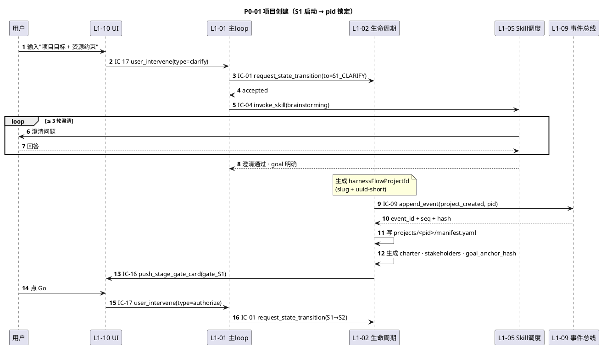

**关键集成点**：pid 在 step 7 生成并落盘；所有后续 IC 必携此 pid。

---

### 2.2 P0-02 · S1→S7 完整主流程

**场景一句话**：用户从零启动 → 7 阶段串接 → 终态为 CLOSED 的**完整项目旅程**（含 4 次 Stage Gate + N 轮 Quality Loop）。

**主参与者**：全部 10 L1（本图为"骨架总图"，不展开各阶段内部）

**深度图**：`docs/3-1-Solution-Technical/integration/p0-seq.md §2`（13+ 条完整步骤）

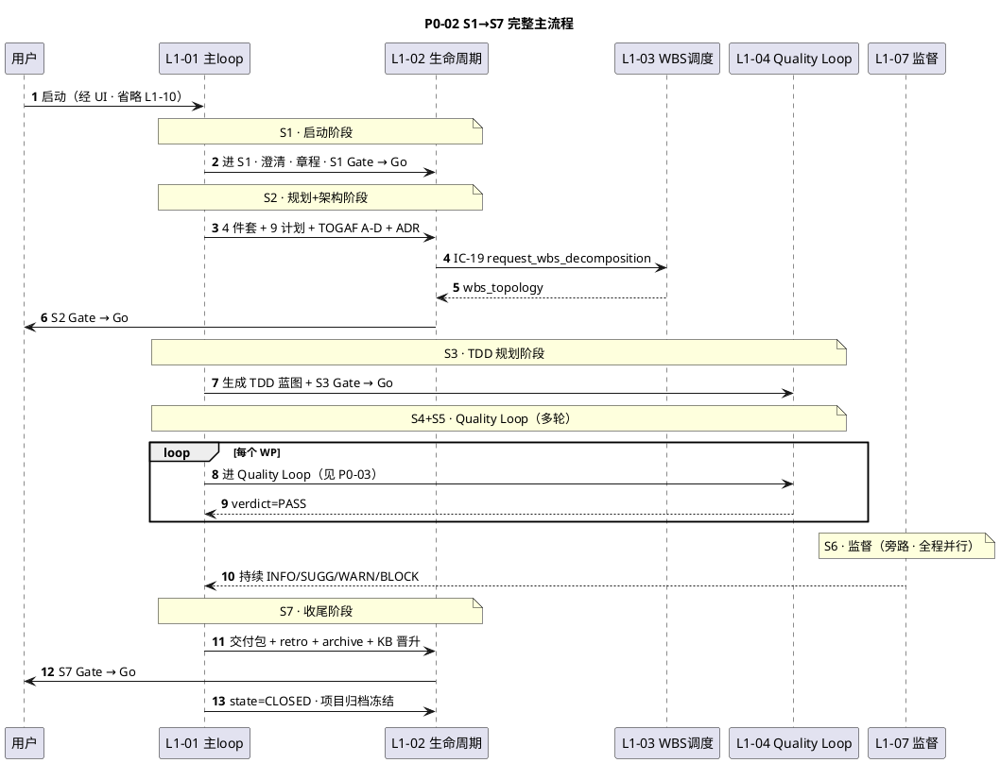

**关键集成点**：本图是"骨架总览"。每阶段内部（S1/S2/S3/S4/S5/S7）展开见 P0-01 / P0-03 / P0-04 / P0-08 及各 L2 tech-design。

---

### 2.3 P0-03 · WP Quality Loop 一轮

**场景一句话**：L1-01 从 L1-03 取下一 WP → 进 L1-04 S4（调 tdd skill 产代码+测试）→ 进 S5（委托 verifier 独立 session）→ verdict=PASS 回到 L1-01 取下一 WP。

**主参与者**：L1-01 · L1-03 · L1-04 · L1-05 · L1-07 · L1-09

**深度图**：`docs/3-1-Solution-Technical/L1-04-Quality Loop/L2-04-Loop编排器.md §5`

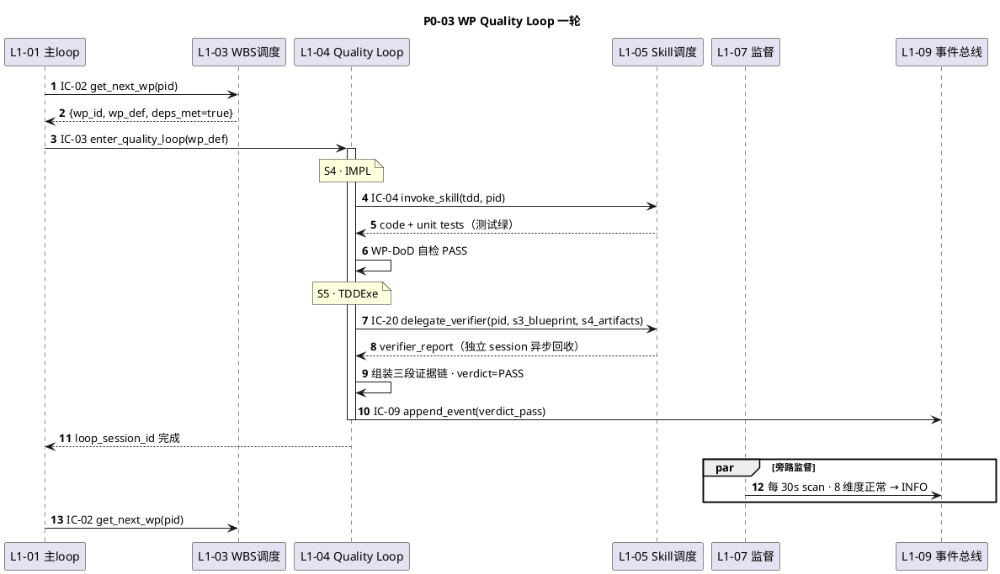

**关键集成点**：S4 / S5 在 L1-04 内部切换，对 L1-01 是"一次 enter_quality_loop"；verifier 走独立 session（PM-03）。

---

### 2.4 P0-04 · Stage Gate 推送 + 用户 Go

**场景一句话**：L1-02 某阶段产出齐全 → 打包 artifacts_bundle → 通过 IC-16 推 L1-10 Gate 卡 → 用户在 UI 评审 → 点 Go → L1-01 切 state。

**主参与者**：L1-02 · L1-10 · L1-01 · L1-09

**深度图**：`docs/3-1-Solution-Technical/L1-02-项目生命周期编排/L2-01-阶段门控制器.md §5`

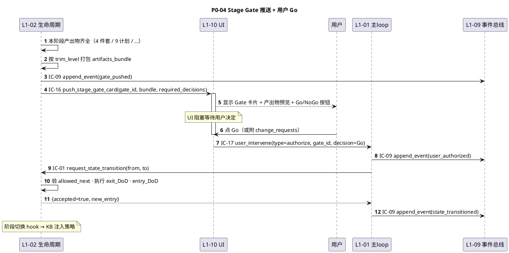

**关键集成点**：Gate 阻塞持久化在 L1-09（跨 session 可恢复见 P0-05）；No-Go 分支走 P1-01。

---

### 2.5 P0-05 · 跨 session bootstrap 恢复

**场景一句话**：用户关闭 Claude Code 后重启 → L1-09 读 `projects/_index.yaml` → 找未 CLOSED 项目 → 从 events.jsonl 回放 + checkpoint 加速 → 恢复 task-board 到退出时 state → UI 展示"已恢复"。

**主参与者**：L1-09 · L1-01 · L1-02 · L1-10

**深度图**：`docs/3-1-Solution-Technical/L1-09-韧性+审计/L2-03-跨session恢复.md §5`

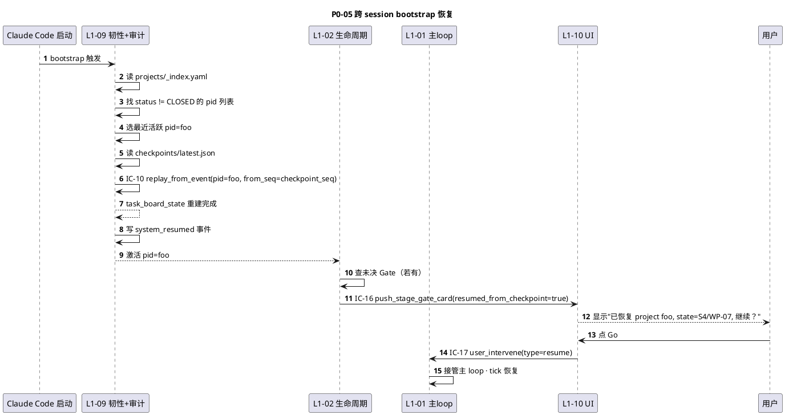

**关键集成点**：bootstrap 优先级 = 100（最高）· 时延 ≤ 5s · 若 Gate 未决 → 重新推卡（见 L1 集成 §5.8）。

---

### 2.6 P0-06 · 硬红线拦截

**场景一句话**：L1-05 调 skill 时产生不可逆操作事件（如 `rm -rf`）→ L1-09 落盘 → L1-07 scan 命中 IRREVERSIBLE_HALT → IC-15 硬暂停 L1-01 → L1-10 推强告警 → 用户文本授权才解除。

**主参与者**：L1-05 · L1-09 · L1-07 · L1-01 · L1-10

**深度图**：`docs/3-1-Solution-Technical/L1-07-Harness监督/L2-04-红线分级处理.md §5`

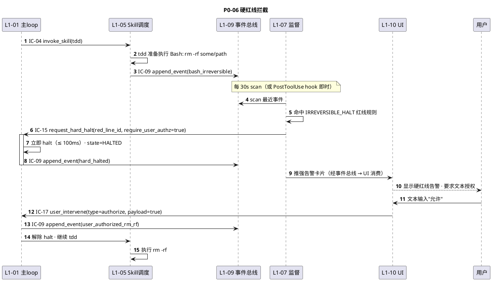

**关键集成点**：halt 响应 ≤ 100ms · 用户授权前 100% 阻塞 · 全过程审计留痕。

---

### 2.7 P0-07 · 用户 panic → PAUSED → resume

**场景一句话**：用户在 UI 点 panic 按钮 → 100ms 内中断 current tick → state=PAUSED → 等用户 resume 后从中断点继续（不重做已完成）。

**主参与者**：L1-10 · L1-01 · L1-09

**深度图**：`docs/3-1-Solution-Technical/L1-01-主 Agent 决策循环/L2-03-panic-resume处理.md §5`

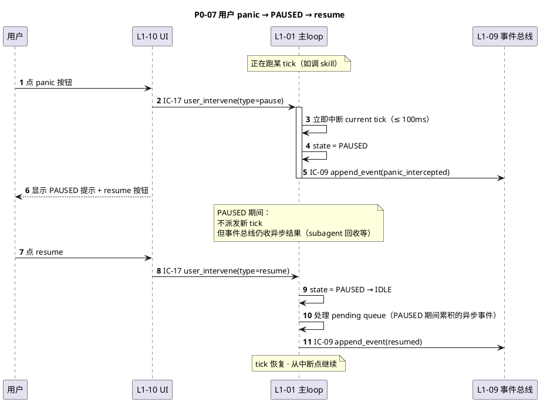

**关键集成点**：panic 响应 ≤ 100ms · PAUSED 期不漏事件（异步结果入队）· resume 不重做已完成。

---

### 2.8 P0-08 · S5 verifier FAIL → 4 级回退路由

**场景一句话**：L1-04 S5 verifier 返回 verdict=FAIL → L1-04 自判偏差等级（轻/中/重/极重）+ L1-07 并行独立判定（双重保险）→ 按等级回 S4 / S3 / S2 / S1。

**主参与者**：L1-04 · L1-05 · L1-07 · L1-01 · L1-02

**深度图**：`docs/3-1-Solution-Technical/L1-07-Harness监督/L2-03-回退路由.md §5`

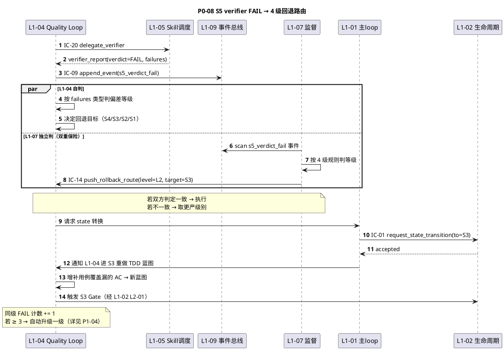

**关键集成点**：L1-04 自判 + L1-07 独立判 = 双重保险 · 同级 ≥ 3 升级机制（详见 P1-04）· 极重 FAIL 硬拦截（详见 P0-06 变体）。

---

## 3. P1 重要链路清单（12 条）

### 3.0 P1 总览

| ID | 链路 | 场景一句话 | 涉及 L1 | 深度图指针 |
|---|---|---|---|---|
| **P1-01** | S2 Gate No-Go 重做 | 用户 reject S2 Gate → 影响面分析 → 重做部分 4 件套 | L1-02 · L1-03 · L1-10 | L1-02 L2-01 §5 |
| **P1-02** | 运行时 change_request（TOGAF H）| 用户运行时发起变更 → 虚 Gate 影响面分析 → ADR 落盘 | L1-01 · L1-02 · L1-03 · L1-04 · L1-10 | L1-02 L2-07 §5 |
| **P1-03** | 4 级回退路由（L1/L2/L3/L4）| 按偏差等级路由到 S4/S3/S2/S1 | L1-04 · L1-07 · L1-02 | L1-07 L2-03 §5 |
| **P1-04** | 同级 FAIL ≥ 3 升级 | 同级 FAIL 累计 ≥ 3 → 自动升级一级 | L1-04 · L1-07 | L1-07 L2-05 §5 |
| **P1-05** | KB 晋升仪式（S7 收尾时） | session 候选 → observed_count / 用户批准 → 升 project/global | L1-02 · L1-05 · L1-06 · L1-10 | L1-06 L2-03 §5 |
| **P1-06** | 大代码库 onboarding 委托 | brownfield · 代码 > 10 万行 → 委托子 Agent 独立 session | L1-08 · L1-05 · L1-06 | L1-08 L2-02 §5 |
| **P1-07** | Skill 调用 fallback 链 | 主 skill 失败 → 备选 → 简化版 → 硬暂停 | L1-05 · L1-09 | L1-05 L2-02 §5 |
| **P1-08** | 子 Agent 委托 + 异步回收 | 委托独立 session subagent · 异步回收结果 → 路由回正确 project | L1-05 · L1-01 · L1-09 | L1-05 L2-03 §5 |
| **P1-09** | 多 project 切换（V2+）| 用户切 active project → save/load checkpoint → 上下文全换 | L1-10 · L1-01 · L1-09 | L1-09 L2-04 §5 |
| **P1-10** | UI 实时进度流 | 全部 L1 事件 → L1-09 → L1-10 progress_stream 按 pid 过滤渲染 | L1-09 · L1-10 · 全 L1 | L1-10 L2-02 §5 |
| **P1-11** | Supervisor 8 维度周期扫描 | 每 30s scan 事件总线 → 8 维度计算 → 4 级分发 | L1-07 · L1-09 · L1-01 · L1-10 | L1-07 L2-02 §5 |
| **P1-12** | KB 阶段注入策略 | 阶段切换 hook 触发 → 按策略注入 kind → 进 L1-01 context | L1-01 · L1-06 | L1-06 L2-02 §5 |

### 3.1 P1-01 · S2 Gate No-Go 重做

**场景一句话**：用户在 S2 Gate 评审发现 AC 有问题 → reject + change_requests → 影响面分析 → 重做 AC + quality（依赖闭包）→ 推新 Gate 卡（带 diff）。

**深度图**：`docs/3-1-Solution-Technical/L1-02-项目生命周期编排/L2-01-阶段门控制器.md §5.3`

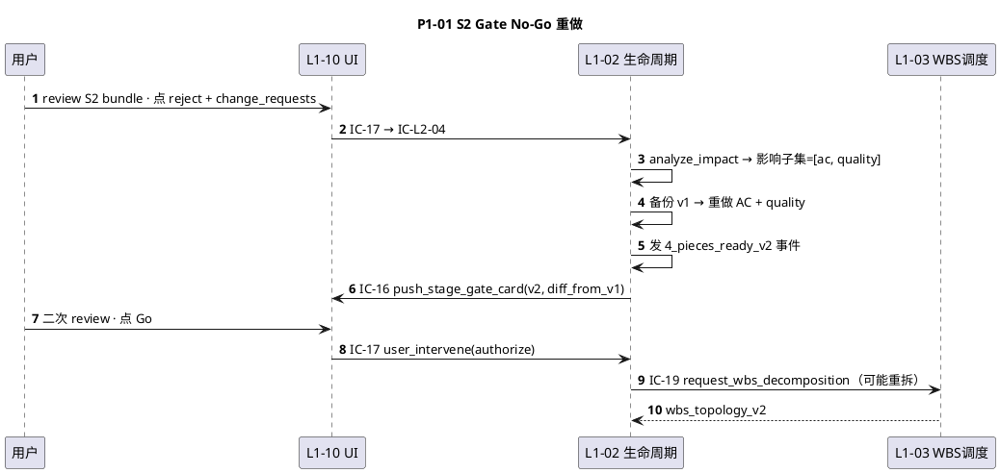

---

### 3.2 P1-02 · 运行时 change_request（TOGAF H）

**场景一句话**：项目已在 IMPL state，用户发起变更请求 → 路由到 L1-02 L2-01 创建"虚 Gate" → 影响面分析（涉及 L1-03/04）→ 生成 ADR → 用户二次审批 → 批准则触发重做链。

**深度图**：`docs/3-1-Solution-Technical/L1-02-项目生命周期编排/L2-07-变更管理.md §5`

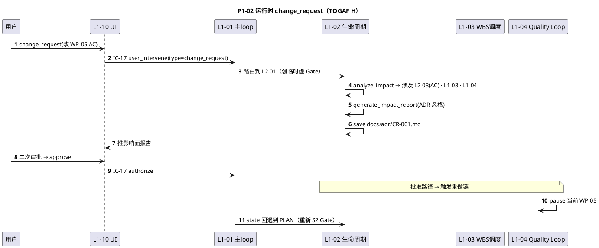

---

### 3.3 P1-03 · 4 级回退路由（按偏差等级）

**场景一句话**：Quality Loop FAIL → L1-04 + L1-07 判定等级 → 按 L1/L2/L3/L4 路由到 S4/S3/S2/S1（L3/L4 必须人工确认）。

**深度图**：`docs/3-1-Solution-Technical/L1-07-Harness监督/L2-03-回退路由.md §5`

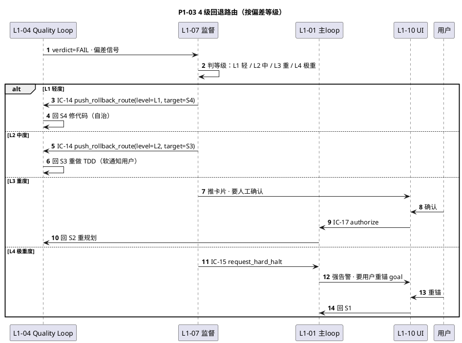

---

### 3.4 P1-04 · 同级 FAIL ≥ 3 升级

**场景一句话**：同等级回退连续 FAIL 3 次 → L1-04 自动升级一级 + L1-07 独立监测也触发升级（双重保险）。

**深度图**：`docs/3-1-Solution-Technical/L1-07-Harness监督/L2-05-死循环保护.md §5`

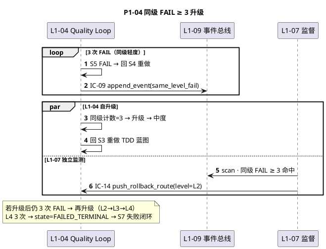

---

### 3.5 P1-05 · KB 晋升仪式（S7 收尾时）

**场景一句话**：S7 step 4 进入 KB 晋升 → 读 session 候选条目 → observed_count ≥ 阈值自动升 project；用户在 UI 勾选也可手动晋升到 global。

**深度图**：`docs/3-1-Solution-Technical/L1-06-3层知识库/L2-03-晋升仪式.md §5`

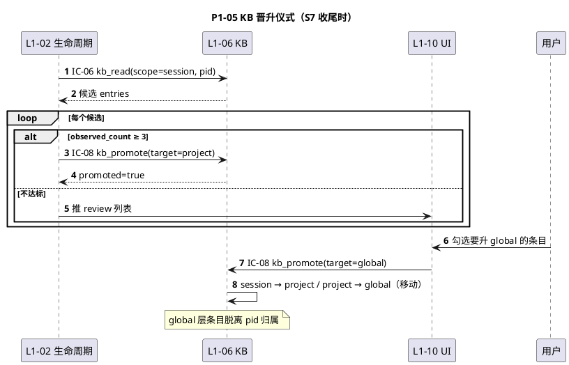

---

### 3.6 P1-06 · 大代码库 onboarding 委托

**场景一句话**：brownfield 项目、代码 > 10 万行 → L1-08 检测到 → 委托 L1-05 独立 session 子 Agent 扫描 → 返回 structure_summary + kb_entries。

**深度图**：`docs/3-1-Solution-Technical/L1-08-多模态内容处理/L2-02-代码仓库扫描.md §5`

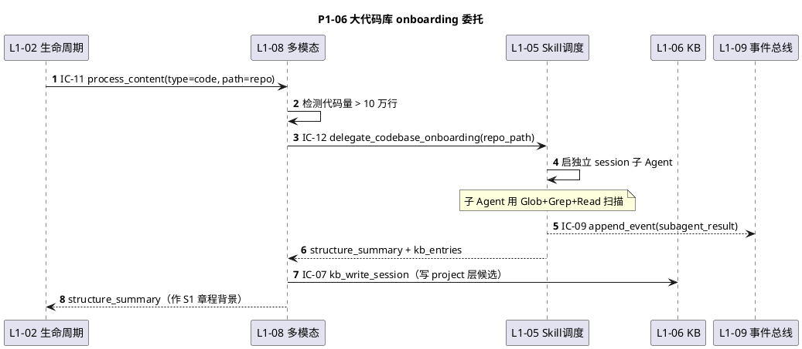

---

### 3.7 P1-07 · Skill 调用 fallback 链

**场景一句话**：L1-05 invoke_skill 主 skill 失败 → 能力抽象层查 fallback 列表 → 尝试备选 → 仍失败降级到简化版 → 全失败硬暂停。

**深度图**：`docs/3-1-Solution-Technical/L1-05-Skill生态+子Agent调度/L2-02-能力抽象层.md §5`

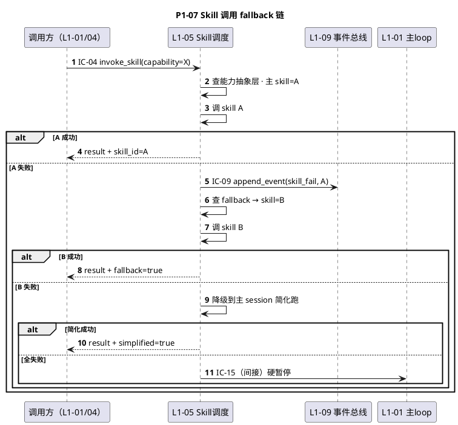

---

### 3.8 P1-08 · 子 Agent 委托 + 异步回收

**场景一句话**：L1-05 委托独立 session 子 Agent（verifier / retro / archive / onboarding）→ 子 Agent 跑完写 IC-09 回收事件 → L1-01 路由回正确 pid。

**深度图**：`docs/3-1-Solution-Technical/L1-05-Skill生态+子Agent调度/L2-03-子Agent委托器.md §5`

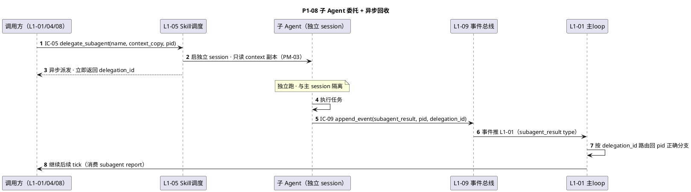

---

### 3.9 P1-09 · 多 project 切换（V2+）

**场景一句话**：V2+ 用户在 UI 切换 active project → L1-01 save 当前 pid checkpoint + load 目标 pid checkpoint → 主 loop 上下文全换。

**深度图**：`docs/3-1-Solution-Technical/L1-09-韧性+审计/L2-04-多project切换.md §5`

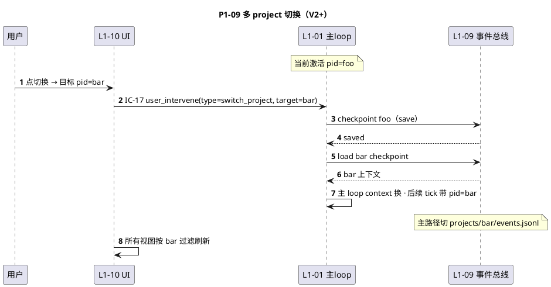

---

### 3.10 P1-10 · UI 实时进度流

**场景一句话**：全部 L1 的事件都通过 IC-09 入 L1-09 → L1-09 按 pid 推 progress_stream → L1-10 按当前 active pid 过滤渲染。

**深度图**：`docs/3-1-Solution-Technical/L1-10-人机协作UI/L2-02-事件流消费器.md §5`

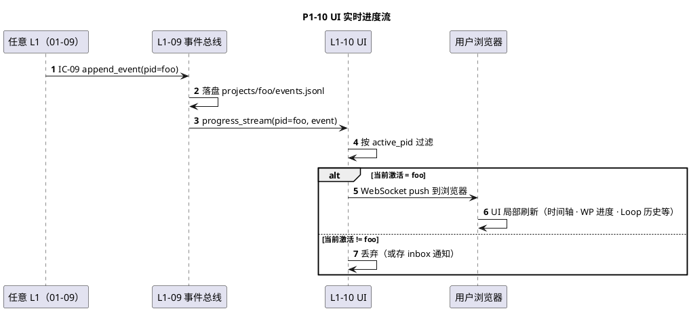

---

### 3.11 P1-11 · Supervisor 8 维度周期扫描

**场景一句话**：L1-07 每 30s tick + PostToolUse hook → scan L1-09 事件总线 → 8 维度计算 → 按严重度分发（INFO / SUGG / WARN / BLOCK）。

**深度图**：`docs/3-1-Solution-Technical/L1-07-Harness监督/L2-02-8维度计算器.md §5`

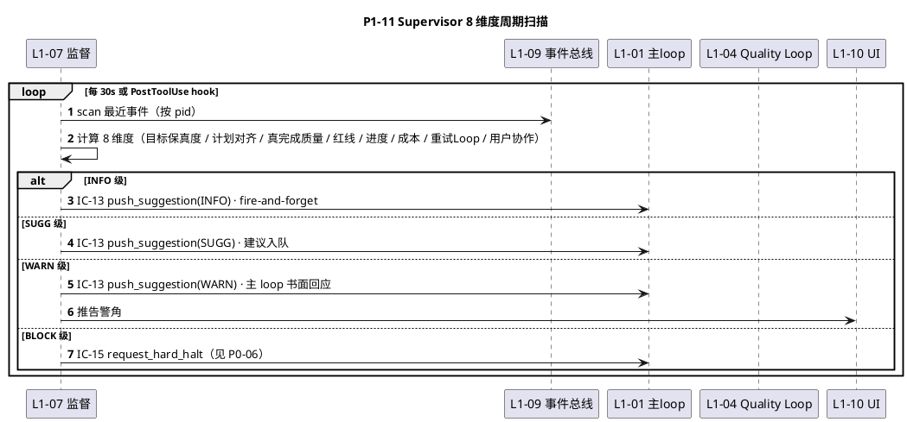

---

### 3.12 P1-12 · KB 阶段注入策略

**场景一句话**：阶段切换 hook 触发 → 按 S1→trap+pattern / S2→recipe+tool_combo / S3→anti_pattern / ... 策略 read KB → 注入 L1-01 context。

**深度图**：`docs/3-1-Solution-Technical/L1-06-3层知识库/L2-02-阶段注入策略.md §5`

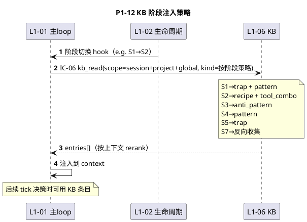

---

## 4. P2 异常链路清单（6 条）

### 4.0 P2 总览

| ID | 链路 | 场景一句话 | BF-E 映射 | 深度图指针 |
|---|---|---|---|---|
| **P2-01** | 会话意外退出 + 事件 flush | Ctrl+C / kill → 信号捕获 → flush + checkpoint → 退出 | BF-E-01 | L1-09 L2-02 §5 |
| **P2-02** | 网络异常恢复 | 指数 backoff → MCP 重连 → 本地替代 → 降级告警 | BF-E-03 | L1-05 L2-05 §5 |
| **P2-03** | Claude API 限流 | 429 → Retry-After → 节能模式 → 硬暂停 | BF-E-04 | L1-05 L2-05 §5 |
| **P2-04** | 上下文爆炸压缩 | context > 80% → 压缩旧事件 → 主动 compact | BF-E-06 | L1-09 L2-05 §5 |
| **P2-05** | soft-drift 检测 | 决策偏离 goal_anchor → WARN 级告警 + replan | BF-E-07 | L1-07 L2-06 §5 |
| **P2-06** | 事件总线写盘失败（系统级 halt）| IC-09 落盘失败 → 全系统 halt → 等 L1-09 恢复 | BF-E-02 变体 | L1-09 L2-01 §5 |

### 4.1 P2-01 · 会话意外退出 + 事件 flush

```plantuml
@startuml
title P2-01 会话意外退出 + 事件 flush
autonumber
participant "OS 信号" as OS
participant "L1-01 主loop" as L01
participant "L1-09 事件总线" as L09

OS -> L01: SIGINT / SIGTERM
L01 -> L09: IC-09 append_event(session_exit)
L09 -> L09: flush 内存 pending events
L09 -> L09: 写 checkpoint（最近 task-board snapshot）
L09 -> L09: fsync 所有 jsonl
L09 --> L01: 落盘完成
L01 -> L01: 优雅退出
note over L09: 下次启动走 P0-05 bootstrap 恢复
@enduml
```

### 4.2 P2-02 · 网络异常恢复

```plantuml
@startuml
title P2-02 网络异常恢复
autonumber
participant "L1-05 Skill调度" as L05
participant "外部服务" as Net
participant "L1-09 事件总线" as L09
participant "L1-01 主loop" as L01

L05 -> Net: 调用
Net -->x L05: 网络错误
loop 指数 backoff（1s→2s→4s→8s, 5 次）
    L05 -> Net: 重试
end
alt MCP 服务器断连
    L05 -> L05: 尝试 MCP 重连
end
alt 仍失败 · 有本地替代
    L05 -> L05: 降级到本地（如 playwright-python 直 launch）
else 无本地替代
    L05 -> L09: IC-09 append_event(network_escalated)
    L05 -> L01: 任务置 PAUSED_ESCALATED · 请示用户
end
@enduml
```

### 4.3 P2-03 · Claude API 限流

```plantuml
@startuml
title P2-03 Claude API 限流
autonumber
participant "L1-01 主loop" as L01
participant "Claude API" as API
participant "L1-09 事件总线" as L09

L01 -> API: 请求
API --> L01: 429 + Retry-After
L01 -> L01: sleep(Retry-After)
L01 -> API: 重试
alt token 预算 < 20%
    L01 -> L01: 进节能模式（压缩历史 · 丢非关键事件 · 只留近 10 决策）
    L01 -> L09: IC-09 append_event(token_saving_mode)
else 节能仍不够
    L01 -> L01: 硬暂停 · 上报用户增加预算
end
@enduml
```

### 4.4 P2-04 · 上下文爆炸压缩

```plantuml
@startuml
title P2-04 上下文爆炸压缩
autonumber
participant "L1-01 主loop" as L01
participant "L1-09 事件总线" as L09

L01 -> L01: 监控 context 占用
note over L01: 触发：context > 80%
L01 -> L01: 识别可压缩项（旧事件 · 已完成 WP 详情 · 重复 KB 条目）
L01 -> L01: 压缩：保留摘要 · 删除原文
L01 -> L09: IC-09 append_event(context_compressed)
L01 -> L01: 重要信息落 task-board（按需取）
alt 仍 > 80%
    L01 -> L01: 主动 compact session
end
@enduml
```

### 4.5 P2-05 · soft-drift 检测

```plantuml
@startuml
title P2-05 soft-drift 检测
autonumber
participant "L1-07 监督" as L07
participant "L1-09 事件总线" as L09
participant "L1-01 主loop" as L01

L07 -> L09: scan 决策事件（最近 10 条）
L07 -> L07: 检测：\nstate 偏差 > 30% ?\ngoal_anchor 命中率 < 60% ?\n"暂时跳过" ≥ 5 次 ?
alt 触发 soft-drift
    L07 -> L01: IC-13 push_suggestion(WARN, dimension=goal_fidelity, suggested_action=replan)
    L01 -> L01: 书面回应：采纳 replan 或驳回+理由
end
note over L07: soft-drift 区别于硬红线 DRIFT_CRITICAL\n(后者 sha256 变化硬拦截，走 P0-06 变体)
@enduml
```

### 4.6 P2-06 · 事件总线写盘失败（系统级 halt）

```plantuml
@startuml
title P2-06 事件总线写盘失败（系统级 halt）
autonumber
participant "任意 L1" as AnyL
participant "L1-09 事件总线" as L09
participant "L1-01 主loop" as L01
participant "L1-10 UI" as UI

AnyL -> L09: IC-09 append_event
L09 -> L09: 尝试落盘
L09 -->x L09: 写盘失败（磁盘满 · 权限错 · fsync 失败）
note over L09: PM-08 单一事实源不可破\nhalt 整个系统
L09 -> L01: halt 全系统
L01 -> L01: state = SYSTEM_HALTED
L09 -> UI: 强告警 + 诊断信息
note over L09: 恢复路径：\n用户修磁盘 / 权限后\n重启 Claude Code → 走 P0-05 bootstrap
@enduml
```

---

## 5. PlantUML 时序图编写规范

### 5.1 participant 命名规则

| 规则 | 示例 |
|---|---|
| **L1 统一格式**：`LXX as L1-XX 简称` | `participant L01 as L1-01 主loop` |
| **用户**：`U as 用户` | `participant U as 用户` |
| **UI**：`UI as L1-10 UI`（简化别名）| `participant UI as L1-10 UI` |
| **外部系统**：`OS / API / Net` | `participant API as Claude API` |
| **子 Agent**：`SA as 子 Agent（name）` | `participant SA as 子 Agent（verifier）` |
| **最多 7 个 participant** | 超过则拆子图 |

### 5.2 箭头语义

| 箭头 | 含义 | 用法 |
|---|---|---|
| `->>` | **同步请求（有响应预期）** | IC-XX 调用 |
| `-->>` | **响应（返回值）** | IC 返回 |
| `->` | 信号（无响应）| OS 信号 |
| `--x` | **失败** | 网络 err / 写盘失败 |
| `->>+` / `-->>-` | activation（激活带端点）| 可选，骨架不强制 |

### 5.3 note / activation / alt·opt·loop·par 使用指南

| 构件 | 何时用 | 示例 |
|---|---|---|
| `Note over X: 说明` | 解释非调用类动作（状态变化 / 内部计算 / 阻塞）| `Note over L01: state=PAUSED` |
| `Note over X,Y: 说明` | 跨多 participant 的公共说明 | `Note over L02,L04: S3 阶段` |
| `activate X` / `deactivate X` | 强调 X 正在执行（阻塞块）| 骨架层可选 |
| `alt / else / end` | **分支路径**（2 种及以上结局）| Gate Go vs No-Go |
| `opt / end` | **可选块**（可能不执行）| 可能触发的 fallback |
| `loop / end` | **循环**（while / for）| 多轮 WP / 多次重试 |
| `par / and / end` | **并发块**（多方并行执行）| L1-04 自判 + L1-07 独立判 |

### 5.4 骨架 vs 深度图的区别

| 维度 | 骨架（本索引）| 深度（tech-design §5）|
|---|---|---|
| **行数** | 15~25 行 | 40~80 行 |
| **IC 字段** | 省略 | 完整 schema（含字段级）|
| **错误码** | 省略 | 全部标注 |
| **activation** | 可选 | 强制标全部阻塞块 |
| **note** | 关键点 1~2 条 | 每 5 步至少 1 条 note |
| **alt/opt/par** | 仅必要时 | 全部路径展开 |

### 5.5 命名一致性硬规则

1. `participant` 别名在所有图中**统一**（L01 / L02 / ... / L10 · U · UI · SA）
2. IC-XX 调用**统一大写**（`IC-04 invoke_skill`）
3. state 名**统一大写**（`S1_CLARIFY` / `PAUSED` / `HALTED` / `CLOSED`）
4. pid 字段名**一律小写 `pid`**（不用 `project_id` / `pr_id`）

### 5.6 可达性要求

每条时序图必须可 **PlantUML 在线渲染器**（如 plantuml.com / IntelliJ PlantUML 插件）**直接渲染通过**，不得有语法错误（CI 可加 plantuml lint）。

---

## 6. 与 scope §8.3 + L1 集成 §5 的映射表

### 6.1 scope §8.3（5 场景）⇄ 本索引映射

| scope §8.3 场景 | 本索引链路 |
|---|---|
| 场景 1 · WP 执行一轮 Quality Loop（正常路径）| **P0-03** |
| 场景 2 · 硬红线触发（不可逆操作拦截）| **P0-06** |
| 场景 3 · 跨 session 恢复 | **P0-05** |
| 场景 4 · 中度 FAIL 触发回退到 S3 | **P0-08 / P1-03** |
| 场景 5 · Stage Gate 走完（S2 → S3）| **P0-04** |

### 6.2 L1 集成 §5（12 场景）⇄ 本索引映射

| L1 集成 §5 场景 | 本索引链路 |
|---|---|
| §5.1 WP 执行正常一轮 | **P0-03** |
| §5.2 S1→S7 完整项目流程 | **P0-02** |
| §5.3 S2 Gate No-Go + 4 件套部分重做 | **P1-01** |
| §5.4 运行时 change_request（TOGAF H）| **P1-02** |
| §5.5 硬红线触发 | **P0-06** |
| §5.6 用户 panic + PAUSED + resume | **P0-07** |
| §5.7 S5 verifier FAIL → 4 级回退 | **P0-08 / P1-03** |
| §5.8 跨 session 重启恢复未决 Gate | **P0-05** |
| §5.9 同级 FAIL ≥ 3 死循环升级 | **P1-04** |
| §5.10 KB 晋升仪式（S7）| **P1-05** |
| §5.11 多项目并发切换（V2+）| **P1-09** |
| §5.12 大代码库 onboarding 委托 | **P1-06** |

### 6.3 BF-E 异常流 ⇄ P2 链路映射

| BF-E 异常 | 本索引链路 |
|---|---|
| BF-E-01 会话退出流 | **P2-01** |
| BF-E-02 跨 session 恢复流 | **P0-05**（正常路径）+ **P2-06**（halt 后恢复） |
| BF-E-03 网络异常恢复流 | **P2-02** |
| BF-E-04 Claude API 限流 | **P2-03** |
| BF-E-05 Skill 失败降级流 | **P1-07** |
| BF-E-06 上下文爆炸处理 | **P2-04** |
| BF-E-07 soft-drift 检测 | **P2-05** |
| BF-E-08 WP 失败回退 | **P0-08 / P1-04** |
| BF-E-09 子 Agent 失败 | **P1-08**（正常回收）+ P2 隐含 |
| BF-E-10 死循环保护 | **P1-04** |
| BF-E-11 软红线自治（8 类）| **P1-11**（8 维度中覆盖）|
| BF-E-12 硬红线上报（5 类）| **P0-06** |

---

## 7. 时序图完备性检查清单

### 7.1 20 IC × P0/P1 覆盖矩阵

> 每条 IC 至少出现在 1 张 P0 或 P1 图里（✅ 满足）。表格行=IC · 列=图；✅=出现。

| IC | P0-01 | P0-02 | P0-03 | P0-04 | P0-05 | P0-06 | P0-07 | P0-08 | P1-01 | P1-02 | P1-03 | P1-04 | P1-05 | P1-06 | P1-07 | P1-08 | P1-09 | P1-10 | P1-11 | P1-12 |
|---|---|---|---|---|---|---|---|---|---|---|---|---|---|---|---|---|---|---|---|---|
| IC-01 state_trans | ✅ |  |  | ✅ | ✅ |  |  | ✅ |  | ✅ |  |  |  |  |  |  |  |  |  |  |
| IC-02 get_next_wp |  | ✅ | ✅ |  |  |  |  |  |  |  |  |  |  |  |  |  |  |  |  |  |
| IC-03 enter_ql |  | ✅ | ✅ |  |  |  |  |  |  |  |  |  |  |  |  |  |  |  |  |  |
| IC-04 invoke_skill | ✅ |  | ✅ |  |  | ✅ |  |  |  |  |  |  |  |  | ✅ |  |  |  |  |  |
| IC-05 delegate_sa |  |  |  |  |  |  |  |  |  |  |  |  |  |  |  | ✅ |  |  |  |  |
| IC-06 kb_read |  |  |  |  |  |  |  |  |  |  |  |  | ✅ |  |  |  |  |  |  | ✅ |
| IC-07 kb_write_sess |  |  |  |  |  |  |  |  |  |  |  |  | ✅ | ✅ |  |  |  |  |  |  |
| IC-08 kb_promote |  |  |  |  |  |  |  |  |  |  |  |  | ✅ |  |  |  |  |  |  |  |
| IC-09 append_event | ✅ | ✅ | ✅ | ✅ | ✅ | ✅ | ✅ | ✅ | ✅ | ✅ | ✅ | ✅ | ✅ | ✅ | ✅ | ✅ | ✅ | ✅ | ✅ | ✅ |
| IC-10 replay_event |  |  |  |  | ✅ |  |  |  |  |  |  |  |  |  |  |  |  |  |  |  |
| IC-11 process_content |  |  |  |  |  |  |  |  |  |  |  |  |  | ✅ |  |  |  |  |  |  |
| IC-12 cb_onboarding |  |  |  |  |  |  |  |  |  |  |  |  |  | ✅ |  |  |  |  |  |  |
| IC-13 push_suggestion |  |  | ✅ |  |  |  |  |  |  |  |  |  |  |  |  |  |  |  | ✅ |  |
| IC-14 push_rollback |  |  |  |  |  |  |  | ✅ |  |  | ✅ | ✅ |  |  |  |  |  |  |  |  |
| IC-15 hard_halt |  |  |  |  |  | ✅ |  |  |  |  | ✅ |  |  |  | ✅ |  |  |  | ✅ |  |
| IC-16 push_gate | ✅ | ✅ |  | ✅ | ✅ |  |  | ✅ | ✅ |  |  |  |  |  |  |  |  |  |  |  |
| IC-17 user_intervene | ✅ | ✅ |  | ✅ | ✅ | ✅ | ✅ |  | ✅ | ✅ | ✅ |  | ✅ |  |  |  | ✅ |  |  |  |
| IC-18 query_audit |  |  |  |  |  |  |  |  |  |  |  |  |  |  |  |  |  |  |  |  |
| IC-19 wbs_decomp |  | ✅ |  |  |  |  |  |  | ✅ |  |  |  |  |  |  |  |  |  |  |  |
| IC-20 delegate_verif |  |  | ✅ |  |  |  |  | ✅ |  |  |  |  |  |  |  |  |  |  |  |  |

**未在 P0/P1 覆盖的 IC**：
- **IC-18 query_audit_trail**：属"用户主动查询"动作，V1 可放附加 P2 图或 integration 文档 §7（审计面板）；**TODO · v1.1 补 P1-13 审计追溯查询**

**调整建议（v1.1）**：新增 P1-13 `审计追溯查询` 链路补 IC-18 覆盖。P1-13 预览骨架：

```plantuml
@startuml
title P1-13 审计追溯查询（预览骨架）
autonumber
participant "用户" as U
participant "L1-10 UI" as UI
participant "L1-09 事件总线" as L09

U -> UI: 输入锚点（file_path / artifact_id / decision_id）
UI -> L09: IC-18 query_audit_trail(anchor, pid)
L09 -> L09: 按锚点反查事件链
L09 -> L09: 汇聚 decision + event + supervisor_comment + user_authz
L09 --> UI: trail[]
UI --> U: 渲染审计追溯面板（时间倒序）
@enduml
```

### 7.2 10 L1 × 图覆盖（每 L1 至少 2 图 · ✅ 全满足）

| L1 | 出现图数量 | 主要图 |
|---|---|---|
| L1-01 主 loop | 14+ | P0-01/02/03/05/06/07/08 · P1-02/07/08/09/11 · P2-03/04 |
| L1-02 生命周期 | 8+ | P0-01/02/04/05 · P1-01/02/05 · P1-12 |
| L1-03 WBS 调度 | 5+ | P0-02/03 · P1-01/02 |
| L1-04 Quality Loop | 7+ | P0-02/03/08 · P1-02/03/04 |
| L1-05 Skill 调度 | 8+ | P0-01/03/06 · P1-06/07/08 · P2-02 |
| L1-06 KB | 3+ | P1-05/06/12 |
| L1-07 监督 | 8+ | P0-02/06/08 · P1-03/04/11 · P2-05 |
| L1-08 多模态 | 2+ | P1-06 |
| L1-09 韧性+审计 | 20+ | 几乎所有图（IC-09 全覆盖） |
| L1-10 UI | 10+ | P0-01/04/05/06/07 · P1-01/02/05/09/10 |

### 7.3 BF-E-01~12 × P2 / P1 覆盖（✅ 全满足 · 见 §6.3）

### 7.4 完备性 v1.1 改进清单（TODO）

- [ ] v1.1 补 **P1-13 审计追溯查询**（补 IC-18 覆盖）
- [ ] v1.1 补 **P2-07 子 Agent crash 强制终止 + 降级**（补 BF-E-09 异常路径）
- [ ] v2.0 随 V2+ 场景扩展：多 project 并发、团队协作等

---

## 8. 开源参考（Agent loop 时序图文档范式 · 简短调研）

以下 GitHub 高星项目的 Agent loop + 集成文档里，**时序图表达范式**值得借鉴：

### 8.1 LangGraph（langchain-ai/langgraph · 15k+ stars）

- **官方文档 `docs/concepts/agentic_concepts.md`** 用 PlantUML 时序图展示 `human_in_the_loop` / `multi_agent` / `subgraph` 的调用流
- **参考点**：
  - 用 `alt / else` 表达 `interrupt` / `resume`（对应 HarnessFlow P0-07 panic/resume）
  - 用 `par` 表达多 Agent 并行（对应 HarnessFlow P1-04 双重保险）
  - `subgraph` 概念 ≈ HarnessFlow L1-04 内部 S4/S5 切换
- **学习**：Mermaid 骨架 + 附 detailed step list（我们采用）

### 8.2 OpenHands（All-Hands-AI/OpenHands · 40k+ stars）

- **`docs/modules/usage/architecture/runtime.md`** 画 Agent ↔ Runtime ↔ Sandbox 的调用
- **参考点**：
  - 用 `activate/deactivate` 标阻塞块（我们在深度图层采用，骨架可选）
  - `Note over` 注释关键状态变化（我们采纳）
  - 每张图配 "related events" 清单（对应本索引的 "IC 涉及" 列）
- **学习**：图+表+代码锚点三件套（我们对标）

### 8.3 Devin / Cognition AI（闭源但有 blog 公开 · agent loop 范式）

- **关键 insight**：Devin blog 展示 planner / engineer / tester / reviewer 多 Agent 的 "time-travel debugging"——每次决策都有事件锚点可回放
- **对应 HarnessFlow**：L1-09 事件总线 + L1-07 决策审计（P1-11）
- **学习**：事件是时序图的"锚点"，不仅是线条

### 8.4 AutoGen / MetaGPT（10k+ stars · 多 Agent 协作）

- **参考**：多 Agent 协作图多用 `par / and / end` 表达并发消息传递
- **对应 HarnessFlow**：P0-03 的"并行 L1-07 旁路监督"、P1-04 的"双重保险判定"

### 8.5 借鉴总结（4 条）

1. **Mermaid 是事实标准**（所有高星项目都用 Mermaid，不用 PlantUML / Sequence.js）
2. **骨架 + 深度分层**（本索引 = 骨架层，L2 tech-design = 深度层）
3. **Note over 讲非调用类状态**（状态转换 / 计算 / 阻塞）
4. **IC / 事件是锚点**（每条调用绑定一个可回放的事件 ID）

### 8.6 HarnessFlow vs 上述开源项目的差异点

| 差异点 | 开源（LangGraph / OpenHands 等）| HarnessFlow |
|---|---|---|
| **核心循环粒度** | node / runtime action | tick（含 5 纪律拷问） |
| **审计强度** | 可选（debug 用）| **强制 100% 决策可追溯**（L1-09 PM-08） |
| **Gate 机制** | 可选的 human_in_the_loop | **S1/S2/S3/S7 四次强制 Gate**（L1-02 不可裁剪） |
| **Stage 概念** | 通常扁平 | **PMP × TOGAF 双主干 7 阶段**（L1-02） |
| **WP 拓扑** | 无 | WBS + WP 拓扑并行（PM-04 最多 2） |
| **红线分级** | 无 | **8 软 + 5 硬**（L1-07 PM-12） |
| **Quality Loop** | 单向测试 | **TDD 蓝图 + 执行 + 独立 verifier 三段证据链**（L1-04） |
| **KB 3 层 + 晋升** | 通常单层 memory | **session / project / global 三层 + observed_count 晋升仪式**（L1-06） |

**结论**：HarnessFlow 时序图密度 + 分级 + 锚点 **严格超过**通用 Agent 框架，需要本索引这种"骨架 + 深度分层"的文档组织方式保证不膨胀失控。

---

## 附录 A · PlantUML 时序图关键字速查

### A.1 基本结构

```plantuml
@startuml
autonumber
participant "Alice" as A
participant "Bob" as B
A -> B: 消息
B --> A: 响应
@enduml
```

### A.2 参与者定义

| 关键字 | 说明 |
|---|---|
| `participant X as 显示名` | 定义参与者 · 别名 X · 显示名中文 |
| `actor X as User` | 定义人形（stickman）参与者 |
| `box 描述` / `end` | 把几个 participant 包在一组（groupbox） |

### A.3 箭头

| 箭头 | 语义 |
|---|---|
| `->` | 实线无箭头（信号） |
| `-->` | 虚线无箭头 |
| `->>` | **实线 + 实箭头（同步请求）** |
| `-->>` | **虚线 + 实箭头（响应）** |
| `-x` | 实线 + x（失败 · 丢失） |
| `--x` | 虚线 + x |
| `->)` | 异步消息（无响应预期） |

### A.4 激活与反激活

```plantuml
@startuml
Alice -> Bob ++: 请求（激活 Bob）
Bob --> Alice --: 响应（反激活 Bob）
@enduml
```

或显式：`activate Bob` / `deactivate Bob`

### A.5 控制流块

| 块 | 语法 | 用途 |
|---|---|---|
| **alt** | `alt 条件1 / else 条件2 / end` | 分支 |
| **opt** | `opt 条件 / end` | 可选块 |
| **loop** | `loop 说明 / end` | 循环 |
| **par** | `par 路径A / and 路径B / end` | 并发 |
| **break** | `break 说明 / end` | 中断退出 |
| **critical** | `critical 关键块 / option 兜底 / end` | 关键路径+备选 |

### A.6 注释

| 语法 | 用途 |
|---|---|
| `Note left of X: 文本` | X 左侧注释 |
| `Note right of X: 文本` | X 右侧注释 |
| `Note over X: 文本` | 覆盖 X 的注释 |
| `Note over X,Y: 文本` | 覆盖多个 participant |

### A.7 其他

| 语法 | 用途 |
|---|---|
| `autonumber` | 自动编号 step |
| `title 标题` | 时序图标题 |
| `rect rgb(...)` / `end` | 高亮块（背景色） |
| `%%{init: {...}}%%` | 主题配置（如深色主题） |

### A.8 本索引常用模板（速贴）

#### A.8.1 IC 同步调用模板

```plantuml
@startuml
title A.8.1 IC 同步调用模板
autonumber
participant Caller
participant Callee
Caller -> Callee: IC-XX method_name(param, pid)
Callee -> Callee: 内部处理
Callee --> Caller: {result_field, status}
@enduml
```

#### A.8.2 异步委托 + 回收模板

```plantuml
@startuml
title A.8.2 异步委托 + 回收模板
autonumber
participant Caller
participant "L1-05" as L05
participant "子 Agent" as SA
participant "L1-09" as L09
Caller -> L05: IC-05 delegate_subagent(...)
L05 -> SA: 启独立 session
L05 --> Caller: delegation_id（立即）
SA -> SA: 异步跑
SA -> L09: IC-09 subagent_result
L09 --> Caller: 事件推（路由回 pid）
@enduml
```

#### A.8.3 分支（alt / else）模板

```plantuml
@startuml
title A.8.3 分支（alt / else）模板
autonumber
participant "L1-07" as L07
participant "L1-01" as L01
L07 -> L07: 判定等级
alt INFO
    L07 -> L01: IC-13 fire-and-forget
else WARN
    L07 -> L01: IC-13 要求书面回应
else BLOCK
    L07 -> L01: IC-15 硬暂停
end
@enduml
```

#### A.8.4 并发（par）模板

```plantuml
@startuml
title A.8.4 并发（par）模板
autonumber
participant "L1-04" as L04
participant "L1-07" as L07
par L1-04 自判
    L04 -> L04: 判偏差等级
else L1-07 独立判
    L07 -> L07: 按 4 级规则判
    L07 -> L04: IC-14 push_rollback_route
end
@enduml
```

---

## 9. 变更记录

| 版本 | 日期 | 变更 |
|---|---|---|
| v1.0 | 2026-04-20 | 首版：8 P0 + 12 P1 + 6 P2 = 26 条链路；20 IC 覆盖 19 条（IC-18 v1.1 补）；10 L1 全覆盖；BF-E-01~12 全覆盖 |
| v1.1（TODO）| — | 补 P1-13 审计查询（IC-18）+ P2-07 子 Agent crash |
| v2.0（TODO）| — | V2+ 多 project 场景扩展 |

---

*— sequence-diagrams-index v1.0 · 3-1 L0 基础层交付物 · 等待 57 L2 tech-design 作"骨架复用源" + 4 integration tech-design 作"深度层" —*
