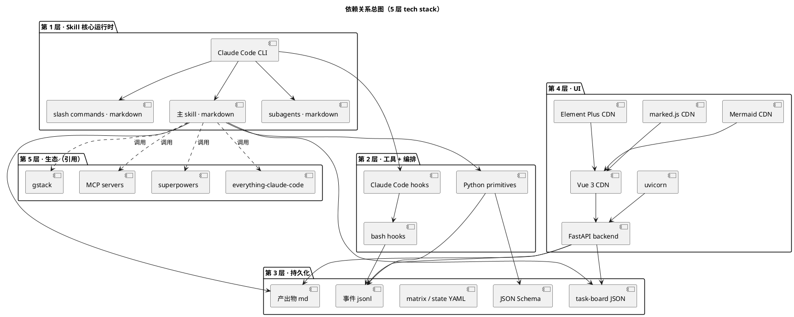
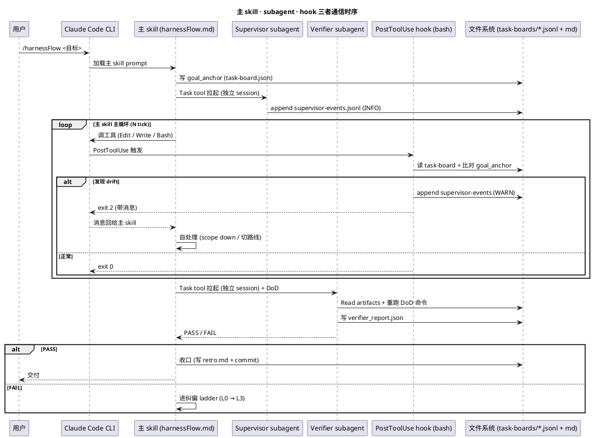
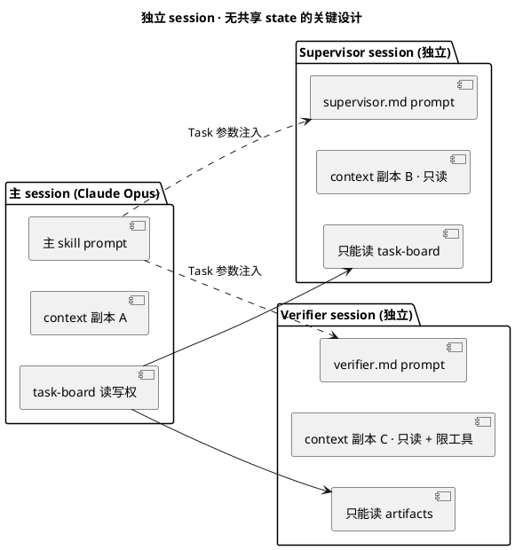
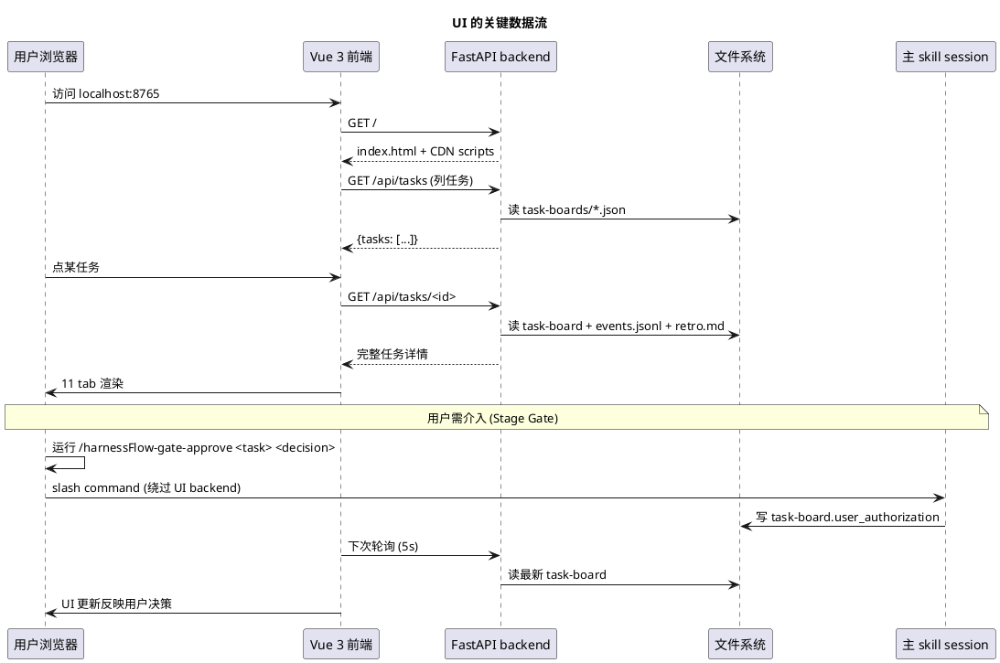
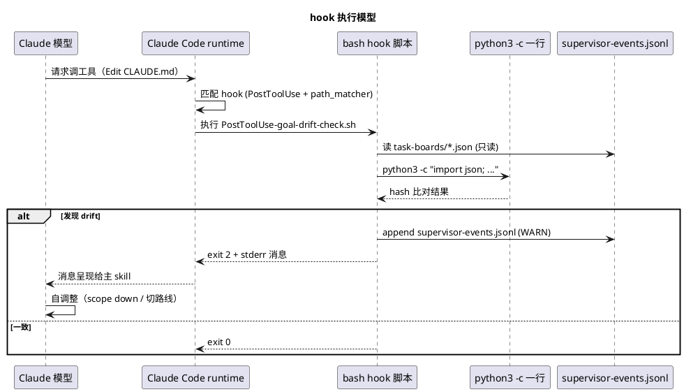
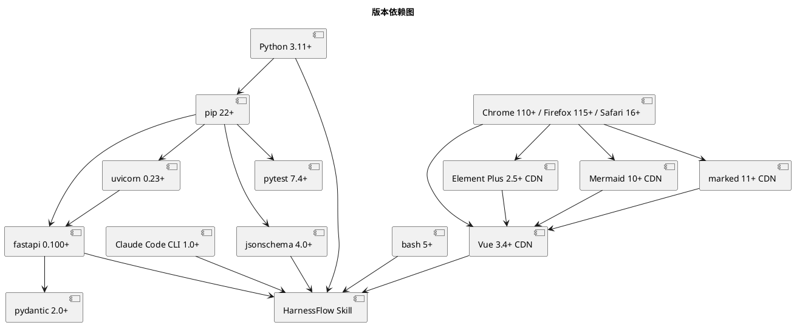

# HarnessFlow 技术栈选型文档（L0 · tech-stack）

> 版本：v1.0（产品级技术方案 · L0 基础文档 · 不写代码实现）
> 锚定：Goal §1（Skill 生态定位）+ scope.md §3（主 skill / 监督 / UI 三载体）+ scope.md §4.5（PM-01 ~ PM-14）
> 定位：**本文件回答"HarnessFlow 用什么技术堆栈落地 10 个 L1 能力"**，下游 L1-0X/architecture.md 与 L2 tech-design.md 的所有选型必须追溯到本文件某一条选型理由。

---

## 0. 撰写进度

- [x] §0 · 撰写进度 + frontmatter
- [x] §1 · 技术栈总览（5 层栈 · 全景拼图）
- [x] §2 · Skill 核心运行时（Claude Code Skill + markdown prompt + bash hooks）
- [x] §3 · 持久化层（jsonl / yaml / md / JSON Schema · 为何不用 SQLite）
- [x] §4 · UI 层（FastAPI + Vue3 CDN · 为何不用 React / Next.js）
- [x] §5 · Python 工具链（pytest + jsonschema + 白名单 AST）
- [x] §6 · Bash hooks 规范（PostToolUse / Stop / PreCompact · 为何延续 bash）
- [x] §7 · 子 Agent / Skill 生态（superpowers / gstack / everything-claude-code 复用）
- [x] §8 · Mermaid 图表语言选型
- [x] §9 · 版本依赖表
- [x] §10 · 开源调研（GitHub 高星项目对比）
- [x] §11 · 选型决策矩阵
- [x] 附录 A · 与 2-prd 的 PM / IC 对应
- [x] 附录 B · 与现有 harnessFlow repo 的一致性检查

---

## 1. 技术栈总览

### 1.1 全景拼图：5 层栈

HarnessFlow 作为 Claude Code Skill 生态下的「AI 技术项目经理 + 架构师」，其技术栈严格遵循 **"最小外部依赖 + 最大复用 Claude Code 原生能力"** 原则，分 5 层：

```
┌─────────────────────────────────────────────────────────────┐
│ 第 1 层 · Skill 核心运行时 (Runtime)                         │
│ · Claude Code Skill / subagent (Anthropic 平台原生)         │
│ · markdown prompt (主 skill / supervisor / verifier)        │
│ · YAML frontmatter (tools / allowed-tools 清单)             │
└─────────────────────────────┬───────────────────────────────┘
                              ↓
┌─────────────────────────────────────────────────────────────┐
│ 第 2 层 · 工具 + 编排层 (Tooling)                            │
│ · bash 5+ scripts (hooks / launcher / self-test)            │
│ · Python 3.11+ (verifier_primitives / UI backend / audit)   │
│ · Claude Code hooks (PreToolUse / PostToolUse / Stop 等)    │
└─────────────────────────────┬───────────────────────────────┘
                              ↓
┌─────────────────────────────────────────────────────────────┐
│ 第 3 层 · 持久化层 (Storage)                                 │
│ · jsonl  事件总线 + failure-archive + KB session 层          │
│ · JSON   task-board 运行时状态 + verifier_report             │
│ · YAML   全局配置 + routing-matrix + state-machine           │
│ · md     产出物 / retro / 决策轨迹 / KB project+global 层    │
│ · JSON Schema  所有结构化契约（draft-07）                    │
└─────────────────────────────┬───────────────────────────────┘
                              ↓
┌─────────────────────────────────────────────────────────────┐
│ 第 4 层 · UI 层 (Presentation)                               │
│ · FastAPI 0.100+ (backend REST · localhost:8765)            │
│ · uvicorn 0.23+ (ASGI server)                               │
│ · Vue 3.4+ (frontend · CDN 加载 · 零 npm install)           │
│ · Element Plus 2.5+ (CDN · 中文友好)                        │
│ · marked.js (CDN · MD 渲染)                                 │
│ · Mermaid 10+ (CDN · 决策图 / 时序图 / 状态机)              │
└─────────────────────────────┬───────────────────────────────┘
                              ↓
┌─────────────────────────────────────────────────────────────┐
│ 第 5 层 · 生态层 (Ecosystem · 只引用 · 不自建)              │
│ · superpowers (SP · Anthropic 官方 · brainstorm / tdd 等)  │
│ · everything-claude-code (ECC · prp-* / retro / loop 等)   │
│ · gstack (plan-*-review / ship / qa 等)                    │
│ · MCP servers (context7 / playwright / github / memory)    │
└─────────────────────────────────────────────────────────────┘
```

### 1.2 5 层与 10 个 L1 能力的映射

| 层 | 承担 L1 能力 | 关键职责 |
|---|---|---|
| 第 1 层 · Skill 核心运行时 | L1-01 / L1-02 / L1-03 / L1-04 / L1-05 / L1-08 | 主 loop + 编排 + WBS + Quality Loop + 子 Agent + 多模态处理 |
| 第 2 层 · 工具 + 编排 | L1-04 / L1-07 / L1-09 | Verifier 原语 / 监督 hook / 事件 append / TDD |
| 第 3 层 · 持久化 | L1-06 / L1-09 | 3 层 KB + 事件总线 + task-board + retro + failure-archive |
| 第 4 层 · UI | L1-10 | 看板 + 决策轨迹 + 监督告警 + Stage Gate 待办 |
| 第 5 层 · 生态 | L1-05（被调度） | 复用 SP / ECC / gstack 的 ~206 个 skill / subagent |

### 1.3 核心技术栈清单（一句话总结）

| 技术 | 用途 | 版本 | 层 |
|---|---|---|---|
| **Claude Code Skill** | 主 skill / subagent 宿主 | platform-native | 第 1 层 |
| **markdown (CommonMark)** | prompt / 产出物 / 决策轨迹 | — | 第 1 + 3 层 |
| **YAML** | frontmatter / 配置 / matrix | 1.2+ | 第 1 + 3 层 |
| **bash** | hooks / launcher / self-test | 5+ (zsh 兼容) | 第 2 层 |
| **Python** | primitives / UI / audit / schema 校验 | 3.11+ | 第 2 + 4 层 |
| **jsonl** | 事件总线 / failure-archive / KB | — | 第 3 层 |
| **JSON + JSON Schema** | task-board / stage-contract / retro | draft-07 | 第 3 层 |
| **FastAPI** | UI backend REST | 0.100+ | 第 4 层 |
| **uvicorn** | ASGI 服务器 | 0.23+ | 第 4 层 |
| **Vue 3** | UI frontend 框架（CDN） | 3.4+ | 第 4 层 |
| **Element Plus** | UI 组件库（CDN） | 2.5+ | 第 4 层 |
| **Mermaid** | 图表 DSL（时序 / 状态 / 流程） | 10+ | 第 3 + 4 层 |
| **jsonschema** (Python) | 契约校验 | 4.0+ | 第 2 层 |
| **pytest** | TDD + 回归 | 7.4+ | 第 2 层 |
| **MCP (Model Context Protocol)** | 外部工具（context7 / playwright / github） | Anthropic spec | 第 5 层 |

### 1.4 零外部依赖红线

**HarnessFlow 作为开源 Claude Code Skill，硬性约束**：

- ❌ 不引入 Node.js / npm / webpack / Vite 构建链（UI 用 CDN）
- ❌ 不引入 数据库服务器（PostgreSQL / MySQL / Redis 等）
- ❌ 不引入 消息队列（Kafka / RabbitMQ / NATS 等）
- ❌ 不引入 容器化运行时（Docker / K8s / Nomad 等）
- ❌ 不引入 云服务商 SDK（boto3 / 阿里云 / GCP 客户端）
- ❌ 不引入 付费 SaaS（LangFuse / Sentry / Datadog 等，除非用户主动启用）
- ✅ 只允许：Claude Code 平台原生 + Python stdlib + 3 个受控外部 pip 包（fastapi / uvicorn / jsonschema）+ CDN 前端

**理由**：Goal §2.1 明确产品形态为「开源 Claude Code Skill」，任何外部依赖都会提高安装摩擦 → 违背 portability。

### 1.5 依赖关系总图（PlantUML）



### 1.6 启动依赖链

用户从装到可用的完整依赖链（冷启动）：

```
1. 装 Claude Code CLI           (官方下载)          ← 必需
2. 装 Python 3.11+              (系统 / pyenv)      ← 必需
3. pip install fastapi uvicorn jsonschema           ← 必需（3 个包）
4. git clone harnessFlow                            ← 必需
5. bash harnessFlow/setup.sh                        ← 一键 · 幂等
   ├─ 软链 .claude/skills/ ← harnessFlow/
   ├─ 注入 CLAUDE.md · Skill routing priority
   └─ 可选启用 hooks
6. /harnessFlow <目标>          ← 开跑
7. /harnessFlow-ui              ← 看 UI（首次联网拉 CDN · 可缓存）
```

**零容器 / 零 DB / 零 npm · 冷启动 < 5 分钟**（Claude Code CLI 装机时间除外）。

---

## 2. Skill 核心运行时

### 2.1 选型：Claude Code Skill + markdown + YAML frontmatter

**核心决策**：HarnessFlow 的"大脑"是纯 markdown 文件，通过 Claude Code Skill 机制加载、由 Claude 模型推理驱动，**非编程语言运行时**。

```
┌────────────────────────────────────────────────────────┐
│ Claude Code CLI                                         │
│   ├─ 主会话 Claude 模型（Opus / Sonnet）                │
│   │    加载 → .claude/skills/harnessFlow.md            │
│   │                    │                                │
│   │                    ↓                                │
│   │              主 skill prompt                         │
│   │              · YAML frontmatter (tools / desc)      │
│   │              · markdown body (指令 / 规则 / 骨架)   │
│   │                                                      │
│   ├─ subagent 独立 session                              │
│   │    加载 → .claude/agents/supervisor.md              │
│   │    加载 → .claude/agents/verifier.md                │
│   │    加载 → .claude/agents/failure-archive-writer.md  │
│   │    加载 → .claude/agents/retro-generator.md         │
│   │                                                      │
│   └─ slash commands                                     │
│        .claude/commands/harnessFlow-ui.md               │
└────────────────────────────────────────────────────────┘
```

### 2.2 为什么是 markdown + prompt，不是代码？

| 对比项 | markdown prompt | Python / TypeScript Agent 框架（LangGraph / CrewAI） |
|---|---|---|
| **迭代速度** | 改文字即生效，无需重启 / 编译 | 改代码 → 重启 server / 重跑测试 |
| **可读性** | 产品经理 / 用户可直接 review | 需懂代码 |
| **平台兼容** | Claude Code 原生支持 | 自定义 runner，与 Claude Code 生态脱钩 |
| **审计友好** | 全文走 git diff | 混合 prompt + 代码，diff 难看 |
| **版本化** | 直接 git 版本化 | 需额外 prompt 注册中心 |
| **方法论承载** | PMP + TOGAF 规则用中文自然语言描述 | 需编码为 state-machine 节点 |

**关键理由**（锚 Goal §1 + §2.1）：
1. HarnessFlow 核心价值是「**把 PMP + TOGAF 方法论硬编进决策骨架**」，方法论本质是规则 + 判例 + 叙事，自然语言表达成本远低于代码
2. Claude Code Skill 机制把 markdown 识别为可执行"技能"，天然合入用户 workflow
3. 产品形态锁定 Claude Code Skill → 方法论主体必须 portable（`.claude/skills/` 目录可直接分发）

### 2.3 Skill 文件清单（对照现有 harnessFlow repo）

| 文件 | 角色 | 承担 L1 | 现状 |
|---|---|---|---|
| `.claude/skills/harnessFlow.md` | 主 skill（总指挥） | L1-01 / L1-02 / L1-03 / L1-04（编排部分） | 🟢 已有 `harnessFlow-skill.md` 基线 |
| `.claude/agents/supervisor.md` | 监督 subagent | L1-07 | 🟢 已有 `subagents/supervisor.md` |
| `.claude/agents/verifier.md` | Verifier subagent | L1-04（验证部分） | 🟢 已有 `subagents/verifier.md` |
| `.claude/agents/retro-generator.md` | 复盘生成 subagent | L1-02（S7）+ L1-06（晋升） | 🟢 已有 |
| `.claude/agents/failure-archive-writer.md` | 失败归档 subagent | L1-09（持久化） | 🟢 已有 |
| `.claude/commands/harnessFlow-ui.md` | UI 启动 slash command | L1-10 | 🟢 已有 |
| `.claude/commands/harnessFlow-resume.md` | 恢复会话 slash command | L1-09 | 🔴 需新建 |

### 2.4 YAML frontmatter 规范

所有 skill / subagent / command markdown 文件的顶部统一使用 YAML frontmatter 声明元数据：

```yaml
---
description: <一句话描述 + 触发提示>
allowed-tools: [Read, Edit, Write, Bash, Glob, Grep, Task, ...]
model: claude-opus-4-7-1m  # 主 skill 用 Opus；subagent 可用 Sonnet
color: <optional UI 色>
---
```

关键约束（锚 scope.md PM-03）：
- `supervisor.md` / `verifier.md` 的 `allowed-tools` 必须是**只读子集**：`[Read, Glob, Grep]`
- 主 skill 可以全权限，但**禁止直写用户代码**（代码写入走下层 skill）
- 子 agent session 之间禁止共享 context（通过 markdown frontmatter + Task 工具的 "独立 session" 保证）

### 2.5 markdown prompt 的内部结构规范

每份 harnessFlow skill markdown 必须包含以下段落（参考现有 `harnessFlow-skill.md` 结构）：

```
# <skill 名>
## 1. 定位与一句话价值
## 2. 触发规则 / 例外
## 3. 主循环 / 状态机入口（引 state-machine.md）
## 4. 分诊 / 路由 / DoD 规则（引 method3.md + routing-matrix.md）
## 5. 产出物模板（引 task-board-template.md + schemas/*.json）
## 6. 错误处理 / 纠偏 / ladder
## 7. 收口 / retro / 进化反哺
## 8. 附录 · 与 Claude Code 平台特性的映射
```

### 2.6 主 skill · subagent · hook 三者通信时序（PlantUML）

下图展示 Claude Code 平台内 3 种运行时元素如何协作（锚 harnessFlow.md §4 + §6）：



### 2.7 独立 session · 无共享 state 的关键设计

锚 scope.md PM-03「子 Agent 独立 session 委托」：



**关键技术实现**：
1. Claude Code `Task` 工具每次调用 = 一个全新 Claude session
2. context 通过 prompt 参数显式传递（JSON 序列化 / md 摘要）
3. subagent 的工具权限通过 markdown frontmatter 限制
4. 无隐式共享变量 / 全局状态 / 内存 reference
5. 回传通过**结构化 JSON** 或 **markdown 文件路径**

**对比其他框架**：
- LangGraph / CrewAI：Python 对象共享 state → 状态污染风险
- HarnessFlow：文件系统是唯一 state bridge → 天然隔离 + 可审计

---

## 3. 持久化层

### 3.1 选型：jsonl + JSON + YAML + md + JSON Schema

**核心决策**：HarnessFlow **不使用任何数据库**（既不用 SQLite / PostgreSQL / DuckDB，也不用嵌入式 KV 如 LevelDB），全部数据以「**人类可读 + git 可版本化 + grep 可搜索**」的文本文件形式存储。

| 数据类型 | 存储格式 | 文件位置 | 生命周期 | 承担 L1 |
|---|---|---|---|---|
| **事件总线** | jsonl（追加写） | `task-boards/<task_id>.events.jsonl` | 任务期 | L1-09 |
| **任务运行时状态** | JSON | `task-boards/<task_id>.json` | 任务期 + 跨 session | L1-09 |
| **失败归档** | jsonl | `failure-archive.jsonl` | 永久 | L1-06 / L1-09 |
| **复盘报告** | markdown | `retros/<task_id>.md` | 永久 | L1-02 / L1-06 |
| **Verifier 报告** | JSON | `verifier_reports/<task_id>.json` | 任务期 + 归档 | L1-04 |
| **KB · session 层** | jsonl | `task-boards/<task_id>.kb.jsonl` | 任务期 | L1-06 |
| **KB · project 层** | markdown | `project-kb/<project_id>/<kind>/<id>.md` | 项目期 | L1-06 |
| **KB · global 层** | markdown | `global-kb/<kind>/<id>.md` | 永久 | L1-06 |
| **routing-matrix** | YAML（或 JSON） | `routing-matrix.yaml` | 永久 + 版本化 | L1-01 / L1-05 |
| **state-machine 定义** | YAML + markdown | `state-machine.md` + `state-machine.yaml` | 永久 | L1-01 / L1-02 |
| **契约 Schema** | JSON Schema (draft-07) | `schemas/*.schema.json` | 永久 | 全部 L1 |
| **4 件套产出物** | markdown | `docs/2-prd/... /docs/3-*/...` | 项目期 | L1-02 |

### 3.2 为什么不用 SQLite（或任何 DB）？

**分层决策表**：

| 维度 | jsonl + md + yaml | SQLite | 为何选前者 |
|---|---|---|---|
| **可读性** | 一等公民（open 文件即读） | 需 SQL + CLI | 可审计 / 人类 review |
| **git diff 友好** | 逐行 diff | 二进制无 diff | 必须 git 版本化（审计链） |
| **grep / jq 可搜** | 直接 | 需导出 | 用户 debug 必备 |
| **并发写** | 事件追加写 = 天然顺序 | 需事务 / 锁 | 单用户 + 无高并发场景 |
| **跨平台** | 任意 OS / editor | 需 SQLite 运行时 | 降低分发摩擦 |
| **审计追溯** | git log + 文件 hash | 需 WAL + 快照 | PM-08 可审计全链追溯 |
| **外部访问** | 任何编辑器 / IDE / 终端 | 需 sqlite3 CLI | 降低用户门槛 |
| **锁定解除** | 任意时刻 ctrl-C | 需 close conn | 韧性友好 |
| **适用数据量** | < 100 MB / project | > 1 GB 才有优势 | HarnessFlow 单项目 << 100 MB |

**V1-V2 数据规模估算**：
- 单任务事件总线：~1000 条事件 × ~500 字节 = ~500 KB
- 单项目 task-boards：~50 任务 × ~500 KB = ~25 MB
- failure-archive 全机累积：~10000 条 × ~2 KB = ~20 MB
- 全 project 数据总量：< 200 MB

**结论**：完全不需要 DB 引擎，jsonl + 文件足够，且语义更强（事件溯源 + 追加不可变）。

### 3.3 PM-10 事件总线单一事实源

锚 scope.md PM-10「事件总线单一事实源」+ PM-14「project-id-as-root」：

**设计原则**：
1. 所有 L1 的状态变更 → 必先 append 到 `task-boards/<task_id>.events.jsonl`
2. task-board.json / verifier_report.json 等都是**事件流的物化视图**（可从 jsonl 重建）
3. 每条事件结构（见 §9.2 Schema）：
   ```
   {"ts": ISO8601, "sequence": int, "type": str, "actor": L1_id,
    "state": str, "content": {...}, "links": [...], "hash": sha256}
   ```
4. **project_id 分片**：`task-boards/<project_id>/<task_id>.events.jsonl` → 物理隔离
5. 持久化失败 = **halt 整个系统**（IC-09 硬约束，源 scope.md §8.2）

### 3.4 JSON Schema（draft-07）作为契约语言

**为什么选 JSON Schema 而不是 OpenAPI / Protobuf / TypeScript types**：

| 维度 | JSON Schema | OpenAPI | Protobuf | TypeScript types |
|---|---|---|---|---|
| **无运行时依赖** | ✅ jsonschema 库 14 KB | ❌ 需 swagger-ui | ❌ 需 protoc 编译 | ❌ 需 ts 编译 |
| **写校验代码** | 一行 `validate()` | 需 spec → 代码生成 | 需 .proto → 代码生成 | 运行时需额外库 |
| **非 HTTP 场景** | ✅ 天然适配 | ❌ 只为 HTTP | ✅ RPC 场景 | ✅ 通用 |
| **版本演进** | `additionalProperties` 宽松 | 严 | 严 | 中 |
| **学习成本** | 低（即 JSON） | 中 | 中高 | 低（对前端） |

**使用位置**（对照现有 `schemas/` 目录）：
- `schemas/task-board.schema.json` · L1-09 任务运行时
- `schemas/stage-contract.schema.json` · L1-02 阶段契约
- `schemas/failure-archive.schema.json` · L1-06 失败归档
- `schemas/retro-template.md` · 模板而非 Schema（L1-02 / L1-06）

新增（3-1 产物）：
- `schemas/event-bus.schema.json` · L1-09 事件总线
- `schemas/ic-contract.schema.json` · 20 条 IC 的通用包装
- `schemas/kb-entry.schema.json` · L1-06 KB 条目
- `schemas/wbs-topology.schema.json` · L1-03 WBS

### 3.5 project_id 分片的目录布局

锚 scope.md PM-14「project-id-as-root」+ §4.6 衍生硬约束：

```
harnessFlow/
├── task-boards/
│   ├── <project_id_1>/                    ← 物理隔离
│   │   ├── <task_id_a>.json               ← 任务运行时状态
│   │   ├── <task_id_a>.events.jsonl       ← 事件流（单一事实源）
│   │   ├── <task_id_a>.kb.jsonl           ← session 层 KB
│   │   └── <task_id_b>.*
│   └── <project_id_2>/
├── project-kb/
│   ├── <project_id_1>/                    ← 项目级 KB
│   │   ├── anti-patterns/
│   │   │   └── <id>.md
│   │   ├── effective-combos/
│   │   └── traps/
│   └── <project_id_2>/
├── global-kb/                             ← 全局 KB（跨项目共享）
│   ├── anti-patterns/
│   ├── effective-combos/
│   └── traps/
├── supervisor-events/
│   └── <project_id_1>/
│       └── <task_id>.jsonl                ← supervisor 对 task 的事件
├── retros/
│   └── <project_id_1>/
│       └── <task_id>.md                   ← 复盘报告
├── verifier_reports/
│   └── <project_id_1>/
│       └── <task_id>.json
├── failure-archive.jsonl                  ← 全局失败归档（按 project_id 筛选）
├── schemas/                               ← JSON Schema 合集
├── hooks/                                 ← bash hooks
├── verifier_primitives/                   ← Python primitives
└── ui/                                    ← FastAPI + Vue 前端
    ├── backend/server.py
    └── frontend/index.html
```

**路径规则**：
1. 任何"属于 project"的数据 → 必须在 `<project_id>/` 子目录下
2. `global-kb/` 是唯一跨 project 共享的目录
3. 删 project = 删对应子目录 + 二次确认（PM-14 §4.6 规则 6）
4. 查某 project 数据 = `ls task-boards/<project_id>/`
5. 全局聚合（UI 统计）= 遍历所有 `<project_id>/` 目录

### 3.6 事件 schema（event-bus.schema.json）设计骨架

每条事件统一结构（下游 `schemas/event-bus.schema.json` 产出详细版）：

```
{
  "event_id":   "evt-<utc_ts>-<rand4>",       // ULID 兼容格式
  "sequence":   42,                            // 单 task 单调递增
  "ts":         "2026-04-20T12:34:56.789Z",   // ISO8601 UTC
  "project_id": "p-harnessflow-main",         // PM-14 强制
  "task_id":    "p-xxx-20260420T123456Z",
  "type":       "state_transition | ic_call | supervisor_signal | ...",
  "actor":      "L1-01 | L1-02 | ... | user | hook:PostToolUse",
  "state":      "INIT | CLARIFY | ... | CLOSED",
  "content":    { ... type-specific payload ... },
  "links":      [{"type": "artifact", "path": "..."}, ...],
  "prev_hash":  "sha256:...",                 // 前一事件的 hash
  "hash":       "sha256:..."                  // 本事件全字段 hash
}
```

**关键设计**：
- `sequence` 单调递增 · 监督 / UI 检查"事件是否缺号"
- `prev_hash` 形成哈希链 · 防篡改
- `project_id` 必填（PM-14）· 缺失 = supervisor 拦截
- `type` 枚举限定 · 防止"脏事件"

### 3.7 jsonl 事件溯源的 4 大优势

| 优势 | 具体效果 |
|---|---|
| **append-only** | 天然不可变 · 历史永不丢 |
| **顺序即时序** | 无需额外时间戳排序 · 文件读到 EOF 即完整 |
| **断电安全** | 每 append = 一次 `write() + fsync()` · 半写行 UI 可容忍跳过 |
| **工具友好** | `tail -f` 实时观察 · `jq` 流式过滤 · `wc -l` 数事件 |

**事件重建状态**（IC-10 `replay_from_event`）：
```
function replay(events_jsonl):
    state = InitialState()
    for line in events_jsonl:
        event = parse_json(line)
        verify_hash(event, state.prev_hash)
        state = reduce(state, event)
    return state
```

这是 HarnessFlow「跨 session 无损恢复」（Goal §4.1）的技术基石。

### 3.8 与 DB 方案的硬性分水岭

| 场景 | 不用 DB 的坚持 | 用 DB 的妥协 |
|---|---|---|
| 单 task 事件 < 5000 条 | ✅ jsonl 直接读 | 过度工程 |
| 跨 task 聚合查询 | UI backend 内存 + 缓存 | DB index |
| 并发写入 | 单主 skill 写 · 无并发 | 需事务 |
| 跨机器同步 | git push / pull | 需复制节点 |
| 全文检索 | grep / ripgrep 足够 | 需 FTS index |

**V1 决议**：坚决不引 DB · 任何场景都文件化 · 等 V3 数据规模突破阈值再评估。

---

## 4. UI 层

### 4.1 选型：FastAPI + Vue 3 CDN + Element Plus + marked.js + Mermaid

**核心决策**：UI 层走**零 npm install 路线**——后端 FastAPI（复用用户已装 Python 环境），前端 Vue 3 / Element Plus / marked.js / Mermaid **全部从 CDN 加载**，用户跑 `uvicorn` 即得完整 Web UI。

```
┌──────────────────────────────────────────────────────┐
│ Browser (localhost:8765)                              │
│  ├─ index.html (单文件)                               │
│  │   ├─ <script src="https://unpkg.com/vue@3.4...">  │
│  │   ├─ <script src="...element-plus@2.5...">        │
│  │   ├─ <script src="...marked@11...">               │
│  │   └─ <script src="...mermaid@10...">              │
│  └─ XHR/fetch → /api/*                                │
│                    ↓                                   │
│ FastAPI backend (uvicorn · port 8765)                  │
│  ├─ /api/tasks           (list task-boards)            │
│  ├─ /api/tasks/{id}      (detail)                      │
│  ├─ /api/tasks/{id}/md   (md proxy)                    │
│  ├─ /api/kb              (knowledge-base)              │
│  ├─ /api/projects        (projects registry)           │
│  ├─ /api/stats           (aggregate)                   │
│  └─ /api/admin           (9 个后台模块)                │
│                    ↓                                   │
│ 只读访问 harnessFlow/ 目录下所有文本文件              │
└──────────────────────────────────────────────────────┘
```

### 4.2 为什么不用 React / Next.js / Nuxt？

| 维度 | Vue 3 CDN | React + Next.js | Vue + Vite | 结论 |
|---|---|---|---|---|
| **启动时间** | ≤ 5 秒（uvicorn 冷启动） | ≥ 30 秒（npm i 首次） | ≥ 20 秒 | **CDN 胜** |
| **磁盘占用** | 0 额外 | node_modules ≥ 300 MB | ≥ 200 MB | **CDN 胜** |
| **用户环境依赖** | 仅 Python | Node + npm + 工具链 | Node + npm | **CDN 胜** |
| **分发** | 拷 1 个 html 即可 | 需 build + 静态资源 | 需 build | **CDN 胜** |
| **离线工作** | 首次需联网拉 CDN，可缓存 | 完全本地 | 完全本地 | 略输，但 HarnessFlow 面向在线 AI 开发者 |
| **类型检查** | 运行时（不压测） | TypeScript 端到端 | TypeScript 端到端 | 略输，但 UI 仅 mock + 可视化层 |
| **生态** | 大 | 最大 | 大 | 对 MVP 无差 |
| **国内可访问** | 可用多 CDN 源（unpkg / jsdelivr / cdnjs） | 同 | 同 | 无差 |

**关键理由**（锚 Goal §2.1 + scope.md §3.3 + 现有 `commands/harnessFlow-ui.md`）：
1. HarnessFlow 产品形态 = Claude Code Skill，安装即用，**不能强制用户装 Node.js**
2. UI 本质是"只读看板 + 少量交互"，无复杂状态管理需求
3. 现有 mock UI 已验证"单文件 html + CDN Vue3 + Element Plus"可支撑 11 tab + 9 admin 模块

### 4.3 FastAPI 而非 Flask / Express

| 维度 | FastAPI | Flask | Express (Node) |
|---|---|---|---|
| **异步支持** | 原生 async | 需 Flask-Async | Node 默认异步 |
| **Pydantic 类型** | 端到端 | 需 Marshmallow | TS types |
| **OpenAPI 自动生成** | 免费 | 需 flasgger | 需 swagger-jsdoc |
| **aigc 项目已用** | ✅（见 backend/） | ❌ | ❌ |
| **冷启动** | < 1 秒 | < 1 秒 | < 1 秒 |
| **社区** | Top-tier | Top-tier | Top-tier |

**关键理由**：
1. aigc 项目已用 FastAPI（见 CLAUDE.md），用户 Python 环境中已装 → 零额外依赖
2. FastAPI 的 Pydantic 对 IC 20 条契约的 request/response 类型化天然契合
3. 异步 handler 适配未来可能的 SSE 推送（监督事件实时流）

### 4.4 Mermaid vs ASCII 图 vs Graphviz

见 §8（Mermaid 专章）。

### 4.5 UI 不写入任何数据

UI backend **只读**，严格遵守：
- ❌ 不写入 task-boards
- ❌ 不写入 failure-archive
- ❌ 不写入 KB
- ✅ 读 JSON / jsonl / md 文件 → 聚合 → 吐给前端
- ✅ 用户干预（Stage Gate 决策 / 授权）走**独立的 slash command 通道**（如 `/harnessFlow-gate-approve`），不走 UI backend

**理由**（锚 scope.md §4.3 + harnessFlow.md §4.1）：
1. Supervisor 已是只读，UI 更应只读（防止 UI 异常写坏 task-board）
2. 主 skill 是唯一"写入权威"，保证 single writer
3. 简化权限模型：UI 不需要任何 API auth

### 4.6 UI 技术栈细节选型

**前端状态管理**：
- ❌ 不用 Vuex / Pinia · UI 只读 + 简单 tab 切换 · 用 Vue 3 `ref` / `reactive` 即可
- ✅ 用 Vue 3 Composition API · script setup 风格

**路由**：
- ❌ 不用 Vue Router · 单页多 tab 场景 · `v-if` + `v-show` 即可
- ✅ Element Plus `el-tabs` 做左侧导航

**HTTP 客户端**：
- ❌ 不用 axios · 为避免引入一个 CDN 包
- ✅ 浏览器原生 `fetch()`

**构建 / 打包**：
- ❌ 不用 Vite / webpack / Rollup
- ✅ 单文件 `index.html` + CDN script tags

**字体 / 样式**：
- ❌ 不用 Tailwind / UnoCSS（需 JIT 构建）
- ✅ Element Plus 内置样式 + 少量内联 CSS

**图标**：
- ✅ Element Plus Icons（CDN · `@element-plus/icons-vue`）

### 4.7 UI backend 技术栈细节

**FastAPI 配置**：
- `app.add_middleware(CORSMiddleware)` · 开发期允许 `*` · 生产同源无需 CORS
- 所有 endpoint 用 sync handler（文件 IO 小 · 无需异步）
- 返回 `JSONResponse` / `FileResponse` / `PlainTextResponse` 三种
- 用 `fastapi.staticfiles.StaticFiles` 挂载 `frontend/`（可选）

**持久化层访问**：
- 读 task-board → `pathlib.Path.read_text()` + `json.loads()`
- 读 jsonl → 逐行 `json.loads()` + 累积 in-memory
- 读 md → 直接 `read_text()` + 返回 `PlainTextResponse`

**缓存**（V2 可做，V1 先不做）：
- 内存缓存 task-board → `functools.lru_cache` + 文件 mtime 失效
- UI 刷新间隔 5-10 秒（前端 `setInterval`），非 WebSocket / SSE

### 4.8 UI 的关键数据流（PlantUML）



### 4.9 UI 的 11 tab + 9 admin 支撑（对照现有 mock）

现有 `ui/frontend/index.html`（94 KB 单文件）已实现：

**任务详情 11 tab**（scope.md §3.3.1）：
| tab | 数据来源 | 承载 L1 |
|---|---|---|
| 📘 项目交付目标 | task-board.goal_anchor | L1-02 |
| 📏 项目范围 | mock + scope.md 引用 | L1-02 |
| 📖 项目资料库 | `/api/kb?project_id=` | L1-06 |
| ✅ TDD 质量 | verifier_report | L1-04 |
| 🛡️ Harness 监督 | supervisor-events | L1-07 |
| 🔧 项目 WBS 工作包 | wbs-topology（mock） | L1-03 |
| ⏱️ 执行时间轴 | events.jsonl | L1-09 |
| 📂 产出物链接 | task-board.artifacts | L1-02 |
| 🔄 Loop 历史 | task-board.retries | L1-04 |
| 📦 交付 Bundle | retro + archive 组合 | L1-02 |
| 🔍 Verifier 证据链 | verifier_report.evidence_chain | L1-04 |

**后台管理 9 模块**（scope.md §3.3.2）：
执行引擎配置 / 执行实例 / 知识库 / Harness 监督 / Verifier 原语库 / Subagents 注册表 / Skills 调用图 / 统计分析 / 系统诊断

全部由 `/api/admin?section=<name>` 单一端点支撑，数据结构见 `ui/backend/mock_data.py`。

---

## 5. Python 工具链

### 5.1 选型：Python 3.11+ + pytest + jsonschema + 白名单 AST eval

Python 在 HarnessFlow 中承担 4 大角色：

| 角色 | 包 / 工具 | 版本 | 对应文件 |
|---|---|---|---|
| **Verifier 原语** | stdlib only (pathlib / subprocess / json / ast) | 3.11+ | `verifier_primitives/*.py` |
| **契约校验** | `jsonschema` | 4.0+ | `schemas/` 校验脚本 |
| **TDD** | `pytest` + `pytest-cov` | 7.4+ / 5.0+ | `tests/` |
| **UI backend** | `fastapi` + `uvicorn` + `pydantic` | 0.100+ / 0.23+ / 2.0+ | `ui/backend/server.py` |
| **DoD 白名单 AST** | stdlib `ast` | 3.11+ | `verifier_primitives/executor.py` |

### 5.2 Python 3.11+ 的关键特性

| 特性 | 用途 |
|---|---|
| `typing.Self` | primitive 类的 fluent API |
| `str.removeprefix` / `removesuffix` | 路径 / 文件名操作 |
| `pathlib.Path.is_relative_to` | 安全路径检查（防路径穿越） |
| `datetime.UTC` | 事件时间戳（ISO8601 UTC） |
| `dataclasses.dataclass(slots=True)` | verifier_primitives 的 Condition / VerifierReport |
| structural pattern matching (3.10+) | `match state: case "INIT": ...` 状态机 |
| `asyncio.TaskGroup` (3.11+) | FastAPI 异步 handler 并发 |

**为什么不是 3.13+**：Anthropic Claude Code 官方示例 + 多数用户机器 Python 在 3.11-3.12 之间；3.13 过于新，强制升级增加摩擦。

### 5.3 为什么是 pytest 而非 unittest？

| 维度 | pytest | unittest (stdlib) |
|---|---|---|
| **fixtures** | 一等公民 | class-based 重 |
| **parametrize** | `@pytest.mark.parametrize` | 需 subTest |
| **断言消息** | 自动 diff | 需 self.assertEqual |
| **插件生态** | pytest-cov / pytest-asyncio / pytest-mock | 需外部 |
| **aigc 已用** | ✅ | — |

TDD 纪律（锚 scope.md §4 Quality Loop · L1-04）：
- S3 TDD 蓝图生成 = 先写 pytest 测试（测用例形式）
- S4 执行 = 跑 test → red → 实现 → green
- S5 TDDExe = Verifier subagent 独立验证（不在主 session 内）

### 5.4 白名单 AST eval（DoD 表达式安全求值）

**背景**（锚 harnessFlow.md §3.1 + scope.md PM-05 "Stage Contract 机器可校验"）：

DoD 表达式格式示例：
```
file_exists("out/final.mp4") AND ffprobe_duration("out/final.mp4") > 0 AND curl_status("http://x") == 200
```

**安全要求**：
- ❌ 禁用 `eval()` / `exec()` — 任意代码执行 = 重大安全漏洞
- ❌ 禁用 `subprocess.run(shell=True)`
- ✅ 用 Python 标准库 `ast` 解析 → 遍历 AST 节点 → 白名单 primitive 调用

**实现要点**（已在 `verifier_primitives/executor.py`）：
```
allowed_primitives = {
    "file_exists", "ffprobe_duration", "curl_status",
    "oss_head", "schema_valid", "pytest_exit_code",
    "code_review_verdict", ...  # 共 ~20 个
}

1. ast.parse(expr, mode="eval")
2. 遍历 AST，拒绝任何 ast.Call 不在白名单
3. 拒绝 ast.Attribute 除 .status_code 等显式允许项
4. 拒绝 ast.Subscript / ast.Import / ast.Assign
5. 调用对应的 primitive 实现（纯 Python 函数）
```

**对比**（锚 §10 开源调研）：
- 不用 `simpleeval`（第三方库，额外依赖）
- 不用 `cel-python`（Google CEL，复杂度过高）
- 不用 `pyparsing`（写 grammar 成本高，pytest 不好覆盖）
- **自实现 ~300 行 AST walker 即够**（参见现有 `executor.py`）

### 5.5 jsonschema 而非 Pydantic 做通用校验

**场景对比**：

| 场景 | 选择 | 理由 |
|---|---|---|
| UI backend 入参 / 响应 | Pydantic | FastAPI 原生 |
| task-board / event 落盘校验 | jsonschema | 文件字段宽松（additionalProperties: true）+ 语言无关 |
| subagent 间 IC 契约 | jsonschema | subagent 不懂 Python class，但能读 JSON |
| bash hook 校验数据 | jsonschema CLI (或 `python -m jsonschema`) | bash 天然不能 import Pydantic |

**关键差异**：
- Pydantic = Python 类 → 运行时模型，适合 in-process 使用
- jsonschema = 语言无关规范，适合**跨 subagent 通信契约**（subagent = 独立 Claude session，语义上类似跨进程）

### 5.6 依赖管理（无 Poetry / Pipenv）

**硬约束**：HarnessFlow 的 Python 部分仅依赖 **3 个外部 pip 包**：

| 包 | 用途 | 强度 |
|---|---|---|
| `fastapi>=0.100` | UI backend | 硬（L1-10） |
| `uvicorn>=0.23` | ASGI server | 硬（L1-10） |
| `jsonschema>=4.0` | 契约校验 | 硬（L1-09 / L1-02） |
| （可选）`pytest>=7.4` | 开发期 TDD | 软（只在开发机） |

**工具**：
- 用 `pip install -r requirements.txt`（一行搞定）
- 不用 Poetry / PDM / Pipenv（开发者学习成本）
- 不用 uv（新颖度高但非主流）
- `requirements.txt` 固定到主版本（`^0.100`），补丁版本自由浮动

### 5.7 Verifier primitives 的目录 + 职责分层

对照现有 `verifier_primitives/`：

| 文件 | 职责 | primitive 数 |
|---|---|---|
| `__init__.py` | tier 分类 + 入口 | — |
| `_shell.py` | 受控 subprocess 包装（仅白名单命令） | 辅助 |
| `errors.py` | `DependencyMissing` / `UnsafePrimitive` 异常 | — |
| `fs.py` | `file_exists` / `dir_exists` / `file_size` | 3 |
| `http.py` | `curl_status` / `curl_json` | 2 |
| `git_tools.py` | `git_commit_exists` / `git_branch_current` | 2 |
| `docs.py` | `md_heading_exists` / `md_has_section` | 2 |
| `test_tools.py` | `pytest_exit_code` / `pytest_fail_count` | 2 |
| `perf.py` | `response_time_p95` / `throughput_rps` | 2 |
| `video.py` | `ffprobe_duration` / `ffprobe_resolution` / `ffprobe_codec` | 3 |
| `screenshot.py` | `screenshot_match` | 1 |
| `oss.py` | `oss_head` | 1 |
| `review.py` | `code_review_verdict` | 1 |
| `schema.py` | `schema_valid` | 1 |
| `executor.py` | DoD 表达式 parser + runner | 核心 |

**~20 个 primitive 覆盖 5 类 DoD 模板**（method3.md § 6.1）：
- ① 视频出片：ffprobe_duration + oss_head + code_review_verdict
- ② 后端 feature：curl_status + pytest_exit_code + schema_valid
- ③ UI：screenshot_match + response_time_p95
- ④ 文档：file_exists + md_heading_exists
- ⑤ 重构：pytest_exit_code + code_review_verdict

### 5.8 pytest 目录规范

```
harnessFlow/
├── tests/
│   ├── test_p20_fake_completion.py        ← 既有 · 假完成拦截测试
│   ├── test_verifier_executor.py          ← 既有 · AST 求值正确性
│   ├── test_event_bus.py                  ← 新建 · 事件链 hash 完整性
│   ├── test_schemas.py                    ← 新建 · schema 与示例匹配
│   ├── test_ic_contracts.py               ← 新建 · 20 条 IC schema 往返
│   └── conftest.py                        ← fixtures（temp project_id 等）
└── pytest.ini                             ← 配置
```

`pytest.ini` 关键配置：
```
[pytest]
testpaths = tests
asyncio_mode = auto
markers =
    e2e: 真实 Claude 调用的端到端测试（需 API key）
    slow: 超过 1 秒的测试
```

### 5.9 Python 在 HarnessFlow 里的角色边界

Python **只做"原语 + UI + 校验 + TDD"**，**不做决策 / 编排 / 方法论**：

| 场景 | Python 做 | Python 不做 |
|---|---|---|
| DoD 求值 | parser + primitive 执行 | 决定下一步动作（主 skill 做） |
| schema 校验 | 调 jsonschema.validate | 生成 schema（人写 .md 驱动） |
| UI backend | 读文件 + 聚合 | 写入任何数据 |
| hook 辅助 | bash 调 `python3 -c "..."` 做 JSON 处理 | 替代 bash |
| TDD | 跑测试 + 断言 | 生成测试用例（主 skill 做） |

**边界清晰**：Python 是"工具手"，不是"决策脑"。所有决策 / 规则 / 方法论 / 编排都在 markdown prompt 里。

---

## 6. Bash hooks 规范

### 6.1 选型：bash 5+ scripts（非 Python / 非 Node）

**核心决策**：Claude Code 平台的 hooks 机制执行的是 shell 命令，HarnessFlow 的 hook 层统一用 **bash 脚本**（非 Python / 非 Node）。

### 6.2 hook 清单（对照现有 `hooks/`）

| Hook 事件 | 触发时机 | 脚本 | 对应 L1 |
|---|---|---|---|
| `PreToolUse` | Claude 调工具前 | （新建）`PreToolUse-irreversible-guard.sh` | L1-07（红线 IRREVERSIBLE_HALT） |
| `PostToolUse` | Claude 调工具后 | `PostToolUse-goal-drift-check.sh` | L1-07（INFO/WARN） |
| `Stop` | session 退出前 | `Stop-final-gate.sh` | L1-04（Verifier 门）+ L1-09（归档） |
| `SubagentStop` | subagent 退出 | （复用）`Stop-final-gate.sh` | L1-04 fallback |
| `PreCompact` | Claude 上下文压缩前 | （新建）`PreCompact-save-session.sh` | L1-09（跨 session 恢复） |
| `SessionStart` | 新 session 启动 | （新建）`SessionStart-resume.sh` | L1-09（自动 resume 入口） |
| `UserPromptSubmit` | 用户输入 | 非 hook 场景，交 Claude 自主 | — |

### 6.3 为什么是 bash 而不是 Python / Node 脚本？

| 维度 | bash | Python 脚本 | Node 脚本 |
|---|---|---|---|
| **启动时间** | ~5 ms | ~50 ms | ~100 ms |
| **环境依赖** | Unix 默认 | 用户需装 Python | 需装 Node |
| **macOS 默认可用** | ✅ | ✅ | ❌ |
| **Linux 默认可用** | ✅ | ✅ | ❌ |
| **Windows** | WSL 必装 | ✅ | ✅ |
| **hook 必须快** | ✅ | 勉强 | 偏慢 |
| **跨 session 调 Claude** | `claude -p "..."` 原生 | 需 subprocess 套壳 | 需 subprocess |
| **用 Python primitive** | `python3 -c` 调用 | 直接 | 需桥接 |

**硬约束**：Claude Code hook 对每次工具调用都执行 → 延迟敏感 → bash 最优。

**实践模式**（见现有 `hooks/Stop-final-gate.sh`）：
```
bash 做：
  · 读取 task-board.json 字段（用 jq 或 python3 -c 一行）
  · 判断 current_state 是否达 CLOSED
  · 若未达 → 调用 python3 primitive 写入 supervisor-events
  · exit 非 0 触发 Claude Code 呈现给主 skill

bash 不做：
  · 长任务（超过 5 秒 → 移 subagent）
  · 复杂数据结构操作（交 Python primitive）
  · 调 Claude 模型（交主 skill 本体）
```

### 6.4 hook 脚本规范

每份 hook 脚本必须：
1. 顶部 `#!/usr/bin/env bash` + `set -euo pipefail`
2. **幂等**（多次运行等价）
3. **快** · 95th percentile < 200 ms
4. 失败写入 `supervisor-events/<task_id>.jsonl` 一行结构化事件
5. 非 0 exit 必须带清晰 stderr 消息
6. 路径必须适配「空格目录名」（`harnessFlow /` 尾随空格）
7. 只读 `task-boards/` `supervisor-events/` `retros/`，不改任何文件（除 append `supervisor-events/`）

### 6.5 hook 启用方式（settings.json）

用户级 / 项目级 `.claude/settings.json`：

```
{
  "hooks": {
    "PostToolUse": [
      {
        "matcher": "Edit|Write",
        "path_matcher": ".*CLAUDE\\.md$",
        "command": "bash '<abs>/hooks/PostToolUse-goal-drift-check.sh'"
      }
    ],
    "Stop": [
      {"command": "bash '<abs>/hooks/Stop-final-gate.sh'"}
    ]
  }
}
```

默认 **off**，由 `setup.sh` 交互式启用。

### 6.6 hook 执行模型（PlantUML）



### 6.7 hook 与 bash 的协同调用 Python

bash hook 里处理 JSON 的标准范式（既不用 jq 依赖，又不写整个 .py 文件）：

```bash
task_id=$(python3 -c "import json,sys; \
    d=json.load(open(sys.argv[1])); \
    print(d['task_id'])" "$TASK_BOARD_PATH")
```

**为什么不全用 jq**：
- jq 非系统默认（macOS 需 brew 装）
- Python 是 Claude Code 基座依赖，天然可用
- 复杂逻辑用 python3，简单读字段用 jq 都可

### 6.8 hook 失败模式与兜底

| 失败模式 | 影响 | 兜底 |
|---|---|---|
| bash 脚本语法错 | exit 2，Claude Code 仍继续 | `shellcheck` 本地预检 + `scripts/self-test.sh` |
| python3 异常 | stderr 写入 supervisor-events | hook 内 `|| true` 防 exit 4 |
| 读文件失败 | 跳过本次 tick | 非致命 · 下次 tick 再查 |
| supervisor-events 写失败（磁盘满） | append 失败 | **halt 主 skill**（同 IC-09） |
| 路径含空格 | 常见 bug | 脚本内所有路径加双引号 |

### 6.9 hook 性能 budget

| 指标 | 预算 | 监控 |
|---|---|---|
| p50 耗时 | < 50 ms | supervisor-events.latency_ms |
| p95 耗时 | < 200 ms | 同 |
| p99 耗时 | < 500 ms | 超过 → 自动降频（只对 Edit/Write 触发） |
| 单 session hook 调用数 | < 1000 | 超过 → UI 提示 retro 重评 hook 配置 |

---

## 7. 子 Agent / Skill 生态

### 7.1 选型：复用 superpowers / gstack / everything-claude-code · 不重造轮

HarnessFlow 是**调度器 + 监督者**，不是 skill 库。所有"通用技能"**一律复用**外部 skill 生态，HarnessFlow 只在 5 处自建桥接（harnessFlow.md §5.3）。

### 7.2 三套库覆盖

| 库 | 简称 | 定位 | skill 数（概估） | 主要负责的 HarnessFlow L1 |
|---|---|---|---|---|
| **superpowers** | SP | Anthropic 官方 · 通用研发工作流 | ~30 | L1-01（brainstorming）/ L1-04（tdd）/ L1-05（各语言） |
| **everything-claude-code** | ECC | 社区大集合 · 覆盖各种 stack | ~150+ | L1-02（prp-*）/ L1-04（verification-loop / e2e）/ L1-06（retro / learn）/ L1-08（code review） |
| **gstack** | — | 工程质量门 · ship / qa / plan review | ~30 | L1-02（plan-*-review）/ L1-04（qa）/ L1-10（ship / release） |
| **HarnessFlow 自建** | HF | 5 处桥接 | 5 | L1-01/03/07（路由 / 状态机 / 监督） |

**三套合计 ~200+ skill，覆盖 HarnessFlow 大约 60% 需求**（harnessFlow.md §5.1）。

### 7.3 优先级声明（harnessFlow.md §5.2）

CLAUDE.md 中声明：
```
Skill routing priority: harnessFlow > gstack > ECC > SP
```

含义：
- 同触发条件下，harnessFlow 主 skill 优先
- 仅当 harnessFlow 不处理时，按 gstack → ECC → SP 顺序接管
- 主 skill 启动时检测优先级冲突并汇报

### 7.4 不重造轮的清单（harnessFlow.md §5.4）

**硬约束** — 即使看起来"自己做更整齐"，以下能力**一律不重造**：

| 类别 | 工具 | 来源 |
|---|---|---|
| 需求澄清 | `brainstorming` | SP |
| PRD 生成 | `prp-prd` | ECC |
| 实施计划 | `prp-plan` / `plan` | ECC |
| 执行 | `prp-implement` / `feature-dev` | ECC |
| 验证 | `verification-before-completion` / `verification-loop` | SP / ECC |
| E2E | `e2e-runner` / `browser-qa` | ECC |
| TDD | `tdd-workflow` / `<lang>-tdd` | SP / ECC |
| 代码审查 | `<lang>-review` / `code-review` | ECC |
| 构建修复 | `<lang>-build` | ECC |
| 记忆 | `learn` / `continuous-learning-v2` / `episodic-memory` | ECC / SP |
| 复盘 | `retro` | ECC |
| Session | `save-session` / `resume-session` | ECC |
| 分支 | `using-git-worktrees` | SP |
| 发布 / QA | `ship` / `qa` / `review` | gstack |
| 规划评审 | `plan-CEO-review` / `plan-Design-review` / `plan-DevEx-review` / `plan-Eng-review` | gstack |

### 7.5 子 Agent 调度通过 `Task` 工具

在 markdown prompt 中通过 Claude Code 的 `Task` 工具 delegate：

```
Task(
  subagent_type="harnessFlow:verifier",
  prompt="verify DoD {expression} with artifacts {...}",
  description="Verifier subagent for task {task_id}"
)
```

关键约束（锚 scope.md PM-03）：
- 每个子 agent 是**独立 Claude session**，不共享主 session context
- 通过 markdown frontmatter 的 `allowed-tools` 限权限
- 只通过**结构化返回**（JSON / md）回传结果
- context 拷贝通过 prompt 参数注入（不共享 memory）

### 7.6 MCP 扩展层

HarnessFlow 使用的 MCP server（harnessFlow.md §6.4）：

| MCP server | 用途 | 何时调 |
|---|---|---|
| `context7` | 技术文档查询 | Phase 3 RESEARCH / 外部 lib 用法 |
| `playwright` | 浏览器自动化 | UI 类任务的 e2e / screenshot |
| `github` | PR / Issue 操作 | 收口阶段 prp-pr 底层 |
| `memory`（Anthropic） | 结构化记忆 | failure-archive / matrix 备份视图 |

MCP servers 不在 HarnessFlow repo 内维护，只在 settings.json 引用。

### 7.7 能力抽象层 · 能力点 vs 具体 skill（PM-09）

锚 scope.md PM-09「能力抽象层调度」：主 Agent **绑"能力点"不绑具体 skill 名**；每个能力点 ≥ 2 个备选 skill，fallback 链在 `routing-matrix.yaml` 里维护。

```
能力点 "需求澄清"
  ├─ 首选: superpowers:brainstorming
  ├─ 次选: everything-claude-code:prp-prd
  └─ 末选: 主 skill 自回答（降级）

能力点 "TDD 蓝图生成"
  ├─ 首选: superpowers:writing-plans
  ├─ 次选: everything-claude-code:prp-plan
  └─ 末选: 主 skill 内置简化模板

能力点 "代码审查"
  ├─ 首选: everything-claude-code:<lang>-review
  ├─ 次选: superpowers:receiving-code-review
  └─ 末选: 主 skill + Verifier 人肉检查
```

**执行语义**：
- 主 skill 调用 `invoke_skill(capability="需求澄清", params={...})` (IC-04)
- L1-05 查 routing-matrix，按优先级尝试
- 首选 fail → 自动降级次选
- 全链失败 → 写 failure-archive + escalate 用户

**好处**：
- 外部 skill 版本漂移时，只改 matrix 不改主 skill prompt
- 同一能力点可按 project_type 配不同优先级（method3 § 3.2）
- 失败模式可追溯（failure-archive.jsonl 记 `missing_skill`）

### 7.8 Skill 生态的依赖关系（PlantUML）

```plantuml
@startuml
title Skill 生态的依赖关系

package "HarnessFlow 自建" as HarnessFlow {
    component "主 skill" as Main
    component "Supervisor" as Sup
    component "Verifier" as Ver
    component "Retro-generator" as Retro
    component "Failure-archive-writer" as FAW
}

package "superpowers (SP)" as SP {
    component "brainstorming" as BR
    component "writing-plans" as WP
    component "test-driven-development" as TDD
    component "verification-before-completion" as VBC
    component "episodic-memory" as EM
}

package "everything-claude-code (ECC)" as ECC {
    component "prp-prd" as PRD
    component "prp-plan" as PLAN
    component "prp-implement" as IMPL
    component "prp-commit" as COM
    component "prp-pr" as PR
    component "retro" as RT
    component "learn" as LRN
    component "verification-loop" as VL
    component "e2e-runner" as E2E
    component "browser-qa" as BROW
}

package "gstack" as GS {
    component "plan-CEO-review" as PCR
    component "plan-Design-review" as PDR
    component "ship" as SHIP
    component "qa" as QA
}

package "MCP servers" as MCP_Layer {
    component "context7" as CTX
    component "playwright" as PW
    component "github" as GH
}

Main ..> BR : IC-04 invoke_skill
Main ..> WP : IC-04
Main ..> PLAN : IC-04
Main ..> IMPL : IC-04
Main ..> COM : IC-04
Main ..> PR : IC-04
Main ..> SHIP : IC-04
Ver ..> VBC : IC-04
Ver ..> VL : IC-04
Ver ..> E2E : IC-04
Main ..> BROW : IC-04
Retro ..> RT : IC-04
Retro ..> LRN : IC-04
Main ..> CTX : MCP
Main ..> PW : MCP
Main ..> GH : MCP
@enduml
```



---

## 8. Mermaid 作图表语言的选型

### 8.1 为什么选 Mermaid？

锚 3-solution-design spec §6.4：每份 tech-design 至少 1 张 PlantUML 时序图。

| 维度 | Mermaid | ASCII art | Graphviz (dot) | PlantUML | draw.io |
|---|---|---|---|---|---|
| **md 原生渲染** | ✅ GitHub / VSCode / Typora | ✅ | ❌ 需插件 | ❌ 需插件 | ❌ 需导出图片 |
| **源码可 diff** | ✅ 纯文本 | ✅ | ✅ | ✅ | ❌ XML 大 |
| **学习曲线** | 低（接近自然语言） | 最低 | 中 | 中 | 最低 |
| **时序图** | ✅ sequenceDiagram | ✅ 但乱 | ❌ 弱 | ✅ 最强 | ✅ |
| **状态机** | ✅ stateDiagram-v2 | ✅ 但乱 | ✅ | ✅ | ✅ |
| **DDD 上下文图** | ✅ graph + class | — | ✅ | ✅ | ✅ |
| **需运行时** | 浏览器渲染即可 | 无 | 需 graphviz | 需 java + plantuml.jar | 需桌面 app |
| **非技术人读** | 易 | 难 | 中 | 中 | 易 |

**结论**：Mermaid 在「开源 markdown 工作流 + 无构建链」场景下最优。

### 8.2 HarnessFlow 的 Mermaid 使用场景

| 场景 | Mermaid diagram type | 出现位置 |
|---|---|---|
| L1 间集成时序 | `sequenceDiagram` | 3-1/integration/p0-seq.md |
| 状态机 | `stateDiagram-v2` | 3-1/L1-01, L1-02/architecture.md |
| 拓扑 / 依赖 | `graph TD` / `graph LR` | 3-1/L1-03 WBS |
| DDD 上下文 | `graph TB` + subgraph | 3-1/L0/ddd-context-map.md |
| Gantt | `gantt` | 4-exe-plan/phase-timeline.md |
| Flowchart | `flowchart TD` | 3-1/L0/architecture-overview.md |

### 8.3 CDN 加载（与 UI 一致）

Mermaid 在 UI 中也用 CDN 版本（`mermaid@10`），保证前端无构建链。

### 8.4 Mermaid 在 HarnessFlow 中的规范

1. **必有时序图**：每份 L2 tech-design（~57 份）的 §5 必须有 1 张 `sequenceDiagram`（3-solution-design spec §6.4）
2. **必有状态机**：凡涉及状态转换的 L2（如 L1-02 / L1-04）用 `stateDiagram-v2`
3. **必有依赖图**：L0 ddd-context-map.md / L1-03 WBS 用 `graph TD`
4. **命名规范**：participant 名用 L1-0X 或具体组件（如 `主 skill` / `Verifier`）
5. **注释**：复杂图用 `note over A,B:` 标注关键步骤
6. **颜色**：用 `style A fill:#<hex>` 标注层级（不过度用色）

### 8.5 Mermaid 局限与退路

**Mermaid 不擅长的场景**：
- 超过 50 节点的复杂图（渲染卡顿）
- 真 3D 图（无）
- 精确像素控制（教学图）
- 跨行文字断行（需手动 `<br/>`）

**退路**：
- 节点多 → 拆多张图 + 导航链接
- 特殊布局 → 导出 png / svg 嵌入 md
- 精确设计 → draw.io + 导出（非默认路径）

不因 Mermaid 局限放弃 md 渲染优势。

---

## 9. 版本依赖表

### 9.1 硬性最低版本

| 软件 | 最低版本 | 强度 | 理由 |
|---|---|---|---|
| **Claude Code CLI** | 1.0+（支持 Skills + subagents + hooks） | 硬 | 本产品是 Claude Code Skill |
| **bash** | 5.0+ | 硬 | `set -euo pipefail` + `readarray` + `[[ ]]` |
| **zsh** | 5.8+（macOS 默认 5.9） | 兼容 | bash 脚本需在 zsh 下可直接 `bash script.sh` |
| **Python** | 3.11+ | 硬 | `typing.Self` / `datetime.UTC` / `asyncio.TaskGroup` |
| **pip** | 22+ | 硬 | modern resolver |
| **git** | 2.30+ | 硬 | 审计链 + sparse-checkout |
| **jq** | 1.6+ | 软（推荐） | bash hook 里解 json |
| **shasum / sha256sum** | 系统自带 | 硬 | event hash |
| **现代浏览器** | Chrome 110+ / Firefox 115+ / Safari 16+ | 硬（仅用 UI 时） | Vue 3 / ES2022 |

### 9.2 Python 包

| 包 | 最低版本 | 目标版本 | 强度 |
|---|---|---|---|
| `fastapi` | 0.100 | 0.110+ | 硬（L1-10） |
| `uvicorn[standard]` | 0.23 | 0.27+ | 硬（L1-10） |
| `pydantic` | 2.0（fastapi 传递） | 2.5+ | 传递依赖 |
| `jsonschema` | 4.0 | 4.20+ | 硬（L1-09） |
| `pytest` | 7.4 | 8.0+ | 软（开发） |
| `pytest-cov` | 4.0 | 5.0+ | 软（开发） |
| `pytest-asyncio` | 0.21 | 0.23+ | 软（开发） |

### 9.3 CDN 前端资产

| 资产 | 版本 | 源 |
|---|---|---|
| `vue` | 3.4+ | unpkg / jsdelivr |
| `element-plus` | 2.5+ | unpkg / jsdelivr |
| `marked` | 11+ | unpkg / jsdelivr |
| `mermaid` | 10+ | unpkg / jsdelivr |
| `prismjs`（代码高亮，可选） | 1.29+ | cdnjs |

### 9.4 Claude Code 平台特性的最低版本

| 平台特性 | 最低 Claude Code 版本 | 是否硬依赖 |
|---|---|---|
| Skills（`.claude/skills/`） | 2025 年起稳定版 | 硬 |
| Subagents（`.claude/agents/`） | 2025 年起稳定版 | 硬 |
| Hooks（`.claude/settings.json`） | 2025 年起稳定版 | 硬 |
| MCP 接入 | 2025 年起稳定版 | 软（context7 / playwright 用） |
| Slash commands（`.claude/commands/`） | 2025 年起稳定版 | 硬（`/harnessFlow-ui`） |

### 9.5 兼容性矩阵

| 平台 | 支持级别 | 备注 |
|---|---|---|
| macOS 12+ | Tier 1 | 主要开发平台 |
| Linux (Ubuntu 20.04+) | Tier 1 | CI / 服务器 |
| Windows WSL 2 | Tier 2 | bash hooks 需 WSL |
| Windows 原生（PowerShell） | 不支持 | bash 脚本不兼容 |

### 9.6 版本依赖图（PlantUML）



### 9.7 依赖健康度检查

每次 HarnessFlow 大版本发布前，运行 `scripts/self-test.sh` 检查：

| 检查项 | 命令 | 通过标准 |
|---|---|---|
| Claude Code 版本 | `claude --version` | ≥ 1.0 |
| Python 版本 | `python3 --version` | ≥ 3.11 |
| bash 版本 | `bash --version` | ≥ 5 |
| pip 包 | `pip check` | 无冲突 |
| CDN 可访问 | `curl -I https://unpkg.com/vue@3` | HTTP 200 |
| 主 skill 语法 | markdown lint | 无错 |
| schemas 合法 | `python -m jsonschema --check` | 全部 pass |
| pytest | `pytest -x` | 全绿 |

---

## 10. 开源调研

### 10.1 调研目标

锚 3-solution-design spec §6.3：「每个 L2 tech-design 的 §9 开源最佳实践调研必含至少 3 个 GitHub 高星（>1k stars）类似项目」。L0 级在此提供**总括对比**，下游 L2 细化到模块级。

### 10.2 重点对标项目清单

| # | 项目 | Stars（2026-04 估） | 核心领域 | HarnessFlow 关注点 |
|---|---|---|---|---|
| 1 | `anthropics/claude-code` + Skills 生态 | — (官方) | AI 开发助手平台 | 本产品宿主平台 |
| 2 | `obra/superpowers`（或同类官方 SP） | ~2k+ | Claude Code 工作流 skills | 复用 + 调度 |
| 3 | `langchain-ai/langgraph` | ~15k+ | Python/JS 多 Agent 图编排 | **弃用** · 为何选 markdown prompt |
| 4 | `joaomdmoura/crewAI` | ~25k+ | 多 Agent 团队协作框架 | **弃用** · 为何不自建框架 |
| 5 | `microsoft/autogen` | ~35k+ | 多 Agent 对话编排 | **弃用** · 为何不 chat-based |
| 6 | `pydantic/pydantic-ai` | ~5k+ | Pydantic-first Agent 框架 | 参考 · Python Agent 类型化 |
| 7 | `langfuse/langfuse` | ~8k+ | LLM 可观测性 | 参考 · 事件总线设计 |
| 8 | `ethereum/consensus-specs`（事件溯源） | ~2k+ | 事件 append-only 模式 | 参考 · jsonl 事件溯源 |
| 9 | `fastapi/fastapi` | ~80k+ | Python async web | UI backend 基底 |
| 10 | `vuejs/core` | ~50k+ | 前端框架 | UI frontend 基底 |
| 11 | `element-plus/element-plus` | ~25k+ | Vue 组件库 | UI 组件 |
| 12 | `mermaid-js/mermaid` | ~75k+ | 图表 DSL | 架构图 / 时序图 |
| 13 | `python-jsonschema/jsonschema` | ~4k+ | JSON Schema 校验 | 契约层 |
| 14 | `pytest-dev/pytest` | ~12k+ | Python TDD | TDD 纪律 |
| 15 | `argoproj/argo-workflows` | ~15k+ | K8s DAG 工作流 | **弃用** · 为何不上容器编排 |
| 16 | `activepieces/activepieces` | ~10k+ | 低代码自动化 | **弃用** · 为何不做 SaaS |

### 10.3 技术栈对比矩阵（HarnessFlow vs 主要 Agent 框架）

| 维度 | HarnessFlow | LangChain / LangGraph | CrewAI | AutoGen | Anthropic Skills |
|---|---|---|---|---|---|
| **宿主形态** | Claude Code Skill（开源 md） | Python / JS lib | Python lib | Python lib | Claude Code 原生 |
| **主要语言** | markdown + Python（仅 UI / primitive） | Python / TS | Python | Python / .NET | markdown |
| **多 Agent 通信** | 通过 Task 工具 + 文件 | 节点间 state | 任务 handoff | 聊天 loop | 独立 session |
| **状态持久化** | jsonl + md + git | 图状态内存 / DB | 内存 / DB | 内存 | 用户自管 |
| **可审计** | 全量 jsonl + git log | 需自建 trace | 需自建 | 需自建 | 中 |
| **部署** | 零依赖 / 一键 setup.sh | 需 python env + 配置 | 同 | 同 | 同 Claude Code |
| **方法论承载** | PMP + TOGAF（硬编进 prompt） | 无先验方法论 | 无 | 无 | 用户自写 |
| **人机协同** | Stage Gate + 3 红线 | 中断钩子需手写 | 同 | 同 | 原生 |
| **子 Agent 生态** | 复用 SP / ECC / gstack ~200+ | 自生态 | 自生态 | 自生态 | Skills 生态 |
| **学习成本** | 读 md 即懂 | 中高 | 中 | 中高 | 低 |
| **适用规模** | 1 人单项目 → 大型 | 多人服务 | 多人服务 | 多人服务 | 1 人单会话 |

### 10.4 关键对标：**为何选 markdown prompt 而非 LangGraph？**

**问题场景**：HarnessFlow 需要编排 10 个 L1 能力 × 7 阶段生命周期 × 多 WP 并行 → 看似 LangGraph 完美契合（graph = WP 图 / node = L1）。

**弃用 LangGraph 的 5 条理由**：

1. **方法论不是编程**：PMP + TOGAF 骨架主要是**判断规则 + 产出模板 + 人机纪律**，不是流程图上的节点转换。LangGraph 把它翻译成 node/edge 反而丢失语义。
2. **可迭代性**：方法论要随项目实战调优 → 改 prompt 即刻生效 vs 改 graph 代码需重启服务 + 单测回归。
3. **可审计性**：用户要 review「Agent 到底按什么规则决策」→ markdown 一目了然 vs LangGraph 黑盒 state reducer。
4. **portability**：Goal §2.1 锁死"开源 Claude Code Skill"→ LangGraph 引入 Python runtime，分发成本陡升。
5. **既有案例**：Anthropic `claude-code-superpowers` 本身就是 markdown skill 生态 + 已验证可运行；aigc/ 项目用 LangGraph 但定位是"可运行服务"，HarnessFlow 不是服务。

### 10.5 关键对标：**为何不用 CrewAI 的 "Role + Task" 模式？**

CrewAI 的核心是"给每个 Agent 一个 Role（如 PM / Architect）+ 一组 Task"。看似 HarnessFlow 的「主 Agent / Supervisor / Verifier」就是 CrewAI 的 Role。

**但 HarnessFlow 需要**：
- Supervisor 对主 Agent **只读**（scope.md §5.7 L1-07） → CrewAI 无此约束层次
- Verifier 独立 session **不共享状态**（PM-03） → CrewAI 基于 Python 共享 memory
- 方法论强 gate / 红线 → CrewAI 无方法论骨架
- 复用 ~200 个外部 skill → CrewAI 生态封闭

**结论**：CrewAI 适合"任务自动拆分 + 并行执行"场景；HarnessFlow 是"方法论驱动 + 人机协同"，语义栈不同。

### 10.6 关键对标：**事件总线设计参考**

jsonl 事件溯源（event sourcing）参考：
- `ethereum/consensus-specs` · 以太坊状态变更通过 sigmoid 日志链表驱动 · **学习**：append-only + hash chain 审计
- `langfuse/langfuse` · LLM trace 以 JSON 日志流存储 · **学习**：字段设计（type / timestamp / actor）
- `temporal-io/temporal` · workflow 事件溯源 · **参考**：replay from event log 设计（IC-10）

### 10.7 §10 小结 · 三类外部项目的角色

| 角色 | 项目 | 使用方式 |
|---|---|---|
| **宿主平台** | Claude Code + Skills + MCP | 直接依赖，由用户本地安装 |
| **直接依赖的库** | FastAPI / Vue / Mermaid / jsonschema / pytest | 走 pip / CDN |
| **参考但不依赖** | LangGraph / CrewAI / AutoGen / Langfuse | 只借鉴思想，不引库 |
| **生态复用的 skill** | superpowers / everything-claude-code / gstack | 通过 Task / slash command 调用 |

下游 L2 tech-design 的 §9 开源调研会对**每个模块**再做一遍细化（如 L1-06 KB 对标 Mem0 / MemGPT / Letta）。

### 10.8 关键模块的对标细化（L0 层面预览）

下游 L2 tech-design 将展开；L0 这里只先抛"对标清单 + 最关键结论"：

#### 10.8.1 事件总线 / 状态管理

| 对标项目 | Stars | 学习点 | 本方案选择 |
|---|---|---|---|
| `temporal-io/temporal` | ~12k | event sourcing + replay | 学习 replay 思想，不引 SDK（太重） |
| `eventstoredb/EventStoreDB` | ~5k | append-only 流 | 学习 stream 概念，不引引擎 |
| `confluentinc/confluent-kafka-python` | ~2k | 事件消费 pattern | 不适用（单用户 · 无分布式） |
| `sqids/sqids` | ~3k | 短 ID 生成 | 参考 event_id 格式 |

**结论**：jsonl append + sha256 hash 链 + sequence 单调递增 → 满足审计 + replay + 断电安全 · 无需外部引擎。

#### 10.8.2 知识库（KB · L1-06）

| 对标项目 | Stars | 学习点 | 本方案选择 |
|---|---|---|---|
| `mem0ai/mem0` | ~20k | LLM 记忆分层 | 参考"分层 + 晋升"思想 |
| `cpacker/MemGPT` | ~15k | memory hierarchy | 参考"working / core / archive"概念 |
| `letta-ai/letta` | ~12k | stateful agent | 参考"memory as context"策略 |
| `chroma-core/chroma` | ~13k | 向量 DB | **弃用**（V1 不做向量检索） |

**结论**：3 层 KB（session jsonl / project md / global md）+ 手动晋升仪式 · 不做向量检索（V1）· V3 再评估向量化。

#### 10.8.3 主循环 / Agent 编排

| 对标项目 | Stars | 学习点 | 本方案选择 |
|---|---|---|---|
| `langchain-ai/langgraph` | ~15k | DAG 编排 + checkpointer | **弃用**（Python lib，与 Skill 形态不兼） |
| `joaomdmoura/crewAI` | ~25k | role-based agent | **弃用**（无方法论骨架） |
| `microsoft/autogen` | ~35k | multi-agent chat | **弃用**（chat-based 不适合方法论） |
| `anthropics/claude-agent-sdk` | — | 官方 agent 模式 | 参考 subagent 生命周期 |
| `pydantic/pydantic-ai` | ~5k | type-safe agents | 参考 schema-first 设计 |

**结论**：markdown prompt + Claude Code Task = 够用 · 方法论规则用中文自然语言比代码更有表达力。

#### 10.8.4 监督 / 观察（Supervisor · L1-07）

| 对标项目 | Stars | 学习点 | 本方案选择 |
|---|---|---|---|
| `langfuse/langfuse` | ~8k | LLM trace + eval | 参考 trace 事件结构 · 不引 SaaS |
| `helicone/helicone` | ~3k | LLM 可观测性 | 参考指标维度 · 不引 |
| `traceloop/openllmetry` | ~5k | OTel for LLM | V3 再评估标准化 |
| `ArizeAI/openinference` | ~2k | agent tracing spec | 关注 OTel 扩展 |

**结论**：Supervisor 用 Claude Code 原生 subagent + PostToolUse hook · 无需外部 trace 工具 · V3 再接 OTel。

#### 10.8.5 UI / 看板

| 对标项目 | Stars | 学习点 | 本方案选择 |
|---|---|---|---|
| `vuejs/core` | ~50k | 响应式 | 使用 CDN 版 |
| `element-plus/element-plus` | ~25k | Vue 组件 | 使用 CDN 版 |
| `streamlit/streamlit` | ~38k | 纯 Python UI | **弃用**（自带 server + 依赖重） |
| `reflex-dev/reflex` | ~22k | Python 全栈 | **弃用**（同） |
| `gradio-app/gradio` | ~35k | ML demo UI | **弃用**（不适合看板） |

**结论**：Vue 3 + Element Plus CDN = 最合"零 npm / 开源 Claude Code Skill" 定位。

#### 10.8.6 Schema / 契约

| 对标项目 | Stars | 学习点 | 本方案选择 |
|---|---|---|---|
| `python-jsonschema/jsonschema` | ~4k | JSON Schema 校验 | 使用 |
| `pydantic/pydantic` | ~20k | Python 类型 | 使用（仅 FastAPI 路径） |
| `OAI/OpenAPI-Specification` | ~28k | API 规范 | 不使用（非 HTTP-only 场景） |
| `protocolbuffers/protobuf` | ~65k | 二进制序列化 | 不使用（丢可读性） |

**结论**：JSON Schema draft-07 = 语言无关 · 可跨 subagent · 审计友好。

### 10.9 性能 benchmark 参考

| 场景 | HarnessFlow 设计目标 | 参考 benchmark |
|---|---|---|
| jsonl append | < 1 ms/event (< 5000 events/s) | Python `json.dumps` + open(mode='a') 约 10-100 µs |
| jsonl 顺序读 | < 10 ms / 1000 行 | Python `readlines` 约 1 µs/line |
| schema 校验 | < 1 ms / 条 | `jsonschema` Python 约 100-500 µs |
| bash hook 启动 | < 50 ms | bash cold start 约 10-30 ms |
| FastAPI /api/tasks (100 任务) | < 100 ms | FastAPI sync handler 约 5-50 ms |
| Mermaid 前端渲染 (20 节点) | < 500 ms | 浏览器 SVG 渲染约 100-300 ms |
| 主 skill 单 tick LLM 决策 | < 30 s (Claude Opus) | 取决于 prompt 长度 |
| subagent 拉起延迟 | < 5 s | Claude Code Task 约 2-8 s |

**结论**：所有非 LLM 操作都在毫秒级 · 主要延迟来自 LLM 本身 · 无需优化文件/网络层。

---

## 11. 选型决策矩阵

每项技术选型的**决策矩阵**（判分 0-5 · 越高越好）：

### 11.1 主要选型对比

| # | 决策点 | 选项 A（胜出） | 选项 B | 选项 C | 关键维度权重 | A 总分 | B 总分 | C 总分 |
|---|---|---|---|---|---|---|---|---|
| 1 | 运行时宿主 | Claude Code Skill | LangGraph | 自研 Python 服务 | portability 30% + 可迭代 25% + 审计 25% + 生态复用 20% | **4.7** | 2.8 | 2.3 |
| 2 | prompt 语言 | markdown + YAML frontmatter | Python DSL | TS DSL | 可读 40% + 平台原生 30% + 版本化 30% | **4.8** | 2.5 | 2.2 |
| 3 | 持久化 | jsonl + md + YAML | SQLite | PostgreSQL | 可读 30% + git 友好 25% + 零依赖 25% + 规模 20% | **4.6** | 3.2 | 1.8 |
| 4 | 契约 | JSON Schema draft-07 | OpenAPI | Protobuf | 跨 subagent 30% + 无运行时 25% + 学习 25% + 生态 20% | **4.5** | 3.4 | 2.6 |
| 5 | UI backend | FastAPI | Flask | Express(Node) | 已装 30% + 类型 25% + 异步 25% + 生态 20% | **4.6** | 3.6 | 2.4 |
| 6 | UI frontend 分发 | Vue 3 + CDN | Vue 3 + Vite | React + Next.js | 零 npm 35% + 启动快 25% + 维护 20% + 生态 20% | **4.7** | 3.5 | 2.5 |
| 7 | UI 组件库 | Element Plus | Naive UI | Ant Design Vue | 中文友好 30% + CDN 25% + mock 表单 25% + 文档 20% | **4.5** | 3.8 | 3.6 |
| 8 | 图表 DSL | Mermaid | PlantUML | Graphviz | md 原生 40% + 零运行时 25% + 语法 20% + 生态 15% | **4.8** | 3.2 | 2.8 |
| 9 | hook 语言 | bash | Python | Node | 启动快 35% + 跨平台 25% + 环境 25% + 可读 15% | **4.4** | 3.5 | 2.1 |
| 10 | DoD 安全求值 | 白名单 AST (stdlib) | simpleeval | cel-python | 零依赖 35% + 安全 30% + 可控 20% + 性能 15% | **4.7** | 3.4 | 2.8 |
| 11 | 测试框架 | pytest | unittest | nose2 | 生态 30% + fixture 30% + aigc 一致 25% + 文档 15% | **4.8** | 3.2 | 2.4 |
| 12 | 依赖管理 | requirements.txt + pip | Poetry | uv | 零学习 40% + 通用 30% + 锁定 20% + 速度 10% | **4.3** | 3.4 | 3.6 |

### 11.2 决策理由详表

| 决策 | 核心利 | 核心弊 | 弊端兜底 |
|---|---|---|---|
| markdown prompt | 方法论 portable · 迭代快 · 审计友好 | 缺强类型 | schemas/*.schema.json 提供机器契约 |
| jsonl 事件总线 | 可 grep / diff / 流式 · append-only 语义 | 查询性能差 | UI backend 小规模聚合；> 100 MB 再考虑 DuckDB |
| 文件 = DB | 零依赖 · git-diff 审计 | 无事务 / 并发锁 | 单用户 + 事件追加天然串行；ACID 走文件原子 rename |
| FastAPI | Python 生态契合 · 类型齐备 | 需 Python env | 用户普遍已装 Python（Claude Code 基座要求） |
| Vue 3 CDN | 零 npm · 秒启动 | 首次联网拉 CDN | 可降级到 Vue local bundled 版本（同 CDN 但放本地） |
| bash hooks | 快 · 跨平台 | Windows 需 WSL | Windows 原生明确不支持（Tier 3） |
| 白名单 AST | 无依赖 · 安全 | 主 Agent 学习成本 | 提供 ~20 个 primitive 覆盖 95% 场景 |
| 复用三套 skill | 不重造 · 生态共赢 | 版本漂移风险 | harnessFlow.md §7.2 回归 + failure-archive 监控 |
| Mermaid | md 原生 · 渲染零配 | 复杂图语法有限 | 复杂图退化到 draw.io 导出 png 嵌入 |
| Python 3.11+ | 现代特性齐 · 性能提升 | 用户 3.10 机器需升级 | 硬兜底：降级 3.10 删 `typing.Self` 类特性 |
| JSON Schema | 语言无关 · 生态成熟 | 错误消息较原始 | Pydantic 在 in-process 层做补充 |
| pytest | 事实标准 | 插件多需治理 | 仅依赖 pytest 主体 + cov + asyncio，禁止花哨插件 |

### 11.3 V2/V3 潜在演化（不在 V1 范围）

本节列出 V1 技术栈**未来演化可能**，但明确不在 V1 实施：

| 演化 | 触发条件 | 预计时间 |
|---|---|---|
| jsonl → DuckDB | 单 project jsonl > 500 MB 查询慢 | V3 |
| FastAPI → FastAPI + SSE | 实时推送 supervisor 告警 | V2 |
| UI CDN → PWA 离线 | 用户强烈要求离线工作 | V3 |
| bash hooks → Python hooks（可选） | 用户反馈 bash 语法复杂 | V2 |
| 新增 MCP server（harnessFlow 自有） | 统一对外暴露 task-board 接口 | V3 |
| routing-matrix YAML → 数据库 | 权重 review 需多用户 | V3 |

---

## 附录 A · 与 2-prd 的 PM / IC 对应

### A.1 14 条业务模式（PM）的技术栈承载

| PM | 一句话 | 主要技术承载 |
|---|---|---|
| **PM-01** methodology-paced | 强协同 / 自走 / Gate 变速 | markdown 主 skill 里的状态机分支；Stage Gate 走 UI + slash command |
| **PM-02** 主-副 Agent 协作 | supervisor 只读 | subagent frontmatter `allowed-tools: [Read, Glob, Grep]` |
| **PM-03** 子 Agent 独立 session | 禁共享 state | Claude Code Task 工具独立 session；参数注入而非全局 |
| **PM-04** WP 并行 | 同时最多 1-2 个 | Claude Code Task 工具并发上限；主 skill 里的 WP 拓扑逻辑 |
| **PM-05** Stage Contract 机器可校验 | 白名单 AST eval | `verifier_primitives/executor.py` + `schemas/stage-contract.schema.json` |
| **PM-06** KB 三层 + 阶段注入 | session / project / global | `*.jsonl`（session）+ `project-kb/*.md` + `global-kb/*.md` |
| **PM-07** 产出物模板驱动 | 无消费者不产出 | `schemas/retro-template.md` + 主 skill 模板库 |
| **PM-08** 可审计全链追溯 | 100% 追溯率 | jsonl 事件 + sha256 hash + git log |
| **PM-09** 能力抽象层调度 | 绑能力点 | `routing-matrix.yaml` 能力点 → skill 候选 |
| **PM-10** 事件总线单一事实源 | 按 project_id 分片 | `task-boards/<project_id>/<task_id>.events.jsonl` |
| **PM-11** 5 纪律贯穿 | 关键决策前拷问 | 主 skill prompt 的强制 checklist |
| **PM-12** 失败也要闭环 | SUCCESS / FAILED 都走 retro | `.claude/agents/retro-generator.md` + `Stop` hook 兜底 |
| **PM-13** 合规可裁剪 | 3 档裁剪 | `routing-matrix.yaml` 的 tier 字段 |
| **PM-14** project-id-as-root | 数据归属根键 | `project_id` 目录分片 + JSON Schema 字段强制 |

### A.2 20 条 IC 契约的技术落地

| IC | 简述 | 技术形态 | 载体 |
|---|---|---|---|
| IC-01 | `request_state_transition` | JSON payload + schema 校验 | 主 skill → L1-02 内部函数 |
| IC-02 | `get_next_wp` | 同上 | 主 skill → L1-03 |
| IC-03 | `enter_quality_loop` | 同上 | 主 skill → L1-04 入口 |
| IC-04 | `invoke_skill` | Claude Code Task / slash | 主 skill → L1-05 分发 |
| IC-05 | `delegate_subagent` | Claude Code Task + markdown frontmatter | 各 L1 → L1-05 |
| IC-06 | `kb_read` | 文件读 + jsonl 过滤 | 各 L1 → L1-06 |
| IC-07 | `kb_write_session` | jsonl append | 各 L1 → L1-06 |
| IC-08 | `kb_promote` | md 创建 + 索引更新 | 各 L1 → L1-06 |
| IC-09 | `append_event` | jsonl append + sha256 | 全部 L1 → L1-09 · **持久化失败则 halt** |
| IC-10 | `replay_from_event` | jsonl 顺序读 + state 重建 | L1-09 内部 |
| IC-11 | `process_content` | Read / Grep / Vision | L1-08 内部 |
| IC-12 | `delegate_codebase_onboarding` | Task 调 codebase-onboarding skill | L1-08 → L1-05 |
| IC-13 | `push_suggestion` | 写 supervisor-events jsonl | L1-07 → L1-01 |
| IC-14 | `push_rollback_route` | 写 task-board.correction_events | L1-07 → L1-04 |
| IC-15 | `request_hard_halt` | Stop hook + 主 skill 状态转 PAUSED | L1-07 → L1-01 |
| IC-16 | `push_stage_gate_card` | UI backend 读 artifacts → 前端弹窗 | L1-02 → L1-10 |
| IC-17 | `user_intervene` | slash command / UI POST | L1-10 → L1-01 |
| IC-18 | `query_audit_trail` | UI backend 聚合 jsonl | L1-10 → L1-09 |
| IC-19 | `request_wbs_decomposition` | Task 调 L1-03 subagent（或内部函数） | L1-02 → L1-03 |
| IC-20 | `delegate_verifier` | Task 调 verifier subagent | L1-04 → L1-05 |

所有 IC payload schema → `schemas/ic-contract.schema.json`（本文档下游新建）。

### A.3 L1 能力到技术栈的承载矩阵

| L1 | 关键技术 | 主要文件 / 目录 |
|---|---|---|
| L1-01 主 Agent 决策循环 | markdown 主 skill + state-machine | `.claude/skills/harnessFlow.md` + `state-machine.md` / `.yaml` |
| L1-02 项目生命周期 | markdown 模板 + JSON Schema | `schemas/stage-contract.schema.json` + 产出物 md 模板 |
| L1-03 WBS + WP 拓扑 | YAML 拓扑 + 主 skill 调度 | `wbs-topology.yaml`（本文档下游） |
| L1-04 Quality Loop | pytest + verifier subagent + 白名单 AST | `verifier_primitives/executor.py` + `.claude/agents/verifier.md` |
| L1-05 Skill 生态 | Claude Code Task + slash command | `routing-matrix.yaml` + skill mapping |
| L1-06 3 层 KB | jsonl + md + 主 skill 注入 | `task-boards/*.kb.jsonl` + `project-kb/` + `global-kb/` |
| L1-07 Harness 监督 | subagent + PostToolUse hook | `.claude/agents/supervisor.md` + `hooks/PostToolUse-*.sh` |
| L1-08 多模态内容 | Claude 原生 Read / Vision | 主 skill 内逻辑；不新建 |
| L1-09 韧性 + 审计 | jsonl 事件 + git + Stop hook | `schemas/event-bus.schema.json` + `hooks/Stop-final-gate.sh` |
| L1-10 人机协作 UI | FastAPI + Vue 3 CDN + Element Plus | `ui/backend/server.py` + `ui/frontend/index.html` |

---

## 附录 B · 与现有 harnessFlow repo 的一致性检查

### B.1 Phase 1-8 已交付的技术栈元素（复用 / 继承）

| 现有产出 | 位置 | 技术栈元素 | 状态 |
|---|---|---|---|
| 主 skill prompt | `harnessFlow-skill.md` | markdown + YAML frontmatter | 🟢 已有（需在 §2.3 中迁移到 `.claude/skills/`） |
| 4 个 subagent | `subagents/*.md` | markdown subagent | 🟢 已有 |
| Verifier 原语 | `verifier_primitives/*.py` | Python 3.11 + stdlib + 白名单 AST | 🟢 已有 |
| Schemas | `schemas/*.schema.json` | JSON Schema draft-07 | 🟢 已有 4 份 |
| Hooks | `hooks/*.sh` | bash 5+ | 🟢 已有 2 份 |
| Routing matrix | `routing-matrix.md` | markdown（可再转 yaml） | 🟢 已有（需补 yaml 机器可读） |
| State machine | `state-machine.md` | markdown + 待转 yaml | 🟢 已有 |
| UI mock | `ui/backend/server.py` + `ui/frontend/index.html` | FastAPI + Vue 3 CDN + Element Plus | 🟢 已有（11 tab + 9 admin） |
| 开发脚本 | `scripts/*.py` + `scripts/*.sh` | Python + bash | 🟢 已有 |

### B.2 本 tech-stack.md 与现有 repo 的偏差点

| 条目 | 现有 repo | 本 tech-stack 规定 | 整改方向 |
|---|---|---|---|
| 主 skill 位置 | `harnessFlow-skill.md`（根目录） | `.claude/skills/harnessFlow.md` | 迁移（4-exe-plan 执行） |
| subagent 位置 | `subagents/*.md` | `.claude/agents/*.md` | 迁移 |
| commands 位置 | `commands/*.md` | `.claude/commands/*.md` | 迁移 |
| routing-matrix 格式 | `.md`（人类可读为主） | 双格式：`.md`（叙述）+ `.yaml`（机器） | 补 yaml 版本 |
| state-machine 格式 | `.md` | 双格式：`.md` + `.yaml` | 补 yaml 版本 |
| event bus schema | 暂无 | 新建 `schemas/event-bus.schema.json` | 在 L1-09 tech-design 中产出 |
| IC contract schema | 暂无 | 新建 `schemas/ic-contract.schema.json` | 在 3-1 integration 中产出 |
| 依赖列表 | 暂无 `requirements.txt` | 新建 `requirements.txt`（fastapi/uvicorn/jsonschema） | 4-exe-plan 执行 |

### B.3 决议：本 tech-stack 不改任何现有文件

本文档**只描述**目标技术栈 + 整改方向 · **不修改**现有 harnessFlow/ 目录下任何文件。整改动作由 `docs/4-exe-plan/` 规划 · 由后续 Phase 执行。

### B.4 下游文档依赖

本文档作为 3-1 Solution-Technical 的 L0 基础，**被下游引用**的位置：

| 下游文档 | 引用本文档的点 |
|---|---|
| `docs/3-1-Solution-Technical/L0/architecture-overview.md` | §1 5 层栈 + 承担 L1 映射 |
| `docs/3-1-Solution-Technical/L0/ddd-context-map.md` | §10.3 对比 + §A.3 L1 承载矩阵 |
| `docs/3-1-Solution-Technical/L0/open-source-research.md` | §10 完整调研（本 L0 是总括，open-source-research.md 是详展） |
| `docs/3-1-Solution-Technical/L1-0X/architecture.md`（× 10） | §A.3 L1 承载 + §1.3 技术清单 |
| `docs/3-1-Solution-Technical/L1-0X/L2-*.md`（× 57） | 每份 L2 tech-design §9 开源调研都需回引本文档 §10 |
| `docs/3-2-Solution-TDD/**` | §5 pytest 纪律 + §11.1 测试框架选型 |
| `docs/3-3-Solution-Monitoring&Controlling/**` | §6 hooks + §A.1 PM 映射 |
| `docs/4-exe-plan/**` | §9 版本依赖（环境 checklist）+ §B 整改动作 |

---

## 结束语

**本文档是 HarnessFlow 技术栈的单一事实源（Single Source of Truth for Tech Stack）。**

**核心锚定**（三句话记忆）：
1. **markdown prompt 是大脑 · bash hooks 是神经 · jsonl 是记忆 · FastAPI + Vue 3 CDN 是眼睛**
2. **零数据库 · 零 npm · 3 个 pip 包 · CDN 前端 · 全部人类可读**
3. **复用 superpowers / everything-claude-code / gstack 的 200+ skill · 自建仅 5 处桥接**

任何下游 L1 / L2 tech-design 若选型与本文档冲突 → **必须回改本文档**（不是在下游偏离）。

本文档的版本化锚点 = git tag（`tech-stack-v1.0`）。每次大修 → bump minor；每次微调 → bump patch。

---

*— tech-stack.md v1.0 end · 锚 HarnessFlowGoal.md + scope.md + harnessFlow.md + 3-solution-design spec —*
