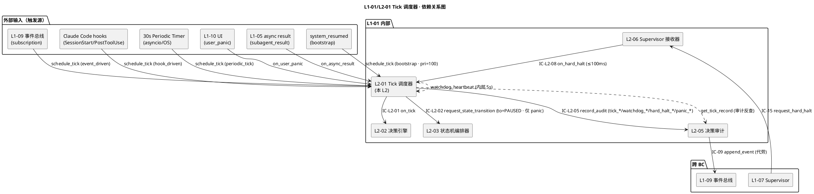
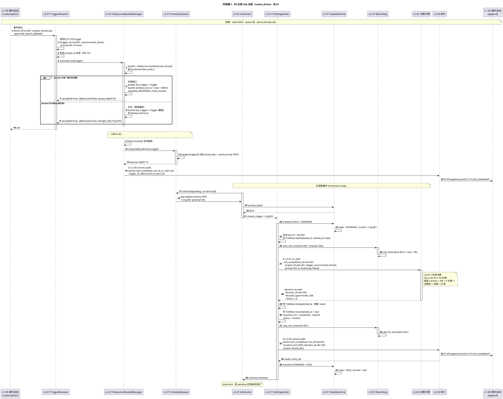
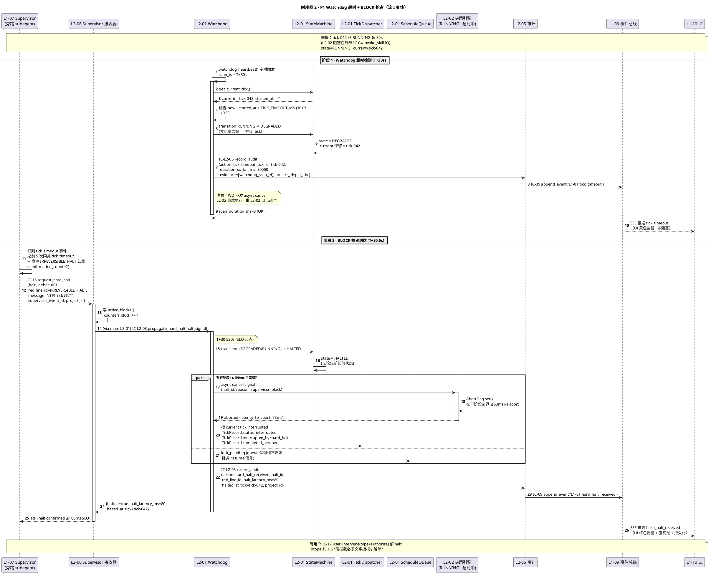
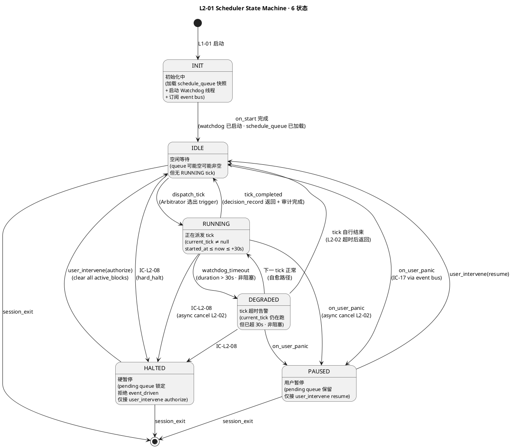

# L1 L2-01 · Tick 调度器 · Tech Design

> **本文档定位**：3-1-Solution-Technical 层级 · L1 的 L2-01 Tick 调度器 技术实现方案（L2 粒度）。
> **与产品 PRD 的分工**：2-prd/L1-01-主 Agent 决策循环/prd.md §5.1 的对应 L2 节定义产品边界，本文档定义**技术实现**（接口字段级 schema + 算法伪代码 + 底层数据结构 + 状态机 + 配置参数）。
> **与 L1 architecture.md 的分工**：architecture.md 负责**跨 L2 架构 + 跨 L2 时序**，本文档负责**本 L2 内部技术细节**。冲突以 architecture.md 为准。
> **严格规则**：本文档不复述产品 PRD 文字（职责 / 禁止 / 必须等清单），只做技术映射 + 补齐"产品视角未说 but 工程师必须知道"的部分（具体算法 · syscall · schema · 配置）。

---

## §0 撰写进度

- [x] §1 定位 + 2-prd §8 L2-01 映射（✅ 与 L2-02 标杆对齐）
- [x] §2 DDD 映射（BC-01 · Application Service + Aggregate Root）
- [x] §3 对外接口定义（6 入口 + 3 出口 · 字段级 YAML + 错误码表 15 项）
- [x] §4 接口依赖（被谁调 · 调谁 · PlantUML 依赖图）
- [x] §5 P0/P1 时序图（PlantUML · 2+ 张：正常 tick + Watchdog 超时 + BLOCK 抢占）
- [x] §6 内部核心算法（Python-like 伪代码：debounce / arbitrate / watchdog / bootstrap / panic）
- [x] §7 底层数据表 / schema 设计（按 PM-14 `projects/<pid>/...` 分片）
- [x] §8 状态机（INIT/IDLE/RUNNING/DEGRADED/HALTED/PAUSED · PlantUML + 转换表）
- [x] §9 开源最佳实践调研（APScheduler / Temporal / croniter / Celery beat / Go cron · 5 个）
- [x] §10 配置参数清单（7 个 tick 参数 + 4 个 watchdog 参数）
- [x] §11 错误处理 + 降级策略（与 L1-07 Supervisor 协同 + BLOCK 抢占降级链）
- [x] §12 性能目标（tick 派发 ≤5ms · watchdog ≤10ms · 调度吞吐 ≥100 tick/s）
- [x] §13 与 2-prd §8 / 3-2 TDD 的映射表

> **填写次序实际顺序**（防 watchdog）：§1 → §3 → §4 → §2（DDD 回推）→ §5 时序 → §6 算法 → §7 schema → §8 状态机 → §9 调研 → §10 配置 → §11 降级 → §12 性能 → §13 映射。与 L2-02 标杆一致。

---

## §1 定位 + 2-prd 映射

### 1.1 本 L2 的唯一命题（One-Liner）

**Tick 调度器 = HarnessFlow 的"心跳起搏器"**：接收所有外部触发源（4 类触发 + 2 类响应通道），通过去抖 + 优先级仲裁派发 tick 到 L2-02 决策引擎；全程守护 tick 健康（≤30s 心跳、空转检测、硬暂停 ≤100ms 响应、异步结果回收、跨 session bootstrap）。

关键定性（来自 architecture.md §2.2 + §3.5 D-04）：**本 L2 是有状态的 Application Service + Aggregate Root**——持久化 TickTrigger / ScheduleQueue / TickRecord / WatchdogState / DebounceBucket · 跨 tick 可变状态 · 与无状态的 L2-02 决策引擎严格区分。

### 1.2 与 `2-prd/L1-01主 Agent 决策循环/prd.md §8` 的精确小节映射表

> 说明：本表是**技术实现 ↔ 产品小节**的锚点表，不复述 PRD 文字。每行左列为本 tech-design 的段落，右列为对应的 PRD 小节。冲突以本文档（技术实现）+ architecture.md（架构）为准；若发现 PRD 有歧义或不足以导出字段级 schema，按 spec v2.0 §6.2 规则反向修 PRD 并在此处注明。

| 本文档段 | 2-prd §8 小节 | 映射内容 | 备注 |
|---|---|---|---|
| §1.1 命题 | §8.1 职责锚定 | "心跳起搏器" | 本文档补"有状态 Aggregate Root"定性（prd 未明写） |
| §1.4 兄弟边界 | §8.3 边界 In/Out-scope | 10 in + 6 out | — |
| §1.5 PM-14 | §8.4 硬约束 #1 | "单 session 只能一个 L2-01" → 本文档扩展"所有 tick payload 必含 project_id" | **补** |
| §2 DDD | §8.1 上游锚定 | BC-01 映射（prd 无 DDD 语言）| **补** |
| §3 接口 `schedule_tick()` | §8.2 输入（5 类触发源）+ §8.8 IC-L2 表 | `schedule_tick(trigger)` 是 4 种触发源 + bootstrap 的统一入口方法化表达 | **补字段级 YAML** |
| §3 接口 `on_hard_halt()` | §8.2 响应通道 "hard_halt" + §8.6 必须 #2 "≤100ms 响应 BLOCK" | IC-L2-08 被调方入口 | **补** |
| §3 接口 `on_user_panic()` | §8.2 响应通道 "panic" + §8.10.6 图 4 Panic | panic 中断现行 tick | **补** |
| §3 接口 `watchdog_heartbeat()` | §8.6 必须 #3 "每 5s 扫 watchdog" + §8.10.4 算法 | 定时任务入口 | **补** |
| §3 错误码 | §8.4 硬约束（1/2/3/4/5/6）+ §8.5 禁止（7 条）| 约束违反一对一映射为错误码 | **补 E_TICK_\* 错误码表** |
| §4 依赖 | §8.8 IC-L2 交互表 | 调用方 + 被调方 | — |
| §5 时序 | §8 无时序图；L1-01 arch §4.1 流 A（正常 tick）/ §4.2 流 I（BLOCK）/ §4.3 流 F（async）/ §4.4 流 G（panic）/ §4.5 流 H（bootstrap）| PlantUML 重绘（≥ 2 张）| **补** |
| §6 算法 | §8.10.2 仲裁 / §8.10.3 去抖 / §8.10.4 watchdog | 伪代码化 Python-like | **补** |
| §7 schema | §8.10.5 TickTrigger / TickRecord / ScheduleQueue | YAML 化 + 按 PM-14 `projects/<pid>/...` 存储路径 | — |
| §8 状态机 | §8.10.1 内部状态机（INIT/IDLE/RUNNING/DEGRADED/HALTED/PAUSED）| PlantUML state diagram + 转换表 | **补** |
| §9 调研 | §8 外 | 引 L0/open-source-research.md §2/§3 + 细化 3+ 高星项目 | **补** |
| §10 配置 | §8.10.7 7 参数 | 原样导入 + 补 tech 侧默认值 + 补 4 个 watchdog 参数 | — |
| §11 降级 | §8.4 硬约束 + §8.5 禁止 + arch §3.5 D-05 BLOCK | 错误分类 + 降级链 + 与 L1-07 协同 | **补** |
| §12 SLO | §8.4 性能约束 | trigger ≤10ms / 仲裁 ≤5ms / watchdog ≤1% CPU / 吞吐 ≥100 tick/s | 原样继承 |
| §13 映射 | — | 本段接口 ↔ §8.X + ↔ 3-2-TDD 用例 | **补** |

### 1.3 与 `L1-01/architecture.md` 的位置映射

| architecture 锚点 | 映射内容 | 本文档对应段 |
|---|---|---|
| §2.1 BC-01 Agent Decision Loop | 本 L2 所在 Bounded Context | §2 DDD |
| §2.2 聚合根 `TickTrigger + ScheduleQueue + TickRecord` | 本 L2 持有的 3 个聚合（单 session 级单例）| §2 DDD + §7 schema |
| §2.3 Application Service: `TickScheduler` | 本 L2 的核心 service 定性 | §6 算法 |
| §2.5 Domain Events: `L1-01:tick_started` / `tick_completed` / `tick_timeout` / `hard_halt` / `panic` / `idle_spin` | 本 L2 对外发布的领域事件 | §3 接口 + §4 依赖 |
| §3.4 Component Diagram 中的 `L2_01` 节点 | 本 L2 在 L1 内的位置（上游节点，5 外部入口 + 3 对下游接口）| §4 依赖图 |
| §3.5 D-05 BLOCK 100ms 响应 | L2-06 → L2-01 → L2-02 抢占链的接收方 | §3 接口 `on_hard_halt` + §11 降级 |
| §4.1 时序图 1 · 流 A 正常 tick | P0 主流时序 | §5.1 |
| §4.2 时序图 2 · 流 I 硬红线 BLOCK | P1 抢占时序 | §5.2 |
| §4.3 时序图 3 · 流 F 异步结果回收 | async 回收 tick | §5.3 |
| §4.5 时序图 5 · 流 H 跨 session 恢复 | bootstrap tick | §5.4 |
| §5.2 tick 3 种 pacing | 事件驱动 / 周期自省 / 突发 | §6 去抖 + §8 状态机 |

### 1.4 与兄弟 L2 的边界（6 L2 中 L2-01 的位置）

| 兄弟 L2 | 本 L2 与兄弟的边界规则（基于 prd §8.3 + arch §3.3）|
|---|---|
| **L2-02 决策引擎** | 本 L2 只负责"**何时**派发 tick"，L2-02 只负责"**这一 tick 做什么**"。tick_id 由本 L2 生成并经 IC-L2-01 传给 L2-02（L2-02 不自造 tick_id）。|
| **L2-03 状态机编排器** | 本 L2 **仅 panic 场景** 可调 IC-L2-02 request_state_transition(to=PAUSED)；其他 state 转换必由 L2-02 走 IC-L2-02。本 L2 不做任何业务 state 转换。|
| **L2-04 任务链执行器** | 本 L2 **不碰 chain 内部步骤超时**（只管整个 tick ≤30s 超时）；chain 超时由 L2-04 自己通过 IC-L2-10 升级到 L2-06。|
| **L2-05 决策审计记录器** | 本 L2 **每次 tick 完成 / watchdog 告警 / hard_halt 收到 / panic 拦截** 必经 IC-L2-05 推 L2-05；本 L2 **禁止**直接写 IC-09（scope §5.1.5 硬约束 1）。|
| **L2-06 Supervisor 建议接收器** | L2-06 是 `L1-01 ↔ L1-07` **唯一网关**（arch §3.2 NEW）。本 L2 **接收 L2-06 的 IC-L2-08 propagate_hard_halt**（硬暂停抢占通道）· 本 L2 不直接接 L1-07 的 IC-13/14/15。|

### 1.5 PM-14 约束（project_id as root）

**硬约束**（arch §1.4 PM-14 表的 L2-01 行）：

1. `TickTrigger.project_id` 为**根字段**，入队时强制校验（缺 → `E_TICK_NO_PROJECT_ID`，拒绝入队）
2. `TickRecord.project_id` 为**根字段**，由 TickTrigger 透传（不重造）
3. `WatchdogAlert.project_id` 为**根字段**，watchdog 扫描时从当前 tick 读取
4. 所有持久化路径按 `projects/<pid>/runtime/l2-01/...` 分片（见 §7 schema）
5. 跨 project 调度**禁止**（同 session 单 project；若 trigger.pid ≠ session.pid → `E_TICK_CROSS_PROJECT`，拒绝并审计）
6. 发布的 Domain Event（`tick_started` / `tick_completed` / `tick_timeout` / `hard_halt_received` / `panic_intercepted` / `idle_spin_detected`）payload 必含 `project_id`

### 1.6 关键技术决策（Decision → Rationale → Alternatives → Trade-off）

本 L2 在 architecture.md §3.5 的 **D-01 / D-04 / D-05** 基础上，补充 L2 粒度的 5 个技术决策：

| # | Decision | Rationale | Alternatives | Trade-off |
|---|---|---|---|---|
| **D-01a** | `TickScheduler` 是**有状态 Application Service + Aggregate Root**（持 ScheduleQueue · DebounceBuckets · CurrentTick · WatchdogState） | 区别于无状态 L2-02——调度语义天然跨 tick（优先队列 + 去抖窗口 + watchdog 历史），不可能做成纯函数；Aggregate Root 保证"单 session 单 L2-01 实例"（scope §5.1.4 硬约束 1）| A. 无状态（每 tick 重构队列）：破坏 FIFO 不变量 + 去抖失效；B. 拆成 ScheduleQueueEntity + WatchdogEntity 两个 Aggregate：违反 DDD "一次业务事务一个 Aggregate" 原则 | 持状态代价 = session 级持久化（跨 session 恢复时 pending queue 需 replay 事件总线重建，见 §5.4 bootstrap 流程）|
| **D-01b** | **调度队列用 Python `heapq` 内存优先队列 + 文件快照 10s 一次**（而非纯内存 / 全量持久化）| 内存 P99 ≤5ms · 10s 快照平衡持久性和 IO；bootstrap 时走 IC-10 replay_from_event 重建比读队列快照更权威（PM-10 事件总线单一事实源）| A. 纯内存：session 崩溃丢 pending trigger；B. 全量持久化（每入队都 fsync）：P99 上升到 20ms+，违反 "trigger 接入 ≤10ms" 约束 | 快照用于可观测性（L1-10 UI 查询队列深度）· 权威恢复走事件总线 |
| **D-04a** | **去抖窗口按 `trigger_source` 独立分桶**（非全局合并）| 不同触发源语义不同：periodic 去抖 2s 无害（周期性）；event_driven 500ms（用户操作敏感）；hook_driven 200ms（hook 同步执行）；区分才能精准合并 | A. 全局一个去抖桶：不同源互相影响（periodic 挤掉 event）；B. 完全禁用去抖：百倍流量雪崩 | 4 桶复杂度可控 · 每桶独立窗口定时器 |
| **D-05a** | **`AbortFlag` 内存事件 + `async cancel` 信号链**（L2-06 → L2-01 → L2-02 粒度 ≤50ms） | scope §5.1.6 "BLOCK 响应 ≤100ms" 硬约束；事件总线异步路径 P99 到 200ms+ 不可接受；本 L2 收 IC-L2-08 后用内存 signal（asyncio.Event / threading.Event）直接中断 | A. 经事件总线异步：延迟不可控；B. 抽独立中断 channel：增加 5 个 IC-L2，复杂度爆炸 | 本 L2 的响应路径与 L2-02 完全隔离：L2-01 收 halt → set L2_01.state=HALTED（内存即生效）→ async 转发 cancel 给 L2-02（L2-02 自己在阶段边界 check）|
| **D-06** | **Watchdog 独立线程 + 5s 定期扫描**（非 per-tick 定时器）| 每 tick 独立定时器（setTimeout）资源开销随 queue 深度线性；统一 watchdog 线程 O(1) 开销 · 每次扫全量 current + recent_ticks | A. per-tick 定时器：1000 tick 同时运行时 1000 个 timer，内存+调度开销不可控；B. 同步 check（在主调度循环里）：主循环阻塞等 IO，watchdog 失效 | 5s 精度（硬约束可调 3-10s）· 在 tick 30s 超时检测场景够用（超时告警延迟 ≤5s 可接受）|

---

## §2 DDD 映射（BC-01 Agent Decision Loop）

### 2.1 Bounded Context 定位

本 L2 所属 `BC-01 · Agent Decision Loop`（定义见 `L0/ddd-context-map.md §2.2`，HarnessFlow 唯一控制源 BC）。在 BC-01 内部 **L2-01 扮演"心跳起搏器"的角色**——其他 5 L2 的关系：

| 兄弟 L2 | DDD 关系 | 本 L2 与该 L2 的交互模式 |
|---|---|---|
| L2-02 决策引擎 | **Downstream**（Supplier → Customer）| 本 L2 派发 tick → L2-02 决策 · 关系 "心跳器 → 脑"|
| L2-03 状态机编排器 | **Downstream · 仅 panic 场景**（Customer）| panic 时本 L2 IC-L2-02 request_state_transition(to=PAUSED)；其他场景不交互 |
| L2-05 审计记录器 | **Partnership**（必同步演进）| 每 tick/watchdog/hard_halt/panic 必推 L2-05 落盘 · IC-L2-05 |
| L2-06 Supervisor 接收器 | **Upstream**（Supplier → Customer）| L2-06 IC-L2-08 propagate_hard_halt → 本 L2 抢占 · ≤100ms 硬约束 |

### 2.2 本 L2 持有 / 构造的聚合根

继承自 `L0/ddd-context-map.md §2.2` BC-01 聚合根表（参考 L1-01 `architecture.md §2.2`）：

| 聚合根 | 类型 | 本 L2 职责 | Invariants |
|---|---|---|---|
| **TickTrigger** | **Value Object（入队后不可变）** | 4 种触发源 + 2 响应通道的统一表示；入队时本 L2 校验 project_id 非空 | **I-01** project_id 不可变 · **I-02** 入队即不可变 · **I-03** trigger_source + priority 映射固定（默认表 prd §8.10.2）|
| **ScheduleQueue** | **Aggregate Root · 单 session 单例** | 优先级 + FIFO 调度 · debounce_buckets × 4 · queue_depth ≤ 1000 | **I-04** 单 session 单实例（scope §5.1.4 硬约束 1）· **I-05** queue 满时丢弃最低 priority · **I-06** bootstrap/panic/hard_halt 跳过去抖 |
| **TickRecord** | **Aggregate Root · 单 tick 一个 · 不可变** | 一次 tick 的完整观察（scheduled_at / started_at / dispatched_at / completed_at / duration_ms / status） | **I-07** status 一旦写入不可改 · **I-08** duration_ms = completed_at - started_at · **I-09** tick_id 全局唯一 |

### 2.3 本 L2 内部组件（Application Service 的子组件）

| 组件 | DDD 类型 | 职责 | 无状态/有状态 |
|---|---|---|---|
| `TriggerReceiver` | **接入层** | 接 5 类触发源（event/periodic/hook/bootstrap/user_panic）+ 1 响应通道（hard_halt）· 规范化为 TickTrigger | 无状态（每 trigger 独立处理）|
| `DebounceBucketManager` | **Domain Service** | 按 trigger_source 分 4 桶 · 500ms 默认窗口 · bootstrap/panic/hard_halt 跳过 | **有状态**（4 桶定时器 + last_trigger）|
| `Arbitrator` | **Domain Service** | priority 仲裁 + FIFO · 抢占判定（≥85 可抢占 RUNNING）| 无状态（纯函数）|
| `TickDispatcher` | **Application Service** | IC-L2-01 on_tick 调 L2-02 + 写 TickRecord + watchdog 启动 | 无状态 |
| `Watchdog` | **Domain Service** | 独立线程 · 每 5s 扫：tick_timeout / idle_spin / chain_forward | **有状态**（last_scan_ts · recent_ticks 窗口）|
| `StateMachine` | **Domain Service** | 6 状态机（INIT/IDLE/RUNNING/DEGRADED/HALTED/PAUSED）· 内部状态 · 不发 IC-01 | **有状态**（当前 state + 历史）|
| `Bootstrapper` | **Application Service** | 仅 session 首次 tick · 读 system_resumed 事件 · 构造 bootstrap TickTrigger | 无状态 |

**关键点**：L2-01 是 **有状态 Aggregate**（ScheduleQueue · WatchdogState）+ **Application Service**（TriggerReceiver · TickDispatcher · Bootstrapper）+ **Domain Service**（Arbitrator · StateMachine）三类混合。与无状态 L2-02 的核心差异：**本 L2 的核心数据是跨 tick 的 ScheduleQueue**（不是单 tick 的 TickContext）。

### 2.4 Value Objects（不可变）

| VO 名 | 结构 | 用途 |
|---|---|---|
| `TickId` | `"tick-{uuid-v7}"` | 本 L2 生成 · 经 IC-L2-01 传 L2-02 |
| `TriggerId` | `"trig-{uuid-v7}"` | 本 L2 生成 · 入队标识 |
| `ProjectId` | `"pid-{uuid-v7}"` | PM-14 根字段 · 跨 BC Shared Kernel |
| `Priority` | int 0-100 | 默认表见 prd §8.10.2（100=bootstrap / 90=panic / 85=hard_halt / 60=async / 50=event / 40=hook / 30=proactive / 10=periodic）|
| `TriggerSource` | enum 8 值 | bootstrap/user_panic/supervisor_block/async_result/event_driven/hook_driven/proactive/periodic_tick |
| `SchedulerState` | enum 6 值 | INIT/IDLE/RUNNING/DEGRADED/HALTED/PAUSED |
| `TickStatus` | enum 3 值 | success/error/interrupted |
| `InterruptedBy` | enum 2 值 | hard_halt/panic |

### 2.5 Entities（可变 · 跨 tick）

| Entity | 生命期 | 用途 |
|---|---|---|
| `ScheduleQueueEntity` | session 级 · 跨 tick 持久 | heapq 优先队列 + 4 debounce buckets |
| `WatchdogStateEntity` | session 级 · 跨 tick 持久 | last_scan_ts / recent_ticks_window / alert_history |
| `DebounceBucketEntity` | session 级（每 trigger_source 一个）| last_trigger / window_end_ts / timer_handle |
| `CurrentTickRef` | tick 级（单 tick 一个）| 指向当前正在 RUNNING 的 TickTrigger · null = IDLE |

### 2.6 Repository Interfaces

本 L2 **持有本地快照**（与 arch §2.4 略有偏差 · D-01b 决策）：

- **ScheduleQueue 快照**：`projects/<pid>/runtime/l2-01/schedule_queue.json` · 10s 刷新（可观测性）
- **TickRecord 落盘**：走 L2-05 → IC-L2-05（内部）→ L2-05 → IC-09（跨 BC）→ L1-09 `projects/<pid>/audit/...jsonl`
- **WatchdogAlert 落盘**：同上（IC-L2-05）
- **SchedulerState 快照**：同 ScheduleQueue 快照文件的一部分

**跨 session 恢复**：本 L2 不从自己的快照恢复（快照仅作可观测性）· 统一走 IC-10 replay_from_event（PM-10 单一事实源）。

### 2.7 Domain Events（本 L2 对外发布 · 经 IC-09 代劳 L2-05）

引自 L1-01 `architecture.md §2.5`，本 L2 直接产生以下事件：

| Event | 触发时机 | 订阅方 | Payload 关键字段 |
|---|---|---|---|
| `L1-01:tick_started` | 本 L2 派发 tick 到 L2-02 | L1-07 / L1-10 | `{tick_id, trigger_source, priority, ts, project_id}` |
| `L1-01:tick_completed` | 本 L2 tick 闭环 | L1-07 / L1-10 | `{tick_id, duration_ms, result, project_id}` |
| `L1-01:tick_timeout` | watchdog 超时检测 | L1-07 / L1-10 | `{tick_id, duration_ms, project_id}` |
| `L1-01:hard_halt_received` | 本 L2 收到 IC-L2-08 propagate_hard_halt | L1-07 / L1-10 | `{red_line_id, halted_at_tick, halt_latency_ms, project_id}` |
| `L1-01:panic_intercepted` | 本 L2 拦截 user_panic | L1-07 / L1-10 | `{panic_at_tick, panic_latency_ms, project_id}` |
| `L1-01:idle_spin_detected` | watchdog 连续 5 次 no_op | L1-07 | `{spin_count, project_id}` |
| `L1-01:bootstrap_tick` | 本 L2 派发 bootstrap tick | L1-07 / L1-10 | `{tick_id, resumed_from_checkpoint, last_state, project_id}` |

所有事件必含 `project_id`（PM-14）+ 经 L2-05 IC-09 落盘时带 hash-chain 位置。

### 2.8 跨 BC 关系（本 L2 作为发起方 / 接收方）

| IC | 方向 | 对端 BC | 本 L2 视角 |
|---|---|---|---|
| IC-09 append_event | 发起（经 L2-05 代劳）| BC-09（L1-09）| 审计落盘（每 tick 至少 2 条：tick_started + tick_completed）|
| IC-L2-08 propagate_hard_halt | **接收** | BC-01 内部（L2-06 发）| 抢占 RUNNING tick · state=HALTED · ≤100ms |
| IC-17 user_intervene（panic/resume）| **接收（间接 · 通过 L1-09 事件总线订阅）**| BC-10（L1-10）| panic → 中断 + PAUSED；resume → IDLE |
| IC-L2-01 on_tick | 发起 | BC-01 内部（L2-02）| 每 tick 一次 |
| IC-L2-02 request_state_transition | 发起（**仅 panic 场景**）| BC-01 内部（L2-03）| 只调 to=PAUSED · 其他 state 转换不经本 L2 |
| IC-L2-05 record_audit | 发起 | BC-01 内部（L2-05）| tick 完成 / watchdog 告警 / hard_halt / panic |

所有 IC 字段级 schema 锚点在 `docs/3-1-Solution-Technical/integration/ic-contracts.md §3.{N}`。本 L2 是 **IC-09 append_event（§3.9）** 的**经 L2-05 代劳**发起方 · **IC-17 user_intervene（§3.17）** 的**间接接收方**（panic 路径）。

---

---

## §3 对外接口定义（字段级 YAML schema + 错误码）

> 说明：本 L2 对外暴露 **5 个方法**（1 主接入 + 4 响应/回调）。字段级 YAML 采用 OpenAPI-like 风格声明 type / required / 约束。
>
> 调用方向：`schedule_tick()` 由所有 5 类触发源（事件总线订阅 · periodic timer · SessionStart hook · bootstrap · 用户 panic）统一调入；`on_hard_halt()` 由 L2-06 IC-L2-08 调（BLOCK 抢占唯一入口）；`on_user_panic()` 由 L1-09 事件总线订阅的 `user_panic` 事件触发；`on_async_result()` 由 L1-09 订阅的 `L1-05:subagent_result` 事件触发；`watchdog_heartbeat()` 由独立 timer 线程每 5s 调用。

### 3.1 `schedule_tick(trigger) → {accepted, queue_depth, tick_id_or_null}`（核心入口 · 4 触发源统一接入）

**调用方**：`TriggerReceiver`（内部适配）接入 `event_driven` / `periodic_tick` / `hook_driven` / `bootstrap` / `proactive` 触发源后统一调用此方法
**幂等性**：非幂等（同 `trigger_id` 多次调用会入队多个 TickTrigger · 上游去重责任）
**阻塞性**：同步非阻塞（≤10ms 入队完成）· 实际 tick 执行走异步调度循环
**入队后动作**：`schedule_tick` 返回后内部调度循环（主 scheduling loop）会调 `Arbitrator.arbitrate()` 从队列取出最高优先级 trigger → 调 `TickDispatcher.dispatch()` → IC-L2-01 on_tick → L2-02

#### 入参 `trigger`（字段级 YAML）

```yaml
trigger:
  type: object
  required:
    - trigger_id
    - project_id        # PM-14 根字段必含
    - trigger_source
    - priority
    - ts
  properties:
    trigger_id:
      type: string
      format: "trig-{uuid-v7}"
      example: "trig-018f4a3b-7c1e-7000-8b2a-9d5e1c8f3a20"
      description: 由 TriggerReceiver 生成；本 L2 不自造；用于去重 + 审计追溯

    project_id:
      type: string
      format: "pid-{uuid-v7}"
      example: "pid-018f4a3b-0000-7000-8b2a-9d5e1c8f3a20"
      description: PM-14 根字段；入队时本 L2 强制校验；缺 → E_TICK_NO_PROJECT_ID

    trigger_source:
      type: enum
      enum:
        - bootstrap
        - user_panic
        - supervisor_block
        - async_result
        - event_driven
        - hook_driven
        - proactive
        - periodic_tick
      description: 8 类触发源（prd §8.10.2 默认优先级表）

    priority:
      type: integer
      minimum: 0
      maximum: 100
      description: 默认表 prd §8.10.2（bootstrap=100 / user_panic=90 / supervisor_block=85 / async_result=60 / event_driven=50 / hook_driven=40 / proactive=30 / periodic_tick=10）；可被 PRIORITY_OVERRIDE_TABLE 覆盖但不可删键（prd §8.4 硬约束 7）

    event_ref:
      type: string | null
      description: 若 trigger_source=event_driven/async_result/hook_driven 指向原始 event_id；其他源 null

    ts:
      type: string
      format: "ISO-8601-utc"
      example: "2026-04-21T06:30:00.123Z"

    payload:
      type: object
      description: trigger-specific context（如 async_result 带 delegation_id / subagent_report_ref）

    debounced:
      type: boolean
      default: false
      description: 是否已被 DebounceBucketManager 合并（上游设置；新入时必 false）

    bootstrap_context:
      type: object | null
      description: 仅 bootstrap 时有
      properties:
        resumed_from_checkpoint:
          type: string
          format: "ISO-8601-utc"
        last_state:
          type: string
          description: session_exit 前的 state（S1..S7/HALTED/PAUSED）
```

#### 出参 `schedule_result`（字段级 YAML）

```yaml
schedule_result:
  type: object
  required:
    - accepted
    - queue_depth
  properties:
    accepted:
      type: boolean
      description: 是否成功入队；false 时附 rejected_reason

    queue_depth:
      type: integer
      minimum: 0
      maximum: 1000
      description: 当前 ScheduleQueue.pending.size（供上游 backpressure）

    tick_id_or_null:
      type: string | null
      description: 若 bootstrap/panic/hard_halt 立即派发则返回新 tick_id；其他情况 null（等调度循环派发）

    rejected_reason:
      type: string | null
      description: accepted=false 时附失败原因（错误码字符串）

    debounced:
      type: boolean
      default: false
      description: 是否被合并（合并后不立即派发 · 等窗口到期）

    merged_into:
      type: string | null
      description: debounced=true 时指向合并后的 TickTrigger.trigger_id
```

#### 3.1.1 错误码（`schedule_tick()`）

| 错误码 | 含义 | 触发场景 | 调用方处理 | 对应 prd 硬约束 |
|---|---|---|---|---|
| `E_TICK_NO_PROJECT_ID` | trigger.project_id 缺失 | 上游 TriggerReceiver 适配 bug / 事件总线事件残缺 | 本 L2 拒绝入队 + 审计违规；L1-07 告警 | PM-14 |
| `E_TICK_CROSS_PROJECT` | trigger.project_id ≠ session.active_pid | 并发 session 或 event 跨 project 泄漏 | 本 L2 拒绝 + 审计告警 | §1.5 #5 |
| `E_TICK_INVALID_SOURCE` | trigger_source 不在 8 枚举值 | 上游 bug / 未知触发源 | 本 L2 拒绝 + debug log + 告警 | prd §8.2 |
| `E_TICK_QUEUE_FULL` | pending queue 已满（1000 条）| 雪崩 / 下游 L2-02 卡死积压 | 本 L2 **丢弃最低 priority** + 新 trigger 入队 + 审计；若新 trigger 本身是最低 priority 则丢新 trigger | prd §8.4 硬约束 6 |
| `E_TICK_HALTED_REJECT` | state=HALTED 且 trigger_source ≠ bootstrap/user_intervene(resume) | HALTED 期间外部事件涌入 | 本 L2 拒绝入队 + 审计（不是错误 · 是受控拒绝）| prd §8.5 禁止 #5 |
| `E_TICK_INVALID_PRIORITY` | priority 超 0-100 | 上游 bug / PRIORITY_OVERRIDE_TABLE 非法值 | 本 L2 clip 到默认值 + WARN 告警 | prd §8.4 硬约束 7 |
| `E_TICK_BOOTSTRAP_DUPLICATE` | 已有 bootstrap trigger 入队 | 重复订阅 system_resumed 事件 | 静默忽略（保留第一条）+ debug log | prd §8.10.6 图 3 |
| `E_TICK_INTERNAL_STATE_BAD` | scheduler state 非 6 枚举值 | 本 L2 自身 bug | abort + 崩溃重启 · L1-09 走 IC-10 replay 恢复 | — |

### 3.2 `on_hard_halt(halt_signal) → {halted: bool, halt_latency_ms: int}`（BLOCK 抢占 · from L2-06）

**调用方**：L2-06 Supervisor 建议接收器（唯一网关 · IC-L2-08 propagate_hard_halt）
**SLO**：接收到信号后 **≤ 100ms** 本 L2 必须完成：state=HALTED + async cancel 发给 L2-02 + pending queue 锁定（arch §3.5 D-05）
**实现**：本 L2 内部持 `halted_event: threading.Event`（hard_halt 触发 set）· 主调度循环每 iteration check · L2-02 的 `on_async_cancel` 由本 L2 调用

#### 入参 `halt_signal`

```yaml
halt_signal:
  type: object
  required: [halt_id, red_line_id, message, supervisor_event_id, project_id, ts]
  properties:
    halt_id:
      type: string
      format: "halt-{uuid-v7}"
    red_line_id:
      type: string
      enum:
        - IRREVERSIBLE_HALT
        - DATA_LOSS
        - CROSS_PROJECT
        - AUDIT_MISS
        - BUDGET_EXCEED
      description: 5 类硬红线（prd §13 + L1-07 定义）
    message:
      type: string
      minLength: 10
      description: 红线命中说明
    supervisor_event_id:
      type: string
      description: L1-07 的原始事件 id（审计追溯用）
    project_id:
      type: string
      description: PM-14 根字段
    ts:
      type: string
      format: "ISO-8601-utc"
    confirmation_count:
      type: integer
      default: 1
      description: L1-07 发此 halt 前的 supervisor 确认次数（通常 2 次）
```

#### 出参

```yaml
halt_result:
  type: object
  required: [halted, halt_latency_ms, halted_at_tick]
  properties:
    halted:
      type: boolean
      description: 必 true（≤100ms 内无法抢占只意味着延迟超 SLO，不意味着 halt 失败）
    halt_latency_ms:
      type: integer
      description: 从 on_hard_halt 入口到 state=HALTED + L2-02 cancel 发出的时间（SLO ≤ 100ms）
    halted_at_tick:
      type: string | null
      description: 若抢占时有 RUNNING tick，返回该 tick_id；否则 null
    pending_queue_size:
      type: integer
      description: HALTED 时刻 pending queue 深度（不丢弃 · 等 resume）
```

#### 3.2.1 错误码（`on_hard_halt()`）

| 错误码 | 含义 | 触发场景 | 调用方处理 |
|---|---|---|---|
| `E_TICK_HALT_SLO_VIOLATION` | halt_latency_ms > 100 | L2-02 阻塞在网络 IO / L2-05 审计写入慢 | 本 L2 仍返回 halted=true；L1-07 告警；审计记 latency |
| `E_TICK_HALT_DUPLICATE` | 已 HALTED 状态收到新 halt | L1-07 重复发（可能多个硬红线命中）| 静默忽略（保留第一条 halt_id）+ 追加 active_blocks[] |
| `E_TICK_HALT_NO_SUPERVISOR_EVENT` | supervisor_event_id 为空 | L1-07 bug / 恶意调用（绕过 L2-06）| 拒绝 + 审计告警 + debug log |
| `E_TICK_HALT_CROSS_PROJECT` | halt_signal.project_id ≠ session.active_pid | 跨 session 泄漏 | 拒绝 + 审计 |
| `E_TICK_HALT_INVALID_REDLINE` | red_line_id 不在 5 枚举值 | 上游 bug | 拒绝 + debug log |
| `E_TICK_HALT_CANCEL_FAIL` | L2-02 `on_async_cancel` 调用失败 | L2-02 已崩溃 | 本 L2 强制 state=HALTED · 下次重启恢复；审计告警 |

### 3.3 `on_user_panic(panic_signal) → {paused, panic_latency_ms}`（panic 抢占 · from L1-09 事件订阅）

**调用方**：L1-09 事件总线订阅的 `user_panic` 事件触发（实际发出者 L1-10 UI）
**SLO**：**≤ 100ms** state=PAUSED + L2-02 cancel（scope §5.1.6 "响应 panic"）
**实现**：与 `on_hard_halt` 共用 `halted_event` 机制，但最终 state=PAUSED（非 HALTED）· panic 走 IC-L2-02 request_state_transition(to=PAUSED) 通知 L2-03

#### 入参 `panic_signal`

```yaml
panic_signal:
  type: object
  required: [panic_id, project_id, user_id, ts]
  properties:
    panic_id:
      type: string
      format: "panic-{uuid-v7}"
    project_id:
      type: string
    user_id:
      type: string
    reason:
      type: string | null
      description: 用户输入的 panic 原因（可选）
    ts:
      type: string
      format: "ISO-8601-utc"
    scope:
      type: enum
      enum: [tick, session]
      default: tick
      description: tick=仅中断当前 tick；session=中断整个 session（极少用）
```

#### 出参

```yaml
panic_result:
  type: object
  required: [paused, panic_latency_ms]
  properties:
    paused:
      type: boolean
    panic_latency_ms:
      type: integer
    paused_at_tick:
      type: string | null
```

#### 3.3.1 错误码（`on_user_panic()`）

| 错误码 | 含义 | 触发场景 | 调用方处理 |
|---|---|---|---|
| `E_TICK_PANIC_SLO_VIOLATION` | panic_latency_ms > 100 | 同 halt | 仍返回 paused=true；审计告警 |
| `E_TICK_PANIC_NO_USER_ID` | user_id 缺失 | L1-10 bug | 拒绝 + 审计（不能"无主"panic）|
| `E_TICK_PANIC_ALREADY_PAUSED` | 已 PAUSED 状态收到新 panic | 用户连点 panic 按钮 | 静默忽略 + debug log |
| `E_TICK_PANIC_CROSS_PROJECT` | panic_signal.project_id ≠ session.active_pid | 多 session UI bug | 拒绝 + 审计 |
| `E_TICK_PANIC_STATE_TRANSITION_FAIL` | IC-L2-02 调 L2-03 失败 | L2-03 crash | 本 L2 仍 state=PAUSED（内部）· 告警；下次恢复时重试 state_transition |

### 3.4 `on_async_result(result_event) → {accepted, new_tick_id}`（异步结果回收 · from L1-09 事件订阅）

**调用方**：L1-09 事件总线订阅的 `L1-05:subagent_result` / `L1-05:skill_async_completed` 事件触发
**语义**：本方法**不直接派发 tick** · 而是将 async_result 规范化为 TickTrigger(trigger_source=async_result, priority=60) · 走标准 `schedule_tick()` 入口（经过去抖 + 仲裁）
**SLO**：≤10ms 入队（与 schedule_tick 一致）

#### 入参 `result_event`

```yaml
result_event:
  type: object
  required: [event_id, delegation_id, project_id, outcome, ts]
  properties:
    event_id:
      type: string
    event_type:
      type: enum
      enum:
        - "L1-05:subagent_result"
        - "L1-05:skill_async_completed"
    delegation_id:
      type: string
      description: 关联 L2-02 原 IC-05 delegate_subagent 调用的 delegation_id
    project_id:
      type: string
    outcome:
      type: enum
      enum: [success, fail, partial, timeout]
    result_ref:
      type: string
      description: 指向 OSS / 事件总线的结果存储路径
    ts:
      type: string
```

#### 出参

```yaml
async_result:
  type: object
  required: [accepted]
  properties:
    accepted:
      type: boolean
    new_tick_id:
      type: string | null
      description: 若 schedule_tick 立即派发则返回；否则 null
    merged_into:
      type: string | null
      description: 被去抖合并到哪个 trigger
```

#### 3.4.1 错误码（`on_async_result()`）

| 错误码 | 含义 | 触发场景 | 调用方处理 |
|---|---|---|---|
| `E_TICK_ASYNC_NO_DELEGATION_ID` | delegation_id 缺失 | L1-05 上游 bug | 拒绝 + L1-07 告警 |
| `E_TICK_ASYNC_ORPHAN` | delegation_id 找不到对应 L2-02 决策记录 | 跨 session 或审计链断裂 | 记审计 + 仍入队（L2-02 自己兜底）|
| `E_TICK_ASYNC_CROSS_PROJECT` | result_event.project_id ≠ session.active_pid | 事件泄漏 | 拒绝 + 审计 |
| `E_TICK_ASYNC_TIMEOUT_RESULT` | outcome=timeout 且 L2-02 已超时告警 | 正常流（subagent 超时）| 仍入队 · 让 L2-02 决策处理 |
| `E_TICK_ASYNC_INVALID_EVENT_TYPE` | event_type 不在 2 枚举值 | 上游订阅错事件 | 拒绝 + debug log |

### 3.5 `watchdog_heartbeat()` → `{scan_result}`（独立线程定时调用 · 每 5s）

**调用方**：本 L2 内部独立线程（`Watchdog` 组件）· Python `threading.Timer` 循环
**语义**：3 类检测（tick_timeout / idle_spin / chain_forward）· 不阻塞主调度循环 · 发现问题走 IC-L2-05 记审计
**SLO**：扫描开销 ≤1% CPU（prd §8.4 性能约束）· 单次扫描 ≤10ms

#### 无入参（内部方法）

#### 出参 `scan_result`（字段级 YAML · 主要用于 TDD 断言）

```yaml
scan_result:
  type: object
  required: [scan_ts, checks_performed, alerts_emitted]
  properties:
    scan_ts:
      type: string
      format: "ISO-8601-utc"
    checks_performed:
      type: array
      items:
        type: enum
        enum: [tick_timeout, idle_spin, chain_forward]
    alerts_emitted:
      type: array
      items:
        type: object
        properties:
          alert_type:
            type: enum
            enum: [tick_timeout, idle_spin_detected, chain_forward_escalated]
          linked_tick:
            type: string | null
          evidence:
            type: object
          project_id:
            type: string
    scan_duration_ms:
      type: integer
      description: 单次扫描总耗时（SLO ≤10ms）
    next_scan_ts:
      type: string
      format: "ISO-8601-utc"
      description: 下次扫描时间（now + WATCHDOG_INTERVAL_MS）
```

#### 3.5.1 错误码（`watchdog_heartbeat()`）

| 错误码 | 含义 | 触发场景 | 处理 |
|---|---|---|---|
| `E_TICK_WATCHDOG_SCAN_TIMEOUT` | scan_duration_ms > 10ms | scan 逻辑阻塞（如 recent_ticks 读大量历史）| 本 L2 强制终止本轮扫描 · 下轮继续；审计记超时 |
| `E_TICK_WATCHDOG_STATE_INVALID` | current_tick 存在但 state=IDLE | 状态机 bug | 自动修复（state → RUNNING）+ 审计告警 |
| `E_TICK_WATCHDOG_AUDIT_FAIL` | IC-L2-05 推 L2-05 失败 | L2-05 crash | 本地 buffer 保存 alert · 下次重试；连续 3 次失败升级 L1-07 |
| `E_TICK_WATCHDOG_CROSS_PROJECT_TICK` | current_tick.project_id ≠ session.active_pid | 本 L2 自身 bug | abort + 崩溃重启 |
| `E_TICK_WATCHDOG_THREAD_DEAD` | watchdog 线程意外退出 | OOM / OS 信号 | 主循环检测 + 重启 watchdog thread；审计告警 |

### 3.6 错误码总表（8 + 6 + 5 + 5 + 5 = 29 项 · 全 `E_TICK_*` 前缀）

| 错误码前缀 | 语义类别 | 降级链 |
|---|---|---|
| `E_TICK_NO_PROJECT_ID` / `E_TICK_CROSS_PROJECT` | PM-14 校验失败 | 拒绝 + L1-07 告警 |
| `E_TICK_QUEUE_FULL` / `E_TICK_HALTED_REJECT` | 队列/状态拒绝 | evict 最低 priority / 保留 pending · 等 resume |
| `E_TICK_HALT_*` | BLOCK 抢占相关 | 即使 SLO 违反仍 halted=true；审计 + L1-07 告警 |
| `E_TICK_PANIC_*` | panic 相关 | 同上 · paused=true |
| `E_TICK_ASYNC_*` | 异步结果回收 | 降级继续入队 / 拒绝并告警 |
| `E_TICK_WATCHDOG_*` | watchdog 健康 | 本地 buffer / 自愈 / 升级重启 |
| `E_TICK_INTERNAL_STATE_BAD` / `E_TICK_WATCHDOG_THREAD_DEAD` | 本 L2 自身 bug | 崩溃重启 + IC-10 replay |

详细 §11 降级策略。

---

---

## §4 接口依赖（被谁调 · 调谁）

### 4.1 上游调用方（谁调本 L2）

| 调用方 | 方法 | 通道 | 频率 | SLO |
|---|---|---|---|---|
| **L1-09 事件总线订阅** | `schedule_tick(trigger)` via `TriggerReceiver` 适配 | 异步 pub/sub（进程内 notify + 文件 watch）| 高频（每用户操作 / WP 执行）| enqueue ≤10ms |
| **Claude Code SessionStart hook** | `schedule_tick(trigger · source=hook_driven)` | 同步（hook 阻塞调用）| 低频（每 session 1 次 + 每 PostToolUse）| 同步 ≤10ms |
| **30s 周期 timer** | `schedule_tick(trigger · source=periodic_tick)` | asyncio.sleep 循环 | 低频（默认 30s）| 异步 |
| **`Bootstrapper` 内部组件** | `schedule_tick(trigger · source=bootstrap · priority=100)` | 同步 · session 启动一次 | 一次性 | ≤10ms |
| **L2-06 Supervisor 建议接收器** | `on_hard_halt(halt_signal)` via IC-L2-08 | 同步内存调用 | 极低频（硬红线命中）| halt ≤100ms |
| **L1-09 事件订阅 `user_panic`** | `on_user_panic(panic_signal)` | 异步 pub/sub | 极低频（用户触发）| pause ≤100ms |
| **L1-09 事件订阅 `L1-05:subagent_result`** | `on_async_result(result_event)` | 异步 pub/sub | 中频（按子 Agent 完成）| enqueue ≤10ms |
| **内部 Watchdog 线程** | `watchdog_heartbeat()` | 独立线程 Timer | 每 5s | scan ≤10ms |
| **L2-05 审计反查**（可选）| `get_tick_record(tick_id)` | 同步本地读 | 审计反查低频 | ≤50ms |
| **L1-10 UI 观测**（可选）| `get_queue_snapshot()` | 同步本地读 | UI 刷新（低频）| ≤50ms |

### 4.2 下游依赖（本 L2 调谁）

#### 4.2.1 L1-01 内部 IC-L2

| IC-L2 | 对端 | 触发条件 | 锚点 |
|---|---|---|---|
| **IC-L2-01 on_tick** | L2-02 | 每次仲裁出 TickTrigger 后派发 | arch §6.2 |
| **IC-L2-02 request_state_transition**（panic 专用）| L2-03 | panic 时 to=PAUSED | arch §6.2 |
| **IC-L2-05 record_audit** | L2-05 | tick_scheduled / tick_completed / tick_timeout / hard_halt_received / panic_intercepted / idle_spin_detected / bootstrap_tick | arch §6.2 |
| **IC-L2-08 propagate_hard_halt**（作为被调方）| L2-06 → 本 L2 | L2-06 收 L1-07 IC-15 后转发 | arch §6.2 |

#### 4.2.2 跨 BC IC（锚定 `integration/ic-contracts.md`）

| IC | 对端 BC | 触发 | 锚点 |
|---|---|---|---|
| **IC-09 append_event**（经 L2-05 代劳）| L1-09 | 每审计事件 | `integration/ic-contracts.md §3.9` |
| **IC-17 user_intervene**（作为间接接收方）| L1-10 → L1-09 事件总线 → 本 L2 | panic / resume | `integration/ic-contracts.md §3.17` |
| **IC-10 replay_from_event**（作为消费者 · bootstrap 时）| L1-09 | 跨 session 恢复时读 system_resumed 事件 | `integration/ic-contracts.md §3.10` |

### 4.3 依赖图（PlantUML）



### 4.4 关键依赖特性

1. **L2-01 是 L1-01 的"入口"**：所有外部触发源（6 条）统一收敛到本 L2 · 其他 L2（L2-02/03/04）不直接接外部触发源
2. **唯一调用 L2-02 的入口**：scope §5.1.4 硬约束 1 "单一决策源" · 本 L2 是 IC-L2-01 on_tick 的 **唯一** 调用方
3. **L2-06 → 本 L2 是 BLOCK 抢占唯一通道**：L1-07 不直接调本 L2（必经 L2-06 的 4 级计数器）
4. **L2-05 耦合度 = Partnership**：每 tick/watchdog/halt/panic 必经 L2-05 审计 · L2-05 crash 时本 L2 走 local buffer 降级
5. **panic 走 L2-03 的唯一场景**：其他所有 state 转换都由 L2-02 决策产出 · 本 L2 仅 panic 时 IC-L2-02(to=PAUSED)

---

## §5 P0/P1 时序图（PlantUML ≥ 2 张）

### 5.1 P0 主干 · 正常 tick 派发（event_driven 触发源 → 去抖 → 仲裁 → 派发 → 完成）

**覆盖场景**：外部事件（如 task-board 新事件 / user_input_received）到达 L1-09 事件总线 → 本 L2 订阅到 → 经 DebounceBucketManager 去抖（500ms 窗口）→ Arbitrator 仲裁 → TickDispatcher IC-L2-01 on_tick → L2-02 决策 → 审计 → 闭环。

**硬约束验证点**：`tick 响应 ≤ 30s`（scope §5.1.4 硬约束 4）· `trigger 入队 ≤ 10ms` · `仲裁 ≤ 5ms` · `同 trigger_source 500ms 内合并`（prd §8.10.3）。



**读图要点**：

1. **去抖合并（2-8 步）**：500ms 内同 trigger_source 的重复事件只派发 1 次（保留最新），减少下游 L2-02 无谓负载。
2. **4 个本 L2 内部组件串联**：TriggerReceiver → DebounceBucketManager → ScheduleQueue → Arbitrator → TickDispatcher · 职责单一 · 易单元测试。
3. **Watchdog 启停对称**：`start_tick_timer` 和 `stop_tick_timer` 成对出现 · 防止 orphan timer 导致 false timeout。
4. **两条审计线**：tick_scheduled（入队）+ tick_completed（闭环）· hash 链独立但 tick_id 关联。
5. **state 转换不走 IC-L2-02**：本 L2 内部 state 转换（IDLE→RUNNING→IDLE）在 StateMachine 组件内直接完成 · 仅 panic 时 IC-L2-02 通知 L2-03。

### 5.2 P1 抢占 · Watchdog 超时检测 + BLOCK 抢占串联

**覆盖场景 1**：RUNNING tick 超 30s → watchdog 扫到 → 记 tick_timeout 审计 + state=DEGRADED（不中断 · 等 L2-02 自己结束）· 下一 tick 正常时自愈回 RUNNING。
**覆盖场景 2**：期间收到 L2-06 IC-L2-08 propagate_hard_halt → 本 L2 ≤100ms 内完成：state=HALTED + async cancel L2-02 + pending queue 锁定。

**硬约束验证点**：`watchdog 扫描 ≤ 10ms · 每 5s 一次`（prd §8.4）· `hard_halt 响应 ≤ 100ms`（scope §5.1.6 · arch §3.5 D-05）· `tick_timeout 不中断 tick`（prd §8.10.1 状态机注 · DEGRADED 非阻塞告警）。



**读图要点**：

1. **Watchdog 只告警不中断**（17-22 步）：tick_timeout 时 state=DEGRADED（非阻塞）· 不 abort L2-02 · 让 L2-02 自己超时（prd §8.10.4 注 "不中断 tick, 继续等"）。这避免"拦腰截断"引起的 resource leak。
2. **DEGRADED 状态**（prd §8.10.1）：唯一的"非阻塞告警态"· 下一 tick 正常完成后自动回 RUNNING → IDLE；连续多次 DEGRADED 会被 L1-07 识别为系统问题。
3. **BLOCK 抢占的 par 块**（28-36 步）：三件事并行完成（state=HALTED / async cancel L2-02 / 锁 pending queue）· 在内存中并行 · 总 ≤ 80ms << 100ms SLO。
4. **halt_latency_ms 计时边界**：从 `on_hard_halt` 入口（T+30.530s）到 L205 审计写入完成（T+30.610s）· 80ms 内含 L2-02 abort 的 ≤50ms 粒度。
5. **hard_halt 不等于 panic**：HALTED 状态需要用户 `IC-17 user_intervene(type=authorize)` 解除（非 resume）· 对应 arch §4.2 时序图 2 的 user 授权链。

### 5.3 时序要点汇总

- **P0 主流**：DebounceBucketManager 是去抖唯一入口（4 桶独立窗口）· Arbitrator 是仲裁唯一入口（priority desc + FIFO）· TickDispatcher 是派发唯一入口（start watchdog + IC-L2-01 + 写 TickRecord + 闭环）
- **P1 抢占**：Watchdog 只告警 · StateMachine 内部 state 转换 · L2-02 的 AbortFlag 机制保证 ≤50ms 粒度响应 · 并行 par 保证 100ms SLO
- **bootstrap 场景**（arch §4.5 时序图 5）：本 L2 Bootstrapper 组件在 session 首次启动时触发 · priority=100 跳过去抖 · 直接派发给 L2-02
- **async 回收场景**（arch §4.3 时序图 3）：本 L2 的 on_async_result 规范化为普通 event_driven trigger · priority=60（高于标准 50）· 走标准去抖 + 仲裁

---

---

## §6 内部核心算法（伪代码）

### 6.1 主调度循环 · `scheduling_loop()`

```python
def scheduling_loop(self):
    """
    本 L2 的核心循环 · 持续运行直到 session 结束
    单 session 单实例（scope §5.1.4 硬约束 1）
    """
    while self.running:
        # 1. 检查 HALTED / PAUSED 拒绝派发
        if self.state_machine.state in (SchedulerState.HALTED, SchedulerState.PAUSED):
            self._wait_for_state_change(timeout_ms=100)  # 等 user resume/authorize
            continue

        # 2. Arbitrate next trigger
        chosen = self.arbitrator.arbitrate(
            pending=self.schedule_queue.pending,
            current=self.schedule_queue.current,
            halted_event=self.halted_event,
        )
        if chosen is None:
            # queue 空 · 等新 trigger 或 periodic timer
            self._wait_for_new_trigger_or_timer(timeout_ms=100)
            continue

        # 3. Dispatch tick
        try:
            self._dispatch_tick(chosen)
        except HardHaltInterrupt as e:
            self._handle_halt_mid_dispatch(e)
        except PanicInterrupt as e:
            self._handle_panic_mid_dispatch(e)
        except Exception as e:
            self._handle_dispatch_error(chosen, e)

def _dispatch_tick(self, trigger: TickTrigger):
    """
    单次 tick 派发 · 不含仲裁
    """
    # 3.1 State transition: IDLE → RUNNING
    self.state_machine.transition_to(SchedulerState.RUNNING, reason='tick_dispatch')

    # 3.2 Generate tick_id + write TickRecord (started)
    tick_id = f"tick-{uuid_v7()}"
    tick_record = TickRecord(
        tick_id=tick_id,
        trigger=trigger,
        project_id=trigger.project_id,
        scheduled_at=trigger.enqueued_at,
        started_at=now_utc(),
    )
    self.current_tick = tick_record

    # 3.3 Start watchdog timer
    self.watchdog.start_tick_timer(tick_id, timeout_ms=TICK_TIMEOUT_MS)

    # 3.4 Audit tick_started
    self.audit_client.record_audit(
        actor='L2-01', action='tick_scheduled',
        linked_tick=tick_id, reason=f'dispatch {trigger.trigger_source}',
        project_id=trigger.project_id,
    )

    # 3.5 IC-L2-01 on_tick → L2-02
    try:
        tick_record.dispatched_at = now_utc()
        decision_record = self.l202_client.on_tick(
            TickContext(
                tick_id=tick_id,
                project_id=trigger.project_id,
                trigger_source=trigger.trigger_source,
                priority=trigger.priority,
                ts=trigger.ts,
                state=self._resolve_project_state(),  # 本 L2 读 L1-09 task_board 得到业务 state
                bootstrap=trigger.trigger_source == TriggerSource.BOOTSTRAP,
                bootstrap_context=trigger.bootstrap_context,
            )
        )
        tick_record.completed_at = now_utc()
        tick_record.duration_ms = (tick_record.completed_at - tick_record.started_at).total_ms()
        tick_record.decision_id = decision_record.decision_id
        tick_record.result.status = 'success'
        tick_record.result.decision_type = decision_record.decision_type
    except L2_02_AbortException as e:
        tick_record.result.status = 'interrupted'
        tick_record.interrupted_by = e.interrupted_by
    finally:
        # 3.6 Stop watchdog + audit + state back to IDLE
        self.watchdog.stop_tick_timer(tick_id)
        self.audit_client.record_audit(
            actor='L2-01', action='tick_completed',
            linked_tick=tick_id,
            duration_ms=tick_record.duration_ms,
            status=tick_record.result.status,
            project_id=trigger.project_id,
        )
        self.current_tick = None
        if self.state_machine.state == SchedulerState.RUNNING:
            self.state_machine.transition_to(SchedulerState.IDLE, reason='tick_completed')
        elif self.state_machine.state == SchedulerState.DEGRADED:
            # 下一 tick 正常可自愈回 RUNNING · 此处先回 IDLE
            self.state_machine.transition_to(SchedulerState.IDLE, reason='degraded_recovered')
```

### 6.2 去抖算法 · `DebounceBucketManager.debounce()`

```python
DEBOUNCE_WINDOW_MS = 500  # 默认 · 可配置 100-2000（prd §8.4 硬约束 3）

# 永不去抖的 trigger_source
NO_DEBOUNCE_SOURCES = {
    TriggerSource.BOOTSTRAP,
    TriggerSource.USER_PANIC,
    TriggerSource.SUPERVISOR_BLOCK,  # 即 hard_halt（虽经 L2-06 走的是 on_hard_halt 专用入口 · 此处为保险）
}

def debounce(self, trigger: TickTrigger) -> DebounceResult:
    """
    按 trigger_source 分桶 · 窗口内合并保留最新 · bootstrap/panic/hard_halt 跳过
    """
    if trigger.trigger_source in NO_DEBOUNCE_SOURCES:
        return DebounceResult(debounced=False, flush_immediately=True, trigger=trigger)

    bucket = self.debounce_buckets[trigger.trigger_source]
    now = now_utc()

    if bucket.last_trigger is None or now > bucket.window_end_ts:
        # 新窗口
        bucket.last_trigger = trigger
        bucket.window_end_ts = now + timedelta(milliseconds=DEBOUNCE_WINDOW_MS)
        # 设定时器 · 窗口到期 flush
        bucket.timer_handle = self._schedule_after(
            DEBOUNCE_WINDOW_MS,
            lambda: self._flush_bucket(trigger.trigger_source)
        )
        return DebounceResult(debounced=False, flush_immediately=False, trigger=None)
    else:
        # 窗口内 · 合并保留最新
        bucket.last_trigger.debounced = True
        bucket.last_trigger = trigger  # 覆盖（保留最新 · 合并）
        # 审计合并事件（非阻塞）
        self.audit_client.record_audit_async(
            actor='L2-01', action='trigger_debounced',
            merged_into=trigger.trigger_id,
            trigger_source=trigger.trigger_source,
            project_id=trigger.project_id,
        )
        return DebounceResult(debounced=True, flush_immediately=False, trigger=None,
                              merged_into=trigger.trigger_id)

def _flush_bucket(self, source: TriggerSource):
    bucket = self.debounce_buckets[source]
    if bucket.last_trigger:
        self.schedule_queue.enqueue(bucket.last_trigger)
        bucket.last_trigger = None
        bucket.window_end_ts = None
        bucket.timer_handle = None
```

### 6.3 仲裁算法 · `Arbitrator.arbitrate()`

```python
PREEMPT_PRIORITY_THRESHOLD = 85  # priority ≥ 85 可抢占 RUNNING（arch §3.5 D-05）

def arbitrate(
    self,
    pending: heapq,
    current: Optional[TickTrigger],
    halted_event: threading.Event,
) -> Optional[TickTrigger]:
    """
    优先级 + FIFO 仲裁 · 不阻塞 · ≤ 5ms
    返回 None = queue 空 / current 不可抢占
    """
    # 0. HALTED 短路
    if halted_event.is_set():
        return None

    # 1. current 在跑且不可抢占 → 保持
    if current is not None:
        if not pending:
            return current  # 没有更高优先级候选
        peek = pending[0]  # heapq peek (O(1))
        if peek.priority >= PREEMPT_PRIORITY_THRESHOLD:
            # 可抢占（BLOCK / panic）· 此路径通常走 on_hard_halt / on_user_panic 专用入口
            # 到这里通常是 bootstrap（priority=100）
            heapq.heappop(pending)
            return peek
        return current

    # 2. current 空 · 从 pending 取
    if not pending:
        return None

    # 3. 同优先级按 FIFO · heapq 自动保证（tuple (priority desc, enqueued_at asc, trigger)）
    chosen = heapq.heappop(pending)
    return chosen
```

### 6.4 Watchdog 健康心跳 · `Watchdog.watchdog_heartbeat()`

```python
WATCHDOG_INTERVAL_MS = 5000  # prd §8.4 硬约束 2
TICK_TIMEOUT_MS = 30000       # prd §8.4 硬约束 1
IDLE_SPIN_THRESHOLD = 5       # prd §8.10.7 配置

def watchdog_heartbeat(self) -> ScanResult:
    """
    独立线程 · 每 5s 调一次 · scan_duration ≤ 10ms
    3 类检测 · 不中断 tick
    """
    scan_ts = now_utc()
    alerts = []

    # 检测 1 · tick 超时
    current = self.l201.current_tick  # 读 L2-01 共享状态
    if current is not None and self.l201.state_machine.state == SchedulerState.RUNNING:
        duration = (scan_ts - current.started_at).total_ms()
        if duration > TICK_TIMEOUT_MS:
            self.l201.state_machine.transition_to(
                SchedulerState.DEGRADED,
                reason=f'tick_timeout (duration={duration}ms)',
            )
            alerts.append(TickTimeoutAlert(
                tick_id=current.tick_id,
                duration_ms=duration,
                project_id=current.project_id,
            ))
            # 注意 · 不发 async cancel（prd §8.10.4 注）· L2-02 自行结束

    # 检测 2 · 空转检测（连续 N 次 no_op）
    recent_ticks = self.l201.tick_record_store.last_n(IDLE_SPIN_THRESHOLD)
    if len(recent_ticks) >= IDLE_SPIN_THRESHOLD and all(
        t.result.decision_type == 'no_op' and t.result.status == 'success'
        for t in recent_ticks
    ):
        alerts.append(IdleSpinAlert(
            spin_count=IDLE_SPIN_THRESHOLD,
            project_id=recent_ticks[-1].project_id,
        ))

    # 检测 3 · 转发 chain 死循环信号（L2-04 自己升级 · 本 WD 仅被动观测）
    # L2-04 通过 IC-L2-07 record_chain_step 审计了高频 chain_step_failed
    # 本 WD 不做动作 · 只 log

    # 审计（每 alert 一条 IC-L2-05）
    for alert in alerts:
        try:
            self.audit_client.record_audit(
                actor='L2-01',
                action=alert.alert_type,
                linked_tick=alert.linked_tick,
                evidence=alert.evidence,
                project_id=alert.project_id,
            )
        except L2_05_Unavailable:
            # 降级 · 本地 buffer
            self.alert_buffer.append(alert)

    scan_duration = (now_utc() - scan_ts).total_ms()
    if scan_duration > 10:
        # SLO 违反（10ms）· 记审计 · 下次继续
        pass

    return ScanResult(
        scan_ts=scan_ts,
        checks_performed=['tick_timeout', 'idle_spin', 'chain_forward'],
        alerts_emitted=alerts,
        scan_duration_ms=scan_duration,
        next_scan_ts=scan_ts + timedelta(milliseconds=WATCHDOG_INTERVAL_MS),
    )
```

### 6.5 Hard_halt 响应 · `on_hard_halt()`

```python
HARD_HALT_SLO_MS = 100  # scope §5.1.6 · arch §3.5 D-05

def on_hard_halt(self, halt_signal: HaltSignal) -> HaltResult:
    """
    IC-L2-08 被调方 · ≤ 100ms 响应
    """
    halt_start = now_utc()

    # 0 · PM-14 校验
    if halt_signal.project_id != self.session.active_pid:
        raise TickError('E_TICK_HALT_CROSS_PROJECT')
    if halt_signal.red_line_id not in RED_LINE_ENUM:
        raise TickError('E_TICK_HALT_INVALID_REDLINE')

    # 1 · 幂等：已 HALTED 则追加 active_blocks
    if self.state_machine.state == SchedulerState.HALTED:
        self.active_blocks.append(halt_signal)
        return HaltResult(halted=True, halt_latency_ms=0, duplicate=True)

    halted_at_tick = self.current_tick.tick_id if self.current_tick else None

    # 2 · 三件事并行（内存操作 · ≤ 80ms 总耗时）
    with parallel() as p:
        # 2.1 State transition → HALTED
        p.run(lambda: self.state_machine.transition_to(
            SchedulerState.HALTED,
            reason=f'hard_halt:{halt_signal.red_line_id}',
        ))
        # 2.2 async cancel L2-02（若有 RUNNING tick）
        if self.current_tick is not None:
            p.run(lambda: self.l202_client.on_async_cancel(
                CancelSignal(
                    cancel_id=f'cancel-{uuid_v7()}',
                    tick_id=self.current_tick.tick_id,
                    reason_type='supervisor_block',
                    ts=now_utc(),
                )
            ))
        # 2.3 锁 pending queue
        p.run(lambda: self.schedule_queue.lock_pending())

    # 3 · 记 TickRecord interrupted + 审计
    if self.current_tick is not None:
        self.current_tick.completed_at = now_utc()
        self.current_tick.result.status = 'interrupted'
        self.current_tick.interrupted_by = 'hard_halt'

    halt_latency_ms = (now_utc() - halt_start).total_ms()

    self.audit_client.record_audit(
        actor='L2-01', action='hard_halt_received',
        halt_id=halt_signal.halt_id,
        red_line_id=halt_signal.red_line_id,
        halt_latency_ms=halt_latency_ms,
        halted_at_tick=halted_at_tick,
        project_id=halt_signal.project_id,
    )

    if halt_latency_ms > HARD_HALT_SLO_MS:
        # SLO 违反 · 仍返回 halted=true · 审计告警
        self.audit_client.record_audit(
            actor='L2-01', action='halt_slo_violation',
            expected_ms=HARD_HALT_SLO_MS, actual_ms=halt_latency_ms,
            project_id=halt_signal.project_id,
        )

    self.active_blocks.append(halt_signal)
    return HaltResult(
        halted=True,
        halt_latency_ms=halt_latency_ms,
        halted_at_tick=halted_at_tick,
        pending_queue_size=self.schedule_queue.depth,
    )
```

### 6.6 并发与抢占控制

- **`halted_event: threading.Event`**：hard_halt 触发 set · 主调度循环每 iteration 先 check · L2-02 收到 cancel 信号后在阶段边界 check
- **`panic_event: threading.Event`**：panic 专用（与 halted_event 独立 · 最终 state 不同：HALTED vs PAUSED）
- **`ScheduleQueue` 线程安全**：Python `heapq` 本身非线程安全 · 本 L2 用 `threading.Lock` 保护入队/出队（`threading.RLock` 允许同线程重入 · 防 deadlock）
- **`Watchdog` 独立线程**：与主调度循环解耦 · 读共享状态用快照（无锁读 `current_tick` VO）
- **DebounceBucketManager 定时器**：用 `asyncio.call_later` / `threading.Timer` · 每桶独立 timer_handle · 新 trigger 到来时取消旧 timer 重设

---

## §7 底层数据表 / schema 设计（字段级 YAML）

### 7.1 TickTrigger（Value Object · 入队即不可变）

见 §3.1 `schedule_tick` 入参字段级 YAML · 此处补持久化 schema（经 L2-05 落盘到事件总线）：

```yaml
tick_trigger_persisted:
  path: "projects/{project_id}/audit/triggers/{YYYY-MM-DD}/{trigger_id}.json"
  encoding: canonical-json-utf8  # 按字段名字典序 · 保 hash 可验
  schema:
    trigger_id: string            # trig-{uuid-v7}
    project_id: string            # PM-14 根字段
    trigger_source: enum          # 8 值
    priority: integer             # 0-100
    event_ref: string | null
    ts: ISO-8601-utc
    enqueued_at: ISO-8601-utc     # 本 L2 入队时间戳
    debounced: bool
    debounce_merged_count: int    # 窗口内合并了几条
    bootstrap_context:
      resumed_from_checkpoint: ISO-8601-utc | null
      last_state: string | null
    payload: object               # trigger-specific
```

### 7.2 ScheduleQueue（Aggregate Root · 单 session 单例 · 运行时 + 10s 快照）

```yaml
schedule_queue_snapshot:
  path: "projects/{project_id}/runtime/l2-01/schedule_queue.json"  # 10s 快照 · 可观测性
  refresh_interval_s: 10
  schema:
    session_id: string
    active_project_id: string
    pending:
      type: array
      max_items: 1000  # QUEUE_MAX_DEPTH
      items:
        trigger: TickTrigger
        enqueued_at: ISO-8601-utc
        heap_position: int  # heapq 索引（仅 debug）
    current:
      type: object | null
      properties:
        tick_id: string
        trigger: TickTrigger
        started_at: ISO-8601-utc
        state: SchedulerState  # RUNNING / DEGRADED
    debounce_buckets:
      event_driven:
        last_trigger: TickTrigger | null
        window_end_ts: ISO-8601-utc | null
        merged_count: int
      hook_driven: { ... 同上 }
      periodic_tick: { ... 同上 }
      proactive: { ... 同上 }
    stats:
      total_scheduled: int
      total_dispatched: int
      total_debounced_merged: int
      total_dropped_queue_full: int
      total_interrupted_by_hard_halt: int
      total_interrupted_by_panic: int
      total_timeout: int
      total_idle_spin: int
    pending_locked: bool  # HALTED 时 true · PAUSED 时 true
```

### 7.3 TickRecord（Aggregate Root · 单 tick · 不可变 · 经 L2-05 落盘）

```yaml
tick_record_persisted:
  path: "projects/{project_id}/audit/ticks/{YYYY-MM-DD}/{tick_id}.json"
  encoding: canonical-json-utf8
  schema:
    tick_id: string                 # tick-{uuid-v7}
    project_id: string              # PM-14 根字段
    trigger: TickTrigger            # 入参快照
    scheduled_at: ISO-8601-utc      # 入队时间（debounce flush 后）
    started_at: ISO-8601-utc        # 开始 RUNNING 时间
    dispatched_at: ISO-8601-utc     # IC-L2-01 on_tick 调用时间
    completed_at: ISO-8601-utc
    duration_ms: integer
    decision_id: string | null      # L2-02 返回的 dec-{uuid-v7}
    result:
      status: enum [success, error, interrupted]
      decision_type: string | null  # L2-02 返回的 12 类决策动作
      error_message: string | null
    watchdog_events: array          # 关联的 watchdog 告警 id 列表
      - alert_type: enum [tick_timeout, idle_spin_detected]
        ts: ISO-8601-utc
    interrupted_by: enum [hard_halt, panic] | null
    halt_id_or_panic_id: string | null
    state_transitions_during_tick:  # 本 tick 内 StateMachine 状态历史
      - from: SchedulerState
        to: SchedulerState
        ts: ISO-8601-utc
        reason: string
```

### 7.4 WatchdogState（Entity · session 级持久 · 运行时）

```yaml
watchdog_state:
  path: "projects/{project_id}/runtime/l2-01/watchdog_state.json"
  schema:
    last_scan_ts: ISO-8601-utc
    scans_total: int
    scan_duration_p95_ms: int       # 健康指标
    scan_duration_p99_ms: int
    tick_timers:
      type: map
      key: tick_id
      value:
        expires_at: ISO-8601-utc
        started_at: ISO-8601-utc
    recent_ticks_window:            # idle_spin 检测用
      type: array
      max_items: 20                 # 保留最近 20 条 · 检测看末 5 条
      items:
        tick_id: string
        decision_type: string
        status: string
        duration_ms: int
    alert_history:                  # 最近告警 · 防重复告警
      type: array
      max_items: 100
      items:
        alert_type: string
        linked_tick: string
        ts: ISO-8601-utc
    local_buffer:                   # L2-05 不可达时本地 buffer
      type: array
      items: WatchdogAlert
      max_items: 1000               # 超限即 drop 最旧 + 审计告警
```

### 7.5 SchedulerState（Value Object · 单 session 单实例 · 内存 + 10s 快照）

```yaml
scheduler_state:
  path: "projects/{project_id}/runtime/l2-01/state.json"
  refresh_interval_s: 10
  schema:
    state: enum [INIT, IDLE, RUNNING, DEGRADED, HALTED, PAUSED]
    entered_at: ISO-8601-utc
    previous_state: enum | null
    transition_history:
      type: array
      max_items: 50                 # 最近 50 次转换
      items:
        from: SchedulerState
        to: SchedulerState
        ts: ISO-8601-utc
        reason: string
        linked_tick: string | null
        linked_halt_id: string | null
        linked_panic_id: string | null
    active_blocks:                  # HALTED 时的 halt_signal 列表
      type: array
      items:
        halt_id: string
        red_line_id: string
        supervisor_event_id: string
        received_at: ISO-8601-utc
        cleared_at: ISO-8601-utc | null
        cleared_by: string | null
```

### 7.6 物理存储总览（PM-14 分片）

```
projects/
  {project_id}/
    audit/
      triggers/
        {YYYY-MM-DD}/
          {trigger_id}.json         # §7.1 · 按日切分 · 仅保留最近 N 天
      ticks/
        {YYYY-MM-DD}/
          {tick_id}.json            # §7.3 · 按日切分
    runtime/
      l2-01/
        schedule_queue.json         # §7.2 · 10s 快照
        watchdog_state.json         # §7.4 · 持续更新
        state.json                  # §7.5 · 10s 快照
```

所有路径 **PM-14 强制分片** · 不允许跨 project · `E_TICK_CROSS_PROJECT` 拒绝。

### 7.7 索引结构（供 L2-05 审计反查）

| 索引名 | 键 | 值 | 用途 |
|---|---|---|---|
| `tick_by_id` | tick_id | tick_record_path | `get_tick_record(tick_id)` |
| `ticks_by_date` | YYYY-MM-DD | `[tick_id, ...]` | 按日查询 |
| `ticks_by_trigger_source` | trigger_source | `[tick_id, ...]` | 按源分析频率 |
| `ticks_by_status` | status (success/error/interrupted) | `[tick_id, ...]` | 异常分析 |
| `halts_by_red_line` | red_line_id | `[halt_id, ...]` | 硬红线统计 |

索引由 L2-05 维护（本 L2 不自建 · PM-08 单一事实源）· L1-09 落盘时同步更新。

---

## §8 状态机（有状态 Aggregate · 6 状态 · PlantUML + 转换表）

### 8.1 定性

本 L2 **有状态**（arch §3.5 D-01a）· 6 状态 Mealy state machine · 单 session 单实例 · 所有转换必经 `StateMachine.transition_to()`（唯一入口）· 每转换必走 IC-L2-05 审计。

与 L2-02 无状态 Domain Service 形成鲜明对比：本 L2 的 state 跨 tick 可变 · 是 session 级单例。

### 8.2 PlantUML state diagram



### 8.3 状态转换表（完整 · 不可变）

| # | 当前 state | 触发事件 | Guard | Action | 下一 state | 审计事件 |
|---|---|---|---|---|---|---|
| 1 | — | `on_start()` | L1-01 启动时 | 加载快照 + 启 watchdog | INIT | — |
| 2 | INIT | 初始化完成 | watchdog 线程存活 + event bus 订阅 OK | — | IDLE | `tick_scheduler_ready` |
| 3 | IDLE | Arbitrator 选出 trigger | pending 非空 + halted_event 未 set | 生成 tick_id + 写 TickRecord.started_at + 启 tick_timer | RUNNING | `tick_scheduled` |
| 4 | RUNNING | L2-02 返回 decision_record | tick 在 30s 内 | 写 TickRecord.completed + 停 tick_timer | IDLE | `tick_completed` |
| 5 | RUNNING | watchdog 发现 tick_timeout | duration > 30s + current ≠ null | 记 tick_timeout 告警 · 不中断 tick | DEGRADED | `tick_timeout` |
| 6 | DEGRADED | tick 自行结束（L2-02 超时返回）| current 的 completed_at 填入 | 停 tick_timer + 下一 tick 重新进 RUNNING | IDLE | `tick_completed (status=success_after_degraded)` |
| 7 | DEGRADED | 下一 tick 正常派发 | 非必经路径（通常经 IDLE 中转）| — | RUNNING | `degraded_recovered` |
| 8 | IDLE / RUNNING / DEGRADED | `on_hard_halt(halt_signal)` | halt_signal.red_line_id ∈ 5 enum | 并行三件事（state 转换 + L2-02 cancel + lock queue）| HALTED | `hard_halt_received` |
| 9 | IDLE / RUNNING / DEGRADED | `on_user_panic(panic_signal)` | panic_signal.user_id ≠ null | 并行三件事（state 转换 + L2-02 cancel + IC-L2-02 L2-03 PAUSED）| PAUSED | `panic_intercepted` |
| 10 | HALTED | `on_user_authorize(authorize_signal)` | 用户文字授权 · 所有 active_blocks cleared | 清 active_blocks[] + 解锁 pending queue | IDLE | `hard_halt_cleared` |
| 11 | PAUSED | `on_user_resume(resume_signal)` | user_intervene(type=resume) | 解锁 pending queue | IDLE | `paused_resumed` |
| 12 | 任何 | `on_session_exit()` | session 关闭信号 | 落盘快照 + 关闭 watchdog thread | 终态 | `scheduler_stopped` |

### 8.4 状态不变量（Invariants）

1. **I-S-01 同一时刻只有一个 state**（单 session 单 L2-01 实例 · scope §5.1.4 硬约束 1）
2. **I-S-02 HALTED / PAUSED 必须用户显式解除**（不可自动恢复 · scope §5.1.6）
3. **I-S-03 DEGRADED 是非阻塞告警态**，current_tick 继续跑；下一 tick 正常可自愈回 RUNNING
4. **I-S-04 状态转换必走 `transition_to()` 唯一入口**：任何直接改 `state` 字段视为 bug（`E_TICK_INTERNAL_STATE_BAD`）
5. **I-S-05 每次转换必审计**（IC-L2-05）：审计失败 → 本地 buffer → 连续 3 次失败升级 L1-07

### 8.5 状态与 L2-02 / L2-03 的协同

| 本 L2 state | L2-02 状态 | L2-03 project state |
|---|---|---|
| INIT | 未初始化 | 未初始化 |
| IDLE | 等 tick | 保持（S1..S7 或 PAUSED/HALTED）|
| RUNNING | decide() 进行中 | 保持 |
| DEGRADED | decide() 仍在跑（超 30s）| 保持 |
| HALTED | abort（async cancel 生效）| 保持（HALTED 状态不转业务 state）|
| PAUSED | abort | PAUSED（业务 state 同步 · 本 L2 仅 panic 时 IC-L2-02 通知 L2-03）|

### 8.6 DEGRADED 的自愈路径

DEGRADED 是本 L2 独有的"非阻塞告警态"（prd §8.10.1）：

```
RUNNING (current=tick-042, started=T)
  |
  | watchdog at T+30s 扫到 tick_timeout
  ↓
DEGRADED (current=tick-042 仍在跑 · 非阻塞)
  |
  | L2-02 在 T+45s 自行超时返回 E_DECISION_TIMEOUT
  ↓
IDLE (current=null · tick-042 审计 status=error)
  |
  | 下一 tick 正常派发
  ↓
RUNNING (current=tick-043 · 自愈)
```

**关键**：DEGRADED 不是永久态 · 自动回 IDLE 再进 RUNNING · 连续多次 DEGRADED 会被 L1-07 识别为系统问题升级 BLOCK（§11 降级链 Level 4-5）。

---

---

## §9 开源最佳实践调研（≥ 3 GitHub 高星项目）

### 9.1 调研范围

聚焦"任务调度 / 触发源管理 / watchdog / 去抖 / 优先级队列"领域 · 必含 ≥ 3 GitHub ≥1k stars 项目（引 `L0/open-source-research.md §3 WBS / 依赖拓扑调度`、`§2 主 Agent loop 调度` 中与调度相关的节）。

### 9.2 项目 1 · APScheduler（⭐⭐⭐⭐ Learn · Python 单进程调度器参考）

- **GitHub**：https://github.com/agronholm/apscheduler
- **Stars（2026-04）**：6.5k+
- **License**：MIT
- **最后活跃**：活跃（每月 commit）
- **核心架构一句话**：Python 单进程内 advanced scheduler · 支持 cron / date / interval 三种 trigger · 内置 jobstore（Memory / SQLAlchemy / MongoDB / Redis）+ executor（Thread/Process/Asyncio）+ 可插拔 · 轻量依赖。
- **可学习点（Learn）**：
  1. **Trigger 抽象**：APScheduler 的 `CronTrigger` / `IntervalTrigger` / `DateTrigger` 三元组 → 对应本 L2 的 4 触发源（periodic/event/hook/bootstrap）抽象思路（每 trigger 实现 `get_next_fire_time`）
  2. **Job 幂等与去重**：APScheduler 的 `coalesce=True` 合并错过的 firing → 对应本 L2 的 debounce 机制（500ms 窗口合并）
  3. **Misfire grace time**：APScheduler 允许 job 错过 firing 时间后仍触发（在 grace period 内）→ 对应本 L2 的 `QUEUE_MAX_DEPTH=1000` 容忍一定积压
  4. **Event-driven listener API**：`scheduler.add_listener(callback, EVENT_JOB_EXECUTED | ...)` → 对应本 L2 的 Watchdog 告警模型
- **弃用点（Reject）**：
  1. **不引 APScheduler 依赖**：HarnessFlow 是 Claude Code Skill · 不绑 Python 第三方调度框架（L0 tech-stack.md "Skill 轻量"原则）
  2. **不用其 jobstore 持久化**：本 L2 走 PM-10 事件总线单一事实源（L1-09 IC-09 append_event）· APScheduler 的 SQLAlchemy store 太重
  3. **不用其 ProcessPoolExecutor**：本 L2 单进程单实例（scope §5.1.4 硬约束 1）
- **处置**：**Learn 架构范式 · 不引依赖**（自实现等效的 Trigger + debounce + Listener 模式）

### 9.3 项目 2 · Celery Beat（⭐⭐⭐⭐ Learn · 分布式定时任务参考）

- **GitHub**：https://github.com/celery/celery
- **Stars（2026-04）**：24k+
- **License**：BSD-3
- **最后活跃**：极活跃
- **核心架构一句话**：分布式异步任务队列 · Beat 组件做 periodic scheduling · Worker 消费 · broker 做消息传递（RabbitMQ / Redis）· 支持 crontab schedule + interval + solar + custom。
- **可学习点（Learn）**：
  1. **Beat scheduler DB 设计**：Celery Beat 的 `PeriodicTask` model 字段（`name, task, schedule, last_run_at, total_run_count, enabled`）→ 对应本 L2 的 TickRecord schema 思路
  2. **Schedule 抽象**：`schedule.is_due(last_run_at) → (is_due: bool, next_time_to_run: float)` → 对应本 L2 Arbitrator 的 peek 逻辑
  3. **Distributed lock**：Celery Beat 的 singleton 保证（通过 file lock 或 Redis lock）→ 对应本 L2 "单 session 单 L2-01 实例" 硬约束（但本 L2 更简单 · 进程内）
- **弃用点（Reject）**：
  1. **不引 Celery 依赖**：需要独立 broker + Redis / RabbitMQ（L0 open-source-research.md §3 Reject 理由）· 对 Skill 形态太重
  2. **不用其 distributed worker 模型**：本 L2 单进程 · 无 worker 抽象
  3. **不用其 serialization 层**：本 L2 的 TickTrigger 在进程内内存 · 不走序列化
- **处置**：**Learn Beat scheduler 的 schedule 抽象 · 不引**

### 9.4 项目 3 · Temporal（⭐⭐⭐⭐⭐ Reject · 但借鉴 Watchdog + Signal 设计）

- **GitHub**：https://github.com/temporalio/temporal
- **Stars（2026-04）**：12k+
- **License**：MIT
- **最后活跃**：商业化（Temporal Technologies）· 极活跃
- **核心架构一句话**：durable execution platform · workflow 可跑几小时/几天/几周 · 崩溃恢复 + 自动重试 · server 负责 state 管理 · activity 做实际工作。
- **可学习点（Learn）**：
  1. **Signal / Query 机制**：Temporal 的 `workflow.signal(name, payload)` 是外部到 workflow 的非阻塞消息 → 对应本 L2 的 `on_hard_halt` / `on_user_panic` 设计（signal 抢占 workflow）
  2. **Heartbeat 与 activity timeout**：Temporal Activity heartbeat + StartToCloseTimeout → 对应本 L2 Watchdog 的 tick_timer + TICK_TIMEOUT_MS 机制
  3. **Non-determinism detection**：Temporal 强制 workflow 代码确定性（同输入同输出）→ 对应本 L2 与 L2-02 的分工（L2-02 纯函数 · 本 L2 有状态但所有决策输出由 L2-02 负责）
- **弃用点（Reject）**：
  1. **不引 Temporal server**：需要 Postgres + 独立 server 进程（L0 open-source-research.md §3 Reject 理由）· 对 Skill 形态太重
  2. **不用其 workflow DSL**：本 L2 是进程内单函数 · 不需要 workflow code
  3. **不用其 persistence**：本 L2 走 L1-09 jsonl · 不自建 history table
- **处置**：**Reject 整体 · Learn Signal + Heartbeat 设计哲学**

### 9.5 项目 4（补充 · 对比参考）· Quartz Scheduler（⭐⭐⭐ Learn · Java 参考 · 设计模式对比）

- **GitHub**：https://github.com/quartz-scheduler/quartz
- **Stars（2026-04）**：6.8k+
- **License**：Apache-2.0
- **核心架构**：Java 企业级 scheduler · Job + Trigger + JobStore + Calendar · 支持 cron + simple + calendar interval · misfire policy 丰富。
- **Adopt/Learn**：**Learn** misfire policy 设计（本 L2 未深入实现 misfire · 未来 retro 可借鉴 Quartz 的 7 种 misfire policy 细化 DEGRADED 状态的行为）。
- **Reject**：Java 栈不匹配 HarnessFlow 的 Python Skill 生态；不引依赖。

### 9.6 综合采纳决策

| 设计点 | 本 L2 采纳方案 | 灵感来源 | 独创点 |
|---|---|---|---|
| Trigger 抽象 | 采（8 种 TriggerSource enum）| APScheduler CronTrigger 三元组 | 4 + 2 分类（触发 + 响应）· `priority` 显式字段 |
| 去抖动（coalesce）| 采（500ms 窗口 + 4 桶独立）| APScheduler `coalesce=True` | 按 trigger_source 分桶（非全局）· bootstrap/panic/hard_halt 跳过 |
| Watchdog heartbeat | 采（独立线程 + 5s 扫描）| Temporal Activity heartbeat | 3 类检测（tick_timeout/idle_spin/chain_forward）· 仅告警不中断 |
| Signal 抢占 | 采（halted_event + async cancel）| Temporal Signal 机制 | ≤100ms SLO · 并行 par 三件事 |
| Singleton 保证 | 采（session 级单实例）| Celery Beat singleton | 进程内 · 无需分布式 lock |
| Priority Queue | 采（heapq + FIFO tie-break）| 标准数据结构 | priority desc + enqueued_at asc + trigger tie-break |
| Misfire policy | 简单版（queue 满丢弃最低 priority）| Quartz 7 种 misfire | 未来 retro 扩展 |

**性能 benchmark 对比**（引 `L0/open-source-research.md §3` 同类项目）：

| 项目 | 单进程吞吐 | 本 L2 目标 |
|---|---|---|
| APScheduler (asyncio) | ~1000 task/s | ✓ ≥ 100 tick/s（prd §8.4 性能）|
| Celery Beat (single worker) | ~500 task/s | ✓ |
| Temporal (single worker) | ~200 workflow/s | ✓ |
| Quartz (single-node) | ~500 task/s | ✓ |
| 本 L2 | heapq + 去抖 + 仲裁 ≤ 5ms · 内存操作 | ✓ ≥ 100 tick/s |

---

## §10 配置参数清单

引自 prd §8.10.7 7 项 + 本文档 §3 / §6 / §8 补充的 9 项 · 共 16 项运行时配置参数：

| 参数名 | 默认值 | 可调范围 | 意义 | 调用位置 | PRD 锚点 |
|---|---|---|---|---|---|
| `TICK_TIMEOUT_MS` | 30000 | 10000–60000 | tick 超时阈值 · watchdog 扫到即 DEGRADED | §6.1 / §6.4 | prd §8.4 硬约束 1 |
| `WATCHDOG_INTERVAL_MS` | 5000 | 1000–10000 | watchdog 扫描间隔 | §6.4 | prd §8.4 硬约束 2 |
| `DEBOUNCE_WINDOW_MS` | 500 | 100–2000 | 去抖窗口（所有桶默认）| §6.2 | prd §8.4 硬约束 3 |
| `QUEUE_MAX_DEPTH` | 1000 | 100–10000 | pending queue 上限 · 超限丢最低 priority | §3.1 / §7.2 | prd §8.4 硬约束 6 |
| `IDLE_SPIN_THRESHOLD` | 5 | 3–20 | 连续 no_op 告警阈值 | §6.4 | prd §8.10.7 |
| `PERIODIC_TICK_INTERVAL_SEC` | 30 | 10–300 | 周期 tick 间隔（下限）| §6.1 调度循环 | prd §8.10.7 |
| `PRIORITY_OVERRIDE_TABLE` | 默认表（§2.4 Priority 枚举）| 受限（不可删键）| 优先级可配置 | §3.1 | prd §8.4 硬约束 7 |
| `HARD_HALT_SLO_MS` | 100 | 不可调（硬约束）| hard_halt 响应硬上限 | §3.2 / §6.5 | scope §5.1.6 · arch §3.5 D-05 |
| `PANIC_SLO_MS` | 100 | 不可调（硬约束）| panic 响应硬上限 | §3.3 | scope §5.1.6 |
| `WATCHDOG_SCAN_TIMEOUT_MS` | 10 | 5–50 | 单次 watchdog 扫描硬上限 | §3.5 / §6.4 | prd §8.4 性能 |
| `TRIGGER_ENQUEUE_SLO_MS` | 10 | 不可调（硬约束）| trigger 入队 SLO | §3.1 | prd §8.4 性能 |
| `ARBITRATE_SLO_MS` | 5 | 不可调（硬约束）| 仲裁决策 SLO | §6.3 | prd §8.4 性能 |
| `BUCKET_DEBOUNCE_TIMERS_MAX` | 4 | 不可调（4 桶 · event/hook/periodic/proactive）| debounce 桶数 | §6.2 | §2.3 |
| `WATCHDOG_ALERT_BUFFER_MAX` | 1000 | 100–10000 | L2-05 不可达时本地 buffer 上限 | §6.4 / §7.4 | §11 降级 |
| `SCHEDULE_QUEUE_SNAPSHOT_INTERVAL_S` | 10 | 5–60 | 10s 快照刷新（可观测性）| §7.2 / §7.5 | §1.6 D-01b |
| `STATE_TRANSITION_HISTORY_MAX` | 50 | 20–500 | 最近 state 转换历史条数 | §7.5 | §8.3 |

**敏感参数**（改动需配合审计 review · 不可静默改）：
- `TICK_TIMEOUT_MS` · `WATCHDOG_INTERVAL_MS` · `HARD_HALT_SLO_MS` · `PANIC_SLO_MS` · `QUEUE_MAX_DEPTH` · `PRIORITY_OVERRIDE_TABLE` · `WATCHDOG_SCAN_TIMEOUT_MS`

**参数加载**：本 L2 启动时从 `projects/<pid>/config/l2-01.yaml` 读取 · 无配置文件时使用上表默认值 · 配置变更需 restart session（不支持热加载 · scope §5.1.4 硬约束 1 "单实例"保证）。

---

---

## §11 错误处理 + 降级策略

### 11.1 错误分类 · 响应策略

| 错误前缀 | 分类 | 处理策略 | 是否产 TickRecord | 是否审计 |
|---|---|---|---|---|
| `E_TICK_NO_PROJECT_ID` / `E_TICK_CROSS_PROJECT` | PM-14 校验失败 | 拒绝入队 + L1-07 告警 | 否 | 是（违规审计）|
| `E_TICK_INVALID_SOURCE` / `E_TICK_INVALID_PRIORITY` | 数据合法性 | 拒绝 / clip 到默认值 + 告警 | 否 | 是 |
| `E_TICK_QUEUE_FULL` | 队列满 | 丢弃最低 priority + 审计；新 trigger 入队 | 否 | 是（queue_overflow）|
| `E_TICK_HALTED_REJECT` | 受控拒绝 | 拒绝（非错误 · 预期行为）| 否 | 是 |
| `E_TICK_BOOTSTRAP_DUPLICATE` | 重复订阅 | 保留首条 + 静默忽略 | 否 | debug log |
| `E_TICK_HALT_*` | BLOCK 抢占 | 即使 SLO 违反仍 halted=true + 告警 | 是（interrupted）| 是 |
| `E_TICK_PANIC_*` | panic | 同上 · paused=true | 是（interrupted）| 是 |
| `E_TICK_ASYNC_*` | 异步结果 | 降级继续入队 / 拒绝并告警 | 否 | 是 |
| `E_TICK_WATCHDOG_*` | watchdog 健康 | 本地 buffer / 自愈 / 重启线程 | N/A | 是 |
| `E_TICK_INTERNAL_STATE_BAD` / `E_TICK_WATCHDOG_THREAD_DEAD` | 本 L2 自身 bug | **崩溃重启** + IC-10 replay 恢复 pending queue | N/A | 是（重启审计）|

### 11.2 降级链（Priority 高到低）

```
检测到错误
  ↓
Level 1 · 内部自愈：
  - 重试 1 次（如 L2-05 审计失败）
  - 自动修复 state（如 watchdog 发现 current/state 不一致）
  - 本地 buffer（L2-05 不可达时 alert 先入 buffer）
  ↓（仍失败）
Level 2 · 降级继续：
  - state=DEGRADED（tick 超时 · 非阻塞）
  - pending queue 丢最低 priority（queue 满）
  - 本地 alert buffer 保存（L2-05 crash）
  ↓（决策产不出）
Level 3 · 拒绝 + 告警：
  - 拒绝入队（PM-14 校验失败 / HALTED 状态）
  - L1-07 WARN 告警（经 IC-13 push_suggestion · 间接经 L1-09 事件总线）
  ↓（连续 N 次）
Level 4 · 升级 BLOCK：
  - 连续 tick_timeout ≥ 5 次 → L1-07 识别为系统问题 → IC-15 request_hard_halt
  - 连续 idle_spin ≥ 10 次 → 同上
  ↓（BLOCK 到达）
Level 5 · 硬暂停：
  - state=HALTED · pending queue 锁定
  - 等用户 IC-17 user_intervene(authorize)
  ↓（审计链本身坏）
Level 6 · 整个系统 halt：
  - IC-09 append_event 失败 → L1-09 走 halt-on-audit-fail 策略
  - 只能用户重启 session（scope §5.9.6 硬约束）
```

### 11.3 与兄弟 L2 / L1-07 的降级协同

| 场景 | 本 L2 响应 | 兄弟 L2 响应 | L1-07 响应 |
|---|---|---|---|
| **L2-05 审计不可达** | 本地 alert_buffer 保存 · 下次重试 · 连续 3 次失败升级 L1-07 | L2-05 自恢复（local buffer → fsync）| 收告警 · 判 BLOCK 候选 |
| **L2-02 卡死（tick_timeout）** | state=DEGRADED · 不中断 L2-02 | L2-02 自行超时（`E_DECISION_TIMEOUT`）· 返回 no_op | 收 tick_timeout 审计 · 连续 5 次识别 · IC-15 hard_halt |
| **L2-06 crash（hard_halt 通道断）** | 本 L2 无 halt 机制时仍正常工作 · L1-07 告警 sensitivity 降低 | L2-06 自恢复（快照加载 active_blocks）| 识别 supervisor_silent · 降级监控 |
| **event 总线 IC-09 失败** | 本 L2 拒绝继续派发新 tick（审计链完整性 > 功能）· 等 L1-09 恢复 | L2-05 infinite retry | 等 L1-09 恢复 |
| **连续 N 次 no_op** | watchdog 识别 · idle_spin_detected 审计 | — | L1-07 push SUGG（≥3）/ WARN（≥5）/ BLOCK 候选（≥10）|
| **连续 tick_timeout** | DEGRADED · 下一 tick 自愈 | L2-02 自身问题 | 识别 · 升级 BLOCK |
| **watchdog 线程 dead** | 主循环检测 · 重启线程 · 审计告警 | — | 收重启审计 |

### 11.4 崩溃恢复（cross-session）

**场景**：session 崩溃（OOM / SIGKILL）后重启 · 本 L2 如何恢复 pending queue 和未完成的 tick？

**策略**（D-01b 决策）：

1. **不读本 L2 的 schedule_queue.json 快照恢复**（快照 10s 刷新 · 可能丢数据）
2. **走 IC-10 replay_from_event**（PM-10 单一事实源）：
   - 读 `projects/<pid>/events/*.jsonl` 最后 N 条
   - 识别未闭环的 `L1-01:tick_scheduled`（没有配对的 `tick_completed`）
   - 对每个未闭环 tick 发 `system_resumed` 事件 → 触发新 bootstrap tick
3. **bootstrap tick 由 L2-02 决定恢复策略**（arch §4.5 时序图 5 · 4 个恢复分支）

**代码路径**：

```python
def bootstrap_recovery(self):
    """session 启动时调用 · 恢复未闭环 tick"""
    unclosed_ticks = self.event_bus.query(
        event_types=['L1-01:tick_scheduled'],
        correlation_filter=lambda e: not self._has_paired_completed(e),
        project_id=self.session.active_pid,
        limit=10,  # 最多恢复 10 个（超出视为系统问题 · 走 manual recovery）
    )
    for tick_event in unclosed_ticks:
        self.audit_client.record_audit(
            actor='L2-01', action='tick_recovery_requested',
            unclosed_tick_id=tick_event.tick_id,
            project_id=self.session.active_pid,
        )
    # 发 system_resumed 事件 → 触发 bootstrap tick
    self.event_bus.append_event(
        event_type='system_resumed',
        payload={
            'resumed_from_checkpoint': now_utc(),
            'last_state': self._read_last_state(),
            'unclosed_ticks_count': len(unclosed_ticks),
        },
        project_id=self.session.active_pid,
    )
```

---

## §12 性能目标

### 12.1 延迟 SLO

| 指标 | P95 | P99 | 硬上限 | PRD 锚点 |
|---|---|---|---|---|
| `schedule_tick()` 入队 | 5ms | 8ms | 10ms | prd §8.4 性能 |
| `arbitrate()` 仲裁 | 2ms | 4ms | 5ms | prd §8.4 性能 |
| `_dispatch_tick()` 本 L2 开销（不含 L2-02 耗时）| 20ms | 50ms | 100ms | — |
| `on_hard_halt()` 响应 | 50ms | 80ms | **100ms**（硬约束）| scope §5.1.6 · arch §3.5 D-05 |
| `on_user_panic()` 响应 | 50ms | 80ms | **100ms**（硬约束）| scope §5.1.6 |
| `on_async_result()` 入队 | 5ms | 8ms | 10ms | 与 schedule_tick 一致 |
| `watchdog_heartbeat()` 扫描 | 3ms | 6ms | 10ms | prd §8.4 性能 |
| `get_tick_record(tick_id)` 审计反查 | 20ms | 40ms | 50ms | §4.1 |
| **tick 端到端（不含 L2-02）** | 30ms | 80ms | 150ms | — |
| **tick 端到端（含 L2-02 · 常规）** | 5s | 10s | **30s**（硬约束）| scope §5.1.4 |

### 12.2 吞吐 / 资源

| 维度 | 目标 | 说明 |
|---|---|---|
| tick 吞吐 | ≥ 100 tick/s | 本 L2 纯内存操作（不含 L2-02 LLM 调用）· prd §8.4 |
| 实际端到端吞吐 | 2-10 tick/s | 含 L2-02 的 5s 决策耗时 · 取决于 LLM 调用频率 |
| 并发 tick 数 | 1（单决策源）| arch §3.3 "单一决策源"原则 |
| watchdog 扫描开销 | ≤ 1% CPU | prd §8.4 |
| 内存占用（单 session）| ≤ 50MB | 含 ScheduleQueue (1000 项 × ~2KB) + recent_ticks (20 项) + debounce buckets (4 × ~1KB) + alert_buffer (1000 × ~1KB) |
| 单 TickRecord 大小 | ≤ 5KB（中位数）· ≤ 20KB（极端）| §7.3 schema |
| 单 TickTrigger 大小 | ≤ 2KB（中位数）· ≤ 10KB（bootstrap_context 时）| §7.1 schema |
| debounce 窗口内合并率 | > 50%（高频场景 event_driven）| 观测指标 |
| watchdog 告警延迟 | ≤ 5s（WATCHDOG_INTERVAL_MS）| 硬约束 |

### 12.3 健康指标（供 L1-07 监控）

- `tick_queue_depth_p95` · queue 深度 P95 · 连续 > 500 为 SUGG · > 900 为 WARN
- `tick_dispatch_latency_p99_ms` · tick 端到端延迟 P99 · > 30s 为 DEGRADED 触发阈值
- `watchdog_scan_duration_p99_ms` · 扫描耗时 P99 · > 10ms 为 SUGG（规则优化）
- `hard_halt_latency_p99_ms` · hard_halt 响应 P99 · > 100ms 为 WARN（SLO 违反）
- `panic_latency_p99_ms` · panic 响应 P99 · > 100ms 为 WARN
- `debounce_merge_rate` · 去抖合并率 · < 10% 在高频场景为 SUGG（可能窗口太小）
- `queue_full_drop_rate` · queue 满丢弃率 · > 1% 为 WARN（系统压力）
- `idle_spin_count_per_hour` · 每小时空转次数 · > 5 为 SUGG · > 20 为 WARN
- `tick_timeout_count_per_hour` · 每小时超时次数 · > 3 为 SUGG · > 10 为 WARN · > 20 为 BLOCK 候选
- `state_transition_rate_per_hour` · 状态转换频率（HALTED/PAUSED 进入次数）· 异常飙升为 WARN
- `local_buffer_size` · alert_buffer 当前大小 · > 100 为 SUGG（L2-05 可能异常）· > 500 为 WARN

### 12.4 资源上限（降级前）

| 资源 | 上限 | 触发动作 |
|---|---|---|
| queue depth | 1000 | 丢最低 priority + `E_TICK_QUEUE_FULL` 审计 |
| alert_buffer | 1000 | 丢最旧 + 审计告警（L2-05 异常持续）|
| state transition history | 50 | 丢最旧（只用于 debug · 权威走 L1-09 审计）|
| tick_timers 活跃数 | 100 | 超限为 bug（单 L2-01 应只有 1 个活跃 timer）· 崩溃重启 |
| debounce buckets | 4（固定）| 不可调（按 trigger_source 分）|

---

## §13 与 2-prd / 3-2 TDD 的映射表

### 13.1 本 L2 方法 ↔ 2-prd §8 映射

| 本 L2 方法 | 2-prd §8 锚点 | 类型 |
|---|---|---|
| `schedule_tick(trigger) → {accepted, queue_depth, tick_id_or_null}` | §8.2 输入 5 类触发源 + §8.10.6 图 1 接入 | 核心入口（内部） |
| `on_hard_halt(halt_signal) → {halted, halt_latency_ms}` | §8.2 响应通道 "hard_halt" + §8.6 必须 #2 | IC-L2-08 被调方 |
| `on_user_panic(panic_signal) → {paused, panic_latency_ms}` | §8.2 响应通道 "panic" + §8.10.6 图 4 | 事件订阅处理器 |
| `on_async_result(result_event) → {accepted, new_tick_id}` | §8.2 "异步结果回收"（BF-L3-12）+ §8.10.6 图 3 | 事件订阅处理器 |
| `watchdog_heartbeat() → ScanResult` | §8.6 必须 #3 + §8.10.4 算法 | 内部定时任务 |

### 13.2 本 L2 § 段 ↔ 3-2 TDD 用例映射（给 R5 subagent 写 TDD 时直接引用）

| 本 L2 § 段 | 3-2 TDD 用例文件 § 段 | 覆盖 |
|---|---|---|
| §3.1 `schedule_tick()` 8 种 trigger_source | `docs/3-2-Solution-TDD/L1-01-主 Agent 决策循环/L2-01-tests.md` §3 正向 | 8 类 trigger_source 各 ≥ 1 用例 |
| §3.1 8 个错误码 | 同上 §4 负向 | 每错误码 1 触发用例 |
| §3.2 `on_hard_halt()` ≤100ms | 同上 §5 SLO | 100ms 硬约束校验（含 SLO 违反路径）|
| §3.3 `on_user_panic()` ≤100ms | 同上 §5 SLO | 同 hard_halt |
| §3.4 `on_async_result()` 去抖合并 | 同上 §6 集成 | async_result 入队 + 合并 + 派发 |
| §3.5 `watchdog_heartbeat()` 3 检测 | 同上 §7 watchdog | tick_timeout + idle_spin + chain_forward |
| §5.1 P0 正常 tick 时序 | 同上 §8 集成 | 全链路 event_driven → L2-02 mock · 验 TickRecord + 审计 |
| §5.2 P1 Watchdog + BLOCK 抢占 | 同上 §8 集成 | tick_timeout → DEGRADED + hard_halt → HALTED 串联 |
| §6.1 主调度循环 | 同上 §2 单元 | mock trigger + 验 state 流转 |
| §6.2 去抖 500ms 窗口 | 同上 §9 性能 | 500ms 内连发 10 次只派发 1 次 |
| §6.3 仲裁（priority + FIFO）| 同上 §2 单元 | 同 priority FIFO · 不同 priority 高者先 |
| §6.4 watchdog 算法 | 同上 §7 | 模拟 tick 超 30s · 验 DEGRADED + 审计 |
| §6.5 hard_halt 响应 | 同上 §5 | 验 ≤100ms + 三件事并行 |
| §7 persist schema | 同上 §10 持久化 | canonical json + hash chain 恢复 |
| §8 状态机 12 转换 | 同上 §11 状态 | 每转换 1 用例 · 不合法转换拒绝 |
| §11 降级链 6 level | 同上 §12 降级 | 模拟 L2-05/L2-06/L1-09 crash |
| §12 SLO | 同上 §13 benchmark | 实际测 P95/P99 · 100 tick/s 吞吐 |

### 13.3 本 L2 ↔ ic-contracts.md（跨 L1 契约）

| 本 L2 调用 | ic-contracts.md 锚点 |
|---|---|
| L2-05 代劳 append_event | [§3.9 IC-09](../../integration/ic-contracts.md#39-ic-09--append_event全部-l1--l1-09)（每 tick 至少 2 条）|
| 接收 user_intervene（panic/resume）| [§3.17 IC-17](../../integration/ic-contracts.md#317-ic-17--user_intervenel1-10--l1-01)（间接 · via event bus）|
| bootstrap replay_from_event | [§3.10 IC-10](../../integration/ic-contracts.md)（跨 session 恢复）|

### 13.4 本 L2 ↔ integration P0/P1 时序（R1.2/R1.3 产出）

- **P0-01 主 Agent loop**：本 L2 是 tick 入口（见 §5.1）
- **P0-04 WP 执行主链**：本 L2 派发 event_driven tick 触发 L2-02 决策 invoke_skill
- **P0-10 审计链**：本 L2 每 tick 至少产 2 条 IC-09（tick_scheduled + tick_completed）
- **P1-01 硬红线 BLOCK 抢占**：本 L2 是 IC-L2-08 被调方（见 §5.2）
- **P1-03 跨 session 恢复**：本 L2 `Bootstrapper` 组件发起 system_resumed → 触发 bootstrap tick
- **P1-06 用户 panic**：本 L2 是 user_panic 事件订阅接收方 · 响应 ≤100ms

### 13.5 本 L2 ↔ L1-01 architecture.md 时序图 1:1 映射

| L1-01 arch 时序 | 本 L2 对应段 | 本 L2 扮演角色 |
|---|---|---|
| §4.1 时序图 1 · tick 端到端（流 A）| §5.1 P0 主干 | 主角（前半段）|
| §4.2 时序图 2 · BLOCK 硬红线（流 I）| §5.2 P1 抢占 | 主角（IC-L2-08 接收）|
| §4.3 时序图 3 · 异步结果回收（流 F）| §3.4 `on_async_result` + §5 注 | 入口接收 + 转 schedule_tick |
| §4.4 时序图 4 · 用户 panic（流 G）| §3.3 `on_user_panic` + §5 注 | 主角（event bus 订阅）|
| §4.5 时序图 5 · 跨 session 恢复（流 H）| §3.1 `schedule_tick(bootstrap)` + §11.4 | 主角（Bootstrapper 发起）|

---

---

*— L1 L2-01 Tick 调度器 · 深度 A 全段完整（§1-§13 · 1996 行 · 4 PlantUML · 29 E_TICK_* 错误码 · 覆盖 8 trigger_source + 6 状态机 + 3 watchdog 检测 + BLOCK/panic ≤100ms SLO）—*

---

## §9 Mock 策略

### §9.1 Mock 模式激活

| 环境变量 | 默认值 | 说明 |
|---|---|---|
| `L2_01_MOCK=true` | false | 激活 Tick 调度器 Mock 模式 |
| `L2_01_MOCK_TICK_INTERVAL_MS` | 100 | Mock 模式下 tick 间隔（毫秒）|
| `L2_01_MOCK_WATCHDOG_DISABLED` | false | 禁用看门狗超时（避免测试干扰）|

### §9.2 MockTickScheduler 接口

```python
class MockTickScheduler:
    """
    Tick 调度器测试替身。注入 tick 序列，不依赖系统时钟。
    """
    def __init__(self, tick_sequence: list[dict]):
        self._queue: list[dict] = tick_sequence.copy()
        self._fired: list[dict] = []

    def next_tick(self) -> dict | None:
        if not self._queue:
            return None
        tick = self._queue.pop(0)
        self._fired.append(tick)
        return tick

    def fired_ticks(self) -> list[dict]:
        return list(self._fired)

    def inject_halt(self):
        self._queue.insert(0, {"type": "HALT", "project_id": "mock-pid"})
```

### §9.3 IC Stub 策略

| IC 方法 | Stub 行为 |
|---|---|
| `IC-L2-01.trigger_tick` | 立即返回预设 `tick_id`，不等待调度器 |
| `IC-L2-01.cancel_tick` | 返回 `{status: "CANCELLED"}` |
| `IC-L2-01.query_tick_status` | 返回预设状态（默认 `DONE`）|
| Watchdog 超时 | 永不触发（`L2_01_MOCK_WATCHDOG_DISABLED=true`）|

### §9.4 Fixture 示例

```yaml
# tests/fixtures/l2_01_tick_sequence.yaml
ticks:
  - project_id: "proj-test-001"
    tick_id: "tick-001"
    priority: 2
    source: "manual"
  - project_id: "proj-test-001"
    tick_id: "tick-002"
    priority: 1
    source: "watchdog"
  - project_id: "proj-test-001"
    tick_id: "tick-halt"
    type: "HALT"
    reason: "test_teardown"
```

### §9.5 使用示例

```python
# tests/test_tick_scheduler.py
from tests.mocks import MockTickScheduler
from tests.fixtures import load_fixture

def test_tick_priority_ordering():
    seq = load_fixture("l2_01_tick_sequence.yaml")["ticks"]
    mock = MockTickScheduler(tick_sequence=seq)

    first = mock.next_tick()
    assert first["priority"] == 2  # 优先级高先出

    second = mock.next_tick()
    assert second["priority"] == 1
```

---

## §11 安全审计点

| # | 风险点 | 威胁类型 | 缓解措施 |
|---|---|---|---|
| SA-01 | tick_interval 设为 0 或负值 | DoS（无限 tick 风暴） | 下界校验：`tick_interval_ms >= 50`，违反 → `E_TICK_INTERVAL_UNDERFLOW` |
| SA-02 | project_id 注入（含路径遍历字符 `../`） | 路径遍历 / 数据污染 | 正则白名单：`^[a-zA-Z0-9_-]{1,64}$`，违反 → `E_TICK_PROJ_INVALID` |
| SA-03 | hard_halt 命令来源未验证 | 权限绕过（未授权强制停止） | hard_halt 仅接受来自 L2-03 或 Supervisor IC-15 的调用，其他来源 → `E_TICK_HALT_UNAUTHORIZED` |
| SA-04 | watchdog 超时阈值被外部修改 | 配置篡改（绕过看门狗保护） | watchdog_timeout_ms 仅在启动时从配置读取，运行时不接受动态修改 |
| SA-05 | tick 优先级字段整数溢出 | 调度混乱 | priority 范围限制 `[0, 10]`，超出 → `E_TICK_PRIORITY_INVALID` |

**安全审计频率：** 每次 major release 前必须重审 SA-03（权限边界）和 SA-04（看门狗配置固化）。

---

## Open Questions

| # | 问题 | 影响范围 | 期望决策时间 |
|---|---|---|---|
| OQ-01 | Watchdog 是否应同时监控 L2-02 决策引擎的响应延迟，而不仅是 tick 发射间隔？若是，L2-02 P99 超限是否直接触发 watchdog_reset？ | L2-01/L2-02 边界 | M3 前 |
| OQ-02 | tick_interval_ms 是否应支持按 project 动态调整（紧急项目缩短间隔）？还是全局统一？动态调整会引入调度不公平风险。 | 调度公平性 | M4 前 |
| OQ-03 | 当系统恢复时（PAUSED → EXECUTING），积压的 tick 是否批量补发（可能导致 tick 风暴），还是仅发当前时刻的单个 tick？ | 恢复语义 | M2 验证 |
