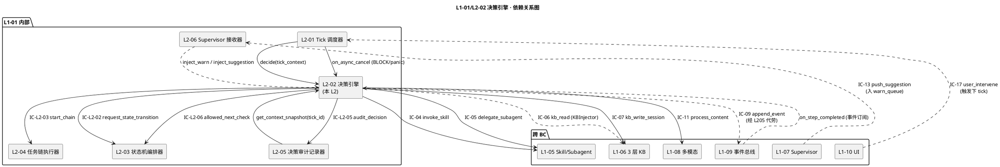
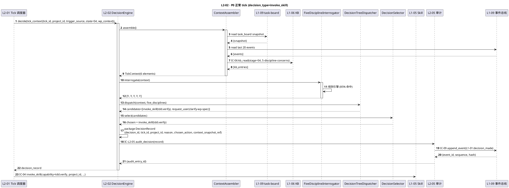
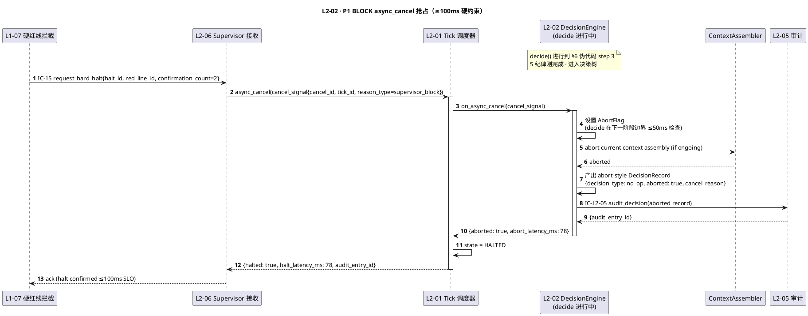
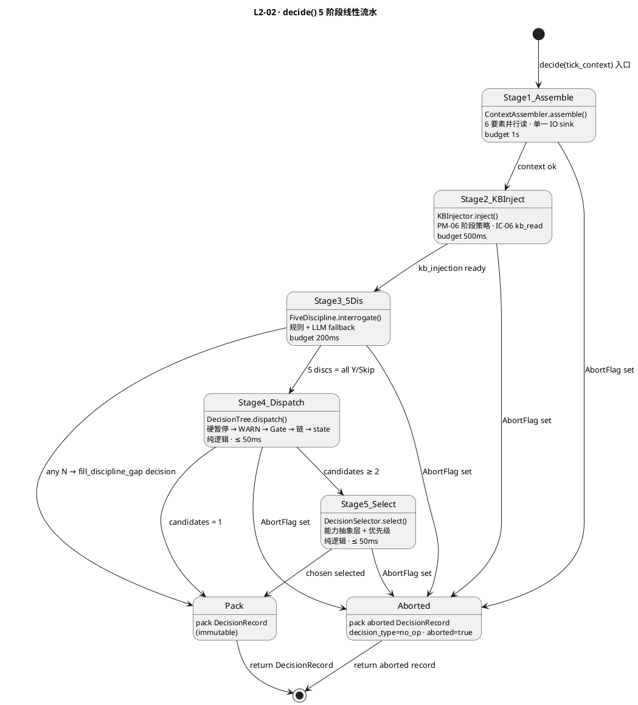

# L1 L2-02 · 决策引擎 · Tech Design

> **本文档定位**：3-1-Solution-Technical 层级 · L1 的 L2-02 决策引擎 技术实现方案（L2 粒度）。
> **与产品 PRD 的分工**：2-prd/L1-01-主 Agent 决策循环/prd.md §5.1 的对应 L2 节定义产品边界，本文档定义**技术实现**（接口字段级 schema + 算法伪代码 + 底层数据结构 + 状态机 + 配置参数）。
> **与 L1 architecture.md 的分工**：architecture.md 负责**跨 L2 架构 + 跨 L2 时序**，本文档负责**本 L2 内部技术细节**。冲突以 architecture.md 为准。
> **严格规则**：本文档不复述产品 PRD 文字（职责 / 禁止 / 必须等清单），只做技术映射 + 补齐"产品视角未说 but 工程师必须知道"的部分（具体算法 · syscall · schema · 配置）。

---

## §0 撰写进度

- [x] §1 定位 + 2-prd §9 L2-02 映射 ✅ 质量标杆已填
- [ ] §2 DDD 映射（引 L0/ddd-context-map.md BC-01）
- [x] §3 对外接口定义（字段级 YAML schema + 错误码）✅ 质量标杆已填
- [ ] §4 接口依赖（被谁调 · 调谁）
- [ ] §5 P0/P1 时序图（PlantUML ≥ 2 张）
- [ ] §6 内部核心算法（伪代码）
- [ ] §7 底层数据表 / schema 设计（字段级 YAML）
- [ ] §8 状态机（无状态 Domain Service · §8 简述即可）
- [ ] §9 开源最佳实践调研（≥ 3 GitHub 高星项目）
- [ ] §10 配置参数清单
- [ ] §11 错误处理 + 降级策略
- [ ] §12 性能目标
- [ ] §13 与 2-prd / 3-2 TDD 的映射表

> **填写次序建议**（供 subagent 复用）：§1 → §3 → §4 → §2（DDD 基于接口回推）→ §5 时序（串起 §3+§4）→ §6 算法 → §7 schema → §8 → §9 → §10 → §11 → §12 → §13。理由：§3 接口驱动，§4 依赖补齐调用关系，§5 把两者串成时序，之后的 DDD / 算法 / schema / 配置 都以前 4 段为基础，不易返工。

---

## §1 定位 + 2-prd 映射

### 1.1 本 L2 的唯一命题（One-Liner）

**决策引擎 = HarnessFlow 的"脑"**：每个 tick 接收一次 `TickContext`（由 L2-01 派发），做一次"这一步做什么"的决策（12 类决策动作之一），返回一个不可变的 `DecisionRecord`。

关键定性（来自 architecture.md §3.5 D-02）：**本 L2 是无状态 Domain Service**——不持有跨 tick 的可变状态（所有上下文从外部聚合而来），决策函数纯函数化以支撑 100% 单元可测。

### 1.2 与 `2-prd/L1-01主 Agent 决策循环/prd.md §9` 的精确小节映射表

> 说明：本表是**技术实现 ↔ 产品小节**的锚点表，不复述 PRD 文字。每行左列为本 tech-design 的段落，右列为对应的 PRD 小节。冲突以本文档（技术实现）+ architecture.md（架构）为准，若发现 PRD 有歧义或不足以导出字段级 schema，按 spec 6.2 规则反向修 PRD 并在此处注明。

| 本文档段 | 2-prd §9 小节 | 映射内容 | 备注 |
|---|---|---|---|
| §1.1 命题 | §9.1 职责锚定 | "整个 HarnessFlow 的脑" | 本文档补"无状态 Domain Service"定性（prd 未明写） |
| §1.4 兄弟边界 | §9.3 边界 | In-scope 8 项 + Out-of-scope 8 项 | — |
| §1.5 PM-14 | §9.4 硬约束 #7 | "决策 context 必包含 state" → 本文档扩展为"含 project_id 根字段" | **补** |
| §2 DDD | §9.1 上游锚定 | BC-01 映射（prd 无 DDD 语言）| **补** |
| §3 接口 `decide()` | §9.2 输入 5 类 + §9.8 IC-L2 表 | `decide(TickContext)→DecisionRecord` 是 §9.2 "tick 调用"通道的方法化表达 | **补字段级 YAML** |
| §3 接口 `inject_warn()` | §9.2 输入"Supervisor 建议" + §9.6 必须 #4 "WARN 1 tick 内回应" | 内部入队方法 | **补** |
| §3 接口 `on_async_cancel()` | §9.5 禁止 #9 "硬暂停中继续决策" + §9.6 必须 #9 "abort + 留痕" | BLOCK 抢占入口 | **补** |
| §3 错误码 | §9.4 硬约束（1/2/4/5/6）+ §9.5 禁止（10 条）| 约束违反一对一映射为错误码 | **补错误码表** |
| §4 依赖 | §9.8 IC-L2 交互表 | 调用方 + 被调方 | — |
| §5 时序 | §9 无时序图；L1-01 arch §3.4 component + scope §5.1.4 主流程 | Mermaid 重绘 | **补** |
| §6 算法 | §9.10.1 上下文组装 / §9.10.3 5 纪律 / §9.10.4 主决策树 / §9.10.5 决策选择 / §9.10.6 Supervisor 处理 | 伪代码化 | **补 Python-like** |
| §7 schema | §9.10.7 decision_record schema | YAML 化 + 按 PM-14 `projects/<pid>/...` 存储路径 | — |
| §8 状态机 | §9.3 "无状态"暗含 | 标注"无状态 Domain Service"；决策函数内部有 5 阶段线性流水 | **补短图** |
| §9 调研 | §9 外 | 引 L0/open-source-research.md + 细化 3+ 高星项目 | **补** |
| §10 配置 | §9.10.9 配置参数 | 原样导入 + 补 tech 侧默认值 | — |
| §11 降级 | §9.4 硬约束 + §9.5 禁止 + arch §3.5 D-05 BLOCK | 错误分类 + 降级链 + 与 L1-07 协同 | **补** |
| §12 SLO | §9.4 性能约束 | 决策 ≤20s / KB ≤500ms / 5 纪律 ≤200ms / context ≤1s | 原样继承 |
| §13 映射 | — | 本段接口 ↔ §9.X + ↔ 3-2-TDD 用例 | **补** |

### 1.3 与 `L1-01/architecture.md` 的位置映射

| architecture 锚点 | 映射内容 | 本文档对应段 |
|---|---|---|
| §2.1 BC-01 Agent Decision Loop | 本 L2 所在 Bounded Context | §2 DDD |
| §2.2 聚合根 `TickContext` + `DecisionRecord` | 本 L2 持有的 2 个聚合的构造/生产职责 | §2 DDD + §7 schema |
| §2.3 Domain Services: `DecisionEngine` / `ContextAssembler` / `FiveDisciplineInterrogator` | 本 L2 内部 3 个协作组件（不拆 L2）| §6 算法 |
| §2.5 Domain Events: `L1-01:decision_made` / `L1-01:warn_response` | 本 L2 对外发布的领域事件 | §3 接口 + §4 依赖 |
| §3.4 Component Diagram 中的 `L2_02` 节点 | 本 L2 在 L1 内的位置（居中节点，5 对契约面） | §4 依赖图 |
| §3.5 D-02 L2-02 无状态定性 | 本 L2 的核心技术决策 | §1.6 关键决策 |
| §3.5 D-05 BLOCK 100ms 响应 | L2-06 → L2-01 → L2-02 抢占链 | §3 接口 `on_async_cancel` + §11 降级 |
| §3.5 D-06 ContextAssembler 不拆 L2 | 本 L2 内部组件而非独立 L2 的决策依据 | §2 DDD |

### 1.4 与兄弟 L2 的边界（6 L2 中 L2-02 的位置）

| 兄弟 L2 | 本 L2 与兄弟的边界规则（基于 prd §9.3 + arch §3.3）|
|---|---|
| **L2-01 Tick 调度器** | L2-01 只负责"**何时**派发 tick"；L2-02 只负责"**这一 tick 做什么**"。tick_id 由 L2-01 生成并传入本 L2（本 L2 不自造 tick_id）。|
| **L2-03 状态机编排器** | 本 L2 决策 = `state_transition` 时只**发起请求**（IC-L2-02 with `{from,to,reason,evidence_refs,trigger_tick}`），L2-03 执行；本 L2 决策前**必先查** `allowed_next`（prd §9.6 必须 #7）。|
| **L2-04 任务链执行器** | 本 L2 决策 = `start_chain` 时只**启动**（IC-L2-03 with `{chain_def,chain_goal,context}`），不推进；L2-04 回调 `step_completed` 回本 L2 作为下一 tick 的输入。|
| **L2-05 决策审计记录器** | **每次**决策完成必 IC-L2-05 推 `decision_record` 给 L2-05；本 L2 **禁止**直接写事件总线（prd §9.5 #5）。|
| **L2-06 Supervisor 建议接收器** | L2-06 是 `L1-01 ↔ L1-07` **唯一网关**（arch §3.2 NEW）。本 L2 只消费**已分级+已入队**的 SUGG/WARN；BLOCK 不经本 L2，由 L2-06 直接通知 L2-01 抢占本 L2。|

### 1.5 PM-14 约束（project_id as root）

**硬约束**（arch §1.4 PM-14 表的 L2-02 行）：

1. `TickContext.project_id` 为**根字段**，不可缺（缺 → `E_CTX_NO_PROJECT_ID`）
2. `DecisionRecord.project_id` 为**根字段**，由 TickContext 透传（不重造）
3. 所有持久化路径按 `projects/<pid>/...` 分片（见 §7 schema）
4. 跨 project 决策**禁止**（一 tick 一 pid；若 trigger 跨 pid → `E_CTX_CROSS_PROJECT`，拒绝并告警）
5. 发布的 Domain Event（`decision_made` / `warn_response`）payload 必含 `project_id`

### 1.6 关键技术决策（Decision → Rationale → Alternatives → Trade-off）

本 L2 在 architecture.md §3.5 的 **D-02 / D-05 / D-06** 基础上，补充 L2 粒度的 4 个技术决策：

| # | Decision | Rationale | Alternatives | Trade-off |
|---|---|---|---|---|
| **D-02a** | `DecisionEngine` 为**纯函数** Domain Service：`(TickContext) → DecisionRecord`，不访问任何外部 IO | 纯函数 = 100% 可单元测试 + 可 mock TickContext 覆盖 12 种 decision_type 全分支 + 可并行回放历史决策做回归 | A. 在决策函数内直接读 KB/task-board：决策 = IO 混合，难测试、难回放、违背 DDD "Domain Service 不直接访问基础设施" | 所有 IO 前置到 `ContextAssembler`（唯一 IO 点），决策函数就是 5 阶段纯计算：KB注入 → 5纪律 → 决策树 → 决策选择 → 打包 record |
| **D-02b** | **一 tick 一决策**：不支持在单个决策函数调用内产出 ≥2 个决策动作 | prd §9.4 硬约束 #5；合并决策破坏审计原子性（一个 decision_id ↔ 一个 chosen_action） | A. 批处理决策：一次 tick 产出 `[action1, action2]`——破坏"1 tick = 1 decision_record = 1 可撤销单元" | 若下游需要连续动作（如 `start_chain + state_transition`），拆成 2 tick 分别走（第 1 tick 返回 `start_chain`，任务链回调触发第 2 tick 返回 `state_transition`） |
| **D-03** | `ContextAssembler` 是 L2-02 **内部组件**（不拆 L2）| arch §3.5 D-06；TickContext 的唯一消费者就是决策函数；拆独立 L2 只会多一条契约面而零收益 | A. 拆 `L2-02a ContextAssembler` + `L2-02b DecisionFunction`：契约面从 5 增到 7，零额外价值 | 单元测试仍可单独测 ContextAssembler（内部类可测），不需要 L2 级拆分 |
| **D-04** | `FiveDisciplineInterrogator` 的 5 纪律判定采用**规则引擎 + LLM fallback**双通道：先走声明式规则（≤200ms 硬约束），规则不确定时才 fallback 到 LLM 判定 | prd §9.4 性能约束 "5 纪律拷问 ≤200ms"——纯 LLM 调用 P99 到 1-3s 会超限；规则引擎可覆盖 ~85% 场景 | A. 纯 LLM：超 SLO；B. 纯规则：覆盖率不足，复杂语境判漏 | 两级 fallback：命中规则直接返回（毫秒级）；未命中才调 LLM 并缓存（同 context hash 下次命中）；缓存命中率 > 60% 时 P99 可达标 |
| **D-05** | 决策动作的**能力抽象层映射**采用**注册表 + 运行时查询**（而非编译期绑定）| PM-09 能力抽象层 / prd §9.5 #6 禁止硬编码 skill 名；运行时查询支持热插拔 skill + A/B 测试不同 skill 映射 | A. 编译期绑定 skill 名到代码：修改 skill 需改代码重启；B. 元数据驱动 JSON 硬盘：每次决策读盘 IO | L2-02 启动时一次性从 L1-05 `skill_registry` 拉全表到内存（watch 变更事件刷新）；每决策内存 O(1) 查找 |

---

## §2 DDD 映射（BC-01 Agent Decision Loop）

### 2.1 Bounded Context 定位

本 L2 所属 `BC-01 · Agent Decision Loop`（定义见 `L0/ddd-context-map.md §2.2`，HarnessFlow 唯一控制源 BC）。在 BC-01 内部 **L2-02 扮演"脑"的角色**——与其他 6 L2 的关系：

| 兄弟 L2 | DDD 关系 | 本 L2 与该 L2 的交互模式 |
|---|---|---|
| L2-01 Tick 调度器 | **Upstream**（Supplier）| L2-01 构造 TickTrigger → 本 L2 读 TickContext · 关系 "心跳器 → 脑"|
| L2-03 状态机编排器 | **Downstream**（Customer）| 本 L2 生成 state_transition decision → L2-03 执行 · IC-L2-02 request_state_transition |
| L2-04 任务链执行器 | **Downstream**（Customer）| 本 L2 生成 start_chain decision → L2-04 执行 · IC-L2-03 |
| L2-05 审计记录器 | **Partnership**（必同步演进）| 本 L2 每 decision 必推 L2-05 落盘 · IC-L2-05 |
| L2-06 Supervisor 接收器 | **反向 Customer**（消费 L2-06 的建议）| L2-06 inject_warn/inject_suggestion → 本 L2 的 queue → 下 tick 必响应 |

### 2.2 本 L2 持有 / 构造的聚合根

继承自 `L0/ddd-context-map.md §2.2` BC-01 聚合根表（参考 L1-01 `architecture.md §2.2`）：

| 聚合根 | 类型 | 本 L2 职责 | Invariants |
|---|---|---|---|
| **TickContext** | **Aggregate Root · 本 L2 唯一构造者** | ContextAssembler 组装 6 要素 → 单 tick 强一致 → tick 结束持久化 | **I-01** project_id 不可变 · **I-02** tick 结束即不变 |
| **DecisionRecord** | **Aggregate Root · 本 L2 唯一生产者** | 纯函数 `DecisionEngine(TickContext) → DecisionRecord` | **I-03** immutability（append-only）· **I-04** 1 tick = 1 decision_id |

### 2.3 本 L2 内部组件（Domain Services · 不拆 L2 · arch §3.5 D-06）

| 组件 | DDD 类型 | 职责 | 无状态/有状态 |
|---|---|---|---|
| `DecisionEngine` | **Domain Service** · 核心 | 5 阶段决策流水：KB 注入 → 5 纪律 → 决策树 → 决策选择 → 打包 record | **无状态**（纯函数）|
| `ContextAssembler` | **Domain Service** | 组装 TickContext 的 6 要素（task-board snapshot + 近 N 事件 + advice_queue + 用户输入 + 当前 WP + 当前 DoD）| 无状态 · IO 作为单一 sink |
| `FiveDisciplineInterrogator` | **Domain Service** | 5 纪律拷问（规划/质量/拆解/检验/交付）· 规则引擎 + LLM fallback 双通道 | 无状态 · 有 LLM 缓存（独立组件）|
| `KBInjector` | **Domain Service** | 按 PM-06 阶段策略 + 5 纪律关注点 匹配 KB · 走 IC-06 kb_read | 无状态 |
| `DecisionTreeDispatcher` | **Domain Service** | 多层 if-elif 路由（硬暂停→WARN→Gate→链回调→异步→用户→state 主决策→兜底）| 无状态 |
| `DecisionSelector` | **Domain Service** | 多候选按能力抽象层 + 优先级选首选 · top-3 alternatives 可选 | 无状态 |

**关键点**（arch §3.5 D-02 + D-02a）：`DecisionEngine` 全链路**纯函数**——所有 IO 前置到 `ContextAssembler` · 决策函数就是 5 阶段纯计算。理由：100% 可单元测试 + 可 mock TickContext 覆盖 12 种 decision_type 全分支 + 可并行回放历史决策做回归。

### 2.4 Value Objects（不可变）

| VO 名 | 结构 | 用途 |
|---|---|---|
| `TickId` | `"tick-{uuid-v7}"` | L2-01 生成 · 本 L2 透传 |
| `ProjectId` | `"pid-{uuid-v7}"` | PM-14 根字段 · 跨 BC Shared Kernel |
| `DecisionId` | `"dec-{uuid-v7}"` | 本 L2 生成 · 即 append-only |
| `FiveDisciplineResult` | `{name, answer: Y/N/Skip, note, confidence?}` | 5 纪律拷问的单项结果 |
| `CapabilityTag` | string · 能力抽象层 tag（如 `tdd.blueprint_generate`）| PM-09 不绑 skill 名 |
| `DecisionType` | enum 12 值 | `invoke_skill/use_tool/.../no_op` |

### 2.5 Entities（可变 · 短生命）

| Entity | 生命期 | 用途 |
|---|---|---|
| `ContextSnapshot` | 单 tick（< 20s）· tick 结束落盘转 VO | ContextAssembler 内部累积上下文 |
| `KBInjection` | 单 tick · 注入期间可变 · 决策结束冻结 | 记录本 tick 命中的 KB entries |
| `WarnQueue` / `SuggQueue` | 跨 tick · session 级持久 | 2 个 FIFO 优先队列（容量 64/256）|

### 2.6 Repository Interfaces

本 L2 **不持有任何持久化聚合**（arch §2.4）· 所有持久化必经：

- **DecisionRecord 落盘**：走 L2-05 → IC-L2-05（内部）→ L2-05 → IC-09（跨 BC）→ L1-09 `projects/<pid>/audit/...jsonl`
- **ContextSnapshot 落盘**：同上（IC-L2-05）
- **AdviceQueue 状态落盘**：L2-06 自有 Repository（非本 L2 职责）

**本 L2 的纯函数特性决定**：本 L2 可在任意时刻从 TickContext 输入重建整个决策过程（配合 IC-10 replay_from_event）· 无需自有 Repository。

### 2.7 Domain Events（本 L2 对外发布 · 经 IC-09）

引自 L1-01 `architecture.md §2.5`，本 L2 直接产生以下事件（实际落盘由 L2-05 代劳）：

| Event | 触发时机 | 订阅方 | Payload 关键字段 |
|---|---|---|---|
| `L1-01:decision_made` | 本 L2 产出 DecisionRecord | L1-07 / L1-10 / L1-02 / L1-03 / L1-04 | `{decision_id, tick_id, decision_type, reason, evidence, project_id}` |
| `L1-01:warn_response` | 本 L2 回应 supervisor WARN | L1-07 | `{warn_id, response: accept/reject, reason, project_id}` |
| `L1-01:decision_aborted` | 本 L2 收到 async_cancel 中断 | L1-07 | `{decision_id_or_null, cancel_reason, abort_latency_ms, project_id}` |
| `L1-01:fill_discipline_gap` | 5 纪律有 N → 决策 = 补该纪律 | L1-07 | `{missing_disciplines[], project_id}` |

所有事件必含 `project_id`（PM-14）+ 本事件在 L2-05 hash-chain 中的位置。

### 2.8 跨 BC 关系（本 L2 作为发起方 / 接收方）

| IC | 方向 | 对端 BC | 本 L2 视角 |
|---|---|---|---|
| IC-04 invoke_skill | 发起 | BC-05（L1-05）| decide 产出 `invoke_skill` → 走 IC-04 |
| IC-05 delegate_subagent | 发起 | BC-05 | decide 产出 `delegate_subagent` → 走 IC-05 |
| IC-06 kb_read | 发起 | BC-06（L1-06）| KBInjector 组件调用 |
| IC-07 kb_write_session | 发起 | BC-06 | decide 产出 `kb_write` → 走 IC-07 |
| IC-09 append_event | 发起（经 L2-05 代劳）| BC-09（L1-09）| 审计落盘 |
| IC-11 process_content | 发起 | BC-08（L1-08）| decide 产出 `process_content` |
| IC-13 push_suggestion | 接收（经 L2-06 入队）| BC-07（L1-07）| WARN 队列 |
| IC-17 user_intervene | 接收（间接 · 通过 L2-01）| BC-10（L1-10）| panic / authorize / clarify 触发决策 |

所有 IC 字段级 schema 锚点在 `docs/3-1-Solution-Technical/integration/ic-contracts.md §3.{N}`。

---

---

## §3 对外接口定义（字段级 YAML schema + 错误码）

> 说明：本 L2 对外暴露 **6 个方法**（1 主 + 5 辅）。字段级 YAML 采用 OpenAPI-like 风格声明 type / required / 约束。
>
> 调用方向：`decide()` 由 L2-01 单向调用（主流）；`inject_warn/inject_suggestion` 由 L2-06 内存入队；`on_async_cancel` 由 L2-01（转 L2-06 触发）抢占；`on_step_completed` 由 L2-04 回调（但实际走 L1-09 事件总线，本方法是事件处理器签名）；`get_context_snapshot` 由 L2-05 审计反查。

### 3.1 `decide(tick_context) → decision_record`（核心 · IC-L2-01 on_tick 的处理器）

**调用方**：L2-01 Tick 调度器（单一调用方 · scope §5.1 "单一决策源"）
**幂等性**：同 `(tick_id, tick_context_hash)` 多次调用返回同一 `DecisionRecord`（内存 LRU 缓存 1024，防 L2-01 超时重投）
**阻塞性**：同步调用；P95 ≤ 5s（纯计算）+ IO（KB/task-board 读 ≤2s）= 总 ≤7s；硬上限 20s（prd §9.4 #4，超限自动 abort → `E_DECISION_TIMEOUT`）

#### 入参 `tick_context`（字段级 YAML）

```yaml
tick_context:
  type: object
  required:
    - tick_id
    - project_id        # PM-14 根字段必含
    - trigger_source
    - ts
    - state
  properties:
    tick_id:
      type: string
      format: "tick-{uuid-v7}"
      example: "tick-018f4a3b-7c1e-7000-8b2a-9d5e1c8f3a20"
      description: 由 L2-01 生成；本 L2 不自造；用于幂等 + 审计追溯

    project_id:
      type: string
      format: "pid-{uuid-v7}"
      example: "pid-018f4a3b-0000-7000-8b2a-9d5e1c8f3a20"
      description: PM-14 根字段；TickContext + DecisionRecord 共享；缺 → E_CTX_NO_PROJECT_ID

    trigger_source:
      type: enum
      enum: [user_input, timer, event_bus, async_callback, bootstrap]
      description: 5 类触发源（prd §9.2 输入）

    event_ref:
      type: string | null
      description: 若 trigger_source=event_bus/async_callback，指向原始事件 id；否则 null

    priority:
      type: enum
      enum: [P0, P1, P2]
      default: P2

    ts:
      type: string
      format: "ISO-8601-utc"
      example: "2026-04-21T06:30:00.123Z"

    state:
      type: enum
      enum: [S0_init, S1_plan, S2_split, S3_design, S4_execute, S5_verify, S6_wrap]
      description: 当前阶段状态（prd §9.4 硬约束 #7 决策 context 必含 state）

    bootstrap:
      type: boolean
      default: false
      description: 是否为 session 首次 tick（走跨 session 恢复路径）

    wp_context:
      type: object | null
      properties:
        wp_id:
          type: string
        dod_expression:
          type: string
          description: DoD 当前表达式（prd §9.2 读取源）
      description: 若当前在 WP 执行中才填

    # 以下字段由 ContextAssembler 在 decide() 内部组装并塞回；调用方通常传空
    context_snapshot:
      type: object | null
      description: 传空即由本 L2 的 ContextAssembler 组装；传非空走回放模式（审计/调试）
```

#### 出参 `decision_record`（字段级 YAML）

```yaml
decision_record:
  type: object
  required:
    - decision_id
    - tick_id
    - project_id
    - context_snapshot_ref
    - five_discipline_results
    - decision_type
    - decision_params
    - reason
    - ts_start
    - ts_end
  properties:
    decision_id:
      type: string
      format: "dec-{uuid-v7}"
      description: 不可变 id；一 tick 一 id（prd §9.4 硬约束 #5）

    tick_id:
      type: string
      description: 透传 tick_context.tick_id

    project_id:
      type: string
      description: 透传 tick_context.project_id（PM-14）

    context_snapshot_ref:
      type: string
      format: "projects/{pid}/audit/context/{tick_id}.json"
      description: ContextAssembler 组装的 6 要素 context 落盘路径（L2-05 审计反查用）

    five_discipline_results:
      type: array
      minItems: 5
      maxItems: 5
      items:
        type: object
        required: [name, answer, note]
        properties:
          name:
            type: enum
            enum: [planning, quality, split, verify, deliver]
          answer:
            type: enum
            enum: [Y, N, Skip]
          note:
            type: string
            minLength: 1
            description: Skip 必有 reason（prd §9.5 #10 "禁止伪造 5 纪律答案"）
          confidence:
            type: number
            minimum: 0
            maximum: 1
            optional: true
            description: 本 L2 §1.6 D-04 规则引擎/LLM fallback 置信度

    decision_type:
      type: enum
      enum:
        - invoke_skill
        - use_tool
        - delegate_subagent
        - kb_read
        - kb_write
        - process_content
        - request_user
        - state_transition
        - start_chain
        - warn_response
        - fill_discipline_gap
        - no_op
      description: 12 类决策动作（prd §9.2 输出）

    decision_params:
      type: object
      description: 按 decision_type 的 discriminated union；见 §3.1.1 详表

    reason:
      type: string
      minLength: 20
      description: 自然语言决策理由（prd §9.4 硬约束 #1 ≥20 字）；空或 <20 字 → E_DECISION_NO_REASON

    ts_start:
      type: string
      format: ISO-8601-utc

    ts_end:
      type: string
      format: ISO-8601-utc
      # 约束：ts_end - ts_start ≤ 20_000 ms

    alternatives:
      type: array
      optional: true
      description: 本 L2 §1.6 D-04 可选 top-3 候选（prd §9.7 可选职责）
      items:
        type: object
        properties:
          decision_type: {type: enum, "同上"}
          decision_params: {type: object}
          score: {type: number, minimum: 0, maximum: 1}

    warn_response_ref:
      type: string | null
      description: 若本决策同时回应 supervisor WARN，指向 warn_id

    tick_budget_used_ms:
      type: integer
      description: 本决策总耗时（ts_end - ts_start 毫秒数）；L2-01 watchdog 核对
```

#### 3.1.1 `decision_params` 按 `decision_type` 的字段级分表

| decision_type | decision_params 必填字段（YAML）| 下游去向 IC |
|---|---|---|
| `invoke_skill` | `skill_intent: str, capability_tag: str, input_payload: object` | IC-04 L1-05 |
| `use_tool` | `tool_name: str, args: object` | IC-04 L1-05（工具柜分支）|
| `delegate_subagent` | `agent_role: str, task_brief: str, input_refs: str[], timeout_s: int` | IC-05 L1-05 |
| `kb_read` | `query: str, layer: enum[L1_user,L2_fragment,L3_global], top_k: int` | IC-06 L1-06 |
| `kb_write` | `layer: enum, payload: object, dedup_key: str` | IC-07 L1-06 |
| `process_content` | `content_type: enum[doc,code,image], path: str, task: enum` | IC-11 L1-08 |
| `request_user` | `question: str, urgency: enum, ui_hint: object` | IC-17 反向 L1-10 |
| `state_transition` | `from: state, to: state, evidence_refs: str[], trigger_tick: str` | IC-L2-02 L2-03 |
| `start_chain` | `chain_def: object, chain_goal: str, context: object` | IC-L2-03 L2-04 |
| `warn_response` | `warn_id: str, response: enum[accept,reject], reason: str` | IC-L2-09 L2-05 |
| `fill_discipline_gap` | `discipline: enum[planning,quality,split,verify,deliver], action: str` | 内部下 tick 重入 |
| `no_op` | `note: str` | — |

#### 3.1.2 错误码（`decide()`）

| 错误码 | 含义 | 触发场景 | 调用方处理 | 对应 prd 硬约束 |
|---|---|---|---|---|
| `E_CTX_NO_PROJECT_ID` | TickContext.project_id 缺失 | 上游传入非法 context | L2-01 作为 boot error 告警 L1-07 | PM-14 |
| `E_CTX_CROSS_PROJECT` | 同 tick 出现多 project_id | context 组装时发现 event.pid ≠ tick.pid | L2-01 丢弃 tick + 记审计 | §1.5 #4 |
| `E_CTX_STATE_MISSING` | tick_context.state 缺失或非法枚举 | 上游 bug | 同上 | prd §9.4 #7 |
| `E_CTX_ASSEMBLE_FAIL` | ContextAssembler 组装失败（如 task-board 读超时）| L1-09 读接口超时 / 数据损坏 | 本 L2 返回 `no_op` + 审计；L2-01 下次 tick 重试 | — |
| `E_KB_INJECT_FAIL` | KB 注入失败且降级失败 | L1-06 不可达 且 fallback 规则也失败 | **降级继续决策**（not 硬失败）+ 本 decision_record 标 `kb_degraded=true` + WARN L1-07 | prd §9.6 #2 "除非 KB 层失败" |
| `E_5DIS_TIMEOUT` | 5 纪律拷问耗时 > 200ms | 规则命中失败 + LLM fallback 慢 | 降级为 Skip + note 记录超时 + 继续决策 | prd §9.4 性能 |
| `E_5DIS_INCOMPLETE` | 5 纪律拷问中有 N 且未转 `fill_discipline_gap` | 决策树逻辑 bug | 决策函数内部 assert 拦截 → abort | prd §9.5 #1 禁止跳过 |
| `E_DECISION_TIMEOUT` | 决策总耗时 > 20s | 决策函数内部死循环 / IO 卡住 | 本 L2 自 abort → L2-01 watchdog 捕获 → BLOCK 抢占 | prd §9.4 #4 |
| `E_DECISION_NO_REASON` | reason 长度 < 20 字 | 决策选择器 bug | 本 L2 assert 拦截 + 补全为 `"auto-filled: {decision_type} via {capability_tag}"` | prd §9.4 #1 |
| `E_STATE_TRANSITION_INVALID` | 决策 = state_transition 但 allowed_next 校验失败 | 决策树路由错 | 决策降级为 `no_op` + 审计 + WARN L1-07 | prd §9.6 #7 |
| `E_SKILL_NOT_FOUND` | 能力抽象层映射找不到 skill | 注册表未加载 / skill 已下线 | 降级为 `request_user`（问人工兜底）+ 审计 | prd §9.5 #6 |
| `E_CANCEL_DURING_DECISION` | 决策进行中收到 async cancel 信号 | L2-06 BLOCK / 用户 panic | 立即 abort，生成 `no_op` decision_record 并标 `aborted=true` | prd §9.5 #9 + §9.6 #9 |
| `E_CAPABILITY_REGISTRY_STALE` | skill 注册表启动未加载 | 启动时序 bug | 本 L2 启动 pre-check 阻塞 L2-01 第一次 tick；超 5s 启动失败 | arch §3.5 D-05 |

### 3.2 `inject_warn(warn_item)` / `inject_suggestion(sugg_item)`（内存入队 · from L2-06）

**调用方**：L2-06 Supervisor 建议接收器（唯一网关）
**同步 / 异步**：非阻塞内存 append（< 1ms）；本 L2 持 2 个内存优先级队列（`warn_queue` · `sugg_queue`）
**queue 容量**：warn 64 / sugg 256；满时最旧被挤出 + 审计告警

#### 入参 `warn_item`（WARN 级）

```yaml
warn_item:
  type: object
  required: [warn_id, project_id, content, priority, ts]
  properties:
    warn_id: {type: string, format: "warn-{uuid-v7}"}
    project_id: {type: string, description: PM-14}
    content: {type: string, minLength: 10}
    priority: {type: enum, enum: [P0, P1]}
    ts: {type: string, format: ISO-8601-utc}
    deadline_tick_delta: {type: integer, default: 1, description: "必须在 N 个 tick 内回应（prd §9.4 硬约束 #3）"}
```

#### 入参 `sugg_item`（SUGG 级）

```yaml
sugg_item:
  type: object
  required: [sugg_id, project_id, content, ts]
  properties:
    sugg_id: {type: string, format: "sugg-{uuid-v7}"}
    project_id: {type: string}
    content: {type: string, minLength: 10}
    ts: {type: string, format: ISO-8601-utc}
    # SUGG 无强制 deadline（参考性质）
```

#### 返回 + 错误码

返回 `{accepted: bool, queue_len: int}`；
错误码：

| 错误码 | 触发 | 处理 |
|---|---|---|
| `E_WARN_QUEUE_OVERFLOW` | warn_queue 已满 | 本 L2 evict 最旧 warn（非静默：审计 + L1-07 告警）并接受新 warn；返回 `{accepted:true, evicted:true}` |
| `E_CROSS_PROJECT_WARN` | warn.project_id ≠ 当前 session pid | 拒绝 + 审计（可能是 L2-06 bug）|

### 3.3 `on_async_cancel(cancel_signal)`（BLOCK 抢占 · from L2-01）

**调用方**：L2-01 Tick 调度器（实际由 L2-06 BLOCK 经 L2-01 路由）
**SLO**：接收到信号后 **≤ 100ms** 本 L2 必须 abort 当前 decide() 执行（arch §3.5 D-05）
**实现**：本 L2 内部持 `AbortFlag`（asyncio.Event / threading.Event），decide() 在每阶段边界 check；粒度 ≤ 50ms

#### 入参

```yaml
cancel_signal:
  type: object
  required: [cancel_id, tick_id, reason_type, ts]
  properties:
    cancel_id: {type: string, format: "cancel-{uuid-v7}"}
    tick_id: {type: string, description: "要抢占的 tick_id"}
    reason_type: {type: enum, enum: [supervisor_block, user_panic, hard_redline]}
    ts: {type: string, format: ISO-8601-utc}
```

#### 返回 + 错误码

返回 `{aborted: bool, abort_latency_ms: int}`；
错误码：

| 错误码 | 触发 | 处理 |
|---|---|---|
| `E_CANCEL_MISS_TICK` | cancel_signal.tick_id 不是当前进行中的 tick | 静默忽略（已经结束）+ debug log |
| `E_CANCEL_SLO_VIOLATION` | abort_latency_ms > 100 | 本 L2 记审计，不影响返回；L1-07 告警 |

### 3.4 `on_step_completed(step_result)`（任务链回调事件处理器 · from L2-04 via L1-09）

**调用方**：事件总线 L1-09 推送（实际发出者 L2-04）
**效果**：将 step_result 作为 trigger_source=`async_callback` 的下一 tick 的 seed——本方法**不直接决策**，而是通过 L2-01 触发新 tick。

#### 入参

```yaml
step_result:
  type: object
  required: [chain_id, step_id, outcome, project_id, ts]
  properties:
    chain_id: {type: string}
    step_id: {type: string}
    outcome: {type: enum, enum: [success, fail, partial]}
    result_ref: {type: string, description: "指向 L1-09 事件总线或 OSS 的结果存储路径"}
    project_id: {type: string}
    ts: {type: string}
```

#### 返回

`void`（异步吞吐；错误走 L1-09 DLQ）

### 3.5 `get_context_snapshot(tick_id) → context_snapshot_json`（审计反查 · from L2-05）

**调用方**：L2-05 决策审计记录器
**SLO**：≤ 50ms（本地文件读）
**入参**：`tick_id: str`
**出参**：`context_snapshot` 结构（见 §7 schema）；未找到返回 `null`（静默；L2-05 自己兜底）
**错误码**：
| 错误码 | 触发 | 处理 |
|---|---|---|
| `E_SNAPSHOT_NOT_FOUND` | 指定 tick_id 无 snapshot | 返回 null（不抛）；L2-05 若需严格则自己告警 |
| `E_SNAPSHOT_CORRUPT` | snapshot 文件 JSON parse 失败 | 抛异常；L2-05 走备份恢复链 |

### 3.6 错误码总表（11 + 2 + 2 + 2 = 17 项）

| 错误码前缀 | 语义类别 | 降级链 |
|---|---|---|
| `E_CTX_*` | context 组装 | 本 L2 返回 no_op + L2-01 下 tick 重试 |
| `E_KB_*` | KB 注入 | 降级继续（kb_degraded=true 标记）+ WARN L1-07 |
| `E_5DIS_*` | 5 纪律 | 降级为 Skip + note + 继续 |
| `E_DECISION_*` | 决策过程 | 按严重程度：abort → no_op → L1-07 upscale |
| `E_STATE_TRANSITION_*` | 状态转换 | 降级为 no_op + 审计 + L1-07 WARN |
| `E_SKILL_*` | 能力抽象层 | 降级为 request_user |
| `E_CANCEL_*` | 抢占信号 | ≤100ms 必须 abort；违反 SLO 仅审计 |
| `E_WARN_*` | supervisor 队列 | evict + 审计 |
| `E_SNAPSHOT_*` | 审计反查 | 返回 null（调用方自兜底）|

详细 §11 降级策略。

---

## §4 接口依赖（被谁调 · 调谁）

### 4.1 上游调用方（谁调本 L2）

| 调用方 | 方法 | 通道 | 频率 | SLO |
|---|---|---|---|---|
| L2-01 Tick 调度器 | `decide(tick_context)` | 同步内存 | 每 tick 1 次 | P95 ≤ 7s / 硬上限 20s |
| L2-01 Tick 调度器 | `on_async_cancel(cancel_signal)` | 同步内存 | BLOCK/panic（极低频）| abort ≤ 100ms |
| L2-06 Supervisor 接收器 | `inject_warn` / `inject_suggestion` | 非阻塞 append | 中高频 | < 1ms enqueue |
| L1-09 事件总线（订阅）| `on_step_completed` 事件处理器 | 异步事件 | 按链步频率 | 仅触发下 tick |
| L2-05 审计记录器 | `get_context_snapshot(tick_id)` | 同步本地读 | 审计反查 | ≤ 50ms |

### 4.2 下游依赖（本 L2 调谁）

#### 4.2.1 L1-01 内部 IC-L2

| IC-L2 | 对端 | 触发条件 | 锚点 |
|---|---|---|---|
| IC-L2-02 request_state_transition | L2-03 | decision_type=state_transition | L1-01/L2-03 §3 |
| IC-L2-03 start_chain | L2-04 | decision_type=start_chain | L1-01/L2-04 §3 |
| IC-L2-05 audit_decision | L2-05 | 每 decide 完成必推 | L1-01/L2-05 §3 |
| IC-L2-06 allowed_next_check | L2-03 | state_transition 前置校验 | L1-01/L2-03 §3 |

#### 4.2.2 跨 BC IC（锚定 ic-contracts.md）

| IC | 对端 BC | 触发 | 锚点 |
|---|---|---|---|
| IC-04 invoke_skill | L1-05 | decision_type=invoke_skill | [ic-contracts §3.4](../../integration/ic-contracts.md) |
| IC-05 delegate_subagent | L1-05 | decision_type=delegate_subagent | [ic-contracts §3.5](../../integration/ic-contracts.md) |
| IC-06 kb_read | L1-06 | KBInjector 组件（每 tick 0-N 次）| [ic-contracts §3.6](../../integration/ic-contracts.md) |
| IC-07 kb_write_session | L1-06 | decision_type=kb_write | [ic-contracts §3.7](../../integration/ic-contracts.md) |
| IC-11 process_content | L1-08 | decision_type=process_content | [ic-contracts §3.11](../../integration/ic-contracts.md) |
| IC-17 user_intervene（反向接收）| L1-10 | 经 L2-01 → 本 L2 作下 tick trigger | [ic-contracts §3.17](../../integration/ic-contracts.md) |

### 4.3 依赖图（PlantUML）



### 4.4 关键依赖特性

1. **L2-01 为唯一同步调用入口**：其他 L2/L1 不可直接调 `decide()`（防多决策源）
2. **纯函数契约**：`decide(tick_context) → decision_record` 与外部 IO 解耦 · ContextAssembler 是唯一 IO sink
3. **async_cancel 抢占优先级最高**：在 decide 5 阶段任一阶段边界可被抢占（粒度 ≤ 50ms · arch §3.5 D-05）
4. **L2-05 耦合度高（Partnership）**：每 decide 必经 · L2-05 不可达则本 L2 拒绝产出 decision（审计链完整性不可破）

---

## §5 P0/P1 时序图（PlantUML ≥ 2 张）

### 5.1 P0 主干 · 正常 tick → 决策 → 派活



### 5.2 P1 抢占 · BLOCK 进入时 L2-02 正在 decide



### 5.3 时序要点

- **P0 主流**：ContextAssembler 是唯一 IO sink（所有外部读集中这里）· 之后 5 阶段是纯计算
- **P1 抢占**：AbortFlag 机制保证 ≤50ms 粒度响应 · 最坏情况（处于 `IC-06 kb_read` 网络 IO 中）等 IO 超时到 100ms 硬上限
- **阶段边界**：5 阶段转换点必 check AbortFlag（KB注入→5纪律→决策树→选择→打包）

---

## §6 内部核心算法（伪代码）

### 6.1 主入口 · `decide(tick_context)` 5 阶段纯函数

```python
def decide(tick_context: TickContext) -> DecisionRecord:
    """
    纯函数 · 5 阶段线性流水 · 无外部 IO（IO 前置到 ContextAssembler）
    硬约束 · 总耗时 ≤ 20s · 5 纪律 ≤ 200ms · 上下文组装 ≤ 1s · KB 注入 ≤ 500ms
    """
    # 前置校验（PM-14 + state）
    if not tick_context.project_id:
        raise DecisionError('E_CTX_NO_PROJECT_ID')
    if not tick_context.state:
        raise DecisionError('E_CTX_STATE_MISSING')

    # 幂等缓存（同 tick_id + context hash 返回已有）
    cache_key = (tick_context.tick_id, hash(tick_context))
    if cached := self._decision_cache.get(cache_key):
        return cached

    ts_start = now_utc()
    try:
        # Stage 1 · ContextAssembler (唯一 IO sink · 已由 L2-01 调用前完成 or 传空由本 L2 触发)
        if tick_context.context_snapshot is None:
            tick_context.context_snapshot = self.context_assembler.assemble(tick_context)
        self._check_abort_flag()  # 抢占点 1

        # Stage 2 · KB 注入（按 PM-06 stage 策略 + 5 纪律关注点）
        tick_context.kb_injection = self.kb_injector.inject(
            tick_context.state,
            tick_context.wp_context,
            tick_context.advice_queue,
        )
        self._check_abort_flag()  # 抢占点 2

        # Stage 3 · 5 纪律拷问（规则引擎优先 · LLM fallback · ≤ 200ms）
        five_disciplines = self.five_discipline_interrogator.interrogate(
            tick_context,
            timeout_ms=200,
        )
        # 有 N 且无 fill_discipline_gap 转换 → 返回 fill_discipline_gap 决策
        if any(d.answer == 'N' for d in five_disciplines):
            return self._pack_fill_gap(tick_context, five_disciplines, ts_start)
        self._check_abort_flag()  # 抢占点 3

        # Stage 4 · 决策树分派（多层 if-elif · 防守式）
        candidates = self.decision_tree_dispatcher.dispatch(
            tick_context,
            five_disciplines,
        )
        if not candidates:
            return self._pack_no_op(tick_context, 'no candidates from dispatch tree', ts_start)
        self._check_abort_flag()  # 抢占点 4

        # Stage 5 · 决策选择（能力抽象层 + 优先级）
        chosen = self.decision_selector.select(candidates, tick_context)
        self._check_abort_flag()  # 抢占点 5

        # 打包 DecisionRecord（immutable）
        record = self._pack_record(
            tick_context,
            five_disciplines,
            chosen,
            alternatives=candidates[:3] if len(candidates) > 1 else None,
            ts_start=ts_start,
        )
        self._decision_cache.put(cache_key, record)
        return record
    except AbortException as e:
        return self._pack_aborted(tick_context, e.cancel_signal, ts_start)
    except Exception as e:
        # 意外异常 · 产 no_op + 标 error · 不抛（由上游处理）
        return self._pack_no_op(tick_context, f'internal error: {e}', ts_start, error=True)

def _check_abort_flag(self):
    if self._abort_flag.is_set():
        raise AbortException(self._current_cancel_signal)
```

### 6.2 ContextAssembler · 6 要素组装

```python
def assemble(self, tick_context: TickContext) -> ContextSnapshot:
    """
    IO 集中点 · 并行读 6 数据源 · 任一失败降级（不阻塞决策）
    硬约束 · 总耗时 ≤ 1s
    """
    with asyncio.TaskGroup() as tg:
        t1 = tg.create_task(self.task_board_repo.read_snapshot(tick_context.project_id))
        t2 = tg.create_task(self.event_bus.read_last_n(tick_context.project_id, n=20))
        t3 = tg.create_task(self.advice_queue.snapshot(tick_context.project_id))
        t4 = tg.create_task(self.user_input_buffer.snapshot())
        t5 = tg.create_task(self.wp_reader.read_current(tick_context.wp_id_or_none))
        t6 = tg.create_task(self.dod_reader.read_current(tick_context.wp_id_or_none))

    snapshot = ContextSnapshot(
        task_board=t1.result() or DEGRADED_MARKER,
        recent_events=t2.result() or [],
        advice_queue=t3.result() or [],
        user_inputs=t4.result() or [],
        wp_def=t5.result(),
        dod_expression=t6.result(),
        degraded_flags=self._collect_degraded(t1, t2, t3, t4, t5, t6),
    )
    # 单一 sink 落盘（供 L2-05 审计反查）
    self.snapshot_store.persist(
        path=f'projects/{tick_context.project_id}/audit/context/{tick_context.tick_id}.json',
        data=snapshot.to_canonical_json(),
    )
    return snapshot
```

### 6.3 FiveDisciplineInterrogator · 规则引擎 + LLM fallback 双通道

```python
DISCIPLINES = ['planning', 'quality', 'split', 'verify', 'deliver']

def interrogate(self, tick_context, timeout_ms=200) -> list[FiveDisciplineResult]:
    """arch §3.5 D-04 规则引擎 + LLM fallback · 覆盖率 ~85% 规则 + 15% LLM · 命中缓存 >60%"""
    results = []
    remaining_ms = timeout_ms
    for d in DISCIPLINES:
        t0 = now_ms()
        # 规则引擎（声明式）
        rule_result = self.rules.evaluate(d, tick_context)
        if rule_result.certain:
            results.append(FiveDisciplineResult(d, rule_result.answer, rule_result.note))
            remaining_ms -= now_ms() - t0
            continue
        # LLM fallback · 带缓存（context_hash + discipline）
        cache_key = (hash(tick_context.canonical_for_5dis()), d)
        if cached := self.llm_cache.get(cache_key):
            results.append(cached)
            continue
        # 实际调 LLM（硬超时）
        try:
            llm_result = self.llm_client.judge_discipline(
                d, tick_context, timeout_ms=min(remaining_ms, 60)
            )
            self.llm_cache.put(cache_key, llm_result)
            results.append(llm_result)
        except TimeoutError:
            # 降级：Skip + 注明超时 · 不阻塞整个决策
            results.append(FiveDisciplineResult(d, 'Skip', f'E_5DIS_TIMEOUT after {remaining_ms}ms'))
        remaining_ms -= now_ms() - t0
        if remaining_ms <= 0:
            # 剩余纪律全 Skip
            for remaining_d in DISCIPLINES[len(results):]:
                results.append(FiveDisciplineResult(remaining_d, 'Skip', 'budget exhausted'))
            break
    return results
```

### 6.4 DecisionTreeDispatcher · 决策路由（多层 if-elif）

```python
def dispatch(self, ctx, five_disciplines) -> list[DecisionCandidate]:
    """
    路由优先级（高到低 · 命中即 return）：
    1. AbortFlag set? → 上级已处理 · 此处不应走到
    2. supervisor WARN 未回应 → warn_response
    3. Stage Gate 待审? → request_user
    4. 任务链回调待处理? → state_transition 或 next_step
    5. 异步子 Agent 结果? → consume result · invoke next
    6. 用户 clarify 问题? → request_user
    7. state 主决策（按当前 state 分派到不同子树）
    8. 兜底 · no_op
    """
    # 1-6 快速路径
    if ctx.advice_queue.has_pending_warn():
        warn = ctx.advice_queue.next_pending_warn()
        return [DecisionCandidate('warn_response', {'warn_id': warn.id, ...})]
    if ctx.wp_context and ctx.wp_context.stage_gate_due:
        return [DecisionCandidate('request_user', {...}), DecisionCandidate('no_op', {...})]
    if ctx.recent_events.has_chain_callback():
        return self._dispatch_chain_callback(ctx)
    if ctx.recent_events.has_async_result():
        return self._dispatch_async_result(ctx)
    if ctx.user_inputs.has_pending_clarify():
        return [DecisionCandidate('request_user', {...})]

    # 7 state 主决策子树
    state_subtree = {
        'S1': self._subtree_s1_plan,
        'S2': self._subtree_s2_split,
        'S3': self._subtree_s3_design,
        'S4': self._subtree_s4_execute,
        'S5': self._subtree_s5_verify,
        'S6': self._subtree_s6_wrap,
        'S7': self._subtree_s7_close,
    }
    subtree = state_subtree.get(ctx.state)
    if subtree:
        candidates = subtree(ctx, five_disciplines)
        if candidates:
            return candidates

    # 8 兜底
    return [DecisionCandidate('no_op', {'note': 'nothing to do this tick'})]
```

### 6.5 DecisionSelector · 多候选择优

```python
def select(self, candidates: list[DecisionCandidate], ctx: TickContext) -> DecisionCandidate:
    """
    按 能力抽象层可达性 + 优先级 + 成本估计 选 top 1
    返回单一 chosen · 可选 alternatives 仅供审计观察
    """
    if len(candidates) == 1:
        return candidates[0]
    scored = []
    for c in candidates:
        if c.decision_type in ('invoke_skill', 'delegate_subagent'):
            if not self.capability_registry.resolve(c.decision_params.get('capability')):
                continue  # 能力抽象层不可达 · 排除
        score = (
            self._priority_score(c) * 0.5 +
            (1 - self._cost_estimate(c)) * 0.3 +
            self._reason_strength_score(c) * 0.2
        )
        scored.append((score, c))
    if not scored:
        # 全部不可达 · 降级为 request_user
        return DecisionCandidate('request_user', {'question': 'all candidates unavailable', ...})
    scored.sort(reverse=True, key=lambda x: x[0])
    return scored[0][1]
```

### 6.6 并发与抢占控制

- **AbortFlag**：`threading.Event`（若单线程 asyncio 用 `asyncio.Event`）· `on_async_cancel` set it · `decide()` 在 5 个阶段边界 check
- **LRU 缓存**：`_decision_cache`（per-session 1024 条 · 键 `(tick_id, context_hash)`）· `llm_cache`（按 `(ctx_hash, discipline)` · TTL 300s）· `capability_registry`（启动时 load · watch 更新）
- **无锁**：本 L2 纯函数 · 多线程场景下 `decide()` 本身可并行（但 L2-01 单实例串行化 · 实际不并发）

---

## §7 底层数据表 / schema 设计（字段级 YAML）

### 7.1 TickContext（入参聚合根 · 本 L2 构造 · 单 tick 内可变 · tick 结束冻结）

见 `§3.1.2 decide() 入参` 字段级 YAML · 此处补持久化 schema：

```yaml
context_snapshot_persisted:
  path: "projects/{project_id}/audit/context/{tick_id}.json"
  encoding: canonical-json-utf8  # 按字段名字典序 · 保 hash 可验
  schema:
    tick_id: string
    project_id: string
    ts_assembled: ISO-8601-utc
    task_board_snapshot:
      in_flight_wp_count: int
      state: enum(S1..S7, HALTED, PAUSED)
      last_update_ts: ISO-8601-utc
    recent_events:
      - event_id: string
        event_type: string
        ts: ISO-8601-utc
        payload_summary: string  # canonical 缩略版（不存 full payload · 节省空间）
    advice_queue:
      warn_queue: [{warn_id, content_hash, priority, received_ts}]
      sugg_queue: [{sugg_id, content_hash, received_ts}]
    user_inputs: [{input_id, type, content_hash, ts}]
    wp_def_ref: string | null  # 指向 projects/{pid}/wbs/wp-{id}.yaml
    dod_expression_ref: string | null
    degraded_flags:
      task_board: bool
      recent_events: bool
      kb: bool
    size_kb: int  # snapshot 自身大小（健康度指标）
```

### 7.2 DecisionRecord（出参聚合根 · 本 L2 生产 · 不可变）

```yaml
decision_record_persisted:
  path: "projects/{project_id}/audit/decisions/{YYYY-MM-DD}/{decision_id}.json"
  encoding: canonical-json-utf8
  schema:
    # identity
    decision_id: string  # dec-{uuid-v7}
    tick_id: string
    project_id: string
    ts_start: ISO-8601-utc
    ts_end: ISO-8601-utc
    duration_ms: int
    # context refs
    context_snapshot_ref: string  # 指向 §7.1 path
    kb_injection:
      - entry_id: string
        kind: enum(recipe, trap, pattern, decision_history, wp_template, user_preference)
        confidence: number
    # 5 纪律
    five_disciplines:
      - name: enum(planning, quality, split, verify, deliver)
        answer: enum(Y, N, Skip)
        note: string
        confidence: number | null
        skip_reason: string | null
    all_disciplines_passed: bool
    # 决策核心
    decision_type: enum(12 values from §3.1)
    decision_params: object  # discriminated by decision_type
    reason: string  # ≥ 20 字
    alternatives:  # 可选 top-3
      - decision_type: string
        decision_params: object
        score: number
    # supervisor 互动
    warn_responded:
      - warn_id: string
        response: enum(accept, reject)
        reason: string
    # 外部执行（后填 · 本 L2 不填）
    ic_call_result_ref: string | null
    # 异常
    aborted: bool
    cancel_reason: string | null
    tick_budget_used_ms: int
    # 审计
    audit_entry_id: string
```

### 7.3 WarnQueue / SuggQueue（Entity · session 级持久）

```yaml
advice_queue_persisted:
  path: "projects/{project_id}/runtime/l2-02/advice_queue.json"  # session 级
  schema:
    warn_queue:
      cap: 64
      evict_policy: FIFO  # 满时挤最旧 · 不静默 · 走审计
      items:
        - warn_id: string  # warn-{uuid-v7}
          project_id: string
          content: string
          priority: enum(P0, P1)
          received_ts: ISO-8601-utc
          deadline_tick_delta: int  # 必回应的 tick 上限
          responded: bool
    sugg_queue:
      cap: 256
      items:
        - sugg_id: string
          project_id: string
          content: string
          received_ts: ISO-8601-utc
```

### 7.4 LLM cache（FiveDisciplineInterrogator）

```yaml
llm_discipline_cache:
  type: in-memory LRU
  cap: 10240
  ttl_s: 300
  key: hash("{context_canonical}::{discipline_name}")
  value: FiveDisciplineResult
```

### 7.5 物理存储总览（PM-14 分片）

```
projects/
  {project_id}/
    audit/
      context/
        {tick_id}.json              # §7.1
      decisions/
        {YYYY-MM-DD}/
          {decision_id}.json         # §7.2 · 按日切分
    runtime/
      l2-02/
        advice_queue.json            # §7.3
```

所有路径 **PM-14 强制分片** · 不允许跨 project · `E_CTX_CROSS_PROJECT` 拒绝。

---

## §8 状态机（本 L2 为无状态 Domain Service · 5 阶段线性流水）

### 8.1 定性（arch §3.5 D-02）

本 L2 在 BC 级看是**无状态 Domain Service**（不持跨 tick 可变状态）· 但单次 `decide()` 调用内部是一个 **5 阶段线性流水**（pipeline · 不是 state machine）：

### 8.2 PlantUML 5 阶段流程图



### 8.3 阶段转换表

| 当前阶段 | 触发 | Guard | Action | 下一阶段 |
|---|---|---|---|---|
| Stage1_Assemble | context 组装完毕 | 6 要素已读（允许 degraded）| 落盘 context_snapshot.json | Stage2_KBInject |
| Stage2_KBInject | KB 返回 | IC-06 完成 or 降级 | 注入 kb_injection list | Stage3_5Dis |
| Stage3_5Dis | 5 纪律完成 | all Y/Skip | 进决策树 | Stage4_Dispatch |
| Stage3_5Dis | 5 纪律完成 | 任一 N | 直接转 Pack（fill_discipline_gap 决策）| Pack |
| Stage4_Dispatch | 决策树完成 | candidates ≥ 2 | 进选择器 | Stage5_Select |
| Stage4_Dispatch | 决策树完成 | candidates = 1 | 直接 Pack | Pack |
| Stage5_Select | 选择完成 | chosen 不为 None | Pack | Pack |
| 任一阶段 | AbortFlag set | — | pack aborted record | Aborted |

### 8.4 无状态性证明

- 任何 `decide(tc)` 调用只依赖 `tc` + 注入的组件（pure dependency injection）
- 组件内部的 cache（LRU）只用于性能优化 · 不改变决策结果的一致性（同 tc 必返同 record）
- `_decision_cache` 幂等键含 `hash(tc)` · 保证"同输入同输出"

---

---

## §8 状态机（如适用 · PlantUML + 转换表）

（见 §7 结尾已补 · 本 L2 为无状态 Domain Service · 5 阶段线性流水 PlantUML 图 + 转换表已完整）

---

## §9 开源最佳实践调研（≥ 3 GitHub 高星项目）

### 9.1 调研范围

聚焦"Agent 决策引擎 / 任务决策路由 / 多候选评估"领域 · 必含 ≥ 3 GitHub ≥1k stars 项目（引 `L0/open-source-research.md §6 Main Loop 相关`）。

### 9.2 项目 1 · LangGraph（⭐⭐⭐⭐⭐ Adopt · 架构范式参考）

- **GitHub**：https://github.com/langchain-ai/langgraph
- **Stars（2026-04）**：12k+
- **License**：MIT
- **最后活跃**：极活跃（每日 commit）
- **核心架构一句话**：基于 graph 的 Agent 工作流编排 · 节点 = 函数 · 边 = 状态转换条件 · 支持 human-in-the-loop / breakpoint / replay。
- **可学习点（Learn）**：
  1. **StateGraph + 纯函数节点**：本 L2 `decide()` 纯函数设计与其 node 模型对齐 · Python 习惯用法
  2. **Breakpoint 机制**：LangGraph `interrupt_before=['some_node']` 做断点 → 对应本 L2 `AbortFlag` 在阶段边界 check
  3. **Checkpoint + Replay**：LangGraph 的 `checkpointer` 保存 state · `thread_id` 续传 → 对应本 L2 `tick_id` + `context_snapshot_ref` + IC-10 replay
  4. **人工干预回路**：`interrupt_after` 用户修改 state 后 resume · 对应 IC-17 user_intervene 反向路径
- **弃用点（Reject）**：
  1. **不引 LangGraph 依赖**：HarnessFlow 是 Claude Code Skill · 不绑 Python 第三方 agent 框架
  2. **不用其 Persistence 层**：本 L2 直接走 L2-05 → IC-09（PM-08 单一事实源）
- **处置**：**Learn 架构范式 · 不引依赖**（自实现等效）

### 9.3 项目 2 · AutoGen（⭐⭐⭐ Learn · 多 Agent 对话协议参考）

- **GitHub**：https://github.com/microsoft/autogen
- **Stars（2026-04）**：34k+
- **License**：MIT（v0.4 起 Python package）
- **最后活跃**：极活跃
- **核心架构一句话**：多 Agent 自动对话框架 · Agent 之间 message passing · 内置 UserProxyAgent / AssistantAgent · 支持 GroupChat 多方协作。
- **可学习点（Learn）**：
  1. **message passing 语义**：对应本 L2 `inject_warn/inject_suggestion` 内存队列接收异步消息
  2. **对 chat 历史的上下文注入**：对应 ContextAssembler 读近 N 事件 · 但本 L2 更结构化（6 要素分离 vs flat chat log）
- **弃用点（Reject）**：
  1. **GroupChat 多方决策**：本 L2 是**单一决策源**（arch §3.3 单 L2 原则）· 不搞多 Agent 投票
  2. **不引依赖**：同上
- **处置**：**Learn 消息传递语义 · 不引**

### 9.4 项目 3 · CrewAI（⭐⭐⭐ Learn · Role-based 任务分派参考）

- **GitHub**：https://github.com/joaomdmoura/crewAI
- **Stars（2026-04）**：20k+
- **License**：MIT
- **最后活跃**：极活跃
- **核心架构一句话**：基于 Role + Task + Tools 的多 Agent 任务编排 · Agent 之间按顺序/层级协作完成复杂任务。
- **可学习点（Learn）**：
  1. **Task → Tool 映射**：对应本 L2 `decision_type → capability_tag → skill` 的能力抽象层（PM-09）
  2. **任务链顺序 / 层级两种模式**：对应本 L2 决策 `start_chain` 后由 L2-04 任务链执行器推进
- **弃用点（Reject）**：
  1. **Role-based Agent 模型**：本 L2 是单 Agent 单决策 · 不分 Role
  2. **LLM 反复调用做决策**：本 L2 5 纪律 LLM 仅做 fallback（规则引擎为主）· 成本低 200ms 内完成
- **处置**：**Learn Task/Tool 映射 · 不引**

### 9.5 项目 4（补充 · Benchmark 参考）· SWE-Agent（⭐⭐⭐⭐ Learn · code-specific agent 对标）

- **GitHub**：https://github.com/princeton-nlp/SWE-agent
- **Stars（2026-04）**：13k+
- **License**：MIT
- **核心架构**：面向 SWE-bench 的代码修复 Agent · Agent-Computer Interface (ACI) 设计 · 专用工具集。
- **Adopt/Learn**：**Learn** ACI 设计思想（工具粒度 + 反馈格式）· 对应本 L2 `decision_type=use_tool` 的 tool 选型。
- **Reject**：专用 task 不匹配 HarnessFlow 通用 PM 场景。

### 9.6 综合采纳决策

| 设计点 | 本 L2 采纳方案 | 灵感来源 | 独创点 |
|---|---|---|---|
| 纯函数 DecisionEngine | 采 | LangGraph 节点模型 | 5 阶段流水 vs 任意 graph |
| Breakpoint 抢占 | 采（AbortFlag + 阶段边界 check）| LangGraph `interrupt_before` | ≤50ms 粒度 + BLOCK 链专用 |
| Checkpoint + Replay | 采（context_snapshot_ref + IC-10）| LangGraph checkpointer | 走 L1-09 单一事实源（非独立存储）|
| 消息队列接收建议 | 采（warn_queue / sugg_queue）| AutoGen message passing | 2 优先级队列 + cap evict |
| 能力抽象层 | 采（capability_tag + registry）| CrewAI Task/Tool 映射 | 运行时热加载 + A/B 测试支持 |
| 5 纪律拷问 | 采（规则 + LLM fallback）| 自研（PM-11）| 双通道 · 85% 规则覆盖 |

**性能 benchmark 对比**（引 `L0/open-source-research.md §6` 同类项目 P99 延迟）：

| 项目 | 决策延迟 P99 | HarnessFlow L2-02 目标 |
|---|---|---|
| LangGraph | 秒级（依赖 LLM 节点数）| ≤ 20s 硬上限 · P95 ≤ 7s |
| AutoGen | 秒级~分钟级（多方对话）| **优于**（单决策源）|
| CrewAI | 秒级（多 Role 串行）| **优于**（单 Agent）|
| 本 L2 | 5 阶段 · 规则引擎命中 < 200ms + IO < 2s · 纯计算 ≤ 5s | ✓ |

---

---

## §10 配置参数清单

引自 prd §9.10.9 + arch §3.5 D-04 · 本 L2 的运行时配置参数：

| 参数名 | 默认值 | 可调范围 | 意义 | 调用位置 |
|---|---|---|---|---|
| `decide_total_timeout_ms` | 20000 | 10000–30000 | decide() 总耗时上限（PRD §9.4 硬约束 #4）| §6.1 主入口 |
| `context_assemble_timeout_ms` | 1000 | 500–2000 | ContextAssembler 总耗时 | §6.2 |
| `kb_inject_timeout_ms` | 500 | 200–1000 | KBInjector IC-06 kb_read 总耗时 | §6.1 Stage 2 |
| `five_discipline_timeout_ms` | 200 | 100–500 | 5 纪律拷问硬上限（PRD §9.4 性能）| §6.3 |
| `llm_fallback_per_discipline_ms` | 60 | 30–120 | LLM fallback 单项耗时 | §6.3 |
| `decision_cache_size` | 1024 | 128–10240 | LRU 幂等缓存 entries | §6.1 |
| `llm_cache_ttl_s` | 300 | 60–3600 | LLM 纪律判定缓存 TTL | §6.3 |
| `warn_queue_cap` | 64 | 16–256 | warn_queue 容量（满 evict 最旧）| §3.2 |
| `sugg_queue_cap` | 256 | 64–1024 | sugg_queue 容量 | §3.2 |
| `reason_min_length` | 20 | 10–100 | decision.reason 最小字符（PRD §9.4 硬约束 #1）| §6.1 Stage 5 |
| `alternatives_top_k` | 3 | 0–5 | alternatives 备选数（0 关闭）| §6.5 |
| `cancel_latency_slo_ms` | 100 | — | async_cancel 响应硬约束（arch §3.5 D-05）| §3.3 |
| `abort_flag_check_granularity_ms` | 50 | 20–100 | AbortFlag check 粒度 | §6.1 |
| `capability_registry_refresh_s` | 60 | 30–600 | skill 能力抽象层注册表 watch 周期 | §6.5 |
| `context_snapshot_persist_path_template` | `projects/{project_id}/audit/context/{tick_id}.json` | — | PM-14 路径（不可改）| §7.1 |

**敏感参数**（改动需配合审计 review）：
- `decide_total_timeout_ms` · `cancel_latency_slo_ms` · `reason_min_length` · `context_snapshot_persist_path_template`

---

---

## §11 错误处理 + 降级策略

### 11.1 错误分类 · 响应策略

| 错误前缀 | 分类 | 处理策略 | 是否产 DecisionRecord |
|---|---|---|---|
| `E_CTX_*` | Context 组装 | 本 L2 返回 no_op + L2-01 下 tick 重试 | 是（no_op · error 标记）|
| `E_KB_*` | KB 注入 | **降级继续决策**（kb_degraded=true）+ WARN L1-07 | 是 |
| `E_5DIS_*` | 5 纪律 | 降级为 Skip + note + 继续 | 是 |
| `E_DECISION_TIMEOUT` | 决策超总时 | abort + no_op + L2-01 watchdog 捕获 | 是（aborted）|
| `E_DECISION_NO_REASON` | reason 过短 | assert 拦截 · 补全为 `"auto-filled: {decision_type}"` | 是（with fallback reason）|
| `E_STATE_TRANSITION_INVALID` | state 决策非法 | 降级为 no_op + 审计 + WARN L1-07 | 是（no_op）|
| `E_SKILL_NOT_FOUND` | 能力不可达 | 降级为 request_user（问人工兜底）| 是（request_user）|
| `E_CANCEL_DURING_DECISION` | 抢占中 | 产 no_op + aborted=true | 是（aborted）|
| `E_CAPABILITY_REGISTRY_STALE` | 注册表未加载 | 启动 pre-check 阻塞 · 超 5s 启动失败 | 否（本 L2 启动失败）|
| `E_SNAPSHOT_*` | 审计反查 | 返回 null（调用方兜底）| N/A（非 decide 路径）|
| `E_WARN_*` | supervisor 队列 | evict + 审计告警 | N/A（非 decide 路径）|

### 11.2 降级链（Priority 高到低）

```
检测到错误
  ↓
Level 1 · 内部自愈：重试 1 次 / 走规则引擎替代 / 用缓存
  ↓（仍失败）
Level 2 · 降级继续：degraded_flags 标注 · 继续产决策
  ↓（决策产不出）
Level 3 · 产 no_op：不阻塞 tick · L2-01 继续下 tick
  ↓（连续 N 次）
Level 4 · 告警 L1-07（supervisor）：走 IC-13 push_suggestion(WARN)
  ↓（Supervisor 判定系统问题）
Level 5 · Supervisor 主动 IC-15 hard_halt：HALTED state · 人工授权解
```

### 11.3 与兄弟 L2 / L1-07 的降级协同

| 场景 | 本 L2 响应 | 兄弟 L2 响应 | L1-07 响应 |
|---|---|---|---|
| **KB 服务不可达** | 降级继续 + degraded_flag | L2-05 按常规路径审计（含 degraded_flag）| 收 `L1-06:kb_service_degraded` 事件 · soft-drift 监测 |
| **L2-05 审计不可达** | **拒绝产 decision**（PM-08 一致性优先）· 重试 3 次 | L2-05 自降级到 local buffer | 收告警 · 判 BLOCK 候选 |
| **连续 N 次 no_op** | `fill_discipline_gap` 或 `request_user` 替代 | — | 识别 idle_spin · push WARN |
| **AbortFlag 收到** | Stage 边界 abort ≤ 100ms · 产 aborted record | L2-05 落盘 aborted record | 收确认 · HALT state 达成 |
| **decision_timeout 超 20s** | 强 abort · no_op | L2-01 watchdog 告警 L1-07 | 收 watchdog 事件 · 判 BLOCK |

---

---

## §12 性能目标

### 12.1 延迟 SLO

| 指标 | P95 | P99 | 硬上限 | PRD 锚点 |
|---|---|---|---|---|
| `decide()` 总耗时 | 5s | 10s | 20s | §9.4 硬约束 #4 |
| ContextAssembler.assemble() | 500ms | 1s | 2s | §9.4 性能 |
| KBInjector.inject() | 300ms | 500ms | 1s | §9.4 性能 |
| FiveDisciplineInterrogator | 100ms | 200ms | 500ms | §9.4 性能 |
| DecisionTreeDispatcher | 20ms | 50ms | 100ms | — |
| DecisionSelector | 20ms | 50ms | 100ms | — |
| DecisionRecord pack + L2-05 推 | 50ms | 100ms | 500ms | — |
| `on_async_cancel` abort 响应 | 50ms | 100ms | **100ms**（硬约束）| arch §3.5 D-05 |
| `inject_warn/suggestion` enqueue | 0.5ms | 1ms | 5ms | §3.2 |

### 12.2 吞吐 / 资源

| 维度 | 目标 | 说明 |
|---|---|---|
| tick 吞吐 | ≥ 2 tick/s | L2-01 单实例 · 本 L2 纯函数可支撑 |
| 并发决策数 | 1（单决策源）| arch §3.3 "单一决策源"原则 |
| 内存占用 | ≤ 100MB（单 session）| 含 LRU 1024 decision cache + llm cache + queue |
| 单 DecisionRecord 大小 | ≤ 20KB（中位数）· ≤ 100KB（极端）| prd §9.10.7 schema |
| 单 ContextSnapshot 大小 | ≤ 50KB（中位数）· ≤ 200KB（极端）| 6 要素 canonical |

### 12.3 健康指标（供 L1-07 监控）

- `decide_budget_util = duration_ms / decide_total_timeout_ms` · 每 tick 报 · 连续 > 0.8 为 WARN
- `abort_latency_p99_ms` · 窗口 100 次 · > 100ms 为 WARN
- `five_discipline_llm_fallback_rate` · 规则引擎覆盖 < 70% 为 SUGG · 优化规则库
- `consecutive_no_op_count` · ≥ 3 为 SUGG · ≥ 5 为 WARN · ≥ 10 为 BLOCK 候选
- `kb_degraded_rate` · 窗口 100 次 · > 10% 为 SUGG（KB 服务不稳）

---

---

## §13 与 2-prd / 3-2 TDD 的映射表

### 13.1 本 L2 方法 ↔ 2-prd §9 映射

| 本 L2 方法 | 2-prd §9 锚点 | 类型 |
|---|---|---|
| `decide(tick_context) → decision_record` | §9.2 输入5类 + §9.10.4 主决策树 | IC-L2-01 处理器 |
| `inject_warn(warn_item)` | §9.2 输入"Supervisor 建议" + §9.10.6 处理策略 | 内存入队 |
| `inject_suggestion(sugg_item)` | 同上 | 同上 |
| `on_async_cancel(cancel_signal)` | §9.5 #9 + §9.6 #9 | BLOCK 抢占 |
| `on_step_completed(step_result)` | §9.2 "任务链回调" | 异步事件处理器 |
| `get_context_snapshot(tick_id) → snapshot_json` | §9.10.1 上下文组装（审计反查派生）| 本 L2 补 |

### 13.2 本 L2 § 段 ↔ 3-2 TDD 用例映射（给 R5 subagent 写 TDD 时直接引用）

| 本 L2 § 段 | 3-2 TDD 用例文件 § 段 | 覆盖 |
|---|---|---|
| §3.1 `decide()` 12 decision_type 全分支 | `docs/3-2-Solution-TDD/L1-01-主 Agent 决策循环/L2-02-tests.md` §3 正向 | 12 类 decision_type 各 ≥ 1 用例 |
| §3.1 17 个错误码 | 同上 §4 负向 | 每错误码 1 触发用例 |
| §3.2 inject_warn 幂等 + overflow | 同上 §5 边界 | overflow evict / 跨 project 拒绝 |
| §3.3 on_async_cancel ≤100ms | 同上 §6 SLO 用例 | 100ms 硬约束校验 |
| §5 P0 正常 tick 时序 | 同上 §7 集成 | 全链路 mock IC-04/05/06/07/11 验 |
| §5 P1 BLOCK 抢占时序 | 同上 §7 集成 | L2-06 → L2-01 → L2-02 抢占链 |
| §6.1 5 阶段纯函数 | 同上 §2 单元 | 每阶段独立 mock · 同 tc 必同 record |
| §6.3 规则引擎 85% 覆盖 | 同上 §9 性能 | 1000 随机 tc 样本 · 规则命中率 ≥ 85% |
| §7 persist schema | 同上 §8 持久化 | canonical json + hash chain 恢复 |
| §11 降级链 5 level | 同上 §10 降级 | 模拟 KB/L2-05/timeout 触发 |
| §12 SLO | 同上 §11 benchmark | P95 / P99 实际测 |

### 13.3 本 L2 ↔ ic-contracts.md（跨 L1 契约）

| 本 L2 调用 | ic-contracts.md 锚点 |
|---|---|
| decision_type=invoke_skill | [§3.4 IC-04](../../integration/ic-contracts.md) |
| decision_type=delegate_subagent | [§3.5 IC-05](../../integration/ic-contracts.md) |
| KBInjector 读 KB | [§3.6 IC-06](../../integration/ic-contracts.md) |
| decision_type=kb_write | [§3.7 IC-07](../../integration/ic-contracts.md) |
| decision_type=process_content | [§3.11 IC-11](../../integration/ic-contracts.md) |
| L2-05 代劳 append_event | [§3.9 IC-09](../../integration/ic-contracts.md) |

### 13.4 本 L2 ↔ integration P0/P1 时序（R1.2/R1.3 产出）

- **P0-04 WP 执行主链**：本 L2 decide() decision_type=invoke_skill / start_chain 的参与
- **P0-06 S5 独立 Verifier**：本 L2 在 S5 时产 decision_type=no_op（等 Verifier 回调）
- **P0-10 审计链**：本 L2 DecisionRecord → L2-05 → IC-09 是审计链起点
- **P1-01 硬红线 BLOCK 抢占**：本 L2 on_async_cancel 响应路径（见 §5.2）
- **P1-07 Skill fallback 链**：本 L2 decision_type=invoke_skill 的 fallback 响应
- **P1-09 KB 服务降级**：本 L2 KBInjector 降级继续（§11.3）

---

---

*— L1 L2-02 决策引擎 · skeleton 骨架 · 等待 subagent 多次 Edit 刷新填充 —*
