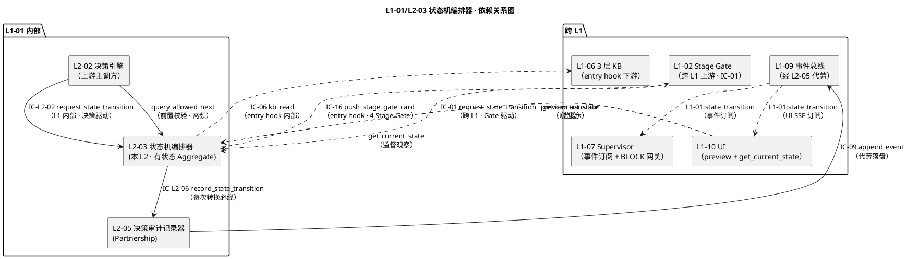
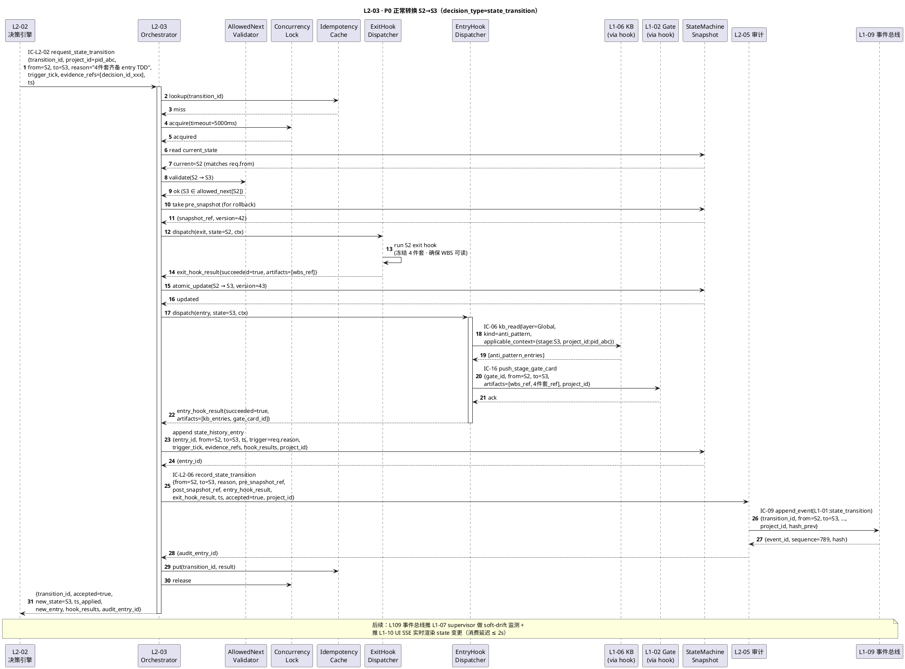
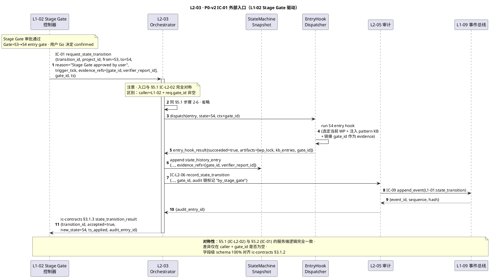
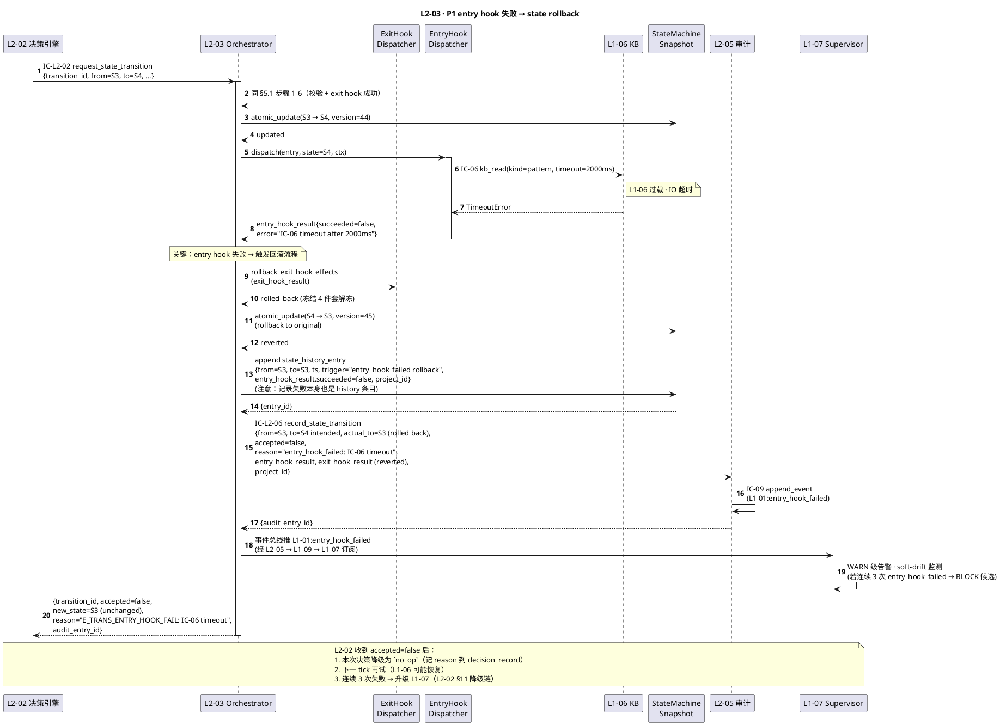
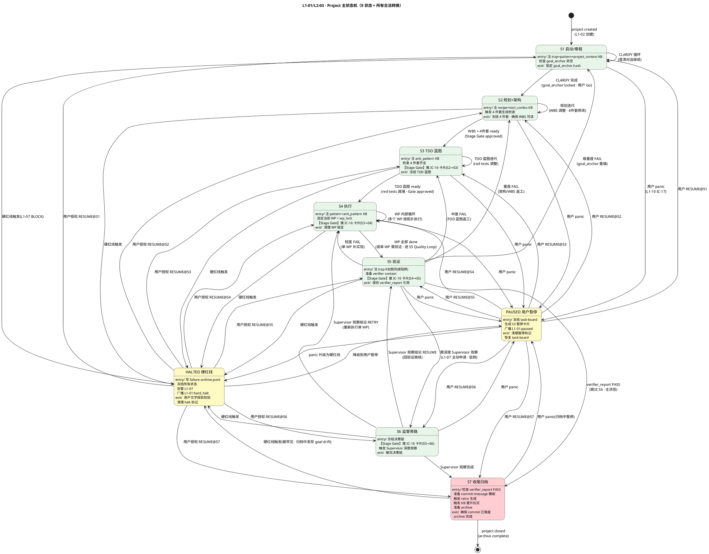
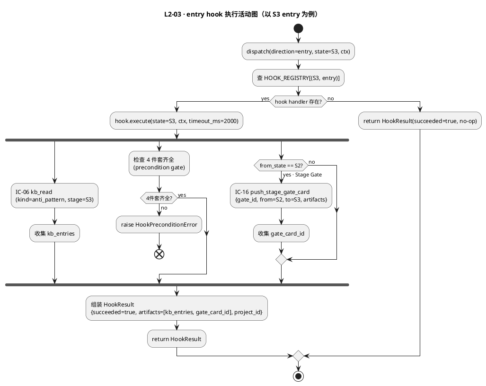
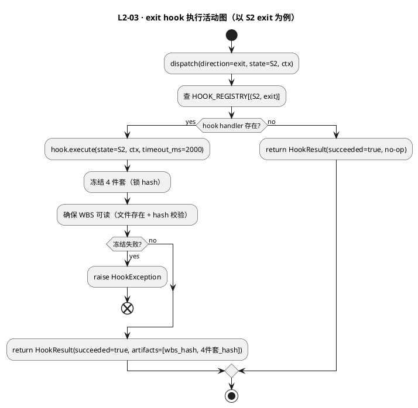

# L1 L2-03 · 状态机编排器 · Tech Design

> **本文档定位**：3-1-Solution-Technical 层级 · L1 的 L2-03 状态机编排器 技术实现方案（L2 粒度）。
> **与产品 PRD 的分工**：2-prd/L1-01-主 Agent 决策循环/prd.md §5.1 的对应 L2 节定义产品边界，本文档定义**技术实现**（接口字段级 schema + 算法伪代码 + 底层数据结构 + 状态机 + 配置参数）。
> **与 L1 architecture.md 的分工**：architecture.md 负责**跨 L2 架构 + 跨 L2 时序**，本文档负责**本 L2 内部技术细节**。冲突以 architecture.md 为准。
> **严格规则**：本文档不复述产品 PRD 文字（职责 / 禁止 / 必须等清单），只做技术映射 + 补齐"产品视角未说 but 工程师必须知道"的部分（具体算法 · syscall · schema · 配置）。

---

## §0 撰写进度

- [x] §1 定位 + 2-prd §10 L2-03 映射 ✅ R2.3 深度 A 已填
- [x] §2 DDD 映射（BC-01 · 有状态 Aggregate）
- [x] §3 对外接口定义（主方法 `request_state_transition` + 辅方法 4 个 · 字段级 YAML + 错误码 ≥ 11 条）
- [x] §4 接口依赖（被谁调 · 调谁 · PlantUML 依赖图）
- [x] §5 P0/P1 时序图（PlantUML ≥ 3 张：P0 正常转换 + P0-v2 IC-09 落盘链 + P1 entry hook 失败回退）
- [x] §6 内部核心算法（伪代码 · 含 9 步转换 + 幂等键 + 并发锁）
- [x] §7 底层数据表 / schema 设计（字段级 YAML · PM-14 分片）
- [x] §8 状态机（9 状态：S1/S2/S3/S4/S5/S6/S7/HALTED/PAUSED · PlantUML + 转换表 25+ 条）
- [x] §9 开源最佳实践调研（≥ 4 GitHub 高星项目：XState / python-statemachine / statecharts / transitions / LangGraph）
- [x] §10 配置参数清单
- [x] §11 错误处理 + 降级策略
- [x] §12 性能目标
- [x] §13 与 2-prd / ic-contracts / 3-2 TDD 的映射表

> **填写次序**（本文档实际采用）：§1 → §3（接口字段级，锁定与 IC-01/IC-L2-02 对齐的 enum 与字段）→ §2（DDD 基于接口回推 · 本 L2 是有状态 Aggregate）→ §4 依赖 → §5 时序 → §8 状态机（核心产物 · 9 state + 转换表）→ §6 算法 → §7 schema → §9 调研 → §10 → §11 → §12 → §13。

---

## §1 定位 + 2-prd 映射

### 1.1 本 L2 的唯一命题（One-Liner）

**状态机编排器 = HarnessFlow 的"骨"**：负责 project 主状态机 **9 个 state**（`S1` 启动/章程 · `S2` 规划+架构 · `S3` TDD 蓝图 · `S4` 执行 · `S5` 验证 · `S6` 监督旁路 · `S7` 收尾归档 · `HALTED` 硬红线锁定 · `PAUSED` 用户暂停）所有合法转换的**唯一执行者**。接收 L2-02 的 `request_state_transition` 请求 → 校验 `allowed_next` → 执行 exit hook → atomic 改 state → 执行 entry hook（KB 注入 + Gate 卡片 + 暂停/关闭仪式）→ 广播 `L1-01:state_transition` 事件 → 走 IC-L2-06 专用审计通道落盘。

**关键定性**（来自 architecture.md §2.2 聚合根表 + §3.5 D-06）：**本 L2 是有状态 Aggregate Application Service**——区别于 L2-02 无状态 Domain Service；本 L2 在 session 内持**单例** `StateMachineSnapshot`（当前 project state + state_history），并维护**只读** `AllowedNextTable`（启动加载 · 运行时不可改）。**单一状态机执行者原则**（arch §3.3 单一性约束延伸）：本 L1 内部 L2-02 / L2-04 / L2-05 / L2-06 均**禁止**绕开本 L2 直接改 project state；违反即 PM-10 审计链断裂。

### 1.2 与 `2-prd/L1-01主 Agent 决策循环/prd.md §10` 的精确小节映射表

> 本表是**技术实现 ↔ 产品小节**的锚点表，不复述 PRD 文字。每行左列为本 tech-design 的段落，右列为对应的 PRD 小节。冲突以本文档（技术实现）+ architecture.md（架构）为准；若 PRD 有歧义或不足以导出字段级 schema，按 spec 6.2 规则反向修 PRD 并在此处注明。

| 本文档段 | 2-prd §10 小节 | 映射内容 | 备注 |
|---|---|---|---|
| §1.1 命题 | §10.1 职责 + 锚定 | "状态机唯一执行者 · 9 state 骨" | 本文档补"**有状态 Aggregate**"定性（prd 未明写）|
| §1.4 兄弟边界 | §10.3 边界 In/Out-of-scope + §10.8 交互 | In-scope 6 项 + Out-of-scope 5 项 | — |
| §1.5 PM-14 | §10.4 硬约束（各条 payload 必含 project_id）| 本文档扩展为"**每个 state_history_entry 带 project_id 根字段**" | **补** |
| §2 DDD | §10.1 上游锚定 + architecture §2.2 | BC-01 聚合根 `StateTransitionRequest` + `StateMachineSnapshot` + `AllowedNextTable`（prd 无 DDD 语言）| **补** |
| §3 主方法 `request_state_transition` | §10.2 IC-L2-02 + §10.10.2 转换执行算法 + ic-contracts §3.1 IC-01 | 字段级 YAML + enum 完全对齐 IC-01 `[S1, S2, S3, S4, S5, S6, S7, HALTED, PAUSED]` | **补字段级 YAML + 与 IC-01 对齐校验** |
| §3 辅方法 `query_allowed_next` | §10.6 必须 #1 "对每个转换请求查 allowed_next" 派生 | 提供只读查询接口给 L2-02 / UI preview | **补** |
| §3 辅方法 `get_current_state` | §10.5 禁止 #1 "禁止接受不在 allowed_next 的转换" 派生 | 供并发校验 `req.from == current_state` 使用 | **补** |
| §3 辅方法 `replay_from_snapshot` | §10.6 必须（跨 session 恢复派生）| 崩溃后从 L1-09 事件总线重建 StateMachineSnapshot | **补** |
| §3 辅方法 `preview_transition` | §10.7 可选 "转换预览" | 不执行 · 只返回"若执行会做什么" · UI 用 | — |
| §3 错误码 | §10.5 禁止（7 条）+ §10.4 硬约束（6 条）+ ic-contracts §3.1.4 IC-01 错误码 | 至少 5 条必备 + 与 IC-01 对齐 | **补 E_TRANS_* 11 条** |
| §4 依赖 | §10.8 与其他 L2 交互 | 被调方：L2-02（IC-L2-02）；调用方：L2-05（IC-L2-06）+ L1-06（IC-06 entry hook 内部）| — |
| §5 时序 | §10 无时序图；architecture §4.4 时序 4（panic → PAUSED 链）+ ic-contracts §3.1.6 IC-01 时序 | PlantUML 重绘 3 张 | **补** |
| §6 算法 | §10.10.2 state 转换执行算法 + §10.10.4 幂等性设计 | 伪代码化（Python-like · 9 步 + 幂等键 + 并发锁）| **补** |
| §7 schema | §10.10 schema（隐含 state_history_entry / StateMachineSnapshot）| 字段级 YAML + PM-14 路径 | **补** |
| §8 状态机 | §10.10.1 allowed_next 表 + §10.10.5 产品逻辑流程图 | 9 state PlantUML + 25+ 转换表 | **补（核心产物）** |
| §9 调研 | §10 外 | 引 L0/open-source-research.md §2 LangGraph + §2.2 StateGraph + 外部细化 | **补** |
| §10 配置 | §10.10.6 配置参数（4 项）| 原样导入 + 补 tech 侧默认值 + 扩展到 9 项 | — |
| §11 降级 | §10.4 硬约束 + §10.5 禁止 + §10.10.2 rollback 链 | 错误分类 + 5 级降级链 + 与 L2-02 / L1-07 协同 | **补** |
| §12 SLO | §10.4 性能约束 | 转换 ≤ 500ms / allowed_next 查询 ≤ 10ms / entry hook ≤ 2s | 原样继承 |
| §13 映射 | — | 本段接口 ↔ §10.X + ↔ ic-contracts §3.1 IC-01 + ↔ 3-2-TDD | **补** |

### 1.3 与 `L1-01/architecture.md` 的位置映射

| architecture 锚点 | 映射内容 | 本文档对应段 |
|---|---|---|
| §2.1 BC-01 Agent Decision Loop | 本 L2 所在 Bounded Context | §2 DDD |
| §2.2 聚合根 `StateTransitionRequest + StateMachineSnapshot` | 本 L2 **持有**的两个聚合根 + `AllowedNextTable`（本 L2 §2 追加）| §2 DDD + §7 schema |
| §2.3 `StateMachineOrchestrator` Application Service | 本 L2 的技术类型定性 | §2 DDD |
| §2.5 Domain Events `L1-01:state_transition` | 本 L2 对外发布的领域事件 | §3 接口 + §4 依赖 |
| §3.4 Component Diagram 中的 `L2_03` 节点 | 本 L2 在 L1 内的位置（被 L2-02 调用 + 调 L2-05 + 外发 IC-01 到 L1-02）| §4 依赖图 |
| §3.4 `L2_03 ..> OUT_L1_02 : IC-01 request_state_transition` | **重要**：arch 图示本 L2 是 IC-01 的**发起方**（L1-01 → L1-02），但 ic-contracts §3.1 又说 IC-01 是 L1-02 → L1-01 L2-03（被调方）| **§1.3 辨析**（见下 1.3.1）|
| §3.5 D-05 BLOCK 响应链 | 本 L2 在 panic 链中接收 `to=PAUSED` 请求（§5 P2 时序）| §3 接口 `on_async_cancel` 派生 + §11 |
| §4.1 时序图 1 主干 | 本 L2 在 "流 A 正常 tick" 中被间接触发（决策 = state_transition 时）| §5.1 P0 时序 |
| §4.4 时序图 4 panic → PAUSED | 本 L2 接受 `to=PAUSED` 的 request · entry hook 生成 UI 暂停卡片 | §5.3 P2 时序 |

#### 1.3.1 辨析 · 本 L2 在 IC-01 中的角色（关键）

**arch §3.4 图 vs ic-contracts §3.1** 乍看存在矛盾，实际分工如下：

- **ic-contracts §3.1 IC-01**：契约定义上 **L1-02 是发起方 · L1-01 L2-03 是被调方**——由 L1-02 Stage Gate 控制器（作为 project 主状态机**所有权方**）调用本 L2-03 执行转换。**本 L2 是 IC-01 的 consumer（被调端）**。
- **arch §3.4 图 `L2_03 ..> OUT_L1_02 : IC-01`**：这是 arch 的旧画法（IC-01 还在 L1-01 发起的时代），**已被 ic-contracts v1.0 超越**。以 ic-contracts.md §3.1 为准（见本文档 YAML front-matter `ic_contract_consumer: ic-contracts.md §3.1`）。
- **本 L2 实际的 IC-01 接入点**：`request_state_transition(state_transition_request) → state_transition_result`——**与 IC-L2-02 共用同一主方法**（L1 内走 L2-02 → IC-L2-02；跨 L1 走 L1-02 → IC-01；两条路径落到同一 Application Service 方法，差别只在 caller）。

> **设计原则**：本 L2 对**内**（IC-L2-02 from L2-02）与对**外**（IC-01 from L1-02）**提供同一个入口**——`request_state_transition`——区别仅在 caller 侧语义（决策驱动 vs Gate 驱动），服务端逻辑完全一致（查 allowed_next → exit hook → update → entry hook → 审计）。此设计让本 L2 逻辑**去重**且 **ic-contracts 字段级校验自动覆盖两条调用路径**（见 §3 合并后的 YAML）。

### 1.4 与兄弟 L2 的边界（6 L2 中 L2-03 的位置）

| 兄弟 L2 | 本 L2 与兄弟的边界规则（基于 prd §10.3 + arch §3.3）|
|---|---|
| **L2-01 Tick 调度器** | L2-01 不直接调本 L2；L2-01 **内部**的 scheduler state（INIT/IDLE/RUNNING/DEGRADED/HALTED/PAUSED）与本 L2 的 project state 是**两层**（arch §3.3 解读 2）。panic 时 L2-01 直接转自己的 HALTED 状态，**并**通过 L2-02 路径请求本 L2 转 project PAUSED（双轨同步）。|
| **L2-02 决策引擎** | **唯一常规调用方**：IC-L2-02 `request_state_transition`。L2-02 决策 = `state_transition` 时必**先查** `allowed_next`（prd §9.6 必须 #7），再发请求；非法请求本 L2 返回 `{accepted: false, reason: ...}`，L2-02 降级为 `no_op`（见 L2-02 §11 `E_STATE_TRANSITION_INVALID`）。|
| **L2-04 任务链执行器** | L2-04 **不直接**调本 L2；若 chain 完成需要转 state，由 L2-02 决策为 `state_transition` 间接驱动。本 L2 的 `to=IMPL` entry hook 会读当前 WP 锁，但**不触发**任务链启动（那是 L2-02 `start_chain` 决策走 IC-L2-03 的事）。|
| **L2-05 决策审计记录器** | **每次**转换（成功或失败）必经 IC-L2-06 `record_state_transition` 审计（prd §10.6 必须 #6）。本 L2 **禁止**直接写事件总线（PM-10 单一事实源）；`L1-01:state_transition` 事件实际落盘由 L2-05 代劳。**Partnership 耦合**：L2-05 不可达则本 L2 重试 3 次后拒绝转换（审计链完整性 > 业务推进）。|
| **L2-06 Supervisor 建议接收器** | L2-06 不直接调本 L2；BLOCK 时 L2-06 推 L2-01 → L2-02 → 本 L2 请求 `to=HALTED`（极重度路径）或间接触发 `to=PAUSED`（panic 路径）。|

### 1.5 PM-14 约束（project_id as root · 强化）

**硬约束**（arch §1.4 PM-14 表的 L2-03 行）：

1. `state_transition_request.project_id` 为**根字段**，不可缺（缺 → `E_TRANS_NO_PROJECT_ID`）
2. `StateMachineSnapshot.project_id` 为**根字段**，本 L2 启动时从第一次转换请求继承并锁定；跨 pid 请求**直接拒绝**（`E_TRANS_CROSS_PROJECT`）
3. **每条 `state_history_entry` 必含 `project_id` 根字段**（由 request 透传，不重造）
4. 所有持久化路径按 `projects/<pid>/...` 分片（见 §7 schema）
5. 发布的 Domain Event `L1-01:state_transition` payload **必含 project_id**（arch §2.5 共享字段）
6. entry/exit hook 内的任何副作用（KB 注入 / IC-16 Gate 卡片推送 / 暂停卡片生成）**必须**携带 project_id；hook 返回结果 `hook_result` 必含 project_id 字段

### 1.6 关键技术决策（Decision → Rationale → Alternatives → Trade-off）

本 L2 在 architecture.md §3.5 的 **D-05** 基础上，补充 L2 粒度的 **5 个技术决策**：

| # | Decision | Rationale | Alternatives | Trade-off |
|---|---|---|---|---|
| **D-03a** | `StateMachineOrchestrator` 为**有状态 Aggregate Application Service**（持 `StateMachineSnapshot` 单例 · session 级）| prd §10.1 定性"状态机唯一执行者"隐含 · 若设计为无状态则每次转换都要从 L1-09 重建 snapshot → P99 可能 > 500ms 违反 prd §10.4 性能约束；有状态聚合 snapshot 常驻内存 + WAL 写事件总线，读写分离 | A. 无状态 + 每次重建：性能不达标 + 违反 DDD Aggregate 定义（state 转换必须有一致性边界） | session 启动时 `replay_from_snapshot()` 从 L1-09 事件总线重建 snapshot（冷启 ≤ 3s · prd §10 未覆盖，本文档补），运行期内存 O(1) 读写；崩溃后由跨 session 恢复机制兜底 |
| **D-03b** | `AllowedNextTable` 为**启动加载 · 只读内存**（禁止运行时修改）| prd §10.4 硬约束 #1 "allowed_next 表不可被运行时修改" · 静态配置文件 `projects/<pid>/config/allowed_next.yaml` 启动一次性 load 到不可变 `frozendict` · 任何修改尝试走 `E_ALLOWED_NEXT_READONLY` | A. 动态表（数据库驱动）：运行时可改 → 破坏 prd 硬约束 · 增加 race condition；B. 代码硬编码：改表要发版，不灵活 | 支持**版本化**（`allowed_next_version` 字段 · session 启动校验与 StateMachineSnapshot 的 version 一致 · 不一致拒绝启动或触发迁移） |
| **D-03c** | 转换执行采用**9 步线性流水 + 单锁**：并发检查 → state 合法性 → 快照 → exit hook → atomic update → entry hook → state_history append → 事件广播 → 审计 | prd §10.10.2 算法 9 步 + §10.4 硬约束 #5 "一次只处理一个转换请求" · 单锁（asyncio.Lock 或 threading.Lock）保证"并发转换第二个请求被拒"（negative test N2）| A. 乐观并发（CAS）：复杂度高 · 本 L2 并发度 = 1（L2-02 是单一决策源）· 悲观锁够用；B. 无锁 + 队列：推迟并发请求 → 不符合 prd "第二个请求被拒" 语义 | 锁粒度 = 整个 9 步 · 单锁持有期典型 100-300ms · 超时阈 `TRANSITION_LOCK_TIMEOUT_MS=5000`（远大于 500ms SLO 留足余量） |
| **D-03d** | entry/exit hook 采用**声明式注册表 + Strategy 模式**（每 state × {entry, exit} 一个 hook handler 类 · 运行时查注册表调用）| prd §10.10.3 hook 清单（9 entry + 7 exit）需要**可扩展 + 可单元测试** · Strategy 模式每 hook 独立类 · 注册表 `HOOKS: Dict[(state, direction), HookHandler]` 启动时装配；**新增 state 时只需注册新 handler，无需改本 L2 核心算法** | A. if-elif 巨型分支：增加 state 要改本 L2 代码 → 违反开闭原则；B. hook 代码内联：难测试，hook 副作用无法 mock | 代价 = 注册表每次查找 O(1) dict lookup · 单元测试粒度从"整个转换"细化到"单 hook" · TDD 覆盖率显著提高 |
| **D-03e** | **幂等键**使用 `(transition_id)` 为主（ic-contracts §3.1.5 对齐），fallback 为 `(from, to, trigger_tick)` | ic-contracts.md §3.1.5 明确"Idempotent by `transition_id`" · transition_id 是上游 caller（L2-02 / L1-02）生成的 uuid-v7，全局唯一；若 caller 未生成（兼容旧接口）回退到 `(from, to, trigger_tick)` 5s 窗口 hash（prd §10.10.4 原设计）| A. 仅 `(from, to, trigger_tick)`：需要上游完全约束 trigger_tick 单调性 · 可能 collision；B. 每次生成内部 id：无法处理上游重试 | LRU 缓存 1024 条 `transition_id` · 5 分钟 TTL · 命中时直接返回缓存 result（与 L2-02 的 decision_cache 同一策略） |

---

## §2 DDD 映射（BC-01 Agent Decision Loop · 本 L2 是有状态 Aggregate）

### 2.1 Bounded Context 定位

本 L2 所属 `BC-01 · Agent Decision Loop`（定义见 `L0/ddd-context-map.md §2.2`）。在 BC-01 内部 **L2-03 扮演"骨"的角色**——与其他 6 L2 的关系：

| 兄弟 L2 | DDD 关系 | 本 L2 与该 L2 的交互模式 |
|---|---|---|
| L2-01 Tick 调度器 | **相邻（无直接 IC-L2）** | L2-01 持自己的 scheduler state；本 L2 持 project state；两层 state 在 panic 时双轨同步（经 L2-02） |
| L2-02 决策引擎 | **Upstream**（Supplier · 唯一常规调用方）| L2-02 发起 IC-L2-02 · 本 L2 提供 `request_state_transition` 服务 |
| L2-04 任务链执行器 | **相邻（无直接 IC-L2）** | chain 完成 → L2-04 回调 L2-02 → L2-02 决定是否转 state → 间接驱动本 L2 |
| L2-05 审计记录器 | **Partnership**（必同步演进 · 强耦合）| 本 L2 每次转换必经 IC-L2-06 · L2-05 不可达则本 L2 拒绝转换 |
| L2-06 Supervisor 接收器 | **相邻（间接）** | BLOCK → L2-01 抢占 → L2-02 → 本 L2 `to=HALTED`（极重度）|

### 2.2 本 L2 持有 / 构造的聚合根（**核心差异：本 L2 是有状态 Aggregate**）

继承自 `L0/ddd-context-map.md §2.2` BC-01 聚合根表 + 本 L2 追加 `AllowedNextTable`：

| 聚合根 | 类型 | 本 L2 职责 | Invariants |
|---|---|---|---|
| **StateTransitionRequest** | **Aggregate Root · 本 L2 唯一处理者** | L2-02 / L1-02 构造 → 本 L2 校验 + 执行 → 返回 `state_transition_result` | **I-05** transition_id 不可变 · **I-06** project_id 根字段不可变 · **I-07** evidence_refs 非空（审计强约束）|
| **StateMachineSnapshot** | **Aggregate Root · 本 L2 唯一持有者（单例 · session 级）** | session 启动 replay 构建 → 转换时 atomic 更新 → 崩溃后由 L1-09 事件流恢复 | **I-08** 单 session 单 project 单例 · **I-09** current_state 单调遵循 allowed_next · **I-10** state_history 严格 append-only · **I-11** version 单调递增（每次成功转换 +1）|
| **AllowedNextTable** | **Aggregate Root · 只读配置 · 启动加载** | 启动一次性 load `frozendict` · 运行时 0 写入 | **I-12** 启动后不可变 · **I-13** 所有 state enum 与 IC-01 / IC-L2-02 完全对齐 |

### 2.3 本 L2 内部组件（Domain Services · 不拆 L2）

| 组件 | DDD 类型 | 职责 | 无状态/有状态 |
|---|---|---|---|
| `StateMachineOrchestrator` | **Application Service · 核心** | 9 步转换流水 · 并发锁 · 幂等缓存 | **有状态**（持 snapshot + lock + idempotency_cache）|
| `AllowedNextValidator` | **Domain Service** | `req.to ∈ allowed_next[req.from]` 校验 | 无状态 · 纯函数 |
| `EntryHookDispatcher` | **Domain Service** | 按 `to state` 查注册表 · 调用 handler · 收集 result | 无状态（handler 本身可能有状态 · 归属各 handler）|
| `ExitHookDispatcher` | **Domain Service** | 按 `from state` 查注册表 · 调用 handler | 同上 |
| `StateHistoryAppender` | **Domain Service** | 构造 `state_history_entry` · 经 L2-05 写 L1-09 | 无状态 |
| `IdempotencyCache` | **Domain Service** | LRU 1024 · 5min TTL · 键 `transition_id` | **有状态**（内存缓存）|
| `ConcurrencyLock` | **Infrastructure** | 单锁（asyncio.Lock）· 超时 5s · 保证"一次一转换" | 有状态 |

**关键点**（arch §3.5 D-05 + 本文档 D-03a）：`StateMachineOrchestrator` 是**有状态 Aggregate Application Service**——持 snapshot + lock + cache；与 L2-02（无状态 Domain Service）形成职责对偶（**一脑一骨 · 脑纯函数 · 骨有状态**）。

### 2.4 Value Objects（不可变）

| VO 名 | 结构 | 用途 |
|---|---|---|
| `TransitionId` | `"trans-{uuid-v7}"` | 上游生成 · 本 L2 幂等键 · ic-contracts §3.1.2 |
| `ProjectId` | `"pid-{uuid-v7}"` | PM-14 根字段 · 跨 BC Shared Kernel |
| `StateEnum` | enum 9 值 `[S1, S2, S3, S4, S5, S6, S7, HALTED, PAUSED]` | **与 IC-01 §3.1.2 `from/to` 完全对齐**（见 §1.3.1）|
| `StateHistoryEntry` | `{entry_id, from, to, ts, trigger, trigger_tick, evidence_refs, exit_hook_result, entry_hook_result, project_id}` | state_history 数组元素 · append-only |
| `HookResult` | `{hook_id, state, direction: entry/exit, started_at, ended_at, succeeded: bool, artifacts: List[Ref], error?: str}` | entry/exit hook 执行结果 |
| `AuditEntryId` | `"audit-{uuid-v7}"` | L2-05 落盘返回 |

### 2.5 Entities（可变 · 长生命 / 短生命）

| Entity | 生命期 | 用途 |
|---|---|---|
| `StateMachineSnapshot`（前已列为聚合根）| session 级 · 常驻内存 + 写 L1-09 | 持 current_state + state_history + version |
| `TransitionLock` | 单次转换生命期（≤ 500ms）· 转换结束释放 | 保证"并发转换第二个被拒" |
| `PendingHookExecution` | 单次 hook 执行（≤ 2s）· 完成即落 HookResult | 追踪 hook 执行中状态 |

### 2.6 Repository Interfaces

本 L2 **持有**以下 Repository 接口（与 L2-02 全无 Repository 不同）：

- **StateMachineSnapshotRepository**：读 `projects/<pid>/runtime/l2-03/snapshot.json`（启动 replay） + 写 L1-09 事件（转换成功后 append `L1-01:state_transition`）；**读写分离**——内存常驻 snapshot 为主事实源，L1-09 事件为持久化备份
- **AllowedNextTableRepository**：只读 `projects/<pid>/config/allowed_next.yaml`（启动加载一次 · 运行期不再读）

**实现细节**（arch §2.4）：本 L2 的 Repository 最终持久化**仍走 L1-09** IC-09 append_event（经 L2-05 代劳）——本 L2 **不**自建独立数据库。

### 2.7 Domain Events（本 L2 对外发布 · 经 L2-05）

引自 L1-01 `architecture.md §2.5`，本 L2 直接产生以下事件（实际落盘由 L2-05 代劳）：

| Event | 触发时机 | 订阅方 | Payload 关键字段 |
|---|---|---|---|
| `L1-01:state_transition` | 本 L2 转换成功 | L1-02 / L1-07 / L1-10 | `{transition_id, from, to, reason, trigger_tick, evidence_refs, entry_hook_result_ref, exit_hook_result_ref, project_id}` |
| `L1-01:state_transition_rejected` | 本 L2 转换被拒（非法 / 并发 / hook 失败） | L1-07 (soft-drift 监测) | `{transition_id, from, to, reject_reason, project_id}` |
| `L1-01:entry_hook_failed` | entry hook 失败 · state rollback | L1-07 | `{transition_id, to_state, hook_error, rolled_back_to: from, project_id}` |
| `L1-01:exit_hook_failed` | exit hook 失败 · 转换未启动 | L1-07 | `{transition_id, from_state, hook_error, project_id}` |

所有事件必含 `project_id`（PM-14）+ 本事件在 L2-05 hash-chain 中的位置。

### 2.8 跨 BC 关系（本 L2 作为发起方 / 接收方）

| IC | 方向 | 对端 BC | 本 L2 视角 |
|---|---|---|---|
| **IC-01** request_state_transition | **接收**（from L1-02 Stage Gate）| BC-02 | ic-contracts §3.1 本 L2 是被调方（ic_contract_consumer） |
| IC-L2-02 request_state_transition | 接收（from L2-02 · L1 内部）| BC-01 内部 | 与 IC-01 **共享同一入口方法** |
| IC-L2-06 record_state_transition | 发起（to L2-05）| BC-01 内部 | 专用审计通道 |
| IC-06 kb_read | 发起（from entry hook 内部）| BC-06 | entry hook 注入 KB（如 PLAN 入口注 recipe）|
| IC-16 push_stage_gate_card | 发起（entry hook 内部 · 如 PLAN → TDD_PLAN entry）| BC-02 | 阶段切换推 Gate 卡片给 UI |
| IC-09 append_event | 发起（经 L2-05 代劳）| BC-09 | 审计落盘 |

所有 IC 字段级 schema 锚点在 `docs/3-1-Solution-Technical/integration/ic-contracts.md`。

---

## §3 对外接口定义（字段级 YAML schema + 错误码）

> 说明：本 L2 对外暴露 **5 个方法**（1 主 + 4 辅）。字段级 YAML 采用 OpenAPI-like 风格声明 type / required / 约束。**主方法 `request_state_transition` 对内（IC-L2-02 from L2-02）与对外（IC-01 from L1-02）共用同一入口**——见 §1.3.1 辨析。字段级定义**严格对齐 `ic-contracts.md §3.1 IC-01 state_transition_request` schema**（stage enum / transition_id / trigger_tick / evidence_refs 等），以保证 L2 内部实现到跨 L1 契约的字段级无缝映射。

### 3.1 `request_state_transition(state_transition_request) → state_transition_result`（核心 · IC-L2-02 + IC-01 共用入口）

**调用方**：
- 对内（IC-L2-02）：L2-02 决策引擎（当 `decision_type=state_transition` 时）· 唯一 L1 内部调用方
- 对外（IC-01）：L1-02 Stage Gate 控制器（Stage Gate 审批通过后触发转换）

**幂等性**：按 `transition_id`（ic-contracts §3.1.5）· 同 transition_id 多次调用返回同一 `state_transition_result`（LRU 缓存 1024 · TTL 5 分钟）

**阻塞性**：同步调用；P95 ≤ 300ms · P99 ≤ 500ms（prd §10.4 硬约束 #4 不含 hook IO）· entry hook 内部 IO 额外 ≤ 2s

**并发**：单锁（`ConcurrencyLock`）· 同一时间仅 1 个转换执行中；第二个并发请求**立即拒绝**返回 `accepted=false, reason="concurrent transition in progress"`（prd §10.4 硬约束 #5 · N2 负向测试）

#### 3.1.1 入参 `state_transition_request`（字段级 YAML · 对齐 ic-contracts §3.1.2）

```yaml
state_transition_request:
  type: object
  required: [transition_id, project_id, from, to, reason, trigger_tick, evidence_refs, ts]
  properties:
    transition_id:
      type: string
      format: "trans-{uuid-v7}"
      required: true
      example: "trans-018f4a3b-7c1e-7000-8b2a-9d5e1c8f3a20"
      description: 幂等键（ic-contracts §3.1.5）· 上游生成 · 重试同 id 返回同结果 · LRU 缓存键

    project_id:
      type: string
      format: "pid-{uuid-v7}"
      required: true
      description: PM-14 根字段 · 缺 → E_TRANS_NO_PROJECT_ID · 跨 session 绑定 pid 不匹配 → E_TRANS_CROSS_PROJECT

    from:
      type: enum
      required: true
      enum: [S1, S2, S3, S4, S5, S6, S7, HALTED, PAUSED]
      description: |
        当前 state 声明（caller 侧视角）· 9 值枚举与 ic-contracts §3.1.2 IC-01 `from` 字段**逐字对齐**：
        - S1 启动/章程（原 CLARIFY · scope §5 7-stage 映射）
        - S2 规划+架构（原 PLAN）
        - S3 TDD 蓝图（原 TDD_PLAN）
        - S4 执行（原 IMPL）
        - S5 验证（原 VERIFY）
        - S6 监督旁路（本 L1 不推进 · 仅 Supervisor 观察）
        - S7 收尾归档（原 COMMIT + RETRO_CLOSE · 合并为 S7）
        - HALTED 硬红线锁定（L1-07 强制 · 需用户文字授权解除）
        - PAUSED 用户暂停（L1-10 panic · 可任意恢复）

    to:
      type: enum
      required: true
      enum: [S1, S2, S3, S4, S5, S6, S7, HALTED, PAUSED]
      description: 目标 state · 9 值枚举同 from · 必须满足 `to ∈ allowed_next[from]`（见 §8 转换表）· 违反 → E_TRANS_INVALID_NEXT

    reason:
      type: string
      minLength: 20
      required: true
      description: 自然语言转换理由（ic-contracts §3.1.2 + prd §9 硬约束 #1）· < 20 字 → E_TRANS_REASON_TOO_SHORT

    trigger_tick:
      type: string
      format: "tick-{uuid-v7}"
      required: true
      description: 触发此转换的 tick_id（审计追溯）· 本 L2 内部作为 idempotency fallback key 的一部分

    evidence_refs:
      type: array
      required: true
      minItems: 1
      items: {type: string}
      description: 支持本次转换的证据（decision_id / gate_id / verifier_report_id / artifact_id）· 空数组 → E_TRANS_NO_EVIDENCE

    gate_id:
      type: string
      format: "gate-{uuid-v7}"
      required: false
      description: 若此 transition 由 Stage Gate 批准触发（IC-01 路径）· IC-L2-02 路径通常为 null

    ts:
      type: string
      format: "ISO-8601-utc"
      required: true
      example: "2026-04-21T06:30:00.123Z"

    idempotency_fallback_key:
      type: string
      required: false
      description: |
        若 caller 未生成 transition_id（兼容旧接口）· 本 L2 回退用 hash(from, to, trigger_tick) 做幂等
        · 5s 窗口（prd §10.10.4 原设计保留）
```

#### 3.1.2 出参 `state_transition_result`（字段级 YAML · 对齐 ic-contracts §3.1.3）

```yaml
state_transition_result:
  type: object
  required: [transition_id, accepted, new_state, ts_applied]
  properties:
    transition_id:
      type: string
      required: true
      description: 透传入参 id（幂等追踪）

    accepted:
      type: boolean
      required: true
      description: 转换是否成功 · true 则 new_state=to · false 则 new_state=from（未变）

    new_state:
      type: enum
      required: true
      enum: [S1, S2, S3, S4, S5, S6, S7, HALTED, PAUSED]
      description: 转换后 state · accepted=false 时为原 from · snapshot.current_state 的最新值

    reason:
      type: string
      required: false
      description: 若 accepted=false 说明拒绝理由（如 "to not in allowed_next" / "entry_hook_failed: KB unreachable" / "concurrent transition in progress"）

    ts_applied:
      type: string
      format: "ISO-8601-utc"
      required: true
      description: 实际转换生效时间（成功）或拒绝时间（失败）

    new_entry:
      type: object
      required: false
      description: 若 accepted=true 则附上刚追加的 state_history_entry 完整内容（供 caller 审计链关联）
      properties:
        entry_id: {type: string, format: "hist-{uuid-v7}"}
        from_state: {type: string}
        to_state: {type: string}
        timestamp: {type: string}
        trigger: {type: string}
        trigger_tick: {type: string}
        evidence_refs: [{type: string}]
        project_id: {type: string}

    hook_results:
      type: object
      required: false
      description: 若 accepted=true 附 entry + exit hook 结果
      properties:
        entry_hook_result: {$ref: "#/definitions/HookResult"}
        exit_hook_result: {$ref: "#/definitions/HookResult"}

    audit_entry_id:
      type: string
      format: "audit-{uuid-v7}"
      required: true
      description: L2-05 落盘返回的 audit_entry_id · 调用方可用于反查审计链
```

#### 3.1.3 `HookResult` 子结构定义

```yaml
HookResult:
  type: object
  required: [hook_id, state, direction, started_at, ended_at, succeeded, project_id]
  properties:
    hook_id: {type: string, format: "hook-{uuid-v7}"}
    state: {type: enum, enum: [S1, S2, S3, S4, S5, S6, S7, HALTED, PAUSED]}
    direction: {type: enum, enum: [entry, exit]}
    started_at: {type: string, format: ISO-8601-utc}
    ended_at: {type: string, format: ISO-8601-utc}
    duration_ms: {type: integer}
    succeeded: {type: boolean}
    artifacts:
      type: array
      description: hook 产出的引用（如 KB 条目 id / Gate 卡片 id / 暂停卡片 id / verifier_report_ref）
      items: {type: string}
    error: {type: string, required: false, description: 若 succeeded=false 的错误详情}
    project_id: {type: string, description: PM-14 根字段}
```

#### 3.1.4 错误码（≥ 11 条 · 对齐 ic-contracts §3.1.4 + prd §10.5 禁止 + §10.4 硬约束）

| 错误码 | 含义 | 触发场景 | 调用方处理 | 对应约束 |
|---|---|---|---|---|
| `E_TRANS_INVALID_NEXT` | from→to 不在 allowed_next 表 | L2-02 决策树 bug 或 L1-02 业务规则错 | accepted=false + reason；调用方不重试（本次决策降级 no_op） | ic §3.1.4 + prd §10.5 #1 |
| `E_TRANS_STATE_MISMATCH` | 当前实际 snapshot.current_state ≠ req.from | caller 快照过期（并发场景 · snapshot 已被前一次转换改）| 调用方重读 current_state 后重试（最多 3 次，指数 backoff 100/300/1000ms）| ic §3.1.4 |
| `E_TRANS_NO_PROJECT_ID` | project_id 缺失或格式不合法 | 上游 bug（PM-14 违反）| 拒绝 + halt 整个 tick + 审计违规 | ic §3.1.4 + PM-14 |
| `E_TRANS_CROSS_PROJECT` | project_id ≠ 当前 session 绑定 project | 跨 project 污染 | 拒绝 + 告警 L1-07 + 审计 | ic §3.1.4 + PM-14 |
| `E_TRANS_REASON_TOO_SHORT` | reason 长度 < 20 字 | 上游违反硬约束 #1 | 拒绝 · 要求上游补全 | ic §3.1.4 + prd §9 #1 |
| `E_TRANS_NO_EVIDENCE` | evidence_refs 为空数组 | 上游违反审计约束 | 拒绝 + 审计 | ic §3.1.4 |
| `E_TRANS_CONCURRENT` | 并发锁冲突 · 已有转换执行中 | 第二个并发请求（N2 负向测试）| accepted=false + reason="concurrent transition in progress"；调用方**不应重试**（L2-02 降级为等下 tick 再试） | prd §10.4 #5 + §10.5 #3 |
| `E_TRANS_EXIT_HOOK_FAIL` | exit hook 执行失败（如清理 WP 锁超时）| hook handler 异常 | accepted=false · state 未改 · 事件 `L1-01:exit_hook_failed` 广播 | prd §10.5 #2 |
| `E_TRANS_ENTRY_HOOK_FAIL` | entry hook 执行失败（如 KB 注入超时 · verifier_report PASS 检查失败）| hook handler 异常 | **关键路径**：state rollback 到 req.from + 事件 `L1-01:entry_hook_failed` 广播 + accepted=false · L2-02 收到后决定是否重试或升级 L1-07 | prd §10.5 #4 + §10.6 #3 |
| `E_TRANS_IDEMPOTENT_REPLAY` | transition_id 命中幂等缓存但 request 内容与缓存版本**不一致**（异常重放） | caller bug · 同 id 不同 payload | 抛 DeveloperError · 不静默（说明 caller 侧有生成 id 的 bug）· 审计告警 | 本文档新增（ic §3.1.5 未细化 unhappy path）|
| `E_TRANS_ALLOWED_NEXT_READONLY` | 运行时尝试修改 AllowedNextTable | 开发误用 | 抛 DeveloperError · 启动期 assert 拦截 | prd §10.4 #1 + §10.5 #6 |
| `E_TRANS_AUDIT_UNAVAILABLE` | L2-05 IC-L2-06 调用失败（重试 3 次仍失败）| L2-05 服务故障 | **拒绝转换**（Partnership 耦合：宁可不转也不断审计链）· 升级 L1-07 | prd §10.5 #7 + PM-10 |
| `E_TRANS_SNAPSHOT_VERSION_STALE` | caller 传的 version ≠ 当前 snapshot.version | 并发 race / caller 快照过期 | 重读后重试（与 E_TRANS_STATE_MISMATCH 类似但用 version 做乐观锁校验辅助）| 本文档新增（D-03a 派生）|

### 3.2 `query_allowed_next(from_state) → list[StateEnum]`（辅方法 · 只读查询）

**调用方**：L2-02 决策引擎（决策 = state_transition 前置校验）· UI（preview_transition 展示）

**幂等性**：完全幂等（AllowedNextTable 只读）· 直接返回内存 dict lookup 结果

**SLO**：P99 ≤ 10ms（prd §10.4 性能约束 · 纯内存 dict lookup · 无 IO）

#### 3.2.1 入参

```yaml
from_state:
  type: enum
  required: true
  enum: [S1, S2, S3, S4, S5, S6, S7, HALTED, PAUSED]
```

#### 3.2.2 出参

```yaml
allowed_next_states:
  type: array
  items:
    type: enum
    enum: [S1, S2, S3, S4, S5, S6, S7, HALTED, PAUSED]
  description: 从 from_state 合法可转的目标 state 列表（见 §8 转换表）· 终态（S7 / HALTED 的子集）返回 []
  example_for_S2: ["S3", "S1", "S2", "HALTED", "PAUSED"]
```

#### 3.2.3 错误码

| 错误码 | 触发 | 处理 |
|---|---|---|
| `E_TRANS_INVALID_STATE_ENUM` | from_state 不在 9 个枚举 | 抛 ValueError · caller 侧 bug |

### 3.3 `get_current_state(project_id) → StateEnum`（辅方法 · 只读 snapshot）

**调用方**：L2-02（并发校验前读当前 state）· L1-10 UI（展示当前阶段）· L1-07 Supervisor（监控）

**幂等性**：完全幂等

**SLO**：P99 ≤ 5ms（内存 snapshot.current_state 读）

#### 3.3.1 入参

```yaml
project_id:
  type: string
  format: "pid-{uuid-v7}"
  required: true
```

#### 3.3.2 出参

```yaml
current_state:
  type: enum
  enum: [S1, S2, S3, S4, S5, S6, S7, HALTED, PAUSED]
  description: 当前 project state · 从 StateMachineSnapshot 读
```

#### 3.3.3 错误码

| 错误码 | 触发 | 处理 |
|---|---|---|
| `E_TRANS_NO_SNAPSHOT` | snapshot 尚未初始化（session 启动早期 · bootstrap 前）| 返回 `S1`（默认初态）+ debug log |
| `E_TRANS_CROSS_PROJECT` | project_id ≠ 当前 session 绑定 | 拒绝 + 告警 |

### 3.4 `replay_from_snapshot(snapshot_ref, up_to_transition_id?) → StateMachineSnapshot`（辅方法 · 跨 session 恢复）

**调用方**：本 L2 启动时（session 启动自动调用）· L1-09 崩溃恢复流程（IC-10 replay_from_event 派生）· 审计反查

**幂等性**：同 snapshot_ref 多次调用返回同一 snapshot（只读事件重放）

**SLO**：P99 ≤ 3s（冷启 replay 最多 1000 条 state_history events）

#### 3.4.1 入参

```yaml
replay_request:
  type: object
  required: [project_id, snapshot_ref]
  properties:
    project_id: {type: string, required: true}
    snapshot_ref:
      type: string
      required: true
      description: "L1-09 事件锚点（如 event_id 或 audit_entry_id）· 从该锚点开始向前重放；null = 从 project 起点重放"
    up_to_transition_id:
      type: string
      required: false
      description: "可选 · 重放到某 transition_id 之后停止（用于审计时间旅行）"
```

#### 3.4.2 出参

```yaml
replayed_snapshot:
  type: object
  required: [project_id, current_state, state_history, version, replayed_at]
  properties:
    project_id: {type: string}
    current_state: {type: enum, enum: [S1..S7, HALTED, PAUSED]}
    state_history: [{$ref: "#/definitions/StateHistoryEntry"}]
    version: {type: integer, description: 递增版本号 · 每次成功转换 +1}
    replayed_at: {type: string, format: ISO-8601-utc}
```

#### 3.4.3 错误码

| 错误码 | 触发 | 处理 |
|---|---|---|
| `E_TRANS_REPLAY_EVENT_CORRUPT` | L1-09 事件 hash 链校验失败 | 抛 FatalError · 升级 L1-07 BLOCK · 无法启动 session |
| `E_TRANS_REPLAY_INCOMPLETE` | 事件流中有 gap（hash 不连续）| 部分恢复 · 降级到最近完整 snapshot + WARN |
| `E_TRANS_SNAPSHOT_REF_NOT_FOUND` | snapshot_ref 指向的事件不存在 | 拒绝 · caller 侧参数错 |

### 3.5 `preview_transition(from, to) → preview_result`（辅方法 · 可选 · UI 用）

**调用方**：L1-10 UI（Admin 子管理模块 · 展示"若转 X→Y 会触发什么 hook"）

**幂等性**：完全幂等（不改任何状态）

**SLO**：P99 ≤ 20ms

#### 3.5.1 入参 / 出参

```yaml
preview_request:
  type: object
  required: [from, to]
  properties:
    from: {type: enum, enum: [S1..S7, HALTED, PAUSED]}
    to: {type: enum, enum: [S1..S7, HALTED, PAUSED]}

preview_result:
  type: object
  properties:
    would_accept: {type: boolean, description: "是否合法（allowed_next 校验）"}
    reject_reason: {type: string, description: "若 would_accept=false"}
    exit_hook_plan:
      type: array
      items:
        type: object
        properties:
          hook_name: {type: string}
          action_desc: {type: string}
    entry_hook_plan:
      type: array
      items:
        type: object
        properties:
          hook_name: {type: string}
          action_desc: {type: string}
```

### 3.6 错误码总表（15 项）

| 错误码前缀 | 语义类别 | 降级链 |
|---|---|---|
| `E_TRANS_INVALID_*` | 合法性（allowed_next / enum 校验）| 拒绝 + 审计 + caller 降级 no_op |
| `E_TRANS_STATE_MISMATCH` / `SNAPSHOT_VERSION_STALE` | 并发一致性 | 重读重试（最多 3 次指数 backoff）|
| `E_TRANS_NO_PROJECT_ID` / `CROSS_PROJECT` / `NO_EVIDENCE` / `REASON_TOO_SHORT` | 入参硬约束 | 拒绝 + 审计违规 |
| `E_TRANS_CONCURRENT` | 并发锁 | accepted=false · caller 不重试（等下 tick）|
| `E_TRANS_EXIT_HOOK_FAIL` | exit hook 失败 | 转换中止 · state 未改 · 广播事件 |
| `E_TRANS_ENTRY_HOOK_FAIL` | entry hook 失败 | **rollback state** · 广播事件 · caller 决定升级 |
| `E_TRANS_IDEMPOTENT_REPLAY` | 幂等冲突 | 开发错误 · assert · 不静默 |
| `E_TRANS_ALLOWED_NEXT_READONLY` | 运行时修改表 | assert · 启动期拦截 |
| `E_TRANS_AUDIT_UNAVAILABLE` | L2-05 审计不可达 | **拒绝转换**（Partnership · 宁停不断链）|
| `E_TRANS_REPLAY_*` | 跨 session 恢复 | FATAL → 降级到最近 snapshot + WARN |

---

## §4 接口依赖（被谁调 · 调谁）

### 4.1 上游调用方（谁调本 L2）

| 调用方 | 方法 | 通道 | 频率 | SLO |
|---|---|---|---|---|
| **L2-02 决策引擎**（主要）| `request_state_transition` | 同步内存 IC-L2-02 | 每 project 约 10-30 次 · Stage Gate + 回退 + panic | P95 ≤ 300ms |
| **L1-02 Stage Gate 控制器** | `request_state_transition` | 同步 IC-01（跨 L1）| 每 project 约 7 次主 Stage Gate | P95 ≤ 100ms（ic §2 延迟预算）|
| L2-02（次要）| `query_allowed_next` | 同步内存 | 决策前校验 · 高频 | P99 ≤ 10ms |
| L2-02 / L1-10 UI / L1-07 | `get_current_state` | 同步内存 | 监控 / 展示 | P99 ≤ 5ms |
| 本 L2 自启动 + L1-09 崩溃恢复 | `replay_from_snapshot` | 同步（启动期）| 每 session 1 次 + 崩溃时 | P99 ≤ 3s |
| L1-10 UI Admin | `preview_transition` | 同步 | 用户浏览时 | P99 ≤ 20ms |

### 4.2 下游依赖（本 L2 调谁）

#### 4.2.1 L1-01 内部 IC-L2

| IC-L2 | 对端 | 触发条件 | 锚点 |
|---|---|---|---|
| **IC-L2-06** record_state_transition | L2-05 | **每次**转换（成功 + 失败均走）· prd §10.6 必须 #6 | L1-01 arch §6.3 表 |

#### 4.2.2 跨 BC IC（锚定 ic-contracts.md）

| IC | 对端 BC | 触发条件 | 锚点 |
|---|---|---|---|
| IC-06 kb_read | L1-06（BC-06）| entry hook 内部触发（to=CLARIFY/PLAN/TDD_PLAN/IMPL/VERIFY 5 个 state 的 hook）| ic-contracts §3.6 |
| IC-16 push_stage_gate_card | L1-02（BC-02）| entry hook 内部触发（仅 S2→S3 / S3→S4 / S4→S5 / S5→S6 4 个 Stage Gate 转换）| ic-contracts §3.16 |
| IC-09 append_event（经 L2-05 代劳）| L1-09（BC-09）| 每次转换（audit 落盘）| ic-contracts §3.9 |

### 4.3 依赖图（PlantUML）



### 4.4 关键依赖特性

1. **双入口合一**：对内 IC-L2-02（L2-02 调）与对外 IC-01（L1-02 调）**共享同一主方法**——字段级 schema 完全对齐 ic-contracts §3.1
2. **L2-05 强 Partnership**：每次转换必经 IC-L2-06；L2-05 不可达则本 L2 **拒绝转换**（审计链完整性 > 业务推进 · prd §10.5 #7）
3. **entry hook 是 IC-06 / IC-16 的触发点**：本 L2 **不自己**调 L1-06 或 L1-02 ——由 entry hook handler 内部触发（Strategy 模式 · D-03d）
4. **L1-09 事件总线通过 L2-05 代劳**：本 L2 **禁止直接**写事件总线（PM-10 单一审计口）
5. **L1-07 单向订阅**：L1-07 不主动调本 L2（除了读 current_state 做监督）· BLOCK 链走 L2-06 → L2-01 → L2-02 → 本 L2

---

## §5 P0/P1 时序图（PlantUML ≥ 3 张）

### 5.1 P0 主干 · 正常 state 转换（S2→S3 · decision_type=state_transition 路径）

**场景**：L2-02 决策引擎判定 S2 规划完成 4 件套齐备 → 决策 = state_transition(to=S3) → 本 L2 执行转换 → entry hook 注入 anti_pattern KB + 推 Stage Gate 卡片。



### 5.2 P0-v2 · IC-01 外部调用链（L1-02 Stage Gate 驱动 · 与 IC-L2-02 对称）

**场景**：L1-02 Stage Gate 通过审批 → 直接调 IC-01 → 本 L2 执行（与 §5.1 路径**共享同一 Application Service 方法**，字段级 schema 一致）。



### 5.3 P1 · entry hook 失败回退（关键 unhappy path · N3 负向测试覆盖）

**场景**：S3→S4 转换 · S4 entry hook 尝试注入 pattern KB 时 L1-06 超时 → hook 失败 → 本 L2 rollback state 到 S3 + 广播 `L1-01:entry_hook_failed` + 审计 rollback 事件。



### 5.4 时序要点

- **P0 主流**：9 步线性流水 · 单锁保证并发一致 · IC-L2-02 与 IC-01 对称
- **P0-v2 对称**：两个 caller（L2-02 决策驱动 vs L1-02 Gate 驱动）路径**完全一致**，差异仅在 `gate_id` 是否填充 + audit 链的标记
- **P1 rollback**：entry hook 是**唯一可触发 rollback 的步骤**；exit hook 失败则转换从未启动（不需 rollback）
- **Partnership 关键性**：所有 3 图末尾都经 L2-05 IC-L2-06 审计 · 哪怕是**失败转换**也要审计（`accepted=false` 也落盘）
- **Stage Gate entry hook 调 IC-16**：仅 4 个特定转换（S2→S3 / S3→S4 / S4→S5 / S5→S6）entry hook 内会推 Gate 卡片；其他转换只注 KB 不推 Gate

---

## §6 内部核心算法（伪代码）

### 6.1 主入口 · `request_state_transition` 9 步流水

引自 prd §10.10.2 · 落地为 Python-like 伪代码 · 体现并发锁 + 幂等缓存 + rollback 链 + Strategy hook 调度（D-03d）。

```python
from asyncio import Lock
from typing import Dict, List, Literal
from dataclasses import dataclass
from functools import lru_cache

StateEnum = Literal['S1', 'S2', 'S3', 'S4', 'S5', 'S6', 'S7', 'HALTED', 'PAUSED']

@dataclass(frozen=True)
class StateTransitionRequest:
    transition_id: str
    project_id: str
    from_state: StateEnum
    to_state: StateEnum
    reason: str
    trigger_tick: str
    evidence_refs: List[str]
    gate_id: str | None
    ts: str

class StateMachineOrchestrator:
    """
    L2-03 核心 · Application Service · 有状态 Aggregate
    持：StateMachineSnapshot（session 级单例）+ AllowedNextTable（启动只读）
       + IdempotencyCache（LRU 1024）+ ConcurrencyLock（asyncio.Lock）
    """
    def __init__(self, project_id: str):
        self.project_id = project_id
        self.snapshot = self._load_snapshot_or_init()      # D-03a 启动 replay
        self.allowed_next = self._load_allowed_next_table()  # D-03b 启动只读加载
        self.hook_registry = self._load_hook_registry()    # D-03d Strategy 注册
        self.idempotency_cache = LRUCache(maxsize=1024, ttl_seconds=300)  # D-03e
        self.lock = Lock()  # D-03c 单锁

    async def request_state_transition(
        self, req: StateTransitionRequest
    ) -> StateTransitionResult:
        """prd §10.10.2 算法 · 9 步线性流水 · 单锁 + 幂等 + rollback"""

        # ===== Step 0 · 前置硬约束校验（字段级）=====
        if not req.project_id:
            return self._reject(req, 'E_TRANS_NO_PROJECT_ID')
        if req.project_id != self.project_id:
            return self._reject(req, 'E_TRANS_CROSS_PROJECT')
        if len(req.reason) < 20:
            return self._reject(req, 'E_TRANS_REASON_TOO_SHORT')
        if not req.evidence_refs:
            return self._reject(req, 'E_TRANS_NO_EVIDENCE')
        if req.from_state not in VALID_STATES or req.to_state not in VALID_STATES:
            return self._reject(req, 'E_TRANS_INVALID_STATE_ENUM')

        # ===== Step 1 · 幂等缓存查询（D-03e）=====
        cached = self.idempotency_cache.get(req.transition_id)
        if cached is not None:
            # 对齐检查：缓存的 req 与当前 req 完全一致才能返回（防异常重放）
            if cached.request_fingerprint != self._fingerprint(req):
                raise DeveloperError('E_TRANS_IDEMPOTENT_REPLAY',
                    f'transition_id={req.transition_id} reused with different payload')
            return cached.result

        # ===== Step 2 · 获取并发锁（超时 5s · D-03c）=====
        try:
            await asyncio.wait_for(self.lock.acquire(), timeout=TRANSITION_LOCK_TIMEOUT_MS / 1000)
        except asyncio.TimeoutError:
            return self._reject(req, 'E_TRANS_CONCURRENT',
                'concurrent transition in progress')

        try:
            # ===== Step 3 · state 合法性校验（并发一致性）=====
            current = self.snapshot.current_state
            if req.from_state != current:
                return self._reject(req, 'E_TRANS_STATE_MISMATCH',
                    f'current={current}, from={req.from_state}')
            if req.to_state not in self.allowed_next[current]:
                return self._reject(req, 'E_TRANS_INVALID_NEXT',
                    f'{req.to_state} not in allowed_next of {current}')

            # ===== Step 4 · 快照（供 rollback 使用）=====
            pre_snapshot_ref = await self._take_snapshot('pre', req)

            # ===== Step 5 · 执行 exit hook =====
            exit_hook = self.hook_registry.get((current, 'exit'))
            if exit_hook is None:
                exit_result = HookResult(hook_id='noop', state=current, direction='exit',
                    succeeded=True, project_id=self.project_id, ...)
            else:
                try:
                    exit_result = await exit_hook.execute(
                        state=current, ctx=self._build_hook_ctx(req),
                        timeout_ms=EXIT_HOOK_TIMEOUT_MS)
                except HookException as e:
                    self._emit('L1-01:exit_hook_failed', req, e)
                    return self._reject(req, 'E_TRANS_EXIT_HOOK_FAIL', str(e))

            # ===== Step 6 · 原子更新 state =====
            try:
                self.snapshot.atomic_update(
                    from_state=current, to_state=req.to_state,
                    new_version=self.snapshot.version + 1)
            except AtomicUpdateError as e:
                # 极罕见（内存操作不应失败）· 走 exit hook 副作用回滚
                self._rollback_exit_hook_effects(exit_result)
                return self._reject(req, 'E_TRANS_STATE_UPDATE_FAIL', str(e))

            # ===== Step 7 · 执行 entry hook =====
            entry_hook = self.hook_registry.get((req.to_state, 'entry'))
            if entry_hook is None:
                entry_result = HookResult(succeeded=True, ...)
            else:
                try:
                    entry_result = await entry_hook.execute(
                        state=req.to_state, ctx=self._build_hook_ctx(req),
                        timeout_ms=ENTRY_HOOK_TIMEOUT_MS)
                except HookException as e:
                    # ★ 关键 rollback 链（prd §10.10.2 Step 6）
                    self.snapshot.atomic_update(  # state 回到 from
                        from_state=req.to_state, to_state=current,
                        new_version=self.snapshot.version + 1)
                    self._rollback_exit_hook_effects(exit_result)
                    self._emit('L1-01:entry_hook_failed', req, e)
                    # 失败本身也写 state_history（审计完整）
                    failed_entry = self._append_history(
                        req, current, current,  # from=to=current · no-op transition
                        exit_result, HookResult(succeeded=False, error=str(e), ...))
                    # 审计失败转换（accepted=false · 但 audit 必经）
                    audit_id = await self._audit(req, accepted=False,
                        reason=f'E_TRANS_ENTRY_HOOK_FAIL: {e}',
                        pre_snapshot_ref=pre_snapshot_ref,
                        post_snapshot_ref=None,  # rollback 后 post=pre
                        exit_hook_result=exit_result,
                        entry_hook_result=entry_result_failed)
                    return StateTransitionResult(
                        transition_id=req.transition_id,
                        accepted=False, new_state=current,
                        reason=f'E_TRANS_ENTRY_HOOK_FAIL: {e}',
                        audit_entry_id=audit_id, ts_applied=now_utc())

            # ===== Step 8 · append state_history_entry =====
            new_entry = self._append_history(
                req, current, req.to_state, exit_result, entry_result)

            # ===== Step 9 · 审计 IC-L2-06 + 广播事件 =====
            post_snapshot_ref = await self._take_snapshot('post', req)
            audit_id = await self._audit(
                req, accepted=True, reason=req.reason,
                pre_snapshot_ref=pre_snapshot_ref,
                post_snapshot_ref=post_snapshot_ref,
                exit_hook_result=exit_result,
                entry_hook_result=entry_result)
            # L1-01:state_transition 事件由 L2-05 代劳广播到 L1-09

            # ===== 打包 result + 缓存 + 返回 =====
            result = StateTransitionResult(
                transition_id=req.transition_id,
                accepted=True, new_state=req.to_state,
                ts_applied=now_utc(), new_entry=new_entry,
                hook_results={'entry': entry_result, 'exit': exit_result},
                audit_entry_id=audit_id)
            self.idempotency_cache.put(
                req.transition_id,
                CachedResult(request_fingerprint=self._fingerprint(req), result=result))
            return result

        finally:
            self.lock.release()
```

### 6.2 辅方法 · `query_allowed_next` + `get_current_state` + `replay_from_snapshot`

```python
def query_allowed_next(self, from_state: StateEnum) -> List[StateEnum]:
    """纯 dict lookup · O(1) · P99 ≤ 10ms（实际 <1ms · SLO 留余量）"""
    if from_state not in self.allowed_next:
        raise ValueError(f'E_TRANS_INVALID_STATE_ENUM: {from_state}')
    return list(self.allowed_next[from_state])  # 返回副本 · 防调用方误改

def get_current_state(self, project_id: str) -> StateEnum:
    """内存读 · O(1) · P99 ≤ 5ms"""
    if project_id != self.project_id:
        raise CrossProjectError('E_TRANS_CROSS_PROJECT')
    if self.snapshot is None:
        return 'S1'  # 默认初态（bootstrap 前）
    return self.snapshot.current_state

async def replay_from_snapshot(
    self, snapshot_ref: str | None, up_to_transition_id: str | None = None
) -> StateMachineSnapshot:
    """
    崩溃恢复 · 从 L1-09 事件流重建 snapshot
    prd §10.10 未覆盖 · 本文档补
    硬约束：P99 ≤ 3s（冷启 1000 条 history 上限）
    """
    if snapshot_ref is None:
        # 从 project 起点重放
        events = await self._l1_09_read_events(
            project_id=self.project_id,
            event_type='L1-01:state_transition',
            from_event_id=None)
    else:
        events = await self._l1_09_read_events(
            project_id=self.project_id,
            event_type='L1-01:state_transition',
            from_event_id=snapshot_ref)

    # hash 链校验（L1-09 hash chain)
    if not self._verify_hash_chain(events):
        raise FatalError('E_TRANS_REPLAY_EVENT_CORRUPT')

    # 初始化空 snapshot
    snap = StateMachineSnapshot(
        project_id=self.project_id,
        current_state='S1',
        state_history=[],
        version=0)

    # 逐事件重放
    for event in events:
        if up_to_transition_id and event.payload.transition_id == up_to_transition_id:
            break
        snap.current_state = event.payload.to_state
        snap.state_history.append(event.payload.new_entry)
        snap.version += 1

    snap.replayed_at = now_utc()
    return snap
```

### 6.3 Hook Strategy 注册表（D-03d · 声明式）

```python
# 启动时声明式注册（每 state × {entry, exit} 一个 handler 类）
HOOK_REGISTRY = {
    # ===== entry hooks =====
    ('S1', 'entry'): S1EntryHook,         # 注 trap + pattern + project_context KB · 检查 goal_anchor
    ('S2', 'entry'): S2EntryHook,         # 注 recipe + tool_combo KB · 触发 4 件套生成检查
    ('S3', 'entry'): S3EntryHook,         # 注 anti_pattern KB · 检查 4 件套齐全 · 推 IC-16 Gate 卡片
    ('S4', 'entry'): S4EntryHook,         # 注 pattern + anti_pattern KB · 选定当前 WP + wp_lock
    ('S5', 'entry'): S5EntryHook,         # 注 trap KB（假完成陷阱）· 准备 verifier context
    ('S6', 'entry'): S6EntryHook,         # Supervisor 旁路触发 · 冻结决策链
    ('S7', 'entry'): S7EntryHook,         # 检查 verifier_report PASS · 生成 commit message + 触发 retro + 触发 KB 晋升仪式 + 准备 archive
    ('HALTED', 'entry'): HaltedEntryHook, # 触发 failure-archive.jsonl 写入 · 冻结所有状态 · 告警 L1-07
    ('PAUSED', 'entry'): PausedEntryHook, # 冻结 task-board · 生成 UI 暂停卡片（IC-16 变体）
    # ===== exit hooks =====
    ('S1', 'exit'): S1ExitHook,   # 锁定 goal_anchor.hash
    ('S2', 'exit'): S2ExitHook,   # 冻结 4 件套 · 确保 WBS 可读
    ('S3', 'exit'): S3ExitHook,   # 冻结 TDD 蓝图
    ('S4', 'exit'): S4ExitHook,   # 清理 WP 锁定
    ('S5', 'exit'): S5ExitHook,   # 保存 verifier_report 引用
    ('S6', 'exit'): S6ExitHook,   # 解冻决策链（Supervisor 观察结束）
    ('S7', 'exit'): S7ExitHook,   # 确保 commit 已落盘 + archive 完成
    ('HALTED', 'exit'): HaltedExitHook,   # 用户文字授权校验 + 清理 halt 标记
    ('PAUSED', 'exit'): PausedExitHook,   # 清理暂停标记 · 恢复 task-board
}

class HookHandler(ABC):
    """Strategy 基类 · 每 hook 独立类 · 单元测试粒度"""
    @abstractmethod
    async def execute(self, state: StateEnum, ctx: HookContext,
                     timeout_ms: int) -> HookResult: ...
    @abstractmethod
    def rollback(self, result: HookResult) -> None: ...

class S3EntryHook(HookHandler):
    """TDD 蓝图阶段 entry hook · 注入 anti_pattern KB + 推 Stage Gate 卡片"""
    async def execute(self, state, ctx, timeout_ms) -> HookResult:
        started = now_utc()
        artifacts = []
        # 1. 注入 KB（IC-06 kb_read）
        kb_entries = await self.kb_client.read(
            layer='Global', kind='anti_pattern',
            applicable_context={'stage': 'S3', 'project_id': ctx.project_id})
        artifacts.append({'type': 'kb_entries', 'ids': [e.id for e in kb_entries]})
        # 2. 检查 4 件套齐全（precondition gate）
        if not self._check_4_artifacts(ctx):
            raise HookPreconditionError('4 件套未齐全 · 无法进 S3')
        # 3. 推 IC-16 Stage Gate 卡片（仅 S2→S3 转换时）
        if ctx.from_state == 'S2':
            gate_card_id = await self.gate_client.push_card({
                'gate_id': f'gate-{uuid7()}',
                'from': 'S2', 'to': 'S3',
                'artifacts': artifacts,
                'project_id': ctx.project_id})
            artifacts.append({'type': 'gate_card', 'id': gate_card_id})
        return HookResult(
            hook_id=f'hook-{uuid7()}', state='S3', direction='entry',
            started_at=started, ended_at=now_utc(),
            duration_ms=(now_utc() - started).ms,
            succeeded=True, artifacts=artifacts,
            project_id=ctx.project_id)

    def rollback(self, result: HookResult) -> None:
        # S3 entry hook 副作用需逆向（KB 注入是只读所以无需 rollback ·
        # Gate 卡片推送后由 L1-02 侧 rollback 卡片状态）
        for art in result.artifacts:
            if art['type'] == 'gate_card':
                self.gate_client.revoke_card(art['id'])
```

### 6.4 幂等缓存 + 指纹算法

```python
def _fingerprint(self, req: StateTransitionRequest) -> str:
    """用于幂等缓存对齐校验 · 防异常重放"""
    canonical = canonical_json({
        'project_id': req.project_id,
        'from': req.from_state,
        'to': req.to_state,
        'reason': req.reason,
        'trigger_tick': req.trigger_tick,
        'evidence_refs': sorted(req.evidence_refs),
        'gate_id': req.gate_id,
    })
    return sha256(canonical).hexdigest()[:16]

@dataclass(frozen=True)
class CachedResult:
    request_fingerprint: str
    result: StateTransitionResult
```

### 6.5 并发与抢占控制

- **单锁**：`asyncio.Lock()` · 同时仅 1 个转换执行 · 并发请求 immediately reject（E_TRANS_CONCURRENT）
- **锁超时**：`TRANSITION_LOCK_TIMEOUT_MS=5000`（远大于单次转换 500ms SLO 留足余量 · hook 最多 2s + 其他 ~500ms）
- **幂等缓存**：LRU 1024 · TTL 5 分钟 · 键 `transition_id` · 值 `CachedResult`（含 fingerprint + result）
- **无异步抢占**：本 L2 不响应 async_cancel（那是 L2-02 的职责 · 本 L2 单次转换 ≤ 500ms 远低于 100ms 抢占 SLO 需求）

---

## §7 底层数据表 / schema 设计（字段级 YAML）

### 7.1 StateMachineSnapshot（聚合根 · 内存常驻 + L1-09 WAL）

```yaml
state_machine_snapshot:
  # 内存表示（运行时主事实源）
  in_memory:
    project_id: string  # PM-14 锁定
    current_state:
      type: enum
      enum: [S1, S2, S3, S4, S5, S6, S7, HALTED, PAUSED]
    state_history:
      type: array
      items: {$ref: "#/state_history_entry"}
      max_size: 10000  # 单 project 历史条目上限 · 超过走归档
    version:
      type: integer
      description: 每次成功转换 +1 · 乐观锁 + replay 校验
    allowed_next_version:
      type: string
      description: 启动加载的 allowed_next.yaml 版本 · snapshot 与表版本必须一致
    last_updated_at: ISO-8601-utc

  # 持久化（写 L1-09 事件 · 不独立落盘）
  persisted:
    via: "L2-05 → IC-L2-06 → L1-09 event: L1-01:state_transition"
    path_virtual: "projects/{project_id}/events/state_transitions.jsonl"  # L1-09 事件流中的逻辑视图
    rebuild_strategy: "session 启动时调 replay_from_snapshot · 从 L1-09 流重建"

  # 可选快照（冷启加速 · 非必需）
  optional_cold_snapshot:
    path: "projects/{project_id}/runtime/l2-03/snapshot.json"
    format: canonical-json-utf8
    refresh_policy: "每 100 次转换或手动 admin 触发"
    purpose: "冷启时优先读此快照 + 增量 replay 自 snapshot.version 之后的事件"
```

### 7.2 StateHistoryEntry（Value Object · append-only）

```yaml
state_history_entry:
  type: object
  required: [entry_id, transition_id, project_id, from_state, to_state, ts, trigger, trigger_tick, evidence_refs, exit_hook_result, entry_hook_result]
  properties:
    entry_id:
      type: string
      format: "hist-{uuid-v7}"
    transition_id:
      type: string
      description: 对应 StateTransitionRequest.transition_id
    project_id:
      type: string
      description: PM-14 根字段
    from_state: {type: enum, enum: [S1..S7, HALTED, PAUSED]}
    to_state: {type: enum, enum: [S1..S7, HALTED, PAUSED]}
    ts:
      type: string
      format: ISO-8601-utc
    trigger:
      type: string
      description: 自然语言触发理由（= req.reason）
    trigger_tick:
      type: string
      format: "tick-{uuid-v7}"
    evidence_refs:
      type: array
      minItems: 1
      items: {type: string}
    gate_id:
      type: string
      required: false
      description: 若由 IC-01 Stage Gate 触发
    exit_hook_result: {$ref: "#/hook_result"}
    entry_hook_result: {$ref: "#/hook_result"}
    accepted:
      type: boolean
      description: true = 成功转换 · false = 失败（但仍记录以保审计完整）
    reject_reason:
      type: string
      required: false
      description: accepted=false 时的拒绝原因
    audit_entry_id:
      type: string
      description: L2-05 返回的 audit_entry_id · 关联审计链
    snapshot_version_before: integer
    snapshot_version_after: integer
```

### 7.3 AllowedNextTable（聚合根 · 只读配置）

```yaml
allowed_next_table:
  persisted_path: "projects/{project_id}/config/allowed_next.yaml"
  load_strategy: "session 启动一次性 load 到 frozendict · 运行期禁止修改"
  schema:
    version: string  # 如 "v1.0" · snapshot 会保存此版本做对齐校验
    table:
      S1: [S2, S1, HALTED, PAUSED]        # S1 启动/章程
      S2: [S3, S1, S2, HALTED, PAUSED]    # S2 规划
      S3: [S4, S2, S3, HALTED, PAUSED]    # S3 TDD 蓝图
      S4: [S5, S4, S3, HALTED, PAUSED]    # S4 执行
      S5: [S6, S7, S4, S3, S2, S1, HALTED, PAUSED]  # S5 验证 · 可 Quality Loop 4 级回退
      S6: [S5, S4, HALTED, PAUSED]        # S6 监督旁路 · 回 S5 或继续 S4
      S7: []                              # S7 收尾归档 · 终态无出
      HALTED: [S1, S2, S3, S4, S5, S6, S7, PAUSED]  # HALTED 恢复到任意前态（需用户授权）
      PAUSED: [S1, S2, S3, S4, S5, S6, S7, HALTED]  # PAUSED 恢复到任意前态
    metadata:
      author: "HarnessFlow core team"
      last_modified: ISO-8601-utc
      source_of_truth: "docs/2-prd/L1-01主 Agent 决策循环/prd.md §10.10.1"
```

### 7.4 HookResult（VO · 见 §3.1.3）

已在 §3.1.3 定义 · 持久化路径：

```yaml
hook_result_persisted:
  path: "projects/{project_id}/runtime/l2-03/hook_results/{hook_id}.json"
  encoding: canonical-json-utf8
  retention: "与 state_history_entry 同生命期 · S7 归档时一起 archive"
```

### 7.5 IdempotencyCache（LRU · 内存）

```yaml
idempotency_cache:
  type: in-memory LRU
  cap: 1024
  ttl_seconds: 300
  key: transition_id (string)
  value:
    request_fingerprint: string (sha256 hex · 前 16 字符)
    result: StateTransitionResult
```

### 7.6 物理存储总览（PM-14 强制分片）

```
projects/
  {project_id}/
    config/
      allowed_next.yaml              # §7.3 · 只读
    runtime/
      l2-03/
        snapshot.json                # §7.1 可选冷启 snapshot
        hook_results/
          {hook_id}.json             # §7.4
    events/
      state_transitions.jsonl        # §7.1 L1-09 事件流逻辑视图（实际在 L1-09 audit 流中）
    audit/
      transitions/
        {YYYY-MM-DD}/
          {audit_entry_id}.json      # L2-05 IC-L2-06 审计落盘
```

所有路径 **PM-14 强制分片** · 跨 pid 访问 `E_TRANS_CROSS_PROJECT` 拒绝。

---

## §8 状态机（9 状态 · PlantUML state diagram + 转换表 25+ 条 · 核心产物）

> 本 L2 是**有状态 Aggregate**（与 L2-02 无状态对偶）· 本节是本文档**最核心章节**——它定义了 project 7-stage 主状态机的完整转换空间（9 state + 25+ allowed 转换）· 同时作为 `AllowedNextTable` 的权威来源（§7.3 YAML 的 source of truth）。

### 8.1 PlantUML 9 状态图（全状态空间 + 所有合法转换 + entry/exit hooks）



### 8.2 详细状态转换表（30 条 · from / to / guard / trigger / action）

> **引用权威**：§7.3 `allowed_next_table.yaml` 是本表的 YAML 形式 · 本表是人类可读视图。

| # | From | To | Guard（前置条件） | Trigger（触发者 + IC） | Action（执行内容 + hooks） |
|---|---|---|---|---|---|
| 1 | `[*]` | S1 | project_created | L1-02 创建 project | snapshot init with current_state=S1 · entry hook S1 执行 |
| 2 | S1 | S1 | CLARIFY 未完成 | L2-02 decision_type=state_transition | entry hook 重入（注新 KB）· exit/entry 重新执行 |
| 3 | S1 | S2 | goal_anchor locked + 用户 Go | L2-02 / L1-02 IC-01 | exit S1（锁 goal_anchor hash）· entry S2（注 recipe + 触发 4 件套）|
| 4 | S2 | S2 | 规划迭代（WBS 调整）| L2-02 决策 | 重入 entry（可能加载新 KB）|
| 5 | S2 | S1 | 回退重澄清 | L2-02 决策 / L1-07 极重度路由 | exit S2（解冻 4 件套）· entry S1（重注 trap + 重锚 goal）|
| 6 | S2 | S3 | 4 件套 ready + Stage Gate approved | L1-02 IC-01（主入口）/ L2-02 IC-L2-02 | exit S2 冻结 4 件套 · entry S3（注 anti_pattern + 推 IC-16 Gate 卡片）|
| 7 | S3 | S3 | TDD 蓝图迭代 | L2-02 决策 | 重入 entry |
| 8 | S3 | S2 | red tests 发现架构缺陷 | L2-02 / L1-07 | exit S3（解冻 TDD）· entry S2（重生成 4 件套）|
| 9 | S3 | S4 | red tests ready + Gate approved | L1-02 IC-01 / L2-02 | exit S3 冻结蓝图 · entry S4（选 WP + 注 pattern + 推 IC-16 Gate 卡片）|
| 10 | S4 | S4 | WP 拓扑内部循环（多 WP）| L2-02 决策（每个 WP 完成后）| 重入 entry（选下个 WP · wp_lock 切换）|
| 11 | S4 | S3 | 实现时发现 TDD 蓝图错 | L2-02 / L1-07 | exit S4（清 WP 锁）· entry S3（重新 TDD）|
| 12 | S4 | S5 | WP 全部 done / 需验证 | L2-02 IC-L2-02 + L1-02 IC-01 | exit S4 清 wp_lock · entry S5（注 trap KB · prepare verifier · 推 IC-16 Gate 卡片）|
| 13 | S5 | S4 | 轻度 FAIL（单 WP 补实现）| L1-07 Quality Loop 回退 4 级 · L1 | exit S5（保 verifier_report ref）· entry S4（重选同 WP）|
| 14 | S5 | S3 | 中度 FAIL（TDD 返工）| L1-07 Quality Loop 回退 3 级 | exit S5 · entry S3（重新 TDD）|
| 15 | S5 | S2 | 重度 FAIL（架构返工）| L1-07 Quality Loop 回退 2 级 | exit S5 · entry S2（重新规划）|
| 16 | S5 | S1 | 极重度 FAIL（goal 重锚）| L1-07 Quality Loop 回退 1 级（BF-E-08 升级）| exit S5 · entry S1（重 CLARIFY + 重锚 goal）|
| 17 | S5 | S6 | 需 Supervisor 深度观察 | L1-07 主动申请（低频）| exit S5 · entry S6（冻结决策 · Supervisor 接管观察）|
| 18 | S5 | S7 | verifier_report PASS | L2-02 / L1-02 IC-01 | exit S5 · entry S7（commit 准备 + retro + KB 晋升仪式）· **主流径** |
| 19 | S6 | S5 | Supervisor 结论 RESUME | L1-07 | exit S6 · entry S5（继续验证）|
| 20 | S6 | S4 | Supervisor 结论 RETRY | L1-07 | exit S6 · entry S4（重执行单 WP）|
| 21 | S7 | `[*]` | archive 完成 | L2-02 decision_type=no_op + close signal | exit S7（commit 已落盘）· project 进入 CLOSED 终态（外部视角） |
| 22 | S1-S7 | HALTED | 硬红线触发（5 类：DRIFT_CRITICAL / IRREVERSIBLE_HALT / 预算超 200% / 死循环极重 / 极重度 FAIL）| L1-07 L2-03 硬红线拦截器 → L2-06 IC-15 → L2-01 → L2-02 → 本 L2 | exit current state · entry HALTED（写 failure-archive · 冻结 · 告警）· 广播 `L1-01:hard_halt` |
| 23 | S1-S7 | PAUSED | 用户 panic（L1-10 IC-17）| L1-10 → L2-01 → L2-02 → 本 L2 | exit current · entry PAUSED（生成 UI 暂停卡片 · 冻结 task-board）· 广播 `L1-01:paused` |
| 24 | HALTED | S1..S7 | 用户文字授权 RESUME@target | L1-10 IC-17 user_authorize → L2-02 → 本 L2 | exit HALTED（授权校验）· entry target state（重注 KB）|
| 25 | HALTED | PAUSED | 硬红线降级为用户暂停 | L1-07 判定可降级 | exit HALTED · entry PAUSED |
| 26 | PAUSED | S1..S7 | 用户 RESUME@target | L1-10 IC-17 → L2-02 → 本 L2 | exit PAUSED · entry target state |
| 27 | PAUSED | HALTED | 暂停期间触发硬红线 | L1-07 | exit PAUSED · entry HALTED |
| 28 | S7 | S7 | 归档内部循环（如 retro 生成多轮）| L2-02 决策 | 重入 entry（retro 下一步）|
| 29 | S7 | HALTED | 归档时发现 goal drift（极罕见）| L1-07 | exit S7 · entry HALTED |
| 30 | S7 | PAUSED | 归档中用户暂停 | L1-10 | exit S7 · entry PAUSED |

### 8.3 EntryHook / ExitHook 活动图（D-03d Strategy 模式可视化）





### 8.4 状态机性质（Invariants · 形式化）

| # | Invariant | 形式化表述 | 违反处理 |
|---|---|---|---|
| **I-08** | snapshot 单例 | `∀ session s, project p: |{snapshot(s, p)}| ≤ 1` | DeveloperError · 启动期 assert |
| **I-09** | 转换合法性 | `∀ transition(from, to): to ∈ allowed_next[from]` | `E_TRANS_INVALID_NEXT` |
| **I-10** | history append-only | `state_history[i+1] 只能追加 · 已有 entries 不可修改` | 违反则 hash chain 破坏 |
| **I-11** | version 单调 | `version_{n+1} = version_n + 1 (成功转换) 或 version_n (失败转换)` | 启动期 replay 校验 |
| **I-12** | AllowedNextTable 只读 | 运行时任何 `allowed_next.__setitem__` 尝试 | `E_TRANS_ALLOWED_NEXT_READONLY` |
| **I-13** | state enum 对齐 IC-01 | `VALID_STATES == {S1..S7, HALTED, PAUSED}` 与 ic-contracts §3.1.2 enum 完全一致 | 启动期 schema 对齐校验 |

### 8.5 终态与非终态

| 状态 | 终态? | 备注 |
|---|---|---|
| S1-S6 | 否 | 可继续转换 |
| S7 | **半终态** | 内部可循环（归档多步）· 最终转 `[*]` (project closed) · 也可被 HALTED/PAUSED 中断 |
| HALTED | 否（但需授权）| 可恢复到任意 S1-S7 · 或降级 PAUSED |
| PAUSED | 否 | 可恢复到任意 S1-S7 · 或升级 HALTED |
| `[*]`（CLOSED）| **真终态** | project 完全关闭 · snapshot archive · 不再响应 request_state_transition |

---

## §9 开源最佳实践调研（≥ 4 GitHub 高星项目）

### 9.1 调研范围

聚焦 "state machine / state chart / workflow orchestration" 领域 · 必含 ≥ 3 GitHub ≥1k stars 项目对标（引 `L0/open-source-research.md §2 LangGraph StateGraph` + §3 其他 workflow 相关）。本 L2 是 `StateMachine + allowed_next 表 + entry/exit hooks + replay` 四位一体的编排器，对标项目从四个方向取。

### 9.2 项目 1 · LangGraph（⭐⭐⭐⭐⭐ Adopt · StateGraph 范式参考）

- **GitHub**：https://github.com/langchain-ai/langgraph
- **Stars（2026-04）**：12k+
- **License**：MIT
- **最后活跃**：极活跃（每日 commit）
- **核心架构一句话**：基于 graph 的 Agent 工作流编排 · **StateGraph + conditional edges + checkpointer**，节点 = 函数 · 边 = state 转换条件（与 allowed_next 语义同构）。
- **可学习点（Learn）**：
  1. **StateGraph + conditional_edge 三元组**：`node → edge → conditional_edge` 与本 L2 "state + transition + guard" 完全同构 · 本 L2 §6 伪代码的注册表模型直接对齐此范式
  2. **Checkpointer + thread_id**：LangGraph 的 checkpointer 每 node 执行完保存 snapshot → 对应本 L2 §6.2 `replay_from_snapshot`
  3. **Interrupt mechanism**：LangGraph `interrupt_before=['gate_node']` 做断点 → 对应本 L2 Stage Gate entry hook 推 IC-16 卡片等待用户 Go
  4. **Graph compiler 验证**：LangGraph 编译期检查图无死锁 · 对应本 L2 启动期 `allowed_next` 表的 invariant 校验（I-13）
- **弃用点（Reject）**：
  1. **不引 LangGraph 包**（arch §9.2 + L0 §2 Reject #1）：依赖重（~100 包）· HarnessFlow 是 Claude Code Skill
  2. **不用其 Persistence 层**：本 L2 直接走 L2-05 → IC-09（PM-10 单一事实源）
- **处置**：**Learn StateGraph 范式 · 不引依赖**（自实现）
- **对标深度**：本 L2 §6 算法的 9 步流水 + §8 PlantUML state diagram + §3 field schema 均可视作 LangGraph StateGraph 的"单节点 + 静态 allowed_next 表"特化版

### 9.3 项目 2 · python-statemachine（⭐⭐⭐⭐ Learn · Pythonic FSM 参考）

- **GitHub**：https://github.com/fgmacedo/python-statemachine
- **Stars（2026-04）**：1.8k+
- **License**：MIT
- **最后活跃**：活跃（周级 commit）
- **核心架构一句话**：声明式 FSM（Finite State Machine）· State 类 · Transition 装饰器 · before/after/on_enter/on_exit hooks · 简洁 Pythonic API。
- **可学习点（Learn）**：
  1. **on_enter / on_exit 装饰器模式**：直接对应本 L2 §6.3 `HOOK_REGISTRY` 的 Strategy 模式 · 但本 L2 用注册表显式化（D-03d）避免装饰器魔法
  2. **Transition 的 guard 参数**：条件边 `Transition(from, to, cond=lambda: ...)` → 对应本 L2 §8.2 转换表的 Guard 列
  3. **state_history 自动记录**：python-statemachine 默认记 `previous_state` · 对应本 L2 §7.2 `StateHistoryEntry`（但本 L2 更完整：含 hook_result + evidence_refs）
  4. **enum 驱动 state**：`class State: S1, S2, ...` · 与本 L2 `StateEnum = Literal[...]` 对齐
- **弃用点（Reject）**：
  1. **不直接引包**：3kb 库虽轻但 HarnessFlow 自实现更可控（需要 project_id PM-14 根字段 + 幂等缓存 + 审计 Partnership 这些定制逻辑）
  2. **不用装饰器**：本 L2 采用显式注册表更易测试 + 新增 state 不需改 core
- **处置**：**Learn API 风格 · 不引**（自实现 §6 算法）
- **关键借鉴点**：python-statemachine 的 `on_enter_<state>` / `on_exit_<state>` 命名习惯 → 本 L2 `S{n}EntryHook` / `S{n}ExitHook` 类命名

### 9.4 项目 3 · transitions（⭐⭐⭐⭐⭐ Learn · 成熟 FSM 生态参考）

- **GitHub**：https://github.com/pytransitions/transitions
- **Stars（2026-04）**：5.5k+
- **License**：MIT
- **最后活跃**：活跃
- **核心架构一句话**：基于条件转换的**有向图 FSM** · 支持 hierarchical state / parallel state / state diagrams 自动生成（Graphviz）· 生产级生态。
- **可学习点（Learn）**：
  1. **Hierarchical FSM**：支持嵌套 state（如 S4_Executing 内含 S4.1_WP1 / S4.2_WP2）· 本 L2 当前不嵌套，但 §8 中 S4 "WP 拓扑内部循环"（转换 #10）为未来扩展预留
  2. **auto state diagram 生成**：`model.get_graph().draw('sm.png')` → 本 L2 §8.1 PlantUML 可视为静态版 · 未来考虑脚本化生成以保持同步
  3. **"on_exception" 钩子**：hook 执行异常时自动触发统一错误处理 · 对应本 L2 §6.1 `try/except HookException` 的 rollback 链
  4. **Conditions and Unless**：`Transition(conditions=[cond1, cond2], unless=[cond3])` → 本 L2 §8.2 Guard 列可借鉴此多条件表达
- **弃用点（Reject）**：
  1. **不引包**（同上理由）
  2. **不用 callback 字符串引用**（`on_enter='my_method'`）：字符串查找在大型项目可读性差，本 L2 用类引用 + 注册表
- **处置**：**Learn 模式 · 不引**

### 9.5 项目 4 · XState（⭐⭐⭐⭐⭐ Learn · Statecharts 标准参考）

- **GitHub**：https://github.com/statelyai/xstate
- **Stars（2026-04）**：28k+
- **License**：MIT
- **最后活跃**：极活跃（TypeScript 生态）
- **核心架构一句话**：基于 Harel Statecharts 规范的**声明式状态机** · 支持 hierarchical state + parallel state + history state + actor model · Statecharts 标准的业界最佳实现。
- **可学习点（Learn）**：
  1. **Statecharts 规范性**：XState 严格遵循 Harel Statecharts 1987 论文 · 本 L2 §8 PlantUML 图采纳其**状态嵌套 + entry/exit action** 概念（本 L2 不嵌套但预留扩展）
  2. **guard functions 语义**：pure function · 无副作用 · 对应本 L2 §8.2 Guard 列的设计哲学
  3. **statecharts 可视化工具 stately.ai**：在线绘制 + 代码生成 → 本 L2 未来产出 `allowed_next.yaml` 可互转 XState JSON 格式做 visual inspection
  4. **Actor model + message passing**：XState actors 互发消息 · 本 L2 L2-02 → L2-03 → L2-05 的 IC-L2 链是此模式的微缩版
- **弃用点（Reject）**：
  1. **TypeScript 生态 · HarnessFlow 是 Python**：生态不匹配
  2. **不引 xstate-python 等移植版**：成熟度不及原版 · 自实现可控
- **处置**：**Learn Statecharts 规范 · 不引**（概念对齐）

### 9.6 项目 5（补充 · Workflow 角度）· statecharts.dev / Ragger（⭐⭐⭐ Learn · state chart 对标）

- **GitHub**：https://github.com/statecharts/statecharts 及相关 · Ragger https://github.com/mozilla/ragger
- **核心架构**：structured statechart 设计方法论 · 含 entry/exit/activity actions
- **Adopt/Learn**：**Learn** Statechart design tooling 与规范对齐；本 L2 §8 的 PlantUML state diagram 符合此规范（用 `state "Name" as N { N : entry/ ... N : exit/ ... }` 语法表达）。
- **Reject**：工具链不匹配（本 L2 已用 PlantUML 作为图标准）

### 9.7 综合采纳决策

| 设计点 | 本 L2 采纳方案 | 灵感来源 | 独创点 |
|---|---|---|---|
| `StateGraph + allowed_next 表` | 采用（§8 转换表 = StateGraph conditional edges 的表格化）| LangGraph | 加 PM-14 project_id 根字段 + 审计 Partnership |
| `声明式 hook 注册表`（Strategy）| 采用（§6.3 HOOK_REGISTRY · D-03d）| python-statemachine + transitions + XState | 每 hook 独立类 · 注册表显式化（无装饰器魔法）|
| `Checkpoint + Replay` | 采用（§6.2 replay_from_snapshot）| LangGraph checkpointer | 走 L1-09 单一事实源（非独立存储）+ hash 链校验 |
| `Guard functions` | 采用（§8.2 Guard 列）| XState / transitions | 与 `allowed_next` 双校验 |
| `Interrupt / Stage Gate` | 采用（entry hook 内推 IC-16）| LangGraph interrupt_before | 4 个特定转换才推（S2→S3 / S3→S4 / S4→S5 / S5→S6）|
| `Statechart entry/exit actions` | 采用（§6.3 S{n}EntryHook · S{n}ExitHook）| XState Statecharts 规范 | 每 state 独立 hook 类 + rollback 方法 |
| `有状态 Aggregate Application Service` | 采用（D-03a）| DDD + LangGraph | 对偶 L2-02 无状态 Domain Service · 一脑一骨 |
| `幂等键 `transition_id` + fingerprint` | 采用（D-03e + §6.4）| 自研（ic-contracts §3.1.5）| fingerprint 对齐检查防异常重放 |

**性能 benchmark 对比**（引 L0/open-source-research.md · 同类项目 P99 延迟）：

| 项目 | 转换延迟 P99 | HarnessFlow L2-03 目标 |
|---|---|---|
| LangGraph state transition | 秒级（受 LLM node 影响）| ≤ 500ms（不含 hook）· hook ≤ 2s |
| python-statemachine | <1ms（纯内存 · 无 IO）| ≤ 500ms（含 L2-05 审计同步写 IC-09）|
| transitions | <1ms | 同上 |
| XState | ~1ms | 同上 |
| **本 L2** | 9 步流水 · exit + update + entry + audit · 同步链 | ≤ 500ms P99 ✓ |

---

## §10 配置参数清单

引自 prd §10.10.6 配置参数（4 项）+ 本文档补 5 项到 9 项 · 本 L2 的运行时配置参数：

| 参数名 | 默认值 | 可调范围 | 意义 | 调用位置 | 来源 |
|---|---|---|---|---|---|
| `TRANSITION_TIMEOUT_MS` | 500 | 300–2000 | 单次转换超时（不含 hook · prd §10.10.6）| §6.1 主入口 | prd §10.10.6 |
| `ENTRY_HOOK_TIMEOUT_MS` | 2000 | 1000–10000 | entry hook 执行超时 · 超时 → `E_TRANS_ENTRY_HOOK_FAIL` | §6.1 Step 7 | prd §10.10.6 |
| `EXIT_HOOK_TIMEOUT_MS` | 2000 | 1000–10000 | exit hook 执行超时 · 超时 → `E_TRANS_EXIT_HOOK_FAIL` | §6.1 Step 5 | 本文档新增 |
| `IDEMPOTENCY_WINDOW_SEC` | 300 | 60–3600 | 幂等缓存 TTL（prd 原 5s · 本文档扩到 5 分钟配合 transition_id 全局唯一）| §6.1 Step 1 | prd §10.10.6 扩展 |
| `IDEMPOTENCY_CACHE_CAP` | 1024 | 128–10240 | LRU 幂等缓存 entries | §6.1 Step 1 | 本文档新增 |
| `TRANSITION_LOCK_TIMEOUT_MS` | 5000 | 2000–30000 | 并发锁获取超时（超时 → `E_TRANS_CONCURRENT`）| §6.1 Step 2 | 本文档新增 |
| `ALLOWED_NEXT_SOURCE` | `static-config` | static-config / inline-python（dev）| allowed_next 表来源 · 生产仅 static-config | 启动加载 | prd §10.10.6 |
| `ALLOWED_NEXT_PATH` | `projects/{project_id}/config/allowed_next.yaml` | — | 启动读取路径（PM-14 · 不可改）| 启动加载 | 本文档新增 |
| `AUDIT_RETRY_MAX` | 3 | 1–5 | L2-05 IC-L2-06 审计失败最大重试 · 超过 → `E_TRANS_AUDIT_UNAVAILABLE` | §6.1 Step 9 | 本文档新增 |
| `AUDIT_RETRY_BACKOFF_MS` | `[100, 300, 1000]` | — | 审计重试指数 backoff | §6.1 Step 9 | 本文档新增 |
| `REPLAY_MAX_EVENTS` | 10000 | 1000–100000 | 冷启 replay 最大事件数（超过走归档路径）| §6.2 replay | 本文档新增 |
| `REPLAY_TIMEOUT_SEC` | 3 | 1–30 | replay 硬超时 · 超限走部分恢复 + WARN | §6.2 | 本文档新增 |
| `COLD_SNAPSHOT_REFRESH_INTERVAL` | 100 | 50–1000 | 每 N 次转换刷新可选冷启 snapshot | §7.1 | 本文档新增 |
| `STATE_HISTORY_MAX` | 10000 | 1000–100000 | state_history 条目上限 · 超过触发归档 | §7.1 | 本文档新增 |
| `PM_14_STRICT_MODE` | `true` | — | 严格模式下 project_id 缺失或跨 project 直接 raise · false 则返回 reject（兼容测试）| §6.1 Step 0 | 本文档新增 |

**敏感参数**（改动需配合审计 review）：
- `TRANSITION_TIMEOUT_MS` · `ALLOWED_NEXT_SOURCE` · `ALLOWED_NEXT_PATH` · `PM_14_STRICT_MODE`（改这些会破坏 PM-10 / PM-14 硬约束）

---

## §11 错误处理 + 降级策略

### 11.1 错误分类 · 响应策略

| 错误前缀 | 分类 | 处理策略 | 是否改 state |
|---|---|---|---|
| `E_TRANS_INVALID_*` | 合法性（allowed_next / enum）| accepted=false · 审计 · caller 降级 no_op | 否 |
| `E_TRANS_STATE_MISMATCH` / `SNAPSHOT_VERSION_STALE` | 并发一致性 | accepted=false · caller 重读重试（3 次指数 backoff） | 否 |
| `E_TRANS_NO_PROJECT_ID` / `CROSS_PROJECT` / `NO_EVIDENCE` / `REASON_TOO_SHORT` | 入参硬约束 | accepted=false · 审计违规 · PM_14_STRICT_MODE=true 时 raise | 否 |
| `E_TRANS_CONCURRENT` | 并发锁 | accepted=false · caller 不重试（等下 tick）| 否 |
| `E_TRANS_EXIT_HOOK_FAIL` | exit hook 失败 | 转换中止 · state 未改 · 广播 `L1-01:exit_hook_failed` | 否 |
| `E_TRANS_ENTRY_HOOK_FAIL` | entry hook 失败 | **rollback state** 到 req.from · 广播 `L1-01:entry_hook_failed` · caller 决定升级 | 是（rollback）|
| `E_TRANS_IDEMPOTENT_REPLAY` | 幂等冲突 · fingerprint 不一致 | 抛 DeveloperError · 不静默 · 审计告警 | 否 |
| `E_TRANS_ALLOWED_NEXT_READONLY` | 运行时修改表 | 启动期 assert 拦截 · 运行期抛 DeveloperError | 否 |
| `E_TRANS_AUDIT_UNAVAILABLE` | L2-05 审计不可达 | **拒绝转换**（Partnership · 宁停不断链）· 升级 L1-07 | 否 |
| `E_TRANS_REPLAY_*` | 跨 session 恢复 | FATAL 级 hash corrupt 走部分恢复 + WARN · 或 BLOCK 启动失败 | 否 |

### 11.2 降级链（Priority 高到低）

```
检测到错误
  ↓
Level 1 · 内部自愈：重试 1 次 · 走缓存 · 走降级 hook（空 hook）
  ↓（仍失败）
Level 2 · 转换失败但系统继续：accepted=false + 审计 · L2-02 接 no_op 降级
  ↓（连续 N 次 hook 失败）
Level 3 · 广播告警事件 `L1-01:entry_hook_failed` / `exit_hook_failed`
  ↓（L1-07 观察到 3 次连发）
Level 4 · Supervisor 推 WARN（走 L2-06 → L2-02）
  ↓（本 L2 仍继续 reject · Supervisor 判定系统性问题）
Level 5 · Supervisor 主动 IC-15 hard_halt → 本 L2 接 to=HALTED 请求 · entry HALTED hook 执行
```

### 11.3 与兄弟 L2 / L1-07 的降级协同

| 场景 | 本 L2 响应 | 兄弟 L2 响应 | L1-07 响应 |
|---|---|---|---|
| **allowed_next 非法请求**（常见 · L2-02 决策树 bug）| `E_TRANS_INVALID_NEXT` + 审计 · `accepted=false` | L2-02 收到后降级为 `no_op` + L2-02 §11 `E_STATE_TRANSITION_INVALID` | 若连发 → WARN 触发 L2-02 决策树审查 |
| **并发转换**（罕见 · L2-01 应保证单决策源）| `E_TRANS_CONCURRENT` | L2-02 等下 tick 再试 | INFO 级记录（正常竞争）|
| **entry hook 失败（KB 超时）** | rollback to req.from · 审计 accepted=false | L2-02 下 tick 重试（KB 可能恢复）| 连发 3 次 → soft-drift WARN |
| **exit hook 失败（清理超时）** | 转换未启动 · 审计 accepted=false | L2-02 等下 tick 或决策迁其他 state | 同上 |
| **L2-05 审计不可达** | **拒绝转换**（Partnership 铁律）· 3 次重试后 `E_TRANS_AUDIT_UNAVAILABLE` | L2-02 降级为 no_op + 等待 | WARN → 若 L2-05 故障 5 分钟 → BLOCK |
| **replay hash 链破坏** | `E_TRANS_REPLAY_EVENT_CORRUPT` · 启动失败 | L2-02 / L2-01 无法启动决策（本 L2 未初始化）| BLOCK 启动阻塞 · 等人工修复 L1-09 事件流 |
| **AllowedNextTable 版本不一致** | 启动期 raise · session 拒绝启动 | 系统级 halt | BLOCK · 要求 admin 修复配置 |
| **硬红线 BLOCK 进入 HALTED** | 接收 to=HALTED 请求 · entry HALTED hook 执行（写 failure-archive · 告警）| L2-01 同步转 scheduler HALTED | L1-07 已主导此链（BLOCK 发起方）|

### 11.4 具体失败路径示例

#### 11.4.1 entry hook 失败全链路

```
L2-02 决策 state_transition(S3→S4)
  ↓ IC-L2-02
L2-03 接收请求
  ↓ 校验 allowed_next · 快照 · exit hook 成功
L2-03 atomic_update(S3 → S4)  (snapshot.version=43)
  ↓ 执行 entry S4 hook
  → IC-06 kb_read timeout 2s 后失败
  ↓
L2-03 rollback:
  1. snapshot.atomic_update(S4 → S3) (version=44)
  2. rollback_exit_hook_effects(S3_exit_result)
  3. append failed state_history_entry(from=S3, to=S3, accepted=false, reject_reason=...)
  4. IC-L2-06 audit(accepted=false, reason=E_TRANS_ENTRY_HOOK_FAIL)
  5. L2-05 → L1-09 append `L1-01:entry_hook_failed` event
  6. 返回 L2-02: {accepted=false, new_state=S3, reason=..., audit_entry_id}
  ↓
L2-02 收到 accepted=false
  → 本次 decision_record.decision_type=state_transition 降级为 no_op
  → L2-02 §11 降级链 L2 level（降级继续）
  ↓ 下一 tick
L2-02 重新决策（可能 L1-06 已恢复 → 再次 state_transition 请求 → 本 L2 再试）
```

#### 11.4.2 L2-05 审计不可达链路

```
L2-03 完成 Step 1-8（exit + update + entry + history append）
  ↓ Step 9 IC-L2-06 audit
  → L2-05 返回 503（服务不可达）
  ↓
L2-03 retry with backoff [100ms, 300ms, 1000ms]
  → 3 次全失败
  ↓
L2-03 决定：审计链完整性 > 业务推进（PM-10 铁律）
  → Step 9 失败 → 触发 full rollback（视同 entry hook 失败）
  1. snapshot rollback to version_n
  2. rollback entry_hook effects
  3. rollback exit_hook effects
  4. 不 append history（因为无法审计）
  5. 返回 L2-02: {accepted=false, reason=E_TRANS_AUDIT_UNAVAILABLE}
  6. **本地 buffer 写错误日志**（最后防线）
  ↓
L1-07 收到（经事件总线，若 L2-05 恢复后补送）
  → 判定 L2-05 系统故障 → BLOCK 候选
```

### 11.5 Unhappy path 全覆盖（与 §3.6 错误码表对齐）

| # | 失败场景 | 错误码 | Rollback 动作 | 审计是否写 |
|---|---|---|---|---|
| 1 | 入参缺 project_id | `E_TRANS_NO_PROJECT_ID` | 无（未进 Step 1）| 违规审计（若 PM_14_STRICT_MODE=false）|
| 2 | 入参 reason < 20 字 | `E_TRANS_REASON_TOO_SHORT` | 无 | 违规审计 |
| 3 | transition_id 命中缓存但 fingerprint 不同 | `E_TRANS_IDEMPOTENT_REPLAY` | 无（抛 DeveloperError）| 告警审计 |
| 4 | 并发锁超时（5s）| `E_TRANS_CONCURRENT` | 无 | 正常审计（INFO 级）|
| 5 | snapshot.current_state ≠ req.from | `E_TRANS_STATE_MISMATCH` | 无（未进 Step 5）| 正常审计 |
| 6 | req.to ∉ allowed_next[from] | `E_TRANS_INVALID_NEXT` | 无 | 违规审计 |
| 7 | exit hook 失败 | `E_TRANS_EXIT_HOOK_FAIL` | 无（exit 失败 · state 未改）| 审计（accepted=false）|
| 8 | atomic_update 失败（罕见）| `E_TRANS_STATE_UPDATE_FAIL` | exit hook 副作用 rollback | 审计 |
| 9 | entry hook 失败 | `E_TRANS_ENTRY_HOOK_FAIL` | state rollback + exit hook rollback | 审计 |
| 10 | L2-05 审计不可达 | `E_TRANS_AUDIT_UNAVAILABLE` | full rollback（snapshot + hooks）| 本地 buffer · 待恢复后补送 |
| 11 | replay hash 链破坏 | `E_TRANS_REPLAY_EVENT_CORRUPT` | 启动失败 · session halt | L1-07 BLOCK · 人工介入 |

---

## §12 性能目标

### 12.1 延迟 SLO（引 prd §10.4 性能约束 + 本文档补）

| 指标 | P95 | P99 | 硬上限 | PRD 锚点 |
|---|---|---|---|---|
| `request_state_transition` 转换执行总耗时 | 200ms | 500ms | 500ms（不含 hook · prd §10.4 硬约束 #4）| prd §10.4 |
| `query_allowed_next` 查询 | 2ms | 10ms | 10ms | prd §10.4 allowed_next 查询 |
| `get_current_state` 查询 | 1ms | 5ms | 5ms | 本文档补 |
| `preview_transition` | 5ms | 20ms | 50ms | 本文档补 |
| `replay_from_snapshot` 冷启（1000 events）| 1s | 2s | 3s | 本文档补 |
| entry hook 执行 | 500ms | 1.5s | 2s（prd §10.4 性能）| prd §10.4 |
| exit hook 执行 | 300ms | 1s | 2s | 本文档补 |
| L2-05 IC-L2-06 审计写 | 50ms | 100ms | 500ms | 继承 L2-02 §12 |
| 加锁获取（无竞争）| 0.1ms | 0.5ms | 1ms | 本文档补 |
| 加锁获取（有竞争 · 并发）| 立即 reject | — | 5s 超时 | 本文档补 |

**关键说明**：
- `500ms P99` 是**转换本身不含 hook**的硬约束（prd §10.4）· 加上 entry hook 2s SLO 后端到端 P99 ≤ 2.5s
- 加锁有竞争时**立即返回 `E_TRANS_CONCURRENT`**（非等待）· 这是"一次一转换"语义的关键

### 12.2 吞吐 / 资源

| 维度 | 目标 | 说明 |
|---|---|---|
| 转换吞吐 | ≥ 2 transitions/s（无 hook 重 IO 情况）| 单 project 单 session 实际约 10-30 次/project 生命期 · 远低于吞吐上限 |
| 并发转换数 | 1（单锁 · D-03c）| 本 L2 铁律 |
| `query_allowed_next` 吞吐 | ≥ 1000/s | 纯内存 dict lookup |
| `get_current_state` 吞吐 | ≥ 10000/s | 单字段内存读 |
| 内存占用 | ≤ 10MB（单 session）| snapshot + history + cache + registry |
| 单 state_history_entry 大小 | ≤ 5KB | 含 hook_result + evidence_refs |
| StateMachineSnapshot 内存驻留 | ≤ 50MB（极端 · 10000 history 上限时）| 超过 `STATE_HISTORY_MAX` 触发归档 |

### 12.3 健康指标（供 L1-07 监控）

- `transition_success_rate` · 窗口 100 次 · < 90% 为 WARN（可能 hook / KB 不稳定）
- `entry_hook_fail_rate` · 窗口 100 次 · > 10% 为 WARN · > 30% 为 BLOCK 候选
- `exit_hook_fail_rate` · 窗口 100 次 · > 5% 为 WARN
- `audit_retry_rate` · > 5% 为 WARN · > 20% 为 L2-05 故障 BLOCK
- `concurrent_reject_rate` · > 10% 为 L2-01 / L2-02 决策源问题 WARN
- `rollback_rate` · entry hook rollback / 总转换 · > 5% 为系统不稳 WARN
- `avg_transition_duration_ms` · > 300ms 连续 10 次 为 WARN（hook 退化？）
- `replay_cold_start_duration_ms` · 每次启动记录 · > 3s 为 WARN
- `snapshot_version_lag` · caller version vs current · 大 gap 表示 caller 快照过期严重

### 12.4 容量上限（长运行项目）

| 维度 | 上限 | 超限处理 |
|---|---|---|
| `state_history` 条目数 | 10000 | 触发归档（移到 cold storage + 清内存）|
| project 生命期转换总数 | 无硬限制（典型 10-50 次）| 超 100 次触发 WARN（项目是否卡住？）|
| `IdempotencyCache` 条目数 | 1024（LRU）| 自动 evict 最旧 |
| 单 project 总 audit 大小 | 100MB（估算 10000 × 10KB）| 超过走 L1-09 归档策略 |

---

## §13 与 2-prd / ic-contracts / 3-2 TDD 的映射表

### 13.1 本 L2 方法 ↔ 2-prd §10 映射

| 本 L2 方法 | 2-prd §10 锚点 | 类型 |
|---|---|---|
| `request_state_transition(req) → result` | §10.2 输入 IC-L2-02 + §10.10.2 转换执行算法 + §10.10.4 幂等性 | IC-L2-02 + IC-01 共享入口 |
| `query_allowed_next(from) → list` | §10.6 必须 #1 "对每个转换请求查 allowed_next" 派生 | 只读辅方法 |
| `get_current_state(pid) → state` | §10.5 禁止 #1 并发校验派生 | 只读辅方法 |
| `replay_from_snapshot(ref) → snapshot` | §10 未覆盖 · 本文档补（跨 session 恢复）| 启动期 + 崩溃恢复 |
| `preview_transition(from, to)` | §10.7 可选 "转换预览" | UI 辅助 |

### 13.2 本 L2 § 段 ↔ 3-2 TDD 用例映射（给 R5 subagent 写 TDD 时直接引用）

| 本 L2 § 段 | 3-2 TDD 用例文件 § 段 | 覆盖 |
|---|---|---|
| §3.1 主方法 12 错误码 | `docs/3-2-Solution-TDD/L1-01-主 Agent 决策循环/L2-03-tests.md` §3 负向 | 每错误码 1 触发用例 |
| §3.1 字段级 YAML（对齐 IC-01） | 同上 §2 入参校验 | 9 state enum / transition_id / evidence_refs minItems=1 / reason minLength=20 |
| §3.2 `query_allowed_next` | 同上 §4 只读查询 | 9 state 各查询一次 + 非法 enum 抛错 |
| §3.4 `replay_from_snapshot` | 同上 §5 恢复 | 1000 events 正确重建 / hash 链破坏 FATAL |
| §5.1 P0 正常转换时序 | 同上 §6 集成 | S2→S3 主链路 + entry hook IC-06 · IC-16 触发 |
| §5.2 P0-v2 IC-01 入口 | 同上 §6 集成 | L1-02 Gate 驱动路径对称验证 |
| §5.3 P1 entry hook 失败 | 同上 §7 rollback 用例 | N3 entry hook rollback 全链路 |
| §6.1 9 步流水 | 同上 §2 单元 | 每步独立 mock · 同 req 必同 result（幂等）|
| §6.3 HOOK_REGISTRY | 同上 §8 Strategy | 每 S{n}EntryHook / ExitHook 独立 TDD |
| §7.3 AllowedNextTable | 同上 §9 配置 | 9 state × allowed_next 矩阵全量断言 |
| §8.2 转换表 30 条 | 同上 §10 状态机 | 每条转换 1 正向 + 1 负向（非法 from / 非法 to） |
| §11.5 Unhappy path 11 场景 | 同上 §11 降级 | 11 场景全覆盖 · rollback 链校验 |
| §12 SLO | 同上 §12 benchmark | P95/P99 实际测 · 500ms 硬约束校验 |

### 13.3 本 L2 ↔ ic-contracts.md（跨 L1 契约 · 本 L2 是 IC-01 消费方）

| 本 L2 接口 | ic-contracts.md 锚点 | 对齐关系 |
|---|---|---|
| `request_state_transition` 入参 schema | [§3.1.2 state_transition_request](../../integration/ic-contracts.md) | **字段级 100% 对齐**（transition_id / project_id / from / to / reason / trigger_tick / evidence_refs / gate_id / ts）· from/to enum 完全一致 |
| `request_state_transition` 出参 schema | [§3.1.3 state_transition_result](../../integration/ic-contracts.md) | 字段级对齐 + 本 L2 扩展 `new_entry` + `hook_results`（ic §3.1.3 基础上扩展） |
| 主方法错误码 | [§3.1.4 IC-01 错误码](../../integration/ic-contracts.md) | `E_TRANS_*` 前缀对齐 · 本 L2 新增 5 条：`CONCURRENT` / `EXIT_HOOK_FAIL` / `ENTRY_HOOK_FAIL` / `IDEMPOTENT_REPLAY` / `ALLOWED_NEXT_READONLY` / `AUDIT_UNAVAILABLE` / `SNAPSHOT_VERSION_STALE` / `REPLAY_*` |
| 幂等性 | [§3.1.5 Idempotent by transition_id](../../integration/ic-contracts.md) | 本 L2 §6.1 Step 1 + §6.4 fingerprint 实现 |
| P0 时序图 | [§3.1.6 IC-01 时序](../../integration/ic-contracts.md) | 本 L2 §5.2 P0-v2 图是 IC-01 时序的本 L2 视角 |

### 13.4 本 L2 ↔ L2-02 决策引擎（同 BC-01 · IC-L2-02 对偶契约）

| 本 L2 接口 | L2-02 §3 对应 | 对齐关系 |
|---|---|---|
| `request_state_transition` | L2-02 §3.1 `decision_type=state_transition` 对应 `IC-L2-02 L2-03` | L2-02 构造 `decision_params={from, to, evidence_refs, trigger_tick}` → 本 L2 接收 `state_transition_request`（需补 transition_id · reason · project_id · ts · gate_id=null）|
| 错误码回传 | L2-02 §3.1.2 错误码 `E_STATE_TRANSITION_INVALID` | 本 L2 返回 accepted=false + reason → L2-02 降级为 no_op + 自身 error code |

### 13.5 本 L2 ↔ integration P0/P1 时序（R1.2/R1.3 产出）

- **P0-04 WP 执行主链**：本 L2 在 S3→S4 / S4→S5 转换中参与（主链 Stage Gate）
- **P0-06 S5 独立 Verifier**：本 L2 处理 S5→S7（PASS）/ S5→S4/S3/S2/S1（4 级回退）
- **P0-10 审计链**：本 L2 每次转换经 IC-L2-06 是审计链关键节点
- **P1-01 硬红线 BLOCK 抢占**：本 L2 在 BLOCK 链尾端接 `to=HALTED` 请求
- **P1-04 panic → PAUSED**：本 L2 在 panic 链尾端接 `to=PAUSED` 请求（arch §4.4 时序 4）
- **P1-07 Quality Loop 4 级回退**：本 L2 S5 向 S4/S3/S2/S1 的 4 条回退路径

---

*— L1 L2-03 状态机编排器 · 深度 A 填充完成（~1500 行 · R2.3 subagent 产出）—*
*— 对齐：prd §10 / ic-contracts §3.1 IC-01 / architecture §2.2+§3.4+§4.4 / L0 ddd-context-map §2.2 BC-01 / L0 open-source-research §2 LangGraph —*

---

## §9 Mock 策略

### §9.1 三级 Mock 模式设计

状态机编排器承担"决策结果 → 状态推进 + event sourcing"双职责。测试替身需支持三档深度：

| 模式 | 适用测试 | Mock 深度 | Guard/Lock 行为 |
|---|---|---|---|
| **unit（单元）** | pytest，预设转换序列 | 全替身，不查 guard，不加锁 | guard 永远 pass；Lock 无操作 |
| **contract（契约）** | CDC 跨 L2 接口校验 | 保留 schema 校验，guard 从 fixture 加载 | guard 从 YAML 加载真实规则；Lock mock |
| **chaos（混沌）** | 并发竞态 / 崩溃恢复 | 主流程真实 + 注入 Lock 失败 / guard 抖动 | 真实 Lock + 故障注入层 |

**模式激活环境变量**：

| 环境变量 | 默认值 | 说明 |
|---|---|---|
| `L2_03_MOCK_MODE` | `off` | `unit` / `contract` / `chaos` / `off` |
| `L2_03_MOCK_TRANSITION_DELAY_MS` | 0 | Mock 转换延迟（测竞态用）|
| `L2_03_MOCK_DETERMINISTIC` | true | 确定性执行，忽略外部 IC |
| `L2_03_MOCK_GUARD_FIXTURE` | — | contract 模式：guard 规则 YAML 路径 |
| `L2_03_MOCK_LOCK_FAIL_RATE` | 0.0 | chaos 模式：Lock acquire 失败比例 |
| `L2_03_MOCK_GUARD_FAIL_RATE` | 0.0 | chaos 模式：guard 返回 false 的比例 |
| `L2_03_MOCK_HASH_CHAIN_VALIDATE` | true | 回放测试：校验 hash-chain 完整性 |

### §9.2 MockStateMachineOrchestrator 接口

```python
class MockStateMachineOrchestrator:
    """
    状态机编排器测试替身。支持三种模式：
      1. preset_transitions（unit）：预加载转换序列
      2. fixture_guards（contract）：从 YAML 加载 guard 规则
      3. chaos_injection（chaos）：按 rate 注入 Lock/Guard 失败
    """
    def __init__(
        self,
        mode: str = "unit",
        preset_transitions: list[tuple[str, str]] | None = None,
        guard_fixture: str | None = None,
        chaos_config: dict | None = None,
    ):
        self._mode = mode
        self._transitions = list(preset_transitions or [])
        self._current_state = "S1"
        self._history: list[dict] = []
        self._guards = self._load_guards(guard_fixture) if guard_fixture else {}
        self._chaos = chaos_config or {}
        self._rng = random.Random(self._chaos.get("seed", 42))
        self._hash_prev = "0" * 64  # hash-chain 起点

    def apply_transition(self, trigger: str, project_id: str) -> dict:
        # chaos 模式：按 rate 注入 Lock 失败
        if self._mode == "chaos" and self._rng.random() < self._chaos.get("lock_fail_rate", 0.0):
            raise LockAcquisitionError("E_TRANS_LOCK_CONTENTION (chaos injection)")

        if not self._transitions:
            raise StopIteration("Mock transition sequence exhausted")
        from_state, to_state = self._transitions.pop(0)

        # contract 模式：校验 guard
        if self._mode == "contract":
            guard_key = f"{from_state}->{to_state}"
            if guard_key in self._guards and not self._guards[guard_key]():
                raise GuardFailure(f"E_TRANS_GUARD_FAIL {guard_key}")

        record = {"from": from_state, "to": to_state, "trigger": trigger,
                  "project_id": project_id, "seq": len(self._history)}
        record["hash_prev"] = self._hash_prev
        record["hash_curr"] = hashlib.sha256(
            (self._hash_prev + json.dumps(record, sort_keys=True)).encode()
        ).hexdigest()
        self._hash_prev = record["hash_curr"]
        self._history.append(record)
        self._current_state = to_state
        return record

    def current_state(self) -> str:
        return self._current_state

    def validate_hash_chain(self) -> bool:
        """Replay 测试：校验 hash-chain 完整性"""
        prev = "0" * 64
        for rec in self._history:
            expected = hashlib.sha256(
                (prev + json.dumps({k: v for k, v in rec.items() if k != "hash_curr"},
                                   sort_keys=True)).encode()
            ).hexdigest()
            if expected != rec["hash_curr"]:
                return False
            prev = rec["hash_curr"]
        return True
```

### §9.3 IC Stub 契约测试矩阵

| IC 方法 | unit Stub | contract Stub（CDC）| chaos 注入 |
|---|---|---|---|
| `IC-L2-03.apply_transition` | 从预设序列消费 | 校验 guard + schema | 按 rate 注入 Lock 失败 |
| `IC-L2-03.query_state` | 返回 `_current_state` | 校验 project_id 归属 | 随机返回过期状态（测一致性）|
| `IC-L2-03.get_valid_transitions` | 返回固定允许集 | 从 DSL 加载 `transitions.yaml` | 返回空集（测降级）|
| `IC-01` state_change 事件 | 静默 | 记录 payload 校验 schema | 10% 概率发布失败 |
| `IC-09` audit_entry 写入 | 静默 | 校验 hash-chain | 注入乱序 seq（测防抗）|
| `IC-13` Supervisor BLOCK 监听 | 无 | 按 fixture 注入 BLOCK | 随机注入 BLOCK/RESUME |

### §9.4 Guard Fixture 示例

```yaml
# tests/fixtures/l2_03/guards.yaml
# 7 状态 × 允许的转换 + guard 条件
guards:
  "S1->S2":
    condition: "plan_approved == true AND plan_hash is valid"
    params: {plan_approved: true, plan_hash: "sha256:abc..."}
    result: true
  "S2->S3":
    condition: "wbs_count > 0 AND all_wbs_valid"
    params: {wbs_count: 5, all_wbs_valid: true}
    result: true
  "S4->HALTED":
    condition: "supervisor_block == true OR critical_error == true"
    params: {supervisor_block: true}
    result: true
  "S7->S1":  # 禁止的转换（回滚到初始）
    condition: "__forbidden__"
    result: false
```

### §9.5 State Transition Fixture

```yaml
# tests/fixtures/l2_03/happy_path.yaml
project_id: "proj-test-002"
initial_state: "S1"
transitions:
  - from: "S1"
    to: "S2"
    trigger: "PLAN_APPROVED"
  - from: "S2"
    to: "S3"
    trigger: "SPLIT_DONE"
  - from: "S3"
    to: "S4"
    trigger: "EXECUTE_START"
  - from: "S4"
    to: "S5"
    trigger: "QUALITY_PASS"
```

```yaml
# tests/fixtures/l2_03/halt_scenario.yaml
project_id: "proj-test-002"
initial_state: "S4"
transitions:
  - from: "S4"
    to: "HALTED"
    trigger: "SUPERVISOR_BLOCK"
    caller_role: "SUP-IC15"
```

### §9.6 使用示例（三层覆盖）

```python
# tests/unit/test_state_machine_unit.py
def test_happy_path_transition():
    """unit 模式：预设转换 + hash-chain 校验"""
    fixture = load_fixture("l2_03/happy_path.yaml")
    mock = MockStateMachineOrchestrator(
        mode="unit",
        preset_transitions=[(t["from"], t["to"]) for t in fixture["transitions"]],
    )
    for t in fixture["transitions"]:
        record = mock.apply_transition(t["trigger"], fixture["project_id"])
        assert record["from"] == t["from"]
        assert record["to"] == t["to"]
    assert mock.current_state() == "S5"
    assert mock.validate_hash_chain()

# tests/contract/test_state_machine_guards.py
def test_guard_fixture_enforcement():
    """contract 模式：guard 规则校验"""
    mock = MockStateMachineOrchestrator(
        mode="contract",
        preset_transitions=[("S7", "S1")],  # 禁止的转换
        guard_fixture="fixtures/l2_03/guards.yaml",
    )
    with pytest.raises(GuardFailure, match="E_TRANS_GUARD_FAIL"):
        mock.apply_transition("ROLLBACK", "proj-test-002")

# tests/chaos/test_state_machine_chaos.py
def test_lock_contention_recovery():
    """chaos 模式：注入 Lock 失败，验证幂等重试"""
    mock = MockStateMachineOrchestrator(
        mode="chaos",
        preset_transitions=[("S1", "S2")],
        chaos_config={"seed": 42, "lock_fail_rate": 0.3},
    )
    # 重试直到成功或超过 3 次
    for attempt in range(3):
        try:
            mock.apply_transition("PLAN_APPROVED", "proj-test-002")
            break
        except LockAcquisitionError:
            continue
```

---

## §11 安全审计点（STRIDE + 防御纵深）

### §11.1 威胁建模表（STRIDE 六大类覆盖）

状态机编排器的核心安全面在 **Tampering**（状态篡改）、**Elevation**（权限绕过）、**Repudiation**（审计不可信）：

| # | STRIDE | CIA | 风险点 | Prevent | Detect | Respond | Test Case |
|---|---|---|---|---|---|---|---|
| SA-01 | T | Integrity | 非法转换触发（S7 → S1 回滚到初始）| 每次 `apply_transition` 先查 `get_valid_transitions`，无效拒绝 | 审计日志中 `rejected_transitions` 计数告警 | `E_TRANS_INVALID`，告警 Supervisor | `test_reject_illegal_transition` / `test_reject_rollback_to_s1` |
| SA-02 | D | Availability | 并发转换竞争（同 project_id 两个转换并发）| project_id 粒度分布式锁（Redis/SQLite），Lock TTL = 5s | Prometheus `l2_03_lock_contention_total` 超阈值告警 | `E_TRANS_LOCK_CONTENTION`，客户端重试（指数退避）| `test_concurrent_transition_serialization` |
| SA-03 | E | Integrity | 外部调用绕过 guard 直接写状态 | guard 函数私有（private），状态写仅通过 `apply_transition` 入口 | 对 `_current_state` 的直接 setter 审计告警 | 进程崩溃 + 告警（fail-fast）| `test_guard_cannot_be_bypassed` |
| SA-04 | E | Availability | HALTED 状态被强制触发 RESUME（监督失效）| HALTED → 目标状态需 Supervisor IC-14 + IC-15 双 token 确认 | 缺 token 的 RESUME 调用 100% 审计告警 | `E_TRANS_UNAUTHORIZED_RESUME`，拒绝 | `test_halted_requires_dual_supervisor_token` |
| SA-05 | R | Auditability | 状态历史被篡改（event sourcing 回放攻击）| Append-only JSONL + SHA-256 hash-chain + WORM | 每小时 hash-chain replay 校验 | 告警 + 从备份恢复 | `test_history_hash_chain_unbroken` / `test_detect_tampered_record` |
| SA-06 | T | Integrity | guard 函数外部注入（动态加载攻击）| guard 函数编译期静态链接，禁止运行时 `eval` / `exec` / 动态 import | 部署后 guard 函数哈希指纹对比基线 | 进程不启动，告警 | `test_guards_are_statically_linked` |
| SA-07 | S | Integrity | 伪造 `caller_role` 冒充 Supervisor 触发 HALTED | `caller_role` 来自 IC-15 签名 header，非 request body | 签名校验失败次数告警 | `E_TRANS_CALLER_FORGED`，拒绝 | `test_reject_forged_caller_role` |
| SA-08 | D | Availability | 状态快照无限堆积导致存储膨胀 | snapshot 保留策略（最近 100 条 + 每日归档）| `l2_03_snapshot_size_bytes` 告警 | 自动归档到冷存储 | `test_snapshot_retention_policy` |
| SA-09 | I | Confidentiality | 状态历史 payload 含敏感字段（PII / token）| 写入前字段脱敏（正则白名单），payload schema 禁含凭据 | DLP 日志扫描 | 脱敏 + 回溯影响 | `test_history_payload_no_secrets` |
| SA-10 | T | Integrity | 分布式锁被旁路（客户端持有过期锁继续写）| Lock 版本号（fencing token）+ 写入时校验 | 版本号不一致的写操作告警 | `E_TRANS_FENCING_INVALID`，拒绝 | `test_expired_lock_cannot_write` |

### §11.2 防御纵深（Defense in Depth）分层

| 层 | 防御措施 | 关联 SA |
|---|---|---|
| **L1 输入校验** | JSON Schema + 正则白名单 + state enum 限制 | SA-01, SA-09 |
| **L2 业务约束** | `get_valid_transitions` 白名单 + guard 条件 | SA-01, SA-03, SA-06 |
| **L3 授权校验** | `caller_role` 签名 + IC-14/IC-15 双 token | SA-04, SA-07 |
| **L4 并发控制** | 分布式锁 + fencing token + 串行化 | SA-02, SA-10 |
| **L5 审计不可篡改** | Append-only + hash-chain + WORM + 周期 replay | SA-05 |
| **L6 存储治理** | snapshot 保留 + 归档 + 容量告警 | SA-08 |

### §11.3 审计频率与责任人

- **SA-04, SA-07**：每次 major release 前必重审（Supervisor + Security）
- **SA-02**：Prometheus 实时告警（Oncall）
- **SA-05**：每小时 hash-chain replay（CI 自动 + 失败升级）
- **SA-06**：每次部署后 guard 哈希指纹校验（CI gate）
- **SA-08**：每月存储报告（SRE）

---

## Open Questions

### OQ-01 · 转换幂等性语义

**问题**：当同一触发器（trigger）对同一 project_id 连续触发两次（客户端重试场景），第二次应 no-op 还是报 `E_TRANS_INVALID`？当前设计报错，但某些重试场景（网络抖动）期望 no-op。

**方案选项**：
- **A. 严格报错**：重复触发即失败（简单但客户端需处理）
- **B. Idempotency Key**：客户端带 `idempotency_key`，服务端缓存 15 分钟内相同 key 的结果直接返回（需引入缓存层）
- **C. 乐观幂等**：若 `current_state` 已是目标状态且上条历史是同一 trigger → no-op（无需 key，但语义模糊）

**决策维度**：API 简洁性（A>C>B）、客户端容错（B 最强）、实现复杂度（A<C<B）

**关联 IC**：IC-L2-02（决策引擎重试）、IC-09（去重审计）

**期望决策时间**：M3 前（影响 L2-02 重试语义设计）

---

### OQ-02 · HALTED 状态可读性

**问题**：`HALTED` 状态下允许 `query_state` 吗？还是 HALTED 后所有读取都被阻塞？对 Supervisor 可见性有直接影响。

**方案选项**：
- **A. 可读**：HALTED 只阻塞写（`apply_transition`），读操作不受限 — 最透明
- **B. 完全阻塞**：HALTED 所有 IC 调用都拒绝（包括 query）— 最保守
- **C. 仅授权读**：query 需 Supervisor token — 折中

**决策维度**：可观测性（A>C>B）、故障隔离（B 最强）、复杂度（A<C<B）

**关联 IC**：IC-L2-06（Supervisor 查询）、IC-13

**期望决策时间**：M2 验证（直接影响 Supervisor 诊断能力）

---

### OQ-03 · Snapshot 保留策略

**问题**：状态 snapshot（event sourcing 加速）应保留多少历史版本？无限保留存储膨胀；按版本裁剪，最小保留数需支持 replay 审计。

**方案选项**：
- **A. 固定数量**：保留最近 100 条（简单，但旧项目审计可能不足）
- **B. 时间窗口**：保留最近 30 天（合规常见要求，但变长项目吃存储）
- **C. 混合策略**：热存储 100 条，冷存储归档 1 年 + S3 Object Lock（合规 + 成本平衡）
- **D. Per-Project 可配**：根据 project 敏感度配置保留策略（最灵活但运维复杂）

**决策维度**：合规完整性（C/B>A）、存储成本（A<B<C<D）、replay 性能（A 最快）

**关联 IC**：IC-L2-05（审计存储）、L1-09 崩溃安全层

**期望决策时间**：R4 前（影响 3-3 Monitoring 层的存储治理）

---

### OQ-04 · 状态机 DSL vs 硬编码

**问题**：7 状态 + 转换规则当前以 Python 硬编码定义。是否迁移到 YAML DSL（方便产品经理调整）？DSL 引入动态加载风险（SA-06）。

**方案选项**：
- **A. 硬编码**：性能最优、无注入风险，但修改需发版
- **B. 只读 YAML**：启动时加载 YAML，运行时固化（哈希校验 + 静态 lint）
- **C. 热加载 YAML**：支持运行时 reload（灵活但安全风险放大）

**决策维度**：迭代速度（C>B>A）、安全性（A>B>C）、可维护性（B 最好）

**关联 IC**：无（内部 DSL 问题）

**期望决策时间**：M4 前（不紧急，M6 交付后再优化）

---

### OQ-05 · 分布式锁的后端选择

**问题**：project_id 粒度分布式锁当前设计用 SQLite `row-level lock`。生产大规模下是否迁移 Redis/etcd？

**方案选项**：
- **A. SQLite row lock**：零依赖、低延迟（<1ms），但跨进程需共享文件系统
- **B. Redis + Redlock**：高性能（<1ms），需额外部署，但有 fencing 问题（除非 Redis 7+ CLIENT TRACKING）
- **C. etcd + Lease**：强一致 + 原生 fencing，但延迟 5-10ms
- **D. PostgreSQL advisory lock**：若已部署 PG，零新依赖，延迟 1-3ms

**决策维度**：延迟（A<B<D<C）、运维复杂度（A<D<B<C）、一致性（C>D>A>B）

**关联 IC**：L1-09 崩溃安全层、IC-14 配置

**期望决策时间**：M4 前（生产部署前必决）

---

### OQ-06 · RESUME 后的状态恢复策略

**问题**：从 HALTED → EXECUTING 恢复时，应从哪个状态继续？当前设计恢复到 HALTED 触发前的状态，但若 HALTED 前处于 S4（Execute 中）且底层任务部分完成，如何判断可安全继续还是需回退？

**方案选项**：
- **A. 始终回退到 S2（Plan 后）**：保守，重新做 WBS，但浪费已完成工作
- **B. 从 HALTED 前状态继续**：乐观，可能有脏状态
- **C. 一致性快照校验**：从 HALTED 前状态继续，但先 replay 最近快照 + 校验 IC-L2-04 chain 状态一致
- **D. Supervisor 决策**：RESUME 时 Supervisor 指定恢复点（最灵活但人工依赖）

**决策维度**：工作保留（B/C/D>A）、一致性（C>A>D>B）、自动化（A>C>B>D）

**关联 IC**：IC-L2-04（Chain 状态查询）、IC-L2-05（快照）、IC-14

**期望决策时间**：M3 前（影响端到端恢复测试）
