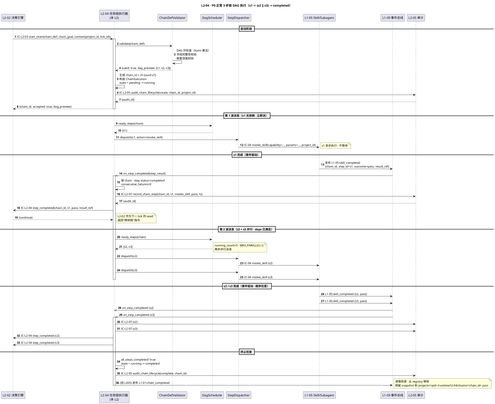
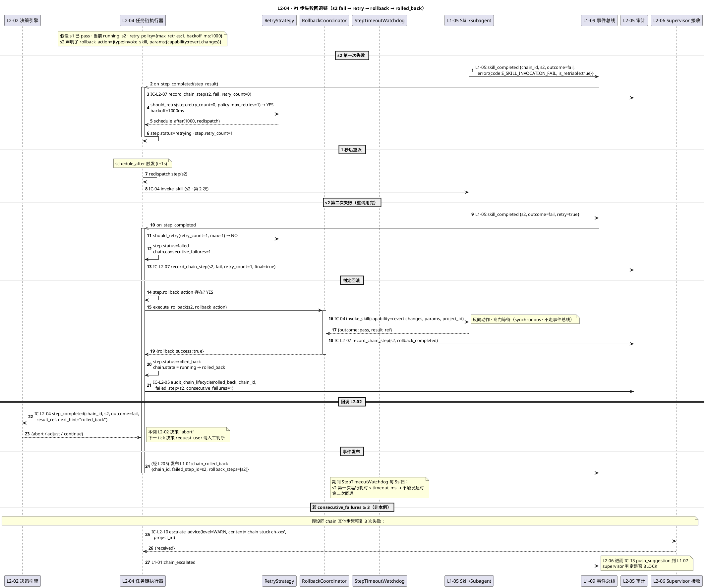
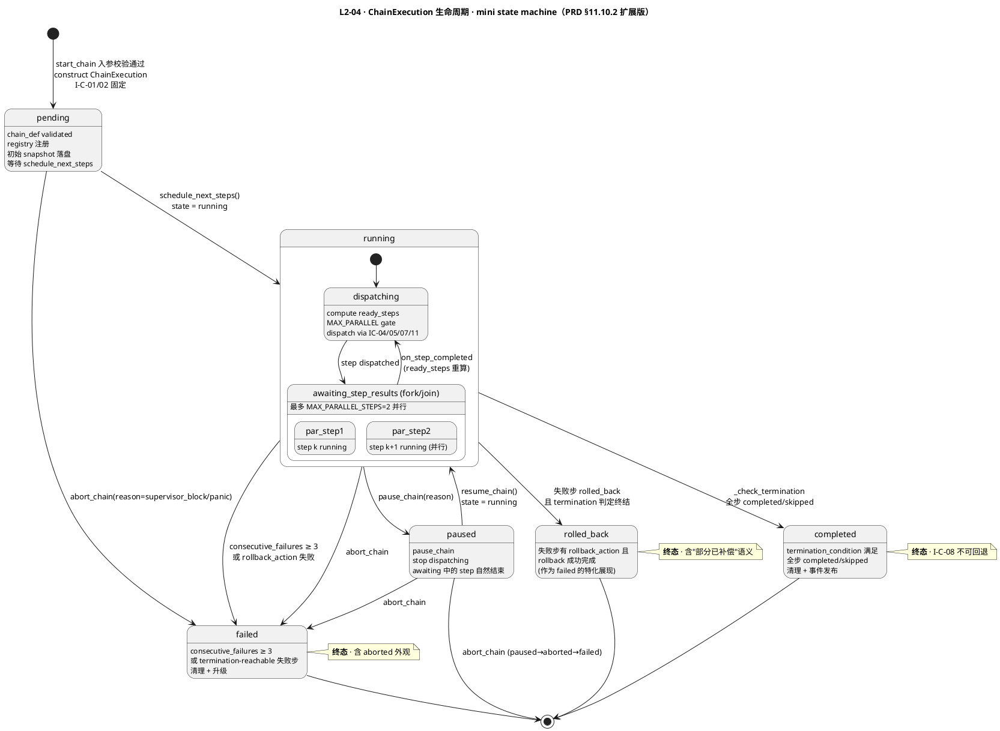
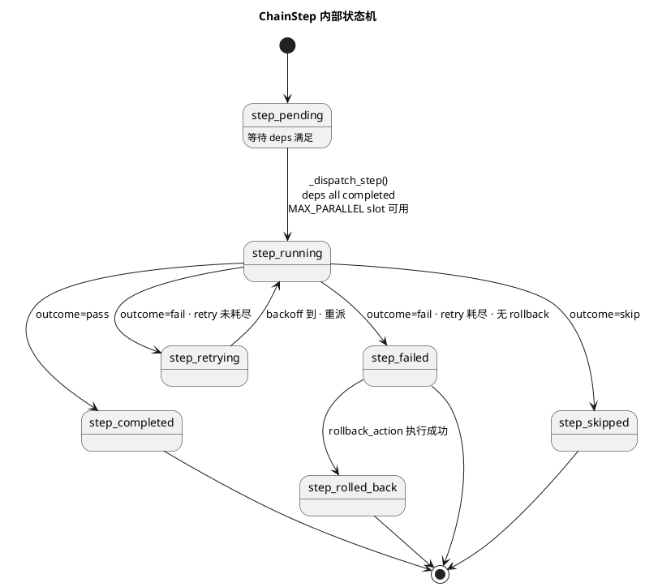

# L1 L2-04 · 任务链执行器 · Tech Design

> **本文档定位**：3-1-Solution-Technical 层级 · L1 的 L2-04 任务链执行器 技术实现方案（L2 粒度）。
> **与产品 PRD 的分工**：2-prd/L1-01-主 Agent 决策循环/prd.md §11 的对应小节定义产品边界，本文档定义**技术实现**（接口字段级 schema + 算法伪代码 + 底层数据结构 + 状态机 + 配置参数）。
> **与 L1 architecture.md 的分工**：architecture.md 负责**跨 L2 架构 + 跨 L2 时序**，本文档负责**本 L2 内部技术细节**。冲突以 architecture.md 为准。
> **严格规则**：本文档不复述产品 PRD 文字（职责 / 禁止 / 必须等清单），只做技术映射 + 补齐"产品视角未说 but 工程师必须知道"的部分（具体算法 · syscall · schema · 配置）。

---

## §0 撰写进度

- [x] §1 定位 + 2-prd §11 L2-04 映射
- [x] §2 DDD 映射（BC-01 · TaskChain Aggregate）
- [x] §3 对外接口定义（字段级 YAML schema + 错误码）
- [x] §4 接口依赖（被谁调 · 调谁）
- [x] §5 P0/P1 时序图（PlantUML ≥ 2 张）
- [x] §6 内部核心算法（伪代码）
- [x] §7 底层数据表 / schema 设计（字段级 YAML）
- [x] §8 状态机（ChainExecution · 7 状态 PlantUML + 转换表）
- [x] §9 开源最佳实践调研（Temporal / Airflow DAG / Prefect / Dagster 4 项）
- [x] §10 配置参数清单
- [x] §11 错误处理 + 降级策略
- [x] §12 性能目标
- [x] §13 与 2-prd / 3-2 TDD 的映射表

---

## §1 定位 + 2-prd 映射

### 1.1 本 L2 的唯一命题（One-Liner）

**任务链执行器 = HarnessFlow 的"展开器"**：当 L2-02 产出 `decision_type=start_chain` 时，本 L2 接收一个 `chain_def`（DAG 多步任务），持有 `ChainExecution` 有状态聚合（mini state machine），按拓扑序派发每一步（委托 IC-04/IC-05 到 L1-05），每步完成**回调 L2-02** 作为下一 tick 的 seed，失败走重试→回滚→升级链，超时强终止。**chain 跨多 tick · tick 不跨 chain**。

关键定性（来自 architecture.md §2.3 + §3.4 + PRD §11.3）：

- **Application Service · 有状态 Aggregate Root**（持 `ChainExecution(chain_id, steps[], current_step, results[], mini_sm)`）；与 L2-02 的**无状态 Domain Service** 互补。
- **不决策**：每步完成必走 IC-L2-04 回 L2-02（PRD §11.5 🚫#4 "禁止跳过 IC-L2-04 回调直接决定下一步"）——本 L2 只做"展开 + 派发 + 收结果"，"下一步做什么"永远由 L2-02 决策。
- **chain 和 tick 独立**：一个 chain 跨多个 tick（每步完成需回调 L2-02 决策），chain 失败不影响 L2-01 tick 心跳（PRD §11.3 边界规则）。

### 1.2 与 `2-prd/L1-01主 Agent 决策循环/prd.md §11` 的精确小节映射表

> 说明：本表是**技术实现 ↔ 产品小节**的锚点表，不复述 PRD 文字。每行左列为本 tech-design 段落，右列为对应 PRD §11 小节。冲突以本文档（技术实现）+ architecture.md（架构）为准，若 PRD 有歧义或不足以导出字段级 schema，按 spec 6.2 规则反向修 PRD 并在此处注明。

| 本文档段 | 2-prd §11 小节 | 映射内容 | 备注 |
|---|---|---|---|
| §1.1 命题 | §11.1 职责锚定 | "复杂决策的展开器" + "chain 跨 tick" | 本文档补"Application Service · 有状态 Aggregate"定性 |
| §1.4 兄弟边界 | §11.3 边界（In/Out-of-scope + 边界规则）| 7 In + 5 Out + 2 规则 | — |
| §1.5 PM-14 | §11.4 硬约束（隐式）+ arch §1.4 PM-14 | `project_id` 透传 + 持久化路径 `projects/<pid>/chains/<chain_id>/...` | **补** |
| §2 DDD | §11.1 上游锚定 + arch §2.2 | BC-01 · `TaskChain + MiniStateMachine` Aggregate · `TaskChainExecutor` Application Service | **补 DDD 语言** |
| §3 `start_chain()` | §11.2 输入 + IC-L2-03 表 | 字段级 YAML + returns `{chain_id, accepted}` | **补字段级 schema** |
| §3 `on_step_completed()` | §11.10.4 步结果处理 | 事件处理器签名化 · 负责 IC-L2-04 回调 L2-02 | **补** |
| §3 `pause_chain/resume_chain/abort_chain` | §11.7 可选职责（暂停/恢复）+ arch chain 状态机 canceled | 本 L2 作为可选扩展补齐字段级 | **补** |
| §3 `query_chain_status` | §11.7 可选 "chain 可视化" + L1-10 UI 需要 | 只读方法 · 供 UI 反查 | **补** |
| §3 错误码 | §11.4 硬约束（6 条）+ §11.5 禁止（7 条）| 约束违反一对一映射错误码 ≥ 5 条 | **补错误码表** |
| §4 依赖 | §11.8 IC-L2 交互表 | 调用方 + 被调方 + PlantUML 依赖图 | — |
| §5 时序 | §11 无时序图；arch §3.4 + §6.5.2 文字 | P0 正常 + P1 步失败回退 ≥ 2 张 PlantUML | **补** |
| §6 算法 | §11.10.3 步调度 / §11.10.4 步结果 / §11.10.5 步超时 | 伪代码化（Python-like）· 加 DAG 拓扑排序 · 回调 dispatcher | **补 Python-like** |
| §7 schema | §11.10.1 chain_def schema + arch §2.2 aggregate | `ChainExecution` + `ChainStep` 字段级 YAML · PM-14 分片路径 | **补** |
| §8 状态机 | §11.10.2 mini state machine | PlantUML state diagram · 7 状态 + 并行步 fork/join + 转换表 | **补 PlantUML** |
| §9 调研 | §11 外 | Temporal / Airflow / Prefect / Dagster 四项 | **补** |
| §10 配置 | §11.10.7 配置参数 | 原样导入 + 补 tech 侧 | — |
| §11 降级 | §11.4 硬约束 #4 死循环升级 + §11.5 禁止 | 错误分类 + 降级链 + 与 L1-07 协同 | **补** |
| §12 SLO | §11.4 性能约束 + §11.9 性能阈值 | 步派发 ≤ 50ms · 回调 ≤ 100ms · chain 生命期内存/句柄无泄漏 | 继承 + 扩展 |
| §13 映射 | — | 本段接口 ↔ §11.X + ↔ 3-2-TDD 用例 | **补** |

### 1.3 与 `L1-01/architecture.md` 的位置映射

| architecture 锚点 | 映射内容 | 本文档对应段 |
|---|---|---|
| §2.1 BC-01 Agent Decision Loop | 本 L2 所在 BC | §2 DDD |
| §2.2 聚合根 `TaskChain + MiniStateMachine`（chain_id / step_list / outcome · 单 chain 内强一致）| 本 L2 持有的聚合 | §2 DDD + §7 schema |
| §2.3 Application Service `TaskChainExecutor`（chain mini state machine + 步调度 + 超时 + 回滚）| 本 L2 角色定性 | §1.1 + §6 算法 |
| §2.5 Domain Event `L1-01:chain_step`（步完成事件 · payload `{chain_id, step_id, outcome, project_id}`）| 本 L2 对外事件 | §3 接口 + §4 依赖 |
| §3.4 Component Diagram 中 `L2_04` 节点 | 本 L2 在 L1 内位置（右上） | §4 依赖图 |
| §3.5 无（L2-04 无专项 D-XX）+ §6.5.2 流 C "启动任务链" | 本 L2 参与跨 L2 事件流 C | §5 P0 时序 |

### 1.4 与兄弟 L2 的边界（6 L2 中 L2-04 的位置）

| 兄弟 L2 | 本 L2 与兄弟的边界规则（基于 prd §11.3 + arch §3.3 单一决策源）|
|---|---|
| **L2-01 Tick 调度器** | L2-01 只管 tick 心跳；本 L2 独立推进 chain（**跨多 tick**）。chain 失败不影响 tick（PRD §11.3 边界规则 #2）。本 L2 watchdog 独立（§10 `WATCHDOG_INTERVAL_MS`）不与 L2-01 watchdog 共享。|
| **L2-02 决策引擎** | L2-02 是本 L2 的**唯一启动方**（IC-L2-03 start_chain）。本 L2 每步完成必 IC-L2-04 回调 L2-02 决策下一步（PRD §11.5 🚫#4）。本 L2 **不决策** —— chain 终止条件是 `chain_def` 定义的 `termination_condition` + L2-02 的"继续/中止/调整"指令。|
| **L2-03 状态机编排器** | 本 L2 **不做 state 转换**（PRD §11.3 Out-of-scope #4）· chain 完成产出不直接改 state · 由 L2-02 下一 tick 决策产 `state_transition` 再调 L2-03。|
| **L2-05 决策审计记录器** | 每步完成 + chain 创建 + chain 终态变更 必 IC-L2-07 推 L2-05（PRD §11.5 🚫#5 "禁止步结果无 IC-L2-07 审计"）。本 L2 **禁止**直接写事件总线。|
| **L2-06 Supervisor 接收器** | 连续失败 ≥ 3 时经 L2-06 升级（IC-L2-10 WARN / 候选 BLOCK）· 本 L2 不直接调 L1-07。BLOCK 抢占经 L2-01 广播 → 本 L2 接 `abort_chain(reason=supervisor_block)`（§3.5）。|

### 1.5 PM-14 约束（project_id as root）

**硬约束**（arch §1.4 PM-14 表 L2-04 行隐式 + §3 硬约束 #6）：

1. `start_chain` 入参 `context.project_id` 为**根字段**，不可缺（缺 → `E_CHAIN_NO_PROJECT_ID`）
2. `ChainExecution.project_id` 从入参透传（不重造）· 所有 step、result、audit 必含 `project_id`
3. 所有持久化路径按 `projects/<pid>/chains/<chain_id>/...` 分片（见 §7）
4. 跨 project chain**禁止**：启动时 `context.project_id` 必须与当前 session pid 一致；违反 → `E_CHAIN_CROSS_PROJECT`
5. 发布的 Domain Event `L1-01:chain_step` payload 必含 `project_id`（arch §2.5）
6. chain 嵌套时 parent/child 必同 project（`parent_chain_id` + 子 chain 共享 `project_id`）

### 1.6 关键技术决策（Decision → Rationale → Alternatives → Trade-off）

本 L2 在 architecture.md §3.5（无 L2-04 专项 D-XX）基础上，补 L2 粒度 5 个技术决策：

| # | Decision | Rationale | Alternatives | Trade-off |
|---|---|---|---|---|
| **D-04-1** | `TaskChainExecutor` 为 **有状态 Application Service**（持 `ChainExecution` Aggregate），与 L2-02 纯函数互补 | chain 跨多 tick · 需保持 step 执行状态 + 依赖解析中间结果 + 重试计数 + 回滚栈 · 无状态模式会导致每 tick 全量重计算，性能 & 一致性皆差 | A. 每 tick 从 L2-05 reconstruct chain 状态：IO 重、不可接受；B. 把 chain 状态塞进 TickContext 让 L2-02 带：违反"单一决策源" + TickContext 膨胀 | 本 L2 持内存状态 · 但**每步完成必持久化 snapshot**（§7.2 path + §11 崩溃恢复链），session 崩溃可从 L1-09 事件总线回放 |
| **D-04-2** | **每步完成 100% 回调 L2-02**（不自决策 "下一步做什么"）· 即使 `chain_def` 已声明 deps 拓扑 | PRD §11.5 🚫#4 / 🚫#7 + arch §3.3 "单一决策源"。chain_def 定义的是"可能的步序"，实际"是否继续"由 L2-02 每步后重新评估（可能因 WARN/BLOCK/用户干预而中止） | A. 本 L2 按 chain_def 顺序直推到底：违反"每 tick 决策" + 失去 L2-02 5 纪律拷问机会；B. 仅失败时回调：不一致 | 每步多一次 tick 开销（约 1-5s/步），但保证**每步都可被 supervisor / 用户 / 5 纪律拦截** |
| **D-04-3** | DAG 调度用 **Kahn 算法（BFS 拓扑排序 + 并行度限制）**，不引 NetworkX 依赖（仅借鉴算法） | 算法简单（O(V+E)），本 L2 step 数通常 ≤ 20，无必要引入库 · arch §3.4 tech-stack 偏向"最少依赖"。NetworkX 留给 L1-03 WBS（图规模大得多） | A. 引 NetworkX：本 L1 增加依赖；B. 递归 DFS：不支持"最多 2 并行"的 leveled execution | 自实现 Kahn + `MAX_PARALLEL_STEPS=2` gate · 50 行 Python 即可 |
| **D-04-4** | **步失败回滚策略 = 有 `rollback_action` 执行它；无 rollback 的步失败走"补偿链"**（即由 L2-02 决策 `request_user` 或 `no_op` 让人工接管）| PRD §11.10.1 `rollback_action` 是"步定义时可选"，不是强制；无 rollback 时，本 L2 不该假设知道如何补偿 → 交给决策层 | A. 自动按"反向拓扑"回滚已完成步：危险（反向动作可能无法定义，如"已发布的消息无法撤回"）；B. 直接标 chain failed 不处理：违反 PRD §11.6 ✅#5 "必 retry/rollback/升级" | 回滚**只对声明了 `rollback_action` 的步执行** · 未声明的步靠 L2-02 决策人工补偿 · 本 L2 保持"不自作主张"原则 |
| **D-04-5** | 超时强终止采用 **独立 watchdog 线程 + 步级 `timeout_ms`**，不依赖 IC-04/IC-05 自身超时 | IC-04/IC-05 超时是"单次 skill 调用"超时，不是"chain 步"超时 · chain 步可能跨 IC 调用（如 start → retry → rollback）· 需独立计时 | A. 信任 IC-04/IC-05 超时：不够细（retry 里累积超时不可见）；B. 每步开独立线程 wait：资源浪费 | 单线程 watchdog（`WATCHDOG_INTERVAL_MS=5s` 扫描）· O(active_chains × active_steps) · 典型场景 ≤ 50 单位可忽略 |

---

## §2 DDD 映射（BC-01 Agent Decision Loop · Application Service + Aggregate Root）

### 2.1 Bounded Context 定位

本 L2 所属 `BC-01 · Agent Decision Loop`（定义见 `L0/ddd-context-map.md §2.2`，HarnessFlow 唯一控制源 BC）。在 BC-01 内部 **L2-04 扮演"展开器"角色**——与其他 5 L2 的关系：

| 兄弟 L2 | DDD 关系 | 本 L2 与该 L2 的交互模式 |
|---|---|---|
| L2-01 Tick 调度器 | **弱 Customer**（仅 BLOCK 抢占链）| L2-01 转发 `abort_chain` 调用；本 L2 不依赖 L2-01 心跳 |
| L2-02 决策引擎 | **Upstream + Downstream 双向**（本 L2 的**唯一启动方** + **每步回调对象**）| IC-L2-03 启动 → chain 推进 → IC-L2-04 每步回调 L2-02 决策 |
| L2-03 状态机编排器 | **隔离**（不直接交互）| chain 完成产出**不改 state** · 由 L2-02 下一 tick 决策 `state_transition` 调 L2-03 |
| L2-05 审计记录器 | **Partnership**（必同步演进）| 本 L2 每步 / 每生命期变更必推 L2-05 落盘 · IC-L2-07 + IC-L2-05 |
| L2-06 Supervisor 接收器 | **反向 Customer**（连续失败升级时发起）| IC-L2-10 push WARN / 候选 BLOCK · 经 L2-06 路由到 L1-07 |

### 2.2 本 L2 持有 / 构造的聚合根（Aggregate Root）

继承自 `arch §2.2` 表行 "TaskChain + MiniStateMachine"，展开到 L2-04 内部：

| 聚合根 | 类型 | 本 L2 职责 | Invariants |
|---|---|---|---|
| **ChainExecution** | **Aggregate Root · 本 L2 唯一构造者 + 持有者**（有状态）| `start_chain` 构造 → 跨多 tick 推进 → 终态时持久化冻结 | **I-C-01** chain_id 不可变 · **I-C-02** project_id 不可变 · **I-C-03** 7 状态机只在合法 transition 跳转 · **I-C-04** 同 chain_id 只能有一个实例运行（PRD §11.4 #2） |
| **ChainStep**（Aggregate 内部 Entity）| **Entity · ChainExecution 聚合内** | 单步的状态 + 重试计数 + 结果引用 | **I-S-01** step_id 唯一（在同 chain 内）· **I-S-02** step.status 只在合法 transition 跳转 · **I-S-03** retry_count ≤ retry_policy.max_retries |

**关键不变量**：

1. **I-C-01 ~ I-C-04**：见上表
2. **I-C-05 DAG 无环**：chain_def.steps 的 deps 必须通过 `cycle_check()` 校验（启动时）
3. **I-C-06 所有 step 必归属某 ChainExecution**：无游离 step（孤儿 step 启动时即拒绝）
4. **I-C-07 嵌套 chain 共 project**：parent + child 同 project_id（I-C-06 + PM-14）
5. **I-C-08 终态不可回退**：`completed / failed / rolled_back` 不可 resume（必须重新 `start_chain`）

### 2.3 本 L2 内部组件（Domain Services · Application Service 子模块 · 不拆 L2）

| 组件 | DDD 类型 | 职责 | 无状态/有状态 |
|---|---|---|---|
| `TaskChainExecutor` | **Application Service** · 核心 | 协调 chain 生命周期 · 外层 facade | **有状态**（持 chain registry）|
| `ChainDefValidator` | Domain Service | DAG 校验（环 / 重复 step_id / 字段完整性）· 启动时 fail-fast | **无状态**（纯函数）|
| `DagScheduler` | Domain Service | Kahn 算法拓扑排序 + 并行度 gate + ready_steps 计算 | **无状态**（纯函数）|
| `StepDispatcher` | Domain Service | 按 step.action.type 路由到 IC-04/IC-05/IC-06/IC-07/IC-11 | **无状态**（纯函数）|
| `StepTimeoutWatchdog` | Domain Service | 独立定时扫描（`WATCHDOG_INTERVAL_MS`）· 超时即转 fail | **有状态**（scan cursor）· 单例 |
| `RetryStrategy` | Domain Service | `retry_policy` 解析 + backoff 计算 + schedule_after | **无状态** |
| `RollbackCoordinator` | Domain Service | 失败步的 `rollback_action` 执行 · 反向派发到 IC-04/05 | **无状态** |
| `ConsecutiveFailureCounter` | Domain Service | chain 级失败计数 + 升级阈值判定 | **有状态**（counter）· 聚合内 |
| `ChainEventDispatcher` | Domain Service | 每步完成后的回调多路广播：IC-L2-04(L2-02) + IC-L2-07(L2-05) + 事件 `L1-01:chain_step` | **无状态** |

**关键设计**（D-04-1）：`TaskChainExecutor` 是 **Application Service**（而非 Domain Service），因为它协调多个聚合 + 外部 IO（IC-04/05/07/09/11），职责是"编排"而非"业务规则"。其**内部的 Domain Services** 是纯函数（`ChainDefValidator` / `DagScheduler` / `StepDispatcher` 等），保障单元可测。

### 2.4 Value Objects（不可变）

| VO 名 | 结构 | 用途 |
|---|---|---|
| `ChainId` | `"ch-{uuid-v7}"` | 本 L2 生成 · 即 append-only |
| `ProjectId` | `"pid-{uuid-v7}"` | PM-14 根字段 · 跨 BC Shared Kernel |
| `StepId` | `^s[0-9a-zA-Z_-]{1,32}$` | 用户定义 · 在 chain_def 中唯一 |
| `ChainState` | enum: `pending / running / paused / completed / failed / rolled_back / aborted` | 7 状态（含 aborted 作为 failed 子类外部展现）|
| `StepStatus` | enum: `pending / running / retrying / completed / failed / skipped / rolled_back` | 7 状态 |
| `StepAction` | `{type: enum, params: object}` | IC 派发参数（不可变）|
| `RetryPolicy` | `{max_retries, backoff_ms}` | 重试配置（chain_def 时固定）|
| `StepOutcome` | enum: `pass / fail / skip / partial` | L1-05 回传 |
| `DagContentHash` | sha256 of canonical(steps + deps) | 幂等键 |

### 2.5 Entities（可变 · 由 Aggregate 管理）

| Entity | 生命期 | 用途 |
|---|---|---|
| `ChainStep` | chain 生命期内可变 | 单步状态机 · retry_count · started_at · completed_at · error |
| `ChainExecution` 内部 event log | chain 生命期内可变 | 本 chain 内部事件序列（供 `query_chain_status` include_events）|
| `RollbackLog` | chain 终态时最终冻结 | 回滚步骤序列（按反拓扑）|

### 2.6 Repository Interfaces

本 L2 持有 **`ChainExecutionRepository`**（**唯一有状态 Repository** · 与 L2-02 无状态不同）：

- **内存主存**：`dict[ChainId → ChainExecution]`（O(1) 查询 · 最多 `MAX_ACTIVE_CHAINS=8` 个活跃 chain · arch §6.5.2 流 C）
- **持久化 Sink**：每个 step 完成 + 每次 state 变更 → IC-L2-05 / IC-L2-07 推 L2-05（本 L2 不直接写盘）
- **Snapshot 落盘**：chain 关键时刻（创建 / 每 N 步 / 终态）持久化到 `projects/<pid>/runtime/l2-04/chains/<chain_id>.json`（见 §7.3）· 供跨 session 恢复

**崩溃恢复链**（与 L1-09 韧性层协同）：

1. session 启动时，L2-04 从 `projects/<pid>/runtime/l2-04/chains/` 扫描所有未终态 snapshot
2. 非终态 chain（state=running/paused）从 snapshot 重建内存状态 + 从 L1-09 事件总线回放 `L1-01:chain_step` 事件补齐中间过程
3. 恢复后状态：如仍有 pending step（无外部依赖）则转 RUNNING；有 running step（已派到 L1-05）→ 保守等 `on_step_completed` 回来 · 若 5 分钟内无回 → 视 timeout 转 fail

### 2.7 Domain Events（本 L2 对外发布 · 经 L2-05 代劳写 IC-09）

引自 L1-01 `architecture.md §2.5`，本 L2 直接产生的事件：

| Event | 触发时机 | 订阅方 | Payload 关键字段 |
|---|---|---|---|
| `L1-01:chain_started` | `start_chain` 接受成功 | L1-07 / L1-10 | `{chain_id, chain_goal, steps_count, project_id}` |
| `L1-01:chain_step` | 每步完成（pass/fail/skip）| L1-07 / L1-10 | `{chain_id, step_id, outcome, retry_count, duration_ms, project_id}` |
| `L1-01:chain_paused` | `pause_chain` 成功 | L1-07 / L1-10 | `{chain_id, at_step_id, reason, project_id}` |
| `L1-01:chain_resumed` | `resume_chain` 成功 | L1-10 | `{chain_id, project_id}` |
| `L1-01:chain_completed` | 全部步 pass 或 `termination_condition` 满足 | L1-07 / L1-10 / L1-02 / L1-03 | `{chain_id, total_steps, total_duration_ms, project_id}` |
| `L1-01:chain_failed` | 连续失败 ≥ 3 或 rollback 失败 | L1-07 / L1-10 | `{chain_id, failure_reason, failed_step_id, project_id}` |
| `L1-01:chain_rolled_back` | 回滚完成 | L1-07 / L1-10 | `{chain_id, rollback_steps: [], project_id}` |
| `L1-01:chain_escalated` | 升级到 L2-06 | L1-07 | `{chain_id, consecutive_failures, project_id}` |

所有事件必含 `project_id`（PM-14）+ 本事件在 L2-05 hash-chain 中的位置。

### 2.8 跨 BC 关系（本 L2 作为发起方 / 接收方）

| IC | 方向 | 对端 BC | 本 L2 视角 |
|---|---|---|---|
| IC-04 invoke_skill | 发起 | BC-05（L1-05）| step.action.type=invoke_skill/use_tool |
| IC-05 delegate_subagent | 发起 | BC-05 | step.action.type=delegate_subagent |
| IC-06 kb_read | 发起（少见）| BC-06（L1-06）| step.action.type=kb_read |
| IC-07 kb_write_session | 发起 | BC-06 | step.action.type=kb_write |
| IC-09 append_event | 发起（经 L2-05 代劳）| BC-09（L1-09）| 审计 + 事件发布 |
| IC-11 process_content | 发起 | BC-08（L1-08）| step.action.type=process_content |
| IC-13 push_suggestion | 间接发起（经 L2-06）| BC-07（L1-07）| 连续失败升级 |

所有 IC 字段级 schema 锚点在 `docs/3-1-Solution-Technical/integration/ic-contracts.md §3.{N}`。

---

## §3 对外接口定义（字段级 YAML schema + 错误码）

> 说明：本 L2 对外暴露 **6 个方法**（1 主 + 5 辅），覆盖生命周期（启动/暂停/恢复/终止/查询）+ 事件处理器（步结果接收）。字段级 YAML 采用 OpenAPI-like 风格声明 type / required / 约束。
>
> 调用方向：`start_chain` 由 L2-02 单向调用（唯一启动源 · IC-L2-03）；`on_step_completed` 由 L1-09 事件总线派发（实际发出者 L1-05 执行完步后写事件总线，本 L2 订阅该事件）；`pause/resume/abort_chain` 由 L2-01（经 L2-06 BLOCK 抢占）或 L1-10 UI（经 IC-17 → L2-01 → L2-02 → 本 L2）调用；`query_chain_status` 由 L1-10 UI（只读）或 L2-02 决策时反查（可选）调用。

### 3.1 `start_chain(chain_def, chain_goal, context) → {chain_id, accepted}`（核心 · IC-L2-03 处理器）

**调用方**：L2-02 决策引擎（当 `decision_type=start_chain` 时 · 唯一启动源 · PRD §11.8 表）
**幂等性**：同 `(chain_def.content_hash, context.project_id, context.tick_id)` 多次调用返回同一 `chain_id`（内存 LRU 缓存 512，防 L2-02 重入）
**阻塞性**：同步调用；P95 ≤ 50ms（仅做 DAG 校验 + 入 registry · **不等步执行完**），SLO 见 PRD §11.4 "步派发 ≤ 50ms"

#### 入参 `chain_def`（字段级 YAML）

```yaml
chain_def:
  type: object
  required:
    - chain_goal
    - steps
    - context
  properties:
    chain_goal:
      type: string
      minLength: 10
      description: 一句话目标（审计 + UI 展示）· PRD §11.10.1 chain_goal

    steps:
      type: array
      minItems: 1
      maxItems: 20         # 单 chain 硬上限；超 → E_CHAIN_DEF_INVALID(too_many_steps)
      items:
        type: object
        required: [step_id, action]
        properties:
          step_id:
            type: string
            pattern: "^s[0-9a-zA-Z_-]{1,32}$"
            example: "s1" / "s_design_review"
          action:
            type: object
            required: [type, params]
            properties:
              type:
                type: enum
                enum: [invoke_skill, delegate_subagent, use_tool, kb_read, kb_write, process_content]
                description: 步动作类型（映射 IC-04/IC-05/IC-06/IC-07/IC-11）
              params:
                type: object
                description: 按 action.type 的 discriminated union（同 L2-02 §3.1.1）
          deps:
            type: array
            default: []
            items: {type: string, description: "依赖的 step_id"}
            description: 空 = 可立即执行；多值 = AND（所有依赖 completed 才可执行）
          timeout_ms:
            type: integer
            default: 60000       # §10 DEFAULT_STEP_TIMEOUT_MS
            minimum: 1000
            maximum: 600000      # 单步硬上限 10 分钟
          retry_policy:
            type: object
            default: {max_retries: 1, backoff_ms: 1000}
            properties:
              max_retries: {type: integer, minimum: 0, maximum: 3}
              backoff_ms: {type: integer, minimum: 0, maximum: 10000}
          expected_outcome:
            type: enum
            enum: [pass, fail, any]
            default: pass
            description: pass = 必须成功才推进；fail = 预期失败（补偿链）；any = 不校验
          rollback_action:
            type: object
            optional: true
            properties:
              type: {type: enum, enum: [invoke_skill, use_tool, kb_write]}
              params: {type: object}
            description: 步失败且重试用完后执行的反向动作（D-04-4）

    termination_condition:
      type: object
      default: {all_steps_completed: true}
      properties:
        all_steps_completed: {type: boolean}
        first_success: {type: boolean, description: "首个 pass 即终止"}
        until_condition: {type: string, description: "表达式 · 未来扩展"}

    nesting_depth:
      type: integer
      default: 0
      minimum: 0
      maximum: 3           # PRD §11.4 硬约束 #6 MAX_NESTING_DEPTH
      description: 当前 chain 所处嵌套深度（parent=null 时 0）

    parent_chain_id:
      type: string | null
      default: null
      description: 若本 chain 由某 chain 的步触发，指向父 chain_id（PRD §11.10.6 嵌套规则）

  # chain_def 级元数据
  dag_content_hash:
    type: string
    description: steps[] + deps 的 canonical hash · 幂等键

context:
  type: object
  required: [project_id, tick_id]
  properties:
    project_id:
      type: string
      format: "pid-{uuid-v7}"
      description: PM-14 根字段（§1.5）
    tick_id:
      type: string
      description: 发起 start_chain 的 tick_id（审计追溯用）
    decision_id:
      type: string
      description: 发起本 chain 的 DecisionRecord.decision_id（审计追溯用）
    initial_inputs:
      type: object
      description: chain 级共享输入（子步可通过 ${inputs.xxx} 引用）
```

#### 出参

```yaml
start_chain_result:
  type: object
  required: [chain_id, accepted]
  properties:
    chain_id:
      type: string
      format: "ch-{uuid-v7}"
      description: 本 L2 生成的唯一 chain id · 供后续回调/查询/暂停引用
    accepted:
      type: boolean
      description: chain_def 校验通过且已入 registry = true；校验失败 = false（同时走错误码）
    dag_preview:
      type: array
      optional: true
      description: 校验通过时返回拓扑排序后的 step_id 序列（前端可视化用）
      items: {type: string}
    rejection_reason:
      type: string
      optional: true
      description: accepted=false 时填失败原因
```

#### 3.1.1 错误码（`start_chain()`）

| 错误码 | 含义 | 触发场景 | 调用方处理 | 对应 PRD 约束 |
|---|---|---|---|---|
| `E_CHAIN_DEF_INVALID` | chain_def 结构非法 | steps 空 / step_id 重复 / action.type 不在枚举 / 字段缺失 | L2-02 降级为 `no_op` + 审计 + WARN L1-07 | §11.4 #1 隐式 |
| `E_CHAIN_DAG_CYCLE` | chain_def 的 deps 形成环 | NetworkX 风 cycle detection 命中 | 同上 | §11.4 #1 硬约束 "DAG 无环" |
| `E_CHAIN_TOO_MANY_STEPS` | steps 数 > 20 | chain_def.steps.length > 20 | 同上 | §1.5 / §10 软上限 |
| `E_CHAIN_NESTING_EXCEEDED` | nesting_depth > 3 | parent chain 已在 depth=3 还要嵌 | 同上 | §11.4 #6 硬约束 |
| `E_CHAIN_NO_PROJECT_ID` | context.project_id 缺失 | L2-02 调用方 bug | L2-02 告警 L1-07 | PM-14（§1.5 #1）|
| `E_CHAIN_CROSS_PROJECT` | context.project_id ≠ 当前 session pid | 跨 project 启动 | 拒绝 + 告警 | §1.5 #4 |
| `E_CHAIN_CONCURRENCY_CAP` | 活跃 chain 数达上限 `MAX_ACTIVE_CHAINS=8` | 全局限流 | L2-02 回 `no_op` + WARN L1-07 | §10 |
| `E_CHAIN_ACTION_UNSUPPORTED` | 某 step.action.type 不在能力抽象层 | capability registry 未加载该 type | 同上 + 降级为 `request_user` | PRD §11.10.1 action.type |

### 3.2 `on_step_completed(step_result)`（事件处理器 · 订阅 L1-09 事件总线）

**调用方**：L1-09 事件总线（事件名 `L1-05:skill_completed` / `L1-05:subagent_completed` / `L1-08:content_processed`）
**触发来源**：step 动作由 IC-04/IC-05/IC-11 派发后，执行方（L1-05 / L1-08）完成时向事件总线写完成事件；本 L2 订阅这些事件并据 `chain_id` 路由到对应 ChainExecution。
**SLO**：P95 ≤ 100ms（从收事件到 IC-L2-04 回调 L2-02 完成 · PRD §11.4 "步完成回调 ≤ 100ms"）
**并发**：本 L2 对同 chain_id 串行处理（避免 state race）· 跨 chain 可并行

#### 入参 `step_result`（字段级 YAML）

```yaml
step_result:
  type: object
  required: [chain_id, step_id, outcome, project_id, ts]
  properties:
    chain_id:
      type: string
      format: "ch-{uuid-v7}"
    step_id:
      type: string
      description: 与 chain_def.steps[].step_id 对应
    outcome:
      type: enum
      enum: [pass, fail, skip, partial]
      description: pass = 按 expected_outcome 通过；fail = 失败（走 retry/rollback）；skip = 跳过（依赖不满足或条件跳）；partial = 部分完成（走 L2-02 决策）
    result_ref:
      type: string
      description: 结果落盘路径（指向 L1-09 事件总线 event_id 或 OSS 路径）
    error:
      type: object | null
      optional: true
      properties:
        code: {type: string, description: "E_* 错误码"}
        message: {type: string}
        is_timeout: {type: boolean}
        is_retriable: {type: boolean}
    project_id: {type: string, description: PM-14}
    ts: {type: string, format: ISO-8601-utc}
    next_hint:
      type: string | null
      optional: true
      description: 执行方可选给 L2-02 的提示（如 "需要用户 review"）· 透传到 IC-L2-04
    duration_ms:
      type: integer
      description: 本步实际耗时
```

#### 返回 + 错误码

`void`（异步吞吐；错误走 L1-09 DLQ + 本 L2 审计）

| 错误码 | 触发 | 处理 |
|---|---|---|
| `E_CHAIN_STEP_ORPHAN` | step_result.chain_id 在 registry 不存在（chain 已结束或从未创建）| 静默 drop + debug log + audit (低频)|
| `E_CHAIN_STEP_STALE` | step_result 对应 step 已被超过（已转到下一 step）| 静默 drop（delayed event）+ debug log |
| `E_CHAIN_STEP_RESULT_MALFORMED` | step_result 字段校验失败 | 记 audit · 不影响 chain 推进 · 视 `outcome=fail` 走重试 |

### 3.3 `pause_chain(chain_id, reason) → {paused, at_step_id}`（可选 · 暂停）

**调用方**：L2-02（决策 = `pause_chain` · 来自用户干预或 supervisor SUGG）/ L1-10 UI 经 IC-17
**SLO**：P95 ≤ 50ms · 本 L2 只 flip state 为 `PAUSED` + 停派新步（当前 running 步由其 timeout 自然结束）
**幂等性**：重复 pause 已 paused 的 chain 返回同一结果（无副作用）

#### 入参

```yaml
pause_request:
  type: object
  required: [chain_id, reason, project_id]
  properties:
    chain_id: {type: string}
    reason:
      type: enum
      enum: [user_intervene, supervisor_sugg, system_maintenance]
    reason_detail: {type: string, description: 自然语言详情}
    project_id: {type: string}
```

#### 返回 + 错误码

```yaml
pause_result:
  paused: {type: boolean}
  at_step_id: {type: string, description: 当前正在 running 的第一个 step_id 或 null}
  pending_steps_count: {type: integer}
```

| 错误码 | 触发 | 处理 |
|---|---|---|
| `E_CHAIN_NOT_FOUND` | chain_id 不在 registry | 返回 paused=false + 错误 |
| `E_CHAIN_ALREADY_TERMINAL` | chain 已 completed/failed/rolled_back | 同上（无意义 pause）|

### 3.4 `resume_chain(chain_id) → {resumed, ready_steps}`（可选 · 恢复）

**调用方**：同 3.3
**SLO**：P95 ≤ 50ms · flip state 回 `RUNNING` + 触发 `schedule_next_steps()`

#### 入参

```yaml
resume_request:
  type: object
  required: [chain_id, project_id]
  properties:
    chain_id: {type: string}
    project_id: {type: string}
```

#### 返回 + 错误码

```yaml
resume_result:
  resumed: {type: boolean}
  ready_steps: {type: array, items: {type: string}, description: 本次 resume 立即可派发的 step_id}
```

| 错误码 | 触发 | 处理 |
|---|---|---|
| `E_CHAIN_NOT_PAUSED` | chain 当前不在 PAUSED 状态 | 返回 resumed=false |
| `E_CHAIN_NOT_FOUND` | 同上 | 同上 |

### 3.5 `abort_chain(chain_id, reason) → {aborted, cleanup_result}`（强终止）

**调用方**：L2-01（BLOCK 抢占经 L2-06 路由）/ L2-02 决策 = `abort_chain` / L1-10 UI panic
**SLO**：P95 ≤ 200ms · 包含：flip state → 取消所有 running 步（经 IC-05 cancel）→ 审计 → 清理资源
**强制性**：无论 chain 当前什么状态（非终态）都可 abort；终态 chain 返回"已终态"错误

#### 入参

```yaml
abort_request:
  type: object
  required: [chain_id, reason, reason_type, project_id]
  properties:
    chain_id: {type: string}
    reason_type:
      type: enum
      enum: [supervisor_block, user_panic, hard_redline, timeout_escalation, escalated_consecutive_fail]
    reason: {type: string, minLength: 10}
    project_id: {type: string}
    cascade:
      type: boolean
      default: true
      description: 是否级联 abort 子 chain（nesting_depth > 0 的后代）
```

#### 返回 + 错误码

```yaml
abort_result:
  aborted: {type: boolean}
  cleanup_result:
    canceled_running_steps: {type: array, items: {type: string}}
    released_resources: {type: object}
  child_chains_aborted: {type: array, items: {type: string}, description: cascade=true 时}
```

| 错误码 | 触发 | 处理 |
|---|---|---|
| `E_CHAIN_NOT_FOUND` | chain_id 不在 registry | 返回 aborted=false（静默 · cancel 已结束的 chain 本身无害）|
| `E_CHAIN_ALREADY_TERMINAL` | chain 已 completed/failed/rolled_back | 返回 aborted=false + note |
| `E_CHAIN_ROLLBACK_FAIL` | cascade abort 子 chain 时某子 chain 的 rollback_action 执行失败 | 记 audit + WARN L1-07；父 chain 继续 abort（不卡住）|

### 3.6 `query_chain_status(chain_id) → chain_status`（只读 · 供 UI/审计反查）

**调用方**：L1-10 UI（`/projects/{pid}/chains/{chain_id}` 面板）/ L2-02（可选 · 决策时查其他 chain 状态以规避冲突）/ L2-05 审计反查
**SLO**：P95 ≤ 20ms（内存查询）· 未找到返回 `null`（不抛）

#### 入参

```yaml
query_request:
  type: object
  required: [chain_id, project_id]
  properties:
    chain_id: {type: string}
    project_id: {type: string, description: PM-14 · 跨 project 查询拒绝}
    include_step_details: {type: boolean, default: true}
    include_events: {type: boolean, default: false, description: 含历史事件流（UI 详情面板用）}
```

#### 出参

```yaml
chain_status:
  type: object | null
  properties:
    chain_id: {type: string}
    project_id: {type: string}
    chain_goal: {type: string}
    state:
      type: enum
      enum: [pending, running, paused, completed, failed, rolled_back]
    current_step_ids: {type: array, items: {type: string}, description: 当前 running 中的 step_id(s)}
    completed_step_ids: {type: array}
    failed_step_ids: {type: array}
    pending_step_ids: {type: array}
    consecutive_failures: {type: integer}
    nesting_depth: {type: integer}
    parent_chain_id: {type: string | null}
    child_chain_ids: {type: array}
    created_at: {type: string}
    last_updated_at: {type: string}
    step_details:                # include_step_details=true 时
      type: array
      items:
        type: object
        properties:
          step_id: string
          status: enum(pending, running, retrying, completed, failed, skipped, rolled_back)
          retry_count: integer
          started_at: string | null
          completed_at: string | null
          outcome: enum | null
          result_ref: string | null
          error: object | null
```

| 错误码 | 触发 | 处理 |
|---|---|---|
| `E_CHAIN_NOT_FOUND` | chain_id 不存在 | 返回 null（不抛）|
| `E_CHAIN_CROSS_PROJECT_READ` | project_id 不匹配 | 拒绝 + 告警（PM-14）|

### 3.7 错误码总表（8 + 3 + 2 + 2 + 3 + 2 = 20 项）

| 错误码前缀 | 语义类别 | 典型降级 |
|---|---|---|
| `E_CHAIN_DEF_*` | chain_def 校验 | start_chain 拒绝 + L2-02 降级为 `no_op` 或 `request_user` |
| `E_CHAIN_STEP_*` | 步执行期 | 记 audit + 走 retry/rollback（§11 降级链）|
| `E_CHAIN_DEPS_UNRESOLVED` | 步依赖无法解析（deps 中 step_id 不存在）| 启动时 fail-fast → `E_CHAIN_DEF_INVALID` |
| `E_CHAIN_STEP_TIMEOUT` | 单步超时 | 转 fail · 走 retry；耗尽 retry 走 rollback 或 L2-02 决策 |
| `E_CHAIN_CONCURRENCY_CAP` | 活跃 chain 数超限 | 拒绝新启 · 返 L2-02 WARN L1-07 |
| `E_CHAIN_ROLLBACK_FAIL` | rollback_action 执行失败 | audit + WARN L1-07 · chain 仍标 failed |
| `E_CHAIN_NESTING_*` | 嵌套超深 | 拒绝子 chain 启动 · 父 chain 的触发步标 fail |
| `E_CHAIN_CROSS_PROJECT` | 跨 project 操作 | 拒绝 + 硬告警 L1-07（PM-14 红线）|
| `E_CHAIN_NOT_FOUND` / `E_CHAIN_ALREADY_TERMINAL` | 查询/控制类 | 返回 null / false（不抛，调用方兜底）|

详细降级策略见 §11。

---

## §4 接口依赖（被谁调 · 调谁）

### 4.1 上游调用方（谁调本 L2）

| 调用方 | 方法 | 通道 | 频率 | SLO |
|---|---|---|---|---|
| L2-02 决策引擎 | `start_chain(chain_def, chain_goal, context)` | 同步 IC-L2-03 | 低频（按 decision_type=start_chain）| P95 ≤ 50ms（仅派发） |
| L1-09 事件总线 | `on_step_completed(step_result)` | 异步事件订阅 | 中频（按 step 数 · 每 chain ~3-10 步）| P95 ≤ 100ms (含 IC-L2-04 回调 L2-02) |
| L2-02 决策引擎 | `pause_chain` / `resume_chain` | 同步内部 | 极低频（按用户/supervisor 触发）| ≤ 50ms |
| L2-01 Tick 调度器 | `abort_chain(reason=supervisor_block)` | 同步（BLOCK 抢占链）| 极低频 | ≤ 200ms |
| L1-10 UI | `query_chain_status(chain_id)` | 同步只读 | 高频（UI 轮询）| ≤ 20ms |
| L2-05 审计记录器 | `query_chain_status(chain_id)` | 审计反查 | 按需 | ≤ 20ms |

### 4.2 下游依赖（本 L2 调谁）

#### 4.2.1 L1-01 内部 IC-L2

| IC-L2 | 对端 | 触发条件 | 锚点 |
|---|---|---|---|
| **IC-L2-04** `step_completed(chain_id, step_id, outcome, result_ref, next_hint?)` | L2-02 | 每步完成后回调（PRD §11.5 🚫#4）| arch §5 表 IC-L2-04 |
| **IC-L2-07** `record_chain_step(chain_id, step_id, action, outcome, step_result, ts)` | L2-05 | 每步完成后审计（PRD §11.5 🚫#5）| arch §5 表 IC-L2-07 |
| **IC-L2-10** `escalate_advice(level=WARN, content='chain stuck')` | L2-06 | 连续失败 ≥ 3 → 升级 | arch §5 表 IC-L2-10 |
| **IC-L2-05** `audit_chain_lifecycle(action, chain_id, ...)` | L2-05 | chain 创建 / 完成 / 终止 · 通用审计 | arch §5 表 IC-L2-05 |

#### 4.2.2 跨 BC IC（锚定 ic-contracts.md）

| IC | 对端 BC | 触发 | 锚点 |
|---|---|---|---|
| **IC-04** invoke_skill | L1-05 | step.action.type=invoke_skill / use_tool | [ic-contracts §3.4](../../integration/ic-contracts.md) |
| **IC-05** delegate_subagent | L1-05 | step.action.type=delegate_subagent | [ic-contracts §3.5](../../integration/ic-contracts.md) |
| **IC-06** kb_read | L1-06 | step.action.type=kb_read（少见 · 通常 L2-02 自己读）| [ic-contracts §3.6](../../integration/ic-contracts.md) |
| **IC-07** kb_write_session | L1-06 | step.action.type=kb_write | [ic-contracts §3.7](../../integration/ic-contracts.md) |
| **IC-11** process_content | L1-08 | step.action.type=process_content | [ic-contracts §3.11](../../integration/ic-contracts.md) |
| **IC-09**（经 L2-05 代劳）append_event | L1-09 | 审计落盘 / chain 事件发布 | [ic-contracts §3.9](../../integration/ic-contracts.md) |

### 4.3 依赖图（PlantUML）

```plantuml
@startuml
title L1-01/L2-04 任务链执行器 · 依赖关系图
skinparam componentStyle rectangle

package "L1-01 内部（BC-01）" {
  component "L2-01 Tick 调度器" as L201
  component "L2-02 决策引擎" as L202
  component "L2-04 任务链执行器\n(本 L2 · 有状态 Aggregate)" as L204
  component "L2-05 决策审计记录器" as L205
  component "L2-06 Supervisor 接收器" as L206
}

package "跨 BC（L1-01 外部）" {
  component "L1-05 Skill/Subagent" as L105
  component "L1-06 3 层 KB" as L106
  component "L1-08 多模态" as L108
  component "L1-09 事件总线" as L109
  component "L1-07 Supervisor" as L107
  component "L1-10 UI" as L110
}

' 上游进入
L202 --> L204 : IC-L2-03 start_chain\n(chain_def, chain_goal, context)
L202 ..> L204 : pause_chain / resume_chain\n(可选 · 来自用户干预)
L201 --> L204 : abort_chain\n(BLOCK 抢占链)
L109 ..> L204 : on_step_completed\n(事件订阅 L1-05:skill_completed\n  L1-05:subagent_completed\n  L1-08:content_processed)
L110 ..> L204 : query_chain_status\n(UI 轮询)
L205 ..> L204 : query_chain_status\n(审计反查)

' 本 L2 下游
L204 --> L202 : IC-L2-04 step_completed\n(每步完成回调 · 必经)
L204 --> L205 : IC-L2-07 record_chain_step\n(每步审计)
L204 --> L205 : IC-L2-05 audit_chain_lifecycle\n(create/complete/abort)
L204 --> L206 : IC-L2-10 escalate_advice\n(连续失败 ≥ 3)

' 跨 BC（派步）
L204 --> L105 : IC-04 invoke_skill / use_tool\n(step.action.type=...)
L204 --> L105 : IC-05 delegate_subagent\n(step.action.type=delegate_subagent)
L204 ..> L106 : IC-06 kb_read\n(step.action.type=kb_read)
L204 --> L106 : IC-07 kb_write_session\n(step.action.type=kb_write)
L204 --> L108 : IC-11 process_content\n(step.action.type=process_content)

' 审计链路
L204 ..> L109 : IC-09 append_event\n(经 L205 代劳 · 发布 L1-01:chain_step)

' supervisor 升级反向链
L206 --> L107 : IC-13 push_suggestion\n(chain 升级时)

@enduml
```



### 4.4 关键依赖特性

1. **L2-02 为唯一启动入口**：其他 L2/L1 不可直接调 `start_chain()`（防多源启动 · arch §3.3）
2. **每步完成 100% 经 IC-L2-04**：绝不跳 L2-02 自决策（D-04-2）· 即使 chain_def 已声明 deps
3. **步执行全部外委**：本 L2 **不执行**任何 skill/tool/subagent（PRD §11.3 Out-of-scope #1）· 100% 派给 L1-05/L1-08
4. **audit 必经 L2-05**：本 L2 **禁止**直接写 IC-09（PRD §11.3 Out-of-scope #3）
5. **abort 抢占支持 cascade**：父 chain abort 可级联 abort 后代 chain（避免孤儿 · §3.5）
6. **事件驱动步完成**：本 L2 不轮询 L1-05，靠 L1-09 事件总线推送（松耦合）
7. **project_id 全链透传**：从 `context.project_id` → `ChainExecution.project_id` → 每个 step 的 IC 调用 payload → 审计 → 事件（PM-14）

---

## §5 P0/P1 时序图（PlantUML ≥ 2 张）

### 5.1 P0 主干 · 正常 3 步链 DAG 并行执行

场景：L2-02 产出 `decision_type=start_chain`，chain_def 定义 3 步 DAG · s1 独立 · s2 依赖 s1 · s3 依赖 s1（s2 / s3 可并行）· 全部 pass 后 chain 完成。



### 5.2 P1 · 步失败 → 重试 → 回滚（rollback_action 执行）

场景：3 步链 s1→s2→s3 · s2 执行失败 · 重试 1 次仍失败 · s2 声明了 `rollback_action` → 执行回滚 · 回滚完成后 chain 进入 `rolled_back` 终态 · 通过 IC-L2-04 告知 L2-02 → L2-02 决策下一步。



### 5.3 时序要点

- **P0 主流**：DAG 拓扑排序 + ready_steps 门控 · 每步完成触发"回调 L2-02 + 审计 + ready_steps 再计算"三件套；并行度由 `MAX_PARALLEL_STEPS=2` 控
- **P1 失败回退**：三层降级（retry → rollback → escalate）· retry 由 `RetryStrategy` 解析 `retry_policy`；rollback 只对声明了 `rollback_action` 的步生效（D-04-4）；升级到 L2-06 要求连续失败计数 ≥ 3
- **事件驱动**：本 L2 对 L1-05 的交互是**派步（同步）+ 收结果（异步事件）**的解耦模式；`on_step_completed` 通过 L1-09 事件总线派发
- **watchdog 独立**：`StepTimeoutWatchdog` 单独周期扫描活跃 step，不依赖 tick 心跳（D-04-5）
- **abort 抢占**：（未画于本时序）BLOCK 链从 L1-07 → L2-06 → L2-01 → 本 L2 `abort_chain`，强终止 running 步（经 IC-05 cancel）并清理

---

## §6 内部核心算法（伪代码）

### 6.1 主入口 · `start_chain()` 启动流程

```python
def start_chain(chain_def: dict, chain_goal: str, context: dict) -> dict:
    """
    Application Service 入口 · 做 3 件事：
    1. 校验 chain_def（DAG + 字段 + 嵌套 + 并发上限）
    2. 构造 ChainExecution + 入 registry + 落初始 snapshot
    3. 立即派发第一波 ready_steps（无依赖的 step）
    """
    # 前置校验（PM-14 + 并发）
    if not context.get('project_id'):
        raise ChainError('E_CHAIN_NO_PROJECT_ID')
    if context['project_id'] != self._session_project_id:
        raise ChainError('E_CHAIN_CROSS_PROJECT')
    if len(self._active_chains) >= MAX_ACTIVE_CHAINS:
        raise ChainError('E_CHAIN_CONCURRENCY_CAP')

    # 幂等缓存
    cache_key = (chain_def_content_hash(chain_def), context['project_id'], context['tick_id'])
    if cached := self._start_cache.get(cache_key):
        return cached

    # DAG 校验（Kahn + cycle detection + 字段完整性）
    validation = self.chain_def_validator.validate(chain_def)
    if not validation.valid:
        error_code = validation.error_code  # E_CHAIN_DEF_INVALID / E_CHAIN_DAG_CYCLE / E_CHAIN_TOO_MANY_STEPS / ...
        raise ChainError(error_code, validation.detail)

    # 嵌套深度校验
    if chain_def.get('nesting_depth', 0) > MAX_NESTING_DEPTH:
        raise ChainError('E_CHAIN_NESTING_EXCEEDED')

    # 能力抽象层可达性校验
    for step in chain_def['steps']:
        if not self.capability_registry.resolve(step['action']):
            raise ChainError('E_CHAIN_ACTION_UNSUPPORTED', step_id=step['step_id'])

    # 构造 ChainExecution
    chain_id = f"ch-{uuid7()}"
    chain = ChainExecution(
        chain_id=chain_id,
        project_id=context['project_id'],
        chain_goal=chain_goal,
        steps={s['step_id']: ChainStep.from_def(s) for s in chain_def['steps']},
        dag=self._build_dag(chain_def['steps']),  # adjacency list
        termination_condition=chain_def.get('termination_condition', {'all_steps_completed': True}),
        nesting_depth=chain_def.get('nesting_depth', 0),
        parent_chain_id=chain_def.get('parent_chain_id'),
        state='pending',
        consecutive_failures=0,
        created_at=now_utc(),
        initial_inputs=context.get('initial_inputs', {}),
    )

    # 入 registry + 初始 snapshot 落盘
    self._active_chains[chain_id] = chain
    self._persist_snapshot(chain)

    # 审计 chain 创建
    self.audit_client.audit_chain_lifecycle(
        action='create', chain_id=chain_id, project_id=chain.project_id,
        decision_id=context.get('decision_id'), tick_id=context.get('tick_id'),
    )

    # 状态转 running + 派发首波 ready_steps
    chain.state = 'running'
    self._persist_snapshot(chain)
    self._schedule_next_steps(chain)

    # 幂等缓存
    result = {
        'chain_id': chain_id,
        'accepted': True,
        'dag_preview': self.dag_scheduler.topological_order(chain.dag),
    }
    self._start_cache.put(cache_key, result)
    return result
```

### 6.2 DAG 调度 · Kahn 算法 + 并行度 gate

```python
def _schedule_next_steps(self, chain: ChainExecution) -> list[StepId]:
    """
    每次"某步完成后"重新计算可派步 · O(V+E) · 典型 chain 20 step 内 <1ms
    约束 · 并行度 MAX_PARALLEL_STEPS=2（PRD §11.4 硬约束 #2 · arch §6.5.2）
    """
    if chain.state not in ('running',):
        return []  # paused/terminal 不派步

    ready = self.dag_scheduler.compute_ready_steps(chain)
    running_count = sum(1 for s in chain.steps.values() if s.status == 'running')
    can_start = max(0, MAX_PARALLEL_STEPS - running_count)

    dispatched = []
    for step_id in ready[:can_start]:
        step = chain.steps[step_id]
        self._dispatch_step(chain, step)
        dispatched.append(step_id)
    return dispatched


class DagScheduler:  # Domain Service · 无状态
    def compute_ready_steps(self, chain: ChainExecution) -> list[StepId]:
        """Kahn 算法变体 · 返回 pending 状态且所有依赖已 completed 的 step_id 列表"""
        ready = []
        for step_id, step in chain.steps.items():
            if step.status != 'pending':
                continue
            deps_resolved = all(
                chain.steps[dep_id].status == 'completed'
                for dep_id in step.deps
            )
            if deps_resolved:
                ready.append(step_id)
        return ready

    def topological_order(self, dag: dict[StepId, set[StepId]]) -> list[StepId]:
        """Kahn 拓扑排序 · 启动时生成 dag_preview · 不用于运行期调度（运行期只计算 ready）"""
        indegree = {n: len(dag[n]) for n in dag}
        queue = deque(n for n, d in indegree.items() if d == 0)
        result = []
        edges_processed = 0
        while queue:
            n = queue.popleft()
            result.append(n)
            for m in self._successors(dag, n):
                indegree[m] -= 1
                edges_processed += 1
                if indegree[m] == 0:
                    queue.append(m)
        if len(result) != len(dag):
            raise ChainError('E_CHAIN_DAG_CYCLE', detail=f'only {len(result)}/{len(dag)} ordered')
        return result

    def detect_cycle(self, dag: dict[StepId, set[StepId]]) -> list[StepId] | None:
        """启动时用 · 返回环路径或 None"""
        WHITE, GRAY, BLACK = 0, 1, 2
        color = {n: WHITE for n in dag}
        parent = {}
        cycle_path = []
        def dfs(u):
            color[u] = GRAY
            for v in self._successors(dag, u):
                if color[v] == GRAY:
                    # 发现回边 · 重建环
                    x = u
                    cycle_path.append(v)
                    while x != v:
                        cycle_path.append(x)
                        x = parent[x]
                    cycle_path.reverse()
                    return True
                if color[v] == WHITE:
                    parent[v] = u
                    if dfs(v):
                        return True
            color[u] = BLACK
            return False
        for n in dag:
            if color[n] == WHITE and dfs(n):
                return cycle_path
        return None
```

### 6.3 步派发 · IC 路由

```python
def _dispatch_step(self, chain: ChainExecution, step: ChainStep):
    """
    按 step.action.type 路由到对应 IC · 派发后不等（异步 · 结果通过 on_step_completed 回来）
    SLO · P95 ≤ 50ms（PRD §11.4 性能）
    """
    step.status = 'running'
    step.started_at = now_utc()
    step.dispatch_count += 1  # 含 retry 计数

    payload = self._build_ic_payload(chain, step)
    # 关键：所有 payload 必含 project_id（PM-14）
    payload['project_id'] = chain.project_id
    payload['chain_id'] = chain.chain_id       # 供 on_step_completed 路由
    payload['step_id'] = step.step_id
    payload['correlation_id'] = f"ch-step-{chain.chain_id}-{step.step_id}-{step.dispatch_count}"

    action_type = step.action['type']
    if action_type in ('invoke_skill', 'use_tool'):
        self.ic_client.invoke_skill(**payload)  # IC-04
    elif action_type == 'delegate_subagent':
        self.ic_client.delegate_subagent(**payload)  # IC-05
    elif action_type == 'kb_read':
        self.ic_client.kb_read(**payload)  # IC-06
    elif action_type == 'kb_write':
        self.ic_client.kb_write_session(**payload)  # IC-07
    elif action_type == 'process_content':
        self.ic_client.process_content(**payload)  # IC-11
    else:
        raise ChainError('E_CHAIN_ACTION_UNSUPPORTED', step_id=step.step_id)

    # 持久化 snapshot（含 step.started_at + dispatch_count）
    self._persist_snapshot(chain)
```

### 6.4 步结果处理 · 回调 dispatcher

```python
def on_step_completed(self, step_result: dict) -> None:
    """
    事件处理器 · 订阅 L1-09 事件总线的 L1-05:skill_completed / subagent_completed / L1-08:content_processed
    同 chain_id 串行处理（锁）· 跨 chain 可并行
    SLO · P95 ≤ 100ms（含 IC-L2-04 回调 L2-02）
    """
    chain_id = step_result['chain_id']
    chain = self._active_chains.get(chain_id)
    if not chain:
        self.audit_client.audit('E_CHAIN_STEP_ORPHAN', chain_id=chain_id)
        return  # 静默 drop

    with chain.lock:  # 避免同 chain 并发处理 race
        step = chain.steps.get(step_result['step_id'])
        if not step or step.status not in ('running', 'retrying'):
            self.audit_client.audit('E_CHAIN_STEP_STALE', chain_id=chain_id, step_id=step_result['step_id'])
            return

        step.completed_at = now_utc()
        step.duration_ms = step_result.get('duration_ms', 0)
        step.outcome = step_result['outcome']
        step.result_ref = step_result.get('result_ref')
        step.error = step_result.get('error')

        # IC-L2-07 审计（每步必审 · PRD §11.5 🚫#5）
        self.audit_client.record_chain_step(
            chain_id=chain_id,
            step_id=step.step_id,
            action=step.action['type'],
            outcome=step.outcome,
            retry_count=step.retry_count,
            step_result=step_result,
            project_id=chain.project_id,
        )

        # 结果分支
        if step.outcome == 'pass':
            step.status = 'completed'
            chain.consecutive_failures = 0
        elif step.outcome == 'skip':
            step.status = 'skipped'
        elif step.outcome in ('fail', 'partial'):
            # 重试判定
            if step.retry_count < step.retry_policy['max_retries']:
                step.retry_count += 1
                step.status = 'retrying'
                # backoff 后重派
                self.retry_scheduler.schedule_after(
                    step.retry_policy['backoff_ms'],
                    lambda: self._dispatch_step(chain, step),
                )
            else:
                step.status = 'failed'
                chain.consecutive_failures += 1
                # 若有 rollback_action → 执行回滚
                if step.rollback_action:
                    self.rollback_coordinator.execute(chain, step)

        # 每步完成回调 L2-02（PRD §11.5 🚫#4 硬约束）
        # 注意 · retrying 状态不回调（等最终结果）
        if step.status in ('completed', 'failed', 'skipped', 'rolled_back'):
            self.chain_event_dispatcher.emit_step_completed(chain, step, step_result.get('next_hint'))

        # 持久化 snapshot
        self._persist_snapshot(chain)

        # 终态检查
        self._check_termination(chain)

        # 继续派下一波
        if chain.state == 'running':
            self._schedule_next_steps(chain)
```

### 6.5 终态检查 · 升级链

```python
def _check_termination(self, chain: ChainExecution):
    """
    优先级（高到低）：
    1. 连续失败 ≥ CONSECUTIVE_FAILURE_ESCALATE → escalated + abort
    2. rollback_action 失败 → failed
    3. termination_condition 满足 → completed
    4. 任何步 failed 且无 rollback → failed（可配置 · 默认）
    5. 继续 running
    """
    # 1. 升级阈值
    if chain.consecutive_failures >= CONSECUTIVE_FAILURE_ESCALATE:
        chain.state = 'failed'
        self.audit_client.audit_chain_lifecycle(
            action='escalated', chain_id=chain.chain_id,
            consecutive_failures=chain.consecutive_failures,
            project_id=chain.project_id,
        )
        # IC-L2-10 升级到 L2-06
        self.escalation_client.escalate_advice(
            level='WARN',
            content=f'chain stuck: {chain.chain_id} consecutive_failures={chain.consecutive_failures}',
            project_id=chain.project_id,
        )
        self._cleanup_chain(chain)
        return

    # 2. termination_condition 匹配
    tc = chain.termination_condition
    if tc.get('all_steps_completed'):
        if all(s.status in ('completed', 'skipped', 'rolled_back') for s in chain.steps.values()):
            any_failed = any(s.status in ('failed', 'rolled_back') for s in chain.steps.values())
            chain.state = 'rolled_back' if any_failed else 'completed'
            self._emit_chain_end_event(chain)
            self._cleanup_chain(chain)
            return
    if tc.get('first_success'):
        if any(s.status == 'completed' for s in chain.steps.values()):
            chain.state = 'completed'
            self._emit_chain_end_event(chain)
            self._cleanup_chain(chain)
            return

    # 3. 继续 running（不改 state）
```

### 6.6 步超时 · 独立 watchdog

```python
class StepTimeoutWatchdog:
    """D-04-5 · 独立周期扫描 · 不依赖 tick 心跳
    SLO · 扫描周期 WATCHDOG_INTERVAL_MS = 5000
    """
    def run_forever(self):
        while not self._stop:
            time.sleep(WATCHDOG_INTERVAL_MS / 1000)
            self._scan_once()

    def _scan_once(self):
        now_ts = now_ms()
        for chain in self._executor._active_chains.values():
            if chain.state not in ('running',):
                continue
            with chain.lock:
                for step in chain.steps.values():
                    if step.status != 'running':
                        continue
                    elapsed_ms = now_ts - to_ms(step.started_at)
                    if elapsed_ms > step.timeout_ms:
                        # 视为 fail · 走 on_step_completed 流程
                        self._executor.on_step_completed({
                            'chain_id': chain.chain_id,
                            'step_id': step.step_id,
                            'outcome': 'fail',
                            'project_id': chain.project_id,
                            'ts': now_utc().isoformat(),
                            'duration_ms': elapsed_ms,
                            'error': {
                                'code': 'E_CHAIN_STEP_TIMEOUT',
                                'message': f'step exceeded timeout_ms={step.timeout_ms}',
                                'is_timeout': True,
                                'is_retriable': True,
                            },
                        })
```

### 6.7 回调 dispatcher · 广播到 L2-02 + L2-05 + 事件总线

```python
class ChainEventDispatcher:  # Domain Service · 无状态
    def emit_step_completed(self, chain, step, next_hint):
        """每步终态时触发 3 件事 · 原子广播 · 任一失败记 audit 但不回退 step 状态"""
        # 1. IC-L2-04 回调 L2-02（核心 · 必经）
        try:
            self.l2_02_client.step_completed(
                chain_id=chain.chain_id,
                step_id=step.step_id,
                outcome=step.outcome,
                result_ref=step.result_ref,
                next_hint=next_hint,
                project_id=chain.project_id,
            )
        except Exception as e:
            self.audit_client.audit('IC_L2_04_FAIL', error=str(e), chain_id=chain.chain_id)
            # 不 re-raise · chain 状态已推进 · 下次 tick 会补偿

        # 2. 发布事件 L1-01:chain_step（经 L2-05）
        self.audit_client.emit_domain_event(
            event_type='L1-01:chain_step',
            payload={
                'chain_id': chain.chain_id,
                'step_id': step.step_id,
                'outcome': step.outcome,
                'retry_count': step.retry_count,
                'duration_ms': step.duration_ms,
                'project_id': chain.project_id,
            },
        )

        # （IC-L2-07 已在 on_step_completed 内调用 · 本处不重复）
```

### 6.8 回滚 · RollbackCoordinator

```python
class RollbackCoordinator:  # Domain Service · 无状态
    def execute(self, chain: ChainExecution, failed_step: ChainStep) -> bool:
        """执行失败步的 rollback_action · 返回 rollback 是否成功
        **只对声明了 rollback_action 的步执行**（D-04-4）
        同步等待（不走事件总线） · 因为回滚需要立即知道是否成功
        """
        if not failed_step.rollback_action:
            return False
        try:
            payload = {
                'capability_or_tool': failed_step.rollback_action['params'].get('capability'),
                'params': failed_step.rollback_action['params'],
                'project_id': chain.project_id,
                'chain_id': chain.chain_id,
                'step_id': failed_step.step_id,
                'correlation_id': f'rollback-{chain.chain_id}-{failed_step.step_id}',
            }
            result = self.ic_client.invoke_skill_sync(
                **payload,
                timeout_ms=ROLLBACK_TIMEOUT_MS,
            )
            if result.outcome == 'pass':
                failed_step.status = 'rolled_back'
                self.audit_client.record_chain_step(
                    chain_id=chain.chain_id, step_id=failed_step.step_id,
                    action='rollback', outcome='pass',
                    project_id=chain.project_id,
                )
                return True
            else:
                # rollback 失败 · 记 audit + WARN · 步仍标 failed
                self.audit_client.audit('E_CHAIN_ROLLBACK_FAIL',
                    chain_id=chain.chain_id, step_id=failed_step.step_id,
                    rollback_result=result)
                return False
        except Exception as e:
            self.audit_client.audit('E_CHAIN_ROLLBACK_FAIL',
                chain_id=chain.chain_id, step_id=failed_step.step_id, error=str(e))
            return False
```

### 6.9 并发与锁控制

- **chain 级锁**（`chain.lock` RLock）：同 chain_id 的 `on_step_completed` / `pause_chain` / `resume_chain` / `abort_chain` 必争锁；保证 state machine 一致性
- **registry 级锁**（`self._registry_lock`）：保护 `_active_chains` 的 add/remove（启动 / 清理）
- **跨 chain 并行**：不同 chain_id 无共享状态 · 可并行
- **watchdog 独立线程**：扫描时对每个 chain 临时拿 `chain.lock` · 粒度小
- **幂等缓存**：`_start_cache`（LRU 512 · key=content_hash · 防重入）

---

## §7 底层数据表 / schema 设计（字段级 YAML）

### 7.1 ChainExecution（Aggregate Root · 本 L2 持有 · 跨 tick 可变 · 终态冻结）

```yaml
chain_execution:
  type: object
  required:
    - chain_id
    - project_id
    - chain_goal
    - state
    - steps
    - dag
    - created_at
  properties:
    # identity
    chain_id:
      type: string
      format: "ch-{uuid-v7}"
      immutable: true
    project_id:
      type: string
      format: "pid-{uuid-v7}"
      immutable: true
      description: PM-14 根字段 · 从 context 透传

    # 元信息
    chain_goal: {type: string, minLength: 10}
    parent_chain_id:
      type: string | null
      description: 嵌套时指向父 chain
    nesting_depth: {type: integer, minimum: 0, maximum: 3}
    child_chain_ids:
      type: array
      items: {type: string}
      description: 本 chain 启动的子 chain（若某 step 是 start_chain 类型 · 罕见）

    # 生命期
    state:
      type: enum
      enum: [pending, running, paused, completed, failed, rolled_back]
      description: 7 状态（§8 状态机）· aborted 是 failed 的一个 external label
    created_at: {type: string, format: ISO-8601-utc}
    started_at: {type: string, format: ISO-8601-utc}
    last_updated_at: {type: string, format: ISO-8601-utc}
    ended_at: {type: string | null, format: ISO-8601-utc}

    # step 集合
    steps:
      type: object
      description: "map<step_id, ChainStep>"
      additionalProperties: {$ref: "#/7.2/chain_step"}
    dag:
      type: object
      description: "adjacency list · map<step_id, set<successor_step_id>>"
      additionalProperties:
        type: array
        items: {type: string}

    # 终止条件
    termination_condition:
      type: object
      properties:
        all_steps_completed: {type: boolean, default: true}
        first_success: {type: boolean, default: false}
        until_condition: {type: string, description: 表达式 · 未来扩展}

    # 失败计数
    consecutive_failures: {type: integer, default: 0, minimum: 0}
    total_failures: {type: integer, default: 0}

    # 溯源
    origin_tick_id: {type: string, description: 发起本 chain 的 tick_id}
    origin_decision_id: {type: string}

    # 输入（供子步引用）
    initial_inputs: {type: object}

    # 内部事件 log（query_chain_status include_events=true 时返回）
    event_log:
      type: array
      items:
        type: object
        properties:
          ts: {type: string}
          event: {type: string}
          detail: {type: object}
```

### 7.2 ChainStep（Entity · ChainExecution 内部）

```yaml
chain_step:
  type: object
  required: [step_id, action, status]
  properties:
    # identity
    step_id:
      type: string
      pattern: "^s[0-9a-zA-Z_-]{1,32}$"

    # 定义（chain_def 时固定 · 不变）
    action:
      type: object
      properties:
        type: {type: enum, enum: [invoke_skill, use_tool, delegate_subagent, kb_read, kb_write, process_content]}
        params: {type: object}
    deps: {type: array, items: {type: string}}
    timeout_ms: {type: integer, default: 60000}
    retry_policy:
      type: object
      properties:
        max_retries: {type: integer}
        backoff_ms: {type: integer}
    expected_outcome: {type: enum, enum: [pass, fail, any]}
    rollback_action:
      type: object | null
      properties:
        type: {type: enum}
        params: {type: object}

    # 运行期状态（可变）
    status:
      type: enum
      enum: [pending, running, retrying, completed, failed, skipped, rolled_back]
    dispatch_count: {type: integer, default: 0, description: 含 retry 计数}
    retry_count: {type: integer, default: 0}
    started_at: {type: string | null}
    completed_at: {type: string | null}
    duration_ms: {type: integer | null}
    outcome: {type: enum | null, enum: [pass, fail, skip, partial]}
    result_ref: {type: string | null, description: L1-09 event_id 或 OSS path}
    error:
      type: object | null
      properties:
        code: {type: string}
        message: {type: string}
        is_timeout: {type: boolean}
        is_retriable: {type: boolean}

    # rollback 记录
    rollback_status:
      type: enum | null
      enum: [not_needed, success, fail]
    rollback_result_ref: {type: string | null}
```

### 7.3 持久化 schema · chain snapshot

```yaml
chain_snapshot_persisted:
  path: "projects/{project_id}/runtime/l2-04/chains/{chain_id}.json"
  encoding: canonical-json-utf8
  write_policy:
    - on_start_chain         # 启动时落初始
    - on_every_step_terminal # 每步终态（completed/failed/rolled_back/skipped）
    - on_state_transition    # chain state 改变
  schema: <ChainExecution 全字段 §7.1>
  size_estimate: 5-30 KB（中位）· 50 KB（极端 20 步含事件 log）
  gc_policy:
    - 终态 chain · 保留 7 天后归档到 L1-09 冷备
    - 活跃 chain · 常驻（session 结束落盘不 gc）
```

### 7.4 崩溃恢复 · session 重启流程

```yaml
recovery_flow:
  step_1_scan:
    - glob "projects/*/runtime/l2-04/chains/*.json"
    - filter state ∈ (pending, running, paused)
  step_2_replay:
    - 从 L1-09 事件总线回放 L1-01:chain_* 事件（按 chain_id filter）· 补齐 snapshot 后的变化
    - 计算差异 · 应用到 ChainExecution 内存对象
  step_3_reconcile:
    - running step · 若 started_at 距今 > step.timeout_ms × 2 → 视为 timeout fail
    - running step · 距今 < timeout × 2 → 保守等 · 额外扫描 5 分钟；若仍无事件 → timeout fail
    - pending step · 进 ready_steps 评估 · 可派即派
    - paused chain · 保持 paused 状态 · 等用户 resume
  step_4_activate:
    - ChainExecution 入内存 registry
    - StepTimeoutWatchdog 开始扫描
    - 本 L2 ready 接收新 start_chain
```

### 7.5 Chain Registry（内存 · 运行期）

```yaml
active_chains_registry:
  type: "dict[ChainId → ChainExecution]"
  max_size: 8                # MAX_ACTIVE_CHAINS · §10
  eviction: none             # 满时拒绝新 start_chain（E_CHAIN_CONCURRENCY_CAP）
  thread_safety: RLock       # _registry_lock
  keys_index:
    by_project_id: "dict[ProjectId → set[ChainId]]"  # 便于 PM-14 快速反查
    by_parent_chain_id: "dict[ChainId → set[ChainId]]"  # 嵌套追溯

start_idempotency_cache:
  type: LRU
  cap: 512
  key: hash(chain_def_content_hash + project_id + tick_id)
  value: {chain_id, accepted, dag_preview}
  ttl: 300s
```

### 7.6 审计推 L2-05 · IC-L2-07 / IC-L2-05 payload

```yaml
ic_l2_07_payload:
  required: [chain_id, step_id, action, outcome, step_result, project_id, ts]
  properties:
    chain_id: {type: string}
    step_id: {type: string}
    action: {type: enum, enum: [invoke_skill, use_tool, delegate_subagent, kb_read, kb_write, process_content, rollback]}
    outcome: {type: enum, enum: [pass, fail, skip, partial]}
    retry_count: {type: integer}
    duration_ms: {type: integer}
    step_result:
      type: object
      properties:
        result_ref: {type: string | null}
        error: {type: object | null}
    project_id: {type: string}
    ts: {type: string}

ic_l2_05_payload_chain_lifecycle:
  required: [actor, action, chain_id, project_id, ts]
  properties:
    actor: {type: string, const: "L2-04"}
    action:
      type: enum
      enum: [create, complete, fail, rolled_back, paused, resumed, aborted, escalated]
    chain_id: {type: string}
    project_id: {type: string}
    ts: {type: string}
    evidence:
      type: object
      description: 按 action 不同含不同字段（如 consecutive_failures / failed_step_id / parent_chain_id）
```

### 7.7 物理存储总览（PM-14 分片）

```
projects/
  {project_id}/
    runtime/
      l2-04/
        chains/
          {chain_id}.json           # §7.3 snapshot · 每 step/state 变更落盘
          _index.json                # 本 session 的 chain_id → summary 索引（可选 · 加速反查）
    audit/
      chain-steps/
        {YYYY-MM-DD}/
          {chain_id}_{step_id}.json # IC-L2-07 在 L2-05 落盘的副本（实际路径由 L2-05 决定）
```

所有路径 **PM-14 强制分片**（§1.5）· 不允许跨 project · `E_CHAIN_CROSS_PROJECT` / `E_CHAIN_CROSS_PROJECT_READ` 拒绝。

---

## §8 状态机（ChainExecution 生命周期 · PlantUML state diagram + 转换表）

### 8.1 定性

本 L2 是 **有状态 Application Service**（D-04-1）· 核心 `ChainExecution` Aggregate 持 mini state machine · 7 个状态 + 并行步 fork/join 嵌在 `running` 状态内部。

### 8.2 PlantUML 状态图（7 状态 · 并行步 fork/join）



### 8.3 状态转换表

| 当前状态 | 触发 | Guard（前置条件） | Action | 下一状态 | 对应错误码 |
|---|---|---|---|---|---|
| (初始) | `start_chain()` | chain_def valid · project_id ok · 并发未超限 | 构造 ChainExecution · 入 registry · 落 snapshot · 审计 create | **pending** | — |
| (初始) | `start_chain()` | chain_def invalid | 拒绝 | (不进状态) | `E_CHAIN_DEF_INVALID` / `E_CHAIN_DAG_CYCLE` 等 |
| **pending** | `_schedule_next_steps()` | state=pending 刚构造完 | 计算 ready_steps · 派第一波 | **running** | — |
| **pending** | `abort_chain` | 抢占 | 记 audit · cleanup | **failed** | — |
| **running** | `on_step_completed(pass)` | 某步 pass | 更 step.status=completed · `consecutive_failures=0` · IC-L2-04 回调 L2-02 | **running** | — |
| **running** | `on_step_completed(fail)` · retry 未耗尽 | step.retry_count < max_retries | step.retry_count++ · schedule_after backoff 重派 | **running**（step=retrying 内部状态）| — |
| **running** | `on_step_completed(fail)` · retry 耗尽 · 无 rollback_action | step.rollback_action=null | step.status=failed · `consecutive_failures++` · IC-L2-04 回调 | **running**（继续其他步）或 **failed**（§11 触发条件）| — |
| **running** | `on_step_completed(fail)` · retry 耗尽 · 有 rollback_action | rollback 执行 → pass | step.status=rolled_back · IC-L2-04 回调 · 继续其他步 | **running** 或 **rolled_back**（若整 chain 判定终结）| — |
| **running** | rollback 执行失败 | — | 记 `E_CHAIN_ROLLBACK_FAIL` · WARN L1-07 · step.status=failed | **failed** | `E_CHAIN_ROLLBACK_FAIL` |
| **running** | `_check_termination` · `all_steps_completed` | 全步 completed/skipped · 无任何 failed/rolled_back | 审计 complete · 发事件 `L1-01:chain_completed` · cleanup | **completed** | — |
| **running** | `_check_termination` · 有失败步但已 rolled_back | 任一步 rolled_back | 审计 rolled_back · 发事件 · cleanup | **rolled_back** | — |
| **running** | `_check_termination` · `consecutive_failures ≥ 3` | — | IC-L2-10 升级 L2-06 · 审计 escalated | **failed** | — |
| **running** | `pause_chain(reason)` | — | 记 audit pause · 停派新步（running 步自然结束）· 发事件 `L1-01:chain_paused` | **paused** | — |
| **running** | `abort_chain(reason)` | — | 取消 running 步（IC-05 cancel）· 审计 aborted · cleanup | **failed**（aborted 外观）| — |
| **running** | step timeout（`StepTimeoutWatchdog`）| `now - started_at > timeout_ms` | 合成 `on_step_completed(fail, E_CHAIN_STEP_TIMEOUT)` → 走上面 fail 分支 | **running** | `E_CHAIN_STEP_TIMEOUT` |
| **paused** | `resume_chain()` | — | flip state · 触发 `_schedule_next_steps()` | **running** | — |
| **paused** | `abort_chain(reason)` | — | 同 running→aborted | **failed** | — |
| **completed / failed / rolled_back** | 任何 | 终态 I-C-08 不可回退 | 返回 `E_CHAIN_ALREADY_TERMINAL` | (不变) | `E_CHAIN_ALREADY_TERMINAL` |

### 8.4 并行步 fork/join 语义

在 `running.awaiting` 内部支持并行：

- **fork**：`_schedule_next_steps()` 一次派发多个 ready 且 deps 满足的 step（≤ `MAX_PARALLEL_STEPS=2`）· 每步独立异步执行
- **join**：`on_step_completed` 每收到一步完成，就重算 ready_steps · 若某下游步的所有 deps 均 completed，加入下一波派发队列
- **语义等价于 "fork-join parallel"**：同一层级的多步并行，deps 定义跨层级同步点
- **典型拓扑**：
  ```
  s0 (独立) ──┐
              ├──→ s1 (依赖 s0) ─┐
              │                   ├──→ s4 (依赖 s1, s2)
              └──→ s2 (依赖 s0) ─┘
              │
              └──→ s3 (独立)
  ```
  调度序：t0 派发 {s0} → 完成后 t1 派发 {s1, s2} 并行（2 并行）· s3 等（running 满）→ s1/s2 完成后 t2 派发 {s3, s4}

### 8.5 子状态（step 级 · 嵌在 running 内）

每个 `ChainStep` 内部也是小状态机：



### 8.6 不变量校验点（Invariant Enforcement）

| 不变量 | 校验时点 | 违反处理 |
|---|---|---|
| I-C-01 chain_id 不可变 | 任何 state transition | assert · 系统级异常 |
| I-C-02 project_id 不可变 | 任何 state transition | assert · 系统级异常 |
| I-C-03 合法 state transition | 每次状态 flip 前 | 抛 `E_CHAIN_ILLEGAL_TRANSITION`（内部错误）|
| I-C-04 同 chain_id 单实例 | start_chain | 幂等缓存命中返回已有（不报错）|
| I-C-05 DAG 无环 | start_chain validator | `E_CHAIN_DAG_CYCLE` |
| I-C-06 step 必归属 chain | 启动时 validator | `E_CHAIN_DEF_INVALID` |
| I-C-07 嵌套同 project | start_chain validator | `E_CHAIN_CROSS_PROJECT` |
| I-C-08 终态不可回退 | resume/pause 入口 | `E_CHAIN_ALREADY_TERMINAL` |
| I-S-01 step_id 唯一 | validator | `E_CHAIN_DEF_INVALID(duplicate_step_id)` |
| I-S-02 step 合法 transition | `_dispatch_step` / `on_step_completed` | assert |
| I-S-03 retry_count ≤ max_retries | on_step_completed | 算法内嵌保证 |

---

## §9 开源最佳实践调研（≥ 4 GitHub 高星 workflow engine 项目）

### 9.1 调研范围

聚焦"多步任务链 / DAG 调度 / 工作流引擎 / durable execution"领域 · 4 个项目对标（引 `L0/open-source-research.md §3 项目生命周期编排 + §4 WBS/DAG 调度`）· 全部 ≥ 1k stars。

### 9.2 项目 1 · Temporal（⭐⭐⭐⭐⭐ Learn · durable execution 范式参考）

- **GitHub**：https://github.com/temporalio/temporal
- **Stars（2026-04）**：12,000+（另 Temporal Go SDK 19k · Java SDK 1.7k · Python SDK 1.8k · Temporal Technologies 总生态 37k+）
- **License**：MIT
- **最后活跃**：极活跃（商业化支撑 · 核心 server 每周 commit）
- **核心架构一句话**：**durable execution platform** · 把 workflow 写成普通函数，Temporal server 负责状态快照 + 崩溃恢复 + 重试 · Workflow（编排 · 纯确定性）与 Activity（副作用 · 可重试）严格分离。
- **可学习点（Learn）**：
  1. **Workflow / Activity 分离** → 对应本 L2 "ChainExecution 编排 + step 委托 IC-04/IC-05" 的分离（本 L2 = Workflow · L1-05 skill = Activity）
  2. **Durable Execution 语义** → 对应本 L2 §7.4 "崩溃恢复链"（snapshot + event replay）· arch §6.5.2 流 C 提到的"chain 跨 tick 持久化"
  3. **Signals / Queries** → 对应本 L2 `pause_chain` / `resume_chain` / `abort_chain`（signal）+ `query_chain_status`（query）
  4. **Retry 策略声明式** → 对应本 L2 `retry_policy: {max_retries, backoff_ms}`（§3.1 chain_def schema）
  5. **Child Workflow / Workflow Nesting** → 对应本 L2 `nesting_depth ≤ 3` + `parent_chain_id`（§7.1）
  6. **Timeout 分层**（Schedule-To-Start / Start-To-Close / Heartbeat）→ 本 L2 仅实现 Start-To-Close（`timeout_ms`）· 简化
- **弃用点（Reject）**：
  1. **不引入 Temporal server**：需要独立 Postgres + server 进程 · 对 Skill 形态太重（L0 明确 Reject · arch §2.1 tech-stack 表 2149 行）
  2. **不用 gRPC + worker 模型**：本 L2 靠事件总线 + 内存 registry 即可
  3. **不用多语言 SDK**：仅 Python
- **处置**：**Learn durable execution 范式 · Reject 依赖 · 自实现等效**（PRD §11.10 L3 已对齐 Temporal 范式 · arch §9.1 "Planner-Executor 分离"模式来自此）

### 9.3 项目 2 · Apache Airflow（⭐⭐⭐⭐⭐ Learn · DAG 调度事实标准）

- **GitHub**：https://github.com/apache/airflow
- **Stars（2026-04）**：38,000+（另 airflow-helm 4k）
- **License**：Apache-2.0
- **最后活跃**：Apache 基金会 · 极活跃
- **核心架构一句话**：DAG 调度器 · scheduler / executor / webserver / worker 四层 · DAG 声明式建模（`@dag @task` decorator）· Operator 标准抽象基类。
- **可学习点（Learn）**：
  1. **DAG 声明式 + 拓扑排序** → 对应本 L2 `chain_def.steps[].deps` + Kahn 算法（§6.2）
  2. **`>>` 依赖操作符** → 语法层面太 Python 化 · 本 L2 走 JSON schema 即可（不强制）
  3. **BranchPythonOperator / 条件跳过** → 对应本 L2 `expected_outcome` + L2-02 决策"跳过 or 继续"
  4. **Leveled Execution（分层并发）** → 对应本 L2 `MAX_PARALLEL_STEPS=2`（PRD §11.4 硬约束 #2）
  5. **Retry 策略 per task**（`retries + retry_exponential_backoff`）→ 对应 `retry_policy`
  6. **XCom 任务间传值** → 本 L2 通过 `initial_inputs` + `result_ref` 传值（不走 XCom 那种全局 KV）
- **弃用点（Reject）**：
  1. **不引入 Airflow 本身**：需要独立 scheduler + worker + Postgres metadata DB · 对 Skill 形态太重（L0 §3.2 明确 Reject）
  2. **不用 Celery executor**：Skill 单进程
  3. **不用 Web UI**：L1-10 自有 UI
  4. **单 scheduler 每秒 ~500-1000 task** 对本 L2 场景是大材小用（单 session 典型 ≤ 50 活跃 step）
- **处置**：**Learn DAG 声明 + Operator 模式 · Reject 代码依赖**

### 9.4 项目 3 · Prefect（⭐⭐⭐⭐ Learn · decorator-first + Flow-of-Flows）

- **GitHub**：https://github.com/PrefectHQ/prefect
- **Stars（2026-04）**：20,000+（L0 A.3 记为 Learn）
- **License**：Apache-2.0
- **最后活跃**：商业化 · 极活跃
- **核心架构一句话**：Python-first workflow orchestration · `@flow @task` decorator · 相比 Airflow 更低侵入，原 Python 函数加注解即可。
- **可学习点（Learn）**：
  1. **Flow-of-Flows 嵌套** → 对应本 L2 `nesting_depth` + `parent_chain_id`（§7.1）· PRD §11.10.6 嵌套规则
  2. **Task Result 持久化** → 对应本 L2 `result_ref` 指向 L1-09 event_id 或 OSS
  3. **Decorator-first 开发体验** → 本 L2 未采用（chain_def 是声明式 JSON schema · 不用 Python decorator · 因为 chain_def 由 L2-02 动态生成）
  4. **Hybrid cloud 执行** → 未来 V3+ 多机 · 本 L2 当前单机
- **弃用点（Reject）**：
  1. **不引入 Prefect 服务**：Cloud 需账号 · 本地 Server 需 Redis+Postgres · 对 Skill 形态太重（L0 §3.3）
  2. **不用 Prefect Worker pool**：本 L2 通过事件总线派步 · 不需要 worker
- **处置**：**Learn Flow-of-Flows + Task Result 持久化 · Reject 代码依赖**

### 9.5 项目 4 · Dagster（⭐⭐⭐ Learn · asset-first + lineage 可视化）

- **GitHub**：https://github.com/dagster-io/dagster
- **Stars（2026-04）**：11,000+（一些计数到 13k+）
- **License**：Apache-2.0
- **最后活跃**：商业化（Dagster Labs）· 极活跃
- **核心架构一句话**：asset-based orchestration · 把"数据产出物"（asset）建模成 first-class citizen · pipeline 由 asset graph 推导。
- **可学习点（Learn）**：
  1. **Asset-first 思维**（产出物驱动）→ 对应 HarnessFlow PM-07 "无消费者不产出" 原则 · 但本 L2 作为 chain 执行器偏 task-first，asset-first 主要在 L1-02 产出物引擎
  2. **Asset Lineage 可视化** → 对应本 L2 `dag_preview` + `query_chain_status` 的 UI 面板（L1-10 章）
  3. **Materialization Metadata**（who/when/version）→ 对应本 L2 `step.completed_at` + `step.duration_ms` + 审计 IC-L2-07
- **弃用点（Reject）**：
  1. **不引入 Dagster 服务**：需要 Postgres + Dagster UI + job daemon · 太重（L0 §4.3）
  2. **不用 software-defined assets API**：本 L2 的"产出物"是步 result_ref · 非结构化数据表
- **处置**：**Learn 产出物语义 · Reject 代码依赖**

### 9.6 次要参考（简要 · 不占主位）

- **Windmill**（13k+ · AGPL-3.0 · L0 §3.5）→ Script-first + Flow-builder · 可视化拼接 · **AGPL 许可传染** 不宜依赖 · Reject
- **NetworkX**（15k+ · BSD-3 · L0 §4.5）→ 纯 Python graph 库 · 拓扑排序 / cycle detection / DAG 验证原生实现 · 本 L2 **不引用**（D-04-3 · step 数少自实现 Kahn · 留给 L1-03 WBS）· Reference Only

### 9.7 综合采纳决策

| 设计点 | 本 L2 采纳方案 | 灵感来源 | 独创点 |
|---|---|---|---|
| Workflow / Activity 分离 | 采（本 L2 = Workflow · L1-05 skill = Activity · 通过 IC-04/IC-05 边界）| Temporal | 强制"每步回调 L2-02" 做决策（D-04-2）· 与 Temporal 不同（Temporal 是 workflow 内部直推）|
| Durable Execution | 采（snapshot + event replay · §7.4）| Temporal | 走 L1-09 单一事实源（非独立 DB）|
| DAG 声明 + 拓扑排序 | 采（Kahn 算法自实现 · §6.2）| Airflow DAG | `MAX_PARALLEL_STEPS=2` 硬 gate（源自 PRD §11.4 #2）|
| Leveled Execution | 采（`_schedule_next_steps` 每次完成后重算）| Airflow | 按 step 事件驱动 · 非时间片 |
| Retry 策略 declarative | 采（`retry_policy: {max_retries, backoff_ms}`）| Airflow / Temporal | per-step 配置 |
| Flow-of-Flows 嵌套 | 采（`nesting_depth ≤ 3` · `parent_chain_id`）| Prefect | 深度硬上限防套娃爆炸（PRD §11.4 #6）|
| Signals / Queries | 采（`pause_chain` / `resume_chain` / `abort_chain` / `query_chain_status`）| Temporal | 显式生命期控制方法 |
| Rollback 支持 | 采（仅对声明了 `rollback_action` 的步 · D-04-4）| Temporal Saga 模式 | 不自动反向推导 · 交给决策层补偿 |
| Timeout 强终止 | 采（独立 watchdog · D-04-5）| Airflow DAG timeout | 步级 + chain 无总超时（由 L2-02 判定）|
| Child Workflow | 采（嵌套 chain · §2.1）| Temporal Child Workflow | 深度 3 · 无 ContinueAsNew 复杂度 |

**性能 benchmark 对比**（L0 §3.2 + §3.4 引 + 本 L2 目标）：

| 项目 | step dispatch 延迟 | 典型规模 | 本 L2 L2-04 目标 |
|---|---|---|---|
| Airflow | 10-30s 启动延迟（不适合短任务）| 单 scheduler 每秒 500-1000 task | **优于**（P95 ≤ 50ms dispatch · 因为无独立 scheduler 进程 · 仅内存 O(V+E) 计算）|
| Temporal | 毫秒级（商业级）| 每秒百万 activity | 本 L2 单 session 典型 ≤ 50 活跃 step · 远未到极限 |
| Prefect | 秒级（cloud 模式）| decorator-first 开销 | **优于**（无 network roundtrip）|
| Dagster | 秒级 | asset-graph 重建开销 | **优于**（不 rebuild graph）|
| **本 L2** | **P95 ≤ 50ms dispatch · P95 ≤ 100ms 回调 · MAX 8 活跃 chain · MAX 20 step/chain** | 单 session 单控制源 | ✓ |

---

## §10 配置参数清单

引自 PRD §11.10.7 + 本 L2 补充 · 运行时配置参数：

| 参数名 | 默认值 | 可调范围 | 意义 | 调用位置 | PRD 锚点 |
|---|---|---|---|---|---|
| `MAX_ACTIVE_CHAINS` | 8 | 4–16 | 并发活跃 chain 上限 · 超限 → `E_CHAIN_CONCURRENCY_CAP` | §6.1 start_chain | 本 L2 §3.1.1 补 |
| `MAX_PARALLEL_STEPS` | 2 | 1–4 | 单 chain 内同时 running 的 step 上限 | §6.2 `_schedule_next_steps` | PRD §11.4 硬约束 #2 |
| `MAX_STEPS_PER_CHAIN` | 20 | 5–50 | 单 chain 的 step 数上限 | §6.1 validator | 本 L2 补 |
| `DEFAULT_STEP_TIMEOUT_MS` | 60000 | 10000–600000 | 单步默认超时（可按 step 覆盖）| §6.3 dispatch + §6.6 watchdog | PRD §11.4 #3 |
| `MAX_NESTING_DEPTH` | 3 | 1–5 | chain 嵌套深度上限 · 超 → `E_CHAIN_NESTING_EXCEEDED` | §6.1 validator | PRD §11.4 #6 |
| `CONSECUTIVE_FAILURE_ESCALATE` | 3 | 2–5 | 连续失败升级阈值 · 达到 → IC-L2-10 WARN | §6.5 `_check_termination` | PRD §11.4 #4 |
| `WATCHDOG_INTERVAL_MS` | 5000 | 1000–10000 | StepTimeoutWatchdog 扫描间隔 | §6.6 | PRD §11.10.7 |
| `DEFAULT_RETRY_MAX` | 1 | 0–3 | 步默认最大重试次数（未声明 retry_policy 时）| §6.4 | PRD §11.10.1 隐含 |
| `DEFAULT_RETRY_BACKOFF_MS` | 1000 | 0–10000 | 步默认重试 backoff | §6.4 | 同上 |
| `ROLLBACK_TIMEOUT_MS` | 30000 | 5000–60000 | rollback_action 执行硬上限 · 超 → 视为 rollback fail | §6.8 RollbackCoordinator | 本 L2 补 |
| `STEP_DISPATCH_SLO_MS` | 50 | — | 步派发 P99 目标（软约束 · 触发 WARN）| §12 | PRD §11.4 性能 |
| `STEP_CALLBACK_SLO_MS` | 100 | — | 步回调（IC-L2-04）P99 目标（软约束）| §12 | PRD §11.4 性能 |
| `START_IDEMPOTENCY_CACHE_SIZE` | 512 | 128–2048 | start_chain LRU 幂等缓存 | §6.1 | 本 L2 补 |
| `START_IDEMPOTENCY_CACHE_TTL_S` | 300 | 60–3600 | 幂等缓存 TTL | 同上 | 本 L2 补 |
| `SNAPSHOT_WRITE_ON_EVERY_STEP` | true | bool | 每步终态落 snapshot（关则仅终态落盘）| §7.3 write_policy | 本 L2 补 |
| `RECOVERY_STALE_STEP_FACTOR` | 2.0 | 1.0–5.0 | 恢复时 running step 容忍超时倍数（timeout × factor 未回 → fail）| §7.4 recovery_flow | 本 L2 补 |
| `CHAIN_SNAPSHOT_GC_RETENTION_DAYS` | 7 | 1–30 | 终态 chain snapshot 保留天数 | §7.3 gc_policy | 本 L2 补 |
| `ABORT_CASCADE_DEFAULT` | true | bool | abort_chain 默认是否级联子 chain | §3.5 | 本 L2 补 |
| `DAG_PREVIEW_IN_START_RESULT` | true | bool | start_chain 返回值是否含 dag_preview | §3.1 | 本 L2 补 |
| `ALLOW_CROSS_PROJECT_PARENT_CHAIN` | false | bool | 严格 PM-14（禁跨 project 嵌套）· 不建议改 | §1.5 / §6.1 | 本 L2 补 |

**敏感参数**（改动需配合审计 review）：
- `MAX_PARALLEL_STEPS`（改 > 2 违反 PRD §11.4 #2 · 需审批）
- `MAX_NESTING_DEPTH`（改 > 3 违反 PRD §11.4 #6 · 需审批）
- `CONSECUTIVE_FAILURE_ESCALATE`（影响死循环升级链）
- `ALLOW_CROSS_PROJECT_PARENT_CHAIN`（PM-14 根约束）

**动态调参**：
- 运行期支持 watch 配置文件变更 · 已创建的 chain 不回溯（按启动时 snapshot 固化）
- 新 chain 走新配置

---

## §11 错误处理 + 降级策略

### 11.1 错误分类 · 响应策略

| 错误前缀 | 分类 | 处理策略 | 是否影响 chain 状态 |
|---|---|---|---|
| `E_CHAIN_DEF_*` | chain_def 校验（启动前）| start_chain 拒绝 · L2-02 降级为 `no_op` + 审计 + WARN L1-07 | chain 未创建 · 无影响 |
| `E_CHAIN_DAG_CYCLE` | DAG 校验 | 同上 | 同上 |
| `E_CHAIN_NESTING_EXCEEDED` | 嵌套过深 | 同上 · 父 chain 的触发步标 fail · 走 retry/rollback | 父 chain 步 fail |
| `E_CHAIN_CONCURRENCY_CAP` | 全局并发限流 | 拒绝新启 · 返 L2-02 · WARN L1-07 | chain 未创建 |
| `E_CHAIN_NO_PROJECT_ID` / `E_CHAIN_CROSS_PROJECT` | PM-14 硬红线 | 拒绝 · 硬告警 L1-07 | chain 未创建 |
| `E_CHAIN_ACTION_UNSUPPORTED` | 能力抽象层不可达 | 拒绝 · L2-02 降级为 `request_user`（人工接管）| chain 未创建 |
| `E_CHAIN_STEP_TIMEOUT` | 单步超时 | 合成 `on_step_completed(fail)` → retry 或 rollback | step 转 fail/retrying |
| `E_CHAIN_STEP_ORPHAN` / `E_CHAIN_STEP_STALE` | 事件 stale | 静默 drop + audit · 不影响 chain | 无 |
| `E_CHAIN_STEP_RESULT_MALFORMED` | 事件字段非法 | 视 `outcome=fail` 走重试 | step 走 fail 分支 |
| `E_CHAIN_ROLLBACK_FAIL` | rollback 执行失败 | audit + WARN L1-07 · chain 标 failed（不回 running）· step 仍 failed（不 rolled_back）| chain → failed |
| `E_CHAIN_NOT_FOUND` | 查询/控制类 | 返回 null / false（不抛 · 调用方兜底）| 无 |
| `E_CHAIN_ALREADY_TERMINAL` | 对终态 chain 控制操作 | 返回 false + note | 无 |
| `IC_L2_04_FAIL` | 回调 L2-02 失败 | audit · 不 re-raise · 下次 tick L2-02 会从 event 重建状态 | chain 状态已推进 · 无回退 |

### 11.2 降级链（Priority 高到低）

```
检测到错误
  ↓
Level 1 · 步级自愈：retry（按 retry_policy）
  ↓（retry 用完）
Level 2 · 步级补偿：rollback_action（若声明）
  ↓（rollback 失败 or 无 rollback）
Level 3 · chain 级升级：consecutive_failures++
  ↓（≥ CONSECUTIVE_FAILURE_ESCALATE）
Level 4 · 外部升级：IC-L2-10 push WARN 到 L2-06 → L1-07
  ↓（supervisor 判定 BLOCK）
Level 5 · 强终止：L2-06 → L2-01 → abort_chain(reason=supervisor_block)
  ↓
Level 6 · chain terminal：清理 · 审计 · 发事件 · session 继续
```

### 11.3 与兄弟 L2 / L1-07 的降级协同

| 场景 | 本 L2 响应 | 兄弟 L2 响应 | L1-07 响应 |
|---|---|---|---|
| **L1-05 skill 服务不可达** | 步 fail · retry · 仍失败走 rollback | L2-02 继续决策（不强依赖 chain 完成）| 若高频失败 · 收 `L1-01:chain_escalated` 事件 · soft-drift 监测 |
| **L2-05 审计不可达** | **拒绝产出 chain 状态变更**（PM-08 一致性优先）· 本 L2 retry 3 次再阻塞 | L2-05 自降级到 local buffer | 收告警 · 判 BLOCK 候选 |
| **L2-02 不可达（IC-L2-04 调用失败）** | audit fail · **不回退 chain state**（已推进）· 下次 tick L2-02 通过事件总线重建状态 | L2-02 重连后从 L1-09 `L1-01:chain_step` 事件拿最新状态 | — |
| **连续 N 次 no_op 且 chain 在 running** | 不直接响应 · 由 L2-01 watchdog 检测 idle_spin | L2-01 发 `L1-01:idle_spin` | 收事件 · push SUGG 建议 resume 或 abort |
| **chain 连续失败 ≥ 3** | IC-L2-10 升级 · 自身转 failed | L2-06 路由到 L1-07 | 收 `L1-07:chain_stuck` · 判 BLOCK · 经 L2-01 → 本 L2 `abort_chain` |
| **watchdog 扫描不动（死锁）** | 启动 pre-check：watchdog 线程必 alive · 每 30s 汇报心跳；缺心跳 → L2-01 告警 | — | 收告警 · BLOCK 整个 session |
| **session 重启后 chain recovery 失败** | stuck chain 标 failed + audit · 继续启动其他 chain | L2-05 归档 failed chain | 收告警 |
| **BLOCK 抢占中** | `abort_chain` 被调用 · 取消 running 步 · 级联子 chain | L2-06 确认 halt · L2-01 state=HALTED | 收 `L1-01:chain_rolled_back`（若有）+ `hard_halt` |

### 11.4 step 级错误分类 + 降级策略明细

| step 错误场景 | 重试策略 | rollback 策略 | 最终 step 状态 |
|---|---|---|---|
| skill 调用超时（`E_SKILL_TIMEOUT` from L1-05）| 按 `retry_policy` · `is_retriable=true` 默认 | 重试用完 + 有 rollback_action → 执行 | `failed` 或 `rolled_back` |
| skill 内部错误（`E_SKILL_INVOCATION_FAIL`）| 按 retry_policy · `is_retriable` 字段决定 | 同上 | 同上 |
| 能力抽象层失配（`E_CAPABILITY_UNAVAILABLE`）| **不重试**（重试也不会好）| 若有 rollback → 执行 | `failed` 或 `rolled_back` |
| 步结果 outcome=skip | 不重试 | 不回滚 | `skipped` |
| 步结果 outcome=partial | 不自动重试 · 视 L2-02 `next_hint` 决策 | 不回滚 | `completed`（带 partial 标记）or 由 L2-02 决定下一步 |
| watchdog 合成的 `E_CHAIN_STEP_TIMEOUT` | 按 retry_policy | 同上 | 同上 |

### 11.5 chain 级终态决策表

| 条件 | chain 终态 | 是否发事件 | 是否清理 |
|---|---|---|---|
| 全步 completed（无 failed / rolled_back）| `completed` | `L1-01:chain_completed` | 是 |
| 有步 failed · 且已 rolled_back · 全步终结 | `rolled_back` | `L1-01:chain_rolled_back` | 是 |
| 有步 failed · 无 rollback_action · 触发 termination | `failed` | `L1-01:chain_failed` | 是 |
| `consecutive_failures ≥ 3` | `failed`（+ escalated 事件）| `L1-01:chain_escalated` + `chain_failed` | 是 |
| rollback 执行失败 | `failed` | `L1-01:chain_failed` | 是（含 warn audit）|
| `abort_chain` 调用 | `failed`（aborted 外观）| `L1-01:chain_aborted` | 是 |
| `first_success` termination 条件满足 | `completed` | `L1-01:chain_completed` | 是（未完成步标 skipped）|

### 11.6 降级协同 · L1-07 Supervisor 视角

- 收 `L1-01:chain_escalated`（来自本 L2 通过 L2-06）→ L1-07 判"系统性问题" vs "单次失败"：
  - 单次：SUGG（建议调整 chain_def）或 INFO（记录）
  - 高频（相同 project 1 小时内 ≥ 3 次）：WARN（强制下 tick 响应）
  - 严重：BLOCK（硬暂停整个 session）→ 走 IC-15 `request_hard_halt` → L2-06 → L2-01 → 本 L2 `abort_chain(reason=supervisor_block)`

### 11.7 降级协同 · 崩溃恢复链（与 L1-09 韧性层）

- session 崩溃：本 L2 内存状态丢失 · 但 snapshot + L1-09 事件可重建（§7.4）
- 恢复边界：重建到**事件总线上最后一条 `L1-01:chain_step`**（含此事件）· 此后派步未完成的任务**会因 L1-05 不知道**而实际状态未知 → 保守等 5 分钟（`RECOVERY_STALE_STEP_FACTOR * timeout_ms`）· 仍无事件回 → 视 timeout fail
- 熔断：若恢复过程中某 chain 重建失败（snapshot 损坏或事件断链）→ 标 `failed` + audit + 继续恢复其他 chain · **不阻塞整体恢复**

---

## §12 性能目标

### 12.1 延迟 SLO

| 指标 | P95 | P99 | 硬上限 | PRD 锚点 |
|---|---|---|---|---|
| `start_chain()` 总耗时 | 30ms | 50ms | 100ms | §11.4 "步派发 ≤ 50ms" 推广 |
| DAG 校验（含 cycle detection）| 5ms | 10ms | 30ms | 本 L2 补（V ≤ 20 · O(V+E)）|
| `_schedule_next_steps` 单次 | 2ms | 5ms | 20ms | 本 L2 补 |
| `_dispatch_step` 单步（不含 IC RT）| 10ms | 30ms | 50ms | §11.4 "步派发 ≤ 50ms" |
| `on_step_completed` → IC-L2-04 回调完成 | 50ms | 100ms | 200ms | §11.4 "步完成回调 ≤ 100ms" |
| `pause_chain` / `resume_chain` | 10ms | 30ms | 50ms | 本 L2 补 |
| `abort_chain`（含 cancel running 步）| 100ms | 200ms | 500ms | 本 L2 补 |
| `query_chain_status` | 5ms | 20ms | 50ms | 本 L2 补 |
| `StepTimeoutWatchdog` 单次扫描（max 8 chain × 2 step）| 5ms | 10ms | 30ms | 本 L2 补 |
| chain 级 snapshot 落盘 | 20ms | 50ms | 100ms | 本 L2 补（5-30 KB json）|
| rollback_action 执行（含 IC-04 同步等待）| 5s | 15s | 30s | `ROLLBACK_TIMEOUT_MS` |

### 12.2 吞吐 / 资源

| 维度 | 目标 | 说明 |
|---|---|---|
| 活跃 chain 数 | ≤ 8（`MAX_ACTIVE_CHAINS`）| 单 session 硬上限 |
| 单 chain step 数 | ≤ 20（`MAX_STEPS_PER_CHAIN`）| 硬上限；典型 3-10 步 |
| 并发步数 | 单 chain ≤ 2 · 全局 ≤ 16 | `MAX_PARALLEL_STEPS × MAX_ACTIVE_CHAINS` |
| 嵌套深度 | ≤ 3（`MAX_NESTING_DEPTH`）| PRD §11.4 #6 硬约束 |
| step 吞吐 | ≥ 20 step/min/chain（事件驱动 · 多数时间等 L1-05）| 受 L1-05 执行速度主导 |
| 内存占用 | ≤ 50MB（单 session · 8 活跃 chain × 6KB 平均）| 含 registry + LRU cache |
| 单 snapshot 大小 | ≤ 30KB（中位）· ≤ 50KB（极端 · 20 step + 长 event_log）| §7.3 |
| GC 回收 | 终态 chain 保留 7 天（`CHAIN_SNAPSHOT_GC_RETENTION_DAYS`）| 归档到 L1-09 冷备 |

### 12.3 健康指标（供 L1-07 / L1-10 监控）

- `active_chain_count` · gauge · 每 10s 报 · > `MAX_ACTIVE_CHAINS × 0.8` 为 SUGG
- `step_dispatch_latency_p99_ms` · 滑窗 100 step · > 50ms 为 WARN
- `step_callback_latency_p99_ms` · > 100ms 为 WARN
- `chain_failure_rate` · 窗口 20 chain · > 30% 为 SUGG（可能 chain_def 设计问题）
- `chain_escalation_count` · session 内累计 · ≥ 2 为 SUGG · ≥ 5 为 WARN · ≥ 10 候选 BLOCK
- `step_retry_rate` · 全部 step 重试比例 · > 20% 为 SUGG
- `step_rollback_count` · session 内 · 非 0 则记录，> 5 为 SUGG
- `watchdog_heartbeat_age_s` · StepTimeoutWatchdog 线程心跳 · > 30s 为 WARN（可能死锁）
- `orphan_event_rate` · `E_CHAIN_STEP_ORPHAN` 发生频率 · > 5/min 为 SUGG（可能 chain cleanup bug）

### 12.4 性能退化阈值 + 动作

| 指标 | 阈值 | 自动动作 |
|---|---|---|
| `active_chain_count == MAX_ACTIVE_CHAINS` | 新 start_chain 拒绝 | 返 `E_CHAIN_CONCURRENCY_CAP` |
| 连续 3 个 step 超时（同 chain）| 视作 `consecutive_failures += 3` | 触发升级 |
| snapshot 落盘 > 200ms（单次）| 告警 L1-07 | 检查 L1-09 磁盘健康 |
| watchdog 心跳丢失 > 2 周期 | 自动重启 watchdog 线程 | audit + WARN |

---

## §13 与 2-prd / 3-2 TDD 的映射表

### 13.1 本 L2 方法 ↔ 2-prd §11 映射

| 本 L2 方法 | 2-prd §11 锚点 | 类型 |
|---|---|---|
| `start_chain(chain_def, chain_goal, context) → {chain_id, accepted}` | §11.2 输入 · IC-L2-03 + §11.10.1 chain_def schema | IC-L2-03 处理器 |
| `on_step_completed(step_result)` | §11.2 "外部步结果" + §11.10.4 步结果处理 | 事件处理器（L1-09 订阅）|
| `pause_chain(chain_id, reason)` | §11.7 可选 "chain 暂停/恢复" | 生命期控制 |
| `resume_chain(chain_id)` | 同上 | 同上 |
| `abort_chain(chain_id, reason)` | §11.5 禁止 + 硬暂停链（BLOCK 抢占）| 强终止 |
| `query_chain_status(chain_id) → chain_status` | §11.7 可选 "chain 可视化" + L1-10 UI 需求 | 只读反查 |

### 13.2 本 L2 § 段 ↔ 3-2 TDD 用例映射（给 R5 subagent 写 TDD 时直接引用）

| 本 L2 § 段 | 3-2 TDD 用例文件 § 段 | 覆盖 |
|---|---|---|
| §3.1 `start_chain` · 12 行正向（≤ 20 步 · DAG 合法 · 嵌套 ≤ 3 · 并发未超限）| `docs/3-2-Solution-TDD/L1-01-主 Agent 决策循环/L2-04-tests.md` §3 正向 | ≥ 5 用例（简单 DAG / 并行 DAG / 嵌套 / initial_inputs 传递 / dag_preview 校验）|
| §3.1.1 8 个启动错误码 | 同上 §4 负向启动 | 每错误码 1 用例（DEF_INVALID / DAG_CYCLE / TOO_MANY_STEPS / NESTING_EXCEEDED / NO_PROJECT_ID / CROSS_PROJECT / CONCURRENCY_CAP / ACTION_UNSUPPORTED）|
| §3.2 `on_step_completed` pass/fail/skip/partial 分支 | 同上 §5 事件处理 | 4 outcome × 2（retry / no-retry）+ 3 stale/orphan 错误码 |
| §3.3–3.5 pause/resume/abort 生命期控制 | 同上 §6 生命期 | 5 正向 + 3 错误（NOT_FOUND / ALREADY_TERMINAL / NOT_PAUSED）|
| §3.6 query_chain_status | 同上 §7 只读查询 | include_step_details / include_events / CROSS_PROJECT_READ 拒绝 |
| §5.1 P0 3 步 DAG 时序 | 同上 §8 集成 | 端到端 mock IC-04/05 + 验证 IC-L2-04 回调 L2-02 ≥ 3 次 + IC-L2-07 审计 ≥ 3 次 |
| §5.2 P1 失败回退时序 | 同上 §8 集成 | 端到端 · retry 1 次失败 · rollback 执行 · chain → rolled_back |
| §6.2 DAG 调度 Kahn 算法 | 同上 §2 单元 | cycle_detection（6 种环拓扑）· topological_order（10 种合法 DAG）· compute_ready_steps |
| §6.4 on_step_completed 锁同步 | 同上 §9 并发 | 同 chain 并发收 2 事件 · 顺序执行（锁）· 跨 chain 并发独立 |
| §6.5 _check_termination 5 条件 | 同上 §10 终态 | 每条件 1 用例（all_completed / first_success / consecutive_fail≥3 / rollback_fail / abort）|
| §6.6 StepTimeoutWatchdog | 同上 §11 watchdog | 模拟 step 超时 60s → 合成 fail 事件 |
| §6.8 RollbackCoordinator | 同上 §12 rollback | rollback 成功 / rollback 失败 / 无 rollback_action |
| §7.1–7.3 schema 持久化 | 同上 §13 持久化 | snapshot 落盘 · canonical-json · 跨 session 恢复 |
| §7.4 崩溃恢复 | 同上 §14 恢复 | 模拟 kill session · snapshot + event replay · 重建状态 · stale step timeout |
| §8 状态机 7 状态 + 12 转换 | 同上 §15 状态机 | 每合法 transition 1 用例 + 所有非法 transition 被 assert 拦截 |
| §11 降级链 5 level | 同上 §16 降级 | 模拟 L1-05 / L2-05 / L2-02 / watchdog 故障 |
| §12 SLO | 同上 §17 benchmark | P95/P99 实测（mock 下）|

### 13.3 本 L2 ↔ ic-contracts.md（跨 L1 契约）

| 本 L2 调用 | ic-contracts.md 锚点 |
|---|---|
| step.action.type=invoke_skill / use_tool | [§3.4 IC-04](../../integration/ic-contracts.md) |
| step.action.type=delegate_subagent | [§3.5 IC-05](../../integration/ic-contracts.md) |
| step.action.type=kb_read | [§3.6 IC-06](../../integration/ic-contracts.md) |
| step.action.type=kb_write | [§3.7 IC-07](../../integration/ic-contracts.md) |
| step.action.type=process_content | [§3.11 IC-11](../../integration/ic-contracts.md) |
| L2-05 代劳 append_event | [§3.9 IC-09](../../integration/ic-contracts.md) |

### 13.4 本 L2 ↔ integration P0/P1 时序（R1.2/R1.3 产出）

- **P0-04 WP 执行主链**：本 L2 在 decision_type=start_chain 时作为 chain 推进器参与
- **P0-07 chain 审计链**：本 L2 每步 IC-L2-07 → L2-05 → IC-09 → L1-09 是审计链主干
- **P0-08 chain 完成触发 state_transition**：本 L2 `chain_completed` → L2-02 → `state_transition` → L2-03
- **P1-03 chain 步失败回退**：本 L2 §5.2 图例
- **P1-04 chain 连续失败升级 BLOCK**：本 L2 IC-L2-10 → L2-06 → L1-07 → IC-15 → L2-01 → 本 L2 abort_chain
- **P1-10 崩溃恢复 chain 重建**：本 L2 §7.4 recovery_flow

### 13.5 本 L2 ↔ architecture.md L1-01 映射

| arch 锚点 | 本 L2 段 |
|---|---|
| §2.2 TaskChain + MiniStateMachine Aggregate | §2.2 Aggregate Root |
| §2.3 TaskChainExecutor Application Service | §1.1 + §2.3 |
| §2.5 L1-01:chain_step event | §2.7 Domain Events |
| §3.4 Component Diagram L2_04 节点 | §4.3 依赖图 |
| §6.5.2 流 C 启动任务链 | §5.1 P0 时序 |
| §9.1 "Planner-Executor 分离" | §1.6 D-04-2 |

### 13.6 本 L2 ↔ ddd-context-map.md

| DDD 锚点 | 本 L2 段 |
|---|---|
| BC-01 Agent Decision Loop | §2.1 Bounded Context |
| Aggregate TaskChain + MiniStateMachine | §2.2 |
| Domain Service 列表（6 组件）| §2.3 |
| Repository `ChainExecutionRepository` | §2.6 |

---

*— L1 L2-04 任务链执行器 · 深度 A 填充完成 · 准备交付 3-2 TDD subagent 写测试用例 —*

---

## §9 Mock 策略

### §9.1 Mock 模式激活

| 环境变量 | 默认值 | 说明 |
|---|---|---|
| `L2_04_MOCK=true` | false | 激活任务链执行器 Mock 模式 |
| `L2_04_MOCK_STEP_DELAY_MS` | 0 | 每步执行延迟（毫秒）|
| `L2_04_MOCK_FAIL_STEP` | — | 指定失败的 step_id（测试回滚）|

### §9.2 MockChainExecutor 接口

```python
class MockChainExecutor:
    """
    任务链执行器测试替身。预设步骤结果，不调用真实 IC 路由。
    """
    def __init__(self, step_results: dict[str, dict]):
        """
        step_results: {step_id: {status: "DONE"|"FAIL", output: ...}}
        """
        self._step_results = step_results
        self._executed: list[str] = []

    def execute_step(self, step_id: str, project_id: str) -> dict:
        if step_id not in self._step_results:
            return {"status": "DONE", "step_id": step_id, "project_id": project_id}
        result = self._step_results[step_id]
        self._executed.append(step_id)
        return {"project_id": project_id, "step_id": step_id, **result}

    def executed_steps(self) -> list[str]:
        return list(self._executed)
```

### §9.3 IC Stub 策略

| IC 方法 | Stub 行为 |
|---|---|
| `IC-L2-04.start_chain` | 返回预设 chain_id，不执行 DAG 拓扑排序 |
| `IC-L2-04.on_step_completed` | 消费 step_results 字典，触发下一步 |
| `IC-L2-04.abort_chain` | 立即返回 `{status: "ABORTED"}` |
| 步骤执行器（L1-04） | MockStepExecutor，返回预设输出 |

### §9.4 Fixture 示例

```yaml
# tests/fixtures/l2_04_chain_definition.yaml
project_id: "proj-test-003"
chain_id: "chain-test-001"
steps:
  - step_id: "s1"
    type: "plan"
    depends_on: []
  - step_id: "s2"
    type: "split"
    depends_on: ["s1"]
  - step_id: "s3"
    type: "execute"
    depends_on: ["s2"]
step_results:
  s1: {status: "DONE", output: {plan_id: "plan-001"}}
  s2: {status: "DONE", output: {wp_count: 3}}
  s3: {status: "DONE", output: {completed: true}}
```

---

## §11 安全审计点

| # | 风险点 | 威胁类型 | 缓解措施 |
|---|---|---|---|
| SA-01 | Chain 定义中的循环依赖（A→B→A） | DoS（Kahn 算法无限循环） | 拓扑排序前检测循环，发现 → `E_CHAIN_CYCLE_DETECTED`，拒绝 chain 启动 |
| SA-02 | step_id 含路径遍历字符 | 路径遍历 / 日志注入 | 正则白名单：`^[a-zA-Z0-9_-]{1,128}$`，违反 → `E_CHAIN_STEP_ID_INVALID` |
| SA-03 | 步骤数量超限（超长链攻击） | 资源耗尽 | 单 chain 最大步骤数 = 500，超出 → `E_CHAIN_DEPTH_EXCEEDED` |
| SA-04 | 回滚操作越界（回滚步骤不属于当前 chain） | 数据污染 | rollback 仅操作当前 chain_id 下的步骤，跨 chain rollback → `E_CHAIN_ROLLBACK_SCOPE` |
| SA-05 | 步骤执行输出注入到下游 IC payload | 数据注入 | 步骤输出经 schema 校验后才传入下游 IC，不接受 `__proto__` 等危险字段 |

**安全审计频率：** SA-01（循环检测）和 SA-03（深度限制）需在 chain 定义变更时自动 CI 验证。

---

## Open Questions

| # | 问题 | 影响范围 | 期望决策时间 |
|---|---|---|---|
| OQ-01 | 当 Chain 中某步骤超时（watchdog 触发）但步骤本身不报错时，是等待完成还是强制标记 `TIMED_OUT` 并继续后续步骤？ | 链容错语义 | M3 前 |
| OQ-02 | 最大 Chain 深度（当前 500 步）是否基于实测数据确定，还是经验值？需要基于 L1-04 WBS 实际拆解深度补充数据支撑。 | 资源约束 | R3 后 |
| OQ-03 | 回滚策略（`E_CHAIN_PARTIAL_ROLLBACK`）中，对于不可逆步骤（如外部 API 调用），是标记 `COMPENSATION_NEEDED` 还是直接报错？补偿事务机制需要进一步设计。 | 一致性保证 | M4 前 |
