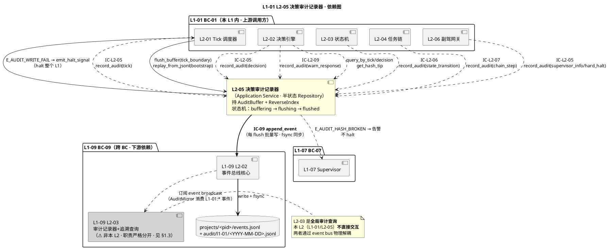
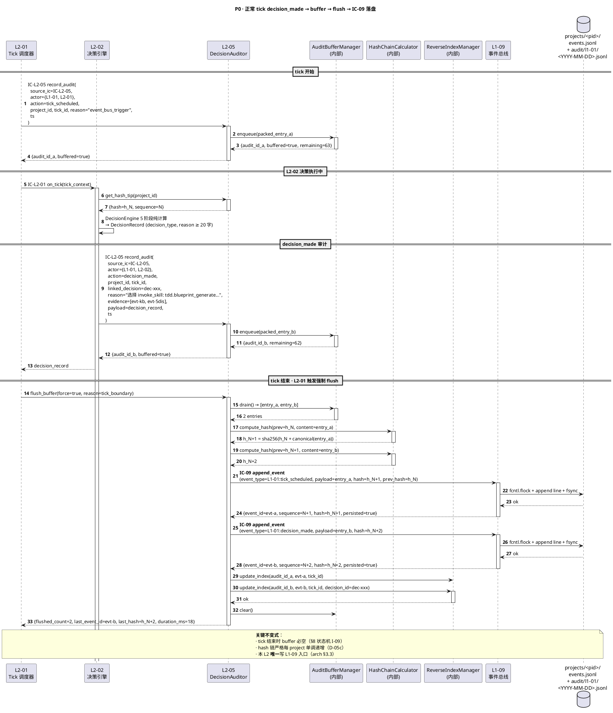
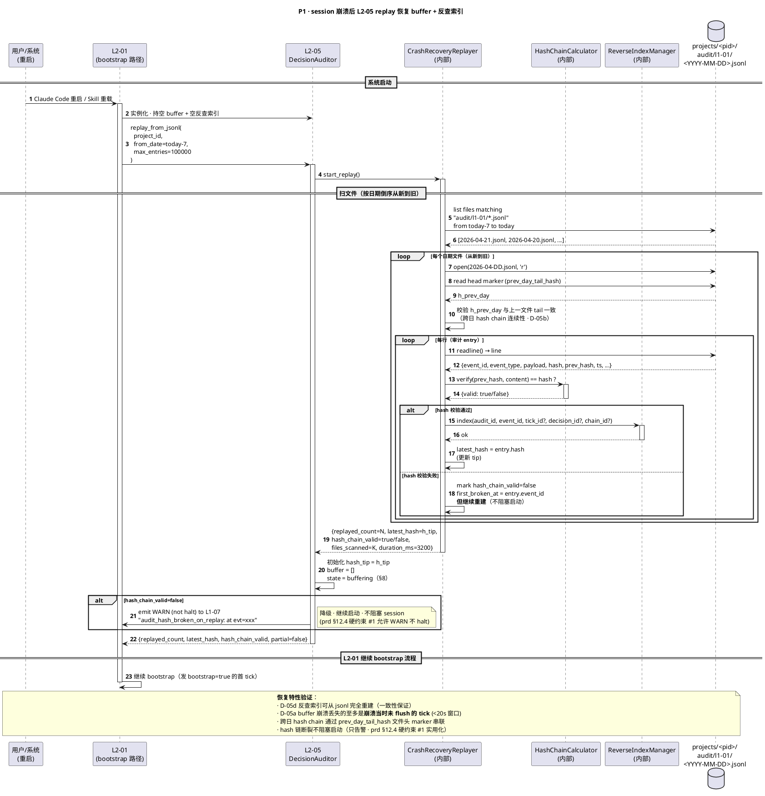
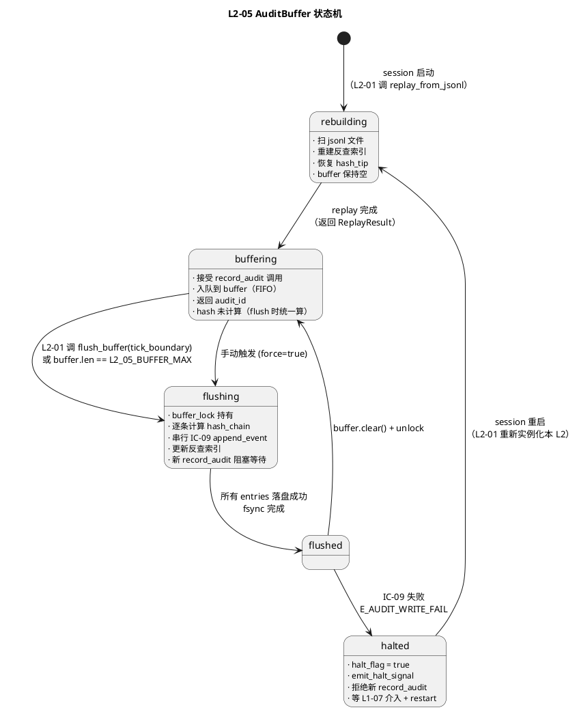

# L1 L2-05 · 决策审计记录器 · Tech Design

> **本文档定位**：3-1-Solution-Technical 层级 · L1 的 L2-05 决策审计记录器 技术实现方案（L2 粒度）。
> **与产品 PRD 的分工**：2-prd/L1-01-主 Agent 决策循环/prd.md §5.1 的对应 L2 节定义产品边界，本文档定义**技术实现**（接口字段级 schema + 算法伪代码 + 底层数据结构 + 状态机 + 配置参数）。
> **与 L1 architecture.md 的分工**：architecture.md 负责**跨 L2 架构 + 跨 L2 时序**，本文档负责**本 L2 内部技术细节**。冲突以 architecture.md 为准。
> **严格规则**：本文档不复述产品 PRD 文字（职责 / 禁止 / 必须等清单），只做技术映射 + 补齐"产品视角未说 but 工程师必须知道"的部分（具体算法 · syscall · schema · 配置）。

---

## §0 撰写进度

- [x] §1 定位 + 2-prd §12 L2-05 映射（含与 L1-09/L2-03 职责划分硬边界）
- [x] §2 DDD 映射（BC-01 Partnership BC-09 · 半状态 Repository 定性）
- [x] §3 对外接口定义（6 方法 · 字段级 YAML schema + ≥ 5 错误码）
- [x] §4 接口依赖（被谁调：5 L2 + 调谁：IC-09 唯一出口）
- [x] §5 P0/P1 时序图（P0 decision → buffer → flush → IC-09 · P1 崩溃后 replay 恢复 buffer）
- [x] §6 内部核心算法（打包 / hash 链 / buffer flush / 反查索引 / 崩溃恢复）
- [x] §7 底层数据表 / schema 设计（AuditEntry · jsonl 按日切分 · PM-14 分片路径）
- [x] §8 状态机（buffer lifecycle · PlantUML state + 转换表）
- [x] §9 开源最佳实践调研（EventStoreDB / Kafka / Chronicle Queue / Loki / SQLite WAL · ≥ 3 对标）
- [x] §10 配置参数清单
- [x] §11 错误处理 + 降级策略（halt on fail + buffer overflow 切尾）
- [x] §12 性能目标（接收 ≤10ms · flush ≤50ms P99 · 反查 ≤5ms）
- [x] §13 与 2-prd §12 / 3-2 TDD 的映射表

> **撰写次序**（复用 L2-02 模式）：§1 → §3 → §4 → §2 → §5 时序 → §6 算法 → §7 schema → §8 状态机 → §9 调研 → §10 配置 → §11 降级 → §12 SLO → §13 映射。本 L2 相比 L2-02 的显著差异：§8 **必有**状态机（buffer 有三态）· §7 按日切分的 jsonl 路径规则是核心交付 · §9 重点放 event-sourcing / audit log 对标。

---

## §1 定位 + 2-prd 映射

### 1.1 本 L2 的唯一命题（One-Liner）

**L1-01 内唯一的审计出口 + 半状态 Repository**：本 L2 接收 L2-01/02/03/04/06 的 4 类审计调用（IC-L2-05/06/07/09），**在内存 buffer 中打包 + 计算 hash 链 + 更新反查索引**，再经 IC-09 `append_event` 原子落盘到 L1-09 事件总线（PM-10 单一事实源）· 并在本 L1 内部维护 decision / tick / chain 粒度的**本地** 反查索引供 L2-02 自查。

关键定性（本 L2 与 L2-02 不同）：**半状态 Repository**——本 L2 是 DDD `Repository Pattern` 的实现者（`AuditEntryRepository`），但不同于典型 stateless Repository，本 L2 自身在内存持有一个**短暂的 `buffer`**（未 flush 的 audit_entry 临时队列），属于"有状态但状态可从事件流 replay 重建"的**半状态**服务（详见 §8 状态机 + §1.3 与 L2-03 差异）。

### 1.2 与 `2-prd/L1-01主 Agent 决策循环/prd.md §12` 的精确映射表

| 本文档段 | 2-prd §12 小节 | 映射内容 | 备注 |
|---|---|---|---|
| §1.1 命题 | §12.1 职责 "唯一落盘入口 + 反查索引" | 保留 + 补 "半状态 Repository" 定性 | **补** |
| §1.3 与 L2-03 边界 | §12.3 边界（L1-09 不做持久化机制本身）| 明确 "本 L2 只对 L1-01 发起的 decision 粒度审计 / L1-09 L2-03 是全局" | **核心补** |
| §1.4 PM-14 | §12.4 硬约束 "event type `L1-01:` 前缀"；architecture §2.5 全事件含 project_id | audit_entry.project_id 必填；jsonl 按 `projects/<pid>/audit/l1-01/<YYYY-MM-DD>.jsonl` 分片 | **补 L3 路径规则** |
| §2 DDD | §12.1 未写 DDD | BC-01 内 Application Service · Partnership with BC-09 | **补** |
| §3 `record_audit` | §12.2 输入 4 类 IC + §12.10.2 打包算法 | 6 方法入口（record / query by tick / by decision / flush / replay_buffer / get_hash_tip）全字段级 | **核心补** |
| §3 错误码 | §12.5 禁止 + §12.6 必须 | 违反 → 错误码；≥ 5 条（E_AUDIT_WRITE_FAIL 等）| **核心补** |
| §5 时序 | §12 无图 | P0 decision → buffer → flush → IC-09；P1 崩溃后 replay 恢复 buffer | **补 PlantUML** |
| §6 算法 | §12.10.2 打包算法 + §12.10.4 反查索引 | 伪代码化 + append-only + batch flush + 崩溃恢复 | **补 Python-like** |
| §7 schema | §12.10.1 audit_entry schema | YAML 化 + PM-14 路径 `projects/<pid>/audit/l1-01/<YYYY-MM-DD>.jsonl` 按日切分 | **补 L3 路径细节** |
| §8 状态机 | §12 无状态机 | 本 L2 buffer 有三态 `buffering / flushing / flushed` → 必画 PlantUML | **核心补** |
| §9 调研 | §12 外 | EventStoreDB / Kafka audit / Chronicle Queue / Loki / SQLite WAL | **补** |
| §10 配置 | §12.10.5 配置 3 条 | 扩展为 12 条（加 buffer 大小 / flush 间隔 / hash 算法等）| **扩补** |
| §11 降级 | §12.4 硬约束 #3 "IC-09 失败 → halt L1" | halt on fail + buffer overflow 切尾 + hash 重算策略 | **补** |
| §12 SLO | §12.4 性能约束 | 接收 ≤10ms / flush ≤50ms P99 / 反查 ≤5ms | 原样继承 |

### 1.3 与兄弟 L2 **L1-09 / L2-03 "全局审计记录器 + 追溯查询"** 的**职责硬边界**（⭐ 核心避重）

> **关键声明**：本 L2（`L1-01 / L2-05`）与姊妹文档 `L1-09 / L2-03 审计记录器+追溯查询` **职责完全不重复**，但对 "audit" 一词有不同语义层级。以下表格**锁死边界**，本文档**不得越界**填写任何跨 L1 查询 / 全局事件索引 / 跨 L1 断链告警内容（那些是 L2-03 的）：

| 维度 | **本 L2**（L1-01 / L2-05） | **L1-09 / L2-03** |
|---|---|---|
| **所在 BC** | BC-01 Agent Decision Loop | BC-09 Resilience & Audit |
| **审计粒度** | **L1-01 内部 decision 粒度**（DecisionRecord / TickRecord / ContextSnapshot / WarnResponse / StateTransition / ChainStep）| **全局**（所有 L1 的全部 event 流 · 100% 反查面）|
| **审计入口来源** | 仅 L2-01/02/03/04/06 内部（IC-L2-05/06/07/09）| 订阅 L2-01 全 event broadcast（消费 100% event bus） |
| **写盘路径** | **经 IC-09 `append_event`**（本 L2 是 L1-01 内唯一 IC-09 发起方）| **不写盘**（只只读订阅 + 内存 AuditMirror 倒排索引）|
| **对外查询能力** | **本地反查**（`query_by_tick / by_decision`）· 仅供 L2-02 内部自查 | **全局反查**（IC-18 `query_audit_trail`）· 供 L1-10 UI / 用户追溯 |
| **跨 L1 能力** | **无**（仅本 L1 内的 decision 粒度）| **有**（任何 anchor 反查 4 层 trail）|
| **状态**（DDD）| **半状态 Repository**（内存 buffer + 反查索引）| Read Model（内存 AuditMirror · 可从事件重建）|
| **是否依赖 L2-03** | 否（本 L2 不知道 L2-03 存在，只经 IC-09 落盘）| 是（L2-03 订阅 L2-01 broadcast，其中就包含本 L2 写的 `L1-01:*` 事件）|
| **压缩跳转 / 断链告警** | **不做**（那是 L2-03 `audit_trail_broken` 元事件的职责）| **做**（断链 → 主动写元事件）|
| **jsonl 物理文件** | `projects/<pid>/audit/l1-01/<YYYY-MM-DD>.jsonl`（按**日**切分 · L1-01 namespace）| `projects/<pid>/events.jsonl` + `projects/<pid>/audit.jsonl`（由 L1-09 自管）|

**硬约束**：

1. **本 L2 绝不直接查跨 L1 事件**——任何跨 L1 查询必走 IC-18 → L2-03。
2. **本 L2 产出的事件都以 `L1-01:` 前缀**（event_type 白名单，详见 §7.2）· 不生产 `L1-07:*` / `L1-09:*` 等前缀的事件。
3. **本 L2 的反查索引 scope 仅限"当前 session 内 L1-01 产生的 decision / tick / chain"**——session 重启后从**本 L2 自有的 jsonl** replay 重建（详见 §6.5 · 不从 L2-03 的 AuditMirror 拉数据，两者各自独立重建）。
4. **本 L2 的 buffer 是私有状态**（L2-03 不知道本 L2 有 buffer；buffer 是"LOCAL cache"而非"共享 mirror"）。

**协作关系**：

```
L2-02 decide → IC-L2-05 → L2-05（本文档）：打包 + buffer + IC-09 落盘
                                                ↓
                                        IC-09 append_event
                                                ↓
                                          L1-09 events.jsonl
                                                ↓ broadcast
                                        L2-03（L1-09 内部）：订阅 → 建 AuditMirror
                                                ↓ IC-18 query
                                              L1-10 UI
```

即：**本 L2 是"写入端"，L2-03 是"查询端"**。两者通过 L1-09 event bus **物理解耦**（本 L2 只推，不订阅；L2-03 只订，不推）。

### 1.4 本 L2 在 `L1-01/architecture.md` 中的位置映射

| architecture 锚点 | 映射内容 | 本文档对应段 |
|---|---|---|
| §2.3 `DecisionAuditor` Application Service | 本 L2 = DecisionAuditor 的具体实现 | §2.3 DDD 组件 |
| §2.4 Repository Interface（本 L1 不持聚合 · IC-09 经 L2-05）| 本 L2 承担 IC-09 的**唯一发起方**角色 | §3 + §4 依赖 |
| §2.5 Domain Events（`L1-01:decision_made` 等 11 个 event_type）| 本 L2 是这 11 个事件的**打包者** | §6 + §7.2 event_type 表 |
| §3.3 "单一审计源"约束 | 其他 L2 禁止直接调 IC-09 · 必经本 L2 | §1.3 边界 |
| §3.4 Component Diagram 中 L2_05 节点 + 所有箭头汇聚到 L2_05 | 本 L2 的被调入口有 6 条（L2_01/02/03/04/06 × 4 IC）| §4.1 被调方表 |
| §3.5 D-03 "L2-05 同步落盘（IC-09 + fsync）不异步 batch" | **本文档的 D-05a 会拆更细**：本 L2 有**极小 buffer**（单 tick 内多条审计先 batch 到 IC-09）· 但 tick 结束必 flush | §1.5 D-05a |

### 1.5 关键技术决策（Decision → Rationale → Alternatives → Trade-off）

基于 architecture.md §3.5 D-03 的"同步落盘"底线，本 L2 补充 5 个 L2 粒度技术决策：

| # | Decision | Rationale | Alternatives | Trade-off |
|---|---|---|---|---|
| **D-05a** | 本 L2 为**半状态** Repository：持**小 buffer**（容量 `L2_05_BUFFER_MAX=64 entries`）· 但 flush 仍是**每 tick 结束必 flush** 的同步落盘 | arch §3.5 D-03 要求同步（防丢）；同时 prd §12.4 性能要求 "接收 ≤10ms"——纯同步 fsync P99 可到 50ms；buffer 先接住 record_audit，再 flush 批量写 IC-09 → `record_audit` 返回快，`flush` 慢但 tick 结束边界一次性完成 | A. 纯同步：每次 record 就 fsync → 接收延迟超 SLO；B. 纯异步：与 D-03 矛盾 · 丢失窗口 1-5s | buffer 满时触发 sync flush（fall back 到 D-03 语义）；buffer 永不跨 tick（tick 结束边界强制 flush + buffer.clear）· 崩溃最多丢**当前 tick** 未 flush 的条目（≤ 20s 窗口）· 可接受 |
| **D-05b** | jsonl 按**日**切分（`<YYYY-MM-DD>.jsonl`）而非按 session 或按事件数 | Loki / Grafana 索引按 label + timerange；按日切分 → 天级索引效率最佳 + 单文件不会无限大 · 合并 + 归档按天调度 | A. 按 session 切（session 长度不定 · 大 session 文件过大）· B. 按 sequence 切（每 N 条一个文件 · 难定位时间）· C. 不切（无限大 · 恢复 replay 全扫 O(N)） | 跨日的 hash 链尾会跨文件 · 本 L2 在 `<YYYY-MM-DD>.jsonl` 文件头部记录 `prev_day_tail_hash` 供 hash-chain 验证（详见 §7.3）|
| **D-05c** | hash 链**按 project_id 独立维护**（而非全局单链）| PM-14 物理隔离；单全局链会造成所有 project 互相阻塞 hash 计算；per-project 链可并行 | A. 全局链：并发退化 · B. 无链：违反 PM-10 防篡改要求 | 每 project 启动时要 read_last_hash · 小开销（index.sqlite O(1) 查询） |
| **D-05d** | 反查索引 **in-memory only** · 不持久化 · 跨 session 从 jsonl replay 重建 | prd §12.10.4 "索引仅 in-memory；跨 session 恢复时从事件总线 replay 重建"；持久化索引会与 jsonl 不一致 · 且内存 dict 10 万条 ≈ 40 MB 可承受 | A. SQLite 索引表：引入事务 · 崩溃后与 jsonl 不一致；B. Pickle 落盘：违反 §10.4 可重建 | 冷启动 replay 延迟（10 万条 ≈ 5s）· 可接受（bootstrap 专用时间窗口 · 不在运行时关键路径）|
| **D-05e** | 本 L2 的 `record_audit()` **在收到后立即返回 audit_id**（不等 flush 完成）| prd §12.4 "接收 ≤10ms"；调用方（L2-01/02/03/04/06）不关心 fsync 完成，只关心 audit_id；fsync 完成由本 L2 自监控 | A. 每次 record 等 fsync：接收超 SLO；B. 异步 + 无 audit_id：上游无法 linked_audit | 若在 flush 前系统崩溃 · 调用方持有的 audit_id 在 jsonl 里查不到 · 但可通过 §6.5 重建算法从 event_id 反推（只要事件不丢则 audit_id 可补回）· 不影响正确性 |

---

## §2 DDD 映射（BC-01 Agent Decision Loop · Partnership with BC-09）

### 2.1 Bounded Context 定位

本 L2 所属 `BC-01 · Agent Decision Loop`（参见 `L0/ddd-context-map.md §2.2`）· 在 BC-01 内部扮演 **"留声机（Recorder）"** 角色——所有其他 L2（脑 / 状态机 / 任务链 / 副驾网关）生成的决策/事件/动作的**唯一审计口**（L1-01 内"单一审计源"约束 · architecture §3.3）。

| 兄弟 L2 / 跨 BC | DDD 关系 | 本 L2 与该 L2 的交互模式 |
|---|---|---|
| L2-01 Tick 调度器（本 L1） | **Upstream**（Supplier）| L2-01 调 IC-L2-05 record_audit（tick_scheduled/completed/timeout/idle_spin/panic/hard_halt）|
| L2-02 决策引擎（本 L1） | **Upstream**（Partnership）| 每 decision_made / warn_response 必调本 L2（IC-L2-05 / IC-L2-09）|
| L2-03 状态机编排器（本 L1） | **Upstream**| IC-L2-06 record_state_transition（成功 / 失败都要审计）|
| L2-04 任务链执行器（本 L1） | **Upstream**| IC-L2-07 record_chain_step（每步都调）|
| L2-06 Supervisor 网关（本 L1） | **Upstream**| IC-L2-05 record_audit（supervisor_info / hard_halt_received 等）|
| **L1-09 事件总线（跨 BC）** | **Partnership**（必同步演进）| 本 L2 是 L1-09 的**最大写入者之一**（IC-09 append_event）· hash 计算依赖 L1-09 last_hash |
| **L1-09 / L2-03 审计追溯**（跨 BC 同 L1） | **Disjoint**（物理解耦 · 通过 event bus）| 本 L2 不知 L2-03 存在；L2-03 订阅 event bus 时自动看到本 L2 写的事件 · 见 §1.3 |

### 2.2 本 L2 持有 / 构造的聚合根

| 聚合根 | 类型 | 本 L2 职责 | Invariants |
|---|---|---|---|
| **AuditEntry** | **Aggregate Root · 本 L2 唯一生产者** | 本 L2 打包（source_ic + actor + action + reason + evidence + hash + linked_* refs）· 最终 per IC-09 落盘后 immutable | **I-05** audit_id 不可变 · **I-06** reason 非空 · **I-07** hash = sha256(prev_hash+canonical(content)) · **I-08** event_type 以 `L1-01:` 前缀 |
| **AuditBuffer** | **Entity**（短生命 · tick 内有效）| 内存 FIFO 队列 · 容量 `L2_05_BUFFER_MAX=64` · tick 结束边界强制 flush + clear | **I-09** buffer 不跨 tick · **I-10** buffer 满触发 sync flush（fall back D-03）|

**注**：`AuditEntry` 一旦经 IC-09 落盘后就 immutable（append-only · prd §12.5 禁止修改已落盘 entry）· 落盘前在 buffer 内仍然是可修改的 Entity（只能是追加 linked_* / 填充 hash）· 不会暴露给外部。

### 2.3 Domain Services / Application Services（本 L2 内部）

| 组件 | DDD 类型 | 职责 | 有状态/无状态 |
|---|---|---|---|
| `DecisionAuditor`（外壳 · 与 L2 同名）| **Application Service** | 对外 6 方法入口 + 编排 | 半状态（持 buffer） |
| `AuditPacker` | **Domain Service** | record_audit 入参 → AuditEntry（打 event_type + 打 hash + 串 linked_\*）| 无状态 |
| `HashChainCalculator` | **Domain Service** | 计算 sha256(prev_hash + canonical_json(content)) · 跟 L1-09 last_hash 对齐 | 无状态 |
| `AuditBufferManager` | **Domain Service** | buffer 入队 / 出队 / overflow 判定 / tick 边界 flush 触发 | **有状态**（持 buffer 本身 · 状态机见 §8） |
| `ReverseIndexManager` | **Domain Service** | 三路索引维护（by_tick / by_decision / by_chain → audit_id）· LRU 淘汰 | **有状态**（三 dict）|
| `JsonlShardRouter` | **Domain Service** | 根据 ts → `<YYYY-MM-DD>.jsonl` 路径 · 跨日首次写入时写 day_boundary_marker 事件 | 无状态 |
| `CrashRecoveryReplayer` | **Domain Service** | 启动时从 `projects/<pid>/audit/l1-01/*.jsonl` replay 重建反查索引 + 最新 hash tip | 无状态（run-once）|

**关键设计**（§1.5 D-05a 衍生）：`DecisionAuditor` 是**唯一有状态组件**（buffer + reverse index），其他 6 个是无状态 Domain Service。buffer 状态由 `AuditBufferManager` 封装，状态机见 §8。

### 2.4 Value Objects（不可变）

| VO 名 | 结构 | 用途 |
|---|---|---|
| `AuditId` | `"audit-{uuid-v7}"` | 本 L2 生成 · 调用方返回键 |
| `ProjectId` | `"pid-{uuid-v7}"` | PM-14 根字段 · 跨 BC Shared Kernel |
| `EventType` | enum · 以 `L1-01:` 前缀 · 见 §7.2 11 个 event_type | 落盘事件分类 |
| `SourceIC` | enum [`IC-L2-05`, `IC-L2-06`, `IC-L2-07`, `IC-L2-09`] | 审计调用的 IC 来源 |
| `Hash` | string · `sha256-hex`（64 字符）| 防篡改链 |
| `AuditAction` | string · 如 `decision_made` / `tick_completed` / `state_transitioned` | 动作语义（event_type 映射的另一半）|

### 2.5 Entities（可变 · 短生命）

| Entity | 生命期 | 用途 |
|---|---|---|
| `AuditBuffer` | 单 tick 内（`< 20s`）· tick 结束必 clear | 临时容纳本 tick 所有 record_audit 调用 |
| `ReverseIndex`（三 dict · 总体看作 Entity）| session 级别 · 跨 tick 保留 · 崩溃恢复从 jsonl replay | 本地反查 |
| `HashChainTip` | session 级（可 reload）· per project 独立 | 每次 record_audit 要读 tip + 更新 |

### 2.6 Repository Interfaces

本 L2 **是 `AuditEntryRepository` 的实现者**（唯一的实现者 · 单一审计源）· 但**不持有物理存储**（jsonl 由 L1-09 L2-02 原子写）· 本 L2 仅持 **buffer + 反查索引**。

| Repository 接口方法（与 §3 对外方法一一对应）| 是否有实现 |
|---|---|
| `record(entry) → audit_id` | 是（§3.1 record_audit）|
| `query_by_tick(tick_id) → entries` | 是（§3.2）|
| `query_by_decision(decision_id) → entry` | 是（§3.3）|
| `query_by_chain(chain_id) → entries` | 是（§3.3 变体）|
| `flush_buffer() → {flushed_count}` | 是（§3.4）|
| `replay_from_jsonl(project_id) → rebuild_count` | 是（§3.5 · 启动期调用）|

**"半状态"定性**：本 L2 同时扮演两个角色——
1. `Repository Pattern` 的**抽象接口实现**（对外提供 `record / query_by_*`）
2. 自身**持少量状态**（buffer + 反查索引）· 但状态**可从事件流重建**（§6.5 算法 · 崩溃后 replay 重建 · 与 L2-03 AuditMirror 的可重建性同理）

换言之：本 L2 是"**可观测状态的 Repository**"——其状态就是 jsonl + index，两者一致性由 replay 算法保证（§6.5）。

### 2.7 Domain Events（本 L2 实际落盘的事件类型）

本 L2 是 L1-01 所有 Domain Event 的**打包者**——architecture §2.5 列出的 11 个 `L1-01:*` event_type 全部**经本 L2** 落盘到 L1-09。详见 §7.2 事件类型白名单。

### 2.8 跨 BC 关系（本 L2 作为 IC-09 的唯一发起方 · PM-10）

| IC | 方向 | 对端 BC | 本 L2 视角 |
|---|---|---|---|
| **IC-09 append_event** | **发起（主职责）** | BC-09（L1-09）| 每次 flush 批量写；本 L2 是 L1-01 所有审计的**唯一**经路（arch §3.3 硬约束）|

所有 IC 字段级 schema 锚点：`docs/3-1-Solution-Technical/integration/ic-contracts.md §3.9 IC-09`。

---

## §3 对外接口定义（6 方法 · 字段级 YAML schema + 错误码）

> 说明：本 L2 对外暴露 **6 个方法**（1 主 record_audit + 2 query + 1 flush + 1 replay + 1 hash_tip）· 全部对应 `AuditEntryRepository` 接口的 `record / query / flush / rebuild` 语义。
> 调用方向：`record_audit` 由本 L1 内 5 个 L2 共同调（IC-L2-05/06/07/09 4 种 source_ic）· `query_by_*` 由 L2-02 内部自查（decision 前查历史同 tick 的相关 audit）· `flush_buffer` 由 L2-01 在 tick 结束边界触发 · `replay_from_jsonl` 由 session 启动时 bootstrap 路径调用 · `get_hash_tip` 供 L2-02 决策时打 evidence 链用。

### 3.1 `record_audit(actor, action, reason, evidence, linked_tick) → {audit_id}`（核心 · IC-L2-05/06/07/09 处理器）

**调用方**：
- L2-01 Tick 调度器（IC-L2-05 通用审计）
- L2-02 决策引擎（IC-L2-05 decision_made + IC-L2-09 warn_response）
- L2-03 状态机编排器（IC-L2-06 record_state_transition）
- L2-04 任务链执行器（IC-L2-07 record_chain_step）
- L2-06 Supervisor 网关（IC-L2-05 supervisor_info / hard_halt_received）

**阻塞性**：**同步但不等 fsync**——同步入 buffer + 生成 audit_id + 立即返回（D-05e）；fsync 由本 L2 后台 flush 负责（tick 边界强制 flush）· P95 ≤ 10ms（prd §12.4）
**幂等性**：调用方若提供 `idempotency_key`（通常是事件 id）· 同 key 重复调用返回同一 audit_id（防 L2-01 超时重投）· 缺省不幂等

#### 入参（按 source_ic 的多态 schema · discriminated union）

```yaml
record_audit_command:
  type: object
  required: [source_ic, actor, action, reason, ts, project_id]
  properties:
    source_ic: {type: enum, enum: [IC-L2-05, IC-L2-06, IC-L2-07, IC-L2-09],
                description: "决定 event_type 映射 + payload schema（§7.2）"}
    actor:
      type: object
      required: [l1, l2]
      properties:
        l1: {type: enum, const: "L1-01"}
        l2: {type: enum, enum: [L2-01, L2-02, L2-03, L2-04, L2-06]}
    project_id: {type: string, format: "pid-{uuid-v7}",
                  description: "PM-14 根字段；缺失 → E_AUDIT_NO_PROJECT_ID"}
    action: {type: string, description: |
               "与 source_ic 组合映射到 event_type（§7.2）。常见：tick_scheduled/tick_completed/
                tick_timeout/idle_spin/decision_made/state_transitioned/chain_step_completed/
                warn_response/supervisor_info/hard_halt_received/panic_intercepted"}
    reason: {type: string, minLength: 1,
              description: "决策理由；decision 类 ≥ 20 字由 L2-02 保证；空 → E_AUDIT_NO_REASON"}
    evidence:
      type: array
      items: {type: string, format: "evt-{uuid-v7}"}
      description: "证据事件 id 列表（本 L2 不校验存在性 · 避免 IO 耦合）"
    linked_tick: {type: string, format: "tick-{uuid-v7}", required: false}
    linked_decision: {type: string, format: "dec-{uuid-v7}", required: false,
                       description: "IC-L2-05 decision_made 必填"}
    linked_chain: {type: string, format: "ch-{uuid-v7}", required: false,
                    description: "IC-L2-07 必填"}
    linked_warn: {type: string, format: "warn-{uuid-v7}", required: false,
                   description: "IC-L2-09 必填"}
    payload:
      type: object
      description: |
        按 source_ic 分 schema：
          IC-L2-05 → {decision_type?, decision_params?, tick_duration_ms?, ...}
          IC-L2-06 → {from_state, to_state, pre_snapshot_ref, post_snapshot_ref, hook_results, accepted}
          IC-L2-07 → {chain_id, step_id, outcome, step_result}
          IC-L2-09 → {warn_id, response, applied_action}
    ts: {type: string, format: ISO-8601-utc, description: "调用方提供 · 不由本 L2 生成"}
    idempotency_key: {type: string, required: false,
                       description: "幂等键（通常=event_id）· 重复调用返同一 audit_id"}
```

#### 出参

```yaml
record_audit_result:
  type: object
  required: [audit_id, buffered, buffer_remaining]
  properties:
    audit_id: {type: string, format: "audit-{uuid-v7}",
                description: "供调用方日后 linked_audit / query_by_*"}
    buffered: {type: boolean, description: "true=正常入队；false=触发 overflow sync flush"}
    buffer_remaining: {type: integer, description: "范围 [0, L2_05_BUFFER_MAX]"}
    event_id: {type: string | null, description: "若触发 sync flush 返回 IC-09 event_id；否则 null"}
```

#### 错误码表

| 错误码 | 含义 | 触发场景 | 调用方处理 | 对应 prd 硬约束 |
|---|---|---|---|---|
| **`E_AUDIT_WRITE_FAIL`** | IC-09 append_event 失败（fsync / disk full / hash mismatch）| L1-09 L2-02 返回失败 | **本 L2 halt 整个 L1**（emit_halt_signal → L2-01 → L2-03 PAUSED）· 调用方不感知（因为本 L2 已 halt）| prd §12.4 硬约束 #3 |
| **`E_AUDIT_BUFFER_OVERFLOW`** | buffer 已达上限 `L2_05_BUFFER_MAX` 且当前条目无法触发同步 flush（flush 正在进行中）| 短时间内 record_audit 调用频率超过 flush 吞吐（罕见 · 通常 tick 内只产 5-10 条）| 降级为同步落盘 · `buffered=false` 返回 event_id · 若 flush 仍失败 → 升级为 `E_AUDIT_WRITE_FAIL` | prd §12.5 禁止丢弃 |
| **`E_AUDIT_QUERY_MISS`** | query_by_tick / by_decision 查无数据（不是错误 · 是"未命中"信号）| audit 尚未 flush / tick_id 错 / 跨 session 未 replay | 返回空数组 · 调用方判断处理（常见场景：decide() 查自己刚写的 audit · 若在 buffer 则命中；若已 flush 则走 jsonl 扫描）| prd §12.4 性能 |
| **`E_AUDIT_HASH_BROKEN`** | 本 L2 计算 hash 时发现 prev_hash 与 L1-09 last_hash 不一致（可能是并发写 bug）| 同 project 有其他 L2 绕过本 L2 直接调 IC-09（违反 arch §3.3 单一审计源）· 或 jsonl 被外部篡改 | 本 L2 重查 L1-09 last_hash 1 次 · 仍不一致 → **告警 L1-07 但不 halt**（降级 · 让后续 audit 继续走 · 但这次 audit 抛 WARN）| prd §12.4 硬约束 #1 审计 id + hash |
| **`E_AUDIT_HALT_ON_FAIL`** | 已触发 halt 状态下仍收到 record_audit 调用 | L2-01 未正确响应 halt_signal · 继续派发 tick | 本 L2 返回错误 · 不入 buffer · 不落盘（系统正在关停 · 新 audit 无意义）| prd §12.4 硬约束 #3 级联 |
| `E_AUDIT_NO_PROJECT_ID` | project_id 缺失 | 调用方 bug | 本 L2 拒绝 · 不入 buffer · 告警 L1-07 | PM-14 |
| `E_AUDIT_NO_REASON` | reason 为空 | 调用方 bug | 本 L2 拒绝 · 审计违规（元事件 `L1-01:audit_rejected`）· 告警调用方的 L2 | prd §12.5 禁止 |
| `E_AUDIT_CROSS_PROJECT` | actor.project_id ≠ linked_tick 的 project_id | 跨 project 审计（严重 bug）| 拒绝 · 告警 L1-07 | PM-14 |
| `E_AUDIT_EVENT_TYPE_UNKNOWN` | source_ic + action 组合不在 §7.2 白名单 | 新加 source_ic 未更新映射表 · 调用方用了自造 action | 拒绝 · 要求调用方补全映射（或升级本 L2 白名单）| prd §12.5 禁止非前缀 |
| `E_AUDIT_STALE_BUFFER` | tick 结束后未正常 flush 导致 buffer 残留 · 下一 tick record 时发现 | L2-01 未调 flush_buffer（调度 bug）| 本 L2 主动 force_flush + 记元事件 + 告警 | prd §12.4 硬约束 #4 FIFO |

### 3.2 `query_by_tick(tick_id) → entries`（L2-02 内部自查 · 本地反查）

**调用方**：L2-02（decide() 引用同 tick 内已记 audit 作 evidence）· 仅查 in-memory index + buffer · miss 时降级扫当日 jsonl
**SLO**：P95 ≤ 5ms（命中 in-memory）· P99 ≤ 20ms（降级扫 jsonl）

**入参**：`{tick_id: "tick-{uuid-v7}", project_id: "pid-{uuid-v7}", include_buffered?: bool (default true), max_results?: int (default 100)}`
**出参**：`{entries: [AuditEntry], source: enum[buffer,index,jsonl_scan,mixed], count: int, query_duration_ms: int}`

**错误码**：

| 错误码 | 触发 | 处理 |
|---|---|---|
| `E_AUDIT_QUERY_MISS` | tick_id 未命中 | 返 `{entries:[], count:0}`（非异常）|
| `E_AUDIT_CROSS_PROJECT` | project_id 错配 | 拒绝 + 告警 |
| `E_AUDIT_QUERY_TIMEOUT` | 扫 jsonl > `L2_05_QUERY_TIMEOUT_MS=100` | 返已扫部分 + `partial=true` |

### 3.3 `query_by_decision(decision_id) → entry | null`（1:1 反查） · `query_by_chain(chain_id) → entries`（1:N）

**调用方**：L2-02（审计自己刚打的决策 · 防幂等性 bug）/ L1-01 故障回溯 · **SLO**：P95 ≤ 5ms

**入参**：`{decision_id | chain_id, project_id}`
**出参**：`{entry|entries, source: enum[buffer,index,jsonl_scan,not_found]}`
**错误码**：同 3.2（`E_AUDIT_QUERY_MISS` / `E_AUDIT_CROSS_PROJECT`）
**decision 为 1:1**（一个 decision_id 对应一个 `L1-01:decision_made` event）· **chain 为 1:N**（一 chain 多步审计 · 返 array）

### 3.4 `flush_buffer() → {flushed_count, last_event_id, last_hash}`（tick 边界强制 flush）

**调用方**：L2-01（tick 结束边界必调 · 同步）· 或本 L2 内部 overflow 时
**阻塞性**：同步阻塞直到 IC-09 append_event 完成（含 fsync）· P99 ≤ 50ms（prd §12.4）
**幂等性**：空 buffer 返回 `flushed_count=0` (no-op)

**入参**：`{force: bool (default false), reason: str (default "tick_boundary"; tick_boundary/buffer_overflow/shutdown/manual)}`
**出参**：`{flushed_count: int, last_event_id: "evt-{uuid-v7}"|null, last_hash: sha256-hex, duration_ms: int}`

**错误码**：

| 错误码 | 触发 | 处理 |
|---|---|---|
| `E_AUDIT_WRITE_FAIL` | IC-09 失败 | **halt L1** |
| `E_AUDIT_HASH_BROKEN` | flush 时 last_hash 与 buffer 首条 prev_hash 不一致 | 重查 1 次；仍错 → 告警 + 按当前 tip 重算 hash 链 |
| `E_AUDIT_FLUSH_CONCURRENT` | flush 正进行又收到 flush 调用 | 第二次 wait（semaphore 1）· 不重复 flush |

### 3.5 `replay_from_jsonl(project_id) → {replayed_count, latest_hash}`（启动期重建）

**调用方**：L2-01 Tick 调度器（bootstrap · 仅 1 次/session）· 从 `projects/<pid>/audit/l1-01/*.jsonl` 重建**反查索引** + **hash tip**（重启后 buffer 本就是空）· 阻塞上限 `L2_05_REPLAY_TIMEOUT_MS=30_000`

**入参**：`{project_id, from_date?: "YYYY-MM-DD" (default=最近 30 天), max_entries?: int (default 100000 · 超过 LRU 淘汰)}`
**出参**：`{replayed_count, latest_hash: sha256-hex, files_scanned, hash_chain_valid: bool, first_broken_at?: str, duration_ms}`

**错误码**：

| 错误码 | 触发 | 处理 |
|---|---|---|
| `E_AUDIT_HASH_BROKEN` | 重放发现 hash 链断（hash ≠ sha256(上条+content)）| `hash_chain_valid=false` + 返 first_broken_at · 告警 L1-07 · 不阻塞启动（继续重建）|
| `E_AUDIT_REPLAY_TIMEOUT` | 超 `L2_05_REPLAY_TIMEOUT_MS` | 返已重建部分 + `partial=true` · 运行时 miss 查询降级扫 jsonl |
| `E_AUDIT_NO_PROJECT_ID` | project_id 缺失 | 拒绝 |

### 3.6 `get_hash_tip(project_id) → {hash, sequence}`（供 L2-02 打 evidence 链）

**调用方**：L2-02 决策引擎 · **SLO**：P95 ≤ 1ms（纯内存读）· **幂等**
**入参**：`{project_id}`
**出参**：`{hash: sha256-hex, sequence: int (0=genesis)}`
**错误码**：无（纯内存读 · 未命中返 genesis 全 0 + seq=0）

---

## §4 接口依赖（被谁调 · 调谁）

### 4.1 被调方（上游 5 个 L2 · 内部 6 条 IC-L2 入口）

| 调用方 | IC | 本 L2 方法 | 触发时机 | 频率 |
|---|---|---|---|---|
| **L2-01 Tick 调度器** | IC-L2-05 | `record_audit(source_ic=IC-L2-05, action=tick_scheduled/tick_completed/tick_timeout/idle_spin/hard_halt_received/panic_intercepted)` | 每 tick 开始 / 结束 / 异常 | 高（每 tick 2-3 次）|
| **L2-01 Tick 调度器** | — | `flush_buffer(force=true, reason=tick_boundary)` | 每 tick 结束边界 | 中（每 tick 1 次）|
| **L2-01 Tick 调度器** | — | `replay_from_jsonl(project_id)` | session 启动 bootstrap | 极低（1 次/session）|
| **L2-02 决策引擎** | IC-L2-05 | `record_audit(source_ic=IC-L2-05, action=decision_made, linked_decision, payload=decision_record)` | 每次决策完成 | 高（每 tick 1 次）|
| **L2-02 决策引擎** | IC-L2-09 | `record_audit(source_ic=IC-L2-09, action=warn_response, linked_warn, payload={warn_id, response, applied_action})` | 回应 supervisor WARN | 低（每 session 0-5 次）|
| **L2-02 决策引擎** | — | `query_by_tick(tick_id)` / `query_by_decision(decision_id)` | decide() 需要引本 tick 已 audit 的内容 | 中（每 tick 0-3 次查）|
| **L2-02 决策引擎** | — | `get_hash_tip(project_id)` | 打 evidence 链 | 高（每决策 1 次）|
| **L2-03 状态机编排器** | IC-L2-06 | `record_audit(source_ic=IC-L2-06, action=state_transitioned, payload={from_state, to_state, hook_results, accepted})` | 每次状态转换（成功 / 失败都审计）| 中（按阶段）|
| **L2-04 任务链执行器** | IC-L2-07 | `record_audit(source_ic=IC-L2-07, action=chain_step_completed, linked_chain, payload={chain_id, step_id, outcome})` | 每步完成 | 中高（chain 步骤流）|
| **L2-06 Supervisor 网关** | IC-L2-05 | `record_audit(source_ic=IC-L2-05, action=supervisor_info)` | L1-07 推 INFO 级建议 | 低 |
| **L2-06 Supervisor 网关** | IC-L2-05 | `record_audit(source_ic=IC-L2-05, action=hard_halt_received)` | 收到 BLOCK | 极低 |

**被调总结**：5 个 L2 × 4 种 IC = **本 L2 是 L1-01 内被调频率最高的组件**（每 tick 至少 5-8 次调用）· 故 §12 把"接收 ≤10ms"列为首要 SLO。

### 4.2 调用方（本 L2 对外发起 · 下游依赖）

| 目标 IC | 对端 L1 / L2 | 本 L2 方法内部调用点 | 频率 | 阻塞性 |
|---|---|---|---|---|
| **IC-09 append_event** | **L1-09 L2-02 事件总线** | `flush_buffer()` 内部每条 buffered entry 串行写（或未来批量写 · 见 §6.3）| 每 tick 1 次 flush × 平均 5 条 entries | **同步 + fsync**（P99 ≤ 50ms）|

**唯一下游 IC = IC-09**——这体现了 arch §3.3 "单一审计源"约束：本 L2 是 L1-01 内唯一与 L1-09 打交道的组件。任何违反此约束的 L2 直接调 IC-09 都是架构违规。

### 4.3 依赖关系图（PlantUML）



**关键点**：
- 本 L2 的**上游调用者 5 个**（本 L1 内所有其他 L2）· **下游依赖 1 条 IC**（IC-09）· 体现"漏斗"形拓扑。
- 本 L2 **与 L1-09/L2-03 物理解耦**（不直接调用 · 只通过 event bus 间接交互）——见 §1.3 职责边界硬约束。
- halt 路径是**反向 L2-01**（而非直接 halt 进程）：本 L2 发 halt_signal 给 L2-01 · 由 L2-01 串联 PAUSED 状态。

---

## §5 P0/P1 时序图（PlantUML ≥ 2 张）

### 5.1 时序图 1（P0）· 正常 tick · decision_made → buffer → tick 边界 flush → IC-09 落盘

**覆盖场景**：L2-02 决策完成 → IC-L2-05 调本 L2 record_audit → 本 L2 入 buffer + 立即返回 audit_id → L2-01 tick 结束边界调 flush_buffer → 本 L2 批量写 IC-09 → L1-09 fsync 完成。这是本 L2 最高频的 P0 路径（每 tick 执行一次）。



**SLO 核对**：
- 步骤 1 / 8（record_audit 接收）P95 ≤ 10ms ✅（纯内存 enqueue）
- 步骤 20（flush_buffer P99）≤ 50ms ✅（2 次 IC-09 × P99 20ms + hash 计算 < 1ms + 索引更新 < 1ms）
- 调用方 L2-02 在步骤 9 拿到 audit_id 即可继续 · 不阻塞在 fsync（D-05e）

### 5.2 时序图 2（P1）· 崩溃后 replay 恢复 buffer + 反查索引

**覆盖场景**：session 异常崩溃 → 重启 → L2-01 bootstrap 阶段调 `replay_from_jsonl` → 本 L2 扫最近 N 天 jsonl → 重建反查索引 + 恢复 hash tip。这是 §6.5 崩溃恢复算法的时序展开，也是本 L2 "半状态可重建" 特性的验证路径。



**SLO 核对**：
- 步骤 4-15（replay）P95 ≤ 5s（10 万条 entries 扫 jsonl）· P99 ≤ 30s（`L2_05_REPLAY_TIMEOUT_MS`）✅
- 步骤 3 本 L2 启动内存占用 ≤ 40 MB（10 万 × 4 字段 × 40 bytes）✅

### 5.3 两图的互补性（设计验证）

| 维度 | 时序图 1（正常 flush）| 时序图 2（崩溃 replay）|
|---|---|---|
| **状态方向** | buffer 充入 → flush 清空 | jsonl 扫描 → 反查索引充入 |
| **hash 链角色** | 生成（compute + append）| 校验（verify + 重建 tip）|
| **IC-09 方向** | **写入**（flush 批量 append）| 不调 IC-09（仅读 jsonl 文件 · 通过本 L2 自己的文件句柄）|
| **失败降级** | IC-09 失败 → halt L1 | hash 断 → WARN + 继续启动 |
| **SLO 侧重** | 延迟（≤ 10ms record + ≤ 50ms flush）| 吞吐（10 万条 / 30s）|

两图完整覆盖本 L2 的**运行时** + **启动/恢复**双路径 · 满足 P0 + P1 双时序要求。

---

## §6 内部核心算法（伪代码 · Python-like）

> 说明：本节给出本 L2 的 5 个核心算法伪代码（`record_audit` / `flush_buffer` / `pack_entry` / `update_reverse_index` / `replay_from_jsonl`）· 覆盖 §3 的 6 方法实现内核。语法偏 Python 3.11+（`asyncio.Lock` · `dataclass` · `pathlib.Path`）· 保留关键 syscall（`fcntl.flock` · `os.fsync`）。

### 6.1 `record_audit()` · append-only 入队（同步返回 audit_id · D-05e）

```python
class DecisionAuditor:
    def __init__(self, project_id, bus_client):
        self.project_id = project_id
        self.bus_client = bus_client  # IC-09 client
        self.buffer: list[AuditEntry] = []
        self.buffer_lock = RLock()
        self.hash_tip_lock = RLock()
        self.hash_tip: str = "0" * 64  # genesis
        self.sequence: int = 0
        self.reverse_index = ReverseIndex()
        self.state = "buffering"  # §8 状态机
        self.halt_flag = False
        self.idempotency_cache: dict[str, str] = {}

    def record_audit(self, cmd: RecordAuditCommand) -> RecordAuditResult:
        # 1. halt / 必填校验（生成错误码见 §3.1）
        if self.halt_flag: raise E_AUDIT_HALT_ON_FAIL()
        if not cmd.project_id: raise E_AUDIT_NO_PROJECT_ID()
        if not cmd.reason: raise E_AUDIT_NO_REASON()
        if cmd.project_id != self.project_id: raise E_AUDIT_CROSS_PROJECT()

        # 2. 幂等性
        if cmd.idempotency_key and cmd.idempotency_key in self.idempotency_cache:
            return RecordAuditResult(audit_id=self.idempotency_cache[cmd.idempotency_key],
                                      buffered=True, buffer_remaining=self._remaining())

        # 3. event_type 白名单（§7.2）
        event_type = map_source_ic_action_to_event_type(cmd.source_ic, cmd.action)
        if event_type is None: raise E_AUDIT_EVENT_TYPE_UNKNOWN()
        assert event_type.startswith("L1-01:"), "I-08"

        # 4. 打包 · hash 留空 (flush 时算 · D-05c 串行)
        audit_id = f"audit-{uuid7()}"
        entry = AuditPacker.pack(audit_id=audit_id, source_ic=cmd.source_ic,
                                  event_type=event_type, **cmd.fields())

        # 5. 入 buffer (overflow → sync flush 降级 · D-05a)
        with self.buffer_lock:
            if len(self.buffer) >= L2_05_BUFFER_MAX:
                try:
                    self._sync_flush_unlocked(reason="buffer_overflow")
                    self.buffer.append(entry)
                    self._cache_idempotency(cmd, audit_id)
                    return RecordAuditResult(audit_id=audit_id, buffered=False,
                                              buffer_remaining=L2_05_BUFFER_MAX - 1,
                                              event_id=entry.event_id)
                except IC09WriteError as e:
                    raise E_AUDIT_WRITE_FAIL(cause=e)
            self.buffer.append(entry)
            self._cache_idempotency(cmd, audit_id)
            return RecordAuditResult(audit_id=audit_id, buffered=True,
                                      buffer_remaining=self._remaining())
```

**复杂度**：Time O(1) 平均 · O(flush) when overflow · Space O(buffer_size) = O(64)

### 6.2 `flush_buffer()` · 批量同步落盘 + hash 链计算（D-05c）

```python
def flush_buffer(self, cmd: FlushBufferCommand) -> FlushBufferResult:
    with self.buffer_lock:
        if not self.buffer and not cmd.force:
            return FlushBufferResult(flushed_count=0, last_event_id=None,
                                      last_hash=self.hash_tip, duration_ms=0)
        return self._sync_flush_unlocked(reason=cmd.reason)

def _sync_flush_unlocked(self, reason: str) -> FlushBufferResult:
    """已持 buffer_lock · 串行计算 hash + 串行 IC-09 append"""
    ts_start = time.time()
    self.state = "flushing"  # T2
    flushed = []

    # 串行计算 hash 链（per-project · D-05c）
    with self.hash_tip_lock:
        prev_hash = self.hash_tip
        for e in self.buffer:
            e.prev_hash = prev_hash
            e.hash = HashChainCalculator.compute(prev_hash, canonical_json(e.to_event_payload()))
            self.sequence += 1
            e.sequence = self.sequence
            prev_hash = e.hash

    # 串行 IC-09 append（FIFO · prd §12.4 #4）
    for e in self.buffer:
        try:
            r = self.bus_client.append_event(
                event_id=e.event_id, event_type=e.event_type,
                project_id_or_system=e.project_id, payload=e.to_event_payload(),
                actor=e.actor, trigger_tick=e.linked_tick,
                correlation_id=e.linked_decision or e.linked_chain, ts=e.ts,
            )
            if r.hash != e.hash:
                raise E_AUDIT_HASH_BROKEN(expected=e.hash, got=r.hash)
            flushed.append(r)
            self.reverse_index.add(audit_id=e.audit_id, tick_id=e.linked_tick,
                                    decision_id=e.linked_decision,
                                    chain_id=e.linked_chain, ts=e.ts, entry=e)
        except IC09WriteError as err:
            # halt L1 (prd §12.4 硬约束 #3)
            self.halt_flag = True
            emit_halt_signal("L2-05 audit persist failed", cause=err)
            self.state = "halted"  # T4
            raise E_AUDIT_WRITE_FAIL(cause=err)

    with self.hash_tip_lock: self.hash_tip = flushed[-1].hash
    self.buffer.clear()
    self.state = "buffering"  # T3
    return FlushBufferResult(flushed_count=len(flushed),
                              last_event_id=flushed[-1].event_id,
                              last_hash=self.hash_tip,
                              duration_ms=int((time.time() - ts_start) * 1000))
```

**关键不变式**：
- `I-09` buffer 不跨 tick：L2-01 每 tick 结束调 flush · buffer 必被清空
- `I-10` flushing 期间新 record 阻塞等待 buffer_lock · 完成后继续 buffering
- `E_AUDIT_WRITE_FAIL` 严格按 prd §12.4 硬约束 #3 · halt 整个 L1

### 6.3 `pack_entry()` · source_ic 多态打包（要点版 · 详 schema 见 §7.1）

```python
def pack(audit_id, source_ic, payload, **fields) -> AuditEntry:
    # 按 source_ic 做 payload schema 快速校验
    if source_ic == "IC-L2-06":
        assert "from_state" in payload and "to_state" in payload
    elif source_ic == "IC-L2-07":
        assert payload.get("chain_id") and payload.get("step_id")
    elif source_ic == "IC-L2-09":
        assert payload.get("response") in ("accept", "reject")
    # 预分配 event_id · 防 IC-09 幂等性问题
    return AuditEntry(audit_id=audit_id, event_id=f"evt-{uuid7()}",
                      source_ic=source_ic, payload=payload,
                      hash=None, prev_hash=None, sequence=None, **fields)
```

hash / prev_hash / sequence 字段在 flush 时（§6.2）填 · 保证 hash 链串行计算。

### 6.4 `ReverseIndex` · 3 路反查（点查 O(1)）

```python
class ReverseIndex:
    def __init__(self, max_entries=100000):
        self.by_tick: dict[str, list[str]] = {}     # 1:N
        self.by_decision: dict[str, str] = {}       # 1:1
        self.by_chain: dict[str, list[str]] = {}    # 1:N
        self.audit_detail: dict[str, AuditEntry] = {}
        self.lru = collections.OrderedDict()
        self.max_entries = max_entries

    def add(self, audit_id, tick_id, decision_id, chain_id, ts, entry):
        while len(self.audit_detail) >= self.max_entries:
            oldest, _ = self.lru.popitem(last=False)
            self._evict(oldest)
        self.audit_detail[audit_id] = entry
        self.lru[audit_id] = ts
        if tick_id: self.by_tick.setdefault(tick_id, []).append(audit_id)
        if decision_id: self.by_decision[decision_id] = audit_id
        if chain_id: self.by_chain.setdefault(chain_id, []).append(audit_id)

    def query_by_tick(self, tick_id, include_buffered, buffer):
        entries = [self.audit_detail[a] for a in self.by_tick.get(tick_id, [])]
        if include_buffered:
            entries.extend([e for e in buffer if e.linked_tick == tick_id])
        return sorted(entries, key=lambda e: e.ts)  # FIFO (§12.4)
```

**性能**：O(1) 点查 + O(k) 返回（k = 单 tick audit 数 · 通常 < 10）· 满足 prd §12.4 ≤ 5ms。

### 6.5 `replay_from_jsonl()` · 崩溃恢复（要点版 · 时序见 §5.2）

```python
def replay_from_jsonl(self, cmd: ReplayCommand) -> ReplayResult:
    ts_start = time.time()
    self.state = "rebuilding"  # §8 T0
    base_dir = Path(f"projects/{cmd.project_id}/audit/l1-01")
    if not base_dir.exists():
        self.state = "buffering"
        return ReplayResult(replayed_count=0, latest_hash="0" * 64,
                             hash_chain_valid=True, files_scanned=0, duration_ms=0)

    # 按日期正序从 from_date 起（YYYY-MM-DD 字符串序即日期序）
    from_date = cmd.from_date or (date.today() - timedelta(days=30))
    jsonl_files = sorted([p for p in base_dir.glob("*.jsonl")
                          if p.stem >= from_date.isoformat()], key=lambda p: p.stem)

    replayed, hash_chain_valid, first_broken_at = 0, True, None
    prev_hash, prev_day_tail_hash = "0" * 64, None

    for jsonl_path in jsonl_files:
        with open(jsonl_path) as f:
            # 首行 day_boundary_marker（§7.3 · 跨日 hash 链桥接）
            marker = json.loads(f.readline().strip())
            if marker.get("_type") == "day_boundary_marker":
                if prev_day_tail_hash and marker["prev_day_tail_hash"] != prev_day_tail_hash:
                    hash_chain_valid = False
                    first_broken_at = first_broken_at or f"day_boundary:{jsonl_path.stem}"
            else:
                f.seek(0)  # 无 marker · 回到文件开头

            for line in f:
                e = json.loads(line)
                if e.get("_type") == "day_boundary_marker": continue

                # hash 校验（D-05d 容错：断链不阻塞启动）
                expected = HashChainCalculator.compute(prev_hash, canonical_json(e.get("payload", {})))
                if e.get("hash") != expected:
                    hash_chain_valid = False
                    first_broken_at = first_broken_at or e.get("event_id")
                else:
                    prev_hash = e["hash"]

                self.reverse_index.add(
                    audit_id=e["audit_id"], tick_id=e.get("linked_tick"),
                    decision_id=e.get("linked_decision"), chain_id=e.get("linked_chain"),
                    ts=e["ts"], entry=AuditEntry.from_dict(e),
                )
                replayed += 1
                if replayed >= cmd.max_entries: break
                if (time.time() - ts_start) * 1000 > L2_05_REPLAY_TIMEOUT_MS: break

            prev_day_tail_hash = prev_hash

        if replayed >= cmd.max_entries or \
           (time.time() - ts_start) * 1000 > L2_05_REPLAY_TIMEOUT_MS: break

    with self.hash_tip_lock:
        self.hash_tip, self.sequence = prev_hash, replayed
    self.state = "buffering"  # 重建完成 · 进入正常服务（T1）

    return ReplayResult(replayed_count=replayed, latest_hash=self.hash_tip,
                        hash_chain_valid=hash_chain_valid, first_broken_at=first_broken_at,
                        files_scanned=len(jsonl_files),
                        duration_ms=int((time.time() - ts_start) * 1000))
```

**关键点**：
- hash 链断裂**不阻塞启动**（D-05d 容错 · 告警 L1-07 · 但继续重建）
- replay 超时后返回 `partial=true` · 未重建的 audit 后续查询时按需扫 jsonl
- `day_boundary_marker`（§7.3）在跨日时串联 hash 链

---

## §7 底层数据表 / schema 设计（字段级 YAML · PM-14 分片路径）

### 7.1 `AuditEntry` schema（本 L2 聚合根 · 最终落盘到 jsonl）

```yaml
AuditEntry:
  type: object
  required: [audit_id, event_id, source_ic, actor, project_id, event_type,
             action, reason, ts, hash, prev_hash, sequence]
  properties:
    audit_id: {type: string, format: "audit-{uuid-v7}", description: "I-05 不可变"}
    event_id: {type: string, format: "evt-{uuid-v7}", description: "对应 L1-09 事件 id · 本 L2 预分配（防 IC-09 幂等性问题）"}
    source_ic: {type: enum, enum: [IC-L2-05, IC-L2-06, IC-L2-07, IC-L2-09]}
    actor:
      type: object
      required: [l1, l2]
      properties:
        l1: {type: enum, const: "L1-01"}
        l2: {type: enum, enum: [L2-01, L2-02, L2-03, L2-04, L2-06]}
    project_id: {type: string, format: "pid-{uuid-v7}", description: "PM-14 根字段"}
    event_type:
      type: enum
      enum: ["L1-01:tick_scheduled", "L1-01:tick_completed", "L1-01:tick_timeout",
             "L1-01:idle_spin", "L1-01:decision_made", "L1-01:state_transition",
             "L1-01:chain_step", "L1-01:warn_response", "L1-01:supervisor_info",
             "L1-01:hard_halt", "L1-01:panic"]
      description: "11 个白名单（I-08 必以 `L1-01:` 前缀）· 详 §7.2 映射表"
    action: {type: string, description: "与 event_type 紧密对应"}
    reason: {type: string, minLength: 1, description: "I-06 非空 · decision 类 ≥ 20 字由 L2-02 保证"}
    evidence:
      type: array
      items: {type: string, format: "evt-{uuid-v7}"}
    linked_tick: {type: string | null, format: "tick-{uuid-v7}"}
    linked_decision: {type: string | null, format: "dec-{uuid-v7}"}
    linked_chain: {type: string | null, format: "ch-{uuid-v7}"}
    linked_warn: {type: string | null, format: "warn-{uuid-v7}"}
    payload:
      type: object
      description: |
        按 source_ic 分 schema（详见 §3.1 入参 payload 段）
    ts: {type: string, format: ISO-8601-utc}
    hash: {type: string, format: "sha256-hex", description: "I-07 sha256(prev_hash + canonical_json(content))"}
    prev_hash: {type: string, format: "sha256-hex", description: "上一条 audit 的 hash（genesis=全 0）"}
    sequence: {type: integer, minimum: 1, description: "per project 单调递增（对齐 L1-09 sequence）"}
```

### 7.2 event_type 白名单 + source_ic × action 映射表（11 条）

| # | source_ic | action | 映射 event_type | 典型 actor.l2 |
|---|---|---|---|---|
| 1 | IC-L2-05 | tick_scheduled | `L1-01:tick_scheduled` | L2-01 |
| 2 | IC-L2-05 | tick_completed | `L1-01:tick_completed` | L2-01 |
| 3 | IC-L2-05 | tick_timeout | `L1-01:tick_timeout` | L2-01 |
| 4 | IC-L2-05 | idle_spin_detected | `L1-01:idle_spin` | L2-01 |
| 5 | IC-L2-05 | decision_made | `L1-01:decision_made` | L2-02 |
| 6 | IC-L2-05 | supervisor_info | `L1-01:supervisor_info` | L2-06 |
| 7 | IC-L2-05 | hard_halt_received | `L1-01:hard_halt` | L2-06 |
| 8 | IC-L2-05 | panic_intercepted | `L1-01:panic` | L2-01 |
| 9 | IC-L2-06 | state_transitioned | `L1-01:state_transition` | L2-03 |
| 10 | IC-L2-07 | chain_step_completed | `L1-01:chain_step` | L2-04 |
| 11 | IC-L2-09 | warn_response | `L1-01:warn_response` | L2-02 |

**命名铁律**（I-08）：event_type 必**以 `L1-01:` 前缀** + action 部分与 L1-01 architecture §2.5 Domain Events 表**完全一致**。新增 event_type 必须同时改三处：本表 / architecture §2.5 / IC-09 event_type registry。

### 7.3 物理存储路径（PM-14 分片 + D-05b 按日切分）

```
projects/<pid>/
├── audit/
│   └── l1-01/                          # L1-01 namespace（避免与 L1-09 全局 audit.jsonl 冲突）
│       ├── 2026-04-21.jsonl            # 按日切分的 audit 条目（D-05b）
│       ├── 2026-04-22.jsonl
│       └── ...
└── events.jsonl                         # L1-09 主事件流（本 L2 不直接写 · 通过 IC-09 → L1-09 落入）
```

**jsonl 文件格式**：每条 audit_entry 一行 JSON · 首行为 `day_boundary_marker`（跨日 hash 链桥接）。

```jsonl
{"_type":"day_boundary_marker","date":"2026-04-21","prev_day_tail_hash":"9a2e...","genesis":false}
{"audit_id":"audit-...","event_id":"evt-...","source_ic":"IC-L2-05","event_type":"L1-01:tick_scheduled","payload":{...},"hash":"3b8a...","prev_hash":"9a2e...","sequence":N+1,"ts":"..."}
{"audit_id":"audit-...","event_type":"L1-01:decision_made","payload":{...},"hash":"...","prev_hash":"3b8a...",...}
```

### 7.4 `day_boundary_marker` schema（跨日 hash 链桥接 · D-05b）

```yaml
DayBoundaryMarker:
  type: object
  required: [_type, date, prev_day_tail_hash, genesis]
  properties:
    _type:
      type: enum
      const: "day_boundary_marker"
      description: 区别于 AuditEntry（replay 时跳过）
    date:
      type: string
      format: "YYYY-MM-DD"
      description: 本日期
    prev_day_tail_hash:
      type: string
      format: "sha256-hex"
      description: 前一日 jsonl 文件最后一条 entry 的 hash（genesis=全 0）
    genesis:
      type: boolean
      description: true = 本 project 第一天
    file_created_ts:
      type: string
      format: ISO-8601-utc
```

### 7.5 本 L2 in-memory 数据结构汇总

| 数据结构 | 类型 | 容量 | 生命周期 | 持久化? |
|---|---|---|---|---|
| `AuditBuffer` | `list[AuditEntry]` | ≤ 64 | tick 内 | 否（崩溃可从 jsonl replay 重建） |
| `ReverseIndex.by_tick` | `dict[str, list[str]]` | ≤ 100K audit · 约 10 MB | session 级 | 否（replay 重建） |
| `ReverseIndex.by_decision` | `dict[str, str]` | ≤ 100K · 约 8 MB | session 级 | 否 |
| `ReverseIndex.by_chain` | `dict[str, list[str]]` | ≤ 100K · 约 10 MB | session 级 | 否 |
| `ReverseIndex.audit_detail` | `dict[str, AuditEntry]` | ≤ 100K · ≤ 20 MB | session 级 | 否 |
| `hash_tip` | `str (sha256-hex)` | 64 bytes | session 级 | 否（replay 重建） |
| `sequence` | `int` | 8 bytes | session 级 | 否（replay 重建） |
| `idempotency_cache` | `dict[str, str]` | ≤ 10K | session 级（TTL 可选） | 否 |

**总内存**：单 project ≤ 50 MB（反查索引 40 MB + buffer 64 × ~2KB ≈ 128 KB + 其他 < 10 MB）· 可接受。

---

## §8 状态机（AuditBuffer Lifecycle · PlantUML + 转换表）

### 8.1 状态机定位

本 L2 有 **1 个核心状态机**：`AuditBuffer` 的 lifecycle（`buffering → flushing → flushed` 循环 + `rebuilding` / `halted` 特殊态）。这是 §1.5 D-05a "半状态 Repository" 的具象表达——本 L2 本身有状态，但状态只体现在 buffer 的生命周期上。

### 8.2 PlantUML 状态图



### 8.3 状态转换表

| # | From → To | Trigger | Guard | Action | SLO |
|---|---|---|---|---|---|
| T0 | `[*] → rebuilding` | session 启动（L2-01 bootstrap 调 replay_from_jsonl）| jsonl 路径存在 | 扫文件 + 建索引 + 恢复 hash_tip | ≤ 30s（L2_05_REPLAY_TIMEOUT_MS）|
| T1 | `rebuilding → buffering` | replay 完成 | `replay_count > 0` 或 `files_scanned == 0` | 切状态 · 进入正常接收 | — |
| T2 | `buffering → flushing` | L2-01 调 flush_buffer(force=true, reason=tick_boundary) | buffer 非空 或 force=true | 持 buffer_lock · 新 record 阻塞 | — |
| T2' | `buffering → flushing` | record_audit 发现 buffer 满 | `len(buffer) >= L2_05_BUFFER_MAX` | 降级触发 sync_flush（overflow 语义） | — |
| T3 | `flushing → flushed → buffering` | 所有 entries IC-09 成功落盘 | all fsync ok · hash 校验通过 | 更新 hash_tip · clear buffer · 释放锁 | ≤ 50ms P99 |
| T4 | `flushing → halted` | 任一 IC-09 失败 | `IC09WriteError` 或 `E_AUDIT_HASH_BROKEN` 第二次重试仍失败 | halt_flag=true + emit_halt_signal · 拒绝新 record | 即时 |
| T5 | `buffering / flushing → halted` | 外部触发（如 L1-07 strict halt）| halt_flag=true | 同 T4 | — |
| T6 | `halted → rebuilding` | session 重启 | L2-01 重新实例化本 L2 | 全新实例 · 从 jsonl replay | 冷启动 |

### 8.4 崩溃恢复路径（状态机视角）

**崩溃场景**：假设本 L2 处于 `flushing` 状态时 OS 崩溃（断电 / kill -9）：

1. **进程重启** → L2-01 bootstrap → 调 `replay_from_jsonl` → 本 L2 进入 `rebuilding`
2. **扫 jsonl**：已 fsync 的 entries 在 jsonl · 未 fsync 的丢失（最多丢**当前 tick** 的未 flush 条目 · ≤ 20s 窗口）
3. **hash 链重建**：从 genesis 或最新 day_boundary_marker 开始 · 逐条校验 · 到文件末尾即当前 tip
4. **反查索引重建**：逐条 replay 进 by_tick / by_decision / by_chain
5. **进入 buffering**：开始接收新 record

**容错属性**：
- **一致性**：jsonl 是唯一事实源 · 反查索引可从 jsonl 100% 重建（D-05d）
- **可用性**：启动 ≤ 30s · 之后正常服务
- **耐久性**：已 flush 的 audit 通过 fsync 保证 · 未 flush 的丢失但"调用方持有的 audit_id 无 jsonl 对应"可通过 §6.5 的 replay miss 检测

### 8.5 buffer 的"半状态"本质（对应 §1.1 + §2.6）

| 特性 | 本 L2 buffer | 对比 纯无状态 Domain Service（L2-02）|
|---|---|---|
| 持状态？ | 是 · buffer + reverse_index + hash_tip | 否 · 每次调用独立 |
| 状态可重建？ | 是 · 从 jsonl replay（§6.5）| N/A |
| 状态跨请求？ | 跨 `record_audit` · 不跨 tick（buffer 必 flush）· 跨 session 丢失 buffer 但保留 index / hash_tip | N/A |
| Repository 还是 Service？ | **半状态 Repository**（持缓存 · 但不持有物理存储）| 纯 Domain Service |

这个状态机设计回答了"本 L2 如何在同步 IC-09（arch §3.5 D-03）与 ≤ 10ms 接收延迟（prd §12.4）之间取得平衡"这个关键 trade-off：**用小容量 buffer + tick 边界强制 flush**（D-05a）作桥。

---

## §9 开源最佳实践调研（≥ 3 GitHub 高星项目 · 引 L0/open-source-research.md §10）

> 本 L2 核心命题：**"per-decision 粒度审计日志 + hash 链 + 批量 flush + 可重建反查索引"**。这是一个 `event sourcing + audit log + append-only write` 的问题。L0 §10 已调研 5 个候选（SQLite WAL / Append-only jsonl / EventStoreDB / Kafka / LevelDB）· 本 L2 在此基础上增加 Chronicle Queue / Loki 两个 audit-log 专用项目对标。

### 9.1 EventStoreDB（Event Sourcing 专业实现 · Learn）

**GitHub**：https://github.com/EventStore/EventStore
**Stars（2026-04）**：5,200+（L0 §10.4 快照）
**License**：BSL-1.1
**最后活跃**：活跃（商业化支撑）

**核心架构**：**专业 event sourcing database** · stream（每聚合一流）/ event（append-only）/ snapshot（定期快照）/ projection（事件实时投影 read model）四原语。

**对本 L2 的学习点**：
1. **Stream per aggregate** ↔ 本 L2 的 per-project jsonl 文件（D-05c · PM-14 分片）
2. **Optimistic concurrency（expected_version）** ↔ 本 L2 的 `prev_hash` 校验（E_AUDIT_HASH_BROKEN）· 写时带期望 tip
3. **Projection** ↔ 本 L2 的反查索引（`ReverseIndex` 即从事件流投影的 read model）
4. **Snapshot + catchup subscription** ↔ 本 L2 的 `replay_from_jsonl` + hash tip 恢复

**弃用点（Reject · 不直接 adopt）**：
1. 独立 .NET 服务 · 违反 HarnessFlow "zero external service" 原则
2. BSL license · 非 OSI
3. 本 L2 只需"per-project stream + 反查索引" · 不需要全套 projection 引擎

**处置**：**Learn · 借 stream / projection / expected_version 语义 · 实现用 jsonl + dict**

### 9.2 Chronicle Queue（Java 高性能 append-only queue · Learn）

**GitHub**：https://github.com/OpenHFT/Chronicle-Queue
**Stars（2026-04）**：约 2,800+
**License**：Apache-2.0
**最后活跃**：活跃（LMAX 系生态 · 金融级 audit log）

**核心架构**：**memory-mapped file + append-only + rolling（按时间 / 大小切分）** · 专为"每次交易必留证据"设计。

**对本 L2 的学习点**：
1. **Roll cycle（DAILY / HOURLY）** ↔ 本 L2 的 D-05b 按日切分（`<YYYY-MM-DD>.jsonl`）· 设计思路完全同构
2. **Per-appender cursor + read tailer** ↔ 本 L2 的 append_event（写端）+ query_by_\*（读端）解耦
3. **写延迟 < 1 μs**（mmap + write barrier）· 本 L2 目标 10ms（缓冲后） · 借 batch write 思路
4. **Index file per queue** ↔ 本 L2 的反查索引设计（虽然 Chronicle 是 on-disk · 本 L2 是 in-memory）

**弃用点（Reject）**：
1. Java stack · 本 L2 用 Python
2. mmap 成本过高（本 L2 每 project < 50 MB 反查索引 · 纯 dict 够用）
3. 本 L2 对延迟要求不苛刻（10ms vs μs）· 无需 mmap

**处置**：**Learn rolling policy + per-queue index 设计 · 实现用 pathlib + dict**

### 9.3 Apache Kafka（分布式事件流 · Reject-但-Learn-语义）

**GitHub**：https://github.com/apache/kafka
**Stars（2026-04）**：27,000+
**License**：Apache-2.0

**核心架构**：分布式事件流 · topic / partition / offset / consumer group 四原语。

**对本 L2 的学习点**：
1. **Log compaction** ↔ 本 L2 的"旧 jsonl 归档"未来场景（V3+）
2. **Offset per consumer group** ↔ 本 L2 的 `sequence` 字段（per project 单调递增）
3. **Idempotent producer** ↔ 本 L2 的 `idempotency_key` 去重（§3.1 幂等性）
4. **Partition per producer** ↔ 本 L2 的 per-project 独立 jsonl（PM-14 物理隔离）· L0 §10.5 已学此模式

**弃用点（Reject）**：
1. 分布式 · HarnessFlow 单机 Skill 不需要
2. 运维重度 · 违反 "zero external service"
3. 事件频率 < 1000/h · jsonl 足够

**处置**：**Reject 工具 · Learn idempotent producer + partition per project 语义**

### 9.4 Grafana Loki（日志聚合 · Learn 按时间分片）

**GitHub**：https://github.com/grafana/loki
**Stars（2026-04）**：约 23,000+
**License**：AGPL-3.0
**最后活跃**：活跃

**核心架构**：**日志聚合系统** · 不索引日志内容 · 只索引 label（类似 Prometheus）· 按时间 chunk（切片）存储。

**对本 L2 的学习点**：
1. **Chunk per time window** ↔ 本 L2 D-05b 按日切分（2026-04-21.jsonl）· 查询时只扫相关日期文件
2. **Label index（非内容索引）** ↔ 本 L2 的反查索引（`by_tick` / `by_decision` / `by_chain` 是 label · audit 内容不索引）
3. **LogQL + range query** ↔ 本 L2 的 `query_by_tick`（给定 tick_id 的所有 audit）

**弃用点（Reject）**：
1. 独立服务 · 运维复杂
2. 全文搜索能力本 L2 不需要（prd §12.3 不做可视化）
3. AGPL-3.0 license · 对 Skill 生态传染

**处置**：**Learn chunk-by-time + label-only index 设计 · 不直接集成**

### 9.5 SQLite WAL（Adopted for future hybrid · L0 已 Adopt）

已在 L0 §10.2 / §10.3 调研 · L0 处置 = **Adopt**：本 L2 **当前版本**用纯 jsonl（零依赖 · 简单）· 未来 V2+ 若反查延迟不达标可升级为 jsonl + SQLite WAL 索引 hybrid 模式（WAL 表只存 audit_id → event_id 映射 · 内容仍在 jsonl）。

### 9.6 处置汇总

| 项目 | Stars | License | 处置 | 学习点 |
|---|---|---|---|---|
| EventStoreDB | 5.2k | BSL-1.1 | Learn | stream / projection / expected_version |
| Chronicle Queue | 2.8k | Apache-2.0 | Learn | rolling policy / per-queue index |
| Apache Kafka | 27k | Apache-2.0 | Reject（Learn 语义）| idempotent producer / partition-per-key |
| Grafana Loki | 23k | AGPL-3.0 | Learn | chunk-by-time / label index |
| SQLite WAL | N/A | Public domain | Adopt（V2+ 备选）| WAL + crash recovery |

**本 L2 最终实现策略**（综合所有 Learn）：
- **jsonl + per-day shard**（Chronicle rolling + Loki chunk-by-time 同构）
- **per-project hash chain**（EventStoreDB per-stream 同构 + PM-14 物理隔离）
- **in-memory reverse index**（Loki label-only · 反查不用全文）
- **idempotency_key 幂等**（Kafka idempotent producer 语义）
- **崩溃重建**（EventStoreDB catchup subscription + SQLite WAL recovery 借鉴）

---

## §10 配置参数清单

> 引 prd §12.10.5 的 3 个基础参数 + 本 L2 补充 9 个技术参数 = 12 条。

| # | 参数名 | 默认值 | 可调范围 | 意义 | 调用位置 |
|---|---|---|---|---|---|
| 1 | `L2_05_BUFFER_MAX` | 64 | [8, 256] | AuditBuffer 最大条目数 · 满时触发 sync flush | §6.1 record_audit · §6.2 flush_buffer |
| 2 | `L2_05_FLUSH_INTERVAL_MS` | 20000 | [5000, 60000] | tick 内 buffer 无新入但有待 flush 时的最长停留（通常 L2-01 tick 结束触发 · 此参数是兜底）| §6.2 |
| 3 | `L2_05_REASON_MIN_LENGTH` | 1 | [1, 20] | reason 最小长度（decision 类由 L2-02 保证 ≥ 20 · 本 L2 保证 ≥ 1）| §3.1 record_audit |
| 4 | `L2_05_REVERSE_INDEX_MAX_SIZE` | 100000 | [10000, 1000000] | 反查索引条目上限 · 超过 LRU 淘汰 | §6.4 ReverseIndex |
| 5 | `L2_05_QUERY_TIMEOUT_MS` | 100 | [10, 1000] | query_by_\* 扫 jsonl 的超时（仅 in-memory miss 时触发）| §3.2 query |
| 6 | `L2_05_REPLAY_TIMEOUT_MS` | 30000 | [5000, 120000] | replay_from_jsonl 超时 · 超时后返回 partial=true | §6.5 |
| 7 | `L2_05_REPLAY_FROM_DAYS_DEFAULT` | 30 | [7, 365] | 默认 replay 天数（可被 from_date 入参覆盖）| §3.5 |
| 8 | `L2_05_BATCH_FLUSH_ENABLED` | true | true/false | 是否启用批量 flush（关闭=每 record 就 fsync · 回到 D-03 纯同步）| §6.2 |
| 9 | `L2_05_HASH_ALGORITHM` | "sha256" | sha256 / blake2b / blake3 | hash 链算法（与 IC-09 一致）| §6.1/6.2 HashChainCalculator |
| 10 | `L2_05_IDEMPOTENCY_CACHE_SIZE` | 10000 | [1000, 100000] | idempotency_key LRU 容量（防重复调用）| §6.1 |
| 11 | `L2_05_IDEMPOTENCY_CACHE_TTL_S` | 3600 | [300, 86400] | idempotency_cache TTL（秒）· 超过淘汰 | §6.1 |
| 12 | `L2_05_AUDIT_JSONL_DIR_FORMAT` | "projects/{pid}/audit/l1-01" | — | jsonl 基础路径模板（PM-14 分片）| §7.3 JsonlShardRouter |

**配置源**：从 `docs/3-1-Solution-Technical/L0/tech-stack.md` 的配置注册表加载；缺省用表中默认值。调用方（L2-01 Bootstrap）不得修改以下硬绑定参数：1 / 4 / 12（会破坏 invariants）。

---

## §11 错误处理 + 降级策略

### 11.1 错误分级

| 严重级 | 错误码 | 响应策略 | 降级链 |
|---|---|---|---|
| **Critical（halt L1）** | `E_AUDIT_WRITE_FAIL` | halt 整个 L1（emit_halt_signal → L2-01 → L2-03 PAUSED）| 不降级 · 等用户介入 |
| **Critical（halt L1）** | 连续 2 次 IC-09 fsync 失败 | 同上 | 同上 |
| **Major（WARN · 降级继续）** | `E_AUDIT_HASH_BROKEN` | 重查 L1-09 last_hash 1 次 · 仍不一致 → 告警 L1-07 · 按当前 tip 重算 buffer hash 链后继续 | 继续接收 record · audit 不丢 |
| **Major（WARN · 切尾）** | `E_AUDIT_BUFFER_OVERFLOW` | 同步触发 flush（D-05a overflow 路径）· 若同步 flush 仍失败 → 升级 Critical | 降级为纯同步（失配 10ms SLO）|
| **Minor（返回错误 · 不告警）** | `E_AUDIT_QUERY_MISS` | 返回空 · 调用方判断 | 无（非故障）|
| **Minor（拒绝入队）** | `E_AUDIT_NO_PROJECT_ID` / `E_AUDIT_NO_REASON` / `E_AUDIT_EVENT_TYPE_UNKNOWN` | 本 L2 拒绝 · 记元事件 `L1-01:audit_rejected` · 告警调用方 L2 | 无 |
| **Minor（拒绝）** | `E_AUDIT_CROSS_PROJECT` | 拒绝 + 告警 L1-07（严重 bug 但非 halt）| 无 |
| **Minor（拒绝）** | `E_AUDIT_HALT_ON_FAIL` | 静默拒绝（因为已经 halt · 新 audit 无意义）| 无 |

### 11.2 降级链（与 L1-07 supervisor 协同）

```
Normal → E_AUDIT_HASH_BROKEN (1次)
   ↓ 重试
Normal 或 告警 L1-07 (不 halt · 继续服务)
   ↓
E_AUDIT_BUFFER_OVERFLOW
   ↓ 同步 flush
Normal 或 升级
   ↓
E_AUDIT_WRITE_FAIL
   ↓ emit_halt_signal
L1 halt → L2-01 pause → L2-03 PAUSED → 等用户介入
```

### 11.3 与 L2-02 / L2-01 的降级协同

- **L2-02 对 audit 失败的感知**：record_audit 抛 `E_AUDIT_WRITE_FAIL` 时 · L2-02 的 decide() 已经返回（audit 在 tick 结束后发生）· 所以 L2-02 不直接处理 · halt 由本 L2 推给 L2-01
- **L2-01 对 halt 的响应**：收到 emit_halt_signal 后立即停派发 tick · 请求 L2-03 转 PAUSED · 并通过 L1-07 告知用户 "audit persist 失败 · 系统停"
- **L2-03 收到 PAUSED 请求**：正常执行 PAUSED 转换（allowed_next 里 PAUSED 允许从任意 state 进入 · 应急通道）

### 11.4 关键不变式在失败下的表现

| Invariant | 失败态下是否保持 |
|---|---|
| I-05 audit_id 不可变 | 保持（即使 overflow 降级 · audit_id 已生成后不改）|
| I-06 reason 非空 | 保持（空则拒绝 · 不入 buffer）|
| I-07 hash = sha256(prev + content) | 保持（失败重算后仍满足）|
| I-08 event_type 以 `L1-01:` 前缀 | 保持（白名单强制）|
| I-09 buffer 不跨 tick | 保持（halt 时 buffer 内容丢失 · 但系统也停了 · 可接受）|
| I-10 buffer 满触发 sync flush | 保持 |

---

## §12 性能目标

### 12.1 延迟 SLO（引自 prd §12.4 + 本文档 §1.5 D-05 系列决策细化）

| 操作 | P50 | P95 | P99 | 依据 |
|---|---|---|---|---|
| `record_audit` 接收 | 2 ms | **≤ 10 ms** | 20 ms | prd §12.4 · D-05e |
| `flush_buffer`（5 条）| 20 ms | 40 ms | **≤ 50 ms** | prd §12.4 IC-09 落盘 |
| `flush_buffer`（64 条 overflow）| 80 ms | 150 ms | 300 ms | 本文档 · 考虑 overflow 极端 |
| `query_by_tick` in-memory | 0.5 ms | **≤ 5 ms** | 10 ms | prd §12.4 反查索引 |
| `query_by_decision` in-memory | 0.2 ms | 2 ms | 5 ms | dict 点查 |
| `query_by_tick` jsonl scan（miss）| 20 ms | 50 ms | 100 ms | §3.2 L2_05_QUERY_TIMEOUT_MS |
| `replay_from_jsonl`（10K 条）| 500 ms | 2 s | 5 s | §6.5 |
| `replay_from_jsonl`（100K 条）| 3 s | 10 s | 30 s | 同上上限 |
| `get_hash_tip` | 0.01 ms | 0.1 ms | 1 ms | 纯内存读 |

### 12.2 吞吐 + 资源

| 维度 | 上限 |
|---|---|
| audit 接收 QPS | ≥ 500 qps（考虑 L1-01 爆发 tick）|
| flush 吞吐 | ≥ 200 entries/s（串行 IC-09 fsync 开销 P99 50ms / entry）|
| 反查 QPS | ≥ 1000 qps（in-memory dict）|
| 单 project 内存 | ≤ 50 MB |
| 单 jsonl 文件大小 | ≤ 100 MB/day（超过触发归档 · 未来 V2+）|

### 12.3 并发上限

- 同 project 内 `record_audit` 并发：buffer_lock 串行化 · 无理论上限（但实际 L1-01 内单线程 tick · 少见并发）
- 同 project 内 `query_by_*` 并发：read-only · 无锁 · 高并发 OK
- 跨 project：无竞争（per-project 独立 buffer + 独立 hash_tip）

### 12.4 性能验证计划（供 3-2 TDD 参考）

| # | 测试 | 目标 | 工具 |
|---|---|---|---|
| P1 | 连续 1000 次 record_audit + 每 100 条 flush · 测 P99 | P99 record ≤ 10ms · P99 flush ≤ 50ms | pytest-benchmark |
| P2 | 10 万条反查索引 dict 建成 · 测 query 延迟 | P95 ≤ 5ms | pytest-benchmark |
| P3 | 制造 10K 条 jsonl · 测 replay 时间 | P95 ≤ 2s | pytest + timer |
| P4 | 故障注入：IC-09 返回 fsync_fail → halt 是否立即触发 | halt_latency ≤ 100ms | chaos-monkey |

---

## §13 与 2-prd / 3-2 TDD 的映射表

### 13.1 本 L2 接口 ↔ 2-prd §12 小节映射

| 本文档章节 | prd §12 小节 | 映射内容 | 状态 |
|---|---|---|---|
| §3.1 record_audit | §12.2 输入 4 类 IC + §12.10.2 打包算法 | 6 方法入口 · 4 种 source_ic 多态 | ✅ 扩展（字段级）|
| §3.2 query_by_tick | §12.10.4 反查索引 by_tick_id | 1:N 查询 | ✅ |
| §3.3 query_by_decision | §12.10.4 by_decision_id 1:1 | 1:1 查询 | ✅ |
| §3.4 flush_buffer | §12.10.2 IC-09 原子落盘 | tick 边界强制 flush | ✅ 补 D-05a buffer |
| §3.5 replay_from_jsonl | §12.10.4 "跨 session 从事件总线 replay 重建" | 启动期重建索引 | ✅ |
| §3.6 get_hash_tip | §12.10.1 schema hash 字段 | 供 L2-02 打 evidence 链 | ✅ 补 |
| §6 算法 | §12.10.2 打包算法 | Python-like 伪代码 | ✅ |
| §7 schema | §12.10.1 audit_entry schema | 字段级 YAML + PM-14 路径 | ✅ |
| §8 状态机 | §12 无 · 本文档补 | buffer lifecycle 三态 | ✅ 补 |
| §9 调研 | §12 外 | 5 个开源对标 | ✅ 补 |

### 13.2 本 L2 方法 ↔ 3-2-Solution-TDD/L1-01/L2-05-tests.md 映射

| 本文档方法 | 目标测试用例（3-2 待建）| 测试类型 |
|---|---|---|
| §3.1 record_audit (IC-L2-05 decision_made) | `test_record_audit_decision_made_returns_audit_id` | 单元 · 正向 |
| §3.1 record_audit (reason 空) | `test_record_audit_empty_reason_rejected` | 单元 · 负向 E_AUDIT_NO_REASON |
| §3.1 record_audit (project_id 缺失) | `test_record_audit_no_project_id_rejected` | 单元 · 负向 E_AUDIT_NO_PROJECT_ID |
| §3.1 record_audit (event_type 白名单) | `test_record_audit_unknown_event_type_rejected` | 单元 · 负向 E_AUDIT_EVENT_TYPE_UNKNOWN |
| §3.1 buffer overflow | `test_buffer_overflow_triggers_sync_flush` | 单元 · 降级路径 |
| §3.4 flush_buffer | `test_flush_buffer_on_tick_boundary` | 单元 · 正向 |
| §3.4 flush IC-09 失败 | `test_flush_failure_triggers_halt_l1` | 单元 · 负向 E_AUDIT_WRITE_FAIL |
| §3.4 hash 链断裂 | `test_flush_hash_broken_warn_not_halt` | 单元 · E_AUDIT_HASH_BROKEN |
| §3.2 query_by_tick | `test_query_by_tick_returns_entries` | 单元 · 反查 |
| §3.2 query_by_tick (buffer 未 flush) | `test_query_by_tick_includes_buffered` | 单元 |
| §3.3 query_by_decision | `test_query_by_decision_1to1` | 单元 |
| §3.5 replay_from_jsonl | `test_replay_rebuilds_reverse_index` | 集成 · 崩溃恢复 |
| §3.5 replay hash 断 | `test_replay_hash_broken_warn_continues` | 集成 · 容错 |
| §6.4 LRU 淘汰 | `test_reverse_index_lru_eviction` | 单元 |
| §8 状态机 T0-T6 | `test_state_machine_transitions` | 单元 · 状态机 |
| 集成 I1 | `test_l2_02_decide_then_audit_roundtrip` | 跨 L2 集成 |
| 集成 I2 | `test_l2_03_state_transition_audited` | 跨 L2 集成 |
| 集成 I3 | `test_l2_04_chain_step_audited` | 跨 L2 集成 |
| 集成 I4 | `test_l2_02_warn_response_audited_via_ic_l2_09` | 跨 L2 集成 |

### 13.3 与姊妹 L2-03（L1-09/L2-03）的测试互不重叠声明

| 测试内容 | 本 L2（L1-01/L2-05）测试 | L1-09/L2-03 测试 |
|---|---|---|
| 审计条目写入 | ✅（`record_audit` + 落盘）| ❌（L2-03 不写）|
| 反查（per tick / decision / chain）| ✅（本地范围）| ❌（L2-03 是跨 L1 全局 IC-18）|
| 跨 L1 trail 组装 | ❌ | ✅（4 层 trail）|
| AuditMirror 倒排索引 | ❌ | ✅ |
| 断链 `audit_trail_broken` 元事件 | ❌ | ✅ |
| 恢复期 gate | ❌ | ✅ |

**测试分工清晰**：本 L2 测试聚焦 "L1-01 内 audit 打包 + 落盘 + 本地反查" · L2-03 测试聚焦 "全局反查 + 断链告警 + 压缩跳转"。

### 13.4 与 architecture.md 的映射

| 本文档段 | architecture.md 锚点 | 一致性 |
|---|---|---|
| §2.3 DecisionAuditor | §2.3 表第 7 行 DecisionAuditor | ✅ |
| §3 "单一审计口" 多次强调 | §3.3 "单一审计源" 约束表 | ✅ |
| §6.2 同步落盘（含 buffer） | §3.5 D-03 + 本文档 D-05a 细化 | ✅ 细化合理 |
| §4.3 依赖图 | §3.4 Component Diagram | ✅ 同构 |
| §7.2 11 event_types | §2.5 Domain Events 表 | ✅ |
| §11.1 `E_AUDIT_WRITE_FAIL` → halt | §3.5 D-03 "halt 整个系统" | ✅ |

---

*— L1 L2-05 决策审计记录器 · Deep A 版（填充完成）· R2.5 end —*

---

## §9 Mock 策略

### §9.1 三级 Mock 模式设计

审计记录器承担"决策过程持久化 + 反查 + replay 恢复"三大职责。测试替身需区分：

| 模式 | 适用测试 | Mock 深度 | 存储行为 |
|---|---|---|---|
| **unit（单元）** | pytest 单元，快速断言 | 全替身，纯内存 | flush 为 no-op；hash-chain 在内存 |
| **contract（契约）** | CDC + hash-chain 一致性 | 真实 hash-chain + schema 校验 | flush 写临时 .jsonl，测试结束清理 |
| **chaos（混沌）** | 崩溃恢复 / replay 场景 | 主流程真实 + 注入 IO 失败 / buffer 溢出 / 损坏记录 | 真实写盘 + 故障注入 |

**模式激活环境变量**：

| 环境变量 | 默认值 | 说明 |
|---|---|---|
| `L2_05_MOCK_MODE` | `off` | `unit` / `contract` / `chaos` / `off` |
| `L2_05_MOCK_NOOP_FLUSH` | true | unit 模式：flush 不写盘 |
| `L2_05_MOCK_FIXTURE_PATH` | — | 从 fixture YAML 加载审计记录 |
| `L2_05_MOCK_TEMP_DIR` | — | contract 模式：临时 .jsonl 目录 |
| `L2_05_MOCK_FLUSH_FAIL_RATE` | 0.0 | chaos 模式：flush IO 失败比例 |
| `L2_05_MOCK_CORRUPTION_RATE` | 0.0 | chaos 模式：hash 损坏比例（测检测能力）|
| `L2_05_MOCK_BUFFER_OVERFLOW_SIZE` | 64 | chaos 模式：触发 buffer 溢出的记录数 |
| `L2_05_MOCK_SEED` | 42 | chaos 模式随机 seed（可复现）|

### §9.2 InMemoryAuditRecorder 接口

```python
class InMemoryAuditRecorder:
    """
    审计记录器测试替身。三种模式：
      1. unit：纯内存，flush 为 no-op
      2. contract：真实 hash-chain + 临时 .jsonl + schema 校验
      3. chaos：注入 IO 失败 / 记录损坏 / buffer 溢出
    """
    def __init__(
        self,
        mode: str = "unit",
        fixture_path: str | None = None,
        temp_dir: str | None = None,
        chaos_config: dict | None = None,
    ):
        self._mode = mode
        self._records: list[dict] = []
        self._flushed: list[dict] = []
        self._hash_prev = "0" * 64  # hash-chain 起点
        self._temp_dir = temp_dir
        self._chaos = chaos_config or {}
        self._rng = random.Random(self._chaos.get("seed", 42))
        self._reverse_index: dict[str, list[int]] = defaultdict(list)  # tick_id -> indices
        if fixture_path:
            self._load_fixture(fixture_path)

    def record_audit(self, entry: dict) -> str:
        # PM-14 校验
        if "project_id" not in entry:
            raise ValueError("E_AUDIT_MISSING_PROJECT_ID (PM-14)")

        # 去重检查（SA-05 replay attack 防护）
        dedup_key = f"{entry.get('tick_id')}_{entry.get('decision_type')}"
        if dedup_key in {f"{r.get('tick_id')}_{r.get('decision_type')}" for r in self._records + self._flushed}:
            raise DuplicateAuditError(f"E_AUDIT_DUPLICATE_ENTRY {dedup_key}")

        # 敏感字段脱敏
        entry = self._redact_secrets(entry)

        # hash-chain
        entry["hash_prev"] = self._hash_prev
        entry["hash_curr"] = hashlib.sha256(
            (self._hash_prev + json.dumps(entry, sort_keys=True)).encode()
        ).hexdigest()

        # chaos 模式：注入 hash 损坏
        if self._mode == "chaos" and self._rng.random() < self._chaos.get("corruption_rate", 0.0):
            entry["hash_curr"] = "0" * 64  # 故意损坏

        self._hash_prev = entry["hash_curr"]
        self._records.append(entry)
        self._reverse_index[entry.get("tick_id", "")].append(len(self._records) - 1)

        # buffer 溢出检查（SA-03）
        overflow_size = self._chaos.get("buffer_overflow_size", 64)
        if len(self._records) >= overflow_size:
            self.flush_buffer()
        return entry["hash_curr"]

    def flush_buffer(self) -> int:
        # chaos 模式：IO 失败注入
        if self._mode == "chaos" and self._rng.random() < self._chaos.get("flush_fail_rate", 0.0):
            raise FlushIOError("E_AUDIT_WRITE_FAIL (chaos injection)")

        count = len(self._records)
        if self._mode == "contract" and self._temp_dir:
            # 写临时 .jsonl
            day = time.strftime("%Y-%m-%d")
            path = f"{self._temp_dir}/projects/{self._records[0].get('project_id')}/audit/l1-01/{day}.jsonl"
            os.makedirs(os.path.dirname(path), exist_ok=True)
            with open(path, "a") as f:
                for r in self._records:
                    f.write(json.dumps(r) + "\n")

        self._flushed.extend(self._records)
        self._records.clear()
        return count

    def query_by_tick(self, tick_id: str, project_id: str) -> list[dict]:
        """SA-02：跨 project 查询拒绝"""
        results = []
        for i in self._reverse_index.get(tick_id, []):
            if i < len(self._flushed):
                rec = self._flushed[i]
                if rec.get("project_id") != project_id:
                    raise AccessDeniedError(f"E_AUDIT_ACCESS_DENIED (cross-project)")
                results.append(rec)
        return results

    def replay_from_jsonl(self, path: str) -> int:
        """崩溃恢复：从 .jsonl replay，验证 hash-chain"""
        count = 0
        prev = "0" * 64
        with open(path) as f:
            for line in f:
                rec = json.loads(line)
                expected = hashlib.sha256(
                    (prev + json.dumps({k: v for k, v in rec.items() if k != "hash_curr"},
                                       sort_keys=True)).encode()
                ).hexdigest()
                if expected != rec["hash_curr"]:
                    raise HashChainBrokenError(f"E_AUDIT_HASH_BROKEN at seq={count}")
                prev = rec["hash_curr"]
                count += 1
        return count

    def all_records(self) -> list[dict]:
        return list(self._flushed)

    def _redact_secrets(self, entry: dict) -> dict:
        """敏感字段脱敏（SA-04）"""
        SECRET_KEYS = {"api_key", "user_token", "password", "access_token", "secret"}
        result = {}
        for k, v in entry.items():
            if k.lower() in SECRET_KEYS:
                result[k] = "***"
            elif isinstance(v, dict):
                result[k] = self._redact_secrets(v)
            else:
                result[k] = v
        return result
```

### §9.3 IC Stub 契约测试矩阵

| IC 方法 | unit Stub | contract Stub（CDC）| chaos 注入 |
|---|---|---|---|
| `IC-09.append_event` | 追加内存，不发 Event Bus | 校验 payload schema + hash-chain | 10% 发布失败 |
| `IC-L2-05.record_audit` | 写 `_records` | 真实 hash-chain + schema 校验 | 按 rate 注入 hash 损坏 |
| `IC-L2-05.flush_buffer` | no-op 或移到 `_flushed` | 写临时 .jsonl + 跨日 day_boundary_marker | 按 rate 注入 IO 失败 |
| `IC-L2-05.replay_from_jsonl` | 从 YAML 加载 | 真实 replay + hash 校验 | 注入损坏 line（测检测）|
| `IC-L2-05.query_by_tick` | 线性扫描 `_flushed` | reverse index 查询 + project_id 隔离 | 注入过期数据 |
| `IC-L2-05.query_by_decision` | 线性扫描 | 带索引的查询 + 分页 | 延迟 100-500ms |
| `IC-L2-05.get_hash_tip` | 返回 `_hash_prev` | 校验最新 hash 与本地一致 | 随机返回错误 hash |

### §9.4 Fixture 四象限

| 象限 | Fixture 文件 | 用途 |
|---|---|---|
| **Normal** | `fixtures/l2_05/normal_records.yaml` | 11 event_type × 2 project_id 的审计样本 |
| **Boundary** | `fixtures/l2_05/boundary_buffer.yaml` | 64 条（buffer 上限触发 flush）|
| **Failure** | `fixtures/l2_05/corrupted_chain.yaml` | hash-chain 第 42 条人为损坏（测检测）|
| **Adversarial** | `fixtures/l2_05/secret_injection.yaml` | 含 `api_key` / `user_token` / `password` 字段 |

```yaml
# fixtures/l2_05/normal_records.yaml
project_id: "proj-test-004"
records:
  - tick_id: "tick-001"
    decision_type: "PLAN"
    timestamp_ms: 1714000000000
    payload: {plan_id: "plan-001", approved: true}
  - tick_id: "tick-002"
    decision_type: "EXECUTE"
    timestamp_ms: 1714000001000
    payload: {chain_id: "chain-001", step_count: 3}
  - tick_id: "tick-003"
    decision_type: "REPLAN"
    timestamp_ms: 1714000002000
    payload: {reason: "resource_shortage", new_plan_id: "plan-002"}
```

```yaml
# fixtures/l2_05/secret_injection.yaml
# 测试 SA-04：敏感字段应被脱敏
project_id: "proj-test-004"
records:
  - tick_id: "tick-adv-001"
    decision_type: "AUTH"
    payload:
      user_token: "Bearer abc123..."      # 预期脱敏为 "***"
      api_key: "sk-proj-xyz..."           # 预期脱敏为 "***"
      password: "super_secret"            # 预期脱敏为 "***"
      nested:
        access_token: "eyJhbGc..."        # 嵌套脱敏
```

### §9.5 使用示例（三层覆盖）

```python
# tests/unit/test_audit_recorder_unit.py
def test_hash_chain_continuity():
    """unit 模式：hash-chain 连续性"""
    mock = InMemoryAuditRecorder(mode="unit")
    fixture = load_fixture("l2_05/normal_records.yaml")
    hashes = []
    for rec in fixture["records"]:
        rec["project_id"] = fixture["project_id"]
        h = mock.record_audit(rec)
        hashes.append(h)
    assert len(hashes) == 3
    # 第 i 条的 hash_prev 应等于第 i-1 条的 hash_curr
    all_records = mock._records
    for i in range(1, len(all_records)):
        assert all_records[i]["hash_prev"] == all_records[i-1]["hash_curr"]

# tests/contract/test_redaction_and_isolation.py
def test_secret_redaction():
    """contract 模式：敏感字段脱敏（SA-04）"""
    mock = InMemoryAuditRecorder(mode="contract", temp_dir="/tmp/audit_test")
    fixture = load_fixture("l2_05/secret_injection.yaml")
    for rec in fixture["records"]:
        rec["project_id"] = fixture["project_id"]
        mock.record_audit(rec)
    recorded = mock._records[0]
    assert recorded["payload"]["user_token"] == "***"
    assert recorded["payload"]["api_key"] == "***"
    assert recorded["payload"]["nested"]["access_token"] == "***"

def test_cross_project_query_denied():
    """contract 模式：跨项目查询拒绝（SA-02）"""
    mock = InMemoryAuditRecorder(mode="contract", temp_dir="/tmp/audit_test")
    mock.record_audit({"project_id": "proj-A", "tick_id": "t1", "decision_type": "PLAN"})
    mock.flush_buffer()
    with pytest.raises(AccessDeniedError, match="E_AUDIT_ACCESS_DENIED"):
        mock.query_by_tick("t1", project_id="proj-B")

# tests/chaos/test_hash_chain_corruption_detection.py
def test_detect_tampered_record():
    """chaos 模式：hash-chain 损坏检测"""
    mock = InMemoryAuditRecorder(
        mode="chaos",
        chaos_config={"seed": 42, "corruption_rate": 1.0},  # 100% 损坏
    )
    mock.record_audit({"project_id": "proj-x", "tick_id": "t1", "decision_type": "PLAN"})
    mock.flush_buffer()
    # 写入临时文件后 replay 校验
    with pytest.raises(HashChainBrokenError, match="E_AUDIT_HASH_BROKEN"):
        mock.replay_from_jsonl("/tmp/audit_test/projects/proj-x/audit/l1-01/2026-04-21.jsonl")
```

---

## §11 安全审计点（STRIDE + 防御纵深）

### §11.1 威胁建模表（STRIDE 六大类覆盖）

审计记录器的威胁面集中在 **Tampering**（记录篡改）、**Repudiation**（审计否认）、**Info Disclosure**（敏感数据泄露）：

| # | STRIDE | CIA | 风险点 | Prevent | Detect | Respond | Test Case |
|---|---|---|---|---|---|---|---|
| SA-01 | T+R | Integrity | 审计记录被事后删除或修改 | Append-only JSONL + SHA-256 hash-chain + WORM（S3 Object Lock）| 每日 CI replay 校验 hash-chain | `E_AUDIT_HASH_BROKEN`，告警 + 从备份恢复 | `test_detect_tampered_record` / `test_hash_chain_unbroken_after_1000_writes` |
| SA-02 | I+E | Confidentiality | 跨 `project_id` 审计查询 | `query_by_*` 强制入参 `project_id`，校验记录归属 | 跨项目 query 100% 审计告警 | `E_AUDIT_ACCESS_DENIED`，拒绝 | `test_cross_project_query_denied` |
| SA-03 | D | Availability | 审计缓冲区溢出导致记录丢失 | buffer 上限 64 条触发同步 flush；flush 期间禁写 | `l2_05_buffer_size` Prometheus 告警 | `E_AUDIT_BUFFER_OVERFLOW`，告警 | `test_buffer_overflow_triggers_flush` |
| SA-04 | I | Confidentiality | 敏感内容明文存储（token / API key / password）| 字段级脱敏（`***`）+ 黑名单键名 + 嵌套脱敏 | DLP 日志扫描 + payload 样本审查 | 立即脱敏 + 回溯影响 | `test_redact_sensitive_payload` / `test_nested_secret_redaction` |
| SA-05 | S+T | Integrity | Replay 攻击（重复写相同 tick_id）| `(tick_id, decision_type)` 唯一性约束 + dedup 检查 | 重复写 100% 审计告警 | `E_AUDIT_DUPLICATE_ENTRY`，拒绝 | `test_reject_duplicate_tick_id` |
| SA-06 | T | Integrity | JSONL 文件被操作系统层修改（非 append）| 文件权限 `0400`（仅 uid 可读）+ chattr +a 只追加 + fsnotify 监控修改事件 | inotify 非追加写操作告警 | 告警 + 隔离文件 | `test_file_permissions_are_0400` |
| SA-07 | I | Confidentiality | `.jsonl` 文件在磁盘明文存储（物理访问威胁）| 静态加密（LUKS / eCryptfs / 应用层 AES-256-GCM）+ 密钥在 KMS | 密钥轮换日志 | 密钥轮换 + 重加密历史 | `test_jsonl_is_encrypted_at_rest`（OQ-01 决定后）|
| SA-08 | R | Auditability | Hash-chain 断裂（非法插入记录）| 每记录含 `hash_prev` + `seq` 递增 | replay 时检测 `hash_prev` 不连续 | `E_AUDIT_SEQ_GAP` + 回溯 | `test_detect_seq_gap` |
| SA-09 | D | Availability | 查询攻击（全量扫描 10万+ 记录拖垮服务）| B-tree 索引 on `(project_id, decision_type, timestamp)` + 分页 API | `l2_05_query_latency_p95 > 50ms` 告警 | 拒绝请求，告警 | `test_query_performance_under_100k_records`（OQ-03 决定后）|
| SA-10 | I | Confidentiality | 跨日归档文件访问控制丢失 | 归档文件继承源文件 ACL；归档后立即设置 WORM | ACL 校验 CI | 修复 ACL + 告警 | `test_archived_jsonl_preserves_acl` |

### §11.2 防御纵深（Defense in Depth）分层

| 层 | 防御措施 | 关联 SA |
|---|---|---|
| **L1 输入校验** | JSON Schema + `project_id` 强制 + 字段长度限制 | SA-04 |
| **L2 业务约束** | dedup 检查 + buffer 上限 + 唯一性 | SA-03, SA-05 |
| **L3 授权校验** | `project_id` 归属校验 + caller_role | SA-02 |
| **L4 加密保护** | 敏感字段脱敏 + 静态加密（待 OQ-01 决定）| SA-04, SA-07 |
| **L5 审计不可篡改** | Append-only + hash-chain + WORM + fsnotify | SA-01, SA-06, SA-08 |
| **L6 性能保护** | 索引 + 分页 + 查询限流 | SA-09 |
| **L7 归档治理** | ACL 继承 + 归档后 WORM + 定期 ACL 校验 | SA-10 |

### §11.3 审计频率与责任人

- **SA-01, SA-08**：每日 CI replay hash-chain（CI 自动 + 失败升级 Oncall）
- **SA-02, SA-05**：每周自动审计报告（Security）
- **SA-04**：每次新增 `event_type` 人工审查 whitelist（Security Review）
- **SA-03, SA-09**：Prometheus 持续监控（Oncall）
- **SA-06, SA-10**：每月 ACL + 文件权限扫描（SRE）
- **SA-07**：密钥轮换每 90 天（KMS 自动）

---

## Open Questions

### OQ-01 · 静态加密方案选择

**问题**：当前设计仅敏感字段脱敏，但 `.jsonl` 文件本身明文存储。合规（GDPR / SOC2 Type II）或物理访问威胁下需要静态加密。若加密，方案如何选？

**方案选项**：
- **A. 磁盘层 LUKS/eCryptfs**：OS 层透明加密，应用零改动（性能好，但仅防物理访问，root 可见）
- **B. 应用层 AES-256-GCM**：每 record 独立加密，KMS 管理密钥（最严密，但 replay 和索引复杂度增加 3-5x）
- **C. 字段级加密**：仅加密敏感字段（payload.user_token 等），其余明文（折中，但需 per-field 判定）
- **D. 三层叠加**：磁盘 LUKS + 敏感字段 AES-256 + token in Vault（纵深防御最强，但运维复杂）

**决策维度**：合规覆盖（D>B>C>A）、性能（A>C>B>D）、运维复杂度（A<C<B<D）、查询/replay 复杂度（A=C<B<D）

**关联 IC**：IC-09（事件流加密透传）、IC-14（KMS 配置）、L1-09 崩溃恢复（加密的 replay 成本）

**期望决策时间**：M4 前（影响 L1-09 加密 replay 设计）

---

### OQ-02 · Hash-Chain 算法迁移

**问题**：Hash-chain 当前 SHA-256。BLAKE3 性能提升 3-5x（GPU/SIMD 优化），但迁移涉及历史记录兼容。

**方案选项**：
- **A. 保持 SHA-256**：零迁移，性能够用（审计 P95 < 5ms）
- **B. 新记录 BLAKE3 + 历史 SHA-256**：兼容窗口，但 replay 需双算法校验
- **C. 全量迁移 BLAKE3**：一次性重算所有历史记录 hash-chain（高成本、高风险）
- **D. 算法字段标记**：每记录附 `hash_algo` 字段，replay 按字段自动选算法（未来演进友好）

**决策维度**：性能（C=D>B>A）、迁移风险（A<D<B<C）、未来演进（D 最佳）

**关联 IC**：IC-09 replay 协议、IC-L2-05 hash_tip 接口

**期望决策时间**：R5 前（性能瓶颈出现才迁移，不急）

---

### OQ-03 · 查询性能与索引策略

**问题**：`query_by_decision` 全量扫描在项目审计记录超 10万条时 P95 是否仍满足 ≤5ms SLO？需补充索引策略。

**方案选项**：
- **A. 全量扫描**：简单，但 10万+ 条时 P95 > 50ms（失败）
- **B. B-tree 索引（内存）**：启动时全量加载索引，运行时 O(log n)（内存占用 ~100MB/项目）
- **C. SQLite 索引（持久化）**：`.jsonl` 写入时同步写 SQLite FTS5 索引（查询快，但写入 1.5x 延迟）
- **D. ClickHouse 列式存储**：每日归档到 ClickHouse，热查询走内存，冷查询走 CH（高性能但运维复杂）

**决策维度**：性能（D>C>B>A）、资源占用（A<B<C<D）、运维（A<B<C<D）、热/冷分离（D 最佳）

**关联 IC**：L1-09 崩溃安全层（index 崩溃重建）、IC-L2-05 query_by_* 接口

**期望决策时间**：M4 验证（用实测 100k 条数据压测决定）

---

### OQ-04 · 跨日归档策略

**问题**：`.jsonl` 按日切分（`projects/<pid>/audit/l1-01/<YYYY-MM-DD>.jsonl`），跨日查询如何高效？归档到冷存储的触发条件？

**方案选项**：
- **A. 按日归档 + 全量扫描**：简单，跨日查询扫多文件（7 天窗口扫 7 个文件，可接受）
- **B. 按日 + 月索引**：每月生成 `index.json` 聚合 tick_id 范围，跨日查询先读索引（减少扫描 3-10x）
- **C. 热/冷分层**：最近 7 天热（SSD，全量索引），7-30 天温（HDD，索引），> 30 天冷（S3 Glacier，仅归档）
- **D. 列式归档**：> 7 天转 Parquet + S3（查询走 Athena），.jsonl 仅作实时写入

**决策维度**：查询性能（D>C>B>A）、存储成本（D<C<B<A）、恢复复杂度（A<B<C<D）

**关联 IC**：IC-09（归档事件）、L1-09（跨日 hash-chain bridge）

**期望决策时间**：R5 前（归档策略不是 M1 必要，R5 生产化前决）

---

### OQ-05 · Buffer Flush 的一致性保证

**问题**：buffer 满 64 条触发 flush。若 flush 期间进程崩溃，buffer 内未落盘记录丢失。如何保证零丢失？

**方案选项**：
- **A. Best-effort（当前）**：buffer 未 flush 时崩溃 → 最多丢 64 条（简单但不合规）
- **B. 同步写（同步双写）**：每条 record 立即 append 到 .jsonl，再更新 buffer index（慢但零丢失）
- **C. WAL（Write-Ahead Log）**：record 先写 WAL（fsync），再 buffer；崩溃后从 WAL replay（折中）
- **D. fsync per-N**：每 8 条 fsync 一次（折中性能与丢失风险，最多丢 8 条）

**决策维度**：一致性（B>C>D>A）、性能（A>D>C>B，B 比 A 慢 20-50x）、运维（A<D<B<C）

**关联 IC**：L1-09 崩溃安全层（WAL 复用）、IC-10 replay 协议

**期望决策时间**：M3 前（影响端到端崩溃恢复测试）

---

### OQ-06 · 审计记录保留期限

**问题**：审计记录保留多久？合规（SOX 7 年、GDPR 可删除权）与存储成本冲突。

**方案选项**：
- **A. 永久保留**：最保守，存储膨胀不可控
- **B. 固定窗口（如 2 年）**：简单，2 年前数据删除（但可能违反 SOX）
- **C. 按 event_type 差异化**：财务/审计相关 7 年，一般决策 1 年（合规 + 成本平衡）
- **D. GDPR 可删除 + 其余永久**：保留全部，但 GDPR 请求可单条删除（保留 hash-chain 桥接，标记墓碑）

**决策维度**：合规（C/D>A>B）、存储成本（B<C<D<A）、GDPR（D 唯一满足）

**关联 IC**：IC-09 归档事件、L1-09 崩溃恢复（墓碑 replay）

**期望决策时间**：M5 前（3-3 Monitoring 阶段决定，影响运维 SOP）

---

### OQ-07 · 反查索引的崩溃重建

**问题**：`reverse_index`（tick_id → records）在进程崩溃时丢失。重建需全量 replay `.jsonl`，当审计量大时耗时分钟级。

**方案选项**：
- **A. 全量 replay 重建**：简单，但 10万+ 条 replay 耗时 30s-2min
- **B. 索引快照**：每 1000 条或每 5 分钟持久化 `reverse_index.snap`，崩溃后从快照 + 增量 replay（秒级恢复）
- **C. SQLite 持久索引**：索引直接存 SQLite，崩溃后零重建（但每次写 1.5x 延迟）
- **D. 懒加载**：仅首次查询时按需重建索引片段（首查延迟高，但后续快）

**决策维度**：恢复时间（C<B<D<A）、运行时开销（A<D<B<C）、实现复杂度（A<D<B<C）

**关联 IC**：L1-09 崩溃安全层、IC-L2-05 query_by_* 接口

**期望决策时间**：M4 前（影响 L1-09 崩溃恢复 SLA 定义）
