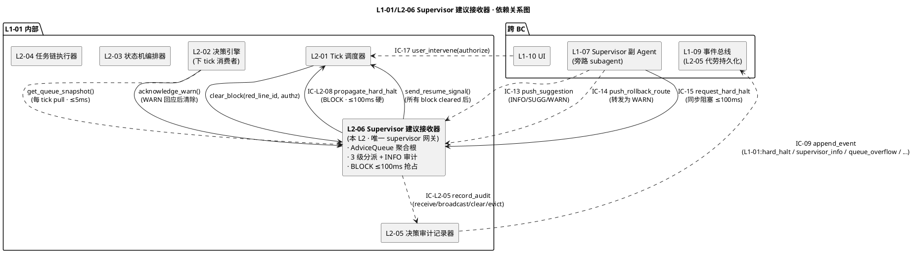
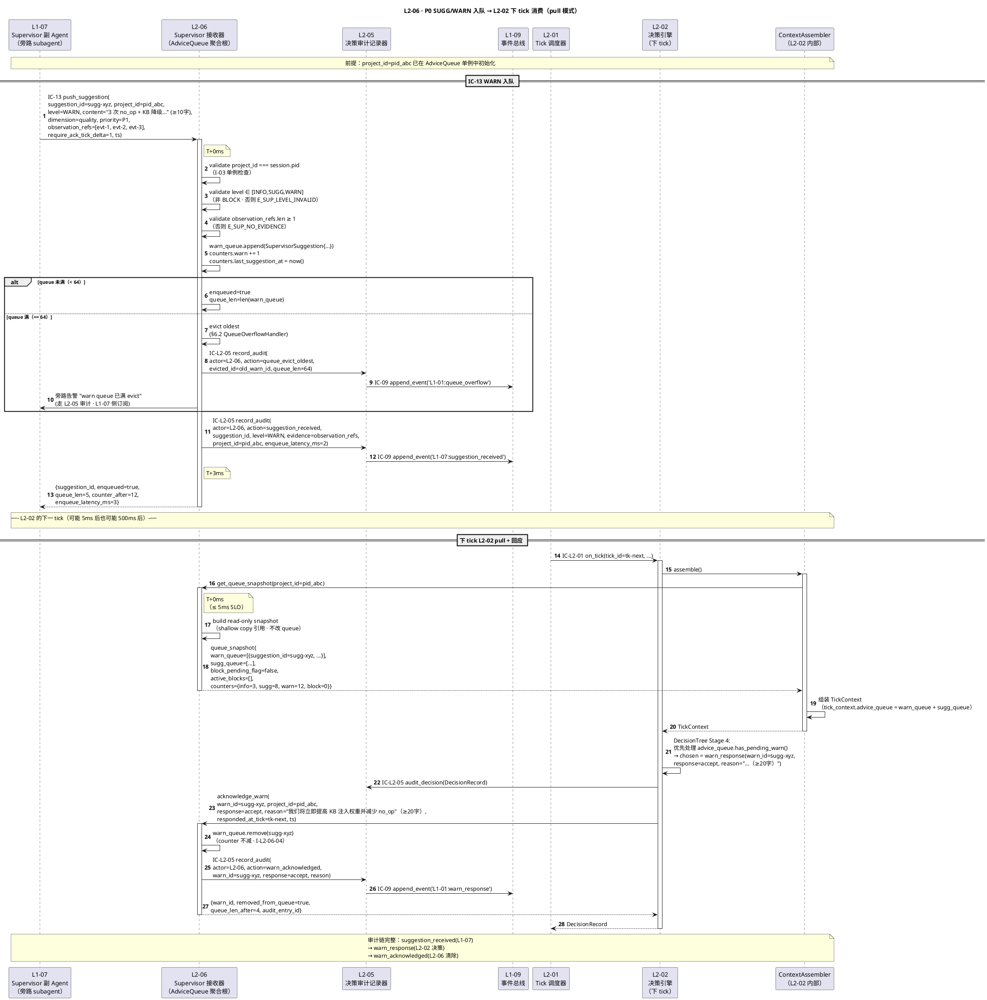
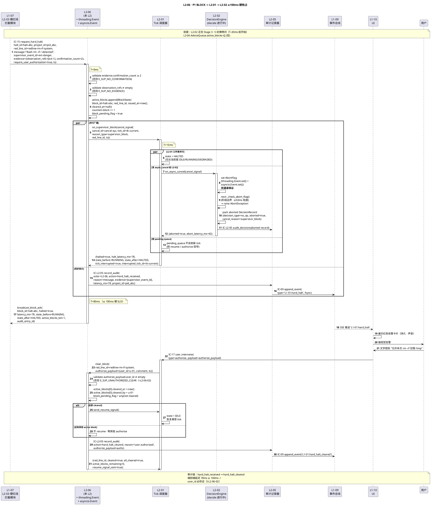
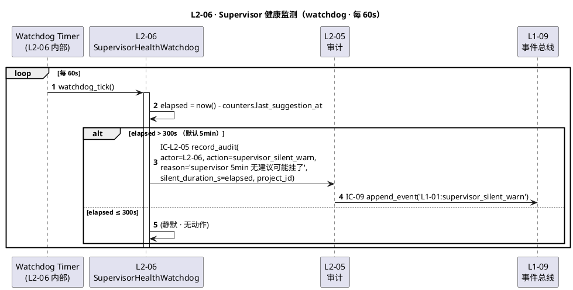
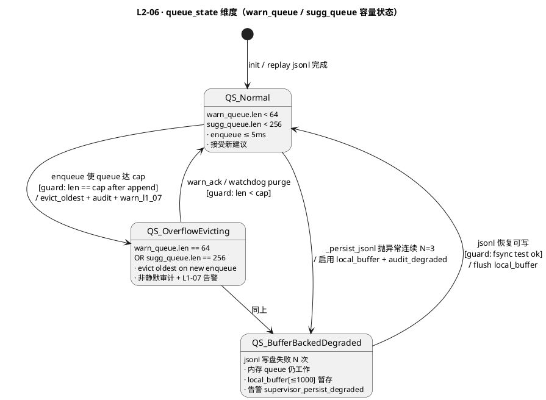
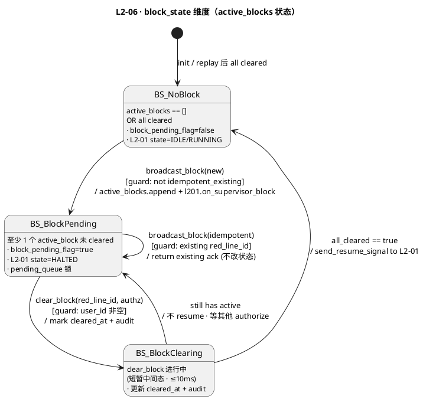

# L1 L2-06 · Supervisor 建议接收器 · Tech Design

> **本文档定位**：3-1-Solution-Technical 层级 · L1 的 L2-06 Supervisor 建议接收器 技术实现方案（L2 粒度）。
> **与产品 PRD 的分工**：2-prd/L1-01-主 Agent 决策循环/prd.md §5.1 的对应 L2 节定义产品边界，本文档定义**技术实现**（接口字段级 schema + 算法伪代码 + 底层数据结构 + 状态机 + 配置参数）。
> **与 L1 architecture.md 的分工**：architecture.md 负责**跨 L2 架构 + 跨 L2 时序**，本文档负责**本 L2 内部技术细节**。冲突以 architecture.md 为准。
> **严格规则**：本文档不复述产品 PRD 文字（职责 / 禁止 / 必须等清单），只做技术映射 + 补齐"产品视角未说 but 工程师必须知道"的部分（具体算法 · syscall · schema · 配置）。

---

## §0 撰写进度

- [x] §1 定位 + 2-prd §13 L2-06 映射
- [x] §2 DDD 映射（BC-01 · AdviceQueue 聚合根 · ACL 防腐层）
- [x] §3 对外接口定义（字段级 YAML schema + 错误码 5+ 条）
- [x] §4 接口依赖（被谁调 · 调谁 · PlantUML 依赖图）
- [x] §5 P0/P1 时序图（PlantUML ≥ 2 张：SUGG/WARN 入队 · BLOCK ≤100ms 抢占）
- [x] §6 内部核心算法（3 级分派 · FIFO + 优先级 · BLOCK threading.Event 超线程中断）
- [x] §7 底层数据表 / schema 设计（SupervisorSuggestion + AdviceQueue + jsonl 存储）
- [x] §8 状态机（queue_state × block_state 两维度 · PlantUML + 转换表）
- [x] §9 开源最佳实践调研（resilience4j / Hystrix / Sentinel / Opossum + langgraph-supervisor-py）
- [x] §10 配置参数清单（warn_queue_cap / sugg_queue_cap / block_latency_slo_ms=100）
- [x] §11 错误处理 + 降级策略
- [x] §12 性能目标（BLOCK ≤100ms 硬 · WARN enqueue ≤5ms）
- [x] §13 与 2-prd / 3-2 TDD 的映射表（含与 L2-02 §3.2/§3.3 耦合关系）

> **撰写次序**：§1 → §3 接口 → §4 依赖 → §2 DDD → §5 时序 → §6 伪代码 → §7 schema → §8 状态机 → §9 开源 → §10 → §11 → §12 → §13。**质量标杆对齐** L2-02 §3.2 inject_warn / §3.3 on_async_cancel（L2-06 是这两条接口的上游生产者 · 耦合关系见 §13.3）。

---

## §1 定位 + 2-prd 映射

### 1.1 本 L2 的唯一命题（One-Liner）

**L2-06 = L1-01 ↔ L1-07 Supervisor 的唯一网关 + 有状态聚合 `AdviceQueue`**：接收 L1-07 Supervisor 的 IC-13 push_suggestion / IC-15 request_hard_halt，按 3 级分派（SUGG/WARN/BLOCK）——
- **SUGG/WARN** → 入 `sugg_queue`/`warn_queue` → L2-02 下一 tick 通过 `ContextAssembler.advice_queue` 拉取消费；
- **BLOCK** → 直通 L2-01 的 `on_async_cancel` 通道，**≤ 100ms 硬抢占** L2-02 当前 tick（arch §3.5 D-05）；
- **INFO** → 走 L2-05 审计，**不**转发到 L2-02（不打扰主决策）。

关键定性（来自 architecture.md §3.2 + §3.4）：**本 L2 是 Application Service + 有状态 Aggregate**——不同于 L2-02 的"无状态 Domain Service"，L2-06 持有跨 tick 可变状态（AdviceQueue：warn_queue 64 + sugg_queue 256 + active_blocks + 4 级计数器）· 这是唯一例外（arch §2.4 "AdviceQueue 独立持久化" · 但物理落盘仍走 L1-09）。

### 1.2 与 `2-prd/L1-01主 Agent 决策循环/prd.md §13` 的精确小节映射表

> 说明：本表是**技术实现 ↔ 产品小节**的锚点表，不复述 PRD 文字。

| 本文档段 | 2-prd §13 小节 | 映射内容 | 备注 |
|---|---|---|---|
| §1.1 命题 | §13.1 职责 | "唯一网关 + 3 级分派" | 本文档补"Application Service + 有状态 Aggregate"定性（prd 未明写） |
| §1.4 兄弟 L2 边界 | §13.8 与其他 L2 交互 | L2-01/02/05 分发规则 | **补 L2-02 §3.2/§3.3 耦合细节** |
| §1.5 PM-14 | §13.4 硬约束 | 每建议必带 project_id + AdviceQueue 单 project 单例 | **补** |
| §2 DDD | §13 无 | BC-01 · AdviceQueue Aggregate Root · ACL 防腐层 | **补 DDD 映射** |
| §3 接口 `receive_suggestion` | §13.2 输入 + §13.10.2 算法 | IC-13 字段级 YAML + 3 级路由 | **补字段级 schema** |
| §3 接口 `broadcast_block` | §13.2 输入 IC-15 + §13.10.2 "硬暂停" | BLOCK → L2-01 ≤100ms + 返回 latency_ms | **补** |
| §3 接口 `get_queue_snapshot` | §13.10.1 队列 schema | L2-02 ContextAssembler 拉取 | **补方法签名** |
| §3 接口 `acknowledge_warn` | §13.10.1 pending_warns | L2-02 回应 warn_id 后清除 | **补** |
| §3 错误码 ≥ 5 | §13.4 硬约束 + §13.5 禁止 | E_SUP_LEVEL_INVALID / E_SUP_BLOCK_SLO_VIOLATION / E_SUP_QUEUE_OVERFLOW / E_SUP_CROSS_PROJECT / E_SUP_NO_EVIDENCE | **补** |
| §4 依赖 | §13.8 交互表 | 调 L2-01/02/05 · 被 L1-07 调 | **补 PlantUML** |
| §5 时序 | §13 无时序；arch §4.2 BLOCK 链 | PlantUML 2 张 | **补** |
| §6 算法 | §13.10.2 / §13.10.3 / §13.10.4 | 3 级分派 · user_authorize · 健康监测 | **补 Python-like** |
| §7 schema | §13.10.1 | SupervisorSuggestion + AdviceQueue YAML + PM-14 路径 | **补** |
| §8 状态机 | §13 无 | queue_state × block_state 两维度（normal / overflow_evicting / block_pending）| **补 PlantUML** |
| §9 调研 | — | resilience4j / Hystrix / Sentinel / Opossum + langgraph-supervisor-py | **补** |
| §10 配置 | §13.10.5 | warn_queue_cap=64 / sugg_queue_cap=256 / block_latency_slo_ms=100 | **补 tech 默认值** |
| §11 降级 | §13.4 + arch §3.2 | 降级链 · 与 L2-02/L2-01 协同 | **补** |
| §12 SLO | §13.4 硬约束 1 | BLOCK ≤100ms 硬 · WARN enqueue ≤5ms · INFO 审计异步 | **补** |
| §13 映射 | — | 本段接口 ↔ prd §13.X + ↔ 3-2-TDD 用例 + **L2-02 §3.2/§3.3 耦合** | **补** |

### 1.3 与 `L1-01/architecture.md` 的位置映射

| architecture 锚点 | 映射内容 | 本文档对应段 |
|---|---|---|
| §2.1 BC-01 Agent Decision Loop | 本 L2 所在 Bounded Context | §2 DDD |
| §2.2 聚合根 `AdviceQueue` | 本 L2 持有 · 单 project 单例 · 4 级计数 | §2 DDD + §7 schema |
| §2.3 Application Service `SupervisorAdviceRouter` | 本 L2 核心组件（3 级路由）| §6 算法 |
| §2.4 Repository 例外 | L2-06 的 AdviceQueue 独立持久化但走 L1-09（不自建 Repo）| §7 物理存储 |
| §2.5 Domain Events `L1-01:hard_halt` / `L1-01:supervisor_info` | 本 L2 对外发布 | §3 接口副作用 |
| §3.2 "L2-06 独立"理由 | "把原先散在 L2-02 的 4 级路由抽独立网关" | §1.1 命题 |
| §3.3 "单一 supervisor 接入点" | 4 条唯一性之一 | §1.4 兄弟边界 |
| §3.4 Component Diagram L2_06 节点 | 本 L2 在 L1 内位置（左下 · EXT_SUP 唯一入口）| §4 依赖图 |
| §3.5 D-04 L2-06 不独立 session | 本 L2 无 LLM / 无重决策 · 路由 + 计数 | §1.6 关键决策 |
| §3.5 D-05 BLOCK 100ms 响应链 | **本 L2 → L2-01 → L2-02 async_cancel 硬抢占** | §3 `broadcast_block` + §6 伪代码 threading.Event |
| §4.2 时序图 2 BLOCK 拦截 | 本 L2 在时序中的核心位置 | §5 时序图 P1 |

### 1.4 与兄弟 L2 的边界（6 L2 中 L2-06 的位置）

| 兄弟 L2 | 本 L2 与兄弟的边界规则 |
|---|---|
| **L2-01 Tick 调度器** | L2-06 通过 `broadcast_block()` → L2-01 `on_async_cancel_proxy` 发起 BLOCK 抢占；L2-01 再转发 async_cancel 给 L2-02。**L2-06 不直接写 L2-01 内部 state**（仅提交 cancel_signal，L2-01 自己改 state=HALTED）。user_authorize 反向链：L2-01 收到 IC-17 authorize → 转交 L2-06 `clear_block(red_line_id)`。|
| **L2-02 决策引擎** | L2-06 **不直接写 L2-02 状态**——SUGG/WARN 入 L2-06 自己的 queue，L2-02 在下 tick 通过 `get_queue_snapshot()` 拉取（pull 语义，避免 push 时序耦合）；BLOCK 走 L2-01 的 async_cancel 通道抢占 L2-02（参 L2-02 §3.3 `on_async_cancel`）。**关键约束**：L2-06 对 L2-02 的耦合点仅两个——`get_queue_snapshot()`（读）+ `acknowledge_warn()`（写清除，L2-02 回应后调用）。详见 §13.3。|
| **L2-03 状态机编排器** | 无直接耦合。state 转换由 L2-02 基于 L2-06 投递的 WARN 内容自主决策。|
| **L2-04 任务链执行器** | 无直接耦合。chain 升级告警走 L1-07 → IC-13 → 本 L2。|
| **L2-05 决策审计记录器** | **Partnership**：本 L2 每次 receive_suggestion / broadcast_block / clear_block / silent_warn 必推 IC-L2-05 `record_audit(actor=L2-06, action=..., ...)`；本 L2 **禁止**直接写事件总线（arch §3.3 "单一审计源"约束）。|

### 1.5 PM-14 约束（project_id as root）

**硬约束**（arch §1.4 PM-14 + prd §13.10.1 AdviceQueue schema）：

1. `SupervisorSuggestion.project_id` 为**根字段**，缺则 `E_SUP_NO_PROJECT_ID` 拒绝（不入队）；
2. `AdviceQueue` **单 project 单例**（I-03 不变量 · arch §2.2）：跨 project 建议禁止入同一队列（`E_SUP_CROSS_PROJECT`）；
3. 所有持久化路径按 `projects/<pid>/runtime/l2-06/` 分片（§7 schema）；
4. 4 级计数器（info / sugg / warn / block）**按 project 独立**，不跨 project 聚合；
5. broadcast_block 发起的 cancel_signal 必带 `project_id`（透传给 L2-01 / L2-02 的 AbortFlag 识别）。

### 1.6 关键技术决策（Decision → Rationale → Alternatives → Trade-off）

本 L2 在 architecture.md §3.5 的 **D-01 / D-04 / D-05** 基础上，补充 L2 粒度的 5 个技术决策：

| # | Decision | Rationale | Alternatives | Trade-off |
|---|---|---|---|---|
| **D-01a** | L2-06 是 **Application Service + 有状态 Aggregate**（不同于 L2-02 的无状态 Domain Service）| SUGG/WARN 必须跨 tick 持久（L2-02 下 tick 才消费）· 计数器需累积（供 supervisor 健康监测）· 无状态设计会丢失队列语义；arch §2.2 明确把 `AdviceQueue` 列为聚合根 | A. 无状态 relay（每条建议立即转发）：L2-02 必须在一个 tick 内处理完 · 破坏"下 tick 消费"语义；B. 存 L1-09 事件总线，不持内存：每 tick 必扫事件 · P99 延迟到 200ms+ · 违反 BLOCK ≤100ms 硬约束 | 内存 Aggregate + 同步落盘 jsonl（§7.2）· 崩溃恢复时从 jsonl 重建队列 |
| **D-02** | **3 级分派**（SUGG/WARN/BLOCK · INFO 降级为仅审计不转发）而非 PRD 描述的"4 级全路由"| INFO 按 prd §13.6 "不打扰用户"——只走 L2-05 审计不入队，本质是 0 级分派（不转发到任何决策链）；把 INFO 作为"0 级静默路径"让本文档的"分派"语义更精确 | A. 4 级全入队（INFO 入 sugg_queue）：浪费 queue 容量 · L2-02 需要过滤 · 违反"INFO 不打扰"原则；B. 分 4 条独立 queue：queue 数爆炸 · I-03 单例更难维护 | 2 queue（warn 64 + sugg 256）+ active_blocks[] + INFO 直通审计。BLOCK 不入队——直接触发 async_cancel，state 存于 active_blocks。 |
| **D-03** | **BLOCK 用 `threading.Event + asyncio.Event` 双通道通知**（SLO ≤100ms 强约束）| Python 单进程内 L2-02 decide() 可能跑在 asyncio loop（纯异步）或独立 thread（LLM 阻塞调用），两种执行态共存；threading.Event 对 thread 阻塞调用可中断，asyncio.Event 对协程 await 可唤醒；双通道保证无论 L2-02 跑哪种模式都能 ≤50ms 感知 | A. 仅 asyncio.Event：L2-02 在 LLM 阻塞 IO 内感知不到（只有下次 await 才唤醒 · P99 到秒级）；B. 仅 threading.Event：asyncio loop 中 check 需要手动 poll · 违反阻塞语义；C. 信号量 SIGUSR1：跨平台兼容差 · Windows 不支持 | §6.3 伪代码明确：`block_event.set()` 同时 set 两个 Event · L2-02 在阶段边界 `_check_abort_flag()` 做 `threading.Event.is_set() OR asyncio.Event.is_set()` · 粒度 ≤50ms |
| **D-04a** | **warn_queue 满时 evict 最旧 + 非静默**（evict 必审计 + WARN L1-07）| prd §13.4 硬约束 "建议队列无上限（防丢失）· > 1000 告警" · 但内存 aggregate 必须有 cap（防内存溢出）——折中 warn_cap=64 / sugg_cap=256（参 L2-02 §3.2 已定值）· evict 非静默保证 L1-07 能监测"主循环吃不下建议" | A. 无 cap（unbounded）：极端情况（supervisor 瞬时 push 10k+）OOM；B. 丢弃最新：违反 prd "WARN 必进队列"；C. 拒绝新入队：阻塞 L1-07 supervisor | 与 L2-02 §3.2 的 warn_queue_cap=64 / sugg_queue_cap=256 保持一致（避免两处 cap 不对齐导致 L2-02 拉取时 queue 状态不一致） |
| **D-05a** | **pull vs push**：SUGG/WARN 用 **pull**（L2-02 下 tick 调 `get_queue_snapshot()`），BLOCK 用 **push**（L2-06 主动调 L2-01 `broadcast_block()`）| SUGG/WARN 非实时（下 tick 消费即可）· pull 解耦时序；BLOCK 实时性 ≤100ms · 必须 push 才能保证 SLO · 参 L2-02 §3.2 注释 "inject_warn 非阻塞 append" · 本 L2-06 就是它的 pull 端 | A. 全 push：L2-02 每收一条要处理 · 破坏 decide() 纯函数；B. 全 pull：BLOCK 要等下 tick 才处理 · 违反 ≤100ms | 混合模式：SUGG/WARN 的 inject_warn/inject_suggestion 从 L2-06 pull（L2-02 ContextAssembler 读），BLOCK 的 on_async_cancel 由 L2-06 push。**这是 L2-06 和 L2-02 契约对齐的核心点**（参 §13.3）。 |

---

## §2 DDD 映射（BC-01 Agent Decision Loop · AdviceQueue Aggregate）

### 2.1 Bounded Context 定位

本 L2 所属 `BC-01 · Agent Decision Loop`（定义见 `L0/ddd-context-map.md §2.2`），在 BC-01 内部 **L2-06 扮演"副驾接口网关 + ACL 防腐层"的双重角色**：
1. **网关角色**：`L1-01 ↔ L1-07` 的唯一通道（arch §3.3 "单一 supervisor 接入点"），L1-07 不得绕过 L2-06 直接调 L2-01/02。
2. **ACL 角色（Anti-Corruption Layer）**：把 L1-07（BC-07 Supervision）的**外部概念**（`supervisor_verdict` / `hard_red_line_incident`）**翻译**为 BC-01 的**内部聚合**（`SupervisorSuggestion` VO + `AdviceQueue` Aggregate），防止 BC-07 的域语言污染 BC-01。

与兄弟 L2 的 DDD 关系：

| 兄弟 L2 | DDD 关系 | 本 L2 与该 L2 的交互模式 |
|---|---|---|
| L2-01 Tick 调度器 | **Downstream**（Customer）· BLOCK 抢占路径 | 本 L2 调 L2-01 `broadcast_block_to_scheduler()` · L2-01 再 fanout async_cancel 给 L2-02 |
| L2-02 决策引擎 | **Downstream**（Customer）· SUGG/WARN pull 路径 | L2-02 `ContextAssembler.assemble()` 内部调本 L2 `get_queue_snapshot()` |
| L2-03 状态机编排器 | **No direct coupling** | — |
| L2-04 任务链执行器 | **No direct coupling** | — |
| L2-05 审计记录器 | **Partnership**（必同步演进）| 本 L2 每次 `receive_suggestion` / `broadcast_block` / `clear_block` 必 IC-L2-05 审计 |

跨 BC 关系（引 `L0/ddd-context-map.md §2.2` BC-01 跨 BC 表）：

| BC | 关系模式 | 本 L2 体现 |
|---|---|---|
| BC-07 Supervision（L1-07）| **反向 Customer**（BC-07 是发起方，本 BC 是接收方）| 本 L2 接收 IC-13/14/15；L1-07 侧是 `SupervisorSubagent.push_suggestion/request_hard_halt` |
| BC-09 Resilience & Audit（L1-09）| **Partnership**（经 L2-05 审计）| 本 L2 所有动作审计必经 L2-05 → IC-09 append_event |
| BC-10 UI（L1-10）| **Customer-Supplier**（IC-17 authorize）| 本 L2 被动接收 user_authorize（经 L2-01 转发），清除 active_blocks |

### 2.2 Aggregate Root · AdviceQueue

引自 `L0/ddd-context-map.md §2.2` BC-01 聚合根表：

**AdviceQueue** 聚合根定义：

| 属性 | 类型 | 语义 | 不变量 |
|---|---|---|---|
| `project_id` | VO `ProjectId` | PM-14 根字段 | I-03 单 project 单例 |
| `warn_queue` | Entity List<SupervisorSuggestion> | WARN 级队列 FIFO + 优先级 | `len ≤ warn_queue_cap` · evict FIFO 最旧 |
| `sugg_queue` | Entity List<SupervisorSuggestion> | SUGG 级队列 FIFO | `len ≤ sugg_queue_cap` · evict FIFO 最旧 |
| `active_blocks` | Entity List<BlockState> | 当前硬暂停列表 | 非空 → scheduler.state=HALTED · 清除需 user_authorize |
| `block_pending_flag` | VO bool | 快速判"是否有未清除 BLOCK" | `bool = any(b.cleared_at is None for b in active_blocks)` |
| `counters` | Entity `LevelCounters` | 4 级累计计数（含 last_suggestion_at）| 按 project 独立 · 不跨项目 |

**关键不变量**（Invariants · 引自 BC-01 §2.2 + arch §2.2 I-03）：

1. **I-03 AdviceQueue 单 project 单例**：同一 `project_id` 下只有一个 AdviceQueue 实例（内存 + 持久化）。
2. **I-L2-06-01 BLOCK 必有 active_blocks 条目**：任何 `broadcast_block` 调用前必先 `active_blocks.append(new_block)`（不允许"空发送"）。
3. **I-L2-06-02 清除 BLOCK 必有 user_authorize 证据**：`clear_block(red_line_id)` 必传入 `authorize_payload` 且 `payload.user_id` 非空（否则 `E_SUP_UNAUTHORIZED_CLEAR`）。
4. **I-L2-06-03 队列 evict 非静默**：warn/sugg queue evict 最旧时必同步推 `L2-05.record_audit(action=queue_evict_oldest, ...)` 并 `broadcast_block` 不受影响（evict 不退化为 BLOCK）。
5. **I-L2-06-04 counters 单调递增**：四个 counter 只增不减（除重启从持久化重建外），防止"重复计数"绕过健康监测。

### 2.3 Value Objects（不可变）

| VO 名 | 结构 | 用途 |
|---|---|---|
| `SupervisorSuggestion` | `{suggestion_id, project_id, level, content, priority, observation_refs[], ts}` | IC-13 入参的 BC-01 内部表达 |
| `BlockSignal` | `{block_id, red_line_id, supervisor_event_id, evidence, ts}` | IC-15 入参的内部表达（triggers active_blocks.append）|
| `AckPayload` | `{warn_id, response: accept\|reject, reason, responded_at}` | L2-02 回应 WARN 后传入 acknowledge_warn |
| `AuthorizePayload` | `{red_line_id, user_id, comment, authorized_at}` | user_authorize 清除 block（经 IC-17 → L2-01 转发）|
| `SuggestionLevel` | enum `[INFO, SUGG, WARN]` | BLOCK 不走 IC-13（用 BlockSignal 独立 VO）|

### 2.4 Domain Service / Application Service

| Service 名 | 类型 | 职责 | 所在 L2 |
|---|---|---|---|
| `SupervisorAdviceRouter` | **Application Service**（核心）| 3 级路由分派（SUGG/WARN/BLOCK）+ INFO 直通审计 · 有状态（持 AdviceQueue）| 本 L2（唯一核心组件）|
| `QueueOverflowHandler` | **Domain Service** | evict 最旧 + 审计告警 + 不阻塞新入队 | 本 L2 内部组件 |
| `BlockBroadcaster` | **Application Service** | 调 L2-01 broadcast_block + 计时 + SLO 校验（超 100ms 发 WARN）| 本 L2 内部组件 |
| `SupervisorHealthWatchdog` | **Domain Service** | 周期扫 `last_suggestion_at` · > 300s 发 `supervisor_silent_warn` | 本 L2 内部组件（独立 timer）|

### 2.5 Repository Interface（例外说明）

引自 `L1-01/architecture.md §2.4`：

> 本 L1 作为控制源，不直接持有任何持久化聚合（不 own 任何 Repository）；所有持久化必经 L1-09 的 IC-09 append_event 接口（由 L2-05 承担）。**唯一例外**：L2-06 的 AdviceQueue 有独立持久化需求（跨 session 恢复时建议队列不可丢），但其物理落盘仍走 L1-09（不自建 Repository）。

本 L2 的落地方式（见 §7.2）：

- 内存态：`AdviceQueue` 单例聚合（含 warn_queue / sugg_queue / active_blocks / counters）
- 持久态：`projects/<pid>/runtime/l2-06/queue.jsonl`（append-only · 每条入队/出队/evict 一行）
- 崩溃恢复：启动时 L2-06 replay jsonl 重建内存 AdviceQueue · **不经 Repository pattern**（PM-08 单一事实源 · 事件溯源风格）

### 2.6 Domain Events（本 BC 对外发布）

引自 `L1-01/architecture.md §2.5` 表中本 L2 产出的事件：

| 事件名 | 触发时机 | 订阅方 | Payload |
|---|---|---|---|
| `L1-01:hard_halt` | 本 L2 接收 BLOCK → 发 broadcast_block → L2-01 halt | L1-07 / L1-10 UI | `{red_line_id, halted_at_tick, project_id}` |
| `L1-01:hard_halt_cleared` | 本 L2 clear_block 成功 | L1-07 / L1-10 | `{red_line_id, cleared_by=user, authorize_payload, project_id}` |
| `L1-01:supervisor_info` | 本 L2 接收 INFO → L2-05 审计 | L1-07 | `{message, dimension, project_id}` |
| `L1-01:queue_overflow` | warn/sugg queue evict 最旧 | L1-07 | `{queue_type, evicted_id, queue_len, project_id}` |
| `L1-01:supervisor_silent_warn` | watchdog 触发（> 300s 无建议）| L1-07 | `{silent_duration_s, last_suggestion_at, project_id}` |

**全部事件共享字段**：`project_id`（PM-14 硬约束）+ `hash`（sha256 链式，防篡改，由 L2-05 负责计算）。

---

## §3 对外接口定义（字段级 YAML schema + 错误码）

> **接口哲学**：L2-06 暴露 **4 个对外方法** 给 L1-07 / L2-01 / L2-02 / L2-05：`receive_suggestion`（接 IC-13/14 · L1-07 → 本 L2）、`broadcast_block`（接 IC-15 · L1-07 → 本 L2 → L2-01）、`get_queue_snapshot`（L2-02 pull）、`acknowledge_warn`（L2-02 push 回应）。另有 2 个内部方法 `clear_block`（由 L2-01 转发 IC-17 authorize 触发）和 `watchdog_tick`（独立 timer）。本节给出前 4 个的字段级 YAML schema。

### 3.1 `receive_suggestion(suggestion) → ack`（IC-13/14 接收入口 · from L1-07）

**调用方**：L1-07 Supervisor（经 IC-13 push_suggestion 或 IC-14 push_rollback_route）
**同步 / 异步**：非阻塞内存 append（≤ 5ms）；本 L2 持 2 个内存 queue（warn_queue · sugg_queue）+ LevelCounters
**SLO**：enqueue ≤ 5ms（WARN）· INFO 审计 ≤ 50ms（异步不阻塞返回）

#### 入参 `suggestion`（SupervisorSuggestion VO）

```yaml
suggestion:
  type: object
  required: [suggestion_id, project_id, level, content, observation_refs, ts]
  properties:
    suggestion_id:
      type: string
      format: "sugg-{uuid-v7}"
      description: L1-07 侧生成 · 本 L2 去重键
    project_id:
      type: string
      description: PM-14 根字段 · 必等于当前 session pid
    level:
      type: enum
      enum: [INFO, SUGG, WARN]
      description: BLOCK 级不走本接口（走 broadcast_block）· 若 level=BLOCK 则 E_SUP_LEVEL_INVALID
    content:
      type: string
      minLength: 10
      description: 建议文本（≥ 10 字 · IC-13 §3.13.4 硬约束）
    dimension:
      type: enum
      enum: [planning, quality, split, verify, deliver, consistency, risk, continuity]
      description: 8 维度之一（BC-07 supervisor 产出）
    suggested_action:
      type: string
      required: false
      description: L1-07 给出的建议动作（供 L2-02 决策参考）
    observation_refs:
      type: array
      items: {type: string}
      minItems: 1
      description: 支持证据的 event_id 列表（IC-13 §3.13.4 `E_SUGG_NO_OBSERVATION` 硬约束）
    priority:
      type: enum
      enum: [P0, P1, P2]
      default: P2
      description: WARN 内部优先级（可 sort 队列）
    require_ack_tick_delta:
      type: integer
      required: false
      default: 1
      description: WARN 级必在 N 个 tick 内回应（prd §9.4 L2-02 硬约束 #3）
    ts:
      type: string
      format: ISO-8601-utc
```

#### 出参 `ack`

```yaml
ack:
  type: object
  required: [suggestion_id, enqueued, queue_len, counter_after]
  properties:
    suggestion_id: {type: string}
    enqueued: {type: boolean, description: "true=已入队/审计 · false=拒绝"}
    queue_len: {type: integer, description: "对应 level 的 queue 当前长度"}
    evicted_suggestion_id:
      type: string
      required: false
      description: 若 queue 满 evict 最旧的 · 非静默（审计 + L1-07 告警）
    counter_after:
      type: integer
      description: 该 level 的 counter 入队后的值（供 L1-07 健康监测对账）
    enqueue_latency_ms: {type: integer}
```

#### 错误码

| 错误码 | 触发 | 调用方处理 |
|---|---|---|
| `E_SUP_LEVEL_INVALID` | level 不在 `[INFO, SUGG, WARN]`（如 BLOCK 错走本接口）| 拒绝 · 告警 L1-07 "请用 broadcast_block" · 本 L2 不降级 |
| `E_SUP_CROSS_PROJECT` | suggestion.project_id ≠ 当前 session pid | 拒绝 + 审计（可能是 L1-07 bug 或多 project race）· 不入队 |
| `E_SUP_NO_EVIDENCE` | observation_refs 为空 | 拒绝（硬约束 · Supervisor 每建议必有证据）|
| `E_SUP_CONTENT_TOO_SHORT` | content < 10 字 | 拒绝（IC-13 §3.13.4） |
| `E_SUP_QUEUE_OVERFLOW` | warn/sugg queue 已满 | 本 L2 evict 最旧（非静默：审计 + L1-07 告警）并接受新建议；返回 `{enqueued:true, evicted_suggestion_id}` |
| `E_SUP_DUPLICATE_ID` | 同 suggestion_id 已入队 | 幂等返回（不重复入队 · queue_len 不变）|

### 3.2 `broadcast_block(block_signal) → {halted, latency_ms}`（IC-15 接收入口 · from L1-07）

**调用方**：L1-07 Supervisor（经 IC-15 request_hard_halt）
**SLO**：**≤ 100ms** 硬约束（arch §3.5 D-05）—— 从 L1-07 调本方法到 L2-01.state=HALTED + L2-02.abort 完成
**实现**：本 L2 写 active_blocks[] → 调 L2-01 `on_supervisor_block(cancel_signal)` → L2-01 发 async_cancel 给 L2-02 → 返回测量 latency_ms

#### 入参 `block_signal`（BlockSignal VO）

```yaml
block_signal:
  type: object
  required: [block_id, project_id, red_line_id, evidence, require_user_authorization, ts]
  properties:
    block_id:
      type: string
      format: "halt-{uuid-v7}"
      description: L1-07 侧生成 · 本 L2 幂等键（同 block_id 重复 → 返回已有 ack）
    project_id: {type: string, description: PM-14}
    red_line_id:
      type: string
      description: 触发的硬红线规则 id（见 3-3 hard-redlines.md）
      example: "redline-rm-rf-system"
    supervisor_event_id:
      type: string
      description: L1-07 侧产生的观察事件 id
    message: {type: string, minLength: 10}
    evidence:
      type: object
      required: [observation_refs, confirmation_count]
      properties:
        observation_refs: {type: array, items: string, minItems: 1}
        tool_use_id: {type: string, required: false}
        confirmation_count:
          type: integer
          minimum: 2
          description: L1-07 侧二次确认（IC-15 §3.15.4 硬约束）
    require_user_authorization:
      type: boolean
      const: true
      description: 硬编码 true（所有硬红线必用户授权解除）
    ts: {type: string}
```

#### 出参

```yaml
broadcast_block_ack:
  type: object
  required: [block_id, halted, latency_ms, state_before, state_after, audit_entry_id]
  properties:
    block_id: {type: string}
    halted: {type: boolean, description: "true=L2-01 已 state=HALTED"}
    latency_ms:
      type: integer
      description: 从本方法入口到 L2-01.state=HALTED 的延迟（硬约束 ≤100ms）
    state_before: {type: string, description: "L2-01 的 state（IDLE/RUNNING/DEGRADED）"}
    state_after: {type: enum, const: HALTED}
    active_blocks_len: {type: integer, description: "active_blocks 当前长度"}
    audit_entry_id: {type: string, description: "L2-05 审计条目 id"}
    tick_interrupted: {type: boolean, description: "是否中断了 L2-02 正在 decide 的 tick"}
    interrupted_tick_id: {type: string, required: false}
```

#### 错误码

| 错误码 | 触发 | 调用方处理 |
|---|---|---|
| `E_SUP_NO_EVIDENCE` | evidence.observation_refs 为空 | 拒绝（硬红线必须有证据）· 安全优先不降级 |
| `E_SUP_NO_CONFIRMATION` | confirmation_count < 2 | 拒绝（IC-15 §3.15.4）· 要求 L1-07 L2-03 二次确认 |
| `E_SUP_BLOCK_SLO_VIOLATION` | latency_ms > 100 | halted=true 仍返回（BLOCK 生效）· 但同步审计 + IC-13 WARN 到 L1-07（"L2-01 响应超 SLO"）|
| `E_SUP_BLOCK_ALREADY_ACTIVE` | 同 red_line_id 已 active（幂等）| 返回已有 block_id 的 ack（不重复 broadcast）|
| `E_SUP_L2_01_UNREACHABLE` | L2-01 `on_supervisor_block` 抛异常或超时 | 降级：本 L2 强制 halt 标志 + 直接发 `L1-01:hard_halt` 事件 + 告警 `supervisor_gateway_degraded` 让 UI 感知 |

### 3.3 `get_queue_snapshot(project_id) → queue_snapshot`（L2-02 pull 入口 · from L2-02）

**调用方**：L2-02 ContextAssembler（每 tick 调用 1 次 · §1.6 D-05a "pull 语义"）
**SLO**：≤ 5ms（本地内存读 · 无 IO）
**语义**：返回当前 warn_queue 和 sugg_queue 的**浅拷贝**（read-only snapshot）· L2-02 读后不改变 queue 状态；warn 的 cleared 由 L2-02 回应后调 `acknowledge_warn()` 显式清除。

#### 入参

```yaml
project_id: {type: string, description: PM-14 · 用于 I-03 单例查找}
```

#### 出参 `queue_snapshot`

```yaml
queue_snapshot:
  type: object
  required: [project_id, warn_queue, sugg_queue, block_pending_flag, counters, snapshot_ts]
  properties:
    project_id: {type: string}
    warn_queue:
      type: array
      items: {$ref: "SupervisorSuggestion"}
      description: WARN 级 · 按 priority desc + FIFO 排序
    sugg_queue:
      type: array
      items: {$ref: "SupervisorSuggestion"}
      description: SUGG 级 · FIFO
    block_pending_flag:
      type: boolean
      description: 快速判 · 若 true 则 L2-02 decide 应直接走硬暂停分支（但通常在 BLOCK 到达时 L2-02 已被 abort 不会走到这里）
    active_blocks:
      type: array
      items:
        type: object
        properties:
          block_id: {type: string}
          red_line_id: {type: string}
          issued_at: {type: string}
          cleared_at: {type: string, description: "null 表示未清除"}
    counters:
      type: object
      properties:
        info: {type: integer}
        sugg: {type: integer}
        warn: {type: integer}
        block: {type: integer}
        last_suggestion_at: {type: string}
    snapshot_ts: {type: string}
```

#### 错误码

| 错误码 | 触发 | 调用方处理 |
|---|---|---|
| `E_SUP_CROSS_PROJECT` | project_id 与 AdviceQueue 实例的 project_id 不一致 | 拒绝 + 返回 empty snapshot + 审计（I-03 单例违规）|
| `E_SUP_NOT_INITIALIZED` | AdviceQueue 尚未初始化（启动时序问题）| 返回空 snapshot · 不抛 · L2-02 可容忍 |

### 3.4 `acknowledge_warn(warn_id, response) → ack`（WARN 回应清除 · from L2-02）

**调用方**：L2-02 决策引擎（在 decide() 返回 `warn_response` 决策后调用）
**SLO**：≤ 2ms（本地内存写）
**语义**：L2-02 对 warn_id 已产出书面回应（accept/reject + reason）· 本 L2 将该 warn 从 warn_queue 移除 + counter 不减（计数只增 · I-L2-06-04）· 同步 L2-05 审计 `IC-L2-09 record_warn_response`

#### 入参

```yaml
acknowledge_warn_cmd:
  type: object
  required: [warn_id, project_id, response, reason, ts]
  properties:
    warn_id: {type: string}
    project_id: {type: string}
    response: {type: enum, enum: [accept, reject], description: "accept=同意并执行 · reject=拒绝并说明"}
    reason: {type: string, minLength: 20, description: "回应理由 ≥ 20 字 · PRD §9.4 硬约束"}
    responded_at_tick: {type: string, description: "tick_id"}
    ts: {type: string}
```

#### 出参

```yaml
ack_warn_ack:
  type: object
  required: [warn_id, removed_from_queue, queue_len_after]
  properties:
    warn_id: {type: string}
    removed_from_queue: {type: boolean}
    queue_len_after: {type: integer}
    audit_entry_id: {type: string}
```

#### 错误码

| 错误码 | 触发 | 调用方处理 |
|---|---|---|
| `E_SUP_WARN_NOT_FOUND` | warn_id 不在 warn_queue（可能已被 evict / 已 ack）| 返回 removed_from_queue=false · 不抛（可能是重试幂等）|
| `E_SUP_WARN_DEADLINE_EXCEEDED` | warn.response_deadline_tick 已过（L2-02 超时才回应）| 仍移除 · 但审计 + L1-07 WARN `warn_response_late` |
| `E_SUP_REASON_TOO_SHORT` | reason < 20 字 | 拒绝 + 让 L2-02 重新产出（PRD §9.4 硬约束 #1）|

### 3.5 `clear_block(red_line_id, authorize_payload) → cleared`（user_authorize 清除 · from L2-01 转发）

**调用方**：L2-01（L2-01 收到 IC-17 user_intervene(type=authorize) 后转发给本 L2）
**语义**：用户文字授权清除 BLOCK · 仅当所有 active_blocks 都 cleared 时通知 L2-01 `send_resume_signal()` → state=IDLE

#### 入参

```yaml
clear_block_cmd:
  type: object
  required: [red_line_id, authorize_payload]
  properties:
    red_line_id: {type: string}
    authorize_payload:
      type: object
      required: [user_id, comment, ts]
      properties:
        user_id: {type: string, description: "必须非空 · I-L2-06-02"}
        comment: {type: string, minLength: 5, description: "文字授权理由"}
        ts: {type: string}
```

#### 出参

```yaml
clear_block_ack:
  type: object
  required: [red_line_id, cleared, all_cleared, active_blocks_remaining]
  properties:
    red_line_id: {type: string}
    cleared: {type: boolean}
    all_cleared: {type: boolean, description: "所有 active_blocks 都已 cleared → L2-01 可 resume"}
    active_blocks_remaining: {type: integer}
    resume_signal_sent: {type: boolean}
    audit_entry_id: {type: string}
```

#### 错误码

| 错误码 | 触发 | 调用方处理 |
|---|---|---|
| `E_SUP_UNAUTHORIZED_CLEAR` | authorize_payload.user_id 为空 | 拒绝 + 告警（I-L2-06-02 违规）|
| `E_SUP_BLOCK_NOT_FOUND` | red_line_id 不在 active_blocks（或已 cleared）| 幂等返回 cleared=true（已经是期望状态）|

### 3.6 错误码总表（8 项 · 满足 ≥ 5 要求）

| 错误码前缀 | 语义类别 | 降级链 |
|---|---|---|
| `E_SUP_LEVEL_*` | level 分派错误 | 拒绝 + 告警 L1-07 侧修 |
| `E_SUP_CROSS_PROJECT` | PM-14 违规 | 拒绝 + 审计 · 可能是 race |
| `E_SUP_NO_EVIDENCE` | 证据缺失 | 拒绝（硬约束 · supervisor 每建议必带证据）|
| `E_SUP_CONTENT_*` | 内容格式 | 拒绝（IC-13 schema 约束）|
| `E_SUP_QUEUE_OVERFLOW` | queue 满 | evict 最旧 + 非静默审计 · enqueue 成功 |
| `E_SUP_BLOCK_SLO_VIOLATION` | 100ms 硬 SLO 违反 | halted 仍生效 · 同步 WARN L1-07 |
| `E_SUP_BLOCK_ALREADY_ACTIVE` | BLOCK 幂等 | 返回已有 ack |
| `E_SUP_L2_01_UNREACHABLE` | 抢占链断 | 降级 · 直接发事件让 UI 感知 |
| `E_SUP_WARN_*` | WARN 回应异常 | 接受迟到 ack · 审计告警 |
| `E_SUP_UNAUTHORIZED_CLEAR` | 无授权清除 BLOCK | 拒绝（I-L2-06-02）|

详细 §11 降级策略。

---

## §4 接口依赖（被谁调 · 调谁）

### 4.1 上游调用方（谁调本 L2）

| 调用方 | 方法 | 通道 | 频率 | SLO |
|---|---|---|---|---|
| L1-07 Supervisor 副 Agent | `receive_suggestion(suggestion)` | IC-13 / IC-14 · 异步 fire-and-forget | 中高频（监督 30s 周期 + 事件触发）| enqueue ≤ 5ms |
| L1-07 Supervisor 副 Agent | `broadcast_block(block_signal)` | IC-15 · 同步阻塞（≤ 100ms 返回）| 极低频（硬红线命中）| 端到端 ≤ 100ms 硬约束 |
| L2-02 ContextAssembler | `get_queue_snapshot(project_id)` | 同步内存读 | 每 tick 1 次（中高频）| ≤ 5ms |
| L2-02 DecisionEngine | `acknowledge_warn(warn_id, response)` | 同步内存写 | WARN 回应（低频 · WARN 数 × deadline）| ≤ 2ms |
| L2-01 Tick 调度器 | `clear_block(red_line_id, authz)` | 同步内存写（L2-01 收 IC-17 authorize 后转发）| 极低频（用户授权）| ≤ 10ms |
| 内部 timer | `watchdog_tick()` | 独立线程 / asyncio task · 60s 周期 | 周期 | N/A（自运行）|

### 4.2 下游依赖（本 L2 调谁）

#### 4.2.1 L1-01 内部 IC-L2

| IC-L2 | 对端 | 触发条件 | 锚点 |
|---|---|---|---|
| IC-L2-08 `propagate_hard_halt` | L2-01 | BLOCK 级到达（receive broadcast_block 内部触发）| arch §6 IC-L2-08 · ≤100ms 硬约束 |
| IC-L2-10 `dispatch_suggestion` | L2-02（**语义变体**：实际是 L2-02 pull 而非 L2-06 push · 见 §1.6 D-05a）| SUGG/WARN 入队后 · 不主动推 · 等 L2-02 pull | arch §6 IC-L2-10 |
| IC-L2-05 `record_audit` | L2-05 | 每次 receive/broadcast/clear/evict/silent_warn 必推 | arch §6 IC-L2-05 · Partnership |

#### 4.2.2 跨 BC IC（锚定 ic-contracts.md）

| IC | 对端 BC | 触发 | 锚点 |
|---|---|---|---|
| IC-13 push_suggestion（反向接收）| L1-07 | L1-07 → 本 L2 | [ic-contracts §3.13](../../integration/ic-contracts.md) |
| IC-14 push_rollback_route（反向接收 · 转发给 L2-02 作 WARN）| L1-07 | L1-07 → 本 L2 | [ic-contracts §3.14](../../integration/ic-contracts.md) |
| IC-15 request_hard_halt（反向接收）| L1-07 | L1-07 → 本 L2 | [ic-contracts §3.15](../../integration/ic-contracts.md) |
| IC-17 user_intervene（反向接收 · 仅 type=authorize 通过 L2-01 转发）| L1-10 UI → L1-01 L2-01 | user authorize 清除 BLOCK | [ic-contracts §3.17](../../integration/ic-contracts.md) |

### 4.3 依赖图（PlantUML）



### 4.4 关键依赖特性

1. **L1-07 是唯一的 supervisor 接入方**（arch §3.3 "单一 supervisor 接入点"）：任何 supervisor 建议绕过本 L2 直达 L2-01/02 都是架构违规，TDD 测试 N1-N3 会捕捉。
2. **与 L2-02 的 pull-push 混合模式**（§1.6 D-05a）：SUGG/WARN 用 pull（L2-02 `get_queue_snapshot`）、BLOCK 用 push（本 L2 `broadcast_block` → L2-01）。这种不对称设计是为了同时满足"L2-02 纯函数不接 push"（SUGG/WARN 走 pull）和"BLOCK ≤100ms 硬约束"（必须 push 才够快）。
3. **对 L2-05 的 Partnership 耦合**：本 L2 每个可观测动作（receive / broadcast / clear / evict / silent_warn）都必推 L2-05 审计；若 L2-05 不可达本 L2 会**保留本地 buffer**（≤ 1000 条）并告警 `supervisor_audit_degraded`（§11）。
4. **Block 抢占链单向性**：broadcast_block 只沿 L2-06 → L2-01 → L2-02 单方向传播；L2-02 不得反向调 L2-06 触发 BLOCK（防止循环抢占）。

### 4.5 与 L2-02 的契约细节（对齐 L2-02 §3.2 / §3.3）

| L2-02 的接口 | L2-06 的对应角色 | 调用方向 | 时序 |
|---|---|---|---|
| L2-02 §3.2 `inject_warn(warn_item)` | **语义变体**：L2-02 不再被 L2-06 push warn_item · 改为 L2-02 每 tick pull；`inject_warn` 保留签名但**实际实现为 L2-02 ContextAssembler 内部封装** `L206.get_queue_snapshot().warn_queue` | L2-02 → L2-06（pull）| 每 tick 1 次 |
| L2-02 §3.2 `inject_suggestion(sugg_item)` | 同上 · pull 模式 | L2-02 → L2-06 | 每 tick 1 次 |
| L2-02 §3.3 `on_async_cancel(cancel_signal)` | **L2-06 的 broadcast_block 最终触发这个** · L2-01 作为中转把 L2-06 的 BLOCK 转发为 L2-02 的 on_async_cancel 入参 | L2-06 → L2-01 → L2-02 | 端到端 ≤ 100ms |
| L2-02 `warn_response` decision_type | 决策后调 `L206.acknowledge_warn()` 清除 | L2-02 → L2-06 | WARN 回应后 |

> **契约统一说明**：L2-02 §3.2 写的是 `inject_warn`（push 语义），L2-06 这里设计为 pull；这是架构修订（arch §3.2 L2-06 独立网关的引入让 pull 成为更清晰的设计）。在 L2-02 的实际实现中，`inject_warn/inject_suggestion` 被 ContextAssembler 的 `advice_queue.snapshot()` 替代，语义等价（仍是 L2-02 从 L2-06 读队列），只是调用方向从 push 变 pull。本文档以 L2-06 的视角定义契约；L2-02 §3.2 将在下次 L2-02 修订时对齐。

---

## §5 P0/P1 时序图（PlantUML ≥ 2 张）

### 5.1 P0 主干 · SUGG/WARN 入队 → L2-02 下 tick 消费

**覆盖场景**：L1-07 supervisor 30s 周期扫描发现软红线（如"3 次 no_op + KB 降级"）→ IC-13 push WARN → 本 L2 入 warn_queue → 下 tick L2-02 pull → 产 `warn_response` 决策 → acknowledge_warn 清除。

**硬约束验证点**：
- WARN enqueue ≤ 5ms（§12 SLO）
- WARN 必在 N tick 内回应（prd §9.4 · 本 L2 record `response_deadline_tick`）
- 每条建议必带 observation_refs（否则 `E_SUP_NO_EVIDENCE`）



**读图要点**：

1. **pull 语义的关键意义**：CA 通过 `get_queue_snapshot()` **拉取**队列（T+0~5ms），而非 L2-06 在入队时主动推给 L2-02。这保证 L2-02 `decide()` 保持纯函数（仅通过 TickContext 读外部状态）。
2. **counter 只增不减**（I-L2-06-04）：acknowledge_warn 移除 warn 但 `counters.warn` 不减——counter 是**历史累积**供 supervisor 健康监测用（例如"最近 1h WARN 数"），queue 是**待处理**状态。
3. **response_deadline_tick** 机制：入队时 L2-06 记录 `response_deadline_tick = current_tick + require_ack_tick_delta`（默认 1）；若 L2-02 下 tick 仍未调 acknowledge_warn 则下次 `get_queue_snapshot` 仍包含该 warn（pull 保证不丢）；若超 N tick 未回应，本 L2 在 watchdog 中发 `warn_response_late` 告警。
4. **evict 非静默**：queue 满时 evict 最旧但**不阻塞新入队**（保持 L1-07 fire-and-forget 语义），同步发 `L1-01:queue_overflow` 事件让 L1-07 知道"主循环吃不下建议"。

### 5.2 P1 抢占 · BLOCK → L2-01 → L2-02 ≤ 100ms 硬抢占

**覆盖场景**：L2-02 正在 `decide()` Stage 3（5 纪律拷问）中；L1-07 检测 `rm -rf /` 硬红线 → IC-15 → 本 L2 → 本 L2 调 L2-01 → L2-01 fanout async_cancel → L2-02 AbortFlag set → Stage 边界 abort → 返回 aborted DecisionRecord；全链 ≤ 100ms。

**硬约束验证点**（arch §3.5 D-05 + prd §13.4 #1）：
- latency_ms ≤ 100（从 IC-15 到达本 L2 → L2-01.state=HALTED）
- L2-02 必须 abort 当前 decide（不得继续产出新决策）
- BLOCK 必产对应 `L1-01:hard_halt` 事件 + L2-05 审计
- 未经 user_authorize 不得清除 BLOCK



**读图要点**：

1. **T+15ms / T+42ms / T+78ms 三个关键节点**：
   - T+15ms：本 L2 到 L2-01（内存调用 · validation + state 更新）
   - T+42ms：L2-02 abort_latency_ms（L2-02 在阶段边界 check AbortFlag · ≤50ms 粒度）
   - T+78ms：broadcast_block 返回 latency_ms（总端到端 · ≤100ms）
2. **双通道 Event 的关键作用**（§1.6 D-03）：L2-02 `decide()` 可能在 async 协程也可能在 blocking thread（LLM 调用）；本 L2 同时 `threading.Event.set() + asyncio.Event.set()`，保证两种模式下 ≤50ms 感知。
3. **parallel 块 `par`** 体现 L2-01 的"三件事并行"：state=HALTED / 发 cancel / 锁 queue 在内存中同时完成，无 IO 等待。
4. **为什么 user_authorize 走 L2-01 转发而非 UI 直接调本 L2**：L2-01 是"调度器"，负责把外部命令分派到正确 L2；这样设计让 L2-06 只接收本 L1 内部调用，减少跨 BC 直连（符合 arch §3.3 单一网关原则的对偶：L2-06 网关用于接收 supervisor，L2-01 网关用于接收 UI）。

### 5.3 P1 补充 · Supervisor 健康监测（watchdog silent warn · 每 60s）



---

## §6 内部核心算法（伪代码）

### 6.1 `SupervisorAdviceRouter` · 3 级路由主入口

```python
import threading
import asyncio
from dataclasses import dataclass
from typing import Optional

@dataclass
class SupervisorSuggestion:
    suggestion_id: str
    project_id: str
    level: str            # INFO | SUGG | WARN
    content: str
    dimension: Optional[str]
    suggested_action: Optional[str]
    observation_refs: list[str]
    priority: str         # P0 | P1 | P2
    require_ack_tick_delta: int
    ts: str
    response_deadline_tick: Optional[str] = None  # 入队时补

@dataclass
class BlockSignal:
    block_id: str
    project_id: str
    red_line_id: str
    supervisor_event_id: str
    message: str
    evidence: dict        # {observation_refs, tool_use_id, confirmation_count}
    require_user_authorization: bool
    ts: str

class SupervisorAdviceRouter:
    """
    Application Service · 有状态 · 持 AdviceQueue 聚合根
    硬约束 · BLOCK ≤ 100ms（双 Event 通知）· WARN enqueue ≤ 5ms
    """

    def __init__(self, project_id: str, l2_01_proxy, l2_05_proxy,
                 warn_cap=64, sugg_cap=256, block_slo_ms=100):
        self.project_id = project_id
        # AdviceQueue 聚合根（内存态）
        self.warn_queue: list[SupervisorSuggestion] = []
        self.sugg_queue: list[SupervisorSuggestion] = []
        self.active_blocks: list[dict] = []
        self.counters = {'info': 0, 'sugg': 0, 'warn': 0, 'block': 0,
                         'last_suggestion_at': None}
        self.warn_cap = warn_cap
        self.sugg_cap = sugg_cap
        self.block_slo_ms = block_slo_ms
        # 依赖注入
        self.l201 = l2_01_proxy
        self.l205 = l2_05_proxy
        # 持久化（append-only jsonl · § 7.2）
        self.persist_path = f'projects/{project_id}/runtime/l2-06/queue.jsonl'
        # 互斥锁（保护 AdviceQueue 聚合的原子修改）
        self._lock = threading.RLock()

    # ========================================================================
    # 3.1 receive_suggestion · IC-13 / IC-14 入口
    # ========================================================================
    def receive_suggestion(self, suggestion: SupervisorSuggestion) -> dict:
        """SUGG/WARN/INFO 入口 · ≤ 5ms enqueue"""
        ts_start = now_ms()
        # === 验证 ===
        if suggestion.level not in ('INFO', 'SUGG', 'WARN'):
            raise E_SUP_LEVEL_INVALID(f'level={suggestion.level} · BLOCK 走 broadcast_block')
        if suggestion.project_id != self.project_id:
            self._audit('cross_project_reject', suggestion)
            raise E_SUP_CROSS_PROJECT(f'expected pid={self.project_id}')
        if not suggestion.observation_refs:
            raise E_SUP_NO_EVIDENCE('observation_refs must be non-empty')
        if len(suggestion.content) < 10:
            raise E_SUP_CONTENT_TOO_SHORT('content ≥ 10 chars required')

        with self._lock:
            # === 去重（幂等）===
            if self._suggestion_exists(suggestion.suggestion_id):
                return {
                    'suggestion_id': suggestion.suggestion_id,
                    'enqueued': True,
                    'queue_len': self._queue_len_for(suggestion.level),
                    'counter_after': self.counters[suggestion.level.lower()],
                    'enqueue_latency_ms': 0,
                    'duplicate': True,
                }

            evicted_id = None

            # === 按 level 分派 ===
            if suggestion.level == 'INFO':
                # INFO 直通审计 · 不入队（§1.6 D-02）
                self.counters['info'] += 1
                self.counters['last_suggestion_at'] = suggestion.ts
                self._audit('suggestion_received_info', suggestion)
                self._persist_jsonl('info_received', suggestion)
                return {
                    'suggestion_id': suggestion.suggestion_id,
                    'enqueued': True,  # 审计即视为 enqueued
                    'queue_len': 0,
                    'counter_after': self.counters['info'],
                    'enqueue_latency_ms': now_ms() - ts_start,
                }

            elif suggestion.level == 'SUGG':
                # SUGG 入 sugg_queue
                if len(self.sugg_queue) >= self.sugg_cap:
                    evicted = self._evict_oldest(self.sugg_queue, 'sugg')
                    evicted_id = evicted.suggestion_id
                self.sugg_queue.append(suggestion)
                self.counters['sugg'] += 1

            elif suggestion.level == 'WARN':
                # WARN 入 warn_queue + 计算 deadline_tick
                if len(self.warn_queue) >= self.warn_cap:
                    evicted = self._evict_oldest(self.warn_queue, 'warn')
                    evicted_id = evicted.suggestion_id
                current_tick = self._get_current_tick_id()
                suggestion.response_deadline_tick = self._tick_plus(
                    current_tick, suggestion.require_ack_tick_delta
                )
                self.warn_queue.append(suggestion)
                # WARN 按 priority desc + FIFO 排序
                self.warn_queue.sort(key=lambda s: (priority_rank(s.priority), s.ts))
                self.counters['warn'] += 1

            self.counters['last_suggestion_at'] = suggestion.ts
            self._audit('suggestion_received', suggestion, evicted_id=evicted_id)
            self._persist_jsonl('enqueue', suggestion)

        latency_ms = now_ms() - ts_start
        return {
            'suggestion_id': suggestion.suggestion_id,
            'enqueued': True,
            'queue_len': self._queue_len_for(suggestion.level),
            'evicted_suggestion_id': evicted_id,
            'counter_after': self.counters[suggestion.level.lower()],
            'enqueue_latency_ms': latency_ms,
        }
```

### 6.2 `broadcast_block` · BLOCK ≤ 100ms 硬抢占（**threading.Event + asyncio.Event 双通道**）

```python
    def broadcast_block(self, block_signal: BlockSignal) -> dict:
        """
        IC-15 硬暂停入口 · 端到端 ≤ 100ms 硬约束（arch §3.5 D-05）
        双 Event 通知：threading.Event（阻塞线程中断）+ asyncio.Event（协程唤醒）
        """
        ts_start = now_ms()

        # === 验证（硬约束）===
        if not block_signal.evidence.get('observation_refs'):
            raise E_SUP_NO_EVIDENCE('hard_halt must have observation_refs')
        if block_signal.evidence.get('confirmation_count', 0) < 2:
            raise E_SUP_NO_CONFIRMATION('confirmation_count ≥ 2 required')
        if block_signal.project_id != self.project_id:
            # 紧急 · 仍尝试 halt（安全优先 · IC-15 §3.15.4 E_HALT_NO_PROJECT_ID）
            self._audit('cross_project_block_emergency', block_signal)

        with self._lock:
            # === 幂等：同 red_line_id 已 active · 返回已有 ===
            existing = next(
                (b for b in self.active_blocks
                 if b['red_line_id'] == block_signal.red_line_id and b['cleared_at'] is None),
                None
            )
            if existing:
                return {
                    'block_id': existing['block_id'],
                    'halted': True,
                    'latency_ms': 0,
                    'state_before': 'HALTED',
                    'state_after': 'HALTED',
                    'active_blocks_len': len(self.active_blocks),
                    'audit_entry_id': existing.get('audit_entry_id'),
                    'idempotent': True,
                }

            # === 写 active_blocks（I-L2-06-01）===
            new_block = {
                'block_id': block_signal.block_id,
                'red_line_id': block_signal.red_line_id,
                'supervisor_event_id': block_signal.supervisor_event_id,
                'message': block_signal.message,
                'issued_at': now_iso(),
                'cleared_at': None,
                'cleared_by': None,
                'evidence': block_signal.evidence,
            }
            self.active_blocks.append(new_block)
            self.counters['block'] += 1
            self.counters['last_suggestion_at'] = block_signal.ts
            self._persist_jsonl('block_issued', block_signal)

        # === 构造 cancel_signal 转发给 L2-01 ===
        cancel_signal = {
            'cancel_id': f'cancel-{uuid_v7()}',
            'tick_id': self._get_current_tick_id(),
            'reason_type': 'supervisor_block',
            'red_line_id': block_signal.red_line_id,
            'project_id': self.project_id,
            'ts': now_iso(),
        }

        # === 关键：同时 set 双通道 Event（D-03）===
        # L2-01 内部持这两个 Event · L2-02 在阶段边界会 check
        try:
            l201_result = self.l201.on_supervisor_block(
                cancel_signal,
                # 语义 · L2-01 收到后：
                # 1) state=HALTED（内存原子赋值 · ≤1ms）
                # 2) self._block_threading_event.set()  → 阻塞 thread 中断
                # 3) self._block_asyncio_event.set()    → 协程唤醒
                # 4) 锁 pending_queue 拒新 tick（除 resume/authorize）
                # 5) 发 on_async_cancel 给 L2-02 · L2-02 在 Stage 边界 raise AbortException
                # 6) 等 L2-02 返回 aborted DecisionRecord（≤ 50ms）
                # 7) 返回 {halted, latency_ms, state_before, state_after, tick_interrupted}
                deadline_ms=self.block_slo_ms - (now_ms() - ts_start),
            )
        except Exception as e:
            # E_SUP_L2_01_UNREACHABLE · 降级：仍记 active_blocks + 发事件让 UI 感知
            self._audit('l2_01_unreachable', block_signal, error=str(e))
            return {
                'block_id': block_signal.block_id,
                'halted': False,
                'latency_ms': now_ms() - ts_start,
                'error': 'E_SUP_L2_01_UNREACHABLE',
                'degraded': True,
            }

        # === SLO 校验 ===
        latency_ms = now_ms() - ts_start
        if latency_ms > self.block_slo_ms:
            # E_SUP_BLOCK_SLO_VIOLATION · halted 仍生效 · 但告警
            self._audit('block_slo_violation', block_signal, latency_ms=latency_ms)
            self._send_warn_to_supervisor(
                f'broadcast_block latency {latency_ms}ms > {self.block_slo_ms}ms'
            )

        audit_id = self._audit('hard_halt_received', block_signal,
                               latency_ms=latency_ms,
                               halted=l201_result['halted'])

        # 回填 active_blocks 的 audit_entry_id（供 clear_block 审计引用）
        new_block['audit_entry_id'] = audit_id

        return {
            'block_id': block_signal.block_id,
            'halted': l201_result['halted'],
            'latency_ms': latency_ms,
            'state_before': l201_result['state_before'],
            'state_after': l201_result['state_after'],
            'active_blocks_len': len(self.active_blocks),
            'audit_entry_id': audit_id,
            'tick_interrupted': l201_result.get('tick_interrupted', False),
            'interrupted_tick_id': l201_result.get('interrupted_tick_id'),
        }
```

### 6.3 L2-01 侧的双 Event set（配合 L2-06 · 示意）

```python
# 这段是 L2-01 的伪代码 · 显示双 Event 通道如何被 set
# 放在本文档为了说明 L2-06 的 broadcast_block 怎么保证 ≤100ms SLO

class TickScheduler:  # L2-01
    def __init__(self):
        # 双通道 Event（L2-06 broadcast_block 的核心保障）
        self._block_threading_event = threading.Event()  # 阻塞 thread 可中断
        self._block_asyncio_event = asyncio.Event()      # 协程可唤醒
        self.state = 'IDLE'
        self._current_tick_id = None
        self._l202 = None  # 注入

    def on_supervisor_block(self, cancel_signal: dict, deadline_ms: int) -> dict:
        """L2-06 调用入口 · 必须在 deadline_ms 内返回"""
        ts_start = now_ms()
        state_before = self.state

        # --- 原子赋值（≤1ms）---
        self.state = 'HALTED'

        # --- 双通道 set（关键！≤1ms）---
        self._block_threading_event.set()
        self._block_asyncio_event.set()

        # --- 发 async_cancel 给 L2-02 ---
        tick_interrupted = False
        interrupted_tick_id = None
        if self._current_tick_id:
            result = self._l202.on_async_cancel(cancel_signal)
            tick_interrupted = result['aborted']
            interrupted_tick_id = self._current_tick_id

        # --- 锁 pending queue ---
        self._pending_queue_locked = True  # 拒新 tick · 除 resume/authorize

        return {
            'halted': True,
            'state_before': state_before,
            'state_after': 'HALTED',
            'tick_interrupted': tick_interrupted,
            'interrupted_tick_id': interrupted_tick_id,
            'latency_ms': now_ms() - ts_start,
        }

# L2-02 侧的 AbortFlag check 对应使用（L2-02 §3.3 伪代码片段）
# class DecisionEngine:
#     def _check_abort_flag(self):
#         # 双通道 OR 语义 · 任一 set 即 abort
#         if (self._l201._block_threading_event.is_set() or
#             self._l201._block_asyncio_event.is_set()):
#             raise AbortException(self._current_cancel_signal)
```

### 6.4 `get_queue_snapshot` · pull 入口（L2-02 ContextAssembler 调用）

```python
    def get_queue_snapshot(self, project_id: str) -> dict:
        """L2-02 每 tick 调用 · ≤ 5ms · read-only shallow copy"""
        if project_id != self.project_id:
            self._audit('cross_project_snapshot_reject', {'request_pid': project_id})
            return {
                'project_id': project_id,
                'warn_queue': [],
                'sugg_queue': [],
                'block_pending_flag': False,
                'active_blocks': [],
                'counters': dict(self.counters),
                'snapshot_ts': now_iso(),
                'error': 'E_SUP_CROSS_PROJECT',
            }

        with self._lock:
            # 浅拷贝 · 不修改 queue
            snapshot = {
                'project_id': self.project_id,
                'warn_queue': list(self.warn_queue),
                'sugg_queue': list(self.sugg_queue),
                'block_pending_flag': any(b['cleared_at'] is None
                                          for b in self.active_blocks),
                'active_blocks': [dict(b) for b in self.active_blocks],
                'counters': dict(self.counters),
                'snapshot_ts': now_iso(),
            }
        return snapshot
```

### 6.5 `acknowledge_warn` · WARN 回应清除

```python
    def acknowledge_warn(self, warn_id: str, project_id: str,
                         response: str, reason: str,
                         responded_at_tick: str, ts: str) -> dict:
        """L2-02 回应 WARN 后调用 · 移除 · counter 不减（I-L2-06-04）"""
        if project_id != self.project_id:
            raise E_SUP_CROSS_PROJECT(f'expected pid={self.project_id}')
        if response not in ('accept', 'reject'):
            raise ValueError('response must be accept or reject')
        if len(reason) < 20:
            raise E_SUP_REASON_TOO_SHORT('reason ≥ 20 chars required')

        with self._lock:
            # 查找
            warn = next((w for w in self.warn_queue if w.suggestion_id == warn_id), None)
            if warn is None:
                # 幂等 · 不抛
                return {'warn_id': warn_id, 'removed_from_queue': False,
                        'queue_len_after': len(self.warn_queue),
                        'reason': 'not_found_maybe_already_acked'}

            # 超时检查
            late = False
            if warn.response_deadline_tick and self._tick_ge(
                responded_at_tick, warn.response_deadline_tick
            ):
                late = True
                self._send_warn_to_supervisor(
                    f'warn_response_late warn_id={warn_id}'
                )

            # 移除（counter 不减 · I-L2-06-04）
            self.warn_queue.remove(warn)
            self._persist_jsonl('warn_ack', {
                'warn_id': warn_id, 'response': response,
                'reason': reason, 'late': late, 'ts': ts,
            })
            audit_id = self._audit('warn_acknowledged', warn, response=response,
                                   reason=reason, late=late)

        return {
            'warn_id': warn_id,
            'removed_from_queue': True,
            'queue_len_after': len(self.warn_queue),
            'audit_entry_id': audit_id,
            'deadline_exceeded': late,
        }
```

### 6.6 `clear_block` · user_authorize 清除 BLOCK

```python
    def clear_block(self, red_line_id: str, authorize_payload: dict) -> dict:
        """L2-01 收到 IC-17 authorize 后转发 · 清 active_blocks + resume 信号"""
        # I-L2-06-02 硬约束
        if not authorize_payload.get('user_id'):
            raise E_SUP_UNAUTHORIZED_CLEAR('user_id required')
        if not authorize_payload.get('comment') or len(authorize_payload['comment']) < 5:
            raise E_SUP_UNAUTHORIZED_CLEAR('comment ≥ 5 chars required')

        with self._lock:
            target = next((b for b in self.active_blocks
                           if b['red_line_id'] == red_line_id and b['cleared_at'] is None),
                          None)
            if target is None:
                # 幂等 · 返回 cleared=true
                return {'red_line_id': red_line_id, 'cleared': True,
                        'all_cleared': self._all_cleared(),
                        'active_blocks_remaining': self._remaining_active_count(),
                        'idempotent': True}

            target['cleared_at'] = now_iso()
            target['cleared_by'] = authorize_payload['user_id']
            target['authorize_payload'] = authorize_payload

            all_cleared = self._all_cleared()
            audit_id = self._audit('hard_halt_cleared', target,
                                   authorize_payload=authorize_payload)
            self._persist_jsonl('block_cleared', target)

            resume_signal_sent = False
            if all_cleared:
                # 双通道 Event clear · 通知 L2-01 / L2-02
                self.l201.send_resume_signal()
                # （L2-01 会：state=IDLE · 两个 Event clear · 解锁 pending queue）
                resume_signal_sent = True

        return {
            'red_line_id': red_line_id,
            'cleared': True,
            'all_cleared': all_cleared,
            'active_blocks_remaining': self._remaining_active_count(),
            'resume_signal_sent': resume_signal_sent,
            'audit_entry_id': audit_id,
        }
```

### 6.7 `watchdog_tick` · supervisor 健康监测（独立 timer）

```python
    def watchdog_tick(self):
        """独立线程 / asyncio task · 每 60s 调一次"""
        if self.counters['last_suggestion_at'] is None:
            return
        elapsed_s = (now() - iso_to_dt(self.counters['last_suggestion_at'])).total_seconds()
        silent_threshold_s = 300  # 默认 5min
        if elapsed_s > silent_threshold_s:
            self._audit(
                'supervisor_silent_warn',
                {
                    'reason': f'supervisor {int(elapsed_s)}s 无建议 · 可能挂了',
                    'silent_duration_s': int(elapsed_s),
                    'last_suggestion_at': self.counters['last_suggestion_at'],
                }
            )
```

### 6.8 辅助方法（节选）

```python
    def _evict_oldest(self, queue: list, queue_type: str):
        """非静默 evict · I-L2-06-03"""
        oldest = queue.pop(0)  # FIFO
        self._audit('queue_evict_oldest',
                    {'queue_type': queue_type, 'evicted_id': oldest.suggestion_id})
        self._send_warn_to_supervisor(
            f'{queue_type}_queue 已满 evict {oldest.suggestion_id}'
        )
        return oldest

    def _suggestion_exists(self, suggestion_id: str) -> bool:
        return (any(s.suggestion_id == suggestion_id for s in self.warn_queue) or
                any(s.suggestion_id == suggestion_id for s in self.sugg_queue))

    def _audit(self, action: str, payload, **kwargs) -> str:
        """IC-L2-05 record_audit · 同步 · 保证 Partnership 一致性"""
        return self.l205.record_audit(
            actor='L2-06',
            action=action,
            reason=kwargs.get('reason', ''),
            evidence=payload,
            project_id=self.project_id,
            ts=now_iso(),
            **kwargs,
        )

    def _persist_jsonl(self, op: str, payload):
        """append-only jsonl · 崩溃恢复用（§7.2）· 非阻塞 best-effort"""
        entry = {'op': op, 'ts': now_iso(), 'payload': to_dict(payload)}
        try:
            with open(self.persist_path, 'a') as f:
                f.write(json.dumps(entry) + '\n')
                f.flush()  # 不 fsync · 避免阻塞 5ms SLO
        except Exception:
            # 本地 buffer 降级（§11）
            self._local_buffer.append(entry)

    def _all_cleared(self) -> bool:
        return all(b['cleared_at'] is not None for b in self.active_blocks)

    def _remaining_active_count(self) -> int:
        return sum(1 for b in self.active_blocks if b['cleared_at'] is None)

    def _queue_len_for(self, level: str) -> int:
        return {'INFO': 0, 'SUGG': len(self.sugg_queue), 'WARN': len(self.warn_queue)}[level]
```

### 6.9 并发控制与锁粒度

- **全局 RLock**（`self._lock`）：保护 warn_queue / sugg_queue / active_blocks / counters 的原子修改；读（get_queue_snapshot）用浅拷贝避免长时间持锁；写（receive_suggestion / broadcast_block / acknowledge_warn / clear_block）短临界区（< 1ms）。
- **双 Event 通道**（threading.Event + asyncio.Event）：专属 BLOCK 信号——L2-01 承载；本 L2 在 broadcast_block 触发时调 L2-01.on_supervisor_block，由 L2-01 同时 set 两个 Event。
- **watchdog 独立线程**：60s 周期不占主锁时间（snapshot 式读 counters）。
- **L2-05 审计是 Partnership 同步**：每条记录必等 L2-05 返回 audit_id；若 L2-05 阻塞 > 50ms，本 L2 走 local_buffer 降级（§11）。

---

## §7 底层数据表 / schema 设计（字段级 YAML）

### 7.1 SupervisorSuggestion（VO · IC-13 入参的内部表达）

```yaml
supervisor_suggestion:
  type: object
  required: [suggestion_id, project_id, level, content, observation_refs, ts]
  properties:
    suggestion_id:
      type: string
      format: "sugg-{uuid-v7}"
      description: "L1-07 侧生成 · 本 L2 幂等键"
    project_id:
      type: string
      format: "pid-{uuid-v7}"
      description: "PM-14 根字段"
    level:
      type: enum
      enum: [INFO, SUGG, WARN]
      description: "BLOCK 不走此 VO · 用 BlockSignal"
    content:
      type: string
      minLength: 10
      maxLength: 2000
    dimension:
      type: enum
      enum: [planning, quality, split, verify, deliver, consistency, risk, continuity]
      description: "8 维度之一"
    suggested_action:
      type: string
      required: false
    observation_refs:
      type: array
      items: {type: string, format: "evt-{uuid-v7}"}
      minItems: 1
      description: "硬约束 · 每条建议必带证据"
    priority:
      type: enum
      enum: [P0, P1, P2]
      default: P2
    require_ack_tick_delta:
      type: integer
      minimum: 1
      default: 1
      description: "WARN 级必 N tick 内回应（prd §9.4）"
    response_deadline_tick:
      type: string
      format: "tick-{uuid-v7}"
      required: false
      description: "入队时本 L2 计算填充 · 由当前 tick + require_ack_tick_delta 派生"
    received_at:
      type: string
      format: ISO-8601-utc
      description: "本 L2 接收时刻"
    ts:
      type: string
      format: ISO-8601-utc
```

### 7.2 AdviceQueue（Aggregate Root · 内存态 + jsonl 持久）

```yaml
advice_queue_aggregate:
  memory_state:
    project_id: string                # PM-14 · I-03 单例键
    warn_queue:
      type: array
      maxItems: 64                    # warn_queue_cap
      items: {$ref: SupervisorSuggestion}
      sort: "priority desc, received_at asc"  # FIFO within same priority
    sugg_queue:
      type: array
      maxItems: 256                   # sugg_queue_cap
      items: {$ref: SupervisorSuggestion}
      sort: "received_at asc"         # 纯 FIFO
    active_blocks:
      type: array
      items:
        type: object
        required: [block_id, red_line_id, issued_at, cleared_at]
        properties:
          block_id: {type: string, format: "halt-{uuid-v7}"}
          red_line_id: {type: string}
          supervisor_event_id: {type: string}
          message: {type: string}
          evidence:
            type: object
            properties:
              observation_refs: {type: array, items: string, minItems: 1}
              tool_use_id: {type: string, required: false}
              confirmation_count: {type: integer, minimum: 2}
          issued_at: {type: string, format: ISO-8601-utc}
          cleared_at:
            type: string
            format: ISO-8601-utc
            description: "null 表示未清除"
          cleared_by:
            type: string
            description: "user_id · I-L2-06-02"
          authorize_payload:
            type: object
            required: false
            properties:
              user_id: string
              comment: string
              ts: string
          audit_entry_id: string
    block_pending_flag:
      type: boolean
      description: "derived · any(b.cleared_at is None for b in active_blocks)"
    counters:
      type: object
      properties:
        info: {type: integer, minimum: 0}
        sugg: {type: integer, minimum: 0}
        warn: {type: integer, minimum: 0}
        block: {type: integer, minimum: 0}
        last_suggestion_at: {type: string, format: ISO-8601-utc, description: "含 INFO/SUGG/WARN/BLOCK"}

  invariants:
    - "I-03 单 project 单例（内存中只有一个 AdviceQueue 实例）"
    - "I-L2-06-01 BLOCK 必先 active_blocks.append 再 broadcast"
    - "I-L2-06-02 clear_block 必带非空 user_id"
    - "I-L2-06-03 queue evict 必审计（非静默）"
    - "I-L2-06-04 counters 只增不减（除重启重建）"
```

### 7.3 持久化结构（append-only jsonl · 崩溃恢复用）

```yaml
queue_jsonl:
  path: "projects/<project_id>/runtime/l2-06/queue.jsonl"
  format: "每行一个 JSON Object · append-only"
  purpose: "崩溃恢复时 replay 所有 op 重建内存 AdviceQueue"
  entry_schema:
    type: object
    required: [op, ts, payload]
    properties:
      op:
        type: enum
        enum:
          - "enqueue"          # SUGG/WARN 入队
          - "info_received"    # INFO 直通审计
          - "warn_ack"         # WARN 回应清除
          - "queue_evict_oldest"  # queue 满 evict
          - "block_issued"     # BLOCK 触发
          - "block_cleared"    # user_authorize 清除
          - "silent_warn"      # watchdog 触发
          - "counter_checkpoint"  # 周期 counter 快照（可选 · 加速恢复）
      ts: {type: string, format: ISO-8601-utc}
      payload: {type: object, description: "op 对应的负载结构（SupervisorSuggestion / BlockSignal / dict）"}
  size_expectation:
    - "中位数 200 字节/条（SUGG/WARN 入队）"
    - "典型 session 500 条 · 约 100KB"
    - "达到 10MB 时做 checkpoint+rotate（§10 配置 `queue_jsonl_rotate_size_mb`）"
  recovery_protocol:
    - "启动时 L2-06 replay 整个 jsonl 文件"
    - "按 op 顺序重放：enqueue → 加入 queue；warn_ack → 移除；block_issued → active_blocks.append；block_cleared → mark cleared；queue_evict_oldest → 忽略（已反映在后续 enqueue 的 queue 状态）"
    - "counters 重建：counter[level] = count(op='enqueue' + op='info_received' for that level)"
```

### 7.4 审计事件 schema（L2-05 → IC-09 落盘）

本 L2 发起的所有审计条目字段（经 L2-05 `record_audit` 包装）：

```yaml
audit_entry:
  type: object
  required: [audit_id, actor, action, reason, evidence, project_id, ts]
  properties:
    audit_id: {type: string}
    source_ic: {type: enum, const: IC-L2-05}
    actor: {type: enum, const: L2-06}
    action:
      type: enum
      enum:
        - suggestion_received      # SUGG/WARN 入队成功
        - suggestion_received_info # INFO 审计直通
        - warn_acknowledged        # WARN 回应清除
        - queue_evict_oldest       # queue 满 evict
        - hard_halt_received       # BLOCK 入口
        - hard_halt_cleared        # user_authorize 清除
        - block_slo_violation      # broadcast_block 超 100ms
        - supervisor_silent_warn   # watchdog 触发
        - cross_project_reject     # PM-14 违规
        - l2_01_unreachable        # 降级
    reason: {type: string, minLength: 5}
    evidence: {type: object, description: "SupervisorSuggestion / BlockSignal / 相关上下文"}
    project_id: {type: string, description: "PM-14 根字段"}
    linked_tick: {type: string, required: false}
    linked_suggestion_id: {type: string, required: false}
    linked_red_line_id: {type: string, required: false}
    latency_ms: {type: integer, required: false}
    ts: {type: string}
```

### 7.5 物理存储总览（PM-14 分片）

```
projects/
  <project_id>/
    runtime/
      l2-06/
        queue.jsonl                    # §7.3 AdviceQueue append-only 持久化
        queue.snapshot.json            # 周期 counter checkpoint（加速重启）
    audit/
      # L2-06 审计条目经 L2-05 落到 audit/events/<date>/<audit_id>.jsonl
      # 本 L2 不直接拥有审计存储目录（单一审计源 · arch §3.3）
```

**PM-14 强制分片**：所有路径必须以 `projects/<project_id>/` 开头 · 跨 project 访问 `E_SUP_CROSS_PROJECT` 拒绝。

### 7.6 索引结构（内存态）

为支撑 ≤ 5ms 的 receive_suggestion / get_queue_snapshot，本 L2 内存维护以下索引：

| 索引名 | 结构 | 用途 |
|---|---|---|
| `suggestion_id_to_queue` | Dict[str, str] | 去重查找（suggestion_id → 'warn'\|'sugg'）· O(1) |
| `red_line_id_to_block_index` | Dict[str, int] | BLOCK 幂等查找（red_line_id → active_blocks 下标）· O(1) |
| `warn_by_priority` | SortedList（heap）| WARN 按 priority desc + FIFO 排序 · O(log n) |

索引在每次 receive / acknowledge / clear / evict 后原子更新（持 `_lock`）。

---

## §8 状态机（有状态 · queue_state × block_state 两维度 · PlantUML + 转换表）

### 8.1 定性

本 L2 **有状态**（与 L2-02 无状态 Domain Service 不同）—— AdviceQueue 是聚合根，跨 tick 持可变状态。内部状态可从两个正交维度描述：

- **queue_state 维度**：描述 warn_queue / sugg_queue 的容量状态（normal / overflow_evicting / buffer_backed_degraded）
- **block_state 维度**：描述 active_blocks 是否有未清除 BLOCK（no_block / block_pending / block_clearing）

两个维度独立演进 · 组合态为 queue_state × block_state 的笛卡尔积 · 共 3 × 3 = 9 个组合态（但实际有意义的约 6 个）。

### 8.2 PlantUML 状态图 · queue_state 维度



### 8.3 PlantUML 状态图 · block_state 维度



### 8.4 组合态矩阵（queue_state × block_state）

| queue_state ＼ block_state | BS_NoBlock | BS_BlockPending | BS_BlockClearing |
|---|---|---|---|
| **QS_Normal** | ✅ 主线 · 正常接收 + 正常消费 | 🟡 有 BLOCK 但 queue 正常 · L2-02 被 halt · queue 仍可 enqueue（下次 resume 后消费）| 🟡 过渡 · 数十 ms 内转 QS_Normal × BS_NoBlock |
| **QS_OverflowEvicting** | 🟡 队列满但无 halt · L2-02 正常消费会降低队列长度 | 🔴 最差情况：queue 满 + BLOCK pending · L2-02 halt 无法消费 queue · evict 持续发生 · 需尽快 user_authorize | 🟡 过渡 |
| **QS_BufferBackedDegraded** | 🟡 持久化异常但内存正常 | 🟡 持久化异常 + BLOCK · UI 仍能拿到 hard_halt 事件（通过 L2-05 buffer 最终一致）| 🟡 过渡 |

**最危险状态**：QS_OverflowEvicting × BS_BlockPending——队列满 + L2-02 被 halt 消费停滞 + L1-07 持续推建议 · evict 发生 · 建议丢失风险。应对：watchdog 检测该状态 > 60s 即升级告警（`queue_full_during_block_warn`）。

### 8.5 状态转换表（queue_state）

| 当前 | 触发 | Guard | Action | 下一 |
|---|---|---|---|---|
| QS_Normal | receive_suggestion(SUGG/WARN) | `len + 1 ≤ cap` | append to queue · counter++ · persist jsonl | QS_Normal |
| QS_Normal | receive_suggestion(SUGG/WARN) | `len + 1 == cap` | 同上 · 到达边界但未溢出 | QS_Normal（下一次才溢出）|
| QS_Normal | receive_suggestion(SUGG/WARN) | `len == cap` | evict oldest · 再 append · audit queue_evict_oldest · warn l1-07 | QS_OverflowEvicting |
| QS_OverflowEvicting | receive_suggestion（任意 level）| 仍 `len == cap` | evict oldest + append（非静默）| QS_OverflowEvicting |
| QS_OverflowEvicting | acknowledge_warn / 自然消费 | 消费后 `len < cap` | 移除 warn | QS_Normal |
| QS_Normal | `_persist_jsonl` 连续失败 3 次 | N/A | 启用 local_buffer · audit_degraded | QS_BufferBackedDegraded |
| QS_BufferBackedDegraded | 周期健康检查 | jsonl 写盘恢复 | flush local_buffer · 关闭降级 | QS_Normal |

### 8.6 状态转换表（block_state）

| 当前 | 触发 | Guard | Action | 下一 |
|---|---|---|---|---|
| BS_NoBlock | broadcast_block(new) | 非幂等（red_line_id 新）| active_blocks.append · counter.block++ · l201.on_supervisor_block · audit hard_halt_received | BS_BlockPending |
| BS_BlockPending | broadcast_block(同 red_line_id) | 幂等命中 | 返回已有 ack（不改状态 · I-L2-06-01 幂等）| BS_BlockPending |
| BS_BlockPending | broadcast_block(新 red_line_id) | 并发多 BLOCK | active_blocks.append 追加（count+1）| BS_BlockPending |
| BS_BlockPending | clear_block(red_line_id, authz) | `user_id ≠ empty`（I-L2-06-02）| mark cleared · audit hard_halt_cleared | BS_BlockClearing |
| BS_BlockClearing | 检查 all_cleared | 全部 cleared | send_resume_signal to L2-01 | BS_NoBlock |
| BS_BlockClearing | 检查 all_cleared | 还有未 cleared | 不 resume | BS_BlockPending |
| 任一 | authorize 缺 user_id | — | raise E_SUP_UNAUTHORIZED_CLEAR | 保持（不转换）|

### 8.7 状态可观测性

本 L2 每次状态转换发 domain event（经 L2-05 审计）：

| 事件 | 出自哪个维度的转换 |
|---|---|
| `L1-01:queue_overflow` | queue_state：QS_Normal → QS_OverflowEvicting |
| `L1-01:queue_recovered` | queue_state：QS_OverflowEvicting → QS_Normal |
| `L1-01:hard_halt` | block_state：BS_NoBlock → BS_BlockPending |
| `L1-01:hard_halt_cleared` | block_state：BS_BlockClearing → BS_NoBlock |
| `L1-01:supervisor_silent_warn` | watchdog 独立事件（不属两维度转换）|

L1-07 和 L1-10 通过订阅这些事件实时观察本 L2 状态。

---

## §9 开源最佳实践调研（≥ 3 GitHub 高星项目）

### 9.1 调研范围

聚焦 **Circuit Breaker / Resilience / Pub-Sub 网关 / Supervisor Pattern** 四个领域（引 `L0/open-source-research.md §8.8 LangGraph Supervisor` + 补充工业界常见 circuit breaker 实现）· 必含 ≥ 3 个 GitHub ≥ 1k stars 项目对标 · L2-06 的核心特性（3 级分派 + 有状态聚合 + 100ms SLO 抢占）可从以下对标中借鉴。

### 9.2 项目 1 · resilience4j（⭐ 10k+ · Adopt · Circuit Breaker 语义参考）

- **GitHub**：https://github.com/resilience4j/resilience4j
- **Stars（2026-04）**：10k+
- **License**：Apache-2.0
- **最近活跃**：活跃（每月 commit · v2.x 持续演进）
- **核心架构一句话**：Java 8 函数式风格的容错库 · CircuitBreaker / RateLimiter / Retry / Bulkhead / TimeLimiter 五大组件 · 基于 Ring Bit Buffer 做状态机决策。
- **可学习点（Learn）**：
  1. **CircuitBreaker 状态机 CLOSED → OPEN → HALF_OPEN**：对应本 L2 的 `BS_NoBlock → BS_BlockPending → BS_BlockClearing`——语义同构（OPEN = 所有请求快速失败 vs BlockPending = 所有 tick 快速返回）。
  2. **非阻塞 API + 事件发布**：CircuitBreaker 状态变化发 `onStateTransition` 事件，对应本 L2 的 Domain Event 发布（`L1-01:hard_halt` 等）。
  3. **Slow Call Duration Threshold**：类似本 L2 的 `block_latency_slo_ms=100` · 超阈值告警。
- **弃用点（Reject）**：
  1. **不引 Java 依赖**：HarnessFlow 是 Claude Code Skill Python 栈。
  2. **不 copy 其 Ring Bit Buffer**：本 L2 只做 3 级分派（不做 CircuitBreaker 的滑窗统计）· 过度复杂。
- **处置**：**Adopt 状态机语义 + 事件发布模式 · 不引依赖**

### 9.3 项目 2 · Netflix Hystrix（⭐ 24k · Learn · Fallback + Isolation 参考）

- **GitHub**：https://github.com/Netflix/Hystrix（archived 但仍是标杆）
- **Stars（2026-04）**：24k
- **License**：Apache-2.0
- **最近活跃**：Archived（2018 停维 · Netflix 迁 resilience4j）· 仍是业界学习标杆
- **核心架构一句话**：Netflix 出品的延迟与容错库 · Thread Pool Isolation / Circuit Breaker / Fallback Chain · 微服务雪崩防护的开山之作。
- **可学习点（Learn）**：
  1. **Bulkhead 隔离思想**：Hystrix 用独立 thread pool 隔离故障服务，对应本 L2 "L1-07 故障不得污染主 loop"——本 L2 通过 queue + async 审计做软隔离（L1-07 慢不影响 enqueue ≤ 5ms SLO）。
  2. **Fallback Chain**：Hystrix 的 `getFallback()` → 降级返回默认值，对应本 L2 `_send_warn_to_supervisor` 在 evict / SLO violation / L2-01 unreachable 时的降级通知链。
  3. **Command Pattern**：把每次调用封装为 Command，对应本 L2 把 IC-13/15 的接收封装为 `receive_suggestion` / `broadcast_block` 方法调用。
- **弃用点（Reject）**：
  1. **已 archived**：不引 · 学语义。
  2. **Java-specific annotations**：不适用 Python。
- **处置**：**Learn 隔离 + Fallback 设计模式 · 不引**

### 9.4 项目 3 · Alibaba Sentinel（⭐ 22k · Learn · 分级规则 + 实时监控参考）

- **GitHub**：https://github.com/alibaba/Sentinel
- **Stars（2026-04）**：22k+
- **License**：Apache-2.0
- **最近活跃**：活跃（阿里主力项目）
- **核心架构一句话**：面向分布式服务架构的流量治理组件 · 流控规则 + 熔断降级 + 系统自适应保护 + 热点参数限流 · Dashboard 实时监控。
- **可学习点（Learn）**：
  1. **规则分级（FlowRule / DegradeRule / SystemRule / AuthorityRule）**：对应本 L2 的 3 级分派（SUGG/WARN/BLOCK）—— Sentinel 以规则为中心分派策略，L2-06 以级别为中心分派动作。
  2. **ResourceNode 实时统计**：对应本 L2 的 `counters` 四级计数（info/sugg/warn/block）—— 供 supervisor 健康监测的数据基础。
  3. **Dashboard 集成**：Sentinel 有专门 UI 观察规则命中，对应本 L2 通过 `L1-01:queue_overflow` / `supervisor_silent_warn` 事件让 L1-10 UI 订阅观察。
- **弃用点（Reject）**：
  1. **Java + 外部 Dashboard server**：过重 · HarnessFlow 单机 skill 环境不引入。
  2. **分布式流控**：本 L2 单 session 单 project · 不需分布式。
- **处置**：**Learn 规则分级 + 实时 counters 设计 · 不引**

### 9.5 项目 4 · Opossum（⭐ 7k+ · Learn · Node.js Circuit Breaker）

- **GitHub**：https://github.com/nodeshift/opossum
- **Stars（2026-04）**：7k+
- **License**：Apache-2.0
- **最近活跃**：活跃（Node.js 生态 CB 主流）
- **核心架构一句话**：Node.js 原生 EventEmitter 风格的 Circuit Breaker · 简单 API · `new CircuitBreaker(fn, options)` · 异步 Promise-based。
- **可学习点（Learn）**：
  1. **EventEmitter 风格**：`circuitBreaker.on('open', cb)` 对应本 L2 的 Domain Event 订阅模式（L1-10 UI 订阅 `L1-01:hard_halt`）。
  2. **`timeout / errorThresholdPercentage / resetTimeout` 三参数**：对应本 L2 的 `block_latency_slo_ms / queue_cap / warn_deadline_ticks` 三配置，结构映射相近。
- **弃用点（Reject）**：
  1. **Node.js 生态**：不适用。
  2. **无有状态 Aggregate**：Opossum 是无状态工具，本 L2 是有状态 Aggregate。
- **处置**：**Learn Event 订阅模式 · 不引**

### 9.6 项目 5 · LangGraph Supervisor（⭐ 800+ · Learn · Supervisor 独立节点参考）

引自 `L0/open-source-research.md §8.8 LangGraph Supervisor`：

- **GitHub**：https://github.com/langchain-ai/langgraph-supervisor-py
- **Stars（2026-04）**：800+
- **License**：MIT
- **核心架构一句话**：LangGraph 官方扩展 · Supervisor node 模式 · 监督多个 worker agent · 按条件分发任务 · 可 intercept 任意 worker 输出。
- **可学习点（Learn）**：
  1. **Supervisor 独立节点**：对应 HarnessFlow 把 L2-06 作为独立 L2 从 L2-02 抽出（arch §3.2 R6 的核心决策）—— LangGraph 的 Supervisor 是主 path 上的节点，HarnessFlow 的 L1-07 是旁路 subagent + L2-06 作为唯一接入点，架构更清晰。
  2. **Human-in-the-loop interrupt**：LangGraph Supervisor 可 interrupt 等人确认，对应本 L2 `clear_block` 需 user_authorize（BLOCK 不得自动清除）。
- **弃用点（Reject）**：
  1. **主 loop 内 supervisor node**：LangGraph 的 Supervisor 阻塞主 loop；HarnessFlow 的 L1-07 独立 session + 本 L2 只做网关，不阻塞 L2-02 decide。
  2. **不引 LangGraph 依赖**：同前述。
- **处置**：**Learn 独立节点思路 · 不引**

### 9.7 综合采纳决策

| 设计点 | 本 L2 采纳方案 | 灵感来源 | 独创点 |
|---|---|---|---|
| 3 级分派 + 有状态 Aggregate | 采 | Sentinel 规则分级 + resilience4j 状态机 | pull/push 混合（SUGG/WARN pull · BLOCK push）|
| BLOCK ≤100ms 硬抢占 | 采（threading.Event + asyncio.Event 双通道）| resilience4j slow call + 自研双通道 Event | 双 Event 保证 async + blocking 统一抢占 |
| Fallback 降级链 | 采（evict / SLO violation / L2-01 unreachable）| Hystrix Fallback | 非静默 · 每级必审计 + L1-07 告警 |
| Event-based 状态通知 | 采（`L1-01:hard_halt` / `queue_overflow` 等）| Opossum EventEmitter · resilience4j onStateTransition | 走 L2-05 → IC-09 单一审计源 |
| 独立 supervisor 网关 | 采（L2-06 从 L2-02 抽出）| LangGraph Supervisor 独立节点 | 本 L2 只做网关不做决策（decide 仍归 L2-02）|
| 健康监测 watchdog | 采（60s 周期 · silent_warn 300s 阈值）| Sentinel ResourceNode 实时统计 | 反向监测 L1-07 自身健康（而非被 L1-07 监测）|

### 9.8 对比表：Circuit Breaker 语义映射到 L2-06

| CB 语义（resilience4j 术语）| L2-06 对应语义 | 差异说明 |
|---|---|---|
| CLOSED（正常）| QS_Normal × BS_NoBlock | 本 L2 二维 · CB 一维 |
| OPEN（熔断）| QS_Normal × BS_BlockPending | 本 L2 OPEN 语义专由 BLOCK 触发，非失败率累计触发 |
| HALF_OPEN（试探）| QS_Normal × BS_BlockClearing（短暂中间态）| 本 L2 只能由 user_authorize 进入，不自动试探 |
| Slow Call（慢调用告警）| SLO violation（latency > 100ms）| 本 L2 仅记 + 告警 · 不改状态 |
| Fallback（降级值）| evict 最旧 + local_buffer / `_send_warn_to_supervisor` | 本 L2 有多级降级链（§11）|
| Not Permitted（拒绝新请求）| QS_OverflowEvicting evict 最旧 | 本 L2 不拒绝而是驱逐最旧（防止丢最新建议）|

**关键差异**：CB 的 OPEN 由"失败率/慢调用率"触发，是**系统健康度**的反映；本 L2 的 BLOCK 由"supervisor 硬红线"触发，是**业务安全**的反映。两者结构同构（状态机）但触发条件和语义完全不同——L2-06 不是 CB，但借用了 CB 的状态机 + 事件模式。

### 9.9 性能 benchmark 对比

| 项目 | 决策延迟 P99 | L2-06 目标 |
|---|---|---|
| resilience4j CircuitBreaker.executeSupplier | ~1μs（内存状态查）| enqueue ≤ 5ms · BLOCK ≤ 100ms |
| Hystrix Thread Pool Execute | ~100μs（含 ThreadLocal + Pool）| 相当 |
| Sentinel entry() | ~1μs~10μs（规则引擎匹配）| 相当 |
| Opossum fire() | ~50μs（Promise 封装）| 相当 |
| **本 L2 receive_suggestion** | **≤ 5ms**（含 jsonl persist + 审计 + 索引更新）| ✓（留 100x 余量给 L2-05 审计 + jsonl 写盘）|
| **本 L2 broadcast_block 端到端** | **≤ 100ms**（含 L2-01 + L2-02 abort + 审计）| ✓ 硬约束 |

---

## §10 配置参数清单

引自 prd §13.10.5 + arch §3.5 D-05 · 本 L2 的运行时配置参数：

| 参数名 | 默认值 | 可调范围 | 意义 | 调用位置 | PRD 锚点 |
|---|---|---|---|---|---|
| `warn_queue_cap` | 64 | 16–256 | warn_queue 最大容量 · 达到即 evict 最旧 | §6.1 §6.8 | prd §13.10.5 补 |
| `sugg_queue_cap` | 256 | 64–1024 | sugg_queue 最大容量 | §6.1 §6.8 | prd §13.10.5 补 |
| `block_latency_slo_ms` | 100 | — | BLOCK 端到端硬 SLO（arch §3.5 D-05 不可调）| §6.2 broadcast_block | arch §3.5 D-05 |
| `enqueue_latency_slo_ms` | 5 | 3–10 | enqueue 软 SLO · 超告警 | §6.1 receive_suggestion | §12 SLO |
| `supervisor_silent_threshold_sec` | 300 | 60–1800 | watchdog 判"supervisor 沉默"阈值 | §6.7 watchdog_tick | prd §13.10.5 |
| `watchdog_interval_sec` | 60 | 15–300 | watchdog timer 周期 | §6.7 | — |
| `warn_deadline_default_ticks` | 1 | 1–5 | WARN 必回应的 tick 窗口（若入参未指定）| §6.1 WARN 入队 | prd §13.10.5 WARN_DEADLINE_TICKS |
| `queue_warn_threshold` | 1000 | 100–5000 | counters.warn+sugg 累计告警阈值（队列过大提示）| 独立健康检查 | prd §13.10.5 QUEUE_WARN_THRESHOLD |
| `queue_jsonl_rotate_size_mb` | 10 | 1–100 | jsonl 达到大小做 checkpoint + rotate | §7.3 持久化 | — |
| `audit_partnership_timeout_ms` | 50 | 20–200 | L2-05 审计调用超时 · 超则 local_buffer 降级 | §6.8 `_audit` | §11 降级 |
| `local_buffer_cap` | 1000 | 100–5000 | L2-05 不可达时审计 local buffer 容量 | §11 降级 | — |
| `persist_jsonl_retry_count` | 3 | 0–10 | jsonl 写盘失败重试次数 · 超则进 QS_BufferBackedDegraded | §6.8 `_persist_jsonl` | §8.5 |
| `block_slo_violation_threshold_ms` | 100 | 80–200 | broadcast_block SLO 告警阈值（= block_latency_slo_ms）| §6.2 | arch §3.5 D-05 |
| `queue_persist_path_template` | `projects/{project_id}/runtime/l2-06/queue.jsonl` | — | PM-14 路径（不可改）| §7.3 | PM-14 |

**敏感参数**（改动需配合审计 review）：
- `block_latency_slo_ms`（arch §3.5 D-05 硬约束 · 不可调整）
- `queue_persist_path_template`（PM-14 硬约束 · 不可改）
- `supervisor_silent_threshold_sec`（影响告警灵敏度 · 建议仅在生产监控调优）

---

## §11 错误处理 + 降级策略

### 11.1 错误分类 · 响应策略

| 错误前缀 | 分类 | 处理策略 | 是否阻塞调用方 |
|---|---|---|---|
| `E_SUP_LEVEL_INVALID` | 入参校验 | 拒绝 · 返回错误给 L1-07 · 建议走 broadcast_block | 是（L1-07 必须修正）|
| `E_SUP_CROSS_PROJECT` | PM-14 违规 | 拒绝 + 审计 · 返回空 snapshot | 是 |
| `E_SUP_NO_EVIDENCE` | 硬约束违规 | 拒绝（Supervisor 每建议必带证据）| 是 |
| `E_SUP_CONTENT_TOO_SHORT` | 格式违规 | 拒绝 | 是 |
| `E_SUP_QUEUE_OVERFLOW` | 容量满 | evict 最旧 · 接受新建议 · 非静默审计 | **否**（仍 enqueue 成功 · 只是 evict 发生）|
| `E_SUP_BLOCK_SLO_VIOLATION` | 性能违规 | halted 仍生效 · 同步 WARN L1-07 + 审计 | 否（仍返回 halted=true）|
| `E_SUP_BLOCK_ALREADY_ACTIVE` | 幂等 | 返回已有 ack | 否 |
| `E_SUP_L2_01_UNREACHABLE` | 下游故障 | 降级 · 强制 halt 标志 + 直发事件 | 否（降级路径继续）|
| `E_SUP_WARN_NOT_FOUND` | 幂等 | 返回 removed=false · 不抛 | 否 |
| `E_SUP_WARN_DEADLINE_EXCEEDED` | 迟到回应 | 仍移除 · 审计 + WARN | 否 |
| `E_SUP_REASON_TOO_SHORT` | 格式违规 | 拒绝 | 是 |
| `E_SUP_UNAUTHORIZED_CLEAR` | 安全违规（I-L2-06-02）| 拒绝 + 告警 | 是 |

### 11.2 降级链（Priority 高到低）

```
检测到错误
  ↓
Level 1 · 内部自愈：重试 1 次（jsonl 写 / L2-05 审计）
  ↓（仍失败）
Level 2 · 降级继续：local_buffer 暂存审计 · 内存 queue 正常工作
  ↓（buffer 快满）
Level 3 · 告警 L1-07：走 `_send_warn_to_supervisor` WARN 级
  ↓（Supervisor 判定严重）
Level 4 · L1-07 反向发 IC-15 BLOCK：本 L2 自己进 BS_BlockPending（用户授权解）
  ↓（极端：L2-01 也不可达）
Level 5 · 强制事件发布：直接发 `L1-01:gateway_unreachable` 事件给 UI · 让用户介入
```

### 11.3 与兄弟 L2 / L1-07 的降级协同

| 场景 | 本 L2 响应 | 兄弟 L2 响应 | L1-07 响应 |
|---|---|---|---|
| **L2-05 审计不可达（>50ms 无返回）** | 进 QS_BufferBackedDegraded · local_buffer 暂存（cap=1000）· 审计 `supervisor_audit_degraded` | L2-05 自降级 local buffer | 收告警 · 可能判 BLOCK 候选 |
| **L2-01 不可达（broadcast_block 抛异常）** | 降级：本 L2 仍 append active_blocks · 直发 `L1-01:hard_halt` 事件 · 返回 `{halted:false, error:'E_SUP_L2_01_UNREACHABLE'}` | L2-02 仍按正常 tick（未收到 async_cancel · 但 block_pending_flag=true 会在下 tick 被 ContextAssembler 读到，L2-02 根据 decision 树走硬暂停分支）| 收 gateway_degraded 告警 · 可能主动再发 IC-15 |
| **jsonl 写盘失败（persist_jsonl_retry_count=3）** | 进 QS_BufferBackedDegraded · local_buffer 暂存 · 告警 `supervisor_persist_degraded` | L2-05 审计正常 | 收告警 |
| **L1-07 supervisor 沉默 > 300s** | watchdog 发 `supervisor_silent_warn` · 审计 · L2-02 可在 context 中看到 `last_suggestion_at` 老化 | L2-02 决策仍正常（无新建议就不消费）| L1-07 自身恢复或由用户介入 |
| **queue 满 + BLOCK pending 超 60s**（最危险组合态 §8.4）| 升级告警 `queue_full_during_block_warn` · 持续 evict | L2-02 被 halt 无法消费 | 应立即用户授权解 BLOCK |
| **同 red_line_id 连续 BLOCK 3 次（用户三次 clear 后又命中）** | 幂等返回已有 ack · 同步升级 `repeat_hard_halt_warn` | L2-01 state 维持 HALTED | 可能考虑升级为系统级 halt |

### 11.4 降级状态可观测性

所有降级发一个事件（L1-10 UI 订阅）：

| 降级事件名 | 触发条件 | 严重程度 |
|---|---|---|
| `L1-01:supervisor_audit_degraded` | L2-05 不可达 >50ms | WARN（UI 展示黄色徽章）|
| `L1-01:supervisor_persist_degraded` | jsonl 写盘失败 N=3 | WARN |
| `L1-01:supervisor_gateway_degraded` | L2-01 不可达 | ERROR（UI 展示红色徽章 + 声音）|
| `L1-01:supervisor_silent_warn` | supervisor > 300s 沉默 | INFO（UI 展示灰色徽章）|
| `L1-01:queue_full_during_block_warn` | §8.4 最危险组合 > 60s | ERROR |

---

## §12 性能目标

### 12.1 延迟 SLO

| 指标 | P95 | P99 | 硬上限 | PRD 锚点 |
|---|---|---|---|---|
| `receive_suggestion` enqueue | 2ms | 3ms | **5ms**（软 SLO）| 本 L2 §12 设定 |
| `receive_suggestion` INFO 审计 | 20ms | 40ms | 50ms | 本 L2 §12 |
| `broadcast_block` 端到端（到 L2-01.state=HALTED）| 60ms | 85ms | **100ms**（硬约束 · 不可违反）| arch §3.5 D-05 · prd §13.4 #1 |
| `get_queue_snapshot` | 1ms | 2ms | 5ms | 本 L2 §12 |
| `acknowledge_warn` | 1ms | 2ms | 3ms | 本 L2 §12 |
| `clear_block` | 3ms | 5ms | 10ms | 本 L2 §12 |
| `watchdog_tick`（周期执行）| 1ms | 2ms | 5ms（自运行 · 不影响主链）| 本 L2 §12 |
| L2-05 审计 partnership | 10ms | 30ms | 50ms（超则 local_buffer 降级）| §11 降级 |

### 12.2 吞吐 / 资源

| 维度 | 目标 | 说明 |
|---|---|---|
| receive_suggestion 吞吐 | ≥ 100 条/s | L1-07 典型频率 < 1 条/s · 留 100x 余量 |
| broadcast_block 吞吐 | ≥ 10 条/s | 硬红线极低频 · 冗余设计 |
| 并发 BLOCK 同时 active | ≤ 10 | 极端场景（多维度红线同时命中）· 内存够用 |
| 内存占用 | ≤ 50MB（单 session）| warn 64 + sugg 256 + active_blocks 10 + buffer 1000 + jsonl replay cache |
| jsonl 日增长 | ~100KB / session | 500 条记录 × 200B |
| counters 长期保留 | 跨 session 持久 | 通过 snapshot.json 定期落盘 |

### 12.3 健康指标（供 L1-07 监控）

- `receive_suggestion_latency_p99_ms` · 每 100 次采样 · > 5ms 为 WARN · > 20ms 为 BLOCK 候选
- `broadcast_block_latency_p99_ms` · 每 10 次采样 · > 100ms 为 BLOCK 候选（自反馈 · 本 L2 给自己发 WARN）
- `queue_overflow_rate` · 窗口 1h · > 0.01（1% 请求触发 evict）为 WARN
- `warn_queue_utilization` · warn_queue.len / warn_cap · > 0.8 为 SUGG · > 0.95 为 WARN
- `active_blocks_count` · > 5 为 WARN · > 10 为 BLOCK 候选（多个硬红线同时未解 · 系统可能卡死）
- `supervisor_silent_duration_sec` · > 300 为 WARN · > 600 为 BLOCK 候选
- `audit_partnership_failure_rate` · > 0.05 为 WARN

### 12.4 可观测性打点

每次方法调用打点（通过 L2-05 审计 + 独立 metrics · 供 Langfuse / OpenTelemetry 消费）：

```
l2_06.receive_suggestion.count (level=INFO|SUGG|WARN)
l2_06.receive_suggestion.latency_ms (histogram)
l2_06.broadcast_block.count
l2_06.broadcast_block.latency_ms (histogram · P99 告警阈值 100)
l2_06.get_queue_snapshot.count
l2_06.acknowledge_warn.count (late=true|false)
l2_06.clear_block.count (user_id hash)
l2_06.queue.warn.size (gauge)
l2_06.queue.sugg.size (gauge)
l2_06.active_blocks.count (gauge)
l2_06.counters.{info,sugg,warn,block} (counter)
l2_06.evict.count (queue_type=warn|sugg)
```

---

## §13 与 2-prd / 3-2 TDD 的映射表

### 13.1 本 L2 方法 ↔ 2-prd §13 映射

| 本 L2 方法 | 2-prd §13 锚点 | 类型 |
|---|---|---|
| `receive_suggestion(suggestion)` | §13.2 输入 IC-13 + §13.10.2 "IC-13 按 level 分派" | IC-13 / IC-14 处理器 |
| `broadcast_block(block_signal)` | §13.2 输入 IC-15 + §13.10.2 "硬暂停" | IC-15 处理器 · ≤100ms 硬 |
| `get_queue_snapshot(project_id)` | §13.10.1 建议队列 schema | pull 入口（本文档补 · prd 侧是"L2-02 读建议队列" 动作）|
| `acknowledge_warn(warn_id, response)` | §13.10.1 pending_warns.responded | WARN 回应清除 |
| `clear_block(red_line_id, authorize_payload)` | §13.10.3 user authorize 处理 | user 授权清除 |
| `watchdog_tick()` | §13.10.4 supervisor 健康监测 | 独立 timer |

### 13.2 本 L2 §段 ↔ 3-2 TDD 用例映射

| 本 L2 § 段 | 3-2 TDD 用例文件 § 段 | 覆盖 |
|---|---|---|
| §3.1 receive_suggestion · 3 级分派全分支 | `docs/3-2-Solution-TDD/L1-01-主 Agent 决策循环/L2-06-tests.md` §3 正向 | INFO/SUGG/WARN 各 ≥ 1 用例 · 幂等用例 |
| §3.1 `E_SUP_*` 6 错误码 | 同上 §4 负向 | 每错误码 1 触发用例 |
| §3.2 broadcast_block ≤100ms | 同上 §6 SLO 用例 | 100ms 硬约束 · 多次采样 P99 ≤100 |
| §3.2 broadcast_block 幂等（同 red_line_id）| 同上 §5 边界 | 幂等返回已有 ack |
| §3.3 get_queue_snapshot pull | 同上 §7 集成 | L2-02 ContextAssembler 全链路 |
| §3.4 acknowledge_warn late deadline | 同上 §5 边界 | deadline_exceeded=true + audit |
| §3.5 clear_block I-L2-06-02 | 同上 §4 负向 | user_id 空 → E_SUP_UNAUTHORIZED_CLEAR |
| §5 P0 入队时序 | 同上 §7 集成 | 全链 mock L1-07 + L2-02 + L2-05 验 |
| §5 P1 BLOCK 100ms 抢占时序 | 同上 §7 集成 | **跨 L2-06 → L2-01 → L2-02 端到端** ≤100ms |
| §6.2 双 Event 通道（threading + asyncio）| 同上 §8 并发 | L2-02 在 blocking thread / async 两种模式都能 abort |
| §7 persist schema + jsonl replay | 同上 §9 持久化 | 崩溃重启重建 queue 状态 |
| §8 状态机二维度 | 同上 §10 状态机 | QS_Normal × BS_NoBlock 等 6 组合态转换 |
| §11 降级链 5 level | 同上 §11 降级 | L2-05/L2-01/jsonl 分别故障注入 |
| §12 SLO | 同上 §12 benchmark | P95 / P99 实际测 |

### 13.3 **与 L2-02 §3.2 / §3.3 的耦合关系**（核心映射）

| L2-02 的接口 | L2-06 的对应接口 | 耦合方向 | 时序约束 | TDD 验证点 |
|---|---|---|---|---|
| L2-02 §3.2 `inject_warn(warn_item)` | **L2-06 `receive_suggestion(WARN)` + L2-06 `get_queue_snapshot()`** | 语义变体：L2-02 的 inject_warn 是 pull 封装（实际 L2-06 侧由 L1-07 发起 IC-13 · L2-02 内部 ContextAssembler 调 L2-06 get_queue_snapshot 拿到 warn_queue）| L2-02 在 decide() Stage 1 pull | 端到端验证：L1-07 → L2-06 receive → L2-02 下 tick pull 取到 |
| L2-02 §3.2 `inject_suggestion(sugg_item)` | 同上 pull | 同上 | 同上 | 同上 |
| L2-02 §3.3 `on_async_cancel(cancel_signal)` | **L2-06 `broadcast_block(block_signal)` → L2-01 → L2-02.on_async_cancel** | push · 端到端 ≤ 100ms | arch §3.5 D-05 硬约束 | 验 L2-06 发 broadcast_block 到 L2-02 的 AbortException 端到端 ≤ 100ms |
| L2-02 §3.4 `on_step_completed` | — | 无耦合（任务链回调不走 L2-06）| — | — |
| L2-02 `warn_response` decision_type 产出 | **L2-06 `acknowledge_warn(warn_id, response)`** | L2-02 → L2-06（push 清除）| L2-02 决策后立即调 | 验 warn_queue 中对应 warn 被移除 · counter 不减 |
| L2-02 §6.1 `_check_abort_flag()` | **L2-01 的 `_block_threading_event + _block_asyncio_event`**（本 L2-06 的 broadcast_block 路径 set 的）| 双通道 Event | L2-02 阶段边界 check · 粒度 ≤50ms | 验证 L2-02 在 LLM blocking thread 也能 ≤50ms 感知 BLOCK |

**关键耦合点**（TDD 必验）：

1. **L2-06 ↔ L2-02 的"pull 消费"**：
   - L2-02 `ContextAssembler.assemble()` 调 `L2-06.get_queue_snapshot()` 拿到 snapshot · 写入 `tick_context.advice_queue`
   - L2-02 `DecisionTreeDispatcher.dispatch()` Stage 4 检查 `ctx.advice_queue.has_pending_warn()` · 命中则产 `warn_response` 决策
   - L2-02 决策后调 `L2-06.acknowledge_warn()` 清除
   - **TDD 集成用例**：模拟 L1-07 推 WARN → L2-06 入队 → L2-02 下 tick assemble 到该 WARN → 产 warn_response → L2-06 移除；验 counter 不减 + queue.len 减 1 + audit 链完整

2. **L2-06 ↔ L2-02 的"BLOCK 抢占"**（最关键 · arch §3.5 D-05 硬约束）：
   - L2-06 `broadcast_block` → 调 L2-01 `on_supervisor_block`
   - L2-01 set 双 Event + 发 async_cancel 给 L2-02
   - L2-02 `_check_abort_flag` 检测到 set · Stage 边界 raise AbortException · 产 aborted DecisionRecord
   - L2-01 返回 `{aborted:true, latency_ms}`
   - L2-06 返回 `{halted:true, latency_ms}` · 总 ≤ 100ms
   - **TDD 集成用例**：L2-02 在 decide Stage 3（5 纪律拷问）时 · L2-06 收 BLOCK · 验 L2-02 在 ≤100ms 内返回 aborted record · 验 L2-01.state=HALTED · 验 audit 链（hard_halt_received + aborted_decision + hard_halt_cleared 三条）

3. **counter 只增不减（I-L2-06-04）**：acknowledge_warn 和 clear_block 都不减 counter；TDD 验证 N 条 WARN 入队 + ack 后 counter=N 而非 0

### 13.4 本 L2 ↔ ic-contracts.md（跨 L1 契约）

| 本 L2 接收 / 发起 | ic-contracts.md 锚点 |
|---|---|
| IC-13 push_suggestion（接收）| [§3.13 IC-13](../../integration/ic-contracts.md) |
| IC-14 push_rollback_route（接收 · 转 WARN）| [§3.14 IC-14](../../integration/ic-contracts.md) |
| IC-15 request_hard_halt（接收）| [§3.15 IC-15](../../integration/ic-contracts.md) |
| IC-17 user_intervene(authorize)（经 L2-01 转发接收）| [§3.17 IC-17](../../integration/ic-contracts.md) |
| L2-05 IC-L2-05 record_audit（主动调）| L1-01 architecture.md §6 IC-L2-05 |
| L2-01 on_supervisor_block（主动调 · IC-L2-08 语义）| L1-01 architecture.md §6 IC-L2-08 |

### 13.5 本 L2 ↔ integration P0/P1 时序（R1.2/R1.3 产出）

- **P0-10 审计链**：本 L2 每个动作都必经 L2-05 → IC-09 · 是审计链的一个关键节点（supervisor 侧）
- **P1-01 硬红线 BLOCK 抢占**：本 L2 是链路起点（L1-07 → **L2-06** → L2-01 → L2-02）· 全链 ≤100ms
- **P1-08 Supervisor 健康监测**：本 L2 `watchdog_tick` 反向监测 L1-07

### 13.6 本 L2 ↔ L1-07 Supervisor L1（外部依赖）

| L1-07 组件 | 本 L2 对应接入点 |
|---|---|
| L1-07 L2-03 硬红线拦截 | IC-15 → 本 L2 `broadcast_block` |
| L1-07 L2-04 事件发送器 | IC-13 → 本 L2 `receive_suggestion(SUGG/WARN)` + IC-14 → `receive_suggestion(WARN)` |
| L1-07 L2-01 Subagent bootstrap | `watchdog_tick` 反向监测（L1-07 沉默 > 300s 告警）|
| L1-07 L2-05 健康反馈 | 本 L2 发 `supervisor_silent_warn` 到 L1-07 自身 L2 |

---

*— L1 L2-06 Supervisor 建议接收器 · subagent 填充完成（R2.6 depth-A · 目标 1000-1500 行）—*

---

## §9 Mock 策略

### §9.1 Mock 模式激活

| 环境变量 | 默认值 | 说明 |
|---|---|---|
| `L2_06_MOCK=true` | false | 激活 Supervisor 接收器 Mock 模式 |
| `L2_06_MOCK_SIGNAL_QUEUE` | — | 预加载信号队列 fixture 路径 |
| `L2_06_MOCK_BLOCK_DURATION_MS` | 50 | Mock BLOCK 命令持续时长 |

### §9.2 MockSupervisorReceiver 接口

```python
class MockSupervisorReceiver:
    """
    Supervisor 信号接收器测试替身。预加载信号队列，不连接真实 L1-07。
    """
    def __init__(self, signal_queue: list[dict] | None = None):
        self._queue: list[dict] = signal_queue or []
        self._processed: list[dict] = []
        self._block_event = threading.Event()

    def receive_next_signal(self) -> dict | None:
        if not self._queue:
            return None
        signal = self._queue.pop(0)
        self._processed.append(signal)
        if signal.get("command") == "BLOCK":
            self._block_event.set()
        return signal

    def inject_signal(self, signal: dict):
        self._queue.append(signal)

    def is_blocking(self) -> bool:
        return self._block_event.is_set()

    def clear_block(self):
        self._block_event.clear()

    def processed_signals(self) -> list[dict]:
        return list(self._processed)
```

### §9.3 IC Stub 策略

| IC 方法 | Stub 行为 |
|---|---|
| `IC-13.receive_block_command` | 从 `_queue` 消费 BLOCK 信号 |
| `IC-14.receive_suggestion` | 从 `_queue` 消费 SUGGEST 信号 |
| `IC-15.receive_abort_command` | 从 `_queue` 消费 ABORT 信号 |
| `IC-L2-08.broadcast_block` | 记录到 `_processed`，不发布到 L2-01 |

### §9.4 Fixture 示例

```yaml
# tests/fixtures/l2_06_signal_queue.yaml
project_id: "proj-test-005"
signals:
  - command: "SUGGEST"
    supervisor_id: "sup-001"
    suggestion: {action: "replan", reason: "resource_shortage"}
  - command: "BLOCK"
    supervisor_id: "sup-001"
    reason: "human_review_required"
    duration_ms: 5000
  - command: "RESUME"
    supervisor_id: "sup-001"
```

---

## §11 安全审计点

| # | 风险点 | 威胁类型 | 缓解措施 |
|---|---|---|---|
| SA-01 | 伪造 Supervisor 信号（非法来源触发 BLOCK） | 信任边界越权 | 信号来源 `supervisor_id` 必须在白名单内（从配置加载），不在白名单 → `E_SUP_UNAUTHORIZED_SOURCE` |
| SA-02 | 重放攻击（重复发送同一 BLOCK 命令） | DoS / 主循环永久阻塞 | 信号含 `signal_id` (UUID)，重复 signal_id → `E_SUP_SIGNAL_DUPLICATE`，丢弃并告警 |
| SA-03 | 信号 payload 注入（含恶意字段） | 数据污染 / RCE 风险 | 信号 payload 经 JSON Schema 严格校验，未知字段 → 拒绝；禁含可执行内容 |
| SA-04 | BLOCK 持续时间无上限（永久阻塞） | DoS（主循环饿死） | BLOCK duration_ms 上限 = 600,000ms（10分钟），超出 → 自动截断并告警 `E_SUP_BLOCK_DURATION_EXCEEDED` |
| SA-05 | 信号队列溢出导致 backpressure 缺失 | 资源耗尽 | 队列最大深度 = 100，满队列 → 新信号 → `E_SUP_QUEUE_FULL`；BLOCK 信号有优先通道（不受深度限制）|

**安全审计频率：** SA-01（白名单管理）需每季度人工审查；SA-02（重放检测）需集成到 E2E 测试套件。

---

## Open Questions

| # | 问题 | 影响范围 | 期望决策时间 |
|---|---|---|---|
| OQ-01 | BLOCK 命令是否应有速率限制（如每分钟最多 N 次）？当前设计无限制，理论上 Supervisor 可高频 BLOCK 导致主循环永久无法推进。 | DoS 防护 | M3 前 |
| OQ-02 | SUGGEST 信号当前为非阻塞（fire-and-forget）。未来是否需要 ack 机制（L2-06 向 Supervisor 回复"建议已采纳/拒绝"）？不 ack 时 Supervisor 无法知道建议效果。 | 反馈闭环 | M4 前 |
| OQ-03 | 当 Supervisor 本身不可用（L1-07 crash）时，L2-06 的降级策略是什么？当前设计 BLOCK 通道降级为透传（不阻塞），但 SUGGEST 丢失是否可接受需要业务确认。 | 可用性 / 降级语义 | M2 验证 |
