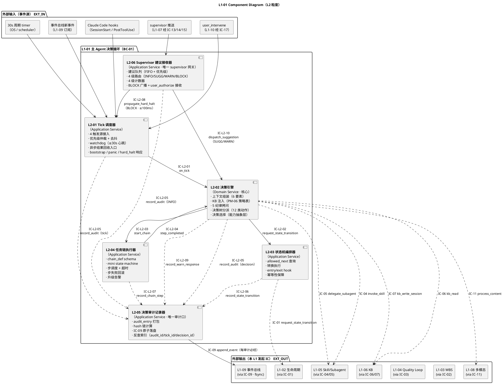
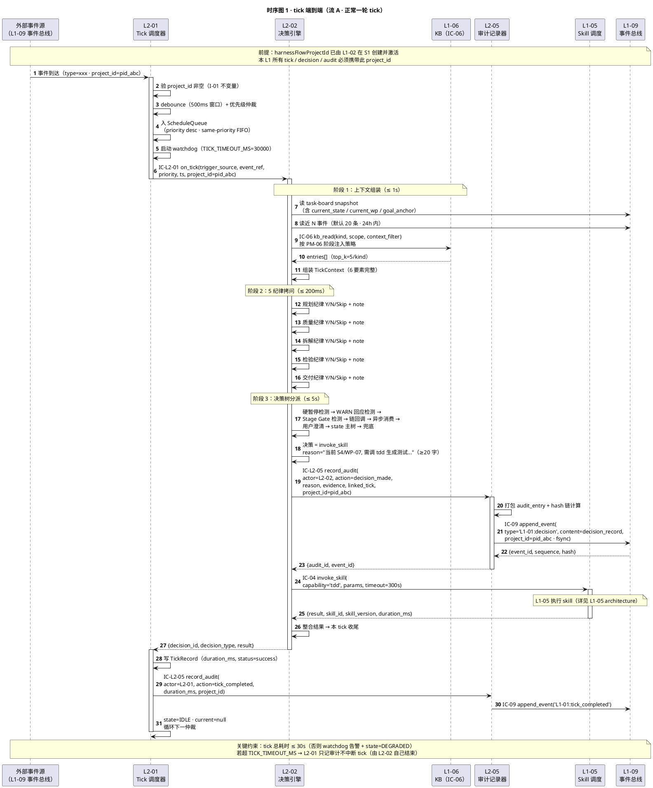
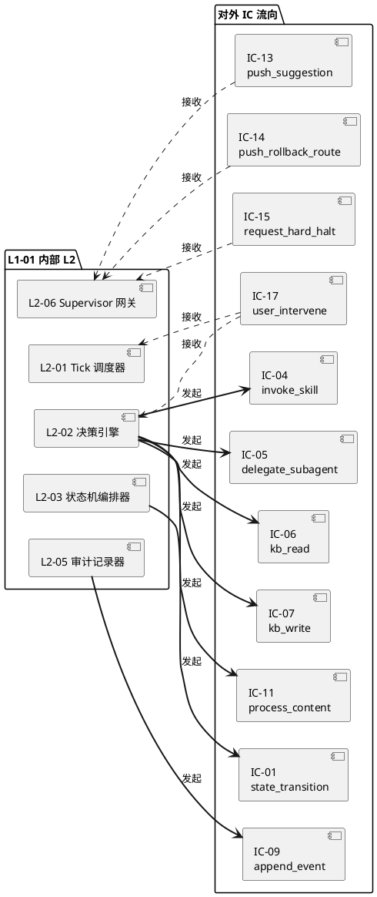

# L1-01 · 主 Agent 决策循环 · 总架构（architecture.md）

> **本文档定位**：本文档是 3-1-Solution-Technical 层级中 **L1-01 主 Agent 决策循环** 的**总架构文档**，也是**这 6 个 L2（Tick 调度器 / 决策引擎 / 状态机编排器 / 任务链执行器 / 决策审计记录器 / Supervisor 建议接收器）的公共骨架**。
>
> **与 2-prd/L1-01 的分工**：2-prd 层的 `prd.md` 回答**产品视角**的"这 6 个 L2 各自职责 / 边界 / 约束 / 禁止 / 义务 / IC 签名字段骨架"；本文档回答**技术视角**的"在 Claude Code Skill + hooks + jsonl + Claude session 这套物理底座上，6 个 L2 怎么串成一个可运行的 Agent loop"——落到 **运行模型**、**控制流 / 数据流**、**时序图**、**对外 IC 承担**、**与各 L2 tech-design 的分工边界** 五件事上。
>
> **与 6 个 L2 tech-design.md 的分工**：本文档是 **L1 粒度的汇总骨架**，给出"6 L2 在同一张图上的位置 + 跨 L2 时序 + 对外 IC 承担"；每 L2 tech-design.md 是**本 L2 的自治实现文档**（具体算法 / 数据结构 / 内部状态机 / 白盒逻辑 / 单元测试骨架），不得与本文档冲突。冲突以本文档为准。
>
> **严格规则**：
> 1. 任何与 2-prd/L1-01 产品 PRD 矛盾的技术细节，以 2-prd 为准；发现 2-prd 有 bug → 必须先反向改 2-prd，再更新本文档。
> 2. 任何 L2 tech-design 与本文档矛盾的"跨 L2 控制流 / 时序 / IC 字段语义"，以本文档为准。
> 3. 任何技术决策必须给出 `Decision → Rationale → Alternatives → Trade-off` 四段式，不允许堆砌选择。
> 4. 本文档不复述 2-prd/prd.md 的产品文字（职责 / 禁止 / 必须清单等），只做技术映射 + 补齐"产品视角未说 but 工程师必须知道"的部分。

---

## 0. 撰写进度

- [x] §1 定位与 2-prd L1-01 映射（哪些产品章节落成本文档的哪些技术章节）
- [x] §2 DDD 映射（BC-01 Agent Decision Loop · 引 L0/ddd-context-map.md）
- [x] §3 L1-01 内部 L2 架构图（Mermaid component · 6 L2 + 对外 IC）
- [x] §4 核心 P0 时序图（Mermaid sequence · tick 端到端 / supervisor BLOCK 消费 / async 回收 / panic / bootstrap）
- [x] §5 主 loop 运行模型（tick = Claude session 内长对话 · 30s 周期 · hooks + 事件触发 · 混合 pacing）
- [x] §6 跨 L2 控制流 / 数据流（IC-L2-01..10 · 事件字段在 L2 间如何流转）
- [x] §7 对外 IC 承担（本 L1 发起 IC-01/04/05/06/07/09/11 · 本 L1 接收 IC-13/14/15/17）
- [x] §8 开源最佳实践调研（LangGraph StateGraph · AutoGen v0.4 topic-based · CrewAI event bus · OpenHands event-stream · Devin planner-executor · 引 L0/open-source-research.md §2）
- [x] §9 与 6 L2 tech-design.md 的分工声明（本 architecture 负责什么 · 每 L2 负责什么）
- [x] §10 性能目标（tick 响应 ≤30s · decision latency / hard_halt 响应 / panic 响应 / 调度吞吐）
- [x] §11 错误处理与降级（halt-on-audit-fail / IC-09 失败 / watchdog 告警 / supervisor silent 监测）
- [x] §12 配置参数清单（从 L2 prd §8.10.7 / §9.10.x / §13.10.5 汇总）
- [x] §13 与现有 harnessFlow.md MVP 蓝图的对比
- [x] 附录 A · 与 L0 系列文档的引用关系
- [x] 附录 B · 术语速查（L1-01 本地）
- [x] 附录 C · 6 L2 tech-design 撰写模板（下游消费）

---

## 1. 定位与 2-prd L1-01 映射

### 1.1 本文档的唯一命题

把 `docs/2-prd/L1-01主 Agent 决策循环/prd.md`（产品级 · v1.0 · 3399 行 · 6 L2 详细 + 对外 IC 映射 + retro 位点）定义的**产品骨架**，一比一翻译成**可执行的技术骨架**——具体交付物是：

1. **1 张 L1-01 component diagram**（6 L2 + 对外 IC · Mermaid · §3）
2. **5 张 P0 核心时序图**（tick 端到端 / BLOCK / async 回收 / panic / bootstrap · Mermaid · §4）
3. **1 套主 loop 运行模型** ——说明 tick 物理上到底是什么（§5）
4. **1 张跨 L2 控制流 / 数据流矩阵**（IC-L2-01 .. 10 · §6）
5. **1 张对外 IC 承担矩阵**（本 L1 发起哪几条 / 接收哪几条 / 承担 L2 是谁 · §7）
6. **1 份开源调研综述**（5 个 > 1k stars 项目 · 本 L1 的借鉴 / 弃用 · §8）
7. **1 份 L2 分工声明**（本 architecture 负责什么 / 每 L2 负责什么 · §9）
8. **1 张性能目标表**（tick 响应 ≤30s 等 · §10）

### 1.2 与 2-prd/L1-01/prd.md 的映射（精确到小节）

| 2-prd/L1-01/prd.md 章节 | 本文档对应章节 | 翻译方式 |
|---|---|---|
| §1 L1-01 范围锚定（引 scope §5.1） | §1（本章）+ §7 对外 IC 承担 | 引用锚定，不复述；§7 表格映射产品 IC ↔ 技术 L2 |
| §2 L2 清单（6 个） | §3 L1-01 内部 L2 架构图 + §9 L2 分工 | 落成 component diagram + 分工表 |
| §3 L2 整体架构图 A（主干控制流 ASCII）| §3 Mermaid component diagram | ASCII → Mermaid；加"对外 IC 进出口" |
| §4 L2 整体架构图 B（横切响应面 ASCII）| §4 核心时序图 5 张 | 4 个响应面 → 5 张时序图 |
| §5 9 条 L2 间业务流程（流 A-I） | §4 时序图 + §6 控制流矩阵 | 9 流里 P0 的 5 条画时序图；剩余 4 条归入 §6 表格 |
| §6 10 条 IC-L2 契约骨架 | §6 跨 L2 控制流 / 数据流 | 10 IC 分类：控制（路由）/ 数据（审计打包）/ 响应（中断）|
| §7 L2 定义模板（9 小节） | §9 L2 分工声明 + 附录 C 下游模板 | 给 L2 tech-design 的撰写模板 |
| §8-§13 L2-01 .. L2-06 详细（9 小节每 L2） | 不在本文档展开 | 落到各 L2 tech-design.md（本文档只画入口 + 出口） |
| §14 对外 IC 映射（被调 4 / 发起 7 / 矩阵图）| §7 对外 IC 承担（本文档镜像重绘） | 原矩阵图扩为"IC × L2 × 发起/接收/路由"三维 |
| §15 retro 位点（11 项） | 本文档不涉 | 归产品 PRD 自身；本文档只做技术实现 |
| §16 L3 合并到各 L2 §X.10 | §9 L2 分工声明 + 附录 C | 落到各 L2 tech-design 内的 §6 内部核心算法 |

### 1.3 与 scope.md §5.1 的映射

| scope §5.1 锚点 | 本文档落实位置 |
|---|---|
| §5.1.1 职责（持续 tick → 决策 → 执行 → 留痕 · HarnessFlow 控制流唯一源） | §5 主 loop 运行模型 + §3 component diagram 的"单一决策源 / 单一审计源"注 |
| §5.1.2 输入/输出（5 类事件 / 输出决策+执行+事件）| §6 跨 L2 控制流 / 数据流 + §7 对外 IC 承担 |
| §5.1.3 边界（只做决策调度 / 6 条 OoS）| §9 L2 分工 + §3 component diagram 边界 |
| §5.1.4 约束（PM-02/10/11 + 4 条硬约束）| §5 运行模型 + §10 性能目标 + §11 错误处理 |
| §5.1.5 🚫 禁止行为（6 条）| §11 错误处理对应拦截点 |
| §5.1.6 ✅ 必须义务（6 条：tick ≤30s / 响应 BLOCK 等）| §10 性能目标 + §11 错误处理 |
| §5.1.7 与其他 L1 交互（9 行）| §7 对外 IC 承担 |
| §8.2 对外 IC 契约（IC-01/04/05/06/07/09/11/13/14/15/17 · 与本 L1 相关的 11 条）| §7 对外 IC 承担矩阵（全量 11 条） |

### 1.4 与 projectModel/tech-design.md 的关系（PM-14 硬约束）

`docs/2-prd/L1-01主 Agent 决策循环/prd.md` 开篇的 **PM-14 项目上下文声明**（第 28 行）硬性要求：**每个 tick / 决策 / state 转换 / 审计事件必须携带 `harnessFlowProjectId`**，由 L1-02 在 S1 启动时创建，本 L1 **只消费不创建**。

本文档的落实点：

| PM-14 要求 | 本 L1 落实 L2 | 本文档章节 |
|---|---|---|
| L2-01 Tick 调度器在每次 tick 入队时强制验证 project_id 非空 | L2-01 | §6 TickTrigger schema · project_id 必填字段 |
| L2-02 决策引擎把 project_id 作为决策上下文根字段 | L2-02 | §6 ContextSnapshot schema · project_id 必填根字段 |
| L2-05 决策审计记录器把 project_id 作为 audit_entry 必填字段 | L2-05 | §6 AuditEntry schema · project_id 必填字段 + §11 未带 project_id 硬拦截 |

**本 L1 不持有 `ProjectAggregate`**（那是 L1-02 / BC-02 的事）；本 L1 只**引用 `harnessFlowProjectId`（值对象）**作为所有内部数据结构的根归属键（Shared Kernel 关系，见 §2.2）。

---

## 2. DDD 映射（BC-01 Agent Decision Loop）

### 2.1 Bounded Context 定位

本 L1 对应的 Bounded Context 在 `L0/ddd-context-map.md §2.2 BC-01 Agent Decision Loop`（位于 ddd-context-map.md 第 128-167 行），已明确：

**BC 名**：`BC-01 · Agent Decision Loop`
**一句话定位**：整个 HarnessFlow 的"**心脏**"与"**大脑**"——持续 tick、做决策、派活给别的 BC、所有动作留痕。
**BC 角色**：**唯一控制源**（All other BCs are consumers or observers of BC-01's commands/events）。

**与其他 BC 的关系**（引自 L0/ddd-context-map.md §2.2 "跨 BC 关系"一节）：

| 对方 BC | 关系模式 | 本 L1 视角 |
|---|---|---|
| BC-09（Resilience & Audit · L1-09） | **Partnership** | 任何决策必经 IC-09 append_event，强耦合同步演进；L2-05 决策审计记录器是 Partnership 的接口实现 |
| BC-02/03/04/05/06/08（L1-02/03/04/05/06/08） | **Customer**（BC-01 是客户，消费它们的能力）| L2-02 发起 IC-01/02/03/04/05/06/11 去调用这些 BC |
| BC-07（Supervision · L1-07） | **反向 Customer**（BC-07 推建议/硬红线/回退路由给 BC-01）| L2-06 是反向 Customer 的接收接口（接 IC-13/14/15） |
| BC-10（UI · L1-10） | **Customer-Supplier** | L2-01 接收 IC-17 user_intervene（panic / resume / authorize）|
| 所有 BC（Shared Kernel） | **Shared Kernel** | 共享 `harnessFlowProjectId` 值对象（PM-14） |

### 2.2 本 L1 内部的聚合根（Aggregate Roots）

引自 `L0/ddd-context-map.md §2.2` BC-01 的主要聚合根表（第 149-155 行），落到 6 L2 的映射：

| 聚合根 | 内部 entity + VO | 一致性边界 | 所在 L2 |
|---|---|---|---|
| **TickContext** | project_id(VO) / trigger(VO) / context_snapshot(entity) / kb_injection(entity) / five_discipline_results(entity[]) | 单 tick 内强一致；tick 结束即持久化为 AuditEntry | **L2-02 决策引擎**（构造者） |
| **DecisionRecord** | decision_id(VO) / tick_id(VO) / rationale(VO) / chosen_action(VO) / alternatives(VO[]) / evidence_links(VO[]) | 一旦生成即不可变（immutable event） | **L2-02 决策引擎**（生产者）+ **L2-05 审计记录器**（持久化者） |
| **AdviceQueue** | advice_id(VO)[] / level(VO) / dimension(VO) / counter(entity) | 单 project 级单例；4 级计数独立 | **L2-06 Supervisor 建议接收器** |
| **TickTrigger + ScheduleQueue + TickRecord** | trigger(VO) / priority(VO) / debounce_bucket(entity) / tick_record(entity) | 单 session 级单例；入队即不可变 | **L2-01 Tick 调度器** |
| **StateTransitionRequest + StateMachineSnapshot** | from_state(VO) / to_state(VO) / allowed_next(table) | 本 session state 单例 | **L2-03 状态机编排器** |
| **TaskChain + MiniStateMachine** | chain_id(VO) / step_list(entity[]) / outcome(VO) | 单 chain 内强一致 | **L2-04 任务链执行器** |
| **AuditEntry + ReverseIndex** | audit_id(VO) / source_ic / hash_chain(entity) | audit 一旦落盘不可变 | **L2-05 决策审计记录器** |

**关键不变量**（Invariants · 引自 BC-01 §2.2）：

1. **I-01 TickContext 不跨 project**：每 TickContext 的 `project_id` 字段不可变；跨 project 的 tick 必须是两个独立 TickContext 实例。
2. **I-02 DecisionRecord immutability**：decision_id 一经生成不可修改（append-only）。
3. **I-03 AdviceQueue 单 project 单例**：同一 `harnessFlowProjectId` 下只有一个 AdviceQueue 实例，4 级计数不跨 project。
4. **I-04 Audit 顺序与决策顺序一致**：`AuditEntry.ts` 单调递增（FIFO），hash_chain 逐条校验。

### 2.3 Domain Service / Application Service

引自 L0/ddd-context-map.md §2.2 BC-01 的 service 表：

| Service 名 | 类型 | 职责 | 所在 L2 |
|---|---|---|---|
| `TickScheduler` | **Application Service** | 编排 4 触发源接入 + 去抖 + 优先级仲裁 + watchdog | L2-01 |
| `DecisionEngine` | **Domain Service**（核心）| 5 纪律拷问 + 决策树分派（无状态；输入 TickContext → 输出 DecisionRecord）| L2-02 |
| `ContextAssembler` | **Domain Service** | 组装 TickContext（6 要素）| L2-02 内部组件 |
| `FiveDisciplineInterrogator` | **Domain Service** | 5 纪律拷问（规划 / 质量 / 拆解 / 检验 / 交付）| L2-02 内部组件 |
| `StateMachineOrchestrator` | **Application Service** | allowed_next 查询 + 转换执行 + entry/exit hook | L2-03 |
| `TaskChainExecutor` | **Application Service** | chain mini state machine + 步调度 + 超时 + 回滚 | L2-04 |
| `DecisionAuditor` | **Application Service** | audit_entry 打包 + hash 计算 + IC-09 原子落盘 + 反查索引 | L2-05 |
| `SupervisorAdviceRouter` | **Application Service** | 4 级路由分派（INFO/SUGG/WARN/BLOCK）| L2-06 |

### 2.4 Repository Interface

本 L1 作为**控制源**，**不直接持有任何持久化聚合**（不 own 任何 Repository）；所有持久化必经 `L1-09 Resilience & Audit BC` 的 IC-09 append_event 接口（由 L2-05 承担）。

**唯一例外**：L2-06 的 `AdviceQueue` 有独立持久化需求（跨 session 恢复时建议队列不可丢），但其物理落盘仍走 L1-09（不自建 Repository）。具体 schema 见 §6 表 6.3。

### 2.5 Domain Events（本 BC 对外发布）

引自 L0/ddd-context-map.md §2.2 BC-01 对外发布表：

| 事件名 | 触发时机 | 订阅方 | Payload |
|---|---|---|---|
| `L1-01:tick_started` | L2-01 派发新 tick 到 L2-02 | L1-07 supervisor / L1-10 UI | `{tick_id, trigger_source, priority, ts, project_id}` |
| `L1-01:decision_made` | L2-02 产出 decision_record | L1-07 / L1-10 / L1-02 / L1-03 / L1-04（按决策类型）| `{decision_id, tick_id, decision_type, reason, evidence, project_id}` |
| `L1-01:tick_completed` | L2-01 tick 闭环 | L1-07 / L1-10 | `{tick_id, duration_ms, result, project_id}` |
| `L1-01:tick_timeout` | L2-01 watchdog 超时 | L1-07 / L1-10 | `{tick_id, duration_ms, project_id}` |
| `L1-01:state_transition` | L2-03 转换成功 | L1-02 / L1-10 | `{from_state, to_state, reason, project_id}` |
| `L1-01:chain_step` | L2-04 步完成 | L1-07 / L1-10 | `{chain_id, step_id, outcome, project_id}` |
| `L1-01:hard_halt` | L2-06 接收 BLOCK → L2-01 暂停 | L1-07 / L1-10 | `{red_line_id, halted_at_tick, project_id}` |
| `L1-01:panic` | L2-01 panic 拦截 | L1-07 / L1-10 | `{panic_at_tick, project_id}` |
| `L1-01:idle_spin` | L2-01 watchdog 连续 N 次 no_op | L1-07 | `{spin_count, project_id}` |
| `L1-01:warn_response` | L2-02 回应 supervisor WARN | L1-07 | `{warn_id, response: accept/reject, reason, project_id}` |
| `L1-01:supervisor_info` | L2-06 接收 INFO → L2-05 审计 | L1-07 | `{message, dimension, project_id}` |

**全部事件共享字段**：`project_id`（PM-14 硬约束）+ `hash`（sha256 链式，防篡改）。

---

## 3. L1-01 内部 L2 架构图（Component Diagram）

### 3.1 解读 1：L2 骨架 = "心跳起搏器 + 脑 + 状态机 + 任务链 + 留声机 + 副驾网关" 五件套 + 1 横切

2-prd/L1-01/prd.md §3 的 ASCII 图以"一句话职责"的方式给出了 6 个 L2。本文档的 Mermaid component diagram **在此基础上补三件产品 PRD 不画但工程师必须看到的东西**：

1. **对外 IC 的物理进出口**（本 L1 作为"外部 IC-01/04/05/06/07/09/11 的发起方 / 外部 IC-13/14/15/17 的接收方"在哪几个 L2 进出）；
2. **L2 间 10 条 IC-L2 的流向**（哪条是控制 / 哪条是审计 / 哪条是响应中断）；
3. **PM-14 `harnessFlowProjectId` 的传播链**（project_id 从 L2-01 TickTrigger 进入 → L2-02 TickContext 根字段 → L2-05 AuditEntry 根字段的三跳）。

### 3.2 解读 2：为什么是 6 L2 而不是 3 / 5 / 10

2-prd PRD R6 轮引入第 6 个 L2-06 Supervisor 建议接收器（详见 prd.md §2 表格注 "NEW"）的原因：**把原先散在 L2-02 的 "4 级路由逻辑" 抽成独立 L2 以保证"supervisor 接入点"的唯一性**（PM-02 主-副协作 + PM-12 红线分级自治）。本文档的 component diagram **体现这次抽取**：L2-06 是 `L1-01 ↔ L1-07` 唯一通道（单一网关），L2-02 只消费"已被分级 + 已入队"的建议。

### 3.3 解读 3：本 L1 的"唯一性"约束（单一 XX 原则）

component diagram 必须视觉上清晰表达以下 4 条"唯一性"约束（scope §5.1.4 硬约束 1）：

| 唯一性 | 约束 | 违反后果 |
|---|---|---|
| **单 L2-01 实例** | 整个 session 只能有 1 个 Tick 调度器 | 两个 L2-01 并发派发 tick → L2-02 决策冲突 |
| **单一决策源** | 所有决策必经 L2-02，其他 L2 不决策 | L2-03/04 绕过 L2-02 做决策 → 审计链断裂 |
| **单一审计源** | 所有留痕必经 L2-05，其他 L2 不直接写 IC-09 | L2-XX 直接 append_event → 破坏 PM-10 单一事实源 |
| **单一 supervisor 接入点** | 所有 supervisor 建议必经 L2-06，L1-07 不直接调 L2-01/02 | L1-07 直接调 L2-01 hard_halt → 绕过 4 级计数器 |

### 3.4 PlantUML Component Diagram（L2 粒度）



### 3.5 关键技术决策（Decision → Rationale → Alternatives → Trade-off）

| # | 决策 | 选择 | 理由（Rationale） | 备选方案弃用原因（Alt/Trade-off） |
|---|---|---|---|---|
| D-01 | 6 L2 拆分粒度 | 6 个 L2（L2-06 独立出来）| ①L2-06 抽独立让"supervisor 接入点"唯一化（PM-02 + PM-12）；②每 L2 职责单一可独立 TDD；③契约面数量可控（10 IC-L2）| A. 4 L2（合并 L2-03/04 进 L2-02）：破坏"单一决策源"清晰性；L2-02 爆炸；B. 10 L2（拆 decision tree 每分支独立）：过度拆分；契约爆炸到 30+ IC-L2 |
| D-02 | L2-02 是否持有状态 | **无状态 Domain Service**（接收 TickContext → 返回 DecisionRecord） | 无状态 = 可纯函数 TDD + 可 mock TickContext 跑全覆盖；符合 DDD Domain Service 定义 | A. Stateful Agent：决策历史自持 → 难以单元测试 + 跨 session 恢复复杂 |
| D-03 | L2-05 审计是否同步落盘 | **同步**（IC-09 append_event + fsync 完成才返回）| PM-10 事件总线单一事实源；任何异步 buffer 都可能丢事件；fsync 开销可接受（P99 ≤50ms） | A. 异步 batch flush：可能丢事件 1-5s 窗口 → 审计链断裂；除非用 WAL，成本不划算 |
| D-04 | L2-06 是否独立 session | **不独立**，跟 L2-01~05 同在主 Skill Runtime | L2-06 只做路由 + 计数，无重决策；独立 session 增加通信延迟（hook 跳）；PM-02 明确只有 L1-07 Supervisor 要独立 session | A. 独立 subagent：无必要；L2-06 本身不做观察 / 决策，拆出只增通信成本 |
| D-05 | BLOCK 响应链 | L2-06 → L2-01 ≤100ms（内存调用 + async cancel 信号给 L2-02）| scope §5.1.6 必须义务"响应 BLOCK"；内存调用保证 100ms；L2-02 在 tick 进行中必须可被抢占 | A. 经事件总线异步：P99 可能到 200ms+，不符合硬约束 |
| D-06 | TickContext 组装位置 | **L2-02 内部**（ContextAssembler 组件，不拆 L2）| TickContext 只被 L2-02 消费，无其他消费者；拆 L2 只增契约面；属 L2-02 的实现细节 | A. 拆 L2 "ContextAssembler"：无其他消费方，拆分零收益 |

### 3.6 与 2-prd/L1-01/prd.md §3 ASCII 图的差异

| 差异点 | 产品 ASCII 图 | 本文档 Mermaid | 原因 |
|---|---|---|---|
| "对外 IC 进出口" | 未标 | 明确标注（EXT_IN / EXT_OUT 两侧）| 工程视角：必须看到 L1 边界 |
| 6 L2 间的 IC-L2 契约线 | 部分（主干）| 全 10 条 | 工程视角：tech-design 需精确契约 |
| 样式（节点颜色） | 无 | 4 种（core/gate/audit/critical）| 视觉区分职责层 |
| PM-14 project_id 流 | 开篇声明，图中未画 | §6 控制流矩阵显式画 | 工程师必须看到 project_id 传播 |

---

## 4. 核心 P0 时序图（Mermaid Sequence · 5 张）

> 本节画**产品 PRD §5 9 条 L2 间业务流程**中**最高 P0 优先级的 5 条** 的时序图（流 A 正常 tick / 流 E Supervisor 4 级分派 / 流 F 异步回收 / 流 G panic / 流 I 硬红线 BLOCK）。剩余 4 条（流 B/C/D/H）在 §6 跨 L2 控制流表格以文字列出，不画图（它们是前 5 条的变体或组合）。

### 4.1 时序图 1 · tick 端到端（流 A · 正常一轮 tick · P0 最常走路径）

**覆盖场景**：外部事件（如用户提问 / WP 完成回调）到达 → L2-01 调度 → L2-02 决策 = 调 skill → L1-05 执行 → 结果回 → L2-05 审计落盘。

**硬约束验证点**：`tick 总耗时 ≤ 30s`（scope §5.1.4 硬约束 4）；`每决策必有 reason ≥ 20 字`（scope §5.1.6）。



**读图要点**：

1. **project_id 传播三跳**：事件到达 L2-01（校验）→ 经 IC-L2-01 传给 L2-02（作为 TickContext 根字段）→ 经 IC-L2-05 传给 L2-05（作为 AuditEntry 根字段）→ 经 IC-09 落 L1-09（事件总线）；**任一跳缺失都硬拦截**（§11 错误处理）。
2. **3 阶段耗时预算**：上下文组装 ≤ 1s / 5 纪律拷问 ≤ 200ms / 决策树分派 ≤ 5s。总 ≤ 6.2s << 30s watchdog 阈值（留充足缓冲给外部 IC-04 invoke_skill）。
3. **决策在前 审计在前 skill 在后**：决策 record_audit 在 skill 执行之前做的意义——**即使 L1-05 调用失败，决策本身已留痕**（可审计 "决定调 X 但 X 失败"）。
4. **两个 audit_entry**：一次 tick 产两条审计（`L1-01:decision` + `L1-01:tick_completed`），前者是决策内容（由 L2-02 发起），后者是调度结果（由 L2-01 发起），两者独立 hash 但同 tick_id 关联。

### 4.2 时序图 2 · Supervisor BLOCK 级硬红线拦截（流 I · P0 · ≤100ms 响应）

**覆盖场景**：L1-07 识别硬红线（如 IRREVERSIBLE_HALT · rm -rf）→ 经 IC-15 → L2-06 → IC-L2-08 → L2-01 ≤100ms 暂停。

**硬约束验证点**：`BLOCK 响应 ≤100ms`（scope §5.1.6 + L1-01 prd §13.4 硬约束 1）；`未经 user_authorize 不得清除 BLOCK`（L1-01 prd §13.5 🚫）。

```plantuml
@startuml
autonumber
    autonumber
participant "L1-07<br/>Supervisor<br/>（旁路 subagent）" as L1_07
participant "L2-06<br/>Supervisor 建议接收器" as L2_06
participant "L2-01<br/>Tick 调度器" as L2_01
participant "L2-02<br/>决策引擎（tick 进行中）" as L2_02
participant "L2-05<br/>审计记录器" as L2_05
participant "L1-09<br/>事件总线" as L1_09
participant "L1-10<br/>UI" as L1_10
participant "用户" as USER
note over L1_07,USER : 前提：L2-02 正在做一个 tick 的决策 · state=RUNNING
L1_07 -> L1_07 : 30s 周期扫事件总线\n命中 IRREVERSIBLE_HALT 红线\n（如 "Bash: rm -rf some/path"）
L1_07 -> L2_06 : IC-15 request_hard_halt(\nred_line_id=IRREVERSIBLE_HALT,\nmessage, supervisor_event_id,\nproject_id=pid_abc)
activate L2_06
note right of L2_06 : T+0ms
L2_06 -> L2_06 : 写 active_blocks[]\ncounters.block += 1
L2_06 -> L2_01 : IC-L2-08 propagate_hard_halt(\nred_line_id, message, supervisor_event_id)
note right of L2_01 : T+30ms（≤ 100ms 硬约束）
activate L2_01
par L2-01 立即响应
L2_01 -> L2_01 : state = HALTED\n(无论当前是 IDLE / RUNNING / DEGRADED)
else 中断进行中的 L2-02 tick
L2_01- -> L2_02 : async cancel 信号
activate L2_02
L2_02 -> L2_02 : 立即 abort（scope §5.1.5 "禁止硬暂停中继续决策"）
L2_02 -> L2_02 : current_decision = null
L2_02- -> L2_01 : aborted
deactivate L2_02
else 锁 pending queue
L2_01 -> L2_01 : pending queue 保留但不派发\n拒绝新 tick 入队（除 resume 信号）
end
note right of L2_01 : T+80ms
deactivate L2_01
L2_06 -> L2_05 : IC-L2-05 record_audit(\nactor=L2-06, action=hard_halt_received,\nreason=message, evidence=[supervisor_event_id],\nproject_id)
L2_05 -> L1_09 : IC-09 append_event(\ntype='L1-01:hard_halt', content,\nproject_id · fsync)
deactivate L2_06
L1_09- -> L1_10 : SSE 推送 hard_halt 事件
L1_10 -> L1_10 : 展示硬红线告警卡片\n（红色 + 声音 + 持久化直到用户确认）
L1_10 -> USER : 强视觉告警
USER -> L1_10 : 文本授权\n"允许本次 rm -rf"（不得自动）
L1_10 -> L2_01 : IC-17 user_intervene(\ntype=authorize, payload=授权理由)
activate L2_01
L2_01 -> L2_06 : 转发 authorize 给 L2-06（清除 BLOCK）
L2_06 -> L2_06 : active_blocks[i].cleared_at = now()\nactive_blocks[i].cleared_by = 'user'
L2_06 -> L2_05 : IC-L2-05 record_audit(\naction=hard_halt_cleared, reason=用户授权)
L2_05 -> L1_09 : IC-09 append_event('L1-01:hard_halt_cleared')
L2_06- -> L2_01 : all cleared
L2_01 -> L2_01 : state = IDLE · 恢复接受 tick
deactivate L2_01
note over L1_07,USER : 审计链完整：hard_halt_received → hard_halt_cleared\nevidence 含 supervisor_event_id + 用户授权 payload\nscope §5.1.6 "任何硬拦截都必须文字授权才解除"
@enduml
```

**读图要点**：

1. **并行响应（par 块）**：L2-01 收到 IC-L2-08 后**同时做三件事**——state=HALTED / 发 async cancel 给 L2-02 / 锁 pending queue。这三件事在内存中并行（无 IO 等待），总耗时 ≤ 80ms。
2. **为什么 L2-06 是唯一网关**：假设 L1-07 直接调 L2-01（绕过 L2-06），4 级计数器会缺记、queue 持久化会漏，supervisor 健康监测（L2-06 负责）也失效。架构上 **L2-06 = L1-07 ↔ L1-01 的唯一防腐层**（DDD ACL 语义）。
3. **user_authorize 链路**：用户授权**不是**直接发给 L2-01，而是通过 IC-17 user_intervene 进 L1-01 边界后由 L2-01 转发给 L2-06（因为 L2-06 才有 `active_blocks[]` 状态）。
4. **不 halt 整个系统**：hard_halt 只暂停 tick 调度（state=HALTED），不退进程；user_authorize 后可继续。若 IC-09 append_event 本身失败（持久化故障），那才 halt 整个系统（§11）。

### 4.3 时序图 3 · 异步结果回收（流 F · 子 Agent / 长 skill 回传 · P0）

**覆盖场景**：L2-02 决策 = delegate_subagent → L1-05 起独立 session（几分钟）→ 完成后发 subagent_result → L2-01 作为 event_driven 新触发源收到 → 新一轮 tick → L2-02 消费结果继续业务。

**硬约束验证点**：`tick 不阻塞等外部`（scope §5.1.6 + L1-01 prd §8.1 "心跳起搏器"）；`async_result 优先级 60 > 普通 event_driven 50`（L1-01 prd §8.10.2 优先级表）。

```plantuml
@startuml
autonumber
    autonumber
participant "L2-02<br/>决策引擎<br/>（Tick 1）" as L2_02_T1
participant "L1-05<br/>Skill 调度" as L1_05
participant "子 Agent<br/>（独立 session · 几分钟）" as SUBAG
participant "L1-09<br/>事件总线" as L1_09
participant "L2-01<br/>Tick 调度器" as L2_01
participant "L2-02<br/>决策引擎<br/>（Tick 2 · 独立实例）" as L2_02_T2
participant "L2-05<br/>审计" as L2_05
note over L2_02_T1,L2_05 : 前提：Tick 1 进行中 · L2-02 决策 = delegate_subagent
L2_02_T1 -> L1_05 : IC-05 delegate_subagent(\nsubagent_name='verifier',\ncontext_copy, goal, tools_whitelist,\ntimeout=300s · project_id=pid_abc)
note right of L1_05 : L1-05 启独立 session\n（PM-03 独立 session 委托）
L1_05- -> L2_02_T1 : {delegation_id}\n（立即返回 · 非阻塞）
L2_02_T1 -> L2_05 : IC-L2-05 record_audit(\naction=decision_made,\nreason="委托 verifier 验收 WP-07",\ndelegation_id, project_id)
L2_05 -> L1_09 : IC-09 append_event('L1-01:decision')
L2_02_T1- -> L2_02_T1 : 决策 = "委托已发出, 本 tick 收尾"\n（不阻塞等结果）
note over L2_02_T1 : Tick 1 结束 · L2-01 回 IDLE
par 子 Agent 独立跑 · 用户继续其他操作
SUBAG -> SUBAG : 独立 session 执行\n（可能几分钟）
else L2-01 IDLE 接受其他 tick
note over L2_01 : L2-01 state=IDLE\n继续接受新 event / periodic / hook
end
SUBAG -> L1_05 : 子 Agent 完成\n返回结构化 report
L1_05 -> L1_09 : IC-09 append_event(\ntype='L1-05:subagent_result',\ncontent={delegation_id, report},\nproject_id · fsync)
L1_09- -> L2_01 : event_driven 订阅者收到\n（通过 L1-09 的事件订阅机制）
activate L2_01
L2_01 -> L2_01 : 识别 event_type='L1-05:subagent_result'\npriority = 60（async_result · 高于普通 event 50）
L2_01 -> L2_01 : 跳过去抖?\n（async_result 走标准去抖 · 500ms 窗口）
L2_01 -> L2_01 : 入 ScheduleQueue · 按 priority 派发
L2_01 -> L2_02_T2 : IC-L2-01 on_tick(\ntrigger_source='event_driven',\nevent_ref=subagent_result_event_id,\npriority=60, project_id)
deactivate L2_01
activate L2_02_T2
L2_02_T2 -> L2_02_T2 : 组装 TickContext\n（发现 user_input_pending 为空 · recent_events 含刚到的 subagent_result）
L2_02_T2 -> L2_02_T2 : 决策树：识别为"异步回传消费"分支
L2_02_T2 -> L2_02_T2 : 决策 = 整合 report 到当前业务流\nreason="消费 verifier report PASS, 进下一 WP"（≥20字）
L2_02_T2 -> L2_05 : IC-L2-05 record_audit(decision_made, linked_delegation=delegation_id)
L2_05 -> L1_09 : IC-09 append_event
note over L2_02_T2 : 继续后续决策链（可能进 state_transition 或 get_next_wp）
deactivate L2_02_T2
@enduml
```

**读图要点**：

1. **"异步委托即本 tick 收尾"**：L2-02 发完 IC-05 后立即收尾不阻塞（L1-01 prd §6.A 硬规定）。若阻塞等 verifier 5 分钟，整个 loop 会死。
2. **L2-01 的异步回收入口不是特殊通道**：subagent_result 本质就是一个 event_driven 新事件，只是 priority=60（比普通 50 高）。这样设计让 L2-01 的 4 触发源接入层不需要为 async_result 写专门逻辑，与 event_driven 共用通路。
3. **delegation_id 贯穿 3 个 audit**：decision 委托时 audit / subagent_result 落事件总线时 audit（L1-05 自己做）/ 消费 report 时 audit。这条"delegation 链"通过 `links.delegation_id` 在事件总线可查。
4. **Tick 1 和 Tick 2 的 L2-02 实例独立**：L2-02 是无状态 Domain Service，两个 tick 是两次独立调用。跨 tick 的状态通过 TickContext 组装时读 recent_events 恢复。

### 4.4 时序图 4 · 用户 panic 紧急介入（流 G · P1 · ≤100ms 响应 + PAUSED）

**覆盖场景**：L1-10 UI panic 按钮 → user_panic 事件 → L2-01 最高优先级（除 bootstrap）中断当前 tick → PAUSED → 等 resume。

```plantuml
@startuml
autonumber
    autonumber
participant "用户" as USER
participant "L1-10<br/>UI" as L1_10
participant "L1-09<br/>事件总线" as L1_09
participant "L2-01<br/>Tick 调度器" as L2_01
participant "L2-02<br/>决策引擎（RUNNING）" as L2_02
participant "L2-03<br/>状态机编排器" as L2_03
participant "L2-05<br/>审计" as L2_05
USER -> L1_10 : 点击 panic 按钮
L1_10 -> L1_09 : IC-09 append_event(\ntype='user_panic',\ncontent={reason?}, project_id)
L1_09- -> L2_01 : event_driven 订阅到\n（特殊 event_type='user_panic'）
activate L2_01
note right of L2_01 : T+0ms
L2_01 -> L2_01 : 识别 event_type='user_panic'\npriority = 90（仅次于 bootstrap=100）
L2_01 -> L2_01 : 跳过去抖（panic 永不去抖 · L1-01 prd §8.4 硬约束 4）
L2_01 -> L2_01 : 直接入队首（抢占 · 最高优先级之一）
L2_01- -> L2_02 : async cancel 信号\n(current.interrupted_by='panic')
activate L2_02
L2_02 -> L2_02 : 立即 abort 当前决策
L2_02- -> L2_01 : aborted
deactivate L2_02
L2_01 -> L2_01 : 写 TickRecord(status=interrupted, interrupted_by=panic)
L2_01 -> L2_05 : IC-L2-05 record_audit(\nactor=L2-01, action=panic_intercepted,\nreason='user_panic', evidence, project_id)
L2_05 -> L1_09 : IC-09 append_event('L1-01:panic')
L2_01 -> L2_03 : IC-L2-02 request_state_transition(\nfrom=current, to=PAUSED, reason='user_panic')
activate L2_03
L2_03 -> L2_03 : 查 allowed_next\n（PAUSED 从 IDLE/RUNNING/DEGRADED 都可达）
L2_03 -> L2_03 : 执行转换
L2_03 -> L2_03 : entry hook: 生成"已暂停"快照\n推给 L1-10 UI
L2_03 -> L2_05 : IC-L2-06 record_state_transition(\nfrom, to=PAUSED, reason, pre_snapshot, post_snapshot)
L2_05 -> L1_09 : IC-09 append_event('L1-01:state_transition')
L2_03- -> L2_01 : accepted
deactivate L2_03
L2_01 -> L2_01 : state(scheduler) = PAUSED · pending queue 暂停
note right of L2_01 : T+80ms
deactivate L2_01
L1_09- -> L1_10 : SSE 推送 "已暂停" 卡片
L1_10 -> USER : 展示暂停状态 + 恢复按钮
note over USER,L1_10 : 用户自由操作期（可能几分钟到几小时）
USER -> L1_10 : 点击恢复
L1_10 -> L2_01 : IC-17 user_intervene(type=resume)
activate L2_01
L2_01 -> L2_03 : IC-L2-02 request_state_transition(from=PAUSED, to=IDLE, reason='user_resume')
L2_03- -> L2_01 : accepted
L2_01 -> L2_01 : state(scheduler) = IDLE · 恢复接受 tick\n继续处理 pending queue
deactivate L2_01
@enduml
```

**读图要点**：

1. **panic 不等于 hard_halt**：panic = 用户主动紧急暂停（state=PAUSED），hard_halt = supervisor 拦截硬红线（state=HALTED）。两者 resume 机制不同：panic 用 user_intervene(type=resume)，hard_halt 用 user_intervene(type=authorize)。
2. **L2-01 的 scheduler state 和 L2-03 的 project state 是两层**：scheduler state（INIT/IDLE/RUNNING/DEGRADED/HALTED/PAUSED）属 L2-01 内部 · 用于控制调度行为；project state（S1/S2/.../PAUSED）属 L2-03 外部可见 · 作为 state_machine 的全局态。两者在 panic 时同步转 PAUSED。
3. **entry hook 推 UI**：L2-03 的 entry hook 做"生成暂停卡片 + IC-L2-06 审计"两件事。UI 通过事件总线 SSE 订阅到状态转换事件，不是直接被 L2-03 调用（保持 L2-03 不依赖 L1-10）。

### 4.5 时序图 5 · 跨 session 恢复首次 tick（流 H · P1 · bootstrap）

**覆盖场景**：Claude Code 重启 → L1-09 扫 task-boards 重建 → 发 system_resumed 事件 → L2-01 特殊 bootstrap tick → L2-02 从 state_history 末尾分析 → 决策恢复路径。

```plantuml
@startuml
autonumber
    autonumber
participant "用户" as USER
participant "Claude Code 宿主" as CC
participant "L1-09<br/>韧性+审计" as L1_09
participant "L2-01" as L2_01
participant "L2-02" as L2_02
participant "L2-03" as L2_03
participant "L2-05" as L2_05
participant "L1-10 UI" as L1_10
USER -> CC : 重启 Claude Code + /harnessFlow
CC -> L1_09 : 触发恢复流程
activate L1_09
L1_09 -> L1_09 : 扫 projects/<pid>/task-boards/\n找未 CLOSED 项目
L1_09 -> L1_09 : IC-10 replay_from_event\n从 events/<pid>/*.jsonl 回放
L1_09 -> L1_09 : 重建 task-board 到 session_exit 前 state
L1_09 -> L1_09 : 发 system_resumed 事件\npayload={project_id, last_state, resumed_from_checkpoint}
deactivate L1_09
L1_09- -> L2_01 : event_driven 订阅\n（特殊 event_type='system_resumed'）
activate L2_01
L2_01 -> L2_01 : 识别 → trigger_source='bootstrap'\npriority=100（最高 · 一次性）
L2_01 -> L2_01 : bootstrap_context = {\n  resumed_from_checkpoint,\n  last_state, project_id }
L2_01 -> L2_01 : 跳过去抖 + 跳过仲裁（bootstrap 直接派发）
L2_01 -> L2_02 : IC-L2-01 on_tick(\ntrigger_source='bootstrap',\npriority=100, bootstrap=true,\nbootstrap_context, project_id)
deactivate L2_01
activate L2_02
L2_02 -> L1_09 : 读 state_history 末尾 3 条
L1_09- -> L2_02 : 末尾事件列表
L2_02 -> L2_02 : 分析"退出时在做什么"
alt state = 在 WP 执行中
L2_02 -> L2_02 : 决策 = 继续该 WP\nreason="bootstrap: 从 WP-07 S4 IMPL 恢复"
L2_02 -> L2_05 : record_audit(bootstrap_continue_wp)
else state = Stage Gate 等待
L2_02 -> L2_02 : 决策 = 重推 Stage Gate 卡片给 UI\nreason="bootstrap: S2 Gate 待审重推 UI"
L2_02 -> L1_10 : (通过 L1-02) 重推 Gate 卡片
L2_02 -> L2_05 : record_audit(bootstrap_re_push_gate)
else state = PAUSED
L2_02 -> L2_02 : 决策 = 等用户 resume\nreason="bootstrap: 上次 PAUSED, 继续等待"
L2_02 -> L2_05 : record_audit(bootstrap_wait_resume)
else state = 不明
L2_02 -> L2_02 : 决策 = request_user 澄清\nreason="bootstrap: 状态不明, 请用户确认"
L2_02 -> L1_10 : IC-17 反向 request_user(clarify)
L2_02 -> L2_05 : record_audit(bootstrap_need_clarify)
end
L2_02- -> L2_01 : {decision_id, decision_type, result}
deactivate L2_02
L2_01 -> L2_05 : IC-L2-05 record_audit(\ntick_completed, bootstrap=true)
L2_05 -> L1_09 : IC-09 append_event('L1-01:tick_completed')
L1_09- -> L1_10 : SSE 推送恢复成功通知\n（含 "已恢复 project X · state=Y · 继续？"）
@enduml
```

**读图要点**：

1. **bootstrap 是一次性特殊 tick**：priority=100 · 跳过去抖 · 跳过仲裁（L1-01 prd §8.4 硬约束 4）。在整个 session 生命周期内只有一次。
2. **L2-02 的 4 个恢复分支**：在 WP 执行中（继续）/ Stage Gate 等待（重推 UI）/ PAUSED（等 resume）/ 不明（澄清）。这 4 个分支完整覆盖"退出时可能的任何状态"。
3. **bootstrap 为什么不走标准决策树的"硬暂停检测"分支**：因为 bootstrap 发生在 HALTED 清除后的全新 session（重启必清 HALTED），不可能在 HALTED 中进 bootstrap；决策树的特殊分支专门处理 bootstrap。

---

## 5. 主 loop 运行模型（tick 物理语义）

### 5.1 什么是一次 tick（物理定义）

`tick` 在产品 PRD 里是"一次决策心跳"的抽象，在本文档需要落到**物理可观察量**：

**tick 的物理定义**：

> 一次 tick = **L2-01 调度器从 ScheduleQueue 取出一个 TickTrigger → 通过 IC-L2-01 调用 L2-02 决策引擎 → L2-02 返回 DecisionRecord → L2-01 关闭 TickRecord** 的完整生命周期。

具体的物理载体（在 Claude Code Skill 生态下）：

| tick 要素 | 物理载体 | 说明 |
|---|---|---|
| TickTrigger 入队 | L2-01 进程内存中的 Python heapq（优先级队列）| 单进程单实例；跨 session 不持久化 trigger 本身，只持久化 TickRecord |
| on_tick 调用 | L2-02 的"一次完整的对话轮次"（Claude conversation turn）| Claude Code session 内的一次 LLM 生成 + 工具调用序列 |
| TickContext 组装 | L2-02 内部（Python in-memory struct）| 不持久化；每次 tick 重新组装 |
| DecisionRecord | 持久化到 `projects/<pid>/events/*.jsonl`（通过 IC-09）| append-only + fsync |
| TickRecord | 持久化到 `projects/<pid>/events/*.jsonl`（通过 IC-09）| append-only |

**与 L0/architecture-overview.md §3 的关系**：

> L0 §3 已给出"主 Skill Runtime = Claude Code session 内 conversation context"（L0 overview.md 第 137 行）。本文档 §5 在此基础上**细化 L1-01 在这个 conversation context 里的具体运行模型**：一次 tick = 一次 "外部事件进来 → 组装 context → 让 LLM 做决策 → 调工具 / 调 skill / 调 subagent → 关闭 TickRecord" 的工作单元。

### 5.2 tick 的 3 种触发 pacing

tick 触发的时间分布由 **L2-01 的 4 种触发源 + 优先级表** 决定（L1-01 prd §8.10.2 默认优先级表）。从时间分布来看，本 L1 的 loop 有 **3 种 pacing 模式**：

| Pacing 模式 | 触发密度 | 典型场景 | 主导 trigger_source |
|---|---|---|---|
| **事件驱动（Event-paced）** | 高（1-10 tick / 分钟）| 用户操作期 / WP 执行期 / Quality Loop | event_driven + hook_driven |
| **周期自省（Periodic-paced）**| 低（≤ 2 tick / 分钟）| 用户离开 / 等 user 决定 | periodic_tick（30s） |
| **突发（Burst）** | 瞬时峰值（>10 tick / 秒 · 去抖合并后）| 批量事件涌入 / supervisor 连续建议 | event_driven + supervisor_block |

**关键设计**：**默认 periodic_tick=30s 是 tick "活跃度下限"**（Goal §4.3 methodology-paced autonomy 的 pacing 阈值），高于下限的流量靠 event_driven 自然驱动；低于阈值时 periodic 保证 loop 不"睡死"。

**与 2-prd 的对齐**：prd §8.4 硬约束 3 `periodic_tick 默认 30s · 可配置 10-300s`；本文档不改这个默认，只解释**"30s 是下限、不是上限"**（实际高负载时 event_driven 频率会远超 30s）。

### 5.3 tick 是一个 LLM 对话轮次吗？（关键澄清）

**是**，但需要精确定义"一轮"的起止：

**一次 tick = L2-02 决策引擎的一轮 Domain Service 调用 = Claude LLM 的一次"接收 prompt → 输出工具调用序列 → 汇总结果"**。

但有两个例外需要澄清：

1. **L2-02 内部的 ContextAssembler / FiveDisciplineInterrogator / DecisionTreeDispatcher 不各算一轮**：它们是 L2-02 的内部组件，共用一次 LLM 调用（或 0 次 LLM · 部分逻辑是纯 Python）。
2. **L2-02 调 IC-04 invoke_skill 的等待不算本 tick 的一部分**：skill 执行是**在 L1-05 的 skill runtime**（可能是另一个 sub-skill 的 conversation turn），本 tick 在发出 IC-04 后**立即等 skill 返回**；如果 skill 耗时超 `TICK_TIMEOUT_MS=30s`，tick 超时但 L2-02 不主动 abort（watchdog 只告警）。

**技术决策 D-07（补充）**：

| Decision | 选择 | Rationale | Alt/Trade-off |
|---|---|---|---|
| tick 与 LLM 对话轮次的绑定 | **1:1 绑定**（1 tick = 1 L2-02 LLM 调用）| 简化推理模型：每 tick 可追溯到一次 prompt；audit_entry 与 LLM 调用一对一 | A. 1:N：1 tick 内 L2-02 多次调 LLM → 审计粒度混乱；B. N:1：多 tick 共用 LLM 调用 → 违反"一 tick 一决策"硬约束 |

### 5.4 Claude session 内的长对话（Conversation Context）

**解读**：Claude Code 宿主的 conversation context 是一个**长对话**——所有 tick 的 Assistant/User 消息依次追加到同一 conversation history 中（除非显式 compact）。这意味着：

| 影响 | 含义 |
|---|---|
| **跨 tick 记忆自然存在** | L2-02 在 Tick 2 可以"看见"Tick 1 的决策理由（通过 conversation history）；但**不应依赖这个隐式记忆做决策**（Skip 5 纪律的风险）|
| **context 爆炸风险** | conversation history 会线性增长；100 个 tick 后 token 占用可能超 80%（触发 BF-E-06 上下文爆炸）|
| **L2-02 的显式记忆** | 通过 `recent_events` 从 L1-09 事件总线读（持久化 · 可控）+ `supervisor_suggestions_pending` 从 L2-06 读 |
| **显式 vs 隐式** | 工程约束：**L2-02 决策必须基于显式 TickContext**（6 要素 · L1-01 prd §9.10.1），**不得基于隐式 conversation 记忆**（保证 TDD 可重放）|

**与 L1-06 KB 的关系**：L1-06 KB 注入（通过 IC-06）是**显式记忆的规范化通道**，让跨 tick 知识以结构化方式（而非自由对话回忆）进入 L2-02。这保证了**从不同 session 看同一 project，决策语义一致**（Goal §4.1 决策可追溯率 100%）。

### 5.5 hooks + 事件触发的协同模型

tick 的 4 类触发源在 Claude Code 生态下的物理映射：

| 触发源 | 物理机制 | 延迟 |
|---|---|---|
| **event_driven** | L1-09 事件总线 append_event 时发 notify（Python 进程内事件或 watch `events/*.jsonl` 文件）| ≤ 10ms（进程内）/ ≤ 100ms（文件 watch）|
| **hook_driven** | Claude Code 的 SessionStart / PostToolUse / UserPromptSubmit hook 配置（`.claude/settings.json`）| 同步调用 · 阻塞 |
| **periodic_tick** | OS timer / Python `asyncio.sleep(30)` 循环 | 30s 默认 |
| **bootstrap** | `system_resumed` 事件（由 L1-09 恢复流程末尾发出）| 恢复完成即发 · 一次性 |

**hooks 的独特角色**：Claude Code 的 hook 机制是**唯一真正"同步阻塞"的触发源**——PostToolUse hook 在 tool 调用完成后会 synchronous 执行并影响 Claude 的下一步行为（stdin/stdout 协议）。本 L1 借用 hook 机制做两件事：

1. **SessionStart hook**：触发 bootstrap tick 的**前置准备**（读最后 session_exit 事件 / 初始化 L2-06 AdviceQueue）；
2. **PostToolUse hook**：触发 L1-07 supervisor 的 30s 扫描（不在本 L1 边界，但 L2-06 通过 L1-09 事件总线间接消费其产出）。

**注意**：hook 调用本身**不是** tick，hook 的产出（生成 event）才是 tick 触发源之一。这保证了"hook 调用很快 / tick 执行可能慢"的分离。

### 5.6 methodology-paced autonomy 在本 L1 的落地

Goal §4.3 的 **methodology-paced autonomy**（方法论节奏自治）要求本 L1：

| methodology-paced 要求 | 本 L1 落实 |
|---|---|
| 不是最大化自主性（"纯跑"），也不是最小化（"纯问"）| L2-02 决策树优先 `no_op` / `fill_discipline_gap`（保守）· 必要时才 `request_user` |
| 阶段 Gate 密集问 | L2-03 state_transition 的 entry hook 触发 IC-16 push_stage_gate_card（经 L1-02） |
| WP 内低频通知 | L2-01 periodic_tick + event_driven 自主推进；只在 WARN+ 告警时推 UI |
| 5 纪律贯穿 | L2-02 每 tick 强制 5 纪律拷问（scope §5.1.5 硬约束）|

**关键指标**：Goal §4.1 V1 量化指标"决策可追溯率 100%"**完全由本 L1 保证**——每 tick 必有 DecisionRecord + AuditEntry + hash 链（§4.1 时序图阶段 3）。

---

## 6. 跨 L2 控制流 / 数据流

### 6.1 控制流 vs 数据流的定义（本 L1 语境）

| 类型 | 定义 | 本 L1 的例子 |
|---|---|---|
| **控制流** | 触发另一 L2 **做事**（返回可能影响调用方后续行为）| IC-L2-01 on_tick（L2-01 → L2-02 触发决策）|
| **数据流** | 向另一 L2 **交数据**（返回不影响调用方）| IC-L2-05 record_audit（各 L2 → L2-05 留痕）|
| **响应流** | L2 间的**中断信号**（优先级高于控制流）| IC-L2-08 propagate_hard_halt（L2-06 → L2-01 抢占）|

### 6.2 10 条 IC-L2 完整流向矩阵

引自 2-prd/L1-01/prd.md §6 IC-L2 契约清单（10 条 · 第 388-401 行），本文档给出**技术实现视角的完整矩阵**：

| IC-L2 | 类型 | 调用方 | 被调方 | 触发时机 | schema 关键字段 | 返回值 | 是否阻塞 |
|---|---|---|---|---|---|---|---|
| **IC-L2-01** | 控制 | L2-01 | L2-02 | 每次派发 tick | `trigger_source, event_ref, priority, ts, bootstrap?, project_id` | `{decision_id, decision_type, result}` | 是（L2-01 等 L2-02 返回）|
| **IC-L2-02** | 控制 | L2-02 | L2-03 | 决策 = state_transition | `from_state, to_state, reason, evidence_refs, trigger_tick, project_id` | `{accepted: bool, new_entry}` | 是 |
| **IC-L2-03** | 控制 | L2-02 | L2-04 | 决策 = start_chain | `chain_def, chain_goal, context, project_id` | `{chain_id}` | 否（立即返回 chain_id，异步执行）|
| **IC-L2-04** | 控制 | L2-04 | L2-02 | 每步完成回调 | `chain_id, step_id, outcome, result_ref, next_hint?, project_id` | `{continue / abort / adjust}` | 是 |
| **IC-L2-05** | 数据（审计入口）| 全 L2 | L2-05 | 每次关键动作后 | `actor, action, reason, evidence, ts, linked_tick?, linked_decision?, project_id` | `{audit_id, event_id}` | 是（同步 fsync）|
| **IC-L2-06** | 数据（state 转换专用审计）| L2-03 | L2-05 | 转换成功后 | `from_state, to_state, reason, pre_snapshot_ref, post_snapshot_ref, entry_hook_result?, project_id` | `{audit_id}` | 是 |
| **IC-L2-07** | 数据（chain 步审计）| L2-04 | L2-05 | 每步完成后 | `chain_id, step_id, action, outcome, step_result, project_id` | `{audit_id}` | 是 |
| **IC-L2-08** ⭐ | 响应（中断）| L2-06 | L2-01 | BLOCK 级到达 | `red_line_id, message, supervisor_event_id, project_id` | `{halted_at_tick: tick_id}` | 是（≤100ms 响应）|
| **IC-L2-09** ⭐ | 数据（WARN 书面回应）| L2-02 | L2-05 | 回应 supervisor WARN | `supervisor_warn_id, response: accept/reject, reason, applied_action?, ts, project_id` | `{audit_id}` | 是 |
| **IC-L2-10** ⭐ | 控制（4 级路由）| L2-06 | L2-02 / L2-05 | SUGG/WARN/INFO 级分派 | `level, content, target_l2, priority, ts, project_id` | `{dispatched_at}` | 否（fire-and-forget）|

⭐ 标记 = PRD R6 新增（L1-01 prd §6 表格标注），主要服务于 supervisor 接入的 4 级分派模式。

### 6.3 关键数据结构 schema（跨 L2 传递）

> 详细字段级 schema 留给各 L2 tech-design.md 精确化；本文档只给**跨 L2 边界上的 schema**（必填字段 + project_id）。

#### 6.3.1 TickTrigger（L2-01 内部 · 入队元素 · 不跨 L2 传）

```yaml
tick_trigger:
  id: trig_{uuid}
  trigger_source: enum
    # bootstrap | user_panic | supervisor_block | async_result |
    # event_driven | hook_driven | proactive | periodic_tick
  priority: int               # 0-100
  event_ref: event_id | null
  project_id: str             # PM-14 · 必填 · L2-01 入队时校验
  ts: iso8601
  payload: object
  debounced: bool
  bootstrap_context: object | null
```

#### 6.3.2 TickContext（L2-02 构造 · 不跨 L2 传 · 经 ContextSnapshot_ref 引用）

```yaml
tick_context:
  snapshot_id: ctx_{uuid}
  tick_id: tick_XXX
  project_id: str             # PM-14 · 必填 · 根字段
  ts: iso
  task_board: {current_state, current_wp, stage_progress, goal_anchor}
  recent_events: [event_ref, ...]
  supervisor_suggestions_pending: [suggestion, ...]
  user_input_pending: event_ref | null
  current_wp_def: object | null
  current_dod: object | null
  kb_injection: [kb_entry, ...]
```

#### 6.3.3 DecisionRecord（L2-02 产出 · 经 IC-L2-05 交给 L2-05 · 最终落 events/*.jsonl）

```yaml
decision_record:
  decision_id: dec_{uuid}
  tick_id: tick_XXX
  project_id: str             # PM-14 · 必填
  context_snapshot_ref: ctx_{uuid}
  five_disciplines:
    planning: {answer: Y/N/Skip, note: str}
    quality: {...}
    decomposition: {...}
    verification: {...}
    delivery: {...}
  decision_type: enum
    # invoke_skill | use_tool | delegate_subagent | kb_read | kb_write |
    # process_content | request_user | state_transition | start_chain |
    # warn_response | fill_discipline_gap | no_op
  decision_params: object
  reason: str                  # ≥ 20 字
  alternatives: [dec_alt, ...] # 可选
  evidence_links: [event_id, ...]
  ts: iso
```

#### 6.3.4 AuditEntry（L2-05 打包 · 最终落 events/*.jsonl）

```yaml
audit_entry:
  audit_id: audit_{uuid}
  source_ic: enum              # IC-L2-05 | IC-L2-06 | IC-L2-07 | IC-L2-09
  actor: enum                  # L2-01 | L2-02 | L2-03 | L2-04 | L2-06
  action: str
  reason: str                  # 必有 · ≥ 1 字（decision 类 ≥ 20 字）
  evidence: [event_id, ...]
  linked_tick: tick_id?
  linked_decision: decision_id?
  linked_chain: chain_id?
  project_id: str              # PM-14 · 必填 · 根字段
  payload: object
  ts: iso
  hash: sha256(prev_hash + content)   # PM-10 防篡改
```

#### 6.3.5 SupervisorAdvice（L2-06 接收 · 分发到 L2-02/05）

```yaml
supervisor_advice:
  advice_id: adv_{uuid}
  level: enum                  # INFO | SUGG | WARN | BLOCK
  dimension: str               # supervisor 8 维度之一
  message: str
  suggested_action: str | null
  supervisor_event_id: str
  red_line_id: str | null      # 仅 BLOCK 有
  project_id: str              # PM-14 · 必填
  ts: iso
  response_deadline_tick: int | null  # 仅 WARN 有（默认 current_tick + 1）
```

### 6.4 PM-14 project_id 传播链（硬约束可视化）

```plantuml
@startuml
left to right direction
component ""外部事件\nproject_id=pid_abc"" as EXT
component ""TickTrigger\nproject_id(校验)"" as T
EXT --> T
T --> C["TickContext<br/>project_id(根字段)"] : IC-L2-01
C --> D["DecisionRecord<br/>project_id(必填)"] : 由 L2-02 构造
D --> A["AuditEntry<br/>project_id(必填·根字段)"] : IC-L2-05
A --> L09["events/pid_abc/*.jsonl<br/>物理隔离（按 : IC-09 append_event
@enduml
```

**PM-14 验证点**（每一跳都要）：

| 跳 | 位置 | 校验 L2 | 校验方式 |
|---|---|---|---|
| 1 | 外部事件 → TickTrigger | L2-01 | 入队时验 `trigger.project_id` 非空（L1-01 prd §8 硬约束） |
| 2 | TickTrigger → TickContext | L2-02 | ContextAssembler 从 trigger 拷贝 project_id；task-board snapshot 必须匹配此 project_id（否则抛 ProjectMismatchError） |
| 3 | TickContext → DecisionRecord | L2-02 | decision_record.project_id = ctx.project_id · 不可修改 |
| 4 | DecisionRecord → AuditEntry | L2-05 | audit_entry.project_id = decision_record.project_id · 校验后打包 |
| 5 | AuditEntry → events/\*.jsonl | L2-05 via IC-09 | L1-09 根据 project_id 路由到 `events/<pid>/*.jsonl`（物理隔离） |

### 6.5 9 条业务流程的控制/数据流映射

2-prd §5 的 9 条流 A-I 在本文档 §4 时序图中画了 5 张（P0：流 A/E/F/G/H，流 I 合并到流 E 的 BLOCK 路径）。剩余 4 条映射表：

| 流 | P0/P1 | 触发 | 控制流路径 | 数据流路径（审计）| 本文档位置 |
|---|---|---|---|---|---|
| 流 A · 正常 tick | P0 | 事件/周期 | L2-01 → L2-02 → L1-05 → L2-02 → L2-01 | 每步 IC-L2-05 → L2-05 → IC-09 | §4.1 时序图 1 |
| 流 B · 决策 = 阶段切换 | P0 | L2-02 决策 | L2-02 → L2-03 → entry/exit hook → L2-03 → L2-02 | IC-L2-06 → L2-05 → IC-09 | §6.5.1（文字）|
| 流 C · 启动任务链 | P1 | L2-02 决策 | L2-02 → L2-04 → step → L2-02 → L2-04 → ... | 每步 IC-L2-07 → L2-05 → IC-09 | §6.5.2（文字）|
| 流 D · 健康心跳 + 空转 | P1 | watchdog 5s | L2-01 内部 | IC-L2-05 tick_timeout / idle_spin | §6.5.3（文字）|
| 流 E · Supervisor 4 级分派 | P0 | L1-07 推送 | L2-06 → L2-01/L2-02/L2-05 | 分路由 | §4.2 时序图 2（BLOCK 路径）|
| 流 F · 异步结果回收 | P0 | 子 Agent 回传 | 外部 → L2-01 → L2-02 | 全链审计 | §4.3 时序图 3 |
| 流 G · 用户 panic | P1 | L1-10 UI | L2-01 → L2-02 abort → L2-03 → PAUSED | IC-L2-05 + IC-L2-06 | §4.4 时序图 4 |
| 流 H · 跨 session 恢复 | P1 | system_resumed | L2-01 bootstrap → L2-02 → L2-05 | IC-L2-05 bootstrap_continue | §4.5 时序图 5 |
| 流 I · 硬红线 BLOCK | P0 | L1-07 IC-15 | L2-06 → L2-01 → L2-02 abort → user | 全链审计 | §4.2 时序图 2 |

#### 6.5.1 流 B · 决策 = 阶段切换（文字补充）

L2-02 决策 = "进下阶段" → IC-L2-02 request_state_transition → L2-03 查 allowed_next → 合法则触发 exit hook（本 state 清理） + entry hook（KB 注入新阶段模式）+ IC-L2-06 审计 → 返回 accepted；非法则 reject + L2-05 记"非法转换"。**关键**：此流**不涉及外部 L1-02**（虽然是"state 转换"，但 state 语义在本 L1 内——本 L1 的 L2-03 只做"本 L1 内部 scheduler state"转换 · 业务项目的 S1/S2/... state 是 L1-02 的事 · 通过 IC-01 外发）。

#### 6.5.2 流 C · 启动任务链（文字补充）

L2-02 识别"多步串联"（如 "先 brainstorm 再 writing-plans 再 TDD"）→ IC-L2-03 start_chain → L2-04 启动 mini state machine → 执行 step1（可能调 L2-02 继续决策 → IC-04）→ step1 完成 → IC-L2-04 step_completed → L2-02 决策"继续/中止/调整"→ L2-04 继续 step2 → ... → 全 chain 完成 → 整合结果给 L2-02。**关键约束**：chain 本身有超时（默认 30min），单 step 也有超时（默认 5min），超时 → L2-04 通过 IC-L2-07 发"升级请求"给 L2-06 → L2-06 转 L1-07（通过 L1-09 事件总线间接通知）。

#### 6.5.3 流 D · 健康心跳 + 空转检测（文字补充）

L2-01 watchdog 每 5s 扫描：(1) tick 超时（>30s）→ IC-L2-05 tick_timeout + state=DEGRADED；(2) 连续 N 次 tick 返回 no_op → IC-L2-05 idle_spin_detected；(3) 转发 L2-04 的持续高频 chain_step_failed 审计给 L1-07。**本流不产生外部调用 · 只产生 L1-09 事件总线留痕**。

---

## 7. 对外 IC 承担（本 L1 与其他 L1 的契约）

### 7.1 承担总表（11 条 IC · scope §8.2 镜像 + 技术承担 L2）

本 L1 涉及 `docs/2-prd/L0/scope.md §8.2` 的 IC 清单中 **11 条契约**（发起 7 + 接收 4）。每条契约在 L1-01 内部由哪个 L2 承担，引自 2-prd/L1-01/prd.md §14（R7 已完成）并补**技术实现视角**：

#### 7.1.1 本 L1 作为被调方（接收 4 条）

| 外部 IC | 发起 L1 | 承担 L2 | 物理承载 | 接收后动作 | 延迟 SLO |
|---|---|---|---|---|---|
| **IC-13** push_suggestion（INFO/SUGG/WARN）| L1-07 Supervisor | **L2-06** | 事件总线订阅 `L1-07:advice` 事件 · L2-06 作为 subscriber | 4 级路由：INFO→L2-05 / SUGG/WARN→L2-02 队列 | ≤ 200ms（非 BLOCK）|
| **IC-14** push_rollback_route（Quality Loop 4 级回退）| L1-07 | **L2-06** → L2-02 | 事件总线 `L1-07:rollback_route` | L2-06 转发到 L2-02 作为 WARN 级 · L2-02 决策 state_transition | ≤ 1s |
| **IC-15** request_hard_halt（BLOCK）| L1-07 | **L2-06** → L2-01 | 事件总线 + L2-06 内存调用 L2-01 | IC-L2-08 → L2-01 立即 HALTED | **≤ 100ms 硬约束** |
| **IC-17** user_intervene | L1-10 UI | **L2-01**（panic/resume）/ **L2-02**（authorize/clarify）/ **L2-06**（authorize BLOCK） | 事件总线 `L1-10:user_intervene` | 按 type 路由到不同 L2 | ≤ 200ms |

#### 7.1.2 本 L1 作为调用方（发起 7 条）

| 外部 IC | 目标 L1 | 发起 L2 | 物理调用方式 | 触发条件 | 阻塞语义 |
|---|---|---|---|---|---|
| **IC-01** request_state_transition | L1-02 生命周期 | **L2-03** 通过 IC-L2-02 接 L2-02 | 主 skill 内函数调用 · 同步 | 决策 = 阶段 state 转换（S1→S2 等）| 是 |
| **IC-04** invoke_skill | L1-05 Skill 调度 | **L2-02** | Claude Code 内 skill 调用（conversation turn）| 决策 = invoke_skill | 是（同步等 skill 完成）|
| **IC-05** delegate_subagent | L1-05 | **L2-02** | Claude Code 内 subagent 拉起 · 异步 | 决策 = delegate_subagent | 否（立即返回 delegation_id）|
| **IC-06** kb_read | L1-06 KB | **L2-02** | 进程内 Python 调用 + 文件读 | 每 tick 前置（KB 注入阶段）+ 决策 = kb_read | 是（≤500ms）|
| **IC-07** kb_write_session | L1-06 | **L2-02** | 进程内 Python 调用 + 文件写 | 决策 = kb_write | 是 |
| **IC-09** append_event | L1-09 事件总线 | **L2-05** | 文件 append + fsync | 每次审计（IC-L2-05/06/07/09 触发） | **是（同步 fsync）** |
| **IC-11** process_content | L1-08 多模态 | **L2-02** | 进程内调用 | 决策 = process_content | 是 |

**注意**：本 L1 **不发起 IC-02 get_next_wp / IC-03 enter_quality_loop**——这两条 IC 的发起方是 L2-02 的决策结果类型 `invoke_skill`（把"取下一 WP / 进 Quality Loop"包装成 skill 调用），最终物理上走 IC-04 invoke_skill。这样保持**L2-02 对外只有 7 种决策动作**（§6.3.3 decision_type 枚举），简化决策树复杂度。

### 7.2 承担矩阵图（IC × L2 · 二维视图）



### 7.3 对外 IC 版本兼容规则（引 scope §8.2 契约版本规则）

| 规则 | 说明 | 本 L1 承担 L2 |
|---|---|---|
| 每条 IC 有 `version` 字段（v1 起）| 所有 IC schema 必含 version 字段 | L2-05 打包时 hard-code `version='v1'` |
| backward compat ≥ 1 minor | L1-01 v1.x 必须兼容其他 L1 v1.y 的契约 | 各 L2 tech-design 升级时在 §6 写"兼容性测试" |
| 升级点记录 | 每次契约 schema 变更在 L2 tech-design 的"对外契约实现"章节记录 | 各 L2 自治 |

### 7.4 失败传播规则（跨 L1）

引自 scope §8.4.2 失败传播规则表，本 L1 相关：

| 失败源 | 本 L1 响应 | 恢复路径 |
|---|---|---|
| L1-09 IC-09 append_event 失败 | **halt 整个系统**（不可降级 · scope §5.9.6 硬约束）| 只能用户重启 |
| L1-07 supervisor crash | L2-06 仍可接收（L1-07 恢复会重新推建议）；L2-06 supervisor_silent_warn 告警 | L1-07 自己恢复 |
| L1-05 skill 调用失败 | L2-02 接收到失败结果 → 走决策树"fallback"分支（再次决策） | 走 BF-E-05 降级链 |
| L1-05 子 Agent crash | L2-02 通过 L1-09 事件总线订阅到 subagent_crashed 事件 → 新 tick → 决策新动作 | BF-E-09 降级 |
| L1-06 KB 读失败 | L2-02 的 KB 注入阶段降级到"无 KB 决策"+ 告警 | 主 loop 继续但质量降级 |
| L1-08 文件读失败 | L2-02 决策 → IC-11 失败 → 重试或放弃 | 不致命 |

---

## 8. 开源最佳实践调研

### 8.1 调研方法论（引 L0/open-source-research.md §1）

本节遵循 L0 层统一调研规范（见 L0/open-source-research.md §1）：

- 每个标杆 GitHub stars > 1k（硬门槛）
- 最后 commit ≤ 6 个月（硬门槛）
- 5-point 打点：核心架构 / 可学习点 / 弃用点 / 性能 / 依赖成本
- 处置三分：Learn / Adopt / Reject

本 L1 定位是 L0/open-source-research.md **§2 · 主 Agent loop 调度**（L1-01 参考 · 第 115-283 行）。本节**不重复** L0 已调研的 5 项（LangGraph / AutoGen / CrewAI / OpenHands / Devin），而是**从 L1-01 总架构视角提炼具体借鉴点**，并补充 L0 未覆盖的 2 项（Temporal durable execution / Letta MemGPT）视角切入。

### 8.2 标杆 1 · LangGraph（StateGraph + Supervisor Pattern · Learn）

**GitHub**：https://github.com/langchain-ai/langgraph
**Stars（2026-04）**：126,000+
**License**：MIT

**对 L1-01 总架构的参考点**（L0 open-source-research.md §2.2 第 139-158 行已总结，本文档视角补充）：

| LangGraph 能力 | 对 L1-01 的参考 | 具体落到哪个 L2 |
|---|---|---|
| **StateGraph（有向图 + 条件边）** | L2-03 状态机编排器的 "allowed_next 表" 与 LangGraph conditional edge 语义同构 | L2-03 |
| **Checkpointer（每 node 后 snapshot）** | L2-05 审计 + L1-09 checkpoint 可借鉴 LangGraph 的 "node-level checkpoint" 设计，但本 L1 用 audit_entry 粒度更细 | L2-05（借 pattern 不借实现）|
| **Supervisor Pattern（langgraph-supervisor-py）** | L2-06 建议接收器完全对应 "supervisor agent 按 state 分派子 agent" 的设计哲学 | L2-06 |
| **Interrupt / Human-in-the-loop** | L2-01 的 user_panic / IC-17 user_intervene 完美对应 "interrupt_before" 原语 | L2-01 |
| **Streaming events** | L2-05 的 append_event 后通过事件总线被 L1-10 UI 消费，语义等同 LangGraph 的 `on_llm_start` / `on_node_end` 流 | L2-05 + 外部 L1-09 |

**本 L1 对 LangGraph 的处置**：**Learn · 深度学习设计哲学**

| 借鉴点 | 具体动作 |
|---|---|
| 学习其 `node → edge → conditional_edge` 三元组 | L2-03 转换算法按此结构实现 |
| 学习其 supervisor 独立节点语义 | L2-06 作为独立 L2（而非 L2-02 内部的分支）|
| 学习其 interrupt_before 语义 | L2-01 对 panic 的处理 |

**弃用点**：
1. 不直接依赖 langgraph Python 包（~100+ 依赖，违反 "Skill 轻量" 约束 · L0 overview.md 第 109 行）
2. 不用其 Postgres checkpointer（本 L1 用 jsonl append-only 已足够 · L0 tech-stack.md 选择）
3. 不用其 LLM 抽象层（直接用 Claude Agent SDK）

### 8.3 标杆 2 · AutoGen v0.4（Actor 模型 + Topic-based Messaging · Learn）

**GitHub**：https://github.com/microsoft/autogen
**Stars（2026-04）**：48,000+
**License**：MIT

**对 L1-01 总架构的参考点**：

| AutoGen v0.4 能力 | 对 L1-01 的参考 | 具体落到哪个 L2 |
|---|---|---|
| **Asynchronous actor model** | L2-02 决策 = delegate_subagent 完全对应 "发消息给 actor + 异步等回传" 的模式（时序图 §4.3）| L2-02 + 外部 L1-05 |
| **Topic-based subscription** | L2-01 的 event_driven 触发源本质是 "订阅 L1-09 事件总线的特定 topic"（如 subagent_result / user_panic）| L2-01 |
| **Pydantic 强类型消息** | IC-L2-01 .. 10 的 schema 可用 Pydantic 强类型（未来实现时采纳）| 各 L2 实现 |
| **三层架构（core / agent chat / extensions）** | 本 L1 6 L2 分层可借鉴："L2-01/05 = core（事件 + 审计）"；"L2-02 = agent chat（决策语义）"；"L2-06 = extension（supervisor 集成）" | 整个 L1-01 架构 |

**本 L1 处置**：**Learn · 借鉴 actor + topic-based · 不直接依赖**

**弃用点**：
1. 不做跨语言互通（AutoGen Python+.NET · HarnessFlow 只 Python · L0 tech-stack.md）
2. 不引入 core layer 复杂度（AutoGen 的 runtime/messaging/groupchat 三概念对单机 Skill 过度）
3. 不用 GroupChat 模式（L1-01 是单 agent + 旁路 supervisor · 不是 "多 agent 自由对话"）

### 8.4 标杆 3 · OpenHands（Event-Stream Perception-Action · Learn）

**GitHub**：https://github.com/all-hands-ai/OpenHands
**Stars（2026-04）**：60,000+
**License**：MIT

**对 L1-01 总架构的参考点**（L0 open-source-research.md §2.5 已总结，本文档强化）：

| OpenHands 能力 | 对 L1-01 的参考 | 具体落到哪个 L2 |
|---|---|---|
| **event-stream abstraction** | 本 L1 全部基于 L1-09 事件总线作为单一事实源，与 OpenHands 的 action+observation 事件流完全同构 | L2-05 + 外部 L1-09 |
| **perception-action loop 范式** | L2-02 的 tick 流程 "读事件（perception）→ 决策（thought）→ 发动作（action）" 完全对应 OpenHands 4 阶段 | L2-02 |
| **Agent Delegation** | L2-02 decision_type=delegate_subagent + IC-05 对应 "主 agent 动态委托子 agent" | L2-02 + 外部 L1-05 |
| **V0 → V1 架构教训** | 本 L1 从一开始就拆 6 L2，避免 OpenHands V0 的 monolithic 问题 | 整个 L1-01 |

**本 L1 处置**：**Learn · event-stream 哲学 + perception-action loop · 不直接依赖**

**弃用点**：
1. 不用 Docker sandbox（本 L1 依赖 Claude Code Bash 沙盒）
2. 不用全栈 Docker 部署（保持 Skill 轻量）

### 8.5 标杆 4 · CrewAI（Event Bus + Role-Based Agent · Learn · 弱参考）

**GitHub**：https://github.com/crewAIInc/crewAI
**Stars（2026-04）**：45,900+
**License**：MIT

**对 L1-01 的有限参考**：

CrewAI 的 event bus + flow 机制对 L1-01 **仅弱参考**（L1-01 不是多 agent 民主协作，是单 agent + 旁路 supervisor）。但 CrewAI 的 **Flows 事件驱动分派** 对 L2-02 的决策树分派有启发：

| CrewAI 能力 | 对 L1-01 的参考 |
|---|---|
| **Event bus** | L2-01 event_driven 触发源借鉴其"单一事件总线 + 多订阅者"简洁设计 |
| **Flow 条件分派** | L2-02 决策树的多层 if-elif 可借鉴 Flow 的"事件 → 分派 → 任务"三段式 |

**本 L1 处置**：**Learn 弱参考 · 不直接依赖**（不用其 Crew / Flow / Task 对象）

### 8.6 标杆 5 · Devin（Planner-Executor 分离 · 架构参考）

Devin 是 Cognition Labs 闭源产品，无源码可读，但公开博客对 L1-01 的启示：

| Devin 特性 | 对 L1-01 的参考 |
|---|---|
| **Planner-Executor 分离** | L2-02 决策 = plan + L2-04 chain 执行 · 对应 "先 plan 再 execute" |
| **自我修复 loop** | L2-02 决策树的 `fill_discipline_gap` 分支（Skip 5 纪律后补齐）对应"自纠偏" |
| **长任务持久化** | 本 L1 跨 session 恢复（流 H / 时序图 §4.5）对应 "8+ 小时任务断点恢复" |

**处置**：**Learn · 架构哲学 · 无源码可集成**

### 8.7 L0 未覆盖的补充调研 · Temporal + Letta

#### 8.7.1 Temporal（Durable Execution · Learn · 弱参考）

**GitHub**：https://github.com/temporalio/temporal
**Stars（2026-04）**：12,000+
**License**：MIT

**对 L1-01 的参考**：Temporal 的 "durable execution" 语义对 L2-04 任务链执行器的 "chain 跨 tick 持久化 + step 失败回滚" 有设计参考。但 Temporal 重依赖（需要 server + workers + DB），本 L1 不采纳实现。

**处置**：**Learn · 仅 L2-04 tech-design 细节借鉴 · 不采纳**

#### 8.7.2 Letta / MemGPT（Self-managing Memory · 弱参考）

**GitHub**：https://github.com/letta-ai/letta
**Stars（2026-04）**：18,000+

**对 L1-01 的参考**：Letta 的 "agent 自管理长期记忆" 对 L2-02 的 ContextAssembler 有启发，但本 L1 把长期记忆外包给 L1-06 KB（通过 IC-06 显式注入），不在 L2-02 内部做 memory management。

**处置**：**Reject · 不采纳**（L1-06 已处理；在 L2-02 再做 memory 是职责爆炸）

### 8.8 L1-01 最终技术范式

综合 5 个标杆 + 2 个补充，本 L1-01 的技术范式定位为：

> **"Graph-based State Machine + Event-Stream Perception-Action + Planner-Executor + Supervisor Pattern"** 四合一

具体实现层面：

| 范式 | 借鉴来源 | 落到 L2 |
|---|---|---|
| State Machine（allowed_next 表）| LangGraph | L2-03 |
| Event-stream（L1-09 事件总线 + L2-01 订阅 + L2-05 append）| OpenHands | L2-01 + L2-05 |
| Perception-Action Loop（tick = read → decide → act）| OpenHands | L2-02 |
| Planner-Executor 分离（决策 vs chain 执行）| Devin + LangGraph | L2-02 + L2-04 |
| Supervisor Pattern（独立 supervisor 接入点）| langgraph-supervisor-py | L2-06 |
| Actor Delegation（子 Agent 异步委托）| AutoGen + OpenHands | L2-02 + 外部 L1-05 |
| Pydantic 强类型 IC | AutoGen | 各 L2 tech-design 实现 |
| Durable chain | Temporal | L2-04 tech-design |

---

## 9. 与 6 L2 tech-design.md 的分工声明

### 9.1 本 architecture 负责的事（"Layer 接入"）

| 责任 | 落实章节 |
|---|---|
| 定义本 L1 在 10 L1 生态中的位置（BC-01）| §2 DDD 映射 |
| 定义 6 L2 间的架构图（Mermaid component）| §3 |
| 定义 P0 时序图（跨 L2 交互的 5 张核心序列）| §4 |
| 定义 tick 的物理运行模型（Claude session / hook / 事件）| §5 |
| 定义跨 L2 控制流 / 数据流 / 响应流 | §6 |
| 定义对外 IC 承担矩阵（11 条 · 本 L1 发起 7 / 接收 4）| §7 |
| 定义开源调研 + 最终技术范式 | §8 |
| 定义性能目标 + 错误处理 + 配置参数（汇总）| §10/11/12 |
| 定义与 L0 层文档的引用关系 | 附录 A |

### 9.2 各 L2 tech-design.md 负责的事（"L2 自治实现"）

以下是每个 L2 tech-design.md **必须**包含的内容，**不得**在本 architecture 提前写（避免责任边界不清）：

| L2 | tech-design.md 必含 | 对应 2-prd/L1-01/prd.md 锚点 |
|---|---|---|
| **L2-01 Tick 调度器** | ①内部状态机完整版（INIT/IDLE/RUNNING/DEGRADED/HALTED/PAUSED + 12 条转换边）②4 触发源接入层代码骨架 ③优先级仲裁算法伪码 ④去抖算法 ⑤Watchdog 算法 ⑥TickTrigger/TickRecord/ScheduleQueue schema（字段级）⑦配置参数 7 项 ⑧单元测试骨架 | prd §8 + §8.10（L3 实现设计 7 子节）|
| **L2-02 决策引擎** | ①ContextAssembler 算法 ②KB 注入策略表完整版（PM-06 映射）③5 纪律拷问算法伪码 ④决策树完整实现（12 类决策类型分派逻辑）⑤能力抽象层调度 ⑥DecisionRecord schema（字段级）⑦配置参数 ⑧单元测试骨架 ⑨开源调研补充（纯 L2 视角）| prd §9 + §9.10（L3 10 子节）|
| **L2-03 状态机编排器** | ①allowed_next 表（全量 state × event × next_state）②转换执行算法 ③entry/exit hook 清单 ④幂等性保障 ⑤StateTransitionRequest schema ⑥配置参数 ⑦单元测试骨架 | prd §10 |
| **L2-04 任务链执行器** | ①chain_def schema ②mini state machine ③步调度/超时/嵌套算法 ④步失败回滚算法 ⑤TaskChain/TaskChainStep schema ⑥配置参数 ⑦单元测试骨架 | prd §11 |
| **L2-05 决策审计记录器** | ①audit_entry schema（字段级完整）②打包算法（含 hash 链）③event type 映射表 ④反查索引完整设计 ⑤IC-09 原子落盘与 fsync 策略 ⑥配置参数 ⑦单元测试骨架 | prd §12 + §12.10 |
| **L2-06 Supervisor 建议接收器** | ①建议队列 schema（pending_suggs/pending_warns/active_blocks/counters）②4 级路由算法 ③BLOCK 广播协议 ④user_authorize 处理 ⑤supervisor 健康监测（silent_warn）⑥配置参数 ⑦单元测试骨架 | prd §13 + §13.10 |

### 9.3 L2 tech-design 撰写顺序建议

基于依赖关系（调用方 depends on 被调方的 schema）：

1. **L2-05 决策审计记录器**（被所有 L2 依赖 · schema 先定）
2. **L2-03 状态机编排器**（被 L2-02 依赖）
3. **L2-04 任务链执行器**（被 L2-02 依赖）
4. **L2-06 Supervisor 建议接收器**（独立 · 对内调用 L2-01/02/05，对外 IC 独立）
5. **L2-02 决策引擎**（核心 · 依赖 L2-03/04/05/06）
6. **L2-01 Tick 调度器**（最上层 · 依赖 L2-02）

### 9.4 L2 tech-design 冲突仲裁

若 L2 tech-design 与本 architecture 矛盾：

| 冲突类型 | 仲裁规则 |
|---|---|
| L2 内部实现（算法 / 数据结构 / 内部状态机）与本文档冲突 | L2 自治，本文档不介入 |
| L2 跨 L2 契约（IC-L2 schema / 调用方向）与本文档 §6 冲突 | **以本文档 §6 为准** |
| L2 对外 IC 承担与本文档 §7 冲突 | **以本文档 §7 为准** |
| L2 性能目标与本文档 §10 冲突 | **以本文档 §10 为准**（除非 L2 有更严约束且经 review） |
| L2 技术范式选择与本文档 §8 冲突 | **先反向改本文档 §8**，再回 L2 tech-design |

### 9.5 下游（3-2 TDD）消费模式

6 个 L2 tech-design.md 完成后，3-2 TDD 层的消费：

| 3-2 TDD 文件 | 消费哪些章节 |
|---|---|
| `3-2/L1-01/L2-01/test_tick_scheduler.py` | L2-01 tech-design §8 单元测试骨架 + 本 architecture §4 时序图 1（集成）|
| `3-2/L1-01/L2-02/test_decision_engine.py` | L2-02 tech-design §10 + 本 architecture §4 时序图 1（集成） |
| `3-2/L1-01/integration/test_hard_halt_chain.py` | 本 architecture §4 时序图 2（P0 端到端）|
| `3-2/L1-01/integration/test_async_recycle.py` | 本 architecture §4 时序图 3 |
| `3-2/L1-01/integration/test_panic_recovery.py` | 本 architecture §4 时序图 4 |
| `3-2/L1-01/integration/test_bootstrap.py` | 本 architecture §4 时序图 5 |

---

## 10. 性能目标

汇总各 L2 prd 定义的性能约束，按"硬约束 / 软性能目标"分层：

### 10.1 硬约束（违反即产品不达标）

| 目标 | 阈值 | 承担 L2 | 验证方法 |
|---|---|---|---|
| tick 响应 ≤ 30s（总耗时）| 30s | L2-01 watchdog + L2-02 决策耗时 | 3-2 集成测试 watchdog 告警路径 |
| BLOCK 响应 ≤ 100ms | 100ms | L2-06 → L2-01（IC-L2-08）| 3-2 集成测试 §4.2 时序图端到端计时 |
| panic 响应 ≤ 100ms | 100ms | L2-01 中断 + state=PAUSED | 3-2 集成测试 §4.4 |
| IC-09 append_event 失败 → halt 整个 L1 | 立即 | L2-05 | 3-2 故障注入测试 |
| 决策可追溯率 100% | 每 tick 必有 DecisionRecord + AuditEntry | 各 L2 | 3-2 property-based test |
| project_id 全链传播 100% | 每事件必含 project_id | 各 L2 | 3-2 schema 校验 |

### 10.2 软性能目标（P99 可达）

| 目标 | 阈值 | 承担 L2 |
|---|---|---|
| 决策逻辑纯计算（不含外部 IO）| ≤ 5s P99 | L2-02 |
| 上下文组装 | ≤ 1s P99 | L2-02 ContextAssembler |
| KB 注入查询 | ≤ 500ms P99 | L2-02 via IC-06 |
| 5 纪律拷问 | ≤ 200ms P99 | L2-02 FiveDisciplineInterrogator |
| decision_record 打包 | ≤ 50ms P99 | L2-02 |
| 审计接收 | ≤ 10ms | L2-05 |
| IC-09 落盘 | ≤ 50ms P99 | L2-05 + L1-09 |
| 反查索引查询 | ≤ 5ms | L2-05 |
| trigger 接入 → 入 queue | ≤ 10ms P99 | L2-01 |
| 仲裁决策 | ≤ 5ms | L2-01 |
| watchdog 扫描开销 | ≤ 1% CPU | L2-01 |
| 调度吞吐 | ≥ 100 tick/s（无外部 IO）| L2-01 |

### 10.3 规模上限

| 维度 | 上限 | 承担 L2 |
|---|---|---|
| ScheduleQueue 深度 | 1000（超限丢最低 priority + 审计）| L2-01 |
| 反查索引条目数 | 100000 | L2-05 |
| supervisor 建议队列 | 无上限（>1000 告警）| L2-06 |
| context recent_events | 默认 20 条 / 24h 窗口 | L2-02 |

---

## 11. 错误处理与降级

### 11.1 硬拦截规则（违反 = 立即报错）

| 拦截点 | 违反条件 | 处理 | 承担 L2 |
|---|---|---|---|
| project_id 缺失 | TickTrigger.project_id 为空 | 拒绝入队 + 审计告警 | L2-01 |
| project_id 不匹配 | ContextAssembler 读 task-board 与 trigger.project_id 不符 | 抛 ProjectMismatchError + halt | L2-02 |
| reason 空 | audit_entry.reason 为空 | 拒绝打包 + 拒绝 IC-09 落盘 | L2-05 |
| reason 过短（decision 类）| decision_record.reason < 20 字 | 拒绝 + 返回 ValidationError | L2-02 |
| 5 纪律跳过无 reason | five_disciplines 任一 Skip 但无 reason | 拒绝决策 | L2-02 |
| 硬编码 skill 名 | 决策 invoke_skill 未走能力抽象层 | 拒绝 + 审计违规 | L2-02 |
| 硬暂停中继续决策 | L2-02 收到 async_cancel 后未 abort | 强制 abort + 审计违规 | L2-02 |
| 越级路由 | L2-06 把 BLOCK 路由到 L2-05（应到 L2-01）| 拒绝 + 审计违规 | L2-06 |
| 审计顺序违反 FIFO | L2-05 打包顺序 ≠ 调用顺序 | 拒绝 + 告警 | L2-05 |
| event_type 无前缀 | 非 `L1-01:` 开头 | 自动修正或拒绝 | L2-05 |
| 未授权清除 BLOCK | L2-06 active_blocks 清除无 user_authorize | 拒绝 + 告警 | L2-06 |

### 11.2 降级策略

| 降级场景 | 降级动作 | 告警级别 |
|---|---|---|
| KB 不可用（L1-06 返回 err）| L2-02 降级"无 KB 决策" + 审计告警 | WARN（但不 halt）|
| L1-05 skill 调用失败（非 crash）| L2-02 决策树走 fallback 分支（调备选 skill）| INFO |
| L1-05 子 Agent crash | 通过事件总线 subagent_crashed → L2-01 新 tick → L2-02 决策新动作 | WARN |
| queue 满（1000 条）| 丢最低 priority + 审计 | WARN |
| tick 超时（>30s） | state=DEGRADED（非阻塞告警态）· 不中断 tick · 下一 tick 自愈 | WARN |
| 空转 5 次 | 审计 idle_spin_detected · 不干预 | INFO |
| supervisor 静默 > 5min | L2-06 发 supervisor_silent_warn 审计 | WARN |

### 11.3 不可降级（halt 整个 L1）

| 故障 | 原因 |
|---|---|
| IC-09 append_event 失败 | PM-10 事件总线单一事实源破坏，无法审计 → 继续工作 = 违反 Goal §4.1 100% 可追溯 |
| 审计 hash 链断裂 | 可能被篡改，无法信任后续事件 |
| project_id 传播链断裂 | PM-14 硬约束破坏，数据归属无法验证 |

### 11.4 跨 session 恢复的错误处理

见 §4.5 时序图 5（bootstrap 流）：

- state = 不明 → 决策 = request_user 澄清（不主动恢复）
- L1-09 恢复失败 → system_resumed 事件不发 → L2-01 不启动 bootstrap → 用户手动干预
- 恢复超时（L1-09 重建 > 30s）→ L1-09 自己告警（本 L1 只消费 system_resumed，不监控恢复进度）

---

## 12. 配置参数清单（汇总）

汇总各 L2 prd 的配置参数（L1-01 prd §8.10.7 + §9.10.x + §12.10.5 + §13.10.5）：

### 12.1 L2-01 Tick 调度器（7 项）

| 参数 | 默认 | 范围 | 意义 |
|---|---|---|---|
| `TICK_TIMEOUT_MS` | 30000 | 10000-60000 | tick 超时阈值 |
| `WATCHDOG_INTERVAL_MS` | 5000 | 1000-10000 | watchdog 扫描间隔 |
| `DEBOUNCE_WINDOW_MS` | 500 | 100-2000 | 去抖窗口 |
| `QUEUE_MAX_DEPTH` | 1000 | 100-10000 | 队列上限 |
| `IDLE_SPIN_THRESHOLD` | 5 | 3-20 | 连续空转次数告警 |
| `PERIODIC_TICK_INTERVAL_SEC` | 30 | 10-300 | 周期 tick 间隔 |
| `PRIORITY_OVERRIDE_TABLE` | 默认表 | 受限 | 优先级可配置（不可删键） |

### 12.2 L2-02 决策引擎（关键几项）

| 参数 | 默认 | 意义 |
|---|---|---|
| `CONTEXT_RECENT_EVENTS_N` | 20 | ContextAssembler 读事件条数 |
| `CONTEXT_RECENT_TIME_WINDOW_H` | 24 | ContextAssembler 时间窗口 |
| `DECISION_TIMEOUT_SEC` | 20 | 决策逻辑超时（预留 10s 给 watchdog 缓冲）|
| `KB_INJECTION_POLICY` | PM-06 表 | KB 注入策略表 |

### 12.3 L2-05 审计记录器（3 项）

| 参数 | 默认 | 意义 |
|---|---|---|
| `BATCH_FLUSH_ENABLED` | false | 批量 flush（可选）|
| `REASON_MIN_LENGTH` | 1 | reason 最小长度（decision 类强制 ≥ 20）|
| `REVERSE_INDEX_MAX_SIZE` | 100000 | 反查索引条目上限 |

### 12.4 L2-06 Supervisor 网关（3 项）

| 参数 | 默认 | 意义 |
|---|---|---|
| `WARN_DEADLINE_TICKS` | 1 | WARN 必在 N tick 内回应 |
| `SUPERVISOR_SILENT_THRESHOLD_SEC` | 300 | supervisor 沉默告警阈值 |
| `QUEUE_WARN_THRESHOLD` | 1000 | 队列过大告警 |

### 12.5 配置变更规则

- 默认值属 L1-01 标准（可覆盖但需审计）
- 配置变更通过 L1-09 事件总线留痕（`L1-01:config_changed` 事件类型）
- 生产环境禁止线上改 `TICK_TIMEOUT_MS` 以下（否则 watchdog 无意义）

---

## 13. 与现有 harnessFlow.md MVP 蓝图的对比

### 13.1 兼容点

| 现有 MVP 蓝图元素 | 本文档对应 | 兼容性 |
|---|---|---|
| harnessFlow/skills/harnessFlow/SKILL.md | 本 L1 的 L2-01/02/05 运行在主 skill runtime | ✅ 兼容 |
| events.jsonl append-only | IC-09 append_event + fsync | ✅ 兼容 |
| task-board.json 快照 | L2-02 ContextAssembler 读 task-board | ✅ 兼容 |
| Supervisor subagent | L1-07（外部）→ 本 L1 经 L2-06 消费 | ✅ 兼容 |

### 13.2 新增点

| 新增 | 来源 | 原因 |
|---|---|---|
| L2-06 独立 L2 | 2-prd R6 | PM-02 + PM-12 supervisor 接入点唯一化 |
| 5 纪律拷问（强制每 tick）| Goal §2.2 | 5 纪律是 L1-01 的核心特色 |
| PM-14 project_id 传播 | projectModel.md | 多项目隔离硬约束 |
| TickContext 6 要素 | L1-01 prd §9.10.1 | 显式记忆规范化 |
| 能力抽象层调度 | scope PM-09 | 避免硬编码 skill 名 |

### 13.3 废弃点

无显式废弃（现有 MVP 未定义的特性都视为本文档新增）。

---

## 附录 A · 与 L0 系列文档的引用关系

| L0 文档 | 本文档引用位置 | 引用类型 |
|---|---|---|
| `L0/architecture-overview.md` §1.3 L3 Component | §3 component diagram | 对齐 L3 粒度 |
| `L0/architecture-overview.md` §7 10 L1 关系 | §7 对外 IC 承担 | 镜像 IC 总表 |
| `L0/architecture-overview.md` §2 物理部署 | §5 运行模型 | 主 skill runtime 位置 |
| `L0/ddd-context-map.md` §2.2 BC-01 | §2 DDD 映射 | 聚合根 / service / event 继承 |
| `L0/ddd-context-map.md` §5 Events/Commands/Queries | §2.5 + §7 | IC ↔ Event/Command 分类 |
| `L0/open-source-research.md` §2 主 Agent loop | §8 开源调研 | 5 个标杆的 L1-01 视角 |
| `L0/tech-stack.md` Claude Agent SDK / jsonl / FastAPI | §5 运行模型 | 技术栈对齐 |
| `L0/sequence-diagrams-index.md` P0 序列图索引 | §4 5 张时序图 | 本 L1 贡献 5 张到索引 |
| `projectModel/tech-design.md` | §1.4 + §6.4 | project_id 传播链 |
| `2-prd/L1-01/prd.md` | 全文 | 产品 PRD 的技术镜像 |
| `2-prd/L0/scope.md §5.1` | §1.3 | scope 锚定 |
| `2-prd/L0/scope.md §8.2` | §7 对外 IC | 20 IC 里的 11 条本 L1 相关 |

---

## 附录 B · 术语速查（L1-01 本地 · 与 2-prd 附录 A 对齐）

| 术语 | 含义（技术视角）|
|---|---|
| **tick** | 一次完整的 `L2-01 派发 → L2-02 决策 → L2-05 审计` 生命周期 |
| **TickTrigger** | 入队元素（L2-01 内部）· 8 种 trigger_source |
| **TickContext** | 6 要素决策上下文（L2-02 构造 · 每 tick 重新组装）|
| **DecisionRecord** | L2-02 产出 · 12 类 decision_type · immutable |
| **TickRecord** | L2-01 产出 · tick 生命周期记录 · 持久化 |
| **AuditEntry** | L2-05 打包 · hash 链 · 最终落 events/*.jsonl |
| **AdviceQueue** | L2-06 持有 · 单 project 单例 · 4 级计数 |
| **硬约束 ≤30s** | tick 总耗时上限 · 超时进 DEGRADED |
| **硬约束 ≤100ms** | BLOCK / panic 响应上限 |
| **allowed_next** | L2-03 状态机转换表 · 预定义 state × event 映射 |
| **能力抽象层** | L2-02 不绑 skill 名 · 通过 L1-05 skill 注册表映射 |
| **5 纪律** | 规划 / 质量 / 拆解 / 检验 / 交付（每 tick 强制拷问）|
| **bootstrap tick** | 跨 session 恢复首 tick · priority=100 · 一次性 |
| **async cancel** | L2-01 → L2-02 的中断信号（hard_halt / panic 专用）|

---

## 附录 C · 6 L2 tech-design.md 撰写模板（下游消费）

每个 L2 tech-design.md 必须包含以下 13 节（对应 3-solution-design.md §3 模板 + 本文档 §9.2 的具体要求）：

| # | 小节 | 长度建议 | 参考锚点 |
|---|---|---|---|
| 0 | 撰写进度 | 10-20 行 | - |
| 1 | 定位与 2-prd L2 映射 | 50-100 行 | L1-01/prd.md 对应 §X |
| 2 | DDD 映射（本 L2 的 aggregate/service 细化）| 50-100 行 | ddd-context-map.md §4.1 BC-01 |
| 3 | 对外接口定义（IC-L2 + schema + 错误码）| 100-200 行 | 本 architecture §6.2 + §6.3 |
| 4 | 接口依赖（上游 / 下游 / 横切）| 30-60 行 | 本 architecture §6 |
| 5 | P0/P1 核心时序图（Mermaid · 本 L2 视角 2-3 张）| 60-120 行 | 本 architecture §4（L1 视角 · L2 视角需细化）|
| 6 | 内部核心算法（伪码 + 数据结构）| 200-400 行 | L1-01/prd.md §X.10 L3 实现设计 |
| 7 | 底层数据表 / schema 设计 | 60-120 行 | L1-01/prd.md §X.10 |
| 8 | 内部状态机（Mermaid + 转换表）| 60-100 行 | L1-01/prd.md §X.10（仅 L2-01 完整有；其他 L2 按需）|
| 9 | 开源最佳实践调研（本 L2 细粒度 · 不重复 L0）| 100-200 行 | L0/open-source-research.md + 细粒度补充 |
| 10 | 配置参数清单 | 30-60 行 | 本 architecture §12 对应 L2 |
| 11 | 错误处理 + 降级策略 | 60-120 行 | 本 architecture §11 对应 L2 |
| 12 | 性能目标 | 20-40 行 | 本 architecture §10 对应 L2 |
| 13 | 与 2-prd / 3-2 TDD 的映射表 | 30-60 行 | L1-01/prd.md §X.9 交付验证大纲 |

**总行数**：每个 L2 tech-design.md 约 **1000-1800 行**。

**撰写顺序建议**：按 §9.3（L2-05 → L2-03 → L2-04 → L2-06 → L2-02 → L2-01）。

---

*— L1-01 architecture v1.0 完 · 等待 6 个 L2 tech-design.md 展开实现细节 —*
