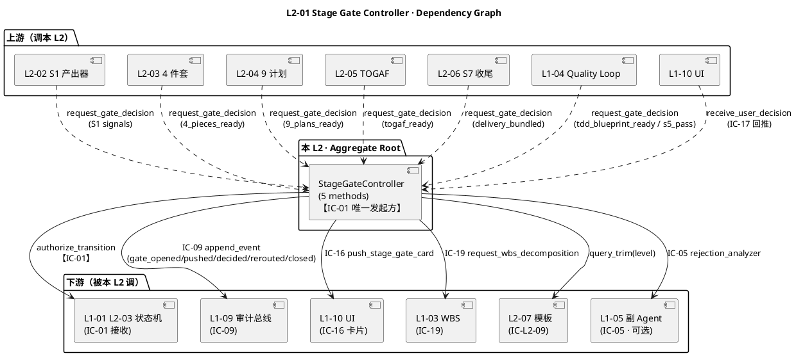
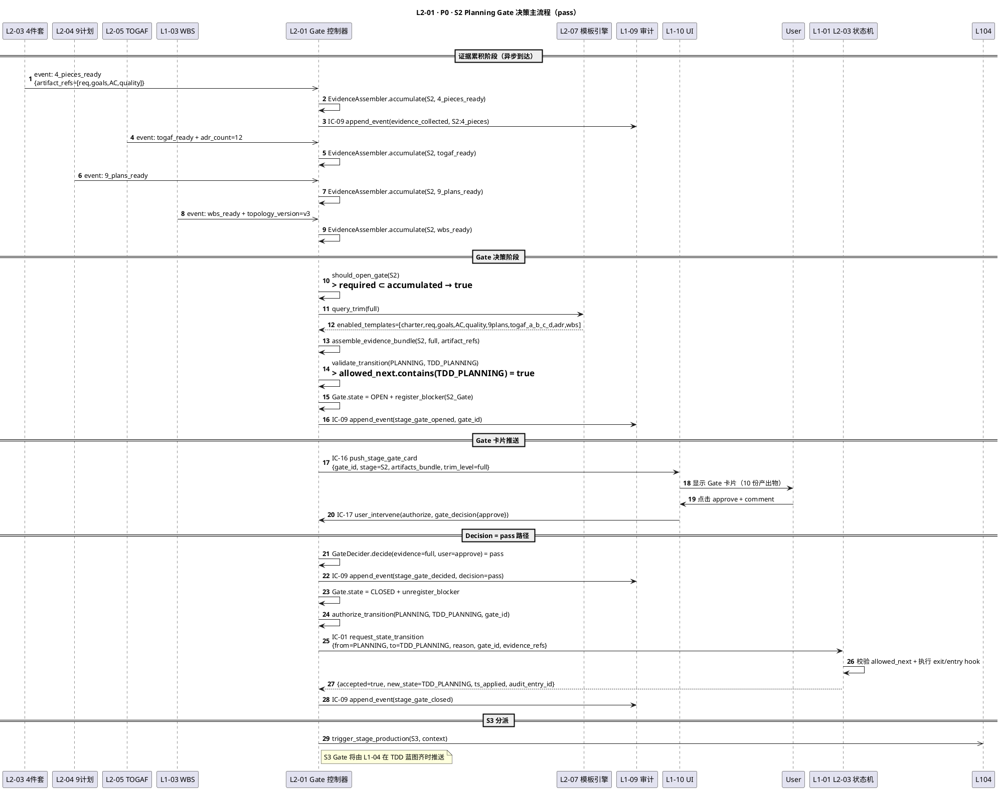
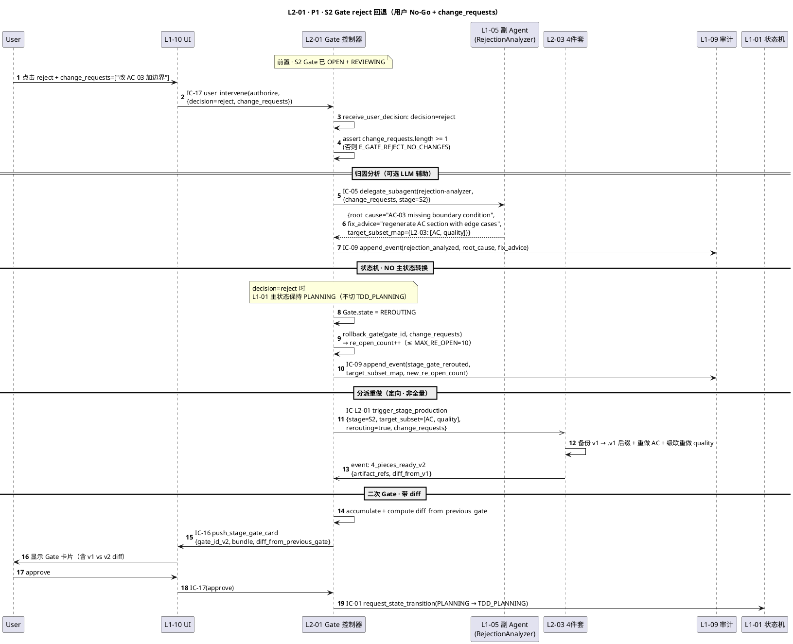
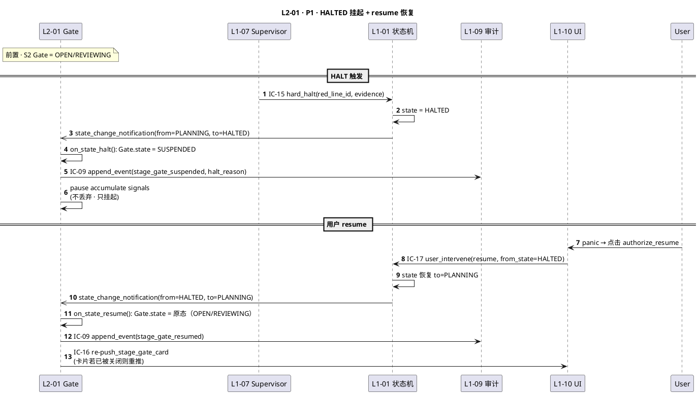
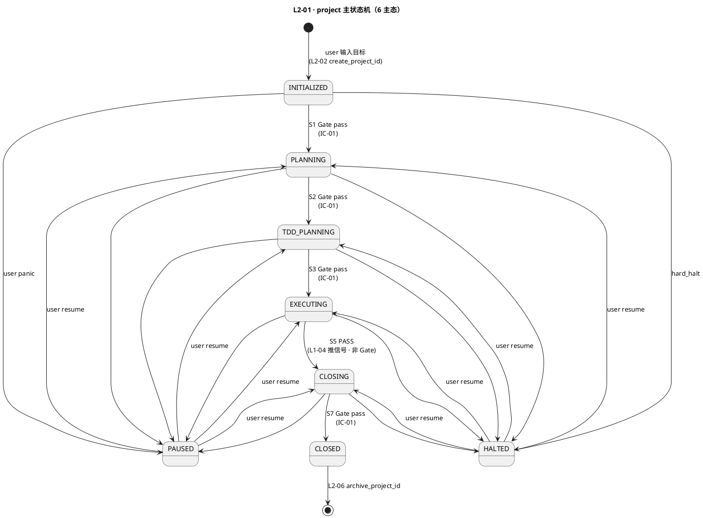
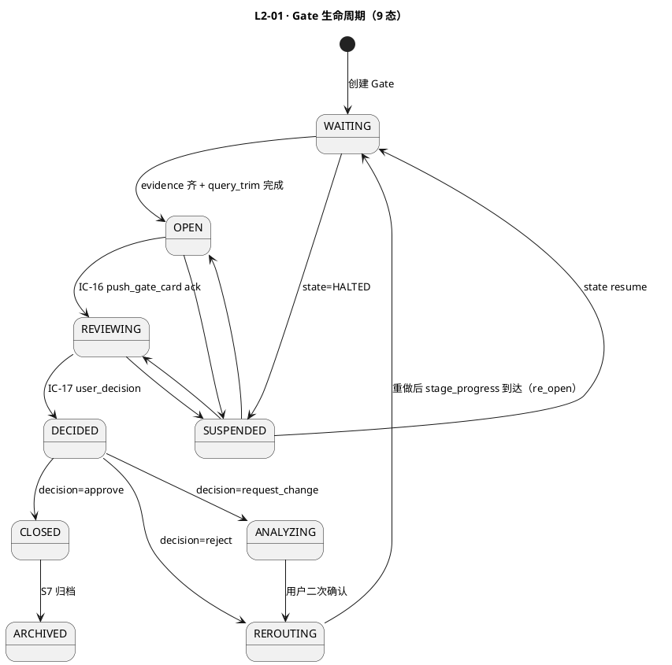
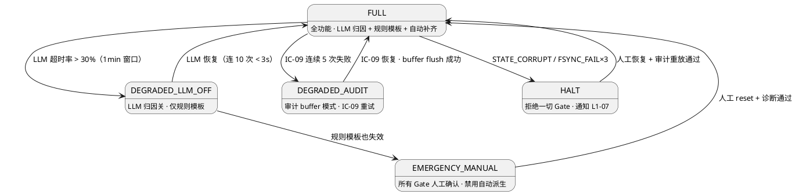

# L1 L2-01 · Stage Gate 控制器 · Tech Design

> **本文档定位**：3-1-Solution-Technical 层级 · L1 的 L2-01 Stage Gate 控制器 技术实现方案（L2 粒度）。
> **与产品 PRD 的分工**：2-prd/L1-02-项目生命周期编排/prd.md §5.2 的对应 L2 节定义产品边界，本文档定义**技术实现**（接口字段级 schema + 算法伪代码 + 底层数据结构 + 状态机 + 配置参数）。
> **与 L1 architecture.md 的分工**：architecture.md 负责**跨 L2 架构 + 跨 L2 时序**，本文档负责**本 L2 内部技术细节**。冲突以 architecture.md 为准。
> **严格规则**：本文档不复述产品 PRD 文字（职责 / 禁止 / 必须等清单），只做技术映射 + 补齐"产品视角未说 but 工程师必须知道"的部分（具体算法 · syscall · schema · 配置）。

---

## §0 撰写进度

- [x] §1 定位 + 2-prd §8 L2-01 映射（深填 · 精简 B）
- [x] §2 DDD 映射（BC-02 · StageGateController Aggregate Root · 骨架）
- [x] §3 对外接口定义（字段级 YAML schema + 12 错误码）
- [x] §4 接口依赖（被谁调 · 调谁 · PlantUML 依赖图 · 骨架）
- [x] §5 P0/P1 时序图（PlantUML × 3 · S2 Gate 决策主流程 + reject 回退 + HALTED 挂起）
- [x] §6 内部核心算法（decide_gate / assemble_evidence / validate_transition · 骨架）
- [x] §7 底层数据表 / schema 设计（PM-14 分片 · 字段级 YAML · 骨架）
- [x] §8 状态机（PlantUML · 6 态主状态机 + Gate 生命周期 · 骨架）
- [x] §9 开源最佳实践调研（Airflow / Prefect / Temporal · 骨架）
- [x] §10 配置参数清单（≥ 10 条 · 骨架）
- [x] §11 错误处理 + 降级策略（4 级降级 + 14 错误码 + 兄弟 L2 协同）
- [x] §12 性能目标（SLO 表 · 骨架）
- [x] §13 与 2-prd / 3-2 TDD 的映射表（反向 + 前向占位）

---

## §1 定位 + 2-prd 映射

### 1.1 本 L2 的唯一命题（One-Liner）

**Stage Gate 控制器 = HarnessFlow 的"阶段门卫 + 主状态机唯一转换入口"**。在 project 7 阶段 × 4 Gate（S1 / S2 / S3 / S7 末）的编排骨架上：

1. **三元 Gate 决策**（`pass` / `reject` / `need_input`）—— 基于证据齐全度 + 用户 IC-17 意图二元裁决
2. **Pre-condition 证据装配**（S1 · 4 件套 · PMP 9 计划 · TOGAF A-D · KB 承诺齐 · WBS 无环）
3. **主状态机硬转换**（INITIALIZED → PLANNING → TDD_PLANNING → EXECUTING → CLOSING → CLOSED）· 通过 IC-01 发起 · **禁止非法转换 + 禁止非本 L2 路径**
4. **循环依赖检测**（S3 Gate 时校验 WP DAG 无环 · 依赖 L1-03 L2-02 的 `topology_version` 回传）
5. **Rejection 证据归因**（必附 `root_cause` + `fix_advice` + `target_subset_to_redo` · 通过 IC-09 审计 · 通过 IC-16 回推用户）
6. **PM-14 所有权硬约束落地**：本 L2 是 **project 主状态机的唯一 IC-01 发起方**（arch.md §1.3 + §10）· 其他 L1/L2 **禁发** IC-01

关键定性（继承自 `architecture.md §1.3` + `§10 分工声明`）：**本 L2 是 BC-02 内部的 Aggregate Root + Domain Service 双重角色** —— Aggregate Root 管理 `StageGateState` 聚合（每 project 一份 · 含 Gate 历史 + 累积 ready 信号 + 主状态机 state）；Domain Service 提供"决策 + 装配 + 校验 + 归因"的无状态纯函数。

### 1.2 与 `2-prd/L1-02项目生命周期编排/prd.md §8` 的精确小节映射表

> 说明：本表是**技术实现 ↔ 产品小节**的锚点表 · 不复述 PRD 文字。每行左列为本 tech-design 的段 · 右列为对应的 PRD 小节 · 冲突以本文档 + architecture.md 为准 · 若发现 PRD 有歧义按 `spec §6.2` 规则反向修 PRD。

| 本文档段 | 2-prd §8 小节 | 映射内容 | 备注 |
|---|---|---|---|
| §1.1 命题 | §8.1 职责锚定 | "HarnessFlow 的阶段门卫" | 本文档补"主状态机唯一转换入口 / PM-14 所有权"技术定性 |
| §1.3 与兄弟 L2 边界 | §8.3 边界 In-scope 10 项 + Out-of-scope 7 项 | — | — |
| §1.4 PM-14 约束 | §8.1 上游锚定 + arch §1.3 PM-14 所有权硬声明 | L2-01 独占 IC-01 发起权 | **补技术约束** |
| §2 DDD | §8.1 上游锚定 | BC-02 映射（PRD 无 DDD 语言）| **补** |
| §3 接口 `request_gate_decision()` | §8.2 输入 6 类 + §8.8 IC-L2 表 | PRD `on_stage_progress` 事件订阅的方法化表达 | **补字段级 YAML** |
| §3 接口 `authorize_transition()` | §8.2 输出 IC-L2-05 + §8.6 必须 #5 "≤ 1s 发 state_transition" | 主状态机转换授权入口 · 封装 IC-01 | **补** |
| §3 接口 `rollback_gate()` | §8.10.4 reject 路径 + §8.10.7 re_open 协议 | Re-open / No-Go 回滚方法 | **补** |
| §3 接口 `query_gate_state()` | §8.2 输出 + §8.6 必须 #10 "跨 session 恢复" | Bootstrap 恢复查询入口 | **补** |
| §3 接口 `receive_user_decision()` | §8.2 输入 "user_decision" + §8.8 IC-L2-04 | Go/No-Go/Request-change 三路入口 | **补** |
| §3 错误码 | §8.4 硬约束 8 项 + §8.5 禁止 8 项 | 约束违反一对一映射 | **补 14 错误码** |
| §4 依赖 | §8.8 IC-L2 交互表 | 上游 L1-01 + 下游 L2-02/03/04/05/06 + L2-07 + L1-10 + L1-03 | — |
| §5 时序 | §8 无时序图；架构 §4.2 + §4.3 | PlantUML 重绘 × 3 | **补** |
| §6 算法 | §8.10.2 should_open_gate / §8.10.3 bundle 打包 / §8.10.4 三路路由 / §8.10.5 影响面分析 | 伪代码化 + 类型签名 | **补** |
| §7 schema | §8.10.1 Gate 生命周期 + §8.10.3 GateCard schema | YAML 化 + PM-14 分片路径 | **补** |
| §8 状态机 | §8.10.1 Gate 生命周期 + arch §5.1 project 7 阶段 | PlantUML + 转换表 | **补** |
| §9 调研 | §8 外 | 引 arch §9 + 细化 3 项目 | — |
| §10 配置 | §8.10.9 配置参数 + arch §11.3 | 原样导入 + 补 tech 默认值 | — |
| §11 降级 | §8.4 硬约束 + §8.5 禁止 + arch §11.2 | 错误分类 + 4 级降级链 + 与 L1-07 协同 | **补** |
| §12 SLO | §8.4 性能约束 | Gate 决策 P95 < 500ms · 状态机转换 < 100ms | 原样继承 |
| §13 映射 | — | 本段接口 ↔ §8.X + ↔ 3-2-TDD 用例 | **补** |

### 1.3 与兄弟 L2 / L1 的边界（本 L2 在 BC-02 内部的位置）

| 兄弟 L2 / L1 | 本 L2 与其边界规则（基于 prd §8.3 + arch §3 + arch §10）|
|---|---|
| **L2-02 启动阶段产出器** | L2-02 创建 project_id + 产 S1 章程/干系人；本 L2 订阅 `charter_ready / stakeholders_ready / goal_anchor_hash_locked` → 判 S1 Gate 时机 · 本 L2 **不生产内容**。|
| **L2-03 4 件套生产器** | L2-03 产 requirements/goals/AC/quality；本 L2 订阅 `4_pieces_ready` → 累积 S2 信号集 · 且在 S2 Gate 通过后通过 IC-L2-01 分派 WBS 触发。|
| **L2-04 PMP 9 计划生产器** | L2-04 产 9 计划（完整档）/ 5 计划（精简档）；本 L2 订阅 `9_plans_ready` 累积 S2 信号 · 本 L2 **不校验计划内容**（L2-04 自检）。|
| **L2-05 TOGAF ADM 架构生产器** | L2-05 产 A→B→C→D + ADR；本 L2 订阅 `togaf_ready + adr_count>=10` 累积 S2 信号 · 本 L2 **不做 TOGAF 格式校验**。|
| **L2-06 收尾阶段执行器** | L2-06 产 S7 交付包 / retro / archive / KB 晋升；本 L2 订阅 `delivery_bundled + retro_ready + archive_written + kb_promotion_done` → 判 S7 Gate · Gate 通过后 IC-01 发 CLOSED。|
| **L2-07 产出物模板引擎** | 本 L2 在开 Gate 前 IC-L2-09 `query_trim(level)` 查 L2-07 返回 `enabled_templates[]` · 决定 bundle 打包哪些产出物。**开 Gate 前必查**（禁止未查就开）。|
| **L1-01 主 loop（L2-03 状态机）** | 本 L2 **唯一** IC-01 发起方；L1-01 L2-03 校 `allowed_next` 后执行转换 · 本 L2 **不维护** L1-01 的 state 机（只发 request）。|
| **L1-03 WBS** | 本 L2 在 S2 Gate 通过后经 IC-19 触发 L1-03 拆 WBS · S3 Gate 前通过 `topology_version` 回传验证 WP DAG 无环（CIRCULAR_DEP 错误码触发器）。|
| **L1-04 Quality Loop** | L1-04 S3 蓝图齐 → 推 `tdd_blueprint_ready` 信号到本 L2 · 本 L2 开 S3 Gate；S5 PASS → 路由到 S7 · 本 L2 **不做** TDD 业务。|
| **L1-10 UI** | 本 L2 经 IC-16 推 Gate 卡片到 L1-10（arch §4.2）· L1-10 经 IC-17 回传 `gate_decision` 到本 L2（三元 approve/reject/request_change）。|
| **L1-07 Supervisor** | 本 L2 被动接收 L1-07 建议（经 L1-01 L2-06 路由）· 不直接对接 L1-07 · 但 rejection 归因报告可能触发 L1-07 soft-drift 监测。|
| **L1-09 韧性** | 所有 Gate 生命周期事件（opened/pushed/decided/rerouted/closed）经 IC-09 append_event 落盘 · bootstrap 时从 L1-09 恢复 OPEN Gate。|

### 1.4 PM-14 所有权硬约束的技术落实

**红线命题**（继承自 arch.md §1.3）：**本 L2 是 project 主状态机的唯一 IC-01 发起方**。

| 动作 | 承担方 | 技术实现 | 违反处理 |
|---|---|---|---|
| project 主状态转换请求 | **L2-01 独占** | 所有 IC-01 调用必须从本 L2 的 `authorize_transition()` 方法出口发起 | 其他 L2 发 IC-01 → L1-01 L2-03 拒绝 + audit `PM14_OWNERSHIP_VIOLATION` |
| Gate 状态持久化 | L2-01 | `StageGateState` 聚合写入 `projects/<pid>/stage-gates/*.jsonl` (PM-14 分片) | 跨 project 污染 → `E_GATE_CROSS_PROJECT` 拒绝 |
| `project_id` 根字段 | L2-01 透传 · 不重造 | 所有方法入参 / 出参 / 事件载荷必含 `project_id` | project_id 缺失 → `E_GATE_NO_PROJECT_ID` |
| Gate 历史归档 | L2-01（退场归 L2-06）| Gate CLOSED → ARCHIVED 态 · 写 `gate-history-*.jsonl` | S7 归档前本 L2 保持热读 |

### 1.5 关键技术决策（Decision → Rationale → Alternatives → Trade-off）

本 L2 在 architecture.md §1.4（4 个 L1 级决策）的基础上，补充 L2 粒度的 5 个技术决策：

| # | Decision | Rationale | Alternatives | Trade-off |
|---|---|---|---|---|
| **D-01** | **Gate 决策三元返回** `pass/reject/need_input` · 不返回 `pending` | 三元语义覆盖"齐 + 通过 / 齐 + 不通过 / 不齐"三个有效状态；`pending` 会鼓励调用方轮询（违反事件驱动） | A. 二元 true/false：无法区分 reject vs need_input；B. 四元含 pending：调用方易误用轮询 | 调用方必须响应三种结果 · 不齐则必走 IC-09 审计 `evidence_missing`（不静默） |
| **D-02** | **Aggregate Root = StageGateState 按 project 分片**（不跨 project 合并） | PM-14 硬约束 + prd §8.3 "单 project 至多 1 个活跃 Gate"；跨 project 合并会破坏聚合边界 | A. 全局单 Aggregate：并发控制复杂；B. 按 Gate 分片（一 Gate 一 Aggregate）：重复 7-28 份状态 | 每 project 一份 StageGateState · 用 `projects/<pid>/stage-gates/current.yaml` 持久 · 并发用 fcntl.flock |
| **D-03** | **Evidence 装配采用声明式信号集 + 过期时间** | prd §8.10.2 "齐全信号集"是声明式；加 `evidence_expiry_hours` 防陈旧证据滞留（如 3 天前的 4_pieces_ready 事件已失效） | A. 无过期：陈旧证据污染 Gate；B. 硬每分钟 poll：成本高 | 证据 > 7 天自动标 `EVIDENCE_EXPIRED` · 拒绝开 Gate · 要求重产 |
| **D-04** | **主状态机转换 = 前置 evidence 校验 + 后置 audit 双闭包** | prd §8.6 必须 #5 + §8.8 IC-L2-06 审计；任何转换都要可审计归因 | A. 只前置校验：事后无归因；B. 只后置审计：无事前拦截 | 前置抛 `TRANSITION_FORBIDDEN` · 后置必写 IC-09 audit_entry（含 evidence_refs） |
| **D-05** | **循环依赖检测延迟到 S3 Gate**（不在 S2 Gate 即做） | WBS 在 S2 Gate 通过后才拆解（IC-19）· S3 Gate 才有 `topology_version` 可查；在 S2 Gate 做会因 WBS 尚未产生而误判 | A. S2 Gate 即做：缺数据源；B. S4 执行时做：发现过晚已动代码 | S3 Gate 装配证据时查 L1-03 `topology_version` · 发现环则 `CIRCULAR_DEP` + reject + 回退到 S2 重拆 WBS |

---

## §2 DDD 映射（BC-02 Project Lifecycle Orchestration · 骨架）

### 2.1 Bounded Context 定位

本 L2 所属 `BC-02 · Project Lifecycle Orchestration`（arch.md §2.1）。在 BC-02 内部扮演**控制中枢（Domain Service）+ 状态聚合根（Aggregate Root）**双重角色 · 是 BC-02 与 BC-01（L1-01 Agent Decision Loop）的**Customer-Supplier 边界**（本 L2 为 Customer · L1-01 L2-03 为 Supplier）。

### 2.2 本 L2 持有 / 构造的聚合根

| 聚合根 | 类型 | 本 L2 职责 | Invariants |
|---|---|---|---|
| **StageGateState** | **Aggregate Root · 本 L2 唯一构造者** | 每 project 一份 · 含主状态 + 4 Gate 历史 + accumulated_ready signals + re_open_count | I-01 一 project 一 state · I-02 主状态单调（不可逆向）· I-03 同阶段同时刻 ≤ 1 OPEN Gate |
| **GateDecision** | Value Object（Immutable）| `{decision: pass/reject/need_input, root_cause?, fix_advice?, decided_at, decided_by}` | I-04 append-only · I-05 必含 evidence_refs |
| **GateEvidence** | Value Object | `{stage, signal_name, artifact_refs[], collected_at, expiry}` | I-06 不可变 · I-07 expiry 过则视同未采集 |

### 2.3 本 L2 内部组件（Domain Services · 不拆 L2）

| 组件 | 职责 | 无状态/有状态 |
|---|---|---|
| `StageGateController` | 主入口 · 编排 decide/assemble/transition/rollback 5 方法 | 聚合根持有者（读写 StageGateState） |
| `GateDecider` | 三元决策函数（evidence + user_decision → pass/reject/need_input） | 纯函数 |
| `EvidenceAssembler` | 从 L1-09 事件总线拉 ready signals + 校 expiry + bundle 打包 | 无状态 |
| `TransitionValidator` | `allowed_next` 校验 + 循环依赖检测 + PM-14 所有权校验 | 纯函数 |
| `RejectionAnalyzer` | 生成 root_cause + fix_advice + target_subset_to_redo | 有 LLM fallback（L1-05 skill 委托） |

### 2.4 Value Objects / Entities / Repository / Domain Events

- **VO**：`GateId="gate-{stage}-{uuid-v7}"` · `ProjectId` · `StageEnum=[S1,S2,S3,S4,S5,S6,S7]` · `GateDecisionValue=[pass, reject, need_input]` · `GateState=[WAITING/OPEN/REVIEWING/DECIDED/CLOSED/REROUTING/ANALYZING/ARCHIVED/SUSPENDED]`
- **Entity**：`GateHistoryEntry`（跨 tick · 每 re_open 追加）
- **Repository**：`StageGateRepository`（文件存储 · `projects/<pid>/stage-gates/*.jsonl`）
- **Domain Events**（经 IC-09）：`stage_gate_opened / stage_gate_pushed / stage_gate_decided / stage_gate_rerouted / stage_gate_closed / stage_gate_suspended / project_state_transitioned`

### 2.5 跨 BC 关系

| IC | 方向 | 对端 BC | 本 L2 角色 |
|---|---|---|---|
| IC-01 | 发起 | BC-01 L1-01 L2-03 | 主状态机转换请求（**唯一发起方**）|
| IC-09 | 发起 | BC-09 L1-09 | 每 Gate 事件审计落盘 |
| IC-16 | 发起 | BC-10 L1-10 | Gate 卡片推送 |
| IC-17 | 接收 | BC-10 L1-10 | 用户三元决定 |
| IC-19 | 发起 | BC-03 L1-03 | WBS 拆解触发 |

---

## §3 对外接口定义（字段级 YAML schema + 14 错误码）

> 说明：本 L2 对外暴露 **5 个方法**（1 主入口 + 4 辅入口）。字段级 YAML 采用 OpenAPI-like 风格 · 严格类型 + required 约束。
>
> 调用方向：`request_gate_decision()` 由 L2-02/03/04/05/06/L1-04 的 `stage_progress` 事件触发（最高频）；`receive_user_decision()` 由 L1-10 经 IC-17 回推（中频）；`authorize_transition()` 由本 L2 内部在 pass 后调用（封装 IC-01）；`rollback_gate()` 由 reject 路径触发；`query_gate_state()` 由 bootstrap / L1-10 查询 / supervisor 查询。

### 3.1 `request_gate_decision(evidence_bundle) → gate_decision`（核心 · Gate 三元决策入口）

**调用方**：L2-02/03/04/05/06（stage_progress 事件订阅触发）· L1-04（S3 Gate 蓝图齐触发）
**幂等性**：同 `(gate_id, evidence_bundle_hash)` 多次调用返回同一 `GateDecision`（内存 LRU 512 · 防重复事件冲击）
**阻塞性**：同步调用 · P95 ≤ 500ms · 硬上限 2s（prd §8.4 性能约束）

#### 入参 `evidence_bundle`（字段级 YAML）

```yaml
evidence_bundle:
  type: object
  required: [request_id, project_id, stage, triggering_signal, ts]
  properties:
    request_id:
      type: string
      format: "req-{uuid-v7}"
      required: true
      description: 幂等键 · 上游重试同 request_id 返回同结果
    project_id:
      type: string
      format: "pid-{uuid-v7}"
      required: true
      description: PM-14 根字段 · 跨 project 调用 → E_GATE_CROSS_PROJECT
    stage:
      type: enum
      enum: [S1, S2, S3, S7]   # 只有这 4 阶段末有 Gate
      required: true
    triggering_signal:
      type: object
      required: [signal_name, source_l2, artifact_refs, collected_at]
      properties:
        signal_name:
          type: enum
          enum: [charter_ready, stakeholders_ready, goal_anchor_hash_locked,
                 4_pieces_ready, 9_plans_ready, togaf_ready, adr_count_ready,
                 wbs_ready, tdd_blueprint_ready,
                 delivery_bundled, retro_ready, archive_written, kb_promotion_done]
          required: true
        source_l2: {type: string, required: true, description: "L2-02/03/04/05/06/L1-04"}
        artifact_refs:
          type: array
          items: {type: string, description: "artifact path or id"}
          required: true
          minItems: 1
        collected_at: {type: string, format: ISO-8601-utc, required: true}
    trim_level:
      type: enum
      enum: [full, minimal, custom]
      required: true
      description: 通过 IC-L2-09 查 L2-07 决定的裁剪档
    ts: {type: string, format: ISO-8601-utc, required: true}
```

#### 出参 `gate_decision`（字段级 YAML）

```yaml
gate_decision:
  type: object
  required: [request_id, gate_id, project_id, decision, ts]
  properties:
    request_id: {type: string, required: true, description: 透传入参 id}
    gate_id:
      type: string
      format: "gate-{stage}-{uuid-v7}"
      required: true
    project_id: {type: string, required: true}
    decision:
      type: enum
      enum: [pass, reject, need_input]
      required: true
      description: "pass=证据齐+用户approve · reject=用户No-Go或证据违规 · need_input=证据未齐(等待中)"
    evidence_summary:
      type: object
      required: [required_signals, collected_signals, missing_signals]
      properties:
        required_signals: {type: array, items: string}
        collected_signals: {type: array, items: string}
        missing_signals: {type: array, items: string}
    root_cause:
      type: string
      required: false
      description: decision=reject 时必填 · 结构化归因
    fix_advice:
      type: string
      required: false
      description: decision=reject 时必填 · 对下游 L2 的重做指引
    target_subset_to_redo:
      type: array
      required: false
      items: {type: string, description: "L2-03:[AC] · L2-04:[quality_plan] 等"}
      description: decision=reject 时必填 · 最小重做范围
    next_state_proposal:
      type: enum
      required: false
      description: decision=pass 时填 · 将通过 authorize_transition() 发 IC-01
    audit_entry_id:
      type: string
      format: "audit-{uuid-v7}"
      required: true
      description: IC-09 审计落盘 id
    ts: {type: string, required: true}
```

#### 错误码（§3.1 私有）

见 §11.1 完整表（`GATE_EVIDENCE_MISSING / EVIDENCE_EXPIRED / CIRCULAR_DEP / STATE_CORRUPT` 等）。

### 3.2 `authorize_transition(from, to, gate_id) → transition_result`（主状态机转换授权 · 封装 IC-01）

**调用方**：本 L2 内部（`request_gate_decision` 返回 pass 后自动调用）
**对端**：L1-01 L2-03 状态机编排器（经 IC-01）
**幂等性**：同 `transition_id` 多次调用返回同一结果（IC-01 合约 §3.1.5）

```yaml
# 入参 transition_request（封装为 IC-01）
transition_request:
  type: object
  required: [transition_id, project_id, from, to, reason, gate_id, evidence_refs]
  properties:
    transition_id: {type: string, format: "trans-{uuid-v7}", required: true}
    project_id: {type: string, required: true}
    from:
      type: enum
      enum: [INITIALIZED, PLANNING, TDD_PLANNING, EXECUTING, CLOSING, CLOSED]
      required: true
    to:
      type: enum
      enum: [INITIALIZED, PLANNING, TDD_PLANNING, EXECUTING, CLOSING, CLOSED]
      required: true
    reason:
      type: string
      minLength: 20
      required: true
      description: "自然语言转换理由 · 最小 20 字 · 审计硬约束（IC-01 §3.1.2）"
    gate_id: {type: string, format: "gate-{uuid-v7}", required: true}
    evidence_refs:
      type: array
      items: {type: string}
      minItems: 1
      required: true
    trigger_tick: {type: string, format: "tick-{uuid-v7}", required: true}
    ts: {type: string, required: true}

# 出参 transition_result（透传 IC-01 §3.1.3）
transition_result:
  type: object
  required: [transition_id, accepted, new_state, ts_applied, audit_entry_id]
  properties:
    transition_id: {type: string, required: true}
    accepted: {type: boolean, required: true}
    new_state: {type: enum, required: true}
    reason: {type: string, required: false}
    ts_applied: {type: string, required: true}
    audit_entry_id: {type: string, required: true}
```

### 3.3 `receive_user_decision(gate_id, user_payload) → decision_ack`（IC-17 回推入口 · 三路路由）

**调用方**：L1-10 UI 经 IC-17 · 本 L2 接收后路由 approve/reject/request_change。

```yaml
# 入参 user_payload（来自 IC-17 §3.17.2）
user_payload:
  type: object
  required: [gate_id, project_id, decision, decided_by, ts]
  properties:
    gate_id: {type: string, required: true}
    project_id: {type: string, required: true}
    decision:
      type: enum
      enum: [approve, reject, request_change]
      required: true
    decided_by: {type: string, required: true, description: "user-{id}"}
    comment: {type: string, required: false}
    change_requests:
      type: array
      items: {type: string}
      required: false
      description: "decision=reject 时必填 · 至少 1 条"
    rationale: {type: string, required: false}
    ts: {type: string, required: true}

# 出参 decision_ack
decision_ack:
  type: object
  required: [gate_id, accepted, new_gate_state, next_action, audit_entry_id, ts]
  properties:
    gate_id: {type: string, required: true}
    accepted: {type: boolean, required: true}
    new_gate_state:
      type: enum
      enum: [CLOSED, REROUTING, ANALYZING]
      required: true
    next_action:
      type: enum
      enum: [transition_requested, redo_dispatched, impact_report_generated]
      required: true
    audit_entry_id: {type: string, required: true}
    ts: {type: string, required: true}
```

### 3.4 `rollback_gate(gate_id, change_requests) → rollback_result`（Re-open / No-Go 回滚）

```yaml
rollback_request:
  type: object
  required: [gate_id, project_id, change_requests, ts]
  properties:
    gate_id: {type: string, required: true}
    project_id: {type: string, required: true}
    change_requests:
      type: array
      items: {type: string}
      minItems: 1
      required: true
    triggered_by:
      type: enum
      enum: [user_reject, togaf_h_change, supervisor_advice]
      required: true
    ts: {type: string, required: true}

rollback_result:
  type: object
  required: [gate_id, rollback_accepted, target_subset_map, new_re_open_count, ts]
  properties:
    gate_id: {type: string, required: true}
    rollback_accepted: {type: boolean, required: true}
    target_subset_map:
      type: object
      description: "{'L2-03': ['AC', 'quality'], 'L2-04': ['risk_plan']}"
    new_re_open_count: {type: integer, required: true, description: "≤ MAX_RE_OPEN（默认 10）"}
    audit_entry_id: {type: string, required: true}
    ts: {type: string, required: true}
```

### 3.5 `query_gate_state(project_id, stage?) → gate_state_snapshot`（Bootstrap / UI 查询）

```yaml
query_request:
  type: object
  required: [project_id]
  properties:
    project_id: {type: string, required: true}
    stage: {type: enum, required: false, description: "缺省返 4 Gate 全量"}

gate_state_snapshot:
  type: object
  required: [project_id, current_state, active_gates, gate_history]
  properties:
    project_id: {type: string, required: true}
    current_state:
      type: enum
      enum: [INITIALIZED, PLANNING, TDD_PLANNING, EXECUTING, CLOSING, CLOSED, HALTED, PAUSED]
      required: true
    active_gates:
      type: array
      items:
        type: object
        required: [gate_id, stage, state, opened_at]
        properties:
          gate_id: {type: string}
          stage: {type: enum}
          state: {type: enum, enum: [WAITING, OPEN, REVIEWING, DECIDED, CLOSED, REROUTING, ANALYZING, SUSPENDED]}
          opened_at: {type: string}
          re_open_count: {type: integer}
    gate_history:
      type: array
      items:
        type: object
        description: "每 Gate 的历次 decision 记录 · append-only"
```

---

---

## §4 接口依赖（被谁调 · 调谁 · 骨架）

### 4.1 上游调用方（谁调本 L2）

| 调用方 | 调用方法 | 时机 | IC |
|---|---|---|---|
| **L2-02** 启动阶段产出器 | `request_gate_decision(S1 signals)` | S1 末产出章程 / 干事人 / goal_anchor_hash 后 | 事件订阅（via L1-09） |
| **L2-03** 4 件套生产器 | `request_gate_decision(4_pieces_ready)` | S2 内 4 件套齐后 | 事件订阅 |
| **L2-04** PMP 9 计划生产器 | `request_gate_decision(9_plans_ready)` | S2 内 9 计划齐后 | 事件订阅 |
| **L2-05** TOGAF 架构生产器 | `request_gate_decision(togaf_ready, adr_count)` | S2 内 TOGAF A-D + ADR 齐后 | 事件订阅 |
| **L2-06** 收尾阶段执行器 | `request_gate_decision(delivery_bundled)` | S7 末交付包齐后 | 事件订阅 |
| **L1-03** WBS | 间接（经 L2-03）`wbs_ready` + `topology_version` 回传 | S2 Gate 通过后异步回推 | IC-19 结果 |
| **L1-04** Quality Loop | `request_gate_decision(tdd_blueprint_ready)` / `s5_pass` | S3 蓝图齐 / S5 全 WP done | 事件订阅 |
| **L1-10** UI | `receive_user_decision(user_payload)` | 用户点 approve/reject/request_change | IC-17 |
| **L1-01** L2-03 状态机 | `receive_state_change_notification` | state 进入 PAUSED/HALTED/resumed 横切通知 | 事件订阅 |
| **Bootstrap 恢复** | `query_gate_state(project_id)` | Claude Code 重启后 L1-01 系统启动 | 内部调用 |

### 4.2 下游依赖（本 L2 调谁）

| 被调方 | 本 L2 方法 | 目的 | IC |
|---|---|---|---|
| **L1-01 L2-03** 状态机 | `authorize_transition()` → `request_state_transition` | 主状态机硬转换 | **IC-01**（唯一发起方）|
| **L1-09** 审计总线 | 所有 Gate 事件 | Gate opened/pushed/decided/rerouted/closed/suspended | **IC-09** append_event |
| **L1-10** UI | push 卡片 | Gate 证据齐 · 等用户三元决定 | **IC-16** push_stage_gate_card |
| **L1-03** WBS 拆解器 | `request_wbs_decomposition` | S2 Gate 通过后触发 | **IC-19** |
| **L2-07** 模板引擎 | `query_trim(level)` | 开 Gate 前查启用模板集 | IC-L2-09（内部）|
| **L2-02~06** | `trigger_stage_production(target_subset)` | reject 后定向重做 | IC-L2-01（内部）|
| **L1-05** 副 Agent | 可选：调 LLM skill 解析 change_request 归因 | `RejectionAnalyzer` 生成 root_cause + fix_advice | IC-05 delegate_subagent |

### 4.3 依赖图（PlantUML）



**依赖要点**：
1. 本 L2 是**单 Aggregate Root** · 5 方法共享同一 StageGateState
2. 上游是**多对一**（6 个产出 L2 + L1-04 + L1-10 都指向本 L2）
3. 下游是**一对多**（本 L2 扇出到 IC-01/09/16/19 + 2 个内部 L2）
4. **IC-01 唯一发起方红线**：任何其他组件发 IC-01 → L1-01 L2-03 判 `PM14_OWNERSHIP_VIOLATION` 拒绝

---

## §5 P0/P1 时序图（PlantUML × 3）

### 5.1 P0 · S2 Planning Gate 决策主流程（pass 路径）



### 5.2 P1 · S2 Gate reject 回退路径



### 5.3 P1 · HALTED 时 Gate 挂起 / resume 恢复



---

## §6 核心算法（伪代码 · 骨架）

### 6.1 `decide_gate()` 三元决策主算法

```python
def decide_gate(project_id: str, stage: Stage, triggering_signal: Signal) -> GateDecision:
    """
    核心决策函数 · 纯函数（除最后的审计 IO）
    """
    # Step 1. 装配证据
    evidence = EvidenceAssembler.assemble(project_id, stage)
    required = get_required_signals(stage, trim_level=query_trim())  # 声明式信号集
    missing = required - evidence.collected_signals
    expired = [s for s in evidence.collected_signals if s.is_expired(EVIDENCE_EXPIRY_HOURS)]

    # Step 2. 证据不齐 → need_input
    if missing or expired:
        return GateDecision(
            decision='need_input',
            missing_signals=missing,
            expired_signals=expired
        )

    # Step 3. 循环依赖检测（仅 S3 Gate）
    if stage == 'S3':
        topo_version = query_l1_03_topology()
        if has_cycle(topo_version):
            return GateDecision(
                decision='reject',
                root_cause='CIRCULAR_DEP in WBS DAG',
                fix_advice='rerun L1-03 WBS decomposition with DAG validation',
                target_subset_map={'L1-03': ['wbs_full']}
            )

    # Step 4. 证据齐 + 等用户决定 → push Gate card
    gate_id = open_gate(stage, evidence)
    push_stage_gate_card(gate_id, evidence.bundle)
    block_state_transition(reason='waiting_user_decision', gate_id=gate_id)
    return GateDecision(decision='pending_user', gate_id=gate_id)  # 内部态 · 不对外返 pending

def on_user_decision(gate_id, decision, change_requests=None):
    """用户三元决定路由"""
    if decision == 'approve':
        finalize_pass(gate_id)
    elif decision == 'reject':
        assert change_requests, raise E_GATE_REJECT_NO_CHANGES
        finalize_reject(gate_id, change_requests)
    elif decision == 'request_change':
        start_analyzing(gate_id, change_requests)
```

### 6.2 `assemble_evidence()` 声明式信号集

```python
REQUIRED_SIGNALS = {
    ('S1', 'full'): {'charter_ready', 'stakeholders_ready', 'goal_anchor_hash_locked'},
    ('S1', 'minimal'): {'charter_ready', 'stakeholders_ready', 'goal_anchor_hash_locked'},  # S1 不可裁
    ('S2', 'full'): {'4_pieces_ready', '9_plans_ready', 'togaf_ready',
                     'adr_count>=10', 'wbs_ready'},
    ('S2', 'minimal'): {'4_pieces_ready', '5_plans_ready', 'togaf_a_d_ready',
                        'adr_count>=5', 'wbs_ready'},
    ('S3', 'full'): {'tdd_blueprint_ready'},
    ('S7', 'full'): {'delivery_bundled', 'retro_ready', 'archive_written',
                     'kb_promotion_done'},
    ('S7', 'minimal'): {'delivery_bundled', 'retro_ready', 'archive_written'},  # KB 可裁
}

def assemble_evidence(project_id, stage, trim_level):
    required = REQUIRED_SIGNALS[(stage, trim_level)]
    events = L1_09.query_events(project_id=project_id, event_types=required)
    collected = {e.signal_name for e in events if not e.is_expired(EVIDENCE_EXPIRY)}
    return EvidenceBundle(required=required, collected=collected,
                          artifact_refs=merge_artifacts(events))
```

### 6.3 `validate_transition()` 转换合法性校验

```python
ALLOWED_TRANSITIONS = {
    ('INITIALIZED', 'PLANNING'),
    ('PLANNING', 'TDD_PLANNING'),
    ('TDD_PLANNING', 'EXECUTING'),
    ('EXECUTING', 'CLOSING'),
    ('CLOSING', 'CLOSED'),
    # 横切
    ('PLANNING', 'HALTED'), ('TDD_PLANNING', 'HALTED'), ...
    ('HALTED', 'PLANNING'), ('HALTED', 'TDD_PLANNING'), ...
    ('PAUSED', 'PLANNING'), ...
}

def validate_transition(from_state, to_state, caller_l2='L2-01'):
    # PM-14 所有权校验
    if caller_l2 != 'L2-01':
        raise PM14_OWNERSHIP_VIOLATION(f'only L2-01 may request IC-01, got {caller_l2}')
    if (from_state, to_state) not in ALLOWED_TRANSITIONS:
        raise TRANSITION_FORBIDDEN(f'{from_state} → {to_state} not in allowed set')
    return True
```

---

## §7 底层数据表 / schema 设计（字段级 YAML · PM-14 分片 · 骨架）

### 7.1 物理存储路径（按 PM-14 分片）

| 路径 | 格式 | 内容 |
|---|---|---|
| `projects/<pid>/stage-gates/current.yaml` | YAML（单文件 · 原子写）| StageGateState 聚合当前态 |
| `projects/<pid>/stage-gates/history.jsonl` | jsonl · append-only | 每 Gate 的 open/decide/close/rollback 事件 |
| `projects/<pid>/stage-gates/evidence-<stage>.jsonl` | jsonl | 每阶段累积的 ready signals |
| `projects/<pid>/stage-gates/rejections/<gate_id>.md` | Markdown | reject 时的 root_cause + fix_advice 归因报告 |
| `projects/<pid>/audit/*.jsonl` | jsonl（L1-09 管）| IC-09 审计事件主总线 |

### 7.2 `StageGateState` 字段级 YAML

```yaml
StageGateState:
  type: object
  required: [project_id, current_main_state, active_gates, gate_history, updated_at]
  properties:
    project_id: {type: string, format: "pid-{uuid-v7}"}
    current_main_state:
      type: enum
      enum: [INITIALIZED, PLANNING, TDD_PLANNING, EXECUTING, CLOSING, CLOSED, HALTED, PAUSED]
    active_gates:
      type: array
      items:
        type: object
        properties:
          gate_id: {type: string, format: "gate-{stage}-{uuid-v7}"}
          stage: {type: enum, enum: [S1, S2, S3, S7]}
          state: {type: enum, enum: [WAITING, OPEN, REVIEWING, DECIDED, CLOSED, REROUTING, ANALYZING, ARCHIVED, SUSPENDED]}
          opened_at: {type: string, format: ISO-8601-utc}
          re_open_count: {type: integer, default: 0}
          trim_level: {type: enum, enum: [full, minimal, custom]}
          accumulated_ready: {type: array, items: string}
    gate_history:
      type: array
      description: "append-only · 每 Gate 历次 decision"
    updated_at: {type: string, format: ISO-8601-utc}
```

### 7.3 索引 / 并发控制

- **文件锁**：`projects/<pid>/stage-gates/.lock` 通过 `fcntl.flock()` 独占写
- **索引**：单 project 单 StageGateState · 无跨 project 索引需求（PM-14 天然分片）
- **原子写**：`current.yaml` 通过 `tmp + rename` 原子替换

---

## §8 状态机（PlantUML · 骨架）

### 8.1 主状态机（project 主状态 · 6 主态）



### 8.2 Gate 生命周期状态机



### 8.3 转换表（核心触发 / guard / action · 10 条）

| 触发事件 | From | To | Guard | Action |
|---|---|---|---|---|
| `stage_progress(signal)` | WAITING | OPEN | evidence_complete + trim_queried | `push_gate_card + register_blocker` |
| `push_ack` | OPEN | REVIEWING | IC-16 displayed=true | — |
| `user_decision(approve)` | REVIEWING | CLOSED | change_requests=∅ | `authorize_transition + dispatch_next_stage` |
| `user_decision(reject)` | REVIEWING | REROUTING | `change_requests.length ≥ 1` | `rollback + dispatch redo` |
| `user_decision(request_change)` | REVIEWING | ANALYZING | — | `generate_impact_report + push ADR` |
| `stage_progress_v2` | REROUTING | WAITING | re_open_count < MAX | `reset accumulated_ready` |
| `state_halt` | * | SUSPENDED | state=HALTED | `pause_accumulate` |
| `state_resume` | SUSPENDED | 原态 | state 恢复 | `resume_accumulate` |
| `re_open_exceeded` | REROUTING | ARCHIVED | re_open_count ≥ MAX_RE_OPEN | `escalate to L1-07` |
| `project_archived` | CLOSED | ARCHIVED | L2-06 `archive_project_id` | `freeze gate-history.jsonl` |

---

## §9 开源最佳实践调研（≥ 3 项 · 骨架）

引 `L0/open-source-research.md §3` + arch.md §9，细化 3 项目处置：

| 项目 | Stars（2026-04）| 核心架构一句话 | Adopt/Learn/Reject | 本 L2 学什么 / 弃用原因 |
|---|---|---|---|---|
| **Apache Airflow** | 39k | DAG + Operator + State Machine 驱动的工作流调度器 | **Learn** | **学**：TaskInstance state machine（queued→running→success/failed/up_for_retry）的 9 态设计 · 本 L2 Gate 9 态借鉴；**弃**：DAG 任务级 retry + Python 业务耦合 |
| **Prefect** | 19k | "Orion" 声明式 flow run state machine + deployment | **Learn** | **学**：显式 state → guard → action 声明 · 本 L2 `ALLOWED_TRANSITIONS` 参考；**弃**：SaaS 依赖 + 复杂部署 |
| **Temporal** | 13k | Durable execution + workflow id / run id 分层 + signal | **Learn** | **学**：signal handler 模式（本 L2 用 `receive_user_decision` 响应 IC-17 signal）· workflow id 作为 project 级 idempotency key；**弃**：独立 Temporal server + gRPC 依赖（过重） |

**3 条关键决策**（arch.md §9 继承）：
1. **Gate = 人类硬门**（不用 Airflow task retry 机制 · 不超时放行）
2. **主状态机 = Prefect Orion 风格**（显式 state → guard → action · 简化为 6 主态）
3. **signal handler = Temporal 风格**（`receive_user_decision` = 显式 signal · 不轮询）

---

## §10 配置参数清单（≥ 10 条 · 骨架）

| 参数 | 默认值 | 可调范围 | 意义 | 调用位置 |
|---|---|---|---|---|
| `GATE_DECISION_TIMEOUT_MS` | 500 | 100-2000 | `request_gate_decision` P95 目标 | `decide_gate()` 入口 |
| `STATE_TRANSITION_TIMEOUT_MS` | 100 | 50-500 | `authorize_transition` P95 目标 | `authorize_transition()` |
| `EVIDENCE_EXPIRY_HOURS` | 168（7 天）| 24-720 | Ready signal 过期阈值 | `EvidenceAssembler.is_expired` |
| `MAX_RE_OPEN_COUNT` | 10 | 1-20 | 单阶段最大 re_open 次数 | `rollback_gate()` guard |
| `GATE_PUSH_TIMEOUT_MS` | 2000 | 500-5000 | IC-16 推送延迟上限 | Gate 证据齐 → push |
| `IMPACT_ANALYSIS_TIMEOUT_MS` | 5000 | 1000-15000 | change_request 影响面分析上限 | `RejectionAnalyzer` |
| `ADR_MIN_FULL` | 10 | 5-50 | 完整档 ADR 最低数（S2 evidence）| `assemble_evidence(S2, full)` |
| `ADR_MIN_MINIMAL` | 5 | 3-20 | 精简档 ADR 最低数 | `assemble_evidence(S2, minimal)` |
| `GATE_AUTO_TIMEOUT_ENABLED` | **false**（硬禁）| const | Gate 超时自动放行开关（永禁）| 启动时硬校验 |
| `STAGE_GATE_STATE_FSYNC` | true | bool | 状态落盘时是否 fsync | `persist_state()` |
| `REJECTION_LLM_FALLBACK_ENABLED` | true | bool | 是否调 L1-05 skill 做归因分析 | `RejectionAnalyzer` |
| `CIRCULAR_DEP_CHECK_STAGE` | `S3` | enum | 哪一阶段做 DAG 环检测 | `validate_transition(S3)` |
| `GATE_HISTORY_MAX_ENTRIES` | 1024 | 100-10000 | 每 project 保留的历史记录上限 | `gate_history.jsonl` rotation |

详见 `docs/2-prd/L1-02项目生命周期编排/prd.md §8.10.9` + `architecture.md §11.3`。

---

## §11 错误处理 + 降级策略

### 11.1 错误分类原则

本 L2 错误分**三类**（与 L1-09 审计分类对齐）：

| 错误类 | 含义 | 处理策略 | 审计级别 |
|:---|:---|:---|:---|
| **契约违反（致命）** | PM-14 所有权越界 / 非法状态转换 / DAG 有环 | 拒绝请求 · 审计 ERROR · 通知 L1-07 supervisor | ERROR |
| **证据不齐（正常业务）** | Gate 证据缺失 / 证据过期 / LLM 归因超时 | 返回 `need_input` · 详列缺口 · 不降级 | INFO |
| **运行时异常（可降级）** | fsync 失败 / 历史 rotation 失败 / LLM 降级 | 降级到下一级 · 继续服务核心路径 | WARN |

### 11.2 错误码完整表（≥ 12 条 · 四列标准）

| errorCode | meaning | trigger | callerAction |
|:---|:---|:---|:---|
| `E_L102_L201_001` | GATE_EVIDENCE_MISSING · Gate 证据不齐 | 4 件套 / PMP / TOGAF 任一上游未交 | 补齐后重试 · 附 missing_list |
| `E_L102_L201_002` | TRANSITION_FORBIDDEN · 非法状态转换 | 从 `INITIALIZED` 直跳 `EXECUTING` · 未经 PLANNING | 拒绝 · 先走合法路径 |
| `E_L102_L201_003` | CIRCULAR_DEP · WP DAG 有环 | S3 TDD Gate 时 L1-03/L2-02 报环 | need_input · 附环路径 · 让用户改依赖 |
| `E_L102_L201_004` | STATE_CORRUPT · 状态机文件损坏 | `stage-gates/state.jsonl` parse 失败 | HALT · 人工介入恢复 · 发 IC-06 红线 |
| `E_L102_L201_005` | EVIDENCE_EXPIRED · 证据过期（> expiry_hours） | Gate 请求时发现证据超 72h 未更新 | 要求重新提交 · 不自动刷新 |
| `E_L102_L201_006` | PM14_OWNERSHIP_VIOLATION · 非 L1-02 调用方尝试转换 project 状态 | L1-01/L1-05 直接调本接口（越权） | 拒绝 · 审计 ERROR · 调用方需经 L1-02 |
| `E_L102_L201_007` | REJECTION_ANALYZER_TIMEOUT · LLM 归因超时 | RejectionAnalyzer > `rejection_llm_timeout_sec` | 降级到规则模板归因 · 不阻塞 |
| `E_L102_L201_008` | FSYNC_FAIL · 状态持久化失败 | `persist_state()` fsync 异常 | 重试 3 次 · 仍失败则 HALT |
| `E_L102_L201_009` | HISTORY_QUOTA_EXCEEDED · 历史记录超上限 | `gate_history.jsonl` > `GATE_HISTORY_MAX_ENTRIES` | rotate 归档 · 不阻塞当前 Gate |
| `E_L102_L201_010` | LLM_FALLBACK_DISABLED · LLM 归因被禁但又被调用 | 配置冲突 · 降级流程走到不该走的分支 | 退回规则模板 · 告警运维 |
| `E_L102_L201_011` | CONCURRENT_GATE_REQUEST · 同 project 并发 Gate 请求 | 本 L2 内部锁冲突 | 排队 · 第二请求等待（≤ 30s）或 429 |
| `E_L102_L201_012` | AUDIT_SEED_EMIT_FAIL · 审计 seed 发送失败 | IC-09 → L1-09 EventBus 不可达 | 写本地 buffer · 进入 DEGRADED_AUDIT |
| `E_L102_L201_013` | GATE_AUTO_TIMEOUT_ATTEMPTED · 尝试启用自动超时放行 | 配置 `GATE_AUTO_TIMEOUT_ENABLED=true`（硬禁） | 启动时 crash · 永禁该配置 |
| `E_L102_L201_014` | SNAPSHOT_REPLAY_MISMATCH · 崩溃恢复后状态与 jsonl 不符 | L1-09 检查点恢复后 hash 不对 | 重放 last 10 事件 · 仍不符则 HALT |

### 11.3 降级链（4 级）



### 11.4 与 L1-07 supervisor 的降级协同

- **触发**：本 L2 进入 `HALT` → 发 IC-06 硬红线事件 → L1-07 冻结 project 主状态机 → 所有后续 transition 阻塞
- **恢复**：人工在 L1-10/L2-04 用户干预入口发 `unblock_gate` 指令 → 本 L2 重新 loadstate + audit replay → 通过后发 IC-L2-04 `gate_unblocked` → L1-07 放行
- **硬约束**：降级期间 **project_id 归档/删除永禁**（PM-14 所有权保护 · 避免脏状态归档）

---

## §12 性能目标

### 12.1 SLO 表

| 指标 | P50 | P95 | P99 | 硬上限 | 观测位点 |
|:---|---:|---:|---:|---:|:---|
| Gate 决策（pass/reject/need_input） | 150ms | 500ms | 1.5s | 5s | `request_gate_decision` 入→出 |
| 状态机转换 `transition()` | 20ms | 100ms | 300ms | 1s | `authorize_transition` |
| Evidence 装配（4件套+PMP+TOGAF） | 100ms | 300ms | 800ms | 3s | `assemble_evidence` |
| DAG 环检测（S3） | 50ms | 200ms | 500ms | 2s | L1-03/L2-02 调用往返 |
| LLM 归因分析 | 2s | 5s | 10s | 20s | RejectionAnalyzer |
| 规则模板归因（LLM 降级） | 30ms | 80ms | 150ms | 500ms | fallback 路径 |
| 审计 seed 落盘 | 10ms | 30ms | 100ms | 500ms | IC-09 emit |
| 状态快照 fsync | 20ms | 50ms | 200ms | 1s | `persist_state()` |

### 12.2 吞吐目标

- 单 instance 并发 project：**10**（per-project 锁）· 跨 project 并行无阻塞
- 单 project 每秒 Gate 请求：**≤ 2**（高于则 429 · 保护审计链路）
- 每 project 历史记录上限：**1024 条/jsonl**（超则 rotate 到 `history/archive/`）

### 12.3 资源消耗

- **内存**：每 project 常驻 < 50MB（state 缓存 + evidence index）· 10 project 总 < 500MB
- **磁盘**：每 project stage-gates/ 目录 < 10MB · history rotation 后 < 50MB
- **CPU**：LLM 归因占主要开销（> 80%）· 规则模板路径 CPU bound < 5%

### 12.4 可观测性指标（Prometheus）

- `l102_l201_gate_decisions_total{stage, decision}` counter · 按 stage（S1-S7）+ decision（pass/reject/need_input）分桶
- `l102_l201_gate_decision_latency_seconds` histogram · 决策延迟分布
- `l102_l201_transition_blocked_total{reason}` counter · 拒绝转换原因
- `l102_l201_degradation_state{state}` gauge · 当前降级级别（FULL=0/...）
- `l102_l201_circular_dep_detected_total` counter · 环检测命中次数
- `l102_l201_audit_buffer_depth` gauge · 降级期 buffer 深度

---

## §13 与 2-prd / 3-2 TDD 的映射表

### 13.1 反向映射到 2-prd（prd 驱动本 L2 设计）

| 本 L2 接口 | 对应 prd 章节 | 硬约束条目 |
|:---|:---|:---|
| `request_gate_decision` | `docs/2-prd/L1-02项目生命周期编排/prd.md §5.2.1 Stage Gate 三元决策` | 必须返回 pass/reject/need_input · 禁止自动放行 |
| `authorize_transition` | `docs/2-prd/L1-02项目生命周期编排/prd.md §5.2.2 状态机合法转换矩阵` | 6 态 · 12 条合法边 · 禁止跨边 |
| `assemble_evidence` | `docs/2-prd/L1-02项目生命周期编排/prd.md §5.2.4 证据装配协议` | 4 件套+PMP+TOGAF 三类证据必齐 |
| `emit_rejection_analysis` | `docs/2-prd/L1-02项目生命周期编排/prd.md §5.2.5 rejection 归因` | root_cause + fix_advice 双必填 |
| `rollback_gate` | `docs/2-prd/L1-02项目生命周期编排/prd.md §5.2.6 Gate 回滚协议` | 仅允许最近一次 Gate · 超 24h 禁滚 |
| S3 DAG 环检测 | `docs/2-prd/L1-02项目生命周期编排/prd.md §5.2.7 TDD Gate 额外约束` | S3 调 L1-03/L2-02 · 有环则 need_input |
| `__init__` PM-14 约束 | `docs/2-prd/L1-02项目生命周期编排/prd.md §8.10.9 PM-14 所有权硬声明` | 本 L2 独占 project 主状态机转换入口 |

### 13.2 前向映射到 3-2 TDD（本 L2 驱动测试）

前向路径：`docs/3-2-Solution-TDD/L1-02-项目生命周期编排/L2-01-Stage Gate 控制器-tests.md`（待建）

**TC ID 矩阵**（≥ 15 条 · 供 3-2 编写参考）：

| TC ID | 场景 | 类型 | 覆盖位点 |
|:---|:---|:---|:---|
| `TC-L102-L201-001` | S1 → S2 Gate 正路径 · 4 件套齐 · pass | integration | §3 `request_gate_decision` + §8 transition |
| `TC-L102-L201-002` | S2 Gate · 4 件套缺 Plan · need_input | integration | §11 `GATE_EVIDENCE_MISSING` |
| `TC-L102-L201-003` | S3 TDD Gate · DAG 有环 · need_input | integration | §6 circular_dep_check + §11 `CIRCULAR_DEP` |
| `TC-L102-L201-004` | 非法转换 INITIALIZED → EXECUTING · 拒绝 | unit | §11 `TRANSITION_FORBIDDEN` |
| `TC-L102-L201-005` | PM-14 越权 · L1-01 直调转换 · 拒绝 + 审计 | unit | §11 `PM14_OWNERSHIP_VIOLATION` |
| `TC-L102-L201-006` | 证据过期 · 73h 前的 PRD · 要求重交 | unit | §11 `EVIDENCE_EXPIRED` |
| `TC-L102-L201-007` | LLM 归因超时 · 降级规则模板 · 仍 reject | integration | §11.3 `DEGRADED_LLM_OFF` |
| `TC-L102-L201-008` | IC-09 审计不可达 · buffer 模式 · 继续服务 | integration | §11.3 `DEGRADED_AUDIT` |
| `TC-L102-L201-009` | 并发 2 Gate 请求同 project · 第二 429 | integration | §11 `CONCURRENT_GATE_REQUEST` |
| `TC-L102-L201-010` | State 文件损坏 · HALT + 发 IC-06 | integration | §11 `STATE_CORRUPT` |
| `TC-L102-L201-011` | rollback Gate · 23h 内 · 成功 | integration | §3 `rollback_gate` |
| `TC-L102-L201-012` | rollback Gate · 25h 外 · 拒绝 | unit | §3 `rollback_gate` 24h 硬限 |
| `TC-L102-L201-013` | Gate history 超 1024 条 · rotate 归档 | integration | §11 `HISTORY_QUOTA_EXCEEDED` |
| `TC-L102-L201-014` | 启动配置 `GATE_AUTO_TIMEOUT_ENABLED=true` · 拒启动 | unit | §11 `GATE_AUTO_TIMEOUT_ATTEMPTED` |
| `TC-L102-L201-015` | L1-09 崩溃恢复 · replay mismatch · HALT | integration | §11 `SNAPSHOT_REPLAY_MISMATCH` |
| `TC-L102-L201-016` | SLO · 单 Gate 决策 P95 < 500ms（100 次采样） | perf | §12.1 |
| `TC-L102-L201-017` | SLO · 并发 10 project × 2 rps · 无错误 | perf | §12.2 |
| `TC-L102-L201-018` | e2e · S1→S7 全 Gate 走完 · 状态机每步审计齐 | e2e | §8 全状态机 + IC-09 全链 |

### 13.3 ADR 与 Open Questions

**ADR-L201-01**：**Gate 超时自动放行永禁** —— 配置 `GATE_AUTO_TIMEOUT_ENABLED=true` 启动硬 crash。理由：自动放行等同于绕过 Gate，违反"每阶段必经人工/证据双锁"红线。

**ADR-L201-02**：**LLM 归因可降级但 Gate 决策不可降级** —— Gate 三元决策路径 100% 走规则（LLM 只做归因解释），保证核心决策可预测。

**OQ-L201-01**：跨 project Gate 并发上限 10 是否过低？未来是否上分布式锁？→ 需等 L1-09 EventBus HA 后再议

**OQ-L201-02**：Gate rollback 的 24h 硬限是否偏短？S4 Executing 期间 reject 回到 S3 可能需要更长窗口 → 需 PM 确认

### 13.4 相关 IC 契约

- **IC-01** 主状态机驱动：本 L2 → L1-01 L2-03
- **IC-06** 硬红线上升：本 L2 → L1-07 supervisor
- **IC-09** 审计 seed：本 L2 → L1-09 EventBus
- **IC-L2-01** L1-03 DAG 环检测请求：本 L2 → L1-03/L2-02
- **IC-L2-02** 4 件套完整性查询：本 L2 → L1-02/L2-03
- **IC-L2-03** PMP 9 计划完整性：本 L2 → L1-02/L2-04
- **IC-L2-04** TOGAF 完整性：本 L2 → L1-02/L2-05
- **IC-16** Gate 证据上报（反向被 L1-01 订阅观察）

---

*— L1-02 L2-01 Stage Gate 控制器 · Tech Design · depth-B+ (v1.0) · §1-§13 全段完结 —*
