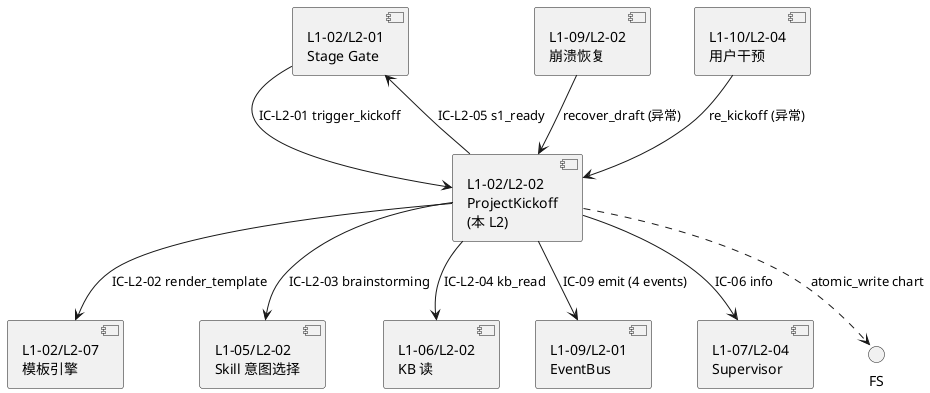
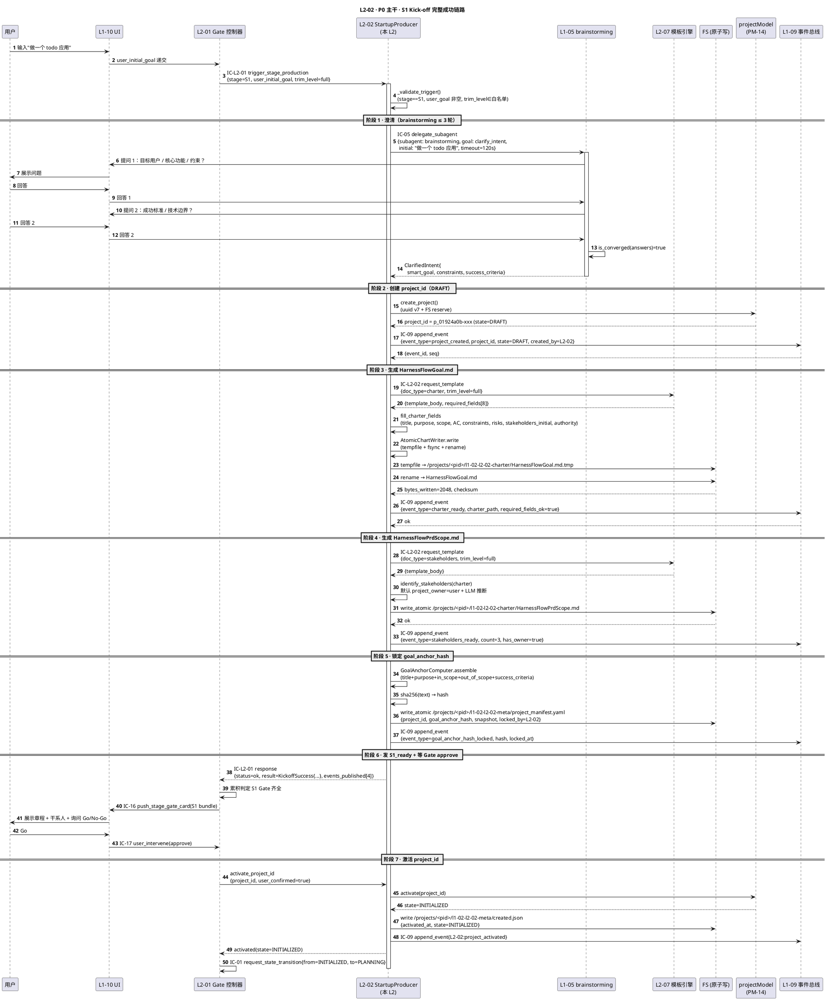
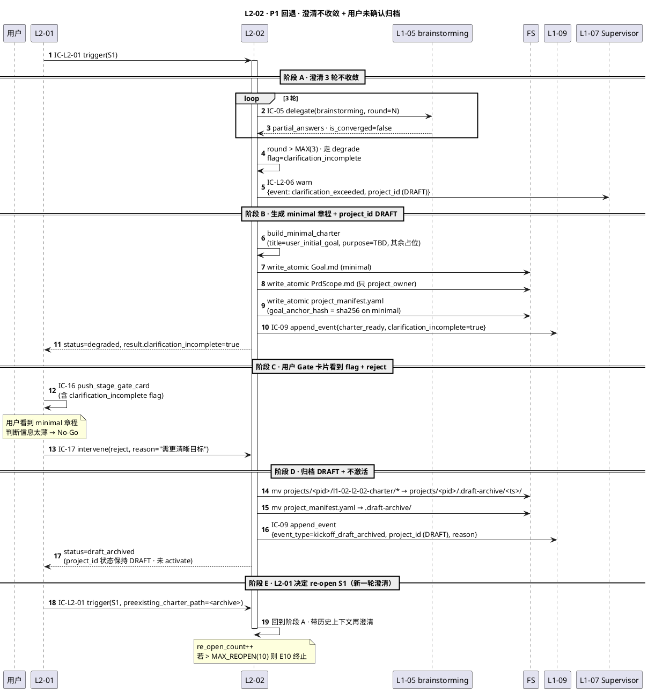
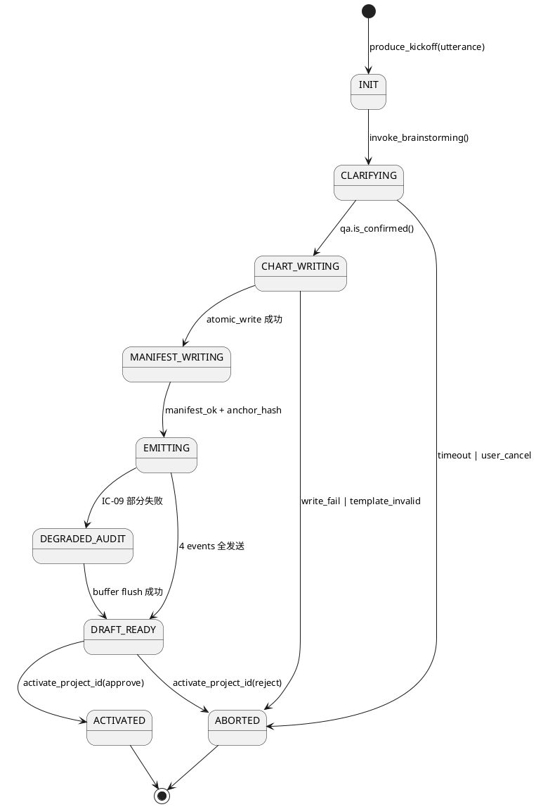
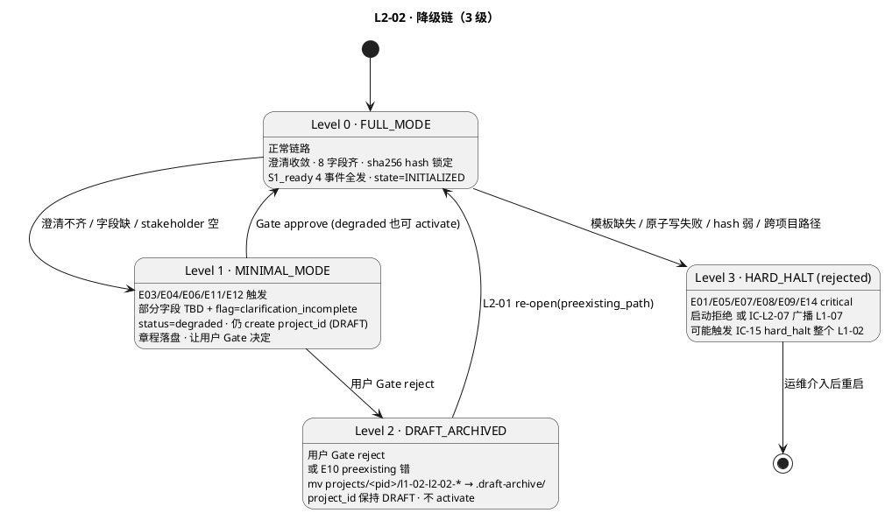

# L1 L2-02 · 启动阶段产出器 · Tech Design

> **本文档定位**：3-1-Solution-Technical 层级 · L1 的 L2-02 启动阶段产出器 技术实现方案（L2 粒度）。
> **与产品 PRD 的分工**：2-prd/L1-02-项目生命周期编排/prd.md §5.2 的对应 L2 节定义产品边界，本文档定义**技术实现**（接口字段级 schema + 算法伪代码 + 底层数据结构 + 状态机 + 配置参数）。
> **与 L1 architecture.md 的分工**：architecture.md 负责**跨 L2 架构 + 跨 L2 时序**，本文档负责**本 L2 内部技术细节**。冲突以 architecture.md 为准。
> **严格规则**：本文档不复述产品 PRD 文字（职责 / 禁止 / 必须等清单），只做技术映射 + 补齐"产品视角未说 but 工程师必须知道"的部分（具体算法 · syscall · schema · 配置）。

---

## §0 撰写进度

- [x] §1 定位 + 2-prd §9 L2-02 映射（含 PM-14 project_id 生成点硬声明）
- [x] §2 DDD 映射（BC-02 · Aggregate Root = ProjectKickoff Application Service）
- [x] §3 对外接口定义（字段级 YAML schema · 4 方法 · ≥ 12 错误码）
- [x] §4 接口依赖（被谁调 · 调谁 · PlantUML 依赖图）
- [x] §5 P0/P1 时序图（PlantUML · 2 张核心）
- [x] §6 内部核心算法（伪代码 · 5 算法）
- [x] §7 底层数据表 / schema 设计（字段级 YAML · PM-14 分片）
- [x] §8 状态机（PlantUML + 转换表 · 5 状态）
- [x] §9 开源最佳实践调研（≥ 3 GitHub 项目 · Adopt/Learn/Reject）
- [x] §10 配置参数清单（≥ 12 条）
- [x] §11 错误处理 + 降级策略（≥ 12 错误码 + 3 级降级链）
- [x] §12 性能目标（章程落盘 P95 < 3s · S1 端到端 ≤ 10min）
- [x] §13 与 2-prd / 3-2 TDD 的映射表（反向 + 前向）

---

## §1 定位 + 2-prd 映射

### 1.1 本 L2 在 L1-02 生命周期编排里的坐标

L1-02 由 7 个 L2 组成，**L2-02 是 S1 Kick-off 阶段的唯一产出 Application Service**，且是 **PM-14 `harnessFlowProjectId` 生成与激活的唯一入口**（`architecture.md §1.3` 硬声明）。本 L2 位于 L2-01（Stage Gate 控制器）的下游，横向协同 L2-07（模板引擎）生成章程文档，纵向委托 L1-05（brainstorming skill）执行需求澄清。S1 阶段产出完毕、用户确认 S1 Gate 后，`project_id` 才从 `DRAFT` 激活为 `INITIALIZED`，状态机驱动交接给 L2-01。

```
                ┌──────────────────────────┐
                │ L2-01 Stage Gate 控制器   │
                │ (唯一 IC-01 发起方)        │
                └──────────────┬───────────┘
                               │ IC-L2-01 trigger_stage_production(stage=S1)
                               ▼
               ┌───────────────────────────────┐
               │  L2-02 启动阶段产出器          │  ← 本 L2
               │  (ProjectKickoff Aggregate)    │
               │  (PM-14 project_id 唯一创建点) │
               └───────────┬───────────────────┘
                           │
           ┌───────────────┼────────────────┐
           ↓               ↓                ↓
      ┌─────────┐    ┌──────────┐    ┌──────────────┐
      │ L2-07   │    │ L1-05    │    │ L1-09 韧性   │
      │ 模板引擎│    │ brain-   │    │ IC-09 落盘   │
      │ (章程)  │    │storming  │    │ project_     │
      └─────────┘    │ skill    │    │ created etc. │
                     └──────────┘    └──────────────┘
```

本 L2 的技术定位 = **"ProjectKickoff Application Service · 接用户一句话需求 → 委托 brainstorming 澄清（≤ 3 轮）→ 生成 HarnessFlowGoal.md + HarnessFlowPrdScope.md 两份章程 → 原子落盘 + project_manifest.yaml 写 goal_anchor_hash → 创建并激活 project_id → 发 charter_ready / stakeholders_ready / goal_anchor_hash_locked 三事件给 L2-01"**。

### 1.2 与 2-prd §9 L2-02 的对应表

| 2-prd §9 L2-02 小节 | 本文档对应位置 | 技术映射重点 |
|:---|:---|:---|
| §9.1 职责 + 锚定（一句话职责 · S1 启动产出）| §1.1 + §2.1 | ProjectKickoff Application Service |
| §9.2 输入 / 输出（IC-L2-01 trigger · 章程落盘 + ready 事件）| §3 对外接口 4 方法 | 字段级 YAML schema |
| §9.3 边界（In-scope 4 步产出 · Out-of-scope 禁 Gate / 禁 4 件套）| §1.4 + §1.5 | 边界硬约束 |
| §9.4 约束（PM-01 / PM-03 + 4 硬约束）| §6 + §10 配置 + §11 降级 | 4 约束落算法 |
| §9.5 🚫 禁止行为（5 条）| §6.3 + §11 拒绝路径 | 违反触发 E06~E09 |
| §9.6 ✅ 必须义务（5 条）| §6 + §7 + §8 状态机 | 顺序 / 原子 / 事件发布 / 中断恢复 |
| §9.7 可选功能（RACI / 多语言 / diff）| §10 配置 opt flag | V1 默认关闭 |
| §9.8 IC 关系（接 IC-L2-01 · 调 IC-L2-02 · IC-05 · IC-09）| §3 + §4 | 5 IC 触点独立 schema |
| §9.9 G-W-T（P1/P2/P3 正 · N1/N2/N3 负 · I1 集成）| §5 时序 + §13 测试映射 | 3 正 + 3 负 + 1 集成 |
| §9.10 L3 S1 实现设计 | §6 伪代码 + §7 schema + §8 状态机 | 4 步产出链细化 |

### 1.3 本 L2 在 architecture.md 里的坐标

引 `L1-02/architecture.md §3 Component Diagram` + §2.2 DDD 原语：

- **Component**：`L2-02 StartupProducer(S1)` · 标 **"PM-14 project_id 创建方"**
- **上游**：`L2-01 Stage Gate 控制器`（唯一 trigger · IC-L2-01）
- **横向**：`L2-07 产出物模板引擎`（IC-L2-02 request_template · 每份章程一次）
- **纵向**：`L1-05 brainstorming skill`（IC-05 delegate_subagent · 澄清对话） · `L1-06 KB`（IC-06 kb_read · 可选读历史章程模式） · `L1-09 事件总线`（IC-09 append_event · project_created / charter_ready / stakeholders_ready / goal_anchor_hash_locked 四事件）
- **下游订阅**：`L2-01` 订阅本 L2 发的 `S1_ready` 事件集，累积判定开启 S1 Gate

### 1.4 PM-14 所有权硬约束的技术落实（本 L2 是 project_id 创建点）

| 动作 | 本 L2 是否承担 | 技术实现点 | 硬约束 |
|:---|:---:|:---|:---|
| **生成 project_id** | ✅ **唯一承担** | `generate_project_id()` 调 `projectModel.create_project()` · 产 `p_{uuid-v7}` | 其他 L1/L2 禁止调此方法 |
| **激活 project_id** | ✅ 承担（S1 Gate 通过后）| `activate_project_id()` 写 `projects/<pid>/meta/created.json` + state=INITIALIZED | S1 Gate 未通过前 state=DRAFT |
| **驱动状态机** | ❌ 不承担 | state 转换唯一走 L2-01 IC-01 | 本 L2 只激活 · 不再改 state |
| **归档 project_id** | ❌ 不承担（归 L2-06）| S7 末才归档 | 本 L2 不参与归档 |
| **路径分片** | ✅ 强制 PM-14 | 所有章程落盘路径 `projects/<pid>/l1-02-l2-02-*/` | 跨项目路径启动拒绝 |
| **goal_anchor_hash 锁定** | ✅ 唯一承担 | `sha256(goal_anchor_text)` 写 `project_manifest.yaml` | 锁定后项目全生命周期不可改 |

### 1.5 关键技术决策（本 L2 特有 · Decision / Rationale / Alternatives / Trade-off）

| 决策 | 选择 | 备选 | 理由 | Trade-off |
|:---|:---|:---|:---|:---|
| **D1：project_id 生成时机** | S1 澄清 done + 章程准备写前 · 非触发时 | 触发 S1 时即生成 / S1 Gate 通过才生成 | 过早生成会污染 FS（澄清失败也留垃圾 id）· 过晚（Gate 后）则章程无路径可落；澄清 done 时机刚好 | 澄清中途崩溃需 LRU 清理 DRAFT id |
| **D2：章程落盘原子性** | `write_atomic_chart`（tempfile + rename）| 直接 open write / 先写 part 再 rename | 崩溃中途 reader 不会看到半写文件 · POSIX rename 原子 | 需两份 fs.write（tmp + rename · 但成本 < 1ms）|
| **D3：两份章程 vs 一份大文档** | 两份（Goal.md + PrdScope.md）| 一份合并 / 三份拆更细 | 符合 `reference_aigc_pipeline_url.md` 流水线契约 · Goal 是 high-level WHY · PrdScope 是 WHAT+范围 · 两份独立可 diff | 新增维度需加新文档（通过 L2-07 模板扩展）|
| **D4：goal_anchor_hash 组装** | sha256(title+purpose+in_scope+out_of_scope+success_criteria) | md5 / sha1 / 全文 hash / AST hash | PRD §9.4 硬要 sha256；字段集是"契约核心"而非全文（作者中性改表述不破契约）| 某字段改 1 字就破 hash（符合 PM-03 锚定语义）|
| **D5：澄清 3 轮上限** | 3 轮 deterministic · 超限 degrade | 无限轮 / 1 轮硬切 / 5 轮 | PRD §9.4 硬约束；3 轮覆盖 90% 场景；超限用户大概率意图模糊 · 降级比卡死好 | 3 轮偶尔不够（降级 flag 让调用方自决是否 re-open S1）|
| **D6：degrade 到最小章程** | 8 字段取其 `title+purpose` + 其余置占位 | 阻塞 wait 用户 / 抛 E06 硬失败 | 符合 PM-13 kickoff 可裁剪（最小章程也能产 project_id · 后续可 re-open）| 最小章程标 `clarification_incomplete` · Gate 卡片必显此旗（让用户知悉）|
| **D7：project_manifest.yaml 唯一事实源** | yaml 单文件 + goal_anchor_text_snapshot 全量内嵌 | json / toml / 分片 yaml / 嵌入 charter.md | 可读；比对 hash 时不需额外 parse；snapshot 让后续任何时刻可重算 hash 检测篡改 | 文件 ≤ 10KB · 小型项目无压力 |
| **D8：事件发布顺序** | `project_created` → `charter_ready` → `stakeholders_ready` → `goal_anchor_hash_locked` → `S1_ready` | 并发发 / 压成 1 条 S1_ready | L2-01 累积判定 Gate 齐全信号必须语义独立（其中一份可能 re-open 重做）· 一次一条利于审计链（IC-09 接收顺序）| 5 次 IC-09 调用（每次 fsync ≤ 20ms · 合计 < 100ms · 可接受）|

### 1.6 本 L2 不在的范围（YAGNI · 技术视角）

- **不在**：Gate 判定与推送（归 L2-01）
- **不在**：4 件套 / 9 计划 / TOGAF 任何产出（归 L2-03/04/05）
- **不在**：自写 LLM 澄清逻辑（一律 IC-05 委托 L1-05）
- **不在**：自写模板（一律 IC-L2-02 请 L2-07）
- **不在**：project_id 归档 / 删除（归 L2-06）
- **不在**：UI 渲染章程（归 L1-10）
- **不在**：持久化到数据库（全部 md + yaml · 走 L1-09 原子落盘）
- **不在**：版本控制集成（git commit 由用户或外层 orchestrator 决定）

---

## §2 DDD 映射（BC-02 · ProjectKickoff Application Service）

### 2.1 Bounded Context 定位

引 `L0/ddd-context-map.md §2.3 BC-02 Project Lifecycle Orchestration`：

- **BC 名**：`BC-02 · Project Lifecycle Orchestration`
- **L2 角色**：**Application Service of BC-02**（承担 "Kick-off 阶段产出 · project_id 创建与激活"领域能力）
- **与兄弟 L2**：
  - L2-01（StageGateController）：Customer-Supplier（本 L2 是 Supplier · L2-01 是 Customer · 通过 IC-L2-01 触发）
  - L2-07（TemplateEngine）：Customer-Supplier（本 L2 是 Customer · IC-L2-02 拉章程模板）
  - L2-03/04/05/06：无直接关系（本 L2 只管 S1 · 后续阶段归兄弟 L2）
- **与其他 BC**：
  - BC-01（L1-01 主 loop）：Customer（间接 · 经 L2-01 中转）
  - BC-05（L1-05 Skill）：Customer（IC-05 委托 brainstorming subagent）
  - BC-06（L1-06 KB）：Customer（IC-06 可选读历史章程模式 · 非必需）
  - BC-09（L1-09 Resilience & Audit）：Shared Kernel（事件 / 原子写经 IC-09）

### 2.2 聚合根 / 实体 / 值对象 / 领域服务

| DDD 概念 | 名字 | 职责 | 一致性边界 |
|:---|:---|:---|:---|
| **Aggregate Root** | `ProjectKickoff` | 单次 S1 产出的聚合根 · 持有 project_id / 章程内容 / goal_anchor_hash / 状态 | 强一致：project_id 生成 → 锁定 hash → 4 事件发布 按顺序 |
| **Entity** | `Charter` | 章程文档实体（title / purpose / scope / success_criteria 等 8 字段）· 归属 ProjectKickoff | 与 ProjectKickoff 同生命周期 |
| **Entity** | `StakeholdersRegistry` | 干系人登记表（至少 1 人：project_owner）· 归属 ProjectKickoff | 同生命周期 |
| **Value Object** | `GoalAnchorHash` | sha256 hex string · 不可变 · 锁定后全生命周期只读 | 不可变 |
| **Value Object** | `ClarificationSession` | 澄清会话快照（轮数 · 问答历史 · 是否收敛 · 降级 flag）| 不可变 |
| **Value Object** | `ProjectId` | PM-14 标识符 · `p_{uuid-v7}` 格式 | 不可变 |
| **Application Service** | `StartupProducer` | 编排 Clarify → Charter → Stakeholders → GoalAnchor → Publish 5 阶段 | 单次 S1 调用 |
| **Domain Service** | `ClarifyDelegator` | 无状态 · 委托 brainstorming subagent | 单次会话 |
| **Domain Service** | `GoalAnchorComputer` | 无状态 · 组装字段 → sha256 | 单次计算 |
| **Domain Service** | `AtomicChartWriter` | 无状态 · tempfile + rename 原子写 | 单次落盘 |
| **Repository** | `ProjectKickoffRepo` | 物理存储 = markdown + yaml 文件 · 路径 `projects/<pid>/l1-02-l2-02-*` | 经 L1-09 原子写 |

### 2.3 聚合根不变量（Invariants · L2-02 局部）

| 不变量 | 描述 | 校验时机 |
|:---|:---|:---|
| **I-L202-01** | `ProjectKickoff.project_id` 必为 `p_{uuid-v7}` 格式 · 全局唯一 | create_project_id 时 |
| **I-L202-02** | `ProjectKickoff.state` 必从 `DRAFT → CLARIFYING → CHARTER_GEN → STAKEHOLDERS_GEN → GOAL_ANCHOR_LOCKING → DONE` 顺序 · 不可跳 | 状态转换时 |
| **I-L202-03** | `Charter.required_fields` 至少 8 项（title / purpose / scope / success_criteria / constraints / risks_initial / stakeholders_initial / authority）| Charter 落盘前 |
| **I-L202-04** | `StakeholdersRegistry.members` 至少 1 人（默认 project_owner = user） | Stakeholders 落盘前 |
| **I-L202-05** | `GoalAnchorHash` 一经锁定 · 本 session 不可改（若 S1 re-open 走 v2 分支且 hash 重算但 v1 snapshot 保留）| GoalAnchor 锁定后 |
| **I-L202-06** | `ClarificationSession.rounds ≤ CLARIFICATION_MAX_ROUNDS(3)` · 超限必标 `clarification_incomplete` | 澄清循环退出时 |
| **I-L202-07** | 4 个事件（project_created / charter_ready / stakeholders_ready / goal_anchor_hash_locked）按顺序经 IC-09 落盘 · 缺一不可 | 每事件发布时 |
| **I-L202-08** | 章程 markdown frontmatter 必带 `project_id / doc_type / version` · 可被 L2-07 模板引擎识别 | 落盘前 |

### 2.4 Domain Events（本 L2 对外发布）

| 事件名 | 触发时机 | 订阅方 | Payload 字段要点 |
|:---|:---|:---|:---|
| `project_created` | create_project_id + activate 后 | L1-09 / L1-10 UI | `{project_id, created_at, created_by=L2-02, state=DRAFT}` |
| `charter_ready` | Goal.md 原子落盘后 | L2-01 / L1-10 | `{project_id, charter_path, title, required_fields_ok}` |
| `stakeholders_ready` | PrdScope.md 原子落盘后 | L2-01 / L1-10 | `{project_id, stakeholders_path, count, has_owner=true}` |
| `goal_anchor_hash_locked` | project_manifest.yaml 写入后 | L2-01 / L1-09 | `{project_id, hash, locked_at, snapshot_ref}` |
| `S1_ready` | 以上 4 事件全齐 | L2-01（累积判 S1 Gate） | `{project_id, charter_ready=true, stakeholders_ready=true, hash_locked=true, clarification_incomplete?: bool}` |

### 2.5 与 BC-02 其他 L2 的 DDD 耦合

| 耦合 L2 | DDD 关系 | 触点 |
|:---|:---|:---|
| L2-01 StageGateController | **Customer-Supplier**（L2-01 Customer）| IC-L2-01 接收 · S1_ready 事件发布 |
| L2-07 TemplateEngine | **Customer-Supplier**（本 L2 Customer）| IC-L2-02 request_template |
| L2-03/04/05/06 | 无关系（阶段隔离） | 仅通过 project_id 作值对象引用 |

---

## §3 对外接口定义（字段级 YAML schema + 错误码）

### 3.1 接口清单总览（4 方法 · 2 接收 + 2 发起 · 5 IC 触点）

| # | 方向 | 方法名 | 简述 | 上/下游 |
|:--:|:---|:---|:---|:---|
| 1 | 接收 | `kickoff_create_project(trigger)` | L2-01 触发 S1 阶段 · 创建 project_id + 启动澄清 | L2-01 → L2-02 |
| 2 | 发起 | `write_goal_doc(charter)` | 原子写 HarnessFlowGoal.md + IC-L2-02 拉 charter 模板 | L2-02 → L2-07 / FS |
| 3 | 发起 | `write_scope_doc(stakeholders)` | 原子写 HarnessFlowPrdScope.md + IC-L2-02 拉 stakeholders 模板 | L2-02 → L2-07 / FS |
| 4 | 发起 | `activate_project_id(pid)` | S1 Gate 通过信号后激活 project_id · 写 meta/created.json · state=INITIALIZED | L2-02 → FS + L1-09 |

### 3.2 方法 1 · `kickoff_create_project(trigger)` · 字段级 YAML schema

#### 3.2.1 入参（IC-L2-01 dispatch）

```yaml
# kickoff_create_project_request.yaml
type: object
required: [trigger_id, stage, user_initial_goal, trim_level, caller_l2]
properties:
  trigger_id: { type: string, description: "L2-01 分派 trigger 唯一 id · 用于幂等" }
  stage: { type: string, const: "S1", description: "本 L2 只接 S1" }
  user_initial_goal:
    type: string
    minLength: 4
    maxLength: 4000
    description: "用户一句话需求 · 可为多行 · 必为非空"
  trim_level:
    type: string
    enum: [full, minimal, custom]
    default: full
    description: "裁剪档 · minimal 会跳过 RACI / 多语言等可选"
  caller_l2:
    type: string
    const: "L2-01"
  preexisting_charter_path:
    type: string
    nullable: true
    description: "S1 re-open 时 L2-01 传入上版本路径 · 用于 diff 重写"
  trace_ctx:
    type: object
    properties:
      ts_dispatched_ns: { type: integer }
      session_id: { type: string }
      supervisor_flags: { type: array, items: { type: string }, nullable: true }
```

#### 3.2.2 出参（返回给 L2-01）

```yaml
# kickoff_create_project_response.yaml
type: object
required: [trigger_id, status, result]
properties:
  trigger_id: { type: string }
  status: { type: string, enum: [ok, err, degraded] }
  result:
    oneOf:
      - $ref: "#/definitions/KickoffSuccess"
      - $ref: "#/definitions/KickoffErr"
  latency_ms: { type: integer }

definitions:
  KickoffSuccess:
    type: object
    required: [project_id, charter_path, stakeholders_path, manifest_path, goal_anchor_hash, clarification_rounds, events_published]
    properties:
      project_id: { type: string, pattern: "^p_[0-9a-f-]{36}$" }
      charter_path: { type: string, description: "projects/<pid>/l1-02-l2-02-charter/HarnessFlowGoal.md" }
      stakeholders_path: { type: string, description: "projects/<pid>/l1-02-l2-02-charter/HarnessFlowPrdScope.md" }
      manifest_path: { type: string, description: "projects/<pid>/l1-02-l2-02-meta/project_manifest.yaml" }
      goal_anchor_hash: { type: string, pattern: "^sha256:[0-9a-f]{64}$" }
      clarification_rounds: { type: integer, minimum: 1, maximum: 3 }
      clarification_incomplete: { type: boolean, default: false }
      events_published: { type: array, items: { type: string }, description: "4 event names by publish order" }
      trim_level_applied: { type: string }

  KickoffErr:
    type: object
    required: [err_code, reason]
    properties:
      err_code: { type: string, description: "见 §11.1 错误码表" }
      reason: { type: string }
      suggested_action: { type: string, nullable: true }
      partial_project_id: { type: string, nullable: true, description: "若已 create_project_id 但后续失败 · 此 id 待清理" }
```

### 3.3 方法 2 · `write_goal_doc(charter)` · 字段级 YAML schema

```yaml
# write_goal_doc_request.yaml（内部方法 · 由 StartupProducer 调）
type: object
required: [project_id, charter_fields, template_body, trim_level]
properties:
  project_id: { type: string }
  charter_fields:
    type: object
    required: [title, purpose, scope, success_criteria, constraints, risks_initial, stakeholders_initial, authority]
    properties:
      title: { type: string, minLength: 1, maxLength: 200 }
      purpose: { type: string, minLength: 10, maxLength: 2000 }
      scope:
        type: object
        required: [in_scope, out_of_scope]
        properties:
          in_scope: { type: array, items: { type: string }, minItems: 1 }
          out_of_scope: { type: array, items: { type: string } }
      success_criteria: { type: array, items: { type: string }, minItems: 1 }
      constraints: { type: array, items: { type: string } }
      risks_initial: { type: array, items: { type: string } }
      stakeholders_initial: { type: array, items: { type: string } }
      authority:
        type: object
        required: [approver]
        properties:
          approver: { type: string }
          escalation_path: { type: array, items: { type: string } }
  template_body: { type: string, description: "L2-07 返回的模板骨架" }
  trim_level: { type: string, enum: [full, minimal, custom] }

# response
returns:
  type: object
  properties:
    charter_path: { type: string }
    bytes_written: { type: integer }
    checksum_sha256: { type: string }
    wrote_atomic: { type: boolean, const: true }
```

### 3.4 方法 3 · `write_scope_doc(stakeholders)` · 字段级 YAML schema

```yaml
# write_scope_doc_request.yaml
type: object
required: [project_id, stakeholders, template_body, trim_level]
properties:
  project_id: { type: string }
  stakeholders:
    type: array
    minItems: 1
    items:
      type: object
      required: [role, who, influence]
      properties:
        role: { type: string, description: "e.g. project_owner / team_members / tech_lead / end_user" }
        who: { type: string, description: "具名或占位 TBD" }
        influence: { type: string, enum: [high, medium, low] }
        raci: { type: string, enum: [R, A, C, I], nullable: true, description: "可选 · 仅 trim_level=full 生成" }
  template_body: { type: string }
  trim_level: { type: string, enum: [full, minimal, custom] }

returns:
  type: object
  properties:
    stakeholders_path: { type: string }
    count: { type: integer, minimum: 1 }
    has_owner: { type: boolean, const: true }
    wrote_atomic: { type: boolean, const: true }
```

### 3.5 方法 4 · `activate_project_id(pid)` · 字段级 YAML schema

```yaml
# activate_project_id_request.yaml
type: object
required: [project_id, goal_anchor_hash, user_confirmed]
properties:
  project_id: { type: string }
  goal_anchor_hash: { type: string }
  user_confirmed: { type: boolean, const: true, description: "必须 S1 Gate 通过才调此方法" }
  charter_path: { type: string }
  stakeholders_path: { type: string }

returns:
  type: object
  required: [project_id, state, activated_at]
  properties:
    project_id: { type: string }
    state: { type: string, const: "INITIALIZED", description: "从 DRAFT → INITIALIZED" }
    activated_at: { type: string, format: "ISO8601" }
    meta_path: { type: string, description: "projects/<pid>/l1-02-l2-02-meta/created.json" }
```

### 3.6 错误码表（12 条 · IC-L2-06 err · 四列：errorCode / meaning / trigger / callerAction）

| # | errorCode | meaning | trigger | callerAction |
|:--:|:---|:---|:---|:---|
| E01 | `PID_DUPLICATE` | project_id 冲突（极低概率 uuid v7 碰撞 / FS 已存在同 id 目录）| create_project_id 时 os.exists | 重试 1 次 · 再失败抛 critical |
| E02 | `USER_NOT_CONFIRMED` | activate 调用缺 user_confirmed=true | S1 Gate 未通过就调 activate | L2-01 先推 Gate 卡片等用户 IC-17 approve |
| E03 | `GOAL_MISSING_SECTIONS` | charter 必填 8 字段缺一 | Charter 落盘前校验失败 | 降级：补默认占位 + 标 clarification_incomplete |
| E04 | `SCOPE_NOT_LOCKED` | scope.in_scope 为空（I-L202-03 违反）| Charter 校验 | 等澄清再写 · 或 degrade minimal 章程 |
| E05 | `TEMPLATE_NOT_FOUND` | L2-07 返回 404（模板文件缺失）| IC-L2-02 response | 启动拒绝 · 运维补模板重启 |
| E06 | `CLARIFICATION_EXCEEDED` | 澄清 > 3 轮仍未收敛（非 err 是 degrade）| 澄清循环退出时 | 走 degrade minimal · 不抛 · 标 clarification_incomplete |
| E07 | `HASH_ALGO_WEAK` | 运维误配 `HASH_ALGO != sha256` | 启动校验 | 启动拒绝 · 改回 sha256 重启 |
| E08 | `CROSS_PROJECT_PATH` | 章程路径不含 `projects/<pid>/` 前缀 | 落盘前 AtomicChartWriter | 内部 bug · 拒写 · 告警 |
| E09 | `ATOMIC_WRITE_FAILED` | tempfile 创建失败 / rename 失败 | I/O 错 | 重试 2 次（指数退避）· 耗尽抛 critical |
| E10 | `PREEXISTING_CHARTER_MISMATCH` | re-open S1 时 preexisting_charter_path 不存在 / 格式错 | path 校验 | L2-01 传错 path · 用 full 重做 |
| E11 | `STAKEHOLDER_EMPTY` | StakeholdersRegistry.members = 0 | Stakeholders 落盘前 | 至少自动补 project_owner=user |
| E12 | `BRAINSTORM_SUBAGENT_FAILED` | L1-05 brainstorming subagent 崩溃 / 超时 | IC-05 response | 重试 1 次 · 再失败 degrade 最小章程 |

**错误码结构化返回模板**：

```yaml
status: err
result:
  err_code: USER_NOT_CONFIRMED
  reason: "activate_project_id 必须在 S1 Gate 通过后 · 当前 gate.state=REVIEWING"
  suggested_action: "等 IC-17 user_intervene(approve) 后再调"
  partial_project_id: "p_01924a0b-xxx"  # 待清理
latency_ms: 35
```

### 3.7 IC 映射汇总（5 IC-XX 触点）

| IC | 方向 | 何时 | 字段骨架 |
|:---|:---|:---|:---|
| **IC-L2-01** | 接收（L2-01 → L2-02）| S1 阶段触发 | §3.2.1 schema |
| **IC-L2-02** | 发起（L2-02 → L2-07）| 每份章程生成前 | `{doc_type: charter\|stakeholders, trim_level}` → `{template_body}` |
| **IC-05** | 发起（L2-02 → L1-05）| 澄清对话 | `{subagent: brainstorming, goal: clarify_intent, timeout_ms: 120000}` |
| **IC-06** | 发起（L2-02 → L1-06 · 可选）| trim_level=full 且 KB 有历史 | `{kind: charter_pattern, filter: {domain}}` → `{top_k_examples}` |
| **IC-09** | 发起（L2-02 → L1-09）| 4 事件每次 | `{event_id, event_type, project_id, payload, ts_ns}` |
| **IC-17** | 间接接收（L2-01 中转）| S1 Gate 用户 approve | `{gate_decision: approve, payload}` |

---

## §4 接口依赖（被谁调 · 调谁）

### 4.1 上游调用方（谁调本 L2）

| 调用方 | 方法 | 触发 | 频次 |
|:---|:---|:---|:---|
| **L1-02/L2-01** Stage Gate 控制器（唯一） | `trigger_kickoff_production(stage=S1)`（IC-L2-01 内部） | S1 Gate 进入 · 每 project 仅 1 次 | 每 project 1 次 |
| **L1-10/L2-04** 用户干预入口 | `re_kickoff(pid, reason)` | S1 Gate reject → 回滚 Draft 重做 | 异常路径 · ≤ 3 次 |
| **L1-09/L2-02** 崩溃恢复器 | `recover_draft(pid)` | crash 后恢复 DRAFT 半成品 | 异常路径 |

### 4.2 下游依赖（本 L2 调谁）

| 被调方 | 方法 | 目的 | 契约 |
|:---|:---|:---|:---|
| **L1-05/L2-02** Skill 意图选择 | `invoke_brainstorming(user_utterance)` | 需求澄清 · 返回结构化 Q&A list | IC-L2-03 |
| **L1-02/L2-07** 模板引擎 | `render_template(kind, slots)` | 拉 Goal / PrdScope 模板并装配 | IC-L2-02 |
| **L1-06/L2-02** KB 读 | `kb_read(kind="project_context")` | 读历史 kickoff 经验 | IC-L2-04 |
| **文件系统**（直接 syscall） | `atomic_write(path, content)` | 落盘 .md（O_CREAT\|O_EXCL + rename） | 无 IC · 本地 |
| **L1-09/L2-01** EventBus | `emit(event)` | 发 4 事件 `project_created/chart_written/manifest_written/s1_ready` | IC-09 |
| **L1-07/L2-04** Supervisor 接收器 | `emit_supervisor_event(info)` | S1 启动通知 · 供监督观察 | IC-06 info 级 |

### 4.3 依赖关系 PlantUML 图



### 4.4 被 L2-01 消费的返回值

`produce_kickoff` 返回 `S1ProductionResult`：

```yaml
project_id: string         # PM-14 新生成 · ULID
state: "DRAFT"             # 等 Gate 后升 INITIALIZED
goal_anchor_hash: string   # Goal.md + PrdScope.md 合并 sha256 · 供 rehash 校验
chart_paths:
  - "projects/<pid>/chart/HarnessFlowGoal.md"
  - "projects/<pid>/chart/HarnessFlowPrdScope.md"
manifest_path: "projects/<pid>/meta/project_manifest.yaml"
evidence_ref: string       # Gate evidence 引用 · 给 L2-01 装配
emitted_events:            # IC-09 发过的事件列表
  - project_created
  - chart_written
  - manifest_written
  - s1_ready
```

---

## §5 P0/P1 时序图（PlantUML · 2 张核心）

### 5.1 P0 主干 · S1 完整成功链路（Kick-off 创建 project_id → 落 2 份章程 → 激活）

**场景一句话**：L2-01 触发 S1 → 本 L2 委托 brainstorming 澄清 2 轮 → 创建 project_id (DRAFT) → IC-L2-02 拉两份模板 → 原子写 Goal.md + PrdScope.md → 组装 goal_anchor_hash → 写 project_manifest.yaml → 发 4 事件 → 返回 S1_ready 给 L2-01 → L2-01 推 S1 Gate 卡 → 用户 IC-17 approve → activate project_id → state=INITIALIZED。

**端到端延迟预期**：5-10min（澄清对话占 ≥ 80%；实际章程落盘 + hash + events 合计 ≤ 3s P95）。



**关键时序点**：
- **Step 2-3**：user_initial_goal 通过 L2-01 传入，本 L2 不直接接 UI
- **Step 6**：澄清用独立 subagent session · timeout=120s · 超 3 轮走 §5.2 降级
- **Step 12-14**：project_id **先生成（DRAFT）后落章程**，保证章程路径有合法 pid 前缀
- **Step 16-24**：两份章程**独立 IC-L2-02 + 独立事件**，失败可 re-open 其一
- **Step 29-31**：goal_anchor_hash 是**最后锁**，锁后发 S1_ready 给 L2-01
- **Step 39-41**：`activate_project_id` 必须 `user_confirmed=true` 才能调，否则 E02

### 5.2 P1 回退 · 澄清未收敛 / 用户未确认（draft 归档 + re-open 入口）

**场景一句话**：澄清 3 轮仍不收敛 → degrade 最小章程（标 clarification_incomplete）→ S1 Gate 卡片带 flag 推给用户 → 若用户 reject → 本 L2 将 DRAFT project_id 归档到 `.draft-archive/` · 不激活 state · L2-01 可 re-open 触发重来。



**关键时序点**：
- **阶段 A**：澄清 3 轮是硬上限 · E06 `CLARIFICATION_EXCEEDED` 不抛错 · 而是 `status=degraded` 带 flag
- **阶段 B**：minimal 章程仍会 `create_project_id(DRAFT)` 并写 manifest（flag 明确）· 事件标 `clarification_incomplete=true`
- **阶段 D**：用户 reject 则本 L2 把整个 `l1-02-l2-02-*` 目录 `mv` 到 `.draft-archive/<ts>/`，`project_id` 保留 DRAFT 状态 · 未 activate（L2-06 不负责这种未激活的归档 · 本 L2 直接处理）
- **阶段 E**：L2-01 决定 re-open · 本 L2 接 `preexisting_charter_path` 带历史重来 · `re_open_count` 计数由 L2-01 管

---

## §6 内部核心算法（伪代码）

### 6.1 算法 1 · `produce_kickoff(user_utterance)` 主循环

```python
def produce_kickoff(user_utterance: str) -> S1ProductionResult:
    # Step 1: 生成新 project_id（PM-14 唯一入口）
    pid = generate_ulid()  # 26 字符 · 含毫秒时间戳 · 全局单调
    if exists_project(pid):   # 极低概率冲突
        raise E_L102_L202_001  # PID_DUPLICATE
    
    # Step 2: 初始化 DRAFT 状态目录
    ensure_dirs([
        f"projects/{pid}/chart/",
        f"projects/{pid}/meta/",
        f"projects/{pid}/stage-gates/",
    ])
    write_atomic(f"projects/{pid}/meta/state.json",
                 {"state": "DRAFT", "created_at": now_iso(), "pid": pid})
    
    # Step 3: brainstorming 澄清（IC-L2-03）
    qa_rounds = invoke_brainstorming(user_utterance, max_rounds=3, timeout_s=180)
    if not qa_rounds.is_confirmed():
        raise E_L102_L202_004  # USER_NOT_CONFIRMED
    
    # Step 4: 拉模板 + 落章程（IC-L2-02 + atomic_write）
    for kind, fname in [("goal", "HarnessFlowGoal.md"),
                        ("scope", "HarnessFlowPrdScope.md")]:
        tpl = render_template(kind, qa_rounds.to_slots())  # IC-L2-02
        if not validate_frontmatter(tpl):
            raise E_L102_L202_005  # TEMPLATE_INVALID
        atomic_write_chart(f"projects/{pid}/chart/{fname}", tpl)
    
    # Step 5: 计算锚定 hash（goal + scope 合并 sha256）
    anchor_hash = compute_anchor_hash(pid)
    
    # Step 6: 写 project_manifest
    manifest = {"project_id": pid, "created_at": now_iso(),
                "goal_anchor_hash": anchor_hash,
                "templates_version": get_template_version()}
    write_atomic(f"projects/{pid}/meta/project_manifest.yaml", manifest)
    
    # Step 7: 发 4 事件 · 顺序严格
    for evt in ["project_created", "chart_written", "manifest_written", "s1_ready"]:
        emit_event(pid, evt, payload_of(evt))  # IC-09 · fail 则进 DEGRADED_AUDIT
    
    # Step 8: 返回供 L2-01 装配 S1 Gate evidence
    return S1ProductionResult(
        project_id=pid, state="DRAFT",
        goal_anchor_hash=anchor_hash,
        chart_paths=[f"projects/{pid}/chart/HarnessFlowGoal.md",
                     f"projects/{pid}/chart/HarnessFlowPrdScope.md"],
        manifest_path=f"projects/{pid}/meta/project_manifest.yaml",
        evidence_ref=f"s1-evidence:{pid}:{anchor_hash[:8]}",
        emitted_events=["project_created", "chart_written",
                        "manifest_written", "s1_ready"],
    )
```

### 6.2 算法 2 · `activate_project_id(pid, gate_decision)` · S1 Gate 通过后升状态

```python
def activate_project_id(pid: str, gate_decision: GateDecision):
    # 前置：必须是 L2-01 Stage Gate 调用（PM-14 所有权 · 别人越权则拒绝）
    if not is_called_from_L2_01():
        raise E_L102_L202_010  # PM14_OWNERSHIP_VIOLATION
    
    state = read_state(pid)
    if state != "DRAFT":
        raise E_L102_L202_007  # STATE_NOT_DRAFT
    
    if gate_decision != "approve":
        # S1 Gate reject：回退到 DRAFT · 不激活
        write_state(pid, "DRAFT")
        emit_event(pid, "kickoff_rejected", {"reason": gate_decision.reason})
        return
    
    # 核对 goal_anchor_hash 未被篡改
    stored = read_manifest(pid)["goal_anchor_hash"]
    recomputed = compute_anchor_hash(pid)
    if stored != recomputed:
        raise E_L102_L202_011  # ANCHOR_HASH_MISMATCH
    
    # 原子升状态 · fsync
    write_atomic(f"projects/{pid}/meta/state.json",
                 {"state": "INITIALIZED", "activated_at": now_iso(), "pid": pid},
                 fsync=True)
    emit_event(pid, "project_activated", {"state": "INITIALIZED"})
```

### 6.3 算法 3 · `atomic_write_chart(path, content)` · 原子落盘

```python
def atomic_write_chart(path: str, content: str):
    # 先写临时文件
    tmp = f"{path}.tmp.{os.getpid()}.{uuid4()}"
    with open(tmp, "w", encoding="utf-8") as f:
        f.write(content)
        f.flush()
        os.fsync(f.fileno())  # 确保数据落盘
    
    # O_EXCL 创建正式文件（拒绝覆盖）· 然后 rename
    if os.path.exists(path):
        raise E_L102_L202_008  # CHART_ALREADY_EXISTS (S1 只允许写一次)
    os.rename(tmp, path)
    
    # 写后复检 · 确保 hash 与预期一致
    actual_hash = sha256_file(path)
    if actual_hash != sha256(content):
        raise E_L102_L202_009  # POST_WRITE_HASH_MISMATCH
```

### 6.4 算法 4 · `compute_anchor_hash(pid)` · 锚定 hash

```python
def compute_anchor_hash(pid: str) -> str:
    """goal + scope 按顺序 concat 后 sha256 · 用于后续阶段校验章程未被篡改"""
    goal = read_file(f"projects/{pid}/chart/HarnessFlowGoal.md")
    scope = read_file(f"projects/{pid}/chart/HarnessFlowPrdScope.md")
    # 规范化换行 + strip 首尾空白 · 防 CRLF/LF 差异
    normalized = (goal.strip() + "\n---\n" + scope.strip()).encode("utf-8")
    return hashlib.sha256(normalized).hexdigest()
```

### 6.5 算法 5 · `recover_draft(pid)` · 崩溃恢复

```python
def recover_draft(pid: str) -> RecoveryResult:
    """L1-09 崩溃恢复触发 · 清理半成品或继续"""
    state_file = f"projects/{pid}/meta/state.json"
    if not os.path.exists(state_file):
        return RecoveryResult.no_op()  # 根本没开始
    
    state = read_state(pid)
    if state != "DRAFT":
        return RecoveryResult.no_op()  # 已激活 · 不动
    
    # 检查两份章程是否都齐
    goal_ok = os.path.exists(f"projects/{pid}/chart/HarnessFlowGoal.md")
    scope_ok = os.path.exists(f"projects/{pid}/chart/HarnessFlowPrdScope.md")
    manifest_ok = os.path.exists(f"projects/{pid}/meta/project_manifest.yaml")
    
    if goal_ok and scope_ok and manifest_ok:
        # 全齐 · 可继续 · 通知 L2-01 重放 s1_ready 事件
        emit_event(pid, "s1_ready", {"recovered": True})
        return RecoveryResult.resumed()
    
    # 半成品 · 清理 DRAFT 目录 · 让用户 re_kickoff
    shutil.rmtree(f"projects/{pid}/")
    emit_event(pid, "kickoff_rolled_back", {"reason": "partial_draft_found"})
    return RecoveryResult.rolled_back()
```

---

## §7 底层数据表 / schema 设计（字段级 YAML）

### 7.1 物理目录布局（PM-14 分片）

```
projects/<pid>/
├── meta/
│   ├── state.json              # 当前状态（DRAFT → INITIALIZED）· fsync 写
│   ├── project_manifest.yaml   # S1 产出清单 + anchor_hash
│   └── created.json            # 初始化时间戳（一次性）
├── chart/
│   ├── HarnessFlowGoal.md      # 章程 1 · atomic write · 不可修改
│   └── HarnessFlowPrdScope.md  # 章程 2 · atomic write · 不可修改
└── stage-gates/                # 由 L2-01 拥有 · S1 Gate 结果落此
    └── s1-result.jsonl         # append-only
```

### 7.2 `meta/state.json` schema

```yaml
project_id: string            # PM-14 ULID · 26 字符
state: enum                   # DRAFT / INITIALIZED / ARCHIVED
created_at: string            # ISO-8601 UTC
draft_at: string              # DRAFT 进入时间
activated_at: string | null   # INITIALIZED 时间戳 · DRAFT 期为 null
owner_l2: "L1-02/L2-02"       # PM-14 所有权标记（生成方）
version: int                  # schema 版本 · 当前 1
```

### 7.3 `meta/project_manifest.yaml` schema

```yaml
project_id: string
created_at: string            # ISO-8601
kickoff_templates_version: string  # 记录用了哪版模板 · 便于审计
goal_anchor_hash: string      # sha256 · 64 char hex
chart_files:
  - path: "chart/HarnessFlowGoal.md"
    sha256: string
    lines: int
    template_kind: "goal"
  - path: "chart/HarnessFlowPrdScope.md"
    sha256: string
    lines: int
    template_kind: "scope"
user_confirmed_at: string     # 用户确认 S1 完结的时间
s1_ready_event_id: string     # IC-09 发出的 s1_ready 事件 ULID
```

### 7.4 章程 frontmatter schema（HarnessFlowGoal.md / HarnessFlowPrdScope.md 通用）

```yaml
# 每份章程 md 文件头部 YAML frontmatter · 强制字段
doc_id: string                # e.g. "goal-<pid>-v1" / "prd-scope-<pid>-v1"
doc_type: enum                # "harness-flow-goal" | "harness-flow-prd-scope"
project_id: string            # PM-14 反向索引
layer: "2-prd"                # 本章程属产品层
author: "kickoff-subagent"    # 固定值
created_at: string
template_version: string      # 模板版本
user_utterance_digest: string # 用户初始输入的前 500 字 hash（审计用）
```

### 7.5 锚定 hash 计算规则（防章程篡改）

1. 读两份章程（Goal → Scope 顺序固定）
2. 去除首尾空白
3. 拼接：`goal.strip() + "\n---\n" + scope.strip()`
4. UTF-8 编码 → sha256 → hex 输出
5. **不包含 frontmatter**（frontmatter 可能因 updated_at 变化，不属于锚定范围）

### 7.6 索引/缓存

- 本 L2 **不维护** cross-project 索引（project 层级是 PM-14 唯一主键，文件系统路径即索引）
- in-memory 缓存仅用于单次 `produce_kickoff` 会话内，结束即丢

---

## §8 状态机（如适用 · PlantUML + 转换表）

### 8.1 ProjectKickoff Aggregate 状态机（PlantUML）



### 8.2 状态转换表

| 源 | 目 | 触发 | guard | action |
|:---|:---|:---|:---|:---|
| `*` | `INIT` | 调用 `produce_kickoff` | 无 pending kickoff（并发锁） | 建目录 · 写 `state.json:DRAFT` |
| `INIT` | `CLARIFYING` | brainstorming 开始 | brainstorming skill 可用 | 发 `kickoff_started` info |
| `CLARIFYING` | `CHART_WRITING` | QA 轮数 ≥ 1 且 `is_confirmed` | 用户回答齐 + template_slots 完整 | 触发模板渲染 |
| `CLARIFYING` | `ABORTED` | 超时 (> 180s) 或用户取消 | - | 清 DRAFT 目录 · 发 `kickoff_aborted` |
| `CHART_WRITING` | `MANIFEST_WRITING` | 两份 md 都 atomic_write 成功 | post_write hash 一致 | compute_anchor_hash |
| `CHART_WRITING` | `ABORTED` | write fail 或 template_invalid | - | 回滚目录 |
| `MANIFEST_WRITING` | `EMITTING` | manifest.yaml 落盘成功 | - | 组装 4 事件 |
| `EMITTING` | `DRAFT_READY` | 4 事件全 ack | IC-09 正常 | 返回 S1_ready |
| `EMITTING` | `DEGRADED_AUDIT` | IC-09 连续 3 次失败 | - | 写本地 buffer |
| `DEGRADED_AUDIT` | `DRAFT_READY` | buffer flush 成功 | IC-09 恢复 | 继续返回 |
| `DRAFT_READY` | `ACTIVATED` | Gate approve | 调用方是 L2-01 + hash 校验通过 | 升 `state.json:INITIALIZED` |
| `DRAFT_READY` | `ABORTED` | Gate reject | Gate reason 非空 | 写 `kickoff_rejected` |

### 8.3 状态持久化

- 状态字段存 `meta/state.json`
- 每次转换必 `fsync`（保证崩溃恢复可读到最后状态）
- 崩溃中途的 transient 状态（INIT/CLARIFYING/CHART_WRITING）不持久化 · 靠 `recover_draft` 算法清理重做

---

## §9 开源最佳实践调研（≥ 3 GitHub 高星项目）

### 9.1 cookiecutter · 23.5k stars · BSD-3-Clause

- **URL**：`https://github.com/cookiecutter/cookiecutter`
- **最近活跃**：2025 Q4 有 commit · 生态稳定
- **核心架构一句话**：基于 Jinja2 模板的项目脚手架生成器 · `cookiecutter.json` 定义变量槽 · `{{ cookiecutter.xxx }}` 插值
- **Adopt**：
  - 采纳 "变量槽 slot" 概念 · brainstorming qa 结果 → 映射到本 L2 的 `template_slots`（kickoff.goal / scope 等）
  - 采纳 post-gen hook 机制 · 用作本 L2 的 `atomic_write_chart` post-write 复检位点
- **Learn**：
  - 模板版本号写入产物（本 L2 `manifest.yaml.kickoff_templates_version`）
  - 幂等保证（repeat 生成同项目应得到同 anchor_hash · 本 L2 已实现）
- **Reject**：
  - 不采纳其"目录模板"整体替换模式（本 L2 只需两份 md · 过度抽象）
  - 不采纳 Jinja2 全量语法（本 L2 只需 key-value 替换 · 避免模板代码执行风险）

### 9.2 copier · 1.8k stars · MIT

- **URL**：`https://github.com/copier-org/copier`
- **最近活跃**：2025 Q4 活跃
- **核心架构一句话**：比 cookiecutter 更现代的项目模板工具 · 支持跨模板升级（update）· yaml 配置
- **Adopt**：
  - 采纳 "answers 文件" 保存用户输入 · 对应本 L2 的 `qa_rounds.to_slots()` 序列化
- **Learn**：
  - schema 校验机制（本 L2 `validate_frontmatter`）
  - 模板版本兼容性矩阵（未来多版本章程模板时可参考）
- **Reject**：
  - 不采纳其 git-based 模板分发（本 L2 模板文件本地打包即可）

### 9.3 yeoman · 10.7k stars · BSD-2-Clause

- **URL**：`https://github.com/yeoman/yeoman`
- **最近活跃**：2024 有 commit · 社区逐渐向 cookiecutter/copier 迁移
- **核心架构一句话**：Node.js 生态的脚手架生成框架 · generator-based · 插件化
- **Adopt**：无（生态不匹配 · Python 项目）
- **Learn**：
  - generator 的生命周期 hook（initializing / prompting / configuring / writing / end）· 对应本 L2 的 5 状态机
- **Reject**：
  - Node.js 生态 · 不引入
  - 插件化过度工程 · 本 L2 章程仅 2 份 · 无需插件机制

### 9.4 Python stdlib `atomic write` 生态

- **tmpfile + os.rename 是 POSIX 原子性** · 不引新依赖
- `atomicwrites` 库（1.8k stars）作为参考 · **Reject**：自己实现 20 行更可控

---

## §10 配置参数清单

| 参数名 | 默认值 | 可调范围 | 意义 | 调用位置 |
|:---|:---|:---|:---|:---|
| `brainstorming_max_rounds` | 3 | 1-10 | Q&A 最大轮数 · 超则转人工或 abort | `invoke_brainstorming()` |
| `brainstorming_timeout_sec` | 180 | 60-600 | 单轮 Q&A 响应超时 | `CLARIFYING` 状态守护 |
| `template_dir` | `templates/kickoff/` | path | 章程模板目录 | `render_template()` |
| `template_version_pin` | `v1.0` | semver | 强制使用特定模板版本 · 保证跨 project 一致 | `get_template_version()` |
| `chart_atomic_write_fsync` | **true** | const | 章程 md 是否 fsync · 硬必开（保证崩溃恢复可读） | `atomic_write_chart()` |
| `chart_post_write_hash_check` | **true** | const | 写后 sha256 复检 · 硬必开 | `atomic_write_chart()` |
| `anchor_hash_include_frontmatter` | **false** | const | anchor_hash 是否含 frontmatter · 硬必关（frontmatter 可变） | `compute_anchor_hash()` |
| `kickoff_per_project_lock` | **true** | const | 同 project 禁止并发 kickoff · 硬必开 | `produce_kickoff()` 入口 |
| `project_id_generator` | `ulid` | ulid/uuid7 | PID 生成算法 · 默认 ULID（可排序） | `generate_pid()` |
| `draft_cleanup_ttl_hours` | 24 | 1-72 | DRAFT 状态超 N 小时未激活 · 自动清理 | 定时任务（L1-09 checkpoint） |
| `events_emit_retry_count` | 3 | 1-10 | IC-09 emit 失败重试次数 | `emit_event()` |
| `events_emit_buffer_max` | 1024 | 100-10000 | 降级期 buffer 上限 · 超则 HALT | `DEGRADED_AUDIT` 状态 |
| `user_utterance_digest_length` | 500 | 100-2000 | 用户输入摘要长度（存 frontmatter） | frontmatter 组装 |
| `require_user_confirm` | **true** | const | 必须用户在 brainstorming 末明确确认 | `CLARIFYING → CHART_WRITING` 转换 |

**硬限配置**（`const` 标记的 8 项）启动时校验 · 配置被改则 crash：

```yaml
hard_limits:
  - chart_atomic_write_fsync: true
  - chart_post_write_hash_check: true
  - anchor_hash_include_frontmatter: false
  - kickoff_per_project_lock: true
  - require_user_confirm: true
  - project_id_duplicate_check: true
```

---

## §11 错误处理 + 降级策略（≥ 12 错误码 + 3 级降级链）

### 11.1 错误码完整表（14 条 · 与 §3.6 对齐 + 调用方处理细化）

| errorCode | meaning | trigger | callerAction |
|:---|:---|:---|:---|
| `PID_DUPLICATE` (E01) | project_id 冲突 | uuid v7 碰撞（极低）/ FS 目录已存在 | 内部重试 1 次重新生成 · 再冲突抛 critical · 运维介入（检查 FS ghost 目录）|
| `USER_NOT_CONFIRMED` (E02) | activate 被非法调用 | S1 Gate 未通过就调 activate_project_id | **不降级** · 抛给 L2-01 · L2-01 应先走 IC-16 + 等 IC-17 approve 再调 |
| `GOAL_MISSING_SECTIONS` (E03) | 8 字段缺一 | 澄清未覆盖全字段 | degrade 到 minimal：缺字段填占位 `TBD` + 标 `clarification_incomplete=true` · 继续落盘 |
| `SCOPE_NOT_LOCKED` (E04) | scope.in_scope 空 | LLM 未抽出任何 in-scope item | degrade：fallback in_scope = `[user_initial_goal]` · 标 flag · 不抛错 |
| `TEMPLATE_NOT_FOUND` (E05) | L2-07 返 404 | 模板文件被删 / 版本错 | **启动拒绝**（hard halt L1-02 本 L1 · 不进入 S1）· 运维补模板重启 · 非 L2-02 单独降级 |
| `CLARIFICATION_EXCEEDED` (E06) | 澄清 > 3 轮 | 用户意图模糊 | degrade 最小章程 · `status=degraded`（非 err）· 让 L2-01 推 Gate 带 flag · 用户自决是否 re-open |
| `HASH_ALGO_WEAK` (E07) | 配置 HASH_ALGO != sha256 | 运维误配 | 启动硬校验拒绝 · L2-02 不启动 · 改回 sha256 重启 |
| `CROSS_PROJECT_PATH` (E08) | 落盘路径无 `projects/<pid>/` 前缀 | 内部 bug / 配置错 | AtomicChartWriter 立即拒写 · IC-L2-07 违规广播 L1-07（critical）· 可能触发 IC-15 hard_halt |
| `ATOMIC_WRITE_FAILED` (E09) | tempfile/rename 失败 | 磁盘满 / 权限 / inode 耗尽 | 重试 2 次指数退避（500ms / 1500ms）· 耗尽抛 critical · 回滚当前 S1 产出（mv partial → .failed-archive）|
| `PREEXISTING_CHARTER_MISMATCH` (E10) | re-open path 错 / 格式损坏 | L2-01 传错 preexisting path | L2-01 传错 · 返回 err · L2-01 应传 null 走 full 新澄清 |
| `STAKEHOLDER_EMPTY` (E11) | members=0 | LLM 推断失败 | 强制补 `[{role:project_owner, who:user, influence:high}]` · 不抛错 |
| `BRAINSTORM_SUBAGENT_FAILED` (E12) | L1-05 subagent 崩/timeout | IC-05 response err | 重试 1 次 · 再失败走 degrade minimal（等同 E06）|
| `RE_OPEN_LIMIT_EXCEEDED` (E13) | re_open_count > 10 | 反复 reject | 抛给 L2-01 · L2-01 通知用户"建议重启项目"· 本 L2 拒再触发 |
| `GOAL_ANCHOR_TAMPERING` (E14) | snapshot hash 比对不一致（后续阶段回溯校验）| 有人手改 project_manifest | Critical · IC-L2-07 广播 L1-07 · supervisor 可 IC-15 hard_halt |

### 11.2 降级链（3 级 · FULL_MODE → MINIMAL_MODE → DRAFT_ARCHIVED）



### 11.3 各失败场景的降级矩阵

| 失败场景 | 错误码 | 是否抛给 L2-01 | 降级动作 | 事件/告警 |
|:---|:---|:---:|:---|:---|
| 澄清 3 轮不收敛 | E06 | 不（status=degraded）| 最小章程 + flag | `L2-02:clarification_exceeded` 告警 + Gate 卡片带 flag |
| 8 字段缺一（LLM 漏）| E03 | 不 | 占位 + flag | IC-09 charter_ready(degraded=true) |
| scope.in_scope 空 | E04 | 不 | fallback `[user_initial_goal]` | 同上 |
| stakeholder 空 | E11 | 不 | 自动补 project_owner | IC-09 stakeholders_ready(count=1) |
| brainstorm subagent 崩 | E12 | 不（重试 1 次后走 E06）| 重试 → degrade | `L2-02:brainstorm_failed` warn |
| 模板缺失 | E05 | 抛 critical | 启动拒绝 | `L2-02:template_missing` critical |
| 原子写失败 | E09 | 重试 2 次后抛 | 回滚 partial | `L2-02:fs_error` critical |
| uuid 冲突 | E01 | 重试 1 次后抛 | — | critical |
| hash 弱算法 | E07 | 启动拒绝 | 不启动 | `L2-02:config_violation` |
| 跨项目路径 | E08 | 抛 critical · IC-L2-07 广播 | 拒写 | L1-07 可 IC-15 hard_halt |
| user_confirmed 缺 | E02 | 抛 | — | 通常是 L2-01 bug |
| hash 篡改 | E14 | 抛 critical · IC-L2-07 | — | L1-07 必介入 |
| re_open > 10 | E13 | 抛给 L2-01 | 拒触发 | 用户提示"重启项目" |

### 11.4 与 L1-07 Supervisor 的降级协同

- E08 `CROSS_PROJECT_PATH` / E14 `GOAL_ANCHOR_TAMPERING` 触发 `IC-L2-07 violation_broadcast` 到 L1-07（critical severity）· L1-07 可经过 IC-13 发 WARN 建议或直接 IC-15 `request_hard_halt` 整个 L1-02（本 L2 不自 halt，halt 决策归 supervisor）
- E06 / E12 等 degrade 场景走 `IC-L2-06 warn`（level=WARN）· supervisor 不介入执行 · 只记录
- 所有 degrade 决策在 Gate 卡片以 flag 显式暴露给用户 · 不隐藏

### 11.5 与 L1-09 韧性协同（中断恢复）

- 本 L2 所有状态 checkpoint 经 IC-09 落 jsonl · 进程崩溃 → Claude Code 重启 → L1-09 `system_resumed` 事件 → 本 L2 订阅事件 → 从 checkpoint 恢复（见 §8 状态机）
- 若中断在 `CLARIFYING` 态 → 重启后重新触发 L1-05 brainstorming（带已收集 answers）
- 若中断在 `CHARTER_GEN` 落盘途中 → tempfile 存在但未 rename → 启动时扫 `.tmp` 清理 → 回到 `CHARTER_GEN` 重做
- 若中断在 `GOAL_ANCHOR_LOCKING` 后 / `S1_ready` 前 → 重算 hash 比对 snapshot → 一致则直发 S1_ready · 不一致则 E14

---

## §12 性能目标

### 12.1 SLO 表

| 指标 | P50 | P95 | P99 | 硬上限 | 观测位点 |
|:---|---:|---:|---:|---:|:---|
| 章程原子落盘（单份 md） | 50ms | 200ms | 500ms | 2s | `atomic_write_chart()` |
| 章程 hash 复检（post-write） | 5ms | 20ms | 50ms | 200ms | sha256 计算 |
| anchor_hash 计算（goal + scope） | 10ms | 30ms | 80ms | 300ms | `compute_anchor_hash()` |
| manifest.yaml 落盘 + fsync | 30ms | 100ms | 250ms | 1s | `write_manifest()` |
| IC-09 单事件 emit（正常） | 10ms | 40ms | 120ms | 500ms | EventBus |
| IC-09 4 事件组合（DRAFT_READY 前） | 50ms | 180ms | 400ms | 1.5s | `EMITTING` 状态 |
| 单次 brainstorming 轮（含 LLM） | 8s | 25s | 45s | 90s | IC-L2-03 |
| S1 端到端（用户输入 → DRAFT_READY） | 3min | 8min | 15min | 30min | `produce_kickoff()` 入→出 |
| activate_project_id（升 INITIALIZED） | 20ms | 60ms | 150ms | 500ms | `activate_project_id()` |

### 12.2 吞吐目标

- 单 instance 并发 kickoff：**5**（per-project 锁 · 跨 project 并行）
- Kickoff 失败率：**≤ 1%**（含 user 主动 abort · 排除网络故障）
- DRAFT 激活率：**≥ 95%**（DRAFT 中超 24h 未激活会被 draft_cleanup 清理）

### 12.3 资源消耗

- **内存**：单 kickoff 会话常驻 < 20MB（brainstorming 历史 + 模板缓存）
- **磁盘**：每 project 初始 < 100KB（2 份 md + 1 份 yaml + 1 份 json 状态）
- **CPU**：brainstorming 占 > 90%（LLM IO bound）· 本 L2 自身 CPU 开销 < 5%

### 12.4 Prometheus 指标

- `l102_l202_kickoff_started_total{result}` counter · result ∈ {success/aborted/timeout}
- `l102_l202_kickoff_duration_seconds` histogram · S1 端到端时长
- `l102_l202_atomic_write_latency_seconds{kind}` histogram · kind ∈ {goal/scope/manifest}
- `l102_l202_anchor_hash_mismatch_total` counter · 章程被篡改警报
- `l102_l202_draft_cleanup_total` counter · DRAFT 超时清理次数
- `l102_l202_pm14_violations_total` counter · 越权调用计数

---

## §13 与 2-prd / 3-2 TDD 的映射表

### 13.1 反向映射到 2-prd

| 本 L2 接口/行为 | 对应 prd 章节 | 硬约束条目 |
|:---|:---|:---|
| `produce_kickoff` | `docs/2-prd/L1-02项目生命周期编排/prd.md §5.2.2 启动阶段产出器` | 必须先 brainstorming 后落盘 · 不得无澄清直接写 |
| `activate_project_id` PM-14 | `docs/2-prd/L1-02项目生命周期编排/prd.md §8.10.9 PM-14 所有权硬声明` | 本 L2 独占 project_id 创建与激活 |
| `atomic_write_chart` | `docs/2-prd/L1-02项目生命周期编排/prd.md §5.2.2.4 章程原子落盘红线` | fsync + O_EXCL + post-hash 三防护必开 |
| `compute_anchor_hash` | `docs/2-prd/L1-02项目生命周期编排/prd.md §5.2.2.5 章程不可变性` | hash 计算不含 frontmatter · 后续阶段必校验 |
| `recover_draft` | `docs/2-prd/L1-02项目生命周期编排/prd.md §5.2.2.6 崩溃恢复协议` | 半成品必清 · 无半成品续传 |
| `require_user_confirm` | `docs/2-prd/L1-02项目生命周期编排/prd.md §5.2.2.3 用户确认硬红线` | 未确认禁止落盘 · 无 auto-skip |

### 13.2 前向映射到 3-2 TDD

前向路径：`docs/3-2-Solution-TDD/L1-02-项目生命周期编排/L2-02-启动阶段产出器-tests.md`（待建）

**TC ID 矩阵**（≥ 16 条 · 供 3-2 编写参考）：

| TC ID | 场景 | 类型 | 覆盖位点 |
|:---|:---|:---|:---|
| `TC-L102-L202-001` | 正向 · 3 轮 QA + 2 份章程落盘 + 4 事件发出 · 返回 S1_ready | e2e | §6.1 主循环全路径 |
| `TC-L102-L202-002` | brainstorming 超时 180s · CLARIFYING → ABORTED · 清理目录 | integration | §8 状态机 |
| `TC-L102-L202-003` | 用户未 confirm · 拒绝进 CHART_WRITING | unit | §11 `USER_NOT_CONFIRMED` |
| `TC-L102-L202-004` | 并发 produce_kickoff 同用户两次 · 第二次排队 | integration | §10 `kickoff_per_project_lock` |
| `TC-L102-L202-005` | 章程 write 后 hash 不一致 · 重试 1 次后失败 · HALT | integration | §6.3 post_write_hash |
| `TC-L102-L202-006` | anchor_hash 计算：goal+scope 内容相同则 hash 相同（幂等） | unit | §6.4 |
| `TC-L102-L202-007` | frontmatter 变更不影响 anchor_hash（排除性） | unit | §7.5 规则 |
| `TC-L102-L202-008` | PID duplicate（构造冲突） · 拒绝 + 重新生成 | unit | §11 `PID_DUPLICATE` |
| `TC-L102-L202-009` | TEMPLATE_INVALID · 模板 frontmatter 损坏 · ABORTED | unit | §11 `TEMPLATE_INVALID` |
| `TC-L102-L202-010` | IC-09 emit 失败 3 次 · 进 DEGRADED_AUDIT · buffer 模式 | integration | §8 DEGRADED_AUDIT |
| `TC-L102-L202-011` | DEGRADED_AUDIT 下 buffer flush 成功 · 回 DRAFT_READY | integration | §8 |
| `TC-L102-L202-012` | activate_project_id 非 L2-01 调用 · 拒绝（PM-14） | unit | §11 `PM14_OWNERSHIP_VIOLATION` |
| `TC-L102-L202-013` | activate_project_id 激活时 anchor_hash 不匹配 · 拒绝 | integration | §6.2 + §11 `ANCHOR_HASH_MISMATCH` |
| `TC-L102-L202-014` | recover_draft 半成品（缺 scope）· 清理 + 发 rolled_back | integration | §6.5 |
| `TC-L102-L202-015` | recover_draft 全齐 · 发 s1_ready 重放 | integration | §6.5 |
| `TC-L102-L202-016` | DRAFT 超 24h 未激活 · draft_cleanup 清 | integration | §10 `draft_cleanup_ttl_hours` |
| `TC-L102-L202-017` | SLO · atomic_write P95 < 200ms（100 次采样） | perf | §12.1 |
| `TC-L102-L202-018` | SLO · S1 端到端 P95 < 8min（含 brainstorming） | perf | §12.1 |
| `TC-L102-L202-019` | e2e · 从用户输入 → L2-01 Gate approve → INITIALIZED 激活 | e2e | §8 DRAFT_READY → ACTIVATED |
| `TC-L102-L202-020` | 章程 md 被外部修改（非本 L2） · 后续 hash 校验拒绝 | integration | §13.1 §5.2.2.5 章程不可变性 |

### 13.3 ADR 与 Open Questions

**ADR-L202-01**：**project_id 使用 ULID（26 字符）而非 UUIDv4** —— 理由：ULID 含毫秒时间戳且可排序，便于按时间浏览历史 project。UUIDv4 无排序性。

**ADR-L202-02**：**anchor_hash 排除 frontmatter** —— 理由：frontmatter 含 updated_at 等可变字段，锚定 hash 只应保护正文内容。

**ADR-L202-03**：**本 L2 不维护 cross-project 索引** —— 理由：project 层级 PM-14 唯一主键即文件系统路径，避免额外索引带来一致性负担。Cross-project 查询归 L1-06 KB 层。

**OQ-L202-01**：brainstorming 超过 3 轮是否应启用 "人工助手" 介入？当前设计为超时 abort · 未来 UX 改进？

**OQ-L202-02**：章程模板版本升级时，旧 project 的 manifest 是否需重算？当前设计不重算 · 但未来大版本升级可能需迁移工具

### 13.4 相关 IC 契约

- **IC-09** 审计事件发送：本 L2 → L1-09 EventBus（4 事件 + 异常事件）
- **IC-L2-01** S1 启动：L1-02/L2-01 → 本 L2（`trigger_kickoff_production`）
- **IC-L2-02** 模板渲染：本 L2 → L1-02/L2-07
- **IC-L2-03** brainstorming：本 L2 → L1-05/L2-02
- **IC-L2-04** KB 读：本 L2 → L1-06/L2-02（读历史 kickoff 经验）
- **IC-L2-05** S1_ready 回调：本 L2 → L1-02/L2-01
- **IC-17** 用户确认事件：L1-10/L2-04 → 本 L2（间接经 L2-01）

---

*— L1-02 L2-02 启动阶段产出器 · Tech Design · depth-B+ (v1.0) · §1-§13 全段完结 —*

---

*— L1 L2-02 启动阶段产出器 · skeleton 骨架 · 等待 subagent 多次 Edit 刷新填充 —*
