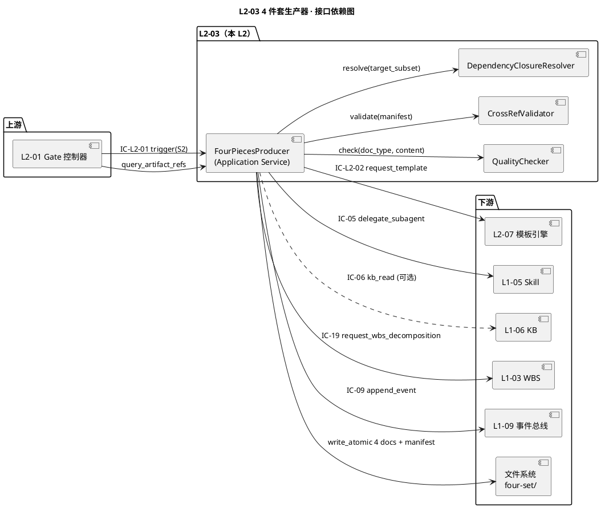
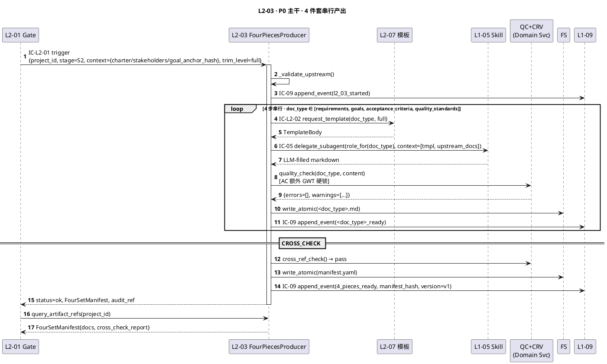
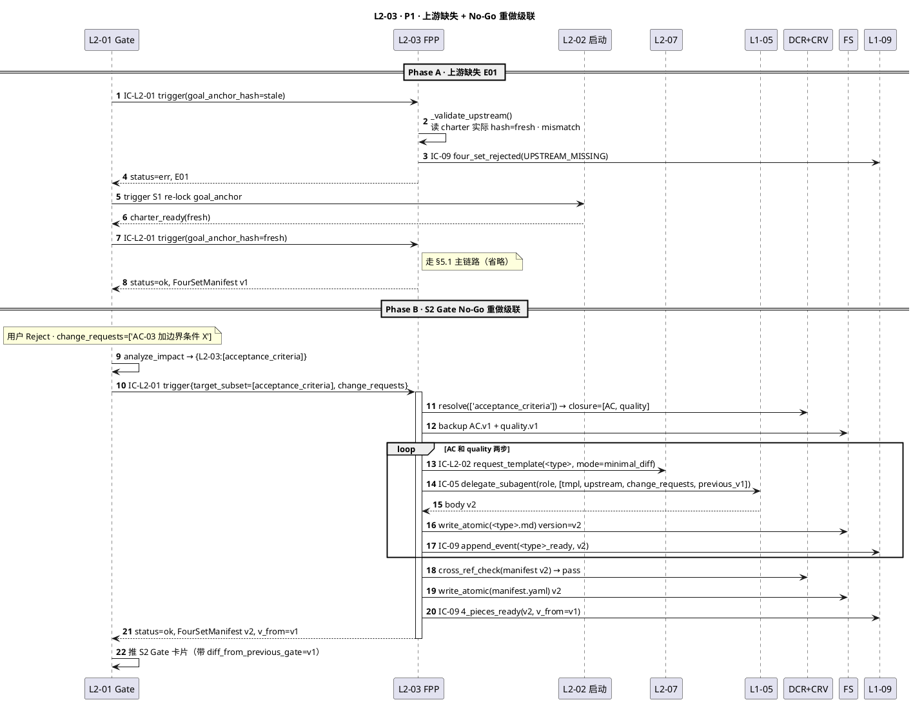
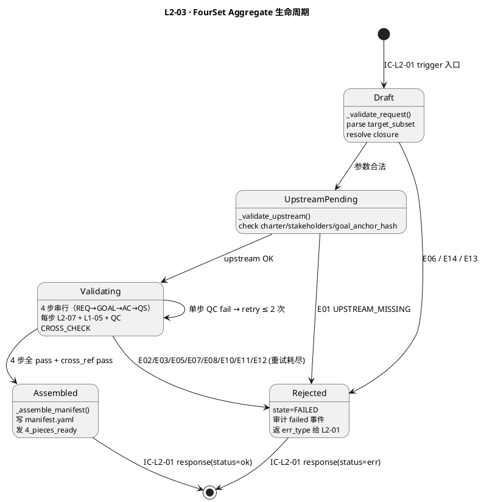
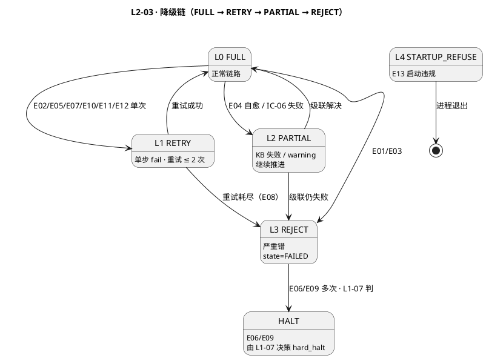

# L1-02 L2-03 · 4 件套生产器 · Tech Design

> **本文档定位**：3-1-Solution-Technical · L1-02 项目生命周期编排 · L2-03 4 件套生产器技术实现方案（L2 · depth-B 精简）。
> **与产品 PRD 的分工**：2-prd/L1-02/prd.md §10 定产品边界，本文档定**技术实现**（接口 YAML schema · 算法伪代码 · 数据 schema · 状态机 · 配置 · 降级）。
> **与 L1 architecture.md 的分工**：architecture.md 管**跨 L2 架构 + 时序**，本文档管**本 L2 内部细节**。冲突以 architecture.md 为准。
> **严格规则**：不复述 PRD 产品文字，只做技术映射 + 补"工程师必须知道"的部分。

---

## §0 撰写进度

- [x] §1 定位 + 2-prd §10 L2-03 映射
- [x] §2 DDD 映射（BC-02 · FourPiecesProducer Application Service）
- [x] §3 对外接口定义（字段级 YAML schema · ≥ 8 错误码）
- [x] §4 接口依赖（被谁调 · 调谁）
- [x] §5 P0/P1 时序图（PlantUML ≥ 2 张）
- [x] §6 内部核心算法（伪代码 · 3+ 算法）
- [x] §7 底层数据表 / schema（PM-14 分片）
- [x] §8 状态机（5 状态）
- [x] §9 开源最佳实践调研（MkDocs / Docusaurus / GitBook · Adopt-Learn-Reject）
- [x] §10 配置参数清单（≥ 10 条）
- [x] §11 错误处理 + 降级（≥ 12 错误码 · 四列）
- [x] §12 性能目标
- [x] §13 与 2-prd / 3-2 TDD 的映射表（反向 + 前向）

---

## §1 定位 + 2-prd §10 L2-03 映射

### 1.1 本 L2 在 L1-02 的坐标

L1-02 由 7 个 L2 组成，**本 L2-03 是 S2 规划阶段 3 条主产出线之一**，也是 **L2-04 PMP / L2-05 TOGAF / L1-03 WBS / L1-04 TDD** 的共同前置依赖：

```
[L2-01 Gate 控制器（唯一调度器 · IC-L2-01 发起方）]
       │ IC-L2-01(stage=S2, target_subset?)
       ▼
  ┌──────────────────────┐
  │  L2-03 4 件套生产器  │  ← 本 L2
  │  (S2 核心 · 串行 4 步)│
  └──────────┬───────────┘
             │ 4_pieces_ready event → L1-09
  ┌──────────┼──────────┬─────────┐
  ▼          ▼          ▼         ▼
[L2-04]  [L2-05]   [L1-03]   [L1-04]
 PMP     TOGAF      WBS       TDD
```

**技术定位一句话**：L2-03 = **BC-02 内 FourPiecesProducer Application Service · 持 FourSet Aggregate + 4 VO（Requirements/Goals/AcceptanceCriteria/QualityStandards）· 走 L2-07 模板 + L1-05 LLM 填充 · 串行 4 步 + 跨文档 id 引用链校验 · 广播 `4_pieces_ready` 总事件**。

### 1.2 与 2-prd §10 L2-03 的精确映射

| 2-prd §10 小节 | 本文档对应位置 | 技术映射重点 |
|:---|:---|:---|
| §10.1 职责（需求锚定器）| §1.3 + §2.1 | FourPiecesProducer Application Service |
| §10.2 输入 / 输出 | §3 YAML schema | trigger + 4 件套 paths |
| §10.3 边界 | §1.4 YAGNI | 4 件套串行 · 重做只改 target_subset |
| §10.4 约束（PM-01/04/13 + 8 硬约束）| §7 + §10 + §11 | AC 必 GWT · id 规则固定 |
| §10.5 🚫 禁止 7 条 | §11 错误码 | 并行/跳检/越界修禁 |
| §10.6 ✅ 必须 8 条 | §6 + §11 | 串行 · 模板 · 自检 · 版本 |
| §10.7 🔧 可选 5 项 | §6 注解 | KB / 澄清 / 矩阵 / NFR |
| §10.8 IC 关系 | §3 + §4 | 5 IC 触点 字段级 schema |
| §10.9 G-W-T（8 正 + 6 负 + 3 集成）| §5 时序 + §13 映射 | P1-P8 / N1-N6 / I1-I3 |
| §10.10 L3 实现 | §6 + §8 | 4 步状态机 + 自检 + 级联 |

### 1.3 本 L2 在 architecture.md 的坐标

引 `L1-02/architecture.md`：
- §2.2 DDD："**L2-03 Application Service · `FourPiecesProducer` · Requirements/Goals/AC/QualityStandards**"
- §4.1 主时序：S2 的 `par` 块**第一分支**（4 件套先产 · L2-04/L2-05 订阅）
- §7.1 PMP×TOGAF 矩阵："**L2-03 4 件套先 · 作所有后续输入**"（硬序）
- §8.1 本 L1 发起 IC：L2-03 承担 **IC-19 request_wbs_decomposition**（S2 Gate 后 → L1-03）

### 1.4 PM-14 约束

引 `projectModel/tech-design.md`：所有 IC payload 顶层 `project_id` 必填；产出路径按 `projects/<pid>/...` 分片。本 L2 具体：
- 4 件套正文：`projects/<pid>/four-set/{requirements,goals,acceptance-criteria,quality-standards}.md`
- 历史版本：`projects/<pid>/four-set/{filename}.v{N}.md`
- Manifest：`projects/<pid>/four-set/manifest.yaml`
- 事件：`projects/<pid>/events/L1-02-L2-03.jsonl`
- Debug：`projects/<pid>/l1-02-l2-03-debug/cross-ref-{YYYYMMDD}.jsonl`

跨项目请求一律拒（L2-01 前置 + 本 L2 冗余 `assert req.project_id == self.active_project_id`）。

### 1.5 关键技术决策（Decision · Rationale · Alternatives · Trade-off）

| # | 选择 | 备选 | 理由 | Trade-off |
|:--|:---|:---|:---|:---|
| D1 · 4 步严格串行 REQ→GOAL→AC→QS | 并行/分组 | id 引用链依赖链单向 · 并行破坏 | 总时长 ~20min（可接受）|
| D2 · AC GWT 硬锁（正则+3 关键字）| 自由 MD / BDD DSL | L1-04 TDD 消费必 GWT · scope §5.2.5 禁 5 | AC 变种需 scope 变更 |
| D3 · 重做级联闭包（改 AC→级联 quality；改 goals→AC+quality；改 req→全）| 只改 target_subset | 保 id 链一致性 | 改 req 成本高 |
| D4 · QC 2 级（errors 阻 · warnings 提示）| 统一阻 / 全放 | scope §5.2.6 义务 3 | 边界靠规则库 |
| D5 · 模板必走 L2-07（IC-L2-02）| 硬编码 | PM-07 模板驱动 · 单源真相 | L2-07 故障卡本 L2 |
| D6 · LLM 走 L1-05 IC-05 delegate | 直调 Claude API | scope 禁"写 LLM 底层" · 统一鉴权 | Subagent 启动 ~2s |
| D7 · `.vN.md` 备份保留 | git diff / 覆盖 | P7 G-W-T · 用户 Gate 卡带 diff | 磁盘占用 |
| D8 · CROSS_CHECK 最后统一扫 | 每步扫 / 不扫 | 单源 + O(N) | CROSS fail 回 step 重做 |
| D9 · 总事件带 manifest 索引 | 仅事件名 / 全文内嵌 | L2-01 据此打包 · 避 4KB 膨胀 | 消费方再读文件 |
| D10 · 启动强依赖 L2-07 | 本地 fallback | 模板故障应整体 halt · 避污染 TDD | ops 修 L2-07 |

### 1.6 读者预期 / YAGNI

**读完掌握**：5 IC 触点 + 字段级 YAML · 14 错误码 · 3 核心算法（`assemble_four_set` / `quality_check` / `cross_ref_check`）· 5 状态机 · P0+P1 时序 · SLO（总 ≤20min · 单份 ≤5min · QC ≤10s · cross ≤2s · 重做 1-2 份 ≤10min）。

**YAGNI 不在范围**：Gate 判定/推送（L2-01）· 9 计划/TOGAF/WBS/TDD（L2-04/05/L1-03/L1-04）· LLM 底层（L1-05）· 模板本身（L2-07）· WBS 触发时机（L2-01）· KB 写入/晋升（L1-06 · 本 L2 只读）· IC-01 状态转换（L2-01 独占）。

---

## §2 DDD 映射（BC-02）

引 `L0/ddd-context-map.md §2.3 BC-02`。本 L2 = **BC-02 Project Lifecycle Orchestration 内的 Application Service**（S2 需求锚定能力）。

**兄弟 L2 关系**：L2-01 Gate（Customer-Supplier · 本 L2 Supplier 发 `4_pieces_ready`）· L2-02 启动（**上游依赖** · 读 charter/stakeholders/goal_anchor · Shared Kernel）· L2-04/L2-05（**下游消费** · Publisher）· L2-07 模板（Customer-Supplier · IC-L2-02）。

**DDD 原语**：

| 原语 | 名 | 职责 |
|:---|:---|:---|
| Aggregate Root | `FourSet` | 4 件套聚合 · 持 4 VO + manifest |
| Value Object | `Requirements` / `Goals` / `AcceptanceCriteria` / `QualityStandards` / `DocVersion` / `TraceabilityLink` | 不可变 · 整份替换 |
| Application Service | `FourPiecesProducer` | 编排 4 步 + QC + cross_check + 事件 |
| Domain Service | `QualityChecker` / `CrossRefValidator` / `DependencyClosureResolver` | 无状态 |

**聚合根不变量**：I-FS-01 `project_id` 必填且不可变 · I-FS-02 4 VO 必按 REQ→GOAL→AC→QS 顺序 · I-FS-03 每 VO 必 `QC.errors==[]` 才发 ready · I-FS-04 AC 必含 G/W/T 三关键字（不敏感）· I-FS-05 跨文档引用 CROSS_CHECK 后全解析 · I-FS-06 重做时闭包外 VO `hash(v2)==hash(v1)` · I-FS-07 4_pieces_ready 必带 manifest hash · 4 paths 可读 · I-FS-08 doc_id 正则硬锁（REQ-NNN/GOAL-NN/AC-NNN/QS-NNN）。

**Repository**：`FourSetRepository`（4 md）· `ManifestRepository`（manifest.yaml）· `VersionArchiveRepository`（`.vN.md`）。

**Domain Events**（经 L1-09）：`requirements_ready` / `goals_ready` / `ac_ready` / `quality_ready` / `4_pieces_ready`（总）/ `four_set_failed`。

---

## §3 对外接口定义（字段级 YAML schema + 错误码）

### 3.1 接口清单（本 L2 11 触点）

| # | 方向 | 方法 | 简述 | 对方 |
|:--:|:---|:---|:---|:---|
| 1 | 对外入站 | `produce_scope` / `produce_prd` / `produce_plan` / `produce_tdd` | 内部 4 VO 生产子步（scope=REQ · prd=REQ全文 · plan=GOAL+AC · tdd=QS） | 内部 |
| 2 | 对外入站 | `assemble_four_set` | 主入口 · 装配完整 4 件套 | L2-01（IC-L2-01）|
| 3 | 对外入站 | `query_artifact_refs` | Gate bundle 索引查询 | L2-01 |
| 4 | 出站 | `IC-L2-02 request_template` | 取模板 | L2-07 |
| 5 | 出站 | `IC-05 delegate_subagent` | LLM 填充 | L1-05 |
| 6 | 出站 | `IC-06 kb_read` | 相似需求模式（可选）| L1-06 |
| 7 | 出站 | `IC-19 request_wbs_decomposition` | S2 Gate 后 WBS 触发 | L1-03 |
| 8 | 出站 | `IC-09 append_event` | 审计 + 事件（每步 + 总）| L1-09 |

### 3.2 入站：`IC-L2-01 trigger` 请求 YAML schema

```yaml
# ic_l2_01_trigger_four_set_request.yaml
type: object
required: [project_id, request_id, stage, context]
properties:
  project_id: { type: string }             # PM-14 · 必填
  request_id: { type: string }             # 幂等键
  stage: { type: string, enum: [S2] }
  trim_level: { type: string, enum: [full, minimal, custom], default: full }
  context:
    type: object
    required: [charter_path, stakeholders_path, goal_anchor_hash]
    properties:
      charter_path: { type: string }       # projects/<pid>/charter.md
      stakeholders_path: { type: string }
      goal_anchor_hash: { type: string }   # sha256 · L2-02 锁定
      project_manifest_path: { type: string, nullable: true }
  target_subset:                           # null=全量 · 重做时指定子集
    type: array
    nullable: true
    items: { type: string, enum: [requirements, goals, acceptance_criteria, quality_standards] }
  change_requests:                         # L2-01 No-Go 时附带用户意见
    type: array
    nullable: true
    items: { type: string, maxLength: 500 }
  caller_l2: { type: string, enum: [L2-01] }
  trace_ctx:
    properties: { ts_dispatched_ns: { type: integer }, gate_id: { type: string, nullable: true } }
```

### 3.3 入站：`assemble_four_set` 响应 schema

```yaml
# assemble_four_set_response.yaml
type: object
required: [project_id, request_id, status, result]
properties:
  project_id: { type: string }
  request_id: { type: string }
  status: { type: string, enum: [ok, err] }
  result: { oneOf: [{$ref: "#/defs/FourSetManifest"}, {$ref: "#/defs/StructuredErr"}] }
  audit_ref: { type: string }              # L1-09 event seq id
  latency_ms: { type: integer }

defs:
  FourSetManifest:
    required: [manifest_path, manifest_hash, version, docs]
    properties:
      manifest_path: { type: string }
      manifest_hash: { type: string }      # sha256
      version: { type: string }            # v1/v2/v3
      docs:                                # 4 键: requirements/goals/acceptance_criteria/quality_standards
        additionalProperties: false
        properties: { requirements: {$ref: "#/defs/DocRef"}, goals: {$ref: "#/defs/DocRef"},
                      acceptance_criteria: {$ref: "#/defs/DocRef"}, quality_standards: {$ref: "#/defs/DocRef"} }
      cross_check_report: { errors: [string], warnings: [string], total_refs_checked: int }
      produced_at_ns: { type: integer }
      produced_by: { const: "L2-03" }
  DocRef:
    required: [doc_type, doc_id, path, hash, version, item_count]
    properties:
      doc_type: { enum: [requirements, goals, acceptance_criteria, quality_standards] }
      doc_id: string; path: string; hash: string; version: string; item_count: int
      qc_status: { enum: [pass, warnings_only, fail] }; qc_warnings: [string]
  StructuredErr:
    required: [err_type, reason, project_id]
    properties:
      err_type: string; reason: string; suggested_action: string | null
      failed_step: { enum: [REQUIREMENTS_GEN, GOALS_GEN, AC_GEN, QUALITY_GEN, CROSS_CHECK] | null }
      context: { type: object, nullable: true }
```

### 3.4 出站 IC：关键字段（紧凑）

```yaml
# IC-L2-02 request_template（→ L2-07）
required: [project_id, doc_type, trim_level]
properties:
  doc_type: { enum: [requirements, goals, acceptance_criteria, quality_standards] }
  trim_level: { enum: [full, minimal, custom] }
  variables: { type: object }              # 模板替换（project_name / goal_anchor / upstream_refs）
  mode: { enum: [normal, minimal_diff], default: normal }   # 重做用 minimal_diff

# IC-05 delegate_subagent（→ L1-05）
required: [project_id, delegation_id, role, task_brief, context_copy]
properties:
  role: { enum: [requirements-analysis, goals-writing, ac-scenario-writer, quality-audit] }
  task_brief: { type: string, maxLength: 2000 }
  context_copy: { template_body, charter_excerpt, stakeholders_excerpt, previous_docs: [string], change_requests: [string]|null }
  timeout_s: { type: integer, default: 300 }
  tools_whitelist: [string]                # ['Read']（只读 · 防写污染）

# IC-19 request_wbs_decomposition（→ L1-03）
required: [project_id, command_id, four_set_manifest, architecture_refs, trim_level]
properties:
  four_set_manifest: { manifest_path, manifest_hash, version }
  architecture_refs: { togaf_a_path, togaf_b_path, togaf_c_path, togaf_d_path, adr_dir }
  trim_level: { enum: [full, minimal, custom] }
```

### 3.5 错误码（14 条 · 对应 §11 详细降级表）

| # | err_type | 含义 | 触发场景 | 调用方处理 |
|:--:|:---|:---|:---|:---|
| E01 | `UPSTREAM_MISSING` | charter/stakeholders/goal_anchor 缺失或 hash 不合 | L2-02 章程未锁定 | L2-01 路由回 L2-02 重做 S1 |
| E02 | `TEMPLATE_INVALID` | L2-07 模板 schema 错 | 模板仓脏 / L2-07 未启动完 | ops 修 L2-07 · 本次 fail |
| E03 | `TRACEABILITY_BROKEN` | cross_ref errors 非空 | AC 引用不存在 REQ | 重试当前 step ≤ 2 次 · 仍 fail |
| E04 | `CROSS_REF_DEAD` | 下游引用上游已删 id | 重做 req 删 REQ-03 但 goals 仍引 | 级联重做（自愈）· 3 次失败 fail |
| E05 | `SECTION_DRIFT` | 章节结构偏离模板 | LLM 漏节 | 重试（prompt 强调必带 sections）|
| E06 | `PM14_PID_MISMATCH` | req.project_id ≠ active | 跨项目误入 | 拒绝 · critical 广播 · 审计违规 |
| E07 | `AC_FORMAT_VIOLATION` | AC 不符 GWT | LLM 写 "User story" | 重试 ≤ 2 次 |
| E08 | `QC_FAILED_HARD` | 单步 QC 3 次失败 | 模型能力不足 | state=FAILED · 通知 L2-01 |
| E09 | `REDO_OUT_OF_SCOPE` | 重做越界修改 | 内部 bug | critical · 回滚 · 审计违规 |
| E10 | `ID_PATTERN_VIOLATION` | doc_id 不符正则 | LLM 写 `REQ1` | 重试 + 后处理校正 |
| E11 | `UPSTREAM_TIMEOUT` | L2-07/L1-05/L1-06 超时 | 外部服务挂 | 指数退避 3 次 · 仍 fail 降级 |
| E12 | `LLM_OUTPUT_EMPTY` | L1-05 返空 | LLM 拒答 / context 过长 | 重试（截短 context）|
| E13 | `CONFIG_ENDPOINTS_NONEMPTY` | 启动时 endpoints 非空 | 运维误配 | **启动拒绝** · L1-07 广播 |
| E14 | `DEPENDENCY_CLOSURE_EMPTY` | target_subset 解析空闭包 | 调用方传非法 doc_type | 拒绝 · 返合法列表 |

错误返回模板：

```yaml
status: err
result:
  err_type: TRACEABILITY_BROKEN
  reason: "AC-003 references non-existent GOAL-99 in goals.md"
  suggested_action: "Re-run AC_GEN step with validated linked_goal list"
  failed_step: AC_GEN
  context: { dead_refs: [{from: AC-003, to_doc: goals.md, to_id: GOAL-99}], available_goals: [GOAL-01, GOAL-02] }
audit_ref: "evt-20260422-0001"
latency_ms: 1250
```

---

## §4 接口依赖（被谁调 · 调谁）

**上游**：L2-01 Gate · `IC-L2-01 trigger(S2)`（每 project 1-3 次）+ `query_artifact_refs()`（Gate bundle 打包前）。
**下游**：L2-07（IC-L2-02 模板 · 必选 · 超时 3 次→E02）· L1-05（IC-05 delegate · 必选 · 超时 2 次→E11/重写 prompt）· L1-06（IC-06 kb_read · 可选 · 失败 warning）· L1-03（IC-19 request_wbs · S2 Gate 后必选）· L1-09（IC-09 append_event · 必选 · 审计失败→降级 Rejected）· FS（`write_atomic + fsync`）。

**依赖图**：



**不依赖清单**：
- L1-01 IC-01（状态转换）· L2-01 独占发起
- L1-04 Quality Loop · 本 L2 只产文档
- L1-08 多模态 · 纯文本
- 直接 Claude API · D6 决策 · 统一走 L1-05
- 直接触发 Gate · L2-01 独占

---

## §5 P0/P1 时序图（PlantUML ≥ 2 张）

### 5.1 P0 主干 · 4 件套串行产出

**场景**：L2-01 发 `IC-L2-01 trigger(S2)` → 本 L2 跑 4 步（REQ→GOAL→AC→QS · 每步 L2-07 模板 + L1-05 LLM + QC + ready 事件）→ CROSS_CHECK → `4_pieces_ready` 总事件 → L2-01 `query_artifact_refs` 打包 Gate bundle。**SLO**：15-20min（4 × 5min + CROSS ≤ 2s + 事件 ≤ 200ms）。



### 5.2 P1 · 上游缺失 E01 拒绝 + No-Go 重做级联

**场景**：（A）trigger 发现 `goal_anchor_hash` 与 charter 实际 hash 不一致 → E01 UPSTREAM_MISSING → L2-01 路由回 L2-02 重做 S1；（B）S2 Gate 用户 No-Go `change_requests=['改 AC-03']` → 本 L2 按 target_subset 级联（AC + quality）重做 → v2 事件 + diff。



---

## §6 内部核心算法（伪代码）

### 6.1 主入口 `assemble_four_set()` · 6 阶段

```python
def assemble_four_set(req: TriggerRequest) -> FourSetManifestOrErr:
    # S0 · 启动硬校验（冗余 · 进程启动时已一次性跑）
    assert config.endpoints == [], "E13"
    assert req.project_id == self.active_project_id, "E06"
    # S1 · 上游校验
    if not (u := _validate_upstream(req.context)).ok: return _reject('UPSTREAM_MISSING', u.reason)
    # S2 · closure 解析
    target = _resolve_dependency_closure(req.target_subset or ['all'])
    if not target: return _reject('DEPENDENCY_CLOSURE_EMPTY')
    # S3 · 重做时备份
    if req.target_subset: _backup_previous_versions(target)
    # S4 · 按顺序跑 4 步（只跑 target 中的）
    for doc_type in ['requirements', 'goals', 'acceptance_criteria', 'quality_standards']:
        if doc_type not in target: continue
        retry = 0
        while retry <= config.qc_retry_max:
            tmpl = call_l207_request_template(doc_type, req.trim_level)
            out = call_l105_delegate_subagent(_role_for(doc_type), _build_context(doc_type, tmpl, req))
            if not out.strip(): retry += 1; continue                       # E12
            content = _post_process(out, doc_type)
            if (qc := quality_check(doc_type, content)).pass:
                _write_doc(doc_type, content); _emit_event(f'{doc_type}_ready', content); break
            retry += 1
        if retry > config.qc_retry_max:
            return _reject('QC_FAILED_HARD', qc.errors, failed_step=doc_type.upper())
    # S5 · CROSS_CHECK
    if not (cr := cross_ref_check()).pass:
        return _reject('TRACEABILITY_BROKEN', cr.errors, failed_step='CROSS_CHECK')
    # S6 · manifest + 总事件
    m = _assemble_manifest(version=_next_version())
    _write_manifest(m); _emit_event('4_pieces_ready', m)
    return FourSetManifest(m)
```

### 6.2 `quality_check(doc_type, content)` · 4 类规则库（引 prd §10.10.3）

```python
def quality_check(doc_type, content) -> QCResult:
    errors, warnings = [], []
    if not _has_valid_frontmatter(content): errors.append('missing_frontmatter')        # E05
    if not _has_required_sections(doc_type, content): errors.append('missing_sections') # E05
    if doc_type == 'requirements':
        if not _has_id_pattern(r'REQ-\d{3}', content): errors.append('req_id_pattern')  # E10
        if not _has_nfr_section(content): warnings.append('missing_nfr_summary')
    elif doc_type == 'goals':
        for g in _parse_goals(content):
            if not _is_smart(g): errors.append(f'{g.id}_not_smart')
            if not _ref_valid(g.linked_reqs, 'requirements.md'): errors.append(f'{g.id}_invalid_req')  # E03
    elif doc_type == 'acceptance_criteria':
        for a in _parse_acs(content):
            if not _has_given_when_then(a): errors.append(f'{a.id}_not_gwt')            # E07
            if not _ref_valid(a.linked_goal, 'goals.md'): errors.append(f'{a.id}_invalid_goal')  # E03
            if a.testability == 'ambiguous': warnings.append(f'{a.id}_ambiguous')
    elif doc_type == 'quality_standards':
        for q in _parse_qss(content):
            if not _has_measurable_criteria(q): errors.append(f'{q.id}_not_measurable')
            if not _has_verification_method(q): errors.append(f'{q.id}_missing_verif')
    return QCResult(pass=(len(errors) == 0), errors=errors, warnings=warnings)
```

### 6.3 `cross_ref_check()` · O(N) · SLO ≤2s

```python
def cross_ref_check() -> CRResult:
    req_ids  = _extract_ids('requirements.md',       r'REQ-\d{3}')
    goal_ids = _extract_ids('goals.md',              r'GOAL-\d{2}')
    ac_ids   = _extract_ids('acceptance-criteria.md', r'AC-\d{3}')
    errors, warnings = [], []
    # 1. goals → requirements
    for g in _parse_goals():
        for r in g.linked_reqs:
            if r not in req_ids: errors.append(f'{g.id}→{r}')               # E04
    # 2. AC → goals + requirements
    for a in _parse_acs():
        if a.linked_goal not in goal_ids: errors.append(f'{a.id}→{a.linked_goal}')
        for r in a.linked_reqs:
            if r not in req_ids: errors.append(f'{a.id}→{r}')
    # 3. QS → AC
    for q in _parse_qss():
        for ar in q.linked_acs:
            if ar != 'all' and ar not in ac_ids: errors.append(f'{q.id}→{ar}')
    # 4. 孤儿 warning（覆盖率）
    uncovered = req_ids - {r for a in _parse_acs() for r in a.linked_reqs}
    if uncovered: warnings.append(f'Uncovered reqs: {uncovered}')
    return CRResult(pass=(len(errors) == 0), errors=errors, warnings=warnings)
```

### 6.4 `resolve_dependency_closure()` · 重做级联矩阵（引 prd §10.10.5）

```python
CLOSURE = {
    'requirements':        ['requirements', 'goals', 'acceptance_criteria', 'quality_standards'],
    'goals':               ['goals', 'acceptance_criteria', 'quality_standards'],
    'acceptance_criteria': ['acceptance_criteria', 'quality_standards'],
    'quality_standards':   ['quality_standards'],
    'all':                 ['requirements', 'goals', 'acceptance_criteria', 'quality_standards'],
}
def resolve_dependency_closure(target_subset) -> set[str]:
    if not target_subset: return set(CLOSURE['all'])
    out = set()
    for t in target_subset:
        if t not in CLOSURE: raise L2_03_Error('DEPENDENCY_CLOSURE_EMPTY', t)
        out.update(CLOSURE[t])
    return out
```

---

## §7 底层数据表 / schema 设计（PM-14 分片）

### 7.1 4 件套正文（md · frontmatter + body）

物理位置：`projects/<pid>/four-set/{requirements,goals,acceptance-criteria,quality-standards}.md`（原子写 + fsync）。通用 frontmatter（各类 doc_type 结构一致 · body 详见 prd §10.10.2：REQ-NNN / GOAL-NN / AC-NNN 含 GWT / QS-NNN 含 measurable + verification_method）：

```yaml
---
doc_id: req-p-{uuid}-v{N}             # goal-p / ac-p / qs-p 同构
doc_type: requirements                # goals / acceptance_criteria / quality_standards
stage: S2
produced_by: L2-03
produced_at: iso8601
parent_doc: [charter.md, goal_anchor_hash: sha256:xxx]
trim_level: full | minimal | custom
version: v1
project_id: {pid}                     # PM-14 根字段
---
```

### 7.2 Manifest.yaml（Gate bundle 索引 · PM-14 `projects/<pid>/four-set/manifest.yaml`）

```yaml
FourSetManifest:
  project_id: string                  # PM-14
  version: string                     # v1/v2
  manifest_hash: string               # sha256(docs 段)
  produced_at_ns: int
  produced_by: "L2-03"
  v_from: string | null               # 重做时源版本
  docs:                               # 4 键 doc_type: DocRef{doc_id, path, hash, version, item_count, qc_status, qc_warnings[], gwt_validated? (AC only)}
    requirements: DocRef
    goals: DocRef
    acceptance_criteria: DocRef
    quality_standards: DocRef
  cross_check_report: { errors: [string], warnings: [string], total_refs_checked: int }
  traceability_graph_path: string | null   # 可选 PlantUML
```

### 7.3 历史版本 / Debug / 物理路径总览（PM-14 分片）

- 历史版本：`projects/<pid>/four-set/{filename}.v{N}.md`（重做备份 · 保留 ≤ 10 · 超限删最早）
- Cross-ref debug（可选 verbose）：`projects/<pid>/l1-02-l2-03-debug/cross-ref-{YYYYMMDD}.jsonl` · 字段 `{project_id, ts_ns, check_type ∈ [goals_to_req, ac_to_goal, ac_to_req, qs_to_ac, coverage], source_id, target_doc, target_id, resolution ∈ [ok, dead_ref, orphan]}`
- 审计事件：`projects/<pid>/events/L1-02-L2-03.jsonl`（由 L1-09 落盘）

```
projects/{pid}/
  four-set/{requirements,goals,acceptance-criteria,quality-standards}.md + manifest.yaml + *.v{N}.md + traceability.puml?
  l1-02-l2-03-debug/cross-ref-{YYYYMMDD}.jsonl?
  events/L1-02-L2-03.jsonl
```

**PM-14 硬约束**：所有路径含 `projects/{pid}/` 前缀 · 跨项目 E06 拒绝（本 L2 assert + L2-01 前置）。

---

## §8 状态机（FourSet Aggregate · 5 状态）



**状态转换表**：

| from | to | 触发 | Guard | Action |
|:---|:---|:---|:---|:---|
| Draft | UpstreamPending | 参数合法 | `project_id 合法 · target_subset ⊆ 白名单` | 跳下一步 |
| Draft | Rejected | 参数违法 | E06/E14/E13 任一 | 返 err + 审计 |
| UpstreamPending | Validating | 上游 OK | charter + stakeholders + goal_anchor_hash 匹配 | 开始 4 步 |
| UpstreamPending | Rejected | 上游缺 | E01 | 返 err · 提示 L2-01 回 S1 |
| Validating | Validating | QC fail 且 retry ≤ 2 | errors 非空 AND retry_count < max | 重试 |
| Validating | Assembled | 全 pass | 4 步全 pass + cross_ref.errors == [] | 写 manifest + 总事件 |
| Validating | Rejected | retry 耗尽 / cross_ref 不可恢 | retry > max 或 E03/E08 | state=FAILED · 通知 L2-01 |
| Assembled | [*] | 响应返回 | audit_ref 就位 | status=ok |
| Rejected | [*] | 错误响应 | err_type + failed_step 就位 | status=err |

**状态不变量**：
- Draft 是唯一入口 · 必经 `_validate_request()`
- Assembled 必带 manifest_hash + 4_pieces_ready 事件 · 审计失败则降级 Rejected（审计链优先）
- Rejected 也必有 audit_seed · 禁止静默失败
- 单步重试是 Validating 自循环 · 非状态切换
- 重做时从 Validating 进入 · 跳过 Draft（同 request_id 同结果 · idempotent）

---

## §9 开源最佳实践调研（≥ 3 GitHub ≥ 1k stars · Adopt-Learn-Reject）

调研范围：结构化文档装配 / 需求工程 / 跨文档 traceability。引 `L0/open-source-research.md §3`。

| 项目 | Stars/License | 核心 | Adopt / Learn / Reject |
|:---|:---|:---|:---|
| **MkDocs** (github.com/mkdocs/mkdocs) | 19k+ / BSD-2 · 极活跃 | SSG · `mkdocs.yml` 装配多 md + frontmatter | **Adopt** manifest 单源索引模式（本 L2 `manifest.yaml`）+ frontmatter YAML（`doc_id`/`parent_doc`/`version`）· **Learn** nav 层级化（`traceability.puml`）+ 插件扩展（QC 规则库）· **Reject** 不引依赖（渲染是 L1-10 职责）· 不用 jinja2（走 L2-07 · D5）|
| **Docusaurus** (facebook/docusaurus) | 57k+ / MIT · 极活跃 | versioned docs + 跨文档 ref 校验 + sidebar.js | **Adopt** versioned docs（本 L2 `.v{N}.md` · D7）+ ref build-time 校验 · **Learn** Broken-links checker（E04）+ versioned sidebar（manifest 每版本独立）· **Reject** React 栈过重 · 不做目录分离（`.vN` 更简）|
| **GitBook** (GitbookIO/gitbook) | 26k+ / Apache 2.0 · 半活跃 | SUMMARY.md 索引 + 跨章引用 | **Adopt** SUMMARY.md 装配器 + Chapter dependency（`parent_doc`）· **Learn** Glossary + i18n（P2 多语言 UI）· **Reject** maintained 弱 · 不引 npm · 不用 HTML/ePub |

**综合决策矩阵**：

| 设计点 | 采纳 | 来源 | 独创 |
|:---|:---|:---|:---|
| manifest.yaml 单源 | Adopt | MkDocs + GitBook | 4 件套专用字段（doc_id/hash/item_count/qc_status）|
| `.v{N}` 版本后缀 | Adopt | Docusaurus（简化）| 原名保留 · 下游读 latest |
| frontmatter YAML | Adopt | MkDocs | `parent_doc` + `trim_level` + `project_id` |
| 跨文档 ref 校验 | Adopt | Docusaurus broken-links | GWT 硬锁 · id 正则硬锁 · 4 层链 |
| 模板 + LLM 分离 | 自研 | — | D5 + D6 · L2-07 + L1-05 |
| 4 类 QC 规则库 | 自研 | — | req / goals / AC / quality 各一套 |

---

## §10 配置参数清单（18 条）

| 参数名 | 类型 | 默认 | 可调范围 | 说明 | 调用位置 |
|:---|:---|:---|:---|:---|:---|
| `template_base_dir` | string | `.harnessflow/templates/four-set/` | 路径 | L2-07 模板库基目录 · 本 L2 通过 IC-L2-02 间接依赖 | §3.4 |
| `require_traceability` | bool | true | true/false | 是否强制跨文档 id 校验 · 默认硬锁 true | §6.3 |
| `ref_check_strict` | bool | true | true/false | true=dead ref→E04 拒绝；false=只警告 | §6.3 |
| `doc_gen_timeout_ms` | int | 300000 | [60000, 600000] | 单份生成超时（5min）· 超时重试 | §6.1 |
| `total_four_set_timeout_ms` | int | 1200000 | [600000, 3600000] | 4 件套总超时（20min）· state=FAILED | §6.1 |
| `qc_retry_max` | int | 2 | [0, 5] | 单步 QC 重试上限 · 超限 E08 | §6.1 |
| `id_pattern_req` | string | `REQ-\d{3}` | 正则 | REQ 命名规范（硬锁）| §6.2 |
| `id_pattern_goal` | string | `GOAL-\d{2}` | 正则 | GOAL 命名规范 | §6.2 |
| `id_pattern_ac` | string | `AC-\d{3}` | 正则 | AC 命名规范 | §6.2 |
| `id_pattern_qs` | string | `QS-\d{3}` | 正则 | QS 命名规范 | §6.2 |
| `ac_format_hard_check` | bool | true | 硬锁 | GWT 硬自检（不可关）| §6.2 |
| `kb_read_enabled` | bool | true | true/false | IC-06 读相似需求 KB | §4 |
| `version_backup_pattern` | string | `{filename}.v{N}.md` | — | 历史版本命名 | §6.1 |
| `max_version_history` | int | 10 | [1, 50] | 保留历史版本数上限（超则删最早）| §7.3 |
| `endpoints` | list | `[]` | **硬锁 `[]`** | 禁用外部 LLM · 启动 assert · 非空 E13 | §6.1 Stage 0 |
| `cross_check_timeout_ms` | int | 2000 | [500, 10000] | cross_ref 超时 · 超时 E03 | §6.3 |
| `audit_summary_max_chars` | int | 200 | [100, 500] | L1-09 4KB 对齐 | §7.4 |
| `llm_subagent_timeout_s` | int | 300 | [60, 600] | IC-05 单次超时 | §3.4 |

**敏感参数**：`endpoints` / `ac_format_hard_check` / `id_pattern_*` 硬锁 · 改动=启动失败（E13）；`require_traceability` false 会让下游悬空 · 生产永远 true；`qc_retry_max` 过大延长 FAILED 判定。

---

## §11 错误处理 + 降级策略（≥ 12 错误码 · 四列）

### 11.1 错误码完整表（14 条 · 四列对齐）

| errorCode | meaning | trigger | callerAction |
|:---|:---|:---|:---|
| UPSTREAM_MISSING (E01) | charter/stakeholders/goal_anchor hash 不合 | L2-02 章程未锁 / hash 篡改 | L2-01 路由回 L2-02 重做 S1 |
| TEMPLATE_INVALID (E02) | L2-07 模板 schema 错 | 模板仓脏 / L2-07 未启动完 | ops 修 L2-07 · 本次 fail · 审计违规 |
| TRACEABILITY_BROKEN (E03) | cross_ref errors 非空 | AC 引用已删 REQ | 重试当前 step ≤ 2 次 · 仍 fail · L2-01 推错误 |
| CROSS_REF_DEAD (E04) | 下游引上游已删 id | 重做 req 删 REQ-03 · goals 仍引 | 级联重做（自愈）· 3 次失败 fail |
| SECTION_DRIFT (E05) | 章节偏模板 | LLM 漏必需节 | 重试（prompt 强调必带 sections）· ≤ 2 次 |
| PM14_PID_MISMATCH (E06) | req.project_id ≠ active | 跨项目误入 | 拒绝 · critical 广播 · 审计违规 |
| AC_FORMAT_VIOLATION (E07) | AC 不符 GWT | LLM 写 "User story" | 重试 ≤ 2 次 |
| QC_FAILED_HARD (E08) | 单步 QC 3 次失败 | 模型能力 / 需求过复杂 | state=FAILED · 通知 L2-01 + L1-07 · 用户介入 |
| REDO_OUT_OF_SCOPE (E09) | 重做越界修改 | 内部 bug | critical · 回滚 .v1 · 审计违规 |
| ID_PATTERN_VIOLATION (E10) | doc_id 不符正则 | LLM 写 `REQ1` | 重试 + 后处理校正 |
| UPSTREAM_TIMEOUT (E11) | L2-07/L1-05/L1-06 超时 | 外部挂 | 指数退避 3 次 · 仍 fail 降级 |
| LLM_OUTPUT_EMPTY (E12) | L1-05 返空 | LLM 拒答 / context 过长 | 重试（截短 context · 改 prompt）|
| CONFIG_ENDPOINTS_NONEMPTY (E13) | 启动 endpoints 非空 | 运维误配 | **启动拒绝** · L1-07 广播 |
| DEPENDENCY_CLOSURE_EMPTY (E14) | target_subset 解析空闭包 | 调用方传非法 doc_type | 拒绝 · 返合法列表 |

### 11.2 降级链（4 级）



### 11.3 降级行为 + 协同

| errorCode | Level | 行为 | L2-01 响应 | L1-07 响应 |
|:---|:---|:---|:---|:---|
| E01 | L3 REJECT | 立即返 err · 不重试 | 路由回 L2-02 重做 S1 | 收 `upstream_missing` · 非零 WARN |
| E02 | L1→L3 | 重试 L2-07 3 次 · 失败 REJECT | 推错误 Gate 卡片 · 阻塞 S2 | `template_engine_down` · BLOCK 候选 |
| E03 | L1→L3 | 重试 step ≤ 2 次 | 推错误 Gate · 用户改 change_requests | `traceability_broken_rate` · >10% WARN |
| E04 | L2 PARTIAL | 级联重做（自愈）· 3 次失败 L3 | 透明 · 用户无感知 | 无动作 |
| E05 | L1→L3 | 重试 prompt + sections | 推错误 Gate | LLM 生效 |
| E06 | L3 + HALT | 拒绝 · 广播 · 多次触发 halt | 阻塞 Gate · 通知用户 | 8 维度判 · 大概率 IC-15 hard_halt |
| E07 | L1→L3 | 重试 prompt 强调 GWT | 推错误 Gate | LLM 生效 |
| E08 | L3 REJECT | 3 次失败 · state=FAILED | 推失败 Gate · 用户介入 | `four_set_failed` · user-intervene |
| E09 | L3 + HALT | 回滚 .v1 · 广播 · halt 候选 | 阻塞 Gate | 8 维度判 · 大概率 hard_halt |
| E10 | L1 RETRY | 重试 + 后处理正则校正 | 延迟 Gate | LLM 生效 |
| E11 | L1 RETRY | 指数退避 3 次 · 失败 REJECT | 延迟 Gate | `llm_service_degraded` · soft-drift |
| E12 | L1 RETRY | 重试（截 context）· ≤ 2 次 | 延迟 Gate | LLM 生效 |
| E13 | L4 STARTUP_REFUSE | 进程不启动 | 不启动 | 启动告警 |
| E14 | L3 REJECT | 拒绝 · 返合法列表 | 调用方修正 | 无动作 |

**审计链优先原则**：审计失败（IC-09 不可达）则本次生产降级为 Rejected（与 L1-08 L2-03 §8.3 · L2-02 决策引擎 §11.3 对齐）。

---

## §12 性能目标

### 12.1 延迟 SLO（关键项）

| 指标 | P50 | P95 | P99 | 硬上限 | 锚点 |
|:---|:---|:---|:---|:---|:---|
| `assemble_four_set` 全流程（full）| 12min | 18min | 22min | **25min** | prd §10.4 20min+容差 |
| 单份文档生成（LLM+QC）| 3min | 5min | 6min | **7min** | prd §10.4 5min+容差 |
| `quality_check` 单份 | 500ms | 2s | 5s | **10s** | prd §10.9 ≤10s |
| `cross_ref_check` 全 4 | 200ms | 800ms | 1.5s | **2s** | O(N) · N≤300 refs |
| **装配 P95** · manifest+event | 3s | **< 10s** | 15s | 30s | 本 L2 硬 SLO |
| **交叉引用校验 P95** | 800ms | **< 2s** | 2s | 5s | 本 L2 硬 SLO |
| 重做（AC+quality）端到端 | 6min | 10min | 12min | 15min | 2 步 |
| IC-L2-02 / IC-05 / IC-09 往返 | L2-07/L1-05/L1-09 各自 SLO | — | — | — | 继承对端 |

### 12.2 吞吐 / 并发 / 内存

4 件套吞吐 ≥ 3 套/h（单套 ≤20min 串行）· 并发 FourSet=1（同 project 锁 · 跨 project 独立）· 单次 assemble 内存 ≤50MB · FourSet 对象 ≤100KB（大型 200 REQ/AC）· Manifest.yaml ≤8KB · 审计事件 ≤3KB · 启动内存 ≤10MB（config + 正则 + closure 矩阵）。

### 12.3 健康指标（L1-07 监控 · Prometheus labels 含 project_id）

- `l203_assemble_duration_ms{trim_level, version}` · histogram · 桶 [60000, 300000, 600000, 1200000, 1800000]
- `l203_qc_retry_count{doc_type}` · >1 频发 SUGG · `l203_cross_ref_broken_rate` · >10% WARN
- `l203_redo_count{project_id}` · >3 次 SUGG · `l203_llm_subagent_timeout_total` · 5 分钟 ≥3 WARN
- `l203_upstream_missing_total` · 非零即 WARN（S1/S2 衔接）

---

## §13 与 2-prd / 3-2 TDD 的映射表（反向 + 前向）

### 13.1 反向映射 · 本 L2 ↔ 2-prd §10 L2-03

| 本 L2 § 段 | 2-prd §10 小节 |
|:---|:---|
| §3.2 IC-L2-01 trigger · §3.3 响应 | §10.2 输入/输出 + §10.8 IC |
| §3.4 IC-L2-02/IC-05/IC-19 | §10.8 调用 L2-07/L1-05/L1-03 |
| §3.5 14 错误码 + §11 降级 | §10.4 约束 + §10.5 禁止 |
| §5.1 P0 主链时序 | §10.9 正向 P1-P8 |
| §5.2 P1 缺失+重做 | §10.9 负向 N1-N6 + I2 |
| §6.1/6.2/6.3/6.4 算法 | §10.10.1 状态机 / §10.10.3 QC / §10.10.4 cross / §10.10.5 级联 |
| §7 schema / manifest | §10.10.2 doc schema |
| §8 状态机 | §10.10.1 流程 |
| §10 配置（18 条）| §10.10.7（10 基线 + 补 8）|
| §12 SLO | §10.9 性能 |

**反向指回**：PRD 歧义按 spec v2.0 反向修 PRD。当前 prd §10.10.5 与 §6.4 CLOSURE 完全对齐（无歧义）。

### 13.2 前向映射 · 本 L2 ↔ `3-2-Solution-TDD/L1-02/L2-03-tests.md`（将来产出）

| 本 L2 § 段 | 3-2 TDD § 段 | 覆盖 |
|:---|:---|:---|
| §3.2 trigger / §5.1 P0 | §3 正向 + §6 集成主链 | 8 用例（P1-P8）· mock L2-07+L1-05 |
| §3.5 14 错误码 / §5.2 P1 | §4 负向 + §7 降级 | ≥14 用例（含 N1-N6）+ I1-I3 |
| §6.1-§6.4 算法 | §2 单元 | 每算法独立 mock |
| §3.4 IC-19 | §5 集成触发 | 3 用例（正常/无 TOGAF/并发）|
| §8 状态机 | §8 状态转换 | 5 状态 × 7 转换 |
| §11 降级 | §9 降级 | 每 Level 触发 · 恢复路径 |
| §12 SLO | §10 benchmark | P50/P95/P99 · ≥30 样本 |

前向指向：`docs/3-2-Solution-TDD/L1-02/L2-03-tests.md` + `L2-03-fixtures/`（样本 charter + stakeholders + 预期 4 件套）。

### 13.3 本 L2 ↔ `integration/ic-contracts.md` + architecture.md

| 本 L2 IC / 锚点 | 外部锚点 | 对齐 / 映射 |
|:---|:---|:---|
| IC-09 | ic-contracts §3.9 | event_type=L1-02-L2-03:* · hash chain |
| IC-19 | ic-contracts §3.19 | four_set_manifest + architecture_refs 必带 |
| IC-05 | ic-contracts §3.5 | role 白名单 · timeout ≤600s |
| IC-06 | ic-contracts §3.6 | kind=requirements_pattern |
| IC-01 / IC-17 | **不参与** | L2-01 独占 |
| §2.1-§2.2 DDD | arch §2.2 FourPiecesProducer | 对齐 |
| §5.1 / §5.2 时序 | arch §4.1 S2 par + §4.3 No-Go | 细化版 |
| §6.4 级联 + §8 状态机 | arch §7 "4 件套先" + §10 分工 | 对齐 |

### 13.4 本 L2 ↔ P0/P1 integration 时序

- **P0-02 S1→S7 主干**：本 L2 是 S2 `par` 块第一分支 · §5.1 即此子链
- **P0-07 4 件套消费链**：本 L2 是 `4_pieces_ready` 唯一发布方 · L2-04/L2-05/L1-03/L1-04 订阅
- **P1-02 S2 No-Go 重做**：§5.2 Phase B 是核心骨架
- **P1-06 上游缺失回退**：§5.2 Phase A 是触发源（E01）
- **P1-11 审计链失败**：§11.4 "审计链优先" 是降级语义

---

*— L1-02 L2-03 4 件套生产器 · Tech Design · depth-B 完成 · §1-§13 齐全 —*
