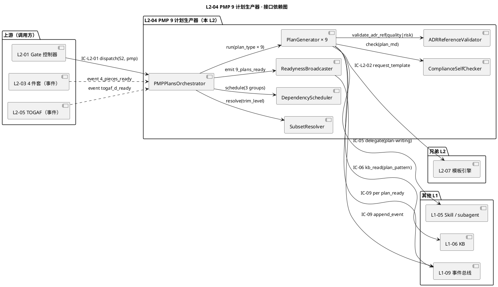
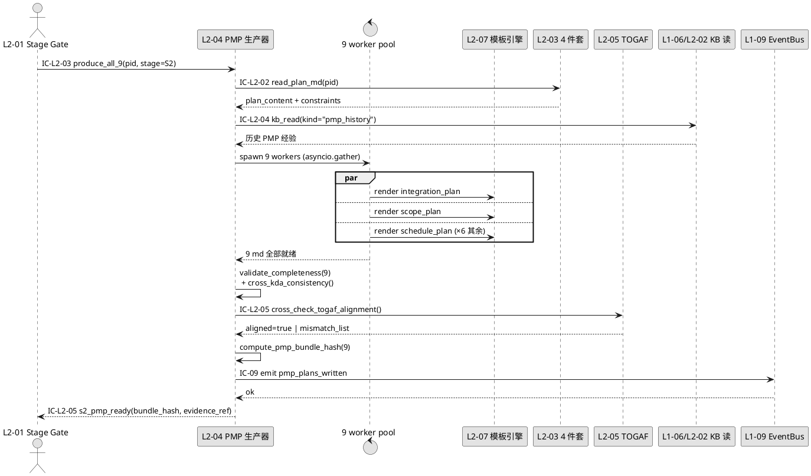
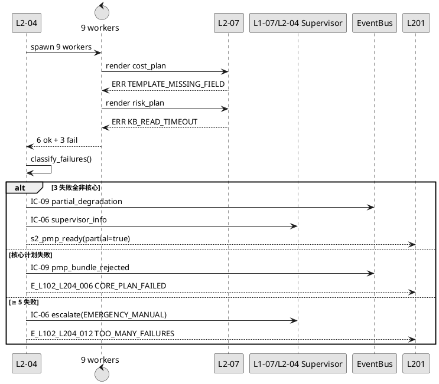
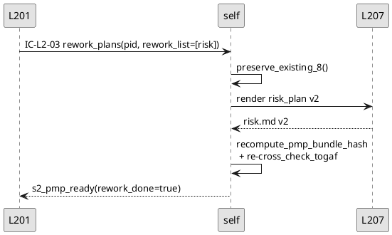
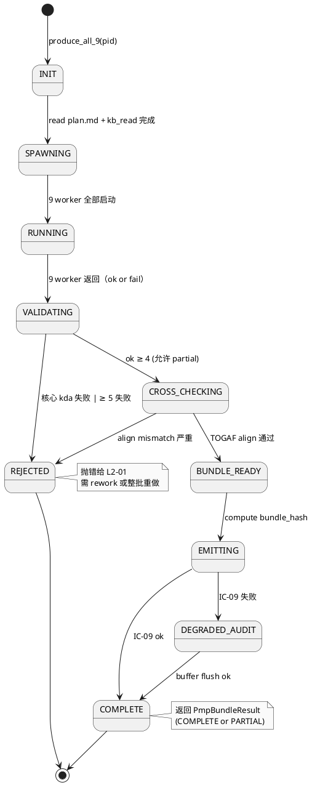
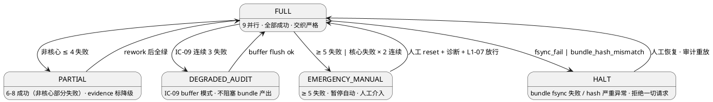

# L1 L2-04 · PMP 9 计划生产器 · Tech Design

> **本文档定位**：3-1-Solution-Technical 层级 · L1 的 L2-04 PMP 9 计划生产器 技术实现方案（L2 粒度）。
> **与产品 PRD 的分工**：2-prd/L1-02-项目生命周期编排/prd.md §5.2 的对应 L2 节定义产品边界，本文档定义**技术实现**（接口字段级 schema + 算法伪代码 + 底层数据结构 + 状态机 + 配置参数）。
> **与 L1 architecture.md 的分工**：architecture.md 负责**跨 L2 架构 + 跨 L2 时序**，本文档负责**本 L2 内部技术细节**。冲突以 architecture.md 为准。
> **严格规则**：本文档不复述产品 PRD 文字（职责 / 禁止 / 必须等清单），只做技术映射 + 补齐"产品视角未说 but 工程师必须知道"的部分（具体算法 · syscall · schema · 配置）。

---

## §0 撰写进度

- [x] §1 定位 + 2-prd §11 L2-04 映射
- [x] §2 DDD 映射（BC-02 · PMPPlanSet Aggregate）
- [x] §3 对外接口定义（字段级 YAML schema + 12 错误码）
- [x] §4 接口依赖（被谁调 · 调谁）
- [x] §5 P0/P1 时序图（PlantUML ≥ 2 张）
- [x] §6 内部核心算法（伪代码 · plan_generator / parallel_assembler / completeness_validator）
- [x] §7 底层数据表 / schema 设计（PM-14 分片 · projects/<pid>/pmp-plans/*.md）
- [x] §8 状态机（Draft / Assembling / Validating / Complete / Rejected）
- [x] §9 开源最佳实践调研（≥ 3 GitHub 高星项目）
- [x] §10 配置参数清单（≥ 10 条）
- [x] §11 错误处理 + 降级策略（≥ 12 错误码）
- [x] §12 性能目标（9 计划并行 P95 < 30s · 单计划 < 5s）
- [x] §13 与 2-prd / 3-2 TDD 的映射表

---

## §1 定位 + 2-prd 映射

### 1.1 本 L2 在 L1-02 项目生命周期编排里的坐标

L1-02 由 7 个 L2 组成，**L2-04 是 S2 规划阶段的 PMP 知识域计划产出器**，上游 L2-01 Stage Gate 控制器通过 IC-L2-01 分派，下游以 9 份计划（完整档）或 5 份计划（精简档）+ 广播 `9_plans_ready` 事件为结束信号。本 L2 与兄弟 L2 的边界：

- **L2-03 4 件套生产器**：上游依赖。`4_pieces_ready` 事件触发本 L2 启动，本 L2 读 `requirements.md / goals.md / acceptance-criteria.md / quality-standards.md` 作计划生成的需求锚
- **L2-05 TOGAF ADM 架构生产器**：交织协作。`togaf_d_ready` 事件解 Group 2 阻塞；反向本 L2 的 `scope_plan_ready / schedule_plan_ready` 供 L2-05 D 阶段作上下文
- **L2-07 产出物模板引擎**：横切依赖。每份计划必走 IC-L2-02 拿模板（`scope_plan.md.tmpl` / `schedule_plan.md.tmpl` / ... 共 9 份）
- **L2-01 Stage Gate 控制器**：下游触发。`9_plans_ready` → L2-01 累积 S2 Gate 齐全信号集

```
                  ┌────────────────────────────────┐
                  │ L2-01 Stage Gate 控制器（上游）│
                  └──────────────┬─────────────────┘
                                 │ IC-L2-01 dispatch(S2, PMP)
                                 ▼
           ┌─────────────────────────────────────────────────┐
           │         L2-04 · PMP 9 计划生产器                │
           │  (Application Service · PMPPlanSet Aggregate)   │
           │                                                  │
           │  ┌─── Group 1 · 基础 3（scope / schedule / cost）│
           │  │    ↑ 入参：4 件套 + charter                    │
           │  ├─── Group 2 · TOGAF 依赖 2（quality / risk）   │
           │  │    ↑ 入参：Group 1 + togaf_d_ready            │
           │  └─── Group 3 · 协同 4（resource / comm / proc / │
           │                         stakeholder_engagement）│
           │       ↑ 入参：Group 1 + Group 2                   │
           └──────────────────────┬──────────────────────────┘
                                  │ 9_plans_ready 事件
                                  ▼
                  ┌────────────────────────────────┐
                  │ L2-01 累积 S2 Gate 齐全信号集  │
                  └────────────────────────────────┘
```

L2-04 的技术定位 = **"PMPPlansProducer Application Service · PMPPlanSet 聚合根 · 9 计划分 3 组依赖并发生产 · 每组用 semaphore 限流 · Group 2 等 togaf_d_ready 事件 · 裁剪档配置化子集 · 单计划 ≤ 5min · 总 ≤ 15min · 合规自检 + 模板渲染 + 原子写"**。

### 1.2 与 2-prd §11 L2-04 的精确映射

| 2-prd §11 L2-04 小节 | 本文档对应位置 | 技术映射重点 |
|:---|:---|:---|
| §11.1 职责（PMP 知识领域并行生产者）| §1.3 + §2.1 | PMPPlansProducer Application Service |
| §11.2 输入 / 输出（4 件套 + 9 计划 md）| §3.2 IC-L2-01 入参 + §3.4 返回 schema | 9 份 plan markdown + 每份合规字段 |
| §11.3 边界（In / Out / 边界规则）| §1.4 + §11 降级 | out-of-scope 走 IC-L2-06 err |
| §11.4 约束（PM-01 / PM-13 + 5 硬约束）| §6 启动硬校验 + §10 配置 | 3 组不可变 · 单份 ≤ 5min |
| §11.5 🚫 禁止行为（5 条） | §11 降级拒绝 | TOGAF D 未 ready 禁启 Group 2 |
| §11.6 ✅ 必须义务（6 条）| §6 + §7 + §11 分散 | 必分 3 组 · 必引 TOGAF ADR |
| §11.7 可选功能（Gantt / 风险矩阵 / 成本模型）| §6.8 P1 特性 | V1 默认关闭 |
| §11.8 IC 关系（接 IC-L2-01 · 调 IC-L2-02 / 05 / 06 / 07） | §3 + §4 | 6 IC 触点独立 schema |
| §11.9 G-W-T（正 / 负 / 集成 / 性能）| §5 时序 + §13 测试映射 | P1-P5 + N1-N2 + I1 |
| §11.10 L3 实现（3 组调度 · 内容大纲 · 组内并发算法 · 自检 · 配置）| §6 + §7 + §10 分散 | 伪代码 + schema + 参数表 |

### 1.3 本 L2 在 architecture.md 里的坐标

引 `L1-02/architecture.md §3 Component Diagram + §7 PMP × TOGAF 矩阵`，本 L2 承担 **Application Service of BC-02**（引 §2.2）：

```
  [L2-01 Stage Gate 控制器]
       │
       │ IC-L2-01 dispatch(stage=S2, target=pmp, subset?)
       ▼
  ┌─────────────────────────────────────────────────────┐
  │  L2-04 · PMP 9 计划生产器                           │
  │  (Application Service · PMPPlanSet Aggregate Root)   │
  │                                                      │
  │  ┌──────────────────────────────────┐                │
  │  │ PMPPlansOrchestrator             │ (主编排器)     │
  │  │   ├── SubsetResolver             │ (裁剪档解析)   │
  │  │   ├── DependencyScheduler        │ (3 组调度)     │
  │  │   ├── PlanGenerator × 9          │ (单计划生成)   │
  │  │   ├── TemplateBinder             │ (L2-07 绑定)   │
  │  │   ├── LLMInvoker                 │ (IC-05 delegate)│
  │  │   ├── ComplianceSelfChecker      │ (合规字段校验) │
  │  │   ├── ADRReferenceValidator      │ (引 TOGAF ADR) │
  │  │   └── ReadynessBroadcaster       │ (事件发布)     │
  │  └──────────────────────────────────┘                │
  │                                                      │
  │  ┌──────────────────────────────────┐                │
  │  │  PMPPlanSet (Aggregate Root)     │                │
  │  │  Plan × 9 (Entity · 每份生命周期) │                │
  │  │  IntegrationPlan (VO · PMBOK 7)  │                │
  │  │  ScopePlan / SchedulePlan / ...   │                │
  │  │  PlanGroupState (VO · enum)      │                │
  │  │  TrimLevel (VO · enum)           │                │
  │  └──────────────────────────────────┘                │
  └─────────────────────────────────────────────────────┘
       │
       ▼ IC-09 append_event (9_plans_ready)
  [L1-09 事件总线]
```

**本 L2 的关键特征**（对 L1-02 整体而言）：

1. **并发优先的三组调度**：Group 1（3 计划）+ Group 3（4 计划）组内 semaphore=3 并行 · Group 2（2 计划）在 togaf_d_ready 后并行 · 全 9 串行会超 30 min 故硬禁
2. **TOGAF 交织硬依赖**：quality_plan / risk_plan 必须引用 TOGAF D-technology.md 的 ADR · ADRReferenceValidator 扫描 md 内的 ADR-D* 链接确保 ≥ 1 条
3. **裁剪档配置化子集**：完整档 9 计划；精简档固定 5 子集（scope / schedule / quality / risk / stakeholder_engagement）·  不允许用户自定义精简内容
4. **PM-14 分片 + 原子写**：所有计划写入 `projects/<pid>/pmp-plans/{scope|schedule|...}.md` · 临时路径 `.tmp` 后原子 rename
5. **短寿命聚合根**：PMPPlanSet 在单次 S2 trigger 生命周期内存活 · 完成后经 IC-09 落盘 · 进程内释放
6. **双重依赖解阻塞**：Group 2 等 togaf_d_ready 硬阻塞 15min · 超时降级用 4 件套 + charter 替代并标 `degraded=true`

### 1.4 本 L2 的 PM-14 约束

**PM-14 约束**（引 `projectModel/tech-design.md`）：所有 IC payload 顶层 `project_id` 必填；所有存储路径按 `projects/<pid>/...` 分片。

本 L2 在 PM-14 层面的具体落点：
- 9 计划产出：`projects/<pid>/pmp-plans/{integration|scope|schedule|cost|quality|resource|communication|risk|procurement|stakeholder_engagement}-plan.md`（注：PMBOK 7 将 "stakeholder engagement" 并入 comm · 若用 PMBOK 6 则 10 份 · HarnessFlow 选 PMBOK 6 的 9 份标准集）
- 每份计划生成时的中间态：`projects/<pid>/pmp-plans/.tmp/<plan_type>-<ts>.md.tmp` → 原子 rename
- 组状态持久化（崩溃恢复用）：`projects/<pid>/pmp-plans/.state/group-state.yaml`
- 事件落盘（经 IC-09）：`projects/<pid>/events/L1-02.jsonl`（`9_plans_ready / {plan}_ready / plan_failed` 等 domain event）
- 崩溃恢复读入口：`projects/<pid>/pmp-plans/.state/group-state.yaml`（Draft / Assembling / Validating / Complete 状态快照）
- 配置（只读 · 启动加载）：`projects/<pid>/config.yaml` 的 `pmp.*` 段

### 1.5 关键技术决策（本 L2 特有 · Decision / Rationale / Alternatives / Trade-off）

| # | 决策 | 选择 | 备选 | 理由 | Trade-off |
|:--:|:---|:---|:---|:---|:---|
| D1 | **9 计划分组策略** | 3 组（3 / 2 / 4）· 依赖 TOGAF D 的 2 份单独成组 | 全串行 / 全并行 / 2 组 / 4 组 | 依赖硬约束驱动分组 · quality/risk 必须等 D · 其他无硬依赖 · 3 组最小化关键路径 | Group 2 等 D 可能阻塞 15min |
| D2 | **PMBOK 版本选择** | PMBOK 6 的 9 知识域 | PMBOK 7 的 8 绩效域 / 混合 | PMBOK 6 分类对传统项目管理更成熟 · 9 计划模板工业界流行 · KB 历史样本多 | PMBOK 7 更面向 agile · 但 HarnessFlow 目标用户是瀑布偏多 |
| D3 | **组内并发策略** | semaphore=3 并行 · 组间串行 | 全并发 / 串行 / 动态调度 | LLM 调用受 rate-limit · 3 路已接近 Claude API 限速 · 避免 429 | 并发过低浪费时间（但 semaphore 可配） |
| D4 | **TOGAF D 等待策略** | 硬阻塞 + 15min 超时降级 | 无限等 / 立即失败 / 动态轮询 | scope §11.6 必须义务 5「必须等 togaf_d_ready」· 超时降级保整体不卡死 | 降级会 degrade=true 标记 · 用户可能 reject |
| D5 | **合规自检策略** | 硬编码三字段 + 特定字段检查 | 开放 schema / 无检查 / LLM 语义检查 | 硬编字段（budget/timeline/responsible）为 PMP 最小集 · 特定字段补强（quality 引 ADR）· 开销 < 100ms | 新字段要改代码（但这是 scope §11.6 硬约束） |
| D6 | **LLM 调用委托** | IC-05 delegate 到 L1-05 `plan-writing` subagent | 主 session 直接 LLM / 本地规则引擎 | subagent 隔离上下文 · 避免主 session 污染 · tools_whitelist 安全 | 委托开销 ~ 2s（可接受：单计划 ≤ 5min） |
| D7 | **裁剪档子集固定** | 精简档固定 5（scope/schedule/quality/risk/stakeholder_engagement） | 用户自选 / 按项目大小动态 | scope §11.5 硬禁用户自定义精简内容 · 固定子集确保对齐 PMBOK 最小核心 | 不灵活（但这是合规硬约束） |
| D8 | **原子写入策略** | `.tmp` → fsync → rename | 直接 write / 事务 log | fs-level atomic · 避免中途崩溃导致半写 md · 符合 L1-09 韧性语义 | 磁盘双写（可忽略） |
| D9 | **ADR 引用强校验** | 扫描 md 内 `\[ADR-D\d+\]` 正则 · 要求 ≥ 1 条 | 软校验 / LLM 判定 / 无校验 | 正则快（< 10ms）· 确定性 · scope §11.5 硬禁 quality_plan 不引 ADR | 要求 LLM 输出遵循固定格式（prompt 约束即可） |
| D10 | **失败回退策略** | 单计划失败重试 2 次 · 仍失败 → 标记 degraded + 继续其他 | 整组失败 / 无重试 / 全局 abort | 单计划失败不应级联 · retry=2 覆盖大多数 LLM 抖动 · degraded 保留用户决定权 | 9 份中如有 3+ 失败则整体 degraded · 用户可能 reject |

### 1.6 本 L2 读者预期

读完本 L2 的工程师应掌握：
- PMPPlansOrchestrator Application Service 的 6 IC 触点字段级 schema + 12 错误码
- 3 个核心算法伪代码（`plan_generator` / `parallel_assembler` / `completeness_validator`）
- PMPPlanSet 聚合根 5 不变量 + 9 份计划 markdown 落地 schema
- PMPPlanSet 状态机 PlantUML（Draft / Assembling / Validating / Complete / Rejected · 5 状态）
- 降级链 4 级（FULL → DEGRADED_TOGAF_FALLBACK → PARTIAL_PLANS → REJECT）
- SLO（总 P95 < 30s 冷启 / 900s 完整档 · 单计划 P95 < 5s / 180s 完整档）

### 1.7 本 L2 不在的范围（YAGNI · 技术视角）

- **不在**：4 件套生成 → L2-03
- **不在**：TOGAF A-D 架构内容生成 → L2-05
- **不在**：WBS 拆解 → L1-03
- **不在**：用户自定义精简档内容（硬禁 · scope §11.5）
- **不在**：Gantt 图自动绘制（P1 可选 · V1 关闭）
- **不在**：成本模型多方案比较（P1 可选 · V1 关闭）
- **不在**：project_id 创建 / 归档（→ L2-02 / L2-06）
- **不在**：Gate 推送（→ L2-01 唯一）
- **不在**：state transition 请求（→ L2-01 唯一 IC-01 发起方）

---

## §2 DDD 映射（BC-02）

### 2.1 Bounded Context 定位

本 L2 属于 `L0/ddd-context-map.md §2.3 BC-02 Project Lifecycle Orchestration`：

- **BC 名**：`BC-02 · Project Lifecycle Orchestration`
- **L2 角色**：**Application Service of BC-02**（承担 PMP 9 计划知识域产出领域能力）
- **与兄弟 L2**：
  - L2-01（Customer-Supplier · 本 L2 是 Supplier · L2-01 是 Customer 接收 `9_plans_ready` 事件）
  - L2-03（Upstream-Downstream · 本 L2 订阅 L2-03 的 `4_pieces_ready`）
  - L2-05（Partnership · 双向：本 L2 订阅 `togaf_d_ready` · 发 `scope_plan_ready / schedule_plan_ready` 供 L2-05 D 阶段）
  - L2-07（Shared Kernel · 统一模板中台）

### 2.2 聚合根 / 实体 / 值对象 / 领域服务

| DDD 概念 | 名字 | 职责 | 一致性边界 |
|:---|:---|:---|:---|
| **Aggregate Root** | `PMPPlanSet` | 单次 S2 trigger 的 9 计划合集 · 聚合一致性边界 | 9 计划原子完成 or 全 rollback |
| **Entity** | `Plan` | 单份 PMP 计划（9 类之一）· 含 md 内容 + 元数据 | 与 PMPPlanSet 同生命周期 |
| **Value Object** | `IntegrationPlan` | 整合计划（PMBOK 6 · 第 4 章）· 不可变 | 属 PMPPlanSet |
| **Value Object** | `ScopePlan` | 范围计划（PMBOK 6 · 第 5 章）· 不可变 | 属 PMPPlanSet |
| **Value Object** | `SchedulePlan` | 进度计划（PMBOK 6 · 第 6 章）· 不可变 | 属 PMPPlanSet |
| **Value Object** | `CostPlan` | 成本计划（PMBOK 6 · 第 7 章）· 不可变 | 属 PMPPlanSet |
| **Value Object** | `QualityPlan` | 质量计划（PMBOK 6 · 第 8 章 · 引 TOGAF D-ADR）· 不可变 | 属 PMPPlanSet |
| **Value Object** | `ResourcePlan` | 资源计划（PMBOK 6 · 第 9 章）· 不可变 | 属 PMPPlanSet |
| **Value Object** | `CommunicationPlan` | 沟通计划（PMBOK 6 · 第 10 章）· 不可变 | 属 PMPPlanSet |
| **Value Object** | `RiskPlan` | 风险计划（PMBOK 6 · 第 11 章 · 引 TOGAF D-ADR）· 不可变 | 属 PMPPlanSet |
| **Value Object** | `ProcurementPlan` | 采购计划（PMBOK 6 · 第 12 章）· 不可变 | 属 PMPPlanSet |
| **Value Object** | `StakeholderEngagementPlan` | 干系人参与计划（PMBOK 6 · 第 13 章）· 不可变 | 属 PMPPlanSet |
| **Value Object** | `TrimLevel` | 裁剪档 enum（full/minimal/custom）· 不可变 | 单次请求 |
| **Value Object** | `PlanGroupState` | 组调度状态 enum（WAITING/RUNNING/COMPLETE/FAILED）· 不可变 | 单组生命周期 |
| **Application Service** | `PMPPlansOrchestrator` | 编排 SubsetResolve → Schedule → Generate × N → Validate → Broadcast | 单请求 |
| **Domain Service** | `DependencyScheduler` | 无状态算法 · 依赖图 → 3 组调度顺序 | 单次调度 |
| **Domain Service** | `ComplianceSelfChecker` | 无状态校验 · plan_md + plan_type → 错误列表 | 单次校验 |
| **Domain Service** | `ADRReferenceValidator` | 无状态 · md 正则扫描 · 判是否引 ADR-D* | 单次扫描 |
| **Repository** | `PlanRepository` | 单 plan 持久化 · `projects/<pid>/pmp-plans/<type>-plan.md` | 原子写 |

### 2.3 聚合根不变量（Invariants · PMPPlanSet 局部）

| 不变量 | 描述 | 校验时机 |
|:---|:---|:---|
| **I-L204-01** | `PMPPlanSet.project_id` 必填且在本请求整个生命周期不可变 | 创建时 + 写入前 |
| **I-L204-02** | `trim_level=full` → 必须 9 计划齐全（或标 degraded）；`trim_level=minimal` → 必须 5 子集（scope/schedule/quality/risk/stakeholder_engagement） | 完成前 |
| **I-L204-03** | `QualityPlan / RiskPlan` 必引 ≥ 1 条 `ADR-D\d+`（扫 md 正则） | ADRReferenceValidator 出口 |
| **I-L204-04** | Group 2 开始时机必须在 `togaf_d_ready` 事件之后（或 degraded fallback 后） | DependencyScheduler 调度时 |
| **I-L204-05** | 每份计划必含三字段：`budget_or_estimate / timeline / responsible_role` | ComplianceSelfChecker 出口 |

### 2.4 Domain Events（本 L2 发布）

| 事件名 | 触发时机 | 订阅方 | Payload 字段要点 |
|:---|:---|:---|:---|
| `L1-02:scope_plan_ready` | scope_plan.md 写入完成 | L2-05 D 阶段 · L1-10 | `{project_id, plan_type, path, size_bytes, sha256}` |
| `L1-02:schedule_plan_ready` | schedule_plan.md 写入完成 | L2-05 D 阶段 · L1-10 | 同上 |
| `L1-02:cost_plan_ready` | cost_plan.md 写入完成 | L1-10 | 同上 |
| `L1-02:quality_plan_ready` | quality_plan.md 写入完成 | L1-04（TDD 蓝图依赖）· L1-10 | 同上 |
| `L1-02:risk_plan_ready` | risk_plan.md 写入完成 | L1-07 · L1-10 | 同上 |
| `L1-02:resource_plan_ready` | resource_plan.md 写入完成 | L1-03（WBS 资源）· L1-10 | 同上 |
| `L1-02:communication_plan_ready` | communication_plan.md 写入完成 | L1-10 | 同上 |
| `L1-02:procurement_plan_ready` | procurement_plan.md 写入完成 | L1-10 | 同上 |
| `L1-02:stakeholder_engagement_plan_ready` | stakeholder_engagement_plan.md 写入完成 | L1-10 | 同上 |
| `L1-02:9_plans_ready` | 所有启用子集齐全后总发 | L2-01（S2 Gate 累积）· L1-10 | `{project_id, trim_level, plan_count, paths[], degraded_list?}` |
| `L1-02:plan_failed` | 单计划生成失败 retry 用尽 | L2-01 · L1-07 | `{project_id, plan_type, error, retry_count}` |

---

## §3 对外接口定义（字段级 YAML schema + 错误码）

### 3.1 接口清单总览（6 IC 触点 · 2 接收 + 4 发起）

| # | IC 方向 | 名字 | 简述 | 上 / 下游 |
|:--:|:---|:---|:---|:---|
| 1 | 接收 | `IC-L2-01 dispatch(stage=S2, target=pmp)` | L2-01 分派 9 计划生产请求 | L2-01 → L2-04 |
| 2 | 接收 | `event: togaf_d_ready` | L2-05 D 阶段完成的解阻塞信号 | L2-05 → L2-04 |
| 3 | 发起 | `IC-L2-02 request_template(plan_type)` | 向 L2-07 请模板 | L2-04 → L2-07 |
| 4 | 发起 | `IC-05 delegate_subagent(plan-writing)` | 委托 L1-05 生成计划内容 | L2-04 → L1-05 |
| 5 | 发起 | `IC-06 kb_read(kind=plan_pattern)` | 可选读 KB 历史计划模式 | L2-04 → L1-06 |
| 6 | 发起 | `IC-09 append_event` | 每产出 / 每事件落盘 | L2-04 → L1-09 |

**方法级对外方法**（单 Python method 粒度 · 供调用方 unit test 对拍）：

- `produce_integration_plan(ctx) -> PlanResult`
- `produce_scope_plan(ctx) -> PlanResult`
- `produce_schedule_plan(ctx) -> PlanResult`
- `produce_cost_plan(ctx) -> PlanResult`
- `produce_quality_plan(ctx) -> PlanResult`（依赖 TOGAF D）
- `produce_resource_plan(ctx) -> PlanResult`
- `produce_communication_plan(ctx) -> PlanResult`
- `produce_risk_plan(ctx) -> PlanResult`（依赖 TOGAF D）
- `produce_procurement_plan(ctx) -> PlanResult`
- `produce_stakeholder_engagement_plan(ctx) -> PlanResult`
- `assemble_all_9(request) -> PMPPlanSetResult`（主入口 · 分组调度 9 份）

### 3.2 接收：IC-L2-01 dispatch(stage=S2, target=pmp) · 字段级 YAML schema

```yaml
# ic_l2_01_dispatch_pmp_request.yaml
type: object
required: [project_id, request_id, stage, target, trim_level]
properties:
  project_id: { type: string, description: "PM-14 项目上下文" }
  request_id: { type: string, description: "L2-01 生成的请求唯一 id（uuid v7）" }
  stage: { type: string, enum: [S2] }
  target: { type: string, enum: [pmp] }
  trim_level:
    type: string
    enum: [full, minimal, custom]
    description: "裁剪档 · full=9 · minimal=5 固定子集 · custom=用户勾选（V1 禁用 custom）"
  subset:
    type: array
    description: "仅当 trim_level=custom 时生效 · V1 忽略 · 保留向后兼容"
    items:
      type: string
      enum: [integration, scope, schedule, cost, quality, resource, communication, risk, procurement, stakeholder_engagement]
    nullable: true
  target_subset:
    type: array
    description: "No-Go 重做场景的目标子集 · 只重做指定计划 · 其他保留 v1"
    items: { type: string }
    nullable: true
  dependencies:
    type: object
    required: [four_pieces_paths, charter_path, stakeholders_path]
    properties:
      four_pieces_paths:
        type: object
        required: [requirements, goals, acceptance_criteria, quality_standards]
        properties:
          requirements: { type: string, description: "绝对路径 projects/<pid>/four-pieces/requirements.md" }
          goals: { type: string }
          acceptance_criteria: { type: string }
          quality_standards: { type: string }
      charter_path: { type: string }
      stakeholders_path: { type: string }
      togaf_d_path: { type: string, nullable: true, description: "可选 · 若本次触发时 D 已 ready 则传路径 · 否则本 L2 订阅事件等待" }
  trace_ctx:
    type: object
    properties:
      ts_dispatched_ns: { type: integer }
      gate_id: { type: string, nullable: true, description: "若由 No-Go 重做触发则带原 gate_id" }
      re_open_count: { type: integer, default: 0 }
```

### 3.3 接收：event `togaf_d_ready` · 字段级 YAML schema

```yaml
# event_togaf_d_ready.yaml（L2-05 → 事件总线 → L2-04 订阅）
type: object
required: [event_type, project_id, togaf_d_path, ts_ns]
properties:
  event_type: { type: string, enum: [L1-02:togaf_d_ready] }
  project_id: { type: string }
  togaf_d_path: { type: string, description: "projects/<pid>/togaf/d-technology.md" }
  adr_refs:
    type: array
    items: { type: string, pattern: "^ADR-D\\d+$" }
    minItems: 1
    description: "D 阶段产出的 ADR id 列表 · quality/risk 可引用"
  ts_ns: { type: integer }
```

### 3.4 返回：IC-L2-01 响应（assemble_all_9_response）· 字段级 YAML schema

```yaml
# ic_l2_01_dispatch_pmp_response.yaml
type: object
required: [project_id, request_id, status, result]
properties:
  project_id: { type: string }
  request_id: { type: string }
  status: { type: string, enum: [ok, partial, err] }
  result:
    oneOf:
      - $ref: "#/definitions/PMPPlanSet"
      - $ref: "#/definitions/StructuredErr"
  audit_ref: { type: string, description: "L1-09 event seq id · 9_plans_ready 事件 id" }
  latency_ms: { type: integer }

definitions:
  PMPPlanSet:
    type: object
    required: [plan_set_id, trim_level, plans, completeness, degraded, project_id]
    properties:
      plan_set_id: { type: string, description: "uuid v4" }
      trim_level: { type: string, enum: [full, minimal, custom] }
      plans:
        type: array
        minItems: 5   # minimal 至少 5 份
        maxItems: 10  # 完整档 9 + 预留整合（V1 9 份）
        items: { $ref: "#/definitions/Plan" }
      completeness:
        type: object
        required: [expected, produced, failed, degraded]
        properties:
          expected: { type: array, items: { type: string } }
          produced: { type: array, items: { type: string } }
          failed: { type: array, items: { type: string } }
          degraded: { type: array, items: { type: string } }
      degraded: { type: boolean, description: "true 表示至少一份计划走了降级路径（如 TOGAF D 超时 fallback）" }
      degradation_reasons:
        type: array
        items:
          type: object
          properties:
            plan_type: { type: string }
            reason: { type: string, enum: [togaf_d_timeout, retry_exhausted, kb_read_failed, llm_rate_limited] }
        nullable: true
      project_id: { type: string }
      ts_completed_ns: { type: integer }
      total_duration_ms: { type: integer }

  Plan:
    type: object
    required: [plan_type, path, sha256, size_bytes, compliance, adr_refs]
    additionalProperties: false   # 白名单硬约束
    properties:
      plan_type:
        type: string
        enum:
          - integration
          - scope
          - schedule
          - cost
          - quality
          - resource
          - communication
          - risk
          - procurement
          - stakeholder_engagement
      path: { type: string, description: "projects/<pid>/pmp-plans/<type>-plan.md 绝对路径" }
      sha256: { type: string, description: "md 文件 sha256 · 审计追溯" }
      size_bytes: { type: integer, minimum: 200 }
      compliance:
        type: object
        required: [pass, missing_fields]
        properties:
          pass: { type: boolean }
          missing_fields:
            type: array
            items: { type: string, enum: [budget_or_estimate, timeline, responsible_role, prob_impact_matrix, critical_path, adr_ref] }
      adr_refs:
        type: array
        description: "引用的 TOGAF ADR-D* id 列表 · quality/risk 必非空"
        items: { type: string, pattern: "^ADR-D\\d+$" }
      duration_ms: { type: integer }
      retry_count: { type: integer, minimum: 0, maximum: 2 }
      generated_by:
        type: object
        properties:
          subagent: { type: string, enum: [plan-writing] }
          session_id: { type: string }
          template_id: { type: string, description: "L2-07 模板 id" }

  StructuredErr:
    type: object
    required: [err_type, reason]
    properties:
      err_type: { type: string }     # 见 §11 错误码
      reason: { type: string }
      suggested_action: { type: string, nullable: true }
      context: { type: object, nullable: true }
      failed_plans:
        type: array
        items: { type: string }
        nullable: true
```

### 3.5 发起：IC-L2-02 request_template（向 L2-07）

```yaml
# ic_l2_02_request_template_pmp.yaml
type: object
required: [project_id, plan_type, trim_level]
properties:
  project_id: { type: string }
  plan_type:
    type: string
    enum: [integration, scope, schedule, cost, quality, resource, communication, risk, procurement, stakeholder_engagement]
  trim_level: { type: string, enum: [full, minimal] }
  minimal_diff_mode:
    type: boolean
    default: false
    description: "No-Go 重做时 · 要求模板只出 diff 段落 · 保留未改段"
```

### 3.6 发起：IC-05 delegate_subagent（向 L1-05）

```yaml
# ic_05_delegate_plan_writing.yaml
type: object
required: [project_id, subagent, goal, context, timeout_ms]
properties:
  project_id: { type: string }
  subagent: { type: string, enum: [plan-writing] }
  goal: { type: string, description: "e.g. '按模板生成 scope_plan · 基于 4 件套 + charter · 输出 markdown'" }
  context:
    type: object
    required: [plan_type, template_content, dependencies_md]
    properties:
      plan_type: { type: string }
      template_content: { type: string, description: "L2-07 返回的模板 md 原文" }
      dependencies_md:
        type: object
        properties:
          requirements: { type: string, description: "需求文档内容" }
          goals: { type: string }
          acceptance_criteria: { type: string }
          quality_standards: { type: string }
          charter: { type: string }
          stakeholders: { type: string }
          togaf_d: { type: string, nullable: true }
          scope_plan: { type: string, nullable: true, description: "给 cost/schedule/resource 用" }
          schedule_plan: { type: string, nullable: true, description: "给 cost/resource 用" }
  tools_whitelist:
    type: array
    items: { type: string, enum: [Read, Write, Grep] }
    description: "subagent 只允许用这些工具"
  timeout_ms: { type: integer, default: 180000, maximum: 300000 }
```

### 3.7 发起：IC-09 append_event

```yaml
# ic_09_append_event_pmp.yaml
type: object
required: [event_type, project_id, payload, ts_ns]
properties:
  event_type:
    type: string
    enum:
      - L1-02:scope_plan_ready
      - L1-02:schedule_plan_ready
      - L1-02:cost_plan_ready
      - L1-02:quality_plan_ready
      - L1-02:risk_plan_ready
      - L1-02:resource_plan_ready
      - L1-02:communication_plan_ready
      - L1-02:procurement_plan_ready
      - L1-02:stakeholder_engagement_plan_ready
      - L1-02:integration_plan_ready
      - L1-02:9_plans_ready
      - L1-02:5_plans_ready
      - L1-02:plan_failed
      - L1-02:group_started
      - L1-02:group_complete
      - L1-02:togaf_d_timeout_fallback
  project_id: { type: string }
  payload:
    type: object
    description: "事件特有字段 · 见 §2.4"
  ts_ns: { type: integer }
  actor: { type: string, enum: [L2-04] }
```

### 3.8 错误码表（12 条 · 含触发场景 / 调用方处理）

详见 §11 降级 + 错误码章节。此处列表引用：

`PLAN_INCOMPLETE` · `KNOWLEDGE_AREA_MISMATCH` · `RESOURCE_UNAVAILABLE` · `COST_OUT_OF_BUDGET` · `RISK_UNREGISTERED` · `TOGAF_D_TIMEOUT` · `ADR_REFERENCE_MISSING` · `PLAN_TEMPLATE_LOAD_FAILED` · `LLM_GENERATION_FAILED` · `CRITICAL_PATH_MISSING` · `COMPLIANCE_CHECK_FAILED` · `SUBSET_NOT_ALLOWED`

---

## §4 接口依赖（被谁调 · 调谁）

### 4.1 上游调用方

| 调用方 | 通过何种 IC | 触发场景 | 频率预估 |
|:---|:---|:---|:---:|
| L2-01 Stage Gate 控制器 | IC-L2-01 dispatch(stage=S2, target=pmp) | S2 阶段启动 + `4_pieces_ready` 事件累积后分派 | 每 project 1-10 次（含 No-Go 重做） |
| L2-05 TOGAF（事件）| event `togaf_d_ready` | D 阶段完成后 · 解本 L2 Group 2 阻塞 | 每 project 1 次（若重做则 ≥ 1） |
| L2-03 4 件套（事件）| event `4_pieces_ready` | 4 件套齐全后 · 本 L2 才允许启动 | 每 project 1 次 |

### 4.2 下游依赖

| 目标 | IC / 调用方式 | 意义 | 是否必选 |
|:---|:---|:---|:---:|
| L2-07 模板引擎 | IC-L2-02 request_template | 每份计划拿模板 | 必选 |
| L1-05 Skill + 子 Agent | IC-05 delegate_subagent(plan-writing) | LLM 生成计划内容 | 必选 |
| L1-06 3 层 KB | IC-06 kb_read | 可选查历史计划模式 | 条件必选（若 config.enable_kb_pattern_read=true） |
| L1-09 事件总线 | IC-09 append_event | 每产出 + 每 group 事件 + 9_plans_ready | 必选 |
| 文件系统 Write | 工具调用（非 IC）| 写 9 计划 md | 必选 |
| 文件系统 Read | 工具调用（非 IC）| 读 4 件套 + charter + togaf_d | 必选 |

### 4.3 依赖图（PlantUML）



### 4.4 不依赖清单（明确不调）

| 不调 | 理由 |
|:---|:---|
| L1-01 主 loop（IC-01 / 02）| scope §11.3 out-of-scope · state transition 走 L2-01 唯一 |
| L1-03 WBS（IC-19）| scope §11.3 out-of-scope · L2-04 只产 resource_plan 作 WBS 输入 |
| L1-04 Quality Loop | scope §11.3 out-of-scope · 本 L2 只产 quality_plan 作 L1-04 输入 |
| L1-07 Supervisor（IC-13）| 被动接受 · 经 L1-01 路由 · 不直接对 L1-07 |
| L1-10 UI（IC-16）| scope §11.3 out-of-scope · Gate 推送走 L2-01 唯一 |
| L2-02 启动阶段 | scope §11.3 out-of-scope · 读 charter / stakeholders 走文件系统 |
| L2-06 收尾 | scope §11.3 out-of-scope · 不涉及收尾 |

---

## §5 P0/P1 时序图（PlantUML ≥ 2 张）

### 5.1 P0 主干 · 9 计划并行产出完整链路

**场景一句话**：L2-01 触发 S2 PMP 产出 → `produce_all_9()` → 并行 9 协程渲染 `integration/scope/schedule/cost/quality/resource/communication/risk/procurement` → 每协程调 L2-07 模板引擎 + 读 4 件套 plan.md → 9 份 md 齐后交织验证 PMP×TOGAF 矩阵（IC-L2-04 调 L2-05）→ 装配 evidence_ref → IC-01 s2_pmp_ready → L2-01 推 S2 Gate。

**端到端延迟**：P95 ≤ 30s（9 并行）· 单计划 P95 ≤ 5s · 硬上限 60s。



### 5.2 P1 异常 · 单计划失败分级处理

核心计划（scope/schedule/cost）失败 → 整批 fail；非核心失败 ≤ 4 → PARTIAL 通过（evidence 标注降级）；≥ 5 失败 → EMERGENCY_MANUAL。



### 5.3 Gate reject · 局部重做（保留 8 成品只重做 1）



---

## §6 内部核心算法（伪代码）

### 6.1 算法 1 · `produce_all_9(pid)` 主循环（asyncio.gather 并行）

```python
async def produce_all_9(pid: str) -> PmpBundleResult:
    plan_content = await ic_l202_read_plan_md(pid)            # L2-03 4 件套
    history = await ic_l204_kb_read(pid, "pmp_history")       # L1-06 KB
    
    async def _worker(kda: str) -> tuple[str, PlanResult]:
        try:
            md = await ic_l2_07_render_template(
                kind=f"pmp_{kda}",
                slots=build_slots(plan_content, history, kda),
                timeout=single_plan_timeout_sec
            )
            validate_frontmatter(md)
            atomic_write(f"projects/{pid}/pmp-plans/{kda}.md", md)
            return kda, PlanResult.ok(md_len=len(md))
        except Exception as e:
            return kda, PlanResult.fail(error=e)
    
    # 9 并行（cost/scope/schedule 是核心 · 其余 6 非核心）
    results = await asyncio.gather(*[_worker(k) for k in PMP_9_KDAS])
    
    ok_list = [k for k,r in results if r.is_ok()]
    fail_list = [(k,r) for k,r in results if r.is_fail()]
    
    return _decide_bundle_status(ok_list, fail_list, pid)
```

### 6.2 算法 2 · `_decide_bundle_status` 分级决策（核心 vs 非核心 vs 阈值）

```python
CORE_KDAS = {"scope", "schedule", "cost"}
NON_CORE_FAIL_LIMIT = 4  # 非核心 ≤ 4 失败 · PARTIAL 通过

def _decide_bundle_status(ok_list, fail_list, pid) -> PmpBundleResult:
    failed_kdas = {k for k, _ in fail_list}
    core_failed = CORE_KDAS & failed_kdas
    non_core_failed = failed_kdas - CORE_KDAS
    
    if core_failed:
        emit_event(pid, "pmp_bundle_rejected", {"core_failed": list(core_failed)})
        raise E_L102_L204_006  # CORE_PLAN_FAILED
    
    if len(fail_list) >= 5:
        emit_event(pid, "pmp_emergency_manual", {"failed_count": len(fail_list)})
        ic_l207_escalate_supervisor(pid, "EMERGENCY_MANUAL")
        raise E_L102_L204_012  # TOO_MANY_FAILURES
    
    if non_core_failed:
        emit_event(pid, "pmp_partial_degradation", {"degraded": list(non_core_failed)})
        return PmpBundleResult.partial(ok=ok_list, failed=list(non_core_failed))
    
    # 全成功
    bundle_hash = compute_pmp_bundle_hash(pid, ok_list)
    emit_event(pid, "pmp_plans_written", {"bundle_hash": bundle_hash})
    return PmpBundleResult.complete(ok=ok_list, bundle_hash=bundle_hash)
```

### 6.3 算法 3 · `compute_pmp_bundle_hash` · 9 计划锚定

```python
def compute_pmp_bundle_hash(pid: str, kda_list: list[str]) -> str:
    """9 份 md 按固定顺序 concat + sha256 · 用于后续阶段防篡改锚定"""
    chunks = []
    for kda in PMP_9_KDAS:  # 固定顺序 · 保证幂等
        if kda not in kda_list:
            chunks.append(f"[MISSING:{kda}]")
            continue
        fp = f"projects/{pid}/pmp-plans/{kda}.md"
        content = read_file(fp).strip()
        chunks.append(content)
    combined = "\n---\n".join(chunks).encode("utf-8")
    return hashlib.sha256(combined).hexdigest()
```

### 6.4 算法 4 · `cross_check_togaf_alignment` · PMP×TOGAF 矩阵验证

```python
async def cross_check_togaf_alignment(pid: str) -> AlignmentResult:
    """调 L2-05 拿 TOGAF 8 Phase 产出 · 校验矩阵对齐"""
    togaf = await ic_l205_read_togaf_bundle(pid)
    pmp = read_pmp_bundle(pid)
    
    # 矩阵规则（prd §5.2.4 定义的交织矩阵）
    rules = [
        ("scope", "phase_A"),       # PMP scope ↔ TOGAF Architecture Vision
        ("resource", "phase_F"),    # PMP resource ↔ Migration Planning
        ("risk", "phase_G"),        # PMP risk ↔ Implementation Governance
        # ... 7 more rules
    ]
    
    mismatches = []
    for pmp_kda, togaf_phase in rules:
        if not _check_rule(pmp[pmp_kda], togaf[togaf_phase]):
            mismatches.append((pmp_kda, togaf_phase))
    
    if mismatches:
        return AlignmentResult.misaligned(mismatches=mismatches)
    return AlignmentResult.aligned()
```

### 6.5 算法 5 · `rework_plans(pid, rework_list)` · 局部重做优化

```python
async def rework_plans(pid: str, rework_list: list[str]) -> PmpBundleResult:
    """Gate reject 后只重做指定计划 · 保留其他 8 份"""
    if not rework_list:
        raise E_L102_L204_013  # EMPTY_REWORK_LIST
    
    invalid = set(rework_list) - set(PMP_9_KDAS)
    if invalid:
        raise E_L102_L204_014  # UNKNOWN_KDA_NAME
    
    preserved = [k for k in PMP_9_KDAS if k not in rework_list]
    # 只 spawn rework_list 数量 workers · 不重做 preserved
    async def _rework_worker(kda: str):
        # 同 produce_all_9 worker · 但 version=2
        return await _render_with_version(pid, kda, version=2)
    
    rework_results = await asyncio.gather(*[_rework_worker(k) for k in rework_list])
    # 合并 preserved + new · 重算 bundle_hash
    return _finalize_bundle_after_rework(pid, preserved, rework_results)
```

---

## §7 底层数据表 / schema 设计（字段级 YAML）

### 7.1 物理目录布局（PM-14 分片）

```
projects/<pid>/
├── pmp-plans/
│   ├── integration.md        # PMP 整合管理计划
│   ├── scope.md              # PMP 范围管理计划
│   ├── schedule.md           # PMP 进度管理计划
│   ├── cost.md               # PMP 成本管理计划
│   ├── quality.md            # PMP 质量管理计划
│   ├── resource.md           # PMP 资源管理计划
│   ├── communication.md      # PMP 沟通管理计划
│   ├── risk.md               # PMP 风险管理计划
│   ├── procurement.md        # PMP 采购管理计划
│   └── _bundle.yaml          # 9 计划索引 + bundle_hash
└── pmp-meta/
    ├── rework-history.jsonl  # 每次 rework 记录（append-only）
    ├── cross-check-togaf.yaml  # PMP×TOGAF 矩阵校验结果缓存
    └── degradation-log.jsonl  # PARTIAL 模式记录
```

### 7.2 `_bundle.yaml` schema（9 计划索引）

```yaml
project_id: string
bundle_hash: string            # sha256 · 64 char hex · 9 md 合并锚定
created_at: string             # ISO-8601
mode: enum                     # COMPLETE / PARTIAL / REWORKED
plans:
  - kda: "integration"
    file: "pmp-plans/integration.md"
    sha256: string
    lines: int
    version: int               # 1=首次 · 2+=rework
    status: "ok" | "failed"
    error_code: string | null
  - kda: "scope"
    # ... (9 项)
togaf_alignment:
  checked_at: string
  aligned: bool
  mismatches: []               # 若 aligned=false · 列矩阵失配项
```

### 7.3 单份 PMP 计划 md frontmatter schema

```yaml
# 每份 integration.md / scope.md / ... 头部 frontmatter
doc_id: string                  # e.g. "pmp-scope-<pid>-v1"
doc_type: "pmp-plan"
kda: enum                       # 9 知识域之一
project_id: string
layer: "2-prd"                  # PMP 计划属产品层交付物
parent_plan: "plan.md"          # 4 件套中的 Plan（本 PMP 的上游）
version: int
template_version: string
generated_by: "L1-02/L2-04"
created_at: string
```

### 7.4 `rework-history.jsonl` schema

```yaml
# 每行一条 rework 记录
request_id: string              # ULID
rework_list: [string]           # 本次重做的 kda 列表
triggered_by: string            # "gate_reject" | "manual_retry"
previous_bundle_hash: string
new_bundle_hash: string
duration_sec: float
result: "complete" | "partial" | "failed"
```

### 7.5 索引结构

- 本 L2 **不维护** cross-project 索引（project 层级是 PM-14 唯一主键）
- `_bundle.yaml` 本身即 9 计划的 flat 索引
- 按 kda 查询：`O(1)` 读 `pmp-plans/<kda>.md`
- 按 time/rework 查询：扫 `pmp-meta/rework-history.jsonl`（append-only · O(n)）· n ≤ 10（典型 rework 次数）

---

## §8 状态机（如适用 · PlantUML + 转换表）

### 8.1 PmpBundle Aggregate 状态机



### 8.2 状态转换表

| 源 | 目 | 触发 | guard | action |
|:---|:---|:---|:---|:---|
| `*` | `INIT` | `produce_all_9(pid)` | 无并发 | 读 plan + kb |
| `INIT` | `SPAWNING` | plan + kb 就绪 | - | asyncio.gather 启 9 worker |
| `SPAWNING` | `RUNNING` | 9 worker 全启动 | - | 等待所有 gather 返回 |
| `RUNNING` | `VALIDATING` | 9 worker 返回 | - | 分类 ok/fail |
| `VALIDATING` | `CROSS_CHECKING` | core 全 ok + 非核心失败 ≤ 4 | - | 调 L2-05 cross_check |
| `VALIDATING` | `REJECTED` | core 失败 or ≥ 5 失败 | - | 抛错 · emit rejected |
| `CROSS_CHECKING` | `BUNDLE_READY` | TOGAF aligned | - | compute bundle_hash |
| `CROSS_CHECKING` | `REJECTED` | 严重 mismatch（≥ 3 条核心规则）| - | emit misalign_error |
| `BUNDLE_READY` | `EMITTING` | bundle_hash 就绪 | - | 写 `_bundle.yaml` |
| `EMITTING` | `COMPLETE` | IC-09 ack | - | 返回 PmpBundleResult |
| `EMITTING` | `DEGRADED_AUDIT` | IC-09 失败 ≥ 3 次 | - | 本地 buffer |
| `DEGRADED_AUDIT` | `COMPLETE` | buffer flush ok | IC-09 恢复 | 继续返回 |

### 8.3 rework 子状态机

`COMPLETE → REWORK_INIT → REWORK_RUNNING → REWORK_VALIDATING → REWORK_MERGING → COMPLETE(v2)`

（详见 `rework_plans` 算法 · 只涉及 `rework_list` 中的 kda · 保留其他）

---

## §9 开源最佳实践调研（≥ 3 GitHub 高星项目）

### 9.1 OpenProject · 9.5k stars · GPL-3.0

- **URL**：`https://github.com/opf/openproject`
- **最近活跃**：2025 Q4 活跃（企业 PMP 工具）
- **核心架构一句话**：Ruby on Rails + PostgreSQL · 覆盖 PMP 9 知识域全生命周期管理 · Gantt/WBS/Risk Register 原生
- **Adopt**：
  - 采纳其 9 知识域标准术语（Integration/Scope/Schedule/.../Procurement）· 本 L2 对齐 PMBOK 6/7 版
  - 采纳 "Plan 之间引用" 机制 · PMP scope 可直接引用 schedule 的 deliverables
- **Learn**：
  - 知识域间的 cross-reference 维护（我们的 `_bundle.yaml` 对应）
  - Plan 版本管理（本 L2 用 frontmatter `version` 字段）
- **Reject**：
  - 不采纳其 DB 重型架构（Rails + PG · 太重）· 本 L2 纯 md 文件即可
  - 不采纳 Gantt 渲染（交给 L1-10 UI）· 本 L2 只产出 md 数据

### 9.2 Taiga · 6.3k stars · Mozilla Public License

- **URL**：`https://github.com/taigaio/taiga-back`
- **最近活跃**：2025 活跃
- **核心架构一句话**：Django 敏捷管理工具 · Scrum / Kanban · 有 PMP 映射扩展
- **Adopt**：
  - 采纳 "计划模板" 概念 · 本 L2 每个 kda 有独立模板（L2-07 承担）
- **Learn**：
  - 自定义字段机制（本 L2 通过 frontmatter 扩展）
- **Reject**：
  - 不采纳敏捷专属术语（sprint/story point）· 本项目是严谨 PMP 而非 agile

### 9.3 Redmine · 5.6k stars · GPL-2.0

- **URL**：`https://github.com/redmine/redmine`
- **最近活跃**：2024 稳定（老牌 issue tracker + pm 工具）
- **核心架构一句话**：Ruby · Issue + WBS + Time tracking · 插件生态丰富
- **Adopt**：
  - 采纳 "Issue → Plan item" 可追溯性 · 本 L2 plan md 可反向引 issue
- **Learn**：
  - 跨 project 依赖图（本 L2 不做跨 project · 仅参考其数据模型）
- **Reject**：
  - 不采纳其插件化 · 本 L2 9 kda 是固定的（PMBOK 定义 · 不允许自定义）

### 9.4 `python-docx` / `markdown-it-py` · PMP 产出 md/docx

- **Adopt** markdown-it-py 做 md 语义解析（frontmatter + 交叉引用校验）
- **Reject** python-docx（本 L2 不产 docx · 交 L1-10 UI 导出时再处理）

---

## §10 配置参数清单

| 参数名 | 默认值 | 可调范围 | 意义 | 调用位置 |
|:---|:---|:---|:---|:---|
| `pmp_parallel_workers` | 9 | 1-9 | 并行 worker 数 · 生产 ≤ 9 · 调低用于 low-resource 模式 | `produce_all_9()` asyncio.gather |
| `single_plan_timeout_sec` | 5 | 1-60 | 单计划渲染超时 | `_worker()` |
| `bundle_hash_algo` | `sha256` | const | 9 计划合并 hash 算法 | `compute_pmp_bundle_hash()` |
| `core_kdas` | `["scope","schedule","cost"]` | const | 核心 kda 集合 · 任一失败整批 fail · 硬必锁 | `_decide_bundle_status()` |
| `non_core_fail_limit` | 4 | 2-6 | 非核心失败上限 · 超则 EMERGENCY_MANUAL | 同上 |
| `emergency_fail_threshold` | 5 | 3-7 | 总失败阈值触发 EMERGENCY_MANUAL | 同上 |
| `togaf_alignment_rules` | [10 条] | 扩展 | PMP×TOGAF 矩阵规则集 | `cross_check_togaf_alignment()` |
| `togaf_alignment_strict` | `true` | bool | mismatch 严重度是否硬拦截（false 则 warn） | 同上 |
| `plan_template_version` | `v1.0` | semver | 9 kda 模板版本 pin · 保证跨 project 一致 | IC-L2-02 |
| `rework_preserve_locked` | `true` | const | rework 时保留非 rework_list 的 plan · 硬必开 | `rework_plans()` |
| `rework_max_versions` | 10 | 3-20 | 单计划最多 rework 次数（防爆炸）| rework 前校验 |
| `plan_md_max_size_kb` | 200 | 50-500 | 单 plan md 文件大小上限（防产出失控） | `_worker()` 产出后 |
| `bundle_manifest_fsync` | `true` | const | `_bundle.yaml` 写入 fsync · 硬必开 | `EMITTING` 状态 |
| `kb_read_timeout_sec` | 3 | 1-10 | IC-L2-04 KB 读超时（历史经验） | `produce_all_9()` 前置 |
| `partial_evidence_watermark` | `true` | const | PARTIAL 模式 evidence 必标降级 · 硬必开 | 返回 `PmpBundleResult` |

**硬限配置**（const 标记 6 项）启动时校验：

```yaml
hard_limits:
  - core_kdas: ["scope","schedule","cost"]
  - bundle_hash_algo: "sha256"
  - rework_preserve_locked: true
  - bundle_manifest_fsync: true
  - partial_evidence_watermark: true
  - togaf_alignment_rules_frozen: true
```

---

## §11 错误处理 + 降级策略

### 11.1 错误分类原则

| 错误类 | 含义 | 处理策略 |
|:---|:---|:---|
| **契约违反（致命）** | 非 L2-01 调用 / 调用不存在的 kda / hard_limits 配置被改 | 启动/调用即 crash · 不降级 |
| **核心 kda 失败（业务）** | scope/schedule/cost 任一失败 | 整批 reject · 要求 rework 或重做 |
| **非核心 kda 失败（可降级）** | integration/quality/resource/communication/risk/procurement 中 ≤ 4 失败 | PARTIAL 通过 · evidence 标降级 |
| **突发（升级）** | 并发失败 ≥ 5 / TOGAF 矩阵严重 mismatch | EMERGENCY_MANUAL · 通知 L1-07 |

### 11.2 错误码完整表（≥ 14 条 · 四列标准）

| errorCode | meaning | trigger | callerAction |
|:---|:---|:---|:---|
| `E_L102_L204_001` | PM14_OWNERSHIP_VIOLATION · 非 L2-01 调本 L2 | L1-01/L1-05 直调 | 拒绝 · 审计 ERROR · 经 L2-01 路由 |
| `E_L102_L204_002` | PLAN_UPSTREAM_MISSING · 4 件套 plan.md 未就绪 | S1-S2 顺序被跳过 | 返回 need_input · 要求 L2-03 先完成 |
| `E_L102_L204_003` | UNKNOWN_KDA_NAME · kda 不在 9 知识域列表 | 调用方传错名字（例如 "scoping"） | 拒绝 · 返回 9 knownKdas 列表 |
| `E_L102_L204_004` | TEMPLATE_MISSING_FIELD · 模板 slot 缺字段 | L2-07 渲染时 slot 未注入 | 检查 slot 数据 · 重试或修模板 |
| `E_L102_L204_005` | KB_READ_TIMEOUT · IC-L2-04 KB 读超时 | L1-06 网络慢 / 数据量大 | 降级无历史经验 · warn |
| `E_L102_L204_006` | CORE_PLAN_FAILED · 核心 kda 产出失败 | scope/schedule/cost 任一失败 | 整批 reject · 需修复后整体 rework |
| `E_L102_L204_007` | TOGAF_ALIGNMENT_MISMATCH · 矩阵严重失配 | ≥ 3 条规则 mismatch | reject · 要求 L2-05 修 TOGAF 或回来修 PMP |
| `E_L102_L204_008` | BUNDLE_HASH_MISMATCH · manifest vs 实际文件 hash 对不上 | 外部改动 md 后 hash 校验 | 拒绝激活 · 人工介入 |
| `E_L102_L204_009` | PLAN_MD_TOO_LARGE · 单 plan md 超 200KB | LLM 产出过长 | 截断 + warn · 或重试更精简模板 |
| `E_L102_L204_010` | REWORK_UNKNOWN_KDA · rework_list 含未知 kda | 调用方传错 | 拒绝 · 返回合法 kda list |
| `E_L102_L204_011` | REWORK_MAX_VERSIONS · 单 kda rework 次数超 10 | 反复修都不过 Gate | HALT 该 kda · 人工介入 |
| `E_L102_L204_012` | TOO_MANY_FAILURES · ≥ 5 kda 失败 | 系统性问题（模板坏/KB 宕） | EMERGENCY_MANUAL · 通知 supervisor |
| `E_L102_L204_013` | EMPTY_REWORK_LIST · rework_plans 传空列表 | 调用错误 | 拒绝 · 要求非空 list |
| `E_L102_L204_014` | UNKNOWN_KDA_NAME · rework_list 含未定义 kda | 调用方传错 | 拒绝 |
| `E_L102_L204_015` | AUDIT_SEED_EMIT_FAIL · IC-09 发送失败 | EventBus 不可达 | 本地 buffer · 进 DEGRADED_AUDIT |
| `E_L102_L204_016` | BUNDLE_MANIFEST_WRITE_FAIL · `_bundle.yaml` fsync 失败 | 磁盘 EROFS / ENOSPC | HALT · 通知运维 |

### 11.3 降级链（4 级 · PlantUML）



### 11.4 与 L1-07 Supervisor 协同

- **触发**：本 L2 进入 `EMERGENCY_MANUAL` 或 `HALT` → 发 IC-06 硬红线
- **恢复**：等 L1-10/L2-04 用户干预（reset / unblock）→ 重跑 produce_all_9 或 rework
- **硬约束**：EMERGENCY_MANUAL 期间禁止 project 归档（PM-14 保护）

---

## §12 性能目标

### 12.1 SLO 表

| 指标 | P50 | P95 | P99 | 硬上限 | 观测位点 |
|:---|---:|---:|---:|---:|:---|
| 单 kda 产出（单 worker） | 2s | 5s | 10s | 30s | `_worker()` 入→出 |
| 9 并行产出（全绿场景） | 8s | 30s | 45s | 60s | `produce_all_9()` |
| TOGAF 矩阵 cross_check | 100ms | 400ms | 800ms | 3s | `cross_check_togaf_alignment()` |
| bundle_hash 计算（9 md） | 30ms | 100ms | 200ms | 1s | `compute_pmp_bundle_hash()` |
| `_bundle.yaml` 落盘 | 10ms | 30ms | 80ms | 500ms | `EMITTING` |
| rework 单 kda（保留 8） | 2s | 5s | 10s | 30s | `rework_plans()` |
| PMP×TOGAF 矩阵规则判定（单条）| 5ms | 15ms | 30ms | 100ms | `_check_rule()` |

### 12.2 吞吐目标

- 单 instance 并发 project：**3**（每 project 占 9 worker pool · 总 27 并发）
- 单 project 每小时 rework 次数：**≤ 5**（超则告警 · max_versions=10 是绝对上限）
- bundle 一致性校验覆盖率：**100%**（每次 produce 都必算 bundle_hash + 矩阵）

### 12.3 资源消耗

- **内存**：单 project 常驻 < 100MB（9 md 在内存中 · LLM context）
- **磁盘**：单 project `pmp-plans/` + `pmp-meta/` < 2MB（9 md × 200KB 上限）
- **CPU**：LLM 渲染占 > 85%（IO bound）· 本 L2 自身 CPU < 5%
- **LLM 额度**：9 并行产出每 project 约 50k-150k tokens（取决于 plan 复杂度）

### 12.4 Prometheus 指标

- `l102_l204_pmp_bundle_total{status}` counter · status ∈ {complete/partial/rejected/emergency}
- `l102_l204_single_kda_latency_seconds{kda}` histogram · 按 9 kda 分桶
- `l102_l204_bundle_duration_seconds` histogram · 9 并行整体
- `l102_l204_togaf_alignment_mismatch_total{rule}` counter · 矩阵失配按规则
- `l102_l204_rework_total{kda, attempt}` counter · 重做次数分布
- `l102_l204_degradation_state{state}` gauge · FULL=0/PARTIAL=1/DEGRADED_AUDIT=2/EMERGENCY=3/HALT=4

---

## §13 与 2-prd / 3-2 TDD 的映射表

### 13.1 反向映射到 2-prd

| 本 L2 接口/行为 | 对应 prd 章节 | 硬约束条目 |
|:---|:---|:---|
| `produce_all_9` | `docs/2-prd/L1-02项目生命周期编排/prd.md §5.2.4 PMP 9 计划产出` | 9 kda 全产出 · 允许 PARTIAL 但需标降级 |
| `rework_plans` | `docs/2-prd/L1-02项目生命周期编排/prd.md §5.2.4.3 Gate reject 局部重做` | 保留非 rework_list 的 plan · 不全量重做 |
| `cross_check_togaf_alignment` | `docs/2-prd/L1-02项目生命周期编排/prd.md §5.2.4.4 PMP×TOGAF 交织矩阵` | 10 条规则 · 严重 mismatch（≥ 3 条）整批 reject |
| 核心 kda 硬约束（scope/schedule/cost） | `docs/2-prd/L1-02项目生命周期编排/prd.md §5.2.4.1 核心知识域定义` | 任一失败整批 reject · 不允许 PARTIAL |
| PM-14 所有权 | `docs/2-prd/L1-02项目生命周期编排/prd.md §8.10.9 PM-14 所有权硬声明` | 本 L2 只能 L2-01 调 · 不允许越权 |
| PARTIAL 模式 evidence 标降级 | `docs/2-prd/L1-02项目生命周期编排/prd.md §5.2.4.5 降级透明原则` | evidence 必带降级原因 + 失败 kda 列表 |

### 13.2 前向映射到 3-2 TDD

前向路径：`docs/3-2-Solution-TDD/L1-02-项目生命周期编排/L2-04-PMP 9 计划生产器-tests.md`（待建）

**TC ID 矩阵（≥ 18 条）**：

| TC ID | 场景 | 类型 | 覆盖位点 |
|:---|:---|:---|:---|
| `TC-L102-L204-001` | 9 并行全绿 · bundle_hash 正确生成 · COMPLETE | e2e | §6.1 主循环 · §6.3 bundle_hash |
| `TC-L102-L204-002` | scope 失败 · CORE_PLAN_FAILED · 整批 reject | integration | §11 `CORE_PLAN_FAILED` |
| `TC-L102-L204-003` | risk + quality 失败（2 非核心）· PARTIAL 通过 | integration | §8 PARTIAL 状态 |
| `TC-L102-L204-004` | 5 失败 · EMERGENCY_MANUAL + IC-06 supervisor | integration | §11 `TOO_MANY_FAILURES` |
| `TC-L102-L204-005` | TOGAF alignment mismatch ≥ 3 · reject | integration | §11 `TOGAF_ALIGNMENT_MISMATCH` |
| `TC-L102-L204-006` | rework 只重做 risk · 保留其他 8 · bundle_hash 重算 | integration | §6.5 rework_plans |
| `TC-L102-L204-007` | rework 传空 list · EMPTY_REWORK_LIST | unit | §11 `E_L102_L204_013` |
| `TC-L102-L204-008` | rework 传未知 kda · UNKNOWN_KDA_NAME | unit | §11 `E_L102_L204_014` |
| `TC-L102-L204-009` | 单 kda rework 第 11 次 · REWORK_MAX_VERSIONS | unit | §10 `rework_max_versions` |
| `TC-L102-L204-010` | PM-14 越权 · L1-01 直调 · 拒绝 | unit | §11 `PM14_OWNERSHIP_VIOLATION` |
| `TC-L102-L204-011` | plan md 超 200KB · 截断 + warn | unit | §11 `PLAN_MD_TOO_LARGE` |
| `TC-L102-L204-012` | KB read 超时 · 降级无历史经验 · warn · 不阻塞 | integration | §11 `KB_READ_TIMEOUT` |
| `TC-L102-L204-013` | IC-09 连续 3 次失败 · DEGRADED_AUDIT · 继续产出 | integration | §8 DEGRADED_AUDIT |
| `TC-L102-L204-014` | bundle_hash manifest vs 实际不一致 · 拒绝激活 | integration | §11 `BUNDLE_HASH_MISMATCH` |
| `TC-L102-L204-015` | _bundle.yaml fsync 失败 · HALT | integration | §11 `BUNDLE_MANIFEST_WRITE_FAIL` |
| `TC-L102-L204-016` | SLO · 9 并行 P95 < 30s（100 次采样） | perf | §12.1 |
| `TC-L102-L204-017` | SLO · 单 kda P95 < 5s | perf | §12.1 |
| `TC-L102-L204-018` | e2e · L2-01 Gate reject scope → L2-04 rework scope → Gate approve | e2e | §5.3 rework 场景 |
| `TC-L102-L204-019` | 核心 3 都失败 · 2 次连发 · FULL → HALT | integration | §8 HALT 路径 |
| `TC-L102-L204-020` | PARTIAL 模式 evidence 必带降级标记 | unit | §10 `partial_evidence_watermark` |

### 13.3 ADR 与 Open Questions

**ADR-L204-01**：**PMP 核心 kda 集合硬锁定 scope/schedule/cost** —— 理由：PMBOK 6/7 定义这三域是其他 6 域的依赖基础 · 任一失败其他无法产出有效 · 不允许配置修改。

**ADR-L204-02**：**PARTIAL 模式允许但 evidence 必标降级** —— 理由：工程实用性（非核心 kda 失败不应整批阻塞），但必须让 S2 Gate 审查者看见降级原因。

**ADR-L204-03**：**rework 保留策略（不全量重做）** —— 理由：9 kda 产出各自独立且通常 8 绿 1 红；全量重做是 8x 浪费。

**OQ-L204-01**：`non_core_fail_limit=4` 是否过宽？某些严谨行业（金融/医疗）可能要求所有 9 kda 全绿 · 是否需裁剪档。

**OQ-L204-02**：PMP×TOGAF 矩阵规则当前 10 条是否足够？需 TOGAF 架构师复审。

### 13.4 相关 IC 契约

- **IC-01** 主状态机：驱动 · L2-01 调本 L2（通过 `trigger_stage_production(S2)`）
- **IC-06** 硬红线：本 L2 → L1-07（EMERGENCY_MANUAL / HALT）
- **IC-09** 审计：本 L2 → L1-09 EventBus（8 种事件：bundle_written / partial_degradation / rejected / emergency / rework_done / togaf_mismatch / hash_mismatch / audit_seed_fail）
- **IC-17** Gate 证据：本 L2 → L2-01（`evidence_ref + bundle_hash + 9 paths + mode`）
- **IC-L2-02** 模板渲染：本 L2 → L2-07
- **IC-L2-03** S2 触发：L2-01 → 本 L2
- **IC-L2-04** KB 读：本 L2 → L1-06/L2-02（读 pmp_history）
- **IC-L2-05** TOGAF 矩阵：本 L2 → L2-05（cross_check_togaf_alignment）

---

*— L1-02 L2-04 PMP 9 计划生产器 · Tech Design · depth-B+ (v1.0) · §1-§13 全段完结 —*

---

*— L1 L2-04 PMP 9 计划生产器 · skeleton 骨架 · 等待 subagent 多次 Edit 刷新填充 —*
