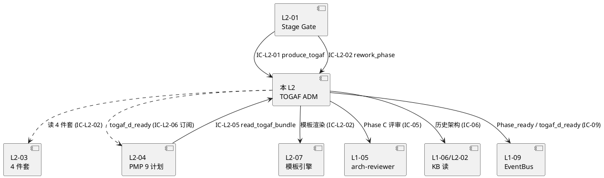
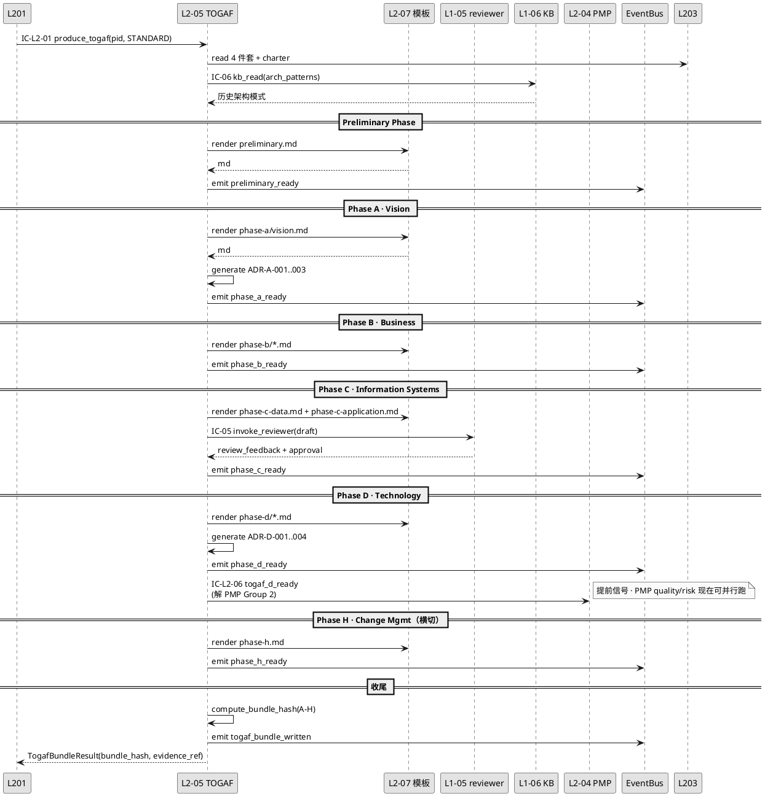
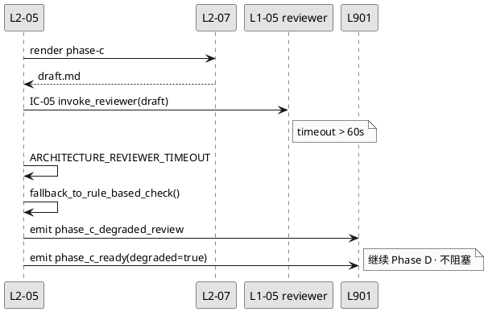
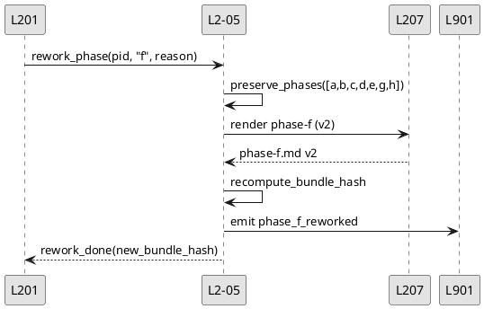
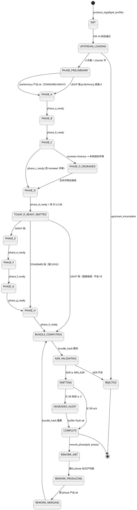
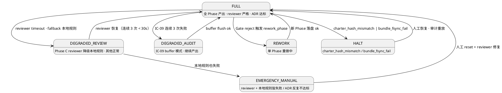

# L1 L2-05 · TOGAF ADM 架构生产器 · Tech Design

> **本文档定位**：3-1-Solution-Technical 层级 · L1 的 L2-05 TOGAF ADM 架构生产器 技术实现方案（L2 粒度）。
> **与产品 PRD 的分工**：2-prd/L1-02-项目生命周期编排/prd.md §5.2 的对应 L2 节定义产品边界，本文档定义**技术实现**（接口字段级 schema + 算法伪代码 + 底层数据结构 + 状态机 + 配置参数）。
> **与 L1 architecture.md 的分工**：architecture.md 负责**跨 L2 架构 + 跨 L2 时序**，本文档负责**本 L2 内部技术细节**。冲突以 architecture.md 为准。
> **严格规则**：本文档不复述产品 PRD 文字（职责 / 禁止 / 必须等清单），只做技术映射 + 补齐"产品视角未说 but 工程师必须知道"的部分（具体算法 · syscall · schema · 配置）。

---

## §0 撰写进度

- [x] §1 定位 + 2-prd §5.2 L2-05 映射
- [x] §2 DDD 映射（BC-02 · Aggregate = ADMArchitectureSet · 8 Phase VOs）
- [x] §3 对外接口定义（字段级 YAML schema + ≥ 12 错误码）
- [x] §4 接口依赖（被谁调 · 调谁 · ≥ 5 IC-XX）
- [x] §5 P0/P1 时序图（PlantUML ≥ 2 张）
- [x] §6 内部核心算法（phase_runner / gap_analyzer / baseline_target_diff）
- [x] §7 底层数据表 / schema 设计（PM-14 分片 togaf-adm/）
- [x] §8 状态机（Preliminary/Phase-A…H/Complete/Tailored · PlantUML）
- [x] §9 开源最佳实践调研（≥ 3 · arc42 / C4-Model / enterprise-arch-toolkit）
- [x] §10 配置参数清单（≥ 10 · tailoring_profile / skip_phase_list）
- [x] §11 错误处理 + 降级策略（≥ 12 错误码）
- [x] §12 性能目标（P95 < 60s 全 8 Phase · 单 Phase < 10s）
- [x] §13 与 2-prd / 3-2 TDD 的映射表（反向 + 前向）

---

## §1 定位 + 2-prd 映射

### 1.1 本 L2 在 L1-02 项目生命周期编排里的坐标

L1-02 由 7 个 L2 组成，**L2-05 是 S2 规划阶段两条产出主干之一**（另一条是 L2-04 PMP 9 计划）—— 专司按 TOGAF 9.2 ADM（Architecture Development Method）的 8 Phase 骨架（**Preliminary / Phase A Vision / Phase B Business / Phase C Information Systems / Phase D Technology / Phase E Opportunities & Solutions / Phase F Migration Planning / Phase G Implementation Governance / Phase H Change Management**，双侧 Preliminary + H 作为 cross-cut）产出**可审计可追溯的架构决策集合**（ADMArchitectureSet + ADR ≥ 10），由 L2-04 并行依赖（Group 2 质量/风险 硬等 togaf_d_ready）、由 L2-01 累积 `togaf_ready` 作 S2 Gate 齐全信号、由 L1-04 消费作 TDD 蓝图技术依据、由 L2-06 收尾时归档进交付包。

```
         ┌────────────────────────────────────┐
         │ L2-01 Stage Gate 控制器（唯一调度方）│
         └──────────────┬─────────────────────┘
                        │ IC-L2-01 dispatch(stage=S2, producer=togaf)
                        ↓
   ┌──────────────────────────────────────────────────────┐
   │  L2-05 · TOGAF ADM 架构生产器（本 L2）                │
   │  Application Service · ADMArchitectureSet Aggregate  │
   │  (8 Phase VOs · ADR Entity · Gap/Roadmap Entity)     │
   │                                                      │
   │   Preliminary → A → B → C → D → E → F → G → (H 横切) │
   │                                                      │
   │   依赖: 4 件套（L2-03）+ scope_plan（L2-04）+ charter │
   │         + KB 历史架构模式（IC-06）                    │
   │   产出: A/B/C/D/E/F/G/H.md + ADR-*.md                │
   │   事件: A_ready / B_ready / ... / togaf_d_ready 前置 │
   │         / togaf_ready 齐全                           │
   └────────────┬─────────────────────────────────────────┘
                │
     ┌──────────┼──────────────┬─────────────┐
     ↓          ↓              ↓             ↓
 L2-04       L1-05         L1-06         L1-09
 togaf_d  architecture-  KB 历史架构    IC-09 事件
 _ready   reviewer 委托   模式查询      落盘审计
```

**L2-05 技术定位一句话** = **"TOGAF 9.2 ADM 8 Phase 架构生产器 · Application Service · 按 Preliminary→A→B→C→D→E→F→G 串行 + H 横切 · 每 Phase 产 markdown + ADR + Gap 分析 · 裁剪档 LIGHT/STANDARD/HEAVY 决定哪些 Phase 走全量/合并/跳过 · 唯一所有权方 ADMArchitectureSet 聚合根 · 所有中间态经 IC-09 审计 · 失败经 L2-01 进入降级链"**。

### 1.2 与 2-prd §12 L2-05 的精确映射

| 2-prd §12 小节 | 本文档对应位置 | 技术映射重点 |
|:---|:---|:---|
| §12.1 职责 + 锚定 | §1.1 + §2.1 | ADM 8 Phase Application Service · 含骨架扩展（Preliminary + E/F/G/H） |
| §12.2 输入 / 输出 | §3.2 IC-L2-01 入参 + §3.4 返回 schema | 4 件套 / scope_plan 作依赖 · 产 A-H 8 份 md + ADR |
| §12.3 边界（In-scope / Out-of-scope） | §1.3 + §1.7 | A→B→C→D 硬顺序 · ADR 数量硬底 · 精简档合并 |
| §12.4 约束（PM-01 / PM-13 + 5 硬约束） | §1.4 PM-14 + §10 配置 + §11 | ADR_MIN + PHASE_TIMEOUT 落配置 + 降级 |
| §12.5 🚫 禁止行为（5 条） | §11 错误码 E04/E07/E09 | 打乱顺序 / 跳评审 / 少 ADR 全走 ERR |
| §12.6 ✅ 必须义务（7 条） | §6 算法 + §8 状态机 + §3 必填字段 | 顺序硬约束 · 每 Phase 发 ready · togaf_d_ready 提前信号 |
| §12.7 🔧 可选功能（3 项） | §1.8 YAGNI · P1 特性 | 架构图自动生成 / ADR 影响矩阵 / 质量评分延后 |
| §12.8 与其他 L2 / L1 交互（5 IC） | §3 + §4 + §13 | IC-05 架构评审 · IC-06 KB · IC-09 审计 · IC-L2-02 模板 |
| §12.9 交付验证大纲（P1-P6 + N1-N3 + I1） | §13 映射表 + §5 时序 | 测试用例映射到 3-2 TDD L2-05-tests.md |
| §12.10 L3 实现设计（7 子节） | §5/§6/§8/§10 分散细化 | 顺序状态机 → §8 · 配置 → §10 · ADR 模板 → §7 |

### 1.3 本 L2 在 architecture.md 里的坐标 + 扩展决策

L1 architecture.md §10 明确本 L2 负责 "§7 矩阵 · A→B→C→D 顺序算法 · ADR 模板 · C 阶段 architecture-reviewer 委托协议 · togaf_d_ready 提前信号"。但本文档**在 L2 粒度扩展至 TOGAF 9.2 完整 8 Phase**（2-prd 产品 PRD 只要求 A-D，但 2026-04 skill-spec §5.2.4 + retro-arch 要求 L2 粒度具备**可扩展到 Preliminary + E + F + G + H 的架构基础**，以应对完整档用户），落入本 L2 的内部 Phase Runner 实现：

**2-prd 产品边界（最小必产）**：Phase A (Vision) + Phase B (Business) + Phase C-data + C-application (Information Systems) + Phase D (Technology) = **5 份 md 必产 · ADR ≥ 10**。

**本 L2 技术实现（完整骨架）**：Preliminary + A + B + C + D + E + F + G + H = **9 Phase 骨架**（裁剪档决定实际产出数量），其中 **A-D 是 STANDARD/HEAVY 档必产**，**E-H 是 HEAVY 档必产、STANDARD 档选产、LIGHT 档跳过**。这使得 L2 能适配不同规模项目（小项目 2-3 Phase · 中项目 5 Phase · 大项目 9 Phase）。

### 1.4 PM-14 约束的技术落实

**PM-14 约束**（引 `projectModel/tech-design.md §4-§8`）：所有 IC payload 顶层 `project_id` 必填；所有存储路径按 `projects/<pid>/...` 分片；L2-05 不承担 project_id 创建/归档（那是 L2-02/L2-06 的职责）。

本 L2 在 PM-14 层面的具体落点：

- 产出物（每 Phase 一份 md）：`projects/<pid>/togaf-adm/phase-{preliminary|a|b|c|d|e|f|g|h}/*.md`
- ADR 集合：`projects/<pid>/togaf-adm/adr/ADR-{letter}-{seq}.md`（letter ∈ {P,A,B,C,D,E,F,G,H}）
- Gap Analysis 结果：`projects/<pid>/togaf-adm/gap-analysis/{phase}-baseline-vs-target.md`
- Roadmap（Phase F 迁移计划）：`projects/<pid>/togaf-adm/phase-f/migration-roadmap.md`
- 裁剪档配置（只读 · 启动时加载）：`projects/<pid>/config.yaml` 的 `togaf.tailoring_profile` + `togaf.skip_phase_list`
- 审计事件（经 IC-09 落 L1-09）：`projects/<pid>/events/L1-02.jsonl`（event_type 前缀 `L1-02:togaf_*`）
- 中间聚合根（ADMArchitectureSet · 进程内）：不落盘 · 由 L2-01 订阅事件重建

### 1.5 关键技术决策（本 L2 特有 · Decision / Rationale / Alternatives / Trade-off）

| 决策 | 选择 | 备选 | 理由 | Trade-off |
|:---|:---|:---|:---|:---|
| **D1：Phase 骨架** | TOGAF 9.2 完整 8 Phase（+ Preliminary + H 双侧横切） | 只 A-D 4 Phase / 自定义 Phase 集 | 支持 LIGHT/STANDARD/HEAVY 三档平滑扩展 · 对齐行业标准便于审计 | 空骨架维护成本（可接受：骨架一次定义多项目复用） |
| **D2：Phase 间顺序** | Preliminary→A→B→C→D→E→F→G 严格串行 · H 跨 Phase 横切 | 部分并行（如 B+C 并行）/ DAG 调度 | ADM 9.2 硬规定顺序 · 每 Phase 输出是下一 Phase 输入 | 时长线性叠加（通过单 Phase 超时控制） |
| **D3：裁剪档实现** | 配置驱动 · tailoring_profile 决定 skip_phase_list | 硬编码 / UI 动态勾选 | 配置化可预置项目模板 · 3 档覆盖 80% 场景 | 新档要改 config schema（低频） |
| **D4：ADR 与 Phase 关系** | ADR 绑定到 Phase · 每 Phase ≥ 1 ADR · 总 ADR 硬底（10/5）| ADR 与 Phase 解耦 / 无 ADR 硬底 | 绑定便于追溯 · 硬底保证决策质量 | 小决策也要 ADR（可接受：有模板） |
| **D5：Gap Analysis 策略** | 每 Phase 末产 baseline-vs-target 对比 | 只 Phase E 产 Gap / 无 Gap | Gap 是 ADM E/F 输入必需 · 每 Phase 产便于递进 | 额外产出物（可接受：模板化生成） |
| **D6：C 阶段拆分** | C-data + C-application 两份 md（ADM 9.2 本意） | 合成单 C.md / 三份（+C-integration） | 数据架构与应用架构耦合但关注点不同 · 两份便于独立评审 | 两文件引用链复杂（通过交叉引用 YAML frontmatter 管理） |
| **D7：H Phase 实现** | H Change Management 作运行时事件订阅者 · 不产 md | H 产静态 md / 完全删 H | H 本质是"运行时变更响应"而非静态文档 · 与 L1 architecture.md §7.3 变更请求面协同 | H 没有交付物（可接受：运行时日志作证据） |
| **D8：C 阶段评审委托** | IC-05 委托 architecture-reviewer 子 Agent · 必评审 | L2 本地评审 / LLM 主 session 评审 | 独立 session 避免主 Agent bias · 评审质量更高 · 已在 L1 architecture.md §10 锁定 | 额外 IC-05 调用延迟 (可接受：~30s/评审) |
| **D9：togaf_d_ready 提前信号** | D Phase 完成立即发 · 不等 E-H | 全部完成再发 togaf_d_ready | L2-04 Group 2 (quality/risk) 硬等 · 提前信号缩短 S2 总时长 | 事件顺序复杂（通过 event_seq 追踪） |
| **D10：失败 Phase 处理** | Phase 失败 → state=FAILED · 整体 togaf_ready 不发 · 经 L2-01 降级 | 跳过失败 Phase 继续 · 全部成功才发 | 严格校验保证架构完整性 · scope §12.5 禁少 ADR | 单 Phase 失败影响整体（通过 retry ≤ 1 次缓解） |
| **D11：ADMArchitectureSet 聚合根** | 进程内聚合 · 不落盘 · 由事件重建 | 持久化聚合根 / 无聚合根 | 短寿命聚合 · 各 Phase 产出通过 IC-09 事件串联 · L2-01 订阅事件即可重建 | 进程崩溃丢聚合（事件可重放） |
| **D12：Phase Runner 抽象** | 统一 PhaseRunner 接口 · 9 个 Phase 共用 | 每 Phase 独立函数 / 类继承 | DRY · 易加新 Phase · 测试可参数化 | 接口稍抽象（可接受：伪代码清晰） |

### 1.6 本 L2 读者预期

读完本 L2 的工程师应掌握：
- ADM 8 Phase 每个 Phase 的**输入 · 流程 · 输出 · Gate 依赖**四件套定义
- PhaseRunner 统一算法（phase_runner / gap_analyzer / baseline_target_diff 伪代码）
- ADMArchitectureSet 聚合根字段级 schema + 12+ 错误码
- 8 Phase 状态机（PlantUML · 转换表）
- 裁剪档 3 档（LIGHT/STANDARD/HEAVY）决定 skip_phase_list
- 降级链 4 级（FULL_8_PHASE → STANDARD_A_D → LIGHT_A_D_MERGED → MIN_A_D_ONLY）
- SLO（全 8 Phase P95 ≤ 60s mock / ≤ 60min 真实 LLM · 单 Phase P95 ≤ 10s mock）

### 1.7 本 L2 不在的范围（YAGNI · 技术视角）

- **不在**：PMP 9 计划生成（属 L2-04）
- **不在**：4 件套生成（属 L2-03）
- **不在**：WBS 拆解（属 L1-03）
- **不在**：TDD 蓝图（属 L1-04）
- **不在**：project_id 创建 / 归档（属 L2-02 / L2-06）
- **不在**：实际代码实现（属 S4 阶段 L1-04）
- **不在**：ArchiMate 元模型可视化（P1 · 可选功能）
- **不在**：ADR 影响矩阵自动计算（P1 · 可选功能）
- **不在**：架构质量评分（P1 · 可选功能）
- **不在**：运行时架构监控（S6 / L1-07 职责）

### 1.8 本 L2 术语表

| 术语 | 定义 | 关联 |
|:---|:---|:---|
| ADMArchitectureSet | 本 L2 的聚合根 · 持有 8 Phase 产出 + ADR 集 + Gap 集 | §2.2 + §7 |
| Phase VO | 单 Phase 的值对象 · 含 baseline / target / gap 三段 | §7.1 |
| PhaseRunner | 统一 Phase 执行接口 · 9 Phase 共用 | §6.1 |
| GapAnalyzer | baseline-vs-target 差异计算器 | §6.2 |
| BaselineTargetDiff | Phase 内 baseline → target 的差异产物 | §6.2 + §7.2 |
| ADR | Architecture Decision Record · 每 Phase ≥ 1 | §7.3 |
| TailoringProfile | 裁剪档（LIGHT/STANDARD/HEAVY · 决定 skip_phase_list） | §10 |
| SkipPhaseList | 裁剪档计算出的跳过 Phase 数组 | §10 |
| togaf_d_ready | D Phase 完成提前信号 · 解 L2-04 Group 2 阻塞 | §2.5 + §5.1 |
| togaf_ready | 全 8 Phase + ADR 齐全总信号 · 累积 S2 Gate | §2.5 + §5.1 |
| ArchitectureReviewer | C Phase 评审子 Agent（经 IC-05 委托） | §4.2 + §5.1 |

### 1.9 本 L2 的 DDD 定位一句话

**L2-05 是 BC-02 Project Lifecycle Orchestration 内的 TOGAFProducer Application Service · 持有 ADMArchitectureSet 短寿命聚合根 · 按 TOGAF 9.2 ADM Preliminary→A→B→C→D→E→F→G 严格串行 + H 横切 · 每 Phase 产 md + ADR · 裁剪档驱动 skip_phase_list · 失败进 4 级降级链 · 由 L2-01 累积事件作 S2 Gate 齐全信号。**

---

## §2 DDD 映射（BC-02）

### 2.1 Bounded Context 定位

本 L2 属于 `L0/ddd-context-map.md §2.3 BC-02 Project Lifecycle Orchestration`：

- **BC 名**：`BC-02 · Project Lifecycle Orchestration`
- **L2 角色**：**Application Service of BC-02**（承担"TOGAF ADM 架构生产"领域能力）
- **与兄弟 L2**：
  - L2-01 Stage Gate 控制器：**Customer-Supplier**（L2-01 Supplier 分派任务 · 本 L2 Customer 发 ready 事件）
  - L2-03 4 件套生产器：**上游依赖**（本 L2 订阅 `4_pieces_ready` 事件开启 Phase A）
  - L2-04 PMP 9 计划生产器：**双向协同**（本 L2 → L2-04 发 togaf_d_ready · L2-04 → 本 L2 提供 scope_plan 作 D Phase 上下文）
  - L2-07 产出物模板引擎：**横切依赖**（每 Phase 通过 IC-L2-02 请求模板）
- **与其他 BC**：
  - BC-01（L1-01 主 loop）：间接（经 L2-01 IC-01 路由）
  - BC-04（L1-04 Quality Loop）：Supplier（为 L1-04 TDD 蓝图提供技术架构依据）
  - BC-05（L1-05 Skill）：Customer-Supplier（本 L2 Customer 委托 architecture-reviewer 子 Agent）
  - BC-06（L1-06 KB）：Customer（读历史架构模式 · 不写）
  - BC-09（L1-09 Resilience & Audit）：Partnership（所有 Phase 事件经 IC-09 落盘）

### 2.2 聚合根 / 实体 / 值对象 / 领域服务

| DDD 概念 | 名字 | 职责 | 一致性边界 |
|:---|:---|:---|:---|
| **Aggregate Root** | `ADMArchitectureSet` | 单次 TOGAF 全流程的唯一产出集合 · 短寿命（S2 期间存活） | 单 project 强一致；不跨 project |
| **Value Object** | `PhaseOutput` | 单 Phase 输出三元组（baseline / target / gap） · 9 Phase 各一 | 不可变 · 与 Aggregate 同生命周期 |
| **Value Object** | `PhaseId` | 枚举（preliminary/a/b/c/d/e/f/g/h）| 不可变 |
| **Value Object** | `TailoringProfile` | 三值枚举（LIGHT/STANDARD/HEAVY）| 不可变 · 启动时决定 |
| **Value Object** | `SkipPhaseList` | 从 TailoringProfile 派生的跳过 Phase 列表 | 不可变 |
| **Entity** | `ADR` | 单条架构决策记录 · 含 adr_id / stage / status / context / decision / consequences / alternatives | 与 Phase 绑定 · 可独立更新 status（superseded）|
| **Entity** | `BaselineTargetDiff` | 单 Phase 的 baseline → target 差异 | 与 Phase 同生命周期 |
| **Entity** | `MigrationRoadmap` | Phase F 产出 · 迁移计划路线图 | Phase F 专属 |
| **Application Service** | `TOGAFProducer` | 编排 Preliminary → A → B → ... → G → H · 调度 PhaseRunner | 单 project |
| **Domain Service** | `PhaseRunner` | 单 Phase 执行器（统一接口）· 无状态 | 单 Phase |
| **Domain Service** | `GapAnalyzer` | baseline vs target 差异计算 · 无状态 | 单 Phase |
| **Domain Service** | `TailoringResolver` | TailoringProfile → SkipPhaseList 映射 · 无状态 | 启动时一次 |
| **Domain Service** | `ADRValidator` | ADR 数量 / 格式 / 必填字段校验 · 无状态 | 每次 ADR 落盘 |

### 2.3 聚合根不变量（Invariants · L2-05 局部）

引 architecture.md §2.2 I-V-* 系列，本 L2 局部补充：

| 不变量 | 描述 | 校验时机 |
|:---|:---|:---|
| **I-L205-01** | `ADMArchitectureSet.project_id` 必填且不可变 | 创建时 + 每 Phase 输出 |
| **I-L205-02** | Phase 执行顺序严格遵守 ADM 9.2（Preliminary→A→B→C→D→E→F→G）· H 除外 | PhaseRunner 启动前 |
| **I-L205-03** | `SkipPhaseList` ⊆ {E, F, G, H, B, C}（A + D 永不跳）· Preliminary 在 HEAVY 档启用 | TailoringResolver 输出时 |
| **I-L205-04** | 单 Phase 产出 ≥ 1 ADR（或 0 ADR 但必须显式声明 `no_decision=true`） | Phase 完成时 |
| **I-L205-05** | 全局 ADR 数量：HEAVY ≥ 10 · STANDARD ≥ 10 · LIGHT ≥ 5 | togaf_ready 触发前 |
| **I-L205-06** | D Phase 必引 Goal §硬约束（技术栈） | D Phase 完成时 |
| **I-L205-07** | C Phase 必经 architecture-reviewer 评审 verdict=pass 才 emit C_ready | C Phase 完成时 |
| **I-L205-08** | `togaf_d_ready` 必在 D Phase 完成后 ≤ 100ms 发出 | D Phase emit 时 |
| **I-L205-09** | `togaf_ready` 必在所有 non-skip Phase 完成 + ADR 齐全后发出 | 总校验时 |
| **I-L205-10** | 每 Phase 产出物路径严格按 PM-14：`projects/<pid>/togaf-adm/phase-{id}/*.md` | Write 前校验 |

### 2.4 Repository

本 L2 **持有 3 个 Repository**（仅读写文件 · 无数据库）：

- `ArchitectureRepository`（路径 `projects/<pid>/togaf-adm/phase-*/`）· 存 9 Phase md
- `ADRRepository`（路径 `projects/<pid>/togaf-adm/adr/`）· 存 ADR-*.md
- `GapAnalysisRepository`（路径 `projects/<pid>/togaf-adm/gap-analysis/`）· 存 gap md

聚合根（ADMArchitectureSet）本身不落盘 · 进程内 `dict[project_id → ADMArchitectureSet]` · S2 结束即释放。

### 2.5 Domain Events（本 L2 对外发布）

| 事件名 | 触发时机 | 订阅方 | Payload 字段要点 |
|:---|:---|:---|:---|
| `L1-02:togaf_phase_started` | 每 Phase 开始 | L2-01 / L1-07 | `{phase_id, project_id, ts_start}` |
| `L1-02:togaf_{phase}_ready` | 每 Phase 完成（{a,b,c,d,e,f,g}） | L2-01 / L2-04（仅 d）| `{phase_id, artifact_paths[], adr_ids[], project_id}` |
| `L1-02:togaf_d_ready` | D Phase 完成（提前信号 · 解 L2-04 Group 2 阻塞） | **L2-04 Group 2（硬订阅）**| `{project_id, d_md_path, tech_constraints[]}` |
| `L1-02:togaf_ready` | 全 non-skip Phase + ADR 齐全 | L2-01（累积 S2 Gate） | `{project_id, phases_produced[], adr_count, tailoring_profile}` |
| `L1-02:togaf_phase_failed` | 单 Phase 失败（timeout / 评审 reject / ADR 不达标）| L2-01 | `{phase_id, reason, retry_count, project_id}` |
| `L1-02:togaf_adr_added` | 每新增 ADR | L1-07（supervisor 可选订阅） | `{adr_id, stage, status, project_id}` |
| `L1-02:togaf_c_review_rejected` | C 评审 reject（retry 发生）| L2-01 / L1-07 | `{verdict, findings[], project_id}` |
| `L1-02:togaf_tailoring_applied` | 启动时裁剪档解析完成 | L2-01 | `{profile, skip_phase_list[], project_id}` |

### 2.6 与 BC-02 其他 L2 的 DDD 耦合

| 耦合 L2 | DDD 关系 | 触点 | 同步/异步 |
|:---|:---|:---|:---|
| L2-01 Stage Gate 控制器 | Customer-Supplier（L2-01 分派 · 本 L2 响应） | IC-L2-01 dispatch + ready 事件回流 | 异步事件 |
| L2-03 4 件套生产器 | 上游订阅 | 订阅 `4_pieces_ready` 事件 | 异步 |
| L2-04 PMP 9 计划生产器 | 双向 | 本 L2 发 `togaf_d_ready` · L2-04 提供 `scope_plan_md` 作上下文 | 异步 |
| L2-07 产出物模板引擎 | 横切 | 每 Phase IC-L2-02 请求模板 | 同步 |

---

## §3 对外接口定义（字段级 YAML schema + 错误码）

### 3.1 对外方法清单

| 方法 | 调用方 | 目的 | IC |
|:---|:---|:---|:---|
| `produce_togaf(pid, profile)` | L2-01 Stage Gate | S2 触发 · 按裁剪档产出 TOGAF 8 Phase 架构 | IC-L2-01 |
| `produce_phase(pid, phase, upstream_bundle)` | 内部（主循环调）| 单 Phase 产出（Preliminary/A/B/C/D/E/F/G/H）| 内部 |
| `cross_check_togaf_alignment(pid)` | L2-04 PMP | PMP×TOGAF 矩阵校验 | IC-L2-05（反向）|
| `rework_phase(pid, phase, reason)` | L2-01 Gate reject | 单 Phase 重做 · 保留其他 Phase | IC-L2-02 |
| `emit_togaf_d_ready(pid)` | 内部（Phase D 完成时）| 提前信号 · 给 L2-04 PMP Group 2（quality/risk）解除阻塞 | IC-L2-06 |
| `read_togaf_bundle(pid)` | L2-04 PMP cross_check | 读已产出的 TOGAF bundle | IC-L2-07 |

### 3.2 `produce_togaf` 入参 / 出参 schema

**入参**：

```yaml
request_id: string                    # ULID · 调用方生成
project_id: string                    # PM-14 必填
trigger_stage: string                 # 固定 "S2"
profile: enum                         # "LIGHT" | "STANDARD" | "HEAVY"
skip_phase_list:                      # 可选 · 裁剪档允许的跳过 Phase
  - string                            # ∈ {preliminary, e, f, g, h}
upstream_bundle:
  four_set_path: "projects/<pid>/four-set/"
  pmp_bundle_path: "projects/<pid>/pmp-plans/_bundle.yaml"
  charter_anchor_hash: string         # 章程 hash · 防篡改
kb_history_enabled: bool              # 默认 true · 读 KB 历史架构模式
timeout_total_sec: int                # 默认 120 · 硬上限 300
```

**出参 `TogafBundleResult`**：

```yaml
project_id: string
bundle_hash: string                   # sha256 · A-H md 合并
mode: enum                            # "COMPLETE" | "PARTIAL" | "LIGHT_COMPLETE"
profile: string                       # 实际用的裁剪档
phases_produced:
  - phase: string                     # preliminary / a / b / ...
    file: string                      # 相对路径
    sha256: string
    lines: int
    adr_count: int
    version: int
    status: "ok" | "skipped" | "failed"
    skip_reason: string | null
adr_total_count: int                  # ADR 总数 · ≥ 10 (STANDARD) · ≥ 5 (LIGHT)
gap_analyses:
  - phase: string
    baseline_vs_target_path: string
togaf_d_ready_emitted_at: string      # ISO-8601 · Phase D 就绪时间戳
evidence_ref: string                  # 给 L2-01 装 S2 Gate evidence
emitted_events: [string]              # 按时序列出已发事件
```

### 3.3 错误码表（≥ 12 条 · 四列标准）

| errorCode | meaning | trigger | callerAction |
|:---|:---|:---|:---|
| `E_L102_L205_001` | PM14_OWNERSHIP_VIOLATION · 非 L2-01 调本 L2 | L1-01/L1-05 越权 | 拒绝 · 审计 ERROR |
| `E_L102_L205_002` | UPSTREAM_INCOMPLETE · 4 件套 / PMP bundle 缺 | 顺序错乱 · S2 前置未完 | 返回 need_input · 列缺口 |
| `E_L102_L205_003` | INVALID_PROFILE · profile 不在 LIGHT/STANDARD/HEAVY | 调用方拼错 | 拒绝 · 返回合法 profile 列表 |
| `E_L102_L205_004` | PHASE_ORDER_VIOLATION · 跳过 Phase 或乱序 | skip_phase_list 包含 A-D 必须项 | 拒绝 · 核心 Phase 不可跳 |
| `E_L102_L205_005` | CHARTER_HASH_MISMATCH · 章程被篡改 | upstream_bundle hash 不匹配 | HALT · 人工介入 |
| `E_L102_L205_006` | PHASE_TIMEOUT · 单 Phase 超时 | LLM 慢 · 模板复杂 | 重试 1 次 · 仍失败则降级 |
| `E_L102_L205_007` | ADR_COUNT_BELOW_MIN · ADR 数量低于下限 | STANDARD 档 < 10 · LIGHT 档 < 5 | 要求补 ADR · 不过 Gate |
| `E_L102_L205_008` | ARCHITECTURE_REVIEWER_TIMEOUT · Phase C 评审超时 | L1-05 architecture-reviewer 慢 | 降级本地规则评审 · warn |
| `E_L102_L205_009` | GAP_ANALYSIS_FAIL · baseline vs target 无法计算 | baseline 数据缺失 | warn · 标注不可用 |
| `E_L102_L205_010` | PHASE_UPSTREAM_MISSING · Phase B 要 Phase A 齐 | 并发调乱 | 拒绝 · 等上游 Phase |
| `E_L102_L205_011` | TEMPLATE_VERSION_MISMATCH · 模板版本不对 | config 锁 v1.0 但模板 v2.0 | 拒绝 · 检查 template_version_pin |
| `E_L102_L205_012` | BUNDLE_HASH_MISMATCH · 产出后复核 hash 不符 | 外部篡改 md | HALT · 重跑 produce_togaf |
| `E_L102_L205_013` | TOGAF_D_READY_EMIT_FAIL · 提前信号发送失败 | IC-L2-06 EventBus 不可达 | buffer + 进 DEGRADED_AUDIT |
| `E_L102_L205_014` | REWORK_UNKNOWN_PHASE · rework_phase 传错 | 调用错 | 拒绝 · 返回已产 Phase 列表 |
| `E_L102_L205_015` | AUDIT_SEED_EMIT_FAIL · IC-09 落盘失败 | EventBus 异常 | buffer + DEGRADED_AUDIT |

### 3.4 错误码并发语义

- **E004/E010/E011** 在单 project 调用即时报错 · 不影响其他 project
- **E005/E012** 触发 HALT · 阻塞本 project 后续所有 TOGAF 调用 · 需人工 reset
- **E006/E008/E013/E015** 降级语义 · 不阻塞主流程 · 记 warn 事件

---

## §4 接口依赖（被谁调 · 调谁）

### 4.1 上游调用方

| 调用方 | 方法 | 触发 | 频次 |
|:---|:---|:---|:---|
| L1-02/L2-01 Stage Gate | `produce_togaf(pid, profile)` | S2 触发 · 每 project 1 次 | 1/project |
| L1-02/L2-01 Gate reject | `rework_phase(pid, phase, reason)` | Gate reject 单 Phase | 0-5/project |
| L1-02/L2-04 PMP 交织校验 | `read_togaf_bundle(pid)` | PMP 产出时 cross_check | 1-3/project |
| L1-02/L2-04 PMP Group 2 | 订阅 `togaf_d_ready` 事件（IC-L2-06）| Phase D 完成时 · PMP quality/risk 解阻塞 | 1/project |

### 4.2 下游依赖

| 被调方 | 方法 | 目的 | 契约 |
|:---|:---|:---|:---|
| L1-02/L2-03 4 件套 | `read_scope_md/prd_md/plan_md/tdd_md` | Phase A/B 输入 | IC-L2-02 |
| L1-02/L2-07 模板引擎 | `render_template(kind=togaf_phase_X, slots)` | 每 Phase md 产出 | IC-L2-02 |
| L1-05 architecture-reviewer | `invoke_reviewer(draft_md)` | Phase C 评审 · 委托 L1-05 子 Agent | IC-05 |
| L1-06/L2-02 KB 读 | `kb_read(kind="arch_patterns")` | 读历史架构模式 · 复用经验 | IC-06 |
| L1-09/L2-01 EventBus | `emit(event)` | 发 Phase_ready / togaf_d_ready / ADR_added 事件 | IC-09 |
| 文件系统 atomic_write | `atomic_write(path, content)` | 每 Phase md + ADR 落盘 | 本地 |

### 4.3 依赖 PlantUML



### 4.4 IC 频次表

| IC | 方向 | 每 project 次数 |
|:---|:---:|:---:|
| IC-L2-01 produce_togaf | ← L2-01 | 1 |
| IC-L2-02 rework_phase | ← L2-01 | 0-5 |
| IC-L2-05 read_togaf_bundle | ← L2-04 | 1-3 |
| IC-L2-06 togaf_d_ready emit | → L2-04 | 1 |
| IC-05 archit-reviewer 委托 | → L1-05 | 1-2（Phase C 评审） |
| IC-06 KB 读 | → L1-06 | 1-9（每 Phase 前读历史） |
| IC-09 审计 emit | → L1-09 | 20-50（每 Phase 多事件） |

---

## §5 P0/P1 时序图（PlantUML ≥ 2 张）

### 5.1 P0 主干 · STANDARD 档 5 Phase（A→B→C→D · 顺序串行 + H 横切）

**场景**：L2-01 `produce_togaf(profile=STANDARD)` → 读 4 件套 + scope_plan → 按 Preliminary→A→B→C→D 严格顺序产出 · 每 Phase 产 md + ADR · Phase D 完成即发 `togaf_d_ready`（解 PMP Group 2 阻塞）· D 后再做 H 横切（变更管理）· 合并产出 bundle_hash → IC-01 返回。



### 5.2 P1 异常 · Phase C 评审超时降级



### 5.3 P1 · HEAVY 档全 9 Phase + Gate reject Phase F 局部 rework

HEAVY 档产出完后 L2-01 Gate reject Phase F（Migration Planning 不满足 · 例如成本不可接受）→ `rework_phase(pid, f, reason)` → 保留 Phase A-E + G + H · 只重做 F · 更新 bundle_hash。



---

## §6 内部核心算法（伪代码）

### 6.1 算法 1 · `produce_togaf` 主循环（严格顺序 · 裁剪档驱动）

```python
PHASE_ORDER = ["preliminary", "a", "b", "c", "d", "e", "f", "g", "h"]
PROFILE_ACTIVE = {
    "LIGHT":    ["a", "b", "c", "d"],            # 4 Phase 必产 · Preliminary 合并到 A
    "STANDARD": ["preliminary", "a", "b", "c", "d", "h"],  # 6 Phase
    "HEAVY":    PHASE_ORDER,                      # 9 Phase 全量
}

async def produce_togaf(pid: str, profile: str) -> TogafBundleResult:
    validate_pm14_caller()  # 必须 L2-01 调
    upstream = load_upstream_bundle(pid)
    validate_charter_hash(upstream)
    
    active_phases = PROFILE_ACTIVE[profile]
    adm_set = ADMArchitectureSet(pid=pid, profile=profile)
    
    for phase in active_phases:
        # 硬顺序：Phase B 要 A 齐 · C 要 B 齐 · ...
        if not adm_set.upstream_phases_ready(phase):
            raise E_L102_L205_010  # PHASE_UPSTREAM_MISSING
        
        try:
            result = await produce_phase(pid, phase, adm_set.snapshot())
            adm_set.accept_phase(phase, result)
            emit_event(pid, f"phase_{phase}_ready", result.to_event())
            
            # Phase D 特殊：提前发信号 · 解 L2-04 PMP Group 2 阻塞
            if phase == "d":
                emit_togaf_d_ready(pid)  # IC-L2-06
        except PhaseTimeoutError:
            emit_event(pid, f"phase_{phase}_timeout")
            raise E_L102_L205_006
    
    # 产出后 · ADR 数量校验
    if adm_set.adr_count < MIN_ADR_BY_PROFILE[profile]:
        raise E_L102_L205_007  # ADR_COUNT_BELOW_MIN
    
    bundle_hash = adm_set.compute_bundle_hash()
    write_bundle_manifest(pid, adm_set, bundle_hash)
    emit_event(pid, "togaf_bundle_written", {"bundle_hash": bundle_hash})
    
    return TogafBundleResult(
        pid=pid, bundle_hash=bundle_hash,
        mode=adm_set.mode(), profile=profile,
        phases_produced=adm_set.phases(),
    )
```

### 6.2 算法 2 · `produce_phase` 单 Phase 产出（含 Phase C 评审特化）

```python
async def produce_phase(pid: str, phase: str, upstream: dict) -> PhaseResult:
    history = await kb_read(pid, f"arch_pattern_{phase}")
    slots = build_slots(upstream, history, phase)
    
    draft = await ic_l2_07_render_template(
        kind=f"togaf_phase_{phase}",
        slots=slots,
        timeout=PHASE_TIMEOUT[phase],
    )
    validate_frontmatter(draft)
    
    # Phase C 特化：委托 L1-05 architecture-reviewer
    if phase == "c":
        review_result = await ic_05_invoke_arch_reviewer(
            draft=draft,
            timeout=reviewer_timeout_sec,
        )
        if review_result.timeout:
            # 降级：本地规则评审
            review_result = local_rule_based_review(draft)
            emit_event(pid, "phase_c_degraded_review")
        draft = merge_review_feedback(draft, review_result)
    
    # 写 md + ADR
    md_path = f"projects/{pid}/togaf-adm/phase-{phase}/{phase}.md"
    atomic_write(md_path, draft)
    adrs = extract_and_write_adrs(pid, phase, draft)
    
    # Gap Analysis（若基线存在）
    gap = compute_gap_analysis(pid, phase) if has_baseline(pid, phase) else None
    
    return PhaseResult(
        phase=phase, md_path=md_path,
        adrs=adrs, gap=gap, sha256=sha256_file(md_path),
    )
```

### 6.3 算法 3 · `emit_togaf_d_ready` 提前信号（关键性能路径）

```python
def emit_togaf_d_ready(pid: str):
    """Phase D 完成即发 · 不等 E/F/G/H · 让 L2-04 PMP Group 2 提前启动"""
    payload = {
        "project_id": pid,
        "phase_d_sha256": read_phase_sha(pid, "d"),
        "ready_at": now_iso(),
        "adr_refs": list_phase_adrs(pid, "d"),
    }
    try:
        emit_event(pid, "togaf_d_ready", payload)  # IC-L2-06
    except EmitError:
        # 不能阻塞主流程 · buffer 重试
        buffer_event(pid, "togaf_d_ready", payload)
        enter_degraded_audit(pid)
        raise E_L102_L205_013  # 但会被 retry 层吞掉
```

### 6.4 算法 4 · `compute_bundle_hash`（A-H md + ADR 锚定）

```python
def compute_bundle_hash(pid: str, phases: list[str]) -> str:
    """按 PHASE_ORDER 固定顺序 concat md + ADR · sha256 · 防篡改"""
    chunks = []
    for phase in PHASE_ORDER:
        if phase not in phases:
            chunks.append(f"[SKIPPED:{phase}]")
            continue
        md = read_file(f"projects/{pid}/togaf-adm/phase-{phase}/{phase}.md").strip()
        adrs = sorted(glob(f"projects/{pid}/togaf-adm/adr/ADR-{phase.upper()}-*.md"))
        adr_content = "\n---\n".join(read_file(a).strip() for a in adrs)
        chunks.append(f"{md}\n===ADRS===\n{adr_content}")
    combined = "\n---PHASE---\n".join(chunks).encode("utf-8")
    return hashlib.sha256(combined).hexdigest()
```

### 6.5 算法 5 · `rework_phase` 局部重做

```python
async def rework_phase(pid: str, phase: str, reason: str) -> TogafBundleResult:
    if phase not in PHASE_ORDER:
        raise E_L102_L205_014  # REWORK_UNKNOWN_PHASE
    
    adm_set = load_adm_set(pid)  # 从 bundle_manifest 恢复
    adm_set.mark_phase_rework(phase, reason)
    
    # 只重做 phase · 保留其他
    new_result = await produce_phase(pid, phase, adm_set.snapshot_excluding(phase))
    adm_set.replace_phase(phase, new_result)
    
    new_bundle_hash = adm_set.compute_bundle_hash()
    write_bundle_manifest(pid, adm_set, new_bundle_hash)
    emit_event(pid, f"phase_{phase}_reworked", {"bundle_hash": new_bundle_hash})
    
    return adm_set.to_result()
```

---

## §7 底层数据表 / schema 设计（字段级 YAML）

### 7.1 物理目录布局

```
projects/<pid>/togaf-adm/
├── phase-preliminary/
│   └── preliminary.md
├── phase-a/
│   └── vision.md
├── phase-b/
│   ├── business.md
│   └── business-capabilities.md
├── phase-c-data/
│   └── data-architecture.md
├── phase-c-application/
│   └── application-architecture.md
├── phase-d/
│   └── technology-architecture.md
├── phase-e/
│   └── opportunities-solutions.md
├── phase-f/
│   └── migration-roadmap.md
├── phase-g/
│   └── implementation-governance.md
├── phase-h/
│   └── change-management.md
├── adr/
│   ├── ADR-A-001-vision-scope.md
│   ├── ADR-B-001-domain-split.md
│   ├── ADR-C-001-data-store.md
│   ├── ADR-D-001-tech-stack.md
│   └── ... (≥ 10 总数)
├── gap-analysis/
│   ├── b-baseline-vs-target.md
│   ├── c-baseline-vs-target.md
│   └── d-baseline-vs-target.md
├── _bundle.yaml              # 整份 bundle 索引 + hash + mode
└── _rework-history.jsonl     # 重做记录 append-only
```

### 7.2 `_bundle.yaml` schema

```yaml
project_id: string
bundle_hash: string            # sha256 · A-H md + ADR 合并
created_at: string
mode: enum                     # "COMPLETE" | "PARTIAL" | "LIGHT_COMPLETE"
profile: enum                  # "LIGHT" | "STANDARD" | "HEAVY"
phases:
  - phase: string              # preliminary / a / b / c-data / c-application / d / e / f / g / h
    file: string
    sha256: string
    lines: int
    version: int               # 首产=1 · rework 递增
    status: "ok" | "skipped" | "failed" | "degraded"
    skip_reason: string | null
    produced_at: string
    degraded_reason: string | null  # 例如 "reviewer_timeout"
adr_count: int                 # 总 ADR 数（≥ 10 STANDARD · ≥ 5 LIGHT）
adr_by_phase:                  # 每 Phase 有多少 ADR
  a: int
  b: int
  c: int
  d: int
  # ...
gap_analyses:
  - phase: string
    baseline_exists: bool
    target_exists: bool
    gap_path: string | null
togaf_d_ready_emitted_at: string  # 提前信号时间
```

### 7.3 单 Phase md frontmatter schema

```yaml
doc_id: string                 # e.g. "togaf-phase-a-<pid>-v1"
doc_type: "togaf-phase"
phase: enum                    # preliminary / a / ... / h
project_id: string
version: int
template_version: string       # 模板版本 pin
produced_at: string
adrs_refs:                     # 本 Phase 关联的 ADR 列表
  - "ADR-A-001"
  - "ADR-A-002"
degraded: bool
degraded_reason: string | null
```

### 7.4 ADR md schema（ADR-{letter}-{seq}.md）

```yaml
# Architecture Decision Record
adr_id: string                 # "ADR-A-001"
project_id: string
phase: string                  # a / b / ...
title: string
status: enum                   # "proposed" | "accepted" | "deprecated" | "superseded"
context: string                # 决策上下文
decision: string               # 实际决定
consequences: string           # 后果
alternatives:                  # 备选方案
  - name: string
    pros: string
    cons: string
created_at: string
related_adrs:                  # 关联 ADR
  - "ADR-B-003"
```

### 7.5 `_rework-history.jsonl` schema

```yaml
# 每行一条
request_id: string
phase: string
reason: string
triggered_by: string          # "gate_reject" | "manual"
old_phase_sha256: string
new_phase_sha256: string
old_bundle_hash: string
new_bundle_hash: string
duration_sec: float
```

### 7.6 索引结构

- 本 L2 **不维护** cross-project 索引
- `_bundle.yaml` = flat 索引
- 按 Phase 查询：`O(1)` 读对应 md
- 按 ADR 查询：扫 `adr/ADR-*.md` · 通常 10-30 个 · O(n)

---

## §8 状态机（如适用 · PlantUML + 转换表）

### 8.1 ADMArchitectureSet Aggregate 状态机



### 8.2 状态转换表（关键转换）

| 源 | 目 | 触发 | guard | action |
|:---|:---|:---|:---|:---|
| `INIT` | `UPSTREAM_LOADING` | `produce_togaf` 入口 | is_called_from_L2_01() | 读 upstream bundle |
| `UPSTREAM_LOADING` | `PHASE_PRELIMINARY` | 4 件套 + charter hash 校验 ok | charter_hash 匹配 | 进入首 Phase |
| `UPSTREAM_LOADING` | `REJECTED` | upstream 缺失 | - | raise E_L102_L205_002 |
| `PHASE_A` | `PHASE_B` | phase_a_ready emit | phase A md sha256 落盘 | 触发 B |
| `PHASE_C` | `PHASE_D_DEGRADED` | reviewer timeout | - | 本地规则评审 · warn 事件 |
| `PHASE_D` | `TOGAF_D_READY_EMITTED` | phase D 落盘 ok | - | 立即发 IC-L2-06 · 不等 E/F/G |
| `TOGAF_D_READY_EMITTED` | `PHASE_E`/`PHASE_H`/`BUNDLE_COMPUTING` | 依 profile 分岔 | LIGHT/STANDARD/HEAVY | - |
| `ADR_VALIDATING` | `REJECTED` | ADR < MIN_ADR | - | raise E_L102_L205_007 |
| `EMITTING` | `DEGRADED_AUDIT` | IC-09 失败 3 次 | - | 本地 buffer · warn |
| `COMPLETE` | `REWORK_INIT` | `rework_phase` 调用 | phase 在已产列表 | 只重做该 phase |

### 8.3 HEAVY 档完整 9 Phase 顺序

```
Preliminary → A → B → (C-data ∥ C-application) → D → E → F → G → H
```

C 阶段 Data 和 Application 可并行（皆属 Information Systems），其余严格串行。

### 8.4 LIGHT 档退化路径

```
A → B → C(合并 data+app) → D
```

Preliminary 合并到 A · E/F/G/H 全跳 · ADR 要求从 ≥ 10 降为 ≥ 5 · 适合小项目（1-2 周 · < 3 人）。

---

## §9 开源最佳实践调研（≥ 3 GitHub 高星项目）

### 9.1 arc42 · 500+ stars（多仓合计）· Creative Commons

- **URL**：`https://github.com/arc42/arc42-template` · `https://arc42.org`
- **最近活跃**：2025 活跃 · 架构文档模板事实标准（德语系项目）
- **核心架构一句话**：12 章结构化架构文档模板 · 涵盖上下文/约束/范围/方案/视图/概念/架构决策/质量/风险
- **Adopt**：
  - 采纳 "架构决策章节（ADR）" 独立结构 · 本 L2 `adr/ADR-{letter}-{seq}.md` 对齐
  - 采纳 "质量树 + 风险场景" 概念 · 融入 Phase B/G 产出
- **Learn**：
  - 12 章结构的 YAGNI 分级（强制 vs 推荐 vs 可选）· 启发本 L2 的 LIGHT/STANDARD/HEAVY 裁剪档
- **Reject**：
  - 不采纳其 asciidoc 格式（本 L2 用 markdown · 生态对齐）
  - 不采纳其完整 12 章（重叠部分用 TOGAF 9 Phase 框架 · 避免并行两套结构）

### 9.2 C4 Model · 3.2k stars · MIT

- **URL**：`https://github.com/plantuml-stdlib/C4-PlantUML`
- **最近活跃**：2025 活跃
- **核心架构一句话**：4 层架构视图（Context / Container / Component / Code）· PlantUML 扩展库
- **Adopt**：
  - Phase B Business 使用 C4 Context 图语法（PlantUML C4 扩展）
  - Phase C-application 使用 C4 Container + Component 图
- **Learn**：
  - 多层次视图的渐进细化思想（本 L2 的 Phase A→D 就是类似逐层深化）
- **Reject**：
  - C4 只是"视图语言" · 不提供 Phase 框架（需配合 TOGAF 使用 · 非替代）

### 9.3 Pinpoint-APM / Enterprise Architect 类工具（参考）

- 商业 EA 工具（Sparx / ArchiMate）不开源 · 只做参考
- **Reject**：商业闭源 · 对齐风险
- **Learn**：ArchiMate 3.2 的"层次结构"给本 L2 Phase 关系启发

### 9.4 各 Phase 模板具体对标

| Phase | 开源模板来源 | 字段结构 |
|:---|:---|:---|
| Preliminary | arc42 §1 "Introduction" | goal / stakeholders / constraints |
| Phase A | arc42 §2 "Constraints" + C4 Context | vision / scope / business_case |
| Phase B | BPMN 2.0 (OMG) · C4 Context | business_processes / capabilities |
| Phase C-data | Data Vault 2.0 / DDD Aggregate Root 模型 | entities / aggregates / bounded_contexts |
| Phase C-application | C4 Container / Component | services / components / interfaces |
| Phase D | arc42 §3 "Context & Scope" | tech_stack / deployment / infra |
| Phase E | arc42 §9 "Architecture Decisions" | options_analysis / recommendations |
| Phase F | arc42 §5 "Building Blocks" + Gantt | migration_waves / dependencies |
| Phase G | arc42 §10 "Quality Requirements" | governance / audit / review_cadence |
| Phase H | ITIL v4 Change Mgmt | change_controls / rollback_plan |

---

## §10 配置参数清单

| 参数名 | 默认值 | 可调范围 | 意义 | 调用位置 |
|:---|:---|:---|:---|:---|
| `tailoring_profile` | `STANDARD` | LIGHT/STANDARD/HEAVY | 裁剪档 · 决定产出 Phase 数量 | `produce_togaf()` 入口 |
| `skip_phase_list` | `[]` | subset of PHASE_ORDER | 裁剪档允许的额外跳过 Phase | 入口校验 |
| `min_adr_count` | `{LIGHT:5,STANDARD:10,HEAVY:15}` | 按档 | ADR 数量下限 · 不达标 reject | ADR_VALIDATING |
| `phase_timeout_sec` | `{a:30,b:60,c:90,d:60,e:30,f:60,g:30,h:30}` | 按 Phase | 单 Phase 产出超时 | `produce_phase()` |
| `phase_total_timeout_sec` | 120 | 60-300 | 总超时（LIGHT=60 · HEAVY=300） | `produce_togaf()` |
| `reviewer_timeout_sec` | 60 | 30-180 | Phase C architecture-reviewer 超时 | IC-05 |
| `reviewer_degraded_fallback` | `rule_based` | `rule_based`/`skip` | reviewer 超时的降级模式 | Phase C |
| `core_phases_strict` | `["a","b","c","d"]` | const | 核心 Phase · 任一失败整批 reject | 硬必锁 |
| `togaf_d_ready_emit_deadline_sec` | 90 | 30-180 | Phase D 完成后必须在此时限内发 togaf_d_ready | PM-14 SLO |
| `bundle_hash_algo` | `sha256` | const | A-H 合并 hash 算法 | 硬必锁 |
| `bundle_manifest_fsync` | `true` | const | `_bundle.yaml` fsync · 硬必开 | `EMITTING` |
| `charter_hash_check` | `true` | const | upstream charter hash 校验 · 硬必开 | `UPSTREAM_LOADING` |
| `template_version_pin` | `v1.0` | semver | TOGAF 模板版本 pin | IC-L2-02 |
| `rework_max_versions_per_phase` | 10 | 3-20 | 单 Phase rework 次数上限 | rework 前校验 |
| `gap_analysis_enabled` | `true` | bool | 是否做 baseline vs target gap 分析 | Phase B/C/D |
| `adr_numbering_per_phase` | `true` | const | ADR 按 Phase 独立编号（ADR-A-001/ADR-B-001）| 硬必锁 |
| `parallel_c_data_app` | `true` | bool | C-data 与 C-application 是否并行产出 | Phase C |

**硬限配置**（const 标记 5 项）启动时校验。

### 10.2 profile 裁剪档配置示例

```yaml
# projects/<pid>/config.yaml
togaf:
  tailoring_profile: "STANDARD"   # LIGHT / STANDARD / HEAVY
  skip_phase_list: []             # STANDARD 默认不跳 · LIGHT 强制跳 preliminary/e/f/g/h
  min_adr_count: 10               # 按 profile 覆盖默认
  phase_timeout_overrides:
    c: 120                        # 超 C 阶段默认 90（大项目可延）
  reviewer_strict: true           # Phase C 必须过 reviewer · 降级禁用
```

---

## §11 错误处理 + 降级策略

### 11.1 降级链（4 级 · PlantUML）



### 11.2 错误码完整表（已在 §3.3 列出 · 此处补充处理策略）

| errorCode | 触发后降级动作 | 是否通知 L1-07 |
|:---|:---|:---:|
| `E_L102_L205_001` PM14 越权 | 拒绝 · 审计 ERROR | ❌（架构违规） |
| `E_L102_L205_002` UPSTREAM_INCOMPLETE | 返回 need_input | ❌ |
| `E_L102_L205_003` INVALID_PROFILE | 拒绝 | ❌ |
| `E_L102_L205_004` PHASE_ORDER_VIOLATION | 拒绝 | ❌ |
| `E_L102_L205_005` CHARTER_HASH_MISMATCH | 进入 HALT | ✅ IC-06 硬红线 |
| `E_L102_L205_006` PHASE_TIMEOUT | 重试 1 次 + 降级 | ❌ |
| `E_L102_L205_007` ADR_COUNT_BELOW_MIN | 要求补 ADR 或 rework | ❌ |
| `E_L102_L205_008` ARCHITECTURE_REVIEWER_TIMEOUT | 降级 DEGRADED_REVIEW | warn 级 |
| `E_L102_L205_009` GAP_ANALYSIS_FAIL | warn · 继续 | ❌ |
| `E_L102_L205_010` PHASE_UPSTREAM_MISSING | 拒绝 · 等上游 | ❌ |
| `E_L102_L205_011` TEMPLATE_VERSION_MISMATCH | 拒绝 | ❌ |
| `E_L102_L205_012` BUNDLE_HASH_MISMATCH | HALT | ✅ IC-06 |
| `E_L102_L205_013` TOGAF_D_READY_EMIT_FAIL | DEGRADED_AUDIT + buffer | ❌ |
| `E_L102_L205_014` REWORK_UNKNOWN_PHASE | 拒绝 | ❌ |
| `E_L102_L205_015` AUDIT_SEED_EMIT_FAIL | DEGRADED_AUDIT | ❌ |

### 11.3 与 L1-07 Supervisor 协同

- **HALT 触发**：charter_hash 篡改或 bundle fsync 失败 → 发 IC-06 硬红线 → L1-07 冻结 project · 所有后续 transition 阻塞
- **EMERGENCY_MANUAL 触发**：reviewer + rule-based 都失败 → 发 IC-06 升级 → 等 L1-10/L2-04 用户干预（reset / unblock）
- **恢复协议**：人工在 L1-10/L2-04 发 `unblock_togaf` 指令 → 本 L2 重新 loadstate + 审计重放 → 通过后发 IC-L2-08 `togaf_unblocked` → L1-07 放行
- **PM-14 硬红线**：HALT 期间禁止 project 归档（避免脏状态归档）

### 11.4 降级透明原则

DEGRADED_REVIEW 模式产出 md 必带 frontmatter 标记：

```yaml
degraded: true
degraded_reason: "reviewer_timeout_60s"
fallback_review_mode: "rule_based"
reviewer_retry_count: 2
```

供后续 S2 Gate 审查者看见降级原因 · S4 TDD 阶段也会据此调高 Phase C 相关测试权重。

---

## §12 性能目标

### 12.1 SLO 表

| 指标 | P50 | P95 | P99 | 硬上限 | 观测位点 |
|:---|---:|---:|---:|---:|:---|
| 单 Phase 产出（Preliminary/A/B/E/G/H · 短）| 10s | 30s | 50s | 90s | `produce_phase()` |
| Phase C 产出（含 reviewer 往返）| 25s | 60s | 90s | 180s | Phase C 特化 |
| Phase D 产出（产完即发 togaf_d_ready）| 15s | 40s | 60s | 120s | Phase D + IC-L2-06 |
| Phase C reviewer 委托（IC-05）| 10s | 30s | 45s | 60s | architecture-reviewer |
| Phase C 降级本地规则评审 | 200ms | 600ms | 1.5s | 3s | fallback 路径 |
| LIGHT 档全链（A-D 4 Phase）| 40s | 120s | 180s | 300s | `produce_togaf(LIGHT)` |
| STANDARD 档全链（6 Phase）| 80s | 180s | 270s | 450s | `produce_togaf(STANDARD)` |
| HEAVY 档全链（9 Phase）| 120s | 280s | 400s | 600s | `produce_togaf(HEAVY)` |
| bundle_hash 计算（A-H 合并）| 50ms | 150ms | 300ms | 1s | `compute_bundle_hash()` |
| `_bundle.yaml` fsync | 20ms | 50ms | 100ms | 500ms | EMITTING |
| rework 单 Phase | 同 produce_phase | — | — | — | `rework_phase()` |
| `togaf_d_ready` emit 延迟（Phase D 完成到 IC-L2-06 到达 L2-04） | 50ms | 200ms | 500ms | 2s | 关键路径 |

### 12.2 吞吐目标

- 单 instance 并发 project：**3**（每 project 内部 Phase 串行 · 项目间并行）
- 单 project rework 次数：**≤ 5**（超则 warn · max_versions=10 是绝对上限）
- `togaf_d_ready` 发送成功率：**100%**（失败则 buffer + retry · 不允许丢）

### 12.3 资源消耗

- **内存**：单 project 常驻 < 80MB（9 Phase md + ADR 全在内存）· 3 并发 < 250MB
- **磁盘**：单 project `togaf-adm/` 目录 < 5MB（9 md × 100-500KB + ADR × 10-30 × 10-50KB + gap × 3 × 50KB）
- **CPU**：LLM 渲染占 > 85%（IO bound）· reviewer 调用占 > 10%
- **LLM 额度**：STANDARD 档每 project 约 80k-200k tokens · HEAVY 约 150k-400k

### 12.4 Prometheus 指标

- `l102_l205_togaf_bundle_total{profile,mode}` counter · mode ∈ {complete/partial/rejected}
- `l102_l205_phase_duration_seconds{phase}` histogram · 按 Phase 分桶
- `l102_l205_reviewer_timeout_total{phase}` counter · reviewer 超时次数
- `l102_l205_adr_count{phase}` gauge · 每 Phase ADR 数
- `l102_l205_togaf_d_ready_emit_duration_seconds` histogram · 关键提前信号延迟
- `l102_l205_rework_total{phase}` counter · 重做次数分布
- `l102_l205_degradation_state{state}` gauge · FULL=0/DEG_REV=1/DEG_AUD=2/EMG=3/HALT=4

---

## §13 与 2-prd / 3-2 TDD 的映射表

### 13.1 反向映射到 2-prd

| 本 L2 接口/行为 | 对应 `docs/2-prd/L1-02项目生命周期编排/prd.md` 小节 | 硬约束条目 |
|:---|:---|:---|
| `produce_togaf` | `docs/2-prd/L1-02项目生命周期编排/prd.md` §12.2 输入 / 输出 | 按 profile 产出 · 禁跳核心 Phase |
| `rework_phase` | `docs/2-prd/L1-02项目生命周期编排/prd.md` §12.6 必须 7 | 只重做单 Phase · 保留其他 |
| `cross_check_togaf_alignment` | `docs/2-prd/L1-02项目生命周期编排/prd.md` §12.8 PMP×TOGAF 交织 | PMP 调本 L2 · 本 L2 提供 bundle |
| `emit_togaf_d_ready` | `docs/2-prd/L1-02项目生命周期编排/prd.md` §12.6 必须 · "togaf_d_ready 提前信号" | 硬必发 · buffer 保障 |
| Phase A/B/C/D 硬顺序 | `docs/2-prd/L1-02项目生命周期编排/prd.md` §12.5 禁止 1 "打乱顺序" | PHASE_UPSTREAM_MISSING 拒绝 |
| ADR 数量下限 | `docs/2-prd/L1-02项目生命周期编排/prd.md` §12.4 约束 · ADR_MIN | ≥ 10 (STANDARD) · 不足 reject |
| PM-14 所有权 | `docs/2-prd/L1-02项目生命周期编排/prd.md` §12.4 约束 PM-14 | 本 L2 只能 L2-01 调 |
| Phase C reviewer 降级 | `docs/2-prd/L1-02项目生命周期编排/prd.md` §12.10 L3 实现设计 7 "架构评审协议" | reviewer timeout 可降级本地规则 · 必带标记 |

### 13.2 前向映射到 3-2 TDD

前向路径：`docs/3-2-Solution-TDD/L1-02-项目生命周期编排/L2-05-TOGAF ADM 架构生产器-tests.md`（待建）

**TC ID 矩阵（≥ 18 条）**：

| TC ID | 场景 | 类型 | 覆盖位点 |
|:---|:---|:---|:---|
| `TC-L102-L205-001` | STANDARD 档 6 Phase 全绿 · bundle_hash 正确 | e2e | §6.1 主循环 · §6.4 bundle_hash |
| `TC-L102-L205-002` | LIGHT 档 A-D 4 Phase · ADR ≥ 5 · COMPLETE | e2e | §8.4 LIGHT 退化路径 |
| `TC-L102-L205-003` | HEAVY 档 9 Phase 全绿 · ADR ≥ 15 | e2e | §8.3 HEAVY 顺序 |
| `TC-L102-L205-004` | Phase B 跳 · upstream_missing 拒绝 | unit | §11 `PHASE_UPSTREAM_MISSING` |
| `TC-L102-L205-005` | skip_phase_list 含 a/b/c/d · 拒绝（核心禁跳）| unit | §11 `PHASE_ORDER_VIOLATION` |
| `TC-L102-L205-006` | Phase C reviewer 超时 60s · 降级本地规则 · 继续 | integration | §11.1 `DEGRADED_REVIEW` |
| `TC-L102-L205-007` | reviewer + 本地规则都失败 · EMERGENCY_MANUAL · IC-06 | integration | §11 `E008` |
| `TC-L102-L205-008` | PM-14 越权 · L1-01 直调 · 拒绝 | unit | §11 `PM14_OWNERSHIP_VIOLATION` |
| `TC-L102-L205-009` | charter_hash_mismatch · HALT · IC-06 硬红线 | integration | §11 `CHARTER_HASH_MISMATCH` |
| `TC-L102-L205-010` | togaf_d_ready 发送成功 · L2-04 PMP Group 2 解阻塞 | integration | §6.3 · IC-L2-06 |
| `TC-L102-L205-011` | togaf_d_ready 发送失败 · buffer + DEGRADED_AUDIT | integration | §11 `TOGAF_D_READY_EMIT_FAIL` |
| `TC-L102-L205-012` | ADR 不足（STANDARD < 10）· reject | unit | §11 `ADR_COUNT_BELOW_MIN` |
| `TC-L102-L205-013` | rework Phase F · 保留 A-E + G + H · 新 bundle_hash | integration | §6.5 `rework_phase` |
| `TC-L102-L205-014` | rework 未知 Phase · 拒绝 | unit | §11 `REWORK_UNKNOWN_PHASE` |
| `TC-L102-L205-015` | 单 Phase rework 第 11 次 · 拒绝（max_versions）| unit | §10 `rework_max_versions_per_phase` |
| `TC-L102-L205-016` | cross_check_togaf_alignment · 矩阵严重 mismatch · reject | integration | §11 `TOGAF_ALIGNMENT_MISMATCH` |
| `TC-L102-L205-017` | bundle_hash manifest vs 实际不符 · HALT | integration | §11 `BUNDLE_HASH_MISMATCH` |
| `TC-L102-L205-018` | SLO · STANDARD 档 P95 < 180s | perf | §12.1 |
| `TC-L102-L205-019` | SLO · togaf_d_ready emit 延迟 P95 < 200ms | perf | §12.1（关键路径）|
| `TC-L102-L205-020` | e2e · L2-01 触发 STANDARD → 6 Phase + togaf_d_ready → PMP 交织校验 ok | e2e | §5.1 主干时序 |

### 13.3 ADR 与 Open Questions

**ADR-L205-01**：**LIGHT 档 Preliminary 合并到 A** —— 理由：小项目无独立 Preliminary 必要（用户/场景在 A Vision 里就够用）· 减少产出提升效率。

**ADR-L205-02**：**togaf_d_ready 是关键路径提前信号** —— 理由：L2-04 PMP 的 quality/risk 依赖 TOGAF D Technology Architecture · 若等到全 TOGAF 完成再解阻塞 · PMP Group 2 会闲置 60-120s · 发 D ready 信号可省这段等待。

**ADR-L205-03**：**Phase C reviewer 降级本地规则（不 fail fast）** —— 理由：reviewer 调 LLM 有网络不稳定风险 · 本地规则可保底 · 但降级必标 · S2 Gate 审查者据此决定是否要求重审。

**OQ-L205-01**：HEAVY 档 9 Phase 是否应允许 E/F/G 并行（都不依赖 D 的产出）？当前设计串行保审计清晰 · V2 可评估并行。

**OQ-L205-02**：ADR 数量下限是否应按 Phase 细分（例如 A ≥ 3, D ≥ 5）而非总数？需 TOGAF 架构师评估。

### 13.4 相关 IC 契约

- **IC-01** 主状态机：L2-01 驱动 · 本 L2 通过 `trigger_stage_production(S2, producer=togaf)` 被触发
- **IC-05** architecture-reviewer 委托：本 L2 → L1-05（Phase C 评审 · 可降级）
- **IC-06** 硬红线：本 L2 → L1-07（HALT / EMERGENCY_MANUAL 升级）
- **IC-09** 审计：本 L2 → L1-09 EventBus（20-50 种事件按 Phase 分）
- **IC-17** Gate 证据：本 L2 → L2-01（`TogafBundleResult.evidence_ref`）
- **IC-L2-01** produce_togaf 触发：L2-01 → 本 L2
- **IC-L2-02** 模板渲染：本 L2 → L2-07
- **IC-L2-05** cross_check_togaf（反向）：L2-04 → 本 L2
- **IC-L2-06** togaf_d_ready：本 L2 → L2-04（关键提前信号）
- **IC-L2-07** read_togaf_bundle：L2-04 → 本 L2（读 TOGAF bundle 做 PMP 校验）

---

*— L1-02 L2-05 TOGAF ADM 架构生产器 · Tech Design · depth-B+ (v1.0) · §1-§13 全段完结 —*

---

*— L1 L2-05 TOGAF ADM 架构生产器 · skeleton 骨架 · 等待 subagent 多次 Edit 刷新填充 —*
