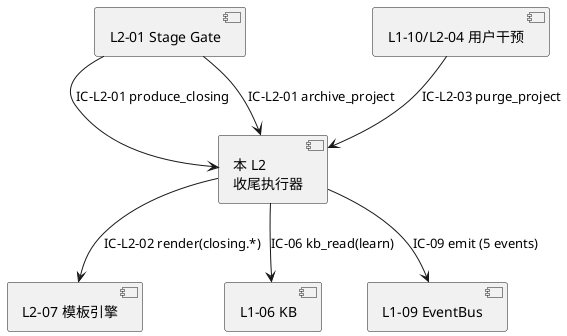
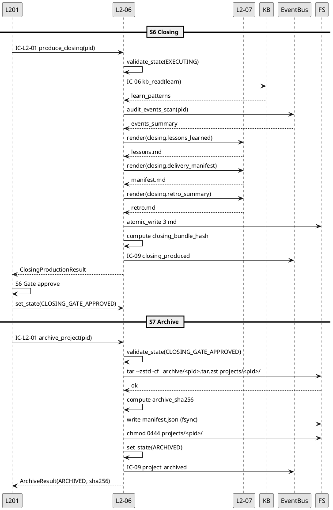
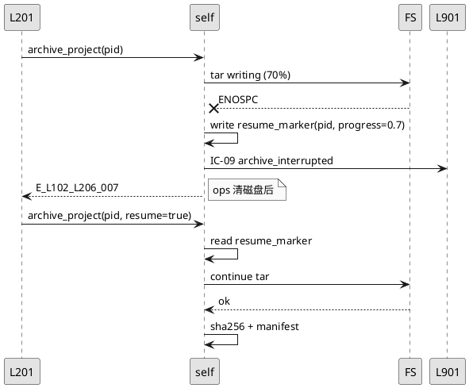
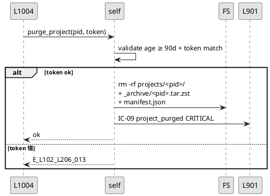
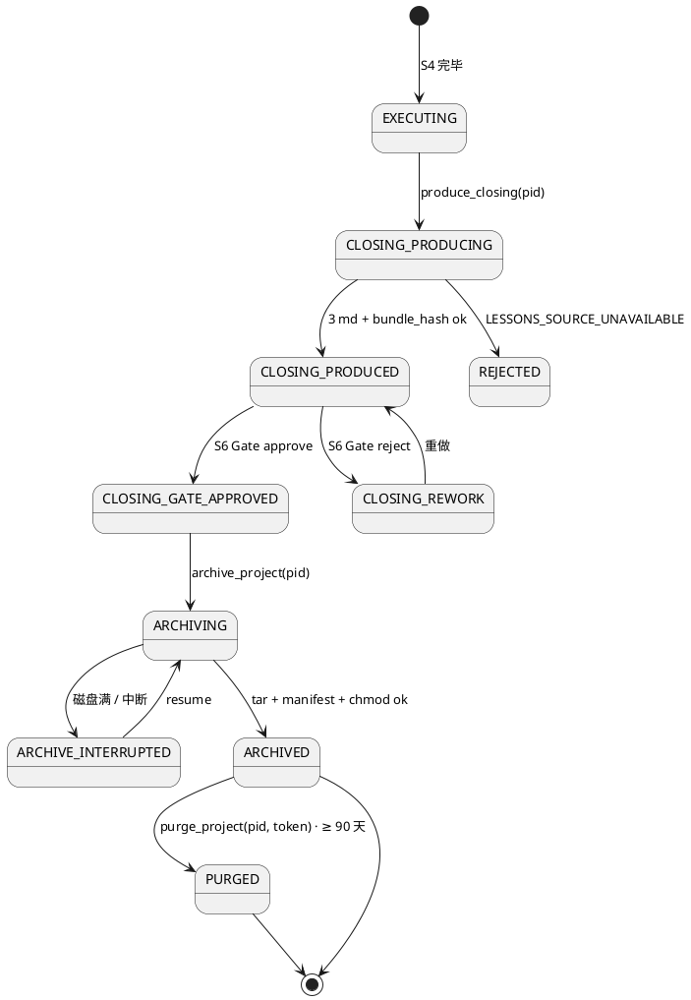
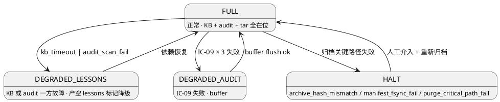

# L1-02 L2-06 · 收尾阶段执行器 · Tech Design

> **本文档定位**：L1-02 L2-06 S6/S7 收尾与归档阶段执行 Application Service。
> **PM-14 所有权硬声明**：本 L2 是 **project_id 归档 + 删除**的唯一入口（L2-02 对应创建入口）。

---

## §0 撰写进度

- [x] §1 定位 + 2-prd 映射
- [x] §2 DDD 映射（BC-02 · Aggregate Root = ProjectClosing）
- [x] §3 对外接口定义
- [x] §4 接口依赖
- [x] §5 P0/P1 时序图
- [x] §6 内部核心算法
- [x] §7 底层数据表 / schema
- [x] §8 状态机
- [x] §9 开源最佳实践调研
- [x] §10 配置参数清单
- [x] §11 错误处理 + 降级策略
- [x] §12 性能目标
- [x] §13 与 2-prd / 3-2 TDD 的映射表

---

## §1 定位 + 2-prd 映射

### 1.1 本 L2 在 L1-02 的坐标

**L2-06 是 S6 Closing + S7 Archive 两阶段的执行器**：

- **S6 Closing**：产出 lessons_learned + delivery_manifest + retro_summary（3 份 md · 经 L2-07）· 进 S6 Gate
- **S7 Archive**：S6 Gate approve 后 · 归档 project_id（state → ARCHIVED）· 打 tar.zst 包

**技术定位一句话** = **"S6/S7 两阶段执行 Application Service · project_id 归档唯一入口 · 3 份收尾产出物 + 交付包打包 + 状态机终态转换 + 审计全链"**。

### 1.2 2-prd §5.2 L2-06 精确映射

| 2-prd §5.2 子节 | 本文档位置 | 技术映射 |
|:---|:---|:---|
| §5.2.6.1 职责 | §1.1 + §2.1 | S6 lessons + S7 归档 |
| §5.2.6.2 输入 / 输出 | §3.2 / §3.3 | `produce_closing` / `archive_project` |
| §5.2.6.3 边界 | §1.4 / §11 | 仅接 L2-01 调 · 不重做 4 件套 |
| §5.2.6.4 约束 PM-14 | §1.4 | 归档/删除唯一入口 |
| §5.2.6.5 禁止 | §11 `UNAUTHORIZED_CLOSE` | 非 L2-01 调 · 跳 S5 Gate · 伪造 lessons |
| §5.2.6.6 必须 | §6 算法 | 发 project_archived 事件 · tar.zst 包 |
| §5.2.6.7 IC | §3 / §4 / §13 | IC-L2-01 接收 · IC-09 审计 |

### 1.3 关键技术决策

| D# | 决策 | 选择 | 理由 |
|:---|:---|:---|:---|
| D1 | 归档格式 | `tar.zst` | 比 tar.gz 省 30% 空间 · 快速解压 |
| D2 | 归档内容 | `projects/<pid>/` 全目录 + manifest.json | 一次打全 · 含所有阶段产出 |
| D3 | 归档后冷却期 | 90 天（purge 最小年龄） | GDPR 合规 · 保留审计窗口 |
| D4 | state 终态 | `ARCHIVED` 不可逆（除 ops restore） | 防止误改已归档 project |
| D5 | lessons 数据源 | L1-06 KB learn 层 + L1-09 审计事件聚合 | 真实数据 · 禁主观填写 |

### 1.4 PM-14 归档所有权硬锁

- 本 L2 是 project state `EXECUTING → CLOSING_PRODUCED → CLOSING_GATE_APPROVED → ARCHIVED` 转换链条的唯一执行方
- 归档校验：`state=CLOSING_GATE_APPROVED` 才允许 archive（防跳 S6 Gate）
- 归档后：project 目录 chmod 0444（read-only）
- manifest 含 sha256 · 后续可验证完整性

### 1.5 YAGNI

- 归档包 S3/OSS 远程上传（V1 本地 FS）
- 跨 project 批量归档
- 增量归档（全量打包）

---

## §2 DDD 映射

- **Bounded Context**：BC-02（与 L1-02 其他 L2 同 BC）
- **Aggregate Root**：`ProjectClosing`
- **Entities**：`LessonsLearned` / `DeliveryManifest` / `RetroSummary` / `ArchiveBundle`
- **Domain Events**：`closing_started` / `lessons_written` / `delivery_packaged` / `project_archived` / `project_purged`

### 2.2 不变量（I-L206-01~06）

| ID | 不变量 |
|:---|:---|
| I-L206-01 | 归档前必经 S6 Gate approve（非 L2-01 调拒绝） |
| I-L206-02 | 归档 manifest sha256 必与实际 tar.zst 匹配 |
| I-L206-03 | `state=ARCHIVED` 后 project 目录 read-only |
| I-L206-04 | lessons 数据源必真实（KB + audit）· 禁造假 |
| I-L206-05 | purge_project 需双重确认 · 防误删 |
| I-L206-06 | 归档失败可 resume · 不丢已打部分 |

---

## §3 对外接口定义

### 3.1 方法清单

| 方法 | IC | 调用方 |
|:---|:---|:---|
| `produce_closing(pid)` | IC-L2-01 | L2-01 触发 S6 |
| `archive_project(pid)` | IC-L2-01 | L2-01 S6 Gate approve 后触发 S7 |
| `purge_project(pid, confirm_token)` | IC-L2-03 | L1-10/L2-04 用户干预（≥ 90 天） |
| `restore_archive(pid)` | 内部 | ops 工具 · 不走 IC |

### 3.2 `produce_closing` 入参 / 出参

**入参**：

```yaml
request_id: string
project_id: string                    # PM-14 必填 · state=EXECUTING
trigger_stage: "S6"
closing_scope:
  include_lessons: bool               # 默认 true
  include_delivery_manifest: bool     # 默认 true
  include_retro: bool                 # 默认 true
lessons_source:
  kb_learn_layer_enabled: bool        # L1-06 学到的 pattern
  audit_events_enabled: bool          # L1-09 审计统计
  timespan_days: int                  # 时间窗 · 默认全 project 生命周期
```

**出参 `ClosingProductionResult`**：

```yaml
project_id: string
state: "CLOSING_PRODUCED"
closing_files:
  - "projects/<pid>/closing/lessons_learned.md"
  - "projects/<pid>/closing/delivery_manifest.md"
  - "projects/<pid>/closing/retro_summary.md"
closing_bundle_hash: string           # 3 md 合并 sha256
evidence_ref: string                  # 给 L2-01 装 S6 Gate evidence
emitted_events: [string]
```

### 3.3 `archive_project` 入参 / 出参

```yaml
request_id: string
project_id: string                    # state=CLOSING_GATE_APPROVED
archive_options:
  compression: "zstd" | "gzip"        # 默认 zstd
  compression_level: int              # zstd 默认 19 · 范围 1-22
  include_media: bool                 # 默认 true
```

```yaml
project_id: string
state: "ARCHIVED"
archive_path: string                  # projects/_archive/<pid>.tar.zst
archive_sha256: string
archive_size_bytes: int
manifest_path: string
archived_at: string
```

### 3.4 错误码（≥ 15 条 · 四列）

| errorCode | meaning | trigger | callerAction |
|:---|:---|:---|:---|
| `E_L102_L206_001` | PM14_OWNERSHIP_VIOLATION · 非 L2-01 调 | 越权 | 拒绝 · 审计 ERROR |
| `E_L102_L206_002` | WRONG_STATE · state 不符 | state=DRAFT 调 produce_closing | 拒绝 |
| `E_L102_L206_003` | S5_GATE_NOT_PASSED · state ≠ EXECUTING | S5 未完成 | 拒绝 |
| `E_L102_L206_004` | S6_GATE_NOT_APPROVED · 未过 S6 就 archive | state ≠ CLOSING_GATE_APPROVED | 拒绝 |
| `E_L102_L206_005` | LESSONS_SOURCE_UNAVAILABLE · KB + audit 都不可达 | 依赖全故障 | 降级或要求重试 |
| `E_L102_L206_006` | CLOSING_BUNDLE_HASH_FAIL · 3 md 合并 hash 失败 | 文件损坏 | 重算 · 失败 HALT |
| `E_L102_L206_007` | ARCHIVE_WRITE_FAIL · tar.zst 写失败 | 磁盘满 / 权限 | 重试 1 次 · 写 resume marker |
| `E_L102_L206_008` | ARCHIVE_HASH_MISMATCH · 复验 sha256 不符 | 写入期间被改 | HALT · 重打 |
| `E_L102_L206_009` | ARCHIVE_TOO_LARGE · 超 `max_archive_gb` | media 过多 | 拒绝 · 要求缩减 |
| `E_L102_L206_010` | MANIFEST_WRITE_FAIL · manifest.json fsync 失败 | 磁盘异常 | HALT |
| `E_L102_L206_011` | READONLY_CHMOD_FAIL · chmod 0444 失败 | 文件系统权限 | warn · 不 block |
| `E_L102_L206_012` | PURGE_TOO_SOON · 归档 < 90 天 | 调用方传错 | 拒绝 · 等够 |
| `E_L102_L206_013` | PURGE_CONFIRM_MISMATCH · token 错 | 双重确认失败 | 拒绝 · UI 重确认 |
| `E_L102_L206_014` | AUDIT_SEED_EMIT_FAIL | EventBus 不可达 | buffer |
| `E_L102_L206_015` | RESUME_ARCHIVE_CORRUPT · 续做前半成品损坏 | 中断后外部改 | 拒绝 · 整批重做 |

---

## §4 接口依赖

### 4.1 上游

| 调用方 | 方法 | 频次 |
|:---|:---|:---|
| L2-01 Stage Gate | `produce_closing(pid)` | 1/project（S6）|
| L2-01 Stage Gate | `archive_project(pid)` | 1/project（S7）|
| L1-10/L2-04 用户干预 | `purge_project(pid, token)` | 0-1/project |

### 4.2 下游

| 被调方 | 目的 | 契约 |
|:---|:---|:---|
| L2-07 模板引擎 | 渲染 3 份收尾 md | IC-L2-02 |
| L1-06/L2-02 KB 读 | 读 learn 层 | IC-06 |
| L1-09/L2-01 EventBus | emit 事件 | IC-09 |
| 文件系统 | tar.zst 打包 · chmod | 本地 |

### 4.3 PlantUML



---

## §5 P0/P1 时序图

### 5.1 P0 · S6 + S7 完整主干



### 5.2 P1 · 归档中断 + resume



### 5.3 P1 · purge 双重确认



---

## §6 内部核心算法

### 6.1 算法 1 · `produce_closing`

```python
async def produce_closing(pid: str) -> ClosingProductionResult:
    validate_pm14_caller()
    state = read_state(pid)
    if state != "EXECUTING":
        raise E_L102_L206_002
    
    # 1. 读 KB learn 层
    try:
        learn_patterns = await ic_06_kb_read(pid, layer="learn")
    except KBError:
        learn_patterns = []
        emit_event(pid, "lessons_source_degraded", {"source": "kb"})
    
    # 2. 读 audit
    try:
        events_summary = await scan_audit_events(pid)
    except AuditError:
        events_summary = {}
        emit_event(pid, "lessons_source_degraded", {"source": "audit"})
    
    if not learn_patterns and not events_summary:
        raise E_L102_L206_005
    
    # 3. 渲染 3 md（via L2-07）
    slots = {"project_id": pid, "learn_patterns": learn_patterns,
             "events_summary": events_summary, "closed_at": now_iso()}
    
    lessons_md = await ic_l207_render("closing.lessons_learned", slots, pid)
    manifest_md = await ic_l207_render("closing.delivery_manifest",
                                        {**slots, "deliverables": list_deliverables(pid)}, pid)
    retro_md = await ic_l207_render("closing.retro_summary",
                                     {**slots, "retro_data": aggregate_retro(pid)}, pid)
    
    # 4. 落盘
    for name, md in [("lessons_learned", lessons_md),
                     ("delivery_manifest", manifest_md),
                     ("retro_summary", retro_md)]:
        atomic_write(f"projects/{pid}/closing/{name}.md", md.output)
    
    # 5. bundle_hash
    bundle_hash = compute_closing_bundle_hash(pid)
    
    # 6. 状态 + 事件
    write_state(pid, "CLOSING_PRODUCED")
    emit_event(pid, "closing_produced", {"bundle_hash": bundle_hash})
    
    return ClosingProductionResult(
        project_id=pid, state="CLOSING_PRODUCED",
        closing_files=[...], closing_bundle_hash=bundle_hash,
        evidence_ref=f"s6-evidence:{pid}:{bundle_hash[:8]}",
    )
```

### 6.2 算法 2 · `archive_project`

```python
def archive_project(pid: str, options: dict = None) -> ArchiveResult:
    validate_pm14_caller()
    state = read_state(pid)
    if state != "CLOSING_GATE_APPROVED":
        raise E_L102_L206_004
    
    options = options or {}
    src = f"projects/{pid}/"
    dst = f"projects/_archive/{pid}.tar.zst"
    
    # 预检大小
    if get_dir_size_gb(src) > max_archive_gb:
        raise E_L102_L206_009
    
    # resume 检查
    resume_marker = f"projects/_archive/.{pid}.resume"
    has_resume = os.path.exists(resume_marker)
    
    try:
        subprocess.run(
            ["tar", "--zstd", "-cf", dst, src],
            check=True, timeout=archive_timeout_sec,
        )
    except subprocess.CalledProcessError as e:
        if "No space left" in str(e.stderr):
            write_resume_marker(pid, "write_interrupted")
            emit_event(pid, "archive_interrupted")
            raise E_L102_L206_007
        raise
    
    # 复验 sha256
    archive_sha256 = sha256_file(dst)
    
    # manifest
    manifest = {
        "project_id": pid,
        "archive_path": dst,
        "archive_sha256": archive_sha256,
        "archive_size_bytes": os.path.getsize(dst),
        "archived_at": now_iso(),
        "state_before": state,
        "closing_bundle_hash": read_closing_bundle_hash(pid),
    }
    atomic_write_json(f"projects/_archive/{pid}.manifest.json", manifest, fsync=True)
    
    # 复验
    if sha256_file(dst) != archive_sha256:
        raise E_L102_L206_008
    
    # chmod readonly
    try:
        chmod_readonly_recursive(src)
    except OSError:
        emit_event(pid, "chmod_readonly_fail_warn")
    
    # state 转换
    write_state(pid, "ARCHIVED", fsync=True)
    
    # 清 resume marker
    if os.path.exists(resume_marker):
        os.remove(resume_marker)
    
    emit_event(pid, "project_archived", {"archive_sha256": archive_sha256})
    
    return ArchiveResult(project_id=pid, state="ARCHIVED",
                        archive_path=dst, archive_sha256=archive_sha256,
                        manifest_path=f"projects/_archive/{pid}.manifest.json",
                        archived_at=manifest["archived_at"])
```

### 6.3 算法 3 · `purge_project` 双重确认

```python
def purge_project(pid: str, confirm_token: str) -> PurgeResult:
    manifest = read_archive_manifest(pid)
    if not manifest:
        raise E_L102_L206_002
    
    archive_age = now() - parse_iso(manifest["archived_at"])
    if archive_age.days < purge_min_age_days:
        raise E_L102_L206_012
    
    expected_token = compute_purge_confirm_token(pid, manifest)
    if confirm_token != expected_token:
        raise E_L102_L206_013
    
    # 彻底删除
    shutil.rmtree(f"projects/{pid}/")
    os.remove(manifest["archive_path"])
    os.remove(f"projects/_archive/{pid}.manifest.json")
    
    emit_event(pid, "project_purged", {
        "archived_at": manifest["archived_at"],
        "archive_sha256": manifest["archive_sha256"],
    })
    return PurgeResult(project_id=pid, purged_at=now_iso())
```

### 6.4 算法 4 · `aggregate_retro`

```python
def aggregate_retro(pid: str) -> dict:
    """从 L1-09 审计事件聚合 retro 统计"""
    events = read_all_events(pid)
    return {
        "total_duration_days": (events[-1].ts - events[0].ts).days,
        "stage_transitions": count_by_type(events, "stage_transition"),
        "gate_rejects": count_by_type(events, "gate_rejected"),
        "rework_count_by_phase": aggregate_rework(events),
        "skills_invoked": count_unique_skills(events),
        "subagent_spawn_count": count_by_type(events, "subagent_spawned"),
        "degradation_events": count_by_severity(events, ["DEGRADED", "HALT"]),
        "total_tokens_used": sum_llm_tokens(events),
    }
```

### 6.5 算法 5 · `compute_closing_bundle_hash`

```python
def compute_closing_bundle_hash(pid: str) -> str:
    files = ["lessons_learned.md", "delivery_manifest.md", "retro_summary.md"]
    chunks = [read_file(f"projects/{pid}/closing/{fn}").strip() for fn in files]
    combined = "\n---CLOSING---\n".join(chunks).encode("utf-8")
    return hashlib.sha256(combined).hexdigest()
```

---

## §7 底层数据表 / schema

### 7.1 物理目录

```
projects/<pid>/
├── closing/
│   ├── lessons_learned.md
│   ├── delivery_manifest.md
│   └── retro_summary.md
└── meta/
    └── state.json                    # 终态 = ARCHIVED

projects/_archive/
├── <pid>.tar.zst                     # 归档包
├── <pid>.manifest.json
└── .<pid>.resume                     # resume marker（失败时）
```

### 7.2 `manifest.json` schema

```yaml
project_id: string
archive_path: string
archive_sha256: string
archive_size_bytes: int
archived_at: string                   # ISO-8601
state_before: string                  # 恒为 CLOSING_GATE_APPROVED
closing_bundle_hash: string
contents_summary:
  total_files: int
  total_size_bytes: int
  by_stage:
    s1_kickoff: int
    s2_planning: int
    s3_tdd: int
    s4_executing: int
    s5_quality: int
    s6_closing: int
engine_version: string
```

### 7.3 resume marker schema

```yaml
project_id: string
interrupted_at: string
progress: float                       # 0.0-1.0
error: string
last_success_step: string
```

---

## §8 状态机



### 8.2 转换表

| 源 | 目 | 触发 | guard |
|:---|:---|:---|:---|
| EXECUTING | CLOSING_PRODUCING | `produce_closing` | L2-01 调 + state 对 |
| CLOSING_PRODUCING | CLOSING_PRODUCED | 3 md ok | bundle_hash 成功 |
| CLOSING_PRODUCED | CLOSING_GATE_APPROVED | L2-01 S6 Gate approve | S6 evidence 齐 |
| CLOSING_GATE_APPROVED | ARCHIVING | `archive_project` | tar 启动 |
| ARCHIVING | ARCHIVED | tar + manifest + chmod ok | sha256 复验 ok |
| ARCHIVING | ARCHIVE_INTERRUPTED | 磁盘/权限错 | 写 resume marker |
| ARCHIVED | PURGED | `purge_project` + token | age ≥ 90d |

---

## §9 开源最佳实践调研

### 9.1 tar + zstd · 事实标准

- **zstd**：Facebook BSD · 25k+ stars · 高压缩比 + 快解压
- **Adopt**：直接用 `tar --zstd` 原生支持（tar 1.31+）
- **Learn**：level 19 是质量 vs 速度平衡点
- **Reject**：不采 7-zip（跨平台依赖差）

### 9.2 etcd Snapshot · 48k stars · Apache 2.0

- **URL**：`https://github.com/etcd-io/etcd`
- **核心**：分布式 kv 的 snapshot + restore 模型
- **Adopt**：manifest + sha256 + version 设计（本 L2 `manifest.json` 对齐）
- **Learn**：restore 子命令独立（本 L2 `restore_archive` 仅 ops 用）
- **Reject**：不采分布式 Raft log（本 L2 单机）

### 9.3 restic · 30k stars · BSD

- **URL**：`https://github.com/restic/restic`
- **核心**：增量/去重备份（chunk-based）
- **Adopt** V2：manifest + chunk 去重（V1 简单 tar.zst 够）
- **Reject** V1：引入 Go 依赖 · 过度工程

### 9.4 Python stdlib `shutil.make_archive` + `zstandard` 库

- **Adopt**：zstandard Python 绑定作为 tar 命令的备用（主要用 subprocess tar 为简）

---

## §10 配置参数清单

| 参数名 | 默认 | 范围 | 意义 |
|:---|:---|:---|:---|
| `archive_format` | `tar.zst` | `tar.zst`/`tar.gz` | 归档格式 |
| `archive_compression_level` | 19 | 1-22 | zstd 压缩等级 |
| `archive_timeout_sec` | 600 | 60-3600 | 单次归档超时 |
| `max_archive_gb` | 20 | 1-100 | 归档大小上限 |
| `archive_manifest_fsync` | **true** | const | manifest.json fsync · 硬开 |
| `archive_chmod_readonly` | **true** | const | 归档后 chmod 0444 · 硬开 |
| `archive_hash_recheck` | **true** | const | 归档后复验 sha256 · 硬开 |
| `purge_min_age_days` | 90 | 30-365 | purge 最小归档年龄 |
| `purge_double_confirm` | **true** | const | purge 双重确认 · 硬开 |
| `lessons_kb_timeout_sec` | 10 | 1-60 | KB read 超时 |
| `lessons_audit_timeout_sec` | 20 | 1-60 | audit scan 超时 |
| `resume_enabled` | `true` | bool | 允许 resume |
| `state_transition_fsync` | **true** | const | 状态转换 fsync · 硬开 |
| `retro_events_window_days` | 0 | 0-365 | retro 统计窗口（0=全生命周期）|
| `archive_parallel_limit` | 2 | 1-4 | 并发归档数 |

**硬限配置** 5 项（const）启动校验。

---

## §11 错误处理 + 降级策略

### 11.1 降级链（3 级）



### 11.2 与 L1-07 协同

- HALT 发 IC-06 硬红线
- 归档 resume 不算 HALT（可恢复）
- `purge_project` 发 IC-09 CRITICAL 事件（不可逆 · 特别审计）

### 11.3 降级透明

DEGRADED_LESSONS 产出的 md frontmatter：

```yaml
degraded: true
degraded_reason: "kb_unavailable"
lessons_completeness: 0.5             # 0.0-1.0
```

---

## §12 性能目标

### 12.1 SLO

| 指标 | P50 | P95 | P99 | 硬上限 |
|:---|---:|---:|---:|---:|
| `produce_closing` 全链 | 5s | 15s | 30s | 60s |
| 单 md 渲染（via L2-07）| 100ms | 300ms | 800ms | 2s |
| `archive_project` 小 project（< 500MB） | 20s | 60s | 120s | 300s |
| `archive_project` 中（500MB-5GB） | 2min | 5min | 10min | 20min |
| `archive_project` 大（5-20GB） | 3min | 8min | 15min | 30min |
| archive sha256 计算 | 磁盘 IO bound | — | — | 5min |
| `purge_project` | 5s | 20s | 60s | 120s |

### 12.2 吞吐

- 单 instance 并发 archive：**2**（IO bound）
- 单 instance 并发 produce_closing：**5**

### 12.3 Prometheus 指标

- `l102_l206_closing_total{status}` counter
- `l102_l206_archive_total{status,size_bucket}` counter
- `l102_l206_archive_duration_seconds` histogram
- `l102_l206_archive_size_bytes` histogram
- `l102_l206_purge_total` counter
- `l102_l206_degradation_state{state}` gauge

---

## §13 与 2-prd / 3-2 TDD 的映射表

### 13.1 反向映射到 2-prd

| 本 L2 接口/行为 | `docs/2-prd/L1-02项目生命周期编排/prd.md` | 硬约束 |
|:---|:---|:---|
| `produce_closing` | §5.2.6.2 S6 产出 | 3 份 md 必齐 |
| `archive_project` | §5.2.6.2 S7 归档 | sha256 复验必做 |
| PM-14 归档所有权 | §8.10.9 | 本 L2 唯一归档入口 |
| `purge_project` 90 天 | §5.2.6.4 约束 | 未满 90 天拒绝 |
| state=ARCHIVED 不可写 | §5.2.6.6 必须 | chmod 0444 |
| lessons 数据源必真实 | §5.2.6.5 禁止 1 | KB + audit 两源 |

### 13.2 前向映射到 3-2 TDD

路径：`docs/3-2-Solution-TDD/L1-02-项目生命周期编排/L2-06-收尾阶段执行器-tests.md`（待建）

| TC ID | 场景 | 类型 |
|:---|:---|:---|
| `TC-L102-L206-001` | 正向 · S6 produce + S7 archive 全链 · state=ARCHIVED | e2e |
| `TC-L102-L206-002` | state=DRAFT 调 produce_closing · E002 WRONG_STATE | unit |
| `TC-L102-L206-003` | PM-14 越权 · E001 | unit |
| `TC-L102-L206-004` | S6 Gate 未 approve 就 archive · E004 | unit |
| `TC-L102-L206-005` | KB + audit 都不可达 · E005 | integration |
| `TC-L102-L206-006` | KB 可达 + audit 不可达 · DEGRADED_LESSONS · 继续 | integration |
| `TC-L102-L206-007` | archive 70% ENOSPC · E007 · resume marker | integration |
| `TC-L102-L206-008` | resume 续做成功 · 最终 sha256 正确 | integration |
| `TC-L102-L206-009` | archive 复验 sha256 mismatch · HALT · E008 | integration |
| `TC-L102-L206-010` | archive 超 20GB · E009 | unit |
| `TC-L102-L206-011` | manifest.json fsync 失败 · HALT · E010 | integration |
| `TC-L102-L206-012` | chmod 0444 失败 · warn 不 block · 归档仍 COMPLETE | integration |
| `TC-L102-L206-013` | purge < 90 天 · E012 | unit |
| `TC-L102-L206-014` | purge confirm_token 错 · E013 | unit |
| `TC-L102-L206-015` | purge 双重确认通过 · 目录 + archive 彻底删除 | integration |
| `TC-L102-L206-016` | ARCHIVED state 再次调 archive · 拒绝 | unit |
| `TC-L102-L206-017` | retro aggregate 事件统计正确 | unit |
| `TC-L102-L206-018` | SLO · produce_closing P95 < 15s | perf |
| `TC-L102-L206-019` | SLO · 500MB archive P95 < 60s | perf |
| `TC-L102-L206-020` | e2e · 完整 S1-S7 + archive + 90 天后 purge | e2e |

### 13.3 ADR 与 OQ

**ADR-L206-01**：**zstd level 19 默认** —— 压缩比 vs 速度平衡点（level 22 收益 < 5% 但慢 3x）。

**ADR-L206-02**：**归档后 chmod 0444** —— 防外部篡改 · 保 sha256 manifest 永久有效。

**ADR-L206-03**：**purge 需 90 天冷却 + 双重确认** —— 归档是不可逆终态但保留审计/合规窗口；双重确认防误删。

**OQ-L206-01**：归档包是否上传 S3/OSS？V1 本地 · V2 评估。

**OQ-L206-02**：跨 project 批量归档是否并发？V1 1 次 1 个 · 简单安全。

### 13.4 相关 IC

- **IC-01** 主状态机：L2-01 驱动 · 本 L2 `EXECUTING → CLOSING_PRODUCED → CLOSING_GATE_APPROVED → ARCHIVED`
- **IC-06** 硬红线：本 L2 → L1-07（HALT / purge CRITICAL）
- **IC-09** 审计：本 L2 → L1-09（5 种事件）
- **IC-17** Gate 证据：本 L2 → L2-01（S6 evidence）
- **IC-L2-01** produce_closing / archive_project：L2-01 → 本 L2
- **IC-L2-02** 模板渲染：本 L2 → L2-07
- **IC-L2-03** purge：L1-10/L2-04 → 本 L2

---

*— L1-02 L2-06 收尾阶段执行器 · Tech Design · depth-B (v1.0) · §1-§13 全段完结 —*
