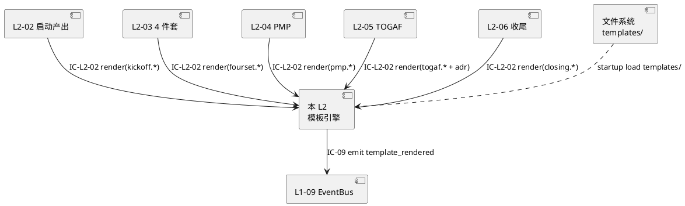
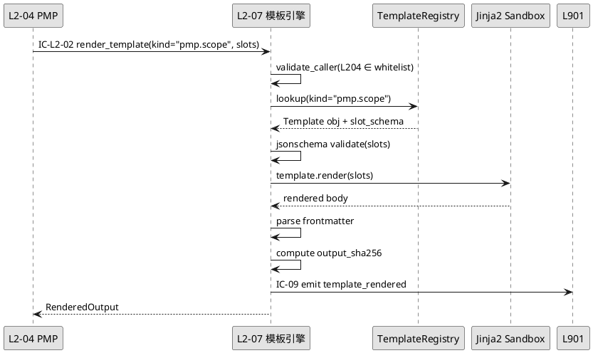
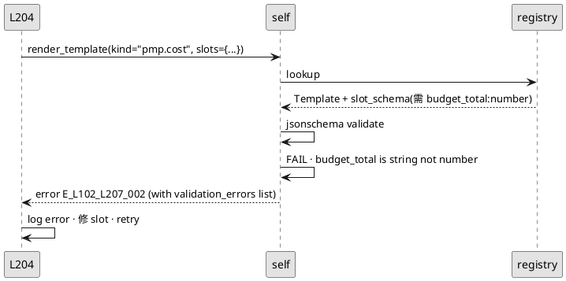
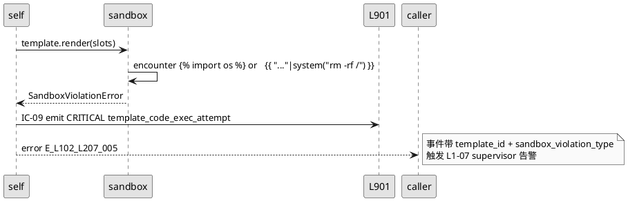
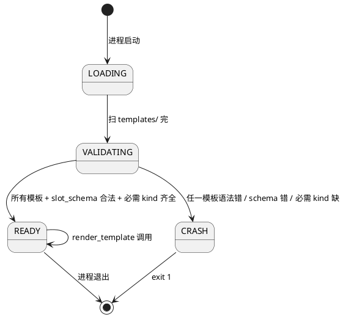
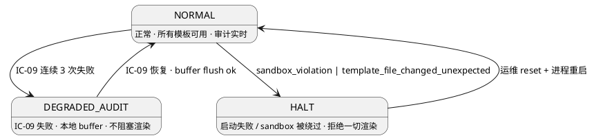

# L1-02 L2-07 · 产出物模板引擎 · Tech Design

> **本文档定位**：L1-02 项目生命周期编排 L2-07 产出物模板引擎技术实现方案（L2 粒度）。
> **与产品 PRD 的分工**：`docs/2-prd/L1-02项目生命周期编排/prd.md` §5.2 L2-07 定义产品边界，本文档定义技术实现（字段级接口 + 算法伪代码 + schema + 状态机 + 配置）。
> **严格规则**：本文档不复述产品 PRD 文字（职责 / 禁止 / 必须清单），只做技术映射 + 补齐 PRD 未说的工程细节。

---

## §0 撰写进度

- [x] §1 定位 + 2-prd 映射
- [x] §2 DDD 映射（BC-02 · Domain Service · 无状态）
- [x] §3 对外接口定义（字段级 YAML + 错误码）
- [x] §4 接口依赖（被谁调 · 调谁）
- [x] §5 P0/P1 时序图（PlantUML × 3）
- [x] §6 内部核心算法（伪代码）
- [x] §7 底层数据表 / schema 设计
- [x] §8 状态机（无状态 · 仅渲染生命周期子状态）
- [x] §9 开源最佳实践调研
- [x] §10 配置参数清单
- [x] §11 错误处理 + 降级策略
- [x] §12 性能目标
- [x] §13 与 2-prd / 3-2 TDD 的映射表

---

## §1 定位 + 2-prd 映射

### 1.1 本 L2 在 L1-02 中的坐标

**L2-07 是 L1-02 的公共模板装配器**，被以下 L2 调用（IC-L2-02）：

- L2-02 启动阶段产出器（章程模板 × 2：Goal/Scope）
- L2-03 4 件套生产器（4 模板：scope/prd/plan/tdd）
- L2-04 PMP 9 计划生产器（9 kda 模板）
- L2-05 TOGAF ADM 架构生产器（9-10 Phase 模板）
- L2-06 收尾阶段执行器（lessons learned / 交付包清单模板）

**技术定位一句话** = **"Jinja2-like 模板引擎的安全子集 + 变量槽注入 + frontmatter 校验 + 渲染后 hash 记录 · 无状态 Domain Service · 不持有 project 状态 · 每次调用独立幂等"**。

### 1.2 2-prd §5.2 L2-07 精确映射

| 2-prd §5.2 子节 | 本文档位置 | 技术映射 |
|:---|:---|:---|
| §5.2.7.1 职责 | §1.1 + §2.1 | 模板注册/加载/渲染/校验/hash |
| §5.2.7.2 入参 / 出参 | §3.2 / §3.3 | `render_template(kind, slots)` |
| §5.2.7.3 边界 | §1.4 / §11 | 禁用 Turing-complete · 不持 project 状态 |
| §5.2.7.4 约束（3 硬）| §10 + §2.3 | 模板版本 pin / slot schema / sandbox |
| §5.2.7.5 禁止行为 | §11 `TEMPLATE_CODE_EXEC` 错误码 | 禁执行 Python · 禁 shell · 禁网络 |
| §5.2.7.6 必须义务 | §6 算法 + §3 必填 | 渲染后 hash 写 frontmatter |
| §5.2.7.7 IC 关系 | §3 / §4 / §13 | IC-L2-02（被动接收） |
| §5.2.7.8 G-W-T 验证大纲 | §13 TC ID 矩阵 | 映射 TC-L102-L207-* |

### 1.3 关键技术决策

| D# | 决策 | 选择 | 备选 | 理由 |
|:---|:---|:---|:---|:---|
| D1 | 模板引擎 | **Jinja2 sandboxed + 自定义受限 filter 集** | Mustache / Handlebars / 自研 | Python 原生 · 安全子集成熟 · filter 可白名单 |
| D2 | 模板存储 | yaml + md 双模式（frontmatter YAML + 正文 Jinja2）| 单一 yaml · 单一 md | md 人类可读 · yaml 结构化 · 复用现有 PM-14 规范 |
| D3 | 变量 slot 校验 | 启动时基于 jsonschema 校验 slot 定义 | 运行时校验 · 无校验 | 早失败 · 模板坏在启动即 crash |
| D4 | 渲染后 hash | sha256(frontmatter normalized + body rendered) | hash body only · hash all raw | 保证产物可验证 · 但 frontmatter 的 updated_at 要规范化 |
| D5 | 热更新 | 不支持（模板在启动时 pin 版本）| 支持热更新 | 模板变化导致跨 project 产出不一致 · 生产上线前固定版本 |
| D6 | 并发模型 | 无锁（模板对象只读 · 渲染是纯函数）| 读写锁 | Jinja2 Template 对象线程安全 |

### 1.4 PM-14 约束的技术落实

- 本 L2 **不创建/修改/归档** project_id（无状态）
- 产出路径由调用方指定 · 本 L2 不直接写文件（返回 rendered string）
- 审计：每次渲染发 IC-09 `L1-02/L2-07:template_rendered`（含 template_id / slots hash / output hash）

### 1.5 与兄弟 L2 的边界

| 兄弟 L2 | 本 L2 提供 | 本 L2 不提供 |
|:---|:---|:---|
| L2-02 | Goal.md / PrdScope.md 模板渲染 | atomic_write 落盘（L2-02 自己做） |
| L2-03 | 4 件套模板渲染 | 4 件套交叉引用校验（L2-03 自己做） |
| L2-04 | 9 kda 模板渲染 | kda 间一致性（L2-04 负责） |
| L2-05 | 9 Phase 模板渲染 + ADR 模板 | TOGAF×PMP 矩阵（L2-05 自己做） |
| L2-06 | lessons learned / 交付清单 模板 | 归档操作（L2-06 负责） |

### 1.6 YAGNI 禁止清单（P1 延后）

- 模板 A/B 测试（不同 profile 渲染对比）
- 模板可视化编辑器（给非技术用户）
- 跨 project 模板共享（全局模板库）
- 模板 diff 审计 UI

---

## §2 DDD 映射（BC-02 · Domain Service · 无状态）

### 2.1 DDD 分类

- **Bounded Context**：BC-02 项目生命周期编排（与 L2-01~L2-06 同 BC）
- **DDD 角色**：**Domain Service**（无状态 · 纯函数）
- **Aggregate Root**：无（本 L2 不持有领域对象状态）
- **Value Objects**：`TemplateId` / `RenderedOutput` / `SlotSet`
- **Domain Events**：`L1-02/L2-07:template_rendered` / `template_validation_failed` / `template_version_mismatch`

### 2.2 不变量（I-L207-01~05）

| ID | 不变量 |
|:---|:---|
| I-L207-01 | 同一 template_id + slots → 永远同一 output hash（幂等） |
| I-L207-02 | 模板必经 sandbox（禁任意代码执行） |
| I-L207-03 | 渲染结果必含 frontmatter · frontmatter 必含 template_version |
| I-L207-04 | slot 值类型必匹配 schema（startup validate） |
| I-L207-05 | 本 L2 不做 IO · 返回 string 给调用方落盘 |

### 2.3 Repository 模式

- `TemplateRegistry`：in-memory 加载所有模板（启动时）· 只读访问
- `TemplateLoader`：从 `templates/` 目录加载 + jsonschema 校验 slot 定义

---

## §3 对外接口定义（字段级 YAML schema + 错误码）

### 3.1 方法清单

| 方法 | IC | 调用方 | 目的 |
|:---|:---|:---|:---|
| `render_template(kind, slots, pid)` | IC-L2-02 | L2-02/03/04/05/06 | 渲染指定模板 · 返回 md string |
| `list_available_templates()` | 内部 | 调用方查询 | 返回所有已注册模板 kind |
| `get_template_version(kind)` | 内部 | 调用方查询 | 返回模板当前 pin 版本 |
| `validate_slots(kind, slots)` | 内部 | 调用方预校验 | 不渲染仅校验 · 用于调用前检查 |

### 3.2 `render_template` 入参 schema

```yaml
request_id: string                    # ULID · 调用方生成
project_id: string                    # PM-14 必填 · 仅用于审计 · 本 L2 不用它做状态
kind: enum                            # 见 §3.5 已注册 kind 清单
slots:                                # 变量槽 map · 按 kind 的 slot_schema 校验
  <key>: <value>                      # value 类型由 slot_schema 定义
caller_l2: string                     # 调用方 L2 身份（L2-02 / L2-03 / ...）· 审计用
timeout_ms: int                       # 默认 2000 · 上限 10000
```

### 3.3 `render_template` 出参 schema (`RenderedOutput`)

```yaml
request_id: string                    # 对齐入参
template_id: string                   # kind + version · e.g. "kickoff.goal.v1.0"
template_version: string              # semver
slots_hash: string                    # slots 规范化后 sha256（32 char 前缀）
output:
  body: string                        # 渲染后的 md 正文（含 frontmatter）
  body_sha256: string                 # 正文 + frontmatter 合并 sha256
  lines: int                          # 行数
frontmatter:                          # 解析出的 frontmatter dict
  doc_id: string
  doc_type: string
  template_id: string                 # 回写到 frontmatter
  template_version: string
  rendered_at: string                 # ISO-8601
rendered_at: string                   # 同上
engine_version: string                # 本 L2 引擎版本
```

### 3.4 错误码（≥ 12 条 · 四列标准）

| errorCode | meaning | trigger | callerAction |
|:---|:---|:---|:---|
| `E_L102_L207_001` | TEMPLATE_NOT_FOUND · kind 未注册 | 调用方拼错 kind | 检查 list_available_templates |
| `E_L102_L207_002` | SLOT_SCHEMA_VIOLATION · slots 不符 schema | 调用方传错类型或缺字段 | 按 jsonschema 修 slots |
| `E_L102_L207_003` | SLOT_REQUIRED_MISSING · 必填 slot 缺 | 调用方漏传 | 补齐必填 slot |
| `E_L102_L207_004` | TEMPLATE_SYNTAX_ERROR · 模板文件 Jinja2 解析失败 | 模板被手工改坏 | 运维修模板 · 启动时即 crash |
| `E_L102_L207_005` | TEMPLATE_CODE_EXEC · 模板尝试执行代码（sandbox 拦截） | 恶意模板或误用 | CRITICAL · 审计 + 拒绝渲染 |
| `E_L102_L207_006` | RENDER_TIMEOUT · 渲染超 timeout_ms | slot 数据过大 / 模板过复杂 | 检查 slot 体积 · 或增加 timeout |
| `E_L102_L207_007` | OUTPUT_TOO_LARGE · 产出超 `max_output_kb` | slot 注入大量内容 | 拒绝 · 要求调用方精简 slot |
| `E_L102_L207_008` | FRONTMATTER_PARSE_FAIL · 渲染后 frontmatter 不合法 | 模板模板错误或 slot 值含控制字符 | 拒绝 · 要求调用方 escape |
| `E_L102_L207_009` | VERSION_MISMATCH · 请求版本 ≠ 当前 pin | 启动后模板文件被改但未重启 | 拒绝 · 运维重启 |
| `E_L102_L207_010` | INVALID_KIND_NAME · kind 命名不符规范 | 调用方 kind 字符集不合 | 拒绝 · 按 `[a-z0-9._-]+` 命名 |
| `E_L102_L207_011` | CALLER_NOT_WHITELISTED · caller_l2 不在允许清单 | 非 L2-02/03/04/05/06 调用 | 拒绝 · 架构违规 |
| `E_L102_L207_012` | SLOTS_HASH_MISMATCH · 调用方预计算 slots_hash 与实际不符 | slot 被中间层篡改 | 拒绝 · 追查篡改点 |
| `E_L102_L207_013` | HASH_COMPUTE_FAIL · output hash 计算异常 | 内存异常 / CPU 硬件问题 | 重试 1 次 · 仍失败则 HALT |
| `E_L102_L207_014` | AUDIT_EMIT_FAIL · IC-09 发送失败 | EventBus 不可达 | buffer 模式 · 继续服务 |

### 3.5 已注册 kind 清单（启动时加载）

| kind | 版本 | slot schema 主字段 | 调用方 |
|:---|:---|:---|:---|
| `kickoff.goal` | v1.0 | user_utterance / goals / deadline | L2-02 |
| `kickoff.scope` | v1.0 | scope_items / out_of_scope / constraints | L2-02 |
| `fourset.scope` / `fourset.prd` / `fourset.plan` / `fourset.tdd` | v1.0 | 各件套专属 slot（详见模板文件）| L2-03 |
| `pmp.integration` / `pmp.scope` / `pmp.schedule` / `pmp.cost` / `pmp.quality` / `pmp.resource` / `pmp.communication` / `pmp.risk` / `pmp.procurement` | v1.0 | kda 专属 slot | L2-04 |
| `togaf.preliminary` / `togaf.phase_a` / `togaf.phase_b` / `togaf.phase_c_data` / `togaf.phase_c_application` / `togaf.phase_d` / `togaf.phase_e` / `togaf.phase_f` / `togaf.phase_g` / `togaf.phase_h` | v1.0 | Phase 专属 slot | L2-05 |
| `togaf.adr` | v1.0 | title / context / decision / alternatives / consequences | L2-05 |
| `closing.lessons_learned` / `closing.delivery_manifest` / `closing.retro_summary` | v1.0 | 收尾 slot | L2-06 |

共 **~27 个模板** · 启动时全部加载到 TemplateRegistry。

---

## §4 接口依赖（被谁调 · 调谁）

### 4.1 上游调用方

| 调用方 | 频次（per project）|
|:---|:---:|
| L2-02 启动阶段产出器 | 2（Goal + Scope 章程） |
| L2-03 4 件套生产器 | 4（scope/prd/plan/tdd） |
| L2-04 PMP 9 计划生产器 | 9（9 kda × 1 次 · rework 时单 kda 重渲染） |
| L2-05 TOGAF ADM 架构生产器 | 8-19（9 Phase + ADR 若干 · 按 profile） |
| L2-06 收尾阶段执行器 | 3（lessons + manifest + retro）|

**单 project 总调用次数：26-37 次**（LIGHT）· 39-60 次（STANDARD）· 50-80 次（HEAVY）。

### 4.2 下游依赖

| 被调方 | 目的 | 契约 |
|:---|:---|:---|
| 文件系统（只读 `templates/` 目录）| 启动时加载模板 | 本地 · 无 IC |
| L1-09/L2-01 EventBus | 发 template_rendered 事件 | IC-09 |
| （无其他下游）| 本 L2 纯计算 | — |

### 4.3 依赖 PlantUML



### 4.4 启动依赖

启动时本 L2 `TemplateLoader` 扫 `templates/` 目录 · 加载所有 `.md` 模板 · 解析 frontmatter 的 `slot_schema` 字段 · jsonschema 校验每个 slot 定义 · 构建 TemplateRegistry。任一模板有语法错或 slot_schema 错 · 启动 crash（fail-fast）。

---

## §5 P0/P1 时序图（PlantUML ≥ 2 张）

### 5.1 P0 · 正常渲染（L2-04 调 render_template）



### 5.2 P1 · slot schema 校验失败



### 5.3 P1 · 模板尝试执行代码（sandbox 拦截）



---

## §6 内部核心算法（伪代码）

### 6.1 算法 1 · `render_template` 主流程

```python
def render_template(request_id: str, project_id: str, kind: str,
                    slots: dict, caller_l2: str, timeout_ms: int = 2000) -> RenderedOutput:
    # 1. 调用方白名单校验
    if caller_l2 not in ALLOWED_CALLERS:
        raise E_L102_L207_011  # CALLER_NOT_WHITELISTED
    
    # 2. kind 格式校验
    if not re.match(r"^[a-z0-9._-]+$", kind):
        raise E_L102_L207_010  # INVALID_KIND_NAME
    
    # 3. 查 registry
    template_entry = registry.lookup(kind)
    if not template_entry:
        raise E_L102_L207_001  # TEMPLATE_NOT_FOUND
    
    # 4. slot schema 校验（jsonschema）
    try:
        jsonschema.validate(slots, template_entry.slot_schema)
    except jsonschema.ValidationError as e:
        if "required" in str(e):
            raise E_L102_L207_003  # SLOT_REQUIRED_MISSING
        else:
            raise E_L102_L207_002  # SLOT_SCHEMA_VIOLATION
    
    # 5. Sandbox 渲染（带超时）
    try:
        with timeout(timeout_ms):
            rendered_body = template_entry.template_obj.render(**slots)
    except TimeoutError:
        raise E_L102_L207_006  # RENDER_TIMEOUT
    except SandboxViolationError as e:
        emit_critical_event(project_id, "template_code_exec_attempt", e)
        raise E_L102_L207_005  # TEMPLATE_CODE_EXEC
    
    # 6. 输出大小校验
    if len(rendered_body.encode("utf-8")) > max_output_bytes:
        raise E_L102_L207_007  # OUTPUT_TOO_LARGE
    
    # 7. 解析 frontmatter
    try:
        frontmatter = parse_frontmatter(rendered_body)
    except FrontmatterParseError:
        raise E_L102_L207_008  # FRONTMATTER_PARSE_FAIL
    
    # 8. 计算 hash（规范化后）
    output_sha256 = compute_output_hash(rendered_body)
    slots_hash = compute_slots_hash(slots)
    
    # 9. 写回 frontmatter（template_id + version + rendered_at）
    rendered_body = inject_template_metadata(rendered_body, template_entry, output_sha256)
    
    # 10. 审计（不阻塞失败）
    try:
        emit_event(project_id, "template_rendered", {
            "template_id": template_entry.id,
            "caller_l2": caller_l2,
            "slots_hash": slots_hash,
            "output_sha256": output_sha256,
        })
    except EmitError:
        buffer_event(...)  # 不 raise
    
    return RenderedOutput(
        request_id=request_id,
        template_id=template_entry.id,
        template_version=template_entry.version,
        slots_hash=slots_hash,
        output=rendered_body,
        body_sha256=output_sha256,
        lines=rendered_body.count("\n") + 1,
        frontmatter=frontmatter,
        rendered_at=now_iso(),
        engine_version=ENGINE_VERSION,
    )
```

### 6.2 算法 2 · `compute_output_hash` 规范化

```python
def compute_output_hash(body: str) -> str:
    """规范化正文：strip + 换行归一 + frontmatter 排除可变字段"""
    # 1. 分离 frontmatter 与正文
    fm, main = split_frontmatter(body)
    
    # 2. frontmatter 排除可变字段（rendered_at / updated_at）
    fm_filtered = {k: v for k, v in fm.items()
                   if k not in ("rendered_at", "updated_at")}
    fm_str = yaml.safe_dump(fm_filtered, sort_keys=True)
    
    # 3. 正文 strip + CRLF→LF
    main_normalized = main.strip().replace("\r\n", "\n")
    
    # 4. sha256
    combined = (fm_str + "\n---\n" + main_normalized).encode("utf-8")
    return hashlib.sha256(combined).hexdigest()
```

### 6.3 算法 3 · `TemplateLoader.load_all()` 启动加载

```python
def load_all(template_dir: str) -> TemplateRegistry:
    registry = TemplateRegistry()
    for fp in glob.glob(f"{template_dir}/**/*.md", recursive=True):
        fm, body = split_frontmatter(read_file(fp))
        kind = fm.get("kind")
        version = fm.get("version")
        slot_schema = fm.get("slot_schema")  # jsonschema dict
        
        if not kind or not version or not slot_schema:
            raise E_L102_L207_004  # TEMPLATE_SYNTAX_ERROR (missing metadata)
        
        # 验证 slot_schema 本身合法
        jsonschema.Draft202012Validator.check_schema(slot_schema)
        
        # 用 sandbox env 构建 Template
        env = SandboxedEnvironment(
            autoescape=False,
            undefined=StrictUndefined,  # 未定义变量即报错
        )
        env.filters = ALLOWED_FILTERS  # 白名单 filter 集
        try:
            template_obj = env.from_string(body)
        except jinja2.TemplateSyntaxError as e:
            raise E_L102_L207_004
        
        registry.register(TemplateEntry(
            id=f"{kind}.{version}",
            kind=kind,
            version=version,
            slot_schema=slot_schema,
            template_obj=template_obj,
            file_path=fp,
            file_sha256=sha256_file(fp),
        ))
    
    # 完整性校验
    required_kinds = ["kickoff.goal", "kickoff.scope", "fourset.scope", "fourset.prd",
                      "fourset.plan", "fourset.tdd", "pmp.integration", ... ]
    missing = set(required_kinds) - set(registry.kinds())
    if missing:
        raise StartupError(f"Missing required templates: {missing}")
    
    return registry
```

### 6.4 算法 4 · `SandboxedEnvironment` 白名单 filter

```python
ALLOWED_FILTERS = {
    # 字符串处理
    "upper": str.upper,
    "lower": str.lower,
    "title": str.title,
    "trim": str.strip,
    # 数字格式化
    "int": int,
    "round": round,
    # 列表
    "join": lambda items, sep: sep.join(str(i) for i in items),
    "length": len,
    "first": lambda items: items[0] if items else None,
    # 日期（有限）
    "date_iso": lambda d: d.isoformat() if d else "",
    # 禁止的（显式拒绝）：
    # - import / require / include from arbitrary paths
    # - attr() / getattr() 动态属性访问
    # - subprocess / os / sys 调用
}
# Jinja2 SandboxedEnvironment 默认就禁止 __class__ / __mro__ / __subclasses__ 等
```

### 6.5 算法 5 · `validate_slots`（预校验接口）

```python
def validate_slots(kind: str, slots: dict) -> ValidationResult:
    """调用方预校验 · 不渲染 · 返回 ok/errors"""
    entry = registry.lookup(kind)
    if not entry:
        return ValidationResult.fail(error=E_L102_L207_001)
    try:
        jsonschema.validate(slots, entry.slot_schema)
        return ValidationResult.ok()
    except jsonschema.ValidationError as e:
        return ValidationResult.fail(error=E_L102_L207_002, details=e)
```

---

## §7 底层数据表 / schema 设计（字段级 YAML）

### 7.1 物理目录布局

```
templates/                            # 项目根 · 所有模板源
├── kickoff/
│   ├── goal.md                       # frontmatter kind=kickoff.goal
│   └── scope.md
├── fourset/
│   ├── scope.md / prd.md / plan.md / tdd.md
├── pmp/
│   ├── integration.md / scope.md / ... / procurement.md  (9 件)
├── togaf/
│   ├── preliminary.md / phase_a.md / ... / phase_h.md  (9 件)
│   └── adr.md
└── closing/
    ├── lessons_learned.md / delivery_manifest.md / retro_summary.md
```

**本 L2 不落盘**（无状态）· 仅启动时读 `templates/` · 运行时纯内存。

### 7.2 模板文件 frontmatter schema（`templates/*.md` 头）

```yaml
kind: string                          # e.g. "pmp.scope"
version: string                       # semver · e.g. "v1.0"
slot_schema:                          # jsonschema dict · 定义 slots 字段
  type: object
  required: [string]                  # 必填 slot 列表
  properties:
    <slot_name>:
      type: string | number | object | array
      description: string
      pattern: string                 # 可选 · regex
      enum: [any]                     # 可选
description: string                   # 模板用途描述
author: string
created_at: string
```

### 7.3 模板正文 Jinja2 语法示例

```jinja2
---
doc_id: pmp-{{ project_id }}-scope-v{{ version }}
doc_type: pmp-plan
kda: scope
project_id: {{ project_id }}
template_id: pmp.scope.v1.0           # 会被本 L2 运行时替换
template_version: v1.0
---

# PMP 范围管理计划

## 目标

{{ scope_statement | trim }}

## 范围项（共 {{ scope_items | length }} 项）


### {{ loop.index }}. {{ item.name }}

{{ item.description }}

- **负责人**：{{ item.owner }}
- **工期**：{{ item.duration_days }} 天



## 不在范围


- {{ out }}

```

### 7.4 TemplateRegistry in-memory 结构

```yaml
registry:
  <kind>:                             # e.g. "pmp.scope"
    id: string                        # "<kind>.<version>"
    version: string
    slot_schema: dict                 # jsonschema
    template_obj: JinjaTemplate       # 内存对象
    file_path: string                 # 源文件路径
    file_sha256: string               # 启动时计算 · 用于校验未被改
    loaded_at: string
```

### 7.5 审计事件 schema（IC-09 `template_rendered`）

```yaml
event_type: "L1-02/L2-07:template_rendered"
project_id: string                    # 来自调用参数
template_id: string
template_version: string
caller_l2: string                     # "L2-02" / "L2-03" / ...
slots_hash: string                    # slots 规范化后 sha256
output_sha256: string
rendered_at: string
render_duration_ms: int
engine_version: string
```

---

## §8 状态机（无状态 · 仅渲染生命周期子状态）

### 8.1 本 L2 为**无状态 Domain Service**

每次 `render_template` 调用都是独立的纯函数：

- 入参相同 → 产出相同（幂等 · I-L207-01）
- 不持有 project 状态
- 不记忆跨调用上下文

### 8.2 但存在进程级启动状态（TemplateLoader）



### 8.3 单次渲染的内部子流程（非持久状态机）

```
INPUT_VALIDATE → REGISTRY_LOOKUP → SCHEMA_VALIDATE → SANDBOX_RENDER
  → OUTPUT_CHECK → FRONTMATTER_PARSE → HASH_COMPUTE → AUDIT_EMIT → RETURN
```

任一步失败即返回对应错误码 · 无中间状态持久化。

---

## §9 开源最佳实践调研（≥ 3 GitHub 高星项目）

### 9.1 Jinja2 · 10.4k stars · BSD-3-Clause

- **URL**：`https://github.com/pallets/jinja`
- **最近活跃**：2025 Q4 活跃（Flask 生态核心）
- **核心架构一句话**：Python 模板引擎 · 原生支持 SandboxedEnvironment · 白名单 filter
- **Adopt**：
  - 直接采用 `jinja2.SandboxedEnvironment` 作为 sandbox 实现（成熟 · 社区验证）
  - 采纳 `StrictUndefined`（未定义变量即抛异常 · 不静默）
  - 采纳 filter 白名单机制（env.filters 覆盖）
- **Learn**：
  - 默认禁止 `__class__` / `__mro__` / `__subclasses__` 等（防逃逸 sandbox）
  - autoescape=False（本 L2 产出 md 不需 HTML escape）
- **Reject**：
  - 不用 `` 跨模板引用（本 L2 模板独立 · 简化）
  - 不用 Jinja2 Environment 的 bytecode cache（启动就全加载 · 不需要）

### 9.2 cookiecutter · 23.5k stars · BSD-3-Clause

- **URL**：`https://github.com/cookiecutter/cookiecutter`
- **最近活跃**：2025 活跃
- **核心架构一句话**：基于 Jinja2 的项目脚手架工具 · `cookiecutter.json` 定义变量 · post-gen hook
- **Adopt**：
  - 采纳 "slot schema 文件与模板分离" 概念 · 本 L2 用 frontmatter 的 `slot_schema` 字段
- **Learn**：
  - post-gen hook 机制（渲染后复检）· 本 L2 用 post-render frontmatter parse 替代
- **Reject**：
  - 不采纳其"目录模板"模式（本 L2 仅单文件模板 · 更简单）
  - 不采纳 pre-prompt interaction（本 L2 slots 必须预先完整）

### 9.3 Mustache / Handlebars · 7k+ stars · MIT

- **URL**：`https://github.com/defunkt/mustache` / `https://github.com/handlebars-lang/handlebars.js`
- **最近活跃**：Mustache 稳定（不常更新）· Handlebars 活跃
- **核心架构一句话**：Logic-less 模板引擎 · 无任意代码执行（设计上天然安全）
- **Adopt**：无（Python 生态不友好）
- **Learn**：
  - "logic-less" 设计哲学 · 我们用 Jinja2 sandbox + filter 白名单实现类似效果
- **Reject**：
  - 不跨语言 · Jinja2 Python 原生更顺
  - Mustache 语法过简 · 无法满足 PMP/TOGAF 产出的结构化模板需求（for/if 必要）

### 9.4 jsonschema (Python) · 4.6k stars · MIT

- **URL**：`https://github.com/python-jsonschema/jsonschema`
- **最近活跃**：2025 活跃
- **用途**：slot schema 校验 · Draft 2020-12 标准
- **Adopt**：直接采用 `jsonschema.Draft202012Validator`（成熟标准）

---

## §10 配置参数清单

| 参数名 | 默认值 | 可调范围 | 意义 | 调用位置 |
|:---|:---|:---|:---|:---|
| `template_dir` | `templates/` | 绝对/相对路径 | 模板根目录 | TemplateLoader.load_all() 启动 |
| `sandbox_enabled` | **true** | const | 硬禁改 · Sandbox 必开 | SandboxedEnvironment |
| `strict_undefined` | **true** | const | 未定义变量抛错 · 硬必开 | 同上 |
| `autoescape` | false | bool | md 产出无需 HTML escape | 同上 |
| `max_output_bytes` | 204800 (200KB) | 10KB-1MB | 单次渲染产出上限 | 渲染后校验 |
| `timeout_ms_default` | 2000 | 500-10000 | 默认渲染超时 | 调用方可覆盖 |
| `timeout_ms_max` | 10000 | const | 调用方 timeout 上限 | 硬必锁 |
| `allowed_callers` | `["L2-02","L2-03","L2-04","L2-05","L2-06"]` | const | 白名单（禁跨 L1 调用）| 硬必锁 |
| `required_kinds_min` | 27 | 启动校验 | 必须加载的 kind 最小数 | TemplateLoader 完整性 |
| `frontmatter_required_fields` | `["doc_id","doc_type","project_id","template_id","template_version","rendered_at"]` | const | 渲染后 frontmatter 必含字段 | 输出校验 |
| `hash_algo` | `sha256` | const | 产出 hash 算法 | compute_output_hash |
| `audit_buffer_size` | 1024 | 100-10000 | IC-09 降级期 buffer | DEGRADED_AUDIT |
| `template_file_sha256_check` | true | bool | 启动时校验每模板 sha256 · 发生改动则 warn | TemplateLoader |
| `engine_version` | `1.0.0` | semver | 本 L2 引擎自身版本 | 写入审计 |

**硬限配置**（const 标记 6 项）启动 crash 保护。

---

## §11 错误处理 + 降级策略

### 11.1 降级链（3 级 · PlantUML）



### 11.2 错误码已在 §3.4 列出 · 此处补充分类

| 类别 | 错误码范围 | 可恢复性 |
|:---|:---|:---|
| **调用方 bug**（拒绝）| E001/E003/E010/E011/E012 | 调用方修 · 本 L2 无责 |
| **slot 数据问题**（用户可修）| E002/E007/E008 | 调用方调整 slot 值 |
| **模板坏**（运维修）| E004/E009 | 改模板 + 重启 |
| **渲染时异常**（可重试）| E006/E013 | 重试 1 次 |
| **Critical 安全事件** | E005 | 立即报 L1-07 · 停止该模板使用 |
| **基础设施降级** | E014 | buffer 自恢复 |

### 11.3 与 L1-07 Supervisor 协同

- `E_L102_L207_005 TEMPLATE_CODE_EXEC` 触发即发 IC-06 CRITICAL 硬红线
- HALT 状态发 IC-06 通知 L1-07 冻结后续调用
- 恢复需人工（L1-10/L2-04）+ 进程重启

---

## §12 性能目标

### 12.1 SLO 表

| 指标 | P50 | P95 | P99 | 硬上限 | 观测位点 |
|:---|---:|---:|---:|---:|:---|
| 单次 render_template 调用 | 20ms | 100ms | 300ms | 2s | `render_template` 入→出 |
| slot jsonschema 校验 | 1ms | 5ms | 15ms | 100ms | validate 步骤 |
| Jinja2 sandbox 渲染 | 10ms | 50ms | 150ms | 1s | sandbox.render() |
| output hash 计算（200KB） | 5ms | 20ms | 50ms | 200ms | compute_output_hash |
| 启动时加载 27 个模板 | 200ms | 500ms | 1s | 3s | `load_all()` 一次性 |
| 启动时 slot_schema 校验（27 个）| 50ms | 150ms | 300ms | 1s | jsonschema.check_schema |

### 12.2 吞吐目标

- 单 instance 并发 render：**50**（Jinja2 线程安全 · 无锁）
- 单 project 的 L2-04 9 并行调用 · 本 L2 平均延迟 < 100ms（支持 L2-04 总 30s SLO）

### 12.3 资源消耗

- **内存**：TemplateRegistry < 50MB（27 模板 × 平均 20KB + Jinja2 对象开销）
- **磁盘**：无（纯内存 · 不落盘）
- **CPU**：渲染期 CPU-bound · 单核 < 10% per render

### 12.4 Prometheus 指标

- `l102_l207_render_total{kind,caller_l2,status}` counter
- `l102_l207_render_latency_seconds{kind}` histogram
- `l102_l207_sandbox_violation_total{kind}` counter · 安全事件
- `l102_l207_schema_violation_total{kind,slot}` counter
- `l102_l207_registry_size` gauge · 已加载模板数
- `l102_l207_template_file_changed_total` counter · 启动后文件 sha256 变化检测

---

## §13 与 2-prd / 3-2 TDD 的映射表

### 13.1 反向映射到 2-prd

| 本 L2 接口/行为 | 对应 `docs/2-prd/L1-02项目生命周期编排/prd.md` 小节 | 硬约束条目 |
|:---|:---|:---|
| `render_template` | `docs/2-prd/L1-02项目生命周期编排/prd.md` §5.2.7.2 输入/输出 | 入参 kind + slots · 出参 RenderedOutput |
| sandbox 硬约束 | `docs/2-prd/L1-02项目生命周期编排/prd.md` §5.2.7.5 禁止行为 | 禁执行 Python / shell / 网络 |
| slot_schema 校验 | `docs/2-prd/L1-02项目生命周期编排/prd.md` §5.2.7.4 约束 1 | 启动 jsonschema 校验 |
| 模板版本 pin | `docs/2-prd/L1-02项目生命周期编排/prd.md` §5.2.7.4 约束 2 | 启动 pin · 运行时不热更 |
| 调用方白名单 | `docs/2-prd/L1-02项目生命周期编排/prd.md` §5.2.7.3 边界 | 禁跨 L1 调用 |
| 渲染后 hash 记录 | `docs/2-prd/L1-02项目生命周期编排/prd.md` §5.2.7.6 必须义务 | frontmatter 必写 output hash |
| PM-14 约束 | `docs/2-prd/L1-02项目生命周期编排/prd.md` §8.10.9 | 本 L2 不创建/改/归档 project_id |

### 13.2 前向映射到 3-2 TDD

前向路径：`docs/3-2-Solution-TDD/L1-02-项目生命周期编排/L2-07-产出物模板引擎-tests.md`（待建）

**TC ID 矩阵（≥ 17 条）**：

| TC ID | 场景 | 类型 | 覆盖位点 |
|:---|:---|:---|:---|
| `TC-L102-L207-001` | 正向 · render pmp.scope + 完整 slots · 返 RenderedOutput 幂等 | e2e | §6.1 |
| `TC-L102-L207-002` | 正向 · 连续 render 相同 slots · output_sha256 相同（I-L207-01） | integration | §6.2 规范化 |
| `TC-L102-L207-003` | kind 未注册 · E001 · 返 list_available_templates | unit | §11 E001 |
| `TC-L102-L207-004` | slots 缺必填 · E003 SLOT_REQUIRED_MISSING | unit | §11 E003 |
| `TC-L102-L207-005` | slots 类型错（number 传 string）· E002 SLOT_SCHEMA_VIOLATION | unit | §11 E002 |
| `TC-L102-L207-006` | 模板试图  · sandbox 拦 · E005 + IC-06 CRITICAL | security | §6.4 · §11 E005 |
| `TC-L102-L207-007` | render 超 timeout · E006 RENDER_TIMEOUT | unit | §10 `timeout_ms_default` |
| `TC-L102-L207-008` | 产出 > 200KB · E007 OUTPUT_TOO_LARGE | unit | §10 `max_output_bytes` |
| `TC-L102-L207-009` | 非白名单 caller · E011 | unit | §11 E011 |
| `TC-L102-L207-010` | 启动时模板语法错 · E004 · crash 进程 | integration | §6.3 启动 |
| `TC-L102-L207-011` | 启动时缺必需 kind · StartupError · crash | integration | §6.3 required_kinds |
| `TC-L102-L207-012` | IC-09 失败 3 次 · DEGRADED_AUDIT · 继续渲染 | integration | §11.1 |
| `TC-L102-L207-013` | DEGRADED_AUDIT 恢复 · buffer flush · 回 NORMAL | integration | §11.1 |
| `TC-L102-L207-014` | 同 kind 并发 render 50 次 · 全部 ok · 无锁竞争 | perf | §12.2 吞吐 |
| `TC-L102-L207-015` | SLO · P95 < 100ms（100 次采样） | perf | §12.1 |
| `TC-L102-L207-016` | 启动 27 模板 · P95 < 500ms | perf | §12.1 |
| `TC-L102-L207-017` | frontmatter 缺必填字段（`template_id`）· E008 | unit | §10 `frontmatter_required_fields` |
| `TC-L102-L207-018` | 模板文件启动后被改（file_sha256 变化）· warn + 不 block | integration | §10 `template_file_sha256_check` |
| `TC-L102-L207-019` | kind 含非法字符（空格/大写）· E010 INVALID_KIND_NAME | unit | §11 E010 |
| `TC-L102-L207-020` | e2e · L2-04 调本 L2 9 次并发 · 全 ok · 平均延迟 < 100ms | e2e | §12.2 |

### 13.3 ADR 与 Open Questions

**ADR-L207-01**：**Jinja2 SandboxedEnvironment 作为 sandbox 实现** —— 理由：成熟 · 社区验证 · Python 原生 · 默认已禁 dunder 属性访问（防逃逸）· 符合 §2.2 I-L207-02。

**ADR-L207-02**：**无状态 Domain Service（不持 project 状态）** —— 理由：渲染是纯函数 · 幂等 · 简化并发 · 简化崩溃恢复（重启即 OK）。

**ADR-L207-03**：**启动时 pin 模板版本 · 不支持热更新** —— 理由：跨 project 产出一致性是核心质量属性（同一个 PRD 模板 v1.0 render 100 个 project 都应得到相同结构）· 热更新破坏此属性。

**OQ-L207-01**：模板本身的版本升级流程（v1.0 → v2.0）是否需要工具支持（diff/migration）？当前靠运维手工 · 未来可加。

**OQ-L207-02**：是否支持"模板套模板"（即渲染结果再 render）？当前禁止（简化）· 但 L2-05 的 ADR 渲染可能需要（ADR body 可能含动态 Phase 引用）。V2 考虑。

### 13.4 相关 IC 契约

- **IC-L2-02** 模板渲染：L2-02/03/04/05/06 → 本 L2（被动接收）
- **IC-09** 审计 emit：本 L2 → L1-09 EventBus（`template_rendered` / `template_code_exec_attempt` / `template_validation_failed`）
- **IC-06** 硬红线：本 L2 → L1-07（仅 CRITICAL 事件 · 例如 sandbox 被绕过）

---

*— L1-02 L2-07 产出物模板引擎 · Tech Design · depth-B (v1.0) · §1-§13 全段完结 —*
