# L1-02 · 项目生命周期编排 · 总架构（architecture.md）

> **本文档定位**：本文档是 3-1-Solution-Technical 层级中 **L1-02 项目生命周期编排** 的**总架构文档**，也是**这 7 个 L2（Stage Gate 控制器 / 启动阶段产出器 / 4 件套生产器 / PMP 9 计划生产器 / TOGAF ADM 架构生产器 / 收尾阶段执行器 / 产出物模板引擎）的公共骨架**。
>
> **与 2-prd/L1-02 的分工**：2-prd 层的 `prd.md` 回答**产品视角**的"这 7 个 L2 各自职责 / 边界 / 约束 / 禁止 / 义务 / IC 签名字段骨架"；本文档回答**技术视角**的"在 Claude Code Skill + hooks + jsonl + Claude session 这套物理底座上，7 个 L2 怎么串成一条可运行的 7 阶段 × 4 Stage Gate × PMP+TOGAF 双主干产出物编排流水线"——落到 **项目所有权（PM-14）**、**Stage Gate 推-阻-决-派 控制流**、**PMP 9 计划 × TOGAF ADM 交织矩阵**、**跨 L2 时序图**、**对外 IC 承担**、**与各 L2 tech-design 的分工边界** 六件事上。
>
> **与 7 个 L2 tech-design.md 的分工**：本文档是 **L1 粒度的汇总骨架**，给出"7 L2 在同一张图上的位置 + 跨 L2 时序 + 对外 IC 承担 + 裁剪档响应面"；每 L2 tech-design.md 是**本 L2 的自治实现文档**（具体算法 / 数据结构 / 内部状态机 / 白盒逻辑 / 单元测试骨架），不得与本文档冲突。冲突以本文档为准。
>
> **PM-14 所有权硬声明**：**本 L1 是 `harnessFlowProjectId` 的全生命周期所有权方** —— L2-02 启动阶段产出器负责**创建 + 激活** project_id（S1 章程锁定时），L2-01 Stage Gate 控制器负责驱动 project 主状态机（INITIALIZED → PLANNING → TDD_PLANNING → EXECUTING → CLOSING → CLOSED）的所有转换入口（通过 IC-01 发往 L1-01 L2-03），L2-06 收尾阶段执行器负责**归档** project_id（S7 末）。L1-01 / L1-03 / L1-04 / L1-05 / L1-06 等其他 L1 只**引用 project_id 作为值对象**，**不得创建 / 修改 / 归档**。
>
> **严格规则**：
> 1. 任何与 2-prd/L1-02 产品 PRD 矛盾的技术细节，以 2-prd 为准；发现 2-prd 有 bug → 必须先反向改 2-prd，再更新本文档。
> 2. 任何 L2 tech-design 与本文档矛盾的"跨 L2 控制流 / 时序 / IC 字段语义"，以本文档为准。
> 3. 任何技术决策必须给出 `Decision → Rationale → Alternatives → Trade-off` 四段式，不允许堆砌选择。
> 4. 本文档不复述 2-prd/prd.md 的产品文字（职责 / 禁止 / 必须清单等），只做技术映射 + 补齐"产品视角未说 but 工程师必须知道"的部分。

---

## 0. 撰写进度

- [x] §1 定位与 2-prd L1-02 映射 + PM-14 所有权声明（本 L1 独占生成 / 激活 / 归档 / 删除 project_id）
- [x] §2 DDD 映射（BC-02 Project Lifecycle Orchestration · 引 L0/ddd-context-map.md §2.3）
- [x] §3 L1-02 内部 L2 架构图（Mermaid component · 7 L2 + 4 Stage Gate 节点 + 对外 IC 进出口）
- [x] §4 核心 P0 时序图（Mermaid · 3 张：S1→S7 主流 / Stage Gate 推-阻-决-派 / S2 No-Go 重做）
- [x] §5 7 阶段编排流 + §6 4 次 Stage Gate 机制
- [x] §7 PMP 9 计划 × TOGAF ADM 矩阵协同 + §8 对外 IC 承担（本 L1 发起 7 条 / 接收 4 类事件）
- [x] §9 开源调研（Airflow / Prefect / Temporal / Windmill · 引 L0 §3）+ §10 与 7 L2 分工 + §11 性能
- [x] 附录 A 与 L0 引用关系 + 附录 B 术语速查 + 附录 C 7 L2 tech-design 撰写模板

---

## 1. 定位与 2-prd L1-02 映射

### 1.1 本文档的唯一命题

把 `docs/2-prd/L1-02项目生命周期编排/prd.md`（产品级 · v1.0 · 3561 行 · 7 L2 × 9 小节 + 10 IC-L2 + 9 条 L2 间业务流 + 4 次 Stage Gate 机制）定义的**产品骨架**，翻译为**可执行的技术骨架** —— 落到：

1. **1 张 L1-02 component diagram**（7 L2 + 4 Gate 节点 + 对外 IC 进出口 · Mermaid · §3）
2. **3 张 P0 核心时序图**（S1→S7 主流 / Stage Gate 推-阻-决-派 / S2 No-Go 重做 · Mermaid · §4）
3. **7 阶段编排流 + 4 次 Stage Gate 机制**（§5 + §6）
4. **PMP 9 计划 × TOGAF ADM 交织矩阵**（依赖顺序 + 并发策略 · §7）
5. **对外 IC 承担矩阵**（本 L1 发起 IC-01/16/19 · 接收 IC-17 + 产出物齐全事件 · §8）
6. **PM-14 全生命周期所有权**（L2-02 创建 · L2-01 驱动状态 · L2-06 归档）

### 1.2 与 2-prd/L1-02/prd.md 的精确映射

| 2-prd §章节 | 本文档对应章节 | 翻译方式 |
|---|---|---|
| §1 范围锚定 | §1（本章） | 引用，不复述 |
| §2 7 L2 清单 | §3 + §10 | §3 画架构图，§10 声明分工 |
| §3 图 A 主干控制流 | §3（技术版 component diagram）| 升级为 Mermaid · 标 IC-L2 边 |
| §4 图 B 横切响应面 | §6.4 裁剪档响应面 + §7.3 变更请求面 | 融入 Stage Gate + 矩阵协同 |
| §5 L2 间业务流程（9 条）| §4 P0 时序图（3 张核心）+ §5 + §7 | 抽象为技术时序 · 不重复每条 BF |
| §6 IC-L2 契约清单 | §8 + §10 | §8 外部 IC 映射 · §10 各 L2 承接 IC-L2 |
| §7-§14 7 L2 详细（每 9 小节）| §10 分工声明（指向 L2-0Y.md）| 本文档不复述 L2 内部 · 指给各 L2 tech-design |
| §15 对外 IC 承担 | §8 技术版 IC 矩阵 | 引用 + 补字段级 schema |
| §16 retro 位点 | 附录 A | 原样引 |

### 1.3 PM-14 所有权硬约束的技术落实

| 动作 | 承担 L2 | 技术实现点 | 禁止 |
|---|---|---|---|
| **创建 project_id** | L2-02 启动阶段产出器 | S1 章程锁定时调 `projectModel.create_project()` | 其他 L1 / L2 禁止创建 |
| **激活 project** | L2-01 Stage Gate 控制器 | 每次 state 转换前验证 project 存在 + 激活 | — |
| **驱动 project 主状态机** | L2-01 Stage Gate 控制器 | 唯一通过 IC-01 对 L1-01 L2-03 发起转换 | 其他 L2 禁发 IC-01 |
| **归档 project** | L2-06 收尾阶段执行器 | S7 最终 Gate 通过后调 `projectModel.archive_project()` | 任何其他路径禁止归档 |
| **删除 project** | L2-06（用户主动）| 二次确认 + 连带删除 | 默认不执行 |

**硬红线**：其他 L1（L1-01/03/04/05/06/07/08/09/10）只**引用** project_id 作为值对象，**不得创建 / 修改 / 归档**。L1-09 提供**物理存储**，本 L1 提供**业务所有权**。

### 1.4 关键技术决策速查

| Decision | Rationale | Alternatives | Trade-off |
|---|---|---|---|
| **Stage Gate = 用户硬门 · 不可自动放行** | Goal §3.3 methodology-paced · scope §5.2.5 禁止跳 Gate | 超时自动放行 / AI 判定 | 放弃速度换可审计 |
| **PMP 与 TOGAF 双主干并行而非串行** | scope §5.2.4 · PM-01 + PM-13 · 效率 | PMP 完成再 TOGAF / 只 TOGAF | 协调成本略增但 S2 时长减半 |
| **裁剪档 3 档 · 产出物配置化** | scope §5.2.4 PM-13 合规可裁剪 | 硬编码 / 无裁剪 | 配置复杂 但用户可控 |
| **L2-01 独占 IC-01 发起权** | 保证 state 转换的唯一路径 + 可审计 | 多 L2 可发 IC-01 | 牺牲灵活 换一致性 |

---

## 2. DDD 映射（BC-02 Project Lifecycle Orchestration）

引 `docs/3-1-Solution-Technical/L0/ddd-context-map.md §2.3` BC-02 定义：

### 2.1 Bounded Context 名称与职责

- **BC-02 Project Lifecycle Orchestration**
- **Ubiquitous Language**：Stage Gate / Phase / 4 件套（requirements/goals/AC/quality）/ 9 计划 / TOGAF A-D / ADR / Charter / Stakeholders / Goal Anchor / Artifact Template / Trim Level

### 2.2 7 L2 DDD 原语映射

| L2 | DDD 原语 | 聚合 / 服务 | 核心 Entity / VO |
|---|---|---|---|
| L2-01 Stage Gate 控制器 | **Aggregate Root + Domain Service** | `StageGateController` | Gate / GateDecision / GateHistory / StateTransitionRequest |
| L2-02 启动阶段产出器 | **Application Service** | `StartupProducer` | Charter / Stakeholders / GoalAnchorHash |
| L2-03 4 件套生产器 | **Application Service** | `FourPiecesProducer` | Requirements / Goals / AcceptanceCriteria / QualityStandards |
| L2-04 PMP 9 计划生产器 | **Application Service** | `PMPPlansProducer` | ScopePlan / SchedulePlan / CostPlan / ... (9 个) |
| L2-05 TOGAF ADM 架构生产器 | **Application Service** | `TOGAFProducer` | ArchVision / BusinessArch / DataArch / AppArch / TechArch / ADR |
| L2-06 收尾阶段执行器 | **Application Service** | `ClosingExecutor` | DeliveryBundle / RetroReport / ArchiveEntry |
| L2-07 产出物模板引擎 | **Infrastructure Service** | `TemplateEngine` | TemplateDefinition / TrimLevel |

### 2.3 Domain Events（来自 scope §8.2 的 IC · 映射到 domain events）

| 事件名 | 发出方 L2 | 载荷关键字段 | 消费方 |
|---|---|---|---|
| `project_created` | L2-02 | project_id / goal_anchor_hash / created_at | L1-09 持久化 / L1-07 监督 |
| `charter_ready` | L2-02 | project_id / charter_path | L1-10 UI |
| `stakeholders_ready` | L2-02 | project_id / stakeholders_path | L1-10 UI |
| `4_pieces_ready` | L2-03 | project_id / 4 paths | L2-04 / L2-05 / L1-03 / L1-04 |
| `9_plans_ready` | L2-04 | project_id / 9 paths | L2-05 / L1-10 UI |
| `togaf_ready` | L2-05 | project_id / A-D paths / ADR 数 | L1-04 / L1-10 UI |
| `stage_gate_opened` | L2-01 | gate_id / project_id / stage_from / stage_to | L1-10 UI |
| `stage_gate_decided` | L2-01 | gate_id / decision / change_requests | 全部订阅者 |
| `project_archived` | L2-06 | project_id / archived_at / delivery_path | L1-09 冻结 |

### 2.4 Repository 模式

| Repository | 存储形态 | 物理路径（PM-14 分片）|
|---|---|---|
| `GateRepository` | yaml 文件 | `projects/<pid>/gates/*.yaml` |
| `CharterRepository` | md 文件 | `projects/<pid>/charter.md` |
| `PlanningRepository` | md 集合 | `projects/<pid>/planning/*.md` |
| `ArchitectureRepository` | md + ADR | `projects/<pid>/architecture/*.md` + `adr/*.md` |
| `TemplateRepository` | yaml/md | `.harnessflow/templates/*.md` |
| `DeliveryRepository` | 目录 | `projects/<pid>/delivery/` |

### 2.5 与其他 BC 的关系（Context Map）

- **BC-02 → BC-01（L1-01 主 loop）**：Customer-Supplier · L2-01 通过 IC-01 请求 state 转换（BC-01 是上游）
- **BC-02 → BC-03（L1-03 WBS）**：Partnership · L2-03 在 4 件套齐后通过 IC-19 触发 WBS 拆解
- **BC-02 → BC-10（L1-10 UI）**：Open Host Service + Published Language · L2-01 通过 IC-16 推 Gate 卡片
- **BC-02 → BC-09（L1-09 韧性）**：Shared Kernel · 所有事件通过 IC-09 落盘 · 产出物通过原子写
- **BC-02 → BC-05（L1-05 skill）**：Customer-Supplier · L2-02/03/04/05 都 IC-05 委托 skill 执行
- **BC-02 → BC-06（L1-06 KB）**：Customer-Supplier · 可选 IC-06 读 KB 作模板参考 · L2-06 IC-08 晋升 KB
- **BC-02 → BC-07（L1-07 监督）**：Anti-Corruption Layer · L2-01 通过 L1-01 被动接收监督建议

---

## 3. L1-02 内部 L2 架构图（Component Diagram）

```plantuml
@startuml
package "外部（其他 L1）" as External {
component "L1-01 主 loop\n(IC-01 接收方)" as L1_01
component "L1-10 UI\n(IC-16/17 对端)" as L1_10
component "L1-03 WBS\n(IC-19 接收方)" as L1_03
component "L1-04 Quality Loop\n(S3 蓝图消费 4 件套)" as L1_04
component "L1-05 Skill\n(IC-05 委托方)" as L1_05
component "L1-06 KB\n(IC-06/08 对端)" as L1_06
component "L1-09 韧性+审计\n(IC-09 汇聚)" as L1_09
}
package "BC-02 Project Lifecycle Orchestration (L1-02)" as BC_02 {
package "4 Stage Gate 节点（逻辑）" as Gate_Nodes {
component "S1 Gate\n(章程+干系人+goal_anchor)" as G_S1
component "S2 Gate\n(4件套+9计划+TOGAF+WBS)" as G_S2
component "S3 Gate\n(TDD 蓝图齐)" as G_S3
component "S7 Gate\n(交付包+retro+archive+KB)" as G_S7
}
component "L2-01 Stage Gate 控制器\n(StageGateController Aggregate)\n【唯一 IC-01 发起方】" as L2_01
component "L2-02 启动阶段产出器\n(StartupProducer · S1)\n【PM-14 project_id 创建方】" as L2_02
component "L2-03 4 件套生产器\n(FourPiecesProducer · S2 核心)" as L2_03
component "L2-04 PMP 9 计划生产器\n(PMPPlansProducer · S2)" as L2_04
component "L2-05 TOGAF ADM 架构生产器\n(TOGAFProducer · S2)" as L2_05
component "L2-06 收尾阶段执行器\n(ClosingExecutor · S7)\n【PM-14 project_id 归档方】" as L2_06
component "L2-07 产出物模板引擎\n(TemplateEngine · 横切)" as L2_07
}
L1_01 ..> L2_01 : trigger stage production
L2_01 --> L2_02 : IC-L2-01 trigger
L2_01 --> L2_03 : IC-L2-01 trigger
L2_01 --> L2_04 : IC-L2-01 trigger
L2_01 --> L2_05 : IC-L2-01 trigger
L2_01 --> L2_06 : IC-L2-01 trigger
L2_01 --> L1_10 : IC-16 push_stage_gate_card
L1_10 --> L2_01 : IC-17 user_intervene
L2_01 --> L1_01 : IC-01 request_state_transition
L2_03 --> L2_01 : 4_pieces_ready event
L2_01 --> L1_03 : IC-19 request_wbs_decomposition
L2_02 ..> L2_01 : charter_ready / stakeholders_ready
L2_04 ..> L2_01 : 9_plans_ready
L2_05 ..> L2_01 : togaf_ready + togaf_d_ready
L2_02 --> L2_07 : IC-L2-02 request_template
L2_03 --> L2_07 : IC-L2-02 request_template
L2_04 --> L2_07 : IC-L2-02 request_template
L2_05 --> L2_07 : IC-L2-02 request_template
L2_06 --> L2_07 : IC-L2-02 request_template
L2_05 ..> L2_04 : togaf_d_ready
L2_02 --> L1_05 : IC-05 delegate_subagent
L2_03 --> L1_05 : IC-05 delegate_subagent
L2_05 --> L1_05 : IC-05 delegate_subagent\n(architecture-reviewer)
L2_06 --> L1_05 : IC-05 delegate_subagent\n(retro-gen / archive-writer)
L2_03 --> L1_06 : IC-06 kb_read
L2_04 --> L1_06 : IC-06 kb_read
L2_05 --> L1_06 : IC-06 kb_read
L2_06 --> L1_06 : IC-08 kb_promote
L2_01 --> L1_09 : IC-09 append_event
L2_02 --> L1_09 : IC-09 append_event
L2_03 --> L1_09 : IC-09 append_event
L2_04 --> L1_09 : IC-09 append_event
L2_05 --> L1_09 : IC-09 append_event
L2_06 --> L1_09 : IC-09 append_event
G_S2 ..> L1_03
@enduml
```



**架构 5 要点**：

1. **L2-01 是控制中枢** · 唯一对 L1-01 发 IC-01 · 唯一对 L1-10 推 IC-16 · 分派所有 L2-02~L2-06 的阶段生产任务
2. **L2-07 是共享底座** · L2-02/03/04/05/06 所有产出物**必走** L2-07 模板引擎（PM-07 产出物模板驱动）
3. **4 Gate 节点是逻辑节点** · 不是独立 L2 · 由 L2-01 根据"齐全信号集"判定开启
4. **PMP × TOGAF 交织矩阵**：L2-04 依赖 L2-05 D · L2-05 依赖 L2-04 范围/进度计划 → §7 详解
5. **PM-14 路径**：L2-02 创建 → L2-01 驱动 → L2-06 归档 · 三段闭环

---

## 4. 核心 P0 时序图（Mermaid Sequence · 3 张）

### 4.1 时序图 1 · S1→S7 完整主流（压缩版）

```plantuml
@startuml
autonumber
  autonumber
participant "用户 (L1-10)" as U
participant "L1-01 主 loop" as L1_01
participant "L2-01 Gate 控制器" as L2_01
participant "L2-02 S1 启动" as L2_02
participant "L2-03 4 件套" as L2_03
participant "L2-04 9 计划" as L2_04
participant "L2-05 TOGAF" as L2_05
participant "L2-06 S7 收尾" as L2_06
participant "L1-03 WBS" as L1_03
participant "L1-04 QL" as L1_04
participant "L1-09 韧性" as L1_09
U -> L1_01 : 项目目标
L1_01 -> L2_01 : trigger_stage_production(S1)
L2_01 -> L2_02 : IC-L2-01(S1)
L2_02 -> L2_02 : 澄清 + Charter + Stakeholders + create_project_id
L2_02 -> L1_09 : IC-09 project_created
L2_02- -> L2_01 : S1_ready
L2_01 -> U : IC-16 push S1 Gate card
U -> L2_01 : IC-17 approve
L2_01 -> L1_01 : IC-01 PLAN
par S2 PMP + TOGAF 并行
L2_01 -> L2_03 : IC-L2-01(S2 · 4 件套)
L2_03- -> L2_01 : 4_pieces_ready
else
L2_01 -> L2_05 : IC-L2-01(S2 · TOGAF)
L2_05 -> L2_05 : A→B→C→D
L2_05- -> L2_04 : togaf_d_ready (解阻塞)
L2_05- -> L2_01 : togaf_ready
else
L2_01 -> L2_04 : IC-L2-01(S2 · 9 计划)
L2_04 -> L2_04 : Group 1→Group 2→Group 3
L2_04- -> L2_01 : 9_plans_ready
end
L2_01 -> L1_03 : IC-19 request_wbs_decomposition
L1_03- -> L2_01 : wbs_ready
L2_01 -> U : IC-16 push S2 Gate card
U -> L2_01 : approve
L2_01 -> L1_01 : IC-01 TDD_PLAN
note over L1_04 : L1-04 接管 S3 + S4 + S5
L1_04- -> L2_01 : tdd_blueprint_ready (S3)
L2_01 -> U : IC-16 push S3 Gate card
U -> L2_01 : approve
L2_01 -> L1_01 : IC-01 IMPL
note over L1_04 : S4 WP 循环 + S5 verifier
L1_04- -> L1_01 : s5_pass (全部 WP done)
L1_01 -> L2_01 : trigger_stage_production(S7)
L2_01 -> L2_06 : IC-L2-01(S7)
L2_06 -> L2_06 : 交付包 + retro + archive + KB 晋升
L2_06 -> L2_06 : archive_project_id
L2_06- -> L2_01 : delivery_bundled
L2_01 -> U : IC-16 push S7 Gate card
U -> L2_01 : approve
L2_01 -> L1_01 : IC-01 CLOSED
L2_06 -> L1_09 : freeze project root (只读)
@enduml
```

### 4.2 时序图 2 · Stage Gate 推-阻-决-派（单 Gate 通用协议）

```plantuml
@startuml
autonumber
  autonumber
participant "L2-0X 产出 L2" as L2_X
participant "L2-01 Gate 控制器" as L2_01
participant "L2-07 模板引擎" as L2_07
participant "L1-09 状态机" as L1_09
participant "L1-10 UI" as L1_10
participant "用户" as U
L2_X -> L2_01 : stage_progress 事件 (e.g. 4_pieces_ready)
L2_01 -> L2_01 : should_open_gate() 齐全信号判定
alt 信号集未齐
L2_01- -> L2_X : 等待其他信号
else 齐全
L2_01 -> L2_07 : IC-L2-09 query_trim(level)
L2_07- -> L2_01 : enabled_templates[...]
L2_01 -> L2_01 : collect_artifacts_bundle(stage, trim_level)
L2_01 -> L2_01 : Gate.state = OPEN
L2_01 -> L1_10 : IC-16 push_stage_gate_card(bundle)
L2_01 -> L1_09 : register_blocker(gate_id)
note over L2_01 : state 机器入 blocking 态
L1_10 -> U : 显示 Gate 卡片
U -> L1_10 : Go / No-Go / Request-change
L1_10 -> L2_01 : IC-17 user_intervene(decision)
alt approve (Go)
L2_01 -> L1_09 : unregister_blocker
L2_01 -> L1_09 : IC-01 request_state_transition(next_stage)
L2_01 -> L2_01 : Gate.state = CLOSED
L2_01- -> L2_X : 分派下阶段 L2
else reject (No-Go + change_requests)
L2_01 -> L2_01 : analyze_impact(change_requests)
L2_01 -> L2_X : IC-L2-01(target_subset) 重做
L2_01 -> L2_01 : Gate.state = REROUTING → WAITING
else request_change (运行时)
L2_01 -> L2_01 : generate_impact_report (ADR)
L2_01 -> L1_10 : push ADR for 二次确认
L2_01 -> L2_01 : Gate.state = ANALYZING
end
end
@enduml
```

### 4.3 时序图 3 · S2 Gate No-Go 重做 + diff 重推

```plantuml
@startuml
autonumber
  autonumber
participant "用户" as U
participant "L1-10 UI" as L1_10
participant "L2-01 Gate 控制器" as L2_01
participant "L2-03 4 件套" as L2_03
participant "L2-07 模板" as L2_07
participant "L1-09" as L1_09
note over L2_01 : 原 S2 Gate 已推 · 状态 REVIEWING
U -> L1_10 : reject + change_requests=['改 AC-03 加边界']
L1_10 -> L2_01 : IC-17 user_intervene(reject, change_requests)
L2_01 -> L2_01 : analyze_impact(stage=S2, change_requests)
note right of L2_01 : 输出: affected_l2s = {L2-03: [AC, quality]}
L2_01 -> L2_03 : IC-L2-01(target_subset=[AC, quality])
L2_03 -> L2_03 : 备份 v1 → .v1 后缀
L2_03 -> L2_07 : IC-L2-02 request_template(AC, minimal_diff_mode)
L2_07- -> L2_03 : template
L2_03 -> L2_03 : 重做 AC + 级联重做 quality
L2_03 -> L1_09 : IC-09 ac_ready_v2
L2_03 -> L1_09 : IC-09 quality_ready_v2
L2_03- -> L2_01 : 4_pieces_ready_v2
L2_01 -> L2_01 : 计算 diff_from_v1
L2_01 -> L1_10 : IC-16 push_stage_gate_card(bundle, diff=v1)
L1_10 -> U : 显示 Gate 卡片（含 v1 vs v2 diff）
U -> L1_10 : approve
L1_10 -> L2_01 : IC-17 approve
L2_01 -> L1_09 : IC-01 PLAN → TDD_PLAN
@enduml
```

---

## 5. 7 阶段编排流

### 5.1 7 阶段定义 + 主状态机

| 阶段 | project 主状态 | 进入条件 | 主导 L2 | 输出 |
|---|---|---|---|---|
| **S0 未创建** | NOT_EXIST | 用户无输入 | — | — |
| **S1 启动** | INITIALIZED | 用户给项目目标 | L2-02 | charter + stakeholders + goal_anchor_hash |
| **S2 规划** | PLANNING | S1 Gate 通过 | L2-03/04/05（并行）| 4 件套 + 9 计划 + TOGAF A-D + WBS |
| **S3 TDD 规划** | TDD_PLANNING | S2 Gate 通过 | L1-04（本 L1 暂歇，仅接收 S3 Gate 信号）| TDD 蓝图 |
| **S4 执行** | EXECUTING | S3 Gate 通过 | L1-04（WP 循环）| 代码 + 测试 |
| **S5 TDDExe** | EXECUTING | S4 全部 WP done | L1-04 verifier | 三段证据链 |
| **S6 监控** | EXECUTING（横切）| 全程 | L1-07（本 L1 接受 supervisor 建议）| 监督事件 |
| **S7 收尾** | CLOSING → CLOSED | S5 PASS | L2-06 | 交付包 + retro + archive + KB 晋升 |

### 5.2 阶段切换的唯一路径

每一次阶段切换走同一协议：
1. 上阶段主导 L2 发"齐全信号"事件 → L2-01
2. L2-01 累积信号判定 Gate 时机
3. L2-01 推 Gate 卡片 + 阻塞 state
4. 用户决定
5. L2-01 发 IC-01 切 state

**硬约束**：
- 不可跳阶段（S1→S7）
- 不可逆向（S5→S3 只能走 L1-04 的 4 级回退，不走 L2-01）
- 同 state 重入（No-Go 重做）允许但记 re_open_count

### 5.3 S6 的特殊性

S6 监控是**横切**阶段 · 不是顺序阶段 · 贯穿 S2-S7 · 由 L1-07 supervisor 副 Agent 驱动 · L1-02 只**接收** L1-07 的建议（通过 L1-01 路由）· 不主动驱动 S6 state 变更。

---

## 6. 4 次 Stage Gate 机制

### 6.1 4 Gate 时机

| Gate | 时机 | 齐全信号集 | 打包产出物 |
|---|---|---|---|
| **S1 Gate** | S1 末 | charter_ready + stakeholders_ready + goal_anchor_hash_locked | 章程 + 干系人 + manifest |
| **S2 Gate** | S2 末 | 4_pieces_ready + 9_plans_ready（或 5_plans · 精简档） + togaf_ready + adr_count≥10（或 ≥5） + wbs_ready | 4 件套 + 9/5 计划 + TOGAF A-D + ADR + WBS |
| **S3 Gate** | S3 末（L1-04 驱动）| tdd_blueprint_ready（MTP + DoD + tests + quality-gates + checklist）| TDD 蓝图 5 件 |
| **S7 Gate** | S7 末 | delivery_bundled + retro_ready + archive_written + kb_promotion_done | 交付包 + retro + archive + KB 晋升汇总 |

### 6.2 Gate 生命周期状态机

```
WAITING → OPEN → REVIEWING → DECIDED
              ↓              ↓
         CLOSED(approve)  REROUTING → WAITING
              ↓              ↓
         ARCHIVED       ANALYZING(request_change)

横切：SUSPENDED（HALTED / PAUSED 时挂起）
```

### 6.3 裁剪档响应面（PM-13）

| 裁剪档 | 产出物子集 | 用途 |
|---|---|---|
| **完整** | 9 计划 + TOGAF A-D + ADR 详细 + retro 11 项 | 正规大型项目 |
| **精简** | 5 计划（scope/schedule/quality/risk/stakeholder）+ TOGAF A+D + ADR 简化 + retro 6 项 | 中小项目 |
| **自定义** | 用户 UI 勾选 | 特殊场景 |

4 件套 + S1 章程 + S7 retro/archive **不可裁**（核心最小集）。

### 6.4 跨阶段 Re-open 协议

- 每阶段允许 re_open ≤ 10 次（防无限循环）
- 每次 re_open Gate 卡片必带 `previous_gate_history`（用户可看历史 reject 原因）
- re_open 次数计数按 project 隔离（跨 project 独立）

---

## 7. PMP 9 计划 × TOGAF ADM 矩阵协同

### 7.1 PMP 与 TOGAF 双主干并行策略

S2 阶段内**并行**启动 L2-03（4 件套）+ L2-04（PMP 9 计划）+ L2-05（TOGAF A-D），但内部有依赖：

```plantuml
@startuml
left to right direction
component "4 件套 S2-01~04] -->|齐全后| B[L2-03 4_pieces_ready" as A
B ..> C[L2-04 : 订阅
B ..> D[L2-05 : 订阅
C ..> C1[basic : Group 1\nscope/schedule/cost
D ..> D1[TOGAF : A→B→C→D
D ..> C2[Group : togaf_d_ready
component "Group 3\nresource/comm/proc/stake" as C3
C1 --> C3
C2 --> C3
component "9_plans_ready" as E
C3 --> E
component "togaf_ready" as F
D1 --> F
component "L2-01 S2 Gate 开启判定" as G
E --> G
F --> G
@enduml
```

### 7.2 关键时序约束

- **L2-03 4 件套先** · 作所有后续输入
- **L2-04 Group 1（scope/schedule/cost）可与 L2-05 并行起跑**
- **L2-04 Group 2（quality/risk）必须等 togaf_d_ready**（硬依赖）
- **L2-05 D 依赖 L2-04 scope+schedule 作上下文**（软依赖 · 若未齐用 4 件套 + charter 替代）
- **L2-04 Group 3（resource/comm/proc/stake）在 Group 2 后并行**

### 7.3 运行时变更请求响应面（TOGAF H）

用户在任意 S2-S5 发变更请求 →
1. L1-01 路由 → L2-01
2. L2-01 进 ANALYZING 态
3. 调 L1-05 LLM skill 解析 change_request → 匹配产出物
4. 按 §7.1 矩阵做**级联影响分析**
5. 生成 ADR 风格影响报告 → 推用户二次确认
6. 批准后分派重做 → 回归 Gate 流程

---

## 8. 对外 IC 承担

### 8.1 本 L1 发起的 IC（5 条）

| IC | 承担 L2 | 目标 L1 | 触发时机 | 字段骨架（引 scope §8.2）|
|---|---|---|---|---|
| **IC-01** request_state_transition | L2-01 | L1-01 L2-03 | Gate 通过 approve | `{from, to, reason, gate_id}` |
| **IC-05** delegate_subagent | L2-02/03/05/06 | L1-05 | 澄清 / 需求澄清 / C 评审 / retro-gen / archive-writer | `{subagent, context_copy, goal, tools_whitelist, timeout}` |
| **IC-06** kb_read | L2-03/04/05 | L1-06 | 可选读历史模式 | `{kind, scope, context_filter, top_k}` |
| **IC-08** kb_promote | L2-06 | L1-06 | S7 收尾 KB 晋升 | `{id, target_scope, reason}` |
| **IC-09** append_event | 全 L2 | L1-09 | 每产出 / Gate 决定 / state 切换 | `{ts, type, actor, state, content, links, project_id}` |
| **IC-16** push_stage_gate_card | L2-01（唯一）| L1-10 | 齐全信号集触发 | `{gate_id, stage_from, stage_to, artifacts_bundle, required_decisions, diff}` |
| **IC-19** request_wbs_decomposition | L2-03 | L1-03 | S2 Gate 通过后 | `{4_pieces, architecture_output, trim_level}` |

### 8.2 本 L1 接收的 IC（2 类）

| IC | 承担 L2 | 来源 | 用途 |
|---|---|---|---|
| **IC-17** user_intervene | L2-01 | L1-10（经 L1-01）| Gate 决定 / 运行时 change_request / panic 路由 |
| **事件订阅** `system_resumed` | L2-01 + L2-02~06 | L1-09 | bootstrap 后恢复未决 Gate + 中间态 |

### 8.3 本 L1 内部 IC-L2（10 条 · 引 2-prd §6）

详见 `docs/2-prd/L1-02项目生命周期编排/prd.md §6`，本文档不复述。

### 8.4 未承担 IC 明示（防越界）

scope §8.2 中本 L1 **不承担**：IC-02（tick）/ IC-03（WBS 调度）/ IC-04（TDD）/ IC-07（lock）/ IC-10/11/12/13/14/15/18/20。

---

## 9. 开源最佳实践调研（引 L0 §3）

引 `docs/3-1-Solution-Technical/L0/open-source-research.md §3`，本节列决策摘要。

| 项目 | Stars | 处置 | 学什么 / 弃用 |
|---|---|---|---|
| **Apache Airflow** | 39k | Learn | DAG 拓扑 + Gate 机制（任务依赖）· **弃用**运维成本 + Python 业务耦合 |
| **Prefect** | 19k | Learn | "Orion" 的 flow run state machine · 我们的 project 主状态机借鉴 · **弃用**SaaS 依赖 |
| **Temporal** | 13k | Learn | Durable execution + workflow id / run id 分层 · **弃用**独立 server |
| **Windmill** | 15k | Reject | 偏 low-code · 与 Skill 理念冲突 |
| **PMP 工具链**（ProjectLibre / GanttProject）| 各 1-2k | Reject | 桌面 GUI · 不适 CLI/Skill |
| **TOGAF 工具链**（Archi）| 1.2k | Learn schema | ArchiMate 元模型可参考 · **弃用**桌面客户端 |

**3 条关键决策**：
1. **Stage Gate = 人类硬门** · 不用 Airflow/Temporal 的任务级 retry，而用 L1-10 UI 推卡片等用户
2. **project 主状态机 = Prefect Orion 风格** · 显式 state → guard → action（但简化为 7 主态）
3. **产出物模板 = 静态配置** · 不搞 Windmill low-code 风格 · markdown + yaml schema 足够

### 9.1 特别说明 · 我们不是 workflow engine

HarnessFlow 定位是 "PMP + TOGAF 方法论编排器"，不是通用工作流引擎。**不抽象任务依赖图**（那是 L1-03 WBS 的事）。L1-02 只编排 7 阶段 × 4 Gate × 产出物矩阵，是**固定骨架 · 配置化裁剪**。

---

## 10. 与 7 L2 tech-design.md 的分工声明

| L2 | 本 architecture 负责 | L2 tech-design.md 负责 |
|---|---|---|
| **L2-01 Stage Gate 控制器** | §3 + §4.2 时序 + §6 Gate 机制 + §8 IC-01/16/17/19 入口 | 4 Gate 时机判定算法 · 卡片 bundle 打包协议 · 影响面分析算法 · 阻塞/解锁机制 · 裁剪档下发 |
| **L2-02 启动阶段产出器** | §4.1 时序 + §5 S1 阶段 + PM-14 创建点 | 澄清对话算法（≤ 3 轮）· 章程 8 字段 schema · 干系人识别规则 · goal_anchor hash 组装 |
| **L2-03 4 件套生产器** | §3 + §4.3 No-Go 时序 + §7 矩阵前驱 | 4 文档串行生成算法 · id 引用链校验 · Given-When-Then AC 格式硬检 · 重做级联闭包 |
| **L2-04 PMP 9 计划生产器** | §7 PMP×TOGAF 矩阵 + §6 裁剪档子集 | 3 组调度状态机 · togaf_d_ready 阻塞等待 · 9 计划内容大纲 · 合规自检 |
| **L2-05 TOGAF ADM 架构生产器** | §7 矩阵 · A→B→C→D 顺序 | ADM A-D 顺序算法 · ADR 模板 · C 阶段 architecture-reviewer 委托协议 · togaf_d_ready 提前信号 |
| **L2-06 收尾阶段执行器** | §4.1 S7 末段 + PM-14 归档点 + §8 IC-08 | 5 步收尾协议 · retro 11 项委托 · archive 写 failure_archive · KB 晋升规则 · 失败项目闭环 |
| **L2-07 产出物模板引擎** | §3 横切 + §6 裁剪档 | 模板库结构 · 参数化语法（变量 + 条件块）· 裁剪配置解析 · 模板版本 bump 机制 |

---

## 11. 性能目标 + 错误处理 + 配置参数汇总

### 11.1 性能目标

| 维度 | 目标 | 上限 |
|---|---|---|
| Gate 推送（stage_progress → IC-16）| ≤ 2s | 5s |
| Gate 决定到 IC-01 | ≤ 1s | 3s |
| 变更请求影响面分析 | ≤ 5s | 10s |
| artifacts_bundle 打包（10 产出物）| ≤ 1s | 3s |
| S1 端到端（不含用户响应）| ≤ 10 min | 30 min |
| S2 端到端（4 件套 + 9 计划 + TOGAF）| ≤ 45 min | 2h（复杂项目）|
| S7 端到端 | ≤ 10 min | 30 min |
| query_trim 查询 | ≤ 100ms | 500ms |

### 11.2 错误处理矩阵

| 失败场景 | 影响 L2 | 降级策略 |
|---|---|---|
| L2-02 澄清 3 轮未收敛 | L2-02 | degrade 到最小章程 + 标 clarification_incomplete |
| L2-03 质量自检失败 3 次 | L2-03 | state=FAILED + 通知 L2-01 + 告警用户 |
| L2-04 等 togaf_d_ready 超时（15 min）| L2-04 | 用 4 件套作 fallback 输入 + 标 degraded |
| L2-05 C 阶段评审 reject | L2-05 | retry 1 次 + 若再 reject degrade |
| L2-06 retro-gen 子 Agent 崩溃 | L2-06 | 本 session 内降级 · 写最小 retro + 告警 |
| L2-07 模板加载失败（启动时）| 全 L2 | L1-01 启动失败 halt |
| Gate 卡片推送 L1-10 失败 | L2-01 | 重试 3 次 + 降级到 CLI 提示 |

### 11.3 关键配置参数

| 参数 | 默认 | 意义 |
|---|---|---|
| `GATE_PUSH_TIMEOUT_MS` | 2000 | stage_progress → push_gate_card |
| `IMPACT_ANALYSIS_TIMEOUT_MS` | 5000 | 影响面分析 |
| `CLARIFICATION_MAX_ROUNDS` | 3 | S1 澄清轮数上限 |
| `QUALITY_CHECK_RETRY_MAX` | 2 | 4 件套自检重试 |
| `TOGAF_D_WAIT_TIMEOUT_MS` | 900000 | 15 min · L2-04 等 TOGAF D |
| `ADR_MIN_FULL` | 10 | 完整档 ADR 最低数 |
| `ADR_MIN_MINIMAL` | 5 | 精简档 ADR 最低数 |
| `MAX_GATE_HISTORY_PER_STAGE` | 10 | re_open 次数上限 |
| `GATE_AUTO_TIMEOUT_ENABLED` | **false** | 硬禁用（永不超时自动放行）|

详见 2-prd/L1-02/prd.md §8.10.9 + §9.10.6 + §10.10.7 + §11.10.5 + §12.10.6 + §13.10.6 + §14.10.7。

---

## 12. 与 L1-01 / L1-03 / L1-04 / L1-05 / L1-06 / L1-10 的边界

### 12.1 L1-01 边界

- **本 L1 不做 tick 调度 / 决策** → L1-01
- **本 L1 只请求 state 转换** · state 机器本身在 L1-01 L2-03
- **本 L1 不消费 tick** · 但订阅 L1-01 发的 `stage_progress` 事件判 Gate

### 12.2 L1-03 边界

- **本 L1 不做 WBS 拆解** → L1-03
- S2 Gate 通过 + 4 件套齐 → L2-03 发 IC-19 触发 L1-03
- L1-03 返回 wbs_ready → L2-01 合并为 S2 Gate 齐全信号

### 12.3 L1-04 边界

- **本 L1 不做 TDD 蓝图 / 验证** → L1-04
- S3 Gate 由 L1-04 推信号到 L2-01 · L2-01 组 Gate 卡片
- S5 PASS 后 L2-01 路由进 S7

### 12.4 L1-05 边界

- **本 L1 不做 skill 调度 / subagent 实现** → L1-05
- L2-02/03/05/06 所有 LLM 工作通过 IC-05 委托
- subagent context 必带 project_id（PM-14）

### 12.5 L1-06 边界

- **本 L1 不管 KB 存储** → L1-06
- 各 L2 通过 IC-06 读历史模式
- L2-06 通过 IC-08 做 S7 KB 晋升

### 12.6 L1-10 边界

- **本 L1 不做 UI 渲染** → L1-10
- L2-01 通过 IC-16 推 Gate 卡片到 L1-10
- L1-10 通过 IC-17 回传用户决定

### 12.7 L1-07 / L1-08 / L1-09 边界

- L1-07 supervisor：本 L1 被动接收建议（通过 L1-01 路由）· 不主动请求监督
- L1-08 多模态：本 L1 不直接调用 · L2-05 C 阶段评审可能间接用到代码结构理解
- L1-09 韧性：本 L1 所有产出物 / 事件通过 IC-09 落盘 · 物理存储全权交给 L1-09

---

## 13. 附录

### 附录 A · 与 L0 系列文档的引用关系

- `L0/tech-stack.md §2` · Claude Skill + markdown 作 L2-02 澄清 / 各 L2 填模板的运行时底座
- `L0/tech-stack.md §3` · jsonl + yaml + md 作所有产出物存储格式
- `L0/ddd-context-map.md §2.3 BC-02` · 本 L1 的 DDD 定义（本文档 §2 引用）
- `L0/architecture-overview.md §7` · 10 L1 component 位置（本 L1 在矩阵中的坐标）
- `L0/open-source-research.md §3` · Airflow/Prefect/Temporal/Windmill 调研（本文档 §9 引用）
- `L0/sequence-diagrams-index.md §2 P0-01/02/04 + §3 P1-01/02/11` · 本 L1 涉及的 P0/P1 时序图索引
- `projectModel/tech-design.md §3-§8` · PM-14 的 API / 状态机 / 持久化（本 L1 是消费方）

### 附录 B · 术语速查（L1-02 本地 · 技术视角）

| 术语 | 含义 |
|---|---|
| **Gate 齐全信号集** | 某阶段推 Gate 必要的事件集合（如 S2 = 4_pieces + 9_plans + togaf + wbs）|
| **阻塞 state 转换** | L2-01 在 Gate OPEN 期间注册 blocker · L1-01 L2-03 拒绝新 state 转换请求 |
| **级联闭包**（dependency closure） | 改 AC 必级联 quality（L2-03）· 改 goals 必级联 AC+quality · 矩阵见 §7 |
| **虚 Gate** | L2-01 运行时 change_request 时为承载 ANALYZING 态创建的临时 Gate |
| **diff_from_previous_gate** | Re-open Gate 时 bundle 附带的 v1 → v2 diff，供用户 review 变化 |
| **togaf_d_ready** | L2-05 完成 D 阶段后提前发出的信号，解除 L2-04 Group 2 阻塞 |
| **失败项目闭环** | project 主状态 = FAILED_TERMINAL 时 L2-06 仍走 S7 收尾（retro + archive）|

### 附录 C · 7 L2 tech-design.md 撰写模板

每份 L2 tech-design.md 按 3-solution design spec §3 的 13 段模板写。本文档明确：

| 段 | 本 architecture 对应 § | L2 tech-design 需补充什么 |
|---|---|---|
| §1 定位 + 2-prd 映射 | §1.2（引用即可）| 本 L2 在本 architecture §X 的位置 |
| §2 DDD 映射 | §2.2（引用即可）| 聚合根字段级 schema / entity 内部状态 |
| §3 对外接口 | §8 IC-L2 总清单 | 本 L2 所有方法的字段级 YAML schema + 错误码 |
| §4 接口依赖 | §3 组件图 | 细化到"哪个方法调谁"|
| §5 P0/P1 时序图 | §4 总时序 | L2 内部 P0 场景的时序（组件级）|
| §6 内部核心算法 | —（本 architecture 不涉及）| 伪代码 · 状态机细节 · 队列管理 etc. |
| §7 底层数据表 | —（本 architecture 只标路径）| 文件 schema / 索引结构 / 字段类型 |
| §8 状态机（如适用）| §6.2 Gate 生命周期 | L2 内部状态机细节（如 L2-03 4 步串行）|
| §9 开源调研（细化）| §9 总调研 | L2 粒度细化 · 具体库选型 |
| §10 配置参数 | §11.3 总览 | 本 L2 独有参数 |
| §11 错误处理 | §11.2 总览 | 本 L2 降级具体算法 |
| §12 性能 | §11.1 总览 | 本 L2 指标 |
| §13 与 2-prd / 3-2 TDD 映射 | — | L2 独有映射 |

---

*— L1-02 architecture v1.0 · 主会话分段 Edit 填充完 · 等待 user review —*
