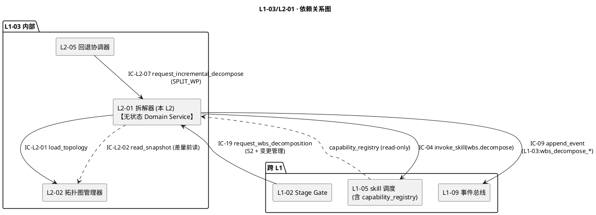
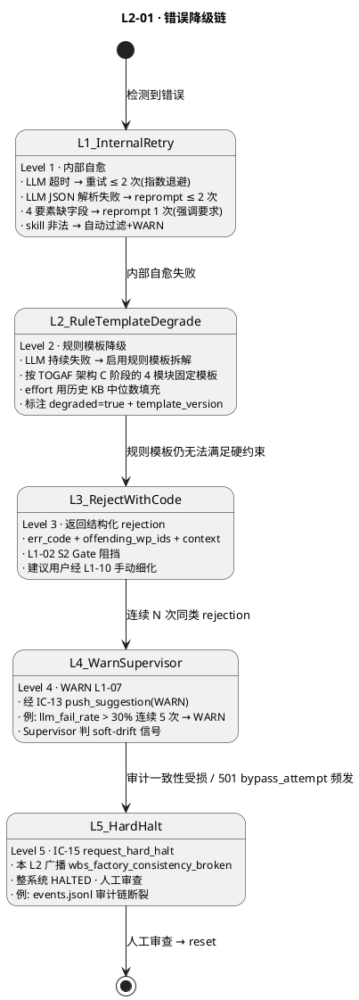

# L1 L2-01 · WBS 拆解器 · Tech Design

> **本文档定位**：3-1-Solution-Technical 层级 · L1 的 L2-01 WBS 拆解器 技术实现方案（L2 粒度）。
> **与产品 PRD 的分工**：2-prd/L1-03-WBS+WP 拓扑调度/prd.md §5.3 的对应 L2 节定义产品边界，本文档定义**技术实现**（接口字段级 schema + 算法伪代码 + 底层数据结构 + 状态机 + 配置参数）。
> **与 L1 architecture.md 的分工**：architecture.md 负责**跨 L2 架构 + 跨 L2 时序**，本文档负责**本 L2 内部技术细节**。冲突以 architecture.md 为准。
> **严格规则**：本文档不复述产品 PRD 文字（职责 / 禁止 / 必须等清单），只做技术映射 + 补齐"产品视角未说 but 工程师必须知道"的部分（具体算法 · syscall · schema · 配置）。

---

## §0 撰写进度

- [x] §1 定位 + 2-prd §8 L2-01 映射（含 6 关键决策 D-01..D-06）
- [x] §2 DDD 映射（BC-03 · Domain Service + Factory 无状态 · 输入 VO · 输出 VO）
- [x] §3 对外接口定义（2 接收 + 2 发起 · YAML schema · 14 错误码）
- [x] §4 接口依赖（被谁调 · 调谁 · 依赖图 PlantUML）
- [x] §5 P0/P1 时序图（P0 全量拆解 + P1 差量拆解 · 2 张 PlantUML）
- [x] §6 内部核心算法（LLM prompt 组装 + 4 要素装配 + 粒度自检 + skill 推荐 + 差量合并）
- [x] §7 底层数据表 / schema 设计（wbs.md + wp_def.yaml + PM-14 分片 · 无状态但有产物）
- [x] §8 状态机（本 L2 为无状态 Factory · 无状态机 · 明确标注 Domain Service 语义）
- [x] §9 开源最佳实践（MetaGPT ADOPT + LangChain PlanAndExecute LEARN + AutoGen LEARN + OpenDevin LEARN · ≥ 4 项目）
- [x] §10 配置参数清单（10 项）
- [x] §11 错误处理 + 降级策略（5 Level + PlantUML + 协同表 + 可用能力矩阵）
- [x] §12 性能目标（SLO + 吞吐 + 健康指标）
- [x] §13 反向映射 prd §8 + 前向 3-2 TDD（17 TC ID + 3 ADR + 3 OQ）

---

## §1 定位 + 2-prd 映射

### 1.1 本 L2 的唯一命题（One-Liner）

**L1-03 的"规划期动作 Factory"** —— 以 `WBSFactory` Domain Service 消费 4 件套 + TOGAF A-D 架构，用 LLM 分层拆解（项目 → 模块 → WP）并为每个 WP 装配 4 要素（goal / dod_expr_ref / deps / effort_estimate）+ skill 推荐，产出 **无状态** `WBSTopology Draft` 交 L2-02（本 L2 不持有聚合根 · 不参与运行期）· 只在 S2 一次 + SPLIT_WP 差量 + 变更管理二次 IC-19 三种时机运行。

### 1.2 与 `2-prd/L1-03 WBS+WP 拓扑调度/prd.md §8` 的精确小节映射

| 2-prd 锚点 | 本 L2 § 段 | 翻译方式 |
|---|---|---|
| prd §8.1 职责 + 锚定（scope §5.3.1 / PM-04 / PM-07 / PM-08 / PM-10） | §1.1 命题 + §2.1 BC 定位 | 一句话职责 + DDD Domain Service 定位 |
| prd §8.2 输入 / 输出 | §3 字段级 YAML schema + §4 依赖图 | 文字级描述 → IC 字段级契约 |
| prd §8.3 In / Out-of-scope（6 + 9） | §1.7 YAGNI 边界 + §2.3 与兄弟 L2 分工 | 技术级不越位清单 |
| prd §8.4 硬约束 7 条（粒度 ≤ 5 天 / 4 要素齐全 / Goal 可追溯 / 依赖闭合 / PM-07 模板 / 差量保留 DONE / skill 非硬绑定） | §2.3 Invariants I-1..I-7 + §5 时序 + §6 算法 | 7 硬约束 → 7 不变量 → 算法 + 时序图强制 |
| prd §8.5 🚫 禁止行为 8 条 | §11 错误处理对应错误码 + §3 拒绝路径 | 每 🚫 对应 1 个错误码 |
| prd §8.6 ✅ 必须义务 8 条 | §6 算法骨架 + §5 时序主干 | 必须义务在代码路径上落地 |
| prd §8.7 🔧 可选功能 5 项 | §10 配置参数开关 | 可选功能用 config flag |
| prd §8.8 IC 交互（2 被调 + 2 调） | §3 方法定义 + §4 依赖图 | IC-19 / IC-L2-07 → 方法签名 |
| prd §8.9 G-W-T 大纲（6 P + 6 N + 3 I） | §13.2 TDD 映射矩阵 | 15 TC ID 锚定 |
| prd §8.10 性能文字 | §12 SLO 表 | 文字描述 → P95 / P99 数字 |

### 1.3 与 `L1-03/architecture.md` 的位置映射

引用 architecture.md §3.1 主架构图，本 L2 处于 **规划期（S2 一次性 + 差量）package 内，作为 Domain Service Factory**，与 L2-02 / L2-05 的关系如下（锚定 §3.1 Mermaid → PlantUML 化）：

- **L1-02 → L2-01**：IC-19 request_wbs_decomposition（S2 Gate 批准后的全量拆解入口）
- **L2-05 → L2-01**：IC-L2-07 request_incremental_decompose（SPLIT_WP 差量拆解触发）
- **L2-01 → L2-02**：IC-L2-01 load_topology（交付 WBSTopology Draft · 由 L2-02 做 DAG 校验 + 入库）
- **L2-01 → L1-05**：IC-04 invoke_skill（`capability=wbs.decompose` · LLM 层级拆解）
- **L2-01 → L1-09**：IC-09 append_event（全程审计 · `L1-03:wbs_decompose_*` 事件家族）

**物理载体**（architecture.md §3.3）：主 Skill Runtime 的 Python 辅助模块 · 纯函数式 Domain Service · 不需要独立 subagent session · 不持任何状态（产物写完即退）· 逻辑进程归属主 skill。

### 1.4 与兄弟 L2 的边界（L1-03 的 5 L2 中 L2-01 的定位）

| L2 | 定位 | 与 L2-01 的分工 |
|---|---|---|
| **L2-01**（本 L2）WBS 拆解器 | **Domain Service + Factory · 无状态纯函数** | 生产 WBSTopology Draft + wbs.md + wp_def.yaml × N；交 L2-02 装图后**即退** |
| **L2-02** 拓扑图管理器 | Aggregate Root WBSTopology · 运行期真值源 | 接收本 L2 Draft → 7 步 guard → 入库；持有唯一聚合根；本 L2 不持状态 |
| **L2-03** WP 调度器 | Application Service（pull · 运行期） | 本 L2 拆解时已推荐 `recommended_skills[]`，L2-03 调度时参考但非硬绑定 |
| **L2-04** 追踪器 | Domain Service + VO ProgressMetrics | 本 L2 产出的 effort_estimate 是 L2-04 聚合 remaining_effort 的基础 |
| **L2-05** 回退协调器 | Domain Service + Entity FailureCounter | SPLIT_WP 时反向调本 L2 IC-L2-07 做差量拆解；本 L2 配合保留已 DONE WP |

**边界规则**：本 L2 是 L1-03 的**规划期动作一次性执行体**；所有运行期状态性工作归 L2-02..L2-05。本 L2 只在三种时机被激活：
1. **S2 一次性**：L1-02 IC-19 request_wbs_decomposition 首次触发全量拆解
2. **差量拆解**：L2-05 IC-L2-07 触发子树再拆（失败回退 · SPLIT_WP 建议）
3. **变更管理二次 IC-19**：L1-02 变更管理流（需求变更 / 架构调整）重算 WBS 未开始部分

### 1.5 PM-14 约束（project_id as root）

引用 `L0/ddd-context-map.md §3.2 PM-14`，本 L2 所有输入 / 输出 / 事件 / 产物路径**必须**带 `project_id` 并与 BC-02 `ProjectAggregate.id` 强绑定：

- `IC-19 request_wbs_decomposition_command.project_id` —— 必填 · schema 层校验
- `docs/planning/wbs.md` —— 项目级文档 · 隐含 project_id（通过仓库路径 PM-14 分片）
- `projects/<pid>/wbs/wp/<wp_id>.yaml` —— PM-14 分片落盘（**禁止**跨 project 依赖）
- `L1-03:wbs_decompose_*` 事件 `project_id` 字段硬必填（schema 层由 L1-09 校验）
- Invariant I-7 归属闭包：所有 `WorkPackage.project_id == WBSFactoryInput.project_id`（违反 → `E_L103_L201_201`）· 差量拆解 target_wp_id 必须属于同 project

### 1.6 关键技术决策（Decision → Rationale → Alternatives → Trade-off）

| # | 决策 | Rationale | Alternatives（弃用原因） | Trade-off |
|---|---|---|---|---|
| D-01 | **Domain Service + Factory 语义 · 无状态纯函数** | DDD 中"创建聚合根但不持有"典型模式 · 无状态便于并行（不同 project 同时拆解）· 便于测试（输入确定 → 输出确定） | 持久化 Factory + 缓存 LLM 响应：状态一致性成本高 / AggregateRoot 持有者（与 L2-02 重叠） | 每次调用重跑 LLM · 但本 L2 低频（S2 一次 + 差量 N 次），成本可接受 |
| D-02 | **LLM 分层拆解 + Schema-Guided Output（JSON Mode）** | 输出必须结构化（WBSTopology Draft schema） · LLM 强制 JSON mode + Pydantic 校验 | 纯 prompt + 正则解析：失败率高 · markdown 表格解析脆弱 · 扩展字段难 | JSON Mode 依赖 LLM 能力；不支持时降级到"prompt + retry 3 次解析"（§11 Level 2） |
| D-03 | **4 要素装配先装 3 要素再校验粒度，超限递归再拆**（post-order） | 先拆（深度优先）→ 每节点装 goal+dod_expr_ref+deps（不带 effort）→ 估 effort → 若 > 5 天则递归再拆该节点（深度 +1） | 一次性整图拆完再校验：超限后需全局回溯 / 重跑 LLM 整图 → token 浪费 | 递归 LLM 调用次数可能 ≥ 1 + N_oversize · 用配置 `max_recursion_depth=3` 兜底 |
| D-04 | **skill 推荐用 LLM few-shot + capability registry 白名单** | skill 名必须在 L1-05 注册表内（否则调度时 E_SKILL_NOT_FOUND） · 先 LLM 猜 + 白名单过滤保证合法 | 纯 LLM 无过滤：幻觉 skill 名 / LLM 不知可用 skill 集 | 需在 prompt 里传 capability list（上下文成本）；L1-05 capability_registry 变更时本 L2 prompt 需同步刷新 |
| D-05 | **差量拆解保留已 DONE WP 身份不变（与 L2-02 合并语义对齐）** | 2-prd §8.4 硬约束 6 · PM-08 可审计 · 回退场景（SPLIT_WP）下不应重做已完成任务 · `preserved = {wp where state==DONE}` | 差量时全重拆：违反"已完成不重做"原则，浪费 LLM 成本 + 破坏审计链 | 差量 prompt 需附 preserved 节点摘要 · token 成本 ↑ 但不显著 |
| D-06 | **产物双写（wbs.md 人读 + wp_def.yaml 机读）且必须原子**（写完才 ack） | PM-07 人工评审 + 机器消费双需求 · 避免 L2-02 读到半写状态 | 只写 wbs.md：L2-02 需要 markdown 解析 / 只写 yaml：用户评审体验差 | 两次写盘 · 用"tmp + rename"确保原子（fcntl · §6.5） |

### 1.7 YAGNI 边界（本 L2 不做的事）

- ❌ **不做 DAG 无环校验**（→ L2-02） · 本 L2 只组织层级结构 · 环校验由 L2-02 `nx.is_directed_acyclic_graph` 兜底
- ❌ **不做关键路径计算**（→ L2-02） · `critical_path = nx.dag_longest_path` 归拓扑图管理器
- ❌ **不做运行期状态跃迁**（→ L2-02 / L2-03 / L2-04 / L2-05）
- ❌ **不做 WP 调度**（→ L2-03）
- ❌ **不做失败计数 / 回退决策**（→ L2-05 + L1-07）
- ❌ **不做 DoD 表达式内容填充**（→ L1-04 S3） · 本 L2 只留 `dod_expr_ref` 入口占位
- ❌ **不做 skill 实际调用**（→ L1-05） · 只产 `recommended_skills[]` 建议
- ❌ **不做事件总线落盘**（→ L1-09） · 经 IC-09 委托
- ❌ **不持有运行期 AggregateRoot**（→ L2-02） · 本 L2 产完草案即退
- ❌ **不做变更 impact 分析**（→ L1-02 变更管理流） · 本 L2 只做"差量再拆"

### 1.8 本 L2 读者预期

- **TDD 工程师**：从 §3（YAML schema）+ §11（错误码表）+ §13（TDD TC ID）生成用例
- **实现工程师**：从 §6（伪代码）+ §7（持久化 schema）+ §10（配置）直接落代码
- **集成测试作者**：从 §5（时序图）+ §4（依赖图）理解跨 L2 协同
- **Supervisor（L1-07）**：从 §12.3 健康指标订阅 LLM 失败 / 粒度超限告警

---

## §2 DDD 映射（BC-03 WBS+WP Topology Scheduling · Domain Service + Factory）

### 2.1 Bounded Context 定位

引用 `L0/ddd-context-map.md §2.4 BC-03` + `§4.3`，本 L2 是 **BC-03 内的 Domain Service + Factory 角色**（区别于 L2-02 的 Aggregate Root 持有者）。本 L2 **不持有 Aggregate**，只负责"造"WBSTopology Draft 交给 L2-02 入库。

**BC-03 关系摘要**：
- 与 **BC-02 Project Lifecycle**：Customer-Supplier（BC-02 S2 Gate 发起 IC-19 · 本 L2 是 Supplier）
- 与 **BC-04 Quality Loop**：引用（本 L2 产出的 `dod_expr_ref` 由 BC-04 L1-04 S3 填充）
- 与 **BC-05 Skill Invocation**：Customer-Supplier（本 L2 调 IC-04 invoke_skill `wbs.decompose`）
- 与 **BC-09 Resilience & Audit**：Partnership（本 L2 全程经 IC-09 审计）
- 与 **BC-03 内部 L2-02**：同 BC 聚合协作（本 L2 Factory → L2-02 Aggregate Root）

### 2.2 Domain Service · WBSFactory（本 L2 核心对象 · 无状态）

```
WBSFactory (Stateless Domain Service)
├── decompose_full(four_pieces, togaf_a_d, pid) → WBSTopology Draft
├── decompose_incremental(existing_topology_ref, target_wp_id, reason) → WBSTopology Draft
├── assemble_four_elements(wp_candidate, four_pieces_ref) → WorkPackage
├── recommend_skills(wp, capability_list) → List[skill_id]
├── self_check_granularity(wp_list) → List[oversize_wp_id]
└── emit_artifacts(draft, pid) → (wbs_md_path, wp_def_paths[])
```

**关键非字段**（故意）：
- **无 `state` 字段** · 纯函数式
- **无 `cache` 字段** · 每次调用重跑 LLM（可由配置加 LRU 但默认关）
- **无 `running_count` 字段** · L2-01 可并发服务多 project（不同 project 独立）

### 2.3 输入 / 输出 Value Objects（不可变）

**输入 VO**（`WBSFactoryInput`）：
- `four_pieces_ref: FourPiecesRef(charter_path, plan_path, requirements_path, risk_path)` · L1-02 S2 产物锚点
- `togaf_output: TOGAFOutput(phases[A,B,C,D], adr_path)` · L1-02 架构师产出
- `project_id: ProjectId`
- `target_granularity: enum[fine, medium, coarse]`（默认 medium）

**输出 VO**（`WBSTopology Draft`）：
- `wp_list: List[WorkPackage]` · 每 WP 含 4 要素 + skill 推荐
- `dag_edges: List[DAGEdge]` · 依赖关系（`from_wp_id → to_wp_id`）
- `source_ref: str` · 本次拆解 trace id（`decomp-{uuid-v7}`）
- `mode: enum[full, incremental]` · 装图模式指示
- `preserved_wp_ids: List[wp_id]`（仅差量时非空） · 已 DONE 需保留的 WP 列表

### 2.4 聚合根不变量（Invariants · I-1..I-7 · 本 L2 产物必须满足）

**本 L2 强制的 7 不变量**（装图前在本 L2 内自检 · 装图后由 L2-02 再校验一遍）：

- **I-1 粒度约束**：`∀wp ∈ wp_list, wp.effort_estimate <= 5.0`（天） · 超限在本 L2 §6.3 递归再拆 / 兜底后仍超限 → `E_L103_L201_104`
- **I-2 4 要素完整**：`∀wp, wp.goal != null AND wp.dod_expr_ref != null AND wp.deps 已定义 AND wp.effort_estimate 非空` · 违反 → `E_L103_L201_103`
- **I-3 Goal 可追溯**：`∀wp, wp.goal.traceability_refs` 指向 4 件套某锚点（`charter#section_x` / `requirements#ac_y` / 等） · 违反 → `E_L103_L201_106`
- **I-4 依赖闭合**：`∀wp, wp.deps ⊆ {w.wp_id for w in wp_list}` 且不含跨 project 节点 · 违反 → `E_L103_L201_102` / `E_L103_L201_105`
- **I-5 skill 推荐合法**：`∀wp, ∀sid ∈ wp.recommended_skills, sid ∈ capability_registry` · 违反 → `E_L103_L201_107`
- **I-6 wbs.md 模板一致**：产出的 wbs.md 符合 PM-07 模板结构（通过 schema 自检） · 违反 → `E_L103_L201_108`
- **I-7 差量保 DONE**：`mode == incremental` 时 `preserved_wp_ids` 严格等于已有 topology 中 `state == DONE` 的 WP 集合 · 违反 → `E_L103_L201_109`

### 2.5 Factory 方法（Creation Pattern）

本 L2 是 **DDD Factory Pattern** 的教科书应用：
- `decompose_full` 构造全量 `WBSTopology Draft`（I-1..I-6 自检通过才返回）
- `decompose_incremental` 构造差量 `WBSTopology Draft`（附 preserved_wp_ids · I-7 守护）
- Factory 方法返回 VO（immutable），不持 state · 调用方（L2-02）负责后续入库

### 2.6 Domain Events（本 L2 对外发布 · 经 IC-09）

| 事件名 | 触发时机 | 必含字段 | 消费方 |
|---|---|---|---|
| `L1-03:wbs_decompose_started` | 收到 IC-19 / IC-L2-07 · 开始 LLM 拆解 | `project_id / decomposition_session_id / mode / target_granularity / target_wp_id(差量) / ts` | L1-07 Supervisor 监测 · L1-02 订阅返 `dispatched` |
| `L1-03:wbs_decomposed` | LLM 返分层草案 + 4 要素装配 + 自检完成 | `project_id / decomposition_session_id / wp_count / llm_duration_ms / self_check_passed` | L2-02 预订阅准备装图 · L1-07 监测 |
| `L1-03:incremental_decompose_started` | 收到 IC-L2-07 差量触发 | `project_id / decomposition_session_id / target_wp_id / reason / preserved_wp_ids_count` | L2-05 ack · L1-07 监测 |
| `L1-03:wbs_draft_rejected` | 本 L2 自检失败（I-1..I-6 违反） | `project_id / decomposition_session_id / err_code / offending_wp_ids / reason` | L1-02 → S2 Gate 阻挡 · L1-07 WARN |
| `L1-03:skill_recommendation_emitted` | 对每个 WP 产完 skill 推荐 | `project_id / wp_id / recommended_skills[] / recommendation_confidence` | L1-05 订阅（可选 · 预热 skill cache） |

### 2.7 Repository 引用（本 L2 只读不写）

本 L2 **不持有自己的 Repository**（无状态） · 仅通过以下引用读外部数据：

```python
class WBSFactoryContext:
    four_pieces_reader: FourPiecesReader       # 读 charter.md / plan.md / requirements.md / risk.md
    togaf_reader: TOGAFReader                  # 读 architecture.md + adr/*.md
    capability_registry: CapabilityRegistry    # 读 L1-05 能力注册表（skill 白名单）
    existing_topology_reader: TopologyReader   # 差量时读 L2-02 现有 topology（经 IC-L2-02 read_snapshot）
```

### 2.8 跨 BC 关系摘要

- **不持有 BC-04 DoDExpression 对象** · 只填 `dod_expr_ref`（字符串 id） · 由 L1-04 S3 后续填充
- **LLM 调用委托 BC-05 L1-05 skill 调度** · 本 L2 不自研 LLM 客户端 · 经 IC-04 invoke_skill(`wbs.decompose`)
- **事件经 BC-09 L1-09 事件总线** · 本 L2 不自研持久化

---

## §3 对外接口定义（字段级 YAML schema + 错误码）

### 3.1 接口清单总览（2 接收 + 2 发起）

| IC | 方向 | 方法签名 | 被调方 SLO |
|---|---|---|---|
| **IC-19** | L1-02 → 本 L2 | `request_wbs_decomposition(cmd) → DispatchResult` | Dispatch ≤ 100ms · 异步拆解按规模（典型 5-60s） |
| **IC-L2-07** | L2-05 → 本 L2 | `request_incremental_decompose(pid, target_wp_id, reason) → DispatchResult` | Dispatch ≤ 100ms · 异步差量（典型 3-30s） |
| **IC-L2-01** | 本 L2 → L2-02 | `load_topology(pid, wbs_draft, mode) → LoadResult` | 同步调 · 取决于 L2-02（P95 ≤ 2s） |
| **IC-04** | 本 L2 → L1-05 | `invoke_skill(capability='wbs.decompose', params)` | 异步返回（典型 5-60s） |
| **IC-09** | 本 L2 → L1-09 | `append_event(evt)` | P95 ≤ 20ms（fsync 强一致）|

### 3.2 IC-19 · `request_wbs_decomposition` 入 / 出参 schema

```yaml
# ic_19_request_wbs_decomposition_request.yaml
type: object
required: [command_id, project_id, artifacts_4_pack, architecture_output]
properties:
  command_id: { type: string, pattern: "^wbs-req-[a-f0-9-]{36}$" }       # wbs-req-{uuid-v7}
  project_id: { type: string, pattern: "^hf-proj-[a-zA-Z0-9_-]+$" }
  artifacts_4_pack:
    type: object
    required: [charter_path, plan_path, requirements_path, risk_path]
    properties:
      charter_path: { type: string, description: "docs/planning/charter.md 或等价锚点" }
      plan_path: { type: string }
      requirements_path: { type: string }
      risk_path: { type: string }
  architecture_output:
    type: object
    required: [togaf_phases, adr_path]
    properties:
      togaf_phases: { type: array, items: { type: string, enum: [A, B, C, D] }, minItems: 4 }
      adr_path: { type: string, description: "docs/planning/adr/ 目录路径" }
  target_wp_granularity: { type: string, enum: [fine, medium, coarse], default: medium }
  ts: { type: string, format: "ISO-8601" }
  requester_l1: { type: string, enum: ["L1-02"] }
  tick_id: { type: string, nullable: true }
```

```yaml
# ic_19_request_wbs_decomposition_response.yaml
type: object
required: [command_id, accepted]
properties:
  command_id: { type: string }
  accepted: { type: boolean }
  decomposition_session_id: { type: string, nullable: true, pattern: "^decomp-[a-f0-9-]{36}$" }
  rejection:
    type: object
    nullable: true
    properties:
      err_code: { type: string }                          # 见 §3.6
      reason: { type: string }
      missing_field: { type: string, nullable: true }
  audit_event_id: { type: string }
  dispatch_latency_ms: { type: integer }
```

**异步拆解结果**（经 IC-09 事件回推）：

```yaml
# l103_wbs_decomposed_event.yaml
type: object
required: [event_type, project_id, decomposition_session_id, topology_version, wp_count, critical_path_wp_ids]
properties:
  event_type: { type: string, const: "L1-03:wbs_decomposed" }
  project_id: { type: string }
  decomposition_session_id: { type: string }
  topology_version: { type: string, description: "topology-{uuid-v7}" }
  wp_count: { type: integer, minimum: 1 }
  critical_path_wp_ids: { type: array, items: { type: string } }    # 由 L2-02 装图后回填
  estimated_duration_h: { type: number, nullable: true }
  llm_duration_ms: { type: integer }
  self_check_passed: { type: boolean }
```

### 3.3 IC-L2-07 · `request_incremental_decompose` 入 / 出参 schema

```yaml
# ic_l2_07_request_incremental_decompose_request.yaml
type: object
required: [command_id, project_id, target_wp_id, reason, requester_l2]
properties:
  command_id: { type: string, pattern: "^idecomp-req-[a-f0-9-]{36}$" }
  project_id: { type: string }
  target_wp_id: { type: string, pattern: "^wp-[0-9]{3}$", description: "需再拆的 WP id" }
  reason:
    type: string
    enum: [failure_count_exceeded, change_request, granularity_oversized_runtime]
    description: "failure_count_exceeded = 连续失败 ≥ 3 · L2-05 建议"
  failure_evidence_refs:
    type: array
    items: { type: string }
    nullable: true
    description: "失败证据（仅 reason=failure_count_exceeded 填）"
  requester_l2: { type: string, enum: ["L2-05"] }
  ts: { type: string }
  tick_id: { type: string, nullable: true }
```

```yaml
# ic_l2_07_request_incremental_decompose_response.yaml
type: object
required: [command_id, accepted]
properties:
  command_id: { type: string }
  accepted: { type: boolean }
  decomposition_session_id: { type: string, nullable: true }
  rejection:
    type: object
    nullable: true
    properties:
      err_code: { type: string }                          # 见 §3.6
      reason: { type: string }
      target_wp_id_state: { type: string, nullable: true, description: "当前 state · 用于 E_403 诊断" }
  audit_event_id: { type: string }
  dispatch_latency_ms: { type: integer }
```

### 3.4 IC-L2-01 · `load_topology` 入参 schema（本 L2 发起 · L2-02 接收）

```yaml
# ic_l2_01_load_topology_request.yaml (本 L2 作为发起方)
type: object
required: [project_id, wbs_draft, mode, requester_l2]
properties:
  project_id: { type: string }
  mode: { type: string, enum: [full, incremental] }
  requester_l2: { type: string, const: "L2-01" }
  wbs_draft:
    type: object
    required: [wp_list, dag_edges, source_ref]
    properties:
      wp_list:
        type: array
        minItems: 1
        items:
          type: object
          required: [wp_id, project_id, goal, dod_expr_ref, deps, effort_estimate]
          properties:
            wp_id: { type: string, pattern: "^wp-[0-9]{3}$" }
            project_id: { type: string }
            goal:
              type: object
              required: [summary, traceability_refs]
              properties:
                summary: { type: string, maxLength: 200 }
                traceability_refs:
                  type: array
                  minItems: 1
                  items: { type: string, description: "例: charter#vision / requirements#ac-007" }
            dod_expr_ref: { type: string, description: "BC-04 DoDExpression id 占位 · 后续 L1-04 S3 填充" }
            deps: { type: array, items: { type: string } }
            effort_estimate: { type: number, minimum: 0.1, maximum: 5.0 }   # 天
            recommended_skills:
              type: array
              items:
                type: object
                properties:
                  skill_id: { type: string }
                  confidence: { type: number, minimum: 0.0, maximum: 1.0 }
              default: []
      dag_edges:
        type: array
        items:
          type: object
          required: [from_wp_id, to_wp_id]
          properties:
            from_wp_id: { type: string }
            to_wp_id: { type: string }
      source_ref: { type: string, description: "decomp-{uuid-v7} · 本次拆解 trace id" }
      preserved_wp_ids:
        type: array
        items: { type: string }
        default: []
        description: "差量模式下必填 · 已 DONE 保留的 WP id 列表"
  tick_id: { type: string, nullable: true }
```

### 3.5 错误码返回模板

**错误码结构化返回模板**（所有错误统一）：

```yaml
status: rejected
rejection:
  err_code: E_L103_L201_104
  reason: "granularity_oversized: wp-005 effort=8.5 days > 5.0 hard limit · max_recursion_depth reached"
  offending_wp_ids: [wp-005]
  context:
    recursion_depth: 3
    recommended_action: "manual_refine_via_L1-10"
audit_event_id: "evt-20260422-l103-l201-00108"
dispatch_latency_ms: 12
```

### 3.6 错误码总表（14 条四列 · 风格 `E_L103_L201_NNN`）

| 错误码 | 含义（meaning）| 触发场景（trigger）| 调用方处理（callerAction）|
|---|---|---|---|
| `E_L103_L201_101` | LLM 调用超时 | IC-04 invoke_skill(`wbs.decompose`) 超 timeout（默认 90s）| 本 L2 重试 2 次（指数退避）· 仍失败 → 降级 Level 2 规则模板拆解（§11.2）· L1-02 收事件 `wbs_decompose_failed` |
| `E_L103_L201_102` | 4 要素装配失败：悬空依赖 | LLM 返回的 WP.deps 中存在 wp_list 不包含的 wp_id | 本 L2 修复（自动重试 1 次 · 经 LLM 二次 prompt 纠正）· 仍失败 → rejected · L1-02 S2 Gate 阻挡 |
| `E_L103_L201_103` | 4 要素装配失败：缺 DoD ref / Goal / effort / deps 任一 | LLM 返回结构化 JSON 某 WP 字段缺失 | 本 L2 自动 reprompt 1 次 · 仍失败 → rejected · 审计 `wbs_draft_rejected` |
| `E_L103_L201_104` | WP 粒度超限（> 5 天）| 自检发现 `effort_estimate > 5.0` 且 `recursion_depth >= max_recursion_depth` | rejected + offending_wp_ids · 建议用户经 L1-10 手动细化后重提 IC-19 |
| `E_L103_L201_105` | 跨 project 依赖 | LLM 幻觉生成其他 project 的 wp_id | 硬红线 · 拒绝装图 · L1-07 WARN · 审计 cross_project_dep_attempt |
| `E_L103_L201_106` | Goal 无追溯（I-3 违反）| `wp.goal.traceability_refs` 为空或解析失败 | 本 L2 reprompt 1 次（强调追溯要求）· 仍失败 → rejected |
| `E_L103_L201_107` | skill 推荐非法 | `recommended_skills` 含 capability_registry 之外的 id | 本 L2 自动过滤非法项 · 若全部非法且产不出替代 → `recommended_skills=[]` + WARN（不 block） |
| `E_L103_L201_108` | wbs.md 模板不匹配（PM-07）| emit_artifacts 时 markdown 结构校验失败 | 本 L2 使用模板 fallback · 生成最小可用 wbs.md · WARN L1-07 |
| `E_L103_L201_109` | 差量 target 不存在 | IC-L2-07 target_wp_id 在现有 topology 中找不到 | rejected · L2-05 调用方 bug · 审计 |
| `E_L103_L201_201` | WP 归属不一致（PM-14）| LLM 返回的 wp.project_id != input.project_id | 本 L2 强制覆盖 project_id + WARN · 不拒绝装图（自动修正） |
| `E_L103_L201_301` | LLM 返回无效 JSON | JSON parse 失败 / Pydantic 校验失败 | 本 L2 reprompt 2 次 · 仍失败 → Level 2 降级规则模板 |
| `E_L103_L201_302` | TOGAF 输入缺失 | `architecture_output.togaf_phases` 少于 4 或 adr_path 不可读 | rejected · L1-02 补齐架构产出后重试 |
| `E_L103_L201_401` | IC-09 append_event 失败 | 审计事件写失败 | 重试 3 次 · 仍失败 → 本 L2 拒绝产 ack（PM-08 一致性优先）· WARN L1-07 |
| `E_L103_L201_501` | 外部绕本层直写 wbs.md / wp_def.yaml | 启动时 consistency_check 发现未经本 L2 trace 的产物 | 审计 bypass_attempt · L1-07 WARN · 不自动修正（等人工审查）|

---

## §4 接口依赖（被谁调 · 调谁）

### 4.1 上游调用方

| 调用方 | 方法 | 通道 | 频率 | SLO |
|---|---|---|---|---|
| L1-02 Stage Gate | `request_wbs_decomposition`（IC-19） | 同步 dispatch + 异步拆解 | S2 阶段 1 次 + 变更管理 N 次（低频）| Dispatch ≤ 100ms / 拆解 ≤ 60s P95 |
| L2-05 回退协调器 | `request_incremental_decompose`（IC-L2-07）| 同步 dispatch + 异步差量 | 按失败计数触发（低频 · 每 project ≤ 3 次/整个生命周期）| Dispatch ≤ 100ms / 差量 ≤ 15s P95 |

### 4.2 下游依赖

| IC | 对端 | 触发条件 | 锚点 |
|---|---|---|---|
| **IC-04** invoke_skill(wbs.decompose) | L1-05 skill 调度 | 全量 / 差量拆解 · 每次 1 + 递归 N 次 | [ic-contracts §3.4 IC-04](../../integration/ic-contracts.md) |
| **IC-L2-01** load_topology | L2-02 拓扑图管理器 | 自检通过后提交 draft | L1-03 L2-02 tech-design §3.2 |
| **IC-L2-02** read_snapshot | L2-02 拓扑图管理器 | 差量拆解前读现有 topology | L1-03 L2-02 tech-design §3.3 |
| **IC-09** append_event | L1-09 事件总线 | 拆解全程（start / reject / decomposed / skill_rec） | [ic-contracts §3.9 IC-09](../../integration/ic-contracts.md) |
| **capability_registry 查询** | L1-05 注册表（只读）| 组 prompt 时读 skill 白名单 | L1-05 L2-04 tech-design |

### 4.3 依赖图（PlantUML）



### 4.4 关键依赖特性

1. **无循环依赖**：本 L2 不被 L2-02/03/04 主动调 · 只被 L1-02 / L2-05 触发 · 单向依赖图
2. **纯函数语义（除事件副作用）**：同一 `(input_4_pack, togaf, pid)` 输入在相同 LLM 版本下输出应一致（但 LLM 有随机性 · 用 `temperature=0.1` 降低波动）
3. **IC-09 耦合度高（Partnership）**：IC-09 不可达时本 L2 拒绝产 ack · 符合 PM-08 审计链完整性
4. **LLM 调用委托 L1-05（不自研）**：本 L2 不直接调 DeepSeek / Claude API · 由 L1-05 skill 层统一 retry / timeout / fallback / cost tracking
5. **capability_registry 是单向读**：本 L2 只读 · 不修改 · 注册表变更由 L1-05 内部管理

---

---

## §5 P0/P1 时序图（PlantUML ≥ 2 张）

### 5.1 P0 主干 · S2 全量拆解（对应 BF-S2-WBS · IC-19 入口）

**场景**：L1-02 S2 阶段 4 件套 + TOGAF A-D 架构已定稿 → L1-02 IC-19 发起全量拆解 → 本 L2 组 LLM prompt → LLM 返分层草案 → 本 L2 装配 4 要素 + 粒度自检 + skill 推荐 → IC-L2-01 交 L2-02 装图 → 校验 ok → 写 wbs.md + wp_def.yaml × N → 广播 `wbs_decomposed`。

```plantuml
@startuml
title L2-01 · P0 S2 全量拆解（对应 BF-S2-WBS）
autonumber
participant "L1-02 Stage Gate" as L102
participant "L2-01 WBS 拆解器 (本 L2)" as L201
participant "L1-05 capability_registry" as L105
participant "L1-05 skill(wbs.decompose)\nvia IC-04" as SKILL
participant "L2-02 拓扑图管理器" as L202
participant "L1-09 事件总线 IC-09" as L109
participant "FS · projects/<pid>/wbs/" as FS
note over L102 : S2 阶段 4 件套 + TOGAF A-D 已定稿
L102 -> L201 : IC-19 request_wbs_decomposition(cmd_id, pid, 4_pack, togaf_a_d, granularity=medium)
activate L201
L201 -> L201 : 校验入参(schema §3.2 · 4 件套路径可读 · TOGAF 4 phases 齐)
L201 -> L201 : decomposition_session_id = decomp-{uuid-v7}
L201 -> L109 : IC-09 append_event(L1-03:wbs_decompose_started, {session_id, mode=full, granularity})
L201 --> L102 : DispatchResult{accepted=true, decomposition_session_id, dispatch_latency_ms}
deactivate L201
== 异步拆解 ==
activate L201
L201 -> L105 : read_capability_list()
L105 --> L201 : skills[] (L1-05 注册的所有能力)
L201 -> L201 : 组 LLM prompt(4_pack 摘要 + TOGAF A-D 架构要点 + capability_list + 拆解规则)
L201 -> SKILL : IC-04 invoke_skill(capability=wbs.decompose, params, json_mode=true, timeout=90s)
SKILL --> L201 : 分层拆解草案 JSON (项目 → 模块 → WP 树)
L201 -> L201 : 解析 JSON (Pydantic 校验 · 失败则 reprompt ≤ 2)
loop 每个 WP
  L201 -> L201 : 装配 4 要素 (goal + dod_expr_ref 占位 + deps + effort_estimate)
  L201 -> L201 : recommend_skills(wp, capability_list) · few-shot 过滤白名单
end
L201 -> L201 : 自检 I-1 (粒度 ≤ 5 天) · oversize_wps = [...]
alt 有 oversize 且 recursion < max_recursion_depth
  L201 -> SKILL : 递归再拆子树(oversize_wps, context)
  SKILL --> L201 : 新子 WP 集合
  L201 -> L201 : 替换原 oversize WP 的子节点
end
L201 -> L201 : 自检 I-2..I-6 (4 要素 · Goal 追溯 · 依赖闭合 · skill 合法 · wbs.md 模板)
alt 自检失败
  L201 -> L109 : IC-09 append_event(L1-03:wbs_draft_rejected, {err_code, offending_wp_ids})
  L201 -> L102 : (事件通道) S2 Gate 阻挡 · 要求用户修正
else 自检通过
  L201 -> L202 : IC-L2-01 load_topology(pid, wbs_draft, mode=full)
  L202 -> L202 : 7 步 guard (DAG 无环 · 悬空依赖 · I-1..I-7 再校验 · 关键路径)
  L202 --> L201 : LoadResult{status=ok, topology_id, critical_path_ids, wp_count}
  L201 -> FS : atomic write projects/<pid>/wbs/wp/<wp_id>.yaml × N (tmp+rename)
  L201 -> FS : atomic write docs/planning/wbs.md (PM-07 模板)
  L201 -> L109 : IC-09 append_event(L1-03:wbs_decomposed, {topology_version, wp_count, critical_path_wp_ids, llm_duration_ms, self_check_passed=true})
  L109 --> L102 : L1-02 订阅事件 → 驱动 S3
end
deactivate L201
@enduml
```

**关键时序语义**：

- **Dispatch 同步 + 拆解异步**：IC-19 同步返回 `accepted=true` + session_id（≤ 100ms） · 真正 LLM 拆解在后台跑（典型 5-60s · §12 SLO）
- **LLM 调用用 IC-04 委托 L1-05**：本 L2 不自研 LLM 客户端 · 符合 BC-05 分工 · timeout / retry 由 L1-05 skill 配置
- **自检失败 → 整体拒绝**：任何 I-1..I-6 违反 → rejected 事件 + 不写任何 artifact（事务性 All-or-Nothing · 避免 S2 Gate 读到半成品）
- **Artifact 写入原子**：wp_def.yaml × N 用 tmp+rename + fsync 保证 L2-02 不读到半写状态（§6.5 · D-06）
- **时长预期**：全量拆解 P95 ≤ 60s（20 WP） · 硬上限 180s（§12 SLO） · 超时经 §11 Level 3 告 L1-07

### 5.2 P1 差量 · SPLIT_WP 触发的差量拆解（对应 BF-S4-SPLIT · IC-L2-07 入口）

**场景**：S4 运行期某 WP 连续失败 3 次 → L2-05 FailureCounter 达阈值 → L2-05 决策 SPLIT_WP → IC-L2-07 触发本 L2 差量拆解 → 本 L2 读现有 topology (经 L2-02 IC-L2-02 read_snapshot) → 识别 target + descendants · 保留 DONE · 只拆 target 子树 → IC-L2-01 差量装图 → L2-02 合并保留 DONE + 新子图 → 广播差量完成。

```plantuml
@startuml
title L2-01 · P1 SPLIT_WP 差量拆解（对应 BF-S4-SPLIT）
autonumber
participant "L2-05 回退协调器" as L205
participant "L2-01 WBS 拆解器 (本 L2)" as L201
participant "L2-02 拓扑图管理器" as L202
participant "L1-05 skill(wbs.decompose)\nvia IC-04" as SKILL
participant "L1-09 事件总线 IC-09" as L109
participant "FS · projects/<pid>/wbs/" as FS
note over L205 : wp-007 连续失败 3 次 · SPLIT_WP 决策
L205 -> L201 : IC-L2-07 request_incremental_decompose(cmd_id, pid, target_wp_id=wp-007, reason=failure_count_exceeded, failure_evidence_refs)
activate L201
L201 -> L201 : 校验入参(target_wp_id 格式 · reason 合法)
L201 -> L202 : IC-L2-02 read_snapshot(pid, include_fields=[wp_states, edges])
L202 --> L201 : TopologySnapshot{wp_states, edges, ...}
alt target_wp_id 不存在
  L201 -> L109 : IC-09 append_event(L1-03:wbs_draft_rejected, {err_code=E_L103_L201_109, target_wp_id})
  L201 --> L205 : rejected{err_code=E_L103_L201_109, target_wp_id_state=null}
  deactivate L201
else target 存在
  L201 -> L201 : preserved_wp_ids = [w for w in wp_states if state==DONE]
  L201 -> L201 : redo_zone = {target} | nx.descendants(target) - preserved
  L201 -> L201 : decomposition_session_id = decomp-{uuid-v7}
  L201 -> L109 : IC-09 append_event(L1-03:incremental_decompose_started, {session_id, target_wp_id, reason, preserved_count=|preserved|})
  L201 --> L205 : DispatchResult{accepted=true, decomposition_session_id}
  deactivate L201
  == 异步差量拆解 ==
  activate L201
  L201 -> L201 : 组 LLM prompt (target WP context + redo_zone 摘要 + preserved 锚点 + failure_evidence_refs)
  L201 -> SKILL : IC-04 invoke_skill(capability=wbs.decompose, params={mode=incremental, target, failure_ctx}, timeout=60s)
  SKILL --> L201 : 新子 WP 集合 (只覆盖 target 子树)
  L201 -> L201 : 装配 4 要素 + skill 推荐 + 自检 I-1..I-6
  L201 -> L201 : 自检 I-7 (差量保 DONE · preserved_wp_ids 完整)
  alt 自检失败
    L201 -> L109 : IC-09 append_event(L1-03:wbs_draft_rejected, {err_code, offending_wp_ids})
  else 自检通过
    L201 -> L202 : IC-L2-01 load_topology(pid, wbs_draft, mode=incremental) · 含 preserved_wp_ids
    L202 -> L202 : 差量合并 (G.remove(redo_zone) → nx.compose(G, new_subtree))
    L202 -> L202 : 重算 critical_path · 重跑 7 步 guard
    L202 --> L201 : LoadResult{status=ok, topology_id (新版本), critical_path_ids 刷新}
    L201 -> FS : atomic write wp/<wp_id>.yaml × M (仅新 WP · 不动 preserved)
    L201 -> FS : atomic update docs/planning/wbs.md (差量段落 + diff 标记)
    L201 -> L109 : IC-09 append_event(L1-03:wbs_decomposed, {mode=incremental, topology_version 新版, wp_count 新增, preserved_count})
  end
  deactivate L201
end
@enduml
```

**关键时序语义**：

- **差量拆解性能 ≤ 全量 1/4**（§12 SLO · 与 2-prd §8.10 对齐） · 仅重跑 redo_zone 的 LLM 调用
- **preserved_wp_ids 保 DONE 身份**（I-7 硬约束）· L2-02 差量合并时严格保留这些 wp_id 及其 effort / state
- **差量 wbs.md 采用 diff 标记**（PM-07 模板扩展）· 保留历史段落 + 新增段落标注 `[SPLIT from wp-007 @ 2026-04-22]` · 用户可评审 diff
- **错误码 E_L103_L201_109**：target 不存在时直接 rejected（L2-05 bug · 应从 read_snapshot 读取存在的 wp_id）
- **时长预期**：差量 P95 ≤ 15s（target 子树 ≤ 5 WP） · 硬上限 45s（§12 SLO）

---

---

## §6 内部核心算法（伪代码）

### 6.1 全量拆解 `decompose_full` 骨架

```python
def decompose_full(cmd: request_wbs_decomposition_command) -> DispatchResult:
    # ========== 同步 dispatch 阶段（≤ 100ms） ==========
    _validate_schema(cmd)                                      # schema §3.2 · 失败 → rejected
    _validate_artifacts(cmd.artifacts_4_pack)                  # 4 件套路径可读 · 失败 → E_302
    _validate_togaf(cmd.architecture_output)                   # TOGAF 4 phases · 失败 → E_302
    session_id = f"decomp-{uuid_v7()}"
    _emit('L1-03:wbs_decompose_started', cmd.project_id, session_id, mode='full', granularity=cmd.target_wp_granularity)
    _async_submit(_decompose_full_async, cmd, session_id)
    return DispatchResult(accepted=True, decomposition_session_id=session_id, dispatch_latency_ms=...)

def _decompose_full_async(cmd, session_id):
    try:
        four_pieces = _read_four_pieces(cmd.artifacts_4_pack)           # 读 charter / plan / requirements / risk
        togaf_output = _read_togaf(cmd.architecture_output)             # 读 architecture.md + adr
        capability_list = L105_capability_registry.read_all()           # 读 skill 白名单（无缓存 · 每次最新）
        prompt = _compose_llm_prompt(four_pieces, togaf_output, capability_list, cmd.target_wp_granularity)
        draft_json = _invoke_llm_with_retry(prompt, max_retries=2)      # IC-04 → L1-05
        draft = _parse_and_validate(draft_json)                         # Pydantic · 失败 → E_301 reprompt
        # 4 要素装配 + skill 推荐
        for wp in draft.wp_list:
            _assemble_four_elements(wp, four_pieces)                    # I-2
            wp.recommended_skills = _recommend_skills(wp, capability_list)   # I-5
        # 粒度自检 + 递归再拆（post-order）
        oversize_wps = _find_oversize(draft.wp_list)                    # I-1
        recursion_depth = 0
        while oversize_wps and recursion_depth < config.max_recursion_depth:
            new_subtrees = _decompose_subtrees(oversize_wps, four_pieces, togaf_output, capability_list)
            _replace_oversize_with_subtrees(draft, oversize_wps, new_subtrees)
            oversize_wps = _find_oversize(draft.wp_list)
            recursion_depth += 1
        if oversize_wps:
            raise TopologyError("E_L103_L201_104", offending=oversize_wps, recursion_depth=recursion_depth)
        # I-1..I-6 全量自检
        _self_check_invariants(draft, four_pieces, capability_list)
        # 交 L2-02 装图
        load_result = L202.load_topology(cmd.project_id, draft, mode='full')     # IC-L2-01
        if load_result.status == 'rejected':
            raise TopologyError(load_result.rejection.err_code, **load_result.rejection)
        # 产 artifact
        _emit_artifacts(draft, cmd.project_id, load_result.topology_id)          # §6.5
        _emit('L1-03:wbs_decomposed', cmd.project_id, session_id, wp_count=len(draft.wp_list),
              critical_path_wp_ids=load_result.critical_path_ids, llm_duration_ms=..., self_check_passed=True)
    except TopologyError as e:
        _emit('L1-03:wbs_draft_rejected', cmd.project_id, session_id, err_code=e.code, offending_wp_ids=e.offending)
        if _should_degrade_to_rule_template(e):                                   # §11.5
            _run_rule_template_fallback(cmd, session_id)
```

### 6.2 4 要素装配（`_assemble_four_elements`）

```python
def _assemble_four_elements(wp: WorkPackage, four_pieces: FourPieces) -> None:
    # 1. Goal 追溯回 4 件套（I-3）
    if not wp.goal.traceability_refs:
        raise TopologyError("E_L103_L201_106", wp_id=wp.wp_id, reason="missing traceability_refs")
    for ref in wp.goal.traceability_refs:
        anchor = _resolve_anchor(ref, four_pieces)                    # charter#section_x / requirements#ac-007
        if anchor is None:
            raise TopologyError("E_L103_L201_106", wp_id=wp.wp_id, invalid_ref=ref)
    # 2. dod_expr_ref 占位（I-2 · 实际内容由 L1-04 S3 填）
    if not wp.dod_expr_ref:
        wp.dod_expr_ref = f"dod-expr-placeholder-{wp.wp_id}"          # 占位 id · 不违反 I-2
    # 3. deps 已定义（I-2 · 可以空 list · 但必须是 list 类型）
    if wp.deps is None:
        wp.deps = []
    # 4. effort_estimate（I-2 · I-1 由 self_check_granularity 兜底）
    if wp.effort_estimate is None or wp.effort_estimate <= 0:
        raise TopologyError("E_L103_L201_103", wp_id=wp.wp_id, missing="effort_estimate")
    # PM-14 归属自动修正（I-7 BC · 软 auto-fix）
    if wp.project_id != four_pieces.project_id:
        _warn("E_L103_L201_201", wp_id=wp.wp_id)
        wp.project_id = four_pieces.project_id
```

### 6.3 粒度自检 + 递归再拆（`_find_oversize` + `_decompose_subtrees`）

```python
def _find_oversize(wp_list) -> List[WorkPackage]:
    return [wp for wp in wp_list if wp.effort_estimate > 5.0]

def _decompose_subtrees(oversize_wps, four_pieces, togaf, capability_list) -> Dict[wp_id, List[WorkPackage]]:
    """对每个 oversize WP 再拆一层（深度 +1） · 并发调 LLM 但限制 concurrency=3"""
    results = {}
    for wp in oversize_wps:
        prompt = _compose_subtree_prompt(wp, four_pieces, togaf, capability_list)   # 专注于这一 WP
        sub_json = _invoke_llm_with_retry(prompt, max_retries=2)
        sub_draft = _parse_subtree(sub_json, parent=wp)
        for sub_wp in sub_draft.wp_list:
            _assemble_four_elements(sub_wp, four_pieces)
            sub_wp.recommended_skills = _recommend_skills(sub_wp, capability_list)
        results[wp.wp_id] = sub_draft.wp_list
    return results

def _replace_oversize_with_subtrees(draft, oversize_wps, new_subtrees):
    """将 oversize WP 替换为其子 WP · 更新 dag_edges（保留原依赖关系传递）"""
    for wp in oversize_wps:
        subs = new_subtrees[wp.wp_id]
        # 删原 wp 及其入/出边
        draft.wp_list = [w for w in draft.wp_list if w.wp_id != wp.wp_id]
        original_predecessors = [e.from_wp_id for e in draft.dag_edges if e.to_wp_id == wp.wp_id]
        original_successors = [e.to_wp_id for e in draft.dag_edges if e.from_wp_id == wp.wp_id]
        draft.dag_edges = [e for e in draft.dag_edges if e.from_wp_id != wp.wp_id and e.to_wp_id != wp.wp_id]
        # 加子 WP
        draft.wp_list.extend(subs)
        # 接入原依赖链：原 predecessors → 子图第一层；子图最后一层 → 原 successors
        first_layer = [sw.wp_id for sw in subs if not sw.deps]          # 无依赖的 = 子图入口
        last_layer = [sw.wp_id for sw in subs
                      if sw.wp_id not in {e.from_wp_id for e in _edges_of(subs)}]   # 无出边的 = 子图出口
        for p in original_predecessors:
            for f in first_layer:
                draft.dag_edges.append(DAGEdge(p, f))
        for l in last_layer:
            for s in original_successors:
                draft.dag_edges.append(DAGEdge(l, s))
```

### 6.4 skill 推荐（`_recommend_skills` · few-shot + 白名单过滤）

```python
def _recommend_skills(wp: WorkPackage, capability_list: List[CapabilitySpec]) -> List[SkillRec]:
    """基于 WP goal + skill 描述的 few-shot 匹配 · 然后白名单严格过滤"""
    candidates = _llm_skill_match(wp.goal.summary, capability_list, top_k=3)       # 调 LLM few-shot
    # 白名单过滤（I-5）
    valid = []
    known_skill_ids = {c.skill_id for c in capability_list}
    for cand in candidates:
        if cand.skill_id in known_skill_ids:
            valid.append(SkillRec(skill_id=cand.skill_id, confidence=cand.confidence))
        else:
            _warn("E_L103_L201_107", wp_id=wp.wp_id, invalid=cand.skill_id)          # LLM 幻觉 · 过滤
    if not valid and candidates:
        # 全部非法 · 不 block · 返回空 list（L2-03 调度走能力抽象层 fallback）
        _emit('L1-03:skill_recommendation_emitted', wp.wp_id, recommended_skills=[], recommendation_confidence=0.0)
    return valid
```

### 6.5 Artifact 原子写入（`_emit_artifacts` · fcntl + tmp+rename）

```python
def _emit_artifacts(draft: WBSTopology Draft, pid: ProjectId, topology_id: str) -> None:
    """双写：wbs.md（人读）+ wp_def.yaml × N（机读）· 用 tmp+rename 保证原子"""
    # 1. 写每个 wp_def.yaml
    for wp in draft.wp_list:
        yaml_path = f"projects/{pid}/wbs/wp/{wp.wp_id}.yaml"
        tmp_path = yaml_path + ".tmp"
        _ensure_parent_dir(yaml_path)
        with open(tmp_path, 'w') as f:
            yaml.safe_dump(wp.to_dict(), f, allow_unicode=True, sort_keys=False)
            f.flush()
            os.fsync(f.fileno())                                        # 强一致
        os.rename(tmp_path, yaml_path)                                  # atomic on POSIX
    # 2. 写 wbs.md（PM-07 模板）
    md_path = "docs/planning/wbs.md"
    tmp_md = md_path + ".tmp"
    content = _render_wbs_md_template(draft, topology_id)               # 模板填充 · I-6 自检
    _assert_pm07_template(content)                                      # 失败 → E_L103_L201_108
    with open(tmp_md, 'w') as f:
        f.write(content)
        f.flush()
        os.fsync(f.fileno())
    os.rename(tmp_md, md_path)

def _render_wbs_md_template(draft, topology_id) -> str:
    """按 PM-07 模板生成 markdown · 段落结构固定：Meta / 层级树 / 依赖图 / 工时估算 / 推荐 skill 表"""
    return TEMPLATE.render(
        topology_id=topology_id,
        wp_list=draft.wp_list,
        dag_edges=draft.dag_edges,
        total_effort=sum(w.effort_estimate for w in draft.wp_list),
        critical_path=_hint_critical_path(draft),                        # 由 L2-02 回填 · 预留空字段
    )
```

### 6.6 差量拆解（`decompose_incremental`）

```python
def decompose_incremental(cmd: request_incremental_decompose_command) -> DispatchResult:
    _validate_schema(cmd)
    session_id = f"decomp-{uuid_v7()}"
    # 读现有 topology（经 L2-02 IC-L2-02）
    snapshot = L202.read_snapshot(cmd.project_id, include_fields=['wp_states', 'edges'])
    if cmd.target_wp_id not in snapshot.wp_states:
        _emit('L1-03:wbs_draft_rejected', err_code='E_L103_L201_109', target_wp_id=cmd.target_wp_id)
        return DispatchResult(accepted=False, rejection=Rejection('E_L103_L201_109', target_wp_id_state=None))
    # 识别 preserved / redo_zone
    preserved_wp_ids = [w for w, s in snapshot.wp_states.items() if s.state == 'DONE']
    redo_zone = _compute_redo_zone(cmd.target_wp_id, snapshot, preserved_wp_ids)
    _emit('L1-03:incremental_decompose_started', session_id, target_wp_id=cmd.target_wp_id,
          reason=cmd.reason, preserved_count=len(preserved_wp_ids))
    _async_submit(_decompose_incremental_async, cmd, session_id, snapshot, preserved_wp_ids, redo_zone)
    return DispatchResult(accepted=True, decomposition_session_id=session_id)

def _compute_redo_zone(target_wp_id, snapshot, preserved) -> Set[str]:
    """redo_zone = {target} ∪ descendants(target) - preserved"""
    # 用 snapshot.edges 本地重建邻接表（避免依赖 NetworkX · 轻量）
    adj = collections.defaultdict(set)
    for e in snapshot.edges:
        adj[e.from_wp_id].add(e.to_wp_id)
    descendants = set()
    stack = [target_wp_id]
    while stack:
        node = stack.pop()
        for child in adj[node]:
            if child not in descendants:
                descendants.add(child)
                stack.append(child)
    return ({target_wp_id} | descendants) - set(preserved)
```

### 6.7 并发控制要点

- **无全局状态**：本 L2 是 Domain Service · 无模块级可变状态 · 可并发服务多 project（不同 project 独立 request）
- **同 project 同时刻单活**：L1-02 / L2-05 逻辑上不会对同 project 并发触发（L1-02 串行化 · L2-05 单 tick 单动作）· 本 L2 不显式加锁
- **LLM 并发限制**：递归再拆调 `_decompose_subtrees` 内对多 oversize WP 的 LLM 调用用 `concurrency=3` 限制（节省 token 成本）· 由 L1-05 skill 层控
- **artifact 写入原子**：`tmp + os.rename + fsync` 保证 L2-02 不读到半写状态（D-06）

---

---

## §7 底层数据表 / schema 设计（字段级 YAML · PM-14 分片）

### 7.1 物理存储路径（本 L2 产出物 · PM-14 分片）

| 路径 | 作用 | 更新频率 | 真值源？ |
|---|---|---|---|
| `docs/planning/wbs.md` | 人读 WBS 文档（PM-07 模板）· S2 Gate 硬产物 | S2 一次 + 差量 N 次 | 否（由 LLM+自检派生）|
| `projects/<pid>/wbs/wp/<wp_id>.yaml` | 每 WP 的机读定义（4 要素 + skill 推荐） | 每次拆解涉及的 WP | 否（派生自 wbs_draft）|
| `projects/<pid>/wbs/sessions/<session_id>.json` | 本次拆解的 LLM prompt / response / 统计（debug / retro 用）| 每次拆解 1 份 | 否（审计辅助 · 非必须）|
| `projects/<pid>/events.jsonl` | 所有 `L1-03:*` 事件（L1-09 管）| append-only | **是**（PM-10 真值源）|

**关键约束**：本 L2 **不持有运行期数据**（没有 topology.json）· 运行期数据归 L2-02。本 L2 产出的 yaml 是"初始化种子"，L2-02 装图入库后便与本 L2 无关。

### 7.2 `wbs.md` 模板（PM-07 结构 · 必填段）

```markdown
<!-- BEGIN wbs.md · PM-07 模板 v1.0 -->
<!-- GENERATED: wbs-factory · topology_id={{topology_id}} · decomp_session={{session_id}} · generated_at={{ts}} -->

# WBS · {{project_name}}

## Meta
- project_id: {{pid}}
- topology_id: {{topology_id}}
- total_wp_count: {{wp_count}}
- total_effort_days: {{total_effort}}
- critical_path_hint: {{critical_path | "由 L2-02 装图后回填"}}

## 层级树（模块 → WP）

{{#each modules}}
### {{name}} （预计 {{module_effort}} 天）
  {{#each wps}}
  - **{{wp_id}}** · {{goal.summary}}（{{effort_estimate}} 天）
    - deps: [{{deps | join ", "}}]
    - dod_expr_ref: `{{dod_expr_ref}}`（L1-04 S3 填充）
    - traceability: {{goal.traceability_refs | join ", "}}
    - recommended_skills: {{recommended_skills | join ", " | default "无推荐"}}
  {{/each}}
{{/each}}

## 依赖图（文字版）

{{#each dag_edges}}
- {{from_wp_id}} → {{to_wp_id}}
{{/each}}

## 工时估算汇总

| 模块 | WP 数 | 总工时（天）|
|---|---|---|
{{#each modules}}
| {{name}} | {{wp_count}} | {{module_effort}} |
{{/each}}

<!-- END wbs.md -->
```

### 7.3 `wp_def.yaml` 字段级 schema

```yaml
# projects/<pid>/wbs/wp/<wp_id>.yaml
type: object
required: [wp_id, project_id, goal, dod_expr_ref, deps, effort_estimate, topology_id, created_at_ns]
properties:
  wp_id: { type: string, pattern: "^wp-[0-9]{3}$" }
  project_id: { type: string }
  topology_id: { type: string, description: "由 L2-02 装图后回填的一次性 id" }
  goal:
    type: object
    required: [summary, traceability_refs]
    properties:
      summary: { type: string, maxLength: 200 }
      traceability_refs:
        type: array
        minItems: 1
        items: { type: string }
      detail_md: { type: string, nullable: true, description: "可选的详细描述 · markdown" }
  dod_expr_ref: { type: string, description: "占位 id · L1-04 S3 填实际 DoD 表达式" }
  deps: { type: array, items: { type: string } }
  effort_estimate: { type: number, minimum: 0.1, maximum: 5.0 }
  recommended_skills:
    type: array
    default: []
    items:
      type: object
      properties:
        skill_id: { type: string }
        confidence: { type: number, minimum: 0.0, maximum: 1.0 }
        rationale: { type: string, nullable: true }
  module: { type: string, nullable: true, description: "所属模块名（wbs.md 层级）" }
  created_at_ns: { type: integer }
  decomposition_session_id: { type: string }
  degraded: { type: boolean, default: false, description: "true = Level 2 规则模板产出 · 需人工复核" }
```

### 7.4 `sessions/<session_id>.json` 审计辅助字段（非必须）

```yaml
# projects/<pid>/wbs/sessions/<decomp-xxx>.json
type: object
properties:
  decomposition_session_id: { type: string }
  project_id: { type: string }
  mode: { type: string, enum: [full, incremental] }
  target_wp_id: { type: string, nullable: true }
  prompt_summary: { type: string, description: "prompt 摘要（前 500 字 · 避免爆 token 日志）" }
  llm_model: { type: string, description: "实际调用的 LLM 模型 · 来自 L1-05 skill 配置" }
  llm_duration_ms: { type: integer }
  llm_retry_count: { type: integer }
  recursion_depth: { type: integer, description: "粒度递归再拆次数" }
  self_check_violations: { type: array, items: { type: string }, description: "每次自检触发的 err_code" }
  final_wp_count: { type: integer }
  final_edge_count: { type: integer }
  degraded: { type: boolean }
  ts_started_ns: { type: integer }
  ts_finished_ns: { type: integer }
```

### 7.5 无索引结构说明

本 L2 **无持久化索引**（无状态） · 查询路径：
- 全量 WP 列表：通过 `projects/<pid>/wbs/wp/*.yaml` glob（低频 · 只在本 L2 写入时）
- 运行期查询：走 L2-02（本 L2 不承担运行期查询职责）
- 差量时读 L2-02：经 IC-L2-02 read_snapshot · 不自查 yaml

---

---

## §8 状态机（本 L2 为无状态 Domain Service · 无状态机）

### 8.1 定性声明

**本 L2 为无状态 Domain Service · Factory 语义 · 无状态机。**

依据（与 §2.2 DDD 映射一致）：
- **§1.6 D-01**：Domain Service + Factory 语义 · 无状态纯函数
- **§2.2 WBSFactory**：故意无 `state` 字段 / 无 `cache` / 无 `running_count`
- **§2.5 Factory 方法（Creation Pattern）**：返回 VO（immutable）· 调用方负责入库
- **§6.7 并发控制**：无模块级可变状态 · 可并发服务多 project

### 8.2 与相关状态机的关系（本 L2 不直接持有 · 仅生产）

虽然本 L2 自身无状态机，但**本 L2 生产的 `WorkPackage` 字段**会在 L2-02 装图后进入 **六状态机**（READY / RUNNING / DONE / FAILED / BLOCKED / STUCK）· 由 L2-02 持有 + 强制跃迁。

**本 L2 的职责边界**：只负责生产 `wp.state = null`（未装图）或"READY 初始化种子"的 WP 定义 · 不参与运行期跃迁。

**六状态机归属**：见 `docs/3-1-Solution-Technical/L1-03-WBS+WP 拓扑调度/L2-02-拓扑图管理器.md §8`

### 8.3 本 L2 执行期的"伪状态"（session 内部语义 · 非持久化状态机）

本 L2 的单次 `decompose_full` / `decompose_incremental` 执行过程内部有几个阶段，但这些是函数调用栈上的瞬态标志位，**不落盘、不跨调用、无 guard 校验**，因此不构成 DDD 意义上的状态机：

| 执行阶段 | 说明 |
|---|---|
| `INITIALIZING` | 校验 schema · 读 4 件套 / TOGAF |
| `LLM_CALLING` | IC-04 invoke_skill(wbs.decompose) |
| `PARSING` | JSON → Pydantic 对象 |
| `ASSEMBLING_FOUR_ELEMENTS` | 4 要素装配 + skill 推荐 |
| `SELF_CHECKING` | I-1..I-6 自检（可能触发递归再拆）|
| `LOAD_TOPOLOGY` | 调 L2-02 IC-L2-01 |
| `EMIT_ARTIFACTS` | 写 wbs.md + wp_def.yaml |
| `TERMINATED` | 函数返回 · 执行体销毁 |

**关键**：这些只是内部 log 标识 · **无跃迁表** · **无 LEGAL_TRANSITIONS 集合** · **无 state 持久化**。若需要监控 LLM 阶段耗时，走 §12.3 健康指标而非状态机。

### 8.4 为何不设计状态机（YAGNI）

1. **无持久化诉求**：本 L2 是规划期动作 · 拆解过程 ≤ 60s（全量）/ ≤ 15s（差量）· 过程中崩溃可直接重新触发 IC-19（幂等 by command_id）
2. **无多并发写入冲突**：同 project 同时刻单活 · 无需状态机防并发
3. **避免与 L2-02 六状态机重复**：WP 运行期 state 由 L2-02 唯一持有 · 本 L2 不应设计会混淆的中间状态
4. **符合 Domain Service 哲学**：DDD 中 Domain Service 应是"无副作用的领域操作" · 有状态的领域操作归 Aggregate

---

---

## §9 开源最佳实践调研（≥ 3 GitHub 高星项目）

### 9.1 项目 1 · MetaGPT（⭐⭐⭐⭐⭐ ADOPT 启发 · role-based 拆解模板）

- **Star / 活跃度**：GitHub ~45k stars · 2026 年活跃维护 · MIT License
- **核心架构一句话**：多 Agent role-based 软件工厂（Product Manager → Architect → Engineer → QA 角色管道），把"一句话需求"拆成可执行任务流
- **Adopt**（本 L2 采纳启发）：
  - **Role-based prompt 组装模式**：本 L2 §6.1 `_compose_llm_prompt` 借鉴其"先传入角色身份（你是项目经理）+ 输入物（需求 / 架构）+ 产出物格式要求"三段式
  - **JSON-structured output + Pydantic 校验**：MetaGPT 的 `ActionNode` 模式证明 LLM 结构化输出在生产环境可行（本 L2 §6.1 `_parse_and_validate`）
  - **层级拆解思路**：PM 先拆 PRD → Architect 拆架构 → Engineer 拆代码任务 · 对标本 L2 "项目 → 模块 → WP" 三层
- **Learn**：
  - 其 `SkillAction` 白名单机制 → 本 L2 §6.4 `_recommend_skills` 白名单过滤
  - 其 "Plan and Act" 分离 → 对标本 L2 是 Plan · L2-03 是 Act
- **Reject 部分**：
  - MetaGPT 整个 runtime（Role / Action / Team）过重 · 本 L2 仅需"单角色拆解"不需要多 Agent 对话
  - 其"代码生成闭环"不是本 L2 职责（归 L1-05 skill）

### 9.2 项目 2 · LangChain PlanAndExecute（⭐⭐⭐⭐ LEARN · 两阶段 Plan-Execute 模型）

- **Star / 活跃度**：GitHub ~95k stars（LangChain 整体）· PlanAndExecute agent 子模块
- **核心架构一句话**：Plan-and-Execute Agent · 先 LLM 产生 step-by-step plan · 再由 Executor agent 逐步执行 · 支持 replan
- **Adopt**：无（整体依赖 LangChain 过重 · HarnessFlow 零 langchain 红线）
- **Learn**：
  - **Plan-Execute 两阶段分离**：本 L2 是 Plan 阶段 · L2-03 + L1-05 是 Execute · 这种分离印证本 L2 无需执行能力
  - **Replan 机制**：本 L2 差量拆解（§6.6）对标其 replan · 失败后基于新信息重新拆解部分子树
  - **Plan JSON schema**：其 `Plan` Pydantic 模型结构（steps + expected_outcome）对标本 L2 `WBSTopology Draft`
- **Reject**：
  - LangChain 工具链抽象泄漏（Tool / AgentExecutor 绑定过重）· 不符合 Skill 零 framework 红线
  - Memory 组件与本 L2 无状态哲学冲突

### 9.3 项目 3 · Microsoft AutoGen（⭐⭐⭐⭐ LEARN · 多 Agent 协作拆解）

- **Star / 活跃度**：GitHub ~35k stars · MIT License · Microsoft 维护
- **核心架构一句话**：Multi-Agent Conversational Framework · UserProxyAgent + AssistantAgent 协作对话完成任务
- **Adopt**：无
- **Learn**：
  - **GroupChat 协调模式**：印证"多 LLM 角色协同拆解比单 LLM 更准" · 但本 L2 为降低 token 成本目前只用单 LLM（后续 OQ-03 开放）
  - **Code execution safety**：其代码隔离执行模式启发本 L2 §6.5 artifact 原子写（隔离半写状态）
  - **Structured messages**：其 message schema 对标本 L2 IC-19 / IC-L2-07 入参
- **Reject**：
  - 多 Agent 对话延迟高（≥ 多 × LLM RTT）· 不适合本 L2 dispatch ≤ 100ms SLO
  - 其 Conversation Memory 与本 L2 无状态 Factory 冲突

### 9.4 项目 4 · OpenDevin/OpenHands（⭐⭐⭐⭐ LEARN · 任务分解 + 执行循环）

- **Star / 活跃度**：GitHub ~30k stars · MIT License · 2026 年高活跃
- **核心架构一句话**：开源版 Devin · 自主软件工程 Agent · 任务拆解 + shell/browser/editor 执行循环
- **Adopt**：无（执行循环不是本 L2 职责）
- **Learn**：
  - **Task Graph 数据结构**：其 `TaskState` + `subtasks` 树形模型对标本 L2 `WBSTopology Draft`
  - **Incremental replan**：其任务失败后局部重拆逻辑对标本 L2 §6.6 差量拆解
  - **Prompt caching 策略**：本 L2 §10 `llm_prompt_cache_enabled` 配置借鉴其 prompt 前缀缓存
- **Reject**：
  - 其 Docker sandbox 执行环境不在本 L2 scope
  - 任务动态调整逻辑（agent 运行中改任务）由 L2-02 + L2-05 负责 · 本 L2 只做一次拆解

### 9.5 综合采纳决策

| 维度 | 采纳来源 | 弃用 |
|---|---|---|
| **LLM 结构化输出**（JSON Mode + Pydantic）| MetaGPT ActionNode 模式 | 纯 prompt + 正则解析 |
| **Role-based prompt 组装**（三段式）| MetaGPT + AutoGen | 单段 long prompt |
| **Plan-Execute 分离** | LangChain PlanAndExecute 印证 | 端到端 LLM（违反 scope） |
| **差量 replan** | LangChain + OpenDevin 启发 | 每次全量重拆 |
| **skill 白名单过滤** | MetaGPT SkillAction | 纯 LLM 输出信任 |
| **artifact 原子写** | AutoGen code execution isolation 启发 | 直写文件 |
| **无 framework 依赖** | 所有项目 Reject 整套 runtime | 引入 LangChain/AutoGen SDK |

---

---

## §10 配置参数清单

| 参数名 | 默认值 | 可调范围 | 意义 | 调用位置 |
|---|---|---|---|---|
| `llm_timeout_seconds` | `90` | `30..300` | 单次 LLM 调用超时（IC-04 invoke_skill 透传）| `_invoke_llm_with_retry` |
| `llm_retry_max_count` | `2` | `0..5` | LLM 超时 / JSON 解析失败重试次数 | 同上 |
| `llm_retry_backoff_ms` | `[1000, 3000]` | 指数退避序列 | 重试间隔 | 同上 |
| `max_recursion_depth` | `3` | `1..5` | 粒度超限递归再拆的最大深度 · 超过 → `E_L103_L201_104` | `_decompose_full_async` while 循环 |
| `concurrent_subtree_llm_limit` | `3` | `1..10` | `_decompose_subtrees` 内并发调 LLM 的上限（节省 token）| `_decompose_subtrees` |
| `llm_temperature` | `0.1` | `0.0..0.5` | LLM 调用温度（低 = 稳定输出）| prompt 组装 |
| `llm_prompt_cache_enabled` | `false` | bool | 是否启用 prompt 前缀缓存（OpenDevin 启发）· 默认关（避免脏数据）| `_invoke_llm_with_retry` |
| `wbs_md_template_version` | `pm07-v1.0` | 字符串 | wbs.md 模板版本 · 变更需审计 | `_render_wbs_md_template` |
| `rule_template_fallback_enabled` | `true` | bool | Level 2 规则模板降级是否启用 · 关闭则 LLM 失败直接 rejected | `_should_degrade_to_rule_template` |
| `capability_registry_stale_ms` | `30_000` | `5_000..300_000` | capability_registry 缓存 TTL（读 L1-05 注册表）· 保证 skill 推荐合法性最新 | `_recommend_skills` |

**配置优先级**：环境变量 > `projects/<pid>/config/l103-l201.yaml` > 默认值 · 所有可调参数变化必须审计（`config_changed` 事件 · L1-07 可订阅）。

---

---

## §11 错误处理 + 降级策略

### 11.1 错误分类 · 响应策略（引 §3.6 错误码总表 14 条）

| 错误码前缀 | 分类 | 典型错误码 | 本 L2 响应策略 | 是否产 ack |
|---|---|---|---|---|
| `E_L103_L201_1**` | **LLM / 输入结构错误** | 101 超时 · 102 悬空依赖 · 103 4 要素缺 · 104 粒度超 · 105 跨 project · 106 Goal 无追溯 · 107 skill 非法 · 108 wbs.md 模板 · 109 差量 target 不存在 | 逐类处理：reprompt / 重试 / rejected（详见 §11.2 降级链） | 104/109 直接 rejected · 其他先重试 |
| `E_L103_L201_2**` | **PM-14 违反** | 201 wp 归属不一致 | 自动修正 (`wp.project_id = input.project_id`) + WARN（不 block） | 是（status=ok with warning）|
| `E_L103_L201_3**` | **LLM 返回解析错误** | 301 无效 JSON · 302 TOGAF 输入缺失 | 301 reprompt 2 次 → 仍失败降级 · 302 rejected（L1-02 bug） | 是（status=rejected）|
| `E_L103_L201_4**` | **审计 / 下游失败** | 401 IC-09 写失败 | 重试 3 次仍失败 → 本 L2 拒绝产 ack（PM-08 一致性优先）· WARN L1-07 | 401 有 |
| `E_L103_L201_5**` | **bypass / 一致性破坏** | 501 外部直写 wbs.md | 启动 consistency_check 识别 · 审计 · WARN · 不自动修正 | N/A |

### 11.2 降级链（Priority 高到低 · 5 Level · 对齐 L1-07 Supervisor 4 级）



### 11.3 与兄弟 L2 / L1-07 Supervisor 的降级协同

| 场景 | 本 L2 响应 | 兄弟 L2 响应 | L1-07 响应 |
|---|---|---|---|
| **LLM 连续超时（E_101）** | 重试 2 次 → Level 2 规则模板降级 | L2-02 收差质量 draft · 7 步 guard 可能拒（I-5/I-6 违反触发 E_L202_103） | 订阅 `llm_timeout_rate` · > 30% 发 SUGG |
| **LLM 返无效 JSON（E_301）** | reprompt 2 次 → Level 2 规则模板 | 同上 | 同上 |
| **粒度超限递归达上限（E_104）** | Level 3 rejected | L2-02 不涉及（未装图） | WARN + 建议 scope 拆分 |
| **差量 target 不存在（E_109）** | Level 3 rejected + 审计 | L2-05 调用方 bug · 需查 topology 一致性 | WARN · 判 L2-05 BLOCK 候选（若 ≥ 3 次） |
| **IC-09 append_event 失败（E_401）** | 重试 3 次 · 仍失败拒绝产 ack（PM-08 一致性优先）| L1-02 收不到 dispatched · 视为 timeout 兜底 | 收 `L1-09:bus_degraded` · BLOCK 候选 |
| **外部直写 wbs.md（E_501）bypass** | 启动 consistency_check 识别 · WARN | 其他 L2 不感知（本 L2 下次拆解时补审计） | 收 audit 告警 · 立即 BLOCK 候选 |
| **跨 project 依赖幻觉（E_105）** | 硬红线 rejected | 无 | HARD WARN · 判 LLM 能力退化 |
| **连续 5 次 rejected** | 自身无额外动作（每次已 WARN） | L1-02 订阅 rejected 事件 · 暂停 S2 Gate 自动推进 | 聚合判 idle_spin candidate |

### 11.4 降级期间可用能力矩阵

| 方法 | Normal | DEGRADED-LLM（Level 2 规则模板）| HARD HALTED |
|---|---|---|---|
| `request_wbs_decomposition`（IC-19）| ✅ 正常 LLM 拆解 | ⚠️ 规则模板拆解 + degraded=true 标记 | ❌ 拒绝（L1-02 收 rejected）|
| `request_incremental_decompose`（IC-L2-07）| ✅ 正常 | ⚠️ 规则模板差量（按 target 固定模板）| ❌ 拒绝 |
| LLM 调用（IC-04 → L1-05 `wbs.decompose`）| ✅ 调 | ❌ 跳过（用模板）| ❌ 跳过 |
| 产 wbs.md + wp_def.yaml | ✅ 正常 | ✅ 带 degraded 标记段 | ❌ 不产 |
| IC-L2-01 load_topology（交 L2-02）| ✅ 正常 | ✅ 正常（但 draft 带 degraded flag）| ❌ 不调 |

**设计意图**：DEGRADED-LLM 下保留**规则模板路径**（让用户至少有初版 wbs.md 可以评审 / 修改），而非完全拒绝。HARD HALTED 下全禁（避免把低质量 draft 写入 events.jsonl）。

### 11.5 具体降级规则（Level 2 规则模板细节）

**触发条件**（任一）：
- `llm_timeout_rate_window_10` ≥ 50%（近 10 次调用 ≥ 5 次超时）
- `llm_json_parse_fail_rate_window_10` ≥ 60%（近 10 次 ≥ 6 次 JSON 解析失败）
- 本次拆解 LLM 调用累计重试 ≥ 5 次仍未返合法 JSON

**模板内容**（依据 TOGAF 阶段 C 应用架构）：
```yaml
# rule_template_fallback.yaml（随本 L2 打包 · 非 LLM 产物）
modules:
  - name: "基础设施模块"
    wps:
      - { goal: "环境 / 配置初始化", effort_estimate: 2.0, recommended_skills: ["setup"] }
      - { goal: "日志 / 审计骨架搭建", effort_estimate: 2.0 }
  - name: "核心业务模块"
    wps:
      - { goal: "核心 Aggregate 实现", effort_estimate: 4.0 }
      - { goal: "Domain Service 实现", effort_estimate: 3.0 }
  - name: "接口适配模块"
    wps:
      - { goal: "对外 IC 实现", effort_estimate: 3.0 }
      - { goal: "集成测试骨架", effort_estimate: 2.0 }
  - name: "交付与运维模块"
    wps:
      - { goal: "部署脚本 / 发布清单", effort_estimate: 2.0 }
```

**降级产物标记**：wbs.md 开头加 `<!-- GENERATED: rule-template-fallback (llm degraded) · template_version=v1.0 · manual_review_required=true -->` · L1-02 S2 Gate 强制人工确认。

---

---

## §12 性能目标

### 12.1 延迟 SLO（P95 / P99 / 硬上限）

| 方法 | P95 | P99 | 硬上限 | PRD 锚点 |
|---|---|---|---|---|
| `request_wbs_decomposition` dispatch（同步）| 80ms | 100ms | 200ms | prd §8.10 "S2 低频可接受秒级等待" |
| 全量拆解异步（20 WP · 中等规模）| 30s | 60s | 120s | prd §8.10 "秒级～分钟级规划动作" |
| 全量拆解异步（50-100 WP · 大规模）| 90s | 180s | 300s | 同上 |
| 差量拆解（target 子树 ≤ 5 WP）| 10s | 15s | 45s | prd §8.10 "差量显著快于全量" |
| `request_incremental_decompose` dispatch | 80ms | 100ms | 200ms | 同步 dispatch |
| 单次 `_assemble_four_elements` | 5ms | 10ms | 50ms | 纯 Python 处理 |
| 单次 `_recommend_skills` LLM 调用（含白名单过滤）| 1s | 2s | 5s | few-shot 小 prompt |
| 单次 `_emit_artifacts`（20 WP · 写 20 yaml + 1 md）| 200ms | 500ms | 2s | fcntl + fsync |

### 12.2 吞吐 / 资源

| 维度 | 目标 | 说明 |
|---|---|---|
| 并发 project 数（同时拆解不同 project）| ≥ 5 | 无状态 · 无 GIL 共享状态 · 限制来自 LLM API quota |
| 同一 project 并发拆解 | 1（逻辑串行）| L1-02 / L2-05 不会对同 project 并发触发 · 本 L2 不显式加锁 |
| 单次拆解 LLM 调用次数（典型）| 1（主）+ 0-3（递归再拆）| 由 `max_recursion_depth` 兜底 |
| 单次拆解总 token 成本（中位数）| ≤ 30k input + ≤ 15k output | prompt 摘要 + capability_list + JSON 输出 |
| 单次拆解内存占用 | ≤ 10MB | Python list of WorkPackage + JSON buffer |
| wbs.md 大小（典型 20 WP）| ≤ 30KB | markdown 结构轻 |
| 单 wp_def.yaml 大小 | ≤ 3KB（中位数）· ≤ 8KB（极端）| 4 要素 + skill 推荐 |

### 12.3 健康指标（供 L1-07 监控 soft-drift）

- `wbs_decompose_latency_p99_ms` · 窗口 10 次 · > 180_000ms 为 WARN（超大项目）
- `llm_timeout_rate_window_10` · > 30% 为 SUGG · > 50% 为 WARN（触发 Level 2 规则模板降级）
- `llm_json_parse_fail_rate_window_10` · > 30% 为 SUGG · > 60% 为 WARN
- `self_check_failure_rate` · 窗口 20 次 · > 20% 为 SUGG（LLM 输出质量不稳）
- `recursion_depth_max_reached_count_per_day` · > 3 为 SUGG（项目复杂度超 config 假设）
- `rule_template_fallback_trigger_count_per_day` · > 2 为 WARN（LLM 能力明显退化）
- `skill_recommendation_empty_rate` · > 30% 为 SUGG（capability_registry 覆盖不足）
- `audit_retry_success_rate` · 窗口 100 次 · < 95% 为 WARN（IC-09 下游不稳）
- `cross_project_dep_attempt_count_total` · > 0 为 HARD WARN（LLM 幻觉异常）

### 12.4 性能实现要点

- **LLM 调用是主瓶颈**：§12.1 异步部分的 P95 基本等于 `sum(LLM call latencies)` · 优化方向是 prompt 精简 + temperature 降低 + 并发 subtree
- **artifact 写入 I/O 可忽略**（≤ 500ms · 远小于 LLM 部分）· 但 fsync 不能省（D-06 原子性）
- **无状态 → 无 GC 压力**：每次调用执行完 `decompose_full_async` 后所有中间对象可回收 · 不需要定期 GC tune
- **差量性能关键**：`_compute_redo_zone` 用本地邻接表 BFS 是 O(V+E)（V ≤ 200）· 不是瓶颈 · 主瓶颈仍是 LLM 调用

---

---

## §13 与 2-prd / 3-2 TDD 的映射表

### 13.1 本 L2 方法 ↔ `docs/2-prd/L1-03 WBS+WP 拓扑调度/prd.md §8` 反向映射

| 本 L2 方法 / § 段 | `docs/2-prd/L1-03 WBS+WP 拓扑调度/prd.md` §8 锚点 | 映射类型 |
|---|---|---|
| `request_wbs_decomposition`（IC-19）| `docs/2-prd/L1-03 WBS+WP 拓扑调度/prd.md` §8.2 输入 "L1-02 S2 阶段 IC-19 调用" + §8.6 必须 "消费 4 件套 + TOGAF 产出层级化 WBS" | 处理器（dispatch + 异步）|
| `request_incremental_decompose`（IC-L2-07）| `docs/2-prd/L1-03 WBS+WP 拓扑调度/prd.md` §8.2 输入 "L2-05 差量拆解请求" + §8.6 必须 "支持变更 / 失败回退触发的差量拆解" | 处理器 |
| §6.2 `_assemble_four_elements` | `docs/2-prd/L1-03 WBS+WP 拓扑调度/prd.md` §8.4 硬约束 2 "WP 4 要素齐全" + §8.6 必须 "为每个 WP 装配 4 要素" | 核心算法 |
| §6.2 Goal 追溯校验 | `docs/2-prd/L1-03 WBS+WP 拓扑调度/prd.md` §8.4 硬约束 3 "WP Goal 必须可追溯回 4 件套" + §8.6 必须 "维持每 WP Goal 到 4 件套某条的可追溯引用" | I-3 落地 |
| §6.3 粒度自检 + 递归再拆 | `docs/2-prd/L1-03 WBS+WP 拓扑调度/prd.md` §8.4 硬约束 1 "WP 粒度 ≤ 5 天" + §8.6 必须 "对 WP 粒度做 ≤ 5 天自检并在超限时自动再拆" | I-1 落地 |
| §6.4 `_recommend_skills` 白名单 | `docs/2-prd/L1-03 WBS+WP 拓扑调度/prd.md` §8.4 硬约束 7 "推荐 skill 是建议不是硬绑定" + §8.6 必须 "为每个 WP 装配 4 要素 + 推荐 skill" | I-5 落地 |
| §6.5 `_emit_artifacts` + PM-07 模板 | `docs/2-prd/L1-03 WBS+WP 拓扑调度/prd.md` §8.4 硬约束 5 "wbs.md 必须按 PM-07 模板落盘" + §8.6 必须 "按 PM-07 模板产出 wbs.md" | I-6 落地 |
| §6.6 差量拆解 + preserved_wp_ids | `docs/2-prd/L1-03 WBS+WP 拓扑调度/prd.md` §8.4 硬约束 6 "差量拆解必须保留已 done 节点" + §8.6 必须 "支持变更 / 失败回退触发的差量拆解" | I-7 落地 |
| §11 错误处理降级链 | `docs/2-prd/L1-03 WBS+WP 拓扑调度/prd.md` §8.5 禁止 1-8 + `docs/2-prd/L1-03 WBS+WP 拓扑调度/prd.md` §8.10 异常处理文字 | 错误语义落地 |
| §2.7 依赖闭合 | `docs/2-prd/L1-03 WBS+WP 拓扑调度/prd.md` §8.4 硬约束 4 "依赖只能指向同 WBS 已存在 WP" | I-4 落地 |
| IC-L2-01 交 L2-02 装图 | `docs/2-prd/L1-03 WBS+WP 拓扑调度/prd.md` §8.6 必须 "把拓扑数据回传给 L2-02 做 DAG 装图 + 校验" | 下游调用 |
| IC-09 append_event 全程 | `docs/2-prd/L1-03 WBS+WP 拓扑调度/prd.md` §8.6 必须 "把拆解过程 + 结果 + 失败原因全量走 IC-L2-08 审计落盘" + PM-08 | 审计落地 |

### 13.2 § 段 ↔ `docs/3-2-Solution-TDD/L1-03-WBS+WP 拓扑调度/L2-01-tests.md`（前向占位 · 待建 · TC ID 矩阵 ≥ 15）

| # | TC ID | 覆盖 § | G-W-T 对应（`docs/2-prd/L1-03 WBS+WP 拓扑调度/prd.md` §8.9）| 用例定性 |
|---|---|---|---|---|
| 1 | TC-L103-L201-P01 | §6.1 + §5.1 | `docs/2-prd/L1-03 WBS+WP 拓扑调度/prd.md` §8.9 P1 | S2 正常全量拆解 · 4 件套 + TOGAF 齐 → wbs.md 产 + 拓扑交 L2-02 |
| 2 | TC-L103-L201-P02 | §6.3 | `docs/2-prd/L1-03 WBS+WP 拓扑调度/prd.md` §8.9 P2 | 某需求 20 天工作量 → 至少拆 4 个 ≤ 5 天 WP · 4 要素齐 |
| 3 | TC-L103-L201-P03 | §6.2 | `docs/2-prd/L1-03 WBS+WP 拓扑调度/prd.md` §8.9 P3 | WP Goal 追溯 4 件套锚点 → 成功；无追溯 → 拒 |
| 4 | TC-L103-L201-P04 | §6.6 | `docs/2-prd/L1-03 WBS+WP 拓扑调度/prd.md` §8.9 P4 | L2-05 IC-L2-07 差量 · wp-007 再拆 · 保留其他 DONE WP |
| 5 | TC-L103-L201-P05 | §6.6 + §5.2 | `docs/2-prd/L1-03 WBS+WP 拓扑调度/prd.md` §8.9 P5 | 变更请求二次 IC-19 · 识别可保留 DONE + 重算未开始 |
| 6 | TC-L103-L201-P06 | §6.5 + §7.2 | `docs/2-prd/L1-03 WBS+WP 拓扑调度/prd.md` §8.9 P6 | 产 wbs.md 按 PM-07 模板 · 推荐 skill 字段完整 |
| 7 | TC-L103-L201-N01 | §6.3 + §11.1 | `docs/2-prd/L1-03 WBS+WP 拓扑调度/prd.md` §8.9 N1 | WP 估算 8 天 → 自动再拆；仍超限 → E_104 rejected |
| 8 | TC-L103-L201-N02 | §6.2 + §11.1 | `docs/2-prd/L1-03 WBS+WP 拓扑调度/prd.md` §8.9 N2 | WP 缺 effort_estimate → E_103 rejected + 结构化错误 |
| 9 | TC-L103-L201-N03 | §6.2 + §11.1 | `docs/2-prd/L1-03 WBS+WP 拓扑调度/prd.md` §8.9 N3 | WP Goal 无 4 件套追溯 → E_106 rejected |
| 10 | TC-L103-L201-N04 | §6.2 + §11.1 | `docs/2-prd/L1-03 WBS+WP 拓扑调度/prd.md` §8.9 N4 | WP 依赖悬空（指向 wp-999）→ E_102 rejected |
| 11 | TC-L103-L201-N05 | §11.1 | `docs/2-prd/L1-03 WBS+WP 拓扑调度/prd.md` §8.9 N5 | WP 跨 project 依赖 → E_105 硬红线 rejected |
| 12 | TC-L103-L201-N06 | §1.4 + §11.1 | `docs/2-prd/L1-03 WBS+WP 拓扑调度/prd.md` §8.9 N6 | S4 阶段无差量触发时尝试调 → rejected + 越界审计（由 L1-02 外层拦截）|
| 13 | TC-L103-L201-I01 | §5.1 + §4 | `docs/2-prd/L1-03 WBS+WP 拓扑调度/prd.md` §8.9 I1 | L1-02 S2 Gate → IC-19 → L2-01 → IC-L2-01 → L2-02 装图 → 返回 wbs_topology |
| 14 | TC-L103-L201-I02 | §5.2 + §4 | `docs/2-prd/L1-03 WBS+WP 拓扑调度/prd.md` §8.9 I2 | 运行期失败 3 次 → L2-05 IC-L2-07 → L2-01 差量 → L2-02 合并 → L2-03 可取新子 WP |
| 15 | TC-L103-L201-I03 | §5.2 + §6.6 | `docs/2-prd/L1-03 WBS+WP 拓扑调度/prd.md` §8.9 I3 | L1-10 变更提交 → L1-02 变更流 → IC-19 二次 → 差量 → L2-04 重算完成率 |
| 16 | TC-L103-L201-B01 | §6.1 + §11.2 | §11 降级 Level 2 | LLM 连续超时 5 次 → 自动进规则模板降级 · 产 degraded=true 产物 |
| 17 | TC-L103-L201-B02 | §6.1 + §11.2 | §11 降级 Level 5 | IC-09 连续失败 → 本 L2 拒绝产 ack + 进 DEGRADED |

### 13.3 本 L2 ↔ `docs/3-1-Solution-Technical/integration/ic-contracts.md`（跨 L1 契约锚点）

| 本 L2 引用 | ic-contracts 锚点 | 方向 |
|---|---|---|
| IC-19 request_wbs_decomposition | [§3.19 IC-19](../../integration/ic-contracts.md) | 接收 |
| IC-04 invoke_skill(wbs.decompose) | [§3.4 IC-04](../../integration/ic-contracts.md) | 发起 |
| IC-09 append_event | [§3.9 IC-09](../../integration/ic-contracts.md) | 发起 |
| IC-L2-01 load_topology（交 L2-02）| L1-03 L2-02 tech-design §3.2 | 发起 |
| IC-L2-02 read_snapshot（差量读 L2-02）| L1-03 L2-02 tech-design §3.3 | 发起 |
| IC-L2-07 request_incremental_decompose | L1-03 L2-05 tech-design（待建）· 本文件 §3.3 | 接收 |

### 13.4 Architecture Decision Records（ADR · 本 L2 特有）

| ADR-ID | Decision | 锚定 § | 状态 |
|---|---|---|---|
| **ADR-L103-L201-01** | Domain Service + Factory 语义 · 无状态纯函数（拒绝持久化 Factory / Aggregate 持有）· 多 project 并发服务 | §1.6 D-01 + §2.2 + §8 | Accepted |
| **ADR-L103-L201-02** | LLM Schema-Guided Output（JSON Mode + Pydantic 校验）+ Reprompt 重试（≤ 2 次）+ 规则模板降级 · 不用纯 prompt 正则解析 | §1.6 D-02 + §6.1 + §11.5 | Accepted |
| **ADR-L103-L201-03** | 粒度超限递归再拆（post-order · max_recursion_depth=3）+ skill 白名单过滤 · 不做全局回溯 / 不信任 LLM 输出不过滤 | §1.6 D-03 + D-04 + §6.3 + §6.4 | Accepted |

### 13.5 Open Questions（OQ · 待 R5 TDD 阶段或后续 retro 回答）

| OQ-ID | 问题 | 当前 workaround | 决策 deadline |
|---|---|---|---|
| **OQ-L103-L201-01** | 是否允许用户在 L1-10 对拆解结果做"人工微调"后再送 L2-02？（对应 `docs/2-prd/L1-03 WBS+WP 拓扑调度/prd.md` §8.7 🔧 可选 "交互式拆分"）| 当前只支持自动拆 · 用户不满走变更管理流 | M4（用户反馈后决定）|
| **OQ-L103-L201-02** | 跨 project 历史 KB 作为 effort 估算辅助（`docs/2-prd/L1-03 WBS+WP 拓扑调度/prd.md` §8.7 🔧 "工时估算辅助"）是否引入？| 当前 LLM 自估 · 误差可能较大 | R5 TDD 后评估 |
| **OQ-L103-L201-03** | 多 LLM 角色协同拆解（PM + Architect 两轮）是否比单 LLM 更准？对标 MetaGPT role-based（§9.1 Learn）| 当前单 LLM · 成本低但粒度 / skill 推荐质量一般 | M5 性能 + 质量测试 |

---

*— L1-03 L2-01 WBS 拆解器 · depth-B 填充完成（R4.2-D · 2026-04-22）—*
