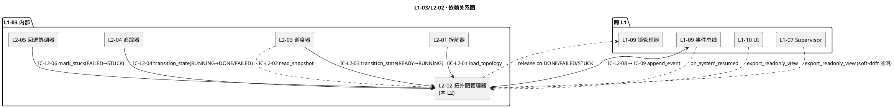
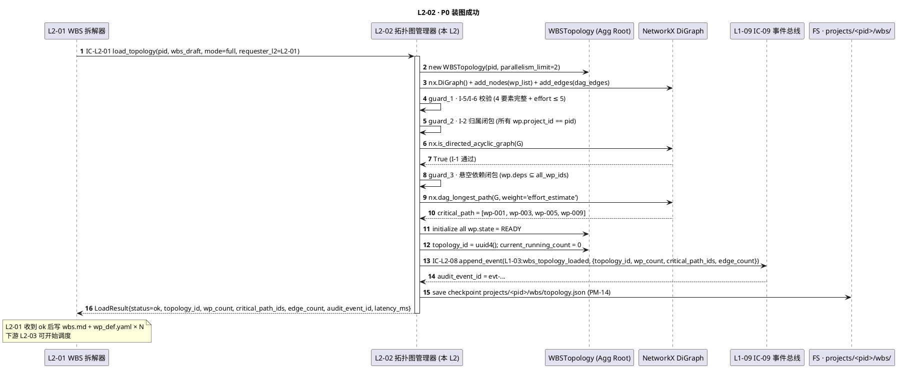
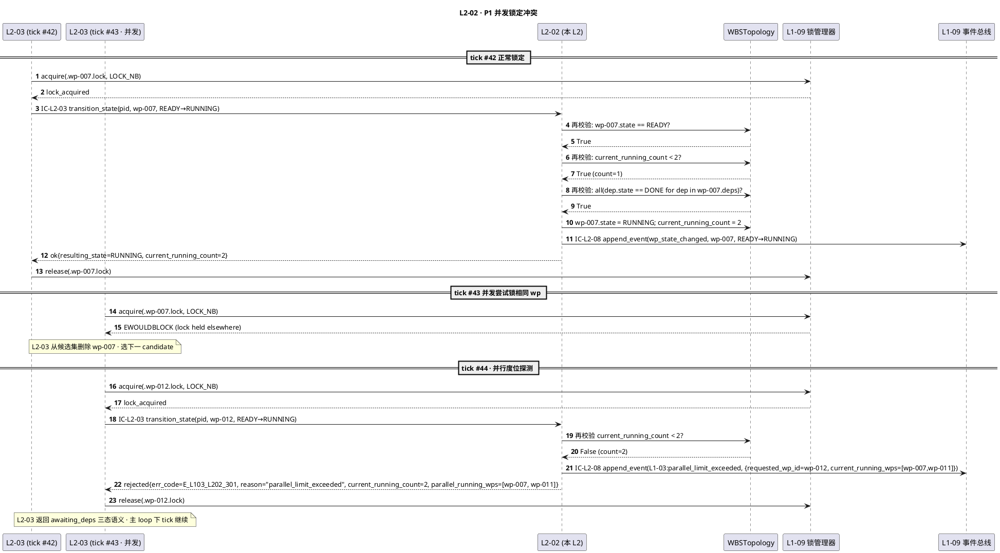
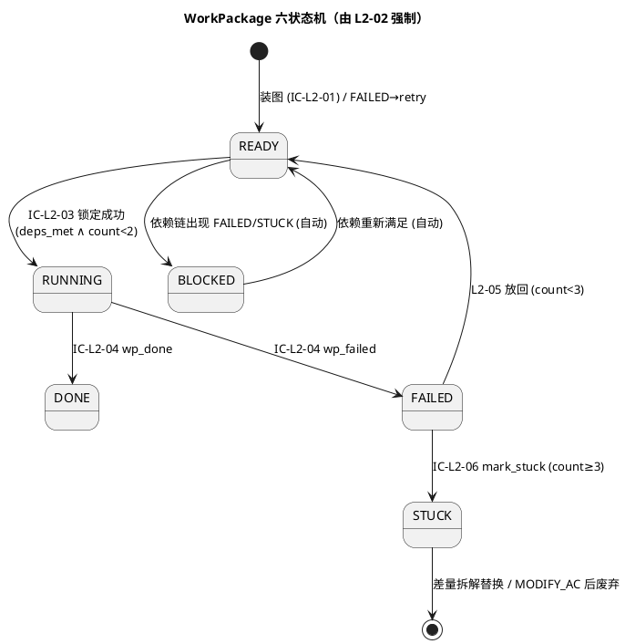
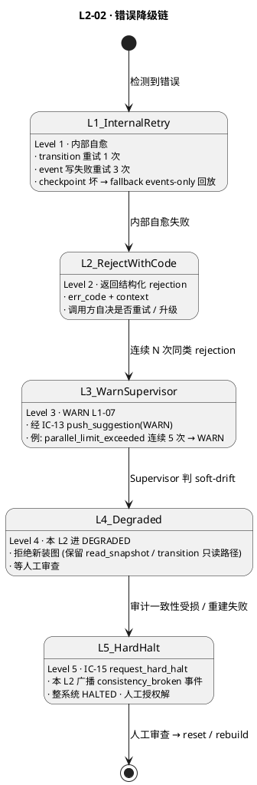

# L1 L2-02 · 拓扑图管理器 · Tech Design

> **本文档定位**：3-1-Solution-Technical 层级 · L1 的 L2-02 拓扑图管理器 技术实现方案（L2 粒度）。
> **与产品 PRD 的分工**：2-prd/L1-03-WBS+WP 拓扑调度/prd.md §5.3 的对应 L2 节定义产品边界，本文档定义**技术实现**（接口字段级 schema + 算法伪代码 + 底层数据结构 + 状态机 + 配置参数）。
> **与 L1 architecture.md 的分工**：architecture.md 负责**跨 L2 架构 + 跨 L2 时序**，本文档负责**本 L2 内部技术细节**。冲突以 architecture.md 为准。
> **严格规则**：本文档不复述产品 PRD 文字（职责 / 禁止 / 必须等清单），只做技术映射 + 补齐"产品视角未说 but 工程师必须知道"的部分（具体算法 · syscall · schema · 配置）。

---

## §0 撰写进度

- [x] §1 定位 + 2-prd §9 L2-02 映射（含 6 关键决策 D-01..D-06）
- [x] §2 DDD 映射（BC-03 · 7 Invariants · Entity · VO · Domain Events · Repository）
- [x] §3 对外接口定义（5 接收 + 1 发起 + 1 导出 · YAML schema · 14 错误码）
- [x] §4 接口依赖（被谁调 · 调谁 · 依赖图 PlantUML）
- [x] §5 P0/P1 时序图（P0 装图成功 + P1 并发锁定冲突 · 2 张 PlantUML）
- [x] §6 内部核心算法（7 步 guard + 跃迁事务 + 跨 session 重建 + 差量合并）
- [x] §7 底层数据表 / schema 设计（PM-14 分片 · topology.json + wp-queue + wp-progress）
- [x] §8 状态机（六状态封闭 + 9 合法跃迁 + PlantUML）
- [x] §9 开源最佳实践（NetworkX ADOPT + Airflow/Temporal/Prefect LEARN · ≥ 4 项目）
- [x] §10 配置参数清单（10 项）
- [x] §11 错误处理 + 降级策略（5 Level + PlantUML + 协同表 + 可用能力矩阵）
- [x] §12 性能目标（SLO + 吞吐 + 健康指标）
- [x] §13 反向映射 prd §9 + 前向 3-2 TDD（17 TC ID + 3 ADR + 3 OQ）

---

## §1 定位 + 2-prd 映射

### 1.1 本 L2 的唯一命题（One-Liner）

**L1-03 的"运行期真值源"** —— 以 `WBSTopology` 聚合根封装 WP 之间的依赖 DAG + 六状态节点状态机 + 关键路径 + 并行度位（≤ 2）守护，作为 L2-01（装图）/ L2-03（调度）/ L2-04（追踪）/ L2-05（回退）的**共同只写入口**，任何绕过本 L2 的状态修改都是违规。

### 1.2 与 `2-prd/L1-03 WBS+WP 拓扑调度/prd.md §9` 的精确小节映射

| 2-prd 锚点 | 本 L2 § 段 | 翻译方式 |
|---|---|---|
| prd §9.1 职责 + 锚定（scope §5.3.1 / PM-04 / PM-10 / PM-08） | §1.1 命题 + §2.1 BC 定位 | 一句话职责 + DDD 聚合根定位 |
| prd §9.2 输入 / 输出 | §3 字段级 YAML schema + §4 依赖图 | 文字级描述 → IC 字段级契约 |
| prd §9.3 In / Out-of-scope（8 + 8） | §1.7 YAGNI 边界 + §2.3 与兄弟 L2 分工 | 技术级不越位清单 |
| prd §9.4 硬约束 7 条（DAG 无环 / 并行 ≤ 2 / 状态机封闭 / 一致性守护 / 可重建 / 依赖只读 / 关键路径自动重算） | §2.3 Invariants I-1..I-7 + §5 时序 + §6 算法 + §8 状态机 | 7 硬约束 → 7 不变量 → 算法 + 时序图强制 |
| prd §9.5 🚫 禁止行为 8 条 | §11 错误处理对应错误码 + §3 拒绝路径 | 每 🚫 对应 1 个错误码 |
| prd §9.6 ✅ 必须义务 9 条 | §6 算法骨架 + §5 时序主干 | 必须义务在代码路径上落地 |
| prd §9.7 🔧 可选功能 5 项 | §10 配置参数开关 | 可选功能用 config flag |
| prd §9.8 IC 交互（5 被调 + 1 调）| §3 方法定义 + §4 依赖图 | IC-L2-XX → 方法签名 |
| prd §9.9 G-W-T 大纲（6 P + 6 N + 3 I） | §13.2 TDD 映射矩阵 | 15 TC ID 锚定 |
| prd §9.10 性能文字 | §12 SLO 表 | 文字描述 → P95 / P99 数字 |

### 1.3 与 `L1-03/architecture.md` 的位置映射

引用 architecture.md §3.1 主架构图，本 L2 处于 **运行期（S4 常驻）package 内，作为唯一 Aggregate Root**，与 L2-03 / L2-04 / L2-05 的关系如下（锚定 §3.1 Mermaid → PlantUML 化）：

- **L2-01 → L2-02**：IC-L2-01 装图 + DAG 校验（规划期 / 差量）
- **L2-03 → L2-02**：IC-L2-02 读快照 + IC-L2-03 申请状态锁定
- **L2-04 → L2-02**：IC-L2-04 申请状态跃迁（running → done / failed）
- **L2-05 → L2-02**：IC-L2-06 标 stuck（failed → stuck）
- **L1-09 → L2-02**：system_resumed 事件触发拓扑重建
- **L2-02 → L1-09**：IC-L2-08 → IC-09 每次状态变更审计

**物理载体**（architecture.md §3.3）：主 Skill Runtime 的 Python 辅助模块 · NetworkX DiGraph 内存表示 · 不需要独立 subagent session · 逻辑进程归属主 skill。

### 1.4 与兄弟 L2 的边界（L1-03 的 5 L2 中 L2-02 的定位）

| L2 | 定位 | 与 L2-02 的分工 |
|---|---|---|
| **L2-01** WBS 拆解器 | Domain Service + Factory（一次性 / 差量）| 生产拓扑草稿 → IC-L2-01 交 L2-02 校验 + 入库；自身不持有状态 |
| **L2-02**（本 L2）拓扑图管理器 | **Aggregate Root** WBSTopology + 一致性守护 | 持有唯一真值 · 所有读写必经本层 |
| **L2-03** WP 调度器 | Application Service（pull）| 每次 get_next_wp 从 L2-02 读快照；自身无状态 |
| **L2-04** WP 完成度追踪器 | Domain Service + VO ProgressMetrics | 订阅 wp_done/wp_failed → 调 L2-02 跃迁 + 聚合 4 项指标；不持拓扑 |
| **L2-05** 失败回退协调器 | Domain Service + Entity FailureCounter | 连续失败 ≥ 3 → 调 L2-02 标 stuck；不持拓扑 |

**边界规则**：本 L2 是 L1-03 的**守门人 + 真值源**；所有 WP 状态 / 依赖结构的变化必经 IC-L2-01 / IC-L2-03 / IC-L2-04 / IC-L2-06 四个入口，任一路径都要经 §6.3 一致性守护（DAG 无环 + 跃迁合法 + 并行度位守护 + 4 要素完整）。

### 1.5 PM-14 约束（project_id as root）

引用 `L0/ddd-context-map.md §3.2 PM-14`，本 L2 所有数据结构 / 持久化路径 / 事件 / 锁键**必须**带 `project_id` 并与 BC-02 `ProjectAggregate.id` 强绑定：

- `WBSTopology(project_id)` —— 主键，跨 project 禁止依赖
- `projects/<pid>/wbs/topology.json` —— PM-14 分片落盘
- `projects/<pid>/wbs/checkpoints/<ts>.json` —— 跨 session 快照
- `L1-03:*` 事件 `project_id` 字段为硬必填（schema 层由 L1-09 校验）
- Invariant I-2 归属闭包：所有 `WorkPackage.project_id == WBSTopology.project_id`（违反 → `E_L103_L202_201`）

### 1.6 关键技术决策（Decision → Rationale → Alternatives → Trade-off）

| # | 决策 | Rationale | Alternatives（弃用原因） | Trade-off |
|---|---|---|---|---|
| D-01 | **内核用 NetworkX（Python 纯库）** | BSD-3 许可 · 零服务依赖 · 算法齐全（`is_directed_acyclic_graph` / `find_cycle` / `dag_longest_path` / `topological_generations` / `descendants`）· 15k+ stars | Airflow（需 Postgres + scheduler 独立进程）· Dagster（Asset-first 哲学不匹配 WP）· Dask/Ray（分布式 overhead 过高）· 自研 dict + Kahn 算法（cycle detection 易错） | 单机内存图规模上限 ~10k 节点 · HarnessFlow 项目典型 20-200 WP，远在安全线内 |
| D-02 | **内存图 + 事件总线真值源双层架构** | G 是派生视图（可由 events.jsonl 完整重建）· checkpoint 仅加速启动 · 符合 PM-10 单一事实源 | 持久化 NetworkX G（pickle） / 独立 Graph DB（Neo4j）：增加真值源多副本风险 · 跨 session 一致性 fragile | checkpoint stale 时需增量回放 · 设计 `apply_event()` 幂等保证回放正确性 |
| D-03 | **单 Aggregate Root WBSTopology + 所有写入必经一致性守护** | DDD 聚合独立性 · PM-08 可审计 · 防止 L2-03/04/05 各写一份副本导致漂移 | 每 L2 各自持有状态缓存 → 副本一致性维护成本 × N，且失败时难定位 | 所有状态变更都要走 L2-02 一次 RPC / 函数调用（内存开销可忽略）· 收益 >> 成本 |
| D-04 | **六状态机封闭跃迁集（RUNNING/READY/DONE/FAILED/BLOCKED/STUCK）** | 2-prd §9.4 硬约束 3 · 每条跃迁有触发源 + guard · 禁止非法跃迁用错误码拦截 | 扁平开关（state.is_done = true）：失去跃迁时机语义；无法审计 | 新状态加入需同时改 `LEGAL_TRANSITIONS` 集合 + PlantUML + 错误码表（三处同步） |
| D-05 | **并行度位守护用 `current_running_count` 整数 + O(1) 检查** | 不需要遍历 wp_list 统计 · 加减操作原子（在 IC-L2-03/L2-04 跃迁路径上 +1/-1） | 每次扫 wp_list 统计 RUNNING 数：O(V) 无必要 | 需要保证 `current_running_count` 与 `sum(state==RUNNING)` 始终一致（`apply_event` 幂等 + 启动时一次性校准） |
| D-06 | **差量合并保留已 DONE WP 身份不变** | 2-prd §8.9 P5 语义 · 回退场景（SPLIT_WP）下不应重做已完成任务 · `preserved = {n for n in G if state==DONE}` | 差量时把已 DONE 也重新拆：违反"已完成不重做"原则，浪费成本 | 差量装图复杂度比全量高（需合并 preserved + new_sub_wps），但性能仍 ≤ 全量 1/4（§12 性能约束） |

### 1.7 YAGNI 边界（本 L2 不做的事）

- ❌ **不做 WBS 层级拆解**（→ L2-01）· 本 L2 只接受 draft 装图
- ❌ **不做 WP 调度决策**（→ L2-03）· 本 L2 只提供 `read_snapshot` + `transition_state`
- ❌ **不做完成率 / 剩余工时聚合**（→ L2-04）· 只提供基础数据（current_running_count / done_count / failed_count）
- ❌ **不做失败计数**（→ L2-05）· FailureCounter 是 L2-05 的 Entity
- ❌ **不做 DoD 判定**（→ L1-04）· 只持有 `dod_expr_ref`（VO id 引用）
- ❌ **不做事件总线落盘**（→ L1-09）· 通过 IC-09 委托
- ❌ **不做 UI 渲染**（→ L1-10）· 只暴露 `export_readonly_view()`
- ❌ **不做跨 project 依赖**（PM-14 硬约束） · 装图时依赖闭包校验

### 1.8 本 L2 读者预期

- **TDD 工程师**：从 §3（YAML schema）+ §11（错误码表）+ §13（TDD TC ID）生成用例
- **实现工程师**：从 §6（伪代码）+ §7（持久化 schema）+ §8（状态机）直接落代码
- **集成测试作者**：从 §5（时序图）+ §4（依赖图）理解跨 L2 协同
- **Supervisor（L1-07）**：从 §12.3 健康指标订阅 soft-drift 信号

---

## §2 DDD 映射（BC-03 WBS+WP Topology Scheduling）

### 2.1 Bounded Context 定位

引用 `L0/ddd-context-map.md §2.4 BC-03` + `§4.3`，本 L2 是 **BC-03 的 Aggregate Root 持有者**（整个 L1-03 唯一聚合根就是 WBSTopology，由本 L2 持有）。

**BC-03 关系摘要**：
- 与 **BC-02 Project Lifecycle**：Customer-Supplier（本 L2 供应装图 / 重建能力）
- 与 **BC-01 Agent Decision Loop**：Customer-Supplier（本 L2 供应 read_snapshot）
- 与 **BC-04 Quality Loop**：双向（本 L2 订阅 wp_done/wp_failed → 跃迁 state）
- 与 **BC-07 Harness Supervision**：Partnership（死锁 / stuck 升级）
- 与 **BC-09 Resilience & Audit**：Partnership（所有状态变更走 IC-09）

### 2.2 Aggregate Root · WBSTopology（本 L2 唯一聚合根）

```
WBSTopology(project_id)
├── wp_list[]                : Entity WorkPackage 集合
├── dag_edges[]              : VO DAGEdge(from_wp_id → to_wp_id)
├── critical_path[]          : VO CriticalPath（wp_id 序列）
├── parallelism_limit        : VO（固定 = 2）
├── current_running_count    : 派生状态（整数 · O(1) 更新）
├── topology_id              : VO（装图时一次性生成 · 版本追踪）
└── last_rebuilt_at          : VO（最近一次重建时间戳）
```

### 2.3 聚合根不变量（Invariants · I-1..I-7）

**本 L2 强制的 7 不变量**（任何读写路径上都要保持）：

- **I-1 DAG 无环**：`wp_list + dag_edges` 任何时刻都是合法 DAG · 用 `nx.is_directed_acyclic_graph(G) == True` 强制
- **I-2 归属闭包**：`∀wp ∈ wp_list, wp.project_id == self.project_id`（PM-14 硬约束）
- **I-3 并行度守卫**：`sum(wp.state == RUNNING for wp in wp_list) <= parallelism_limit (= 2)` · 用派生状态 `current_running_count` O(1) 检查
- **I-4 状态机单调性**：`wp.state` 只能沿 `LEGAL_TRANSITIONS`（§8.2）变化
- **I-5 4 要素完整性**：`∀wp, wp.goal != null AND wp.dod_expr_ref != null AND wp.effort_estimate != null AND wp.deps 已定义`
- **I-6 粒度约束**：`∀wp, wp.effort_estimate <= 5`（天）
- **I-7 事件可重放**：任一时刻 `WBSTopology` 可由该 project 的 `events.jsonl` 中 `L1-03:*` 事件从创世事件回放重建（`apply_event()` 幂等）

### 2.4 Entity · WorkPackage

外部**只能经由 WBSTopology（即本 L2）访问**，内部字段：`wp_id / goal / dod_expr_ref / deps[] / effort_estimate / recommended_skills[] / state ∈ {READY,RUNNING,DONE,FAILED,BLOCKED,STUCK} / failure_count（派生 · 由 L2-05 维护）`。

### 2.5 Value Objects（不可变）

- `DAGEdge(from_wp_id, to_wp_id)` · 集合语义去重
- `CriticalPath([wp_id_0, wp_id_1, ...])` · 差量合并后必刷新
- `ProgressMetrics(completion_rate, remaining_effort, done_wps, running_wps)` · L2-04 生产的只读快照（本 L2 不持有）
- `TopologySnapshot(topology_id, wp_states_map, current_running_count, critical_path, snapshot_ts)` · `read_snapshot` 返回值

### 2.6 Domain Events（本 L2 对外发布 · 经 IC-L2-08 → IC-09）

| 事件名 | 触发时机 | 必含字段 | 消费方 |
|---|---|---|---|
| `L1-03:wbs_topology_loaded` | 装图成功 | `project_id / topology_id / wp_count / critical_path_ids / edge_count` | L2-01 ack 回 · L1-02 S2 Gate |
| `L1-03:wp_state_changed` | 任何状态跃迁（含 apply_event 回放）| `project_id / wp_id / from_state / to_state / reason / tick_id` | L2-04 聚合 · L2-05 订阅（失败信号）· L1-10 UI |
| `L1-03:dag_cycle_detected` | 装图时检测到环 | `project_id / offending_nodes / cycle_edges` | L2-01 rethrow L1-02 S2 Gate |
| `L1-03:parallel_limit_exceeded` | IC-L2-03 锁定被拒（第 3 个并发）| `project_id / requested_wp_id / current_running_wps` | L2-03 重试下一候选 |
| `L1-03:topology_rebuilt` | 跨 session 重建完成 | `project_id / topology_id / source (checkpoint/events_only) / applied_event_count` | L1-01 下一 tick 可继续调度 |

### 2.7 Repository Interface

```python
class WBSTopologyRepository(ABC):
    def save(self, topology: WBSTopology) -> None: ...
    def find_by_project(self, pid: ProjectId) -> Optional[WBSTopology]: ...
    def update_wp_state(self, pid, wp_id, from_state, to_state, reason) -> None: ...  # 事务：校验 → append_event → 内存改
    def rebuild_from_events(self, pid: ProjectId) -> WBSTopology: ...                  # 跨 session
    def export_readonly_view(self, pid: ProjectId) -> TopologySnapshot: ...            # UI / L1-07
```

### 2.8 跨 BC 关系摘要

- **不持有 BC-04 DoDExpression 对象**，只持 `dod_expr_ref`（VO id）· 允许 BC-04 独立演进
- **锁委托 BC-09 L2-02 锁管理器**（`.wp-<wp_id>.lock` · fcntl.flock · `LOCK_NB`）· 本 L2 不自研锁

---

## §3 对外接口定义（字段级 YAML schema + 错误码）

### 3.1 接口清单总览（5 接收 + 1 发起 + 1 只读导出）

| IC | 方向 | 方法签名 | 被调方 SLO |
|---|---|---|---|
| **IC-L2-01** | L2-01 → 本 L2 | `load_topology(pid, wbs_draft, mode) → LoadResult` | P95 ≤ 2s / 硬上限 5s |
| **IC-L2-02** | L2-03 → 本 L2 | `read_snapshot(pid) → TopologySnapshot` | P95 ≤ 50ms / 硬上限 200ms |
| **IC-L2-03** | L2-03 → 本 L2 | `transition_state(pid, wp_id, from_state=READY, to_state=RUNNING, reason) → Ack` | P95 ≤ 100ms / 硬上限 500ms |
| **IC-L2-04** | L2-04 → 本 L2 | `transition_state(pid, wp_id, from_state=RUNNING, to_state ∈ {DONE,FAILED}, reason)` | 同上 |
| **IC-L2-06** | L2-05 → 本 L2 | `mark_stuck(pid, wp_id, evidence_refs) → Ack` | P95 ≤ 100ms |
| **IC-L2-08** | 本 L2 → L1-09 | `append_event(evt)` 经 IC-09 | P95 ≤ 10ms（fire-and-forget 语义）|
| **export** | UI / L1-07 → 本 L2 | `export_readonly_view(pid) → ReadonlyView` | P95 ≤ 50ms |

### 3.2 IC-L2-01 · `load_topology` 入 / 出参 schema

```yaml
# ic_l2_01_load_topology_request.yaml
type: object
required: [project_id, wbs_draft, mode, requester_l2]
properties:
  project_id: { type: string, pattern: "^hf-proj-[a-zA-Z0-9_-]+$" }
  mode: { type: string, enum: [full, incremental] }
  requester_l2: { type: string, enum: ["L2-01"] }
  wbs_draft:
    type: object
    required: [wp_list, dag_edges, source_ref]
    properties:
      wp_list:
        type: array
        items:
          type: object
          required: [wp_id, goal, dod_expr_ref, deps, effort_estimate]
          properties:
            wp_id: { type: string, pattern: "^wp-[0-9]{3}$" }
            goal: { type: string, maxLength: 200 }
            dod_expr_ref: { type: string }                     # BC-04 DoDExpression id
            deps: { type: array, items: { type: string } }
            effort_estimate: { type: number, minimum: 0.1, maximum: 5.0 }   # 天
            recommended_skills: { type: array, items: { type: string }, default: [] }
      dag_edges:
        type: array
        items:
          type: object
          required: [from_wp_id, to_wp_id]
          properties:
            from_wp_id: { type: string }
            to_wp_id: { type: string }
      source_ref: { type: string, description: "L2-01 生成该草案的 trace id" }
  tick_id: { type: string, nullable: true, description: "调用发生的 tick id · 用于审计链" }
```

```yaml
# ic_l2_01_load_topology_response.yaml
type: object
required: [status, project_id]
properties:
  status: { type: string, enum: [ok, rejected] }
  project_id: { type: string }
  topology_id: { type: string, nullable: true }           # status=ok 必填
  wp_count: { type: integer, nullable: true }
  critical_path_ids: { type: array, items: { type: string }, nullable: true }
  edge_count: { type: integer, nullable: true }
  rejection:
    type: object
    nullable: true
    properties:
      err_code: { type: string }                          # 见 §3.7
      reason: { type: string }
      offending_nodes: { type: array, items: { type: string }, nullable: true }
      cycle_edges: { type: array, items: { type: object }, nullable: true }
  audit_event_id: { type: string }
  latency_ms: { type: integer }
```

### 3.3 IC-L2-02 · `read_snapshot` 入 / 出参 schema

```yaml
# ic_l2_02_read_snapshot_request.yaml
type: object
required: [project_id, requester_l2]
properties:
  project_id: { type: string }
  requester_l2: { type: string, enum: ["L2-03", "L2-04", "L2-05", "L1-07", "L1-10"] }
  include_fields:
    type: array
    default: [wp_states, critical_path, current_running_count]
    items: { type: string, enum: [wp_states, critical_path, current_running_count, topology_meta, edges] }
  tick_id: { type: string, nullable: true }
```

```yaml
# ic_l2_02_read_snapshot_response.yaml
type: object
required: [status, project_id, snapshot]
properties:
  status: { type: string, enum: [ok, not_found, rejected] }
  project_id: { type: string }
  snapshot:
    type: object
    properties:
      topology_id: { type: string }
      wp_states:
        type: object
        description: "{wp_id: {state, deps_met, effort_estimate, in_critical_path}}"
        additionalProperties:
          type: object
          properties:
            state: { type: string, enum: [READY, RUNNING, DONE, FAILED, BLOCKED, STUCK] }
            deps_met: { type: boolean }
            effort_estimate: { type: number }
            in_critical_path: { type: boolean }
      critical_path: { type: array, items: { type: string } }
      current_running_count: { type: integer }
      edge_count: { type: integer, nullable: true }
      snapshot_ts_ns: { type: integer }
  audit_event_id: { type: string, nullable: true }
  latency_ms: { type: integer }
```

### 3.4 IC-L2-03 / IC-L2-04 · `transition_state` 入 / 出参 schema（统一签名）

```yaml
# ic_l2_transition_state_request.yaml
type: object
required: [project_id, wp_id, from_state, to_state, reason, requester_l2]
properties:
  project_id: { type: string }
  wp_id: { type: string }
  from_state: { type: string, enum: [READY, RUNNING, DONE, FAILED, BLOCKED, STUCK] }
  to_state: { type: string, enum: [READY, RUNNING, DONE, FAILED, BLOCKED, STUCK] }
  reason: { type: string, minLength: 3, maxLength: 200 }
  requester_l2: { type: string, enum: [L2-03, L2-04, L2-05] }
  evidence_refs: { type: array, items: { type: string }, default: [] }   # events.jsonl evt-id
  tick_id: { type: string, nullable: true }
```

```yaml
# ic_l2_transition_state_response.yaml
type: object
required: [status, project_id, wp_id]
properties:
  status: { type: string, enum: [ok, rejected] }
  project_id: { type: string }
  wp_id: { type: string }
  resulting_state: { type: string, nullable: true }
  current_running_count: { type: integer, nullable: true }
  rejection:
    type: object
    nullable: true
    properties:
      err_code: { type: string }
      reason: { type: string }
      current_state: { type: string, nullable: true }
      parallel_running_wps: { type: array, items: { type: string }, nullable: true }
  audit_event_id: { type: string }
  latency_ms: { type: integer }
```

### 3.5 IC-L2-06 · `mark_stuck`（L2-05 专用 · FAILED → STUCK）

```yaml
# ic_l2_06_mark_stuck_request.yaml
type: object
required: [project_id, wp_id, failure_count, evidence_refs, advice_card_ref]
properties:
  project_id: { type: string }
  wp_id: { type: string }
  failure_count: { type: integer, minimum: 3 }                     # < 3 则 L2-05 自身错误
  evidence_refs: { type: array, items: { type: string }, minItems: 1 }
  advice_card_ref: { type: string, description: "L2-05 生成的回退建议卡 id" }
  tick_id: { type: string, nullable: true }
```

### 3.6 只读导出 · `export_readonly_view`（L1-10 UI / L1-07 Supervisor）

```yaml
# export_readonly_view_response.yaml
type: object
required: [project_id, topology_id]
properties:
  project_id: { type: string }
  topology_id: { type: string }
  nodes:
    type: array
    items:
      type: object
      properties:
        wp_id: { type: string }
        goal: { type: string }
        state: { type: string }
        effort_estimate: { type: number }
        in_critical_path: { type: boolean }
        depth_level: { type: integer }   # topological_generations 分层索引
  edges:
    type: array
    items: { type: object, properties: { from_wp_id: {type: string}, to_wp_id: {type: string}, on_critical_path: {type: boolean} } }
  health:
    type: object
    properties:
      total_wps: { type: integer }
      done_wps: { type: integer }
      running_wps: { type: integer }
      failed_wps: { type: integer }
      stuck_wps: { type: integer }
      completion_rate: { type: number }
      parallelism_util: { type: number }     # current_running_count / 2
```

### 3.7 错误码总表（14 条四列 · 风格 `E_L103_L202_NNN`）

| 错误码 | 含义（meaning）| 触发场景（trigger）| 调用方处理（callerAction）|
|---|---|---|---|
| `E_L103_L202_101` | DAG 装图失败：检测到环 | `load_topology` 时 `nx.is_directed_acyclic_graph(G) == False` | L2-01 rethrow L1-02 → S2 Gate 阻挡 · 要求修复 wbs_draft |
| `E_L103_L202_102` | 悬空依赖（dangling deps）| WP.deps 中存在 `wp_list` 不包含的 wp_id | L2-01 修复 draft（删依赖或补节点）后重试 |
| `E_L103_L202_103` | 4 要素不完整 | `goal / dod_expr_ref / deps / effort_estimate` 任一为 null | L2-01 补齐 4 要素后重试 |
| `E_L103_L202_104` | WP 粒度超限（> 5 天）| `effort_estimate > 5.0` | L2-01 自动触发再拆一层或回交 S2 Gate 人工修正 |
| `E_L103_L202_105` | 跨 project 依赖 | WP.deps 中存在其他 project 的 wp_id | 升级硬红线 · L2-01 拒绝装图 · L1-07 WARN |
| `E_L103_L202_201` | WP 归属不一致（PM-14）| WP.project_id != WBSTopology.project_id | 装图前拒绝 · 审计 bypass_attempt |
| `E_L103_L202_301` | 并行度上限超出 | IC-L2-03 锁定时 `current_running_count >= 2` | L2-03 从候选集剔除该 WP · 选下一 candidate |
| `E_L103_L202_302` | 依赖未 satisfied | IC-L2-03 锁定时该 WP 仍有 deps.state != DONE | L2-03 返回 `awaiting_deps` 三态语义 |
| `E_L103_L202_303` | 非法状态跃迁 | from_state → to_state 不在 `LEGAL_TRANSITIONS` 中 | 调用方（L2-03/04/05）必为 bug · L1-07 WARN + 审计 · 拒绝写入 |
| `E_L103_L202_304` | stale state（再校验失败）| lock 期间 state 已变 | L2-03 重试（≤ 3 次）· 超 3 次返回调用链 |
| `E_L103_L202_305` | wp_id 不存在 | transition_state / mark_stuck 引用不存在的 wp_id | 调用方 bug · 审计 · 拒绝 |
| `E_L103_L202_401` | 状态跃迁审计事件写入失败 | IC-09 `append_event` 下游失败 | 本 L2 拒绝产 ack（PM-08 一致性优先）· 重试 3 次 · 仍失败 → WARN L1-07 |
| `E_L103_L202_402` | 跨 session 重建失败（checkpoint + events 都异常）| rebuild_from_events 回放时 state inconsistent | 本 L2 进入 DEGRADED 模式 · IC-15 request_hard_halt · 人工审查 |
| `E_L103_L202_501` | 外部直接改拓扑数据尝试（bypass） | 通过 FS 直写 `projects/<pid>/wbs/topology.json` 绕过本层 | 启动时 consistency_check 识别 · 审计 bypass_attempt · L1-07 WARN |

**错误码结构化返回模板**（所有错误统一）：

```yaml
status: rejected
rejection:
  err_code: E_L103_L202_301
  reason: "parallel_limit_exceeded: current_running_count=2 >= parallelism_limit=2"
  current_state: READY
  parallel_running_wps: [wp-007, wp-012]
audit_event_id: "evt-20260422-l103-l202-00042"
latency_ms: 18
```

---

## §4 接口依赖（被谁调 · 调谁）

### 4.1 上游调用方

| 调用方 | 方法 | 通道 | 频率 | SLO |
|---|---|---|---|---|
| L2-01 WBS 拆解器 | `load_topology` (IC-L2-01) | 同步内存 | 规划期 1 次 + 差量 N 次 | P95 ≤ 2s |
| L2-03 WP 调度器 | `read_snapshot` (IC-L2-02) | 同步内存 | 每 tick 1 次（S4 高频）| P95 ≤ 50ms |
| L2-03 WP 调度器 | `transition_state` READY→RUNNING (IC-L2-03) | 同步内存 + 锁 | 每 tick 0-1 次 | P95 ≤ 100ms |
| L2-04 追踪器 | `transition_state` RUNNING→DONE/FAILED (IC-L2-04) | 同步内存 + 锁释放 | 按 wp_done/wp_failed 事件 | P95 ≤ 100ms |
| L2-05 回退协调器 | `mark_stuck` FAILED→STUCK (IC-L2-06) | 同步内存 | 失败 ≥ 3 次 · 低频 | P95 ≤ 100ms |
| L1-09 事件总线（订阅）| `on_system_resumed` | 异步事件 | bootstrap 1 次 | 秒级 |
| L1-10 UI / L1-07 Supervisor | `export_readonly_view` | 同步本地读 | UI 刷新 / Supervisor 轮询 | P95 ≤ 50ms |

### 4.2 下游依赖

| IC | 对端 | 触发条件 | 锚点 |
|---|---|---|---|
| **IC-09** append_event | L1-09（经 IC-L2-08）| 每次装图 / 状态跃迁 / 重建 | [ic-contracts §3.9](../../integration/ic-contracts.md) |
| **L1-09 锁管理器** 间接依赖 | BC-09 | transition_state 路径上 L2-03 会先取锁 | L1-09 L2-02 锁原语 |
| **system_resumed 事件** | L1-09 | bootstrap | L1-09 L2-01 事件总线核心 |

### 4.3 依赖图（PlantUML）



### 4.4 关键依赖特性

1. **L2-02 是唯一写入 gateway**：所有 WP state 变化必经本 L2 一致性守护 · 任何绕过路径（FS 直写）被 §11 错误码 E_L103_L202_501 拦截
2. **纯函数语义（除事件副作用）**：`read_snapshot` / `export_readonly_view` 幂等 · `transition_state` 副作用限于内存 AGG + IC-09 事件
3. **IC-09 耦合度高（Partnership）**：IC-09 不可达时本 L2 拒绝产 ack · 符合 PM-08 审计链完整性
4. **锁委托 L1-09（不自研）**：fcntl.flock LOCK_NB 由 L1-09 L2-02 锁原语提供 · 本 L2 只做状态跃迁事务

---

## §5 P0/P1 时序图（PlantUML ≥ 2 张）

### 5.1 P0 主干 · 装图成功（全量装图 · 对应 BF-S2-WBS）

**场景**：S2 末 L2-01 完成草稿 → IC-L2-01 提交装图 → 本 L2 跑完 7 步 guard → `wbs_topology_loaded` 广播；所有状态初始化为 READY。



**关键时序语义**：

- **7 步 guard 顺序严格**（4 要素 → 归属闭包 → DAG 无环 → 悬空依赖 → 粒度约束 → 关键路径 → 初始化状态）· 任一失败 → 整体拒绝（I-1..I-7 中任一违反不得部分装图）
- **装图是 All-or-Nothing 事务**：事件 `wbs_topology_loaded` 在**所有 guard 通过后**才写，避免脏数据
- **checkpoint 非真值源**：写盘是加速启动，真值源是 `L1-03:*` 事件流（I-7 · 可重放）
- **时长预期**：典型 20-200 WP 下 P95 ≤ 2s（§12 SLO）

### 5.2 P1 异常 · 并发锁定冲突 + 重试（stale state）

**场景**：L1-01 主 loop 同时触发两次 `get_next_wp`（理论上单决策源防，但需防御性设计）· L2-03 两次调 IC-L2-03 锁定 wp-007 · 本 L2 靠再校验 + 错误码拒绝第二次。



**关键时序语义**：

- **三层防御**：L1-09 锁管理器（fcntl.flock LOCK_NB）是第一层 · 本 L2 再校验是第二层 · `LEGAL_TRANSITIONS` 集合是第三层
- **再校验必做**（不能信任 `read_snapshot` 时的状态）· 锁持有期间状态也可能被其他路径（L2-04 跃迁 running→done）改动
- **错误码 E_L103_L202_301 必附 current_running_wps**：L2-03 调度重试时可排除冲突集合
- **时长预期**：`transition_state` P95 ≤ 100ms / 硬上限 500ms（§12 SLO）· 被拒路径应更短（< 50ms）

---

## §6 内部核心算法（伪代码）

### 6.1 装图 + 7 步 guard（`load_topology` 骨架）

```python
def load_topology(pid, wbs_draft, mode) -> LoadResult:
    G = nx.DiGraph()
    for wp in wbs_draft.wp_list:
        G.add_node(wp.wp_id, **wp.as_attrs())
    G.add_edges_from(wbs_draft.dag_edges)
    # guard_1 · I-5/I-6 4 要素 + 粒度
    for wp in wbs_draft.wp_list:
        if not (wp.goal and wp.dod_expr_ref and wp.deps is not None and wp.effort_estimate):
            raise TopologyError("E_L103_L202_103", missing=wp.wp_id)
        if wp.effort_estimate > 5.0:
            raise TopologyError("E_L103_L202_104", wp_id=wp.wp_id, effort=wp.effort_estimate)
    # guard_2 · I-2 归属闭包
    for wp in wbs_draft.wp_list:
        if wp.project_id != pid:
            raise TopologyError("E_L103_L202_201", wp_id=wp.wp_id)
    # guard_3 · I-1 DAG 无环
    if not nx.is_directed_acyclic_graph(G):
        cycle = list(nx.find_cycle(G))
        raise TopologyError("E_L103_L202_101", cycle_edges=cycle)
    # guard_4 · 悬空依赖
    all_ids = {wp.wp_id for wp in wbs_draft.wp_list}
    for wp in wbs_draft.wp_list:
        missing = set(wp.deps) - all_ids
        if missing:
            raise TopologyError("E_L103_L202_102", wp_id=wp.wp_id, missing=missing)
    # guard_5 · 关键路径
    critical_path = nx.dag_longest_path(G, weight='effort_estimate')
    # guard_6 · 差量模式保留已 DONE 身份
    if mode == 'incremental':
        G = _merge_incremental(existing_G, G, preserved_done=True)
    # guard_7 · 初始化
    topology = WBSTopology(pid, G, critical_path, parallelism_limit=2)
    _emit('L1-03:wbs_topology_loaded', topology)
    return LoadResult(ok, topology_id=topology.id, wp_count=len(G), critical_path=critical_path)
```

### 6.2 状态跃迁事务（`transition_state` 骨架 · 一致性守护）

```python
LEGAL_TRANSITIONS = {
    (READY, RUNNING), (RUNNING, DONE), (RUNNING, FAILED),
    (FAILED, READY), (FAILED, STUCK),
    (READY, BLOCKED), (BLOCKED, READY),
}

def transition_state(pid, wp_id, from_state, to_state, reason, requester_l2) -> Ack:
    topology = _load_agg(pid)
    wp = topology.get_wp_or_raise(wp_id)                        # E_305
    if (from_state, to_state) not in LEGAL_TRANSITIONS:
        raise TopologyError("E_L103_L202_303", from_state, to_state)
    if wp.state != from_state:
        raise TopologyError("E_L103_L202_304", current=wp.state)    # stale
    # 再校验并行度位 + 依赖 satisfied
    if to_state == RUNNING:
        if topology.current_running_count >= topology.parallelism_limit:
            raise TopologyError("E_L103_L202_301", current=topology.current_running_count)
        if not all(topology.get_wp(d).state == DONE for d in wp.deps):
            raise TopologyError("E_L103_L202_302")
    # 事务：append_event → 内存 mut → 派生状态同步
    evt = _append_event_with_retry('L1-03:wp_state_changed', wp_id, from_state, to_state, reason)
    if evt is None:
        raise TopologyError("E_L103_L202_401")  # audit 不可达 · 拒绝产 ack
    wp.state = to_state
    if from_state != RUNNING and to_state == RUNNING:
        topology.current_running_count += 1
    if from_state == RUNNING and to_state in (DONE, FAILED):
        topology.current_running_count -= 1
    return Ack(ok, wp_id=wp_id, resulting_state=to_state,
               current_running_count=topology.current_running_count, audit_event_id=evt.id)
```

### 6.3 跨 session 重建（`rebuild_from_events` 骨架）

```python
def rebuild_from_events(pid) -> WBSTopology:
    ckpt = _find_latest_checkpoint(pid)
    if ckpt:
        topology = WBSTopology.from_json(ckpt.read())           # 加速
        incremental_events = _read_events_after(pid, ckpt.ts)
    else:
        topology = WBSTopology(pid)
        incremental_events = _read_all_l103_events(pid)
    for evt in incremental_events:
        topology.apply_event(evt)                               # 幂等
    topology.recompute_derived()                                # current_running_count 等
    critical_path = nx.dag_longest_path(topology.G, weight='effort_estimate')
    topology.critical_path = critical_path
    # 一致性自检
    if not nx.is_directed_acyclic_graph(topology.G):
        raise TopologyError("E_L103_L202_402", reason="rebuilt G is cyclic")
    _emit('L1-03:topology_rebuilt', source='checkpoint' if ckpt else 'events_only',
          applied=len(incremental_events))
    return topology
```

### 6.4 差量合并骨架（SPLIT_WP 场景 · L2-05 调 L2-01 回调本 L2）

```python
def _merge_incremental(G_old, G_new_subtree, preserved_done=True) -> nx.DiGraph:
    # preserved = 所有已 DONE 的 WP（不被差量重写）
    preserved = {n for n, d in G_old.nodes(data=True) if d['state'] == DONE} if preserved_done else set()
    # redo_zone = target + descendants - preserved
    target_id = G_new_subtree.graph['target_wp_id']
    redo_zone = {target_id} | set(nx.descendants(G_old, target_id)) - preserved
    G = G_old.copy()
    G.remove_nodes_from(redo_zone)                              # 摘掉要重做的下游
    G = nx.compose(G, G_new_subtree)                            # 拼上新子图
    return G
```

### 6.5 并发控制要点

- `WBSTopology` 内存对象单实例（per project_id）· 所有写入路径在主 Skill 单线程内串行
- 跨 session / 跨 Skill 进程并发由 L1-09 锁管理器 + fcntl.flock 兜底
- `current_running_count` 用 CAS 语义（`_if_equal_then_set`）避免竞态 · 回放时一次性 recompute 校准

---

## §7 底层数据表 / schema 设计（字段级 YAML · PM-14 分片）

### 7.1 物理存储路径（全 PM-14 分片 · `projects/<pid>/wbs/*`）

| 路径 | 作用 | 更新频率 | 真值源？ |
|---|---|---|---|
| `projects/<pid>/wbs/topology.json` | WBSTopology 聚合快照 | 每 N 次 state 变化（默认 N=10）+ 大事件（装图 / 重建）| 否（加速启动）|
| `projects/<pid>/wbs/checkpoints/<ts>.json` | 历史快照 · 最近 5 份滚动 | 每次 save 备份前一份 | 否 |
| `projects/<pid>/wbs/wp-queue/<wp_id>.json` | 单 WP 最新状态 · 供 L2-03 读 | 每次 transition 同步 | 否（可由 events.jsonl 重建）|
| `projects/<pid>/wbs/wp-progress/<wp_id>.jsonl` | 单 WP 状态变化历史 · 供 L2-04 聚合 | append-only | 否（派生）|
| `projects/<pid>/events.jsonl` | 所有 `L1-03:*` 事件（L1-09 管） | append-only | **是**（I-7 真值源）|

### 7.2 topology.json 字段级 schema

```yaml
# topology.json
type: object
required: [project_id, topology_id, version, last_updated_ns, wp_list, dag_edges, critical_path, parallelism_limit, current_running_count, checkpoint_hash]
properties:
  project_id: { type: string }
  topology_id: { type: string, description: "装图时 uuid4 · 差量合并生成新 id" }
  version: { type: integer, minimum: 1, description: "schema version · migration 用" }
  last_updated_ns: { type: integer }
  wp_list:
    type: array
    items:
      type: object
      required: [wp_id, goal, dod_expr_ref, deps, effort_estimate, state]
      properties:
        wp_id: { type: string }
        goal: { type: string }
        dod_expr_ref: { type: string }
        deps: { type: array, items: { type: string } }
        effort_estimate: { type: number }
        recommended_skills: { type: array, items: { type: string }, default: [] }
        state: { type: string, enum: [READY, RUNNING, DONE, FAILED, BLOCKED, STUCK] }
        entered_running_ns: { type: integer, nullable: true }
        done_ns: { type: integer, nullable: true }
  dag_edges:
    type: array
    items: { type: object, properties: { from_wp_id: {type: string}, to_wp_id: {type: string} } }
  critical_path: { type: array, items: { type: string } }
  parallelism_limit: { type: integer, const: 2 }
  current_running_count: { type: integer, minimum: 0, maximum: 2 }
  checkpoint_hash: { type: string, description: "sha256(canonical json without this field) · 自检用" }
```

### 7.3 wp-queue 单 WP 快照 schema

```yaml
# projects/<pid>/wbs/wp-queue/<wp_id>.json
type: object
properties:
  wp_id: { type: string }
  state: { type: string }
  deps_met: { type: boolean }
  in_critical_path: { type: boolean }
  effort_estimate: { type: number }
  updated_ns: { type: integer }
```

### 7.4 索引结构（内存）

- `wp_by_id: Dict[str, WorkPackage]` · O(1) 查找
- `state_index: Dict[state, Set[wp_id]]` · O(1) 某状态节点集合（供 `read_snapshot` 快速筛选）
- `deps_reverse_index: Dict[wp_id, Set[wp_id]]` · 逆向依赖（某 WP done 后哪些 WP 的 deps 可解除 BLOCKED）

---

## §8 状态机（本 L2 持有聚合根 · 六状态）

### 8.1 定性

本 L2 **持有 WBSTopology 聚合根**（内存 · per project_id），其中 `WorkPackage.state` 是状态机的主对象。本 L2 自身在正常路径为无状态服务，但**维护 WP 状态机的合法跃迁规则**。

### 8.2 PlantUML 状态图（六状态封闭跃迁）



### 8.3 状态转换表（Trigger / Guard / Action · 对齐 `LEGAL_TRANSITIONS`）

| # | From | To | Trigger | Guard | Action |
|---|---|---|---|---|---|
| T1 | * | READY | 装图 (IC-L2-01) | 装图 guard 1-7 通过 | 初始化 `state=READY, entered_running_ns=null` |
| T2 | READY | RUNNING | IC-L2-03 transition_state | `deps 全 DONE ∧ current_running_count < 2` | `count += 1`, `entered_running_ns = now_ns`, emit `wp_state_changed` |
| T3 | RUNNING | DONE | IC-L2-04 | `wp.state == RUNNING` | `count -= 1`, `done_ns = now_ns`, release lock, emit event |
| T4 | RUNNING | FAILED | IC-L2-04 | 同上 | `count -= 1`, release lock, emit event |
| T5 | FAILED | READY | IC-L2-03（L2-05 代 L1-04 触发）| `failure_count < 3` | reset entered_running_ns, emit event |
| T6 | FAILED | STUCK | IC-L2-06 | `failure_count >= 3 ∧ evidence_refs 非空` | emit event, 移出 L2-03 候选池 |
| T7 | READY | BLOCKED | 内部自动（其他 WP 跃迁 FAILED/STUCK 触发依赖链扫描）| 至少一个上游 dep 处于 FAILED/STUCK 且无 READY 替代路径 | emit event |
| T8 | BLOCKED | READY | 内部自动（上游跃迁 DONE / READY）| 所有上游 dep 不再处于 FAILED/STUCK | emit event |
| T9 | STUCK | * | 仅差量拆解（经 IC-L2-01 `mode=incremental`）或 MODIFY_AC | 外部合同变更 | 节点被移除 / 替换 |

**所有不在上表的跃迁由 `LEGAL_TRANSITIONS` 集合强制拒绝**（错误码 E_L103_L202_303 · §11）。

---

## §9 开源最佳实践调研（≥ 3 GitHub 高星项目）

### 9.1 项目 1 · NetworkX（⭐⭐⭐⭐⭐ ADOPT · 图算法内核）

- **Star / 活跃度**：GitHub ~15k stars · 2026 年仍活跃维护 · BSD-3-Clause
- **核心架构一句话**：纯 Python 的通用图论库，提供 DiGraph / 算法家族（DAG / 最短路 / 连通分量 / 最长路径）
- **Adopt**：本 L2 内核（§5.1 / §6.1 骨架均基于 NetworkX）
  - `is_directed_acyclic_graph(G)` → I-1 无环校验
  - `find_cycle(G)` → 环节点定位（错误信息用）
  - `dag_longest_path(G, weight='effort_estimate')` → 关键路径
  - `topological_generations(G)` → 分层拓扑排序（供 L2-03 候选排序 + L1-10 UI 分层渲染）
  - `descendants(G, target)` → 差量合并时识别 redo_zone
  - `node_link_data / node_link_graph` → checkpoint JSON 序列化
- **Learn**：其 Graph 类的不可变视图模式 (`G.copy(as_view=True)`) 适合 `read_snapshot`
- **Reject 部分**：不用 Graph Drawing（matplotlib 可视化）· 可视化由 L1-10 独立承担

### 9.2 项目 2 · Apache Airflow（⭐⭐⭐⭐ LEARN · DAG 调度语义参考）

- **Star / 活跃度**：GitHub ~35k stars · ASF 顶级项目
- **核心架构一句话**：工业级 DAG 任务编排平台 · DAG.py → scheduler → executor → worker 四层
- **Adopt**：无（不引入代码依赖）
- **Learn**：
  - DAG 节点六状态机（queued/running/success/failed/skipped/upstream_failed）与本 L2 六状态高度对齐 · 印证设计
  - `TaskGroup` 概念对应 WBS 分层拆解（L2-01 职责）
  - Retry 策略与 L2-05 回退协调器的 failure_count 对应
- **Reject**：
  - 依赖 Postgres/MySQL metadata DB · 与 Skill 零服务红线冲突
  - Executor（Celery/K8s）引入分布式 overhead · HarnessFlow 单机足够
  - 调度周期基于 crontab/datetime · 本 L2 是事件驱动

### 9.3 项目 3 · Temporal（⭐⭐⭐⭐ LEARN · 状态机持久化参考）

- **Star / 活跃度**：GitHub ~12k stars · 商业开源
- **核心架构一句话**：可靠 workflow 引擎 · Event-sourced state + 确定性 replay
- **Adopt**：无（语言绑定 + server 部署太重）
- **Learn**：
  - **Event sourcing + replay 模型**与本 L2 I-7（可重放）完全同构 · 验证本 L2 `apply_event` 设计方向
  - Workflow task heartbeat 对应本 L2 L2-04 进度打点
  - Activity retry policies 对应本 L2 L2-05 回退链
- **Reject**：
  - 需部署 Temporal server + Cassandra/Postgres
  - SDK 语言绑定复杂（Go/Java/Python）· 不符合 Skill 单语言栈

### 9.4 项目 4 · Prefect（⭐⭐⭐ LEARN · 流程编排 DX 参考）

- **Star / 活跃度**：GitHub ~16k stars · 活跃
- **核心架构一句话**：Python 原生 workflow 引擎 · Flow+Task 装饰器
- **Adopt**：无
- **Learn**：其 `State` 类家族（Pending / Running / Completed / Failed / Cached）的 Result[T] 代数类型设计可借鉴到本 L2 错误码 rejection 模板
- **Reject**：同样需要 Prefect Server + Postgres · 与零服务红线冲突

### 9.5 综合采纳决策

| 维度 | 采纳来源 | 弃用 |
|---|---|---|
| **图算法实现** | NetworkX（代码依赖）| 自研 Kahn / DFS |
| **状态机设计** | 对齐 Airflow 六状态语义 | 扁平状态机 |
| **Event-sourcing 哲学** | Temporal 启发（不引入代码）| 单副本真值 |
| **错误码代数类型** | Prefect Result[T] 启发 | 异常驱动 |
| **UI 分层渲染** | NetworkX `topological_generations` | 自研分层算法 |

---

## §10 配置参数清单

| 参数名 | 默认值 | 可调范围 | 意义 | 调用位置 |
|---|---|---|---|---|
| `parallelism_limit` | `2` | `1..2`（硬上限 2 · 不可调高）| 同时 RUNNING 的 WP 数 · PM-04 硬约束 | `transition_state` 再校验 |
| `checkpoint_save_interval_n` | `10` | `1..100` | 每 N 次 state 变化 save checkpoint | `transition_state` 后置回调 |
| `checkpoint_rolling_window` | `5` | `1..20` | checkpoints 目录保留最近 N 份 | checkpoint save 前清理 |
| `append_event_retry_count` | `3` | `1..5` | IC-09 写失败重试次数 | `_append_event_with_retry` |
| `append_event_retry_backoff_ms` | `[50, 100, 200]` | 指数退避序列 | 重试间隔 | 同上 |
| `rebuild_apply_event_batch_size` | `500` | `100..5000` | 跨 session 重建时一次 apply 的事件数 | `rebuild_from_events` |
| `snapshot_cache_ttl_ms` | `100` | `0..1000` | `read_snapshot` 结果缓存（0 = 禁用）| `read_snapshot` |
| `consistency_check_on_bootstrap` | `true` | bool | 启动时 `current_running_count` vs `sum(state==RUNNING)` 一致性校验 | bootstrap |
| `export_readonly_view_include_edges` | `true` | bool | export 响应是否带 edges 数组（UI 关 · Supervisor 开）| `export_readonly_view` |
| `degraded_mode_read_stale_ok` | `true` | bool | DEGRADED 下是否返回最后快照（`read_snapshot` stale flag）| §11.4 可用能力矩阵 |

**配置优先级**：环境变量 > `projects/<pid>/config/l103.yaml` > 默认值。所有可调参数变化必须审计（`config_changed` 事件 · L1-07 可订阅）。

---

## §11 错误处理 + 降级策略

### 11.1 错误分类 · 响应策略（引 §3.7 错误码总表 14 条）

| 错误码前缀 | 分类 | 典型错误码 | 本 L2 响应策略 | 是否产 ack |
|---|---|---|---|---|
| `E_L103_L202_1**` | **装图时结构错误**（I-1/I-5/I-6 违反）| 101 环 · 102 悬空 · 103 4 要素缺 · 104 粒度超 · 105 跨 project | 整体拒绝 · 返回 rejection + offending_nodes · L2-01 rethrow L1-02 S2 Gate | 是（status=rejected）|
| `E_L103_L202_2**` | **PM-14 违反** | 201 归属不一致 | 升级硬红线 · 拒绝装图 · 审计 bypass_attempt · L1-07 WARN | 是（status=rejected）|
| `E_L103_L202_3**` | **运行期调度冲突** | 301 并行度超 · 302 依赖未 sat · 303 非法跃迁 · 304 stale · 305 wp 不存在 | 返回 rejection · 调用方（L2-03/04/05）按错误码自决重试 / 降级 / bug 升级 | 是（status=rejected）|
| `E_L103_L202_4**` | **审计 / 恢复下游失败** | 401 event 写失败 · 402 跨 session 重建失败 | 401 重试 3 次仍失败 → WARN L1-07 · 402 进 DEGRADED + IC-15 hard_halt | 401 有 · 402 无（本 L2 拒绝产 ack）|
| `E_L103_L202_5**` | **bypass / 一致性破坏** | 501 外部直写 FS 绕过本层 | 启动 consistency_check 识别 · 审计 · WARN | N/A |

### 11.2 降级链（Priority 高到低 · 5 Level · 对齐 L1-07 Supervisor 4 级）



### 11.3 与兄弟 L2 / L1-07 Supervisor 的降级协同

| 场景 | 本 L2 响应 | 兄弟 L2 响应 | L1-07 响应 |
|---|---|---|---|
| **IC-09 append_event 不可达** | 重试 3 次 · 仍失败拒绝产 ack（PM-08 一致性优先）| L2-03 / L2-04 感知 ack 失败 · 回滚本次调度 · 下 tick 重试 | 收 `L1-09:bus_degraded` · BLOCK 候选 |
| **checkpoint 损坏** | fallback 全量事件回放 · 记 `L1-03:checkpoint_corrupted_fallback` | L2-04 / L2-05 等 `L1-03:topology_rebuilt` 再消费 | soft-drift 监测 |
| **跨 session 重建中 state inconsistent** | 进 DEGRADED + IC-15 hard_halt | L2-03 见 IC-L2-02 返回 `rebuilding` 拒绝取 WP | 收 `consistency_broken` · HARD HALT |
| **第 N+1 个并发锁定被拒（E_301 连续 ≥ 5 次）** | 返回 rejection · 事件连续发 | L2-03 识别 idle_spin + WARN L1-07 | push WARN · 判 idle_spin 候选 |
| **非法跃迁（E_303）突发** | 单次拒绝 · 审计 | 调用方按 err_code 自查 bug | 单次 WARN · 若 ≥ 3 次判 BLOCK 候选（上游 L2 有 bug）|
| **拓扑 bypass_attempt（E_501）** | 启动 consistency_check 识别 · WARN | 其他 L2 不感知 | 收 audit 告警 · 立即 BLOCK 候选 |

### 11.4 降级期间可用能力矩阵

| 方法 | Normal | DEGRADED | HARD HALTED |
|---|---|---|---|
| `load_topology`（IC-L2-01）| ✅ 正常 | ❌ 拒绝（等审查）| ❌ 拒绝 |
| `read_snapshot`（IC-L2-02）| ✅ 正常 | ⚠️ 返回 stale flag + 上次快照 | ❌ 拒绝 |
| `transition_state`（IC-L2-03/04）| ✅ 正常 | ❌ 拒绝（避免污染真值）| ❌ 拒绝 |
| `mark_stuck`（IC-L2-06）| ✅ 正常 | ❌ 拒绝 | ❌ 拒绝 |
| `export_readonly_view` | ✅ 正常 | ✅ 带 degraded flag | ⚠️ 返回最近快照（只读审计用）|

**设计意图**：DEGRADED 下尽力保留**只读路径**（让 UI / Supervisor 仍能观察），完全禁写（避免把 inconsistent 状态写进 events.jsonl）。

---

## §12 性能目标

### 12.1 延迟 SLO（P95 / P99 / 硬上限）

| 方法 | P95 | P99 | 硬上限 | PRD 锚点 |
|---|---|---|---|---|
| `load_topology` 全量（20-200 WP）| 2s | 3s | 5s | prd §9.10 性能 |
| `load_topology` 差量（≤ 20 WP 新增）| 500ms | 1s | 2s | prd §9.10（"显著快于全量"）|
| `read_snapshot` | 20ms | 50ms | 200ms | prd §9.10 "不应成为 L2-03 调度热路径瓶颈" |
| `transition_state`（通过）| 50ms | 100ms | 500ms | prd §9.10 "亚秒级" |
| `transition_state`（拒绝）| 20ms | 50ms | 200ms | — |
| `mark_stuck` | 50ms | 100ms | 500ms | 同 transition_state |
| `export_readonly_view` | 30ms | 50ms | 200ms | UI 刷新不得卡顿 |
| `rebuild_from_events`（~1k 事件）| 1s | 2s | 5s | prd §9.10 "秒级可接受" |

### 12.2 吞吐 / 资源

| 维度 | 目标 | 说明 |
|---|---|---|
| `transition_state` QPS | ≥ 20 tps | 单 project S4 高频路径峰值 |
| `read_snapshot` QPS | ≥ 50 qps | L1-10 UI + L1-07 Supervisor 轮询 |
| 内存占用（典型 200 WP）| ≤ 20MB | NetworkX DiGraph + indexes + event queue |
| 内存占用（极端 1000 WP）| ≤ 100MB | 上限警戒 · 超过 WARN L1-07 |
| 单 topology.json 大小 | ≤ 500KB（典型）| checkpoint 加载速度保证 |

### 12.3 健康指标（供 L1-07 监控 soft-drift）

- `topology_load_p99_ms` · 窗口 10 次 · > 5000ms 为 WARN
- `transition_reject_rate` · 窗口 100 次 · > 30% 为 SUGG（调用方频繁踩错）
- `parallel_limit_exceeded_count_per_min` · > 10 为 SUGG（L2-03 调度有问题）
- `audit_retry_success_rate` · 窗口 100 次 · < 95% 为 WARN（IC-09 下游不稳）
- `rebuild_event_replay_ms_per_1k_events` · > 3000ms 为 SUGG（checkpoint 策略需调）
- `consistency_check_mismatch_count` · startup 1 次 · > 0 为 BLOCK 候选（一致性破坏）

---

## §13 与 2-prd / 3-2 TDD 的映射表

### 13.1 本 L2 方法 ↔ `docs/2-prd/L1-03 WBS+WP 拓扑调度/prd.md §9` 反向映射

| 本 L2 方法 / § 段 | 2-prd §9 锚点 | 映射类型 |
|---|---|---|
| `load_topology`（IC-L2-01）| prd §9.2 输入"WBS 拓扑数据装图请求" + §9.6 必须 "DAG 无环校验" | 处理器 |
| `read_snapshot`（IC-L2-02）| prd §9.2 输入"节点状态快照读请求" + §9.6 必须 "暴露拓扑只读数据" | 处理器 |
| `transition_state`（IC-L2-03）| prd §9.2 输入"状态锁定请求" + §9.4 硬约束 2/3/5 | 处理器 |
| `transition_state`（IC-L2-04）| prd §9.2 输入"状态跃迁申请" + §9.6 必须 "封闭六状态跃迁合法性校验" | 处理器 |
| `mark_stuck`（IC-L2-06）| prd §9.2 输入"stuck 标记申请" | 处理器 |
| `on_system_resumed` | prd §9.6 必须 "响应 system_resumed 触发重建" | 处理器 |
| `export_readonly_view` | prd §9.6 必须 "向 L1-10 暴露可视化只读数据" + "向 L1-07 暴露进度节奏基础数据" | 处理器 |
| §2 DDD 聚合根 7 不变量 | prd §9.4 硬约束 1-7 | DDD 落地 |
| §8 六状态机 | prd §9.4 硬约束 3 | 状态机落地 |
| §11 错误处理降级链 | prd §9.5 禁止 1-8 + prd §9.10 异常处理文字 | 错误语义落地 |

### 13.2 § 段 ↔ `docs/3-2-Solution-TDD/L1-03-WBS+WP 拓扑调度/L2-02-tests.md`（前向占位 · 待建 · TC ID 矩阵 ≥ 15）

| # | TC ID | 覆盖 § | G-W-T 对应 | 用例定性 |
|---|---|---|---|---|
| 1 | TC-L103-L202-P01 | §6.1 + §5.1 | prd §9.9 P1 | 正常装图 · 合法 DAG → ok + critical_path |
| 2 | TC-L103-L202-P02 | §6.2 + §5.2 | prd §9.9 P2 | READY→RUNNING 锁定 · deps_met + count<2 → ok |
| 3 | TC-L103-L202-P03 | §6.2 + §11.1 | prd §9.9 P3 | 第 3 个锁定 → E_301 并行超上限 |
| 4 | TC-L103-L202-P04 | §6.2 + §8.3 T3 | prd §9.9 P4 | RUNNING→DONE · count 减 1 + lock 释放 |
| 5 | TC-L103-L202-P05 | §6.3 + §5 | prd §9.9 P5 | 跨 session 重建 · checkpoint + events 回放 |
| 6 | TC-L103-L202-P06 | §6.4 + §6.1 | prd §9.9 P6 | 差量合并 · 保留 DONE + 新子图拼接 |
| 7 | TC-L103-L202-N01 | §6.1 + §11 | prd §9.9 N1 | DAG 有环 → E_101 + offending_nodes |
| 8 | TC-L103-L202-N02 | §11.1 | prd §9.9 N2 | 并发锁定 3rd → E_301 + parallel_running_wps |
| 9 | TC-L103-L202-N03 | §6.2 | prd §9.9 N3 | 依赖未 satisfied → E_302 awaiting_deps |
| 10 | TC-L103-L202-N04 | §6.2 + §8.2 | prd §9.9 N4 | READY→DONE 非法跃迁 → E_303 |
| 11 | TC-L103-L202-N05 | §11.3 | prd §9.9 N5 | bypass FS 直写 → E_501 + bypass_attempt 审计 |
| 12 | TC-L103-L202-N06 | §6.1 + §11 | prd §9.9 N6 | 运行时改依赖（非差量入口）→ rejected |
| 13 | TC-L103-L202-I01 | §4 + §5 | prd §9.9 I1 | 连续取 2 WP + 第 3 拒 + 第 1 DONE 后第 3 放开（跨 L2-03）|
| 14 | TC-L103-L202-I02 | §6.3 + §5 | prd §9.9 I2 | kill-restart · resume 至 kill 时 RUNNING 状态 |
| 15 | TC-L103-L202-I03 | §6.4 | prd §9.9 I3 | L2-05 → L2-01 差量 → L2-02 合并 · 关键路径刷新 |
| 16 | TC-L103-L202-B01 | §6.2 + §11.2 | §11 降级 Level | IC-09 连续失败 3 次 → 本 L2 拒绝产 ack（401）|
| 17 | TC-L103-L202-B02 | §6.3 + §11 | §11 降级 Level | rebuild 后图仍 cyclic → 进 DEGRADED + IC-15 |

### 13.3 本 L2 ↔ `docs/3-1-Solution-Technical/integration/ic-contracts.md`（跨 L1 契约锚点）

| 本 L2 引用 | ic-contracts 锚点 | 方向 |
|---|---|---|
| append_event（L1-03:*）| [§3.9 IC-09](../../integration/ic-contracts.md) | 发起 |
| on_system_resumed 订阅 | [§3.9 IC-09](../../integration/ic-contracts.md) | 接收 |
| 间接受 L2-03 调 IC-02 触发 | [§3.2 IC-02](../../integration/ic-contracts.md) | 被依赖 |
| 间接受 L2-01 因 IC-19 触发 | [§3.19 IC-19](../../integration/ic-contracts.md) | 被依赖 |
| 回退链终点 L1-07 IC-14 | [§3.14 IC-14](../../integration/ic-contracts.md) | 被依赖 |
| 降级升级 IC-15 hard_halt | [§3.15 IC-15](../../integration/ic-contracts.md) | 发起 |

### 13.4 Architecture Decision Records（ADR · 本 L2 特有）

| ADR-ID | Decision | 锚定 § | 状态 |
|---|---|---|---|
| **ADR-L103-L202-01** | NetworkX 作为唯一图算法内核（拒绝 Airflow / Dagster / Ray）| §1.6 D-01 + §9.1 | Accepted |
| **ADR-L103-L202-02** | 事件总线（events.jsonl）为真值源 · checkpoint 仅加速 · 所有重建通过 `apply_event` 幂等回放 | §1.6 D-02 + §6.3 | Accepted |
| **ADR-L103-L202-03** | 单 Aggregate Root WBSTopology + 所有写入必经一致性守护（DEGRADED 下只读可用、禁写）| §1.6 D-03 + §11.4 | Accepted |

### 13.5 Open Questions（OQ · 待 R5 TDD 阶段或后续 retro 回答）

| OQ-ID | 问题 | 当前 workaround | 决策 deadline |
|---|---|---|---|
| **OQ-L103-L202-01** | 是否需要跨 project 的全局并行度上限（防超大项目启动多 project 时总并行 > 2）？| 当前仅 per-project 2 · 跨 project 由 L1-02 决定启动数量 | M4 性能测试阶段 |
| **OQ-L103-L202-02** | BLOCKED 状态的触发是否应该变成显式事件（`wp_blocked_auto`）而非派生状态扫描？| 当前为依赖链扫描 | R5 TDD 阶段 |
| **OQ-L103-L202-03** | 差量合并后 wp_id 复用策略（新子 WP 用什么命名规则避免冲突）| 当前由 L2-01 保证 `wp-NNN` 单调递增 | L2-01 depth-B 填充后对齐 |

---

*— L1-03 L2-02 拓扑图管理器 · depth-B 填充完成（R4.2-D · 2026-04-22）—*
