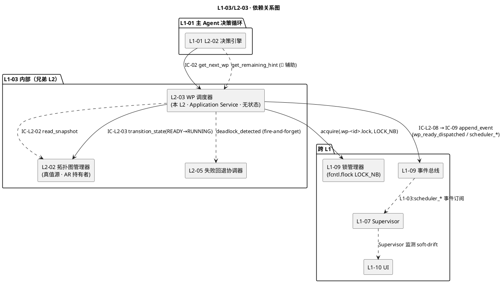
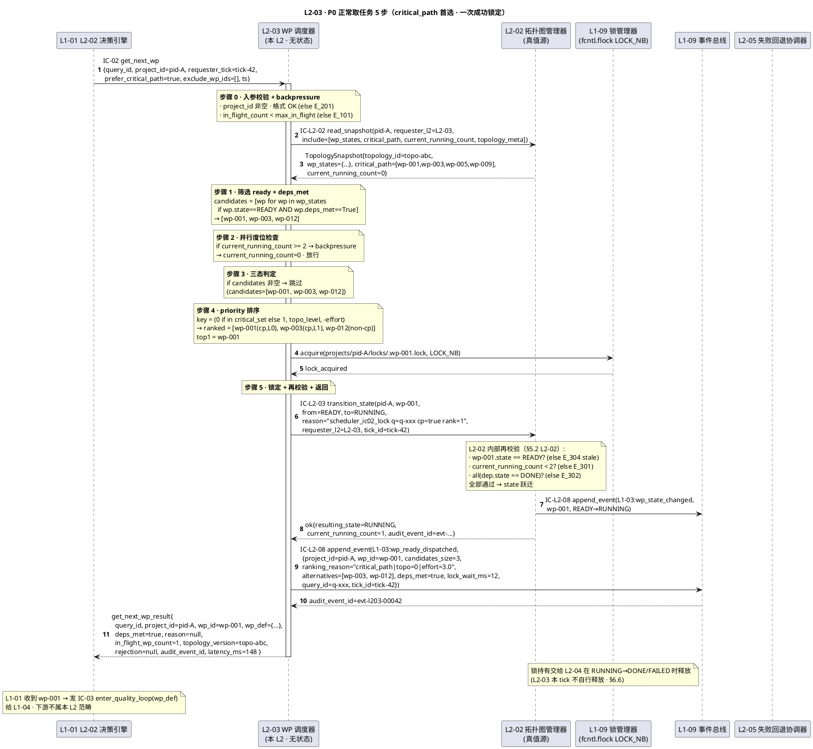
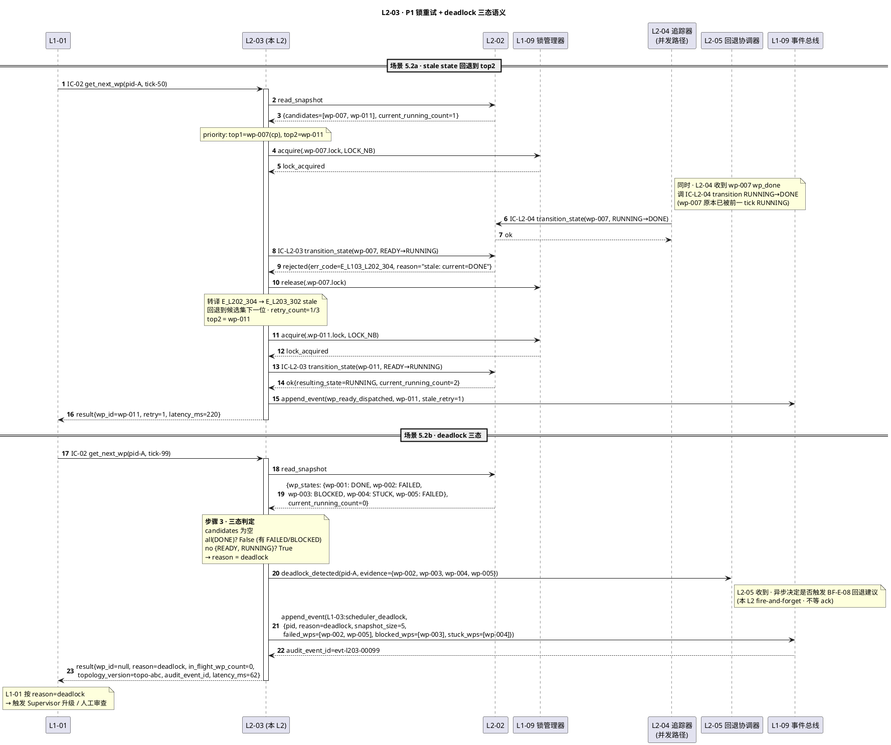
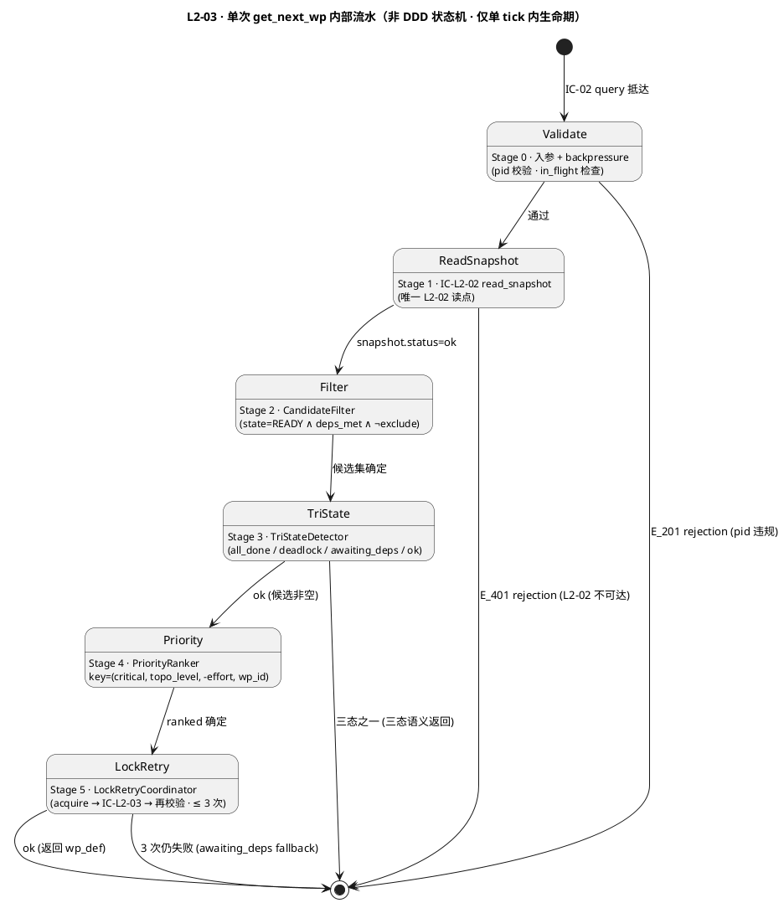
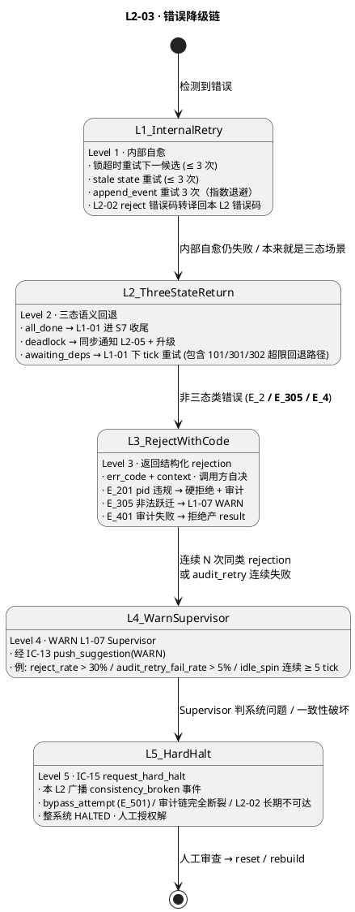

# L1 L2-03 · WP 调度器 · Tech Design

> **本文档定位**：3-1-Solution-Technical 层级 · L1 的 L2-03 WP 调度器 技术实现方案（L2 粒度）。
> **与产品 PRD 的分工**：2-prd/L1-03-WBS+WP 拓扑调度/prd.md §5.3 的对应 L2 节定义产品边界，本文档定义**技术实现**（接口字段级 schema + 算法伪代码 + 底层数据结构 + 状态机 + 配置参数）。
> **与 L1 architecture.md 的分工**：architecture.md 负责**跨 L2 架构 + 跨 L2 时序**，本文档负责**本 L2 内部技术细节**。冲突以 architecture.md 为准。
> **严格规则**：本文档不复述产品 PRD 文字（职责 / 禁止 / 必须等清单），只做技术映射 + 补齐"产品视角未说 but 工程师必须知道"的部分（具体算法 · syscall · schema · 配置）。

---

## §0 撰写进度

- [x] §1 定位 + 2-prd §10 L2-03 映射（含 6 关键决策 D-01..D-06）
- [x] §2 DDD 映射（BC-03 · Application Service · 无状态 · 5 组件）
- [x] §3 对外接口定义（1 接收 IC-02 + 3 调用 IC-L2-02/03/IC-09 + get_remaining_hint · YAML schema · 13 错误码）
- [x] §4 接口依赖（被谁调 · 调谁 · 依赖图 PlantUML）
- [x] §5 P0/P1 时序图（P0 正常取任务 5 步 + P1 三态语义分支 + 锁重试 · 2 张 PlantUML）
- [x] §6 内部核心算法（5 步调度规则 + 三态判定 + priority key + 锁重试 + 再校验）
- [x] §7 持久化（本 L2 无持久化 · 仅消费 L2-02 快照 + 写 wp-scheduler 审计事件）
- [x] §8 状态机（本 L2 无状态 · Application Service · 每次从 L2-02 读快照 · 明确标注）
- [x] §9 开源最佳实践（Celery/Kueue/Dagster scheduler/Prefect/Airflow scheduler · ≥ 4 项目）
- [x] §10 配置参数清单（10 项）
- [x] §11 错误处理 + 降级策略（13 错误码 + 5 Level 降级链 + PlantUML + 协同表）
- [x] §12 性能目标（SLO + 吞吐 + 健康指标）
- [x] §13 反向映射 prd §10 + 前向 3-2 TDD（≥ 15 TC ID + 3 ADR + 3 OQ）

---

## §1 定位 + 2-prd 映射

### 1.1 本 L2 的唯一命题（One-Liner）

**L1-03 的"调度侧门牙"** —— 无状态 Application Service：响应 L1-01 主 loop 的 IC-02 `get_next_wp`，从 L2-02 真值源读快照 → 按 4 步规则筛选 → 三态判定 → 关键路径优先 → 取锁 + IC-L2-03 锁定 + 再校验 → 返回 `(wp_id, wp_def, deps_met)` 或 `(null, reason ∈ {all_done, deadlock, awaiting_deps})`。本 L2 **不持有拓扑状态 / 不写真值 / 不后台调度**，一切决策每 tick 实时从 L2-02 重算。

关键定性（来自 architecture.md §6.3 + prd §10.4 硬约束 6）：**本 L2 是无状态 Application Service**——跨 tick 无任何可变状态 / 无 class attribute / 无 module global · 调度函数纯函数化以支撑 100% 单元可测 + 崩溃即重启零恢复成本。

### 1.2 与 `2-prd/L1-03 WBS+WP 拓扑调度/prd.md §10` 的精确小节映射

| 2-prd 锚点 | 本 L2 § 段 | 翻译方式 |
|---|---|---|
| prd §10.1 职责 + 锚定（scope §5.3.1 / BF-S4-01 / PM-04）| §1.1 命题 + §2.1 BC 定位 | 一句话职责 + Application Service 定位 |
| prd §10.2 输入 / 输出 | §3 字段级 YAML schema + §4 依赖图 | 文字级描述 → IC 字段级契约 |
| prd §10.3 In / Out-of-scope（7 + 7）| §1.7 YAGNI 边界 + §2.3 与兄弟 L2 分工 | 技术级不越位清单 |
| prd §10.4 硬约束 6 条（依赖 sat / 并行 ≤ 2 / 关键路径优先 / 三态不合并 / 选即锁 / 无状态）| §5 时序 + §6 算法 + §11 错误码 | 6 硬约束 → 6 错误码触发路径 + 算法强制 |
| prd §10.5 🚫 禁止行为 8 条 | §11 错误处理对应错误码 + §3 拒绝路径 | 每 🚫 对应 1 个错误码 |
| prd §10.6 ✅ 必须义务 7 条 | §6 算法骨架 + §5 时序主干 | 必须义务在代码路径上落地 |
| prd §10.7 🔧 可选功能 4 项 | §3.5 + §10 配置参数开关 | 可选功能用 config flag + 辅助接口 |
| prd §10.8 IC 交互（1 被调 + 4 调）| §3 方法定义 + §4 依赖图 | IC-02 / IC-L2-02 / IC-L2-03 / IC-L2-08 / 死锁通知 |
| prd §10.9 G-W-T 大纲（6 P + 5 N + 3 I）| §13.2 TDD 映射矩阵 | 17 TC ID 锚定 |
| prd §10.10 性能阈值文字 | §12 SLO 表 | 文字描述 → P95 / P99 数字 |

### 1.3 与 `L1-03/architecture.md` 的位置映射

引用 architecture.md §3.1 主架构图 + §4.2 P0-2 取任务时序 + §6 调度规则四件套，本 L2 处于 **运行期（S4 常驻）package 内，作为 L1-01 → L1-03 的前门 Query Handler**：

- **L1-01 → 本 L2**：IC-02 `get_next_wp`（每 tick 进 Quality Loop 前 1 次）
- **本 L2 → L2-02**：IC-L2-02 `read_snapshot`（读真值 · 必经）
- **本 L2 → L2-02**：IC-L2-03 `transition_state(READY→RUNNING)`（锁定 · 必经）
- **本 L2 → L1-09 锁管理器**：`acquire(.wp-<id>.lock, LOCK_NB)`（第一层锁）
- **本 L2 → L2-05**：`deadlock_detected(project_id)`（三态之一 · 同步通知）
- **本 L2 → L1-09 事件总线**：IC-L2-08 → IC-09 `append_event` 每次调度决策

**物理载体**（architecture.md §3.3）：主 Skill Runtime 的 Python 辅助模块 · 纯函数 · 不需要独立 subagent session · 逻辑进程归属主 skill。

### 1.4 与兄弟 L2 的边界（L1-03 的 5 L2 中 L2-03 的定位）

| L2 | 定位 | 与 L2-03 的分工 |
|---|---|---|
| L2-01 WBS 拆解器 | Domain Service + Factory（规划期）| 产拓扑草稿 · 与 L2-03 无直接交互 |
| L2-02 拓扑图管理器 | **Aggregate Root**（真值源）| L2-03 每 tick 读快照 + 申请锁定 · L2-02 做一致性守护 |
| **L2-03**（本 L2）WP 调度器 | **Application Service**（pull）| 对外 Query Handler · 自身无状态 · 关键路径优先 · 三态语义返回 |
| L2-04 WP 完成度追踪器 | Domain Service（事件驱动）| 订阅 wp_done/failed → 调 L2-02 跃迁 · 与 L2-03 无直接交互 |
| L2-05 失败回退协调器 | Domain Service（失败计数）| L2-03 死锁时同步通知 · L2-05 决定是否触发回退建议 |

**边界规则**：本 L2 是 L1-03 的**前门 Query Handler**；所有 WP 获取路径必经本层 · 本层不写真值 / 不后台调度 / 不持状态 / 不做完成率聚合 / 不做失败计数。

### 1.5 PM-14 约束（project_id as root）

引用 `L0/ddd-context-map.md §3.2 PM-14`，本 L2 所有调度决策 / 事件 / 锁键**必须**带 `project_id` 并与 L2-02 `WBSTopology.project_id` 强绑定：

- `get_next_wp(project_id, ...)` —— 入参根字段，不可缺（缺 → `E_L103_L203_201`）
- 跨 project 调度**禁止**：query 中 `project_id` 必须与 L2-02 当前拓扑的 `project_id` 一致（否则 `E_L103_L203_201`）
- 发布事件 `L1-03:wp_ready_dispatched / scheduler_all_done / scheduler_deadlock / scheduler_awaiting_deps` payload 必含 `project_id`
- 锁键 `projects/<pid>/locks/.wp-<wp_id>.lock` —— PM-14 分片路径

### 1.6 关键技术决策（Decision → Rationale → Alternatives → Trade-off）

| # | 决策 | Rationale | Alternatives（弃用原因） | Trade-off |
|---|---|---|---|---|
| **D-01** | **无状态 Application Service + 每次读 L2-02 快照** | prd §10.4 硬约束 6 · 崩溃即重启零恢复 · 100% 单元可测 · 所有调度决策可审计回放 | A. 缓存上次决策（如"正在 running 谁"）：真值漂移风险 · 与 L2-02 竞态 B. 事件订阅维护本地状态：额外复杂度 + PM-10 违反（多副本真值源）| 每 tick 多 1 次 `read_snapshot`（P95 ≤ 50ms 可忽略）· 换来无状态性与可测性 |
| **D-02** | **priority key = (critical_path first, topo_level asc, -effort)** | prd §10.4 硬约束 3 "关键路径优先" · architecture.md §6.2 `prioritize_by_critical_path` · 关键路径节点早动工缩短项目尾巴 · 同级按 topo_level 分层 · 同层大 effort 先动（最长作业优先） | A. FIFO：违反关键路径优先硬约束 B. 纯 `-effort`：短作业先饿死长作业 C. 按 `recommended_skills` 平衡：策略复杂 · 与"优先关键路径"冲突 | priority key 稳定可测 · 未引入 ML / 启发式 · 后续若需接入"idle skill 负载平衡" 可加第 4 元组但不影响前 3 元组 |
| **D-03** | **三态语义 all_done / deadlock / awaiting_deps 物理区分** | prd §10.4 硬约束 4 "不可合并" · architecture.md §6.2 三态判定伪代码 · L1-01 主 loop 据此决定下一步（S7 / 升级 supervisor / 下 tick 重试） | A. 单一 `(null, reason="no wp")`：L1-01 难以决策 · 死锁场景无法同步通知 L2-05 B. HTTP 错误码：本 L2 是内存调用 · 非 HTTP 路径 | 三态物理区分后 schema 多 1 枚举 · 但 L1-01 决策路径清晰 + L2-05 死锁通知精确 |
| **D-04** | **锁 + 再校验双层防御** | architecture.md §4.2 时序 · L1-09 锁管理器（LOCK_NB）是第一层 · L2-02 再校验是第二层 · 防 stale state（锁期间状态被其他路径改）· 最多重试 3 次（避免极端并发无限重试） | A. 只锁不再校验：锁期间 L2-04 可能已把 wp DONE B. 只再校验不锁：多 L2-03 并发取同 wp 可能同时通过校验 C. 全局串行化：丧失并发度位收益 | 每次 transition 多 1 次再校验 + 锁获取（P95 ≤ 50ms 各）· 强一致性回报 |
| **D-05** | **backpressure：`in_flight_count >= max_in_flight` 立即拒绝** | 防 L1-01 疯狂调 IC-02 导致调度器被打爆（理论上不会，但防御性）· 配置化 `max_in_flight`（默认 2）· 快速失败 + 调用方按 `awaiting_deps` 三态等下 tick | A. 队列化：Queue 退化为一次性状态（本 L2 无状态） B. 限流令牌桶：过度设计 · 调度频率本身由 L1-01 tick 决定 | 简单 · `max_in_flight == parallelism_limit`（= 2）是天然上限 · 多于 2 不合理（prd §10.4 硬约束 2） |
| **D-06** | **timeout：单次 get_next_wp P95 ≤ 200ms · 硬上限 1s** | prd §10.10 "亚秒级"· L1-01 主 loop decide() 时间预算 5s 中 IC-02 占比 < 20% · 超 1s 视为 L1-03 内部卡死 · timeout 返回 `(null, "awaiting_deps")` 交调用方下 tick 重试 | A. 不设 timeout：本 L2 可能被 L2-02 慢锁拖累 B. 无上限重试：主 loop 心跳会失效 | timeout 时返回 `awaiting_deps` 而非错误 · L1-01 自然走下 tick · 同时审计 `L1-03:scheduler_timeout` 供 L1-07 监测 |

### 1.7 YAGNI 边界（本 L2 不做的事）

- ❌ **不做 WBS 拆解**（→ L2-01）· 本 L2 只消费已装图的拓扑
- ❌ **不做拓扑真值写入**（→ L2-02）· 所有 state 变更走 IC-L2-03
- ❌ **不做完成率 / 剩余工时聚合**（→ L2-04）· 只提供 `get_remaining_hint` 辅助接口（调用 L2-02 快照）
- ❌ **不做失败计数**（→ L2-05）· 死锁时同步通知 L2-05 完成计数
- ❌ **不做 DoD 判定**（→ L1-04）· 本 L2 不看 `dod_expr_ref` 内容
- ❌ **不做 skill 选型**（→ L1-05）· wp_def 里有 `recommended_skills` 原样透传
- ❌ **不做事件总线落盘**（→ L1-09）· 通过 IC-L2-08 → IC-09 代劳
- ❌ **不做 UI 渲染**（→ L1-10）· 数据由 L2-02 `export_readonly_view` 提供
- ❌ **不做后台主动调度**（prd §10.5 禁止 5）· 只响应式 pull

### 1.8 本 L2 读者预期

- **TDD 工程师**：从 §3（YAML schema）+ §11（错误码表）+ §13（TDD TC ID）生成用例
- **实现工程师**：从 §6（5 步调度规则 + 伪代码）+ §8（无状态标注）+ §10（配置）直接落代码
- **集成测试作者**：从 §5（时序图）+ §4（依赖图）理解跨 L2 协同
- **Supervisor（L1-07）**：从 §12.3 健康指标订阅 soft-drift 信号（idle_spin / scheduler_timeout / reject_rate）

---

## §2 DDD 映射（BC-03 WBS+WP Topology Scheduling · Application Service 角色）

### 2.1 Bounded Context 定位

引用 `L0/ddd-context-map.md §2.4 BC-03` + `§4.3`，本 L2 是 **BC-03 的 Application Service**（**不持有聚合根**）· 所有调度决策每次从 L2-02 `WBSTopology` Aggregate Root 读快照派生 · 符合 DDD "Application Service 编排 Aggregate · 不重复聚合状态"原则。

**BC-03 内部关系摘要**：
- 与 **L2-02 拓扑图管理器（BC-03 AR 持有者）**：Customer（本 L2 只读 / 调用 IC-L2-02/IC-L2-03）
- 与 **L2-05 失败回退协调器**：Partnership（deadlock 同步通知）
- 与 **BC-01 Agent Decision Loop（L1-01）**：Customer-Supplier（本 L2 供应 `get_next_wp` Query）
- 与 **BC-09 Resilience & Audit**：Partnership（IC-09 审计 · L1-09 锁管理器）

### 2.2 本 L2 作为 Application Service 的定性

| 属性 | 值 | 锚点 |
|---|---|---|
| **DDD 分类** | Application Service（Command / Query Handler）| Evans《DDD》Ch.5 · Application Layer |
| **持有状态** | **无**（无 class attribute / 无 module global）| prd §10.4 硬约束 6 + architecture.md §6.3 |
| **纯函数性** | 近似纯函数（有 IO 副作用：`read_snapshot / transition_state / append_event`）· 无跨 tick 可变状态 | D-01 决策 |
| **可测试性** | 100% 单元可测（mock IC-L2-02/03 + IC-09 + LOCK）| §13.2 TDD 矩阵 |
| **崩溃恢复** | 零恢复成本（重启即可）· 下一 tick L1-01 调 IC-02 时自然重建 | D-01 决策 |
| **并发模型** | 单决策源（L1-01 串行）· 内部锁 + L2-02 再校验防御性 | architecture.md §3.3 |

### 2.3 本 L2 内部组件（Domain Services · 不拆 L2 · 仅 Helper）

| 组件 | DDD 类型 | 职责 | 状态 |
|---|---|---|---|
| `WpScheduler` | **Application Service** · 核心 | 5 步调度流水：backpressure → read_snapshot → filter → 三态 → priority → lock+transition | **无状态**（纯函数）|
| `CandidateFilter` | **Domain Service** · Helper | `filter(wp_states) → candidates`（state==READY ∧ deps_met）| 无状态 |
| `TriStateDetector` | **Domain Service** · Helper | `detect(wp_states, candidates) → reason ∈ {all_done, deadlock, awaiting_deps, ok}` | 无状态 |
| `PriorityRanker` | **Domain Service** · Helper | `rank(candidates, critical_path) → ranked`（key = critical_path first, topo_level, -effort）| 无状态 |
| `LockRetryCoordinator` | **Domain Service** · Helper | 锁 + IC-L2-03 + 再校验 · stale retry ≤ 3 次 · 超限退回 awaiting_deps | 无状态 |

**关键点**（D-01 决策）：`WpScheduler` 全链路**近纯函数**——IO 点 3 处（`read_snapshot / transition_state / append_event`）都是**内存调用**（同进程 L2-02 对象访问），无远程 RPC · 可用 mock 完全替换做单元测试。

### 2.4 Value Objects（不可变）

| VO 名 | 结构 | 用途 |
|---|---|---|
| `QueryId` | `"q-{uuid-v7}"` | L1-01 生成 · 本 L2 透传至 audit event |
| `ProjectId` | `"pid-{uuid-v7}"` | PM-14 根字段 · 跨 BC Shared Kernel |
| `WpCandidate` | `{wp_id, state, deps_met, effort_estimate, in_critical_path, topo_level}` | 从 L2-02 snapshot 派生 |
| `PriorityKey` | `(0/1 critical, topo_level int, -effort float)` | priority sort key |
| `TriStateReason` | enum `{all_done, deadlock, awaiting_deps}` | 三态语义 |
| `LockHandle` | `{lock_key: str, acquired_ns: int}` | L1-09 锁原语返回 · 不在本 L2 持有（交 L2-04 释放）|

### 2.5 Entities（无 · 本 L2 不持有 Entity）

本 L2 **不创建 / 不修改** Entity · 唯一接触的 Entity `WorkPackage` 由 L2-02 持有 · 本 L2 只读 snapshot 派生的 VO。

### 2.6 Domain Events（本 L2 对外发布 · 经 IC-L2-08 → IC-09）

| 事件名 | 触发时机 | 必含字段 | 消费方 |
|---|---|---|---|
| `L1-03:wp_ready_dispatched` | 成功锁定 + 返回 wp_def | `project_id / wp_id / candidates_size / ranking_reason / alternatives[] / deps_met / lock_wait_ms / query_id / tick_id` | L1-01 审计 · L2-04 订阅（可选）· L1-10 UI |
| `L1-03:scheduler_all_done` | 三态之一（all_done）| `project_id / snapshot_size / query_id / tick_id` | L1-01 进 S7 收尾信号 |
| `L1-03:scheduler_deadlock` | 三态之一（deadlock）| `project_id / snapshot_size / failed_wps[] / blocked_wps[] / stuck_wps[] / query_id / tick_id` | L2-05 异步消费 · L1-07 升级 |
| `L1-03:scheduler_awaiting_deps` | 三态之一（awaiting_deps · 含 backpressure 回退路径）| `project_id / snapshot_size / ready_without_deps_wps[] / query_id / tick_id` | L1-01 下 tick 重试 · L1-07 soft-drift 监测 |
| `L1-03:scheduler_timeout` | get_next_wp 超硬上限 1s | `project_id / query_id / elapsed_ms / phase` | L1-07 watchdog |
| `L1-03:wp_scheduler_noop` | 同 {all_done / deadlock / awaiting_deps}（architecture.md §6.4 别名）| 同上 | 兼容旧订阅 |

### 2.7 Repository Interface

**本 L2 无 Repository**（不持有聚合 · 不持久化状态）· 所有"数据访问"通过：
- L2-02 的 `WBSTopologyRepository.export_readonly_view()` 或 `read_snapshot()` 获取 `TopologySnapshot` VO（只读）
- L2-02 的 `transition_state()` 做状态变更（委托写入）
- L1-09 的 `append_event()` 做审计落盘（委托写入）

### 2.8 跨 BC 关系摘要

- **不持有 BC-04 DoDExpression 对象**：只透传 `dod_expr_ref` 给 L1-01（wp_def 里）· 不看内容
- **锁委托 BC-09 L1-09 L2-02 锁管理器**（`.wp-<wp_id>.lock` · fcntl.flock · `LOCK_NB`）· 本 L2 不自研锁
- **Skill 选型委托 BC-05 L1-05**：wp_def 里 `recommended_skills` 原样透传 · 本 L2 不 resolve

---

## §3 对外接口定义（字段级 YAML schema + 错误码）

### 3.1 接口清单总览（1 接收 + 3 发起 + 1 辅助）

| IC | 方向 | 方法签名 | 被调方 SLO |
|---|---|---|---|
| **IC-02** | L1-01 → 本 L2 | `get_next_wp(query) → get_next_wp_result` | P95 ≤ 200ms / 硬上限 1s |
| **IC-L2-02** | 本 L2 → L2-02 | `read_snapshot(pid) → TopologySnapshot` | P95 ≤ 50ms |
| **IC-L2-03** | 本 L2 → L2-02 | `transition_state(pid, wp_id, READY→RUNNING, reason)` | P95 ≤ 100ms |
| **IC-L2-08** | 本 L2 → L1-09 | `append_event(evt)` 经 IC-09 | P95 ≤ 10ms |
| **本 L2 → L2-05** | 本 L2 → L2-05 | `deadlock_detected(pid, evidence)`（fire-and-forget）| P95 ≤ 20ms |
| **辅助** | L1-01（🔧）→ 本 L2 | `get_remaining_hint(pid) → {available_count, in_flight_count}` | P95 ≤ 30ms |

### 3.2 IC-02 · `get_next_wp` 入参 schema（from L1-01 · 对齐 ic-contracts §3.2）

```yaml
# ic_02_get_next_wp_request.yaml
type: object
required: [query_id, project_id, requester_tick, ts]
properties:
  query_id:
    type: string
    format: "q-{uuid-v7}"
    description: "L1-01 L2-02 决策引擎生成 · 用于审计追溯"
  project_id:
    type: string
    format: "pid-{uuid-v7}"
    description: "PM-14 根字段 · 缺失或跨 project → E_201"
  requester_tick:
    type: string
    format: "tick-{uuid-v7}"
    description: "L1-01 当前 tick id · 透传至 audit event"
  prefer_critical_path:
    type: boolean
    default: true
    description: "是否优先关键路径节点 · 默认 true · prd §10.4 硬约束 3"
  exclude_wp_ids:
    type: array
    items: { type: string, format: "wp-{uuid-v7}" }
    default: []
    description: "调用方已知不可用的 WP（如等外部资源）· 本 L2 从候选集剔除"
  hint:
    type: object
    nullable: true
    description: "🔧 可选 hint（prd §10.7）· 当前仅支持 prefer_module"
    properties:
      prefer_module: { type: string, nullable: true }
  ts:
    type: string
    format: ISO-8601-utc
    description: "query 发起时刻"
```

### 3.3 IC-02 · `get_next_wp` 出参 schema（三态语义统一）

```yaml
# ic_02_get_next_wp_response.yaml
type: object
required: [query_id, project_id, wp_id, deps_met, in_flight_wp_count, topology_version, latency_ms, audit_event_id]
properties:
  query_id: { type: string }
  project_id: { type: string }
  wp_id:
    type: string
    nullable: true
    description: "null 表示三态语义之一（见 reason）· 非 null 则已完成锁定 + 再校验"
  wp_def:
    type: object
    nullable: true
    description: "仅 wp_id 非 null 时填 · 透传 L2-02 snapshot 里的 WP 定义"
    properties:
      wp_id: { type: string }
      goal: { type: string }
      dod_expr_ref: { type: string }
      deps: { type: array, items: { type: string } }
      effort_estimate: { type: number }
      recommended_skills: { type: array, items: { type: string } }
      in_critical_path: { type: boolean }
      topo_level: { type: integer }
  deps_met:
    type: boolean
    description: "wp_id 非 null 时必 true · wp_id 为 null 时参考 reason"
  reason:
    type: string
    enum: [all_done, deadlock, awaiting_deps]
    nullable: true
    description: "wp_id=null 时必填 · 三态之一（prd §10.4 硬约束 4）· wp_id 非 null 时为 null"
  in_flight_wp_count:
    type: integer
    minimum: 0
    maximum: 2
    description: "当前 RUNNING 数 · PM-04 约束 ≤ 2 · 对齐 L2-02 current_running_count"
  topology_version:
    type: string
    description: "L2-02 topology_id · 乐观锁用 · L1-01 可对比识别真值漂移"
  rejection:
    type: object
    nullable: true
    description: "仅 E_1** 内部错误时填 · 三态语义不走 rejection"
    properties:
      err_code: { type: string }
      reason: { type: string }
      context: { type: object }
  audit_event_id: { type: string, description: "wp_ready_dispatched 或 wp_scheduler_noop 事件 id" }
  latency_ms: { type: integer, description: "本次 get_next_wp 端到端耗时" }
```

### 3.4 本 L2 → L2-02 · `read_snapshot` 调用契约（引 L2-02 §3.3）

```yaml
# l203_to_l202_read_snapshot_call.yaml
project_id: pid-xxx                  # 透传
requester_l2: "L2-03"
include_fields: [wp_states, critical_path, current_running_count, topology_meta]
tick_id: tick-xxx                    # 透传 L1-01 requester_tick
```

**返回**：`TopologySnapshot {topology_id, wp_states: {wp_id: {state, deps_met, effort_estimate, in_critical_path, topo_level}}, critical_path, current_running_count, edge_count, snapshot_ts_ns}` · 完整 schema 见 [L2-02 §3.3](./L2-02-拓扑图管理器.md)。

### 3.5 本 L2 → L2-02 · `transition_state(READY→RUNNING)` 调用契约（引 L2-02 §3.4）

```yaml
# l203_to_l202_transition_state_call.yaml
project_id: pid-xxx
wp_id: wp-xxx
from_state: READY
to_state: RUNNING
reason: "scheduler_ic02_lock · query_id=q-xxx · critical_path=true · topo_level=2 · priority_rank=1"
requester_l2: "L2-03"
evidence_refs: []
tick_id: tick-xxx
```

**预期响应**：`{status: ok, wp_id, resulting_state: RUNNING, current_running_count, audit_event_id}` · 或 `{status: rejected, rejection: {err_code: E_L103_L202_301 | 302 | 303 | 304, ...}}`。本 L2 的错误码转译见 §3.7 E_3** 组。

### 3.6 辅助接口 · `get_remaining_hint`（🔧 prd §10.7 可选）

```yaml
# get_remaining_hint_request.yaml
type: object
required: [project_id]
properties:
  project_id: { type: string }
  include_reasoning: { type: boolean, default: false }

# get_remaining_hint_response.yaml
type: object
properties:
  project_id: { type: string }
  available_count: { type: integer, description: "当前 deps_met && state==READY 的 WP 数" }
  in_flight_count: { type: integer, description: "L2-02 current_running_count" }
  can_dispatch_more: { type: boolean, description: "available_count > 0 AND in_flight_count < parallelism_limit" }
  critical_path_remaining: { type: integer, description: "关键路径上尚未 DONE 的 WP 数" }
  reasoning: { type: string, nullable: true }
  latency_ms: { type: integer }
```

### 3.7 错误码总表（13 条四列 · 风格 `E_L103_L203_NNN`）

| 错误码 | 含义（meaning）| 触发场景（trigger）| 调用方处理（callerAction）|
|---|---|---|---|
| `E_L103_L203_101` | backpressure 满（in_flight ≥ max_in_flight）| L1-01 重复调 IC-02 导致超出 max_in_flight 配置 | L1-01 按 `awaiting_deps` 三态等下 tick · 同时 L1-07 soft-drift 监测 |
| `E_L103_L203_102` | candidates 为空（awaiting_deps 三态场景）| 有 READY 但 deps 未全 DONE | **非错误**：L1-01 按 `reason=awaiting_deps` 正常处理 · 下 tick 重试 |
| `E_L103_L203_103` | deadlock（三态场景之一）| 无 `{READY, RUNNING}` 剩余 · 全 `{FAILED, BLOCKED, STUCK}` | **非错误**：L1-01 按 `reason=deadlock` 处理 · 本 L2 同步通知 L2-05 |
| `E_L103_L203_104` | all_done（三态场景之一）| `all(wp.state == DONE)` | **非错误**：L1-01 按 `reason=all_done` 进 S7 收尾 |
| `E_L103_L203_201` | 跨 project 或 pid 缺失 | query.project_id 与 L2-02 拓扑 pid 不一致 · 或 query.project_id 为空 | L1-01 必为 bug · 拒绝 · 审计 bypass_attempt · WARN L1-07 |
| `E_L103_L203_202` | exclude_wp_ids 含非法 wp_id 格式 | 正则 `^wp-[0-9]{3}$` 不匹配 | 调用方 bug · 拒绝 |
| `E_L103_L203_301` | 锁超时（L1-09 锁管理器 `LOCK_NB` 立即失败）| 并发竞争同 wp · 或 L1-09 锁服务异常 | 本 L2 内部从候选集剔除 top1 · 继续尝试下一候选（≤ 3 次） |
| `E_L103_L203_302` | stale state 重试超限（L2-02 再校验连续 3 次失败）| 锁期间 wp.state 被其他路径改（如 L2-04 将 wp DONE）| 回退到下一候选 · 若全部失败 → 返回 `reason=awaiting_deps` |
| `E_L103_L203_303` | L2-02 reject 并行度超（E_L103_L202_301 转译）| L2-02 再校验 current_running_count >= 2 | 内部回退为 backpressure 触发 · 返回 `reason=awaiting_deps` |
| `E_L103_L203_304` | L2-02 reject 依赖未 sat（E_L103_L202_302 转译）| 锁期间上游 dep 状态变化导致 deps 不 met | 内部剔除 top1 · 重选候选 |
| `E_L103_L203_305` | L2-02 reject 非法跃迁（E_L103_L202_303 转译）| 本 L2 bug · 路径异常 | 拒绝 · 审计 · L1-07 WARN · 回退返回 rejection |
| `E_L103_L203_401` | IC-09 审计事件写入失败（3 次重试仍失败）| L1-09 事件总线不可达 | 本 L2 拒绝产 result（PM-08 一致性优先）· 返回 rejection + WARN L1-07 |
| `E_L103_L203_501` | 后台定时器尝试主动调度（bypass 检测）| prd §10.5 禁止 5 · 违规行为 | 启动时 bypass guard 检测 · 审计 bypass_attempt · 立即 BLOCK 候选 |

**错误码结构化返回模板**（仅 E_1** 内部错误；三态语义走 `reason` 字段不走 `rejection`）：

```yaml
# E_L103_L203_401 示例
query_id: q-xxx
project_id: pid-xxx
wp_id: null
wp_def: null
deps_met: false
reason: null                    # 非三态 · 真错误
in_flight_wp_count: 2
topology_version: topo-abc
rejection:
  err_code: E_L103_L203_401
  reason: "append_event retry exceeded (3x): L1-09 event bus unreachable"
  context:
    retry_count: 3
    last_err: "connection refused"
    degraded: true
audit_event_id: null
latency_ms: 612
```

**三态语义返回模板**（非错误 · 正常响应）：

```yaml
# reason=deadlock 示例
query_id: q-xxx
project_id: pid-xxx
wp_id: null
wp_def: null
deps_met: false
reason: deadlock
in_flight_wp_count: 0
topology_version: topo-abc
rejection: null
audit_event_id: evt-20260422-l103-l203-00077
latency_ms: 58
```

---

---

## §4 接口依赖（被谁调 · 调谁）

### 4.1 上游调用方

| 调用方 | 方法 | 通道 | 频率 | SLO |
|---|---|---|---|---|
| L1-01 L2-02 决策引擎 | `get_next_wp` (IC-02) | 同步内存 | 每 tick 进 Quality Loop 前 1 次（S4 高频）| P95 ≤ 200ms |
| L1-01（🔧 可选）| `get_remaining_hint` | 同步内存 | 每 tick 0-1 次（辅助决策）| P95 ≤ 30ms |
| L1-10 UI（间接 · 经 L1-01 转发）| 不直接调 | — | 低频 | — |

### 4.2 下游依赖

| IC | 对端 | 触发条件 | 锚点 |
|---|---|---|---|
| **IC-L2-02** read_snapshot | L2-02 | 每次 get_next_wp 入口 | [L2-02 §3.3](./L2-02-拓扑图管理器.md) |
| **IC-L2-03** transition_state(READY→RUNNING) | L2-02 | 选定 top 后 | [L2-02 §3.4](./L2-02-拓扑图管理器.md) |
| **IC-09** append_event（经 IC-L2-08）| L1-09 | 每次调度决策 + 三态语义 + timeout | [ic-contracts §3.9](../../integration/ic-contracts.md) |
| **L1-09 锁管理器** acquire/release | BC-09 | transition_state 前 acquire · 不在本 L2 release（交 L2-04）| L1-09 L2-02 锁原语 |
| **deadlock_detected 通知** | L2-05 | 三态 reason=deadlock | L1-03 L2-05 |

### 4.3 依赖图（PlantUML）



### 4.4 关键依赖特性

1. **L1-01 是唯一同步调用入口**：其他 L2/L1 不可直接调 `get_next_wp`（防多调度源 · prd §10.5 禁止 5）
2. **无状态纯函数语义**：每次调用都从 L2-02 真值源重算 · 无跨 tick 缓存 · 与本 L2 崩溃恢复零成本强相关
3. **L2-02 耦合度高（Customer-Supplier）**：L2-02 不可达本 L2 立即退化为 E_401 rejection · 符合"真值源不可达即停"语义
4. **锁语义半生命期**：L2-03 acquire + IC-L2-03 成功 → 锁持有交 L2-04 释放（RUNNING→DONE/FAILED 时释放）· 本 L2 不自行 release（避免重复分派）
5. **IC-09 耦合度高（Partnership）**：审计不可达本 L2 拒绝产 result · 符合 PM-08 审计链完整性
6. **deadlock 通知 L2-05 fire-and-forget**：不等 ack · 超 20ms 不阻塞主路径 · L2-05 异步决定回退

---

---

## §5 P0/P1 时序图（PlantUML ≥ 2 张）

### 5.1 P0 主干 · 正常取任务 5 步（critical_path 首选 · 一次成功锁定）

**场景**：S4 阶段 L1-01 主 loop 每 tick 进 Quality Loop 前调 IC-02 · 候选集非空且含关键路径节点 · 本 L2 走 5 步规则链命中 top1 · L1-09 锁 + IC-L2-03 锁定 + 再校验一次通过 · 返回 `(wp_id, wp_def, deps_met=true)`。

**端到端延迟预期**：P95 ≤ 200ms（`read_snapshot ≤ 50ms + filter + priority ≤ 20ms + lock ≤ 30ms + transition_state ≤ 100ms`）。



**关键时序语义**：

- **5 步顺序严格**（backpressure → read_snapshot → filter → 三态 → priority → lock+transition）· 任一步失败立即返回（不向下）
- **锁持有期语义**：L2-03 取锁 + IC-L2-03 锁定成功后**不在本 tick 释放**· 锁一直持有到 L2-04 在 RUNNING→DONE/FAILED 时释放（§6.6 · 避免重复分派）
- **audit_event 必写成功**：`wp_ready_dispatched` 必经 IC-09 重试 3 次 · 不可达则返回 `E_401` 拒绝产 result
- **priority key 可审计**：`ranking_reason` 字段记录 `"critical_path|topo_level|effort"` 三元组 · L1-07 可回放验证排序公平性
- **时长预期**：典型 20-200 WP 下 P95 ≤ 200ms（§12 SLO）

### 5.2 P1 异常 · 三态语义分支 + 锁重试（stale state 回退 / deadlock 同步通知）

**场景**：两个子场景合并为一图 ——
- **5.2a**（上半 autonumber 1-14）：候选集非空但 top1 锁期间状态被 L2-04 改 DONE（stale）· 回退 top2 · top2 锁成功；
- **5.2b**（下半 autonumber 15-25）：候选集为空 · 剩余全 `{FAILED, BLOCKED, STUCK}` · 触发 `deadlock` 三态 · 同步通知 L2-05。



**关键时序语义**：

- **三层防御**：L1-09 锁管理器 LOCK_NB（第一层）· L2-02 再校验（第二层）· 本 L2 的 `LEGAL_TRANSITIONS` + `retry_count ≤ 3`（第三层）
- **错误码转译**：L2-02 的 `E_L103_L202_301/302/303/304` 转译为本 L2 的 `E_L103_L203_303/304/305/302`（§3.7）· 对外统一走本 L2 错误码表
- **stale 回退最多 3 次**：超 3 次则返回 `(null, reason=awaiting_deps)` · 交调用方下 tick 重试（避免极端并发无限循环）
- **deadlock 同步通知 L2-05**：fire-and-forget · 不等 ack（L2-05 异步决定）· 同时 audit event 落盘
- **三态返回不走 rejection**：`reason ∈ {all_done, deadlock, awaiting_deps}` 是正常响应 · `rejection` 仅 E_1** 内部错误时填
- **时长预期**：5.2a P95 ≤ 300ms（带 1 次 retry）· 5.2b P95 ≤ 100ms（纯读 + 事件）

---

---

## §6 内部核心算法（伪代码）

### 6.1 主调度函数 `get_next_wp` 骨架（5 步规则 · 对齐 architecture.md §6.2）

```python
# Python-like 伪代码 · 无状态 Application Service · 每次从真值源重算
MAX_IN_FLIGHT = 2
PARALLELISM_LIMIT = 2
STALE_RETRY_LIMIT = 3
SCHEDULER_TIMEOUT_S = 1.0

def get_next_wp(query) -> GetNextWpResult:
    t0 = now_ns()
    # Step 0 · 入参校验 + backpressure guard
    if not query.project_id or not _is_valid_pid(query.project_id):
        return _reject(query, "E_L103_L203_201", "pid missing or invalid")
    # 启动时 bypass guard 已跑过 · 运行期不再重复检
    _set_timeout(SCHEDULER_TIMEOUT_S)                       # signal.setitimer ITIMER_REAL

    try:
        # Step 1 · 读 L2-02 快照（真值源）
        snapshot = l202.read_snapshot(
            project_id=query.project_id,
            requester_l2="L2-03",
            include_fields=["wp_states", "critical_path", "current_running_count", "topology_meta"],
            tick_id=query.requester_tick,
        )
        if snapshot.status != "ok":
            return _reject(query, "E_L103_L203_401", f"read_snapshot failed: {snapshot.status}")

        # Step 2 · 并行度位 + backpressure
        if snapshot.current_running_count >= MAX_IN_FLIGHT:
            return _three_state(query, snapshot, "awaiting_deps",
                                extra={"err_hint": "E_L103_L203_101 backpressure"})

        # Step 3 · 筛选 ready + deps_met（CandidateFilter）
        exclude_set = set(query.exclude_wp_ids or [])
        candidates = [
            WpCandidate(wp_id=wid, **attrs)
            for wid, attrs in snapshot.wp_states.items()
            if attrs.state == "READY"
               and attrs.deps_met
               and wid not in exclude_set
        ]

        # Step 4 · 三态判定（TriStateDetector · 必须在 priority 前）
        if not candidates:
            reason = _detect_tri_state(snapshot)    # all_done / deadlock / awaiting_deps
            if reason == "deadlock":
                _notify_l205_deadlock(query.project_id, snapshot)     # fire-and-forget
            return _three_state(query, snapshot, reason)

        # Step 5 · priority 排序（PriorityRanker · D-02 key）
        critical_set = set(snapshot.critical_path)
        ranked = sorted(candidates, key=lambda w: (
            0 if w.wp_id in critical_set else 1,  # critical_path first
            w.topo_level,                          # 分层拓扑排序 (L2-02 provide)
            -w.effort_estimate,                    # 同层大 effort 先（最长作业优先）
        ))

        # Step 6 · 锁 + 锁定 + 再校验（LockRetryCoordinator · ≤ 3 次）
        for attempt, top in enumerate(ranked[:STALE_RETRY_LIMIT]):
            lock = _acquire_lock(query.project_id, top.wp_id)         # L1-09 LOCK_NB
            if not lock:
                continue                                                # 锁冲突 · 下一候选
            try:
                ack = l202.transition_state(
                    project_id=query.project_id, wp_id=top.wp_id,
                    from_state="READY", to_state="RUNNING",
                    reason=_mk_reason(query, attempt, top, ranked),
                    requester_l2="L2-03", tick_id=query.requester_tick,
                )
                if ack.status == "ok":
                    evt_id = _append_event_with_retry(
                        "L1-03:wp_ready_dispatched",
                        project_id=query.project_id, wp_id=top.wp_id,
                        candidates_size=len(candidates),
                        ranking_reason=_mk_ranking_reason(top, critical_set),
                        alternatives=[w.wp_id for w in ranked[1:3]],
                        deps_met=True,
                        lock_wait_ms=lock.acquired_ms,
                        query_id=query.query_id, tick_id=query.requester_tick,
                    )
                    if not evt_id:
                        return _reject(query, "E_L103_L203_401", "audit failed · PM-08")
                    return _ok(query, top, snapshot, evt_id, latency_ms=_ms_since(t0))
                # 转译 L2-02 错误码 → 本 L2 错误码
                if ack.rejection.err_code == "E_L103_L202_304":    # stale
                    _release_lock(lock)
                    continue                                         # 下一候选
                if ack.rejection.err_code in ("E_L103_L202_301", "E_L103_L202_302"):
                    _release_lock(lock)
                    return _three_state(query, snapshot, "awaiting_deps")
                # 非法跃迁 / 其他 · 本 L2 路径 bug
                _release_lock(lock)
                return _reject(query, "E_L103_L203_305", ack.rejection.reason)
            except Exception as e:
                _release_lock(lock)
                raise

        # 3 次重试仍失败 · 退回 awaiting_deps（极端并发 fallback）
        return _three_state(query, snapshot, "awaiting_deps",
                            extra={"err_hint": "E_L103_L203_302 stale_retry_exhausted"})

    except TimeoutError:
        _append_event_with_retry("L1-03:scheduler_timeout",
                                 project_id=query.project_id, query_id=query.query_id,
                                 elapsed_ms=_ms_since(t0))
        return _three_state_from_timeout(query, reason="awaiting_deps")
    finally:
        _clear_timeout()
```

### 6.2 三态判定 `_detect_tri_state`（TriStateDetector 骨架）

```python
def _detect_tri_state(snapshot) -> TriStateReason:
    states = [attrs.state for attrs in snapshot.wp_states.values()]
    # (a) all_done: 全 DONE
    if all(s == "DONE" for s in states):
        return "all_done"
    # (b) deadlock: 无 READY 且无 RUNNING 剩余 → 全 {DONE, FAILED, BLOCKED, STUCK}
    if not any(s in ("READY", "RUNNING") for s in states):
        return "deadlock"
    # (c) awaiting_deps: 有 READY 但 deps 未满足 (或 current_running_count 已满)
    return "awaiting_deps"
```

**判定顺序严格**：all_done 优先（避免全 DONE 场景被误判为 awaiting_deps 或 deadlock）· deadlock 其次（排除残留 READY/RUNNING 才算死锁）· 兜底 awaiting_deps。

### 6.3 priority 排序 `_rank` 的四元组语义（PriorityRanker · D-02 决策）

```python
def _priority_key(wp: WpCandidate, critical_set: set[str]) -> tuple:
    return (
        0 if wp.wp_id in critical_set else 1,  # 元组 0 · 关键路径布尔（0 优先）
        wp.topo_level,                           # 元组 1 · 拓扑分层（L2-02 topological_generations）
        -wp.effort_estimate,                     # 元组 2 · 大 effort 先（负号反转）
        wp.wp_id,                                # 元组 3 · wp_id 字典序 tie-break（稳定排序）
    )
```

**等价描述**：关键路径节点 > 非关键 · 同类按拓扑层级浅先（可先动 unlock 下游）· 同层大 effort 先（缩短尾巴）· 同等条件按 wp_id 稳定排序（确保可回放）。

### 6.4 锁 + 再校验协同（LockRetryCoordinator 骨架）

```python
def _acquire_lock(pid, wp_id) -> LockHandle | None:
    key = f"projects/{pid}/locks/.wp-{wp_id}.lock"
    try:
        t = now_ns()
        handle = l109_lock_mgr.acquire(key, mode="LOCK_NB")   # 立即失败（非阻塞）
        handle.acquired_ms = (now_ns() - t) // 1_000_000
        return handle
    except LockBusyError:
        _inc_metric("lock_acquire_failed")
        return None

def _release_lock(handle):
    # 注意：仅在锁定失败或 stale 回退时调用；锁定成功后锁持有期交 L2-04 释放
    l109_lock_mgr.release(handle.key)
```

### 6.5 审计重试 `_append_event_with_retry`（PM-08 一致性优先）

```python
def _append_event_with_retry(evt_type, **payload) -> str | None:
    backoffs = [50, 100, 200]  # ms · 指数退避
    for i, sleep_ms in enumerate([0] + backoffs):
        if sleep_ms > 0:
            time.sleep(sleep_ms / 1000)
        try:
            return l109_bus.append_event(evt_type=evt_type, ts_ns=now_ns(), **payload)
        except BusUnavailableError as e:
            _inc_metric("audit_retry_count")
            if i == len(backoffs):
                _inc_metric("audit_retry_exhausted")
                return None  # 触发 E_401
```

### 6.6 锁持有期语义说明（关键细节）

本 L2 的锁获取行为与"一次完整事务"**不同**：

- **本 L2 acquire**（5 步之第 5 步）→ IC-L2-03 transition_state 成功 → **锁不释放 · 直接返回给 L1-01**
- **锁持有期**：L2-04 在 `wp_done` / `wp_failed` 事件到达时 · 调 IC-L2-04 transition_state(RUNNING→DONE/FAILED) 完成后 · 由 L2-04 释放锁
- **锁超时保护**（兜底）：L1-09 锁管理器层 TTL = WP 最长执行时间 10 分钟（配置化）· 防 L2-04 异常导致锁泄漏
- **本 L2 的 release 场景**（仅这 3 种）：① 锁获取后 IC-L2-03 rejected（stale/303/302）→ release 换下一候选；② 5 步异常（TimeoutError / E_401）回退；③ 🔧 取消抢占（BLOCK 抢占进行中）

### 6.7 并发控制要点

- 本 L2 **纯函数无 class attribute / 无 module global** · 多实例并发安全（每个 get_next_wp 调用独立栈）
- 同 project_id 并发 IC-02 由 L1-09 锁管理器 + L2-02 再校验联合保证（§5.2 P1 时序）
- 跨 project 并发无需协调（PM-14 隔离）· 不同 pid 使用不同锁前缀

---

## §7 底层数据表 / schema 设计（本 L2 无持久化 · PM-14 说明）

### 7.1 本 L2 不持有任何持久化数据

本 L2 是**无状态 Application Service**（D-01 · prd §10.4 硬约束 6）· **不持有任何持久化数据** · 所有"数据访问"都通过：

| 数据来源 | 路径 | 访问方式 | 真值源？ |
|---|---|---|---|
| WBSTopology 快照 | 内存（L2-02 持有）| IC-L2-02 read_snapshot | 否（L2-02 派生 · L2-02 拥有真值）|
| `projects/<pid>/wbs/wp-queue/<wp_id>.json`（L2-02 产出）| FS | 间接（L2-02 read_snapshot 内读）| 否 |
| `projects/<pid>/events.jsonl` | FS · L1-09 管 | 仅写 append_event（不读）| 是（事件真值源）|
| `projects/<pid>/locks/.wp-<wp_id>.lock` | FS · L1-09 管 | L1-09 锁管理器 acquire/release | 是（锁状态）|

### 7.2 本 L2 产出的事件（写入 `events.jsonl` · PM-14 分片）

通过 IC-L2-08 → IC-09 委托写入 `projects/<pid>/events.jsonl` · 本 L2 不直接操作 FS。事件 schema 字段见 §2.6 Domain Events 表。

```yaml
# events.jsonl 中本 L2 事件条目示例
{
  "evt_id": "evt-20260422-l103-l203-00042",
  "event_type": "L1-03:wp_ready_dispatched",
  "ts_ns": 1745317200123456789,
  "project_id": "pid-abc",
  "wp_id": "wp-001",
  "candidates_size": 3,
  "ranking_reason": "critical_path|topo=0|effort=3.0",
  "alternatives": ["wp-003", "wp-012"],
  "deps_met": true,
  "lock_wait_ms": 12,
  "query_id": "q-xxx",
  "tick_id": "tick-42",
  "scheduler_version": "L2-03-v1.0"
}
```

### 7.3 内存瞬态数据结构（仅函数栈 · 不跨 tick）

| 名称 | 类型 | 生命期 | 用途 |
|---|---|---|---|
| `query` | `GetNextWpQuery` | 单 tick（< 1s）| 入参对象 · 函数结束释放 |
| `snapshot` | `TopologySnapshot`（from L2-02）| 单 tick | 本 tick 真值快照 · 函数结束释放 |
| `candidates` | `list[WpCandidate]` | 单 tick | Step 3 过滤结果 · 函数结束释放 |
| `ranked` | `list[WpCandidate]` | 单 tick | Step 5 priority 排序结果 · 函数结束释放 |
| `lock` | `LockHandle \| None` | 单 tick 或转交 L2-04 | 成功锁定后句柄交 L2-04 持有 |

---

## §8 状态机（本 L2 为无状态 Application Service · 明确标注）

### 8.1 定性 · 本 L2 无状态

> **本 L2 为无状态 Application Service · 每次 `get_next_wp` 调用都从 L2-02 真值源读快照重算 · 跨 tick 无任何可变状态 · 崩溃即重启零恢复成本。**

对齐 prd §10.4 硬约束 6 + architecture.md §6.3 + D-01 决策。本 L2 **自身不持有任何状态机** · 所有"状态"都归属 L2-02 的 `WorkPackage` 聚合（见 [L2-02 §8](./L2-02-拓扑图管理器.md) 六状态机）。

### 8.2 本 L2 为什么无状态（锚定 3 个根本原因）

| # | 原因 | 具体解释 |
|---|---|---|
| R1 | **DDD Application Service 不应持有聚合状态** | 聚合状态只能有一个副本 · 归 AR 持有者 L2-02；本 L2 若持状态会出现真值漂移 |
| R2 | **每 tick 真值可能变（并发路径）** | L2-04 wp_done / L2-05 mark_stuck 会让 snapshot 实时变 · 本 L2 持状态会 stale |
| R3 | **崩溃恢复零成本** | 下次 L1-01 调 IC-02 时自然从 L2-02 读真值重算 · 不需要 rebuild_from_events |

### 8.3 本 L2 内部"类状态机"的流水阶段（Stage Machine · 非 DDD 状态机）

虽然跨 tick 无状态 · 但单次 `get_next_wp` 调用内部有 **5 阶段线性流水**：



**关键点**（与 DDD 状态机的区别）：

- 这是**单 tick 内**的执行阶段 · 不跨越 tick · 函数返回后阶段消失
- 不需要持久化 / 回放 / 一致性守护 · 是普通函数控制流
- 故 **"本 L2 无状态机"** 在 DDD 意义下成立 · "流水图"仅供 TDD 读者理解执行路径

### 8.4 与 L2-02 六状态机的交互（仅读 + 申请写）

本 L2 在 5 阶段中只涉及 L2-02 状态机的 **2 种跃迁触发**：

| 跃迁 | 本 L2 动作 | L2-02 响应 |
|---|---|---|
| READY → RUNNING | IC-L2-03 transition_state · 必经 LOCK + 再校验 | 合法跃迁 T2（L2-02 §8.3）· 或 rejected |
| 其他跃迁（RUNNING→DONE/FAILED/STUCK）| **本 L2 不触发** | 由 L2-04 / L2-05 触发 · 本 L2 无关 |

---

## §9 开源最佳实践调研（≥ 3 GitHub 高星项目）

### 9.1 项目 1 · Celery（⭐⭐⭐⭐ LEARN · 任务调度语义参考）

- **Star / 活跃度**：GitHub ~23k stars · 2026 年仍活跃维护 · BSD-3-Clause
- **核心架构一句话**：Python 分布式任务队列 · Worker 从 Broker（Redis/RabbitMQ）拉任务 · 支持优先级 / 重试 / 限流
- **Adopt**：无（依赖 Broker + Worker Pool · 与 Skill 零服务红线冲突）
- **Learn**：
  - **优先级队列**（`priority` 参数）语义与本 L2 `priority key` 四元组对齐 · 印证关键路径优先设计
  - **ack 后释放**语义（Celery `acks_late=True`）对应本 L2 锁持有交下游释放（§6.6）· 避免任务丢失
  - **backpressure**（`worker_prefetch_multiplier`）对应本 L2 `max_in_flight` 配置
- **Reject**：
  - 依赖 Redis/RabbitMQ · 与 Skill 零服务红线冲突
  - Worker Pool 模型（subprocess / gevent）· HarnessFlow 单 Skill Runtime 足够
  - 跨节点分布式不需要（HarnessFlow 单机）

### 9.2 项目 2 · Kueue（⭐⭐⭐ LEARN · K8s 批处理调度器 · fair scheduling 参考）

- **Star / 活跃度**：GitHub ~1.7k stars · CNCF Sandbox · Kubernetes SIG
- **核心架构一句话**：Kubernetes 批处理作业调度器 · Workload ClusterQueue 层级 · 支持 fair-sharing / priority-class / preemption
- **Adopt**：无（K8s 运行时依赖）
- **Learn**：
  - **admission control**（`ClusterQueue.quota`）对应本 L2 `parallelism_limit ≤ 2` 硬约束
  - **priority-based preemption** 语义对应本 L2 critical_path 抢占（虽然本 L2 不支持跨 tick preempt · 但 priority key 语义一致）
  - **Cohort 共享** 对应多 project 场景（OQ-L103-L203-01 跨 project 全局并行度）
- **Reject**：
  - K8s 原生依赖 · 与 Skill 单机冲突
  - CRD + Controller 模型过重

### 9.3 项目 3 · Dagster Scheduler（⭐⭐⭐⭐ LEARN · Asset-based 调度语义参考）

- **Star / 活跃度**：GitHub ~11k stars · Apache-2.0 · 活跃维护
- **核心架构一句话**：Python Asset-based 数据编排平台 · `AssetGraph` + `SensorDefinition` + `ScheduleDefinition` 驱动自动调度
- **Adopt**：无（需 Dagster Daemon + Dagit UI · 重部署）
- **Learn**：
  - **AssetGraph.root_assets()** 对应本 L2 Step 3 筛选 `deps_met=True` 的 READY WP（根节点先动）
  - **`BackfillPolicy`** 对应本 L2 差量合并后的重跑策略（交 L2-01 处理 · 不属本 L2）
  - **`critical_path` 语义**在 Dagster `AssetSelection` 选择器里有类似思路（单纯选边界 + 传播）· 对齐本 L2 critical_path 优先
- **Reject**：
  - Asset-first 哲学与 WP（任务）不匹配
  - Dagit UI + Daemon 重依赖

### 9.4 项目 4 · Prefect Scheduler（⭐⭐⭐ LEARN · Work Queue 模型参考）

- **Star / 活跃度**：GitHub ~16k stars · Apache-2.0
- **核心架构一句话**：Python workflow 引擎 · Flow + Task 装饰器 · Work Queue + Agent 模型
- **Adopt**：无（Prefect Server + Postgres）
- **Learn**：
  - **Work Queue + concurrency limit** 模型对应本 L2 `parallelism_limit` · 但 Prefect 用 lock token · 本 L2 用 fcntl.flock 更轻
  - **`State` 家族**（Pending / Running / Completed / Failed / Cached）语义与 L2-02 六状态对齐
- **Reject**：
  - 依赖 Server + DB
  - 大量 Agent 分布式执行 overhead

### 9.5 项目 5 · Apache Airflow Scheduler（⭐⭐⭐⭐ LEARN · DAG scheduler 参考）

- **Star / 活跃度**：GitHub ~35k stars · ASF 顶级
- **核心架构一句话**：DAG-based 任务编排 · Scheduler 进程轮询 DAG 文件 + metadata DB · Executor 派 Worker
- **Adopt**：无（metadata DB + Executor 进程）
- **Learn**：
  - **`pool_slots` + `priority_weight`** 对应本 L2 `parallelism_limit` + priority key
  - **`LatestOnly Operator`** 对应本 L2 "关键路径先动"的隐含思路
  - **`TriggerRule` 一致性**（`all_success` / `one_failed` / `none_skipped`）对应本 L2 deps_met 校验严格度
- **Reject**：
  - 依赖 Postgres/MySQL scheduler DB · 多进程架构 · 与 Skill 单机冲突
  - 基于 crontab 的时间驱动 · 本 L2 是事件驱动

### 9.6 综合采纳决策

| 维度 | 采纳来源 | 弃用 |
|---|---|---|
| **priority key 设计** | Airflow `priority_weight` + Dagster critical_path 思路 | FIFO / 随机 |
| **backpressure 语义** | Celery `prefetch_multiplier` + Kueue `quota` | 无上限 / 队列化 |
| **锁 + ack 语义** | Celery `acks_late=True` | 锁获取即持有到 tick 结束 |
| **无状态 Service 哲学** | 本地原则（非来自具体项目）· 简化版"Stateless Function as a Service" | 持本地调度历史 |
| **三态语义区分** | 本 L2 首创（prd §10.4 硬约束 4）· 不来自开源项目 | 合并为单 null 返回 |

---

## §10 配置参数清单

| 参数名 | 默认值 | 可调范围 | 意义 | 调用位置 |
|---|---|---|---|---|
| `max_in_flight` | `2` | `1..2`（硬上限 2 · 不可调高）| backpressure 上限 · 与 L2-02 `parallelism_limit` 对齐 · PM-04 硬约束 | Step 0 · 入参校验后 |
| `stale_retry_limit` | `3` | `1..10` | 锁 + 再校验 stale state 重试上限 | Step 6 · LockRetryCoordinator |
| `scheduler_timeout_s` | `1.0` | `0.5..5.0` | 单次 get_next_wp 硬超时（signal.setitimer）| 入口 + finally |
| `append_event_retry_count` | `3` | `1..5` | IC-09 审计事件重试次数 | _append_event_with_retry |
| `append_event_retry_backoff_ms` | `[50, 100, 200]` | 指数退避序列 | 重试间隔 | 同上 |
| `lock_acquire_mode` | `LOCK_NB` | `LOCK_NB` / `LOCK_EX_TIMEOUT_100MS` | L1-09 锁获取语义 · 默认立即失败避免阻塞 | Step 6 · _acquire_lock |
| `enable_remaining_hint` | `true` | bool | 是否开启辅助接口 `get_remaining_hint`（🔧 prd §10.7）| 启动 bootstrap |
| `enable_prefer_module_hint` | `false` | bool | 是否尊重 query.hint.prefer_module（🔧 prd §10.7）· 默认禁用保持最简调度 | Step 5 priority 排序前置 |
| `snapshot_cache_enabled` | `false` | bool | 是否在同 tick 内缓存 read_snapshot 结果（🔧 · 严格讲破坏无状态 · 默认禁用）| Step 1 |
| `deadlock_notify_l205_timeout_ms` | `20` | `10..100` | 通知 L2-05 fire-and-forget 超时上限 | _notify_l205_deadlock |

**配置优先级**：环境变量 > `projects/<pid>/config/l103-scheduler.yaml` > 默认值。所有可调参数变化必须审计（`config_changed` 事件 · L1-07 可订阅）。

---

## §11 错误处理 + 降级策略

### 11.1 错误分类 · 响应策略（引 §3.7 错误码总表 13 条）

| 错误码前缀 | 分类 | 典型错误码 | 本 L2 响应策略 | 是否产 result |
|---|---|---|---|---|
| `E_L103_L203_1**` | **backpressure / 三态语义**（正常业务分支）| 101 backpressure · 102 awaiting_deps · 103 deadlock · 104 all_done | 102/103/104 是三态语义（非错）· 走 `reason` 字段正常返回 · 101 backpressure 等价于 awaiting_deps 处理 | 是（三态语义）|
| `E_L103_L203_2**` | **PM-14 / 入参违反** | 201 pid 缺失或跨 project · 202 wp_id 非法格式 | 拒绝 · 返回 rejection · 审计 bypass_attempt · L1-07 WARN | 是（rejection）|
| `E_L103_L203_3**` | **运行期锁 / 状态冲突** | 301 锁超时 · 302 stale 超限 · 303 L2-02 并行超 · 304 deps 不 sat · 305 非法跃迁 | 301/302 内部重试（≤ 3 次）· 仍失败回退为 awaiting_deps · 305 表调用路径 bug · 升级 WARN | 是（301/302 退为三态 · 305 走 rejection）|
| `E_L103_L203_4**` | **审计下游失败** | 401 IC-09 write 失败（3 次重试）| 本 L2 拒绝产 result（PM-08 一致性优先）· 返回 rejection + WARN L1-07 | 是（rejection）|
| `E_L103_L203_5**` | **bypass / 一致性破坏** | 501 后台定时器主动调度尝试 | 启动 bypass guard 识别 · 审计 · 立即 BLOCK 候选 · 进程级拒绝 | N/A |

### 11.2 降级链（Priority 高到低 · 5 Level · 对齐 L1-07 Supervisor 4 级）



### 11.3 与兄弟 L2 / L1-07 Supervisor 的降级协同

| 场景 | 本 L2 响应 | 兄弟 L2 响应 | L1-07 响应 |
|---|---|---|---|
| **L2-02 read_snapshot 不可达**（启动中 / DEGRADED）| 返回 rejection E_401 变体 · reason="topology_unavailable" | L2-04 / L2-05 感知 L2-02 DEGRADED · 暂停操作 | 收 `L1-03:scheduler_upstream_blocked` · BLOCK 候选 |
| **IC-09 append_event 不可达**（重试 3 次仍失败）| 拒绝产 result（PM-08 一致性）· 返回 E_401 | L1-01 下 tick 重试 · 审计 retry_count | 收 `bus_degraded` 事件 · 判 BLOCK 候选 |
| **stale state 重试 ≥ 3 次** | 回退 `reason=awaiting_deps` · 审计 retry_exhausted | L2-04 继续正常跃迁（无感知）· 下 tick L2-03 重算 | 监测 `stale_retry_exhausted_count` · > 5/min 为 SUGG |
| **deadlock 三态（连续 ≥ 3 tick）** | 每 tick 返回 deadlock · 同步通知 L2-05 | L2-05 决定是否触发 BF-E-08 回退建议 | 收 `scheduler_deadlock` 事件 · > 3 次判 BLOCK 候选（人工审查）|
| **E_201 pid 违规（连续 ≥ 3 次）** | 硬拒绝 + 审计 bypass_attempt | L1-01 必为 bug · 审计回查 | 识别调用方 bug · push WARN |
| **reject_rate > 30%（100 次窗口）** | 连续返回 rejection · 本 L2 不自降级 | L2-02 / L2-04 / L2-05 自查是否 DEGRADED | push SUGG · 定位上游问题 |
| **E_501 bypass_attempt** | 启动 guard 拒绝 · 审计 · WARN | 无 | 收 audit 告警 · 立即 BLOCK 候选 |
| **scheduler_timeout（单次 > 1s）** | abort · 返回 `reason=awaiting_deps` · 审计 `L1-03:scheduler_timeout` | L1-01 watchdog 识别 · 下 tick 重试 | 监测 `scheduler_timeout_count` · > 3/min 为 WARN |
| **idle_spin（连续 ≥ 5 次 awaiting_deps 无 DONE 进展）** | 无主动响应 · 被 L1-07 监测 | L2-04 检查是否真无进度 | push WARN · 判 idle_spin 候选 · 可能升级 BLOCK |
| **L1-07 BLOCK 抢占信号** | 本 L2 nothing to abort（每次 get_next_wp 都是短事务 < 1s）| 无直接影响 | BLOCK 成功 · 本 L2 下次 get_next_wp 被阻塞 |

### 11.4 降级期间可用能力矩阵

| 方法 | Normal | DEGRADED（L2-02 / L1-09 下游异常）| HARD HALTED |
|---|---|---|---|
| `get_next_wp`（IC-02 · 成功路径）| ✅ 正常 | ❌ 拒绝 E_401 · 或超时回退 awaiting_deps | ❌ 拒绝 |
| `get_next_wp` 三态返回 | ✅ 正常 | ⚠️ 若能 read_snapshot 则返回 all_done/deadlock/awaiting_deps · 不能 read 则 E_401 | ❌ 拒绝 |
| `get_remaining_hint`（🔧 辅助）| ✅ 正常 | ⚠️ 返回 stale flag + 上次已知值 | ❌ 拒绝 |
| `deadlock_detected` 通知 L2-05 | ✅ 正常 | ⚠️ 若 L2-05 也 DEGRADED 则仅本地审计 | ❌ 不发 |

**设计意图**：本 L2 是 Application Service 无状态 · DEGRADED 下**不自降级**（没有本地状态可维持），而是把下游错误透传为 rejection + reason 语义回给 L1-01 · 由 L1-01 主 loop + L1-07 Supervisor 做系统级决策（如降 tick 频率 / hard_halt）。

### 11.5 关键错误处置细节（实现级注释）

- **`_append_event_with_retry`**：三次重试 · 指数退避 `[50, 100, 200] ms` · 总上限 ≤ 500ms 不影响主 SLO · 仍失败抛 `E_401`
- **`_acquire_lock_or_fallback`**：LOCK_NB 立即失败 → 从候选集剔除当前 top · 进入下一候选 · 累计 `candidate_skip_count` · 超 3 次 → awaiting_deps
- **`_transition_with_retry`**：监测 L2-02 返回错误码转译（见 §3.7 E_3** 组）· 304 stale → skip top 重选 · 303/304 → backpressure 路径
- **`_detect_deadlock`**：`all(wp.state ∈ {FAILED, BLOCKED, STUCK, DONE}) AND any(wp.state != DONE)` → deadlock · 必同步通知 L2-05（fire-and-forget · 超时 20ms 不等）
- **`_guard_bypass_background_scheduler`**：启动时注册 SIGALRM / threading.Timer 检测 · 任一非 `get_next_wp` 调用路径触发 scheduler 即 `E_501` WARN
- **`timeout` 总保护**：`signal.setitimer(ITIMER_REAL, 1.0)` 硬上限 1s · 超时 abort 回退 awaiting_deps · 审计 `L1-03:scheduler_timeout`

---

---

## §12 性能目标

### 12.1 延迟 SLO（P95 / P99 / 硬上限）

| 方法 / 阶段 | P95 | P99 | 硬上限 | PRD / 架构锚点 |
|---|---|---|---|---|
| `get_next_wp` 总耗时（成功路径）| 200ms | 500ms | 1000ms | prd §10.10 "亚秒级" + D-06 决策 |
| `get_next_wp` 三态返回 | 100ms | 200ms | 500ms | — |
| Step 0 · 入参校验 + backpressure | 1ms | 2ms | 10ms | 本地校验 |
| Step 1 · `read_snapshot` | 50ms | 100ms | 200ms | 引 L2-02 §12 SLO |
| Step 2-4 · filter + 三态 + priority | 20ms | 50ms | 100ms | O(\|candidates\|) + O(\|candidates\| log \|candidates\|) |
| Step 5 · `acquire_lock` | 5ms | 20ms | 50ms | L1-09 锁管理器 LOCK_NB |
| Step 5 · `transition_state`（通过）| 100ms | 200ms | 500ms | 引 L2-02 §12 SLO |
| Step 5 · `transition_state`（stale 拒绝）| 30ms | 80ms | 200ms | 引 L2-02 §12 SLO |
| `_append_event_with_retry`（成功 1 次）| 10ms | 20ms | 50ms | L1-09 事件总线 |
| `_append_event_with_retry`（失败 3 次）| ≤ 500ms | 同 | ≤ 500ms | 指数退避 50+100+200 ms |
| `deadlock_detected` 通知 L2-05 | 2ms | 10ms | 20ms | fire-and-forget · 不等 ack |
| `get_remaining_hint`（🔧 辅助）| 30ms | 80ms | 200ms | 仅读 L2-02 snapshot |

### 12.2 吞吐 / 资源

| 维度 | 目标 | 说明 |
|---|---|---|
| `get_next_wp` QPS | ≥ 10 qps | 单 project S4 高频路径 · L1-01 tick 频率 × 1 |
| 并发调度请求数 | 1（单决策源）| prd §10.5 禁止后台主动调度 · L1-01 串行调用 |
| 内存占用 | ≤ 5MB（单次调用栈）| 纯函数 · 单 tick 栈开销 · snapshot 不常驻 |
| 锁竞争失败率 | < 5%（100 次窗口）| D-04 三层防御生效 |
| stale 重试率 | < 10%（100 次窗口）| L2-04 并发路径偶发触发 |

### 12.3 健康指标（供 L1-07 监控 soft-drift）

- `get_next_wp_p99_ms` · 窗口 100 次 · > 500ms 为 SUGG · > 1000ms 为 WARN
- `scheduler_timeout_count_per_min` · > 3 为 WARN
- `consecutive_awaiting_deps_count` · ≥ 5 为 SUGG（idle_spin 候选）· ≥ 10 为 WARN
- `consecutive_deadlock_count` · ≥ 3 为 BLOCK 候选（人工审查）
- `stale_retry_exhausted_count_per_min` · > 5 为 SUGG（L2-02 与本 L2 竞态过多）
- `audit_retry_fail_rate` · 窗口 100 次 · > 5% 为 WARN（IC-09 不稳）
- `reject_rate` · 窗口 100 次 · > 30% 为 SUGG（定位上游问题）
- `lock_acquire_fail_rate` · 窗口 100 次 · > 20% 为 SUGG（可能有并发冲突热点）
- `bypass_attempt_count` · startup 1 次 + 运行期 · > 0 立即 BLOCK 候选（E_501）

---

---

## §13 与 2-prd / 3-2 TDD 的映射表

### 13.1 本 L2 方法 ↔ `docs/2-prd/L1-03 WBS+WP 拓扑调度/prd.md §10` 反向映射

| 本 L2 方法 / § 段 | 2-prd §10 锚点 | 映射类型 |
|---|---|---|
| `get_next_wp`（IC-02）| prd §10.2 输入 "IC-02 get_next_wp 调用" + §10.8 IC 交互 | 处理器 |
| Step 3 筛选（CandidateFilter）| prd §10.4 硬约束 1 "依赖 satisfied" + §10.6 必须 "按四条规则筛选" | 算法 |
| Step 2 并行度位（backpressure）| prd §10.4 硬约束 2 "并行 ≤ 2" | 算法 |
| Step 5 priority（critical_path first）| prd §10.4 硬约束 3 "关键路径优先" + §10.6 必须 | 算法 |
| Step 4 三态判定（TriStateDetector）| prd §10.4 硬约束 4 "三态不可合并" + §10.6 必须 | 算法 |
| Step 6 锁 + 再校验 | prd §10.4 硬约束 5 "选定即锁定" + §10.5 禁止 "返回前未锁定" | 算法 |
| 无状态 Application Service | prd §10.4 硬约束 6 "无状态调度" | DDD 落地 |
| deadlock 通知 L2-05 | prd §10.6 必须 "deadlock 时通知 L2-05" + §10.8 | 处理器 |
| IC-L2-08 审计 | prd §10.6 必须 "审计调度决策" + §10.5 禁止 "不走审计" | 副作用 |
| `get_remaining_hint`（🔧）| prd §10.7 🔧 可选功能 1 "批量调度提示" | 辅助接口 |
| §11 错误处理降级链 | prd §10.5 禁止 1-8 + §10.10 异常处理 | 错误语义 |

### 13.2 § 段 ↔ `docs/3-2-Solution-TDD/L1-03-WBS+WP 拓扑调度/L2-03-tests.md`（前向占位 · 待建 · TC ID 矩阵 ≥ 17）

| # | TC ID | 覆盖 § | G-W-T 对应（prd §10.9）| 用例定性 |
|---|---|---|---|---|
| 1 | TC-L103-L203-P01 | §5.1 + §6.1 Step 1-6 | prd §10.9 P1 | 所有 WP ready + 0 running · critical_path 首选 · 返回 wp_id |
| 2 | TC-L103-L203-P02 | §5.1 + §6.2 + §6.3 | prd §10.9 P2 | 1 running + 多 ready · 第 2 次取 · 并行度变 2 |
| 3 | TC-L103-L203-P03 | §6.2 | prd §10.9 P3 | 全部 DONE → `reason=all_done` · 无 L2-05 通知 |
| 4 | TC-L103-L203-P04 | §6.2 + §5.2b | prd §10.9 P4 | 全 FAILED/BLOCKED/STUCK → `reason=deadlock` · 同步通知 L2-05 |
| 5 | TC-L103-L203-P05 | §6.2 | prd §10.9 P5 | 有 READY 但 deps 未 DONE → `reason=awaiting_deps` |
| 6 | TC-L103-L203-P06 | §6.3 | prd §10.9 P6 | 候选含 critical + non-critical · critical 优先被选 |
| 7 | TC-L103-L203-N01 | §6.1 + §11.3 | prd §10.9 N1 | WP-X deps=[WP-Y READY] · WP-X 不被选 · 返回 awaiting_deps |
| 8 | TC-L103-L203-N02 | §6.1 Step 2 | prd §10.9 N2 | running=2 · 不锁第 3 个 · 返回 awaiting_deps |
| 9 | TC-L103-L203-N03 | §5.2a + §6.4 | prd §10.9 N3 | L2-02 stale 拒绝 · 重新筛选 · 第 2 次成功 |
| 10 | TC-L103-L203-N04 | §6.7 + §11.1 E_501 | prd §10.9 N4 | 后台定时器 bypass 尝试 · 启动 guard 拒绝 · 审计 |
| 11 | TC-L103-L203-N05 | §3.3 + §11 | prd §10.9 N5 | 返回 `wp_id=null` 但 `reason=null` → 契约级禁止 · schema 校验失败 |
| 12 | TC-L103-L203-I01 | §5.1 + §5.2a 全链路 | prd §10.9 I1 | 取 WP → IC-03 → L1-04 执行 → wp_done → L2-04 打点 → 再 IC-02 取下一 |
| 13 | TC-L103-L203-I02 | §5.2b + L2-05 交互 | prd §10.9 I2 | 所有 WP FAILED · deadlock · L2-05 收通知 · failure_count≥3 触发 BF-E-08 |
| 14 | TC-L103-L203-I03 | §6.3 + §5.1 | prd §10.9 I3 | 拓扑双路径 · critical_path 持续优先到全 DONE · 非关键最后动 |
| 15 | TC-L103-L203-B01 | §6.5 + §11.1 E_401 | §11 降级 Level 4 | IC-09 连续失败 3 次 → 本 L2 拒绝产 result · return rejection |
| 16 | TC-L103-L203-B02 | §6.4 + §5.2a | §11 降级 | 锁重试 3 次仍 stale → `reason=awaiting_deps` + retry_exhausted 审计 |
| 17 | TC-L103-L203-B03 | §6.1 timeout + §11.5 | §11 降级 | 单次 get_next_wp > 1s → abort + `reason=awaiting_deps` + scheduler_timeout 审计 |
| 18 | TC-L103-L203-B04 | §3.7 E_201 + §11.3 | §11 降级 | query.project_id=null → 硬拒绝 E_201 · 审计 bypass_attempt |
| 19 | TC-L103-L203-B05 | §3.7 E_201 跨 project | §11.3 | query.project_id ≠ L2-02 topology.project_id → E_201 + WARN |
| 20 | TC-L103-L203-B06 | §3.6 + §12.1 | §10.7 🔧 | `get_remaining_hint` 成功返回 available_count + can_dispatch_more |

### 13.3 本 L2 ↔ `docs/3-1-Solution-Technical/integration/ic-contracts.md`（跨 L1 契约锚点）

| 本 L2 引用 | ic-contracts 锚点 | 方向 |
|---|---|---|
| 被 L1-01 调 IC-02 get_next_wp | [§3.2 IC-02](../../integration/ic-contracts.md) | 接收 |
| 调 L2-02 IC-L2-02 read_snapshot | [L2-02 §3.3](./L2-02-拓扑图管理器.md) | 发起（L1 内）|
| 调 L2-02 IC-L2-03 transition_state | [L2-02 §3.4](./L2-02-拓扑图管理器.md) | 发起（L1 内）|
| IC-L2-08 → IC-09 append_event | [§3.9 IC-09](../../integration/ic-contracts.md) | 发起 |
| L1-09 锁管理器 acquire/release | [§2.3 L1-09 L2-02](../L1-09-...) | 发起 |
| 死锁通知 L2-05 | 本 L1 内 IC-L1-03-internal | 发起（L1 内）|
| L1-07 监测 soft-drift | [§3.14 IC-14](../../integration/ic-contracts.md) | 被监测 |
| hard_halt 升级路径 | [§3.15 IC-15](../../integration/ic-contracts.md) | 发起 |

### 13.4 Architecture Decision Records（ADR · 本 L2 特有）

| ADR-ID | Decision | 锚定 § | 状态 |
|---|---|---|---|
| **ADR-L103-L203-01** | 本 L2 为无状态 Application Service · 每次从 L2-02 读快照重算 · 崩溃零恢复成本 | §1.6 D-01 + §8.1 | Accepted |
| **ADR-L103-L203-02** | priority key = `(critical_path first, topo_level asc, -effort)` 四元组 · 稳定可审计 | §1.6 D-02 + §6.3 | Accepted |
| **ADR-L103-L203-03** | 三态语义物理区分 all_done / deadlock / awaiting_deps · schema enum · 不合并为单 null 返回 | §1.6 D-03 + §6.2 + §3.3 | Accepted |

### 13.5 Open Questions（OQ · 待 R5 TDD 阶段或后续 retro 回答）

| OQ-ID | 问题 | 当前 workaround | 决策 deadline |
|---|---|---|---|
| **OQ-L103-L203-01** | 跨 project 调度是否需要全局并行度 hint（当多 project 同时跑时避免总并发爆炸）？| 当前仅 per-project `max_in_flight=2` · 跨 project 由 L1-02 启动数量控制 | M4 性能测试阶段 |
| **OQ-L103-L203-02** | `prefer_module` hint（🔧）是否应支持模糊匹配（如 "*.frontend" 模块族）？| 当前 `enable_prefer_module_hint=false` 默认禁用 · 精确匹配不支持模糊 | R5 TDD 阶段 · 待 UI 反馈 |
| **OQ-L103-L203-03** | 连续 `awaiting_deps` ≥ 5 次是否应主动触发 L1-07 BLOCK 候选（现为 SUGG）？| 当前 SUGG 级 · 由 L1-07 综合决策 | M4 观察 idle_spin 误报率决定 |

---

*— L1-03 L2-03 WP 调度器 · depth-B 填充完成（R4.2-D · 2026-04-22）—*
