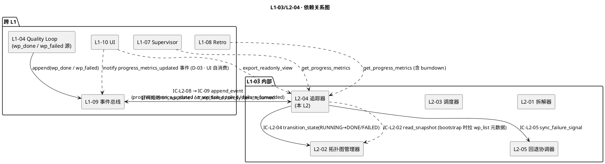
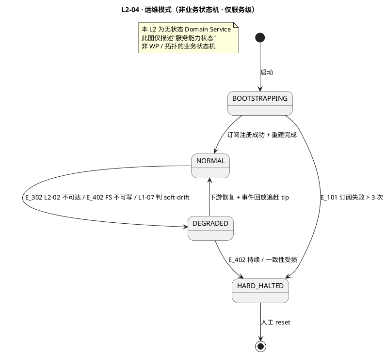
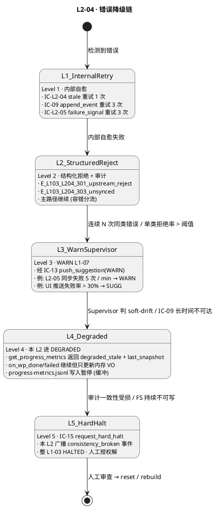

# L1 L2-04 · WP 完成度追踪器 · Tech Design

> **本文档定位**：3-1-Solution-Technical 层级 · L1 的 L2-04 WP 完成度追踪器 技术实现方案（L2 粒度）。
> **与产品 PRD 的分工**：2-prd/L1-03-WBS+WP 拓扑调度/prd.md §5.3 的对应 L2 节定义产品边界，本文档定义**技术实现**（接口字段级 schema + 算法伪代码 + 底层数据结构 + 状态机 + 配置参数）。
> **与 L1 architecture.md 的分工**：architecture.md 负责**跨 L2 架构 + 跨 L2 时序**，本文档负责**本 L2 内部技术细节**。冲突以 architecture.md 为准。
> **严格规则**：本文档不复述产品 PRD 文字（职责 / 禁止 / 必须等清单），只做技术映射 + 补齐"产品视角未说 but 工程师必须知道"的部分（具体算法 · syscall · schema · 配置）。

---

## §0 撰写进度

- [x] §1 定位 + 2-prd §11 L2-04 映射（含 5 关键决策 D-01..D-05）
- [x] §2 DDD 映射（BC-03 · 本 L2 无聚合根 · 仅 Domain Service + VO ProgressMetrics）
- [x] §3 对外接口定义（3 接收 + 2 发起 + 1 只读导出 · YAML schema · 12 错误码）
- [x] §4 接口依赖（被谁调 · 调谁 · 依赖图 PlantUML）
- [x] §5 P0/P1 时序图（P0 wp_done 打点 + P1 wp_failed 调 L2-05 · 2 张 PlantUML）
- [x] §6 内部核心算法（事件订阅 loop + 4 指标聚合公式 + Burndown 计算 + 重建回放）
- [x] §7 底层数据表 / schema 设计（progress-metrics.jsonl + current-metrics.json + burndown.jsonl）
- [x] §8 状态机（本 L2 为无状态 Domain Service · 指标可从事件总线完整重建）
- [x] §9 开源最佳实践（Prometheus / Grafana / Airflow Scheduler / Jira Burndown ≥ 3 项目）
- [x] §10 配置参数清单（8 项）
- [x] §11 错误处理 + 降级策略（5 Level + PlantUML + 协同表 + 可用能力矩阵 · ≥ 12 错误码）
- [x] §12 性能目标（SLO + 吞吐 + 健康指标）
- [x] §13 反向映射 prd §11 + 前向 3-2 TDD（17 TC ID + 3 ADR + 3 OQ）

---

## §1 定位 + 2-prd 映射

### 1.1 本 L2 的唯一命题（One-Liner）

**L1-03 的"指标记账员"** —— 订阅 L1-09 事件总线推送的 `L1-03:wp_done` / `L1-03:wp_failed` / `L1-09:system_resumed`，以无状态 Domain Service 身份做三件事：**(1) 经 IC-L2-04 触发 L2-02 状态跃迁（RUNNING → DONE/FAILED）并释放并行度位；(2) 聚合 4 项 ProgressMetrics（完成率 / 剩余工时 / 已完成 WP 清单 / 当前运行 WP 清单）；(3) 广播 L1-10 UI SSE 刷新 + 向 L1-07 Supervisor 暴露进度节奏维度基础数据**。wp_failed 时额外经 IC-L2-05 同步失败信号到 L2-05 做计数。**本 L2 不持有拓扑真值**（真值在 L2-02）、**不持有失败计数**（在 L2-05）、**不做 UI 渲染**（在 L1-10）、**不做进度节奏判定**（在 L1-07）——只"记账 + 转发"。

### 1.2 与 `2-prd/L1-03 WBS+WP 拓扑调度/prd.md §11` 的精确小节映射

| 2-prd 锚点 | 本 L2 § 段 | 翻译方式 |
|---|---|---|
| prd §11.1 职责 + 锚定（scope §5.3.1 / §5.3.3 第 6 条 / §5.3.6 "必须维护已完成清单"）| §1.1 命题 + §2.1 BC 定位 | 一句话职责 + DDD 无状态 Domain Service 定位 |
| prd §11.2 输入（wp_done / wp_failed / 拓扑基础数据 / system_resumed）/ 输出（IC-L2-04 / IC-L2-05 / L1-07 进度节奏 / L1-10 UI / IC-L2-08 审计）| §3 字段级 YAML schema + §4 依赖图 | 文字级描述 → IC 字段级契约 |
| prd §11.3 In / Out-of-scope（8 + 8） | §1.7 YAGNI 边界 + §2.3 与兄弟 L2 分工 | 技术级不越位清单 |
| prd §11.4 硬约束 6 条（done/failed 都释放位 / 完成率口径 / wp_failed 必同步 L2-05 / 必经 L2-02 / 可重建 / UI 只读）| §2.3 Invariants I-1..I-6 + §5 时序 + §6 算法 | 6 硬约束 → 6 不变量 → 算法 + 时序图强制 |
| prd §11.5 🚫 禁止行为 8 条 | §11 错误处理对应错误码 + §3 拒绝路径 | 每 🚫 对应 1 个错误码 |
| prd §11.6 ✅ 必须义务 9 条 | §6 算法骨架 + §5 时序主干 | 必须义务在代码路径上落地 |
| prd §11.7 🔧 可选功能 5 项（进度曲线 / 剩余工时预估修正 / 慢 WP 识别 / 模块级完成率 / 指标快照） | §10 配置参数开关 | 可选功能用 config flag |
| prd §11.8 IC 交互（4 被调 + 3 调）| §3 方法定义 + §4 依赖图 | IC → 方法签名 |
| prd §11.9 G-W-T 大纲（6 P + 6 N + 3 I） | §13.2 TDD 映射矩阵 | 17 TC ID 锚定 |
| prd §11.10 性能文字 | §12 SLO 表 | 文字描述 → P95 / P99 数字 |

### 1.3 与 `L1-03/architecture.md` 的位置映射

引用 architecture.md §3.1 主架构图 + §4.3 P1-1 / §4.4 P1-2 时序，本 L2 处于 **运行期（S4 常驻）package 内，作为 L1-09 事件总线的"消费订阅者" + L2-02 的"状态跃迁申请方"**：

- **L1-09 → L2-04**：事件订阅回调（inotify 或轮询 · `on_wp_done(evt)` / `on_wp_failed(evt)` / `on_system_resumed(evt)`）
- **L2-04 → L2-02**：IC-L2-04 `transition_state(RUNNING → DONE/FAILED, reason)` · 跃迁成功后并行度位释放由 L2-02 执行
- **L2-04 → L2-05**：IC-L2-05 `sync_failure_signal(wp_id, fail_level, evidence_refs)` · 仅 wp_failed 触发
- **L2-04 → L1-10 UI**：SSE 推送（`progress_metrics_updated` 事件 · 自动经 L1-10 inotify 到 frontend，亦可直推 webhook）
- **L1-07 → L2-04**：拉取（IC `get_progress_metrics(pid) → ProgressMetrics`）· 供"进度节奏"维度判定使用
- **L2-04 → L1-09**：经 IC-L2-08 → IC-09 追加 `L1-03:progress_metrics_updated` / `L1-03:wp_state_transition_applied` 审计事件

**物理载体**（architecture.md §3.3）：主 Skill Runtime 的 Python 辅助模块 · 事件订阅 handler 常驻 · 不需要独立 subagent session · 逻辑进程归属主 skill · 内存占用极小（只持有一份 `ProgressMetrics` 实例 · 可任何时候从 events.jsonl 重建）。

### 1.4 与兄弟 L2 的边界（L1-03 的 5 L2 中 L2-04 的定位）

| L2 | 定位 | 与 L2-04 的分工 |
|---|---|---|
| **L2-01** WBS 拆解器 | Domain Service + Factory | L2-01 装图时提供"总 WP 数 / 总 effort"等**分母** · 不与 L2-04 直接通信 |
| **L2-02** 拓扑图管理器 | Aggregate Root WBSTopology | **被 L2-04 调用方**（IC-L2-04 申请跃迁）· L2-04 不持任何 wp.state · 每次操作前可调 IC-L2-02 `read_snapshot` 取 wp 元数据 |
| **L2-03** WP 调度器 | Application Service (pull) | L2-03 的调度结果 → L2-02 RUNNING → L1-04 执行 → L1-04 发 wp_done → L2-04 消费 · 二者**不直接交互**，通过 L2-02 + 事件总线间接对齐 |
| **L2-04**（本 L2）WP 完成度追踪器 | **Domain Service（无状态）+ VO ProgressMetrics** | 订阅事件 → 申请跃迁 → 聚合 4 指标 → 广播 UI + L1-07 · **不持拓扑** |
| **L2-05** 失败回退协调器 | Domain Service + Entity FailureCounter | **被 L2-04 调用方**（IC-L2-05 同步失败信号）· L2-04 仅转发 wp_failed 到 L2-05 · 失败计数 / 3 选项建议**不归本 L2** |

**边界规则**：本 L2 是 L1-03 的"**记账员 + 转发器**"，职责链是 `事件订阅 → IC-L2-04 跃迁 → 更新指标 → 广播 UI + Supervisor`。任何落在"判定"（进度节奏是否偏差 / 是否触发回退 / 是否改拓扑）的逻辑都**违反 In-scope** —— 对应的 prd §11.5 禁止 7 即"禁止在事件到达时做判定 / 决策"。

### 1.5 PM-14 约束（project_id as root）

引用 `L0/ddd-context-map.md §3.2 PM-14`，本 L2 所有数据结构 / 持久化路径 / 事件订阅过滤 **必须**带 `project_id`：

- `ProgressMetrics(project_id)` —— VO 的主键，跨 project 聚合禁止
- `projects/<pid>/wbs/progress-metrics.jsonl` —— 每次 metrics 变化 append-only 落盘（历史轨迹）
- `projects/<pid>/wbs/current-metrics.json` —— 最新快照（供 L1-07 / L1-10 O(1) 读）
- `projects/<pid>/wbs/burndown.jsonl` —— 🔧 可选：每日 remaining_effort 快照 · L1-10 折线渲染
- 事件订阅过滤器必含 `project_id` 维度（由 L1-09 IC-L2-02 `register_subscriber` 的 `filter.project_id` 列表限定）
- Invariant I-2 归属闭包：所有 `WorkPackage.project_id == ProgressMetrics.project_id`（跨 project 事件错路由 → `E_L103_L204_201`）

### 1.6 关键技术决策（Decision → Rationale → Alternatives → Trade-off）

| # | 决策 | Rationale | Alternatives（弃用原因） | Trade-off |
|---|---|---|---|---|
| **D-01** | **本 L2 为纯无状态 Domain Service · ProgressMetrics 仅为 VO 快照** | 所有指标可由 events.jsonl 中 `L1-03:wp_state_changed` / `wp_done` / `wp_failed` 事件完全重放重建（I-6 可重建不变量）· 符合 PM-10 单一事实源 · 便于 100% 单元测试 + kill-restart 无需迁移内部状态 | A. 持久化 `ProgressMetrics` 作为真值：与 events.jsonl 真值源双写风险（drift）· B. 跨 session 序列化本 L2 内存状态：增加恢复复杂度 | 每次 `get_progress_metrics` 需增量聚合，但 O(1) 更新（事件驱动 diff）· 成本可忽略 |
| **D-02** | **4 指标用"事件驱动增量更新"而非"全图扫描"** | prd §11.4 性能"避免整图扫描"· 事件到达时只更新被影响的字段（done → completion_rate += wp.effort / total_effort 等）· 单次更新 O(1) | A. 每次调用 `get_progress_metrics` 都遍历 wp_list 统计：O(V)，1000 WP 时 P99 超 SLO · B. 定时器周期全量扫描：时序不确定，难保证实时性 | 要求初始化时从 events.jsonl 回放至当前快照（启动慢 100ms-1s · 一次性），之后热路径 O(1) · 收益 >> 一次性成本 |
| **D-03** | **UI 推送走 L1-10 自建 inotify + SSE（L2-04 不直接推）** | 解耦：L2-04 只负责 append `progress_metrics_updated` 事件到 events.jsonl · L1-10 订阅该事件流通过自己的 SSE 通道 fanout 到前端 · 单一职责 | A. L2-04 直接调 L1-10 webhook：L1-10 暂不可达时会导致 L2-04 热路径阻塞 · B. WebSocket 双向推：L1-10 v1 不需要双向 | 依赖 L1-10 的 inotify 能力已具备（L1-10 L2-XX 已实现）· L2-04 不关心前端断线 / 重连 |
| **D-04** | **wp_failed 分流：L2-02 跃迁（RUNNING→FAILED）+ L2-05 失败计数**两条路径并行（无依赖顺序）| prd §11.8 必须 "wp_failed 必同步 L2-05"（硬约束 3）+ "必经 L2-02"（硬约束 4）· 两者语义独立（L2-02 关心状态 · L2-05 关心计数）· 并行执行缩短时延 | A. 先 L2-02 再 L2-05（串行）：延迟翻倍 · B. 仅调 L2-05 由其转发 L2-02：破坏硬约束 3 "wp_failed 必同步 L2-05" 的直接性 | 两次外部调用的失败语义独立：任一失败时需结构化拒绝（E_202 / E_303）· 本 L2 不尝试回滚另一路径（让 L1-07 Supervisor soft-drift 监测） |
| **D-05** | **`failed_wps` 不参与 `completion_rate` 计算**（只记入失败清单）| prd §11.4 硬约束 2 "完成率口径 = done_wps effort 总和 / 全部 WP effort 总和" · failed 未 done · 若计入会使完成率虚高 | A. failed_wps 部分计入（如按 fail_level）：口径不统一 · B. failed 直接从分母剔除：违反 "全部 WP effort 总和" | 失败 WP 在 UI 以独立标签展示（failed_wps 清单）· L1-07 进度节奏维度亦分开消费 failed_count 与 completion_rate |

### 1.7 YAGNI 边界（本 L2 不做的事）

- ❌ **不做 WP 状态真值维护**（→ L2-02）· 本 L2 调 IC-L2-04 申请跃迁，但不持 `wp.state`
- ❌ **不做拓扑结构修改**（→ L2-01 装图 / L2-02 合并）· 不改 wp_list / dag_edges
- ❌ **不做失败计数 + 3 选项回退建议**（→ L2-05）· 只同步失败信号
- ❌ **不做进度节奏判定**（超预期 / 正常 / 落后 → L1-07 Supervisor）· 只暴露基础数据
- ❌ **不做 DoD 判定**（→ L1-04 S5 的 Quality Loop）· 只消费已判定的 wp_done / wp_failed
- ❌ **不做事件总线落盘**（→ L1-09 · 经 IC-09）· 只 append 审计事件
- ❌ **不做 UI 渲染**（→ L1-10）· 只暴露只读 VO + append 刷新事件
- ❌ **不做跨 project 聚合**（PM-14 硬约束）· 每个订阅回调限定 project_id
- ❌ **不做 BLOCKED/STUCK 状态转换**（→ L2-02 状态机）· 本 L2 只消费 wp_done / wp_failed 两个事件源

### 1.8 本 L2 读者预期

- **TDD 工程师**：从 §3（YAML schema）+ §11（错误码表 12 条）+ §13（TDD TC ID 17 条）生成用例
- **实现工程师**：从 §6（伪代码）+ §7（持久化 schema）+ §10（配置）直接落代码
- **集成测试作者**：从 §5（时序图）+ §4（依赖图）理解跨 L2 协同（尤其 wp_failed 两路径分流）
- **Supervisor（L1-07）**：从 §3.6 `get_progress_metrics` + §12.3 健康指标消费进度节奏数据

---

## §2 DDD 映射（BC-03 WBS+WP Topology Scheduling）

### 2.1 Bounded Context 定位

引用 `L0/ddd-context-map.md §2.4 BC-03` + `§4.3`，本 L2 归属 **BC-03 的 Domain Service 层**（与 L2-01/03/05 同级）· **不持有聚合根**（BC-03 唯一聚合根 WBSTopology 在 L2-02）· 仅生产 VO `ProgressMetrics` 作为只读快照。

**BC-03 内关系摘要**：
- 与 **L2-02**：Downstream（本 L2 是 L2-02 的 Customer · 调 IC-L2-04 申请跃迁）
- 与 **L2-05**：Partnership（wp_failed 时同步调 IC-L2-05 · 二者对"失败信号"的语义需一致）
- 与 **BC-04 Quality Loop（L1-04）**：Upstream（L1-04 经 L1-09 发 wp_done / wp_failed，本 L2 订阅）
- 与 **BC-07 Harness Supervision（L1-07）**：Supplier（本 L2 暴露 progress metrics 供 Supervisor 消费）
- 与 **BC-10 Observability（L1-10）**：Supplier（本 L2 append `progress_metrics_updated` 事件供 L1-10 订阅）
- 与 **BC-09 Resilience & Audit（L1-09）**：Partnership（所有状态变更 audit 经 IC-09）

### 2.2 本 L2 产出 / 消费的核心 DDD 对象

**本 L2 不持有聚合根。** 所有持久化状态（WorkPackage.state）归 L2-02 · 失败计数归 L2-05。本 L2 只生产 1 个 VO：

```
ProgressMetrics(project_id)
├── completion_rate      : float ∈ [0.0, 1.0]  派生 = done_effort / total_effort
├── remaining_effort     : float               派生 = total_effort - done_effort - failed_effort_not_retryable
├── done_wps             : List[wp_id]         按 done_ns 升序
├── running_wps          : List[wp_id]         当前 RUNNING 的 wp 集合
├── failed_wps           : List[wp_id]         🔧 可选：含 fail_level 标签
├── total_wps_count      : int                 装图时固定（差量时更新）
├── total_effort         : float               装图时固定
├── done_effort          : float               派生 = sum(wp.effort for wp in done_wps)
├── parallelism_util     : float ∈ [0.0, 1.0]  派生 = len(running_wps) / parallelism_limit（= 2）
├── last_updated_ns      : int                 每次事件到达时刷新
└── snapshot_ts_ns       : int                 get_progress_metrics 返回时的瞬时快照时间
```

### 2.3 聚合根不变量（Invariants · I-1..I-6 · 由本 L2 事件订阅 handler 强制）

虽然本 L2 不持聚合根，但对外发布的 ProgressMetrics VO 必须满足 6 不变量（与 prd §11.4 硬约束逐一对齐）：

- **I-1 并行度位守护**：`done / failed 到达时都释放并行度位` —— 经 IC-L2-04 调 L2-02，由 L2-02 `current_running_count -= 1`（本 L2 不直接改并行度位）
- **I-2 完成率口径统一**：`completion_rate = sum(wp.effort for wp in done_wps) / total_effort`（**按 effort**，不是按 WP 数量 · prd §11.5 禁止 3 的负向场景 N3 锁定）
- **I-3 wp_failed 必同步 L2-05**：每次收 wp_failed 事件必触发 IC-L2-05（不可缺 · N1 负向场景锁定）
- **I-4 必经 L2-02 跃迁**：本 L2 不直接改 `wp.state` · 全部经 IC-L2-04（N4 负向场景锁定）
- **I-5 UI 单向只读**：L1-10 不得通过本 L2 通道反写 · L2-04 对 L1-10 只产 append 事件 + 只读 VO（N2 负向场景锁定）
- **I-6 事件可重放**：任一时刻 ProgressMetrics 可由该 project 的 events.jsonl 中 `L1-03:wp_state_changed` + `L1-04:wp_done` + `L1-04:wp_failed` 事件从装图事件回放重建（`apply_event()` 幂等）

### 2.4 Entity · 无（本 L2 为纯无状态 Domain Service）

所有跨 tick 可变状态归属其他 L2：
- `WorkPackage.state` → L2-02 聚合根内部实体
- `FailureCounter[wp_id]` → L2-05 实体
- 本 L2 仅做"事件 → VO 派生"的纯函数映射

### 2.5 Value Objects（不可变）

- `ProgressMetrics(...)` · 本 L2 唯一产出 · 每次 `get_progress_metrics` 返回瞬时快照 · 非 __frozen 但约定语义不可变
- `WpDoneEvent(wp_id, verifier_verdict, commit_sha, effort_actual, ts_ns)` · 订阅输入 VO
- `WpFailedEvent(wp_id, fail_level, reason, evidence_refs, ts_ns)` · 订阅输入 VO
- `TransitionApplied(wp_id, from_state, to_state, audit_event_id)` · 经 IC-L2-04 成功后的响应 VO
- `FailureSignal(wp_id, fail_level, evidence_refs)` · 经 IC-L2-05 发起给 L2-05 的 VO
- `BurndownPoint(ts_date, remaining_effort, done_effort)` · 🔧 可选 · Burndown 图每日快照

### 2.6 Domain Events（本 L2 对外发布 · 经 IC-L2-08 → IC-09）

| 事件名 | 触发时机 | 必含字段 | 消费方 |
|---|---|---|---|
| `L1-03:progress_metrics_updated` | 每次 4 指标任一变化（done / failed / running 变化）| `project_id / metrics (全量 VO) / trigger_event_id / ts_ns` | L1-10 inotify SSE fanout · L1-07 soft-drift 监测 · retro 曲线重建 |
| `L1-03:wp_state_transition_applied` | IC-L2-04 成功 ack 后 | `project_id / wp_id / from_state / to_state / audit_event_id / latency_ms` | 审计链追溯 · L2-05 wp_failed 路径的 correlation 锚 |
| `L1-03:failure_signal_forwarded` | IC-L2-05 成功 ack 后 | `project_id / wp_id / fail_level / counter_value / evidence_refs` | 审计 · L1-07 判"失败节奏"独立指标 |
| `L1-03:subscriber_slow` | 🔧 可选 · handler 处理单事件 > `slow_handler_threshold_ms` | `project_id / event_id / handler_latency_ms` | L1-07 SUGG 性能降级 |

### 2.7 Repository / Service 接口

```python
class ProgressTrackerService(ABC):
    # 事件订阅回调（从 L1-09 IC-L2-02 register_subscriber 注册）
    def on_wp_done(self, evt: WpDoneEvent) -> None: ...            # 热路径
    def on_wp_failed(self, evt: WpFailedEvent) -> None: ...        # 热路径
    def on_system_resumed(self, evt: SystemResumedEvent) -> None: ...  # bootstrap
    # 只读导出
    def get_progress_metrics(self, pid: ProjectId) -> ProgressMetrics: ...
    def export_readonly_view(self, pid: ProjectId) -> ReadonlyProgressView: ...  # UI
    # 重建
    def rebuild_from_events(self, pid: ProjectId) -> ProgressMetrics: ...
```

### 2.8 跨 BC 关系摘要

- **不持有 BC-03 的 WBSTopology 聚合根**，通过 IC-L2-02 `read_snapshot` + IC-L2-04 `transition_state` 与其交互
- **不持有 BC-04 的 DoDExpression / Verdict 对象**，只消费 wp_done / wp_failed 中的 evidence_refs
- **锁委托 BC-09 L1-09 锁管理器**（经 L2-02 内部释放 · 本 L2 不直接取锁）

---

## §3 对外接口定义（字段级 YAML schema + 错误码）

### 3.1 接口清单总览（3 接收 + 2 发起 + 1 只读导出 · 共 6 条）

| IC | 方向 | 方法签名 | 被调方 SLO |
|---|---|---|---|
| **IC-L2-04-SubscriberDone** | L1-09 → 本 L2 | `on_wp_done(evt: WpDoneEvent) → None` | 处理延迟 P95 ≤ 200ms / P99 ≤ 500ms |
| **IC-L2-04-SubscriberFailed** | L1-09 → 本 L2 | `on_wp_failed(evt: WpFailedEvent) → None` | 同上 |
| **IC-L2-04-SubscriberResumed** | L1-09 → 本 L2 | `on_system_resumed(evt) → None` | bootstrap 1 次 · ≤ 2s |
| **IC-L2-04** | 本 L2 → L2-02 | `transition_state(pid, wp_id, from=RUNNING, to ∈ {DONE,FAILED}, reason, evidence_refs) → Ack` | 同 L2-02 §3.4 P95 ≤ 100ms |
| **IC-L2-05** | 本 L2 → L2-05 | `sync_failure_signal(pid, wp_id, fail_level, evidence_refs) → Ack` | P95 ≤ 50ms |
| **IC-L2-08** | 本 L2 → L1-09 | `append_event(evt)` 经 IC-09 | P95 ≤ 10ms（fire-and-forget）|
| **get_progress_metrics** | L1-07 / L1-10 / retro → 本 L2 | `get_progress_metrics(pid) → ProgressMetrics` | P95 ≤ 50ms |
| **export_readonly_view** | L1-10 → 本 L2 | `export_readonly_view(pid) → ReadonlyProgressView` | P95 ≤ 100ms |

### 3.2 IC-L2-04-SubscriberDone · `on_wp_done` 入参 schema（订阅回调）

```yaml
# on_wp_done_event.yaml · 由 L1-09 IC-L2-02 register_subscriber 回调传入
type: object
required: [event_id, event_type, project_id, wp_id, verifier_verdict, ts_ns]
properties:
  event_id: { type: string, pattern: "^evt-[0-9a-f-]+$" }
  event_type: { type: string, const: "L1-04:wp_done" }
  project_id: { type: string, pattern: "^hf-proj-[a-zA-Z0-9_-]+$" }
  wp_id: { type: string, pattern: "^wp-[0-9]{3}$" }
  verifier_verdict:
    type: object
    required: [verdict, score]
    properties:
      verdict: { type: string, enum: [PASS] }          # 进入本 L2 时必 PASS
      score: { type: number, minimum: 0, maximum: 1 }
      advice_card_ref: { type: string, nullable: true }
  commit_sha: { type: string, pattern: "^[0-9a-f]{7,40}$", nullable: true }
  effort_actual: { type: number, nullable: true, description: "实际耗时（天）· 供预估修正" }
  ts_ns: { type: integer, description: "事件落盘 ts（nanoseconds since epoch）" }
  correlation_id: { type: string, nullable: true }

# on_wp_done 处理后的 side-effects（不是返回值，按约定异步完成）:
# 1. 调 IC-L2-04 transition_state(RUNNING → DONE)
# 2. 更新 ProgressMetrics 4 字段
# 3. append L1-03:progress_metrics_updated 事件
# 4. 无显式返回值（订阅者语义为 fire-and-forget）
```

### 3.3 IC-L2-04-SubscriberFailed · `on_wp_failed` 入参 schema

```yaml
# on_wp_failed_event.yaml
type: object
required: [event_id, event_type, project_id, wp_id, fail_level, reason, ts_ns]
properties:
  event_id: { type: string }
  event_type: { type: string, const: "L1-04:wp_failed" }
  project_id: { type: string }
  wp_id: { type: string }
  fail_level:
    type: string
    enum: [s1_soft, s2_hard, s3_dod_fail, s4_timeout, s5_verifier_reject]
    description: "L1-04 Quality Loop 的失败级别枚举"
  reason: { type: string, maxLength: 500 }
  evidence_refs:
    type: array
    minItems: 1
    items: { type: string, description: "events.jsonl evt-id" }
  ts_ns: { type: integer }
  correlation_id: { type: string, nullable: true }

# 处理后 side-effects（两路径并行）:
# 1. 调 IC-L2-04 transition_state(RUNNING → FAILED)
# 2. 调 IC-L2-05 sync_failure_signal(wp_id, fail_level, evidence_refs)
# 3. 更新 ProgressMetrics（running_wps.remove + failed_wps.append, completion_rate 不变）
# 4. append L1-03:progress_metrics_updated 事件
```

### 3.4 IC-L2-04 发起 · `transition_state` 入 / 出参（复用 L2-02 §3.4）

```yaml
# 入参（本 L2 作为 requester_l2 = L2-04）
ic_l2_04_transition_state_request:
  type: object
  required: [project_id, wp_id, from_state, to_state, reason, requester_l2, evidence_refs]
  properties:
    project_id: { type: string }
    wp_id: { type: string }
    from_state: { type: string, const: "RUNNING" }
    to_state: { type: string, enum: [DONE, FAILED] }
    reason: { type: string, minLength: 3, maxLength: 200 }
    requester_l2: { type: string, const: "L2-04" }
    evidence_refs: { type: array, items: { type: string }, minItems: 1 }
    tick_id: { type: string, nullable: true }
```

出参与 L2-02 §3.4 完全一致（ok / rejected），本 L2 收到 rejected 时按 §11 错误码表处理。

### 3.5 IC-L2-05 发起 · `sync_failure_signal`

```yaml
# ic_l2_05_sync_failure_signal_request.yaml
type: object
required: [project_id, wp_id, fail_level, evidence_refs, requester_l2]
properties:
  project_id: { type: string }
  wp_id: { type: string }
  fail_level: { type: string, enum: [s1_soft, s2_hard, s3_dod_fail, s4_timeout, s5_verifier_reject] }
  evidence_refs: { type: array, items: { type: string }, minItems: 1 }
  requester_l2: { type: string, const: "L2-04" }
  trigger_event_id: { type: string, description: "引发此调用的 wp_failed event_id（correlation）" }
  tick_id: { type: string, nullable: true }

# 出参
ic_l2_05_sync_failure_signal_response:
  type: object
  required: [status, project_id, wp_id, counter_value]
  properties:
    status: { type: string, enum: [ok, rejected] }
    project_id: { type: string }
    wp_id: { type: string }
    counter_value:
      type: integer
      minimum: 1
      description: "L2-05 内部 FailureCounter[wp_id] 递增后的值 · 供 L2-04 写 progress_metrics_updated"
    rollback_triggered: { type: boolean, description: "counter_value >= 3 且 L2-05 已发起回退流程" }
    rejection:
      type: object
      nullable: true
      properties:
        err_code: { type: string }
        reason: { type: string }
    audit_event_id: { type: string }
    latency_ms: { type: integer }
```

### 3.6 只读导出 · `get_progress_metrics` + `export_readonly_view`

```yaml
# get_progress_metrics_request.yaml
type: object
required: [project_id, requester]
properties:
  project_id: { type: string }
  requester: { type: string, enum: [L1-07, L1-10, retro, supervisor_cli] }
  include_burndown: { type: boolean, default: false }
  include_failed_detail: { type: boolean, default: false }
  tick_id: { type: string, nullable: true }

# get_progress_metrics_response.yaml
type: object
required: [status, project_id, metrics]
properties:
  status: { type: string, enum: [ok, not_found, degraded_stale, rejected] }
  project_id: { type: string }
  metrics:
    type: object
    required: [completion_rate, remaining_effort, done_wps, running_wps, total_wps_count, total_effort, done_effort, parallelism_util, last_updated_ns, snapshot_ts_ns]
    properties:
      completion_rate: { type: number, minimum: 0, maximum: 1 }
      remaining_effort: { type: number, minimum: 0 }
      done_wps: { type: array, items: { type: string } }
      running_wps: { type: array, items: { type: string } }
      failed_wps: { type: array, items: { type: string }, nullable: true }
      total_wps_count: { type: integer, minimum: 0 }
      total_effort: { type: number, minimum: 0 }
      done_effort: { type: number, minimum: 0 }
      parallelism_util: { type: number, minimum: 0, maximum: 1 }
      last_updated_ns: { type: integer }
      snapshot_ts_ns: { type: integer }
  burndown:
    type: array
    nullable: true
    items:
      type: object
      properties:
        ts_date: { type: string, format: date }
        remaining_effort: { type: number }
        done_effort: { type: number }
  degraded_flag:
    type: boolean
    description: "true 时 metrics 为上次缓存 + stale 警示"
  audit_event_id: { type: string, nullable: true }
  latency_ms: { type: integer }
```

```yaml
# export_readonly_view_response.yaml（L1-10 WBS tab 专用 · 合并拓扑 + metrics）
type: object
required: [project_id, metrics, rendered_at_ns]
properties:
  project_id: { type: string }
  metrics: { $ref: "get_progress_metrics_response#/properties/metrics" }
  topology_ref:
    type: object
    description: "本 L2 不含拓扑，建议 L1-10 并行调 L2-02 export_readonly_view 合并展示 · 这里提供同步 hint"
    properties:
      snapshot_topology_id: { type: string, nullable: true }
      suggest_merge_source: { type: string, const: "L2-02.export_readonly_view" }
  rendered_at_ns: { type: integer }
```

### 3.7 错误码总表（12 条四列 · 风格 `E_L103_L204_NNN`）

| 错误码 | 含义（meaning）| 触发场景（trigger）| 调用方处理（callerAction）|
|---|---|---|---|
| `E_L103_L204_101` | 事件订阅失败 | L1-09 IC-L2-02 register_subscriber 返回 error / callback 未注册 | bootstrap 重试 3 次 · 仍失败 → IC-15 hard_halt（本 L2 无法工作则整 L1-03 降级）|
| `E_L103_L204_102` | 事件 schema 非法 | 订阅收到的事件 `event_type / project_id / wp_id` 不符 §3.2/§3.3 schema | 单事件丢弃 + 审计 `E_L103_L204_102_dropped` · L1-07 WARN（上游 L1-04 违反契约）|
| `E_L103_L204_103` | 聚合公式输入异常 | `wp_id` 不存在于 `wp_by_id` 索引 / `wp.effort` 为 null / total_effort == 0 | 丢弃本次指标更新 · 审计 · WARN L1-07（可能拓扑未初始化）|
| `E_L103_L204_201` | 跨 project 订阅误路由 | 事件 `project_id` 不等于本 handler 注册的 project_id | 升级硬红线 · 审计 bypass_attempt · WARN L1-07（PM-14 违反）|
| `E_L103_L204_301` | 调 L2-02 IC-L2-04 失败（被拒）| L2-02 返回 `rejected`（如 E_L103_L202_304 stale / E_L103_L202_303 非法跃迁）| 重试 1 次（stale 场景可 `read_snapshot` 后自纠）· 仍失败 → 审计 + WARN |
| `E_L103_L204_302` | 调 L2-02 不可达（timeout / exception）| L2-02 方法调用超 timeout（默认 2s）或抛异常 | 重试 3 次指数退避 · 仍失败 → Level 4 DEGRADED |
| `E_L103_L204_303` | 调 L2-05 IC-L2-05 失败 | L2-05 返回 rejected / 不可达 | 重试 3 次 · 仍失败 → WARN（不阻塞 L2-02 路径）· 审计 `E_L103_L204_303_unsynced` |
| `E_L103_L204_401` | IC-09 append_event 失败（自产事件）| L1-09 IC-09 返回 error / E_BUS_HALTED | 同 L2-02 §3.7 E_401 · 重试 3 次 · 仍失败 → 审计链断 · WARN L1-07 |
| `E_L103_L204_402` | progress-metrics.jsonl 写失败 | FS 写盘异常 / disk_full | 进 DEGRADED（只读 current-metrics.json 最后快照可用）· IC-15 request_hard_halt |
| `E_L103_L204_403` | L1-10 SSE 推送失败 | 🔧 L1-10 webhook 返回 500 / 不可达（若 D-03 走 inotify 则不触发）| 不阻塞主路径 · 审计 `E_L103_L204_403_fanout_dropped` · 不重试（下一事件会再触发） |
| `E_L103_L204_404` | L1-07 Supervisor 拉取不可达 | Supervisor 调用 `get_progress_metrics` 时本 L2 未初始化 / DEGRADED | 返回 `status=degraded_stale` + 上次快照 · 不阻塞 |
| `E_L103_L204_501` | 外部直改 current-metrics.json / progress-metrics.jsonl（bypass）| 启动 consistency_check 识别 FS 直写痕迹（mtime 不由本 L2 更新）| 审计 bypass_attempt · WARN L1-07 · 启动时拒绝信任，强制从 events.jsonl 重建 |

**错误码结构化返回模板**（供 rejected 路径使用）：

```yaml
status: rejected
rejection:
  err_code: E_L103_L204_301
  reason: "L2-02 transition_state rejected: wp-007 current_state=DONE != from_state=RUNNING (stale)"
  upstream_err: E_L103_L202_304
audit_event_id: "evt-20260422-l103-l204-00042"
latency_ms: 68
```

---

## §4 接口依赖（被谁调 · 调谁）

### 4.1 上游调用方

| 调用方 | 方法 | 通道 | 频率 | SLO |
|---|---|---|---|---|
| L1-09 事件总线（订阅推送）| `on_wp_done` | 异步订阅回调 | 每 WP 完成 1 次（S4 主频）| handler 处理 P95 ≤ 200ms |
| L1-09 事件总线（订阅推送）| `on_wp_failed` | 异步订阅回调 | 每 WP 失败 1 次（低频）| 同上 |
| L1-09 事件总线（订阅推送）| `on_system_resumed` | 异步订阅回调 | bootstrap 1 次 | ≤ 2s（重建时间）|
| L1-07 Supervisor | `get_progress_metrics` | 同步内存 | 每监督周期 1 次 | P95 ≤ 50ms |
| L1-10 UI | `export_readonly_view` | 同步内存 | UI 刷新触发 | P95 ≤ 100ms |
| retro auto（L1-08）| `get_progress_metrics` (含 burndown) | 同步内存 | retro 阶段 | P95 ≤ 500ms |

### 4.2 下游依赖

| IC | 对端 | 触发条件 | 锚点 |
|---|---|---|---|
| **IC-L2-04** transition_state | L2-02 拓扑图管理器 | 每次收 wp_done / wp_failed 事件 | [L2-02 §3.4](./L2-02-拓扑图管理器.md) |
| **IC-L2-05** sync_failure_signal | L2-05 失败回退协调器 | 每次收 wp_failed 事件（路径 B）| [L2-05](./L2-05-失败回退协调器.md) |
| **IC-09** append_event | L1-09（经 IC-L2-08）| 每次 metrics 更新 / transition_applied / failure_forwarded | [ic-contracts §3.9](../integration/ic-contracts.md) |
| **IC-L2-02** read_snapshot | L2-02（仅 bootstrap / stale 自纠时）| 重建启动时拉 wp_list 元数据 | [L2-02 §3.3](./L2-02-拓扑图管理器.md) |
| **订阅注册 IC-L2-02** | L1-09 事件总线核心 | bootstrap 启动时注册 3 个 handler | [L1-09 L2-01 §3.3](../L1-09-韧性+审计/L2-01-事件总线核心.md) |

### 4.3 依赖图（PlantUML）



### 4.4 关键依赖特性

1. **本 L2 是唯一对 wp_done / wp_failed 事件做"聚合打点"的消费者**：其他消费者（L2-05 / L1-07）从本 L2 的 `progress_metrics_updated` 派生事件消费而不是直接订阅 L1-04 源事件
2. **两条下游调用无依赖顺序**（D-04）：IC-L2-04 和 IC-L2-05 并行 · 任一失败不阻另一路径
3. **IC-09 是关键依赖**（Partnership）：失败时本 L2 进 DEGRADED · 对齐 L2-02 §11 策略
4. **UI 推送走 L1-10 inotify**（D-03）· 本 L2 不直接调 L1-10 · 减小耦合
5. **L1-07 走 pull**（`get_progress_metrics`）：Supervisor 自己控制监督节奏 · 本 L2 不主动 push 到 L1-07

---

## §5 P0/P1 时序图（PlantUML ≥ 2 张）

### 5.1 P0 主干 · wp_done 事件打点（对应 BF-S4-02 + BF-S4-05 · 流 C）

**场景**：L1-04 Quality Loop S5 PASS → append `L1-04:wp_done` → L1-09 事件总线广播 → 本 L2 订阅 handler 被调用 → 调 L2-02 IC-L2-04 跃迁 RUNNING→DONE → 更新 4 指标 → append `L1-03:progress_metrics_updated` → L1-10 inotify + L1-07 轮询消费。

```plantuml
@startuml
title L2-04 · P0 wp_done 完整打点链
autonumber
participant "L1-04\nQuality Loop S5 PASS" as L104
participant "L1-09\nevents.jsonl + 事件总线" as L109
participant "L2-04 (本 L2)\non_wp_done handler" as L204
participant "ProgressMetrics VO" as VO
participant "L2-02\n拓扑图管理器" as L202
participant "L1-09\nIC-09 append_event" as L109B
participant "L1-10 UI\ninotify SSE" as L110
participant "L1-07\nSupervisor" as L107

L104 -> L109 : IC-09 append_event(L1-04:wp_done, wp_id, verifier_verdict, commit_sha)
L109 -> L109 : fsync + hash-chain
L109- -> L204 : 事件订阅推送\n(inotify / 轮询回调)
activate L204
L204 -> L204 : schema 校验 (project_id ∈ 注册 / wp_id 格式 / verdict=PASS)
alt schema 非法
L204 -> L109B : append_event(E_L103_L204_102_dropped)
note right : 丢弃 + 审计
else schema 合法
L204 -> L202 : IC-L2-04 transition_state\n(pid, wp_id, RUNNING → DONE, reason, evidence_refs)
activate L202
L202 -> L202 : guard: wp.state == RUNNING?\n非法跃迁 / stale 校验
alt L2-02 reject (E_L103_L202_304 stale)
L202- -> L204 : rejected
L204 -> L204 : 重试 1 次 (可 read_snapshot 自纠)
else L2-02 ok
L202 -> L202 : wp.state = DONE\ncurrent_running_count -= 1
L202 -> L109B : append_event(L1-03:wp_state_changed, RUNNING→DONE)
L202- -> L204 : ok{resulting_state=DONE, audit_event_id}
end
deactivate L202
L204 -> VO : 增量更新\n· done_effort += wp.effort\n· completion_rate = done_effort / total_effort\n· remaining_effort -= wp.effort\n· done_wps.append(wp_id)\n· running_wps.remove(wp_id)\n· last_updated_ns = now_ns
L204 -> L109B : IC-L2-08 → IC-09 append_event(L1-03:progress_metrics_updated, metrics snapshot)
L109B- -> L204 : audit_event_id = evt-...
L204 -> L204 : persist current-metrics.json + append progress-metrics.jsonl
par 推 UI (异步 · 经 L1-10 inotify)
L109B- -> L110 : inotify 触发 (progress_metrics_updated 事件)
L110 -> L110 : SSE fanout 到前端\n重渲染 🔧 WBS tab\n· 完成率 + 剩余工时 + done 列表
else 推 Supervisor (pull 模式)
note over L107 : L1-07 周期性拉取
L107 -> L204 : get_progress_metrics(pid)
L204- -> L107 : {metrics, parallelism_util, done_wps}
L107 -> L107 : "进度节奏"维度判定\n(超预期 / 正常 / 落后)
end
end
deactivate L204
note over L104 : 下一 tick L1-01 可调 IC-02 取下一 WP
@enduml
```

**关键时序语义**：

- **订阅回调是 fire-and-forget 语义**（无显式返回值）· 若 handler 异常必记审计，不向 L1-09 回传（违反 PM-08 幂等订阅）
- **IC-L2-04 是同步调用**：本 L2 处理热路径必须等 L2-02 ack 后再更新 ProgressMetrics（否则 metrics 与拓扑真值 drift）
- **`progress_metrics_updated` 事件先于 UI 推送**：L1-10 消费该事件（inotify 或订阅）得知何时刷新；L2-04 不直接调 L1-10 webhook（D-03 决策）
- **UI + Supervisor 并行消费**：par/else 表示两路径无依赖顺序 · 任一失败不影响另一路径
- **时长预期**：L2-04 handler 处理 P95 ≤ 200ms / P99 ≤ 500ms（含 L2-02 IC-L2-04 耗时）· UI 刷新延迟 P99 亚秒级

### 5.2 P1 异常 · wp_failed 事件 + 两路径分流（对应 BF-E-08 · 流 D + 流 E 起点）

**场景**：L1-04 Quality Loop S5 FAIL → append `L1-04:wp_failed` → 本 L2 订阅 → **并行调 L2-02 跃迁 + L2-05 同步失败信号**（D-04 决策 · 两路径无依赖顺序）· 若 L2-05 counter ≥ 3 L2-05 自行触发 BF-E-08，本 L2 不参与。

```plantuml
@startuml
title L2-04 · P1 wp_failed 两路径分流
autonumber
participant "L1-04\nQuality Loop S5 FAIL" as L104
participant "L1-09\nevents.jsonl" as L109
participant "L2-04 (本 L2)\non_wp_failed handler" as L204
participant "L2-02\n拓扑图管理器" as L202
participant "L2-05\n失败回退协调器" as L205
participant "L1-09\nIC-09" as L109B
participant "L1-10 UI\ninotify SSE" as L110

L104 -> L109 : append_event(L1-04:wp_failed, wp_id, fail_level, reason, evidence_refs)
L109- -> L204 : 订阅推送
activate L204
L204 -> L204 : schema 校验 (evidence_refs 非空 / fail_level ∈ enum)
alt schema 非法
L204 -> L109B : append_event(E_L103_L204_102_dropped)
else schema 合法
par 路径 A · L2-02 状态跃迁
L204 -> L202 : IC-L2-04 transition_state\n(RUNNING → FAILED, reason=fail_level)
activate L202
L202 -> L202 : wp.state = FAILED\ncurrent_running_count -= 1
L202 -> L109B : append_event(L1-03:wp_state_changed, RUNNING→FAILED)
L202- -> L204 : ok{audit_event_id}
deactivate L202
else 路径 B · L2-05 同步失败信号
L204 -> L205 : IC-L2-05 sync_failure_signal\n(wp_id, fail_level, evidence_refs, trigger_event_id)
activate L205
L205 -> L205 : FailureCounter[wp_id] += 1
L205 -> L109B : append_event(L1-05:failure_count_incremented, counter_value)
alt counter_value < 3
L205- -> L204 : ok{counter_value=N, rollback_triggered=false}
note over L205 : L2-05 可选放回 READY\n(不关本 L2)
else counter_value >= 3 触发 BF-E-08
L205 -> L205 : 生成 3 选项回退建议\n(SPLIT_WP / MODIFY_WBS / MODIFY_AC)
L205 -> L202 : IC-L2-06 mark_stuck\n(FAILED → STUCK)
L205 -> L109B : append_event(L1-05:rollback_advice_issued)
L205- -> L204 : ok{counter_value=3, rollback_triggered=true}
note over L205 : L2-05 独立推建议卡给 L1-01 / L1-07\n本 L2 不参与
end
deactivate L205
end
L204 -> L204 : 收敛两路径 ack\n· 路径 A ok + 路径 B ok → 继续\n· 任一 reject → 结构化拒绝 + 审计
alt 任一路径失败
alt 路径 A 失败 (E_301/302)
L204 -> L109B : append_event(E_L103_L204_301_upstream_reject)
note right : 路径 B 仍完成 (失败计数已同步)\nL1-07 WARN soft-drift
else 路径 B 失败 (E_303)
L204 -> L109B : append_event(E_L103_L204_303_unsynced)
note right : 路径 A 仍完成 (状态已跃迁)\n失败计数此次丢失 → L1-07 WARN\n(下次 wp_failed 时计数可能少 1)
end
else 两路径都 ok
L204 -> L204 : 更新 ProgressMetrics\n· running_wps.remove(wp_id)\n· failed_wps.append({wp_id, fail_level})\n· completion_rate 不变\n· remaining_effort 不变 (failed 可能 retry)\n· last_updated_ns = now_ns
L204 -> L109B : append_event(L1-03:progress_metrics_updated, metrics)
L204 -> L109B : append_event(L1-03:failure_signal_forwarded, counter_value)
end
L109B- -> L110 : inotify 触发
L110 -> L110 : SSE fanout · UI 展示\n🔴 failed_wps + 计数
end
deactivate L204
@enduml
```

**关键时序语义**：

- **两路径并行**（par/else · D-04 决策）· 本 L2 需等两路径都完成后才 append `progress_metrics_updated`（保证 UI 看到的指标与真值源同步）
- **两路径独立容错**：路径 A 失败不会回滚路径 B · 反之亦然 · 依赖 L1-07 soft-drift 事后识别不一致
- **L2-05 counter ≥ 3 的 BF-E-08 流程不经本 L2**：L2-05 独立调 L2-02 mark_stuck + 独立推建议卡 · 本 L2 收到的只是 counter_value + rollback_triggered 标志（用于 `progress_metrics_updated` 字段）
- **failed_wps 不计入 completion_rate**（D-05 决策）：只加入 `failed_wps` 清单 · UI 展示失败标签 · Supervisor 独立判
- **时长预期**：两路径并行下 P95 ≤ 200ms（max(IC-L2-04, IC-L2-05) · 二者都 P95 ≤ 100ms）

---

## §6 内部核心算法（伪代码）

### 6.1 事件订阅注册 + bootstrap（`bootstrap` 骨架）

```python
def bootstrap(pid, event_bus) -> ProgressMetrics:
    # 1. 注册 3 个订阅 handler
    tokens = []
    for evt_type, cb in [("L1-04:wp_done", on_wp_done),
                         ("L1-04:wp_failed", on_wp_failed),
                         ("L1-09:system_resumed", on_system_resumed)]:
        token = event_bus.register_subscriber(SubscriberReq(
            subscriber_id=f"l204_{evt_type}_{pid}",
            filter={"type_prefix": [evt_type.split(":")[0]+":"],
                    "project_id": [pid],
                    "exclude_meta": True},
            callback_ref={"kind": "python_callable", "target": cb.__module__ + "." + cb.__name__},
            delivery_mode="fire_and_forget",
        ))
        if token.error:
            raise TrackerError("E_L103_L204_101", detail=token.error)
        tokens.append(token.registration_token)
    # 2. 从 L2-02 拉 wp_list 元数据（仅 bootstrap 做一次 · 运行期不依赖）
    snap = l202.read_snapshot(pid, requester_l2="L2-04",
                              include_fields=["wp_states", "topology_meta"])
    if snap.status != "ok":
        raise TrackerError("E_L103_L204_103", detail="topology not ready")
    # 3. 初始化 ProgressMetrics VO（从 events.jsonl 全量重建）
    metrics = rebuild_from_events(pid, snap.snapshot.wp_states)
    _persist_current_metrics(pid, metrics)
    return metrics

def rebuild_from_events(pid, wp_states_ref) -> ProgressMetrics:
    total_effort = sum(wp.effort_estimate for wp in wp_states_ref.values())
    total_count = len(wp_states_ref)
    metrics = ProgressMetrics(project_id=pid, total_wps_count=total_count,
                              total_effort=total_effort, done_effort=0.0,
                              completion_rate=0.0, remaining_effort=total_effort,
                              done_wps=[], running_wps=[], failed_wps=[])
    for evt in l109.read_range(pid, from_seq=0, type_filter=["L1-03:wp_state_changed",
                                                              "L1-04:wp_done",
                                                              "L1-04:wp_failed"]):
        metrics = _apply_event(metrics, evt, wp_states_ref)  # 幂等
    metrics.parallelism_util = len(metrics.running_wps) / 2.0
    metrics.last_updated_ns = time.time_ns()
    return metrics
```

### 6.2 wp_done 订阅回调（热路径骨架）

```python
def on_wp_done(evt: WpDoneEvent) -> None:
    t_start = time.monotonic_ns()
    # guard 1 · schema 校验（pydantic）
    try:
        evt = WpDoneEvent.model_validate(evt.__dict__)
    except ValidationError as e:
        _audit("E_L103_L204_102_dropped", event_id=evt.event_id, detail=str(e))
        return
    # guard 2 · PM-14 归属校验（防跨 project 误路由）
    if evt.project_id != _registered_pid:
        _audit("E_L103_L204_201_bypass", event_id=evt.event_id)
        return
    # 1. 调 L2-02 跃迁 (同步)
    ack = _call_with_retry(lambda: l202.transition_state(
        pid=evt.project_id, wp_id=evt.wp_id,
        from_state="RUNNING", to_state="DONE",
        reason=f"wp_done:{evt.verifier_verdict.verdict}",
        requester_l2="L2-04", evidence_refs=[evt.event_id],
    ), max_retries=1)
    if ack.status != "ok":
        _audit("E_L103_L204_301_upstream_reject",
               event_id=evt.event_id, upstream_err=ack.rejection.err_code)
        _append_domain_event("L1-03:wp_state_transition_applied",
                             {"wp_id": evt.wp_id, "status": "rejected"})
        return
    # 2. 增量更新 4 指标（O(1)）
    wp_effort = _wp_by_id[evt.wp_id].effort_estimate
    global _metrics
    _metrics.done_effort += wp_effort
    _metrics.completion_rate = _metrics.done_effort / _metrics.total_effort
    _metrics.remaining_effort -= wp_effort
    _metrics.done_wps.append(evt.wp_id)
    if evt.wp_id in _metrics.running_wps:
        _metrics.running_wps.remove(evt.wp_id)
    _metrics.parallelism_util = len(_metrics.running_wps) / 2.0
    _metrics.last_updated_ns = time.time_ns()
    # 3. 落盘 + 审计事件
    _persist_current_metrics(_registered_pid, _metrics)
    _append_progress_history_jsonl(_registered_pid, _metrics)
    _append_domain_event("L1-03:progress_metrics_updated",
                         {"metrics": _metrics.__dict__,
                          "trigger_event_id": evt.event_id})
    _append_domain_event("L1-03:wp_state_transition_applied",
                         {"wp_id": evt.wp_id, "from": "RUNNING", "to": "DONE",
                          "audit_event_id": ack.audit_event_id})
    # 4. 慢 handler 告警（🔧 可选）
    latency_ms = (time.monotonic_ns() - t_start) // 1_000_000
    if latency_ms > _cfg.slow_handler_threshold_ms:
        _append_domain_event("L1-03:subscriber_slow",
                             {"event_id": evt.event_id, "handler_latency_ms": latency_ms})
```

### 6.3 wp_failed 订阅回调（两路径分流骨架）

```python
def on_wp_failed(evt: WpFailedEvent) -> None:
    try:
        evt = WpFailedEvent.model_validate(evt.__dict__)
    except ValidationError as e:
        _audit("E_L103_L204_102_dropped", event_id=evt.event_id)
        return
    if evt.project_id != _registered_pid:
        _audit("E_L103_L204_201_bypass", event_id=evt.event_id)
        return
    # 两路径并行（D-04 决策 · 无依赖顺序）
    # 用 concurrent.futures.ThreadPoolExecutor 或 asyncio.gather 实际实现
    with ThreadPoolExecutor(max_workers=2) as pool:
        fut_a = pool.submit(_call_with_retry, lambda: l202.transition_state(
            pid=evt.project_id, wp_id=evt.wp_id,
            from_state="RUNNING", to_state="FAILED",
            reason=f"wp_failed:{evt.fail_level}",
            requester_l2="L2-04", evidence_refs=evt.evidence_refs,
        ), max_retries=1)
        fut_b = pool.submit(_call_with_retry, lambda: l205.sync_failure_signal(
            pid=evt.project_id, wp_id=evt.wp_id,
            fail_level=evt.fail_level, evidence_refs=evt.evidence_refs,
            requester_l2="L2-04", trigger_event_id=evt.event_id,
        ), max_retries=3)
        ack_a = fut_a.result(timeout=_cfg.ic_timeout_ms / 1000)
        ack_b = fut_b.result(timeout=_cfg.ic_timeout_ms / 1000)
    # 独立容错（任一失败都不 rollback 另一路径）
    if ack_a.status != "ok":
        _audit("E_L103_L204_301_upstream_reject", upstream_err=ack_a.rejection.err_code)
    if ack_b.status != "ok":
        _audit("E_L103_L204_303_unsynced", upstream_err=ack_b.rejection.err_code)
    # 更新 ProgressMetrics（D-05 · failed_wps 不计入 completion_rate）
    global _metrics
    if evt.wp_id in _metrics.running_wps:
        _metrics.running_wps.remove(evt.wp_id)
    _metrics.failed_wps.append({"wp_id": evt.wp_id, "fail_level": evt.fail_level})
    _metrics.parallelism_util = len(_metrics.running_wps) / 2.0
    _metrics.last_updated_ns = time.time_ns()
    # 落盘 + 审计
    _persist_current_metrics(_registered_pid, _metrics)
    _append_progress_history_jsonl(_registered_pid, _metrics)
    _append_domain_event("L1-03:progress_metrics_updated",
                         {"metrics": _metrics.__dict__, "trigger_event_id": evt.event_id})
    _append_domain_event("L1-03:failure_signal_forwarded",
                         {"wp_id": evt.wp_id, "fail_level": evt.fail_level,
                          "counter_value": ack_b.counter_value if ack_b.status == "ok" else None,
                          "rollback_triggered": ack_b.rollback_triggered if ack_b.status == "ok" else False})
```

### 6.4 4 指标聚合公式（纯函数 · 可回放）

```python
def _apply_event(metrics: ProgressMetrics, evt: dict, wp_ref: dict) -> ProgressMetrics:
    """幂等应用事件到 metrics VO · 回放时使用"""
    m = copy.deepcopy(metrics)
    wp_id = evt["payload"].get("wp_id")
    if not wp_id or wp_id not in wp_ref:
        return m  # 未知 wp · 忽略（E_L103_L204_103 在热路径侧处理）
    effort = wp_ref[wp_id].effort_estimate
    t = evt["event_type"]
    if t == "L1-04:wp_done" or (t == "L1-03:wp_state_changed" and evt["payload"].get("to_state") == "DONE"):
        if wp_id not in m.done_wps:                # 幂等保证
            m.done_wps.append(wp_id)
            m.done_effort += effort
            m.remaining_effort -= effort
            m.completion_rate = m.done_effort / m.total_effort if m.total_effort > 0 else 0.0
        if wp_id in m.running_wps:
            m.running_wps.remove(wp_id)
    elif t == "L1-04:wp_failed" or (t == "L1-03:wp_state_changed" and evt["payload"].get("to_state") == "FAILED"):
        if wp_id in m.running_wps:
            m.running_wps.remove(wp_id)
        if not any(f["wp_id"] == wp_id for f in m.failed_wps):
            m.failed_wps.append({"wp_id": wp_id, "fail_level": evt["payload"].get("fail_level")})
        # D-05: failed 不影响 completion_rate / done_effort / remaining_effort
    elif t == "L1-03:wp_state_changed" and evt["payload"].get("to_state") == "RUNNING":
        if wp_id not in m.running_wps:
            m.running_wps.append(wp_id)
    m.parallelism_util = len(m.running_wps) / 2.0
    m.last_updated_ns = evt["ts_ns"]
    return m
```

**聚合公式数学表达**（对齐 D-02 / I-2）：

- `completion_rate = Σ(wp.effort for wp ∈ done_wps) / Σ(wp.effort for wp ∈ wp_list)`（按 effort · 非按数量）
- `remaining_effort = total_effort - done_effort`（failed 不从分母剔除 · 因为可能 retry 回 READY）
- `done_wps = [wp.id for wp ∈ wp_list if wp.state == DONE]`（按 done_ns 升序）
- `running_wps = [wp.id for wp ∈ wp_list if wp.state == RUNNING]`（按 entered_running_ns 升序）
- `parallelism_util = |running_wps| / parallelism_limit（= 2）`

### 6.5 Burndown 曲线计算（🔧 可选 · `update_burndown_daily`）

```python
def update_burndown_daily(pid) -> None:
    """每日 00:00 / 或每 N 次 progress_metrics_updated 事件触发一次"""
    today = date.today().isoformat()
    snapshot = BurndownPoint(
        ts_date=today,
        remaining_effort=_metrics.remaining_effort,
        done_effort=_metrics.done_effort,
    )
    path = f"projects/{pid}/wbs/burndown.jsonl"
    # 去重：若今日已有条目则覆盖（保留最新快照）
    with _lock("burndown"):
        existing = _read_jsonl_by_date(path, today)
        if existing:
            _rewrite_jsonl_skip_date(path, today)
        _append_jsonl(path, snapshot.__dict__)
    _append_domain_event("L1-03:burndown_snapshot_updated",
                         {"ts_date": today, "remaining_effort": snapshot.remaining_effort})
```

### 6.6 并发控制要点

- 所有订阅 handler 在 L1-09 提供的 single-threaded dispatcher 中串行执行（顺序由 sequence 号保证）· 同一 project 内无竞态
- 跨 project 由 `filter.project_id` + 独立 handler instance 隔离（handler 绑定 pid · 不共享 metrics 对象）
- `_metrics` 全局单实例（per project_id）· 写入路径单线程串行 · `get_progress_metrics` 返回前 `copy.deepcopy` 一次避免外部读到半更新态
- 失败重试用指数退避（默认 `[50, 100, 200]ms`），不持锁重试避免阻塞 handler dispatcher
- `rebuild_from_events` 在 bootstrap 独占 · 回放期间订阅 queue 缓冲 · 回放完成后按 sequence 追赶到 tip

---

## §7 底层数据表 / schema 设计（字段级 YAML · PM-14 分片）

### 7.1 物理存储路径（全 PM-14 分片 · `projects/<pid>/wbs/*`）

| 路径 | 作用 | 更新频率 | 真值源？ |
|---|---|---|---|
| `projects/<pid>/wbs/current-metrics.json` | 最新 ProgressMetrics 快照（供 L1-07 / L1-10 O(1) 读）| 每次事件到达（done / failed / state_change）| 否（加速读）|
| `projects/<pid>/wbs/progress-metrics.jsonl` | ProgressMetrics 变化历史（append-only · 每条一个 snapshot）| 每次 metrics 变化 | 否（派生 · 由 events.jsonl 重建）|
| `projects/<pid>/wbs/burndown.jsonl` | 🔧 可选 · 每日 remaining_effort 快照 | 每日一次 / 每 N 次事件 | 否（派生）|
| `projects/<pid>/events.jsonl` | 所有 `L1-03:*` + `L1-04:wp_done/failed` 事件 | append-only（由 L1-09 管）| **是**（I-6 真值源）|

### 7.2 current-metrics.json 字段级 schema

```yaml
# current-metrics.json
type: object
required: [project_id, schema_version, last_updated_ns, completion_rate, remaining_effort,
           done_wps, running_wps, total_wps_count, total_effort, done_effort,
           parallelism_util, checkpoint_hash]
properties:
  project_id: { type: string, pattern: "^hf-proj-[a-zA-Z0-9_-]+$" }
  schema_version: { type: integer, minimum: 1, description: "schema version · migration 用" }
  last_updated_ns: { type: integer, description: "最近一次 metrics 变更 ts" }
  completion_rate: { type: number, minimum: 0, maximum: 1 }
  remaining_effort: { type: number, minimum: 0 }
  done_wps:
    type: array
    items: { type: string, pattern: "^wp-[0-9]{3}$" }
    description: "已完成 WP id 列表 · 按 done_ns 升序"
  running_wps:
    type: array
    items: { type: string }
    maxItems: 2                                   # 对齐 parallelism_limit
    description: "当前 RUNNING WP id 列表 · 按 entered_running_ns 升序"
  failed_wps:
    type: array
    items:
      type: object
      required: [wp_id, fail_level]
      properties:
        wp_id: { type: string }
        fail_level: { type: string }
        ts_ns: { type: integer, nullable: true }
  total_wps_count: { type: integer, minimum: 0 }
  total_effort: { type: number, minimum: 0 }
  done_effort: { type: number, minimum: 0 }
  parallelism_util: { type: number, minimum: 0, maximum: 1 }
  checkpoint_hash:
    type: string
    description: "sha256(canonical json without this field) · 自检用 · E_501 bypass_attempt 识别"
  latest_trigger_event_id:
    type: string
    nullable: true
    description: "引发此次 metrics 变更的上游事件 id · debugging 用"
```

### 7.3 progress-metrics.jsonl 单条 schema（append-only 历史）

```yaml
# projects/<pid>/wbs/progress-metrics.jsonl (每行一条 JSON)
type: object
required: [ts_ns, completion_rate, remaining_effort, done_count, running_count, failed_count, trigger_event_id]
properties:
  ts_ns: { type: integer }
  completion_rate: { type: number }
  remaining_effort: { type: number }
  done_count: { type: integer }
  running_count: { type: integer }
  failed_count: { type: integer }
  parallelism_util: { type: number }
  trigger_event_id: { type: string, description: "引发此次 update 的 wp_done / wp_failed event_id" }
  trigger_event_type: { type: string }                # "L1-04:wp_done" 等
  wp_id_changed: { type: string, description: "本次变化涉及的 wp_id" }
```

### 7.4 burndown.jsonl schema（🔧 可选）

```yaml
# projects/<pid>/wbs/burndown.jsonl
type: object
required: [ts_date, remaining_effort, done_effort]
properties:
  ts_date: { type: string, format: date, description: "YYYY-MM-DD · 每日去重" }
  remaining_effort: { type: number }
  done_effort: { type: number }
  done_count: { type: integer }
  failed_count: { type: integer }
  snapshot_ts_ns: { type: integer, description: "快照时间（精确到 ns）" }
```

### 7.5 索引结构（内存）

- `_metrics: ProgressMetrics` · 单实例（per project_id）· O(1) 读写
- `_wp_by_id: Dict[wp_id, WorkPackageMeta]` · bootstrap 时从 L2-02 `read_snapshot` 拉取 `{wp_id, effort_estimate}` · O(1) 公式查询
- `_registered_pid: str` · 本 handler 绑定的 project_id（PM-14 归属校验用）
- `_event_buffer: Deque[Event]` · DEGRADED 时的事件缓冲队列（上限 `degraded_event_buffer_limit` 默认 10000）

---

## §8 状态机（本 L2 为无状态 Domain Service）

### 8.1 定性

**本 L2 为无状态 Domain Service**，不持有任何跨 tick / 跨事件的可变状态机。所有"状态"都归属外部：

- `WorkPackage.state`（6 状态机）→ L2-02 持有
- `FailureCounter[wp_id]` → L2-05 持有
- `ProgressMetrics` 是派生 VO · 每次事件到达时**完全重算** / **增量更新**（D-01 决策）

**指标可从事件总线重建**（I-6 不变量）：任一时刻本 L2 被 kill-restart 或重建时，`ProgressMetrics` 可通过回放 events.jsonl 中 `L1-03:wp_state_changed` + `L1-04:wp_done` + `L1-04:wp_failed` 事件从创世事件完整重建（`_apply_event()` 幂等 · §6.4）。

### 8.2 本 L2 的运行时模式（非状态机 · 仅运维模式）

虽然本 L2 没有业务状态机，但存在 3 个**运维模式**（对应 §11 降级链）：



### 8.3 运维模式转换表（非业务状态）

| # | From | To | Trigger | Guard | Action |
|---|---|---|---|---|---|
| M1 | * | BOOTSTRAPPING | 主 skill 启动 / on_system_resumed | 初始化 | 注册 3 handler + `rebuild_from_events` + `_persist_current_metrics` |
| M2 | BOOTSTRAPPING | NORMAL | 订阅 + 重建 ok | `tokens 全注册 ∧ rebuild 无异常` | emit `L1-03:tracker_ready` |
| M3 | BOOTSTRAPPING | HARD_HALTED | 订阅失败连续 > 3 | `E_101 计数 > 3` | IC-15 request_hard_halt |
| M4 | NORMAL | DEGRADED | L2-02 不可达 / FS 不可写 / Supervisor 判软漂 | `E_302 ∧ retries_exhausted` 或 Supervisor push SUGG/WARN | 暂停落盘 + 缓冲事件 + get_progress_metrics 返 stale flag |
| M5 | DEGRADED | NORMAL | 下游恢复 | `L2-02 健康 ∧ FS 可写 ∧ event_buffer 追赶完 tip` | 清 buffer + resume 落盘 · emit `L1-03:tracker_recovered` |
| M6 | DEGRADED | HARD_HALTED | 持续失败 / 一致性破坏 | `E_402 持续 > 60s 或 E_501 detected` | IC-15 request_hard_halt · emit consistency_broken |
| M7 | HARD_HALTED | * | 人工 reset | 人工授权 | 清除本地 cache · 重启 bootstrap |

**本 L2 无 WorkPackage 业务状态机**（业务状态在 L2-02）。本表仅限服务级运维状态，对应 §11 降级矩阵。

---

## §9 开源最佳实践调研（≥ 3 GitHub 高星项目）

### 9.1 项目 1 · Prometheus（⭐⭐⭐⭐⭐ LEARN · 指标聚合范式参考）

- **Star / 活跃度**：GitHub ~57k stars · CNCF 毕业项目 · 2026 年活跃维护 · Apache-2.0
- **核心架构一句话**：时序指标数据库 · pull-based 抓取 · 内置 PromQL 聚合语言 · rate/sum/histogram 一等公民
- **Adopt**：无（不引入 HTTP server / PromQL · 本 L2 是事件驱动单机）
- **Learn**：
  - **Counter/Gauge/Histogram 3 种基础指标类型**与本 L2 4 指标同构：`completion_rate` = Gauge · `done_count` = Counter · `remaining_effort` = Gauge · `parallelism_util` = Gauge
  - **Rate calculation** 启发：`completion_velocity = Δcompletion_rate / Δt`（🔧 可选 · 进度曲线用）
  - **Labels 维度**概念 → 本 L2 `fail_level` 多维标签（未来支持按 fail_level 分桶）
  - **Scrape pull 模型**与本 L2 的 `get_progress_metrics` pull 语义同构
- **Reject**：
  - 自带 TSDB + HTTP API · 引入独立进程 · 违反 HarnessFlow 零服务红线
  - PromQL 对 L2-04 过重 · 本 L2 指标数量固定（4 项）· 不需要通用查询语言

### 9.2 项目 2 · Airflow Scheduler / DAG Progress（⭐⭐⭐⭐ LEARN · DAG 完成率计算参考）

- **Star / 活跃度**：GitHub ~35k stars · ASF 顶级项目
- **核心架构一句话**：DAG 任务编排平台 · 其 scheduler 追踪每个 DAG run 的 task instance 状态分布与完成率
- **Adopt**：无（不引入代码依赖）
- **Learn**：
  - **TaskInstance state 聚合**模式：Airflow scheduler 按 state 分桶统计（queued/running/success/failed/skipped）· 本 L2 `done_wps` / `running_wps` / `failed_wps` 同构
  - **DAG run success/failed 聚合规则**：Airflow 按 "all success = run success / any failed = run failed" · 本 L2 `completion_rate == 1.0` 时等价
  - **Clear / Retry 语义**：Airflow allow task 从 failed 回 queued · 对应 L2-02 FAILED → READY（L2-05 触发）· 本 L2 `failed_wps` 清单需支持 retry 时回滚（🔧 可选：监听 L1-03:wp_state_changed FAILED→READY 时把 wp_id 从 failed_wps 移除）
  - **SubDAGGroup progress**：子 DAG 完成率聚合对齐本 L2 🔧 "模块级完成率"可选功能
- **Reject**：
  - 依赖 Postgres/MySQL metadata DB · Celery/K8s executor · 与 HarnessFlow 单机 Skill 架构冲突
  - scheduler 持有状态真值 · 本 L2 D-01 决策相反（无状态）

### 9.3 项目 3 · Jira Burndown Chart（⭐⭐⭐⭐ LEARN · Burndown 曲线算法参考）

- **Star / 活跃度**：Atlassian 商业闭源 · 但 Jira API 与 scrum board / sprint burndown 算法公开 · 行业事实标准
- **核心架构一句话**：Sprint 期间每日 snapshot `remaining_effort` → 折线图 · 理想线 vs 实际线偏差
- **Adopt**：无（不引入 Atlassian SDK）
- **Learn**：
  - **Burndown daily snapshot 策略**：每日 00:00 UTC 快照一次 `remaining_effort` · 本 L2 §6.5 `update_burndown_daily` 直接对齐（🔧 可选）
  - **去重规则**：同日多次 snapshot 保留最新一份（避免图抖动）· 本 L2 §6.5 `_rewrite_jsonl_skip_date` 对齐
  - **Velocity calculation**：`velocity = completed_story_points / sprint_duration_days` · 本 L2 可派生 `daily_velocity = done_effort_delta_per_day`（未来 🔧 可选）
- **Reject**：
  - Jira 把 velocity / burndown 耦合到 sprint / issue 实体 · 本 L2 不做 sprint 概念
  - UI 渲染耦合 Atlassian React 组件 · 本 L2 UI 归 L1-10 自建

### 9.4 项目 4 · Grafana Dashboard（⭐⭐⭐⭐ LEARN · UI 消费模式参考）

- **Star / 活跃度**：GitHub ~66k stars · 最活跃的 OSS 仪表盘
- **核心架构一句话**：通用指标可视化 · 订阅多种数据源（Prometheus / Loki / Graphite）· Panel-based 渲染
- **Adopt**：无（L1-10 UI 不走 Grafana）
- **Learn**：
  - **Pull-based data source 抽象**：Grafana panel 定时调用 data source API 拉取 · 启发本 L2 `get_progress_metrics` 被 L1-10 周期性拉取的模式（尽管 D-03 是 push via inotify，pull 模式仍作为 L1-07 使用）
  - **Alert rule 机制**：Grafana 可对 metrics 设阈值告警 · 本 L2 `L1-03:subscriber_slow` 事件 + L1-07 阈值告警同构
- **Reject**：
  - 引入 Grafana Server · 违反零服务红线

### 9.5 综合采纳决策

| 维度 | 采纳来源 | 弃用 |
|---|---|---|
| **指标类型分类** | Prometheus Counter/Gauge 概念 | 自研多种基础类型 |
| **DAG 完成率聚合** | Airflow TaskInstance state 分桶（启发）| 扁平 count（不区分 done/running/failed）|
| **Burndown 算法** | Jira 每日去重 snapshot | 不做 burndown |
| **Pull 模式**（Supervisor 侧）| Grafana pull data source 模式（启发）| 仅 push 模式 |
| **事件驱动增量更新** | 本 L2 D-02 原创 | 全扫描计算 |

---

## §10 配置参数清单

| 参数名 | 默认值 | 可调范围 | 意义 | 调用位置 |
|---|---|---|---|---|
| `ic_timeout_ms` | `2000` | `500..10000` | 调 L2-02 / L2-05 的超时阈值 | `_call_with_retry` |
| `ic_retry_count` | `3` | `1..5` | IC 调用失败重试次数 | `_call_with_retry` |
| `ic_retry_backoff_ms` | `[50, 100, 200]` | 指数退避序列 | 重试间隔 | 同上 |
| `append_event_retry_count` | `3` | `1..5` | IC-09 写失败重试次数 | `_append_domain_event` |
| `slow_handler_threshold_ms` | `500` | `100..5000` | 🔧 handler 处理超此阈值 → emit `subscriber_slow` | 热路径尾部 |
| `degraded_event_buffer_limit` | `10000` | `1000..100000` | DEGRADED 模式事件缓冲上限 | `_event_buffer` |
| `burndown_daily_enabled` | `false` | bool | 🔧 是否启用每日 burndown 快照 | `update_burndown_daily` |
| `module_level_metrics_enabled` | `false` | bool | 🔧 是否暴露模块级完成率（L2-01 模块标签）| `get_progress_metrics` |

**配置优先级**：环境变量 > `projects/<pid>/config/l103.yaml` > 默认值。所有可调参数变化必须审计（`config_changed` 事件 · L1-07 可订阅）。

---

## §11 错误处理 + 降级策略

### 11.1 错误分类 · 响应策略（引 §3.7 错误码总表 12 条）

| 错误码前缀 | 分类 | 典型错误码 | 本 L2 响应策略 | 是否产事件 |
|---|---|---|---|---|
| `E_L103_L204_1**` | **订阅 / 事件 schema 错** | 101 订阅失败 · 102 schema 非法 · 103 聚合输入异常 | 101 bootstrap 重试 3 次 + hard_halt · 102 丢弃单事件 + 审计 · 103 丢弃本次更新 + WARN | 均审计 |
| `E_L103_L204_2**` | **PM-14 违反** | 201 跨 project 误路由 | 升级硬红线 · 审计 bypass_attempt · WARN L1-07 | 是（bypass_attempt）|
| `E_L103_L204_3**` | **下游调用失败** | 301 L2-02 reject · 302 L2-02 timeout · 303 L2-05 fail | 301 重试 1 次（stale 自纠）· 302 重试 3 次指数退避 → DEGRADED · 303 重试 3 次 → WARN（不阻路径 A） | 是 |
| `E_L103_L204_4**` | **审计 / 落盘下游失败** | 401 IC-09 失败 · 402 progress-metrics.jsonl 写失败 · 403 UI 推失败 · 404 L1-07 拉不可达 | 401 同 L2-02 处理 · 402 DEGRADED + IC-15 · 403 不阻塞 · 404 返回 stale | 401/402 审计 |
| `E_L103_L204_5**` | **bypass / 一致性破坏** | 501 外部直改 FS 文件 | 启动 consistency_check 识别 · 审计 · 强制从 events.jsonl 重建 | 是（bypass_attempt）|

### 11.2 降级链（Priority 高到低 · 5 Level · 对齐 L2-02 §11.2 同构）



### 11.3 与兄弟 L2 / L1-07 Supervisor 的降级协同

| 场景 | 本 L2 响应 | 兄弟 L2 响应 | L1-07 响应 |
|---|---|---|---|
| **IC-09 append_event 不可达** | 重试 3 次 · 仍失败 → 审计链断 · 进 DEGRADED | L2-02 同步降级（E_L103_L202_401）· L2-05 拉信号失败 | 收 `L1-09:bus_degraded` · BLOCK 候选 |
| **L2-02 长时间不可达（E_302 连续）** | 重试 3 次 → DEGRADED · 内存 VO 更新暂停 | L2-02 本身异常 · L2-03 调度侧也异常 | HARD HALT（整 L1-03）|
| **L2-05 同步失败信号失败（E_303 单次）** | 重试 3 次 · 失败 → 审计 `unsynced` · 主路径（L2-02）继续 | L2-05 可能临时不可达 | WARN · 监测连续失败率 |
| **wp_failed 事件 schema 非法（E_102）突发连续** | 丢弃单事件 + 审计 · 连续 ≥ 5 次 WARN | L1-04 上游 Quality Loop 违反契约 | SUGG · 要求修 L1-04 |
| **progress-metrics.jsonl 写失败（E_402）** | DEGRADED + IC-15 hard_halt | 其他 L2 不感知（依赖 events.jsonl）| HARD HALT · 磁盘审查 |
| **bypass_attempt（E_501 · 外部直写 current-metrics.json）** | 启动 consistency_check 识别 · 强制从 events.jsonl 重建 · 审计 | 其他 L2 不感知 | 收 audit 告警 · BLOCK 候选 |
| **跨 project 订阅误路由（E_201）** | 单事件拒绝 · 审计 bypass_attempt | 不会影响正确 project handler | WARN · 要求审查订阅注册配置 |

### 11.4 降级期间可用能力矩阵

| 方法 | Normal | DEGRADED | HARD HALTED |
|---|---|---|---|
| `on_wp_done` / `on_wp_failed`（订阅）| ✅ 正常 | ⚠️ 只更新内存 VO · 落盘暂停 · 审计写队列缓冲 | ❌ 拒绝（事件队列积压 · 等恢复后一次性回放）|
| `get_progress_metrics`（IC-L1-07 / L1-10）| ✅ 正常 | ✅ 返回 `status=degraded_stale` + last_snapshot | ⚠️ 返回最近 current-metrics.json 快照（只读审计）|
| `export_readonly_view`（L1-10 UI）| ✅ 正常 | ✅ 带 degraded_flag = true | ⚠️ 返回最近快照（只读）|
| `on_system_resumed`（bootstrap）| ✅ 正常 | ⚠️ 重建但标 degraded | ✅ 允许（HARD HALTED 后人工 reset 才会进入 resume）|
| IC-L2-04 发起 | ✅ 正常 | ❌ 暂停（等 L2-02 恢复）| ❌ 拒绝 |
| IC-L2-05 发起 | ✅ 正常 | ❌ 暂停（等 L2-05 恢复）| ❌ 拒绝 |
| append `progress_metrics_updated` 事件 | ✅ 正常 | ❌ 缓冲到 memory queue（上限 10000）· 超则 drop 最旧 | ❌ 拒绝 |

**设计意图**：DEGRADED 下尽力保留**只读路径**（`get_progress_metrics` / `export_readonly_view`），让 UI + Supervisor 能看到 stale 快照 + degraded 警示；写入路径（落盘 + 下游调用）暂停，等恢复后从 events.jsonl 重放对齐。HARD HALTED 下整 L1-03 停机 · 仅允许只读审计。

---

## §12 性能目标

### 12.1 延迟 SLO（P95 / P99 / 硬上限）

| 方法 | P95 | P99 | 硬上限 | PRD 锚点 |
|---|---|---|---|---|
| `on_wp_done`（订阅 handler 处理）| 200ms | 500ms | 2s | prd §11.10 "亚秒级" |
| `on_wp_failed`（两路径并行）| 200ms | 500ms | 2s | 同上（并行后 max(a,b) 即 100ms）|
| `on_system_resumed`（bootstrap 重建 1000 事件）| 1s | 2s | 5s | prd §11.10 "秒级可接受" |
| `get_progress_metrics` | 20ms | 50ms | 200ms | prd §11.10 "UI 拉取亚秒级" |
| `export_readonly_view` | 50ms | 100ms | 500ms | 同上 |
| 4 指标增量更新（内存）| 1ms | 5ms | 20ms | prd §11.10 "避免整图扫描" |
| IC-L2-04 调 L2-02 | 50ms | 100ms | 500ms | 对齐 L2-02 §12 |
| IC-L2-05 调 L2-05 | 30ms | 50ms | 200ms | L2-05 自定 SLO |
| IC-09 append_event | 5ms | 10ms | 50ms | 对齐 L1-09 §12 |

### 12.2 吞吐 / 资源

| 维度 | 目标 | 说明 |
|---|---|---|
| `on_wp_done` / `on_wp_failed` 峰值 TPS | ≥ 5 tps | S4 高频 · 典型项目 20-200 WP · 实际 < 1 tps |
| `get_progress_metrics` QPS | ≥ 50 qps | L1-07 + L1-10 + retro 轮询峰值 |
| 内存占用（典型 200 WP）| ≤ 5 MB | `_metrics` VO + `_wp_by_id` 索引 |
| 内存占用（极端 1000 WP）| ≤ 30 MB | 上限警戒 · 超过 WARN L1-07 |
| current-metrics.json 大小 | ≤ 100 KB | 典型 200 WP 下 · 便于 L1-10 inotify 读 |
| progress-metrics.jsonl 增长速率 | ≤ 1 MB / 周 | 每次事件一条 · 按 200 WP 项目 2 周生命估算 |
| DEGRADED 模式事件 buffer 上限 | 10000 events | 超过时 drop 最旧并 emit `L1-03:buffer_overflow` |

### 12.3 健康指标（供 L1-07 监控 soft-drift）

- `progress_update_latency_p99_ms` · 窗口 100 次 · > 1000ms 为 SUGG（L2-02 / IC-09 变慢）
- `handler_error_rate` · 窗口 100 次 · > 5% 为 WARN（连续 schema 错 / 下游失败）
- `ic_l2_04_reject_rate` · 窗口 100 次 · > 10% 为 WARN（L2-02 频繁 stale · 订阅 lag）
- `ic_l2_05_unsynced_rate` · 窗口 100 次 · > 5% 为 WARN（L2-05 不可达 · 失败计数失真）
- `progress_metrics_jsonl_write_success_rate` · > 95% 正常 · < 95% 为 WARN（FS 异常）
- `event_buffer_utilization` · DEGRADED 时 > 80% 为 SUGG（降级时间过长）
- `bootstrap_replay_ms_per_1k_events` · > 2000ms 为 SUGG（事件数过大 · 考虑压缩）

---

## §13 与 2-prd / 3-2 TDD 的映射表

### 13.1 本 L2 方法 ↔ `docs/2-prd/L1-03 WBS+WP 拓扑调度/prd.md §11` 反向映射

| 本 L2 方法 / § 段 | 2-prd §11 锚点 | 映射类型 |
|---|---|---|
| `on_wp_done`（订阅）| prd §11.2 输入"wp_done" + §11.6 必须 "全量消费 wp_done" | 处理器 |
| `on_wp_failed`（订阅）| prd §11.2 输入"wp_failed" + §11.6 必须 "wp_failed 时同步 L2-05" | 处理器 |
| `on_system_resumed` | prd §11.2 输入"system_resumed" + §11.6 必须 "跨 session 从事件总线重建" | 处理器 |
| IC-L2-04 发起 | prd §11.8 调方表 "IC-L2-04 申请状态跃迁" + §11.4 硬约束 4 "必经 L2-02" | 处理器 |
| IC-L2-05 发起 | prd §11.8 调方表 "IC-L2-05 同步失败信号" + §11.4 硬约束 3 | 处理器 |
| IC-L2-08（自产事件）| prd §11.8 调方表 "IC-L2-08 审计落盘" | 处理器 |
| `get_progress_metrics` | prd §11.2 输出"暴露进度节奏基础指标" + §11.8 被调方表 "L1-07 数据拉取" | 处理器 |
| `export_readonly_view` | prd §11.2 输出"L1-10 WBS tab 只读数据" + §11.8 被调方表 "L1-10 UI 只读数据拉取" | 处理器 |
| §2 DDD 无聚合根 + VO ProgressMetrics | prd §11.4 硬约束 5 "可从事件总线重建" | DDD 落地 |
| §8 运维模式（非业务状态机）| prd §11.1 "只做记账 + 转发" | 无状态落地 |
| §11 错误处理降级链 | prd §11.5 禁止 1-8 + prd §11.10 异常处理文字 | 错误语义落地 |

### 13.2 § 段 ↔ `docs/3-2-Solution-TDD/L1-03-WBS+WP 拓扑调度/L2-04-WP 完成度追踪器-tests.md`（前向占位 · TC ID 矩阵 ≥ 17）

| # | TC ID | 覆盖 § | G-W-T 对应（prd §11.9）| 用例定性 |
|---|---|---|---|---|
| 1 | TC-L103-L204-P01 | §6.2 + §5.1 | prd §11.9 P1 | wp_done 订阅 → IC-L2-04 ok → 并行度释放 → completion_rate 上升 → 推 UI + 推 L1-07 |
| 2 | TC-L103-L204-P02 | §6.3 + §5.2 | prd §11.9 P2 | wp_failed 订阅 → 两路径并行 → L2-02 FAILED + L2-05 计数 → UI + L1-07 |
| 3 | TC-L103-L204-P03 | §6.2 + §6.4 | prd §11.9 P3 | 10 个 WP 全 done → completion_rate = 1.0 · remaining_effort = 0 · done_wps 10 个 |
| 4 | TC-L103-L204-P04 | §6.1 + §8.2 | prd §11.9 P4 | 跨 session 重启 → on_system_resumed → rebuild_from_events → metrics 重建至 kill 时 |
| 5 | TC-L103-L204-P05 | §3.6 | prd §11.9 P5 | L1-10 调 export_readonly_view → 返回 metrics + 拓扑 merge hint |
| 6 | TC-L103-L204-P06 | §3.6 | prd §11.9 P6 | L1-07 调 get_progress_metrics → 返回 metrics + parallelism_util |
| 7 | TC-L103-L204-N01 | §6.3 + §11.3 | prd §11.9 N1 | wp_failed 未同步 L2-05（E_303 3 次失败）→ audit unsynced + WARN · 路径 A 仍完成 |
| 8 | TC-L103-L204-N02 | §3.6 + §11.1 | prd §11.9 N2 | L1-10 尝试反写 metrics → 不可达（本 L2 无写接口暴露给 L1-10）|
| 9 | TC-L103-L204-N03 | §2.3 I-2 + §6.4 | prd §11.9 N3 | completion_rate 按数量而非 effort 计算 → 契约测试检测口径不一致 |
| 10 | TC-L103-L204-N04 | §6.2 + §11.1 | prd §11.9 N4 | 本 L2 直改 current-metrics.json 不走 IC-L2-04 → L2-02 一致性校验失败（集成测试）|
| 11 | TC-L103-L204-N05 | §1.7 + §11.1 | prd §11.9 N5 | 本 L2 在 handler 内判 "应触发回退" → 拒绝编译（架构测试 · prd §11.5 禁止 7）|
| 12 | TC-L103-L204-N06 | §6.2 + §3.2 | prd §11.9 N6 | 本 L2 过滤 wp_done 只打点关键路径 → 契约测试检测丢事件（全量消费违反）|
| 13 | TC-L103-L204-I01 | §5.1 + §4.3 | prd §11.9 I1 | L1-04 wp_done → L2-04 打点 → L2-02 done → 并行度释放 → L2-03 下 tick 可取下一 WP |
| 14 | TC-L103-L204-I02 | §5.2 + §4.3 | prd §11.9 I2 | L1-04 wp_failed → L2-04 打点 → L2-05 计数 +1 → counter=3 触发 BF-E-08（不经本 L2）|
| 15 | TC-L103-L204-I03 | §6.1 + §8.2 | prd §11.9 I3 | 跨 session 重启：会话 A 完成 5/10 → kill → 会话 B system_resumed → L2-04 重建 completion_rate=50% → UI 正确展示 |
| 16 | TC-L103-L204-B01 | §11.1 + §11.2 | §11 降级 Level | IC-09 append_event 连续 3 次失败 → 进 DEGRADED + IC-15 hard_halt |
| 17 | TC-L103-L204-B02 | §7.5 + §11.1 | §11 E_501 | 外部直改 current-metrics.json → consistency_check 识别 → 强制从 events.jsonl 重建 + bypass audit |

### 13.3 本 L2 ↔ `docs/3-1-Solution-Technical/integration/ic-contracts.md`（跨 L1 契约锚点）

| 本 L2 引用 | ic-contracts 锚点 | 方向 |
|---|---|---|
| append_event（L1-03:progress_metrics_updated / transition_applied / failure_forwarded）| [§3.9 IC-09](../integration/ic-contracts.md) | 发起 |
| 订阅 L1-04:wp_done / wp_failed | [§3.9 IC-09](../integration/ic-contracts.md) 经 L1-09 L2-01 IC-L2-02 register_subscriber | 接收 |
| on_system_resumed 订阅 | [§3.9 IC-09](../integration/ic-contracts.md) | 接收 |
| IC-L2-04 transition_state | [L2-02 §3.4](./L2-02-拓扑图管理器.md) | 发起 |
| IC-L2-05 sync_failure_signal | [L2-05](./L2-05-失败回退协调器.md) | 发起 |
| 降级升级 IC-15 hard_halt | [§3.15 IC-15](../integration/ic-contracts.md) | 发起 |

### 13.4 Architecture Decision Records（ADR · 本 L2 特有）

| ADR-ID | Decision | 锚定 § | 状态 |
|---|---|---|---|
| **ADR-L103-L204-01** | 本 L2 为纯无状态 Domain Service · ProgressMetrics 仅为 VO 快照 · 所有指标可由 events.jsonl 完全重建（拒绝持久化内部状态）| §1.6 D-01 + §2.1 + §8.1 | Accepted |
| **ADR-L103-L204-02** | 4 指标用"事件驱动增量更新"而非"全图扫描"（O(1) 热路径 · 拒绝定时轮询）| §1.6 D-02 + §6.4 | Accepted |
| **ADR-L103-L204-03** | wp_failed 两路径分流并行（L2-02 + L2-05 无依赖顺序）· 独立容错（任一失败不回滚另一路径）| §1.6 D-04 + §6.3 + §5.2 | Accepted |

### 13.5 Open Questions（OQ · 待 R5 TDD 阶段或后续 retro 回答）

| OQ-ID | 问题 | 当前 workaround | 决策 deadline |
|---|---|---|---|
| **OQ-L103-L204-01** | `failed_wps` 在 FAILED→READY 回滚（L2-05 count < 3 放回）时是否应从清单移除 + completion_rate 是否需减？| 当前保持累计 · 监听 `L1-03:wp_state_changed FAILED→READY` 事件处理留 🔧 可选 | R5 TDD 阶段 |
| **OQ-L103-L204-02** | 跨 project 聚合（多项目并行时整体完成率）是否归本 L2？| 当前仅 per-project · 跨 project 由 L1-02 / retro 层面做 | M4 多项目场景 |
| **OQ-L103-L204-03** | 🔧 剩余工时预估修正（基于历史 WP 实际 vs 估算偏差动态修正 remaining_effort）是否开启？| 默认关闭 · 等产品验证 "估算偏差" 是否真实高于 20% | 可选功能灰度 |

---

*— L1-03 L2-04 WP 完成度追踪器 · depth-B 填充完成（R4.2-D · 2026-04-22）—*
