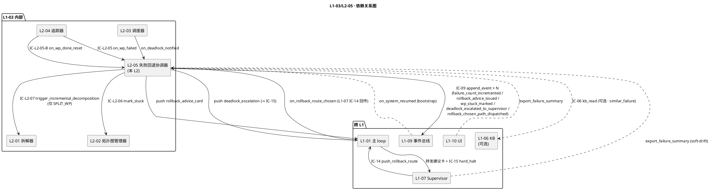
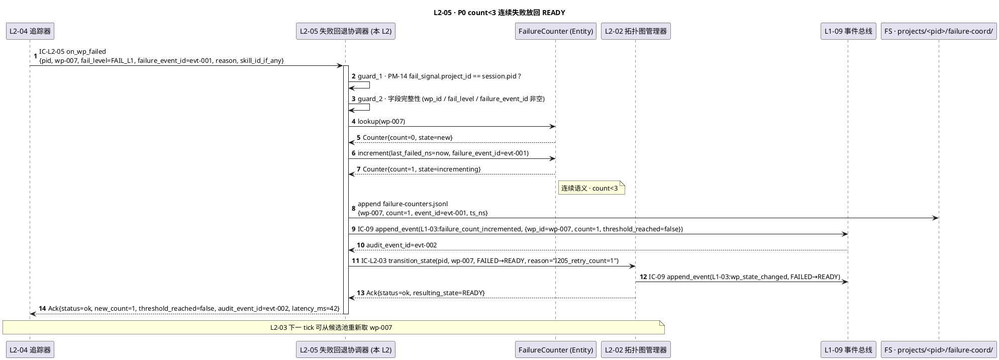
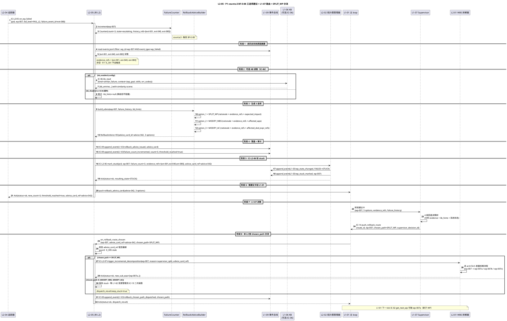
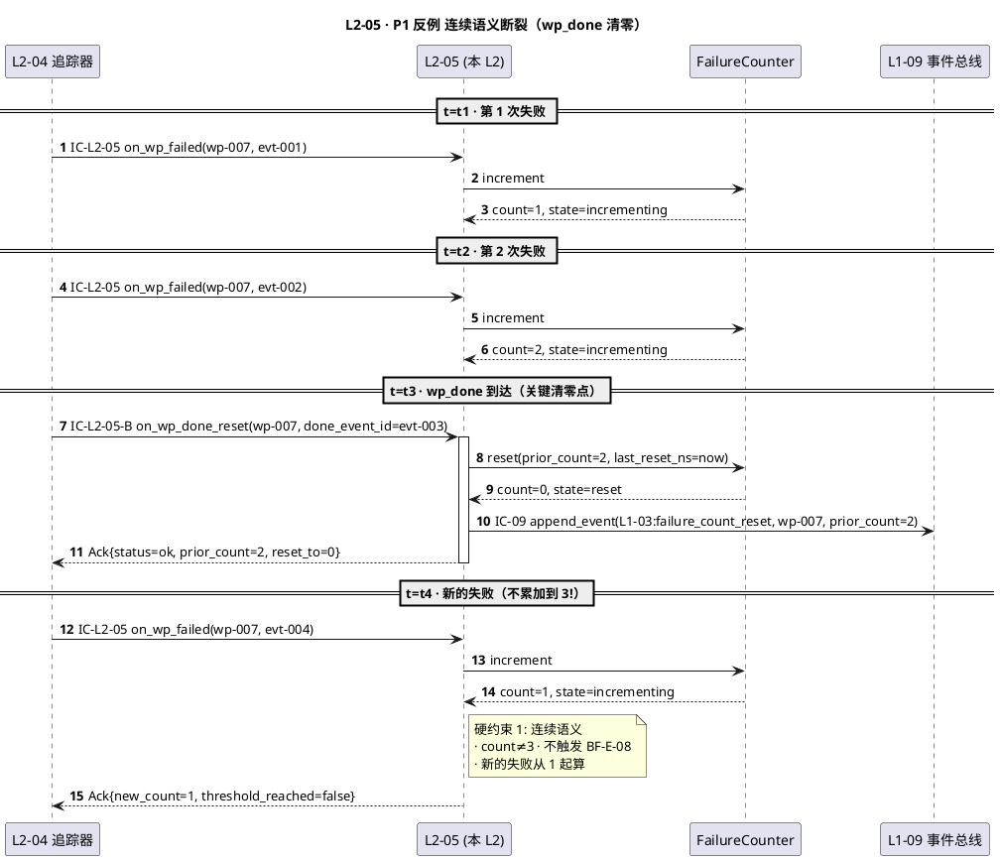
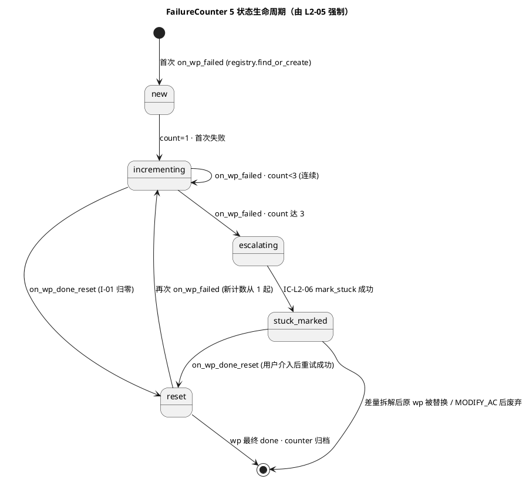
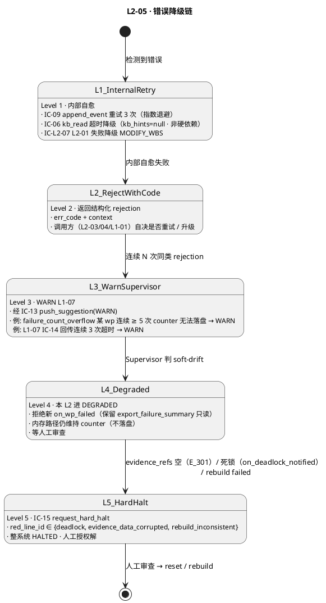

# L1 L2-05 · 失败回退协调器 · Tech Design

> **本文档定位**：3-1-Solution-Technical 层级 · L1 的 L2-05 失败回退协调器 技术实现方案（L2 粒度）。
> **与产品 PRD 的分工**：2-prd/L1-03-WBS+WP 拓扑调度/prd.md §5.3 的对应 L2 节定义产品边界，本文档定义**技术实现**（接口字段级 schema + 算法伪代码 + 底层数据结构 + 状态机 + 配置参数）。
> **与 L1 architecture.md 的分工**：architecture.md 负责**跨 L2 架构 + 跨 L2 时序**，本文档负责**本 L2 内部技术细节**。冲突以 architecture.md 为准。
> **严格规则**：本文档不复述产品 PRD 文字（职责 / 禁止 / 必须等清单），只做技术映射 + 补齐"产品视角未说 but 工程师必须知道"的部分（具体算法 · syscall · schema · 配置）。

---

## §0 撰写进度

- [x] §1 定位 + 2-prd §12 L2-05 映射（含 6 关键决策 D-01..D-06）
- [x] §2 DDD 映射（BC-03 主 · 跨 BC-07 协同 · FailureCounter Entity · RollbackAdvice VO）
- [x] §3 对外接口定义（3 接收 + 3 发起 + 1 导出 · YAML schema · 13 错误码）
- [x] §4 接口依赖（被谁调 · 调谁 · PlantUML 依赖图）
- [x] §5 P0/P1 时序图（P0 count<3 放回 READY + P1 count≥3 BF-E-08 三选项建议 · 2 张 PlantUML）
- [x] §6 内部核心算法（连续计数重建 + 3 选项决策树 + evidence_refs 收集 + 死锁升级）
- [x] §7 底层数据表 / schema 设计（failure-counters.jsonl + rollback-advices.jsonl · PM-14 分片）
- [x] §8 状态机（FailureCounter 5 状态生命周期 · PlantUML + 转换表）
- [x] §9 开源最佳实践（Temporal Retry / AWS Step Functions Catch / Airflow Trigger Rules / K8s BackoffLimit · ≥ 4 项目）
- [x] §10 配置参数清单（10 项）
- [x] §11 错误处理 + 降级策略（5 Level · PlantUML + 协同表 + 可用能力矩阵）
- [x] §12 性能目标（SLO + 吞吐 + 健康指标）
- [x] §13 反向映射 prd §12 + 前向 3-2 TDD（18 TC ID + 3 ADR + 3 OQ）

---

## §1 定位 + 2-prd 映射

### 1.1 本 L2 的唯一命题（One-Liner）

**L1-03 的"失败兜底层"** —— 以 `FailureCounter` Entity（按 `wp_id` 分片 · 仅连续失败语义）追踪每个 WP 的连续失败次数，`count ≥ 3` 时触发 BF-E-08 回退流：读事件总线汇总该 WP 历次失败原因 → 生成 3 选项回退建议卡（`SPLIT_WP / MODIFY_WBS / MODIFY_AC`，每项附 `evidence_refs`）→ 推 L1-01 主 loop（由其转发 L1-07 做最终路径决策）→ IC-L2-06 通过 L2-02 标 stuck。另外承担 L2-03 死锁通知的立即升级通道（不延迟到下 tick）。

**核心关键词**：**连续失败计数**（非累加）· **三选项建议**（非决策）· **evidence_refs 非空**（硬约束）· **死锁立即逃生**（IC-15 hard_halt）

### 1.2 与 `2-prd/L1-03 WBS+WP 拓扑调度/prd.md §12` 的精确小节映射表

> 说明：本表是**技术实现 ↔ 产品小节**的锚点表，不复述 PRD 文字。每行左列为本 tech-design 段落，右列为对应 PRD 小节。冲突以本文档（技术实现）+ architecture.md（架构）为准，若发现 PRD 有歧义或不足以导出字段级 schema，按 spec 6.2 规则反向修 PRD 并注明。

| 本文档段 | 2-prd §12 小节 | 映射内容 | 备注 |
|---|---|---|---|
| §1.1 命题 | §12.1 职责 + 锚定 | "失败兜底层 · 识别 + 建议 + 释放" | 本文补"连续语义"定性（prd §12.4 硬约束 1）|
| §1.4 兄弟边界 | §12.3 边界 | In-scope 8 项 + Out-of-scope 8 项 | — |
| §1.5 PM-14 | §12.4 硬约束 4 | "必须经 L2-02" 扩展为 "含 project_id 根字段" | **补** |
| §2 DDD | §12.1 上游锚定 | BC-03 主 / BC-07 跨 BC 协同（死锁逃生）| **补** |
| §3 接口 `on_wp_failed()` | §12.2 输入"L2-04 失败信号" + §12.8 IC-L2-05 | `on_wp_failed(fail_signal)→Ack` | **补字段级 YAML** |
| §3 接口 `on_deadlock_notified()` | §12.2 输入"L2-03 deadlock" + §12.4 硬约束 5 | `on_deadlock_notified(dl_ctx)→Ack`（立即触发 IC-15）| **补** |
| §3 接口 `on_rollback_route_chosen()` | §12.2 输入"IC-14 L1-07 决策回传" + §12.9 P3/P4 | `on_rollback_route_chosen(chosen_path)→Ack` | **补** |
| §3 接口 `rebuild_counters_from_events()` | §12.4 硬约束 7 "可跨 session 重建" + §12.6 ✅ 必须 8 | 跨 session 重建入口 | **补** |
| §3 错误码 | §12.4 硬约束（1..7） + §12.5 禁止（8 条）| 约束违反一对一映射为错误码 | **补 13 条错误码表** |
| §4 依赖 | §12.8 IC 交互表 | 调用方 + 被调方 | — |
| §5 时序 | §12 无时序图；L1-03 arch §4.4 P1-2 + §4.5 P1-3 | PlantUML 重绘本 L2 视角 | **补** |
| §6 算法 | §12.6 必须 1/2/3/4/5 + §12.9 P1-P6 | 伪代码化 | **补 Python-like** |
| §7 schema | §12 无 schema；本 L2 补 failure-counters.jsonl + rollback-advices.jsonl | YAML 化 + PM-14 分片 | **补** |
| §8 状态机 | §12.1 "连续语义"暗含（5 状态）| FailureCounter 5 状态生命周期 | **补短图** |
| §9 调研 | §12 外 | 引 L0/open-source-research.md + 细化 4 项目 | **补** |
| §10 配置 | §12.4 硬约束 2 "阈值 = 3"（不可调）+ 本 L2 补 9 项 | 原样导入 + 补 tech 侧默认值 | — |
| §11 降级 | §12.4 硬约束 + §12.5 禁止 + arch §4.4 | 错误分类 + 降级链 + 与 L1-07 协同 | **补** |
| §12 SLO | §12.4 性能文字 "亚秒级 / 秒级" | 计数更新 ≤100ms / 建议生成 ≤3s | 原样继承 |
| §13 映射 | — | 本段接口 ↔ §12.X + ↔ 3-2-TDD 用例 | **补** |

### 1.3 与 `L1-03/architecture.md` 的位置映射

| architecture 锚点 | 映射内容 | 本文档对应段 |
|---|---|---|
| arch §3.1 主架构图 / L1-03 · 5 L2 布局 | 本 L2 是 5 L2 中 **#5 · 失败兜底层** · 位于运行期 S4 package 尾端 | §1.4 兄弟 L2 |
| arch §4.4 P1-2 wp_failed 时序（L2-04 → L2-05 → L2-02 / L1-01）| 本 L2 的 **主干路径**（count<3 + count≥3 分支）| §5.1 P0 / §5.2 P1 |
| arch §4.5 P1-3 system_resumed 重建 | 本 L2 跨 session 重建 FailureCounter 的时序 | §6.2 rebuild_counters |
| arch §5.1 NetworkX Adopt | 本 L2 不直接依赖 NetworkX（L2-02 才依赖），但读 read_snapshot 消费 DAG 只读视图 | §4 依赖图 |
| arch §6.3 死锁升级 L2-03 → L2-05 | 本 L2 **死锁逃生** 入口（立即 IC-15，不延迟）| §5.3 死锁升级 |

**物理载体**（architecture.md §3.3）：主 Skill Runtime 的 Python 辅助模块 · 内存字典 `Dict[wp_id, FailureCounter]` + jsonl append-only 落盘 · 不需要独立 subagent session · 逻辑进程归属主 skill。

### 1.4 与兄弟 L2 的边界（L1-03 的 5 L2 中 L2-05 的定位）

| L2 | 定位 | 与 L2-05 的分工 |
|---|---|---|
| **L2-01** WBS 拆解器 | Factory + 差量触发响应方 | 本 L2 在 `chosen_path == SPLIT_WP` 时 IC-L2-07 触发 L2-01 差量拆解（单向调用）|
| **L2-02** 拓扑图管理器 | Aggregate Root · 真值源 | 本 L2 IC-L2-06 调 L2-02 `mark_stuck(wp_id, FAILED→STUCK)` · 不直接改拓扑；另外 IC-L2-02 read_snapshot 读 DAG 只读视图辅助死锁识别 |
| **L2-03** WP 调度器 | 纯函数选 WP · 返回 deadlock 语义 | L2-03 deadlock 通知（all WP ∈ {FAILED,BLOCKED,STUCK}）→ 本 L2 立即 IC-15 hard_halt 升级 Supervisor |
| **L2-04** WP 完成度追踪器 | 进度指标聚合 · wp_failed/wp_done 第一消费者 | L2-04 收 wp_failed 后 IC-L2-05 同步本 L2 `on_wp_failed`；收 wp_done 后 IC-L2-05-B reset 本 L2 `on_wp_done_reset`（关键连续语义源）|
| **L2-05**（本 L2）失败回退协调器 | **Domain Service + Entity FailureCounter** | 持有 `Dict[wp_id, FailureCounter]` · 只做 3 件事：计数、建议、释放 |

**边界规则**：本 L2 是 L1-03 的**失败分水岭**；**识别**（计数 + 阈值）→ **建议**（3 选项 + evidence）→ **释放**（IC-L2-06 标 stuck + IC-L2-07 触差量 / 保持 stuck 等变更）。三件事之外一律不做（失败根因、回退决策、UI 交互、WBS 拆解、状态真值均归兄弟）。

### 1.5 PM-14 约束（project_id as root）

引用 `L0/ddd-context-map.md §3.2 PM-14`，本 L2 所有数据结构 / 持久化路径 / 事件 / 计数器**必须**带 `project_id` 并与 BC-02 `ProjectAggregate.id` 强绑定：

1. `FailureCounter(project_id, wp_id, count, last_failed_ns, ...)` —— `project_id` 作为字典外层 key，`wp_id` 作为内层 key · 跨 project 禁止互访
2. `projects/<pid>/failure-coord/failure-counters.jsonl` —— PM-14 分片 append-only
3. `projects/<pid>/failure-coord/rollback-advices.jsonl` —— PM-14 分片 append-only
4. `L1-03:failure_count_incremented / :rollback_advice_issued / :deadlock_escalated_to_supervisor / :wp_stuck_marked` 事件 `project_id` 字段硬必填
5. 跨 project 失败事件（`fail_signal.project_id != session.project_id`）→ `E_L103_L205_201` 拒绝 · 审计 bypass_attempt

### 1.6 关键技术决策（Decision → Rationale → Alternatives → Trade-off）

| # | 决策 | Rationale | Alternatives（弃用原因）| Trade-off |
|---|---|---|---|---|
| **D-01** | **连续失败计数语义**（`wp_done` 出现即清零 · 非简单累计）| 2-prd §12.4 硬约束 1 + §12.5 禁止 1；真实业务语义是"近期连续稳定失败"，而非"历史累计失败"（历史累计会把已成功又失败的情况误判为僵死）| A. 累计总数：遇到"成功→失败"无法区分是新问题还是老 bug；B. 滑动窗口（过去 24h 失败数）：时间语义复杂、跨 session 难重建 | 跨 session 重建时必须**按事件时序重算**，不能简单 count · 牺牲重建速度（O(events) vs O(1)）换取语义正确性（§6.2 rebuild 伪代码） |
| **D-02** | **本 L2 只提建议 · 不做决策**（3 选项卡推 L1-01 → L1-07，chosen_path 回传后本 L2 按路径分流）| 2-prd §12.4 硬约束 3；失败回退是跨 BC 复杂决策（涉及 BC-04 DoD / BC-02 S2 Gate / BC-07 Supervisor），本 L2 无足够上下文；L1-07 Supervisor 是系统唯一"抽离视角"的 BC | A. 本 L2 直接决策（如固定每次都 SPLIT_WP）：违反 PM-12 红线分级 · 硬红线需升级；B. 调 LLM 直接决策：破坏 DDD 聚合独立性、延迟不可控 | 建议链路多一跳（本 L2 → L1-01 → L1-07 → IC-14 回传 → 本 L2），但每跳都有审计事件，整链可追溯 · 预期总延迟 ≤ 30s（含 L1-07 思考） |
| **D-03** | **evidence_refs 非空是硬契约**（每条建议必须附带 events.jsonl 中该 WP 历次 wp_failed 事件的 event_id 清单）| 2-prd §12.4 硬约束 6 + §12.9 N5；Supervisor 无法凭空做决策、必须看到"证据链"（哪些 skill 失败、哪些错误重复出现）；PM-08 可审计全链追溯 | A. 只附失败原因文本（textual summary）：LLM 摘要易幻觉、无法反查原始事件；B. 附 commit SHA：commit 与 wp 关系弱、难定位 | 建议生成阶段要多一次事件总线查询（seek + filter `wp_id + event_type=wp_failed`），预期 < 2s（§12 SLO） |
| **D-04** | **死锁逃生立即 IC-15 hard_halt**（不走 3 选项建议路径 · 不延迟到下 tick）| 2-prd §12.4 硬约束 5；死锁 = 整图无前进可能，让 Supervisor 立即介入是最经济的；延迟决策只会增加用户等待无收益 | A. 死锁也走 3 选项建议：复杂、不对称（死锁不是单 WP 问题）；B. 死锁自动 restart WBS：风险过大、可能丢数据 | 死锁判定必须 **高可信**（L2-03 确认 all WP ∈ {FAILED,BLOCKED,STUCK}）· 误报 IC-15 会让系统进 HALTED 且需用户授权解（成本高）· L2-03 需二次确认 |
| **D-05** | **FailureCounter 是 Entity（非 VO）**（有可变状态 count + last_failed_ns · 跨 tick 持久）| DDD：有标识（`wp_id`）+ 有生命周期（new → incrementing → escalating → stuck_marked / reset）→ 必然是 Entity；VO 会要求每次 count+=1 生成新对象，open 计数场景不合适 | A. 纯函数 + 每次重算（从 events.jsonl seek）：每次失败都 scan 历史事件，S4 高频路径上 P99 会到 5s+（seek scan 成本）；B. 用 VO：违反 DDD 定义 | 必须自持 jsonl 落盘保证崩溃后不丢计数（checkpoint 策略 + 跨 session rebuild 兜底）· I/O 开销小（每次 failure 新增 1 行 jsonl） |
| **D-06** | **RollbackAdvice 是 VO**（不可变 · 一次生成 · 每选项独立 evidence_refs）| DDD：一旦生成就是"建议卡快照"、不再变更（L1-07 选择 chosen_path 是另一个独立领域事件），VO 的不可变性最适合；3 选项是数组而非 tagged union（3 条并列可执行的备选路径）| A. 用 Entity：引入不必要的标识和生命周期；B. 3 选项合成 1 个 dict：失去类型约束（每选项字段不同）| VO 不可变好处是审计简单（`hash(advice) == advice_id`）· 缺点是 L1-07 回传 chosen_path 后无法 "update" 建议（但这正是我们要的：修改决策要产生新事件） |

### 1.7 YAGNI 边界（本 L2 不做的事）

- ❌ **不做失败根因诊断**（→ L1-07 + L1-04）· 本 L2 只汇总事件原因摘要
- ❌ **不做回退路径决策**（→ L1-07）· 本 L2 只给 3 选项建议 + evidence_refs
- ❌ **不做 WP 状态真值维护**（→ L2-02）· 必须经 IC-L2-06 标 stuck
- ❌ **不做调度决策**（→ L2-03）· 不决定"下一个取哪个 WP"
- ❌ **不做完成率 / UI 指标**（→ L2-04）· 不聚合 progress metrics
- ❌ **不做 WBS 拆解**（→ L2-01）· 只反向触发（chosen_path == SPLIT_WP 时）
- ❌ **不做事件总线落盘**（→ L1-09）· 通过 IC-09 委托
- ❌ **不做用户交互**（→ L1-10）· 只推卡片给 L1-01，L1-01 转发 UI
- ❌ **不做 failure-archive 写入**（可选功能 · YAGNI 推迟，§12.7 可选职责 5）

### 1.8 本 L2 读者预期

- **TDD 工程师**：从 §3（YAML schema）+ §11（错误码表）+ §13（TC ID）生成用例
- **实现工程师**：从 §6（伪代码）+ §7（持久化 schema）+ §8（状态机）直接落代码
- **集成测试作者**：从 §5（时序图）+ §4（依赖图）理解跨 L2 协同（含 L1-07 回传）
- **Supervisor（L1-07）**：从 §3 接收建议卡契约（`rollback_advice_card_schema`）设计 4 级回退决策树

---

## §2 DDD 映射（BC-03 主 · 跨 BC-07 协同）

### 2.1 Bounded Context 定位

引用 `L0/ddd-context-map.md §2.4 BC-03 WBS+WP Topology Scheduling` + `§2.8 BC-07 Harness Supervision`。本 L2 **主属 BC-03**（L1-03 内部 L2 · 维护 FailureCounter Entity + RollbackAdvice VO），但**与 BC-07 Partnership 关系特别紧密**（每次 count≥3 都要经 L1-07 Supervisor 做回退路径决策 · 死锁升级必经 BC-07）。

**BC 关系摘要**：

- 与 **BC-03**（本 BC 兄弟 L2）：**Partnership**（各持聚合根一部分 · L2-02 持 WBSTopology · 本 L2 持 FailureCounter × N）
- 与 **BC-07 Harness Supervision**：**Partnership**（BF-E-08 回退决策 + BF-E-10 死循环升级 · 双向协同）
- 与 **BC-02 Project Lifecycle**：Customer-Supplier（本 L2 是 Customer · pid 由 BC-02 供给）
- 与 **BC-09 Resilience & Audit**：Partnership（所有计数 / 建议 / 标 stuck / 升级走 IC-09）
- 与 **BC-06 Knowledge Base**（可选）：Customer-Supplier（本 L2 是 Customer · IC-06 读相似失败 KB）

### 2.2 本 L2 在 BC-03 中的聚合定位

**关键**：本 L2 **不持有独立 Aggregate Root**（L1-03 唯一聚合根是 L2-02 的 `WBSTopology`）· 本 L2 是 **BC-03 内部的 Domain Service + Entity 集合**。

```
(L1-03 内 · 依附于 BC-03 主聚合 WBSTopology)
FailureCoordinator (Domain Service · 本 L2)
├── FailureCounterRegistry  : Dict[wp_id, FailureCounter]   ← 以 (project_id, wp_id) 复合主键分片
├── RollbackAdviceIssuer    : Domain Service（纯函数生成 VO）
├── DeadlockEscalator       : Domain Service（死锁 → IC-15）
├── EventReplayer           : Domain Service（跨 session 重建 counter）
└── RollbackRouteDispatcher : Domain Service（chosen_path 分流）
```

### 2.3 Entity · FailureCounter（本 L2 持有的唯一 Entity）

有标识（`(project_id, wp_id)` 复合主键）+ 有生命周期（§8 状态机 5 状态）+ 有可变状态（count）→ **Entity**（非 VO）。

```
FailureCounter
├── project_id          : ProjectId (PM-14 根字段)
├── wp_id               : WorkPackageId
├── count               : int (≥0 · 连续语义)
├── state               : {new, incrementing, escalating, stuck_marked, reset}
├── failure_history_refs: List[event_id]  (本 counter 累计的 wp_failed event 清单)
├── last_failed_ns      : int | null
├── last_reset_ns       : int | null
├── last_advice_card_ref: str | null   (count≥3 时生成的最新建议卡 id)
├── current_chosen_path : enum | null  (L1-07 IC-14 回传后记录)
└── checkpoint_hash     : sha256(canonical json without this field)
```

**Entity Invariants**（跨 tick 保持）：

- **I-01 连续语义**：`on_wp_done_reset` 时 `count` 归 0（非减 1）· `failure_history_refs` 清空
- **I-02 PM-14 归属**：`project_id` 不可变 · 跨 project 不互通（`E_201`）
- **I-03 evidence 非空**：若 `state == escalating` → `len(failure_history_refs) >= 3` 必然成立
- **I-04 advice-card 单调**：每次 escalating 都生成新 `advice_card_ref`（不复用旧卡 · 硬契约见 §3.8 E_305）
- **I-05 跨 session 可重建**：由 `events.jsonl` 按时序重放 `wp_failed + wp_done + failure_count_reset` 可还原（§6.2）

### 2.4 Value Objects（不可变 · 按需构造）

| VO 名 | 结构 | 用途 | 不可变性保证 |
|---|---|---|---|
| `RollbackAdvice` | `{advice_card_id, wp_id, failure_count, failure_history, options: List[RollbackOption], issued_ns, checkpoint_hash}` | `count≥3` 时生成 · 推 L1-01 | `checkpoint_hash = sha256(canonical json)` · 修改需生成新卡 |
| `RollbackOption` | `{option_id ∈ {SPLIT_WP, MODIFY_WBS, MODIFY_AC}, rationale, evidence_refs, expected_impact, kb_hints}` | RollbackAdvice 的 3 个成员 · 独立 VO | 组合构造 · 不可单独修改 |
| `DeadlockEscalation` | `{halt_id, project_id, deadlock_snapshot, escalation_ts_ns}` | on_deadlock_notified 触发后记录 | 一次性构造 · 永不变 |
| `ChosenPath` | enum · `{SPLIT_WP, MODIFY_WBS, MODIFY_AC}` | IC-14 回传值 · 分流关键 | 枚举天然不可变 |
| `FailureHistory` | `List[{failure_event_id, fail_level, skill_id_if_any, reason_summary, ts_ns}]` | 附在建议卡里的历次失败摘要 | 集合语义 + 元素不可变 |

### 2.5 Domain Services（本 L2 内部组件 · 不拆 L2）

| 组件 | DDD 类型 | 职责 | 无状态/有状态 |
|---|---|---|---|
| `FailureCoordinator`（门面）| Domain Service · 核心 | 5 阶段主流程：guard → counter increment → threshold check → advice build → dispatch | 无状态（FailureCounter 是持久对象）|
| `FailureCounterRegistry` | Repository-like | 按 `(project_id, wp_id)` 查找 / 创建 / 重置 FailureCounter | 有状态（内存 + jsonl）|
| `RollbackAdviceIssuer` | Domain Service · 纯函数 | 读 events.jsonl 失败历史 → 可选 IC-06 kb_read → 构造 3 选项 RollbackAdvice VO | 无状态 |
| `DeadlockEscalator` | Domain Service | 死锁通知到达时 → 立即 IC-15 | 无状态 |
| `EventReplayer` | Domain Service · 纯函数 | 跨 session 重建所有 FailureCounter（按时序重放 wp_failed / wp_done）| 无状态 |
| `RollbackRouteDispatcher` | Domain Service | IC-14 chosen_path 回传 → 按路径分流（SPLIT_WP / MODIFY_WBS / MODIFY_AC）| 无状态 |

**关键点**（D-01 连续语义 + D-02 建议不决策）：除 `FailureCounterRegistry` 外全部**纯函数** · 100% 可单元测试 + mock 历史事件覆盖所有分支 + 跨 session 重建纯函数化可并行 replay。

### 2.6 Domain Events（本 L2 对外发布 · 经 IC-09）

| 事件名 | 触发时机 | 必含字段 | 消费方 |
|---|---|---|---|
| `L1-03:failure_count_incremented` | 每次 `on_wp_failed` 成功 | `project_id / wp_id / count / threshold_reached / failure_event_id / ts_ns` | L1-09 落盘 · L1-07 订阅 soft-drift · L1-10 UI |
| `L1-03:failure_count_reset` | `on_wp_done_reset` 清零 | `project_id / wp_id / prior_count / reset_to=0 / done_event_id / ts_ns` | L1-09 · Tracker(L2-04) 可选感知 |
| `L1-03:rollback_advice_issued` | `count≥3` 生成建议卡 | `project_id / wp_id / advice_card_id / options (3 条) / evidence_refs_total / ts_ns` | L1-09 · L1-01（转发 L1-07）· L1-10 UI 弹卡片 |
| `L1-03:wp_stuck_marked` | IC-L2-06 成功调 L2-02 | `project_id / wp_id / failure_count / advice_card_ref / ts_ns` | L1-09 · L2-02 ack 确认（闭环）· L2-04 调度指标 |
| `L1-03:rollback_chosen_path_dispatched` | `on_rollback_route_chosen` 成功分流 | `project_id / wp_id / advice_card_ref / chosen_path / dispatch_result / supervisor_decision_id / ts_ns` | L1-09 · L2-01（SPLIT_WP 时）· L1-02（MODIFY_WBS/AC 时）|
| `L1-03:deadlock_escalated_to_supervisor` | `on_deadlock_notified` 触发 IC-15 后 | `project_id / halt_id / deadlock_snapshot (failed+stuck+blocked 清单) / ts_ns` | L1-09 · L1-07 优先级最高 |

### 2.7 Repository Interface

```python
class FailureCounterRepository(ABC):
    def save(self, counter: FailureCounter) -> None: ...
    def find_by_wp(self, pid: ProjectId, wp_id: WorkPackageId) -> Optional[FailureCounter]: ...
    def find_all_by_project(self, pid: ProjectId) -> List[FailureCounter]: ...
    def reset_counter(self, pid, wp_id, prior_count) -> None: ...  # 连续语义清零
    def rebuild_from_events(self, pid: ProjectId) -> Dict[WorkPackageId, FailureCounter]: ...  # 跨 session
```

```python
class RollbackAdviceRepository(ABC):
    def append(self, advice: RollbackAdvice) -> None: ...
    def find_by_id(self, advice_card_id: str) -> Optional[RollbackAdvice]: ...
    def latest_for_wp(self, pid, wp_id) -> Optional[RollbackAdvice]: ...   # E_305 stale 校验用
    def list_recent(self, pid, limit: int = 10) -> List[RollbackAdvice]: ...
```

### 2.8 跨 BC 关系摘要

- **BC-07 Supervision Partnership**：推建议卡 → L1-07 决策 → IC-14 回传 · 本 L2 是 Supervisor 的**建议产出方** · Supervisor 是本 L2 的**决策消费方**
- **BC-06 KB 可选依赖**：IC-06 `kb_read(kind=similar_failure)` 非硬依赖 · 降级 kb_hints=null 仍可产建议
- **BC-04 Quality Loop 弱耦合**：本 L2 不直接调 BC-04 · L1-04 的 `wp_failed` 经 L2-04 → IC-L2-05 到本 L2
- **BC-09 Resilience Partnership**：每个 Domain Event 都走 IC-09 · 跨 session 重建依赖 events.jsonl 完整性

---

## §3 对外接口定义（字段级 YAML schema + 错误码）

### 3.1 接口清单总览（3 接收 + 3 发起 + 1 只读导出）

| IC / 方法 | 方向 | 方法签名 | SLO |
|---|---|---|---|
| **IC-L2-05** | L2-04 → 本 L2 | `on_wp_failed(fail_signal) → Ack` | P95 ≤ 100ms / 硬上限 500ms |
| **IC-L2-05-B** | L2-04 → 本 L2 | `on_wp_done_reset(done_signal) → Ack`（连续语义清零）| P95 ≤ 50ms |
| **on_deadlock_notified** | L2-03 → 本 L2 | `on_deadlock_notified(deadlock_ctx) → Ack`（立即 IC-15）| P95 ≤ 100ms / 硬上限 200ms |
| **on_rollback_route_chosen** | L1-01（L1-07 经由 IC-14 回传）→ 本 L2 | `on_rollback_route_chosen(route_ack) → Ack` | P95 ≤ 100ms |
| **IC-L2-06** | 本 L2 → L2-02 | `mark_stuck(pid, wp_id, failure_count, evidence_refs, advice_card_ref) → Ack`（见 L2-02 §3.5）| P95 ≤ 100ms |
| **IC-L2-07** | 本 L2 → L2-01 | `trigger_incremental_decomposition(pid, wp_id, reason, advice_card_ref) → Ack` | P95 ≤ 500ms |
| **IC-15** | 本 L2 → L1-07（经 L1-01 主 loop）| `request_hard_halt(halt_id, project_id, red_line_id=deadlock, evidence)`（见 ic-contracts §3.15）| ≤100ms 硬上限 |
| **IC-06**（可选）| 本 L2 → L1-06 | `kb_read(kind=similar_failure, context={wp_goal, skills, err_codes})`（见 ic-contracts §3.6）| P95 ≤ 500ms |
| **IC-09** append_event | 本 L2 → L1-09 | 每次计数 / 建议 / 标 stuck / 升级一条（见 ic-contracts §3.9）| P95 ≤ 10ms |
| **export** | L1-07 / L1-10 → 本 L2 | `export_failure_summary(pid) → FailureSummaryView` | P95 ≤ 50ms |

### 3.2 IC-L2-05 · `on_wp_failed` 入 / 出参 schema

**语义**：L2-04 监听 `L1-03:wp_failed` 事件后同步调本 L2 · 单调递增 FailureCounter + 触发阈值判定。

```yaml
# ic_l2_05_on_wp_failed_request.yaml
type: object
required: [project_id, wp_id, fail_level, failure_event_id, requester_l2]
properties:
  project_id: { type: string, pattern: "^hf-proj-[a-zA-Z0-9_-]+$" }
  wp_id: { type: string, pattern: "^wp-[0-9]{3}$" }
  fail_level: { type: string, enum: [FAIL_L1, FAIL_L2, FAIL_L3, FAIL_L4] }
  failure_event_id: { type: string, description: "events.jsonl 中该 wp_failed 事件的 event_id" }
  failure_reason_summary: { type: string, maxLength: 500 }
  skill_id_if_any: { type: string, nullable: true, description: "若失败由某 skill 触发" }
  requester_l2: { type: string, enum: ["L2-04"] }
  tick_id: { type: string, nullable: true }
  ts_ns: { type: integer }
```

```yaml
# ic_l2_05_on_wp_failed_response.yaml
type: object
required: [status, project_id, wp_id, new_count, threshold_reached]
properties:
  status: { type: string, enum: [ok, rejected] }
  project_id: { type: string }
  wp_id: { type: string }
  new_count: { type: integer, minimum: 1 }
  threshold_reached: { type: boolean, description: "new_count >= 3" }
  advice_card_ref: { type: string, nullable: true, description: "threshold_reached=true 时生成的建议卡 id" }
  rejection:
    type: object
    nullable: true
    properties:
      err_code: { type: string, description: "§3.8 错误码" }
      reason: { type: string }
  audit_event_id: { type: string }
  latency_ms: { type: integer }
```

### 3.3 IC-L2-05-B · `on_wp_done_reset` 入 / 出参 schema（**连续语义关键**）

**语义**：L2-04 监听 `L1-03:wp_done` 事件后调本 L2 · FailureCounter 清零（不是减 1、而是归 0） · 新失败计数重新从 1 起算。

```yaml
# ic_l2_05b_on_wp_done_reset_request.yaml
type: object
required: [project_id, wp_id, done_event_id, requester_l2]
properties:
  project_id: { type: string }
  wp_id: { type: string }
  done_event_id: { type: string }
  requester_l2: { type: string, enum: ["L2-04"] }
  tick_id: { type: string, nullable: true }
  ts_ns: { type: integer }
```

```yaml
# ic_l2_05b_on_wp_done_reset_response.yaml
type: object
required: [status, project_id, wp_id, prior_count]
properties:
  status: { type: string, enum: [ok, rejected, no_op] }     # no_op: counter 本来就是 0
  project_id: { type: string }
  wp_id: { type: string }
  prior_count: { type: integer, minimum: 0, description: "重置前的 count 值 · 审计用" }
  reset_to: { type: integer, const: 0 }
  audit_event_id: { type: string, nullable: true }
  latency_ms: { type: integer }
```

### 3.4 `on_deadlock_notified`（L2-03 → 本 L2 · 立即 IC-15）

**语义**：L2-03 `get_next_wp` 发现 `all wp ∈ {FAILED, BLOCKED, STUCK}`（整图僵死）→ 立即通知本 L2 · 本 L2 不走 3 选项路径、直接触发 IC-15。

```yaml
# on_deadlock_notified_request.yaml
type: object
required: [project_id, deadlock_snapshot, requester_l2, confirmed]
properties:
  project_id: { type: string }
  deadlock_snapshot:
    type: object
    required: [all_wp_states, failed_wp_ids, stuck_wp_ids, blocked_wp_ids]
    properties:
      all_wp_states:
        type: object
        description: "{wp_id: state} 整图快照 · 证明 all ∉ {READY, RUNNING, DONE}"
      failed_wp_ids: { type: array, items: { type: string } }
      stuck_wp_ids: { type: array, items: { type: string } }
      blocked_wp_ids: { type: array, items: { type: string } }
      topology_id: { type: string }
      snapshot_ts_ns: { type: integer }
  confirmed: { type: boolean, const: true, description: "L2-03 已二次确认（硬红线证据）" }
  requester_l2: { type: string, enum: ["L2-03"] }
  tick_id: { type: string, nullable: true }
```

```yaml
# on_deadlock_notified_response.yaml
type: object
required: [status, project_id, halt_id]
properties:
  status: { type: string, enum: [ok, rejected] }
  project_id: { type: string }
  halt_id: { type: string, nullable: true, description: "IC-15 已触发时返回的 halt-{uuid-v7}" }
  escalation_event_id: { type: string, description: "L1-03:deadlock_escalated_to_supervisor 事件 id" }
  rejection:
    type: object
    nullable: true
    properties:
      err_code: { type: string }
      reason: { type: string }
  latency_ms: { type: integer }
```

### 3.5 `on_rollback_route_chosen`（L1-01 转发 L1-07 IC-14 ack · 本 L2 按 chosen_path 分流）

**语义**：L1-07 对某 wp 的 3 选项做出决定后，通过 IC-14 `push_rollback_route` 回传 `new_wp_state` → L1-01 主 loop 转发本 L2 · 本 L2 根据 `chosen_path` 分流：

- `SPLIT_WP` → IC-L2-07 触发 L2-01 差量拆解
- `MODIFY_WBS` → 保持 stuck · 等 L1-02 变更管理流 IC-19 二次装图
- `MODIFY_AC` → 保持 stuck · 等 L1-02 走 AC 改造流程

```yaml
# on_rollback_route_chosen_request.yaml
type: object
required: [project_id, wp_id, advice_card_ref, chosen_path, route_id, supervisor_decision_id]
properties:
  project_id: { type: string }
  wp_id: { type: string }
  advice_card_ref: { type: string, description: "原回退建议卡 id · 用于幂等校验" }
  chosen_path: { type: string, enum: [SPLIT_WP, MODIFY_WBS, MODIFY_AC] }
  route_id: { type: string, pattern: "^route-[a-zA-Z0-9_-]+$", description: "IC-14 route_id 透传" }
  supervisor_decision_id: { type: string, description: "L1-07 决策记录 id" }
  supervisor_rationale: { type: string, maxLength: 1000 }
  tick_id: { type: string, nullable: true }
  ts_ns: { type: integer }
```

```yaml
# on_rollback_route_chosen_response.yaml
type: object
required: [status, project_id, wp_id, chosen_path, dispatch_result]
properties:
  status: { type: string, enum: [ok, rejected] }
  project_id: { type: string }
  wp_id: { type: string }
  chosen_path: { type: string }
  dispatch_result:
    type: object
    properties:
      downstream_ic: { type: string, description: "IC-L2-07 / none（保持 stuck）" }
      dispatched_event_id: { type: string, nullable: true }
      keep_stuck: { type: boolean, description: "MODIFY_WBS / MODIFY_AC 时 true" }
  rejection:
    type: object
    nullable: true
    properties:
      err_code: { type: string }
      reason: { type: string }
  audit_event_id: { type: string }
  latency_ms: { type: integer }
```

### 3.6 `rollback_advice_card_schema`（本 L2 推给 L1-01 的建议卡 · VO 不可变）

**语义**：`count ≥ 3` 时本 L2 生成的 3 选项建议卡 · 每选项独立 evidence_refs · L1-01 转发 L1-07 决策。

```yaml
# rollback_advice_card.yaml
type: object
required: [advice_card_id, project_id, wp_id, failure_count, options, issued_ns, issuer_l2]
properties:
  advice_card_id: { type: string, pattern: "^advice-[a-zA-Z0-9_-]+$" }
  project_id: { type: string }
  wp_id: { type: string }
  failure_count: { type: integer, minimum: 3 }
  failure_history:
    type: array
    description: "该 wp 的 N 次历次失败原因摘要 · 按时间顺序"
    items:
      type: object
      properties:
        failure_event_id: { type: string }
        fail_level: { type: string, enum: [FAIL_L1, FAIL_L2, FAIL_L3, FAIL_L4] }
        skill_id_if_any: { type: string, nullable: true }
        reason_summary: { type: string }
        ts_ns: { type: integer }
  options:
    type: array
    minItems: 3
    maxItems: 3
    items:
      type: object
      required: [option_id, rationale, evidence_refs]
      properties:
        option_id: { type: string, enum: [SPLIT_WP, MODIFY_WBS, MODIFY_AC] }
        rationale: { type: string, maxLength: 500, description: "该选项适用的条件推断" }
        evidence_refs:
          type: array
          minItems: 1
          description: "events.jsonl event_id 清单 · 硬约束非空（§11 E_301）"
          items: { type: string }
        expected_impact:
          type: object
          properties:
            affected_wps: { type: array, items: { type: string } }
            estimated_rework_days: { type: number, minimum: 0 }
            downstream_changes: { type: string }
        kb_hints:
          type: array
          nullable: true
          description: "可选 IC-06 kb_read 读到的相似失败模式 hint"
          items: { type: object, properties: { kb_entry_id: {type: string}, similarity: {type: number} } }
  issued_ns: { type: integer }
  issuer_l2: { type: string, const: "L2-05" }
  tick_id: { type: string, nullable: true }
  checkpoint_hash: { type: string, description: "sha256(canonical json without this field)" }
```

### 3.7 `export_failure_summary`（只读导出 · 供 L1-07 / L1-10 观察）

```yaml
# export_failure_summary_response.yaml
type: object
required: [project_id, counters, recent_advices]
properties:
  project_id: { type: string }
  counters:
    type: array
    items:
      type: object
      properties:
        wp_id: { type: string }
        count: { type: integer, minimum: 0 }
        last_failed_ns: { type: integer, nullable: true }
        last_reset_ns: { type: integer, nullable: true }
        state: { type: string, enum: [new, incrementing, escalating, stuck_marked, reset] }
  recent_advices:
    type: array
    description: "最近 N 张建议卡摘要（默认 N=10）"
    items:
      type: object
      properties:
        advice_card_id: { type: string }
        wp_id: { type: string }
        failure_count: { type: integer }
        chosen_path: { type: string, nullable: true, description: "L1-07 已决策时填" }
        issued_ns: { type: integer }
  deadlock_status:
    type: object
    properties:
      is_in_halted: { type: boolean }
      halt_id: { type: string, nullable: true }
      halt_ts_ns: { type: integer, nullable: true }
  stats:
    type: object
    properties:
      total_wps_with_counter: { type: integer }
      wps_at_threshold: { type: integer }
      wps_stuck_marked: { type: integer }
```

### 3.8 错误码总表（13 条四列 · 风格 `E_L103_L205_NNN`）

| 错误码 | 含义（meaning）| 触发场景（trigger）| 调用方处理（callerAction）|
|---|---|---|---|
| `E_L103_L205_101` | `wp_failed` 信号字段缺失 | `on_wp_failed` 入参 `wp_id / fail_level / failure_event_id` 任一为空 | L2-04 重试（补齐字段）· 若仍失败升 bug |
| `E_L103_L205_102` | FailureCounter 初始化失败 | 内存字典损坏 / jsonl 写失败 / 磁盘满 | 本 L2 降 DEGRADED（§11.4）· L1-07 WARN · 仍产 ack（avoid blocking loop）|
| `E_L103_L205_103` | `on_wp_done_reset` wp_id 不存在 Counter | `wp_done` 到达但该 wp 从未失败过 | 返回 status=no_op · 不视为错误 |
| `E_L103_L205_201` | 跨 project 失败信号（PM-14 违反）| `fail_signal.project_id != session.pid` | 升级硬红线 · 拒绝 · 审计 bypass_attempt · L1-07 WARN |
| `E_L103_L205_301` | 3 选项建议 `evidence_refs` 为空 | 阈值到达但读事件总线返回 0 条 `wp_failed` 历史（理论不可能 · 数据损坏）| 本 L2 拒绝产建议卡 · 进 DEGRADED · IC-15 hard_halt（数据完整性破坏）|
| `E_L103_L205_302` | L1-07 IC-14 返回 chosen_path 超时 | 推建议卡后 > 180s 未收 IC-14 ack | 重推建议卡（最多 2 次）· 仍超时 L1-07 自己告警 · 本 L2 保持 stuck 不动 |
| `E_L103_L205_303` | SPLIT_WP 转 L2-01 IC-L2-07 失败 | L2-01 拒绝差量拆解（如粒度已 ≤ 0.5 天不能再拆）| 回退为 MODIFY_WBS 建议（推回 L1-07 新建议卡）· 审计 |
| `E_L103_L205_304` | `chosen_path` 枚举非法 | IC-14 ack 中 `chosen_path ∉ {SPLIT_WP, MODIFY_WBS, MODIFY_AC}` | 拒绝 · 审计 · L1-07 WARN（决策侧 bug）|
| `E_L103_L205_305` | advice_card_ref 失效（已被新建议卡替换）| IC-14 回传的 advice_card_ref 不等于最新的 | 拒绝 · 告警（可能是 race 或 L1-07 用了老卡）|
| `E_L103_L205_401` | IC-09 append_event 失败 | 审计事件写入连续 3 次重试仍失败 | 本 L2 拒绝产 ack（PM-08 一致性优先）· WARN L1-07 |
| `E_L103_L205_402` | `rollback-advices.jsonl` 写失败 | 磁盘错误 / 权限错误 | 降 DEGRADED · 仍走内存路径 · WARN L1-07 |
| `E_L103_L205_501` | 外部直改 failure-counters（bypass）| FS 直写 `projects/<pid>/failure-coord/*` 绕过本层 | 启动 consistency_check 识别 · 审计 bypass_attempt · L1-07 WARN |
| `E_L103_L205_502` | 死锁二次确认失败 | `on_deadlock_notified` 入参 `confirmed != true` | 拒绝 · 要求 L2-03 二次确认后重试（防误触 IC-15）|

**错误码结构化返回模板**（所有错误统一）：

```yaml
status: rejected
rejection:
  err_code: E_L103_L205_301
  reason: "rollback_advice_evidence_refs_empty: wp_id=wp-042 but events.jsonl yields 0 wp_failed rows"
  wp_id: wp-042
  failure_count: 3
audit_event_id: "evt-20260422-l103-l205-00019"
latency_ms: 42
```

---

## §4 接口依赖（被谁调 · 调谁）

### 4.1 上游调用方

| 调用方 | 方法 | 通道 | 频率 | SLO |
|---|---|---|---|---|
| L2-04 追踪器 | `on_wp_failed` (IC-L2-05) | 同步内存 | 按 `wp_failed` 事件（低频 · 日级）| P95 ≤ 100ms |
| L2-04 追踪器 | `on_wp_done_reset` (IC-L2-05-B) | 同步内存 | 按 `wp_done` 事件 | P95 ≤ 50ms |
| L2-03 调度器 | `on_deadlock_notified` | 同步内存 | 仅死锁时（极低频）| 立即 · P95 ≤ 100ms |
| L1-01 主 loop（经 L1-07 IC-14 回传）| `on_rollback_route_chosen` | 同步内存 | count≥3 后 ~30s 内 | P95 ≤ 100ms |
| L1-09 事件总线订阅 | `on_system_resumed` | 异步事件 | bootstrap 1 次 | 秒级（同 L2-02）|
| L1-10 UI / L1-07 Supervisor | `export_failure_summary` | 同步本地读 | UI 刷新 / Supervisor 轮询 | P95 ≤ 50ms |

### 4.2 下游依赖

| IC | 对端 | 触发条件 | 锚点 |
|---|---|---|---|
| **IC-L2-06** mark_stuck | L2-02 拓扑图管理器 | `count≥3` 建议卡生成后 | L2-02 §3.5 |
| **IC-L2-07** trigger_incremental_decomposition | L2-01 WBS 拆解器 | `chosen_path == SPLIT_WP` | L2-01 §3（待 L2-01 depth-B 填充对齐）|
| **IC-15** request_hard_halt | L1-07 Supervisor（经 L1-01 主 loop）| 死锁 / evidence 数据损坏 / rebuild 失败 | [ic-contracts §3.15](../../integration/ic-contracts.md) |
| **IC-06** kb_read（可选）| L1-06 KB | 建议卡生成前 · kind=similar_failure | [ic-contracts §3.6](../../integration/ic-contracts.md) |
| **IC-09** append_event | L1-09 事件总线 | 每次计数 / 建议 / 标 stuck / 升级 / 分流 | [ic-contracts §3.9](../../integration/ic-contracts.md) |
| **L1-09 events.jsonl** seek + filter | BC-09 | 建议生成时读历史 wp_failed 原因 · 跨 session 重建时读全量 L1-03:* | L1-09 L2-01 事件总线核心 |

### 4.3 依赖图（PlantUML）



### 4.4 关键依赖特性

1. **本 L2 不是真值源**（I-05 · 可由 events.jsonl 重建）· FailureCounter 内存对象 + jsonl 落盘都是派生
2. **跨 L1 建议链路多跳但每跳审计**：L205 → L101 → L107（思考）→ L101 → L205 · 每跳 IC-09 事件
3. **IC-06 KB 是唯一可选下游**（其他都是硬依赖）· kb 不可达时降级 kb_hints=null 仍可产建议
4. **死锁通道是 out-of-band**：立即 IC-15 不走 3 选项、不延迟 · 最高优先级
5. **事件重放需要时序敏感**（I-05 · 连续语义）· 不能简单 count · 必须按 ts_ns 升序逐事件 apply

---

## §5 P0/P1 时序图（PlantUML ≥ 2 张）

### 5.1 P0 主干 · `count<3` 连续失败放回 READY（允许 L1-04 重试 · 对应 arch §4.4 左分支）

**场景**：L2-04 收 `wp_failed` 事件后 IC-L2-05 同步本 L2 · 本 L2 FailureCounter[wp-007]: 0 → 1（或 1 → 2 等）· count < 3，**不触发** BF-E-08，仅把 state 从 FAILED 放回 READY 让 L1-04 可以重试。



**关键时序语义**：

- **单调计数**：只在**连续** wp_failed 时累加；若中间夹杂任何 wp_done，counter 必须被 `on_wp_done_reset` 清零（见 §5.3 反例）
- **放回 READY 是配合语义**：本 L2 不决定是否重试、只配合把 state 回弹 · L1-04 决定是否重进 S3
- **IC-09 审计先行**：counter 落盘 → IC-09 审计 → 再调 L2-02 跃迁，三步失败任一步走 §11 降级链
- **时长预期**：整链 P95 ≤ 100ms（§12 SLO）· 纯内存 + 1 次 jsonl append + 2 次 IC-09

### 5.2 P1 异常 · `count≥3` 触发 BF-E-08 三选项建议（含 L1-07 路由分流 · 对应 arch §4.4 右分支）

**场景**：第 3 次 wp_failed 到达 → counter 达阈值 → 生成 3 选项建议卡 → 推 L1-01 → L1-07 决策 → IC-14 回传 `chosen_path=SPLIT_WP` → 本 L2 IC-L2-07 触发 L2-01 差量拆解。



**关键时序语义**：

- **建议不是决策**：本 L2 只生成 3 选项 · **不决定**哪个是首选（L1-07 才有抽离视角做决策）
- **evidence_refs 硬必填**（§11 E_301）：阶段 1 的历史查询若返回空 → 拒绝产建议 + IC-15 hard_halt（数据损坏）
- **stuck 状态跃迁在前，建议推送在后**：防 L2-03 下一 tick 再次调度到 wp-007 触发第 4 次失败
- **L1-07 IC-14 回传超时 180s**（§11 E_302）：重推建议卡 ≤ 2 次，仍超时 L1-07 自身告警
- **chosen_path 分流**：SPLIT_WP 主动触发 L2-01；MODIFY_WBS/MODIFY_AC 保持 stuck · 等 L1-02 变更管理流二次触发 IC-19
- **时长预期**：阶段 1-6（本 L2 内）P95 ≤ 3s（§12 SLO）· 阶段 7 L1-07 思考不计 · 阶段 8 分流 P95 ≤ 500ms

### 5.3 P1 反例 · 连续语义断裂（wp_done 中间夹杂 · 对应 §6.1 连续计数重建）

**场景**：wp-007 失败 2 次后 `wp_done` 到达 → FailureCounter 必须清零 → 后续再失败 1 次 → counter=1（非 3、不触发 BF-E-08）。



**关键时序语义**：

- **清零不是减 1 而是归 0**（I-03 清零语义 · §2 Invariants）· 即使之前累到 10 次 · done 之后从 0 起算
- **清零事件必审计**（`L1-03:failure_count_reset`）· 供跨 session 重建时识别 "done 分界点"
- **D-01 连续语义**：这是 prd §12.4 硬约束 1 的实现细节 · 跨 session 重建必须按事件时序重放（§6.2）

---

## §6 内部核心算法（伪代码）

### 6.1 主流程 · `on_wp_failed` 骨架（计数 + 阈值判定 + 建议生成）

```python
THRESHOLD = 3   # §10 配置 failure_threshold (不可调 · 2-prd §12.4 硬约束 2)

def on_wp_failed(fail_signal: FailSignal) -> Ack:
    # ---------- guard ----------
    if fail_signal.project_id != session.pid:
        raise L205Error("E_L103_L205_201", cross_project=True)   # PM-14
    if not (fail_signal.wp_id and fail_signal.fail_level and fail_signal.failure_event_id):
        raise L205Error("E_L103_L205_101", missing_fields=True)
    # ---------- counter increment ----------
    counter = registry.find_or_create(fail_signal.project_id, fail_signal.wp_id)
    counter.count += 1
    counter.last_failed_ns = now_ns()
    counter.failure_history_refs.append(fail_signal.failure_event_id)
    counter.state = "incrementing" if counter.count < THRESHOLD else "escalating"
    # ---------- persist + audit ----------
    try:
        registry.save(counter)                                 # append jsonl
    except IOError:
        degrade_to_memory_only()                               # E_402 · §11.4 DEGRADED
        _warn_supervisor("counter_persist_failed", counter)
    evt_id = _append_event_with_retry(
        "L1-03:failure_count_incremented",
        project_id=fail_signal.project_id, wp_id=fail_signal.wp_id,
        count=counter.count, threshold_reached=(counter.count >= THRESHOLD),
        failure_event_id=fail_signal.failure_event_id)
    # ---------- branch on threshold ----------
    if counter.count < THRESHOLD:
        # 放回 READY 让 L1-04 重试（见 §5.1 P0 时序）
        l202.transition_state(fail_signal.project_id, fail_signal.wp_id,
                              from_state="FAILED", to_state="READY",
                              reason=f"l205_retry_count={counter.count}")
        return Ack(ok=True, new_count=counter.count, threshold_reached=False,
                   audit_event_id=evt_id)
    # ---------- count >= THRESHOLD · 走 BF-E-08 ----------
    advice = _build_rollback_advice(counter)                  # §6.3
    _mark_stuck_and_push(counter, advice)                     # §6.4
    return Ack(ok=True, new_count=counter.count, threshold_reached=True,
               advice_card_ref=advice.advice_card_id, audit_event_id=evt_id)
```

### 6.2 跨 session 重建 · `rebuild_counters_from_events`（**连续语义关键**）

```python
def rebuild_counters_from_events(pid: ProjectId) -> Dict[WpId, FailureCounter]:
    """关键：按时序重放 wp_failed / wp_done / failure_count_reset，不能简单 count。
    示例：failed(1) → done → failed(2) → 期望 count=1 而不是 2。"""
    counters: Dict[WpId, FailureCounter] = {}
    events = L109.read_events(pid,
        types=["L1-03:wp_failed", "L1-03:wp_done",
               "L1-03:failure_count_reset", "L1-03:rollback_advice_issued"],
        order="ts_ns_asc")                                    # 严格时序
    for evt in events:
        wp = evt.wp_id
        c = counters.setdefault(wp, FailureCounter(pid, wp, count=0, state="new"))
        if evt.type == "L1-03:wp_failed":
            c.count += 1
            c.last_failed_ns = evt.ts_ns
            c.failure_history_refs.append(evt.event_id)
            c.state = "incrementing" if c.count < THRESHOLD else "escalating"
        elif evt.type == "L1-03:wp_done" or evt.type == "L1-03:failure_count_reset":
            c.count = 0                                        # I-01 连续语义归零
            c.failure_history_refs.clear()
            c.last_reset_ns = evt.ts_ns
            c.state = "reset"
        elif evt.type == "L1-03:rollback_advice_issued":
            c.last_advice_card_ref = evt.advice_card_id        # 恢复 last advice
            c.state = "escalating"
    # I-03 self-check: state=escalating 的 counter 必须 history_refs >= 3
    for c in counters.values():
        if c.state == "escalating" and len(c.failure_history_refs) < 3:
            raise L205Error("E_L103_L205_402", rebuild_inconsistent=True)
    return counters
```

### 6.3 RollbackAdvice 生成 · 3 选项决策树 + evidence_refs 收集

```python
def _build_rollback_advice(counter: FailureCounter) -> RollbackAdvice:
    # step_1 · 读事件总线，收集该 wp 历次 wp_failed 事件详情
    failure_history = L109.read_events(counter.project_id,
        filter={"wp_id": counter.wp_id, "type": "L1-03:wp_failed"},
        order="ts_ns_asc")
    if len(failure_history) < THRESHOLD:
        raise L205Error("E_L103_L205_301",
            reason=f"evidence_refs_empty: history_count={len(failure_history)} < {THRESHOLD}")
        # 此错误直接触发 IC-15 hard_halt（§11.1）
    evidence_refs = [h.event_id for h in failure_history]
    # step_2 · 可选 IC-06 kb_read（降级 kb_hints=null）
    kb_hints = None
    if config.kb_enabled:
        try:
            kb_hints = L106.kb_read(
                project_id=counter.project_id,
                kind="similar_failure",
                context={
                    "wp_goal": _fetch_wp_goal(counter.wp_id),
                    "skills": [h.skill_id_if_any for h in failure_history if h.skill_id_if_any],
                    "err_codes": _extract_err_codes(failure_history),
                },
                timeout_ms=config.kb_read_timeout_ms)
        except (Timeout, KBUnreachable):
            kb_hints = None   # 降级 · 非硬依赖
    # step_3 · 3 选项决策树（纯函数）
    option_split_wp = _build_option_split_wp(counter, failure_history, evidence_refs, kb_hints)
    option_modify_wbs = _build_option_modify_wbs(counter, failure_history, evidence_refs, kb_hints)
    option_modify_ac = _build_option_modify_ac(counter, failure_history, evidence_refs, kb_hints)
    advice = RollbackAdvice(
        advice_card_id=f"advice-{uuid7()}",
        project_id=counter.project_id,
        wp_id=counter.wp_id,
        failure_count=counter.count,
        failure_history=[_summary(h) for h in failure_history],
        options=[option_split_wp, option_modify_wbs, option_modify_ac],
        issued_ns=now_ns(),
        issuer_l2="L2-05",
    )
    advice.checkpoint_hash = sha256_canonical(advice)         # VO 不可变校验锚
    # step_4 · jsonl append
    try:
        advice_repo.append(advice)
    except IOError:
        _warn_supervisor("advice_persist_failed", advice)     # §11.1 E_402
    # step_5 · 审计事件
    _append_event_with_retry("L1-03:rollback_advice_issued",
        project_id=advice.project_id, wp_id=advice.wp_id,
        advice_card_id=advice.advice_card_id, options=[o.option_id for o in advice.options],
        evidence_refs_total=sum(len(o.evidence_refs) for o in advice.options))
    return advice

def _build_option_split_wp(counter, history, evidence, kb_hints) -> RollbackOption:
    # 适用条件推断：skill 多次调用失败 / wp 粒度大 / 同类型失败频繁
    return RollbackOption(
        option_id="SPLIT_WP",
        rationale=f"WP {counter.wp_id} 连续失败 {counter.count} 次 · 推断粒度过大 · "
                  f"建议通过 L2-01 差量拆解为更细的子 WP",
        evidence_refs=evidence,
        expected_impact={
            "affected_wps": [counter.wp_id],
            "estimated_rework_days": _estimate_wp_effort(counter.wp_id),
            "downstream_changes": "本 wp 被替换为 N 个子 wp · 下游依赖节点自动重新 wire",
        },
        kb_hints=kb_hints,
    )

def _build_option_modify_wbs(counter, history, evidence, kb_hints) -> RollbackOption:
    # 适用条件推断：依赖关系错 / 上游遗漏前置 / 架构问题
    affected = _compute_affected_wps_if_wbs_modified(counter.wp_id)
    return RollbackOption(
        option_id="MODIFY_WBS",
        rationale=f"WP {counter.wp_id} 失败模式指向依赖关系错误 · "
                  f"建议走 L1-02 变更管理流修改 WBS 结构",
        evidence_refs=evidence,
        expected_impact={
            "affected_wps": affected,
            "estimated_rework_days": sum(_estimate_wp_effort(w) for w in affected),
            "downstream_changes": f"依赖图重构 · 影响 {len(affected)} 个下游 wp",
        },
        kb_hints=kb_hints,
    )

def _build_option_modify_ac(counter, history, evidence, kb_hints) -> RollbackOption:
    # 适用条件推断：DoD 过严 / AC 不合理 / 验收标准超出实际能力
    return RollbackOption(
        option_id="MODIFY_AC",
        rationale=f"WP {counter.wp_id} 连续未通过 DoD · 推断验收标准过严 · "
                  f"建议走 L1-02 走 AC 改造流程重新协商",
        evidence_refs=evidence,
        expected_impact={
            "affected_wps": [counter.wp_id],
            "estimated_rework_days": 0.5,
            "downstream_changes": "仅当前 wp 的 dod_expr_ref 被替换",
        },
        kb_hints=kb_hints,
    )
```

### 6.4 `mark_stuck` + 推建议卡骨架（IC-L2-06 + L1-01）

```python
def _mark_stuck_and_push(counter: FailureCounter, advice: RollbackAdvice):
    # step_1 · IC-L2-06 mark_stuck
    ack = l202.mark_stuck(
        pid=counter.project_id, wp_id=counter.wp_id,
        failure_count=counter.count,
        evidence_refs=[o.evidence_refs for o in advice.options][0],   # 主证据（任一选项）
        advice_card_ref=advice.advice_card_id)
    if ack.status != "ok":
        _warn_supervisor("mark_stuck_failed", counter, advice)
        # 继续尝试推卡 · L2-02 返回 rejected 不会阻塞建议生成
    counter.state = "stuck_marked"
    counter.last_advice_card_ref = advice.advice_card_id
    registry.save(counter)
    _append_event_with_retry("L1-03:wp_stuck_marked",
        project_id=counter.project_id, wp_id=counter.wp_id,
        failure_count=counter.count, advice_card_ref=advice.advice_card_id)
    # step_2 · 推建议卡给 L1-01 主 loop
    l101.push_rollback_advice_card(advice)
```

### 6.5 `on_deadlock_notified` · 立即 IC-15 逃生（不延迟）

```python
def on_deadlock_notified(deadlock_ctx: DeadlockContext) -> Ack:
    # guard · 二次确认（防误触 IC-15）
    if not deadlock_ctx.confirmed:
        raise L205Error("E_L103_L205_502",
            reason="L2-03 二次确认缺失 · 拒绝触发 IC-15")
    # PM-14
    if deadlock_ctx.project_id != session.pid:
        raise L205Error("E_L103_L205_201", cross_project=True)
    # 立即构造 IC-15 请求（不走 3 选项路径！）
    halt_id = f"halt-{uuid7()}"
    hard_halt_cmd = {
        "halt_id": halt_id,
        "project_id": deadlock_ctx.project_id,
        "red_line_id": "deadlock",
        "evidence": {
            "observation_refs": [deadlock_ctx.deadlock_snapshot.topology_id],
            "confirmation_count": 2,    # L2-03 已二次确认
        },
        "require_user_authorization": True,
        "ts": now_iso(),
    }
    l101.forward_hard_halt(hard_halt_cmd)   # L1-01 执行 IC-15 · HALTED state
    escalation_evt = _append_event_with_retry(
        "L1-03:deadlock_escalated_to_supervisor",
        project_id=deadlock_ctx.project_id, halt_id=halt_id,
        deadlock_snapshot=deadlock_ctx.deadlock_snapshot.to_dict())
    return Ack(ok=True, halt_id=halt_id, escalation_event_id=escalation_evt)
```

### 6.6 `on_rollback_route_chosen` · chosen_path 分流

```python
def on_rollback_route_chosen(route_ack: RouteAck) -> Ack:
    # guard_1 · chosen_path 枚举
    if route_ack.chosen_path not in {"SPLIT_WP", "MODIFY_WBS", "MODIFY_AC"}:
        raise L205Error("E_L103_L205_304", chosen_path=route_ack.chosen_path)
    # guard_2 · advice_card_ref 是否最新（防 stale · E_305）
    counter = registry.find_by_wp(route_ack.project_id, route_ack.wp_id)
    if counter.last_advice_card_ref != route_ack.advice_card_ref:
        raise L205Error("E_L103_L205_305",
            expected=counter.last_advice_card_ref, got=route_ack.advice_card_ref)
    counter.current_chosen_path = route_ack.chosen_path
    registry.save(counter)
    # 分流
    dispatch = {"keep_stuck": False, "downstream_ic": None, "dispatched_event_id": None}
    if route_ack.chosen_path == "SPLIT_WP":
        try:
            ack = l201.trigger_incremental_decomposition(
                pid=route_ack.project_id, wp_id=route_ack.wp_id,
                reason=f"supervisor_split · {route_ack.supervisor_decision_id}",
                advice_card_ref=route_ack.advice_card_ref)
            dispatch["downstream_ic"] = "IC-L2-07"
            dispatch["dispatched_event_id"] = ack.event_id
        except L201Error as e:
            # 降级为 MODIFY_WBS 建议
            dispatch["downstream_ic"] = "fallback_modify_wbs"
            new_advice = _regenerate_advice_with_hint(counter, hint="SPLIT_WP blocked by L2-01")
            l101.push_rollback_advice_card(new_advice)
            raise L205Error("E_L103_L205_303", fallback_advice=new_advice.advice_card_id)
    else:  # MODIFY_WBS or MODIFY_AC
        dispatch["keep_stuck"] = True   # 保持 stuck · 等 L1-02 变更管理流 IC-19
    # 审计分流事件
    evt_id = _append_event_with_retry("L1-03:rollback_chosen_path_dispatched",
        project_id=route_ack.project_id, wp_id=route_ack.wp_id,
        advice_card_ref=route_ack.advice_card_ref,
        chosen_path=route_ack.chosen_path, dispatch=dispatch)
    return Ack(ok=True, chosen_path=route_ack.chosen_path,
               dispatch_result=dispatch, audit_event_id=evt_id)
```

### 6.7 并发控制要点

- `FailureCounterRegistry` 单实例（per session）· 写入路径在主 Skill 单线程内串行
- 跨 session 的 counter 真值源是 `events.jsonl`（I-05 可重建）· jsonl 本身是 append-only 幂等
- `advice_card_id` 用 UUID-v7（时序 + 唯一）避免碰撞 · `checkpoint_hash` 防篡改
- L1-07 思考期间（可能 10-30s）本 L2 不等待 · L1-01 回调路径异步 · L1-07 回传超时（180s）由 §11.1 E_302 处理

---

## §7 底层数据表 / schema 设计（字段级 YAML · PM-14 分片）

### 7.1 物理存储路径（全 PM-14 分片 · `projects/<pid>/failure-coord/*`）

| 路径 | 作用 | 更新频率 | 真值源？ |
|---|---|---|---|
| `projects/<pid>/failure-coord/failure-counters.jsonl` | FailureCounter 变更日志（每次 increment / reset / stuck_marked 都 append）| 按 wp_failed / wp_done 事件 | 否（加速启动 · 派生自 events.jsonl）|
| `projects/<pid>/failure-coord/rollback-advices.jsonl` | 每张 RollbackAdvice VO（count≥3 时写一行）| 按 count 阈值事件 · 低频 | 否（派生）|
| `projects/<pid>/failure-coord/snapshots/<ts>.json` | 定期快照 · 最近 5 份滚动（可选加速启动）| 每 N 次 (N=10) counter 变更 | 否 |
| `projects/<pid>/events.jsonl` | 所有 `L1-03:*` 事件（L1-09 管）· **真值源** | append-only | **是**（I-05 真值源）|

### 7.2 `failure-counters.jsonl` 字段级 schema（一行一事件 · append-only）

```yaml
# failure-counters.jsonl 单行 schema
type: object
required: [project_id, wp_id, action, ts_ns, event_id]
properties:
  project_id: { type: string, pattern: "^hf-proj-[a-zA-Z0-9_-]+$" }
  wp_id: { type: string, pattern: "^wp-[0-9]{3}$" }
  action: { type: string, enum: [increment, reset, stuck_marked, advice_issued, rebuild] }
  ts_ns: { type: integer }
  event_id: { type: string, description: "关联 events.jsonl 的 event_id" }
  count_before: { type: integer, nullable: true }
  count_after: { type: integer, minimum: 0 }
  state_after: { type: string, enum: [new, incrementing, escalating, stuck_marked, reset] }
  failure_event_id: { type: string, nullable: true, description: "increment 时附的 wp_failed event_id" }
  done_event_id: { type: string, nullable: true, description: "reset 时附的 wp_done event_id" }
  advice_card_ref: { type: string, nullable: true, description: "stuck_marked/advice_issued 时附的 advice_card_id" }
  checkpoint_hash: { type: string, description: "sha256(canonical line json without this field) · 防篡改" }
```

### 7.3 `rollback-advices.jsonl` 字段级 schema（RollbackAdvice VO canonical json · 一行一卡）

```yaml
# rollback-advices.jsonl 单行 schema
type: object
required: [advice_card_id, project_id, wp_id, failure_count, options, issued_ns, checkpoint_hash]
properties:
  advice_card_id: { type: string, pattern: "^advice-[a-zA-Z0-9_-]+$" }
  project_id: { type: string }
  wp_id: { type: string }
  failure_count: { type: integer, minimum: 3 }
  failure_history:
    type: array
    items:
      type: object
      properties:
        failure_event_id: { type: string }
        fail_level: { type: string }
        skill_id_if_any: { type: string, nullable: true }
        reason_summary: { type: string }
        ts_ns: { type: integer }
  options:
    type: array
    minItems: 3
    maxItems: 3
    items:
      type: object
      required: [option_id, rationale, evidence_refs]
      properties:
        option_id: { type: string, enum: [SPLIT_WP, MODIFY_WBS, MODIFY_AC] }
        rationale: { type: string }
        evidence_refs: { type: array, items: { type: string }, minItems: 1 }
        expected_impact:
          type: object
          properties:
            affected_wps: { type: array, items: { type: string } }
            estimated_rework_days: { type: number }
            downstream_changes: { type: string }
        kb_hints:
          type: array
          nullable: true
          items: { type: object }
  issued_ns: { type: integer }
  issuer_l2: { type: string, const: "L2-05" }
  tick_id: { type: string, nullable: true }
  current_chosen_path: { type: string, enum: [SPLIT_WP, MODIFY_WBS, MODIFY_AC], nullable: true, description: "IC-14 回传后填" }
  supervisor_decision_id: { type: string, nullable: true }
  checkpoint_hash: { type: string }
```

### 7.4 snapshots/<ts>.json（可选加速启动 · 非真值）

```yaml
# snapshots/<ts>.json
type: object
required: [project_id, snapshot_ts_ns, counters]
properties:
  project_id: { type: string }
  snapshot_ts_ns: { type: integer }
  schema_version: { type: integer, const: 1 }
  counters:
    type: array
    items:
      type: object
      properties:
        wp_id: { type: string }
        count: { type: integer }
        state: { type: string }
        last_failed_ns: { type: integer, nullable: true }
        last_reset_ns: { type: integer, nullable: true }
        last_advice_card_ref: { type: string, nullable: true }
        current_chosen_path: { type: string, nullable: true }
        failure_history_refs: { type: array, items: { type: string } }
  rolling_window_kept: { type: integer, default: 5 }
  checkpoint_hash: { type: string }
```

### 7.5 索引结构（内存）

- `counters_by_wp: Dict[(project_id, wp_id), FailureCounter]` · O(1) 查找
- `advices_by_card_id: Dict[advice_card_id, RollbackAdvice]` · O(1) 查找（for E_305 校验）
- `latest_advice_by_wp: Dict[(project_id, wp_id), advice_card_id]` · O(1) 反查某 wp 的最新建议
- `stuck_wp_set: Set[wp_id]` · O(1) 判断某 wp 是否处于 stuck_marked 状态（供 `export_failure_summary`）

---

## §8 状态机（FailureCounter 5 状态生命周期）

### 8.1 定性

本 L2 **自身无状态**（Domain Service 纯函数化），但**持有 FailureCounter Entity · per (project_id, wp_id)**，每个 FailureCounter 有 5 状态生命周期。

### 8.2 PlantUML 状态图（5 状态封闭跃迁）



### 8.3 状态转换表（Trigger / Guard / Action · 对齐 I-01..I-05）

| # | From | To | Trigger | Guard | Action |
|---|---|---|---|---|---|
| T1 | - | new | 首次 `on_wp_failed`（此 wp 从未失败过）| guard: `wp_id 不在 registry` | `registry.create(pid, wp_id, count=0, state=new)` |
| T2 | new | incrementing | `on_wp_failed`（count 将从 0 → 1）| 无 | `count=1, state=incrementing, history_refs=[evt_id], last_failed_ns=now` · emit `failure_count_incremented` |
| T3 | incrementing | incrementing | `on_wp_failed`（连续失败）| `count < 3` | `count+=1, history_refs.append(evt_id), last_failed_ns=now` · emit event |
| T4 | incrementing | reset | `on_wp_done_reset` | `count > 0`（否则 T10 no_op）| `prior=count, count=0, history_refs.clear(), state=reset, last_reset_ns=now` · emit `failure_count_reset` |
| T5 | incrementing | escalating | `on_wp_failed`（count 将达 3）| `count+1 >= 3` | `count=3, state=escalating` · **后续串入 advice 生成** · emit `failure_count_incremented(threshold_reached=true)` |
| T6 | escalating | stuck_marked | IC-L2-06 `mark_stuck` 成功 | `advice.options != [] AND len(evidence_refs) >= 1`（I-03）| `state=stuck_marked, last_advice_card_ref=advice_card_id` · emit `wp_stuck_marked` |
| T7 | stuck_marked | reset | `on_wp_done_reset`（用户介入重试成功）| `count > 0` | 同 T4 · 额外：emit `rollback_advice_resolved(advice_card_ref, outcome=wp_done)` |
| T8 | stuck_marked | - | 差量拆解触发原 wp 替换 / MODIFY_AC 废弃 | `chosen_path dispatch 完成` | 归档 counter · emit `counter_archived` |
| T9 | reset | incrementing | 再次 `on_wp_failed`（新计数从 1 起）| 无 | 同 T2 · 但 `history_refs` 只含新的 event_id（旧的已清空，I-01）|
| T10 | (new/reset) | (no change) | `on_wp_done_reset` 但 count 本来就是 0 | `count == 0` | **no_op** · 返回 status=no_op（非错误 · §3.8 E_103 不触发）|

**所有不在上表的跃迁均由 `LEGAL_TRANSITIONS` 集合强制拒绝**（错误码 `E_L103_L205_102` FailureCounter 初始化失败）。

### 8.4 关键跃迁语义检查（TDD 断言点）

- T4（清零归 0 而非减 1）：即使 count=10，T4 后必 count=0 · 对应 TC-L103-L205-P02
- T9（reset → incrementing 新计数从 1）：对应 TC-L103-L205-N01（prd §12.9 N1）
- T5（escalating 必生成 advice）：若 advice 生成失败（E_301）→ 拒绝 T6 · 对应 TC-L103-L205-B01
- T6（mark_stuck 前 evidence_refs 非空）：I-03 · 对应 TC-L103-L205-N05（prd §12.9 N5）

---

## §9 开源最佳实践调研（≥ 4 GitHub 高星项目）

### 9.1 项目 1 · Temporal Retry Policy（⭐⭐⭐⭐ LEARN · 失败计数 + 回退语义参考）

- **Star / 活跃度**：GitHub ~12k stars · 活跃维护 · Apache-2.0
- **核心架构一句话**：Workflow 引擎用 `RetryPolicy` 定义每个 Activity 的失败重试 + 退避 + 上限升级
- **Adopt**：无（Temporal 需部署 server 不符合零服务红线）
- **Learn**：
  - **MaximumAttempts 概念** 对应本 L2 `failure_threshold=3`
  - **Non-retryable error types** 对应本 L2 `FAIL_L3/L4` 立即升级逻辑
  - **Event history as source of truth** 对应本 L2 I-05（可重建）· 印证事件总线真值源方向
- **Reject**：
  - Temporal server 依赖 Cassandra/Postgres · 与 Skill 零服务红线冲突
  - SDK 语言绑定复杂 · 不符合单语言栈
  - RetryPolicy 是单 activity 粒度 · 本 L2 跨 wp 的 3 选项建议决策粒度更大

### 9.2 项目 2 · AWS Step Functions Catch / Retry（⭐⭐⭐ LEARN · 声明式回退决策树参考）

- **Star / 活跃度**：AWS 官方 · SDK Star ~1k · 长期支持
- **核心架构一句话**：状态机语言 ASL 用 `Catch: [ErrorEquals, Next]` 声明式定义回退路径 · Retry / Catch 两种模式互补
- **Adopt**：无
- **Learn**：
  - **Catch with ErrorEquals + Next** 模式：对应本 L2 `chosen_path` 分流决策（SPLIT_WP → L2-01 · MODIFY_WBS → L1-02）· 可借鉴其"错误到路径"的声明式映射表
  - **ResultSelector / ResultPath** 输入输出选择器设计 · 启发本 L2 RollbackAdvice VO 的 `expected_impact` 字段
- **Reject**：
  - AWS Vendor lock-in · 本地 skill 不适用
  - ASL JSON 写法冗长 · 不如 Python 伪代码清晰

### 9.3 项目 3 · Apache Airflow Trigger Rules（⭐⭐⭐⭐ LEARN · 失败传播 + BLOCKED 状态参考）

- **Star / 活跃度**：GitHub ~35k stars · ASF 顶级项目
- **核心架构一句话**：DAG 节点 `trigger_rule ∈ {all_success, all_failed, one_failed, none_failed, ...}` 定义依赖链失败如何传播到下游
- **Adopt**：无（不引入代码依赖）
- **Learn**：
  - **`upstream_failed` 状态**：对应本 L2 间接影响 L2-02 `BLOCKED` 状态 · 验证失败链扫描的设计方向
  - **Sensor with timeout**：启发 E_302（L1-07 IC-14 回传超时 180s 自动 timeout 重推）
  - **TaskInstance.try_number** 与本 L2 `FailureCounter.count` 语义相同
- **Reject**：
  - Airflow 依赖 metadata DB
  - `trigger_rule` 是声明式 · 本 L2 的 3 选项建议是运行时动态生成

### 9.4 项目 4 · Kubernetes BackoffLimit + Job Retry（⭐⭐⭐⭐ LEARN · 累计失败 + 退避参考）

- **Star / 活跃度**：K8s core · GitHub ~108k stars
- **核心架构一句话**：Job 资源用 `backoffLimit: 6` 定义累计失败次数 + 指数退避 + `activeDeadlineSeconds` 硬超时升级
- **Adopt**：无
- **Learn**：
  - **累计 vs 连续语义对比**：K8s 是**累计** backoffLimit（任何 pod 失败都计数）· 本 L2 D-01 刻意选**连续**语义（wp_done 清零）· 本 L2 场景更贴近"该 WP 是否进入僵死状态"而非"历史累计失败次数"
  - **ExponentialBackOff**（Pod 重建间隔 10s → 20s → 40s → 80s → 160s → 320s）· 启发 §10 配置 `append_event_retry_backoff_ms=[50,100,200]`
  - **`activeDeadlineSeconds`**：启发 E_302 的 180s 超时
- **Reject**：
  - K8s 依赖 API server + etcd · 不符合单机 skill 模式
  - backoffLimit 是 pod 重启语义 · 本 L2 不做 "重启" 而是 "建议回退"

### 9.5 项目 5 · PagerDuty Incident Escalation Policies（⭐⭐⭐ LEARN · 多级升级决策参考）

- **Star / 活跃度**：商业 · 开源 SDK ~500 stars · 业界事实标准
- **核心架构一句话**：On-call 值班 n 分钟不响应自动升级到下一级 · 固定 max escalation levels
- **Adopt**：无
- **Learn**：
  - **多级升级模型**：对应本 L2 Level 1-5 降级链（§11.2）· 验证"每级都有明确触发条件 + 目标接收方"的设计
  - **Acknowledgement timeout**：对应本 L2 E_302 IC-14 回传超时（180s）
- **Reject**：SaaS 锁定 · 不引入依赖

### 9.6 项目 6 · Sentry Error Grouping + Fingerprint（⭐⭐⭐ REJECT · 提示做模式识别）

- **Star / 活跃度**：GitHub ~40k stars · BSL
- **核心架构一句话**：按堆栈指纹分组错误 · 建议 "相似错误"
- **处置**：**Reject 代码依赖**，但 `kb_hints` 字段（§3.6）借鉴 Sentry 的 "similar incidents" 设计 · 由 IC-06 KB 生成（§12.7 可选职责 1 "模式识别"）
- **原因**：Sentry 是 Web 应用错误追踪 · 与 WBS 拓扑调度场景不契合

### 9.7 综合采纳决策

| 维度 | 采纳来源 | 弃用 |
|---|---|---|
| **连续失败计数语义**（D-01）| 自研（连续而非累计）· K8s 对比印证 | K8s backoffLimit 累计 |
| **3 选项建议结构**（D-02）| AWS Step Functions Catch 启发 | 单一回退策略 |
| **evidence_refs 硬契约**（D-03）| Temporal event sourcing 印证 | 无证据决策 |
| **死锁立即升级**（D-04）| PagerDuty escalation 启发 | 延迟处理 |
| **FailureCounter Entity 粒度**（D-05）| 自研 · Temporal activity/workflow 粒度对比 | 整个 WBS 一个 counter |
| **RollbackAdvice VO 不可变**（D-06）| 自研 · 一旦生成就是审计锚点 | 可变建议卡 |
| **跨 session 重建**（I-05）| Temporal event history 直接启发 | 纯 snapshot |

---

## §10 配置参数清单

| 参数名 | 默认值 | 可调范围 | 意义 | 调用位置 |
|---|---|---|---|---|
| `failure_threshold` | `3` | **固定 · 不可调**（prd §12.4 硬约束 2 · 需 scope 变更流程）| count ≥ 3 触发 BF-E-08 | `on_wp_failed` T5 guard |
| `advice_generation_timeout_ms` | `3000` | `1000..10000` | 建议生成（含事件读 + 可选 KB 读）总超时 | `_build_rollback_advice` |
| `ic14_chosen_path_timeout_ms` | `180000` | `60000..600000`（1-10 分钟）| L1-07 IC-14 回传超时阈值（E_302）| `push_rollback_advice_card` watchdog |
| `ic14_retry_count` | `2` | `1..3` | 超时后重推建议卡最大次数 | watchdog |
| `kb_enabled` | `true` | bool | 是否调 IC-06 kb_read 读相似失败（非硬依赖）| `_build_rollback_advice` step_2 |
| `kb_read_timeout_ms` | `500` | `100..2000` | IC-06 超时阈值 · 超时降级 kb_hints=null | `_build_rollback_advice` step_2 |
| `append_event_retry_count` | `3` | `1..5` | IC-09 写失败重试次数（同 L2-02 默认）| `_append_event_with_retry` |
| `append_event_retry_backoff_ms` | `[50, 100, 200]` | 指数退避序列 | 重试间隔 | `_append_event_with_retry` |
| `snapshot_save_interval_n` | `10` | `1..100` | 每 N 次 counter 变更 save snapshot（可选）| 后置回调 |
| `snapshot_rolling_window` | `5` | `1..20` | snapshots 目录保留最近 N 份 | snapshot save 前清理 |
| `consistency_check_on_bootstrap` | `true` | bool | 启动时 counters 一致性校验（jsonl 与 events.jsonl 回放结果对比）| bootstrap |
| `degraded_mode_memory_only_ok` | `true` | bool | DEGRADED 下是否允许仅内存路径（不落盘）| §11.4 可用能力矩阵 |

**配置优先级**：环境变量 > `projects/<pid>/config/l103.yaml` > 默认值。所有可调参数变化必须审计（`config_changed` 事件 · L1-07 可订阅）。

**硬约束参数**：`failure_threshold = 3` 是 prd §12.4 硬约束 2 的直接实现 · 任何 override 尝试（如 env `L103_L205_FAILURE_THRESHOLD=5`）必须被**启动时拒绝**（boot check → `E_L103_L205_102` · 启动失败）。

---

## §11 错误处理 + 降级策略

### 11.1 错误分类 · 响应策略（引 §3.8 错误码总表 13 条）

| 错误码前缀 | 分类 | 典型错误码 | 本 L2 响应策略 | 是否产 ack |
|---|---|---|---|---|
| `E_L103_L205_1**` | **失败信号字段错误**（计数器层） | 101 wp_failed 字段缺 · 102 FailureCounter 初始化失败 · 103 wp_done 无对应 counter | 101 拒绝 · 102 降级 + WARN · 103 no_op（非错误）| 是 |
| `E_L103_L205_2**` | **PM-14 违反** | 201 跨 project 失败信号 | 升级硬红线 · 拒绝 · 审计 bypass_attempt | 是（status=rejected）|
| `E_L103_L205_3**` | **决策 / 建议错误**（阈值路径）| 301 evidence_refs 空 · 302 IC-14 超时 · 303 SPLIT_WP 转 L2-01 失败 · 304 chosen_path 非法 · 305 advice_card_ref 失效 | 301 最严重 → IC-15；302 重推 2 次；303 回退为 MODIFY_WBS；304 拒绝 + WARN；305 拒绝 + 告警 | 是 |
| `E_L103_L205_4**` | **审计 / 落盘失败** | 401 IC-09 失败 · 402 rollback-advices.jsonl 写失败 | 401 重试 3 次仍失败 → 拒绝产 ack（PM-08 一致性优先）· 402 降 DEGRADED 内存路径 | 401 否 · 402 是（degraded flag）|
| `E_L103_L205_5**` | **bypass / 死锁** | 501 外部直改 counters · 502 死锁二次确认失败 | 501 启动 consistency_check · 502 拒绝要求 L2-03 二次确认 | N/A / 是 |

### 11.2 降级链（Priority 高到低 · 5 Level · 对齐 L1-07 Supervisor 4 级）



### 11.3 与兄弟 L2 / L1-07 Supervisor 的降级协同（12 场景）

| # | 场景 | 本 L2 响应 | 兄弟 L2 响应 | L1-07 响应 |
|---|---|---|---|---|
| 1 | **IC-09 append_event 不可达** | 重试 3 次（50/100/200ms 退避）· 仍失败拒绝产 ack（PM-08 一致性优先）| L2-04 感知 ack 失败 · 回滚本次 on_wp_failed · 下 tick 重试 | 收 `L1-09:bus_degraded` · BLOCK 候选 |
| 2 | **IC-06 kb_read 超时**（可选依赖）| 降级继续 · kb_hints=null · 建议卡仍产出 | 无影响 | 可选订阅 `L1-06:kb_degraded` · soft-drift |
| 3 | **evidence_refs 查询返回空（E_301）** | **拒绝产建议卡** · 进 DEGRADED · IC-15 hard_halt（red_line_id=evidence_data_corrupted）| L2-04 继续聚合指标 · L2-03 暂停调度 | 接收 IC-15 · HALTED · 强制人工审查事件总线完整性 |
| 4 | **L1-07 IC-14 回传超时（E_302）** | 重推建议卡 ≤ 2 次 · 仍超时 L1-07 自身告警 · 本 L2 wp 保持 stuck | 调度器继续可取其他 READY · 不阻塞 | 收 `L1-07:advice_response_overdue` · 单独告警 |
| 5 | **SPLIT_WP 转 L2-01 失败（E_303）** | 回退为 MODIFY_WBS 新建议卡 · 推回 L1-07 | L2-01 返回 rejection · 无其他影响 | 收新建议卡 · 二次决策 |
| 6 | **chosen_path 枚举非法（E_304）** | 拒绝 · WARN L1-07（决策侧 bug）· wp 保持 stuck | 无 | 必修 bug · 临时回退 MODIFY_WBS |
| 7 | **advice_card_ref 失效（E_305）** | 拒绝 · 告警（可能是 race：L1-07 用了老卡）| 无 | 可能是多轮决策 race · 需查决策 log |
| 8 | **on_deadlock_notified 二次确认失败（E_502）** | 拒绝 · 要求 L2-03 二次确认后重试 | L2-03 必须在 get_next_wp 内二次 read_snapshot | 无（等 L2-03 确认）|
| 9 | **on_deadlock_notified 合法到达** | 立即 IC-15 hard_halt · red_line_id=deadlock | L2-03/04 收 HALTED 停止所有操作 | 分析 deadlock_snapshot · 决定重启 / S2 重规划 / 用户介入 |
| 10 | **跨 session 重建 FailureCounter 失败** | 进 DEGRADED + IC-15 hard_halt（red_line_id=rebuild_inconsistent）| L2-02 可能也在重建 topology · 协同停 | 强制人工审查 events.jsonl 完整性 |
| 11 | **某 wp 连续失败 ≥ 5 次 counter 无法落盘** | WARN L1-07 · counter 仅存内存 · 仍可触发 BF-E-08 | L2-04 指标聚合受影响但不致命 | push WARN · 判 idle_spin 候选 |
| 12 | **拓扑 bypass_attempt（E_501）** | 启动 consistency_check 识别 · WARN | 其他 L2 不感知 | 收 audit 告警 · 立即 BLOCK 候选 |

### 11.4 降级期间可用能力矩阵

| 方法 | Normal | DEGRADED | HARD HALTED |
|---|---|---|---|
| `on_wp_failed`（IC-L2-05）| ✅ 正常 | ⚠️ 内存路径只计数不落盘 | ❌ 拒绝 |
| `on_wp_done_reset`（IC-L2-05-B）| ✅ 正常 | ⚠️ 内存路径 reset | ❌ 拒绝 |
| `on_deadlock_notified` | ✅ 正常（触发 IC-15）| ✅ 仍触发 IC-15（优先级最高）| ❌ 已 HALTED，no-op |
| `on_rollback_route_chosen` | ✅ 正常 | ⚠️ 仅 MODIFY_WBS/MODIFY_AC 有效（SPLIT_WP 阻断）| ❌ 拒绝 |
| `export_failure_summary` | ✅ 正常 | ✅ 带 degraded flag + stale 标记 | ⚠️ 返回最近快照（只读审计用）|
| IC-L2-06 `mark_stuck` 调用 | ✅ 正常 | ❌ 不调（因 L2-02 也在 DEGRADED）| ❌ 不调 |
| IC-L2-07 差量拆解触发 | ✅ 正常 | ❌ 阻断 | ❌ 阻断 |

**设计意图**：DEGRADED 下尽力保留**只读路径**（让 UI / Supervisor 仍能观察 counter 状态），禁止新建议和差量触发（避免把 inconsistent 状态扩散到 BC-04 / L2-01）。

### 11.5 错误码 ↔ §11.2 Level 对应速查

| 错误码 | Level | 下一步 |
|---|---|---|
| `E_101`（字段缺失）| L2 | 拒绝 + 调用方重试 |
| `E_102`（counter 初始化失败）| L3-L4 | WARN + 降级内存 |
| `E_103`（wp_done 无 counter）| no_op（非错误）| — |
| `E_201`（跨 project）| L2（升级 hard redline）| 拒绝 + 审计 |
| `E_301`（evidence 空）| **L5** | IC-15 hard_halt |
| `E_302`（IC-14 超时）| L1 重试 → L3 WARN | 重推 ≤ 2 次 |
| `E_303`（SPLIT_WP 失败）| L1 降级 | 回退 MODIFY_WBS |
| `E_304`（chosen_path 非法）| L2-L3 | 拒绝 + WARN |
| `E_305`（advice 失效）| L2 | 拒绝 + 告警 |
| `E_401`（IC-09 失败）| L1 重试 → L2 拒绝 | 重试 3 次 |
| `E_402`（jsonl 写失败）| L4 | DEGRADED |
| `E_501`（bypass）| L3 | WARN + audit |
| `E_502`（死锁确认失败）| L2 | 拒绝 + 要求 L2-03 二次确认 |

---

## §12 性能目标

### 12.1 延迟 SLO（P95 / P99 / 硬上限）

| 方法 | P95 | P99 | 硬上限 | PRD 锚点 |
|---|---|---|---|---|
| `on_wp_failed`（count<3 路径）| 50ms | 100ms | 500ms | prd §12.4 "亚秒级" |
| `on_wp_failed`（count≥3 建议生成路径）| 2s | 3s | 5s | prd §12.4 "秒级可接受" |
| `on_wp_done_reset` | 20ms | 50ms | 200ms | prd §12.4 "亚秒级" |
| `on_deadlock_notified` → IC-15 触发 | 50ms | 100ms | **100ms 硬**（ic-contracts §3.15）| prd §12.4 "立即触发，不延迟到下一 tick" |
| `on_rollback_route_chosen` 分流 | 200ms | 500ms | 1s | 本 L2 补（prd §12.9 P3）|
| `export_failure_summary` | 30ms | 50ms | 200ms | UI 刷新不得卡顿 |
| `rebuild_counters_from_events`（~500 events）| 1s | 2s | 5s | prd §12.4 "秒级" |
| IC-L2-06 mark_stuck 往返（本 L2 视角）| 50ms | 100ms | 500ms | 同 L2-02 §12.1 |
| IC-L2-07 差量拆解触发（本 L2 视角）| 300ms | 500ms | 1s | 本 L2 补 |

### 12.2 吞吐 / 资源

| 维度 | 目标 | 说明 |
|---|---|---|
| `on_wp_failed` QPS | ≥ 10 tps | WP 失败本身低频（日级 N 次 per project）· 预留 10× 余量 |
| `export_failure_summary` QPS | ≥ 50 qps | L1-10 UI 刷新 · L1-07 Supervisor 轮询 |
| 内存占用（典型 200 WP · 20 wp 有 counter）| ≤ 5MB | FailureCounter × 20 + 最近 10 张 advice + indexes |
| 内存占用（极端 1000 WP · 100 wp 有 counter）| ≤ 20MB | 上限警戒 · 超过 WARN L1-07 |
| 单 RollbackAdvice canonical json 大小 | ≤ 10KB（典型）· ≤ 50KB（极端 history 长）| jsonl 每行 |
| 单 FailureCounter jsonl 行大小 | ≤ 1KB | append-only 性能友好 |
| `rollback-advices.jsonl` 累计（一个 project 生命周期）| ≤ 1MB | 最多 ~100 张 advice · 绝大多数 project < 10 |

### 12.3 健康指标（供 L1-07 监控 soft-drift）

- `on_wp_failed_p99_ms` · 窗口 10 次 · > 5000ms 为 WARN（建议生成异常慢）
- `advice_evidence_refs_empty_count` · 窗口 100 次 · > 0 为 **CRITICAL WARN**（数据损坏）
- `ic14_chosen_path_timeout_rate` · 窗口 20 次 · > 10% 为 SUGG（L1-07 响应慢）
- `deadlock_escalation_count` · window 1 day · > 0 为 **CRITICAL**（整系统僵死 · 人工审查）
- `counter_persist_fail_rate` · 窗口 100 次 · > 5% 为 WARN（磁盘问题）
- `rebuild_inconsistent_count` · startup 1 次 · > 0 为 BLOCK 候选（事件总线完整性破坏）
- `ic06_kb_read_timeout_rate` · 窗口 50 次 · > 30% 为 INFO（KB 服务不稳 · 非本 L2 问题）
- `threshold_reached_count` · window 1 day · > 3 为 SUGG（某 project 失败太多 · 可能需要中途 retro）

---

## §13 与 2-prd / 3-2 TDD 的映射表

### 13.1 本 L2 方法 ↔ `docs/2-prd/L1-03 WBS+WP 拓扑调度/prd.md §12` 反向映射

| 本 L2 方法 / § 段 | `docs/2-prd/L1-03 WBS+WP 拓扑调度/prd.md` §12 锚点 | 映射类型 |
|---|---|---|
| `on_wp_failed`（IC-L2-05）| `docs/2-prd/L1-03 WBS+WP 拓扑调度/prd.md` §12.2 输入"L2-04 失败信号"+ §12.8 IC-L2-05 | 处理器 |
| `on_wp_done_reset`（IC-L2-05-B）| `docs/2-prd/L1-03 WBS+WP 拓扑调度/prd.md` §12.4 硬约束 1 "wp_done 即清零" + §12.6 必须 2 | 处理器 |
| `on_deadlock_notified` | `docs/2-prd/L1-03 WBS+WP 拓扑调度/prd.md` §12.2 输入"L2-03 deadlock" + §12.4 硬约束 5 "立即触发" | 处理器 |
| `on_rollback_route_chosen` | `docs/2-prd/L1-03 WBS+WP 拓扑调度/prd.md` §12.2 输入"IC-14 回传" + §12.9 P3/P4 | 处理器 |
| `rebuild_counters_from_events` | `docs/2-prd/L1-03 WBS+WP 拓扑调度/prd.md` §12.4 硬约束 7 + §12.6 必须 8 | 处理器 |
| `export_failure_summary` | `docs/2-prd/L1-03 WBS+WP 拓扑调度/prd.md` §12 外补 · UI / Supervisor 观察需要 | 处理器 |
| §2 DDD FailureCounter Entity + RollbackAdvice VO | `docs/2-prd/L1-03 WBS+WP 拓扑调度/prd.md` §12.6 必须 1 "按 wp_id 维护" + 4 "结构化建议" | DDD 落地 |
| §8 FailureCounter 5 状态机 | `docs/2-prd/L1-03 WBS+WP 拓扑调度/prd.md` §12.4 硬约束 1 "连续语义" + §12.9 N1 断裂场景 | 状态机落地 |
| §11 错误处理降级链 | `docs/2-prd/L1-03 WBS+WP 拓扑调度/prd.md` §12.5 禁止 1-8 + §12.6 必须 6 "evidence 非空" | 错误语义落地 |

### 13.2 § 段 ↔ `docs/3-2-Solution-TDD/L1-03-WBS+WP 拓扑调度/L2-05-失败回退协调器-tests.md` 前向映射（TC ID 矩阵 ≥ 15）

| # | TC ID | 覆盖 § | G-W-T 对应 | 用例定性 |
|---|---|---|---|---|
| 1 | TC-L103-L205-P01 | §6.1 + §5.1 | `docs/2-prd/L1-03 WBS+WP 拓扑调度/prd.md` §12.9 P1 | 连续失败 2 次 · 第 3 次触发 BF-E-08 · 建议推 L1-01 · 标 stuck · 审计 |
| 2 | TC-L103-L205-P02 | §6.1 + §5.3 + §8.3 T4 | `docs/2-prd/L1-03 WBS+WP 拓扑调度/prd.md` §12.9 P2 | 失败 2 次后 wp_done · counter 归零 · 新失败从 1 起算 |
| 3 | TC-L103-L205-P03 | §6.6 | `docs/2-prd/L1-03 WBS+WP 拓扑调度/prd.md` §12.9 P3 | chosen_path=SPLIT_WP · 调 IC-L2-07 · L2-01 差量拆解 · 原 stuck wp 被替换 |
| 4 | TC-L103-L205-P04 | §6.6 | `docs/2-prd/L1-03 WBS+WP 拓扑调度/prd.md` §12.9 P4 | chosen_path=MODIFY_AC · 保持 stuck · 等 L1-02 变更管理流 |
| 5 | TC-L103-L205-P05 | §6.5 + §11.3 第 9 场景 | `docs/2-prd/L1-03 WBS+WP 拓扑调度/prd.md` §12.9 P5 | L2-03 死锁通知 · 立即 IC-15 hard_halt · 不延迟到下 tick |
| 6 | TC-L103-L205-P06 | §6.2 + §5 | `docs/2-prd/L1-03 WBS+WP 拓扑调度/prd.md` §12.9 P6 | 跨 session 重建 · events.jsonl 按时序重放 · counter 还原 |
| 7 | TC-L103-L205-N01 | §6.2 + §5.3 + §8.3 T9 | `docs/2-prd/L1-03 WBS+WP 拓扑调度/prd.md` §12.9 N1 | failed(2) → done → failed(1) · counter=1（非 3）· 不触发 BF-E-08 |
| 8 | TC-L103-L205-N02 | §10 + §11.1 | `docs/2-prd/L1-03 WBS+WP 拓扑调度/prd.md` §12.9 N2 | env override failure_threshold=5 · 启动被拒（E_102）|
| 9 | TC-L103-L205-N03 | §3 guard + §11.1 | `docs/2-prd/L1-03 WBS+WP 拓扑调度/prd.md` §12.9 N3 | 本 L2 擅自触发回退执行（调 L1-04 重跑）· 契约 API 不提供此方法 |
| 10 | TC-L103-L205-N04 | §6.4 + §11.1 | `docs/2-prd/L1-03 WBS+WP 拓扑调度/prd.md` §12.9 N4 | 尝试直接改拓扑绕过 L2-02 · L2-02 一致性校验拒绝 |
| 11 | TC-L103-L205-N05 | §6.3 + §11.1 | `docs/2-prd/L1-03 WBS+WP 拓扑调度/prd.md` §12.9 N5 | 建议无 evidence_refs · 契约级禁止 · 触发 E_301 IC-15 |
| 12 | TC-L103-L205-N06 | §3 guard + §11.1 | `docs/2-prd/L1-03 WBS+WP 拓扑调度/prd.md` §12.9 N6 | 直接推卡给 UI · 契约 API 不提供此方法 |
| 13 | TC-L103-L205-I01 | §6.1 + §6.3 + §6.6 + §5.2 | `docs/2-prd/L1-03 WBS+WP 拓扑调度/prd.md` §12.9 I1 | 整链：连续失败 3 → BF-E-08 → 建议"SPLIT_WP" → L1-07 → IC-L2-07 → L2-01 差量 → L2-02 合并 → L2-03 可取新子 WP |
| 14 | TC-L103-L205-I02 | §6.5 + §5 | `docs/2-prd/L1-03 WBS+WP 拓扑调度/prd.md` §12.9 I2 | 整图死锁：所有 WP failed → L2-03 deadlock → L2-05 升级 → L1-07 分析 → L1-02 S2 重规划 |
| 15 | TC-L103-L205-I03 | §6.2 + §5 | `docs/2-prd/L1-03 WBS+WP 拓扑调度/prd.md` §12.9 I3 | 跨 session：会话 A 某 WP 失败 2 次 → kill → 会话 B system_resumed → L2-05 重建 count=2 → 会话 B 再失败 1 → 触发 BF-E-08 |
| 16 | TC-L103-L205-B01 | §6.3 + §11.1 | §11 降级 Level 5 | evidence_refs=[] 异常（应该有 3 条但读到 0）→ E_301 → IC-15 hard_halt |
| 17 | TC-L103-L205-B02 | §6.3 + §11.1 + §11.2 L1 | §11 降级 Level 1 | IC-06 KB 超时 · kb_hints=null · 建议仍产出（非硬依赖）|
| 18 | TC-L103-L205-B03 | §6.6 + §11.1 | §11 降级 Level 1 | L1-07 IC-14 回传 180s 超时 · 重推 advice_card ≤ 2 次 |

### 13.3 本 L2 ↔ `docs/3-1-Solution-Technical/integration/ic-contracts.md`（跨 L1 契约锚点）

| 本 L2 引用 | ic-contracts 锚点 | 方向 |
|---|---|---|
| append_event（L1-03:*）| [§3.9 IC-09](../../integration/ic-contracts.md) | 发起 |
| on_system_resumed 订阅 | [§3.9 IC-09](../../integration/ic-contracts.md) | 接收 |
| kb_read(kind=similar_failure) | [§3.6 IC-06](../../integration/ic-contracts.md) | 发起（可选）|
| L1-07 回退路径回传 | [§3.14 IC-14](../../integration/ic-contracts.md) | 接收（经 L1-01）|
| 死锁 + 数据损坏升级 | [§3.15 IC-15](../../integration/ic-contracts.md) | 发起 |
| 间接触发 L2-01 差量拆解 IC-19 闭环 | [§3.19 IC-19](../../integration/ic-contracts.md) | 间接触发 |
| 建议卡 ↔ L1-02 变更管理流 IC-19 | [§3.19 IC-19](../../integration/ic-contracts.md) | 间接驱动 |

### 13.4 Architecture Decision Records（ADR · 本 L2 特有）

| ADR-ID | Decision | 锚定 § | 状态 |
|---|---|---|---|
| **ADR-L103-L205-01** | 连续失败计数语义（wp_done 即清零 · 非累计）· 跨 session 按事件时序重建 | §1.6 D-01 + §6.2 + §8.3 T4 | Accepted |
| **ADR-L103-L205-02** | 本 L2 只提 3 选项建议 · 不做路径决策 · 决策归 L1-07 · 本 L2 按 IC-14 chosen_path 分流 | §1.6 D-02 + §6.6 | Accepted |
| **ADR-L103-L205-03** | evidence_refs 非空是硬契约 · 空则 IC-15 hard_halt（数据完整性优先于可用性）| §1.6 D-03 + §11.1 E_301 + §2.3 I-03 | Accepted |

### 13.5 Open Questions（OQ · 待 R5 TDD 阶段或后续 retro 回答）

| OQ-ID | 问题 | 当前 workaround | 决策 deadline |
|---|---|---|---|
| **OQ-L103-L205-01** | 是否支持"失败 2 次 WARN 预警"（未到阈值但值得关注）？| 当前未实现（`docs/2-prd/L1-03 WBS+WP 拓扑调度/prd.md` §12.7 可选 2）· YAGNI 推迟 | M4 性能测试阶段 |
| **OQ-L103-L205-02** | 模式识别功能（多 WP 连续失败原因相似 → 共性建议）是否在 depth-C 补齐？| 当前仅 per-wp 独立建议（`docs/2-prd/L1-03 WBS+WP 拓扑调度/prd.md` §12.7 可选 1）· YAGNI | R5 TDD 之后 |
| **OQ-L103-L205-03** | `failure-archive` jsonl 是否应该本 L2 主动写入（`docs/2-prd/L1-03 WBS+WP 拓扑调度/prd.md` §12.7 可选 5）？| 当前归 L1-09 · 本 L2 仅产事件 · 待 L1-09 L2-05 failure-archive 方案确认后 | L1-09 depth-B 完成后对齐 |

---

*— L1-03 L2-05 失败回退协调器 · depth-B 填充完成（R4.2-D · 2026-04-22）—*
