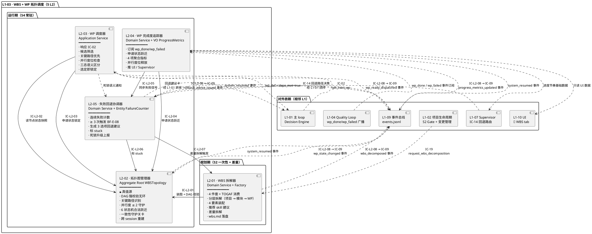
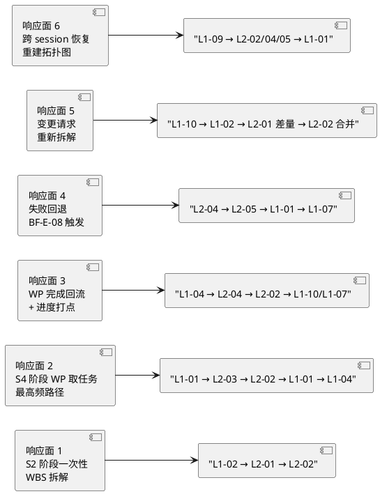
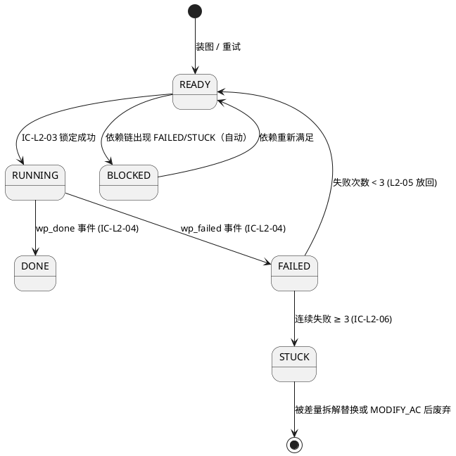

# L1-03 · WBS + WP 拓扑调度 · 总架构（architecture.md）

> **本文档定位**：本文档是 3-1-Solution-Technical 层级中 **L1-03 WBS + WP 拓扑调度** 能力域的**总架构文档**，也是**这 5 个 L2（WBS 拆解器 / 拓扑图管理器（DAG + 关键路径）/ WP 调度器 / WP 完成度追踪器 / 失败回退协调器）的公共骨架**。
>
> **与 2-prd/L1-03 的分工**：`docs/2-prd/L1-03 WBS+WP 拓扑调度/prd.md`（产品级 · v1.0 · 1576 行）回答**产品视角**的"这 5 个 L2 各自职责 / 边界 / 约束 / 禁止行为 / 必须义务 / IC 签名骨架 / G-W-T 大纲"；本文档回答**技术视角**的"在 Claude Code Skill + hooks + jsonl + NetworkX + Python 这套物理底座上，5 个 L2 怎么串成一个可运行的 '规划期一次性拆解 + 运行期高频调度' 双模子系统"——落到 **运行模型**、**DAG 算法选型**、**调度规则落地**、**时序图**、**对外 IC 承担**、**与各 L2 tech-design 的分工边界** 六件事上。
>
> **与 5 个 L2 tech-design.md 的分工**：本文档是 **L1 粒度的汇总骨架**，给出"5 L2 在同一张图上的位置 + 跨 L2 时序 + 对外 IC 承担 + 拓扑算法与物理存储骨架"；每 L2 tech-design.md 是**本 L2 的自治实现文档**（具体 NetworkX 图算法 / AST 表达式字段 / 锁原语 / 单元测试骨架），不得与本文档冲突。冲突以本文档为准。
>
> **严格规则**：
> 1. 任何与 2-prd/L1-03 产品 PRD 矛盾的技术细节，以 2-prd 为准；发现 2-prd 有 bug → 必须先反向改 2-prd，再更新本文档。
> 2. 任何 L2 tech-design 与本文档矛盾的"跨 L2 控制流 / 时序 / IC 字段语义 / DAG 算法语义"，以本文档为准。
> 3. 任何技术决策必须给出 `Decision → Rationale → Alternatives → Trade-off` 四段式，不允许堆砌选择。
> 4. 本文档不复述 2-prd/prd.md 的产品文字（职责 / 禁止 / 必须清单等），只做技术映射 + 补齐"产品视角未说 but 工程师必须知道"的部分（算法选型 / 存储布局 / 并发安全 / 跨 session 重建）。

---

## 0. 撰写进度

- [x] §0 撰写进度 + frontmatter
- [x] §1 定位与 2-prd L1-03 映射（哪些产品章节落成本文档的哪些技术章节 · scope §5.3 映射）
- [x] §2 DDD 映射（BC-03 WBS+WP Topology Scheduling · 引 L0/ddd-context-map.md §2.4 + §4.3）
- [x] §3 L1-03 内部 L2 架构图（Mermaid component · 5 L2 + 对外 IC + 内部 IC-L2-01..08）
- [x] §4 P0 核心时序图（Mermaid sequence · 至少 2 张：WBS 拆解端到端 / WP 取任务 Quality Loop 对接 · 另附 3 张 P1）
- [x] §5 DAG 算法选型（NetworkX topological_generations / find_cycle / longest_path · 为什么不是 Dask / Ray / Airflow）
- [x] §6 WP 调度规则（依赖 satisfied + 关键路径优先 + 并发 ≤ 2 · 锁 / 无状态 / 三态语义物理落地）
- [x] §7 对外 IC 承担（本 L1 发起 IC-09 · 接收 IC-02 / IC-19 · 与 L1-04 wp_done/wp_failed 对接 · 与 L1-07 回退路由对接）
- [x] §8 开源调研（Airflow DAG / Dagster / NetworkX / Rundeck / Dask-Ray · 引 L0 §4）
- [x] §9 与 5 L2 tech-design.md 的分工声明（本 architecture 负责什么 · 每 L2 负责什么）
- [x] §10 性能目标（IC-02 亚秒级 / DAG 装图秒级 / 跨 session 重建秒级 / 差量显著快于全量）
- [x] §11 错误处理与降级（装图失败整体拒绝 / 锁超时 / IC-09 失败 / 调度死锁升级 / 状态机非法跃迁拦截）
- [x] §12 配置参数清单（从 5 L2 prd §X.10.7 / 性能文字汇总 · 注：产品级 prd 禁配置参数表，本表由技术层补）
- [x] §13 与现有 harnessFlow.md MVP 蓝图 / task-board / events.jsonl 的对比
- [x] 附录 A · 与 L0 系列文档的引用关系
- [x] 附录 B · 术语速查（L1-03 本地）
- [x] 附录 C · 5 L2 tech-design 撰写模板（下游消费）

---

## 1. 定位与 2-prd L1-03 映射

### 1.1 本文档的唯一命题

把 `docs/2-prd/L1-03 WBS+WP 拓扑调度/prd.md`（产品级 · v1.0 · 1576 行 · 5 L2 详细 + 对外 IC 映射 + retro 位点）定义的**产品骨架**，一比一翻译成**可执行的技术骨架**——具体交付物是：

1. **1 张 L1-03 component diagram**（5 L2 + 对外 IC-02 / IC-19 / IC-09 + 内部 IC-L2-01..08 · Mermaid · §3）
2. **5 张时序图**（2 张 P0：WBS 拆解端到端 / WP 取任务并对接 Quality Loop；3 张 P1：WP 完成回流 / WP 失败回退 / 跨 session 恢复 · §4）
3. **1 套 DAG 算法选型卡**（NetworkX 内核 + topological_generations / find_cycle / longest_path · §5）
4. **1 张 WP 调度规则落地表**（筛选 → 关键路径排序 → 锁定 → 三态语义返回 · §6）
5. **1 张对外 IC 承担矩阵**（本 L1 发起 IC-09 / 接收 IC-02 / IC-19 / 与 L1-04 的 wp_done/wp_failed / 与 L1-07 的 IC-14 回传 · §7）
6. **1 份开源调研综述**（5 个 > 1k stars 项目 · 本 L1 的借鉴 / 弃用 · §8）
7. **1 份 5 L2 分工声明**（本 architecture 负责 L2 间技术契约 · 每 L2 tech-design 负责 L2 内部实现 · §9）
8. **1 张性能目标表**（IC-02 亚秒级 / DAG 装图秒级 / 跨 session 重建秒级 · §10）

### 1.2 与 2-prd/L1-03/prd.md 的映射（精确到小节）

| 2-prd/L1-03/prd.md 章节 | 本文档对应章节 | 翻译方式 |
|---|---|---|
| §1 L1-03 范围锚定（引 scope §5.3） | §1（本章）+ §7 对外 IC 承担 | 引用锚定，不复述；§7 表格映射产品 IC ↔ 技术 L2 |
| §2 L2 清单（5 个） | §3 L1-03 内部 L2 架构图 + §9 L2 分工 | 落成 component diagram + 分工表 |
| §3 L2 整体架构图 A（主干拆解-调度 ASCII）| §3 Mermaid component diagram | ASCII → Mermaid；加"对外 IC 进出口" |
| §4 L2 整体架构图 B（横切响应面 6 个）| §4 核心时序图 5 张 | 6 响应面 → 5 张时序图（响应面 4/6 合并到"异常 + 重建"一张）|
| §5 L2 间业务流程（6 条 A-F） | §4 时序图 + §6 控制流矩阵 | 6 流里 P0 的 2 条画时序图；P1 的 3 条再画；§6 表格汇总 |
| §6 IC-L2 契约清单（8 条）| §6 跨 L2 控制流 / 数据流 | 8 IC-L2 分类：读状态 / 写状态 / 回调 / 审计 |
| §7 L2 定义模板（9 小节）| §9 L2 分工声明 + 附录 C 下游模板 | 给 L2 tech-design 的撰写模板 |
| §8-§12 L2-01..L2-05 详细（9 小节每 L2）| 不在本文档展开 | 落到各 L2 tech-design.md（本文档只画入口 + 出口） |
| §13 对外 scope §8 IC 契约映射 | §7 对外 IC 承担 | 按调用方 / 被调方 / 未承担三类列表重建 |
| §14 本 L1 retro 位点（11 项）| 不在本文档展开 | 由 L1-03 实现完成后单独 retros/L1-03.md 承接 |
| 附录 A 术语 / 附录 B BF 映射 | 附录 B 本地术语 + 附录 A L0 引用 | 术语去重；BF 映射按 L2 归位 |

### 1.3 与 scope §5.3 的映射

scope §5.3 是 L1-03 的产品级硬约束源。本文档技术层按 §5.3.3-5.3.6 逐条落实：

| scope §5.3 子节 | 产品级语义 | 本文档技术层落实 |
|---|---|---|
| §5.3.1 职责 | 把超大项目拆成 WP；维护拓扑；调度下一 WP；4 要素装配 | §3 component + §5 NetworkX 图内核 + §6 调度规则 + L2-01 工厂 |
| §5.3.2 输入 / 输出 | 4 件套 + TOGAF → wbs.md + WP 调度决定 + WP 定义 + 事件流 | §6 数据流 + §4 P0-1 时序图的产出物落地路径 |
| §5.3.3 边界 | In: WBS 拆解 / WP 定义 / DAG 校验 / 调度算法 / 并行度 / 完成度 / Out: WP 内部 / 代码 / TDD / 验证 / 失败诊断 | §9 L2 分工 + §2.3 BC 边界 |
| §5.3.4 约束（PM-04 / 硬约束）| 并行 ≤ 1-2 / 粒度 ≤ 5 天 / DAG 无环 / 未 satisfied 不得取 / 失败 ≥ 3 次触发 BF-E-08 | §6 调度规则表 + §11 错误处理 + §5 算法保证 |
| §5.3.5 🚫 禁止行为（6 条）| 取 deps 未 satisfied / 并行 > 2 / 粒度 > 5 天 / 拓扑有环 / WP 缺 4 要素 / 绕 L1-04 标 done | §11 错误处理 + §6 调度规则 + §5 DAG 算法 |
| §5.3.6 ✅ 必须义务（6 条）| DAG 无环 / 4 要素齐全 / 按拓扑序 / 失败 ≥ 3 触发 / 暴露 WBS 可视化 / 维护完成率 | §5 + §6 + §4 P1-1/P1-2 时序图 + §10 性能目标 |
| §5.3.7 与其他 L1 交互 | L1-01 / L1-02 / L1-04 / L1-07 / L1-09 / L1-10 | §7 对外 IC 承担矩阵 |
| 对外 IC 契约（scope §8.2）| IC-02 get_next_wp / IC-19 request_wbs_decomposition / IC-09 append_event | §7.1-§7.3 三类承担矩阵 |

### 1.4 本文档不做的事（明示边界）

- ❌ 不复述 2-prd prd.md 的产品文字（职责 / 禁止 / 必须清单等）——它是 PRD 的命题，本文档只做技术落地映射。
- ❌ 不写 5 个 L2 各自的 tech-design（本文档只画 L2 间骨架；L2 内部算法 / 数据结构 / 内部状态机迁移到各 L2 tech-design.md）。
- ❌ 不定义具体字段级 YAML / JSON schema（那是各 L2 tech-design + integration/ic-contracts.md 的职责）。
- ❌ 不做 L1-04 Quality Loop 内部细节（本 L1 只订阅 wp_done / wp_failed 事件，不管 Quality Loop 怎么得到它）。
- ❌ 不做 L1-07 监督的 8 维度计算 / 4 级判定（本 L1 只提供进度节奏基础数据 + 接收 IC-14 回传）。

---

## 2. DDD 映射（引 L0 BC-03）

### 2.1 Bounded Context：BC-03 · WBS+WP Topology Scheduling

引用 `L0/ddd-context-map.md §2.4`（全文约 40 行 BC-03 定义，不复述），本节只给**技术视角的 DDD 摘要**：

**BC-03 的一句话定位**：项目的"甘特图大脑"——把 4 件套 + TOGAF 架构拆成可并行执行的 WP 拓扑 + 调度下一 WP + 维护完成率 + 失败时出回退建议。

**BC-03 在 Context Map 上的关系**：

| 对端 BC | 关系模式 | 技术含义 |
|---|---|---|
| **BC-02 Project Lifecycle** | Customer-Supplier（BC-03 供应） | BC-02 在 S2 Gate 批准前，先调 IC-19 向 BC-03 请求 WBS 拆解 |
| **BC-01 Agent Decision Loop** | Customer-Supplier（BC-03 供应 get_next_wp）| BC-01 主 loop 每 tick 进 Quality Loop 前，先调 IC-02 query 下一 WP |
| **BC-04 Quality Loop** | Customer-Supplier 双向 | BC-03 供应 WP 定义；BC-04 供应 wp_completed / wp_failed 事件 |
| **BC-07 Harness Supervision** | Partnership（死锁协同） | WP 失败 ≥ 3 次触发 BC-07 4 级回退路由；BC-03 接收 BC-07 的 IC-14 回传 |
| **BC-09 Resilience & Audit** | Partnership（锁 / 事件必经 BC-09） | BC-03 所有状态变更走 IC-09 append_event；锁委托 BC-09 L2-02 锁管理器 |
| **BC-10 UI** | Open Host Service / Published Language | BC-03 通过 BC-09 事件总线发布拓扑指标；BC-10 🔧 WBS tab 消费 |
| **BC-06 KB** | Conformist（只读） | L2-01 拆解时可选读 Project KB 的同类 WP 工时历史（可选功能）|

### 2.2 5 L2 的 DDD 分类（来自 L0/ddd-context-map.md §4.3）

| L2 ID | L2 名称 | DDD 分类 | 核心对象 / 操作 | 聚合一致性边界 |
|---|---|---|---|---|
| **L2-01** | WBS 拆解器 | **Domain Service** + **Factory**: WBSFactory | 消费 4 件套 + TOGAF → 产 WBS 拓扑（一次性 / 差量双入口）| 无状态；输入不变量 → 输出不变量 |
| **L2-02** | 拓扑图管理器 | **Aggregate Root**: WBSTopology + **Entity**: WorkPackage + **VO**: DAGEdge / CriticalPath | DAG 无环 + 关键路径 + 并行度 ≤ 2 + 节点状态机 | 单 project 内 WBSTopology 聚合强一致 |
| **L2-03** | WP 调度器 | **Application Service**（编排拓扑管理器 + 锁）| 响应 IC-02 + 加锁运行位 + 传 WP 给 BC-04 | 无状态；每次从 L2-02 真值源读 |
| **L2-04** | WP 完成度追踪器 | **Domain Service** + **VO**: ProgressMetrics（completion_rate / remaining_effort / done_wps / running_wps）| 订阅 wp_completed / wp_failed 事件 + 打点 | 聚合指标可从事件总线重建 |
| **L2-05** | 失败回退协调器 | **Domain Service** + **Entity**: FailureCounter + **VO**: RollbackAdvice | 同一 WP 连续失败 ≥ 3 次 → 结构化建议 | FailureCounter 按 wp_id 分片，各自独立 |

### 2.3 聚合根 · WBSTopology（本 L1 的"根对象"）

`WBSTopology` 是 L1-03 的**唯一聚合根**（L2-02 持有），封装：

- `project_id` · VO · 与 BC-02 ProjectAggregate.id 强绑定（PM-14 共享键）
- `wp_list[]` · Entity WorkPackage 集合
- `dag_edges[]` · VO DAGEdge（from_wp_id → to_wp_id）
- `critical_path[]` · VO CriticalPath（一组 wp_id 序列）
- `parallelism_limit` · VO（固定 = 2）
- `current_running_count` · 派生状态（实时计数）

**不变量（Invariants）** —— 在 L2-02 层面强制：

1. **I-1 · DAG 无环**：`wp_list + dag_edges` 任何时刻都是合法有向无环图（装图 / 差量合并时 `networkx.is_directed_acyclic_graph(G) == True`）
2. **I-2 · 归属闭包**：所有 WorkPackage.project_id == WBSTopology.project_id（PM-14 跨 project 禁止）
3. **I-3 · 并行度守卫**：`sum(wp.state == RUNNING for wp in wp_list) ≤ parallelism_limit`
4. **I-4 · 状态机单调性**：WorkPackage.state 只能沿 §6.3 合法跃迁路径变化
5. **I-5 · 4 要素完整性**：所有 WorkPackage 的 `goal / dod_expr_ref / deps[] / effort_estimate` 非空
6. **I-6 · 粒度约束**：所有 WorkPackage.effort_estimate ≤ 5 天
7. **I-7 · 事件可重放**：任一时刻 WBSTopology 可由该 project 的 events.jsonl 中 `L1-03:*` 事件从创世事件回放重建

### 2.4 Entity · WorkPackage

`WorkPackage` 是 WBSTopology 聚合内的 Entity，**外部只能经由 WBSTopology（即 L2-02）访问**：

- `wp_id` · VO · 项目内唯一
- `goal` · VO · 携带对 4 件套某条的追溯引用
- `dod_expr_ref` · VO · 指向 BC-04 DoDExpression 的值引用（不持有对方对象）
- `deps[]` · VO · `wp_id` 的集合（闭包在同 WBSTopology 内）
- `effort_estimate` · VO · 单位"天"（≤ 5）
- `recommended_skills[]` · VO · L1-05 参考（非硬绑定）
- `state` · Enum { READY, RUNNING, DONE, FAILED, BLOCKED, STUCK }
- `failure_count` · 派生状态（"连续"语义 · 由 L2-05 维护）

### 2.5 Value Object · DAGEdge / CriticalPath / ProgressMetrics / RollbackAdvice

- `DAGEdge(from_wp_id, to_wp_id)` · 不可变 · 集合语义去重
- `CriticalPath([wp_id_0, wp_id_1, ...])` · 不可变 · 随差量合并后必刷新
- `ProgressMetrics(completion_rate, remaining_effort, done_wps, running_wps)` · 不可变值快照 · L2-04 产
- `RollbackAdvice(wp_id, failure_count, options=[SPLIT_WP | MODIFY_WBS | MODIFY_AC], evidence_refs[])` · 不可变 · L2-05 产

### 2.6 Domain Events（来自 L0/ddd-context-map.md §5.2.3）

BC-03 发布 5 类事件（通过 IC-09 落 BC-09 事件总线），本文档 §7 细化其流转方向：

| 事件名 | 触发时机 | 必含字段 |
|---|---|---|
| `L1-03:wbs_decomposed` | S2 末 / 差量拆解完成 | `project_id / topology_id / wp_count / critical_path_ids` |
| `L1-03:wp_ready_dispatched` | IC-02 取到并锁定 WP | `project_id / wp_id / deps_met: true` |
| `L1-03:wp_state_changed` | WP 状态变化 | `project_id / wp_id / from_state / to_state / reason` |
| `L1-03:rollback_advice_issued` | 连续失败 ≥ 3 次 | `project_id / wp_id / failure_count / advice: [SPLIT_WP / MODIFY_WBS / MODIFY_AC]` |
| `L1-03:progress_metrics_updated` | 完成率更新 | `project_id / completion_rate / remaining_effort / done_wps / running_wps` |

**所有事件强制带 `project_id`**（PM-14 硬约束 3，由 L1-09 L2-01 在 `append_event` 前校验 schema）。

### 2.7 Repository Interface（聚合持久化口子）

```python
# 伪代码签名（Python 3.11+ / type hints）· 具体实现由 L2-02 + BC-09 L2-05 崩溃安全层完成

class WBSTopologyRepository(ABC):
    """WBSTopology 聚合的持久化口子。底层：wbs.md（产品级人读）+ events.jsonl（机器回放）。"""

    @abstractmethod
    def save(self, topology: WBSTopology) -> None:
        """装图 / 差量合并后持久化整个聚合。底层：写 wbs.md + append_event('L1-03:wbs_decomposed')。"""

    @abstractmethod
    def find_by_project(self, pid: harnessFlowProjectId) -> Optional[WBSTopology]:
        """按 project_id 加载聚合。不存在返回 None。启动时优先从 checkpoint 读，fallback 事件回放。"""

    @abstractmethod
    def update_wp_state(self, pid, wp_id, from_state, to_state, reason) -> None:
        """状态跃迁事务（先校验合法 → 写 events.jsonl → 更新内存状态 · 原子）。"""

    @abstractmethod
    def rebuild_from_events(self, pid: harnessFlowProjectId) -> WBSTopology:
        """从 events.jsonl 完整回放重建（跨 session 恢复用）。"""
```

### 2.8 与 BC-02 / BC-04 的 DDD 边界

**BC-03 WorkPackage 不持有 BC-04 DoDExpression 对象**，只通过 `dod_expr_ref`（VO · id）引用。理由（DDD 聚合独立性）：

- 若持有，BC-04 改 DoDExpression schema 会强制 BC-03 也变（违反 BC 独立演进）
- 通过 id 引用，BC-04 完全自主演进，BC-03 只关心"该 WP 有 DoD 占位符"
- 具体 DoD 表达式内容由 BC-04 L2-02 编译器填充，BC-03 的 L2-01 只留入口

---

## 3. L1-03 内部 L2 架构图（Mermaid Component）

> 本节是 2-prd §3（ASCII 架构图 A）+ §4（横切响应面 ASCII）的 **Mermaid 技术化重构**，加入对外 IC 进出口 + 内部 IC-L2-01..08 标注 + 物理存储引用。

### 3.1 主架构图 · 5 L2 + 对外 IC + 内部 IC-L2



**关键技术决策（Decision / Rationale / Alternatives / Trade-off）**：

| 决策 | 选择 | 理由 | 备选方案弃用原因 |
|---|---|---|---|
| L2-02 为聚合根 + 真值源 | 所有状态读写必经 L2-02 一致性守护 | DDD 聚合独立性 + PM-10 事件总线单一事实源；防止多副本真值漂移 | 分散式状态（每 L2 各自维护状态副本）：副本一致性维护成本 × N，且失败时难定位 |
| L2-01 与 L2-02 分离 | 拆解器（一次性）vs 图管理器（常驻）两层分离 | 生命周期 / 触发节奏 / 状态性三者完全不同；合并会让 L2-02 背负产品模板渲染职责 | 合并：S2 阶段动作与 S4 高频调度混在一个模块，单元测试边界模糊 |
| L2-03 与 L2-04 分离 | 调度（pull）与追踪（push）方向相反 | DDD 命令 / 事件分离；"选下一个"的决策语义 vs "打点记账"的反应语义 | 合并：`get_next_wp` 会附带 "上次谁 done" 的副作用查询，破坏 Query 幂等性 |
| L2-05 独立 | 失败计数 + 回退建议独立 | DDD Entity（FailureCounter）+ VO（RollbackAdvice）边界清晰；L1-07 侧的回退路由决策与本 L2 识别阶段正交 | 塞进 L2-04：混淆"进度记账"与"善后逻辑"；塞进 L2-03：调度器背负善后违反响应式 pull 边界 |
| 内部 IC-L2 命名 | IC-L2-01..08 编号 | 与 2-prd §6 产品级命名对齐；便于反向追溯 | 用 method name（`request_lock` / `notify_failure`）：失去与 PRD 的锚点 |

### 3.2 横切响应面图（5 个响应面 · Mermaid 快照）

> 为对应 2-prd §4 的 6 个响应面，下面以 **调度者角度** 画出每个响应面的参与者；详细时序在 §4 展开。



### 3.3 L1-03 在 L0 整体架构中的位置

引用 `L0/architecture-overview.md §7.1` 的全景 component diagram，L1-03 的 5 L2 在其中的位置已标注（参见 L0 §7.1 图中 `subgraph L103`）。本 L1 的**物理载体**是**主 Skill Runtime 的 Python 辅助模块**（NetworkX 图算法 + 事件订阅 loop），**不需要独立 subagent session**（L1-03 不需要独立 LLM 推理 context——拆解的"自然语言判断"部分由主 Skill 的 Conversation Context 做，算法 / 调度 / 状态机在 Python 辅助模块里跑）。

**进程归属**：

| L2 | 物理载体 | 进程 |
|---|---|---|
| L2-01 | 主 Skill Conversation + Python wbs_factory.py（辅助）| 主 skill session（逻辑进程）|
| L2-02 | Python NetworkX DiGraph in-memory + events.jsonl 持久化 | 主 skill session（共享内存）|
| L2-03 | Python 函数（无状态）+ L1-09 锁原语 | 主 skill session |
| L2-04 | Python 事件订阅 loop + ProgressMetrics VO 计算 | 主 skill session |
| L2-05 | Python FailureCounter dict + LLM 辅助（生成建议时调 LLM）| 主 skill session + 偶尔 LLM call |

### 3.4 文件系统布局（本 L1 的持久化底座）

引用 `L0/architecture-overview.md §4.1` 的全景目录树，L1-03 涉及以下路径：

| 路径 | 形态 | 写入方 | 读取方 | 锁 |
|---|---|---|---|---|
| `projects/<pid>/wbs.md` | md（PM-07 模板） | L2-01 | L1-02 S2 Gate / L1-10 UI / 用户 | 无（一次性写）|
| `projects/<pid>/wp/<wp_id>/wp_def.yaml` | yaml | L2-01 | L1-04 / L2-03 | 无（一次性写）|
| `projects/<pid>/wp/<wp_id>/mini_pmp.md` | md | L1-04（非本 L1）| — | — |
| `projects/<pid>/events.jsonl` | jsonl（append-only）| 全 L2-*（经 IC-L2-08 → IC-09 → L1-09）| L2-02/04/05 跨 session 重建 + L1-10 UI tail | `.events.lock`（L1-09）|
| `projects/<pid>/checkpoints/<ts>.json` | json | L1-09 L2-04（含本 L1 的 task-board 快照） | L2-02 bootstrap 优先读 | 无（周期写）|
| `projects/<pid>/tmp/.topology.lock` | flock | L2-02 装图 / 差量合并 | — | `fcntl.flock(LOCK_EX\|LOCK_NB)` · ≤ 500ms |
| `projects/<pid>/tmp/.wp-<wp_id>.lock` | flock | L2-03 锁定运行位 | — | WP 运行期间持有 |

**关键硬约束**：

- `events.jsonl` 每行必含 `project_id`（PM-14 · L1-09 L2-01 schema 校验拦截）
- `wbs.md` 写入前先经 L2-02 DAG 校验；校验失败整体拒绝（L2-01 不写 md）
- `checkpoints/` 的频率由 L1-09 L2-04 决定（周期 ≤ 1 分钟 + 关键事件后）；本 L1 只读不写

---

## 4. P0 时序图（至少 2 张核心 + 3 张 P1）

> 本节是 2-prd §5（6 条 L2 间业务流程 ASCII）的 **Mermaid 时序化重构**，严格遵守 `L0/sequence-diagrams-index.md §5` 的 Mermaid 规范。

### 4.1 P0-1 · WBS 拆解端到端（对应 BF-S2-07 · 流 A）

**场景**：用户在 S2 Gate 前，4 件套 + TOGAF A-D 已就绪；L1-02 Stage Gate 控制器在推 Gate 卡之前，先调 IC-19 触发 L1-03 做 WBS 拆解；拆解产物回 L1-02，L1-02 再推 Gate 卡给用户审阅。

```plantuml
@startuml
autonumber
    autonumber
participant "用户" as U
participant "L1-02<br/>Stage Gate 控制器" as L102
participant "L2-01<br/>WBS 拆解器" as L2_01
participant "L2-02<br/>拓扑图管理器" as L2_02
participant "Claude LLM<br/>(Conversation Context)" as LLM
participant "projects/&lt;pid&gt;/<br/>wbs.md + wp/*.yaml" as FS
participant "L1-09<br/>events.jsonl" as L109
participant "L1-10 UI<br/>🔧 WBS tab" as L110
note over L102 : S2 阶段 4 件套 + TOGAF A-D 已定稿
L102 -> L109 : append_event(s2_artifacts_ready)
L102 -> L2_01 : IC-19 request_wbs_decomposition(pid, four_pieces, togaf_a_d)
L2_01 -> L109 : append_event(wbs_decompose_started)
L2_01 -> LLM : 组装 prompt(4 件套 + TOGAF A-D + 拆解规则)
LLM- -> L2_01 : 分层拆解草案\n(项目 → 模块 → WP 树)
L2_01 -> L2_01 : 为每个 WP 装配 4 要素\n(Goal 追溯 / DoD 入口 / 依赖 / 工时)
L2_01 -> L2_01 : 粒度自检 (≤ 5 天)\n超限 → 再拆一层
loop 每个 WP
L2_01 -> L2_01 : 推荐 skill 建议\n(基于 WP 特征)
end
L2_01 -> L2_01 : 构造 WBSTopology 草案\n(Python NetworkX DiGraph in-memory)
L2_01 -> L2_02 : IC-L2-01 装图请求(topology_draft)
L2_02 -> L2_02 : DAG 无环校验\n(networkx.is_directed_acyclic_graph)
alt DAG 校验失败 (有环)
L2_02 -> L109 : append_event(dag_cycle_detected, offending_nodes)
L2_02- -> L2_01 : reject(cycle_detected, 环节点 ids)
L2_01- -> L102 : IC-19 返回 error(wbs_dag_invalid)
L102 -> U : S2 Gate 阻挡 (要求修复)
else DAG 校验通过
L2_02 -> L2_02 : 计算关键路径\n(networkx.dag_longest_path)
L2_02 -> L2_02 : 初始化所有节点 state = READY\nparallelism_limit = 2
L2_02 -> L109 : append_event(wbs_topology_loaded, critical_path)
L2_02- -> L2_01 : ack(topology_id, critical_path_ids)
end
L2_01 -> FS : write wbs.md (PM-07 模板)
L2_01 -> FS : write wp/<wp_id>/wp_def.yaml × N
L2_01 -> L109 : append_event(wbs_decomposed, wp_count, topology_id)
L2_01- -> L102 : IC-19 return {wbs_topology, wp_count, critical_path}
L102 -> L109 : append_event(s2_gate_ready_to_push)
L102 -> L110 : push_stage_gate_card (IC-16)
L110 -> U : S2 Gate 卡 (含 WBS 可视化)
U -> L110 : Go / No-Go
note over U : 后续由 L1-02 处理 Gate 决策\n不属本 L1 范畴
@enduml
```

**关键时序语义**：

- **IC-19 是 Command**（Customer-Supplier · BC-02 → BC-03），同步返回 `{wbs_topology, wp_count, critical_path}`
- **装图是事务**：DAG 校验失败 → 整体拒绝 → L2-01 不写 wbs.md（避免脏数据）
- **事件顺序严格**：`s2_artifacts_ready` → `wbs_decompose_started` → `wbs_topology_loaded` → `wbs_decomposed` → `s2_gate_ready_to_push` → Gate 卡推送
- **时长预期**：拆解 LLM 调用秒级～分钟级（视项目规模）；DAG 校验 + 关键路径计算亚秒级（见 §10）

### 4.2 P0-2 · WP 取任务 + Quality Loop 对接（对应 BF-S4-01 · 流 B）

**场景**：S4 阶段，L1-01 主 loop 决定"进 Quality Loop 前先取下一 WP"；L1-03 的 L2-03 响应 IC-02，筛选候选 + 关键路径排序 + 锁定运行位 + 返回 WP 定义；L1-01 继续发 IC-03 给 L1-04 Quality Loop。

```plantuml
@startuml
autonumber
    autonumber
participant "L1-01<br/>主 loop Decision Engine" as L101
participant "L2-03<br/>WP 调度器" as L2_03
participant "L2-02<br/>拓扑图管理器" as L2_02
participant "L1-09 L2-02<br/>锁管理器" as Lock
participant "L2-05<br/>失败回退协调器" as L2_05
participant "L1-04<br/>Quality Loop" as L104
participant "L1-09<br/>events.jsonl" as L109
note over L101 : 主 loop tick 决策 = "取下一 WP"
L101 -> L109 : append_event(next_wp_requested, pid)
L101 -> L2_03 : IC-02 get_next_wp(pid)
L2_03 -> L2_02 : IC-L2-02 读节点状态快照
L2_02- -> L2_03 : snapshot(wp_list with states, critical_path, current_running_count)
L2_03 -> L2_03 : 筛选候选\n· state == READY\n· 所有 deps.state == DONE\n· current_running_count < 2
alt 候选集为空
L2_03 -> L2_03 : 三态语义判定
alt 所有 WP == DONE
L2_03 -> L109 : append_event(scheduler_all_done)
L2_03- -> L101 : return {wp_id: null, reason: "all_done"}
note over L101 : 后续 L1-01 触发 → S7 收尾
else 所有剩余 WP ∈ {FAILED, BLOCKED, STUCK}
L2_03 -> L2_05 : 死锁通知(deadlock_detected)
L2_03 -> L109 : append_event(scheduler_deadlock)
L2_03- -> L101 : return {wp_id: null, reason: "deadlock"}
L2_05 -> L109 : append_event(deadlock_escalated_to_supervisor)
else 有 READY 但 deps 未满足
L2_03 -> L109 : append_event(scheduler_awaiting_deps)
L2_03- -> L101 : return {wp_id: null, reason: "awaiting_deps"}
end
else 候选集非空
L2_03 -> L2_03 : 关键路径优先排序\n(critical_path 节点 > 非关键)
L2_03 -> L2_03 : top1 = 排序后第一个
L2_03 -> Lock : acquire(.wp-<top1.wp_id>.lock)
Lock- -> L2_03 : lock_acquired
L2_03 -> L2_02 : IC-L2-03 申请状态锁定\n(wp_id=top1, READY → RUNNING)
L2_02 -> L2_02 : 一致性再校验\n· deps 仍 satisfied?\n· 并行度位仍空?
alt 再校验失败（并发冲突）
L2_02- -> L2_03 : reject(stale_state)
L2_03 -> Lock : release(.wp-<top1.wp_id>.lock)
L2_03 -> L2_03 : 从候选集删除 top1 → 重新筛选
note over L2_03 : 循环重试（≤ 3 次）
else 再校验通过
L2_02 -> L2_02 : wp.state = RUNNING\ncurrent_running_count += 1
L2_02 -> L109 : append_event(wp_state_changed, from=READY, to=RUNNING)
L2_02- -> L2_03 : ack(locked)
end
L2_03 -> L109 : append_event(wp_ready_dispatched, wp_id=top1, deps_met=true)
L2_03- -> L101 : return {wp_id, wp_def, deps_met: true}
end
L101 -> L104 : IC-03 enter_quality_loop(wp_def)
note over L104 : Quality Loop 内部 (S3/S4/S5)\n不属本 L1 范畴
@enduml
```

**关键时序语义**：

- **IC-02 是 Query**（纯读 + 副作用集中在"锁定状态"那一步），返回结构化三态语义
- **锁定是原子事务**：`acquire_lock → 再校验 → 状态跃迁 → release_lock`；再校验失败则重试（最多 3 次）
- **三态语义明确区分**：all_done / deadlock / awaiting_deps，不得合并为"null + no_reason"
- **死锁同步通知 L2-05**：调度结束返回后立即调用，不等下一 tick
- **时长预期**：整个流程亚秒级（见 §10）；锁持有 ≤ 500ms

### 4.3 P1-1 · WP 完成回流 + 进度打点（对应 BF-S4-02 + BF-S4-05 · 流 C）

```plantuml
@startuml
autonumber
    autonumber
participant "L1-04<br/>Quality Loop S5 PASS" as L104
participant "L1-09<br/>events.jsonl" as L109
participant "L2-04<br/>WP 完成度追踪器" as L2_04
participant "L2-02<br/>拓扑图管理器" as L2_02
participant "L1-09 L2-02<br/>锁管理器" as Lock
participant "L1-07<br/>Supervisor<br/>(进度节奏维度)" as L107
participant "L1-10 UI<br/>🔧 WBS tab" as L110
L104 -> L109 : append_event(wp_done, wp_id, verifier_verdict, commit_sha)
L109- -> L2_04 : 事件订阅推送\n(inotify / 轮询回调)
L2_04 -> L2_02 : IC-L2-04 申请状态跃迁\n(wp_id, RUNNING → DONE)
L2_02 -> L2_02 : 合法性校验\n· wp_id 存在?\n· 当前 state == RUNNING?\n· 跃迁合法?
alt 校验失败
L2_02- -> L2_04 : reject(illegal_transition)
L2_04 -> L109 : append_event(state_transition_rejected)
else 校验通过
L2_02 -> L2_02 : wp.state = DONE\ncurrent_running_count -= 1
L2_02 -> Lock : release(.wp-<wp_id>.lock)
L2_02 -> L109 : append_event(wp_state_changed, from=RUNNING, to=DONE)
L2_02- -> L2_04 : ack(transitioned)
end
L2_04 -> L2_04 : 更新 4 项指标\n· completion_rate += wp.effort / total_effort\n· remaining_effort -= wp.effort\n· done_wps.append(wp_id)\n· running_wps.remove(wp_id)
L2_04 -> L109 : append_event(progress_metrics_updated, metrics)
par 推 UI
L2_04 -> L110 : 推送 WBS tab 刷新（SSE）
L110 -> L110 : 重渲染拓扑图 + 完成率 + 剩余工时
else 推 Supervisor
L2_04 -> L107 : 推进度节奏基础数据
L107 -> L107 : 进度节奏维度判定\n(超预期 / 正常 / 落后)
end
note over L101,L104 : L1-01 主 loop 下一 tick 可再调 IC-02 取下一个 WP
@enduml
```

**关键语义**：

- **done / failed 都释放并行度位**（硬约束 1）—— 下面 P1-2 图会对 failed 场景复现
- **UI 推送是异步 SSE 路径**——L1-10 inotify events.jsonl + fanout SSE；不阻塞 L2-04 主路径
- **时长预期**：打点延迟 P99 亚秒级（§10）

### 4.4 P1-2 · WP 失败事件 + 回退建议（对应 BF-E-08 · 流 D + 流 E）

```plantuml
@startuml
autonumber
    autonumber
participant "L1-04<br/>Quality Loop<br/>S5 FAIL" as L104
participant "L1-09<br/>events.jsonl" as L109
participant "L2-04<br/>追踪器" as L2_04
participant "L2-02<br/>拓扑图管理器" as L2_02
participant "L2-05<br/>失败回退协调器" as L2_05
participant "L1-09 L2-02<br/>锁管理器" as Lock
participant "L1-01<br/>主 loop" as L101
participant "L1-07<br/>Supervisor" as L107
L104 -> L109 : append_event(wp_failed, wp_id, fail_level, reason)
L109- -> L2_04 : 订阅推送
L2_04 -> L2_02 : IC-L2-04 申请跃迁(RUNNING → FAILED)
L2_02 -> Lock : release(.wp-<wp_id>.lock)
L2_02 -> L109 : append_event(wp_state_changed, to=FAILED)
L2_02- -> L2_04 : ack
L2_04 -> L2_04 : 更新指标\n(运行清单 -= wp_id, 失败清单 += wp_id)\n(注：completion_rate 不增加)
L2_04 -> L2_05 : IC-L2-05 同步失败信号(wp_id, fail_level)
L2_05 -> L2_05 : FailureCounter[wp_id] += 1
alt count < 3
L2_05 -> L109 : append_event(failure_count_incremented, count)
L2_05 -> L2_02 : 可选 · 把 state 从 FAILED 放回 READY\n(允许 L1-04 重试)
L2_02 -> L109 : append_event(wp_state_changed, FAILED → READY)
note over L101 : 下次 IC-02 可再取该 WP
else count ≥ 3 触发 BF-E-08
L2_05 -> L109 : read events.jsonl\n(读该 wp_id 历次 wp_failed 原因摘要)
L2_05 -> L2_05 : 生成 3 选项回退建议\n· SPLIT_WP\n· MODIFY_WBS\n· MODIFY_AC\n+ evidence_refs
L2_05 -> L2_02 : IC-L2-06 标 stuck\n(wp_id, FAILED → STUCK)
L2_02 -> L109 : append_event(wp_state_changed, to=STUCK)
L2_05 -> L109 : append_event(rollback_advice_issued, advice_card)
L2_05 -> L101 : 推回退建议卡\n{wp_id, 3 选项, evidence_refs}
L101 -> L107 : 转发给 Supervisor
L107 -> L107 : 4 级回退路径决策\n(L1-07 L2-06 死循环升级器)
L107- -> L101 : IC-14 push_rollback_route\n(chosen_path)
L101 -> L2_05 : 转发 chosen_path
alt chosen_path == SPLIT_WP
L2_05 -> L2_01 : IC-L2-07 差量拆解触发(wp_id)
note over L2_01 : 走 §4.5 差量拆解流程
else chosen_path == MODIFY_WBS / MODIFY_AC
L2_05 -> L101 : 保持 stuck\n(等 L1-02 变更管理流二次 IC-19)
end
end
@enduml
```

**关键语义**：

- **失败计数是"连续"语义**：一旦 wp_done 出现即清零（见 §6.3 状态机）
- **3 选项建议不是决策**：L2-05 只提建议，最终选哪条由 L1-07 监督（遵循 §5.3.6 + 硬约束 3）
- **stuck 状态不可主动出**：必须经差量拆解或变更管理流程才能替换
- **evidence_refs 必须非空**（硬约束 6）：每个回退建议附带 events.jsonl 的 event_id 锚点

### 4.5 P1-3 · 跨 session 恢复 + 拓扑重建（对应 BF-E-02 · 流 F）

```plantuml
@startuml
autonumber
    autonumber
participant "Claude Code 宿主<br/>(重启)" as CC
participant "L1-09<br/>事件总线 + 检查点" as L109
participant "L2-02<br/>拓扑图管理器" as L2_02
participant "L2-04<br/>追踪器" as L2_04
participant "L2-05<br/>回退协调器" as L2_05
participant "L1-01<br/>主 loop" as L101
CC -> L109 : bootstrap 触发
L109 -> L109 : 扫 projects/<pid>/checkpoints/\n找最新 checkpoint
L109- -> L2_02 : system_resumed 事件\n(project_id, 最新 checkpoint 路径)
alt checkpoint 存在
L2_02 -> L2_02 : 从 checkpoint 加载\nWBSTopology 快照\n(wp_list + states + critical_path)
L2_02 -> L109 : 读 checkpoint 之后的 events.jsonl\n(增量回放)
loop 每条增量事件
L2_02 -> L2_02 : apply event (wp_state_changed / wbs_decomposed)
end
else checkpoint 不存在
L2_02 -> L109 : 从 events.jsonl 起点全量回放\n(过滤 project_id + L1-03:*)
loop 每条历史事件
L2_02 -> L2_02 : apply event
end
end
L2_02 -> L2_02 : 二次 DAG 校验\n+ 关键路径刷新
L2_02 -> L109 : append_event(topology_rebuilt)
par L2-04 重建指标
L2_04 -> L109 : 读 wp_done / wp_failed 历史
L2_04 -> L2_04 : 重算 4 项聚合指标
else L2-05 重建计数器
L2_05 -> L109 : 读 wp_failed / wp_done 历史（按 wp_id 连续性）
L2_05 -> L2_05 : 重建 FailureCounter（连续语义）
end
L2_02 -> L109 : append_event(wbs_ready_after_resume)
note over L101 : L1-01 下次 IC-02 请求可正常调度
@enduml
```

**关键语义**：

- **checkpoint 非真值源，事件总线才是**（见 L0/architecture-overview.md §4）
- **连续失败计数的重建**：L2-05 必须**按事件时序**重建，不能简单 count（例：failed → done → failed 计数重置为 1 而非 2）
- **并行运行之前 kill 的 WP**：重建后 state 应为 RUNNING；L1-01 下次 tick 会发现并可继续或回滚（由 L1-01 决策）

---

## 5. DAG 算法选型（核心技术决策）

> 本节锁定 L1-03 的"图引擎内核"选型，回答："**用什么库 / 用什么算法**完成 DAG 无环校验、关键路径识别、拓扑排序、差量合并四件事？" 是整个 L1-03 最硬核的技术决策。

### 5.1 核心决策：NetworkX（Adopt 代码依赖）

**决策**：L1-03 L2-02 拓扑图管理器的内核是 **Python NetworkX** 库，封装为 `WBSTopology` 聚合根的内部实现。

**Rationale（为什么 NetworkX）**：

1. **纯 Python、零服务依赖**：符合 `L0/tech-stack.md §1.4` 零外部服务红线（不引入 Postgres / Redis / Kafka）
2. **BSD-3-Clause 许可**：最友好的开源许可，与 HarnessFlow 开源 Skill 形态完全兼容
3. **算法完备性**：
   - `networkx.is_directed_acyclic_graph(G)` · O(V+E) DAG 校验，一行搞定
   - `networkx.find_cycle(G)` · 有环时给出具体环节点序列（供 L2-02 错误信息指向）
   - `networkx.topological_generations(G)` · 分层拓扑排序，直接对应"可并行执行"的 WP 层次
   - `networkx.dag_longest_path(G, weight='effort')` · 关键路径 = 权重最长路径（权重 = WP 工时估算）
   - `networkx.descendants(G, node)` · 某 WP 的所有后继（用于差量拆解时识别"要重做的下游"）
4. **成熟度**：GitHub 15,000+ stars，学术 + 工业持续活跃（`L0/open-source-research.md §4.5` 引用）
5. **可序列化**：`networkx.node_link_data(G) / node_link_graph(data)` 可把 DiGraph 来回 JSON（用于 checkpoint）

**Alternatives（备选与弃用）**：

| 备选 | 评分 | 弃用原因 |
|---|---|---|
| **Apache Airflow DAG 层** | ❌ | 需独立 scheduler + Postgres metadata DB；与 Skill 形态不符（L0 §4.2） |
| **Dagster Asset Graph** | ❌ | 需 Postgres + Dagster daemon；"Asset-first" 哲学不匹配（HarnessFlow WP 不是数据表） |
| **Dask Delayed** | ❌ | 面向大规模分布式计算 + 延迟执行；HarnessFlow 是少量长任务；overhead 过高 |
| **Ray Workflow** | ❌ | 分布式 + ray actor 模型；Skill 单机场景杀鸡用牛刀（L0 §4.6） |
| **纯 Python dict + 自研算法** | ⚠️ | 自研 cycle detection 易错；失去 NetworkX 的成熟度保证 |
| **graphviz 库（仅可视化）** | ⚠️ | 只是布局渲染库，不提供图算法；可作为 L1-10 UI 补充，不能当内核 |

**Trade-off**：

- ✅ 额外引入 NetworkX 依赖（单包，无传递重依赖） → 值
- ✅ 内存表示（不持久化 G 对象，每次从 events.jsonl 重建）→ 保持真值源在事件总线，G 是派生视图
- ⚠️ NetworkX 在超大图（> 10,000 节点）才会出现性能问题 → HarnessFlow 项目级 WBS 规模典型 20-200 WP，远在安全线内

### 5.2 DAG 装图 + 无环校验算法

**算法骨架**（L2-02 内部 · 具体字段级实现见 L2-02 tech-design）：

```
load_topology(pid, wbs_draft) -> Result:
  1. G = nx.DiGraph(); 加节点 + 加边
  2. if not nx.is_directed_acyclic_graph(G): return CycleError(nx.find_cycle)
  3. 悬空依赖闭包校验（wp.deps ⊆ all_wp_ids）
  4. 4 要素完整性校验（goal / dod_expr_ref / deps / effort_estimate 非空）
  5. 粒度约束校验（effort_estimate ≤ 5）
  6. critical_path = nx.dag_longest_path(G, weight='effort_estimate')
  7. 初始化所有节点 state = READY; 返回 Ok(WBSTopology)
```

**语义锚点**（来自 2-prd §9.4 硬约束）：

- 校验失败 → 整体拒绝（不部分装图），确保 `WBSTopology` 始终是合法 DAG
- 四类错误（CycleError / DanglingDepsError / IncompleteWPError / OversizeError）返回 L2-01 → L1-02 → S2 Gate 阻挡
- `CrossProjectDepError`（依赖跨 project）升级为硬红线（见 §11.3）

### 5.3 关键路径 + 并行度守卫 + 差量合并

**关键路径**：`nx.dag_longest_path(G, weight='effort_estimate')` · 触发时机：装图完成 / 差量合并后 / 跨 session 重建后（硬约束 7）。

**L2-03 调度器使用方式**：候选排序键 = `(0 if wp_id in critical_set else 1, topo_level, -effort)`。

**并行度守卫**（O(1)）：`WBSTopology.can_lock_new_wp()` 返回 `current_running_count < 2`；加锁原子性由 L1-09 锁管理器 + fcntl.flock 提供。并发 IC-02 时第二请求在 flock 层被拒（`LOCK_NB`）。

**差量合并骨架**（L2-05 建议 SPLIT_WP 或 L1-02 变更管理二次 IC-19 时）：

```
incremental_decompose(pid, wbs_old, target_wp_id) -> WBSDraft:
  1. preserved = { n for n in G if G.nodes[n].state == DONE }
  2. redo_zone = {target} ∪ nx.descendants(G, target) - preserved
  3. new_sub_wps = llm_decompose_subtree(target, context)
  4. draft = preserved_wps + new_sub_wps; 重建 dag_edges
  5. 交 L2-02 IC-L2-01 二次装图 → 全部校验重跑
```

**关键约束**：已 DONE WP 身份不变（2-prd §8.9 P5 场景）；差量装图性能 ≤ 全量 1/4（§10.1）。

### 5.4 节点状态机算法

**合法跃迁图**（由 L2-02 强制 · 对应 2-prd §9.4 硬约束 3）：



**合法跃迁集合**（Python 语义）：

```
LEGAL_TRANSITIONS = {
  (READY, RUNNING), (RUNNING, DONE), (RUNNING, FAILED),
  (FAILED, READY), (FAILED, STUCK),
  (READY, BLOCKED), (BLOCKED, READY)
}
```

任何不在集合内的跃迁请求被 L2-02 一致性守护拒绝（返回 `IllegalTransition` 错误）。stuck 不可主动出：必须经 L2-01 差量拆解或 L1-02 变更管理流。

---

## 6. WP 调度规则（物理落地）

> 本节把 2-prd §10（L2-03 详细）的产品级语义落到**执行的每一步**，是 L2-03 tech-design 的直接消费材料。

### 6.1 调度规则四件套（顺序严格）

对应 2-prd §10.4 的 4 条硬约束，物理执行顺序：

| 步骤 | 规则 | 实现位置 | 成本 |
|---|---|---|---|
| **1. 筛选 ready + deps_met** | state == READY AND all(deps.state == DONE) | `L2-03.filter_candidates()` | O(|V|) 扫描 |
| **2. 并行度位检查** | current_running_count < parallelism_limit (= 2) | `L2-02.can_lock_new_wp()` | O(1) |
| **3. 关键路径优先排序** | critical_path 节点排前 | `L2-03.prioritize_candidates()` | O(|candidates| log |candidates|) |
| **4. 选定 top1 + 锁定** | `acquire lock → 再校验 → state 跃迁 → release_lock_on_success` | `L2-02.transition_state()` + L1-09 锁管理器 | 锁持有 ≤ 500ms |

### 6.2 三态语义返回的物理区分

对应 2-prd §10.4 硬约束 4（三态不可合并），物理实现骨架：

```
get_next_wp(pid):
  snapshot = topology_manager.read(pid)       # IC-L2-02
  candidates = filter_by_ready_and_deps(snapshot)
  if not candidates:
    if all state == DONE:              return (null, "all_done")
    if no {READY, RUNNING} remain:     notify_l2_05_deadlock(pid); return (null, "deadlock")
    return (null, "awaiting_deps")
  ranked = prioritize_by_critical_path(candidates, snapshot.critical_path)
  for top in ranked[:3]:                      # 最多重试 3 个候选（避免极端并发无限重试）
    lock = lock_manager.acquire(f".wp-{top.wp_id}.lock", timeout=500)
    if not lock: continue
    result = topology_manager.transition(top.wp_id, READY→RUNNING)   # IC-L2-03
    if result.is_ok():
      return (top.wp_id, top.to_dict(), deps_met=True)
    lock_manager.release(lock)
  return (null, "awaiting_deps")              # 极端并发 fallback
```

### 6.3 无状态调度的物理保证

对应 2-prd §10.4 硬约束 6（本 L2 自身无持久化状态）：

- L2-03 是 **Python 无状态函数**（无 class attribute / 无 module global）
- 每次 `get_next_wp` 调用都从 L2-02（真值源）重新读 snapshot
- 并发 IC-02 的竞态由 L1-09 锁管理器 + L2-02 二次校验联合保证
- 崩溃重启后 L2-03 不需要恢复任何状态（它本来就没有状态）

### 6.4 调度决策的审计落盘

每次 `get_next_wp` 完成后，L2-03 通过 IC-L2-08 → IC-09 append_event。

**成功路径**事件（`L1-03:wp_ready_dispatched`）必含字段：`project_id / wp_id / candidates_size / ranking_reason / alternatives[] / deps_met / lock_wait_ms`。

**null 路径**事件（`L1-03:wp_scheduler_noop`）必含字段：`project_id / reason ∈ {all_done, deadlock, awaiting_deps} / snapshot_size`。

所有事件走 L1-09 hash 链（单调有序 + 可回放）。

---

## 7. 对外 IC 承担矩阵（本 L1 发起 / 接收 / 未承担）

> 本节对应 2-prd §13（scope §8 IC 契约映射），把 20 条 scope IC 按本 L1 的承担分三类，**精确到 L2 粒度**。

### 7.1 L1-03 作为接收方的对外 IC

| scope §8 IC | DDD 分类 | 一句话意义 | 入口 L2 | 出口 L2（转调内部） |
|---|---|---|---|---|
| **IC-02 get_next_wp** | Query | 按拓扑找下一可执行 WP | L2-03 | L2-02（IC-L2-02 快照 + IC-L2-03 锁定）|
| **IC-19 request_wbs_decomposition** | Command | 全量 / 增量拆解 WBS | L2-01 | L2-02（IC-L2-01 装图）|

**IC 签名契约骨架**（具体字段 schema 由 `integration/ic-contracts.md` 定义）：

- **IC-02 入参**：`project_id` · 可选 `hints = { prefer_module: str | None }`
- **IC-02 出参**：`{ wp_id: str | None, wp_def: dict | null, deps_met: bool, reason: "all_done" | "deadlock" | "awaiting_deps" | null }`
- **IC-19 入参**：`project_id, four_pieces_ref, togaf_artifacts_ref, mode: "full" | "incremental", target_wp_id?: str`
- **IC-19 出参**：`{ wbs_topology: dict, wp_count: int, critical_path: list[str] } | { error: ErrorCode, offending_items: list }`

### 7.2 L1-03 作为发起方的对外 IC

| scope §8 IC | 一句话意义 | 内部 L2 承担者 | 触发时机 | 目标 L1 |
|---|---|---|---|---|
| **IC-09 append_event** | 所有状态跃迁 / 拆解 / 调度 / 完成 / 失败 / 回退 | 全 L2-*（经 IC-L2-08）| 每次动作完成 / 失败 | L1-09 |

**IC-09 签名**（详见 `L0/architecture-overview.md §4.4`）：

- 入参：`{type, actor, state, project_id, content, links?}`
- 出参：`{event_id, sequence, hash}`
- **硬约束**：`project_id` 必带（L1-09 L2-01 schema 校验拦截 → 拒则 halt 整系统）

### 7.3 L1-03 间接承担的对外 IC（事件订阅 / 被转发）

| 场景 | 事件 / IC | 本 L1 角色 | 承接 L2 |
|---|---|---|---|
| **L1-04 WP 完成** | `wp_done` 事件 | 订阅方 | L2-04 |
| **L1-04 WP 失败** | `wp_failed` 事件 | 订阅方 | L2-04（→ L2-05）|
| **L1-09 跨 session 恢复** | `system_resumed` 事件 | 订阅方 | L2-02 / L2-04 / L2-05 |
| **L1-07 监督读进度节奏** | 进度数据拉取 | 被观察方 | L2-04 |
| **L1-10 UI 拉 WBS tab** | UI 只读数据拉取 | 被观察方 | L2-04 / L2-02 |
| **L1-07 → L1-01 → L1-03 回退路径回传** | IC-14 push_rollback_route（经 L1-01 转发）| 接收方 | L2-05 |
| **L1-03 → L1-01 回退建议卡** | 推建议（非 IC 编号）| 发起方 | L2-05 |

### 7.4 L1-03 不承担的 IC（明示不越界）

scope §8 中 L1-03 **不承担**的 IC：

| scope §8 IC | 所属 L1 | 说明 |
|---|---|---|
| IC-01 request_state_transition | L1-02 | 本 L1 不切 state |
| IC-03 enter_quality_loop | L1-04 | 本 L1 不进 Quality Loop |
| IC-04 invoke_skill | L1-05 | 本 L1 不调 skill |
| IC-05 delegate_subagent | L1-05 | 本 L1 不委托 subagent |
| IC-06 kb_read | L1-06 | 本 L1 不读 KB（L2-01 可选读但走普通文件 I/O，不经 IC-06）|
| IC-07 kb_write_session | L1-06 | 本 L1 不写 Session KB |
| IC-08 kb_promote | L1-06 | 本 L1 不做晋升仪式 |
| IC-10 replay_from_event | L1-09 | 本 L1 订阅 system_resumed 但不做回放入口 |
| IC-11 process_content | L1-08 | 本 L1 不做多模态 |
| IC-12 delegate_codebase_onboarding | L1-05 | 本 L1 不做代码分析 |
| IC-13 push_suggestion | L1-07 | 本 L1 不产 supervisor 建议；回退建议卡走 L1-01 通道，不与 IC-13 混淆 |
| IC-15 request_hard_halt | L1-07 | 本 L1 不硬停 |
| IC-16 push_stage_gate_card | L1-02 | 本 L1 不推 Gate 卡 |
| IC-17 user_intervene | L1-10 → L1-01 | 本 L1 间接影响（用户变更请求 → L1-02 → IC-19 二次调用）|
| IC-18 query_audit_trail | L1-10 → L1-09 | 本 L1 不做审计查询入口 |
| IC-20 delegate_verifier | L1-04 | 本 L1 不管 verifier |

### 7.5 与 L1-04 Quality Loop 的对接契约（特别章节）

**订阅关系**：L2-04 订阅 `projects/<pid>/events.jsonl` 里的两类事件：

- `wp_done`（由 L1-04 L2-06 Verifier 编排器 S5 PASS 后广播）
- `wp_failed`（由 L1-04 L2-05 S4 执行驱动器或 L2-07 4 级回退路由器广播）

**事件 schema 骨架**（具体字段 schema 由 L1-04 tech-design 定义）：

```json
// wp_done
{
  "type": "L1-04:wp_executed" | "L1-04:wp_verified_pass",
  "project_id": "...",
  "content": {
    "wp_id": "WP-07",
    "verifier_verdict": "PASS",
    "commit_sha": "abc1234",
    "duration_ms": 123456
  }
}

// wp_failed
{
  "type": "L1-04:wp_failed",
  "project_id": "...",
  "content": {
    "wp_id": "WP-07",
    "fail_level": "L2" | "L3" | "L4",  // 2-prd 四级 FAIL
    "reason_summary": "...",
    "failure_artifacts_ref": "..."
  }
}
```

**物理机制**：L2-04 不是"LLM 推理 loop"，而是**主 Skill Runtime 的 Python 辅助模块内的事件订阅器**。Claude session tick 结束时扫一次 events.jsonl 的"增量末尾"，apply 每条新事件。

---

## 8. 开源调研（引 L0 §4）

> 本节是 `L0/open-source-research.md §4`（WBS / WP 拓扑调度开源调研）的**本 L1 视角复述**，不重复调研细节，只列采纳 / 借鉴 / 弃用决策。

### 8.1 调研项目总览（≥ 3 项）

| 项目 | Stars | License | 与 L1-03 对齐度 | 处置 |
|---|---|---|---|---|
| **Apache Airflow**（DAG 层）| 38,000+ | Apache-2.0 | 高（DAG 声明 + 拓扑排序）| **Learn 架构** · Reject 引入 |
| **Dagster**（Asset Graph）| 11,000+ | Apache-2.0 | 中（Asset-first 哲学）| **Learn Asset 思维** · Reject 引入 |
| **Python NetworkX** | 15,000+ | BSD-3 | 极高（纯图算法）| **Adopt 代码依赖**（L2-02 内核）|
| **Rundeck** | 5,500+ | Apache-2.0 | 低（Ops 导向 / Java 栈）| Reject |
| **Dask / Ray Workflow** | 25k+ / 35k+ | BSD / Apache | 低（分布式计算导向）| Reject |

### 8.2 L1-03 借鉴点汇总（来自 L0 §4.7）

| 借鉴 | 来源 | 本 L1 对应 L2 / 章节 |
|---|---|---|
| **`>>` 依赖操作符 API** | Airflow | L2-01 WBS 拆解输出的 `wp_def.yaml` 的 `deps` 字段表达（不是直接用 Airflow 代码，是学其声明式思维）|
| **拓扑排序 / cycle detection** | NetworkX | L2-02 §5.1-§5.2（直接 Adopt 算法）|
| **Asset-first 建模** | Dagster | L2-01 对每个 WP 声明 "produced_artifacts"（未来 v1.1 可选增强）|
| **Asset Lineage 可视化** | Dagster | L1-10 UI 🔧 WBS tab（由 L2-04 给数据）|
| **Job 嵌套 / 参考** | Rundeck / Prefect | L2-01 可选功能"WP 模板复用"（2-prd §8.7 🔧 可选 #5）|
| **Durable Execution 设计哲学** | Temporal | L2-02 跨 session 重建（事件回放 > checkpoint · §4.5 P1-3 图）|

### 8.3 Airflow DAG 借鉴点 · 一页总结

| 学什么 | 映射到 L1-03 |
|---|---|
| DAG 声明式建模（`@dag @task`）| L2-01 的 `wp_def.yaml` 的 `deps` 字段声明式表达 |
| 拓扑排序 + 分层并发 | L2-03 "同时 ≤ 2 并行" 是更严格版本 |
| BranchPythonOperator（运行时跳过分支）| v1.1+ L2-03 "SKIPPED" 状态（V1 不做）|
| SubDag / TaskGroup（嵌套组合）| v1.1+ L2-01 "WP 模板"（可选功能 2-prd §8.7）|

**不学**：不引入 Airflow（需 Postgres + scheduler + webserver + worker）；不用 XCom（事件总线替代）；不用 Celery Executor（单进程无需分布式）。

### 8.4 Dagster / Temporal 借鉴点 · 一页总结

**Dagster 学什么**：Asset-first 思维（v1.1 L2-01 可声明 `produced_artifacts`）；Materialization metadata（L1-06 KB 版本借鉴）。**不学**：不引入 Dagster 服务（需 Postgres + daemon）。

**Temporal 学什么**：Durable Execution 模型（L2-02 跨 session 重建：事件回放 > checkpoint 读取，§4.5）；Versioning（v1.1+ 规划 `topology_version` 字段）。**不学**：不引入 Temporal server；不做 Activity / Workflow 强分离。

### 8.5 NetworkX 采纳详述（Adopt）

**直接依赖**：`pip install networkx >= 3.0`（2026-04 时点主流 3.2+）；Python 3.11+

**使用 API 清单**：

- `nx.DiGraph()` · 有向图内核
- `nx.is_directed_acyclic_graph(G)` · DAG 校验
- `nx.find_cycle(G)` · 有环时取环节点序列
- `nx.topological_generations(G)` · 分层拓扑排序
- `nx.dag_longest_path(G, weight='effort_estimate')` · 关键路径
- `nx.descendants(G, node)` / `nx.ancestors(G, node)` · 差量分析
- `nx.node_link_data(G)` / `nx.node_link_graph(data)` · JSON 序列化（checkpoint）

**性能基准**（NetworkX 社区 benchmark）：`is_directed_acyclic_graph` 在 1000 节点图 < 10ms；`dag_longest_path` < 50ms。HarnessFlow 项目级 WBS 典型 20-200 节点，远在安全线内。

### 8.6 开源调研结论（决策锁定）

**核心选型**：

1. ✅ **NetworkX Adopt**（唯一新增 pip 依赖）
2. 🧠 **Airflow / Dagster / Temporal** Learn 架构 · Reject 引入
3. ❌ **Dask / Ray / Rundeck** Full Reject

**未来演进预留**：

- v1.1：引入 Dagster Asset-first 的"produced_artifacts"声明（L2-01 增强）
- v1.1：引入 Temporal Versioning 的 topology_version 字段（L2-02 增强）
- v2.0：考虑引入 Apache DataSketches 做超大 WBS（> 1000 节点）的性能优化（V1 不需要）

---

## 9. 与 5 L2 tech-design.md 的分工声明

> 本节锁定"本 architecture.md 负责什么 / 每 L2 tech-design.md 负责什么"，消除 L2 作者之间的边界争议。

### 9.1 本 architecture.md 的 ownership

**本文档独占定义**（L2 tech-design 禁止覆盖）：

1. **5 L2 之间的技术契约**（IC-L2-01..08 的同步 / 异步 / 超时 / 幂等语义）
2. **对外 IC 承担矩阵**（§7）
3. **跨 L2 时序骨架**（§4 的 5 张图）
4. **DAG 算法选型**（§5 · NetworkX 锁定）
5. **调度规则四件套顺序**（§6.1）
6. **节点状态机合法跃迁图**（§5.6）
7. **聚合根 WBSTopology 不变量**（§2.3 I-1..I-7）
8. **跨 session 重建协议**（§4.5）
9. **性能目标表**（§10）
10. **开源依赖决策**（§8.7）

### 9.2 每 L2 tech-design 的 ownership

**L2 tech-design 独占定义**（本 architecture.md 不涉及）：

| L2 | L2 tech-design 独占 |
|---|---|
| **L2-01 WBS 拆解器** | LLM prompt 模板 / 4 要素装配的字段级 schema / 推荐 skill 打分算法 / wbs.md 模板（PM-07） / 差量拆解的保留区识别启发式 |
| **L2-02 拓扑图管理器** | NetworkX DiGraph 的序列化格式 / 锁粒度精确表 / 状态跃迁 guard 函数签名 / 一致性守护的具体错误码 / checkpoint JSON schema |
| **L2-03 WP 调度器** | 候选筛选的 SQL-like DSL（可选）/ 关键路径优先排序的稳定排序细节 / 锁重试退避算法 / 三态语义的状态码编码 |
| **L2-04 WP 完成度追踪器** | ProgressMetrics 的增量更新算法 / UI 推送的 SSE event schema / 进度节奏维度的具体数学指标 / 慢 WP 识别阈值 |
| **L2-05 失败回退协调器** | FailureCounter 的连续性判定状态机 / 3 选项建议的 LLM prompt 模板 / evidence_refs 的选取启发式 / 死锁识别算法 |

### 9.3 L2 tech-design 必须遵守的"本文档底线"

所有 L2 tech-design 在撰写时 **必须**：

1. 引用本文档的 `§2 DDD 映射`，聚合根 / Entity / VO 分类不得变更
2. 遵守 `§3.1 主架构图` 标注的 IC-L2-01..08 方向（不得新增 / 删除 L2 间调用）
3. 遵守 `§5 DAG 算法选型`（L2-02 必须用 NetworkX；L2-03 必须用关键路径优先）
4. 遵守 `§6 调度规则四件套` 的顺序（filter → capacity → priority → lock）
5. 遵守 `§7 对外 IC 承担矩阵`（不得自行增加对外 IC 或转调其他 L1）
6. 性能指标不得低于 `§10 性能目标表`

### 9.4 反向修补声明

本文档在撰写过程中识别出 2-prd `L1-03 prd.md` **无需修补**（产品级 prd 与 scope §5.3 完全一致），因此本文档对上游 PRD **不做反向修补**。

本文档对 L0 文档的 **对齐声明**：

- `L0/architecture-overview.md §7.1` 全景图中 L1-03 的 5 L2 标注与本文档 §3.1 一致
- `L0/ddd-context-map.md §2.4 + §4.3` 的 BC-03 与 L2 分类与本文档 §2 一致
- `L0/open-source-research.md §4` 的 NetworkX Adopt 决策与本文档 §8.5 一致
- `L0/tech-stack.md §1.4` 零外部服务红线 → 本文档只引入 NetworkX 单包（允许）

---

## 10. 性能目标

> 本节把 2-prd 各 L2 §X.4 / §X.9 的"性能约束文字描述"落成**可量化的 SLO 表**，用于 TDD 阶段设计性能测试。

### 10.1 P99 响应时延表

| 操作 | P99 目标 | 典型负载 | 度量方式 |
|---|---|---|---|
| **IC-02 get_next_wp** | ≤ 500ms | 20-200 WP | 主 skill tick 内计时 |
| **IC-19 request_wbs_decomposition（全量）** | ≤ 120s | 中型项目 50-100 WP | LLM 调用主导 |
| **IC-19 request_wbs_decomposition（差量）** | ≤ 30s | 单 WP + 3-10 子孙 | 显著快于全量 |
| **wp_done 事件 → 打点完成** | ≤ 500ms | 单事件 | L2-04 内部计时 |
| **wp_failed 事件 → 计数更新** | ≤ 200ms | 单事件 | L2-05 内部计时 |
| **回退建议卡生成（BF-E-08 触发）** | ≤ 5s | LLM 调用 | L2-05 内部计时 |
| **死锁上报** | 立即（同步）| — | 不延迟到下一 tick |
| **跨 session 拓扑重建** | ≤ 10s | 100 WP + 1000 历史事件 | L2-02 bootstrap 计时 |
| **DAG 装图 + 校验 + 关键路径计算** | ≤ 2s | 100 WP | L2-02 内部计时 |
| **状态跃迁（ready → running）** | ≤ 100ms | O(1) | L2-02 锁 + 写计时 |
| **UI 只读数据拉取** | ≤ 500ms | 当前快照 | L2-04 HTTP 响应时间 |

### 10.2 吞吐目标

| 场景 | 目标 |
|---|---|
| 典型 S4 阶段 tick 频率 | 1 tick / 5-30s |
| 每 tick IC-02 调用次数 | 1-2 次（主 loop 决策） |
| wp_done / wp_failed 事件频率 | 1 事件 / 分钟～1 事件 / 小时（视 WP 规模）|
| 跨 session 重建所需事件历史 | ≤ 10,000 条 L1-03 相关事件（支持千 WP 项目）|

### 10.3 资源占用

| 资源 | 上限 |
|---|---|
| L2-02 `nx.DiGraph` 内存 | ≤ 50 MB（1000 节点项目）|
| L2-04 ProgressMetrics 内存 | ≤ 10 KB（单项目）|
| L2-05 FailureCounter 内存 | ≤ 100 KB（单项目）|
| L1-03 总内存占用 | ≤ 100 MB（合理规模项目）|
| events.jsonl 中 L1-03 事件占比 | ≤ 30%（主要是 wp_state_changed）|

### 10.4 规模上限（V1）

| 维度 | V1 上限 | 超限行为 |
|---|---|---|
| 单项目 WP 数 | 500 | 超 → L2-01 拆解前置 warn + 要求分项目 |
| 单 WP 依赖数 | 10 | 超 → L2-02 装图 warn + 允许继续 |
| 并行度上限 | 2（硬约束） | 不可突破 |
| 同项目失败次数计数上限 | 3（硬约束） | 不可突破 |
| 跨 session 重建事件数 | 100,000 | 超 → 强制 checkpoint 加速 |

### 10.5 性能测试锚点（交给 TDD 阶段）

`docs/3-2-Solution-TDD/L1-03/` 撰写时需覆盖：

- `perf_test_ic02_p99_under_200wp.py`：IC-02 在 200 WP 项目下 P99 ≤ 500ms
- `perf_test_ic19_full_under_100wp.py`：全量拆解 100 WP ≤ 120s
- `perf_test_ic19_incremental_vs_full.py`：差量拆解延迟 ≤ 全量的 1/4
- `perf_test_rebuild_10k_events.py`：跨 session 重建 10k 事件 ≤ 10s
- `perf_test_dag_validation_1000nodes.py`：DAG 校验 1000 节点 ≤ 1s

---

## 11. 错误处理与降级

### 11.1 错误类型矩阵

| 错误类型 | 来源 L2 | 处理策略 | 是否触发 halt |
|---|---|---|---|
| **CycleError（DAG 有环）** | L2-02 装图 | 整体拒绝 + 返回环节点 ids + 阻挡 S2 Gate | 否（S2 Gate 未通过就不前进）|
| **DanglingDepsError（悬空依赖）** | L2-02 装图 | 整体拒绝 + 指出缺失 wp_ids | 否 |
| **IncompleteWPError（4 要素缺失）** | L2-02 装图 | 整体拒绝 + 指出缺失字段 | 否 |
| **OversizeError（粒度 > 5 天）** | L2-02 装图 | 触发 L2-01 自动再拆 + 重试 1 次；仍超则拒绝 + 用户介入 | 否 |
| **CrossProjectDepError（跨项目依赖）** | L2-02 装图 | 整体拒绝 + 审计 `pm14_violation` 事件 | **是**（PM-14 硬约束违规）|
| **IllegalTransition（非法状态跃迁）** | L2-02 | reject + 记 `illegal_transition_attempt` 事件 + 告警 | 否（单次拒绝，不影响系统）|
| **LockTimeout** | L2-03 / L2-04 | 重试 3 次（指数退避）；仍超则返回 `error: stale_state` + 等待下一 tick | 否 |
| **DeadlockDetected** | L2-03 | 立即通知 L2-05 + 返回 `reason=deadlock` + L2-05 升级 L1-07 | 否（升级等决策）|
| **EventAppendFail** | 全 L2-*（IC-09 失败）| 按 L1-09 降级策略：重试 → local buffer → halt | 可能是（见 L1-09 降级）|
| **SupervisorNoResponse** | L2-05 推建议后 L1-07 无回应 | 超时 30s 后保持 stuck + 写 audit；不自动执行回退 | 否 |
| **ProjectIdMissing** | 全 L2-* | 硬拦截（由 L1-09 schema 校验层） | **是**（PM-14 硬约束）|

### 11.2 降级策略

**锁超时降级**（L2-03）：

```python
def acquire_with_retry(lock_path, max_retries=3):
    for i in range(max_retries):
        lock = acquire(lock_path, timeout=500)
        if lock: return lock
        sleep(0.1 * (2 ** i))  # 指数退避
    return None
```

**LLM 调用失败降级**（L2-01 / L2-05）：

- L2-01 拆解 LLM 失败 → 返回错误给 L1-02 → S2 Gate 阻挡（用户手动重试）
- L2-05 回退建议 LLM 失败 → 退化为"最小建议卡"（只含 wp_id + failure_count，无 3 选项分析）→ 仍推 L1-01，但在 audit 里标 `fallback_minimal_advice`

**事件总线暂时不可用**（L1-09 降级）：

- L2-* 本地 buffer 最多 10 条事件，等待 L1-09 恢复
- 超 10 条 → 写 `tmp/.l1_03_event_overflow.jsonl` 本地兜底 + L2-02 状态机进入只读
- L1-09 恢复后 flush 本地 buffer

### 11.3 硬红线（无降级，直接 halt）

以下情况触发 **系统级 halt**（通过 L1-09 L2-05 向 Supervisor 发硬红线信号 → IC-15 request_hard_halt）：

1. **跨项目依赖** · 装图时检测到某 WP deps 指向另一 project 的 wp_id
2. **project_id 缺失** · 任何对外 IC 或事件 append 缺失 project_id
3. **状态真值不一致** · L2-02 的内存 `WBSTopology.graph` 与 events.jsonl 重放结果出现非预期分叉（bug 兜底）
4. **DAG 有环但被忽略装图** · 理论不可达（由 L2-02 强制拦截）；若出现是严重 bug

### 11.4 监控指标（交给 L1-07 Supervisor 观察）

L1-03 应向 L1-07 暴露以下"进度节奏"维度指标（通过 events.jsonl + L2-04 ProgressMetrics）：

- `completion_rate`（完成率）
- `parallelism_usage_rate`（并行度使用率 = current_running / 2）
- `wp_avg_duration_ms`（已完成 WP 的平均耗时）
- `wp_failure_rate`（失败 WP / 总 WP）
- `scheduler_noop_rate`（返回 null 的 IC-02 次数 / 总 IC-02 次数）
- `stuck_wp_count`（stuck 状态的 WP 数量）

---

## 12. 配置参数清单（技术层补充）

> **注**：2-prd §7 明确要求 L2 PRD **不写配置参数表**（产品级不含数值）；本表是**技术层独有**，给 L2 tech-design 直接消费。

| 参数名 | 默认值 | 所属 L2 | 可调范围 | 修改影响 |
|---|---|---|---|---|
| `L1_03_PARALLELISM_LIMIT` | 2 | L2-02 | 硬约束 · 不可改 | 违反 PM-04 |
| `L1_03_WP_EFFORT_MAX_DAYS` | 5 | L2-01 / L2-02 | 硬约束 · 不可改 | 违反粒度硬约束 |
| `L1_03_FAILURE_THRESHOLD` | 3 | L2-05 | 硬约束 · 不可改 | 违反 BF-E-08 |
| `L1_03_LOCK_TIMEOUT_MS` | 500 | L2-03 | [100, 2000] | 过低 → 误报拒绝；过高 → 调度延迟 |
| `L1_03_LOCK_RETRY_MAX` | 3 | L2-03 | [1, 5] | 过低 → 调度失败率上升；过高 → tick 延迟 |
| `L1_03_IC02_P99_TARGET_MS` | 500 | L2-03 | [200, 1000] | 监控告警阈值 |
| `L1_03_DAG_VALIDATION_WARN_MS` | 1000 | L2-02 | [500, 5000] | 装图慢告警阈值 |
| `L1_03_CRITICAL_PATH_WEIGHT_FIELD` | "effort_estimate" | L2-02 | 仅限 `effort_estimate` | v1.1+ 可扩展多权重 |
| `L1_03_CHECKPOINT_SNAPSHOT_ON_EVENT` | true | L2-02 bootstrap | bool | false → 全量事件回放（慢）|
| `L1_03_REBUILD_MAX_EVENT_COUNT` | 100000 | L2-02 bootstrap | [1000, 1000000] | 超限强制 checkpoint 优先 |
| `L1_03_SUPERVISOR_NO_RESPONSE_TIMEOUT_S` | 30 | L2-05 | [10, 120] | 回退建议推 L1-07 后等待超时 |
| `L1_03_INCREMENTAL_DECOMPOSE_MAX_DEPTH` | 3 | L2-01 | [1, 5] | 差量拆解向下探子孙层数 |
| `L1_03_WP_EFFORT_MIN_DAYS` | 0.5 | L2-01 | [0.1, 1] | 拆解再拆的下限（防过度细碎）|
| `L1_03_PROGRESS_METRICS_UPDATE_INTERVAL_MS` | 100 | L2-04 | [50, 1000] | 批量事件打点合并窗口 |
| `L1_03_ROLLBACK_ADVICE_LLM_TIMEOUT_S` | 30 | L2-05 | [10, 60] | LLM 生成 3 选项建议超时 |
| `L1_03_DEADLOCK_ESCALATION_IMMEDIATE` | true | L2-05 | bool | false 将违反 §2-prd §12.4 硬约束 5（禁用）|
| `L1_03_SKIP_KB_INJECT_IN_DECOMPOSE` | false | L2-01 | bool | true → L2-01 不读 Project KB 工时历史 |

**配置来源文件**：`$HARNESSFLOW_WORKDIR/config.yaml` 的 `l1_03:` 段 + 启动时环境变量覆盖。

**约束**：硬约束参数（parallelism / effort / threshold 三项）**禁止运行时修改**；修改需走 scope 变更流程。

---

## 13. 与现有 harnessFlow repo 的一致性检查

### 13.1 现有 repo 中与 L1-03 相关的资产

**已有**（参考 `L0/architecture-overview.md §13`）：

- `harnessFlow.md` · 现有 MVP 蓝图（有 WBS 拆解 loop 概念，但无详细 DAG 算法）
- 现有 `.claude/skills/` 里可能存在 WBS 相关 skill 脚本（未完全映射）
- 现有 `projects/<pid>/wbs.md` 产出物格式（需对齐本文档 §3.4）

**新增**（本 L1 实现时引入）：

- `$HARNESSFLOW_WORKDIR/requirements.txt` 增加 `networkx >= 3.0`
- 主 skill Runtime 引入 `wbs_factory.py` / `topology_manager.py` / `wp_scheduler.py` / `progress_tracker.py` / `rollback_coordinator.py` 五个辅助 Python 模块（与 5 L2 对应）
- `projects/<pid>/wp/<wp_id>/wp_def.yaml` schema 正式化（由 L2-01 tech-design 定义）
- events.jsonl 扩展 `L1-03:*` 事件类型（§2.6）
- `integration/ic-contracts.md` 增加 IC-02 / IC-19 字段级 schema

**废弃 / 兼容**：

- 现有 MVP 蓝图里的"WBS 拆解临时脚本"若存在，在 L1-03 实现后废弃（迁移到 L2-01 主路径）
- 现有 task-board JSON（若存在 WBS 相关字段）应与 L2-02 `WBSTopology.to_checkpoint()` 对齐

### 13.2 迁移路径建议

| 阶段 | 动作 |
|---|---|
| **T0 · 实现 L1-03 骨架** | 加 NetworkX 依赖 · 实现 5 个 Python 模块 · 写 IC-02/IC-19 契约 schema |
| **T1 · 兼容老 wbs.md** | L2-01 读老 wbs.md 的解析器 · 自动迁移到新 schema |
| **T2 · 事件回放完备** | 从 events.jsonl 中历史 `wbs_*` 事件重建 WBSTopology |
| **T3 · UI 对接** | L1-10 🔧 WBS tab 订阅 L2-04 ProgressMetrics |
| **T4 · Retro 模板** | S7 阶段 retro 文档新增 "WBS 效能"段（完成率曲线 / 关键路径实际 vs 预期）|

---

## 附录 A · 与 L0 系列文档的引用关系

| L0 文档 | 被本文档引用的位置 | 引用方式 |
|---|---|---|
| `architecture-overview.md` | §1.3 / §2.1 / §3.3 / §3.4 / §4.5 / §7.2 / §13 | 骨架 + 物理布局 + 文件系统布局 + 跨 session 恢复范式 |
| `ddd-context-map.md` | §2（整章）+ §7.4 | BC-03 定义 + 5 L2 DDD 分类 + 聚合根独立性 + 事件清单 |
| `open-source-research.md` | §8（整章）+ §5.1 | NetworkX 采纳 + Airflow/Dagster 借鉴 + Temporal 哲学 |
| `tech-stack.md` | §3.4 / §5.1 / §8.7 / §12 | 零外部服务红线（只允许引 NetworkX）+ 配置参数归属 `config.yaml` |
| `sequence-diagrams-index.md` | §4 (整章) | PlantUML 时序图规范遵从 |
| `projectModel/tech-design.md` | §2.3 / §2.4 / §3.4 / §7.1 | PM-14 共享键 · harnessFlowProjectId 传播 · 文件系统布局 |

---

## 附录 B · 术语速查（L1-03 本地 · 技术层）

| 术语 | 含义 | 来源 |
|---|---|---|
| **BC-03** | Bounded Context · WBS+WP Topology Scheduling | L0/ddd-context-map.md §2.4 |
| **WBSTopology** | 本 L1 的聚合根 · 由 L2-02 持有 | §2.3 |
| **WorkPackage (WP)** | Entity · WBS 叶子节点 | §2.4 |
| **DAGEdge** | VO · 不可变依赖边 | §2.5 |
| **CriticalPath** | VO · 关键路径节点序列 | §2.5 |
| **ProgressMetrics** | VO · 4 项聚合指标快照 | §2.5 |
| **RollbackAdvice** | VO · 3 选项回退建议 | §2.5 |
| **FailureCounter** | Entity · 按 wp_id 独立的连续失败计数 | §2.2 |
| **IC-L2-01..08** | 内部 IC（L2 间）· 编号与 2-prd §6 对齐 | §3.1 |
| **NetworkX DiGraph** | 有向图数据结构 · L2-02 内核 | §5 |
| **topological_generations** | 分层拓扑排序 · 对应"可并行执行层" | §5 |
| **dag_longest_path** | 加权最长路径 · 即关键路径 | §5.3 |
| **三态语义** | IC-02 返回 null 时的 {all_done / deadlock / awaiting_deps} | §6.2 |
| **响应式 pull** | L2-03 只在 IC-02 被调时出手 · 不主动调度 | §6.3 |
| **差量拆解** | L2-01 只处理待再拆 WP 及其未 done 下游 | §5.5 |
| **stuck 状态** | 连续失败 ≥ 3 次后进入的不可主动出的终态 | §5.6 |
| **连续失败语义** | L2-05 计数按"连续"判定 · wp_done 清零 | §4.4 + §11 |
| **一致性守护** | L2-02 对所有状态写入的强制拦截 | §5.6 + §11 |
| **真值源** | L2-02 是 L1-03 内拓扑 + 状态的唯一真值 | §2.3 + §5 |

---

## 附录 C · 5 L2 tech-design.md 撰写模板

> 下游 5 份 L2 tech-design.md 应遵循以下统一模板（与 L1-01 附录 C 对齐）。

### 模板章节

1. **§0 撰写进度 + frontmatter**
2. **§1 定位与 2-prd L2 映射**（本 L2 prd §X.1-§X.9 9 小节 → 本 tech-design 对应章）
3. **§2 DDD 映射**（本 L2 在 BC-03 内的聚合 / Domain Service / Application Service 分类）
4. **§3 内部结构图**（Mermaid component · 本 L2 内部 class / module 关系）
5. **§4 核心算法伪码**（本 L2 独占的算法 · 引 L1 architecture §5 的 DAG 算法选型）
6. **§5 数据结构 / schema**（字段级 YAML / JSON schema · 本 L2 持有的 entity / VO）
7. **§6 单元测试骨架**（G-W-T 对照 2-prd §X.9 验证大纲）
8. **§7 集成测试锚点**（引 L1 architecture §4 的时序图 · 标定本 L2 的入口 / 出口）
9. **§8 性能测试用例**（引 L1 architecture §10 的 SLO · 具体测试方法）
10. **§9 开源依赖版本锁定**（引 L1 architecture §8 · 本 L2 具体使用的 NetworkX API）
11. **§10 配置参数 / 错误码 / 日志字段**（L2 独占的详细表格 · 引 L1 architecture §12）

### 5 L2 文件结构

```
docs/3-1-Solution-Technical/L1-03-WBS+WP 拓扑调度/
├── architecture.md           ← 本文档
├── L2-01-WBS拆解器/
│   └── tech-design.md
├── L2-02-拓扑图管理器/
│   └── tech-design.md
├── L2-03-WP调度器/
│   └── tech-design.md
├── L2-04-WP完成度追踪器/
│   └── tech-design.md
└── L2-05-失败回退协调器/
    └── tech-design.md
```

### 下游消费路径

```
本 architecture.md (L1 骨架)
       ↓
5 L2 tech-design.md (L2 独立实现方案)
       ↓
docs/3-2-Solution-TDD/L1-03/*.py (测试用例以时序图 / IC / 算法为骨架)
       ↓
实际代码实现 (L1-03 落到 $HARNESSFLOW_WORKDIR + networkx DiGraph)
```

---

**文档结束**
