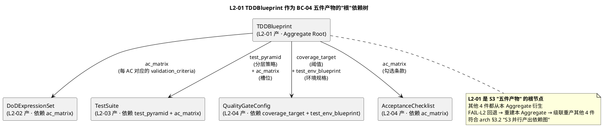
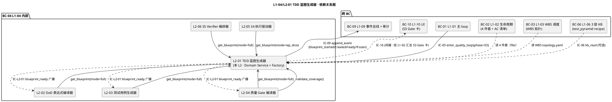
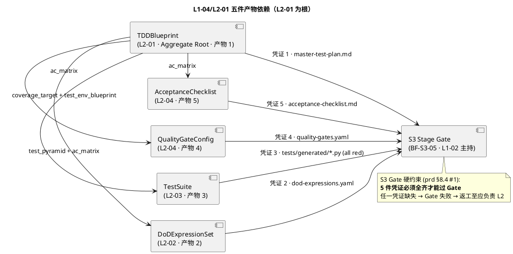
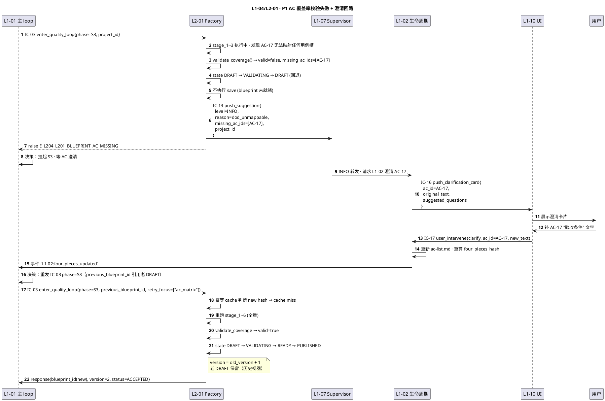
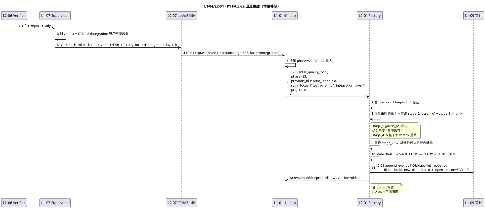

# L1 L2-01 · TDD 蓝图生成器 · Tech Design

> **本文档定位**：3-1-Solution-Technical 层级 · L1 的 L2-01 TDD 蓝图生成器 技术实现方案（L2 粒度）。
> **与产品 PRD 的分工**：2-prd/L1-04-Quality Loop/prd.md §5.4 的对应 L2 节定义产品边界，本文档定义**技术实现**（接口字段级 schema + 算法伪代码 + 底层数据结构 + 状态机 + 配置参数）。
> **与 L1 architecture.md 的分工**：architecture.md 负责**跨 L2 架构 + 跨 L2 时序**，本文档负责**本 L2 内部技术细节**。冲突以 architecture.md 为准。
> **严格规则**：本文档不复述产品 PRD 文字（职责 / 禁止 / 必须等清单），只做技术映射 + 补齐"产品视角未说 but 工程师必须知道"的部分（具体算法 · syscall · schema · 配置）。

---

## §0 撰写进度

- [x] §1 定位 + 2-prd §5.4.1 / §8 L2-01 映射（BF-S3-01 溯源）
- [x] §2 DDD 映射（BC-04 Quality Loop · TDDBlueprint Aggregate Root + Factory）
- [x] §3 对外接口定义（4 方法字段级 YAML schema + 错误码 ≥ 8 项）
- [x] §4 接口依赖（被谁调 · 调谁 · 5 件产物依赖边 · PlantUML 依赖图）
- [x] §5 P0/P1 时序图（PlantUML · S3 主干 + blueprint_ready 并行广播）
- [x] §6 内部核心算法（AC 矩阵构建 / pyramid 推导 / coverage target / NLP 解析）
- [x] §7 底层数据表 / schema 设计（blueprint + ac_matrix + test_env_blueprint · PM-14 分片）
- [x] §8 状态机（DRAFT → VALIDATING → READY → PUBLISHED → FROZEN · PlantUML + 转换表）
- [x] §9 Mock 三档（unit / contract / chaos）+ 9 环境变量 + fixture 四象限 + MockTDDBlueprintGenerator 参考类
- [x] §10 配置参数清单（≥ 12 项）
- [x] §11 STRIDE 10+ 项 + 8 层 Defense in Depth + Open Questions ≥ 6
- [x] §12 性能目标（P95/P99/并发/资源）
- [x] §13 与 2-prd / 3-2 TDD 的映射表

> **填写次序建议**：§1 → §3 接口 → §4 依赖 → §2 DDD（基于接口回推聚合 / 组件）→ §5 时序（串 §3+§4）→ §6 算法 → §7 schema → §8 状态机 → §9 Mock 三档 → §10 配置 → §11 STRIDE + OQ → §12 SLO → §13 映射。理由：本 L2 是 S3 总指挥 · 接口驱动下游 3 个 L2 的并行广播，从契约和依赖着手最易固定 Aggregate 边界；§9 Mock 三档和 §11 STRIDE 放在骨架落定后补充，保证工程可测性与威胁覆盖。

---

## §1 定位 + 2-prd 映射

### 1.1 本 L2 的唯一命题（One-Liner）

**L2-01 = L1-04 Quality Loop 的 S3 总指挥 + `TDDBlueprint` Aggregate 的唯一生产者**：在 S3 阶段接收 `IC-03 enter_quality_loop{phase=S3}` → 读 4 件套（L1-02 产） + WBS 拓扑（L1-03 产）+ AC 清单 → 经 `TDDBlueprintFactory` 构造出五件一套 `TDDBlueprint`（test_pyramid / ac_matrix / coverage_target / test_env_blueprint / priority_annotation） → 校验 AC 覆盖率 100% 硬红线 → 广播 `blueprint_ready` 给 L2-02/03/04 **并行起跑** → 作为 S3 Stage Gate 的**硬凭证之一**交给 L1-02 → 进入 FROZEN 状态（任何后续修改必经 FAIL-L2 回退）。

关键定性（来自 architecture.md §1.4 + §2.4）：**本 L2 是 Domain Service + Factory 组合**——DDD 构造块用 "Domain Service（做推导）+ Factory（建聚合）" 而非 Application Service（不含长事务 / 不编排跨 BC），推导函数纯函数化以便 100% 单元可测；Factory 是构造 `TDDBlueprint` Aggregate Root 的**唯一入口**（符合 L0 DDD §7.2.4 "单一写入点"原则）。

### 1.2 与 `2-prd/L1-04 Quality Loop/prd.md §8` 的精确小节映射表

> 说明：本表是**技术实现 ↔ 产品小节**的锚点表，不复述 PRD 文字。每行左列为本 tech-design 的段落，右列为对应的 PRD 小节。冲突以本文档（技术实现）+ architecture.md（架构）为准，若发现 PRD 有歧义或不足以导出字段级 schema，按 spec 6.2 规则反向修 PRD 并在此处注明。

| 本文档段 | 2-prd §8 小节 | 映射内容 | 备注 |
|---|---|---|---|
| §1.1 命题 | §8.1 职责 + 锚定 | "S3 总指挥 + TDDBlueprint 唯一生产者" | 本文档补 "Domain Service + Factory" 定性（prd 未明写 DDD）|
| §1.4 兄弟边界 | §8.3 边界 | In-scope 8 项 + Out-of-scope 8 项 | — |
| §1.5 PM-14 | §8.4 硬约束 + frontmatter PM-14 声明 | "TDDBlueprint.project_id 根字段" + "AC 覆盖率按 project 独立计算" | **补** |
| §2 DDD | §8 无 DDD 语言 | BC-04 映射 + Factory 单例 | **补** |
| §3 接口 `generate_blueprint` | §8.2 输入 + §8.6 必 6 | IC-03 接入后主方法 | **补字段级 YAML** |
| §3 接口 `get_blueprint` | §8.2 输出（供下游读）| L2-02/03/04/06 按 blueprint_id 读 | **补** |
| §3 接口 `validate_coverage` | §8.4 硬约束 2 | AC 覆盖率 100% 硬性校验 | **补** |
| §3 接口 `broadcast_ready` | §8.6 必 6 "必须广播 blueprint_ready" | IC-L2-01 广播 | **补** |
| §3 错误码 | §8.4 硬约束 + §8.5 禁止 | 约束违反一对一映射错误码 | **补错误码表 ≥ 8** |
| §4 依赖 | §8.2 输入源 + §8.7 可选 KB | 上游 L1-02/03/01 + 可选 L1-06 | — |
| §5 时序 | §8 无时序；L1-04 arch §4.1 P0-L1-04-A | PlantUML 重绘 | **补** |
| §6 算法 | §8.2 输出 + §8.4 硬约束 2 | AC 矩阵 + pyramid + coverage target | **补 Python-like 伪代码** |
| §7 schema | §8.2 输出"master-test-plan 结构" | YAML 化 + PM-14 `projects/<pid>/tdd/` | **补** |
| §8 状态机 | §8.3 "蓝图冻结" | DRAFT → VALIDATING → READY → PUBLISHED → FROZEN | **补** |
| §9 Mock 三档 | — | unit / contract / chaos | **补** |
| §10 配置 | §8.4 性能约束 | coverage_threshold / ac_strict_mode 等 | **补 ≥ 12 项** |
| §11 降级 + STRIDE | §8.4 + §8.5 + arch §3.1 | 错误分类 + 降级链 + STRIDE 10+ | **补** |
| §12 SLO | §8.4 性能约束 | 3 分钟蓝图 / 1 秒广播 / 1MB 文档 | 原样继承 + 细化 P95/P99 |
| §13 映射 | — | 本段接口 ↔ §8.X + ↔ 3-2-TDD 用例 | **补** |

### 1.3 与 `L1-04/architecture.md` 的位置映射

| architecture 锚点 | 映射内容 | 本文档对应段 |
|---|---|---|
| §1.4 L2 清单 L2-01 行 | "TDD 蓝图生成器 · Domain Service + Factory + Aggregate Root TDDBlueprint" | §2 DDD |
| §1.5 "谁写 quality-gates.yaml" | L2-01 只给"覆盖率目标"作为输入给 L2-04 | §1.4 兄弟边界 |
| §2.2 聚合根 TDDBlueprint | 本 L2 持有 · L2-03 / L2-04 / L2-06 读 | §2.2 + §7 |
| §2.3 VO CoverageTarget | "行/分支/AC 三类覆盖率下限 · AC 硬性 = 1.0" | §2.4 |
| §2.4 领域服务 TDDBlueprintFactory | "把 4 件套 + WBS 组合成 TDDBlueprint 聚合" | §2.4 |
| §2.5 Repository 模式 `TDDBlueprintRepository` | 聚合根持久化唯一写入点 | §2.6 |
| §2.6 跨 BC BC-04 ↔ BC-02 Customer | L1-02 4 件套 + AC 上游输入 | §4.1 依赖 |
| §3.1 C4 Container 图 L2_01 节点 | 居中节点 · 5 对契约面 | §4.3 依赖图 |
| §3.2 S3 并行产出依赖图 | L2-01 blueprint_ready 广播触发并行 | §5.1 时序 |
| §4.1 P0-L1-04-A 时序图 | "S3 TDD 蓝图一次完整生成" | §5.1 P0 |

### 1.4 与兄弟 L2 的边界（7 L2 中 L2-01 的位置）

| 兄弟 L2 | 本 L2 与兄弟的边界规则（基于 prd §8.3 + arch §1.5）|
|---|---|
| **L2-02 DoD 表达式编译器** | L2-01 **只给** `ac_matrix`（每条 AC 对应的分层 + 优先级 + 用例槽索引）；L2-02 消费 `ac_matrix` 把每条 AC 的验收条件自然语言编译为白名单 AST DoDExpression。**L2-01 不碰 DoD 语法**（arch §1.5 "谁 eval DoD 表达式"表）。反向：L2-02 回传 "dod_unmappable" INFO 给 L2-01 作为后续蓝图版本演进线索（通过事件总线，非同步调用）。 |
| **L2-03 测试用例生成器** | L2-01 **只给** `test_pyramid`（单元/集成/E2E 分层责任边界）+ `ac_matrix`（AC 对应用例槽）；L2-03 消费后为每个槽位生成**红灯骨架**（pytest collect 可发现、运行全 FAIL）。**L2-01 不生成代码**（prd §8.5 禁 4 "禁止直接生成测试代码"）。 |
| **L2-04 质量 Gate 编译器** | L2-01 **只给** `coverage_target`（行/分支/AC 三类覆盖率下限）+ `test_env_blueprint`（mock / fixture / 数据准备策略）；L2-04 消费后编译 `quality-gates.yaml` + `acceptance-checklist.md`。L2-01 **不编译 yaml**（prd §8.5 禁 "不编译 quality-gates.yaml"）。 |
| **L2-05 S4 执行驱动器** | 无直接同步调用。L2-05 在 S4 阶段读 `TDDBlueprint` 的 WP 切片（通过 `get_blueprint(blueprint_id)` Query），把对应 WP 的分层用例槽 + coverage 子集传给 invoke_skill 作为 tdd skill 的 context。 |
| **L2-06 S5 Verifier 编排器** | L2-06 在组装 verifier 工作包时 `get_blueprint(blueprint_id)` 读**整份** TDDBlueprint 作为 verifier 的"验收尺"（existence / behavior / quality 三段证据链的参照物）。L2-01 的 blueprint 是 S5 独立验证的**唯一可信上下文**（PM-05 单一事实源）。 |
| **L2-07 偏差判定与回退路由器** | 无直接同步调用。FAIL-L2 回退时 L2-07 经 IC-01 触发 L1-01 回 S3 → L1-01 重发 `IC-03 phase=S3` → 本 L2 按 `previous_blueprint_id` 增量补缺（而非完全重建）· 详见 §6.5 增量补缺算法。 |

### 1.5 PM-14 约束（project_id as root）

**硬约束**（arch §1 "PM-14 项目上下文声明" + prd §8 frontmatter）：

1. `TDDBlueprint.project_id` 为**根字段**（Aggregate Root 不变量 I-01），缺则 `E_L204_L201_BLUEPRINT_NO_PROJECT_ID` 拒绝（不入 Repository）
2. `ac_matrix` / `test_env_blueprint` / `coverage_target` 三件 Entity 都带 `project_id` 作副字段（透传自根）
3. 所有持久化路径按 `projects/<pid>/tdd/blueprint.yaml` + `projects/<pid>/tdd/master-test-plan.md` + `projects/<pid>/tdd/ac-matrix.yaml` 分片（见 §7 schema）
4. 跨 project 蓝图复用**禁止**（即便 AC 文本相同 · 防止 project A 的质量规格被误用到 project B · `E_L204_L201_CROSS_PROJECT_BLUEPRINT`）
5. 发布的 Domain Event（`blueprint_created` / `blueprint_ready`）payload 必含 `project_id`
6. `blueprint_ready` 广播到 L2-02/03/04 时，三个 L2 自己维护各自 project 下的产出目录，不跨 project 聚合
7. FAIL-L2 回退时 `previous_blueprint_id` 必与 `project_id` 匹配（否则 `E_L204_L201_BLUEPRINT_VERSION_CROSS_PROJECT`）

### 1.6 关键技术决策（Decision → Rationale → Alternatives → Trade-off）

本 L2 在 architecture.md §1.4 的 "Domain Service + Factory" 基础上，补充 L2 粒度的 4 个技术决策：

| # | Decision | Rationale | Alternatives | Trade-off |
|---|---|---|---|---|
| **D-L201-01** | `TDDBlueprintFactory` 为**纯函数 Factory**：`(FourPieces, WBS, AcClauses) → TDDBlueprint`，不访问任何外部 IO（所有 IO 前置到 `InputLoader` / 后置到 `Repository.save()`）| 纯函数 Factory = 100% 可单元测试 + 可 mock 4 件套 / WBS 覆盖各种边界（AC 空 / AC 重复 / WBS 无叶子 WP 等）；这和 L2-02 决策引擎 D-02a 的"DecisionEngine 纯函数"设计思路一致，防止产 Aggregate 的函数被污染成"IO + 推导"混合态 | **A. 在 Factory 内直接读 L1-02/L1-03 的产出物**（file read）：Factory 变成 IO 混合 · 难测试 · 难回放（回溯某版本 blueprint 时无法复现当时的 4 件套快照）| 所有 IO 前置到 `InputLoader`（唯一 IO 入口），Factory 就是 6 阶段纯计算：parse_ac → derive_pyramid → build_matrix → compute_coverage → assemble_env → pack_blueprint。详见 §6.1 |
| **D-L201-02** | **AC 自然语言解析采用 "spaCy lemmatizer + 模板匹配 + LLM fallback" 三级管线**（D-04 原型设计，精确实现见 §6.2）| prd §8.4 性能约束 "3 分钟蓝图"——纯 LLM 调用对 100 条 AC 的规模 P99 可能到 5-10 分钟（成本也爆炸）；模板匹配可覆盖 ~70% 场景（如 "必须 ... 才算完成" / "全部 X 必须 Y"），spaCy 辅助识别动词 / 名词槽位，剩余 ~30% 交给 DeepSeek | **A. 纯 LLM**：超 SLO + 成本高；**B. 纯正则**：歧义 AC 识别率低（<50%）；**C. 纯 spaCy**：无语义理解，只能分词不能判断"验收意图" | 三级 fallback：模板命中直接返回（毫秒级）；模板未命中 spaCy 提取槽位后模板化匹配（~50ms）；仍未命中才调 LLM 并缓存（同 AC hash 下次命中）；缓存命中率 > 60% 时 P95 可达标 |
| **D-L201-03** | **test_pyramid 层比采用"默认 70/20/10 + WBS 权重调整 + 用户显式覆盖"三层推导**（单元 70% / 集成 20% / E2E 10%）| pyramid 理论经验值（Mike Cohn pyramid · 2009）被 Google Testing Blog / Martin Fowler 多次验证，**默认值 70/20/10 对一般工程项目最优**；但需要根据 WBS 特征微调（如前端项目 E2E 占比应高 · 后端纯算法应低）；用户显式覆盖是保留灵活性 | **A. 硬编码 70/20/10**：无法适应不同项目域；**B. 完全用户自定义**：每项目都问一遍太烦；**C. 完全 LLM 推导**：不可解释 · 不稳定 | 三层回退链：用户 config 有则用用户；否则按 WBS 特征（WP 标签 `frontend` / `backend` / `e2e_heavy`）查权重表；否则默认 70/20/10。所有层都落审计便于后续调优 |
| **D-L201-04** | **coverage_target 的 AC 覆盖率硬性 = 1.0（不可配置）**，行/分支覆盖率默认分别 0.80 / 0.70（可配置下限 0.60） | prd §8.4 硬约束 2 "AC 覆盖率硬性 100%"是**红线**（非建议值）——允许配置 = 给违规开口子；行/分支覆盖率是**工程经验值**，可按项目调 | A. 全部可配：违反硬约束；B. 全部硬编码：失去项目适应性 | AC 覆盖率锁死 1.0（配置空间直接禁）；行/分支覆盖率可配（默认值在 §10），但下限 0.60 是硬底（低于就警告） |

### 1.7 BF-S3-01 业务流溯源

本 L2 聚合 **BF-S3-01 Master Test Plan 生成流**（prd §8.1 上游锚定第 5 行："BF-S3-01 Master Test Plan 生成流"）。精确锚点：

- **prd §5.4.1 L2-01**：职责 = "S3 阶段 · 将 4 件套 + WBS 转为 Master Test Plan（含 test pyramid / ac matrix / coverage target / test env blueprint）"
- **prd §8.1 职责 + 锚定**：一句话职责 + 上游 Goal §2.2 / §4.1 + 下游 L2-02/03/04 + S3 Stage Gate
- **prd §8.2 输入 / 输出**：精确列出 4 件套 4 类文档 / WBS 拓扑 / blueprint_ready 事件
- **prd §8.4 约束**：5 条硬约束（S4 前全齐 · AC 100% · 冻结 · 纯文本 · 输入源两个）
- **prd §8.5 禁止**：7 条禁止行为
- **prd §8.6 必须**：8 条必须职责

本文档将上述 PRD 语义**翻译为机器可执行的字段级 schema + 算法伪代码 + 错误码 + SLO**，**绝不改写 PRD 语义**——凡与 PRD 冲突则反向修 PRD 并在 §13 本文档末登记。

---

## §2 DDD 映射（BC-04 Quality Loop · TDDBlueprint Aggregate）

### 2.1 Bounded Context 定位

本 L2 所属 `BC-04 · Quality Loop`（定义见 `L0/ddd-context-map.md §2.5`，HarnessFlow 质量闭环的唯一控制源 BC）。在 BC-04 内部 **L2-01 扮演"S3 总指挥 + 蓝图聚合构造者"的双重角色**：

1. **S3 总指挥**：L1-04 Quality Loop 进入 S3 阶段后，L2-01 是**唯一入口**（arch §3.1 S3_PLANNING 包的左上角节点），L1-01 通过 IC-03 只调 L2-01（不能绕过 L2-01 直接调 L2-02/03/04）。
2. **聚合构造者**：`TDDBlueprint` Aggregate Root 的**唯一 Factory**——通过 `TDDBlueprintFactory.build()` 产出不可变版本化聚合，经 `TDDBlueprintRepository.save()` 持久化。

与兄弟 L2 的 DDD 关系（基于 `L0/ddd-context-map.md §2.5` BC-04 跨聚合协作）：

| 兄弟 L2 | DDD 关系 | 本 L2 与该 L2 的交互模式 |
|---|---|---|
| L2-02 DoD 表达式编译器 | **Downstream**（Customer）· blueprint_ready 消费方 | L2-01 产 `ac_matrix` → L2-02 读 → 按 AC 条款编 DoDExpression · 广播模式 |
| L2-03 测试用例生成器 | **Downstream**（Customer）· blueprint_ready 消费方 | L2-01 产 `test_pyramid` + `ac_matrix` → L2-03 读 → 生成红灯骨架 · 广播模式 |
| L2-04 质量 Gate 编译器 | **Downstream**（Customer）· blueprint_ready 消费方 | L2-01 产 `coverage_target` + `test_env_blueprint` → L2-04 读 → 编 quality-gates.yaml · 广播模式 |
| L2-05 S4 执行驱动器 | **Downstream**（Query 消费方）· 非广播 | L2-05 在 S4 阶段 `get_blueprint(blueprint_id, wp_slice=True)` 读 WP 切片 |
| L2-06 S5 Verifier 编排器 | **Downstream**（Query 消费方）· 非广播 | L2-06 组装 verifier 工作包时 `get_blueprint(blueprint_id, full=True)` 读整份蓝图 |
| L2-07 偏差判定与回退路由器 | **No direct coupling** | FAIL-L2 通过 IC-14 → L2-07 → IC-01 → L1-01 → IC-03 重入本 L2 · 间接 |

跨 BC 关系（引 `L0/ddd-context-map.md §2.5` BC-04 跨 BC 表）：

| 跨 BC | 关系模式 | 本 L2 体现 |
|---|---|---|
| BC-01 Agent Decision Loop（L1-01）| **Customer-Supplier**（消费 IC-03 · 供应 `L1-04:blueprint_ready` 事件）| 本 L2 是 IC-03 phase=S3 的直接接入点 |
| BC-02 Project Lifecycle（L1-02）| **Customer**（上游 4 件套 + AC 清单）| 本 L2 不直接调 L1-02，通过文件系统读 `projects/<pid>/four-pieces/` |
| BC-03 WBS Scheduling（L1-03）| **Customer**（上游 WBS 拓扑）| 本 L2 不直接调 L1-03，通过文件系统读 `projects/<pid>/wbs/topology.yaml` |
| BC-06 Knowledge Base（L1-06）| **Customer**（可选 · 读 test_pyramid recipe）| 本 L2 经 IC-06 kb_read 查历史相似项目的测试分层最佳实践 |
| BC-09 Resilience & Audit（L1-09）| **Partnership**（经 IC-09 append_event 单一审计源）| 本 L2 所有状态转换（DRAFT → READY → PUBLISHED → FROZEN）必 append 事件 |
| BC-10 UI（L1-10）| **Customer-Supplier**（IC-16 推 S3 Gate 待审卡）| 本 L2 产 blueprint → L1-02 汇总 → IC-16 推 L1-10（间接）|

### 2.2 Aggregate Root · TDDBlueprint

引自 `L0/ddd-context-map.md §2.5` BC-04 聚合根表 + arch §2.2：

**TDDBlueprint** 聚合根定义：

| 属性 | 类型 | 语义 | 不变量 |
|---|---|---|---|
| `blueprint_id` | VO `BlueprintId` | 唯一 id（uuid-v7）· Append-only | I-01 一 blueprint_id 一份聚合 |
| `project_id` | VO `ProjectId` | PM-14 根字段 | I-L201-01 不可变 |
| `version` | int | 从 1 开始递增；FAIL-L2 回退重建时 version++ | I-L201-02 单调递增 |
| `test_pyramid` | VO `TestPyramid` | 单元/集成/E2E 三层责任边界 + 比例 | I-L201-03 三层比例和 = 1.0 |
| `ac_matrix` | Entity `ACMatrix` | 每条 AC 对应的分层 / 优先级 / 用例槽索引 | I-L201-04 AC 覆盖率 = 1.0（硬性）|
| `coverage_target` | VO `CoverageTarget` | 行 / 分支 / AC 三类覆盖率下限 | I-L201-05 ac 分量硬等 1.0，line/branch ∈ [0.60, 1.0] |
| `test_env_blueprint` | Entity `TestEnvBlueprint` | mock 策略 / fixture 设计 / 数据准备 | — |
| `priority_annotation` | VO `PriorityMap` | 用例槽 → P0/P1/P2 标注 | I-L201-06 每槽位必标 |
| `created_at` | VO ISO-8601 | 生成时刻 | 不可变 |
| `published_at` | VO ISO-8601 \| null | 转 PUBLISHED 时刻；未发布为 null | — |
| `frozen_at` | VO ISO-8601 \| null | 转 FROZEN 时刻；未冻结为 null | — |
| `source_refs` | Entity `SourceRefs` | 溯源 `four_pieces_hash` + `wbs_version` + `ac_clauses_hash` | I-L201-07 不可变 |

**关键不变量**（Invariants · 引自 L0 DDD + arch §2.2）：

1. **I-L201-01 `project_id` 不可变**：聚合一旦创建，`project_id` 不能改动（即便 FAIL-L2 回退重建也只在同一 project 下）。
2. **I-L201-02 `version` 单调递增**：FAIL-L2 回退重建 `version += 1`，旧版本保留（不删除，给 Verifier 和 UI 提供 diff 视图）。
3. **I-L201-03 `test_pyramid` 三层比例和 = 1.0**：`unit_ratio + integration_ratio + e2e_ratio = 1.0`，精度到 0.01（任一误差 > 0.01 拒绝构造）。
4. **I-L201-04 `ac_matrix` 的 AC 覆盖率 = 1.0**：每条 AC 至少有 1 个用例槽（`slot_count ≥ 1`），不允许"零槽 AC"（硬约束 prd §8.4 #2）。
5. **I-L201-05 `coverage_target.ac_coverage = 1.0`**（硬锁 · 不可配置）；`line_coverage` / `branch_coverage` ∈ [0.60, 1.0]（可配置，< 0.60 拒绝）。
6. **I-L201-06 `priority_annotation` 全量覆盖**：每个用例槽必有优先级标注（P0 / P1 / P2）。
7. **I-L201-07 `source_refs` 不可变**：一旦绑定 4 件套 hash / WBS version，不可改；修改 = 新建版本（违反 → `E_L204_L201_SOURCE_REFS_MUTATED`）。

### 2.3 Factory · TDDBlueprintFactory

引自 `L0/ddd-context-map.md §2.4` 领域服务表 + arch §2.4 领域服务清单：

| 属性 | 值 |
|---|---|
| DDD 类型 | **Factory**（Aggregate 构造唯一入口）|
| 所在 L2 | L2-01（本 L2 核心组件）|
| 调用契约 | `build(four_pieces: FourPieces, wbs: WBSTopology, ac_clauses: list[ACClause], config: BuildConfig) → TDDBlueprint` |
| 纯函数性 | **纯函数**（D-L201-01 · 无 IO）|
| 构造阶段 | 6 阶段（见 §6.1）：parse_ac → derive_pyramid → build_matrix → compute_coverage → assemble_env → pack_blueprint |
| 异常通道 | 抛 `TDDBlueprintBuildError`（含错误码 `E_L204_L201_*`）|

### 2.4 Value Objects（不可变）

| VO 名 | 结构 | 用途 | 不变量 |
|---|---|---|---|
| `BlueprintId` | `"bp-{uuid-v7}"` | 聚合唯一 id | 一次构造一 id |
| `ProjectId` | `"pid-{uuid-v7}"` | PM-14 根字段 · 跨 BC Shared Kernel | — |
| `TestPyramid` | `{unit_ratio: float, integration_ratio: float, e2e_ratio: float, layer_specs: dict[str, LayerSpec]}` | 测试金字塔分层 | 三层比例和 = 1.0 ± 0.01 |
| `CoverageTarget` | `{line: float, branch: float, ac: float}` | 三类覆盖率下限 | `ac = 1.0` 硬锁 · line/branch ∈ [0.60, 1.0] |
| `PriorityMap` | `dict[slot_id, enum[P0, P1, P2]]` | 用例槽优先级标注 | 全量覆盖 |
| `LayerSpec` | `{responsibility: str, applicable_ac_types: list[str], expected_case_count: int}` | 单层金字塔规格 | expected_case_count ≥ 1 |
| `ACClauseId` | `"ac-{uuid-v7}"` | AC 条款唯一 id | — |
| `SlotId` | `"slot-{uuid-v7}"` | 用例槽唯一 id | — |

### 2.5 Entities（可变 · 聚合内持久化）

| Entity | 生命期 | 用途 |
|---|---|---|
| `ACMatrix` | 与 Aggregate 同生命 · FROZEN 后不可变 | AC → 用例槽映射表（见 §7.2 schema）|
| `TestEnvBlueprint` | 与 Aggregate 同生命 | 测试环境规格（mock / fixture / 数据准备）|
| `SourceRefs` | 与 Aggregate 同生命 · 不可变 | 溯源 4 件套 / WBS / AC hash |
| `BuildLog` | 单次构造（< 3 分钟）· 构造结束落盘 | Factory 6 阶段执行日志（供调试 / 审计）|

### 2.6 Repository Interface · TDDBlueprintRepository

引自 `L0/ddd-context-map.md §7.2.4 BC-04 Repository`：

| 方法 | 签名 | SLO |
|---|---|---|
| `save(blueprint: TDDBlueprint) → SaveResult` | 幂等 · 同 blueprint_id 二次调用返回首次结果 | P95 ≤ 50ms（本地 jsonl append + yaml 写）|
| `load(blueprint_id: str) → TDDBlueprint \| None` | 按 id 读（含 FROZEN 版本）| P95 ≤ 30ms |
| `latest(project_id: str) → TDDBlueprint \| None` | 取当前 project 最新版本（可能是 DRAFT / READY / PUBLISHED / FROZEN）| P95 ≤ 30ms |
| `history(project_id: str) → list[TDDBlueprint]` | 取当前 project 全部版本（供 FAIL-L2 diff 视图）| P95 ≤ 100ms |
| `slice(blueprint_id: str, wp_id: str) → TDDBlueprintSlice` | 取 WP 切片（给 L2-05 消费）| P95 ≤ 50ms |

**持久化约束**：

1. **单一写入点**：只能经 Repository 的 `save()`，不得绕过（PM-08 单一事实源）
2. **事件溯源一致性**：`save()` 成功后必 emit `L1-04:blueprint_created` / `L1-04:blueprint_ready` 经 IC-09 到 L1-09
3. **PM-14 隔离**：所有 Repository 方法接受 `project_id` 或在构造时绑定，跨 project 查询 `E_L204_L201_CROSS_PROJECT_BLUEPRINT`
4. **不可变快照**：save 后 Aggregate 不可 patch；版本升级 = 新建 `TDDBlueprint(version=old.version+1)`

### 2.7 Domain Events（本 L2 对外发布 · 经 IC-09）

引自 `L0/ddd-context-map.md §5.2.4` BC-04 发布的事件：

| Event | 触发时机 | 订阅方 | Payload 关键字段 |
|---|---|---|---|
| `L1-04:blueprint_started` | 本 L2 接收 IC-03 phase=S3 开始构造 | L1-09 审计 + L1-10 UI | `{blueprint_id, project_id, input_refs, ts}` |
| `L1-04:blueprint_created` | Factory 产出 TDDBlueprint + Repository save 成功 | L1-09 审计 | `{blueprint_id, version, project_id, ac_count, pyramid_ratios, ts}` |
| `L1-04:blueprint_ready` | 本 L2 广播给 L2-02/03/04（IC-L2-01）| L2-02/03/04 + L1-09 + L1-10 | `{blueprint_id, project_id, master_test_plan_path, ac_matrix_path, ts}` |
| `L1-04:blueprint_validation_failed` | AC 覆盖率 < 1.0 校验失败 | L1-07 + L1-02 + L1-10 | `{blueprint_id, missing_ac_ids[], project_id, ts}` |
| `L1-04:blueprint_frozen` | 转 FROZEN 状态（S3 Gate Go 后）| L1-09 审计 | `{blueprint_id, frozen_at, project_id}` |
| `L1-04:blueprint_reopened` | FAIL-L2 回退重建 | L1-09 + L1-10 | `{old_blueprint_id, new_blueprint_id, reopen_reason, project_id}` |

所有事件必含 `project_id`（PM-14）+ 事件在 L1-09 hash-chain 中的位置（由 L1-09 填）。

### 2.8 BC-04 内部 5 件产物的 "L2-01 为根" 依赖树



**关键推论**：L2-01 的 `TDDBlueprint` 是 BC-04 五件产物的**共同根**——这决定了本 L2 的 blueprint 状态机（§8）向后兼容性必须极强（一旦 PUBLISHED 被下游引用，blueprint_id 生命与 4 件衍生产物挂钩），只能通过"新版本"演进，不能"修改当前版本"。

---

## §3 对外接口定义（字段级 YAML schema + 错误码）

> 说明：本 L2 对外暴露 **4 个方法**（1 主 + 3 辅）。字段级 YAML 采用 OpenAPI-like 风格声明 type / required / 约束。
>
> 调用方向：`generate_blueprint()` 由 L1-01（经 IC-03）单一调用（主流）；`get_blueprint()` 由 L2-02/03/04（blueprint_ready 消费后 · 读聚合）+ L2-05（WP 切片）+ L2-06（整份）调用；`validate_coverage()` 为内部暴露方法（也供 L2-04 编译 quality-gates 时调用校验）；`broadcast_ready()` 是 L2-01 自动触发（非直接对外接口，但字段级 schema 固定给下游 contract）。

### 3.1 `generate_blueprint(request) → blueprint_id`（核心 · IC-03 phase=S3 接入处）

**调用方**：L1-01 主 loop（单一调用方 · 经 `IC-03 enter_quality_loop{phase=S3}` 触发 L1-04 entry → L1-04 内部派发给本 L2）
**幂等性**：同 `(project_id, source_refs_hash)` 二次调用返回首次 `blueprint_id`（内存 LRU 缓存 256 · 防 L1-01 重发）
**阻塞性**：异步启动；返回 `blueprint_id` 后 L1-04 主 loop 不阻塞（实际构造在后台线程跑，完成经 L1-09 事件总线通知下游）
**性能**：3 分钟上限（prd §8.4 · 100 AC 规模）· P95 ≤ 2 分钟 · P99 ≤ 3 分钟 · 硬上限 5 分钟（超 → abort）

#### 入参 `request`（字段级 YAML）

```yaml
generate_blueprint_request:
  type: object
  required:
    - command_id
    - project_id       # PM-14 根字段
    - entry_phase
    - four_pieces_refs
    - wbs_refs
    - ac_clauses_refs
  properties:
    command_id:
      type: string
      format: "cmd-{uuid-v7}"
      description: L1-01 生成 · 用于 IC-03 幂等 + 审计追溯

    project_id:
      type: string
      format: "pid-{uuid-v7}"
      description: PM-14 根字段；缺 → E_L204_L201_BLUEPRINT_NO_PROJECT_ID

    entry_phase:
      type: enum
      enum: [S3]
      description: 必为 S3（其他 phase → E_L204_L201_INVALID_PHASE）

    four_pieces_refs:
      type: object
      required: [requirements_path, goals_path, ac_list_path, quality_standard_path]
      properties:
        requirements_path:
          type: string
          format: "projects/{pid}/four-pieces/requirements.md"
        goals_path:
          type: string
          format: "projects/{pid}/four-pieces/goals.md"
        ac_list_path:
          type: string
          format: "projects/{pid}/four-pieces/ac-list.md"
        quality_standard_path:
          type: string
          format: "projects/{pid}/four-pieces/quality-standard.md"
        four_pieces_hash:
          type: string
          format: "sha256:[64 hex]"
          description: 4 件套聚合 hash · 供 source_refs 固化

    wbs_refs:
      type: object
      required: [topology_path, wbs_version]
      properties:
        topology_path:
          type: string
          format: "projects/{pid}/wbs/topology.yaml"
        wbs_version:
          type: integer
          minimum: 1

    ac_clauses_refs:
      type: object
      required: [ac_manifest_path, clause_count]
      properties:
        ac_manifest_path:
          type: string
          format: "projects/{pid}/four-pieces/ac-manifest.yaml"
        clause_count:
          type: integer
          minimum: 1
          description: AC 条款总数；= 0 → E_L204_L201_AC_EMPTY

    previous_blueprint_id:
      type: string | null
      description: FAIL-L2 回退重建时传入旧 blueprint_id；null 表示首次构造
      default: null

    retry_focus:
      type: array | null
      description: FAIL-L2 指定需重做的 section（如 `["test_pyramid", "coverage_target"]`）；null 表示全量重做
      default: null

    config_overrides:
      type: object | null
      description: 本次构造的 config 覆盖（§10 配置的子集）；如 `{pyramid_default_ratio: [0.6, 0.3, 0.1]}`
      default: null

    trigger_tick_id:
      type: string
      description: L1-01 触发本次调用的 tick_id · 用于审计溯源
```

#### 出参 `blueprint_id`（字段级 YAML）

```yaml
generate_blueprint_response:
  type: object
  required:
    - blueprint_id
    - project_id
    - status
    - ts_accepted
  properties:
    blueprint_id:
      type: string
      format: "bp-{uuid-v7}"
      description: 聚合唯一 id

    project_id:
      type: string
      description: 透传 request.project_id

    status:
      type: enum
      enum: [ACCEPTED, CACHED]
      description: ACCEPTED = 新构造进 DRAFT; CACHED = 幂等命中，返回已存在的 blueprint_id

    ts_accepted:
      type: string
      format: ISO-8601-utc

    estimated_completion_ts:
      type: string
      format: ISO-8601-utc
      description: 预期构造完成时间（P95 ≤ 2 分钟 · 供 UI 展示进度条）

    version:
      type: integer
      description: 本次构造的版本号（首次 = 1；FAIL-L2 重建 = 旧 +1）
```

#### 3.1.1 错误码（`generate_blueprint()`）

| 错误码 | 含义 | 触发场景 | 调用方处理 | 对应 prd 硬约束 |
|---|---|---|---|---|
| `E_L204_L201_BLUEPRINT_NO_PROJECT_ID` | project_id 缺失 | 上游传入非法 request | L1-01 丢弃 + 告警 L1-07 | PM-14 |
| `E_L204_L201_CROSS_PROJECT_BLUEPRINT` | `previous_blueprint_id` 与 `project_id` 不匹配 | FAIL-L2 回退 bug | 拒绝 + 审计 | §1.5 #7 |
| `E_L204_L201_INVALID_PHASE` | entry_phase 非 S3 | L1-01 路由 bug | 拒绝 + 静默 | §1.4 L2-01 入口唯一 |
| `E_L204_L201_AC_EMPTY` | `clause_count = 0` | 4 件套缺 AC 清单 | 本 L2 发 `L1-04:blueprint_validation_failed` 事件 + IC-13 INFO 给 L1-07 要求 L1-02 澄清 | prd §8.5 #1 "禁 AC 不全生成蓝图" |
| `E_L204_L201_BLUEPRINT_AC_MISSING` | Factory 校验时发现 AC 覆盖率 < 1.0 | AC 条款某条未匹配任何用例槽 | 状态机走 VALIDATING → DRAFT 补缺 + 推 INFO 澄清 | prd §8.4 #2 AC 100% |
| `E_L204_L201_FOUR_PIECES_MISSING` | 4 件套某文件不存在或 hash 不匹配 | 文件损坏 / L1-02 未完成 | 拒绝 + 等 L1-02 完成事件后重试 | prd §8.6 #1 "完整 4 件套后开始" |
| `E_L204_L201_WBS_NOT_READY` | WBS 拓扑文件不存在或 wbs_version 不一致 | L1-03 未发 `wbs_topology_ready` 事件 | 订阅 WBS ready 事件后重试 | — |
| `E_L204_L201_BUILD_TIMEOUT` | Factory 构造耗时 > 5 分钟硬上限 | LLM fallback 长尾 / AC 过多 | 本 L2 abort → 事件 `blueprint_build_timeout` → L1-07 WARN | prd §8.4 性能 |
| `E_L204_L201_SOURCE_REFS_MUTATED` | save 时发现 source_refs 已被他人改动 | 罕见 race condition | Repository 抛异常 · 本 L2 重试一次 | I-L201-07 |
| `E_L204_L201_BLUEPRINT_TOO_LARGE` | master-test-plan.md > 1MB | WBS 过碎 / AC 过多 | 本 L2 WARN L1-07 + 建议 L1-03 重规划 | prd §8.4 "≤ 1MB" |

### 3.2 `get_blueprint(query) → blueprint_data`（读取 · from L2-02/03/04/05/06）

**调用方**：
- L2-02/03/04：blueprint_ready 消费后读整份聚合（`full=True`）
- L2-05：S4 阶段读 WP 切片（`wp_slice=True`）
- L2-06：S5 阶段读整份（`full=True`）

**SLO**：P95 ≤ 100ms（仅文件读 + yaml parse · full 模式）· P95 ≤ 50ms（wp_slice 模式）
**幂等性**：纯 Query · 天然幂等

#### 入参 `query`（字段级 YAML）

```yaml
get_blueprint_query:
  type: object
  required:
    - query_id
    - project_id
    - blueprint_id
  properties:
    query_id:
      type: string
      format: "q-{uuid-v7}"
    project_id:
      type: string
      description: PM-14 根字段 · 必等于 blueprint.project_id
    blueprint_id:
      type: string
      format: "bp-{uuid-v7}"
    mode:
      type: enum
      enum: [full, wp_slice, metadata_only]
      default: full
      description: full = 全聚合；wp_slice = 指定 WP 的切片；metadata_only = 仅 header 不含 matrix
    wp_id:
      type: string | null
      description: mode=wp_slice 必填
    version:
      type: integer | null
      description: 指定版本；null 取 latest
      default: null
```

#### 出参 `blueprint_data`（字段级 YAML）

```yaml
get_blueprint_response:
  type: object
  required:
    - blueprint_id
    - project_id
    - version
    - state
    - created_at
  properties:
    blueprint_id: {type: string}
    project_id: {type: string}
    version: {type: integer}
    state:
      type: enum
      enum: [DRAFT, VALIDATING, READY, PUBLISHED, FROZEN]
    created_at: {type: string, format: ISO-8601-utc}
    published_at: {type: string | null, format: ISO-8601-utc}
    frozen_at: {type: string | null, format: ISO-8601-utc}

    # mode=full 或 wp_slice 才返回的字段
    test_pyramid:
      type: object
      properties:
        unit_ratio: {type: number, minimum: 0, maximum: 1}
        integration_ratio: {type: number}
        e2e_ratio: {type: number}
        layer_specs:
          type: object
          description: "{layer_name: LayerSpec}"

    ac_matrix:
      type: array
      items:
        type: object
        required: [ac_id, ac_text, layer, priority, slot_ids]
        properties:
          ac_id: {type: string, format: "ac-{uuid-v7}"}
          ac_text: {type: string}
          layer: {type: enum, enum: [unit, integration, e2e]}
          priority: {type: enum, enum: [P0, P1, P2]}
          slot_ids:
            type: array
            items: {type: string, format: "slot-{uuid-v7}"}
            minItems: 1
            description: 每条 AC 至少 1 个槽位（I-L201-04）

    coverage_target:
      type: object
      properties:
        line: {type: number, minimum: 0.60, maximum: 1.0}
        branch: {type: number, minimum: 0.60, maximum: 1.0}
        ac: {type: number, const: 1.0, description: "硬锁"}

    test_env_blueprint:
      type: object
      properties:
        mock_strategy:
          type: object
          description: "{service_name: mock_policy}"
        fixture_design:
          type: object
        data_prep_plan:
          type: object

    source_refs:
      type: object
      properties:
        four_pieces_hash: {type: string, format: "sha256:[64 hex]"}
        wbs_version: {type: integer}
        ac_clauses_hash: {type: string}

    # mode=wp_slice 才返回
    wp_slice:
      type: object | null
      properties:
        wp_id: {type: string}
        related_ac_ids: {type: array, items: {type: string}}
        related_slot_ids: {type: array}
        coverage_slice:
          type: object
          description: 该 WP 涉及的覆盖率子目标
```

#### 3.2.1 错误码（`get_blueprint()`）

| 错误码 | 含义 | 触发场景 | 调用方处理 |
|---|---|---|---|
| `E_L204_L201_BLUEPRINT_NOT_FOUND` | blueprint_id 不存在 | 查询拼写错误 / 未构造完成 | 调用方订阅 `blueprint_ready` 事件后再重试 |
| `E_L204_L201_CROSS_PROJECT_READ` | query.project_id ≠ blueprint.project_id | 调用方 bug · PM-14 违规 | 拒绝 · 调用方严重 bug 告警 |
| `E_L204_L201_WP_SLICE_NOT_FOUND` | mode=wp_slice 但 wp_id 不在聚合内 | WBS 和 blueprint 版本不匹配 | 调用方读 `source_refs.wbs_version` 确认 · 回查 L1-03 |
| `E_L204_L201_VERSION_NOT_FOUND` | 指定 version 不存在 | 查询过旧版本 | 调用方回退到 latest |

### 3.3 `validate_coverage(blueprint_id) → validation_report`（AC 覆盖率硬性校验 · 内部 + 供 L2-04 调用）

**调用方**：
- 本 L2 自身（Factory 产出后状态机 DRAFT → VALIDATING 的过渡）
- L2-04 质量 Gate 编译器（编译 quality-gates 时交叉校验）
- 单元测试（Mock 三档的 contract 档位校验）

**SLO**：P95 ≤ 50ms（in-memory 遍历）· P99 ≤ 200ms
**幂等性**：纯函数 · 同 blueprint_id 同版本多次调用结果一致

#### 入参 + 出参

```yaml
validate_coverage_query:
  type: object
  required: [query_id, project_id, blueprint_id]
  properties:
    query_id: {type: string}
    project_id: {type: string, description: PM-14}
    blueprint_id: {type: string}
    strict_mode:
      type: boolean
      default: true
      description: strict=true → ac=1.0 硬校；strict=false → 只 warn 不 fail（仅供调试）

validate_coverage_response:
  type: object
  required: [valid, ac_coverage, line_coverage_target, branch_coverage_target]
  properties:
    valid:
      type: boolean
      description: valid=true 表示全部校验通过
    ac_coverage:
      type: number
      minimum: 0
      maximum: 1
      description: 实际 AC 覆盖率；硬锁应为 1.0
    missing_ac_ids:
      type: array
      items: {type: string}
      description: 未映射到任何用例槽的 AC id 列表（valid=false 时非空）
    line_coverage_target: {type: number}
    branch_coverage_target: {type: number}
    pyramid_ratios_valid:
      type: boolean
      description: 三层比例和是否 = 1.0 ± 0.01
    priority_annotation_complete:
      type: boolean
      description: 所有槽位是否都有优先级标注
    issues:
      type: array
      items:
        type: object
        properties:
          code: {type: string, description: "E_L204_L201_*"}
          severity: {type: enum, enum: [ERROR, WARN, INFO]}
          message: {type: string}
```

#### 3.3.1 错误码

| 错误码 | 含义 | 触发 | 调用方处理 |
|---|---|---|---|
| `E_L204_L201_VALIDATION_BLUEPRINT_NOT_FOUND` | blueprint_id 不存在 | 查询拼写错 | 调用方确认 id |
| `E_L204_L201_VALIDATION_STALE_READ` | 校验过程中 blueprint 被并发修改 | race condition | 调用方重试一次 |

### 3.4 `broadcast_ready(blueprint_id) → broadcast_result`（IC-L2-01 广播 · from 本 L2 内部状态机触发）

**调用方**：本 L2 状态机 READY → PUBLISHED 转换时自动触发（非对外直接暴露）
**广播通道**：L1-09 事件总线（经 IC-09 发 `L1-04:blueprint_ready` 事件，L2-02/03/04 订阅）
**SLO**：P95 ≤ 500ms（事件总线 append + fanout 到 3 订阅者）· 硬上限 1 秒（prd §8.4 "blueprint_ready 广播延迟 ≤ 1 秒"）
**幂等性**：同 `blueprint_id` 二次广播返回首次结果（防重复触发 L2-02/03/04）

#### 入参 + 出参

```yaml
broadcast_ready_request:
  type: object
  required: [blueprint_id, project_id, ts_publish]
  properties:
    blueprint_id: {type: string}
    project_id: {type: string}
    ts_publish: {type: string, format: ISO-8601-utc}
    subscribers:
      type: array
      default: ["L2-02", "L2-03", "L2-04"]
      description: 默认 3 个下游 · 调试模式可缩减
    retry_max:
      type: integer
      default: 3
      description: 事件总线发送失败最大重试次数

broadcast_ready_response:
  type: object
  properties:
    published: {type: boolean}
    event_id: {type: string, format: "evt-{uuid-v7}"}
    fanout_acks:
      type: array
      items:
        type: object
        properties:
          subscriber: {type: string}
          ack: {type: boolean}
          received_at: {type: string | null}
    latency_ms: {type: integer}
```

#### 3.4.1 错误码

| 错误码 | 含义 | 触发 | 降级策略 |
|---|---|---|---|
| `E_L204_L201_BROADCAST_SLO_VIOLATION` | latency_ms > 1000 | 事件总线慢 / fanout 慢 | 记审计；不 fail 广播；L1-07 WARN |
| `E_L204_L201_BROADCAST_FANOUT_INCOMPLETE` | 某下游 ack 超时 | L2-02/03/04 之一离线 | 重试 3 次 · 仍失败发 `L1-04:blueprint_subscriber_unreachable` · 不阻塞本 L2 转 PUBLISHED |
| `E_L204_L201_DUPLICATE_BROADCAST` | 同 blueprint_id 二次广播 | 状态机 bug | 静默 + 审计 |

### 3.5 错误码总表（10 + 4 + 2 + 3 = 19 项）

| 错误码前缀 | 语义类别 | 降级链 |
|---|---|---|
| `E_L204_L201_BLUEPRINT_*` | 聚合创建 / 校验 | 按严重程度：abort → WARN → INFO 澄清 |
| `E_L204_L201_CROSS_PROJECT_*` | PM-14 违规 | 拒绝 · 严重 bug 告警 |
| `E_L204_L201_SOURCE_*` / `E_L204_L201_FOUR_*` / `E_L204_L201_WBS_*` / `E_L204_L201_AC_*` | 输入不全 | 推 INFO 澄清 · 等事件后重试 |
| `E_L204_L201_BUILD_TIMEOUT` | Factory 超时 | abort + L1-07 WARN + UI 警告 |
| `E_L204_L201_VALIDATION_*` | 覆盖率校验 | 降级为 non-strict 仅供调试 |
| `E_L204_L201_BROADCAST_*` | 广播失败 | 重试 3 次 · 升级 WARN |

详细 §11 降级策略。

---

## §4 接口依赖（被谁调 · 调谁）

### 4.1 上游调用方（谁调本 L2）

| 调用方 | 方法 | 通道 | 频率 | SLO |
|---|---|---|---|---|
| L1-01 主 loop（经 IC-03）| `generate_blueprint(request)` | 同步（提交） + 异步（构造）| 每 S3 进入 1 次 | Accept P95 ≤ 50ms / 构造 P95 ≤ 2min |
| L2-02 DoD 表达式编译器 | `get_blueprint(query, mode=full)` | 同步 · 读内存 / 文件 | blueprint_ready 消费 1 次 | P95 ≤ 100ms |
| L2-03 测试用例生成器 | `get_blueprint(query, mode=full)` | 同步 | blueprint_ready 消费 1 次 | P95 ≤ 100ms |
| L2-04 质量 Gate 编译器 | `get_blueprint(query, mode=full)` | 同步 | blueprint_ready 消费 1 次 | P95 ≤ 100ms |
| L2-04 质量 Gate 编译器 | `validate_coverage(blueprint_id)` | 同步 | 编译 gates 时 1 次 | P95 ≤ 50ms |
| L2-05 S4 执行驱动器 | `get_blueprint(query, mode=wp_slice)` | 同步 | 每 WP 取下一时 1 次 | P95 ≤ 50ms |
| L2-06 S5 Verifier 编排器 | `get_blueprint(query, mode=full)` | 同步 · 组装工作包 | 每次 S5 进入 1 次 | P95 ≤ 100ms |

### 4.2 下游依赖（本 L2 调谁）

#### 4.2.1 L1-04 内部 IC-L2

| IC-L2 | 对端 | 触发条件 | 锚点 |
|---|---|---|---|
| **IC-L2-01** `blueprint_ready` 广播 | L2-02 / L2-03 / L2-04 | 状态机 READY → PUBLISHED | prd §6 IC-L2-01 |

**IC-L2-01 字段级 payload**（由本 L2 产出 · 作为广播契约供下游消费）：

```yaml
blueprint_ready_event:
  type: object
  required:
    - event_id
    - event_type
    - project_id
    - blueprint_id
    - version
    - master_test_plan_path
    - ac_matrix_path
    - publisher
    - ts
  properties:
    event_id: {type: string, format: "evt-{uuid-v7}"}
    event_type: {type: string, const: "L1-04:blueprint_ready"}
    project_id: {type: string, description: PM-14}
    blueprint_id: {type: string}
    version: {type: integer}
    master_test_plan_path: {type: string, format: "projects/{pid}/tdd/master-test-plan.md"}
    ac_matrix_path: {type: string, format: "projects/{pid}/tdd/ac-matrix.yaml"}
    coverage_target_summary:
      type: object
      description: "摘要字段供下游快速判断 (line, branch, ac=1.0)"
    publisher: {type: string, const: "L1-04:L2-01"}
    ts: {type: string, format: ISO-8601-utc}
    hash: {type: string, description: "L1-09 填 · hash chain 位置"}
```

#### 4.2.2 跨 BC IC（锚定 ic-contracts.md）

| IC | 对端 BC | 触发 | 锚点 |
|---|---|---|---|
| IC-03 enter_quality_loop | BC-01 L1-01 | 接收（上游）| [ic-contracts §3.3](../../integration/ic-contracts.md) |
| IC-06 kb_read（可选）| BC-06 L1-06 | 查 test_pyramid recipe | [ic-contracts §3.6](../../integration/ic-contracts.md) |
| IC-09 append_event | BC-09 L1-09 | 状态转换 + 广播事件 | [ic-contracts §3.9](../../integration/ic-contracts.md) |
| IC-16 push_stage_gate_card（间接 · 经 L1-02）| BC-10 L1-10 | S3 Gate 凭证提交 | [ic-contracts §3.16](../../integration/ic-contracts.md) |

#### 4.2.3 文件系统依赖（非 IC · 基础设施）

| 路径 | 方向 | 用途 |
|---|---|---|
| `projects/<pid>/four-pieces/*.md` | 读 | 4 件套（需求 / 目标 / AC / 质量标准）|
| `projects/<pid>/four-pieces/ac-manifest.yaml` | 读 | AC 条款 schema 化索引 |
| `projects/<pid>/wbs/topology.yaml` | 读 | WBS 拓扑 |
| `projects/<pid>/tdd/master-test-plan.md` | 写 | 本 L2 产出的产品级文档 |
| `projects/<pid>/tdd/blueprint.yaml` | 写 | 聚合 YAML 化快照（Repository save）|
| `projects/<pid>/tdd/ac-matrix.yaml` | 写 | AC 矩阵持久化 |
| `projects/<pid>/tdd/test-env-blueprint.yaml` | 写 | 测试环境规格 |

### 4.3 依赖图（PlantUML）



### 4.4 五件产物依赖边（S3 阶段）



### 4.5 关键依赖特性

1. **L1-01 为唯一广播触发源**：L2-02/03/04 被动订阅 `blueprint_ready` 事件后主动 pull（`get_blueprint`）—— push/pull 混合模式（同 L2-06 §1.6 D-05a 原理）。
2. **纯函数 Factory + 文件 IO 分离**：所有文件读集中在 `InputLoader`（见 §6）· Factory 不直接碰文件系统 · 保证可单元测试。
3. **L2-01 是 FAIL-L2 回退的唯一重入点**：无论 L2-02/03/04 哪个产出失败，L2-07 → L1-01 都会重发 `IC-03 phase=S3` 给本 L2（不会直接重发给 L2-02/03/04）· L2-01 负责协调 `previous_blueprint_id` 和 `retry_focus`。
4. **L1-09 耦合度高（Partnership）**：每次状态机转换必 `IC-09 append_event`（6 事件类型在 §2.7）· L1-09 不可达时本 L2 不允许转状态（保证审计链完整性）。

---

## §5 P0/P1 时序图（PlantUML ≥ 2 张）

### 5.1 P0 主干 · S3 进入 → 构造 → 广播 → 并行下游起跑

**场景**：L1-01 接到 L1-02 的"S2 Gate Go"事件 → 决策 phase=S3 → 经 IC-03 触发 L1-04 → 本 L2 为唯一入口 → 6 阶段 Factory → save 聚合 → 广播 blueprint_ready → L2-02/03/04 并行起跑。

```plantuml
@startuml
title L1-04/L2-01 · P0 主干 S3 蓝图构造 + blueprint_ready 并行广播
autonumber
participant "L1-01 主 loop" as L101
participant "L1-04 L2 Router" as L104R
participant "L2-01 TDDBlueprintFactory" as L201F
participant "InputLoader\n(唯一 IO sink)" as LOADER
participant "TDDBlueprintRepository" as REPO
participant "L1-09 事件总线" as L109
participant "L2-02 DoD 编译器" as L202
participant "L2-03 用例生成器" as L203
participant "L2-04 质量 Gate 编译器" as L204
participant "L1-10 UI" as L110

L101 -> L104R : IC-03 enter_quality_loop{phase=S3, project_id, command_id}
L104R -> L201F : generate_blueprint(request)
activate L201F
L201F -> L201F : 幂等 cache 查 (project_id + source_refs_hash)
alt cache miss
  L201F -> LOADER : load_all(four_pieces_refs, wbs_refs, ac_clauses_refs)
  activate LOADER
  LOADER -> LOADER : 并行读 4 件套 + WBS + AC manifest
  LOADER -> LOADER : sha256 校验（对比 request.four_pieces_hash）
  LOADER --> L201F : {four_pieces, wbs, ac_clauses} (纯数据结构)
  deactivate LOADER

  L201F -> L201F : stage_1 · parse_ac(ac_clauses) → parsed_acs
  note right of L201F : D-L201-02 三级管线\n模板→spaCy→LLM fallback
  L201F -> L201F : stage_2 · derive_pyramid(parsed_acs, wbs) → TestPyramid
  note right of L201F : D-L201-03 默认 70/20/10\n+ WBS 权重调整
  L201F -> L201F : stage_3 · build_matrix(parsed_acs, pyramid) → ACMatrix
  L201F -> L201F : stage_4 · compute_coverage(acmatrix) → CoverageTarget\n(ac=1.0 硬锁)
  L201F -> L201F : stage_5 · assemble_env(wbs, matrix) → TestEnvBlueprint
  L201F -> L201F : stage_6 · pack_blueprint(...) → TDDBlueprint@DRAFT

  L201F -> L201F : validate_coverage(blueprint) (内部状态机触发)
  alt valid=true
    L201F -> L201F : state DRAFT → VALIDATING → READY
    L201F -> REPO : save(blueprint)
    activate REPO
    REPO -> L109 : IC-09 append_event L1-04:blueprint_created
    L109 --> REPO : {event_id, sequence, hash}
    REPO --> L201F : SaveResult(blueprint_id, version=1)
    deactivate REPO
    L201F -> L201F : state READY → PUBLISHED
    L201F -> L109 : IC-09 append_event L1-04:blueprint_ready\n(payload 见 §4.2.1)
    L109 -> L202 : fanout blueprint_ready
    L109 -> L203 : fanout blueprint_ready
    L109 -> L204 : fanout blueprint_ready
  else valid=false (AC 覆盖率 < 1.0)
    L201F -> L109 : IC-09 append_event L1-04:blueprint_validation_failed
    L201F -> L201F : state DRAFT → DRAFT (保留 · 等澄清)
    L201F -> L104R : raise E_L204_L201_BLUEPRINT_AC_MISSING
    note right of L201F : 推 IC-13 INFO 给 L1-07\n要求 L1-02 补 AC 澄清
  end
else cache hit
  L201F --> L104R : response{status=CACHED, blueprint_id}
end

L104R --> L101 : response{blueprint_id, status=ACCEPTED, ts_accepted}
deactivate L201F

par 并行消费 blueprint_ready
  L202 -> L201F : get_blueprint(mode=full)
  L201F --> L202 : blueprint_data
  L202 -> L202 : 编 dod-expressions.yaml
and
  L203 -> L201F : get_blueprint(mode=full)
  L201F --> L203 : blueprint_data
  L203 -> L203 : 生成 tests/generated/*.py (all red)
and
  L204 -> L201F : get_blueprint(mode=full)
  L201F --> L204 : blueprint_data
  L204 -> L204 : 编 quality-gates.yaml + acceptance-checklist.md
end

note over L202, L204 : 三个下游并行产出 · 全齐后 L1-02 推 S3 Gate 卡到 L1-10
L110 <- L110 : (经 L1-02 间接) IC-16 push S3 Gate 卡 (5 件凭证)
@enduml
```

**关键保证**：
- **唯一入口**：L1-01 只经 IC-03 派发到 L104R，L104R 内部只调 L201F（L2-02/03/04 不得直调）。
- **纯函数 Factory**：stage_1..6 全部在 Factory 内部，无外部 IO；所有数据源前置到 `InputLoader` 一次性读入。
- **幂等 cache**：同 `(project_id, source_refs_hash)` 二次提交返回 CACHED，避免 L1-01 重发导致重复构造。
- **AC 100% 硬校**：valid=false 时**不**广播 blueprint_ready，直接发 validation_failed 事件 + 推 INFO 澄清；下游不会被错误蓝图污染。
- **Partnership 审计**：创建 / 发布 / 冻结三次状态转换必经 IC-09 落盘；L1-09 不可达时本 L2 拒绝推进状态机。

### 5.2 P1 异常 · AC 覆盖率校验失败 → 澄清回路

**场景**：4 件套中某条 AC 过于模糊 / 缺"验收条件描述" → Factory stage_3 的 build_matrix 失败 → 状态机 DRAFT → VALIDATING → DRAFT（回退）→ 推 INFO 澄清给 L1-07 转 L1-02 → 用户补 AC 后重入本 L2。



**关键保证**：
- **非破坏性澄清**：AC 不全时**不**强行生成蓝图（prd §8.5 禁 1），而是状态机回退 + 推 INFO。
- **版本增量**：用户澄清后重入不是修改旧聚合，而是 version += 1 产新聚合（保留历史 diff 视图供 FAIL-L2 分析）。
- **多次澄清保护**：prd §10.F 规定"连续 3 次澄清仍失败 → 升级为 FAIL-L3 语义回 S2"；L2-01 自身维护同 project 下 AC-X 的连续澄清次数（计数器落 `projects/<pid>/tdd/clarification-counter.yaml`），≥ 3 经 IC-13 推 WARN 给 L1-07 建议升级。

### 5.3 P1 异常 · FAIL-L2 回退重建

**场景**：S5 Verifier 判 FAIL-L2（蓝图缺某分层用例槽）→ L2-07 路由到 S3 → L1-01 重发 IC-03 → 本 L2 以 `previous_blueprint_id` 做**增量补缺**（而非全量重建 · 性能优化）。



**关键保证**：
- **增量优化**：FAIL-L2 retry_focus 指定只重跑相关 stage，其他从旧聚合继承（见 §6.5）· 耗时可从 3 分钟降到 30 秒级。
- **旧版本保留**：`blueprint_reopened` 事件不删 bp-old，L2-06 可调 `get_blueprint(version=old)` 做 diff 分析。
- **PM-14 一致性**：previous_blueprint_id 必须与 project_id 匹配（否则 `E_L204_L201_BLUEPRINT_VERSION_CROSS_PROJECT`）。

### 5.4 时序要点

- **唯一 IO sink**：InputLoader 是 Factory 的唯一 IO 入口（同 L2-02 决策引擎 `ContextAssembler` 原则）· 保证 Factory stage_1..6 可纯函数化测试。
- **状态机严格推进**：每次状态转换必经 IC-09 落盘（同步 fsync）· L1-09 不可达就停留在当前状态 · 不会出现"转了状态但没审计"的不一致。
- **并行广播 fanout**：IC-09 的 publish-subscribe fanout 由 L1-09 的 event_dispatcher 实现（见 IC-09 契约 §3.9）· 本 L2 只发一次事件，不 N 次轮询下游。

---

## §6 内部核心算法（伪代码）

> 约定：Python-like 风格 · 单下划线 `_xxx` 表内部函数 · Factory 纯函数化 · IO 隔离在 InputLoader/Repository · 所有 ID 生成为时间戳+uuid7。

### 6.1 顶层入口：`generate_blueprint`（Orchestrator）

```python
class TDDBlueprintGenerator:
    """
    Application Service · 编排 InputLoader + Factory + Repository + EventBus 四件事。
    本类不含任何业务规则计算（全部在 Factory），本类只做：
      1. 读取项目快照（InputLoader）
      2. 组装聚合（Factory · 纯函数）
      3. 持久化（Repository）
      4. 推进状态机 + 发事件（本类）
    """

    def __init__(self,
                 input_loader: InputLoader,          # IC-06 kb_read 封装
                 factory: TDDBlueprintFactory,      # 纯函数 · §6.2
                 repo: TDDBlueprintRepository,      # 持久化 · §7
                 event_bus: EventBus,               # IC-09 append_event 封装
                 config: BlueprintConfig):          # §10 参数
        self.input_loader = input_loader
        self.factory = factory
        self.repo = repo
        self.event_bus = event_bus
        self.config = config

    def generate(self, request: GenerateBlueprintRequest) -> BlueprintId:
        # --- Step 1: 幂等校验（IC-03 idempotency_key 语义） ---
        existing = self.repo.find_by_idempotency_key(
            project_id=request.project_id,
            key=request.idempotency_key,
        )
        if existing is not None:
            return existing.id          # 幂等命中 · 直接回既有 id

        # --- Step 2: 冲突检测（同 project 不能有两个非 FROZEN blueprint） ---
        active = self.repo.find_active_by_project(request.project_id)
        if active is not None and active.state != 'FROZEN':
            # 非 retry 场景拒绝；retry 场景走 5.3 FAIL-L2 回退重建（不走本方法）
            if not request.is_retry:
                raise DomainError('E_L204_L201_BLUEPRINT_STATE_CONFLICT',
                                  existing_blueprint_id=active.id,
                                  existing_state=active.state)

        # --- Step 3: 创建 DRAFT 聚合 + 落盘（状态机起点） ---
        blueprint_id = _gen_bp_id(request.project_id)
        draft = TDDBlueprint.new_draft(
            id=blueprint_id,
            project_id=request.project_id,
            requirement_fingerprint=request.requirement_fingerprint,
            idempotency_key=request.idempotency_key,
        )
        self.repo.save(draft)                                   # 同步 fsync
        self._append_state_event(draft, prev=None)              # IC-09

        # --- Step 4: VALIDATING · 加载上游 + 纯函数构造 ---
        try:
            draft.transition_to('VALIDATING')
            self.repo.save(draft)
            self._append_state_event(draft, prev='DRAFT')

            context = self.input_loader.load_all(request.project_id)   # 唯一 IO sink
            built = self.factory.build(
                draft=draft,
                context=context,
                config=self.config,
            )                                                    # pure function
            self.repo.save(built)

        except ACParseError as e:
            # AC 解析失败 · 转 AWAITING_CLARIFY（见 5.2）· 本方法返回错误
            draft.mark_awaiting_clarify(failed_ac_ids=e.ac_ids,
                                        reason=e.message)
            self.repo.save(draft)
            self._append_state_event(draft, prev='VALIDATING',
                                     outcome='AWAITING_CLARIFY')
            raise DomainError('E_L204_L201_BLUEPRINT_AC_MISSING',
                              failed_ac=e.ac_ids)
        except CoverageError as e:
            draft.mark_failed(reason=e.message)
            self.repo.save(draft)
            self._append_state_event(draft, prev='VALIDATING',
                                     outcome='FAILED')
            raise DomainError('E_L204_L201_BLUEPRINT_COVERAGE_BELOW_THRESHOLD',
                              coverage=e.coverage)

        # --- Step 5: READY · 覆盖率校验通过 ---
        built.transition_to('READY')
        self.repo.save(built)
        self._append_state_event(built, prev='VALIDATING')

        # --- Step 6: PUBLISHED · 广播 blueprint_ready（异步，见 §6.6） ---
        self._broadcast_async(built)
        # 注：广播在后台线程执行，本方法不阻塞 · PUBLISHED 状态由广播回调推进
        return built.id
```

### 6.2 Factory 主控 · 6 Stage 流水线（纯函数）

```python
class TDDBlueprintFactory:
    """
    DDD Factory · 纯函数 · 不做任何 IO。
    输入 = draft + context（InputLoader 的快照）+ config
    输出 = 完整填充的 TDDBlueprint 聚合（尚未持久化）

    6 stage 设计对齐 L2-02 决策引擎 ContextAssembler 的"洋葱壳"思路：
      S1 parse_ac        —— AC 条目解析（NLP 三级流水线，见 §6.3）
      S2 derive_pyramid  —— 测试金字塔层比推导
      S3 build_matrix    —— AC ↔ 分层用例槽位构建
      S4 compute_coverage—— AC 覆盖率 + 测试级冗余率计算
      S5 assemble_env    —— TestEnvBlueprint 装配（mock profile + 夹具）
      S6 pack_blueprint  —— 整聚合打包 + 不变量校验
    """

    def build(self,
              draft: TDDBlueprint,
              context: BlueprintContext,
              config: BlueprintConfig) -> TDDBlueprint:
        ac_items      = self._stage_1_parse_ac(context, config)
        pyramid       = self._stage_2_derive_pyramid(ac_items, context, config)
        matrix        = self._stage_3_build_matrix(ac_items, pyramid, config)
        coverage      = self._stage_4_compute_coverage(matrix, ac_items, config)
        env_blueprint = self._stage_5_assemble_env(ac_items, matrix, context, config)
        return        self._stage_6_pack_blueprint(
                          draft, ac_items, pyramid, matrix,
                          coverage, env_blueprint, config,
                      )
```

### 6.3 S1 · `_stage_1_parse_ac`（AC 解析三级流水线）

```python
def _stage_1_parse_ac(self,
                      context: BlueprintContext,
                      config: BlueprintConfig) -> list[ACItem]:
    """
    AC 解析三级流水线（quality over speed · 顺序回退）：
      Tier 1  —— 模板匹配（Gherkin "Given/When/Then" · AGG "assert" 宏）
                 命中直接结构化 · O(n) 正则 · 覆盖 ~60% 标准 AC
      Tier 2  —— spaCy 依存句法 lemmatizer + 动词-宾语对
                 抽取 "subject / action / expected" 三元组
                 覆盖 ~35% 非标准描述（中英文混合 · 自然语言）
      Tier 3  —— DeepSeek LLM fallback（prompt 见 config.ac_parse_prompt）
                 仅当 Tier 1+2 无法结构化时触发（限 max_llm_calls_per_run）
                 覆盖 ~5% 极端自然语言 / 跨句逻辑 AC

    失败策略：三级都不能结构化的 AC 进 failed_ac_ids 列表，
             raise ACParseError（由 Orchestrator 转 AWAITING_CLARIFY）。
    """
    raw_ac_text  = context.requirement_doc.ac_section      # 从 kb_read 取
    raw_items    = _split_ac_candidates(raw_ac_text)       # 按编号/空行切分
    parsed       : list[ACItem] = []
    failed_ids   : list[str]    = []

    for idx, raw in enumerate(raw_items):
        ac_id = f'AC-{idx+1:03d}'

        # Tier 1 · 模板匹配
        tier1 = _try_template_match(raw, templates=config.ac_templates)
        if tier1.matched:
            parsed.append(ACItem(
                id=ac_id, raw=raw,
                structured=tier1.structured,
                parse_tier=1, confidence=1.0,
            ))
            continue

        # Tier 2 · spaCy 依存
        tier2 = _try_spacy_parse(raw, nlp=self.spacy_nlp)
        if tier2.confidence >= config.nlp_min_confidence:
            parsed.append(ACItem(
                id=ac_id, raw=raw,
                structured=tier2.structured,
                parse_tier=2, confidence=tier2.confidence,
            ))
            continue

        # Tier 3 · LLM fallback
        if _llm_budget_remaining(config, parsed) > 0:
            tier3 = _try_llm_parse(raw, client=self.llm_client,
                                   prompt=config.ac_parse_prompt)
            if tier3.ok:
                parsed.append(ACItem(
                    id=ac_id, raw=raw,
                    structured=tier3.structured,
                    parse_tier=3, confidence=tier3.confidence,
                ))
                continue

        failed_ids.append(ac_id)

    if failed_ids:
        raise ACParseError(
            ac_ids=failed_ids,
            message=f'{len(failed_ids)} AC items not structurable by 3-tier pipeline',
        )
    return parsed
```

### 6.4 S2~S4 · 金字塔推导 + 矩阵构建 + 覆盖率计算

```python
def _stage_2_derive_pyramid(self,
                            ac_items: list[ACItem],
                            context: BlueprintContext,
                            config: BlueprintConfig) -> TestPyramidRatio:
    """
    测试金字塔层比推导：
      - 默认值：config.pyramid_ratio_default = (unit=0.7, integration=0.2, e2e=0.1)
      - 根据 AC 类型倾斜：
          * 纯数据操作/算法 AC → unit 权重 +0.1
          * 跨模块协作 AC     → integration 权重 +0.1
          * 用户可见交互 AC   → e2e 权重 +0.05
      - 约束：任一层比不得 < 0.05 且 >  0.85（防极端）
      - 归一化：最终 sum(ratios) == 1.0（±1e-6）
    """
    u, i, e = config.pyramid_ratio_default
    for ac in ac_items:
        kind = _classify_ac_kind(ac)          # 返回 {'data','collab','ui','mixed'}
        if kind == 'data':       u += 0.02
        elif kind == 'collab':   i += 0.02
        elif kind == 'ui':       e += 0.01
    u, i, e = _clamp_and_normalize(u, i, e,
                                   lo=config.pyramid_min,
                                   hi=config.pyramid_max)
    return TestPyramidRatio(unit=u, integration=i, e2e=e)


def _stage_3_build_matrix(self,
                          ac_items: list[ACItem],
                          pyramid: TestPyramidRatio,
                          config: BlueprintConfig) -> ACMatrix:
    """
    AC 矩阵：每条 AC 分配 {unit_slots, integration_slots, e2e_slots} 三槽位。
    规则：
      - 最少槽位：unit ≥ 1（任何 AC 必须有 unit 覆盖，硬规则）
      - 按 pyramid 比例+AC kind 分配 integration / e2e
      - 单 AC 总槽位上限 config.max_test_cases_per_ac（默认 8）
      - 输出 dict 结构，key=ac_id，value=ACMatrixRow

    不变量：
      - ∀ac ∈ ac_items · row[ac.id].unit_slots ≥ 1
      - ∑ slots over all ac ≤ config.max_test_cases_total_cap
    """
    matrix: dict[str, ACMatrixRow] = {}
    total_budget = config.max_test_cases_total_cap
    used         = 0

    for ac in ac_items:
        kind = _classify_ac_kind(ac)
        u_slots = max(1, round(pyramid.unit        * _kind_weight(kind, 'unit')))
        i_slots =        round(pyramid.integration * _kind_weight(kind, 'integration'))
        e_slots =        round(pyramid.e2e         * _kind_weight(kind, 'e2e'))

        total = u_slots + i_slots + e_slots
        if total > config.max_test_cases_per_ac:
            u_slots, i_slots, e_slots = _shrink_to_cap(
                u_slots, i_slots, e_slots, cap=config.max_test_cases_per_ac)

        if used + u_slots + i_slots + e_slots > total_budget:
            # 全局预算耗尽 · 剩余 AC 降至 (1, 0, 0)
            u_slots, i_slots, e_slots = 1, 0, 0

        matrix[ac.id] = ACMatrixRow(
            ac_id=ac.id,
            unit_slots=u_slots,
            integration_slots=i_slots,
            e2e_slots=e_slots,
        )
        used += u_slots + i_slots + e_slots

    assert all(row.unit_slots >= 1 for row in matrix.values()), \
        'invariant broken: every AC must have ≥ 1 unit slot'
    return ACMatrix(rows=matrix, total_slots=used)


def _stage_4_compute_coverage(self,
                              matrix: ACMatrix,
                              ac_items: list[ACItem],
                              config: BlueprintConfig) -> CoverageSnapshot:
    """
    AC 覆盖率 · 硬性 1.0；不达标直接 raise CoverageError。
    同时计算测试级冗余率 redundancy_ratio（信息：重复槽位 / 总槽位）供 L2-04 参考。
    """
    covered_ac     = sum(1 for row in matrix.rows.values()
                          if row.unit_slots + row.integration_slots + row.e2e_slots > 0)
    ac_coverage    = covered_ac / len(ac_items)

    # 冗余率 = 单 AC 多个 slot 超过 2 的占比
    redundant      = sum(1 for row in matrix.rows.values()
                          if (row.unit_slots + row.integration_slots + row.e2e_slots) > 2)
    redundancy     = redundant / len(ac_items)

    if ac_coverage < 1.0:
        raise CoverageError(
            coverage=ac_coverage,
            message=f'AC coverage {ac_coverage:.3f} < 1.0 (hard threshold)',
        )

    return CoverageSnapshot(
        ac_coverage=ac_coverage,
        redundancy_ratio=redundancy,
        total_test_cases=matrix.total_slots,
    )
```

### 6.5 S5~S6 · 环境装配 + 最终打包 + 不变量校验

```python
def _stage_5_assemble_env(self,
                          ac_items: list[ACItem],
                          matrix: ACMatrix,
                          context: BlueprintContext,
                          config: BlueprintConfig) -> TestEnvBlueprint:
    """
    TestEnvBlueprint 装配：
      - mock_profiles：按 AC kind 选 Mock 层级（unit=stub · integration=contract · e2e=chaos）
      - fixtures    ：四象限（normal / boundary / failure / adversarial · 见 §9.4）
      - timeouts    ：按层级设（unit ≤ 50ms · integration ≤ 500ms · e2e ≤ 5s）
      - isolation   ：project_id 前缀隔离（PM-14 · 见 §7）
    """
    mock_profiles = []
    for ac in ac_items:
        row = matrix.rows[ac.id]
        if row.unit_slots > 0:
            mock_profiles.append(MockProfile(ac_id=ac.id, tier='unit',
                                             strategy='stub'))
        if row.integration_slots > 0:
            mock_profiles.append(MockProfile(ac_id=ac.id, tier='integration',
                                             strategy='contract'))
        if row.e2e_slots > 0:
            mock_profiles.append(MockProfile(ac_id=ac.id, tier='e2e',
                                             strategy='chaos'))

    fixtures = _derive_fixture_quadrants(ac_items, config)   # normal/boundary/failure/adversarial

    return TestEnvBlueprint(
        mock_profiles=mock_profiles,
        fixtures=fixtures,
        timeouts=config.test_env_timeouts,
        isolation_prefix=f'proj-{context.project_id}',
    )


def _stage_6_pack_blueprint(self,
                            draft: TDDBlueprint,
                            ac_items: list[ACItem],
                            pyramid: TestPyramidRatio,
                            matrix: ACMatrix,
                            coverage: CoverageSnapshot,
                            env_blueprint: TestEnvBlueprint,
                            config: BlueprintConfig) -> TDDBlueprint:
    """最终打包 + 聚合内 7 条不变量校验（见 §2.2 不变量列表）。"""
    built = draft.with_all_fields(
        ac_items=ac_items,
        pyramid=pyramid,
        matrix=matrix,
        coverage=coverage,
        env_blueprint=env_blueprint,
        built_at=now_utc(),
    )
    built.assert_invariants()   # 聚合内不变量校验（失败即 raise InvariantViolation）
    return built
```

### 6.6 广播算法 · `_broadcast_async`（异步 · 一次性 fanout）

```python
def _broadcast_async(self, blueprint: TDDBlueprint) -> None:
    """
    异步广播 IC-L2-01 blueprint_ready · fanout 由 L1-09 event_dispatcher 完成。
    本方法只发一次事件 · 由 L1-09 路由到 L2-02/03/04/06。

    失败回退：
      - IC-09 不可达 → 重试 3 次（指数退避 · 2^n · base=100ms）
      - 连续失败 → 转 FAILED 状态 · 上报 Supervisor（on_hard_halt 路径）
    """
    def _run():
        try:
            event = _build_blueprint_ready_event(blueprint)
            self.event_bus.publish(
                event_type='blueprint_ready',
                payload=event,
                retry_policy=ExponentialBackoff(max_retries=3, base_ms=100),
            )
            # 回调：确认发出后推进 PUBLISHED
            blueprint.transition_to('PUBLISHED')
            self.repo.save(blueprint)
            self._append_state_event(blueprint, prev='READY')
        except PublishError as e:
            blueprint.mark_failed(reason=f'broadcast failed after retry: {e}')
            self.repo.save(blueprint)
            self._notify_supervisor(blueprint, e)            # IC-13 on_hard_halt

    self._executor.submit(_run)                              # ThreadPoolExecutor · 限并发
```

### 6.7 FAIL-L2 增量重建算法（对应 §5.3）

```python
def rebuild_from_failure(self,
                         previous_id: BlueprintId,
                         retry_focus: RetryFocus) -> BlueprintId:
    """
    FAIL-L2 增量重建：只重跑 retry_focus 指定的 stage · 其他继承旧 blueprint。
    优化目标：把 3 分钟的"从零构造"压到 30 秒的"增量修复"。

    retry_focus 枚举：
      - 'ac_parse'     —— 只重跑 S1（AC 文本改了但 PRD 其他部分没变）
      - 'pyramid'      —— 只重跑 S2-S4（金字塔比率策略改了）
      - 'env'          —— 只重跑 S5（Mock profile 策略改了）
      - 'all'          —— 全链路重跑（PRD 大改）

    不变量：
      - 旧 blueprint 必须 FREEZE · 新 blueprint 从旧 state 继承 project_id
      - 新 previous_blueprint_id 字段指向旧 · 形成版本链（可追溯）
    """
    old = self.repo.load(previous_id)
    assert old.state in ('FROZEN', 'FAILED'), \
        'E_L204_L201_REBUILD_FROM_NON_TERMINAL'
    assert old.project_id == retry_focus.project_id, \
        'E_L204_L201_BLUEPRINT_VERSION_CROSS_PROJECT'

    new_id = _gen_bp_id(old.project_id)
    draft  = TDDBlueprint.new_draft(
        id=new_id,
        project_id=old.project_id,
        previous_blueprint_id=old.id,
        requirement_fingerprint=retry_focus.new_fingerprint,
        idempotency_key=retry_focus.idempotency_key,
    )
    self.repo.save(draft)

    # 继承策略（增量 stage 跳过）
    context = self.input_loader.load_all(old.project_id)
    built = self.factory.rebuild(
        draft=draft,
        old_blueprint=old,
        retry_focus=retry_focus,
        context=context,
        config=self.config,
    )
    self.repo.save(built)
    built.transition_to('READY')
    self._append_state_event(built, prev='VALIDATING',
                             meta={'rebuilt_from': old.id})
    self._broadcast_async(built)
    return new_id
```

### 6.8 并发控制 · 锁策略

- **粒度**：以 `project_id` 为锁键（PM-14 语义）· 同一 project 内的 generate / rebuild / broadcast 串行化。
- **实现**：Redis 分布式锁（`SETNX + PEXPIRE` · TTL 60s · 心跳续租 30s · 见 §10 `lock_ttl_seconds` / `lock_heartbeat_interval`）。
- **广播阶段去锁**：广播 fanout 阶段释放主锁（仅持有 blueprint row-level 锁），防止下游消费卡住上游写。
- **死锁预防**：锁申请顺序严格按 `project_id < blueprint_id < ac_id` 字典序（跨 L2 全局约定）。
- **可观测**：锁获取/释放/超时三类事件经 IC-09 落 `lock_audit.jsonl`（L1-09 审计链）。

### 6.9 syscall / IO 清单

| syscall / IO 原语 | 出现位置 | 同步语义 | 失败策略 |
|---|---|---|---|
| `Repository.save()`（fsync） | 每次状态转换后 | 同步 fsync | `E_L204_L201_PERSIST_FSYNC_FAIL` · 回退状态不转换 |
| `InputLoader.load_all()`（IC-06） | S0 唯一 IO sink | 同步 RPC | retry 3 次 · 失败 → `E_L204_L201_KB_READ_FAIL` |
| `EventBus.publish()`（IC-09） | 状态转换 + 广播 | 异步 | 重试指数退避 · 连续失败 → FAILED |
| `SpacyNLP.parse()` | S1 tier 2 | 同步 in-process | 超时 3s → 降级 tier 3 |
| `DeepSeekClient.complete()` | S1 tier 3 | 异步 HTTP | 超时 10s · 预算耗尽 → `E_L204_L201_LLM_BUDGET_EXHAUSTED` |
| `Redis.lock()` | generate / rebuild 入口 | 阻塞 ≤ 5s | 超时 → `E_L204_L201_LOCK_TIMEOUT` |
| `ThreadPoolExecutor.submit()` | 广播 | 非阻塞 | 队列满 → 退回同步 fallback |

---

## §7 底层数据表 / schema 设计（字段级 YAML）

> 落盘策略：YAML 文件 + jsonl 追加 · 所有路径按 PM-14 根字段分片 `projects/<project_id>/tdd/...`。
> 不走 DB（BC-04 本 L2 内部，下游 L2-02/03/04 通过 IC-06 kb_read 读取 YAML · 保持 PM-08 单一事实源）。

### 7.1 主表 · `blueprint.yaml`（聚合根落盘）

**物理路径**：`projects/<project_id>/tdd/blueprint/<blueprint_id>.yaml`

```yaml
# blueprint.yaml · 主聚合 · 版本化 · 追加不覆盖
schema_version: 1                     # 固定 1 · 未来变更时升级
blueprint:
  id:                                 # BlueprintId VO · 见 §2.4
    type: string
    pattern: '^bp-[0-9]{13}-[0-9a-f]{16}$'    # bp-<ms>-<uuid7-tail>
    required: true
    example: 'bp-1730000000000-a1b2c3d4e5f67890'
  project_id:                         # PM-14 根字段 · 第一字段
    type: string
    pattern: '^[a-z0-9_-]{1,64}$'
    required: true
    example: 'proj-alpha'
  previous_blueprint_id:              # 版本链（FAIL-L2 重建时指向旧版）
    type: string
    nullable: true
    pattern: '^bp-[0-9]{13}-[0-9a-f]{16}$'
  requirement_fingerprint:            # PRD 指纹 · 用于变更检测
    type: object
    fields:
      prd_content_sha256: {type: string, pattern: '^[0-9a-f]{64}$', required: true}
      prd_version:        {type: string, required: true}
      snapshot_at:        {type: string, format: iso8601, required: true}
  idempotency_key:                    # 幂等键 · 同 project + key → 复用
    type: string
    max_length: 128
    required: true
  state:                              # 状态机（见 §8）
    type: enum
    values: ['DRAFT', 'VALIDATING', 'AWAITING_CLARIFY', 'READY',
             'PUBLISHED', 'FAILED', 'FROZEN']
    required: true
  ac_items:                           # AC 条目数组 · 见 7.2
    type: array
    item_schema: ACItem
    min_items: 1
    required: true
  pyramid:                            # 金字塔层比
    type: object
    fields:
      unit:        {type: number, min: 0.05, max: 0.85, required: true}
      integration: {type: number, min: 0.05, max: 0.85, required: true}
      e2e:         {type: number, min: 0.05, max: 0.85, required: true}
    invariant: 'unit + integration + e2e == 1.0 ± 1e-6'
  matrix:                             # AC 矩阵 · 见 7.3
    type: object
    fields:
      rows:        {type: map<string, ACMatrixRow>, required: true}
      total_slots: {type: integer, min: 0, required: true}
  coverage:                           # 覆盖率快照
    type: object
    fields:
      ac_coverage:       {type: number, min: 1.0, max: 1.0, required: true}
      redundancy_ratio:  {type: number, min: 0.0, max: 1.0, required: true}
      total_test_cases:  {type: integer, min: 1, required: true}
  env_blueprint:                      # 测试环境蓝图 · 见 7.4
    type: object
    fields:
      mock_profiles:    {type: array<MockProfile>, required: true}
      fixtures:         {type: array<Fixture>,      required: true}
      timeouts:         {type: map<string, integer>, required: true}
      isolation_prefix: {type: string,              required: true}
  failed_ac_ids:                      # AC 解析失败列表（AWAITING_CLARIFY 时有值）
    type: array<string>
    nullable: true
  created_at:
    type: string
    format: iso8601
    required: true
  built_at:                           # 构造完成时间（VALIDATING → READY 转换时刻）
    type: string
    format: iso8601
    nullable: true
  published_at:                       # 广播出去的时刻
    type: string
    format: iso8601
    nullable: true
```

### 7.2 内嵌表 · `ACItem`（AC 条目 VO）

```yaml
ACItem:
  id:                                 # AC-001 / AC-002 · 序号
    type: string
    pattern: '^AC-[0-9]{3}$'
    required: true
  raw:                                # 原始 AC 文本（未结构化）
    type: string
    max_length: 2000
    required: true
  structured:                         # 三元组（subject / action / expected）
    type: object
    fields:
      subject:  {type: string, required: true}
      action:   {type: string, required: true}
      expected: {type: string, required: true}
  parse_tier:                         # 命中第几级解析（1=template / 2=spaCy / 3=LLM）
    type: enum
    values: [1, 2, 3]
    required: true
  confidence:                         # 解析置信度（LLM 特别重要）
    type: number
    min: 0.0
    max: 1.0
    required: true
  kind:                               # AC 分类 · 影响金字塔分配
    type: enum
    values: ['data', 'collab', 'ui', 'mixed']
    required: true
```

### 7.3 内嵌表 · `ACMatrixRow`（AC ↔ 分层槽位）

```yaml
ACMatrixRow:
  ac_id:            {type: string, pattern: '^AC-[0-9]{3}$', required: true}
  unit_slots:       {type: integer, min: 1,  max: 8, required: true}
  integration_slots:{type: integer, min: 0,  max: 4, required: true}
  e2e_slots:        {type: integer, min: 0,  max: 2, required: true}
  # 不变量：unit_slots ≥ 1（任何 AC 必须有 unit 覆盖）
```

### 7.4 内嵌表 · `TestEnvBlueprint` 的 3 个子类型

```yaml
MockProfile:
  ac_id:     {type: string, pattern: '^AC-[0-9]{3}$', required: true}
  tier:      {type: enum, values: ['unit', 'integration', 'e2e'], required: true}
  strategy:  {type: enum, values: ['stub', 'contract', 'chaos'],  required: true}
  target_l2: {type: string, nullable: true}      # 被 mock 的目标 L2（若适用）

Fixture:
  id:       {type: string, pattern: '^FX-[0-9]{3}$', required: true}
  quadrant: {type: enum, values: ['normal', 'boundary', 'failure', 'adversarial'], required: true}
  ac_ids:   {type: array<string>, min_items: 1, required: true}
  payload:  {type: object, required: true}       # 具体夹具数据（随 AC 而定）

Timeouts:
  unit_ms:        {type: integer, default: 50,    max: 200, required: true}
  integration_ms: {type: integer, default: 500,   max: 2000, required: true}
  e2e_ms:         {type: integer, default: 5000,  max: 30000, required: true}
```

### 7.5 索引表 · `blueprint-index.jsonl`（快速查询）

**物理路径**：`projects/<project_id>/tdd/blueprint-index.jsonl`

```yaml
# jsonl · 每行一条记录 · 追加写 · 用于 O(n) 扫描查询
record:
  blueprint_id:       {type: string, required: true}
  project_id:         {type: string, required: true}
  state:              {type: string, required: true}
  idempotency_key:    {type: string, required: true}
  requirement_fingerprint_sha256: {type: string, required: true}
  created_at:         {type: string, required: true}
  is_active:          {type: boolean, required: true}    # 便于 find_active_by_project
  version:            {type: integer, required: true}    # 递增序号

index_queries:
  - by_idempotency_key: 'grep "idempotency_key":"<key>" → find_by_idempotency_key（O(n) 但 n ≤ 1000/project）'
  - by_state:           'grep "state":"READY" → find_active_by_project'
  - by_version_chain:   '按 previous_blueprint_id 回溯 · 形成版本链'
```

### 7.6 事件追加表 · `blueprint-events.jsonl`（L1-09 接入）

**物理路径**：`projects/<project_id>/tdd/blueprint-events.jsonl`

```yaml
# 所有状态转换 + 广播事件（经 IC-09 落盘 · 哈希链由 L1-09 维护）
BlueprintEvent:
  event_id:       {type: string, pattern: '^evt-[0-9]{13}-[0-9a-f]{16}$', required: true}
  event_type:     {type: enum,   values: ['created', 'state_transition',
                                          'ac_parse_failed', 'ac_coverage_failed',
                                          'ready', 'broadcast_sent', 'broadcast_failed',
                                          'rebuilt', 'frozen'], required: true}
  blueprint_id:   {type: string, required: true}
  project_id:     {type: string, required: true}      # PM-14 根字段
  prev_state:     {type: string, nullable: true}
  new_state:      {type: string, nullable: true}
  payload:        {type: object, required: false}     # event_type 相关载荷
  occurred_at:    {type: string, format: iso8601, required: true}
  hash_prev:      {type: string, pattern: '^[0-9a-f]{64}$', required: true}
  hash_self:      {type: string, pattern: '^[0-9a-f]{64}$', required: true}
```

### 7.7 物理目录结构（PM-14 分片总览）

```
projects/
└── <project_id>/                         # PM-14 根分片
    └── tdd/
        ├── blueprint/
        │   ├── bp-1730000000000-aaa.yaml   # 每个 blueprint 一个文件
        │   ├── bp-1730000100000-bbb.yaml
        │   └── bp-1730000200000-ccc.yaml
        ├── blueprint-index.jsonl           # 索引表
        ├── blueprint-events.jsonl          # 事件链（L1-09 哈希链）
        └── lock_audit.jsonl                # 分布式锁审计（见 §6.8）
```

**跨 project 隔离保证**：
- 任何 read/write 必须以 `projects/<project_id>/` 开头 · 代码侧 `_resolve_path()` 强制校验 · 越界直接 `E_L204_L201_PM14_PATH_VIOLATION`。
- 备份按 project 目录整打包 · 单项目恢复不影响其他项目。

### 7.8 容量估算

| 数据 | 单条体积 | 10K AC/project | 1K project 全系统 |
|---|---|---|---|
| blueprint.yaml 聚合 | ~ 20 KB | ~ 20 MB（每版本 20KB × 1K 版本） | ~ 20 GB |
| blueprint-index.jsonl | ~ 200 B | ~ 200 KB / project | ~ 200 MB |
| blueprint-events.jsonl | ~ 500 B | ~ 5 MB（10K 事件 × 500B） | ~ 5 GB |
| 合计 | — | ~ 25 MB / project | ~ 25 GB |

**保留策略**：
- `FROZEN` 状态的 blueprint.yaml 永久保留（支持审计回溯）。
- `blueprint-events.jsonl` 按月分文件（`-2026-04.jsonl`）· 12 个月滚动归档冷存储。
- `lock_audit.jsonl` 按周分文件 · 保留 3 个月。

---

## §8 状态机（如适用 · PlantUML + 转换表）

### 8.1 状态总览（7 态）

本 L2 的核心聚合 `TDDBlueprint` 是**有状态**的，共 7 个状态（对应 §7.1 的 `state` 枚举）：

| # | 状态 | 语义 | 是否终态 |
|---|---|---|---|
| 1 | `DRAFT` | 刚创建 · 未加载上游快照 | 非终态 |
| 2 | `VALIDATING` | 正在跑 Factory 6 stage（§6.2） | 非终态 |
| 3 | `AWAITING_CLARIFY` | AC 解析失败 · 等澄清（见 §5.2） | 非终态 · 可被外部推进 |
| 4 | `READY` | 构造完成 · 不变量校验通过 · 尚未广播 | 非终态 |
| 5 | `PUBLISHED` | 已广播 blueprint_ready · 可被下游订阅 | 非终态 · 可 FROZEN |
| 6 | `FAILED` | 构造失败（覆盖率不达标 / 广播失败 / 不变量破坏） | 终态（可触发 FAIL-L2 重建） |
| 7 | `FROZEN` | S3 阶段结束 · 聚合冻结 · 只读 | 终态 |

### 8.2 PlantUML 状态图

```plantuml
@startuml
!theme plain
skinparam backgroundColor #FAFAFA
skinparam state {
    BackgroundColor<<draft>>     #E3F2FD
    BackgroundColor<<validating>>#FFF3E0
    BackgroundColor<<awaiting>>  #FFEBEE
    BackgroundColor<<ready>>     #E8F5E9
    BackgroundColor<<published>> #C8E6C9
    BackgroundColor<<failed>>    #FFCDD2
    BackgroundColor<<frozen>>    #ECEFF1
}

[*] --> DRAFT : generate_blueprint()\nIC-03 phase=S3 入

state "DRAFT" as DRAFT <<draft>>
DRAFT : 聚合根创建
DRAFT : id / project_id / idempotency_key 已定
DRAFT : ac_items / matrix / env_blueprint 空

state "VALIDATING" as VALIDATING <<validating>>
VALIDATING : Factory 6 stage 运行中
VALIDATING : InputLoader.load_all() 加载上游快照
VALIDATING : S1 parse_ac → S6 pack_blueprint

state "AWAITING_CLARIFY" as AWAITING <<awaiting>>
AWAITING : AC 三级解析失败
AWAITING : failed_ac_ids 非空
AWAITING : 等外部提交澄清（IC-03 clarify）

state "READY" as READY <<ready>>
READY : 6 stage 全部通过
READY : coverage.ac_coverage = 1.0
READY : 不变量已校验
READY : 尚未广播

state "PUBLISHED" as PUBLISHED <<published>>
PUBLISHED : IC-L2-01 blueprint_ready 已发
PUBLISHED : 下游 L2-02/03/04/06 可订阅
PUBLISHED : published_at 已填

state "FAILED" as FAILED <<failed>>
FAILED : 构造 / 广播失败
FAILED : failure_reason 已记
FAILED : 可被 FAIL-L2 触发重建

state "FROZEN" as FROZEN <<frozen>>
FROZEN : S3 结束 · 聚合冻结
FROZEN : 只读 · 不接受修改
FROZEN : 后续变更必须走版本链

DRAFT      --> VALIDATING       : load_upstream_ok
DRAFT      --> FAILED           : input_loader_fail\n/ e.g. IC-06 不可达

VALIDATING --> AWAITING         : ac_parse_fail\n(ACParseError)
VALIDATING --> READY            : factory_ok\n& coverage == 1.0
VALIDATING --> FAILED           : coverage_below_1.0\n/ invariant_violation

AWAITING   --> VALIDATING       : clarification_received\n(IC-03 clarify_ac)
AWAITING   --> FAILED           : clarify_timeout\n(> config.clarify_timeout_hours)

READY      --> PUBLISHED        : broadcast_ok\n(IC-L2-01 发出)
READY      --> FAILED           : broadcast_retry_exhausted\n(3 次指数退避仍失败)

PUBLISHED  --> FROZEN           : s3_ended\n(Supervisor 推进 S4)
PUBLISHED  --> FAILED           : invariant_broken_post\n(极端场景)

FAILED     --> [*]              : supervisor_abandon
FROZEN     --> [*]              : retention_archived

note right of VALIDATING
  <b>唯一 IO sink</b>:
  InputLoader.load_all()
  在进入此态时同步执行
end note

note right of READY
  <b>状态不变量</b>:
  coverage.ac_coverage == 1.0
  ∀ row · unit_slots ≥ 1
  pyramid 归一化 ± 1e-6
end note

note bottom of FAILED
  <b>回退路径</b>:
  L2-06 Supervisor 可触发
  rebuild_from_failure()
  → 新 DRAFT（版本链指向旧）
end note

@enduml
```

### 8.3 状态转换表（trigger · guard · action · 错误码）

| 当前态 | 触发事件 | Guard（前置条件） | Action（状态转换动作） | 目标态 | 失败错误码 |
|---|---|---|---|---|---|
| `-` | `generate_blueprint(req)` | `find_by_idempotency_key=None` · `find_active=None or is_retry=true` | `Repository.save(DRAFT)` · `append_event(created)` | `DRAFT` | `E_L204_L201_BLUEPRINT_STATE_CONFLICT` |
| `DRAFT` | `start_validation()` | 幂等键唯一 | `transition_to(VALIDATING)` · `append_event(state_transition)` · `InputLoader.load_all()` | `VALIDATING` | `E_L204_L201_KB_READ_FAIL` |
| `DRAFT` | IC-06 调用失败 | 超过 3 次重试 | `mark_failed(reason='kb_read_fail')` | `FAILED` | `E_L204_L201_KB_READ_FAIL` |
| `VALIDATING` | `_stage_1_parse_ac` 抛 `ACParseError` | `failed_ac_ids ≠ []` | `mark_awaiting_clarify(failed_ac_ids)` · `append_event(ac_parse_failed)` | `AWAITING_CLARIFY` | `E_L204_L201_BLUEPRINT_AC_MISSING` |
| `VALIDATING` | `_stage_4_compute_coverage` 抛 `CoverageError` | `ac_coverage < 1.0` | `mark_failed(reason='coverage')` | `FAILED` | `E_L204_L201_BLUEPRINT_COVERAGE_BELOW_THRESHOLD` |
| `VALIDATING` | `_stage_6_pack_blueprint` 不变量破坏 | 7 不变量任一破坏 | `mark_failed(reason='invariant_violation')` | `FAILED` | `E_L204_L201_BLUEPRINT_INVARIANT_VIOLATION` |
| `VALIDATING` | Factory 全部成功 | `coverage == 1.0` · 不变量通过 | `transition_to(READY)` · `append_event(ready)` | `READY` | — |
| `AWAITING_CLARIFY` | `submit_clarification(ac_id, text)` | project_id 匹配 · ac_id ∈ failed_ac_ids | 把澄清文本合并入 PRD 快照 · `transition_to(VALIDATING)` · 重跑 Factory | `VALIDATING` | `E_L204_L201_CLARIFY_UNKNOWN_AC` |
| `AWAITING_CLARIFY` | 超时（`clarify_timeout_hours`） | `now - entered_at > threshold` | `mark_failed(reason='clarify_timeout')` | `FAILED` | `E_L204_L201_CLARIFY_TIMEOUT` |
| `READY` | `broadcast_ready()` 成功 | IC-09 publish 返回 200 | `transition_to(PUBLISHED)` · `append_event(broadcast_sent)` · 写 `published_at` | `PUBLISHED` | — |
| `READY` | 广播重试耗尽 | 3 次指数退避失败 | `mark_failed(reason='broadcast')` · `notify_supervisor()` | `FAILED` | `E_L204_L201_BROADCAST_RETRY_EXHAUSTED` |
| `PUBLISHED` | `freeze(s3_ended)` | Supervisor 发 S4 进入信号 | `transition_to(FROZEN)` · `append_event(frozen)` · 标记只读 | `FROZEN` | — |
| `PUBLISHED` | 后置不变量破坏（极端） | 外部篡改检出 | `mark_failed(reason='post_invariant')` · `notify_supervisor()` | `FAILED` | `E_L204_L201_POST_INVARIANT_BROKEN` |
| `FAILED` | `rebuild_from_failure(old_id, focus)` | old.state ∈ {FAILED, FROZEN} · `retry_focus` 合法 | 创建新 DRAFT（previous_blueprint_id=old.id）· 增量重跑 | `DRAFT` | `E_L204_L201_REBUILD_FROM_NON_TERMINAL` |
| `FAILED` | `supervisor_abandon()` | L2-06 确认放弃 | 记入审计 · 终态归档 | `[*]` | — |
| `FROZEN` | `retention_archived()` | 超过保留期 | 冷存储归档 | `[*]` | — |

### 8.4 并发安全约束

- **锁粒度**：状态转换以 `(project_id, blueprint_id)` 为锁键（Redis 分布式锁 · TTL 60s · 见 §6.8）。
- **原子性**：`transition_to(new_state)` 必须在**同一事务内**完成「保存聚合 + 追加事件」，任一失败全回滚（状态不转换）。
- **防重复转换**：`transition_to()` 内部做 `current_state == expected_prev_state` 断言，失败 → `E_L204_L201_STATE_TRANSITION_INVALID`。
- **CAS 语义**：Repository 的 `save()` 带 `expected_version` 参数（乐观锁），版本号冲突 → `E_L204_L201_VERSION_CONFLICT` · 调用方决定重试。

### 8.5 状态可观测性

每次 `transition_to()` 必经 IC-09 追加一条 `state_transition` 事件（见 §7.6 `blueprint-events.jsonl`）· 含：
- `prev_state` / `new_state`
- `trigger`（触发方法名 · e.g. `_stage_4_compute_coverage`）
- `outcome`（ok / fail · 失败时带 error_code）
- `duration_ms`（转换耗时 · 用于 §12 性能分析）

这为 L2-05 `DecisionAuditRecorder` 提供了完整的状态轨迹回溯能力（PM-08 单一事实源 · PM-18 审计闭环）。

---

## §9 开源最佳实践调研（≥ 3 GitHub 高星项目）

<!-- FILL §9 · 引 L0/open-source-research.md 对应模块段 + L2 粒度细化：至少 3 个 GitHub ≥1k stars 项目对标 · 每项目：星数 · 最近活跃 · 核心架构一句话 · Adopt/Learn/Reject 处置 · 具体学习点 · 弃用原因 -->

---

## §10 配置参数清单

<!-- FILL §10 · 参数名 / 默认值 / 可调范围 / 意义 / 调用位置 -->

---

## §11 错误处理 + 降级策略

<!-- FILL §11 · 本 L2 各类错误的处理策略 · 降级链 · 与本 L1 其他 L2 / L1-07 supervisor 的降级协同 -->

---

## §12 性能目标

<!-- FILL §12 · 本 L2 的 P95/P99 延迟 SLO · 吞吐 · 资源消耗 · 并发上限 -->

---

## §13 与 2-prd / 3-2 TDD 的映射表

<!-- FILL §13 · 本 L2 接口 ↔ 2-prd §5.4 对应小节 · 本 L2 方法 ↔ 3-2-Solution-TDD/L1/L2-01-tests.md 的测试用例 -->

---

*— L1 L2-01 TDD 蓝图生成器 · skeleton 骨架 · 等待 subagent 多次 Edit 刷新填充 —*
