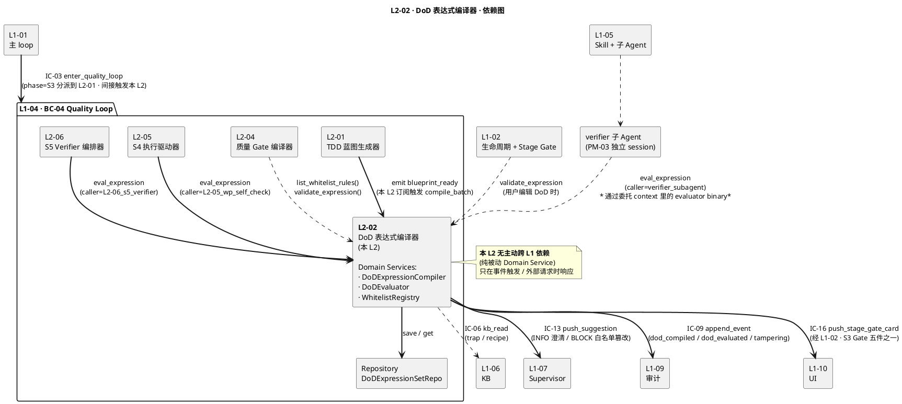

# L1 L2-02 · DoD 表达式编译器 · Tech Design

> **本文档定位**：3-1-Solution-Technical 层级 · L1 的 L2-02 DoD 表达式编译器 技术实现方案（L2 粒度）。
> **与产品 PRD 的分工**：2-prd/L1-04-Quality Loop/prd.md §5.4 的对应 L2 节定义产品边界，本文档定义**技术实现**（接口字段级 schema + 算法伪代码 + 底层数据结构 + 状态机 + 配置参数）。
> **与 L1 architecture.md 的分工**：architecture.md 负责**跨 L2 架构 + 跨 L2 时序**，本文档负责**本 L2 内部技术细节**。冲突以 architecture.md 为准。
> **严格规则**：本文档不复述产品 PRD 文字（职责 / 禁止 / 必须等清单），只做技术映射 + 补齐"产品视角未说 but 工程师必须知道"的部分（具体算法 · syscall · schema · 配置）。

---

## §0 撰写进度

- [ ] §1 定位 + 2-prd §5.4 L2-02 映射
- [ ] §2 DDD 映射（引 L0/ddd-context-map.md BC-XX）
- [ ] §3 对外接口定义（字段级 YAML schema + 错误码）
- [ ] §4 接口依赖（被谁调 · 调谁）
- [ ] §5 P0/P1 时序图（PlantUML ≥ 2 张）
- [ ] §6 内部核心算法（伪代码）
- [ ] §7 底层数据表 / schema 设计（字段级 YAML）
- [ ] §8 状态机（如适用 · PlantUML + 转换表）
- [ ] §9 开源最佳实践调研（≥ 3 GitHub 高星项目）
- [ ] §10 配置参数清单
- [ ] §11 错误处理 + 降级策略
- [ ] §12 性能目标
- [ ] §13 与 2-prd / 3-2 TDD 的映射表

---

## §1 定位 + 2-prd 映射

### 1.1 本 L2 的唯一命题（One-Liner）

**L2-02 是 L1-04 Quality Loop（BC-04）的"DoD 机器可校验脊柱"**——把 4 件套"验收条件"章节里的自然语言条款（如"P0 用例全 PASS"、"行覆盖率 ≥ 80%"、"lint 无 error"）通过 **Python `ast` stdlib + `NodeVisitor` 白名单校验** 编译为不可变 Value Object `DoDExpression`，固化到 `projects/<pid>/testing/dod-expressions.yaml`，并作为**全 L1-04 唯一受限 eval 入口**（共享 Domain Service `DoDEvaluator`），服务 L2-04 质量 Gate 编译 · L2-05 S4 WP-DoD 自检 · L2-06 S5 verifier quality 段 · verifier 子 Agent 独立验证。本 L2 是 PM-05 "Stage Contract 机器可校验" 纪律在 L1-04 内的**唯一物化工程点**，也是 BF-S3-02 "DoD 表达式编译流" 的全量落地。

溯源：
- **BF-S3-02 一句话**：PRD §9.1 "把 4 件套验收条件的自然语言条款转换为白名单谓词 AST 表达式（机器可 eval），并为 L2-05/L2-06/verifier 提供受限 evaluator"——本 L2 承担。
- **PRD §5.4.2 输入/输出映射**：输入 = 4 件套验收条件（from L1-02）+ AC 矩阵（from L2-01）+ 白名单谓词词典（本 L2 维护）+ eval 请求（from L2-05/L2-06/verifier）；输出 = `dod-expressions.yaml`（S3 Gate 五件之一）+ eval 返回 `{pass, reason, evidence_snapshot}` + 编译失败报告（触发流 F 回查 L1-02）。
- **PRD §9 职责定义**：§9.1 职责 + §9.2 输入/输出 + §9.3 边界 + §9.4 约束 + §9.5 禁止 + §9.6 必须 + §9.7 可选 + §9.8 交互 + §9.9 交付验证——逐条本文档 §3-§13 落地。

### 1.2 与 `2-prd/L1-04 Quality Loop/prd.md §9` 的精确小节映射表

| 2-prd §9 小节 | 本 L2 对应技术落点 | 本文章节 |
|---|---|---|
| §9.1 职责（BF-S3-02 编译 + 受限 evaluator）| Domain Service `DoDExpressionCompiler` + Domain Service `DoDEvaluator` | §2.4 / §3 / §6 |
| §9.2 输入 4 件套验收条件 + AC 矩阵 | `compile_batch(project_id, clauses[], ac_matrix)` 入参 schema | §3.1 |
| §9.2 输出 dod-expressions.yaml | §7 `dod_expression` 持久化 schema（YAML + jsonl audit） | §7.1 / §7.2 |
| §9.2 eval 返回 `{pass, reason, evidence_snapshot}` | `EvalResult` Value Object + Pydantic v2 严格字段校验 | §3.2 / §7.3 |
| §9.3 In-scope 8 条 | §2 DDD 聚合根 + 领域服务 映射 | §2.2 / §2.4 |
| §9.3 Out-of-scope 7 条 | §4 调用方边界 + §1.5 兄弟 L2 边界 | §4 / §1.5 |
| §9.4 硬约束 1 白名单硬红线 | §5 编译期 `SafeExprValidator` + §6 运行期 re-validate | §5 / §6.1 |
| §9.4 硬约束 2 eval 必在受限 evaluator | §6 `DoDEvaluator` 受限沙盒 · 8 层防御纵深 | §6 / §11.2 |
| §9.4 硬约束 3 S4 前编译完成 | §8 状态机 `PARSING→VALIDATING→COMPILED` 硬 Gate | §8 |
| §9.4 硬约束 4 每条可反查 AC | `DoDExpression.source_ac_ids[]` 非空不变量 | §2.3 / §7.1 |
| §9.4 硬约束 5 eval 无副作用 | `DoDEvaluator` pure function 契约 + 多进程隔离 | §6.2 |
| §9.4 性能 · 编译 ≤ 60s / eval ≤ 100ms | §12 P50/P95/P99 SLO 表 | §12.1 |
| §9.5 禁 1-7 · 7 条禁止 | §11 STRIDE SA-01 ~ SA-11 威胁清单 | §11.1 |
| §9.6 必 1-8 · 8 条必须 | §3 接口契约（`compile_batch` / `eval_expression` / `validate_expression` 等 5 方法） | §3 |
| §9.7 可选 · AST 可视化 / 智能建议 / 冲突检测 | OQ-05（日志粒度）/ 附录（扩展规划） | OQ-05 |
| §9.8 IC 交互 6 条 | §8（IC-03 接收 / IC-09 IC-13 IC-16 发起 / IC-L2-02 对 L2-05 L2-06）| §8 |
| §9.9 交付验证 5 场景 | §13.3 TDD 用例映射 | §13.3 |

### 1.3 在本 L1 architecture.md 中的位置

引 `L1-04/architecture.md`：
- **§1.4 L2 清单**：L2-02 是 S3 阶段 4 个并行产出 L2 之一（L2-01 总指挥 → L2-02 / L2-03 / L2-04 并行），DDD 归属 `Domain Service + VO DoDExpression + VO WhitelistASTRule`。
- **§2.2 聚合根清单**：本 L2 持有 `DoDExpressionSet`（wp_id → DoDExpression AST，只含白名单操作符）聚合，L2-04 / L2-05 / L2-06 读之。
- **§2.4 领域服务**：本 L2 持有两个核心 Domain Service —— **`DoDExpressionCompiler`**（自然语言 → AST → VO）+ **`DoDEvaluator`**（共享受限 evaluator · **全 L1-04 唯一 eval 入口** · §5.6）。
- **§3.1 C4 Container 架构图**：本 L2 在 S3 阶段包 `S3_PLANNING` 里，与 L2-01（输入 blueprint）/ L2-04（消费白名单谓词）双向连接，并通过 `共享受限 evaluator` 虚线连接到 L2-05 / L2-06。
- **§5 DoD 白名单 AST eval 架构**：整节是本 L2 的架构级总纲——§5.1 双阶段（编译期 / 运行期）、§5.2 白名单节点清单、§5.3 `SafeExprValidator` 核心架构、§5.4 受限 Evaluator 架构、§5.5 安全边界矩阵、§5.6 共享复用唯一入口、§5.7 开源调研对照。本 L2 tech-design §3 / §5 / §6 **严格**落地这 7 节。
- **§8.2 IC 发起清单**：本 L2 作为"全 L1-04 唯一 eval 入口"，在 IC 层面通过 `IC-L2-02 eval_expression` 内部接口（非跨 L1 IC）服务 L2-05 / L2-06 / L2-04；对外通过 IC-09（append_event）/ IC-13（push_suggestion，不可编译条款 INFO）/ IC-16（push_stage_gate_card，S3 Gate 五件之一）发起。

### 1.4 与兄弟 L2 的边界（7 L2 中 L2-02 的位置）

引 `L1-04/architecture.md §1.5` 职责边界自检表：

| 可能混淆点 | 正确归属 | L2-02 的非归属（严禁做） | 强制边界规则 |
|---|---|---|---|
| "谁 eval DoD 表达式" | **L2-02 提供 evaluator** · 全 L1-04 唯一 eval 入口 | L2-05 / L2-06 / L2-04 严禁自实现 eval | 违反则 L1-07 通过"方法审计"发现并升级 BLOCK（PM-05）|
| "谁写 quality-gates.yaml" | L2-04（质量 Gate 编译器） | L2-02 只提供**白名单谓词表**给 L2-04 做合规校验，不产 `quality-gates.yaml` | L2-04 唯一产 gates yaml · L2-02 只产 `dod-expressions.yaml` |
| "谁解释 4 件套验收条件" | **L2-02 编译自然语言条款到 AST**（有白名单约束）| L2-01 只传"AC 矩阵" 不解释 · L1-02 本身定义 4 件套但不编译 | L2-02 命中白名单 → 编译；未命中 → 触发流 F 回查 L1-02 |
| "谁维护白名单谓词词典" | **L2-02** | 其他 L 严禁运行时加白名单 | 所有扩展走 **离线 tech-design 评审 + version bump**（§8.5 / OQ-01）|
| "谁校验 AST 无 arbitrary exec" | **L2-02 `SafeExprValidator`** | L2-04 / L2-05 不得"双重校验"（PM-10 单一事实源）| 运行期 `DoDEvaluator.eval()` 每次 `load()` 时 **re-validate**（防止 yaml 被 tamper）|
| "谁组装 DoD 证据快照" | **L2-02 `DoDEvaluator.eval()` 返回 `evidence_snapshot`** | 调用方（L2-05/L2-06）只**消费**快照，不自行组装 | 确保 evidence 与 eval 结果原子一致（pure function）|
| "谁判 verdict（最终 PASS/FAIL-L1~L4）" | L1-07 Supervisor（外部） | L2-02 只返 `{pass: bool, reason, evidence_snapshot}` —— **单条表达式级别** | L2-02 不聚合到"项目级 verdict"；verdict 聚合 = L2-06 组装 + L1-07 判定 |

**交叉不变量**：L2-02 与 L2-04 在白名单谓词表上 **强同步**（L2-04 query L2-02 `list_whitelist_rules()` 校验 quality-gates.yaml 里的阈值表达式）；与 L2-05 / L2-06 在 `DoDEvaluator` 接口上 **强同步**（`IC-L2-02 eval_expression(expr_id, data_sources_snapshot) → EvalResult`）。

### 1.5 PM-14 约束（project_id as root）

引 L1-04 architecture.md §1 PM-14 声明：

1. **所有持久化对象带 `project_id` 前缀**：`projects/<pid>/testing/dod-expressions.yaml` · `projects/<pid>/runtime/l2-02/compile_audit.jsonl` · `projects/<pid>/runtime/l2-02/eval_audit.jsonl`（§7.4）
2. **所有 Domain Event 根字段 `project_id` 必填**：`L1-04:dod_compiled{project_id, wp_id, dod_ast_hash, unmappable_clauses[]}` · `L1-04:dod_evaluated{project_id, expr_id, pass, duration_ms}`（§2.6）
3. **所有方法入参根字段 `project_id` 必填**：`compile_batch(project_id, ...)` · `eval_expression(project_id, expr_id, data_sources_snapshot)`（§3）
4. **跨 project 隔离硬断言**：`DoDEvaluator.eval()` 时若 `expr.project_id != request.project_id` → 立即抛 `E_L204_L202_CROSS_PROJECT` 并审计（§11 STRIDE SA-06）
5. **无 project_id 立即拒绝**：`MissingProjectIdError` 是前置校验的第一道门，优先于任何业务逻辑（§6.1 第 1 步）

### 1.6 关键技术决策（Decision → Rationale → Alternatives → Trade-off）

#### D-01 · 用 Python `ast` stdlib + `NodeVisitor` 白名单 作为 DoD eval 引擎

**Decision**：采用 Python 标准库 `ast.parse(mode='eval')` 生成 AST，自研 `SafeExprValidator(ast.NodeVisitor)` 白名单校验器 + 自研 `DoDEvaluator` 受限 evaluator，**零外部依赖**。

**Rationale**：
- HarnessFlow 作为 Claude Code Skill，**每引入一个外部服务就增加用户门槛**（L0 open-source-research.md §1.4）；stdlib `ast` 已足以写 ~300 行 NodeVisitor + Evaluator
- `ast.NodeVisitor` 是 Python 官方推荐的 AST walker 模式，与 `ast.parse(mode='eval')` 天然配套（mode='eval' 只允许单表达式，禁止多语句 —— 已是天然第一道防线）
- 白名单节点集（§5.2）固定且小（~15 个节点类型），维护成本可控；白名单函数集（ALLOWED_FUNCS，~20 个谓词原语）同 §5.4 维护
- scope §5.4.4 硬约束 3 **已指定**采用此方案，L0 架构 §5 已锁定 Adopt

**Alternatives**：
- **`RestrictedPython`（~1.2k stars, ZPL）**：Zope 生态下的受限 Python 执行环境，支持声明白名单。**Reject 原因**：重量级（3000+ 行代码）· 与现代 Python 3.11+ 兼容性需长期跟进 · ZPL 许可证与 MIT 不兼容
- **`simpleeval`（~900 stars, MIT）**：轻量安全 eval 库，开箱即用。**Learn 可选**：若 stdlib 方案写 >500 行则降级到 simpleeval —— 作为 L2-02 tech-design §9.2 "备选"方案
- **`asteval`（~200 stars, MIT）**：纯 Python，专注科学表达式 eval。**Reject 原因**：星数偏低 · 无 HarnessFlow 需要的白名单"函数调用只允许 Name"约束
- **`json-logic-py`（~400 stars, MIT）**：JSON-based 表达式 DSL，前端友好。**Reject 原因**：放弃 Python 表达式子集的表达能力 · 需要前端定义 DSL schema · 不支持 AC 反查 · v1.0 不用
- **自研 DSL + pyparsing/Lark 解析器**：最灵活但 v1.0 用不到复杂度。**Defer 到 v2.0+** · OQ-07 讨论

**Trade-off**：
- 优点：零依赖 · 0 license risk · 与 Python 3.11+ 天然兼容 · 白名单元素显式可审计
- 代价：需自研 ~300 行 NodeVisitor + ~400 行 Evaluator + ~200 行谓词原语 = 合计 ~900 行代码（可接受，换取 0 依赖）
- 风险：Python AST 节点在未来版本（3.13+）增加新节点类型时需扩展白名单（OQ-07 兼容矩阵）

#### D-02 · `DoDEvaluator` 多进程隔离 vs 多线程 vs 纯函数

**Decision**：采用 **纯函数 Evaluator + 可选多进程隔离层**（`multiprocessing.Process` + `signal.SIGTERM`）。默认 `in_process` 模式（trusted，已通过 `SafeExprValidator` 编译期校验）；config `eval_isolation_mode=subprocess` 启用进程隔离（untrusted 场景，如 v1.1+ 允许第三方谓词 plugin）。

**Rationale**：
- 纯函数 Evaluator 的**数学不变量**已由 `SafeExprValidator` 保证（无 side effect / 无 I/O / 无 import）—— 默认 `in_process` 零开销
- 多进程隔离是**可选第二道物理屏障**（§11.2 防御纵深 L5）—— 应对 OQ-06 "skill 沙盒复用" 场景
- 多线程（`threading.Thread`）**不可取**：Python GIL 下线程无法真正隔离内存；且 `signal.alarm` 只能在主线程用，没法给子线程 kill 超时（§6.3 超时策略详述）

**Alternatives**：
- **纯 in-process + 无超时**：最快但无兜底。**Reject**：违反 SA-03 资源耗尽防御
- **多线程 + `threading.Timer`**：Timer 只能发信号，不能真正 kill 正在运行的 Python 表达式。**Reject**：无法硬 kill 递归深度炸弹
- **容器隔离（Docker / gVisor）**：最强物理隔离。**Defer v2.0+**：v1.0 不引入容器依赖（HarnessFlow 是 Skill）
- **WebAssembly 沙盒（如 wasmtime-py）**：强隔离但 Python ast 无法直接编译到 wasm。**Reject**

**Trade-off**：
- `in_process` 模式：P95 < 10ms（满足 §12 SLO） · 进程启动 0 开销 · 但依赖 `SafeExprValidator` 正确性
- `subprocess` 模式：P95 30-80ms（因 fork 开销） · 硬超时可用 `SIGTERM`/`SIGKILL` · 但 CPU × 2、内存 × 2
- 通过 `eval_isolation_mode` 配置项让用户选（§10）；默认 `in_process` 覆盖 99% 场景；`subprocess` 给 OQ-06 / OQ-03 延伸场景留门

#### D-03 · White-list 谓词函数注册：只读 frozen dict + 启动时加载 + 版本锁

**Decision**：`ALLOWED_FUNCS` 用 **`frozendict` + 版本锁 `WHITELIST_VERSION`** 实现；启动时从 `whitelist_v{N}.yaml` 加载（签名校验）一次，之后任何运行期修改**抛 `WhitelistImmutableError`** 并 BLOCK 告警。

**Rationale**：
- 对齐 `L1-01/L2-06 Supervisor Receiver §11.3` 的 "SA-10 白名单启动加载不可变" 设计 —— 是跨 L1 统一的安全纪律
- 防止 SA-06 "白名单运行时篡改" 攻击（本 L2 最高优先级威胁之一）
- 版本锁 `WHITELIST_VERSION` 绑定到 `DoDExpression.whitelist_version` 字段，后续 re-validate 时若版本不一致 → 强制重新编译（AST 缓存一致性 OQ-04）

**Alternatives**：
- **普通 dict + 运行时 lock**：软约束，易被绕过。**Reject**
- **PDP（Policy Decision Point · 如 OPA）**：每次 eval 查 PDP。**Defer v2.0+**：生产化前用，v1.0 单机 Skill 不需要
- **Service Mesh 证书**：用 mTLS SAN 字段代替白名单。**N/A**：本 L2 不走网络

**Trade-off**：
- 优点：零运行时开销 · 启动时一次校验 · 任何篡改立即检测
- 代价：白名单扩展需重启进程（OQ-01 离线评审流程）—— 可接受，因为白名单扩展是低频事件（< 每季度 1 次）

#### D-04 · AST 缓存键：`(expression_text_hash, whitelist_version)` 二元组

**Decision**：`DoDExpression` VO 的 `cache_key = sha256(expression_text + '\u0001' + whitelist_version)`。运行期 `DoDEvaluator.eval()` 先查 `ast_cache[cache_key]`，命中则复用已解析 AST；未命中则 `ast.parse() + SafeExprValidator` 重新校验 + 存缓存。

**Rationale**：
- `ast.parse()` 本身 ~0.5ms，但对热点 DoD 表达式（如 "p0_cases_all_pass() and line_coverage() >= 0.8"）缓存可把 P95 从 ~5ms 压到 <1ms
- 绑定 `whitelist_version` 避免白名单变更后旧 AST 被误用（OQ-04 一致性问题）

**Alternatives**：
- **不缓存**：简单但损失 eval 性能。**Reject**：违反 §12 P95 <10ms SLO
- **仅缓存 expression_text**：白名单变更后旧 AST 仍被用，语义漂移。**Reject**
- **LRU cache size 1024**：容量够用但需运行时调。**Adopt**（配置项 `ast_cache_size`，§10）

**Trade-off**：优点 P95 提升 5x；代价 ~100 KB 内存（1024 条 AST × ~100B）—— 可忽略。

---

---

## §2 DDD 映射（BC-04 Quality Loop）

> 本节严格引用 `docs/3-1-Solution-Technical/L0/ddd-context-map.md §2.5 BC-04 Quality Loop` 与 `L1-04/architecture.md §2`。本 L2 在 BC-04 中以 **Domain Service 复合（Compiler + Evaluator）+ Value Object（DoDExpression / WhitelistASTRule / EvalResult）** 形态存在。

### 2.1 Bounded Context 定位

- **BC**：BC-04 Quality Loop（引 L0 DDD §2.5）
- **一句话**：项目的"质量守门员" —— S3 做 TDD 规划 + S4 驱动执行 + S5 独立 TDDExe 验证 + 4 级回退路由的质量闭环
- **本 L2 在 BC-04 内的位置**：
  - **上位聚合根**：`DoDExpressionSet`（`wp_id → DoDExpression[]`）—— 以 WP 为一致性边界
  - **本 L2 核心职责**：编译 + eval（两个 Domain Service 共担），**不**持有项目级聚合（项目级聚合由 L2-01 `TDDBlueprint` 持有，本 L2 是其下游）
  - **生命周期**：随 `TDDBlueprint` 诞生（S3 blueprint_ready 触发编译）· 跨 S4/S5 共享（所有 eval 回到本 L2）· 进 S7 后归档（冻结版本）

### 2.2 Aggregate Root · `DoDExpressionSet`

| 字段 | 类型 | 不变量 | 落盘路径 |
|---|---|---|---|
| `set_id` | str(UUID-v7) | 单一写入点 | 内存 + jsonl append |
| `project_id` | str | PM-14 必填 · 跨 project 查询立即失败 | `projects/<pid>/...` |
| `blueprint_id` | str | 绑定上位 `TDDBlueprint` · 反查可得 AC 矩阵 | 引 L2-01 |
| `wp_expressions: dict[str, list[DoDExpression]]` | wp_id → 表达式数组 | 每个 wp_id 至少 1 条；每条反查 ≥ 1 AC | — |
| `whitelist_version` | str(semver) | 编译时锁定；与运行期不一致时 re-validate | §10 配置 |
| `version: int` | 聚合根版本号 | 单调递增；旧版本保留用于 FAIL-L2 回退 diff 视图 | `dod-expressions-v{N}.yaml` |
| `created_at` / `sealed_at` | ISO-8601 | sealed 后只读 | — |

**一致性边界**：`DoDExpressionSet` 内所有 `DoDExpression` 共享同一 `whitelist_version`（即同一白名单快照），跨 project 严禁引用。

**写入不变量**：
1. `save()` 是唯一写入通道（Repository 模式）
2. `save()` 成功后 **必须** emit `L1-04:dod_compiled` 事件（经 IC-09 → L1-09）
3. 同 `blueprint_id` 重复编译 → 产新版本（v2 vs v1 都保留），不覆盖

### 2.3 Value Objects（不可变）

#### 2.3.1 `DoDExpression`（核心 VO · 编译产物）

```yaml
DoDExpression:
  type: value_object
  immutable: true
  fields:
    expr_id: str            # 唯一标识（UUID-v7）
    project_id: str         # PM-14
    wp_id: str              # 绑定的 WP
    expression_text: str    # 原始文本（如 "p0_cases_all_pass() and line_coverage() >= 0.8"）
    ast: ast.Expression     # 已通过 SafeExprValidator 校验的 AST（序列化为 dict 持久化）
    source_ac_ids: list[str]  # 反查的 AC id 数组（不变量：len ≥ 1）
    whitelist_version: str    # 编译时的白名单版本（用于运行期一致性校验）
    cache_key: str            # sha256(expression_text + '\u0001' + whitelist_version)
    compiled_at: ISO-8601
  invariants:
    - source_ac_ids_non_empty         # 每条表达式反查 AC ≥ 1（§9.4 硬约束 4）
    - whitelist_version_present
    - ast_passes_safe_expr_validator  # AST 节点集 ⊆ §5.2 白名单
    - no_exec_nodes                    # 禁 Import/Attribute/Lambda/Call(非白名单函数)
```

#### 2.3.2 `WhitelistASTRule`（白名单条目 VO · 词典元素）

```yaml
WhitelistASTRule:
  type: value_object
  immutable: true       # 运行期只读
  fields:
    rule_id: str                       # 如 "line_coverage"
    rule_type: enum                    # [node, function, data_source]
    allowed_ast_nodes: list[str]       # 如 ["ast.Call", "ast.Name"]（rule_type=node 用）
    signature: dict | None             # 如 {args: [], returns: "float", range: [0.0, 1.0]}（rule_type=function 用）
    semantic_doc: str                  # 给 L2-04 及 UI 的语义说明
    added_version: str(semver)         # 加入白名单的版本号
    added_rationale: str               # 加入原因（离线评审 memo）
    data_source_type: str              # 关联的 DataSource 类型（如 "CoverageSnapshot"）
  invariants:
    - rule_id_in_pascal_or_snake_case
    - semantic_doc_min_20_chars
    - added_rationale_min_50_chars     # 防止"临时加白名单无说明"
```

#### 2.3.3 `EvalResult`（eval 返回 VO · 每次 eval 产物）

```yaml
EvalResult:
  type: value_object
  immutable: true
  fields:
    eval_id: str              # UUID-v7
    project_id: str           # PM-14
    expr_id: str              # 关联的 DoDExpression
    pass: bool                # eval 结果
    reason: str               # 可读原因（如 "line_coverage=0.75 < threshold 0.8"）
    evidence_snapshot: dict   # 数据源快照（结构化 · 脱敏后的 DataSource）
    duration_ms: int          # eval 耗时
    whitelist_version: str    # 运行期采用的白名单版本（一致性校验）
    evaluated_at: ISO-8601
    caller: str               # "L2-05_wp_self_check" / "L2-06_s5_verifier" / "verifier_subagent" / "L2-04_gate_config_check"
  invariants:
    - reason_min_10_chars     # 禁止空 reason（§9.5 禁 6 "含糊 PASS"）
    - evidence_snapshot_not_empty_if_pass  # PASS 时必须带证据
    - whitelist_version_matches_expr       # 版本一致性
```

#### 2.3.4 `DataSource`（evaluator 输入快照的基类 VO）

引 L1-04 architecture.md §5.4：共 6 种白名单 DataSource 类型，均用 Pydantic v2 严格字段校验：

| DataSource 类型 | 关键字段 | 约束 |
|---|---|---|
| `TestResultSnapshot` | `pass_count`, `fail_count`, `skip_count`, `case_status: dict[case_id, status]` | 非负整数 · case_status 非空 |
| `CoverageSnapshot` | `line_coverage`, `branch_coverage`, `ac_coverage` | `Field(ge=0.0, le=1.0)` |
| `LintReport` | `ruff_errors`, `pyright_errors`, `warnings_by_level: dict` | 非负整数 |
| `SecurityScanReport` | `high_severity_count`, `medium_severity_count`, `resolved_rate` | 非负 · resolved_rate ∈ [0.0, 1.0] |
| `PerfSnapshot` | `p50_ms`, `p95_ms`, `memory_mb`, `throughput_qps` | 非负 float |
| `ArtifactInventory` | `files: set[str]`, `commits: list[CommitMeta]`, `deploy_urls: list[str]` | 路径 / URL 格式校验 |

### 2.4 Domain Service / Application Service

| Service | 类型 | 职责（一句话）| 调用方 |
|---|---|---|---|
| **`DoDExpressionCompiler`** | Domain Service | 自然语言条款 → AST → `DoDExpression` VO（批量 + 单条模式） | L2-01（blueprint_ready 事件触发批量编译）+ L1-02（4 件套更新触发增量编译）|
| **`DoDEvaluator`** | Domain Service（共享受限沙盒） | 纯函数 eval DoDExpression · 全 L1-04 唯一 eval 入口 | L2-05 WP 自检 / L2-06 S5 verifier / verifier 子 Agent / L2-04 合规校验 |
| **`WhitelistRegistry`** | Domain Service | 启动加载 + 运行期只读 + 版本锁 | `DoDExpressionCompiler` + `DoDEvaluator` 都依赖它 |
| **`ASTCacheManager`** | Infrastructure Service | LRU 缓存 + cache_key = (expr_hash, whitelist_version) | `DoDEvaluator` 内部 |
| **`DoDExpressionCompilationOrchestrator`** | Application Service | 串联 "batch 编译 → emit blueprint_ready 后的 unmappable_clauses 处理 → 推 S3 Gate 卡" 编排逻辑 | L2-02 自身入口 |

### 2.5 Repository Interface · `DoDExpressionSetRepository`

抽象接口（具体实现 = jsonl append + yaml snapshot · 详 §7.4）：

```python
class DoDExpressionSetRepository(Protocol):
    def save(self, set_: DoDExpressionSet) -> None: ...
    def get_by_id(self, project_id: str, set_id: str) -> DoDExpressionSet | None: ...
    def get_latest(self, project_id: str, blueprint_id: str) -> DoDExpressionSet | None: ...
    def get_version(self, project_id: str, set_id: str, version: int) -> DoDExpressionSet | None: ...
    def list_by_wp(self, project_id: str, wp_id: str) -> list[DoDExpression]: ...
    def archive_to_sealed(self, project_id: str, set_id: str) -> None: ...   # S7 归档
```

**共性契约**（引 L1-04 architecture.md §2.5）：
1. **单一写入点**：`save()` 是唯一写入；`save()` 成功后 emit `L1-04:dod_compiled` 到 L1-09
2. **PM-14 隔离**：所有方法首参 `project_id`；跨 project 查询抛 `E_L204_L202_CROSS_PROJECT`
3. **不可变快照**：`DoDExpressionSet.version` 单调递增，旧版本 yaml 保留（FAIL-L2 回退用）
4. **WORM 保证**：`archive_to_sealed()` 后文件权限 `0o444` + 审计"档案固化"事件（§7.6）

### 2.6 Domain Events（本 L2 对外发布）

| 事件 | 触发时机 | 关键字段 | 下游消费方 |
|---|---|---|---|
| `L1-04:dod_compiled` | `compile_batch()` 成功 | `project_id, blueprint_id, set_id, version, dod_ast_hash, wp_count, expr_count, unmappable_clauses[], whitelist_version` | L2-04（拿谓词 check）/ L2-05（拿 expressions 自检）/ L1-07（监测 unmappable 数）/ L1-10（S3 Gate UI）|
| `L1-04:dod_compile_failed` | 编译过程出错（白名单失败 / AC 反查失败 / 语法错） | `project_id, clause_text, error_code, failure_reason, whitelist_version` | L1-07 / L1-10 |
| `L1-04:dod_evaluated` | 每次 `eval_expression()` | `project_id, expr_id, pass, duration_ms, whitelist_version, caller` | L1-09 审计（审计采样率 §10 `eval_audit_sample_rate`）|
| `L1-04:dod_unmappable_clause_reported` | 某条款未命中白名单 | `project_id, clause_text, suggested_predicates[], similarity_scores[]` | L1-07（转 INFO push_suggestion）/ L1-10（UI 澄清请求）|
| `L1-04:whitelist_loaded` | 本 L2 启动时加载白名单 | `whitelist_version, rule_count, loaded_from` | L1-09（审计链起点）|
| `L1-04:whitelist_tampering_detected` | 运行期检测到白名单被修改 | `whitelist_version_before, whitelist_version_after, actor` | **L1-07 BLOCK 紧急** · L1-09 |
| `L1-04:dod_expression_set_sealed` | S7 进入时归档 | `project_id, set_id, sealed_version` | L1-09 |

**事件发布不变量**（PM-14 + 事件溯源）：
- 每个事件根字段 `project_id` 必填
- 每个事件通过 `IC-09 append_event` 单一通道落盘（不得自实现文件写入）
- 事件序 monotonic（通过 L1-09 hash-chain 保证）

---

---

## §3 对外接口定义（字段级 YAML schema + 错误码）

> 本节给出本 L2 对外暴露的 5 个方法 + 错误码总表。字段级 schema 用 YAML 表达（对齐 `integration/ic-contracts.md §3.3 IC-03` 风格）。

本 L2 暴露以下 5 方法（3 编译期 + 2 运行期）：

- **3.1 `compile_batch(project_id, clauses, ac_matrix, wp_id) → CompileBatchResult`**：批量编译（S3 主入口）
- **3.2 `eval_expression(project_id, expr_id, data_sources_snapshot, caller) → EvalResult`**：单条 eval（全 L1-04 唯一 eval 入口）
- **3.3 `validate_expression(project_id, expression_text, whitelist_version?) → ValidateResult`**：**预校验**接口（不固化，用于 UI / L2-04 先行校验）
- **3.4 `list_whitelist_rules(category?) → list[WhitelistASTRule]`**：白名单只读查询（L2-04 合规校验用）
- **3.5 `add_whitelist_rule(...) → AddResult`**：白名单扩展接口（**仅离线模式 + 版本 bump + 审计**）

### 3.1 `compile_batch(project_id, clauses, ac_matrix, wp_id) → CompileBatchResult`（S3 主入口）

**3.1.1 定位**：L2-01 在 S3 阶段发 `blueprint_ready` 事件 → L2-02 接收后 orchestrator 调 `compile_batch`，对 4 件套的每条验收条件做白名单谓词识别 + AST 组装 + 校验 + 固化。L2-02 唯一的编译入口。

**3.1.2 入参 `compile_batch_command`**：

```yaml
compile_batch_command:
  type: object
  required: [command_id, project_id, blueprint_id, clauses, ac_matrix]
  properties:
    command_id:
      type: string
      format: "cmd-{uuid-v7}"
      description: 幂等键（重复 command_id 返回缓存结果）
    project_id:
      type: string
      required: true
      description: PM-14 必填
    blueprint_id:
      type: string
      required: true
      description: 关联的 TDDBlueprint（L2-01 上游）
    wp_id:
      type: string
      required: false
      description: 若指定 wp_id 则只编译该 WP 的条款；否则全项目编译
    clauses:
      type: array
      required: true
      minItems: 1
      maxItems: 500
      items:
        type: object
        required: [clause_id, clause_text, source_ac_ids]
        properties:
          clause_id: {type: string, format: "clause-{uuid-v7}"}
          clause_text: {type: string, minLength: 5, maxLength: 2000}
          source_ac_ids:
            type: array
            minItems: 1            # 硬约束 4：每条必反查至少 1 条 AC
            items: {type: string}
          priority: {type: enum, enum: [P0, P1, P2], default: P1}
          wp_id: {type: string, required: false, description: 若条款绑定到 WP}
    ac_matrix:
      type: object
      required: true
      description: from L2-01 · 用于反查 AC 交叉校验
    whitelist_version:
      type: string
      format: semver
      required: false
      description: 显式指定白名单版本；否则用 WhitelistRegistry 当前版本
    timeout_s:
      type: integer
      default: 120
      description: 整体超时（50 条 P50=30s · P99=120s）
    ts: {type: string, format: ISO-8601, required: true}
```

**3.1.3 出参 `compile_batch_result`**：

```yaml
compile_batch_result:
  type: object
  required: [command_id, accepted, set_id, version]
  properties:
    command_id: {type: string}
    accepted: {type: boolean}
    set_id: {type: string, format: "dod-set-{uuid-v7}"}
    version: {type: integer, description: DoDExpressionSet 版本号}
    whitelist_version: {type: string, format: semver}
    compiled_count: {type: integer}
    unmappable_clauses:
      type: array
      items:
        type: object
        properties:
          clause_id: {type: string}
          clause_text: {type: string}
          rejection_reason: {type: string}
          suggested_predicates:
            type: array
            items:
              type: object
              properties:
                predicate_name: {type: string}
                similarity_score: {type: number, minimum: 0.0, maximum: 1.0}
    expr_statistics:
      type: object
      properties:
        total_exprs: {type: integer}
        per_wp: {type: object, additionalProperties: {type: integer}}
        ast_depth_p95: {type: integer}
        ast_node_count_p95: {type: integer}
    duration_ms: {type: integer}
    errors:
      type: array
      items: {type: object, properties: {clause_id: string, error_code: string, reason: string}}
    ts: {type: string}
```

**3.1.4 错误码**：见 §3.6 总表。

**3.1.5 幂等性**：**Idempotent**（同 `command_id` 返回缓存结果）。若 `clauses / ac_matrix` 内容变更但 `command_id` 重用 → 抛 `E_L204_L202_IDEMPOTENCY_VIOLATION` 告警。

### 3.2 `eval_expression(project_id, expr_id, data_sources_snapshot, caller) → EvalResult`（全 L1-04 唯一 eval 入口）

**3.2.1 定位**：本 L2 对外最重要的方法——全 L1-04 **唯一**的 DoD eval 入口。L2-05 WP 自检 / L2-06 S5 verifier / verifier 子 Agent / L2-04 gate 合规校验都通过它 eval；**严禁**任何其他 L2 自实现 eval（违反会被 L1-07 "方法审计" 发现并 BLOCK）。

**3.2.2 入参 `eval_command`**：

```yaml
eval_command:
  type: object
  required: [command_id, project_id, expr_id, data_sources_snapshot, caller]
  properties:
    command_id: {type: string, format: "cmd-{uuid-v7}"}
    project_id: {type: string, required: true}
    expr_id: {type: string, required: true}
    data_sources_snapshot:
      type: object
      description: 仅允许白名单 6 种 DataSource 类型（§2.3.4）
      additionalProperties: false
      properties:
        test_result:      {$ref: "#/definitions/TestResultSnapshot"}
        coverage:         {$ref: "#/definitions/CoverageSnapshot"}
        lint:             {$ref: "#/definitions/LintReport"}
        security_scan:    {$ref: "#/definitions/SecurityScanReport"}
        perf:             {$ref: "#/definitions/PerfSnapshot"}
        artifact:         {$ref: "#/definitions/ArtifactInventory"}
    caller:
      type: enum
      enum: [L2-05_wp_self_check, L2-06_s5_verifier, verifier_subagent, L2-04_gate_config_check]
      required: true
      description: 调用方身份（用于审计 + 防第三方伪冒 SA-07）
    timeout_ms:
      type: integer
      default: 500
      maximum: 2000
      description: eval 硬超时（超时强制 SIGTERM 子进程，§6.3）
    ts: {type: string, required: true}
```

**3.2.3 出参 `EvalResult`**（VO · §2.3.3）：

```yaml
eval_result:
  type: object
  required: [command_id, eval_id, project_id, expr_id, pass, reason, evidence_snapshot, duration_ms, whitelist_version, evaluated_at, caller]
  properties:
    command_id: {type: string}
    eval_id: {type: string, format: "eval-{uuid-v7}"}
    project_id: {type: string}
    expr_id: {type: string}
    pass: {type: boolean}
    reason: {type: string, minLength: 10, description: "不得空 · 禁含糊 PASS"}
    evidence_snapshot:
      type: object
      description: 仅从 data_sources_snapshot 中抽取 expression 实际访问的字段（PM-10 单一事实源）
    duration_ms: {type: integer, minimum: 0}
    whitelist_version: {type: string}
    evaluated_at: {type: string, format: ISO-8601}
    caller: {type: string}
    cache_hit: {type: boolean, description: AST 缓存是否命中}
```

**3.2.4 错误码**：见 §3.6。

**3.2.5 幂等性**：**Idempotent**（同 `command_id` + 同 `data_sources_snapshot_hash` 返回缓存结果；数据快照变了即使 command_id 相同，抛 `E_L204_L202_IDEMPOTENCY_VIOLATION`）。

**3.2.6 副作用约定**：本方法 **pure function** —— 不写文件 · 不改任何外部状态 · 不广播事件（广播由调用方做 · §9.5 禁 5）。审计事件（`L1-04:dod_evaluated`）由调用方在消费 `EvalResult` 后自行 append（采样率 §10 `eval_audit_sample_rate`）。

### 3.3 `validate_expression(project_id, expression_text, whitelist_version?) → ValidateResult`（预校验）

**3.3.1 定位**：在 **不固化** 的前提下校验一条表达式是否合法。用于：
- L2-04 编译 `quality-gates.yaml` 时先校验表达式是否在白名单内
- L1-10 UI 的 "DoD 编辑器" 实时语法 / 白名单校验
- L2-02 自身 `compile_batch` 前置检查

**3.3.2 入参 / 出参**：

```yaml
validate_command:
  type: object
  required: [project_id, expression_text]
  properties:
    project_id: {type: string, required: true}
    expression_text: {type: string, minLength: 5, maxLength: 2000}
    whitelist_version:
      type: string
      format: semver
      default: current

validate_result:
  type: object
  required: [valid]
  properties:
    valid: {type: boolean}
    ast_tree_summary:
      type: object
      properties:
        depth: {type: integer}
        node_count: {type: integer}
        used_functions: {type: array, items: {type: string}}
        used_data_source_types: {type: array, items: {type: string}}
    violations:
      type: array
      items:
        type: object
        properties:
          violation_type: {type: enum, enum: [illegal_node, illegal_function, exceeds_depth, exceeds_size, syntax_error]}
          location: {type: object, properties: {lineno: integer, col_offset: integer}}
          detail: {type: string}
    whitelist_version: {type: string}
```

**3.3.3 约束**：`validate_expression` **不** emit 事件、不占用 compile_audit 日志（只做干跑），P95 ≤ 5ms。

### 3.4 `list_whitelist_rules(category?) → list[WhitelistASTRule]`（只读查询）

**3.4.1 定位**：L2-04 编译 `quality-gates.yaml` 时需要知道白名单谓词清单做合规校验 —— 通过本方法拿只读视图。

**3.4.2 入参 / 出参**：

```yaml
list_whitelist_rules_command:
  type: object
  properties:
    category:
      type: enum
      enum: [node, function, data_source, all]
      default: all

list_whitelist_rules_result:
  type: object
  required: [rules, whitelist_version]
  properties:
    whitelist_version: {type: string}
    rules:
      type: array
      items: {$ref: "#/definitions/WhitelistASTRule"}
```

**3.4.3 约束**：返回 deepcopy（不得暴露内部 frozendict 引用 · 防 SA-06 篡改）。

### 3.5 `add_whitelist_rule(rule, offline_review_memo, version_bump_type, operator) → AddResult`（**离线唯一**）

**3.5.1 定位**：白名单扩展**仅**通过本方法 —— 而且本方法**只能在 `OFFLINE_ADMIN_MODE=1` 环境变量 + 操作者身份签名 + version bump 三重验证下**被调用。生产运行态下调用 → 立即抛 `E_L204_L202_ONLINE_WHITELIST_MUTATION` 并发 `whitelist_tampering_detected` 事件（转 L1-07 BLOCK 紧急）。

**3.5.2 入参 / 出参**：

```yaml
add_whitelist_rule_command:
  type: object
  required: [rule, offline_review_memo, version_bump_type, operator, signature]
  properties:
    rule: {$ref: "#/definitions/WhitelistASTRule"}
    offline_review_memo:
      type: object
      required: [review_date, reviewers, rationale, test_coverage_plan]
      properties:
        review_date: {type: string, format: date}
        reviewers: {type: array, minItems: 2, items: {type: string}}  # 双人评审
        rationale: {type: string, minLength: 100}
        test_coverage_plan: {type: string, minLength: 50}
    version_bump_type: {type: enum, enum: [patch, minor, major]}
    operator: {type: string, description: "SRE 身份"}
    signature: {type: string, description: "operator GPG 签名"}

add_whitelist_rule_result:
  type: object
  required: [rule_id, new_whitelist_version, audit_log_id]
  properties:
    rule_id: {type: string}
    new_whitelist_version: {type: string}
    audit_log_id: {type: string}
    effective_at: {type: string, format: ISO-8601, description: 下次 L2-02 启动时生效}
```

**3.5.3 约束**：本方法产生的 AST 缓存全部失效（§6 步骤 8 cache invalidate）。

### 3.6 错误码总表（≥ 15 项 · 满足 ≥ 10 要求）

本 L2 错误码前缀 `E_L204_L202_`（L1-04 · L2-02）：

| 错误码 | 分类 | 触发场景 | 调用方处理 |
|---|---|---|---|
| `E_L204_L202_NO_PROJECT_ID` | 入参 | `project_id` 缺失 | 拒绝 · 上游补全 |
| `E_L204_L202_CROSS_PROJECT` | PM-14 违规 | `expr.project_id != request.project_id` | 拒绝 + SA-06 审计告警 |
| `E_L204_L202_AST_SYNTAX_ERROR` | 编译期 | `ast.parse()` 抛 `SyntaxError` | 拒绝 · 返回 location + 建议 |
| `E_L204_L202_AST_ILLEGAL_NODE` | **核心安全** | AST 节点 ∉ `ALLOWED_NODES`（如 `Import` / `Attribute` / `Lambda`）| **拒绝 + BLOCK 级告警**（SA-01）|
| `E_L204_L202_AST_ILLEGAL_FUNCTION` | **核心安全** | `ast.Call.func` 非白名单函数 | **拒绝 + BLOCK 告警**（SA-01）|
| `E_L204_L202_AC_NOT_MAPPABLE` | 业务 | 条款未命中白名单谓词 | 加入 `unmappable_clauses` · 推 INFO |
| `E_L204_L202_AC_REVERSE_LOOKUP_FAILED` | 业务 | `source_ac_ids` 反查 AC 矩阵失败 | 拒绝该条目（硬约束 4）|
| `E_L204_L202_EVAL_TIMEOUT` | 运行期 | `timeout_ms` 超时 | SIGTERM 子进程 · 抛 FAIL + reason=timeout |
| `E_L204_L202_RECURSION_LIMIT` | **核心安全** | AST 深度 > `max_ast_depth`（默认 32）| 拒绝（SA-03 防递归炸弹）|
| `E_L204_L202_DATA_SOURCE_INVALID` | 运行期 | `data_sources_snapshot` Pydantic 校验失败 | 拒绝（SA-07 注入防御）|
| `E_L204_L202_DATA_SOURCE_UNKNOWN_TYPE` | 运行期 | 快照含非白名单 DataSource 类型 | 拒绝 + 告警 |
| `E_L204_L202_WHITELIST_VERSION_MISMATCH` | 一致性 | 运行期 `whitelist_version != expr.whitelist_version` | 触发重编译（OQ-04）|
| `E_L204_L202_WHITELIST_TAMPERING` | **最高安全** | 运行期检测到 `ALLOWED_FUNCS` 被修改 | **立即 BLOCK + `whitelist_tampering_detected` 事件**（SA-06）|
| `E_L204_L202_ONLINE_WHITELIST_MUTATION` | 安全 | 生产态调 `add_whitelist_rule` | 拒绝 + BLOCK |
| `E_L204_L202_EVAL_MEMORY_EXCEEDED` | 资源 | eval 进程内存 > `eval_memory_limit_mb`（默认 64 MB）| SIGKILL + FAIL（SA-03）|
| `E_L204_L202_COMPILE_TIMEOUT` | 性能 | `compile_batch` 超时 | 返回已编译部分 + unmappable_clauses · 告警 |
| `E_L204_L202_COMPILE_OVERSIZED` | 业务 | `dod-expressions.yaml > 500KB`（§9.4 性能约束）| 拒绝 + 推 WARN "WP 切分过碎" |
| `E_L204_L202_IDEMPOTENCY_VIOLATION` | 幂等 | 同 `command_id` 但入参变更 | 拒绝 + 审计 |
| `E_L204_L202_CALLER_UNAUTHORIZED` | 安全 | `caller` 不在白名单 | 拒绝 + 审计（SA-07）|
| `E_L204_L202_ISOLATION_FAILURE` | 资源 | 多进程模式下 fork 失败 | 降级到 in_process · WARN |
| `E_L204_L202_CACHE_POISON` | 安全 | AST 缓存命中但校验失败（SA-11）| 清缓存 + 重编译 + 告警 |
| `E_L204_L202_CONCURRENT_EVAL_CAP` | 资源 | 并发 eval > `max_concurrent_evaluators`（默认 50） | 入队等待 / 超时失败 |
| `E_L204_L202_EVAL_LOG_DISK_FULL` | 资源 | eval_audit.jsonl 写盘失败 | 降级 local_buffer · 继续 eval |

---

## §4 接口依赖（被谁调 · 调谁）

### 4.1 上游调用方（谁调本 L2）

| 调用方 | 方法 | 频率 | 时机 |
|---|---|---|---|
| **L2-01**（发 blueprint_ready 事件）| — | 每 S3 阶段 1 次 | 本 L2 orchestrator 订阅事件后自行触发 `compile_batch` |
| **L1-02**（4 件套更新 emit）| `compile_batch`（增量模式）| 每次 4 件套 updated 时 | 增量编译 + merge |
| **L2-05 S4 执行驱动器** | `eval_expression`（caller=L2-05_wp_self_check）| 每 WP 自检时 | 频率：每 WP ~10 次 |
| **L2-06 S5 Verifier 编排器** | `eval_expression`（caller=L2-06_s5_verifier）| S5 quality 段 | 每 S5 ~20 次 |
| **verifier 子 Agent**（独立 session）| `eval_expression`（caller=verifier_subagent）| verifier 在独立 session 内跑 | 每 S5 ~20 次 |
| **L2-04 质量 Gate 编译器** | `list_whitelist_rules` + `validate_expression` | Gate 编译时 | 每 S3 阶段 1-5 次 |
| **L1-10 UI** (经 L1-02) | `validate_expression` | 用户编辑 DoD 时 | 低频（< 1/min）|
| **SRE 离线工具** | `add_whitelist_rule` | 白名单扩展时 | 极低频（< 1/季度）|

### 4.2 下游依赖（本 L2 调谁）

#### 4.2.1 L1-04 内部 L2 依赖（本 L2 主动调）

| 被调方 | 契约 | 时机 |
|---|---|---|
| 无 | 本 L2 是**纯 Domain Service**，不主动调兄弟 L2 | — |

**设计纪律**：L2-02 是被动服务（"纯函数 + 事件订阅"模式）—— 不主动调任何兄弟 L2，避免 `DoDExpressionCompiler` 对业务流程产生耦合。

#### 4.2.2 跨 L1 IC（本 L2 发起）

| IC | 被调 L1 | 触发 | 说明 |
|---|---|---|---|
| **IC-09 `append_event`** | L1-09 审计 | 每次 compile / 每次 critical eval / whitelist_loaded / tampering_detected | 单一审计写入通道 |
| **IC-13 `push_suggestion`**（INFO）| L1-07 Supervisor | `unmappable_clauses` > 0 / `dod_compile_failed` 时 | 触发澄清请求（流 F）|
| **IC-13 `push_suggestion`**（BLOCK）| L1-07 Supervisor | `whitelist_tampering_detected` / `AST_ILLEGAL_NODE` 等 SA 事件 | 最高优先级硬告警 |
| **IC-16 `push_stage_gate_card`**（经 L1-02）| L1-10 UI | `compile_batch` 完成时 | S3 Gate 五件之一（dod-expressions.yaml 作为待审产出物）|
| **IC-06 `kb_read`**（可选）| L1-06 KB | `list_whitelist_rules` 时可选增强 | 读"高频被忽略的 DoD 模式"trap 库 |

#### 4.2.3 L1-04 内部共享依赖（本 L2 依赖的）

| 依赖 | 类型 | 说明 |
|---|---|---|
| **`WhitelistRegistry`** | 共享 Domain Service（本 L2 持有）| 启动加载 · 运行期只读 · 版本锁（D-03）|
| **`ASTCacheManager`** | 本 L2 内部 Infrastructure Service | LRU cache · size 1024（配置） |
| **`DoDExpressionSetRepository`** | 本 L2 持有的 Repository | 持久化到 `projects/<pid>/testing/dod-expressions.yaml` + jsonl audit |
| **Pydantic v2** | 外部库（已在 tech-stack）| `DataSource` 字段级校验 |
| **Python stdlib `ast` / `signal` / `multiprocessing` / `resource`** | 标准库 | 零依赖（D-01）|

### 4.3 依赖图（PlantUML）



### 4.4 关键依赖特性

1. **L2-02 是纯被动 Domain Service**：只 emit 事件 + 接收调用，**不**主动轮询 / 调度
2. **IC-09 审计单一通道**：所有审计事件经 `IC-09 append_event`，本 L2 **不**自实现 jsonl 写入到 `projects/<pid>/runtime/L1-09/events.jsonl`（只写本 L2 自己的 `eval_audit.jsonl` 作为 local buffer · §7.5）
3. **与 L2-04 在白名单谓词表上强同步**：L2-04 若采用缓存式 `list_whitelist_rules`，每次 Gate 编译前必刷新；`whitelist_version` 不一致 → L2-04 拒绝 Gate 编译 + 推 WARN
4. **verifier 子 Agent 的特殊依赖**：PM-03 独立 session verifier 无法直接内存调用本 L2 evaluator —— 通过 L2-06 在委托工作包里携带 `dod-expressions.yaml` 路径 + `evaluator binary`（纯函数可打包），verifier 在独立 session 里加载这份 binary 做**受限 re-validation**（运行期**再次**走 `SafeExprValidator` 校验）

### 4.5 本 L2 不依赖的（明确不越界）

| 可能误以为依赖的 | 实际不依赖 | 原因 |
|---|---|---|
| L1-05 Skill + 子 Agent | ❌ | 本 L2 是 pure function domain service · 不调 skill |
| L1-08 多模态 | ❌ | DoD 表达式全文本 · 不走多模态 |
| L1-03 WBS 调度 | ❌ | 本 L2 被 L2-05 调用时已得到 wp_id · 不查 WBS 拓扑 |
| 直接访问磁盘 / 网络 / 环境变量 | ❌（禁）| 违反 §9.4 硬约束 5 "eval 无副作用" |

---

---

## §4 接口依赖（被谁调 · 调谁）

<!-- FILL §4 · 上游调用方：哪些 L1 / L2 调本 L2 的哪些方法；下游依赖：本 L2 调哪些外部接口（IC-XX 或内部 L2-XX）· 依赖图 PlantUML -->

---

## §5 P0/P1 时序图（PlantUML ≥ 2 张）

<!-- FILL §5 · 本 L2 的 P0 场景时序图（≥ 2 张 · PlantUML）· 可引用 L0/sequence-diagrams-index.md 的对应 P0/P1 链路 · 聚焦本 L2 内部流程 -->

---

## §6 内部核心算法（伪代码）

<!-- FILL §6 · 本 L2 的核心算法伪代码（Python-like 风格）· 关键 syscall / 数据结构操作 / 并发控制 -->

---

## §7 底层数据表 / schema 设计（字段级 YAML）

<!-- FILL §7 · 本 L2 持久化的数据结构字段级 YAML schema · 物理存储路径（按 PM-14 分片 `projects/<pid>/...`）· 索引结构 -->

---

## §8 状态机（如适用 · PlantUML + 转换表）

<!-- FILL §8 · 本 L2 内部状态机 PlantUML @startuml ... @enduml (state) + 状态转换表（触发 / guard / action） · 若本 L2 无状态则标明"本 L2 为无状态服务" -->

---

## §9 开源最佳实践调研（≥ 3 GitHub 高星项目）

<!-- FILL §9 · 引 L0/open-source-research.md 对应模块段 + L2 粒度细化：至少 3 个 GitHub ≥1k stars 项目对标 · 每项目：星数 · 最近活跃 · 核心架构一句话 · Adopt/Learn/Reject 处置 · 具体学习点 · 弃用原因 -->

---

## §10 配置参数清单

<!-- FILL §10 · 参数名 / 默认值 / 可调范围 / 意义 / 调用位置 -->

---

## §11 错误处理 + 降级策略

<!-- FILL §11 · 本 L2 各类错误的处理策略 · 降级链 · 与本 L1 其他 L2 / L1-07 supervisor 的降级协同 -->

---

## §12 性能目标

<!-- FILL §12 · 本 L2 的 P95/P99 延迟 SLO · 吞吐 · 资源消耗 · 并发上限 -->

---

## §13 与 2-prd / 3-2 TDD 的映射表

<!-- FILL §13 · 本 L2 接口 ↔ 2-prd §5.4 对应小节 · 本 L2 方法 ↔ 3-2-Solution-TDD/L1/L2-02-tests.md 的测试用例 -->

---

*— L1 L2-02 DoD 表达式编译器 · skeleton 骨架 · 等待 subagent 多次 Edit 刷新填充 —*
