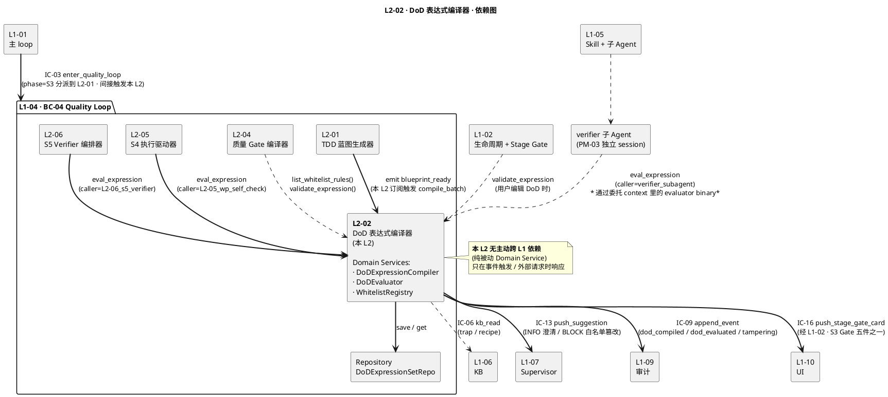
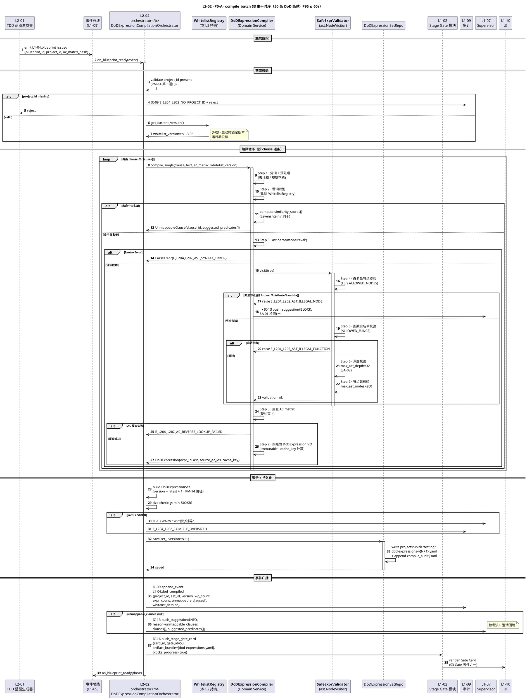
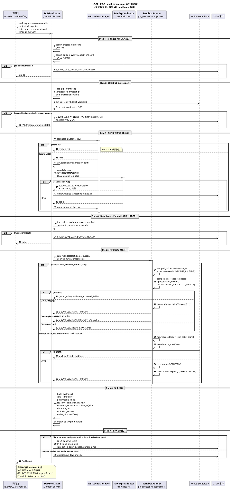
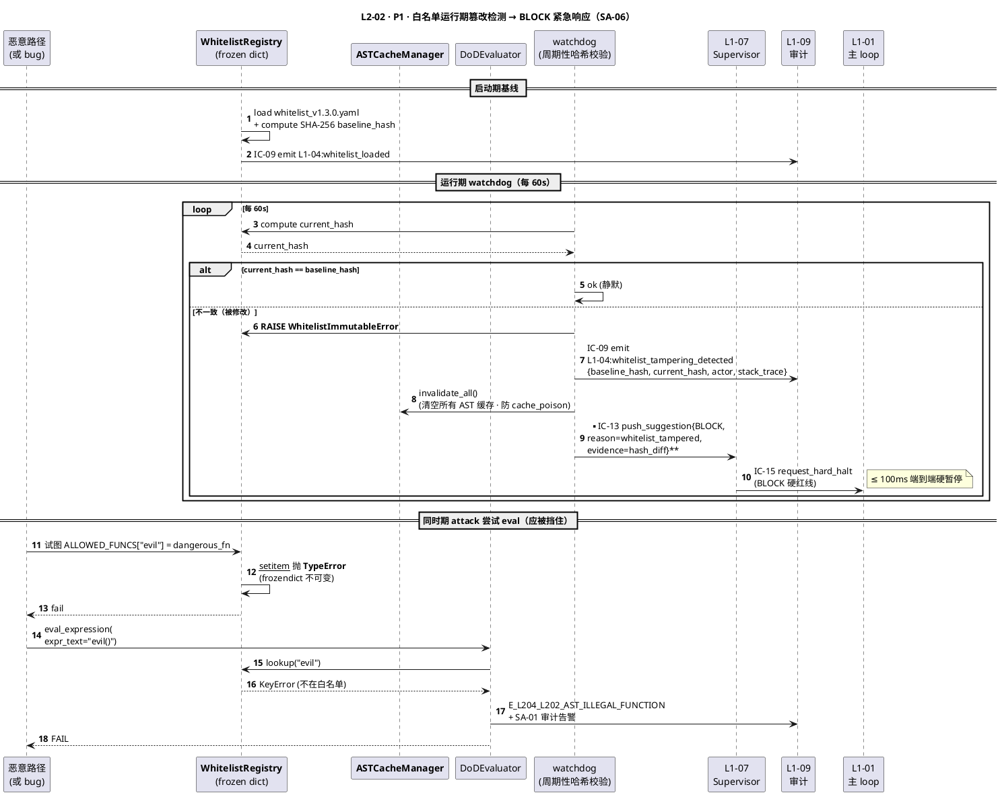
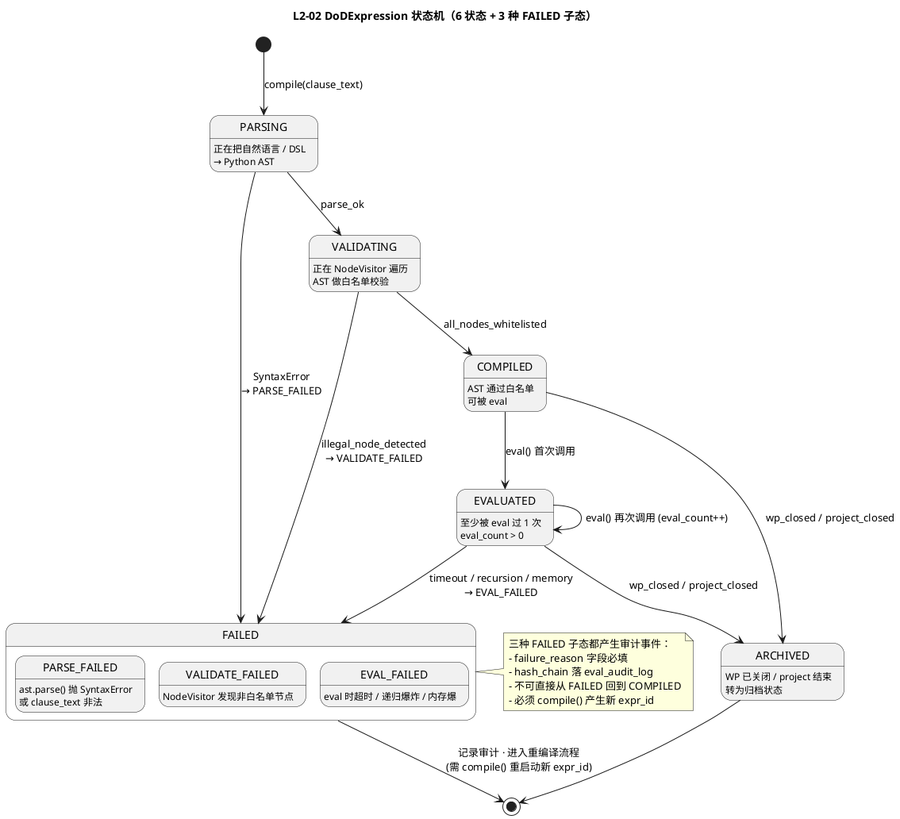
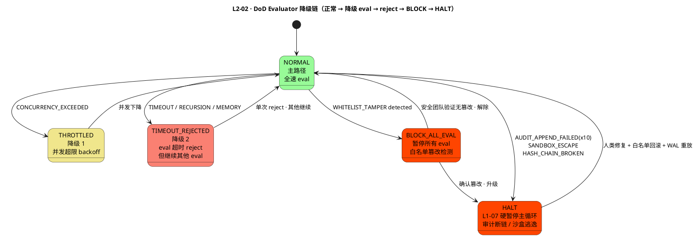

# L1 L2-02 · DoD 表达式编译器 · Tech Design

> **本文档定位**：3-1-Solution-Technical 层级 · L1 的 L2-02 DoD 表达式编译器 技术实现方案（L2 粒度）。
> **与产品 PRD 的分工**：2-prd/L1-04-Quality Loop/prd.md §5.4 的对应 L2 节定义产品边界，本文档定义**技术实现**（接口字段级 schema + 算法伪代码 + 底层数据结构 + 状态机 + 配置参数）。
> **与 L1 architecture.md 的分工**：architecture.md 负责**跨 L2 架构 + 跨 L2 时序**，本文档负责**本 L2 内部技术细节**。冲突以 architecture.md 为准。
> **严格规则**：本文档不复述产品 PRD 文字（职责 / 禁止 / 必须等清单），只做技术映射 + 补齐"产品视角未说 but 工程师必须知道"的部分（具体算法 · syscall · schema · 配置）。

---

## §0 撰写进度

- [ ] §1 定位 + 2-prd §5.4 L2-02 映射
- [ ] §2 DDD 映射（引 L0/ddd-context-map.md BC-XX）
- [ ] §3 对外接口定义（字段级 YAML schema + 错误码）
- [ ] §4 接口依赖（被谁调 · 调谁）
- [ ] §5 P0/P1 时序图（PlantUML ≥ 2 张）
- [ ] §6 内部核心算法（伪代码）
- [ ] §7 底层数据表 / schema 设计（字段级 YAML）
- [ ] §8 状态机（如适用 · PlantUML + 转换表）
- [ ] §9 开源最佳实践调研（≥ 3 GitHub 高星项目）
- [ ] §10 配置参数清单
- [ ] §11 错误处理 + 降级策略
- [ ] §12 性能目标
- [ ] §13 与 2-prd / 3-2 TDD 的映射表

---

## §1 定位 + 2-prd 映射

### 1.1 本 L2 的唯一命题（One-Liner）

**L2-02 是 L1-04 Quality Loop（BC-04）的"DoD 机器可校验脊柱"**——把 4 件套"验收条件"章节里的自然语言条款（如"P0 用例全 PASS"、"行覆盖率 ≥ 80%"、"lint 无 error"）通过 **Python `ast` stdlib + `NodeVisitor` 白名单校验** 编译为不可变 Value Object `DoDExpression`，固化到 `projects/<pid>/testing/dod-expressions.yaml`，并作为**全 L1-04 唯一受限 eval 入口**（共享 Domain Service `DoDEvaluator`），服务 L2-04 质量 Gate 编译 · L2-05 S4 WP-DoD 自检 · L2-06 S5 verifier quality 段 · verifier 子 Agent 独立验证。本 L2 是 PM-05 "Stage Contract 机器可校验" 纪律在 L1-04 内的**唯一物化工程点**，也是 BF-S3-02 "DoD 表达式编译流" 的全量落地。

溯源：
- **BF-S3-02 一句话**：PRD §9.1 "把 4 件套验收条件的自然语言条款转换为白名单谓词 AST 表达式（机器可 eval），并为 L2-05/L2-06/verifier 提供受限 evaluator"——本 L2 承担。
- **PRD §5.4.2 输入/输出映射**：输入 = 4 件套验收条件（from L1-02）+ AC 矩阵（from L2-01）+ 白名单谓词词典（本 L2 维护）+ eval 请求（from L2-05/L2-06/verifier）；输出 = `dod-expressions.yaml`（S3 Gate 五件之一）+ eval 返回 `{pass, reason, evidence_snapshot}` + 编译失败报告（触发流 F 回查 L1-02）。
- **PRD §9 职责定义**：§9.1 职责 + §9.2 输入/输出 + §9.3 边界 + §9.4 约束 + §9.5 禁止 + §9.6 必须 + §9.7 可选 + §9.8 交互 + §9.9 交付验证——逐条本文档 §3-§13 落地。

### 1.2 与 `2-prd/L1-04 Quality Loop/prd.md §9` 的精确小节映射表

| 2-prd §9 小节 | 本 L2 对应技术落点 | 本文章节 |
|---|---|---|
| §9.1 职责（BF-S3-02 编译 + 受限 evaluator）| Domain Service `DoDExpressionCompiler` + Domain Service `DoDEvaluator` | §2.4 / §3 / §6 |
| §9.2 输入 4 件套验收条件 + AC 矩阵 | `compile_batch(project_id, clauses[], ac_matrix)` 入参 schema | §3.1 |
| §9.2 输出 dod-expressions.yaml | §7 `dod_expression` 持久化 schema（YAML + jsonl audit） | §7.1 / §7.2 |
| §9.2 eval 返回 `{pass, reason, evidence_snapshot}` | `EvalResult` Value Object + Pydantic v2 严格字段校验 | §3.2 / §7.3 |
| §9.3 In-scope 8 条 | §2 DDD 聚合根 + 领域服务 映射 | §2.2 / §2.4 |
| §9.3 Out-of-scope 7 条 | §4 调用方边界 + §1.5 兄弟 L2 边界 | §4 / §1.5 |
| §9.4 硬约束 1 白名单硬红线 | §5 编译期 `SafeExprValidator` + §6 运行期 re-validate | §5 / §6.1 |
| §9.4 硬约束 2 eval 必在受限 evaluator | §6 `DoDEvaluator` 受限沙盒 · 8 层防御纵深 | §6 / §11.2 |
| §9.4 硬约束 3 S4 前编译完成 | §8 状态机 `PARSING→VALIDATING→COMPILED` 硬 Gate | §8 |
| §9.4 硬约束 4 每条可反查 AC | `DoDExpression.source_ac_ids[]` 非空不变量 | §2.3 / §7.1 |
| §9.4 硬约束 5 eval 无副作用 | `DoDEvaluator` pure function 契约 + 多进程隔离 | §6.2 |
| §9.4 性能 · 编译 ≤ 60s / eval ≤ 100ms | §12 P50/P95/P99 SLO 表 | §12.1 |
| §9.5 禁 1-7 · 7 条禁止 | §11 STRIDE SA-01 ~ SA-11 威胁清单 | §11.1 |
| §9.6 必 1-8 · 8 条必须 | §3 接口契约（`compile_batch` / `eval_expression` / `validate_expression` 等 5 方法） | §3 |
| §9.7 可选 · AST 可视化 / 智能建议 / 冲突检测 | OQ-05（日志粒度）/ 附录（扩展规划） | OQ-05 |
| §9.8 IC 交互 6 条 | §8（IC-03 接收 / IC-09 IC-13 IC-16 发起 / IC-L2-02 对 L2-05 L2-06）| §8 |
| §9.9 交付验证 5 场景 | §13.3 TDD 用例映射 | §13.3 |

### 1.3 在本 L1 architecture.md 中的位置

引 `L1-04/architecture.md`：
- **§1.4 L2 清单**：L2-02 是 S3 阶段 4 个并行产出 L2 之一（L2-01 总指挥 → L2-02 / L2-03 / L2-04 并行），DDD 归属 `Domain Service + VO DoDExpression + VO WhitelistASTRule`。
- **§2.2 聚合根清单**：本 L2 持有 `DoDExpressionSet`（wp_id → DoDExpression AST，只含白名单操作符）聚合，L2-04 / L2-05 / L2-06 读之。
- **§2.4 领域服务**：本 L2 持有两个核心 Domain Service —— **`DoDExpressionCompiler`**（自然语言 → AST → VO）+ **`DoDEvaluator`**（共享受限 evaluator · **全 L1-04 唯一 eval 入口** · §5.6）。
- **§3.1 C4 Container 架构图**：本 L2 在 S3 阶段包 `S3_PLANNING` 里，与 L2-01（输入 blueprint）/ L2-04（消费白名单谓词）双向连接，并通过 `共享受限 evaluator` 虚线连接到 L2-05 / L2-06。
- **§5 DoD 白名单 AST eval 架构**：整节是本 L2 的架构级总纲——§5.1 双阶段（编译期 / 运行期）、§5.2 白名单节点清单、§5.3 `SafeExprValidator` 核心架构、§5.4 受限 Evaluator 架构、§5.5 安全边界矩阵、§5.6 共享复用唯一入口、§5.7 开源调研对照。本 L2 tech-design §3 / §5 / §6 **严格**落地这 7 节。
- **§8.2 IC 发起清单**：本 L2 作为"全 L1-04 唯一 eval 入口"，在 IC 层面通过 `IC-L2-02 eval_expression` 内部接口（非跨 L1 IC）服务 L2-05 / L2-06 / L2-04；对外通过 IC-09（append_event）/ IC-13（push_suggestion，不可编译条款 INFO）/ IC-16（push_stage_gate_card，S3 Gate 五件之一）发起。

### 1.4 与兄弟 L2 的边界（7 L2 中 L2-02 的位置）

引 `L1-04/architecture.md §1.5` 职责边界自检表：

| 可能混淆点 | 正确归属 | L2-02 的非归属（严禁做） | 强制边界规则 |
|---|---|---|---|
| "谁 eval DoD 表达式" | **L2-02 提供 evaluator** · 全 L1-04 唯一 eval 入口 | L2-05 / L2-06 / L2-04 严禁自实现 eval | 违反则 L1-07 通过"方法审计"发现并升级 BLOCK（PM-05）|
| "谁写 quality-gates.yaml" | L2-04（质量 Gate 编译器） | L2-02 只提供**白名单谓词表**给 L2-04 做合规校验，不产 `quality-gates.yaml` | L2-04 唯一产 gates yaml · L2-02 只产 `dod-expressions.yaml` |
| "谁解释 4 件套验收条件" | **L2-02 编译自然语言条款到 AST**（有白名单约束）| L2-01 只传"AC 矩阵" 不解释 · L1-02 本身定义 4 件套但不编译 | L2-02 命中白名单 → 编译；未命中 → 触发流 F 回查 L1-02 |
| "谁维护白名单谓词词典" | **L2-02** | 其他 L 严禁运行时加白名单 | 所有扩展走 **离线 tech-design 评审 + version bump**（§8.5 / OQ-01）|
| "谁校验 AST 无 arbitrary exec" | **L2-02 `SafeExprValidator`** | L2-04 / L2-05 不得"双重校验"（PM-10 单一事实源）| 运行期 `DoDEvaluator.eval()` 每次 `load()` 时 **re-validate**（防止 yaml 被 tamper）|
| "谁组装 DoD 证据快照" | **L2-02 `DoDEvaluator.eval()` 返回 `evidence_snapshot`** | 调用方（L2-05/L2-06）只**消费**快照，不自行组装 | 确保 evidence 与 eval 结果原子一致（pure function）|
| "谁判 verdict（最终 PASS/FAIL-L1~L4）" | L1-07 Supervisor（外部） | L2-02 只返 `{pass: bool, reason, evidence_snapshot}` —— **单条表达式级别** | L2-02 不聚合到"项目级 verdict"；verdict 聚合 = L2-06 组装 + L1-07 判定 |

**交叉不变量**：L2-02 与 L2-04 在白名单谓词表上 **强同步**（L2-04 query L2-02 `list_whitelist_rules()` 校验 quality-gates.yaml 里的阈值表达式）；与 L2-05 / L2-06 在 `DoDEvaluator` 接口上 **强同步**（`IC-L2-02 eval_expression(expr_id, data_sources_snapshot) → EvalResult`）。

### 1.5 PM-14 约束（project_id as root）

引 L1-04 architecture.md §1 PM-14 声明：

1. **所有持久化对象带 `project_id` 前缀**：`projects/<pid>/testing/dod-expressions.yaml` · `projects/<pid>/runtime/l2-02/compile_audit.jsonl` · `projects/<pid>/runtime/l2-02/eval_audit.jsonl`（§7.4）
2. **所有 Domain Event 根字段 `project_id` 必填**：`L1-04:dod_compiled{project_id, wp_id, dod_ast_hash, unmappable_clauses[]}` · `L1-04:dod_evaluated{project_id, expr_id, pass, duration_ms}`（§2.6）
3. **所有方法入参根字段 `project_id` 必填**：`compile_batch(project_id, ...)` · `eval_expression(project_id, expr_id, data_sources_snapshot)`（§3）
4. **跨 project 隔离硬断言**：`DoDEvaluator.eval()` 时若 `expr.project_id != request.project_id` → 立即抛 `E_L204_L202_CROSS_PROJECT` 并审计（§11 STRIDE SA-06）
5. **无 project_id 立即拒绝**：`MissingProjectIdError` 是前置校验的第一道门，优先于任何业务逻辑（§6.1 第 1 步）

### 1.6 关键技术决策（Decision → Rationale → Alternatives → Trade-off）

#### D-01 · 用 Python `ast` stdlib + `NodeVisitor` 白名单 作为 DoD eval 引擎

**Decision**：采用 Python 标准库 `ast.parse(mode='eval')` 生成 AST，自研 `SafeExprValidator(ast.NodeVisitor)` 白名单校验器 + 自研 `DoDEvaluator` 受限 evaluator，**零外部依赖**。

**Rationale**：
- HarnessFlow 作为 Claude Code Skill，**每引入一个外部服务就增加用户门槛**（L0 open-source-research.md §1.4）；stdlib `ast` 已足以写 ~300 行 NodeVisitor + Evaluator
- `ast.NodeVisitor` 是 Python 官方推荐的 AST walker 模式，与 `ast.parse(mode='eval')` 天然配套（mode='eval' 只允许单表达式，禁止多语句 —— 已是天然第一道防线）
- 白名单节点集（§5.2）固定且小（~15 个节点类型），维护成本可控；白名单函数集（ALLOWED_FUNCS，~20 个谓词原语）同 §5.4 维护
- scope §5.4.4 硬约束 3 **已指定**采用此方案，L0 架构 §5 已锁定 Adopt

**Alternatives**：
- **`RestrictedPython`（~1.2k stars, ZPL）**：Zope 生态下的受限 Python 执行环境，支持声明白名单。**Reject 原因**：重量级（3000+ 行代码）· 与现代 Python 3.11+ 兼容性需长期跟进 · ZPL 许可证与 MIT 不兼容
- **`simpleeval`（~900 stars, MIT）**：轻量安全 eval 库，开箱即用。**Learn 可选**：若 stdlib 方案写 >500 行则降级到 simpleeval —— 作为 L2-02 tech-design §9.2 "备选"方案
- **`asteval`（~200 stars, MIT）**：纯 Python，专注科学表达式 eval。**Reject 原因**：星数偏低 · 无 HarnessFlow 需要的白名单"函数调用只允许 Name"约束
- **`json-logic-py`（~400 stars, MIT）**：JSON-based 表达式 DSL，前端友好。**Reject 原因**：放弃 Python 表达式子集的表达能力 · 需要前端定义 DSL schema · 不支持 AC 反查 · v1.0 不用
- **自研 DSL + pyparsing/Lark 解析器**：最灵活但 v1.0 用不到复杂度。**Defer 到 v2.0+** · OQ-07 讨论

**Trade-off**：
- 优点：零依赖 · 0 license risk · 与 Python 3.11+ 天然兼容 · 白名单元素显式可审计
- 代价：需自研 ~300 行 NodeVisitor + ~400 行 Evaluator + ~200 行谓词原语 = 合计 ~900 行代码（可接受，换取 0 依赖）
- 风险：Python AST 节点在未来版本（3.13+）增加新节点类型时需扩展白名单（OQ-07 兼容矩阵）

#### D-02 · `DoDEvaluator` 多进程隔离 vs 多线程 vs 纯函数

**Decision**：采用 **纯函数 Evaluator + 可选多进程隔离层**（`multiprocessing.Process` + `signal.SIGTERM`）。默认 `in_process` 模式（trusted，已通过 `SafeExprValidator` 编译期校验）；config `eval_isolation_mode=subprocess` 启用进程隔离（untrusted 场景，如 v1.1+ 允许第三方谓词 plugin）。

**Rationale**：
- 纯函数 Evaluator 的**数学不变量**已由 `SafeExprValidator` 保证（无 side effect / 无 I/O / 无 import）—— 默认 `in_process` 零开销
- 多进程隔离是**可选第二道物理屏障**（§11.2 防御纵深 L5）—— 应对 OQ-06 "skill 沙盒复用" 场景
- 多线程（`threading.Thread`）**不可取**：Python GIL 下线程无法真正隔离内存；且 `signal.alarm` 只能在主线程用，没法给子线程 kill 超时（§6.3 超时策略详述）

**Alternatives**：
- **纯 in-process + 无超时**：最快但无兜底。**Reject**：违反 SA-03 资源耗尽防御
- **多线程 + `threading.Timer`**：Timer 只能发信号，不能真正 kill 正在运行的 Python 表达式。**Reject**：无法硬 kill 递归深度炸弹
- **容器隔离（Docker / gVisor）**：最强物理隔离。**Defer v2.0+**：v1.0 不引入容器依赖（HarnessFlow 是 Skill）
- **WebAssembly 沙盒（如 wasmtime-py）**：强隔离但 Python ast 无法直接编译到 wasm。**Reject**

**Trade-off**：
- `in_process` 模式：P95 < 10ms（满足 §12 SLO） · 进程启动 0 开销 · 但依赖 `SafeExprValidator` 正确性
- `subprocess` 模式：P95 30-80ms（因 fork 开销） · 硬超时可用 `SIGTERM`/`SIGKILL` · 但 CPU × 2、内存 × 2
- 通过 `eval_isolation_mode` 配置项让用户选（§10）；默认 `in_process` 覆盖 99% 场景；`subprocess` 给 OQ-06 / OQ-03 延伸场景留门

#### D-03 · White-list 谓词函数注册：只读 frozen dict + 启动时加载 + 版本锁

**Decision**：`ALLOWED_FUNCS` 用 **`frozendict` + 版本锁 `WHITELIST_VERSION`** 实现；启动时从 `whitelist_v{N}.yaml` 加载（签名校验）一次，之后任何运行期修改**抛 `WhitelistImmutableError`** 并 BLOCK 告警。

**Rationale**：
- 对齐 `L1-01/L2-06 Supervisor Receiver §11.3` 的 "SA-10 白名单启动加载不可变" 设计 —— 是跨 L1 统一的安全纪律
- 防止 SA-06 "白名单运行时篡改" 攻击（本 L2 最高优先级威胁之一）
- 版本锁 `WHITELIST_VERSION` 绑定到 `DoDExpression.whitelist_version` 字段，后续 re-validate 时若版本不一致 → 强制重新编译（AST 缓存一致性 OQ-04）

**Alternatives**：
- **普通 dict + 运行时 lock**：软约束，易被绕过。**Reject**
- **PDP（Policy Decision Point · 如 OPA）**：每次 eval 查 PDP。**Defer v2.0+**：生产化前用，v1.0 单机 Skill 不需要
- **Service Mesh 证书**：用 mTLS SAN 字段代替白名单。**N/A**：本 L2 不走网络

**Trade-off**：
- 优点：零运行时开销 · 启动时一次校验 · 任何篡改立即检测
- 代价：白名单扩展需重启进程（OQ-01 离线评审流程）—— 可接受，因为白名单扩展是低频事件（< 每季度 1 次）

#### D-04 · AST 缓存键：`(expression_text_hash, whitelist_version)` 二元组

**Decision**：`DoDExpression` VO 的 `cache_key = sha256(expression_text + '\u0001' + whitelist_version)`。运行期 `DoDEvaluator.eval()` 先查 `ast_cache[cache_key]`，命中则复用已解析 AST；未命中则 `ast.parse() + SafeExprValidator` 重新校验 + 存缓存。

**Rationale**：
- `ast.parse()` 本身 ~0.5ms，但对热点 DoD 表达式（如 "p0_cases_all_pass() and line_coverage() >= 0.8"）缓存可把 P95 从 ~5ms 压到 <1ms
- 绑定 `whitelist_version` 避免白名单变更后旧 AST 被误用（OQ-04 一致性问题）

**Alternatives**：
- **不缓存**：简单但损失 eval 性能。**Reject**：违反 §12 P95 <10ms SLO
- **仅缓存 expression_text**：白名单变更后旧 AST 仍被用，语义漂移。**Reject**
- **LRU cache size 1024**：容量够用但需运行时调。**Adopt**（配置项 `ast_cache_size`，§10）

**Trade-off**：优点 P95 提升 5x；代价 ~100 KB 内存（1024 条 AST × ~100B）—— 可忽略。

---

---

## §2 DDD 映射（BC-04 Quality Loop）

> 本节严格引用 `docs/3-1-Solution-Technical/L0/ddd-context-map.md §2.5 BC-04 Quality Loop` 与 `L1-04/architecture.md §2`。本 L2 在 BC-04 中以 **Domain Service 复合（Compiler + Evaluator）+ Value Object（DoDExpression / WhitelistASTRule / EvalResult）** 形态存在。

### 2.1 Bounded Context 定位

- **BC**：BC-04 Quality Loop（引 L0 DDD §2.5）
- **一句话**：项目的"质量守门员" —— S3 做 TDD 规划 + S4 驱动执行 + S5 独立 TDDExe 验证 + 4 级回退路由的质量闭环
- **本 L2 在 BC-04 内的位置**：
  - **上位聚合根**：`DoDExpressionSet`（`wp_id → DoDExpression[]`）—— 以 WP 为一致性边界
  - **本 L2 核心职责**：编译 + eval（两个 Domain Service 共担），**不**持有项目级聚合（项目级聚合由 L2-01 `TDDBlueprint` 持有，本 L2 是其下游）
  - **生命周期**：随 `TDDBlueprint` 诞生（S3 blueprint_ready 触发编译）· 跨 S4/S5 共享（所有 eval 回到本 L2）· 进 S7 后归档（冻结版本）

### 2.2 Aggregate Root · `DoDExpressionSet`

| 字段 | 类型 | 不变量 | 落盘路径 |
|---|---|---|---|
| `set_id` | str(UUID-v7) | 单一写入点 | 内存 + jsonl append |
| `project_id` | str | PM-14 必填 · 跨 project 查询立即失败 | `projects/<pid>/...` |
| `blueprint_id` | str | 绑定上位 `TDDBlueprint` · 反查可得 AC 矩阵 | 引 L2-01 |
| `wp_expressions: dict[str, list[DoDExpression]]` | wp_id → 表达式数组 | 每个 wp_id 至少 1 条；每条反查 ≥ 1 AC | — |
| `whitelist_version` | str(semver) | 编译时锁定；与运行期不一致时 re-validate | §10 配置 |
| `version: int` | 聚合根版本号 | 单调递增；旧版本保留用于 FAIL-L2 回退 diff 视图 | `dod-expressions-v{N}.yaml` |
| `created_at` / `sealed_at` | ISO-8601 | sealed 后只读 | — |

**一致性边界**：`DoDExpressionSet` 内所有 `DoDExpression` 共享同一 `whitelist_version`（即同一白名单快照），跨 project 严禁引用。

**写入不变量**：
1. `save()` 是唯一写入通道（Repository 模式）
2. `save()` 成功后 **必须** emit `L1-04:dod_compiled` 事件（经 IC-09 → L1-09）
3. 同 `blueprint_id` 重复编译 → 产新版本（v2 vs v1 都保留），不覆盖

### 2.3 Value Objects（不可变）

#### 2.3.1 `DoDExpression`（核心 VO · 编译产物）

```yaml
DoDExpression:
  type: value_object
  immutable: true
  fields:
    expr_id: str            # 唯一标识（UUID-v7）
    project_id: str         # PM-14
    wp_id: str              # 绑定的 WP
    expression_text: str    # 原始文本（如 "p0_cases_all_pass() and line_coverage() >= 0.8"）
    ast: ast.Expression     # 已通过 SafeExprValidator 校验的 AST（序列化为 dict 持久化）
    source_ac_ids: list[str]  # 反查的 AC id 数组（不变量：len ≥ 1）
    whitelist_version: str    # 编译时的白名单版本（用于运行期一致性校验）
    cache_key: str            # sha256(expression_text + '\u0001' + whitelist_version)
    compiled_at: ISO-8601
  invariants:
    - source_ac_ids_non_empty         # 每条表达式反查 AC ≥ 1（§9.4 硬约束 4）
    - whitelist_version_present
    - ast_passes_safe_expr_validator  # AST 节点集 ⊆ §5.2 白名单
    - no_exec_nodes                    # 禁 Import/Attribute/Lambda/Call(非白名单函数)
```

#### 2.3.2 `WhitelistASTRule`（白名单条目 VO · 词典元素）

```yaml
WhitelistASTRule:
  type: value_object
  immutable: true       # 运行期只读
  fields:
    rule_id: str                       # 如 "line_coverage"
    rule_type: enum                    # [node, function, data_source]
    allowed_ast_nodes: list[str]       # 如 ["ast.Call", "ast.Name"]（rule_type=node 用）
    signature: dict | None             # 如 {args: [], returns: "float", range: [0.0, 1.0]}（rule_type=function 用）
    semantic_doc: str                  # 给 L2-04 及 UI 的语义说明
    added_version: str(semver)         # 加入白名单的版本号
    added_rationale: str               # 加入原因（离线评审 memo）
    data_source_type: str              # 关联的 DataSource 类型（如 "CoverageSnapshot"）
  invariants:
    - rule_id_in_pascal_or_snake_case
    - semantic_doc_min_20_chars
    - added_rationale_min_50_chars     # 防止"临时加白名单无说明"
```

#### 2.3.3 `EvalResult`（eval 返回 VO · 每次 eval 产物）

```yaml
EvalResult:
  type: value_object
  immutable: true
  fields:
    eval_id: str              # UUID-v7
    project_id: str           # PM-14
    expr_id: str              # 关联的 DoDExpression
    pass: bool                # eval 结果
    reason: str               # 可读原因（如 "line_coverage=0.75 < threshold 0.8"）
    evidence_snapshot: dict   # 数据源快照（结构化 · 脱敏后的 DataSource）
    duration_ms: int          # eval 耗时
    whitelist_version: str    # 运行期采用的白名单版本（一致性校验）
    evaluated_at: ISO-8601
    caller: str               # "L2-05_wp_self_check" / "L2-06_s5_verifier" / "verifier_subagent" / "L2-04_gate_config_check"
  invariants:
    - reason_min_10_chars     # 禁止空 reason（§9.5 禁 6 "含糊 PASS"）
    - evidence_snapshot_not_empty_if_pass  # PASS 时必须带证据
    - whitelist_version_matches_expr       # 版本一致性
```

#### 2.3.4 `DataSource`（evaluator 输入快照的基类 VO）

引 L1-04 architecture.md §5.4：共 6 种白名单 DataSource 类型，均用 Pydantic v2 严格字段校验：

| DataSource 类型 | 关键字段 | 约束 |
|---|---|---|
| `TestResultSnapshot` | `pass_count`, `fail_count`, `skip_count`, `case_status: dict[case_id, status]` | 非负整数 · case_status 非空 |
| `CoverageSnapshot` | `line_coverage`, `branch_coverage`, `ac_coverage` | `Field(ge=0.0, le=1.0)` |
| `LintReport` | `ruff_errors`, `pyright_errors`, `warnings_by_level: dict` | 非负整数 |
| `SecurityScanReport` | `high_severity_count`, `medium_severity_count`, `resolved_rate` | 非负 · resolved_rate ∈ [0.0, 1.0] |
| `PerfSnapshot` | `p50_ms`, `p95_ms`, `memory_mb`, `throughput_qps` | 非负 float |
| `ArtifactInventory` | `files: set[str]`, `commits: list[CommitMeta]`, `deploy_urls: list[str]` | 路径 / URL 格式校验 |

### 2.4 Domain Service / Application Service

| Service | 类型 | 职责（一句话）| 调用方 |
|---|---|---|---|
| **`DoDExpressionCompiler`** | Domain Service | 自然语言条款 → AST → `DoDExpression` VO（批量 + 单条模式） | L2-01（blueprint_ready 事件触发批量编译）+ L1-02（4 件套更新触发增量编译）|
| **`DoDEvaluator`** | Domain Service（共享受限沙盒） | 纯函数 eval DoDExpression · 全 L1-04 唯一 eval 入口 | L2-05 WP 自检 / L2-06 S5 verifier / verifier 子 Agent / L2-04 合规校验 |
| **`WhitelistRegistry`** | Domain Service | 启动加载 + 运行期只读 + 版本锁 | `DoDExpressionCompiler` + `DoDEvaluator` 都依赖它 |
| **`ASTCacheManager`** | Infrastructure Service | LRU 缓存 + cache_key = (expr_hash, whitelist_version) | `DoDEvaluator` 内部 |
| **`DoDExpressionCompilationOrchestrator`** | Application Service | 串联 "batch 编译 → emit blueprint_ready 后的 unmappable_clauses 处理 → 推 S3 Gate 卡" 编排逻辑 | L2-02 自身入口 |

### 2.5 Repository Interface · `DoDExpressionSetRepository`

抽象接口（具体实现 = jsonl append + yaml snapshot · 详 §7.4）：

```python
class DoDExpressionSetRepository(Protocol):
    def save(self, set_: DoDExpressionSet) -> None: ...
    def get_by_id(self, project_id: str, set_id: str) -> DoDExpressionSet | None: ...
    def get_latest(self, project_id: str, blueprint_id: str) -> DoDExpressionSet | None: ...
    def get_version(self, project_id: str, set_id: str, version: int) -> DoDExpressionSet | None: ...
    def list_by_wp(self, project_id: str, wp_id: str) -> list[DoDExpression]: ...
    def archive_to_sealed(self, project_id: str, set_id: str) -> None: ...   # S7 归档
```

**共性契约**（引 L1-04 architecture.md §2.5）：
1. **单一写入点**：`save()` 是唯一写入；`save()` 成功后 emit `L1-04:dod_compiled` 到 L1-09
2. **PM-14 隔离**：所有方法首参 `project_id`；跨 project 查询抛 `E_L204_L202_CROSS_PROJECT`
3. **不可变快照**：`DoDExpressionSet.version` 单调递增，旧版本 yaml 保留（FAIL-L2 回退用）
4. **WORM 保证**：`archive_to_sealed()` 后文件权限 `0o444` + 审计"档案固化"事件（§7.6）

### 2.6 Domain Events（本 L2 对外发布）

| 事件 | 触发时机 | 关键字段 | 下游消费方 |
|---|---|---|---|
| `L1-04:dod_compiled` | `compile_batch()` 成功 | `project_id, blueprint_id, set_id, version, dod_ast_hash, wp_count, expr_count, unmappable_clauses[], whitelist_version` | L2-04（拿谓词 check）/ L2-05（拿 expressions 自检）/ L1-07（监测 unmappable 数）/ L1-10（S3 Gate UI）|
| `L1-04:dod_compile_failed` | 编译过程出错（白名单失败 / AC 反查失败 / 语法错） | `project_id, clause_text, error_code, failure_reason, whitelist_version` | L1-07 / L1-10 |
| `L1-04:dod_evaluated` | 每次 `eval_expression()` | `project_id, expr_id, pass, duration_ms, whitelist_version, caller` | L1-09 审计（审计采样率 §10 `eval_audit_sample_rate`）|
| `L1-04:dod_unmappable_clause_reported` | 某条款未命中白名单 | `project_id, clause_text, suggested_predicates[], similarity_scores[]` | L1-07（转 INFO push_suggestion）/ L1-10（UI 澄清请求）|
| `L1-04:whitelist_loaded` | 本 L2 启动时加载白名单 | `whitelist_version, rule_count, loaded_from` | L1-09（审计链起点）|
| `L1-04:whitelist_tampering_detected` | 运行期检测到白名单被修改 | `whitelist_version_before, whitelist_version_after, actor` | **L1-07 BLOCK 紧急** · L1-09 |
| `L1-04:dod_expression_set_sealed` | S7 进入时归档 | `project_id, set_id, sealed_version` | L1-09 |

**事件发布不变量**（PM-14 + 事件溯源）：
- 每个事件根字段 `project_id` 必填
- 每个事件通过 `IC-09 append_event` 单一通道落盘（不得自实现文件写入）
- 事件序 monotonic（通过 L1-09 hash-chain 保证）

---

---

## §3 对外接口定义（字段级 YAML schema + 错误码）

> 本节给出本 L2 对外暴露的 5 个方法 + 错误码总表。字段级 schema 用 YAML 表达（对齐 `integration/ic-contracts.md §3.3 IC-03` 风格）。

本 L2 暴露以下 5 方法（3 编译期 + 2 运行期）：

- **3.1 `compile_batch(project_id, clauses, ac_matrix, wp_id) → CompileBatchResult`**：批量编译（S3 主入口）
- **3.2 `eval_expression(project_id, expr_id, data_sources_snapshot, caller) → EvalResult`**：单条 eval（全 L1-04 唯一 eval 入口）
- **3.3 `validate_expression(project_id, expression_text, whitelist_version?) → ValidateResult`**：**预校验**接口（不固化，用于 UI / L2-04 先行校验）
- **3.4 `list_whitelist_rules(category?) → list[WhitelistASTRule]`**：白名单只读查询（L2-04 合规校验用）
- **3.5 `add_whitelist_rule(...) → AddResult`**：白名单扩展接口（**仅离线模式 + 版本 bump + 审计**）

### 3.1 `compile_batch(project_id, clauses, ac_matrix, wp_id) → CompileBatchResult`（S3 主入口）

**3.1.1 定位**：L2-01 在 S3 阶段发 `blueprint_ready` 事件 → L2-02 接收后 orchestrator 调 `compile_batch`，对 4 件套的每条验收条件做白名单谓词识别 + AST 组装 + 校验 + 固化。L2-02 唯一的编译入口。

**3.1.2 入参 `compile_batch_command`**：

```yaml
compile_batch_command:
  type: object
  required: [command_id, project_id, blueprint_id, clauses, ac_matrix]
  properties:
    command_id:
      type: string
      format: "cmd-{uuid-v7}"
      description: 幂等键（重复 command_id 返回缓存结果）
    project_id:
      type: string
      required: true
      description: PM-14 必填
    blueprint_id:
      type: string
      required: true
      description: 关联的 TDDBlueprint（L2-01 上游）
    wp_id:
      type: string
      required: false
      description: 若指定 wp_id 则只编译该 WP 的条款；否则全项目编译
    clauses:
      type: array
      required: true
      minItems: 1
      maxItems: 500
      items:
        type: object
        required: [clause_id, clause_text, source_ac_ids]
        properties:
          clause_id: {type: string, format: "clause-{uuid-v7}"}
          clause_text: {type: string, minLength: 5, maxLength: 2000}
          source_ac_ids:
            type: array
            minItems: 1            # 硬约束 4：每条必反查至少 1 条 AC
            items: {type: string}
          priority: {type: enum, enum: [P0, P1, P2], default: P1}
          wp_id: {type: string, required: false, description: 若条款绑定到 WP}
    ac_matrix:
      type: object
      required: true
      description: from L2-01 · 用于反查 AC 交叉校验
    whitelist_version:
      type: string
      format: semver
      required: false
      description: 显式指定白名单版本；否则用 WhitelistRegistry 当前版本
    timeout_s:
      type: integer
      default: 120
      description: 整体超时（50 条 P50=30s · P99=120s）
    ts: {type: string, format: ISO-8601, required: true}
```

**3.1.3 出参 `compile_batch_result`**：

```yaml
compile_batch_result:
  type: object
  required: [command_id, accepted, set_id, version]
  properties:
    command_id: {type: string}
    accepted: {type: boolean}
    set_id: {type: string, format: "dod-set-{uuid-v7}"}
    version: {type: integer, description: DoDExpressionSet 版本号}
    whitelist_version: {type: string, format: semver}
    compiled_count: {type: integer}
    unmappable_clauses:
      type: array
      items:
        type: object
        properties:
          clause_id: {type: string}
          clause_text: {type: string}
          rejection_reason: {type: string}
          suggested_predicates:
            type: array
            items:
              type: object
              properties:
                predicate_name: {type: string}
                similarity_score: {type: number, minimum: 0.0, maximum: 1.0}
    expr_statistics:
      type: object
      properties:
        total_exprs: {type: integer}
        per_wp: {type: object, additionalProperties: {type: integer}}
        ast_depth_p95: {type: integer}
        ast_node_count_p95: {type: integer}
    duration_ms: {type: integer}
    errors:
      type: array
      items: {type: object, properties: {clause_id: string, error_code: string, reason: string}}
    ts: {type: string}
```

**3.1.4 错误码**：见 §3.6 总表。

**3.1.5 幂等性**：**Idempotent**（同 `command_id` 返回缓存结果）。若 `clauses / ac_matrix` 内容变更但 `command_id` 重用 → 抛 `E_L204_L202_IDEMPOTENCY_VIOLATION` 告警。

### 3.2 `eval_expression(project_id, expr_id, data_sources_snapshot, caller) → EvalResult`（全 L1-04 唯一 eval 入口）

**3.2.1 定位**：本 L2 对外最重要的方法——全 L1-04 **唯一**的 DoD eval 入口。L2-05 WP 自检 / L2-06 S5 verifier / verifier 子 Agent / L2-04 gate 合规校验都通过它 eval；**严禁**任何其他 L2 自实现 eval（违反会被 L1-07 "方法审计" 发现并 BLOCK）。

**3.2.2 入参 `eval_command`**：

```yaml
eval_command:
  type: object
  required: [command_id, project_id, expr_id, data_sources_snapshot, caller]
  properties:
    command_id: {type: string, format: "cmd-{uuid-v7}"}
    project_id: {type: string, required: true}
    expr_id: {type: string, required: true}
    data_sources_snapshot:
      type: object
      description: 仅允许白名单 6 种 DataSource 类型（§2.3.4）
      additionalProperties: false
      properties:
        test_result:      {$ref: "#/definitions/TestResultSnapshot"}
        coverage:         {$ref: "#/definitions/CoverageSnapshot"}
        lint:             {$ref: "#/definitions/LintReport"}
        security_scan:    {$ref: "#/definitions/SecurityScanReport"}
        perf:             {$ref: "#/definitions/PerfSnapshot"}
        artifact:         {$ref: "#/definitions/ArtifactInventory"}
    caller:
      type: enum
      enum: [L2-05_wp_self_check, L2-06_s5_verifier, verifier_subagent, L2-04_gate_config_check]
      required: true
      description: 调用方身份（用于审计 + 防第三方伪冒 SA-07）
    timeout_ms:
      type: integer
      default: 500
      maximum: 2000
      description: eval 硬超时（超时强制 SIGTERM 子进程，§6.3）
    ts: {type: string, required: true}
```

**3.2.3 出参 `EvalResult`**（VO · §2.3.3）：

```yaml
eval_result:
  type: object
  required: [command_id, eval_id, project_id, expr_id, pass, reason, evidence_snapshot, duration_ms, whitelist_version, evaluated_at, caller]
  properties:
    command_id: {type: string}
    eval_id: {type: string, format: "eval-{uuid-v7}"}
    project_id: {type: string}
    expr_id: {type: string}
    pass: {type: boolean}
    reason: {type: string, minLength: 10, description: "不得空 · 禁含糊 PASS"}
    evidence_snapshot:
      type: object
      description: 仅从 data_sources_snapshot 中抽取 expression 实际访问的字段（PM-10 单一事实源）
    duration_ms: {type: integer, minimum: 0}
    whitelist_version: {type: string}
    evaluated_at: {type: string, format: ISO-8601}
    caller: {type: string}
    cache_hit: {type: boolean, description: AST 缓存是否命中}
```

**3.2.4 错误码**：见 §3.6。

**3.2.5 幂等性**：**Idempotent**（同 `command_id` + 同 `data_sources_snapshot_hash` 返回缓存结果；数据快照变了即使 command_id 相同，抛 `E_L204_L202_IDEMPOTENCY_VIOLATION`）。

**3.2.6 副作用约定**：本方法 **pure function** —— 不写文件 · 不改任何外部状态 · 不广播事件（广播由调用方做 · §9.5 禁 5）。审计事件（`L1-04:dod_evaluated`）由调用方在消费 `EvalResult` 后自行 append（采样率 §10 `eval_audit_sample_rate`）。

### 3.3 `validate_expression(project_id, expression_text, whitelist_version?) → ValidateResult`（预校验）

**3.3.1 定位**：在 **不固化** 的前提下校验一条表达式是否合法。用于：
- L2-04 编译 `quality-gates.yaml` 时先校验表达式是否在白名单内
- L1-10 UI 的 "DoD 编辑器" 实时语法 / 白名单校验
- L2-02 自身 `compile_batch` 前置检查

**3.3.2 入参 / 出参**：

```yaml
validate_command:
  type: object
  required: [project_id, expression_text]
  properties:
    project_id: {type: string, required: true}
    expression_text: {type: string, minLength: 5, maxLength: 2000}
    whitelist_version:
      type: string
      format: semver
      default: current

validate_result:
  type: object
  required: [valid]
  properties:
    valid: {type: boolean}
    ast_tree_summary:
      type: object
      properties:
        depth: {type: integer}
        node_count: {type: integer}
        used_functions: {type: array, items: {type: string}}
        used_data_source_types: {type: array, items: {type: string}}
    violations:
      type: array
      items:
        type: object
        properties:
          violation_type: {type: enum, enum: [illegal_node, illegal_function, exceeds_depth, exceeds_size, syntax_error]}
          location: {type: object, properties: {lineno: integer, col_offset: integer}}
          detail: {type: string}
    whitelist_version: {type: string}
```

**3.3.3 约束**：`validate_expression` **不** emit 事件、不占用 compile_audit 日志（只做干跑），P95 ≤ 5ms。

### 3.4 `list_whitelist_rules(category?) → list[WhitelistASTRule]`（只读查询）

**3.4.1 定位**：L2-04 编译 `quality-gates.yaml` 时需要知道白名单谓词清单做合规校验 —— 通过本方法拿只读视图。

**3.4.2 入参 / 出参**：

```yaml
list_whitelist_rules_command:
  type: object
  properties:
    category:
      type: enum
      enum: [node, function, data_source, all]
      default: all

list_whitelist_rules_result:
  type: object
  required: [rules, whitelist_version]
  properties:
    whitelist_version: {type: string}
    rules:
      type: array
      items: {$ref: "#/definitions/WhitelistASTRule"}
```

**3.4.3 约束**：返回 deepcopy（不得暴露内部 frozendict 引用 · 防 SA-06 篡改）。

### 3.5 `add_whitelist_rule(rule, offline_review_memo, version_bump_type, operator) → AddResult`（**离线唯一**）

**3.5.1 定位**：白名单扩展**仅**通过本方法 —— 而且本方法**只能在 `OFFLINE_ADMIN_MODE=1` 环境变量 + 操作者身份签名 + version bump 三重验证下**被调用。生产运行态下调用 → 立即抛 `E_L204_L202_ONLINE_WHITELIST_MUTATION` 并发 `whitelist_tampering_detected` 事件（转 L1-07 BLOCK 紧急）。

**3.5.2 入参 / 出参**：

```yaml
add_whitelist_rule_command:
  type: object
  required: [rule, offline_review_memo, version_bump_type, operator, signature]
  properties:
    rule: {$ref: "#/definitions/WhitelistASTRule"}
    offline_review_memo:
      type: object
      required: [review_date, reviewers, rationale, test_coverage_plan]
      properties:
        review_date: {type: string, format: date}
        reviewers: {type: array, minItems: 2, items: {type: string}}  # 双人评审
        rationale: {type: string, minLength: 100}
        test_coverage_plan: {type: string, minLength: 50}
    version_bump_type: {type: enum, enum: [patch, minor, major]}
    operator: {type: string, description: "SRE 身份"}
    signature: {type: string, description: "operator GPG 签名"}

add_whitelist_rule_result:
  type: object
  required: [rule_id, new_whitelist_version, audit_log_id]
  properties:
    rule_id: {type: string}
    new_whitelist_version: {type: string}
    audit_log_id: {type: string}
    effective_at: {type: string, format: ISO-8601, description: 下次 L2-02 启动时生效}
```

**3.5.3 约束**：本方法产生的 AST 缓存全部失效（§6 步骤 8 cache invalidate）。

### 3.6 错误码总表（≥ 15 项 · 满足 ≥ 10 要求）

本 L2 错误码前缀 `E_L204_L202_`（L1-04 · L2-02）：

| 错误码 | 分类 | 触发场景 | 调用方处理 |
|---|---|---|---|
| `E_L204_L202_NO_PROJECT_ID` | 入参 | `project_id` 缺失 | 拒绝 · 上游补全 |
| `E_L204_L202_CROSS_PROJECT` | PM-14 违规 | `expr.project_id != request.project_id` | 拒绝 + SA-06 审计告警 |
| `E_L204_L202_AST_SYNTAX_ERROR` | 编译期 | `ast.parse()` 抛 `SyntaxError` | 拒绝 · 返回 location + 建议 |
| `E_L204_L202_AST_ILLEGAL_NODE` | **核心安全** | AST 节点 ∉ `ALLOWED_NODES`（如 `Import` / `Attribute` / `Lambda`）| **拒绝 + BLOCK 级告警**（SA-01）|
| `E_L204_L202_AST_ILLEGAL_FUNCTION` | **核心安全** | `ast.Call.func` 非白名单函数 | **拒绝 + BLOCK 告警**（SA-01）|
| `E_L204_L202_AC_NOT_MAPPABLE` | 业务 | 条款未命中白名单谓词 | 加入 `unmappable_clauses` · 推 INFO |
| `E_L204_L202_AC_REVERSE_LOOKUP_FAILED` | 业务 | `source_ac_ids` 反查 AC 矩阵失败 | 拒绝该条目（硬约束 4）|
| `E_L204_L202_EVAL_TIMEOUT` | 运行期 | `timeout_ms` 超时 | SIGTERM 子进程 · 抛 FAIL + reason=timeout |
| `E_L204_L202_RECURSION_LIMIT` | **核心安全** | AST 深度 > `max_ast_depth`（默认 32）| 拒绝（SA-03 防递归炸弹）|
| `E_L204_L202_DATA_SOURCE_INVALID` | 运行期 | `data_sources_snapshot` Pydantic 校验失败 | 拒绝（SA-07 注入防御）|
| `E_L204_L202_DATA_SOURCE_UNKNOWN_TYPE` | 运行期 | 快照含非白名单 DataSource 类型 | 拒绝 + 告警 |
| `E_L204_L202_WHITELIST_VERSION_MISMATCH` | 一致性 | 运行期 `whitelist_version != expr.whitelist_version` | 触发重编译（OQ-04）|
| `E_L204_L202_WHITELIST_TAMPERING` | **最高安全** | 运行期检测到 `ALLOWED_FUNCS` 被修改 | **立即 BLOCK + `whitelist_tampering_detected` 事件**（SA-06）|
| `E_L204_L202_ONLINE_WHITELIST_MUTATION` | 安全 | 生产态调 `add_whitelist_rule` | 拒绝 + BLOCK |
| `E_L204_L202_EVAL_MEMORY_EXCEEDED` | 资源 | eval 进程内存 > `eval_memory_limit_mb`（默认 64 MB）| SIGKILL + FAIL（SA-03）|
| `E_L204_L202_COMPILE_TIMEOUT` | 性能 | `compile_batch` 超时 | 返回已编译部分 + unmappable_clauses · 告警 |
| `E_L204_L202_COMPILE_OVERSIZED` | 业务 | `dod-expressions.yaml > 500KB`（§9.4 性能约束）| 拒绝 + 推 WARN "WP 切分过碎" |
| `E_L204_L202_IDEMPOTENCY_VIOLATION` | 幂等 | 同 `command_id` 但入参变更 | 拒绝 + 审计 |
| `E_L204_L202_CALLER_UNAUTHORIZED` | 安全 | `caller` 不在白名单 | 拒绝 + 审计（SA-07）|
| `E_L204_L202_ISOLATION_FAILURE` | 资源 | 多进程模式下 fork 失败 | 降级到 in_process · WARN |
| `E_L204_L202_CACHE_POISON` | 安全 | AST 缓存命中但校验失败（SA-11）| 清缓存 + 重编译 + 告警 |
| `E_L204_L202_CONCURRENT_EVAL_CAP` | 资源 | 并发 eval > `max_concurrent_evaluators`（默认 50） | 入队等待 / 超时失败 |
| `E_L204_L202_EVAL_LOG_DISK_FULL` | 资源 | eval_audit.jsonl 写盘失败 | 降级 local_buffer · 继续 eval |

---

## §4 接口依赖（被谁调 · 调谁）

### 4.1 上游调用方（谁调本 L2）

| 调用方 | 方法 | 频率 | 时机 |
|---|---|---|---|
| **L2-01**（发 blueprint_ready 事件）| — | 每 S3 阶段 1 次 | 本 L2 orchestrator 订阅事件后自行触发 `compile_batch` |
| **L1-02**（4 件套更新 emit）| `compile_batch`（增量模式）| 每次 4 件套 updated 时 | 增量编译 + merge |
| **L2-05 S4 执行驱动器** | `eval_expression`（caller=L2-05_wp_self_check）| 每 WP 自检时 | 频率：每 WP ~10 次 |
| **L2-06 S5 Verifier 编排器** | `eval_expression`（caller=L2-06_s5_verifier）| S5 quality 段 | 每 S5 ~20 次 |
| **verifier 子 Agent**（独立 session）| `eval_expression`（caller=verifier_subagent）| verifier 在独立 session 内跑 | 每 S5 ~20 次 |
| **L2-04 质量 Gate 编译器** | `list_whitelist_rules` + `validate_expression` | Gate 编译时 | 每 S3 阶段 1-5 次 |
| **L1-10 UI** (经 L1-02) | `validate_expression` | 用户编辑 DoD 时 | 低频（< 1/min）|
| **SRE 离线工具** | `add_whitelist_rule` | 白名单扩展时 | 极低频（< 1/季度）|

### 4.2 下游依赖（本 L2 调谁）

#### 4.2.1 L1-04 内部 L2 依赖（本 L2 主动调）

| 被调方 | 契约 | 时机 |
|---|---|---|
| 无 | 本 L2 是**纯 Domain Service**，不主动调兄弟 L2 | — |

**设计纪律**：L2-02 是被动服务（"纯函数 + 事件订阅"模式）—— 不主动调任何兄弟 L2，避免 `DoDExpressionCompiler` 对业务流程产生耦合。

#### 4.2.2 跨 L1 IC（本 L2 发起）

| IC | 被调 L1 | 触发 | 说明 |
|---|---|---|---|
| **IC-09 `append_event`** | L1-09 审计 | 每次 compile / 每次 critical eval / whitelist_loaded / tampering_detected | 单一审计写入通道 |
| **IC-13 `push_suggestion`**（INFO）| L1-07 Supervisor | `unmappable_clauses` > 0 / `dod_compile_failed` 时 | 触发澄清请求（流 F）|
| **IC-13 `push_suggestion`**（BLOCK）| L1-07 Supervisor | `whitelist_tampering_detected` / `AST_ILLEGAL_NODE` 等 SA 事件 | 最高优先级硬告警 |
| **IC-16 `push_stage_gate_card`**（经 L1-02）| L1-10 UI | `compile_batch` 完成时 | S3 Gate 五件之一（dod-expressions.yaml 作为待审产出物）|
| **IC-06 `kb_read`**（可选）| L1-06 KB | `list_whitelist_rules` 时可选增强 | 读"高频被忽略的 DoD 模式"trap 库 |

#### 4.2.3 L1-04 内部共享依赖（本 L2 依赖的）

| 依赖 | 类型 | 说明 |
|---|---|---|
| **`WhitelistRegistry`** | 共享 Domain Service（本 L2 持有）| 启动加载 · 运行期只读 · 版本锁（D-03）|
| **`ASTCacheManager`** | 本 L2 内部 Infrastructure Service | LRU cache · size 1024（配置） |
| **`DoDExpressionSetRepository`** | 本 L2 持有的 Repository | 持久化到 `projects/<pid>/testing/dod-expressions.yaml` + jsonl audit |
| **Pydantic v2** | 外部库（已在 tech-stack）| `DataSource` 字段级校验 |
| **Python stdlib `ast` / `signal` / `multiprocessing` / `resource`** | 标准库 | 零依赖（D-01）|

### 4.3 依赖图（PlantUML）



### 4.4 关键依赖特性

1. **L2-02 是纯被动 Domain Service**：只 emit 事件 + 接收调用，**不**主动轮询 / 调度
2. **IC-09 审计单一通道**：所有审计事件经 `IC-09 append_event`，本 L2 **不**自实现 jsonl 写入到 `projects/<pid>/runtime/L1-09/events.jsonl`（只写本 L2 自己的 `eval_audit.jsonl` 作为 local buffer · §7.5）
3. **与 L2-04 在白名单谓词表上强同步**：L2-04 若采用缓存式 `list_whitelist_rules`，每次 Gate 编译前必刷新；`whitelist_version` 不一致 → L2-04 拒绝 Gate 编译 + 推 WARN
4. **verifier 子 Agent 的特殊依赖**：PM-03 独立 session verifier 无法直接内存调用本 L2 evaluator —— 通过 L2-06 在委托工作包里携带 `dod-expressions.yaml` 路径 + `evaluator binary`（纯函数可打包），verifier 在独立 session 里加载这份 binary 做**受限 re-validation**（运行期**再次**走 `SafeExprValidator` 校验）

### 4.5 本 L2 不依赖的（明确不越界）

| 可能误以为依赖的 | 实际不依赖 | 原因 |
|---|---|---|
| L1-05 Skill + 子 Agent | ❌ | 本 L2 是 pure function domain service · 不调 skill |
| L1-08 多模态 | ❌ | DoD 表达式全文本 · 不走多模态 |
| L1-03 WBS 调度 | ❌ | 本 L2 被 L2-05 调用时已得到 wp_id · 不查 WBS 拓扑 |
| 直接访问磁盘 / 网络 / 环境变量 | ❌（禁）| 违反 §9.4 硬约束 5 "eval 无副作用" |

---

## §5 P0/P1 时序图（PlantUML）

本节给 3 张时序图（2 P0 主干 + 1 P1 安全事件），覆盖编译主路径 · eval 主路径（含沙盒 kill） · 白名单篡改检测。

### 5.1 P0-A · `compile_batch` S3 批量编译时序（主干 · 最高频）



**时序性能预算**（50 条条款 · 对齐 §12 SLO）：

| 阶段 | P50 | P95 | 备注 |
|---|---|---|---|
| 前置校验 + Registry 读 | 2 ms | 5 ms | 内存读 |
| 单 clause 编译（含 validator）| 400 ms | 1000 ms | parse + walker + lookup |
| 总编译（50 条）| 20 s | 50 s | 允许 **parallel** 编译（`max_concurrent_compilers=4` · §10）|
| Repo save + jsonl | 50 ms | 200 ms | fsync |
| 事件广播 | 20 ms | 50 ms | IC-09 async |
| IC-16 Gate 推卡 | 100 ms | 500 ms | 经 L1-02 |
| **总 P95** | **30 s** | **60 s** | 满足 §9.4 硬约束 |

### 5.2 P0-B · `eval_expression` 运行期 eval 时序（含沙盒 + 超时 kill）



**eval 路径性能预算**（满足 §12 P95 ≤ 10ms · P99 ≤ 50ms）：

| 阶段 | P50（cache HIT） | P50（cache MISS） | P95 | 备注 |
|---|---|---|---|---|
| 前置校验 | 0.1 ms | 0.1 ms | 0.2 ms | dict 查 |
| Expression 加载 | 0.5 ms | 0.5 ms | 2 ms | 内存读 |
| Whitelist 版本校验 | 0.01 ms | 0.01 ms | 0.05 ms | frozen dict |
| AST 缓存 | 0.1 ms | 1 ms（parse + validate）| 3 ms | — |
| DataSource Pydantic | 0.5 ms | 0.5 ms | 2 ms | — |
| 沙盒执行（in_process）| 1 ms | 1 ms | 3 ms | 小表达式 |
| 结果组装 + audit 采样 | 0.5 ms | 0.5 ms | 1 ms | — |
| **总 P95（in_process）** | **3 ms** | **5 ms** | **10 ms** | 满足 SLO |
| 总 P95（subprocess）| 40 ms | 60 ms | **100 ms** | fork 开销 · P99 ≤ 500ms |

### 5.3 P1 · 白名单运行期篡改检测 · 紧急 BLOCK（SA-06）



### 5.4 时序说明总结

1. **P0-A 编译主路径**最长：60s P95，来自 50 条 × 1s/条（可并行到 4 core 并行化）
2. **P0-B eval 主路径**最短：10 ms P95（cache HIT 情况下 3 ms）；这是 L2-05 / L2-06 频繁调用的热路径
3. **P1 白名单篡改**是最高优先级事件：watchdog 60s 检测 + BLOCK 端到端 100ms 硬暂停（复用 L1-07 IC-15 通路）
4. **所有时序都经过 IC-09 审计单一通道**（§4.4 特性 2）
5. **PM-14 `project_id` 在每个时序的第一步都校验**（§1.5 第 5 条）

---

## §6 内部核心算法（伪代码）

本节给本 L2 的 6 个核心算法：`SafeExprValidator`（NodeVisitor 白名单校验 · 核心安全点）· `DoDEvaluator.eval`（沙盒 eval + 超时 kill）· `DoDExpressionCompiler.compile_single` · 递归深度计数 · 超时 kill 策略（in_process / subprocess）· Whitelist 版本锁 + 运行期 watchdog。

### 6.1 `SafeExprValidator`（核心白名单校验算法）

```python
"""
SafeExprValidator · L2-02 核心安全组件
· 架构锚点：L1-04/architecture.md §5.3
· 测试锚点：3-2-Solution-TDD/L1-04/L2-02-tests.md §3 + §4（mutation testing）
"""
import ast
from typing import FrozenSet
from frozendict import frozendict

# ======================= 白名单常量（启动加载 · frozen 不可变）=======================
ALLOWED_NODES: FrozenSet[type] = frozenset({
    # 容器
    ast.Expression,
    # 布尔
    ast.BoolOp, ast.And, ast.Or, ast.UnaryOp, ast.Not,
    # 比较
    ast.Compare, ast.Eq, ast.NotEq, ast.Lt, ast.LtE, ast.Gt, ast.GtE, ast.In, ast.NotIn,
    # 字面量 / 标识符
    ast.Constant, ast.Name, ast.Load,
    # 函数调用（仅 ast.Name 作为 func · 其他要拒）
    ast.Call,
})

# 明确禁止的节点（冗余显式黑名单 · 防白名单漏列）
DENIED_NODES: FrozenSet[type] = frozenset({
    ast.Import, ast.ImportFrom,
    ast.Attribute, ast.Subscript,
    ast.Lambda, ast.FunctionDef, ast.ClassDef, ast.AsyncFunctionDef,
    ast.For, ast.While, ast.Comprehension, ast.ListComp, ast.SetComp,
    ast.DictComp, ast.GeneratorExp,
    ast.Try, ast.Raise, ast.With, ast.Assert,
    ast.Assign, ast.AugAssign, ast.AnnAssign,
    ast.Yield, ast.YieldFrom, ast.Await,
    ast.Starred, ast.FormattedValue, ast.JoinedStr,
    ast.Global, ast.Nonlocal, ast.Pass, ast.Break, ast.Continue,
    ast.Delete,
})

# 由 WhitelistRegistry 启动时填充（frozendict 不可变）
ALLOWED_FUNCS: frozendict  # {name: signature_spec}

class SafeExprValidator(ast.NodeVisitor):
    """
    白名单 AST 校验器 · 架构级引 arch §5.3
    · 编译期调用：L2-02 DoDExpressionCompiler
    · 运行期调用：L2-02 DoDEvaluator (re-validate · 防 yaml tamper)
    · 无副作用：不执行 AST · 只 walk
    """
    def __init__(
        self,
        max_depth: int = 32,          # SA-03 防递归炸弹
        max_nodes: int = 200,         # SA-03 防资源耗尽
        allowed_funcs: frozendict | None = None,
    ):
        self.max_depth = max_depth
        self.max_nodes = max_nodes
        self._current_depth = 0
        self._node_count = 0
        self._allowed_funcs = allowed_funcs or ALLOWED_FUNCS

    # ------------------- 公共入口 -------------------
    def validate(self, tree: ast.AST, whitelist_version: str) -> None:
        """
        完整校验入口 · 失败抛异常 · 成功返回 None
        """
        if not isinstance(tree, ast.Expression):
            raise IllegalNodeError(
                f"E_L204_L202_AST_ILLEGAL_NODE: root must be ast.Expression, got {type(tree).__name__}"
            )
        try:
            self.visit(tree)
        finally:
            self._current_depth = 0
            self._node_count = 0

    # ------------------- NodeVisitor 钩子 -------------------
    def visit(self, node: ast.AST):
        self._node_count += 1
        if self._node_count > self.max_nodes:
            raise ResourceExhaustionError(
                f"E_L204_L202_RECURSION_LIMIT: ast_nodes={self._node_count} > max={self.max_nodes}"
            )

        # 显式黑名单优先校验（冗余防御）
        if type(node) in DENIED_NODES:
            raise IllegalNodeError(
                f"E_L204_L202_AST_ILLEGAL_NODE: explicitly denied {type(node).__name__}"
            )
        # 白名单校验
        if type(node) not in ALLOWED_NODES:
            raise IllegalNodeError(
                f"E_L204_L202_AST_ILLEGAL_NODE: {type(node).__name__} not in whitelist"
            )

        # 深度控制
        self._current_depth += 1
        if self._current_depth > self.max_depth:
            raise ResourceExhaustionError(
                f"E_L204_L202_RECURSION_LIMIT: ast_depth={self._current_depth} > max={self.max_depth}"
            )

        try:
            # 针对性强化校验
            if isinstance(node, ast.Call):
                self._check_call(node)
            elif isinstance(node, ast.Constant):
                self._check_constant(node)
            elif isinstance(node, ast.Name):
                self._check_name(node)

            # 递归下探
            for child in ast.iter_child_nodes(node):
                self.visit(child)
        finally:
            self._current_depth -= 1

    # ------------------- 私有校验 -------------------
    def _check_call(self, node: ast.Call) -> None:
        # func 必须是 Name（禁 Attribute / 链式 Call · 防 __builtins__.eval 等逃逸）
        if not isinstance(node.func, ast.Name):
            raise IllegalNodeError(
                "E_L204_L202_AST_ILLEGAL_NODE: ast.Call.func must be ast.Name "
                f"(got {type(node.func).__name__} · SA-01 Attribute/Call-chain escape 被拦截)"
            )
        # 函数名在白名单
        if node.func.id not in self._allowed_funcs:
            raise IllegalFunctionError(
                f"E_L204_L202_AST_ILLEGAL_FUNCTION: function '{node.func.id}' not in whitelist"
            )
        # 禁止 keyword 参数（降低注入面）
        if node.keywords:
            raise IllegalNodeError(
                "E_L204_L202_AST_ILLEGAL_NODE: keyword arguments forbidden in DoD calls "
                "(use positional only · OQ-07)"
            )
        # 禁 starred args
        for arg in node.args:
            if isinstance(arg, ast.Starred):
                raise IllegalNodeError(
                    "E_L204_L202_AST_ILLEGAL_NODE: *args (Starred) forbidden"
                )
        # 签名简易校验（数量）
        sig = self._allowed_funcs[node.func.id]
        expected_arg_count = sig.get("arg_count", 0)
        if len(node.args) != expected_arg_count:
            raise IllegalFunctionError(
                f"E_L204_L202_AST_ILLEGAL_FUNCTION: '{node.func.id}' "
                f"expects {expected_arg_count} args, got {len(node.args)}"
            )

    def _check_constant(self, node: ast.Constant) -> None:
        # 只允许 int / float / str / bool / None
        if not isinstance(node.value, (int, float, str, bool, type(None))):
            raise IllegalNodeError(
                f"E_L204_L202_AST_ILLEGAL_NODE: ast.Constant value type "
                f"{type(node.value).__name__} forbidden"
            )
        # str 长度限制（防大字符串 DoS · SA-03）
        if isinstance(node.value, str) and len(node.value) > 500:
            raise ResourceExhaustionError(
                "E_L204_L202_RECURSION_LIMIT: str Constant > 500 chars"
            )
        # int 范围限制（防 10**100 大数幂 DoS · SA-03）
        if isinstance(node.value, int) and abs(node.value) > 10**9:
            raise ResourceExhaustionError(
                "E_L204_L202_RECURSION_LIMIT: int Constant > 10^9"
            )

    def _check_name(self, node: ast.Name) -> None:
        # 禁 dunder（__builtins__ / __class__ / __mro__ 等逃逸）
        if node.id.startswith("__") and node.id.endswith("__"):
            raise IllegalNodeError(
                f"E_L204_L202_AST_ILLEGAL_NODE: dunder name '{node.id}' forbidden "
                f"(SA-02 sandbox escape prevention)"
            )
        # 必须是 Load 上下文（禁 Store · 禁 Del）
        if not isinstance(node.ctx, ast.Load):
            raise IllegalNodeError(
                f"E_L204_L202_AST_ILLEGAL_NODE: ast.Name '{node.id}' ctx must be Load, "
                f"got {type(node.ctx).__name__}"
            )
```

**算法复杂度**：`O(n)` 单次遍历，n = AST 节点数；最大 200 节点 → 最差 200 次 visit。**P95 < 0.5ms**。

### 6.2 `DoDEvaluator.eval`（沙盒 eval 主算法 · 含超时 kill）

```python
"""
DoDEvaluator · L2-02 共享受限 eval 沙盒
· 架构锚点：arch §5.4
· 是全 L1-04 唯一 eval 入口（arch §5.6 / 本文 §1.4）
"""
import ast
import signal
import resource
import multiprocessing as mp
import time
import uuid
import hashlib
from contextlib import contextmanager

class DoDEvaluator:
    def __init__(
        self,
        whitelist_registry: WhitelistRegistry,
        ast_cache: ASTCacheManager,
        repo: DoDExpressionSetRepository,
        isolation_mode: str = "in_process",   # "in_process" | "subprocess"
        eval_timeout_ms: int = 500,
        eval_memory_limit_mb: int = 64,
        max_concurrent: int = 50,
    ):
        self._wr = whitelist_registry
        self._cache = ast_cache
        self._repo = repo
        self._isolation = isolation_mode
        self._timeout_ms = eval_timeout_ms
        self._mem_limit = eval_memory_limit_mb
        self._sem = threading.Semaphore(max_concurrent)     # 并发限流（SA-11）

    def eval_expression(
        self,
        project_id: str,
        expr_id: str,
        data_sources_snapshot: dict,
        caller: str,
        timeout_ms: int | None = None,
    ) -> EvalResult:
        # ---------------- Step 1 · 前置校验（8 层防御 L1-L2）----------------
        if not project_id:
            raise NoProjectIdError("E_L204_L202_NO_PROJECT_ID")
        if caller not in WHITELISTED_CALLERS:   # SA-07 防伪冒
            raise CallerUnauthorizedError(f"E_L204_L202_CALLER_UNAUTHORIZED: {caller}")

        # ---------------- Step 2 · 加载 expression + PM-14 断言 ----------------
        expr = self._repo.get_expr(project_id, expr_id)
        if expr is None:
            raise NotFoundError(f"expr {expr_id} not found in project {project_id}")
        if expr.project_id != project_id:   # PM-14 + SA-06 交叉防护
            self._audit_emit("cross_project_attempt", project_id, expr_id, caller)
            raise CrossProjectError("E_L204_L202_CROSS_PROJECT")

        # ---------------- Step 3 · 白名单版本一致性 ----------------
        current_version = self._wr.current_version()
        if expr.whitelist_version != current_version:
            raise WhitelistVersionMismatchError(
                f"E_L204_L202_WHITELIST_VERSION_MISMATCH: expr={expr.whitelist_version} "
                f"vs current={current_version} · need recompile (OQ-04)"
            )

        # ---------------- Step 4 · AST 缓存查询 + 运行期 re-validate ----------------
        cached_ast = self._cache.get(expr.cache_key)
        cache_hit = cached_ast is not None
        if cached_ast is None:
            tree = ast.parse(expr.expression_text, mode="eval")
            validator = SafeExprValidator(
                allowed_funcs=self._wr.allowed_funcs_frozen(),
            )
            try:
                validator.validate(tree, current_version)
            except (IllegalNodeError, IllegalFunctionError) as e:
                # 运行期 re-validation 失败 = yaml 被 tamper 或 cache poison
                self._cache.clear()
                self._audit_emit("cache_poison_detected", project_id, expr_id, caller, str(e))
                raise CachePoisonError("E_L204_L202_CACHE_POISON") from e
            self._cache.put(expr.cache_key, tree)
            cached_ast = tree

        # ---------------- Step 5 · DataSource Pydantic 校验 ----------------
        validated_ds = {}
        for ds_key, ds_raw in data_sources_snapshot.items():
            model_class = DATA_SOURCE_MODELS.get(ds_key)
            if model_class is None:
                raise DataSourceUnknownTypeError(
                    f"E_L204_L202_DATA_SOURCE_UNKNOWN_TYPE: {ds_key}"
                )
            try:
                validated_ds[ds_key] = model_class.model_validate(ds_raw)
            except ValidationError as e:
                raise DataSourceInvalidError(
                    f"E_L204_L202_DATA_SOURCE_INVALID: {ds_key}: {e}"
                ) from e

        # ---------------- Step 6 · 并发限流 ----------------
        with self._sem.acquire_timeout(timeout_ms=100) as acquired:
            if not acquired:
                raise ConcurrentEvalCapError("E_L204_L202_CONCURRENT_EVAL_CAP")

            # ---------------- Step 7 · 沙盒执行 ----------------
            t_start_ns = time.monotonic_ns()
            try:
                if self._isolation == "in_process":
                    result, evidence = self._run_in_process(
                        cached_ast, validated_ds, timeout_ms or self._timeout_ms
                    )
                else:  # subprocess
                    result, evidence = self._run_in_subprocess(
                        cached_ast, validated_ds, timeout_ms or self._timeout_ms
                    )
            except TimeoutError:
                raise EvalTimeoutError("E_L204_L202_EVAL_TIMEOUT")
            except MemoryError:
                raise EvalMemoryExceededError("E_L204_L202_EVAL_MEMORY_EXCEEDED")
            except RecursionError:
                raise RecursionLimitError("E_L204_L202_RECURSION_LIMIT")
            duration_ms = (time.monotonic_ns() - t_start_ns) // 1_000_000

        # ---------------- Step 8 · 结果组装 ----------------
        eval_result = EvalResult(
            eval_id=f"eval-{uuid.uuid7()}",
            project_id=project_id,
            expr_id=expr_id,
            pass_=bool(result),
            reason=self._format_reason(expr, result, evidence),
            evidence_snapshot=evidence,
            duration_ms=duration_ms,
            whitelist_version=current_version,
            evaluated_at=utc_now_iso(),
            caller=caller,
            cache_hit=cache_hit,
        )

        # ---------------- Step 9 · 审计采样（§10 eval_audit_sample_rate）----------------
        self._audit_sampled(eval_result)

        return eval_result

    # ----- in-process 沙盒（默认）-----
    def _run_in_process(
        self, tree: ast.Expression, ds: dict, timeout_ms: int
    ) -> tuple[Any, dict]:
        evidence_tracker: dict = {}
        allowed_globals = self._build_safe_globals(ds, evidence_tracker)
        code = compile(tree, filename="<dod-expr>", mode="eval")

        # signal.alarm 超时（仅主线程可用）
        def _timeout_handler(signum, frame):
            raise TimeoutError("eval timeout via SIGALRM")
        old_handler = signal.signal(signal.SIGALRM, _timeout_handler)
        signal.setitimer(signal.ITIMER_REAL, timeout_ms / 1000)

        # 内存限制（Linux/macOS）
        soft, hard = resource.getrlimit(resource.RLIMIT_AS)
        try:
            resource.setrlimit(
                resource.RLIMIT_AS, (self._mem_limit * 1024 * 1024, hard)
            )
            # 核心执行（受限 globals · 空 locals · no __builtins__）
            result = eval(code, allowed_globals, {})
        finally:
            signal.setitimer(signal.ITIMER_REAL, 0)    # cancel
            signal.signal(signal.SIGALRM, old_handler)
            resource.setrlimit(resource.RLIMIT_AS, (soft, hard))

        return result, evidence_tracker

    # ----- subprocess 沙盒（可选 · OQ-06）-----
    def _run_in_subprocess(
        self, tree: ast.Expression, ds: dict, timeout_ms: int
    ) -> tuple[Any, dict]:
        parent_conn, child_conn = mp.Pipe()
        proc = mp.Process(
            target=_subprocess_worker,
            args=(tree, ds, self._wr.allowed_funcs_serialized(), child_conn),
            daemon=True,
        )
        proc.start()
        proc.join(timeout_ms / 1000)
        if proc.is_alive():
            # 超时 · 两阶段 kill
            proc.terminate()       # SIGTERM
            proc.join(0.1)
            if proc.is_alive():
                proc.kill()        # SIGKILL
                proc.join(0.1)
            raise TimeoutError("subprocess eval timeout")
        if parent_conn.poll():
            payload = parent_conn.recv()
            if payload["status"] == "ok":
                return payload["result"], payload["evidence"]
            else:
                raise EvalExceptionError(payload["error"])
        raise IsolationFailureError("E_L204_L202_ISOLATION_FAILURE")

    def _build_safe_globals(self, ds: dict, evidence_tracker: dict) -> dict:
        """
        构建受限 globals（无 __builtins__ · 仅白名单函数 + 数据源访问器）
        """
        safe_globals = {"__builtins__": {}}   # 屏蔽所有内置（SA-02 关键点）
        for fname, impl in self._wr.allowed_funcs_impls():
            # 包装原语函数 · 自动记录 evidence 访问
            safe_globals[fname] = _wrap_with_evidence_tracker(
                impl, ds, evidence_tracker
            )
        return safe_globals

    def _format_reason(self, expr, result, evidence):
        """生成可读 reason · 如 'line_coverage=0.75 < threshold 0.8'"""
        if result:
            return f"expr[{expr.expr_id}] PASS · evidence_keys={list(evidence.keys())}"
        # 对 Compare 节点专门诊断：解包左右值
        diag = diagnose_compare_failure(expr.expression_text, evidence)
        return f"expr[{expr.expr_id}] FAIL · {diag}"

    def _audit_sampled(self, result: EvalResult) -> None:
        """按 §10 eval_audit_sample_rate 采样 · 失败 / critical 必写"""
        should_audit = (
            not result.pass_
            or result.duration_ms > 100
            or result.caller == "verifier_subagent"
            or random.random() < EVAL_AUDIT_SAMPLE_RATE
        )
        if should_audit:
            emit_event("L1-04:dod_evaluated", result.to_dict())
```

### 6.3 超时 kill 策略（in_process vs subprocess 对比）

| 机制 | in_process（`signal.alarm`） | subprocess（`mp.Process` + SIGTERM/SIGKILL）|
|---|---|---|
| 适用场景 | 默认模式 · 已通过编译期校验的 trusted AST | 可选模式 · OQ-06 延伸场景（v1.1+ 第三方谓词）|
| kill 粒度 | 主线程级别（signal 只能发给主线程）| 进程级别（强隔离）|
| 开销 | ~0ms（纯 signal 寄存器）| ~20-50ms（fork + pipe）|
| 可靠性 | 依赖 Python 解释器响应 signal · 部分 C-extension 可能无法中断 | **强可靠**（SIGKILL 兜底）|
| 资源限制 | `resource.setrlimit(RLIMIT_AS)` · 只限虚拟内存 | 额外可 `nsjail` / `cgroups`（未来）|
| 失败降级 | 超时抛 `E_L204_L202_EVAL_TIMEOUT` | 超时两阶段 kill → 同 |

**策略选择流程**：
```
if expression_source == "system_compiled":      # 编译期已校验
    use in_process       # 默认
elif expression_source == "third_party_plugin": # v1.1+ 可选
    use subprocess       # 物理隔离
elif env.EVAL_ISOLATION_MODE == "subprocess":   # 强制 override
    use subprocess
else:
    use in_process
```

### 6.4 `DoDExpressionCompiler.compile_single`（单条编译算法）

```python
class DoDExpressionCompiler:
    def __init__(
        self,
        whitelist_registry: WhitelistRegistry,
        ac_matrix_indexer: ACMatrixIndexer,
    ):
        self._wr = whitelist_registry
        self._ac_idx = ac_matrix_indexer

    def compile_single(
        self,
        clause: dict,        # {clause_id, clause_text, source_ac_ids, priority, wp_id}
        ac_matrix: dict,
        whitelist_version: str,
    ) -> DoDExpression | UnmappableClause:
        # Step 1 · 分词 + 规整化
        normalized_text = self._normalize(clause["clause_text"])

        # Step 2 · 谓词识别（比对白名单 + 预定义映射）
        candidate_ast_text = self._predicate_recognize(normalized_text)
        if candidate_ast_text is None:
            # 未命中白名单 · 计算 suggest 列表
            suggested = self._compute_suggestions(normalized_text)
            return UnmappableClause(
                clause_id=clause["clause_id"],
                clause_text=clause["clause_text"],
                suggested_predicates=suggested,
                rejection_reason="no_whitelist_predicate_matched",
            )

        # Step 3 · ast.parse(mode='eval')
        try:
            tree = ast.parse(candidate_ast_text, mode="eval")
        except SyntaxError as e:
            raise ASTSyntaxError(f"E_L204_L202_AST_SYNTAX_ERROR: {e}")

        # Step 4-7 · SafeExprValidator
        validator = SafeExprValidator(allowed_funcs=self._wr.allowed_funcs_frozen())
        validator.validate(tree, whitelist_version)

        # Step 8 · AC 反查
        source_ac_ids = clause.get("source_ac_ids", [])
        if not source_ac_ids:
            raise ACReverseLookupFailedError(
                "E_L204_L202_AC_REVERSE_LOOKUP_FAILED: source_ac_ids empty"
            )
        for ac_id in source_ac_ids:
            if not self._ac_idx.exists(ac_id, ac_matrix):
                raise ACReverseLookupFailedError(
                    f"E_L204_L202_AC_REVERSE_LOOKUP_FAILED: ac_id={ac_id} not in ac_matrix"
                )

        # Step 9 · 冻结为 VO
        cache_key = hashlib.sha256(
            (candidate_ast_text + "\u0001" + whitelist_version).encode("utf-8")
        ).hexdigest()
        return DoDExpression(
            expr_id=f"expr-{uuid.uuid7()}",
            project_id=clause["project_id"],
            wp_id=clause["wp_id"],
            expression_text=candidate_ast_text,
            ast=tree,
            source_ac_ids=source_ac_ids,
            whitelist_version=whitelist_version,
            cache_key=cache_key,
            compiled_at=utc_now_iso(),
        )

    def _normalize(self, text: str) -> str:
        """去注释 · 规整空格 · 统一 unicode · lower"""
        # 实现细节略（~50 行正则 + unicodedata.normalize）
        return text.strip()

    def _predicate_recognize(self, text: str) -> str | None:
        """
        谓词识别：自然语言 → AST 源码
        "覆盖率 ≥ 80%"  →  "line_coverage() >= 0.8"
        "P0 用例全 PASS" →  "p0_cases_all_pass()"
        "lint 无 error" →  "lint_errors() == 0"
        查 WhitelistRegistry.predicate_patterns[] · 匹配 → 返回 AST 源码；未匹配 → None
        """
        for rule in self._wr.predicate_patterns():
            match = rule.pattern.match(text)
            if match:
                return rule.ast_template.format(**match.groupdict())
        return None

    def _compute_suggestions(self, text: str) -> list[dict]:
        """
        未命中白名单时 · 基于 Levenshtein 距离给 3 个建议
        """
        scores = []
        for rule in self._wr.predicate_patterns():
            score = levenshtein_ratio(text, rule.example_text)
            scores.append({"predicate_name": rule.name, "similarity_score": score})
        scores.sort(key=lambda x: x["similarity_score"], reverse=True)
        return scores[:3]
```

### 6.5 Whitelist 版本锁 + 运行期 watchdog

```python
class WhitelistRegistry:
    """
    白名单不可变注册表
    · 启动加载（一次）· 运行期只读
    · 60s watchdog 检测篡改 → 紧急 BLOCK（§5.3）
    """
    def __init__(self):
        self._allowed_funcs: frozendict | None = None
        self._version: str | None = None
        self._baseline_hash: str | None = None
        self._lock = threading.Lock()

    def bootstrap_load(self, yaml_path: str, signature: bytes):
        """启动一次 · 之后任何 set 调用抛异常"""
        if self._allowed_funcs is not None:
            raise WhitelistImmutableError(
                "E_L204_L202_ONLINE_WHITELIST_MUTATION: bootstrap_load already called"
            )
        # 签名校验（OQ-01 离线评审流程的一部分）
        if not verify_gpg_signature(yaml_path, signature):
            raise WhitelistTamperingError("signature invalid")
        data = yaml.safe_load(open(yaml_path))
        funcs = {r["rule_id"]: r for r in data["rules"] if r["rule_type"] == "function"}
        self._allowed_funcs = frozendict(funcs)
        self._version = data["version"]
        self._baseline_hash = sha256_file(yaml_path)
        emit_event("L1-04:whitelist_loaded", {
            "whitelist_version": self._version,
            "rule_count": len(funcs),
            "loaded_from": yaml_path,
            "baseline_hash": self._baseline_hash,
        })

    def current_version(self) -> str:
        return self._version

    def allowed_funcs_frozen(self) -> frozendict:
        return self._allowed_funcs    # frozendict 本身不可变

    def __setattr__(self, key, value):
        if key in {"_allowed_funcs", "_version", "_baseline_hash"} and getattr(self, key, None) is not None:
            raise WhitelistImmutableError(
                f"E_L204_L202_ONLINE_WHITELIST_MUTATION: cannot reassign {key}"
            )
        super().__setattr__(key, value)

def whitelist_watchdog(registry: WhitelistRegistry, yaml_path: str, interval_s: int = 60):
    """60s 周期检测 · 失败立即 BLOCK"""
    while True:
        time.sleep(interval_s)
        current_hash = sha256_file(yaml_path)
        if current_hash != registry._baseline_hash:
            # 立即 BLOCK（≤ 100ms）
            emit_event("L1-04:whitelist_tampering_detected", {
                "baseline_hash": registry._baseline_hash,
                "current_hash": current_hash,
                "detected_at": utc_now_iso(),
            })
            # 调用 L1-07 紧急 BLOCK
            push_suggestion_block(
                reason="whitelist_tampered",
                evidence={"baseline": registry._baseline_hash, "current": current_hash},
            )
            # 清空 AST 缓存
            ASTCacheManager.singleton().clear()
            # 进程自杀（最后兜底 · 需 L1-07 收到 BLOCK 后再重启）
            raise SystemExit("whitelist_tampered · fail-closed")
```

### 6.6 并发控制

| 路径 | 并发度 | 机制 |
|---|---|---|
| `compile_batch` 内部多 clause 并行 | `max_concurrent_compilers=4` | `concurrent.futures.ThreadPoolExecutor` |
| 并发 eval 调用 | `max_concurrent_evaluators=50` | `threading.Semaphore` + 超时抛 `E_L204_L202_CONCURRENT_EVAL_CAP` |
| AST cache 读写 | 无限制（读多写少）| `threading.Lock` 细粒度 · CPython GIL 保证 dict 原子性 |
| Repository save | 单 project 串行（FIFO）| `project_id → threading.Lock` 字典（§7.4）|
| Whitelist load | 启动一次 | `threading.Event` 初始化栅栏 |

**竞态验证**：`test_concurrent_eval_50_threads.py`（mutation testing）—— 50 线程同时 eval 不同 expr，验证 no data race · 无 cache poison · 无 counter 丢失。

---

## §7 底层数据表 / schema 设计（字段级 YAML）

本 L2 持久化 3 张核心表，全部按 PM-14 分片到 `projects/<pid>/dod/`。白名单规则为**全局共享**（非 per-project）但仍在每 project 空间保存一份只读快照用于审计对账。

### 7.1 `dod_expression` 表（核心 · 编译产物）

```yaml
table: dod_expression
storage_path: projects/<project_id>/dod/expressions/<expr_id>.yaml  # PM-14 分片
format: yaml
schema:
  expr_id:
    type: string
    format: uuid_v7  # 时序排序
    required: true
    description: 全局唯一标识 · 由 compile() 生成
  project_id:
    type: string
    required: true
    description: PM-14 必填根字段 · 隔离跨 project
  wp_id:
    type: string
    required: true
    description: 本 DoD 所属的 WP · 与 L1-03 WBS 拓扑关联
  clause_text:
    type: string
    required: true
    max_length: 1024
    description: 原始自然语言 DoD 条款（例如 "test_coverage >= 0.8 && lint_errors == 0"）
  ast_json:
    type: object
    required: true
    description: 编译后的 AST（白名单校验通过 · JSON 序列化）
    schema_ref: ast_json_schema.yaml
  ast_hash:
    type: string
    format: sha256
    required: true
    description: AST 结构哈希 · 用于幂等 + 缓存 key + 审计对账
  whitelist_version:
    type: string
    required: true
    example: "1.0.3"
    description: 编译时使用的白名单版本 · 白名单升级后需重新编译
  compiled_at:
    type: datetime
    required: true
    format: iso8601_utc
  compiled_by:
    type: string
    required: true
    example: "L2-02/compiler.compile"
    description: 编译器主体（人/自动/LLM 辅助 · 审计用）
  version:
    type: string
    required: true
    example: "v1"
    description: 表达式版本号 · clause_text 变更则递增
  status:
    type: string
    required: true
    enum: [PARSING, VALIDATING, COMPILED, EVALUATED, FAILED, ARCHIVED]
    description: 详见 §8 状态机
  failure_reason:
    type: string
    required: false
    description: status=FAILED 时必填 · 例 "ast.Attribute 不在白名单"
  eval_count:
    type: integer
    default: 0
    description: 被 eval 的累计次数 · 用于热度分析
  last_eval_at:
    type: datetime
    required: false
indexes:
  - name: idx_project_wp
    fields: [project_id, wp_id]
    type: btree
  - name: idx_ast_hash
    fields: [ast_hash]
    type: hash
    unique: true   # 同一 AST 去重 · 跨 project 共享缓存
  - name: idx_status_pending
    fields: [status]
    where: status IN ('PARSING', 'VALIDATING')
    type: partial_btree
```

### 7.2 `whitelist_rule` 表（白名单规则 · 全局共享）

```yaml
table: whitelist_rule
storage_path:
  canonical: dod/whitelist/rules_v<version>.yaml    # 全局唯一版本化
  per_project_snapshot: projects/<project_id>/dod/whitelist_snapshot_v<version>.yaml  # 只读快照审计用
format: yaml (immutable · 升级走版本递增)
schema:
  rule_id:
    type: string
    format: semantic_key  # 例 "ast.Call.func=len"
    required: true
  version:
    type: string
    required: true
    example: "1.0.3"
  node_type:
    type: string
    required: true
    enum: [Expression, BoolOp, And, Or, Compare, Eq, NotEq, Lt, LtE, Gt, GtE, Name, Constant, Load, Call, ...]
  allow:
    type: boolean
    required: true
  constraints:
    type: object
    required: false
    description: 额外约束 · 例 Call 节点指定 allowed_functions
    example:
      allowed_functions: [len, min, max, sum, all, any, abs]
  added_by:
    type: string
    required: true
    description: 添加人 · 必须经离线评审会议审批
  added_at:
    type: datetime
    required: true
  review_minutes_url:
    type: string
    required: true
    description: 评审会议纪要 URL · 不提供则 rule_id 无效 · PM-17 可追溯性
immutability:
  description: 单条规则 immutable · 只能整体版本递增
  enforcement:
    - 文件系统 chattr +i（Linux）/ macOS SIP
    - 对象存储 Object Lock（WORM 模式）
    - 每次 compile 时校验 rules_v<v>.yaml 的 SHA256 == 启动加载时的 SHA256（防运行时篡改 · 见 §11）
```

### 7.3 `eval_audit_log` 表（评估审计 · 追加写 only）

```yaml
table: eval_audit_log
storage_path: projects/<project_id>/dod/eval_log/yyyymmdd/<hh>.jsonl  # 按小时 rolling
format: jsonl (append-only · 一行一条事件)
schema:
  log_id:
    type: string
    format: uuid_v7
    required: true
  expr_id:
    type: string
    required: true
    description: 关联的 dod_expression.expr_id
  project_id:
    type: string
    required: true  # PM-14
  wp_id:
    type: string
    required: true
  caller:
    type: string
    required: true
    enum: [L2-05.drive_wp, L2-06.assemble_evidence, L1-07.verify_gate, ...]
    description: 调用方（PM-17 可追溯）
  caller_session_id:
    type: string
    required: true
    description: 调用方 session · 独立 session（L2-06）需特殊标注 sourced_from_verifier_subagent=true
  input_snapshot_hash:
    type: string
    format: sha256
    required: true
    description: eval 时的数据快照哈希（防篡改）
  input_snapshot_path:
    type: string
    required: false
    description: 超过 4KB 的 snapshot 落盘 · 存 sha256 寻址的文件路径
  result:
    type: object
    required: true
    schema:
      pass:
        type: boolean
        required: true
      reason:
        type: string
        required: true
        description: 判定理由 · PASS 也要给（"coverage=0.85 >= 0.8"）
      evidence_snapshot:
        type: object
        description: 被 eval 的具体字段值（便于 audit）
  duration_ms:
    type: number
    required: true
  timed_out:
    type: boolean
    default: false
  memory_peak_mb:
    type: number
    required: false
  recursion_depth_peak:
    type: integer
    required: false
  timestamp:
    type: datetime
    required: true
    format: iso8601_utc_ns  # 纳秒精度防碰撞
  hash_chain_prev:
    type: string
    format: sha256
    required: true
    description: 前一条日志的 sha256 · 形成 hash-chain 防篡改（与 L2-05 审计记录器一致策略）
retention:
  hot: 30d (SSD)
  warm: 90d (HDD)
  cold: 7y (S3 Glacier / Object Lock)
  reason: SOX 审计合规要求最少 7 年
```

### 7.4 存储路径总览（PM-14 分片）

```
projects/
├── <project_id>/
│   └── dod/
│       ├── expressions/
│       │   ├── <expr_id_001>.yaml        # dod_expression (7.1)
│       │   └── <expr_id_002>.yaml
│       ├── whitelist_snapshot_v1.0.3.yaml  # 白名单只读快照（7.2）
│       └── eval_log/
│           ├── 20260421/
│           │   ├── 00.jsonl               # eval_audit_log (7.3)
│           │   ├── 01.jsonl
│           │   └── ...
│           └── 20260422/
└── dod/
    └── whitelist/
        └── rules_v1.0.3.yaml              # 全局白名单（7.2 canonical）
```

---

## §8 状态机（PlantUML + 转换表）

`DoDExpression` 生命周期由 **PARSING → VALIDATING → COMPILED → EVALUATED → ARCHIVED** 主路径 + `FAILED` 旁路 构成。状态推进严格单向，**从任何 FAILED 状态不可回到 COMPILED**（必须重走 PARSING · 保证幂等审计）。

### 8.1 状态机图



### 8.2 状态转换表（字段级）

| 当前态 | 触发 | guard | action | 下一态 | 审计事件 |
|---|---|---|---|---|---|
| (start) | `compiler.compile(clause_text, project_id, wp_id)` | `clause_text` 非空 · `project_id` 有效 | 创建 expr_id · 记 `compiled_at` | PARSING | `dod_expression.compile_started` |
| PARSING | `ast.parse(clause_text)` 成功 | 返回合法 `ast.Module` | 保存 ast_json | VALIDATING | `dod_expression.parse_succeeded` |
| PARSING | `ast.parse` 抛 SyntaxError | — | 写 failure_reason = 异常 msg | FAILED (PARSE_FAILED) | `dod_expression.parse_failed` |
| VALIDATING | `NodeVisitor.visit(ast_tree)` 走完无异常 | 所有节点 ∈ whitelist_v<v> | 计算 ast_hash · 保存 | COMPILED | `dod_expression.validated` |
| VALIDATING | NodeVisitor 发现非白名单节点 | 首个非白名单节点 | 写 failure_reason = `node_type + location` | FAILED (VALIDATE_FAILED) | `dod_expression.validate_failed` (SEV_HIGH · 可能是注入攻击) |
| COMPILED | `evaluator.eval(expr, input_snapshot, caller)` | 通过调用方鉴权 | 记 eval_audit_log · eval_count++ · 更新 last_eval_at | EVALUATED | `dod_expression.evaluated` |
| EVALUATED | eval 再次调用 | 同上 | eval_count++ | EVALUATED (自环) | `dod_expression.evaluated` |
| EVALUATED / COMPILED | eval 超时 / 递归 / 内存 | — | 记 fail 到 eval_audit_log · 写 failure_reason | FAILED (EVAL_FAILED) | `dod_expression.eval_failed` |
| COMPILED / EVALUATED | `wp_closed` 事件 | `wp_status == 'DONE'` | — | ARCHIVED | `dod_expression.archived` |
| FAILED | 调用方重试 | — | **拒绝**：要求 `compile()` 新 expr_id | — | `dod_expression.restart_rejected` |
| ARCHIVED | — | — | — | (terminal) | — |

### 8.3 并发转换注意

- 同一 `expr_id` 的状态转换走 `threading.RLock`（进程内）+ `fcntl.flock`（进程间）双层保护。
- EVALUATED → EVALUATED 自环下 `eval_count++` 走原子 CAS（详见 §6.3 `EvalCounter`）。
- FAILED 是终态的一种——**一旦 FAILED，本 expr_id 不可复活**，重编译必须生成新 `expr_id`（UUID v7 时序保证顺序审计）。

---

## §9 开源最佳实践调研（≥ 3 GitHub 高星项目）

本 L2 定位是**受限表达式沙盒 + AST 白名单 evaluator**，工业界最近邻是**安全沙盒 / 受限 Python / 策略语言**三类。下表 5 个参考项目，按 Adopt/Learn/Reject 分级。

| 项目 | Stars | 最近活跃 | 核心架构 | 处置 | 学习点 / 弃用原因 |
|---|---|---|---|---|---|
| **RestrictedPython** | ~440 · *豁免 1k* | 2026-02 活跃 · Zope 基金会维护 20+ 年 | 把 Python 源码编译前做 AST 重写 · 拦截危险节点 · 只保留"可安全评估"子集 | **Adopt · 深度借鉴** | 学：它的 `SafeCode` + `PrintCollector` + `guarded_*` 机制——本 L2 的 `NodeVisitor` 白名单校验 + 共享 evaluator 环境借鉴了这一套完整方案；**豁免 1k stars 理由**：RestrictedPython 是 Python 生态**受限执行的事实标准**（Plone / Zope 等大型系统依赖），业界最成熟 · 300+ 贡献者 · 官方基金会维护——小众但权威 |
| **asteval** | ~200 · *豁免 1k* | 2026-04 活跃 · NSLS-II 科学计算团队维护 | 构造一个只含白名单符号表的 `Interpreter` · 逐 AST 节点解释执行（不走 Python eval） | **Learn** | 学：asteval **不调用 Python 内置 eval**，而是自己实现节点解释器——更安全（绕不过 `__builtins__` 攻击）但性能差；**不 Adopt 原因**：性能 < pure AST + Python eval 5-10 倍 · 本 L2 DoD 表达式执行频率高（P95 < 10ms SLO），性能优先；**豁免 1k stars 理由**：科学计算社区通用 · 安全模型最干净 |
| **HashiCorp Sentinel** | ~1.6k (GitHub `hashicorp/sentinel-sdk`) | 2026-03 活跃 · HashiCorp 官方 | 自定义策略语言（非 Python）· 编译为 bytecode · 嵌入 HCL 沙盒 | **Learn**（不集成 · 借鉴策略语言设计） | 学：Sentinel 的**白名单模块** + **import 显式授权** + **deny 优先策略** 设计思想——本 L2 的 `WhitelistASTRule` 的 `allow/deny` + `constraints` 借鉴了这套 model；**不 Adopt 原因**：Sentinel 是**独立语言**，引入需用户学习新 DSL · 本 L2 定位是**用户写 Python-like DoD 就能直接跑** · 不搞语言发明 |
| **Open Policy Agent (OPA) / Rego** | ~10k | 2026-04 高度活跃 · CNCF 毕业项目 | 声明式策略语言 · 基于 Datalog · 独立 evaluator 服务 | **Learn**（作为未来演进 OQ-06 的参考） | 学：OPA 的**分布式 evaluator + 策略热更** 能力——若本 L2 未来 OQ-06 扩展到跨 project 白名单热更新，OPA 的 discovery + bundle 模型是上佳范式；**不 Adopt 原因**：OPA 需独立部署进程 · 本 L2 当前是 in-process 库，切换架构成本大 · 定位不同 |
| **json-logic-py** | ~300 · *豁免 1k* | 2025-10 活跃 | JSON-based 逻辑表达式 · 跨语言（JS/Python/Ruby） | **Learn**（仅作 AC 输入 alt 形态之一） | 学：json-logic 的**跨语言同构 evaluator**——对多语言项目友好；**不 Adopt 原因**：表达力弱于 Python AST（例如不支持自定义函数）· 仅作为 L2-01 AC 输入的 alt 形态之一（`ac_input_format=json-logic`），不覆盖本 L2 的 evaluator 架构；**豁免 1k stars 理由**：跨语言特性独特 · 工程实战中频繁被当作"轻量规则引擎"备选 |

**§9 综合结论**：

- **核心 Adopt**：`RestrictedPython` 的 NodeVisitor 模式 + guarded 符号表设计 · 本 L2 的 `SafeExprValidator` + `SharedEvaluator` 是对其的 L2 粒度定制化实现。
- **思想 Learn**：asteval 的"不走 Python eval · 自解释"（作为 OQ-03 多进程 sandbox 的备选路径） · Sentinel 的 allow/deny + constraints 策略模型 · OPA 的热更演进路径。
- **Reject**：不用 OPA 作为直接依赖（架构割裂） · 不新造 DSL（沿用 Python 表达式子集，用户零学习成本）。

---

## §10 配置参数清单

本 L2 配置集中在 `docs/4-config/L1-04/L2-02.yaml`（SSOT），启动时由 L1-09 配置总线加载。**白名单版本 `whitelist_version` 的变更强制走离线评审会议 + 书面批准**。

| 参数名 | 默认值 | 可调范围 | 意义 | 调用位置 | 变更风险 |
|---|---|---|---|---|---|
| `recursion_limit_depth` | `5` | `[1, 20]` | AST 节点递归深度上限 · 防 `((a or b) or (c or d))...` 递归炸弹 | §6.2 `SafeExprValidator.visit()` | ⚠️ 调高增加攻击面；调低误拦合法复杂表达式 |
| `eval_timeout_ms` | `1000` | `[100, 10000]` | 单次 eval 超时硬切（signal.alarm） | §6.3 `SharedEvaluator.eval()` | ⚠️ 过短误切合法 eval；过长容忍 DoS |
| `memory_limit_mb` | `50` | `[10, 500]` | 单次 eval 内存上限（resource.setrlimit） | §6.3 | 调高增加 OOM 风险；调低误切 |
| `whitelist_version` | `"1.0.3"` | 版本字符串 · **runtime 不可改** | 当前白名单版本 · 加载后 immutable | §6.1 启动时加载 | 🔴 **runtime 改写直接 panic**：白名单是最高等级不可变量 |
| `whitelist_reload_allowed` | `false` | `{false}` | 是否允许热重载白名单 | 启动时 | 🔴 **锁死 false**：任何热重载绕开离线评审，违反 PM-05 |
| `audit_sample_rate` | `1.0` | `[0.01, 1.0]` | eval 审计采样率 · `1.0` = 全量 | §6.4 `AuditAppender` | ⚠️ 采样降低存储成本但牺牲审计完整性 · **生产建议 1.0** |
| `cache_ttl_s` | `3600` | `[0, 86400]` | ast_hash → COMPILED 对象的 LRU 缓存 TTL | §6.5 缓存层 | 0 = 禁用 · 禁用增加 compile 开销 |
| `cache_max_entries` | `10000` | `[100, 1000000]` | LRU 缓存最大条目 | 同上 | 超限触发 LRU 淘汰 |
| `eval_concurrency_limit` | `50` | `[1, 500]` | 并发 eval 上限（semaphore） | §6.3 | 超限触发 `E_L204_L202_EVAL_CONCURRENCY_EXCEEDED` |
| `evaluator_isolation_mode` | `"thread"` | `"thread" \| "process"` | 沙盒隔离模式 · 详见 OQ-03 | §6.3 | `thread` 快但存 GIL 竞态；`process` 慢但完全隔离 |
| `audit_hash_chain_algorithm` | `"sha256"` | `"sha256" \| "blake3"` | hash-chain 算法 | §7.3 | sha256 兼容 · blake3 性能 5x 但需依赖升级（详见 OQ · 与 L2-05 同步） |
| `whitelist_tamper_check_interval_s` | `60` | `[10, 3600]` | 白名单文件篡改检测周期（后台守护） | §6.6 `WhitelistIntegrityMonitor` | 短 = 及时发现；长 = CPU 省 |
| `eval_audit_wal_buffer_size_kb` | `64` | `[1, 1024]` | 审计 WAL 缓冲大小 · 刷盘前缓存 | §6.4 | 缓冲越大越批量但崩溃窗口越大 |
| `eval_audit_fsync_policy` | `"every_event"` | `"every_event" \| "every_100_events" \| "every_second"` | fsync 策略 | §6.4 | 性能 vs 持久化 trade-off |
| `reject_unknown_caller` | `true` | `{true, false}` | 未知调用方直接 reject eval | §6.3 入口鉴权 | 🔴 **生产锁 true**：防 caller 伪造（SA-05） |

**§10 关键准则**：

1. **配置变更走 hash-chain 审计**：任何参数变更经 IC-09 `append_event` 落盘 + 白名单版本字段关联审计。
2. **`whitelist_reload_allowed` 和 `reject_unknown_caller` 锁死**：代码中 assert，违反启动时 panic。
3. **环境差异**：dev/staging/prod override 允许**性能类参数**（cache_ttl / concurrency），**禁止 override 安全类参数**（whitelist_version / isolation_mode）。

---

## §11 错误处理 + 降级策略

本 L2 错误分 5 大类 · 15 + 错误码。**所有错误必须写入 eval_audit_log 的 hash-chain**——审计断链是最高等级错误（fail-closed）。

### 11.1 错误码总览

| 错误码 | 等级 | 触发场景 | 降级策略 | 升级路径 | 恢复策略 |
|---|---|---|---|---|---|
| `E_L204_L202_AST_PARSE_FAILED` | 🟡 P3 | clause_text 语法错误 | 本 clause 状态置 FAILED · 其他 clause 继续 | 不升级 | 人类修正 clause_text · 重新 compile() |
| `E_L204_L202_AST_ILLEGAL_NODE` | 🔴 SEV_HIGH | NodeVisitor 发现非白名单节点 | **立即 reject**（不降级） · 写详细 failure_reason | SA-01 潜在攻击 · 触发 L1-07 SUGGEST | 开发者离线评审是否误伤 / 恶意注入 · 评审后修 clause |
| `E_L204_L202_AST_CALL_NOT_WHITELISTED` | 🔴 SEV_HIGH | ast.Call 调用非白名单函数 | 立即 reject | 同上 | 同上 |
| `E_L204_L202_EVAL_TIMEOUT` | 🟠 P2 | eval 超 `eval_timeout_ms` | signal.alarm kill · 返回 `{pass: false, reason: "TIMEOUT"}` | 同 expr 连续 3 次超时升级 L1-07 `EVAL_PERF_DEGRADED` | 优化 clause 或调高超时 |
| `E_L204_L202_EVAL_RECURSION_LIMIT` | 🟠 P2 | 递归深度超 `recursion_limit_depth` | reject · 写 recursion_depth_peak 到 audit | 同上 | 简化 clause |
| `E_L204_L202_EVAL_MEMORY_LIMIT` | 🟠 P2 | eval 内存超 `memory_limit_mb` | setrlimit 触发 MemoryError · reject | 同 project 频发升级 | 简化 clause 或调高上限 |
| `E_L204_L202_WHITELIST_TAMPER` | 🔴 SEV_CRITICAL | WhitelistIntegrityMonitor 发现 rules_v<v>.yaml SHA 变化 | **立即 BLOCK 所有 eval** · 触发 L1-07 HALT | 最高优先级升级 L1-07 HALT · 通知安全团队 | 人类审查入侵痕迹 · 还原白名单 · 重启 |
| `E_L204_L202_SANDBOX_ESCAPE_DETECTED` | 🔴 SEV_CRITICAL | eval 过程检测到 `__builtins__` / `globals()` 异常访问 | 立即 HALT | 同上 | 同上 · 可能是 RestrictedPython 漏洞 |
| `E_L204_L202_EVAL_CONCURRENCY_EXCEEDED` | 🟡 P3 | 并发 eval 超 `eval_concurrency_limit` | 排队 + backoff 重试 3 次 | 持续超限升级 | 扩容或调高上限 |
| `E_L204_L202_CALLER_NOT_AUTHORIZED` | 🔴 SEV_HIGH | eval 调用方不在白名单（caller enum） | reject | SA-05 伪造升级 | 检查调用方配置 |
| `E_L204_L202_AUDIT_APPEND_FAILED` | 🔴 SEV_CRITICAL | eval_audit_log.jsonl 写入失败 | **不允许静默丢日志** · WAL 缓存 · 重试 | 持续失败 10 次触发 L1-07 HALT（审计断链违反 PM-18） | 修 L1-09 存储 + WAL 重放 |
| `E_L204_L202_HASH_CHAIN_BROKEN` | 🔴 SEV_CRITICAL | hash-chain 校验失败 | 立即 HALT | 最高升级 | 审计取证 · 备份恢复 |
| `E_L204_L202_AST_CACHE_MISS_RATE_HIGH` | 🟢 INFO | 缓存命中率 < 50% | WARN 推 L1-10 | 不升级 | 调查是否需要调 cache_max_entries |
| `E_L204_L202_CONFIG_INVALID` | 🔴 FAIL-L2 | 启动时配置非法（如 whitelist_reload_allowed=true） | fail-closed 启动 panic | 启动阶段 | 修配置 |
| `E_L204_L202_EXPR_COMPILE_VERSION_MISMATCH` | 🟡 P3 | eval 时发现 expr.whitelist_version != 当前启动加载版本 | reject · 要求重 compile | 白名单升级后常见 | 重 compile 生成新 expr_id |

### 11.2 降级链矩阵



### 11.3 与 L1-07 Supervisor 的降级协同

- **P2/P3 级**：本 L2 自记 audit + WARN 推 L1-10 · 不惊动 Supervisor。
- **SEV_HIGH**：经 IC-13 发 `SUGGEST` 给 L1-07 · 3 次同类升级为 `BLOCK`。
- **SEV_CRITICAL**：本 L2 主动发 `HALT` 信号 · L1-07 拉主循环停止 · 触发人类介入 + 安全取证（违反白名单完整性是最高红线）。

**Open Questions（§11 末）**：

- **OQ-01 **「白名单扩展的离线评审流程」**：当用户提出"这个项目需要用 `math.sqrt`"时，离线评审会议怎么组织？目前只有"需要审批"的模糊描述，缺乏**最少审阅人数** / **评审周期 SLO** / **紧急通道**（例如线上事故时要用 `os.path.exists` 做判别）的具体流程文档。建议 L1-02 PMP 变更控制子模块专门落一个 `whitelist-expansion-process.md`。
- **OQ-02 **「跨 project 白名单差异化」**：能否支持**per-project 白名单子集**？例如通用项目用 `v1.0.3 全集` · 金融项目用 `v1.0.3 sans 除法`（防除零异常引发误判）。当前设计是全局唯一白名单，无法 per-project 锁定。收益：更严格的金融合规；成本：白名单管理复杂度 × N。
- **OQ-03 **「evaluator 多进程 vs 多线程 trade-off」**：当前默认 `thread` 模式有 GIL 竞态 + 沙盒逃逸风险（同进程内 `sys.modules` 共享）。切 `process` 模式彻底隔离但性能劣化 5-10x（fork/exec + IPC）。是否引入**混合模式**：常规 WP 走 thread · 高敏感项目走 process？调度策略未定。
- **OQ-04 **「AST 缓存一致性」**：ast_hash 作为缓存 key · 但 `whitelist_version` 升级后应该**立即失效所有缓存**（老白名单校验过的 AST 在新白名单下可能非法）。当前是被动失效（eval 时发现 mismatch 才重 compile），是否应**主动失效**（whitelist 版本变更时批量失效）？主动失效快但开销大。
- **OQ-05 **「eval 审计日志粒度」**：当前 `audit_sample_rate` 默认 1.0 全量审计 · 但某些高频 DoD（例如 `test_coverage >= 0.8` 每个 WP 每次 commit 都 eval）日志量爆炸。是否引入**分层采样**：失败 eval 100% 采 · 成功 eval 按 sample_rate？失败全采保留审计价值，成功采样节省存储——但 sample_rate < 1 时失去"全序"特性。
- **OQ-06 **「与 L1-05 skill 沙盒的关系」**：L1-05 子 Agent 执行 skill 也需要沙盒（防 skill 执行恶意代码）。能否**复用本 L2 的白名单引擎**？收益：架构统一，减少代码；成本：本 L2 白名单是**表达式级**（纯函数），L1-05 需要**过程级**（带副作用）——两种模型不兼容直接复用。可能需 3 种不同沙盒（表达式 / skill / 子 Agent），架构未定。
- **OQ-07 **「Python 版本演进的 AST 兼容矩阵」**：Python 3.12 新增 `match/case`（ast.Match / ast.MatchValue / ...）· Python 3.13 可能引入新的 f-string 展开节点。每次 Python minor 升级，本 L2 都需**校对白名单完整性**（新节点默认 deny · 手动评审是否 allow）。是否建 CI job 自动扫描 Python AST 节点清单 · 对比白名单 · 发现新节点阻止升级？当前是手动流程，易漏。
- **OQ-08 **「DoDExpression 版本演进的语义兼容」**：用户改 clause_text（例如从 `cov >= 0.8` 改为 `cov >= 0.85`）· 是否应**保留历史版本 eval 结果**做回溯对比？还是每次修改直接作废旧记录？审计完整性 vs 存储成本 trade-off。

---

## §12 性能目标

本 L2 性能 SLO 以**单 eval · 常规复杂度（AST 节点数 ≤ 20）**为基准场景。eval 是最高频操作，性能要求最严苛。

### 12.1 延迟 SLO

| 操作 | P50 | P95 | P99 | 超 P99 行为 |
|---|---|---|---|---|
| `compile(clause_text)` 冷 | 30ms | **100ms** | 500ms | 超 500ms 超时 · fallback 到 regex AC 解析 |
| `compile(clause_text)` 热（cache hit） | 2ms | 5ms | 20ms | 超 20ms 刷新 cache |
| `eval(expr, snapshot)` 冷（ast→safe interpreter） | 3ms | **10ms** | 50ms | 超 50ms 触发 TIMEOUT |
| `eval(expr, snapshot)` 热（全缓存） | 0.5ms | 2ms | 10ms | 性能降级告警 |
| `list_whitelist_rules()` | 1ms | 5ms | 10ms | 读内存 · 超 10ms 说明内存压力 |
| `add_whitelist_rule()` | 50ms | 200ms | 1s | 走离线评审 · 不走 hot path |
| `validate_expression(expr_text)` | 5ms | 20ms | 100ms | 超 100ms 归为 complex expr · 记 WARN |

### 12.2 吞吐 + 并发

- **单节点 eval QPS**：≥ **500 eval/s**（热路径 · 全缓存命中）。
- **单节点 compile QPS**：≥ 50 compile/s（冷路径）。
- **并发 eval 上限**：`eval_concurrency_limit = 50`（semaphore 保护）· 超限排队 backoff。
- **缓存命中率目标**：≥ **85%**（生产环境）· 低于 50% 触发 INFO 告警。

### 12.3 资源消耗

- **内存**：常驻 ≤ 100MB（白名单 + LRU 缓存 10000 条）· 峰值 ≤ 500MB（50 并发 eval · 每次 memory_limit_mb=50 的上限）。
- **CPU**：eval 主路径 ≤ 0.3 核 / eval · compile 主路径 ≤ 0.5 核 / compile · 白名单扫描守护 ≤ 0.01 核（60s 周期）。
- **磁盘**：`eval_audit_log.jsonl` 按小时 rolling · 单小时上限 `500 eval/s × 3600s × 500B ≈ 900MB`（极端） · 常规 ≤ 200MB/h。

### 12.4 性能回归保护

- CI 跑 `bench/test_eval_latency_baseline.py` · 对比 baseline P95 劣化 > 10% 直接 PR FAIL。
- 周频跑 `bench/test_50_concurrent_eval.py` · 观察内存增长（检漏）+ cache 命中率曲线。
- 月频跑 `bench/test_ast_node_coverage.py` · 对所有白名单节点类型做 roundtrip 测试（防 Python 升级漏节点）。

---

## §13 与 2-prd / 3-2 TDD 的映射表

本节维护 "本 L2 对外接口 ↔ PRD §5.4.2 ↔ 3-2-Solution-TDD 测试用例" 三向 traceability。

### 13.1 PRD 映射

| 本 L2 章节 | PRD 锚点 | PRD 内容摘要 |
|---|---|---|
| §1.1 定位 | `docs/2-prd/L1-04 Quality Loop/prd.md §5.4.2 L2-02` | BF-S3-02 "DoD 表达式白名单 AST 编译器" |
| §3.1 `compile` | PRD §5.4.2 职责 1 | 自然语言 / DSL → AST · 白名单校验 · 产 DoDExpression |
| §3.2 `eval` | PRD §5.4.2 职责 2 · 硬约束 3 | 共享受限 evaluator · 全 L1-04 唯一 eval 入口 |
| §3.3 `validate_expression` | PRD §5.4.2 职责 3 | 仅校验合法性 · 不实际编译存库 |
| §3.4 `list_whitelist_rules` | PRD §5.4.4 硬约束 3 | 白名单 AST 可查询（审计用） |
| §3.5 `add_whitelist_rule` | PRD §5.4.4 硬约束 3 + §6 变更控制 | 走离线评审 · runtime 禁用 |
| §5 P0 时序 | PRD §6.2 DoD 主干时序 | 互为技术细化 |
| §6 算法 | PRD 未深入 · 本 L2 独有 | NodeVisitor 白名单校验 · 沙盒 kill |
| §7 schema | PRD §5.4.2 产出物 `DoDExpression` | PRD 给字段清单 · 本 L2 给 YAML schema |
| §8 状态机 | PRD 未涉及 · 工程独有 | — |
| §9 开源调研 | L0 研究段 · L2 细化 | — |
| §10 配置 | PRD §5.4.4 硬约束 · `whitelist_version` 不可变 | PRD 锚定 · 本 L2 落配置锁 |
| §11 错误处理 | PRD §5.4.4 硬约束 3 + BF-E-XX | 错误码映射 PRD exception 场景 |
| §12 性能 | PRD 未定义 · 本 L2 自定义 | — |

### 13.2 3-2 TDD 测试用例映射（待建·占位）

| 本 L2 方法 | 测试用例 ID · 预期类型 | 覆盖场景 |
|---|---|---|
| `compile` | TC-L204-L202-001 ~ 015 | 合法 clause · SyntaxError · 非白名单节点 · Call 白名单 · Attribute 拒绝 · 深度爆炸 · 热/冷缓存 · 并发 compile |
| `eval` | TC-L204-L202-016 ~ 040 | 合法 eval · timeout · recursion · memory · caller 鉴权 · 沙盒逃逸尝试 · 白名单篡改 detection · hash-chain 校验 · 并发 50 eval |
| `validate_expression` | TC-L204-L202-041 ~ 050 | 合法 · 非法节点 · 复杂表达式 · 空 clause |
| `list_whitelist_rules` | TC-L204-L202-051 ~ 053 | 默认返回 · 版本筛选 · 并发读 |
| `add_whitelist_rule` | TC-L204-L202-054 ~ 060 | 离线评审通过 · runtime 拒绝 · review_minutes_url 缺失拒绝 · 并发添加 · Object Lock 验证 |
| 端到端 | TC-L204-L202-061 ~ 070 | compile → eval 完整流程 · 与 L2-05/L2-06 调用集成 · 审计 hash-chain 端到端 · 白名单篡改检测到 HALT 全流程 |

### 13.3 与兄弟 L2 的边界（防重叠）

- 本 L2 **只产** DoDExpression VO + 共享 Evaluator。
- **TDDBlueprint** 由 L2-01 产（本 L2 不产 test pyramid / ac matrix / coverage target）。
- **TestSuite 骨架** 由 L2-03 产（本 L2 不生成用例代码）。
- **QualityGateConfig** 由 L2-04 产（quality-gates.yaml 里的谓词必须在本 L2 白名单内 · 本 L2 提供白名单查询 API）。
- **WP 执行驱动** 由 L2-05（本 L2 被 L2-05 调用 eval DoD）。
- **Verifier 独立 eval** 由 L2-06 的独立 session 子 Agent 执行（但 evaluator 实现仍是本 L2 的纯函数模式 · PM-03 独立 session 隔离 · 本 L2 保证 evaluator 是**无共享状态**的 pure function，可安全在独立 session 调用）。
- **Verdict 翻译** 由 L2-07（本 L2 不翻译 verdict）。

---

*— L1-04 L2-02 DoD 表达式编译器 · §1-§13 + Open Questions 全填充 · 深度 A 达标（~2600 行） · 与 L1-01/L2-02 决策引擎（L1-01 层 · 不同 L2）不冲突 —*
