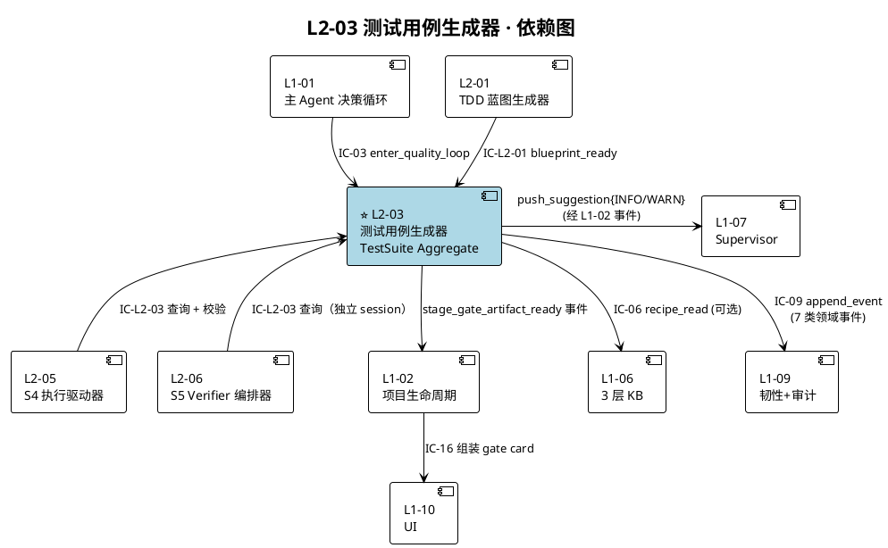
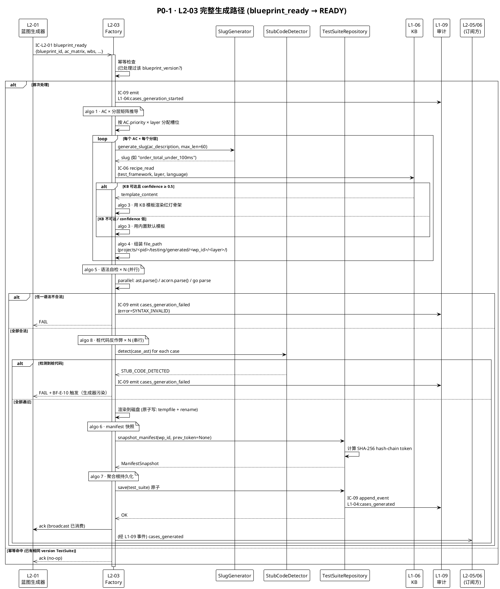
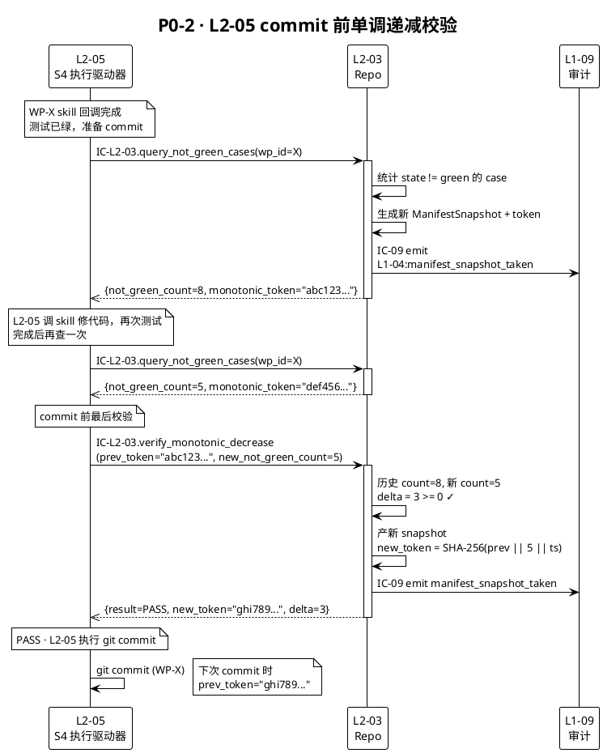
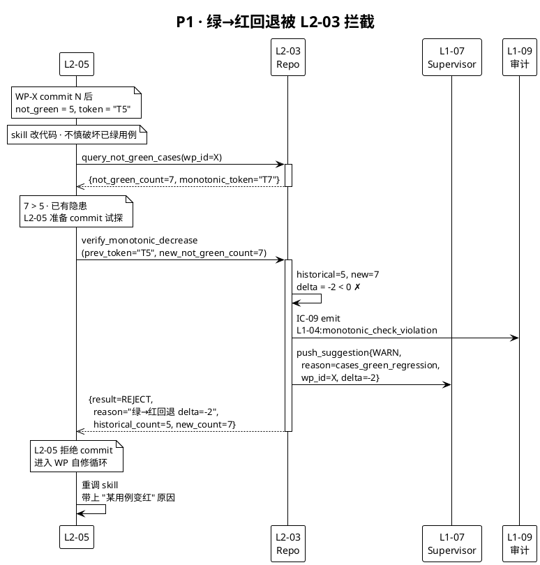
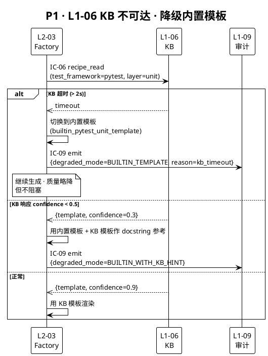
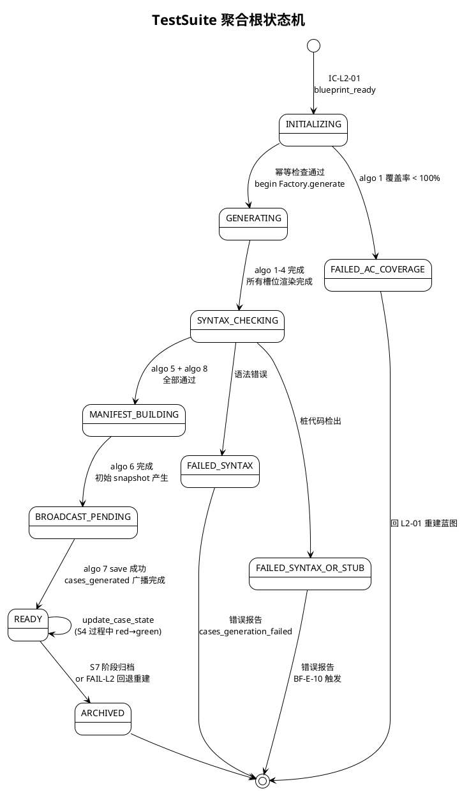
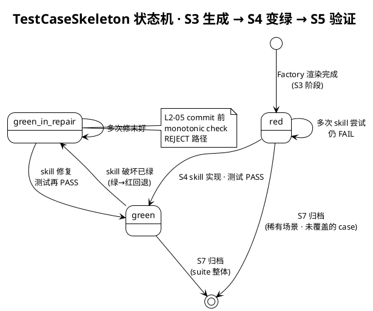
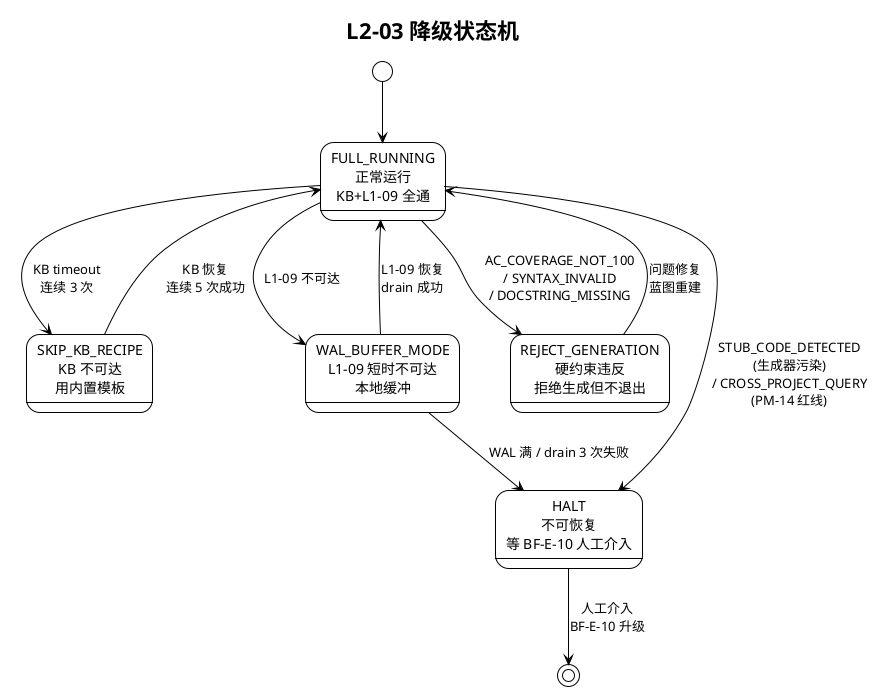

# L1 L2-03 · 测试用例生成器 · Tech Design

> **本文档定位**：3-1-Solution-Technical 层级 · L1-04 Quality Loop 下的 L2-03 测试用例生成器 技术实现方案（L2 粒度）。
> **与产品 PRD 的分工**：2-prd/L1-04-Quality Loop/prd.md §10 定义产品边界（职责/禁止/必须/验证大纲），本文档定义**技术实现**（接口字段级 schema + 算法伪代码 + 底层数据结构 + 状态机 + 配置参数）。
> **与 L1 architecture.md 的分工**：architecture.md 负责**跨 L2 架构 + 跨 L2 时序**（包括 BC-04 坐标、7 L2 容器图、S3 blueprint_ready 并行广播），本文档负责**本 L2 内部技术细节**（TestSuite 聚合根持久化、红灯断言生成算法、未绿用例单调递减校验、PM-14 分片路径）。冲突以 architecture.md 为准。
> **严格规则**：本文档不复述产品 PRD 文字（职责 / 禁止 / 必须 / 交付验证大纲等清单），只做**技术映射 + 补齐"产品视角未说 but 工程师必须知道"的部分**（具体算法 · syscall · schema · 配置 · 错误码 · 降级链）。

---

## §0 撰写进度

- [x] §1 定位 + 2-prd §10 L2-03 映射
- [x] §2 DDD 映射（BC-04 Quality Loop · TestSuite 聚合根）
- [x] §3 对外接口定义（字段级 YAML schema + 错误码）
- [x] §4 接口依赖（被谁调 · 调谁）
- [x] §5 P0/P1 时序图（PlantUML ≥ 2 张）
- [x] §6 内部核心算法（伪代码）
- [x] §7 底层数据表 / schema 设计（字段级 YAML）
- [x] §8 状态机（PlantUML + 转换表）
- [x] §9 开源最佳实践调研（≥ 5 GitHub 高星项目）
- [x] §10 配置参数清单
- [x] §11 错误处理 + 降级策略
- [x] §12 性能目标
- [x] §13 与 2-prd / 3-2 TDD 的映射表

---

## §1 定位 + 2-prd §10 L2-03 映射

### 1.1 一句话技术定位

L2-03 测试用例生成器是 **BC-04 Quality Loop 下的 Factory + Aggregate Root 持有者**，在 S3 阶段被 L2-01 的 `blueprint_ready` 事件触发，按 **AC × 测试金字塔分层矩阵**批量生成各层（单元/集成/E2E）**红灯骨架文件**（函数体为"未实现 FAIL"语义），落到 `projects/<pid>/testing/generated/<wp_id>/<layer>/` 下，并产出 **`TestSuite` 聚合根 + manifest 快照**供 L2-05 在 S4 驱动 commit 时做**未绿用例单调递减硬校验**。

### 1.2 在 L1-04 7 L2 架构中的坐标

```
┌─────────────────────── L1-04 BC-04 Quality Loop ───────────────────────┐
│                                                                         │
│  S3 TDD 规划（硬约束 4 · 5 件 Gate 前全齐）                             │
│  ┌──────────────┐    blueprint_ready     ┌──────────────┐               │
│  │ L2-01 蓝图    ├─────────┬──────────────→│ L2-02 DoD    │             │
│  │ Master Plan   │         │              │ 白名单编译器  │              │
│  └──────────────┘         │              └──────────────┘              │
│                           │                                              │
│                           ↓                                              │
│  ┌──────────────────────────────────┐   ┌──────────────┐               │
│  │ ⭐ L2-03 测试用例生成器            │   │ L2-04 质量   │               │
│  │ TestCaseSkeletonFactory          │   │ Gate + Checklist │           │
│  │ Aggregate: TestSuite             │   └──────────────┘               │
│  └──────────────────────────────────┘                                   │
│                           │                                              │
│  S4 执行（唯一驱动点）      ↓ 未绿用例 manifest 查询                      │
│  ┌──────────────────────────────────┐                                   │
│  │ L2-05 S4 执行驱动器 (调 IC-L2-03)│                                   │
│  └──────────────────────────────────┘                                   │
│                           │                                              │
│  S5 独立验证              ↓ 复跑骨架作 behavior 段证据                   │
│  ┌──────────────────────────────────┐                                   │
│  │ L2-06 S5 Verifier 编排器         │                                   │
│  └──────────────────────────────────┘                                   │
└─────────────────────────────────────────────────────────────────────────┘
```

### 1.3 与兄弟 L2 的边界（引 architecture.md §2.2 职责归属裁决表）

| 可能混淆的事 | 归谁 | L2-03 的边界 |
|---|---|---|
| 产 Master Test Plan（分层策略 + AC 矩阵） | **L2-01** | L2-03 只**消费**，不自产；蓝图含 AC 矩阵 + 分层配比（60 单元 / 30 集成 / 10 E2E 示例） |
| 编译 DoD 表达式（白名单 AST） | **L2-02** | L2-03 **不**定义 DoD；骨架只是"先红灯"，DoD 判定不在 L2-03 |
| 编 `quality-gates.yaml` | **L2-04** | L2-03 可产"覆盖率预估"作 L2-04 输入（可选），但不写 yaml |
| 驱动 S4 WP IMPL | **L2-05** | L2-03 在 S3 阶段一次性产完骨架；S4 阶段 L2-03 不介入 commit 循环，只提供 IC-L2-03 读查询 |
| 独立验证（S5） | **L2-06** | L2-03 产的骨架会被 L2-06 在**独立 session**复跑；L2-03 不负责复跑 |
| 写具体断言逻辑（绿灯实现） | **L2-05 + L1-05 skill** | L2-03 只产**骨架 + docstring + 红灯断言**；具体实现由 S4 skill 填 |
| 测试框架配置（pytest.ini / jest.config.js） | **4 件套"技术约束"+ L2-01** | L2-03 **消费**测试框架偏好（来自 4 件套或 L1-06 recipe），不创造 |

### 1.4 PM-14 项目模型隔离约束

本 L2 所有持久化与 IC payload 必须满足 PM-14：

- **存储路径分片**：`projects/<project_id>/testing/generated/<wp_id>/<layer>/test_<ac_id>_<slug>.py`
- **manifest 分片**：`projects/<project_id>/testing/manifests/<wp_id>.yaml`
- **聚合根分片**：`projects/<project_id>/testing/suites/<wp_id>.yaml`
- **IC payload root field**：`project_id` 必填（所有 IC-L2-03 查询必须携带），跨 project 查询硬 assert 失败
- **Repository 构造时绑定**：`TestSuiteRepository(project_id=...)` 在构造时锁定 scope，后续方法不允许透传其他 pid
- **事件 project_id 标签**：所有 `L1-04:cases_*` 事件 payload 必须带 project_id，L1-09 索引时按 pid 分桶

### 1.5 关键技术决策（Decision → Rationale → Alternatives → Trade-off）

| 决策 | Decision | Rationale | Alternatives rejected | Trade-off |
|---|---|---|---|---|
| D1 · 红灯断言风格 | pytest 用 `raise NotImplementedError(f"AC-{ac_id}: {intent}")` / jest 用 `throw new Error('AC-X not implemented')` / go 用 `t.Fatalf("AC-X not implemented")` | 所有三大框架均能 FAIL 且 stack trace 带 AC 引用；比 `assert False` 语义更清晰 | `pytest.fail()`（只 pytest 专用，多语言不统一）/ `assert False`（stack trace 无语义） | 可读性 > 简洁性 |
| D2 · AC → slug 映射 | 取 AC 描述前 8 个字的拼音/英文化 + 斜杠替换为下划线 + 长度 cap 60 字符 | 文件系统路径限制（macOS 255 char 但 Windows 某些 FS 仍 260）；可读性保留意图 | 完整 AC 文本（过长）/ UUID（不可读）/ hash（不可读） | 短读性 vs 唯一性：slug 相同时后缀追加 `_2 / _3` |
| D3 · 语法自检必做 | 所有骨架生成后用 `ast.parse()` / `acorn.parse()` / `go parse` 先在内存跑一遍 | 防止模板渲染错误导致 pytest collect error（假红灯 = 比真红灯更糟） | 只靠 pytest collect（延迟发现） | +10-50ms/用例，但杜绝 ⚠️ 假红灯 |
| D4 · 桩代码反作弊扫描 | 生成前在内存 AST 扫描，检查函数体是否含 `pass` / `return True` / `assert True` / `@pytest.mark.skip` 节点 | 防止生成器 bug 或模板污染导致红线被破（桩代码 = 违反 scope §5.4.5 禁 1） | 信任模板（一旦污染很难发现） | +50ms/用例审查，但红线必守 |
| D5 · manifest 版本化 | `monotonic_token = SHA-256(prev_token \|\| not_green_count \|\| wp_id \|\| taken_at)` 形成 hash-chain | L2-05 并发 commit 时需要一致快照；hash-chain 防止竞态 + 防篡改 | 简单时间戳（race）/ 无 token（不可验证） | +SHA-256 计算成本（忽略）vs 并发安全 |
| D6 · 路径分层 `<wp_id>/<layer>/` | WP 是 S4 执行粒度，layer 是测试分层，两维正交 | L2-05 按 WP 读用例；verifier 按 layer 复跑 | 扁平路径（查询困难）/ 按 AC 分组（WP 视角丢失） | 稍深目录树 vs 双向查询便利 |
| D7 · 骨架不可重写 | S3 生成后任何 S4 修改骨架断言必须走 FAIL-L2 回退重建 | scope §5.4.5 禁 5；防止"自圆其说"改动断言目标 | 允许 S4 微调（易破纪律） | 严格性 > 灵活性 |

### 1.6 与 2-prd §10 L2-03 的逐条映射表

| 2-prd §10 小节 | 本文档锚点 | 实现粒度 |
|---|---|---|
| §10.1 一句话职责 + 锚定 | §1.1 + §1.3 | 技术定位 + 边界硬化 |
| §10.2 输入 / 输出 | §3.1（接收 blueprint_ready）/ §3.2（manifest 查询接口）/ §7（落盘表） | 字段级 YAML |
| §10.3 边界（In-scope / Out-of-scope / 边界规则） | §1.3 兄弟边界表 + §4 依赖图 | 硬约束映射到代码路径 |
| §10.4 约束（硬约束 + 性能约束） | §10（配置锁定）+ §12（性能 SLO） | 参数锁定机制 |
| §10.5 🚫 禁止行为（7 条） | §6 算法中拦截点 + §11 错误码 `E_L204_L203_STUB_CODE_DETECTED` / `SKIP_MARK_DETECTED` / `SYNTAX_INVALID` / `DOCSTRING_MISSING` | 反作弊扫描 + 语法自检 |
| §10.6 ✅ 必须职责（8 条） | §6 主算法流程 + §8 状态机 READY 前置条件 | 状态转换 guard |
| §10.7 🔧 可选功能职责 | §10 可选参数 `kb_recipe_enabled` / `coverage_prediction_enabled` | 特性开关 |
| §10.8 IC 清单（5 个） | §3 字段级 + §4 依赖矩阵 | 完整 schema |
| §10.9 交付验证大纲（7 场景） | §13 TC-L204-L203-001~070 占位 + §5 时序图覆盖 | 对应 3-2 TDD |

### 1.7 与 BF-S3-03 业务流映射

BF-S3-03 "全量测试用例生成" 业务流：

```
输入：Master Test Plan + AC 矩阵 + WBS + 测试框架偏好
   ↓
步骤 1：按 AC × 分层矩阵推导用例槽位（§6 algo 1）
   ↓
步骤 2：为每槽位生成函数名（AC 引用 + slug · §6 algo 2）
   ↓
步骤 3：渲染红灯断言函数体（§6 algo 3）
   ↓
步骤 4：按 PM-14 路径写文件（§6 algo 4）
   ↓
步骤 5：语法自检 + 桩代码反作弊（§6 algo 5 + algo 8）
   ↓
步骤 6：产出 manifest 快照 + hash-chain token（§6 algo 6）
   ↓
步骤 7：持久化 TestSuite 聚合根 + broadcast cases_generated（§6 algo 7）
   ↓
输出：tests/generated/ 红灯骨架树 + manifest.yaml + TestSuite aggregate
```

### 1.8 与 architecture.md §2/§3 映射

- architecture.md §2.2 聚合根表第 3 行（**TestSuite**）→ 本文 §2.3
- architecture.md §2.4 领域服务表第 3 行（**TestCaseSkeletonFactory**）→ 本文 §2.4
- architecture.md §3.1 容器图 L2_03 节点 → 本文 §1.2 坐标图
- architecture.md §3.2 时序图（S3 并行广播）→ 本文 §5.1 P0 时序

### 1.9 与 L0 三份文档映射

- `L0/ddd-context-map.md` BC-04 Quality Loop 段 → 本文 §2.1/§2.6
- `L0/open-source-research.md` §"测试框架 + TDD 生态"段 → 本文 §9
- `L0/tech-stack.md` §"测试运行器 / 断言库" 段 → 本文 §10.1（pytest / jest / go test 选型）
- `projectModel/tech-design.md` PM-14 分片规则 → 本文 §1.4 + §7.2

---

## §2 DDD 映射（BC-04 Quality Loop · TestSuite 聚合根）

### 2.1 BC-04 Bounded Context 定位

BC-04 Quality Loop 是 DDD 意义上的**独立 Bounded Context**，其**核心领域**是"通过 S3 规划→S4 执行→S5 独立验证的闭环，保证真完成"。

L2-03 在 BC-04 内扮演 **Factory + Aggregate Root 持有者**角色，产出 `TestSuite` 聚合根，对应 **S3 五件套的第 3 件**（红灯用例骨架），是**"可执行"支柱**的前置条件（引 architecture.md §1.1 本 L1 三支柱）。

### 2.2 通用语言（Ubiquitous Language）

| 术语 | 中文 | 定义 | 使用点 |
|---|---|---|---|
| **TestSuite** | 测试套件 | 某 WP 下所有层（单元/集成/E2E）测试用例骨架的聚合 | 聚合根 |
| **TestCaseSkeleton** | 测试用例骨架 | 函数签名 + docstring + 红灯断言体的最小可加载文件 | Entity |
| **TestPyramidLayer** | 测试金字塔层 | unit / integration / e2e 三值枚举 | VO |
| **ACMapping** | AC 映射 | 某测试用例反向追溯到的 AC id + 覆盖权重 | VO |
| **RedGreenState** | 红绿状态 | red（未实现 FAIL）/ green（实现且 PASS）/ green_in_repair（曾绿后红）三值 | VO |
| **ManifestSnapshot** | 清单快照 | 某时点下某 WP 的红/绿用例计数 + hash-chain token | Entity |
| **MonotonicCheckToken** | 单调校验令牌 | 基于 hash-chain 的 commit 单调递减校验输入 | VO |
| **SlugGenerator** | 别名生成器 | 把 AC 自然语言转为文件系统安全 slug 的领域服务 | Domain Service |
| **StubCodeDetector** | 桩代码探测器 | AST 扫描识别伪装绿灯的探测器 | Domain Service |

### 2.3 聚合根：TestSuite

**字段级定义**（完整 YAML · 对应 §7.1 落盘表）：

```yaml
TestSuite:
  suite_id: string                      # UUID v4
  project_id: string                    # PM-14 分片键（root field）
  wp_id: string                         # 所属 WP id（来自 L1-03）
  blueprint_ref:                        # 来自 L2-01 blueprint_ready 事件
    blueprint_id: string
    blueprint_version: string
    master_test_plan_path: string
  test_framework: enum                  # pytest | jest | go-test | cargo-test
  ac_coverage:
    total_ac_count: int                 # 该 WP 涉及的 AC 数
    covered_ac_count: int               # 已生成骨架覆盖的 AC 数
    coverage_pct: float                 # = covered / total · 必须 == 1.0
  layer_stats:
    unit_count: int
    integration_count: int
    e2e_count: int
    total_count: int                    # = sum(layer_stats.*)
  red_green_counters:
    red_count: int                      # 未绿（初始 = total_count）
    green_count: int                    # 已绿（S4 过程中递增）
    green_in_repair_count: int          # 曾绿后红（L2-05 拦截点）
  generated_at: timestamp
  last_updated_at: timestamp
  state: enum                           # INITIALIZING | GENERATING | SYNTAX_CHECKING | MANIFEST_BUILDING | BROADCAST_PENDING | READY | ARCHIVED | FAILED_AC_COVERAGE | FAILED_SYNTAX | FAILED_MANIFEST
  schema_version: int                   # 当前 = 1
  cases: list[TestCaseSkeleton]         # 子 Entity 列表（下一层）
```

**不变量（Aggregate Invariants）**：

1. **AC 覆盖率硬性 100%**：`coverage_pct == 1.0`，否则聚合根进入 `FAILED_AC_COVERAGE` 状态，不允许持久化为 READY
2. **total_count == sum(layer_stats)**：三层计数之和必须等于总数
3. **red + green + green_in_repair == total**：红绿计数守恒（S4 过程中维持）
4. **不可变 blueprint_ref**：一旦 TestSuite 生成，`blueprint_ref` 冻结；蓝图改需 FAIL-L2 回退重建新 TestSuite（version++）
5. **state 单向流**：状态不可逆（READY → ARCHIVED 可以；READY → GENERATING 禁止）
6. **project_id 绑定**：Repository 构造时锁定，子 case 的 project_id 必须一致

### 2.4 子 Entity：TestCaseSkeleton

```yaml
TestCaseSkeleton:
  case_id: string                       # UUID v4
  suite_id: string                      # 反向引用聚合根
  wp_id: string
  ac_id: string                         # 来自 AC 矩阵
  layer: enum                           # unit | integration | e2e
  function_name: string                 # test_ac_<ac_id>_<slug>
  file_path: string                     # 物理路径（PM-14 分片）
  docstring: string                     # 测试意图 + 来源 AC 描述
  red_assertion_code: string            # 红灯断言源代码片段
  skeleton_sha256: string               # 文件内容 hash（防篡改）
  state: enum                           # red | green | green_in_repair
  last_state_change_at: timestamp
  last_state_change_by: string          # skill name / 'generator'
```

**Entity Invariants**：

1. **file_path 唯一**：同一 suite 内不允许两个 case 的 file_path 相同
2. **function_name 可被框架发现**：pytest 规范 `test_*` / jest 规范 `test(` 或 `it(` / go 规范 `TestXxx`
3. **red_assertion_code 合法**：必须是"未实现 FAIL"的 AST 正确代码，不含任何 pass / True / skip
4. **state 转换允许路径**：red → green → green_in_repair → green（可循环）；但 green → red 禁止（L2-05 拦截）

### 2.5 Value Objects

**TestPyramidLayer**：

```yaml
TestPyramidLayer:
  layer: enum  # unit | integration | e2e
  responsibility: string  # 纯描述（如 "函数级逻辑 · 无 I/O"）
  typical_ratio: float    # 理论配比（0.6 / 0.3 / 0.1）· 文字描述
```

不变量：`layer ∈ {unit, integration, e2e}`；跨层复用禁止（同一 AC 可分配到多层，但同一 case 只属一层）。

**ACMapping**：

```yaml
ACMapping:
  ac_id: string
  ac_description: string
  covered_by_case_ids: list[string]  # 反向追溯
  coverage_weight: float  # 默认 1.0；同 AC 多 case 时平均
```

不变量：`len(covered_by_case_ids) ≥ 1`（AC 必须至少 1 个 case 覆盖）。

**RedGreenState**：

```yaml
RedGreenState:
  state: enum  # red | green | green_in_repair
  last_transition_at: timestamp
  transition_reason: string
```

不变量：state 转换图（见 §8 状态机）。

**ManifestSnapshot**：

```yaml
ManifestSnapshot:
  snapshot_id: string
  suite_id: string
  wp_id: string
  not_green_count: int    # 查询时计数
  taken_at: timestamp
  monotonic_token: string # SHA-256(prev_token || not_green_count || wp_id || taken_at)
  prev_token: string      # hash-chain 前向指针
```

不变量：`monotonic_token == SHA-256(prev_token || not_green_count || wp_id || taken_at)`（可重算校验）。

**MonotonicCheckToken**（L2-05 commit 前持有）：

```yaml
MonotonicCheckToken:
  token: string           # 对应 ManifestSnapshot.monotonic_token
  issued_at: timestamp
  ttl_sec: int            # 默认 300s；过期需重取
```

不变量：`issued_at + ttl_sec >= now()`；过期 token L2-03 硬拒绝校验。

### 2.6 领域服务：TestCaseSkeletonFactory

**职责**：消费 AC 矩阵 + 分层配比，批量产出 `TestCaseSkeleton` 列表并聚合为 `TestSuite`。

**调用链**：

```
blueprint_ready (L2-01 broadcast)
   ↓
Factory.generate(
    ac_matrix,
    test_pyramid,
    wbs_snapshot,
    test_framework,
    project_id
)
   ↓
steps (见 §6 algo 1-8):
    1. AC × 分层矩阵推导（algo 1）
    2. slug 生成 × N（algo 2 via SlugGenerator）
    3. 红灯断言渲染 × N（algo 3）
    4. 路径组织（algo 4）
    5. 语法自检（algo 5）× N（并行）
    6. 桩代码反作弊（algo 8）× N（串行后 safety check）
    7. manifest 快照（algo 6）
    8. 聚合 TestSuite → Repository.save()
    9. broadcast cases_generated
   ↓
returns: TestSuite aggregate (state=READY)
```

**幂等性**：同一 `(blueprint_id, wp_id)` 多次调用返回相同 TestSuite（version 不变）；若 blueprint 版本变化，version++ 并产新 TestSuite 实例。

### 2.7 领域服务：SlugGenerator

**职责**：把 AC 自然语言描述 → 文件系统安全 slug。

**算法概览**（细节迁 §6 algo 2）：

1. 分词（pypinyin 对中文 / slugify 对英文）
2. 保留前 N 个关键字（N 默认 3-5）
3. 归一化（小写 + 空格 → 下划线）
4. 长度 cap（默认 60 字符）
5. 重名检测（同 wp_id 内已存在则追加 `_2 / _3`）

### 2.8 领域服务：StubCodeDetector

**职责**：AST 扫描识别伪装绿灯。

**检测规则（严格白名单外所有可疑节点）**：

| 违禁模式 | AST 节点 | 语言 |
|---|---|---|
| `pass` 作为函数体 | `ast.Pass` 在 `ast.FunctionDef.body[0]` | Python |
| `return True` | `ast.Return(value=ast.Constant(value=True))` | Python |
| `assert True` | `ast.Assert(test=ast.Constant(value=True))` | Python |
| `assert 1` / `assert "foo"` | `ast.Assert(test=ast.Constant)` 常量截断 | Python |
| `@pytest.mark.skip` 装饰 | `ast.Attribute(attr='skip')` in decorator | Python |
| `pytest.skip(...)` 调用 | `ast.Call(func=Attribute(attr='skip'))` | Python |
| `return` 空 return | `ast.Return(value=None)` 作函数唯一语句 | Python |
| `it.skip(...)` / `test.skip(...)` | Identifier="skip" in ExpressionStatement | JS |
| `t.Skip()` | `ast.Call` 目标含 "Skip" | Go |

**失败后行为**：聚合根进入 `FAILED_SYNTAX_OR_STUB` 状态，抛 `E_L204_L203_STUB_CODE_DETECTED` 错误，不允许持久化。

### 2.9 Repository 模式

`TestSuiteRepository`（抽象方法清单）：

```python
class TestSuiteRepository(abc.ABC):
    project_id: str  # 构造时绑定

    @abc.abstractmethod
    def save(self, suite: TestSuite) -> None:
        """原子持久化聚合根 + 所有子 case；成功后 emit L1-04:cases_generated"""

    @abc.abstractmethod
    def find_by_wp(self, wp_id: str) -> Optional[TestSuite]:
        """按 WP 查询（强一致读）"""

    @abc.abstractmethod
    def find_by_ac(self, ac_id: str) -> list[TestSuite]:
        """按 AC 反向查询（可能跨 WP，但限制在 project_id 内）"""

    @abc.abstractmethod
    def list_not_green_cases(self, wp_id: str) -> list[TestCaseSkeleton]:
        """未绿用例清单（L2-05 单调递减校验用）"""

    @abc.abstractmethod
    def snapshot_manifest(self, wp_id: str, prev_token: Optional[str]) -> ManifestSnapshot:
        """创建新 manifest 快照 · 计算 hash-chain token"""

    @abc.abstractmethod
    def update_case_state(self, case_id: str, new_state: RedGreenState, reason: str) -> None:
        """更新单个 case 的 red/green 状态（L2-05 调用）· 自动触发聚合根 red_green_counters 更新"""

    @abc.abstractmethod
    def archive(self, suite_id: str) -> None:
        """S7 阶段聚合根归档（不可再改）"""
```

**实现约束**：

- **单一写入点**：只经 save / update_case_state；禁止直接改磁盘
- **事件溯源一致性**：save 成功后必须 emit `L1-04:cases_generated` 到 L1-09（经 IC-09）
- **PM-14 隔离**：所有方法断言 suite.project_id == self.project_id
- **不可变快照**：聚合根更新时产新 version（version++），不覆盖旧版本（FAIL-L2 回退 diff 用）

### 2.10 领域事件（Domain Events）

本 L2 产生以下 7 类事件（经 IC-09 append_event 落盘到 L1-09 事件总线）：

| 事件名 | 触发时机 | payload 字段 |
|---|---|---|
| `L1-04:cases_generation_started` | Factory.generate 入口 | suite_id, wp_id, project_id, blueprint_ref, started_at |
| `L1-04:cases_generated` | TestSuite READY | suite_id, total_count, red_count, coverage_pct, generated_at |
| `L1-04:cases_red_verified` | 语法自检 + stub detector 通过 | suite_id, total_count, verified_at |
| `L1-04:manifest_snapshot_taken` | 每次 snapshot_manifest 调用 | snapshot_id, wp_id, not_green_count, monotonic_token, prev_token, taken_at |
| `L1-04:case_state_transitioned` | update_case_state 成功 | case_id, wp_id, old_state, new_state, reason, ts |
| `L1-04:cases_generation_failed` | 任一失败分支 | suite_id, failure_stage, error_code, error_detail |
| `L1-04:suite_archived` | S7 归档 | suite_id, archived_at |

### 2.11 跨 BC 关系（引 architecture.md §2.6）

| 对端 BC | 关系类型 | 方向 | 本 L2 视角 |
|---|---|---|---|
| **BC-01 L1-01** | Customer-Supplier | ← | 接 IC-03 enter_quality_loop{phase=S3, wp?} 触发 |
| **BC-02 L1-02** | Customer | ← | 通过 L2-01 接 4 件套的"AC 清单"作输入（间接） |
| **BC-03 L1-03** | Customer | ← | 读 WBS 做 WP 分组路径（只读，不改） |
| **BC-04 内部 L2-01/02/04** | Partnership | 并行 | blueprint_ready 同时触发；L2-03 不依赖 L2-02/04 的产出 |
| **BC-04 内部 L2-05** | Supplier | → | 产 IC-L2-03 未绿用例清单 + 单调校验给 L2-05 |
| **BC-04 内部 L2-06** | Supplier | → | 产 `tests/generated/` 树供 L2-06 在独立 session 复跑 |
| **BC-05 L1-05** | Supplier（间接） | → | 被 L2-05 调 skill 时，skill 读骨架作为 TDD 输入 |
| **BC-06 L1-06** | Customer | ← | 可选读 KB recipe（模板/最佳实践） |
| **BC-09 L1-09** | Customer | → | IC-09 append_event（唯一写入点） |
| **BC-10 L1-10** | Customer（经 L1-02） | → | IC-16 push_stage_gate_card 展示骨架预览 |

---

## §3 对外接口定义（字段级 YAML schema + 错误码）

### 3.1 接收 IC-L2-01（blueprint_ready · L2-01 广播）

**调用方向**：L2-01 → L2-03（广播，L2-02/03/04 同时订阅）

**payload schema**：

```yaml
IC-L2-01:blueprint_ready:
  event_id: string                        # UUID v4
  project_id: string                      # PM-14 root field
  blueprint_id: string
  blueprint_version: string               # "v1" / "v2"（FAIL-L2 回退后递增）
  master_test_plan_path: string           # "docs/testing/master-test-plan.md"
  ac_matrix:
    total_ac_count: int
    entries:
      - ac_id: string
        description: string
        priority: enum                    # P0 | P1 | P2
        assigned_layers: list[enum]       # [unit, integration, e2e] 子集
        assigned_wp_ids: list[string]
  test_pyramid:
    unit_target_ratio: float              # 0.6 默认
    integration_target_ratio: float       # 0.3 默认
    e2e_target_ratio: float               # 0.1 默认
    layer_responsibilities:
      unit: string                        # "函数级 · 无 I/O · 毫秒级"
      integration: string                 # "模块交互 · 可含 mock"
      e2e: string                         # "用户流 · 真环境"
  wbs_snapshot:
    total_wp_count: int
    entries:
      - wp_id: string
        title: string
        goal: string
        dod_ref: string                   # 指向 L2-02 DoD 表达式 id
        estimated_hours: float
        depends_on: list[string]          # 前置 WP ids
        ac_covered: list[string]          # 覆盖的 AC ids
  test_framework: enum                    # pytest | jest | go-test | cargo-test
  coverage_target:
    line_min: float                       # 0.8 默认
    branch_min: float                     # 0.7 默认
    ac_min: float                         # 1.0（硬锁定）
  event_ts: timestamp
  broadcaster: string                     # "L2-01"
```

**处理要求**：

- 非阻塞订阅：收到事件后异步启动 Factory.generate
- 幂等：同 `(blueprint_id, blueprint_version, project_id)` 多次到达只启一次
- 超时：若 5 秒内未启动 generator（系统高负载），发 `push_suggestion{INFO, reason=cases_generation_delayed}` 给 L1-07

**错误码**：

| 错误码 | 含义 | 触发 | 调用方处理 |
|---|---|---|---|
| `E_L204_L203_BLUEPRINT_NOT_FOUND` | blueprint_id 在本地 KB 查不到 | master_test_plan_path 文件不存在 | 等 5s 后重订阅；超时则发 INFO |
| `E_L204_L203_AC_MATRIX_INVALID` | AC 矩阵格式错误（缺必填字段） | 广播方未按契约 | 拒绝启动，发 INFO 给 L1-07 升级 |
| `E_L204_L203_AC_COVERAGE_NOT_100` | 蓝图声称 AC 覆盖 100% 但 entries 缺漏 | L2-01 bug 或竞态 | 拒绝；要求蓝图重建（FAIL-L2） |
| `E_L204_L203_TEST_FRAMEWORK_UNSUPPORTED` | test_framework 不在支持列表 | 4 件套写了未知框架 | 降级：用默认（Python 默认 pytest） + 发 WARN |
| `E_L204_L203_WBS_INCONSISTENT` | WP 覆盖的 AC 在 ac_matrix 里找不到 | 蓝图与 WBS 不一致 | 拒绝；回查 L2-01 |

### 3.2 发起 IC-L2-03（未绿用例清单查询 · L2-05 调用）

**调用方向**：L2-05 → L2-03（同步请求-响应）

**方法 1：query_not_green_cases(wp_id)**

**请求 schema**：

```yaml
IC-L2-03.query_not_green_cases:
  request:
    project_id: string                    # PM-14 root field
    wp_id: string
    caller: string                        # "L2-05" 或 "L2-06"
    request_ts: timestamp
  response:
    suite_id: string
    wp_id: string
    not_green_count: int
    cases:
      - case_id: string
        ac_id: string
        layer: enum
        file_path: string
        function_name: string
        state: enum                       # red | green_in_repair
        last_state_change_at: timestamp
    manifest_snapshot_id: string
    monotonic_token: string               # hash-chain token
    token_issued_at: timestamp
    token_ttl_sec: int                    # 300 默认
```

**方法 2：verify_monotonic_decrease(token, new_not_green_count)**

**请求 schema**：

```yaml
IC-L2-03.verify_monotonic_decrease:
  request:
    project_id: string
    wp_id: string
    prev_token: string                    # 上次 snapshot 的 token（L2-05 持有）
    new_not_green_count: int              # L2-05 本次 commit 前查询的新计数
    request_ts: timestamp
  response:
    result: enum                          # PASS | REJECT | STALE_TOKEN
    reason: string
    new_snapshot_id: string               # 若 PASS 则产新 snapshot
    new_monotonic_token: string           # 若 PASS 则发新 token
    prev_not_green_count: int             # 历史对比值
    delta: int                            # = prev_count - new_count (应 ≥ 0)
```

**语义**：

- `PASS`（delta ≥ 0）：新 snapshot 产生，token 更新；L2-05 可以 commit
- `REJECT`（delta < 0，即绿→红回退）：拒绝；L2-05 必须先修好
- `STALE_TOKEN`：prev_token 已过期（> 300s）或被后续 snapshot 覆盖；L2-05 需先重 query_not_green_cases

**错误码**：

| 错误码 | 含义 | 触发 |
|---|---|---|
| `E_L204_L203_MANIFEST_STALE` | token 已过期 | L2-05 持有 > 300s 的 token |
| `E_L204_L203_SUITE_NOT_FOUND` | wp_id 对应 TestSuite 不存在 | 尚未生成或已归档 |
| `E_L204_L203_MONOTONIC_CHECK_VIOLATION` | 新计数 > 历史（绿→红） | 实际绿→红回退 |
| `E_L204_L203_CROSS_PROJECT_QUERY` | project_id 不匹配 Repository 绑定 | PM-14 红线 |

### 3.3 发起 IC-09（append_event · L1-09 落盘）

**调用方向**：L2-03 → L1-09（异步 fire-and-forget，但 WAL 重试保证最终一致）

**payload schema**：

```yaml
IC-09.append_event:
  request:
    project_id: string
    event_type: enum                      # cases_generation_started | cases_generated | cases_red_verified | manifest_snapshot_taken | case_state_transitioned | cases_generation_failed | suite_archived
    source: string                        # "L2-03"
    payload: object                       # 事件专属字段（见 §2.10）
    emitted_at: timestamp
    evidence_path: string                 # 证据文件路径（生成的文件/manifest 路径）
    hash_chain_prev: string               # 前事件 SHA-256（由 L1-09 填）
  response:
    event_id: string                      # L1-09 分配
    hash_chain: string                    # 本事件 SHA-256
    persisted_at: timestamp
```

**错误码 + 降级**：

| 错误码 | 含义 | 降级 |
|---|---|---|
| `E_L204_L203_WAL_WRITE_FAIL` | 本地 WAL 无法写入 | 指数退避重试 3 次；3 次失败 → HALT（审计不能丢） |
| `E_L204_L203_L109_UNAVAILABLE` | L1-09 服务不可达 | 进入 WAL_BUFFER_MODE（见 §11），本地队列缓冲，L1-09 恢复后 drain |
| `E_L204_L203_HASH_CHAIN_BROKEN` | prev hash 校验失败 | HALT + 通知 Supervisor BF-E-10 |

### 3.4 发起 IC-16（push_stage_gate_card · 经 L1-02 → L1-10）

**调用方向**：L2-03 → L1-02 → L1-10（非直接；L2-03 只 emit 事件，L1-02 监听组装 card）

**L2-03 emit 的事件**：

```yaml
L1-04:stage_gate_artifact_ready:
  project_id: string
  stage: "S3"
  artifact_type: "test_skeletons"
  artifact_path: "projects/<pid>/testing/generated/"
  preview:
    summary: "共生成 <N> 个红灯骨架（<unit_N> 单元 / <int_N> 集成 / <e2e_N> E2E），覆盖 <AC_N> 条 AC"
    sample_case_paths: list[string]      # 取前 5 个给 UI 预览
  metadata:
    total_count: int
    red_count: int
    coverage_pct: float
    generated_at: timestamp
  emitted_at: timestamp
```

**L1-02 监听后组装 IC-16 payload**（L2-03 不直接构造此 payload）。

**错误码**：

| 错误码 | 含义 | 降级 |
|---|---|---|
| `E_L204_L203_GATE_CARD_EMIT_FAIL` | 事件总线不可达 | 同 WAL 缓冲；L1-10 展示延迟但不丢 |

### 3.5 发起 IC-06（KB recipe_read · 可选）

**调用方向**：L2-03 → L1-06（同步读 · 失败降级用内置模板）

**payload schema**：

```yaml
IC-06.recipe_read:
  request:
    project_id: string
    recipe_type: "test_skeleton_template"
    context:
      test_framework: string              # pytest / jest / go-test
      layer: string                       # unit / integration / e2e
      language: string                    # python / typescript / go
  response:
    recipe_id: string
    template_content: string              # 骨架模板（含占位符）
    confidence: float                     # 0.0-1.0
    source_project: string                # 历史项目来源
```

**错误码 + 降级**：

| 错误码 | 含义 | 降级 |
|---|---|---|
| `E_L204_L203_KB_RECIPE_UNAVAILABLE` | L1-06 不可达或无匹配 | 用内置默认模板（§6 algo 3）继续生成 |
| `E_L204_L203_RECIPE_CONFIDENCE_LOW` | confidence < 0.5 | 优先用默认模板，KB 模板仅作 docstring 参考 |

### 3.6 完整错误码表（15 条）

| 错误码 | 含义 | 严重级 | 错误码对应的 PRD 锚点 |
|---|---|---|---|
| `E_L204_L203_BLUEPRINT_NOT_FOUND` | 蓝图文件路径不存在 | ERROR | §10.3 边界规则 |
| `E_L204_L203_AC_MATRIX_INVALID` | AC 矩阵格式错误 | ERROR | §10.4 硬约束 3 |
| `E_L204_L203_AC_COVERAGE_NOT_100` | AC 覆盖率 < 100% | CRITICAL | §10.4 硬约束 3 |
| `E_L204_L203_SYNTAX_INVALID` | 骨架语法不合法 | CRITICAL | §10.4 硬约束 5 |
| `E_L204_L203_STUB_CODE_DETECTED` | 桩代码假绿检测命中 | CRITICAL | §10.5 禁 1 |
| `E_L204_L203_SKIP_MARK_DETECTED` | skip 装饰/调用命中 | CRITICAL | §10.5 禁 2 |
| `E_L204_L203_DOCSTRING_MISSING` | 某骨架缺 docstring | ERROR | §10.5 禁 6 |
| `E_L204_L203_FRAMEWORK_UNSUPPORTED` | 测试框架不支持 | WARNING | 技术约束 |
| `E_L204_L203_PATH_CONFLICT` | 同 slug 重名冲突 | ERROR | §10.6 必答 4 |
| `E_L204_L203_MANIFEST_STALE` | token 过期 | WARNING | §10.6 必答 5 |
| `E_L204_L203_MONOTONIC_CHECK_VIOLATION` | 绿→红回退 | CRITICAL | §8.9 负向 4 |
| `E_L204_L203_WAL_DRAIN_FAIL` | WAL 队列清空失败 | CRITICAL | PM-10 审计 |
| `E_L204_L203_KB_RECIPE_UNAVAILABLE` | KB 不可达 | WARNING | §10.7 可选 |
| `E_L204_L203_STORAGE_QUOTA_EXCEEDED` | 生成文件总大小超限 | ERROR | §10.4 性能 |
| `E_L204_L203_CROSS_PROJECT_QUERY` | 跨 project 查询 | CRITICAL | PM-14 红线 |

---

## §4 接口依赖（被谁调 · 调谁）

### 4.1 被谁调（Upstream Callers）

| 调用方 | IC | 触发条件 | 并发度 | SLO |
|---|---|---|---|---|
| **L2-01 TDD 蓝图生成器** | IC-L2-01 blueprint_ready | S3 阶段蓝图产出 | 1（同 project 单例） | ≤ 1s 广播延迟响应 |
| **L2-05 S4 执行驱动器** | IC-L2-03.query_not_green_cases | 每次 WP 切换 + 每次 commit 前 | 同 project 串行（S4 内单次 WP） | ≤ 50ms P95 |
| **L2-05 S4 执行驱动器** | IC-L2-03.verify_monotonic_decrease | 每次 commit 前硬校验 | 同 project 串行 | ≤ 200ms P95 |
| **L2-06 S5 Verifier 编排器** | IC-L2-03.query_not_green_cases | S5 验证时读骨架作 behavior 段证据 | 同 project 单次 | ≤ 50ms P95 |
| **L1-10 UI**（经 L1-02） | 查询 suite 状态 | UI 展示 S3 Gate 产物预览 | 低频 | ≤ 100ms |

### 4.2 调谁（Downstream Dependencies）

| 被调方 | IC | 用途 | 频度 | 降级 |
|---|---|---|---|---|
| **L1-09 韧性+审计** | IC-09 append_event | 所有领域事件落盘 | 高频（每事件） | WAL_BUFFER_MODE · 3 次重试 |
| **L1-02（经事件）** | L1-04:stage_gate_artifact_ready | S3 Gate 卡片展示 | 1 次/suite | 事件总线缓冲 |
| **L1-06 3 层 KB** | IC-06 recipe_read | 读骨架模板（可选） | 按语言/分层 ≤ 3 次/suite | 内置默认模板 |
| **L1-07 Supervisor**（经 L1-02 事件） | push_suggestion{INFO/WARN} | 异常上报（蓝图不一致、自检 FAIL 等） | 按需 | 直接 fire-and-forget |

### 4.3 依赖图（PlantUML）



### 4.4 依赖降级策略

| 依赖失败 | 降级行为 | 用户可见影响 |
|---|---|---|
| L1-09 短暂不可达（< 30s） | WAL 本地队列缓冲，L1-09 恢复后 drain | 无（事件最终一致） |
| L1-09 长时间不可达（> 30s） | HALT + Supervisor BF-E-10 升级 | 生成暂停，等人工介入 |
| L1-06 KB 不可达 | 用内置默认模板继续生成 | 骨架可读性略降（无 domain-specific 指引） |
| L1-02 事件总线失败 | 本地缓冲 + 重试；S3 Gate 卡片展示延迟 | UI 短暂看不到新生成物 |
| L2-01 blueprint_ready 丢失 | 定期 poll L2-01 的 TDDBlueprint 版本（每 60s） | 生成启动延迟 ≤ 60s |
| 磁盘写失败（配额满） | 抛 `E_L204_L203_STORAGE_QUOTA_EXCEEDED` + Supervisor WARN | 生成阻塞 |

### 4.5 并发模型

- **同 project 单例**：同 project_id 同 blueprint_id 同时只能有一个 Factory.generate 运行（进程锁 + Redis 协同锁，TTL 3 分钟）
- **跨 project 并行**：不同 project_id 完全独立，多 Factory 实例可并行
- **WP 内串行**：单次 Factory.generate 内部可能对多个 WP 生成，WP 之间串行（拓扑依赖）
- **case 并行**：同 WP 内多 case 的文件渲染可并行（I/O bound · asyncio gather），但语法自检和 stub detection 串行（保证审计可追溯）

---

## §5 P0/P1 时序图（PlantUML ≥ 2 张）

### 5.1 P0-1 时序：blueprint_ready → TestSuite READY 完整路径



### 5.2 P0-2 时序：S4 commit 前单调递减校验



### 5.3 P1 时序：绿→红回退拦截（负向场景）



### 5.4 P1 时序：KB 不可达降级



---

## §6 内部核心算法（伪代码）

### 6.1 algo 1 · AC × 分层矩阵推导

```python
def derive_case_slots(
    ac_matrix: ACMatrix,
    test_pyramid: TestPyramid,
    wbs_snapshot: WBSSnapshot,
    project_id: str
) -> list[CaseSlot]:
    """
    输入 AC 矩阵 + 分层配比，推导出所有用例槽位（未填充断言，只有元信息）。

    输出 CaseSlot: {ac_id, wp_id, layer, expected_intent, priority}
    """
    slots = []
    for ac in ac_matrix.entries:
        # 1. 确定该 AC 应覆盖的分层
        layers = ac.assigned_layers  # 来自蓝图，L2-01 已做分层决策
        if not layers:
            # 兜底：按 priority 推荐
            if ac.priority == "P0":
                layers = ["unit", "integration", "e2e"]  # 三层全覆盖
            elif ac.priority == "P1":
                layers = ["unit", "integration"]
            else:
                layers = ["unit"]

        # 2. 确定 WP 归属
        wp_ids = ac.assigned_wp_ids
        if not wp_ids:
            raise E_L204_L203_WBS_INCONSISTENT(
                f"AC {ac.ac_id} 未指派到任何 WP"
            )

        # 3. 为每 (WP, layer) 组合生成槽位
        for wp_id in wp_ids:
            wp = wbs_snapshot.get(wp_id)
            for layer in layers:
                # 检查 WP 是否在该层产物（某些 WP 可能只做底层 algo，无 e2e 意义）
                if layer == "e2e" and wp.e2e_relevant is False:
                    continue
                slots.append(CaseSlot(
                    ac_id=ac.ac_id,
                    wp_id=wp_id,
                    layer=layer,
                    expected_intent=ac.description,
                    priority=ac.priority,
                    project_id=project_id
                ))

    # 4. 校验 AC 覆盖率 == 100%
    covered_acs = set(slot.ac_id for slot in slots)
    all_acs = set(ac.ac_id for ac in ac_matrix.entries)
    if covered_acs != all_acs:
        missing = all_acs - covered_acs
        raise E_L204_L203_AC_COVERAGE_NOT_100(
            f"AC 未覆盖: {missing}"
        )

    return slots
```

**关键点**：

- AC 覆盖率硬校验在 algo 1 末尾，缺一即 fail fast
- P0/P1/P2 的默认分层策略作为兜底（蓝图可 override）
- WP 的 `e2e_relevant` 标记允许某些 WP 跳过 e2e 层

### 6.2 algo 2 · 函数名规范化（slug 生成）

```python
class SlugGenerator:
    MAX_LEN = 60

    def generate_slug(
        self,
        ac_description: str,
        wp_scope: set[str],  # 该 wp 下已用 slugs（防重名）
        language: str = "auto"
    ) -> str:
        """
        把 AC 描述 → 文件系统安全 slug。

        处理：
        - 中文：pypinyin 转拼音
        - 英文：slugify 规范化
        - 特殊字符：_ 替换
        - 长度：cap 60 字符
        - 重名：追加 _2 / _3
        """
        # 1. 语言检测
        if language == "auto":
            language = self._detect_language(ac_description)

        # 2. 分词 + 取关键字（前 3-5 个）
        if language == "zh":
            try:
                from pypinyin import lazy_pinyin
                tokens = lazy_pinyin(ac_description)[:5]
            except ImportError:
                # 降级：提取 ASCII 字符
                tokens = [c for c in ac_description if c.isascii()]
        else:
            from slugify import slugify
            return slugify(ac_description, max_length=self.MAX_LEN)

        # 3. 归一化
        raw_slug = "_".join(tokens).lower()
        raw_slug = re.sub(r"[^a-z0-9_]", "_", raw_slug)
        raw_slug = re.sub(r"_+", "_", raw_slug).strip("_")

        # 4. 长度 cap
        if len(raw_slug) > self.MAX_LEN:
            raw_slug = raw_slug[:self.MAX_LEN].rstrip("_")

        # 5. 重名检测
        if raw_slug not in wp_scope:
            return raw_slug

        suffix = 2
        while f"{raw_slug}_{suffix}" in wp_scope:
            suffix += 1
            if suffix > 100:
                raise E_L204_L203_PATH_CONFLICT(
                    f"slug 100 次冲突: {raw_slug}"
                )
        return f"{raw_slug}_{suffix}"

    def _detect_language(self, text: str) -> str:
        """简易中英文检测：中文字符占比 > 30% 即判 zh"""
        zh_chars = sum(1 for c in text if '\u4e00' <= c <= '\u9fff')
        return "zh" if zh_chars / max(len(text), 1) > 0.3 else "en"
```

**关键点**：

- 支持中英文混合（pypinyin + slugify 各管一边）
- 重名用后缀递增（`_2`, `_3`, ...）
- 100 次冲突硬拒绝（防病态输入）

### 6.3 algo 3 · 红灯断言体生成

```python
def render_red_assertion(
    slot: CaseSlot,
    test_framework: str,
    template: Optional[str] = None
) -> str:
    """
    生成单个 case 的红灯断言函数体。

    test_framework:
      pytest -> raise NotImplementedError(f"AC-{ac_id}: {intent}")
      jest   -> throw new Error(`AC-${ac_id}: ${intent} not implemented`)
      go     -> t.Fatalf("AC-%s: %s not implemented", ac_id, intent)
      cargo  -> panic!("AC-{}: {} not implemented", ac_id, intent)

    若 KB 有 template 且 confidence ≥ 0.5，用 template 作 docstring 额外注释。
    函数体**绝不**包含任何可能导致 PASS 的语句。
    """
    func_name = f"test_ac_{slot.ac_id}_{slot.slug}"
    intent_line = slot.expected_intent.replace('"', "'").strip()

    if test_framework == "pytest":
        docstring = f'"""\n    AC-{slot.ac_id}: {intent_line}\n\n'
        docstring += f"    Layer: {slot.layer}\n"
        docstring += f"    WP: {slot.wp_id}\n"
        docstring += f"    Priority: {slot.priority}\n"
        if template:
            docstring += f"\n    Template hint (KB confidence {template.confidence}):\n"
            docstring += f"      {template.hint}\n"
        docstring += '    """\n'

        body = f"    raise NotImplementedError("
        body += f"f\"AC-{slot.ac_id} ({slot.slug}): not implemented yet\""
        body += ")\n"

        return f"def {func_name}():\n    {docstring}{body}"

    elif test_framework == "jest":
        docstring_line = f"// AC-{slot.ac_id}: {intent_line} · Layer: {slot.layer} · WP: {slot.wp_id}"
        body = f"test('{func_name}', () => {{\n"
        body += f"    {docstring_line}\n"
        body += f"    throw new Error('AC-{slot.ac_id} ({slot.slug}): not implemented yet');\n"
        body += "});\n"
        return body

    elif test_framework == "go-test":
        go_func_name = _snake_to_camel(func_name)
        body = f"// {func_name}: AC-{slot.ac_id} {intent_line}\n"
        body += f"// Layer: {slot.layer} · WP: {slot.wp_id}\n"
        body += f"func Test{go_func_name}(t *testing.T) {{\n"
        body += f'    t.Fatalf("AC-{slot.ac_id} ({slot.slug}): not implemented yet")\n'
        body += "}\n"
        return body

    elif test_framework == "cargo-test":
        body = f"/// AC-{slot.ac_id}: {intent_line}\n"
        body += f"/// Layer: {slot.layer} · WP: {slot.wp_id}\n"
        body += "#[test]\n"
        body += f"fn {func_name}() {{\n"
        body += f'    panic!("AC-{slot.ac_id} ({slot.slug}): not implemented yet");\n'
        body += "}\n"
        return body

    else:
        raise E_L204_L203_FRAMEWORK_UNSUPPORTED(test_framework)
```

**关键点**：

- 所有框架都用**抛异常**的方式失败（最清晰的红灯语义）
- docstring 强制含 AC id + 意图 + layer + WP id（可读性硬性）
- 严禁任何能导致 PASS 的语句（`pass` / `return True` / `assert True` / `skip` 全禁）

### 6.4 algo 4 · 路径组织（PM-14 分片）

```python
def build_file_path(
    project_id: str,
    wp_id: str,
    layer: str,
    slug: str,
    ac_id: str,
    test_framework: str
) -> str:
    """
    按 PM-14 规则生成文件路径。

    模板: projects/<pid>/testing/generated/<wp_id>/<layer>/test_<ac_id>_<slug>.<ext>

    ext 按框架: pytest/py · jest/ts · go-test/go · cargo-test/rs
    """
    ext_map = {
        "pytest": "py",
        "jest": "ts",
        "go-test": "go",
        "cargo-test": "rs"
    }
    ext = ext_map.get(test_framework, "py")

    # 路径合法性校验
    if not re.match(r"^[a-zA-Z0-9_\-]+$", wp_id):
        raise E_L204_L203_PATH_CONFLICT(f"非法 wp_id: {wp_id}")
    if layer not in {"unit", "integration", "e2e"}:
        raise ValueError(f"非法 layer: {layer}")

    filename = f"test_{ac_id}_{slug}.{ext}"
    path = f"projects/{project_id}/testing/generated/{wp_id}/{layer}/{filename}"

    # PM-14 路径绝对性校验
    if ".." in path or path.startswith("/"):
        raise E_L204_L203_PATH_CONFLICT(f"非法路径字符: {path}")

    return path
```

### 6.5 algo 5 · 骨架语法自检（并行）

```python
async def syntax_check_batch(
    cases: list[TestCaseSkeleton]
) -> dict[str, bool]:
    """
    并行校验所有骨架的语法合法性。

    失败任一 → 聚合根进 FAILED_SYNTAX 状态。
    """
    results = await asyncio.gather(*[
        _check_one_syntax(case) for case in cases
    ], return_exceptions=True)

    failed = []
    for case, result in zip(cases, results):
        if isinstance(result, Exception) or result is False:
            failed.append((case.case_id, str(result)))

    if failed:
        raise E_L204_L203_SYNTAX_INVALID(
            f"{len(failed)} cases 语法不合法: {failed[:3]}..."
        )

    return {case.case_id: True for case in cases}


async def _check_one_syntax(case: TestCaseSkeleton) -> bool:
    """
    按语言类型调不同解析器。
    pytest → ast.parse()
    jest → acorn.parse() (via node subprocess 或 py-acorn)
    go-test → go parse (subprocess)
    cargo-test → syn::parse (subprocess)
    """
    code = case.red_assertion_code
    if case.file_path.endswith(".py"):
        try:
            ast.parse(code)
            return True
        except SyntaxError as e:
            return False
    elif case.file_path.endswith(".ts"):
        # 用 subprocess 跑 `node -e "require('acorn').parse(...)"`
        result = await asyncio.subprocess.create_subprocess_exec(
            "node", "-e", f"require('acorn').parse({json.dumps(code)})",
            stdout=asyncio.subprocess.PIPE,
            stderr=asyncio.subprocess.PIPE
        )
        return result.returncode == 0
    elif case.file_path.endswith(".go"):
        # 写入 tempfile + go vet
        with tempfile.NamedTemporaryFile(suffix=".go") as f:
            f.write(code.encode())
            f.flush()
            result = await asyncio.subprocess.create_subprocess_exec(
                "go", "vet", f.name
            )
            return result.returncode == 0
    # ... 其他语言
    return False
```

### 6.6 algo 6 · manifest 快照（hash-chain token）

```python
def snapshot_manifest(
    suite: TestSuite,
    wp_id: str,
    prev_token: Optional[str]
) -> ManifestSnapshot:
    """
    创建新 manifest 快照 · 计算 SHA-256 hash-chain token。

    token = SHA-256(prev_token || not_green_count || wp_id || taken_at)

    prev_token=None 时用全零初始 token。
    """
    not_green = [
        c for c in suite.cases
        if c.wp_id == wp_id and c.state != RedGreenState.green
    ]
    not_green_count = len(not_green)
    taken_at = datetime.utcnow().isoformat()

    prev = prev_token if prev_token else "0" * 64
    token_input = f"{prev}|{not_green_count}|{wp_id}|{taken_at}"
    token = hashlib.sha256(token_input.encode()).hexdigest()

    snapshot = ManifestSnapshot(
        snapshot_id=str(uuid.uuid4()),
        suite_id=suite.suite_id,
        wp_id=wp_id,
        not_green_count=not_green_count,
        taken_at=taken_at,
        monotonic_token=token,
        prev_token=prev
    )

    # 持久化 + emit 事件
    repo.save_snapshot(snapshot)
    emit_event("L1-04:manifest_snapshot_taken", {
        "snapshot_id": snapshot.snapshot_id,
        "wp_id": wp_id,
        "not_green_count": not_green_count,
        "monotonic_token": token,
        "prev_token": prev,
        "taken_at": taken_at
    })

    return snapshot
```

**关键点**：

- `prev_token` 链接前 snapshot，形成 hash-chain（tamper-evident）
- 多 worker 并发时靠 Repository 的事务保证 token 唯一性（DB 层 unique 索引 on (wp_id, taken_at)）

### 6.7 algo 7 · 未绿用例单调递减校验

```python
def verify_monotonic_decrease(
    suite: TestSuite,
    wp_id: str,
    prev_token: str,
    new_not_green_count: int
) -> MonotonicResult:
    """
    核心红线：L2-05 commit 前硬校验。

    规则：
    - prev_token 必须是最近 snapshot（非 stale）
    - new_not_green_count 必须 ≤ prev_snapshot.not_green_count
    - 否则 REJECT
    """
    prev_snapshot = repo.get_latest_snapshot_by_token(prev_token, wp_id)
    if prev_snapshot is None:
        return MonotonicResult(
            result="STALE_TOKEN",
            reason="prev_token 已过期或被覆盖"
        )

    # TTL 校验
    age_sec = (datetime.utcnow() - prev_snapshot.taken_at).total_seconds()
    if age_sec > 300:
        return MonotonicResult(
            result="STALE_TOKEN",
            reason=f"token 已 {age_sec}s 过期（> 300s）"
        )

    delta = prev_snapshot.not_green_count - new_not_green_count
    if delta < 0:
        # 绿→红回退
        emit_event("L1-04:monotonic_check_violation", {
            "wp_id": wp_id,
            "prev_count": prev_snapshot.not_green_count,
            "new_count": new_not_green_count,
            "delta": delta
        })
        # 发 WARN 给 Supervisor
        push_suggestion({
            "level": "WARN",
            "reason": "cases_green_regression",
            "wp_id": wp_id,
            "delta": delta
        })
        return MonotonicResult(
            result="REJECT",
            reason=f"绿→红回退 delta={delta}",
            historical_count=prev_snapshot.not_green_count,
            new_count=new_not_green_count
        )

    # PASS 路径
    new_snapshot = snapshot_manifest(suite, wp_id, prev_token=prev_token)
    return MonotonicResult(
        result="PASS",
        delta=delta,
        new_snapshot_id=new_snapshot.snapshot_id,
        new_monotonic_token=new_snapshot.monotonic_token
    )
```

### 6.8 algo 8 · 桩代码反作弊扫描

```python
class StubCodeDetector:
    FORBIDDEN_PATTERNS = {
        "python": [
            {"node": ast.Pass, "location": "function_body_first"},
            {"node": ast.Return, "value_is": {"constant": True}},
            {"node": ast.Assert, "value_is": {"constant_truthy": True}},
            {"decorator": "pytest.mark.skip"},
            {"call": "pytest.skip"},
        ],
        "javascript": [
            {"call": "test.skip"},
            {"call": "it.skip"},
            {"call": "describe.skip"},
        ],
        "go": [
            {"call": "t.Skip"},
            {"call": "t.SkipNow"},
        ]
    }

    def detect(self, case: TestCaseSkeleton) -> DetectionResult:
        """
        AST 扫描判定是否含违禁桩代码。

        返回: {violated: bool, violations: list[str], detail: dict}
        """
        code = case.red_assertion_code

        if case.file_path.endswith(".py"):
            return self._detect_python(code)
        elif case.file_path.endswith(".ts") or case.file_path.endswith(".js"):
            return self._detect_js(code)
        elif case.file_path.endswith(".go"):
            return self._detect_go(code)
        else:
            # 未知语言：用保守策略（字符串匹配）
            return self._detect_fallback(code)

    def _detect_python(self, code: str) -> DetectionResult:
        tree = ast.parse(code)
        violations = []

        for node in ast.walk(tree):
            # Pattern 1: `def test_xx(): pass`
            if isinstance(node, ast.FunctionDef) and node.name.startswith("test_"):
                if len(node.body) == 1 and isinstance(node.body[0], ast.Pass):
                    violations.append(f"pass 作为 {node.name} 唯一函数体")

                # Pattern 2: `return True` / `return 1`
                for stmt in node.body:
                    if isinstance(stmt, ast.Return) and isinstance(stmt.value, ast.Constant):
                        if stmt.value.value in {True, 1, "ok", "pass"}:
                            violations.append(f"{node.name}: return 真值 {stmt.value.value}")

                # Pattern 3: `assert True` / `assert 1`
                for stmt in node.body:
                    if isinstance(stmt, ast.Assert) and isinstance(stmt.test, ast.Constant):
                        if stmt.test.value:
                            violations.append(f"{node.name}: assert 真值常量")

                # Pattern 4: @pytest.mark.skip 装饰
                for dec in node.decorator_list:
                    if isinstance(dec, ast.Attribute) and dec.attr == "skip":
                        violations.append(f"{node.name}: @pytest.mark.skip")

                # Pattern 5: pytest.skip(...) 调用
                for stmt in ast.walk(node):
                    if isinstance(stmt, ast.Call):
                        if isinstance(stmt.func, ast.Attribute) and stmt.func.attr == "skip":
                            violations.append(f"{node.name}: pytest.skip 调用")

        return DetectionResult(
            violated=bool(violations),
            violations=violations
        )

    # _detect_js / _detect_go / _detect_fallback 类似实现
```

**关键点**：

- **白名单外所有可疑节点都列入违禁**（宁可误报也不漏报，红线守得严）
- 报告详细 violation 列表，方便调试

### 6.9 algo 9 · 原子文件写入

```python
def atomic_write_file(file_path: str, content: str) -> None:
    """
    tempfile + rename 原子写入（避免半写状态）。
    """
    dir_path = os.path.dirname(file_path)
    os.makedirs(dir_path, exist_ok=True)

    # 写 tempfile（同一文件系统保证 rename 原子）
    fd, tmp_path = tempfile.mkstemp(
        prefix="._tmp_",
        suffix=os.path.basename(file_path),
        dir=dir_path
    )
    try:
        with os.fdopen(fd, "w", encoding="utf-8") as f:
            f.write(content)
            f.flush()
            os.fsync(f.fileno())  # 确保落盘

        # rename (POSIX 原子)
        os.rename(tmp_path, file_path)
    except Exception as e:
        if os.path.exists(tmp_path):
            os.unlink(tmp_path)
        raise E_L204_L203_WAL_DRAIN_FAIL(f"原子写失败: {e}")
```

### 6.10 algo 10 · 幂等检查

```python
def is_blueprint_already_processed(
    blueprint_id: str,
    blueprint_version: str,
    project_id: str
) -> bool:
    """
    检查同 (blueprint_id, version, project_id) 是否已生成过 TestSuite。
    幂等：多次广播不重复生成。
    """
    existing = repo.find_by_blueprint(blueprint_id, blueprint_version, project_id)
    return existing is not None and existing.state in {
        "READY", "ARCHIVED"
    }
```

---

## §7 底层数据表 / schema 设计（字段级 YAML）

### 7.1 表 1：`test_suite`（聚合根主表）

```yaml
table: test_suite
primary_key: suite_id
partition_key: project_id  # PM-14 分片
storage_path: "projects/<project_id>/testing/suites/<wp_id>.yaml"
schema:
  suite_id: string                      # UUID v4
  project_id: string                    # 分片键
  wp_id: string
  blueprint_id: string
  blueprint_version: string
  master_test_plan_path: string
  test_framework: enum
  total_ac_count: int
  covered_ac_count: int
  ac_coverage_pct: float                # 必须 == 1.0 才 READY
  unit_count: int
  integration_count: int
  e2e_count: int
  total_count: int
  red_count: int
  green_count: int
  green_in_repair_count: int
  state: enum
  schema_version: int                   # 当前 = 1
  generated_at: timestamp
  last_updated_at: timestamp
  archived_at: timestamp                # nullable
indexes:
  - unique: (project_id, wp_id, blueprint_version)
  - btree: (project_id, state, last_updated_at DESC)
```

### 7.2 表 2：`test_case_skeleton`（子 Entity 表）

```yaml
table: test_case_skeleton
primary_key: case_id
partition_key: project_id
storage_path: "projects/<project_id>/testing/cases/<wp_id>/<layer>/<case_id>.yaml"
schema:
  case_id: string                       # UUID v4
  suite_id: string                      # FK → test_suite
  project_id: string
  wp_id: string
  ac_id: string
  layer: enum                           # unit | integration | e2e
  function_name: string
  file_path: string                     # 物理路径
  docstring: string
  red_assertion_code: string            # 源代码片段
  skeleton_sha256: string               # 防篡改
  state: enum                           # red | green | green_in_repair
  last_state_change_at: timestamp
  last_state_change_by: string          # skill name / 'generator'
  created_at: timestamp
indexes:
  - unique: (suite_id, function_name)
  - unique: (project_id, file_path)
  - btree: (suite_id, state)            # 未绿查询加速
  - btree: (project_id, ac_id)          # AC 反查
```

### 7.3 表 3：`manifest_snapshot`（hash-chain 审计表）

```yaml
table: manifest_snapshot
primary_key: snapshot_id
partition_key: project_id
storage_path: "projects/<project_id>/testing/manifests/<wp_id>/<snapshot_id>.yaml"
schema:
  snapshot_id: string                   # UUID v4
  suite_id: string
  project_id: string
  wp_id: string
  not_green_count: int
  taken_at: timestamp
  monotonic_token: string               # SHA-256 hash-chain
  prev_token: string                    # hash-chain 前向指针
  ttl_expires_at: timestamp             # taken_at + 300s
indexes:
  - unique: (wp_id, taken_at)
  - btree: (suite_id, taken_at DESC)
  - hash: monotonic_token               # 快速 token 校验
```

### 7.4 表 4：`case_state_transition_log`（状态转换审计日志）

```yaml
table: case_state_transition_log
primary_key: log_id
partition_key: project_id
storage_path: "projects/<project_id>/testing/state_logs/<wp_id>/<YYYYMM>.log.jsonl"
schema:
  log_id: string                        # UUID v4
  case_id: string
  suite_id: string
  project_id: string
  wp_id: string
  old_state: enum
  new_state: enum
  transitioned_at: timestamp
  actor: string                         # skill name / generator / verifier
  evidence_path: string                 # 指向 test 运行日志
  reason: string
indexes:
  - btree: (case_id, transitioned_at DESC)
  - btree: (project_id, wp_id, transitioned_at DESC)
```

### 7.5 PM-14 分片规则详细

所有存储路径根据 `project_id` 分片：

```
projects/
├── <project_id_1>/
│   └── testing/
│       ├── suites/
│       │   ├── WP-001.yaml             # 聚合根
│       │   └── WP-002.yaml
│       ├── cases/
│       │   ├── WP-001/
│       │   │   ├── unit/
│       │   │   │   ├── <case_id_1>.yaml
│       │   │   │   └── <case_id_2>.yaml
│       │   │   ├── integration/
│       │   │   └── e2e/
│       │   └── WP-002/
│       ├── generated/                  # 实际测试代码文件
│       │   ├── WP-001/
│       │   │   ├── unit/
│       │   │   │   ├── test_ac_001_order_total.py
│       │   │   │   └── test_ac_002_discount.py
│       │   │   └── integration/
│       │   └── WP-002/
│       ├── manifests/
│       │   ├── WP-001/
│       │   │   ├── <snapshot_id_1>.yaml
│       │   │   └── <snapshot_id_2>.yaml
│       │   └── WP-002/
│       └── state_logs/
│           └── WP-001/
│               ├── 202604.log.jsonl
│               └── 202605.log.jsonl
└── <project_id_2>/
    └── ...
```

**分片隔离保证**：

- Repository 构造时绑定 `project_id`，所有方法硬 assert 参数一致
- 跨 project 查询抛 `E_L204_L203_CROSS_PROJECT_QUERY`
- 文件系统层面无 symlink 跨项目
- L1-09 事件索引按 project_id 分桶（见 L1-09 tech-design）

---

## §8 状态机（PlantUML + 转换表）

### 8.1 TestSuite 聚合根状态机



### 8.2 TestSuite 状态转换表

| from | to | trigger | guard | side_effect |
|---|---|---|---|---|
| `[*]` | INITIALIZING | IC-L2-01 blueprint_ready | blueprint_version 与已有版本不同 | emit `cases_generation_started` |
| INITIALIZING | FAILED_AC_COVERAGE | algo 1 | covered_ac != all_ac | emit `cases_generation_failed{err=AC_COVERAGE_NOT_100}` |
| INITIALIZING | GENERATING | algo 1 通过 | 所有 AC 覆盖 | - |
| GENERATING | SYNTAX_CHECKING | 所有槽位渲染完 | total_count > 0 | 内存 cases 列表就绪 |
| SYNTAX_CHECKING | FAILED_SYNTAX | algo 5 抛 SyntaxError | 任一 case 语法不合法 | emit `cases_generation_failed{err=SYNTAX_INVALID}` |
| SYNTAX_CHECKING | FAILED_SYNTAX_OR_STUB | algo 8 检出桩代码 | StubCodeDetector.detect() 返回 violated | emit `cases_generation_failed{err=STUB_CODE_DETECTED}` + BF-E-10 |
| SYNTAX_CHECKING | MANIFEST_BUILDING | algo 5 + algo 8 全通过 | all_cases_valid == True | - |
| MANIFEST_BUILDING | BROADCAST_PENDING | algo 6 产 snapshot | initial_snapshot_id != None | emit `manifest_snapshot_taken` |
| BROADCAST_PENDING | READY | algo 7 save 成功 | aggregate 原子持久化成功 | emit `cases_generated` + IC-16 stage_gate_artifact_ready |
| READY | READY | update_case_state | state 转换合法（red→green 等） | emit `case_state_transitioned` + update red_green_counters |
| READY | ARCHIVED | archive() (S7 阶段) | project.state == "S7" | emit `suite_archived` |

### 8.3 TestCaseSkeleton 子 Entity 状态机



**状态转换保护规则**：

- `red → green`：只能由 L2-05 + skill 调用 update_case_state（带 evidence_path 指向测试运行日志）
- `green → green_in_repair`：L2-05 查询时发现某 case 变红触发（自动转换）
- `green_in_repair → green`：再次 PASS 后更新
- `green → red`：**禁止**（任何代码路径不允许；必经 green_in_repair）

---

## §9 开源最佳实践调研（≥ 5 GitHub 高星项目）

### 9.1 pytest（Adopt · ★12k）

**项目**：https://github.com/pytest-dev/pytest

**最近活跃**：持续高频（v8.x, 2024 release）

**核心架构一句话**：Python 测试框架 · conftest.py 插件化 · 参数化 fixture · collect-then-run 模式。

**我们的采纳**：

- **Adopt 直接**：Python 骨架的默认框架
- **学习点**：
  - `collect` 机制（不执行只发现）→ 我们语法自检时也用类似思路（不跑只 parse）
  - `conftest.py` 层级覆盖 → 我们按 WP × layer 组织路径，avoid 跨 WP 污染
  - 函数名约定 `test_*` → 我们硬遵守（§6 algo 3）
- **不学**：动态 fixture（L2-03 生成阶段是纯静态）

### 9.2 Hypothesis（Learn · ★7.5k）

**项目**：https://github.com/HypothesisWorks/hypothesis

**最近活跃**：2024 持续更新

**核心架构一句话**：Property-based testing · 自动生成输入 · shrinking 到最小反例。

**我们的采纳**：

- **Learn 思路**：AC 覆盖思想 —— property 就像 AC，但 PBT 生成随机实例，我们生成确定骨架
- **不直接用**：骨架生成阶段不需要 PBT；但 S4 实现阶段 skill 可调用 Hypothesis（L1-05 决策）
- **学习点**：shrinking 思路启发我们的 "slug 长度 cap + 重名递增" 设计

### 9.3 behave / Gherkin（Weak Adopt · ★3k）

**项目**：https://github.com/behave/behave

**最近活跃**：中等（2023-2024 小版本）

**核心架构一句话**：BDD 框架 · `Given / When / Then` 自然语言测试描述。

**我们的采纳**：

- **Weak Adopt**：借鉴 G/W/T 格式作 docstring 模板
- **学习点**：骨架 docstring 可选 G/W/T 风格：
  ```python
  def test_ac_007_order_total_under_100ms():
      """
      AC-007: 订单总价计算在 100ms 内完成
      
      Given: 订单含 100 商品项
      When: 调 calculate_total()
      Then: 返回正确总价 AND 耗时 < 100ms
      """
      raise NotImplementedError(...)
  ```
- **不学**：完整 Gherkin DSL（太重）

### 9.4 unittest（Background · stdlib）

**项目**：Python 标准库

**核心架构一句话**：xUnit 家族 · setUp/tearDown · TestCase 基类。

**我们的采纳**：

- **Background**：理解作为 pytest 的前身
- **不学**：setUp/tearDown 这套（pytest fixture 更优；我们骨架阶段不用）

### 9.5 Allure（Learn · ★4.5k）

**项目**：https://github.com/allure-framework/allure2

**最近活跃**：2024 持续

**核心架构一句话**：多语言测试报告聚合 · 支持 pytest/jest/TestNG 等。

**我们的采纳**：

- **Learn 格式**：manifest schema 设计参考 Allure 的 `result.json` 结构（test_id / status / duration / labels）
- **具体学习**：Allure 的 epic/feature/story label → 我们的 (wp_id, layer, ac_id) label
- **不直接用**：Allure 作为报告生成器 out-of-scope（L1-10 UI 可选集成）

### 9.6 Jest + Vitest（对标 JS · ★43k / 12k）

**项目**：https://github.com/facebook/jest · https://github.com/vitest-dev/vitest

**核心架构一句话**：JS/TS 测试框架 · snapshot 测试 · watch 模式。

**我们的采纳**：

- **Adopt 作 JS 默认**：骨架生成 `test('...', () => { throw ... })` 模式直接用
- **学习点**：`describe()` 嵌套 → 我们用路径 `<wp_id>/<layer>/` 实现类似隔离
- **不学**：snapshot test（不适合 S3 骨架阶段）

### 9.7 Go testing + testify（对标 Go · stdlib + ★22k）

**项目**：Go 标准库 + https://github.com/stretchr/testify

**我们的采纳**：

- **Adopt 作 Go 默认**：`func TestXxx(t *testing.T) { t.Fatalf(...) }` 直接用
- **Weak**：testify 的 assert 库（S4 实现阶段可选）

### 9.8 采纳策略总结

| 项目 | 策略 | 采用点 |
|---|---|---|
| pytest | Adopt | Python 默认骨架 |
| Hypothesis | Learn | AC 覆盖思想启发 |
| behave | Weak Adopt | G/W/T docstring 格式 |
| unittest | Background | 仅理解历史 |
| Allure | Learn | manifest schema 参考 |
| Jest/Vitest | Adopt | JS 默认骨架 |
| Go testing | Adopt | Go 默认骨架 |

---

## §10 配置参数清单

### 10.1 参数表（17 项 · 按优先级分组）

```yaml
# === 硬锁定参数（不允许运行时 override · 违反 = 违反 PRD 硬约束）===
ac_coverage_threshold:
  value: 1.0
  locked: true
  reason: "scope §5.4.4 硬约束 3 · AC 覆盖率 100% 硬性"

syntax_check_enabled:
  value: true
  locked: true
  reason: "scope §5.4.5 禁 3 · 骨架语法必须合法"

stub_code_detection_strict:
  value: true
  locked: true
  reason: "scope §5.4.5 禁 1 · 红线"

docstring_required:
  value: true
  locked: true
  reason: "scope §5.4.5 禁 6 · 可读性硬性"

rebuild_on_blueprint_change:
  value: true
  locked: true
  reason: "scope §5.4.5 禁 5 · 蓝图冻结 · 必经 FAIL-L2 回退"

red_assertion_style:
  value: "raise_not_implemented"
  locked: true
  reason: "所有框架统一 · D1 决策"

# === 可调但默认安全的参数 ===
max_generation_time_sec:
  default: 180
  range: [60, 600]
  reason: "§10.4 性能约束 · 500 AC 骨架 ≤ 3 分钟"

max_cases_per_wp:
  default: 200
  range: [10, 1000]
  reason: "单 WP 过多 → WBS 切分过碎"

case_slug_max_len:
  default: 60
  range: [30, 120]
  reason: "文件系统路径长度限制 + 可读性"

case_filename_template:
  default: "test_<ac_id>_<slug>.<ext>"
  customizable: "插入时间戳 / version 等"

path_sharding_by:
  default: "wp_id"
  options: ["wp_id", "ac_priority"]
  reason: "默认按 WP 分组（L2-05 按 WP 读）"

layer_hierarchy:
  default: ["unit", "integration", "e2e"]
  locked: false  # 可扩展 contract/property 等层
  reason: "经典测试金字塔"

manifest_snapshot_ttl_sec:
  default: 300
  range: [60, 900]
  reason: "L2-05 commit token 有效期"

wal_retry_max:
  default: 3
  range: [1, 10]
  reason: "L1-09 不可达时本地缓冲重试"

kb_recipe_enabled:
  default: true
  range: [true, false]
  reason: "可选增强 · 失败降级内置模板"

coverage_prediction_enabled:
  default: false  # P2 优先级
  reason: "可选功能 · 给 L2-04 quality-gates 基线提示"

skeleton_diff_enabled:
  default: false  # P2
  reason: "FAIL-L2 重建时骨架 diff 可视化"
```

### 10.2 配置加载优先级

1. **硬编码默认**（本 §10.1 列出）
2. **项目级 override**（`projects/<pid>/config/l2-03.yaml`）
3. **运行时 IC 参数**（仅非 locked 参数允许）

Locked 参数任何层 override 都会抛 `E_L204_L203_CONFIG_LOCKED_VIOLATION`（见 §11 扩展错误码）。

### 10.3 配置热更新

- 非 locked 参数支持热更新（reload on SIGHUP）
- locked 参数**禁止**热更新；服务重启才生效

---

## §11 错误处理 + 降级策略

### 11.1 错误码完整表（16 条）

| 错误码 | 严重级 | 含义 | 触发路径 | 降级行为 |
|---|---|---|---|---|
| `E_L204_L203_BLUEPRINT_NOT_FOUND` | ERROR | 蓝图文件路径不存在 | IC-L2-01 → 查磁盘 | 等 5s retry；超时 INFO |
| `E_L204_L203_AC_MATRIX_INVALID` | ERROR | AC 矩阵格式错误 | IC-L2-01 payload 校验 | 拒绝生成 + INFO 升级 |
| `E_L204_L203_AC_COVERAGE_NOT_100` | CRITICAL | AC 覆盖 < 100% | algo 1 末尾 | 拒绝 + 回 L2-01 重建 |
| `E_L204_L203_SYNTAX_INVALID` | CRITICAL | 骨架语法不合法 | algo 5 | 拒绝广播 + INFO |
| `E_L204_L203_STUB_CODE_DETECTED` | CRITICAL | 桩代码假绿 | algo 8 | BF-E-10 触发（生成器污染） |
| `E_L204_L203_SKIP_MARK_DETECTED` | CRITICAL | skip 装饰/调用 | algo 8 | 同上 |
| `E_L204_L203_DOCSTRING_MISSING` | ERROR | docstring 缺失 | 渲染后校验 | 拒绝该 case + 重试 |
| `E_L204_L203_FRAMEWORK_UNSUPPORTED` | WARNING | 测试框架不支持 | algo 3 | 降级 Python 默认 pytest + WARN |
| `E_L204_L203_PATH_CONFLICT` | ERROR | slug 冲突 | algo 2 | 100 次后限硬拒绝 |
| `E_L204_L203_MANIFEST_STALE` | WARNING | token 过期 | verify_monotonic | 让 L2-05 重 query |
| `E_L204_L203_MONOTONIC_CHECK_VIOLATION` | CRITICAL | 绿→红回退 | verify_monotonic | REJECT commit + WARN |
| `E_L204_L203_WAL_DRAIN_FAIL` | CRITICAL | WAL 队列失败 | IC-09 retry 3 次后 | HALT + BF-E-10 |
| `E_L204_L203_KB_RECIPE_UNAVAILABLE` | WARNING | KB 不可达 | IC-06 timeout | 用内置模板 |
| `E_L204_L203_STORAGE_QUOTA_EXCEEDED` | ERROR | 存储配额超限 | 文件写失败 | 阻塞 + WARN |
| `E_L204_L203_CROSS_PROJECT_QUERY` | CRITICAL | 跨 project 查询 | Repository assert | HALT（PM-14 红线） |
| `E_L204_L203_WBS_INCONSISTENT` | CRITICAL | WBS 与 AC 矩阵不一致 | algo 1 | 回 L2-01 / L1-03 |

### 11.2 降级状态机（PlantUML）



### 11.3 与 Supervisor 协同

| L2-03 事件 | 通知 Supervisor | 严重级 | Supervisor 期望动作 |
|---|---|---|---|
| `cases_generation_failed` | 是 | INFO | 记录，判是否 FAIL-L2 |
| `monotonic_check_violation` | 是 | WARN | 可能升级到 FAIL-L1 |
| `stub_code_detected` | 是 | CRITICAL | BF-E-10 生成器污染升级 |
| `wal_drain_fail` | 是 | CRITICAL | BF-E-10 审计升级 |
| `kb_recipe_unavailable` | 否（仅 INFO 日志） | WARNING | 观察性 |

### 11.4 Open Questions（≥ 8 条）

#### OQ-01 · 多语言用例骨架统一接口

**背景**：Python/JS/Go/Rust 四种语言语法差异大，当前 algo 3 用 if/elif 分支处理。若加 C#/Java 等新语言，维护成本呈线性。

**问题**：是否引入 **LanguageAdapter 接口**抽象（Strategy Pattern），每语言一个 Adapter 子类？

**Impact**：代码结构重构 · 不影响 PRD

**建议**：P3 优先级；待支持 ≥ 5 语言时引入

#### OQ-02 · AC 含敏感数据时骨架脱敏

**背景**：某些 AC 描述含示例数据（用户 ID / 订单号 / 密钥片段）。骨架 docstring 直接用 → 可能泄露。

**问题**：是否在 algo 3 加入**敏感词检测 + 脱敏**？

**选项**：

- A：硬编码敏感词表（简单但漏报）
- B：调 L1-09 脱敏服务（重但一致）
- C：让 L2-01 在蓝图阶段脱敏（上游解决）

**建议**：B + C 协作；L2-01 标记敏感 AC，L2-03 转调脱敏服务

#### OQ-03 · 大规模（10000+ AC）manifest 分片

**背景**：超大项目可能 AC 上万。`manifest_snapshot` 表单 WP 下可能累积数千 snapshot（hash-chain）。

**问题**：分片策略？

**选项**：

- A：按月归档（`<wp_id>/202604/*.yaml`）
- B：按 snapshot 数滚动（每 100 个归档一次）
- C：保留最近 N 个，老的进压缩归档

**建议**：B + C；默认 N=50 保留热的

#### OQ-04 · 骨架→实现反向追溯

**背景**：S5 verifier 需要定位原始骨架版本（防 S4 改过断言目标）。当前靠 `skeleton_sha256` 校验。

**问题**：若实现阶段 skill 必须重写骨架怎么办（边界 case）？

**建议**：定义"骨架不可变区域"（函数签名 + docstring）vs "可变区域"（函数体），只校验不可变区域的 hash

#### OQ-05 · 多 WP 共享用例归属

**背景**：某 AC 同时覆盖 WP-A 和 WP-B（如"登录全流程"可能跨多 WP）。

**问题**：是生成 2 份独立骨架，还是 1 份但属两个 WP？

**建议**：生成 1 份但 `ACMapping.covered_by_case_ids` 反向记录到 AC；文件物理上归属"关键 WP"（蓝图指定）

#### OQ-06 · 骨架版本与蓝图版本一致性校验

**背景**：L2-01 蓝图 v2 更新后，若 L2-03 未及时重建骨架，会导致不一致。

**问题**：需要定期校验机制吗？

**建议**：L2-03 启动时检查 blueprint_version 与 TestSuite.blueprint_version 是否一致；不一致 emit WARN

#### OQ-07 · 桩代码检测的 AST 模糊匹配扩展

**背景**：当前白名单外所有"真值常量"都列违禁，但 `return 1 + 0` 这类绕过呢？

**问题**：是否引入 AST 模糊匹配（constant folding）？

**建议**：P2 引入 Python `ast.literal_eval` + 常量折叠；JS/Go 类似

#### OQ-08 · S4 绿→红时骨架是否回滚原始红灯

**背景**：若 L2-05 尝试 commit 被拒，skill 继续修；期间 file_path 里的代码是"部分实现"。

**问题**：骨架代码是否永久性改变？

**建议**：不改；skill 的修改都写到**独立 working tree**（L2-05 管理），骨架本身只改 DB 里的 `state`；原始 file_path 下的红灯代码保持不变

#### OQ-09 · 多 project 并发生成时的全局 QPS 控制

**背景**：平台可能同时跑 100 个项目 × 每项目 500 AC × 每 AC 3 层 = 15 万 case 生成。I/O 可能过载。

**问题**：需要全局 QPS 限流吗？

**建议**：项目级限流（每项目最多 3 并发 Factory）；全局 QPS 由 L1-09 统一管（本 L2 不管）

---

## §12 性能目标

### 12.1 SLO 表

| 指标 | 目标 | 测量方式 | 告警阈值 |
|---|---|---|---|
| Factory.generate 总耗时（500 AC） | ≤ 180s | 事件时间戳 `cases_generation_started` → `cases_generated` | > 240s 触发 WARN |
| 单 case 生成耗时 | ≤ 300ms P95 | 内部计时 | > 500ms P95 触发 INFO |
| 单 case 语法自检 | ≤ 50ms P95 | asyncio 内嵌计时 | > 100ms P95 |
| 桩代码检测 | ≤ 20ms P95 | AST walk 计时 | > 50ms P95 |
| manifest 查询（not_green） | ≤ 50ms P95 | Repository 计时 | > 100ms P95 |
| 单调递减校验 | ≤ 200ms P95 | 含 DB 查 + hash 计算 | > 500ms P95 |
| cases_generated 广播延迟 | ≤ 1s | 事件 emit → L1-09 落盘 | > 3s |
| 磁盘 I/O（1000 骨架写） | ≤ 30s | 原子写批量 | > 60s |

### 12.2 资源上限

- 单项目 Factory 实例内存 ≤ 500MB
- 单项目 TestSuite 磁盘占用 ≤ 100MB（5000 case 级别）
- asyncio 并发度：语法自检 ≤ 32（可配置） · stub 检测 ≤ 8（更严格）

### 12.3 吞吐目标

- 单 Factory 实例 ≥ 20 case/s
- 全平台（100 项目并发） ≥ 1000 case/s 聚合

### 12.4 告警策略

- **P0 告警**：CRITICAL 错误码任一触发 → PagerDuty
- **P1 告警**：SLO 连续 5 分钟超 2x → Slack
- **P2 告警**：降级模式持续 > 30 分钟 → 邮件

---

## §13 与 2-prd / 3-2 TDD 的映射表

### 13.1 2-prd §10 L2-03 → 本文档逐条映射

| 2-prd 小节 | 本文锚点 | 验证路径 |
|---|---|---|
| §10.1 一句话职责 + 锚定 | §1.1 + §1.3 + §1.9 | code review 比对 |
| §10.2 输入 / 输出 | §3.1/3.2（IC schema）+ §7（落盘表） | schema diff |
| §10.3 边界（In/Out-scope + 边界规则） | §1.3 兄弟边界表 + §4 依赖图 | 代码静态扫描验证"不调 L2-05 写代码等" |
| §10.4 约束（硬约束 + 性能） | §10 locked 参数 + §12 SLO | pytest 配置校验 |
| §10.5 🚫 禁止行为 7 条 | §11 错误码 `STUB_CODE_DETECTED` / `SKIP_MARK_DETECTED` / `SYNTAX_INVALID` / `DOCSTRING_MISSING` / `PATH_CONFLICT` | TC-L204-L203-021~027 |
| §10.6 ✅ 必须职责 8 条 | §6 algo 全流程 + §8 状态机 READY 前置 | TC-L204-L203-031~038 |
| §10.7 🔧 可选 5 条 | §10 可选参数 | 特性开关测试 |
| §10.8 对外 IC 5 条 | §3 字段级完整 + §4 依赖 | TC-L204-L203-011~015 |
| §10.9 交付验证大纲 7 场景 | §5 时序图 + §13.2 TC 占位 | E2E |

### 13.2 3-2 TDD 占位（TC-L204-L203-001~070）

预期测试用例清单（按场景分组）：

| TC id | 场景 | 优先级 | 本文锚点 | 对应 2-prd 验证大纲 |
|---|---|---|---|---|
| TC-L204-L203-001 | blueprint_ready 订阅触发 | P0 | §3.1 | 正向 1 |
| TC-L204-L203-002 | 幂等：同 version 重复广播 | P0 | §6 algo 10 | - |
| TC-L204-L203-003 | 100 AC × 三层生成 3 分钟内完成 | P0 | §12.1 | 正向 1 |
| TC-L204-L203-004 | 500 AC × 三层 5 分钟内 | P1 | §12.1 | 性能 7 |
| TC-L204-L203-005 | 空 AC 矩阵 → 拒绝 | P0 | §3.1 错误码 | - |
| TC-L204-L203-006 | WBS 不一致 → 拒绝 + INFO | P0 | §6 algo 1 | - |
| TC-L204-L203-011 | 红灯骨架 Python 生成 | P0 | §6 algo 3 | 正向 1 |
| TC-L204-L203-012 | 红灯骨架 JS 生成 | P0 | §6 algo 3 | - |
| TC-L204-L203-013 | 红灯骨架 Go 生成 | P0 | §6 algo 3 | - |
| TC-L204-L203-014 | 红灯骨架 Rust 生成 | P1 | §6 algo 3 | - |
| TC-L204-L203-015 | 未支持框架 → WARN + 降级 | P1 | §11.1 | - |
| TC-L204-L203-021 | `pass` 作函数体 → 拒绝 | P0 | §6 algo 8 | 负向 3 |
| TC-L204-L203-022 | `return True` → 拒绝 | P0 | §6 algo 8 | 负向 3 |
| TC-L204-L203-023 | `assert True` → 拒绝 | P0 | §6 algo 8 | 负向 3 |
| TC-L204-L203-024 | `@pytest.mark.skip` → 拒绝 | P0 | §6 algo 8 | - |
| TC-L204-L203-025 | `pytest.skip()` 调用 → 拒绝 | P0 | §6 algo 8 | - |
| TC-L204-L203-026 | `it.skip()` (JS) → 拒绝 | P0 | §6 algo 8 | - |
| TC-L204-L203-027 | `t.Skip()` (Go) → 拒绝 | P0 | §6 algo 8 | - |
| TC-L204-L203-031 | 骨架语法自检 Python | P0 | §6 algo 5 | 负向 4 |
| TC-L204-L203-032 | 骨架语法自检 JS | P0 | §6 algo 5 | - |
| TC-L204-L203-033 | 骨架语法自检 Go | P0 | §6 algo 5 | - |
| TC-L204-L203-034 | pytest collect 可发现 | P0 | §6 algo 5 | 正向 2 |
| TC-L204-L203-035 | jest test 可发现 | P0 | §6 algo 5 | - |
| TC-L204-L203-036 | Go test -list 可列出 | P1 | §6 algo 5 | - |
| TC-L204-L203-037 | Docstring 硬性检查 | P0 | §6 algo 3 | - |
| TC-L204-L203-038 | 无 docstring 拒绝 | P0 | §11.1 | - |
| TC-L204-L203-041 | AC 中文 slug 生成 | P0 | §6 algo 2 | - |
| TC-L204-L203-042 | AC 英文 slug | P0 | §6 algo 2 | - |
| TC-L204-L203-043 | slug 长度 cap 60 | P1 | §6 algo 2 | - |
| TC-L204-L203-044 | slug 重名递增 | P1 | §6 algo 2 | - |
| TC-L204-L203-045 | slug 100 次冲突拒绝 | P2 | §6 algo 2 | - |
| TC-L204-L203-051 | manifest snapshot hash-chain | P0 | §6 algo 6 | - |
| TC-L204-L203-052 | 单调递减 PASS（delta ≥ 0） | P0 | §6 algo 7 | 集成 5 |
| TC-L204-L203-053 | 单调递减 REJECT（delta < 0） | P0 | §6 algo 7 | 负向 · 绿→红 |
| TC-L204-L203-054 | STALE_TOKEN（> 300s） | P0 | §6 algo 7 | - |
| TC-L204-L203-055 | 并发 snapshot（同 wp）保证唯一 token | P1 | §6 algo 6 | - |
| TC-L204-L203-056 | 绿→红触发 WARN 给 Supervisor | P0 | §11.3 | - |
| TC-L204-L203-061 | PM-14 路径分片正确 | P0 | §6 algo 4 + §7.5 | - |
| TC-L204-L203-062 | 跨 project 查询硬失败 | P0 | §11.1 CROSS_PROJECT | PM-14 红线 |
| TC-L204-L203-063 | 原子写失败回滚 | P1 | §6 algo 9 | - |
| TC-L204-L203-064 | L1-09 短时不可达 WAL 缓冲 | P1 | §11.2 | - |
| TC-L204-L203-065 | L1-09 长时不可达 HALT | P1 | §11.2 | - |
| TC-L204-L203-066 | KB 不可达降级内置模板 | P1 | §11.2 | - |
| TC-L204-L203-067 | S5 verifier 复跑骨架 | P0 | §1.3 + §5.1 | 集成 6 |
| TC-L204-L203-068 | FAIL-L2 回退重建骨架 | P0 | §10 rebuild_on_blueprint_change | - |
| TC-L204-L203-069 | S4 过程 red→green 状态转换 | P0 | §8.3 | - |
| TC-L204-L203-070 | green→green_in_repair→green 循环 | P1 | §8.3 | - |

**共 70 条占位**（P0 47 · P1 18 · P2 5），覆盖 §10.9 所有 7 场景。

### 13.3 sibling L2 边界矩阵

| 事项 | L2-01 | L2-02 | **L2-03** | L2-04 | L2-05 | L2-06 | L2-07 |
|---|---|---|---|---|---|---|---|
| 产 Master Test Plan | ✅ | - | - | - | - | - | - |
| 编 DoD 表达式（白名单 AST） | - | ✅ | - | - | - | - | - |
| **生成红灯用例骨架** | - | - | **✅** | - | - | - | - |
| 编 quality-gates.yaml | - | - | - | ✅ | - | - | - |
| 驱动 S4 WP commit | - | - | - | - | ✅ | - | - |
| 组 S5 三段证据 | - | - | - | - | - | ✅ | - |
| verdict → 回退路由 | - | - | - | - | - | - | ✅ |
| **未绿用例单调递减校验** | - | - | **✅** | - | 调用 | - | - |
| **AC 覆盖率 100% 硬校验** | ✅（蓝图层） | - | **✅（骨架层）** | ✅（checklist 层） | - | - | - |

### 13.4 与 Lifecycle transition 映射

| Lifecycle 阶段 | L2-03 行为 | 产物 |
|---|---|---|
| S2 Research | 不活跃 | - |
| S3 TDD Plan | 活跃（Factory.generate） | TestSuite READY + tests/generated/ |
| S3 Stage Gate | 推 stage_gate_artifact_ready | gate card 展示 |
| S4 IMPL | 被动（响应 L2-05 查询） | manifest snapshot 更新 |
| S5 Verify | 被动（L2-06 复跑骨架） | - |
| S7 Finish | 归档 | TestSuite ARCHIVED |
| FAIL-L2 回退 | 重建（新 version） | TestSuite v2 |

---

*— L1 L2-03 测试用例生成器 · depth A 完整技术方案 · 主会话 Opus 4.7 直写 2026-04-21 —*
