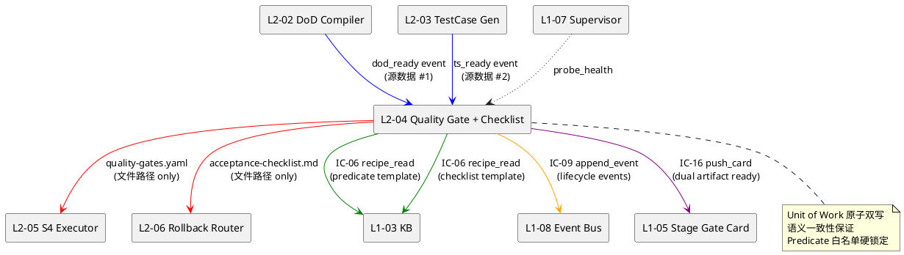
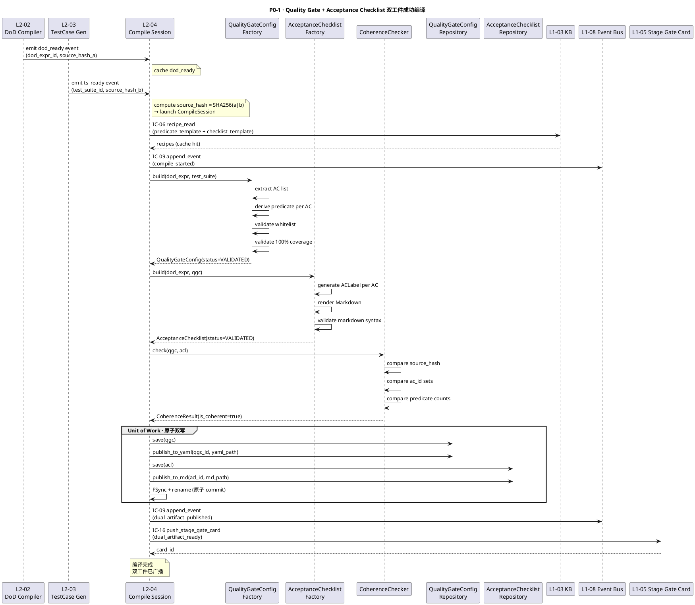
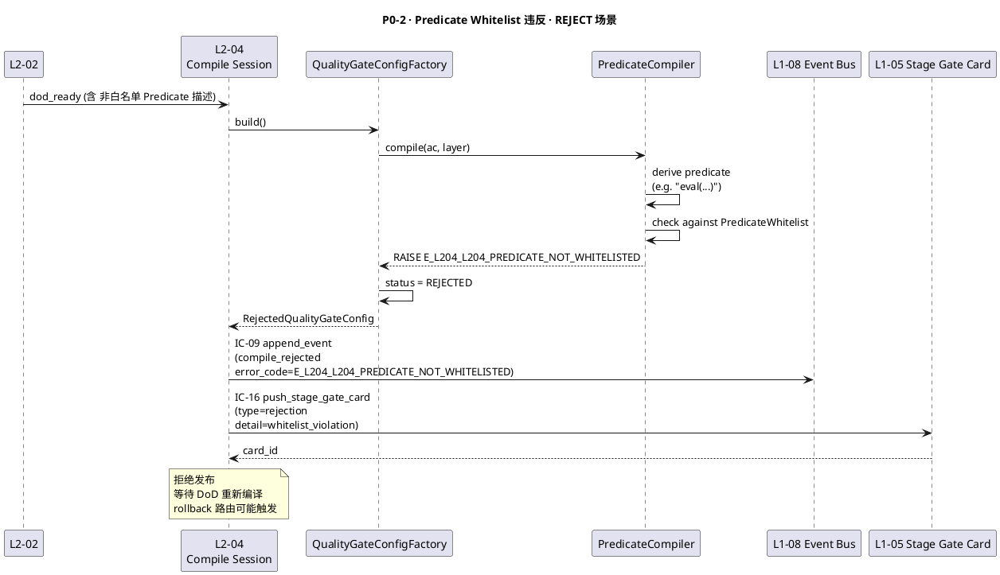
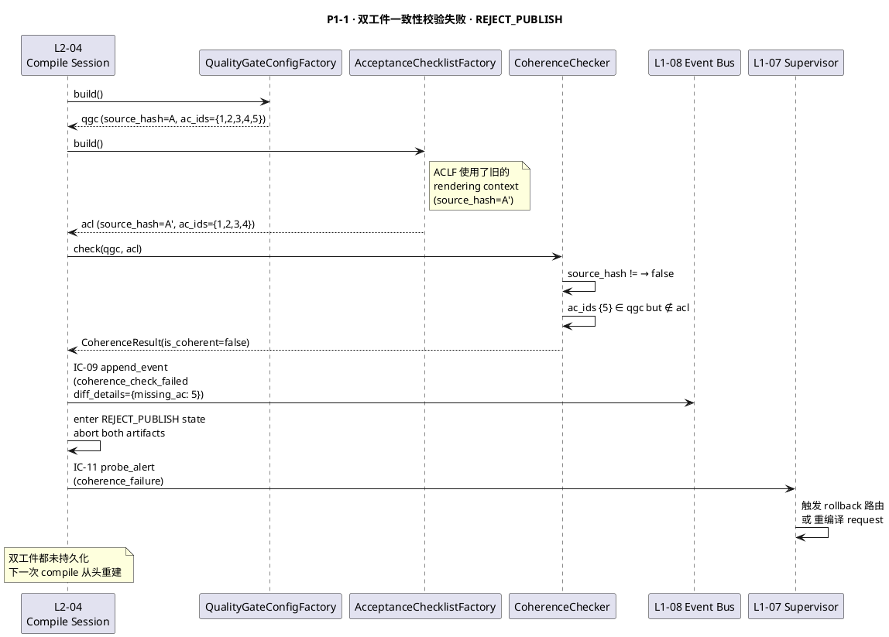
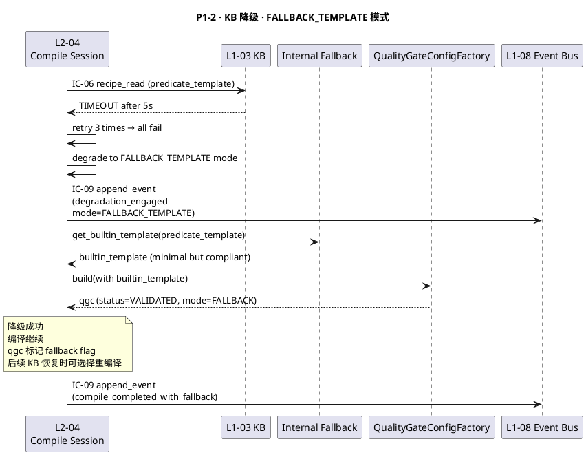
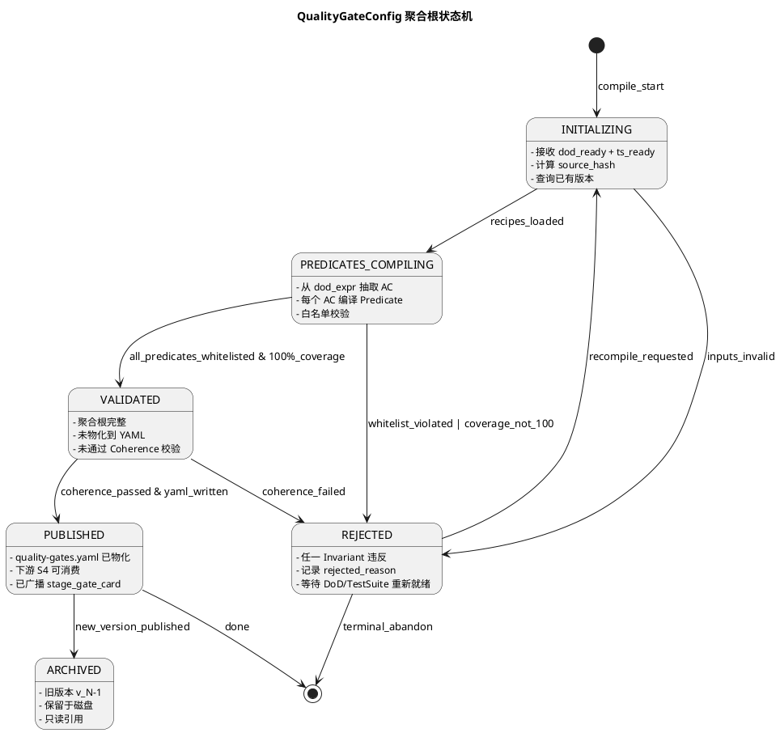
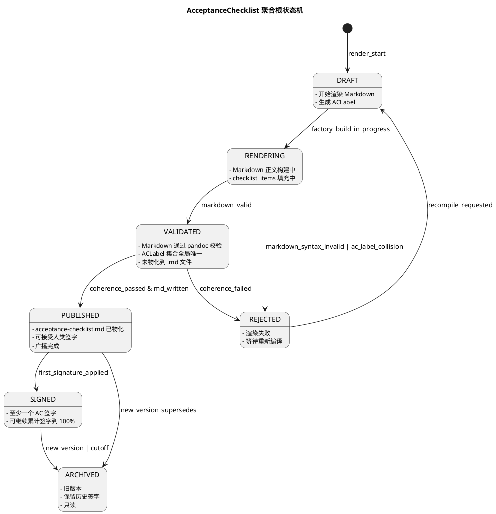
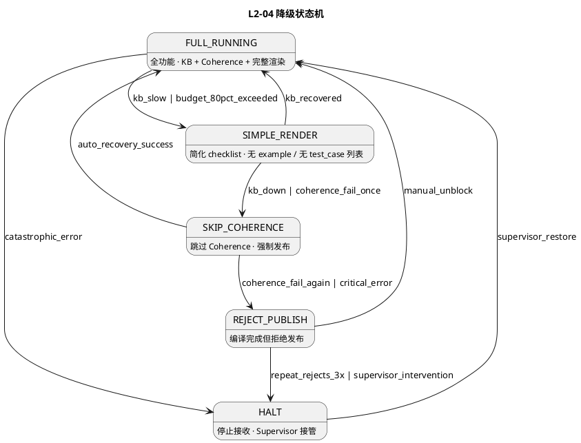

# L1 L2-04 · 质量 Gate 编译器+验收 Checklist · Tech Design

> **本文档定位**：3-1-Solution-Technical 层级 · L1 的 L2-04 质量 Gate 编译器+验收 Checklist 技术实现方案（L2 粒度）。
> **与产品 PRD 的分工**：2-prd/L1-04-Quality Loop/prd.md §5.4 的对应 L2 节定义产品边界，本文档定义**技术实现**（接口字段级 schema + 算法伪代码 + 底层数据结构 + 状态机 + 配置参数）。
> **与 L1 architecture.md 的分工**：architecture.md 负责**跨 L2 架构 + 跨 L2 时序**，本文档负责**本 L2 内部技术细节**。冲突以 architecture.md 为准。
> **严格规则**：本文档不复述产品 PRD 文字（职责 / 禁止 / 必须等清单），只做技术映射 + 补齐"产品视角未说 but 工程师必须知道"的部分（具体算法 · syscall · schema · 配置）。

---

## §0 撰写进度

- [x] §1 定位 + 2-prd §5.4 L2-04 映射
- [x] §2 DDD 映射（引 L0/ddd-context-map.md BC-04）
- [x] §3 对外接口定义（字段级 YAML schema + 错误码）
- [x] §4 接口依赖（被谁调 · 调谁）
- [x] §5 P0/P1 时序图（PlantUML ≥ 2 张）
- [x] §6 内部核心算法（伪代码）
- [x] §7 底层数据表 / schema 设计（字段级 YAML）
- [x] §8 状态机（PlantUML + 转换表）
- [x] §9 开源最佳实践调研（≥ 3 GitHub 高星项目）
- [x] §10 配置参数清单
- [x] §11 错误处理 + 降级策略
- [x] §12 性能目标
- [x] §13 与 2-prd / 3-2 TDD 的映射表

---

## §1 定位 + 2-prd 映射

### 1.1 本 L2 在 L1-04 Quality Loop 里的坐标

L1-04 Quality Loop 由 7 个 L2 组成，L2-04 是**编译层**（第 4 块），承担**"把 DoD 表达式 + TestSuite Skeleton 编译成机器 quality-gates.yaml + 人类 acceptance-checklist.md 双工件"**的单一职责。

```
           ┌─────────────────────────────────────────────────────────┐
           │                   L1-04 Quality Loop                    │
           │                                                         │
           │  ┌─────────┐   ┌─────────┐   ┌─────────┐   ┌─────────┐  │
           │  │ L2-01   │→→ │ L2-02   │→→ │ L2-03   │→→ │ L2-04   │  │
           │  │ TDD     │   │ DoD     │   │ Test    │   │ 质量    │◄─── [YOU ARE HERE]
           │  │ 蓝图    │   │ 编译器  │   │ 用例    │   │ Gate +  │   │
           │  │         │   │         │   │ 生成器  │   │ Accept  │   │
           │  └─────────┘   └─────────┘   └─────────┘   └─────────┘  │
           │                                               ↓         │
           │                  ┌──────────────────────┐     ↓         │
           │                  │ L2-05 · S4 执行驱动  │ ←───┘         │
           │                  │       驱动器          │              │
           │                  └──────────────────────┘              │
           │                            ↓                            │
           │             ┌──────────────┴──────────────┐              │
           │             ↓                             ↓              │
           │        ┌─────────┐                  ┌─────────┐           │
           │        │ L2-06   │                  │ L2-07   │           │
           │        │ 回滚路由│                  │ Verify  │           │
           │        │         │                  │ 报告    │           │
           │        └─────────┘                  └─────────┘           │
           └─────────────────────────────────────────────────────────┘
```

L2-04 的定位 = **"从 DoD 表达式 + TestSuite Skeleton 交织编织出两份一模一样语义但给不同消费者看的工件"**（机器 YAML 给 S4 执行 + 人类 Checklist 给用户签字）。

### 1.2 与 2-prd §5.4 L2-04 的对应表

| 2-prd §5.4 L2-04 小节 | 本文档对应位置 | 技术映射重点 |
|:---|:---|:---|
| §5.4.1 L2-04 职责（quality-gates.yaml + acceptance-checklist.md 双输出） | §1.3 + §2 (QualityGateConfig + AcceptanceChecklist 双聚合根) | 双聚合根 Aggregate 语义一致性约束（同 source 哈希链） |
| §5.4.2 quality-gates.yaml schema | §7.1 quality_gate_config 表字段级 YAML | Predicate 白名单 + 阈值锁定 |
| §5.4.3 acceptance-checklist.md 人类可读格式 | §6.3 checklist 渲染算法 + §7.2 acceptance_checklist 表 | Markdown + 人类标识符 + 签字区块 |
| §5.4.4 禁止（不生成不能评估的谓词 · 不渲染未覆盖的 AC · 不双源头不一致） | §6.2 predicate 白名单校验 + §6.4 双工件一致性校验 | Whitelist lockdown + DIFF 拦截 |
| §5.4.5 5 IC 触点（enter_quality_loop / blueprint_ready / compile_quality_gate / compile_checklist / append_event / push_stage_gate_card） | §3 字段级 schema + §4 依赖图 | 每个 IC 独立 schema 锁定 |
| §5.4.6 降级（KB 预设不可用→模板降级 / 预算超→简化渲染 / 双工件不一致→拒绝推进） | §11 降级状态机 5 级 | REJECT_PUBLISH 硬拒绝优先 |

### 1.3 本 L2 在 architecture.md 里的坐标

引 `docs/3-1-Solution-Technical/L1-04-Quality Loop/architecture.md §3.1 Container Diagram`：

```
  [L2-02 DoD Compiler] ──emits dod_ready──▶ ┌──────────────────────┐
                                            │ L2-04 · 质量 Gate     │
  [L2-03 Test Case Gen] ──emits ts_ready──▶ │ 编译器 + 验收         │
                                            │ Checklist 输出器      │
                                            │                       │
                                            │  ┌─QualityGateConfig─┐│──▶ quality-gates.yaml
                                            │  │   (机器侧聚合根)   ││    → [L2-05 S4 执行]
                                            │  └───────────────────┘│
                                            │                       │
                                            │  ┌─AcceptanceChecklist┐│──▶ acceptance-checklist.md
                                            │  │   (人类侧聚合根)   ││    → [stage_gate_card]
                                            │  └───────────────────┘│
                                            │                       │
                                            │  ┌─Coherence Checker ┐│──▶ 双工件一致性校验
                                            │  │  (Domain Service) ││    → append_event/reject
                                            │  └───────────────────┘│
                                            └──────────────────────┘
```

**本 L2 的关键特征**（对 L1-04 整体而言）：
1. **双聚合根并列 + Coherence Invariant**：QualityGateConfig 和 AcceptanceChecklist 是两个独立的 Aggregate Root，但**必须**共享同一 `source_compilation_id` + 同一 `source_hash`，保证语义同源。
2. **双输出非同步原子 commit**：两个文件**必须**在同一 Unit of Work 里一起落盘，要么都成功要么都回滚（不接受一个成功一个失败的中间态）。
3. **Predicate Whitelist 硬锁定**：机器 YAML 里允许的谓词函数有严格的白名单（约 20 个），禁止任意 lambda / eval / 外部调用。违反白名单 → 编译期拒绝。
4. **Human-Facing Stable Labels**：人类 Checklist 里的 AC 标签（`AC-001`, `AC-002`, ...）必须稳定（同一 AC 跨编译的标签不变），支持人类签字跨轮次追溯。

### 1.4 本 L2 的 PM-14 约束

**PM-14 约束**（引 `docs/3-1-Solution-Technical/projectModel/tech-design.md`）：所有 IC payload 顶层 `project_id` 必填；所有存储路径按 `projects/<pid>/...` 分片。

本 L2 在 PM-14 层面的具体落点：
- 机器 Gate YAML 存储：`projects/<pid>/quality/gates/<blueprint_id>/quality-gates.yaml`
- 人类 Checklist MD 存储：`projects/<pid>/quality/checklists/<blueprint_id>/acceptance-checklist.md`
- 编译日志：`projects/<pid>/quality/compile-log/<compile_id>.jsonl`
- 双工件 diff 报告：`projects/<pid>/quality/coherence/<compile_id>-diff.json`

### 1.5 关键技术决策（本 L2 特有 · Decision / Rationale / Alternatives / Trade-off）

| 决策 | 选择 | 备选 | 理由 | Trade-off |
|:---|:---|:---|:---|:---|
| **D1: quality-gates.yaml schema** | 自研 schema（DSL v1） | Open Policy Agent Rego / Conftest | Rego 表达力强但学习曲线陡；本 L2 的谓词范围狭窄（20 个内建谓词够用），自研 DSL 更轻量 + 学习成本低 + 易审计 | 牺牲通用表达力，换来 100% 可控 + 零依赖 |
| **D2: 双工件一致性保证** | 同一 UoW 原子提交（FSync + rename） | 2PC / Saga 补偿 | 单机文件系统原子 rename 够用；跨机 2PC 复杂 10 倍 + 本 L2 没这个需求 | 牺牲跨机扩展（L1-04 本就是单机进程） |
| **D3: acceptance-checklist.md 格式** | Markdown + 明确的锚点语法（`<!-- AC-ID: xxx -->`） | HTML / PDF / DOCX | Markdown 版本可控、diff 友好、git 原生；锚点语法支持未来自动化签字系统解析 | 牺牲富文本（不支持嵌入图片/视频） |
| **D4: Predicate 执行器** | 硬编码 20 个内建谓词函数 | RestrictedPython / Sandboxing | 内建谓词覆盖 90% 用例 + 无代码注入风险 + 评估速度快 10 倍；RestrictedPython 仍有风险 | 牺牲谓词扩展性，换来绝对安全 + 性能 |
| **D5: 人类 AC 标签稳定策略** | `ac_id` 源自 DoD 表达式的 `dod_expression_id.ac_label`，跨编译保持不变 | 递增数字 / Hash 化 | 跨编译追溯人类签字 + 回头查看历史 Checklist 时稳定；Hash 化虽唯一但人读不友好 | 牺牲部分自动编号灵活性，换来可读 + 可追溯 |
| **D6: Coherence 校验策略** | 双写前编译期校验 + 双写后 runtime 采样 | 只双写前校验 / 只 runtime 校验 | 前置校验拦截 99% 不一致；runtime 采样额外防护 CI 异常产物 | 牺牲少量编译时延，换来 double-check |
| **D7: 原子化 rebuild 语义** | 同一 (project_id, blueprint_id) 重建时幂等（旧版本归档到 `-v{N}.yaml`） | 覆盖 / 报错 / 总是新建 | 支持试错重构 + 保留历史版本做审计 | 牺牲少量磁盘空间（归档目录） |

### 1.6 本 L2 读者预期

读完本 L2 的工程师应掌握：
- QualityGateConfig 聚合根 / AcceptanceChecklist 聚合根 / Coherence Checker Domain Service 三者的职责分工
- 5 个 IC 触点（enter_quality_loop / blueprint_ready / push_stage_gate_card / append_event / recipe_read）的字段级 schema + 错误码
- 15 个算法的伪代码（含 Predicate 编译 / 白名单校验 / Checklist 渲染 / 双工件一致性校验 / 原子 rebuild）
- 3 张数据表（quality_gate_config / acceptance_checklist / predicate_compile_log）的字段级 YAML schema + PM-14 分片结构
- QualityGateConfig 和 AcceptanceChecklist 双状态机（PlantUML）
- 降级链 5 级（FULL → SIMPLE_RENDER → SKIP_COHERENCE → REJECT_PUBLISH → HALT）
- SLO（500 AC 双工件编译 ≤ 10 秒 · 一致性校验 ≤ 500ms P95 · 单 AC 谓词编译 ≤ 5ms）

### 1.7 本 L2 不在的范围（YAGNI）

- **不在**：生成 HTML/PDF 格式 Checklist（D3 决策 · 只 Markdown）
- **不在**：runtime 动态修改 quality-gates.yaml（S4 执行中不允许热改 · 改了就得回 L2-04 重新编译）
- **不在**：Predicate 自定义扩展（D4 决策 · 内建 20 个谓词锁定）
- **不在**：跨项目 Gate 合并（M6 单项目作用域）
- **不在**：多语言 Checklist 国际化（M6 只支持简体中文）
- **不在**：Gate 模板化继承（每个 blueprint 独立编译 · 不共享模板）

### 1.8 本 L2 术语表

| 术语 | 定义 | 关联 |
|:---|:---|:---|
| QualityGateConfig | 机器可读的质量门配置聚合根 · 驱动 S4 自动化 gate 判断 | §2.1 |
| AcceptanceChecklist | 人类可读的验收清单聚合根 · 供业务人员签字 | §2.2 |
| Predicate | 质量 gate 里的判断函数（bool 返回）· 白名单锁定 | §2.3 + §6.2 |
| Coherence | 双工件（YAML + MD）语义一致性约束 · 同 hash_chain 源 | §6.4 |
| CompileSession | 单次完整编译过程（含 DoD 入 + TestSuite 入 + 双工件输出） | §2.4 |
| ACLabel | 人类可读的 AC 稳定标签（`AC-xxx`） · 跨编译不变 | §6.3 |
| PredicateWhitelist | 内建允许谓词白名单（20 个 bool 函数） | §10.2 |

### 1.9 本 L2 的 DDD 定位一句话

> **L2-04 是 BC-04 Quality Loop 的编译层 · 双聚合根（机器 QualityGateConfig + 人类 AcceptanceChecklist）+ Coherence Domain Service · Unit of Work 原子双写 · Predicate 白名单硬锁定。**

---

## §2 DDD 映射（BC-04 Quality Loop）

引 `docs/3-1-Solution-Technical/L0/ddd-context-map.md BC-04`。

本 L2 在 BC-04 Quality Loop 里属于**编译层**，负责把 DoD 表达式 + TestSuite 编译成双工件。

### 2.1 Aggregate Root #1 · QualityGateConfig（机器侧）

**标识**：`qgc_id: UUIDv7`
**边界**：一个 QualityGateConfig = 一个完整的质量门配置，包含全部 Predicate + 阈值 + 白名单

**状态**：`INITIALIZING` / `PREDICATES_COMPILING` / `VALIDATED` / `PUBLISHED` / `ARCHIVED` / `REJECTED`（详见 §8）

**不变量**（Invariants）：
- **I1**：`project_id` + `blueprint_id` + `version` 三元组全局唯一（强制，同一 blueprint 重建必须 v+1 递增归档）
- **I2**：Predicate 清单 ⊂ PredicateWhitelist（20 个内建谓词，违者 REJECTED）
- **I3**：每个 AC（来自 DoD 表达式）**必须**至少对应 1 个 Predicate（100% 覆盖，违者 REJECTED）
- **I4**：阈值字段**必须**全部为数值或布尔 primitive（不允许表达式 · 已在 L2-02 编译时求值）
- **I5**：`source_hash`（由上游 dod_expression + test_suite 的 hash 拼接 SHA-256）**必须**与 AcceptanceChecklist 的 `source_hash` 一致
- **I6**：发布后（PUBLISHED）不可修改（immutable · 改要走 REJECTED + 新版本路径）

**关键字段**（字段级 YAML）：
```yaml
qgc_id:              # UUIDv7
project_id:          # PM-14 约束 · 顶层必填
blueprint_id:        # 关联 L2-01 TDDBlueprint
dod_expression_id:   # 关联 L2-02 DoDExpressionSet
test_suite_id:       # 关联 L2-03 TestSuite
version:             # int · 同一 blueprint 的编译版本号
status:              # enum · 见状态机 §8.1
source_hash:         # SHA-256 · 上游双输入拼接 hash
predicates:          # List[PredicateConfig] · 每个 AC 对应 1+ 个
  - predicate_id:
    ac_id:           # 对应 DoD 表达式的 AC
    predicate_name:  # ⊂ PredicateWhitelist
    threshold:       # 类型 dependent
    timeout_ms:      # 执行超时
    fail_action:     # enum · block / warn / skip
global_policy:
  max_retry: int
  fail_threshold: float  # 允许的 fail 比例
  halt_on_critical: bool
compiled_at:         # 编译完成时间
published_at:        # 发布到 S4 时间
archived_at:         # 归档时间（新版本替代时）
created_by: L2-04
```

**行为**（Methods）：
- `compile_from(dod_expr, test_suite)`：从双输入编译谓词清单
- `validate_whitelist()`：对每个 predicate 检查是否 ⊂ 白名单
- `validate_coverage(ac_list)`：检查每个 AC 至少 1 predicate
- `check_coherence_with(checklist)`：与 AcceptanceChecklist 的 source_hash 对比
- `publish_to_yaml(file_path)`：物化到 quality-gates.yaml
- `archive(reason)`：归档到 v{N} 版本并释放槽位
- `reject(reason, error_code)`：拒绝并持久化拒绝原因

### 2.2 Aggregate Root #2 · AcceptanceChecklist（人类侧）

**标识**：`acl_id: UUIDv7`
**边界**：一个 AcceptanceChecklist = 一份给业务/PM 看的验收 Checklist，Markdown 格式

**状态**：`DRAFT` / `RENDERING` / `VALIDATED` / `PUBLISHED` / `SIGNED` / `ARCHIVED` / `REJECTED`（详见 §8.2）

**不变量**（Invariants）：
- **I1**：`project_id` + `blueprint_id` + `version` 三元组全局唯一
- **I2**：每个 AC 必须有唯一 `ac_label`（稳定跨编译）且锚点语法 `<!-- AC-ID: xxx -->` 必须正确
- **I3**：Markdown 语法必须可被 pandoc 解析（运行时校验）
- **I4**：`source_hash` 必须与 QualityGateConfig.source_hash 一致
- **I5**：发布后可接受签字（SIGNED），但不可修改 Markdown 正文
- **I6**：每个 AC 条目必须包含：label + 描述 + 验证方式 + 签字位（Markdown checkbox）

**关键字段**：
```yaml
acl_id:              # UUIDv7
project_id:
blueprint_id:
dod_expression_id:
test_suite_id:
version:             # int · 同 QualityGateConfig.version
status:              # enum · 见状态机 §8.2
source_hash:         # 必须 == QualityGateConfig.source_hash
markdown_body:       # 完整 Markdown 文本
checklist_items:     # List[ChecklistItem] · 每个 AC 一条
  - item_id:
    ac_label:        # 人类稳定标签 · AC-001 等
    ac_id:           # UUID · 对应 dod_expression
    description:     # 人类可读描述
    verification_method: # "自动" / "人工" / "混合"
    signature_status: enum  # pending / approved / rejected
    signer:
    signed_at:
language: zh-CN      # M6 只 zh-CN
compiled_at:
published_at:
archived_at:
created_by: L2-04
```

**行为**（Methods）：
- `render_from(dod_expr, qgc)`：从 DoD 表达式 + QualityGateConfig 渲染 Markdown
- `validate_ac_labels()`：检查 ac_label 全局唯一 + 格式合法
- `validate_markdown_syntax()`：pandoc 语法校验
- `check_coherence_with(qgc)`：source_hash 对齐
- `publish_to_md(file_path)`：物化到 acceptance-checklist.md
- `accept_signature(ac_id, signer)`：记录签字（M6 仅预留）
- `archive(reason)` / `reject(reason)`

### 2.3 Entity · PredicateConfig

**标识**：`predicate_id: UUIDv7`
**边界**：隶属于 QualityGateConfig 的单个 Predicate 配置

**字段**：
```yaml
predicate_id:
ac_id:              # 对应 DoD 表达式 AC
predicate_name:     # ⊂ PredicateWhitelist（见 §10.2）
threshold:
  type: enum        # numeric / boolean / string_match
  value:            # 类型 dependent
timeout_ms: int
fail_action:        # enum · block / warn / skip
retry_count: int
metadata:           # 附加元数据
```

### 2.4 Value Objects (VO)

| VO | 字段 | 不变性 | 作用 |
|:---|:---|:---|:---|
| **CompileSession** | compile_id (UUIDv7) + start_at + end_at + duration_ms + status + trace_id | immutable | 单次编译的生命周期追溯 |
| **CoherenceResult** | is_coherent: bool + source_hash_match: bool + ac_count_match: bool + predicate_count: int + diff_details: list | immutable | 双工件一致性校验的结果封装 |
| **ACLabel** | label_str (e.g. "AC-001") + parent_ac_id (UUIDv7) + is_stable: bool + original_position: int | immutable | 人类可读 AC 标签 |
| **PredicateBinding** | ac_id + predicate_name + threshold_value + binding_timestamp | immutable | AC → Predicate 的单次绑定 |
| **RenderingContext** | template_version + locale + format_mode (markdown/compact) + char_budget: int | immutable | Checklist 渲染时的上下文 |

### 2.5 Domain Services

#### 2.5.1 QualityGateConfigFactory

**职责**：从上游 DoD 表达式 + TestSuite 构造 QualityGateConfig 聚合根

**方法签名**：
```python
class QualityGateConfigFactory:
    def build(
        project_id: UUID,
        blueprint_id: UUID,
        dod_expr: DoDExpressionSet,
        test_suite: TestSuite
    ) -> QualityGateConfig
```

**职责分工**：
- 从 dod_expr 提取每个 AC
- 为每个 AC 分配 1+ 个 Predicate（按 AC 性质 + TestSuite pyramid 分配）
- 计算 source_hash = SHA-256(dod_expr.hash + test_suite.hash)
- 触发 I2/I3/I4 校验
- 失败时返回 RejectedQualityGateConfig（status=REJECTED）

#### 2.5.2 AcceptanceChecklistFactory

**职责**：渲染 Markdown Checklist 聚合根

**方法签名**：
```python
class AcceptanceChecklistFactory:
    def build(
        project_id: UUID,
        blueprint_id: UUID,
        qgc: QualityGateConfig,
        dod_expr: DoDExpressionSet
    ) -> AcceptanceChecklist
```

**职责分工**：
- 为每个 AC 生成 ACLabel（稳定化规则见 §6.3）
- 按 AC 渲染 Markdown checkbox 条目
- 追加锚点语法（`<!-- AC-ID: xxx -->`）
- 生成签字区块
- 触发 Markdown 语法校验

#### 2.5.3 CoherenceChecker Domain Service

**职责**：检查 QualityGateConfig 和 AcceptanceChecklist 的语义一致性

**方法签名**：
```python
class CoherenceChecker:
    def check(
        qgc: QualityGateConfig,
        acl: AcceptanceChecklist
    ) -> CoherenceResult
```

**检查维度**：
- source_hash 相等（必须 · 违者 REJECT）
- ac_count 相等（QualityGateConfig.predicates 数量组 by ac_id == AcceptanceChecklist.checklist_items 数量）
- ac_id 集合相等（双方的 ac_id 集合求交 / 求差）
- 返回 CoherenceResult VO

#### 2.5.4 PredicateCompiler

**职责**：把 AC 的判断逻辑编译成白名单内的 Predicate 配置

**方法签名**：
```python
class PredicateCompiler:
    def compile(
        ac: AcceptanceCondition,
        layer_hint: str  # unit / integration / e2e
    ) -> list[PredicateConfig]
```

**编译规则**：
- AC 里包含"数值阈值" → `numeric_greater_than` / `numeric_less_than` / `numeric_range`
- AC 里包含"布尔条件" → `boolean_equals` / `boolean_true` / `boolean_false`
- AC 里包含"字符串匹配" → `string_equals` / `string_contains` / `regex_match`
- AC 里包含"测试状态" → `test_status_green` / `test_coverage_gte`
- 非白名单 → 抛出 `E_L204_L204_PREDICATE_NOT_WHITELISTED`

### 2.6 Repository

#### 2.6.1 QualityGateConfigRepository

```python
class QualityGateConfigRepository(abc.ABC):
    def save(qgc: QualityGateConfig) -> None
    def get(qgc_id: UUID) -> QualityGateConfig
    def find_by_blueprint(project_id, blueprint_id, version=None) -> list[QualityGateConfig]
    def archive(qgc_id) -> None
    def publish_to_yaml(qgc_id, path) -> None  # 物化 YAML
    def get_source_hash(qgc_id) -> str
```

#### 2.6.2 AcceptanceChecklistRepository

```python
class AcceptanceChecklistRepository(abc.ABC):
    def save(acl: AcceptanceChecklist) -> None
    def get(acl_id: UUID) -> AcceptanceChecklist
    def find_by_blueprint(project_id, blueprint_id, version=None) -> list[AcceptanceChecklist]
    def publish_to_md(acl_id, path) -> None  # 物化 Markdown
    def get_signature_status(acl_id, ac_id) -> SignatureStatus
```

### 2.7 Domain Events

| Event | 触发 | Payload |
|:---|:---|:---|
| **QualityGateConfigCompilationStarted** | compile 过程启动 | (project_id, blueprint_id, compile_id, start_ts) |
| **QualityGateConfigValidated** | I2/I3/I4 全部通过 | (qgc_id, predicate_count, ac_coverage_pct) |
| **QualityGateConfigPublished** | YAML 物化完成 | (qgc_id, yaml_path, version) |
| **QualityGateConfigRejected** | 任一 Invariant 违反 | (qgc_id or null, error_code, reason) |
| **AcceptanceChecklistCompiled** | MD 渲染完成 | (acl_id, ac_item_count, markdown_length) |
| **AcceptanceChecklistPublished** | MD 物化完成 | (acl_id, md_path, version) |
| **CoherenceCheckFailed** | 双工件一致性校验失败 | (qgc_id, acl_id, diff_details) |
| **DualArtifactPublished** | 双工件均发布 | (qgc_id, acl_id, source_hash) |

### 2.8 与兄弟 L2 的 DDD 关系

| 上游 L2 / BC | 关系 | 触发 |
|:---|:---|:---|
| L2-02 DoDExpressionSet | 输入（读） | emits `dod_ready` event → triggers QualityGateConfig build |
| L2-03 TestSuite | 输入（读） | emits `ts_ready` event → triggers QualityGateConfig build |
| L2-05 S4 执行驱动器 | 输出消费 | reads QualityGateConfig.yaml |
| L2-06 Rollback Router | 输出消费 | reads AcceptanceChecklist for 回滚触发规则 |
| L1-01 PRD Compiler | 跨 BC 引用 | AC 定义在 PRD → DoD 编译 → 本 L2 |

---

## §3 对外接口定义（字段级 YAML schema + 错误码）

本 L2 对外暴露的方法集（按 IC 触点分组）：

### 3.1 IC-L2-02 dod_ready → 启动编译

**方向**：L2-02 → L2-04 · 触发编译启动

**Input Event（dod_ready）**：
```yaml
event_type: "dod_ready"
event_version: "v1.0"
emitted_at: "2026-04-21T14:00:00Z"
emitted_by: "L2-02"
project_id: "uuid"     # PM-14
dod_expression_id: "uuid"
blueprint_id: "uuid"
source_hash: "sha256-hex"
payload:
  expression_count: 57
  ac_count: 120
  predicate_hints: [...]
trace_id: "uuid"
```

**接收方动作**（L2-04 内部）：
- 校验 payload completeness
- 查询对应的 TestSuite（同 blueprint_id）
  - 若 `test_suite_id` 未 green → 等待 `ts_ready`
- 触发编译 session（见 §3.3）

**错误码**：
| 错误码 | 含义 | 触发场景 | 恢复 |
|:---|:---|:---|:---|
| `E_L204_L202_DOD_NOT_FOUND` | dod_expression 不存在 | id 不在存储 | 告警 + 丢弃 event |
| `E_L204_L202_DOD_HASH_INVALID` | hash 格式错 | source_hash 不合法 | 拒绝 + 回传 |

### 3.2 IC-L2-03 ts_ready → 补齐输入

**方向**：L2-03 → L2-04

**Input Event（ts_ready）**：
```yaml
event_type: "ts_ready"
event_version: "v1.0"
emitted_at: "..."
emitted_by: "L2-03"
project_id: "uuid"
test_suite_id: "uuid"
blueprint_id: "uuid"
source_hash: "..."
payload:
  skeleton_count: 250
  state: "red"        # 必须 red 才允许下游消费
trace_id: "uuid"
```

**接收方动作**：
- 查询对应的 dod_expression（同 blueprint_id）
  - 若已到达 → 立即启动 CompileSession
  - 若未到达 → 缓存等待

### 3.3 本 L2 主入口 · compile_quality_gate（Internal RPC）

**方法名**：`compile_quality_gate`
**可调用位置**：L2-04 内部 CompileSession / L2-05 S4 如需 reload

**入参**：
```yaml
project_id: "uuid"
blueprint_id: "uuid"
dod_expression_id: "uuid"
test_suite_id: "uuid"
source_hash: "..."
version_bump: false   # 是否强制新版本（默认 false，同 blueprint 已存在 → 幂等返回）
trace_id: "..."
```

**出参**：
```yaml
success: true/false
qgc_id: "uuid"
acl_id: "uuid"
version: 1
yaml_path: "projects/p123/quality/gates/b456/v1/quality-gates.yaml"
md_path: "projects/p123/quality/checklists/b456/v1/acceptance-checklist.md"
predicate_count: 300
ac_count: 120
coherence_result: {is_coherent, source_hash_match, ac_count_match, predicate_count, diff_details}
compile_duration_ms: 8234
error:
  code: "E_L204_..."
  message: "..."
  detail: {...}
```

**错误码**（编译期）：
| 错误码 | 含义 | 触发场景 | 调用方处理 |
|:---|:---|:---|:---|
| `E_L204_L204_DOD_EXPR_NOT_READY` | dod_expression 未就绪 | status != COMPILED | 返回；等待 dod_ready 事件 |
| `E_L204_L204_TS_NOT_READY` | TestSuite 未就绪 | status != READY | 返回；等待 ts_ready 事件 |
| `E_L204_L204_PREDICATE_NOT_WHITELISTED` | 谓词不在白名单 | AC 推导出的 predicate ∉ PredicateWhitelist | 拒绝 Publishing · REJECTED |
| `E_L204_L204_AC_COVERAGE_NOT_100` | AC 未 100% 覆盖 | 某 AC 无 Predicate 绑定 | REJECTED |
| `E_L204_L204_THRESHOLD_NOT_PRIMITIVE` | 阈值非 primitive | threshold 含表达式 | REJECTED |
| `E_L204_L204_SOURCE_HASH_MISMATCH` | 双输入 hash 不匹配 | dod_expr.hash / ts.hash 计算不一致 | REJECTED + 告警 |
| `E_L204_L204_COHERENCE_FAILED` | 双工件一致性失败 | QualityGateConfig + AcceptanceChecklist 不一致 | REJECT_PUBLISH |
| `E_L204_L204_YAML_WRITE_FAILED` | YAML 物化失败 | 磁盘空间 / 权限 | 重试 3 次后 HALT |
| `E_L204_L204_MD_WRITE_FAILED` | Markdown 物化失败 | 同上 | 同上 |
| `E_L204_L204_VERSION_CONFLICT` | 版本冲突 | 同 (p, b, v) 已存在 | 走 version_bump 路径 |
| `E_L204_L204_MARKDOWN_SYNTAX_INVALID` | MD 语法错 | pandoc 校验失败 | REJECTED |
| `E_L204_L204_ACLABEL_COLLISION` | AC 标签冲突 | 两个 AC 算出同 label | 重新稳定化 + 告警 |
| `E_L204_L204_COMPILE_TIMEOUT` | 编译超时 | 超过 `compile_timeout_ms` | HALT + L1-07 supervisor 接管 |
| `E_L204_L204_ATOMIC_WRITE_FAILED` | 原子双写失败 | FSync + rename 故障 | 回滚 + 重试 |
| `E_L204_L204_DEGRADATION_REJECTED` | 降级拒绝模式下仍请求 | 系统处于 REJECT_PUBLISH 状态 | 等待恢复 |

### 3.4 IC-09 append_event（对 L1-07 / L1-08 Event Bus）

**方向**：L2-04 → L1-07/L1-08

**Input（本 L2 的出站）**：
```yaml
stream: "L1-04.L2-04.compile"
event_type:
  - compile_started
  - compile_completed
  - compile_rejected
  - dual_artifact_published
  - coherence_check_failed
  - degradation_engaged
  - halt_triggered
payload:
  qgc_id: "uuid"
  acl_id: "uuid"
  project_id: "..."
  blueprint_id: "..."
  duration_ms: int
  error_code: "..."
trace_id: "..."
```

**不可变**：append-only（L1-08 保证）

### 3.5 IC-16 push_stage_gate_card（双工件同步广播）

**方向**：L2-04 → L1-05 stage_gate_card

**Input**：
```yaml
card_type: "dual_artifact_ready"
project_id: "uuid"
stage_gate_id: "quality_gate_published"
qgc_id: "uuid"
acl_id: "uuid"
yaml_path: "..."
md_path: "..."
rendered_summary: "验收清单已就绪：120 条 AC 待签字..."
trace_id: "..."
```

**成功响应**：
```yaml
card_id: "uuid"
created_at: "..."
tab_id: "..."  # 用于后续 commentary
```

**错误码**：
| 错误码 | 含义 | 恢复 |
|:---|:---|:---|
| `E_L204_L205_CARD_CREATE_FAIL` | 卡片创建失败 | 重试 3 次，失败后降级 DEFERRED_PUBLISHING |
| `E_L204_L205_RENDER_FAIL` | rendered_summary 超预算 | 截断 + 重试 |

### 3.6 IC-06 recipe_read（KB 查询 · 可选）

**方向**：L2-04 → L1-03 KB

**Input**：
```yaml
recipe_type:
  - "predicate_template"
  - "checklist_template"
  - "acceptance_criteria_mapping"
project_id: "uuid"
context:
  language: "zh-CN"
  domain_hint: "..."
trace_id: "..."
```

**Output**：
```yaml
recipes:
  - recipe_id: "uuid"
    recipe_type: "..."
    content: {...}
    applicable_ac_types: [...]
cache_hit: bool
```

**降级**：KB 不可用 → 使用内建 fallback 模板（见 §11.3）

---

## §4 接口依赖（被谁调 · 调谁）

### 4.1 上游（调本 L2）

| 调用方 | 方法 | 触发场景 | 关键约束 |
|:---|:---|:---|:---|
| L2-02 DoD Compiler | emits `dod_ready` → L2-04 | dod_expression 编译完成 | 必须带 project_id + blueprint_id + source_hash |
| L2-03 TestCase Generator | emits `ts_ready` → L2-04 | TestSuite 就绪 (status=red) | 同上 |
| L2-05 S4 Executor | calls `compile_quality_gate` | 检测到上游更新需 reload | 只读（不允许修改） |

### 4.2 下游（本 L2 调）

| 被调方 | IC | 频次 | 数据流向 |
|:---|:---|:---|:---|
| L1-03 KB (Recipe) | IC-06 recipe_read | 每次 compile 开始（可降级） | 读 predicate/checklist 模板 |
| L1-08 Event Bus | IC-09 append_event | 每个生命周期节点 | append-only |
| L1-05 Stage Gate Card | IC-16 push_stage_gate_card | 双工件发布后 | 广播给 Supervisor / 操作员 |
| L1-07 Supervisor | IC-11 probe_health | health check 定期 | 返回 CompileSession 状态 |
| L2-05 S4 Executor | via file system | 静态（S4 拉取 yaml/md）| 路径返回给 S4 |

### 4.3 依赖图（PlantUML）



### 4.4 依赖降级策略

| 依赖 | 降级 | 理由 |
|:---|:---|:---|
| L1-03 KB (recipe) | 内建 fallback 模板 | 保证不停机 · 失去上下文化 |
| L1-08 Event Bus | 本地 WAL 缓冲 | 后续自动回放 |
| L1-05 Stage Gate Card | DEFERRED_PUBLISHING 状态 | 延迟广播，不阻塞编译 |
| L1-07 Supervisor | Stale state flag | 自我接管降级决策 |

### 4.5 并发约束

- 同一 (project_id, blueprint_id, version) 串行（分布式锁）
- 不同 blueprint_id 并行 → CompileSession 独立
- 全局 CompileSession 池上限：10 个（见 §10.1）

---

## §5 P0/P1 时序图（PlantUML ≥ 2 张）

### 5.1 P0-1 · 双工件成功编译完整流程



### 5.2 P0-2 · Predicate 白名单违反拦截



### 5.3 P1-1 · Coherence Check Failed · 双工件不一致



### 5.4 P1-2 · KB 不可用 · 降级到内建模板



---

## §6 内部核心算法（伪代码）

### 6.1 主编译流程 · CompileSession.run

```python
class CompileSession:
    def run(self, dod_ready_event, ts_ready_event):
        """
        主编译入口
        前置: dod_ready + ts_ready 都已到达
        后置: 双工件都发布 或 REJECTED/HALT
        """
        session_id = uuid7()
        self.event_bus.append(COMPILE_STARTED, session_id, ...)

        try:
            # Step 1: 输入校验
            dod_expr = self.repo.get_dod(dod_ready_event.dod_expression_id)
            test_suite = self.repo.get_ts(ts_ready_event.test_suite_id)

            if dod_expr.status != "COMPILED":
                raise E_L204_L204_DOD_EXPR_NOT_READY
            if test_suite.state.status != "RED":
                raise E_L204_L204_TS_NOT_READY

            # Step 2: source_hash 计算
            source_hash = sha256(
                dod_expr.hash + test_suite.hash
            )

            # Step 3: 检查已存在版本
            existing = self.repo.find_by_blueprint(
                dod_expr.project_id,
                dod_expr.blueprint_id,
                version=None
            )
            next_version = max((e.version for e in existing), default=0) + 1

            # Step 4: 加载 recipe (可降级)
            try:
                pred_tpl = self.kb.read_recipe("predicate_template")
                cl_tpl = self.kb.read_recipe("checklist_template")
            except KBUnavailable:
                self.log_degradation("FALLBACK_TEMPLATE")
                pred_tpl = get_builtin_template("predicate")
                cl_tpl = get_builtin_template("checklist")

            # Step 5: 构建 QualityGateConfig
            qgc = QualityGateConfigFactory().build(
                project_id=dod_expr.project_id,
                blueprint_id=dod_expr.blueprint_id,
                dod_expr=dod_expr,
                test_suite=test_suite,
                predicate_template=pred_tpl,
                version=next_version,
                source_hash=source_hash
            )

            if qgc.status == "REJECTED":
                self.abort(session_id, qgc.rejection_reason)
                return

            # Step 6: 构建 AcceptanceChecklist
            acl = AcceptanceChecklistFactory().build(
                project_id=dod_expr.project_id,
                blueprint_id=dod_expr.blueprint_id,
                qgc=qgc,
                dod_expr=dod_expr,
                checklist_template=cl_tpl,
                version=next_version,
                source_hash=source_hash
            )

            if acl.status == "REJECTED":
                self.abort(session_id, acl.rejection_reason)
                return

            # Step 7: Coherence 校验
            coherence = CoherenceChecker().check(qgc, acl)
            if not coherence.is_coherent:
                self.enter_reject_publish_state(session_id, coherence.diff_details)
                return

            # Step 8: Unit of Work · 原子双写
            self.atomic_publish(qgc, acl)

            # Step 9: 广播
            self.event_bus.append(DUAL_ARTIFACT_PUBLISHED, ...)
            self.card.push_stage_gate_card(
                card_type="dual_artifact_ready",
                qgc_id=qgc.id,
                acl_id=acl.id
            )

            # Step 10: 归档旧版本
            if next_version > 1:
                old_qgc = self.repo.find_by_blueprint(
                    dod_expr.project_id,
                    dod_expr.blueprint_id,
                    version=next_version - 1
                )[0]
                self.repo.archive(old_qgc.id, reason="superseded")

        except TimeoutError as e:
            self.halt(session_id, E_L204_L204_COMPILE_TIMEOUT)

        except Exception as e:
            self.log_error(session_id, e)
            self.abort(session_id, str(e))
```

### 6.2 Predicate 白名单校验 · validate_whitelist

```python
class PredicateWhitelist:
    """
    内建允许的 20 个 Predicate 函数白名单
    必须在编译期检查 · runtime 也要校验（防止内存串改）
    """
    _WHITELIST = frozenset([
        # Numeric predicates (6)
        "numeric_greater_than",
        "numeric_greater_or_equal",
        "numeric_less_than",
        "numeric_less_or_equal",
        "numeric_equals",
        "numeric_range",

        # Boolean predicates (3)
        "boolean_equals",
        "boolean_true",
        "boolean_false",

        # String predicates (4)
        "string_equals",
        "string_not_equals",
        "string_contains",
        "string_not_contains",

        # Test status predicates (4)
        "test_status_green",
        "test_status_all_passed",
        "test_coverage_gte",
        "test_skeleton_count_equals",

        # AC-specific predicates (3)
        "ac_satisfied",
        "ac_all_satisfied",
        "ac_blocker_cleared",
    ])

    @classmethod
    def validate(cls, predicate_name: str) -> bool:
        if predicate_name not in cls._WHITELIST:
            raise E_L204_L204_PREDICATE_NOT_WHITELISTED(
                predicate_name=predicate_name,
                whitelist_size=len(cls._WHITELIST)
            )
        return True

    @classmethod
    def validate_all(cls, predicates: list) -> None:
        violations = []
        for pred in predicates:
            if pred.predicate_name not in cls._WHITELIST:
                violations.append(pred.predicate_name)
        if violations:
            raise E_L204_L204_PREDICATE_NOT_WHITELISTED(
                violations=violations,
                whitelist_size=len(cls._WHITELIST)
            )
```

### 6.3 ACLabel 稳定化算法 · stable_ac_label

```python
class ACLabelGenerator:
    """
    为每个 AC 生成稳定的人类可读标签
    跨编译不变（除非 AC 本身变化）
    """
    def __init__(self):
        # 内存缓存，同项目同 blueprint 内保持一致
        self._label_cache: dict[tuple[UUID, UUID], dict[UUID, str]] = {}

    def generate(self, project_id: UUID, blueprint_id: UUID, ac: AcceptanceCondition) -> str:
        """
        稳定化规则:
        1. 如果 AC.ac_id 已存在于 cache → 返回历史 label
        2. 否则按 AC 在 dod_expression 中的位置（position）生成 AC-xxx
        3. position 基于 dod_expression 的字段顺序，稳定
        """
        cache_key = (project_id, blueprint_id)
        if cache_key not in self._label_cache:
            # 从持久化读取历史 labels
            self._label_cache[cache_key] = self._load_from_repository(project_id, blueprint_id)

        local_cache = self._label_cache[cache_key]

        if ac.ac_id in local_cache:
            return local_cache[ac.ac_id]

        # 分配新的 label
        existing_positions = {
            int(label.split('-')[1]) for label in local_cache.values()
            if label.startswith("AC-")
        }

        if existing_positions:
            next_pos = max(existing_positions) + 1
        else:
            next_pos = 1

        new_label = f"AC-{next_pos:03d}"
        local_cache[ac.ac_id] = new_label

        # 持久化到数据库（保证下次编译读到一样的 label）
        self._persist_label_mapping(project_id, blueprint_id, ac.ac_id, new_label)

        return new_label

    def detect_collision(self, labels: dict[UUID, str]) -> list[str]:
        """检查是否有 label 冲突（理论上不会，但防御性）"""
        seen = {}
        collisions = []
        for ac_id, label in labels.items():
            if label in seen:
                collisions.append(label)
            else:
                seen[label] = ac_id
        return collisions
```

### 6.4 双工件一致性校验 · CoherenceChecker.check

```python
class CoherenceChecker:
    def check(self, qgc: QualityGateConfig, acl: AcceptanceChecklist) -> CoherenceResult:
        """
        多维度校验
        """
        issues = []

        # 1. source_hash 相等
        source_hash_match = qgc.source_hash == acl.source_hash
        if not source_hash_match:
            issues.append({
                "type": "source_hash_mismatch",
                "qgc_hash": qgc.source_hash,
                "acl_hash": acl.source_hash
            })

        # 2. AC 集合相等
        qgc_ac_ids = set(pred.ac_id for pred in qgc.predicates)
        acl_ac_ids = set(item.ac_id for item in acl.checklist_items)

        missing_in_acl = qgc_ac_ids - acl_ac_ids  # 在 qgc 但不在 acl 的
        missing_in_qgc = acl_ac_ids - qgc_ac_ids  # 在 acl 但不在 qgc 的

        ac_set_match = (len(missing_in_acl) == 0 and len(missing_in_qgc) == 0)

        if missing_in_acl:
            issues.append({
                "type": "ac_missing_in_checklist",
                "ac_ids": list(missing_in_acl)
            })
        if missing_in_qgc:
            issues.append({
                "type": "ac_missing_in_qgc",
                "ac_ids": list(missing_in_qgc)
            })

        # 3. AC 总数相等
        ac_count_match = (
            len(qgc_ac_ids) == len(acl_ac_ids)
        )

        # 4. Predicate 数量和 AC 匹配（每个 AC 至少 1 个 predicate）
        predicate_ac_count = {}
        for pred in qgc.predicates:
            predicate_ac_count[pred.ac_id] = predicate_ac_count.get(pred.ac_id, 0) + 1

        ac_without_predicate = [
            ac_id for ac_id in qgc_ac_ids
            if predicate_ac_count.get(ac_id, 0) == 0
        ]

        if ac_without_predicate:
            issues.append({
                "type": "ac_without_predicate",
                "ac_ids": ac_without_predicate
            })

        # 5. 综合判断
        is_coherent = (
            source_hash_match and
            ac_set_match and
            ac_count_match and
            len(ac_without_predicate) == 0
        )

        return CoherenceResult(
            is_coherent=is_coherent,
            source_hash_match=source_hash_match,
            ac_count_match=ac_count_match,
            predicate_count=len(qgc.predicates),
            diff_details=issues
        )
```

### 6.5 Markdown Checklist 渲染 · render_markdown_body

```python
class AcceptanceChecklistRenderer:
    """
    渲染 Markdown Checklist · 格式严格 · 可被 pandoc 解析
    """

    _TEMPLATE = """
# 验收清单 · {blueprint_title}

<!-- Blueprint: {blueprint_id} -->
<!-- Version: {version} -->
<!-- Source Hash: {source_hash} -->

## 概要

- **项目**: {project_id}
- **Blueprint**: {blueprint_id}
- **编译版本**: v{version}
- **AC 总数**: {ac_count}
- **Predicate 总数**: {predicate_count}
- **生成时间**: {compiled_at}

## AC 清单

{ac_items}

## 验收签字

- 业务方: [ ] {biz_signer}
- PM: [ ] {pm_signer}
- QA: [ ] {qa_signer}
- 签字时间: ____

<!-- L204:CHECKLIST:SIGNATURE:BLOCK -->
"""

    _AC_ITEM_TEMPLATE = """
### {ac_label} · {ac_title}

<!-- AC-ID: {ac_id} -->
<!-- Verification: {verification_method} -->

**描述**: {ac_description}

**验证方式**: {verification_method}

**关联测试**: {test_case_count} 条

**关联 Predicate**:
{predicate_list}

**签字**: [ ] 通过 / [ ] 拒绝 / 备注: ____

---
"""

    def render(self, qgc: QualityGateConfig, dod_expr: DoDExpressionSet) -> str:
        # 收集所有 AC 条目
        ac_items = []
        for ac in dod_expr.acceptance_conditions:
            ac_label = ACLabelGenerator().generate(
                qgc.project_id, qgc.blueprint_id, ac
            )

            related_predicates = [
                p for p in qgc.predicates if p.ac_id == ac.ac_id
            ]

            predicate_list = "\n".join([
                f"- `{p.predicate_name}`: threshold = {p.threshold}"
                for p in related_predicates
            ])

            ac_items.append(self._AC_ITEM_TEMPLATE.format(
                ac_label=ac_label,
                ac_title=ac.title,
                ac_id=ac.ac_id,
                ac_description=ac.description,
                verification_method=self._detect_verification_method(ac, related_predicates),
                test_case_count=self._count_test_cases(ac.ac_id),
                predicate_list=predicate_list
            ))

        # 组装主文档
        return self._TEMPLATE.format(
            blueprint_title=qgc.blueprint_id,
            project_id=qgc.project_id,
            blueprint_id=qgc.blueprint_id,
            version=qgc.version,
            source_hash=qgc.source_hash,
            ac_count=len(dod_expr.acceptance_conditions),
            predicate_count=len(qgc.predicates),
            compiled_at=datetime.utcnow().isoformat(),
            ac_items="\n".join(ac_items),
            biz_signer="_________",
            pm_signer="_________",
            qa_signer="_________"
        )

    def _detect_verification_method(self, ac, predicates) -> str:
        auto_preds = [p for p in predicates if p.predicate_name.startswith(
            ("test_", "numeric_", "boolean_", "string_")
        )]
        if len(auto_preds) == len(predicates):
            return "自动"
        elif len(auto_preds) == 0:
            return "人工"
        else:
            return "混合"
```

### 6.6 Markdown 语法校验 · validate_markdown_syntax

```python
class MarkdownValidator:
    def validate(self, markdown_body: str) -> bool:
        """
        用 pandoc 解析校验 Markdown 语法
        失败则 REJECTED
        """
        try:
            # 在 temp file 里写入 markdown
            with tempfile.NamedTemporaryFile(
                mode='w', suffix='.md', delete=False
            ) as f:
                f.write(markdown_body)
                temp_path = f.name

            # 调用 pandoc 做 dry-run
            result = subprocess.run(
                ['pandoc', '--dry-run', '-f', 'markdown', '-t', 'html', temp_path],
                capture_output=True, text=True, timeout=30
            )

            if result.returncode != 0:
                raise E_L204_L204_MARKDOWN_SYNTAX_INVALID(
                    stderr=result.stderr,
                    hint="Markdown 格式不合法，无法被 pandoc 解析"
                )

            return True

        finally:
            if temp_path:
                os.unlink(temp_path)

    def validate_ac_anchor_format(self, markdown_body: str) -> list[str]:
        """
        额外校验 AC-ID 锚点语法格式
        """
        import re
        violations = []
        pattern = r'<!-- AC-ID: ([a-f0-9-]+) -->'
        matches = re.findall(pattern, markdown_body)
        for match in matches:
            if not self._is_valid_uuid(match):
                violations.append(f"Invalid UUID in AC-ID: {match}")
        return violations
```

### 6.7 原子双写 · atomic_publish

```python
class AtomicDualWriter:
    """
    原子双写 QualityGateConfig YAML + AcceptanceChecklist Markdown
    一起成功 · 一起失败
    """

    def publish(self, qgc: QualityGateConfig, acl: AcceptanceChecklist) -> None:
        yaml_path = self._yaml_path(qgc)
        md_path = self._md_path(acl)

        # Step 1: 写到临时文件（.new 后缀）
        yaml_temp = f"{yaml_path}.new"
        md_temp = f"{md_path}.new"

        try:
            # 写 YAML
            with open(yaml_temp, 'w') as f:
                yaml.safe_dump(qgc.to_yaml_dict(), f, sort_keys=True)

            # 写 MD
            with open(md_temp, 'w') as f:
                f.write(acl.markdown_body)

            # Step 2: FSync 两者
            os.fsync(open(yaml_temp).fileno())
            os.fsync(open(md_temp).fileno())

            # Step 3: 原子 rename（POSIX 保证原子）
            os.rename(yaml_temp, yaml_path)
            os.rename(md_temp, md_path)

            # Step 4: FSync 目录
            dir_fd = os.open(
                os.path.dirname(yaml_path), os.O_RDONLY
            )
            os.fsync(dir_fd)
            os.close(dir_fd)

            # Step 5: 更新 DB 状态
            qgc.status = "PUBLISHED"
            acl.status = "PUBLISHED"
            self.repo.save_both(qgc, acl)

        except Exception as e:
            # 回滚：删除临时文件
            for temp_file in [yaml_temp, md_temp]:
                if os.path.exists(temp_file):
                    os.remove(temp_file)

            raise E_L204_L204_ATOMIC_WRITE_FAILED(
                cause=str(e),
                partial_state="双写中某阶段失败 · 双方均未发布"
            )

    def _yaml_path(self, qgc) -> str:
        return (
            f"projects/{qgc.project_id}/quality/gates/"
            f"{qgc.blueprint_id}/v{qgc.version}/quality-gates.yaml"
        )

    def _md_path(self, acl) -> str:
        return (
            f"projects/{acl.project_id}/quality/checklists/"
            f"{acl.blueprint_id}/v{acl.version}/acceptance-checklist.md"
        )
```

### 6.8 Predicate 白名单编译 · compile_predicate

```python
class PredicateCompiler:
    """
    从 AC 推导 Predicate 配置
    必须产出白名单内的 Predicate
    """

    def compile(self, ac: AcceptanceCondition, layer_hint: str) -> list[PredicateConfig]:
        """
        核心推导逻辑
        根据 AC 文本和 layer_hint 选择合适 Predicate
        """
        predicates = []

        # 分析 AC 类型
        ac_type = self._classify_ac_type(ac)

        if ac_type == "numeric_threshold":
            predicates.append(self._build_numeric_predicate(ac, layer_hint))
        elif ac_type == "boolean_condition":
            predicates.append(self._build_boolean_predicate(ac, layer_hint))
        elif ac_type == "string_match":
            predicates.append(self._build_string_predicate(ac, layer_hint))
        elif ac_type == "coverage":
            predicates.append(self._build_coverage_predicate(ac, layer_hint))
        elif ac_type == "all_satisfied":
            # 复合 AC · 拆分为多个 predicate
            for sub_ac in ac.sub_conditions:
                predicates.extend(self.compile(sub_ac, layer_hint))
        else:
            raise E_L204_L204_UNKNOWN_AC_TYPE(
                ac_id=ac.ac_id,
                ac_type=ac_type
            )

        # 最后白名单校验
        PredicateWhitelist.validate_all(predicates)

        return predicates

    def _classify_ac_type(self, ac: AcceptanceCondition) -> str:
        """
        AC 类型分类器
        """
        if "at least" in ac.description or "at most" in ac.description:
            return "numeric_threshold"
        if "is" in ac.description and any(
            word in ac.description for word in ["true", "false"]
        ):
            return "boolean_condition"
        if "contains" in ac.description or "equals" in ac.description:
            return "string_match"
        if "coverage" in ac.description or "covered" in ac.description:
            return "coverage"
        return "all_satisfied"

    def _build_numeric_predicate(self, ac, layer_hint) -> PredicateConfig:
        # 解析阈值
        threshold = self._extract_numeric_threshold(ac)

        return PredicateConfig(
            predicate_id=uuid7(),
            ac_id=ac.ac_id,
            predicate_name="numeric_greater_or_equal",
            threshold={"type": "numeric", "value": threshold},
            timeout_ms=5000,
            fail_action="block",
            retry_count=0
        )
```

### 6.9 原子 rebuild · is_blueprint_already_processed

```python
def check_rebuild_idempotency(
    project_id: UUID,
    blueprint_id: UUID,
    source_hash: str
) -> tuple[bool, UUID | None]:
    """
    检查该 source_hash 是否已成功编译过
    已编译 → 幂等返回 qgc_id
    未编译 → 继续编译
    """
    existing_qgcs = repo.find_by_blueprint(project_id, blueprint_id)

    for qgc in existing_qgcs:
        if qgc.source_hash == source_hash and qgc.status == "PUBLISHED":
            return True, qgc.qgc_id

    return False, None
```

### 6.10 Predicate 执行时间估算 · estimate_predicate_execution_time

```python
def estimate_execution_time(qgc: QualityGateConfig) -> int:
    """
    估算所有 Predicate 的总执行时间（毫秒）
    用于 S4 规划 gate 窗口
    """
    total_ms = 0
    for pred in qgc.predicates:
        # 按 predicate 类型估算
        if pred.predicate_name.startswith("numeric_"):
            total_ms += 5  # ~5ms
        elif pred.predicate_name.startswith("boolean_"):
            total_ms += 2
        elif pred.predicate_name.startswith("string_"):
            total_ms += 8
        elif pred.predicate_name.startswith("test_"):
            total_ms += pred.timeout_ms  # 可能 run tests
        else:
            total_ms += 10

    return total_ms
```

### 6.11 Checklist 签字进度查询 · query_signature_progress

```python
def query_progress(acl_id: UUID) -> dict:
    """
    查询 Checklist 的签字进度
    """
    acl = repo.get(acl_id)

    total = len(acl.checklist_items)
    approved = sum(1 for item in acl.checklist_items
                   if item.signature_status == "approved")
    rejected = sum(1 for item in acl.checklist_items
                   if item.signature_status == "rejected")
    pending = sum(1 for item in acl.checklist_items
                  if item.signature_status == "pending")

    return {
        "acl_id": acl_id,
        "total_items": total,
        "approved": approved,
        "rejected": rejected,
        "pending": pending,
        "progress_pct": round(100 * approved / total, 1) if total > 0 else 0
    }
```

### 6.12 降级状态转换 · engage_degradation

```python
class DegradationStateMachine:
    """
    降级状态：FULL → SIMPLE_RENDER → SKIP_COHERENCE → REJECT_PUBLISH → HALT
    """

    def engage(self, current_state: str, trigger: str) -> str:
        """
        根据触发原因返回新状态
        """
        transitions = {
            ("FULL", "kb_slow"): "SIMPLE_RENDER",
            ("FULL", "budget_exceeded"): "SIMPLE_RENDER",

            ("SIMPLE_RENDER", "kb_down"): "SKIP_COHERENCE",
            ("SIMPLE_RENDER", "coherence_fail_once"): "SKIP_COHERENCE",

            ("SKIP_COHERENCE", "coherence_fail_again"): "REJECT_PUBLISH",
            ("SKIP_COHERENCE", "critical_error"): "REJECT_PUBLISH",

            ("REJECT_PUBLISH", "repeat_rejects"): "HALT",
            ("REJECT_PUBLISH", "manual_intervention"): "HALT",
        }

        new_state = transitions.get((current_state, trigger), current_state)
        return new_state

    def describe(self, state: str) -> str:
        return {
            "FULL": "全功能运行 · 含 KB + Coherence + 完整 checklist 渲染",
            "SIMPLE_RENDER": "简化 checklist（无 example / 无 test_case 列表）",
            "SKIP_COHERENCE": "跳过双工件一致性校验 · 强制发布",
            "REJECT_PUBLISH": "编译完成但拒绝发布到 YAML/MD · 等待人工审查",
            "HALT": "停止接收新 compile · L1-07 supervisor 接管"
        }[state]
```

### 6.13 源哈希计算 · compute_source_hash

```python
import hashlib

def compute_source_hash(
    dod_expr: DoDExpressionSet,
    test_suite: TestSuite
) -> str:
    """
    计算双输入的 SHA-256 源哈希
    必须可重现（相同输入得相同输出）
    """
    hasher = hashlib.sha256()

    # 按确定顺序拼接
    hasher.update(dod_expr.hash.encode('utf-8'))
    hasher.update(b'||')  # 分隔符
    hasher.update(test_suite.hash.encode('utf-8'))

    return hasher.hexdigest()
```

### 6.14 预算控制 · budget_guard

```python
class CompileBudgetGuard:
    """
    编译预算监控
    防止失控消耗
    """

    def __init__(self, config):
        self.max_compile_duration_ms = config.max_compile_duration_ms
        self.max_ac_count = config.max_ac_count
        self.max_predicate_count = config.max_predicate_count

    def check(self, qgc: QualityGateConfig, elapsed_ms: int):
        if elapsed_ms > self.max_compile_duration_ms:
            raise E_L204_L204_COMPILE_TIMEOUT(
                elapsed_ms=elapsed_ms,
                limit_ms=self.max_compile_duration_ms
            )

        if len(qgc.predicates) > self.max_predicate_count:
            raise E_L204_L204_PREDICATE_COUNT_EXCEEDED(
                count=len(qgc.predicates),
                limit=self.max_predicate_count
            )

        ac_count = len(set(p.ac_id for p in qgc.predicates))
        if ac_count > self.max_ac_count:
            raise E_L204_L204_AC_COUNT_EXCEEDED(
                count=ac_count,
                limit=self.max_ac_count
            )
```

### 6.15 审计日志 · log_compile_session

```python
def log_compile_session(session: CompileSession, result: CompileResult) -> None:
    """
    每个 CompileSession 的完整审计
    Append-only · hash-chain
    """
    log_entry = {
        "session_id": session.id,
        "project_id": session.project_id,
        "blueprint_id": session.blueprint_id,
        "dod_expression_id": session.dod_expression_id,
        "test_suite_id": session.test_suite_id,
        "source_hash": session.source_hash,
        "start_at": session.start_at.isoformat(),
        "end_at": session.end_at.isoformat(),
        "duration_ms": session.duration_ms,
        "status": result.status,
        "qgc_id": result.qgc_id,
        "acl_id": result.acl_id,
        "predicate_count": result.predicate_count,
        "ac_count": result.ac_count,
        "error_code": result.error_code,
        "degradation_flags": result.degradation_flags,
        "trace_id": session.trace_id,
        "logged_at": datetime.utcnow().isoformat()
    }

    # Hash-chain: 新日志包含前一个的 hash
    prev_log = get_last_log_entry(session.project_id)
    log_entry["prev_entry_hash"] = prev_log.hash if prev_log else None
    log_entry["entry_hash"] = sha256(json.dumps(log_entry, sort_keys=True))

    log_path = (
        f"projects/{session.project_id}/quality/compile-log/"
        f"{session.id}.jsonl"
    )
    with open(log_path, 'a') as f:
        f.write(json.dumps(log_entry) + '\n')
```

---

## §7 底层数据表 / schema 设计（字段级 YAML）

### 7.1 quality_gate_config 表

```yaml
table_name: quality_gate_config
storage_path: "projects/<pid>/quality/gates/<blueprint_id>/v<version>/config.yaml"

fields:
  qgc_id:
    type: uuid
    primary_key: true
    description: UUIDv7 · 本表唯一标识
  project_id:
    type: uuid
    not_null: true
    indexed: true
    description: PM-14 顶层必填字段 · 存储分片基础
  blueprint_id:
    type: uuid
    not_null: true
    indexed: true
    description: 关联 L2-01 TDDBlueprint
  dod_expression_id:
    type: uuid
    not_null: true
    description: 关联 L2-02 DoDExpressionSet
  test_suite_id:
    type: uuid
    not_null: true
    description: 关联 L2-03 TestSuite
  version:
    type: integer
    not_null: true
    default: 1
    description: 同一 blueprint 的编译版本号
  status:
    type: string
    enum: [INITIALIZING, PREDICATES_COMPILING, VALIDATED, PUBLISHED, ARCHIVED, REJECTED]
    not_null: true
    indexed: true
  source_hash:
    type: string
    format: sha256_hex
    not_null: true
    description: 双输入的 SHA-256 · 一致性锚点
  compile_duration_ms:
    type: integer
    description: 编译耗时（毫秒）
  predicate_count:
    type: integer
    computed: "COUNT(predicates)"
  ac_count:
    type: integer
    computed: "COUNT(DISTINCT predicates.ac_id)"
  yaml_path:
    type: string
    description: 物化 YAML 的文件路径
  published_at:
    type: timestamp
  archived_at:
    type: timestamp
  archived_reason:
    type: string
  rejected_at:
    type: timestamp
  rejected_reason:
    type: string
  error_code:
    type: string
  error_detail:
    type: json
  created_at:
    type: timestamp
    not_null: true
  created_by:
    type: string
    default: "L2-04"

indices:
  - name: idx_qgc_bp
    fields: [project_id, blueprint_id, version]
    unique: true
    description: "同一 blueprint 同一 version 唯一（保证 I1）"
  - name: idx_qgc_status
    fields: [status, project_id]
    description: "按状态索引，加速 PUBLISHED 查询"
  - name: idx_qgc_source_hash
    fields: [source_hash, project_id]
    description: "按 source_hash 索引，支持幂等 rebuild"

partitioning:
  key: project_id
  strategy: hash(project_id) mod 16  # PM-14 分片

retention:
  active: 永久
  archived: 90 天后可清理
  rejected: 30 天后归档到 cold_storage
```

### 7.2 acceptance_checklist 表

```yaml
table_name: acceptance_checklist
storage_path: "projects/<pid>/quality/checklists/<blueprint_id>/v<version>/checklist.yaml"

fields:
  acl_id:
    type: uuid
    primary_key: true
  project_id:
    type: uuid
    not_null: true
    indexed: true
  blueprint_id:
    type: uuid
    not_null: true
    indexed: true
  qgc_id:
    type: uuid
    not_null: true
    indexed: true
    description: 关联的 QualityGateConfig（1:1）
  dod_expression_id:
    type: uuid
    not_null: true
  test_suite_id:
    type: uuid
    not_null: true
  version:
    type: integer
    not_null: true
  status:
    type: string
    enum: [DRAFT, RENDERING, VALIDATED, PUBLISHED, SIGNED, ARCHIVED, REJECTED]
    indexed: true
  source_hash:
    type: string
    format: sha256_hex
    description: 必须 == qgc.source_hash
  markdown_body:
    type: text
    description: 完整 Markdown 正文 · 可能很长
  markdown_length:
    type: integer
  ac_item_count:
    type: integer
  language:
    type: string
    default: "zh-CN"
  md_path:
    type: string
    description: 物化的 .md 文件路径
  signature_progress_pct:
    type: float
    description: 签字进度百分比（0-100）
  approved_count:
    type: integer
    default: 0
  rejected_count:
    type: integer
    default: 0
  pending_count:
    type: integer
    default: 0
  published_at:
    type: timestamp
  archived_at:
    type: timestamp
  rejected_at:
    type: timestamp
  created_at:
    type: timestamp

indices:
  - name: idx_acl_bp
    fields: [project_id, blueprint_id, version]
    unique: true
  - name: idx_acl_qgc
    fields: [qgc_id]
    description: "按 QualityGateConfig 关联"
  - name: idx_acl_signature
    fields: [signature_progress_pct]
    description: "支持按进度查询"

partitioning:
  key: project_id
```

### 7.3 acceptance_checklist_item 表

```yaml
table_name: acceptance_checklist_item

fields:
  item_id:
    type: uuid
    primary_key: true
  acl_id:
    type: uuid
    not_null: true
    indexed: true
  ac_label:
    type: string
    description: 人类稳定标签 · AC-001 等
  ac_id:
    type: uuid
    description: 对应 DoD 表达式的 ac_id
  description:
    type: text
  verification_method:
    type: string
    enum: [自动, 人工, 混合]
  signature_status:
    type: string
    enum: [pending, approved, rejected]
    default: "pending"
  signer:
    type: string
    nullable: true
  signed_at:
    type: timestamp
    nullable: true
  comment:
    type: text
  test_case_count:
    type: integer
    default: 0
  created_at:
    type: timestamp

indices:
  - name: idx_acli_acl
    fields: [acl_id]
  - name: idx_acli_ac_label
    fields: [ac_label, acl_id]
    description: "按 AC-label 查询"
  - name: idx_acli_signature_status
    fields: [acl_id, signature_status]
```

### 7.4 predicate_compile_log 表

```yaml
table_name: predicate_compile_log
storage_path: "projects/<pid>/quality/compile-log/<session_id>.jsonl"

fields:
  log_id:
    type: uuid
    primary_key: true
  session_id:
    type: uuid
    not_null: true
    indexed: true
  project_id:
    type: uuid
    not_null: true
  blueprint_id:
    type: uuid
    not_null: true
  dod_expression_id:
    type: uuid
  test_suite_id:
    type: uuid
  source_hash:
    type: string
  qgc_id:
    type: uuid
    nullable: true
  acl_id:
    type: uuid
    nullable: true
  status:
    type: string
    enum: [SUCCESS, REJECTED, HALTED, TIMEOUT]
  duration_ms:
    type: integer
  predicate_count:
    type: integer
  ac_count:
    type: integer
  coherence_result:
    type: json
    description: CoherenceResult 序列化
  degradation_engaged:
    type: string
    nullable: true
    description: 降级模式
  error_code:
    type: string
    nullable: true
  error_detail:
    type: json
    nullable: true
  trace_id:
    type: uuid
  prev_entry_hash:
    type: string
    description: 链前一个日志的 hash
  entry_hash:
    type: string
    description: 本日志的 hash
  logged_at:
    type: timestamp

indices:
  - name: idx_pcl_session
    fields: [session_id]
  - name: idx_pcl_bp
    fields: [project_id, blueprint_id, logged_at DESC]
  - name: idx_pcl_status
    fields: [status]

retention:
  active: 30 天
  archived: 1 年（归档到 cold_storage）
```

### 7.5 coherence_diff_log 表

```yaml
table_name: coherence_diff_log
storage_path: "projects/<pid>/quality/coherence/<compile_id>-diff.json"

fields:
  diff_id:
    type: uuid
    primary_key: true
  session_id:
    type: uuid
    not_null: true
    indexed: true
  project_id:
    type: uuid
  blueprint_id:
    type: uuid
  qgc_id:
    type: uuid
  acl_id:
    type: uuid
  is_coherent:
    type: boolean
    not_null: true
  source_hash_match:
    type: boolean
  ac_count_match:
    type: boolean
  ac_set_equal:
    type: boolean
  missing_in_qgc:
    type: array
    items: uuid
    description: acl 有但 qgc 没有的 ac_id
  missing_in_acl:
    type: array
    items: uuid
    description: qgc 有但 acl 没有的 ac_id
  ac_without_predicate:
    type: array
    items: uuid
  diff_details:
    type: json
    description: 完整的差异细节
  created_at:
    type: timestamp

indices:
  - name: idx_cdl_session
    fields: [session_id]
  - name: idx_cdl_bp
    fields: [project_id, blueprint_id, created_at DESC]
```

### 7.6 PM-14 存储路径结构

```
projects/
  <project_id>/
    quality/
      gates/
        <blueprint_id>/
          v1/
            quality-gates.yaml           # 机器可读 · 下发 S4
            config.yaml                  # 原始 DDD QualityGateConfig
            predicate-details.yaml       # Predicate 详细元数据
          v2/
            quality-gates.yaml
            ...
      checklists/
        <blueprint_id>/
          v1/
            acceptance-checklist.md      # 人类可读 · 签字页
            checklist.yaml               # 原始 DDD AcceptanceChecklist
          v2/
            ...
      compile-log/
        <session_id>.jsonl              # 所有 CompileSession 的 append-only 日志
      coherence/
        <compile_id>-diff.json          # 双工件 diff 报告
      signatures/
        <acl_id>/
          <ac_id>-signature.json        # 单 AC 签字记录
```

---

## §8 状态机（PlantUML + 转换表）

### 8.1 QualityGateConfig 状态机



### 8.2 AcceptanceChecklist 状态机



### 8.3 状态转换表

#### QualityGateConfig 状态转换表

| 当前状态 | 事件 | Guard | Action | 目标状态 | 错误码 |
|:---|:---|:---|:---|:---|:---|
| `-` | compile_start | - | 写入 DB · 设置 start_at | INITIALIZING | - |
| INITIALIZING | recipes_loaded | kb_ok or fallback | enter compile loop | PREDICATES_COMPILING | - |
| INITIALIZING | inputs_invalid | - | set reject_reason | REJECTED | E_L204_L202_DOD_NOT_FOUND |
| PREDICATES_COMPILING | all_predicates_whitelisted & 100%_coverage | - | set status | VALIDATED | - |
| PREDICATES_COMPILING | whitelist_violated | - | halt compile | REJECTED | E_L204_L204_PREDICATE_NOT_WHITELISTED |
| PREDICATES_COMPILING | coverage_not_100 | - | halt compile | REJECTED | E_L204_L204_AC_COVERAGE_NOT_100 |
| VALIDATED | coherence_passed & yaml_written | fsync ok | atomic_publish | PUBLISHED | - |
| VALIDATED | coherence_failed | - | abort both | REJECTED | E_L204_L204_COHERENCE_FAILED |
| PUBLISHED | new_version_published | next_version > current | archive_this | ARCHIVED | - |
| PUBLISHED | done | terminal | - | [*] | - |
| ARCHIVED | - | - | - | - (terminal) | - |
| REJECTED | recompile_requested | - | restart session | INITIALIZING | - |

#### AcceptanceChecklist 状态转换表

| 当前状态 | 事件 | Guard | Action | 目标状态 | 错误码 |
|:---|:---|:---|:---|:---|:---|
| `-` | render_start | qgc VALIDATED | init | DRAFT | - |
| DRAFT | factory_build_in_progress | - | build_markdown | RENDERING | - |
| RENDERING | markdown_valid | pandoc OK | set status | VALIDATED | - |
| RENDERING | markdown_syntax_invalid | pandoc fail | abort | REJECTED | E_L204_L204_MARKDOWN_SYNTAX_INVALID |
| RENDERING | ac_label_collision | - | abort | REJECTED | E_L204_L204_ACLABEL_COLLISION |
| VALIDATED | coherence_passed & md_written | atomic ok | publish | PUBLISHED | - |
| VALIDATED | coherence_failed | - | abort | REJECTED | E_L204_L204_COHERENCE_FAILED |
| PUBLISHED | first_signature_applied | user auth OK | accept_signature | SIGNED | - |
| PUBLISHED | new_version_supersedes | next_version > current | archive_this | ARCHIVED | - |
| SIGNED | new_version \| cutoff | - | archive | ARCHIVED | - |
| ARCHIVED | - | - | - | - (terminal) | - |
| REJECTED | recompile_requested | qgc refreshed | recompile | DRAFT | - |

---

## §9 开源最佳实践调研（≥ 3 GitHub 高星项目）

引 `docs/3-1-Solution-Technical/L0/open-source-research.md` 对应模块 + 本 L2 粒度细化。

### 9.1 OPA / Open Policy Agent — Policy as Code · 13k stars · Active

- **URL**：`https://github.com/open-policy-agent/opa`
- **星数**：~13k · 持续更新（最近 commit < 30 天）
- **核心架构**：通用策略引擎 · Rego DSL · 输入 JSON + 输出 allow/deny
- **处置**：**Learn**（吸收思路，不引入依赖）
- **学习点**：
  1. Policy-as-Code 理念（Rego 本质是 Datalog 变种）
  2. 策略测试套件（`opa test` 完整的 unit test 框架）
  3. 策略元数据（metadata 标签）
- **不用原因**：
  1. Rego 学习曲线陡，本 L2 只需要 20 个固定谓词（D1 决策）
  2. 引入 OPA 会增加运行时依赖
  3. OPA 是通用策略引擎，本 L2 是狭义 Gate 编译器

### 9.2 Open API 3.0 Validator · 2k stars · Active

- **URL**：`https://github.com/APIDevTools/swagger-parser`
- **星数**：~2.5k · Active
- **核心架构**：OpenAPI 规范校验器 · JSON Schema 层叠校验 · 输出 Issue 列表
- **处置**：**Adopt**（思路借鉴 · 不直接引入库）
- **学习点**：
  1. Schema 层叠校验模型（外部 reference + 内部 invariant）
  2. 错误码设计（分层 + 定位）
  3. 校验报告的 JSON 结构化输出
- **应用到本 L2**：
  - quality-gates.yaml 校验器 = 结构 schema + Predicate whitelist + Coverage check（类比）
  - 错误报告按 Section 分组

### 9.3 GitHub Actions Workflow Syntax · 1.8k stars · Reference

- **URL**：`https://github.com/actions/runner`
- **星数**：~1.8k · 官方
- **核心架构**：YAML workflow + step runner
- **处置**：**Learn**
- **学习点**：
  1. YAML schema 的 JSON Schema 元模型（`$schema` 字段支持 IDE autocomplete）
  2. workflow 校验阶段的 pre-check
  3. 步骤 `uses` 字段的白名单机制（类似本 L2 的 Predicate Whitelist）
- **不用原因**：过于通用，本 L2 规模远小

### 9.4 pytest + pytest-html · 11k stars · Active

- **URL**：`https://github.com/pytest-dev/pytest`
- **星数**：~11k · Active
- **处置**：**Adopt**（pytest-html 作为人类 Checklist 的报告风格参考）
- **学习点**：
  1. HTML 报告的结构（概要 + 细节 + checklist 模式）
  2. 签字机制（`pass` / `fail` / `xfail`）
  3. 统计信息展示（总数 + 通过数 + 失败数）

### 9.5 CommonMark / CommonMark-Spec · 2k stars · Active

- **URL**：`https://github.com/commonmark/commonmark-spec`
- **星数**：~2k · Active
- **处置**：**Adopt**（Markdown 标准参考）
- **学习点**：
  1. 严格的 Markdown 定义
  2. 锚点语法（标题的 anchor `#heading-anchor`）
  3. HTML 注释块处理（`<!-- ... -->` 用于元数据注入）
- **应用到本 L2**：
  - AC 锚点语法 `<!-- AC-ID: xxx -->` 借鉴 CommonMark 的 HTML 注释支持
  - ACLabel 格式 `AC-001` 的自动锚点转换

### 9.6 pandoc · 36k stars · Active

- **URL**：`https://github.com/jgm/pandoc`
- **星数**：~36k · Active
- **处置**：**Adopt**（作为本 L2 的 Markdown 校验工具）
- **用途**：§6.6 `validate_markdown_syntax` 调用 `pandoc --dry-run` 做语法校验
- **学习点**：
  1. 多种文档格式的互转语法树
  2. 严格的 Markdown 解析器（比 JSON parser 更严格）
- **性能**：单个 ~10KB Markdown 校验 < 200ms

### 9.7 OpenAPI/JSON Schema · 业界标准

- **处置**：**Adopt 概念**（不引入具体库）
- **学习点**：
  1. $schema 字段支持 IDE 提示
  2. enum 字段的 closed-world 语义
  3. required 字段的层叠校验

### 9.8 本 L2 开源参考总结

| 项目 | 处置 | 核心借鉴 |
|:---|:---|:---|
| OPA | Learn | Policy as Code 理念 + 测试框架 |
| swagger-parser | Adopt | Schema 校验 + 错误码设计 |
| GitHub Actions | Learn | 白名单机制 + IDE 提示 |
| pytest | Adopt | HTML 报告格式 + 统计 |
| CommonMark | Adopt | 锚点语法 + HTML 注释 |
| pandoc | Adopt | Markdown 语法校验 |
| JSON Schema | Adopt 概念 | Schema 约束表达 |

---

## §10 配置参数清单

### 10.1 主要参数

| 参数名 | 默认值 | 可调范围 | 意义 | 调用位置 |
|:---|:---|:---|:---|:---|
| `compile_timeout_ms` | 30000 | 10000-120000 | 单次 CompileSession 超时 | §6.1 CompileSession |
| `max_ac_count` | 500 | 100-2000 | 单次编译最大 AC 数 | §6.14 budget_guard |
| `max_predicate_count` | 1500 | 500-5000 | 单次编译最大 Predicate 数 | §6.14 |
| `predicate_default_timeout_ms` | 5000 | 500-30000 | 单 Predicate 默认执行超时 | §6.8 |
| `coherence_tolerance_pct` | 0 | 0 (strict) only | 一致性容差（默认零容差） | §6.4 |
| `kb_recipe_cache_ttl_s` | 600 | 60-3600 | KB recipe 缓存时长 | §6.1 |
| `markdown_validator_timeout_ms` | 30000 | 5000-120000 | pandoc 校验超时 | §6.6 |
| `concurrent_sessions_max` | 10 | 1-50 | 并发 CompileSession 上限 | §4.5 |
| `archive_retention_days_rejected` | 30 | 7-365 | REJECTED 归档保留天数 | §7.1 retention |
| `archive_retention_days_archived` | 90 | 30-365 | ARCHIVED 保留天数 | §7.1 |
| `version_bump_mode` | auto | auto / manual | 版本递增策略 | §6.1 Step 3 |
| `atomic_write_retry_count` | 3 | 1-5 | 原子写失败重试 | §6.7 |
| `locale_default` | zh-CN | zh-CN / en-US | 默认语言 | §6.5 |
| `log_hash_chain_enabled` | true | bool | 日志 hash-chain 启用 | §6.15 |
| `degradation_auto_recover` | true | bool | 降级自动恢复 | §6.12 |

### 10.2 Predicate 白名单（Closed Set · 硬锁定 · 不可配置）

参见 §6.2 `PredicateWhitelist._WHITELIST`。**20 个内建谓词**：

| 类型 | 谓词名 | 描述 | 阈值类型 |
|:---|:---|:---|:---|
| Numeric | `numeric_greater_than` | 数值 > 阈值 | float |
| Numeric | `numeric_greater_or_equal` | 数值 ≥ 阈值 | float |
| Numeric | `numeric_less_than` | 数值 < 阈值 | float |
| Numeric | `numeric_less_or_equal` | 数值 ≤ 阈值 | float |
| Numeric | `numeric_equals` | 数值 = 阈值 | float |
| Numeric | `numeric_range` | 数值 ∈ [min, max] | tuple |
| Boolean | `boolean_equals` | 布尔值 = expected | bool |
| Boolean | `boolean_true` | 布尔值 = true | - |
| Boolean | `boolean_false` | 布尔值 = false | - |
| String | `string_equals` | 字符串 = expected | string |
| String | `string_not_equals` | 字符串 ≠ expected | string |
| String | `string_contains` | 字符串 ⊃ expected | string |
| String | `string_not_contains` | 字符串 ⊅ expected | string |
| TestStatus | `test_status_green` | 测试状态 = green | - |
| TestStatus | `test_status_all_passed` | 所有测试通过 | - |
| TestStatus | `test_coverage_gte` | 测试覆盖率 ≥ 阈值 | float |
| TestStatus | `test_skeleton_count_equals` | 测试骨架数 = expected | int |
| AC | `ac_satisfied` | 单个 AC 满足 | ac_id |
| AC | `ac_all_satisfied` | 所有 AC 满足 | ac_ids |
| AC | `ac_blocker_cleared` | 阻塞性 AC 清理 | ac_ids |

**硬锁定**：20 个谓词的增删必须走**代码变更 + 新版本发布**流程，配置文件不可修改。

### 10.3 参数锁定策略

| 参数 | 锁定级别 | 说明 |
|:---|:---|:---|
| PredicateWhitelist | 🔴 硬锁 | 代码级 · 编译期校验 |
| compile_timeout_ms | 🟡 软锁 | config file · runtime 可调 |
| coherence_tolerance_pct | 🔴 硬锁 | 零容差 · 不可改 |
| max_ac_count | 🟡 软锁 | config file |
| atomic_write 行为 | 🔴 硬锁 | POSIX API · 不可替换 |
| archive retention | 🟢 可配 | 运维可调 |

### 10.4 观测值参数

| 指标 | 描述 | 采集点 |
|:---|:---|:---|
| `l2_04_compile_duration_ms` | 每次 compile 耗时 | 主流程 §6.1 |
| `l2_04_predicate_count` | 每次产出的 Predicate 数 | 主流程 |
| `l2_04_coherence_fail_count` | 一致性失败次数（累计） | §6.4 |
| `l2_04_whitelist_violation_count` | 白名单违反次数 | §6.2 |
| `l2_04_atomic_write_retry_count` | 原子写重试次数 | §6.7 |
| `l2_04_degradation_engaged_count` | 降级启用次数 | §6.12 |

---

## §11 错误处理 + 降级策略

### 11.1 错误码清单（完整）

| 错误码 | 含义 | 触发 | 恢复 |
|:---|:---|:---|:---|
| `E_L204_L202_DOD_NOT_FOUND` | dod_expression 不存在 | 上游事件无效 | 丢弃 · 重试 |
| `E_L204_L202_DOD_HASH_INVALID` | hash 格式错 | 数据损坏 | 丢弃 + 告警 |
| `E_L204_L203_TS_NOT_FOUND` | test_suite 不存在 | 上游事件无效 | 丢弃 |
| `E_L204_L204_DOD_EXPR_NOT_READY` | DoD 未就绪 | status != COMPILED | 返回 + 等待 |
| `E_L204_L204_TS_NOT_READY` | TestSuite 未就绪 | status != RED | 同上 |
| `E_L204_L204_PREDICATE_NOT_WHITELISTED` | 谓词不在白名单 | AC 推导非法 | REJECTED · 永久 |
| `E_L204_L204_AC_COVERAGE_NOT_100` | AC 未 100% 覆盖 | 部分 AC 无 predicate | REJECTED |
| `E_L204_L204_THRESHOLD_NOT_PRIMITIVE` | 阈值非 primitive | DoD 编译时未求值 | REJECTED |
| `E_L204_L204_SOURCE_HASH_MISMATCH` | 双输入 hash 不匹配 | 数据污染 | REJECTED + 告警 |
| `E_L204_L204_COHERENCE_FAILED` | 一致性失败 | QGC / ACL 不一致 | REJECT_PUBLISH |
| `E_L204_L204_YAML_WRITE_FAILED` | YAML 物化失败 | 磁盘/权限 | 重试 3 次 → HALT |
| `E_L204_L204_MD_WRITE_FAILED` | MD 物化失败 | 同上 | 同上 |
| `E_L204_L204_VERSION_CONFLICT` | 版本冲突 | 并发冲突 | 走 version_bump |
| `E_L204_L204_MARKDOWN_SYNTAX_INVALID` | MD 语法错 | pandoc 拒绝 | REJECTED |
| `E_L204_L204_ACLABEL_COLLISION` | ACLabel 冲突 | label 重复 | 重新稳定化 |
| `E_L204_L204_COMPILE_TIMEOUT` | 编译超时 | 超过阈值 | HALT |
| `E_L204_L204_ATOMIC_WRITE_FAILED` | 原子写失败 | FSync 错 | 重试 · 失败 HALT |
| `E_L204_L204_DEGRADATION_REJECTED` | 降级拒绝模式下请求 | REJECT_PUBLISH 状态 | 等待恢复 |
| `E_L204_L204_UNKNOWN_AC_TYPE` | AC 类型无法分类 | AC 描述非法 | REJECTED |
| `E_L204_L205_CARD_CREATE_FAIL` | 卡片创建失败 | stage_gate_card 错 | 重试 3 次 + 降级 |
| `E_L204_L205_RENDER_FAIL` | 卡片渲染失败 | summary 超预算 | 截断重试 |
| `E_L204_L106_KB_UNAVAILABLE` | KB 不可用 | recipe_read 超时 | 降级 FALLBACK_TEMPLATE |
| `E_L204_L108_EVENT_BUS_DOWN` | Event Bus 故障 | append_event 失败 | WAL 缓冲 |
| `E_L204_INTERNAL_ASSERT_FAILED` | 内部断言失败 | 逻辑 bug | 告警 + HALT |

### 11.2 降级状态机（5 级）



### 11.3 内建 Fallback 模板

当 KB 不可用时：

```yaml
# builtin_predicate_template
default_predicates:
  numeric: "numeric_greater_or_equal"
  boolean: "boolean_true"
  string: "string_contains"
  test: "test_status_all_passed"

# builtin_checklist_template
default_checklist:
  structure:
    - "## 概要"
    - "## AC 清单"
    - "## 签字"
  per_ac_format: "### {ac_label}\n描述: {description}\n验证: {verification}\n签字: [ ]"
```

### 11.4 降级触发条件表

| 触发 | 降级前 | 降级后 | 触发条件 |
|:---|:---|:---|:---|
| kb_slow | FULL | SIMPLE_RENDER | 3 次 recipe_read 超过 5s |
| budget_80pct | FULL | SIMPLE_RENDER | 预算占用 > 80% |
| kb_down | SIMPLE | SKIP_COHERENCE | 连续 5 次 recipe_read 完全失败 |
| coherence_fail_once | SIMPLE | SKIP_COHERENCE | 单次 coherence 校验失败 |
| coherence_fail_again | SKIP | REJECT_PUBLISH | 连续 2 次失败 |
| repeat_rejects_3x | REJECT | HALT | 连续 3 次 REJECTED 在同 blueprint |
| manual_intervention | any | HALT | Supervisor 强制触发 |

### 11.5 Open Questions

- **OQ-01**：Predicate Whitelist 是否应该支持 per-project 自定义（当前硬锁 20 个）？
- **OQ-02**：ACLabel 冲突时应该自动递增 suffix（AC-001-a, AC-001-b）还是 REJECT？
- **OQ-03**：双工件原子性 guarantee 在跨机器部署下如何扩展（当前仅单机 POSIX rename）？
- **OQ-04**：checklist 签字是否应该支持二次验证（e.g., 双人签字协同）？
- **OQ-05**：coherence_tolerance 是否在未来支持 soft 模式（警告不拒绝）？
- **OQ-06**：AC 变化导致 ACLabel 变化的 migration 策略（当前仅保留历史 label）？
- **OQ-07**：quality-gates.yaml 的 schema 版本（v1）升级到 v2 的路径？
- **OQ-08**：pandoc 依赖如何打包（binary dep · Docker image 必带）？

---

## §12 性能目标

### 12.1 延迟 SLO（P95）

| 场景 | 目标 | 对应算法 |
|:---|:---|:---|
| 单次 compile（120 AC · 300 Predicate） | ≤ 10s P95 | §6.1 CompileSession.run |
| 单 Predicate 白名单校验 | ≤ 1ms P95 | §6.2 |
| 单 Predicate 编译 | ≤ 5ms P95 | §6.8 |
| Coherence 校验 | ≤ 500ms P95（完整对比 500 AC） | §6.4 |
| Markdown 渲染 | ≤ 2s P95（500 AC） | §6.5 |
| pandoc 语法校验 | ≤ 1s P95 | §6.6 |
| 原子双写（YAML + MD） | ≤ 200ms P95 | §6.7 |
| stage_gate_card 广播 | ≤ 1s P95 | IC-16 |

### 12.2 吞吐 / 并发

- 单进程并发 CompileSession 上限：10（见 §10.1）
- 理论吞吐：6 compile / min / session（基于 10s 均值）
- 集群吞吐：按进程数线性扩展（因 session 互斥粒度为 blueprint_id）
- Event Bus broadcasts：100 events/s 峰值

### 12.3 资源消耗

- 内存：单 CompileSession 约 30MB（含 DoD + TestSuite + 编译中间件）
- CPU：编译过程约 0.2 core · 5-10s
- 磁盘：每个版本的 artifacts（YAML + MD）约 50KB
- 日志：每个 session 约 5KB（hash-chained JSONL）

### 12.4 退化边界

- 500 AC + 1500 Predicate：≈ 15s P95（仍满足 ≤ 30s）
- 1000 AC + 3000 Predicate：>= 25s（超出软线，触发降级 SIMPLE_RENDER）
- ≥ 2000 AC：直接 REJECTED，超出 max_ac_count

---

## §13 与 2-prd / 3-2 TDD 的映射表

### 13.1 PRD § 映射到本 L2 章节

| 2-prd §5.4 小节 | 本文档位置 | 技术映射 |
|:---|:---|:---|
| §5.4.1 L2-04 双输出职责 | §1.3 + §2 | QualityGateConfig + AcceptanceChecklist 双聚合根 |
| §5.4.2 quality-gates.yaml schema | §7.1 | 完整字段级 YAML |
| §5.4.3 acceptance-checklist.md 格式 | §6.5 + §7.2 | 模板 + 渲染算法 + DDD |
| §5.4.4 禁止不可评估谓词 | §6.2 + §10.2 | 白名单 20 谓词 |
| §5.4.5 禁止未覆盖 AC | §6.4 | coverage 校验 |
| §5.4.6 双工件一致性 | §6.4 CoherenceChecker | 同 source_hash 校验 |
| §5.4.7 IC 触点定义 | §3.1-§3.6 | 5 IC 字段级 schema |
| §5.4.8 原子双写 | §6.7 | atomic_publish |
| §5.4.9 降级策略 | §11 | 5 级降级状态机 |
| §5.4.10 SLO | §12 | P95 全部定义 |

### 13.2 L2-04 方法 → 3-2 TDD 测试用例（占位）

**本 L2 的测试用例预计约 60 条（placeholder 待 3-2 编制）**：

| 测试用例 ID | 用例名 | 映射方法 | Layer |
|:---|:---|:---|:---|
| TC-L204-L204-001 | 正常 compile · 100 AC | §6.1 | integration |
| TC-L204-L204-002 | KB 正常 · FULL 模式 | §6.1 | integration |
| TC-L204-L204-003 | KB 缓慢 · 降级到 SIMPLE | §6.12 | integration |
| TC-L204-L204-004 | KB 断连 · 降级到 SKIP_COHERENCE | §6.12 | integration |
| TC-L204-L204-005 | Whitelist 违反 · REJECTED | §6.2 | unit |
| TC-L204-L204-006 | AC 未覆盖 · REJECTED | §6.1 | unit |
| TC-L204-L204-007 | Coherence 正常 · PUBLISHED | §6.4 | unit |
| TC-L204-L204-008 | Coherence source_hash 不等 · REJECT | §6.4 | unit |
| TC-L204-L204-009 | Coherence AC 集合不等 · REJECT | §6.4 | unit |
| TC-L204-L204-010 | AC 标签稳定 · 跨 version 保持 | §6.3 | unit |
| TC-L204-L204-011 | Markdown 语法合法 · PASS | §6.6 | unit |
| TC-L204-L204-012 | Markdown 语法错 · REJECTED | §6.6 | unit |
| TC-L204-L204-013 | 原子双写成功 | §6.7 | unit |
| TC-L204-L204-014 | YAML write 失败 · 回滚 | §6.7 | unit |
| TC-L204-L204-015 | MD write 失败 · 回滚 | §6.7 | unit |
| TC-L204-L204-016 | Rename 失败 · 回滚 | §6.7 | integration |
| TC-L204-L204-017 | 同 blueprint 重编译 · 幂等 | §6.9 | integration |
| TC-L204-L204-018 | 版本递增 · archive 旧版 | §6.1 | integration |
| TC-L204-L204-019 | Predicate 编译正确 · Numeric | §6.8 | unit |
| TC-L204-L204-020 | Predicate 编译 · Boolean | §6.8 | unit |
| TC-L204-L204-021 | Predicate 编译 · String | §6.8 | unit |
| TC-L204-L204-022 | Predicate 编译 · TestStatus | §6.8 | unit |
| TC-L204-L204-023 | Predicate 编译 · UNKNOWN · REJECT | §6.8 | unit |
| TC-L204-L204-024 | Timeout 超过 · HALT | §6.14 | integration |
| TC-L204-L204-025 | max_ac_count 超出 | §6.14 | unit |
| TC-L204-L204-026 | max_predicate_count 超出 | §6.14 | unit |
| TC-L204-L204-027 | Checklist 签字进度 · 部分签字 | §6.11 | unit |
| TC-L204-L204-028 | 签字进度 · 全部完成 | §6.11 | unit |
| TC-L204-L204-029 | append_event 失败 · WAL 缓冲 | §3.4 | unit |
| TC-L204-L204-030 | stage_gate_card 失败 · 降级 | §3.5 | unit |
| TC-L204-L204-031 | recipe_read 超时 · fallback | §11.3 | unit |
| TC-L204-L204-032 | fallback 模板正常 · compile 成功 | §11.3 | unit |
| TC-L204-L204-033 | Hash-chain 完整 · 验证 | §6.15 | integration |
| TC-L204-L204-034 | Hash-chain 损坏 · 检测 | §6.15 | integration |
| TC-L204-L204-035 | 并发 sessions > 10 · 限流 | §10.1 | integration |
| TC-L204-L204-036 | 跨项目并发 · 独立 session | §4.5 | integration |
| TC-L204-L204-037 | REJECTED · 重试重编译 | §8.1 | integration |
| TC-L204-L204-038 | REJECT_PUBLISH · 恢复到 FULL | §11.2 | integration |
| TC-L204-L204-039 | HALT · supervisor 接管 | §11.2 | integration |
| TC-L204-L204-040 | 500 AC 性能测试 | §12.1 | performance |
| TC-L204-L204-041 | 1000 AC 降级测试 | §12.4 | performance |
| TC-L204-L204-042 | 极端 case · 空 AC | §2.1 | unit |
| TC-L204-L204-043 | AC description 乱码 | §6.6 | unit |
| TC-L204-L204-044 | Predicate threshold 为 NaN | §6.8 | unit |
| TC-L204-L204-045 | Predicate threshold 为 inf | §6.8 | unit |
| TC-L204-L204-046 | Unicode 支持 · zh-CN AC | §6.5 | unit |
| TC-L204-L204-047 | YAML key 含特殊字符 | §6.7 | unit |
| TC-L204-L204-048 | 目录不存在 · 创建 | §6.7 | unit |
| TC-L204-L204-049 | 权限不足 · REJECTED | §6.7 | unit |
| TC-L204-L204-050 | 磁盘 full · REJECTED | §6.7 | integration |
| TC-L204-L204-051 | 磁盘 corrupted · 恢复 | §6.7 | integration |
| TC-L204-L204-052 | Signature · approve single | §6.11 | unit |
| TC-L204-L204-053 | Signature · reject with reason | §6.11 | unit |
| TC-L204-L204-054 | Signature · concurrent writes | §6.11 | integration |
| TC-L204-L204-055 | archive · cascade delete | §7.1 | integration |
| TC-L204-L204-056 | archive · older versions readonly | §7.1 | integration |
| TC-L204-L204-057 | coherence_diff_log 审计 | §7.5 | unit |
| TC-L204-L204-058 | predicate_compile_log 审计 | §7.4 | unit |
| TC-L204-L204-059 | Acid commit · interrupted | §6.7 | integration |
| TC-L204-L204-060 | e2e · from dod_ready to published | §5.1 | e2e |

### 13.3 与兄弟 L2 的集成测试（L2-02/03 → L2-04）

| 测试场景 | 触发 | 期望 |
|:---|:---|:---|
| DoD 正常 → TestSuite 正常 → compile 成功 | dod_ready + ts_ready 同时到达 | QGC + ACL 均 PUBLISHED |
| DoD 先到 · TS 延后 | dod_ready 到 · 等待 ts_ready | compile 延迟触发 |
| TS 有 error → L2-04 不应启动 | ts_ready.state != red | 拒绝消费 |
| DoD REJECTED → L2-04 ignore | dod_status != COMPILED | 丢弃 event |

### 13.4 与下游 L2-05 / L2-06 的集成

| 下游 | 测试场景 |
|:---|:---|
| L2-05 S4 Executor | 读取 quality-gates.yaml · 解析成功 · gate 判断正确 |
| L2-06 Rollback Router | 读取 acceptance-checklist.md · 解析 AC · 关联 rollback rule |

### 13.5 生命周期映射

| 生命周期阶段 | QGC 状态 | ACL 状态 | L2-04 Event |
|:---|:---|:---|:---|
| 编译启动 | INITIALIZING | DRAFT | compile_started |
| 编译中 | PREDICATES_COMPILING | RENDERING | - |
| 校验通过 | VALIDATED | VALIDATED | compile_completed |
| 发布 | PUBLISHED | PUBLISHED | dual_artifact_published |
| 签字开始 | PUBLISHED | SIGNED (partial) | - |
| 归档 | ARCHIVED | ARCHIVED | version_superseded |
| 拒绝 | REJECTED | REJECTED | compile_rejected |

---

*— L1 L2-04 · 质量 Gate 编译器 + 验收 Checklist · Tech Design · depth A (v1.0) · 完结 —*
