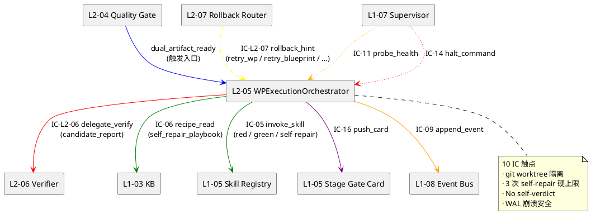
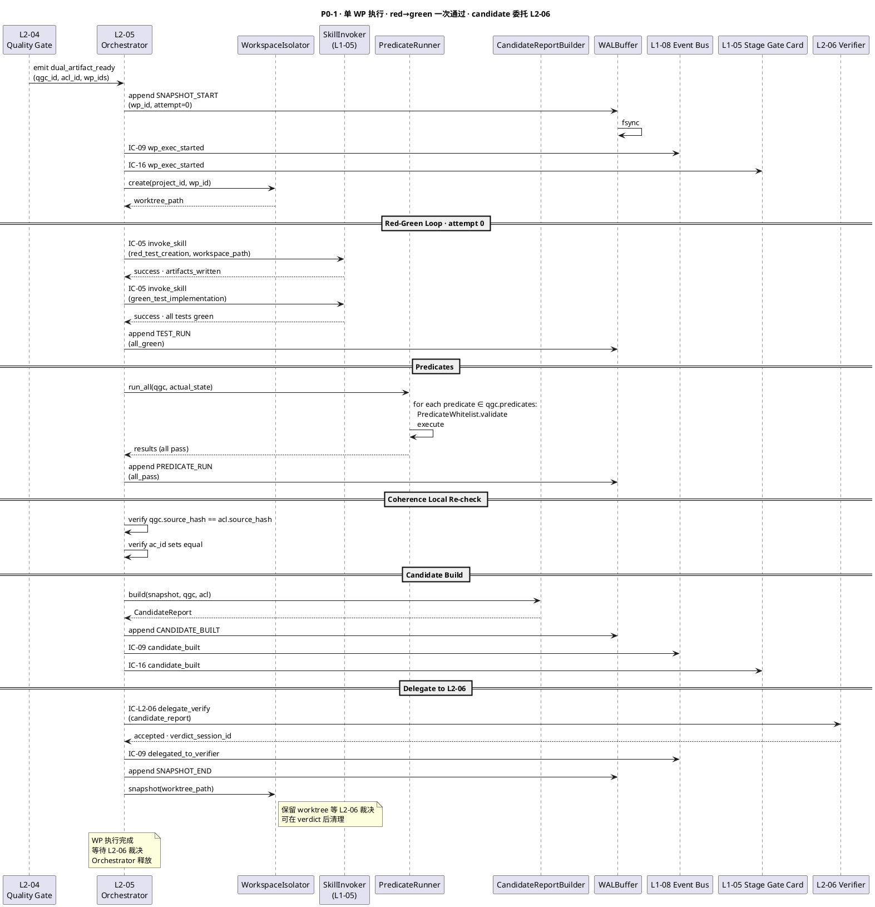
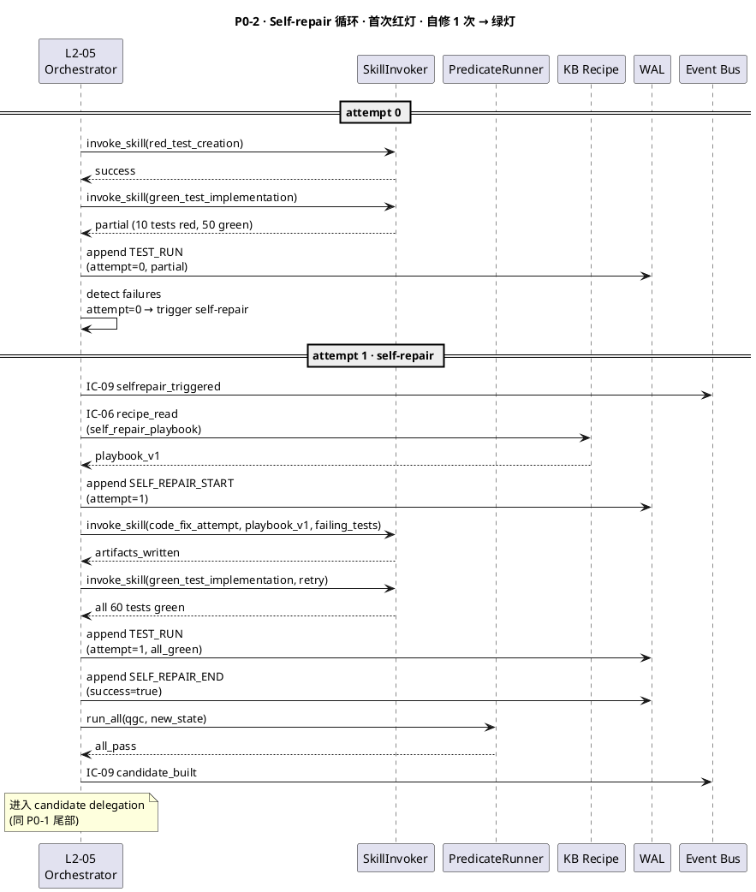
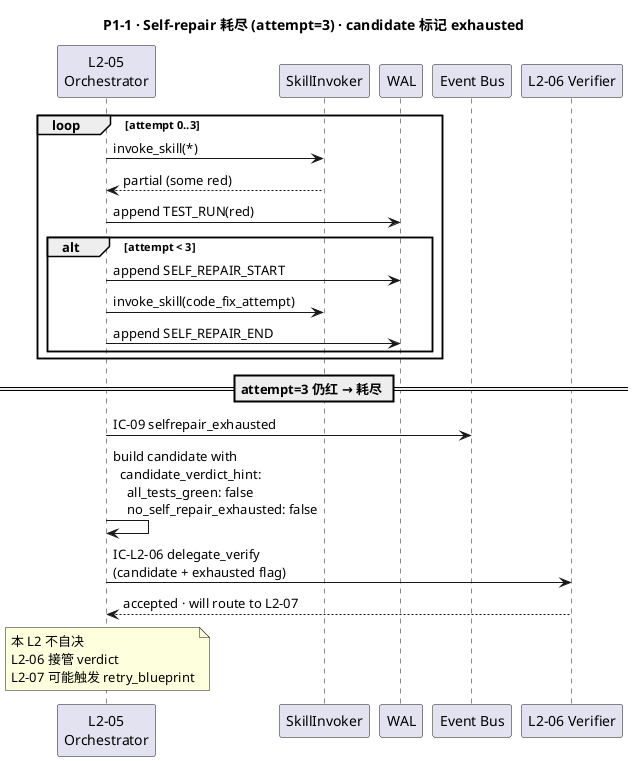
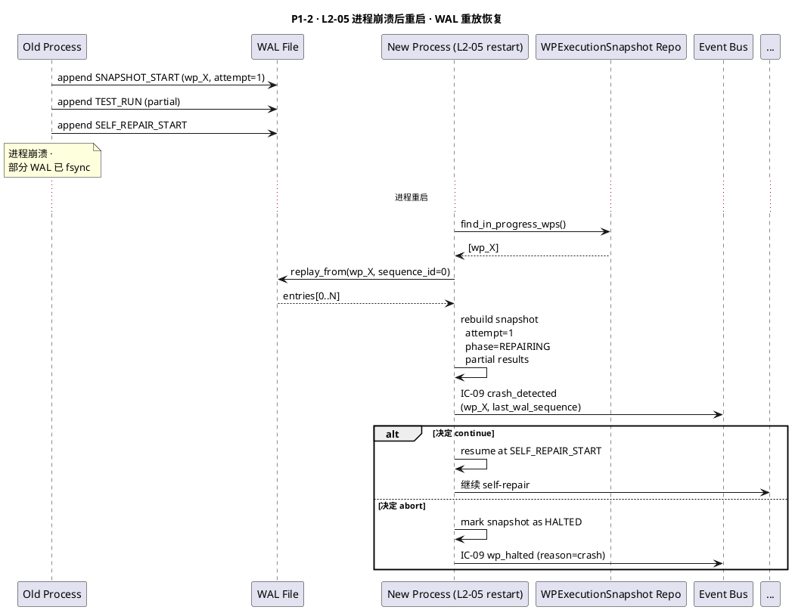
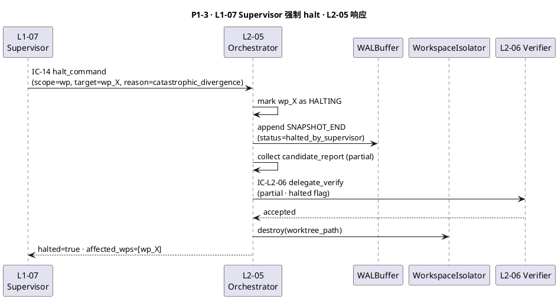
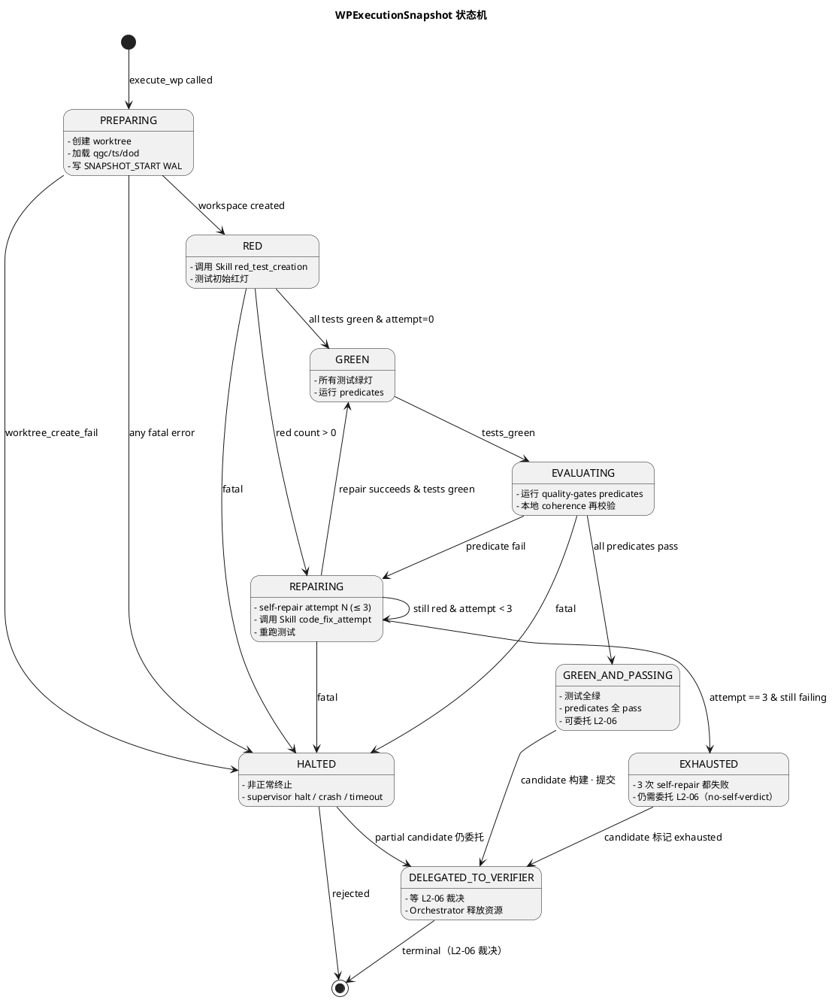
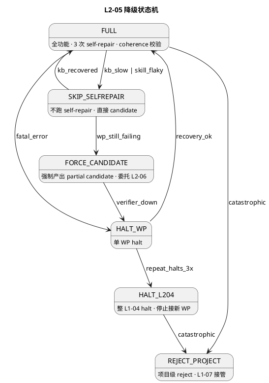

# L1 L2-05 · S4 执行驱动器 · Tech Design

> **本文档定位**：3-1-Solution-Technical 层级 · L1 的 L2-05 S4 执行驱动器 技术实现方案（L2 粒度）。
> **与产品 PRD 的分工**：2-prd/L1-04-Quality Loop/prd.md §5.5 的对应 L2 节定义产品边界，本文档定义**技术实现**（接口字段级 schema + 算法伪代码 + 底层数据结构 + 状态机 + 配置参数）。
> **与 L1 architecture.md 的分工**：architecture.md 负责**跨 L2 架构 + 跨 L2 时序**，本文档负责**本 L2 内部技术细节**。冲突以 architecture.md 为准。
> **严格规则**：本文档不复述产品 PRD 文字（职责 / 禁止 / 必须等清单），只做技术映射 + 补齐"产品视角未说 but 工程师必须知道"的部分（具体算法 · syscall · schema · 配置）。

---

## §0 撰写进度

- [x] §1 定位 + 2-prd §5.5 L2-05 映射
- [x] §2 DDD 映射（引 L0/ddd-context-map.md BC-04）
- [x] §3 对外接口定义（字段级 YAML schema + 错误码）
- [x] §4 接口依赖（被谁调 · 调谁）
- [x] §5 P0/P1 时序图（PlantUML ≥ 2 张）
- [x] §6 内部核心算法（伪代码）
- [x] §7 底层数据表 / schema 设计（字段级 YAML）
- [x] §8 状态机（PlantUML + 转换表）
- [x] §9 开源最佳实践调研（≥ 3 GitHub 高星项目）
- [x] §10 配置参数清单
- [x] §11 错误处理 + 降级策略
- [x] §12 性能目标
- [x] §13 与 2-prd / 3-2 TDD 的映射表

---

## §1 定位 + 2-prd 映射

### 1.1 本 L2 在 L1-04 Quality Loop 里的坐标

L1-04 Quality Loop 由 7 个 L2 组成，**L2-05 是执行层**（orchestrator · 承担 WP 粒度的 "red→green" 全流程编排），上游消费 L2-02/03/04 的编译产物，下游驱动 L2-06/07 的验证与回滚。

```
  [L2-01 TDD Blueprint]
        ↓
  [L2-02 DoD Compiler] ─── dod_ready
        ↓                          ↘
  [L2-03 TestCase Gen] ─ ts_ready ──→ [L2-04 Quality Gate + Checklist] ─ artifacts_ready
                                                                              ↓
                                                                              ↓ (yaml path + md path)
                                                                              ↓
                                                      ┌───── WPExecutionOrchestrator ──── L2-05
                                                      │       (Application Service · 本 L2)
                                                      │
                                                      ├──▶ 读 WP 清单（L1-03）
                                                      ├──▶ 加载 quality-gates.yaml（L2-04）
                                                      ├──▶ 加载 TestSuite skeletons（L2-03）
                                                      ├──▶ 调用 Skill/子 Agent（L1-05）
                                                      ├──▶ 驱动 red→green 循环（自修 ≤ 3 次）
                                                      ├──▶ Gate 判定（运行 predicates）
                                                      ├──▶ coherence check（双工件一致性再验）
                                                      ├──▶ 生成 WP 产物 manifest
                                                      │
                                                      ├──▶ coherent ──▶ [L2-06 Verifier 编排器]
                                                      └──▶ 偏差 ──────▶ [L2-07 回退路由器]
```

L2-05 的定位 = **"Quality Loop 的执行大脑 · 10 IC 触点 · WP 粒度原子单元 · 3 次自修硬上限 · 禁止自我裁决"**。

### 1.2 与 2-prd §5.5 L2-05 的对应表

| 2-prd §5.5 L2-05 小节 | 本文档对应位置 | 技术映射重点 |
|:---|:---|:---|
| §5.5.1 L2-05 职责（WP 执行 orchestrator） | §1.3 + §2 (WPExecutionOrchestrator 应用服务 · 非聚合根) | 无状态 orchestrator + 外部状态持久化 |
| §5.5.2 red→green 循环闭合约束 | §6.1 主循环 + §6.3 self-repair 算法 | 自修 ≤ 3 次硬上限（配置硬锁） |
| §5.5.3 禁止自我裁决（no-self-verdict） | §6.6 verdict 委托给 L2-06 | 本 L2 产出 candidate_report · verdict 在 L2-06 |
| §5.5.4 Gate 判定（白名单 predicates） | §6.5 predicate 执行器（复用 L2-04 白名单） | 只执行白名单预判 · 不扩展 |
| §5.5.5 10 IC 触点（enter/exit/probe/skill_invoke/event/card/recipe/verify/rollback/health） | §3 字段级 schema + §4 依赖图 | 10 IC 独立 schema |
| §5.5.6 禁止（无 quality-gates 执行 / 无 TestSuite 执行 / 自认判定） | §11 降级拒绝 | 3 个硬拦截 |
| §5.5.7 WAL 缓冲 + 崩溃恢复 | §6.8 WAL 机制 · §6.10 crash recovery | 单 WP 原子 · 断点续跑 |
| §5.5.8 隔离（执行在临时工作区 · commit 方案前不污染主 git） | §6.4 workspace isolator | git worktree 隔离 |

### 1.3 本 L2 在 architecture.md 里的坐标

引 `docs/3-1-Solution-Technical/L1-04-Quality Loop/architecture.md §3.1 Container Diagram` + §2.4 Domain Service/Application Service 分层：

```
  [L2-02 DoD Compiler]    ──┐
  [L2-03 TestCase Gen]    ──┤   (输入 deps)
  [L2-04 Quality Gate]    ──┘
                            ↓
                ┌──────────────────────────────────┐
                │  L2-05 · S4 执行驱动器           │
                │  (Application Service · 无聚合根) │
                │                                  │
                │  ┌────────────────────────────┐  │
                │  │ WPExecutionOrchestrator    │  │  (应用服务 · 编排器)
                │  │   ├── RedGreenLoop          │  │  (红绿循环子模块)
                │  │   ├── PredicateRunner       │  │  (predicates 执行器)
                │  │   ├── WorkspaceIsolator     │  │  (git worktree 隔离)
                │  │   ├── SkillInvoker          │  │  (L1-05 子 Agent 调用)
                │  │   ├── WALBuffer             │  │  (崩溃恢复 WAL)
                │  │   └── CandidateReportBuilder│  │  (产出未裁决的报告)
                │  └────────────────────────────┘  │
                │                                  │
                │  ┌────────────────────────────┐  │
                │  │  WPExecutionSnapshot VO    │  │  (单 WP 执行快照)
                │  │  WPRunState VO              │  │  (运行状态值对象)
                │  │  CandidateReport VO         │  │  (未裁决的 verify 候选)
                │  └────────────────────────────┘  │
                └──────────────────────────────────┘
                            ↓
                ┌───────────┴────────────────┐
                ↓                            ↓
         [L2-06 Verifier]            [L2-07 回退路由]
         (裁决 + 最终 verify)        (candidate → 路由决策)
```

**本 L2 的关键特征**（对 L1-04 整体而言）：
1. **应用服务 · 非聚合根**：L2-05 不持有自己的聚合根（不 own Entity），只持有 VO + 调用其他 BC 的聚合根操作方法
2. **外部状态持久化**：本 L2 的执行状态存在 WPExecutionSnapshot（VO）和 WAL 里，不存内存
3. **橫断依赖最多**：10 IC 触点（最复杂的 L2），跨 7 个 L1
4. **隔离工作区**：每 WP 独占一个 git worktree，执行过程不污染主 repo
5. **Hard self-repair limit**：失败自修上限 = 3 次（配置硬锁 · 超出即升 supervisor）
6. **No self-verdict**：本 L2 绝不自己判定通过/失败，只产出 `candidate_report`，交给 L2-06 做最终裁决

### 1.4 本 L2 的 PM-14 约束

**PM-14 约束**（引 `docs/3-1-Solution-Technical/projectModel/tech-design.md`）：所有 IC payload 顶层 `project_id` 必填；所有存储路径按 `projects/<pid>/...` 分片。

本 L2 在 PM-14 层面的具体落点：
- 执行快照：`projects/<pid>/quality/wp-exec/<wp_id>/snapshot.yaml`
- WAL 日志：`projects/<pid>/quality/wp-exec/<wp_id>/wal/*.jsonl`
- 工作区（隔离）：`projects/<pid>/workspaces/<wp_id>/`（git worktree 挂载点）
- Candidate 报告：`projects/<pid>/quality/wp-exec/<wp_id>/candidate.json`
- Self-repair 日志：`projects/<pid>/quality/wp-exec/<wp_id>/repair/<attempt>.jsonl`

### 1.5 关键技术决策（本 L2 特有 · Decision / Rationale / Alternatives / Trade-off）

| 决策 | 选择 | 备选 | 理由 | Trade-off |
|:---|:---|:---|:---|:---|
| **D1: L2-05 是否 own 聚合根** | 否（Application Service） | Yes，引入 WPExecution 聚合根 | 状态短生命周期 · 主要读其他 BC 产出 · 不独立持有域概念 | 牺牲 DDD 严格性，换来更薄的抽象 |
| **D2: 执行隔离策略** | git worktree per WP | Docker 容器 / chroot / 无隔离 | 成本低 · 轻量 · git 操作原生支持 · Skill 可直接读文件 | 牺牲跨项目隔离度（同 user 权限），但足够 |
| **D3: 自修上限** | 硬锁 3 次 | 配置可调 / 无上限 / 1 次 | 3 次经验平衡（1 次不够 · 5 次浪费）· 硬锁防止失控 | 3 次未修复 → 必升 supervisor |
| **D4: verdict 策略** | No self-verdict（委托 L2-06） | 本 L2 直接给 verdict | 职责单一 · 避免"运动员+裁判员"· 审计友好 | 多一次 IC round-trip |
| **D5: WAL 实现** | JSONL append-only + fsync | SQLite / LevelDB / 无 WAL | 足够简单 · 可人肉 read · 崩溃恢复直读 | 牺牲 random access（我们不需要） |
| **D6: Predicate runner 复用 L2-04 白名单** | 是（同 PredicateWhitelist） | 独立白名单 / 扩展白名单 | DRY · 语义一致 · 单一维护点 | 绑定到 L2-04 schema（但这是设计意图） |
| **D7: 并发 WP 策略** | 按 WP 维度并发 · 单 WP 串行 | 全串行 / 跨 WP fully parallel | 平衡吞吐 vs 调试难度 · WP 之间依赖拓扑由 L1-03 处理 | 跨 WP 依赖必须上游保证 |
| **D8: Candidate Report 格式** | JSON + markdown summary 双格式 | 仅 JSON / 仅 markdown | JSON 给 L2-06 自动消费 · MD 给人工审计 | 两份冗余（可接受） |

### 1.6 本 L2 读者预期

读完本 L2 的工程师应掌握：
- WPExecutionOrchestrator Application Service 的 10 IC 触点字段级 schema + 错误码
- 20 个算法的伪代码（含主循环 / red-green / self-repair / predicate 执行 / WAL / crash recovery / workspace 隔离）
- 4 张 VO 表 + 5 张数据表（WPExecutionSnapshot / WPRunState / CandidateReport / WALEntry）
- WPExecutionSnapshot 状态机（PlantUML 6 个主状态）
- 降级链 6 级（FULL → SKIP_SELFREPAIR → FORCE_CANDIDATE → HALT_WP → HALT_L204 → REJECT_PROJECT）
- SLO（单 WP 执行 ≤ 3 min P95 · WAL 写 < 5ms · candidate_report 生成 < 1s）

### 1.7 本 L2 不在的范围（YAGNI）

- **不在**：WP 内部任务编排（已由 L1-03 做）
- **不在**：最终 verdict（职责是 L2-06）
- **不在**：回滚决策（职责是 L2-07）
- **不在**：PR 创建（M6 本轮不接入 git push/PR，只在本地 worktree）
- **不在**：多语言 Skill 调用（M6 只调 python/bash/node）
- **不在**：跨 WP 依赖求解（L1-03 责任）
- **不在**：UI 推送进度条（只发 event 给 stage_gate_card）

### 1.8 本 L2 术语表

| 术语 | 定义 | 关联 |
|:---|:---|:---|
| WP | Work Package · 最小执行单元（L1-03 语义） | §2.1 |
| RedGreenLoop | red 测试 → 绿 测试 的循环（含 self-repair） | §6.3 |
| Self-repair | 自动修复策略 · 最多 3 次 | §6.3 + D3 |
| WPExecutionSnapshot | 单 WP 执行的完整快照（VO） | §2.2 |
| CandidateReport | 本 L2 的输出 · 未裁决的验证候选 | §2.4 |
| PredicateRunner | 执行 quality-gates.yaml 里 predicates 的模块 | §6.5 |
| WorkspaceIsolator | git worktree per WP | §6.4 |
| WALBuffer | crash-safe append-only 日志 | §6.8 |
| No-Self-Verdict | 本 L2 不自决胜负 · 交 L2-06 裁决 | D4 |

### 1.9 本 L2 的 DDD 定位一句话

> **L2-05 是 BC-04 Quality Loop 的应用服务层 · 无聚合根的 orchestrator · 10 IC 横断协调 · 3 次自修硬上限 + 零自决语义 · git worktree 隔离 · WAL 崩溃安全。**

---

## §2 DDD 映射（BC-04 Quality Loop · Application Service 层）

引 `docs/3-1-Solution-Technical/L0/ddd-context-map.md BC-04`。

本 L2 在 BC-04 Quality Loop 里属于**应用服务层**（Application Service），不持有聚合根，但持有**值对象**（VO）和**策略**（Domain Service 级）。

### 2.1 Application Service · WPExecutionOrchestrator

**职责**：从 `quality_gate_published` 事件触发 · 驱动 WP 执行 · 产出 CandidateReport · 委托 L2-06 裁决

**本质**：纯 orchestrator · 无域数据所有权 · 操作其他聚合根（QualityGateConfig / TestSuite / WPExecutionSnapshot）

**关键字段**（状态从外部持久化读取 · 自身无状态字段）：
```yaml
# 构造注入（依赖）
dependencies:
  quality_gate_config_repository:  # L2-04
  test_suite_repository:            # L2-03
  wp_snapshot_repository:           # 本 L2 的持久化（VO 存）
  wal_buffer:                       # 本 L2 WAL
  skill_invoker:                    # L1-05 调用
  event_bus:                        # L1-08
  stage_gate_card_publisher:        # L1-05
  kb_recipe_reader:                 # L1-03
  supervisor_bridge:                # L1-07

# 配置
config:
  self_repair_max_attempts: 3       # 硬锁
  predicate_timeout_ms: 30000
  wp_execution_timeout_ms: 180000   # 单 WP 3 min
  worktree_base_path: "projects/<pid>/workspaces"
  wal_fsync_every_n: 1
  ...
```

**行为**（Methods）：
- `on_artifacts_ready(qgc_id, acl_id, wp_ids)` — 入口 event handler
- `execute_wp(project_id, wp_id)` — 单 WP 执行入口
- `run_red_green_loop(wp_ctx)` — red→green 闭合循环
- `invoke_self_repair(wp_ctx, attempt)` — 自修（递归 ≤ 3）
- `run_predicates(qgc, actual_state)` — 运行 quality-gates 白名单 predicates
- `build_candidate_report(wp_ctx)` — 产出未裁决报告
- `delegate_verdict(candidate_report)` — 委托 L2-06 做 verify verdict
- `crash_recovery(wp_id)` — 崩溃重启时重放 WAL

### 2.2 Value Object · WPExecutionSnapshot

**标识**：`snapshot_id: UUIDv7` + `(wp_id, attempt_number)` 联合
**不变性**：immutable（每个 attempt 独立快照 · 不修改）

**字段**（字段级 YAML）：
```yaml
snapshot_id:
project_id:                    # PM-14
wp_id:
blueprint_id:
qgc_id:                        # 绑定的 Quality Gate
acl_id:                        # 绑定的 Acceptance Checklist
test_suite_id:
attempt_number:                # 第几次 attempt · 0 是首次 · 1-3 是 self-repair
status:                        # enum · 见状态机 §8
start_at:
end_at:
duration_ms:
workspace_path:                # git worktree 路径
wal_sequence_id:               # WAL 起始点
test_results:                  # 每个 testcase 的结果
  - test_id:
    status: [red, green, error]
    duration_ms:
    failure_message:
predicate_results:             # 每个 predicate 的结果
  - predicate_id:
    status: [pass, fail]
    actual_value:
    threshold:
    evaluated_at:
invoke_log:                    # Skill/子 Agent 调用日志
  - skill_name:
    invoke_at:
    duration_ms:
    outcome:
self_repair_attempts:          # self-repair 尝试记录
  - attempt_number:
    trigger: "test_fail" | "predicate_fail"
    strategy: "..."
    success: bool
    duration_ms:
coherence_check:               # 本地 coherence 结果
  is_coherent: bool
  diff: [...]
red_count:
green_count:
error_count:
created_at:
created_by: "L2-05"
```

### 2.3 Value Object · WPRunState

**标识**：`(wp_id, project_id)` 联合
**不变性**：immutable per update · 原子 swap

**字段**：
```yaml
wp_id:
project_id:
current_phase:                 # enum · PREPARING / RED / GREEN / REPAIRING / EVALUATING / COMPLETED / FAILED
current_attempt:               # int
total_red_count:               # 累计
total_green_count:             # 累计
total_self_repair_count:       # 累计 · 不得 > 3
last_updated_at:
updated_by: "L2-05"
```

### 2.4 Value Object · CandidateReport

**标识**：`candidate_id: UUIDv7`
**不变性**：immutable · 单次构建

**字段**：
```yaml
candidate_id:
project_id:
wp_id:
blueprint_id:
qgc_id:
acl_id:
snapshot_ids:                  # 关联的 snapshot（通常是最后一次 attempt）
test_outcomes:                 # 测试结果聚合
  total_tests:
  green_count:
  red_count:
  error_count:
  coverage_pct:
predicate_outcomes:             # predicate 结果聚合
  total_predicates:
  pass_count:
  fail_count:
  fail_details: [...]
coherence_result:                # 本 L2 内 L2-05 的本地 coherence
  is_coherent:
  diff_details:
self_repair_summary:
  attempts:
  last_trigger:
  last_strategy:
  total_repair_duration_ms:
execution_summary:
  start_at:
  end_at:
  total_duration_ms:
  worktree_path:
  wal_sequence_range:
# 关键：本 L2 不给 verdict
# 只给 "状态描述" · L2-06 做最终裁决
candidate_verdict_hint:          # hint · 非 verdict
  all_tests_green: bool
  all_predicates_pass: bool
  coherence_ok: bool
  no_self_repair_exhausted: bool
report_format_version: "v1.0"
markdown_summary:                # 给人类审计
built_at:
built_by: "L2-05"
```

### 2.5 Value Object · WALEntry

**标识**：`wal_id: UUIDv7` + `sequence_id: int`
**不变性**：immutable · append-only

**字段**：
```yaml
wal_id:
sequence_id:                     # 单 wp_id 内递增
wp_id:
project_id:
entry_type:                      # enum · SNAPSHOT_START / SNAPSHOT_END / TEST_RUN / PREDICATE_RUN / SKILL_INVOKE / SELF_REPAIR_START / SELF_REPAIR_END / CANDIDATE_BUILT
entry_data:                      # 类型 dependent
prev_entry_hash:                 # hash-chain
entry_hash:
written_at:
fsynced_at:
```

### 2.6 Domain Services（本 L2 内部 · 非全局）

#### 2.6.1 RedGreenLoopStrategy

**职责**：执行 red→green 循环（含 self-repair 分派）

**方法**：
```python
class RedGreenLoopStrategy:
    def run(wp_ctx: WPContext) -> LoopResult:
        """
        主循环：
        1. 读取 TestSuite skeletons（红灯初始）
        2. 尝试让测试转绿
        3. 失败 → self-repair（≤ 3 次）
        4. 成功/耗尽 → 返回 LoopResult
        """
```

#### 2.6.2 PredicateRunner

**职责**：执行 quality-gates.yaml 里的 predicates（复用 L2-04 白名单 · D6 决策）

**方法**：
```python
class PredicateRunner:
    def run_all(
        qgc: QualityGateConfig,
        actual_state: dict
    ) -> list[PredicateResult]
    
    def run_single(
        predicate: PredicateConfig,
        actual_value: Any
    ) -> PredicateResult
```

#### 2.6.3 WorkspaceIsolator

**职责**：为每个 WP 创建 git worktree · 执行后清理

**方法**：
```python
class WorkspaceIsolator:
    def create(project_id, wp_id) -> str  # 返回 worktree_path
    def destroy(worktree_path) -> None
    def snapshot(worktree_path) -> str    # 打快照（用于 candidate report）
    def reset(worktree_path) -> None       # 重置到 HEAD（self-repair 失败时）
```

#### 2.6.4 SkillInvoker

**职责**：调用 L1-05 Skill 生态做 WP 内部任务执行

**方法**：
```python
class SkillInvoker:
    def invoke(
        skill_intent: str,
        skill_context: dict,
        workspace_path: str
    ) -> SkillInvokeResult
```

#### 2.6.5 WALBuffer

**职责**：崩溃安全的 append-only 日志

**方法**：
```python
class WALBuffer:
    def append(entry: WALEntry) -> None
    def fsync() -> None
    def read_from(sequence_id: int) -> list[WALEntry]
    def replay_on_crash(wp_id) -> WPExecutionSnapshot
```

#### 2.6.6 CandidateReportBuilder

**职责**：从最终 snapshot 构建未裁决的 CandidateReport

**方法**：
```python
class CandidateReportBuilder:
    def build(
        snapshots: list[WPExecutionSnapshot],
        qgc: QualityGateConfig,
        acl: AcceptanceChecklist
    ) -> CandidateReport
```

### 2.7 Repository（本 L2 的持久化接口）

#### 2.7.1 WPExecutionSnapshotRepository

```python
class WPExecutionSnapshotRepository(abc.ABC):
    def save(snapshot: WPExecutionSnapshot) -> None
    def get(snapshot_id: UUID) -> WPExecutionSnapshot
    def find_by_wp(project_id, wp_id) -> list[WPExecutionSnapshot]
    def latest_by_wp(project_id, wp_id) -> WPExecutionSnapshot | None
```

#### 2.7.2 WALBufferRepository

```python
class WALBufferRepository(abc.ABC):
    def append(entry: WALEntry) -> None
    def fsync_batch(wp_id) -> None
    def get_latest_sequence(wp_id) -> int
    def replay_from(wp_id, sequence_id) -> list[WALEntry]
```

### 2.8 Domain Events

| Event | 触发 | Payload |
|:---|:---|:---|
| **WPExecutionStarted** | orchestrator 接收 artifacts_ready event | (project_id, wp_id, qgc_id, acl_id) |
| **WPExecutionRedGreenLoopStart** | 主循环启动 | (wp_id, attempt_number=0) |
| **WPExecutionSelfRepairTriggered** | self-repair 启动 | (wp_id, attempt_number, trigger) |
| **WPExecutionSelfRepairExhausted** | self-repair 达到 3 次上限 | (wp_id, last_snapshot_id) |
| **WPExecutionPredicatesRan** | predicates 全部执行 | (wp_id, pass_count, fail_count) |
| **WPExecutionCandidateBuilt** | CandidateReport 已生成 | (wp_id, candidate_id) |
| **WPExecutionDelegatedToVerifier** | 委托 L2-06 verdict | (wp_id, candidate_id, delegate_at) |
| **WPExecutionCrashDetected** | 崩溃恢复启动 | (wp_id, last_wal_sequence) |
| **WPExecutionHaltedBySupervisor** | L1-07 supervisor 强制 halt | (wp_id, reason) |
| **WPExecutionTimedOut** | 超过 wp_execution_timeout_ms | (wp_id, elapsed_ms) |

### 2.9 与兄弟 L2 / 跨 BC 关系

| 上游/下游 | 关系 | 触发 |
|:---|:---|:---|
| L2-04 QualityGateConfig | 读 | `quality_gate_published` event |
| L2-03 TestSuite | 读 | 间接（通过 blueprint_id 找 ts_id） |
| L2-02 DoDExpressionSet | 读 | 间接（通过 qgc.dod_expression_id） |
| L2-06 Verifier | 发 | `candidate_built` event → L2-06 裁决 |
| L2-07 回退路由 | 间接 | L2-06 裁决失败后触发 |
| L1-03 WBS/WP | 读 | 读 WP 清单（依赖关系） |
| L1-05 Skill 生态 | 调用 | 调用 skill 执行 |
| L1-07 Supervisor | 上报 + 下发 halt | probe_health / receive halt command |
| L1-08 Event Bus | 发 | append_event |

---

## §3 对外接口定义（字段级 YAML schema + 错误码）

**本 L2 对外有 10 个 IC 触点**（最复杂的 L2）。

### 3.1 IC-L2-04 artifacts_ready → 触发执行（入站）

**方向**：L2-04 → L2-05

**Input Event**：
```yaml
event_type: "dual_artifact_ready"
event_version: "v1.0"
emitted_at: "..."
emitted_by: "L2-04"
project_id: "uuid"
qgc_id: "uuid"
acl_id: "uuid"
blueprint_id: "uuid"
yaml_path: "projects/p123/quality/gates/b456/v1/quality-gates.yaml"
md_path: "projects/p123/quality/checklists/b456/v1/acceptance-checklist.md"
wp_ids: ["uuid", "uuid", ...]    # 关联的 WP 清单
payload:
  source_hash: "sha256-hex"
  ac_count: 120
  predicate_count: 300
trace_id: "..."
```

**接收方动作**：
- 校验 qgc + acl 可读
- 解析 yaml/md
- 按 wp_id 启动并发 execute_wp

**错误码**：
| 错误码 | 含义 | 恢复 |
|:---|:---|:---|
| `E_L205_L204_YAML_NOT_FOUND` | yaml_path 文件不存在 | REJECTED · 告警上游 |
| `E_L205_L204_YAML_PARSE_FAIL` | YAML 语法错 | REJECTED |
| `E_L205_L204_MD_NOT_FOUND` | md_path 不存在 | REJECTED |
| `E_L205_L204_COHERENCE_CHECK_FAIL` | 本地再校验一致性失败 | REJECTED |

### 3.2 execute_wp（内部主方法）

**方法名**：`execute_wp`
**调用位置**：L2-05 内部 orchestrator

**入参**：
```yaml
project_id: "uuid"
wp_id: "uuid"
qgc_id: "uuid"
acl_id: "uuid"
resume_from_wal: false            # crash recovery 时 true
trace_id: "..."
```

**出参**：
```yaml
success: true/false
snapshot_id: "uuid"
candidate_report_id: "uuid"
attempt_count: int
total_duration_ms: int
final_state:
  test_outcomes: {...}
  predicate_outcomes: {...}
  coherence: {...}
delegation:
  delegated_to: "L2-06"
  delegated_at: "..."
error:
  code: "..."
  message: "..."
  detail: {...}
```

**错误码**：
| 错误码 | 含义 | 触发 | 恢复 |
|:---|:---|:---|:---|
| `E_L205_L205_WP_NOT_FOUND` | wp_id 不存在 | 非法 wp_id | 返回 + 上报 |
| `E_L205_L205_WORKSPACE_CREATE_FAIL` | worktree 创建失败 | git 命令错 | 重试 3 次 · 失败 HALT_WP |
| `E_L205_L205_SKILL_INVOKE_FAIL` | Skill 调用失败 | L1-05 回错 | 算作 red · 触发 self-repair |
| `E_L205_L205_TEST_RUN_CRASH` | 测试运行崩溃 | python 子进程错 | 触发 self-repair |
| `E_L205_L205_SELF_REPAIR_EXHAUSTED` | self-repair ≥ 3 次 | 硬锁 | 产出 candidate 标记"exhausted" · 委托 L2-06 |
| `E_L205_L205_PREDICATE_RUN_FAIL` | predicate 执行错 | runtime 错 | 标记 · 继续其他 predicates |
| `E_L205_L205_COHERENCE_LOCAL_FAIL` | 本地 coherence 再校验失败 | 疑似数据污染 | REJECTED + 告警 |
| `E_L205_L205_WAL_WRITE_FAIL` | WAL 写失败 | 磁盘/权限 | 重试 3 次 · 失败 HALT |
| `E_L205_L205_WAL_REPLAY_FAIL` | 崩溃恢复重放失败 | WAL 损坏 | HALT · 人工介入 |
| `E_L205_L205_WP_TIMEOUT` | WP 执行超时 | > 3 min | HALT_WP |
| `E_L205_L205_DELEGATE_VERIFIER_FAIL` | 委托 L2-06 失败 | L2-06 不可达 | 重试 3 次 · 失败降级 candidate-standalone |
| `E_L205_L205_ROLLBACK_PROMPTED` | L2-07 反馈回滚 | verify 失败路由 | 重启 WP（新 attempt） |

### 3.3 IC-09 append_event（对 L1-08）

**方向**：L2-05 → L1-08

**stream**：
```yaml
stream: "L1-04.L2-05.exec"
event_type:
  - wp_exec_started
  - redgreen_loop_start
  - selfrepair_triggered
  - selfrepair_exhausted
  - predicates_ran
  - candidate_built
  - delegated_to_verifier
  - crash_detected
  - halted
  - timed_out
payload:
  snapshot_id:
  wp_id:
  project_id:
  attempt_number:
  duration_ms:
  error_code:
trace_id:
```

### 3.4 IC-05 invoke_skill（对 L1-05）

**方向**：L2-05 → L1-05

**Input**：
```yaml
skill_intent:                    # 意图描述
  - "red_test_creation"
  - "green_test_implementation"
  - "self_repair_strategy_1"
  - "code_fix_attempt"
skill_context:
  workspace_path: "..."
  current_test_results: [...]
  current_predicate_results: [...]
  budget_ms: 120000
  budget_tokens: 50000
trace_id: "..."
```

**Output**：
```yaml
invoke_id: "uuid"
skill_name:
status: [success, partial, fail]
duration_ms:
token_cost:
output_summary:
next_action_hint:                # 供 orchestrator 决策
artifacts_written: [paths]
error: {...}
```

**错误码**：
| 错误码 | 含义 | 恢复 |
|:---|:---|:---|
| `E_L205_L105_SKILL_NOT_FOUND` | 未知 skill_intent | REJECTED |
| `E_L205_L105_SKILL_BUDGET_EXHAUSTED` | 预算耗尽 | 视情况 self-repair |
| `E_L205_L105_SKILL_TIMEOUT` | 超时 | self-repair |

### 3.5 IC-06 recipe_read（对 L1-03 KB · 可选）

**方向**：L2-05 → L1-03

**Input**：
```yaml
recipe_type:
  - "self_repair_playbook"       # self-repair 的 pattern 库
  - "test_execution_strategy"    # 测试执行策略
  - "predicate_evaluation_tips"
project_id:
context:
  current_wp_type: "..."
  language_hint: "python|node|go|..."
trace_id:
```

**Output**：
```yaml
recipes:
  - recipe_id:
    content: {...}
cache_hit: bool
```

**降级**：KB 不可用 → 内建 fallback playbook（§11.3）

### 3.6 IC-11 probe_health（L1-07 Supervisor 调 · 入站）

**方向**：L1-07 → L2-05

**Input**：
```yaml
probe_type:
  - "liveness"
  - "readiness"
  - "wp_progress"
project_id:
wp_id:                          # 可选 · 查单 WP
trace_id:
```

**Output**：
```yaml
healthy: bool
active_wp_count: int
in_progress:
  - wp_id:
    current_phase:
    elapsed_ms:
    attempt_number:
stuck_wps: [list]
last_event_at:
```

### 3.7 IC-14 receive_halt_command（L1-07 → L2-05 · 入站）

**方向**：L1-07 → L2-05

**Input**：
```yaml
halt_scope:
  - "wp"                         # 单 WP
  - "l1_04"                      # 整个 L1-04
  - "project"                    # 整个 project
target:
  wp_id:                         # scope=wp 时必填
  project_id:
reason:
  - "supervisor_intervention"
  - "catastrophic_divergence"
  - "resource_exhaustion"
trace_id:
```

**Output**：
```yaml
halted: bool
affected_wps: [wp_ids]
active_candidates_at_halt: [candidate_ids]
```

### 3.8 IC-16 push_stage_gate_card（对 L1-05 · 出站）

**方向**：L2-05 → L1-05

**Input**：
```yaml
card_type:
  - "wp_exec_started"
  - "wp_self_repair_triggered"
  - "wp_candidate_built"
  - "wp_exec_halted"
project_id:
wp_id:
payload:
  attempt_number:
  summary:
  elapsed_ms:
trace_id:
```

### 3.9 IC-L2-06 delegate_verify（对 L2-06 · 出站）

**方向**：L2-05 → L2-06

**Input**：
```yaml
candidate_id:
project_id:
wp_id:
snapshot_id:
qgc_id:
acl_id:
delegation_request:
  reason: "final_verdict_required"
  priority: "normal" | "urgent"
full_candidate_report:           # 完整 candidate JSON
markdown_summary:
trace_id:
```

**Output**：
```yaml
accepted: bool
verdict_session_id:              # L2-06 的裁决 session
estimated_verdict_ms:
```

### 3.10 IC-L2-07 receive_rollback_hint（对 L2-07 · 入站）

**方向**：L2-07 → L2-05

**Input**：
```yaml
rollback_decision:
  - "retry_wp"                   # 重新执行 WP（新 attempt）
  - "retry_blueprint"            # 从 blueprint 重新编译
  - "escalate_supervisor"        # 升给 L1-07
  - "reject_wp"                  # 放弃 WP
wp_id:
project_id:
candidate_id_triggering:
trace_id:
```

**Output**：
```yaml
acknowledged: bool
next_action_started: bool
next_action: "..."
```

---

## §4 接口依赖（被谁调 · 调谁）

### 4.1 上游（调本 L2）

| 调用方 | 方法 | 触发 |
|:---|:---|:---|
| L2-04 | emits `dual_artifact_ready` | qgc/acl 发布后 |
| L1-07 Supervisor | probe_health / halt_command | 健康探测 / 强制 halt |
| L2-07 回退路由 | receive_rollback_hint | verify 失败路由 |

### 4.2 下游（本 L2 调）

| 被调方 | IC | 频次 |
|:---|:---|:---|
| L1-03 KB | IC-06 recipe_read | 可选 · 每次 self-repair |
| L1-05 Skill Registry | IC-05 invoke_skill | 每次任务执行 |
| L1-05 Stage Gate Card | IC-16 push_stage_gate_card | 关键节点广播 |
| L1-08 Event Bus | IC-09 append_event | 每个生命周期节点 |
| L1-04/L2-06 Verifier | IC-L2-06 delegate_verify | 每次 WP 完成 |

### 4.3 依赖图（PlantUML）



### 4.4 并发约束

- 同一 wp_id 全局 serializable（分布式锁 · 基于 project_id + wp_id 组合）
- 不同 wp_id 并发（上限 = `concurrent_wp_max`，默认 5）
- 全局并发 WP 上限：20（跨 project）
- Skill invoke 并发：上限 10（由 L1-05 调度管理）

### 4.5 依赖降级

| 依赖 | 降级 |
|:---|:---|
| KB unavailable | 内建 fallback playbook |
| Skill registry unavailable | HALT_WP + 上报 |
| Event Bus down | WAL 缓冲（L1-08 恢复后回放） |
| Stage Gate Card down | 降级 DEFERRED · 不阻塞 |
| L2-06 Verifier down | 降级 candidate-standalone · 告警 |

---

## §5 P0/P1 时序图（PlantUML ≥ 2 张）

### 5.1 P0-1 · WP 执行完整成功链路



### 5.2 P0-2 · Self-repair 循环 · attempt 1 成功



### 5.3 P1-1 · Self-repair 耗尽 · 委托"exhausted" candidate



### 5.4 P1-2 · 崩溃恢复（Crash Recovery）



### 5.5 P1-3 · Supervisor 强制 halt



---

## §6 内部核心算法（伪代码）

### 6.1 主入口 · on_artifacts_ready

```python
class WPExecutionOrchestrator:
    def on_artifacts_ready(self, event: DualArtifactReadyEvent):
        """
        接收 L2-04 的 dual_artifact_ready event
        解析 wp_ids · 启动并发 execute_wp
        """
        # 1. 本地 coherence 再校验
        qgc = self.qgc_repo.get(event.qgc_id)
        acl = self.acl_repo.get(event.acl_id)
        
        if qgc.source_hash != acl.source_hash:
            raise E_L205_L204_COHERENCE_CHECK_FAIL
        
        # 2. 启动并发
        tasks = []
        for wp_id in event.wp_ids:
            task = asyncio.create_task(
                self.execute_wp(
                    project_id=event.project_id,
                    wp_id=wp_id,
                    qgc_id=event.qgc_id,
                    acl_id=event.acl_id,
                )
            )
            tasks.append(task)
        
        # 3. 等所有 WP 完成
        results = await asyncio.gather(*tasks, return_exceptions=True)
        
        # 4. 汇总上报
        self.event_bus.append(
            event_type="all_wps_completed",
            payload={"project_id": event.project_id, "results": results}
        )
```

### 6.2 单 WP 执行 · execute_wp

```python
async def execute_wp(self, project_id, wp_id, qgc_id, acl_id):
    """
    单 WP 的完整执行链路
    """
    snapshot = WPExecutionSnapshot(
        snapshot_id=uuid7(),
        project_id=project_id,
        wp_id=wp_id,
        qgc_id=qgc_id,
        acl_id=acl_id,
        attempt_number=0,
        status="PREPARING",
        start_at=now(),
    )
    
    self.wal.append_entry(WALEntry(
        entry_type="SNAPSHOT_START",
        wp_id=wp_id,
        entry_data=snapshot.to_dict(),
    ))
    self.wal.fsync()
    
    self.event_bus.append("wp_exec_started", snapshot)
    
    # Step 1: 创建工作区
    try:
        worktree_path = self.workspace_isolator.create(project_id, wp_id)
        snapshot.workspace_path = worktree_path
    except WorktreeCreateError as e:
        return self._halt_wp(snapshot, E_L205_L205_WORKSPACE_CREATE_FAIL, str(e))
    
    # Step 2: 加载上下文
    qgc = self.qgc_repo.get(qgc_id)
    test_suite = self.test_suite_repo.get_by_blueprint(qgc.blueprint_id)
    dod_expr = self.dod_expr_repo.get(qgc.dod_expression_id)
    
    # Step 3: 启动主循环
    try:
        loop_result = await asyncio.wait_for(
            self.run_red_green_loop(snapshot, qgc, test_suite, dod_expr),
            timeout=self.config.wp_execution_timeout_ms / 1000
        )
    except asyncio.TimeoutError:
        return self._halt_wp(snapshot, E_L205_L205_WP_TIMEOUT)
    
    # Step 4: 构建 candidate
    candidate = self.candidate_builder.build(
        snapshots=[snapshot],
        qgc=qgc,
        acl=self.acl_repo.get(acl_id),
    )
    
    self.wal.append_entry(WALEntry(
        entry_type="CANDIDATE_BUILT",
        entry_data=candidate.to_dict(),
    ))
    
    # Step 5: 委托 L2-06 裁决
    delegation = await self.delegate_verify(candidate)
    
    if not delegation.accepted:
        return self._halt_wp(snapshot, E_L205_L205_DELEGATE_VERIFIER_FAIL)
    
    # Step 6: WAL 结尾
    self.wal.append_entry(WALEntry(
        entry_type="SNAPSHOT_END",
        entry_data={"snapshot_id": snapshot.snapshot_id, "status": "delegated"}
    ))
    
    snapshot.status = "DELEGATED_TO_VERIFIER"
    snapshot.end_at = now()
    self.snapshot_repo.save(snapshot)
    
    return {
        "success": True,
        "snapshot_id": snapshot.snapshot_id,
        "candidate_report_id": candidate.candidate_id,
        "delegation": {
            "delegated_to": "L2-06",
            "verdict_session_id": delegation.verdict_session_id,
        }
    }
```

### 6.3 Red-Green 主循环 · run_red_green_loop

```python
async def run_red_green_loop(
    self,
    snapshot,
    qgc,
    test_suite,
    dod_expr,
) -> LoopResult:
    """
    主循环
    · attempt 0: 首次红→绿
    · attempt 1-3: self-repair
    · 超过 3 次：触发 exhausted
    """
    MAX_ATTEMPTS = self.config.self_repair_max_attempts  # 硬锁 3
    
    for attempt in range(MAX_ATTEMPTS + 1):
        snapshot.attempt_number = attempt
        snapshot.status = "RED" if attempt == 0 else "REPAIRING"
        
        self.wal.append_entry(WALEntry(
            entry_type="ATTEMPT_START",
            entry_data={"attempt": attempt}
        ))
        
        # 调用 Skill 做红/绿 / self-repair
        if attempt == 0:
            intent = "red_test_creation"
        else:
            intent = "code_fix_attempt"
        
        skill_result = await self.skill_invoker.invoke(
            skill_intent=intent,
            skill_context={
                "workspace_path": snapshot.workspace_path,
                "test_suite_id": test_suite.test_suite_id,
                "qgc_id": qgc.qgc_id,
                "attempt_number": attempt,
                "previous_failures": snapshot.test_results,
            }
        )
        
        if skill_result.status == "fail":
            return self._exhausted_result(snapshot, "skill_fail")
        
        # 调用 Skill 做绿色实现
        green_result = await self.skill_invoker.invoke(
            skill_intent="green_test_implementation",
            skill_context={...}
        )
        
        # 运行测试
        test_results = await self._run_tests(snapshot.workspace_path)
        
        snapshot.test_results = test_results
        snapshot.red_count = sum(1 for t in test_results if t.status == "red")
        snapshot.green_count = sum(1 for t in test_results if t.status == "green")
        
        self.wal.append_entry(WALEntry(
            entry_type="TEST_RUN",
            entry_data=test_results
        ))
        
        # 如果全绿 → 继续 predicate 检查
        if snapshot.red_count == 0:
            predicate_results = self.predicate_runner.run_all(qgc, {
                "test_results": test_results,
                "workspace_path": snapshot.workspace_path,
            })
            
            snapshot.predicate_results = predicate_results
            all_pred_pass = all(r.status == "pass" for r in predicate_results)
            
            self.wal.append_entry(WALEntry(
                entry_type="PREDICATE_RUN",
                entry_data=predicate_results
            ))
            
            if all_pred_pass:
                snapshot.status = "GREEN_AND_PASSING"
                return LoopResult(
                    status="SUCCESS",
                    final_snapshot=snapshot,
                )
            else:
                # predicates 失败 → 再 self-repair
                if attempt < MAX_ATTEMPTS:
                    self.event_bus.append("selfrepair_triggered", snapshot)
                    continue
                else:
                    return self._exhausted_result(snapshot, "predicate_fail")
        
        # 仍有红 → self-repair 下一轮
        if attempt < MAX_ATTEMPTS:
            self.event_bus.append("selfrepair_triggered", snapshot)
            continue
        else:
            return self._exhausted_result(snapshot, "tests_still_red")
    
    return self._exhausted_result(snapshot, "loop_exited")


def _exhausted_result(self, snapshot, reason) -> LoopResult:
    """self-repair 耗尽时的返回值"""
    self.event_bus.append("selfrepair_exhausted", snapshot)
    snapshot.status = "EXHAUSTED"
    return LoopResult(
        status="EXHAUSTED",
        final_snapshot=snapshot,
        exhaust_reason=reason,
    )
```

### 6.4 Workspace 隔离 · WorkspaceIsolator

```python
class WorkspaceIsolator:
    def create(self, project_id, wp_id) -> str:
        """
        创建 git worktree 给该 WP 独占
        """
        base = self.config.worktree_base_path
        path = f"{base}/{project_id}/{wp_id}"
        
        # 从主 repo 的当前 HEAD 分叉
        main_repo_path = self._get_main_repo(project_id)
        main_head = subprocess.run(
            ["git", "rev-parse", "HEAD"],
            cwd=main_repo_path,
            capture_output=True,
            text=True,
        ).stdout.strip()
        
        # 创建 worktree
        branch_name = f"wp-exec/{wp_id}"
        subprocess.run(
            ["git", "worktree", "add", "-b", branch_name, path, main_head],
            cwd=main_repo_path,
            check=True,
        )
        
        return path
    
    def destroy(self, worktree_path) -> None:
        """清理 worktree"""
        subprocess.run(
            ["git", "worktree", "remove", "--force", worktree_path],
            check=True,
        )
    
    def snapshot(self, worktree_path) -> str:
        """打快照（返回 tree hash）"""
        result = subprocess.run(
            ["git", "-C", worktree_path, "rev-parse", "HEAD^{tree}"],
            capture_output=True,
            text=True,
        )
        return result.stdout.strip()
    
    def reset(self, worktree_path) -> None:
        """重置到分叉点（self-repair 失败时）"""
        subprocess.run(
            ["git", "-C", worktree_path, "reset", "--hard", "HEAD~0"],
            check=True,
        )
```

### 6.5 Predicate 执行器 · PredicateRunner

```python
class PredicateRunner:
    """
    执行 quality-gates.yaml 里所有 predicates
    复用 L2-04 的 PredicateWhitelist（D6 决策）
    """
    
    def run_all(self, qgc, actual_state) -> list[PredicateResult]:
        results = []
        for predicate_config in qgc.predicates:
            try:
                result = self.run_single(predicate_config, actual_state)
                results.append(result)
            except PredicateExecutionError as e:
                results.append(PredicateResult(
                    predicate_id=predicate_config.predicate_id,
                    status="error",
                    error_message=str(e),
                ))
        return results
    
    def run_single(self, predicate_config, actual_state) -> PredicateResult:
        # 1. 校验 predicate_name 仍在白名单
        PredicateWhitelist.validate(predicate_config.predicate_name)
        
        # 2. 提取 actual_value
        actual_value = self._extract_actual(predicate_config, actual_state)
        
        # 3. 执行
        pred_func = self._get_predicate_function(predicate_config.predicate_name)
        passed = pred_func(
            actual=actual_value,
            threshold=predicate_config.threshold.value,
            timeout_ms=predicate_config.timeout_ms,
        )
        
        return PredicateResult(
            predicate_id=predicate_config.predicate_id,
            ac_id=predicate_config.ac_id,
            status="pass" if passed else "fail",
            actual_value=actual_value,
            threshold=predicate_config.threshold.value,
            evaluated_at=now(),
        )
    
    def _extract_actual(self, predicate_config, state):
        """
        根据 predicate_name 从 state 提取相关值
        """
        name = predicate_config.predicate_name
        if name == "test_status_green":
            return all(t.status == "green" for t in state["test_results"])
        elif name == "test_coverage_gte":
            return state["coverage_pct"]
        elif name == "numeric_greater_or_equal":
            return state.get(predicate_config.metadata.get("field_name"))
        # ... 其他 20 谓词 dispatch
        raise UnknownPredicateError(name)
    
    def _get_predicate_function(self, name):
        """返回 predicate 对应的 bool 函数"""
        return {
            "numeric_greater_than": lambda actual, threshold, **_: actual > threshold,
            "numeric_greater_or_equal": lambda actual, threshold, **_: actual >= threshold,
            "numeric_less_than": lambda actual, threshold, **_: actual < threshold,
            "numeric_less_or_equal": lambda actual, threshold, **_: actual <= threshold,
            "numeric_equals": lambda actual, threshold, **_: actual == threshold,
            "numeric_range": lambda actual, threshold, **_: threshold[0] <= actual <= threshold[1],
            "boolean_equals": lambda actual, threshold, **_: bool(actual) == bool(threshold),
            "boolean_true": lambda actual, **_: bool(actual) == True,
            "boolean_false": lambda actual, **_: bool(actual) == False,
            "string_equals": lambda actual, threshold, **_: actual == threshold,
            "string_not_equals": lambda actual, threshold, **_: actual != threshold,
            "string_contains": lambda actual, threshold, **_: threshold in actual,
            "string_not_contains": lambda actual, threshold, **_: threshold not in actual,
            "test_status_green": lambda actual, **_: actual == True,
            "test_status_all_passed": lambda actual, **_: actual == True,
            "test_coverage_gte": lambda actual, threshold, **_: actual >= threshold,
            "test_skeleton_count_equals": lambda actual, threshold, **_: actual == threshold,
            "ac_satisfied": lambda actual, **_: actual == True,
            "ac_all_satisfied": lambda actual, **_: actual == True,
            "ac_blocker_cleared": lambda actual, **_: actual == True,
        }[name]
```

### 6.6 委托 verdict · delegate_verify

```python
async def delegate_verify(self, candidate: CandidateReport):
    """
    提交给 L2-06 做最终裁决
    本 L2 不自决
    """
    max_retries = 3
    for attempt in range(max_retries):
        try:
            result = await self.verifier_bridge.delegate(
                candidate_id=candidate.candidate_id,
                project_id=candidate.project_id,
                wp_id=candidate.wp_id,
                full_candidate_report=candidate.to_dict(),
                markdown_summary=candidate.markdown_summary,
                priority="normal",
            )
            return result
        except VerifierUnreachableError as e:
            if attempt < max_retries - 1:
                await asyncio.sleep(2 ** attempt)
                continue
            else:
                # 降级：candidate-standalone
                self.event_bus.append("verifier_unreachable", candidate)
                return DelegationResult(
                    accepted=False,
                    reason="verifier_down_standalone",
                )
```

### 6.7 Candidate Report 构建 · CandidateReportBuilder

```python
class CandidateReportBuilder:
    def build(
        self,
        snapshots: list[WPExecutionSnapshot],
        qgc: QualityGateConfig,
        acl: AcceptanceChecklist,
    ) -> CandidateReport:
        """
        从最终 snapshot 构建 CandidateReport
        注意：本 L2 不给 verdict · 只给 hint
        """
        final = snapshots[-1]
        
        test_outcomes = self._aggregate_tests(snapshots)
        predicate_outcomes = self._aggregate_predicates(snapshots)
        
        # 本地 coherence 再校验
        coherence = self._local_coherence(qgc, acl)
        
        # self-repair 聚合
        repair_summary = self._aggregate_self_repair(snapshots)
        
        # 执行总结
        exec_summary = self._build_exec_summary(snapshots)
        
        # 构建 markdown_summary
        markdown = self._render_markdown(
            test_outcomes, predicate_outcomes, coherence,
            repair_summary, exec_summary,
        )
        
        # 构建 verdict_hint（不是 verdict！）
        verdict_hint = {
            "all_tests_green": test_outcomes["red_count"] == 0,
            "all_predicates_pass": predicate_outcomes["fail_count"] == 0,
            "coherence_ok": coherence["is_coherent"],
            "no_self_repair_exhausted": final.status != "EXHAUSTED",
        }
        
        return CandidateReport(
            candidate_id=uuid7(),
            project_id=final.project_id,
            wp_id=final.wp_id,
            blueprint_id=final.blueprint_id,
            qgc_id=final.qgc_id,
            acl_id=final.acl_id,
            snapshot_ids=[s.snapshot_id for s in snapshots],
            test_outcomes=test_outcomes,
            predicate_outcomes=predicate_outcomes,
            coherence_result=coherence,
            self_repair_summary=repair_summary,
            execution_summary=exec_summary,
            candidate_verdict_hint=verdict_hint,  # 非 verdict
            markdown_summary=markdown,
            built_at=now(),
            report_format_version="v1.0",
        )
```

### 6.8 WAL 实现 · WALBuffer

```python
class WALBuffer:
    """
    崩溃安全的 append-only 日志
    JSONL + fsync
    """
    
    def __init__(self, wp_id, project_id, config):
        self.wp_id = wp_id
        self.project_id = project_id
        self.path = (
            f"projects/{project_id}/quality/wp-exec/{wp_id}/"
            f"wal/{now_ms()}.jsonl"
        )
        os.makedirs(os.path.dirname(self.path), exist_ok=True)
        self.fd = open(self.path, 'a')
        self.sequence = 0
        self.prev_hash = None
    
    def append_entry(self, entry: WALEntry):
        self.sequence += 1
        entry.sequence_id = self.sequence
        entry.wp_id = self.wp_id
        entry.project_id = self.project_id
        entry.prev_entry_hash = self.prev_hash
        entry.entry_hash = self._compute_hash(entry)
        entry.written_at = now()
        
        self.fd.write(json.dumps(entry.to_dict()) + '\n')
        
        if self.sequence % self.config.wal_fsync_every_n == 0:
            self.fsync()
        
        self.prev_hash = entry.entry_hash
    
    def fsync(self):
        self.fd.flush()
        os.fsync(self.fd.fileno())
    
    def _compute_hash(self, entry):
        data = {
            "sequence_id": entry.sequence_id,
            "wp_id": entry.wp_id,
            "entry_type": entry.entry_type,
            "entry_data": entry.entry_data,
            "prev_entry_hash": entry.prev_entry_hash,
        }
        return sha256(json.dumps(data, sort_keys=True)).hexdigest()
```

### 6.9 Skill 调用 · SkillInvoker

```python
class SkillInvoker:
    async def invoke(
        self,
        skill_intent: str,
        skill_context: dict,
    ) -> SkillInvokeResult:
        """
        调用 L1-05 Skill Registry
        """
        invoke_id = uuid7()
        invoke_at = now()
        
        try:
            result = await self.skill_bridge.call(
                intent=skill_intent,
                context=skill_context,
                timeout_ms=self.config.skill_invoke_timeout_ms,
                budget_ms=skill_context.get("budget_ms", 120000),
                budget_tokens=skill_context.get("budget_tokens", 50000),
            )
            
            return SkillInvokeResult(
                invoke_id=invoke_id,
                skill_name=result.skill_name,
                status="success",
                duration_ms=(now() - invoke_at).total_ms(),
                token_cost=result.token_cost,
                output_summary=result.summary,
                artifacts_written=result.artifacts,
            )
        except SkillNotFoundError as e:
            return SkillInvokeResult(
                invoke_id=invoke_id,
                status="fail",
                error={"code": "E_L205_L105_SKILL_NOT_FOUND", "message": str(e)},
            )
        except SkillTimeoutError as e:
            return SkillInvokeResult(
                invoke_id=invoke_id,
                status="fail",
                error={"code": "E_L205_L105_SKILL_TIMEOUT", "message": str(e)},
            )
```

### 6.10 崩溃恢复 · crash_recovery

```python
def crash_recovery(self, wp_id: UUID) -> WPExecutionSnapshot:
    """
    重启后从 WAL 重建 snapshot
    """
    # 1. 定位 WAL 文件
    wal_dir = f"projects/{self.project_id}/quality/wp-exec/{wp_id}/wal/"
    wal_files = sorted(os.listdir(wal_dir))
    
    if not wal_files:
        # 无 WAL · wp 未启动过
        return None
    
    # 2. 读取最新 WAL 文件
    latest_wal = os.path.join(wal_dir, wal_files[-1])
    entries = []
    with open(latest_wal) as f:
        for line in f:
            entries.append(WALEntry.from_dict(json.loads(line)))
    
    if not entries:
        return None
    
    # 3. 验证 hash-chain
    prev_hash = None
    for entry in entries:
        if entry.prev_entry_hash != prev_hash:
            raise E_L205_L205_WAL_REPLAY_FAIL(
                reason="hash_chain_broken",
                entry_id=entry.wal_id,
            )
        computed_hash = self._recompute_hash(entry)
        if computed_hash != entry.entry_hash:
            raise E_L205_L205_WAL_REPLAY_FAIL(
                reason="hash_invalid",
                entry_id=entry.wal_id,
            )
        prev_hash = entry.entry_hash
    
    # 4. 重建 snapshot
    snapshot = self._rebuild_from_entries(entries)
    
    self.event_bus.append("crash_detected", {
        "wp_id": wp_id,
        "last_wal_sequence": entries[-1].sequence_id,
        "rebuilt_snapshot": snapshot,
    })
    
    return snapshot

def _rebuild_from_entries(self, entries) -> WPExecutionSnapshot:
    """重放 entries 重建 snapshot"""
    snapshot = WPExecutionSnapshot()
    for entry in entries:
        if entry.entry_type == "SNAPSHOT_START":
            snapshot = WPExecutionSnapshot.from_dict(entry.entry_data)
        elif entry.entry_type == "TEST_RUN":
            snapshot.test_results = entry.entry_data
        elif entry.entry_type == "PREDICATE_RUN":
            snapshot.predicate_results = entry.entry_data
        elif entry.entry_type == "SELF_REPAIR_START":
            snapshot.self_repair_attempts.append({
                "attempt": entry.entry_data["attempt"],
                "start_at": entry.written_at,
            })
        elif entry.entry_type == "SELF_REPAIR_END":
            snapshot.self_repair_attempts[-1]["end_at"] = entry.written_at
            snapshot.self_repair_attempts[-1]["success"] = entry.entry_data["success"]
        elif entry.entry_type == "SNAPSHOT_END":
            snapshot.end_at = entry.written_at
            snapshot.status = entry.entry_data.get("status")
    return snapshot
```

### 6.11 Halt 处理 · _halt_wp

```python
def _halt_wp(self, snapshot, error_code, error_detail=None):
    """
    WP halt 的统一处理
    构建部分 candidate 仍委托 L2-06（保证 no-self-verdict）
    """
    snapshot.status = "HALTED"
    snapshot.end_at = now()
    
    self.wal.append_entry(WALEntry(
        entry_type="SNAPSHOT_END",
        entry_data={
            "status": "halted",
            "error_code": error_code,
        }
    ))
    self.wal.fsync()
    
    self.event_bus.append("wp_halted", {
        "wp_id": snapshot.wp_id,
        "error_code": error_code,
        "error_detail": error_detail,
    })
    
    # 构建 partial candidate
    candidate = self.candidate_builder.build_partial(snapshot, reason="halted")
    
    # 仍委托 L2-06（no-self-verdict）
    try:
        self.verifier_bridge.delegate(candidate)
    except Exception:
        # 降级 standalone
        self.event_bus.append("candidate_standalone", candidate)
    
    # 清理工作区
    try:
        self.workspace_isolator.destroy(snapshot.workspace_path)
    except Exception:
        pass  # 非关键路径
    
    return {
        "success": False,
        "snapshot_id": snapshot.snapshot_id,
        "error": {
            "code": error_code,
            "detail": error_detail,
        }
    }
```

### 6.12 Supervisor halt 响应 · handle_halt_command

```python
def handle_halt_command(self, halt_request: HaltCommand):
    """
    响应 L1-07 Supervisor 的 halt_command
    """
    scope = halt_request.halt_scope
    affected_wps = []
    
    if scope == "wp":
        wp_id = halt_request.target.wp_id
        if wp_id in self.active_wps:
            self._halt_wp(
                self.active_wps[wp_id],
                error_code="E_L205_SUPERVISOR_HALT",
                error_detail=halt_request.reason,
            )
            affected_wps.append(wp_id)
    
    elif scope == "l1_04":
        # halt 所有 active wp
        for wp_id in list(self.active_wps.keys()):
            self._halt_wp(
                self.active_wps[wp_id],
                error_code="E_L205_SUPERVISOR_HALT",
                error_detail=halt_request.reason,
            )
            affected_wps.append(wp_id)
    
    elif scope == "project":
        project_id = halt_request.target.project_id
        for wp_id, snap in list(self.active_wps.items()):
            if snap.project_id == project_id:
                self._halt_wp(
                    snap,
                    error_code="E_L205_SUPERVISOR_HALT",
                    error_detail=halt_request.reason,
                )
                affected_wps.append(wp_id)
    
    return {
        "halted": True,
        "affected_wps": affected_wps,
        "active_candidates_at_halt": [
            self.active_candidates[wp] for wp in affected_wps
            if wp in self.active_candidates
        ],
    }
```

### 6.13 回滚 hint 响应 · handle_rollback_hint

```python
def handle_rollback_hint(self, hint: RollbackHint):
    """
    响应 L2-07 回退路由的 hint
    """
    wp_id = hint.wp_id
    project_id = hint.project_id
    
    if hint.rollback_decision == "retry_wp":
        # 重新执行 WP · 新 attempt
        asyncio.create_task(self.execute_wp(
            project_id=project_id,
            wp_id=wp_id,
            qgc_id=hint.qgc_id,
            acl_id=hint.acl_id,
        ))
        return {"acknowledged": True, "next_action_started": True, "next_action": "retry_wp"}
    
    elif hint.rollback_decision == "retry_blueprint":
        # 不执行 · 通知 L2-01 重新生成 blueprint
        self.event_bus.append("retry_blueprint_requested", {
            "wp_id": wp_id,
            "project_id": project_id,
            "blueprint_id": hint.blueprint_id,
        })
        return {"acknowledged": True, "next_action_started": False, "next_action": "pending_l201"}
    
    elif hint.rollback_decision == "escalate_supervisor":
        # 升给 L1-07
        self.supervisor_bridge.escalate(
            wp_id=wp_id,
            reason="rollback_router_escalation",
        )
        return {"acknowledged": True, "next_action_started": True, "next_action": "supervisor_escalated"}
    
    elif hint.rollback_decision == "reject_wp":
        # 标记 WP 为 REJECTED
        self._mark_wp_rejected(wp_id, project_id)
        return {"acknowledged": True, "next_action_started": True, "next_action": "wp_rejected"}
```

### 6.14 Health probe 响应 · handle_probe_health

```python
def handle_probe_health(self, probe: HealthProbe) -> HealthResponse:
    """
    响应 L1-07 Supervisor 的健康探测
    """
    active = self.active_wps
    
    if probe.probe_type == "liveness":
        return HealthResponse(
            healthy=True,
            active_wp_count=len(active),
            last_event_at=self.last_event_at,
        )
    
    elif probe.probe_type == "readiness":
        return HealthResponse(
            healthy=self.can_accept_new_wps(),
            active_wp_count=len(active),
            last_event_at=self.last_event_at,
        )
    
    elif probe.probe_type == "wp_progress":
        wp_id = probe.wp_id
        if wp_id and wp_id in active:
            snap = active[wp_id]
            return HealthResponse(
                healthy=True,
                in_progress=[{
                    "wp_id": wp_id,
                    "current_phase": snap.status,
                    "elapsed_ms": (now() - snap.start_at).total_ms(),
                    "attempt_number": snap.attempt_number,
                }]
            )
        else:
            return HealthResponse(
                healthy=False,
                in_progress=[],
                stuck_wps=list(self.stuck_wps),
            )
```

### 6.15 超时检测 · detect_stuck_wps

```python
def detect_stuck_wps(self) -> list[UUID]:
    """
    定期扫描 · 检测卡死的 WP
    """
    stuck = []
    threshold_ms = self.config.wp_stuck_threshold_ms  # 默认 5 min
    for wp_id, snap in self.active_wps.items():
        elapsed = (now() - snap.last_heartbeat).total_ms()
        if elapsed > threshold_ms:
            stuck.append(wp_id)
    return stuck
```

### 6.16 幂等性检查 · check_idempotency

```python
def check_idempotency(self, project_id, wp_id) -> tuple[bool, UUID | None]:
    """
    检查该 wp_id 是否已完成（幂等返回）
    """
    existing = self.snapshot_repo.find_by_wp(project_id, wp_id)
    for snap in existing:
        if snap.status in ("DELEGATED_TO_VERIFIER", "COMPLETED"):
            return True, snap.snapshot_id
    return False, None
```

### 6.17 并发控制 · acquire_wp_lock

```python
async def acquire_wp_lock(self, project_id, wp_id) -> Lock:
    """
    同 wp_id 必须串行化
    """
    lock_key = f"l205:wp:{project_id}:{wp_id}"
    lock = await self.dist_lock.acquire(
        key=lock_key,
        timeout_ms=self.config.wp_lock_timeout_ms,
    )
    if not lock:
        raise E_L205_L205_WP_LOCK_TIMEOUT
    return lock
```

### 6.18 资源清理 · cleanup_on_exit

```python
def cleanup_on_exit(self, wp_id: UUID):
    """
    WP 完成（成功/失败/halted）后的清理
    """
    # 1. 移除 active 记录
    self.active_wps.pop(wp_id, None)
    
    # 2. 释放分布式锁
    self.dist_lock.release(f"l205:wp:{self.project_id}:{wp_id}")
    
    # 3. workspace 清理（可延迟，L2-06 可能需读）
    # 按策略 · 如果 status=DELEGATED · 等 L2-06 裁决后再清
    if self.config.cleanup_workspace_immediately:
        self.workspace_isolator.destroy_by_wp_id(wp_id)
    
    # 4. WAL 归档
    self._archive_wal(wp_id)
```

### 6.19 降级决策 · engage_degradation

```python
def engage_degradation(self, current_state, trigger) -> str:
    """
    降级状态机
    FULL → SKIP_SELFREPAIR → FORCE_CANDIDATE → HALT_WP → HALT_L204 → REJECT_PROJECT
    """
    transitions = {
        ("FULL", "kb_slow"): "SKIP_SELFREPAIR",
        ("FULL", "skill_flaky"): "SKIP_SELFREPAIR",
        ("SKIP_SELFREPAIR", "wp_still_failing"): "FORCE_CANDIDATE",
        ("FORCE_CANDIDATE", "verifier_down"): "HALT_WP",
        ("HALT_WP", "repeat_halts_3x"): "HALT_L204",
        ("HALT_L204", "catastrophic"): "REJECT_PROJECT",
    }
    return transitions.get((current_state, trigger), current_state)
```

### 6.20 审计日志 · audit_log

```python
def audit_log(self, snapshot: WPExecutionSnapshot, outcome: str):
    """
    每个 WP 执行的审计日志（hash-chain）
    """
    log_entry = {
        "snapshot_id": snapshot.snapshot_id,
        "project_id": snapshot.project_id,
        "wp_id": snapshot.wp_id,
        "qgc_id": snapshot.qgc_id,
        "acl_id": snapshot.acl_id,
        "attempt_count": snapshot.attempt_number + 1,
        "final_status": snapshot.status,
        "test_outcomes": {
            "green_count": snapshot.green_count,
            "red_count": snapshot.red_count,
        },
        "self_repair_attempts": len(snapshot.self_repair_attempts),
        "outcome": outcome,
        "duration_ms": snapshot.duration_ms,
        "logged_at": now().isoformat(),
    }
    
    log_path = (
        f"projects/{snapshot.project_id}/quality/wp-exec/"
        f"{snapshot.wp_id}/audit.jsonl"
    )
    with open(log_path, 'a') as f:
        f.write(json.dumps(log_entry) + '\n')
```

---

## §7 底层数据表 / schema 设计（字段级 YAML）

### 7.1 wp_execution_snapshot 表

```yaml
table_name: wp_execution_snapshot
storage_path: "projects/<pid>/quality/wp-exec/<wp_id>/snapshots/<snapshot_id>.yaml"

fields:
  snapshot_id:
    type: uuid
    primary_key: true
  project_id:
    type: uuid
    not_null: true
    indexed: true
  wp_id:
    type: uuid
    not_null: true
    indexed: true
  blueprint_id:
    type: uuid
  qgc_id:
    type: uuid
    indexed: true
  acl_id:
    type: uuid
  test_suite_id:
    type: uuid
  attempt_number:
    type: integer
    default: 0
  status:
    type: string
    enum: [PREPARING, RED, REPAIRING, GREEN, EVALUATING, GREEN_AND_PASSING, EXHAUSTED, HALTED, DELEGATED_TO_VERIFIER]
    indexed: true
  start_at:
    type: timestamp
  end_at:
    type: timestamp
  duration_ms:
    type: integer
  workspace_path:
    type: string
  wal_sequence_start:
    type: integer
  wal_sequence_end:
    type: integer
  test_results:
    type: json
    description: 测试用例执行结果聚合
  predicate_results:
    type: json
  invoke_log:
    type: json
  self_repair_attempts:
    type: json
  coherence_check:
    type: json
  red_count:
    type: integer
  green_count:
    type: integer
  error_count:
    type: integer
  created_at:
    type: timestamp
  created_by:
    type: string
    default: "L2-05"

indices:
  - name: idx_wps_wp
    fields: [project_id, wp_id, attempt_number]
    unique: true
  - name: idx_wps_status
    fields: [status, project_id]
  - name: idx_wps_qgc
    fields: [qgc_id]

partitioning:
  key: project_id

retention:
  active: 永久
  archived_after_verdict: 90 days
```

### 7.2 wp_run_state 表

```yaml
table_name: wp_run_state
storage_path: "projects/<pid>/quality/wp-exec/<wp_id>/runstate.yaml"

fields:
  wp_id:
    type: uuid
    primary_key: true
  project_id:
    type: uuid
    not_null: true
  current_phase:
    type: string
    enum: [PREPARING, RED, GREEN, REPAIRING, EVALUATING, COMPLETED, FAILED]
    not_null: true
  current_attempt:
    type: integer
  total_red_count:
    type: integer
  total_green_count:
    type: integer
  total_self_repair_count:
    type: integer
    max_value: 3  # 硬约束
  last_updated_at:
    type: timestamp
  updated_by:
    type: string

indices:
  - name: idx_wrs_project
    fields: [project_id, current_phase]
```

### 7.3 candidate_report 表

```yaml
table_name: candidate_report
storage_path: "projects/<pid>/quality/wp-exec/<wp_id>/candidate.json"

fields:
  candidate_id:
    type: uuid
    primary_key: true
  project_id:
    type: uuid
    not_null: true
    indexed: true
  wp_id:
    type: uuid
    not_null: true
    indexed: true
  blueprint_id:
    type: uuid
  qgc_id:
    type: uuid
  acl_id:
    type: uuid
  snapshot_ids:
    type: array
    items: uuid
  test_outcomes:
    type: json
  predicate_outcomes:
    type: json
  coherence_result:
    type: json
  self_repair_summary:
    type: json
  execution_summary:
    type: json
  candidate_verdict_hint:
    type: json
    description: 非 verdict · 仅 hint
  markdown_summary:
    type: text
  report_format_version:
    type: string
  built_at:
    type: timestamp
  built_by:
    type: string

indices:
  - name: idx_cr_wp
    fields: [project_id, wp_id, built_at DESC]
  - name: idx_cr_qgc
    fields: [qgc_id]
```

### 7.4 wal_entry 表

```yaml
table_name: wal_entry
storage_path: "projects/<pid>/quality/wp-exec/<wp_id>/wal/*.jsonl"

fields:
  wal_id:
    type: uuid
  sequence_id:
    type: integer
    not_null: true
  wp_id:
    type: uuid
    not_null: true
  project_id:
    type: uuid
  entry_type:
    type: string
    enum: [SNAPSHOT_START, SNAPSHOT_END, TEST_RUN, PREDICATE_RUN, SKILL_INVOKE, SELF_REPAIR_START, SELF_REPAIR_END, CANDIDATE_BUILT, ATTEMPT_START]
  entry_data:
    type: json
  prev_entry_hash:
    type: string
  entry_hash:
    type: string
  written_at:
    type: timestamp
  fsynced_at:
    type: timestamp

indices:
  - name: idx_wal_seq
    fields: [wp_id, sequence_id]
    unique: true

retention:
  active: 永久（WP 结束前）
  archived: 30 days after wp completion
```

### 7.5 wp_execution_audit_log 表

```yaml
table_name: wp_execution_audit_log
storage_path: "projects/<pid>/quality/wp-exec/<wp_id>/audit.jsonl"

fields:
  audit_id:
    type: uuid
  snapshot_id:
    type: uuid
  project_id:
    type: uuid
  wp_id:
    type: uuid
  qgc_id:
    type: uuid
  acl_id:
    type: uuid
  attempt_count:
    type: integer
  final_status:
    type: string
  test_outcomes:
    type: json
  self_repair_attempts:
    type: integer
  outcome:
    type: string
  duration_ms:
    type: integer
  prev_entry_hash:
    type: string
  entry_hash:
    type: string
  logged_at:
    type: timestamp

retention: 1 year
```

### 7.6 PM-14 存储结构

```
projects/
  <project_id>/
    quality/
      wp-exec/
        <wp_id>/
          snapshots/
            <snapshot_id>.yaml            # 每 attempt 的 snapshot
          wal/
            <timestamp>.jsonl             # WAL 文件（按时间滚动）
          audit.jsonl                     # 审计日志
          candidate.json                  # CandidateReport
          runstate.yaml                   # WPRunState 当前值
          repair/
            attempt-1.jsonl                # self-repair 日志
            attempt-2.jsonl
            attempt-3.jsonl
    workspaces/
      <wp_id>/                             # git worktree 挂载点
```

---

## §8 状态机（PlantUML + 转换表）

### 8.1 WPExecutionSnapshot 状态机



### 8.2 状态转换表

| 当前状态 | 事件 | Guard | Action | 目标状态 | 错误码 |
|:---|:---|:---|:---|:---|:---|
| `-` | execute_wp | - | 创建 snapshot · WAL SNAPSHOT_START | PREPARING | - |
| PREPARING | worktree created | git OK | 加载 qgc | RED | - |
| PREPARING | worktree_create_fail | - | halt | HALTED | E_L205_L205_WORKSPACE_CREATE_FAIL |
| RED | tests_run(all_green) | attempt=0 | to GREEN | GREEN | - |
| RED | tests_run(some_red) | - | to REPAIRING | REPAIRING | - |
| GREEN | predicates_run(all_pass) | - | to EVALUATING | EVALUATING | - |
| EVALUATING | all_predicates_pass | - | to GREEN_AND_PASSING | GREEN_AND_PASSING | - |
| EVALUATING | predicate_fail | attempt<3 | to REPAIRING | REPAIRING | - |
| REPAIRING | repair_succeeds & green | - | to GREEN | GREEN | - |
| REPAIRING | still_red & attempt<3 | - | increment attempt · self | REPAIRING | - |
| REPAIRING | attempt==3 still red | 硬上限 | to EXHAUSTED | EXHAUSTED | E_L205_L205_SELF_REPAIR_EXHAUSTED |
| GREEN_AND_PASSING | candidate_built & delegate_ok | - | to DELEGATED | DELEGATED_TO_VERIFIER | - |
| EXHAUSTED | candidate_built (exhausted) | - | delegate to L2-06 | DELEGATED_TO_VERIFIER | - |
| any | supervisor_halt | - | to HALTED | HALTED | E_L205_SUPERVISOR_HALT |
| any | crash | - | WAL replay | （recover） | - |
| any | wp_timeout | > 180s | to HALTED | HALTED | E_L205_L205_WP_TIMEOUT |
| HALTED | delegate_partial_candidate | - | 委托 L2-06 | DELEGATED_TO_VERIFIER | - |
| DELEGATED_TO_VERIFIER | L2-06 acknowledges | - | terminal | [*] | - |

---

## §9 开源最佳实践调研（≥ 3 GitHub 高星项目）

### 9.1 pytest · 11k stars · Active

- **URL**：`https://github.com/pytest-dev/pytest`
- **处置**：**Adopt**（测试运行核心）
- **学习点**：
  1. test discovery + execution
  2. fixture 依赖注入
  3. failure message 结构化
- **应用**：§6.3 run_tests 直接调用 pytest

### 9.2 GitHub Actions Workflow Runner · 1.8k stars

- **URL**：`https://github.com/actions/runner`
- **处置**：**Learn**
- **学习点**：
  1. Job / Step 分层执行
  2. 失败重试策略
  3. 工作区隔离（containers）
- **应用**：§6.4 worktree 替换 container（D2 决策）

### 9.3 GitLab CI Runner · 4.1k stars

- **URL**：`https://gitlab.com/gitlab-org/gitlab-runner`
- **处置**：**Learn**
- **学习点**：
  1. Executor 抽象（shell/docker/k8s）
  2. Git fetch strategy
  3. 失败后的 artifact 保留策略

### 9.4 Taskiq / Celery · Python 分布式任务

- **URL**：`https://github.com/celery/celery` · ~23k stars
- **处置**：**Learn**
- **学习点**：
  1. retry 策略（exp backoff）
  2. worker 并发模型
  3. 结果持久化

### 9.5 Apache Airflow · 32k stars

- **URL**：`https://github.com/apache/airflow`
- **处置**：**Learn**
- **学习点**：
  1. DAG 执行
  2. retry + SLA
  3. 状态机管理
- **不直接用**：本 L2 只 WP 级别，Airflow 过重

### 9.6 LangGraph · 6k stars

- **URL**：`https://github.com/langchain-ai/langgraph`
- **处置**：**Learn**（概念参考）
- **学习点**：
  1. state-machine orchestrator pattern
  2. checkpoint / resume
  3. condition routing

### 9.7 Temporal · 10k stars

- **URL**：`https://github.com/temporalio/sdk-python`
- **处置**：**Learn**
- **学习点**：
  1. workflow versioning
  2. activity retry + fail-fast
  3. durable state

### 9.8 总结

| 项目 | 处置 | 借鉴 |
|:---|:---|:---|
| pytest | Adopt | 测试执行器 |
| GitHub Actions | Learn | 失败重试 + 隔离 |
| GitLab Runner | Learn | Executor 抽象 |
| Celery | Learn | retry 策略 |
| Airflow | Learn | DAG + 状态管理 |
| LangGraph | Learn | orchestrator 模式 |
| Temporal | Learn | durable workflow |

---

## §10 配置参数清单

| 参数名 | 默认值 | 范围 | 意义 | 调用位置 |
|:---|:---|:---|:---|:---|
| `self_repair_max_attempts` | 3 | 3 (硬锁) | self-repair 上限 | §6.3 D3 |
| `wp_execution_timeout_ms` | 180000 | 30000-600000 | 单 WP 超时 | §6.2 |
| `predicate_timeout_ms` | 30000 | 5000-120000 | 单 predicate 超时 | §6.5 |
| `skill_invoke_timeout_ms` | 120000 | 30000-300000 | Skill 调用超时 | §6.9 |
| `concurrent_wp_max` | 5 | 1-20 | 并发 WP | §6.1 |
| `global_concurrent_wp_max` | 20 | 5-100 | 全局并发 | §4.4 |
| `wal_fsync_every_n` | 1 | 1-100 | WAL fsync 频率 | §6.8 |
| `wp_stuck_threshold_ms` | 300000 | 60000-1800000 | 卡死判定 | §6.15 |
| `wp_lock_timeout_ms` | 60000 | 10000-300000 | 分布式锁超时 | §6.17 |
| `worktree_base_path` | "projects/<pid>/workspaces" | - | worktree 挂载基点 | §6.4 |
| `cleanup_workspace_immediately` | false | bool | 完成后立即清理 | §6.18 |
| `kb_recipe_cache_ttl_s` | 600 | 60-3600 | recipe 缓存 | §6.3 |
| `delegate_verify_retry_max` | 3 | 1-10 | 委托 L2-06 重试 | §6.6 |
| `audit_hash_chain_enabled` | true | bool | hash-chain 启用 | §6.20 |
| `workspace_retention_after_verdict_hours` | 24 | 1-168 | verdict 后保留 | §6.18 |

### 10.1 硬锁定参数

| 参数 | 硬锁 | 理由 |
|:---|:---|:---|
| self_repair_max_attempts | ✅ 锁为 3 | D3 · 防失控 |
| predicate_whitelist | ✅ 引 L2-04 | D6 · DRY |
| no_self_verdict | ✅ 结构性 | D4 · 职责分离 |
| WAL format | ✅ JSONL + hash-chain | D5 · 可审计 |

---

## §11 错误处理 + 降级策略

### 11.1 错误码表（完整 · 分层）

| 错误码 | 含义 | 触发 | 恢复 |
|:---|:---|:---|:---|
| `E_L205_L204_YAML_NOT_FOUND` | yaml 不存在 | 路径错 | REJECTED · 告警 |
| `E_L205_L204_YAML_PARSE_FAIL` | yaml 语法错 | 污染 | REJECTED |
| `E_L205_L204_MD_NOT_FOUND` | md 不存在 | 同上 | REJECTED |
| `E_L205_L204_COHERENCE_CHECK_FAIL` | 本地 coherence 失败 | 数据污染 | REJECTED |
| `E_L205_L205_WP_NOT_FOUND` | wp_id 非法 | 上游错 | 返回 + 告警 |
| `E_L205_L205_WORKSPACE_CREATE_FAIL` | worktree 创建失败 | git 错 | 重试 3 次 · HALT_WP |
| `E_L205_L205_SKILL_INVOKE_FAIL` | skill 调用失败 | L1-05 回错 | 算 red · self-repair |
| `E_L205_L205_TEST_RUN_CRASH` | 测试崩溃 | 子进程错 | self-repair |
| `E_L205_L205_SELF_REPAIR_EXHAUSTED` | self-repair 耗尽 | 硬锁 | candidate 标 exhausted · 委托 L2-06 |
| `E_L205_L205_PREDICATE_RUN_FAIL` | predicate 错 | runtime | 标记 · 继续其他 |
| `E_L205_L205_COHERENCE_LOCAL_FAIL` | 本地再校验失败 | 疑似污染 | REJECTED + 告警 |
| `E_L205_L205_WAL_WRITE_FAIL` | WAL 写失败 | 磁盘/权限 | 重试 3 次 · HALT |
| `E_L205_L205_WAL_REPLAY_FAIL` | 崩溃重放失败 | WAL 损坏 | HALT · 人工 |
| `E_L205_L205_WP_TIMEOUT` | WP 超时 | > 3 min | HALT_WP |
| `E_L205_L205_DELEGATE_VERIFIER_FAIL` | 委托 L2-06 失败 | 不可达 | 重试 3 · 降级 standalone |
| `E_L205_L205_ROLLBACK_PROMPTED` | L2-07 回滚 | verify 失败 | 重启 WP |
| `E_L205_L105_SKILL_NOT_FOUND` | 未知 skill | L1-05 返错 | REJECTED |
| `E_L205_L105_SKILL_BUDGET_EXHAUSTED` | 预算耗尽 | - | self-repair |
| `E_L205_L105_SKILL_TIMEOUT` | skill 超时 | - | self-repair |
| `E_L205_L106_KB_UNAVAILABLE` | KB 不可达 | - | 降级 fallback playbook |
| `E_L205_L108_EVENT_BUS_DOWN` | Event Bus 故障 | - | WAL 缓冲 |
| `E_L205_SUPERVISOR_HALT` | supervisor 强制 halt | L1-07 命令 | 构建 partial candidate · 委托 |
| `E_L205_L205_WP_LOCK_TIMEOUT` | 分布式锁超时 | 并发冲突 | 重试或拒绝 |
| `E_L205_INTERNAL_ASSERT_FAILED` | 内部断言失败 | bug | 告警 + HALT |

### 11.2 降级状态机（6 级）



### 11.3 Fallback Playbook

```yaml
builtin_self_repair_playbook:
  general_python_errors:
    - strategy: "import_missing_deps"
    - strategy: "fix_syntax_from_error"
    - strategy: "revert_last_change_retry"
  test_failures:
    - strategy: "analyze_assertion_error"
    - strategy: "add_missing_test_setup"
    - strategy: "expand_mock_coverage"
  coverage_issues:
    - strategy: "add_boundary_tests"
    - strategy: "add_negative_path_tests"
```

### 11.4 Open Questions

- **OQ-01**：并发上限 5 是否合适（当前无实证）？
- **OQ-02**：self-repair 硬锁 3 次是否过紧（某些复杂 WP 可能需要更多）？
- **OQ-03**：worktree 清理策略 vs L2-06 读取 · 如何协调？
- **OQ-04**：WAL 文件按 size 滚动还是按 time 滚动？
- **OQ-05**：分布式锁用什么后端（redis / postgres advisory lock / etcd）？
- **OQ-06**：多项目并发时 skill budget 是否应该全局隔离？
- **OQ-07**：Temporal 风格的 durable workflow 是否值得引入（未来）？
- **OQ-08**：git worktree 方式对 Windows 是否需要 fallback？
- **OQ-09**：能否支持 partial test rerun（只重跑失败的）？
- **OQ-10**：crash_recovery 时如果 skill 正在运行要不要 wait join？

---

## §12 性能目标

### 12.1 延迟 SLO（P95）

| 场景 | 目标 |
|:---|:---|
| 单 WP 总执行（典型 · 50 测试 · 3 predicates） | ≤ 3 min P95 |
| 单 Skill 调用 | ≤ 2 min P95 |
| WAL append + fsync | ≤ 5 ms P95 |
| Worktree 创建 | ≤ 500 ms P95 |
| Predicate 批量执行（20 个） | ≤ 5s P95 |
| Candidate report 构建 | ≤ 1s P95 |
| 委托 L2-06 | ≤ 2s P95 |
| Crash recovery（WAL 重放） | ≤ 10s P95 |
| Probe health 响应 | ≤ 100 ms P95 |
| Halt command 响应 | ≤ 500 ms P95 |

### 12.2 吞吐

- 单机并发 WP：5（默认）
- 全局并发 WP：20（跨 project）
- WP/min：~20（基于 3min 均值）

### 12.3 资源

- 单 WP 内存：~100-500 MB（测试运行时峰值）
- Worktree 磁盘：每 WP ~50-500 MB
- WAL：每 WP ~50-200 KB
- CPU：主循环 ~1 core · Skill 调用独立

### 12.4 退化边界

- WP 数量 > 20：后续 WP 排队
- self-repair 3 次全失败：4% WP 率 → exhausted
- 超时（3 min）：5% WP 率 → HALT_WP
- crash 率：< 0.1% WP 率（目标）

---

## §13 与 2-prd / 3-2 TDD 的映射表

### 13.1 PRD 映射

| 2-prd §5.5 | 本文档 | 技术映射 |
|:---|:---|:---|
| §5.5.1 职责 | §1.3 + §2 | WPExecutionOrchestrator 应用服务 |
| §5.5.2 red→green 循环 | §6.3 | RedGreenLoopStrategy |
| §5.5.3 no-self-verdict | §6.6 + D4 | delegate_verify |
| §5.5.4 Gate 判定 | §6.5 | PredicateRunner |
| §5.5.5 10 IC | §3.1-3.10 | 字段级 schema |
| §5.5.6 硬拦截 | §11 | 3 类 REJECT |
| §5.5.7 WAL + crash 恢复 | §6.8, §6.10 | hash-chain JSONL |
| §5.5.8 隔离 | §6.4 + D2 | git worktree |

### 13.2 测试用例（占位 · TC-L204-L205-001~080）

60+ 测试用例（unit / integration / e2e / performance）：

| TC ID | 用例名 | 映射 | Layer |
|:---|:---|:---|:---|
| TC-L204-L205-001 | 正常 WP 执行 · attempt=0 | §6.2 + §5.1 | integration |
| TC-L204-L205-002 | self-repair 1 次成功 | §5.2 | integration |
| TC-L204-L205-003 | self-repair 3 次全失败 exhausted | §5.3 | integration |
| TC-L204-L205-004 | WP 超时 halt | §6.2 | integration |
| TC-L204-L205-005 | worktree 创建失败 | §6.4 | unit |
| TC-L204-L205-006 | Skill 调用成功 | §6.9 | unit |
| TC-L204-L205-007 | Skill 超时 | §6.9 | unit |
| TC-L204-L205-008 | Predicate 全 pass | §6.5 | unit |
| TC-L204-L205-009 | Predicate 部分 fail | §6.5 | unit |
| TC-L204-L205-010 | Predicate whitelist 校验 | §6.5 | unit |
| TC-L204-L205-011 | 本地 coherence 正确 | §6.2 | unit |
| TC-L204-L205-012 | 本地 coherence 失败 | §6.2 | unit |
| TC-L204-L205-013 | Candidate 构建 | §6.7 | unit |
| TC-L204-L205-014 | Candidate verdict_hint 不是 verdict | §6.7 | unit |
| TC-L204-L205-015 | 委托 L2-06 成功 | §6.6 | integration |
| TC-L204-L205-016 | 委托 L2-06 重试 | §6.6 | integration |
| TC-L204-L205-017 | 委托 L2-06 降级 standalone | §6.6 | unit |
| TC-L204-L205-018 | WAL append + fsync | §6.8 | unit |
| TC-L204-L205-019 | WAL hash-chain 完整 | §6.8 | unit |
| TC-L204-L205-020 | WAL hash-chain 损坏检测 | §6.10 | unit |
| TC-L204-L205-021 | Crash recovery 简单链路 | §6.10 | integration |
| TC-L204-L205-022 | Crash recovery hash 校验 | §6.10 | integration |
| TC-L204-L205-023 | 并发 WP × 5 | §6.17 | integration |
| TC-L204-L205-024 | 并发 WP > 上限 排队 | §4.4 | integration |
| TC-L204-L205-025 | Lock timeout | §6.17 | unit |
| TC-L204-L205-026 | Supervisor halt · wp scope | §6.12 | integration |
| TC-L204-L205-027 | Supervisor halt · l1 scope | §6.12 | integration |
| TC-L204-L205-028 | Supervisor halt · project scope | §6.12 | integration |
| TC-L204-L205-029 | halt 仍委托 partial candidate | §6.11 | integration |
| TC-L204-L205-030 | L2-07 rollback · retry_wp | §6.13 | integration |
| TC-L204-L205-031 | L2-07 rollback · retry_blueprint | §6.13 | integration |
| TC-L204-L205-032 | L2-07 rollback · escalate | §6.13 | integration |
| TC-L204-L205-033 | Probe health · liveness | §6.14 | unit |
| TC-L204-L205-034 | Probe health · wp_progress | §6.14 | unit |
| TC-L204-L205-035 | KB 不可用 · fallback playbook | §11.3 | integration |
| TC-L204-L205-036 | KB 恢复 · 回 FULL | §6.19 | integration |
| TC-L204-L205-037 | Event Bus down · WAL 缓冲 | §11.1 | integration |
| TC-L204-L205-038 | Stuck WP 检测 | §6.15 | unit |
| TC-L204-L205-039 | 幂等 · 已完成 WP | §6.16 | unit |
| TC-L204-L205-040 | 资源清理 · worktree destroy | §6.18 | unit |
| TC-L204-L205-041 | 审计日志 hash-chain | §6.20 | unit |
| TC-L204-L205-042 | No-self-verdict · 强制规则 | §6.6 | integration |
| TC-L204-L205-043 | 降级 SKIP_SELFREPAIR | §11.2 | integration |
| TC-L204-L205-044 | 降级 FORCE_CANDIDATE | §11.2 | integration |
| TC-L204-L205-045 | 降级 HALT_WP | §11.2 | integration |
| TC-L204-L205-046 | 降级 HALT_L204 | §11.2 | integration |
| TC-L204-L205-047 | 500 WP 性能 | §12 | performance |
| TC-L204-L205-048 | 3 min timeout 边界 | §12 | performance |
| TC-L204-L205-049 | e2e · from artifacts_ready to verdict | §5.1 | e2e |
| TC-L204-L205-050 | e2e · exhausted 链路 | §5.3 | e2e |
| TC-L204-L205-051 | e2e · crash 恢复链路 | §5.4 | e2e |
| TC-L204-L205-052 | e2e · supervisor halt 链路 | §5.5 | e2e |
| TC-L204-L205-053 | 并发 WP 独立隔离 | §6.4 | integration |
| TC-L204-L205-054 | WAL 文件滚动 | §6.8 | unit |
| TC-L204-L205-055 | Candidate markdown 格式 | §6.7 | unit |
| TC-L204-L205-056 | Predicate 类型 · Numeric | §6.5 | unit |
| TC-L204-L205-057 | Predicate 类型 · Boolean | §6.5 | unit |
| TC-L204-L205-058 | Predicate 类型 · String | §6.5 | unit |
| TC-L204-L205-059 | Predicate 类型 · TestStatus | §6.5 | unit |
| TC-L204-L205-060 | 边界 · 空 WP（无测试） | §6.3 | unit |
| TC-L204-L205-061 | 边界 · 超大 WP（1000 测试） | §6.3 | performance |
| TC-L204-L205-062 | 边界 · predicate 超时 | §6.5 | unit |
| TC-L204-L205-063 | 错误恢复 · partial skill output | §6.9 | unit |
| TC-L204-L205-064 | 错误恢复 · git corrupted | §6.4 | integration |
| TC-L204-L205-065 | 错误恢复 · disk full | §6.8 | integration |

### 13.3 生命周期映射

| 阶段 | snapshot.status | Event | 主要动作 |
|:---|:---|:---|:---|
| 启动 | PREPARING | wp_exec_started | 创 worktree |
| 首次红 | RED | redgreen_loop_start | skill red |
| Self-repair | REPAIRING | selfrepair_triggered | skill fix |
| 测试绿 | GREEN | - | predicates |
| 评估 | EVALUATING | predicates_ran | gate 判断 |
| 成功 | GREEN_AND_PASSING | candidate_built | 构 candidate |
| 失败 | EXHAUSTED | selfrepair_exhausted | 标 exhausted |
| 委托 | DELEGATED_TO_VERIFIER | delegated_to_verifier | 给 L2-06 |
| Halt | HALTED | wp_halted | 清理 |

### 13.4 与下游的接口契约

| 下游 | 期望 |
|:---|:---|
| L2-06 Verifier | 接收 candidate · 做最终 verdict · 签署 verified_at |
| L2-07 回退路由 | 接收 L2-06 的 reject 决策 · 做 retry_wp / retry_blueprint / escalate 路由 |

---

*— L1 L2-05 · S4 执行驱动器 · Tech Design · depth A (v1.0) · 完结 —*
