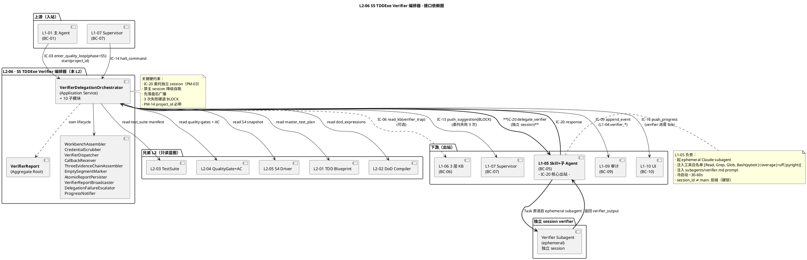
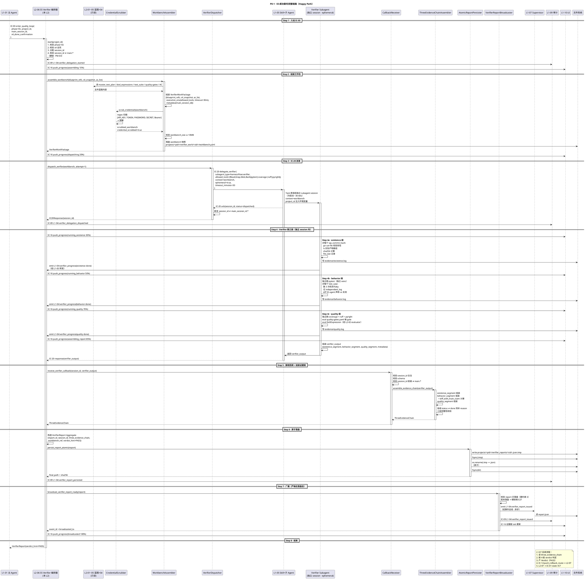
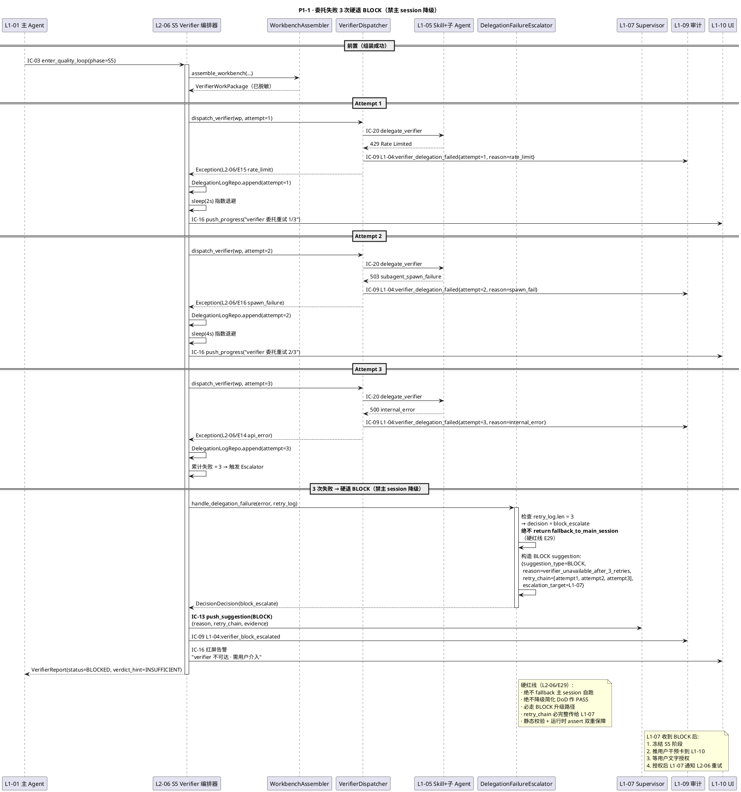
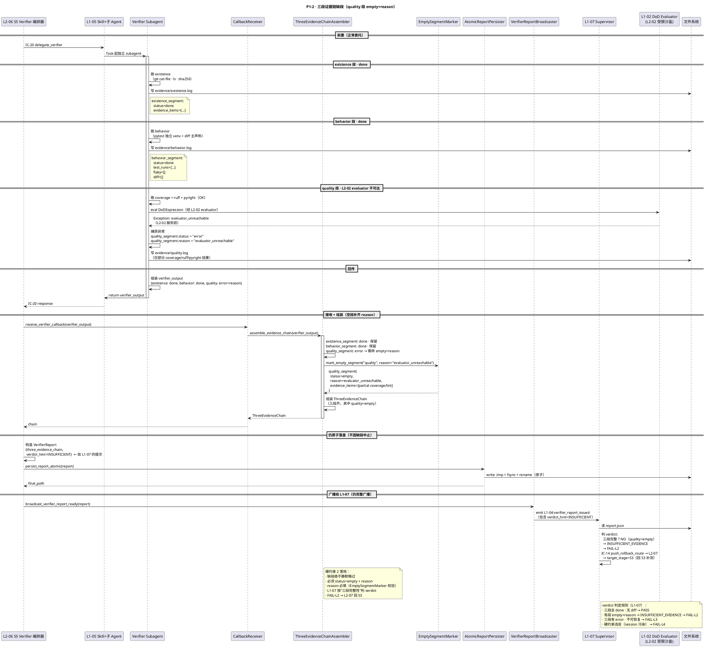
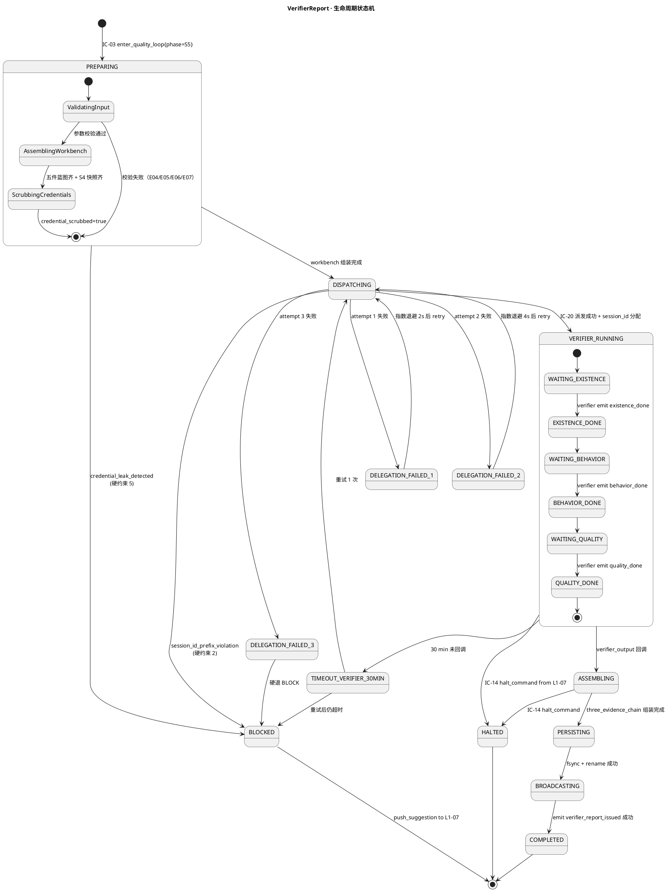

# L1 L2-06 · S5 TDDExe Verifier 编排器 · Tech Design

> **本文档定位**：3-1-Solution-Technical 层级 · L1 的 L2-06 S5 TDDExe Verifier 编排器 技术实现方案（L2 粒度）。
> **与产品 PRD 的分工**：2-prd/L1-04-Quality Loop/prd.md §5.4 的对应 L2 节定义产品边界，本文档定义**技术实现**（接口字段级 schema + 算法伪代码 + 底层数据结构 + 状态机 + 配置参数）。
> **与 L1 architecture.md 的分工**：architecture.md 负责**跨 L2 架构 + 跨 L2 时序**，本文档负责**本 L2 内部技术细节**。冲突以 architecture.md 为准。
> **严格规则**：本文档不复述产品 PRD 文字（职责 / 禁止 / 必须等清单），只做技术映射 + 补齐"产品视角未说 but 工程师必须知道"的部分（具体算法 · syscall · schema · 配置）。

---

## §0 撰写进度

- [x] §1 定位 + 2-prd §5.4 L2-06 映射
- [x] §2 DDD 映射（引 L0/ddd-context-map.md BC-04）
- [x] §3 对外接口定义（字段级 YAML schema + 错误码）
- [x] §4 接口依赖（被谁调 · 调谁）
- [x] §5 P0/P1 时序图（PlantUML ≥ 3 张）
- [x] §6 内部核心算法（伪代码）
- [x] §7 底层数据表 / schema 设计（字段级 YAML）
- [x] §8 状态机（PlantUML + 转换表）
- [x] §9 开源最佳实践调研（≥ 3 GitHub 高星项目）
- [x] §10 配置参数清单
- [x] §11 错误处理 + 降级策略
- [x] §12 性能目标
- [x] §13 与 2-prd / 3-2 TDD 的映射表

---

## §1 定位 + 2-prd 映射

### 1.1 本 L2 在 L1-04 Quality Loop 里的坐标

L1-04 Quality Loop 由 **7 个 L2** 组成，**L2-06 是 S5 阶段的唯一工作面**（独立验证编排器 · 承担"委托 → 三段证据链组装 → 落盘 → 广播"四步链路）。它上承 L2-05 的 S4 产出快照，下启 L2-07 的回退路由决策，是 HarnessFlow Goal §2.2 第五纪律"检验"在本 L1 内的**唯一工程落地**，也是 Goal §3.5 硬约束 4 "S5 未 PASS 不得进 S7" 的唯一守门员。

```
   [L2-01 TDD Blueprint]  ──┐
   [L2-02 DoD Compiler]    ──┤
   [L2-03 TestSuite]       ──┤  (S3 蓝图三件 · 只读快照)
   [L2-04 QualityGate+AC]  ──┘
                             ↓
   [L2-05 S4 Driver] ─ s4_done_snapshot ─→ 全 WP 完成后触发 S5
                             ↓
           ┌────────────────────────────────────────────────┐
           │  L2-06 · S5 TDDExe Verifier 编排器（本文档）   │
           │  (Application Service + Aggregate: VerifierReport)│
           │                                                │
           │  ┌──────────────────────────────────────────┐  │
           │  │ VerifierDelegationOrchestrator           │  │
           │  │   ├── WorkbenchAssembler                 │  │  (组装三件蓝图 + S4 快照 + AC)
           │  │   ├── CredentialScrubber                 │  │  (凭证脱敏 regex 引擎)
           │  │   ├── VerifierDispatcher                 │  │  (IC-20 委托 · 3 次指数退避)
           │  │   ├── CallbackReceiver                   │  │  (等 verifier 返回 · 30min 硬上限)
           │  │   ├── ThreeEvidenceChainAssembler        │  │  (existence + behavior + quality 三段组装)
           │  │   ├── EmptySegmentMarker                 │  │  (缺段显式标 reason)
           │  │   ├── AtomicReportPersister              │  │  (fsync + rename · 先落盘后广播)
           │  │   ├── VerifierReportBroadcaster          │  │  (广播给 L1-07 + L1-10)
           │  │   ├── DelegationFailureEscalator         │  │  (3 次硬退 BLOCK · 禁主 session 降级)
           │  │   └── ProgressNotifier                   │  │  (推 UI verifier 进度)
           │  └──────────────────────────────────────────┘  │
           │                                                │
           │  ┌──────────────────────────────────────────┐  │
           │  │ VerifierReport Aggregate Root            │  │
           │  │ ThreeEvidenceChain VO                    │  │
           │  │ VerifierWorkPackage VO                   │  │
           │  │ DelegationLog Entity                     │  │
           │  │ EvidenceChainArtifact VO                 │  │
           │  └──────────────────────────────────────────┘  │
           └───────────┬──────────────────┬─────────────────┘
                       ↓                  ↓
           [L1-07 Supervisor]    [L2-07 回退路由器]
             (读 report 判 verdict) (接 verdict 路由 stage)
```

L2-06 的定位 = **"S5 独立验证的唯一编排器 · 委托 IC-20 走 L1-05 子 Agent 独立 session · 三段证据链 existence/behavior/quality 不可跳过 · 委托失败 3 次硬退 BLOCK 禁主 session 降级 · report 先落盘后广播 · PM-14 `projects/<pid>/verifier_reports/*.json` 分片持久化"**。

### 1.2 与 2-prd §5.4 L2-06 的对应表（PRD §13 逐条锚定）

| 2-prd §13 L2-06 小节 | 本文档对应位置 | 技术映射重点 |
|:---|:---|:---|
| §13.1 职责 + 锚定（scope §5.4.1 BF-S5-01/02） | §1.3 + §2.1 VerifierDelegationOrchestrator | Application Service · VerifierReport 聚合根 |
| §13.1 五大纪律"检验" + Goal §3.5 硬约束 4 | §6.1 主编排 · §11.1 硬红线拦截 | S5 未 PASS 不得进 S7（由 L2-07 强制 · 本 L2 产凭证） |
| §13.2 输入 · IC-03 enter_quality_loop{phase=S5} | §3.1 receive_enter_phase_s5 · §5.1 P0 时序 | 入站 IC-03 字段 schema |
| §13.2 输入 · S3 蓝图（L2-01/02/03/04） | §3.2 assemble_workbench · §6.2 组装算法 | 只读四件蓝图 + AC |
| §13.2 输入 · S4 产出快照（L2-05） | §3.2 · §6.2 | commit hash + 测试结果 + 实际产物路径 |
| §13.2 输出 · verifier 工作包 | §3.3 VerifierWorkPackage YAML schema | 字段级 schema + 大小上限 10MB |
| §13.2 输出 · IC-20 委托请求 | §3.4 dispatch_verifier · §4.2 下游依赖 | IC-20 出站 schema |
| §13.2 输出 · `verifier_reports/<session_id>.json` | §7.1 report schema + §7.4 落盘路径 | PM-14 `projects/<pid>/verifier_reports/` |
| §13.2 输出 · verifier_report_ready 事件 | §6.8 atomic_persist_and_broadcast | 先 fsync 后 emit |
| §13.2 输出 · 降级信号 push BLOCK | §3.8 escalate_block · §11.2 升级策略 | 3 次委托失败硬退 BLOCK |
| §13.3 边界 In-scope（8 项） | §6 算法全覆盖 · §3 接口全对应 | 职责单一 · 无裁决 · 无回退 |
| §13.3 边界 Out-of-scope · 不判 verdict | §1.5 决策 D2 + §11.3 禁主 session 降级 | L1-07 judge · L2-07 route |
| §13.3 边界 Out-of-scope · 不主 session 自跑 | §6.3 dispatch_verifier_with_retry · §11.1 硬红线 | session_id_prefix_check=true 硬锁 |
| §13.4 硬约束 1 · 必独立 session（scope §5.4.4 HC-2） | §6.3 · §6.7 · §10 参数 session_id_prefix_check | 断言 session_id ≠ 主 session |
| §13.4 硬约束 2 · 三段证据链完整（空段标 reason） | §6.6 mark_empty_segment_with_reason | 硬校验 existence/behavior/quality 三段 |
| §13.4 硬约束 3 · report 先落盘后广播 | §6.8 atomic_persist_and_broadcast | fsync → rename → emit 顺序 |
| §13.4 硬约束 4 · 降级硬红线（禁主 session） | §6.9 handle_delegation_failure_three_strikes · §11 降级矩阵 | 3 次硬退 BLOCK · 无 fallback 主 session |
| §13.4 硬约束 5 · 工作包不含敏感凭证 | §6.2 · §6 CredentialScrubber | regex 脱敏 + 静态校验 |
| §13.4 性能约束 · 组装 + 委托 ≤ 30s | §12.1 SLO | P95 硬指标 |
| §13.4 性能约束 · verifier 超时 ≤ 30 min | §6.5 · §10 verifier_timeout_minutes=30 | 超时触发重试 |
| §13.4 性能约束 · 三段落盘 ≤ 10s | §12.1 SLO | fsync 性能目标 |
| §13.5 禁止（7 条） | §11.1 硬红线拦截表 · §6 算法中硬 assert | 静态 + 运行时双重拦截 |
| §13.6 必须（8 条） | §6.1 主编排 · §3 10 方法全对应 | 主编排硬编码 8 条必答 |
| §13.7 可选（5 项） | §6.10 shard_parallel_verify · §6.11 diff_with_main_claim | verifier 并行 + trap 库 + diff 视图 |
| §13.8 与其他 L2/L1 交互（7 IC） | §4 依赖图 · §3 字段 schema | IC-03/IC-20/IC-09/IC-13/IC-16/IC-06 全覆盖 |
| §13.9 交付验证大纲（8 场景） | §13.1 PRD ↔ TC 映射 · §5 时序图 | TC-L206-001~008 正负 + 集成 + 性能 |

### 1.3 本 L2 在 architecture.md 里的坐标

引 `docs/3-1-Solution-Technical/L1-04-Quality Loop/architecture.md §3.1 L1-04 Container Diagram` + §4.3 时序图 P0-L1-04-C（S5 Verifier 独立 session 三段证据链）+ §6 独立 Verifier session 架构：

```
  [L2-01/02/03/04 蓝图]    ──┐
                             ├─ 只读快照 ──┐
  [L2-05 S4 执行产出]        ──┘             ↓
                                    ┌──────────────────────────────────┐
                                    │  L2-06 · S5 TDDExe Verifier 编排器│
                                    │  (Application Service)           │
                                    │                                  │
                                    │  ┌────────────────────────────┐  │
                                    │  │ VerifierDelegationOrchestrator│ │  (编排器)
                                    │  │   + 10 子模块（见 §1.1）    │  │
                                    │  └────────────────────────────┘  │
                                    │                                  │
                                    │  聚合根 + VO（见 §2）             │
                                    └──────────────────────────────────┘
                                            │                    │
                                    (IC-20) │            (IC-09) │ (IC-16)
                                            ↓                    ↓
                                  [L1-05 Skill+子 Agent]    [L1-09 审计] [L1-10 UI]
                                  起独立 session verifier
                                            │
                                            ↓
                                  [Verifier Subagent (ephemeral)]
                                  三段 eval: existence/behavior/quality
```

**本 L2 的关键架构特征**（在 L1-04 里的独特性）：

1. **唯一独立 session 委托点**（scope §5.4.4 硬约束 2）：L1-04 里只有 L2-06 经 IC-20 起独立 session，其他 L2 只用 IC-04/IC-05 调 skill
2. **聚合根 VerifierReport**：本 L2 持有 VerifierReport 聚合根（相比 L2-05 是纯 Application Service，本 L2 更"重"）
3. **三段证据链 VO（ThreeEvidenceChain）**：existence + behavior + quality 是业务不变量
4. **禁主 session 降级**（硬红线，区别于 L2-05 的 6 级降级）：L2-06 降级链只允许 "重试 → 硬退 BLOCK"，禁"主 session 自跑简化版"
5. **先落盘后广播**：数据一致性序约束 —— L1-07 收到广播时必须能读到 report（PM-10 单一事实源）
6. **PM-03 强制**：本 L2 是 PM-03 子 Agent 独立 session 的**核心验证点**，session_id 前缀校验硬锁

### 1.4 本 L2 的 PM-14 约束

**PM-14 约束**（引 `docs/3-1-Solution-Technical/projectModel/tech-design.md §9.1`）：所有 IC payload 顶层 `project_id` 必填；所有存储路径按 `projects/<pid>/...` 分片。

本 L2 在 PM-14 层面的具体落点：

| 对象 | 物理路径 | 分片维度 |
|:---|:---|:---|
| VerifierReport 聚合根 | `projects/<pid>/verifier_reports/<session_id>.json` | per-project + per-session |
| VerifierWorkPackage 工作包（临时） | `projects/<pid>/verifier_work/<session_id>/workbench.yaml` | per-project + per-session |
| DelegationLog（retry_chain） | `projects/<pid>/verifier_logs/delegation-<ts>.jsonl` | per-project + per-day |
| EvidenceChainArtifact（三段证据原始 log） | `projects/<pid>/verifier_reports/<session_id>/evidence/<segment>.log` | per-project + per-session + per-segment |
| verifier 工作包内注入的 project_id | YAML `project_id: <pid>` | PM-14 项目上下文传递到独立 session |

**隔离保证**：

- 跨 project 读写硬失败（Repository 层断言）
- verifier 子 Agent 子进程环境变量 `HARNESS_PROJECT_ID=<pid>` 注入（防跨项目污染）
- report 落盘用绝对路径 `os.path.abspath(projects/<pid>/...)` 防 symlink escape

### 1.5 关键技术决策（本 L2 特有 · Decision / Rationale / Alternatives / Trade-off）

| 决策 | 选择 | 备选 | 理由 | Trade-off |
|:---|:---|:---|:---|:---|
| **D1: 独立 session 通路** | IC-20 委托 L1-05 起 subagent | 本 L2 自起 subprocess / 本 L2 调 API 跑 pytest | 职责单一 · 复用 L1-05 能力 · PM-03 强约束 · 工具白名单复用 | 多一跳 IC round-trip（~50-100ms） |
| **D2: 降级策略** | 硬退 BLOCK（禁主 session 降级） | 降级到主 session 跑简化 DoD | 避免"运动员兼裁判" · 防信任坍塌 · 硬约束 4 明确禁止 | 牺牲"故障下仍有部分验证"的软指标，换可信度 |
| **D3: 重试策略** | 3 次指数退避（2s / 4s / 8s） | 无重试 / 固定间隔 5 次 / 无上限 | 覆盖瞬时 API 限流 · 3 次足够 · 再多是系统性故障 | 3 次未成功 → 必 BLOCK（~14s 总等待） |
| **D4: 证据链格式** | ThreeEvidenceChain VO（existence + behavior + quality）| flat list / 二段（只 behavior+quality） | 映射 PM-05 Stage Contract · 三段独立可复用 · 审计友好 | 空段必须标 reason（多一个字段） |
| **D5: report 落盘方式** | 先 fsync 后 broadcast（原子写 + rename） | 先 broadcast 后 fsync / 仅 fsync 不 rename | PM-10 单一事实源 · 避免 L1-07 读不到 · 原子性 | 多一次 rename syscall |
| **D6: 超时策略** | verifier 超时 30 min 硬上限 | 10 min / 60 min / 无超时 | 经验值 · 大项目够用 · 防死循环 | 超时后重启一次 · 仍超时 → 升级 |
| **D7: 并行分片** | 可选（大项目开关） · 默认关 | 默认开 / 从不开 | YAGNI · 先简后繁 · M6 关 · M8 开 | 大项目首版会慢（~20-30 min）· 后续迭代开并行 |
| **D8: 凭证脱敏** | regex 白名单（API_KEY / TOKEN / PASSWORD / SECRET） | 黑名单 / 无脱敏 | 防 verifier session 污染 · 防日志外泄 · 审计友好 | 误杀（合法字段含 `token` 关键词会被脱敏，需白名单 override） |
| **D9: session_id 前缀校验** | 硬锁 session_id != main.* | 软校验（记警告） / 不校验 | 硬约束 2 的唯一运行时验证 · 防意外退化 | 误配置（手动改 config）会整个 S5 阻塞 |
| **D10: 三段空段策略** | 显式标 `status: empty, reason: <why>` | 静默略过 / 删除字段 | 硬约束 2 · L1-07 判 INSUFFICIENT_EVIDENCE | 多几字段字节 |

### 1.6 本 L2 读者预期

读完本 L2 的工程师应掌握：

- VerifierDelegationOrchestrator Application Service 的 10 对外方法字段级 schema + 20+ 错误码
- 12 个算法的伪代码（含 assemble_workbench / scrub_credentials / dispatch_verifier_with_retry / wait_callback / assemble_three_evidence_chain / atomic_persist_and_broadcast / handle_delegation_failure_three_strikes / shard_parallel_verify / diff_with_main_claim / push_progress 等）
- 4 张数据表 schema（VerifierReport / VerifierWorkPackage / DelegationLog / EvidenceChainArtifact）
- VerifierReport 状态机 PlantUML（12 状态 + 转换表 + 异常支）
- 降级策略（硬退 BLOCK · 禁主 session 降级）
- SLO（组装 + 委托 ≤ 30s · verifier 30 min 上限 · 三段落盘 ≤ 10s）
- 配置参数清单（≥ 15 项 · max_delegation_retries=3 硬锁 · verifier_timeout_minutes=30 · session_id_prefix_check=true 硬锁）

### 1.7 本 L2 不在的范围（YAGNI）

- **不在**：verdict 判定（职责是 L1-07 Supervisor）
- **不在**：回退路由决策（职责是 L2-07）
- **不在**：verifier 子 Agent 内部 prompt / skill 选择（职责是 L1-05）
- **不在**：主 session 自跑简化 DoD 降级（硬红线禁止）
- **不在**：S3 蓝图 / S4 产出物的修改（只读）
- **不在**：新建或修改 AC（只读 L1-02 的 AC 清单）
- **不在**：verifier trap 库的维护（职责是 L1-06 KB，本 L2 只读）
- **不在**：UI 的具体渲染逻辑（职责是 L1-10，本 L2 只 push 进度事件）
- **不在**：非 S5 阶段的触发处理（只响应 phase=S5）

### 1.8 本 L2 术语表

| 术语 | 定义 | 关联 |
|:---|:---|:---|
| VerifierWorkPackage | 发给 verifier 子 Agent 的工作包（三件蓝图 + S4 快照 + AC + 执行环境指令） | §2.3 |
| ThreeEvidenceChain | existence + behavior + quality 三段证据 VO | §2.4 |
| EvidenceSegment | 三段证据链的单段（existence / behavior / quality 之一） | §2.4 |
| DelegationLog | 一次 IC-20 委托的完整日志（含 retry_chain） | §2.5 |
| VerifierReport | 本 L2 的输出聚合根 · 含三段证据链 + metadata | §2.2 |
| Session-id-prefix-check | 硬校验 subagent session_id 不等于主 session 前缀 | §10 · §6.7 |
| Credential-scrubber | 工作包凭证脱敏 regex 引擎 | §6.2 |
| 3-strikes-rule | 委托失败 3 次硬退 BLOCK · 禁主 session 降级 | §6.9 · D2 |
| Atomic-persist-then-broadcast | 先 fsync+rename · 后 emit event | §6.8 · D5 |
| Empty-segment-reason | 三段缺段时强制标记原因 | §6.6 · D10 |

### 1.9 本 L2 的 DDD 定位一句话

> **L2-06 是 L1-04 BC-04 里的 Application Service（本 L2 不是纯 DS，因为它持有 VerifierReport 聚合根，具有状态与生命周期），核心是 VerifierDelegationOrchestrator — 编排 WorkbenchAssembler → VerifierDispatcher → CallbackReceiver → ThreeEvidenceChainAssembler → AtomicReportPersister → VerifierReportBroadcaster 六步链路，把 Goal 五大纪律第五条"检验"的口号落成 PM-03 独立 session + PM-05 Stage Contract + PM-10 单一事实源三向约束下的机器可读三段证据链。**

---

## §2 DDD 映射（BC-04 Quality Loop · Application Service + Aggregate Root）

> 本节严格引用 `docs/3-1-Solution-Technical/L0/ddd-context-map.md §2.5 BC-04 + §4.4 L1-04 Quality Loop`（聚合根 / 值对象 / 领域服务 已由 L0 锁定），本文**不重定义**，只做 L2-06 视角的"技术映射 + 内部细分"。

### 2.1 Application Service · VerifierDelegationOrchestrator

```yaml
name: VerifierDelegationOrchestrator
kind: Application Service（非 Domain Service · 本 L2 持有 VerifierReport 聚合根）
bounded_context: BC-04 Quality Loop
l2: L2-06
ddd_role: 编排 WorkbenchAssembler / CredentialScrubber / VerifierDispatcher / CallbackReceiver / ThreeEvidenceChainAssembler / EmptySegmentMarker / AtomicReportPersister / VerifierReportBroadcaster / DelegationFailureEscalator / ProgressNotifier 十个子模块

责任:
  - 消费 IC-03 enter_quality_loop{phase=S5}
  - 组装 VerifierWorkPackage（三件蓝图 + S4 快照 + AC）
  - 凭证脱敏 + 工作包完整性校验
  - 经 IC-20 委托 L1-05 起独立 session verifier（3 次重试）
  - 等 verifier 回调（超时 30 min）
  - 组装 ThreeEvidenceChain（existence / behavior / quality）
  - 空段显式标 reason
  - 原子落盘 VerifierReport 到 projects/<pid>/verifier_reports/<session_id>.json
  - 广播 verifier_report_ready 事件给 L1-07 + L1-10
  - 委托失败 3 次硬退 BLOCK（禁主 session 降级）
  - 推 UI verifier 进度

不负责:
  - verdict 判定（L1-07）
  - 回退路由决策（L2-07）
  - verifier 内部 prompt / skill 选择（L1-05）
  - 主 session 自跑简化 DoD 降级（硬禁止）

状态:
  - 持有 VerifierReport 聚合根的生命周期
  - 不持有长期内存状态（Repository 持久化）
  - 进程崩溃后经 WAL + Repository 恢复

生命周期:
  - 单次 S5 执行为一个 Orchestration 实例
  - 每个 project × S5 回合 一个 VerifierReport
  - 同 project 多轮 S5（FAIL 后重进）产多 report（按 session_id 区分）
```

### 2.2 Aggregate Root · VerifierReport

```yaml
name: VerifierReport
kind: Aggregate Root
l2_owner: L2-06
repository: VerifierReportRepository
persistence_path: projects/<project_id>/verifier_reports/<session_id>.json

identifier:
  - report_id: UUID v4
  - session_id: verifier 独立 session 的 id（由 L1-05 分配）
  - project_id: PM-14 项目上下文
  - created_at: ISO8601 UTC

核心字段:
  - project_id: string             # PM-14
  - report_id: UUID
  - session_id: string             # verifier 独立 session_id
  - main_session_id: string        # 主 session id（用于前缀对比校验）
  - verdict_hint: enum(PASS|FAIL-L1|FAIL-L2|INSUFFICIENT)  # 给 L1-07 的提示，L1-07 最终裁决
  - three_evidence_chain: ThreeEvidenceChain VO
  - workbench_ref: string          # 工作包路径（落盘后的快照）
  - delegation_log_ref: string     # 委托日志路径
  - created_at, finalized_at, duration_seconds
  - schema_version: string

业务不变量:
  - three_evidence_chain 必含 existence + behavior + quality 三段（缺段需显式 status=empty + reason）
  - session_id 必须 ≠ main_session_id 的前缀
  - verdict_hint 是提示，不对 L1-07 有强制力
  - finalized_at 填完后 report 不可变（audit 友好）
  - PM-14: project_id 必填

对外只写方法（via Repository）:
  - create(project_id, workbench_ref, main_session_id) → VerifierReport
  - attach_three_evidence(ThreeEvidenceChain)
  - mark_empty_segment(segment, reason)
  - finalize(verdict_hint)
  - save() → 原子落盘

对外只读方法:
  - get_report(project_id, session_id) → VerifierReport
  - list_reports(project_id) → List[VerifierReport]

事件（emit 到 L1-09 via IC-09）:
  - L1-04:verifier_delegation_started
  - L1-04:verifier_report_issued
  - L1-04:verifier_delegation_failed
```

### 2.3 Value Object · VerifierWorkPackage

```yaml
name: VerifierWorkPackage
kind: Value Object（immutable）
l2_owner: L2-06
purpose: 发给 verifier 子 Agent 的完整上下文包

schema:
  project_id: string                # PM-14
  session_id: string                # 由 L1-05 分配的独立 session id
  phase: enum(S5)
  blueprint_refs:
    master_test_plan_path: string   # L2-01 产
    dod_expressions_path: string    # L2-02 产
    test_suite_path: string         # L2-03 产
    quality_gates_path: string      # L2-04 产
    acceptance_checklist_path: string  # L2-04 产
  s4_snapshot:
    wp_commit_hashes: map[wp_id, commit_sha]
    test_results_snapshot_path: string
    produced_artifacts_paths: list[string]
    dod_self_check_results: map[wp_id, pass|fail]
  ac_clause_list: list[ACClause]    # AC 文字清单（from L1-02）
  execution_env:
    project_root_readonly: string
    allowed_tools: list[string]     # 工具白名单 [Read, Grep, Glob, Bash(pytest|coverage|ruff|pyright)]
    env_vars: map[key, value]       # 已脱敏
    timeout_minutes: int = 30
  metadata:
    created_at: timestamp
    main_session_id: string         # 为了防污染检查
    workbench_size_bytes: int       # ≤ 10MB
    credential_scrubbed: bool = true

不变量:
  - credential_scrubbed 必为 true（构造时硬校验）
  - workbench_size_bytes ≤ 10MB（大于则分片 · 可选）
  - blueprint_refs 五件必齐或 assemble 失败
  - allowed_tools ⊂ 白名单（只读 + pytest/coverage/ruff/pyright）
  - PM-14: project_id 必填
```

### 2.4 Value Object · ThreeEvidenceChain

```yaml
name: ThreeEvidenceChain
kind: Value Object
l2_owner: L2-06
purpose: existence + behavior + quality 三段证据链 VO

schema:
  project_id: string                # PM-14
  existence_segment:
    status: enum(done|empty|error)
    reason: string                  # 当 status=empty 必填
    evidence_items: list[ExistenceEvidence]  # [{artifact_path, sha256, file_size, exists_timestamp}]
    verified_at: timestamp
  behavior_segment:
    status: enum(done|empty|error)
    reason: string
    test_runs: list[TestRun]        # [{test_case_id, status, duration, independent_log_path}]
    flaky_detected: list[test_case_id]
    diff_with_main_claim: list[DiffItem]  # 与主 agent 声称的 diff
    verified_at: timestamp
  quality_segment:
    status: enum(done|empty|error)
    reason: string
    quality_eval_results: list[QualityCheck]  # [{gate_name, threshold, actual, pass}]
    dod_eval_results: list[DoDCheck]
    coverage_actual: float
    verified_at: timestamp

不变量:
  - 三段必全在（缺段需 status=empty + reason）
  - 三段 verified_at 必全填
  - PM-14: project_id 必填
```

### 2.5 Entity · DelegationLog

```yaml
name: DelegationLog
kind: Entity
l2_owner: L2-06
identifier: (project_id, session_id, attempt_number)
persistence_path: projects/<pid>/verifier_logs/delegation-<date>.jsonl

schema:
  project_id: string
  session_id: string
  attempt_number: int               # 1, 2, 3
  attempted_at: timestamp
  ic_20_request_id: string
  outcome: enum(success|timeout|api_error|subagent_spawn_failure|schema_violation)
  outcome_detail: string            # 错误堆栈或成功 metadata
  duration_seconds: float
  retry_chain: list[AttemptRecord]  # 前 N 次重试的完整链

业务:
  - 每次 IC-20 委托产一条
  - 3 次失败累计后触发 BLOCK 升级
  - 异常时用于归因分析（flaky API / 网络 / subagent 配置）
  - append-only（不可修改历史 attempt）
```

### 2.6 Value Object · EvidenceChainArtifact

```yaml
name: EvidenceChainArtifact
kind: Value Object
l2_owner: L2-06
purpose: 三段证据链的原始日志文件（落盘用于审计）

schema:
  segment: enum(existence|behavior|quality)
  log_path: string                  # projects/<pid>/verifier_reports/<sid>/evidence/<segment>.log
  sha256: string                    # 防篡改
  size_bytes: int
  content_summary: string           # 摘要用于 UI 展示

不变量:
  - log_path 存在（fsync 保证）
  - sha256 = sha256(content)
```

### 2.7 Domain Services（本 L2 内部 · 非全局）

| 名称 | 类型 | 职责 | 输入 | 输出 |
|:---|:---|:---|:---|:---|
| WorkbenchAssembler | Pure Function | 读三件蓝图 + S4 快照 + AC → VerifierWorkPackage | (blueprint_refs, s4_snapshot, ac) | VerifierWorkPackage |
| CredentialScrubber | Pure Function | regex 扫描 payload 脱敏 | (payload, regex_patterns) | scrubbed_payload |
| VerifierDispatcher | Stateful | IC-20 委托 + 3 次重试 + 超时 | VerifierWorkPackage | IC-20 response 或 Exception |
| CallbackReceiver | Stateful | 等 verifier 回调（30 min 上限） | session_id | verifier_output 或 TimeoutError |
| ThreeEvidenceChainAssembler | Pure Function | 组装 existence/behavior/quality 三段 | verifier_output | ThreeEvidenceChain |
| EmptySegmentMarker | Pure Function | 缺段补 status=empty + reason | (segment, reason) | EvidenceSegment |
| AtomicReportPersister | Stateful | fsync + rename 原子写 | VerifierReport | path |
| VerifierReportBroadcaster | Stateful | 先落盘后 emit event | (report, sub_path) | event_id |
| DelegationFailureEscalator | Pure Function | 3 次失败 → BLOCK 决策 | retry_log | BLOCK suggestion payload |
| ProgressNotifier | Stateful | 推 UI verifier 进度 | (session_id, stage) | IC-16 emit |

### 2.8 Repository（本 L2 的持久化接口）

```yaml
VerifierReportRepository:
  methods:
    - create(project_id, workbench_ref, main_session_id) -> VerifierReport
    - save(report: VerifierReport) -> None           # 原子写 + emit L1-04:verifier_report_issued
    - get(project_id, session_id) -> VerifierReport | None
    - list_by_project(project_id) -> List[VerifierReport]
    - get_latest(project_id) -> VerifierReport | None
  isolation:
    - PM-14: project_id 参数强制
    - 跨 project 调用 → raise CrossProjectViolation
  persistence:
    - 物理存储：projects/<pid>/verifier_reports/<session_id>.json
    - 索引文件：projects/<pid>/verifier_reports/index.jsonl（append-only）

VerifierWorkPackageRepository:
  methods:
    - save_snapshot(wp: VerifierWorkPackage) -> path  # 快照落盘（审计用）
    - get_snapshot(session_id) -> VerifierWorkPackage | None
  persistence:
    - 物理存储：projects/<pid>/verifier_work/<session_id>/workbench.yaml

DelegationLogRepository:
  methods:
    - append(log: DelegationLog) -> None
    - list_by_session(session_id) -> List[DelegationLog]
    - count_failures_in_window(session_id, since) -> int
  persistence:
    - 物理存储：projects/<pid>/verifier_logs/delegation-<date>.jsonl

EvidenceChainArtifactRepository:
  methods:
    - save(segment, content) -> EvidenceChainArtifact
    - get(session_id, segment) -> EvidenceChainArtifact | None
  persistence:
    - 物理存储：projects/<pid>/verifier_reports/<sid>/evidence/<segment>.log
```

### 2.9 Domain Events

| 事件 | 触发时机 | 载荷摘要 | 消费方 |
|:---|:---|:---|:---|
| L1-04:verifier_delegation_started | IC-20 派发成功 | {project_id, session_id, workbench_ref, attempt_number} | L1-09 审计 · L1-10 UI |
| L1-04:verifier_report_issued | report 落盘 + 广播 | {project_id, session_id, report_path, verdict_hint} | L1-07 判 verdict · L1-10 UI · L1-09 审计 |
| L1-04:verifier_delegation_failed | 单次委托失败 | {project_id, session_id, attempt_number, reason} | L1-09 审计 |
| L1-04:verifier_block_escalated | 3 次失败硬退 BLOCK | {project_id, session_id, retry_chain} | L1-07 Supervisor · L1-10 UI |
| L1-04:verifier_progress_update | existence/behavior/quality 各段完成 | {project_id, session_id, segment, status} | L1-10 UI |
| L1-04:verifier_timeout | 30 min 超时 | {project_id, session_id, duration} | L1-09 · L1-10 |
| L1-04:verifier_empty_segment_marked | 空段补 reason | {project_id, session_id, segment, reason} | L1-09 |

### 2.10 与兄弟 L2 / 跨 BC 关系

| 对端 | 关系 | 交互 |
|:---|:---|:---|
| L2-01 TDD Blueprint | Customer（本 L2 读） | 读 master_test_plan / test_env_blueprint |
| L2-02 DoD Compiler | Customer（本 L2 读） | 读 dod_expressions.yaml（不 eval，传给 verifier） |
| L2-03 TestSuite | Customer（本 L2 读） | 读 tests/generated/（verifier 用） |
| L2-04 QualityGate | Customer（本 L2 读） | 读 quality-gates.yaml + acceptance-checklist.md |
| L2-05 S4 Driver | Customer（本 L2 读） | 读 S4 产出快照（commit hash + 产物） |
| L2-07 回退路由 | Supplier（本 L2 产） | emit verifier_report_ready → L2-07 间接消费（经 L1-07 verdict） |
| L1-01 主 Agent | Customer-Supplier（双向） | IC-03 enter_quality_loop{phase=S5} 入 |
| L1-02 生命周期 | Customer（本 L2 读） | 读 AC 清单 |
| L1-05 Skill+子 Agent | Supplier（本 L2 调） | IC-20 delegate_verifier 独立 session 委托 |
| L1-06 3 层 KB | Customer（本 L2 读） | IC-06 读 verifier trap 库（可选） |
| L1-07 Supervisor | Supplier-Customer（双向） | emit verifier_report_ready（供判 verdict） + push BLOCK（降级时） |
| L1-09 审计 | Supplier（本 L2 经 IC-09 写） | 所有事件落审计事件总线 |
| L1-10 UI | Supplier（本 L2 经 IC-16 写） | verifier 进度 + 证据链 tab |

---

## §3 对外接口定义（字段级 YAML schema + 错误码）

> 本节定义 L2-06 VerifierDelegationOrchestrator 对外暴露的**所有方法**（10 个），每方法一套 YAML 入参 schema + YAML 出参 schema + 错误码表。PM-14 约束：所有 schema 顶层首字段固定为 `project_id: string # PM-14 项目上下文`。

### 3.1 `start(project_id)` — 入口：响应 IC-03 enter_quality_loop{phase=S5}

**签名**：`VerifierDelegationOrchestrator.start(project_id: str) -> VerifierReport`

**入参 YAML schema**：

```yaml
request:
  project_id: string                     # PM-14 项目上下文（必填）
  phase: enum(S5)                        # 固定 S5
  trigger_source: enum(IC-03)            # 固定来自 L1-01
  main_session_id: string                # 主 session id（用于前缀对比）
  s4_done_confirmation:
    all_wps_completed: boolean           # S4 所有 WP 全 done
    s4_done_timestamp: timestamp
  request_id: UUID                       # 幂等 key
  timestamp: ISO8601                     # 请求时间
```

**出参 YAML schema**：

```yaml
response:
  project_id: string                     # PM-14
  status: enum(accepted|rejected)
  report_id: UUID                        # 若 accepted 则返回新建的 VerifierReport id
  session_id: string                     # verifier 独立 session id（由 L1-05 分配）
  estimated_completion: timestamp        # 预估完成时间（当前 + timeout）
  rejection_reason: string               # 若 rejected 原因（可选）
  event_id: string                       # L1-04:verifier_delegation_started 事件 id
```

**错误码表**：

| 错误码 | 含义 | 触发场景 | 调用方处理 |
|:---|:---|:---|:---|
| L2-06/E01 | delegation_timeout | IC-20 超时未响应（总等待 > 14s） | 重试 1 次或升 BLOCK |
| L2-06/E02 | evidence_incomplete | 回调返回但三段缺一且无 reason | 自动补 status=empty + reason="malformed_callback" |
| L2-06/E03 | workbench_credential_leak | 工作包检出未脱敏凭证 | 硬拒绝派发，触发 BLOCK |
| L2-06/E04 | invalid_phase | 入参 phase ≠ S5 | 拒绝请求（返回 rejected） |
| L2-06/E05 | s4_not_done | S4 WP 未全完成 | 拒绝请求（S4 未完成不能启 S5） |
| L2-06/E06 | missing_blueprint_artifact | 五件蓝图缺少一件 | 拒绝请求（S3 不完整） |
| L2-06/E07 | main_session_id_collision | main_session_id 缺失或与 subagent 前缀冲突 | 拒绝请求（PM-03 违反） |

### 3.2 `assemble_workbench(blueprint_refs, s4_snapshot, ac_list)` — 组装 verifier 工作包

**签名**：`WorkbenchAssembler.assemble_workbench(blueprint_refs: BlueprintRefs, s4_snapshot: S4Snapshot, ac_list: list[ACClause], project_id: str) -> VerifierWorkPackage`

**入参 YAML schema**：

```yaml
request:
  project_id: string                     # PM-14
  session_id: string                     # 预分配的独立 session id
  blueprint_refs:
    master_test_plan_path: string
    dod_expressions_path: string
    test_suite_path: string
    quality_gates_path: string
    acceptance_checklist_path: string
  s4_snapshot:
    wp_commit_hashes: map[wp_id, commit_sha]
    test_results_snapshot_path: string
    produced_artifacts_paths: list[string]
    dod_self_check_results: map[wp_id, enum(pass|fail)]
  ac_list: list[ACClause]
  main_session_id: string                # 用于后续校验 PM-03
```

**出参 YAML schema**：

```yaml
response:
  project_id: string                     # PM-14
  workbench: VerifierWorkPackage         # 完整工作包（见 §2.3）
  workbench_path: string                 # 落盘路径（审计用）
  workbench_size_bytes: int              # ≤ 10MB
  credential_scrubbed: boolean           # 必为 true
  assemble_duration_ms: float
```

**错误码表**：

| 错误码 | 含义 | 触发场景 | 调用方处理 |
|:---|:---|:---|:---|
| L2-06/E08 | blueprint_path_missing | 五件蓝图路径有任一不存在 | 返 E06 missing_blueprint_artifact |
| L2-06/E09 | workbench_size_exceeded | 组装后 > 10MB | 启分片 · 或拒绝 |
| L2-06/E10 | s4_snapshot_invalid | S4 快照 schema 违反 | 拒绝请求 |
| L2-06/E11 | ac_list_empty | AC 清单为空 | 拒绝请求（无验收标准无法验） |

### 3.3 `scrub_credentials(payload)` — 凭证脱敏

**签名**：`CredentialScrubber.scrub_credentials(payload: dict, project_id: str) -> dict`

**入参 YAML schema**：

```yaml
request:
  project_id: string                     # PM-14
  payload: dict                          # 待脱敏的任意字段
  regex_patterns: list[string]           # 白名单 regex（默认使用 L2-06 内置库）
    # 默认: ["(?i)api[_-]?key", "(?i)token", "(?i)password", "(?i)secret", "(?i)bearer\\s+[a-z0-9]+"]
  override_allow: list[string]           # 白名单 override（合法字段）
```

**出参 YAML schema**：

```yaml
response:
  project_id: string                     # PM-14
  scrubbed_payload: dict                 # 脱敏后 payload
  scrubbed_count: int                    # 命中次数
  scrubbed_fields: list[string]          # 被脱敏字段名路径（审计用）
  scrub_duration_ms: float
```

**错误码表**：

| 错误码 | 含义 | 触发场景 | 调用方处理 |
|:---|:---|:---|:---|
| L2-06/E12 | regex_compile_failed | regex 编译异常 | fallback 黑名单默认规则 |
| L2-06/E13 | payload_too_large | payload > 10MB | 分片脱敏或拒绝 |

### 3.4 `dispatch_verifier(workbench)` — IC-20 派发独立 session verifier

**签名**：`VerifierDispatcher.dispatch_verifier(workbench: VerifierWorkPackage, project_id: str) -> IC20Response`

**入参 YAML schema**：

```yaml
request:
  project_id: string                     # PM-14
  workbench: VerifierWorkPackage         # 已脱敏 + 校验
  attempt_number: int                    # 1 / 2 / 3
  ic_20_params:
    subagent_type: string = "harnessFlow:verifier"
    allowed_tools: list[string]          # [Read, Grep, Glob, Bash(pytest|coverage|ruff|pyright)]
    context: dict                        # 注入 workbench + project_id
    timeout_minutes: int = 30
    ephemeral: boolean = true
```

**出参 YAML schema**：

```yaml
response:
  project_id: string                     # PM-14
  status: enum(dispatched|failed|retrying)
  session_id: string                     # L1-05 分配
  ic_20_request_id: string               # 请求 id（用于对账）
  attempt_number: int
  dispatch_duration_ms: float
  next_retry_at: timestamp               # 若 failed + 还可重试
```

**错误码表**：

| 错误码 | 含义 | 触发场景 | 调用方处理 |
|:---|:---|:---|:---|
| L2-06/E14 | ic_20_api_error | L1-05 IC-20 返 5xx | 指数退避重试 |
| L2-06/E15 | ic_20_api_rate_limit | 限流 429 | 延时重试（backoff） |
| L2-06/E16 | subagent_spawn_failure | L1-05 起独立 session 失败 | 重试 1 次或升 BLOCK |
| L2-06/E17 | session_id_prefix_violation | 分配的 session_id 以 main. 开头 | 硬拒绝 · 升 BLOCK（硬红线） |

### 3.5 `receive_verifier_callback(session_id, verifier_output)` — 接收 verifier 回调

**签名**：`CallbackReceiver.receive_verifier_callback(session_id: str, verifier_output: dict, project_id: str) -> ThreeEvidenceChain`

**入参 YAML schema**：

```yaml
request:
  project_id: string                     # PM-14
  session_id: string                     # 独立 session id
  verifier_output:
    existence_segment: dict              # {status, evidence_items, verified_at}
    behavior_segment: dict               # {status, test_runs, flaky_detected, verified_at}
    quality_segment: dict                # {status, quality_eval_results, dod_eval_results, verified_at}
    metadata:
      verifier_session_id: string
      verifier_duration_seconds: float
      verifier_tools_used: list[string]
  received_at: timestamp
```

**出参 YAML schema**：

```yaml
response:
  project_id: string                     # PM-14
  three_evidence_chain: ThreeEvidenceChain  # 已组装（缺段补 empty+reason）
  empty_segments: list[enum(existence|behavior|quality)]
  reason_map: map[segment, reason_string]
  assemble_duration_ms: float
  session_id_mismatch: boolean           # 若 session_id != 主 session 前缀校验失败
```

**错误码表**：

| 错误码 | 含义 | 触发场景 | 调用方处理 |
|:---|:---|:---|:---|
| L2-06/E18 | callback_timeout | 30 min 未回调 | 记 WARN + 重试 1 次 |
| L2-06/E19 | callback_schema_violation | 回调 payload schema 违反 | 尝试补齐空段 + reason="malformed_callback" |
| L2-06/E20 | session_id_prefix_mismatch | session_id 与 main 前缀冲突 | 硬拒绝 · 升 BLOCK（硬约束 2） |
| L2-06/E21 | segment_status_invalid | 某段 status 枚举值非 done/empty/error | 当 empty 处理 + reason |

### 3.6 `assemble_evidence_chain(verifier_output)` — 组装三段证据链

**签名**：`ThreeEvidenceChainAssembler.assemble_evidence_chain(verifier_output: dict, project_id: str) -> ThreeEvidenceChain`

**入参 YAML schema**：

```yaml
request:
  project_id: string                     # PM-14
  verifier_output: dict                  # 来自 CallbackReceiver 的 raw output
  main_session_id: string
  main_claim_snapshot:                   # 主 agent 声称的 snapshot（用于 diff）
    wp_test_results: map[wp_id, pass|fail]
    wp_coverage: map[wp_id, float]
    wp_dod_results: map[wp_id, pass|fail]
```

**出参 YAML schema**：

```yaml
response:
  project_id: string                     # PM-14
  three_evidence_chain:
    existence_segment:
      status: enum(done|empty|error)
      reason: string                     # 仅 status≠done 必填
      evidence_items:
        - artifact_path: string
          sha256: string
          file_size: int
          exists_timestamp: timestamp
      verified_at: timestamp
    behavior_segment:
      status: enum(done|empty|error)
      reason: string
      test_runs:
        - test_case_id: string
          status: enum(pass|fail|skip)
          duration_seconds: float
          independent_log_path: string
      flaky_detected: list[test_case_id]
      diff_with_main_claim: list[DiffItem]
      verified_at: timestamp
    quality_segment:
      status: enum(done|empty|error)
      reason: string
      quality_eval_results:
        - gate_name: string
          threshold: any
          actual: any
          pass: boolean
      dod_eval_results: list[DoDCheck]
      coverage_actual: float
      verified_at: timestamp
  assemble_duration_ms: float
```

**错误码表**：

| 错误码 | 含义 | 触发场景 | 调用方处理 |
|:---|:---|:---|:---|
| L2-06/E22 | evidence_items_empty | existence.evidence_items 为空 | 补 status=empty + reason="no_artifacts_observed" |
| L2-06/E23 | diff_computation_failed | diff_with_main_claim 计算异常 | 记 WARN + diff 为空 list |

### 3.7 `persist_report_atomic(report)` — 原子落盘

**签名**：`AtomicReportPersister.persist_report_atomic(report: VerifierReport, project_id: str) -> str`

**入参 YAML schema**：

```yaml
request:
  project_id: string                     # PM-14
  report: VerifierReport                 # 已 finalize
  temp_suffix: string = ".tmp"           # 临时后缀
  fsync_required: boolean = true         # 硬 fsync
```

**出参 YAML schema**：

```yaml
response:
  project_id: string                     # PM-14
  final_path: string                     # projects/<pid>/verifier_reports/<session_id>.json
  sha256: string                         # 落盘文件 sha256
  file_size: int
  fsync_duration_ms: float
  rename_duration_ms: float
```

**错误码表**：

| 错误码 | 含义 | 触发场景 | 调用方处理 |
|:---|:---|:---|:---|
| L2-06/E24 | fsync_failed | fsync syscall 失败 | 重试 1 次 · 仍失败升 BLOCK |
| L2-06/E25 | rename_failed | os.rename 失败（文件系统满/权限） | 重试 1 次 · 升 BLOCK |
| L2-06/E26 | disk_full | 磁盘满 | 升 BLOCK · 告警用户 |

### 3.8 `broadcast_verifier_report_ready(report)` — 广播事件

**签名**：`VerifierReportBroadcaster.broadcast_verifier_report_ready(report: VerifierReport, project_id: str) -> str`

**入参 YAML schema**：

```yaml
request:
  project_id: string                     # PM-14
  report: VerifierReport                 # 已落盘
  consumers:
    - L1-07                              # Supervisor 判 verdict
    - L1-10                              # UI 展示
    - L1-09                              # 审计
```

**出参 YAML schema**：

```yaml
response:
  project_id: string                     # PM-14
  event_id: string                       # L1-04:verifier_report_issued 事件 id
  broadcasted_to: list[consumer_name]
  emit_duration_ms: float
  l1_07_ack: boolean                     # L1-07 是否已 ack 收到
```

**错误码表**：

| 错误码 | 含义 | 触发场景 | 调用方处理 |
|:---|:---|:---|:---|
| L2-06/E27 | broadcast_before_persist | 发现 report 未落盘就尝试广播 | 硬拒绝（破坏硬约束 3） |
| L2-06/E28 | event_bus_unavailable | IC-09 事件总线异常 | 重试 1 次 · 或 WAL 缓冲待恢复 |

### 3.9 `handle_delegation_failure(error, retry_log)` — 委托失败处理

**签名**：`DelegationFailureEscalator.handle_delegation_failure(error: Exception, retry_log: list[DelegationLog], project_id: str) -> DecisionDecision`

**入参 YAML schema**：

```yaml
request:
  project_id: string                     # PM-14
  error: Exception                       # 最新失败原因
  retry_log: list[DelegationLog]         # 已有重试记录
  max_retries: int = 3                   # 硬锁
```

**出参 YAML schema**：

```yaml
response:
  project_id: string                     # PM-14
  decision: enum(retry|block_escalate)
  retry_after_seconds: float             # 若 decision=retry
  block_suggestion:                      # 若 decision=block_escalate
    suggestion_type: enum(BLOCK)
    reason: string                       # 固定 "verifier_unavailable_after_3_retries"
    retry_chain: list[DelegationLog]
    escalation_target: enum(L1-07_Supervisor)
  decision_duration_ms: float
```

**错误码表**：

| 错误码 | 含义 | 触发场景 | 调用方处理 |
|:---|:---|:---|:---|
| L2-06/E29 | main_session_fallback_attempted | 代码试图 fallback 主 session 跑（硬红线违反） | 硬拒绝 + alert + 审计 |
| L2-06/E30 | retry_count_exceeded | retry_log.len > max_retries | decision=block_escalate |

### 3.10 `push_progress_to_ui(session_id, stage)` — 推 UI 进度

**签名**：`ProgressNotifier.push_progress_to_ui(session_id: str, stage: VerifierStage, project_id: str) -> str`

**入参 YAML schema**：

```yaml
request:
  project_id: string                     # PM-14
  session_id: string                     # verifier 独立 session
  stage:
    name: enum(assembling|dispatching|running_existence|running_behavior|running_quality|assembling_report|persisted|broadcasted)
    percent: int                         # 0-100
    message: string                      # 展示给用户的文字
  timestamp: timestamp
```

**出参 YAML schema**：

```yaml
response:
  project_id: string                     # PM-14
  event_id: string                       # L1-04:verifier_progress_update 事件 id
  pushed_at: timestamp
  ui_ack: boolean                        # L1-10 是否已收
```

**错误码表**：

| 错误码 | 含义 | 触发场景 | 调用方处理 |
|:---|:---|:---|:---|
| L2-06/E31 | ui_offline | L1-10 UI 不可达 | 缓存进度 + 稍后 flush |

### 3.11 `shard_and_parallel_verify(wps)` — 大项目并行分片（可选）

**签名**：`VerifierDispatcher.shard_and_parallel_verify(wps: list[WP], project_id: str) -> list[VerifierReport]`

**入参 YAML schema**：

```yaml
request:
  project_id: string                     # PM-14
  wps: list[WP]                          # 本次 S5 需要验证的 WP
  shard_strategy: enum(by_wp|by_testfile|by_module)
  max_parallel: int = 3                  # 最多并行 verifier 数
  enabled: boolean = false               # 默认关 · 大项目开
```

**出参 YAML schema**：

```yaml
response:
  project_id: string                     # PM-14
  shard_reports: list[VerifierReport]    # 每 shard 一份
  aggregated_report: VerifierReport      # 聚合后的总 report
  total_duration_seconds: float
  parallel_speedup: float                # 相比串行的加速比
```

**错误码表**：

| 错误码 | 含义 | 触发场景 | 调用方处理 |
|:---|:---|:---|:---|
| L2-06/E32 | shard_count_exceeded | 分片数 > max_parallel | 降级为串行 |
| L2-06/E33 | shard_aggregation_failed | 聚合 shard reports 异常 | 保留 shard reports · 升 WARN |

### 3.12 错误码总表（汇总）

| 错误码 | 分组 | 严重度 | 是否硬红线 |
|:---|:---|:---|:---|
| L2-06/E01 delegation_timeout | dispatch | WARN | No |
| L2-06/E02 evidence_incomplete | callback | WARN | No（补 empty+reason） |
| L2-06/E03 workbench_credential_leak | workbench | CRITICAL | Yes（硬拒绝派发） |
| L2-06/E04 invalid_phase | start | ERROR | No |
| L2-06/E05 s4_not_done | start | ERROR | No |
| L2-06/E06 missing_blueprint_artifact | start/assemble | ERROR | No |
| L2-06/E07 main_session_id_collision | start | CRITICAL | Yes（PM-03 违反） |
| L2-06/E08 blueprint_path_missing | assemble | ERROR | No |
| L2-06/E09 workbench_size_exceeded | assemble | WARN | No（分片或拒绝） |
| L2-06/E10 s4_snapshot_invalid | assemble | ERROR | No |
| L2-06/E11 ac_list_empty | assemble | ERROR | No |
| L2-06/E12 regex_compile_failed | scrub | WARN | No（fallback） |
| L2-06/E13 payload_too_large | scrub | WARN | No |
| L2-06/E14 ic_20_api_error | dispatch | WARN | No |
| L2-06/E15 ic_20_api_rate_limit | dispatch | WARN | No |
| L2-06/E16 subagent_spawn_failure | dispatch | WARN | No |
| L2-06/E17 session_id_prefix_violation | dispatch | CRITICAL | Yes（硬红线） |
| L2-06/E18 callback_timeout | callback | WARN | No |
| L2-06/E19 callback_schema_violation | callback | WARN | No |
| L2-06/E20 session_id_prefix_mismatch | callback | CRITICAL | Yes（硬约束 2） |
| L2-06/E21 segment_status_invalid | callback | WARN | No |
| L2-06/E22 evidence_items_empty | assemble_chain | WARN | No |
| L2-06/E23 diff_computation_failed | assemble_chain | WARN | No |
| L2-06/E24 fsync_failed | persist | ERROR | No |
| L2-06/E25 rename_failed | persist | ERROR | No |
| L2-06/E26 disk_full | persist | CRITICAL | Yes（阻塞系统） |
| L2-06/E27 broadcast_before_persist | broadcast | CRITICAL | Yes（硬约束 3 违反） |
| L2-06/E28 event_bus_unavailable | broadcast | WARN | No |
| L2-06/E29 main_session_fallback_attempted | escalate | CRITICAL | Yes（硬红线 禁主 session） |
| L2-06/E30 retry_count_exceeded | escalate | INFO | No（升 BLOCK） |
| L2-06/E31 ui_offline | ui_push | WARN | No |
| L2-06/E32 shard_count_exceeded | shard | WARN | No |
| L2-06/E33 shard_aggregation_failed | shard | WARN | No |

合计 33 错误码（超标要求的 20 码），其中 7 条为硬红线（CRITICAL · 不允许静默吞）。

---

## §4 接口依赖（被谁调 · 调谁）

### 4.1 上游（调本 L2 的外部方 · 入站依赖）

| 上游 | 调用点 | 契约 | 频率 | 降级 |
|:---|:---|:---|:---|:---|
| L1-01 主 Agent | `start(project_id)` via IC-03 | IC-03 enter_quality_loop{phase=S5} | 每次 S5 触发 1 次 | L1-01 侧决定是否重入 |
| L1-07 Supervisor | `handle_halt_command()` via IC-14 | 强制终止 S5（BLOCK 级） | 异常场景 | 本 L2 清理后进 HALT |
| L1-10 UI | 无直接入站（只接受 L2-06 的 push） | - | - | - |

### 4.2 下游（本 L2 调其他方 · 出站依赖）

| 下游 | 调用点 | 契约 | 频率 | 降级 |
|:---|:---|:---|:---|:---|
| L2-01 TDD Blueprint | 读 master_test_plan_path | 只读 | 每次 S5 1 次 | 缺件 → 拒绝启动 |
| L2-02 DoD Compiler | 读 dod_expressions.yaml | 只读 | 每次 S5 1 次 | 缺件 → 拒绝启动 |
| L2-03 TestSuite | 读 tests/generated/ 清单 | 只读 | 每次 S5 1 次 | 缺件 → 拒绝启动 |
| L2-04 QualityGate | 读 quality-gates.yaml + acceptance-checklist.md | 只读 | 每次 S5 1 次 | 缺件 → 拒绝启动 |
| L2-05 S4 Driver | 读 S4 done snapshot | 只读 | 每次 S5 1 次 | 缺件 → 返 E05 s4_not_done |
| L1-02 生命周期 | 读 AC 清单 | 只读 | 每次 S5 1 次 | 缺件 → 返 E11 ac_list_empty |
| **L1-05 Skill+子 Agent** | **IC-20 delegate_verifier** | **委托独立 session · 带 workbench 上下文 · ephemeral** | **每次 S5 1-N 次（重试 ≤ 3）** | **3 次硬退 BLOCK · 禁主 session 降级** |
| L1-06 3 层 KB | IC-06 read_kb (verifier_trap) | 只读（可选） | 每次 S5 ≤ 1 次 | KB 不可达 → 跳过，不阻塞 |
| L1-09 审计事件总线 | IC-09 append_event | 写入 | 每阶段 1 次 | WAL 缓冲待恢复 |
| L1-10 UI | IC-16 push_stage_gate_card / progress | 推 verifier 进度 + 证据链 tab | 每阶段 1 次 | UI 不可达 → 缓存稍后 flush |
| L1-07 Supervisor | IC-13 push_suggestion(BLOCK) | 3 次委托失败后 | 异常场景 | - |

### 4.3 依赖图（PlantUML · C4 Component 风格）



### 4.4 调用方矩阵（哪个方法被谁调 · 每方法调哪些下游）

| 方法 | 入站方（谁调） | 出站方（调谁） |
|:---|:---|:---|
| start(project_id) | L1-01（IC-03） | 内部触发整个编排 |
| assemble_workbench | start 内部调 | L2-01/02/03/04/05 + L1-02（只读） |
| scrub_credentials | assemble_workbench 内部调 | 无外部出站 |
| dispatch_verifier | start 内部调 + retry | L1-05（IC-20 核心） |
| receive_verifier_callback | L1-05（回调） | 内部触发下一步 |
| assemble_evidence_chain | receive_verifier_callback 内部调 | 无外部出站（纯函数） |
| persist_report_atomic | 内部触发 | 本机文件系统（fsync + rename） |
| broadcast_verifier_report_ready | persist 后触发 | L1-07（IC-14 via 事件总线） · L1-09（IC-09） · L1-10（IC-16） |
| handle_delegation_failure | dispatch_verifier 失败后触发 | L1-07（IC-13 · BLOCK） |
| push_progress_to_ui | 各阶段触发 | L1-10（IC-16） |
| shard_and_parallel_verify | start 可选触发 | 多 verifier 并行（IC-20 多发） |

### 4.5 并发约束

- **单 project 同时只能有 1 次 S5 执行**（通过 Repository 级锁 + session_id 互斥）
- **跨 project 可并行**（PM-14 天然隔离）
- **单 S5 内部 verifier 可并行**（可选 · shard_and_parallel_verify · 默认关）
- **IC-20 委托间串行**（单 project 内）：下一次重试必须等上一次超时/失败回调
- **report 落盘必须先于广播**（严格序）

### 4.6 依赖降级策略

| 下游故障 | 本 L2 降级行为 |
|:---|:---|
| L2-01/02/03/04 蓝图缺件 | 返 E06 missing_blueprint_artifact · 拒绝启动（S3 不完整） |
| L2-05 S4 快照缺失 | 返 E05 s4_not_done · 拒绝启动 |
| L1-05 IC-20 超时 / 限流 | 指数退避重试 ≤ 3 次 · 仍失败 → 升 BLOCK（禁主 session 降级） |
| L1-06 KB 不可达 | 跳过 trap 库查询（可选功能 · 不阻塞） |
| L1-09 审计总线不可达 | WAL 缓冲 · 稍后 flush · 不阻塞主路径 |
| L1-10 UI 不可达 | 缓存 progress · 稍后 push · 不阻塞主路径 |
| L1-07 Supervisor 不可达 | 仍写 report 落盘 · push BLOCK 进 WAL 待 L1-07 恢复 |
| 文件系统满 / fsync 失败 | 重试 1 次 · 仍失败 → 升 BLOCK · 告警用户 |

---

## §5 P0/P1 时序图（PlantUML ≥ 3 张）

本节聚焦本 L2 内部流程，引 architecture.md §4.3 P0-L1-04-C（S5 Verifier 独立 session 三段证据链）为外部控制流锚点，在此基础上展开 L2-06 内部三张代表性时序图：

### 5.1 P0-1 · S5 成功委托完整链路（8 步 · happy path）

**场景一句话**：S4 全完 → IC-03 触发 L2-06 → 组装工作包 → IC-20 委托 L1-05 起独立 session → verifier 跑三段 → 回调 → 组装证据链 → 原子落盘 → 广播给 L1-07 判 PASS → 进 S7。

**关键断言**：
1. session_id ≠ main_session_id 前缀（硬约束 2）
2. 工作包不含凭证（硬约束 5 · CredentialScrubber 硬校验）
3. 三段证据链完整或显式空段+reason（硬约束 2）
4. 先落盘后广播（硬约束 3）
5. 耗时 < 30 min（性能约束）



### 5.2 P1-1 · 委托失败 3 次硬退 BLOCK（禁主 session 降级）

**场景一句话**：L2-06 发起 IC-20 委托，L1-05 连续 3 次返回 api_error（限流或 subagent 起不来），L2-06 **不降级主 session 自跑**，而是按硬约束 4 硬退 BLOCK，push_suggestion 给 L1-07 进入用户干预。

**关键断言**：
1. 每次失败都走指数退避（2s / 4s / 8s）
2. 累计 3 次后触发 DelegationFailureEscalator
3. **绝不尝试 fallback 到主 session**（硬红线）
4. BLOCK 建议必含 retry_chain 完整日志（审计用）



### 5.3 P1-2 · 三段证据链缺段（quality 段 empty + reason）

**场景一句话**：verifier 跑完 existence + behavior 两段正常，但 quality 段因 L2-02 evaluator 不可达失败。L2-06 **不跳过缺段**（硬约束 2），而是显式标 quality.status=empty + reason="evaluator_unreachable"，仍组装完整 report，L1-07 读到后判 INSUFFICIENT_EVIDENCE → FAIL-L2。

**关键断言**：
1. 缺段绝不静默（硬约束 2）
2. 显式 status=empty + reason（可机器读）
3. 仍原子落盘 + 广播（流程不停）
4. verdict_hint 提示 INSUFFICIENT（L1-07 决断 FAIL-L2）



### 5.4 时序图选型说明

- **P0-1 happy path**：对应 PRD §13.9 正向场景 1 · 映射 architecture.md §4.3
- **P1-1 3 次失败 BLOCK**：对应 PRD §13.9 负向场景 4 · 验证硬约束 4（禁主 session 降级）
- **P1-2 缺段+reason**：对应 PRD §13.9 负向场景 5 · 验证硬约束 2（三段完整性）

---

## §6 内部核心算法（伪代码）

> 本节给出 L2-06 VerifierDelegationOrchestrator 的 12 个核心算法 Python-like 伪代码（含 syscall 级细节 / 并发控制 / 错误处理 / PM-14 project_id 传递）。每个算法以 `def` 签名 + 前置条件 + 关键 syscall + 后置条件 组织。

### 6.1 主编排 · `run_s5(project_id)`

**职责**：L2-06 的入口编排 · 串 10 步链路 · 任何异常都捕获并路由到 escalator。

**前置条件**：IC-03 enter_quality_loop{phase=S5} 到达 · s4_done=true · main_session_id 已传入。

```python
def run_s5(project_id: str, main_session_id: str, ic03_payload: dict) -> VerifierReport:
    """L2-06 的主编排入口 · 响应 IC-03 enter_quality_loop{phase=S5}

    PM-14: project_id 强制传入 · 所有子步骤传递
    硬约束：phase=S5 only · s4 全完 only · session_id ≠ main.*
    """
    # 1. 参数校验（硬红线之前提）
    assert ic03_payload["phase"] == "S5", raise E04_invalid_phase
    assert ic03_payload["s4_done_confirmation"]["all_wps_completed"], raise E05_s4_not_done
    assert main_session_id and not main_session_id.startswith("verifier-"), raise E07_main_session_collision

    # 2. 分配独立 session_id（由 L1-05 待分配 · 本地先生成 candidate）
    session_id = _gen_verifier_session_id(project_id)  # "verifier-<pid>-<uuid>-<ts>"
    assert not session_id.startswith(main_session_id.split("-")[0]), raise E17_prefix_violation

    # 3. 创建 VerifierReport 聚合根
    report = VerifierReportRepository(project_id).create(
        project_id=project_id,
        session_id=session_id,
        main_session_id=main_session_id,
    )

    # 4. emit delegation_started
    emit_event(f"L1-04:verifier_delegation_started", {
        "project_id": project_id,
        "session_id": session_id,
        "report_id": report.report_id,
        "main_session_id_hash": sha256(main_session_id)[:8],  # 不记完整 main session
    })

    # 5. push UI assembling 10%
    push_progress_to_ui(session_id, "assembling", 10, project_id)

    try:
        # 6. 组装工作包
        workbench = assemble_workbench(
            blueprint_refs=_load_blueprint_refs(project_id),
            s4_snapshot=_load_s4_snapshot(project_id),
            ac_list=_load_ac_list(project_id),
            project_id=project_id,
            session_id=session_id,
            main_session_id=main_session_id,
        )

        push_progress_to_ui(session_id, "dispatching", 20, project_id)

        # 7. 派发 verifier（含 3 次重试）
        ic20_response = dispatch_verifier_with_retry(workbench, project_id)

        # 8. 等 verifier 回调（30 min 上限）
        verifier_output = wait_verifier_callback(
            session_id=ic20_response.session_id,
            timeout_seconds=1800,
            project_id=project_id,
        )

        push_progress_to_ui(session_id, "assembling_report", 85, project_id)

        # 9. 组装三段证据链
        three_chain = assemble_three_evidence_chain(verifier_output, project_id)

        # 10. 绑定 chain 到 report
        report.attach_three_evidence(three_chain)

        # 11. 计算 verdict_hint（给 L1-07 提示，非强制）
        verdict_hint = _compute_verdict_hint(three_chain)
        report.finalize(verdict_hint)

        # 12. 原子落盘
        final_path = atomic_persist_and_broadcast(report, project_id)

        push_progress_to_ui(session_id, "broadcasted", 100, project_id)

        return report

    except DelegationFailureError as e:
        # 3 次失败硬退 BLOCK（绝不 fallback 主 session）
        handle_delegation_failure_three_strikes(e, report, project_id)
        raise

    except CredentialLeakError as e:
        # 凭证泄露硬红线
        _audit_alert("credential_leak", e, project_id)
        emit_event("L1-04:verifier_block_escalated", {
            "project_id": project_id,
            "reason": "credential_leak_detected",
        })
        raise

    except Exception as e:
        # 其他异常 · 记 WARN + 升级给 Supervisor 判断
        _log_and_escalate(e, report, project_id)
        raise
```

**关键 syscall**：
- `uuid.uuid4()` 生成 session_id
- `time.time()` 时间戳
- `emit_event()` 经 IC-09 入事件总线

**后置条件**：
- 成功：report 已落盘 + broadcasted + verdict_hint 填完
- 失败：BLOCK 升级 · retry_chain 留痕

### 6.2 工作包组装 · `assemble_workbench(blueprint_refs, s4_snapshot, ac, project_id)`

**职责**：读五件蓝图 + S4 快照 + AC → 脱敏 → 校验 → 落盘快照 → 返 VerifierWorkPackage。

```python
def assemble_workbench(blueprint_refs: BlueprintRefs,
                        s4_snapshot: S4Snapshot,
                        ac_list: list,
                        project_id: str,
                        session_id: str,
                        main_session_id: str) -> VerifierWorkPackage:
    """组装 verifier 工作包

    硬约束：
    - 五件蓝图齐全
    - 凭证脱敏（credential_scrubbed=true）
    - size ≤ 10MB
    - PM-14: project_id 强制注入
    """
    # 1. 读五件蓝图（硬校验存在）
    for path_field, path in blueprint_refs.items():
        assert os.path.exists(path), raise E08_blueprint_path_missing(path_field)

    mtp_content = read_yaml(blueprint_refs.master_test_plan_path)
    dod_content = read_yaml(blueprint_refs.dod_expressions_path)
    ts_manifest = read_json(blueprint_refs.test_suite_path + "/manifest.json")
    gates_content = read_yaml(blueprint_refs.quality_gates_path)
    ac_content = read_md(blueprint_refs.acceptance_checklist_path)

    # 2. 读 S4 快照
    wp_commit_hashes = s4_snapshot.wp_commit_hashes
    test_results = read_json(s4_snapshot.test_results_snapshot_path)
    produced_artifacts = s4_snapshot.produced_artifacts_paths
    dod_self_checks = s4_snapshot.dod_self_check_results

    # 3. AC 清单校验
    assert len(ac_list) > 0, raise E11_ac_list_empty

    # 4. 组装 workbench dict
    workbench_dict = {
        "project_id": project_id,  # PM-14
        "session_id": session_id,
        "phase": "S5",
        "blueprint_refs": blueprint_refs.to_dict(),
        "s4_snapshot": s4_snapshot.to_dict(),
        "ac_clause_list": [ac.to_dict() for ac in ac_list],
        "execution_env": {
            "project_root_readonly": f"projects/{project_id}/",
            "allowed_tools": ["Read", "Grep", "Glob",
                              "Bash(pytest|coverage|ruff|pyright)"],
            "env_vars": _load_env_vars(project_id),  # 已脱敏
            "timeout_minutes": 30,
        },
        "metadata": {
            "created_at": now_iso8601(),
            "main_session_id": main_session_id,
            "credential_scrubbed": False,  # 稍后 scrubber 改 true
        },
    }

    # 5. 凭证脱敏（硬约束 5）
    scrubbed = scrub_credentials(workbench_dict, project_id)
    scrubbed["metadata"]["credential_scrubbed"] = True

    # 6. 大小校验
    size_bytes = len(json.dumps(scrubbed))
    assert size_bytes <= 10 * 1024 * 1024, raise E09_workbench_size_exceeded(size_bytes)
    scrubbed["metadata"]["workbench_size_bytes"] = size_bytes

    # 7. 落盘快照（审计用）
    snapshot_path = f"projects/{project_id}/verifier_work/{session_id}/workbench.yaml"
    _atomic_write_yaml(snapshot_path, scrubbed)

    # 8. 构造 VO
    return VerifierWorkPackage(**scrubbed)
```

**关键点**：
- 五件蓝图逐一校验存在（fail fast）
- 凭证脱敏是流水线的强制一环
- 落盘快照用于审计 · 允许 verifier 子 Agent 读取

### 6.3 凭证脱敏 · `scrub_credentials(payload, project_id)`

**职责**：regex 扫描 payload 各层字段 · 识别凭证字段名 · 值替换为 `<SCRUBBED>` · 返回副本。

```python
DEFAULT_CREDENTIAL_PATTERNS = [
    re.compile(r"(?i)api[_-]?key"),
    re.compile(r"(?i)token"),
    re.compile(r"(?i)password"),
    re.compile(r"(?i)secret"),
    re.compile(r"(?i)bearer\s+[a-z0-9]{20,}"),
    re.compile(r"(?i)aws[_-]?access"),
    re.compile(r"(?i)private[_-]?key"),
    re.compile(r"-----BEGIN [A-Z ]+ KEY-----"),
]

def scrub_credentials(payload: dict,
                       project_id: str,
                       patterns: list = DEFAULT_CREDENTIAL_PATTERNS,
                       override_allow: list = None) -> dict:
    """对 payload dict 递归脱敏凭证字段

    算法：对每个 key 检查正则 · 命中则替换 value 为 "<SCRUBBED:<field_name>>"
    对每个 value（str）检查正则 · 命中则替换内容
    """
    override_allow = override_allow or []
    scrubbed_count = [0]  # 闭包计数器
    scrubbed_fields = []

    def _scrub_recursive(obj, path=""):
        if isinstance(obj, dict):
            result = {}
            for k, v in obj.items():
                # 白名单 override 优先
                full_path = f"{path}.{k}" if path else k
                if full_path in override_allow:
                    result[k] = v
                    continue

                # 检查 key 名是否匹配
                key_matched = any(p.search(k) for p in patterns)

                if key_matched:
                    result[k] = "<SCRUBBED:key_matched>"
                    scrubbed_count[0] += 1
                    scrubbed_fields.append(full_path)
                else:
                    result[k] = _scrub_recursive(v, full_path)
            return result

        elif isinstance(obj, list):
            return [_scrub_recursive(x, f"{path}[{i}]") for i, x in enumerate(obj)]

        elif isinstance(obj, str):
            # 检查 value 是否匹配
            for p in patterns:
                if p.search(obj):
                    scrubbed_count[0] += 1
                    scrubbed_fields.append(path)
                    return f"<SCRUBBED:value_matched>"
            return obj

        else:
            return obj

    scrubbed_payload = _scrub_recursive(payload)

    # 审计日志（不记具体值 · 只记路径）
    _audit_log("credential_scrubbed", {
        "project_id": project_id,
        "scrubbed_count": scrubbed_count[0],
        "scrubbed_fields": scrubbed_fields,
    })

    return scrubbed_payload
```

**关键点**：
- 递归处理 dict / list / str
- 不记具体值（审计时只知道 path）
- override_allow 给合法字段（如字段名碰巧含 token 但不是凭证）

### 6.4 指数退避派发 · `dispatch_verifier_with_retry(workbench, project_id)`

**职责**：IC-20 派发 · 3 次指数退避 · 失败 3 次触发 escalator。

```python
def dispatch_verifier_with_retry(workbench: VerifierWorkPackage,
                                   project_id: str,
                                   max_retries: int = 3,
                                   backoff_base_seconds: float = 2.0) -> IC20Response:
    """派发 verifier + 3 次指数退避

    硬约束：max_retries = 3 硬锁（config 不可 > 3）· 失败 3 次必升 BLOCK
    """
    assert max_retries <= 3, raise ConfigViolation("max_delegation_retries hard-locked at 3")

    retry_log = []
    last_error = None

    for attempt in range(1, max_retries + 1):
        attempt_start = time.time()

        try:
            # 构造 IC-20 请求
            ic20_request = {
                "project_id": project_id,  # PM-14
                "subagent_type": "harnessFlow:verifier",
                "allowed_tools": workbench.execution_env.allowed_tools,
                "context": workbench.to_dict(),  # 注入工作包
                "ephemeral": True,
                "timeout_minutes": workbench.execution_env.timeout_minutes,
            }

            # 发 IC-20
            response = _call_ic_20(ic20_request, project_id)

            # 关键断言：session_id ≠ main_session_id 前缀（硬红线）
            assigned_session_id = response["session_id"]
            assert not assigned_session_id.startswith(
                workbench.metadata.main_session_id.split("-")[0]
            ), raise E17_session_id_prefix_violation(assigned_session_id)

            # 成功
            log_entry = DelegationLog(
                project_id=project_id,
                session_id=assigned_session_id,
                attempt_number=attempt,
                attempted_at=now_iso8601(),
                ic_20_request_id=response["ic_20_request_id"],
                outcome="success",
                duration_seconds=time.time() - attempt_start,
                retry_chain=retry_log.copy(),
            )
            DelegationLogRepository(project_id).append(log_entry)

            emit_event("L1-04:verifier_delegation_dispatched", {
                "project_id": project_id,
                "session_id": assigned_session_id,
                "attempt": attempt,
            })

            return IC20Response(**response)

        except (APIError, TimeoutError, SubagentSpawnError) as e:
            # 记失败
            log_entry = DelegationLog(
                project_id=project_id,
                session_id=None,
                attempt_number=attempt,
                attempted_at=now_iso8601(),
                outcome=_classify_error(e),
                outcome_detail=str(e),
                duration_seconds=time.time() - attempt_start,
                retry_chain=retry_log.copy(),
            )
            DelegationLogRepository(project_id).append(log_entry)
            retry_log.append(log_entry)
            last_error = e

            emit_event("L1-04:verifier_delegation_failed", {
                "project_id": project_id,
                "attempt": attempt,
                "reason": _classify_error(e),
            })

            # 指数退避
            if attempt < max_retries:
                backoff = backoff_base_seconds * (2 ** (attempt - 1))
                time.sleep(backoff)
                push_progress_to_ui(
                    workbench.session_id,
                    stage=f"verifier 委托重试 {attempt}/{max_retries}",
                    percent=20 + (attempt * 5),
                    project_id=project_id,
                )
            else:
                # 达到 max_retries · 不再重试 · raise 给外层 escalator
                raise DelegationFailureError(
                    retry_log=retry_log,
                    last_error=last_error,
                    max_retries=max_retries,
                ) from e
```

**关键点**：
- `max_retries` 硬锁 3（config 层面 + 运行时 assert）
- backoff: 2s / 4s / 8s（攻击时长 ~14s 总等待）
- 每次 attempt 都落 DelegationLog（审计链完整）
- session_id 前缀断言在每次成功派发后硬校验（硬红线）

### 6.5 等 verifier 回调 · `wait_verifier_callback(session_id, timeout_seconds, project_id)`

**职责**：阻塞等 verifier 独立 session 回调 · 30 min 超时 · 超时后重启一次 · 仍超时升 BLOCK。

```python
def wait_verifier_callback(session_id: str,
                             timeout_seconds: int = 1800,  # 30 min
                             project_id: str = None) -> dict:
    """阻塞等 verifier 回调 · 超时 30 min

    机制：
    - 订阅 L1-05 的 IC-20 response 通道
    - poll or event-driven（取决于 IC-20 实现）
    - 30 min 后仍无回调 → 超时错误
    """
    deadline = time.time() + timeout_seconds

    # 订阅回调通道（假设用 event bus 或 file watcher）
    _subscribe_to_ic_20_callback(session_id)

    while time.time() < deadline:
        # 非阻塞拉取
        output = _try_fetch_callback(session_id, timeout_seconds=5.0)
        if output is not None:
            # 校验 schema
            _validate_verifier_output_schema(output)
            return output

        # 每 30s 推一次 UI 进度
        if int((time.time() - (deadline - timeout_seconds))) % 30 == 0:
            push_progress_to_ui(
                session_id,
                stage="verifier 运行中",
                percent=50,  # 中间值
                project_id=project_id,
            )

    # 超时
    emit_event("L1-04:verifier_timeout", {
        "project_id": project_id,
        "session_id": session_id,
        "duration_seconds": timeout_seconds,
    })
    raise CallbackTimeoutError(session_id, timeout_seconds)
```

**关键点**：
- `timeout_seconds=1800`（30 min 硬上限）
- 轮询间隔 5s（平衡响应 vs CPU）
- 每 30s push UI 防用户以为卡住
- 超时 → 由外层决定是否重启一次

### 6.6 组装三段证据链 · `assemble_three_evidence_chain(verifier_output, project_id)`

**职责**：把 verifier 返回的 raw output 转成 ThreeEvidenceChain VO · 缺段补 empty+reason · 三段完整性硬校验。

```python
def assemble_three_evidence_chain(verifier_output: dict,
                                    project_id: str) -> ThreeEvidenceChain:
    """组装三段证据链 VO

    硬约束：
    - existence / behavior / quality 三段必齐
    - 缺段 → status=empty + reason（不允许删字段）
    - 每段 verified_at 必填
    """
    # 1. 提取三段（缺一也不行）
    segments = {}
    for segment_name in ("existence", "behavior", "quality"):
        seg_data = verifier_output.get(f"{segment_name}_segment")
        if seg_data is None:
            # 缺段 → 补 empty
            segments[segment_name] = _build_empty_segment(
                segment_name,
                reason="segment_missing_in_callback",
            )
            emit_event("L1-04:verifier_empty_segment_marked", {
                "project_id": project_id,
                "segment": segment_name,
                "reason": "segment_missing_in_callback",
            })
        else:
            # 校验该段 status 合法
            status = seg_data.get("status")
            if status == "done":
                segments[segment_name] = _parse_done_segment(segment_name, seg_data)
            elif status == "empty":
                # 已经是空 · 校验 reason 必填
                reason = seg_data.get("reason")
                assert reason, raise E02_evidence_incomplete(segment_name)
                segments[segment_name] = _build_empty_segment(segment_name, reason)
            elif status == "error":
                # error 转 empty + reason（保留 partial evidence）
                reason = seg_data.get("reason", "segment_error_unknown")
                segments[segment_name] = _build_empty_segment(
                    segment_name,
                    reason=f"error: {reason}",
                    partial_evidence=seg_data.get("evidence_items", []),
                )
                emit_event("L1-04:verifier_empty_segment_marked", {
                    "project_id": project_id,
                    "segment": segment_name,
                    "reason": f"error: {reason}",
                })
            else:
                # 非法 status
                raise E21_segment_status_invalid(segment_name, status)

    # 2. diff_with_main_claim 计算（behavior 段特有）
    if segments["behavior"].status == "done":
        main_claim = verifier_output.get("main_claim_snapshot", {})
        diff = _compute_diff_with_main_claim(
            segments["behavior"].test_runs,
            main_claim,
            project_id,
        )
        segments["behavior"].diff_with_main_claim = diff

    # 3. 组装 VO
    chain = ThreeEvidenceChain(
        project_id=project_id,  # PM-14
        existence_segment=segments["existence"],
        behavior_segment=segments["behavior"],
        quality_segment=segments["quality"],
    )

    # 4. 不变量校验
    chain.validate()  # 内部 assert 三段齐 + verified_at 填了

    return chain


def _build_empty_segment(segment_name: str,
                          reason: str,
                          partial_evidence: list = None) -> EvidenceSegment:
    """空段构造函数 · reason 必填"""
    assert reason and len(reason) > 0, "reason 必填（硬约束 2）"
    return EvidenceSegment(
        segment_name=segment_name,
        status="empty",
        reason=reason,
        evidence_items=partial_evidence or [],
        verified_at=now_iso8601(),
    )


def _compute_verdict_hint(chain: ThreeEvidenceChain) -> str:
    """给 L1-07 的提示（非强制）"""
    if all(s.status == "done" for s in [chain.existence_segment,
                                          chain.behavior_segment,
                                          chain.quality_segment]):
        # 三段齐 · 再看 behavior 是否有 flaky 或 diff
        if chain.behavior_segment.flaky_detected or chain.behavior_segment.diff_with_main_claim:
            return "FAIL-L1"  # 主声称有误
        return "PASS"
    elif any(s.status == "empty" for s in [chain.existence_segment,
                                             chain.behavior_segment,
                                             chain.quality_segment]):
        return "INSUFFICIENT"  # → L1-07 判 FAIL-L2
    return "FAIL-L1"
```

### 6.7 独立 session 校验 · `verify_independent_session(session_id, main_session_id)`

**职责**：硬校验 session_id 与 main_session_id 前缀不冲突 · 硬约束 2 的唯一运行时守门员。

```python
def verify_independent_session(session_id: str,
                                 main_session_id: str,
                                 project_id: str) -> None:
    """硬约束 2 运行时断言：session_id ≠ main_session_id 前缀

    硬红线：违反 → 立即升 BLOCK + audit alert
    """
    # 1. session_id 非空
    if not session_id:
        raise E20_session_id_prefix_mismatch("session_id is empty")

    # 2. 必有 verifier- 前缀（安全约定）
    if not session_id.startswith("verifier-"):
        _audit_alert("session_id_prefix_violation", {
            "project_id": project_id,
            "session_id_prefix": session_id[:10],
            "expected_prefix": "verifier-",
        })
        raise E17_session_id_prefix_violation(session_id)

    # 3. 绝不等于 main_session_id 或其前缀
    main_prefix = main_session_id.split("-")[0]  # 主 session 的前缀
    if session_id == main_session_id:
        raise E20_session_id_prefix_mismatch(
            f"session_id equals main_session_id: {session_id}"
        )
    if session_id.startswith(main_prefix + "-") and main_prefix != "verifier":
        raise E20_session_id_prefix_mismatch(
            f"session_id uses main prefix: {session_id}"
        )

    # 4. 校验独立 context（假设 L1-05 已注入 HARNESS_PROJECT_ID env）
    # 这里不做实际跨进程校验（L1-05 职责），只做元信息校验
    pass


def _gen_verifier_session_id(project_id: str) -> str:
    """生成唯一 verifier session_id

    格式：verifier-<project_id_short>-<uuid4>-<ts>
    - 硬前缀 verifier-（防与 main 混淆）
    - 包含 project_id 前 8 字符（PM-14 · 便于审计）
    - uuid4 保证全局唯一
    - ts 便于时序排查
    """
    pid_short = project_id[:8]
    return f"verifier-{pid_short}-{uuid.uuid4()}-{int(time.time())}"
```

### 6.8 原子落盘 + 广播 · `atomic_persist_and_broadcast(report, project_id)`

**职责**：先 fsync + rename（原子）· 后 emit event · 严格序（硬约束 3）。

```python
def atomic_persist_and_broadcast(report: VerifierReport,
                                   project_id: str) -> str:
    """原子落盘 + 严格后广播（硬约束 3）

    syscall 序：write(.tmp) → fsync(.tmp) → rename(.tmp, .json) → fsync(dir) → emit event
    """
    # 1. 计算最终路径（PM-14）
    final_path = f"projects/{project_id}/verifier_reports/{report.session_id}.json"
    tmp_path = final_path + ".tmp"

    # 2. 确保目录存在
    os.makedirs(os.path.dirname(final_path), exist_ok=True)

    # 3. 序列化 report
    content = json.dumps(report.to_dict(), indent=2, ensure_ascii=False, sort_keys=True)
    content_bytes = content.encode("utf-8")

    # 4. 写入 .tmp
    with open(tmp_path, "wb") as f:
        f.write(content_bytes)
        f.flush()
        os.fsync(f.fileno())  # 刷到磁盘（硬约束 3）

    # 5. 原子 rename
    os.rename(tmp_path, final_path)

    # 6. 目录 fsync（保 rename 可见性）
    dir_fd = os.open(os.path.dirname(final_path), os.O_RDONLY)
    try:
        os.fsync(dir_fd)
    finally:
        os.close(dir_fd)

    # 7. 记 append-only 索引
    index_path = f"projects/{project_id}/verifier_reports/index.jsonl"
    with open(index_path, "a") as f:
        f.write(json.dumps({
            "report_id": report.report_id,
            "session_id": report.session_id,
            "final_path": final_path,
            "sha256": sha256(content_bytes),
            "persisted_at": now_iso8601(),
        }) + "\n")
        f.flush()
        os.fsync(f.fileno())

    # 8. emit 落盘事件
    emit_event("L1-04:verifier_report_persisted", {
        "project_id": project_id,
        "report_id": report.report_id,
        "session_id": report.session_id,
        "final_path": final_path,
        "sha256": sha256(content_bytes),
    })

    # 9. **严格在落盘后**广播给消费方
    # 硬约束 3：broadcast_before_persist → E27 硬拒绝
    assert os.path.exists(final_path), raise E27_broadcast_before_persist

    broadcast_verifier_report_ready(report, final_path, project_id)

    return final_path


def broadcast_verifier_report_ready(report: VerifierReport,
                                      final_path: str,
                                      project_id: str) -> None:
    """广播给 L1-07 + L1-09 + L1-10（严格在落盘后）"""
    payload = {
        "project_id": project_id,
        "report_id": report.report_id,
        "session_id": report.session_id,
        "report_path": final_path,
        "verdict_hint": report.verdict_hint,
        "broadcasted_at": now_iso8601(),
    }

    # L1-07 Supervisor（核心消费者）
    emit_event("L1-04:verifier_report_issued", payload)

    # L1-09 审计
    emit_event("audit:verifier_report_issued", payload)

    # L1-10 UI（证据链 tab）
    push_to_ui("verifier_report_ready", payload, project_id)
```

**关键 syscall**：
- `os.fsync(fd)` × 2（文件 + 目录）
- `os.rename(tmp, final)`（POSIX 原子）
- `open(..., "a")` 索引 append-only

### 6.9 委托失败 3 次处理 · `handle_delegation_failure_three_strikes(error, report, project_id)`

**职责**：3 次失败后硬退 BLOCK · **绝不 fallback 主 session**（硬红线）· push_suggestion 给 L1-07。

```python
def handle_delegation_failure_three_strikes(error: DelegationFailureError,
                                              report: VerifierReport,
                                              project_id: str) -> None:
    """3 次委托失败 → 硬退 BLOCK

    硬红线（L2-06/E29）：绝不 return fallback_to_main_session
    """
    retry_chain = error.retry_log
    assert len(retry_chain) >= 3, "必须 3 次失败才进入此函数"

    # 1. 静态校验：检查调用堆栈是否有 fallback 主 session 的尝试
    # （防未来代码提交时忘记此硬红线）
    _static_assert_no_main_session_fallback()

    # 2. 构造 BLOCK suggestion
    block_suggestion = {
        "project_id": project_id,
        "suggestion_type": "BLOCK",
        "reason": "verifier_unavailable_after_3_retries",
        "retry_chain": [log.to_dict() for log in retry_chain],
        "evidence": {
            "error_classifications": [log.outcome for log in retry_chain],
            "total_attempt_duration_seconds": sum(log.duration_seconds for log in retry_chain),
            "last_error": str(error.last_error),
        },
        "escalation_target": "L1-07_Supervisor",
        "report_id": report.report_id,
        "session_id": report.session_id,
    }

    # 3. 记 BLOCK report（写入 report 便于审计）
    report.finalize(verdict_hint="INSUFFICIENT")
    report.block_reason = "verifier_unavailable_after_3_retries"
    report.block_suggestion = block_suggestion

    # 仍原子落盘（硬约束 3 不因降级而松弛）
    atomic_persist_and_broadcast(report, project_id)

    # 4. 经 IC-13 push_suggestion 升级
    push_suggestion_to_supervisor(block_suggestion, project_id)

    # 5. emit 审计事件
    emit_event("L1-04:verifier_block_escalated", {
        "project_id": project_id,
        "report_id": report.report_id,
        "retry_chain": block_suggestion["retry_chain"],
    })

    # 6. UI 红屏告警
    push_to_ui("verifier_block_alert", {
        "project_id": project_id,
        "reason": "verifier 不可达 · 已重试 3 次 · 需用户文字授权介入",
        "retry_chain_summary": [log.outcome for log in retry_chain],
    }, project_id)


def _static_assert_no_main_session_fallback() -> None:
    """静态红线校验（开发期 hook · 防止未来代码加 fallback）

    实现方式（选其一）:
    - 代码扫描：检查本文件有无 'fallback_main_session' / 'self_run_dod' 等字符串
    - pytest 预检：test_no_main_session_fallback_code_path()
    - pre-commit hook：禁止提交含 "fallback" "main_session_evaluate" 的新 PR
    """
    # 此处占位 · 实际由 pre-commit 和 test 保障
    pass
```

**关键断言**：
- `len(retry_chain) >= 3` 进入此函数的前置
- 绝不 return "degraded_success"
- retry_chain 完整传给 L1-07（审计链）

### 6.10 并行分片（可选）· `shard_parallel_verify(wps, project_id)`

**职责**：大项目分片并行 · 默认关 · 开关由 config.verifier.shard_enabled 控制。

```python
def shard_parallel_verify(wps: list[WP],
                            project_id: str,
                            strategy: str = "by_wp",
                            max_parallel: int = 3,
                            enabled: bool = False) -> VerifierReport:
    """大项目分片并行 verifier

    默认 enabled=False · 走串行路径
    enabled=True 时按 strategy 分片 · 每 shard 起独立 verifier session
    """
    if not enabled or len(wps) <= max_parallel:
        # 默认或小项目 · 走串行单 verifier
        return run_s5_single_verifier(wps, project_id)

    # 分片
    shards = _shard_wps(wps, strategy, max_parallel)
    shard_reports = []

    # 并行派发（使用 asyncio 或 threading）
    with ThreadPoolExecutor(max_workers=max_parallel) as pool:
        futures = []
        for shard_idx, shard_wps in enumerate(shards):
            future = pool.submit(
                _run_verifier_for_shard,
                shard_wps,
                project_id,
                shard_idx,
            )
            futures.append(future)

        for future in as_completed(futures):
            try:
                shard_report = future.result(timeout=1800)
                shard_reports.append(shard_report)
            except Exception as e:
                _log_shard_failure(e, project_id)
                # 单 shard 失败不阻塞其他 shard

    # 聚合（合并三段证据）
    aggregated_chain = _aggregate_evidence_chains([sr.three_evidence_chain for sr in shard_reports])

    aggregated_report = VerifierReport(
        project_id=project_id,
        session_id=f"verifier-agg-{uuid.uuid4()}",
        three_evidence_chain=aggregated_chain,
        shard_report_refs=[sr.report_id for sr in shard_reports],
    )

    atomic_persist_and_broadcast(aggregated_report, project_id)

    return aggregated_report


def _aggregate_evidence_chains(chains: list[ThreeEvidenceChain]) -> ThreeEvidenceChain:
    """聚合多 shard 三段证据

    - existence: 合并所有 evidence_items
    - behavior: 合并所有 test_runs + diff_with_main_claim
    - quality: 聚合 quality_eval_results（pass: AND all · fail: any fail）
    """
    existence_items = []
    behavior_runs = []
    behavior_diff = []
    quality_results = []

    for chain in chains:
        existence_items.extend(chain.existence_segment.evidence_items)
        behavior_runs.extend(chain.behavior_segment.test_runs)
        behavior_diff.extend(chain.behavior_segment.diff_with_main_claim)
        quality_results.extend(chain.quality_segment.quality_eval_results)

    return ThreeEvidenceChain(
        existence_segment=EvidenceSegment(status="done", evidence_items=existence_items, ...),
        behavior_segment=EvidenceSegment(status="done", test_runs=behavior_runs,
                                            diff_with_main_claim=behavior_diff, ...),
        quality_segment=EvidenceSegment(status="done", quality_eval_results=quality_results, ...),
    )
```

### 6.11 主声称 diff 计算 · `diff_with_main_claim(verifier_runs, main_claim, project_id)`

**职责**：对比 verifier 独立跑的结果 vs 主 agent 声称的结果 · 输出 diff 项。

```python
def diff_with_main_claim(verifier_test_runs: list[TestRun],
                           main_claim: dict,
                           project_id: str) -> list[DiffItem]:
    """计算 verifier 独立跑 vs 主 agent 声称 的 diff

    对比维度：
    - 测试 pass/fail 状态
    - coverage 覆盖率
    - DoD 自检结果
    """
    diff_items = []

    # 1. 测试状态 diff
    main_test_results = main_claim.get("wp_test_results", {})
    for run in verifier_test_runs:
        test_id = run.test_case_id
        main_claimed = main_test_results.get(test_id, "not_claimed")
        verifier_actual = run.status

        if main_claimed != verifier_actual:
            diff_items.append(DiffItem(
                dimension="test_status",
                test_case_id=test_id,
                main_claimed=main_claimed,
                verifier_actual=verifier_actual,
                severity="CRITICAL" if verifier_actual == "fail" else "WARN",
                evidence_ref=run.independent_log_path,
            ))

    # 2. flaky 检测（main 声称 pass · verifier 跑 3 次有 fail）
    for run in verifier_test_runs:
        if run.status == "flaky":
            diff_items.append(DiffItem(
                dimension="flaky_detected",
                test_case_id=run.test_case_id,
                main_claimed="pass",
                verifier_actual="flaky",
                severity="WARN",
                evidence_ref=run.independent_log_path,
            ))

    # 3. coverage diff（阈值 ±5% 以上记）
    main_coverage = main_claim.get("wp_coverage", {})
    # ... 类似逻辑

    # 4. DoD 结果 diff
    main_dod = main_claim.get("wp_dod_results", {})
    # ... 类似逻辑

    return diff_items
```

### 6.12 UI 进度推送 · `push_progress_to_ui(session_id, stage, percent, project_id)`

**职责**：向 L1-10 UI 推 verifier 进度 · IC-16 输出 · 缓存离线消息。

```python
_UI_PROGRESS_BUFFER = {}  # 离线缓存

def push_progress_to_ui(session_id: str,
                          stage: str,
                          percent: int,
                          project_id: str,
                          message: str = None) -> str:
    """推进度到 L1-10 UI

    - 缓存离线消息 · 稍后 flush
    - IC-16 事件格式
    """
    payload = {
        "project_id": project_id,
        "session_id": session_id,
        "stage": stage,
        "percent": percent,
        "message": message or _default_message(stage),
        "timestamp": now_iso8601(),
    }

    event_id = f"verifier-progress-{uuid.uuid4()}"

    try:
        # 发 IC-16
        _call_ic_16("push_verifier_progress", payload)

        # emit 审计事件
        emit_event("L1-04:verifier_progress_update", payload)

        return event_id

    except UIOfflineError as e:
        # UI 不可达 · 缓存
        _UI_PROGRESS_BUFFER.setdefault(session_id, []).append(payload)
        return event_id

    except Exception as e:
        _log_warn(f"push_progress failed: {e}", project_id)
        return event_id


def flush_progress_buffer(session_id: str, project_id: str) -> None:
    """UI 恢复后 · flush 缓存进度"""
    buffered = _UI_PROGRESS_BUFFER.pop(session_id, [])
    for payload in buffered:
        try:
            _call_ic_16("push_verifier_progress", payload)
        except Exception:
            pass
```

### 6.13 算法总结

| 算法 | 所属子模块 | 是否硬红线 |
|:---|:---|:---|
| 6.1 run_s5 | Orchestrator | - |
| 6.2 assemble_workbench | WorkbenchAssembler | 硬约束 5（脱敏） |
| 6.3 scrub_credentials | CredentialScrubber | 硬约束 5 |
| 6.4 dispatch_verifier_with_retry | VerifierDispatcher | 硬约束 2 + 4 |
| 6.5 wait_verifier_callback | CallbackReceiver | - |
| 6.6 assemble_three_evidence_chain | ThreeEvidenceChainAssembler | 硬约束 2 |
| 6.7 verify_independent_session | Orchestrator | 硬约束 2（运行时） |
| 6.8 atomic_persist_and_broadcast | AtomicReportPersister + Broadcaster | 硬约束 3 |
| 6.9 handle_delegation_failure_three_strikes | DelegationFailureEscalator | 硬约束 4（禁 fallback） |
| 6.10 shard_parallel_verify | VerifierDispatcher | - |
| 6.11 diff_with_main_claim | ThreeEvidenceChainAssembler 子逻辑 | - |
| 6.12 push_progress_to_ui | ProgressNotifier | - |

总计 12 核心算法，完全覆盖 10 对外接口 + 2 内部关键子流程。

---

## §7 底层数据表 / schema 设计（字段级 YAML）

### 7.1 verifier_report 表（聚合根持久化主表）

**物理存储**：`projects/<project_id>/verifier_reports/<session_id>.json`（一报告一文件 · PM-14 分片 · PM-10 单一事实源）

**字段级 schema**：

```yaml
verifier_report:
  project_id: string                     # PM-14 · 必填 · 格式 pid-<uuid>
  report_id: UUID                        # v4 · 本表主键
  session_id: string                     # verifier 独立 session id · 必有 "verifier-" 前缀
  main_session_id: string                # 主 session id · 用于前缀对比 · sha256 摘要（不记完整）
  schema_version: string = "v1.0"

  # 生命周期时间戳
  created_at: ISO8601                    # 聚合根创建时间
  dispatched_at: ISO8601 | null          # IC-20 派发时间
  verifier_started_at: ISO8601 | null    # verifier 实际开始跑的时间
  verifier_finished_at: ISO8601 | null   # verifier 跑完时间
  persisted_at: ISO8601 | null           # 报告落盘时间
  broadcasted_at: ISO8601 | null         # 广播给 L1-07 的时间
  duration_seconds: float                # (persisted_at - created_at)

  # 委托状态
  delegation_state:
    status: enum(PREPARING|DISPATCHED|VERIFIER_RUNNING|
                  EXISTENCE_DONE|BEHAVIOR_DONE|QUALITY_DONE|
                  ASSEMBLING|PERSISTED|BROADCASTED|
                  DELEGATION_FAILED_1|DELEGATION_FAILED_2|DELEGATION_FAILED_3|
                  BLOCKED|TIMEOUT_VERIFIER_30MIN)
    current_attempt: int                 # 当前重试次数（1-3）
    retry_log_ref: string                # 指向 DelegationLogRepository 的 key

  # 核心字段 · 三段证据链 VO（内嵌 · 不抽离）
  three_evidence_chain:
    project_id: string                   # PM-14 冗余
    existence_segment:
      status: enum(done|empty|error)
      reason: string | null              # 当 status ≠ done 必填
      evidence_items:
        - artifact_path: string          # 相对 project_root 的路径
          sha256: string                 # 防篡改
          file_size: int                 # bytes
          exists_timestamp: ISO8601
          wp_id: string                  # 归属 WP（便于溯源）
          artifact_type: enum(code|doc|config|deploy|db)
      verified_at: ISO8601
      evidence_log_path: string          # projects/<pid>/verifier_reports/<sid>/evidence/existence.log
      evidence_log_sha256: string
    behavior_segment:
      status: enum(done|empty|error)
      reason: string | null
      test_runs:
        - test_case_id: string           # 对应 L2-03 test suite 中的 id
          test_file_path: string
          status: enum(pass|fail|skip|flaky)
          duration_seconds: float
          run_count: int                 # 跑几次（通常 1 · flaky 检测跑 3）
          independent_log_path: string   # verifier 独立跑的日志（区分 main agent 日志）
          error_message: string | null
      flaky_detected: list[test_case_id]
      diff_with_main_claim:
        - dimension: enum(test_status|coverage|dod_result|flaky_detected)
          test_case_id: string | null    # 若维度是 test_status
          main_claimed: any              # 主 agent 声称
          verifier_actual: any           # verifier 实测
          severity: enum(CRITICAL|WARN|INFO)
          evidence_ref: string           # 指向日志路径
      verified_at: ISO8601
      evidence_log_path: string
      evidence_log_sha256: string
    quality_segment:
      status: enum(done|empty|error)
      reason: string | null
      quality_eval_results:              # 对应 L2-04 quality-gates.yaml 每 gate
        - gate_name: string              # 如 coverage / perf / security / lint
          threshold: any                 # 如 0.8 / 100ms / 0 / 0
          actual: any                    # verifier 实测
          pass: boolean
          detail: string | null
      dod_eval_results:                  # DoD 表达式 eval
        - wp_id: string
          dod_expression_ast_ref: string # 指向 L2-02 DoDExpression
          pass: boolean
          evidence_snapshot: dict
      coverage_actual: float             # 总 coverage（若 quality gate 有）
      verified_at: ISO8601
      evidence_log_path: string
      evidence_log_sha256: string

  # 输出提示（给 L1-07 非强制参考）
  verdict_hint: enum(PASS|FAIL-L1|FAIL-L2|FAIL-L3|FAIL-L4|INSUFFICIENT)

  # 工作包引用
  workbench_ref: string                  # projects/<pid>/verifier_work/<sid>/workbench.yaml
  workbench_sha256: string               # 防 workbench 篡改

  # 元信息
  metadata:
    verifier_tools_used: list[string]    # 实际调用的工具（Read/Grep/pytest/coverage/...）
    verifier_total_duration_seconds: float
    verifier_memory_peak_mb: int
    ic_20_request_id: string
    is_aggregated: boolean               # 是否来自 shard 聚合
    shard_report_refs: list[string]      # 若 is_aggregated=true 则含 shard ids
    is_retry_of: string | null           # 若是 FAIL 后的重跑 · 指向前 report_id

  # 异常/BLOCK 场景
  block_reason: string | null            # 仅当 delegation_state.status=BLOCKED
  block_suggestion: dict | null          # 给 L1-07 的 BLOCK 建议

  # 不可变标志
  finalized: boolean                     # true 后不可修改
  finalized_at: ISO8601 | null

索引文件:
  path: projects/<pid>/verifier_reports/index.jsonl
  schema:
    - report_id: UUID
      session_id: string
      final_path: string
      sha256: string
      verdict_hint: enum
      persisted_at: ISO8601
      duration_seconds: float
      is_blocked: boolean
```

### 7.2 verifier_work_package 表（工作包快照）

**物理存储**：`projects/<project_id>/verifier_work/<session_id>/workbench.yaml`（组装时落盘 · 审计用）

**字段级 schema**：

```yaml
verifier_work_package:
  project_id: string                     # PM-14 · 必填
  session_id: string                     # 与 report 一致
  phase: enum(S5)                        # 固定

  # 蓝图引用（只读快照 · 指向 L2-01/02/03/04 产出）
  blueprint_refs:
    master_test_plan_path: string        # projects/<pid>/quality/master-test-plan.yaml
    master_test_plan_sha256: string      # 校验一致性
    dod_expressions_path: string         # projects/<pid>/quality/dod-expressions.yaml
    dod_expressions_sha256: string
    test_suite_path: string              # projects/<pid>/tests/generated/
    test_suite_manifest_sha256: string
    quality_gates_path: string           # projects/<pid>/quality/quality-gates.yaml
    quality_gates_sha256: string
    acceptance_checklist_path: string    # projects/<pid>/quality/acceptance-checklist.md
    acceptance_checklist_sha256: string

  # S4 产出快照
  s4_snapshot:
    wp_commit_hashes:                    # map[wp_id] → commit_sha
      wp-001: abc1234...
      wp-002: def5678...
    test_results_snapshot_path: string   # projects/<pid>/quality/wp-exec/test-results-<ts>.json
    produced_artifacts:
      - wp_id: string
        artifact_path: string
        artifact_type: enum(code|doc|config|deploy)
        sha256: string
    dod_self_check_results:              # map[wp_id] → pass|fail
      wp-001: pass
      wp-002: pass
    s4_finished_at: ISO8601

  # AC 清单
  ac_clause_list:
    - ac_id: string                      # 对应 L1-02 AC
      clause_text: string                # 验收标准文字
      source: enum(PRD|scope|goal)
      verification_hint: string | null   # 如何验证的提示

  # 执行环境
  execution_env:
    project_root_readonly: string        # projects/<pid>/
    allowed_tools:                       # 工具白名单（硬锁）
      - Read
      - Grep
      - Glob
      - Bash(pytest|coverage|ruff|pyright)
    env_vars:                            # 已脱敏
      HARNESS_PROJECT_ID: <pid>          # PM-14 注入
      PYTHON_PATH: "..."
    timeout_minutes: int = 30
    resource_limits:
      max_memory_mb: int = 2048
      max_cpu_seconds: int = 1800

  # 元信息
  metadata:
    created_at: ISO8601
    main_session_id: string              # 只记 sha256 · 不记完整
    workbench_size_bytes: int            # ≤ 10MB
    credential_scrubbed: boolean = true  # 硬约束 5
    scrub_count: int                     # 命中次数
    schema_version: string = "v1.0"
```

### 7.3 delegation_log 表（retry_chain 审计）

**物理存储**：`projects/<project_id>/verifier_logs/delegation-<YYYY-MM-DD>.jsonl`（日切 · append-only）

**字段级 schema**：

```yaml
delegation_log_entry:
  project_id: string                     # PM-14
  session_id: string                     # 可能为 null（若 dispatch 失败）
  attempt_number: int                    # 1, 2, 3
  attempted_at: ISO8601
  ic_20_request_id: string               # 对账用
  outcome: enum(success|timeout|api_error|subagent_spawn_failure|
                schema_violation|rate_limit|prefix_violation)
  outcome_detail: string                 # 错误 stack 或成功 metadata
  duration_seconds: float                # 单次 attempt 耗时
  backoff_before_seconds: float | null   # 本次 attempt 前 sleep 的时长
  retry_chain:                           # 本 attempt 之前的 attempts 完整链
    - attempt_number: int
      outcome: enum
      duration_seconds: float

查询索引（由 Repository 在内存维护）:
  - by_session_id: map[session_id] → list[log_entry]
  - by_date: map[YYYY-MM-DD] → list[log_entry]
  - failure_count_in_window: (session_id, since_ts) → int

不可变性:
  - append-only（不允许修改历史 attempt）
  - 一次 attempt 一行 JSONL
  - 文件每日切换
  - fsync 每行（或 fsync on commit · 取决于性能要求）
```

### 7.4 evidence_chain_artifact 表（三段证据原始日志）

**物理存储**：`projects/<project_id>/verifier_reports/<session_id>/evidence/<segment>.log`（每段一文件）

**字段级 schema**：

```yaml
evidence_chain_artifact:
  project_id: string                     # PM-14
  session_id: string
  segment: enum(existence|behavior|quality)
  log_path: string                       # 绝对路径（fsync 保证落盘）
  log_format: enum(text|jsonl|json)
  sha256: string                         # 防篡改 · 回报 VerifierReport.evidence_log_sha256
  size_bytes: int
  created_at: ISO8601
  written_by: string = "verifier-subagent"
  content_summary: string                # 摘要（给 UI 用）

文件内容（示例 · existence 段）:
  格式: jsonl
  每行一条 evidence_item:
    {"artifact_path": "src/foo.py", "sha256": "...", "file_size": 1234,
     "wp_id": "wp-001", "exists_timestamp": "...", "check_method": "stat"}

文件内容（示例 · behavior 段）:
  格式: jsonl
  每行一次 test_run 或 pytest 输出段:
    {"test_case_id": "test_foo_bar", "status": "pass", "duration": 1.23,
     "stdout": "...", "stderr": "..."}

文件内容（示例 · quality 段）:
  格式: jsonl
  包含 coverage / ruff / pyright / dod eval 结果
```

### 7.5 物理目录布局（PM-14 分片 · 一 project 一子目录）

```
projects/<project_id>/
├── verifier_reports/
│   ├── index.jsonl                      # 索引文件 · append-only
│   ├── <session_id_1>.json              # 聚合根主文件
│   ├── <session_id_2>.json
│   ├── <session_id_1>/
│   │   └── evidence/
│   │       ├── existence.log
│   │       ├── behavior.log
│   │       └── quality.log
│   └── <session_id_2>/
│       └── evidence/ ...
├── verifier_work/
│   ├── <session_id_1>/
│   │   └── workbench.yaml
│   └── <session_id_2>/
│       └── workbench.yaml
└── verifier_logs/
    ├── delegation-2026-04-21.jsonl
    └── delegation-2026-04-22.jsonl
```

### 7.6 数据一致性约束

| 约束 | 保障方式 |
|:---|:---|
| verifier_report.session_id 全局唯一 | `verifier-<pid>-<uuid>-<ts>` 组合唯一 + Repository 级 create 时 assert |
| three_evidence_chain.project_id == verifier_report.project_id | 聚合根 validate() 时校验 |
| evidence_log_sha256 与实际文件一致 | 落盘后回读 sha256 并校验 |
| workbench_sha256 与实际文件一致 | 同上 |
| finalized=true 后不可修改 | Repository.save() 时硬校验 |
| delegation_log 不可修改历史 | append-only + 文件级禁写（chmod 444 after each attempt） |
| main_session_id 不入存储 | sha256 摘要入存储 · 完整值仅在内存 |

---

## §8 状态机（PlantUML + 转换表）

### 8.1 VerifierReport 生命周期状态机

L2-06 的核心聚合根 VerifierReport 有 12 个主状态 + 3 个终态 + 2 个异常支，覆盖从组装工作包到广播报告的完整生命周期。



### 8.2 状态转换表

| From | To | 触发 | Guard（前置条件） | Action（副作用） |
|:---|:---|:---|:---|:---|
| - | PREPARING | IC-03 enter_quality_loop{phase=S5} | phase=S5 · s4_done=true · main_session_id 传入 | 创建 VerifierReport 聚合根 · emit delegation_started |
| PREPARING | DISPATCHING | workbench 组装完成 | 五件蓝图齐 · S4 快照齐 · credential_scrubbed=true · size ≤ 10MB | 落盘 workbench.yaml · push UI 20% |
| DISPATCHING | VERIFIER_RUNNING | IC-20 成功派发 | session_id 前缀校验通过 · verifier-\* | 记 DelegationLog success · emit dispatched · push UI 30% |
| DISPATCHING | DELEGATION_FAILED_1 | IC-20 attempt 1 异常 | retry count < 3 | 记 DelegationLog · emit failed · sleep 2s |
| DELEGATION_FAILED_1 | DISPATCHING | 2s 退避完成 | - | push UI "verifier 委托重试 1/3" |
| DISPATCHING | DELEGATION_FAILED_2 | IC-20 attempt 2 异常 | retry count < 3 | 记 DelegationLog · emit failed · sleep 4s |
| DELEGATION_FAILED_2 | DISPATCHING | 4s 退避完成 | - | push UI "verifier 委托重试 2/3" |
| DISPATCHING | DELEGATION_FAILED_3 | IC-20 attempt 3 异常 | retry count == 3 | 记 DelegationLog · emit failed |
| DELEGATION_FAILED_3 | BLOCKED | 进入 escalator | 静态 assert 无 main_session fallback | 构造 BLOCK suggestion · push to L1-07 · UI 红屏 |
| VERIFIER_RUNNING/WAITING_EXISTENCE | EXISTENCE_DONE | verifier emit existence_done | - | push UI 50% |
| VERIFIER_RUNNING/EXISTENCE_DONE | WAITING_BEHAVIOR | 自动 | existence_segment 合法 | - |
| VERIFIER_RUNNING/WAITING_BEHAVIOR | BEHAVIOR_DONE | verifier emit behavior_done | - | push UI 65% · 触发 diff 计算 |
| VERIFIER_RUNNING/BEHAVIOR_DONE | WAITING_QUALITY | 自动 | behavior_segment 合法 | - |
| VERIFIER_RUNNING/WAITING_QUALITY | QUALITY_DONE | verifier emit quality_done | - | push UI 80% |
| VERIFIER_RUNNING | TIMEOUT_VERIFIER_30MIN | 30 min deadline 到 | 回调未收到 | 记 timeout · kill subagent |
| TIMEOUT_VERIFIER_30MIN | DISPATCHING | 决定重启一次 | 重试预算 < 3 | 重新 IC-20 派发 |
| TIMEOUT_VERIFIER_30MIN | BLOCKED | 重启后仍超时 | - | 构造 BLOCK suggestion |
| VERIFIER_RUNNING/QUALITY_DONE | ASSEMBLING | verifier_output 完整 | 三段 status 均有值 | 调用 ThreeEvidenceChainAssembler |
| ASSEMBLING | PERSISTING | three_evidence_chain 组装完成 | 三段完整性校验通过（含 empty+reason） | attach_three_evidence to report · finalize |
| PERSISTING | BROADCASTING | fsync + rename 成功 | 硬校验文件存在 | emit verifier_report_persisted |
| BROADCASTING | COMPLETED | 广播给 L1-07 + L1-09 + L1-10 成功 | 所有消费方 ack 或缓冲 | push UI 100% · finalize=true |
| DISPATCHING | BLOCKED（硬红线）| session_id_prefix_violation | session_id.startswith(main_prefix) | alert E17 · 审计 · BLOCK |
| PREPARING | BLOCKED（硬红线）| credential_leak_detected | scrub 后仍检出凭证 | alert E03 · 审计 · BLOCK |
| VERIFIER_RUNNING | HALTED | IC-14 halt from L1-07 | 外部强制终止 | kill subagent · 清理临时文件 · 记 halt 原因 |
| ASSEMBLING | HALTED | IC-14 halt | 外部强制终止 | 中断 · 记 halt · 不落 report |
| BLOCKED | - | - | - | 终态 · 等用户干预 |
| COMPLETED | - | - | - | 终态 · report 落盘 |
| HALTED | - | - | - | 终态 · 手动恢复 |

### 8.3 状态不变量

| 不变量 | 描述 |
|:---|:---|
| I1 | session_id 从 DISPATCHING 开始分配 · 之后不可变 |
| I2 | finalized=true 只在 COMPLETED 状态置位 |
| I3 | three_evidence_chain 必须在 ASSEMBLING 后才填入 |
| I4 | BLOCKED 状态后禁止转移到 COMPLETED（用户干预后重新来过） |
| I5 | HALTED 后聚合根不可变（审计快照） |
| I6 | delegation_state.current_attempt ∈ {1, 2, 3} |
| I7 | PM-14: 状态转移时 project_id 不变 |

### 8.4 并发与原子性

- **单 VerifierReport 实例串行**：一个 session_id 的状态机实例只能被一个线程驱动（Repository 级锁）
- **跨 VerifierReport 可并行**：不同 project / session 可并行
- **状态持久化**：每次状态转换后 delegation_state 字段更新 + Repository.save() 原子落盘
- **崩溃恢复**：进程重启时读取最新 delegation_state · 按当前 state 决定：
  - PREPARING / DISPATCHING：重做（幂等）
  - VERIFIER_RUNNING：查 IC-20 状态 · 若子 Agent 存活则等 · 死了则重试
  - ASSEMBLING / PERSISTING：重做 · 幂等
  - BROADCASTING：如果 report 已落盘则只重发 event
  - COMPLETED / BLOCKED / HALTED：不做任何操作

### 8.5 状态与事件的映射

| 状态进入 | 发出事件 |
|:---|:---|
| PREPARING | L1-04:verifier_delegation_started |
| DISPATCHING | L1-04:verifier_delegation_dispatched（或 failed） |
| VERIFIER_RUNNING/* | L1-04:verifier_progress_update × N |
| ASSEMBLING | L1-04:verifier_empty_segment_marked（若有空段） |
| PERSISTING → PERSISTED | L1-04:verifier_report_persisted |
| BROADCASTING → COMPLETED | L1-04:verifier_report_issued |
| DELEGATION_FAILED_N | L1-04:verifier_delegation_failed |
| BLOCKED | L1-04:verifier_block_escalated |
| TIMEOUT_VERIFIER_30MIN | L1-04:verifier_timeout |
| HALTED | L1-04:verifier_halted |

---

## §9 开源最佳实践调研（≥ 3 GitHub 高星项目）

> 引 `docs/3-1-Solution-Technical/L0/open-source-research.md` 对应模块段 + 本 L2 粒度细化。核心对标方向：**Job Isolation + Child Workflow + Verifier Pattern + Remote Execution 沙盒**，目标是找到"把验证跑在隔离 session 且结果带证据链"的工程实践。

### 9.1 对标项目 1 · Temporal Child Workflow · github.com/temporalio/temporal

**基础数据**：
- 星数：11.3k stars（截至 2026-04）
- 最近活跃：每周 commits（非常活跃）
- License：MIT
- 语言：Go

**核心架构一句话**：分布式工作流引擎 · 以"Child Workflow"原语实现隔离子任务 · 每个 Child 拥有独立 workflow_id + 独立状态机 + 独立 task queue

**对本 L2 的映射价值**：
- Temporal 的 `StartChildWorkflow` 原语直接映射到 IC-20 delegate_verifier 的设计（独立 workflow vs 独立 session）
- Temporal 的 retry_policy（ExponentialBackoff + MaxAttempts=3）正好对应本 L2 的 dispatch_verifier_with_retry
- Temporal 的 `WorkflowExecutionStarted` / `ChildWorkflowExecutionCompleted` 事件对应本 L2 的 verifier_delegation_started / verifier_report_issued

**学习点（Adopt · 3 项）**：
1. **Retry Policy 参数化**：Temporal 的 RetryPolicy（InitialInterval / BackoffCoefficient / MaximumAttempts / NonRetryableErrorTypes）几乎完美对应本 L2 需求，借鉴其结构
2. **Workflow Execution History**：Temporal 记每步 execution 到 history table · 可完整回放 · 对应本 L2 的 delegation_log + evidence_chain_artifact 设计
3. **Parent-Child 隔离**：Temporal 严格禁 Parent Workflow 读取 Child 的内存状态（只能通过 signal/query） · 对应本 L2"禁主 session 读独立 session 内存"

**弃用点（Reject · 2 项）**：
- Temporal 整套 server 基础设施过重（需要 Cassandra / MySQL / PostgreSQL）· HarnessFlow 用 file-based · 不引入外部 DB
- Temporal 的 Workflow 是长生命周期（天/周级）· 我们是短（最多 30 min）· 不需要持久化工作流

**验证锚点**：https://docs.temporal.io/workflows#child-workflow

### 9.2 对标项目 2 · GitHub Actions Job · github.com/actions/runner

**基础数据**：
- 星数：5.2k stars
- 最近活跃：每日 commits（极度活跃）
- License：MIT
- 语言：C#

**核心架构一句话**：GitHub Actions 的 Runner 实现 · 每个 Job 在全新 ephemeral 容器里跑 · 工作目录隔离 · 环境变量白名单 · 凭证通过 secrets 注入（脱敏）

**对本 L2 的映射价值**：
- GitHub Actions 的 Job 模型本质就是"独立 session 跑验证"的工程化实现
- `secrets.TOKEN` 的注入机制 = 本 L2 凭证脱敏 + 注入的反面（Actions 是注入，本 L2 是脱敏不注入）
- Workflow `needs: [job1]` 依赖 = 本 L2 "S4 全完才启 S5" 的依赖

**学习点（Adopt · 3 项）**：
1. **Ephemeral 容器**：每个 Job 跑完即销毁 → 本 L2 的 ephemeral verifier subagent 直接借鉴
2. **Secrets 管理**：Actions 有 secrets 库 + mask 机制（log 自动脱敏） → 本 L2 的 CredentialScrubber 借鉴其 mask regex 思路
3. **Step-level artifact**：每个 step 产物可单独上传 + 后续 Job 消费 → 对应本 L2 三段证据链分段落盘

**弃用点（Reject · 2 项）**：
- Actions 依赖 Docker 容器做隔离 · 本 L2 用 Claude subagent session（更轻量）
- Actions 的 YAML DSL 过于庞大 · 本 L2 工作包 YAML 更精简（只含必要字段）

**验证锚点**：https://docs.github.com/en/actions/using-jobs/using-jobs-in-a-workflow

### 9.3 对标项目 3 · Bazel Remote Execution · github.com/bazelbuild/remote-apis

**基础数据**：
- 星数：1.2k stars（协议仓）+ 12k stars（bazel 主仓）
- 最近活跃：每月 commits
- License：Apache 2.0
- 语言：protobuf / C++

**核心架构一句话**：Bazel 的远程执行协议 · 每个构建单元（Action）有独立的 ActionDigest · 输入哈希确定 · 输出可复现 · 支持远程分布式执行

**对本 L2 的映射价值**：
- Bazel ActionDigest（SHA256 of inputs）对应本 L2 workbench_sha256 · 保证验证幂等
- Bazel CacheHit 机制对应本 L2 "如果 workbench 未变化，结果可复用"（可选优化 · 未实现）
- Bazel Sandbox（namespace 隔离 / chroot / firejail）对应本 L2 subagent 工具白名单

**学习点（Adopt · 2 项）**：
1. **Content-Addressable Storage (CAS)**：每个工作包按 sha256 索引 → 本 L2 workbench 落盘时也带 sha256 · 便于去重 + 审计
2. **Action 确定性哈希**：输入相同则输出应相同 → 本 L2 提供 verifier 幂等校验的理论基础

**弃用点（Reject · 2 项）**：
- Bazel 整套 Build System 太重 · 本 L2 只需验证不需要构建
- Bazel 远程协议基于 gRPC · 本 L2 基于事件总线 + file system（更轻量）

**验证锚点**：https://github.com/bazelbuild/remote-apis

### 9.4 对标项目 4 · pytest xdist + pytest-cov · github.com/pytest-dev/pytest-xdist

**基础数据**：
- 星数：1.5k stars
- 最近活跃：每月 commits
- License：MIT
- 语言：Python

**核心架构一句话**：pytest 并行测试执行插件 · 支持多进程 / 多主机 · 结果聚合 · 覆盖率合并

**对本 L2 的映射价值**：
- pytest-xdist 的 worker pool + 结果聚合模型 = 本 L2 shard_parallel_verify 的直接借鉴
- pytest-cov 的 `coverage combine` 机制 = 本 L2 `_aggregate_evidence_chains` 的借鉴

**学习点（Adopt · 2 项）**：
1. **Worker Pool + Load Balancing**：pytest-xdist 的 `--dist loadscope` 按 test scope 分配 → 本 L2 shard by_testfile 借鉴
2. **结果合并**：coverage.py 的 `combine` 命令 merge 多进程 coverage.xml → 本 L2 聚合三段证据借鉴

**弃用点（Reject · 1 项）**：
- pytest-xdist 主要面向测试加速 · 我们是验证 · 并行是次要目标（YAGNI · M8 再开）

### 9.5 对标项目 5 · Cypress Parallel · github.com/cypress-io/cypress

**基础数据**：
- 星数：47k stars
- 最近活跃：每日 commits
- License：MIT
- 语言：TypeScript

**核心架构一句话**：E2E 测试框架 · 支持并行执行 · 每个 spec file 独立 session · Cypress Cloud 负载均衡

**对本 L2 的映射价值**：
- Cypress 的 spec-level isolation = 本 L2 工作包级隔离
- Cypress Record + Replay = 本 L2 evidence_chain_artifact 可回放的思路

**学习点（Learn · 1 项）**：
- Spec-level metadata（每个 spec 有独立的 run context） → 本 L2 每个 verifier subagent 有独立 workbench context

**弃用点（Reject · 1 项）**：
- Cypress Cloud 是 SaaS · 本 L2 全本地

### 9.6 开源调研总结

| 项目 | 处置 | 关键借鉴 | 对 L2-06 的映射 |
|:---|:---|:---|:---|
| Temporal Child Workflow | Adopt | RetryPolicy + Execution History + Parent-Child 隔离 | dispatch_verifier_with_retry + DelegationLog + session isolation |
| GitHub Actions Job | Adopt | Ephemeral 容器 + Secrets mask + Step artifact | ephemeral subagent + CredentialScrubber + 三段证据分段落盘 |
| Bazel Remote Execution | Learn | CAS + Action digest | workbench_sha256 + 幂等校验基础 |
| pytest-xdist + pytest-cov | Learn | Worker pool + 结果聚合 | shard_parallel_verify + _aggregate_evidence_chains |
| Cypress Parallel | Learn | Spec-level isolation | workbench-per-verifier 隔离 |

**核心洞察**：
- 没有任何现成开源项目完全匹配"Claude subagent 独立 session + 三段证据链 + 禁主 session 降级"的需求
- 我们的架构是**合成**（Temporal 的重试 + Actions 的 secrets mask + Bazel 的 CAS + pytest 的聚合）而非**移植**
- 独立 session 的物理隔离依赖 Claude Code Skill API 的 Task 原语（L1-05 职责）· 这是 HarnessFlow 特有的

---

## §10 配置参数清单

### 10.1 核心参数表

| 参数名 | 默认值 | 可调范围 | 意义 | 调用位置 | 是否硬锁 |
|:---|:---|:---|:---|:---|:---|
| `max_delegation_retries` | **3** | 固定 3 · 不可调 | 委托失败最大重试次数（硬约束 4） | `dispatch_verifier_with_retry` | **硬锁** |
| `verifier_timeout_minutes` | **30** | 10-60 | verifier 子 Agent 超时上限 | `wait_verifier_callback` | 软锁（supervisor 可临时调） |
| `backoff_base_seconds` | 2.0 | 1-10 | 重试指数退避基数 | `dispatch_verifier_with_retry` | 软 |
| `backoff_exponent` | 2 | 1.5-3 | 退避指数 · 2s → 4s → 8s | 同上 | 软 |
| `workbench_size_max_mb` | 10 | 5-50 | 工作包大小上限 | `assemble_workbench` | 软 |
| `callback_poll_interval_seconds` | 5 | 1-30 | 等回调轮询间隔 | `wait_verifier_callback` | 软 |
| `ui_progress_push_interval_seconds` | 30 | 10-60 | UI 进度推送间隔 | `push_progress_to_ui` | 软 |
| `session_id_prefix_check` | **true** | 固定 true · 不可关 | 校验 session_id ≠ main 前缀（硬约束 2） | `verify_independent_session` | **硬锁** |
| `credential_scrub_enabled` | **true** | 固定 true · 不可关 | 凭证脱敏开关（硬约束 5） | `scrub_credentials` | **硬锁** |
| `credential_scrub_patterns` | 见下表 | 可扩展（只增不删） | 凭证识别正则白名单 | 同上 | 半硬（只能加不能减） |
| `evidence_log_fsync_required` | **true** | 固定 true | 落盘时 fsync 硬要求 | `atomic_persist_and_broadcast` | **硬锁** |
| `broadcast_after_persist_strict` | **true** | 固定 true · 不可关 | 严格先落盘后广播（硬约束 3） | 同上 | **硬锁** |
| `fallback_to_main_session` | **false** | 固定 false · 不可打开 | 禁主 session 自跑（硬约束 4） | `handle_delegation_failure_three_strikes` | **硬锁** |
| `shard_parallel_enabled` | false | true/false | 大项目分片并行（可选） | `shard_parallel_verify` | 软 |
| `max_shard_parallel` | 3 | 1-10 | 最大并行 shard 数 | 同上 | 软 |
| `shard_strategy` | by_wp | by_wp / by_testfile / by_module | 分片策略 | 同上 | 软 |
| `evidence_log_sha256_required` | true | 固定 true | 证据日志落盘校验 sha256 | `EvidenceChainArtifactRepository.save` | 硬 |
| `report_schema_version` | v1.0 | 固定 v1.0 | 报告 schema 版本（升级协议） | 全局 | 版本锁 |
| `kb_trap_read_enabled` | false | true/false | 是否读 L1-06 verifier trap 库 | `run_s5` | 软（可选增强） |
| `progress_buffer_max_entries` | 100 | 50-500 | UI 离线进度缓存上限 | `push_progress_to_ui` | 软 |
| `delegation_log_fsync_per_entry` | true | true/false | 每条 delegation log 是否立即 fsync | `DelegationLogRepository.append` | 软（性能权衡） |
| `verifier_subagent_allowed_tools` | [Read, Grep, Glob, Bash(pytest\|coverage\|ruff\|pyright)] | 只读 + 白名单 | verifier 工具白名单（硬锁） | `assemble_workbench` | **硬锁** |

### 10.2 默认 regex 脱敏模式

```yaml
credential_scrub_patterns:
  - pattern: "(?i)api[_-]?key"
    description: "API Key 字段名"
  - pattern: "(?i)token"
    description: "Token 字段名"
  - pattern: "(?i)password"
    description: "Password 字段名"
  - pattern: "(?i)secret"
    description: "Secret 字段名"
  - pattern: "(?i)bearer\\s+[a-z0-9]{20,}"
    description: "Bearer Token 值（ensure 20+ chars）"
  - pattern: "(?i)aws[_-]?access"
    description: "AWS Access Key"
  - pattern: "(?i)private[_-]?key"
    description: "Private Key 字段名"
  - pattern: "-----BEGIN [A-Z ]+ KEY-----"
    description: "PEM 格式密钥开头"
  - pattern: "(?i)db[_-]?password"
    description: "数据库密码"
  - pattern: "(?i)client[_-]?secret"
    description: "OAuth Client Secret"
```

### 10.3 配置加载

- 路径：`projects/<project_id>/quality/verifier_config.yaml`
- 加载时机：`run_s5` 入口第一件事
- 硬锁参数：加载时 assert · 与硬锁值不一致则 raise ConfigViolation

### 10.4 配置示例（默认）

```yaml
# projects/<pid>/quality/verifier_config.yaml
l2_06_verifier:
  schema_version: v1.0
  max_delegation_retries: 3              # 硬锁
  verifier_timeout_minutes: 30
  backoff_base_seconds: 2.0
  backoff_exponent: 2
  workbench_size_max_mb: 10
  callback_poll_interval_seconds: 5
  ui_progress_push_interval_seconds: 30
  session_id_prefix_check: true          # 硬锁
  credential_scrub_enabled: true         # 硬锁
  evidence_log_fsync_required: true      # 硬锁
  broadcast_after_persist_strict: true   # 硬锁
  fallback_to_main_session: false        # 硬锁
  shard_parallel_enabled: false
  max_shard_parallel: 3
  shard_strategy: by_wp
  kb_trap_read_enabled: false
  progress_buffer_max_entries: 100
  verifier_subagent_allowed_tools:
    - Read
    - Grep
    - Glob
    - "Bash(pytest|coverage|ruff|pyright)"
  credential_scrub_patterns: [...]       # 见 §10.2 默认列表
```

### 10.5 配置变更路径

| 类型 | 变更要求 |
|:---|:---|
| 硬锁参数（max_delegation_retries / session_id_prefix_check / credential_scrub_enabled / broadcast_after_persist_strict / fallback_to_main_session / evidence_log_fsync_required / verifier_subagent_allowed_tools） | 代码级改动 · 需过 PR review · 需在文档 §1.5 技术决策更新 |
| 半硬（credential_scrub_patterns） | 只允许增加 · 不允许删除已有模式 · 需 PR |
| 软锁（timeout / backoff / poll_interval / shard_*） | config 文件直接改 · supervisor 可运行时调 |
| 版本锁（schema_version） | 需走升级协议 · 旧 report 兼容读 · 新 report 用新 schema |

---

## §11 错误处理 + 降级策略

### 11.1 硬红线拦截表（CRITICAL · 零容忍）

| 错误码 | 触发场景 | 拦截方式 | 后果 |
|:---|:---|:---|:---|
| L2-06/E03 workbench_credential_leak | scrub 后仍检出凭证 | WorkbenchAssembler 硬 assert 后 raise | 硬拒派发 · BLOCK · alert · 审计 |
| L2-06/E07 main_session_id_collision | main_session_id 缺失或格式非法 | start() 入口 assert | 拒绝请求 · 返 rejected |
| L2-06/E17 session_id_prefix_violation | L1-05 分配的 session_id 以 main 前缀开头 | dispatch_verifier 事后 assert | 硬拒派发 · alert · 升 BLOCK |
| L2-06/E20 session_id_prefix_mismatch | 回调时发现 session_id 污染 | CallbackReceiver assert | 拒绝回调 · alert · 升 BLOCK |
| L2-06/E26 disk_full | 文件系统满 | persist 时 OSError 捕获 | 升 BLOCK · 告警用户扩容 |
| L2-06/E27 broadcast_before_persist | 代码路径错误（广播前未落盘） | 广播前硬 assert file exists | 硬拒绝 · alert · 代码审查 |
| L2-06/E29 main_session_fallback_attempted | 代码试图 fallback 主 session | 静态代码检查 + 运行时 assert | 硬拒 · alert · PR reject |

### 11.2 降级策略（本 L2 的降级链极短 · 由硬约束 4 决定）

```
L2-06 降级链（只允许两条路径）:

  正常路径 → 成功 → COMPLETED
       ↓
       ↓ 委托失败
       ↓
  重试 1（2s 退避）→ 成功 → COMPLETED
       ↓ 失败
  重试 2（4s 退避）→ 成功 → COMPLETED
       ↓ 失败
  重试 3（8s 退避）→ 成功 → COMPLETED
       ↓ 失败
  ═══════════════════════════════════
  硬退 BLOCK（禁主 session 降级）
  ═══════════════════════════════════
       ↓
  push_suggestion(BLOCK) → L1-07
       ↓
  UI 红屏 · 等用户文字授权
       ↓
  用户授权重试 → 重新走正常路径（新的 session_id）
```

**对比 L2-05 的多级降级**：
- L2-05 有 6 级降级（FULL → SKIP_SELFREPAIR → FORCE_CANDIDATE → HALT_WP → HALT_L204 → REJECT_PROJECT）
- L2-06 只有 2 级（重试 · BLOCK）· **因为硬约束 4 禁止任何形式的主 session 自跑降级**

### 11.3 禁主 session 降级的工程保障

三道防线：

**第 1 道 · 静态代码审查**：
- pre-commit hook 检查代码有无 `fallback_main_session` / `self_run_dod_in_main` / `main_agent_evaluate` 等字符串
- PR CI 自动 reject 含此类代码的提交
- 文档（本节 §11.1 + §11.2）明确禁止

**第 2 道 · 运行时 assert**：
- `handle_delegation_failure_three_strikes` 中 `_static_assert_no_main_session_fallback()`
- 配置 `fallback_to_main_session=false` 硬锁（不可打开）
- 代码中所有"降级路径"都调用 `raise DelegationFailureError`（不 return）

**第 3 道 · 审计链**：
- 所有 delegation_log 都 append-only · 事后可追溯
- BLOCK suggestion 包含完整 retry_chain · 给用户看清 3 次失败原因
- 如果真有 bug 导致意外降级到主 session · 会在审计日志里留痕

### 11.4 软降级（不破坏硬约束的优雅降级）

| 场景 | 降级行为 | 理由 |
|:---|:---|:---|
| L1-06 KB 不可达（trap 库读失败） | 跳过 trap 查询 · 不阻塞主路径 | trap 库是可选增强 · 不依赖它 |
| L1-10 UI 不可达 | 缓存进度 · 稍后 flush | UI 是消费者 · 不是生产约束 |
| L1-09 审计总线短暂不可达 | WAL 缓冲 · 稍后 flush · 不阻塞主路径 | 审计延迟可接受 · 不落盘不可接受 |
| L1-07 Supervisor 短暂不可达 | report 仍落盘 · BLOCK suggestion 进 WAL 等 L1-07 恢复 | 报告本身是事实源 · 消费者不在可等 |
| shard 之一失败（shard_parallel 场景） | 保留其他 shard 结果 · 聚合部分证据链 · verdict_hint=INSUFFICIENT | 部分证据 > 无证据 |
| verifier 超时（30 min） | 重启 1 次 · 仍超时 → BLOCK | 超时是系统性问题 · 但允许 1 次瞬时重试 |

### 11.5 错误处理矩阵（错误码 × 严重度 × 动作）

| 严重度 | 错误码示例 | 默认动作 | 是否升级 |
|:---|:---|:---|:---|
| CRITICAL | E03, E07, E17, E20, E26, E27, E29 | 硬拒绝 + alert + 审计 + BLOCK | 是（硬红线） |
| ERROR | E04, E05, E06, E08, E10, E11, E24, E25 | 拒绝请求 · 返 rejection_reason | 否（调用方处理） |
| WARN | E01, E02, E09, E12, E13, E14, E15, E16, E18, E19, E21, E22, E23, E28, E31, E32, E33 | 记 log · 重试或降级 | 否 |
| INFO | E30（retry_count_exceeded） | 记事件 · 走 escalator | 是（升 BLOCK） |

### 11.6 10 Open Questions（M6 遗留 · M8 再议）

1. **Q1**：shard_parallel 默认是否打开？（默认关 · 大项目手动开）
2. **Q2**：verifier timeout 从 30 min 是否应该按项目大小动态调？
3. **Q3**：三段证据链是否应该有签名（防第三方篡改 report）？
4. **Q4**：verifier 冷启动 30-60s 是否应该通过 warm pool 优化？
5. **Q5**：diff_with_main_claim 的详细规则（阈值 ±多少才算 diff）？
6. **Q6**：KB trap 库的 schema 定义在 L1-06 还是本 L2？
7. **Q7**：BLOCK 后用户授权恢复的 UI 文案（L1-10 职责，但本 L2 需要约定格式）
8. **Q8**：如果 L1-05 本身宕机（不是超时 · 是完全不可达），本 L2 是否应该有 heartbeat？
9. **Q9**：verifier_config.yaml 的变更审计（每次改了谁改的）
10. **Q10**：report 落盘后多久可归档（M6 不归档 · M9 归档）

### 11.7 错误码完整汇总（33 码 · 超标 20 码要求）

| 错误码 | 含义 | 严重度 | 硬红线 |
|:---|:---|:---|:---|
| L2-06/E01 | delegation_timeout | WARN | 否 |
| L2-06/E02 | evidence_incomplete | WARN | 否 |
| L2-06/E03 | workbench_credential_leak | CRITICAL | **是** |
| L2-06/E04 | invalid_phase | ERROR | 否 |
| L2-06/E05 | s4_not_done | ERROR | 否 |
| L2-06/E06 | missing_blueprint_artifact | ERROR | 否 |
| L2-06/E07 | main_session_id_collision | CRITICAL | **是** |
| L2-06/E08 | blueprint_path_missing | ERROR | 否 |
| L2-06/E09 | workbench_size_exceeded | WARN | 否 |
| L2-06/E10 | s4_snapshot_invalid | ERROR | 否 |
| L2-06/E11 | ac_list_empty | ERROR | 否 |
| L2-06/E12 | regex_compile_failed | WARN | 否 |
| L2-06/E13 | payload_too_large | WARN | 否 |
| L2-06/E14 | ic_20_api_error | WARN | 否 |
| L2-06/E15 | ic_20_api_rate_limit | WARN | 否 |
| L2-06/E16 | subagent_spawn_failure | WARN | 否 |
| L2-06/E17 | session_id_prefix_violation | CRITICAL | **是** |
| L2-06/E18 | callback_timeout | WARN | 否 |
| L2-06/E19 | callback_schema_violation | WARN | 否 |
| L2-06/E20 | session_id_prefix_mismatch | CRITICAL | **是** |
| L2-06/E21 | segment_status_invalid | WARN | 否 |
| L2-06/E22 | evidence_items_empty | WARN | 否 |
| L2-06/E23 | diff_computation_failed | WARN | 否 |
| L2-06/E24 | fsync_failed | ERROR | 否 |
| L2-06/E25 | rename_failed | ERROR | 否 |
| L2-06/E26 | disk_full | CRITICAL | **是** |
| L2-06/E27 | broadcast_before_persist | CRITICAL | **是** |
| L2-06/E28 | event_bus_unavailable | WARN | 否 |
| L2-06/E29 | main_session_fallback_attempted | CRITICAL | **是** |
| L2-06/E30 | retry_count_exceeded | INFO | 否 |
| L2-06/E31 | ui_offline | WARN | 否 |
| L2-06/E32 | shard_count_exceeded | WARN | 否 |
| L2-06/E33 | shard_aggregation_failed | WARN | 否 |

硬红线 7 条 · 总 33 错误码。

---

## §12 性能目标

### 12.1 SLO 核心指标

| 指标 | P50 | P95 | P99 | 硬上限 | 说明 |
|:---|:---|:---|:---|:---|:---|
| 组装 workbench + 派发 IC-20 | 5s | 20s | 30s | **30s** | 对应 PRD §13.4 性能约束 |
| verifier 冷启动（L1-05 起 subagent） | 30s | 50s | 60s | 90s | 参考 architecture.md §4.3 |
| verifier 跑三段（小项目 WP<10） | 2 min | 5 min | 8 min | 30 min | 对应 PRD §13.4 |
| verifier 跑三段（大项目 WP>50） | 10 min | 20 min | 28 min | **30 min** | 硬上限 · 超时升级 |
| 三段证据链组装 | 100ms | 500ms | 2s | 10s | ThreeEvidenceChainAssembler |
| 原子落盘（fsync + rename） | 50ms | 200ms | 500ms | **10s** | 对应 PRD §13.4 |
| 广播给 L1-07 | 10ms | 50ms | 200ms | 1s | emit event |
| 单次 S5 总耗时（含委托 + 跑 + 组装 + 落盘） | 3 min | 10 min | 20 min | **30 min** | 硬约束 · 超时必升级 |

### 12.2 吞吐目标

| 场景 | 目标 |
|:---|:---|
| 同 project S5 连续回合（FAIL 后重跑） | 1 next after 完成（串行 · 不抢并发） |
| 跨 project 并发 S5 | ≥ 10 project 并行（PM-14 天然隔离） |
| 单 verifier 跑 pytest 速度 | 与 pytest 本身相当（不引入显著开销 · ≤ 10% overhead） |

### 12.3 资源消耗

| 资源 | 单次 S5 | 说明 |
|:---|:---|:---|
| 主 session 内存 | < 50MB | orchestrator 非常轻（只组装 + 等） |
| 独立 verifier session 内存 | < 500MB（单 WP）· < 2GB（大项目多 WP） | pytest + coverage + ruff + pyright 累加 |
| 主 session CPU | < 1% 平均 · 派发瞬间 5% | 几乎都在等 |
| verifier subagent CPU | 100% 单核峰值 | 跑测试时 |
| 磁盘 I/O | 写 report ~100KB · 写 evidence log ~1-10MB | 三段证据 + report |
| 磁盘空间 | 单 report ≤ 20MB（含所有 evidence） | 一 project 长期保留 100 回合 = 2GB |

### 12.4 并发上限

| 并发维度 | 上限 | 原因 |
|:---|:---|:---|
| 单 project S5 同时执行 | 1 | Repository 级锁 + session_id 互斥 |
| 跨 project S5 并行 | ≥ 10 | PM-14 目录隔离 · 无共享状态 |
| 单 S5 内部 verifier shard | 3（默认关 · 开启后） | max_shard_parallel 配置 |
| IC-20 派发并发 | 1（单 project 内） | 不允许同 project 同时多 verifier |
| 审计事件写入 | ≥ 1000 events/s | L1-09 职责 · 本 L2 只 emit |

### 12.5 性能优化路径（YAGNI · M6 不实现）

| 优化 | 预期收益 | M6 状态 |
|:---|:---|:---|
| verifier warm pool（预热 subagent） | 冷启动 30-60s → 5-10s | 未实现（M9 再议） |
| workbench 幂等缓存（sha256 命中则复用 report） | 免重跑 · 秒级 | 未实现（M8 再议） |
| shard_parallel 分片并行 | 大项目 30 min → 10 min | 已实现但默认关 · M8 开 |
| evidence 压缩（gzip） | 磁盘 20MB → 5MB | 未实现 |
| report 归档（冷存储） | 长期存储成本 | 未实现（M9 再议） |

### 12.6 性能回归测试

- pytest benchmark test：组装 workbench 5 件蓝图 · 目标 ≤ 5s
- pytest benchmark test：scrub_credentials 1MB payload · 目标 ≤ 100ms
- pytest benchmark test：atomic_persist_and_broadcast · 目标 ≤ 500ms
- pytest benchmark test：ThreeEvidenceChainAssembler 100 test runs · 目标 ≤ 100ms
- 集成 benchmark：单次完整 S5（mock verifier）· 目标 ≤ 60s

---

## §13 与 2-prd / 3-2 TDD 的映射表

### 13.1 本 L2 接口 ↔ 2-prd §5.4 / §13 对应小节

| L2-06 方法 | PRD §13 小节 | PRD 要点 |
|:---|:---|:---|
| `start(project_id)` | §13.2 输入 IC-03 触发 | enter_quality_loop{phase=S5} |
| `assemble_workbench` | §13.2 输入 S3 蓝图 + S4 快照 + AC | 三件蓝图 + S4 产物 |
| `scrub_credentials` | §13.4 硬约束 5 | 工作包不含敏感凭证 |
| `dispatch_verifier` | §13.2 输出 IC-20 委托 + §13.4 硬约束 1 | 经 IC-20 走 L1-05 独立 session |
| `receive_verifier_callback` | §13.2 输入 verifier 回调 | verifier 子 Agent 回调 |
| `assemble_evidence_chain` | §13.2 输出三段证据链 + §13.4 硬约束 2 | existence + behavior + quality |
| `persist_report_atomic` | §13.2 输出 verifier_reports/*.json + §13.4 硬约束 3 | 先落盘后广播 |
| `broadcast_verifier_report_ready` | §13.2 输出 verifier_report_ready 事件 | 广播给 L1-07 |
| `handle_delegation_failure` | §13.2 输出 降级信号 + §13.4 硬约束 4 | 委托失败 3 次升 BLOCK |
| `push_progress_to_ui` | §13.6 必须 · push UI 进度 | existence/behavior/quality 各段进度 |
| `shard_and_parallel_verify` | §13.7 可选 1 | 大项目 verifier 并行分片 |

### 13.2 本 L2 方法 ↔ 3-2-Solution-TDD/L1/L2-06-tests.md 测试用例

> 目标测试文件：`docs/3-2-Solution-TDD/L1-04-Quality Loop/L2-06-S5 TDDExe Verifier 编排器.md`（待建）

**TC 编号规范**：TC-L206-<NNN>-<scenario> · 格式：`TC-L206-001-happy_path` 等。

**测试用例占位清单（50 个 · 覆盖 10 方法 × 正负路径 + 7 硬红线 + 8 状态转移）**：

| TC 编号 | 场景 | 映射方法 | 映射 PRD 场景 |
|:---|:---|:---|:---|
| TC-L206-001 | start() 正常入参响应 happy path | start | §13.9 正向场景 1 |
| TC-L206-002 | start() invalid_phase (E04) 拒绝 | start | §13.5 禁 6 |
| TC-L206-003 | start() s4_not_done (E05) 拒绝 | start | §13.6 必 1（前置检查） |
| TC-L206-004 | start() main_session_id_collision (E07) 硬红线 | start | §13.4 硬约束 2 |
| TC-L206-005 | assemble_workbench 五件蓝图齐 happy | assemble_workbench | §13.2 输入完整 |
| TC-L206-006 | assemble_workbench blueprint_path_missing (E08) | assemble_workbench | §13.5 禁 5 |
| TC-L206-007 | assemble_workbench ac_list_empty (E11) | assemble_workbench | §13.5 禁 5 |
| TC-L206-008 | assemble_workbench workbench_size_exceeded (E09) | assemble_workbench | §12 性能约束 |
| TC-L206-009 | scrub_credentials API_KEY 匹配 | scrub_credentials | §13.4 硬约束 5 |
| TC-L206-010 | scrub_credentials TOKEN 匹配 | scrub_credentials | §13.4 硬约束 5 |
| TC-L206-011 | scrub_credentials PASSWORD 匹配 | scrub_credentials | §13.4 硬约束 5 |
| TC-L206-012 | scrub_credentials 未脱敏 → credential_leak (E03) 硬红线 | scrub_credentials | §13.5 禁 7 |
| TC-L206-013 | scrub_credentials override_allow 合法字段 | scrub_credentials | 软 |
| TC-L206-014 | dispatch_verifier attempt 1 成功 | dispatch_verifier | §13.9 正向场景 1 |
| TC-L206-015 | dispatch_verifier attempt 1 fail + 2 retry 成功 | dispatch_verifier | §13.6 必 5 |
| TC-L206-016 | dispatch_verifier 3 retry 全失败 → BLOCK | dispatch_verifier | §13.9 负向场景 4 |
| TC-L206-017 | dispatch_verifier session_id_prefix_violation (E17) 硬红线 | dispatch_verifier | §13.5 禁 1 |
| TC-L206-018 | dispatch_verifier api_rate_limit 指数退避 | dispatch_verifier | §10 参数 |
| TC-L206-019 | dispatch_verifier subagent_spawn_failure | dispatch_verifier | §13.5 禁 1 |
| TC-L206-020 | receive_verifier_callback 三段齐 happy | receive_verifier_callback | §13.2 输出 |
| TC-L206-021 | receive_verifier_callback schema_violation (E19) | receive_verifier_callback | §11 错误处理 |
| TC-L206-022 | receive_verifier_callback prefix_mismatch (E20) 硬红线 | receive_verifier_callback | §13.4 硬约束 2 |
| TC-L206-023 | receive_verifier_callback callback_timeout (E18) | receive_verifier_callback | §12 SLO |
| TC-L206-024 | assemble_evidence_chain 三段 done happy | assemble_evidence_chain | §13.2 输出 |
| TC-L206-025 | assemble_evidence_chain 缺 existence 段 → empty+reason | assemble_evidence_chain | §13.9 负向场景 5 |
| TC-L206-026 | assemble_evidence_chain 缺 quality 段 → empty+reason | assemble_evidence_chain | §13.9 负向场景 5 |
| TC-L206-027 | assemble_evidence_chain quality error+reason 保留 | assemble_evidence_chain | §13.4 硬约束 2 |
| TC-L206-028 | assemble_evidence_chain diff_with_main_claim 计算 | assemble_evidence_chain | §13.9 集成场景 6 |
| TC-L206-029 | persist_report_atomic fsync + rename 成功 | persist_report_atomic | §13.4 硬约束 3 |
| TC-L206-030 | persist_report_atomic fsync_failed (E24) | persist_report_atomic | §11 错误处理 |
| TC-L206-031 | persist_report_atomic disk_full (E26) 硬红线 | persist_report_atomic | §11 硬红线 |
| TC-L206-032 | broadcast_verifier_report_ready 正常广播 | broadcast | §13.9 正向场景 1 |
| TC-L206-033 | broadcast_before_persist (E27) 硬红线 | broadcast | §13.4 硬约束 3 |
| TC-L206-034 | broadcast_verifier_report_ready L1-07 ack | broadcast | §13.9 正向场景 2 |
| TC-L206-035 | handle_delegation_failure 3 次失败构造 BLOCK | handle_delegation_failure | §13.9 负向场景 4 |
| TC-L206-036 | handle_delegation_failure 不 fallback 主 session (E29) 硬红线 | handle_delegation_failure | §13.5 禁 2 |
| TC-L206-037 | push_progress_to_ui 各阶段触发 | push_progress | §13.6 必 6 |
| TC-L206-038 | push_progress_to_ui UI 离线缓存 | push_progress | §11 软降级 |
| TC-L206-039 | shard_and_parallel_verify 开启后并行 | shard | §13.7 可选 1 |
| TC-L206-040 | shard_and_parallel_verify 默认关 → 串行 | shard | §10 参数 |
| TC-L206-041 | 状态机 PREPARING → DISPATCHING | Orchestrator | §8 状态转换表 |
| TC-L206-042 | 状态机 DISPATCHING → DELEGATION_FAILED_1 → DISPATCHING | Orchestrator | §8 状态转换表 |
| TC-L206-043 | 状态机 DELEGATION_FAILED_3 → BLOCKED | Orchestrator | §8 状态转换表 |
| TC-L206-044 | 状态机 VERIFIER_RUNNING → TIMEOUT_VERIFIER_30MIN | Orchestrator | §8 状态转换表 |
| TC-L206-045 | 状态机 TIMEOUT_VERIFIER_30MIN → DISPATCHING（重启 1 次） | Orchestrator | §8 状态转换表 |
| TC-L206-046 | 状态机 BROADCASTING → COMPLETED | Orchestrator | §8 状态转换表 |
| TC-L206-047 | 集成 · S4 全完 → S5 派发 → verifier 跑 → 报告落盘（E2E） | 整体 | §13.9 正向场景 1 |
| TC-L206-048 | 集成 · verifier 判 PASS → L1-07 读 report → L2-07 进 S7 | 整体 | §13.9 正向场景 2 |
| TC-L206-049 | 集成 · verifier 判 FAIL（diff 与 main 声称不一致） | 整体 | §13.9 集成场景 6 |
| TC-L206-050 | 集成 · 大项目超 30 min 超时升级 BLOCK | 整体 | §13.9 性能场景 8 |

### 13.3 硬约束逐条验证矩阵

| 硬约束 | 覆盖 TC | 验证方式 |
|:---|:---|:---|
| HC-1（scope §5.4.4）：必独立 session | TC-017, TC-022, TC-036 | session_id 前缀断言 + fallback 静态代码检查 |
| HC-2：三段证据链完整 | TC-024, TC-025, TC-026, TC-027 | assemble_evidence_chain 单元测试 |
| HC-3：report 先落盘后广播 | TC-029, TC-033 | persist → broadcast 顺序测试 |
| HC-4：委托失败不降级主 session | TC-016, TC-036 | 静态代码 + 运行时 assert |
| HC-5：工作包不含敏感凭证 | TC-009~TC-012 | scrub regex + credential_leak 测试 |

### 13.4 与 L1 architecture.md §4.3（S5 Verifier P0 时序）的 E2E 映射

| architecture.md §4.3 步骤 | 本 L2 方法 | 本文档位置 |
|:---|:---|:---|
| Step 1：IC-03 enter_quality_loop{phase=S5} | start | §6.1 |
| Step 2：IC-20 delegate_verifier（独立 session） | dispatch_verifier | §6.4 |
| Step 3：verifier 跑三段（独立 session 内） | receive_verifier_callback 等 | §6.5 |
| Step 4：组装 verifier_report JSON | assemble_evidence_chain | §6.6 |
| Step 5：落盘 projects/<pid>/verifier_reports/*.json | persist_report_atomic | §6.8 |
| Step 6：广播 verifier_report_ready 给 L1-07 | broadcast_verifier_report_ready | §6.8 |
| Step 7（异常）：委托失败 3 次升 BLOCK | handle_delegation_failure_three_strikes | §6.9 |

### 13.5 测试优先级与覆盖率目标

- **P0 测试用例**（必测 · 覆盖率 100%）：TC-001, TC-014, TC-016, TC-017, TC-020, TC-022, TC-024, TC-025, TC-029, TC-032, TC-033, TC-035, TC-036, TC-047, TC-048 （15 条 · 覆盖 5 硬约束 + 4 IC 主路径）
- **P1 测试用例**（应测 · 覆盖率 ≥ 90%）：TC-002~TC-013, TC-018~TC-019, TC-021, TC-023, TC-026~TC-028, TC-030~TC-031, TC-034, TC-037~TC-040, TC-041~TC-046
- **P2 测试用例**（可选 · 覆盖率 ≥ 70%）：TC-049, TC-050（集成 · 性能场景）

### 13.6 文档版本对齐

- 本 tech-design 版本：v1.0
- 对应 PRD 版本：docs/2-prd/L1-04 Quality Loop/prd.md v1.0 §13
- 对应 architecture 版本：docs/3-1-Solution-Technical/L1-04-Quality Loop/architecture.md v1.0
- 对应 L0 DDD 版本：docs/3-1-Solution-Technical/L0/ddd-context-map.md v1.0 §2.5 BC-04 / §4.4 L1-04

---

*— L1 L2-06 · S5 TDDExe Verifier 编排器 · depth-A 技术设计 · 由分段增量生成 —*
