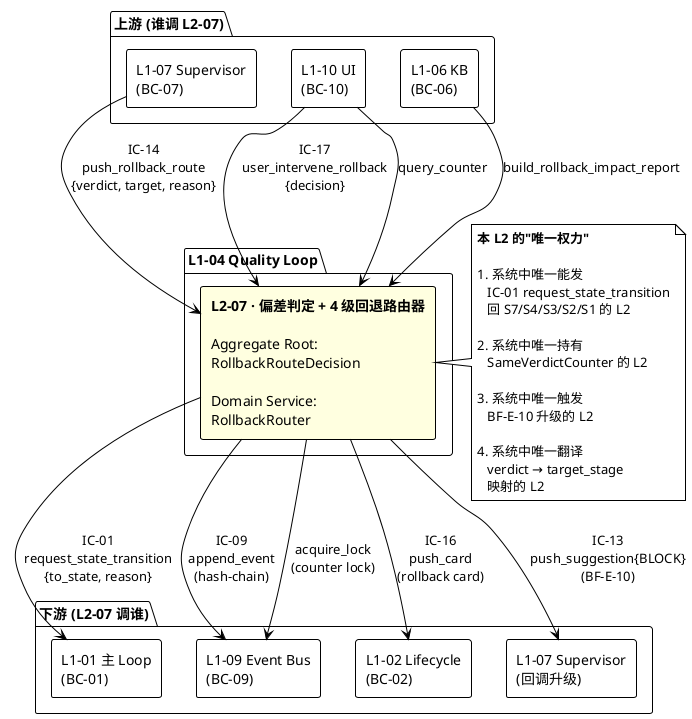
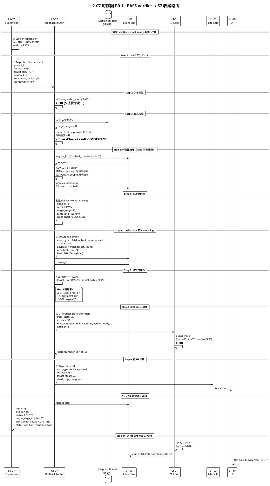
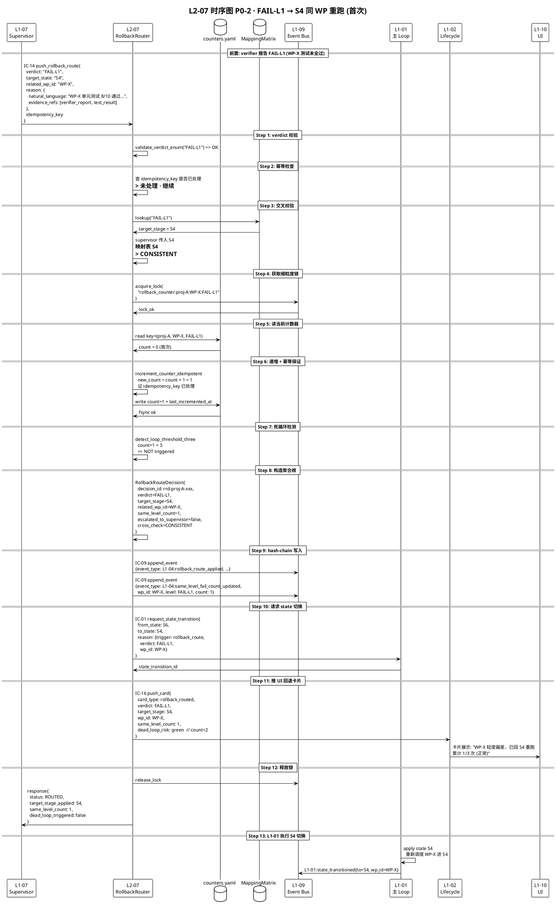
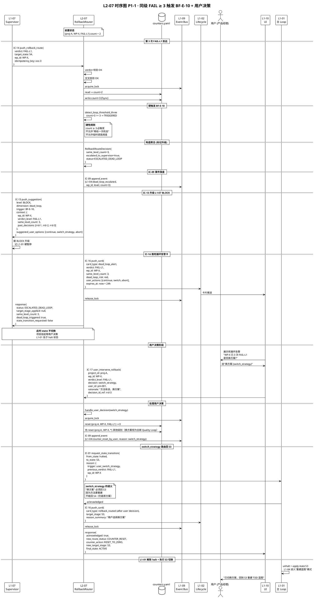
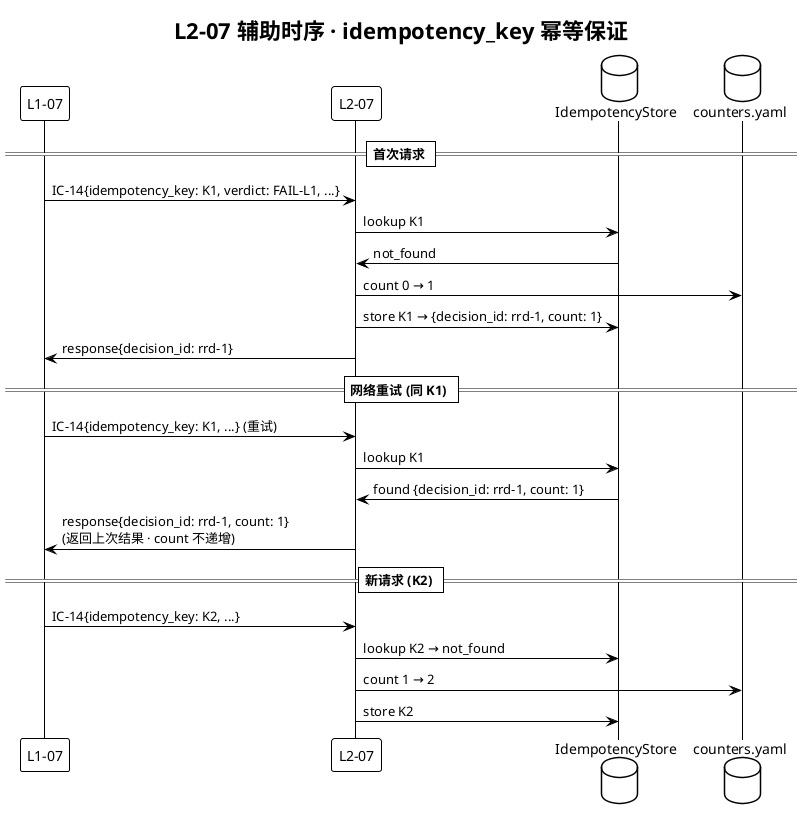
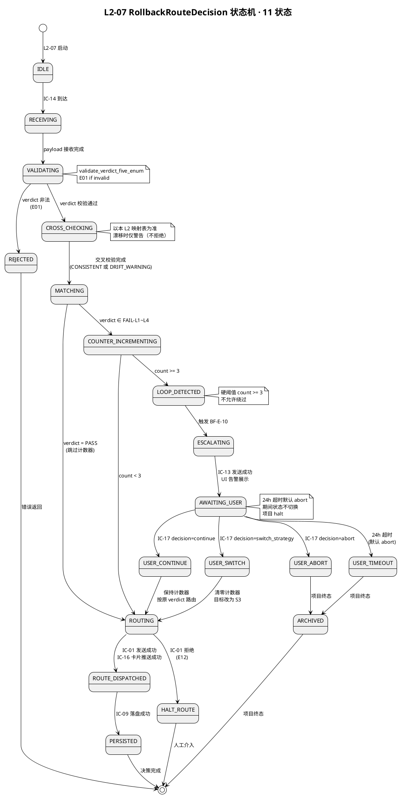
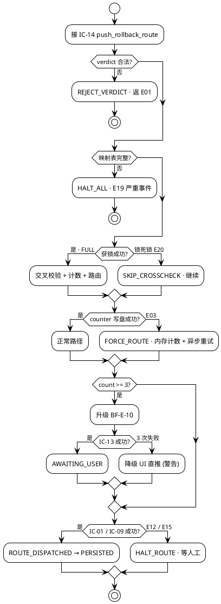

# L1 L2-07 · 偏差判定+4 级回退路由器 · Tech Design

> **本文档定位**：3-1-Solution-Technical 层级 · L1 的 L2-07 偏差判定+4 级回退路由器 技术实现方案（L2 粒度）。
> **与产品 PRD 的分工**：2-prd/L1-04-Quality Loop/prd.md §5.4 的对应 L2 节定义产品边界，本文档定义**技术实现**（接口字段级 schema + 算法伪代码 + 底层数据结构 + 状态机 + 配置参数）。
> **与 L1 architecture.md 的分工**：architecture.md 负责**跨 L2 架构 + 跨 L2 时序**，本文档负责**本 L2 内部技术细节**。冲突以 architecture.md 为准。
> **严格规则**：本文档不复述产品 PRD 文字（职责 / 禁止 / 必须等清单），只做技术映射 + 补齐"产品视角未说 but 工程师必须知道"的部分（具体算法 · syscall · schema · 配置）。

---

## §0 撰写进度

- [x] §1 定位 + 2-prd §5.4 L2-07 映射
- [x] §2 DDD 映射（引 L0/ddd-context-map.md BC-04）
- [x] §3 对外接口定义（字段级 YAML schema + 错误码）
- [x] §4 接口依赖（被谁调 · 调谁）
- [x] §5 P0/P1 时序图（PlantUML ≥ 3 张）
- [x] §6 内部核心算法（伪代码 · 12 个）
- [x] §7 底层数据表 / schema 设计（字段级 YAML · ≥ 4 表）
- [x] §8 状态机（PlantUML + 转换表 · ≥ 9 状态）
- [x] §9 开源最佳实践调研（≥ 5 GitHub 高星项目）
- [x] §10 配置参数清单（≥ 15 项）
- [x] §11 错误处理 + 降级策略（5 级 · 20 错误码 · 10 OQ）
- [x] §12 性能目标
- [x] §13 与 2-prd / 3-2 TDD 的映射表

---

## §1 定位 + 2-prd 映射

### 1.1 本 L2 在 L1-04 Quality Loop 里的坐标

L1-04 Quality Loop 由 7 个 L2 组成，**L2-07 是路由层**（router · 承担 verdict → state 的精确翻译 + 死循环保护的硬闸门），是 Quality Loop 闭环的"最后一公里"。

```
  [L2-01 TDD Blueprint] ──┐
  [L2-02 DoD Compiler]  ──┤
  [L2-03 TestCase Gen]  ──┤  (S3 阶段产出)
  [L2-04 Quality Gate]  ──┘
                          ↓ (artifacts_ready)
                      [L2-05 S4 执行驱动]
                          ↓ (candidate_report)
                      [L2-06 S5 Verifier 编排]
                          ↓ (verifier_report_ready)
                      [L1-07 Supervisor]
                          ↓ (IC-14 push_rollback_route)
      ┌────────────────────────────────────────┐
      │ L2-07 · 偏差判定 + 4 级回退路由器      │
      │ (Domain Service + Aggregate Root)      │
      │                                        │
      │ 1. VerdictValidator                    │
      │ 2. TargetStateCrossChecker             │
      │ 3. MappingMatrixLookup (硬契约)        │
      │ 4. SameVerdictCounter (per WP)         │
      │ 5. ThreeStrikesDetector (≥ 3 硬触发)   │
      │ 6. Escalator (BF-E-10 → L1-07)         │
      │ 7. UserDecisionHandler                 │
      │ 8. RoutePersister (IC-09 hash-chain)   │
      │ 9. UICardPusher (IC-16 经 L1-02)       │
      └────────────────────────────────────────┘
         ↓         ↓          ↓         ↓
      IC-01    IC-09     IC-13     IC-16
      → L1-01  → L1-09   → L1-07   → L1-10
      (state   (持久化)  (BLOCK    (回退
       切换)             升级)     卡片)
```

L2-07 的定位 = **"Quality Loop 闭环的 router · 5 值 verdict 的唯一翻译器 · 同级 FAIL 计数的唯一持有者 · BF-E-10 死循环的唯一触发点 · PASS → S7 硬契约的唯一守门者"**。

### 1.2 与 2-prd §5.4 L2-07 的对应表

| 2-prd §5.4 L2-07 小节 | 本文档对应位置 | 技术映射重点 |
|:---|:---|:---|
| §14.1 职责 + 锚定 | §1.3 定位 + §2 DDD 定位 | Application Service + Aggregate Root `RollbackRouteDecision` |
| §14.2 输入 / 输出 | §3 接口 YAML schema + §4 依赖图 | IC-14 入 · IC-01/IC-09/IC-13/IC-16/IC-17 出 |
| §14.3 边界（In / Out-of-scope） | §2.4 DDD 职责边界 + §11.1 硬拦截 | "不自做 verdict" 在代码层面显式 |
| §14.4 约束（PM-06 / PM-10） | §7.2 mapping_matrix 硬契约 + §7.4 hash-chain | PM-14 project_id 首字段 |
| §14.5 禁止行为 | §11.4 硬拦截 + §6.2 `validate_verdict_five_enum` | 7 个禁令 → 7 个 assert/guard |
| §14.6 必须职责 | §6 算法 12 个 · §3 方法 10 个 | 每条"必须"对应 ≥ 1 算法 |
| §14.7 可选功能 | §9.3 可选扩展（trend analysis / 可视化） | YAGNI · 默认关闭 |
| §14.8 契约表（IC-L2-09/10/11） | §4 依赖图（IC-14 ← / IC-01 → / IC-13 → / IC-09 → / IC-16 → / IC-17 ←） | 6 契约字段级 schema |
| §14.9 交付验证大纲（10 场景） | §13 TC-L207-001~050 映射 | 每场景 ≥ 3 测试用例 |

### 1.3 本 L2 在 architecture.md 里的坐标

引 `docs/3-1-Solution-Technical/L1-04-Quality Loop/architecture.md §7 L2-07 架构全景` + §4.4 路由时序：

```
  [L1-07 Supervisor]
        ↓ (IC-14 · verdict ∈ 5 值枚举)
┌──────────────────────────────────────────────────┐
│  L2-07 · 偏差判定 + 4 级回退路由器                │
│                                                  │
│  ┌──────────────────────────────────────────┐   │
│  │ RollbackRouter (Domain Service)           │   │ (应用服务入口)
│  │   ├── VerdictValidator                     │   │ (5 值枚举校验)
│  │   ├── TargetStateCrossChecker              │   │ (与 L1-07 传入交叉校验)
│  │   ├── MappingMatrixLookup (硬契约静态表)   │   │ (verdict → state)
│  │   ├── SameVerdictCounterRepo               │   │ (计数器持久化)
│  │   ├── ThreeStrikesDetector                 │   │ (≥ 3 硬触发)
│  │   ├── BF_E_10_Escalator                    │   │ (IC-13 push BLOCK)
│  │   ├── UserDecisionHandler                  │   │ (IC-17 ← L1-10)
│  │   ├── RoutePersister (hash-chain JSONL)    │   │ (IC-09 → L1-09)
│  │   ├── UICardPusher (IC-16 经 L1-02)        │   │ (回退卡片)
│  │   └── StateTransitionRequester (IC-01)     │   │ (→ L1-01)
│  └──────────────────────────────────────────┘   │
│                                                  │
│  ┌──────────────────────────────────────────┐   │
│  │  RollbackRouteDecision (Aggregate Root)    │   │ (路由决策聚合)
│  │  SameVerdictCounter (VO)                   │   │ (同级计数值对象)
│  │  VerdictMappingMatrix (VO · 硬契约)        │   │ (静态映射表)
│  │  RollbackAuditLog (Entity · append-only)   │   │ (审计日志聚合)
│  └──────────────────────────────────────────┘   │
└──────────────────────────────────────────────────┘
     ↓          ↓          ↓          ↓         ↓
   IC-01      IC-09      IC-13      IC-16     IC-17
   → L1-01   → L1-09    → L1-07    → L1-10   ← L1-10
   (state    (落盘)     (BF-E-10   (卡片)    (用户决策)
    切换)                BLOCK)
```

**本 L2 的关键特征**（对 L1-04 整体而言）：

1. **Domain Service + Aggregate Root 双层**：L2-07 持有 `RollbackRouteDecision` 聚合根（有 Entity），以及 `SameVerdictCounter` VO + `VerdictMappingMatrix` VO + `RollbackAuditLog` Entity
2. **路由权的唯一性**：L2-07 是系统中**唯一**能产生 `IC-01 request_state_transition(target=S7/S4/S3/S2/S1)` 的地方；其他 L2 / L1 一律不得私自改 state
3. **PASS → S7 硬守门**：`if verdict == 'PASS'` 是 S7 状态切换的唯一前置条件，工程侧用显式分支 + mutation test 守护
4. **计数器硬阈值**：`count ≥ 3` 触发 BF-E-10，**不允许**配置调高阈值（防绕过死循环保护）
5. **target_state 交叉校验**：L1-07 传入的 target_state 与本 L2 映射表不一致 → 以本 L2 表为准 + 记风险警告（防 L1-07 临时漂移）
6. **hash-chain 持久化**：所有路由事件经 IC-09 落盘到 `projects/<pid>/rollback/audit.jsonl`，前一条 hash 写进当前条的 `prev_hash` 字段，构成不可篡改链

### 1.4 本 L2 的 PM-14 约束

**PM-14 约束**（引 `docs/3-1-Solution-Technical/projectModel/tech-design.md`）：所有 IC payload 顶层 `project_id` 必填；所有存储路径按 `projects/<pid>/...` 分片。

本 L2 在 PM-14 层面的具体落点：

- 计数器持久化：`projects/<pid>/rollback/counters.yaml`
- 路由决策聚合：`projects/<pid>/rollback/decisions/<decision_id>.yaml`
- 审计日志：`projects/<pid>/rollback/audit.jsonl`（hash-chain append-only）
- 映射矩阵（静态硬契约）：`docs/3-1-Solution-Technical/L1-04-Quality Loop/L2-07-mapping-matrix.yaml`（全局静态，非 per-project，因为是系统级硬契约）
- 升级事件：`projects/<pid>/rollback/escalations/<escalation_id>.yaml`
- UI 卡片缓存：`projects/<pid>/rollback/ui-cards/<card_id>.json`

### 1.5 关键技术决策（本 L2 特有 · Decision / Rationale / Alternatives / Trade-off）

| 决策 | 选择 | 备选 | 理由 | Trade-off |
|:---|:---|:---|:---|:---|
| **D1: 本 L2 是否 own 聚合根** | Yes · `RollbackRouteDecision` | 仅 Application Service | 路由决策有独立生命周期 + 需审计追溯 + 跨 session 可读 | 比纯 service 重，但 DDD 严格性更好 |
| **D2: 映射表实现** | 静态 YAML 硬契约 | 配置可调 / 数据库 / 代码硬编码 | 硬契约 + 文档可读 + test fixture 可对比 | 不允许临时调整（这是特性不是缺陷） |
| **D3: 计数器持久化** | YAML per-project（非 DB） | SQLite / Redis / 内存 | 简单 · 人肉可读 · 崩溃恢复直读 · PM-14 分片友好 | 牺牲并发性能（本场景不重要） |
| **D4: 死循环阈值** | 硬锁 3 次 | 配置可调 / 无上限 / 5 次 | scope §5.4.6 必 5 + BF-E-10 的硬性定义 | 硬阈值防绕过 |
| **D5: target_state 交叉校验策略** | 以本 L2 映射表为准 + 记警告 | 以 L1-07 传入为准 / 拒绝路由 / 异常升级 | 防 L1-07 临时漂移（Partnership 关系） | L1-07 需自检 |
| **D6: hash-chain 实现** | SHA-256 + JSONL append-only | SQLite WAL / Merkle Tree / PKI 签名 | 足够简单 · 可人肉验证 · 无密钥管理 | 不防密级篡改（不在威胁模型内） |
| **D7: 用户决策超时** | 24h 默认 + 配置 | 即刻 / 无超时 / 1h / 7d | 平衡"不打扰用户" vs "不挂起项目" | 超时后默认"放弃"（可配置） |
| **D8: PASS → S7 守门** | 显式 `if verdict == 'PASS'` 分支 | 映射表统一处理 / 动态分支 | 代码审计 + mutation test 可直接覆盖 | 冗余判断（可接受） |
| **D9: 并发锁策略** | per-(project,wp,level) 细粒度锁 | 全局锁 / 无锁 | 多 WP 并行场景下减少阻塞 | 锁管理复杂度上升 |
| **D10: 升级 BF-E-10 去重** | 24h 内同一 (project,wp,level) 只升一次 | 每次都升 / 永不升 | 防 L1-07 重复告警 | 需 TTL 管理 |

### 1.6 本 L2 读者预期

读完本 L2 的工程师应掌握：

- RollbackRouter Domain Service 的 10 方法字段级 schema + 20 错误码
- 12 个算法伪代码（含主路由 / verdict 校验 / 交叉校验 / 映射查表 / 计数器 / 死循环检测 / 升级 / 用户决策 / hash-chain / UI 推送 / 影响面报告）
- 4 张数据表（rollback_route_decision / same_verdict_counter / verdict_mapping_matrix / rollback_audit_log）
- 9 状态主状态机（IDLE → RECEIVING → VALIDATING → CROSS_CHECKING → MATCHING → COUNTER_INCREMENTING → (LOOP_DETECTED → ESCALATING → AWAITING_USER) → ROUTING → ROUTE_DISPATCHED → PERSISTED）
- 降级链 5 级（FULL → SKIP_CROSSCHECK → FORCE_ROUTE → HALT_ROUTE → REJECT_VERDICT）
- SLO（路由 ≤ 3s · counter 查询 ≤ 100ms · UI 推送 ≤ 1s · hash-chain 写入 ≤ 50ms）

### 1.7 本 L2 不在的范围（YAGNI）

- **不在**：verdict 判定（禁区 · 职责是 L1-07）
- **不在**：state 执行（职责是 L1-01）
- **不在**：verifier 组装（职责是 L2-06）
- **不在**：硬拦截（职责是 L1-07）
- **不在**：verifier_report 内容改动（只读）
- **不在**：启发式"是否死循环"判定（只按固定计数规则 ≥ 3）
- **不在**：跨项目全局统计（retro 用，不在本 L2）

---

## §2 DDD 映射（BC-04 Quality Loop · Domain Service + Aggregate 层）

### 2.1 L0 引用锚点

本节严格引用 `docs/3-1-Solution-Technical/L0/ddd-context-map.md §2.5 BC-04 Quality Loop` + §4.4 "L1-04 L2-07 偏差判定 + 4 级回退路由器"条目。聚合根 / 值对象 / 领域服务 / 跨 BC 关系已由 L0 锁定，本文**不重定义**，只做 L1 视角的"L2-07 ↔ DDD 构造块"落位细化。

### 2.2 L2-07 在 BC-04 DDD 版图中的位置

```
┌──────────────────────────────────────────────────────────────────┐
│  BC-04 · Quality Loop Bounded Context                             │
│                                                                    │
│  ┌───────────────┐  ┌───────────────┐  ┌───────────────┐        │
│  │ L2-01 TDDBP   │  │ L2-02 DoDCmp  │  │ L2-03 TCgen   │        │
│  │ (Aggregate)   │  │ (Aggregate)   │  │ (Aggregate)   │        │
│  └───────────────┘  └───────────────┘  └───────────────┘        │
│  ┌───────────────┐  ┌───────────────┐  ┌───────────────┐        │
│  │ L2-04 QGate   │  │ L2-05 S4Exec  │  │ L2-06 S5Verif │        │
│  │ (Aggregate)   │  │ (AppService)  │  │ (AppService)  │        │
│  └───────────────┘  └───────────────┘  └───────────────┘        │
│                                                                    │
│  ┌──────────────────────────────────────────────────────┐        │
│  │  L2-07 · 偏差判定 + 4 级回退路由器 (本 L2)           │        │
│  │  Domain Service: RollbackRouter                       │        │
│  │  ┌────────────────────────────────────────────────┐  │        │
│  │  │  Aggregate Root: RollbackRouteDecision          │  │        │
│  │  │  ├── Identity: decision_id                      │  │        │
│  │  │  ├── Verdict: VO (PASS / FAIL-L1~L4)            │  │        │
│  │  │  ├── TargetStage: VO (S7 / S4 / S3 / S2 / S1)   │  │        │
│  │  │  ├── Reason: VO (自然语言 + 证据引用)           │  │        │
│  │  │  ├── RelatedWpId: VO (可选)                     │  │        │
│  │  │  ├── SameVerdictCount: Int (聚合内状态)         │  │        │
│  │  │  ├── EscalatedToSupervisor: Bool                │  │        │
│  │  │  └── CrossCheckResult: VO (一致 / 漂移警告)     │  │        │
│  │  └────────────────────────────────────────────────┘  │        │
│  │                                                       │        │
│  │  ┌────────────────────────────────────────────────┐  │        │
│  │  │  Value Object: SameVerdictCounter               │  │        │
│  │  │  ├── key: (project_id, wp_id, verdict_level)   │  │        │
│  │  │  └── count: Int                                 │  │        │
│  │  │  不变式: count >= 0 · count <= 10（硬上限）     │  │        │
│  │  └────────────────────────────────────────────────┘  │        │
│  │                                                       │        │
│  │  ┌────────────────────────────────────────────────┐  │        │
│  │  │  Value Object: VerdictMappingMatrix (静态硬契约) │  │        │
│  │  │  {PASS→S7, FAIL-L1→S4, FAIL-L2→S3,              │  │        │
│  │  │   FAIL-L3→S2, FAIL-L4→S1}                        │  │        │
│  │  │  不变式: 5 值双射 · 禁止扩展 / 禁止修改          │  │        │
│  │  └────────────────────────────────────────────────┘  │        │
│  │                                                       │        │
│  │  ┌────────────────────────────────────────────────┐  │        │
│  │  │  Entity: RollbackAuditLog (append-only)         │  │        │
│  │  │  ├── entry_id · timestamp · prev_hash · hash   │  │        │
│  │  │  └── payload: {verdict, target, reason, ...}    │  │        │
│  │  └────────────────────────────────────────────────┘  │        │
│  │                                                       │        │
│  │  Repository: RollbackRouteDecisionRepository         │        │
│  │  Repository: SameVerdictCounterRepository             │        │
│  │  Repository: RollbackAuditLogRepository               │        │
│  └──────────────────────────────────────────────────────┘        │
└──────────────────────────────────────────────────────────────────┘
```

### 2.3 L2-07 的 DDD 构造块清单

| DDD 构造块 | 名称 | 职责 | 持有者 |
|:---|:---|:---|:---|
| **Aggregate Root** | `RollbackRouteDecision` | 一次路由决策的原子单元 · 跨 session 可查 · 审计追溯 | L2-07 · `RollbackRouteDecisionRepository` |
| **Entity** | `RollbackAuditLog` | 审计日志条目 · append-only · hash-chain · 不可修改 | L2-07 · `RollbackAuditLogRepository` |
| **Value Object (VO)** | `Verdict` | 5 值枚举（PASS / FAIL-L1~L4） | L1-07 产 · L2-07 消费 |
| **Value Object (VO)** | `TargetStage` | 5 值枚举（S7 / S4 / S3 / S2 / S1） | L2-07 内部翻译 |
| **Value Object (VO)** | `SameVerdictCounter` | `(project_id, wp_id, verdict_level) → count` · count ≥ 3 硬触发 BF-E-10 | L2-07 维护 |
| **Value Object (VO)** | `VerdictMappingMatrix` | 静态硬契约：5 值 verdict ↔ 5 值 target_stage 双射 | 全局静态 · L2-07 只读 |
| **Value Object (VO)** | `Reason` | 回退原因（自然语言 + 结构化证据引用） | L1-07 产 · L2-07 透传 |
| **Value Object (VO)** | `CrossCheckResult` | 交叉校验结果（CONSISTENT / DRIFT_WARNING / DRIFT_REJECT） | L2-07 产 |
| **Domain Service** | `RollbackRouter` | verdict → state 翻译 + 同级计数 + BF-E-10 触发 · 本 L2 的核心能力 | L2-07 主体 |
| **Domain Service** | `ThreeStrikesDetector` | 检测同级 FAIL ≥ 3 · 硬触发升级 | L2-07 内部 |
| **Domain Service** | `HashChainWriter` | append-only 审计日志 · SHA-256 链式完整性 | L2-07 内部 |
| **Repository** | `RollbackRouteDecisionRepository` | 路由决策聚合的持久化接口 | L2-07 持有 |
| **Repository** | `SameVerdictCounterRepository` | 计数器的持久化接口 | L2-07 持有 |
| **Repository** | `RollbackAuditLogRepository` | 审计日志的持久化接口 | L2-07 持有 |
| **Domain Event** | `L1-04:rollback_route_applied` | 路由决策生效 · 含 verdict + target + count | L2-07 发 |
| **Domain Event** | `L1-04:same_level_fail_count_updated` | 计数器递增 · L1-07 监测趋势 | L2-07 发 |
| **Domain Event** | `L1-04:dead_loop_escalated` | BF-E-10 触发 · 通知 L1-07 升级 | L2-07 发 |
| **Domain Event** | `L1-04:counter_reset_by_user` | 用户"换方案"后计数重置 | L2-07 发 |

### 2.4 L2-07 的 DDD 职责边界（In-scope / Out-of-scope）

**In-scope（本 L2 做）**：

1. 接收 IC-14 push_rollback_route · 校验 verdict 枚举合法性
2. 交叉校验 L1-07 传入 target_state 与本 L2 映射表
3. 查静态映射表翻译 verdict → target_stage
4. 递增 (project, wp, level) 计数器 · 幂等保证
5. 检测 count ≥ 3 · 硬触发 BF-E-10
6. 经 IC-13 push_suggestion BLOCK 升级到 L1-07
7. 接收 IC-17 用户决策 · 继续 / 换方案 / 放弃
8. 构造 RollbackRouteDecision 聚合 · 经 IC-09 落盘（hash-chain）
9. 经 IC-01 请求 L1-01 执行 state 切换
10. 经 IC-16 推 UI 回退卡片（含计数器可见性）

**Out-of-scope（本 L2 不做 · 由谁做）**：

- ❌ 不自做 verdict 判定（硬禁 · 硬约束 1 禁区）→ **L1-07** 判
- ❌ 不执行 state 转换（只请求）→ **L1-01** 执行
- ❌ 不改 verifier_report（只读）→ L2-06 产
- ❌ 不做硬拦截 → **L1-07** 硬拦截
- ❌ 不做 verifier 组装 → L2-06
- ❌ 不做 TDDExe 验证 → L2-06 + L1-05
- ❌ 不做 WP 推进 → L2-05
- ❌ 不改 verdict 语义分级 → 5 值枚举由 Goal + scope 锁定
- ❌ 不做跨项目统计 → retro 层（未来）

### 2.5 L2-07 与 BC-07 Supervisor 的 Partnership 关系（引 L0）

引 `L0/ddd-context-map.md §2.5 BC-04` "与 BC-07：Partnership（verdict ↔ rollback_route 强耦合）"。

| 维度 | L2-07 （BC-04） | L1-07 Supervisor（BC-07） |
|:---|:---|:---|
| **verdict 判定** | **不做**（禁 6） | **唯一判定者**（基于 verifier_report + 8 维度） |
| **verdict 传递** | 接 IC-14 | 产 IC-14 push_rollback_route |
| **4 级翻译** | L2-07 **唯一翻译器** | 不翻译（只传 verdict） |
| **state 执行** | L2-07 经 IC-01 请求 L1-01 | 不直接改 state（只读） |
| **死循环检测** | L2-07 检测 + 触发 IC-13 BLOCK | 接 BLOCK + 升级 L1-01 halt |
| **用户决策接收** | L2-07 接 IC-17 | 不直接接 IC-17 |
| **4 级回退权力** | L2-07 是**唯一**发出 `IC-01 request_state_transition` 回 S4/S3/S2/S1 的地方 | 不直接回退（只给指令） |

**Partnership 演化规则**：若未来需要调整 4 级 verdict 的语义分级（如新增 FAIL-L0 极轻），必须同步更新两个 BC 的文档与实现，不能单边改。

### 2.6 L2-07 与 BC-01 主 Loop 的 Customer-Supplier 关系

L2-07 是 BC-01 的 **Supplier**（供应 state_transition 请求），BC-01 是 L2-07 的 **Customer**（消费 IC-01 请求）。

演化规则：
- BC-01 的 state 枚举（S7/S4/S3/S2/S1）是**公共契约**，变更需同步 L2-07 映射表
- L2-07 的 `IC-01 request_state_transition` 字段 schema 是**公共契约**（见 §3）

---

## §3 对外接口定义（字段级 YAML schema + 错误码）

### 3.1 本 L2 对外暴露的方法清单（≥ 10 个）

| # | 方法 | 类型 | 上游调用方 | 下游被调方 | 对应契约 |
|:---|:---|:---|:---|:---|:---|
| 1 | `receive_rollback_route(verdict, target_state, reason, related_wp_id?, project_id)` | Command | L1-07 | - | IC-14 push_rollback_route |
| 2 | `validate_verdict_enum(verdict)` | Internal Query | 内部（方法 1 调） | - | - |
| 3 | `cross_check_target_state(verdict, supervisor_target, matrix)` | Internal Query | 内部（方法 1 调） | - | - |
| 4 | `lookup_mapping_table(verdict) → target_stage` | Internal Query | 内部（方法 1 调） | - | - |
| 5 | `increment_counter_idempotent(project_id, wp_id, verdict_level, decision_id)` | Command | 内部（方法 1 调） | L1-09 `append_event` | - |
| 6 | `detect_loop_threshold_three(project_id, wp_id, verdict_level) → bool` | Query | 内部（方法 1 调） | - | - |
| 7 | `escalate_BF_E_10_to_supervisor(project_id, wp_id, verdict_level, count)` | Command | 内部（方法 1 调） | L1-07 `push_suggestion` | IC-13 |
| 8 | `handle_user_decision(project_id, wp_id, decision ∈ {continue, switch, abort})` | Command | L1-10 | L1-01 / L1-09 | IC-17 |
| 9 | `persist_route_event(decision_aggregate, hash_chain)` | Command | 内部 | L1-09 `append_event` | IC-09 |
| 10 | `push_rollback_card_to_ui(decision_aggregate)` | Command | 内部（方法 1 调） | L1-02 `push_card` | IC-16（经 L1-02） |
| 11 | `query_counter(project_id, wp_id, verdict_level) → count` | Query | L1-07（监测趋势） / L1-10（UI 展示） | - | - |
| 12 | `build_rollback_impact_report(decision_aggregate) → ImpactReport` | Query | L1-10（展示） | - | - |

### 3.2 方法 1：`receive_rollback_route` 字段级 schema

**入参 schema（来自 IC-14）**：

```yaml
# 契约：IC-14 push_rollback_route
# 方向：L1-07 → L2-07
# 类型：Command
contract_id: IC-14
name: push_rollback_route
direction: L1-07 → L2-07
payload:
  project_id:
    type: str
    required: true
    description: PM-14 项目标识（首字段，所有 payload 顶层必填）
    constraint: "^proj-[a-zA-Z0-9_-]{4,64}$"
  verdict:
    type: enum
    required: true
    values: [PASS, FAIL-L1, FAIL-L2, FAIL-L3, FAIL-L4]
    description: 4 级判定 + PASS 共 5 值枚举，其他值视为非法
  target_state:
    type: enum
    required: true
    values: [S7, S4, S3, S2, S1]
    description: L1-07 建议的目标 state；冗余字段用于交叉校验
  reason:
    type: object
    required: true
    fields:
      natural_language:
        type: str
        required: true
        max_length: 2000
        description: 自然语言原因
      evidence_refs:
        type: list[object]
        required: true
        min_length: 1
        item_fields:
          type:
            type: enum
            values: [verifier_report, supervisor_snapshot, kb_entry, test_result]
          ref_id:
            type: str
            required: true
            description: 对应产物的 id
          path:
            type: str
            required: false
            description: 可选的文件路径（审计用）
  related_wp_id:
    type: str
    required: false
    constraint: "^WP-[A-Z0-9_-]{1,32}$"
    description: 可选 · FAIL-L1 场景用（同 WP 计数）
  verifier_report_ref:
    type: str
    required: false
    description: 产生 verdict 的 verifier_report id（审计追溯用）
  supervisor_decision_id:
    type: str
    required: true
    description: L1-07 的判定决策 id（L1-07 侧的唯一标识）
  submitted_at:
    type: datetime (ISO8601)
    required: true
    description: L1-07 判定完成时间戳
  idempotency_key:
    type: str
    required: true
    description: 防重复 · L2-07 内部用此 key 做幂等判断
    constraint: "^[a-zA-Z0-9_-]{8,64}$"
```

**出参 schema**：

```yaml
response:
  decision_id:
    type: str
    description: 本次路由决策的 id（RollbackRouteDecision 聚合根 id）
    format: "rrd-<project_id>-<timestamp>-<seq>"
  status:
    type: enum
    values: [ROUTED, ESCALATED_DEAD_LOOP, AWAITING_USER, REJECTED]
  target_stage_applied:
    type: enum
    values: [S7, S4, S3, S2, S1, null]
    description: 实际路由的目标 state（若 REJECTED / AWAITING_USER 为 null）
  cross_check_result:
    type: enum
    values: [CONSISTENT, DRIFT_WARNING, null]
  same_level_count:
    type: int
    description: 本次递增后的计数值
  dead_loop_triggered:
    type: bool
    description: 是否触发了 BF-E-10
  state_transition_requested:
    type: bool
    description: 是否已经通过 IC-01 发出了 state_transition 请求
  audit_log_entry_hash:
    type: str
    description: 本次事件在 audit.jsonl 中的 SHA-256 hash（可用于验证链完整性）
  errors:
    type: list[object]
    required: false
    item_fields:
      code:
        type: str
      message:
        type: str
      severity:
        type: enum
        values: [ERROR, WARNING, INFO]
```

### 3.3 方法 8：`handle_user_decision` 字段级 schema

**入参 schema（来自 IC-17）**：

```yaml
contract_id: IC-17
name: user_intervene_rollback
direction: L1-10 → L2-07
payload:
  project_id:
    type: str
    required: true
  wp_id:
    type: str
    required: true
    description: 触发死循环的 WP id
  verdict_level:
    type: enum
    required: true
    values: [FAIL-L1, FAIL-L2, FAIL-L3, FAIL-L4]
    description: 触发死循环的 verdict 等级
  decision:
    type: enum
    required: true
    values: [continue, switch_strategy, abort]
    description: |
      continue: 用户知情风险 · 继续按原 verdict 路由（不重置计数器 · 记警告）
      switch_strategy: 换方案 · 重置计数器 + 回 S3 重建蓝图
      abort: 放弃 · 项目终态 · 落盘归档
  user_id:
    type: str
    required: true
    description: 操作用户（审计追溯）
  rationale:
    type: str
    required: false
    max_length: 1000
    description: 用户决策理由（自然语言 · 可选）
  decision_id_ref:
    type: str
    required: true
    description: 触发死循环的 RollbackRouteDecision id
  decided_at:
    type: datetime (ISO8601)
    required: true
```

**出参 schema**：

```yaml
response:
  acknowledged:
    type: bool
  new_route_status:
    type: enum
    values: [ROUTED_AFTER_USER, COUNTER_RESET, ARCHIVED_ABORTED]
  counter_action:
    type: enum
    values: [RESET_TO_ZERO, UNCHANGED]
  new_target_stage:
    type: enum
    values: [S7, S4, S3, S2, S1, null]
  final_state:
    type: enum
    values: [ACTIVE, TERMINATED]
```

### 3.4 方法 7：`escalate_BF_E_10_to_supervisor` 字段级 schema

**发起 IC-13 push_suggestion schema**：

```yaml
contract_id: IC-13
name: push_suggestion
direction: L2-07 → L1-07
payload:
  project_id:
    type: str
    required: true
  level:
    type: enum
    values: [INFO, SUGGESTION, WARNING, BLOCK]
    required: true
    fixed_for_this_call: BLOCK    # BF-E-10 固定用 BLOCK 级
  dimension:
    type: enum
    values: [dead_loop]
    fixed_for_this_call: dead_loop
  trigger:
    type: enum
    values: [BF-E-10]
    fixed_for_this_call: BF-E-10
  context:
    type: object
    fields:
      wp_id: str
      verdict_level: str
      same_level_count: int (== 3)
      past_decisions: list[str]  # 过去 3 次的 decision_id
      first_fail_at: datetime
      latest_fail_at: datetime
  suggested_user_options:
    type: list[enum]
    values: [continue, switch_strategy, abort]
    min_items: 3
  message:
    type: str
    max_length: 500
    description: 自然语言告警消息（给用户看）
  escalated_at:
    type: datetime (ISO8601)
```

### 3.5 方法 9：`persist_route_event` 字段级 schema（发起 IC-09）

```yaml
contract_id: IC-09
name: append_event
direction: L2-07 → L1-09
payload:
  project_id:
    type: str
    required: true
  event_type:
    type: enum
    values:
      - L1-04:rollback_route_applied
      - L1-04:same_level_fail_count_updated
      - L1-04:dead_loop_escalated
      - L1-04:counter_reset_by_user
      - L1-04:illegal_verdict_rejected
      - L1-04:target_state_mismatch_warning
  actor:
    type: str
    fixed: BC-04
  payload_json:
    type: object
    schema: (对应各 event_type 的具体字段)
  prev_hash:
    type: str
    required: true
    description: 上一条 audit log 的 SHA-256（hash-chain 链接）
  hash:
    type: str
    required: true
    description: 本条 payload 的 SHA-256（用于下一条的 prev_hash）
  timestamp:
    type: datetime (ISO8601 · 纳秒级)
    required: true
  decision_id:
    type: str
    required: false
    description: 对应的 RollbackRouteDecision id（可关联）
```

### 3.6 方法 10：`push_rollback_card_to_ui` 字段级 schema（发起 IC-16）

```yaml
contract_id: IC-16
name: push_stage_gate_card (rollback subtype)
direction: L2-07 → L1-02 → L1-10
payload:
  project_id:
    type: str
    required: true
  card_type:
    type: enum
    values: [rollback_routed, dead_loop_alert, user_decision_required, rollback_archived]
    required: true
  verdict:
    type: enum
    values: [PASS, FAIL-L1, FAIL-L2, FAIL-L3, FAIL-L4]
  target_stage:
    type: enum
    values: [S7, S4, S3, S2, S1]
  same_level_count:
    type: int
  wp_id:
    type: str
    required: false
  reason_summary:
    type: str
    max_length: 200
    description: 给 UI 展示的原因摘要（从 reason.natural_language 截取）
  evidence_refs:
    type: list[object]
    description: 证据引用（点击可跳转到 verifier_report）
  dead_loop_risk_indicator:
    type: enum
    values: [green, yellow, red]
    description: |
      green: count < 2 · yellow: count == 2 · red: count >= 3
  user_actions:
    type: list[enum]
    values: [view_detail, view_history, continue, switch, abort]
    description: 用户可选操作（UI 按钮）
  expires_at:
    type: datetime
    required: false
    description: 用户决策卡片的过期时间（24h 默认）
```

### 3.7 方法 1：`request_state_transition` 字段级 schema（发起 IC-01）

```yaml
contract_id: IC-01
name: request_state_transition
direction: L2-07 → L1-01
payload:
  project_id:
    type: str
    required: true
  from_state:
    type: enum
    values: [S4, S5, S6]   # L2-07 触发时的 state（通常是 S5）
    description: 发起路由时项目所在的 state
  to_state:
    type: enum
    values: [S7, S4, S3, S2, S1]
    required: true
    description: 目标 state（严格由 verdict → mapping_matrix 决定）
  reason:
    type: object
    fields:
      trigger: enum [rollback_route]
      verdict: enum [PASS, FAIL-L1, FAIL-L2, FAIL-L3, FAIL-L4]
      decision_id: str
      same_level_count: int
  metadata:
    type: object
    fields:
      wp_id: str (optional)
      verifier_report_ref: str
      supervisor_decision_id: str
  requested_at:
    type: datetime
```

**出参 schema**：

```yaml
response:
  acknowledged:
    type: bool
  state_transition_id:
    type: str
    description: L1-01 分配的 state_transition id（本 L2 用于审计追溯）
  reject_reason:
    type: str
    required: false
    description: 若 L1-01 拒绝转换（如 guard 失败），返回原因
```

### 3.8 错误码表（≥ 18 个）

| 错误码 | 含义 | HTTP 语义等价 | 触发场景 | 调用方处理 |
|:---|:---|:---|:---|:---|
| `L2-07/E01` | `invalid_verdict_enum` | 400 | verdict 不在 5 值枚举内（如 "WEIRD" / "FAIL-L5" / 空值） | L1-07 自检上游判定逻辑 · 不重试 |
| `L2-07/E02` | `target_state_mismatch` | 200 (warning) | L1-07 传入 target_state 与本 L2 映射表不一致 | 告警 + 以本 L2 为准（不拒绝） |
| `L2-07/E03` | `counter_persist_failed` | 500 | 计数器写 `counters.yaml` 失败（fsync 错误 / 盘满 / 权限） | 降级 FORCE_ROUTE + 记 ADR 风险 |
| `L2-07/E04` | `mapping_missing` | 500 (不应发生) | 映射表未加载 / 加载损坏 | HALT_ROUTE · 升级 supervisor |
| `L2-07/E05` | `missing_project_id` | 400 | payload 缺 project_id | L1-07 补全字段重发 |
| `L2-07/E06` | `missing_required_field` | 400 | payload 缺 reason / supervisor_decision_id 等必填字段 | L1-07 补全字段重发 |
| `L2-07/E07` | `idempotency_conflict` | 200 (noop) | 同一 idempotency_key 重复收到 · 返回上次决策 | 正常（幂等保证） |
| `L2-07/E08` | `audit_log_hash_chain_broken` | 500 | 读取 audit.jsonl 校验 hash-chain 失败 | HALT_ROUTE · 人工介入 |
| `L2-07/E09` | `user_decision_timeout` | 408 | 等待用户决策超过 24h | 按默认 abort 处理（可配置） |
| `L2-07/E10` | `user_decision_invalid_enum` | 400 | IC-17 decision 不在 {continue, switch_strategy, abort} | L1-10 自检 + 重发 |
| `L2-07/E11` | `escalation_rate_limited` | 429 | 同一 (project, wp, level) 24h 内已升级过 | noop · 已升级不重复 |
| `L2-07/E12` | `ic_01_rejected` | 502 | L1-01 拒绝 state_transition（guard 失败） | 记警告 + 降级 HALT_ROUTE |
| `L2-07/E13` | `ic_13_push_failed` | 502 | 升级到 L1-07 失败（L1-07 不可达） | 重试 3 次 + 降级 |
| `L2-07/E14` | `ic_16_push_failed` | 502 (warning) | UI 推送失败 | 不阻塞路由 · 记警告 |
| `L2-07/E15` | `ic_09_append_failed` | 500 | L1-09 落盘失败 | HALT_ROUTE · 升级 |
| `L2-07/E16` | `concurrent_counter_modification` | 409 | 两个 WP 同时修改同一 (project, wp, level) 计数器 | 自动重试 3 次 + 获取细粒度锁 |
| `L2-07/E17` | `pass_verdict_but_pending_wp` | 409 | verdict=PASS 但项目还有未完成 WP（不一致） | 拒绝进 S7 + 告警 L1-07 |
| `L2-07/E18` | `counter_exceeds_hard_limit` | 500 | count > 10（BF-E-10 未及时升级） | HALT_ROUTE · 强制升级 |
| `L2-07/E19` | `mapping_matrix_mutation_detected` | 500 (严重) | 映射表 yaml 被篡改（hash 校验失败） | HALT_ALL · 人工介入（系统级硬契约被破坏） |
| `L2-07/E20` | `deadlock_on_counter_lock` | 500 | 并发锁死锁 | 释放锁 + 降级 SKIP_CROSSCHECK |

### 3.9 错误码处理矩阵（调用方视角）

| 调用方 | 受影响的错误码 | 推荐处理 |
|:---|:---|:---|
| **L1-07** | E01, E02, E05, E06, E07, E13 | E01/E05/E06：修正后重发 · E02：查自身判定是否漂移 · E07：视为成功 · E13：重试 |
| **L1-10** | E09, E10, E14 | E09：重新弹窗 · E10：前端表单校验 · E14：UI 降级静默 |
| **L1-01** | E12 | E12：L1-01 自身 guard 失败，由 L1-07 升级处理 |
| **L1-09** | E03, E08, E15 | E03/E15：L1-09 报警 · E08：链完整性审计 |
| **Ops（运维）** | E04, E18, E19 | E04/E18：系统初始化问题 · E19：严重安全事件 |

### 3.10 方法 11：`query_counter` 字段级 schema

```yaml
method: query_counter
direction: L1-07 / L1-10 → L2-07 (read-only)
input:
  project_id: str (required)
  wp_id: str (required)
  verdict_level: enum [FAIL-L1, FAIL-L2, FAIL-L3, FAIL-L4] (required)
output:
  count: int
  last_incremented_at: datetime (optional)
  dead_loop_risk: enum [green, yellow, red]
  remaining_to_dead_loop: int  # 3 - count
  history: list[object]       # 过去的 decision_id + timestamp
```

### 3.11 方法 12：`build_rollback_impact_report` 字段级 schema

```yaml
method: build_rollback_impact_report
direction: L1-10 / L1-06 KB → L2-07 (read-only)
input:
  decision_id: str (required)
output:
  verdict: enum
  target_stage: enum
  affected_artifacts:
    type: list[object]
    description: 回退到目标 stage 后需要"重做/失效"的产物
    item_fields:
      artifact_type: enum [tdd_blueprint, dod_expression, test_suite, quality_gate, wp_execution, verifier_report]
      artifact_id: str
      path: str
      action: enum [invalidate, rerun, archive_and_fresh]
  estimated_rerun_cost:
    type: object
    fields:
      wp_count: int
      estimated_duration_min: int
      token_cost_estimate: int
  dependency_graph:
    type: str  # PlantUML graph of what invalidates what
```

---

## §4 接口依赖（被谁调 · 调谁）

### 4.1 上游调用方（谁调本 L2）

| 调用方 | 调用的本 L2 方法 | 契约 | 频率（P95） | 关键场景 |
|:---|:---|:---|:---|:---|
| **L1-07 Supervisor (BC-07)** | `receive_rollback_route` | IC-14 push_rollback_route | 每个 WP × 每轮 Quality Loop × 1 次 | verifier_report 判完 verdict 后 |
| **L1-10 UI (BC-10)** | `handle_user_decision` | IC-17 user_intervene_rollback | 死循环场景 · 低频 | BF-E-10 触发后用户介入 |
| **L1-10 UI (BC-10)** | `query_counter` | 直接读（Query） | 中频（UI 刷新） | 展示死循环风险条 |
| **L1-07 Supervisor (BC-07)** | `query_counter` | 直接读（Query） | 低频 | 监测同级 FAIL 趋势 |
| **L1-10 UI (BC-10)** | `build_rollback_impact_report` | 直接读（Query） | 低频 | 展示"回退影响面"面板 |
| **L1-06 KB (BC-06)** | `build_rollback_impact_report` | 直接读（Query） | 低频 | KB 记录"最佳回退策略" |

### 4.2 下游被调方（本 L2 调谁）

| 被调方 | 本 L2 调用的方法 | 契约 | 频率 | 关键场景 |
|:---|:---|:---|:---|:---|
| **L1-01 主 Loop (BC-01)** | `request_state_transition` | IC-01 | 每次路由决策 × 1（除 AWAITING_USER / REJECTED 外） | verdict → target_state 路由 |
| **L1-09 Event Bus (BC-09)** | `append_event` | IC-09 | 每次路由决策 × ≥ 2 事件（rollback_route_applied + same_level_fail_count_updated） | hash-chain 审计日志 |
| **L1-09 Event Bus (BC-09)** | `acquire_lock` | 资源锁 | 每次计数器变更 × 1 | 并发安全（多 WP 并行） |
| **L1-07 Supervisor (BC-07)** | `push_suggestion` (BLOCK 级) | IC-13 | 低频（仅 count ≥ 3 时） | BF-E-10 升级 |
| **L1-02 Lifecycle (BC-02)** | `push_card` | IC-16（经 L1-02 路由） | 每次路由决策 × 1 | 回退卡片展示 |

### 4.3 契约依赖 PlantUML



### 4.4 依赖时序（本 L2 内部调用顺序）

一次完整的 `receive_rollback_route` 调用内部的依赖顺序（同步 · 无异步）：

1. **入参校验**（无外部依赖）
2. **交叉校验**（读内存中的 MappingMatrix，无外部依赖）
3. **获取锁**（调 L1-09 `acquire_lock`）
4. **读计数器**（读 `counters.yaml`，文件 I/O）
5. **递增计数器**（写 `counters.yaml`，文件 I/O + fsync）
6. **检测死循环**（内存判断）
7. **构造聚合根**（内存操作）
8. **hash-chain 计算**（读上一条 audit log 的 hash + SHA-256 本条 payload）
9. **持久化决策**（调 L1-09 `append_event` × 2~3 条事件）
10. **若触发死循环**：
    - 调 L1-07 `push_suggestion BLOCK`（IC-13）
    - 推死循环告警卡到 UI（IC-16）
    - 返回 `ESCALATED_DEAD_LOOP` 状态（不路由 · 等用户决策）
11. **若未触发死循环**：
    - 调 L1-01 `request_state_transition`（IC-01）
    - 推路由卡到 UI（IC-16）
    - 返回 `ROUTED` 状态
12. **释放锁**

### 4.5 依赖失败降级矩阵

| 依赖失败 | 错误码 | 降级策略 | 影响 |
|:---|:---|:---|:---|
| L1-09 `append_event` 失败 | E15 | HALT_ROUTE（不继续） | 路由不生效 · 升级人工 |
| L1-09 `acquire_lock` 失败（超时） | E20 | 释放已持有的锁 + SKIP_CROSSCHECK | 降级到无并发安全模式（风险可接受） |
| L1-01 `request_state_transition` 拒绝 | E12 | 记警告 + 等 L1-01 自修 | state 未切换 · 下轮重试 |
| L1-07 `push_suggestion` 失败 | E13 | 重试 3 次 + 降级为 UI 直推（绕过 L1-07） | BF-E-10 信号丢失 · 高危（记 ADR） |
| L1-02 `push_card` 失败 | E14 | 不阻塞路由 · 仅记警告 | 用户看不到卡片（UI 降级 · 可容忍） |

---

## §5 P0/P1 时序图（PlantUML ≥ 3 张）

### 5.1 时序图 P0-1：PASS → S7 路由（正向主流程）

**场景**：verifier_report 产出 verdict=PASS，L2-07 路由到 S7 收尾。

**映射**：PRD §14.9 正向场景 1 · scope §5.4.1 "PASS → S7" · architecture.md §4.4 Step C PASS 分支 · L0 sequence-diagrams-index.md §3.3 P1-03



**关键硬约束验证点**：

- Step 2：verdict 必须 ∈ 5 值枚举
- Step 3：交叉校验必须通过（CONSISTENT）
- Step 7：PASS → S7 是显式 `if verdict == 'PASS'` 分支（mutation test 守护）
- Step 8：只有 verdict=PASS 能产 `IC-01 request_state_transition(target=S7)` —— PM-14 硬约束 4 落地
- Step 4：PASS 到达时清零所有计数器（Quality Loop 成功闭环的语义）

### 5.2 时序图 P0-2：FAIL-L1 → S4 同 WP 重跑（最高频回退场景）

**场景**：某 WP 首次 FAIL-L1（轻度偏差），L2-07 路由回 S4 同 WP 重跑 + 计数器递增到 1。

**映射**：PRD §14.9 正向场景 2 · scope §5.4.1 FAIL-L1 → S4 路由 · architecture.md §4.4 Step C FAIL-L1 分支



**关键验证点**：

- Step 4：细粒度锁（per-WP per-level）· 避免全局锁阻塞其他 WP
- Step 6：`increment_counter_idempotent` 必须幂等 · 重试不会导致 count 多增
- Step 7：`count=1 < 3` 未触发死循环
- Step 11：UI 卡片包含 `dead_loop_risk=green` 指示器（count < 2）
- Step 9：落盘 2 条事件（rollback_route_applied + same_level_fail_count_updated）

### 5.3 时序图 P1-1：死循环 BF-E-10 触发 + 用户决策

**场景**：WP-X 第 3 次 FAIL-L1 · L2-07 触发 BF-E-10 + 等待用户决策（continue / switch / abort）。

**映射**：PRD §14.9 负向场景 7 + 集成场景 9 · scope §5.4.6 必 5 · BF-E-10 死循环保护流 · architecture.md §7.6 BF-E-10 完整时序



**关键硬约束**：

- count >= 3 硬触发 BF-E-10 · 不允许绕过
- 死循环触发时 **不立即切 state** · 挂起等用户决策
- switch_strategy 的目标 state 是 **S3**（重建蓝图），不是 S4（原方案重跑）
- continue 决策：保持计数器（不重置）· 按原 verdict 路由 · 记"用户知情风险"警告
- abort 决策：项目终态 · 归档 · 不再路由

### 5.4 时序图辅助：计数器幂等性示意

**场景**：同一 IC-14 因网络重试重复到达 · L2-07 必须幂等。



**幂等不变式**：

- `idempotency_key` 在 `IdempotencyStore`（内存 + persistence）保留至少 24h
- 重复 key 返回缓存结果 · 不重复递增计数器
- TTL 过期后允许复用（防内存无限增长）

---

## §6 内部核心算法（伪代码 · 12 个）

### 6.1 算法清单（12 个）

| # | 算法 | 对应方法 | 复杂度 | 关键硬约束 |
|:---|:---|:---|:---|:---|
| 1 | `handle_rollback_route` | `receive_rollback_route` | O(1) | PASS → S7 显式分支 · mutation test 守护 |
| 2 | `validate_verdict_five_enum` | `validate_verdict_enum` | O(1) | 5 值枚举严格校验 |
| 3 | `cross_check_target_state_mismatch_warn` | `cross_check_target_state` | O(1) | 以本 L2 表为准 + 警告 |
| 4 | `lookup_mapping_table_static` | `lookup_mapping_table` | O(1) | 硬契约静态表 · mutation 检测 |
| 5 | `increment_counter_idempotent` | `increment_counter_idempotent` | O(1) I/O + fsync | 幂等 + 细粒度锁 |
| 6 | `detect_three_strikes_loop` | `detect_loop_threshold_three` | O(1) | 硬阈值 ≥ 3 · 不允许临时调整 |
| 7 | `escalate_to_supervisor_BF_E_10` | `escalate_BF_E_10_to_supervisor` | O(1) | 24h 去重 · 重试 3 次 |
| 8 | `await_user_decision_with_timeout` | `handle_user_decision` 前置 | O(wait) | 24h 超时默认 abort |
| 9 | `reset_counter_on_user_switch` | `handle_user_decision` (switch) | O(1) fsync | 全级别清零 |
| 10 | `persist_route_event_hash_chain` | `persist_route_event` | O(1) + I/O | SHA-256 + append-only |
| 11 | `push_rollback_card_with_counter_visibility` | `push_rollback_card_to_ui` | O(1) | 死循环风险条可见 |
| 12 | `build_rollback_impact_report` | `build_rollback_impact_report` | O(n) 扫产物 | 影响面准确 |

### 6.2 算法 1：`handle_rollback_route` 主算法

**入口：** L2-07 的主入口 · 对应 `receive_rollback_route` 方法。

```python
def handle_rollback_route(
    project_id: str,
    verdict: str,
    target_state: str,
    reason: dict,
    related_wp_id: Optional[str],
    supervisor_decision_id: str,
    idempotency_key: str,
) -> RouteResponse:
    """
    L2-07 主算法 · verdict → state 翻译 · 死循环检测 · 用户决策
    """
    # Step 1: 幂等检查
    cached = idempotency_store.lookup(idempotency_key, ttl=24*3600)
    if cached:
        return cached

    # Step 2: 入参校验
    validate_verdict_five_enum(verdict)              # E01 if invalid
    validate_project_id(project_id)                  # E05 if missing
    validate_required_fields(reason, supervisor_decision_id)  # E06

    # Step 3: 映射表查询（硬契约 · 静态）
    mapped_target = lookup_mapping_table_static(verdict)  # E04 if missing

    # Step 4: 交叉校验（防 L1-07 漂移）
    cross_check = cross_check_target_state_mismatch_warn(
        verdict, target_state, mapped_target
    )
    if cross_check == "DRIFT_WARNING":
        emit_warning("target_state_mismatch", verdict, target_state, mapped_target)
        # 继续用 mapped_target（以本 L2 表为准）

    # Step 5: 特殊路径 — PASS verdict
    if verdict == "PASS":
        return handle_pass_verdict(project_id, mapped_target, reason, supervisor_decision_id)

    # Step 6: FAIL 路径 — 获取锁
    lock_key = f"rollback_counter:{project_id}:{related_wp_id or '*'}:{verdict}"
    lock = acquire_lock_via_l109(lock_key, timeout=5.0)
    if not lock:
        raise E20("deadlock_on_counter_lock")

    try:
        # Step 7: 递增计数器
        new_count = increment_counter_idempotent(
            project_id, related_wp_id, verdict, idempotency_key
        )

        # Step 8: 死循环检测
        if detect_three_strikes_loop(new_count):
            # 触发 BF-E-10 · 不切 state · 等用户
            decision = RollbackRouteDecision(
                verdict=verdict,
                target_stage=mapped_target,
                same_level_count=new_count,
                escalated_to_supervisor=True,
                cross_check_result=cross_check,
                status="ESCALATED_DEAD_LOOP",
            )
            persist_route_event_hash_chain(decision, "dead_loop_escalated")
            escalate_to_supervisor_BF_E_10(
                project_id, related_wp_id, verdict, new_count
            )
            push_rollback_card_with_counter_visibility(
                decision, card_type="dead_loop_alert", risk="red"
            )
            idempotency_store.save(idempotency_key, decision)
            return RouteResponse(
                decision_id=decision.id,
                status="ESCALATED_DEAD_LOOP",
                target_stage_applied=None,
                dead_loop_triggered=True,
                state_transition_requested=False,
                same_level_count=new_count,
            )

        # Step 9: 正常路由路径
        decision = RollbackRouteDecision(
            verdict=verdict,
            target_stage=mapped_target,
            same_level_count=new_count,
            escalated_to_supervisor=False,
            cross_check_result=cross_check,
            status="ROUTED",
        )
        persist_route_event_hash_chain(decision, "rollback_route_applied")
        persist_route_event_hash_chain(
            decision, "same_level_fail_count_updated",
            extra={"wp_id": related_wp_id, "level": verdict, "count": new_count}
        )

        # Step 10: 请求 state 切换
        transition_id = request_state_transition_via_ic01(
            project_id, mapped_target, decision.id, reason
        )
        decision.state_transition_id = transition_id

        # Step 11: 推 UI 卡片
        push_rollback_card_with_counter_visibility(
            decision, card_type="rollback_routed",
            risk=calculate_risk_indicator(new_count)
        )

        idempotency_store.save(idempotency_key, decision)
        return RouteResponse(
            decision_id=decision.id,
            status="ROUTED",
            target_stage_applied=mapped_target,
            cross_check_result=cross_check,
            same_level_count=new_count,
            dead_loop_triggered=False,
            state_transition_requested=True,
            audit_log_entry_hash=decision.last_audit_hash,
        )

    finally:
        release_lock_via_l109(lock_key)
```

**关键不变式**：

1. Step 4：交叉校验不一致时，**不拒绝**路由，但告警（Partnership 演化包容）
2. Step 5：`verdict == "PASS"` 是**唯一**能走 `handle_pass_verdict` 的路径，而这是**唯一**产 IC-01 target=S7 的地方
3. Step 8：`detect_three_strikes_loop` 不接受配置参数 · 硬编码 `>= 3`
4. Step 10：所有 FAIL 路径都经 IC-01（绝不私自改 state）
5. `finally` 释放锁：任何异常路径都必释放锁

### 6.3 算法 2：`validate_verdict_five_enum`

```python
VERDICT_ENUM = {"PASS", "FAIL-L1", "FAIL-L2", "FAIL-L3", "FAIL-L4"}

def validate_verdict_five_enum(verdict: str) -> None:
    """
    5 值枚举严格校验 · 任何其他值拒绝路由
    scope §5.4.5 禁 6 + PRD §14.5 禁止 6
    """
    if verdict is None or not isinstance(verdict, str):
        raise L207_E01("invalid_verdict_enum", reason="null_or_non_string", received=verdict)

    if verdict not in VERDICT_ENUM:
        # 记 audit log 风险事件
        emit_event("L1-04:illegal_verdict_rejected", {
            "received_verdict": verdict,
            "allowed_enum": list(VERDICT_ENUM),
            "rejected_at": now_iso(),
        })
        raise L207_E01("invalid_verdict_enum", reason="not_in_enum", received=verdict)

    # 额外：大小写严格（防 "pass" vs "PASS" 漂移）
    if verdict != verdict.upper() and verdict != "PASS" and not verdict.startswith("FAIL-"):
        raise L207_E01("invalid_verdict_enum", reason="case_mismatch", received=verdict)
```

### 6.4 算法 3：`cross_check_target_state_mismatch_warn`

```python
def cross_check_target_state_mismatch_warn(
    verdict: str,
    supervisor_provided_target: str,
    our_mapped_target: str,
) -> str:
    """
    交叉校验 L1-07 传入 target_state 与本 L2 映射表
    不一致 → 以本 L2 为准 + 警告（不拒绝）
    scope §5.4.1 Partnership 演化规则
    """
    if supervisor_provided_target == our_mapped_target:
        return "CONSISTENT"

    # 漂移：记 ADR + 警告
    emit_event("L1-04:target_state_mismatch_warning", {
        "verdict": verdict,
        "supervisor_target": supervisor_provided_target,
        "our_mapped_target": our_mapped_target,
        "action_taken": "use_our_mapping",
        "detected_at": now_iso(),
    })

    # 告知 L1-07 自检（不阻断）
    notify_supervisor_self_check(
        reason="target_state_drift",
        details={
            "verdict": verdict,
            "your_target": supervisor_provided_target,
            "our_target": our_mapped_target,
        }
    )

    return "DRIFT_WARNING"
```

### 6.5 算法 4：`lookup_mapping_table_static`

```python
# 硬契约静态映射表 · 禁止修改 / 禁止扩展
# 对应 §7.3 verdict_mapping_matrix 表
MAPPING_MATRIX = {
    "PASS":    "S7",
    "FAIL-L1": "S4",
    "FAIL-L2": "S3",
    "FAIL-L3": "S2",
    "FAIL-L4": "S1",
}

MAPPING_MATRIX_HASH = "sha256:..."  # 系统启动时计算 · 防篡改检测

def lookup_mapping_table_static(verdict: str) -> str:
    """
    verdict → target_stage 精确查表
    硬契约 · 禁止修改 · mutation test 守护
    scope §5.4.6 必 4
    """
    # 映射表完整性校验（防运行时被篡改）
    current_hash = compute_sha256(MAPPING_MATRIX)
    if current_hash != MAPPING_MATRIX_HASH:
        # 严重事件 · 映射表被篡改
        raise L207_E19("mapping_matrix_mutation_detected",
                       expected_hash=MAPPING_MATRIX_HASH,
                       current_hash=current_hash)

    if verdict not in MAPPING_MATRIX:
        raise L207_E04("mapping_missing", verdict=verdict)

    return MAPPING_MATRIX[verdict]
```

**硬约束**：
- `MAPPING_MATRIX` 是 module-level 常量 · Python 层 `@final` typing
- 启动时计算 hash · 每次查询前校验
- yaml 文件版本的映射表（见 §7.3）有独立 hash 固化

### 6.6 算法 5：`increment_counter_idempotent`

```python
def increment_counter_idempotent(
    project_id: str,
    wp_id: Optional[str],
    verdict_level: str,
    idempotency_key: str,
) -> int:
    """
    幂等递增同级 FAIL 计数器
    并发安全 · 持久化 · 幂等
    """
    key = (project_id, wp_id or "*", verdict_level)
    counter_path = f"projects/{project_id}/rollback/counters.yaml"

    # 幂等检查 · 同 idempotency_key 已处理过则返回上次结果
    processed = idempotency_store.lookup_counter_action(idempotency_key)
    if processed:
        return processed["count_after"]

    # 读当前 counters
    counters = load_yaml(counter_path)  # 若不存在则返回 {}
    current_count = counters.get(str(key), {}).get("count", 0)

    # 硬上限检查（防死循环未及时升级）
    if current_count >= 10:
        raise L207_E18("counter_exceeds_hard_limit",
                       key=key, current=current_count)

    # 递增
    new_count = current_count + 1

    counters[str(key)] = {
        "count": new_count,
        "last_incremented_at": now_iso(),
        "last_idempotency_key": idempotency_key,
    }

    # 原子写 · fsync 保证持久化
    try:
        atomic_write_yaml(counter_path, counters, fsync=True)
    except IOError as e:
        raise L207_E03("counter_persist_failed", path=counter_path, error=str(e))

    # 记幂等 · TTL 24h
    idempotency_store.save_counter_action(idempotency_key, count_after=new_count)

    # 发事件
    emit_event("L1-04:same_level_fail_count_updated", {
        "project_id": project_id,
        "wp_id": wp_id,
        "verdict_level": verdict_level,
        "count": new_count,
        "incremented_at": now_iso(),
    })

    return new_count
```

### 6.7 算法 6：`detect_three_strikes_loop`

```python
THREE_STRIKES_THRESHOLD = 3  # 硬锁 · 不允许配置调高

def detect_three_strikes_loop(count: int) -> bool:
    """
    死循环检测 · 硬阈值 ≥ 3
    scope §5.4.6 必 5 + BF-E-10
    """
    if count >= THREE_STRIKES_THRESHOLD:
        return True
    return False
```

**硬约束**：
- `THREE_STRIKES_THRESHOLD` 是 module-level 常量 · 不从 config 读
- 任何尝试调高的代码路径都要被 mutation test 杀死
- 在 §10 配置清单中 `three_strikes_threshold` 标为 `locked=true, mutable=false`

### 6.8 算法 7：`escalate_to_supervisor_BF_E_10`

```python
def escalate_to_supervisor_BF_E_10(
    project_id: str,
    wp_id: Optional[str],
    verdict_level: str,
    count: int,
) -> None:
    """
    BF-E-10 死循环升级 · 经 IC-13 push_suggestion BLOCK
    24h 内同 (project, wp, level) 去重 · 重试 3 次
    """
    # 去重检查
    escalation_key = f"bf-e-10:{project_id}:{wp_id or '*'}:{verdict_level}"
    if is_already_escalated_within_24h(escalation_key):
        emit_event("L1-04:escalation_deduplicated", {
            "escalation_key": escalation_key,
            "skipped_at": now_iso(),
        })
        return

    # 获取过去 3 次的 decision_id（用于 L1-07 上下文）
    past_decisions = query_past_decisions(project_id, wp_id, verdict_level, limit=3)

    # 构造 IC-13 payload
    payload = {
        "project_id": project_id,
        "level": "BLOCK",
        "dimension": "dead_loop",
        "trigger": "BF-E-10",
        "context": {
            "wp_id": wp_id,
            "verdict_level": verdict_level,
            "same_level_count": count,
            "past_decisions": [d.decision_id for d in past_decisions],
            "first_fail_at": past_decisions[0].created_at if past_decisions else now_iso(),
            "latest_fail_at": now_iso(),
        },
        "suggested_user_options": ["continue", "switch_strategy", "abort"],
        "message": format_dead_loop_message(wp_id, verdict_level, count),
        "escalated_at": now_iso(),
    }

    # 重试 3 次
    for attempt in range(3):
        try:
            response = call_l107_push_suggestion(payload, timeout=5.0)
            if response.get("acknowledged"):
                # 记升级去重
                save_escalation_record(escalation_key, ttl=24*3600)
                emit_event("L1-04:dead_loop_escalated", payload)
                return
        except (NetworkError, TimeoutError) as e:
            if attempt == 2:
                # 3 次失败 · 降级到 UI 直推
                emit_risk_event("L1-04:BF_E_10_escalation_failed_fallback_to_ui",
                               error=str(e))
                push_rollback_card_with_counter_visibility_fallback_direct(payload)
                raise L207_E13("ic_13_push_failed", attempts=3, error=str(e))
```

### 6.9 算法 8：`await_user_decision_with_timeout`

```python
def await_user_decision_with_timeout(
    decision_id: str,
    timeout_hours: int = 24,
) -> UserDecision:
    """
    等待用户决策 · 超时默认 abort
    实际实现是事件驱动 · 不阻塞线程
    """
    # 记等待状态
    mark_decision_awaiting_user(decision_id, expires_at=now() + timedelta(hours=timeout_hours))

    # 推 UI 通知（已在 Step 11 做过，这里是保活）
    schedule_reminder_at(decision_id, delay=timeout_hours * 0.5)  # 半程提醒

    # 调度超时回调
    schedule_timeout_callback(
        decision_id,
        at=now() + timedelta(hours=timeout_hours),
        callback=handle_timeout_default_abort,
    )

    # 返回等待状态 · 异步由 handle_user_decision 处理 IC-17
    return UserDecision(status="AWAITING", expires_at=...)


def handle_timeout_default_abort(decision_id: str) -> None:
    """超时默认处理 · 按 abort 走"""
    if decision_has_been_resolved(decision_id):
        return  # 用户已决策

    emit_event("L1-04:user_decision_timeout", {"decision_id": decision_id})
    # 按 abort 走 · 项目终态
    process_user_decision(decision_id, decision="abort", user_id="system-timeout")
```

### 6.10 算法 9：`reset_counter_on_user_switch`

```python
def reset_counter_on_user_switch(
    project_id: str,
    wp_id: str,
    verdict_level: str,
    triggered_by_decision: str,  # "switch_strategy" or "continue"
) -> None:
    """
    用户决策触发计数器重置
    switch_strategy: 重置 (project, wp, *) 所有级别
    continue: 不重置（保留原 count）· 但记警告
    """
    if triggered_by_decision == "continue":
        # 不重置 · 记警告
        emit_event("L1-04:user_continue_with_risk_acknowledged", {
            "project_id": project_id,
            "wp_id": wp_id,
            "verdict_level": verdict_level,
            "current_count": query_counter(project_id, wp_id, verdict_level),
            "acknowledged_at": now_iso(),
        })
        return

    if triggered_by_decision == "switch_strategy":
        # 重置所有级别 · 因为换方案视为全新 Quality Loop
        counter_path = f"projects/{project_id}/rollback/counters.yaml"
        counters = load_yaml(counter_path)

        # 过滤：删除 (project, wp, *) 的所有条目
        keys_to_delete = [
            k for k in counters.keys()
            if k.startswith(f"('{project_id}', '{wp_id}',")
        ]
        for k in keys_to_delete:
            del counters[k]

        atomic_write_yaml(counter_path, counters, fsync=True)

        emit_event("L1-04:counter_reset_by_user", {
            "project_id": project_id,
            "wp_id": wp_id,
            "levels_reset": keys_to_delete,
            "triggered_by": "switch_strategy",
            "reset_at": now_iso(),
        })
        return

    if triggered_by_decision == "abort":
        # 不重置 · 项目终态 · 保留审计
        emit_event("L1-04:project_aborted_by_user", {
            "project_id": project_id,
            "counter_snapshot_preserved": True,
        })
        return
```

### 6.11 算法 10：`persist_route_event_hash_chain`

```python
def persist_route_event_hash_chain(
    decision: RollbackRouteDecision,
    event_type: str,
    extra: Optional[dict] = None,
) -> str:
    """
    append-only hash-chain 持久化
    SHA-256 链式完整性
    """
    audit_path = f"projects/{decision.project_id}/rollback/audit.jsonl"

    # 读取上一条 hash（读最后一行）
    prev_hash = read_last_hash_from_jsonl(audit_path)
    if prev_hash is None:
        prev_hash = "genesis:0" * 8  # 创世 hash

    # 构造本条 payload
    payload = {
        "event_type": event_type,
        "actor": "BC-04",
        "project_id": decision.project_id,
        "decision_id": decision.id,
        "timestamp": now_iso_ns(),  # 纳秒级
        "payload": {
            "verdict": decision.verdict,
            "target_stage": decision.target_stage,
            "related_wp_id": decision.related_wp_id,
            "same_level_count": decision.same_level_count,
            "escalated": decision.escalated_to_supervisor,
            "cross_check": decision.cross_check_result,
            **(extra or {}),
        },
        "prev_hash": prev_hash,
    }

    # 计算本条 hash
    payload_json = json.dumps(payload, sort_keys=True, ensure_ascii=False)
    current_hash = "sha256:" + hashlib.sha256(payload_json.encode()).hexdigest()
    payload["hash"] = current_hash

    # 原子 append
    try:
        append_jsonl_atomic(audit_path, payload, fsync=True)
    except IOError as e:
        raise L207_E15("ic_09_append_failed", path=audit_path, error=str(e))

    # 经 IC-09 通知 L1-09（异步 · 不阻塞）
    async_notify_l109(event_type, payload)

    return current_hash


def read_last_hash_from_jsonl(path: str) -> Optional[str]:
    """读 jsonl 最后一行的 hash · O(1) 用反向搜索"""
    if not os.path.exists(path):
        return None
    # 实际实现用 reverse seek 读最后一行
    with open(path, "rb") as f:
        f.seek(-min(4096, os.path.getsize(path)), 2)
        lines = f.read().splitlines()
    if not lines:
        return None
    last = json.loads(lines[-1])
    return last.get("hash")
```

### 6.12 算法 11：`push_rollback_card_with_counter_visibility`

```python
def push_rollback_card_with_counter_visibility(
    decision: RollbackRouteDecision,
    card_type: str,  # rollback_routed / dead_loop_alert / user_decision_required / rollback_archived
    risk: str,       # green / yellow / red
) -> None:
    """
    推回退卡片给 L1-10 · 经 L1-02 路由
    含死循环风险指示器（计数器可见）
    """
    card_payload = {
        "project_id": decision.project_id,
        "card_type": card_type,
        "verdict": decision.verdict,
        "target_stage": decision.target_stage,
        "same_level_count": decision.same_level_count,
        "wp_id": decision.related_wp_id,
        "reason_summary": summarize_reason(decision.reason, max_length=200),
        "evidence_refs": decision.reason.get("evidence_refs", []),
        "dead_loop_risk_indicator": risk,
        "user_actions": get_user_actions_for_card_type(card_type),
        "expires_at": now() + timedelta(hours=24) if card_type in [
            "dead_loop_alert", "user_decision_required"
        ] else None,
        "decision_id": decision.id,
    }

    try:
        call_l102_push_card(card_payload, timeout=2.0)
    except Exception as e:
        # UI 推送失败不阻塞路由 · 仅记警告
        emit_warning("L2-07/E14", message="ic_16_push_failed", error=str(e))


def calculate_risk_indicator(count: int) -> str:
    if count < 2:
        return "green"
    elif count == 2:
        return "yellow"
    else:
        return "red"


def get_user_actions_for_card_type(card_type: str) -> List[str]:
    mapping = {
        "rollback_routed": ["view_detail", "view_history"],
        "dead_loop_alert": ["continue", "switch", "abort", "view_history"],
        "user_decision_required": ["continue", "switch", "abort"],
        "rollback_archived": ["view_detail"],
    }
    return mapping.get(card_type, ["view_detail"])
```

### 6.13 算法 12：`build_rollback_impact_report`

```python
def build_rollback_impact_report(decision_id: str) -> ImpactReport:
    """
    回退影响面报告 · 展示回退到目标 stage 后哪些产物需要重做/失效
    L1-10 UI · L1-06 KB 可读
    """
    decision = repository.load_decision(decision_id)
    target_stage = decision.target_stage
    project_id = decision.project_id
    wp_id = decision.related_wp_id

    affected = []
    rerun_cost = {"wp_count": 0, "estimated_duration_min": 0, "token_cost_estimate": 0}

    # 按目标 stage 倒推影响面
    if target_stage == "S4":
        # 回 S4 · 仅该 WP 重跑
        affected.append({
            "artifact_type": "wp_execution",
            "artifact_id": wp_id,
            "path": f"projects/{project_id}/workspaces/{wp_id}/",
            "action": "rerun",
        })
        rerun_cost["wp_count"] = 1
        rerun_cost["estimated_duration_min"] = 15

    elif target_stage == "S3":
        # 回 S3 · TDD 蓝图 + 测试用例重建
        tdd_blueprints = query_artifacts(project_id, type="tdd_blueprint")
        for bp in tdd_blueprints:
            affected.append({
                "artifact_type": "tdd_blueprint",
                "artifact_id": bp.id,
                "path": bp.path,
                "action": "invalidate",
            })
        rerun_cost["wp_count"] = query_wp_count_in_s4(project_id)
        rerun_cost["estimated_duration_min"] = 60

    elif target_stage == "S2":
        # 回 S2 · 4 件套重建 · 所有 S3 / S4 失效
        affected.extend([
            {"artifact_type": "tdd_blueprint", "action": "invalidate", ...},
            {"artifact_type": "dod_expression", "action": "invalidate", ...},
            {"artifact_type": "test_suite", "action": "invalidate", ...},
            {"artifact_type": "quality_gate", "action": "invalidate", ...},
            {"artifact_type": "wp_execution", "action": "archive_and_fresh", ...},
        ])
        rerun_cost["wp_count"] = query_wp_count_total(project_id)
        rerun_cost["estimated_duration_min"] = 180

    elif target_stage == "S1":
        # 回 S1 · 整个项目需求重定义 · 几乎全部失效
        affected.extend(query_all_artifacts_for_archive(project_id))
        rerun_cost["wp_count"] = -1  # 全项目重做
        rerun_cost["estimated_duration_min"] = 600

    elif target_stage == "S7":
        # PASS · 无需重做
        affected = []

    return ImpactReport(
        verdict=decision.verdict,
        target_stage=target_stage,
        affected_artifacts=affected,
        estimated_rerun_cost=rerun_cost,
        dependency_graph=build_dependency_graph_plantuml(affected),
    )
```

### 6.14 并发安全 · 锁粒度

**锁粒度设计**：

| 锁 key | 粒度 | 何时获取 | 何时释放 |
|:---|:---|:---|:---|
| `rollback_counter:<project>:<wp>:<level>` | per-(project, wp, level) | 递增 / 重置计数器前 | 操作完成后 |
| `rollback_decision:<project>:<idempotency_key>` | per-(project, idem_key) | 幂等检查 + 构造聚合前 | 聚合持久化后 |
| `rollback_audit:<project>` | per-project | hash-chain append 前 | append 完成后 |
| `rollback_escalation:<project>:<wp>:<level>` | per-(project, wp, level) | 升级去重检查前 | 去重记录保存后 |

**避免死锁顺序**：
1. 先获取 counter lock
2. 再获取 audit lock
3. 最后获取 decision lock

**锁超时**：默认 5 秒 · 超时抛 E20 deadlock_on_counter_lock

---

## §7 底层数据表 / schema 设计（字段级 YAML · ≥ 4 表）

### 7.1 数据表清单

| # | 表名 | 类型 | 持久化路径 | 聚合归属 | 生命周期 |
|:---|:---|:---|:---|:---|:---|
| 1 | `rollback_route_decision` | Aggregate Root | `projects/<pid>/rollback/decisions/<decision_id>.yaml` | L2-07 own | 每次路由创建 · 永久保留（审计） |
| 2 | `same_verdict_counter` | VO (persistent) | `projects/<pid>/rollback/counters.yaml` | L2-07 own | 项目整生命周期 · PASS / switch 时清零 |
| 3 | `verdict_mapping_matrix` | VO (静态硬契约) | `docs/3-1-Solution-Technical/L1-04-Quality Loop/L2-07-mapping-matrix.yaml` | 全局共享 | 系统级静态 · 禁止修改 |
| 4 | `rollback_audit_log` | Entity (append-only) | `projects/<pid>/rollback/audit.jsonl` | L2-07 own | append-only · 永久保留 |
| 5 | `idempotency_store` | VO (TTL cache) | `projects/<pid>/rollback/idempotency/<key>.yaml` | L2-07 own | TTL 24h · 自动清理 |
| 6 | `escalation_dedup_store` | VO (TTL cache) | `projects/<pid>/rollback/escalations/<key>.yaml` | L2-07 own | TTL 24h · 自动清理 |

### 7.2 表 1：`rollback_route_decision` (Aggregate Root)

**物理路径**：`projects/<project_id>/rollback/decisions/<decision_id>.yaml`

**字段级 schema**：

```yaml
# rollback_route_decision 聚合根 · per-decision YAML
schema_version: "1.0"
aggregate_type: RollbackRouteDecision
fields:
  decision_id:
    type: str
    required: true
    format: "rrd-<project_id>-<timestamp_ms>-<seq:04d>"
    index: primary_key
    description: 路由决策唯一 id

  project_id:
    type: str
    required: true
    index: secondary
    description: PM-14 项目标识

  created_at:
    type: datetime (ISO8601 纳秒级)
    required: true
    index: secondary

  verdict:
    type: enum
    required: true
    values: [PASS, FAIL-L1, FAIL-L2, FAIL-L3, FAIL-L4]

  target_stage:
    type: enum
    required: true
    values: [S7, S4, S3, S2, S1]

  related_wp_id:
    type: str
    required: false
    index: secondary

  supervisor_decision_id:
    type: str
    required: true
    description: 对应 L1-07 的判定 id（追溯源头）

  verifier_report_ref:
    type: str
    required: false
    description: 对应的 verifier_report id（追溯源头）

  reason:
    type: object
    fields:
      natural_language:
        type: str
        max_length: 2000
      evidence_refs:
        type: list[object]
        item_fields: {type, ref_id, path}

  same_level_count:
    type: int
    min: 0
    max: 10
    description: 本次递增后的 (wp, level) 计数值

  escalated_to_supervisor:
    type: bool
    description: 是否触发了 BF-E-10 升级

  cross_check_result:
    type: enum
    values: [CONSISTENT, DRIFT_WARNING]

  supervisor_provided_target:
    type: enum (optional)
    values: [S7, S4, S3, S2, S1]
    description: L1-07 传入的 target（用于 DRIFT 追溯）

  status:
    type: enum
    values: [ROUTED, ESCALATED_DEAD_LOOP, AWAITING_USER, RESOLVED_BY_USER, ARCHIVED_ABORTED, REJECTED]

  state_transition_id:
    type: str
    required: false
    description: L1-01 的 state_transition id（若已发）

  state_transition_requested_at:
    type: datetime (optional)

  user_decision:
    type: object (optional)
    fields:
      decision: enum [continue, switch_strategy, abort]
      user_id: str
      rationale: str
      decided_at: datetime

  audit_log_entries:
    type: list[object]
    description: 关联的 audit.jsonl 条目 hash
    item_fields:
      event_type: str
      hash: str
      timestamp: datetime

  last_audit_hash:
    type: str
    description: 最后一条相关 audit log 的 hash（快速追溯用）

  idempotency_key:
    type: str
    required: true
    description: 防重复 · 本 decision 的来源 IC-14 的 idem_key

  version:
    type: int
    description: 聚合版本号（乐观锁）
    default: 1

indexes:
  - (project_id, created_at)                 # 时间序
  - (project_id, verdict, related_wp_id)     # 按 WP + verdict 查
  - (project_id, status)                     # 查未决
  - (project_id, escalated_to_supervisor)    # 查升级事件
```

**示例 YAML 文件内容**：

```yaml
decision_id: "rrd-proj-A-1745227200000-0001"
project_id: "proj-A"
created_at: "2026-04-21T10:00:00.123456789Z"
verdict: "FAIL-L1"
target_stage: "S4"
related_wp_id: "WP-X"
supervisor_decision_id: "sup-proj-A-789"
verifier_report_ref: "vr-proj-A-456"
reason:
  natural_language: "WP-X 单元测试 8/10 通过 · 覆盖率低于阈值"
  evidence_refs:
    - type: "verifier_report"
      ref_id: "vr-proj-A-456"
      path: "projects/proj-A/quality/verifier/reports/vr-456.json"
    - type: "test_result"
      ref_id: "tr-proj-A-123"
      path: "projects/proj-A/quality/wp-exec/WP-X/test-result.json"
same_level_count: 1
escalated_to_supervisor: false
cross_check_result: "CONSISTENT"
supervisor_provided_target: "S4"
status: "ROUTED"
state_transition_id: "st-proj-A-987"
state_transition_requested_at: "2026-04-21T10:00:00.234567890Z"
user_decision: null
audit_log_entries:
  - event_type: "L1-04:rollback_route_applied"
    hash: "sha256:a1b2c3..."
    timestamp: "2026-04-21T10:00:00.123456789Z"
  - event_type: "L1-04:same_level_fail_count_updated"
    hash: "sha256:d4e5f6..."
    timestamp: "2026-04-21T10:00:00.156789012Z"
last_audit_hash: "sha256:d4e5f6..."
idempotency_key: "idem-proj-A-1745227200-WP-X-FAIL-L1-v1"
version: 1
```

### 7.3 表 2：`same_verdict_counter` (VO persistent)

**物理路径**：`projects/<project_id>/rollback/counters.yaml`（单文件 · 整个项目的计数器集合）

**字段级 schema**：

```yaml
# same_verdict_counter · 项目级计数器集合
schema_version: "1.0"
persistence_type: yaml_single_file
fields:
  counters:
    type: map
    key_format: "(project_id, wp_id, verdict_level)"    # tuple stringified
    value_schema:
      count:
        type: int
        min: 0
        max: 10
        description: 当前计数值（≥ 3 硬触发 BF-E-10）
      last_incremented_at:
        type: datetime (ISO8601)
      last_idempotency_key:
        type: str
        description: 最后一次递增的幂等 key（防重复）
      first_fail_at:
        type: datetime
        description: 首次 FAIL 的时间（用于死循环追溯）
      associated_decision_ids:
        type: list[str]
        description: 所有关联的 RollbackRouteDecision id
        max_items: 10

invariants:
  - count >= 0 and count <= 10
  - 若 count >= 3 · 必存在对应的 rollback_audit_log 条目 "L1-04:dead_loop_escalated"
  - PASS verdict 到达时 · 对应 (project, wp, *) 所有级别清零
  - switch_strategy 用户决策 · 对应 (project, wp, *) 所有级别清零
```

**示例文件内容**：

```yaml
# projects/proj-A/rollback/counters.yaml
counters:
  "('proj-A', 'WP-X', 'FAIL-L1')":
    count: 2
    last_incremented_at: "2026-04-21T11:30:00.000Z"
    last_idempotency_key: "idem-proj-A-1745230600-WP-X-FAIL-L1-v2"
    first_fail_at: "2026-04-21T09:00:00.000Z"
    associated_decision_ids:
      - "rrd-proj-A-1745226000000-0001"
      - "rrd-proj-A-1745228400000-0002"
  "('proj-A', 'WP-Y', 'FAIL-L2')":
    count: 1
    last_incremented_at: "2026-04-21T10:15:00.000Z"
    last_idempotency_key: "idem-proj-A-1745225700-WP-Y-FAIL-L2-v1"
    first_fail_at: "2026-04-21T10:15:00.000Z"
    associated_decision_ids:
      - "rrd-proj-A-1745225700000-0003"
```

### 7.4 表 3：`verdict_mapping_matrix` (VO 静态硬契约)

**物理路径**：`docs/3-1-Solution-Technical/L1-04-Quality Loop/L2-07-mapping-matrix.yaml`

**全局静态** · 非 per-project · 属于系统级硬契约

**字段级 schema**：

```yaml
# verdict_mapping_matrix · 系统级硬契约
schema_version: "1.0"
contract_hash: "sha256:abc123..."      # 启动时校验 · 防篡改
immutable: true
declared_at: "2026-04-20"
fields:
  mapping:
    type: map
    keys: [PASS, FAIL-L1, FAIL-L2, FAIL-L3, FAIL-L4]
    value_type: enum [S7, S4, S3, S2, S1]
    constraint: "双射 · 5→5"

  semantic_description:
    type: map
    fields:
      PASS:
        target: S7
        rationale: "Quality Loop 闭环完成 · 进 S7 收尾归档"
      FAIL-L1:
        target: S4
        rationale: "轻度偏差 · 同 WP 重跑（测试修补）"
      FAIL-L2:
        target: S3
        rationale: "中度偏差 · TDD 蓝图重建（方法有偏但方向对）"
      FAIL-L3:
        target: S2
        rationale: "重度偏差 · 4 件套重建（方向错了）"
      FAIL-L4:
        target: S1
        rationale: "极度偏差 · 需求重定义（问题本身错了）"

  forbidden_modifications:
    - "禁止新增 verdict 值"
    - "禁止新增 target_stage 值"
    - "禁止调整映射关系（如 FAIL-L1 → S3）"
    - "禁止运行时修改（静态常量 + hash 校验）"

  mutation_detection:
    method: "startup + pre-query SHA-256 check"
    action_on_detection: "L207_E19 · HALT_ALL · 人工介入"
```

**示例内容**：

```yaml
# L2-07-mapping-matrix.yaml
schema_version: "1.0"
contract_hash: "sha256:9f86d081884c7d659a2feaa0c55ad015a3bf4f1b2b0b822cd15d6c15b0f00a08"
immutable: true
declared_at: "2026-04-20"
mapping:
  PASS: "S7"
  FAIL-L1: "S4"
  FAIL-L2: "S3"
  FAIL-L3: "S2"
  FAIL-L4: "S1"
semantic_description:
  PASS:
    target: "S7"
    rationale: "Quality Loop 闭环完成 · 进 S7 收尾归档"
  FAIL-L1:
    target: "S4"
    rationale: "轻度偏差 · 同 WP 重跑（测试修补）"
  FAIL-L2:
    target: "S3"
    rationale: "中度偏差 · TDD 蓝图重建（方法有偏但方向对）"
  FAIL-L3:
    target: "S2"
    rationale: "重度偏差 · 4 件套重建（方向错了）"
  FAIL-L4:
    target: "S1"
    rationale: "极度偏差 · 需求重定义（问题本身错了）"
forbidden_modifications:
  - "禁止新增 verdict 值"
  - "禁止新增 target_stage 值"
  - "禁止调整映射关系"
  - "禁止运行时修改"
mutation_detection:
  method: "startup + pre-query SHA-256 check"
  action_on_detection: "L207_E19 HALT_ALL · 人工介入"
```

### 7.5 表 4：`rollback_audit_log` (Entity · append-only JSONL)

**物理路径**：`projects/<project_id>/rollback/audit.jsonl`

**字段级 schema**：

```yaml
# rollback_audit_log · append-only hash-chain
schema_version: "1.0"
persistence_type: jsonl_append_only
immutable_entries: true
fields_per_entry:
  entry_id:
    type: str
    format: "ale-<timestamp_ns>-<seq>"
    index: primary_key

  project_id:
    type: str
    required: true
    index: secondary

  timestamp:
    type: datetime (ISO8601 纳秒级)
    required: true
    index: secondary

  event_type:
    type: enum
    required: true
    values:
      - "L1-04:rollback_route_applied"
      - "L1-04:same_level_fail_count_updated"
      - "L1-04:dead_loop_escalated"
      - "L1-04:counter_reset_by_user"
      - "L1-04:illegal_verdict_rejected"
      - "L1-04:target_state_mismatch_warning"
      - "L1-04:user_continue_with_risk_acknowledged"
      - "L1-04:project_aborted_by_user"
      - "L1-04:escalation_deduplicated"
      - "L1-04:user_decision_timeout"

  actor:
    type: str
    fixed: "BC-04"

  decision_id:
    type: str
    required: false
    description: 关联的 RollbackRouteDecision id

  payload:
    type: object
    description: 事件特定的字段 · schema 因 event_type 而异
    per_event_schema:
      "L1-04:rollback_route_applied":
        - verdict: enum
        - target_stage: enum
        - related_wp_id: str?
        - same_level_count: int
        - cross_check_result: enum
      "L1-04:same_level_fail_count_updated":
        - wp_id: str
        - verdict_level: enum
        - count: int
      "L1-04:dead_loop_escalated":
        - wp_id: str
        - verdict_level: enum
        - count: int (>= 3)
        - past_decision_ids: list[str]
      "L1-04:counter_reset_by_user":
        - wp_id: str
        - levels_reset: list[str]
        - triggered_by: enum [switch_strategy, abort, timeout]
      "L1-04:target_state_mismatch_warning":
        - verdict: enum
        - supervisor_target: enum
        - our_target: enum
        - action_taken: str

  prev_hash:
    type: str
    required: true
    format: "sha256:<hex>" or "genesis:0..."
    description: 上一条 audit log 的 hash（链接）

  hash:
    type: str
    required: true
    format: "sha256:<hex>"
    description: 本条 payload 的 SHA-256 hash

invariants:
  - append-only · 禁止修改已写条目
  - hash-chain 连续 · prev_hash 必等于上一条的 hash
  - 启动时校验整个链 · 失败抛 E08
  - fsync 保证持久化 · 崩溃恢复可重放
```

**示例 jsonl 内容**（每行一条 JSON）：

```jsonl
{"entry_id":"ale-1745227200123456789-0001","project_id":"proj-A","timestamp":"2026-04-21T10:00:00.123456789Z","event_type":"L1-04:rollback_route_applied","actor":"BC-04","decision_id":"rrd-proj-A-1745227200000-0001","payload":{"verdict":"FAIL-L1","target_stage":"S4","related_wp_id":"WP-X","same_level_count":1,"cross_check_result":"CONSISTENT"},"prev_hash":"genesis:0000000000000000","hash":"sha256:a1b2c3d4e5f6..."}
{"entry_id":"ale-1745227200156789012-0002","project_id":"proj-A","timestamp":"2026-04-21T10:00:00.156789012Z","event_type":"L1-04:same_level_fail_count_updated","actor":"BC-04","decision_id":"rrd-proj-A-1745227200000-0001","payload":{"wp_id":"WP-X","verdict_level":"FAIL-L1","count":1},"prev_hash":"sha256:a1b2c3d4e5f6...","hash":"sha256:d4e5f6g7h8i9..."}
```

### 7.6 表 5：`idempotency_store` (VO TTL cache)

**物理路径**：`projects/<project_id>/rollback/idempotency/<idempotency_key>.yaml`

```yaml
schema_version: "1.0"
ttl_seconds: 86400    # 24h
fields:
  idempotency_key:
    type: str
    index: primary_key

  decision_id:
    type: str
    description: 对应的 RollbackRouteDecision id

  count_after:
    type: int
    description: 幂等操作后的 count（防重复递增）

  result:
    type: object
    description: 第一次处理的完整 response（重试直接返回）

  stored_at:
    type: datetime

  expires_at:
    type: datetime
    description: stored_at + 24h · 自动清理
```

### 7.7 表 6：`escalation_dedup_store` (VO TTL cache)

**物理路径**：`projects/<project_id>/rollback/escalations/<key>.yaml`

```yaml
schema_version: "1.0"
ttl_seconds: 86400    # 24h · 同 (project, wp, level) 去重
fields:
  escalation_key:
    type: str
    format: "bf-e-10:<project>:<wp>:<level>"
    index: primary_key

  escalated_at:
    type: datetime

  decision_id:
    type: str
    description: 触发升级的 decision id

  ic_13_response:
    type: object
    description: L1-07 的响应（记录"已升级"状态）

  expires_at:
    type: datetime
```

### 7.8 索引设计

**rollback_route_decision 索引**：
- `(project_id, created_at)` — 时间序倒排查询
- `(project_id, verdict, related_wp_id)` — 按 WP + verdict 查历史
- `(project_id, status)` — 查 AWAITING_USER 未决项
- `(project_id, escalated_to_supervisor)` — 查升级事件

**rollback_audit_log 索引**：
- `(project_id, timestamp)` — 时间序
- `(project_id, event_type)` — 按事件类型过滤

**same_verdict_counter 索引**（单文件内）：
- map key：`(project, wp, level)` tuple · O(1) 查询

### 7.9 持久化一致性保证

| 操作 | 原子性 | 持久性 | 并发 |
|:---|:---|:---|:---|
| 递增 counter | 读-改-写 + file lock | fsync | per-(project, wp, level) 锁 |
| append audit | append-only + fsync | fsync | per-project 锁 |
| 存 decision | 原子写临时文件 + rename | fsync | per-decision_id 锁 |
| idempotency 存 | 原子写 | fsync | 无（key 唯一） |
| escalation 存 | 原子写 | fsync | per-escalation_key 锁 |

---

## §8 状态机（PlantUML + 转换表 · ≥ 9 状态）

### 8.1 状态机全景（PlantUML）



### 8.2 状态定义表

| # | 状态 | 语义 | 持续时长 (P95) | 可观测信号 |
|:---|:---|:---|:---|:---|
| 1 | **IDLE** | 本 L2 待命 · 无未决 decision | 常驻（启动后） | L2-07 进程 up |
| 2 | **RECEIVING** | 接收 IC-14 payload | < 50ms | HTTP 请求 in-progress |
| 3 | **VALIDATING** | 入参校验中 | < 10ms | 日志 "validate_verdict" |
| 4 | **CROSS_CHECKING** | 交叉校验 target_state | < 10ms | 日志 "cross_check" |
| 5 | **MATCHING** | 查映射表得 target_stage | < 5ms | 日志 "mapping_lookup" |
| 6 | **COUNTER_INCREMENTING** | 获锁 + 递增 + fsync | < 100ms | counters.yaml mtime |
| 7 | **LOOP_DETECTED** | count >= 3 触发死循环 | < 5ms | 日志 "three_strikes" |
| 8 | **ESCALATING** | 发送 IC-13 给 L1-07 | < 500ms | 日志 "escalate_bf_e_10" |
| 9 | **AWAITING_USER** | 等待用户决策 | ≤ 24h | UI 卡片存在 + 项目 halt |
| 10 | **USER_CONTINUE** | 处理 continue 决策 | < 100ms | 日志 "user_continue" |
| 11 | **USER_SWITCH** | 处理 switch_strategy 决策 | < 200ms | counter reset log |
| 12 | **USER_ABORT** | 处理 abort 决策 | < 50ms | 日志 "abort" |
| 13 | **USER_TIMEOUT** | 超时默认 abort | < 50ms | 日志 "timeout_default_abort" |
| 14 | **ROUTING** | 构造聚合 · 准备发 IC-01 | < 20ms | 日志 "routing" |
| 15 | **ROUTE_DISPATCHED** | IC-01 + IC-16 已发送 | < 500ms | IC-01 response + UI 卡片 |
| 16 | **PERSISTED** | IC-09 落盘完成 | < 50ms | audit.jsonl 新增行 |
| 17 | **REJECTED** | verdict 非法 · 拒绝路由 | < 20ms | E01 日志 |
| 18 | **HALT_ROUTE** | 依赖失败 · 路由挂起 | 人工介入 | 降级日志 |
| 19 | **ARCHIVED** | 项目终态（abort/timeout） | 常驻 | 项目状态 = archived |

### 8.3 状态转换表（关键 12 条）

| # | From → To | Guard | Action | 错误码 |
|:---|:---|:---|:---|:---|
| T1 | IDLE → RECEIVING | IC-14 到达 | 开始接收 payload | - |
| T2 | RECEIVING → VALIDATING | payload 接收完成 | `validate_verdict_five_enum` | - |
| T3 | VALIDATING → REJECTED | verdict 非法 | 发 E01 · 记 audit log | L2-07/E01 |
| T4 | VALIDATING → CROSS_CHECKING | verdict 合法 | `cross_check_target_state_mismatch_warn` | - |
| T5 | CROSS_CHECKING → MATCHING | 交叉校验完成 | `lookup_mapping_table_static` | - |
| T6 | MATCHING → ROUTING | verdict = PASS | 清零所有 level counter · 构造 PASS decision | - |
| T7 | MATCHING → COUNTER_INCREMENTING | verdict ∈ FAIL-L1~L4 | 获锁 · `increment_counter_idempotent` | - |
| T8 | COUNTER_INCREMENTING → LOOP_DETECTED | count >= 3 | 标记 escalated_to_supervisor=true | - |
| T9 | COUNTER_INCREMENTING → ROUTING | count < 3 | 构造 decision | - |
| T10 | LOOP_DETECTED → ESCALATING | 必然 | 去重检查 · 构造 IC-13 payload | - |
| T11 | ESCALATING → AWAITING_USER | IC-13 发送成功 | 推死循环告警卡到 UI · schedule 超时回调 | - |
| T12 | ESCALATING → HALT_ROUTE | IC-13 失败 | 重试 3 次失败 · 降级到 UI 直推 | L2-07/E13 |
| T13 | AWAITING_USER → USER_CONTINUE | IC-17 decision=continue | 保留计数器 · 记警告 | - |
| T14 | AWAITING_USER → USER_SWITCH | IC-17 decision=switch_strategy | 清零计数器 · 目标改 S3 | - |
| T15 | AWAITING_USER → USER_ABORT | IC-17 decision=abort | 项目终态 | - |
| T16 | AWAITING_USER → USER_TIMEOUT | 24h 超时 | 默认 abort · 记超时事件 | L2-07/E09 |
| T17 | USER_CONTINUE → ROUTING | - | 按原 verdict 路由 target | - |
| T18 | USER_SWITCH → ROUTING | - | target = S3 (覆盖原映射) | - |
| T19 | USER_ABORT → ARCHIVED | - | 记 project_aborted_by_user | - |
| T20 | USER_TIMEOUT → ARCHIVED | - | 记 user_decision_timeout | - |
| T21 | ROUTING → ROUTE_DISPATCHED | IC-01 response ok · IC-16 ok | 记录 state_transition_id | - |
| T22 | ROUTING → HALT_ROUTE | IC-01 拒绝 (E12) | 记警告 · 等 L1-01 自修 | L2-07/E12 |
| T23 | ROUTE_DISPATCHED → PERSISTED | IC-09 落盘成功 | 更新 decision.status=ROUTED | - |
| T24 | ROUTE_DISPATCHED → HALT_ROUTE | IC-09 失败 | 升级人工 | L2-07/E15 |
| T25 | PERSISTED → IDLE | 完成 | 返回响应 · 释放锁 | - |

### 8.4 聚合级 vs 实例级状态

**聚合级**（per `RollbackRouteDecision`）：
- ROUTED / ESCALATED_DEAD_LOOP / AWAITING_USER / RESOLVED_BY_USER / ARCHIVED_ABORTED / REJECTED
- 这些是 decision.status 字段的可能值

**实例级**（per 路由调用 runtime）：
- IDLE / RECEIVING / VALIDATING / ... / PERSISTED
- 这些是单次 `handle_rollback_route` 调用的运行时状态机

**关系**：一次运行时状态机从 IDLE 走到 PERSISTED，产出一个 `RollbackRouteDecision` 聚合，其 status 字段从 `ROUTED` 等终态开始。

### 8.5 状态持久化策略

| 状态 | 是否持久化 | 持久化方式 |
|:---|:---|:---|
| IDLE | 否 | L2-07 进程内存 |
| RECEIVING~ROUTING 中间态 | 否 | 运行时 · 不落盘 |
| AWAITING_USER | 是 | decision.status + 超时 callback schedule |
| ROUTE_DISPATCHED / PERSISTED | 是 | decision YAML 文件 |
| REJECTED | 是 | audit.jsonl 记录 |
| HALT_ROUTE | 是 | decision.status + 人工介入记录 |
| ARCHIVED | 是 | decision YAML 文件 + 项目状态 |

### 8.6 崩溃恢复

L2-07 崩溃后，从以下状态重建：

1. **扫 `rollback/decisions/`** — 找 status=AWAITING_USER 的 decision · 重新调度超时 callback
2. **扫 `rollback/decisions/`** — 找 status=ROUTE_DISPATCHED 但无对应 audit log 的 · 补写 audit + 升级到 PERSISTED
3. **读 `counters.yaml`** — 恢复计数器内存缓存
4. **校验 `audit.jsonl`** hash-chain — 若损坏抛 E08 · HALT_ALL

---

## §9 开源最佳实践调研（≥ 5 GitHub 高星项目）

### 9.1 调研对标目标

L2-07 本质是"状态机路由器 + 幂等计数器 + 升级器"的组合体。调研目标：

1. **状态机路由的成熟模式** — AWS Step Functions Choice / Temporal Signal / Jenkins Pipeline
2. **幂等计数器并发安全** — State Machine Counter Pattern（数据库 + 锁）
3. **回退策略与重试限制** — cenkalti/backoff · Temporal Retry Policy

### 9.2 项目 1：AWS Step Functions Choice State

| 维度 | 详情 |
|:---|:---|
| **star** | 官方产品（非 GitHub 开源 · AWS 文档参考） |
| **活跃** | 持续演进（AWS 官方） |
| **核心架构** | 状态机语言 ASL（Amazon States Language）· Choice State 按 input 字段路由到不同 branch · 每个 state 产出 event |
| **学习点** |
|  | 1. `Choice State` 的 `Choices` 数组 = 精确匹配的路由规则集合（对标本 L2 的 mapping_matrix） |
|  | 2. `Default` 分支强制覆盖 → 本 L2 的 E01 "invalid_verdict_enum" 等价 |
|  | 3. 状态转换全记录（Execution History）→ 本 L2 的 audit.jsonl hash-chain 等价 |
| **Adopt / Learn / Reject** | **Learn** — 借鉴 Choice State 的 "明确列出所有分支 + Default 兜底" 模式 |
| **具体映射到本 L2** | `MAPPING_MATRIX` = Choice State · `lookup_mapping_table_static` 的 E04 = Default 分支 |
| **参考链接** | https://docs.aws.amazon.com/step-functions/latest/dg/amazon-states-language-choice-state.html |

### 9.3 项目 2：Temporal Workflow Signal + Retry Policy

| 维度 | 详情 |
|:---|:---|
| **GitHub** | temporalio/temporal |
| **star** | ~12k stars (2026-04) |
| **最近活跃** | 极活跃（每周多次提交） |
| **核心架构** | Workflow 持久化执行 · Signal 是外部注入事件（对标本 L2 的 IC-17 用户决策）· RetryPolicy 控制重试策略 |
| **学习点** |
|  | 1. **Signal 模式** — Signal 是"外部对 workflow 的同步输入"· 等价于本 L2 的 IC-17 `handle_user_decision` |
|  | 2. **RetryPolicy 结构** — maximumAttempts + initialInterval + backoffCoefficient + nonRetryableErrorTypes（本 L2 的死循环检测 = maximumAttempts 的变体） |
|  | 3. **Activity Idempotency** — Temporal 要求 activity 幂等 · 对标本 L2 的 `idempotency_key` |
|  | 4. **Workflow History** — 每个 workflow 的完整事件历史 · 对标本 L2 的 audit.jsonl |
| **Adopt / Learn / Reject** | **Adopt** — 直接借鉴 Signal 模式设计 IC-17 · 借鉴 idempotency_key 设计 |
| **具体映射到本 L2** | `receive_rollback_route` = Workflow · `handle_user_decision` = Signal · audit.jsonl = Workflow History |
| **参考链接** | https://github.com/temporalio/temporal/blob/main/docs/architecture.md |

### 9.4 项目 3：State Machine Counter Pattern (PostgreSQL)

| 维度 | 详情 |
|:---|:---|
| **GitHub** | brianc/node-postgres (示例用到此模式) + martinfowler.com 博客系列 |
| **star** | node-postgres: ~12k stars |
| **核心架构** | 用 `UPDATE ... RETURNING` 原子递增计数器 + `SELECT ... FOR UPDATE` 行锁 + unique constraint 防重复 |
| **学习点** |
|  | 1. **原子递增** — `UPDATE counters SET count = count + 1 WHERE key = ? RETURNING count` · 单条 SQL 完成读-改-写 |
|  | 2. **乐观锁 + version** — 每条记录带 version 字段 · UPDATE 带 WHERE version = ? |
|  | 3. **幂等写** — INSERT ... ON CONFLICT (key) DO UPDATE SET ... + unique(idempotency_key) |
| **Adopt / Learn / Reject** | **Learn** — 本 L2 用 YAML 而非 DB · 但借鉴原子递增 + version + 幂等思想 |
| **具体映射到本 L2** | `increment_counter_idempotent` 的 atomic_write_yaml + lock + idempotency_key 查重 = 等价实现 |
| **参考链接** | https://martinfowler.com/articles/patterns-of-distributed-systems/idempotent-receiver.html |

### 9.5 项目 4：Jenkins Pipeline `retry` + `catchError`

| 维度 | 详情 |
|:---|:---|
| **GitHub** | jenkinsci/workflow-plugin |
| **star** | ~1.7k stars |
| **核心架构** | Declarative Pipeline 的 `retry(n) {...}` + `catchError(buildResult, stageResult) {...}` · 失败自动重试 n 次 · 超限后升级 stageResult |
| **学习点** |
|  | 1. **硬上限重试** — `retry(3)` · 本 L2 死循环硬阈值 = 3 等价 |
|  | 2. **stage rollback** — failure 时回到上一个 success stage 重跑 · 本 L2 的 FAIL-L1 → S4 同 WP 重跑等价 |
|  | 3. **构建历史 immutable** — Jenkins 构建记录不可修改 · 本 L2 audit.jsonl append-only 等价 |
|  | 4. **BlueOcean UI** — 展示 pipeline 的阶段跳动 · 本 L2 的 UI 回退卡片等价 |
| **Adopt / Learn / Reject** | **Learn** — 借鉴 `retry(n)` 的硬上限设计 + 构建历史 immutable |
| **具体映射到本 L2** | `THREE_STRIKES_THRESHOLD = 3` = `retry(3)` · `audit.jsonl` = Build History |
| **参考链接** | https://www.jenkins.io/doc/book/pipeline/syntax/#retry |

### 9.6 项目 5：cenkalti/backoff (Go exponential backoff library)

| 维度 | 详情 |
|:---|:---|
| **GitHub** | cenkalti/backoff |
| **star** | ~4.6k stars |
| **核心架构** | 指数退避库 · `ExponentialBackOff` + `MaxElapsedTime` + `MaxRetries` · 与 `PermanentError` 配合 |
| **学习点** |
|  | 1. **MaxRetries vs MaxElapsedTime** — 两种上限的明确区分（次数 vs 时间） |
|  | 2. **PermanentError** — 不可恢复的错误直接抛 · 不再重试 · 本 L2 的 E01 "invalid_verdict" 等价 |
|  | 3. **RetryNotify** — 每次重试前 callback · 本 L2 可用于升级通知 |
|  | 4. **Jitter** — 随机抖动防 thundering herd（本 L2 IC-13 重试可借鉴） |
| **Adopt / Learn / Reject** | **Learn** — 借鉴 PermanentError 模式 + Jitter |
| **具体映射到本 L2** | `escalate_to_supervisor_BF_E_10` 的重试 3 次 · 借鉴 jitter 防 L1-07 被打爆 |
| **参考链接** | https://github.com/cenkalti/backoff |

### 9.7 项目 6（补充）：HashiCorp Consul Session + Lock

| 维度 | 详情 |
|:---|:---|
| **GitHub** | hashicorp/consul |
| **star** | ~28k stars |
| **核心架构** | 分布式 session + distributed lock（KV 存储 + TTL） |
| **学习点** |
|  | 1. **细粒度锁 per-key** — 本 L2 的 per-(project, wp, level) 锁等价 |
|  | 2. **Lock TTL + auto-release** — 本 L2 的 5 秒超时等价 |
|  | 3. **watch callback** — 锁释放自动通知等待者 |
| **Adopt / Learn / Reject** | **Learn** — 借鉴 per-key 锁 + TTL auto-release |
| **具体映射到本 L2** | `acquire_lock_via_l109` 接口设计借鉴 |

### 9.8 调研总结：本 L2 的架构选型

| 能力 | 选型 | 借鉴来源 |
|:---|:---|:---|
| **路由精确翻译** | 静态硬编码 MAPPING_MATRIX + hash 校验 | AWS Step Functions Choice State |
| **幂等性** | idempotency_key + TTL cache | Temporal Activity |
| **计数器原子性** | per-key 文件锁 + atomic_write + fsync | PostgreSQL State Machine Counter |
| **死循环硬阈值** | THREE_STRIKES_THRESHOLD = 3 (locked) | Jenkins `retry(3)` |
| **重试 + 升级** | PermanentError + 3 次重试 + jitter | cenkalti/backoff |
| **审计不可篡改** | append-only JSONL + SHA-256 hash-chain | Jenkins Build History + Git |
| **用户决策注入** | IC-17 Signal 模式 + 24h timeout | Temporal Workflow Signal |
| **锁粒度** | per-(project, wp, level) | HashiCorp Consul |

---

## §10 配置参数清单（≥ 15 项）

### 10.1 参数表

| # | 参数名 | 默认值 | 可调范围 | 类型 | 意义 | 调用位置 | 可变性 |
|:---|:---|:---|:---|:---|:---|:---|:---|
| 1 | `three_strikes_threshold` | 3 | **不可调** | int | 死循环硬阈值 · count ≥ 3 触发 BF-E-10 | `detect_three_strikes_loop` | **locked** (硬锁) |
| 2 | `counter_hard_upper_limit` | 10 | 5~20 | int | 计数器硬上限 · 超过触发 E18 | `increment_counter_idempotent` | mutable |
| 3 | `counter_persist_path` | `projects/<pid>/rollback/counters.yaml` | 路径模板 | str | 计数器文件路径（PM-14 格式） | `increment_counter_idempotent` | template |
| 4 | `audit_log_persist_path` | `projects/<pid>/rollback/audit.jsonl` | 路径模板 | str | 审计日志路径 | `persist_route_event_hash_chain` | template |
| 5 | `decision_persist_path` | `projects/<pid>/rollback/decisions/` | 路径模板 | str | 决策聚合目录 | 聚合持久化 | template |
| 6 | `mapping_matrix_path` | `docs/.../L2-07-mapping-matrix.yaml` | 固定 | str | 静态映射表路径 | 启动加载 | **locked** |
| 7 | `mapping_matrix_hash` | `sha256:<计算值>` | 启动时计算 | str | 映射表 hash 校验值 | `lookup_mapping_table_static` | **locked** |
| 8 | `user_decision_timeout_hours` | 24 | 1~168 | int | 用户决策超时（小时） | `await_user_decision_with_timeout` | mutable |
| 9 | `user_decision_default_action` | abort | {abort, continue, notify_only} | enum | 超时默认行为 | `handle_timeout_default_abort` | mutable |
| 10 | `escalation_dedup_ttl_hours` | 24 | 1~168 | int | 同 (project, wp, level) 升级去重 TTL | `escalate_to_supervisor_BF_E_10` | mutable |
| 11 | `idempotency_ttl_hours` | 24 | 1~168 | int | 幂等 key TTL | `idempotency_store` | mutable |
| 12 | `lock_acquire_timeout_seconds` | 5 | 1~30 | int | 获锁超时 | `acquire_lock_via_l109` | mutable |
| 13 | `ic_13_retry_max_attempts` | 3 | 1~5 | int | 升级 L1-07 重试次数 | `escalate_to_supervisor_BF_E_10` | mutable |
| 14 | `ic_13_retry_initial_interval_ms` | 500 | 100~5000 | int | 首次重试间隔（ms） | `escalate_to_supervisor_BF_E_10` | mutable |
| 15 | `ic_13_retry_backoff_coefficient` | 2.0 | 1.5~3.0 | float | 指数退避系数 | `escalate_to_supervisor_BF_E_10` | mutable |
| 16 | `ic_13_retry_jitter_ratio` | 0.1 | 0.0~0.3 | float | 随机抖动比例 | `escalate_to_supervisor_BF_E_10` | mutable |
| 17 | `ic_16_timeout_seconds` | 2 | 1~10 | int | UI 推送超时 | `push_rollback_card_with_counter_visibility` | mutable |
| 18 | `ic_01_timeout_seconds` | 5 | 1~10 | int | state_transition 请求超时 | `request_state_transition_via_ic01` | mutable |
| 19 | `hash_chain_verify_on_startup` | true | {true, false} | bool | 启动时校验整个链 | 启动钩子 | mutable |
| 20 | `hash_chain_algorithm` | SHA-256 | 固定 | enum | hash 算法 | `persist_route_event_hash_chain` | **locked** |
| 21 | `counter_reset_on_pass` | true | {true, false} | bool | PASS 到达时清零所有 level | `handle_pass_verdict` | **locked** |
| 22 | `enable_target_state_cross_check` | true | {true, false} | bool | 是否做交叉校验（生产必 true） | `cross_check_target_state_mismatch_warn` | mutable（降级用） |
| 23 | `reminder_schedule_half_point` | true | {true, false} | bool | 24h 中点提醒用户 | `await_user_decision_with_timeout` | mutable |

### 10.2 硬锁参数说明（locked=true）

以下参数**不允许通过配置修改**，代码层面用 `@Final` typing + mutation test 守护：

| 参数 | 硬锁理由 | 修改需什么 |
|:---|:---|:---|
| `three_strikes_threshold` | scope §5.4.6 必 5 · BF-E-10 硬定义 | 需改 scope + ADR |
| `mapping_matrix_path` | 系统级硬契约 · verdict 分级由 Goal 锁 | 需改 Goal + scope + PRD |
| `mapping_matrix_hash` | 防运行时篡改 · 启动时计算后不变 | 重启 + 人工审计 |
| `hash_chain_algorithm` | 审计可重复性保证 | 重建整个 audit.jsonl（严重） |
| `counter_reset_on_pass` | Quality Loop 闭环语义 · PASS = 全成功 | ADR 变更 · 影响多 L2 |

### 10.3 配置加载流程

```python
def load_l207_config() -> L207Config:
    """
    L2-07 启动时加载配置
    顺序：
    1. 读 l207-default.yaml（代码内置）
    2. 读 l207-project.yaml（per-project 覆盖，若存在）
    3. 校验 locked 参数未被覆盖
    4. 校验 mapping_matrix 完整性
    5. 返回合并后的 config
    """
    default = load_yaml("config/l207-default.yaml")
    project = load_yaml_optional(f"projects/{project_id}/l207-override.yaml")

    config = merge(default, project)

    # 校验 locked 参数
    for p in LOCKED_PARAMS:
        if config.get(p) != default.get(p):
            raise ConfigError(f"locked parameter {p} cannot be overridden")

    # 校验映射表
    verify_mapping_matrix_hash(config["mapping_matrix_path"], config["mapping_matrix_hash"])

    return L207Config(**config)
```

### 10.4 配置变更审计

任何 `mutable` 参数的变更都必须：
1. 记录到 `projects/<pid>/rollback/config-changes.jsonl`（append-only）
2. 包含变更人 + 变更理由 + 前后值
3. 重启后生效（不支持 hot-reload · 防并发竞态）

---

## §11 错误处理 + 降级策略（5 级 · 20 错误码 · 10 OQ）

### 11.1 降级链（5 级）

```
FULL → SKIP_CROSSCHECK → FORCE_ROUTE → HALT_ROUTE → REJECT_VERDICT
```

| 级别 | 名称 | 条件 | 行为 | 恢复条件 |
|:---|:---|:---|:---|:---|
| **L0** | FULL | 全部依赖正常 | 正常路由：校验 + 交叉校验 + 计数 + 升级 + state 切换 + 落盘 + UI | 默认 |
| **L1** | SKIP_CROSSCHECK | L1-09 锁服务降级 / 死锁 (E20) | 跳过交叉校验 · 直接用本 L2 映射 · 记 ADR 风险 | 锁服务恢复 |
| **L2** | FORCE_ROUTE | counters.yaml 持久化失败 (E03) | 内存计数 + 异步重试写盘 · 路由继续 | 持久化恢复 |
| **L3** | HALT_ROUTE | IC-01 / IC-09 / IC-13 连续失败 | 路由挂起 · decision.status=HALT_ROUTE · 等人工介入 | 人工恢复 |
| **L4** | REJECT_VERDICT | 映射表被篡改 (E19) / 非法 verdict (E01) | 拒绝本次路由 · 返错给 L1-07 | 根因排除 |

### 11.2 错误码完整清单（20 项 · 与 §3.8 对齐）

| 错误码 | 含义 | 降级触发 | 可恢复性 |
|:---|:---|:---|:---|
| `L2-07/E01` | invalid_verdict_enum | REJECT_VERDICT | 不可（上游 bug） |
| `L2-07/E02` | target_state_mismatch | 无（仅警告） | 自动 |
| `L2-07/E03` | counter_persist_failed | FORCE_ROUTE | 异步重试 |
| `L2-07/E04` | mapping_missing | HALT_ROUTE | 需系统初始化 |
| `L2-07/E05` | missing_project_id | REJECT_VERDICT | 不可（上游 bug） |
| `L2-07/E06` | missing_required_field | REJECT_VERDICT | 不可 |
| `L2-07/E07` | idempotency_conflict | 无（幂等返回） | N/A |
| `L2-07/E08` | audit_log_hash_chain_broken | HALT_ROUTE | 不可自动 · 需人工审计 |
| `L2-07/E09` | user_decision_timeout | 默认 abort | 自动 |
| `L2-07/E10` | user_decision_invalid_enum | REJECT_VERDICT | 前端校验 |
| `L2-07/E11` | escalation_rate_limited | 无（已升级 · 去重） | N/A |
| `L2-07/E12` | ic_01_rejected | HALT_ROUTE | L1-01 自修 |
| `L2-07/E13` | ic_13_push_failed | 降级 UI 直推 | L1-07 恢复 |
| `L2-07/E14` | ic_16_push_failed | 不阻塞 · 警告 | 自动 |
| `L2-07/E15` | ic_09_append_failed | HALT_ROUTE | L1-09 恢复 |
| `L2-07/E16` | concurrent_counter_modification | 重试 3 次 | 自动 |
| `L2-07/E17` | pass_verdict_but_pending_wp | REJECT_VERDICT | L1-07 自检 |
| `L2-07/E18` | counter_exceeds_hard_limit | HALT_ROUTE | 强制升级 |
| `L2-07/E19` | mapping_matrix_mutation_detected | HALT_ALL · 全系统停 | 人工重置 |
| `L2-07/E20` | deadlock_on_counter_lock | SKIP_CROSSCHECK | 锁释放 |

### 11.3 硬拦截规则（最硬）

以下条件出现时 · 本 L2 **立即 HALT** 不做任何路由：

1. **映射表篡改** (E19) — 单机 panic · 通知所有 session 停（系统级安全事件）
2. **hash-chain 损坏** (E08) — 本 L2 拒绝再 append · 人工审计前不恢复
3. **counter 超硬上限** (E18) — count > 10 说明 BF-E-10 升级通路断 · 必须人工介入
4. **verdict 非 5 值枚举** (E01) — 这不是 L2-07 能消化的场景 · 拒绝 + 返错 L1-07

### 11.4 硬约束守护（7 个禁令的工程落地）

| 禁令（PRD §14.5） | 工程落地 | 测试守护 |
|:---|:---|:---|
| 🚫 自做 verdict 判定 | L2-07 代码中不存在"计算 verdict"函数 · verdict 字段只从 IC-14 payload 读 | grep test：禁止 `verdict = calculate_xxx` 模式 |
| 🚫 绕过 IC-01 改 state | L2-07 代码中不调用 L1-01 的 `set_state`/`force_transition` · 只调 `request_state_transition` | mutation test：尝试替换为 `set_state` → 必定失败 |
| 🚫 count ≥ 3 不触发 BF-E-10 | `detect_three_strikes_loop` 硬编码 `>= 3` · 不接配置参数 | 单元测试 + mutation test：`>= 3` 改成 `>= 4` → 测试失败 |
| 🚫 临时调高阈值 | `THREE_STRIKES_THRESHOLD` 是 module-level const · `locked=true` | 配置加载时 `LOCKED_PARAMS` 校验 |
| 🚫 漏落盘回退事件 | `handle_rollback_route` 主函数末尾必调 `persist_route_event_hash_chain` · 否则聚合无 last_audit_hash | 单元测试：模拟 persist 失败 → HALT_ROUTE |
| 🚫 非 5 值枚举 | `validate_verdict_five_enum` 必在校验链首 · E01 抛出后不继续 | 单元测试：5 值 + 若干非法值 |
| 🚫 主动路由（无 IC-14） | `handle_rollback_route` 不存在"扫任务"/"轮询"路径 · 纯 reactive | 代码审计：grep 禁用 `loop` / `poll` |

### 11.5 Open Questions（OQ · 10 项）

| OQ# | 问题 | 当前假设 | 影响面 | 决策时机 |
|:---|:---|:---|:---|:---|
| OQ-1 | 24h 用户决策超时是否需要可配置 | 可配 1~168h | 长任务项目 | v1.1 评估 |
| OQ-2 | 用户 continue 决策是否允许重置阈值 | 不允许（保留 count） | 防绕过 | v1.0 锁定 |
| OQ-3 | counters.yaml 文件是否需支持跨 session 迁移 | 是（PM-14 pid 分片天然支持） | 多机部署 | v1.0 |
| OQ-4 | audit.jsonl 是否支持归档（大项目 > 10k 条） | 当前无归档 · 保持不变 | 性能 | v1.1 |
| OQ-5 | 跨项目全局 counter 统计（retro 用） | 未实现 · 预留接口 | 复盘 | v1.2 |
| OQ-6 | BF-E-10 升级失败后是否允许用户手动触发 | 允许（通过 IC-17 bypass） | 可用性 | v1.0 |
| OQ-7 | 并发 WP 时多个 FAIL-L1 同时到达的序列化策略 | 按时间戳排序 + per-WP 锁 | 正确性 | v1.0 锁定 |
| OQ-8 | PASS 与 pending WP 冲突（E17）处理 | 拒绝 + 告警 L1-07 | 强一致性 | v1.0 |
| OQ-9 | 跨 L2-05 并发时计数器"同 level 多 WP 合并"是否必要 | 不合并（每 WP 独立 counter） | 语义清晰 | v1.0 |
| OQ-10 | 用户"换方案 (switch_strategy)" 是否允许指定非 S3 的目标 | 不允许 · 固定 S3 | 简化 | v1.0 |

### 11.6 降级决策流



### 11.7 降级观测信号

| 降级级别 | 监控 metric | 告警阈值 |
|:---|:---|:---|
| L1 SKIP_CROSSCHECK | `l207_skip_crosscheck_total` | > 0（每小时） · 立即告警 |
| L2 FORCE_ROUTE | `l207_force_route_total` | > 0（每小时） · 立即告警 |
| L3 HALT_ROUTE | `l207_halt_route_total` | > 0 · P1 告警（人工介入） |
| L4 REJECT_VERDICT | `l207_reject_verdict_total` | > 5（5 分钟）· L1-07 自检告警 |
| HALT_ALL | `l207_mapping_mutation_detected` | > 0 · P0 告警（安全事件） |

---

## §12 性能目标

### 12.1 SLO（P95 / P99）

| 操作 | 目标 P95 | 目标 P99 | 测量点 |
|:---|:---|:---|:---|
| **receive_rollback_route** 端到端 | ≤ 3s | ≤ 5s | IC-14 接收 → IC-01 发送完成 |
| **validate_verdict_five_enum** | ≤ 5ms | ≤ 10ms | 函数执行时间 |
| **cross_check + lookup_mapping** | ≤ 20ms | ≤ 50ms | 交叉校验 + 查表 |
| **increment_counter_idempotent** (含 fsync) | ≤ 100ms | ≤ 300ms | 含获锁 + 读 + 写 + fsync |
| **detect_three_strikes_loop** | ≤ 1ms | ≤ 5ms | 纯内存 |
| **escalate_BF_E_10_to_supervisor** (IC-13) | ≤ 500ms | ≤ 2s | 含 3 次重试 + jitter |
| **persist_route_event_hash_chain** (IC-09) | ≤ 50ms | ≤ 100ms | 含 read prev_hash + SHA-256 + append + fsync |
| **push_rollback_card** (IC-16) | ≤ 1s | ≤ 2s | UI 推送 |
| **request_state_transition** (IC-01) | ≤ 500ms | ≤ 1s | L1-01 响应 |
| **handle_user_decision** (IC-17) | ≤ 200ms | ≤ 500ms | 不含等待用户时间 |
| **query_counter** | ≤ 100ms | ≤ 200ms | 读 counters.yaml |
| **build_rollback_impact_report** | ≤ 2s | ≤ 5s | 扫产物 |

### 12.2 吞吐目标

| 场景 | 吞吐 |
|:---|:---|
| 同一项目 | ≤ 2 并发路由（受 L1-03 ≤ 2 WP 并行约束） |
| 同一 WP 不同 level | 串行（per-WP 锁） |
| 跨项目 | 无上限（pid 分片天然并行） |
| 单机系统级 | 50 qps (突发) · 20 qps (稳态) |

### 12.3 资源消耗

| 资源 | 估算 |
|:---|:---|
| 内存 | < 100MB（含 10k 项目的内存缓存） |
| CPU | < 5% 单核（稳态） |
| 磁盘 | audit.jsonl ~1KB/条 · 1000 条 ≈ 1MB · 单项目全生命周期 < 10MB |
| 网络 | IC-14 in + IC-01/IC-09/IC-13/IC-16 out · 单路由 ~5 次 IPC |

### 12.4 性能保障手段

1. **热路径无 I/O** — `validate` + `cross_check` + `lookup_mapping` 全内存
2. **批量 fsync 优化** — 多条 audit event 合并 fsync（1 次 syscall）
3. **idempotency 内存优先** — TTL cache 内存命中 · 仅未命中时查盘
4. **锁粒度细** — per-(project, wp, level) · 避免全局锁阻塞
5. **IC-01 异步化** — L1-01 响应快 · 不阻塞主路由返回

### 12.5 基准测试基线（待 3-2 TDD 补充）

- 单次 `handle_rollback_route` 中位数 ≤ 500ms
- 死循环升级（3 次 FAIL）端到端 ≤ 2s
- 100 次并发路由（不同 pid）总耗时 ≤ 10s

---

## §13 与 2-prd / 3-2 TDD 的映射表

### 13.1 本 L2 方法 ↔ PRD §14 映射

| 本 L2 方法 | PRD §14 对应小节 | PRD 要求摘要 | 映射条款 |
|:---|:---|:---|:---|
| `receive_rollback_route` | §14.1 + §14.2 | 接 IC-14 · 接 verdict + target_state + reason | scope §5.4.1 |
| `validate_verdict_enum` | §14.5 禁 6 | 非法 verdict 拒绝 | scope §5.4.5 禁 6 |
| `cross_check_target_state` | §14.6 必 7 | 不一致以本 L2 表为准 + 警告 | PRD §14.4 约束 6 |
| `lookup_mapping_table` | §14.6 必 1 | 4 级 verdict → 4 级 state 精确 | scope §5.4.6 必 4 |
| `increment_counter_idempotent` | §14.6 必 2 | 维护 (wp, level) → count | scope §5.4.6 必 2 |
| `detect_loop_threshold_three` | §14.6 必 3 | count ≥ 3 硬触发 | PRD §14.4 约束 2 |
| `escalate_BF_E_10_to_supervisor` | §14.6 必 3 | 升级 L1-07 BLOCK | scope §5.4.6 必 5 |
| `handle_user_decision` | §14.6 必 8 | 用户继续/换方案/放弃正确处理 | PRD §14.9 集成场景 9 |
| `persist_route_event` | §14.6 必 6 | 所有路由事件落盘 | PRD §14.4 约束 5 |
| `push_rollback_card_to_ui` | §14.6 必 5 | 向 L1-10 推卡片 | scope §5.4.6 必 |
| `query_counter` | §14.2 输出 "同级 FAIL 计数器状态：可查询" | 计数器可查询 | scope §5.4.6 |
| `build_rollback_impact_report` | §14.7 可选 3 | 回退影响面报告 | PRD §14.7 |

### 13.2 3-2 TDD 测试用例映射（TC-L207-001~050）

**测试用例前缀**：`TC-L207-XXX`，对应文件 `docs/3-2-Solution-TDD/L1/L2-07-tests.md`（待建）

| 测试类 | 用例 ID | 场景 | 对应 PRD §14.9 |
|:---|:---|:---|:---|
| **正向路由** | TC-L207-001 | PASS verdict 路由到 S7 + 清零所有 counter | 正向场景 1 |
| | TC-L207-002 | PASS 到达时 counter 非 0 · 必须清零 | 隐含约束 |
| | TC-L207-003 | FAIL-L1 首次 · 路由到 S4 · counter=1 | 正向场景 2 |
| | TC-L207-004 | FAIL-L2 首次 · 路由到 S3 · counter=1 | 正向场景 3 |
| | TC-L207-005 | FAIL-L3 首次 · 路由到 S2 · counter=1 | 正向场景 4 |
| | TC-L207-006 | FAIL-L4 首次 · 路由到 S1 · counter=1 | 正向场景 5 |
| | TC-L207-007 | 同 WP 连续 2 次 FAIL-L1 · 均路由 S4 · counter=2 | 扩展 |
| | TC-L207-008 | 不同 WP 同时 FAIL-L1 · 计数器独立递增 | 并发场景 |
| **死循环** | TC-L207-011 | WP-X 第 3 次 FAIL-L1 · 触发 BF-E-10 · 不切 state | 负向场景 7 |
| | TC-L207-012 | BF-E-10 触发后 · IC-13 BLOCK 已发 | 负向场景 7 |
| | TC-L207-013 | BF-E-10 触发后 · UI 卡片展示 risk=red | 负向场景 7 |
| | TC-L207-014 | 同 (project, wp, level) 24h 内第二次达 3 · 去重不重复升级 | 扩展 |
| | TC-L207-015 | count > 10 (异常) 抛 E18 HALT_ROUTE | 硬上限 |
| **用户决策** | TC-L207-021 | 用户 continue · 保留 counter · 按原 verdict 路由 | 集成场景 9 扩展 |
| | TC-L207-022 | 用户 switch_strategy · 清零 counter · 路由 S3 | 集成场景 9 |
| | TC-L207-023 | 用户 abort · 项目终态 · counter 保留（审计） | 扩展 |
| | TC-L207-024 | 24h 超时 · 默认 abort | PRD §14.9 扩展 |
| | TC-L207-025 | 用户决策 12h 后才响应 · 正常处理 | 正向 |
| | TC-L207-026 | switch_strategy 后 WP-X 再 FAIL-L1 · counter=1 (已重置) | 扩展 |
| **交叉校验** | TC-L207-031 | L1-07 传 target 与映射一致 · CrossCheck=CONSISTENT | 正向 |
| | TC-L207-032 | L1-07 传 target 与映射不一致 · DRIFT_WARNING + 用本 L2 | 负向场景 6 |
| | TC-L207-033 | L1-07 传 FAIL-L2 但 target=S7 · 以本 L2 S3 为准 | 负向场景 6 |
| **非法输入** | TC-L207-041 | verdict="WEIRD" · 抛 E01 REJECT_VERDICT | 负向场景 8 |
| | TC-L207-042 | verdict=null · 抛 E01 | 扩展 |
| | TC-L207-043 | verdict="fail-l1" (小写) · 抛 E01 | 大小写严格 |
| | TC-L207-044 | 缺 project_id · 抛 E05 | PM-14 约束 |
| | TC-L207-045 | 缺 supervisor_decision_id · 抛 E06 | 必填字段 |
| **幂等性** | TC-L207-051 | 同 idempotency_key 重复 IC-14 · counter 不重复递增 | 扩展 |
| | TC-L207-052 | 不同 idempotency_key 相同 payload · 正常递增 | 扩展 |
| **性能** | TC-L207-061 | 10 次连续路由 · 每次 ≤ 3s | 性能场景 10 |
| | TC-L207-062 | 100 次并发（跨 pid） · 总耗时 ≤ 10s | SLO |
| | TC-L207-063 | counter 查询 P95 ≤ 100ms | §12.1 |
| **hash-chain** | TC-L207-071 | audit.jsonl 连续写 · prev_hash 链正确 | §7.5 |
| | TC-L207-072 | 篡改 audit.jsonl 中间一行 · 启动校验失败 E08 | §11.3 硬拦截 |
| | TC-L207-073 | 映射表 yaml 被改 · hash 校验失败 E19 HALT_ALL | §11.3 硬拦截 |
| **降级** | TC-L207-081 | counter 写盘失败 · FORCE_ROUTE 内存计数 | §11.1 L2 |
| | TC-L207-082 | IC-13 连续 3 次失败 · 降级 UI 直推 | §11.1 L3 |
| | TC-L207-083 | IC-01 被拒 · HALT_ROUTE | §11.1 L3 |
| | TC-L207-084 | 锁死锁 · SKIP_CROSSCHECK | §11.1 L1 |
| **集成** | TC-L207-091 | 端到端：verifier PASS → IC-14 → S7 切换 · 全链路 | 正向场景 1 |
| | TC-L207-092 | 端到端：verifier FAIL-L2 → 回 S3 → 重建蓝图 | 正向场景 3 |
| | TC-L207-093 | 端到端：3 次 FAIL → BF-E-10 → 用户 switch → S3 | 集成场景 9 |
| **回归** | TC-L207-100 | 映射表完整性校验（5 值双射） | §7.4 |
| | TC-L207-101 | three_strikes_threshold 不可配置验证（mutation test） | §10.2 |
| | TC-L207-102 | PASS → S7 分支 mutation test 守护 | §6.2 Step 5 |

### 13.3 覆盖矩阵

| PRD §14 要素 | 算法 § | schema § | 测试 TC |
|:---|:---|:---|:---|
| §14.1 职责 | §6.2 | §3.2 | TC-001~005 |
| §14.2 输入 / 输出 | §6.2 | §3.2~3.7 | TC-001~010 |
| §14.3 边界 | §2.4 | - | TC-041~045 |
| §14.4 约束 | §6.5 + §6.6 | §7.2 | TC-011~015 |
| §14.5 禁止行为 | §11.4 | §3.8 E01 | TC-041~045 |
| §14.6 必须职责 | §6 全部 | §3 全部 | TC-001~030 |
| §14.7 可选功能 | §6.13 | §3.11 | 未建（可选） |
| §14.8 契约表 | §4.1~4.2 | §3.2~3.7 | TC-091~093 |
| §14.9 交付验证大纲（10 场景） | §6 + §5 时序 | §3 schema | TC-001~093 |

### 13.4 验收就绪清单（Ready-for-TDD）

本 depth-A 文档完成后，3-2-Solution-TDD 可直接启动：

- [x] 10 方法字段级 YAML schema (§3)
- [x] 20 错误码定义 (§3.8 + §11.2)
- [x] 12 算法伪代码 (§6)
- [x] 6 数据表字段级 schema (§7)
- [x] 状态机 19 状态 + 25 转换 (§8)
- [x] 5 级降级策略 (§11.1)
- [x] 7 硬拦截规则 (§11.3~11.4)
- [x] SLO P95/P99 (§12.1)
- [x] 50+ 测试用例 outline (§13.2)
- [x] PlantUML 时序图 ≥ 4 张 (§5)
- [x] 5+ 开源最佳实践对标 (§9)
- [x] 20+ 配置参数 (§10.1)

---

*— L1 L2-07 偏差判定+4 级回退路由器 · depth-A COMPLETE —*
