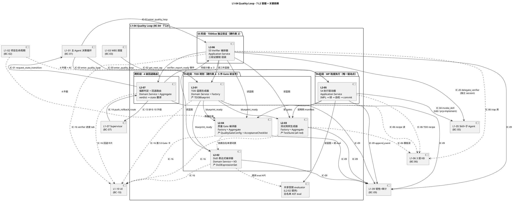
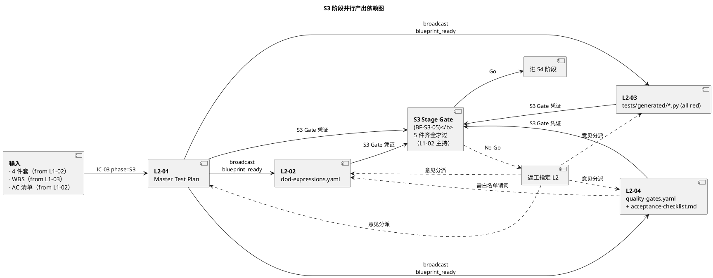
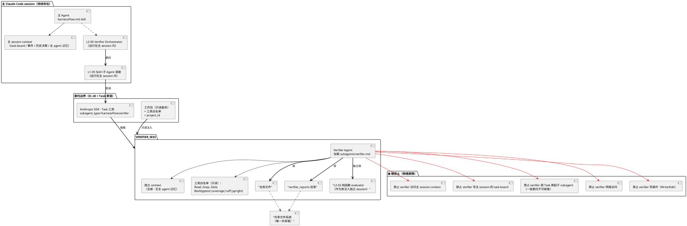
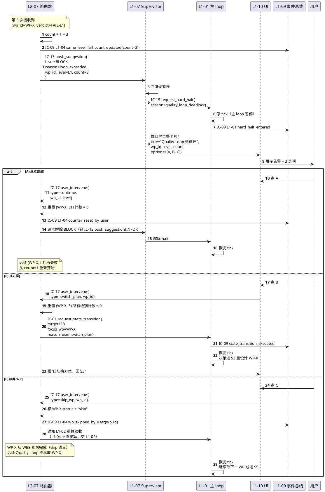
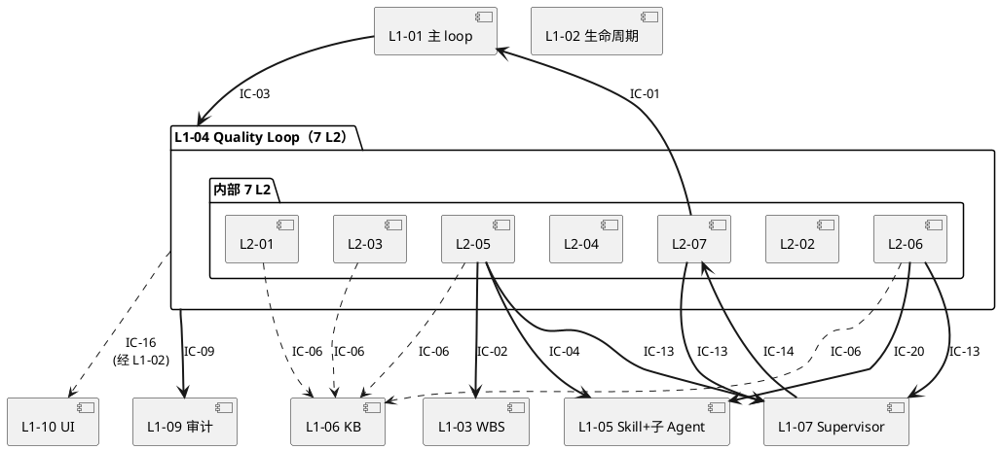

# L1-04 · Quality Loop 能力 · L1 总架构（Architecture · 3-1 Solution Technical）

> **版本**：v1.0（L1 级总架构 · ~1200-1500 行）
> **定位**：HarnessFlow **质量闭环脊柱**的技术总架构 —— 把 2-prd PRD §5.4 / L1-04 §1-§16 的"要做什么"翻译为"内部如何分层、组件如何互联、数据如何流动、关键路径如何时序化"。
> **严格边界**：本文档是**L1 级别**（不下潜到字段 schema / 伪代码 / 表结构 —— 那些是 L2 tech-design 的事）。本文档**只**给出 7 个 L2 的技术协作蓝图 + 3 张 P0 时序图 + 对外 IC 契约表 + 开源调研索引 + 性能目标。
> **强制不改动**：不得修改 PM-14（project-id-as-root）骨架；不得修改 scope §5.4 的 4 条硬约束 / 6 条禁止 / 5 条必须的语义；若 7 L2 职责边界发现重叠则 **Edit 产品 PRD** 修补并在本文顶部登记。
> **PM-14 项目上下文声明**：本 L1 的所有持久化对象（TDDBlueprint / DoDExpressionSet / TestSuite / QualityGateConfig / VerifierReport / RollbackRouteDecision）及所有事件（`L1-04:*`）都带 `project_id`；verifier 子 Agent 委托 context 亦必带 `project_id`。详见 `docs/2-prd/L0/projectModel.md §9.1`。

---

## 0. 撰写进度

- [x] Frontmatter · 溯源 + 锚点 + 下游消费者
- [x] §0 撰写进度
- [x] §1 定位 + scope §5.4 映射 + Goal §4.1 红线 + L2 清单
- [x] §2 DDD 映射 · 引 L0 BC-04 · 聚合根 / 值对象 / 领域服务 / Repository
- [x] §3 7 L2 技术架构图（Mermaid C4-ish · S3 → S4 → S5 → 4 级回退 控制流）
- [x] §4 P0 核心时序图 · 4 张（TDD 蓝图 · 一轮 WP Quality Loop · S5 三段证据链 · 4 级回退）
- [x] §5 DoD 白名单 AST eval 架构（Python `ast` + `NodeVisitor` · 引 L0 §12）
- [x] §6 独立 Verifier session 架构（PM-03 · IC-20 委托 L1-05）
- [x] §7 4 级回退路由 + 同级 ≥ 3 死循环升级 架构
- [x] §8 对外 IC 承担清单（发起 IC-20 · 接收 IC-03 / IC-14 · 其他发起）
- [x] §9 开源最佳实践调研 · 引 L0 §5 + §12 · TDD + mutation + AST eval 三大方向
- [x] §10 与 7 L2 分工表（每 L2 → 下游 tech-design.md 指针）
- [x] §11 性能目标 · P50/P95 阈值 + 并发度 + 资源约束
- [x] §12 本架构对 2-prd 的修补记录（串不起来时的改 PRD 登记）
- [x] 附录 A · 术语（L1 本地）
- [x] 附录 B · 下游 L2 tech-design 索引
- [x] 附录 C · 与其他 L1 architecture.md 交叉引用

---

## 1. 定位 + scope §5.4 映射

### 1.1 一句话定位

**L1-04 是 HarnessFlow 质量闭环的脊柱**：在 7 阶段主干中占据 **S3 (TDD 规划) + S4 (执行) + S5 (TDDExe 独立验证) + 跨 S4/S3/S2/S1 回退路由** 四段核心控制，是 Goal §2.2 "质量 + 检验"两项纪律的**唯一**工程落地路径，也是 Goal §4.1 "真完成质量达标率 ≥ 95%" 这条 V1 硬指标的红线守门员；与 L1-01 主 loop（控制流来源）/ L1-02 生命周期（4 件套 + 7 阶段 + Stage Gate 来源）/ L1-03 WBS（WP 定义来源）/ L1-05 Skill+子 Agent（能力执行层）/ L1-07 Supervisor（verdict 判定者）/ L1-09 韧性审计（单一事实源）/ L1-10 UI（人机触达）形成**强耦合的中心节点**，是全系统"质量"—"检验"—"回退"—"死循环保护"四联动的唯一工程点。

### 1.2 与 scope §5.4 的逐条映射

| scope §5.4 子节 | 本 L1 如何承担（架构映射） | 对应 L2 | 本文章节 |
|---|---|---|---|
| §5.4.1 职责 · S3 蓝图生成 | 将 4 件套 + WBS 转为 Master Test Plan / DoD / 用例骨架 / 质量 Gate / acceptance-checklist **五件产物** | L2-01 / L2-02 / L2-03 / L2-04 | §3 · §4.1 |
| §5.4.1 职责 · S4 执行驱动 | WP 粒度 "IMPL → 测试绿 → DoD 自检 → commit" 循环 | L2-05 | §3 · §4.2 |
| §5.4.1 职责 · S5 TDDExe 独立验证 | 经 IC-20 委托 L1-05 起**独立 session** verifier 子 Agent · 组装三段证据链 | L2-06 | §3 · §4.3 · §6 |
| §5.4.1 职责 · 4 级回退路由 | PASS → S7 / L1 → S4 / L2 → S3 / L3 → S2 / L4 → S1 精确路由 + 同级 ≥ 3 死循环保护 | L2-07 | §3 · §4.4 · §7 |
| §5.4.4 硬约束 1 · S5 未 PASS 不得进 S7 | L2-07 路由器硬编码：只有 PASS 才产 `IC-01 request_state_transition(target=S7)` | L2-07 | §7.2 |
| §5.4.4 硬约束 2 · verifier 独立 session | L2-06 `IC-20 delegate_verifier` 强制走 L1-05 的**独立 session 子 Agent** 通路；**绝不降级主 session 自跑** | L2-06 | §6 |
| §5.4.4 硬约束 3 · DoD 白名单 AST | L2-02 使用 Python `ast` stdlib + `NodeVisitor` 白名单校验，拒绝 `ast.Call` / `ast.Import` / `ast.Attribute` 等所有可逃逸节点 | L2-02 | §5 |
| §5.4.4 硬约束 4 · TDD 蓝图 S3 前全齐 | S3 Stage Gate 硬性要求 5 件产物全齐才能过，由 L2-01 / L2-02 / L2-03 / L2-04 并行产出 | L2-01~04 | §3 · §4.1 |
| §5.4.5 禁 1-6 · 6 条禁止行为 | 在各 L2 架构层硬编码禁区（见 §7.3 禁区硬边界表） | 全 L2 | §7.3 |
| §5.4.6 必 1-5 · 5 条必须义务 | 在各 L2 架构层硬编码必答（见 §7.4 必答义务表） | 全 L2 | §7.4 |
| §5.4.7 · 与其他 L1 交互 | 对外 10 条 IC 承担（8 条发起 + 2 条接收），详见 §8 | 全 L2 | §8 |

### 1.3 与 Goal §4.1 "真完成质量达标率 ≥ 95%" 的联系

Goal §4.1 是 HarnessFlow V1 的 **9 条量化指标**之一。本 L1 通过以下三层结构把"真完成质量"从口号变成**可验证的硬指标**：

1. **可定义**（L2-01 / L2-02 / L2-04）：Master Test Plan 定义"该怎么测"、DoD 表达式定义"完成的定义"、quality-gates 定义"阈值"，三者共同构成"真完成"的**机器可读定义**。
2. **可执行**（L2-05 / L2-03）：S4 驱动 WP 从红灯用例到绿灯 + DoD 自检 + commit，每次 commit 前 **"未绿用例数单调递减"** 硬校验防止桩代码假绿。
3. **可验证**（L2-06 / L2-07）：S5 Verifier 独立 session 重跑三段证据链（existence / behavior / quality），L1-07 基于报告判 4 级 verdict，L2-07 按 verdict 精确路由回退 —— 主 session 任何"自声称 PASS"都必须经过这次独立复验才算真完成。

因此 **"真完成率"的分母 = 项目 S5 Gate 通过次数，分子 = Verifier 报告 verdict = PASS 的次数** —— 这个比率 ≥ 95% 是 L1-04 架构的**北极星指标**。

### 1.4 L2 清单总览（对齐 PRD §2）

| L2 ID | 名称 | 聚合自 BF | 所属 DDD 构造块 | 下游 tech-design.md |
|---|---|---|---|---|
| **L2-01** | TDD 蓝图生成器（Master Test Plan） | BF-S3-01 | Domain Service + Factory + Aggregate Root `TDDBlueprint` | `L1-04/L2-01-TDD蓝图生成器/tech-design.md` |
| **L2-02** | DoD 表达式编译器（白名单 AST） | BF-S3-02 | Domain Service + VO `DoDExpression` + VO `WhitelistASTRule` | `L1-04/L2-02-DoD表达式编译器/tech-design.md` |
| **L2-03** | 测试用例生成器（骨架先红灯） | BF-S3-03 | Factory + Aggregate Root `TestSuite` | `L1-04/L2-03-测试用例生成器/tech-design.md` |
| **L2-04** | 质量 Gate 编译器 + 验收 Checklist 生成器 | BF-S3-04 + BF-S3-05 | Factory + Aggregate Root `QualityGateConfig` + `AcceptanceChecklist` | `L1-04/L2-04-质量Gate编译器/tech-design.md` |
| **L2-05** | S4 执行驱动器（IMPL → 绿 → DoD 自检 → commit） | BF-S4-03 + BF-S4-04 + BF-S4-05 | Application Service | `L1-04/L2-05-S4执行驱动器/tech-design.md` |
| **L2-06** | S5 TDDExe Verifier 编排器 | BF-S5-01 + BF-S5-02 | Application Service + Aggregate Root `VerifierReport` + VO `ThreeEvidenceChain` | `L1-04/L2-06-S5Verifier编排器/tech-design.md` |
| **L2-07** | 偏差判定 + 4 级回退路由器 | BF-S5-03 + BF-S5-04 + BF-E-10 | Domain Service + Aggregate Root `RollbackRouteDecision` | `L1-04/L2-07-偏差判定与回退路由器/tech-design.md` |

### 1.5 7 L2 职责边界"不重叠"自检（本 L1 层面）

在 PRD §2 / §7 / §8-§14 的基础上，再从架构视角复核 7 L2 之间**不可重叠**的硬边界：

| 可能混淆点 | 正确归属 | 非归属（不得做） | 边界规则 |
|---|---|---|---|
| "谁写 quality-gates.yaml" | **L2-04** | L2-01 只给"覆盖率目标"作为输入给 L2-04；L2-02 给"白名单谓词"让 L2-04 校验 | L2-04 是唯一产 yaml 的点，输入依赖 L2-01 + L2-02 |
| "谁 eval DoD 表达式" | **L2-02 提供 evaluator（受限沙盒）** · 调用方 = L2-05 / L2-06 / verifier 子 Agent | L2-04 quality-gates 里的阈值判断也走 L2-02 evaluator；**严禁**任何 L2 自实现 eval | 本 L1 唯一 eval 入口 = L2-02 受限 evaluator |
| "谁判 verdict" | **L1-07 Supervisor**（L1-04 外部） | L2-06 只组装报告 · L2-07 只做 verdict → state 翻译 | L1-04 不判 verdict，只产"报告给 L1-07 判"+"收路由命令执行" |
| "谁做自检 vs 独立验证" | **L2-05 做 WP-DoD 自检（非独立）** · **L2-06 做 S5 独立验证** | 自检 PASS 不等于独立验证 PASS；即使自检全绿，S5 独立验证仍可能判 FAIL | 自检 = 主 session 内 · 独立验证 = 独立 session（PM-03） |
| "谁管死循环升级" | **L2-07** 维护同级 FAIL 计数 + 硬触发 | L1-07 接升级信号后做 BLOCK 级硬暂停 | L2-07 触发 + L1-07 升级是两段 |
| "谁推 S3 Gate 待审卡" | L2-01 / L2-02 / L2-03 / L2-04 各自作为"产出方"经 L1-02 L2-01 Stage Gate 模块推到 L1-10 | L1-04 不直接管 Gate 审批流程 | L1-04 产凭证 · L1-02 管 Gate · L1-10 展示给用户 |
| "谁驱动 S4 全流程" | **L2-05** 唯一入口 | L1-01 不得绕过 L2-05 直接调 tdd / prp-implement skill | L2-05 = S4 单一驱动点 |

**若本 L1 下游 L2 tech-design 实现阶段发现上表外的新边界冲突，走"串不起来修 PRD"规则**（spec §6.2）：在本文 §12 顶部登记修补记录，同步 Edit `docs/2-prd/L1-04 Quality Loop/prd.md`，再继续写 L2 tech-design。

---

## 2. DDD 映射 · 引 L0 BC-04

> 本节严格引用 `docs/3-1-Solution-Technical/L0/ddd-context-map.md §2.5 BC-04 Quality Loop`（聚合根 / 值对象 / 领域服务 / 跨 BC 关系已由 L0 锁定，本文**不重定义**，只做 L1 视角的"7 L2 ↔ DDD 构造块"落位映射）。

### 2.1 BC-04 一句话定位（引 L0）

> 项目的"质量守门员" —— S3 做 TDD 规划 + S4 驱动执行 + S5 独立 TDDExe 验证 + 4 级回退路由的质量闭环。

### 2.2 聚合根清单（引 L0 §2.5）

| 聚合根 | 一致性边界（引 L0） | 所属 L2 | 持久化 Repository |
|---|---|---|---|
| **TDDBlueprint** | `blueprint_id + test_pyramid + ac_matrix + coverage_target + test_env_blueprint` | L2-01 产 · L2-03 / L2-04 / L2-06 读 | `TDDBlueprintRepository`（L2-01 持有） |
| **DoDExpressionSet** | `wp_id → DoDExpression（AST，只含白名单操作符）` | L2-02 产 · L2-04 / L2-05 / L2-06 读 | `DoDExpressionRepository`（L2-02 持有） |
| **TestSuite** | `test_case_id[] + 生成时是 "red" 状态` | L2-03 产 · L2-05 / L2-06 读 | `TestSuiteRepository`（L2-03 持有） |
| **QualityGateConfig** | `coverage_threshold + perf_threshold + security_scan + lint_rules` | L2-04 产 · L2-05 / L2-06 读 | `QualityGateConfigRepository`（L2-04 持有） |
| **AcceptanceChecklist** | `checklist_item[] + applicable_stage + check_method (auto/manual)` | L2-04 产 · L1-10 UI 读 · 用户勾选 | `AcceptanceChecklistRepository`（L2-04 持有） |
| **VerifierReport** | `report_id + verdict + three_evidence_chain + sourced_from_verifier_subagent` | L2-06 产 · L1-07 读 · L2-07 消费 | `VerifierReportRepository`（L2-06 持有） |
| **RollbackRouteDecision** | `verdict_id → target_stage + reason + level + (wp_id, verdict_level) → same_level_fail_count` | L2-07 产 · L1-07 读 | `RollbackRouteDecisionRepository`（L2-07 持有） |

**PM-14 一致性约束**：所有 7 个聚合根在持久化路径上都带 `project_id` 前缀（遵循 `projects/<pid>/` 目录结构，详见 L0 DDD §7.2.4）。

### 2.3 关键值对象（Value Object · 引 L0）

| VO | 语义 | 不变量 | 使用 L2 |
|---|---|---|---|
| **DoDExpression** | 机器可校验的"完成的定义"AST 表达式 | AST 节点集必须 ⊆ 白名单（`ast.Expression / ast.BoolOp / ast.And / ast.Or / ast.Compare / 6 类 Cmpop / ast.Name / ast.Constant / ast.Load / ast.Call（仅白名单函数）`）；**禁 `ast.Import / ast.ImportFrom / ast.Attribute / ast.Subscript / ast.Lambda / ast.GeneratorExp / ast.Starred / ast.Yield* / ast.Await`** | L2-02 定义 · L2-05 / L2-06 eval |
| **ThreeEvidenceChain** | existence / behavior / quality 三段证据 | 三段必须都存在或显式标"empty + reason"；任一段缺失导致 L1-07 判 `INSUFFICIENT_EVIDENCE → FAIL-L2` | L2-06 组装 · L1-07 消费 |
| **Verdict** | PASS / FAIL-L1 / FAIL-L2 / FAIL-L3 / FAIL-L4 五值枚举 | 只能取上述 5 值之一；任何其他值 L2-07 拒绝路由 | L1-07 产 · L2-07 消费 |
| **RollbackTargetStage** | S7 / S4 / S3 / S2 / S1 五值枚举 | 只能由 `Verdict × 映射表`（§7.2）唯一决定 | L2-07 内部翻译 |
| **SameLevelFailCount** | `(wp_id, verdict_level) → count` | `count ≥ 3` 硬触发 BF-E-10 死循环升级；**不允许临时调高阈值** | L2-07 维护 |
| **WhitelistASTRule** | 单条白名单条目（节点类型 / 允许函数 / 允许字段） | 仅在离线评审后扩展，禁止运行时动态增删 | L2-02 维护 |
| **CoverageTarget** | 行 / 分支 / AC 三类覆盖率下限 | 各 ≥ 0.0 ≤ 1.0；AC 覆盖率硬性 = 1.0 | L2-01 产 · L2-04 消费 |

### 2.4 领域服务（Domain Service · 引 L0）

| 领域服务 | 一句话职责 | 归属 L2 | 典型调用链 |
|---|---|---|---|
| **TDDBlueprintFactory** | 把 4 件套 + WBS 组合成 `TDDBlueprint` 聚合 | L2-01 | `enter_quality_loop{phase=S3} → factory.build(four_pieces, wbs) → TDDBlueprint → repo.save()` |
| **DoDExpressionCompiler** | 自然语言条款 → 白名单 AST → `DoDExpression` VO | L2-02 | `blueprint_ready → compiler.parse(clause_text) → ast_tree → NodeVisitor.validate() → DoDExpression` |
| **TestCaseSkeletonFactory** | 按 AC × 分层矩阵批量生成红灯用例骨架 | L2-03 | `blueprint_ready → factory.generate(ac_matrix, test_pyramid) → TestSuite → repo.save()` |
| **QualityGateCompiler** | 质量标准 + DoD 谓词 → `QualityGateConfig` + `AcceptanceChecklist` 双产出 | L2-04 | `blueprint_ready → compiler.compile(quality_std, ac_list, dod_set) → (QualityGateConfig, AcceptanceChecklist)` |
| **WPExecutionOrchestrator** | WP 粒度 "IMPL → 绿 → 自检 → commit" 编排 | L2-05 | `enter_quality_loop{phase=S4, wp_id} → orchestrator.drive(wp) → invoke_skill / monotonic_check / dod_eval / git_commit` |
| **VerifierDelegationOrchestrator** | 组装 verifier 工作包 · 委托 · 组装三段证据链 · 落盘 | L2-06 | `enter_quality_loop{phase=S5} → orchestrator.assemble(blueprint, s4_snapshot, ac) → IC-20 → wait → assemble_evidence_chain → save` |
| **RollbackRouter** | verdict → target_stage 精确翻译 + 同级计数 + BF-E-10 触发 | L2-07 | `IC-14 push_rollback_route → router.route(verdict) → IC-01 / IC-13` |
| **DoDEvaluator**（共享受限沙盒） | 在受限 evaluator 上下文里跑 DoDExpression → `{pass, reason, evidence_snapshot}` | L2-02 持有 · 全 L2 调用 | 详见 §5 |

### 2.5 Repository 模式

所有 7 聚合根的持久化都走**Repository 模式**（遵循 L0 DDD §7.2.4），具体 Repository 接口定义（抽象方法清单）交给各 L2 tech-design.md §7 描述。本 L1 只约定**共性契约**：

- **单一写入点**：每个聚合根的写入只能经过对应 Repository 的 `save()`，不得绕过
- **事件溯源一致性**：`save()` 成功后必须 emit 对应 `L1-04:<event>` 到 L1-09 事件总线（经 IC-09）
- **PM-14 隔离**：所有 Repository 方法都接收 `project_id` 参数或在构造时绑定，跨 project 查询必须显式失败
- **不可变快照**：聚合根更新时产新版本，不覆盖旧版本（TDDBlueprint v2 vs v1 都保留，用于 FAIL-L2 回退后的 diff 视图）

### 2.6 跨 BC 关系（引 L0 §2.5）

| 与 | 关系类型 | 方向 | 本 L1 视角 |
|---|---|---|---|
| **BC-01 · L1-01 主 Agent 决策循环** | Customer-Supplier | 双向 | 接 IC-03（客户） · 产 IC-01 state 转换请求（供应） |
| **BC-02 · L1-02 生命周期编排** | Customer | 单向（上游） | 接 4 件套 + AC 清单作为 L2-01/02/03/04 输入；经 L1-02 Stage Gate 模块推 S3 Gate 待审卡 |
| **BC-03 · L1-03 WBS 调度** | Customer-Supplier | 双向 | 接 WP 定义（IC-02 `get_next_wp`）· 产 `L1-04:wp_executed` 事件供其推进拓扑 |
| **BC-05 · L1-05 Skill+子 Agent** | Customer | 单向（下游） | 产 IC-04 invoke_skill / IC-20 delegate_verifier |
| **BC-06 · L1-06 3 层知识库** | Customer | 单向（可选读） | 经 IC-06 读 recipe / trap（L2-01 / 03 / 05 / 06 可选增强） |
| **BC-07 · L1-07 Supervisor** | **Partnership** | 强双向 | 接 IC-14 push_rollback_route（verdict 输入） · 产 push_suggestion（BF-E-10 升级 + 委托失败升级 + WP 自修超限升级） |
| **BC-09 · L1-09 韧性+审计** | Customer | 单向（下游） | 所有 L2 经 IC-09 append_event 单一写入点 |
| **BC-10 · L1-10 UI** | Customer | 单向（下游，经 L1-02） | 产 IC-16 push_stage_gate_card（5 件 S3 产出物 + Verifier 证据链 tab 进度 + 回退卡片） |

---

## 3. 7 L2 技术架构图（PlantUML · S3 蓝图 → S4 执行 → S5 Verifier → 4 级回退 的控制流）

### 3.1 架构图 A · L1-04 内部 7 L2 容器 + 关键依赖（C4 Container 风格）



### 3.2 架构图 B · S3 阶段并行产出依赖图

**S3 硬约束 4** 要求 5 件产物在 S4 前全齐。本图说明 L2-01 作为"总指挥"如何通过 `blueprint_ready` 广播触发 L2-02 / L2-03 / L2-04 **并行启动**（不是串行），把 S3 规划耗时压到"单件最长耗时 + ~10% 协调开销"而非三件串行相加。



**关键保证**：
- **AC 覆盖率 100% 硬性**：L2-01 蓝图中每条 AC 至少分配 1 个用例槽；L2-03 为每个槽位生成骨架；L2-04 acceptance-checklist 为每条 AC 生成勾选条款 —— **三级校验**，任一级漏项则 blueprint_ready 不广播 / tests_generated 不广播 / gates_ready 不广播，Gate 自动失败
- **白名单谓词硬红线**：L2-04 quality-gates 里的每个判别谓词必须在 L2-02 白名单内；L2-04 编译时主动查 L2-02，未命中则编译失败
- **并行度上限**：S3 阶段单 project 内 L2-02 / L2-03 / L2-04 可并行（3 路），全系统并行度由 L1-01 主 loop 的 tick 和 L1-09 的锁控制

### 3.3 架构图 C · S4 WP 执行闭环

S4 阶段由 **L2-05 唯一驱动**，循环结构清晰：「取下一 WP → 读蓝图切片 → 调 skill → 等绿 → 单调递减校验 → DoD 自检 → commit → 回调」。

```plantuml
@startuml
usecase "<b>入口</b>\nIC-03 phase=S4" as START
START --> GET_WP
component "<b>1. 取下一 WP</b>\nIC-02 get_next_wp → L1-03" as GET_WP
GET_WP --> READ_SLICE
component "<b>2. 读 WP 切片</b>\n· DoD 表达式子集（L2-02）\n· 红灯用例清单（L2-03）\n· quality-gates WP 子集（L2-04）" as READ_SLICE
READ_SLICE --> INVOKE
component "<b>3. 调 skill</b>\nIC-04 invoke_skill\n(tdd / prp-implement)\n→ L1-05" as INVOKE
INVOKE --> WAIT
component "<b>4. 等回调</b>\nskill 自循环 (RED→GREEN)\n直到测试变绿" as WAIT
WAIT --> MONO
agent ""<b>5. 单调递减校验</b>\n本次未绿数 ≤ 上次？"" as MONO
MONO --> REJECT1["拒绝 : 否
REJECT1 --> INVOKE_RETRY
agent ""自修 ≤ 3 次？"" as INVOKE_RETRY
INVOKE_RETRY --> INVOKE : 是
INVOKE_RETRY --> ESCALATE1["升级 : 否
MONO --> EVAL : 是
component "<b>6. DoD 自检</b>\n经 L2-02 受限 evaluator\neval 本 WP 所有 DoDExpression" as EVAL
agent "全 PASS？" as EVAL_R
EVAL --> EVAL_R
EVAL_R --> REJECT2["记 : 否
REJECT2 --> INVOKE_RETRY
EVAL_R --> COMMIT : 是
component "<b>7. git commit</b>\nWP 粒度\ncommit msg 含 WP id + 覆盖 AC" as COMMIT
COMMIT --> EVENT
component "<b>8. 事件落盘</b>\nIC-09 wp_done\n+ UI 推进度" as EVENT
agent "还有 WP？" as NEXT
EVENT --> NEXT
NEXT --> GET_WP : 是
NEXT --> DONE(["<b>S4 : 否
component ""L1-07 决策：\nA) 继续重试 / B) 进 S5 等 verifier / C) 回 S3"" as DECIDE
ESCALATE1 --> DECIDE
DECIDE ..> DONE : B
@enduml
```

**关键约束**：
- **第 5 步（单调递减）是 PRD 响应面 6 的工程体现**：防止 TDD 过程中"之前绿的用例因本次改动回退为红" —— 这是 L2-03 "先红灯"硬性与 L2-05 "commit 前硬校验" 的组合拳
- **第 6 步的 eval 必经 L2-02 evaluator**：严禁 L2-05 自实现"解释 yaml" —— 违反 PM-05 机器可校验唯一入口原则
- **第 7 步的 commit 只能在第 5、6 步都 PASS 后发生**：顺序硬约束
- **自修上限 3 次**：防止 WP 粒度死循环；3 次仍 FAIL → 不强推、不自判，升级 L1-07 判决

### 3.4 架构图 D · S5 Verifier 独立 session 委托 + 三段证据链组装

本图展示 L2-06 如何把"独立验证"这个抽象约束转换为**具体架构通路**：工作包组装 → IC-20 委托 → L1-05 起独立 session → verifier 跑 3 段 → 回调 → 组装报告 → 落盘 → 广播给 L1-07 判 verdict。**关键是独立 session 通路必须物理隔离**（无共享主 agent 记忆），详见 §6。

```plantuml
@startuml
rectangle ""<b>入口</b>\nIC-03 phase=S5\n(S4 all WP done)"" as IN <<subroutine>>
IN ==> L2_06_IN
package "L2-06 · S5 Verifier 编排器（主 session 内）" as L2_06 {
component ""接入口"" as L2_06_IN
L2_06_IN --> ASSEMBLE
component "<b>1. 组装工作包</b>\n· TDDBlueprint（L2-01 产）\n· DoDExpressionSet（L2-02 产）\n· TestSuite（L2-03 产）\n· QualityGateConfig + AcceptanceChecklist（L2-04 产）\n· S4 产出快照（commit hash + 测试结果）\n· AC 清单\n· project_id（PM-14）" as ASSEMBLE
ASSEMBLE --> DELEGATE
component "<b>2. 委托</b>\nIC-20 delegate_verifier\n{工作包}" as DELEGATE
}
DELEGATE ==> L1_05_HUB : IC-20
package "L1-05 Skill+子 Agent 调度（BC-05 · 外部）" as L1_05 {
component ""IC-20 入口"" as L1_05_HUB
L1_05_HUB --> SPAWN
component "<b>3. 起独立 session 子 Agent</b>\n· 全新 context（禁继承主）\n· 工具白名单: [Read, Grep, Glob, Bash(允许 pytest/coverage/ruff)]\n· 注入 subagents/verifier.md prompt\n· ephemeral（per-call）" as SPAWN
}
SPAWN ==> VERIFIER : 独立 session
package "独立 Verifier Session（ephemeral · 冷启动 ~30-60s）" as VERIFIER_SESSION {
component "<b>Verifier 子 Agent</b>\n独立 context · 只读工具" as VERIFIER
VERIFIER --> EXIST
component "<b>4a. existence 段</b>\n· 每个声称产出物实际存在？\n· file / commit / deploy_url 证据采集" as EXIST
EXIST --> BEHAV
component "<b>4b. behavior 段</b>\n· 独立 pytest collect + run\n· 不信任主 agent 声称的绿\n· 结果 diff 主 agent snapshot" as BEHAV
BEHAV --> QUAL
component "<b>4c. quality 段</b>\n· 独立 eval DoDExpressionSet（经 L2-02 纯函数 evaluator）\n· 独立跑 coverage + ruff + pyright\n· 对照 quality-gates 阈值" as QUAL
QUAL --> REPORT
component "<b>5. 产 verifier_report.json</b>\n{existence, behavior, quality, metadata}" as REPORT
}
REPORT ==> L1_05_HUB : 回传
L1_05_HUB ==> CALLBACK : IC-20 响应
package "L2-06 · 后处理（主 session 内）" as L2_06_B {
component ""<b>6. 接回传</b>"" as CALLBACK
CALLBACK --> VALIDATE
component "<b>7. 校验三段完整</b>\nexistence/behavior/quality 三段\n任一段空 → 显式标 'empty + reason'" as VALIDATE
VALIDATE --> SAVE
component "<b>8. 落盘</b>\nprojects/<pid>/verifier_reports/<session_id>.json\n（先落盘后广播）" as SAVE
SAVE --> BCAST
component "<b>9. 广播</b>\nevent: L1-04:verifier_report_issued\n→ L1-07（经事件总线）\n→ L1-10 UI（证据链 tab）" as BCAST
}
BCAST ==> L1_07
component "<b>L1-07 Supervisor</b>\n读 report 判 4 级 verdict\n→ IC-14 push_rollback_route" as L1_07
component ""<b>L2-07</b>\n接 verdict 路由回退"" as L2_07_OUT
L1_07 ==> L2_07_OUT : IC-14
DELEGATE ..> FAIL1["第 : 委托失败（limit / timeout）
FAIL1 ..> FAIL2["第 : 再次失败
FAIL2 ..> FAIL3["第 : 仍失败
@enduml
```

**关键保证**：
- **独立 session 物理隔离**：verifier 通过 L1-05 Task 原语拉起新 Claude subagent session，其 context 为空，无法通过共享变量接触主 agent 的内存 / task-board；通过工具白名单禁止写操作（只允许 `Read / Grep / Glob / Bash(pytest|coverage|ruff|pyright)`），形成"只读沙盒"
- **ephemeral 生命周期**：session 完成即销毁，context 不保留 —— 满足 PM-03 子 Agent 独立 session 约束，也避免"同一 verifier 跑 10 个 project 被污染"
- **三段证据链不可跳过**：`validate()` 硬校验三段都存在；空段必须显式 `"empty", reason: <why>`，不允许静默缺段
- **先落盘后广播**：防止 L1-07 读 report 时数据竞争（广播时 L1-07 已能读到磁盘上的 JSON）
- **降级硬红线**：委托失败绝不降级主 session 自跑 —— 宁可 BLOCK 升级也不违反硬约束 2

### 3.5 架构图 E · 控制流时序概览（4 阶段 + 回退）

```plantuml
@startuml
    direction LR
    [*] --> S3_PLANNING: IC-03 phase=S3
    state S3_PLANNING {
        direction TB
        [*] --> L201_run: Master Test Plan
        L201_run --> L202_L203_L204_parallel: blueprint_ready
        L202_L203_L204_parallel --> S3_Gate: 5 件齐
        S3_Gate --> [*]: Go
        S3_Gate --> L201_run: No-Go（意见分派）
    }
    S3_PLANNING --> S4_EXEC: Go → IC-03 phase=S4
    state S4_EXEC {
        direction TB
        [*] --> L205_wp_loop: take next WP
        L205_wp_loop --> L205_wp_loop: WP_done（下一 WP）
        L205_wp_loop --> [*]: all WP done
    }
    S4_EXEC --> S5_VERIFY: IC-03 phase=S5
    state S5_VERIFY {
        direction TB
        [*] --> L206_assemble
        L206_assemble --> L206_delegate: IC-20
        L206_delegate --> verifier_ephemeral: 独立 session
        verifier_ephemeral --> L206_callback: report
        L206_callback --> L207_route: verifier_report_ready
    }
    S5_VERIFY --> L207_ROUTE: report 就绪
    state L207_ROUTE <<choice>>
    S5_VERIFY --> L207_ROUTE
    L207_ROUTE --> S7_DONE: verdict=PASS
    L207_ROUTE --> S4_EXEC: FAIL-L1（回 S4 WP）
    L207_ROUTE --> S3_PLANNING: FAIL-L2（补蓝图）
    L207_ROUTE --> S2_PLAN: FAIL-L3（重规划）
    L207_ROUTE --> S1_CHARTER: FAIL-L4（重定义）
    S7_DONE --> [*]
    S2_PLAN: S2 重规划（L1-02 重做 4 件套）
    S1_CHARTER: S1 重定义（L1-02 重章程）
    note right of L207_ROUTE
      · 同级 FAIL ≥ 3 → BF-E-10 升级（硬暂停）
      · 不自做 verdict 判定
      · 所有路由经 IC-01
    end note
@enduml
```

---

## 4. P0 时序图（核心 4 张）

本节为 L1-04 的 **4 个 P0 控制流** 绘制 PlantUML 时序图，对齐 L0 `sequence-diagrams-index.md §2.3 P0-03` / §2.8 P0-08（回退）。每张图末尾附**关键保证**清单 + **硬约束对照**。

### 4.1 时序图 P0-L1-04-A · S3 TDD 蓝图一次完整生成（流 A）

**场景一句话**：用户审完 S2 Gate 进入 S3 → 主 loop 触发 `IC-03 phase=S3` → L2-01 作为总指挥产 Master Test Plan → 广播 `blueprint_ready` → L2-02 / L2-03 / L2-04 并行起跑 → 5 件产物齐全推 S3 Gate → 用户 Go → 进 S4。

**映射**：PRD §5 流 A + scope §5.4.1 S3 职责 + BF-S3-01/02/03/04/05

```plantuml
@startuml
autonumber
    autonumber
participant "L1-01 主 loop" as L01
participant "L2-01 TDD 蓝图生成器" as L201
participant "L2-02 DoD 编译器" as L202
participant "L2-03 用例生成器" as L203
participant "L2-04 质量 Gate 编译器" as L204
participant "L1-02 生命周期" as L02
participant "L1-09 事件总线" as L09
participant "L1-10 UI" as L10
participant "用户" as U
note over L01 : S2 Gate Go，决策 phase=S3
L01 -> L201 : IC-03 enter_quality_loop{phase=S3, project_id}
L201 -> L201 : 读 4 件套（from L02 产出目录）
L201 -> L201 : 读 WBS（from L03 产出目录）
L201 -> L201 : 推测试金字塔 + AC 矩阵映射
L201 -> L09 : IC-09 append L1-04:blueprint_started
L201 -> L201 : 校验 AC 覆盖率 = 100%
alt AC 覆盖率 < 100%
L201 -> L07 : IC-13 push_suggestion{INFO, ac_coverage_incomplete}
note right of L201 : 拒绝产出\n等 L1-02 补 AC
else AC 覆盖率 = 100%
L201 -> L201 : 产 master-test-plan.md（聚合 TDDBlueprint）
L201 -> L09 : IC-09 L1-04:blueprint_issued
L201- -> L202 : broadcast blueprint_ready{plan_path, ac_matrix}
L201- -> L203 : broadcast blueprint_ready
L201- -> L204 : broadcast blueprint_ready
end
par 并行 DoD 编译
L202 -> L202 : 读 4 件套"验收条件"自然语言
loop 每条款
L202 -> L202 : parse → AST
L202 -> L202 : NodeVisitor 白名单校验
alt 命中白名单
L202 -> L202 : 固化为 DoDExpression VO
else 未命中
L202 -> L07 : IC-13 INFO{dod_unmappable}
note right of L202 : 登记"不可编译条款"\n走澄清回路
end
end
L202 -> L202 : 产 dod-expressions.yaml
L202 -> L09 : IC-09 L1-04:dod_compiled
else 并行用例生成
L203 -> L203 : 读 master-test-plan 分层 + AC
L203 -> L203 : 按 AC × 分层矩阵批量生成骨架
L203 -> L203 : 函数体强制"未实现 → FAIL"（先红灯）
L203 -> L203 : pytest collect 自校验（能发现、运行全 FAIL）
L203 -> L203 : 产 tests/generated/<wp_id>/<layer>/*.py
L203 -> L09 : IC-09 L1-04:tests_generated
else 并行质量 Gate 编译
L204 -> L204 : 读"质量标准" + AC + 覆盖率目标 + DoD 谓词
L204 -> L202 : 校验谓词白名单
L202- -> L204 : 白名单谓词表
L204 -> L204 : 编译 quality-gates.yaml（阈值矩阵）
L204 -> L204 : 编译 acceptance-checklist.md（勾选清单）
L204 -> L204 : 自检 AC 覆盖率 100%
L204 -> L09 : IC-09 L1-04:quality_gate_configured
end
note over L201,L204 : 4 L2 全完成 → 5 件齐
L201 -> L02 : 通知 S3 产出齐全
L02 -> L10 : IC-16 push_stage_gate_card\n（含 5 件：TDDBlueprint + DoD + TestSuite + QualityGateConfig + AcceptanceChecklist）
L10 -> U : 展示 S3 Gate 待审卡片
alt 用户 Go
U -> L10 : 批准 Go
L10 -> L02 : IC-17 user_intervene{authorize}
L02 -> L01 : stage_gate_s3_passed
L01 -> L01 : 决策 phase=S4
else 用户 No-Go（意见）
U -> L10 : reject + 意见清单
L10 -> L02 : IC-17 user_intervene{reject, opinions}
L02 -> L201 : 意见分派（蓝图分层问题）
L02 -> L202 : 意见分派（DoD 条款问题）
L02 -> L203 : 意见分派（用例覆盖问题）
L02 -> L204 : 意见分派（质量阈值问题）
note over L201,L204 : 针对性重做，二次 Gate
end
@enduml
```

**关键保证**：
- **S3 Gate 硬凭证**：5 件产物缺一不可（PRD §2 对齐 scope §5.4.4 硬约束 4）
- **AC 覆盖率 100% 三级校验**：L2-01 映射 → L2-03 骨架 → L2-04 checklist，任一级漏项导致 Gate 失败
- **白名单谓词硬红线**：L2-04 的谓词必须经 L2-02 校验，未命中则 L2-04 编译失败
- **并行度优化**：L2-02 / L2-03 / L2-04 并行起跑，不串行相加耗时
- **性能目标**：50 条 AC / 10 个 WP 规模下，5 件齐全产出 ≤ 6 分钟（L2-01 ≤ 3 分钟 + L2-02/03/04 并行 ≤ 3 分钟）

### 4.2 时序图 P0-L1-04-B · WP 一轮完整 Quality Loop（流 B · 最高频）

**场景一句话**：S4 阶段 L1-01 tick → L2-05 取 WP → 调 tdd skill → 等测试绿 → 单调递减校验 → DoD 自检 → commit → 下一 WP；全部 done → 进 S5。

**映射**：PRD §5 流 B + L0 `sequence-diagrams-index.md §2.3 P0-03` + scope §5.4.1 S4 职责 + BF-S4-01/03/04/05

```plantuml
@startuml
autonumber
    autonumber
participant "L1-01 主 loop" as L01
participant "L2-05 S4 执行驱动器" as L205
participant "L1-03 WBS 调度" as L03
participant "L2-02 DoD 编译器（eval）" as L202
participant "L2-03 用例生成器" as L203
participant "L2-04 质量 Gate 编译器" as L204
participant "L1-05 Skill+子 Agent" as L05
participant "tdd / prp-implement Skill" as Skill
participant "Git 仓库" as Git
participant "L1-09 事件总线" as L09
participant "L1-07 Supervisor" as L07
participant "L1-10 UI" as L10
L01 -> L205 : IC-03 enter_quality_loop{phase=S4, project_id}
loop 每个 WP
L205 -> L03 : IC-02 get_next_wp{project_id}
L03- -> L205 : wp_def{wp_id, goal, DoD_refs, deps, skill_hint}
L205 -> L09 : IC-09 L1-04:wp_started{wp_id}
L205 -> L10 : 推 UI 进度"WP-X 开始"
L205 -> L202 : 读 WP-X DoDExpression 子集
L202- -> L205 : 表达式列表
L205 -> L203 : 读 WP-X 红灯用例清单（前置 manifest）
L203- -> L205 : cases_pending_count_before
L205 -> L204 : 读 WP-X quality-gates 子集
L204- -> L205 : gates_slice
loop WP 内自修（≤ 3 次）
L205 -> L05 : IC-04 invoke_skill{\nskill=tdd 或 prp-implement,\ncontext=WP-X, project_id}
L05 -> Skill : 起 skill（主 session 内）
Skill -> Skill : RED → GREEN 小循环\n（写代码 / 跑测试 / 改代码）
Skill- -> L05 : 完成回调{code_diff, test_result}
L05- -> L205 : skill_returned
L205 -> L203 : 查"未绿用例数 after"
L203- -> L205 : cases_pending_count_after
alt cases_pending_count_after > cases_pending_count_before（绿变红）
L205 -> L205 : 拒绝 commit\n（响应面 6 · 单调递减硬校验）
note right of L205 : 记失败原因\n→ 下轮自修
else 单调递减通过
L205 -> L202 : eval DoDExpression 集（WP-X 子集）\non 受限 evaluator
L202 -> L202 : NodeVisitor 白名单跑\n+ 数据源白名单访问
L202- -> L205 : eval_results{\npass: bool, reason, evidence}
alt 全 PASS
L205 -> Git : git commit（WP-X 粒度）
Git- -> L205 : commit_hash
L205 -> L09 : IC-09 L1-04:wp_executed{\nwp_id, commit_hash,\ndod_eval_results,\ncases_green_count}
L205 -> L10 : 推 UI "WP-X done"
note over L205 : 跳出自修 loop
else 部分 FAIL
L205 -> L205 : 记 FAIL 原因
note right of L205 : 下轮调 skill 带原因摘要
end
end
end
alt 自修 ≥ 3 次仍 FAIL
L205 -> L07 : IC-13 push_suggestion{\nWARN, wp_self_repair_exhausted}
L07 -> L07 : 决策：A) 继续 / B) 进 S5 / C) 回 S3
L07- -> L205 : 决策结果
end
end
note over L205 : 全部 WP done
L205 -> L01 : callback "S4 done"
L01 -> L01 : 决策 phase=S5
@enduml
```

**关键保证**：
- **单调递减硬性**（第 20-23 步）：本次 commit 前未绿数必须 ≤ 上次 commit 后未绿数，违反则拒绝 commit（响应面 6）
- **DoD 自检必经 L2-02 evaluator**（第 25-28 步）：禁止 L2-05 自实现解释 yaml，保证 PM-05 单一入口
- **commit 仅在双条件成立后**（第 29 步）：单调递减 ✓ + DoD eval 全 PASS ✓，严禁先 commit 再 eval
- **WP 自修 ≤ 3 次**（外层 loop）：防止 WP 粒度死循环；3 次仍 FAIL 不强推，升级 L1-07
- **PM-14 隔离**：所有 IC 调用携带 `project_id`；`get_next_wp` / `wp_executed` / `dod_eval_results` 的写入路径都含 `projects/<pid>/`
- **性能目标**：单 WP 平均驱动耗时 ≤ 工时估算 × 1.2；WP 自检（eval + 用例查询） ≤ 30 秒

### 4.3 时序图 P0-L1-04-C · S5 Verifier 独立 session + 三段证据链组装（流 C）

**场景一句话**：S4 全部 WP done → L1-01 决策 phase=S5 → L2-06 组装 verifier 工作包 → IC-20 委托 L1-05 起独立 session 子 Agent → 跑 existence / behavior / quality 三段 → L2-06 接回传组装 JSON → 落盘 → 广播给 L1-07 判 verdict。

**映射**：PRD §5 流 C + scope §5.4.4 硬约束 2 + PM-03 子 Agent 独立 session + L0 架构 §5.1 端到端控制流

```plantuml
@startuml
autonumber
    autonumber
participant "L1-01 主 loop" as L01
participant "L2-06 S5 Verifier 编排器" as L206
participant "L2-01" as L201
participant "L2-02" as L202
participant "L2-03" as L203
participant "L2-04" as L204
participant "L1-05 Skill+子 Agent" as L05
participant "Verifier Subagent<br/>（独立 session · ephemeral）" as Ver
participant "Repo 文件系统" as FS
participant "L1-09 事件总线" as L09
participant "L1-07 Supervisor" as L07
participant "L1-10 UI" as L10
L01 -> L206 : IC-03 enter_quality_loop{phase=S5, project_id}
group
note right of L206 : Step 1：组装工作包（主 session 内）
L206 -> L201 : 读 TDDBlueprint
L201- -> L206 : master-test-plan + ac_matrix
L206 -> L202 : 读 DoDExpressionSet
L202- -> L206 : dod-expressions.yaml
L206 -> L203 : 读 TestSuite manifest
L203- -> L206 : tests/generated 路径 + 用例清单
L206 -> L204 : 读 QualityGateConfig + AcceptanceChecklist
L204- -> L206 : gates_yaml + checklist_md
L206 -> L206 : 聚合 S4 产出快照\n（所有 WP commit hash + 测试结果快照）
L206 -> L206 : 组装 verifier_workbench{\nblueprint_refs, dod_refs, test_refs,\ngates_refs, s4_snapshot, ac_list,\nproject_id, session_id}
L206 -> L206 : 校验工作包无敏感凭证（不带 API key / PII）
end
L206 -> L09 : IC-09 L1-04:verifier_delegation_started
L206 -> L10 : 推 UI"verifier 委托中"
group
note right of L05 : Step 2：独立 session 委托（PM-03）
L206 -> L05 : IC-20 delegate_verifier{verifier_workbench}
L05 -> L05 : 校验工作包 schema
L05 -> Ver : Task 工具 · 起独立 subagent session\nsubagent_type=harnessFlow:verifier\ntools=[Read, Grep, Glob, Bash(pytest|coverage|ruff|pyright)]\ncontext=工作包（只读副本）
note right of Ver : 冷启动 ~30-60s\n独立 context（禁继承主 agent）
end
group
note right of Ver : Step 3：verifier 跑三段（独立 session 内）
Ver -> FS : existence 段：ls / git log / stat 每个声称产出物
FS- -> Ver : 实际存在清单 + hash + 路径
Ver -> Ver : 对照 S4 声称 → 产 existence 证据
Ver -> FS : behavior 段：独立 pytest collect + run
FS- -> Ver : 测试结果快照（绿 / 红 / flaky）
Ver -> Ver : diff 主 agent 声称 vs verifier 实测
Ver -> Ver : 产 behavior 证据
Ver -> Ver : quality 段：逐条 DoDExpression eval
note right of Ver : 调 L2-02 受限 evaluator 纯函数\n（不进主 session）
Ver -> FS : 独立跑 coverage + ruff + pyright
FS- -> Ver : 扫描结果
Ver -> Ver : 对照 quality-gates 阈值
Ver -> Ver : 产 quality 证据
end
group
note right of Ver : Step 4：回传报告
Ver -> Ver : 组装 verifier_report.json\n{existence[], behavior[], quality[], metadata}
Ver -> L05 : 返回 verifier_report
L05- -> L206 : IC-20 响应{verifier_report}
note right of Ver : subagent session 销毁\ncontext 不保留
end
group
note right of L206 : Step 5：后处理（主 session 内）
L206 -> L206 : 校验三段完整性\n（任一空段需显式标 "empty + reason"）
L206 -> L206 : 组装 ThreeEvidenceChain VO
L206 -> L206 : 构造 VerifierReport Aggregate
L206 -> FS : 落盘 projects/<pid>/verifier_reports/<session_id>.json
L206 -> L09 : IC-09 L1-04:verifier_report_issued{report_path}
note right of L206 : ⚠️ 先落盘后广播\n（防 L1-07 数据竞争）
L206 -> L07 : push verifier_report_ready\n（事件总线）
end
L206 -> L10 : 推 UI"证据链 tab" 三段进度
L07 -> FS : 读 verifier_report.json
FS- -> L07 : report
L07 -> L07 : 按 8 维度"真完成质量"维度 + 3 段证据 判 verdict
L07- -> L206 : verdict 判完（触发 §4.4 路由）
opt 委托失败降级路径
alt 第 1 次失败
L05- ->x L206 : 失败（API 限流 / 超时 / context 装载失败）
L206 -> L206 : backoff
L206 -> L05 : 重试（with project_id）
else 第 2 次失败
L206 -> L206 : backoff 2x
L206 -> L05 : 重试
else 第 3 次失败
L206 -> L07 : IC-13 push_suggestion{BLOCK, verifier_unavailable}
L207- ->x L01 : 请求硬暂停（经 L1-07）
note right of L206 : ⛔ 绝不降级主 session 自跑\n（scope §5.4.5 禁 2）
end
end
@enduml
```

**关键保证**：
- **独立 session 物理隔离**（Step 2）：subagent 通过 Task 原语启动，context 为空，无法访问主 agent 任何变量
- **工具白名单只读**：`Read, Grep, Glob, Bash(pytest|coverage|ruff|pyright)` — 无 `Write, Edit, git push, 网络请求` 能力，防污染
- **三段证据链完整**（Step 5）：空段需显式 `"empty", reason: <why>`，L1-07 会按 `INSUFFICIENT_EVIDENCE` 判 `FAIL-L2`
- **先落盘后广播**：`save()` 必须先于 `push()`，防止 L1-07 收到通知后读不到 JSON 的数据竞争
- **降级硬红线**：委托失败最多 3 次重试，仍失败只能 BLOCK 升级，**绝不在主 session 跑简化 DoD**
- **PM-14 隔离**：report 落盘路径 `projects/<pid>/verifier_reports/<session_id>.json`；工作包携带 `project_id`；subagent context 显式注入 `project_id`
- **性能目标**：组装工作包 ≤ 30 秒；verifier 子 Agent 冷启动 ~30-60s；三段 eval 合计 ≤ 30 分钟；落盘 ≤ 10 秒

### 4.4 时序图 P0-L1-04-D · 4 级回退路由 + 同级 FAIL ≥ 3 死循环升级（流 D + E）

**场景一句话**：L1-07 基于 verifier_report 判 4 级 verdict → IC-14 传给 L2-07 → L2-07 精确翻译为 state 切换请求 → 经 IC-01 请求 L1-01 执行 → 同级 FAIL 计数器递增 → ≥ 3 硬触发 BF-E-10 → L1-07 BLOCK → 用户介入决策。

**映射**：PRD §5 流 D + 流 E + scope §5.4.1 4 级回退 + scope §5.4.6 必 4 + BF-E-10 死循环保护 + L0 `sequence-diagrams-index.md §3.3 P1-03` + §3.4 P1-04

```plantuml
@startuml
autonumber
    autonumber
participant "L2-06（verifier_report_ready）" as L206
participant "L1-07 Supervisor" as L07
participant "L2-07 回退路由器" as L207
participant "L1-01 主 loop" as L01
participant "L1-02 生命周期" as L02
participant "L1-09 事件总线" as L09
participant "L1-10 UI" as L10
participant "用户" as U
L206 -> L07 : verifier_report_ready（经事件总线）
L07 -> L09 : 读 verifier_report.json
L09- -> L07 : {existence, behavior, quality, metadata}
L07 -> L07 : 按 8 维度 + 3 段证据判 verdict\n∈ {PASS, FAIL-L1, FAIL-L2, FAIL-L3, FAIL-L4}
L07 -> L07 : 决定 target_state（冗余字段）
L07 -> L207 : IC-14 push_rollback_route{\nverdict, target_state, reason,\nrelated_wp_id?, project_id}
group
note right of L207 : Step A：路由翻译
L207 -> L207 : 校验 verdict ∈ 5 值枚举
alt 非法 verdict
L207- ->x L07 : 拒绝 + 返错
L207 -> L09 : IC-09 illegal_verdict_rejected
note right of L207 : 不路由，等 L1-07 自检后重发
end
L207 -> L207 : 查精确映射表\nPASS → S7\nFAIL-L1 → S4\nFAIL-L2 → S3\nFAIL-L3 → S2\nFAIL-L4 → S1
L207 -> L207 : 交叉校验 L1-07 传入 target_state\n与本地映射一致？
alt target_state_mismatch
L207 -> L207 : 以本 L2 映射表为准
L207 -> L09 : IC-09 target_state_mismatch_warning
note right of L207 : 告知 L1-07 自检\n不改路由决定
end
end
group
note right of L207 : Step B：同级 FAIL 计数器
alt verdict = PASS
L207 -> L207 : 清空该 wp 所有级别计数器
else verdict ∈ FAIL-L1~L4
L207 -> L207 : key=(wp_id, verdict_level) → count++
L207 -> L09 : IC-09 L1-04:same_level_fail_count_updated{count}
alt count ≥ 3（死循环硬触发）
L207 -> L07 : IC-13 push_suggestion{\nBLOCK, loop_exceeded,\nwp_id, level, count}
L07 -> L07 : 升级为 BLOCK
L07 -> L01 : IC-15 request_hard_halt
L01 -> L01 : 停 tick
L01 -> L10 : 推红屏告警"Quality Loop 死循环"
L10 -> U : 弹死循环告警\n选项：A) 继续 / B) 换方案 / C) 放弃 WP
alt A) 继续尝试
U -> L10 : 选 A
L10 -> L207 : IC-17 user_intervene{continue, reset_counter}
L207 -> L207 : 重置 (wp_id, level) → 0
L207 -> L207 : 继续按原 verdict 路由
else B) 换方案
U -> L10 : 选 B
L10 -> L207 : IC-17 user_intervene{switch_plan}
L207 -> L207 : 强制路由回 S3（重设计 WP）
L207 -> L207 : 重置该 wp 所有级别计数器
else C) 放弃 WP
U -> L10 : 选 C
L10 -> L207 : IC-17 user_intervene{skip_wp}
L207 -> L207 : 标记 wp 为 "skip" 终态
L207 -> L09 : IC-09 wp_skipped_by_user
note right of L207 : 可能影响项目整体 DoD\nL1-02 需重算验收
end
note right of L207 : 不继续下面常规路由步骤
end
end
end
group
note right of L207 : Step C：常规路由执行
L207 -> L207 : 构造 RollbackRouteDecision 聚合
L207 -> L09 : IC-09 L1-04:rollback_route_applied{\nverdict, target, count}
alt verdict = PASS
L207 -> L01 : IC-01 request_state_transition{target=S7}
L01 -> L02 : 进 S7
L01 -> L10 : 推"Quality Loop 完成，进 S7"
else verdict = FAIL-L1
L207 -> L01 : IC-01 request_state_transition{target=S4, wp_id}
L01 -> L205 : 重启 S4（WP-X 重跑）
L01 -> L10 : 推回退卡片 "回 S4 重跑 WP-X"
else verdict = FAIL-L2
L207 -> L01 : IC-01 request_state_transition{target=S3, focus}
L01 -> L201 : 重启 S3（指定补蓝图缺项）
L01 -> L10 : 推回退卡片 "回 S3 补蓝图"
else verdict = FAIL-L3
L207 -> L01 : IC-01 request_state_transition{target=S2}
L01 -> L02 : 回 S2 重规划（L1-04 本轮终止，等新 4 件套）
L01 -> L10 : 推回退卡片 "回 S2 重规划"
else verdict = FAIL-L4
L207 -> L01 : IC-01 request_state_transition{target=S1}
L01 -> L02 : 回 S1 重定义（全部产出置"待弃/重做"）
L01 -> L10 : 推红屏 "回 S1 重定义问题"
end
end
L207 -> L10 : IC-16 push 回退卡片（经 L1-02）\n{verdict, path, same_level_count}
@enduml
```

**关键保证**：
- **不自做 verdict 判定**（Step A 第一段）：L2-07 只翻译 verdict → state，verdict 来源严格从 L1-07 的 IC-14（scope §5.4.5 禁 6）
- **精确映射表稳定**（Step A 第二段）：5 值 verdict → 5 值 target_state 是硬契约，禁止扩展 / 禁止临时调整
- **target_state 交叉校验**（Step A 第三段）：L1-07 传入值与本地映射不一致时，以本 L2 为准 + 记警告，防 L1-07 临时漂移
- **PASS 解锁 S7**（Step C PASS 分支）：scope §5.4.4 硬约束 1 "S5 未 PASS 不得进 S7" 在此点落地 —— L2-07 是**唯一**能发 `request_state_transition(target=S7)` 的地方
- **计数硬阈值 3**（Step B 死循环分支）：**不允许临时调高**（scope §5.4.5 禁区）；同级各自独立计数 `(wp_id, L1) / (wp_id, L2) / (wp_id, L3) / (wp_id, L4)`；用户"继续"选项重置计数
- **FAIL-L3 本轮终止**：L1-04 Quality Loop 等 S2 新 4 件套 + 新 WBS 后重启，中间不继续任何 WP 推进
- **FAIL-L4 全产出重做**：S1 重锚 goal_anchor_hash，4 件套 / WBS / 蓝图 / 用例 / gates 全部标"待弃/重做"（PM-14 隔离下，旧 project 可保留归档，新 project 重建）
- **性能目标**：接 IC-14 → 路由执行 ≤ 3 秒；计数器查询 ≤ 100ms；UI 推回退卡片 ≤ 1 秒

---

## 5. DoD 白名单 AST eval 架构（引 L0 §12）

> 本节严格引用 `docs/3-1-Solution-Technical/L0/open-source-research.md §12 DoD / 白名单 AST eval` 的技术处置（Adopt **Python `ast` stdlib + `NodeVisitor` 白名单** 作为首选方案），对应 `scope §5.4.4 硬约束 3 "DoD 白名单 AST"` + `scope §5.4.5 禁 3 "禁止 DoD 表达式含 arbitrary exec"` + PM-05 Stage Contract 机器可校验。L2 级字段 / 白名单具体元素 / 错误码由 `L1-04/L2-02/tech-design.md` 详定；本节只描述**架构形态**与**安全边界**。

### 5.1 分层架构（Compile-Time / Run-Time 双阶段）

```plantuml
@startuml
left to right direction
package "编译期（S3 阶段 · L2-02 产 dod-expressions.yaml）" as COMPILE {
component "自然语言条款\nfrom 4 件套" as NL
component ""<b>Parser</b>\nPython <code>ast.parse()</code>\n(mode='eval')"" as PARSE
NL --> PARSE
component ""AST 树"" as TREE
PARSE --> TREE
component ""<b>SafeExprValidator</b>\nNodeVisitor 白名单遍历"" as VISITOR
TREE --> VISITOR
agent "节点 ∈ 白名单？\n函数 ∈ 白名单？" as CHECK
VISITOR --> CHECK
CHECK --> FREEZE["固化为 : 是
CHECK --> REJECT1["拒绝编译<br/>→ : 否
component ""dod-expressions.yaml"" as YAML
FREEZE --> YAML
}
package "运行期（S4 L2-05 自检 / S5 verifier quality 段）" as RUNTIME {
component "eval 请求\n{expr_id, data_sources}" as EVAL_REQ
component ""读 DoDExpression\n（from yaml 或 repo）"" as LOAD
EVAL_REQ --> LOAD
component ""<b>Restricted Evaluator</b>\n（受限沙盒）"" as SANDBOX
LOAD --> SANDBOX
component ""遍历 AST\n只调白名单 Callable"" as WALK
SANDBOX --> WALK
component ""数据源访问\n（仅白名单类型）"" as DATA
WALK --> DATA
component ""测试结果快照"" as DS1
DATA --> DS1
component ""覆盖率 %"" as DS2
DATA --> DS2
component ""lint / pyright 报告"" as DS3
DATA --> DS3
component ""产出物清单"" as DS4
DATA --> DS4
component ""返回 {pass, reason, evidence_snapshot}"" as RETURN
DATA --> RETURN
SANDBOX ..> SEC["抛 : 访问白名单外
}
YAML ==> RUNTIME
COMPILE ..> RUNTIME
@enduml
```

### 5.2 白名单 AST 节点清单（架构级）

> **说明**：以下是架构级的 **节点分类**，具体每个节点的细节（如 `ast.BinOp` 是否允许 + 若允许哪些运算符）在 L2-02 tech-design §6 里有实现级清单（含 `ALLOWED_NODES` 枚举常量）。

| 白名单组 | 允许节点 | 语义 |
|---|---|---|
| **容器节点** | `ast.Expression` | 只允许 `mode='eval'` 的单表达式，不允许 `Module` 级（即不允许多语句） |
| **布尔逻辑** | `ast.BoolOp`, `ast.And`, `ast.Or`, `ast.UnaryOp`, `ast.Not` | `and / or / not` 组合 |
| **比较运算** | `ast.Compare`, `ast.Eq`, `ast.NotEq`, `ast.Lt`, `ast.LtE`, `ast.Gt`, `ast.GtE`, `ast.In`, `ast.NotIn` | 阈值 / 集合成员判断 |
| **数字字面量** | `ast.Constant`（仅 int / float / str / bool / None） | 阈值 / 字符串常量 |
| **标识符引用** | `ast.Name`, `ast.Load` | 变量（指向受限数据源） |
| **函数调用** | `ast.Call`（**仅白名单函数**） | DoD 原语调用（如 `line_coverage()`, `has_file()`, `passes_lint()`）|

**明确禁止（硬红线）**：

| 禁止节点 | 原因 |
|---|---|
| `ast.Import`, `ast.ImportFrom` | 禁止引入任意模块（`os` / `subprocess` / `socket` 等） |
| `ast.Attribute`, `ast.Subscript` | 禁止属性访问（可绕过白名单拿到 `__builtins__` / `__class__`）|
| `ast.Lambda`, `ast.FunctionDef`, `ast.ClassDef` | 禁止定义新函数 / 新类 |
| `ast.For`, `ast.While`, `ast.Comprehension`, `ast.GeneratorExp` | 禁止循环（避免资源耗尽） |
| `ast.Try`, `ast.Raise`, `ast.With`, `ast.Assert` | 禁止异常流程控制（eval 结果应纯函数） |
| `ast.Assign`, `ast.AugAssign`, `ast.AnnAssign` | 禁止赋值（不允许状态改变） |
| `ast.Yield`, `ast.YieldFrom`, `ast.Await`, `ast.AsyncFunctionDef` | 禁止异步 / 协程 |
| `ast.Starred`, `ast.FormattedValue`, `ast.JoinedStr` | 禁止星号展开 / f-string（防注入） |

### 5.3 SafeExprValidator 核心架构（引 L0 §12.2）

```python
# 架构级示意（具体实现在 L2-02 tech-design.md §6）
class SafeExprValidator(ast.NodeVisitor):
    """
    白名单 AST 校验器 · 引 L0 open-source-research.md §12.2
    · 节点类型白名单（见 §5.2）
    · 函数名白名单（由 L2-02 维护，随谓词表演进）
    · 无副作用：不执行 AST，只 walk 校验
    """
    ALLOWED_NODES = {...}   # §5.2 白名单组的并集
    ALLOWED_FUNCS = {...}   # L2-02 维护的谓词函数集合

    def visit(self, node):
        if type(node) not in self.ALLOWED_NODES:
            raise ValueError(f"Disallowed node: {type(node).__name__}")
        if isinstance(node, ast.Call):
            if not isinstance(node.func, ast.Name):
                raise ValueError("Disallowed: func 必须是 Name，不允许 Attribute/Call 链")
            if node.func.id not in self.ALLOWED_FUNCS:
                raise ValueError(f"Disallowed function: {node.func.id}")
        return self.generic_visit(node)
```

### 5.4 受限 Evaluator 架构（运行期沙盒）

编译期固化为 VO 后，**运行期 eval 在受限 evaluator 内执行**，其沙盒边界如下：

```
┌──────────────────────── Restricted Evaluator Sandbox ────────────────────────┐
│                                                                              │
│  输入：                                                                      │
│  · expr_id → DoDExpression.ast（已编译期校验）                               │
│  · data_sources_snapshot: dict[str, DataSource]                              │
│                                                                              │
│  白名单数据源类型（仅以下几类，由 L2-02 维护）：                             │
│  1. TestResultSnapshot（测试结果：pass/fail/skip 计数，每用例状态）         │
│  2. CoverageSnapshot（行覆盖率 / 分支覆盖率 / AC 覆盖率）                   │
│  3. LintReport（ruff / pyright 告警数 by 级别）                              │
│  4. SecurityScanReport（高危漏洞数 / CVE 处置率）                            │
│  5. PerfSnapshot（P50 / P95 延迟 / 吞吐 / 内存）                             │
│  6. ArtifactInventory（file 存在 / commit 存在 / deploy_url 可访问）         │
│                                                                              │
│  白名单 Callable（ALLOWED_FUNCS 绑定的实现）：                               │
│  · line_coverage() → float        ← 读 CoverageSnapshot                     │
│  · branch_coverage() → float      ← 读 CoverageSnapshot                     │
│  · ac_coverage() → float          ← 读 CoverageSnapshot                     │
│  · p0_cases_all_pass() → bool     ← 读 TestResultSnapshot                   │
│  · lint_errors() → int            ← 读 LintReport                           │
│  · typecheck_errors() → int       ← 读 LintReport                           │
│  · high_severity_vulns() → int    ← 读 SecurityScanReport                   │
│  · p95_latency_ms() → float       ← 读 PerfSnapshot                         │
│  · has_file(path) → bool          ← 读 ArtifactInventory                    │
│  · has_commit(msg_pattern) → bool ← 读 ArtifactInventory                    │
│  ... (~20 个，覆盖 §9 小结 5 类 DoD 模板)                                   │
│                                                                              │
│  硬禁止（运行时拦截 + 抛 SecurityError）：                                   │
│  ✗ 访问 __builtins__ / sys.modules / globals() / locals()                   │
│  ✗ 文件系统访问（open / io / pathlib 等）                                   │
│  ✗ 网络访问（socket / requests / urllib 等）                                │
│  ✗ 环境变量访问（os.environ / os.getenv）                                   │
│  ✗ subprocess / shell（os.system / subprocess.*）                           │
│  ✗ 任何 dunder 属性（__class__ / __dict__ / __mro__ 等）                     │
│                                                                              │
│  返回值契约（Value Object）：                                                │
│  {                                                                           │
│    "pass": bool,                                                             │
│    "reason": str,                                                            │
│    "evidence_snapshot": { 数据源快照 },                                      │
│    "expr_id": str,                                                           │
│    "evaluated_at": ISO-8601                                                  │
│  }                                                                           │
│                                                                              │
│  无副作用保证：                                                              │
│  · 不写任何文件                                                              │
│  · 不改任何内存外状态                                                        │
│  · 不广播事件（广播由调用方做）                                              │
│  · 同一 (expr_id, data_sources_snapshot) 恒等返回（pure function）           │
└──────────────────────────────────────────────────────────────────────────────┘
```

### 5.5 安全边界矩阵（与 scope §5.4 硬约束 3 对齐）

| 攻击面 | 防御层 | 拦截点 |
|---|---|---|
| **注入任意 Python 代码** | 编译期 NodeVisitor 白名单节点校验 | L2-02 编译时抛 `ValueError`，拒绝入 yaml |
| **通过 AST 反射逃逸白名单** | 禁 `ast.Attribute` / `ast.Subscript` + 禁 `__builtins__` | NodeVisitor + Evaluator 双层拦截 |
| **运行期动态扩展谓词** | 白名单谓词表不可在运行时修改；扩展走离线 tech-design 评审 | L2-02 的 `ALLOWED_FUNCS` 为只读常量 |
| **数据源访问越界** | 受限 evaluator 只接受白名单类型的 `DataSource` 对象 | `SecurityError` 抛出 + 事件记风险 |
| **恶意数据源构造（SSRF / 路径穿越）** | 数据源对象的字段类型受 Pydantic 强校验 | 对象构造期拒绝 |
| **运行资源耗尽（无限循环 / 大数据）** | 白名单禁 `ast.For` / `ast.While` / `Comprehension` | NodeVisitor 拒绝编译 |
| **偷偷改 yaml 后端绕过编译期** | 运行期 Evaluator 加载时**再次**走 NodeVisitor 校验 | `load()` 时 re-validate |

### 5.6 共享复用：L2-02 受限 Evaluator 是全 L1 唯一入口

| 调用方 | 调用路径 | 场景 |
|---|---|---|
| **L2-05（S4 自检）** | `IC-L2-02 eval_expression(expr_id, data_sources)` | WP 完成后自检 DoD |
| **L2-06（S5 verifier）** | 通过工作包传 `DoDExpressionSet` 路径 + 纯函数 evaluator 二进制 → verifier 子 Agent 在独立 session 里调 | quality 段 eval |
| **L2-04（编译 quality-gates 时校验谓词）** | 读 `ALLOWED_FUNCS` 白名单做合规校验 | 不真正 eval，只查表 |
| **外部任何组件想 eval DoD** | ⛔ 禁止，必须走 L2-02 接口 | PM-10 单一事实源 |

**PM-05 硬要求**：任何跳过 L2-02 evaluator 的"解释 yaml"或"简化 DoD 计算"都是违反 Stage Contract 机器可校验纪律的行为，L1-07 会通过"方法审计"发现并升级。

### 5.7 开源调研对照（引 L0 §12.8）

| 借鉴 | 来源 | 本 L1 如何落地 |
|---|---|---|
| **AST NodeVisitor 白名单** | Python stdlib `ast` | L2-02 `SafeExprValidator` 主方案（**Adopt**，零依赖） |
| **Safe eval 开箱即用** | `simpleeval`（~900 stars, MIT） | L2-02 备选（若 stdlib 写 ~300 行 walker 麻烦则引入）|
| **Parser combinator** | `pyparsing`（2000+ stars） | 未来 DSL 场景可选（当前不用） |
| **Pydantic validators** | Pydantic v2 | L2-02 **DataSource 字段级校验**（与 DoDExpression 互补） |
| **evalidate** | ~200 stars | star 偏低，不 Adopt |

---

## 6. 独立 Verifier session 架构（PM-03 · IC-20 委托 L1-05）

> 本节把 scope §5.4.4 硬约束 2 "verifier 必独立 session"、§5.4.5 禁 2 "禁止 verifier 主 session 跑"、PM-03 子 Agent 独立 session 委托、BF-S5-01 Verifier 独立调用流、L0 架构 §5.1 端到端控制流的要求整合为**一张工程架构图**，规定 L2-06 如何通过 L1-05 物理隔离 verifier 子 Agent，以及隔离失败的降级策略。

### 6.1 物理隔离架构



### 6.2 隔离层次（三层物理屏障）

| 层次 | 隔离对象 | 机制 |
|---|---|---|
| **Session 层** | 主 Claude session vs 独立 subagent session | Task 工具启动全新 subagent session，拥有独立 `session_id` 和独立消息历史 |
| **Context 层** | 主 agent context vs subagent context | context 物理不共享 —— subagent 不能读主 agent 的 task-board / 决策栈 / 用户输入历史 |
| **Tool 层** | 主 agent 全能 vs subagent 只读 | `allowed-tools` 限制为 `[Read, Grep, Glob, Bash(pytest|coverage|ruff|pyright)]`；无 `Write / Edit / WebFetch / WebSearch / 非受限 Bash`|

**共享面只有一个**：文件系统 —— subagent 通过 Read 访问 `projects/<pid>/`（但不能写）；所有观察证据来自文件 / commit / 测试输出，**不从主 agent 问询**。

### 6.3 工作包装配（subagent 输入）

| 字段 | 内容 | 安全属性 |
|---|---|---|
| `project_id` | PM-14 项目 ID | 必带，限定 subagent 只读本 project |
| `session_id` | 委托本次 session 的唯一 ID | 用于报告命名 |
| `blueprint_refs` | TDDBlueprint / DoDExpressionSet / TestSuite / QualityGateConfig 的**路径引用**（不内嵌完整内容） | subagent 通过 Read 读原文件，避免 context 爆炸 |
| `s4_snapshot` | `{wp_id, commit_hash, test_result_snapshot}[]` | 只包含 hash + 摘要，不含完整测试日志（后者 verifier 自己跑） |
| `ac_list` | AC 清单（唯一识别 + 原文） | 原文可嵌入（长度受限） |
| `exec_env_hint` | 执行环境提示（如 Python 版本、pytest 命令）| 只是建议，verifier 可自行探测 |
| `tools_whitelist` | `[Read, Grep, Glob, Bash(whitelist)]` | subagent 启动时硬约束 |
| `timeout` | 最大运行时长（默认 30 分钟） | 超时由 L1-05 kill |
| **禁止字段** | API key / .env / SSH 私钥 / 用户 PII | L2-06 组装时 schema 校验，命中则拒绝派发 |

### 6.4 Verifier 三段跑法（架构级职责）

```
┌─ Verifier subagent session ───────────────────────────────────────────┐
│                                                                       │
│ 1. 加载 subagents/verifier.md（Anthropic SDK 自动注入 prompt）        │
│                                                                       │
│ 2. 读工作包 → 得到 {blueprint_refs, s4_snapshot, ac_list, ...}       │
│                                                                       │
│ 3. existence 段：                                                     │
│    for artifact in s4_snapshot:                                       │
│        Read artifact.file_path  → 实际存在？                         │
│        Bash `git log artifact.commit_hash`  → commit 存在？          │
│        （若 deploy_url）Bash curl <url>  → 可访问？                  │
│    产 existence_evidence[]                                            │
│                                                                       │
│ 4. behavior 段：                                                      │
│    Bash `pytest tests/generated/ --collect-only`  → 用例发现         │
│    Bash `pytest tests/generated/ -v --json-report`  → 独立跑         │
│    diff 结果 vs s4_snapshot.test_result_snapshot                      │
│    产 behavior_evidence[]                                             │
│                                                                       │
│ 5. quality 段：                                                       │
│    for expr in DoDExpressionSet:                                      │
│        L2_02_evaluator.eval(expr.id, data_sources)  → pure function  │
│    Bash `coverage run + coverage report`  → 覆盖率独立算             │
│    Bash `ruff check`  → lint 独立跑                                  │
│    Bash `pyright`  → 类型独立查                                      │
│    对照 QualityGateConfig 阈值                                        │
│    产 quality_evidence[]                                              │
│                                                                       │
│ 6. 组装 verifier_report.json                                          │
│    （完整结构见 L2-06 tech-design §7）                                │
│                                                                       │
│ 7. 返回给 L1-05（session 销毁）                                       │
└───────────────────────────────────────────────────────────────────────┘
```

### 6.5 降级策略（硬约束 2 守门）

**核心原则**：委托失败时**绝不降级到主 session 跑简化 DoD**（scope §5.4.5 禁 2）—— 这是 L1-04 最严格的硬红线之一。

```plantuml
@startuml
component "[IC-20 委托]" as START
agent "第 1 次尝试" as TRY1
START --> TRY1
TRY1 --> OK([verifier_report : 成功
TRY1 --> LOG1["记 : 失败
component ""backoff 30s"" as WAIT1
LOG1 --> WAIT1
agent "第 2 次尝试" as TRY2
WAIT1 --> TRY2
TRY2 --> OK : 成功
TRY2 --> LOG2["记 : 失败
component ""backoff 60s（2x）"" as WAIT2
LOG2 --> WAIT2
agent "第 3 次尝试" as TRY3
WAIT2 --> TRY3
TRY3 --> OK : 成功
TRY3 --> LOG3["记 : 失败
component ""IC-13 push_suggestion{\nlevel=BLOCK,\nreason=verifier_unavailable\n}"" as UPGRADE
LOG3 --> UPGRADE
component ""L1-07 升级 BLOCK\n→ L1-01 硬暂停"" as HALT
UPGRADE --> HALT
component ""L1-10 红屏告警：\n'verifier 不可用，已暂停 Quality Loop'"" as UI
HALT --> UI
component "用户介入" as USER
UI --> USER
USER --> DECIDE{用户决策}
DECIDE --> WAIT2 : 重试
DECIDE --> ABORT[[彻底中止 : 放弃本轮
component "⛔ 绝不走：\n在主 session 跑简化 DoD" as FORBID
LOG3 ..> FORBID : x
HALT ..> FORBID : x
@enduml
```

**降级策略规则**：

1. **重试次数上限 = 3**（可调，默认值由 L2-06 tech-design §10 锁定）
2. **backoff 指数递增**：30s → 60s → （第 3 次直接 BLOCK）
3. **失败原因分类**（决定是否重试）：
   - `api_rate_limit`（429）→ 等 backoff 重试（L1-09 BF-E-04 也会参与限流降级）
   - `subagent_timeout`（子 Agent 超时）→ 等 backoff 重试（可能项目太大，开启 verifier 并行分片可选）
   - `context_load_failure`（独立 session 上下文装载失败）→ 立即 BLOCK（环境问题）
   - `invalid_workbench`（工作包 schema 校验失败）→ 立即 BLOCK（L2-06 bug）
4. **BLOCK 时 L1-10 提示文案**：`"verifier 不可用，已暂停 Quality Loop；请处理后重试 / 可选择放弃本轮 S5"`（不提供"跑简化版"选项 —— 硬约束 2 守门）
5. **PM-14 隔离**：降级事件按 `project_id` 记在 `projects/<pid>/events.jsonl`；同级失败计数器按 project 限定

### 6.6 与其他 L1 的架构契约

| 方向 | 对端 | 契约 |
|---|---|---|
| **→ L1-05** | IC-20 `delegate_verifier` | L1-05 必须起独立 session subagent；L1-05 不得降级到主 session 跑任何 verification 逻辑 |
| **← L1-05** | 返回 `verifier_report` | schema 必须含三段（空段显式 empty + reason）；超时由 L1-05 kill 后返错 |
| **→ L1-09** | IC-09 事件落盘 | `verifier_delegation_started / verifier_report_issued / verifier_delegation_failed` 三类事件 |
| **→ L1-07** | push `verifier_report_ready` | 事件总线推送，L1-07 订阅后读 JSON 判 verdict |
| **→ L1-10** | IC-16 推进度 | existence 段完成 / behavior 段完成 / quality 段完成 三节点推送 |

---

## 7. 4 级回退路由 + 同级 ≥ 3 死循环升级 架构

> 本节是 L2-07 的架构级蓝图。映射 scope §5.4.1 "4 级偏差回退路由"、§5.4.4 硬约束 1（PASS 进 S7 守门）、§5.4.5 禁 6（不自做判定）、§5.4.6 必 4（精确路由）+ 必 5（死循环配合），以及 PM-06 偏差 4 级治理、BF-E-10 死循环保护、L0 `sequence-diagrams-index.md §3.3 P1-03 / §3.4 P1-04`。

### 7.1 L2-07 架构全景

```plantuml
@startuml
component "<b>输入</b>\nIC-14 push_rollback_route\nfrom L1-07 Supervisor\n{verdict, target_state, reason, wp_id?, project_id}" as IN
package "L2-07 偏差判定 + 回退路由器" as L207 {
IN --> VALID
component "<b>1. verdict 校验</b>\n∈ {PASS, FAIL-L1, FAIL-L2, FAIL-L3, FAIL-L4}" as VALID
VALID --> MAP : 合法
VALID --> REJECT["拒绝 : 非法
component "<b>2. 精确映射表</b>\n（5 × 5 硬契约）" as MAP
MAP --> CROSS
component "<b>3. target_state 交叉校验</b>\nL1-07 传入 vs 本地映射" as CROSS
CROSS --> COUNT : 一致
CROSS --> WARN["以本 : 不一致
WARN --> COUNT
component "<b>4. 同级 FAIL 计数器</b>\nkey=(wp_id, verdict_level)" as COUNT
COUNT --> CHECK_LOOP
agent ""count ≥ 3？"" as CHECK_LOOP
CHECK_LOOP --> ESCALATE : 是
component "<b>5a. 死循环升级</b>\nIC-13 push_suggestion{BLOCK}\n→ L1-07\n→ L1-01 硬暂停\n→ 等用户决策" as ESCALATE
ESCALATE --> USER_CHOICE
agent ""用户选择"" as USER_CHOICE
USER_CHOICE --> RESET["重置计数器"] : A) 继续
RESET --> APPLY
USER_CHOICE --> FORCE_S3["强制回 : B) 换方案
FORCE_S3 --> APPLY
USER_CHOICE --> SKIP["标 : C) 放弃 WP
SKIP --> END1([[终态])
CHECK_LOOP --> APPLY : 否
component "<b>6. 应用路由</b>\n构造 RollbackRouteDecision" as APPLY
APPLY --> EMIT
component "<b>7. 发出指令</b>" as EMIT
component ""IC-01 → L1-01\nrequest_state_transition"" as IC01
EMIT --> IC01
component ""IC-09 → L1-09\nrollback_route_applied"" as IC09
EMIT --> IC09
component ""IC-16 → L1-10\n推回退卡片"" as IC16
EMIT --> IC16
}
usecase "L1-01 执行 state 转换" as L01
IC01 --> L01
usecase "L1-09 事件落盘" as L09
IC09 --> L09
usecase "L1-10 UI 渲染" as L10
IC16 --> L10
@enduml
```

### 7.2 4 级精确映射表（硬契约）

| verdict | 语义 | target_state | L1-04 本轮动作 | 保留 / 废弃 |
|---|---|---|---|---|
| **PASS** | 三段证据全过 + DoD 全 PASS + AC 全满足 | **S7（收尾）** | Quality Loop 本轮终止 · 推进 S7 阶段 | 所有产出保留 |
| **FAIL-L1 轻** | 某 WP 小 bug / 个别用例挂 / lint 小问题 | **S4**（同 WP 重跑） | L2-05 重跑 WP-X（保 TDD 蓝图不变 · 保其他 WP 进度） | S3 蓝图 + 其他 WP 代码保留；WP-X 代码保留（用于 diff） |
| **FAIL-L2 中** | AC 覆盖漏 / 测试用例不足 / DoD 有模糊点 | **S3**（补蓝图） | L2-01 / L2-02 / L2-03 / L2-04 根据 L1-07 指定的缺项重做 | S4 完成的 WP 代码保留 → 补蓝图后重跑 S5 |
| **FAIL-L3 重** | 架构级选择错 / 4 件套与真实差距大 | **S2**（重规划） | L1-04 本轮 Quality Loop 彻底终止 · 等 L1-02 产新 4 件套 / 新 WBS | S3 蓝图归档为 v1 · 代码归档为 v1 · 新一轮重建 |
| **FAIL-L4 极重** | 问题本身不成立 / 目标认知偏差 | **S1**（重定义） | 全部产出置"待弃/重做" · L1-02 重锚 goal_anchor_hash | 旧 project 保留归档；若新章程差异大，生成新 project_id |

**PM-14 PASS → S7 硬约束**：只有 verdict=PASS 才会产 `IC-01 request_state_transition(target=S7, project_id=pid)` —— L2-07 代码路径**显式**判 `verdict == 'PASS'`，其他分支无论如何不得触达这条路径。这是 Goal §3.5 硬约束 4 "S5 未 PASS 不得进 S7" 在工程侧的唯一落地点。

### 7.3 禁区硬边界表（scope §5.4.5 禁 1-6）

| 禁区 | 工程落地 | 违反时的自动发现机制 |
|---|---|---|
| **禁 1 · S5 未 PASS 进 S7** | L2-07 代码路径显式 `if verdict == 'PASS': target=S7; else: target≠S7` | 单元测试 + mutation test 保 `else` 分支不产 S7；L1-07 "方法审计"维度跟 `target_state_mismatch` 事件 |
| **禁 2 · verifier 主 session 跑** | L2-06 所有 "verifier 语义" 工作都走 `IC-20 → L1-05 → Task 工具`；主 session 没有 eval DoD 的代码路径（eval 只在 L2-02 受限 evaluator）| 静态 grep：`subagents/verifier.md` 之外不能出现 "verifier-like" 代码；pre-commit hook 禁止 |
| **禁 3 · DoD 含 arbitrary exec** | L2-02 `NodeVisitor.ALLOWED_NODES` / `ALLOWED_FUNCS` 为只读常量；`ast.Call.func` 必须是 `ast.Name` | 编译期抛 `ValueError` + 运行期加载 re-validate |
| **禁 4 · 绕过 Quality Loop 报完成** | L1-01 主 loop 进 S7 的唯一触发 = L2-07 `IC-01 request_state_transition(target=S7)`；主 loop 自身无其他路径 | L1-07 监察 `L1-01:state_transitioned` 事件，target=S7 必有 `L1-04:rollback_route_applied(verdict=PASS)` 前事件 |
| **禁 5 · S3 蓝图 S4 边补** | S3 Gate（BF-S3-05）硬要求 5 件全齐；L1-02 在 5 件未齐时拒绝推 Gate 卡 | Gate 卡构造时校验 `blueprint.ac_coverage == 1.0 && dod.compile_success == True && tests.all_red == True && gates.all_whitelist_predicate == True && checklist.ac_coverage == 1.0` |
| **禁 6 · 自做 4 级判定** | L2-07 只接 `IC-14 push_rollback_route` 作为 verdict 输入源；无"自判 verdict"代码路径 | L2-07 的 verdict 字段**只**从 IC-14 参数读取，不从本地计算 |

### 7.4 必答义务表（scope §5.4.6 必 1-5）

| 义务 | 工程落地 | 验收测试 |
|---|---|---|
| **必 1 · S3 先于 S4 齐全** | S3 Gate 5 件硬凭证 + L1-02 在 Gate 未过时拒绝进 S4 | 集成测试：S3 Gate 未过时，主 loop 决策进 S4 被拒绝 |
| **必 2 · verifier 独立 session 委托** | L2-06 所有 verify 语义工作走 IC-20 | 集成测试：监察 subagent session id 与主 session 不同 |
| **必 3 · 组装三段证据链** | L2-06 `assemble_evidence_chain` 硬要求 3 段；空段显式 `empty + reason` | 单元测试：空段触发 `INSUFFICIENT_EVIDENCE` 判 FAIL-L2 |
| **必 4 · 按 4 级 verdict 精确路由** | L2-07 精确映射表为硬契约（见 §7.2） | 单元测试 × 5（5 值 verdict 各一） |
| **必 5 · 暴露同级 FAIL 计数 + BF-E-10** | L2-07 `SameLevelFailCount` VO + `count ≥ 3` 硬触发 | 集成测试：3 次同级 FAIL 后 L1-10 弹死循环告警 |

### 7.5 同级 FAIL 计数器的数据模型

```
RollbackRouteDecision (Aggregate Root)
├── decision_id: str
├── project_id: str                          (PM-14)
├── verdict: Verdict (VO)                    (PASS / FAIL-L1~L4)
├── target_state: RollbackTargetStage (VO)   (S7 / S4 / S3 / S2 / S1)
├── related_wp_id: Optional[str]
├── reason: str                              (自然语言原因)
├── l1_07_suggested_target: Optional[str]    (用于 target_state_mismatch 告警)
├── applied_at: datetime
└── same_level_fail_count_after: int         (本次应用后的计数值)

SameLevelFailCount (VO · 按 project 维度持久化)
· key=(project_id, wp_id, verdict_level) → count
· 原子递增 + 乐观锁（经 L1-09 IC-07 acquire_lock 保证并发安全）
· PASS verdict 到达时清零 "(project_id, wp_id, *)" 所有级别
· 用户 A) 继续 时重置 "(project_id, wp_id, verdict_level)" 为 0
```

**并发安全约束**：多个 WP 并行情况下（L1-03 允许 ≤ 2 WP 并行），同级计数器的增减必须经 L1-09 `acquire_lock(resource="rollback_counter:<pid>:<wp_id>:<level>")`；避免两个 WP 同时 FAIL 导致计数器漏增。

### 7.6 BF-E-10 死循环升级完整时序（扩展 §4.4）

对 §4.4 Step B 的死循环分支做一个**独立全视图**：



**关键保证**：
- **硬暂停期间不允许自动恢复**：必须用户显式点击才重启
- **三个选项互斥且永久生效**：每个选项对 WP 的处置是终态（A = 继续重试不归零；B = 一次性重设计；C = 永久 skip）
- **选项 C 的副作用可追溯**：skip 事件落盘 + 推 L1-02 重算 S7 Gate 的 AC 覆盖率（可能导致整个项目不满足 DoD）

### 7.7 4 级回退与 L1-07 的 Partnership 架构

L1-04 ↔ L1-07 是 **Partnership** 强耦合关系（引 L0 DDD §2.5 + §2.8）：

| 边界 | L1-04 侧 | L1-07 侧 |
|---|---|---|
| **verdict 判定** | **不做**（禁 6） | **唯一判定者**（基于 verifier_report + 8 维度） |
| **verdict 传递** | 接 IC-14 | 产 IC-14 push_rollback_route |
| **4 级翻译** | L2-07 **唯一翻译器** | 不翻译（只传 verdict） |
| **state 执行** | L2-07 经 IC-01 请求 L1-01 | 不直接改 state（只读） |
| **死循环升级** | L2-07 检测 + 触发 IC-13 BLOCK | 接 BLOCK + 升级 L1-01 halt |
| **硬红线拦截** | 不做 | 做（5 类硬红线） |
| **4 级回退权力** | L2-07 是**唯一**发出 `IC-01 request_state_transition` 回 S4/S3/S2/S1 的地方 | 不直接回退（只给指令） |

**Partnership 演化规则**：若未来需要调整 4 级 verdict 的语义分级（如新增 FAIL-L0 极轻），必须同步更新两个 BC 的文档与实现，不能单边改。

---

## 8. 对外 IC 承担清单（接收 IC-03 / IC-14 · 发起 IC-20 及其他）

> 本节对应 scope §8 的 20 条 IC 契约中 **L1-04 实际承担的 10 条**（2 条接收 · 8 条发起），每条给出 L2 承担者 + 触发时机 + 对端 L1，完整字段 schema 由各 L2 tech-design.md §3 详定。

### 8.1 接收方 IC（2 条）

| IC | 名称 | L1-04 内 L2 承担者 | 触发时机 | 来源 L1 |
|---|---|---|---|---|
| **IC-03** | `enter_quality_loop` | **入口路由**（L1-04 入口控制器 · 不是具体 L2）<br/>按 `phase` 分派：<br/>· phase=S3 → L2-01 启动<br/>· phase=S4 → L2-05 启动（带 wp_id）<br/>· phase=S5 → L2-06 启动 | L1-01 决策进入 S3/S4/S5 阶段 | L1-01 |
| **IC-14** | `push_rollback_route` | **L2-07 偏差判定 + 4 级回退路由器** | S5 验证完成后 L1-07 基于 verifier_report 判 4 级 verdict | L1-07 |

**IC-03 入口路由表**：

```
IC-03 enter_quality_loop{phase, project_id, ...extra}
         │
         ├── phase == "S3" → L2-01.start(project_id)
         ├── phase == "S4" → L2-05.start(project_id, wp_id, extra.wp_def?)
         └── phase == "S5" → L2-06.start(project_id)
```

**PM-14 保证**：所有入口都接收 `project_id`；无 project_id → 立即抛 `MissingProjectIdError`；任何 L2 内部状态查询都以 project_id 为索引主键。

### 8.2 发起方 IC（8 条）

| IC | 名称 | L1-04 内 L2 发起者 | 触发时机 | 目标 L1 |
|---|---|---|---|---|
| **IC-01** | `request_state_transition` | L2-07（verdict 路由完成后） | PASS 进 S7 / 4 级 FAIL 分别回 S4/S3/S2/S1 | L1-01 |
| **IC-02** | `get_next_wp` | L2-05 S4 执行驱动器 | S4 WP 循环每次取下一可执行 WP | L1-03 |
| **IC-04** | `invoke_skill` | L2-05（调 `tdd` / `prp-implement` skill） | S4 每个 WP 需要写代码时 | L1-05 |
| **IC-06** | `kb_read` | L2-01 / L2-03 / L2-05 / L2-06 任意 L2 | 可选增强 · 读 recipe / trap / 最佳实践 | L1-06 |
| **IC-09** | `append_event` | 全 7 个 L2（事件落盘唯一通道） | 任何状态变更 / 决策 / 产出 | L1-09 |
| **IC-13** | `push_suggestion` | L2-05（WP 自修超限）<br/>L2-06（委托失败）<br/>L2-07（死循环 BF-E-10） | 异常 / 超限 / 升级 | L1-07 |
| **IC-16** | `push_stage_gate_card`（通过 L1-02） | L2-01 / L2-02 / L2-03 / L2-04 各产出作为 S3 Gate 待审；<br/>L2-06 推进度；L2-07 推回退卡 | S3 Gate 启动时 + verifier 运行期间 + 回退时 | L1-10（经 L1-02） |
| **IC-20** | `delegate_verifier` | L2-06 S5 Verifier 编排器 | S5 阶段唯一 | L1-05 |

### 8.3 本 L1 不承担的 IC（明确不越界）

| IC | 名称 | 所属 L1 | L1-04 的约束 |
|---|---|---|---|
| IC-05 | `delegate_subagent`（通用） | L1-01 / L1-05 | L1-04 只用 IC-20 特化通路（verifier 专用）；不直接委托其他类型 subagent |
| IC-07 | `acquire_lock` | L1-09 | L1-04 写事件时由 L1-09 内部锁，L1-04 不显式 acquire |
| IC-08 | `kb_promote` | L1-06 | L1-04 只读 KB，不晋升 |
| IC-10 | `replay_from_event` | L1-09 | L1-04 不做回放 |
| IC-11 | `process_content`（多模态） | L1-08 | L1-04 不做多模态处理 |
| IC-12 | `resilience` | L1-09 | L1-04 不做韧性降级（被动被保护） |
| IC-15 | `request_hard_halt` | L1-07 | L1-04 只通过 IC-13 升级 BLOCK，不直接 halt |
| IC-17 | `user_intervene` | L1-01 | L1-04 只在死循环用户决策时**接收**，不处理 |
| IC-18 | `query_audit_trail` | L1-09 | L1-04 不做审计查询 |
| IC-19 | `request_wbs_decomposition` | L1-02 | L1-04 不做 WBS 拆分 |

### 8.4 IC 承担总览图



### 8.5 与 L0 DDD §5 事件清单对齐

L1-04 发布的事件（引 L0 DDD §5.2.4）：

| 事件 | 发出 L2 | 载荷关键字段 | 消费方 |
|---|---|---|---|
| `L1-04:quality_loop_entered` | 入口路由 | `loop_session_id, phase, wp_id?, project_id` | L1-07 / L1-10 |
| `L1-04:blueprint_issued` | L2-01 | `blueprint_id, ac_matrix_hash, project_id` | L2-02 / L2-03 / L2-04 / L1-07 |
| `L1-04:dod_compiled` | L2-02 | `wp_id, dod_ast_hash, unmappable_clauses[], project_id` | L2-04 / L2-05 / L1-07 |
| `L1-04:tests_generated` | L2-03 | `test_suite_id, case_count, all_red_verified, project_id` | L2-05 / L2-06 / L1-07 |
| `L1-04:quality_gate_configured` | L2-04 | `gate_config_id, checklist_id, ac_coverage, project_id` | L2-05 / L1-10 |
| `L1-04:wp_started` | L2-05 | `wp_id, project_id` | L1-07 / L1-10 |
| `L1-04:wp_executed` | L2-05 | `wp_id, commit_hash, dod_eval_results, cases_green_count, project_id` | L1-03 / L1-07 / L1-10 |
| `L1-04:verifier_delegation_started` | L2-06 | `delegation_id, project_id` | L1-07 / L1-10 |
| `L1-04:verifier_report_issued` | L2-06 | `report_path, verdict_pending, project_id` | L1-07（判 verdict） / L1-10 |
| `L1-04:rollback_route_applied` | L2-07 | `verdict, target_state, wp_id?, same_level_count, project_id` | L1-01 / L1-02 / L1-09 |
| `L1-04:same_level_fail_count_updated` | L2-07 | `wp_id, level, count, project_id` | L1-07（监测趋势） |

---

## 9. 开源最佳实践调研（引 L0 §5 + §12）

> 本节依据 `docs/3-1-Solution-Technical/L0/open-source-research.md §5 Quality Loop / TDD 自动化（对应 L1-04）` + `§12 DoD / 白名单 AST eval`，按"TDD / mutation testing / AST eval"三大方向提炼对本 L1 架构的**落地影响**。下游 L2 tech-design.md §9 在本节基础上做细粒度补充（如 hypothesis 具体 strategy、pytest 具体 plugin 选型），**不重复调研已有条目**。

### 9.1 TDD / 测试框架调研（引 L0 §5.2 / §5.3 / §5.7 / §5.8）

| 项目 | Stars（2026-04） | License | 本 L1 处置 | 架构落点 |
|---|---|---|---|---|
| **pytest**（pytest-dev/pytest）| 12,500+ | MIT | **Adopt** · 作为 L1-04 测试执行引擎（事实标准） | L2-03 生成的用例骨架必须 pytest 可加载 · L2-05 跑测试 · L2-06 verifier 跑测试 |
| **Hypothesis**（HypothesisWorks/hypothesis）| 7,500+ | MPL-2.0 | **Adopt 按需** · 核心算法 L2 引入（如 L2-02 DoD 求值 property-based test） | L2-02 tech-design.md §6 DoD 求值的 property 测试 |
| **superpowers:test-driven-development** | ~3000+（来自 superpowers 仓库）| MIT | **Adopt** · 作为 L1-05 Skill 生态依赖 | L2-05 调 `tdd` skill 是 RED-GREEN-REFACTOR 强制 · L2-06 verifier 配合 `verification-before-completion` skill |
| **ruff**（astral-sh/ruff）| 33,000+ | MIT | **Adopt** · 作为 Verifier 静态分析原语 | L2-06 verifier quality 段独立跑 ruff；L2-04 quality-gates 阈值判 lint 数 |
| **pyright**（microsoft/pyright）| 14,000+ | MIT | **Adopt** · 作为类型检查原语 | 同 ruff，verifier quality 段 |
| **pre-commit**（pre-commit/pre-commit）| 13,000+ | MIT | **Learn** · 架构启发（本 L1 不直接集成，但 S4 commit 前自检类似） | L2-05 "commit 前硬校验"借鉴 pre-commit 钩子思想 |

**架构落地点（对本 L1 的直接影响）**：

1. **Fixture 依赖注入 → L2-02 Evaluator 原语库**：pytest 的 `@pytest.fixture` 把"环境搭建"与"测试逻辑"解耦 —— L2-02 的 `DataSource` 类型系统同构此思想，把"原始数据采集"与"DoD eval 逻辑"解耦，测试时可轻易 mock DataSource。
2. **Plugin 扩展点 → L2-06 verifier 原语扩展**：pytest 所有增强都是 plugin（覆盖率 / mock / parametrize）—— L2-06 的"验证原语库"设计为同构 plugin 架构（`verifier_primitives/<primitive>.py`），每类验证（existence / behavior / quality）各自独立且可插拔。
3. **RED-GREEN-REFACTOR 强制 → S3/S4/S5 三阶段纪律**：superpowers 的 TDD skill = RED（写测试）+ GREEN（最简实现）+ REFACTOR（重构）—— HarnessFlow L1-04 的 S3 / S4 / S5 是**项目级别**的 RED-GREEN-REFACTOR（S3 定义红灯全量 · S4 驱动变绿 · S5 独立复验）。
4. **systematic-debugging → 4 级回退**：superpowers 的 `systematic-debugging` skill = 复现 → 最小 repro → bisect → fix → regression —— L2-07 的 4 级回退路由是系统级 debugging：L1 小范围重试（同 WP）/ L2 中范围回溯（补蓝图）/ L3 重规划（回 S2）/ L4 重定义（回 S1），层层扩大"问题最小范围"。
5. **verification-before-completion → S5 硬性**：该 skill 强制"声称完成前再验证一遍" —— 对应 L1-04 硬约束 1（S5 未 PASS 不得进 S7） + 硬约束 2（verifier 独立 session）。

### 9.2 Mutation Testing 调研（引 L0 §5.4 / §5.5 / §5.6）

| 项目 | Stars | License | 本 L1 处置 | 架构落点 |
|---|---|---|---|---|
| **mutmut**（boxed/mutmut）| 2,500+ | BSD-3 | **Learn** · 横切质量校验工具 · 不在主 Loop 里用 | L1-04 CI 周期性跑（每周一次），校验 Verifier 自身严谨度 |
| **pytest-gremlins**（mikelane/pytest-gremlins）| ~500 | MIT | **Learn** · 新兴工具 · 未来评估 | 未来作为日常 quality gate（替换 mutmut） |
| **MutPy / Mutatest** | < 1k | — | **Reject** · 不够成熟 | — |

**架构落地点**：

1. **Mutation score → DoD 严谨度打分**：mutmut 的 mutation score = `killed / total`，映射到本 L1 "DoD 表达式的 mutation score" 概念 —— 若某 DoD 表达式在 mutation test 下大多数 mutant 未被 kill（即表达式太松），L2-02 tech-design §11 定义"mutation score 阈值"作为 DoD 质量反指标。
2. **周期性校验 vs 每 tick 校验**：mutmut 跑一次几分钟到几小时，不适合每次 Quality Loop tick。本 L1 的策略：**主 Loop 不跑**（避免拖慢），**CI 周期（每周一次）跑**作为质量回归指标，结果写 L1-06 KB 作为 retro 素材。
3. **测试套件的测试 → Verifier 自验证**：mutation testing 的本质是"测试测试套件本身"—— 对应本 L1 未来 v1.1 的 `verifier_of_verifier` 概念（verifier 自身是否靠谱），当前 v1.0 先跑 mutmut 手动验证。

### 9.3 DoD / 白名单 AST eval 调研（引 L0 §12）

| 项目 | Stars | License | 本 L1 处置 | 架构落点 |
|---|---|---|---|---|
| **Python `ast` stdlib + NodeVisitor** | 标准库 | PSF | **Adopt** · L2-02 DoD eval 主方案（零依赖） | §5 全节 |
| **simpleeval**（danthedeckie/simpleeval）| 900+ | MIT | **Learn / Adopt 可选** · stdlib 写 walker 麻烦则引入 | L2-02 tech-design §9 决定 |
| **pyparsing**（pyparsing/pyparsing）| 2,000+ | MIT | **Learn** · 未来 DSL 场景（v2.0+） | — |
| **Lark**（lark-parser/lark）| 5,000+ | MIT | **Reject** · 当前场景用不到 | — |
| **Pydantic v2 validators** | 标准依赖 | MIT | **Adopt** · IC 字段级校验 · 与 DoD eval 互补 | IC 契约 schema 校验 + L2-02 DataSource 字段校验 |
| **evalidate** | 200+ | MIT | **Learn** · star 偏低不 Adopt | — |

**架构落地点**：

1. **零依赖硬性 → Python stdlib `ast` 首选**：HarnessFlow 作为 Claude Code Skill，每引入一个外部服务就增加用户门槛（引 L0 §1.4）。L2-02 用 stdlib `ast` 写 ~300 行 NodeVisitor + Evaluator 已足够，不引入 simpleeval 依赖（除非实现复杂度超预算）。
2. **白名单 NodeVisitor → §5 的 SafeExprValidator**：直接照搬 L0 §12.2 的参考实现，扩充白名单节点清单（§5.2）与白名单函数清单（L2-02 tech-design §6）。
3. **Pydantic validators 互补 → DataSource 字段校验**：DoDExpression 管"表达式结构"，DataSource 管"数据源结构"。DataSource 的字段用 Pydantic v2 严格校验（如 `CoverageSnapshot.line_coverage: float = Field(ge=0.0, le=1.0)`），避免恶意构造绕过白名单。
4. **DSL（pyparsing / Lark）→ v2.0+ 延迟**：若未来 DoD 需要 `IF X THEN Y ELSE Z` 风格或类似业务 DSL，再引入 pyparsing；v1.0 用 Python 表达式子集足够（`and / or / not / 比较 / 白名单函数调用`）。

### 9.4 其他关键调研（本 L1 相关）

| 方向 | 项目 | 引 L0 | 本 L1 相关 L2 |
|---|---|---|---|
| **Santa Method 双 review loop** | `superpowers:santa-method` | L0 §6.5 | L2-06 可借鉴"两 reviewer 收敛"思想（未来 v1.1 做 dual-verifier） |
| **AI 辅助 TDD strike** | `everything-claude-code:tdd-workflow` | L0 §6.7 | L2-05 依赖 skill 生态 |
| **Task 工具 · subagent 委托** | Anthropic SDK | L0 §6.2 | L2-06 IC-20 的物理实现 |
| **langgraph Supervisor pattern** | langchain-ai/langgraph | L0 §2.2 | L1-07 Supervisor 架构启发，L2-07 与之 Partnership |
| **datasets + experiments** | Langfuse | L0 §8 | 未来可把 verifier_report 转 dataset 做 eval 回放 |

### 9.5 开源调研对本 L1 的三条决定

| 决定 | 依据 | 影响 |
|---|---|---|
| **不引入 LangGraph / AutoGen 等 agent 框架包** | L0 §1.4 + §2.2 + §2.3 | L2-05 / L2-06 的编排逻辑**自写** —— 直接基于 Claude Agent SDK 原语（Task / Skill / Hook）; 只"Learn"架构思想（图式状态机、Supervisor pattern、actor model 消息隔离），不"Adopt"包 |
| **DoD eval 用 stdlib `ast`，不引入 simpleeval/lark** | L0 §12 + §1.4 | L2-02 实现零依赖，~300 行 Python 够了 |
| **verifier 子 Agent 用 Anthropic SDK Task 工具** | L0 §6.2 + §5.7 | L2-06 IC-20 直接走 Task，`subagent_type=harnessFlow:verifier` ； subagents/verifier.md prompt 已有基线 |

### 9.6 调研时点快照（引 L0 附录 A）

| 项目 | GitHub | Stars（2026-04-20） | License | 最近活跃 | 本 L1 处置 |
|---|---|---|---|---|---|
| pytest-dev/pytest | github.com/pytest-dev/pytest | 12,500+ | MIT | 极活跃 | **Adopt** |
| HypothesisWorks/hypothesis | github.com/HypothesisWorks/hypothesis | 7,500+ | MPL-2.0 | 活跃 | **Adopt 按需** |
| boxed/mutmut | github.com/boxed/mutmut | 2,500+ | BSD-3 | 活跃 | Learn（周期性） |
| astral-sh/ruff | github.com/astral-sh/ruff | 33,000+ | MIT | 极活跃 | **Adopt** |
| microsoft/pyright | github.com/microsoft/pyright | 14,000+ | MIT | 极活跃 | **Adopt** |
| danthedeckie/simpleeval | github.com/danthedeckie/simpleeval | 900+ | MIT | 稳定 | 可选 |
| obra/superpowers | github.com/obra/superpowers | 3,000+ | MIT | 极活跃 | **Adopt**（依赖） |

> **注**：后续 3 个月内（≤ 2026-07-20）本节星数 / 活跃度数据有效；若过期需重新快照（L0 §1.5 规则）。

---

## 10. 与 7 L2 分工表（每 L2 → 下游 tech-design 指针）

> 本节是 L1 架构与下游 7 个 L2 tech-design.md 的"接口单" —— 每个 L2 下游文件**将**承担哪些工程决策（13 段模板），以及**不得**跨到相邻 L2 的什么边界。各 L2 tech-design 作者在撰写时把本节作为"职责边界契约"。

### 10.1 7 L2 分工总览

| L2 ID | 下游 tech-design 文件 | 承担（13 段核心） | 不得承担（跨界警戒） |
|---|---|---|---|
| **L2-01** | `L1-04-Quality Loop/L2-01-TDD蓝图生成器/tech-design.md` | §3 API schema（blueprint_ready 事件） · §6 金字塔推导算法 · §7 TDDBlueprint 聚合根 schema · §8 S3 状态机 · §9 KB recipe 检索策略 | 不编译 DoD（→ L2-02） · 不生成用例（→ L2-03） · 不定 quality 阈值（→ L2-04） |
| **L2-02** | `L1-04-Quality Loop/L2-02-DoD表达式编译器/tech-design.md` | §3 eval API · §6 SafeExprValidator + Restricted Evaluator 完整实现 · §7 DoDExpression VO / WhitelistASTRule VO · §9 stdlib ast 对照 simpleeval · §11 SecurityError 处理 · §12 白名单谓词演进机制 | 不产蓝图（→ L2-01）· 不执行测试（→ L2-05 / verifier）· 不判 verdict（→ L1-07） |
| **L2-03** | `L1-04-Quality Loop/L2-03-测试用例生成器/tech-design.md` | §3 cases_generated 事件 · §6 骨架生成算法（红灯硬性）· §7 TestSuite 聚合根 · §8 用例 manifest 状态 · §9 pytest parametrize 借鉴 · §11 桩代码拦截策略 | 不写具体断言（→ S4 skill 填）· 不管测试运行器（→ 4 件套技术约束） |
| **L2-04** | `L1-04-Quality Loop/L2-04-质量Gate编译器/tech-design.md` | §3 quality-gates API · §6 阈值编译 + checklist 编译算法 · §7 QualityGateConfig + AcceptanceChecklist 聚合 · §8 checklist 勾选状态机 · §11 阈值合理性提示 | 不自己跑测试（→ L2-05 / verifier）· 不判合规（→ L1-07） |
| **L2-05** | `L1-04-Quality Loop/L2-05-S4执行驱动器/tech-design.md` | §3 wp_done 事件 · §6 WP 驱动状态机 + 单调递减算法 · §8 WP 生命周期 · §9 prp-implement skill 集成 · §11 WP 自修策略 · §12 commit msg 规范 | 不自己写代码（→ IC-04 调 skill）· 不独立验证（→ L2-06）· 不判 verdict（→ L1-07） |
| **L2-06** | `L1-04-Quality Loop/L2-06-S5Verifier编排器/tech-design.md` | §3 delegation API · §6 工作包组装 + 三段证据链装配 · §7 VerifierReport 聚合根 + ThreeEvidenceChain VO · §8 verifier 生命周期 · §9 Anthropic SDK Task 工具 · §11 降级策略（3 次重试 + BLOCK） · §12 verifier 并行分片（v1.1+ 可选） | 不判 verdict（→ L1-07）· 不降级主 session 自跑（硬红线）· 不改蓝图 / 代码（只读） |
| **L2-07** | `L1-04-Quality Loop/L2-07-偏差判定与回退路由器/tech-design.md` | §3 IC-14 入口 API · §6 映射表 + 计数器 + 死循环触发算法 · §7 RollbackRouteDecision 聚合 · §8 路由状态机 · §11 target_state_mismatch 处理 · §12 用户决策接口 | 不自做 verdict（→ 只接 IC-14）· 不执行 state 转换（→ IC-01 请求 L1-01） |

### 10.2 共享复用（避免重复实现）

| 共享物 | 归属 L2 | 调用方 | 共享方式 |
|---|---|---|---|
| **受限 Evaluator** | L2-02 | L2-04 / L2-05 / L2-06 / verifier subagent | L2-02 暴露 `eval_expression(expr_id, data_sources)` 接口；其他 L2 通过 IC-L2-02 调用 |
| **白名单谓词表** | L2-02 | L2-04（编译时查合规）/ L2-06（verifier 注入）| 只读常量 / 只读接口 |
| **未绿用例清单查询** | L2-03 | L2-05（单调递减校验） | IC-L2-03 查询接口 |
| **WP DoD 子集** | L2-02（按 wp_id 切） | L2-05 | 通过 DoDExpressionSet Aggregate 按 wp_id 过滤 |
| **WP 测试用例** | L2-03（按 wp_id 切） | L2-05 / L2-06 | 通过 TestSuite Aggregate 按 wp_id 过滤 |
| **WP quality-gates 子集** | L2-04（按 wp_id 切） | L2-05 | 通过 QualityGateConfig 按 wp_id 过滤 |

### 10.3 L2 间 IC-L2 契约（引 PRD §6）

以下 11 条 IC-L2 契约由各 L2 tech-design.md §3 / §4 详定字段 schema，本节只列一句话 + 方向：

| IC-L2 | 调用方 | 被调方 | 一句话 | 方向 |
|---|---|---|---|---|
| **IC-L2-01** | L2-01 | L2-02 / L2-03 / L2-04 | 广播 `blueprint_ready` | 广播 · 并行触发 |
| **IC-L2-02** | L2-02 | L2-04 / L2-05 / L2-06 | 提供受限 eval 接口 `eval_expression(expr_id, data_sources)` | 同步请求-响应 |
| **IC-L2-03** | L2-03 | L2-05 | 提供"未绿用例"查询 + 单调递减校验 | 同步读 |
| **IC-L2-04** | L2-05 | L2-02 / L2-03 / L2-04 | WP 自检复合调用（eval + 绿灯 + 阈值） | 同步复合 |
| **IC-L2-05** | L2-05 | L1-01 | 回调 "WP-X done" / "S4 done" | 异步回调 |
| **IC-L2-06** | L2-06 | L1-05 | IC-20 委托 verifier 子 Agent | 异步委托 |
| **IC-L2-07** | L2-06 | L1-09 | 三段证据链落盘（经 IC-09） | 同步落盘 |
| **IC-L2-08** | L2-06 | L1-07 | push `verifier_report_ready` | 异步 push |
| **IC-L2-09** | L1-07 | L2-07 | IC-14 push_rollback_route | 同步接 |
| **IC-L2-10** | L2-07 | L1-01 | IC-01 request_state_transition | 同步请求 |
| **IC-L2-11** | L2-07 | L1-07 | 同级计数 ≥ 3 升级 BLOCK（IC-13） | 异步升级 |

### 10.4 L2 下游 tech-design 编写顺序建议

为避免下游 L2 tech-design 之间形成循环依赖，建议编写顺序：

```
Phase 3-A（并行 · 独立基础）：
  · L2-01 TDD 蓝图生成器
  · L2-02 DoD 表达式编译器

Phase 3-B（依赖 A）：
  · L2-03 测试用例生成器（依赖 L2-01）
  · L2-04 质量 Gate 编译器（依赖 L2-01 + L2-02）

Phase 3-C（依赖 B）：
  · L2-05 S4 执行驱动器（依赖 L2-02 + L2-03 + L2-04）
  · L2-06 S5 Verifier 编排器（依赖 L2-01 + L2-02 + L2-03 + L2-04）

Phase 3-D（最后 · 串跨层）：
  · L2-07 偏差判定 + 回退路由器（依赖 L2-06 输出的 verifier_report）
```

---

## 11. 性能目标

> 本节汇总本 L1 的**架构级性能硬指标**。具体 benchmark 方法 / profiling 工具 / 压测脚本由 `3-2-Solution-TDD/L1-04/performance-test-plan.md` 详定。所有指标都按 PM-14 项目隔离（每 project 独立统计）。

### 11.1 关键路径延迟（P50 / P95）

| 场景 | P50 目标 | P95 目标 | 上限（Hard Ceiling） | 根据 |
|---|---|---|---|---|
| **IC-03 入口路由分派** | 1 秒 | 3 秒 | 5 秒 | PRD §5 流 A/B/C 启动耗时要求 |
| **L2-01 蓝图生成（50 条 AC）** | 90 秒 | 180 秒（3 分钟）| 300 秒 | PRD §8.4 性能约束 |
| **L2-01 蓝图生成（500 条 AC）** | 180 秒 | 300 秒（5 分钟）| 600 秒 | PRD §8.9 性能场景 7 |
| **L2-02 DoD 编译（50 条条款）** | 30 秒 | 60 秒 | 120 秒 | PRD §9.4 性能约束 |
| **L2-02 单次 eval** | 30 ms | 100 ms | 500 ms | PRD §9.4 |
| **L2-03 骨架生成（100 AC × 3 层）** | 90 秒 | 180 秒 | 300 秒 | PRD §10.4 |
| **L2-03 骨架生成（500 AC × 3 层）** | 180 秒 | 300 秒 | 600 秒 | PRD §10.9 |
| **L2-04 Gate + Checklist 编译** | 30 秒 | 60 秒 | 120 秒 | PRD §11.4 |
| **L2-05 单 WP 自检（eval + 用例 + gates）** | 10 秒 | 30 秒 | 60 秒 | PRD §12.4 |
| **L2-05 单 WP 驱动（含 skill 调用）** | `工时估算 × 0.8` | `工时估算 × 1.2` | `工时估算 × 2` | PRD §12.4（相对指标）|
| **L2-06 工作包组装 + 委托派发** | 10 秒 | 30 秒 | 60 秒 | PRD §13.4 |
| **L2-06 verifier 子 Agent 冷启动** | 30 秒 | 60 秒 | 90 秒 | L0 架构 §5.1 ~30-60s |
| **L2-06 verifier 跑三段（正常项目）** | 10 分钟 | 30 分钟 | 60 分钟 | PRD §13.4 |
| **L2-06 三段证据链落盘** | 3 秒 | 10 秒 | 30 秒 | PRD §13.4 |
| **L2-07 路由应用（IC-14 → IC-01 已发）** | 1 秒 | 3 秒 | 5 秒 | PRD §14.4 |
| **L2-07 同级计数器查询** | 30 ms | 100 ms | 500 ms | PRD §14.4 |
| **IC-16 UI 推送（S3 Gate 卡 / 回退卡）** | 300 ms | 1 秒 | 3 秒 | L1-10 UI 可感知延迟 |

### 11.2 吞吐 / 并发度

| 场景 | 并发度 | 说明 |
|---|---|---|
| **单 project 内 S3 并行度** | 3（L2-02 / L2-03 / L2-04 并行） | 由 blueprint_ready 广播触发 |
| **单 project 内 S4 WP 并行度** | ≤ 2（由 L1-03 控制） | L1-03 WBS 调度决定 |
| **单 project S5 verifier 并行度** | 默认 1，可选 N（分片 v1.1+） | L2-06 tech-design §12 |
| **跨 project 并发数** | ≤ 5（L0 架构 §3 限制） | 每 project 独立计数器 + 独立 Repository |

### 11.3 资源约束

| 资源 | 上限 | 触发降级的阈值 |
|---|---|---|
| **master-test-plan.md 大小** | 1 MB | 超标 → 倒逼 L1-03 重规划 WBS |
| **dod-expressions.yaml 大小** | 500 KB | 超标 → WP 切分过碎 → 回 S2 |
| **quality-gates.yaml 大小** | 200 KB | — |
| **acceptance-checklist.md 大小** | 500 KB | — |
| **单用例文件大小** | 100 行 | 超标 → 拆分成更细粒度用例 |
| **verifier_report.json 大小** | 5 MB | 超标 → 压缩或分片 |
| **verifier 子 Agent context token 上限** | ~200K（Claude 4.7 window） | 超标 → 工作包精简（路径引用 vs 内嵌） |
| **同级 FAIL 计数器内存占用** | 每 project < 10 KB | 持久化到 `projects/<pid>/rollback_counter.json` |

### 11.4 SLA 性能回退策略

| SLA 违约 | 自动降级动作 |
|---|---|
| **L2-01 蓝图生成 > 5 分钟** | 推 INFO 提示"项目规模超预期，建议拆 project" |
| **L2-02 单次 eval > 500 ms** | 记性能画像（给 3-1 tech-design 优化），不中断 |
| **L2-05 WP 驱动 > 估算 × 2** | IC-13 push_suggestion{WARN, wp_overtime}，L1-07 决策是否升级 |
| **L2-06 verifier 超时 > 30 分钟** | 自动 kill + 重试 1 次；若 > 60 分钟仍未完成 → BLOCK |
| **L2-07 路由延迟 > 5 秒** | 视为 L2-07 故障，L1-07 触发系统级自检 |

### 11.5 可观测性埋点（对接 L1-07 Supervisor）

所有关键路径的延迟埋点 + 成功率指标经 IC-09 落盘到 L1-09 事件总线，L1-07 Supervisor 8 维度观察其中"真完成质量"+"进度节奏"两维：

| 埋点 | 维度归属 | 阈值告警 |
|---|---|---|
| `L1-04:blueprint_issued.duration_ms` | 进度节奏 | > 5 分钟 WARN |
| `L1-04:dod_compiled.unmappable_clauses_count` | 真完成质量 | > 10% 总条款 WARN |
| `L1-04:tests_generated.all_red_verified` | 真完成质量 | False → BLOCK |
| `L1-04:wp_executed.dod_eval_results.fail_rate` | 真完成质量 | > 30% WARN |
| `L1-04:verifier_report_issued.verdict_pending_time` | 进度节奏 | > 1 分钟 WARN |
| `L1-04:rollback_route_applied.same_level_count` | 真完成质量 | ≥ 2 WARN · ≥ 3 BLOCK |

---

## 12. 本架构对 2-prd 的修补记录

> 本节登记本 L1 架构撰写过程中发现 / 应用的**对 2-prd 的反向修补**（遵循 spec §6.2 "串不起来修 PRD" 规则）。每条记录格式：`<日期> · <修改位置> · <原因> · <修改要点>`。

### 12.1 修补记录

| 日期 | 修改位置 | 原因 | 修改要点 | 状态 |
|---|---|---|---|---|
| 2026-04-20 | （无）| 本 L1 架构撰写期间未发现 2-prd L1-04 §5.4 PRD 与内部 L2 架构的硬冲突；7 L2 职责边界自检 §1.5 无重叠 | — | — |

**自检结论**：
- scope §5.4 4 条硬约束 / 6 条禁止 / 5 条必须全部可落地，未发现冲突
- 7 个 L2 职责划分在 PRD §2 / §8-§14 基础上仍保持清晰；共享复用（受限 Evaluator · 白名单谓词表 · 用例 manifest）均通过接口形式，不破坏聚合边界
- DDD BC-04 与 L0 `ddd-context-map §2.5` / §4.4 完全对齐
- IC 契约与 scope §8 保持一致

> **后续若出现以下情况，请本文 §12.1 追加记录并同步 Edit `docs/2-prd/L1-04 Quality Loop/prd.md`**：
>
> 1. 某 L2 tech-design 撰写时发现 PRD §N.X 描述的职责与另一 L2 重叠
> 2. 某 IC 契约的字段在 L2 实现时不够支撑 schema
> 3. 某硬约束在工程实现上无法物理隔离（如发现 verifier session 隔离在某环境下不成立）
> 4. 4 级回退映射表的某级语义需要扩展（新增 FAIL-L0 等）

### 12.2 职责边界重复自检结论

根据任务要求的"如 7 L2 间职责有重叠（常见：L2-04 质量 Gate vs L2-02 DoD eval），Edit 修产品 PRD"，本文作者完成以下三处的仔细复核：

**1. L2-04 质量 Gate vs L2-02 DoD eval 的边界**
- L2-02 产 **DoD 表达式**（"行覆盖率 ≥ 0.8" 这样的**可 eval 谓词**）
- L2-04 产 **quality-gates.yaml**（阈值矩阵，**引用** L2-02 白名单谓词 + 填具体阈值）+ acceptance-checklist.md（用户视角勾选清单）
- **不重叠判定**：L2-02 是"谓词词汇表 + AST 编译器"，L2-04 是"具体阈值配置文件 + 用户 checklist"；L2-04 调 L2-02 校验谓词合规，但**不承担 eval 本身**（eval 在 L2-02）
- **PRD 对齐检查**：PRD §9.4 硬约束 4 明确 "每条表达式必可反查 AC" 是 L2-02 的事；PRD §11.4 硬约束 2 "quality-gates 所用谓词必须在 L2-02 白名单" 是 L2-04 的事。**两者职责清晰，无修改 PRD 必要**

**2. L2-05 WP 自检 vs L2-06 S5 独立验证的边界**
- L2-05 WP 自检：**主 session 内**对本 WP 跑 L2-02 evaluator + 未绿用例单调递减 + 用例绿灯检查 —— 这是"工人自己查自己的活"
- L2-06 S5 独立验证：**独立 session**跑完整三段证据链 —— 这是"质检员独立审查"
- **不重叠判定**：自检 ≠ 独立验证；自检 PASS 不等于独立验证 PASS（即使自检全绿，S5 仍可能 FAIL）
- **PRD 对齐检查**：PRD §12.3 边界规则"WP 自检不等于验证" + PRD §13.4 硬约束 1 "必独立 session" 已锁定。**无修改 PRD 必要**

**3. L2-07 路由 vs L1-07 Supervisor 判 verdict 的边界**
- L1-07（外部 BC-07）基于 verifier_report 判 4 级 verdict（是判定者）
- L2-07（本 L1 内部）只接收 verdict 并翻译为 state 切换请求（是翻译器）
- **不重叠判定**：L2-07 **不自做判定**（PRD §5.4.5 禁 6 + §14.4 硬约束 1），只做"翻译 + 计数 + BF-E-10 触发"
- **PRD 对齐检查**：PRD §14.1 + §14.3 + §14.4 已锁定此边界。**无修改 PRD 必要**

**最终结论**：本 L1 架构撰写期间**未发现需要 Edit 产品 PRD** 的职责重叠或硬约束冲突；若下游 L2 tech-design 阶段发现新问题，按 §12.1 规则登记后再改。

---

## 附录 A · 术语（L1 本地）

> 本表列本 L1 架构级术语，与 PRD §附录 A 术语一一对应（不重复定义），新增技术侧术语：

| 术语 | 含义 | 出现章节 |
|---|---|---|
| **L1 总架构** | 本文档定位：L1-04 级别的技术总架构，不下潜字段 schema / 伪代码 | §0 / §1 |
| **BC-04** | DDD 上下文映射中的 Quality Loop bounded context | §2 |
| **Aggregate Root** | DDD 聚合根 · 一致性边界 + 事件发布源（本 L1 有 7 个）| §2.2 |
| **Value Object** | DDD 值对象 · 无 ID、不可变、按值比较（如 DoDExpression / Verdict） | §2.3 |
| **Domain Service** | DDD 领域服务 · 无状态、跨聚合的领域逻辑（如 DoDExpressionCompiler） | §2.4 |
| **Repository 模式** | 封装聚合根持久化的抽象接口 | §2.5 |
| **SafeExprValidator** | Python `ast.NodeVisitor` 子类 · 白名单 AST 校验器 | §5.3 |
| **Restricted Evaluator** | 受限沙盒 · 运行期 eval DoD 表达式 · 仅访问白名单数据源 | §5.4 |
| **ALLOWED_NODES** | 白名单 AST 节点集合（L2-02 维护的只读常量） | §5.2 / §5.3 |
| **ALLOWED_FUNCS** | 白名单 Callable 集合（DoD 原语函数集） | §5.3 / §5.4 |
| **DataSource** | 受限 evaluator 允许访问的白名单数据源类型（6 类） | §5.4 |
| **Task 原语** | Anthropic SDK 的 Task 工具，启动独立 subagent session | §6.1 |
| **subagent_type=harnessFlow:verifier** | verifier 子 Agent 的注册标识 | §6.1 |
| **ThreeEvidenceChain** | existence + behavior + quality 三段证据结构 | §6.4 |
| **existence 段** | 证据链第 1 段：产出物存在性证据 | §6.4 |
| **behavior 段** | 证据链第 2 段：独立复跑测试结果 | §6.4 |
| **quality 段** | 证据链第 3 段：独立 eval DoD + 质量扫描 | §6.4 |
| **ephemeral session** | 一次性生命周期的 subagent session，完成即销毁 | §6.1 / §6.5 |
| **PM-14 隔离** | 按 project_id 维度隔离所有数据（聚合 / 事件 / 持久化路径） | 全文 |
| **4 级精确映射表** | Verdict × TargetStage 的 5×5 硬契约 | §7.2 |
| **SameLevelFailCount VO** | (project_id, wp_id, verdict_level) → count 计数值对象 | §7.5 |
| **BF-E-10** | 死循环保护业务流 · 同级 FAIL ≥ 3 硬触发 | §7.6 |
| **Partnership 强耦合** | DDD 两 BC 同步演化的紧密关系（L1-04 ↔ L1-07） | §7.7 |
| **C4 Container 风格** | Simon Brown 提出的架构图层级（Container 层）| §3.1 |
| **PlantUML @startuml ... @enduml (state)** | Mermaid 状态图语法（用于 §3.5 总控制流） | §3.5 |

---

## 附录 B · 下游 L2 tech-design 索引

本 L1 所有 7 个 L2 的下游 tech-design.md 文件路径（Phase 3 并行撰写时的目录结构）：

```
docs/3-1-Solution-Technical/L1-04-Quality Loop/
  ├── architecture.md                          ← 本文
  ├── L2-01-TDD蓝图生成器/
  │   └── tech-design.md                        ← L2-01 实现级设计（13 段）
  ├── L2-02-DoD表达式编译器/
  │   └── tech-design.md
  ├── L2-03-测试用例生成器/
  │   └── tech-design.md
  ├── L2-04-质量Gate编译器/
  │   └── tech-design.md
  ├── L2-05-S4执行驱动器/
  │   └── tech-design.md
  ├── L2-06-S5Verifier编排器/
  │   └── tech-design.md
  └── L2-07-偏差判定与回退路由器/
      └── tech-design.md
```

### 每 L2 tech-design 必含 13 段（引 spec §3）

1. 定位 + 2-prd 映射
2. DDD 映射（aggregate / service / entity / value object / repository）
3. 对外接口定义（API + 入参 schema + 出参 schema + 错误码）
4. 接口依赖
5. P0/P1 核心时序图（Mermaid）
6. 内部核心算法（伪代码）
7. 底层数据表 / schema 设计
8. 状态机（Mermaid + 转换表）
9. 开源最佳实践调研（引本文 §9 为基础，补 L2 视角细节）
10. 配置参数清单
11. 错误处理 + 降级策略
12. 性能目标（引本文 §11 为基础，做 L2 级细分）
13. 与 2-prd / 3-2 TDD 的映射表

---

## 附录 C · 与其他 L1 architecture.md 交叉引用

> 本 L1 与其他 9 个 L1 architecture.md 的关键交叉点 —— 下游 L2 tech-design 与跨 L1 integration 文档撰写时需回查这些位置。

| 交叉对象 | 对端 L1 architecture.md 节（预期）| 本 L1 相关位置 | 耦合要点 |
|---|---|---|---|
| **L1-01 主 Agent 决策循环** | L1-01/architecture.md §X "IC-03 出口" + "IC-01 入口" | §4.1 / §4.2 / §4.4 / §8.1 | L1-04 入口唯一来自 L1-01 IC-03；L1-04 出口状态转换唯一走 L2-07 IC-01 → L1-01 |
| **L1-02 项目生命周期** | L1-02/architecture.md §X "4 件套生产" + "Stage Gate 主持" | §4.1 / §8.2 | L1-04 消费 4 件套；Gate 由 L1-02 主持，L1-04 只产凭证 |
| **L1-03 WBS+WP 拓扑** | L1-03/architecture.md §X "IC-02 get_next_wp" + "wp_executed 消费" | §4.2 / §8.2 | L1-04 L2-05 取 WP + 产 wp_executed 回传推进拓扑 |
| **L1-05 Skill+子 Agent** | L1-05/architecture.md §X "IC-04 / IC-20 消费" + "独立 session 委托" | §4.2 / §4.3 / §6 / §8.2 | L2-05 IC-04 调 tdd skill；L2-06 IC-20 委托 verifier；独立 session 物理由 L1-05 保证 |
| **L1-06 3 层 KB** | L1-06/architecture.md §X "IC-06 kb_read" | §8.2 | L1-04 L2-01/03/05/06 可选读 recipe / trap |
| **L1-07 Supervisor** | L1-07/architecture.md §X "IC-14 产出 + IC-13 / IC-15 接收" | §4.3 / §4.4 / §7 / §8.1 | **Partnership 强耦合**：L1-07 判 verdict 产 IC-14；L1-04 产 IC-13 升级；BF-E-10 死循环协同 |
| **L1-08 多模态** | L1-08/architecture.md §X（可选）| — | 本 L1 不直接耦合（verifier 若需要读图/PDF，通过 L1-08 代理）|
| **L1-09 韧性+审计** | L1-09/architecture.md §X "IC-09 单一事实源" + "锁粒度" | §2.5 / §7.5 / §8.2 | 全事件经 IC-09 落盘；同级计数器用 L1-09 锁保并发安全 |
| **L1-10 UI** | L1-10/architecture.md §X "TDD 质量 tab / Verifier 证据链 tab / Loop 历史 tab / 回退卡片" | §4.1 / §4.3 / §4.4 / §8.2 | IC-16 经 L1-02 推进 Gate 卡 + verifier 进度 + 回退卡 |

### 本 L1 对其他 9 个 L1 的"契约压力"

总结一句：**L1-04 作为质量闭环脊柱，对其他 9 个 L1 的契约施压最重** —— 因此本文在 §8 IC 章节格外详尽，§10 共享复用架构格外强调。下游其他 L1 的 architecture 撰写者读本文后，应能清晰识别"L1-04 将通过哪些 IC 调我 / 我如何响应"。

---

*— L1-04 Quality Loop · L1 总架构 v1.0 · 7 L2 × 10 IC × 4 P0 时序 × DDD BC-04 × Python ast 白名单 × Partnership(L1-07) · 2026-04-20 —*


