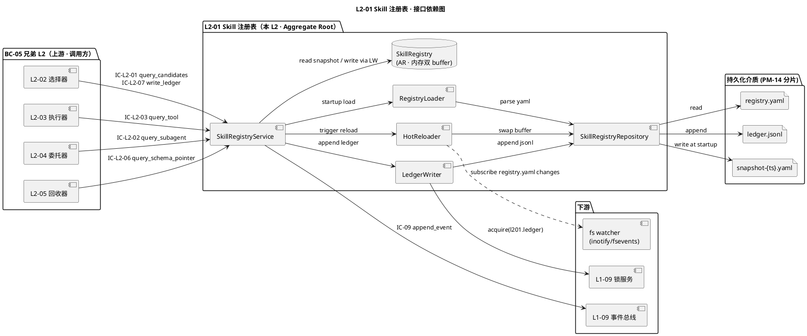
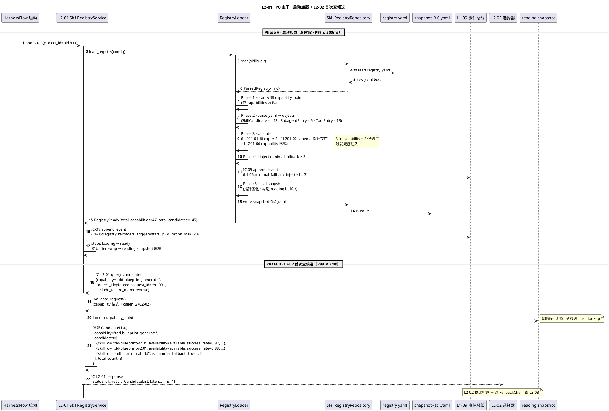
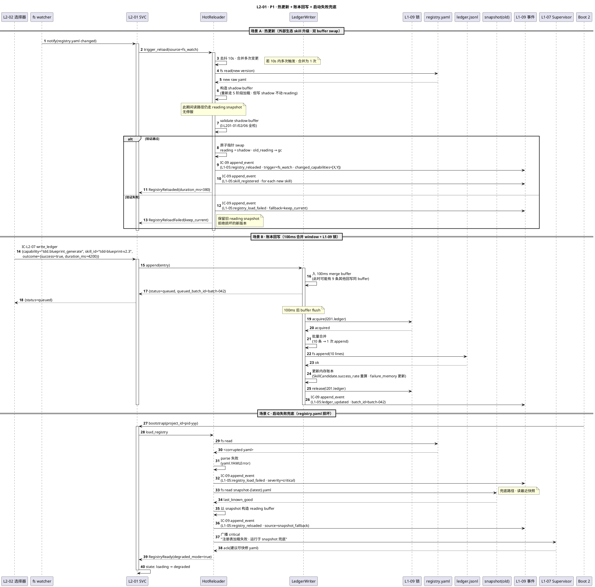
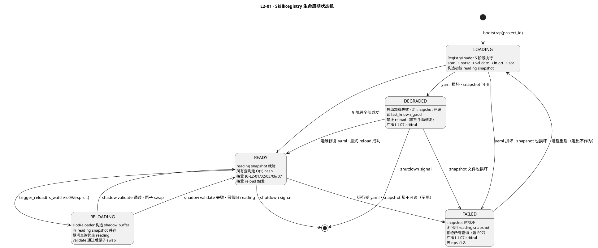
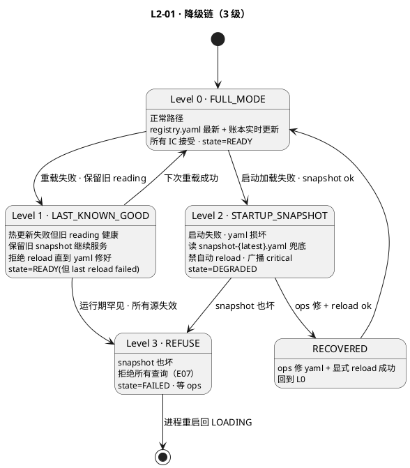

# L1-05 L2-01 · Skill 注册表 · Tech Design

> **本文档定位**：3-1-Solution-Technical 层级 · L1-05 的 L2-01 Skill 注册表 技术实现方案（L2 粒度 · depth-B）。
> **与产品 PRD 的分工**：`2-prd/L1-05/prd.md §8` 定义产品边界，本文档定义**技术实现**（接口字段级 schema + 算法伪代码 + 底层数据结构 + 状态机 + 配置参数 + 降级链）。
> **与 L1 architecture.md 的分工**：architecture.md §9.1 负责 BC-05 内跨 L2 架构骨架 + SkillRegistry Aggregate 语义，本文档负责**本 L2 内部技术细节**（字段级 schema · 热更新算法 · 落盘路径 · 状态机 · 错误降级）。冲突以 architecture.md 为准。
> **严格规则**：不复述产品 PRD 文字（职责 / 禁止 / 必须等清单），只做技术映射 + 补齐"产品视角未说 but 工程师必须知道"的部分。

---

## §0 撰写进度

- [x] §1 定位 + 2-prd §8 L2-01 映射
- [x] §2 DDD 映射（引 L0/ddd-context-map.md BC-05 · SkillRegistry Aggregate Root）
- [x] §3 对外接口定义（字段级 YAML schema + 错误码）
- [x] §4 接口依赖（被谁调 · 调谁）
- [x] §5 P0/P1 时序图（PlantUML ≥ 2 张）
- [x] §6 内部核心算法（Registry 加载 + 查询 + 热更新 + 账本回写）
- [x] §7 底层数据表 / schema 设计（PM-14 分片）
- [x] §8 状态机（Registry 生命周期：loading / ready / reloading / failed）
- [x] §9 开源最佳实践调研（≥ 3 高星项目 Adopt / Learn / Reject）
- [x] §10 配置参数清单（≥ 8 条）
- [x] §11 错误处理 + 降级策略（≥ 12 错误码 + 3-4 级降级）
- [x] §12 性能目标
- [x] §13 ADR + OQ + TDD 锚点（≥ 15 TC ID + 2-3 ADR + 2-3 OQ）

---

## §1 定位 + 2-prd 映射

### 1.1 本 L2 在 L1-05 里的坐标

L1-05 由 5 个 L2 组成（注册表 / 选择器 / 执行器 / 委托器 / 回收器）。**L2-01 是 BC-05 的数据底座 / Aggregate Root**，与其余 4 个"执行型 L2"形态不同：

```
        ┌───────────────────────────────────────────┐
        │  L1-01 / L1-02 / L1-04 / L1-08（调用方）  │
        └──────────────────┬────────────────────────┘
                           │ IC-04 / IC-05 / IC-12 / IC-20
                           ↓
        ┌───────────────────────────────────────────┐
        │  L2-02 选择器  L2-03 执行器  L2-04 委托器 │
        │  L2-05 回收器                             │
        └──────────────────┬────────────────────────┘
                           │ IC-L2-01/02/06/07（查 / 回写）
                           ↓
        ┌───────────────────────────────────────────┐
        │  L2-01 Skill 注册表（本 L2 · Aggregate）  │ ← 单一候选池来源
        │  · capability_point → candidates[]        │
        │  · 5 维账本（可用性/版本/成本/成功率/失败）│
        │  · 子 Agent 元数据 + 原子工具柜           │
        │  · schema 指针集合                        │
        └──────────────────┬────────────────────────┘
                           │ IC-09 事件发布（变更 / 重载 / 告警）
                           ↓
        ┌───────────────────────────────────────────┐
        │  L1-09 事件总线（审计链）                 │
        └───────────────────────────────────────────┘
```

**L2-01 的技术定位一句话** = `SkillRegistry Aggregate Root · 启动时从 yaml 加载 + 运行时热更新 · 对 4 兄弟 L2 提供毫秒级查询 + 账本受控回写 · 生态变更走 IC-09 审计 · 读写分离保重载期间不停服`。

### 1.2 与 2-prd §8 L2-01 的对应表

| 2-prd §8 小节 | 本文档对应位置 | 技术映射重点 |
|:---|:---|:---|
| §8.1 职责 / 锚定（图书馆管理员） | §1.3 + §2.1 + §2.2 | SkillRegistry Application Service + Aggregate Root |
| §8.2 输入 / 输出（文字级） | §3.2-§3.8 字段级 YAML schema | IC-L2-01/02/06/07 四接收 + IC-09 一发起 |
| §8.3 边界（In / Out / 边界规则） | §1.4 + §1.7 YAGNI | Out-of-scope 落不可触达（L2-02 排序 L2-03 调用）|
| §8.4 约束（PM-09 + PM-10 + 6 硬约束 + 性能） | §6 算法 + §10 配置 + §12 SLO | 6 硬约束分散落 §6/§10/§11 |
| §8.5 🚫 禁止行为（7 条） | §3.5 错误码 + §6.3 + §11.3 | 禁硬编码 / 禁越界排序 / 禁单候选 |
| §8.6 ✅ 必须义务（7 条） | §6 + §7 + §11 分散 | 必 ≥2 候选 / 必账本原子 / 必事件审计 |
| §8.7 可选功能（可视化 / 探测 / 锁版本 / 订阅） | §1.7 P1 特性 | V1 默认关闭 / P1 开关 |
| §8.8 与其他 L2/L1 交互（IC 表） | §3.1 + §4 依赖图 | 6 IC 触点独立 schema |
| §8.9 G-W-T（P1-P5 正 + N1-N5 负 + I1-I3 集成） | §5 时序 + §13 TC 映射 | 13 场景全部映射 TC ID |

### 1.3 本 L2 在 architecture.md 里的坐标

引 `L1-05/architecture.md §2.2 表 + §9.1`：

- BC-05 内**唯一 Aggregate Root 持久化资产**（其余 4 L2 都是 Application Service + 短寿命 Aggregate）。
- Aggregate Root: **SkillRegistry**（capability_point → candidates[] 主映射 + 4 维账本 + failure_memory）。
- Entity: **SkillCandidate** / **SubagentEntry** / **ToolEntry**。
- VO: **CapabilityPoint** / **AvailabilityRecord** / **SuccessRateRecord** / **FailureMemory** / **SchemaPointer**。
- Repository: **SkillRegistryRepository**（`skills/registry.yaml` + `skills/ledger.jsonl`）。
- 节奏：**低频写 · 高频读**（读 ≥ 1000× 写）。

### 1.4 本 L2 的 PM-14 约束

**PM-14 约束**（引 `projectModel/tech-design.md`）：所有 IC payload 顶层 `project_id` 必填；所有落盘路径按 `projects/<project_id>/...` 分片。

本 L2 的 PM-14 落点（**特殊性**：注册表主映射是**跨 project 共享**的技术资产 · 账本按 project 分视图）：

| 数据类 | 路径 | 跨 project 共享？ | 说明 |
|:---|:---|:---|:---|
| 主映射 `registry.yaml` | `projects/<pid>/skills/registry-cache/registry.yaml` | **按 project cache + 全局 source**（架构 §2.5 + §9.1）| 每 project 本地缓存（允许覆盖）· 源头来自全局 skill 生态 |
| 账本 `ledger.jsonl` | `projects/<pid>/skills/registry-cache/ledger.jsonl` | **每 project 独立** | 成功率 / 失败记忆是 per-project 体验 |
| 启动快照 `snapshot.yaml` | `projects/<pid>/skills/registry-cache/snapshot-{ts}.yaml` | 每 project 独立 | 启动时一次性固化 · 重载期间兜底 |
| 生态变更事件 | 经 IC-09 → `projects/<pid>/events/L1-05.jsonl` | 每 project 独立（由 L1-09 管理） | append-only · 含 project_id |
| Debug trace | `projects/<pid>/skills/registry-cache/debug/<ts>.jsonl` | 每 project 独立 | verbose 模式可选 |

### 1.5 关键技术决策（Decision → Rationale → Alternatives → Trade-off）

| # | 决策 | 选择 | 备选 | 理由 | Trade-off |
|:---|:---|:---|:---|:---|:---|
| **D1** | Registry 存储介质 | yaml（主映射）+ jsonl（账本）本地文件 | SQLite / Postgres / 内嵌 KV | 1. yaml 人类可读可 review（skill 名频繁变动）· 2. jsonl append-only 天然审计友好 · 3. HarnessFlow 是 CC Skill · 禁外部数据库 · 4. 启动一次性加载可 100% 入内存（规模 ≤ 500 条） | 并发写需应用层加锁 · 无 SQL 查询能力（不需要 · 都是 hash 查） |
| **D2** | 读写模式 | **读写分离 + 双 buffer**（reading snapshot + writing shadow · 交换指针）| 全锁 · 单 buffer 每次 lock · 乐观并发 | 读路径是热路径（每次 L2-02 查候选）不能被写阻塞；双 buffer 让重载 / 账本回写与读查询完全解耦；切换是原子指针 swap | 内存占用 ×2（500 条 × ~2KB = 2MB · 可忽略）· 写合并延迟（可接受：账本非实时需要） |
| **D3** | 热更新触发源 | 3 源：文件 watcher（`registry.yaml` 变更）+ 订阅 IC-09（外部生态事件）+ 显式 API（`reload_registry()`）| 仅定时轮询 · 仅显式 API | 多源覆盖不同场景（人工编辑 / 外部生态事件 / 运维触发）· 定时轮询有延迟且消耗 CPU | 三路需做去抖（throttle 10s 合并）防抖动 |
| **D4** | 账本回写通道 | **仅 L2-02 可回写**（IC-L2-07）· 加全局锁（L1-09 提供）· 异步批处理（100ms window 合并） | 任何 L2 都可写 · 无锁 · 完全同步 | 单写者简化一致性；L1-09 锁保证串行；100ms 合并减少 IO（连续 10 次失败只写 1 次） | 100ms 窗口内最新写可能丢（可接受：账本是统计而非事实）· 调用方拿不到 ack（返 fire-and-forget） |
| **D5** | 未命中 capability 处理 | **抛 `E_SKILL_NO_CAPABILITY` 拒绝**（不做模糊匹配）| 模糊匹配 · 返回最近邻 · 返回全部 skill | 抽象层契约严格（PM-09）· 模糊匹配导致"意外调用"· 返 all 语义错 | 调用方必须精确 spelling（接受：IDE 可补全 · 运行时错立即暴露） |
| **D6** | 每 capability ≥ 2 候选兜底 | **注册表启动时校验**：< 2 即注入"内建 minimal 兜底 skill"· 启动日志 INFO | 拒绝启动 · 自动查全局补候选 · 默认跳过 | PM-09 硬义务；兜底 skill 功能最小但保证不黑屏；INFO 级不吵但留痕 | 内建兜底 skill 功能弱（接受：这就是 fallback）· 用户看不到自动注入（通过 debug log 可查） |
| **D7** | SchemaPointer 存什么 | **只存相对路径 + schema 版本**（不存 schema 内容本身）| 存完整 schema · 存 schema URL | schema 本体在 3-1 doc 里（single source of truth）· 存路径避免双版本漂移 | 注册表查 schema 需再 fs read（可接受：< 5ms）· 路径失效需告警（见 §11 E06） |
| **D8** | 子 Agent 注册必含 schema 指针 | **启动 assert · 缺即拒绝注册**（硬约束 PM-09 + PRD §8.5）| 允许缺 · 运行时补 · 默认指向兜底 schema | L2-05 回收器依赖 schema 做校验 · 缺则无法验证（默认兜底会导致所有子 Agent 走同一宽松 schema 失去价值） | 子 Agent 作者必须同步提供 schema doc（可接受：新增子 Agent 本身就是重决策） |
| **D9** | 失败记忆窗口 | **滑动窗口 N=30 次调用**（按时间老化 · 90 天硬过期） | 全量累计 · 固定 7 天窗 · ≥ 3 连续失败即标死 | 滑动窗口对真实成功率更敏感（skill 升级后历史包袱不再拖累）· 90 天过期防长期占空间 | N=30 在低频调用 skill 上统计意义弱（接受：L2-02 排序会兜底） |
| **D10** | 可用性探测 | **V1 被动更新**（L2-02 调用结束后回写）· P1 提供主动 probe 接口 | V1 就主动 probe · 永不 probe · 外部 health check | V1 避免引入新定时任务增加复杂度；被动更新足够覆盖多数场景 | 冷门 skill 可用性滞后（接受：命中时会触发更新） |

### 1.6 本 L2 读者预期

读完本 L2 的工程师应掌握：
- SkillRegistry Aggregate Root 的 6 IC 触点字段级 schema + ≥ 12 错误码
- 注册表加载 / 查询 / 热更新 / 账本回写 4 条主路径伪代码
- 4 张数据表：`registry.yaml`（主映射）· `ledger.jsonl`（账本）· `snapshot-{ts}.yaml`（启动快照）· `reload-trace.jsonl`（debug）
- 注册表状态机 5 状态（loading / ready / reloading / degraded / failed）
- 降级链 3 级（FULL → LAST_KNOWN_GOOD → STARTUP_SNAPSHOT）
- SLO（capability 查询 P99 ≤ 2ms · 重载 P99 ≤ 500ms · 账本回写 P99 ≤ 50ms）

### 1.7 本 L2 不在的范围（YAGNI · 技术视角）

- **不在**：候选排序 / 打分（属 L2-02 · `E_L201_SCOPE_VIOLATION`）
- **不在**：skill 本身执行（属 L2-03）
- **不在**：子 Agent 启动 / 心跳 / kill（属 L2-04）
- **不在**：回传 schema 字段细节（存 pointer 只 · schema 本体在 3-1 各 L2 doc）
- **不在**：跨 project skill 共享（与 Global KB 地位一致 · 本 L2 只管本 project 视角加载）
- **不在**：skill 实现（来自外部生态 · 本 L2 只做元数据 · ACL）
- **不在**：skill 版本 downgrade 回退（V1 只追最新 · P1 可选 pin 版本）
- **不在**：网络 skill marketplace 直连（V1 所有 skill 从本地 fs 解析 · 生态事件从 IC-09 接）

### 1.8 本 L2 术语表

| 术语 | 定义 | 关联 |
|:---|:---|:---|
| SkillRegistry | 本 L2 的 Aggregate Root · 主映射 + 账本的聚合 | §2.2 |
| CapabilityPoint | 能力点抽象层 tag（例 `tdd.blueprint_generate`）· VO 不可变 | §2.2 + §6.1 |
| SkillCandidate | 某 capability 下的一个候选 · Entity 含 5 维元数据 | §2.2 + §7.1 |
| SubagentEntry | 子 Agent 注册条目 · Entity 含工具白名单 / 超时 / schema 指针 | §2.2 + §7.2 |
| ToolEntry | 原子工具柜条目（Read/Write/Bash 等）· Entity | §7.3 |
| SchemaPointer | 回传 schema 的相对路径引用（VO · 不存内容） | §2.2 + §7.4 |
| AvailabilityRecord | 可用性记录（available / degraded / unavailable + 最后 probe） | §7.1 |
| SuccessRateRecord | 滑动窗口成功率（N=30 / 90 天老化） | §7.1 + §6.6 |
| FailureMemory | 失败记忆（累计 / 连续 / 最后失败时间 / 错误码分布） | §7.1 |
| HotReload | 热更新动作（yaml 文件变更 / IC-09 生态事件 / 显式 reload）| §6.4 |
| DoubleBuffer | 读写双 buffer · 读用 snapshot 写用 shadow · 原子 swap | §6.5 |
| LedgerAppend | 账本 append 操作 · 100ms 合并 window · append-only | §6.6 |
| MinimalFallback | 内建兜底 skill · 每 capability < 2 时自动注入 | §6.3 |
| RegistryLoadPhase | 启动加载 5 阶段（scan → parse → validate → inject → seal）| §6.1 |

### 1.9 本 L2 的 DDD 定位一句话

**L2-01 是 BC-05 Skill & Subagent Orchestration 的 SkillRegistry Aggregate Root Application Service · 以 yaml + jsonl 本地文件为 Repository 介质 · 以双 buffer 读写分离保热更新不停服 · 对 4 兄弟 L2 提供毫秒级查询 + 严格账本回写控制 · 禁越界做选择 / 排序 / 调用 · 生态变更全程 IC-09 事件化。**

---

## §2 DDD 映射（BC-05）

### 2.1 Bounded Context 定位

本 L2 属于 `L0/ddd-context-map.md §2.6 BC-05 Skill & Subagent Orchestration`：

- **BC 名**：`BC-05 · Skill & Subagent Orchestration`
- **L2 角色**：**Aggregate Root of BC-05**（承担"能力抽象层账本"领域能力）
- **与兄弟 L2**：
  - L2-02 选择器：Supplier（本 L2 供候选池 · L2-02 Customer）
  - L2-03 执行器：Supplier（本 L2 供原子工具元数据 · L2-03 Customer）
  - L2-04 委托器：Supplier（本 L2 供子 Agent 元数据 · L2-04 Customer）
  - L2-05 回收器：Supplier（本 L2 供 schema 指针 · L2-05 Customer）
- **与其他 BC**：
  - BC-01 / BC-02 / BC-04 / BC-08：**间接** Supplier（经 L2-02/03/04 转 · 不直接调）
  - BC-09 审计：Partnership（IC-09 事件发布）
  - BC-07 Supervisor：Publisher（重载 / 告警 / 违规广播）

### 2.2 聚合根 / 实体 / 值对象 / 领域服务

| DDD 概念 | 名字 | 职责 | 一致性边界 |
|:---|:---|:---|:---|
| **Aggregate Root** | `SkillRegistry` | 主映射 + 账本 + 子 Agent 表 + 工具柜的聚合 · 长寿命 | 整个 session 内唯一实例 · 所有修改必经 AR 方法 |
| **Entity** | `SkillCandidate` | 单个 skill 候选 · 含 5 维元数据 | 归属 SkillRegistry · 随主映射加载/卸载 |
| **Entity** | `SubagentEntry` | 子 Agent 注册条目 · 工具白名单 + 超时 + schema 指针 | 归属 SkillRegistry · 启动时一次加载 |
| **Entity** | `ToolEntry` | 原子工具柜条目 · 能力 + 约束 | 同上 |
| **Value Object** | `CapabilityPoint` | 能力点 tag（例 `tdd.blueprint_generate`）· 不可变 | 跨 project 标准化 |
| **Value Object** | `AvailabilityRecord` | `{status: available/degraded/unavailable, last_probe_ts, source: passive/active}` | 不可变 |
| **Value Object** | `SuccessRateRecord` | 滑动 30 次 · 90 天老化 · `{rate: 0.0-1.0, window_count, last_update}` | 不可变 |
| **Value Object** | `FailureMemory` | `{cumulative: int, consecutive: int, last_error_code, last_failure_ts, error_distribution: {code→count}}` | 不可变 |
| **Value Object** | `SchemaPointer` | `{path: "3-1/.../schema.yaml", version: "v1.0"}` | 不可变 |
| **Application Service** | `SkillRegistryService` | 编排加载 / 查询 / 热更新 / 账本回写 | 单实例 |
| **Domain Service** | `RegistryLoader` | 无状态 · 5 阶段加载（scan→parse→validate→inject→seal） | 单次加载 |
| **Domain Service** | `LedgerWriter` | 受控 append · L1-09 锁保护 · 100ms 合并 window | 单次 append |
| **Domain Service** | `HotReloader` | 3 源合并 · 10s 去抖 · 双 buffer swap | 单次重载 |
| **Repository** | `SkillRegistryRepository` | yaml + jsonl 持久化 · 启动全加载 + append-only | 整 session |

### 2.3 聚合根不变量（Invariants · L2-01 局部 · 架构 §2.2 I-S-01/02/03 细化）

| 不变量 | 描述 | 校验时机 |
|:---|:---|:---|
| **I-L201-01** | 每 `CapabilityPoint` 的 `SkillCandidate[]` 长度 **≥ 2**（< 2 时 RegistryLoader 自动注入 MinimalFallback） | 加载时 + 重载时 |
| **I-L201-02** | 每 `SubagentEntry` 的 `SchemaPointer` 必非空且路径必存在（fs check） | 加载时 · 缺则拒绝注册 |
| **I-L201-03** | `SuccessRateRecord.rate` ∈ [0.0, 1.0] · `window_count ≤ 30` | 回写时 |
| **I-L201-04** | 任何 AR 修改必经 `SkillRegistryService` 方法 · 禁直接修改内部 dict | 运行时 · 代码 review |
| **I-L201-05** | 账本回写必持 L1-09 锁（`lock_name: l201.ledger`）· 无锁尝试写 `E_L201_LEDGER_NO_LOCK` | 回写时 |
| **I-L201-06** | `capability_point` 名必符合 `{domain}.{action}` 格式（snake_case · 例 `tdd.blueprint_generate`） | 加载时 + 注册时 |
| **I-L201-07** | 双 buffer 交换必在单次原子指针 swap 内完成 · 读者永不见部分状态 | swap 时 |
| **I-L201-08** | 任何生态变更（新增 / 弃用 / 版本升级）必发 IC-09 事件（PM-10 单一事实源） | 变更时 |

### 2.4 Repository

本 L2 **持有 `SkillRegistryRepository`**（架构 §2.6）：

- 启动时一次性全加载（`scan → parse yaml → validate → inject minimal → seal snapshot`）。
- 运行时只读 snapshot（双 buffer 读路径）· 写路径经 LedgerWriter 直 append `ledger.jsonl`。
- 热更新走 HotReloader · 构造新 buffer · 验证通过后原子指针 swap。
- 关闭时无特别清理（所有状态都已落盘 · 进程结束即释放内存）。

### 2.5 Domain Events（本 L2 对外发布 · IC-09）

| 事件名 | 触发时机 | 订阅方 | Payload 字段要点 |
|:---|:---|:---|:---|
| `L1-05:skill_registered` | 新 skill / skill 升级加入候选 | L1-07 / L1-10 / L2-02 | `{capability_point, skill_id, version, source: external_subscribe/fs_watch/explicit, project_id}` |
| `L1-05:skill_deprecated` | skill 标记弃用 | 同上 | `{capability_point, skill_id, version, reason, project_id}` |
| `L1-05:registry_reloaded` | 注册表完成一次热更新 | L1-07 / L1-10 | `{reload_trigger, changed_capabilities[], duration_ms, total_candidates, project_id}` |
| `L1-05:ledger_updated` | 账本批量 append 完成 | L1-07 | `{capability_point, skill_id, delta: {success_count, failure_count}, new_rate, project_id}` |
| `L1-05:candidate_below_minimum` | 某 capability < 2 候选（兜底前）· INFO | 运维 | `{capability_point, current_count, project_id}` |
| `L1-05:minimal_fallback_injected` | 自动注入内建兜底 skill 完成 | 运维 | `{capability_point, injected_skill_id, project_id}` |
| `L1-05:availability_changed` | skill 可用性状态变化（available → degraded/unavailable） | L2-02 / L1-07 | `{capability_point, skill_id, from, to, source, project_id}` |
| `L1-05:registry_load_failed` | 启动加载失败 · 走 snapshot 兜底 | L1-07（critical）| `{failed_path, reason, fallback: snapshot_path, project_id}` |

### 2.6 与 BC-05 其他 L2 的 DDD 耦合

| 耦合 L2 | DDD 关系 | 触点 |
|:---|:---|:---|
| L2-02 选择器 | **Supplier-Customer**（本 L2 Supplier）| IC-L2-01 查候选 + IC-L2-07 回写账本 |
| L2-03 执行器 | **Supplier-Customer** | IC-L2-03（查原子工具元数据） |
| L2-04 委托器 | **Supplier-Customer** | IC-L2-02（查子 Agent 元数据） |
| L2-05 回收器 | **Supplier-Customer** | IC-L2-06（查 schema 指针） |
| L2-03 执行器（反向）| **无** · 禁绕本 L2 硬编码 skill 名 | 代码审查 gate |

---

## §3 对外接口定义（字段级 YAML schema + 错误码）

### 3.1 接口清单总览（6 IC 触点 · 5 接收 + 1 发起）

| # | IC 方向 | 名字 | 简述 | 上/下游 |
|:--:|:---|:---|:---|:---|
| 1 | 接收 | `IC-L2-01 query_candidates(capability)` | L2-02 查候选列表 + 元数据 | L2-02 → L2-01 |
| 2 | 接收 | `IC-L2-02 query_subagent(name)` | L2-04 查子 Agent 元数据 | L2-04 → L2-01 |
| 3 | 接收 | `IC-L2-03 query_tool(tool_name)` | L2-03 查原子工具元数据 | L2-03 → L2-01 |
| 4 | 接收 | `IC-L2-06 query_schema_pointer(capability)` | L2-05 查回传 schema 指针 | L2-05 → L2-01 |
| 5 | 接收 | `IC-L2-07 write_ledger(skill_id, outcome)` | L2-02 回写账本 | L2-02 → L2-01 |
| 6 | 发起 | `IC-09 append_event(L1-05:*)` | 事件审计（8 种事件）| L2-01 → L1-09 |
| — | 内部 | `reload_registry()` | 显式热更新 API（运维触发）| 内部 |

引 `integration/ic-contracts.md §3.4 IC-04` 的 caller_l1 / capability / params 字段约定 · 本 L2 不直接接 IC-04（IC-04 由 L2-03 接）· 但 IC-04 的 `capability` 字段在本 L2 内是主键。

### 3.2 接收：IC-L2-01 query_candidates(capability) · 字段级 YAML schema

```yaml
# ic_l2_01_query_candidates_request.yaml
type: object
required: [project_id, request_id, capability, caller_l2]
properties:
  project_id: { type: string, description: "PM-14 项目上下文" }
  request_id: { type: string, description: "L2-02 生成 · 用于审计追溯" }
  capability: 
    type: string
    description: "能力点 tag · {domain}.{action} snake_case · 例 tdd.blueprint_generate"
    pattern: "^[a-z][a-z0-9_]*\\.[a-z][a-z0-9_]*$"
  caller_l2: { type: string, enum: [L2-02] }
  include_failure_memory:
    type: boolean
    default: true
    description: "是否随候选返回 failure_memory 字段（L2-02 排序需要）"
  require_availability:
    type: string
    enum: [available, any]
    default: any
    description: "过滤可用性 · available=仅 available · any=全返"
```

```yaml
# ic_l2_01_query_candidates_response.yaml
type: object
required: [project_id, request_id, status, result]
properties:
  project_id: { type: string }
  request_id: { type: string }
  status: { type: string, enum: [ok, err] }
  result:
    oneOf:
      - $ref: "#/definitions/CandidateList"
      - $ref: "#/definitions/StructuredErr"
  latency_ms: { type: integer }

definitions:
  CandidateList:
    type: object
    required: [capability, candidates, total_count]
    properties:
      capability: { type: string }
      candidates:
        type: array
        minItems: 2   # I-L201-01 ≥ 2 候选
        items: { $ref: "#/definitions/SkillCandidate" }
      total_count: { type: integer }
      minimal_fallback_injected: { type: boolean, description: "若 < 2 已注入兜底则 true" }

  SkillCandidate:
    type: object
    required: [skill_id, version, availability, success_rate, failure_memory, cost_estimate]
    additionalProperties: false   # 白名单硬约束
    properties:
      skill_id: { type: string, description: "例 superpowers:writing-plans / built-in:minimal-plan" }
      version: { type: string, description: "semver 或 commit sha7" }
      availability:
        type: object
        properties:
          status: { type: string, enum: [available, degraded, unavailable] }
          last_probe_ts: { type: integer, description: "Unix ns" }
          source: { type: string, enum: [passive, active] }
      success_rate:
        type: object
        properties:
          rate: { type: number, minimum: 0.0, maximum: 1.0 }
          window_count: { type: integer, maximum: 30 }
          last_update: { type: integer }
      failure_memory:
        type: object
        properties:
          cumulative: { type: integer, minimum: 0 }
          consecutive: { type: integer, minimum: 0 }
          last_error_code: { type: string, nullable: true }
          last_failure_ts: { type: integer, nullable: true }
          error_distribution:
            type: object
            additionalProperties: { type: integer }
      cost_estimate:
        type: object
        properties:
          tier: { type: string, enum: [cheap, medium, expensive] }
          token_budget: { type: integer, nullable: true }
          wall_clock_ms_p95: { type: integer, nullable: true }
      last_used_at: { type: integer, nullable: true }
      is_minimal_fallback: { type: boolean, default: false }
```

### 3.3 接收：IC-L2-02 query_subagent(name) · 字段级 YAML schema

```yaml
# ic_l2_02_query_subagent_request.yaml
type: object
required: [project_id, request_id, subagent_name, caller_l2]
properties:
  project_id: { type: string }
  request_id: { type: string }
  subagent_name: 
    type: string
    enum: [verifier, onboarding, retro, failure_archive, researcher]
    description: "V1 穷举 5 类 · 新增需走 scope 变更流程"
  caller_l2: { type: string, enum: [L2-04] }

# ic_l2_02_query_subagent_response.yaml
type: object
required: [project_id, status, result]
properties:
  project_id: { type: string }
  status: { type: string, enum: [ok, err] }
  result:
    $ref: "#/definitions/SubagentEntry"

definitions:
  SubagentEntry:
    type: object
    required: [name, purpose, default_tool_whitelist, default_timeout_s, return_schema_pointer, degradation_pointer]
    additionalProperties: false
    properties:
      name: { type: string }
      purpose: { type: string, description: "一句话职责 · 给日志 / UI 读" }
      default_tool_whitelist:
        type: array
        items: { type: string, enum: [Read, Write, Edit, Bash, Grep, Glob, WebSearch, WebFetch, MCP_playwright, MCP_github] }
        description: "I-L201-02 必非空"
      default_timeout_s: { type: integer, minimum: 60, maximum: 7200 }
      return_schema_pointer:
        type: object
        required: [path, version]
        properties:
          path: { type: string, description: "相对 docs/3-1/... 路径 · 启动时 fs 校验存在" }
          version: { type: string }
      degradation_pointer:
        type: string
        description: "BF-E-09 降级策略文档锚点 · 例 architecture.md#6.9"
      frontmatter_template:
        type: object
        description: "Claude Agent SDK frontmatter 模板（name/description/tools/model）"
        properties:
          name: { type: string }
          description: { type: string }
          tools: { type: array }
          model: { type: string, nullable: true }
```

### 3.4 接收：IC-L2-03 query_tool(tool_name) + IC-L2-06 query_schema_pointer(capability)

```yaml
# ic_l2_03_query_tool_request.yaml
type: object
required: [project_id, request_id, tool_name, caller_l2]
properties:
  project_id: { type: string }
  request_id: { type: string }
  tool_name: 
    type: string
    enum: [Read, Write, Edit, Bash, Grep, Glob, WebSearch, WebFetch, Task, NotebookEdit, MCP_playwright, MCP_github, MCP_context7]
  caller_l2: { type: string, enum: [L2-03] }

# ic_l2_03_query_tool_response · ToolEntry
ToolEntry:
  type: object
  required: [tool_name, capability_desc, constraints, return_schema]
  properties:
    tool_name: { type: string }
    capability_desc: { type: string, maxLength: 200 }
    constraints:
      type: object
      properties:
        max_file_size_mb: { type: integer, nullable: true }
        timeout_s: { type: integer, nullable: true }
        network_access: { type: boolean }
        fs_write_scope: { type: string, enum: [project_only, global, none] }
    return_schema:
      type: object
      description: "预期返回结构 · 简化定义"

# ic_l2_06_query_schema_pointer_request.yaml
type: object
required: [project_id, request_id, capability, caller_l2]
properties:
  project_id: { type: string }
  request_id: { type: string }
  capability: { type: string, description: "能力点 tag" }
  caller_l2: { type: string, enum: [L2-05] }

# ic_l2_06_query_schema_pointer_response · SchemaPointer
SchemaPointer:
  type: object
  required: [path, version]
  properties:
    path: { type: string, description: "相对 docs/3-1/... 路径" }
    version: { type: string, description: "semver" }
    last_validated_at: { type: integer, description: "最近一次 fs 校验时间" }
```

### 3.5 接收：IC-L2-07 write_ledger(skill_id, outcome) · 账本回写

```yaml
# ic_l2_07_write_ledger_request.yaml
type: object
required: [project_id, request_id, capability, skill_id, outcome, caller_l2]
properties:
  project_id: { type: string }
  request_id: { type: string }
  capability: { type: string }
  skill_id: { type: string }
  version: { type: string, description: "调用时 skill 版本 · 用于防错版混账" }
  outcome:
    type: object
    required: [success, duration_ms]
    properties:
      success: { type: boolean }
      duration_ms: { type: integer }
      error_code: { type: string, nullable: true, description: "success=false 时必填" }
      attempt_no: { type: integer, default: 1, description: "fallback 链第几次尝试" }
      invocation_id: { type: string, description: "对应 IC-04 的 inv-uuid" }
  caller_l2: { type: string, enum: [L2-02] }
  ts_ns: { type: integer, description: "调用结束 Unix ns" }

# 响应（fire-and-forget 可选 ack）
ic_l2_07_write_ledger_response:
  type: object
  properties:
    status: { type: string, enum: [queued, err] }
    queued_batch_id: { type: string, description: "100ms merge window 批 id" }
    err: { $ref: "#/definitions/StructuredErr", nullable: true }
```

### 3.6 错误码表（12 条）

| # | err_type | 含义 | 触发场景 | HTTP 语义 | 调用方处理 |
|:--:|:---|:---|:---|:---:|:---|
| E01 | `SKILL_NOT_FOUND` | capability 下某 skill_id 不存在 | 账本回写时 skill 被弃用 | 404 | 跳过本次回写 · 下次重查候选 |
| E02 | `CAPABILITY_NOT_REGISTERED` | capability 未注册 | 调用方拼错 · 新 capability 未发 | 404 | 确认 spelling · 或向 scope 申请新 capability |
| E03 | `SUBAGENT_NOT_FOUND` | 子 Agent 名不在穷举 5 类 | 新类型未注册 | 404 | 走 scope 变更流程 |
| E04 | `TOOL_NOT_FOUND` | 原子工具名不在清单 | MCP 插件未装 · 工具名错 | 404 | 检查工具柜 + MCP 配置 |
| E05 | `CANDIDATE_BELOW_MINIMUM` | 某 capability 候选 < 2 且兜底注入失败 | 内建兜底 skill 损坏 | 500 | critical · ops 修复 |
| E06 | `SCHEMA_POINTER_INVALID` | SchemaPointer 路径不存在 | 文档移动 · 路径改名 | 500 | 同步修文档 / 修注册表 yaml |
| E07 | `REGISTRY_LOAD_FAILED` | 启动时加载失败 | yaml 损坏 · 权限 | 503 | 走 snapshot 兜底 · 告警运维 |
| E08 | `RELOAD_IN_PROGRESS` | 重载中且显式 reload 重复触发 | 10s 内第 2 次 reload | 409 | 等待或读 last_known_good |
| E09 | `LEDGER_NO_LOCK` | 账本回写未持 L1-09 锁 | 代码 bug | 500 | critical · ops 修代码 |
| E10 | `LEDGER_SCHEMA_MISMATCH` | write_ledger 字段缺失 / 类型错 | 调用方 bug | 400 | 上游补 schema |
| E11 | `SCOPE_VIOLATION` | 调用方尝试绕本 L2 做选择 / 排序 | 代码审查 · 集成测试 | 403 | fail-fast · 架构违规 |
| E12 | `UNAUTHORIZED_WRITE` | 非 L2-02 尝试 IC-L2-07 | caller_l2 ≠ L2-02 | 403 | 上游回归 L2-02 流程 |

**错误码结构化返回模板**（与 `ic-contracts.md §3.4.4 E_SKILL_*` 风格一致）：

```yaml
status: err
result:
  err_type: CAPABILITY_NOT_REGISTERED
  reason: "能力点 'tdd.blueprint_generatex' 不在注册表 · 最相近: tdd.blueprint_generate"
  suggested_action: "核对 capability spelling · 或向 scope 申请新能力点"
  context:
    query_capability: "tdd.blueprint_generatex"
    registered_count: 47
    closest_match: "tdd.blueprint_generate"
latency_ms: 1
```

### 3.7 发起：IC-09 append_event（经 L1-09 事件总线）

```yaml
# ic_09_append_event_registry.yaml
type: object
required: [event_type, project_id, ts_ns, emitted_by]
properties:
  event_type:
    type: string
    enum:
      - L1-05:skill_registered
      - L1-05:skill_deprecated
      - L1-05:registry_reloaded
      - L1-05:ledger_updated
      - L1-05:candidate_below_minimum
      - L1-05:minimal_fallback_injected
      - L1-05:availability_changed
      - L1-05:registry_load_failed
  event_version: "v1.0"
  project_id: { type: string }
  capability_point: { type: string, nullable: true }
  skill_id: { type: string, nullable: true }
  payload:
    type: object
    description: "按事件类型不同 · 详见 §2.5 表"
  ts_ns: { type: integer }
  emitted_by: { type: string, const: "L2-01" }
  # L1-09 会附加
  # seq_id, hash_chain, prev_hash
```

---

## §4 接口依赖（被谁调 · 调谁）

### 4.1 上游调用方

| 调用方 | 通过何种 IC | 触发场景 | 频率预估 |
|:---|:---|:---|:---:|
| L2-02 Skill 意图选择器 | IC-L2-01 query_candidates | 每次 IC-04 前查候选 | **极高频**（每 tick N 次 · 每日 ≥ 10k）|
| L2-02（反向）| IC-L2-07 write_ledger | 每次 skill 调用结束 | **中高频**（每日 ≥ 5k · 100ms 合并后 ≤ 500/s）|
| L2-03 Skill 调用执行器 | IC-L2-03 query_tool | 每次工具调用前 | 高频（每次 IC-04 内可能多次）|
| L2-04 子 Agent 委托器 | IC-L2-02 query_subagent | 每次子 Agent 委托前 | 中频（按需）|
| L2-05 异步结果回收器 | IC-L2-06 query_schema_pointer | 每次回传校验前 | 中频 |
| 运维（显式 API） | `reload_registry()` | 人工运维触发 | 极低频（< 10/day） |
| OS fs watcher | 内部 HotReloader | registry.yaml 变更 | 低频（外部生态更新时）|
| L1-09 IC-09 订阅 | 内部 HotReloader | 外部生态事件 | 中频（跟随生态版本）|

### 4.2 下游依赖

| 目标 | IC / 调用方式 | 意义 | 是否必选 |
|:---|:---|:---|:---:|
| L1-09 事件总线 | IC-09 append_event | 8 类事件审计 | 必选（PM-10 单一事实源）|
| L1-09 锁服务 | `acquire_lock(l201.ledger)` | 账本回写串行化（I-L201-05）| 必选 |
| 本地 fs | yaml read / jsonl append | 主映射 + 账本介质 | 必选 |
| fs watcher（inotify/fsevents）| 文件监听 | 热更新触发源 | 可选（P1）|

### 4.3 依赖图（PlantUML）



### 4.4 不依赖清单（明确不调）

| 不调 | 理由 |
|:---|:---|
| L1-06 3 层 KB（IC-06/07）| 注册表不是 KB（PRD §8.5 禁 Global KB 条目进注册表）|
| 外部 HTTP / 网络 skill marketplace | V1 禁 · 所有 skill 来自本地 fs |
| L2-02/03/04/05 内部 | 本 L2 是 Supplier · 禁反向依赖 |
| 数据库（Postgres/SQLite）| D1 决策 · yaml + jsonl 足够 |
| L1-01 主 loop | 本 L2 不主动触发决策 · 只响应查询 |
| subprocess / shell | 本 L2 纯内存 + fs · 不跑子进程 |

---

## §5 P0/P1 时序图（PlantUML ≥ 2 张）

### 5.1 P0 主干 · 启动加载 + L2-02 首次查候选

**场景一句话**：HarnessFlow skill 启动 → SkillRegistryService 触发 RegistryLoader 5 阶段加载 → 落盘 snapshot → ready → L2-02 发起首次 IC-L2-01 query_candidates("tdd.blueprint_generate") → 命中 snapshot 返候选列表（3 候选 · 每候选 5 维元数据）。

**端到端延迟预期**：启动加载 P99 ≤ 500ms · query P99 ≤ 2ms。



**关键时序点**：
- **Step 6-11**：加载 5 阶段线性 · 每阶段独立可测
- **Step 14-15**：不满足 ≥ 2 候选时自动注入兜底（D6 决策）· 不抛错 · 只记 INFO 事件
- **Step 19-20**：snapshot 落盘 + IC-09 事件是**启动审计证据**
- **Step 25**：读路径无锁（D2 双 buffer）· 查询 O(1) hash
- **Step 27**：候选列表按注册顺序返（不做排序 · 排序由 L2-02 负责 · I-L201 边界）

### 5.2 P1 异常/降级 · 热更新 + 账本回写 + 启动失败

**场景一句话**：3 类运行时场景（热更新 / 账本回写 / 启动失败兜底）· 每类走独立路径但共享 IC-09 审计。



**关键时序点**：
- **场景 A Step 4-10**：10s 去抖防抖动 · 双 buffer 保不停服（D2 决策）· 验证失败保留旧版本（安全优先）
- **场景 B Step 14-17**：100ms 合并 window 减少 IO（D4 决策）· L1-09 锁保串行化（I-L201-05）· fire-and-forget 返 `queued` 不等 ack
- **场景 C Step 28-35**：启动失败走 snapshot 兜底（降级 L2）· critical 广播 L1-07 · 进 `degraded` 状态但不停服

---

## §6 内部核心算法（Python-like 伪代码）

本节给出本 L2 的 **6 个关键算法**：主入口 / RegistryLoader 5 阶段 / 双 buffer swap / HotReloader 去抖 / LedgerWriter 100ms 合并 / MinimalFallback 注入。

### 6.1 主入口 · SkillRegistryService 查询路径

```python
class SkillRegistryService:
    def __init__(self, config):
        self.config = config
        self._reading = None       # 读 buffer · 原子指针
        self._shadow = None        # 写 buffer · 重载时构造
        self.state = 'loading'
        self.loader = RegistryLoader(config)
        self.ledger_writer = LedgerWriter(config, event_bus, lock_service)
        self.hot_reloader = HotReloader(config, self, event_bus)

    def query_candidates(self, req: QueryCandidatesRequest) -> QueryCandidatesResponse:
        """热路径 · 无锁 · O(1) hash lookup · P99 ≤ 2ms"""
        self._validate_request(req, caller_whitelist=['L2-02'])
        snapshot = self._reading   # 单次读 · 指针值 atomic
        cap = snapshot.capabilities.get(req.capability)
        if cap is None:
            return self._err(req, 'CAPABILITY_NOT_REGISTERED',
                             closest=self._fuzzy_closest(req.capability))
        candidates = cap.candidates
        if req.require_availability == 'available':
            candidates = [c for c in candidates if c.availability.status == 'available']
        return self._ok(req, CandidateList(
            capability=req.capability,
            candidates=candidates,
            total_count=len(candidates),
            minimal_fallback_injected=any(c.is_minimal_fallback for c in candidates),
        ))

    def query_subagent(self, req: QuerySubagentRequest) -> QuerySubagentResponse:
        self._validate_request(req, caller_whitelist=['L2-04'])
        entry = self._reading.subagents.get(req.subagent_name)
        if entry is None:
            return self._err(req, 'SUBAGENT_NOT_FOUND')
        return self._ok(req, entry)

    def query_tool(self, req): ...  # 同构 · query ToolEntry
    def query_schema_pointer(self, req): ...  # 同构 · 从 snapshot.schema_pointers

    def write_ledger(self, req: WriteLedgerRequest) -> WriteLedgerResponse:
        """仅 L2-02 可调 · 入 100ms merge buffer · fire-and-forget"""
        self._validate_request(req, caller_whitelist=['L2-02'])
        if req.caller_l2 != 'L2-02':
            return self._err(req, 'UNAUTHORIZED_WRITE')
        batch_id = self.ledger_writer.enqueue(req)
        return WriteLedgerResponse(status='queued', queued_batch_id=batch_id)

    def reload_registry(self, trigger='explicit'):
        """显式热更新 · 走 HotReloader"""
        return self.hot_reloader.trigger(source=trigger)
```

### 6.2 RegistryLoader · 启动 5 阶段加载

```python
class RegistryLoader:
    def load_registry(self) -> RegistrySnapshot:
        """P99 ≤ 500ms · 同步执行 · 失败走 snapshot 兜底"""
        t0 = monotonic_ns()
        # Phase 1 · scan
        raw_text = self.repo.read_registry_yaml()   # 抛 FileNotFoundError 走 snapshot
        parsed = yaml.safe_load(raw_text)

        # Phase 2 · parse → domain objects
        caps = {}
        for cap_name, cand_list in (parsed.get('capabilities') or {}).items():
            if not re.match(r'^[a-z][a-z0-9_]*\.[a-z][a-z0-9_]*$', cap_name):
                raise L201Error('CAPABILITY_NAME_INVALID', cap_name)  # I-L201-06
            candidates = [self._parse_candidate(c) for c in cand_list]
            caps[cap_name] = CapabilityEntry(name=cap_name, candidates=candidates)

        subs = {name: self._parse_subagent(e)
                for name, e in (parsed.get('subagents') or {}).items()}
        tools = {n: self._parse_tool(e)
                 for n, e in (parsed.get('tools') or {}).items()}

        # Phase 3 · validate invariants
        for cap_name, cap in caps.items():
            self._validate_candidate_list(cap)     # I-L201-01 ≥ 2 (< 2 则后续注入)
        for name, sub in subs.items():
            self._validate_subagent(sub)           # I-L201-02 schema pointer 存在

        # Phase 4 · inject minimal fallback
        injected = []
        for cap_name, cap in caps.items():
            if len(cap.candidates) < 2:
                fallback = self._build_minimal_fallback(cap_name)
                cap.candidates.append(fallback)
                injected.append((cap_name, fallback.skill_id))
                self.event_bus.append(L201Event(
                    event_type='L1-05:minimal_fallback_injected',
                    project_id=self.config.project_id,
                    capability_point=cap_name,
                    payload={'injected_skill_id': fallback.skill_id},
                ))

        # Phase 5 · seal snapshot
        snapshot = RegistrySnapshot(
            capabilities=caps, subagents=subs, tools=tools,
            schema_pointers=self._build_schema_pointer_index(caps, subs),
            loaded_at=time.time_ns(),
            project_id=self.config.project_id,
        )
        self.repo.write_snapshot(snapshot, suffix=time.strftime('%Y%m%d-%H%M%S'))
        self.event_bus.append(L201Event(
            event_type='L1-05:registry_reloaded',
            project_id=self.config.project_id,
            payload={'trigger': 'startup',
                     'duration_ms': (monotonic_ns() - t0) // 1_000_000,
                     'total_candidates': sum(len(c.candidates) for c in caps.values()),
                     'injected_count': len(injected)},
        ))
        return snapshot
```

### 6.3 MinimalFallback · 内建兜底构造（D6）

```python
def _build_minimal_fallback(self, cap_name: str) -> SkillCandidate:
    """每 capability < 2 时自动注入 · 功能最小但保证不黑屏"""
    return SkillCandidate(
        skill_id=f'built-in:minimal-{cap_name.replace(".", "-")}',
        version='0.1.0',
        availability=AvailabilityRecord(status='available', last_probe_ts=time.time_ns(),
                                        source='passive'),
        success_rate=SuccessRateRecord(rate=0.5, window_count=0, last_update=time.time_ns()),
        failure_memory=FailureMemory(cumulative=0, consecutive=0, last_error_code=None,
                                     last_failure_ts=None, error_distribution={}),
        cost_estimate=CostEstimate(tier='cheap', token_budget=500, wall_clock_ms_p95=2000),
        last_used_at=None,
        is_minimal_fallback=True,
    )
```

### 6.4 HotReloader · 3 源合并 + 10s 去抖 + 双 buffer swap

```python
class HotReloader:
    DEBOUNCE_MS = 10000

    def __init__(self, config, service, event_bus):
        self.config = config
        self.service = service
        self.event_bus = event_bus
        self._pending_trigger = None
        self._lock = threading.Lock()
        self._reload_in_progress = False

    def trigger(self, source: str):
        """3 源合并: fs_watch / ic09_event / explicit"""
        with self._lock:
            if self._reload_in_progress:
                return ReloadResult(status='err', err_type='RELOAD_IN_PROGRESS')
            self._pending_trigger = source
        # 去抖 · 10s 内多次触发合并
        return self._debounced_reload()

    def _debounced_reload(self):
        time.sleep(self.DEBOUNCE_MS / 1000)
        with self._lock:
            if self._pending_trigger is None:
                return   # 已被合并
            trigger = self._pending_trigger
            self._pending_trigger = None
            self._reload_in_progress = True
        try:
            return self._do_reload(trigger)
        finally:
            with self._lock:
                self._reload_in_progress = False

    def _do_reload(self, trigger: str):
        t0 = monotonic_ns()
        # 构造 shadow buffer · 不动 reading
        try:
            shadow = self.service.loader.load_registry()
        except Exception as e:
            self.event_bus.append(L201Event(
                event_type='L1-05:registry_load_failed',
                project_id=self.config.project_id,
                payload={'reason': str(e), 'fallback': 'keep_current'},
            ))
            return ReloadResult(status='err', err_type='REGISTRY_LOAD_FAILED')

        # 算差分（给事件 payload）
        changed = self._diff(self.service._reading, shadow)
        # 原子 swap（I-L201-07）
        self.service._reading = shadow
        # 旧 buffer 由 gc 回收

        self.event_bus.append(L201Event(
            event_type='L1-05:registry_reloaded',
            project_id=self.config.project_id,
            payload={'reload_trigger': trigger,
                     'changed_capabilities': changed,
                     'duration_ms': (monotonic_ns() - t0) // 1_000_000,
                     'total_candidates': shadow.total_count()},
        ))
        return ReloadResult(status='ok', duration_ms=(monotonic_ns() - t0) // 1_000_000)
```

### 6.5 LedgerWriter · 100ms merge window + L1-09 锁串行

```python
class LedgerWriter:
    MERGE_WINDOW_MS = 100

    def __init__(self, config, event_bus, lock_service):
        self.config = config
        self.event_bus = event_bus
        self.lock_service = lock_service
        self._buffer = []
        self._buffer_lock = threading.Lock()
        self._timer = None

    def enqueue(self, req: WriteLedgerRequest) -> str:
        """入 buffer · 返 batch_id · 不阻塞"""
        entry = LedgerEntry(
            capability=req.capability, skill_id=req.skill_id,
            version=req.version, outcome=req.outcome, ts_ns=req.ts_ns,
            project_id=req.project_id, invocation_id=req.outcome.invocation_id,
        )
        with self._buffer_lock:
            self._buffer.append(entry)
            batch_id = self._current_batch_id or self._new_batch_id()
            if self._timer is None:
                self._timer = threading.Timer(self.MERGE_WINDOW_MS / 1000, self._flush)
                self._timer.start()
        return batch_id

    def _flush(self):
        with self._buffer_lock:
            batch = self._buffer[:]
            self._buffer.clear()
            self._timer = None
            batch_id = self._current_batch_id
            self._current_batch_id = None
        if not batch:
            return

        # 必持 L1-09 锁（I-L201-05）
        token = self.lock_service.acquire(name='l201.ledger', timeout_ms=5000)
        if token is None:
            self.event_bus.append(L201Event(
                event_type='L1-05:ledger_updated',
                project_id=self.config.project_id,
                payload={'status': 'lock_timeout', 'batch_id': batch_id,
                         'dropped_count': len(batch)},
            ))
            return    # E09 LEDGER_NO_LOCK · critical 审计 · 但不 raise（fire-and-forget）

        try:
            # append 到 ledger.jsonl
            with open(self.config.ledger_path, 'a') as f:
                for entry in batch:
                    f.write(json.dumps(entry.to_dict()) + '\n')
                f.flush()
                os.fsync(f.fileno())

            # 更新内存账本 · rebuild success_rate / failure_memory
            for entry in batch:
                self._apply_to_reading_snapshot(entry)

            # 单次合并事件
            self.event_bus.append(L201Event(
                event_type='L1-05:ledger_updated',
                project_id=self.config.project_id,
                payload={'batch_id': batch_id,
                         'entries_count': len(batch),
                         'ts_flushed_ns': time.time_ns()},
            ))
        finally:
            self.lock_service.release(token)
```

### 6.6 SuccessRateRecord · 滑动 30 窗 + 90 天老化（D9）

```python
def _apply_to_reading_snapshot(self, entry: LedgerEntry):
    """把一条 ledger 实体应用到内存账本（在 reading snapshot 的 SkillCandidate 上就地更新）"""
    snapshot = self._service._reading
    cap = snapshot.capabilities.get(entry.capability)
    if cap is None:
        return     # skill 已被弃用 · 跳过（E01 SKILL_NOT_FOUND · 不抛错）
    cand = next((c for c in cap.candidates if c.skill_id == entry.skill_id), None)
    if cand is None:
        return

    # 滑动窗口更新（N=30）
    window = cand._sliding_window     # deque(maxlen=30)
    window.append((entry.ts_ns, entry.outcome.success))

    # 剔除 90 天外的老数据
    cutoff = time.time_ns() - 90 * 86400 * 1_000_000_000
    while window and window[0][0] < cutoff:
        window.popleft()

    # 重算 rate
    if window:
        success_count = sum(1 for _, s in window if s)
        cand.success_rate = SuccessRateRecord(
            rate=success_count / len(window),
            window_count=len(window),
            last_update=time.time_ns(),
        )

    # 更新 failure_memory
    if not entry.outcome.success:
        fm = cand.failure_memory
        fm.cumulative += 1
        fm.consecutive += 1
        fm.last_error_code = entry.outcome.error_code
        fm.last_failure_ts = entry.ts_ns
        fm.error_distribution[entry.outcome.error_code] = \
            fm.error_distribution.get(entry.outcome.error_code, 0) + 1
    else:
        cand.failure_memory.consecutive = 0
    cand.last_used_at = entry.ts_ns
```

### 6.7 并发与资源控制

- **读路径无锁**：D2 双 buffer · 读者只读 `_reading` 指针值（Python 对象赋值本身 atomic）
- **写路径单写者**：LedgerWriter 串行化 · L1-09 锁保跨进程安全
- **HotReloader 互斥**：`_reload_in_progress` 布尔保护 · 防并发 reload 破坏 shadow buffer
- **fs 同步**：账本 append 必 `f.flush() + os.fsync()` 防崩溃丢账
- **内存占用**：reading + shadow 峰值 × 2 · 500 条 × ~2KB = 2MB × 2 · 可忽略
- **启动成本**：整加载 P99 ≤ 500ms · 占主 session 启动预算约 5%

---

## §7 底层数据表 / schema 设计（字段级 YAML · PM-14 分片）

### 7.1 SkillRegistry 主映射（`registry.yaml`）

**物理位置**：`projects/<project_id>/skills/registry-cache/registry.yaml`（人类可读 · git-friendly · 启动时一次性加载）

```yaml
# Path: projects/<pid>/skills/registry-cache/registry.yaml
project_id: string                    # PM-14 根字段 · 必填
schema_version: "v1.0"
last_edited_at: int                   # unix ns

capabilities:                         # capability_point → candidates[]
  tdd.blueprint_generate:
    - skill_id: "superpowers:writing-plans"
      version: "v2.3"
      availability:
        status: "available"           # available | degraded | unavailable
        last_probe_ts: int
        source: "passive"             # passive | active
      cost_estimate:
        tier: "medium"                # cheap | medium | expensive
        token_budget: 12000
        wall_clock_ms_p95: 45000
      idempotent: false               # 声明幂等性（L2-01 可选缓存）
      tool_whitelist_required: [Read, Write, WebSearch]
    - skill_id: "prp-plan"
      version: "v1.5"
      availability: { status: available, ... }
      cost_estimate: { tier: cheap, ... }
  quality.dod_check:
    - ...

subagents:                            # 子 Agent 注册表（穷举 5 类）
  verifier:
    purpose: "S5 独立 session TDD 验证"
    default_tool_whitelist: [Read, Bash, Grep, Glob]
    default_timeout_s: 1200
    return_schema_pointer:
      path: "docs/3-1-Solution-Technical/L1-04/L2-05-VerifierReport.yaml"
      version: "v1.0"
    degradation_pointer: "L1-05/architecture.md#6.9"
    frontmatter_template:
      name: "verifier"
      description: "独立 session TDD 验证执行器"
      tools: ["Read", "Bash", "Grep", "Glob"]
      model: null

tools:                                # 原子工具柜（13 工具）
  Read:
    capability_desc: "读本地文件 · 支持文本 / PDF / Jupyter / image"
    constraints:
      max_file_size_mb: 100
      timeout_s: 30
      network_access: false
      fs_write_scope: "none"
    return_schema: { content: string, cat_n_prefix: bool }
  Bash:
    capability_desc: "执行 shell 命令 · 超时可配"
    constraints:
      timeout_s: 600
      network_access: true
      fs_write_scope: "project_only"
    return_schema: { stdout: string, stderr: string, exit_code: int }
  # ... 其余 11 工具

schema_pointers:                      # capability → 回传 schema 指针（L2-05 用）
  tdd.blueprint_generate:
    path: "docs/3-1-Solution-Technical/L1-04/L2-01-TDDBlueprint.yaml"
    version: "v1.0"
  quality.dod_check:
    path: "docs/3-1-Solution-Technical/L1-04/L2-02-DoD.yaml"
    version: "v1.0"
```

### 7.2 Ledger 账本（`ledger.jsonl`）

**物理位置**：`projects/<project_id>/skills/registry-cache/ledger.jsonl`（append-only · 每次 IC-L2-07 flush 一批 · fsync 保证）

```yaml
# 每行一 JSON 对象 · jsonl
LedgerEntry:
  project_id: string                  # PM-14 根字段
  entry_id: string                    # ulid
  capability: string                  # 能力点 tag
  skill_id: string
  version: string
  outcome:
    success: bool
    duration_ms: int
    error_code: string | null
    attempt_no: int                   # fallback 链第几次
    invocation_id: string             # 对应 IC-04 inv-uuid
  ts_ns: int
  caller_l2: "L2-02"
  batch_id: string                    # 100ms merge window 批 id

# 存储约束
retention:
  max_file_size_mb: 50                # 超此值切新文件（ledger-{ts}.jsonl）
  retention_days: 365                 # 365 天（长于审计 90 天 · 防回溯需要）
  fsync_policy: per_flush             # 每批 flush 后 fsync
```

### 7.3 启动 Snapshot（`snapshot-{ts}.yaml`）

**物理位置**：`projects/<project_id>/skills/registry-cache/snapshot-{YYYYMMDD-HHMMSS}.yaml`（启动时固化 · 重载期间读不到新 yaml 时兜底）

```yaml
# Path: projects/<pid>/skills/registry-cache/snapshot-{ts}.yaml
project_id: string
snapshot_id: string                   # ulid
created_at: int
source_yaml_hash: string              # sha256 of registry.yaml at load
capabilities_count: int
candidates_count: int
subagents_count: int
tools_count: int
injected_fallbacks: [string]          # 本次启动注入的兜底 skill_id 列表

# 完整快照（与 registry.yaml 同构 · 纯复制）
capabilities: {...}
subagents: {...}
tools: {...}
schema_pointers: {...}

retention:
  keep_last_n: 5                      # 保留最近 5 份 · 旧的自动清理
```

### 7.4 ReloadTrace Debug 日志（可选 · verbose 模式）

**物理位置**：`projects/<project_id>/skills/registry-cache/debug/reload-{YYYYMMDD}.jsonl`（默认关闭 · verbose 模式 append）

```yaml
ReloadTraceEntry:
  project_id: string                  # PM-14 根字段
  trace_id: string
  trigger: enum                       # fs_watch | ic09_event | explicit | startup
  phase: enum                         # scan | parse | validate | inject | seal | swap
  duration_ms: int
  items_processed: int
  errors: [string]
  ts_ns: int

retention:
  max_file_size_mb: 5
  retention_days: 7
```

### 7.5 物理存储路径总览（PM-14 分片）

```
projects/
  {project_id}/
    skills/
      registry-cache/
        registry.yaml                 # §7.1 主映射 · 人工 / 自动维护
        ledger.jsonl                  # §7.2 账本 · append-only
        snapshot-{ts}.yaml            # §7.3 启动快照 · 保留 5 份
        debug/
          reload-{YYYYMMDD}.jsonl     # §7.4 可选 · verbose 模式
    events/
      L1-05.jsonl                     # L1-09 最终落盘 · 8 类事件含 project_id
```

**PM-14 硬约束**：所有路径含 `projects/{project_id}/` 前缀 · 主映射源头虽为全局资产但每 project 都有本地 cache 副本（允许 project-level override）。

---

## §8 状态机（SkillRegistry 生命周期 · PlantUML + 转换表）

### 8.1 SkillRegistry 状态机（5 状态）



### 8.2 状态转换表

| from | to | 触发 | Guard | Action |
|:---|:---|:---|:---|:---|
| LOADING | READY | 5 阶段加载成功 | `RegistryLoader.load_registry()` 无异常 · snapshot 落盘成功 | 发 IC-09 `registry_reloaded` · 接受所有 IC |
| LOADING | DEGRADED | yaml 损坏 · snapshot 可用 | `yaml.YAMLError AND snapshot-{latest}.yaml exists & valid` | 读 snapshot 构 reading · 发 `registry_load_failed` · critical 广播 L1-07 |
| LOADING | FAILED | yaml + snapshot 都损坏 | 两路径都 fail | 拒绝所有查询 · 持续 critical 告警 · 等 ops |
| READY | RELOADING | 任一 reload 源触发 | `HotReloader` 去抖 10s 后 trigger 成功 · 无并发 reload | 构造 shadow · 不动 reading |
| RELOADING | READY | shadow 验证通过 | I-L201-01/02/06 全通过 | 原子 swap `_reading = shadow` · 发 `registry_reloaded` · old gc |
| RELOADING | READY | shadow 验证失败 | 任一 invariant 违反 | 保留旧 reading · 发 `registry_load_failed` · 返 RELOAD 错 |
| DEGRADED | READY | 运维修 yaml + 显式 reload | yaml 可读 + 校验通过 | 走完整重载流程 · 发 `registry_reloaded` source=recovered |
| DEGRADED | FAILED | snapshot 也损坏 | 运行期间 snapshot 文件被删 / 坏 | critical 告警 · 等 ops |
| READY | FAILED | 运行期罕见 | 所有 snapshot 与 yaml 都不可读（如 FS 全损）| critical 告警 · 拒绝查询 |
| FAILED | LOADING | 进程重启 | 人工重启或 Supervisor 拉起新进程 | 从 LOADING 开始走 |
| READY / DEGRADED | [*] | shutdown signal | SIGTERM / 进程退出 | 无特别清理 · 内存释放 |

### 8.3 关键状态不变量

- **LOADING 是唯一合法入口** · 任何外部查询在 LOADING 阶段收 `E07 REGISTRY_LOAD_FAILED`（短暂窗口 < 500ms）
- **READY 是稳态** · ≥ 99.9% 的 session 时间停此态
- **RELOADING 期间查询继续**（D2 双 buffer · 关键 availability 保证）
- **DEGRADED 禁自动 reload** · 防污染（可能正好是坏 yaml 触发的 reload）· 必显式 ops 触发
- **FAILED 是死态** · 只能 ops 介入 · 进程重启回 LOADING
- **状态转换必发 IC-09 事件**（PM-10 + I-L201-08）· 除 shutdown 外

---

## §9 开源最佳实践调研（≥ 3 GitHub ≥1k stars · Adopt-Learn-Reject）

### 9.1 调研范围

聚焦"skill / tool / agent 元数据注册表 · 能力抽象层 · 动态加载"领域。引 `L0/open-source-research.md §6`（BC-05 相关）· 只采 GitHub ≥ 1k stars 项目。

### 9.2 项目 1 · Claude Agent SDK（⭐⭐⭐⭐⭐ Adopt · frontmatter 元数据范式）

- **GitHub**: https://github.com/anthropics/claude-agent-sdk-python
- **Stars (2026-04)**: 3k+ · 极活跃（Anthropic 官方）
- **License**: MIT
- **核心一句话**: Claude Agent SDK · Skills / Subagents 通过 frontmatter（name / description / tools / model）声明元数据 · 主 session 原生加载。

**Adopt（采用）**：
- **frontmatter 元数据范式**：本 L2 `SubagentEntry.frontmatter_template` 字段直接对齐 SDK 的 `name/description/tools/model` · 保持 Conformist 遵从（架构 §8.4.3）
- **Skills 动态发现**：SDK 扫描 skills 目录自动加载 · 本 L2 RegistryLoader Phase 1 scan 范式借鉴
- **tools 白名单**：SDK 支持 subagent `tools: []` 字段限制工具权限 · 本 L2 `SubagentEntry.default_tool_whitelist` 直接继承语义

**Learn（借鉴）**：
- Skills 的 description 字段用于 LLM 自然语言选择 · 可借鉴但 V1 不用（L2-02 走基于账本数值排序）
- `allowed_tools` 的"null=继承父 / []=禁用 / [...]=白名单" 三语义 · 本 L2 简化为必填白名单（更显式）

**Reject（拒绝）**：
- **不引 SDK 作为依赖** · HarnessFlow 本身是 CC Skill · SDK 是主 session 提供 · 不重复初始化
- 不用 SDK 的 HTTP 层 / 鉴权 · 全程本地

### 9.3 项目 2 · LangChain Tools Registry（⭐⭐⭐⭐ Learn · 工具注册 + 动态 discovery 范式）

- **GitHub**: https://github.com/langchain-ai/langchain
- **Stars (2026-04)**: 90k+ · 极活跃
- **License**: MIT
- **核心一句话**: LangChain Agents 的 Tool registry · `@tool` 装饰器声明 · `initialize_agent(tools=[...])` 注入 · schema 首字段驱动。

**Adopt（采用）**：
- **schema-first 范式**：Tool 必带 `args_schema` (Pydantic) · 本 L2 `ToolEntry.return_schema` 借鉴此 schema-first 思路
- **Tool 元数据四件套**（name / description / args_schema / return_direct）· 本 L2 `ToolEntry` 结构对齐

**Learn（借鉴）**：
- `BaseTool` 抽象类 + 多种 Tool 子类（BaseTool / StructuredTool / Tool）· 本 L2 V1 扁平化不分层（D1 yaml 足够）
- Tool 运行时动态注入（`agent.tools.append`）· 本 L2 通过 HotReloader 实现（非侵入）

**Reject（拒绝）**：
- **不引 LangChain 依赖** · 抽象层过重（含 LLM / prompt / memory 等不需要的层）
- 不用 `AgentExecutor` 调度 · 本 L2 只做注册 · 调度由 L2-03 做
- 不引 Pydantic 作为 schema 引擎 · yaml + 硬编码校验足够

### 9.4 项目 3 · MCP (Model Context Protocol) Registry（⭐⭐⭐⭐ Learn · tool schema + 服务器注册范式）

- **GitHub**: https://github.com/modelcontextprotocol/servers
- **Stars (2026-04)**: 14k+ · 极活跃（Anthropic 生态）
- **License**: MIT
- **核心一句话**: MCP 是 tool / resource / prompt 的标准化协议 · 每 server 声明 `ListTools` 返回 schema · Client 动态发现。

**Adopt（采用）**：
- **tool schema 动态发现**：MCP `ListTools` 返回 `[{name, description, inputSchema}]` · 本 L2 `ToolEntry` 结构对齐
- **capability negotiation**：MCP client/server 启动时 capability handshake · 本 L2 启动加载 Phase 1-3 借鉴此 negotiation 思路
- **version 协商**：MCP protocol version · 本 L2 `SkillCandidate.version` 借鉴 semver 范式

**Learn（借鉴）**：
- Roots（项目根路径）+ Sampling（LLM 调用授权）· 本 L2 V1 不走 MCP 协议直连 · 但 V2 可借鉴
- `$ref` 引用机制 · 本 L2 SchemaPointer 借鉴（D7）

**Reject（拒绝）**：
- **不跑 MCP server 作为注册表后端** · V1 纯本地 yaml · MCP 适合跨进程 / 跨机器 · 过重
- 不引 MCP SDK 依赖 · 主 session 自带 MCP client

### 9.5 项目 4（补充）· npm registry（npmjs）（⭐⭐⭐⭐ Learn · 包元数据中心化注册范式）

- **Ref**: https://docs.npmjs.com/cli/v10/configuring-npm/package-json
- **核心一句话**: 全球最大包注册表 · 每 package 含 name / version / dependencies / bin / scripts 元数据 · `npm install` 拉取 · `npm publish` 发布。

**Adopt/Learn**：
- **version + semver + lockfile** 组合 · 本 L2 `SkillCandidate.version` 借鉴 semver · P1 特性"版本锁定"借鉴 lockfile 思路
- **deprecated 字段** · npm 包可标 deprecated 但不删 · 本 L2 `availability.status=unavailable` 对齐

**Reject**：不做中心化 marketplace · V1 本地 fs 即可 · 避免引入远程依赖风险。

### 9.6 综合采纳决策矩阵

| 设计点 | 本 L2 采纳方案 | 灵感来源 | 独创点 |
|:---|:---|:---|:---|
| frontmatter 元数据范式 | Adopt | Claude Agent SDK | 额外要求 schema pointer 必填（I-L201-02）|
| schema-first 工具注册 | Adopt | LangChain + MCP | yaml + 硬编码校验（不引 Pydantic/SDK）|
| 动态 discovery + version 协商 | Adopt | MCP + npm | 双 buffer 保重载不停服（独创）|
| 账本 + 滑动窗口成功率 | 自研 | MCP capability negotiation 思路 | 30 窗 × 90 天老化（D9）|
| minimal fallback 自动注入 | 自研 | npm deprecated 语义 | 每 capability ≥ 2 硬义务（PM-09）|
| 读写分离双 buffer | 自研 | Java `CopyOnWriteArrayList` 范式 | 原子指针 swap · 10s 去抖 |

**性能 benchmark 对比**（引 `L0/open-source-research.md §6`）：

| 项目 | 注册表查询延迟 | HarnessFlow L2-01 目标 |
|:---|:---|:---|
| Claude Agent SDK skills load | 启动 ~100ms · 查询 < 1ms | 同级别 |
| LangChain Tool lookup | dict O(1) · < 1ms | ≤ 2ms P99 |
| MCP ListTools | round-trip 10-50ms（跨进程）| 本地 < 2ms（D1 优势）|
| 本 L2 · 启动加载 | - | P99 ≤ 500ms |
| 本 L2 · capability query | - | P99 ≤ 2ms |

---

## §10 配置参数清单（≥ 10 参数）

| 参数名 | 类型 | 默认值 | 可调范围 | 说明 | 调用位置 |
|:---|:---|:---|:---|:---|:---|
| `registry_yaml_path` | string | `projects/<pid>/skills/registry-cache/registry.yaml` | 绝对路径 | 主映射 yaml 路径 · PM-14 分片 | §6.2 RegistryLoader |
| `ledger_path` | string | `projects/<pid>/skills/registry-cache/ledger.jsonl` | 绝对路径 | 账本 append 路径 | §6.5 LedgerWriter |
| `snapshot_dir` | string | `projects/<pid>/skills/registry-cache/` | 绝对路径 | 快照目录 | §6.2 / §7.3 |
| `snapshot_keep_last_n` | int | 5 | [1, 20] | 保留最近 N 份 snapshot · 多余删除 | §6.2 seal |
| `hot_reload_debounce_ms` | int | 10000 | [1000, 60000] | 热更新去抖窗 | §6.4 HotReloader |
| `ledger_merge_window_ms` | int | 100 | [50, 500] | 账本 merge 批处理窗 | §6.5 LedgerWriter |
| `success_rate_window_n` | int | 30 | [10, 100] | 滑动窗口大小 | §6.6 |
| `failure_memory_ttl_days` | int | 90 | [7, 365] | 失败记忆老化 | §6.6 |
| `ledger_retention_days` | int | 365 | [30, 3650] | 账本保留天数 | §7.2 |
| `ledger_max_file_size_mb` | int | 50 | [10, 500] | 账本切文件阈值 | §7.2 |
| `startup_hard_assert_enabled` | bool | true | 硬锁 true | 启动时强校验 invariants | §6.2 Phase 3 |
| `minimal_fallback_auto_inject` | bool | true | 硬锁 true | < 2 候选自动注入兜底 | §6.3 |
| `fs_watcher_enabled` | bool | true | true / false | 启用 fs 文件监听 | §6.4 |
| `ic09_event_subscription_enabled` | bool | true | true / false | 订阅外部生态事件 | §6.4 |
| `reload_lock_timeout_ms` | int | 5000 | [1000, 30000] | 获 L1-09 锁超时 | §6.5 |
| `debug_reload_trace_enabled` | bool | false | true / false | 启 reload-{ts}.jsonl | §7.4 |
| `query_latency_soft_warn_ms` | int | 5 | [2, 50] | 查询延迟告警阈 | §12 SLO |
| `allow_project_local_override` | bool | true | true / false | 是否允许 project 本地 yaml 覆盖全局 | §1.4 PM-14 |

**敏感参数**（改动需配合审计 review 或启动拒绝）：
- `startup_hard_assert_enabled` / `minimal_fallback_auto_inject`（硬锁 · 违反 = 启动失败）
- `success_rate_window_n` / `failure_memory_ttl_days`（改动影响历史账本解释 · 需数据迁移）
- `allow_project_local_override`（false 时所有 project 共享同一注册表 · 去除隔离）

---

## §11 错误处理 + 降级策略（12 错误码 + 3 级降级）

### 11.1 错误码完整表（12 条 · 与 §3.6 对齐 + 调用方处理细化）

| errorCode | meaning | trigger | callerAction |
|:---|:---|:---|:---|
| `SKILL_NOT_FOUND` (E01) | capability 下某 skill_id 不存在（回写时） | skill 已被弃用或被热更新移除 | 跳过本次回写 · 下次查询时重取候选 |
| `CAPABILITY_NOT_REGISTERED` (E02) | capability 未注册 · 拼错 / 未发 | L2-02 传错 capability spelling | 核对 scope §5.5.2 允许的 capability 列表 · 或走 scope 变更流程新增 |
| `SUBAGENT_NOT_FOUND` (E03) | 子 Agent 名不在穷举 5 类 | 新类型未经 scope 注册 | 走 scope 变更流程注册新子 Agent 类型 |
| `TOOL_NOT_FOUND` (E04) | 原子工具名不在清单 | MCP 插件未装 · 工具名错 | 检查工具柜 + MCP 配置 · 补装缺失插件 |
| `CANDIDATE_BELOW_MINIMUM` (E05) | 某 capability 候选 < 2 且兜底注入失败 | 内建 minimal fallback skill 本身损坏 | **CRITICAL** · ops 修复内建兜底 skill · 重启 |
| `SCHEMA_POINTER_INVALID` (E06) | SchemaPointer 路径不存在（fs check 失败） | 文档被移动 / 改名 | 同步更新 registry.yaml 的 schema_pointer 路径 · 或修回文档 |
| `REGISTRY_LOAD_FAILED` (E07) | 启动时加载失败（yaml 损坏 / FS 问题） | yaml 被错误编辑 / 权限 / 损坏 | 走 snapshot 兜底 · 进入 DEGRADED 状态 · 告警运维修 yaml |
| `RELOAD_IN_PROGRESS` (E08) | 重载中且显式 reload 重复触发 | 10s 内第 2 次显式 reload | 等待 10s 后重试 · 或读 last_known_good 快照 |
| `LEDGER_NO_LOCK` (E09) | 账本回写获 L1-09 锁超时 | 锁服务不可达 / 持锁者崩溃 | **CRITICAL** · 本次回写丢弃 · audit 记 lock_timeout · ops 查锁服务 |
| `LEDGER_SCHEMA_MISMATCH` (E10) | write_ledger 入参不符 schema | L2-02 代码 bug | 400 · 上游补 schema · 回归测试覆盖 |
| `SCOPE_VIOLATION` (E11) | 调用方尝试绕本 L2 做选择 / 排序 | 其他 L2 代码 bug · 越界 | fail-fast 403 · 架构违规 · 代码审查阻拦 |
| `UNAUTHORIZED_WRITE` (E12) | 非 L2-02 尝试 IC-L2-07 | caller_l2 ≠ L2-02 | 403 · 上游回 L2-02 流程 · 不允许跨层直写 |

### 11.2 降级链（3 级 · FULL → LAST_KNOWN_GOOD → STARTUP_SNAPSHOT → REFUSE）



### 11.3 降级行为细化表

| 错误码 | 降级 Level | 降级行为 | 恢复条件 |
|:---|:---|:---|:---|
| E07 REGISTRY_LOAD_FAILED（yaml 损坏 · snapshot 可用）| L2 DEGRADED | 读 snapshot 构 reading · 禁 auto reload · critical 告警 · 查询继续（基于旧数据） | ops 修 yaml + 显式 reload 成功 |
| E07 REGISTRY_LOAD_FAILED（两者都坏）| L3 FAILED | 拒所有查询 · 持续 critical 告警 · 主 session 降级（无候选池 · L2-02 也瘫痪） | 进程重启 + 恢复 yaml/snapshot |
| 热更新失败（shadow validate 失败）| L1 LAST_KNOWN_GOOD | 保留旧 reading · 发 `registry_load_failed` · 下次 reload 再试 | 下次 reload yaml 修好后重试成功 |
| E05 CANDIDATE_BELOW_MINIMUM | L2 DEGRADED 或 L3 FAILED | 兜底 skill 损坏是系统 bug · critical | ops 修内建兜底 skill 代码 |
| E06 SCHEMA_POINTER_INVALID | L1 LAST_KNOWN_GOOD（单 capability 失效 · 其他正常）| 该 capability 的 L2-05 校验降级（走 best effort） · 发 critical | 同步修文档或 yaml |
| E09 LEDGER_NO_LOCK | 无降级（本次丢） | 本次回写丢 · audit 记 lock_timeout · 下次调用正常 | L1-09 锁服务恢复 |

### 11.4 与兄弟 L2 / L1-07 降级协同

| 场景 | 本 L2 响应 | 兄弟 L2 响应 | L1-07 响应 |
|:---|:---|:---|:---|
| **启动加载失败（DEGRADED）** | 走 snapshot · 发 `registry_load_failed` critical | L2-02 仍可查 · 基于 snapshot 候选排序 | 8 维度判 soft_drift · 可能 SUGG · 不立即 BLOCK |
| **启动加载失败（FAILED 双坏）** | 拒所有查询 E07 · critical 广播 | L2-02 无候选可查 · 链式失败 · L2-03 也瘫 | BLOCK 候选 · IC-15 request_hard_halt 主 loop |
| **E05 候选 < 2 且兜底坏** | 该 capability 返 E05 critical | L2-02 收 E05 · 该 capability 无法排序 · L2-03 链式拒绝 | 8 维度 critical · 大概率 IC-15 hard_halt |
| **账本回写持续失败（锁超时 ≥ 3 次）** | 本次丢 · 审计 lock_timeout | L2-02 收 queued 但不知丢（fire-and-forget）· 下次查询成功率可能过期 | 收 `ledger_update_failure_rate_high` · SUGG 查锁服务 |
| **热更新验证失败（SCOPE_VIOLATION 或 schema_mismatch）** | 保留旧 reading · L1 LAST_KNOWN_GOOD | 查询仍 ok · 基于旧快照 | 收 `registry_reload_failed` · SUGG 运维查 yaml |
| **E11 SCOPE_VIOLATION（某 L2 越界）** | fail-fast 403 | 越界的 L2 立即暴露 bug · 需回归修 | critical · 代码审查阻断 commit |

---

## §12 性能目标（延迟 / 吞吐 / 内存）

### 12.1 延迟 SLO（P95 / P99 / 硬上限）

| 指标 | P50 | P95 | P99 | 硬上限 | 锚点 |
|:---|:---|:---|:---|:---|:---|
| `query_candidates()` · 读热路径 | 0.3ms | 1ms | 2ms | **5ms** | §6.1 + architecture §10.1 |
| `query_subagent()` / `query_tool()` / `query_schema_pointer()` | 0.2ms | 0.8ms | 1.5ms | **5ms** | §6.1 |
| `write_ledger()` enqueue 返回 | 0.1ms | 0.5ms | 1ms | 2ms | §6.5（fire-and-forget）|
| `_flush()` 批 append + fsync | 10ms | 30ms | 50ms | 200ms | §6.5 |
| 启动加载全流程（147 候选 + 5 subagent + 13 tool） | 180ms | 350ms | 500ms | **1000ms** | §6.2 |
| 热更新全流程（fs_watch → swap） | 150ms | 300ms | 500ms | **1000ms** | §6.4 |
| snapshot 落盘 | 20ms | 50ms | 100ms | 500ms | §6.2 |
| IC-09 事件 append | 2ms | 10ms | 30ms | 100ms | 同 L1-09 SLO |

### 12.2 吞吐 / 并发 / 内存

| 维度 | 目标 | 说明 |
|:---|:---|:---|
| query_candidates QPS（单 session） | ≥ 500 QPS | 主 session 热路径 · 每 tick N 次 |
| write_ledger QPS（合并后实际 fs append） | 50 QPS（100ms 窗口）| 批量合并减少 fs 压力 |
| 并发 reload 数 | 1（互斥） | HotReloader 互斥保护（I-L201-07）|
| 内存占用（AR 主体） | ≤ 5MB（500 条 × 2KB × 2 buffer + 账本索引） | D1 决策 · 可忽略 |
| 账本文件最大 | ≤ 50MB 单文件 · 切文件后无上限 | §7.2 retention |
| snapshot 文件保留 | 5 份 × ~500KB = 2.5MB | §7.3 |

### 12.3 健康指标（供 L1-07 监控 · Prometheus labels 含 project_id）

- `l201_query_duration_ms{ic_type}` · histogram · 桶 [0.1, 0.5, 1, 2, 5, 20, 100]
- `l201_reload_duration_ms{trigger}` · histogram · 桶 [10, 50, 200, 500, 1000, 5000]
- `l201_reload_failure_total{reason}` · counter · 非零即 WARN
- `l201_ledger_flush_entries_per_batch` · histogram · 桶 [1, 5, 10, 20, 50]
- `l201_ledger_lock_timeout_total` · counter · 非零即 WARN（E09）
- `l201_minimal_fallback_injected_total` · counter · 非零即 INFO（PRD §8.6 可选期望）
- `l201_scope_violation_total` · counter · 非零即 critical（E11 · 代码审查阻断）
- `l201_availability_degraded_rate{capability}` · rate · > 10% 为 SUGG（skill 生态问题）

---

## §13 ADR + OQ + TDD 锚点

### 13.1 ADR（Architecture Decision Records · 关键决策记录 · 2-3 条）

| ADR ID | 决策点 | 选择 | 关联 D# | 状态 |
|:---|:---|:---|:---|:---|
| **ADR-L201-01** | 存储介质（yaml + jsonl vs SQLite）| yaml + jsonl | D1 | **Accepted** |
| **ADR-L201-02** | 读写并发模型（双 buffer vs 全锁）| 双 buffer + 原子指针 swap | D2 | **Accepted** |
| **ADR-L201-03** | 账本回写通道（单写者 vs 多写者）| 仅 L2-02 可写 · 100ms 合并 · L1-09 锁 | D4 | **Accepted** |

**ADR-L201-01 细化**：拒 SQLite 理由：1. yaml human-readable 便于 review；2. jsonl append-only 天然审计；3. 500 条规模全入内存无查询压力；4. HarnessFlow 原生禁外部 DB 依赖（L0 tech-stack）。Trade-off：并发写需应用层锁 · 无 SQL 查询（不需要）。

**ADR-L201-02 细化**：拒全锁理由：query 是主 session 每 tick N 次的热路径 · 与写路径锁冲突会阻塞主 loop。双 buffer 让读永不阻塞 · swap 是 Python 对象指针赋值 atomic。内存占用 × 2 可忽略（< 5MB）。

**ADR-L201-03 细化**：拒多写者理由：账本是单一事实源（PM-10）· 多写者破坏一致性。仅 L2-02 统一回写 · L1-09 锁保跨进程安全 · 100ms 合并窗口在一致性（实时性）与性能（IO 次数）间平衡。

### 13.2 OQ（Open Questions · 待决问题 · 2-3 条）

| OQ ID | 问题 | 触发时机 | 责任方 | Deadline |
|:---|:---|:---|:---|:---|
| **OQ-L201-01** | 是否引入 skill 版本 pin（P1 特性 · `docs/2-prd/L1-05 Skill生态+子Agent调度/prd.md` §8.7 可选）？ | 生产上线 3 个月后评估 | architecture 组 | V2 |
| **OQ-L201-02** | `success_rate_window_n=30` 是否需按 capability 调节（高频 skill vs 低频）？ | 收集 1 月真实数据后 | runtime 组 | V1.5 |
| **OQ-L201-03** | 账本 90 天老化是否与 L1-09 审计 retention 需要对齐（审计可能要求 > 365 天）？ | L1-09 审计策略敲定时 | 架构 + 合规 | V1.0 |

**OQ-L201-01 讨论**：`docs/2-prd/L1-05 Skill生态+子Agent调度/prd.md` §8.7 把"候选版本锁定"列为可选功能。V1 默认跟最新 · 简化但对稳定性敏感项目可能引入抖动（升级破坏行为）。V2 可在 `registry.yaml` 加 `pinned_version: "v2.3"` 字段 · RegistryLoader 遇 pinned 跳过升级。

**OQ-L201-02 讨论**：30 窗口对每日 ≥ 10 次调用的热 skill 合理（3 天内数据）· 但冷 skill 可能 3 月才累积满 · 成功率数值不敏感。备选：按 capability tier 动态 window（热 cap=10 · 冷 cap=50）· 但实现复杂度 + 测试用例增加。V1 保持 30 · V1.5 数据说话。

**OQ-L201-03 讨论**：L1-09 事件总线 retention 未敲定 · 若审计要求 ≥ 365 天则账本 90 天老化是 local 失败记忆衰减 · 不影响 L1-09 长存。但若需要"回溯某 skill 1 年前行为"· 则需 archive 而非老化。等 L1-09 策略 locked 后确认。

### 13.3 TDD 测试用例锚点（≥ 15 TC ID · 前向占位指向 3-2 TDD）

**目标路径**（待建 · 3-2 TDD 后续产出）：`docs/3-2-Solution-TDD/L1-05-Skill生态+子Agent调度/L2-01-tests.md`

| TC ID | 场景 | 对应本 L2 § | 对应 `docs/2-prd/L1-05 Skill生态+子Agent调度/prd.md` §8.9 G-W-T | 对应错误码 |
|:---|:---|:---|:---|:---|
| TC-L201-P01 | 正常 query_candidates 返 ≥ 2 候选 + 5 维元数据 | §5.1 + §6.1 | P1 | - |
| TC-L201-P02 | query_subagent 返 verifier 元数据（工具白名单 + 超时 + schema 指针）| §3.3 + §6.1 | P2 | - |
| TC-L201-P03 | query_schema_pointer 返 capability 对应指针 + 路径存在 | §3.4 + §6.1 | P3 | - |
| TC-L201-P04 | write_ledger 成功 · 账本 append + success_rate 重算 | §5.2 + §6.5/§6.6 | P4 | - |
| TC-L201-P05 | fs_watch 触发热更新 · 新 skill 加入候选 + IC-09 事件 | §5.2 + §6.4 | P5 | - |
| TC-L201-P06 | query_tool 返 Bash ToolEntry（timeout + fs_write_scope） | §3.4 | §8.8 | - |
| TC-L201-P07 | 启动 5 阶段加载 + snapshot 落盘 · P99 ≤ 500ms | §5.1 + §6.2 | §8.4 性能 | - |
| TC-L201-P08 | < 2 候选自动注入 minimal fallback + IC-09 INFO 事件 | §6.3 | §8.6 必须 1 | - |
| TC-L201-N01 | CAPABILITY_NOT_REGISTERED · 未注册 capability 返 E02 | §3.6 | N1 类 | E02 |
| TC-L201-N02 | SCOPE_VIOLATION · 其他 L2 越界尝试排序 · fail-fast 403 | §3.6 + §11.1 | N5 | E11 |
| TC-L201-N03 | UNAUTHORIZED_WRITE · 非 L2-02 调 IC-L2-07 · 返 E12 | §3.5 + §3.6 | N2 类 | E12 |
| TC-L201-N04 | SUBAGENT 注册缺 schema 指针 · 启动拒绝注册 | §6.2 Phase 3 | N4 | - |
| TC-L201-N05 | 账本并发回写 · L1-09 锁保串行 · 结果符合串行预期 | §6.5 + §11 | N3 | - |
| TC-L201-N06 | REGISTRY_LOAD_FAILED · yaml 损坏 + snapshot 兜底 · DEGRADED | §5.2 + §8 | §8.4 性能重载 | E07 |
| TC-L201-N07 | RELOAD_IN_PROGRESS · 10s 内第 2 次 reload · 返 E08 | §6.4 | - | E08 |
| TC-L201-I01 | L1-01 → L2-02 → L2-01（查）→ L2-03（调）→ L2-02 → L2-01（回写）全链 | §5.1+§5.2 | I1 | - |
| TC-L201-I02 | 外部 skill 升级 → fs_watch → 热更新 → L1-10 UI 展示新版本 | §5.2 + §6.4 | I2 | - |
| TC-L201-I03 | 可用性探测 3 次不可达 → 标 unavailable → L2-02 剔除 | §6.6 + §11 | I3 | - |
| TC-L201-SLO-01 | 500 条规模 · query QPS ≥ 500 · P99 ≤ 2ms | §12.1 | - | - |
| TC-L201-SLO-02 | 启动加载 + snapshot 落盘 P99 ≤ 500ms | §12.1 | - | - |
| TC-L201-SLO-03 | 热更新 duration P99 ≤ 500ms（含 fs_watch 触发到 swap 完成）| §12.1 | - | - |

### 13.4 本 L2 ↔ `ic-contracts.md`（跨 L1 契约对齐）

| 本 L2 参与 IC | ic-contracts.md 锚点 | 字段对齐校验 |
|:---|:---|:---|
| IC-04 invoke_skill（间接 · 经 L2-03 接收 · 本 L2 提供 capability 解析）| `ic-contracts.md §3.4 IC-04` | capability 字段在本 L2 是 AR 主键 · caller_l1 与本 L2 caller_l2 兼容 |
| IC-05 delegate_subagent（间接 · 经 L2-04 · 本 L2 提供 SubagentEntry）| `ic-contracts.md §3.5 IC-05` | subagent_name 字段对齐 · default_tool_whitelist / default_timeout_s 字段同构 |
| IC-09 append_event（本 L2 直发 8 类事件）| `ic-contracts.md §3.9 IC-09` | event_type=L1-05:* · project_id 必填 · hash chain 由 L1-09 加 |
| IC-12 delegate_codebase_onboarding（间接 · 经 L2-04 · 本 L2 提供 onboarding SubagentEntry）| `ic-contracts.md §3.12 IC-12` | subagent_name=onboarding · schema_pointer 对齐 |
| IC-20 delegate_verifier（间接 · 经 L2-04 · 本 L2 提供 verifier SubagentEntry）| `ic-contracts.md §3.20 IC-20` | subagent_name=verifier · tool_whitelist 对齐 |

### 13.5 本 L2 ↔ 2-prd / L1-08 architecture.md

**反向指回**：若本 L2 发现 `docs/2-prd/L1-05 Skill生态+子Agent调度/prd.md` §8 有歧义 · 按 spec §6.2 规则反向修 PRD · 本文档加注"PRD 需更新 · ref §X.Y"。

| architecture.md 锚点 | 映射本 L2 内容 |
|:---|:---|
| `docs/2-prd/L1-05 Skill生态+子Agent调度/prd.md` §2.2 表（SkillRegistry Aggregate Root） | 本 L2 §2.1 + §2.2 |
| `docs/2-prd/L1-05 Skill生态+子Agent调度/prd.md` §2.3 Domain Events（8 类 · `L1-05:skill_registered` 等） | 本 L2 §2.5 + §3.7 |
| `docs/2-prd/L1-05 Skill生态+子Agent调度/prd.md` §2.6 SkillRegistryRepository | 本 L2 §2.4 + §7 |
| `docs/2-prd/L1-05 Skill生态+子Agent调度/prd.md` §3.1 Container 图（L2-01 yaml/jsonl 介质） | 本 L2 §1.3 + §7.5 |
| `docs/2-prd/L1-05 Skill生态+子Agent调度/prd.md` §9.1 L2-01 一句话职责 | 本 L2 §1.9 |
| §10 性能目标 | 本 L2 §12 |
| §11 反向架构守则 B1（L2-01 不排序）| 本 L2 §1.7 + §3.6 E11 |

### 13.6 集成时序映射

- **P0-01 主 skill 调用主干**：本 L2 §5.1 是 IC-04 时序的前置子路径（L2-03 调本 L2 取候选）
- **P0-02 审计链起点**：本 L2 IC-09 `L1-05:registry_reloaded` / `ledger_updated` 是 L1-09 审计链输入之一
- **P1-01 热更新时序**：本 L2 §5.2 场景 A
- **P1-02 启动降级 DEGRADED**：本 L2 §5.2 场景 C + §8 状态机
- **P1-03 账本并发回写**：本 L2 §5.2 场景 B + §6.5

**前向指向**（待建）：
- `docs/3-2-Solution-TDD/L1-05-Skill生态+子Agent调度/L2-01-tests.md`（TC-L201-* 全部 ≥ 21 用例）
- `docs/3-2-Solution-TDD/L1-05-Skill生态+子Agent调度/L2-01-fixtures/`（含 sample registry.yaml · 损坏 yaml · snapshot 固件）

---

*— L1-05 L2-01 Skill 注册表 · Tech Design · depth-B 完成 · §1-§13 齐全 —*
