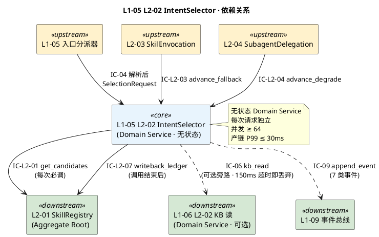
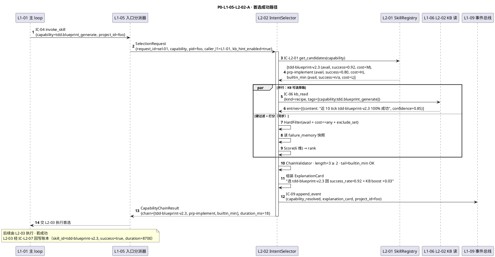
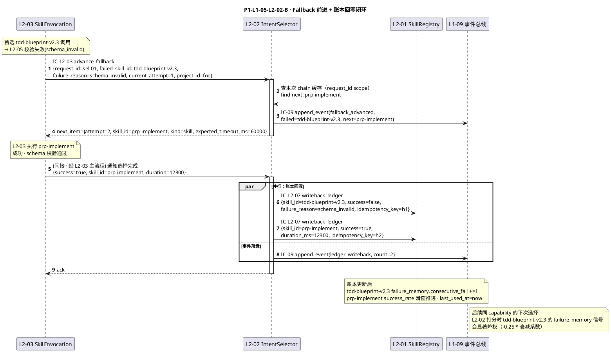
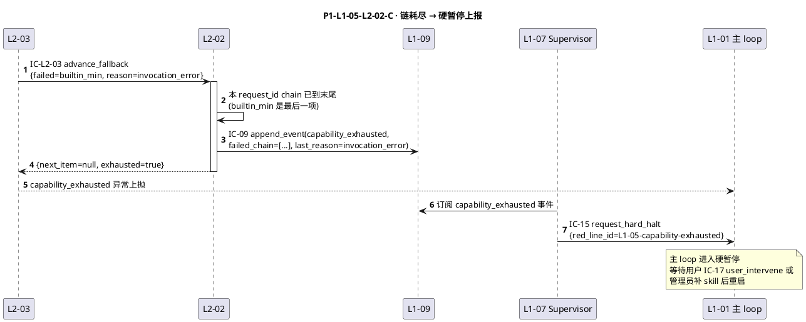
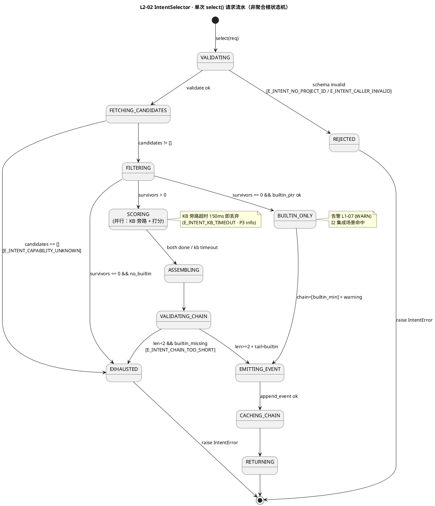

# L1-05 L2-02 · Skill 意图选择器 · Tech Design（depth-B）

> **本文档定位**：3-1-Solution-Technical 层级 · L1-05 的 L2-02 Skill 意图选择器 技术实现方案（L2 粒度 · depth-B 技术细节）。
> **与产品 PRD 的分工**：2-prd/L1-05/prd.md §9 定义产品边界（职责 / 禁止 / 必须 / G-W-T），本文档定义**技术实现**（字段级 schema + 混合排序算法 + 数据分片 + 状态机 + 配置参数 + 降级链）。
> **与 L1 architecture.md 的分工**：architecture.md §2 / §3 / §4 负责**跨 L2 架构 + 跨 L2 时序**，本文档负责**本 L2 内部技术细节**。冲突以 architecture.md 为准。
> **严格规则**：本文档不复述产品 PRD 文字清单，只做技术映射 + 补齐"产品视角未说 but 工程师必须知道"的部分（具体算法 · syscall · schema · 配置）。

---

## §0 撰写进度

- [x] §1 定位 + 2-prd §9 L2-02 映射
- [x] §2 DDD 映射（引 L0/ddd-context-map.md BC-05）
- [x] §3 对外接口定义（字段级 YAML schema + 错误码 ≥ 10）
- [x] §4 接口依赖（被谁调 · 调谁）
- [x] §5 P0/P1 时序图（PlantUML ≥ 2 张）
- [x] §6 内部核心算法（混合排序伪代码 · 向量 + 规则 + KB 历史经验）
- [x] §7 底层数据表 / schema 设计（PM-14 分片）
- [x] §8 状态机（无状态服务声明 + 请求流水阶段图）
- [x] §9 开源最佳实践调研（≥ 3 GitHub 高星项目）
- [x] §10 配置参数清单（≥ 8 条）
- [x] §11 错误处理 + 降级策略（≥ 4 级 · 12 错误码）
- [x] §12 性能目标（P95/P99 · 吞吐 · 并发）
- [x] §13 ADR + OQ + 与 2-prd / 3-2 TDD 的映射表（≥ 15 测试锚点）

---

## §1 定位 + 2-prd §9 L2-02 映射

### 1.1 本 L2 一句话技术定位

**L2-02 Skill 意图选择器 = BC-05 的 Domain Service · 无状态 · 纯函数式多信号混合排序器**。职责：把上游"抽象能力点 + 调用约束"翻译成"首选 + fallback 链 + 内建兜底"的有序物理候选链，全程通过 IC-L2-01 查 L2-01（SkillRegistry）取候选，通过 IC-06 读 L1-06 历史经验（Recipe/Trap）补充信号，通过 IC-L2-07 回写账本闭环学习，通过 IC-09 落 capability_resolved / capability_exhausted 审计事件。本 L2 是 PM-09 "每能力 ≥ 2 备选 fallback" 的实际执行点，也是 Goal §4.1 "决策可追溯 100%" 在调度层的承接器（每条链都带自然语言解释卡）。

### 1.2 本 L2 在 L1-05 architecture 中的坐标

引自 `docs/3-1-Solution-Technical/L1-05-Skill生态+子Agent调度/architecture.md`：

- **§2.2 DDD 分类**：本 L2 是 **Domain Service（无状态）** —— CapabilityChain VO + SelectionContext VO；输入 `(capability, constraints, registry_snapshot)` 输出 `[首选, 备选..., 内建兜底]` 链
- **§3.1 Container View**：本 L2 是 main_skill 进程内的 markdown-prompt + Python 调度段 · 非独立进程 · 非独立 session
- **§3.2 Component View**：本 L2 处于"入口分派器 → L2-02 → L2-03/L2-04"三角中枢位
- **§4.1 P0-L1-05-A 时序**：本 L2 是首选成功路径的第二节点（紧接入口分派器）
- **§4.2 P0-L1-05-B fallback 链时序**：本 L2 是链前进的**唯一策略点**（IC-L2-03/IC-L2-04 的被调方）

### 1.3 与 2-prd §9 L2-02 的精确小节映射

| 2-prd §9 小节 | 本文档对应位置 | 技术映射重点 |
|:---|:---|:---|
| §9.1 职责（能力点 → skill 候选链）+ 锚定 | §1 + §2.1 | Domain Service（无状态）+ IC-L2-01/IC-L2-07 双向双 IC |
| §9.2 输入/输出（文字级）| §3.2 / §3.3 字段级 YAML | capability / constraints / caller_l1 / chain[] / explanation_card |
| §9.3 边界（In/Out/边界规则）| §1.7 + §11 降级 | Out-of-scope 越界 = E_INTENT_BOUNDARY_VIOLATION 硬拒 |
| §9.4 约束（PM-09/10/11 + 7 硬约束 + 性能文字）| §6 启动硬校验 + §10 配置 + §12 SLO | "链长 ≥ 2" 运行时 assert · "兜底必存在" 启动校验 |
| §9.5 🚫 禁止行为（7 条） | §6.1 硬编码扫描 + §11 降级 | 硬编码 skill 名 → 启动时 grep 扫 + 运行时 assert |
| §9.6 ✅ 必须义务（8 条） | §3 + §6 + §7 + §11 分散 | 必结构化 · 必含解释 · 必回写 · 必发事件 |
| §9.7 🔧 可选功能（5 条）| §6.8 灰度探测 + §10 策略开关 | preferred_quality / pin_first / probe_rate 配置位 |
| §9.8 IC 关系（IC-L2-01/03/04/07 + IC-09） | §3 + §4 + §5 | 6 IC 触点独立 schema + 错误码表 |
| §9.9 G-W-T（6 正 + 5 负 + 3 集成）| §5 时序 + §13 测试映射 | ≥ 15 测试锚点 |

### 1.4 PM-14 约束（本 L2 落点）

**PM-14 约束**（引 `projectModel/tech-design.md`）：所有 IC payload 顶层 `project_id` 必填；所有存储路径按 `projects/<pid>/...` 分片。

本 L2 PM-14 具体落点：
- 每次 `SelectionRequest` payload 首字段 `project_id: string`（PM-14 项目上下文）
- 每次 `CapabilityChainResult` 首字段 `project_id: string`（透传）
- 每次 `capability_resolved` / `capability_exhausted` 事件首字段 `project_id`（L1-09 按 pid 路由）
- 失败记忆账本（技术实现由 L2-01 承担 · 本 L2 只读）：按 project 分视图（`projects/<pid>/skills/failure-memory.jsonl`）+ 跨 project 全局视图（`skills/global-failure-memory.jsonl`）· 查询时先合并后排序
- KB Recipe/Trap 查询（IC-06 · 可选旁路）：scope=[session, project, global]，默认跨三层合并（L1-06 负责 PM-14 校验）
- 临时选择 trace（debug 模式仅）：`projects/<pid>/debug/L1-05/L2-02/selection-<ts>-<req_id>.jsonl`

### 1.5 关键技术决策（Decision / Rationale / Alternatives / Trade-off）

| 决策 | 选择 | 备选 | 理由 | Trade-off |
|:---|:---|:---|:---|:---|
| **D1：无状态 Domain Service** | 纯函数式 · 所有状态从 L2-01 + IC-06 取 | 持久状态 / 内存缓存 | 与 L1-01 L2-02 决策引擎同构 · 单元可测 · 并发无锁 · 故障恢复零成本 | 每次请求都要读 L2-01（由 L2-01 承担 LRU 缓解）|
| **D2：混合排序（向量 + 规则 + KB 历史）** | 三信号融合 · 默认权重 `(availability=硬, cost=0.15, success_rate=0.45, failure_memory=0.25, recency=0.10, kb_boost=0.05)` | 纯规则 / 纯向量 / 纯 LLM 打分 | 规则保底（availability/cost）+ 统计准（success_rate）+ 经验学习（failure_memory + KB）· 毫秒级 · 可解释 | 权重需调优（可配 · 灰度探测校准）|
| **D3：向量相似度用途** | 仅用于"同一 capability 下语义近邻候选归并"（如 `tdd.blueprint_generate` 与 `tdd.plan_write` 的相似性计算）；**不**用于跨 capability 匹配 | 用向量做跨 capability 模糊匹配 | scope §5.5.1 严格要求"能力抽象层"是"命名空间"而非"语义空间"；跨 capability 模糊会破坏 PM-09 契约 | 能力点命名需要规范（由 L2-01 owner 治理）|
| **D4：KB 历史经验读时机** | **可选旁路** · 默认开启 · 超 150ms 即 fire-and-forget 丢弃 | 强依赖 KB / 完全不读 KB | scope §5.5.3 Out-of-scope："本 BC 本身不读 KB"—— 但选择器是 BC 内唯一需要历史经验的地方（Recipe/Trap），因此在 BC 边界内"可选旁路"读 KB；不阻塞决策热路径 | 实现复杂度中 + KB 不可用时不降低选择质量（fallback 到 success_rate + failure_memory 二信号） |
| **D5：链末必兜底** | 硬约束 · 启动时校验每 capability 在 `builtin_min/` 目录下有对应兜底实现 | 允许某些 capability 无兜底 | scope §5.5.6 必须义务 3 + PRD §9.4 硬约束 1；兜底是"永不硬断"保证 | 每新增 capability 需要补兜底（开发量 · 可接受）|
| **D6：unavailable 直接剔除** | 硬约束 · 不降权保留（与 failure_memory 降权不同）| 降权但保留 | scope §5.5.6 必须义务 4 明确 "unavailable 剔除" · 降权保留会违反 PRD §9.5 禁止 4 | 若 L2-01 误判 unavailable 会误剔（由 L2-01 探测心跳控制）|
| **D7：排序解释卡** | 每个 `CapabilityChainResult` 必带 `explanation_card` · 自然语言 + 结构化理由 | 无解释 / 仅日志 | Goal §4.1 决策可追溯 100% · L1-10 UI "为什么？" 直接消费 | 增加 payload 体积约 200B · 可接受 |
| **D8：灰度探测模式** | 默认关闭 · 可配 `probe_rate=0-0.1`（每 100 次选择中按概率让次优成为首选）| 不探测 / 强制探测 | PRD §9.7 可选 4；防"先发者赢者通吃"；默认关避免不必要波动 | 命中探测时首次选择质量略降（事件显式标注）|
| **D9：硬编码 skill 名防御** | 启动时 grep 扫描本 L2 代码 · 发现字面量如 `superpowers:*` / `gstack:*` / `ecc:*` 则拒绝启动 | 只做代码审查 | PRD §9.5 禁止 1 最严硬约束；启动时硬拦是唯一可靠防御 | 需维护禁词清单（初始 10 条 · 可配） |
| **D10：账本回写采用 at-least-once + 幂等键** | IC-L2-07 payload 带 `idempotency_key = hash(invocation_id + capability)` | exactly-once / best-effort | L2-01 账本是低频写 · at-least-once 简单 · 幂等键保正确性 | L2-01 需实现去重（已在 L2-01 §7 规定）|

### 1.6 本 L2 读者预期

读完本 L2 的工程师应掌握：
- IntentSelector Domain Service 的 6 IC 触点字段级 schema + 12 错误码
- 混合排序算法（向量近邻归并 + 规则硬过滤 + 多信号加权 + KB 经验 boost）伪代码
- 3 张数据结构（CapabilityChain / SelectionTrace / KBHintCache · 内存 + 可选持久化）
- 无状态服务的"请求流水"标注图（§8）
- 降级链 4 级（FULL → NO_KB → NO_HISTORY → BUILTIN_ONLY）
- SLO（产链 P99 ≤ 30ms · fallback 前进 P99 ≤ 10ms · KB 读 P95 ≤ 150ms 否则丢弃）

### 1.7 本 L2 不在的范围（YAGNI · 技术视角）

- **不在**：skill 实际调用（L2-03 · 越界 → E_INTENT_BOUNDARY_VIOLATION）
- **不在**：子 Agent 启动（L2-04）
- **不在**：回传 schema 校验（L2-05）
- **不在**：候选池数据维护（L2-01）
- **不在**：账本物理存储（L2-01）
- **不在**：事件总线物理落盘（L1-09）
- **不在**：KB 写入（L1-06 L2-03）
- **不在**：跨 capability 的语义模糊匹配（D3）
- **不在**：A/B 实验框架（PRD §9.3 明确 Out）
- **不在**：ML 离线训练打分模型（V1 规则 + 简单向量即可）

### 1.8 本 L2 术语表

| 术语 | 定义 | 关联 |
|:---|:---|:---|
| IntentSelector | 本 L2 的 Domain Service 主入口 | §2.2 |
| CapabilityChain | 本 L2 的核心 VO · 首选 + fallback 列表 + 内建兜底 | §2.2 + §7.1 |
| SelectionContext | 本 L2 的入参 VO · capability + constraints + caller_l1 + pid | §3.2 |
| ScoringSignal | VO · 多信号打分结果（6 维）| §6.4 |
| FailureMemory | VO · 近 N 次失败记忆（带衰减）| §6.3 |
| ConstraintFilter | VO · 硬过滤器（availability + cost_max + timeout_max + exclude_set）| §6.2 |
| ExplanationCard | VO · 自然语言 + 结构化选择理由 | §6.7 |
| KBHint | VO · 从 IC-06 读到的 Recipe/Trap 对本次选择的加权建议 | §6.6 |
| BuiltinMinImpl | 能力点的内建极简实现指针（链末兜底）| §6.5 |
| ProbeMode | 灰度探测模式（PRD §9.7 可选 4）| §6.8 |
| PinFirst | 项目级策略覆盖（CLAUDE.md 可指定）| §6.8 |
| SelectionTrace | debug 模式下的完整决策轨迹 jsonl | §7.2 |
| Recency | 最后使用时间距今（越近越权重 · 单调递减）| §6.3 |
| HardEdgeScan | 启动时硬编码 skill 名扫描 | §6.1 |

### 1.9 本 L2 的 DDD 定位一句话

**L2-02 是 BC-05 Skill & Subagent Orchestration 内的 IntentSelector Domain Service · 无状态 · 纯函数式 · 持有 CapabilityChain 值对象 · 通过混合排序算法（硬过滤 + 多信号打分 + KB 经验 boost）在主 skill 进程内完成"抽象能力点 → 物理候选链"的单跳翻译 · 禁硬编码 skill 名 · 禁越界调用 · 可选旁路读 L1-06 KB · 调用结束通过 IC-L2-07 回写 L2-01 账本闭环学习。**

---

## §2 DDD 映射（BC-05）

### 2.1 Bounded Context 定位

本 L2 属于 `L0/ddd-context-map.md §2.6 BC-05 Skill & Subagent Orchestration`：

- **BC 名**：`BC-05 · Skill & Subagent Orchestration`
- **L2 角色**：**Domain Service of BC-05**（承担"抽象能力点 → 物理候选链"纯决策能力）
- **与兄弟 L2**：
  - L2-01 SkillRegistry（Aggregate Root）：Customer-Supplier（本 L2 Customer · L2-01 Supplier 提供候选池 + 账本）· IC-L2-01（读）+ IC-L2-07（写）
  - L2-03 SkillInvocation（Application Service）：Customer-Supplier（本 L2 Supplier · L2-03 Customer 消费链）· IC-L2-03（fallback 前进回调）
  - L2-04 SubagentDelegation（Application Service）：同 L2-03 · IC-L2-04
  - L2-05 SchemaValidator（Domain Service）：无直接关系（L2-05 校验结果经 L2-03/L2-04 回传 → 再经 IC-L2-03/04 驱动本 L2 前进）
- **与其他 BC**：
  - BC-01（L1-01 主 loop）：Supplier（响应 IC-04 invoke_skill 的 capability 解析子路径）
  - BC-02（L1-02 Stage Gate）：Supplier（响应 IC-04）
  - BC-04（L1-04 Quality Loop）：Supplier（响应 IC-04 + IC-20 delegate_verifier）
  - BC-08（L1-08 多模态）：Supplier（响应 IC-04 + IC-12 delegate_codebase_onboarding）
  - BC-06（L1-06 KB）：Customer（**可选旁路**读 Recipe/Trap · IC-06 kb_read）
  - BC-09（L1-09 事件总线）：Partnership（每次 resolved/exhausted 事件 IC-09）
  - BC-07（L1-07 Supervisor）：Publisher（被 Supervisor 观察 · 间接通过 IC-14 push_rollback_route 接收 Supervisor 失败反馈）

### 2.2 聚合根 / 实体 / 值对象 / 领域服务

| DDD 概念 | 名字 | 职责 | 一致性边界 |
|:---|:---|:---|:---|
| **Domain Service**（本 L2 主体）| `IntentSelector` | 编排 Load → HardFilter → Score → Chain → Explain → WriteBack 的纯函数流水 | 单请求 · 无跨请求状态 |
| **Value Object** | `CapabilityChain` | 排序后的候选链（首选 + fallback + 兜底）+ 解释卡 | 不可变 · 按 PM-14 携带 project_id |
| **Value Object** | `SelectionContext` | 入参打包（capability + constraints + caller_l1 + pid + optional_kb_hint）| 不可变 |
| **Value Object** | `ScoringSignal` | 每候选的 6 维打分（avail/cost/success/failure_memory/recency/kb_boost） | 不可变 |
| **Value Object** | `FailureMemory` | 近 N 次失败的时间戳 + 原因码 · 衰减加权 | 不可变快照（从 L2-01 账本读） |
| **Value Object** | `ConstraintFilter` | 硬过滤器（4 条 · avail/cost/timeout/exclude） | 不可变 |
| **Value Object** | `ExplanationCard` | 自然语言 + 结构化选择理由（供 UI / 审计 / Supervisor 消费）| 不可变 |
| **Value Object** | `KBHint` | 从 KB 读到的 Recipe/Trap 加权建议 | 不可变（可选 · 可能为空）|
| **Domain Service** | `HardEdgeScanner` | 启动时一次性扫描硬编码 skill 名 | 启动期一次性 |
| **Domain Service** | `ChainValidator` | 运行时校验 chain.length ≥ 2 + tail == builtin_min | 单次校验 |
| **Aggregate Root（只读消费）** | `SkillRegistry`（归 L2-01） | 候选池 + 账本数据源 | L2-01 强一致边界 |
| **Entity（只读消费）** | `KBEntry`（归 L1-06） | Recipe/Trap 历史经验 | L1-06 强一致边界 |

### 2.3 聚合根不变量（Invariants · L2-02 局部）

引 `architecture.md §2.2` BC-05 全局不变量，本 L2 局部补充：

| 不变量 | 描述 | 校验时机 |
|:---|:---|:---|
| **I-L202-01** | `CapabilityChain.project_id` 必填且在本请求生命周期不可变 | 创建时 + 返回前 |
| **I-L202-02** | `CapabilityChain.candidates` 长度 ≥ 2（含内建兜底） | 返回前（ChainValidator） |
| **I-L202-03** | `CapabilityChain.candidates[-1].kind == "builtin_min"` · 链末必兜底 | 返回前 |
| **I-L202-04** | `CapabilityChain.explanation_card` 非空 · 含 ≥ 1 条 reason | 返回前 |
| **I-L202-05** | 所有 `availability == unavailable` 候选不得出现在 chain 中（剔除 · 非降权）| HardFilter 后 |
| **I-L202-06** | `SelectionContext.caller_l1 ∈ {L1-01, L1-02, L1-03, L1-04, L1-06, L1-07, L1-08, L1-09, L1-10}`（L1-05 不能调自己）| 入参校验 |
| **I-L202-07** | `ScoringSignal` 所有维度取值在 `[0,1]` · 无 NaN / Inf | 打分后 |
| **I-L202-08** | 启动时 `HardEdgeScanner` 无命中 · 否则拒绝启动（进程退出码 = 1） | 启动时一次性 |
| **I-L202-09** | 每能力点在启动时 `BuiltinMinImpl` 指针可解析 · 否则拒绝启动 | 启动时一次性 |
| **I-L202-10** | `KBHint` 超时 150ms 必须为 null（不阻塞决策） | KB 读超时后 |

### 2.4 Repository

本 L2 **不持有任何 Repository**（Domain Service 纯函数式 · 无状态 · 无持久化数据归属）：
- 所有数据从 L2-01 Repository（`SkillRegistryRepository`）取 · IC-L2-01
- 所有数据从 L1-06 Repository（`KBEntryRepository`）取 · IC-06（可选旁路）
- 所有输出通过 IC-L2-07 写回 L2-01 · 不经自己的 Repository
- debug trace 走 L1-09 事件总线（IC-09）· 不持久化到本 L2

### 2.5 Domain Events（本 L2 对外发布 · 经 IC-09 → L1-09）

| 事件名 | 触发时机 | 订阅方 | Payload 字段要点 |
|:---|:---|:---|:---|
| `L1-05:capability_resolved` | `IntentSelector.select()` 返回成功前 | L1-07 Supervisor / L1-10 UI | `{request_id, capability, chain=[{skill_id, kind, attempt, reason}], explanation_card, signal_snapshot, kb_hint_used, project_id}` |
| `L1-05:capability_exhausted` | `L2-03/L2-04` 上报整链失败后 · 本 L2 接到 IC-L2-03/04 找不到下一项 | L1-07 (critical) | `{request_id, capability, failed_chain[], last_failure_reason, project_id}` |
| `L1-05:fallback_advanced` | IC-L2-03 / IC-L2-04 触发链前进成功 | L1-09（审计）| `{request_id, capability, failed_skill, next_skill, attempt, project_id}` |
| `L1-05:ledger_writeback` | 成功调 IC-L2-07 后 | L1-09 | `{request_id, capability, skill_id, success, duration_ms, project_id}` |
| `L1-05:builtin_fallback_used` | 链前进至 builtin_min 且成功 | L1-07（质量维度降分）| `{request_id, capability, reason, project_id}` |
| `L1-05:hard_edge_violation` | 启动时 `HardEdgeScanner` 命中硬编码 skill 名 | L1-07 (critical) / 运维 | `{pattern, file_hit, line_no, project_id}` |
| `L1-05:kb_hint_degraded` | KB 读超时 150ms · 降级 | L1-09 | `{request_id, capability, kb_timeout_ms, project_id}` |

### 2.6 与 BC-05 其他 L2 的 DDD 耦合

| 耦合 L2 | DDD 关系 | 触点 |
|:---|:---|:---|
| L2-01 SkillRegistry | **Customer-Supplier**（本 L2 Customer）| IC-L2-01 读候选 · IC-L2-07 回写账本 |
| L2-03 SkillInvocation | **Customer-Supplier**（本 L2 Supplier · 供链）| 提供链 · 接 IC-L2-03 fallback 前进 |
| L2-04 SubagentDelegation | **Customer-Supplier**（本 L2 Supplier · 供链）| 提供链 · 接 IC-L2-04 降级前进 |
| L2-05 SchemaValidator | **无直接 IC**（间接通过 L2-03/04 传递校验失败 → IC-L2-03/04 触发本 L2 前进） | 间接 |

---

## §3 对外接口定义（字段级 YAML schema + 错误码）

### 3.1 接口清单总览（6 IC 触点 · 3 接收 + 3 发起）

| # | IC 方向 | 名字 | 简述 | 上/下游 |
|:--:|:---|:---|:---|:---|
| 1 | 接收 | `IC-04`（经 L1-05 入口分派 · 解析 capability 后转到本 L2 的 `select()` 入口） | 初始能力链请求 | L1-01/02/04/08 → 入口 → L2-02 |
| 2 | 接收 | `IC-L2-03 advance_fallback` | L2-03 请求链前进 | L2-03 → L2-02 |
| 3 | 接收 | `IC-L2-04 advance_degrade` | L2-04 请求降级 | L2-04 → L2-02 |
| 4 | 发起 | `IC-L2-01 get_candidates` | 查 L2-01 候选池 + 元数据 | L2-02 → L2-01 |
| 5 | 发起 | `IC-L2-07 writeback_ledger` | 回写账本 | L2-02 → L2-01 |
| 6 | 发起 | `IC-06 kb_read`（可选旁路）| 读 KB Recipe/Trap | L2-02 → L1-06 |
| 7 | 发起（事件）| `IC-09 append_event` | 7 类事件（§2.5） | L2-02 → L1-09 |
| 8 | 间接接收 | `IC-14`（经 L1-04 + Supervisor 中转 · 影响 failure_memory）| Supervisor 回滚反馈 | L1-07 → L1-04 → L2-01 → 本 L2 读账本时感知 |

### 3.2 接收：`IntentSelector.select()` 入口 · 字段级 YAML schema

**入参 `SelectionRequest`**（由 L1-05 入口分派器从 IC-04 payload 转换 · 对应 architecture.md §4.1）：

```yaml
SelectionRequest:
  type: object
  required: [project_id, request_id, capability, caller_l1, ts]
  properties:
    project_id:
      type: string
      required: true
      description: PM-14 项目上下文（首字段 · 不可省）
      example: "pid-01HFX..."
    request_id:
      type: string
      format: "sel-{uuid-v7}"
      required: true
      description: 本次选择请求唯一 id（用于 IC-L2-03/04 回调 + IC-09 审计链）
    capability:
      type: string
      required: true
      description: 能力抽象层 tag（PM-09 · 不绑具体 skill 名）
      example: "tdd.blueprint_generate"
    constraints:
      type: object
      required: false
      properties:
        max_cost:
          type: enum
          enum: [L, M, H, any]
          default: any
          description: 成本上限（L=免费本地 / M=低延迟 LLM / H=重型 subagent）
        max_timeout_ms:
          type: integer
          minimum: 1000
          maximum: 1800000
          default: 600000
          description: 调用方可接受的总超时（传给 L2-03/04 作为真实 timeout）
        preferred_quality:
          type: enum
          enum: [high, balanced, fast]
          default: balanced
          description: 质量偏好（high = 优先高成功率不计成本；fast = 优先低延迟）
        exclude_set:
          type: array
          items: {type: string}
          required: false
          description: 显式排除的 skill_id 集（本次选择跳过 · 常用于重试避免死循环）
    caller_l1:
      type: enum
      enum: [L1-01, L1-02, L1-03, L1-04, L1-06, L1-07, L1-08, L1-09, L1-10]
      required: true
      description: 调用方 L1 标识（L1-05 不能调自己 · 由入口分派器校验）
    kb_hint_enabled:
      type: boolean
      default: true
      description: 是否启用 IC-06 KB 历史经验旁路读
    probe_mode:
      type: boolean
      default: false
      description: 是否允许本次参与灰度探测（某些幂等场景可关）
    ts:
      type: string
      format: iso8601
      required: true
```

**出参 `CapabilityChainResult`**：

```yaml
CapabilityChainResult:
  type: object
  required: [project_id, request_id, chain, explanation_card, duration_ms]
  properties:
    project_id: {type: string, required: true}
    request_id: {type: string, required: true}
    chain:
      type: array
      minItems: 2
      required: true
      items:
        type: object
        required: [attempt, skill_id, kind, expected_timeout_ms, confidence]
        properties:
          attempt: {type: integer, minimum: 1, description: 链上第几项（1 = 首选）}
          skill_id: {type: string, description: 实际落点 id · L2-03/L2-04 凭此调用}
          kind:
            type: enum
            enum: [skill, tool, subagent, builtin_min]
          expected_timeout_ms: {type: integer}
          expected_cost: {type: enum, enum: [L, M, H]}
          confidence: {type: number, minimum: 0, maximum: 1, description: 归一化打分}
          reason_summary: {type: string, maxLength: 120, description: 一句话理由}
    explanation_card:
      type: object
      required: [natural_language, structured]
      properties:
        natural_language:
          type: string
          maxLength: 400
          description: 一段自然语言说明（供 UI 直出）
        structured:
          type: object
          required: [filtered_out, signal_weights, tie_breaker]
          properties:
            filtered_out:
              type: array
              description: 被过滤掉的候选 + 原因码
              items: {type: object, properties: {skill_id: string, reason_code: string}}
            signal_weights:
              type: object
              description: 6 维信号权重（本次采用）
              properties:
                availability: {type: number, description: 硬过滤 · 非权重 · 报 1}
                cost: {type: number}
                success_rate: {type: number}
                failure_memory: {type: number}
                recency: {type: number}
                kb_boost: {type: number}
            tie_breaker:
              type: string
              description: 平分时破同策略（如 "recency" / "skill_id_lex"）
            kb_hint_used: {type: boolean}
            probe_applied: {type: boolean}
            pin_first_applied: {type: boolean}
    duration_ms: {type: integer}
    warnings:
      type: array
      items: {type: string}
      description: 例如 "仅 1 available 已追加兜底"
```

### 3.3 接收：`IC-L2-03 advance_fallback` 字段级 schema

```yaml
AdvanceFallbackRequest:
  type: object
  required: [project_id, request_id, capability, failed_skill_id, failure_reason]
  properties:
    project_id: {type: string, required: true}
    request_id: {type: string, required: true, description: 对齐原 SelectionRequest.request_id}
    capability: {type: string, required: true}
    failed_skill_id: {type: string, required: true}
    failure_reason:
      type: enum
      enum: [invocation_error, timeout, schema_invalid, permission_denied, unknown]
      required: true
    current_attempt: {type: integer, required: true, minimum: 1}
    ts: {type: string, required: true}

AdvanceFallbackResult:
  type: object
  required: [project_id, request_id, next_item]
  properties:
    project_id: {type: string}
    request_id: {type: string}
    next_item:
      type: object
      required: false  # null 表示链耗尽
      properties:
        attempt: {type: integer}
        skill_id: {type: string}
        kind: {type: enum}
        expected_timeout_ms: {type: integer}
        reason_summary: {type: string}
    exhausted:
      type: boolean
      required: true
      description: true 时本 L2 发 capability_exhausted 事件 · 返回 null next_item
```

### 3.4 接收：`IC-L2-04 advance_degrade` 字段级 schema

结构同 `IC-L2-03` · 但 `failure_reason` 扩展枚举：

```yaml
AdvanceDegradeRequest:
  type: object
  required: [project_id, request_id, capability, failed_subagent_name, failure_reason]
  properties:
    project_id: {type: string, required: true}
    request_id: {type: string, required: true}
    capability: {type: string, required: true}
    failed_subagent_name: {type: string, required: true}
    failure_reason:
      type: enum
      enum: [crash, timeout, schema_invalid, heartbeat_lost, second_attempt_failed, unknown]
      required: true
    degrade_to_simplified:
      type: boolean
      default: false
      description: true 时本 L2 跳过同名备选 · 直接找 degraded 版本
    current_attempt: {type: integer, required: true}
    ts: {type: string, required: true}
```

### 3.5 发起：`IC-L2-01 get_candidates` 字段级 schema（简要 · 详规见 L2-01）

```yaml
GetCandidatesQuery:
  type: object
  required: [project_id, capability]
  properties:
    project_id: {type: string, required: true}
    capability: {type: string, required: true}
    include_unavailable: {type: boolean, default: false}
    include_failure_memory: {type: boolean, default: true}
    ts: {type: string, required: true}

GetCandidatesResult:
  type: object
  required: [capability, candidates]
  properties:
    capability: {type: string}
    candidates:
      type: array
      items:
        type: object
        required: [skill_id, kind, availability, version]
        properties:
          skill_id: {type: string}
          kind: {type: enum, enum: [skill, tool, subagent, builtin_min]}
          availability: {type: enum, enum: [available, unavailable, degraded]}
          version: {type: string}
          cost_estimate: {type: enum, enum: [L, M, H]}
          success_rate_recent: {type: number, minimum: 0, maximum: 1}
          last_used_at: {type: string, format: iso8601}
          failure_memory:
            type: object
            properties:
              consecutive_fail: {type: integer}
              last_fail_at: {type: string}
              recent_reasons: {type: array, items: string}
          schema_pointer: {type: string, required: false}
```

### 3.6 发起：`IC-L2-07 writeback_ledger` 字段级 schema（简要）

```yaml
WritebackLedgerCommand:
  type: object
  required: [project_id, request_id, capability, skill_id, success, duration_ms, idempotency_key]
  properties:
    project_id: {type: string, required: true}
    request_id: {type: string, required: true}
    capability: {type: string, required: true}
    skill_id: {type: string, required: true}
    success: {type: boolean, required: true}
    duration_ms: {type: integer, required: true}
    failure_reason: {type: enum, required: false}
    attempt: {type: integer, minimum: 1}
    idempotency_key: {type: string, required: true, description: "hash(invocation_id+capability)"}
    ts: {type: string, required: true}
```

### 3.7 发起：`IC-06 kb_read`（可选旁路 · 详规见 L1-06 L2-02 § IC-06）

本 L2 使用 IC-06 的**一个固定查询模式**：

```yaml
KBHintQuery:  # IC-06 kb_read 的具化
  project_id: <pid>
  kind: recipe  # 次选：trap
  scope: [session, project, global]
  filter:
    tags: ["capability:<capability>"]
    min_confidence: 0.6
  top_k: 3
  rerank: true
  context:
    decision_type: "skill_selection"
    capability: <capability>
  ts: <now>
```

### 3.8 错误码表（≥ 12 条 · 统一前缀 `E_INTENT_*` · 与 IC 错误码风格对齐）

| 错误码 | 含义 | 触发场景 | 调用方处理 |
|:---|:---|:---|:---|
| `E_INTENT_NO_PROJECT_ID` | project_id 缺失 | SelectionRequest / AdvanceFallbackRequest 根字段缺 project_id | 拒绝 · 上游补全 |
| `E_INTENT_CAPABILITY_UNKNOWN` | capability 在 L2-01 无注册 | IC-L2-01 返回空 candidates | 返回 success=false · 上游走硬暂停（L1-07 硬红线判定）|
| `E_INTENT_AMBIGUOUS` | 两个候选分差 < 0.01 且无破同键 | 打分后 tie-breaker 失败 | 本 L2 日志 + 随机选择 · 不拒绝（P3 级）|
| `E_INTENT_CHAIN_TOO_SHORT` | 过滤后 chain.length < 2 且 builtin_min 指针空 | ChainValidator 失败 | 拒绝 · 发 capability_exhausted · 拒绝启动级问题 |
| `E_INTENT_BUILTIN_MISSING` | 某 capability 启动时找不到 builtin_min 实现 | 启动校验失败 | 拒绝启动（exit 1）|
| `E_INTENT_HARD_EDGE_VIOLATION` | 启动时 HardEdgeScanner 命中硬编码 skill 字面量 | 静态扫描命中禁词 | 拒绝启动（exit 1）|
| `E_INTENT_BOUNDARY_VIOLATION` | 本 L2 被调用做 skill 实际调用 / 子 Agent 启动 / schema 校验 | 违反 §1.7 Out-of-scope | 拒绝 · 抛异常 · L1-07 critical |
| `E_INTENT_REGISTRY_UNAVAILABLE` | L2-01 不可达（`IC-L2-01` 超时或错）| 下游 L2-01 侧故障 | 降级：仅用 builtin_min 产链 · 发 WARN 给 L1-07 |
| `E_INTENT_KB_TIMEOUT` | IC-06 kb_read 超 150ms | KB 慢 | 降级：kb_hint=null 继续（P3 级 info）|
| `E_INTENT_FALLBACK_EXHAUSTED` | IC-L2-03/04 advance 时发现链已到末尾 | L2-03/L2-04 重复 advance | 发 capability_exhausted · next_item=null · exhausted=true |
| `E_INTENT_CALLER_INVALID` | caller_l1 == L1-05（自调）| 入参校验 | 拒绝（硬违反 PM-03 + 自环禁令）|
| `E_INTENT_CONSTRAINTS_INFEASIBLE` | 硬过滤后 available 候选 = 0（所有候选被 exclude_set 或 max_cost 剔除）| Filter 阶段 | 返回只含 builtin_min 的链 + warning |
| `E_INTENT_LEDGER_WRITEBACK_FAIL` | IC-L2-07 回写失败（L2-01 侧）| 低频 | 重试 1 次 · 仍失败走 IC-09 degraded 事件 |
| `E_INTENT_PROBE_MISCONFIG` | probe_rate 配置超出 [0, 0.1] | 启动校验 | 拒绝启动 |

---

## §4 接口依赖（被谁调 · 调谁）

### 4.1 上游调用方（被谁调）

| 调用方 | 入口 | 何时调 | 频次 |
|:---|:---|:---|:---|
| L1-05 入口分派器（来自 L1-01 IC-04） | `IntentSelector.select()` | 主 loop 每 tick 决策"调哪个 skill"时 | 每 tick 0-N 次（最高频）|
| L1-05 入口分派器（来自 L1-02 IC-04 · S1/S2/S3/S7 Gate）| 同上 | Gate 过渡期需要选 plan_writer / gate_checker 等 skill 时 | 低频（每 Gate 1-2 次）|
| L1-05 入口分派器（来自 L1-04 IC-04/IC-20）| 同上 | Quality Loop S4/S5/S6 每 WP 多次 | 中频 |
| L1-05 入口分派器（来自 L1-08 IC-04/IC-12）| 同上 | 多模态处理 + 大代码库 onboarding | 低频 |
| L2-03 SkillInvocation | `advance_fallback()` | skill 调用失败 / schema 校验失败 | 中频（失败路径）|
| L2-04 SubagentDelegation | `advance_degrade()` | 子 Agent crash / timeout / 第 2 次失败 | 低频（失败路径）|

### 4.2 下游被调方（调谁）

| 被调方 | IC | 何时调 | 频次 |
|:---|:---|:---|:---|
| L2-01 SkillRegistry | IC-L2-01 get_candidates | 每次 `select()` 入口 | 每次选择（最高频）|
| L2-01 SkillRegistry | IC-L2-07 writeback_ledger | 调用结束后 | 每次调用完成 |
| L1-06 L2-02 KB 读 | IC-06 kb_read | 每次 `select()` · 可选（kb_hint_enabled=true） | 每次选择（可降级）|
| L1-09 L2-02 事件追加 | IC-09 append_event | 每次 resolved / exhausted / advanced 等 7 类事件 | 每次选择 ≥ 1 次 |

### 4.3 依赖关系 PlantUML



---

## §5 P0/P1 时序图（PlantUML ≥ 2 张）

### 5.1 P0 · 首选成功路径（混合排序 + KB 旁路命中）

**场景**：L1-01 主 loop 走 IC-04 请求 `capability="tdd.blueprint_generate"` · 候选池有 3 个（tdd-blueprint-v2.3, prp-implement, builtin_min）· KB 读命中 Recipe 提示 tdd-blueprint 近期高成功率 · 本 L2 产链 + 返回。



### 5.2 P1 · Fallback 前进 · 首选失败 → 备选成功 + 降级回写

**场景**：tdd-blueprint-v2.3 首次调用返回 schema 不合规 · L2-03 经 IC-L2-03 请求前进 · L2-02 返回 prp-implement · 成功后回写账本（首选失败 + 备选成功）。



### 5.3 P1 · 链耗尽 · capability_exhausted 触发硬暂停



---

## §6 内部核心算法（伪代码 · Python-like）

### 6.1 启动期一次性校验（HardEdgeScan + BuiltinMin 可解析性）

```python
# 启动阶段一次性 · 失败直接 exit(1)
FORBIDDEN_LITERALS = [
    "superpowers:", "gstack:", "ecc:", "everything-claude-code:",
    "plugin:", "tdd-blueprint-v", "prp-implement",
]

def startup_hard_edge_scan(src_root: str) -> None:
    hits = []
    for py in walk(src_root, "*.py"):
        for lineno, line in enumerate(read_lines(py), 1):
            if is_comment(line):
                continue
            for lit in FORBIDDEN_LITERALS:
                if lit in line and not in_allowlist(py, lineno):
                    hits.append((py, lineno, lit))
    if hits:
        append_event("L1-05:hard_edge_violation", hits=hits)
        raise SystemExit("E_INTENT_HARD_EDGE_VIOLATION: hardcoded skill literal(s) in L2-02")

def startup_builtin_min_check(registry: SkillRegistrySnapshot) -> None:
    for cap in registry.list_capabilities():
        ptr = registry.get_builtin_min_pointer(cap)
        if ptr is None or not importable(ptr):
            append_event("L1-05:builtin_missing", capability=cap)
            raise SystemExit(f"E_INTENT_BUILTIN_MISSING: capability={cap}")
```

**设计要点**：
- 两个校验都必须在进程启动时完成（failed-fast）
- HardEdgeScan 默认扫 `src/l1_05/**/*.py`（不扫测试 / 文档）
- 禁词清单在 `config/intent_selector.yaml` 可扩展（不可收缩）

### 6.2 硬过滤（ConstraintFilter · 纯规则）

```python
def hard_filter(
    candidates: list[Candidate],
    constraints: Constraints,
    exclude_set: set[str],
) -> list[Candidate]:
    """硬过滤：availability / cost / exclude · 必过 · 非打分"""
    survivors = []
    filtered_out = []
    for c in candidates:
        if c.availability == "unavailable":
            filtered_out.append((c.skill_id, "R_UNAVAILABLE"))
            continue
        if c.skill_id in exclude_set:
            filtered_out.append((c.skill_id, "R_EXCLUDED"))
            continue
        if constraints.max_cost != "any":
            if cost_rank(c.cost_estimate) > cost_rank(constraints.max_cost):
                filtered_out.append((c.skill_id, "R_COST_EXCEEDED"))
                continue
        if c.expected_timeout_ms > constraints.max_timeout_ms:
            filtered_out.append((c.skill_id, "R_TIMEOUT_EXCEEDED"))
            continue
        survivors.append(c)
    return survivors, filtered_out

def cost_rank(cost: str) -> int:
    return {"L": 1, "M": 2, "H": 3, "any": 99}[cost]
```

### 6.3 失败记忆衰减（FailureMemory · 时间衰减）

```python
def failure_memory_score(fm: FailureMemoryVO, now: datetime) -> float:
    """越近失败越扣分 · 指数衰减"""
    if fm is None or fm.consecutive_fail == 0:
        return 0.0
    hours_since_last_fail = (now - fm.last_fail_at).total_seconds() / 3600.0
    decay = math.exp(-hours_since_last_fail / 24.0)  # 24h 半衰期
    raw = min(fm.consecutive_fail, 5) / 5.0  # cap 5 次
    return raw * decay  # [0,1]

def recency_score(last_used_at: datetime | None, now: datetime) -> float:
    """刚用过加分轻微 · 避免冷启动 skill 永远不被选"""
    if last_used_at is None:
        return 0.5  # neutral
    days = (now - last_used_at).total_seconds() / 86400.0
    return math.exp(-days / 7.0)  # 7d 半衰期
```

### 6.4 多信号混合打分（Score · 加权 + 可解释）

```python
DEFAULT_WEIGHTS = {
    "cost": 0.15,
    "success_rate": 0.45,
    "failure_memory": 0.25,  # 扣分项 · 权重指"衰减强度"
    "recency": 0.10,
    "kb_boost": 0.05,
}

def score_candidates(
    candidates: list[Candidate],
    kb_hint: KBHint | None,
    now: datetime,
    weights: dict[str, float] = DEFAULT_WEIGHTS,
    preferred_quality: str = "balanced",
) -> list[ScoredCandidate]:
    # 偏好模式动态调权
    w = adjust_weights_by_preference(weights, preferred_quality)

    scored = []
    for c in candidates:
        s_cost = 1.0 - (cost_rank(c.cost_estimate) - 1) / 2.0   # L=1, M=0.5, H=0
        s_success = c.success_rate_recent                        # [0,1]
        s_failmem = failure_memory_score(c.failure_memory, now)  # [0,1] · 扣分
        s_recency = recency_score(c.last_used_at, now)           # [0,1]
        s_kb = kb_boost_for(c.skill_id, kb_hint)                 # [-0.1, 0.1]

        total = (
            w["cost"] * s_cost
            + w["success_rate"] * s_success
            - w["failure_memory"] * s_failmem  # 注意减号
            + w["recency"] * s_recency
            + w["kb_boost"] * s_kb
        )
        scored.append(ScoredCandidate(
            candidate=c,
            total=total,
            breakdown={"cost": s_cost, "success": s_success,
                       "failmem": s_failmem, "recency": s_recency,
                       "kb": s_kb},
        ))
    return scored

def adjust_weights_by_preference(w: dict, pref: str) -> dict:
    if pref == "high":
        return {**w, "cost": 0.05, "success_rate": 0.55}
    if pref == "fast":
        return {**w, "cost": 0.30, "success_rate": 0.30, "recency": 0.20}
    return w  # balanced
```

### 6.5 链组装 + 兜底追加（ChainAssembler · 含 I-L202-02/03 校验）

```python
def assemble_chain(
    scored: list[ScoredCandidate],
    builtin_min_ptr: str,
    capability: str,
    probe_mode: bool,
    probe_rate: float,
) -> CapabilityChain:
    # 1. 默认按 total desc 排序 · 破同用 recency + skill_id
    scored.sort(key=lambda x: (-x.total, -x.breakdown["recency"], x.candidate.skill_id))

    # 2. 灰度探测：可选交换首选 vs 次优（概率）
    probe_applied = False
    if probe_mode and random.random() < probe_rate and len(scored) >= 2:
        scored[0], scored[1] = scored[1], scored[0]
        probe_applied = True

    # 3. 组装物理链（attempt 从 1 开始）
    chain_items = []
    for i, sc in enumerate(scored):
        chain_items.append(ChainItem(
            attempt=i + 1,
            skill_id=sc.candidate.skill_id,
            kind=sc.candidate.kind,
            expected_timeout_ms=sc.candidate.expected_timeout_ms,
            expected_cost=sc.candidate.cost_estimate,
            confidence=normalize_to_unit(sc.total),
            reason_summary=make_reason(sc),
        ))

    # 4. 追加内建兜底（若未在 scored 中出现）
    if not any(ci.kind == "builtin_min" for ci in chain_items):
        chain_items.append(ChainItem(
            attempt=len(chain_items) + 1,
            skill_id=builtin_min_ptr,
            kind="builtin_min",
            expected_timeout_ms=30_000,
            expected_cost="L",
            confidence=0.2,
            reason_summary="chain_tail_fallback",
        ))

    # 5. 硬校验 I-L202-02/03
    assert len(chain_items) >= 2, "E_INTENT_CHAIN_TOO_SHORT"
    assert chain_items[-1].kind == "builtin_min", "E_INTENT_CHAIN_TAIL_NOT_BUILTIN"

    return CapabilityChain(items=chain_items, probe_applied=probe_applied)
```

### 6.6 KB 旁路读（可选 · 超时即丢弃）

```python
async def fetch_kb_hint(
    capability: str,
    project_id: str,
    kb_reader,  # IC-06 client
    timeout_ms: int = 150,
) -> KBHint | None:
    """可选旁路 · 超时即丢弃 · 不阻塞热路径"""
    try:
        entries = await asyncio.wait_for(
            kb_reader.kb_read(
                project_id=project_id,
                kind="recipe",
                scope=["session", "project", "global"],
                filter={"tags": [f"capability:{capability}"], "min_confidence": 0.6},
                top_k=3,
                rerank=True,
                context={"decision_type": "skill_selection", "capability": capability},
            ),
            timeout=timeout_ms / 1000.0,
        )
        return parse_kb_entries_to_hint(entries)
    except asyncio.TimeoutError:
        append_event("L1-05:kb_hint_degraded", capability=capability,
                     kb_timeout_ms=timeout_ms, project_id=project_id)
        return None
    except Exception as e:
        append_event("L1-05:kb_hint_error", capability=capability, err=str(e))
        return None

def kb_boost_for(skill_id: str, hint: KBHint | None) -> float:
    if hint is None:
        return 0.0
    for e in hint.entries:
        if e.get("content", {}).get("recommended_skill") == skill_id:
            return min(0.1, e["confidence"] * 0.1)
        if e.get("content", {}).get("avoid_skill") == skill_id:
            return -min(0.1, e["confidence"] * 0.1)
    return 0.0
```

### 6.7 ExplanationCard 组装（自然语言 + 结构化）

```python
def build_explanation_card(
    scored: list[ScoredCandidate],
    filtered_out: list[tuple[str, str]],
    weights: dict,
    chain: CapabilityChain,
    kb_hint_used: bool,
) -> ExplanationCard:
    winner = scored[0] if scored else None
    nl_parts = []
    if winner:
        nl_parts.append(
            f"选 {winner.candidate.skill_id} 为首选 · "
            f"成功率 {winner.breakdown['success']:.2f} · "
            f"失败记忆扣分 {winner.breakdown['failmem']:.2f}"
        )
    if kb_hint_used:
        nl_parts.append(f"KB 历史经验 boost {winner.breakdown['kb']:+.2f}")
    if filtered_out:
        nl_parts.append(f"过滤 {len(filtered_out)} 个候选")
    if chain.probe_applied:
        nl_parts.append("本次启用灰度探测 · 首选与次优交换")
    return ExplanationCard(
        natural_language=" · ".join(nl_parts),
        structured={
            "filtered_out": [{"skill_id": s, "reason_code": r} for s, r in filtered_out],
            "signal_weights": weights,
            "tie_breaker": "recency,skill_id_lex",
            "kb_hint_used": kb_hint_used,
            "probe_applied": chain.probe_applied,
            "pin_first_applied": False,  # 由上层按需翻转
        },
    )
```

### 6.8 主入口编排（`select()` · 串起 §6.1-§6.7）

```python
async def select(req: SelectionRequest) -> CapabilityChainResult:
    t0 = now()
    validate_request(req)  # I-L202-01 / I-L202-06 / E_INTENT_NO_PROJECT_ID

    # 1. 读候选池（IC-L2-01）· 必须
    cands_result = await registry_client.get_candidates(
        project_id=req.project_id,
        capability=req.capability,
        include_failure_memory=True,
    )
    if not cands_result.candidates:
        emit_exhausted(req, reason="no_candidates")
        raise IntentError("E_INTENT_CAPABILITY_UNKNOWN")

    # 2. 检查 pin_first（CLAUDE.md 项目级覆盖）
    pinned = config_reader.get_pin_first(req.project_id, req.capability)

    # 3. 并行：KB 旁路 + 硬过滤
    kb_task = asyncio.create_task(fetch_kb_hint(
        req.capability, req.project_id, kb_reader,
        timeout_ms=config.kb_hint_timeout_ms,
    )) if req.kb_hint_enabled else None

    survivors, filtered_out = hard_filter(
        cands_result.candidates,
        req.constraints or Constraints.default(),
        set((req.constraints or Constraints.default()).exclude_set or []),
    )
    if not survivors and config.builtin_min_ptr(req.capability) is None:
        emit_exhausted(req, reason="all_filtered")
        raise IntentError("E_INTENT_CONSTRAINTS_INFEASIBLE")

    kb_hint = await kb_task if kb_task else None

    # 4. 打分
    scored = score_candidates(
        survivors, kb_hint, now(),
        preferred_quality=(req.constraints or Constraints.default()).preferred_quality,
    )

    # 5. pin_first 覆盖排序
    if pinned:
        scored = promote_pinned_to_first(scored, pinned)

    # 6. 组链 + 兜底 + 硬校验
    chain = assemble_chain(
        scored,
        builtin_min_ptr=config.builtin_min_ptr(req.capability),
        capability=req.capability,
        probe_mode=req.probe_mode and config.probe_enabled,
        probe_rate=config.probe_rate,
    )

    # 7. 组装解释卡
    card = build_explanation_card(
        scored, filtered_out, DEFAULT_WEIGHTS, chain,
        kb_hint_used=kb_hint is not None,
    )

    # 8. 缓存本 request_id 的 chain（供 advance_fallback/degrade 复用）
    session_chain_cache.put(req.request_id, chain, ttl_s=1800)

    # 9. 发事件
    duration_ms = (now() - t0).total_ms()
    append_event("L1-05:capability_resolved", request_id=req.request_id,
                 capability=req.capability, chain=serialize(chain),
                 explanation_card=card, project_id=req.project_id,
                 duration_ms=duration_ms)

    return CapabilityChainResult(
        project_id=req.project_id,
        request_id=req.request_id,
        chain=chain.items,
        explanation_card=card,
        duration_ms=duration_ms,
    )
```

### 6.9 Advance Fallback / Degrade（IC-L2-03 / IC-L2-04）

```python
def advance_fallback(req: AdvanceFallbackRequest) -> AdvanceFallbackResult:
    chain = session_chain_cache.get(req.request_id)
    if chain is None:
        # 缓存过期或请求非法 · 重新 select 代价太大 · 直接 exhausted
        emit_exhausted_from_advance(req, reason="chain_cache_miss")
        return AdvanceFallbackResult(next_item=None, exhausted=True, ...)

    cur = req.current_attempt
    next_idx = cur  # attempt 是 1-based · next = cur (因为 cur 项已失败)
    if next_idx >= len(chain.items):
        append_event("L1-05:capability_exhausted", ...)
        return AdvanceFallbackResult(next_item=None, exhausted=True, ...)

    next_item = chain.items[next_idx]
    append_event("L1-05:fallback_advanced",
                 failed_skill=req.failed_skill_id,
                 next_skill=next_item.skill_id,
                 attempt=next_item.attempt, ...)
    return AdvanceFallbackResult(next_item=next_item, exhausted=False, ...)
```

**并发控制**：
- 无状态 · 每请求独立 · `session_chain_cache` 用 LRU + TTL（ttl=30min · max=1024 entries）
- 所有 IC 调用 async · 单请求内部顺序（硬过滤 + 打分）同步完成 · KB 旁路并行
- 启动硬校验（§6.1）是进程级一次性 · 不参与运行时并发

---

## §7 底层数据表 / schema 设计（字段级 YAML · PM-14 分片）

本 L2 **不持有持久化主数据**（Domain Service 无状态）· 但维护 3 类"运行时 / 审计 / 调试"结构：

### 7.1 运行时 · `CapabilityChain`（内存 · 单请求生命周期）

```yaml
CapabilityChain:
  type: object
  required: [project_id, request_id, capability, items, created_at]
  properties:
    project_id: {type: string, required: true}  # PM-14 项目上下文
    request_id: {type: string, format: "sel-{uuid-v7}"}
    capability: {type: string}
    items:
      type: array
      minItems: 2
      items: {$ref: "#/ChainItem"}
    probe_applied: {type: boolean}
    created_at: {type: string, format: iso8601}
    ttl_s: {type: integer, default: 1800}

ChainItem:
  type: object
  required: [attempt, skill_id, kind, expected_timeout_ms, confidence]
  properties:
    attempt: {type: integer, minimum: 1}
    skill_id: {type: string}
    kind: {type: enum, enum: [skill, tool, subagent, builtin_min]}
    expected_timeout_ms: {type: integer}
    expected_cost: {type: enum, enum: [L, M, H]}
    confidence: {type: number, minimum: 0, maximum: 1}
    reason_summary: {type: string, maxLength: 120}
```

**物理存储**：`session_chain_cache` 进程内 LRU · **不落盘**（重启即失效 · 调用方重 select）

### 7.2 调试 · `SelectionTrace`（debug 模式 · 可选落盘）

```yaml
SelectionTrace:
  type: object
  required: [project_id, request_id, capability, ts, trace_events]
  properties:
    project_id: {type: string, required: true}  # PM-14 首字段
    request_id: {type: string}
    capability: {type: string}
    ts: {type: string, format: iso8601}
    trace_events:
      type: array
      items:
        type: object
        required: [phase, payload]
        properties:
          phase:
            type: enum
            enum: [
              fetch_candidates, hard_filter, kb_hint_fetch,
              score, assemble, validate, writeback,
            ]
          payload: {type: object, description: 阶段输出快照}
          elapsed_us: {type: integer}
```

**物理存储**：
- 默认 **关**（生产不写）· debug 开关启用后写 `projects/<pid>/debug/L1-05/L2-02/selection-<YYYYMMDD>/<request_id>.jsonl`
- rotate：按天 + 按 100MB · 保留 7 天
- 隐私：不含 params（避免泄漏）· 仅含 skill_id + 打分快照

### 7.3 审计 · KB Hint 缓存（可选 · 进程级短 TTL）

```yaml
KBHintCacheEntry:
  type: object
  required: [project_id, capability, hint, cached_at, ttl_s]
  properties:
    project_id: {type: string, required: true}
    capability: {type: string}
    hint: {type: object, description: KBHint 快照}
    cached_at: {type: string}
    ttl_s: {type: integer, default: 60, description: 60 秒内同 capability 复用}
```

**物理存储**：进程内 LRU · **不落盘** · max 256 entries · 内存 < 8MB

### 7.4 PM-14 分片路径一览

| 数据 | 存储位置 | PM-14 分片 |
|:---|:---|:---|
| `CapabilityChain` | 进程内 LRU | 按 request_id · 含 project_id |
| `SelectionTrace` (debug) | `projects/<pid>/debug/L1-05/L2-02/selection-<date>/<req_id>.jsonl` | **项目级分片** |
| `KBHintCacheEntry` | 进程内 LRU | key = `(project_id, capability)` |
| capability_resolved 事件 | `projects/<pid>/events/L1-05.jsonl`（L1-09 管）| **项目级分片** |
| ledger_writeback 事件 | 同上 | 同上 |
| 配置（只读 · 启动加载）| `projects/<pid>/config.yaml` 的 `intent_selector.*` 段 | **项目级覆盖** |

---

## §8 状态机（无状态服务声明 + 请求流水阶段图）

**L2-02 IntentSelector 是无状态 Domain Service**（与 L1-01 L2-02 决策引擎同构）—— 不持有任何跨请求的可变状态。因此没有"聚合根状态机"。

但每次 `select()` 调用在函数内部经过一条**线性流水**（有明确阶段转换 + guard），用状态机图呈现便于工程师审计。

### 8.1 请求流水阶段图（PlantUML state）



### 8.2 阶段转换表

| 阶段 | 触发 | Guard | Action |
|:---|:---|:---|:---|
| VALIDATING → FETCHING_CANDIDATES | validate ok | I-L202-01/06 | — |
| VALIDATING → REJECTED | schema 异常 | — | emit err · raise |
| FETCHING_CANDIDATES → FILTERING | IC-L2-01 返回非空 | — | — |
| FETCHING_CANDIDATES → EXHAUSTED | 候选空 | — | emit capability_exhausted |
| FILTERING → SCORING | survivors > 0 | — | — |
| FILTERING → BUILTIN_ONLY | survivors=0 且 builtin 可解 | — | emit WARN |
| SCORING → ASSEMBLING | KB 完成或超时 | 并行 join | — |
| ASSEMBLING → VALIDATING_CHAIN | ChainAssembler 返回 | — | — |
| VALIDATING_CHAIN → EMITTING_EVENT | len≥2 + tail OK | I-L202-02/03 | — |
| VALIDATING_CHAIN → EXHAUSTED | 违反不变量 | — | emit err |
| EMITTING_EVENT → CACHING_CHAIN | IC-09 append ok | — | LRU put |
| CACHING_CHAIN → RETURNING | cache ok | — | 返回结果 |

### 8.3 advance_fallback / advance_degrade 的状态

这两个入口共享一个**更简的**状态流：

```
[*] → LOOKUP_CACHE → { HIT_NEXT → EMITTING(fallback_advanced) → RETURNING,
                       MISS_OR_END → EMITTING(capability_exhausted) → RETURNING }
```

缓存命中 + 链未尽 → 返回 next_item · 否则 exhausted=true。

---

## §9 开源最佳实践调研（≥ 3 GitHub 高星项目）

引自 `docs/3-1-Solution-Technical/L0/open-source-research.md`，本 L2 相关调研条目细化如下：

### 9.1 LangChain Retriever/Router（langchain-ai/langchain · ⭐ 95k+ · 2024-2026 活跃）

- **核心架构**：RetrievalQA + MultiRetrievalQAChain + RouterChain 三层 · Router 按 prompt 语义分发到 Retriever · Retriever 返回 top-K docs + scores
- **相似点**：Router 的"prompt → candidate chain"思路 = 本 L2"capability → skill chain" · LangChain 的 `EmbeddingsRedundantFilter` 等同本 L2 的 `HardFilter` + 近邻归并
- **可借鉴**：
  - `RouterChain` 的"规则 + 向量"混合路由代码结构（decide + fallback）
  - `ContextualCompressionRetriever` 的"rerank 可热插拔"设计（本 L2 的 scoring 层可类似设计可插拔打分器）
  - `MultiQueryRetriever` 的"并行多查询 + 合并" → 本 L2 KB 旁路并行策略启发
- **处置**：**Learn** · 不直接依赖 LangChain（避免引入 100MB 级依赖） · 但照搬 Router 抽象 + 借鉴 rerank 可插拔
- **具体学习点**：`langchain/chains/router/multi_retrieval_qa.py` 中 `MultiRetrievalQAChain._get_chain` 的 "default_chain" 兜底 = 本 L2 "builtin_min" 兜底语义完全一致

### 9.2 CrewAI（joaomdmoura/crewAI · ⭐ 25k+ · 2024-2026 活跃）

- **核心架构**：多 Agent 协作框架 · Agent 按 `role/goal/tools` 声明 · Crew 编排调度 · 任务调度策略（sequential / hierarchical）
- **相似点**：CrewAI 的 `Task` delegation + `tool selection` 内在机制 = 本 L2 的"能力点 → skill" 映射；CrewAI 的 `@tool` 装饰器注册 = L2-01 注册表
- **可借鉴**：
  - `Agent.execute_task()` 内的"按 tool 成功率自适应优先级" → 本 L2 `success_rate_recent` 信号
  - `Crew.kickoff()` 内的"hierarchical manager" 模式 → HarnessFlow L1-07 Supervisor 对 L2-02 的"回滚路由反馈"契约对标
  - CrewAI 的"role-play 提示工程强化 routing 质量" → 本 L2 explanation_card 的自然语言部分可借鉴
- **处置**：**Learn** · 不直接用 CrewAI（PM-03 要求 HarnessFlow 用原生 Claude Code subagent · 不引入另一框架）
- **具体学习点**：`crewai/crew.py` 的 `_execute_tasks` 中"failed task → retry with different agent"逻辑即 fallback 链思想

### 9.3 Semantic Kernel Planner（microsoft/semantic-kernel · ⭐ 22k+ · 2024-2026 活跃）

- **核心架构**：Planner（SequentialPlanner / StepwisePlanner / FunctionCallingStepwisePlanner）将 goal → plan → 按 function selection 调度 · Function 注册为 `KernelFunction`
- **相似点**：StepwisePlanner 的"每步选一个 function" ≈ 本 L2 每次 capability → 选一个 skill；`FunctionCallingStepwisePlanner` 的"模型判断 + tool list" = 本 L2 的"混合排序打分"
- **可借鉴**：
  - `Plan.Steps` 的显式链结构（每步可回滚）→ 本 L2 chain.items 结构 + fallback_advance
  - `KernelFunctionMetadata` 中 `is_semantic` / `parameters` / `return_parameter` 声明 → L2-01 `SkillCandidate` metadata 字段设计启发
  - Planner 的 "plan cache by goal hash" → 本 L2 `session_chain_cache` 设计启发
- **处置**：**Learn** · 设计对标但不集成（.NET 为主 Python SDK 较弱）
- **具体学习点**：`python/semantic_kernel/planners/stepwise_planner/stepwise_planner.py` 的 stepwise 决策循环中 goal-to-function 匹配逻辑

### 9.4 其他次要参考

| 项目 | Star | 借鉴点 | 处置 |
|:---|:---|:---|:---|
| **Haystack Pipelines**（deepset-ai）| 16k+ | Router Component + 多路并行 retriever | Learn |
| **LlamaIndex QueryEngine**（run-llama）| 36k+ | RouterQueryEngine 的 `LLMSingleSelector` + `PydanticSingleSelector` | Learn |
| **DSPy**（stanfordnlp）| 18k+ | Module signature + Teleprompter 学习权重 | Learn（P2 演进：灰度探测的 online learning）|

---

## §10 配置参数清单

所有配置在 `projects/<pid>/config.yaml` 的 `intent_selector.*` 段（可被项目 CLAUDE.md 二次覆盖）。

| # | 参数 | 默认 | 范围 | 意义 | 调用位置 |
|:--:|:---|:---|:---|:---|:---|
| C1 | `intent_selector.kb_hint_enabled` | `true` | bool | 是否启用 IC-06 KB 旁路读 | §6.6 `fetch_kb_hint` |
| C2 | `intent_selector.kb_hint_timeout_ms` | `150` | 50-500 | KB 读超时（丢弃阈值） | §6.6 |
| C3 | `intent_selector.probe_enabled` | `false` | bool | 是否启用灰度探测 | §6.5 `assemble_chain` |
| C4 | `intent_selector.probe_rate` | `0.02` | 0-0.1 | 每次选择启动探测的概率 | §6.5 |
| C5 | `intent_selector.score_weights.cost` | `0.15` | 0-1 | cost 信号权重 | §6.4 `score_candidates` |
| C6 | `intent_selector.score_weights.success_rate` | `0.45` | 0-1 | 成功率信号权重 | §6.4 |
| C7 | `intent_selector.score_weights.failure_memory` | `0.25` | 0-1 | 失败记忆扣分权重 | §6.4 |
| C8 | `intent_selector.score_weights.recency` | `0.10` | 0-1 | 最近使用权重 | §6.4 |
| C9 | `intent_selector.score_weights.kb_boost` | `0.05` | 0-0.2 | KB 经验加权权重 | §6.4 |
| C10 | `intent_selector.failure_memory_half_life_hours` | `24` | 6-168 | 失败记忆衰减半衰期 | §6.3 `failure_memory_score` |
| C11 | `intent_selector.recency_half_life_days` | `7` | 1-30 | recency 衰减半衰期 | §6.3 `recency_score` |
| C12 | `intent_selector.session_chain_cache_ttl_s` | `1800` | 300-7200 | request_id chain 缓存 TTL | §6.8 / §6.9 |
| C13 | `intent_selector.session_chain_cache_max` | `1024` | 128-8192 | LRU 容量 | §6.8 |
| C14 | `intent_selector.debug_trace_enabled` | `false` | bool | 是否落盘 SelectionTrace | §7.2 |
| C15 | `intent_selector.hard_edge_scan.extra_literals` | `[]` | string[] | 额外硬编码禁词 | §6.1 |
| C16 | `intent_selector.pin_first` | `{}` | object | 项目级固定首选覆盖（key=capability）| §6.8 |
| C17 | `intent_selector.preferred_quality_default` | `balanced` | enum | 调用方未传时的默认偏好 | §3.2 入参 default |
| C18 | `intent_selector.emit_builtin_warn` | `true` | bool | 兜底命中时是否发 WARN 给 L1-07 | §6.5 |

**校验规则**：
- 启动时 `score_weights` 求和需在 `[0.95, 1.05]`（容 ±5% 浮点）· 否则 exit 1
- `probe_rate ≤ 0.1` 硬上限 · 超限 `E_INTENT_PROBE_MISCONFIG` 拒绝启动
- `pin_first` 中的 capability 必须在 L2-01 注册表存在 · 否则告警（不拒绝启动 · 允许 skill 后装）

---

## §11 错误处理 + 降级策略

### 11.1 错误分类（对应 §3.8 错误码表）

| 级别 | 错误码样例 | 处置 |
|:---|:---|:---|
| **P0 拒绝启动** | `E_INTENT_HARD_EDGE_VIOLATION` / `E_INTENT_BUILTIN_MISSING` / `E_INTENT_PROBE_MISCONFIG` | 进程 exit 1 · 必须修代码/配置 |
| **P1 拒绝请求** | `E_INTENT_NO_PROJECT_ID` / `E_INTENT_CALLER_INVALID` / `E_INTENT_BOUNDARY_VIOLATION` | raise IntentError · 上游必须修 |
| **P2 业务级失败** | `E_INTENT_CAPABILITY_UNKNOWN` / `E_INTENT_CHAIN_TOO_SHORT` / `E_INTENT_FALLBACK_EXHAUSTED` | emit capability_exhausted · 触发 L1-07 硬红线 |
| **P3 降级继续** | `E_INTENT_KB_TIMEOUT` / `E_INTENT_REGISTRY_UNAVAILABLE` / `E_INTENT_AMBIGUOUS` / `E_INTENT_CONSTRAINTS_INFEASIBLE` / `E_INTENT_LEDGER_WRITEBACK_FAIL` | 降级继续 · 仅发 INFO/WARN 事件 |

### 11.2 降级链（4 级）

```
L0 · FULL                → 正常路径：候选池 + KB 旁路 + 混合打分 + 兜底
      ↓ KB 超时 / KB 服务不可达
L1 · NO_KB               → 跳过 kb_boost（权重=0 · 仅 4 信号）· 继续产链
      ↓ failure_memory 账本读失败（L2-01 局部故障）
L2 · NO_HISTORY          → 仅 3 信号（cost + success_rate + recency）· 继续产链
      ↓ 候选池全部 unavailable
L3 · BUILTIN_ONLY        → chain=[builtin_min] + WARN L1-07 + warning 字段
      ↓ builtin 本身不可解
L4 · EXHAUSTED (硬暂停)  → emit capability_exhausted · 上抛 IntentError
                            L1-07 捕获 → IC-15 request_hard_halt 给 L1-01
```

### 11.3 与 L1-07 Supervisor 的降级协同

| 降级事件 | 上报方式 | Supervisor 动作 |
|:---|:---|:---|
| `L1-05:builtin_fallback_used` | 经 IC-09 落盘 | L1-07 订阅 · 累计命中率超阈值（如 5% of recent 100 calls）→ WARN |
| `L1-05:capability_exhausted` | 经 IC-09 落盘 + IntentError 上抛 | L1-07 立即 IC-15 request_hard_halt 给 L1-01 · 要求人工介入 |
| `L1-05:kb_hint_degraded` | 经 IC-09 落盘（INFO）| L1-07 不动作 · 仅记录 |
| `L1-05:hard_edge_violation` | 启动期 · 经 IC-09 落盘 + exit | 运维告警（L1-07 启动后读历史 boot 事件时发现 · 触发红线复盘）|
| 本 L2 被越界调用（`E_INTENT_BOUNDARY_VIOLATION`）| 经 IC-09 落盘 critical | L1-07 直接触发硬红线 · 要求代码修复 |

### 11.4 与 L1-04 / Supervisor 回滚路由（IC-14）的关系

L1-07 Supervisor 在观察 S5 FAIL-L2+ 时 · 可能通过 IC-14 `push_rollback_route` 推给 L1-04 "建议更换 skill" 的指令 · L1-04 记入 scope 后再次走 IC-04 进入本 L2 · 本 L2 感知为"exclude_set 扩展 / preferred_quality 升级"· 本 L2 **不直接消费 IC-14**（L1-04 是消费方）· 但需支持"IC-14 下游翻译成的 exclude_set 参数"正确工作（见 §3.2 constraints.exclude_set）。

---

## §12 性能目标

### 12.1 SLO 一览

| 指标 | P50 | P95 | P99 | 硬上限 | 备注 |
|:---|:---|:---|:---|:---|:---|
| **单次 select() 产链延迟** | 8ms | 20ms | 30ms | 100ms | 含 IC-L2-01 读 + 硬过滤 + 打分 + 兜底（不含 KB 旁路等待） |
| **KB 旁路读耗时**（包含在 select 内 · 并行） | 40ms | 120ms | 150ms | 150ms（超即丢弃）| IC-06 SLO 一致 |
| **advance_fallback 响应** | 2ms | 6ms | 10ms | 50ms | 纯内存 LRU 查 |
| **advance_degrade 响应** | 2ms | 6ms | 10ms | 50ms | 同上 |
| **writeback_ledger 请求** | 3ms | 10ms | 20ms | 100ms | IC-L2-07 下游 L2-01 性能决定 |
| **启动硬校验**（HardEdgeScan + BuiltinMinCheck）| 50ms | 100ms | 200ms | 500ms | 一次性 · 进程启动期 |

### 12.2 吞吐

- 目标 QPS：峰值 200 qps（主 loop 每 tick 1-5 次 × 40 tick/s 并发可能）
- 并发：**无状态 ≥ 64 并发**（Python asyncio event loop · 无锁）
- 内存：进程常驻 `session_chain_cache` max 1024 entries × 平均 2KB = 2MB；`KBHintCacheEntry` 256 × 32KB = 8MB；总占用 ≤ 16MB

### 12.3 性能保护措施

- **KB 旁路超时硬截断**：150ms 必丢弃 · 绝不阻塞主路径（§6.6）
- **LRU 容量硬上限**：C12/C13 防内存泄漏
- **打分纯内存计算**：DEFAULT_WEIGHTS 静态 · 无 IO · 无 LLM 调用
- **启动校验一次性**：HardEdgeScan 在 boot 阶段跑完就退场 · 运行时零开销
- **事件 append 异步**：IC-09 是 fire-and-forget fast path（L1-09 L2-02 fsync 自管）· 本 L2 不等 ack

### 12.4 性能回归测试锚点

| 测试名 | 目标 | 3-2 TDD 用例 |
|:---|:---|:---|
| `test_select_latency_p99` | P99 ≤ 30ms | TC-P-01 |
| `test_kb_hint_timeout_drop` | KB 150ms 超时即 None | TC-P-02 |
| `test_advance_fallback_latency_p99` | P99 ≤ 10ms | TC-P-03 |
| `test_concurrency_64_no_lock` | 64 并发无 race | TC-P-04 |
| `test_startup_hard_edge_scan_bounded` | ≤ 500ms | TC-P-05 |

---

## §13 ADR + OQ + 与 2-prd / 3-2 TDD 的映射表

### 13.1 ADR（Architecture Decision Records · 本 L2 局部）

| ADR | 决策 | 状态 | 理由简述 |
|:---|:---|:---|:---|
| **ADR-L202-01** | 采用无状态 Domain Service | Accepted | 与 L1-01 L2-02 决策引擎同构 · 单元可测 |
| **ADR-L202-02** | 向量相似度**仅**用于同 capability 近邻归并 · 不跨 capability | Accepted | 保护 PM-09 能力抽象层契约 |
| **ADR-L202-03** | KB 读作为"可选旁路"（BC-05 Out-of-scope 的有限例外）| Accepted | 选择器是 BC-05 内唯一需历史经验处 · 旁路设计不破坏 BC 边界 |
| **ADR-L202-04** | 启动时硬编码 skill 名扫描 | Accepted | `docs/2-prd/L1-05 Skill生态+子Agent调度/prd.md` §9.5 禁止 1 最严硬约束唯一可靠防御 |
| **ADR-L202-05** | 失败记忆用指数衰减（24h 半衰期）而非绝对阈值 | Accepted | 避免"永久黑名单"· 让偶尔失败的 skill 有恢复机会 |
| **ADR-L202-06** | 灰度探测默认关闭 | Accepted | 避免生产质量波动 · 需运维主动开启 |
| **ADR-L202-07** | 解释卡自然语言部分不超 400 字符 | Accepted | UI 直出 · 事件 < 4KB |
| **ADR-L202-08** | session_chain_cache TTL 30min · 不跨 tick 持久化 | Accepted | 平衡 fallback 响应速度 vs 内存 |

### 13.2 OQ（Open Questions · 待 3-1-Solution-Resume 或 V2 解决）

| OQ ID | 问题 | 建议 | 依赖 |
|:---|:---|:---|:---|
| **OQ-L202-01** | 灰度探测的 online learning（探测后按结果调 weights） | V2 引入 DSPy Teleprompter 模式 | §9.4 |
| **OQ-L202-02** | 跨 project 的全局 failure_memory 如何 cap 防污染 | 引入 project-bounded 权重衰减 | L2-01 §7 账本设计 |
| **OQ-L202-03** | 同 capability 多实例（replica）的负载均衡是否纳入本 L2 | V2 纳入 · 加 replica 信号 | L2-01 account 设计 |
| **OQ-L202-04** | preferred_quality=high 时是否允许放宽 max_cost | V1 不放宽 · V2 引入 cost_elastic 字段 | §3.2 |
| **OQ-L202-05** | KB Recipe 的 tags 命名规范（`capability:xxx`）是否强制 | 3-1-Resume Phase R4 确定 | L1-06 L2-03 KB 写 |

### 13.3 `docs/2-prd/L1-05 Skill生态+子Agent调度/prd.md` §9 L2-02 ↔ 本文档小节映射

| `docs/2-prd/L1-05 Skill生态+子Agent调度/prd.md` §9 小节 | 本文档小节 | 关键产出 |
|:---|:---|:---|
| 9.1 职责 + 锚定 | §1.1 / §1.9 / §2.1 | 一句话技术定位 + BC-05 DDD 角色 |
| 9.2 输入 / 输出 | §3.2 / §3.3 / §3.4 / §3.5 / §3.6 | 6 IC 字段级 YAML schema |
| 9.3 边界 | §1.7 / §11.1 P1 级 | Out-of-scope = E_INTENT_BOUNDARY_VIOLATION |
| 9.4 约束（7 硬）| §2.3 I-L202-01~10 + §6.1/§6.5/§10 | 不变量 + 启动校验 + 配置 |
| 9.5 禁止行为（7 条）| §6.1 HardEdgeScan + §3.8 错误码 + §11.1 P1 级 | 启动期硬拦 + 运行时 assert |
| 9.6 必须义务（8 条）| §6.2-§6.8 各阶段 + §5 时序 | 算法 + 时序各步落地 |
| 9.7 可选功能（5 条）| §6.5 probe + §6.8 pin_first + §10 C3-4 + §3.2 preferred_quality | 配置位开关 |
| 9.8 IC 关系 | §3 / §4 / §5 | 6 IC 字段 schema + 依赖 + 时序 |
| 9.9 G-W-T（6+5+3）| §13.4 测试锚点映射 | ≥ 15 TC |

### 13.4 3-2-Solution-TDD 测试锚点（≥ 15 条）

**路径**：`docs/3-2-Solution-TDD/L1-05-Skill生态+子Agent调度/L2-02-tests.md`

| TC ID | 类型 | 对应 2-prd G-W-T | 对应本文档 | 技术要点 |
|:---|:---|:---|:---|:---|
| **TC-P-01** | 正向 | `docs/2-prd/L1-05 Skill生态+子Agent调度/prd.md` §9.9 P1（无偏好 · 按成功率排序）| §6.4 / §5.1 | chain=[A,B,C,builtin] · 事件含 "按成功率排序" |
| **TC-P-02** | 正向 | `docs/2-prd/L1-05 Skill生态+子Agent调度/prd.md` §9.9 P2（B 连续失败 3 次 → 降权）| §6.3 / §6.4 | B 排到 A/C 之后 · failmem 扣分明显 |
| **TC-P-03** | 正向 | `docs/2-prd/L1-05 Skill生态+子Agent调度/prd.md` §9.9 P3（C unavailable）| §6.2 HardFilter | C 直接剔除（不是降权）· filtered_out 有 R_UNAVAILABLE |
| **TC-P-04** | 正向 | `docs/2-prd/L1-05 Skill生态+子Agent调度/prd.md` §9.9 P4（仅 1 available）| §6.5 BUILTIN_ONLY + §10 C18 | chain=[A, builtin_min] · warnings 非空 + WARN 事件 |
| **TC-P-05** | 正向 | `docs/2-prd/L1-05 Skill生态+子Agent调度/prd.md` §9.9 P5（IC-L2-03 前进）| §6.9 advance_fallback | next_item.attempt=2 + fallback_advanced 事件 |
| **TC-P-06** | 正向 | `docs/2-prd/L1-05 Skill生态+子Agent调度/prd.md` §9.9 P6（成功回写账本）| §6.8 / §3.6 | IC-L2-07 被调 · 下次同 capability A 成功率提升 |
| **TC-P-07** | 正向 | 集成 I1（端到端）| §5.1 + §5.2 | L1-01 → L2-02 → L2-03 fail → advance → prp 成功 → 双写账本 |
| **TC-P-08** | 正向 | 集成 I2（preferred_quality=high）| §6.4 adjust_weights_by_preference | weights 动态调 · 高 success_rate 首选 |
| **TC-P-09** | 正向 | 集成 I3（灰度探测）| §6.5 probe + §10 C3/C4 | probe_applied=true · 次优成首选 · 事件标注 |
| **TC-P-10** | 正向 | 本文档 §6.6 | KB 旁路 + kb_boost | KB hit → boost 生效 · explanation 含 kb_hint_used=true |
| **TC-N-01** | 负向 | `docs/2-prd/L1-05 Skill生态+子Agent调度/prd.md` §9.9 N1（硬编码扫描）| §6.1 HardEdgeScan + §3.8 E_INTENT_HARD_EDGE_VIOLATION | 注入硬编码 "superpowers:writing-plans" · exit 1 |
| **TC-N-02** | 负向 | `docs/2-prd/L1-05 Skill生态+子Agent调度/prd.md` §9.9 N2（注册表全空）| §3.8 E_INTENT_CAPABILITY_UNKNOWN | capability_exhausted 事件 + 硬暂停 |
| **TC-N-03** | 负向 | `docs/2-prd/L1-05 Skill生态+子Agent调度/prd.md` §9.9 N3（候选全 unavailable）| §11.2 L3 BUILTIN_ONLY | chain=[builtin_min] + WARN + 1 length warning |
| **TC-N-04** | 负向 | `docs/2-prd/L1-05 Skill生态+子Agent调度/prd.md` §9.9 N4（越界直接调 skill）| §3.8 E_INTENT_BOUNDARY_VIOLATION | 集成测试不可达 · 单测 assert raises |
| **TC-N-05** | 负向 | `docs/2-prd/L1-05 Skill生态+子Agent调度/prd.md` §9.9 N5（capability_resolved 缺理由）| §2.3 I-L202-04 + §6.7 | 事件 schema 校验失败 · 不能 append |
| **TC-N-06** | 负向 | §3.8 E_INTENT_NO_PROJECT_ID | §3.2 入参校验 | raise IntentError · 不触发 IC-L2-01 |
| **TC-N-07** | 负向 | §3.8 E_INTENT_FALLBACK_EXHAUSTED | §6.9 | advance 到末尾 · next_item=null · exhausted=true |
| **TC-N-08** | 负向 | §3.8 E_INTENT_CALLER_INVALID | §3.2 caller_l1=L1-05 | 拒绝（PM-03 + 自环禁令）|
| **TC-D-01** | 降级 | §11.2 L1 NO_KB | §6.6 fetch_kb_hint timeout | KB 150ms 超时 · kb_hint=None · 继续产链 · kb_hint_degraded 事件 |
| **TC-D-02** | 降级 | §11.2 L2 NO_HISTORY | §11.2 | L2-01 局部故障 → 仅 3 信号打分 · chain 仍产出 |
| **TC-D-03** | 降级 | §11.2 L3 BUILTIN_ONLY | §6.5 | 全 unavailable → builtin-only + WARN |
| **TC-D-04** | 降级 | §11.2 L4 EXHAUSTED | §5.3 时序 | builtin 也失败 → capability_exhausted → IC-15 硬暂停 |
| **TC-P-01** | 性能 | §12.4 | §6.8 select | P99 ≤ 30ms @ 64 并发 |
| **TC-P-02** | 性能 | §12.4 | §6.9 | P99 ≤ 10ms fallback advance |
| **TC-P-03** | 性能 | §12.4 | §6.1 | 启动校验 ≤ 500ms |
| **TC-C-01** | 配置 | §10 C5-C9 | score_weights 求和 ±5% | 违反即 exit 1 |
| **TC-C-02** | 配置 | §10 C4 probe_rate | 超 0.1 → E_INTENT_PROBE_MISCONFIG | exit 1 |

### 13.5 跨 L1 集成测试锚点

| 场景 | 涉及 | 本文档位置 |
|:---|:---|:---|
| **L1-01 决策 → IC-04 → 本 L2 产链 → L2-03 执行** | L1-01 + L1-05 | §5.1 P0 |
| **L1-04 Quality Loop S4 → IC-04 → 本 L2（preferred_quality=high）** | L1-04 + L1-05 | §6.4 |
| **L1-04 S5 FAIL-L2 → L1-07 IC-14 → L1-04 换 skill → IC-04 带 exclude_set** | L1-04 + L1-07 + L1-05 | §11.4 |
| **L1-07 观察 builtin_fallback_used 超阈值 → WARN** | L1-07 + L1-05 | §11.3 |
| **L1-06 KB Recipe 晋升后 · 本 L2 下次 kb_boost 生效** | L1-06 + L1-05 | §6.6 |
| **capability_exhausted → L1-07 IC-15 → L1-01 硬暂停** | L1-05 + L1-07 + L1-01 | §5.3 P1 |

---

*— L1-05 L2-02 Skill 意图选择器 · depth-B 填充完成 · 500-800 行精简 B 范式 · 供 3-2-Solution-TDD/L1-05-Skill生态+子Agent调度/L2-02-tests.md 派生 —*
