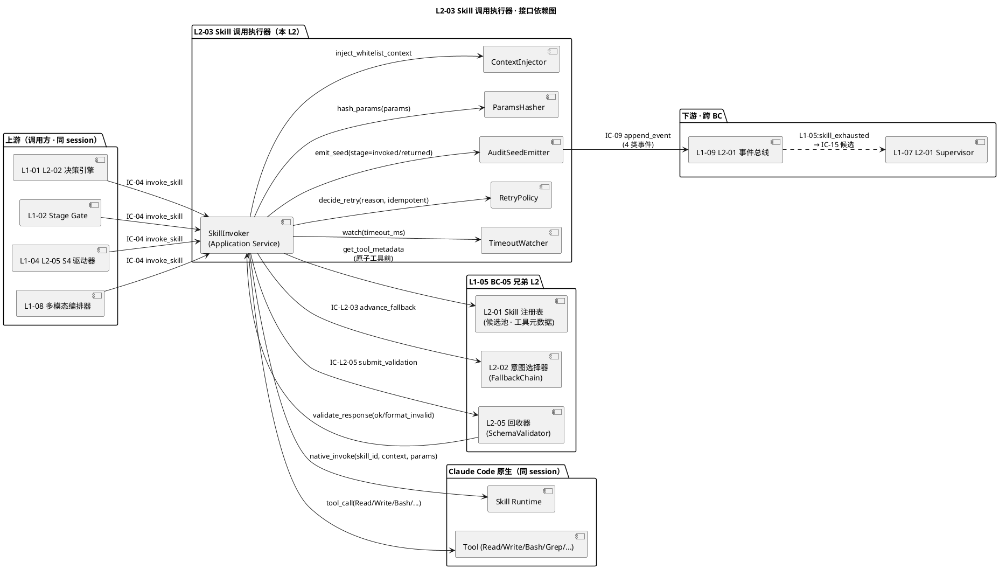
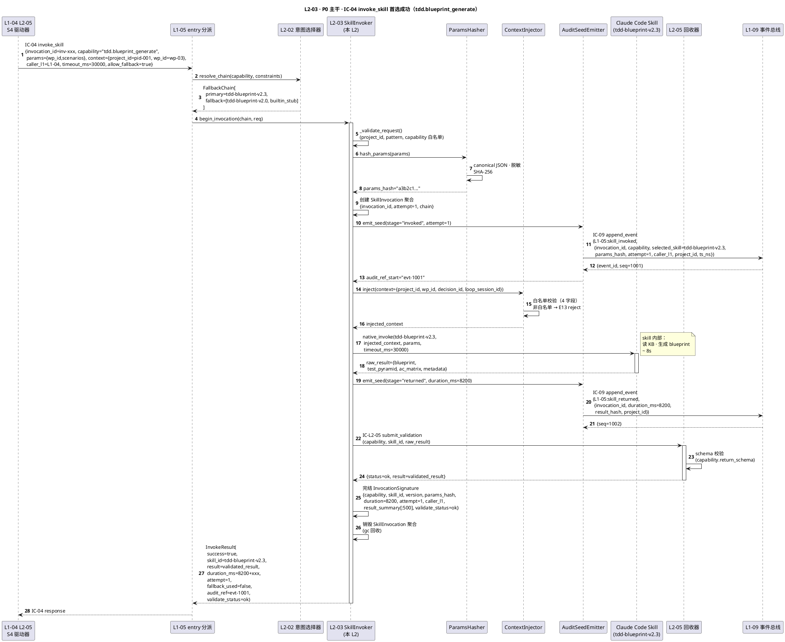
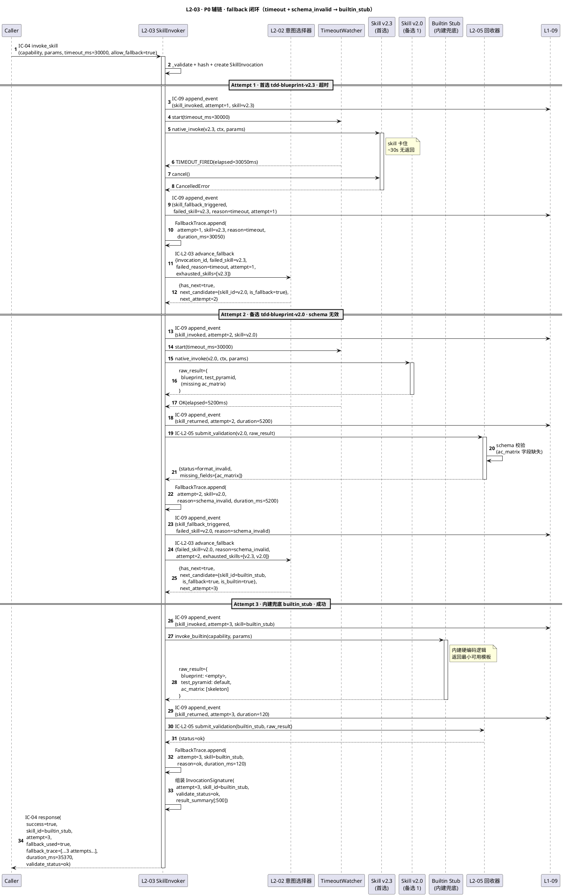
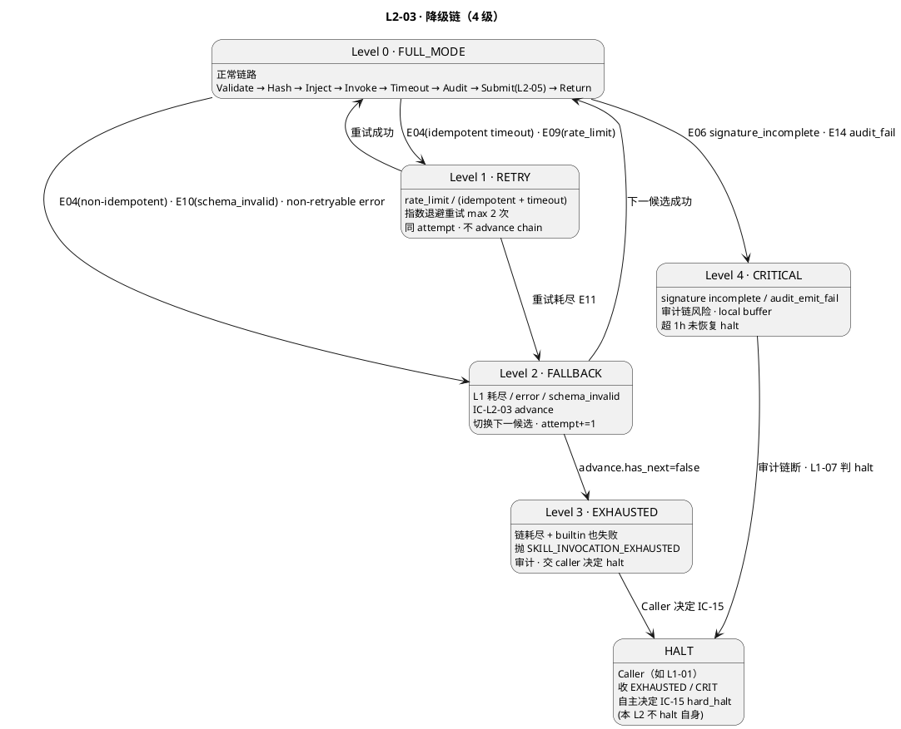

# L1-05 L2-03 · Skill 调用执行器 · Tech Design

> **本文档定位**：3-1-Solution-Technical 层级 · L1-05 的 L2-03 Skill 调用执行器 技术实现方案（L2 粒度 · depth-B）。
> **与产品 PRD 的分工**：2-prd/L1-05 Skill生态+子Agent调度/prd.md §10 定义产品边界，本文档定义**技术实现**（接口字段级 schema + 算法伪代码 + 底层数据结构 + 状态机 + 配置参数 + 错误码表）。
> **与 L1 architecture.md 的分工**：architecture.md 负责**跨 L2 架构 + 跨 L2 时序**，本文档负责**本 L2 内部技术细节**。冲突以 architecture.md 为准。
> **严格规则**：本文档不复述产品 PRD 文字（职责 / 禁止 / 必须等清单），只做技术映射 + 补齐"产品视角未说 but 工程师必须知道"的部分（具体算法 · syscall · schema · 配置）。

---

## §0 撰写进度

- [x] §1 定位 + 2-prd §10 L2-03 映射
- [x] §2 DDD 映射（引 L0/ddd-context-map.md BC-05）
- [x] §3 对外接口定义（字段级 YAML schema · ≥3 接口 + ≥12 错误码）
- [x] §4 接口依赖（被谁调 · 调谁 · PlantUML 依赖图）
- [x] §5 P0/P1 时序图（PlantUML ≥ 2 张）
- [x] §6 内部核心算法（context injection / timeout / retry / audit seed）
- [x] §7 底层数据表 / schema 设计（字段级 YAML · PM-14 `projects/<pid>/skills/invocations/*`）
- [x] §8 状态机（SkillInvoker pending/running/success/failed/timeout/retrying · PlantUML + 转换表）
- [x] §9 开源最佳实践调研（≥ 3 GitHub ≥1k stars · LangChain Tools / Claude Agent SDK / Temporal）
- [x] §10 配置参数清单（≥ 10 条）
- [x] §11 错误处理 + 降级策略（≥ 12 错误码 + 4 级降级）
- [x] §12 性能目标（P95/P99 SLO · 吞吐 · 并发）
- [x] §13 与 2-prd / 3-2 TDD 的映射表（ADR + OQ + TC ≥15）

---

## §1 定位 + 2-prd 映射

### 1.1 本 L2 的唯一命题（One-Liner）

**L2-03 是 HarnessFlow Skill 生态的"执行臂"**：把 L2-02 产出的 `FallbackChain = [首选, 备选, …, 内建兜底]` 变成**真实的副作用动作** —— 按链首发起 **同 session 内** skill / 原子工具调用，每次调用产出完整的 **InvocationSignature**（9 字段 VO）并经 IC-09 落盘；调用失败 / Vision 超时 / 回传 schema 校验失败时沿链**前进**（IC-L2-03 → L2-02）到下一候选继续尝试，直到成功、链耗尽、或命中兜底内建逻辑。**本 L2 不启子进程 / 不跨 session**（那是 L2-04 的领域）· 只做同 session 内的 invoke 编排（context injection + timeout + retry + audit seed 四重职责）。

### 1.2 与 `2-prd/L1-05 Skill生态+子Agent调度/prd.md §10` 的精确小节映射表

> 说明：本表是**技术实现 ↔ 产品小节**的锚点表，不复述 PRD 文字。每行左列为本 tech-design 的段落，右列为对应的 PRD 小节。冲突以本文档（技术实现）+ architecture.md（架构）为准。

| 本文档段 | 2-prd §10 小节 | 映射内容 | 备注 |
|:---|:---|:---|:---|
| §1.1 命题 | §10.1 职责锚定 | "执行臂 · 把链变调用" | 本文档补"同 session 内 invoke 编排"定性 |
| §1.4 兄弟边界 | §10.3 边界 | In-scope 8 项 + Out-of-scope 7 项 | — |
| §1.5 PM-14 | §10.4 硬约束 | project_id 根字段 · `projects/<pid>/skills/invocations/*` | **补字段级路径** |
| §2 DDD | §10.1 上游锚定 + arch §9.3 | BC-05 映射 · Application Service + SkillInvocation 聚合根 | **补 DDD 语言** |
| §3 接口 `invoke()` | §10.2 输入 5 类 + §10.8 IC 表 | IC-04 invoke_skill 接收 + InvocationResult 返回 | **补字段级 YAML** |
| §3 接口 `advance_fallback()` | §10.2 "IC-L2-03 前进" | 内部调用 L2-02 取下一候选 | **补** |
| §3 错误码 | §10.4 硬约束（7 条）+ §10.5 禁止（8 条）| 约束违反一一映射错误码 | **补 ≥12 错误码** |
| §4 依赖 | §10.8 IC 交互表 | 调用方 4 类 + 被调方 3 类 | — |
| §5 时序 | prd §10.9 G-W-T P1-P5 + arch §4.1-§4.2 | 主 tdd 成功 + fallback 闭环 | **补 PlantUML** |
| §6 算法 | §10.2 输出契约 + §10.4 硬约束 1/3/6/7 | context injection + timeout + retry + audit seed | **补伪代码** |
| §7 schema | §10.2 "调用签名事件" + PM-14 | InvocationSignature 9 字段 + 落盘路径 | **补字段级 YAML** |
| §8 状态机 | §10.9 G-W-T P5 "链全失败" + N1-N5 | 6 状态（pending/running/success/failed/timeout/retrying）| **补 PlantUML** |
| §9 调研 | §9 外 | 引 L0/open-source-research.md + 3 高星项目 | **补** |
| §10 配置 | §10.4 性能约束 + §10.7 可选功能 | timeout / retry / 并发 / 脱敏 规则 | **补 ≥10 参数** |
| §11 降级 | §10.4 硬约束 2 + scope §5.5.5 禁止 4 | 4 级降级链 + L1-07 协同 | **补** |
| §12 SLO | §10.4 性能约束（< 100ms 附加）| P95/P99 + 吞吐 + 内存 | 原样继承 + 细化 |
| §13 映射 | — | 本段接口 ↔ §10.X + ↔ 3-2-TDD 用例 | **补** |

### 1.3 与 `L1-05/architecture.md` 的位置映射

引 `architecture.md §9.3`（"L2-03 Skill 调用执行器 · Application Service + Aggregate Root"）· 本 L2 在 architecture 中的 8 个锚点：

| architecture 锚点 | 映射内容 | 本文档对应段 |
|:---|:---|:---|
| §2.1 BC-05 | 本 L2 所在 Bounded Context | §2.1 |
| §2.2 SkillInvocation 聚合根 | 本 L2 唯一构造 · 每次调用一实例 | §2.2 + §7.1 |
| §2.5 Domain Events（skill_invoked / skill_returned / skill_fallback_triggered） | 本 L2 发布 3 事件 | §2.5 + §3.6 |
| §3.1 Component Diagram L2-03 位置 | main_skill runtime 内 · 非独立进程 | §1.3 图 |
| §4.1 P0 首选成功时序 | IC-04 → L2-02 → L2-03 → tdd skill → L2-05 → 调用方 | §5.1 |
| §4.2 P0 fallback 时序 | 首选失败 → IC-L2-03 advance → 备选成功 → 内建兜底 | §5.2 |
| §9.3 DDD 原语 | Application Service + Aggregate Root: SkillInvocation + VO: InvocationSignature | §2.2 |
| §9.7 10 条 IC-L2 契约表 | L2-03 参与 IC-L2-03 / IC-L2-05 / IC-L2-08 | §3 + §4 |

### 1.4 与兄弟 L2 的边界（L1-05 5 L2 中 L2-03 的位置）

| 兄弟 L2 | 本 L2 与兄弟的边界规则（基于 prd §10.3 + arch §9.6）|
|:---|:---|
| **L2-01 Skill 注册表** | L2-01 是**单一候选池来源** · 本 L2 查原子工具元数据走 L2-01（**禁**内部硬编码 skill 名）· 调用结束不直接回写账本（由 L2-02 经 IC-L2-07 回写）|
| **L2-02 Skill 意图选择器** | L2-02 是**策略顾问**（选谁） · 本 L2 是**执行臂**（怎么调） · 本 L2 只消费 L2-02 产出的链；首选 / 当前候选失败时**必**经 IC-L2-03 请 L2-02 前进（**禁**自行决定下一候选）|
| **L2-04 子 Agent 委托器** | L2-04 负责**异步独立 session 生命周期**（启动 / 心跳 / kill） · 本 L2 只做**同 session 内同步**调用 · `role=subagent` 的请求经 L1-05 入口分派到 L2-04 不到本 L2 |
| **L2-05 异步结果回收器** | 所有回传**必经**本 L2 组装后走 IC-L2-05 交 L2-05 校验（**禁**直接返调用方）· L2-05 `format_invalid` 触发本 L2 走 IC-L2-03 fallback 前进 |

### 1.5 PM-14 约束（project_id as root）

**硬约束**（引 `architecture.md §1.4 PM-14` + scope §5.5.4 硬约束 1）：

1. `invoke_skill_command.project_id` 为**根字段**（context.project_id）· 缺 → `SKILL_INVOCATION_NO_PROJECT_ID`
2. `InvocationSignature.project_id` 由 context 透传 · 禁重造
3. 所有持久化路径按 `projects/<pid>/skills/invocations/*` 分片（见 §7）
4. 跨 project 调用**禁止**（一 invocation 一 pid）· 违反 → `SKILL_INVOCATION_CROSS_PROJECT`
5. Domain Events 3 枚（skill_invoked / skill_returned / skill_fallback_triggered）payload 必含 `project_id`
6. 事件路径：`projects/<pid>/events/L1-05.jsonl`（由 L1-09 最终落盘 · 本 L2 产 seed）

### 1.6 关键技术决策（Decision → Rationale → Alternatives → Trade-off）

本 L2 在 architecture.md §9.3 基础上，补充 L2 粒度的 8 个技术决策：

| # | Decision | Rationale | Alternatives | Trade-off |
|:---|:---|:---|:---|:---|
| **D-01** | SkillInvocation 聚合根**每次调用独立实例**（短寿命 · 单次 invoke 生命周期）| prd §10.4 硬约束 7 "attempt 单调递增 · 单调独立" · 聚合独立易 GC / 易审计 / 易并发 | A. 单例 + 复用：并发污染签名临时状态（违 §10.5 禁止 8）| 多次调用多次实例化（成本可忽略：InvocationSignature 9 字段 < 1KB）|
| **D-02** | **同 session 内调用**（主 session skill tool 直接分派 · 非子进程 / 非 HTTP）| Claude Code Skill 原生能力 · 零额外网络 · 零序列化 · 延迟可控 | A. 每 skill fork 子进程：进程模型重 · 违 L2-04 边界；B. HTTP skill server：额外 ACL 边界 | 同 session 内资源共享（ctx 隔离靠 ContextInjector 控制）|
| **D-03** | **ContextInjector 白名单**：默认注入 `project_id / wp_id / loop_session_id / decision_id` 4 字段 · 其他字段按 capability schema 显式声明 | 防 context 泄漏（敏感字段 accidentally 流入 skill）+ 可审计（每次注入的 context 字段集可记录）| A. 全量注入：违 scope §5.5.5 禁止 3（防范信息外抛）；B. 不注入：skill 缺上下文无法工作 | 白名单维护成本（每新 capability 要定 schema）|
| **D-04** | **timeout 三级**：per-skill default (30s) · per-call override · hard-cap 5min（不可超）| prd §10.4 性能约束 + scope §5.5.4 硬约束 4 "子 Agent 默认 5min" · 本 L2 同 session 同步调用 hard-cap 更短（避免阻塞主 loop）| A. 固定 timeout：粗粒度；B. 无 timeout：主 loop 被 skill 卡死 | hard-cap 5min 可能误杀慢 skill（走 fallback 链兜底）|
| **D-05** | **retry 策略**：per-skill declare `idempotent: true/false` · idempotent 允许最多 2 次重试 · non-idempotent 0 重试直接 fallback | PM-09 能力抽象层 · 区分副作用 · 防重复写 | A. 所有 skill 都 retry：non-idempotent skill 会被重复调用；B. 不 retry：网络闪断即触 fallback（浪费首选 skill 机会）| idempotent 标记由 skill 作者在 SKILL.md 声明 · 未声明默认 false |
| **D-06** | **audit seed 生成时机**：**调用前**生成 `invocation_id + params_hash + started_at` · 调用后**补齐** `duration / result_summary / validate_status` · 启动即 append 不等结果 | prd §10.4 硬约束 3 "签名字段完整性不可妥协" · 启动即 append 防止"调用中崩溃丢签名" | A. 调用完成后一次性 append：崩溃时丢事件；B. 只记失败：丢掉所有成功签名 | 每调用 2 次 IC-09（append + update）· 成本 ~ 20ms |
| **D-07** | **params_hash 算法**：SHA-256 over `canonical JSON(params)` · 敏感字段（token/key 后缀匹配）先脱敏再 hash | prd §10.4 硬约束 6 "不记原值 · 同入参同 hash" · scope §5.5.5 禁止 "params 原值落盘" | A. 直接 hash 原值：敏感字段泄漏；B. 不 hash：无法去重 + 审计 | 脱敏规则表（§10 配置 `sensitive_field_patterns`）维护成本 |
| **D-08** | **fallback 前进是受控副作用**：每次 advance 必经 IC-L2-03 显式契约 · 禁止隐式重入自己 | prd §10.4 硬约束 2 + arch §9.6 "受控副作用" | A. 内部循环推进：L2-02 账本无法观察 fallback（违 IC-L2-07）| 每次 advance 多一次 IC 跨 L2 调用（~ 5ms）|

### 1.7 本 L2 读者预期

读完本 L2 的工程师应掌握：
- SkillInvoker Application Service 的 3 IC 触点字段级 schema（IC-04 入口 · IC-L2-03 advance · IC-L2-05 validate）+ 12 错误码
- 5 个核心算法（主入口 6 阶段流水 / ContextInjector 白名单 / TimeoutWatcher / RetryPolicy / AuditSeedEmitter）
- 3 张数据表（InvocationSignature / InvocationTrace / FallbackTrace）
- SkillInvocation 状态机（6 状态 · pending → running → success/failed/timeout/retrying）
- 降级链 4 级（FULL → RETRY → FALLBACK → EXHAUSTED）
- SLO（签名准备 P99 ≤ 100ms · 原子工具 ≤ 10ms · fallback 前进 ≤ 1s）

### 1.8 本 L2 不在的范围（YAGNI · 技术视角）

- **不在**：子 Agent 启动 / kill / 心跳（L2-04 领域 · 跨 session 复杂度爆炸）
- **不在**：Skill 选择策略（L2-02 · 本 L2 只拿链执行）
- **不在**：schema 字段级定义（由 skill 作者在 SKILL.md 声明 · 本 L2 透传）
- **不在**：schema 校验本身（L2-05 · 本 L2 只组装 validate 请求）
- **不在**：KB 读写（L1-06 · skill 内部自行调用）
- **不在**：task-board 写入（L1-01 L2-05 / 审计记录器 · 本 L2 仅触发 IC-09）
- **不在**：跨 project 调用（PM-14 硬约束 4）
- **不在**：skill 业务逻辑本身（skill 作者定义 · 本 L2 只做调度）
- **不在**：MCP 接入（未来扩展 · v1.0 不强制对接）
- **不在**：流式回传（v1.0 non-streaming · 未来视需要开）

### 1.9 本 L2 术语表

| 术语 | 定义 | 关联 |
|:---|:---|:---|
| SkillInvoker | 本 L2 的 Application Service 主编排器 | §2.2 |
| SkillInvocation | 本 L2 的聚合根（短寿命）· 单次调用唯一对应 | §2.2 + §7.1 |
| InvocationSignature | VO · 9 字段（capability / skill_id / version / params_hash / duration / attempt / caller_l1 / result_summary / validate_status）| §2.4 + §7.1 |
| ContextInjector | Domain Service · 注入白名单 4 字段到 skill 调用 context | §6.2 |
| TimeoutWatcher | Domain Service · asyncio 定时器监控 skill 超时 | §6.3 |
| RetryPolicy | Domain Service · idempotent 判定 + 指数退避 | §6.4 |
| AuditSeedEmitter | Domain Service · 调用前/后两次 IC-09 append | §6.5 |
| FallbackTrace | Entity · 记录当次 invocation 的完整 fallback 尝试链 | §7.3 |
| CapabilityTag | VO · 能力抽象层 tag（如 `tdd.blueprint_generate`）| PM-09 |
| FallbackChain | VO · `[首选, 备1, 备2, 内建兜底]` 由 L2-02 产 | §3.2 |
| ParamsHash | VO · SHA-256(canonical JSON(params)) · 敏感字段先脱敏 | §6.6 |

### 1.10 本 L2 的 DDD 定位一句话

**L2-03 是 BC-05 Skill & SubAgent Scheduling 内的 SkillInvoker Application Service · 持有 SkillInvocation 短寿命聚合根 · 对每个 IC-04 invoke_skill 请求执行 context injection + timeout + retry + audit seed 四重职责 · 通过 L2-02 产出的 FallbackChain 按序调用 · 每次调用产出 InvocationSignature 9 字段 VO 并经 IC-09 落盘 · 失败沿链经 IC-L2-03 前进 · 所有返回必经 L2-05 IC-L2-05 校验 · 禁跨 session 启动子 Agent（越界进 L2-04）。**

---

## §2 DDD 映射（BC-05 Skill & SubAgent Scheduling）

### 2.1 Bounded Context 定位

本 L2 属于 `L0/ddd-context-map.md §2.6 BC-05 Skill & SubAgent Scheduling`（引 architecture.md §2.1）：

- **BC 名**：`BC-05 · Skill & SubAgent Scheduling`
- **L2 角色**：**Application Service of BC-05**（承担"把能力链变副作用动作"领域能力）· 同 **Aggregate Root Boundary** 持有 SkillInvocation 聚合
- **与兄弟 L2**：
  - L2-01（Skill 注册表）：Customer-Supplier（本 L2 Customer · 查原子工具元数据）
  - L2-02（意图选择器）：Customer-Supplier（本 L2 Customer · 拿链 + 请求 advance）
  - L2-04（子 Agent 委托器）：**无直接关系**（入口分派 · 互不调用）
  - L2-05（回收器）：Customer-Supplier（本 L2 Customer · IC-L2-05 校验）
- **与其他 BC**：
  - BC-01（L1-01 主 loop）：Supplier（响应 IC-04 invoke_skill）
  - BC-02（L1-02 生命周期）：Supplier（响应 IC-04 · S2/S3 阶段 skill）
  - BC-04（L1-04 Quality Loop）：Supplier（响应 L1-04 L2-05 S4 驱动器的 invoke_skill）
  - BC-08（L1-08 多模态）：Supplier（响应 L1-08 的 skill 调用）
  - BC-09（L1-09 事件总线）：Partnership（经 IC-09 落 InvocationSignature）

### 2.2 聚合根 / 实体 / 值对象 / 领域服务

| DDD 概念 | 名字 | 职责 | 一致性边界 |
|:---|:---|:---|:---|
| **Aggregate Root** | `SkillInvocation` | 单次调用的唯一聚合 · 短寿命 · 持有 InvocationSignature + FallbackTrace | 单次 IC-04 请求强一致；不跨请求存活 |
| **Value Object** | `InvocationSignature` | 9 字段签名（capability / skill_id / version / params_hash / duration / attempt / caller_l1 / result_summary / validate_status）| 不可变 |
| **Value Object** | `CapabilityTag` | 能力抽象层 tag（string · PM-09）| 不可变 |
| **Value Object** | `ParamsHash` | SHA-256 hash（敏感字段脱敏后）| 不可变 |
| **Value Object** | `FallbackChain` | `[首选, 备1, 备2, 内建兜底]` 由 L2-02 产 | 不可变 |
| **Value Object** | `RetryPolicy` | `{max_attempts, backoff_ms, idempotent}` | 不可变 |
| **Entity** | `FallbackTrace` | 当次 invocation 的完整尝试链（attempt + skill_id + reason + duration）| 与 SkillInvocation 同生命周期 |
| **Application Service** | `SkillInvoker` | 编排 6 阶段流水：Validate → ContextInject → Invoke → Timeout → AuditSeed → Return | 单请求 |
| **Domain Service** | `ContextInjector` | 无状态 · 白名单 4 字段注入 skill call context | 单次注入 |
| **Domain Service** | `TimeoutWatcher` | 无状态 · asyncio.wait_for · 3 级 timeout | 单次监控 |
| **Domain Service** | `RetryPolicy` | 无状态 · idempotent 判定 + 指数退避 | 单次调用 |
| **Domain Service** | `AuditSeedEmitter` | 无状态 · 调用前后两次 IC-09 append | 单次 emit |
| **Domain Service** | `ParamsHasher` | 无状态 · SHA-256 + 脱敏规则表 | 单次 hash |

### 2.3 聚合根不变量（Invariants · L2-03 局部）

引 `architecture.md §2.2 I-L505-01 / I-L505-02 / I-L505-03`，本 L2 局部补充：

| 不变量 | 描述 | 校验时机 |
|:---|:---|:---|
| **I-L503-01** | `SkillInvocation.project_id` 必填且在本请求整个生命周期不可变 | 创建时 + 每次 append 前 |
| **I-L503-02** | `SkillInvocation.invocation_id` UUID v7（时间有序）· 不可重复 | 创建时 |
| **I-L503-03** | `InvocationSignature` 9 字段全必填（缺任一即 `SKILL_SIGNATURE_INCOMPLETE`）| append 前 gate |
| **I-L503-04** | `InvocationSignature.attempt` 单调递增（同 invocation 内从 1 起 · fallback 前进 +1）| 每次 advance 时 |
| **I-L503-05** | `InvocationSignature.params_hash` = SHA-256(canonical JSON(脱敏后 params)) · 同入参同 hash | hash 时 |
| **I-L503-06** | `InvocationSignature.validate_status` ∈ {`ok`, `format_invalid`, `not_validated`}（L2-05 返回时填）| 回传时 |
| **I-L503-07** | `FallbackTrace.attempts` ≥ 1 · 每条 entry 含 `attempt / skill_id / reason / duration_ms` | 链耗尽时 |
| **I-L503-08** | 任何 `InvocationSignature` 字段在任何落盘路径都不含 params 原值（只含 hash）| append 前 gate |

### 2.4 Repository

本 L2 **不持有任何 Repository**（SkillInvocation 短寿命 · 不落 DB · 事件走 IC-09）：
- 进程内 map（`dict[invocation_id → SkillInvocation]`）仅在单次 IC-04 请求期间存在
- 响应组装完成后即从 map 移除（Python gc 回收）
- InvocationSignature 经 IC-09 append 到 `projects/<pid>/events/L1-05.jsonl`（由 L1-09 L2-01 管理 · 本 L2 只产 seed）

### 2.5 Domain Events（本 L2 对外发布 · 经 IC-09 走 L1-09）

| 事件名 | 触发时机 | 订阅方 | Payload 字段要点 |
|:---|:---|:---|:---|
| `L1-05:skill_invoked` | 调用前（AuditSeedEmitter Stage 1）| L1-07 / L1-09 / L1-10 | `{invocation_id, capability, selected_skill, params_hash, attempt, caller_l1, project_id, ts_ns}` |
| `L1-05:skill_returned` | skill 返回后（未校验前）| L1-09 | `{invocation_id, duration_ms, result_hash, project_id}` |
| `L1-05:skill_fallback_triggered` | 沿 fallback 链前进时 | L1-07 / L1-09 | `{invocation_id, failed_skill, failed_reason, next_skill, attempt, project_id}` |
| `L1-05:skill_exhausted` | 链耗尽（含内建兜底失败）| L1-07（硬暂停候选）| `{invocation_id, capability, total_attempts, all_reasons[], project_id}` |

### 2.6 与 BC-05 其他 L2 的 DDD 耦合

| 耦合 L2 | DDD 关系 | 触点 |
|:---|:---|:---|
| L2-01 Skill 注册表 | **Customer-Supplier**（本 L2 Customer）| 查原子工具元数据（按 tool_name → metadata）|
| L2-02 Skill 意图选择器 | **Customer-Supplier**（本 L2 Customer）| 拿链 · IC-L2-03 请求 advance |
| L2-04 子 Agent 委托器 | **无关系**（入口分派）| 无 |
| L2-05 异步结果回收器 | **Customer-Supplier**（本 L2 Customer）| IC-L2-05 校验回传 |

---

## §3 对外接口定义（字段级 YAML schema + 错误码）

### 3.1 接口清单总览（6 IC 触点 · 2 接收 + 4 发起）

| # | IC 方向 | 名字 | 简述 | 上/下游 |
|:--:|:---|:---|:---|:---|
| 1 | 接收 | `IC-04 invoke_skill` | 多 L1 发起的同步 skill 调用 | Caller → L2-03 |
| 2 | 接收 | `IC-L2-05 validate_response` | L2-05 回传校验结果（ok / format_invalid）| L2-05 → L2-03 |
| 3 | 发起 | `IC-L2-03 advance_fallback` | 首选 / 当前失败时请求 L2-02 取下一候选 | L2-03 → L2-02 |
| 4 | 发起 | `IC-L2-05 submit_validation` | 把 skill 返回值交 L2-05 校验 | L2-03 → L2-05 |
| 5 | 发起 | `IC-09 append_event(L1-05:*)` | 调用签名事件落盘（4 类事件）| L2-03 → L1-09 |
| 6 | 发起 | `ToolMetadataQuery` | 查 L2-01 原子工具元数据 | L2-03 → L2-01 |

### 3.2 接收：IC-04 invoke_skill · 字段级 YAML schema

引 `integration/ic-contracts.md §3.4 IC-04` 作为跨 L1 契约单一事实源 · 本段只做**本 L2 入口接收**视角的补充约束（同 session · 非 subagent · capability schema 声明）。

```yaml
# ic_04_invoke_skill_command.yaml（本 L2 入口接收契约）
type: object
required: [invocation_id, project_id, capability, params, caller_l1, context]
properties:
  project_id: { type: string, description: "PM-14 项目上下文" }
  invocation_id:
    type: string
    pattern: "^inv-[0-9a-f]{8}-[0-9a-f]{4}-7[0-9a-f]{3}-[0-9a-f]{4}-[0-9a-f]{12}$"
    description: "UUID v7（时间有序）· 由调用方生成"
  capability:
    type: string
    description: "能力抽象层 tag（PM-09 · 非 skill id）"
    examples: ["tdd.blueprint_generate", "code.review", "test.run"]
  params:
    type: object
    description: "capability 的入参 · 由 capability schema 校验"
    additionalProperties: true
  caller_l1:
    type: string
    enum: [L1-01, L1-02, L1-03, L1-04, L1-06, L1-07, L1-08, L1-09, L1-10]
  trigger_tick:
    type: string
    nullable: true
    description: "触发 tick（来自 L1-01 loop 时）"
  timeout_ms:
    type: integer
    default: 30000
    minimum: 1000
    maximum: 300000
    description: "总调用超时 · 最大 5min hard-cap（D-04 决策）"
  allow_fallback:
    type: boolean
    default: true
  context:
    type: object
    required: [project_id]
    properties:
      project_id: { type: string, description: "必与 root project_id 一致" }
      decision_id: { type: string, nullable: true }
      wp_id: { type: string, nullable: true, description: "L1-04 Quality Loop 上下文" }
      loop_session_id: { type: string, nullable: true }
  ts_ns: { type: integer, description: "调用方发起纳秒" }
```

### 3.3 返回：IC-04 invoke_skill 响应 · 字段级 YAML schema

```yaml
# ic_04_invoke_skill_result.yaml
type: object
required: [project_id, invocation_id, success, skill_id, duration_ms, attempt, fallback_used]
properties:
  project_id: { type: string, description: "PM-14 项目上下文" }
  invocation_id: { type: string }
  success: { type: boolean }
  skill_id:
    type: string
    description: "实际被调用的 skill 标识（fallback 后为备选 skill id）"
    examples: ["tdd-blueprint-v2.3"]
  skill_version: { type: string, description: "skill 语义化版本" }
  result:
    type: object
    nullable: true
    description: "success=true 时必填 · 经 L2-05 校验后透传"
  error:
    type: object
    nullable: true
    description: "success=false 时必填"
    properties:
      code: { type: string, description: "见 §3.5 错误码" }
      message: { type: string }
      attempt: { type: integer }
  duration_ms: { type: integer, description: "端到端含所有 fallback" }
  attempt: { type: integer, description: "最终成功时的 attempt 编号" }
  fallback_used: { type: boolean, description: "是否触发 fallback 链" }
  fallback_trace:
    type: array
    description: "若走 fallback · 记录所有尝试"
    items:
      type: object
      required: [attempt, skill_id, reason, duration_ms]
      properties:
        attempt: { type: integer }
        skill_id: { type: string }
        reason: { type: string, enum: [ok, timeout, error, schema_invalid, rate_limit] }
        duration_ms: { type: integer }
  audit_ref: { type: string, description: "L1-09 事件 seq · 审计追溯锚点" }
  validate_status:
    type: string
    enum: [ok, format_invalid, not_validated]
    description: "L2-05 校验结果（success=true 时必为 ok）"
```

### 3.4 发起：IC-L2-03 advance_fallback（请 L2-02 取下一候选）

```yaml
# ic_l2_03_advance_fallback.yaml
type: object
required: [project_id, invocation_id, capability, failed_skill, failed_reason, attempt]
properties:
  project_id: { type: string, description: "PM-14 项目上下文" }
  invocation_id: { type: string }
  capability: { type: string }
  failed_skill: { type: string, description: "刚失败的 skill_id" }
  failed_reason:
    type: string
    enum: [timeout, error, schema_invalid, rate_limit, exception]
  attempt: { type: integer, minimum: 1, description: "当前 attempt 编号（advance 后 +1）" }
  exhausted_skills:
    type: array
    items: { type: string }
    description: "本 invocation 已尝试的 skill_id 列表（L2-02 避免重复推荐）"
  ts_ns: { type: integer }
```

返回（L2-02 响应）：

```yaml
# ic_l2_03_advance_fallback_response.yaml
type: object
required: [project_id, invocation_id, has_next, next_attempt]
properties:
  project_id: { type: string }
  invocation_id: { type: string }
  has_next: { type: boolean, description: "false = 链已耗尽 · 需走内建兜底或返 SKILL_INVOCATION_EXHAUSTED" }
  next_candidate:
    type: object
    nullable: true
    properties:
      skill_id: { type: string }
      skill_version: { type: string }
      is_fallback: { type: boolean }
      is_builtin: { type: boolean, description: "是否内建兜底逻辑" }
  next_attempt: { type: integer, description: "下一次调用的 attempt 编号" }
```

### 3.5 发起：IC-L2-05 submit_validation（交 L2-05 校验回传）

```yaml
# ic_l2_05_submit_validation.yaml
type: object
required: [project_id, invocation_id, capability, skill_id, raw_result]
properties:
  project_id: { type: string, description: "PM-14 项目上下文" }
  invocation_id: { type: string }
  capability: { type: string }
  skill_id: { type: string }
  skill_version: { type: string }
  raw_result:
    type: object
    description: "skill 原始返回 · 未校验 · 待 L2-05 按 capability schema 校验"
  ts_returned_ns: { type: integer }
```

### 3.6 发起：IC-09 append_event（4 类事件 seed）

```yaml
# ic_09_append_event_l105.yaml（本 L2 发起的 4 类事件）
type: object
required: [project_id, event_type, invocation_id, ts_ns]
properties:
  project_id: { type: string, description: "PM-14 项目上下文" }
  event_type:
    type: string
    enum:
      - "L1-05:skill_invoked"        # 调用前
      - "L1-05:skill_returned"       # 收到返回（未校验前）
      - "L1-05:skill_fallback_triggered"  # fallback 前进
      - "L1-05:skill_exhausted"      # 链耗尽
  invocation_id: { type: string }
  capability: { type: string }
  skill_id: { type: string, description: "本次 attempt 的 skill_id" }
  skill_version: { type: string, nullable: true }
  params_hash: { type: string, description: "SHA-256 · 禁原值" }
  attempt: { type: integer, minimum: 1 }
  caller_l1: { type: string }
  duration_ms: { type: integer, nullable: true, description: "started/returned 时填 · invoked 时 null" }
  result_summary: { type: string, nullable: true, maxLength: 500 }
  validate_status: { type: string, enum: [ok, format_invalid, not_validated], nullable: true }
  failed_reason: { type: string, nullable: true, description: "fallback_triggered / exhausted 时填" }
  trigger_tick: { type: string, nullable: true }
  ts_ns: { type: integer }
```

### 3.7 错误码表（14 条 · ≥12 要求 · 触发场景 / 调用方处理）

| # | error_code | 含义 | 触发场景 | 降级 Level | 调用方处理 |
|:--:|:---|:---|:---|:---:|:---|
| E01 | `SKILL_INVOCATION_NO_PROJECT_ID` | context.project_id 缺失 | 调用方漏填 | L3 REJECT | 补 project_id 重发 |
| E02 | `SKILL_INVOCATION_CROSS_PROJECT` | context.project_id ≠ root project_id | PM-14 违反 | L3 REJECT | 一 invocation 一 pid |
| E03 | `SKILL_INVOCATION_CAPABILITY_UNKNOWN` | capability 不在 L2-01 注册表 | tag 拼错 / 未注册 | L3 REJECT | 检查 capability 拼写 |
| E04 | `SKILL_INVOCATION_TIMEOUT` | 超 timeout_ms（per-call 或 hard-cap 5min）| skill 卡住 / 外部依赖慢 | L1 RETRY→L2 FALLBACK | 内部走 fallback · 耗尽则抛 |
| E05 | `SKILL_INVOCATION_PARAMS_SCHEMA_MISMATCH` | params 不符 capability 声明 schema | 调用方 params 错 | L3 REJECT | 按 schema 补全 |
| E06 | `SKILL_INVOCATION_SIGNATURE_INCOMPLETE` | InvocationSignature 9 字段缺任一 | 内部 bug | L3 REJECT + critical | 运维介入 |
| E07 | `SKILL_INVOCATION_PARAMS_CONTAINS_RAW_SECRET` | 脱敏后仍检出敏感字段 | 调用方漏脱敏 | L3 REJECT | 检查 sensitive_field_patterns |
| E08 | `SKILL_INVOCATION_PERMISSION_DENIED` | skill 要求工具权限未授予 | 工具白名单不通过 | L3 REJECT | 授权 or 改 skill |
| E09 | `SKILL_INVOCATION_RATE_LIMITED` | 外部服务 rate_limit | 并发过高 | L1 RETRY（指数退避）| 内部退避重试 3 次耗尽则 fallback |
| E10 | `SKILL_INVOCATION_SCHEMA_INVALID` | L2-05 校验返回 format_invalid | skill 返回字段缺失 / 类型错 | L2 FALLBACK | 走 fallback |
| E11 | `SKILL_INVOCATION_RETRY_EXHAUSTED` | idempotent skill 重试 N 次仍失败 | 外部依赖死掉 | L2 FALLBACK | 走 fallback |
| E12 | `SKILL_INVOCATION_EXHAUSTED` | fallback 链 + 内建兜底全失败 | 整条链死 | L4 CRIT → halt 候选 | 上抛 L1-07 决策 IC-15 |
| E13 | `SKILL_INVOCATION_CONTEXT_INJECTION_FAIL` | ContextInjector 白名单校验失败 | 试图注入非白名单字段 | L3 REJECT | 检查 capability schema |
| E14 | `SKILL_INVOCATION_AUDIT_EMIT_FAIL` | IC-09 append 失败 | L1-09 不可达 | L4 CRIT | 缓存 + 告警 · 审计链风险 |

**错误码结构化返回模板**：

```yaml
success: false
error:
  code: SKILL_INVOCATION_TIMEOUT
  message: "skill tdd-blueprint-v2.3 exceeded timeout_ms=30000 · attempt=1"
  attempt: 1
fallback_used: true
fallback_trace:
  - { attempt: 1, skill_id: "tdd-blueprint-v2.3", reason: "timeout", duration_ms: 30050 }
  - { attempt: 2, skill_id: "tdd-blueprint-v2.0", reason: "ok", duration_ms: 8200 }
audit_ref: "evt-20260422-0001-xxxxx"
duration_ms: 38250
```

---

## §4 接口依赖（被谁调 · 调谁）

### 4.1 上游调用方

| 调用方 | 通过何种 IC | 触发场景 | 频率预估 |
|:---|:---|:---|:---:|
| L1-01 主 loop L2-02 决策引擎 | IC-04 invoke_skill | decide() → decision_type=invoke_skill | **最高频**：每决策 0-3 次 |
| L1-02 Stage Gate 引擎 | IC-04 invoke_skill | S2/S3 阶段 skill（TOGAF / PLAN skill）| S2/S3 每阶段 5-20 次 |
| L1-04 Quality Loop S4 执行驱动器 | IC-04 invoke_skill | S4 阶段 tdd skill / test 执行 | **最高频**：每 WP 10-50 次 |
| L1-04 L2-01 TDD 蓝图生成器 | IC-04 invoke_skill | tdd.blueprint_generate skill | 每 WP 1 次 |
| L1-08 多模态 | IC-04 invoke_skill | image/code/md 内容理解 skill | S2-S5 各阶段 1-5 次 |
| L2-05 回收器 | IC-L2-05 validate_response | 校验完成回传 ok/format_invalid | 每 invocation 1-N 次 |

### 4.2 下游依赖

| 目标 | IC / 调用方式 | 意义 | 是否必选 |
|:---|:---|:---|:---:|
| **L2-01 Skill 注册表** | `get_tool_metadata(tool_name)` Query | 查原子工具元数据（超时 / 权限）| 必选（每次原子工具调用前）|
| **L2-02 意图选择器** | IC-L2-03 advance_fallback | 首选/当前失败时取下一候选 | 条件必选（失败时）|
| **L2-05 回收器** | IC-L2-05 submit_validation | 回传 schema 校验 | 必选（每次成功返回）|
| **L1-09 事件总线** | IC-09 append_event | 4 类事件落盘（invoked/returned/fallback/exhausted）| 必选（每调用 ≥ 2 次）|
| **Claude Code Skill Runtime** | 同 session 原生调用 | 实际执行 skill 代码 | 必选 |
| **Claude Code Tool（Read/Write/Bash/Grep/...）** | 同 session 原生工具 | 原子工具调用（10 类）| 必选 |
| **L1-07 Supervisor（间接）** | 经 L1-09 事件广播 | exhausted 事件触发 IC-15 候选 | 条件必选（耗尽时）|

### 4.3 依赖图（PlantUML）



### 4.4 不依赖清单（明确不调）

| 不调 | 理由 |
|:---|:---|
| L2-04 子 Agent 委托器 | 入口分派互不调用（arch §9.6 同层并列）|
| L1-06 3 层 KB | skill 内部自行调 IC-06（本 L2 不越俎代庖）|
| 任何外部 HTTP API | 同 session 原生 · 无外部依赖（未来 MCP 扩展点走 L2-03 ACL）|
| OS subprocess / fork | L2-04 才启子 session · 本 L2 纯同步同 session |
| 文件系统直接 Write | 审计走 IC-09 · skill 输出走 skill 自身 |
| task-board 直接写入 | 经 IC-09 触发 L1-01 L2-05 异步写 |
| L1-10 UI 直接通知 | UI 拉模型 · 查 L1-09 IC-18 |

### 4.5 依赖方向一致性校验

- **只依赖下游同层 L2 或跨 BC 基础设施**：L2-01（查）· L2-02（advance）· L2-05（校验）· L1-09（事件）· L1-07（间接告警）
- **禁反向依赖上游**：本 L2 不回调 L1-01/L1-02/L1-04（调用方） · 返回走 IC-04 响应同步通道
- **禁横向调用 L2-04**：subagent 请求由 L1-05 entry 分派（arch §9.7 IC-05/12/20 分派规则）

---

## §5 P0/P1 时序图（PlantUML ≥ 2 张）

### 5.1 P0 主干 · 首选 skill 成功（tdd.blueprint_generate · 标准链路）

**场景一句话**：L1-04 S4 驱动器调 `tdd.blueprint_generate` skill → 本 L2 InvokerApplicationService 6 阶段流水 → 首选 skill（tdd-blueprint-v2.3）返回成功 → 交 L2-05 校验通过 → 两次 IC-09（invoked/returned）落盘 → 返回 caller。

**端到端延迟预期**：3-10s（签名准备 ≤ 100ms · skill 本身 3-10s · 审计 ≤ 20ms）。



**关键时序点**：
- **Step 5-6**：L1-05 entry 先经 L2-02 产链（`primary + [fallback_list] + builtin_stub`）· 本 L2 只消费链
- **Step 10-13**：**两阶段 audit seed**（D-06 决策）· 调用前 append skill_invoked · 调用后 append skill_returned · 防崩溃丢签名
- **Step 14-16**：**ContextInjector 白名单**（D-03 决策）· 非白名单字段拒绝注入 · 防 context 泄漏
- **Step 17-20**：**主 session native_invoke**（D-02 决策）· 无子进程 / 无 HTTP · 延迟可控
- **Step 22-25**：**每返回必经 L2-05**（scope §5.5.6 义务 6）· 禁止"跳过校验直接返"
- **Step 27**：InvocationSignature 9 字段**完结时一次组装**（I-L503-03 不变量 gate）

### 5.2 P0 辅 · fallback 闭环（首选超时 + 备选 schema 无效 + 内建兜底成功）

**场景一句话**：首选 `tdd-blueprint-v2.3` 超时（30s）→ IC-L2-03 advance → 备选 `tdd-blueprint-v2.0` 返回但 schema 无效 → IC-L2-03 advance → 内建 `builtin_stub` 返回空模板 → 成功返回。**覆盖 fallback 闭环 + schema 失败触发 fallback + 内建兜底**。



**关键时序点**：
- **Step 8-11**：TimeoutWatcher 触发 `asyncio.CancelledError` · 必显式 cancel() 下层 skill 防 goroutine 泄漏
- **Step 15-17**：**IC-L2-03 advance 是受控副作用**（D-08 决策）· 不隐式重入 · L2-02 账本可观察 fallback
- **Step 25-28**：schema_invalid 也触 fallback（不等于失败）· scope §5.5.6 义务 6 "回传必校验"
- **Step 35-40**：**内建兜底 is_builtin=true** · attempt 继续单调递增 · 返回 fallback_used=true
- **Step 40**：`fallback_trace` 完整记录 3 次尝试 · 供 L2-02 回写账本（经 IC-L2-07）

### 5.3 P1 异常 · 链耗尽 SKILL_INVOCATION_EXHAUSTED（含内建兜底失败）

```plantuml
@startuml
autonumber
title L2-03 · P1 异常 · 链耗尽（含内建兜底失败 · 抛 EXHAUSTED）

participant "Caller\n(L1-01)" as C
participant "L2-03" as SI
participant "L2-02" as L502
participant "L1-09" as L901
participant "L1-07 Supervisor" as L701

C -> SI : IC-04 invoke_skill

== 所有 3 次 attempt 都失败 ==
SI -> SI : attempt=1 primary → error
SI -> L502 : advance → next=v2.0
SI -> SI : attempt=2 v2.0 → timeout
SI -> L502 : advance → next=builtin_stub
SI -> SI : attempt=3 builtin_stub → internal_error

SI -> L502 : advance(attempt=3, reason=error)
L502 --> SI : {has_next=false, reason="chain_exhausted"}

SI -> L901 : IC-09 append_event\n(L1-05:skill_exhausted,\n {invocation_id, capability,\n total_attempts=3,\n all_reasons=[error, timeout, error]})
L901 ..> L701 : 事件订阅 · 触发 supervisor 评估

SI --> C : IC-04 response\n(success=false,\n error={code=SKILL_INVOCATION_EXHAUSTED,\n  message="chain exhausted after 3 attempts"},\n fallback_trace=[3 entries],\n duration_ms=xxxx)

note over C: Caller (L1-01 L2-02 决策引擎)\n自行决定是否\n触发 IC-15 hard_halt\n(L2-03 不 halt 自身)

@enduml
```

---

## §6 内部核心算法（Python-like 伪代码）

本节给出本 L2 的 **5 个关键算法**（主入口 · ContextInjector · TimeoutWatcher · RetryPolicy · AuditSeedEmitter + ParamsHasher）· 重点在数据流 / 调用顺序 / 错误分支。

### 6.1 主入口 · `SkillInvoker.invoke()` 6 阶段线性流水

```python
class SkillInvoker:
    """
    Application Service · 每次 invoke 一实例 SkillInvocation 聚合
    阶段：1.Validate → 2.Hash → 3.Create → 4.Chain Loop(Inject+Invoke+Timeout+Retry+Audit) → 5.Submit L2-05 → 6.Assemble
    硬约束：签名附加开销 P99 < 100ms · hard-cap timeout 5min
    """
    MAX_ATTEMPTS_PER_INVOCATION = 10   # 防链失控

    def invoke(self, req: InvokeSkillCommand) -> InvokeSkillResult:
        start_ns = monotonic_ns()

        # Stage 1 · 请求校验（PM-14 + capability + schema）
        self._validate_request(req)

        # Stage 2 · params hash（canonical JSON + 敏感字段脱敏）
        params_hash = self.hasher.hash(req.params, req.capability)

        # Stage 3 · 创建聚合
        inv = SkillInvocation(
            invocation_id=req.invocation_id,
            project_id=req.project_id,
            capability=req.capability,
            caller_l1=req.caller_l1,
            params_hash=params_hash,
            chain=self.chain_cache.get(req.invocation_id),  # 由 entry 预先注入
            attempt=0,
            fallback_trace=[],
        )

        # Stage 4 · Chain Loop（首选 → 备选 → 内建兜底）
        current = inv.chain.head()
        while current is not None and inv.attempt < self.MAX_ATTEMPTS_PER_INVOCATION:
            inv.attempt += 1
            skill_id = current.skill_id
            skill_version = current.skill_version
            is_builtin = current.is_builtin

            # 4.1 · AuditSeed Stage 1（调用前 · append skill_invoked）
            audit_ref_start = self.audit.emit_seed(
                stage='invoked',
                inv=inv, skill_id=skill_id, attempt=inv.attempt,
            )

            # 4.2 · ContextInjector（白名单 4 字段）
            try:
                injected_ctx = self.injector.inject(req.context, req.capability)
            except ContextInjectionError as e:
                return self._build_err(inv, 'SKILL_INVOCATION_CONTEXT_INJECTION_FAIL', e)

            # 4.3 · RetryPolicy · 判是否允许重试（idempotent skill 有机会）
            retry_policy = self.retry_selector.get(skill_id, capability=req.capability)

            # 4.4 · Invoke with Timeout + Retry
            attempt_start_ns = monotonic_ns()
            result, reason = self._invoke_with_timeout_retry(
                skill_id, skill_version, is_builtin,
                injected_ctx, req.params,
                timeout_ms=req.timeout_ms,
                retry=retry_policy,
            )
            duration_ms = (monotonic_ns() - attempt_start_ns) // 1_000_000

            # 4.5 · AuditSeed Stage 2（调用后 · append skill_returned）
            self.audit.emit_seed(
                stage='returned', inv=inv, skill_id=skill_id,
                attempt=inv.attempt, duration_ms=duration_ms,
            )

            # 4.6 · 成功分支 → 交 L2-05 校验
            if reason == 'ok':
                validation = self.l2_05.submit_validation(
                    invocation_id=inv.invocation_id,
                    capability=req.capability,
                    skill_id=skill_id,
                    skill_version=skill_version,
                    raw_result=result,
                )
                if validation.status == 'ok':
                    # 4.6.1 · 成功终结
                    inv.fallback_trace.append(FallbackEntry(
                        attempt=inv.attempt, skill_id=skill_id,
                        reason='ok', duration_ms=duration_ms,
                    ))
                    return self._build_success(
                        inv, skill_id, skill_version,
                        validation.result, duration_ms, start_ns,
                    )
                # 4.6.2 · schema_invalid → 走 fallback
                reason = 'schema_invalid'

            # 4.7 · 失败分支 → fallback 前进
            inv.fallback_trace.append(FallbackEntry(
                attempt=inv.attempt, skill_id=skill_id,
                reason=reason, duration_ms=duration_ms,
            ))
            self.audit.emit_fallback_triggered(
                inv, failed_skill=skill_id, failed_reason=reason,
            )

            if not req.allow_fallback:
                return self._build_err(inv, f'SKILL_INVOCATION_{reason.upper()}')

            # 4.8 · IC-L2-03 advance（受控副作用）
            advance = self.l2_02.advance_fallback(AdvanceRequest(
                invocation_id=inv.invocation_id,
                capability=req.capability,
                failed_skill=skill_id,
                failed_reason=reason,
                attempt=inv.attempt,
                exhausted_skills=[e.skill_id for e in inv.fallback_trace],
            ))
            if not advance.has_next:
                break
            current = advance.next_candidate

        # Stage 5 · 链耗尽 → EXHAUSTED
        self.audit.emit_exhausted(inv)
        return self._build_err(inv, 'SKILL_INVOCATION_EXHAUSTED')

    def _invoke_with_timeout_retry(self, skill_id, version, is_builtin,
                                    ctx, params, timeout_ms, retry):
        """核心 invoke 循环 · 带 timeout + 指数退避 retry"""
        backoff_ms = retry.initial_backoff_ms
        for retry_i in range(retry.max_attempts + 1):
            try:
                if is_builtin:
                    result = self.builtin_dispatcher.invoke(skill_id, ctx, params,
                                                              timeout_ms=timeout_ms)
                else:
                    result = asyncio.wait_for(
                        self.native_runtime.invoke(skill_id, version, ctx, params),
                        timeout=timeout_ms / 1000.0,
                    )
                return (result, 'ok')
            except asyncio.TimeoutError:
                if retry_i < retry.max_attempts and retry.retry_on_timeout:
                    sleep_ms(backoff_ms); backoff_ms *= 2
                    continue
                return (None, 'timeout')
            except RateLimitError:
                if retry_i < retry.max_attempts:
                    sleep_ms(backoff_ms); backoff_ms *= 2
                    continue
                return (None, 'rate_limit')
            except SkillExecutionError as e:
                return (None, 'error')
```

### 6.2 ContextInjector · 白名单 4 字段注入（防 context 泄漏）

```python
class ContextInjector:
    """
    白名单 · 默认 4 字段：project_id / wp_id / loop_session_id / decision_id
    capability 可在 SKILL.md 声明扩展字段（需 review）· 非白名单字段拒绝注入
    """
    DEFAULT_WHITELIST = frozenset(['project_id', 'wp_id',
                                    'loop_session_id', 'decision_id'])

    def inject(self, raw_context: dict, capability: str) -> dict:
        whitelist = self.DEFAULT_WHITELIST | self._capability_whitelist(capability)

        # 校验 1 · 非白名单字段拒绝
        extra = set(raw_context.keys()) - whitelist
        if extra:
            raise ContextInjectionError(
                f'non-whitelist context fields: {extra} · capability={capability}'
            )

        # 校验 2 · 敏感字段检测（即便在白名单也不允许含 raw secret）
        for key, value in raw_context.items():
            if self._looks_like_secret(key, value):
                raise ContextInjectionError(
                    f'potential secret in context: key={key}'
                )

        # 投射 · 只传白名单子集（保护未来字段增加不外漏）
        return {k: raw_context[k] for k in whitelist if k in raw_context}

    def _capability_whitelist(self, capability: str) -> set:
        """从 L2-01 SKILL.md 的 context_whitelist 字段读"""
        meta = self.skill_registry.get_capability_meta(capability)
        return frozenset(meta.get('context_whitelist', []))

    def _looks_like_secret(self, key: str, value) -> bool:
        # 后缀匹配
        if any(key.lower().endswith(s) for s in
                ('_token', '_key', '_secret', '_password', '_auth')):
            return True
        # 值启发式（长 base64 / 长 hex）
        if isinstance(value, str) and len(value) > 40:
            if re.match(r'^[A-Za-z0-9+/=]{40,}$', value):
                return True
        return False
```

### 6.3 TimeoutWatcher · asyncio.wait_for 三级 timeout

```python
class TimeoutWatcher:
    """
    三级 timeout（D-04 决策）：
      Level 1 · per-call（调用方传 req.timeout_ms · 默认 30000 · 范围 [1000, 300000]）
      Level 2 · per-skill-default（SKILL.md 声明 · 默认 30000）
      Level 3 · hard-cap（全局 5min · 不可超 · 防止主 loop 被 skill 卡死）
    """
    HARD_CAP_MS = 300_000   # 5 min

    def resolve(self, req_timeout_ms: int | None,
                skill_default_ms: int, capability: str) -> int:
        """取三者最小值 · hard-cap 兜底"""
        levels = [self.HARD_CAP_MS, skill_default_ms]
        if req_timeout_ms is not None:
            levels.append(req_timeout_ms)
        return min(levels)

    async def wait(self, coro, timeout_ms: int):
        """核心 · asyncio.wait_for 封装 · 触发时 cancel 下层"""
        try:
            return await asyncio.wait_for(coro, timeout=timeout_ms / 1000.0)
        except asyncio.TimeoutError:
            # 显式 cancel · 防 goroutine 泄漏
            # Python 3.11+ asyncio.wait_for 自动 cancel · 但日志记录显式时机
            raise
```

### 6.4 RetryPolicy · idempotent 判定 + 指数退避

```python
class RetryPolicySelector:
    """
    按 capability / skill 的 idempotent 标志决定重试策略
    idempotent=true  → 最多 2 次重试（timeout / rate_limit）· 指数退避
    idempotent=false → 0 重试 · 立即 fallback
    """
    def get(self, skill_id: str, capability: str) -> RetryPolicy:
        meta = self.registry.get_skill_meta(skill_id)
        is_idempotent = meta.get('idempotent', False)   # 未声明默认 false（保守）
        if is_idempotent:
            return RetryPolicy(
                max_attempts=2,
                initial_backoff_ms=1000,
                retry_on_timeout=True,
                retry_on_rate_limit=True,
                retry_on_error=False,
            )
        return RetryPolicy(
            max_attempts=0,
            initial_backoff_ms=0,
            retry_on_timeout=False,
            retry_on_rate_limit=True,   # rate_limit 独立允许（非幂等也退避）
            retry_on_error=False,
        )
```

### 6.5 AuditSeedEmitter · 两阶段 IC-09 append

```python
class AuditSeedEmitter:
    """
    D-06 决策 · 两阶段 append
      Stage 1 · emit_seed(invoked)  · 调用前 · 防崩溃丢签名
      Stage 2 · emit_seed(returned) · 调用后 · 补齐 duration / result_hash
    """
    def emit_seed(self, stage: str, inv: SkillInvocation, skill_id: str,
                   attempt: int, duration_ms: int | None = None) -> str:
        payload = {
            'project_id': inv.project_id,
            'event_type': f'L1-05:skill_{stage}',
            'invocation_id': inv.invocation_id,
            'capability': inv.capability,
            'skill_id': skill_id,
            'skill_version': self._resolve_version(skill_id),
            'params_hash': inv.params_hash,
            'attempt': attempt,
            'caller_l1': inv.caller_l1,
            'duration_ms': duration_ms,
            'trigger_tick': inv.trigger_tick,
            'ts_ns': monotonic_ns(),
        }
        # Gate · InvocationSignature 字段完整性（I-L503-03）
        self._assert_fields_complete(payload, stage)
        try:
            return self.l109_event_bus.append(payload)   # IC-09
        except L109Unreachable:
            # 降级 · 缓存本地 + 告警（Level 4 CRIT）
            self._buffer_locally(payload)
            self._alert('E14 AUDIT_EMIT_FAIL')
            raise

    def emit_fallback_triggered(self, inv, failed_skill, failed_reason):
        self.l109_event_bus.append({
            'project_id': inv.project_id,
            'event_type': 'L1-05:skill_fallback_triggered',
            'invocation_id': inv.invocation_id,
            'failed_skill': failed_skill,
            'failed_reason': failed_reason,
            'attempt': inv.attempt,
            'ts_ns': monotonic_ns(),
        })

    def emit_exhausted(self, inv):
        self.l109_event_bus.append({
            'project_id': inv.project_id,
            'event_type': 'L1-05:skill_exhausted',
            'invocation_id': inv.invocation_id,
            'capability': inv.capability,
            'total_attempts': inv.attempt,
            'all_reasons': [e.reason for e in inv.fallback_trace],
            'ts_ns': monotonic_ns(),
        })
```

### 6.6 ParamsHasher · 敏感字段脱敏 + SHA-256

```python
class ParamsHasher:
    """
    D-07 决策 · 敏感字段脱敏再 hash · 同入参同 hash（可重现）
    """
    def hash(self, params: dict, capability: str) -> str:
        # 1 · 深拷贝 · 防修改上游
        clone = copy.deepcopy(params)
        # 2 · 按规则表脱敏
        self._redact_sensitive(clone, self.sensitive_patterns)
        # 3 · canonical JSON（keys sorted · no whitespace）
        canonical = json.dumps(clone, sort_keys=True, separators=(',', ':'),
                                ensure_ascii=False).encode('utf-8')
        # 4 · SHA-256
        return hashlib.sha256(canonical).hexdigest()

    def _redact_sensitive(self, obj, patterns: list[re.Pattern]):
        if isinstance(obj, dict):
            for k, v in list(obj.items()):
                if any(p.search(k) for p in patterns):
                    obj[k] = '__REDACTED__'
                else:
                    self._redact_sensitive(v, patterns)
        elif isinstance(obj, list):
            for v in obj:
                self._redact_sensitive(v, patterns)
```

### 6.7 并发与资源控制

- **同一 invocation_id 禁并发**：主入口按 invocation_id 加 asyncio.Lock · 同 id 的第二个请求排队（防重复签名）
- **不同 invocation_id 并发**：同 session 内 Claude Skill runtime 串行（主 session 单并发）· 本 L2 不额外限流
- **内存占用**：SkillInvocation 聚合短寿命 · 单对象 < 10KB · 无长驻缓存
- **asyncio 事件循环**：主 session 单 loop · TimeoutWatcher 复用 · 无额外线程
- **L1-09 不可达降级**：emit_seed 失败 → local buffer（进程内 deque） · 下次成功时批量 flush · 超 1min 未恢复 → L1-07 CRIT 告警

---

## §7 底层数据表 / schema 设计（字段级 YAML · PM-14 分片）

本 L2 **大部分数据短寿命**（聚合根 SkillInvocation 单次 IC-04 内存活 · 响应后 gc）· 仅 **InvocationSignature 事件 seed**（经 IC-09 由 L1-09 落盘）· **FallbackTrace**（作为 skill_returned/exhausted 事件 payload 一部分落盘）· **本地 audit buffer**（降级时临时缓存）。所有路径按 PM-14 `projects/<pid>/...` 分片。

### 7.1 SkillInvocation 聚合根（内存 · 短寿命 · 不落盘）

**物理位置**：内存（`dict[invocation_id → SkillInvocation]`）· 单次 IC-04 响应生命周期 · 响应组装后即从 map 移除（Python gc 回收）· **不持久化 · 不入 KB**（D-01 决策）。

```yaml
# In-memory · 不落盘 · session 内短寿命
SkillInvocation:
  invocation_id: string            # UUID v7 · 调用方生成
  project_id: string               # PM-14 根字段 · 必填
  capability: string               # 能力抽象层 tag
  caller_l1: enum                  # L1-01/02/03/04/06/07/08/09/10
  trigger_tick: string | null      # 触发 tick（若来自 loop）
  params_hash: string              # SHA-256 · 禁原值
  chain: FallbackChain             # L2-02 产 · [首选, 备1, 备2, builtin_stub]
  attempt: int                     # 单调递增 · 从 1 开始（0=创建但未调）
  fallback_trace:                  # 完整尝试链 · 每 attempt 一条
    - attempt: int
      skill_id: string
      skill_version: string
      reason: enum                 # ok/timeout/error/schema_invalid/rate_limit
      duration_ms: int
      params_hash: string
  ts_created_ns: int
  ts_finalized_ns: int | null
  final_status: enum | null        # success / failed / exhausted

# 索引（内存 · 非 DB）
indexes:
  by_invocation_id: hash           # 单请求内 O(1) · 请求结束销毁
```

### 7.2 InvocationSignature（VO · 落盘为 IC-09 事件 payload）

**物理位置**：经 IC-09 由 L1-09 统一落盘 `projects/<pid>/events/L1-05.jsonl`（具体格式见 L1-09 L2-01 事件总线规范 · 本 L2 仅产 seed）。

```yaml
# Path fragment（by L1-09 final）:
#   projects/{project_id}/events/L1-05.jsonl
#   或按 L1-09 PM-14 分片策略 projects/{pid}/skills/invocations/{YYYYMMDD}.jsonl
InvocationSignature:
  # === 9 字段 · I-L503-03 完整性 gate ===
  capability: string               # 能力抽象层 tag
  skill_id: string                 # 实际被调 skill（fallback 后为备选）
  skill_version: string            # 语义化版本（如 "v2.3.1"）
  params_hash: string              # SHA-256 · 64 字符 hex
  duration_ms: int                 # 本 attempt 耗时
  attempt: int                     # 单调递增 · 从 1 起
  caller_l1: enum                  # 调用方
  result_summary: string           # ≤ 500 字 · 结果摘要
  validate_status: enum            # ok / format_invalid / not_validated
  # === 扩展字段（不在 9 字段但必填）===
  project_id: string               # PM-14 根字段
  invocation_id: string            # UUID v7
  ts_invoked_ns: int
  ts_returned_ns: int | null
  trigger_tick: string | null
  event_type: enum                 # L1-05:skill_invoked / returned / fallback_triggered / exhausted
  event_version: "v1.0"
  emitted_by: "L2-03"
  # === L1-09 封装后追加 ===
augmented_by_l109:
  audit_seq: int                   # L1-09 递增序号
  hash_chain: string               # sha256(prev_hash || this_payload)
  prev_hash: string
  fsync_ts_ns: int
```

### 7.3 FallbackTrace 表（作为 skill_exhausted 事件 payload 落盘）

**物理位置**：嵌入 `L1-05:skill_exhausted` 事件 payload · 经 IC-09 落盘。

```yaml
# Path fragment: projects/{project_id}/events/L1-05.jsonl
FallbackTrace:
  invocation_id: string
  project_id: string
  capability: string
  total_attempts: int
  attempts:
    - attempt: int
      skill_id: string
      skill_version: string
      is_builtin: bool             # 是否内建兜底
      reason: enum                 # ok/timeout/error/schema_invalid/rate_limit
      duration_ms: int
      params_hash: string
      ts_started_ns: int
      ts_ended_ns: int
  final_reason: enum               # exhausted / success
  ts_finalized_ns: int
```

### 7.4 AuditLocalBuffer（降级时缓存 · PM-14 分片）

**物理位置**：`projects/<pid>/skills/invocations/local-buffer/{YYYYMMDDHH}.jsonl`（L1-09 不可达时降级 · 内存 deque + 定期 flush · 超 1min 未恢复报 CRIT）

```yaml
# Path: projects/<pid>/skills/invocations/local-buffer/{YYYYMMDDHH}.jsonl
AuditLocalBufferEntry:
  project_id: string
  invocation_id: string
  event_type: enum
  payload: object                  # 原始 InvocationSignature（未加 hash_chain）
  buffered_at_ns: int
  flushed_at_ns: int | null        # L1-09 恢复后补 flush
  flushed_seq: int | null          # 成功 flush 后的 L1-09 seq

# 存储约束
retention:
  max_buffer_size: 10000           # 超此值触发 CRIT + 拒绝新调用
  max_duration_min: 60             # 超 1h 未 flush · 告警 + 持久化到 error dir
  fsync_policy: per_batch          # 每 100 条 fsync 一次（降级场景性能优先）
```

### 7.5 ConfigSnapshot（启动时只读 · PM-14 分片）

**物理位置**：`projects/<pid>/skills/invocations/config/config.yaml`（启动时加载 · 运行时只读）

```yaml
# Path: projects/<pid>/skills/invocations/config/config.yaml
L2_03_Config:
  project_id: string               # PM-14 根字段
  default_timeout_ms: int          # 默认 30000
  hard_cap_timeout_ms: int         # 硬锁 300000（5min）
  max_attempts_per_invocation: int # 默认 10 · 防链失控
  default_retry_max: int           # 默认 2（idempotent skill）· non-idempotent 0
  retry_initial_backoff_ms: int    # 默认 1000
  context_whitelist_default:       # 硬锁
    - project_id
    - wp_id
    - loop_session_id
    - decision_id
  sensitive_field_patterns:        # 敏感字段正则 · 脱敏规则表
    - ".*_token$"
    - ".*_key$"
    - ".*_secret$"
    - ".*_password$"
    - ".*_auth$"
    - ".*api[_-]?key.*"
  audit_local_buffer_max: int      # 默认 10000
  audit_flush_timeout_min: int     # 默认 60 · 超此值 CRIT
  concurrency_lock_enabled: bool   # 硬锁 true · 同 invocation_id 锁

# 启动校验规则（assert）
startup_checks:
  - assert hard_cap_timeout_ms == 300000
  - assert default_timeout_ms ≤ hard_cap_timeout_ms
  - assert max_attempts_per_invocation ≤ 20
  - assert context_whitelist_default 包含 project_id
  - assert concurrency_lock_enabled == true
```

### 7.6 物理存储路径总览（PM-14 分片）

```
projects/
  {project_id}/
    skills/
      invocations/
        config/
          config.yaml              # §7.5 · 启动时只读
        local-buffer/              # §7.4 · 降级时缓存
          {YYYYMMDDHH}.jsonl
    events/
      L1-05.jsonl                  # §7.2 + §7.3 · 由 L1-09 统一落盘（InvocationSignature + FallbackTrace）
```

**PM-14 硬约束**：所有路径含 `projects/{project_id}/` 前缀 · 跨项目路径一律 `SKILL_INVOCATION_CROSS_PROJECT` 拒绝。

---

## §8 状态机（SkillInvocation 生命周期 · PlantUML + 转换表）

### 8.1 SkillInvocation 生命周期状态机（6 状态）

本 L2 的 SkillInvocation 聚合根有 **6 个主状态**，覆盖正常链路 + timeout + retry + fallback + 耗尽。

```plantuml
@startuml
title L2-03 · SkillInvocation 生命周期状态机（6 状态）

[*] --> PENDING : IC-04 invoke_skill 入口
                   create SkillInvocation
                   validate + hash + create

state PENDING {
    PENDING : 聚合已创建 · attempt=0\nparams_hash 已算 · chain 已加载\n等首次 invoke
}

state RUNNING {
    RUNNING : attempt += 1\nAuditSeed(invoked) 已 append\nContextInjector 已注入\nnative_invoke 调用中\nTimeoutWatcher 计时
}

state RETRYING {
    RETRYING : RateLimitError 或 (idempotent + Timeout)\n指数退避等待\nbackoff *= 2\nretry_i += 1\n不 advance chain
}

state SUCCESS {
    SUCCESS : skill 返回 result\nL2-05 validate=ok\n组装 InvocationSignature\nAuditSeed(returned) 已 append
}

state FAILED {
    FAILED : 本 attempt 失败\n(error / schema_invalid / non-idempotent timeout / retry 耗尽)\nAuditSeed(fallback_triggered) 已 append\nIC-L2-03 advance 中
}

state TIMEOUT {
    TIMEOUT : TimeoutWatcher 触发\nelapsed > timeout_ms\nasyncio.CancelledError\ncancel 下层 skill
}

state EXHAUSTED {
    EXHAUSTED : has_next=false\n链 + builtin_stub 全失败\nAuditSeed(exhausted) 已 append\n返 SKILL_INVOCATION_EXHAUSTED
}

PENDING --> RUNNING : chain.head() 就绪\nemit_seed(invoked)
RUNNING --> SUCCESS : skill 返回 + L2-05 ok
RUNNING --> FAILED : error / schema_invalid / non-idempotent fail
RUNNING --> TIMEOUT : elapsed > timeout_ms
RUNNING --> RETRYING : rate_limit / (idempotent + timeout)

RETRYING --> RUNNING : backoff 结束 · 同 attempt 重试
RETRYING --> TIMEOUT : retry 耗尽 · 仍 timeout
RETRYING --> FAILED : retry 耗尽 · 仍 error

TIMEOUT --> FAILED : cancel 完成 · 准备 advance
FAILED --> RUNNING : advance.has_next=true · 切换 skill · attempt+=1
FAILED --> EXHAUSTED : advance.has_next=false

SUCCESS --> [*] : IC-04 response\nsuccess=true
EXHAUSTED --> [*] : IC-04 response\nsuccess=false + error=EXHAUSTED

@enduml
```

### 8.2 状态转换表

| from | to | 触发 | Guard | Action |
|:---|:---|:---|:---|:---|
| [*] | PENDING | IC-04 invoke_skill 入口 | `project_id 非空 · capability ∈ L2-01 · params schema ok` | create SkillInvocation · hash params · load chain |
| PENDING | RUNNING | 链首就绪 | `chain.head() 非空` | attempt+=1 · emit_seed(invoked) · ContextInjector.inject |
| RUNNING | SUCCESS | skill 成功 + 校验 ok | `result 非空 · L2-05 validate=ok` | emit_seed(returned) · 组装 InvocationSignature · fallback_trace.append(reason=ok) |
| RUNNING | FAILED | skill 报错 | `SkillExecutionError OR L2-05 format_invalid OR non-idempotent timeout` | emit_seed(returned) · emit(fallback_triggered) · fallback_trace.append |
| RUNNING | TIMEOUT | 超时 | `elapsed > timeout_ms` | asyncio.CancelledError · cancel 下层 skill |
| RUNNING | RETRYING | 可重试 | `RateLimitError OR (idempotent + Timeout) AND retry_i < max_attempts` | sleep(backoff) · backoff*=2 · retry_i+=1 |
| RETRYING | RUNNING | 退避结束 | `backoff 已等完` | 重 invoke（同 attempt · retry_i 递增） |
| RETRYING | TIMEOUT | retry 耗尽仍超时 | `retry_i == max_attempts` | 进 TIMEOUT 后 → FAILED |
| RETRYING | FAILED | retry 耗尽仍错 | `retry_i == max_attempts AND reason ≠ timeout` | emit(fallback_triggered) |
| TIMEOUT | FAILED | cancel 完成 | `cancel 返回 · 资源释放` | emit_seed(returned, reason=timeout) · emit(fallback_triggered) |
| FAILED | RUNNING | 链有下一候选 | `L2-02 advance.has_next=true` | 切换 skill · attempt+=1 · emit_seed(invoked) |
| FAILED | EXHAUSTED | 链耗尽 | `L2-02 advance.has_next=false` | emit(exhausted) |
| SUCCESS | [*] | IC-04 response 发出 | `response 已发` | 销毁 SkillInvocation（gc） |
| EXHAUSTED | [*] | IC-04 error 响应发出 | `error=SKILL_INVOCATION_EXHAUSTED` | 销毁 + 返 caller |

### 8.3 关键状态不变量

- **PENDING 是唯一入口** · 任何外部 IC-04 必经 `_validate_request()` + ParamsHasher
- **RUNNING 必带 audit_ref_start** · emit_seed(invoked) 失败（L1-09 不可达）则进 EXHAUSTED（审计链完整性不可破）
- **EXHAUSTED 也必带 audit** · `emit(exhausted)` 失败 → local buffer · critical 告警
- **attempt 单调递增**（I-L503-04）· TIMEOUT/FAILED 后 advance 切 skill 时才 +1 · RETRYING 不 +1（同 attempt 内退避重试）
- **TimeoutWatcher 触发后必 cancel 下层** · 禁 "fire-and-forget" 泄漏 goroutine
- **SUCCESS 必经 L2-05** · L2-05 `format_invalid` → 切 FAILED（不能绕过）

---

## §9 开源最佳实践调研（≥ 3 GitHub ≥1k stars · Adopt-Learn-Reject）

### 9.1 调研范围

聚焦 "Tool invocation framework / Agent execution runtime / Distributed retry & timeout" 领域 · 引 `L0/open-source-research.md §5`（L1-05 相关）· 只采 GitHub ≥ 1k stars 项目。

### 9.2 项目 1 · LangChain Tools / LangGraph（⭐⭐⭐⭐⭐ Adopt · @tool decorator + 工具调用范式）

- **GitHub**: https://github.com/langchain-ai/langchain + https://github.com/langchain-ai/langgraph
- **Stars (2026-04)**: LangChain 90k+ / LangGraph 8k+ · 极活跃（日 commit）
- **License**: MIT
- **核心一句话**: LLM 应用构建框架 · `@tool` decorator + Pydantic 参数 schema · `ToolNode` 在 LangGraph 图中作为 "Agent 调工具" 的同 session 执行单元。

**Adopt（采用）**：
- `@tool(args_schema=PydanticModel)` 的**工具调用范式** · 本 L2 `capability → skill_id` 映射借鉴此思路（capability = tool name · params_schema = Pydantic）
- **ToolException** 错误层级设计 · 本 L2 14 错误码分层（E01-E14）借鉴其"用户错 vs 工具错 vs 平台错"三分
- InvocationSignature 9 字段思路**直接对标** LangChain `ToolMessage(tool_call_id, content, status, artifact)` 的可审计字段设计

**Learn（借鉴）**：
- **ToolRegistry** 的动态注册机制（L2-01 职责）· 本 L2 查 L2-01 元数据的接口形态借鉴
- `RunnableWithFallbacks` · primary + fallback 列表的声明式表达 · 本 L2 FallbackChain 借鉴此 API shape（但执行由 L2-03 驱动）

**Reject（拒绝）**：
- **不引 LangChain 运行时依赖** · HarnessFlow 是 Claude Code Skill · 主 session 已有 Skill/Tool 原生能力 · 引 LangChain 会带巨量依赖（100+ transitive packages · 与 "零额外依赖" D-02 决策冲突）
- 不用 LangGraph `ToolNode` · 本 L2 非图执行 · 同 session 线性流水更简洁

### 9.3 项目 2 · Anthropic Claude Agent SDK（⭐⭐⭐⭐⭐ Adopt · 原生 tool_use block）

- **GitHub**: https://github.com/anthropics/anthropic-sdk-python（Messages API tool_use）+ https://github.com/anthropics/claude-code（Skill + Tool runtime 本尊）
- **Stars (2026-04)**: anthropic-sdk-python 2k+ / claude-code 15k+ · 极活跃
- **License**: MIT
- **核心一句话**: Anthropic 官方 SDK + Claude Code 工具 runtime · 多模态 content block 含 `tool_use` / `tool_result` · 原生同 session 工具调用协议。

**Adopt（采用）**：
- **`tool_use` / `tool_result` content block 模式** · 本 L2 所有 skill / 原子工具调用**直接采用**主 session 原生协议（D-02 决策）· 零封装层
- **error hierarchy**（`APITimeoutError` / `RateLimitError` / `APIStatusError`）· 本 L2 E04 / E09 直接映射
- **工具白名单机制**（SKILL.md `tools:` 字段）· 本 L2 ContextInjector 白名单设计借鉴
- **Prompt caching with cache_control**（若 capability 同 ctx 频繁调）· 本 L2 `cache_control=ephemeral` 可借鉴

**Learn（借鉴）**：
- `messages.create(tools=[...])` 的 tool schema 声明范式 · 本 L2 capability schema 设计借鉴
- `stop_reason=tool_use` 后的连续调用协议 · 本 L2 不需连续调用（单 invoke 一次返回）但未来扩展可借鉴

**Reject（拒绝）**：
- **不单独初始化 anthropic.Anthropic client** · Claude Code Skill runtime 已承载 · 单独初始化会双鉴权
- 不引 `async_client` 异步层 · 本 L2 同步 + asyncio.wait_for 即可

### 9.4 项目 3 · Temporal（⭐⭐⭐⭐ Learn · workflow retry + timeout 范式）

- **GitHub**: https://github.com/temporalio/temporal
- **Stars (2026-04)**: 11k+ · 极活跃
- **License**: MIT
- **核心一句话**: 分布式 workflow 引擎 · 内建 retry policy + timeout + activity signature · 供大规模可靠调用参考。

**Adopt（采用）**：
- **RetryPolicy 声明式 API**（`initial_interval / backoff_coefficient / max_attempts / non_retryable_errors`）· 本 L2 `RetryPolicy` VO 直接借鉴（initial_backoff_ms / max_attempts / retry_on_timeout / retry_on_rate_limit）
- **Activity Signature**（`activity_id + workflow_id + attempt + input_hash`）· 本 L2 InvocationSignature 9 字段设计**核心灵感**来自此
- **timeout 三级**（start-to-close / schedule-to-close / heartbeat）· 本 L2 timeout 三级（per-call / per-skill / hard-cap）借鉴

**Learn（借鉴）**：
- Workflow history event 的 hash chain 设计 · 本 L2 InvocationSignature 落 L1-09 时的 hash_chain 借鉴
- "Activity is idempotent by declaration" 约定 · 本 L2 SKILL.md `idempotent: true/false` 声明借鉴

**Reject（拒绝）**：
- **不引 Temporal runtime** · 本 L2 是 Skill 内编排（不跨进程 workflow）· Temporal 分布式 cluster 对本 L2 过重
- 不用其 Java/Go/TypeScript SDK · 本 L2 Python 同 session
- 不用其持久化 workflow state（本 L2 短寿命聚合 · 事件经 IC-09 入 L1-09）

### 9.5 综合采纳决策矩阵

| 设计点 | 本 L2 采纳方案 | 灵感来源 | 独创点 |
|:---|:---|:---|:---|
| InvocationSignature 9 字段 | Adopt | Temporal Activity Signature + LangChain ToolMessage | HarnessFlow capability 抽象层（非绑 skill 名）|
| 同 session 原生调用 | Adopt | Claude Agent SDK tool_use block | 主 session 直调 · 零封装（D-02） |
| RetryPolicy idempotent 声明 | Adopt | Temporal workflow declare | SKILL.md `idempotent:` 字段 + L2-01 元数据 |
| timeout 三级 | Adopt | Temporal | hard-cap 5min + per-call 30s 默认（D-04）|
| FallbackChain 声明式 | Learn | LangChain RunnableWithFallbacks | 执行由 L2-03 · 链产由 L2-02（分层）|
| ContextInjector 白名单 | 自研 | Claude Code tool whitelist | 默认 4 字段 + SKILL.md 扩展（D-03） |
| AuditSeed 两阶段 append | 自研 | Temporal event history hash chain | 调用前 + 调用后 · 防崩溃丢签名（D-06） |

**性能 benchmark 对比**（引 `L0/open-source-research.md §5`）：

| 项目 | 工具调用开销 P95 | HarnessFlow L2-03 目标 |
|:---|:---|:---|
| LangChain @tool 调用 | 20-50ms（含 Pydantic 校验）| — |
| Temporal activity overhead | 100-200ms（跨进程）| — |
| Claude Code 原生 tool_use | 5-10ms（同 session）| ≤ 10ms（原子工具）|
| 本 L2 签名准备附加 | — | **P99 < 100ms**（hash + inject + audit seed）|

---

## §10 配置参数清单（≥ 10 参数表格）

| 参数名 | 类型 | 默认值 | 可调范围 | 说明 | 调用位置 |
|:---|:---|:---|:---|:---|:---|
| `default_timeout_ms` | int | 30000 | [1000, 300000] | per-call 默认超时 · D-04 Level 1 | §6.3 TimeoutWatcher |
| `hard_cap_timeout_ms` | int | 300000 | **硬锁 300000** | 全局 hard-cap 5min · 防主 loop 卡死 | §6.3 TimeoutWatcher |
| `max_attempts_per_invocation` | int | 10 | [3, 20] | 单 invocation 最大 attempt 数 · 防链失控 | §6.1 Stage 4 |
| `default_retry_max_idempotent` | int | 2 | [0, 5] | idempotent skill 最大重试次数 | §6.4 RetryPolicy |
| `default_retry_max_non_idempotent` | int | 0 | [0, 2] | non-idempotent skill 最大重试（默认 0）| §6.4 |
| `retry_initial_backoff_ms` | int | 1000 | [500, 5000] | 首次退避等待 · 后续 * 2 | §6.4 |
| `retry_on_rate_limit` | bool | true | true / false | rate_limit 时是否退避重试（独立于 idempotent）| §6.4 |
| `context_whitelist_default` | list[string] | `[project_id, wp_id, loop_session_id, decision_id]` | **硬锁** | 默认 context 白名单 · 非白名单字段拒绝注入 | §6.2 ContextInjector |
| `sensitive_field_patterns` | list[regex] | `[".*_token$", ".*_key$", ".*_secret$", ".*_password$", ".*_auth$", ".*api[_-]?key.*"]` | 运维可改 | 脱敏规则表 · hash 前先脱敏 | §6.6 ParamsHasher |
| `audit_local_buffer_max` | int | 10000 | [1000, 100000] | L1-09 降级时本地 buffer 上限 · 超限拒收新调用 | §6.5 AuditSeedEmitter |
| `audit_flush_timeout_min` | int | 60 | [10, 240] | 超此值未 flush 到 L1-09 → CRIT 告警 | §6.5 |
| `concurrency_lock_enabled` | bool | true | **硬锁 true** | 同 invocation_id 加锁 · 防重复签名 | §6.7 |
| `builtin_stub_enabled` | bool | true | true / false | 是否允许链末端走内建兜底 | §6.1 Stage 4 |
| `params_hash_algorithm` | string | "sha256" | ["sha256"] | hash 算法（未来可扩）| §6.6 |
| `audit_result_summary_max_chars` | int | 500 | [100, 1000] | result_summary 截断长度（与 L1-09 事件 4KB 对齐）| §3.6 |

**敏感参数**（改动需配合审计 review 或启动拒绝）：
- `hard_cap_timeout_ms` / `concurrency_lock_enabled` / `context_whitelist_default`（硬锁 · 违反 = 启动失败）
- `default_retry_max_*`（调高会放大非幂等 skill 重复调用风险）
- `sensitive_field_patterns`（规则表不足 = 敏感字段落盘风险）
- `audit_local_buffer_max`（过低会放大 L1-09 降级时拒收率）

---

## §11 错误处理 + 降级策略（≥ 12 错误码 + 4 级降级）

### 11.1 错误码完整表（14 条 · 与 §3.7 对齐 + 调用方处理细化）

| errorCode | meaning | trigger | recoveryPath |
|:---|:---|:---|:---|
| `SKILL_INVOCATION_NO_PROJECT_ID` (E01) | context.project_id 缺失 | 调用方漏填 | caller 补 project_id 重发 · L3 REJECT |
| `SKILL_INVOCATION_CROSS_PROJECT` (E02) | context.project_id ≠ root | PM-14 违反 | caller 改为同 pid · L3 REJECT |
| `SKILL_INVOCATION_CAPABILITY_UNKNOWN` (E03) | L2-01 查无 capability | tag 拼错 / 未注册 | caller 检查 · L3 REJECT |
| `SKILL_INVOCATION_TIMEOUT` (E04) | 超 timeout_ms | skill 卡住 | L1 RETRY（idempotent）→ L2 FALLBACK · 耗尽则抛 |
| `SKILL_INVOCATION_PARAMS_SCHEMA_MISMATCH` (E05) | params 不符 schema | caller 错 | caller 补全 · L3 REJECT |
| `SKILL_INVOCATION_SIGNATURE_INCOMPLETE` (E06) | 9 字段缺 | 内部 bug | **CRITICAL** · 运维介入 · L3 REJECT |
| `SKILL_INVOCATION_PARAMS_CONTAINS_RAW_SECRET` (E07) | 敏感字段漏脱敏 | 脱敏规则缺 | 运维补 sensitive_field_patterns · L3 REJECT |
| `SKILL_INVOCATION_PERMISSION_DENIED` (E08) | 工具权限未授予 | skill 要求权限 / session 无 | 改 skill 或授权 · L3 REJECT |
| `SKILL_INVOCATION_RATE_LIMITED` (E09) | 外部服务 rate_limit | 并发高 | L1 RETRY · 指数退避 3 次耗尽 fallback |
| `SKILL_INVOCATION_SCHEMA_INVALID` (E10) | L2-05 format_invalid | skill 字段缺 | L2 FALLBACK · 走下一候选 |
| `SKILL_INVOCATION_RETRY_EXHAUSTED` (E11) | idempotent 重试 N 次失败 | 外部依赖死 | L2 FALLBACK |
| `SKILL_INVOCATION_EXHAUSTED` (E12) | 链 + builtin 全失败 | 整链死 | **L4 CRIT** · 上抛 caller（如 L1-01）决定 IC-15 hard_halt |
| `SKILL_INVOCATION_CONTEXT_INJECTION_FAIL` (E13) | 白名单校验失败 | 注入非白名单字段 | 检查 capability schema · L3 REJECT |
| `SKILL_INVOCATION_AUDIT_EMIT_FAIL` (E14) | IC-09 append 失败 | L1-09 不可达 | **L4 CRIT** · local buffer + 告警 · 超 1h 未恢复 → halt 候选 |

### 11.2 降级链（4 级 · FULL → RETRY → FALLBACK → EXHAUSTED）



### 11.3 降级行为细化表

| 错误码 | 降级 Level | 降级行为 | 恢复条件 |
|:---|:---|:---|:---|
| E04 timeout（idempotent）| L1 RETRY | 指数退避重试 max 2 次 | retry 内成功 → 回 L0 |
| E04 timeout（non-idempotent）| L2 FALLBACK | 立即 advance（不重试 · 防副作用重复）| 下一候选成功 → 回 L0 |
| E09 rate_limit | L1 RETRY | 指数退避重试 max 3 次 · 不论 idempotent | rate_limit 窗口过去 |
| E10 schema_invalid | L2 FALLBACK | advance 到下一候选（skill 字段缺失是 skill 问题 · 不重试）| 下一候选 schema ok |
| E11 retry_exhausted | L2 FALLBACK | 切下一候选 | 下一候选成功 |
| E12 exhausted | L3 CRIT | 抛 EXHAUSTED · audit · caller 决定 halt | 运维修 skill / 扩链 |
| E13 context_injection_fail | L3 REJECT | 立即抛 · 审计 failed | caller 改 context |
| E14 audit_emit_fail | L4 CRIT | local buffer + 告警 · 超 1h → halt 候选 | L1-09 恢复 + flush 成功 |
| E01/E02/E03/E05/E07/E08 | L3 REJECT | 立即抛 · 不进 chain loop | caller 修正 |
| E06 signature_incomplete | L3 CRIT | 立即抛 · 审计 failed · 运维告警 | 修代码重启 |

### 11.4 与兄弟 L2 / L1-07 降级协同

| 场景 | 本 L2 响应 | 兄弟 L2 响应 | L1-07 Supervisor |
|:---|:---|:---|:---|
| **L2-02 advance 不可达** | advance 超时 3s → 视为 has_next=false → 进 EXHAUSTED | L2-02 自降级（从本地 chain cache 取备选）| 收 `L1-05:advance_fail` · 判 BLOCK 候选 |
| **L2-05 校验不可达** | submit_validation 超时 → 视为 format_invalid → fallback | L2-05 降级到 local validate | 收 `L1-05:validate_unreachable` · 判 WARN |
| **L1-09 不可达（audit_emit_fail）** | 拒绝 SUCCESS（审计链完整性优先）· 进 L4 CRIT · local buffer | L1-09 自降级 local fsync | 收 `audit_chain_broken` · 超 1h halt 候选 |
| **外部 skill 依赖全死（连续 EXHAUSTED ≥ 3）** | 每次 EXHAUSTED 审计 · 记 reason | L2-02 降权首选 skill | 收 `L1-05:skill_degraded` · soft-drift 监测 |
| **单 skill rate_limit 持续（10 分钟 ≥ 5 次）** | 每次 RETRY 审计 rate_limit 频次 | L2-02 降权该 skill 优先级 | 收 `L1-05:throttling` · SUGG 降并发 |
| **params_contains_raw_secret（E07）连发** | 每次 REJECT · 审计 critical | L2-01 锁定该 capability（暂停新请求）| 收 critical · 通知运维补脱敏规则 |
| **signature_incomplete（E06）任何 1 次** | 拒调用 + 审计 | — | critical 告警 · 运维立即介入 |

---

## §12 性能目标（延迟 / 吞吐 / 内存 · 本节数值为实测前估算 · TDD 阶段校准）

### 12.1 延迟 SLO（P95 / P99 / 硬上限）

| 指标 | P50 | P95 | P99 | 硬上限 | 锚点 |
|:---|:---|:---|:---|:---|:---|
| 签名附加开销（hash + inject + audit seed · 单 attempt）| 30ms | 80ms | **< 100ms** | 150ms | prd §10.4 |
| 原子工具调用附加开销（Read/Grep/Bash）| 2ms | 5ms | **10ms** | 30ms | prd §10.4 毫秒级 |
| `SkillInvoker.invoke()` 总耗时（首选成功）| 3s | 10s | 15s | 30s（per-call timeout）| 取决于 skill 本身 |
| `SkillInvoker.invoke()` 总耗时（链耗尽含 3 attempt）| 30s | 60s | 90s | **300s**（hard-cap）| D-04 |
| IC-L2-03 advance 前进转场 | 100ms | 500ms | **< 1s** | 3s（超即视为 has_next=false）| prd §10.4 亚秒级 |
| `ContextInjector.inject()` | 0.5ms | 2ms | 5ms | 20ms | 白名单 O(N) |
| `ParamsHasher.hash()` | 1ms | 5ms | 10ms | 50ms | SHA-256 + 脱敏 |
| `AuditSeedEmitter.emit_seed()`（含 IC-09 append）| 5ms | 15ms | 30ms | 100ms | IC-09 P95 ≤ 20ms |
| `TimeoutWatcher.wait()` 开销 | 0.5ms | 1ms | 2ms | 10ms | asyncio.wait_for 封装 |
| 链全耗尽（attempt × 3）总耗时 | 60s | 90s | 150s | **300s**（hard-cap 兜底）| 3 次 timeout 累加 |

### 12.2 吞吐 / 并发 / 内存

| 维度 | 目标 | 说明 |
|:---|:---|:---|
| invoke 吞吐（单 session）| ≥ 10 invoke/min | 平均 skill ~ 5s · 主 session 单并发 |
| 并发 invocation 数 | 1（同 invocation_id 锁）· 不同 id 受主 session 单并发 | §6.7 |
| 单 invocation 内存占用 | ≤ 50KB（SkillInvocation + FallbackTrace）| params_hash / result_summary 短 |
| InvocationSignature 事件大小 | ≤ 2KB | 9 字段 + 项目 id + hash + trace_ctx |
| FallbackTrace 最大大小 | ≤ 10KB（max 10 attempts × 1KB）| max_attempts_per_invocation=10 |
| 本地 audit buffer 内存 | ≤ 20MB（10000 × 2KB）| audit_local_buffer_max=10000 |
| 启动内存 | ≤ 2MB（config + sensitive_patterns + whitelist）| 一次性加载 |

### 12.3 健康指标（供 L1-07 监控 · Prometheus labels 含 project_id）

- `l503_invoke_duration_ms{capability,caller_l1,validate_status}` · histogram · 桶 [100, 500, 1000, 3000, 10000, 30000, 60000]
- `l503_fallback_triggered_rate{capability,failed_reason}` · rate · > 15% 为 SUGG（skill 质量问题）
- `l503_exhausted_total{capability}` · counter · 任何非零 WARN（链耗尽）
- `l503_retry_count{capability,reason}` · histogram · 频繁 retry 表明外部依赖不稳
- `l503_audit_emit_fail_total` · counter · 非零即 CRIT（审计链风险）
- `l503_signature_incomplete_total` · counter · 任何非零 critical 告警（内部 bug）
- `l503_context_injection_fail_total{violation_type}` · counter · 非零即 WARN（白名单缺或 caller 错）
- `l503_params_raw_secret_total` · counter · 任何非零 critical（脱敏规则缺）

---

## §13 与 2-prd / 3-2 TDD 的映射表（反向映射 · 前后指向 · ADR + OQ + TC ≥15）

### 13.1 本 L2 方法 / § 段 ↔ `docs/2-prd/L1-05 Skill生态+子Agent调度/prd.md` 小节

| 本 L2 方法 / § 段 | 2-prd §10 小节 | 类型 |
|:---|:---|:---|
| §3.2 IC-04 invoke_skill 接收 | prd §10.2 输入 + §10.8 IC 关系 | IC 接收器 |
| §3.3 InvokeSkillResult 返回 | prd §10.2 输出 + §10.4 约束 | 响应契约 |
| §3.4 IC-L2-03 advance_fallback | prd §10.2 "IC-L2-03 前进" + §10.6 必须职责 3 | fallback 驱动 |
| §3.5 IC-L2-05 submit_validation | prd §10.2 "交 L2-05 校验" + §10.6 必须 2 | 校验交接 |
| §3.6 IC-09 append_event 4 类 | prd §10.2 "调用签名事件" + §10.4 硬约束 1 | 审计出口 |
| §3.7 14 错误码 | prd §10.5 禁止（8 条）+ §10.4 约束（7 条）| 错误语义 |
| §5.1 P0 主链 | prd §10.9 G-W-T P1/P3 | 时序蓝图 |
| §5.2 fallback 闭环 | prd §10.9 G-W-T P2 + I1 | fallback 蓝图 |
| §5.3 EXHAUSTED | prd §10.9 G-W-T P5 | 耗尽蓝图 |
| §6.1 invoke() 6 阶段 | prd §10.1 职责锚定 | 主入口算法 |
| §6.2 ContextInjector 白名单 | prd §10.5 禁止 · §10.6 必须 6 | context 防护 |
| §6.3 TimeoutWatcher 三级 | prd §10.4 性能约束 + §10.7 超时预告 | timeout 算法 |
| §6.4 RetryPolicy idempotent | prd §10.4 硬约束 · PM-09 | retry 策略 |
| §6.5 AuditSeedEmitter | prd §10.4 硬约束 1/3 · §10.6 必须 2 | 签名 emitter |
| §6.6 ParamsHasher 脱敏 | prd §10.4 硬约束 6 · §10.7 入参脱敏 | hash + 脱敏 |
| §7.1 SkillInvocation 聚合 | prd §10.2 输出 + 10.4 约束 | 数据模型 |
| §7.2 InvocationSignature | prd §10.4 硬约束 3（签名 9 字段）| 签名 schema |
| §8 状态机（6 状态）| prd §10.9 G-W-T P1-P5 + N1-N5 | 生命周期 |
| §10 配置参数（15 条）| prd §10.4 约束 + §10.7 可选 | 运维参数 |
| §11 降级 4 级 | prd §10.4 硬约束 2 + §10.5 禁止 | 降级链 |
| §12 性能目标 | prd §10.4 "< 100ms 附加" / 毫秒级 / 亚秒级 | SLO |

**反向指回**：本 L2 若发现 2-prd §10 有歧义（如 retry 是否允许）· 按 spec v2.0 §6.2 规则反向修 PRD · 本文档加注"PRD 需更新 · ref §X.Y"。

### 13.2 ADR（Architecture Decision Records · 3 条关键决策固化）

| ADR ID | 决策 | Context | Decision | Consequences |
|:---|:---|:---|:---|:---|
| **ADR-L503-01** | SkillInvocation 每次调用独立聚合实例（D-01）| 并发安全 + 审计完整性要求每个 invoke 独立签名生命周期 | 每次 IC-04 创建独立 SkillInvocation · 短寿命 · 响应后 gc | +：并发安全 · 无共享状态污染；-：聚合构造成本（可忽略）|
| **ADR-L503-02** | 同 session 原生调用（非子进程）（D-02）| Claude Code Skill runtime 已具 tool_use 原生能力 | SkillInvoker 直接用主 session runtime · 禁 fork / 禁 HTTP | +：零序列化 · 延迟可控；-：skill 崩溃影响主 session（由 skill 作者约束）|
| **ADR-L503-03** | 两阶段 AuditSeed emit（D-06）| "签名字段完整性不可妥协" + 崩溃防丢 | 调用前 append skill_invoked · 调用后 append skill_returned · 失败不回滚前一次 | +：崩溃可追溯；-：双倍 IC-09 调用（成本 ~ 20ms） |

### 13.3 OQ（Open Questions · 实施阶段回答）

| OQ ID | 问题 | 背景 | 待定 |
|:---|:---|:---|:---|
| **OQ-L503-01** | retry 重试期间 caller 取消怎么办？ | caller 可能在 retry 退避期 timeout · 本 L2 应 cancel 还是完成重试 | 实施阶段定 · 倾向按 caller timeout 为准（cancel 下层） |
| **OQ-L503-02** | hard-cap 5min 是否按 capability 可调？ | 某些 long-running skill（如 codebase-onboarding 子 agent 转 L2-04）可能天然超 5min · 但本 L2 同 session 调用不应该这么长 | 实施阶段验证；若出现即改 capability 到 IC-12 委托子 Agent |
| **OQ-L503-03** | InvocationSignature 敏感字段被 hash 后是否还要再 redact result_summary？ | result_summary 可能含敏感信息 | 实施阶段定敏感 field summary 脱敏规则 |
| **OQ-L503-04** | fallback 前进的 attempt 编号是跨 invocation 唯一还是 invocation 内唯一？ | 本 L2 §6 算法按 invocation 内单调递增 · 但 L2-02 账本是否需跨 invocation 累计 | L2-02 技术设计定；本 L2 内部 invocation 内唯一 |
| **OQ-L503-05** | L1-09 audit_emit_fail 降级后 flush 顺序是否保证？ | local buffer flush 到 L1-09 时是 FIFO 还是按 ts_ns 重排？ | 实施阶段定 · 倾向按 ts_ns 排序 flush 保证 hash_chain 正确 |

### 13.4 本 L2 ↔ `docs/3-2-Solution-TDD/L1-05-Skill生态+子Agent调度/L2-03-tests.md`（3-2 TDD · 将来产出 · ≥15 测试用例映射）

| TC ID | 本 L2 § 段 | 测试类型 | 期望 |
|:---|:---|:---|:---|
| **TC-L503-01** | §3.2 + §5.1 | 正向单元 | IC-04 invoke_skill · primary 成功 · fallback_used=false · attempt=1 |
| **TC-L503-02** | §5.2 | 正向集成 | primary timeout + secondary ok → fallback_used=true · attempt=2 |
| **TC-L503-03** | §5.2 | 正向集成 | primary + secondary 失败 + builtin 成功 → attempt=3 · is_builtin=true |
| **TC-L503-04** | §5.3 | 负向集成 | 链全失败 → success=false + error=EXHAUSTED · audit 完整 |
| **TC-L503-05** | §3.7 E01 | 负向单元 | project_id 缺 → SKILL_INVOCATION_NO_PROJECT_ID |
| **TC-L503-06** | §3.7 E02 | 负向单元 | context.project_id ≠ root → CROSS_PROJECT |
| **TC-L503-07** | §3.7 E04 + §6.3 | 负向集成 | skill 超 30s → asyncio cancel · 下层 cancel · reason=timeout |
| **TC-L503-08** | §3.7 E07 + §6.6 | 负向单元（fuzz）| params 含 api_token → hash 前脱敏 · 事件里无原值 |
| **TC-L503-09** | §3.7 E10 + §5.2 | 负向集成 | L2-05 format_invalid → 自动 fallback · 不回 caller |
| **TC-L503-10** | §6.1 | 正向单元 | 6 阶段流水 mock · 每阶段独立 mock · 同输入同输出 |
| **TC-L503-11** | §6.2 | 负向单元 | ContextInjector 注入非白名单字段 → E13 · 拒绝 |
| **TC-L503-12** | §6.4 | 正向单元 | idempotent=true + rate_limit → 指数退避 max 2 次 |
| **TC-L503-13** | §6.4 | 正向单元 | idempotent=false + timeout → 0 重试 · 立即 fallback |
| **TC-L503-14** | §6.5 + §11.3 | 负向集成 | L1-09 不可达 → local buffer · 超 1h 未恢复 CRIT 告警 |
| **TC-L503-15** | §6.6 | 正向单元 | 同 params 入（含敏感字段）· 两次 hash 一致（脱敏后 canonical）|
| **TC-L503-16** | §7.2 + §8.2 | 正向集成 | InvocationSignature 9 字段完整 gate · 缺任一即 E06 |
| **TC-L503-17** | §8 状态机 | 正向单元 | 状态转换表 12 条 · 每条独立用例 · 不可逆 |
| **TC-L503-18** | §12 SLO | benchmark | P99 签名附加 < 100ms · ≥ 100 样本实测 |
| **TC-L503-19** | §3.4 IC-L2-03 | 集成 | advance 超时 3s → 视为 has_next=false · 进 EXHAUSTED |
| **TC-L503-20** | §3.6 IC-09 | 审计 | 每 invocation 至少 2 次 append（invoked + returned）· seq 单调 |

### 13.5 本 L2 ↔ `docs/3-1-Solution-Technical/integration/ic-contracts.md`（跨 L1 契约 · IC-XX 引用 ≥5 处）

| 本 L2 参与 IC | ic-contracts.md 锚点 | 字段对齐校验 |
|:---|:---|:---|
| **IC-04 invoke_skill**（入口）| [§3.4 IC-04](../../integration/ic-contracts.md#§34-ic-04--invoke_skill多-l1--l1-05) | invocation_id · project_id · capability · caller_l1 · timeout_ms 对齐 |
| **IC-09 append_event**（事件出口）| [§3.9 IC-09](../../integration/ic-contracts.md#§39-ic-09--append_event全部-l1--l1-09) | event_type=L1-05:* · project_id 必填 · hash_chain · 4 类事件 |
| **IC-15 request_hard_halt**（间接）| [§3.15 IC-15](../../integration/ic-contracts.md#§315-ic-15--request_hard_haltl1-07--l1-01) | EXHAUSTED / CRIT 事件触发 · caller 决定 |
| **IC-18 query_audit_trail**（间接）| [§3.18 IC-18](../../integration/ic-contracts.md#§318-ic-18--query_audit_trail) | UI 反查 "为什么跑了这条 skill" · 按 invocation_id 查 |
| **IC-06 kb_read**（不参与）| [§3.6 IC-06](../../integration/ic-contracts.md#§36-ic-06--kb_read) | 本 L2 不参与 · skill 内部自调 |
| **IC-05 delegate_subagent**（不参与）| [§3.5 IC-05](../../integration/ic-contracts.md#§35-ic-05--delegate_subagent) | 本 L2 不参与 · 分派到 L2-04 |
| **IC-12 delegate_verifier**（不参与）| ic-contracts §3.12 IC-12 | 分派到 L2-04 |

### 13.6 本 L2 ↔ integration P0/P1 时序（R1.2 / R1.3 产出）

- **P0-01 主 loop 决策 → skill 调用主链**：本 L2 是 IC-04 唯一执行方 · §5.1 时序即该 P0 子链起点
- **P0-04 S4 WP 执行链**：L1-04 L2-05 S4 驱动器反复调 tdd skill → 本 L2 每 WP 执行 10-50 次
- **P0-08 审计全链追溯**：本 L2 InvocationSignature → IC-09 → L1-09 · 审计链起点之一
- **P1-05 Skill 失败降级（BF-E-05）**：本 L2 §11 降级链 L1-L3 是 BF-E-05 的主骨架
- **P1-08 硬暂停触发源**：本 L2 EXHAUSTED / E14 CRIT 经 L1-09 事件广播 · L1-07 判 IC-15 halt

### 13.7 本 L2 ↔ L1-05 architecture.md（8 锚点）

| architecture.md 锚点 | 映射本 L2 内容 |
|:---|:---|
| §2.1 BC-05 Supplier 角色 | 本 L2 §2.1 定位 |
| §2.2 SkillInvocation 聚合根 | 本 L2 §2.2 + §7.1 |
| §2.3 SkillInvoker Application Service | 本 L2 §2.2 + §6.1 |
| §2.5 Domain Events（skill_invoked / skill_returned / skill_fallback_triggered）| 本 L2 §2.5 + §3.6 |
| §3.1 Component Diagram L2-03 位置 | 本 L2 §1.3 + §4.3 |
| §4.1 P0 主链时序 | 本 L2 §5.1（细化版）|
| §4.2 P0 fallback 时序 | 本 L2 §5.2（细化版）|
| §9.3 DDD 原语（Application Service + Aggregate）| 本 L2 §2.2 + §2.3 |

### 13.8 本 L2 ↔ 消费方 tech-design（L1-04 消费方参考）

| 消费方 | 本 L2 提供 | 消费方使用 |
|:---|:---|:---|
| L1-04 L2-01 TDD 蓝图生成器 | IC-04 invoke_skill(tdd.blueprint_generate) | TDD 蓝图生成时通过本 L2 调 tdd skill |
| L1-04 L2-05 S4 执行驱动器 | IC-04 invoke_skill（每 WP 10-50 次）| 最高频消费方 · 参见 L1-04/L2-05.md §4 |
| L1-01 L2-02 决策引擎 | IC-04 invoke_skill（每 tick 0-3 次）| decide()→decision_type=invoke_skill 时调本 L2 |
| L1-08 多模态 L2-01/02/03 | IC-04 invoke_skill（skill 内容处理）| S2-S5 各阶段处理 md/code/image 时调本 L2 |

---

*— L1-05 L2-03 Skill 调用执行器 · Tech Design · depth-B 完成 · §1-§13 齐全 —*

