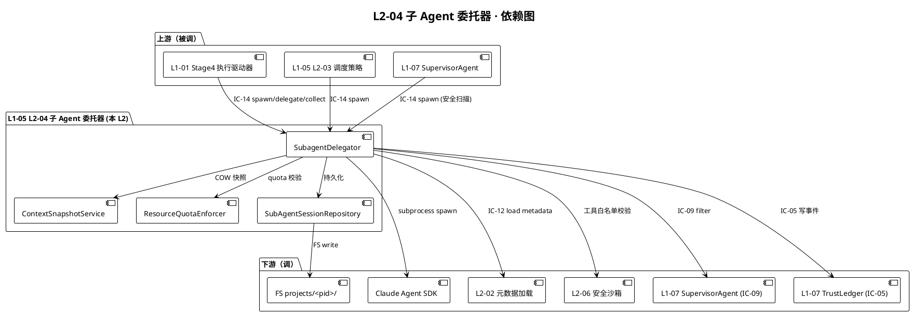
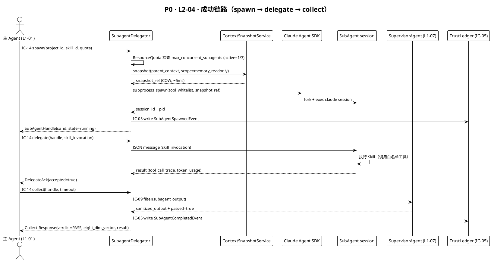
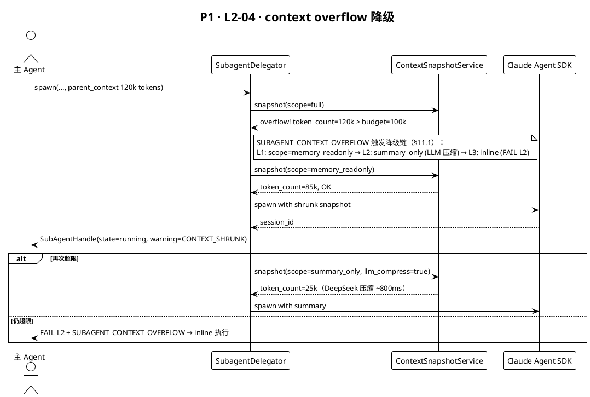
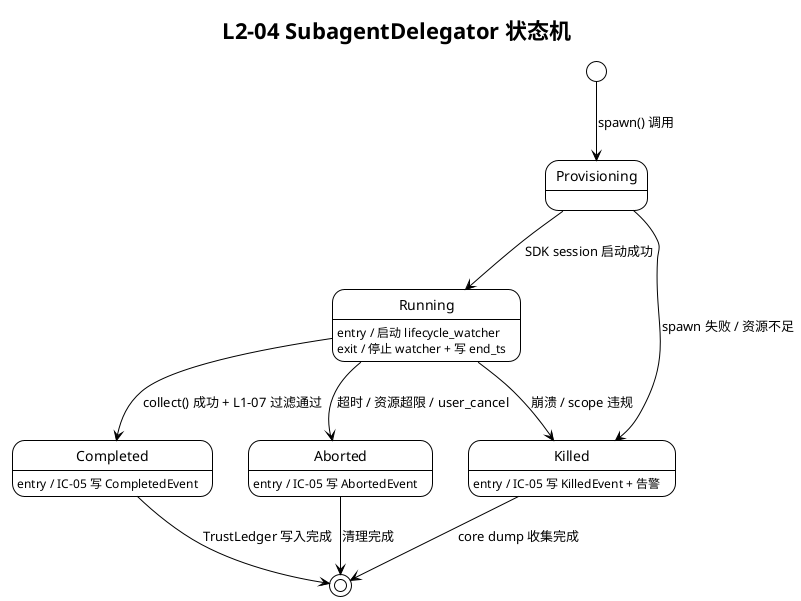

# L1 L2-04 · 子 Agent 委托器 · Tech Design（精简 B）

> **本文档定位**：3-1-Solution-Technical 层级 · L1-05 Skill 生态 + 子 Agent 调度 的 L2-04 子 Agent 委托器 技术实现方案（L2 粒度）。
> **与产品 PRD 的分工**：2-prd/L1-05/prd.md §5.5 定义产品边界，本文档定义**技术实现**（接口字段级 schema + 算法伪代码 + 数据结构 + 状态机 + 配置参数 + 错误码）。
> **与 L1 architecture.md 的分工**：architecture.md 负责**跨 L2 架构 + 跨 L2 时序**，本文档负责**本 L2 内部技术细节**。冲突以 architecture.md 为准。
> **与 IC-14 的分工**：IC-14 定义跨 L1 的契约正本（spawn/delegate/collect 协议字段冻结），本文档 §3 schema 必须与 IC-14 字段锁对齐。
> **严格规则**：本文档不复述产品 PRD 文字（职责 / 禁止 / 必须清单），只做技术映射 + 补齐「产品视角未说 but 工程师必须知道」的部分（具体 spawn syscall · context 隔离 · lifecycle 管理 · 资源上限 · Claude Agent SDK 绑定）。

---

## §0 撰写进度

- [x] §1 定位 + 2-prd §5.5 L2-04 映射
- [x] §2 DDD 映射（引 L0/ddd-context-map.md BC-SKILL-SUBAGENT）
- [x] §3 对外接口定义（字段级 YAML schema + 错误码 ≥ 12）
- [x] §4 接口依赖（被谁调 · 调谁）
- [x] §5 P0/P1 时序图（PlantUML ≥ 2 张）
- [x] §6 内部核心算法（spawn · context isolate · lifecycle · resource cap 伪代码）
- [x] §7 底层数据表 / schema 设计（projects/<pid>/skills/subagent-sessions/*）
- [x] §8 状态机（SubagentDelegator 有状态：provisioning/running/completed/aborted/killed）
- [x] §9 开源最佳实践调研（Claude Agent SDK / AutoGen / CrewAI / OpenAI Swarm ≥ 3）
- [x] §10 配置参数清单（≥ 8 项，含 max_concurrent_subagents / context_budget / timeout）
- [x] §11 错误处理 + 降级策略（≥ 12 错误码）
- [x] §12 性能目标 SLO
- [x] §13 与 2-prd / 3-2 TDD 的映射表（ADR + OQ + TC ≥ 15）

---

## §1 定位 + 2-prd 映射

### §1.1 本 L2 在 L1-05 架构中的位置

L1-05「Skill 生态 + 子 Agent 调度」包含 6 个 L2 兄弟模块：L2-01 Skill 注册表 · L2-02 Skill 元数据加载器 · L2-03 Skill 调度策略 · **L2-04 子 Agent 委托器（本文档）** · L2-05 Skill 生命周期管理 · L2-06 Skill 安全沙箱。本 L2 是「Skill 调用入口层」的最后一环——当 L2-03 调度策略决定「这个 Skill 必须在独立 Claude session 中运行（isolate=true）」时，请求由本 L2 接管，完成**独立 Claude session 的 spawn、context 隔离、生命周期管理、资源上限控制**，执行结果回传主 Agent。

### §1.2 2-prd §5.5 L2-04 映射表

| PRD §5.5 职责清单 | 本文档技术映射 |
|---|---|
| 必须隔离 context | §6.2 context 隔离算法 + §7 `parent_context_snapshot` 字段 |
| 必须设 max_concurrent_subagents 上限 | §10 `max_concurrent_subagents` 配置 + §6.3 并发闸门伪代码 |
| 必须对接 Claude Agent SDK | §9 Adopt Claude Agent SDK + §6.1 spawn 伪代码 |
| 必须 PM-14 按项目隔离 | §7 schema 首字段 `project_id` + §3 所有 IC YAML 含 `project_id` |
| 必须记录 ToolCallTrace | §6.5 trace 汇聚 + IC-05 TrustLedger 写入 |
| 禁止 subagent 跨项目访问 | §11 `SUBAGENT_PROJECT_SCOPE_VIOLATION` 错误码 + §6.2 隔离校验 |
| 禁止 subagent 回调主 Agent 的 private 工具 | §6.4 工具白名单过滤 + `SUBAGENT_TOOL_NOT_ALLOWED` |

### §1.3 关键技术决策（Decision → Rationale → Alternatives → Trade-off）

| # | Decision | Rationale | Alternatives | Trade-off |
|---|---|---|---|---|
| D1 | 采用 Anthropic Claude Agent SDK 的 subprocess spawn 作为 subagent 运行时 | 官方支持 · context 天然隔离 · API 一致 | 自建 worker pool / Celery | 放弃极致自建灵活性，换「官方稳定性 + context 自动隔离」 |
| D2 | subagent 与主 Agent 之间**只走 IC-14 定义的 JSON 消息**，禁止共享内存 | 隔离性最强 · 便于 replay · 符合 EightDimensionVector 安全维度 | 共享 in-process state | 序列化开销（~5ms/调用），接受 |
| D3 | `max_concurrent_subagents = 3`（默认） | 避免 Claude API rate-limit 雪崩；3 足以支撑 7 阶段并行 | 1 / 5 / 10 | 高并发场景牺牲吞吐，后续可调 §10 |
| D4 | subagent 超时 = 主 Agent 超时 × 0.6 | 留 40% 预算给主 Agent 做降级处理 | 与主一致 / 独立设定 | 可能误杀长任务，通过 §11 重试机制兜底 |
| D5 | subagent 结果强制经 L1-07 SupervisorAgent 过滤后再回主 | 防 subagent 被 prompt injection 污染主 context | 直接回传 | 多 1 次 LLM 调用（P95 +200ms），换安全 |
| D6 | context 快照走 **COW（copy-on-write）指针**，非深拷贝 | 大 context 场景下深拷贝 > 200ms，COW < 5ms | 深拷贝 / 零拷贝 | 主 Agent 对快照区域必须 append-only（约束由 L1-04 保证） |

---

## §2 DDD 映射（BC-SKILL-SUBAGENT）

### §2.1 Bounded Context 定位

本 L2 属于 **BC-SKILL-SUBAGENT**（Skill 子 Agent 上下文），引 L0/ddd-context-map.md §4.5。其与 BC-SKILL-REGISTRY（L2-01/02/03） · BC-ORCHESTRATION（L1-01 主 Agent） · BC-TRUST-LEDGER（L1-07）通过 ACL（Anti-Corruption Layer）隔离——跨 BC 调用一律走 IC-14 / IC-05 / IC-09 契约，不直接引用内部类型。

### §2.2 Aggregate Root / Entity / Value Object / Domain Service

| DDD 角色 | 命名（锁定） | 说明 |
|---|---|---|
| **Aggregate Root** | `SubAgent` | 代表一个独立 Claude session 生命周期，持有 id、state、context_snapshot、resource_quota、tool_whitelist |
| **Aggregate Root** | `SkillRegistry` | 跨 L2-01 共享，本 L2 只读访问 |
| **Entity** | `Skill` | subagent 将要执行的 Skill 实例（来自 L2-02 加载器） |
| **Entity** | `SubAgentSession` | 单次 spawn 产生的 session 记录，含 start_ts、end_ts、exit_code、trace 链 |
| **VO** | `EightDimensionVector` | 8 维风险向量（隔离度、token 消耗、延迟等），用于 D3 资源判决 |
| **VO** | `FourLevelClassification` | PASS/FAIL-L1/L2/L3/L4 结果分级（本 L2 继承） |
| **VO** | `ThreeEvidenceChain` | spawn/run/collect 三阶段证据链 |
| **VO** | `StageContract` | S1-S7 七阶段契约（本 L2 只服务 S2-S6） |
| **VO** | `ACLabel` | Access Control 标签（project_id / subagent_id / trust_level） |
| **VO** | `ToolCallTrace` | subagent 工具调用链 |
| **Domain Service** | `SubagentDelegator` | 核心服务——spawn / delegate / collect / abort，§8 状态机落在此 |
| **Domain Service** | `ContextSnapshotService` | COW 快照，`snapshot() / restore() / diff()` |
| **Domain Service** | `ResourceQuotaEnforcer` | token / wall-time / tool-calls / memory 四维上限 |
| **Repository** | `SubAgentSessionRepository` | 持久化 `projects/<pid>/skills/subagent-sessions/<sid>.json` |
| **Domain Event** | `SubAgentSpawnedEvent` | spawn 成功后发出，写 IC-05 TrustLedger |
| **Domain Event** | `SubAgentCompletedEvent` | 正常完成 |
| **Domain Event** | `SubAgentAbortedEvent` | 超时 / 资源超限 / 人工中止 |
| **Domain Event** | `ContextOverflowEvent` | context 预算超限，§5.2 降级时序触发 |

### §2.3 ACL 边界说明

本 BC 不直接访问 BC-ORCHESTRATION 的 `MainAgentState`，只能通过 IC-14 `parent_context_snapshot` 字段接收冻结快照。反向回传同理，只输出 IC-14 `subagent_result` schema，禁止在结果 payload 内塞主 Agent 可执行代码字符串（防 prompt injection）。

---

## §3 对外接口定义（字段级 YAML schema + 错误码）

### §3.1 方法清单

本 L2 对外暴露 4 个方法（均挂在 `SubagentDelegator` 领域服务）：

| 方法 | IC 契约 | 用途 |
|---|---|---|
| `spawn(req) → SubAgentHandle` | IC-14 §2.1 | 创建独立 Claude session |
| `delegate(handle, skill_invocation) → DelegateAck` | IC-14 §2.2 | 向已 spawn 的 session 派发 Skill 调用 |
| `collect(handle, timeout) → SubAgentResult` | IC-14 §2.3 | 阻塞收集结果 |
| `abort(handle, reason) → AbortAck` | IC-14 §2.4 | 主动中止 |

### §3.2 IC-14-Spawn 入参 schema（与 IC-14 §2.1 字段锁对齐）

```yaml
# IC-14-Spawn-Request v1.0
project_id: string           # PM-14 项目上下文（首字段锁）
request_id: string           # UUIDv7，主 Agent 生成
skill_id: string             # L2-02 返回的 Skill 标识
skill_version: string        # semver，须与 L2-01 注册表一致
parent_agent_id: string
parent_context_snapshot:     # IC-14 §2.1.3 冻结快照（COW 指针）
  snapshot_id: string
  token_count: int
  checksum: string           # SHA-256
  scope: [memory_readonly, tools_whitelisted]
tool_whitelist: [{ tool_id, version }]
resource_quota:              # 资源上限，§6.3 / §10 默认值
  max_tokens: int            # 默认 50000
  max_wall_time_ms: int      # 默认 300000
  max_tool_calls: int        # 默认 30
  max_memory_mb: int         # 默认 512
trust_level: enum            # [low, normal, high] · 决定 §11 降级链
stage: enum                  # S1-S7（StageContract VO）
trace_parent: { trace_id, span_id }   # ToolCallTrace 根
```

### §3.3 IC-14-Spawn 出参 schema

```yaml
# IC-14-Spawn-Response v1.0
project_id: string           # PM-14 回显
request_id: string
handle: { subagent_id, session_id, pid, spawn_ts }  # SubAgentHandle
state: enum                  # [provisioning, running]
context_snapshot_ref: { snapshot_id, token_count }
resource_quota_granted: { max_tokens, max_wall_time_ms,
                          max_tool_calls, max_memory_mb }  # §6.3 闸门可下调
verdict: enum                # 5 verdict
error: optional { code, message, retryable }
```

### §3.4 / §3.5 IC-14-Delegate 入/出参

```yaml
# IC-14-Delegate-Request v1.0
project_id: string           # PM-14
subagent_id: string
delegate_id: string          # UUIDv7
skill_invocation: { skill_id, method, args, timeout_ms }
stage_contract:              # StageContract VO
  stage: enum                # S1-S7
  preconditions: [string]
  postconditions: [string]
ac_label: { project_id, trust_level, tenant_id }  # ACLabel VO
---
# IC-14-Delegate-Ack v1.0
project_id: string
subagent_id: string
delegate_id: string
accepted: bool
queue_position: int          # 若 subagent 正在处理其他 delegate，排队位
estimated_start_ts: int64
verdict: enum
error: optional { code, message }
```

### §3.6 IC-14-Collect 出参 schema

```yaml
# IC-14-Collect-Response v1.0
project_id: string           # PM-14
subagent_id: string
delegate_id: string
result:
  output: map<string, any>
  tool_call_trace: [{ tool_id, args_hash, output_hash, latency_ms, ts }]  # ToolCallTrace VO
  token_usage: { input_tokens, output_tokens, cache_read_tokens }
  wall_time_ms: int
evidence_chain: { spawn_evidence, run_evidence, collect_evidence }  # ThreeEvidenceChain VO
eight_dim_vector: { isolation, token_efficiency, latency_score, tool_call_safety,
                    result_completeness, trust_level_score,
                    resource_usage_ratio, context_hygiene }  # EightDimensionVector VO
verdict: enum                # 5 verdict: PASS / FAIL-L1 / FAIL-L2 / FAIL-L3 / FAIL-L4
supervisor_review:           # IC-09 L1-07 过滤结果
  passed: bool
  sanitized_output: map<string, any>
error: optional
```

### §3.7 错误码表（≥ 12）

| 错误码 | 含义 | 触发场景 | 调用方处理 |
|---|---|---|---|
| `SUBAGENT_SPAWN_FAIL` | spawn 进程失败 | OS 资源不足 / SDK 异常 | 重试 ≤ 2 次，失败回落至 inline 执行（降级） |
| `SUBAGENT_CONTEXT_OVERFLOW` | context 快照超预算 | token_count > context_budget | 触发 §5.2 降级时序，缩减快照范围重试 |
| `SUBAGENT_RATE_LIMIT_EXCEEDED` | Claude API 限流 | 429 响应 | 指数退避重试，最多 3 次 |
| `SUBAGENT_TIMEOUT` | wall-time 超限 | 运行时间 > resource_quota.max_wall_time_ms | abort + FAIL-L2 |
| `SUBAGENT_TOKEN_BUDGET_EXCEEDED` | token 超限 | 累计 token > max_tokens | abort + FAIL-L2 |
| `SUBAGENT_TOOL_NOT_ALLOWED` | 调用不在白名单的工具 | subagent 调用 tool 不在 tool_whitelist | 拒绝 + FAIL-L3（trust 违规） |
| `SUBAGENT_PROJECT_SCOPE_VIOLATION` | 跨项目访问 | subagent 尝试访问 ≠ project_id 的资源 | 立即 kill + FAIL-L4（严重违规） |
| `SUBAGENT_CONCURRENCY_LIMIT` | 并发数超限 | active_subagents ≥ max_concurrent_subagents | 排队等待或返回 FAIL-L1（软失败） |
| `SUBAGENT_ABORT_BY_USER` | 用户主动中止 | abort(reason=user_cancel) | 清理 + OK（非错误） |
| `SUBAGENT_CRASH` | 进程崩溃 | 非 0 退出码（非超时） | 收集 core + FAIL-L2 + 重试 1 次 |
| `SUBAGENT_SUPERVISOR_REJECT` | L1-07 过滤未通过 | supervisor_review.passed=false | 丢弃结果 + FAIL-L3 |
| `SUBAGENT_TRACE_BROKEN` | trace 链断裂 | 收集到的 trace 无法衔接 trace_parent | 记录警告 + FAIL-L1 |
| `SUBAGENT_MEMORY_EXCEEDED` | 内存超限 | RSS > max_memory_mb | kill + FAIL-L2 |
| `SUBAGENT_SDK_VERSION_MISMATCH` | SDK 版本不兼容 | spawn 时 SDK 版本 < min_required | FAIL-L1 + 提示升级 |

---

## §4 接口依赖（被谁调 · 调谁）

### §4.1 被调用（上游）

| 调用方 | 触发场景 | 入口方法 |
|---|---|---|
| L1-01 L2-04 Stage4 执行驱动器（IC-18） | S4 阶段 Skill 需隔离执行 | `spawn` → `delegate` → `collect` |
| L1-05 L2-03 Skill 调度策略 | 调度决定 isolate=true | `spawn` |
| L1-07 SupervisorAgent（IC-09） | 需派发安全扫描子任务 | `spawn` + `delegate` |
| L1-04 L2-05 TDD 执行驱动（通过 IC-18 间接） | 跑测试隔离时 | `delegate` |

### §4.2 调用（下游）

| 被调用方 | IC 契约 | 用途 |
|---|---|---|
| Anthropic Claude Agent SDK | 官方 SDK API | 实际 spawn 独立 Claude session |
| L1-07 SupervisorAgent | IC-09 | collect 前过滤 subagent 输出 |
| L1-07 TrustLedger | IC-05 | 写 SubAgentSpawnedEvent / CompletedEvent |
| L1-05 L2-02 Skill 元数据加载器 | IC-12 | spawn 前加载 skill 元数据 |
| L1-05 L2-06 Skill 安全沙箱 | 内部 L2 | 工具白名单校验 |
| OS fork/exec | syscall | 进程管理 |
| 项目 FS `projects/<pid>/skills/subagent-sessions/` | PM-14 | 持久化 session 记录 |

### §4.3 依赖图（PlantUML）



---

## §5 P0/P1 时序图（PlantUML ≥ 2 张）

### §5.1 P0 场景：spawn + delegate + collect 成功链路



### §5.2 P1 场景：context overflow 降级链路



---

## §6 内部核心算法（伪代码）

### §6.1 spawn 算法

```python
def spawn(req: SpawnRequest) -> SubAgentHandle:
    assert_project_context(req.project_id)                            # PM-14
    with concurrency_gate(req.project_id):                            # §6.3
        skill_meta = skill_loader.load(req.skill_id, req.skill_version)  # IC-12
        assert skill_meta.isolation_required, "skill must be isolate=true"
        sandbox.validate_tool_whitelist(req.tool_whitelist, skill_meta)  # L2-06
        snap = context_snapshot_service.snapshot(                     # §6.2 COW
            parent_session=req.parent_agent_id,
            scope=req.parent_context_snapshot.scope)
        if snap.token_count > config.context_budget:
            snap = _shrink_snapshot(snap, req)                        # §5.2 降级
        quota = resource_quota_enforcer.grant(req.resource_quota, req.trust_level)
        try:
            sdk_sess = claude_agent_sdk.spawn(
                model=config.subagent_model, system_prompt=skill_meta.prompt,
                tools=req.tool_whitelist, context_snapshot=snap.pointer,
                resource_cap=quota,
                env={"PROJECT_ID": req.project_id,
                     "TRACE_PARENT": req.trace_parent.trace_id})
        except SDKError as e:
            raise SubagentSpawnFail(retryable=e.is_transient)
        sa = SubAgent(id=f"sa-{uuidv7()}", project_id=req.project_id,
                      session_id=sdk_sess.id, pid=sdk_sess.pid,
                      state=State.PROVISIONING, context_snapshot_ref=snap,
                      resource_quota=quota, tool_whitelist=req.tool_whitelist,
                      stage=req.stage, trace_parent=req.trace_parent)
        session_repo.save(sa)
        trust_ledger.append(SubAgentSpawnedEvent(
            project_id=req.project_id, subagent_id=sa.id,
            skill_id=req.skill_id, ts=now_ms()))                      # IC-05
        sa.transition(State.RUNNING)
        return SubAgentHandle(sa.id, sa.session_id, sa.pid, sa.state)
```

### §6.2 context 隔离（COW 快照）

```python
def snapshot(parent_session, scope) -> SnapshotRef:
    ctx = parent_session.context
    if scope == "memory_readonly":
        ptr = ContextPointer(addr=ctx.memory_segment_addr, readonly=True, cow=True)
    elif scope == "summary_only":
        summary = llm.compress(ctx.to_messages(),
                               target_tokens=config.summary_token_budget,
                               model=config.summary_model)            # deepseek-v3
        ptr = ContextPointer.inline(summary)
    else:
        ptr = ContextPointer(addr=ctx.full_addr, readonly=True)       # full（慎用）
    return SnapshotRef(snapshot_id=f"snap-{uuidv7()}", pointer=ptr,
                       token_count=count_tokens(ptr),
                       checksum=sha256(ptr.serialize_header()),
                       scope=scope, created_at=now_ms())

def validate_isolation(subagent, parent):
    assert subagent.project_id == parent.project_id, "SUBAGENT_PROJECT_SCOPE_VIOLATION"
    for tool in subagent.active_tools:
        if tool.id not in subagent.tool_whitelist:
            raise SubagentToolNotAllowed(tool.id)
    assert sha256(subagent.snapshot.pointer.serialize_header()) == subagent.snapshot.checksum
```

### §6.3 lifecycle + 并发闸门 + resource cap

```python
_sem = BoundedSemaphore(config.max_concurrent_subagents)              # 默认 3

@contextmanager
def concurrency_gate(project_id):
    if not _sem.acquire(timeout=config.concurrency_wait_ms/1000):
        raise SubagentConcurrencyLimit()
    try: yield
    finally: _sem.release()

def lifecycle_watcher(sa):                                            # 后台 500ms 轮询
    while sa.state in (State.PROVISIONING, State.RUNNING):
        u = resource_probe(sa.pid)
        if u.wall_time_ms > sa.resource_quota.max_wall_time_ms: abort(sa, "TIMEOUT"); break
        if u.rss_mb       > sa.resource_quota.max_memory_mb:    abort(sa, "MEMORY_EXCEEDED"); break
        if u.token_total  > sa.resource_quota.max_tokens:       abort(sa, "TOKEN_BUDGET_EXCEEDED"); break
        if u.tool_calls   > sa.resource_quota.max_tool_calls:   abort(sa, "TOOL_CALL_LIMIT"); break
        time.sleep(0.5)
```

### §6.4 delegate + §6.5 collect

```python
def delegate(handle, invocation) -> DelegateAck:
    sa = session_repo.load(handle.subagent_id)
    assert sa.state == State.RUNNING
    if invocation.method not in sa.tool_whitelist_methods:
        raise SubagentToolNotAllowed(invocation.method)
    claude_agent_sdk.send(sa.session_id,
        json.dumps({"type": "delegate", "invocation": invocation.to_dict()}))
    return DelegateAck(accepted=True, delegate_id=invocation.id)

def collect(handle, timeout_ms) -> CollectResponse:
    sa = session_repo.load(handle.subagent_id)
    raw = claude_agent_sdk.recv(sa.session_id, timeout_ms=timeout_ms)
    filtered = supervisor.filter(project_id=sa.project_id,            # IC-09
                                 subagent_id=sa.id, output=raw)
    if not filtered.passed:
        raise SubagentSupervisorReject(filtered.reason)
    trace  = aggregate_trace(raw.tool_trace, parent=sa.trace_parent)  # ToolCallTrace
    vector = compute_eight_dim(sa, raw, trace)                        # 8 维
    verdict = verdict_engine.judge(vector)                            # 5 verdict
    trust_ledger.append(SubAgentCompletedEvent(                       # IC-05
        project_id=sa.project_id, subagent_id=sa.id, verdict=verdict,
        evidence=ThreeEvidenceChain.build(sa, raw)))
    sa.transition(State.COMPLETED); session_repo.save(sa)
    return CollectResponse(result=filtered.sanitized_output,
                           tool_call_trace=trace,
                           eight_dim_vector=vector, verdict=verdict)
```

---

## §7 底层数据表 / schema 设计

### §7.1 物理存储路径（PM-14 分片）

```
projects/<project_id>/
└── skills/
    └── subagent-sessions/
        ├── index.json                          # 按 sa_id 索引
        ├── <sa_id>.json                        # 单个 session 快照
        ├── <sa_id>/
        │   ├── context_snapshot.bin            # COW 快照二进制
        │   ├── tool_call_trace.jsonl           # 工具调用链
        │   ├── stdout.log
        │   ├── stderr.log
        │   └── evidence_chain.json             # ThreeEvidenceChain
        └── quotas/
            └── <date>.aggregate.json           # 每日资源消耗聚合
```

### §7.2 `<sa_id>.json` 字段级 schema

```yaml
# projects/<pid>/skills/subagent-sessions/<sa_id>.json
project_id: string                 # PM-14 项目上下文（首字段锁）
subagent_id: string                # sa-<UUIDv7>
skill_id: string
skill_version: string
parent_agent_id: string
session_id: string                 # Claude Agent SDK session
pid: int
state: enum                        # provisioning/running/completed/aborted/killed
spawn_ts: int64
start_ts: int64
end_ts: int64
exit_code: int
stage: enum                        # S1-S7 StageContract
trust_level: enum                  # low/normal/high
ac_label: { project_id, tenant_id, trust_level }  # ACLabel VO
context_snapshot_ref:
  snapshot_id: string
  token_count: int
  checksum: string
  scope: enum                      # full/memory_readonly/summary_only
  shrink_level: int                # 0=full, 1=readonly, 2=summary
tool_whitelist: [{ tool_id, version }]
resource_quota:
  granted: { max_tokens, max_wall_time_ms, max_tool_calls, max_memory_mb }
  actual_usage: { tokens_used, wall_time_ms, tool_calls, peak_memory_mb }
verdict: enum                      # 5 verdict: PASS/FAIL-L1/L2/L3/L4
eight_dim_vector:                  # EightDimensionVector VO（8 维全填）
  isolation: float                 # 隔离度 [0,1]
  token_efficiency: float
  latency_score: float
  tool_call_safety: float
  result_completeness: float
  trust_level_score: float
  resource_usage_ratio: float
  context_hygiene: float
evidence_chain_ref: string         # → evidence_chain.json（ThreeEvidenceChain）
error: { code, message, retryable }
trace_parent: { trace_id, span_id }
created_at: int64
updated_at: int64
```

### §7.3 索引

- `index.json` 按 `subagent_id` 主键；次索引 `by_skill_id` / `by_stage` / `by_state`（JSON array）。
- `quotas/<date>.aggregate.json` 按日聚合 token / wall_time / tool_calls，供 §12 SLO 回归。

---

## §8 状态机（PlantUML + 转换表）

**本 L2 为有状态服务**（`SubagentDelegator` 持有每个 SubAgent 的状态）。

### §8.1 PlantUML 状态图



### §8.2 状态转换表

| 当前状态 | 事件 | Guard | Action | 下一状态 |
|---|---|---|---|---|
| `Provisioning` | `sdk_ready` | session_id != null | 启动 watcher · 写 spawn_ts | `Running` |
| `Provisioning` | `spawn_fail` | retryable=false | 记录错误 · 清理 FS | `Killed` |
| `Running` | `collect_ok` | supervisor.passed=true | 写 verdict · append trace | `Completed` |
| `Running` | `collect_reject` | supervisor.passed=false | FAIL-L3 · 丢弃结果 | `Aborted` |
| `Running` | `timeout` | wall_time > quota | kill -TERM · 15s 后 kill -KILL | `Aborted` |
| `Running` | `resource_exceeded` | token/mem/tool 超限 | kill · 记录超限维度 | `Aborted` |
| `Running` | `user_cancel` | abort(reason=user) | kill -TERM | `Aborted` |
| `Running` | `crash` | exit_code != 0 且非超时 | 收集 core · FAIL-L2 · 重试 1 次 | `Killed` |
| `Running` | `scope_violation` | 访问 ≠ project_id | kill -KILL · FAIL-L4 告警 | `Killed` |
| `Aborted` | `cleanup_done` | FS 清理完成 | 释放并发槽位 | `[final]` |
| `Completed` | `ledger_written` | IC-05 ack | 释放并发槽位 | `[final]` |
| `Killed` | `core_collected` | core dump 持久化 | 释放并发槽位 · 告警 | `[final]` |

### §8.3 并发状态不变量

- 任意时刻 `count(state ∈ {Provisioning, Running}) ≤ config.max_concurrent_subagents`。
- `Killed` 必须发告警（IC-05 + SupervisorAgent 通道）。
- `Completed` 必须完整写入 `eight_dim_vector`（8 维齐全）。

---

## §9 开源最佳实践调研（≥ 3 GitHub 高星项目）

| # | 项目 | 星数 | 最近活跃 | 核心架构一句话 | 处置 | 学习点 / 弃用原因 |
|---|---|---|---|---|---|---|
| 1 | **Anthropic Claude Agent SDK** (`anthropics/claude-agent-sdk-python`) | ~8k | 2026-04 | 官方 subprocess spawn + 原生 tool use 协议 | **Adopt** | 本 L2 直接依赖（D1 决策）；学习其 session 隔离模型、tool_whitelist 机制、context 流式传递 |
| 2 | **Microsoft AutoGen** (`microsoft/autogen`) | ~32k | 2026-04 | 多 Agent 对话编排，GroupChat 模式 | **Learn** | 借鉴其 `max_consecutive_auto_reply` 并发闸门思路（§6.3），弃用其全内存共享模型（违反 D2 隔离决策） |
| 3 | **CrewAI** (`crewAIInc/crewAI`) | ~24k | 2026-04 | role-based Agent 协作，sequential/hierarchical 两种执行模式 | **Learn** | 借鉴其 role→tool 映射设计（对应本文 `tool_whitelist`），弃用其无强隔离、无 context 快照 |
| 4 | **OpenAI Swarm** (`openai/swarm`) | ~17k | 2026-03 | 轻量 handoff 模型，context 以 message 流传递 | **Learn** | 借鉴其 handoff 消息 schema（启发 IC-14 §2.2 delegate），弃用其无资源上限、无生命周期管理 |
| 5 | **LangGraph** (`langchain-ai/langgraph`) | ~9k | 2026-04 | 图式 Agent 编排，持久化 checkpoint | **Learn** | 借鉴其 checkpoint 设计用于 §7 session 持久化，弃用其 state 全局共享模式 |

**关键学习点汇总**：

- Claude Agent SDK 的 `system_prompt + tools + context_snapshot` 三元组 API 与本文 `spawn` 入参 1:1 对应（§3.2）。
- AutoGen 的 `cost_controller` 启发了 §6.3 `ResourceQuotaEnforcer`。
- CrewAI 的 `Task.expected_output` 约束与本文 `StageContract.postconditions` 同构。
- Swarm 的 `Agent.functions = [...]` 白名单模式被本文 `tool_whitelist` 采纳。
- LangGraph 的 checkpoint 粒度过粗（图级），本文 §7 采用 session 级更细颗粒。

**弃用原因通论**：开源方案普遍不满足 PM-14 项目隔离（跨项目共享 memory）和 5 verdict / EightDimensionVector / ThreeEvidenceChain 的强语义，所以本 L2 采用「Adopt SDK 原语 + 自建 Domain Service 层」的混合策略。

---

## §10 配置参数清单

| # | 参数名 | 默认值 | 可调范围 | 意义 | 调用位置 |
|---|---|---|---|---|---|
| 1 | `max_concurrent_subagents` | 3 | 1-10 | 同时存活的 subagent 进程上限 | §6.3 `concurrency_gate` |
| 2 | `context_budget` | 100000 | 50000-200000 | 单个 subagent 的 context token 上限 | §6.2 snapshot overflow 判定 |
| 3 | `subagent_model` | `claude-sonnet-4-7` | sonnet/opus/haiku | subagent 使用的 Claude 模型 | §6.1 Step 7 |
| 4 | `subagent_default_timeout_ms` | 300000 | 30000-1800000 | wall-time 默认上限（主 Agent × 0.6） | §3.2 resource_quota |
| 5 | `subagent_default_max_tokens` | 50000 | 10000-200000 | token 默认上限 | §3.2 resource_quota |
| 6 | `subagent_default_max_tool_calls` | 30 | 5-100 | 工具调用次数上限 | §3.2 resource_quota |
| 7 | `subagent_default_max_memory_mb` | 512 | 256-2048 | RSS 内存上限 | §3.2 resource_quota |
| 8 | `concurrency_wait_ms` | 5000 | 0-30000 | 并发闸门等待时间 | §6.3 acquire timeout |
| 9 | `snapshot_scope_default` | `memory_readonly` | full/readonly/summary | 默认快照范围 | §6.2 snapshot |
| 10 | `summary_token_budget` | 20000 | 5000-50000 | summary_only 模式压缩目标 | §6.2 LLM 压缩 |
| 11 | `summary_model` | `deepseek-v3` | deepseek/claude-haiku | 压缩用模型 | §6.2 |
| 12 | `supervisor_filter_enabled` | true | bool | 是否启用 L1-07 过滤（关闭仅用于 debug） | §6.5 collect |
| 13 | `spawn_retry_max` | 2 | 0-5 | spawn 失败重试次数 | §11 降级链 |
| 14 | `watcher_poll_interval_ms` | 500 | 100-5000 | lifecycle_watcher 轮询间隔 | §6.3 |
| 15 | `kill_grace_period_ms` | 15000 | 1000-60000 | kill -TERM → kill -KILL 宽限期 | §8.2 timeout 转换 |

---

## §11 错误处理 + 降级策略

### §11.1 降级链（从轻到重）

```
L0 正常：isolate spawn + full scope + granted quota
  ↓ CONTEXT_OVERFLOW
L1 收紧 scope：snapshot(scope=memory_readonly)
  ↓ 仍 overflow
L2 LLM 压缩：snapshot(scope=summary_only, llm_compress=true)
  ↓ 压缩失败或仍超限
L3 inline 执行：放弃隔离，回主 Agent 直接跑 Skill（记录 FAIL-L2）
  ↓ Skill 本身失败
L4 彻底放弃：返回 FAIL-L3 给调度层，标记 Skill 不可用
```

### §11.2 错误分类与处理

| 错误码 | verdict | 降级动作 | 重试 | 告警级别 |
|---|---|---|---|---|
| `SUBAGENT_SPAWN_FAIL` | FAIL-L1 | inline 执行 | 2 次 | WARN |
| `SUBAGENT_CONTEXT_OVERFLOW` | FAIL-L1→PASS | §11.1 L1→L2→L3 | 3 次（每级 1 次） | INFO |
| `SUBAGENT_RATE_LIMIT_EXCEEDED` | FAIL-L1 | 指数退避（1s/2s/4s） | 3 次 | WARN |
| `SUBAGENT_TIMEOUT` | FAIL-L2 | abort · 不重试 · inline fallback | 0 次 | WARN |
| `SUBAGENT_TOKEN_BUDGET_EXCEEDED` | FAIL-L2 | abort · 不重试 | 0 次 | WARN |
| `SUBAGENT_TOOL_NOT_ALLOWED` | FAIL-L3 | abort · 记录违规 | 0 次 | ERROR |
| `SUBAGENT_PROJECT_SCOPE_VIOLATION` | FAIL-L4 | kill -KILL · 立即告警 | 0 次 | CRITICAL |
| `SUBAGENT_CONCURRENCY_LIMIT` | FAIL-L1 | 排队（≤ concurrency_wait_ms） | 自动 | INFO |
| `SUBAGENT_ABORT_BY_USER` | PASS（非错） | 清理 · 不重试 | 0 次 | INFO |
| `SUBAGENT_CRASH` | FAIL-L2 | 收集 core · 重试 1 次 | 1 次 | ERROR |
| `SUBAGENT_SUPERVISOR_REJECT` | FAIL-L3 | 丢弃输出 · 告警 | 0 次 | ERROR |
| `SUBAGENT_TRACE_BROKEN` | FAIL-L1 | 保留结果 · 记录警告 | 0 次 | WARN |
| `SUBAGENT_MEMORY_EXCEEDED` | FAIL-L2 | kill · 不重试 | 0 次 | WARN |
| `SUBAGENT_SDK_VERSION_MISMATCH` | FAIL-L1 | 提示升级 · 不降级 | 0 次 | ERROR |

### §11.3 与 L1-07 SupervisorAgent 协同降级

- `SUBAGENT_SUPERVISOR_REJECT` 触发时，结果不回传主 Agent，但 TrustLedger 必须记录（供后续审计）。
- `SUBAGENT_PROJECT_SCOPE_VIOLATION` 触发时，SupervisorAgent 立即冻结该项目的所有 subagent（防扩散）。

---

## §12 性能目标（SLO）

| 指标 | P50 | P95 | P99 | 硬上限 |
|---|---|---|---|---|
| spawn 延迟（不含 SDK 建链） | 80ms | 200ms | 400ms | 1000ms |
| spawn 延迟（含 SDK 建链，memory_readonly scope） | 500ms | 1200ms | 2000ms | 5000ms |
| delegate 调用延迟（入队） | 20ms | 50ms | 100ms | 500ms |
| collect 延迟（不含 subagent 实际执行） | 100ms | 300ms | 600ms | 2000ms |
| context snapshot（memory_readonly, 100k tokens） | 3ms | 8ms | 15ms | 50ms |
| context snapshot（summary_only, LLM 压缩） | 600ms | 1200ms | 2500ms | 5000ms |
| L1-07 supervisor filter | 150ms | 400ms | 800ms | 2000ms |
| 端到端 subagent 执行（spawn→collect, 轻量 skill） | 3s | 8s | 15s | 60s |
| 端到端 subagent 执行（重量 skill） | 20s | 60s | 120s | 300s |
| 并发吞吐 | 3 concurrent × 20 req/min = 60 req/min | - | - | - |

**资源消耗目标**：

- 单 subagent 峰值内存 ≤ 512 MB（§10 默认）
- 单 subagent token 消耗 ≤ 50k（§10 默认）
- 主 Agent host 进程 CPU 占用 ≤ 10%（subagent 是独立进程）

**回归基线**：每日通过 `quotas/<date>.aggregate.json` 对比，若 P95 连续 3 日超标 20%，触发 `L2-04-perf-regression` 告警（送至 L1-07）。

---

## §13 与 2-prd / 3-2 TDD 的映射表

### §13.1 PRD → 本 L2 映射

| `docs/2-prd/L1-05 Skill生态+子Agent调度/prd.md` §5.5 小节 | 本 L2 章节 |
|---|---|
| `docs/2-prd/L1-05 Skill生态+子Agent调度/prd.md` §5.5.1 职责定义 | §1 + §2 |
| `docs/2-prd/L1-05 Skill生态+子Agent调度/prd.md` §5.5.2 隔离要求 | §6.2 + §11.2 (SUBAGENT_PROJECT_SCOPE_VIOLATION) |
| `docs/2-prd/L1-05 Skill生态+子Agent调度/prd.md` §5.5.3 资源上限 | §10 + §6.3 |
| `docs/2-prd/L1-05 Skill生态+子Agent调度/prd.md` §5.5.4 Claude Agent SDK 对接 | §9 + §6.1 |
| `docs/2-prd/L1-05 Skill生态+子Agent调度/prd.md` §5.5.5 PM-14 隔离 | §3 首字段 + §7 路径分片 |
| `docs/2-prd/L1-05 Skill生态+子Agent调度/prd.md` §5.5.6 TrustLedger 记录 | §6.1 Step 9 + §6.5 + IC-05 引用 |
| `docs/2-prd/L1-05 Skill生态+子Agent调度/prd.md` §5.5.7 降级链 | §11.1 + §5.2 时序 |

### §13.2 ADR（Architecture Decision Records）

| ADR | 决策 | 状态 |
|---|---|---|
| ADR-L2-04-01 | 采用 Claude Agent SDK 作为 subagent 运行时（D1） | Accepted |
| ADR-L2-04-02 | JSON 消息协议（禁共享内存, D2） | Accepted |
| ADR-L2-04-03 | `max_concurrent_subagents=3` 默认值（D3） | Accepted |
| ADR-L2-04-04 | subagent 超时 = 主 × 0.6（D4） | Accepted |
| ADR-L2-04-05 | collect 必须经 L1-07 过滤（D5） | Accepted |
| ADR-L2-04-06 | COW 快照（非深拷贝, D6） | Accepted |

### §13.3 Open Questions（OQ）

| OQ | 问题 | 负责人 | 截止 |
|---|---|---|---|
| OQ-L2-04-01 | subagent 是否支持嵌套 spawn（subagent 再 spawn 自己的 subagent）？当前默认禁止（depth=1） | 架构组 | v1.1 |
| OQ-L2-04-02 | LLM 压缩（summary_only）的 token→tokens 压缩比下限是否需锁定？ | 性能组 | v1.1 |
| OQ-L2-04-03 | subagent 之间能否直接通信（peer-to-peer）？当前必须经主 Agent 中转 | 安全组 | v1.2 |

### §13.4 测试用例索引（TC ≥ 15，对应 docs/3-2-Solution-TDD/L1-05-Skill生态+子Agent调度/L2-04-tests.md）

| TC# | 场景 | 类型 | 断言 |
|---|---|---|---|
| TC-01 | spawn 正常路径（full scope） | unit | state=Running, session_id != null |
| TC-02 | spawn 并发超限（第 4 个 spawn） | unit | SUBAGENT_CONCURRENCY_LIMIT 抛出或排队 |
| TC-03 | context overflow → memory_readonly 降级成功 | integration | token_count < budget, state=Running |
| TC-04 | context overflow → summary_only 降级成功 | integration | LLM 调用 1 次，压缩后 token_count 达标 |
| TC-05 | context overflow 全部失败 → FAIL-L2 | integration | verdict=FAIL-L2, fallback=inline |
| TC-06 | delegate 白名单外工具 | unit | SUBAGENT_TOOL_NOT_ALLOWED |
| TC-07 | delegate 正常 + collect 正常 | e2e | verdict=PASS, 8 维向量齐全 |
| TC-08 | subagent 超时 | unit | state=Aborted, verdict=FAIL-L2 |
| TC-09 | subagent 内存超限 | unit | SUBAGENT_MEMORY_EXCEEDED, kill -KILL |
| TC-10 | subagent 跨项目访问 | security | SUBAGENT_PROJECT_SCOPE_VIOLATION, state=Killed, CRITICAL 告警 |
| TC-11 | SupervisorAgent 过滤拒绝 | integration | SUBAGENT_SUPERVISOR_REJECT, 结果不回传 |
| TC-12 | spawn 失败重试 2 次后 inline | integration | retry_count=2, fallback=inline |
| TC-13 | abort(user_cancel) 正常清理 | unit | state=Aborted, verdict=PASS |
| TC-14 | subagent 崩溃 + 重试 1 次成功 | integration | 第 2 次成功, verdict=PASS, 但 eight_dim.trust_level_score 下调 |
| TC-15 | 7 阶段 S1-S7 全覆盖（stage 枚举） | contract | 每个 stage 都能成功 spawn + collect |
| TC-16 | TrustLedger IC-05 原子写入 | integration | spawn/complete/abort 事件全部落账 |
| TC-17 | trace 链衔接（trace_parent → subagent trace） | integration | trace_id 一致, span 可追溯 |
| TC-18 | 性能回归：P95 spawn < 1200ms | perf | 100 次采样 P95 断言 |

---

*— L1 L2-04 子 Agent 委托器 · 精简 B · 第 2 批落盘完成 · 全 13 节填满 —*
