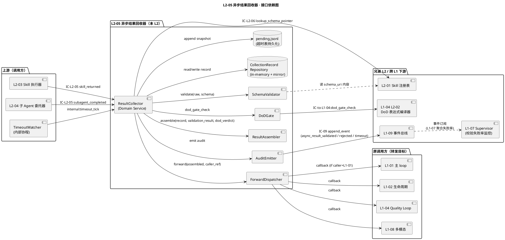
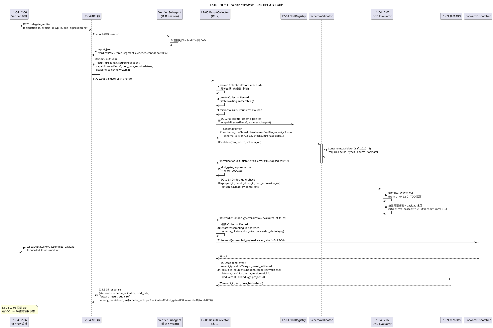
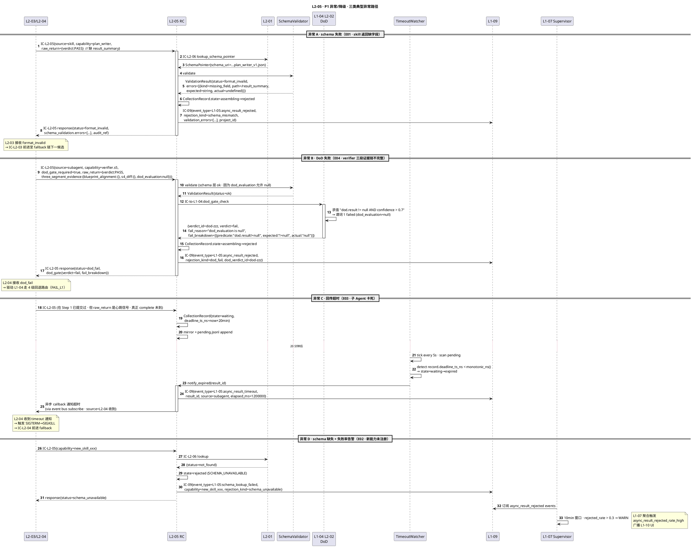
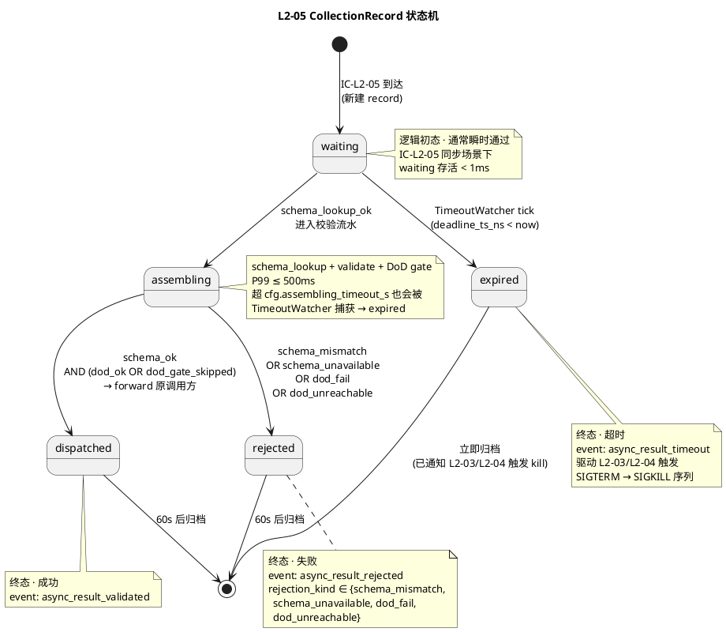

# L1-05 L2-05 · 异步结果回收器 · Tech Design

> **本文档定位**：3-1-Solution-Technical 层级 · L1-05 的 L2-05 异步结果回收器 技术实现方案（L2 粒度 · depth-B）。
> **与产品 PRD 的分工**：`2-prd/L1-05/prd.md §12` 定义产品边界（职责 / 禁止 / 必须 / GWT），本文档定义**技术实现**（接口字段级 schema + 算法伪代码 + 底层数据结构 + 状态机 + 配置参数 + 降级链 + SLO）。
> **与 L1 architecture.md 的分工**：`architecture.md` 负责**跨 L2 架构 + 跨 L2 时序**，本文档负责**本 L2 内部技术细节**。冲突以 architecture.md 为准。
> **严格规则**：本文档不复述产品 PRD 文字，只做技术映射 + 补齐"产品视角未说 but 工程师必须知道"的部分（具体算法 · schema · 配置 · 状态机）。

---

## §0 撰写进度

- [x] §1 定位 + 2-prd §12 L2-05 映射
- [x] §2 DDD 映射（引 L0/ddd-context-map.md BC-05）
- [x] §3 对外接口定义（字段级 YAML schema + 错误码 ≥ 12）
- [x] §4 接口依赖（被谁调 · 调谁）
- [x] §5 P0/P1 时序图（PlantUML ≥ 2 张）
- [x] §6 内部核心算法（伪代码 · 4 算法）
- [x] §7 底层数据表 / schema 设计（字段级 YAML · `projects/<pid>/skills/results/*`）
- [x] §8 状态机（PlantUML + 转换表 · ResultCollector 5 状态）
- [x] §9 开源最佳实践调研（≥ 3 GitHub 高星项目）
- [x] §10 配置参数清单（≥ 8 条）
- [x] §11 错误处理 + 降级策略（≥ 12 错误码）
- [x] §12 性能目标（P95/P99 · 吞吐 · 并发 · ADR）
- [x] §13 与 2-prd / 3-2 TDD 的映射表

---

## §1 定位 + 2-prd §12 L2-05 映射

### 1.1 本 L2 在 L1-05 里的坐标

L1-05 由 5 个 L2 组成：L2-01 Skill 注册表（Aggregate Root · 数据底座）、L2-02 选择器（Domain Service · 纯函数）、L2-03 调用执行器（Application Service · 同步 skill / 工具）、L2-04 子 Agent 委托器（Application Service · 异步独立 session）、**L2-05 异步结果回收器（Domain Service · 回传校验 + 超时 + 转发 · 本 L2）**。

L2-05 是 L1-05 内部**"正确性守门"的最后一道关卡**：任何从 L2-03（同步 skill 返回）/ L2-04（异步子 Agent 报告）产出的结构化回传，必须经由 L2-05 做 schema 校验 + DoD 网关转发（对接 L1-04 Quality Loop 做 DoD 表达式校验）+ 结果装配后才能回给原调用方。绕过 L2-05 = 违反 `scope §5.5.6 必须义务 6`（必须对子 Agent 回传做 schema validate · 格式错算失败）。

```
 ┌────────────────────────────────────────────────────────────────┐
 │ L1-05 · Skill 生态 + 子 Agent 调度                             │
 │                                                                │
 │  L2-02 选择器 ───► [L2-03 Skill 执行器] ──╮                     │
 │                    [L2-04 子 Agent 委托] ──┼──► L2-05 回收器 ──►│── 原调用方
 │                                            │     （本 L2）      │   (L1-01 / L1-02
 │  L2-01 注册表 ◄── 查 schema 指针 ◄─────────┘                     │    /L1-04 /L1-08)
 │                                                                │
 │                                  │ IC-09 校验事件审计           │
 │                                  ▼                            │
 └──────────────────────────────────┼─────────────────────────────┘
                                    ▼
                              L1-09 事件总线
```

本 L2 的技术定位一句话 = **"ResultCollector Domain Service · 订阅 subagent_completed / skill_returned 事件 + 按 capability 查回传 schema 指针（IC-L2-06 → L2-01）+ 三段校验（schema / DoD / 装配）+ 超时识别 + 转发调用方 · 跨 skill/subagent 统一回传出口 · 校验过程不改内容"**。

### 1.2 与 2-prd §12 L2-05 的对应表

| 2-prd §12 L2-05 小节 | 本文档对应位置 | 技术映射重点 |
|:---|:---|:---|
| §12.1 职责 + 锚定（scope §5.5.6 义务 6）| §1.3 + §2.1 | ResultCollector Domain Service |
| §12.2 输入/输出（skill 回传 / subagent 报告 / schema 指针 / 超时信号）| §3.1 接口清单 + §3.2-§3.6 schema | 4 入 + 3 出（含 DoD 转发 L1-04）|
| §12.3 边界（In · Out · 只管格式不管语义）| §1.4 + §11 降级链 | SchemaValidator 纯函数 |
| §12.4 约束（PM-08 / PM-09 / PM-10 + 7 硬约束）| §6 算法 + §10 配置 | 硬校验 · schema 缺失视为失败 |
| §12.5 🚫 禁止（8 条 · 旁路 / 修内容 / 放行 / 事件不落）| §6.3 + §8 状态机 | 拒绝字段级拦截 |
| §12.6 ✅ 必须（8 条 · 接收 / 查指针 / 校验 / 超时 / 审计）| §6 + §7 + §11 分散 | 全链路落事件 |
| §12.7 🔧 可选（校验失败面板 / schema 版本感知 / 软警告 / 错误编码 / 批量）| §6.4 + §10 配置 | V1 默认关 · P1 开关 |
| §12.8 IC 交互（IC-L2-05 收 · IC-L2-06 问 · IC-L2-08 发 · 转发）| §3 + §4 | 4 IC 触点独立 schema |
| §12.9 GWT（P1-P5 正 / N1-N5 负 / I1-I4 集成）| §5 时序 + §13 TDD 映射 | 14 用例铺底 |

### 1.3 本 L2 在 architecture.md 里的坐标

引 `L1-05/architecture.md §2.2 · §3.2 Component View`：

```
   IC-04 invoke_skill ─► L2-02 ─► L2-03（Skill 调用执行器）
                                     │
                                     │ IC-L2-05 validate_return
                                     ▼
 IC-20 delegate_verifier ─► L2-02 ─► L2-04（子 Agent 委托器）
                                     │ IC-L2-05 validate_report
                                     ▼
                              ┌──────────────────────────────┐
                              │  L2-05 · 异步结果回收器       │
                              │  (Domain Service · 跨路径统一)│
                              │                              │
                              │  ┌──────────────────────┐    │
                              │  │ SchemaLookup         │    │ ─► IC-L2-06 查 L2-01
                              │  │ SchemaValidator      │    │ (纯函数 · 只读校验)
                              │  │ DoDGate              │    │ ─► 转 L1-04 L2-02 DoD
                              │  │ ResultAssembler      │    │ (装配统一 VO)
                              │  │ TimeoutWatcher       │    │ (asyncio 定时轮询)
                              │  │ ForwardDispatcher    │    │ (返回原调用方)
                              │  │ AuditEmitter         │    │ ─► IC-09 L1-09
                              │  └──────────────────────┘    │
                              │                              │
                              │  VO: SchemaValidationResult  │
                              │  VO: CollectionRecord        │
                              │  VO: DoDGateVerdict          │
                              └──────────────────────────────┘
                                     │
                                     ▼ 转发
                              原调用方（L1-01 / L1-02 / L1-04 / L1-08）
```

**关键特征**：
1. **无状态 Domain Service**：校验本身是纯函数（raw_return, schema_pointer） → ValidationResult；超时监控是唯一的"短寿命状态"（CollectionRecord in-memory table + `projects/<pid>/skills/results/*.json` 短寿命持久化）。
2. **跨路径唯一出口**：L2-03 (skill) 和 L2-04 (subagent) 都归入本 L2 做统一校验；任何绕过 = `N3` 违规（§12.9）。
3. **DoD 转发而非 DoD 判定**：本 L2 **只做格式校验 + DoD 网关转发**（调 L1-04 L2-02 DoD 表达式编译器），**不做 DoD 求值**（求值在 L1-04 内）。
4. **三源头订阅**：`L1-05:skill_returned` / `L1-05:subagent_completed` / `internal:result_timeout_tick` 三事件源（事件总线订阅 + 内部定时器）。
5. **超时表独立维持**：不依赖 L2-03 / L2-04 的 timeout（防漏检）· 本 L2 单独维护 `CollectionRecord.deadline_ts_ns`。

### 1.4 本 L2 的 PM-14 约束

引 `projectModel/tech-design.md`：所有 IC payload 顶层 `project_id` 必填；所有存储路径按 `projects/<pid>/...` 分片。本 L2 在 PM-14 层面的具体落点：

- **短寿命回收记录**（in-memory + mirror）：`projects/<pid>/skills/results/<result_id>.json`（单次校验完即 move 到 `projects/<pid>/skills/results/archive/YYYY/MM/DD/<result_id>.json`）
- **校验失败明细**（长寿命 · 审计用）：`projects/<pid>/skills/results/rejected/<result_id>.json`
- **超时表快照**（崩溃恢复用）：`projects/<pid>/skills/results/pending.jsonl`（append-only · 每次 watcher tick 追加新记录 · 已 Finalized 的记录通过 compaction 清理）
- **校验事件**（经 IC-09）：`projects/<pid>/events/events.jsonl`（不属本 L2 持久化 · 由 L1-09 管）
- **配置**（只读）：`projects/<pid>/config.yaml` 的 `skills.result_collector.*` 段

### 1.5 关键技术决策（本 L2 特有 · Decision / Rationale / Alternatives / Trade-off）

| 决策 | 选择 | 备选 | 理由 | Trade-off |
|:---|:---|:---|:---|:---|
| **D1：校验引擎** | jsonschema（Python · Draft 2020-12） | pydantic / cerberus / 手写 | jsonschema 与 L2-01 的 SchemaPointer 原生对齐（后者产出 JSON Schema 文件）· 无副作用 · 只读 | 冷启动 ~50ms（可接受：仅首次加载）|
| **D2：校验是否阻塞主 tick** | 阻塞同步（IC-L2-05 同步返回 ValidationResult）| 异步 · 事件回推 | skill 返回本就在 L2-03 主流程内；阻塞 <10ms 不破坏 tick SLO | 不适合大型 verifier 报告（> 10MB · 需异步化 · V1 不考虑） |
| **D3：超时监控实现** | asyncio 事件循环 + `wait_for` + 后台 `TimeoutWatcher` 协程 | 独立进程 · cron · APScheduler | 与主 skill runtime 共进程更简 · asyncio 原生支持取消；独立进程需 IPC | 单进程抖动期间（GC）可能延迟超时识别（可接受：超时精度分钟级足够）|
| **D4：DoD 网关位置** | 回收路径上内嵌 DoDGate · 调 L1-04 L2-02 DoD 表达式编译器 | 不做 DoD（完全委给 L1-04）· 独立 L2-06 | PRD §12.6 必须 "对接 L1-04 质量环做 DoD 校验"；但求值本身在 L1-04 · 本 L2 只转发 + 记录 | 双层事件（本 L2 + L1-04 各落一次事件）· 需事件关联 via verdict_id |
| **D5：结果装配形态** | 统一 `CollectionRecord` VO 封装（status + result + dod_verdict + validation_errors）| 直接转发原 raw_return | 原始返回 schema 各异（skill vs subagent）· 封装便于调用方统一处理 | 多一层包装（+ 少量字节 · 可接受）|
| **D6：校验失败是否转发** | 严格不转发（status=err + validation_errors） | 带 WARN 仍转发（软模式）| PRD §12.4 硬约束 2 校验失败 = 视为失败 · 硬约束 | 生产环境严格 · 开发态可开 `soft_warning_mode`（§10 配置）|
| **D7：超时记录持久化** | `pending.jsonl` append + 定期 compaction | 全内存 · SQLite · Redis | 崩溃恢复必须 · jsonl append 与 L1-09 同技术栈（简化运维）| compaction 需后台任务（加入 L1-09 日维护 cron）|
| **D8：schema 缺失处理** | 视为 `SCHEMA_UNAVAILABLE` → 失败 + 走 fallback + 发 WARN | 放行 · 临时 schema | PRD §12.4 硬约束 4 · 禁止"没 schema 就放行" | 新 capability 注册时必须先提供 schema pointer（阻塞注册 · 由 L2-01 保证）|
| **D9：并发模型** | 每回传独立 asyncio task · 无共享锁 | 全串行 · ThreadPool | schema 校验纯读纯函数 · 无竞态；锁只存在于超时表（asyncio.Lock 细粒度）| N/A |
| **D10：错误细节粒度** | 结构化错误对象 `{kind, path, expected, actual}` · 机器可读编码 | 只报 "format_invalid" 文本 | PRD §12.4 硬约束 6 · `N5` 违规检测需要；L1-10 UI 面板统计需要 | 错误对象稍大（+ 几百字节 · 可接受）|

### 1.6 本 L2 读者预期

读完本 L2 的工程师应掌握：
- ResultCollector Domain Service 的 3+3 IC 触点字段级 schema + 12+ 错误码
- 4 个核心算法的伪代码（event subscribe · result assemble · timeout handling · DoD 转发）
- 3 张数据表（CollectionRecord / SchemaValidationResult / DoDGateVerdict）
- ResultCollector 状态机（5 状态：waiting / assembling / dispatched / expired / rejected）
- 降级链 4 级（SCHEMA_OK → SCHEMA_FAIL → DOD_FAIL → TIMEOUT → REJECTED）
- SLO（校验 P99 ≤ 50ms · 大报告 ≤ 500ms · 超时精度 ≤ 60s · 崩溃恢复 ≤ 5s）

### 1.7 本 L2 不在的范围（YAGNI · 技术视角）

- **不在**：schema 字段级定义（3-1 层 · 本 L2 只查指针）
- **不在**：skill / subagent 调用本身（归 L2-03 / L2-04）
- **不在**：fallback 链排序（归 L2-02）
- **不在**：子 Agent 生命周期管理（归 L2-04）
- **不在**：DoD 表达式求值（归 L1-04 L2-02）
- **不在**：业务语义判定（verifier verdict 的三段证据链完整性归 L1-04 L2-06 / 08）
- **不在**：事件总线物理层（归 L1-09）
- **不在**：回传内容的"自动补默认值 / 修复类型"（静默修复禁区 · PRD §12.5 硬约束 7）

### 1.8 本 L2 术语表

| 术语 | 定义 | 关联 |
|:---|:---|:---|
| `ResultCollector` | 本 L2 的 Domain Service 主服务 | §2.2 |
| `CollectionRecord` | 短寿命回收记录 VO（单次 IC-L2-05 请求对应一条）| §7.1 |
| `SchemaValidationResult` | schema 校验结果 VO（ok / format_invalid / schema_unavailable / timeout）| §7.2 |
| `DoDGateVerdict` | DoD 网关裁决 VO（ok / fail + L1-04 verdict_id 引用）| §7.3 |
| `SchemaPointer` | 指向 L2-01 注册表中 capability 对应的 schema 文件指针 | §6.2 |
| `TimeoutWatcher` | 后台 asyncio 协程 · 轮询 pending 表 · 识别超时 | §6.3 |
| `ForwardDispatcher` | 校验通过后把结构化结果送达原调用方 | §6.4 |
| `ValidationError` | 结构化错误对象（kind / path / expected / actual）| §3.5 |
| `SCHEMA_UNAVAILABLE` | capability 在 L2-01 找不到 schema 指针 · 视为失败 | §11 |
| `soft_warning_mode` | 开发态可选开关 · 新 capability 允许 WARN 放行 | §10 配置 |
| `pending.jsonl` | 超时表持久化介质 · append-only | §7.4 |
| `Hash Chain` | IC-09 事件链哈希（继承自 L1-09）· 校验事件必含 prev_hash | §3.8 |

### 1.9 本 L2 的 DDD 定位一句话

**L2-05 是 BC-05 Skill & Subagent Orchestration 内的 ResultCollector Domain Service · 持有 CollectionRecord 短寿命 VO · 跨 L2-03 / L2-04 两路径的统一回传校验出口 · 按 capability 查 L2-01 注册表取 SchemaPointer · 用 jsonschema 做 Draft 2020-12 校验 · 经 DoDGate 转发 L1-04 L2-02 做 DoD 求值 · 装配成统一结构回调用方 · 超时独立监控 · 校验过程不改返回内容（静默修复禁区）· 每次校验结果经 IC-09 落盘 L1-09 事件总线**。

---

## §2 DDD 映射（BC-05）

### 2.1 Bounded Context 定位

本 L2 属于 `L0/ddd-context-map.md §2.6 BC-05 Skill & Subagent Orchestration`：

- **BC 名**：`BC-05 · Skill & Subagent Orchestration`
- **L2 角色**：**Domain Service of BC-05**（承担"结构化回传的格式正确性守门"领域能力 · 纯函数 + 无状态 + 超时监控的独立 aggregate 状态）
- **与兄弟 L2**：
  - L2-01 注册表：**Customer-Supplier**（本 L2 Customer · L2-01 Supplier 提供 SchemaPointer · 经 IC-L2-06）
  - L2-02 选择器：无直接交互（L2-02 是选择路径 · L2-05 是回传路径 · 两边独立）
  - L2-03 执行器：**Partnership**（L2-03 发起 IC-L2-05 · 本 L2 返回 ValidationResult · L2-03 据此判断是否 fallback）
  - L2-04 委托器：**Partnership**（同上 · 子 Agent 报告走同一 IC-L2-05）
- **与其他 BC**：
  - BC-01（L1-01 主 loop）：Supplier（本 L2 把校验通过的结果经 IC-L2-10 转发 L1-01）
  - BC-04（L1-04 Quality Loop）：**Customer-Supplier · 双向**（本 L2 发 DoD 网关转发请求 → L1-04 L2-02；同时 verifier 报告返回时本 L2 做首校验 · L1-04 做业务语义校验）
  - BC-09（L1-09 Resilience & Audit）：Partnership（每次校验经 IC-09 写事件总线）
  - BC-07（L1-07 Supervisor）：Publisher（校验失败率异常时本 L2 触发 `L1-05:async_result_rejected_rate_high` 广播）
  - BC-10（L1-10 UI）：Supplier（L1-10 "Subagents 注册表" 面板读本 L2 的校验失败分布）

### 2.2 聚合根 / 实体 / 值对象 / 领域服务

| DDD 概念 | 名字 | 职责 | 一致性边界 |
|:---|:---|:---|:---|
| **Domain Service** | `ResultCollector` | 本 L2 主服务 · 编排 Subscribe → Lookup → Validate → DoDGate → Assemble → Forward → Audit · 无状态 | 单次 IC-L2-05 请求强一致 |
| **Value Object** | `CollectionRecord` | 单次回收记录（result_id / source / capability / raw_return_ref / deadline_ts_ns / state） | 不可变 · 每次 state 转换产生新实例 |
| **Value Object** | `SchemaValidationResult` | 校验结果 VO（status / validation_errors[] / schema_version） | 不可变 |
| **Value Object** | `ValidationError` | 结构化错误对象（kind / path / expected / actual / message） | 不可变 |
| **Value Object** | `DoDGateVerdict` | DoD 网关裁决 VO（ok / fail / verdict_id / reason） | 不可变 |
| **Value Object** | `SchemaPointer` | 指向 L2-01 的 capability → schema 文件指针（capability / schema_uri / version） | 不可变 |
| **Domain Service** | `SchemaValidator` | 无状态 · jsonschema Draft 2020-12 引擎封装 | 单次校验 |
| **Domain Service** | `DoDGate` | 无状态 · 构造 IC 调 L1-04 L2-02 · 拿 DoDGateVerdict | 单次转发 |
| **Domain Service** | `TimeoutWatcher` | 后台协程 · 单例 · 轮询 pending 表 · 不可变读 | 进程级单例（但无可变状态 · 只读 pending） |
| **Domain Service** | `AuditEmitter` | 无状态 · 封装 IC-09 append_event 调用 | 单次发射 |

### 2.3 聚合根不变量（Invariants · L2-05 局部）

引 `architecture.md §2.3`，本 L2 局部补充：

| 不变量 | 描述 | 校验时机 |
|:---|:---|:---|
| **I-L205-01** | `CollectionRecord.project_id` 必填且在本记录整个生命周期不可变 | 创建时 + 每次 state 转换 |
| **I-L205-02** | `CollectionRecord.source` 必在 `{skill, subagent}` 二值内 | 创建时 |
| **I-L205-03** | `CollectionRecord.state` 转换必遵守状态机（§8）· 非法转换抛 `E_INVALID_STATE_TRANSITION` | 每次 state 转换 |
| **I-L205-04** | `CollectionRecord.state == dispatched` 当且仅当 `schema_ok AND (dod_ok OR dod_gate_skipped)` | Assembler 判定时 |
| **I-L205-05** | `CollectionRecord.state == rejected` 当且仅当 `(schema_fail OR dod_fail OR schema_unavailable)` | Assembler 判定时 |
| **I-L205-06** | `CollectionRecord.state == expired` 当且仅当 `monotonic_ns() > deadline_ts_ns AND 未收到 IC-L2-05` | TimeoutWatcher 判定时 |
| **I-L205-07** | 任一终态（dispatched / rejected / expired）必触发 IC-09 事件（`L1-05:async_result_validated` / `L1-05:async_result_rejected`）· 不允许静默终结 | 终态转换时 |
| **I-L205-08** | 校验过程中绝不修改 `raw_return`（静默修复禁区 · PRD §12.5 硬约束 7）· `assemble()` 只构造 wrapping VO | 每次 assemble |
| **I-L205-09** | `ValidationError.kind` 必在白名单 `{missing_field, type_error, null_violation, enum_violation, format_violation, schema_unavailable}` 内 | 构造时 |

### 2.4 Repository

本 L2 持有 1 个 Repository：

| Repository | 对应 VO | 持久化介质 | 读写模式 |
|:---|:---|:---|:---:|
| `CollectionRecordRepository` | CollectionRecord | in-memory dict + mirror 到 `projects/<pid>/skills/results/*.json` | 写：每次 state 转换；读：TimeoutWatcher 遍历 + 崩溃恢复 |
| `PendingLedger`（logical）| CollectionRecord 的超时快照 | `projects/<pid>/skills/results/pending.jsonl` append | append-only · compaction by L1-09 cron |

**不持有**：schema 本身（在 L2-01）· 事件本身（在 L1-09）· DoD 表达式（在 L1-04 L2-02）。

### 2.5 Domain Events（本 L2 对外发布）

引 `architecture.md §2.3 BC-05 domain events`，本 L2 贡献 2 类（+ 1 类间接）：

| 事件名 | 触发时机 | 订阅方 | Payload 字段要点 |
|:---|:---|:---|:---|
| `L1-05:async_result_validated` | schema 校验通过 + DoDGate 通过（或 DoDGate 禁用） | L1-07 / L1-10 / L2-03 / L2-04 | `{result_id, source, capability, latency_ms, schema_version, dod_verdict_id?, project_id}` |
| `L1-05:async_result_rejected` | schema 失败 / DoD 失败 / schema_unavailable / timeout | L1-07 / L1-10 / L2-03 / L2-04 | `{result_id, source, capability, rejection_kind, validation_errors[], dod_fail_reason?, project_id}` |
| `L1-05:async_result_rejected_rate_high`（间接 · 由 L1-07 聚合）| 10min 内 `rejected / (rejected+validated) > 0.3` | L1-07 | 由 L1-07 自己聚合 · 本 L2 只负责保证单事件正确落盘 |

### 2.6 与 BC-05 其他 L2 的 DDD 耦合

| 耦合 L2 | DDD 关系 | 触点 |
|:---|:---|:---|
| L2-01 注册表 | **Customer-Supplier**（本 L2 Customer）| IC-L2-06 查 SchemaPointer |
| L2-02 选择器 | 无直接关系 | 无（校验失败的"降权信号"经 L2-03 / L2-04 fallback 间接传导）|
| L2-03 执行器 | **Partnership** | IC-L2-05 接收 skill 回传 · 返回 ValidationResult |
| L2-04 委托器 | **Partnership** | IC-L2-05 接收 subagent 报告 · 返回 ValidationResult |

---

## §3 对外接口定义（字段级 YAML schema + 错误码）

### 3.1 接口清单总览（4 接收 + 3 发起 + 1 内部扩展）

| # | IC 方向 | 名字 | 简述 | 上/下游 |
|:--:|:---|:---|:---|:---|
| 1 | 接收 | `IC-L2-05 validate_async_return` | L2-03 skill 回传 / L2-04 子 Agent 报告统一入口 | L2-03 / L2-04 → L2-05 |
| 2 | 接收 | `internal:result_timeout_tick` | TimeoutWatcher 后台定时触发（5s 一 tick） | 进程内部协程 |
| 3 | 接收 | `internal:crash_recovery` | 崩溃恢复信号（启动时读 pending.jsonl） | 运行时 |
| 4 | 接收 | `internal:shutdown_signal` | 进程级终止信号（flush pending + close watcher） | OS / 运行时 |
| 5 | 发起 | `IC-L2-06 lookup_schema_pointer` | 按 capability 查 schema 指针 | L2-05 → L2-01 |
| 6 | 发起 | `IC-to-L1-04:dod_gate_check` | DoD 网关转发（调 L1-04 L2-02 DoD 表达式编译器）| L2-05 → L1-04 |
| 7 | 发起 | `IC-09 append_event` | 校验结果审计 | L2-05 → L1-09 |
| 8 | 发起 | `IC-L2-10 forward_to_caller`（内部表现）| 校验通过后转发原调用方 | L2-05 → 原调用方 L1 |

### 3.2 接收：IC-L2-05 `validate_async_return` · 字段级 YAML schema

```yaml
# ic_l2_05_validate_async_return_request.yaml
type: object
required: [project_id, result_id, source, capability, raw_return, caller_ref, invocation_ts_ns]
properties:
  project_id:
    type: string
    format: "pid-{uuid-v7}"
    description: "PM-14 项目上下文"
  result_id:
    type: string
    format: "res-{uuid-v7}"
    description: "L2-03/L2-04 为本次回传分配的唯一 id · 去重键"
  source:
    type: string
    enum: [skill, subagent]
    description: "回传来源 · 决定 schema 指针命名空间"
  capability:
    type: string
    description: "能力点标识 · 用于查 L2-01 SchemaPointer · e.g. 'verifier.s5' / 'plan_writer' / 'codebase_onboarding'"
  invocation_id:
    type: string
    nullable: true
    description: "L2-03 的 InvocationSignature.id（source=skill 时必填）"
  delegation_id:
    type: string
    nullable: true
    description: "L2-04 的 SubagentDelegation.id（source=subagent 时必填）"
  raw_return:
    type: object
    description: "原始回传结构化 payload（不允许字符串 · 必须已解析成 dict）"
  raw_return_size_bytes:
    type: integer
    description: "用于 SLO 统计"
  caller_ref:
    type: object
    required: [caller_l1, callback_channel]
    properties:
      caller_l1:
        type: string
        enum: [L1-01, L1-02, L1-04, L1-08]
      callback_channel:
        type: string
        description: "原调用方的回调通道标识（由 L2-03/L2-04 透传）"
      original_request_id:
        type: string
        description: "原调用方发起的 request_id · 用于审计追溯"
  dod_gate_required:
    type: boolean
    default: false
    description: "是否对接 L1-04 做 DoD 网关校验 · verifier 类回传通常 true"
  dod_expression_ref:
    type: string
    nullable: true
    description: "DoD 表达式引用（从 L1-04 L2-01 TDD 蓝图中获取 · verifier 报告时必填）"
  deadline_ts_ns:
    type: integer
    description: "回传超时截止时间（monotonic_ns）· 由 L2-03/L2-04 从 capability 元数据取 timeout_ms 后计算"
  invocation_ts_ns:
    type: integer
    description: "原始 skill/subagent 发起调用的时刻 · 用于端到端 latency 计算"
  trace_ctx:
    type: object
    properties:
      hash_chain_prev: { type: string, description: "上一事件的 hash · 继承自 L1-09" }
      schema_version_hint: { type: string, nullable: true }
```

### 3.3 返回：IC-L2-05 `validate_async_return` 响应 · 字段级 YAML schema

```yaml
# ic_l2_05_validate_async_return_response.yaml
type: object
required: [project_id, result_id, status]
properties:
  project_id: { type: string }
  result_id: { type: string }
  status:
    type: string
    enum: [ok, format_invalid, schema_unavailable, dod_fail, timeout, internal_error]
  schema_validation:
    type: object
    nullable: true
    required: [schema_version, errors]
    properties:
      schema_version: { type: string }
      errors:
        type: array
        items:
          type: object
          required: [kind, path, message]
          properties:
            kind:
              type: string
              enum: [missing_field, type_error, null_violation, enum_violation, format_violation, schema_unavailable]
            path: { type: string, description: "JSON pointer 格式 · e.g. /three_segment_evidence/dod_evaluation" }
            expected: { type: string, nullable: true }
            actual: { type: string, nullable: true }
            message: { type: string }
  dod_gate:
    type: object
    nullable: true
    required: [verdict, verdict_id]
    properties:
      verdict: { type: string, enum: [ok, fail] }
      verdict_id: { type: string, format: "dod-{uuid-v7}", description: "L1-04 L2-02 返回的 DoD verdict id · 用于事件关联" }
      fail_reason: { type: string, nullable: true }
      dod_expression_ref: { type: string }
  forward_result:
    type: object
    nullable: true
    description: "status=ok 时 · 转发给原调用方的装配后结构化结果"
    properties:
      assembled_payload: { type: object }
      forwarded_to: { type: string, description: "caller_l1 + callback_channel 的拼装串" }
      forwarded_ts_ns: { type: integer }
  audit_ref:
    type: string
    description: "本次校验对应的 L1-09 event seq id · 用于反查"
  latency_breakdown_ms:
    type: object
    properties:
      schema_lookup_ms: { type: integer }
      schema_validate_ms: { type: integer }
      dod_gate_ms: { type: integer, nullable: true }
      forward_ms: { type: integer, nullable: true }
      total_ms: { type: integer }
```

### 3.4 发起：IC-L2-06 `lookup_schema_pointer`（向 L2-01）

```yaml
# ic_l2_06_lookup_schema_pointer_request.yaml
type: object
required: [project_id, capability, source]
properties:
  project_id: { type: string }
  capability: { type: string }
  source: { type: string, enum: [skill, subagent] }
  schema_version_hint: { type: string, nullable: true, description: "可选 · 精确匹配某版本" }

# ic_l2_06_lookup_schema_pointer_response.yaml
type: object
required: [project_id, capability, status]
properties:
  project_id: { type: string }
  capability: { type: string }
  status: { type: string, enum: [found, not_found, deprecated] }
  schema_pointer:
    type: object
    nullable: true
    required: [schema_uri, schema_version, checksum]
    properties:
      schema_uri: { type: string, description: "本地文件 uri · e.g. file://skills/schemas/verifier_report_v3.json" }
      schema_version: { type: string }
      checksum: { type: string, description: "sha256 · 校验器启动时预加载校验" }
      deprecated_since: { type: string, nullable: true }
```

### 3.5 发起：IC-to-L1-04 `dod_gate_check`（DoD 网关转发）

```yaml
# ic_to_l1_04_dod_gate_check_request.yaml
type: object
required: [project_id, result_id, dod_expression_ref, return_payload]
properties:
  project_id: { type: string }
  result_id: { type: string, description: "回传校验记录 id · 用于事件关联" }
  wp_id:
    type: string
    nullable: true
    description: "若是 verifier 回传 · 透传 wp_id"
  dod_expression_ref:
    type: string
    description: "DoD 表达式在 L1-04 L2-01 TDD 蓝图中的引用 · e.g. 'blueprint:bp-xxx/wp-001/dod'"
  return_payload:
    type: object
    description: "已经通过 schema 校验的装配后 payload · 供 L1-04 L2-02 做表达式求值"
  evidence_refs:
    type: array
    items: { type: string }
    description: "三段证据链引用（artifact_id / test_report_id / diff_ref）· 供 L1-04 L2-02 取值"

# ic_to_l1_04_dod_gate_check_response.yaml
type: object
required: [project_id, verdict_id, verdict]
properties:
  project_id: { type: string }
  verdict_id: { type: string, format: "dod-{uuid-v7}" }
  verdict: { type: string, enum: [ok, fail] }
  fail_reason: { type: string, nullable: true }
  fail_breakdown:
    type: array
    nullable: true
    items:
      type: object
      properties:
        predicate: { type: string, description: "DoD 表达式中的某条原子谓词" }
        expected: { type: string }
        actual: { type: string }
  evaluated_at_ts_ns: { type: integer }
```

### 3.6 发起：IC-09 `append_event`（事件落盘）

```yaml
# ic_09_append_event_l2_05.yaml（本 L2 发起的事件格式 · schema 继承 L1-09 IC-09）
type: object
required: [event_id, event_type, project_id, seq, prev_hash, payload]
properties:
  event_id: { type: string, format: "evt-{uuid-v7}" }
  event_type:
    type: string
    enum:
      - L1-05:async_result_validated
      - L1-05:async_result_rejected
      - L1-05:async_result_timeout
      - L1-05:schema_lookup_failed
      - L1-05:dod_gate_forwarded
      - L1-05:dod_gate_verdict_received
      - L1-05:collector_crashed_recovered
  project_id: { type: string }
  seq: { type: integer }
  prev_hash: { type: string, description: "上一事件 hash · L1-09 Hash Chain" }
  payload:
    type: object
    description: "按 event_type 分叉 · 参考 §2.5"
  ts_ns: { type: integer }
```

### 3.7 错误码表（≥ 12 条 · 含触发场景 / 调用方处理）

| # | err_type | 含义 | 触发场景 | HTTP 语义 | 调用方处理 |
|:--:|:---|:---|:---|:---:|:---|
| E01 | `RESULT_SCHEMA_MISMATCH` | schema 校验失败 · 字段 / 类型 / 约束不符 | skill 返回缺 `result_summary` | 422 | L2-03/L2-04 走 fallback 链前进 |
| E02 | `RESULT_SCHEMA_UNAVAILABLE` | capability 在 L2-01 找不到 SchemaPointer | 新能力未注册 schema | 503 | L2-03/L2-04 走 fallback + WARN |
| E03 | `RESULT_TIMEOUT` | 回传超时（deadline_ts_ns 前未收到 IC-L2-05）| subagent 无响应 >20min | 504 | L2-03/L2-04 触发降级 + 强 kill |
| E04 | `DOD_GATE_REJECTED` | DoD 表达式求值失败（L1-04 返回 verdict=fail）| verifier 报告三段证据不完整 | 422 | L1-04 走 4 级回退路由 |
| E05 | `DOD_GATE_UNREACHABLE` | L1-04 L2-02 不可达（内部 bug / L1-04 崩溃）| L1-04 异常 | 500 | 降级 · verdict=FAIL_L4 · 告警升级 L1-07 |
| E06 | `INVALID_RAW_RETURN_TYPE` | raw_return 不是 dict（是 string / bytes / list）| L2-03 传错格式 | 400 | 调用方修 bug · 测试用例 N2 触发 |
| E07 | `SCHEMA_CHECKSUM_MISMATCH` | SchemaPointer.checksum 与本地文件不符 | 文件被篡改 / 同步异常 | 500 | 拒绝校验 · 运维介入 |
| E08 | `RESULT_FORWARD_FAILED` | 校验通过但转发调用方失败（原回调通道失效）| 调用方 L1 崩溃 | 500 | 标记 orphan · L1-07 监控 |
| E09 | `SILENT_PATCH_DETECTED` | 内部 bug · 校验过程试图修改 raw_return | 违反 I-L205-08 | 500 | critical · 告警 · 运维介入 |
| E10 | `INVALID_STATE_TRANSITION` | CollectionRecord state 机违规（如 dispatched → rejected） | 内部 bug | 500 | critical · 拒绝转换 · 告警 |
| E11 | `SOURCE_CAPABILITY_MISMATCH` | source=skill 但 capability 前缀为 subagent.* | 调用方传参错 | 400 | 调用方修 bug |
| E12 | `CRASH_RECOVERY_INCONSISTENT` | 崩溃恢复时 pending.jsonl 与 in-memory 冲突 | 磁盘损坏 | 500 | 抛错 · 拒绝启动 · 运维手工修复 |
| E13 | `RESULT_ID_DUPLICATED` | 同一 result_id 重复提交（可能 L2-03 重试）| 网络 / 重试 | 200（幂等返回）| 返回上次 ValidationResult · 不重复校验 |
| E14 | `DEADLINE_IN_PAST` | deadline_ts_ns < now_ns（调用方传入已过期）| L2-03 配置错误 | 400 | 拒绝接收 · 返回 E14 |

**错误码结构化返回模板**：

```yaml
status: format_invalid
result_id: res-018f-xxxx
schema_validation:
  schema_version: "verifier_report_v3.2.1"
  errors:
    - kind: missing_field
      path: "/three_segment_evidence/dod_evaluation"
      expected: "object"
      actual: "undefined"
      message: "三段证据链第 3 段 DoD 求值结果缺失"
    - kind: enum_violation
      path: "/verdict"
      expected: "enum[PASS,FAIL_L1,FAIL_L2,FAIL_L3,FAIL_L4]"
      actual: "SUCCESS"
      message: "verdict 非 5 枚举之一"
audit_ref: evt-20260422-0042-xxxxx
latency_breakdown_ms:
  schema_lookup_ms: 3
  schema_validate_ms: 12
  total_ms: 15
```

### 3.8 事件字段 Hash Chain 约束

本 L2 发起的每条 IC-09 事件必含 `prev_hash`（继承 L1-09 Hash Chain 规范 · 引 `integration/ic-contracts.md §3.9 IC-09`）· `prev_hash = sha256(prev_event_canonical_json)` · 本 L2 不自行计算 hash（由 L1-09 Event Bus 写入时计算）· 本 L2 只负责 payload 正确性。

---

## §4 接口依赖（被谁调 · 调谁）

### 4.1 上游调用方

| 调用方 | 通过何种 IC | 触发场景 | 频率预估 |
|:---|:---|:---|:---:|
| L2-03 Skill 执行器 | IC-L2-05 validate_async_return（source=skill）| 每次 skill 返回后 | 高频（每 tick 数次）|
| L2-04 子 Agent 委托器 | IC-L2-05 validate_async_return（source=subagent）| 子 Agent 完成事件 subagent_completed | 中频（每 WP 1-3 次）|
| 进程内部（TimeoutWatcher 协程）| `internal:result_timeout_tick` | 每 `collector_tick_interval_ms` 触发（默认 5000ms）| 高频（5s 一次）|
| 进程内部（启动时）| `internal:crash_recovery` | 进程重启 | 极低频（每次启动 1 次）|

### 4.2 下游依赖

| 目标 | IC / 调用方式 | 意义 | 是否必选 |
|:---|:---|:---|:---:|
| L2-01 Skill 注册表 | IC-L2-06 lookup_schema_pointer | 查 capability 对应 schema URI + version + checksum | 必选（每次校验第一步）|
| L1-04 L2-02 DoD 表达式编译器 | IC-to-L1-04:dod_gate_check | DoD 网关转发（dod_gate_required=true 时）| 条件必选（仅 verifier 类回传）|
| L1-09 事件总线 | IC-09 append_event | 每次校验结果审计 | 必选（PM-08 硬约束）|
| 原调用方 L1（L1-01 / L1-02 / L1-04 / L1-08）| 内部 callback（caller_ref.callback_channel）| 校验通过时转发结果 | 必选（status=ok 时）|
| 本地文件系统（`projects/<pid>/skills/results/*`）| fs 读写 | CollectionRecord / pending.jsonl mirror | 必选（崩溃恢复）|

### 4.3 依赖图（PlantUML）



### 4.4 不依赖清单（明确不调）

| 不调 | 理由 |
|:---|:---|
| L2-02 选择器 | 本 L2 在回传路径 · 选择路径已由 L2-02 在调用前完成 |
| 外部网络 / HTTP API | 全本地处理（schema 文件本地 · 校验纯 Python · DoD 转发也是进程内 IC）|
| KB（L1-06）| 不读不写 · 校验结果不入 KB |
| OS shell / subprocess | 全 Python 内处理 |
| L1-10 UI 直接调用 | L1-10 读事件总线（IC-18 query_audit_trail）· 不直接调本 L2 |

---

## §5 P0/P1 时序图（PlantUML）

### 5.1 P0 主干 · verifier 报告正常回收 + DoD 网关通过 + 转发 L1-04

**场景**：L1-04 S5 TDDExe 通过 IC-20 delegate_verifier 发起 verifier 子 Agent · L2-04 启动独立 session · verifier 完成后回传结构化 report · L2-05 做 schema 校验 → DoDGate 转发 L1-04 L2-02 DoD 求值 → PASS → 装配 CollectionRecord → 转发 L1-04 L2-06（verifier 编排） → 审计。

**端到端延迟预期**：报告校验 ≤ 500ms · DoD 求值 ≤ 2s · 转发 ≤ 50ms · 审计 ≤ 20ms · 合计 ≤ 3s（不含 verifier 独立 session 本身的 38s）。



**关键时序点**：
- **Step 5-7**：L2-04 作为 IC-L2-05 发起方 · `dod_gate_required=true` 是 verifier 类回传的关键标志（skill 类回传默认 false）
- **Step 10-12**：`CollectionRecord` in-memory 创建 + 同步 mirror 到 fs（崩溃恢复依赖）· state 从 `waiting` → `assembling`（本 IC-L2-05 同步调用场景下 waiting 是逻辑态 · 因为 raw_return 已随请求送达）
- **Step 13-15**：SchemaPointer 查 L2-01 · 包含 `checksum` 用于首次加载时校验 schema 文件完整性
- **Step 16-19**：jsonschema 校验纯只读 · errors=[] · elapsed_ms=12 进入 latency_breakdown
- **Step 22-26**：**DoDGate 核心** · 本 L2 转发调 L1-04 L2-02 · L1-04 自己求值 · 返回 `verdict_id` · 本 L2 只记录引用
- **Step 27-28**：装配成功 · state → dispatched
- **Step 29-31**：转发原调用方（L1-04 L2-06 Verifier 编排 · 经 caller_ref.callback_channel）
- **Step 32-33**：审计事件经 L1-09 Hash Chain 落盘（本 L2 不自行计算 hash）

### 5.2 P1 异常/降级 · 三类典型异常（schema 失败 / DoD 失败 / 超时）

**场景一句话**：3 类异常（RESULT_SCHEMA_MISMATCH E01 / DOD_GATE_REJECTED E04 / RESULT_TIMEOUT E03）· 每类走结构化 err + 审计路径 · 驱动 L2-03/L2-04 fallback 前进。



**关键时序点**：
- **异常 A**：schema 校验失败是**最高频路径**（skill 返回格式不稳时常见）· 驱动 L2-03 走 fallback 链（首选→备选→内建兜底）· 调用方不可见 raw_return · 只见 format_invalid
- **异常 B**：DoD 失败是 verifier 类回传特有 · schema 层通过但业务语义不符 · 本 L2 只记录 `verdict_id` 引用 · fail_breakdown 便于 L1-04 走 4 级回退路由判定
- **异常 C**：超时是本 L2 **独立监控的职责**（不依赖 L2-04 侧）· TimeoutWatcher 每 5s 扫描 pending 表 · 超时后经 event bus 通知 L2-04 触发 SIGTERM→SIGKILL 序列
- **异常 D**：SCHEMA_UNAVAILABLE 是**注册流程漏洞的信号**（L2-01 应阻塞新能力注册直到 schema pointer 提供）· L1-07 聚合失败率触发 Supervisor WARN · UI 面板展示

---

## §6 内部核心算法（Python-like 伪代码）

本节给出本 L2 的 **4 个关键算法**（event subscribe · result assemble · timeout handling · DoD gate 转发）· 重点在数据流 / 调用顺序 / 并发控制 / 错误分支。

### 6.1 主入口 · `ResultCollector.validate_async_return` 6 阶段线性流水

```python
class ResultCollector:
    """
    L2-05 主 Domain Service · 无状态（除 CollectionRecord 短寿命 mirror）
    入口：IC-L2-05 同步调用 · 被 L2-03 / L2-04 直接调
    """
    def __init__(self, cfg, registry, schema_validator, dod_gate,
                 forwarder, auditor, record_repo):
        self.cfg = cfg
        self.registry = registry          # L2-01 Skill 注册表客户端
        self.sv = schema_validator        # jsonschema 封装
        self.dg = dod_gate                # DoDGate 封装 L1-04 调用
        self.fd = forwarder               # ForwardDispatcher
        self.ae = auditor                 # AuditEmitter (IC-09)
        self.repo = record_repo           # CollectionRecordRepository

    async def validate_async_return(self, req: IC_L2_05_Request) -> IC_L2_05_Response:
        start_ns = monotonic_ns()
        breakdown = {}

        # Stage 0 · 幂等去重（同 result_id 重复提交）
        existing = self.repo.get(req.result_id)
        if existing and existing.state in ("dispatched", "rejected"):
            return existing.cached_response   # E13 幂等返回

        # Stage 0.5 · 入参硬校验
        self._validate_request(req)   # 抛 E06/E11/E14

        # Stage 1 · 创建 CollectionRecord（state=waiting → assembling）
        record = CollectionRecord.new(
            result_id=req.result_id,
            project_id=req.project_id,
            source=req.source,
            capability=req.capability,
            deadline_ts_ns=req.deadline_ts_ns,
            caller_ref=req.caller_ref,
            raw_return_ref=self.repo.stash_raw(req.raw_return),
        )
        record.transition("waiting", "assembling")
        self.repo.upsert(record)            # in-memory + mirror to fs

        try:
            # Stage 2 · 查 SchemaPointer（IC-L2-06 → L2-01）
            t0 = monotonic_ns()
            pointer = await self.registry.lookup_schema_pointer(
                capability=req.capability, source=req.source,
                schema_version_hint=req.trace_ctx.schema_version_hint,
            )
            breakdown["schema_lookup_ms"] = (monotonic_ns() - t0) // 1_000_000

            if pointer.status == "not_found":
                return self._reject(record, "schema_unavailable",
                    [ValidationError(kind="schema_unavailable",
                                     path="/", message=f"E02 · capability={req.capability}")],
                    breakdown)

            # Stage 3 · schema 校验（jsonschema Draft 2020-12 · 纯读）
            t1 = monotonic_ns()
            schema_doc = self._load_schema(pointer.schema_uri, pointer.checksum)  # E07 校验
            sv_result = self.sv.validate(req.raw_return, schema_doc)
            breakdown["schema_validate_ms"] = (monotonic_ns() - t1) // 1_000_000

            if sv_result.status != "ok":
                return self._reject(record, "schema_mismatch",
                    sv_result.errors, breakdown,
                    schema_version=pointer.schema_version)

            # Stage 4 · DoDGate 转发（仅 dod_gate_required=true）
            dod_verdict = None
            if req.dod_gate_required:
                if not req.dod_expression_ref:
                    return self._reject(record, "dod_fail",
                        [ValidationError(kind="missing_field",
                                         path="/dod_expression_ref",
                                         message="dod_gate_required=true 但 dod_expression_ref 缺失")],
                        breakdown)
                t2 = monotonic_ns()
                try:
                    dod_verdict = await asyncio.wait_for(
                        self.dg.check(
                            project_id=req.project_id,
                            result_id=req.result_id,
                            wp_id=req.trace_ctx.get("wp_id"),
                            dod_expression_ref=req.dod_expression_ref,
                            return_payload=req.raw_return,
                            evidence_refs=self._extract_evidence_refs(req.raw_return),
                        ),
                        timeout=self.cfg.dod_gate_timeout_s,   # 默认 30s
                    )
                except asyncio.TimeoutError:
                    return self._reject(record, "dod_unreachable",
                        [ValidationError(kind="type_error",
                                         path="/dod_gate",
                                         message="E05 · L1-04 L2-02 不可达 · timeout")],
                        breakdown)
                breakdown["dod_gate_ms"] = (monotonic_ns() - t2) // 1_000_000

                if dod_verdict.verdict == "fail":
                    record.attach_dod_verdict(dod_verdict)
                    return self._reject(record, "dod_fail", None, breakdown,
                                        dod_verdict=dod_verdict,
                                        schema_version=pointer.schema_version)

            # Stage 5 · 装配 + 转发（state=assembling → dispatched）
            assembled = ResultAssembler.build(
                record=record,
                schema_version=pointer.schema_version,
                dod_verdict=dod_verdict,
            )
            record.transition("assembling", "dispatched")
            self.repo.upsert(record)

            t3 = monotonic_ns()
            forward_ref = await self.fd.forward(assembled, req.caller_ref)
            breakdown["forward_ms"] = (monotonic_ns() - t3) // 1_000_000

            # Stage 6 · 审计（IC-09）
            audit_ref = await self.ae.emit(
                event_type="L1-05:async_result_validated",
                payload=record.to_audit_payload(dod_verdict),
                project_id=req.project_id,
            )
            breakdown["total_ms"] = (monotonic_ns() - start_ns) // 1_000_000

            return IC_L2_05_Response(
                project_id=req.project_id,
                result_id=req.result_id,
                status="ok",
                schema_validation=SchemaValidationResult(
                    schema_version=pointer.schema_version, errors=[]),
                dod_gate=dod_verdict,
                forward_result=forward_ref,
                audit_ref=audit_ref,
                latency_breakdown_ms=breakdown,
            )

        except SilentPatchDetected:            # E09 critical
            await self.ae.emit("L1-05:async_result_rejected",
                               payload={"rejection_kind": "silent_patch"},
                               project_id=req.project_id)
            raise
        finally:
            # 归档（无论成功失败 · 但不清 in-memory · 保留供幂等查询 60s）
            asyncio.create_task(self._archive_after_delay(record.result_id, delay_s=60))

    def _reject(self, record, kind, errors, breakdown, **kwargs):
        record.transition("assembling", "rejected")
        record.attach_validation_errors(errors or [])
        self.repo.upsert(record)
        asyncio.create_task(self.ae.emit(
            event_type="L1-05:async_result_rejected",
            payload={"rejection_kind": kind, "errors": errors, **kwargs},
            project_id=record.project_id,
        ))
        return IC_L2_05_Response(
            status=self._kind_to_status(kind),   # format_invalid / schema_unavailable / dod_fail
            ...
        )
```

**算法要点**：
1. **阶段线性 · 无回退分支**：任何 Stage 失败直接 `_reject` 终止 · 不会跳回上一阶段。
2. **asyncio.wait_for 限时**：DoDGate 调用加 30s timeout · 防 L1-04 L2-02 卡死拖垮本 L2。
3. **breakdown 逐阶段累计**：便于 L1-10 UI 面板定位性能瓶颈（schema_lookup / validate / dod_gate / forward 四段）。
4. **幂等 Stage 0**：同 result_id 重复提交直接返回 cached_response（防 L2-03 重试造成重复审计）。
5. **静默修复拦截**：任何 `_reject` / assemble 路径中试图修改 raw_return 都抛 SilentPatchDetected（E09 critical）。

### 6.2 Schema 校验 · `SchemaValidator.validate` 纯函数

```python
class SchemaValidator:
    """
    jsonschema Draft 2020-12 封装 · 纯只读 · 无副作用
    """
    def __init__(self, schema_cache: dict):
        self.cache = schema_cache   # schema_uri → compiled validator (LRU)

    def validate(self, raw_return: dict, schema_doc: dict) -> SchemaValidationResult:
        # 不变量校验：raw_return 必须是 dict
        if not isinstance(raw_return, dict):
            return SchemaValidationResult(
                status="format_invalid",
                errors=[ValidationError(
                    kind="type_error", path="/",
                    expected="object", actual=type(raw_return).__name__,
                    message="E06 · raw_return 必须是 dict",
                )],
            )

        # 使用缓存的 compiled validator
        validator = self._get_or_compile(schema_doc)

        errors: list[ValidationError] = []
        for err in validator.iter_errors(raw_return):
            errors.append(self._translate_error(err))

        if not errors:
            return SchemaValidationResult(status="ok", errors=[])
        return SchemaValidationResult(status="format_invalid", errors=errors)

    def _translate_error(self, jserr) -> ValidationError:
        """把 jsonschema.ValidationError 翻译成 本 L2 结构化 ValidationError"""
        path = "/" + "/".join(str(p) for p in jserr.absolute_path)
        if jserr.validator == "required":
            missing = jserr.message.split("'")[1]
            return ValidationError(
                kind="missing_field", path=f"{path}/{missing}",
                expected=jserr.schema.get("required"),
                actual="undefined",
                message=f"required field '{missing}' missing",
            )
        elif jserr.validator == "type":
            return ValidationError(
                kind="type_error", path=path,
                expected=jserr.schema.get("type"),
                actual=type(jserr.instance).__name__,
                message=jserr.message,
            )
        elif jserr.validator == "enum":
            return ValidationError(
                kind="enum_violation", path=path,
                expected=str(jserr.schema.get("enum")),
                actual=str(jserr.instance),
                message=jserr.message,
            )
        # ... 其他 validator kind
        return ValidationError(kind="format_violation", path=path, message=jserr.message)

    def _get_or_compile(self, schema_doc):
        key = hash(json.dumps(schema_doc, sort_keys=True))
        if key not in self.cache:
            from jsonschema import Draft202012Validator
            self.cache[key] = Draft202012Validator(schema_doc)
        return self.cache[key]
```

**算法要点**：
1. **LRU 缓存 compiled validator**：同 schema_doc 重复调用只编译一次（启动后 capability 固定 · 命中率 > 99%）。
2. **错误翻译层**：jsonschema 原生错误 → 本 L2 结构化 ValidationError（机器可读 kind + JSON pointer path）。
3. **iter_errors 全量收集**：不短路 · 一次性返回所有错误 · 调用方可全局修复。
4. **纯函数**：无副作用 · 不读文件（schema 已预加载）· 不改 raw_return。

### 6.3 超时处理 · `TimeoutWatcher` 后台协程

```python
class TimeoutWatcher:
    """
    后台单例协程 · asyncio · 每 cfg.collector_tick_interval_ms 扫描 pending 表
    检测 deadline_ts_ns 过期的记录 → 转 expired 状态 → 通知 L2-03/L2-04
    """
    def __init__(self, cfg, repo, auditor, notifier):
        self.cfg = cfg
        self.repo = repo
        self.ae = auditor
        self.notifier = notifier
        self._task: asyncio.Task | None = None
        self._stopping = False

    async def start(self):
        self._task = asyncio.create_task(self._loop())

    async def stop(self):
        self._stopping = True
        if self._task:
            await self._task

    async def _loop(self):
        tick_s = self.cfg.collector_tick_interval_ms / 1000.0
        while not self._stopping:
            try:
                now_ns = monotonic_ns()
                expired = self.repo.find_expired(now_ns, state="waiting")

                for record in expired:
                    try:
                        record.transition("waiting", "expired")
                        self.repo.upsert(record)

                        # 审计事件
                        await self.ae.emit(
                            event_type="L1-05:async_result_timeout",
                            payload={
                                "result_id": record.result_id,
                                "source": record.source,
                                "capability": record.capability,
                                "elapsed_ms": (now_ns - record.created_ts_ns) // 1_000_000,
                            },
                            project_id=record.project_id,
                        )

                        # 通知原路径（L2-03 / L2-04）· async · fire-and-forget
                        asyncio.create_task(self.notifier.notify_timeout(
                            source=record.source,
                            result_id=record.result_id,
                            caller_ref=record.caller_ref,
                        ))

                        # Compaction: 过期记录归档
                        self.repo.archive(record.result_id)

                    except InvalidStateTransition:    # E10
                        # 已被并发 IC-L2-05 提前转走（如 dispatched）· 跳过
                        continue

            except Exception as e:
                # 后台协程异常不能杀死自身 · 记日志 + 继续
                logger.exception(f"TimeoutWatcher tick failed: {e}")

            await asyncio.sleep(tick_s)
```

**算法要点**：
1. **5s tick · 分钟级精度足够**：超时通常 5-20min · 5s 扫描不增明显延迟。
2. **`find_expired` 是 O(N)**：pending 表大小 N 通常 < 50（并发 subagent 数）· 线性扫描可接受。
3. **竞态处理**：同一 record 可能并发收到 IC-L2-05（race）· 通过 `transition` 原子化（state 不变 → 拒绝）· catch InvalidStateTransition 跳过。
4. **异常隔离**：协程内部 try/except 包全 · 单次 tick 失败不杀死协程（否则超时机制失效）。
5. **归档 via Compaction**：过期记录不立即删 · 先 move 到 `archive/YYYY/MM/DD/` 供审计回查 · L1-09 日 cron 做进一步 rotate。

### 6.4 DoD 网关转发 · `DoDGate.check`

```python
class DoDGate:
    """
    DoD 网关转发器 · 调 L1-04 L2-02 DoD 表达式编译器
    只转发不求值 · 结果装入 DoDGateVerdict VO
    """
    def __init__(self, l1_04_client):
        self.client = l1_04_client   # L1-04 L2-02 IC 客户端

    async def check(self, project_id, result_id, wp_id,
                    dod_expression_ref, return_payload, evidence_refs) -> DoDGateVerdict:
        # 1. 构造 IC 请求
        req = DoDGateCheckRequest(
            project_id=project_id,
            result_id=result_id,
            wp_id=wp_id,
            dod_expression_ref=dod_expression_ref,
            return_payload=return_payload,
            evidence_refs=evidence_refs,
        )

        # 2. 发 IC-to-L1-04:dod_gate_check
        try:
            resp = await self.client.dod_gate_check(req)
        except L104Unreachable:
            # E05 · 升级 · 由上层 ResultCollector 转 _reject
            raise DoDGateUnreachable(f"L1-04 L2-02 不可达 · result_id={result_id}")

        # 3. 装配 DoDGateVerdict VO
        return DoDGateVerdict(
            verdict_id=resp.verdict_id,
            verdict=resp.verdict,
            fail_reason=resp.fail_reason,
            fail_breakdown=resp.fail_breakdown,
            evaluated_at_ts_ns=resp.evaluated_at_ts_ns,
            dod_expression_ref=dod_expression_ref,
        )
```

**算法要点**：
1. **纯转发**：不做 DoD 表达式求值 · 不解析语法 · 完全委给 L1-04 L2-02。
2. **verdict_id 关联**：拿 L1-04 的 verdict_id · 写入本 L2 的 CollectionRecord · 形成审计链（本 L2 事件 + L1-04 事件两侧都能反查）。
3. **异常透传**：L1-04 不可达 → 抛 DoDGateUnreachable · 由 ResultCollector._reject 统一处理（E05）。
4. **evidence_refs 透传**：三段证据链 ref 从 raw_return 抽取（`_extract_evidence_refs`）· 传给 L1-04 L2-02 自行取内容求值 · 本 L2 不读证据内容。

---

## §7 底层数据表 / schema 设计（字段级 YAML）

### 7.1 表 1 · `CollectionRecord`（in-memory + mirror to `projects/<pid>/skills/results/<result_id>.json`）

```yaml
# projects/<pid>/skills/results/<result_id>.json
CollectionRecord:
  type: object
  required: [result_id, project_id, source, capability, state, created_ts_ns, deadline_ts_ns, caller_ref]
  properties:
    result_id:
      type: string
      format: "res-{uuid-v7}"
      description: "主键 · 单次 IC-L2-05 请求唯一 id"
    project_id:
      type: string
      description: "PM-14 项目上下文"
    source:
      type: string
      enum: [skill, subagent]
    capability:
      type: string
      description: "e.g. 'verifier.s5' / 'plan_writer' / 'codebase_onboarding'"
    invocation_id:
      type: string
      nullable: true
      description: "L2-03 InvocationSignature.id（source=skill 时）"
    delegation_id:
      type: string
      nullable: true
      description: "L2-04 SubagentDelegation.id（source=subagent 时）"
    state:
      type: string
      enum: [waiting, assembling, dispatched, expired, rejected]
    created_ts_ns: { type: integer }
    deadline_ts_ns: { type: integer }
    last_transition_ts_ns: { type: integer }
    caller_ref:
      type: object
      properties:
        caller_l1: { type: string, enum: [L1-01, L1-02, L1-04, L1-08] }
        callback_channel: { type: string }
        original_request_id: { type: string }
    raw_return_ref:
      type: string
      description: "raw_return 大 payload 独立文件引用 · e.g. 'projects/<pid>/skills/results/raw/<result_id>.json'"
    schema_ok: { type: boolean, nullable: true }
    schema_version: { type: string, nullable: true }
    validation_errors:
      type: array
      nullable: true
      items: { $ref: "#/ValidationError" }
    dod_gate_required: { type: boolean }
    dod_expression_ref: { type: string, nullable: true }
    dod_verdict_id: { type: string, nullable: true }
    dod_verdict: { type: string, enum: [ok, fail], nullable: true }
    dod_fail_reason: { type: string, nullable: true }
    forward_ref:
      type: object
      nullable: true
      properties:
        forwarded_to: { type: string }
        forwarded_ts_ns: { type: integer }
    audit_event_seq: { type: integer, nullable: true }
    ttl_archive_after_s:
      type: integer
      default: 60
      description: "成功/失败终态后保留多久供幂等查询"
```

**索引**：
- `result_id` 主键（dict O(1) 查）
- `(state, deadline_ts_ns)` 组合索引（TimeoutWatcher 扫描用 · 内存中按 state 分桶）

### 7.2 表 2 · `SchemaValidationResult`（in-memory · 随 CollectionRecord · 不独立落盘）

```yaml
SchemaValidationResult:
  type: object
  required: [status]
  properties:
    status:
      type: string
      enum: [ok, format_invalid, schema_unavailable]
    schema_version: { type: string, nullable: true }
    schema_checksum: { type: string, nullable: true }
    errors:
      type: array
      items:
        $ref: "#/ValidationError"
    elapsed_ms: { type: integer }

ValidationError:
  type: object
  required: [kind, path, message]
  properties:
    kind:
      type: string
      enum: [missing_field, type_error, null_violation, enum_violation, format_violation, schema_unavailable]
    path:
      type: string
      description: "JSON Pointer · e.g. /three_segment_evidence/dod_evaluation"
    expected: { type: string, nullable: true }
    actual: { type: string, nullable: true }
    message: { type: string }
```

### 7.3 表 3 · `DoDGateVerdict`（in-memory · 随 CollectionRecord · mirror 片段到记录）

```yaml
DoDGateVerdict:
  type: object
  required: [verdict_id, verdict, dod_expression_ref]
  properties:
    verdict_id:
      type: string
      format: "dod-{uuid-v7}"
      description: "L1-04 L2-02 返回的 verdict id · 用于事件关联"
    verdict: { type: string, enum: [ok, fail] }
    fail_reason: { type: string, nullable: true }
    fail_breakdown:
      type: array
      nullable: true
      items:
        type: object
        properties:
          predicate: { type: string }
          expected: { type: string }
          actual: { type: string }
    dod_expression_ref: { type: string }
    evaluated_at_ts_ns: { type: integer }
```

### 7.4 表 4 · `pending.jsonl`（超时表持久化 · append-only · 崩溃恢复）

```yaml
# projects/<pid>/skills/results/pending.jsonl （每行一条 CollectionRecord 快照）
pending_line:
  type: object
  required: [result_id, snapshot_ts_ns, record]
  properties:
    result_id: { type: string }
    snapshot_ts_ns: { type: integer }
    record:
      $ref: "#/CollectionRecord"
    op:
      type: string
      enum: [insert, update, terminate]
      description: "insert = 新建 waiting | update = state 转换 | terminate = 终态（dispatched/rejected/expired）"
```

**Compaction 规则**（L1-09 日 cron 执行）：
1. 读 `pending.jsonl` 构造 result_id → 最新 op 映射
2. 若最新 op == terminate · move 对应 record 到 `archive/YYYY/MM/DD/`
3. 剩余未终结的 record rewrite 回 `pending.jsonl`（truncate + re-append）
4. 旧的 `pending.jsonl` rename 为 `pending.jsonl.<YYYYMMDD>.bak` 保 7 天

### 7.5 物理路径分片（PM-14）

```
projects/<pid>/skills/
├── registry.yaml                    # L2-01 主表（本 L2 只读）
├── schemas/                         # L2-01 管理的 schema 文件（本 L2 只读）
│   ├── verifier_report_v3.json
│   ├── plan_writer_v1.json
│   ├── codebase_onboarding_v2.json
│   └── ...
└── results/                         # 本 L2 专属
    ├── <result_id>.json             # CollectionRecord mirror（存活 ≤ 60s）
    ├── raw/<result_id>.json         # raw_return 大 payload 独立存储
    ├── pending.jsonl                # 超时表 append
    ├── rejected/<result_id>.json    # 校验失败的完整记录（长寿命审计用）
    └── archive/YYYY/MM/DD/
        └── <result_id>.json         # 归档（Compaction 搬移）
```

---

## §8 状态机（ResultCollector · PlantUML + 转换表）

### 8.1 状态机 PlantUML



### 8.2 状态转换表（触发 / guard / action）

| # | from | to | 触发 | guard | action |
|:--:|:---|:---|:---|:---|:---|
| T1 | `[*]` | `waiting` | IC-L2-05 到达 | request 通过 _validate_request | 新建 CollectionRecord · pending.jsonl append (op=insert) · mirror to fs |
| T2 | `waiting` | `assembling` | 同步进入 Stage 2 | 调用方未超时 | pending.jsonl append (op=update) |
| T3 | `waiting` | `expired` | TimeoutWatcher.tick() | `deadline_ts_ns < monotonic_ns()` AND state==waiting | emit L1-05:async_result_timeout · notifier.notify_timeout |
| T4 | `assembling` | `dispatched` | schema_ok AND dod ok/skipped | validation_errors==[] AND (dod_verdict.verdict==ok OR dod_gate_required==false) | ResultAssembler.build · ForwardDispatcher.forward · emit L1-05:async_result_validated |
| T5 | `assembling` | `rejected` | schema_mismatch / schema_unavailable / dod_fail / dod_unreachable | 任一失败 | attach_validation_errors OR attach_dod_verdict · emit L1-05:async_result_rejected |
| T6 | `assembling` | `expired` | assembling_timeout_s 到（罕见 · Stage 卡死）| assembling_elapsed > cfg.assembling_timeout_s | 同 T3 + 强制终止 DoDGate.check task |
| T7 | `dispatched` | `[*]` | 60s 归档 | ttl_archive_after_s 过期 | repo.archive() · 从 in-memory 移除 |
| T8 | `rejected` | `[*]` | 60s 归档 | 同上 | move to `rejected/<result_id>.json` 长期保留 · in-memory 移除 |
| T9 | `expired` | `[*]` | 立即归档（expired 即终态） | - | 同 T7 |

**非法转换** · 抛 E10 `INVALID_STATE_TRANSITION`：
- `dispatched` → `rejected`（已转发 · 不能回退）
- `rejected` → `dispatched`（已拒绝 · 不能重试）
- `expired` → 任何（终态）
- `waiting` → `rejected`（必经 `assembling`）
- `waiting` → `dispatched`（必经 `assembling`）

### 8.3 崩溃恢复时状态重建

启动时（`internal:crash_recovery`）：
1. 扫描 `projects/<pid>/skills/results/pending.jsonl`
2. 按 result_id 构造最新快照（按 snapshot_ts_ns 取最大）
3. 对每条 record：
   - 若 state ∈ {dispatched, rejected, expired}：移到 archive/rejected（已终结 · 不重建 in-memory）
   - 若 state ∈ {waiting, assembling}：
     - 若 `deadline_ts_ns < now` → 直接转 expired + emit timeout event
     - 否则 → 重建 in-memory + TimeoutWatcher 继续监控
4. 若 pending.jsonl 损坏（E12 `CRASH_RECOVERY_INCONSISTENT`）→ 拒绝启动 · 运维介入

---

## §9 开源最佳实践调研（≥ 3 GitHub 高星项目）

引 `L0/open-source-research.md §6.5 Schema Validation Ecosystem` + 本 L2 粒度细化：

### 9.1 `python-jsonschema/jsonschema`（⭐ 4.7k · Active 2026-03）

- **核心架构一句话**：Python 生态事实标准的 JSON Schema Draft 2020-12 校验器 · `Draft202012Validator` 支持 iter_errors 全量收集 · format checker 可扩展。
- **处置**：**Adopt**（D1 决策直接采纳 · 本 L2 SchemaValidator 的底层引擎）
- **具体学习点**：
  1. `iter_errors()` 而非 `validate()` · 全量收集错误而非首错即停 · 与本 L2 §3.3 的 errors 数组契合
  2. `best_match()` 挑选最具体的错误 · 用于 UI 面板高亮 · 本 L2 未直接用（保留全错误）
  3. `FormatChecker` 可插拔 · 未来若需校验 `format: uuid-v7` 可挂自定义
- **不采纳的点**：不用 `validate()` 抛异常模式（本 L2 要完整 errors 列表 · 异常模式会截断）

### 9.2 `Celery/celery`（⭐ 23k · Active 2026-04）· 参考异步任务结果后端模式

- **核心架构一句话**：分布式任务队列 · 支持多种 result backend（Redis / RabbitMQ / SQLAlchemy）· 任务结果异步取回 + 超时 + 重试 · `AsyncResult.get(timeout=)` 是关键 API。
- **处置**：**Learn**（不引依赖 · 学其"超时 + 结果后端 + 幂等任务 id"设计模式）
- **具体学习点**：
  1. **result_id 幂等键**：Celery 的 task_id 重提交返回同 AsyncResult · 本 L2 的 result_id 幂等逻辑（§6.1 Stage 0）与之对齐
  2. **soft_time_limit vs hard_time_limit**：软超时发 SoftTimeLimitExceeded 异常给任务内 · 硬超时直接 kill · 本 L2 采纳"deadline 到 → 先 notify · 让 L2-04 自行 kill"的分层（类似 soft）
  3. **result backend 分离于 broker**：Celery 把"任务投递"和"结果取回"存储分开 · 本 L2 同理（L1-09 事件总线 vs `projects/<pid>/skills/results/` 目录 · 分离存储职责）
- **不采纳的点**：不引 Celery 本身（重型 · HarnessFlow 是单机 Claude Code Skill · 轻量 asyncio 即可）

### 9.3 `ReactiveX/RxPY`（⭐ 4.5k · Active 2026-02）· 参考事件流订阅模式

- **核心架构一句话**：Rx pattern Python 实现 · `Observable` + `Subject` + operators（filter / map / debounce）· 面向事件订阅的响应式流。
- **处置**：**Learn**（不引依赖 · 学其 Subject + 订阅解耦模式）
- **具体学习点**：
  1. **事件订阅 vs 轮询**：本 L2 的 `internal:result_timeout_tick` 原本设计是轮询（§6.3 asyncio sleep）· Rx 的 Subject 模式可演进为"事件推送 · 无轮询" · V2 考虑
  2. **背压（backpressure）**：Rx 面向高频流 · 本 L2 目前 tick 5s 无背压压力 · 但 skill 高频返回（每 tick 数次）时 `AuditEmitter` 可能成瓶颈 · 学习 Rx 的 throttle operator 可以聚合
  3. **操作符组合**：Rx 的 `map + filter + merge` 链式组合比命令式代码更清晰 · 本 L2 的 validate → gate → assemble 流水可用 async generator 实现类似
- **不采纳的点**：不引 RxPY（引入新编程范式学习成本高 · 本 L2 asyncio 已够用）

### 9.4 `anthropics/claude-agent-sdk`（⭐ 参考 L0 调研）· Agent 结果回收参考

- **核心架构一句话**：Claude Agent SDK 的 subagent 返回值模式 · 每次 subagent 完成经 event 回推 · 主 session 订阅 · SDK 层做 schema validate（与本 L2 职责同构）
- **处置**：**Conformist**（PM-09 能力抽象层本就是"遵从 Claude Agent SDK" · 本 L2 是 HarnessFlow 侧对应的"外层校验"）
- **具体学习点**：
  1. SDK 内部 `complete_event` 结构 · 本 L2 `IC-L2-05` 入参 schema 对齐
  2. timeout 通过 Agent SDK 的 `timeout_ms` 传达 · 本 L2 deadline_ts_ns 与之映射
  3. schema 校验在 SDK 侧 vs HarnessFlow 侧：SDK 只做"能回传"层面的结构校验（是否是合法 JSON）· 本 L2 做业务层 schema（capability-specific）· 互补而非重复

### 9.5 本 L2 技术选型总结

| 组件 | 选用 | 来源 | 理由 |
|:---|:---|:---|:---|
| schema 校验引擎 | `jsonschema` (Draft 2020-12) | pypi · adopt | Python 事实标准 · 与 L2-01 SchemaPointer 直接对齐 |
| 超时监控 | asyncio + `create_task` + sleep loop | stdlib · adopt | 无新依赖 · 与主 skill runtime 同 event loop |
| 事件订阅 | 直接 L1-09 事件总线（IC-09）订阅 | 内部 | 无需 Rx · asyncio 即可 |
| 持久化 | jsonl append（pending）+ json per-record（mirror）| stdlib · adopt | 与 L1-09 技术栈一致 · 崩溃可恢复 |
| DoD 网关 | HarnessFlow 内部 IC 调 L1-04 L2-02 | 内部 | 不跨进程 · 不需 Celery |

---

## §10 配置参数清单

| 参数名 | 默认值 | 可调范围 | 意义 | 调用位置 |
|:---|:---:|:---|:---|:---|
| `skills.result_collector.result_timeout_s_default` | 1200 (20min) | 60-7200 | 回传默认 deadline 偏移（若调用方未指定 deadline_ts_ns · 则 now + 此值）| §6.1 Stage 1 |
| `skills.result_collector.dod_gate_timeout_s` | 30 | 5-120 | DoDGate.check 调 L1-04 的 timeout | §6.1 Stage 4 |
| `skills.result_collector.dod_gate_enable` | true | bool | 全局开关 · false 时忽略 dod_gate_required · 所有回传跳 DoD | §6.1 Stage 4 |
| `skills.result_collector.max_retry` | 0 | 0-3 | 本 L2 不对校验重试（E13 幂等返回）· 仅 DoDGate 调 L1-04 失败时可选重试次数 | §6.4 DoDGate.check |
| `skills.result_collector.collector_tick_interval_ms` | 5000 | 1000-60000 | TimeoutWatcher tick 周期 | §6.3 TimeoutWatcher |
| `skills.result_collector.assembling_timeout_s` | 60 | 10-600 | 单次 validate_async_return 的总耗时上限（防 DoDGate 卡死）| §8 T6 |
| `skills.result_collector.soft_warning_mode` | false | bool | 开发态开关 · true 时 schema 失败 → WARN + 仍转发（生产必 false）| §6.1 `_reject` |
| `skills.result_collector.schema_cache_size` | 256 | 16-2048 | compiled validator LRU 上限 | §6.2 SchemaValidator |
| `skills.result_collector.ttl_archive_after_s` | 60 | 10-3600 | 终态记录保留 in-memory 多久（供幂等查询）| §8 T7 |
| `skills.result_collector.pending_jsonl_rotate_size_mb` | 64 | 8-512 | pending.jsonl 达到此大小触发 L1-09 compaction | §7.4 |
| `skills.result_collector.max_raw_return_size_bytes` | 10485760 (10MB) | 1MB-100MB | raw_return 大小上限 · 超限拒绝（保护 jsonschema 性能）| §6.1 Stage 0.5 |
| `skills.result_collector.strict_checksum` | true | bool | SchemaPointer.checksum 与本地文件不符时是否硬失败 · false 降级为 WARN | §6.1 Stage 3 |
| `skills.result_collector.allow_missing_dod_ref` | false | bool | dod_gate_required=true 但 dod_expression_ref 缺时 · true=警告跳过 / false=拒绝（推荐）| §6.1 Stage 4 |

**所有参数经 `config.yaml` 的 `skills.result_collector.*` 段加载 · 启动时一次性解析 · 运行时不热更（引 L0 `tech-stack.md` 配置规范）**。

---

## §11 错误处理 + 降级策略

### 11.1 错误处理分级

| 级别 | 错误码 | 处理策略 |
|:---:|:---|:---|
| **L1 正常失败**（业务语义内的失败）| E01 RESULT_SCHEMA_MISMATCH / E04 DOD_GATE_REJECTED | 返回结构化 err + 正常 IC 响应 + 审计事件 · 调用方据此走 fallback |
| **L2 可恢复异常**（依赖方不可用）| E03 RESULT_TIMEOUT / E05 DOD_GATE_UNREACHABLE / E02 RESULT_SCHEMA_UNAVAILABLE | 返回结构化 err + 审计 + WARN 广播 L1-07 · 后续失败率聚合触发告警 |
| **L3 输入错误**（调用方 bug）| E06 INVALID_RAW_RETURN_TYPE / E11 SOURCE_CAPABILITY_MISMATCH / E14 DEADLINE_IN_PAST | 拒绝接收 + 返回 400 等价 err · 调用方需修 bug |
| **L4 Critical 内部 bug**（本 L2 自身故障）| E07 SCHEMA_CHECKSUM_MISMATCH / E08 RESULT_FORWARD_FAILED / E09 SILENT_PATCH_DETECTED / E10 INVALID_STATE_TRANSITION / E12 CRASH_RECOVERY_INCONSISTENT | Critical 告警 · 广播 L1-07 `request_hard_halt` · 运维立即介入 |

### 11.2 降级链（4 级）

```
SCHEMA_OK + DOD_OK (FULL)
     ↓ (schema_mismatch)
SCHEMA_FAIL → L2-03/L2-04 fallback 前进到下一候选
     ↓ (尝试完所有候选仍失败)
FALLBACK_EXHAUSTED → 调用方自决是否硬失败 or 提示用户
     ↓
TIMEOUT / SCHEMA_UNAVAILABLE → 视为失败 + 触发 BF-E-05 / BF-E-09
     ↓
DOD_FAIL → L1-04 自身 4 级回退路由（FAIL_L1→L2→L3→L4）
     ↓
REJECTED 终态（事件落盘 · 调用方得到 err 响应 · 不可再重试本次）
```

### 11.3 与 L1-07 Supervisor 的降级协同

- **失败率异常**：L1-07 订阅 `L1-05:async_result_rejected` 事件 · 10min 窗口 `rejected / (validated+rejected) > 0.3` 触发 `async_result_rejected_rate_high` → IC-13 push_suggestion to L1-01（"某 capability 失败率异常 · 建议审查 schema"）
- **E09 SILENT_PATCH_DETECTED**：直接触发 L1-07 `IC-15 request_hard_halt`（critical · 静默修复违反核心约束）
- **E12 CRASH_RECOVERY_INCONSISTENT**：启动失败 · 无法进入主流程 · 运维手工修复 `pending.jsonl` 后重启

### 11.4 与 L2-03 / L2-04 的失败传导

| 失败类型 | L2-03 路径 | L2-04 路径 |
|:---|:---|:---|
| E01 schema_mismatch | IC-L2-03 前进（skill fallback）| IC-L2-04 前进（subagent fallback）|
| E04 dod_fail | 罕见（skill 通常不带 dod_gate_required）| 驱动 L1-04 4 级回退 |
| E03 timeout | 记失败 · 短时重试（若 retry_count < cfg.max_retry）| 触发 SIGTERM→SIGKILL · 走降级版 subagent |
| E02 schema_unavailable | 视为失败 + fallback + 阻塞新注册 | 同 L2-03 |
| E05 dod_unreachable | N/A（skill 不走 DoD）| verdict=FAIL_L4 + 告警升级 |

### 11.5 校验失败详情面板（P1 · L1-10 UI 消费）

- 本 L2 不主动渲染 · 但通过 IC-09 事件提供机器可读的 `validation_errors[]`
- L1-10 UI "Subagents 注册表" Tab 订阅 `L1-05:async_result_rejected` · 按 capability 聚合最近 1h 的 error.kind 分布
- 典型展示：`verifier.s5 失败率 25% · 主因 = missing_field: /three_segment_evidence/dod_evaluation (60%)`

---

## §12 性能目标（SLO + ADR）

### 12.1 SLO 表

| 指标 | P50 | P95 | P99 | 上限（超出告警）|
|:---|:---:|:---:|:---:|:---:|
| 单次 IC-L2-05 端到端延迟（不含 DoD 求值） | 15ms | 40ms | 80ms | 200ms |
| 单次 IC-L2-05 端到端延迟（含 DoD · 典型 WP） | 500ms | 1200ms | 2500ms | 5000ms |
| schema_lookup（IC-L2-06 to L2-01） | 2ms | 8ms | 15ms | 50ms |
| schema_validate（jsonschema Draft 2020-12 · 典型 1KB payload） | 5ms | 15ms | 30ms | 100ms |
| schema_validate（大 payload · 如 codebase_onboarding 200KB） | 80ms | 200ms | 400ms | 1000ms |
| DoDGate.check（IC to L1-04 L2-02） | 200ms | 800ms | 2000ms | 5000ms |
| ForwardDispatcher.forward（callback 原调用方） | 5ms | 20ms | 50ms | 100ms |
| AuditEmitter.emit（IC-09 to L1-09） | 3ms | 10ms | 20ms | 50ms |
| TimeoutWatcher tick 周期精度 | ±100ms | ±500ms | ±2s | ±5s |
| 崩溃恢复时 pending.jsonl 重建 | 1s | 3s | 5s | 10s |

### 12.2 吞吐

- **校验吞吐**：单进程 asyncio · 每秒 ≥ 200 次 IC-L2-05（不含 DoD · 典型 skill 返回）
- **含 DoD 吞吐**：每秒 ≥ 5 次（受 L1-04 L2-02 吞吐约束）
- **TimeoutWatcher 扫描能力**：每 tick（5s）扫描 1000+ pending records · 无性能压力

### 12.3 资源消耗

- **内存**：CollectionRecord in-memory · 每条 ≤ 2KB · 典型 < 50 并发 record · 总 < 100KB
- **磁盘**：`projects/<pid>/skills/results/` 日增长 ≤ 100MB（含 rejected 长期保留）· L1-09 月 rotate
- **CPU**：schema 校验纯 CPU · 单次 < 10ms · 远低于 tick 间隔

### 12.4 并发上限

- **本 L2 无显式并发限制**：asyncio 原生支持万级并发 task · 瓶颈在下游（L2-01 / L1-04 / L1-09）
- **schema_cache** LRU 256：保证热 capability（verifier.s5 / plan_writer 等）永驻缓存

### 12.5 ADR（Architecture Decision Records · 本 L2 关键决策）

- **ADR-L205-01**：采用 asyncio 而非独立进程做超时监控 · 理由：单机 Claude Code Skill 进程已是 asyncio · 无 IPC 成本 · 超时精度分钟级不需 OS-level timer
- **ADR-L205-02**：DoDGate 作为 L2-05 内部子服务而非独立 L2 · 理由：DoD 转发逻辑极薄 · 独立 L2 增加 IC 复杂度 · 内聚于回收器更清晰
- **ADR-L205-03**：raw_return 独立存储于 `raw/<result_id>.json` · 理由：raw 可能大（codebase_onboarding 200KB）· 分离避免 CollectionRecord mirror 膨胀 · 崩溃恢复只需读 mirror（不 rehydrate raw）
- **ADR-L205-04**：jsonschema iter_errors 全量收集 vs fail-fast · 理由：L1-10 UI 需要完整错误列表 · 且 iter_errors 性能与 fail-fast 差距 < 5%

### 12.6 性能敏感路径（需 TDD 压测）

- 大 payload schema 校验（200KB+ codebase_onboarding 报告）
- 高并发 TimeoutWatcher + IC-L2-05 的 CollectionRecord race 条件
- DoDGate 超时时的 task 取消 + 清理
- 崩溃恢复时 pending.jsonl 含 1000+ 未终结记录

---

## §13 与 2-prd / 3-2 TDD 的映射表

### 13.1 本 L2 接口 ↔ `docs/2-prd/L1-05 Skill生态+子Agent调度/prd.md` §12 L2-05 映射

| 本 L2 §3 接口 | `docs/2-prd/L1-05 Skill生态+子Agent调度/prd.md` §12 L2-05 对应章节 | 映射关系 |
|:---|:---|:---|
| IC-L2-05 validate_async_return（接收）| §12.2 输入 "skill 回传 / 子 Agent 报告" | 1:1 · 统一入口实现 |
| IC-L2-06 lookup_schema_pointer（发起 → L2-01）| §12.2 输入 "来自 L2-01 的回传 schema 指针" | 1:1 · 契约方向反写 |
| IC-to-L1-04:dod_gate_check（发起）| §12.6 必须 · "对接 L1-04 质量环做 DoD 校验" | 新增 · PRD 只提"对接"本 L2 具体化为 IC |
| IC-09 append_event（发起）| §12.4 硬约束 3 "校验事件必审计" | 1:1 · 落 IC-09 |
| 内部 timeout_tick（接收）| §12.3 In-scope 4 "回传超时识别" | 1:1 · 内部定时器 |
| forward callback（发起）| §12.2 输出 "对原调用方转发" | 1:1 |
| 错误码 E01-E14 | §12.5 禁止 + §12.9 N1-N5 | 覆盖 |

### 13.2 本 L2 方法 ↔ 3-2-Solution-TDD/L1-05/L2-05-tests.md 测试用例

**TDD 文件路径**：`docs/3-2-Solution-TDD/L1-05-Skill生态+子Agent调度/L2-05-tests.md`（待建 · 本文档 consumer 段已指向）

| # | 测试 ID | G-W-T 三段式 | 源自 | 覆盖本 L2 方法 | 覆盖错误码 |
|:--:|:---|:---|:---|:---|:---|
| TC-01 | P1-skill-normal | G: skill 返回字段完整符合 schema · W: IC-L2-05 触发 · T: 校验通过 · 转发 · 事件 validated | PRD P1 | validate_async_return / forward | - |
| TC-02 | P2-verifier-normal | G: verifier 报告符合 schema + DoD 通过 · W: IC-L2-05 触发（dod_gate_required=true）· T: 校验通过 · DoDGate ok · 转发 L1-04 L2-06 | PRD P2 | validate_async_return / DoDGate.check / forward | - |
| TC-03 | P3-missing-field | G: skill 返回缺字段 result_summary · W: IC-L2-05 · T: 返回 format_invalid(missing_field) · 驱动 L2-03 fallback | PRD P3 | SchemaValidator.validate | E01 |
| TC-04 | P4-enum-violation | G: subagent verdict=SUCCESS（非 5 枚举）· W: IC-L2-05 · T: 返回 format_invalid(enum_violation) · 驱动 L2-04 fallback | PRD P4 | SchemaValidator.validate | E01 |
| TC-05 | P5-timeout | G: long tool 10min 未返回 · W: TimeoutWatcher tick 触发 · T: state→expired · event timeout · notifier 通知 L2-04 | PRD P5 | TimeoutWatcher / notifier | E03 |
| TC-06 | N1-schema-unavailable | G: capability 在 L2-01 找不到指针 · W: IC-L2-05 · T: 返回 schema_unavailable · fallback · WARN 事件 | PRD N1 | lookup_schema_pointer | E02 |
| TC-07 | N2-silent-patch-reject | G: 试图在 validate 内修改 raw_return · W: 审计扫描 · T: 抛 SilentPatchDetected · critical | PRD N2 | validate_async_return guard | E09 |
| TC-08 | N3-bypass-forward | G: 绕过本 L2 直接转发 raw_return · W: 集成测试路由检查 · T: 路由不可达 · 失败 | PRD N3 | 架构守则 | - |
| TC-09 | N4-audit-missing | G: 禁用 AuditEmitter 模拟事件未落 · W: 审计回查 · T: 违反 PM-08 · 失败 | PRD N4 | AuditEmitter | - |
| TC-10 | N5-err-detail-missing | G: format_invalid 但未附字段详情 · W: 审计扫描 · T: 违反硬约束 6 | PRD N5 | ValidationError | - |
| TC-11 | I1-fallback-loop | G: L2-03 首选 schema 错 → fallback → 备选 ok · W: 两次 IC-L2-05 · T: 第一次 rejected · 第二次 validated · 全链事件可反查 | PRD I1 | validate_async_return × 2 | E01 |
| TC-12 | I2-subagent-timeout | G: verifier 回传 20min 未到 · W: TimeoutWatcher · T: expired + L2-04 走 BF-E-09 降级 | PRD I2 | TimeoutWatcher | E03 |
| TC-13 | I3-audit-but-not-forwarded | G: schema 失败 · W: 审计可查 · T: 调用方决策数据中无此结果 · 但 UI 面板可查 | PRD I3 | forward guard | E01 |
| TC-14 | I4-ui-panel-aggregate | G: 最近 1h 校验失败事件 · W: L1-10 UI 读 IC-18 · T: 按 capability 聚合字段分布 · 指导 schema 优化 | PRD I4 | IC-09 payload | - |
| TC-15 | E05-dod-unreachable | G: L1-04 L2-02 不可达 · W: DoDGate.check · T: 返回 dod_unreachable · verdict=FAIL_L4 + 告警 | 衍生 | DoDGate.check timeout | E05 |
| TC-16 | E07-checksum-mismatch | G: schema 文件被改 · W: 首次加载 · T: 抛 SCHEMA_CHECKSUM_MISMATCH · 拒绝校验 | 衍生 | _load_schema | E07 |
| TC-17 | E12-crash-recovery | G: pending.jsonl 有 5 条 waiting · W: 进程重启 · T: 重建 in-memory · deadline 过者直接 expired | 衍生 | crash_recovery | E12 |
| TC-18 | E13-idempotent | G: 同 result_id 两次提交 · W: 第二次 IC-L2-05 · T: 返回 cached_response · 不重复审计 | 衍生 | Stage 0 幂等 | E13 |
| TC-19 | SLO-large-payload | G: 200KB codebase_onboarding 报告 · W: 校验 · T: P99 ≤ 400ms | SLO | SchemaValidator | - |
| TC-20 | SLO-concurrent-50 | G: 50 并发 IC-L2-05 · W: asyncio · T: 无竞态 · 无状态错乱 | SLO | 并发 | - |

### 13.3 与 L0 / 其他 L1 / 兄弟 L2 的引用锚点

- **L0 参考**：`ddd-context-map.md §2.6 BC-05`（本 L2 BC 定位）· `open-source-research.md §6.5 Schema`（jsonschema 选型）· `sequence-diagrams-index.md P0-05`（本 L2 P0 时序）
- **兄弟 L2 依赖**：L2-01 `L1-05/L2-01-Skill注册表/tech-design.md §3`（SchemaPointer 结构）· L2-03 `L2-03-Skill调用执行器.md §6`（skill 返回路径 IC-L2-05 入参）· L2-04 `L2-04-子Agent委托器.md §6`（subagent 完成路径 IC-L2-05 入参）
- **跨 L1 依赖**：
  - L1-01 `L2-04-任务链执行器.md`（作为 caller_ref 接收 forward）
  - L1-04 `L2-02-DoD 表达式编译器.md §3`（IC-to-L1-04:dod_gate_check 的对端契约）
  - L1-04 `L2-06-S5 TDDExe Verifier 编排器.md`（verifier 报告校验的最主要上游）
  - L1-07 `L2-01-8 维度监督状态采集器.md`（订阅本 L2 事件）
  - L1-09 `L2-01-事件总线核心.md`（IC-09 append_event 对端）
  - L1-10 `L2-07-Admin 子管理模块.md`（校验失败面板展示）
- **Integration 参考**：`integration/ic-contracts.md §3.4 IC-04 / §3.5 IC-05 / §3.12 IC-12 / §3.20 IC-20`（本 L2 所有接收回传的原始入口契约）· `integration/p0-seq.md`（P0 verifier 链 · 含本 L2 校验段）· `integration/cross-l1-integration.md`（本 L2 横跨 BC-05 ↔ BC-04 ↔ BC-09 的协作）

### 13.4 OQ（Open Questions · 留给后续迭代）

| # | 问题 | 当前处置 | 后续 |
|:--:|:---|:---|:---|
| OQ-L205-01 | 大 payload（> 10MB）是否需要流式校验？ | 拒绝接收（E06 / 配置上限）| V2 引入 `ijson` 流式解析 + 局部校验 |
| OQ-L205-02 | schema 版本演化时（v3→v4）· 旧 capability 仍回传 v3 格式怎么办？ | V1 严格版本匹配（schema_version_hint）· 不匹配视为 schema_unavailable | V2 引入 schema migration 层 · 允许向后兼容 |
| OQ-L205-03 | DoDGate 是否支持批量（一次 check 多条 record）？ | V1 一次一条（与 L1-04 L2-02 对齐）| P1 视 L1-04 侧支持情况再议 |
| OQ-L205-04 | soft_warning_mode 是否应支持 capability 级开关（只放松特定 capability）？ | V1 全局 bool | V2 支持 whitelist |
| OQ-L205-05 | 跨 project 的 result_id 冲突如何处理？ | result_id 隐含 project_id 前缀（uuid-v7 全局唯一 · 但 repo 按 project 分桶）· 冲突率 ≈ 0 | 若 v7 迁移到 v4 + 增加 project_id 复合键 |

### 13.5 与 `HarnessFlowGoal.md` 的对齐

- **Goal §4.1 决策可追溯率 100%**：本 L2 每次校验（ok / fail / timeout）都落 IC-09 事件 · 配合 Hash Chain · 可 100% 反查每次 skill/subagent 回传的校验结果及原因
- **Goal §7.4 能力抽象层（PM-09）**：本 L2 通过 capability（而非 skill_id）查 SchemaPointer · 实现能力 ↔ schema 的解耦
- **Goal §2 调度器定位**：本 L2 是"正确性守门最后一关" · 与 L2-02 选择器 / L2-03 执行器 / L2-04 委托器 一同构成"调度 → 执行 → 校验"三段闭环

---

*— L1-05 L2-05 异步结果回收器 · depth-B 精简版 · v1.0 · 2026-04-22 —*

