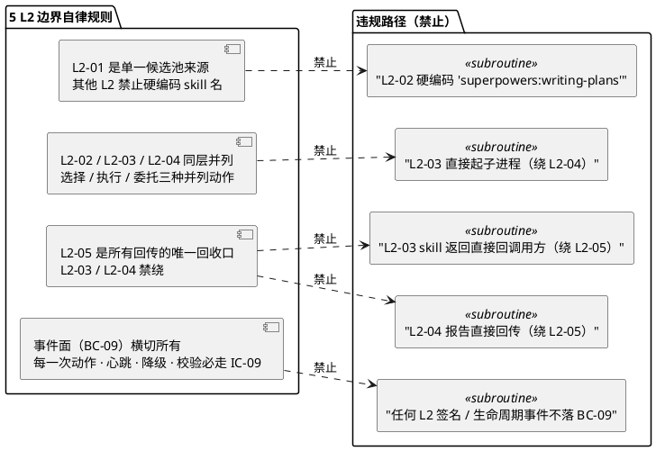
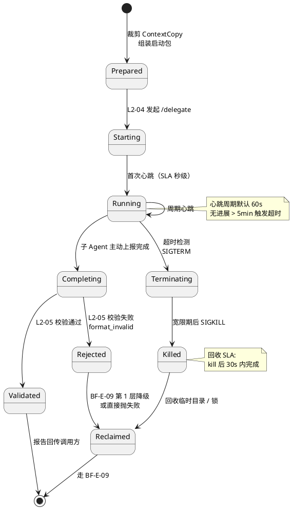
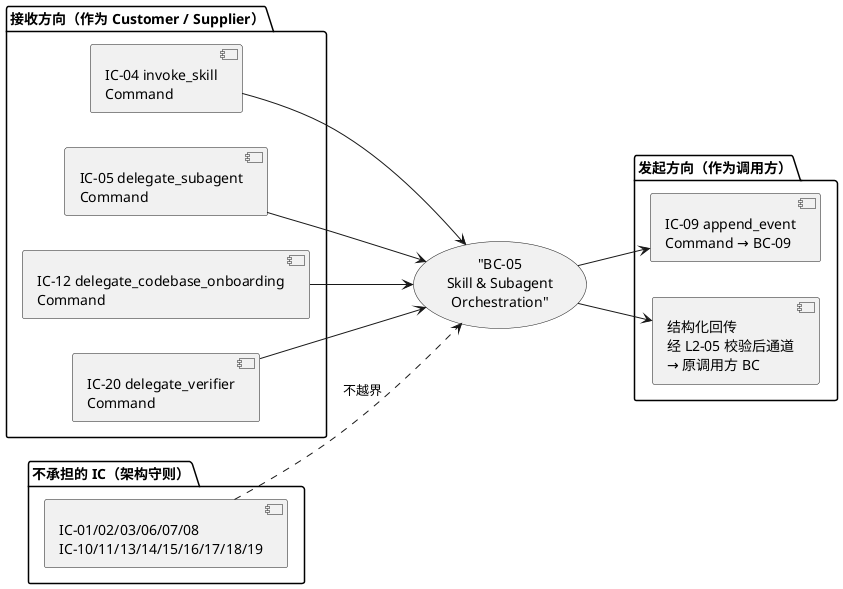
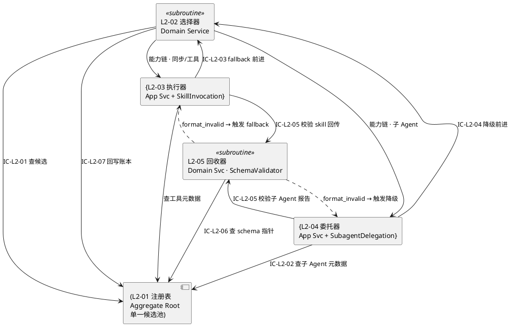

# L1-05 · Skill 生态 + 子 Agent 调度 · 总架构（architecture.md）

> **本文档定位**：L1-05（BC-05 Skill & Subagent Orchestration）的**总架构文档**，在 3-1-Solution-Technical 层级是 `2-prd/L1-05/prd.md` 的**技术实现视图骨架**，是 5 个 L2 tech-design.md（注册表 / 选择器 / 执行器 / 委托器 / 回收器）的**公共上位依赖**。
>
> **与 2-prd 的分工**：`2-prd/L1-05/prd.md` 回答"要做什么"（12 章 + 附录；5 L2 清单 / 8 条跨 L2 流 / 10 条 IC-L2 契约 / 9 小节 L2 定义模板 / 交付验证大纲）；本文档回答"落到 Claude Code Skill + hooks + subagent + jsonl + fs 这套物理底座上，**5 个 L2 是怎么组合的、在进程里什么位置、什么样的数据经过什么样的介质流过**"。
>
> **与 L0 的分工**：`3-1-Solution-Technical/L0/architecture-overview.md` 回答 HarnessFlow 整体 10 L1 怎么拼；`3-1-Solution-Technical/L0/ddd-context-map.md` 回答 10 BC 的语义 / 关系 / 聚合 / 事件；本文档把 L0 BC-05 段落**放大一个层级**，展示 BC-05 内部 5 个 L2 的聚合 / 事件 / 时序 / 契约流动。
>
> **严格边界**：本文档不含字段级 YAML schema / 具体算法实现 / 具体配置数值参数表 —— 这些一律留给 5 个 L2 的 `tech-design.md`。本文档只做 **L1 总览 · L2 切面 · 契约流 · 时序骨架**。

---

## 0. 撰写进度

- [x] §1 定位 + 与 2-prd §5.5 的映射
- [x] §2 DDD 映射（BC-05 · 聚合 / 服务 / 实体 / VO / Event / Command · 引 L0 §2.6 / §4.5 / §5.2.5）
- [x] §3 5 L2 架构图（Mermaid container + component 两张）
- [x] §4 P0 时序图（≥ 2 张：IC-04 skill 调用 + fallback 链 / IC-20 子 Agent 委托 + 异步回收）
- [x] §5 能力抽象层机制（PM-09 · 能力点 → 候选链 → 选择）
- [x] §6 子 Agent 独立 session（PM-03 · context 副本 + 工具白名单 + 生命周期）
- [x] §7 对外 IC 契约（接收 IC-04/05/20/12 · 发起 IC-06/09）
- [x] §8 开源调研（Claude Agent SDK / superpowers / MCP / LangChain / CrewAI / AutoGen · 引 L0 §6）
- [x] §9 与 5 L2 分工（每个 L2 职责骨架 · 对应 tech-design.md 指针）
- [x] §9.7 5 L2 之间 10 条 IC-L2 契约全景表
- [x] §10 性能目标（与 L0 §10 一致性对齐）
- [x] §11 反向架构守则（A1-A20 + B1-B13 禁区 · 3-2 TDD 直接派生）
- [x] 附录 A · 术语索引
- [x] 附录 B · scope §5.5 反查矩阵
- [x] 附录 C · 5 L2 之间业务流映射（对齐 prd §5 的 8 条流 A-H）
- [x] 附录 D · 与 projectModel（PM-14）的对齐点
- [x] 附录 E · 跨 L1 接线清单

---

## 1. 定位 + 与 2-prd §5.5 的映射

### 1.1 本文档的唯一命题

把 `2-prd/L0/scope.md §5.5` 规定的 L1-05 "调度层 + 适配层" 定位，**按 BC-05 的 DDD 语义**拆解为 **5 个 L2 子域**，并在 Claude Code Skill + hooks + subagent + 本地文件系统这套物理底座上说清：

1. **5 个 L2 是什么进程形态**（主 skill 内的 skill 段 / subagent 段 / hook 段 / 文件段）
2. **5 个 L2 之间的 10 条 IC-L2 契约**如何落到 markdown 指令 / 文件读写 / subagent 调用上
3. **对外 6 条 IC**（收 IC-04/05/12/20 + 发 IC-06/09）如何映射到 Claude Code 原生调度原语
4. **PM-09 能力抽象层** + **PM-03 子 Agent 独立 session** 两个核心业务模式在 DDD 下的实现形态
5. **fallback 链 + 签名审计 + schema 校验**三个跨 L2 响应面的控制流拓扑

本文档**不**展开 5 个 L2 各自的内部实现细节，这些留给 5 份 L2 tech-design.md。

### 1.2 L1-05 的物理定位（在 L0 §7 Component 图中的位置）

引 L0 `architecture-overview.md` §7（主 Skill Runtime Component 视图），L1-05 是主 skill 进程内的一个 L1 Component，但它**特殊在**：

- **对内**：是 L1-01 / L1-02 / L1-04 / L1-08 的控制流被调方（接 IC-04 / IC-05 / IC-12 / IC-20）
- **对外**：是 HarnessFlow 与 **Claude Code Skill 生态** / **MCP 外部工具** 的唯一边界（BC-05 对这两个外部系统做 ACL 防腐层 + Conformist 遵从）
- **跨进程**：子 Agent（L2-04 管）会跳出主 skill 进程，起独立 Claude session（Verifier / Onboarding / Retro / Failure-Archive）—— 这是 10 个 L1 中**唯一需要跨进程协调**的 L1（L1-07 Supervisor 虽也是独立 session，但由 L1-07 自己内部管控，不走 L1-05）

这个"既在主 skill 内、又要跨进程协调"的双重身份，决定了本 L1 的内部切成 5 个 L2 是**最小必要粒度**（见 prd §2 的 5 L2 切分理由）。

### 1.3 与 2-prd §5.5 的节级映射

| 2-prd `§5.5` 节 | 内容摘要 | 本文档对应节 |
|---|---|---|
| §5.5.1 职责 | 4 大 skill 生态 + 能力抽象层 + 独立 session 子 Agent + 工具柜 + fallback | §1 + §5 + §6 + §7 |
| §5.5.2 输入/输出 | 能力请求 / 注册表 / 子 Agent 注册表 / 工具柜元数据 → 结构化回传 / 报告 / 签名 | §3 + §7 + §9 |
| §5.5.3 边界 | In（匹配/排序/链/生命周期/签名/降级）Out（skill 实现/业务逻辑/监督/KB/事件落盘）| §3.3（边界） + §9 |
| §5.5.4 约束 | PM-03 / PM-09 + 4 硬约束（签名/子 Agent 2 次降级/skill fallback/5 分钟超时 kill） | §2.4 + §5 + §6 + §10 |
| §5.5.5 🚫 7 禁止 | 硬编码 / 共享 context / 无签名 / 硬退出 / 超时不 kill / 反向写 task-board / 绕抽象层 | §2.5 + §5 + §6 |
| §5.5.6 ✅ 6 必须 | ≥ 2 备选 / fallback / 落事件 / 副本 / kill 回收 / schema validate | §3 + §5 + §6 + §10 |
| §5.5.7 与其他 L1 交互 | 被 L1-01/02/04/08 调 · 被 L1-07 观察 · 写 L1-09 | §7 + 附录 C |

本文档**不得**与 `2-prd/L1-05/prd.md` 冲突；若需反向修 PRD（spec §6.2 允许），须在本文档顶部显式声明。当前 v1.0 **无反向修 PRD**。

### 1.4 与 2-prd 自身 5 个 L2 定义的骨架对齐

`2-prd/L1-05/prd.md` §2 给出 5 L2 清单 + §8-§12 逐 L2 9 小节定义；本文档 §9 把这 5 L2 映射为 DDD 原语 + 指向对应的 `tech-design.md`。严格骨架对齐（不增不减不换名）：

| 2-prd L2 ID | 2-prd L2 名称 | 本文档 §9 DDD 原语 | 对应 tech-design.md |
|---|---|---|---|
| L2-01 | Skill 注册表（能力抽象层与可用性账本）| Aggregate Root: SkillRegistry | `L2-01-Skill注册表/tech-design.md` |
| L2-02 | Skill 意图选择器（能力点 → skill 候选链）| Domain Service | `L2-02-Skill意图选择器/tech-design.md` |
| L2-03 | Skill 调用执行器（调用 · 签名登记 · fallback 驱动）| Application Service + Aggregate: SkillInvocation | `L2-03-Skill调用执行器/tech-design.md` |
| L2-04 | 子 Agent 委托器（独立 session 生命周期管理）| Application Service + Aggregate: SubagentDelegation | `L2-04-子Agent委托器/tech-design.md` |
| L2-05 | 异步结果回收器（schema 校验 · 超时 · 结果回传）| Domain Service（SchemaValidator） | `L2-05-异步结果回收器/tech-design.md` |

---

## 2. DDD 映射 · BC-05 Skill & Subagent Orchestration

### 2.1 BC 边界重申（引 L0 §2.6）

BC-05 是 HarnessFlow 对外的**能力抽象层**载体（BF-X-07），在 DDD 语境下具有 3 个特殊性：

1. **ACL（防腐层）对外**：对外部 Claude Code Skill / MCP / 原子工具生态做防腐翻译 —— 把它们的自由文本 / 异构 JSON / 各异协议翻译成本 BC 的 `SkillInvocation.result` / `ToolInvocation` / `SubagentReport` 三种统一结构化 VO。
2. **Conformist（遵从者）**：Claude Code Skill / MCP 协议由 Anthropic 定义，本 BC 不能反向影响；Anthropic 升级协议时本 BC 只能跟随（但 ACL 隔离了污染面）。
3. **Supplier 对内**：BC-01（主 loop）/ BC-04（Quality Loop）/ BC-08（多模态）都是 BC-05 的 Customer，BC-05 响应它们的 IC-04 / IC-05 / IC-12 / IC-20 命令。

### 2.2 5 个 L2 的 DDD 分类表（引 L0 §4.5）

| L2 | L2 名称 | DDD 分类 | 核心对象（Aggregate / Entity / VO） | 一致性边界 |
|---|---|---|---|---|
| **L1-05 L2-01** | Skill 注册表 | **Aggregate Root** | SkillRegistry；Entity: SkillCandidate / SubagentEntry / ToolEntry；VO: AvailabilityRecord / SuccessRateRecord / FailureMemory / SchemaPointer | capability_point → candidates 映射 + 可用性 / 版本 / 成本 / 成功率 / 失败记忆账本；**低频更新 · 高频读** |
| **L1-05 L2-02** | Skill 意图选择器 | **Domain Service**（无状态） | CapabilityChain VO / SelectionContext VO | 无状态纯函数：输入 (capability, constraints, registry_snapshot)，输出 [首选, 备选, 内建兜底] 链 |
| **L1-05 L2-03** | Skill 调用执行器 | **Application Service + Aggregate Root** | Aggregate: SkillInvocation；VO: InvocationSignature（capability / skill_id / version / params_hash / duration / attempt / caller_l1 / result_summary / validate_status） | 单次调用生命周期：构造签名 → 发起调用 → 等返回 → 交校验 → 记终局事件；**每次调用独立 aggregate 实例** |
| **L1-05 L2-04** | 子 Agent 委托器 | **Application Service + Aggregate Root** | Aggregate: SubagentDelegation；VO: ContextCopy（只读裁剪）/ ToolWhitelist / Timeout / LifecycleState（starting / running / completing / killed / degraded）| 单次委托生命周期：裁剪 → 启动 → 心跳 → 完成/kill → 回收；**每次委托独立 aggregate 实例** |
| **L1-05 L2-05** | 异步结果回收器 | **Domain Service**（schema validator） | VO: SchemaValidationResult（status: ok/format_invalid/timeout/schema_unavailable + error_details 列表）| 无状态纯函数：输入 (raw_return, schema_pointer)，输出 ValidationResult；**校验过程不改返回内容** |

### 2.3 BC-05 发布的 Domain Events（引 L0 §5.2.5）

BC-05 对 BC-09 事件总线发布以下 10 类 domain events（按 ULID 时序产生，append-only）：

| 事件名 | 触发时机 | 必含字段（概念级）|
|---|---|---|
| `L1-05:skill_invoked` | L2-03 发起 skill 调用 | invocation_id / capability / selected_skill / params_hash / attempt / caller_l1 / project_id |
| `L1-05:skill_returned` | L2-03 收到 skill 返回（未校验前）| invocation_id / duration_ms / result_hash |
| `L1-05:skill_fallback_triggered` | L2-03 沿 fallback 链前进 | invocation_id / failed_skill / failed_reason / next_skill / attempt |
| `L1-05:subagent_started` | L2-04 启动独立 session | delegation_id / subagent_name / context_hash / tools_whitelist_hash / timeout_ms |
| `L1-05:subagent_heartbeat` | L2-04 收到心跳 | delegation_id / elapsed_ms / progress_summary（可选）|
| `L1-05:subagent_completed` | L2-04 接收到最终报告（校验前）| delegation_id / report_ref / duration_ms |
| `L1-05:subagent_crashed` | 子 Agent 进程异常退出 | delegation_id / reason / stderr_tail |
| `L1-05:subagent_timeout` | L2-04 触发超时 kill | delegation_id / timeout_ms / kill_signal_sequence（TERM→KILL）|
| `L1-05:async_result_validated` | L2-05 校验通过 | validation_id / source（skill/subagent/tool）/ capability |
| `L1-05:async_result_rejected` | L2-05 校验失败 | validation_id / errors（missing_field / type_error / null_violation / schema_unavailable）|

**所有事件必带 `project_id`**（PM-14 `harnessFlowProjectId` 是跨 BC Shared Kernel VO；参考 `3-1-projectModel/tech-design.md` §7）。

### 2.4 BC-05 接收 / 发起的 Commands 与 Queries（引 L0 §5.1）

**接收（作为 Customer / 被调方）**：

| DDD 原语 | 源 IC | 调用方 BC | 一句话含义 |
|---|---|---|---|
| `Command` | IC-04 invoke_skill | BC-01 / BC-02 / BC-04 / BC-08 | 请求调用某能力点（skill 或工具）|
| `Command` | IC-05 delegate_subagent | BC-01 / 其他 | 请求起独立 session 的通用子 Agent |
| `Command` | IC-12 delegate_codebase_onboarding | BC-08 | 请求起 codebase-onboarding 子 Agent |
| `Command` | IC-20 delegate_verifier | BC-04 | 请求起 verifier 子 Agent |

**发起（作为调用方）**：

| DDD 原语 | 目标 IC | 目标 BC | 一句话含义 |
|---|---|---|---|
| `Command` | IC-09 append_event | BC-09 | 每次 skill 调用 / 子 Agent 生命周期 / 工具签名 / fallback / 校验事件落盘 |
| `Query` | 跨 BC 读 | BC-06（KB）间接 | 本 BC 本身**不读 KB**（scope §5.5.3 Out-of-scope）；KB 注入由调用方（L1-01/L1-02）负责 |

BC-05 不承担除以上外的 IC（引 `2-prd/L1-05/prd.md §13.5`：IC-01/02/03/06/07/08/10/11/13/14/15/16/17/18/19 均**不属于本 BC**）。

### 2.5 PM-14 `harnessFlowProjectId` 在本 BC 的承接

所有 BC-05 的 domain events / commands / queries 的**字段级 schema 都必含 `project_id`**（`harnessFlowProjectId` VO）。具体落点：

- **skill 调用签名**：InvocationSignature.project_id 必填
- **子 Agent 启动包**：ContextCopy 里的 project_id 必作为受限上下文的**必填项**（PRD §0 开头的 PM-14 声明：PM-03 独立 session 不意味着可以丢 project_id —— 相反委托时必须把 project_id 作为受限 context 的必填字段传给子 Agent）
- **异步回传事件**：validation_id 所属事件必带 project_id 以便路由回正确 project 的主 loop
- **注册表查询**：本 BC 内的 SkillRegistry Aggregate 是**跨 project 共享资产**（与 Global KB 地位一致），**不按 project 分隔注册条目本身**；但账本（成功率 / 失败记忆）可按 project 分视图（技术实现见 L2-01 tech-design）

### 2.6 BC-05 Repository 模式映射（引 L0 §7.2.5）

| Repository | 对应 Aggregate | 持久化介质 | 读写模式 |
|---|---|---|---|
| `SkillRegistryRepository` | SkillRegistry | `skills/registry.yaml`（capability_point → candidates 主映射）+ `skills/ledger.jsonl`（append-only 账本） | 启动时全加载 · 热更走事件订阅 |
| `SkillInvocationRepository` | SkillInvocation（每次调用一个）| BC-09 事件总线（不持久化 aggregate 本体 · 由事件流重建）| 写：append events；读：query_audit_trail 反查 |
| `SubagentDelegationRepository` | SubagentDelegation（每次委托一个）| 同上 · 事件流重建；临时目录 `runtime/subagents/<delegation_id>/` 存 context_copy + stdout/stderr | 同上 + 临时目录管理 |

BC-05 **不**拥有独立存储服务，全部走 BC-09（事件总线）+ fs（yaml/jsonl/临时目录）。

---

## 3. 5 L2 架构图（Mermaid）

### 3.1 Container 视图：BC-05 在主 Skill Runtime 中的物理位置

```plantuml
@startuml
!include <C4/C4_Container>
' C4Container Mermaid → PlantUML C4 stdlib (需 PlantUML 支持 C4 include)
    title BC-05 Skill & Subagent Orchestration · Container View

    Person(user, "用户", "单用户 · 单机")

    System_Boundary(hf, "HarnessFlow") {
        Container(main_skill, "主 Skill Runtime", "Claude Code session", "L1-01/02/03/04/05/06/08/09 的执行器")

        Container_Boundary(bc05, "BC-05 内部 Component 边界") {
            Component(l2_01, "L2-01 注册表", "yaml/jsonl 文件", "Aggregate: SkillRegistry")
            Component(l2_02, "L2-02 选择器", "main_skill 段", "Domain Service")
            Component(l2_03, "L2-03 执行器", "main_skill 段", "App Svc + SkillInvocation")
            Component(l2_04, "L2-04 委托器", "main_skill 段", "App Svc + SubagentDelegation")
            Component(l2_05, "L2-05 回收器", "main_skill 段", "Domain Svc schema validator")
        }

        Container(subagent_verifier, "Verifier Subagent", "独立 Claude session", "L2-04 拉起")
        Container(subagent_onboard, "Codebase-Onboarding Subagent", "独立 Claude session", "L2-04 拉起")
        Container(subagent_retro, "Retro-Generator Subagent", "独立 Claude session", "L2-04 拉起")
        Container(subagent_archive, "Failure-Archive Subagent", "独立 Claude session", "L2-04 拉起")
        Container(event_bus, "BC-09 Event Bus", "events.jsonl", "L1-09 提供")
    }

    System_Ext(skill_eco, "Claude Code Skill 生态", "superpowers / gstack / ecc / 自定义")
    System_Ext(mcp_ext, "MCP 外部工具", "可选 · 未来扩展")

    Rel(main_skill, l2_02, "能力请求分派（IC-04/05/12/20）")
    Rel(l2_02, l2_01, "IC-L2-01 查候选")
    Rel(l2_02, l2_03, "能力链（同步 skill / 工具）")
    Rel(l2_02, l2_04, "能力链（子 Agent）")
    Rel(l2_03, l2_05, "IC-L2-05 回传校验")
    Rel(l2_04, l2_05, "IC-L2-05 报告校验")
    Rel(l2_05, main_skill, "校验通过 · 结构化结果回传调用方")

    Rel(l2_03, skill_eco, "ACL · 调用外部 skill")
    Rel(l2_03, mcp_ext, "ACL · 调用 MCP 工具（可选）")

    Rel(l2_04, subagent_verifier, "启动独立 session（IC-20 路径）")
    Rel(l2_04, subagent_onboard, "启动（IC-12 路径）")
    Rel(l2_04, subagent_retro, "启动（S7 retro 路径）")
    Rel(l2_04, subagent_archive, "启动（失败归档路径）")

    Rel(l2_01, event_bus, "IC-09 账本更新事件")
    Rel(l2_03, event_bus, "IC-09 每次调用签名事件")
    Rel(l2_04, event_bus, "IC-09 生命周期事件")
    Rel(l2_05, event_bus, "IC-09 校验结果事件")

    UpdateRelStyle(main_skill, l2_02, $textColor="blue", $lineColor="blue")
    UpdateRelStyle(l2_03, skill_eco, $textColor="red", $lineColor="red")
@enduml
```

**关键观察**：

1. **5 个 L2 中 4 个（L2-02 / L2-03 / L2-04 / L2-05）都住在主 skill runtime 里**（它们是 main_skill 内的"markdown-prompt 段 / 调度逻辑段 / hook 段"，非独立进程）
2. **L2-01 是 Aggregate + 文件介质**（`skills/registry.yaml` + `skills/ledger.jsonl`），在架构上是"**数据资产**"而非"执行器"，与 4 个执行型 L2 形态不同
3. **L2-04 是唯一跨进程协调者**：它的 SubagentDelegation Aggregate 的生命周期跨越"主 skill 进程 ↔ 独立 Claude session 进程"两个进程域
4. **外部边界只有 L2-03（Skill 生态 + MCP）**：BC-05 对外 ACL 防腐层的唯一实体入口就是 L2-03；L2-04 虽然跨进程，但跨的是**本 BC 自己管辖下的** Claude session（通过 Claude Code `/delegate` 原语），不是 BC 外部

### 3.2 Component 视图：5 L2 内部契约流拓扑

```plantuml
@startuml
package "调用方（BC-01 / BC-02 / BC-04 / BC-08）" as caller {
component "IC-04 invoke_skill" as IC04
component "IC-05 delegate_subagent" as IC05
component "IC-12 delegate_codebase_onboarding" as IC12
component "IC-20 delegate_verifier" as IC20
}
component "L1-05 入口分派器\n（main_skill 里的 routing 段）" as entry
IC04 --> entry
IC05 --> entry
IC12 --> entry
IC20 --> entry
entry --> L202[["L2-02 : "能力请求\n(capability + constraints)"
package "L2-01 注册表（Aggregate Root · 数据底座）" as registry_layer {
rectangle ""SkillRegistry\ncapability_point → candidates[]"" as REG <<subroutine>>
rectangle ""Availability / Cost / SuccessRate / FailureMemory 账本"" as LEDGER <<subroutine>>
rectangle ""子 Agent 注册表\nname → metadata"" as SUB_REG <<subroutine>>
rectangle ""原子工具柜元数据"" as TOOL_REG <<subroutine>>
rectangle ""回传 schema 指针集"" as SCHEMA_PTR <<subroutine>>
}
L202 --> REG : "IC-L2-01 查候选"
L202 --> LEDGER : "IC-L2-07 回写账本"
L202 --> L203[["L2-03 : "同步 skill / 工具\n能力链 [首选, 备1, 备2, 兜底]"
L202 --> L204[["L2-04 : "子 Agent 能力链"
L204 --> SUB_REG : "IC-L2-02 取子 Agent 元数据"
L203 --> TOOL_REG : "查工具元数据"
L203 --> EXT_SKILL["外部 : "ACL 翻译"
L203 --> EXT_TOOL["原子工具 : "ACL 翻译"
L204 --> SUB_SESSION["独立 : "启动独立 session"
L203 --> L205[["L2-05 : "skill 返回\nIC-L2-05 校验"
L204 --> L205 : "子 Agent 报告\nIC-L2-05 校验"
L205 --> SCHEMA_PTR : "IC-L2-06 查 schema 指针"
L205 --> caller : "校验通过 · 转发结构化结果"
L205 ..> L203 : "校验失败\n视为调用失败"
L205 ..> L204 : "校验失败\n视为委托失败"
L203 ..> L202 : "IC-L2-03\nfallback 前进"
L204 ..> L202 : "IC-L2-04\n降级前进"
package "事件横切面（BC-09）" as event_face {
rectangle ""events.jsonl\n（append-only）"" as EVENTS <<subroutine>>
}
L201_reg(["L2-01"]) ..> EVENTS : "账本变更\nIC-09"
L202 ..> EVENTS : "capability_resolved / exhausted\nIC-09"
L203 ..> EVENTS : "skill_invoked / returned / fallback_triggered\nIC-09"
L204 ..> EVENTS : "subagent_started / heartbeat / completed / crashed / timeout\nIC-09"
L205 ..> EVENTS : "async_result_validated / rejected\nIC-09"
@enduml
```

**图解关键路径**：

- **粗实线**：正常调度路径（能力请求 → 选择器 → 执行器/委托器 → 回收器 → 调用方）
- **粗虚线**：失败路径（校验失败 → 回传 L2-03/L2-04 → fallback 前进 → L2-02 产下一链）
- **点线**：事件横切（所有 L2 都向 BC-09 发事件，不可绕过）
- **灰底模块**：数据底座（不主动发起调度，被动应答）
- **外部节点（EXT_SKILL / EXT_TOOL / SUB_SESSION）**：BC-05 之外的外部系统边界

### 3.3 边界规则图（引 prd §3 图 A "关键规则"）



---

## 4. P0 时序图（至少 2 张）

本节给出 2 张 P0 时序图：**IC-04 skill 调用 + fallback 链**、**IC-20 子 Agent 委托 + 异步回收**。骨架与 L0 `sequence-diagrams-index.md` §2.3（P0-03 WP Quality Loop 一轮）/ §2.6（P0-06 硬红线拦截）一致性对齐。

### 4.1 P0-L1-05-A · IC-04 invoke_skill 同步调用 · 首选成功路径

**场景**：L1-01 主 loop 在决策心跳决定"调 tdd skill 写测试"，走 IC-04；链 = [tdd, prp-implement, 内建兜底]，首选成功。

**主参与者**：L1-01 主 loop · L2-02 选择器 · L2-01 注册表 · L2-03 执行器 · L2-05 回收器 · L1-09 事件总线 · 外部 tdd skill

```plantuml
@startuml
autonumber
    autonumber
participant "L1-01 主 loop" as L01
participant "L2-02 选择器" as L202
participant "L2-01 注册表" as L201
participant "L2-03 执行器" as L203
participant "L2-05 回收器" as L205
participant "外部 tdd skill" as TDD
participant "L1-09 事件总线" as L09
L01 -> L202 : IC-04 invoke_skill(cap="test.tdd.python",\nconstraints={timeout=10min}, pid=foo)
activate L202
L202 -> L201 : IC-L2-01 get_candidates(cap="test.tdd.python")
L201- -> L202 : [tdd (avail=1, cost=M, success=95%),\nprp-implement (avail=1, cost=H, success=80%),\nbuiltin_min (avail=1, cost=L, success=-)]
L202 -> L202 : 按 success 排序 · 剔除 unavailable · 附兜底
L202 -> L09 : IC-09 append_event(capability_resolved,\nchain=[tdd, prp-implement, builtin_min])
L202- -> L203 : 能力链 + attempt=1
deactivate L202
activate L203
L203 -> L203 : 构造 InvocationSignature\n(invocation_id, capability, selected=tdd,\nparams_hash, attempt=1, caller_l1=L01)
L203 -> L09 : IC-09 append_event(skill_invoked)
L203 -> TDD : ACL 调用 · 透传 params
note over TDD : 外部 skill 执行\n（黑盒）
TDD- -> L203 : raw_return（自由文本 / JSON）
L203 -> L09 : IC-09 append_event(skill_returned,\nduration_ms=8700)
L203 -> L205 : IC-L2-05 validate(raw_return, cap="test.tdd.python")
deactivate L203
activate L205
L205 -> L201 : IC-L2-06 get_schema_pointer(cap)
L201- -> L205 : schema_ref="schemas/test_tdd_python.json"
L205 -> L205 : schema 校验（字段 / 类型 / 非空）
L205 -> L09 : IC-09 append_event(async_result_validated,\nstatus=ok)
L205- -> L203 : ok（附结构化结果）
deactivate L205
activate L203
L203 -> L202 : IC-L2-07 账本回写\n(cap, selected=tdd, duration=8700, success=true)
L203- -> L01 : 结构化结果 · 返回调用方
deactivate L203
note over L202,L201 : L2-02 触发 L2-01 更新 tdd 的\nlast_used_at + success_count + rolling_success_rate
@enduml
```

### 4.2 P0-L1-05-B · IC-04 invoke_skill · fallback 链执行（首选 + 备选都失败 → 内建兜底成功）

**场景**：同 4.1 的能力点，但 tdd 返回 schema 不对 + prp-implement 调用超时 → 链前进到内建兜底 → 成功。

**主参与者**：同上 + prp-implement skill（备选）+ 内建兜底

```plantuml
@startuml
autonumber
    autonumber
participant "L1-01 主 loop" as L01
participant "L2-02 选择器" as L202
participant "L2-01 注册表" as L201
participant "L2-03 执行器" as L203
participant "L2-05 回收器" as L205
participant "tdd skill" as S1
participant "prp-implement skill" as S2
participant "内建兜底" as B
participant "L1-09 事件总线" as L09
L01 -> L202 : IC-04 invoke_skill
L202 -> L201 : IC-L2-01 get_candidates
L201- -> L202 : [tdd, prp-implement, builtin]
L202- -> L203 : 链 + attempt=1 (tdd)
L203 -> S1 : ACL 调用（attempt=1）
S1- -> L203 : raw_return（字段缺失）
L203 -> L205 : IC-L2-05 validate
L205- -> L203 : format_invalid(missing_field="test_cases_count")
L203 -> L09 : IC-09 async_result_rejected\n+ skill_fallback_triggered(attempt=1→2)
L203 -> L202 : IC-L2-03 advance(cap, failed_skill=tdd)
L202 -> L202 : 标记 tdd 本次失败 · 下一项=prp-implement
L202- -> L203 : next_attempt=2 (prp-implement)
L203 -> S2 : ACL 调用（attempt=2）
note over S2 : 执行超时\n（> 10 min）
L203 -> L203 : 超时检测 · 主动取消
L203 -> L09 : IC-09 skill_call_failed(timeout)\n+ skill_fallback_triggered(attempt=2→3)
L203 -> L202 : IC-L2-03 advance
L202- -> L203 : next_attempt=3 (builtin_min)
L203 -> B : 本 L1 内建极简实现
B- -> L203 : raw_return（结构化 · schema 合规）
L203 -> L205 : IC-L2-05 validate
L205 -> L201 : get_schema_pointer
L205- -> L203 : ok
L203 -> L202 : IC-L2-07 账本回写\n(tdd: fail+1, prp-implement: timeout+1, builtin: used+1)
L203- -> L01 : 结构化结果（附 "builtin_fallback_used" 标记）
L203 -> L09 : IC-09 skill_returned(attempt=3, via_builtin)
note over L202,L201 : tdd 失败记忆 +1 · prp-implement 超时记忆 +1\n下次同能力请求 L2-02 将这两项降权
@enduml
```

**关键行为**：

- `attempt` 单调递增（1 → 2 → 3），每步事件含 attempt 供审计链反查
- 每次 fallback 前进都经 IC-L2-03 显式契约（不隐式重入）
- `builtin_fallback_used` 标记用于 L1-07 Supervisor "真完成质量" 维度打分（频繁命中兜底 → 质量维度降分）
- 如 builtin 也失败 → 抛 `capability_exhausted` 异常 → 调用方（L1-01）决定硬暂停（走 L1-07 硬红线判定）

### 4.3 P0-L1-05-C · IC-20 delegate_verifier 子 Agent 委托 + 异步回收（首次成功路径）

**场景**：L1-04 Quality Loop 在 S5 完成 S4 artifacts，发 IC-20 给 L1-05；verifier 子 Agent 独立 session 跑完返回报告。

**主参与者**：L1-04 Quality Loop · L2-02 选择器 · L2-01 注册表 · L2-04 委托器 · L2-05 回收器 · 独立 Verifier session · L1-09 事件总线

```plantuml
@startuml
autonumber
    autonumber
participant "L1-04 Quality Loop" as L04
participant "L2-02 选择器" as L202
participant "L2-01 注册表" as L201
participant "L2-04 委托器" as L204
participant "L2-05 回收器" as L205
participant "Verifier<br/>独立 session" as VS
participant "L1-09 事件总线" as L09
L04 -> L202 : IC-20 delegate_verifier\n(s3_blueprint, s4_artifacts, dod_exprs, pid=foo)
note over L202 : 归一化为 cap="verifier"
L202 -> L201 : IC-L2-01 get_candidates(cap="verifier")
L201- -> L202 : [verifier_main (avail=1), simplified_dod_eval (degraded)]
L202- -> L204 : 链 + attempt=1 (verifier_main)
activate L204
L204 -> L201 : IC-L2-02 get_subagent_metadata(name="verifier")
L201- -> L204 : {tools=[Read,Grep,Bash_readonly],\ntimeout=5min, schema_ptr=...}
L204 -> L204 : 裁剪 ContextCopy（只读 · 含 project_id=foo · 只含本 WP 必需）
L204 -> L204 : 组装启动包\n(goal, tools_whitelist, schema_ptr, timeout)
L204 -> L09 : IC-09 subagent_started(delegation_id, name=verifier,\ncontext_hash, project_id=foo)
L204 -> VS : Claude Code /delegate 原语\n启动独立 session
activate VS
note over VS : 独立 Claude session 运行\n（不共享主 session context）
loop 每 60s 心跳（3-1 定周期）
VS- -> L204 : heartbeat signal
L204 -> L09 : IC-09 subagent_heartbeat(delegation_id, elapsed_ms)
end
VS- -> L204 : 结构化 verifier_report.json
deactivate VS
L204 -> L09 : IC-09 subagent_completed(delegation_id, report_ref)
L204 -> L205 : IC-L2-05 validate(report, cap="verifier")
deactivate L204
activate L205
L205 -> L201 : IC-L2-06 get_schema_pointer(cap="verifier")
L201- -> L205 : schema_ref="schemas/verifier_report.json"
L205 -> L205 : 校验（three_evidence_chain 字段完整性 / verdict enum / ...）
L205 -> L09 : IC-09 async_result_validated(validation_id, source=subagent)
L205- -> L204 : ok
deactivate L205
L204 -> L202 : IC-L2-07 账本回写\n(verifier: used+1, duration, success=true)
L204- -> L04 : verifier_report_json（经 IC-L2-10 通道）
note over L04 : L1-04 S5 组装三段证据链 · verdict=PASS
@enduml
```

**关键行为**：

- **ContextCopy 含 `project_id=foo`**（PM-14 必填；PRD §0 声明：PM-03 独立 session 不意味着丢 project_id，反要强制传）
- 心跳周期由 3-1 L2-04 tech-design 定（典型 60s，防过度消耗 token）
- verifier 完成后**必经 L2-05 校验**（schema 校验 three_evidence_chain 的形状，不校验语义）
- 事件带 project_id 以便跨 project 审计路由回正确 L1-04 实例

### 4.4 P0-L1-05-D · 子 Agent 超时 → kill + 回收 + BF-E-09 降级（2 次失败）

**场景**：同 4.3 的 IC-20，但 verifier 5 分钟无进展 → kill；新 session 重试也失败 → 标 degraded → 走简化版 → 返回。

```plantuml
@startuml
autonumber
    autonumber
participant "L1-04 Quality Loop" as L04
participant "L2-02 选择器" as L202
participant "L2-04 委托器" as L204
participant "L2-05 回收器" as L205
participant "Verifier<br/>session #1" as VS1
participant "Verifier<br/>session #2（重试）" as VS2
participant "简化版<br/>DoD eval" as SIMPLE
participant "L1-09 事件总线" as L09
L04 -> L202 : IC-20 delegate_verifier
L202- -> L204 : 链 + attempt=1
L204 -> VS1 : 启动 session #1
L204 -> L09 : IC-09 subagent_started(attempt=1)
activate VS1
note over VS1 : 进入死循环 / 上下文膨胀\n无心跳 > 5 min
deactivate VS1
L204 -> L204 : 超时检测（阈值 5min · L2-01 配置）
L204 -> VS1 : SIGTERM（宽限期 30s）
L204 -> VS1 : SIGKILL（宽限期超）
L204 -> L204 : 回收临时目录 + 文件锁
L204 -> L09 : IC-09 subagent_timeout + subagent_killed\n(delegation_id, reason=timeout)
note over L204 : BF-E-09 第 1 次降级\n→ 新 session 重试（同名 verifier）
L204 -> L204 : 重新裁剪 ContextCopy（新 hash）
L204 -> VS2 : 启动 session #2
L204 -> L09 : IC-09 subagent_started(attempt=2)
activate VS2
VS2- -> L204 : 结构化报告
deactivate VS2
L204 -> L205 : IC-L2-05 validate
L205- -> L204 : format_invalid(missing_field="three_evidence_chain.existence")
L204 -> L09 : IC-09 async_result_rejected + subagent_crashed(reason=format_invalid, attempt=2)
note over L204 : BF-E-09 第 2 次失败\n→ 标记 verifier degraded\n→ 走简化版（链上 attempt=3）
L204 -> L202 : IC-L2-04 advance(subagent=verifier, failed=2)
L202- -> L204 : next = simplified_dod_eval
L204 -> SIMPLE : 本 L1 内建简化版 DoD eval（主 session 跑）
SIMPLE- -> L204 : 简化 verdict（可能能力弱）
L204 -> L205 : IC-L2-05 validate
L205- -> L204 : ok（简化版 schema 较宽松）
L204- -> L04 : 简化 verifier_report\n（附 "degraded_mode=true" 标记）
L204 -> L09 : IC-09 subagent_degraded(final_path=simplified)
note over L04 : L1-04 收到 degraded 标记\n可能触发 L1-07 WARN 级告警
@enduml
```

**关键行为**：

- **先 SIGTERM 后 SIGKILL**（scope §5.5.4 硬约束 4 · prd §11.4 硬约束 3）：优雅退出优先 · 宽限期不退再强杀
- **BF-E-09 降级 ≤ 3 层**：第 1 次重试 + 第 2 次简化版 + 第 3 次跳过（本示例停在第 2 层即成功返回；若简化版也失败则抛 `subagent_capability_exhausted`）
- **资源回收必做**：临时目录 + 文件锁 + 可能的子进程残留 —— kill 后 30 秒内必完成（scope §5.5.4 硬约束 4）
- **子 Agent 失败记忆回写 L2-01 账本**：下次 L2-02 排序把 verifier 降权 · 直到它的失败记忆自然衰减（具体衰减算法 3-1 L2-01 tech-design 定）

### 4.5 对 L0 sequence-diagrams-index 的引用关系

| L0 P0 场景 | L1-05 在其中的角色 | 本文档对应时序图 |
|---|---|---|
| P0-01 项目创建 | 被 L1-01 调 IC-04（初始 skill 调用）| 本文档 §4.1 同构（更简）|
| P0-03 WP Quality Loop 一轮 | 被 L1-04 调 IC-20（verifier 委托）| 本文档 §4.3 展开 |
| P0-06 硬红线拦截 | 作为"导致红线触发的上游因"（如 `rm -rf` 通过 L2-03 调用发生）| 本文档 §4 不单独画（由 L1-07 tech-design 展开）|
| P0-08 S5 verifier FAIL → 4 级回退 | L2-04 委托 verifier · L2-05 校验 · 反馈 L1-04 | 本文档 §4.3 + §4.4 覆盖 |

L0 `sequence-diagrams-index.md` 的 P1 / P2 链路中涉及 L1-05 的（如 P1-XX 描绘 skill 生态更新 / 子 Agent 池保护等）由各 L2 tech-design.md §5 深化。

---

## 5. 能力抽象层机制（PM-09）

### 5.1 PM-09 核心诉求

PM-09 在 `2-prd/L0/scope.md §4.5` 定义："**主 Agent 绑能力点不绑 skill 名；每能力 ≥ 2 备选 fallback**"。它是 HarnessFlow 对抗 Claude Code Skill 生态快速演化的**核心解耦机制**（skill 改名 / 弃用 / 版本升级不影响主 loop）。

PM-09 有 2 个强约束 + 1 个反例：

| 类型 | 内容 |
|---|---|
| 强约束 A | 每个 capability 注册表中必须 ≥ 2 候选（单候选系统启动时告警 · 自动补内建兜底） |
| 强约束 B | 调用方永远只传 capability（如 `"plan_writer"` / `"verifier"` / `"tool:Read"`），禁传 skill 字面量（如 `"superpowers:writing-plans"`） |
| 反例 | 代码里 `invoke_skill("superpowers:writing-plans")` 直接硬编码 = 违反 §5.5.5 禁止 1 + 禁止 7 · 架构静态扫描必拦 |

### 5.2 在 BC-05 的 DDD 承接

| PM-09 要素 | 承接 L2 | DDD 原语 |
|---|---|---|
| 能力点定义 | L2-01 | VO: CapabilityPoint（值对象 · 短结构化名，如 `"test.tdd.python"`）|
| 能力点 → 候选链映射 | L2-01 | Aggregate 内 Entity: SkillCandidate[]（有 id / version / availability / cost / success_rate / failure_memory）|
| "绑能力点不绑 skill 名"的硬守则 | L2-02 | Domain Service 的输入签名：`select(capability: CapabilityPoint, constraints: Constraints) -> FallbackChain` —— **禁传 skill 字面量** |
| ≥ 2 备选 | L2-01 | Aggregate 业务不变式：候选列表长度 < 2 时自动注入内建兜底（保证 ≥ 2）|
| fallback 执行时的链前进 | L2-03 / L2-04 | App Service 的 fallback 推进逻辑（IC-L2-03 / IC-L2-04）|
| 版本兼容性 | L2-01 | VO: SkillVersion · 允许 capability 带版本约束（如 `"plan_writer@>=2.0"`） |

### 5.3 能力点命名约定（与开源调研对齐）

引 L0 `open-source-research.md §6.6a` 能力抽象层对标小节的选型建议：

| 能力点类别 | 命名格式 | 示例 |
|---|---|---|
| 工具能力（原子工具柜）| `tool:<ToolName>` | `tool:Read` / `tool:Grep` / `tool:Bash` |
| skill 能力（业务工作流）| `<domain>.<action>[.<variant>]` | `plan.write` / `plan.review` / `test.tdd.python` / `code.refactor` |
| 子 Agent 能力 | `subagent:<role>` | `subagent:verifier` / `subagent:onboarding` / `subagent:retro` |
| 内建能力（L1-05 自带兜底）| `builtin:<name>` | `builtin:plan_minimal` / `builtin:simplified_dod` |

命名硬约束：

- 只用小写字母 + 数字 + `.` + `:` + `_`，禁用空格 / 中文 / 其他符号
- `tool:` / `subagent:` / `builtin:` 是保留前缀，非 skill 生态条目不得占用

### 5.4 选择多信号（L2-02 决策逻辑骨架）

L2-02 是纯 Domain Service（无状态），输入 `(capability, constraints, registry_snapshot)`，输出 `FallbackChain`。多信号权重顺序（文字描述；精确权重由 L2-02 tech-design 定）：

1. **可用性过滤**（必要条件）：`availability != unavailable` 的候选才进入池；不可用候选**直接剔除**（不是降权）
2. **硬约束过滤**：成本 > max_cost / 预期超时 > max_timeout 的候选剔除
3. **失败记忆降权**：近期连续失败 ≥ 2 次的候选明显降权（不完全剔除，给它"恢复"的机会）
4. **历史成功率主排序**：滑动窗口内成功率（高 → 低）
5. **成本偏好次排序**：`constraints.preferred_quality == high` 优先成本高 · `== fast` 优先成本低
6. **链末端强制附内建兜底**：`builtin:<cap>_fallback` 永远作为链最末项（即使前面 ≥ 2 候选仍附）

链长硬约束：

- **链长 ≥ 2**：即使只有 1 个 avail 候选也要附兜底凑 2
- **链末必为 builtin**：保证链末永不失败"触发能力耗尽"之前还有最后一道内建实现

### 5.5 账本更新闭环（学习机制）

每次调用结束后（无论 L2-03 skill 调用还是 L2-04 子 Agent 委托），必须经 IC-L2-07 回写 L2-01 账本：

| 结果 | 账本变化 |
|---|---|
| success | last_used_at 更新；rolling_success_count +1；failure_memory 连续失败数清零 |
| failure | last_failure_at 更新；rolling_fail_count +1；failure_memory.consecutive_count +1 |
| timeout | 同 failure + failure_memory.timeout_flag |
| format_invalid | 同 failure + failure_memory.format_invalid_flag |

这个"调用—学习—下次更聪明"闭环是 PM-09 的**自适应优化**（不是要用 ML · 只是统计信号）。灰度探测（prd §9.7 可选）可引入：**偶尔**（5% 概率）让次优候选作首选，用于持续校准历史成功率，防"先发者赢者通吃"。

### 5.6 反向架构约束（静态检查）

以下检查由架构 linter / 集成测试强制执行，违反即 CI 失败：

1. **调用方代码硬编码 skill 字面量**：grep `"superpowers:"` / `"ecc:"` / `"gstack:"` 在 L1-01 ~ L1-04 / L1-08 代码段
2. **L2-02 ~ L2-05 代码里出现 skill 字面量**：除注释 + L2-01 注册表 yaml 外禁止出现
3. **能力点注册表单候选**：启动时扫 registry.yaml · 任一 capability 候选 < 2 且无 builtin 即告警
4. **事件字段缺 capability / skill_id / attempt**：架构事件 schema 校验

---

## 6. 子 Agent 独立 session 机制（PM-03）

### 6.1 PM-03 核心诉求

PM-03 在 `2-prd/L0/scope.md §4.5` 定义："**只读 context 副本 + 结构化回传 · 禁 session 间共享状态**"。它是 HarnessFlow 对抗 "子 Agent 失控污染主 session" 的**隔离机制**。

PM-03 有 3 个硬约束：

| 约束 | 内容 |
|---|---|
| A | 子 Agent 只拿**只读 context 副本**；副本是"当前 goal 必需的最小子集"，非完整主 session 状态 |
| B | 子 Agent 只能通过**结构化报告**回传；禁反向写主 session 的 task-board / state / KB |
| C | 子 Agent 运行在**独立 session**（进程级 / 对话级隔离 · 具体形式由本 BC 3-1 定） |

### 6.2 在 BC-05 的 DDD 承接

| PM-03 要素 | 承接 L2 | DDD 原语 |
|---|---|---|
| ContextCopy 裁剪 | L2-04 | VO: ContextCopy（不可变 · 只读引用 · 不携带主 session 可变引用）|
| 工具白名单限定 | L2-04 | VO: ToolWhitelist（从 L2-01 取子 Agent 元数据默认 + 调用方可附加） |
| 独立 session 启动 | L2-04 | Application Service · 使用 Claude Code `/delegate` 原语（引 L0 §7 技术栈对齐）|
| 心跳监控 | L2-04 | Aggregate 内 Entity: HeartbeatRecord（每 60s 一条）|
| 超时 kill + 回收 | L2-04 | Domain Service（TerminationService）· 实现 SIGTERM → SIGKILL 两阶段 |
| 结构化报告回传 | L2-05 | 所有异步报告必经 L2-05 校验（schema 守门）|
| 禁反向写守则 | L2-04 | 架构层静态约束 + 运行时隔离（具体实现 L2-04 tech-design 定，典型方式：子 session 无写 task-board 工具） |

### 6.3 ContextCopy 裁剪策略（最小必需原则）

ContextCopy 是"**副本**"不是"快照"—— 它只携带子 Agent 完成 goal 所**必需**的字段：

| 子 Agent 类型 | ContextCopy 最小必需字段 |
|---|---|
| **verifier**（S5 · IC-20）| project_id · wp_id · s3_blueprint_ref · s4_artifacts_paths · dod_expressions · quality_gates.yaml 路径 |
| **codebase-onboarding**（L1-08 · IC-12）| project_id · repo_path（通常等于 project_root）· ignore_patterns · max_scan_size |
| **retro-generator**（S7 · IC-05 子类）| project_id · retro_template · events.jsonl 时间窗 · verifier_reports 目录 · kb 指针 |
| **failure-archive-writer**（L1-02 × L1-09 · IC-05 子类）| project_id · crash_event_id · context_snapshot 目录 · failure_archive.jsonl 路径 |

**禁止**塞进 ContextCopy 的字段：

- 完整的 task-board 状态（子 Agent 不需要知道其他 WP 状态）
- 主 session 的 tick 历史 / 决策日志（泄漏无必要 · 且内容庞大）
- 其他 project 的数据（跨 project 隔离 · 严格 per-project）
- KB 读接口（子 Agent 若需 KB 要在 goal 说明 · 由委托方在 ContextCopy 中塞进必要的 KB 条目而不是传接口）

### 6.4 生命周期状态机



### 6.5 独立 session 的物理实现骨架

引 L0 `tech-stack.md` §2 + §7 · HarnessFlow 独立 session 的落点：

1. **第 1 优先**：Claude Code `/delegate` 原语 —— 原生支持独立 session + context 隔离 + 工具白名单（引 L0 `open-source-research.md §6.2 Claude Agent SDK`）
2. **第 2 优先**（若 Claude Code 未来不原生支持某特殊子 Agent）：起独立 shell 子进程 · 传 context 副本 via 临时文件 · 通过 stdout/stderr pipe 心跳 —— 兜底方案
3. **不使用**：完整容器化（Docker 沙盒）—— 太重 · Skill 形态不容忍（引 L0 §6.3.2 OpenHands Reject 理由）

选型差异在 L2-04 tech-design.md §5/§9 详述 · 本文档只定骨架。

### 6.6 工具白名单执行机制

工具白名单（ToolWhitelist VO）是"**子 Agent 能用哪些原子工具**"的显式清单。执行机制：

| 典型子 Agent | 典型工具白名单（由 L2-01 默认配置） |
|---|---|
| verifier | Read · Grep · Glob · Bash（只读命令）· 禁 Write / Edit · 禁 MCP |
| codebase-onboarding | Read · Grep · Glob · 禁 Bash · 禁 Write / Edit · 禁 WebSearch |
| retro-generator | Read · Write（限 `retros/*.md` 路径 · 由路径白名单二次约束）· 禁 Bash / Grep |
| failure-archive-writer | Read · Write（限 `failure_archive/*.jsonl`）· 禁 Bash |

调用方可**追加**（不可删除 L2-01 默认）白名单项；追加必经审计事件（`L1-05:subagent_started` 事件含 tools_whitelist_hash）。

实际隔离由**子 session 的 Claude Code 原生机制**执行（引 L0 §6.2 · Claude Agent SDK `tools: []` frontmatter 字段是原生支持），L2-04 只负责"**指定**"白名单并**校验启动包完整性**；不负责运行时拦截（运行时隔离由宿主提供）。

### 6.7 BF-E-09 降级层级

引 prd §5 流 E + §4.4 时序图：

```
第 0 层：首选子 Agent（原 attempt=1）
  ↓ 失败（crash / timeout / format_invalid）
第 1 层：同名重试 · 新 session · 新 ContextCopy（attempt=2）
  ↓ 仍失败
第 2 层：简化版 / 备选子 Agent（如 verifier → simplified_dod_eval）
  ↓ 仍失败
第 3 层：跳过（仅记 "review_skipped" 事件 · 由调用方决定是否接受）
  ↓ 仍失败（全部耗尽）
抛 subagent_capability_exhausted → 调用方决定硬暂停
```

**硬约束**：降级层级 ≤ 3（不允许"简化版的简化版的..."）· 超过即抛 exhausted（prd §11.4 硬约束 7）。

### 6.8 并发上限保护

同时活跃子 Agent 数有上限（默认典型 ≤ 2，具体 3-1 L2-04 tech-design 定），原因：

- 独立 Claude session 占用 token 成本高 · 过多并发可能耗尽预算（scope §4.5 PM-12 预算预警）
- 资源回收压力 · 多个 kill + 回收同时进行会抢占文件锁 / 临时目录（L1-09 锁管理器）
- 防止死循环触发的级联委托（若子 Agent 内也委托子 Agent · 形式上被禁止但机制层要预防）

超上限时的策略：

- 排队（优先度 · FIFO）
- 拒绝最靠后的请求（返回 `capability_saturated` · 调用方选择等待或走降级）
- 具体策略由 L2-04 tech-design 定

---

## 7. 对外 IC 契约（接收 IC-04/05/20/12 · 发起 IC-06/09）

### 7.1 IC 承担全景（引 prd §13）



### 7.2 接收方向：4 个 Command 的内部路由

| IC | DDD 原语 | 内部 L2 路由 | 关键字段（概念级）|
|---|---|---|---|
| **IC-04** `invoke_skill` | Command | L2-02（选）→ L2-03（调）→ L2-05（校验）→ 调用方 | capability · params · constraints · caller_l1 · project_id |
| **IC-05** `delegate_subagent` | Command | L2-02（选）→ L2-04（委托）→ L2-05（校验）→ 调用方 | subagent_name · goal · context_slice_hints · tools_whitelist_override · timeout_override · caller_l1 · project_id |
| **IC-12** `delegate_codebase_onboarding` | Command（IC-05 的特化）| 同 IC-05 路由 · L2-01 元数据固定 name="codebase-onboarding" | repo_path · ignore_patterns · project_id |
| **IC-20** `delegate_verifier` | Command（IC-05 的特化）| 同 IC-05 路由 · name="verifier" | s3_blueprint · s4_artifacts · dod_expressions · project_id |

**注**：IC-12 / IC-20 语义上是 IC-05 的特化（固定 subagent_name）· L1-05 入口分派器把它们归一化到 IC-05 内部路径；但**事件落盘时保留原 IC 标识**（便于审计追溯具体是哪种场景触发）。

### 7.3 发起方向：2 条 Command + 1 条结构化回传

| IC | DDD 原语 | 内部 L2 发起者 | 触发时机 | 典型内容 |
|---|---|---|---|---|
| **IC-09** `append_event` | Command → BC-09 | 全 L2-*（通用义务）| 每次动作完成 / 失败 / 生命周期切换 | 参 §2.3 10 类事件清单 |
| **结构化结果回传** | 非 IC（BC 内部 Published Language）| L2-05（经 IC-L2-10）| 校验通过后 | 原 IC 的响应类型（result / report）|

BC-05 **不**发起任何 Query（不读 KB / 不读 task-board / 不读 audit log）—— 所有 BC-05 的数据需求都通过"**调用方在命令 payload 中传进来**"（典型如 IC-20 的 s3_blueprint_ref 是路径引用，L1-05 不自己去 L1-04 BC 查）。

### 7.4 对外 Published Language（引 L0 §3.5）

BC-05 对 BC-09 发布事件 Published Language（schema 在 L0 §5.2.5 · 本节只列清单）：

- `L1-05:skill_invoked` / `L1-05:skill_returned` / `L1-05:skill_fallback_triggered`
- `L1-05:subagent_started` / `L1-05:subagent_heartbeat` / `L1-05:subagent_completed` / `L1-05:subagent_crashed` / `L1-05:subagent_timeout`
- `L1-05:async_result_validated` / `L1-05:async_result_rejected`

BC-05 对 BC-10（UI）也间接发布：

- `Skills 调用图` 后台 tab（L1-10 L2-07 Admin）直接消费 L2-01 注册表 + BC-09 事件流重放
- `Subagents 注册表` 后台 tab（同）消费 L2-01 子 Agent 元数据 + 活跃 delegation 列表

### 7.5 ACL（防腐层）对外边界

引 L0 §3.4 · BC-05 对 2 个外部系统做 ACL 翻译：

| 外部系统 | ACL 责任（L2-03 承担）|
|---|---|
| Claude Code Skill 生态（superpowers / gstack / ecc / 自定义）| 把外部 skill 的自由文本 / 异构 JSON return 翻译成本 BC 的 SkillInvocation.result（经 L2-05 schema 校验守门）|
| MCP 外部工具协议 | 把 MCP 的 stdio / SSE / WebSocket 各异协议翻译成统一 ToolInvocation VO（未来扩展；当前阶段不强制对接）|

对内（BC-04 / BC-08 等 Customer）BC-05 发布的是**统一抽象**（SkillInvocationResult / SubagentReport / ToolReturn），Customer **不感知**外部协议异构。

### 7.6 Conformist 关系（引 L0 §3.6）

BC-05 对 Claude Code Skill / MCP 协议是 **Conformist（遵从者）**：Anthropic 改协议 · 本 BC 只能跟随。Conformist 风险的缓解：

1. **ACL 隔离污染面**：协议变化只影响 L2-03 的 ACL 翻译段 · 不传导到 L2-02 / L2-04 / L2-05
2. **注册表 schema 版本化**：L2-01 的 capability_point 元数据带 Claude SDK version 兼容标注（见 §5.3）· 支持多版本并存过渡
3. **开源调研 § Adopt**：持续跟踪 Claude Agent SDK / Skill 生态的协议变更公告（见 §8）

---

## 8. 开源调研（Claude Agent SDK / superpowers / MCP / LangChain Agents / CrewAI / AutoGen）

本节**引**L0 `open-source-research.md §6`（Skill 生态 / Agent 编排）的调研结论，聚焦 L1-05 的采纳 / 学习 / 拒绝决策。

### 8.1 调研对象与处置总表

| 项目 | GitHub ★ | License | 与 L1-05 关联 | 处置 |
|---|---|---|---|---|
| **Claude Agent SDK** | Anthropic 官方 | MIT（SDK）+ CC 闭源 | Skills / Subagents / MCP / Hooks 四栈原生 | **Adopt**（HarnessFlow 是生态一员 · L2-04 `/delegate` 必依赖） |
| **Superpowers skill library** | ~3,000+ · 快速增长 | MIT | 约 30 个高质量 skill（TDD / brainstorm / writing-plans / santa-method 等）| **Adopt**（作为主要能力点候选来源 · L2-01 注册表条目大头） |
| **MCP (Model Context Protocol)** | 5,000+ · 爆发 | MIT | tools/resources/prompts 三原语协议 | **Learn**（当前阶段不强制 · 未来扩展 L2-03 ACL） |
| **LangChain Agents / Tools** | 100,000+ | MIT | Tool / AgentExecutor 体系 | **Reject 依赖 · Learn pattern**（工具函数签名规范可参考） |
| **CrewAI** | 较活跃 | MIT | role/goal/backstory/tools/delegation agent 类 | **Learn**（子 Agent 注册表字段对标 · L2-01 子 Agent 元数据结构） |
| **AutoGen v0.4** | ~30k★ | MIT | Actor 模型 + 独立 session 异步消息 | **Learn**（L2-04 子 Agent 委托语义同构 · 但不直接依赖 SDK） |
| **OpenAI Swarm / SmolAgents** | ~19k / ~12k | MIT | agent handoff / CodeAgent 模式 | **Learn · Reject 依赖**（Swarm 不再维护 · SmolAgents 过于激进） |

### 8.2 各对象学习点与拒绝点（重点 · 详见 L0 §6.2-§6.6b）

**Claude Agent SDK（§6.2 · Adopt）**

- 学：Skills frontmatter（name/description/triggers 元数据） → L2-01 注册表元数据格式参考
- 学：Subagents 独立 session 机制 → L2-04 核心原语（PM-03 的物理载体）
- 学：Hooks（PreToolUse / PostToolUse / Stop） → L1-07 监督机制（非本 L1 但协同）
- 不学：settingSources 过度配置化 → 本 L1 用 registry.yaml 一处集中

**Superpowers（§6.3 · Adopt）**

- 学：Skill = 工程纪律封装 → L2-01 能力点映射参考
- 学：Instincts / 晋升机制 → L1-06 KB（非本 L1）
- 不学：Legacy shim 复杂度 → L1-05 一步到位走 capability 抽象，不做 slash 兼容

**MCP（§6.4 · Learn）**

- 学：JSON Schema 定义 tool → L2-01 工具柜元数据 schema-first 设计
- 学：Resources 概念 → 未来若有"只读 KB 外部源" · 可建模为 MCP resource
- 学：Server/Client 分离 · stdio/SSE/WebSocket → L2-04 子 Agent 进程模型参考
- 当前阶段处置：L2-03 ACL 为未来 MCP 接入预留扩展点 · 但 v1.0 不强制对接

**LangChain Agents（§6.5 · Reject · Learn pattern）**

- 学：@tool decorator + pydantic 参数 → L2-03 InvocationSignature VO 的字段思路
- 拒：完整 LangChain 依赖（~100+ 包 · 太重 · 与 Skill 形态冲突）
- 拒：AgentExecutor（本 L1 直接用 Claude Agent SDK 更原生）

**CrewAI（§6.6b · Learn）**

- 学：Agent(role, goal, backstory, tools, llm, allow_delegation) 字段设计 → L2-01 子 Agent 元数据完整度参考
- 学：角色化 agent（persona / mission / expertise）→ verifier / onboarding / retro / archive 的 frontmatter 字段
- 不学：完整 CrewAI 包 · 本 L1 复用 Claude Agent SDK 子 Agent 原语

**AutoGen v0.4（§6.6 · Learn）**

- 学：Actor 消息异步投递 + 状态隔离 → L2-04 独立 session + 结构化回传 语义同构
- 学：三层架构（Core / AgentChat / Extensions）→ 5 L2 切分的 "基础原语 ↔ 业务语义 ↔ 扩展点" 三层隔离参考
- 不学：groupchat / runtime 复杂度 → 单机 Skill 形态过度

### 8.3 调研的架构指导

调研回归到 L1-05 的 5 个设计决策（回答"为什么这么做"）：

1. **为什么有独立 L2-01 注册表？** → Claude Agent SDK Skills frontmatter 对齐 + CrewAI agent 字段 + MCP tool schema-first 三者共同指向"元数据独立于执行器"的 pattern
2. **为什么 L2-02 是无状态 Domain Service？** → LangChain AgentExecutor 的状态机过重 → 本 L1 选 stateless selector + 账本回写分离
3. **为什么 L2-04 用 Claude Code /delegate 而不自建子进程？** → Claude Agent SDK 原生 subagent 支持（PM-03 物理载体直供）· 避免 AutoGen runtime 的复杂度
4. **为什么 L2-05 独立成 schema validator Domain Service？** → Superpowers santa-method 双 review 思路 + MCP JSON Schema 验证习惯 · "正确性守门"独立成 L2 与 3 个执行 L2 分离
5. **为什么对 MCP 只 Learn 不 Adopt？** → 生态处于爆发期（10k+ servers · 协议还在稳定中）· Conformist 风险大 · 等成熟后再 Adopt（L2-03 ACL 预留扩展点）

### 8.4 持续调研位点（v2 演进）

以下方向放到 v2 持续跟踪（不在 v1.0 实现）：

- MCP tool ecosystem 成熟度（2026 H2 重评 · 决定是否把 MCP 接入作为 v1.1 范围）
- Claude Agent SDK 子 Agent 能力升级（若支持 "子 Agent 嵌套委托" · L2-04 并发上限策略可放开）
- Superpowers skill 生态扩展（若出现更多专业能力点 · L2-01 注册表扩充）
- AutoGen v0.5+ 的 Actor 模型（若 Claude Code 原生支持不足 · 可回退学其 Actor 模式）
- LangGraph 状态机（本 L1 不直接用 · 但若 L2-04 复杂度飙升可参考其状态机建模）

---

## 9. 与 5 L2 分工

本节给出 5 个 L2 的**职责一句话 + DDD 原语 + 边界 + 对应 tech-design.md 指针**。每个 L2 的深度设计（算法 / schema / 时序 / 配置参数 / 错误码 / 性能 benchmark / 开源对标）在对应 `tech-design.md` §5~§12。

### 9.1 L2-01 · Skill 注册表（Aggregate Root）

**一句话职责**：BC-05 的**数据底座** —— 维护 capability_point → candidates[] 映射 + 4 维账本（可用性 / 版本 / 成本 / 成功率）+ failure_memory + 子 Agent 元数据 + 原子工具柜元数据 + 回传 schema 指针；对 L2-02 / 03 / 04 / 05 提供**单一候选池来源**。

**DDD 原语**：Aggregate Root: SkillRegistry；Entity: SkillCandidate / SubagentEntry / ToolEntry；VO: CapabilityPoint / AvailabilityRecord / SuccessRateRecord / FailureMemory / SchemaPointer。

**对外 IC-L2 承担**：IC-L2-01（L2-02 查候选）· IC-L2-02（L2-04 查子 Agent 元数据）· IC-L2-06（L2-05 查 schema 指针）· IC-L2-07（L2-02 回写账本）· IC-L2-08（账本变更事件 → IC-09）。

**不做**：选择 / 排序 / 调用 / 校验（均越界）。

**性能目标**：P99 查询延迟毫秒级 · 账本原子更新亚秒级 · 重载期间读可用（读写分离）。

**指针**：`L2-01-Skill注册表/tech-design.md`（未来）· 核心 schema 在其 §7 定义。

### 9.2 L2-02 · Skill 意图选择器（Domain Service）

**一句话职责**：BC-05 的**策略顾问** —— 接 (capability, constraints)，从 L2-01 取候选 → 多信号排序 → 产出 `FallbackChain = [首选, 备选, …, 内建兜底]` 供 L2-03 / L2-04 消费；调用结束后回写账本形成学习闭环。

**DDD 原语**：Domain Service（无状态纯函数）；VO: FallbackChain / SelectionContext / SelectionRationale。

**对外 IC-L2 承担**：入口接 IC-04/05/12/20（经 L1-05 entry 分派）· IC-L2-01 查 L2-01 · IC-L2-03/04 响应 L2-03/04 的 fallback 前进请求 · IC-L2-07 回写账本 · IC-L2-08 事件（capability_resolved / exhausted）。

**不做**：直接调 skill / 起子 Agent / 读 schema（均越界）。

**性能目标**：能力链产出 P99 毫秒级 · fallback 前进响应毫秒级。

**指针**：`L2-02-Skill意图选择器/tech-design.md`（未来）· 多信号权重在其 §6 定义。

### 9.3 L2-03 · Skill 调用执行器（Application Service + Aggregate Root）

**一句话职责**：BC-05 的**执行臂** —— 把 L2-02 产出的链变成真实副作用动作；每次调用生成完整 InvocationSignature（9 字段）并走 IC-09；同步 skill / 原子工具 / 内建兜底都走本 L2；失败沿链前进（IC-L2-03）。

**DDD 原语**：Application Service + Aggregate Root: SkillInvocation；VO: InvocationSignature（capability / skill_id / version / params_hash / duration / attempt / caller_l1 / result_summary / validate_status）。

**对外 IC-L2 承担**：入口接来自 L2-02 的能力链 · IC-L2-03 请求 fallback 前进 · IC-L2-05 交 L2-05 校验 · IC-L2-08 签名事件。

**不做**：子 Agent 启动 / 生命周期（越界进 L2-04）· 策略（越界进 L2-02）· schema 校验（越界进 L2-05）· task-board 写入（不承担）。

**性能目标**：签名准备附加开销 P99 < 100ms · 原子工具附加开销毫秒级 · fallback 前进转场亚秒级。

**指针**：`L2-03-Skill调用执行器/tech-design.md`（未来）· 签名 schema 在其 §7 · ACL 翻译逻辑在其 §6。

### 9.4 L2-04 · 子 Agent 委托器（Application Service + Aggregate Root）

**一句话职责**：BC-05 的**带娃老师** —— 独立 session 子 Agent 生命周期管理；ContextCopy 裁剪 + 启动包组装 + 独立 session 启动 + 心跳监控 + 超时 kill + BF-E-09 降级（3 层）+ 报告经 L2-05 校验后回传；禁反向写主 task-board。

**DDD 原语**：Application Service + Aggregate Root: SubagentDelegation；VO: ContextCopy / ToolWhitelist / Timeout / LifecycleState / HeartbeatRecord；Domain Service: TerminationService（SIGTERM → SIGKILL）。

**对外 IC-L2 承担**：入口接 IC-05/12/20（经 entry）· IC-L2-02 查 L2-01 子 Agent 元数据 · IC-L2-04 请求降级前进 · IC-L2-05 交 L2-05 校验 · IC-L2-09 心跳采集 · IC-L2-10 报告回传调用方 · IC-L2-08 生命周期事件。

**不做**：子 Agent 内部业务逻辑（子 Agent 自己 SKILL.md 定）· 同步 skill 调用（越界进 L2-03）· schema 字段级定义（3-1 定）· schema 校验本身（越界进 L2-05）。

**性能目标**：启动到首次心跳秒级 · kill 完成 5 秒内 · 报告回传 < 1s（不含校验）· 资源回收 kill 后 30s 内完成。

**指针**：`L2-04-子Agent委托器/tech-design.md`（未来）· ContextCopy 裁剪算法在其 §6 · 进程模型选型在其 §9。

### 9.5 L2-05 · 异步结果回收器（Domain Service · SchemaValidator）

**一句话职责**：BC-05 的**格式警察** —— 所有异步 / 结构化回传必经本 L2 按 capability 对应 schema 校验；字段缺失 / 类型错 / 必须字段为空 任一即失败触发 fallback；只管格式不管内容语义；校验不改返回；事件必落盘。

**DDD 原语**：Domain Service（纯函数）· SchemaValidator；VO: SchemaValidationResult（status + error_details）。

**对外 IC-L2 承担**：IC-L2-05 接 L2-03/04 校验请求 · IC-L2-06 查 L2-01 schema 指针 · IC-L2-08 校验结果事件 · 转发通道给原调用方（通过 L2-03/04）。

**不做**：schema 字段级定义（3-1 定）· 语义判断（越界进 L1-04 等业务 BC）· 调用本身（越界进 L2-03/04）· fallback 链排序（越界进 L2-02）。

**性能目标**：轻量 schema 校验毫秒级 · 大结构化返回（如 codebase-onboarding）亚秒级 · 超时监控精度分钟级。

**指针**：`L2-05-异步结果回收器/tech-design.md`（未来）· 校验算法在其 §6 · 超时监控独立表在其 §7。

### 9.6 5 L2 依赖图



---

### 9.7 5 L2 之间 10 条 IC-L2 契约全景表

引 prd §6 · 本节把 10 条 IC-L2 契约集中成一张表 · 便于 L2 tech-design §4（接口依赖）直接引用。

| IC ID | 调用方 L2 → 被调方 L2 | DDD 原语 | 一句话意义 | 幂等性 |
|---|---|---|---|---|
| **IC-L2-01** | L2-02 → L2-01 | Query | 按 capability 查候选列表 + 每候选 5 维元数据 | 幂等（读）|
| **IC-L2-02** | L2-04 → L2-01 | Query | 按子 Agent 名查元数据（工具白名单 / 超时 / schema 指针）| 幂等 |
| **IC-L2-03** | L2-03 → L2-02 | Command | 请求 fallback 链上下一候选 | 副作用（attempt + 1）|
| **IC-L2-04** | L2-04 → L2-02 | Command | 请求子 Agent 降级链上下一候选 | 副作用 |
| **IC-L2-05** | L2-03 / L2-04 → L2-05 | Command | 发起异步回传 schema 校验 | 幂等（纯校验无副作用）|
| **IC-L2-06** | L2-05 → L2-01 | Query | 按 capability 查回传 schema 指针 | 幂等 |
| **IC-L2-07** | L2-02 → L2-01 | Command | 调用结束后回写账本（成功率 / 失败记忆 / last_used_at）| 副作用 |
| **IC-L2-08** | 全 L2-* → L1-09（经 IC-09）| Command | 审计事件落盘 | Append-only 语义幂等 |
| **IC-L2-09** | L2-04 → 后台监控 | Query（内部）| 子 Agent 心跳采集契约 | 幂等 |
| **IC-L2-10** | L2-04 → 调用方 | 回传通道 | 子 Agent 最终报告回传（经 L2-05 校验后）| 单次回传 |

**契约硬守则**：

1. L2-01 是所有读路径的"单一数据源"（IC-L2-01/02/06 三个 Query 都指向 L2-01）· 禁绕
2. IC-L2-03 / IC-L2-04 的 fallback 前进是**显式契约**（禁隐式重入）
3. IC-L2-05 是 L2-03 / L2-04 的**共同下游**（禁绕 L2-05 直接回传）
4. IC-L2-08 是**全 L2 共同义务**（每个动作必发）

---

## 10. 性能目标

本节**对齐** L0 `architecture-overview.md §10 性能架构`的整体 SLA 并把 L1-05 段 **5 个 L2** 的性能目标集中列出。

### 10.1 BC-05 整体性能 SLA 表

| 指标 | 目标值 | 责任 L2 | 对齐来源 |
|---|---|---|---|
| IC-04 同步 skill 调用 · 附加开销 P99 | < 100ms | L2-02 + L2-03 + L2-05 | scope §5.5.4 暗含 + L0 §10 |
| IC-04 原子工具调用 · 附加开销 P99 | < 50ms | L2-03 + L2-05 | 同上 |
| IC-05/12/20 子 Agent 启动到首次心跳 | ≤ 3s（SLA） | L2-04 | L0 §10 + prd §11.4 |
| 子 Agent 超时 kill 完成 | ≤ 5s | L2-04 | scope §5.5.4 硬约束 4 |
| 子 Agent 资源回收（临时目录 + 锁）| ≤ 30s | L2-04 | prd §11.4 性能约束 |
| 子 Agent 报告回传通道（不含校验）| < 1s | L2-04 + L2-05 | prd §11.4 |
| 能力链产出 P99 | < 50ms | L2-02 | prd §9.4 |
| fallback 前进转场 P99 | < 500ms | L2-02 + L2-03 / L2-04 | prd §9.4 / §10.4 |
| 能力点查询 P99 | < 10ms | L2-01 | prd §8.4 |
| 账本原子更新延迟 | < 500ms | L2-01 | prd §8.4 |
| 注册表重载期间查询可用性 | 100%（读写分离）| L2-01 | prd §8.4 |
| 轻量 schema 校验 P99 | < 10ms | L2-05 | prd §12.4 |
| 大结构化返回校验（如 codebase-onboarding）P99 | < 1s | L2-05 | prd §12.4 |

### 10.2 并发目标

| 指标 | 目标值 | 说明 |
|---|---|---|
| 同时活跃子 Agent 数上限 | ≤ 2（默认）| 防预算爆炸 · 具体由 L2-04 tech-design 定 · 可按项目放宽 |
| 同时 pending skill 调用数 | ≤ 10（默认）| 主 loop + Quality Loop + Supervisor 观察触发的总和 |
| 同时活跃 SkillInvocation 签名 | ≤ 并发调用数 | 每次调用独立签名 · 禁共享 |

### 10.3 规模目标

| 指标 | 目标值 | 说明 |
|---|---|---|
| 注册表典型规模 | ~50-100 capability × 2-5 候选 = ~500 条映射 | prd §8.4 |
| 子 Agent 注册条目 | ~10-20 条 | verifier / onboarding / retro / archive / architecture-reviewer / security-reviewer / ... |
| 原子工具柜条目 | ~10-15 条 | Read / Write / Edit / Bash / Grep / Glob / WebSearch / WebFetch / Playwright / MCP 等 |
| 回传 schema 指针集合 | ~50-100（每 capability 一个）| 与 capability 数一致 |
| 事件吞吐 | 高频（每次调用多条）| 由 BC-09 承接 · 本 L1 只管产 |

### 10.4 韧性目标（与 L0 §11 安全架构对齐）

| 指标 | 目标值 | 说明 |
|---|---|---|
| capability_exhausted 触发率 | 极罕见（< 0.1% 调用）| 多数调用在 attempt ≤ 2 结束 |
| subagent_capability_exhausted 触发率 | 极罕见 | BF-E-09 3 层降级兜底 |
| 硬编码 skill 名违规次数 | 0（架构 linter 强制）| 静态扫描 |
| 签名缺字段导致 append 被拒 | 0（事件 schema 校验）| 宁可抛错不半签名 |
| schema_unavailable 次数 | 接近 0 | 注册时 schema 指针必填 |

### 10.5 与 L0 §10 性能架构一致性

引 L0 `architecture-overview.md §10` · 本 L1 的性能目标：

- **与 L0 §10 的预期 Verifier 完成时间（~30s）对齐**（子 Agent 启动 ~1s + 独立 session 执行 ~28s + kill 回收 ~1s）
- **与 L0 §10 并发限制（每 project Verifier 并发 ≤ 2）对齐**（§10.2 同上）
- **与 L0 §10 skill 调用时延（由底层 skill 自身决定 + 本 L1 附加 < 100ms）对齐**

---

## 11. 反向架构守则（集中检查清单）

本节把 §3 / §5 / §6 / §7 散落的"**架构不可违反**"项汇总成一张单表 · 供 3-2 TDD 直接派生集成测试用例 · 供 CI linter 直接做静态扫描。

### 11.1 禁区单表（违反即 CI 失败）

| # | 守则 | 检查手段 | 违反后果 | 对应 scope / prd 条款 |
|---|---|---|---|---|
| A1 | 能力点调用方代码禁硬编码 skill 字面量（含 `superpowers:` / `gstack:` / `ecc:` / `everything-claude-code:` 前缀）| grep 全 L1 代码段 | CI red · 阻塞 merge | scope §5.5.5 禁止 1/7 |
| A2 | L2-02 ~ L2-05 代码段（除注释）禁硬编码 skill 字面量 | 同上 · 限定 L1-05 目录 | CI red | scope §5.5.5 禁止 1 |
| A3 | L2-02 / L2-03 / L2-04 / L2-05 **必**从 L2-01 查 · 禁本地缓存 skill 名到变量字面量 | 代码审查 + 静态分析 | Warn → Review 阻塞 | scope §5.5.4 PM-09 |
| A4 | 任何 capability 候选 < 2 且无 builtin 兜底 | 启动时扫 registry.yaml | 启动告警 INFO → 补充建议 | prd §8.4 硬约束 1 |
| A5 | 任何 skill 调用事件缺 `capability / skill_id / version / params_hash / attempt` 5 字段 | 事件 schema 校验 | append 被拒 · 事件丢弃 | scope §5.5.6 义务 3 |
| A6 | 任何子 Agent 委托事件缺 `delegation_id / subagent_name / context_hash / tools_whitelist_hash` | 同上 | 同上 | prd §11.4 硬约束 5 |
| A7 | skill 返回未经 L2-05 直接回调用方 | 架构路由测试 | 路由不可达 · 若出现即 CI 失败 | scope §5.5.6 义务 6 |
| A8 | 子 Agent 报告未经 L2-05 直接回调用方 | 同上 | 同上 | scope §5.5.6 义务 6 |
| A9 | 子 Agent 启动包漏 `goal / tools_whitelist / schema_pointer` 任一 | 启动前校验 | 启动拒绝 · 记错误事件 | scope §5.5.6 义务 4 |
| A10 | 子 Agent 超时未 kill · 放任运行超过 timeout + 宽限期 | 运行时监控 | 审计违规 · Supervisor 硬暂停 | scope §5.5.5 禁止 5 |
| A11 | 子 Agent 内部工具调用越白名单 | 运行时原生拦截（Claude Code SDK） | 调用被拒 · 记 `subagent_attempted_denied_tool` | prd §11.4 硬约束 6 |
| A12 | 子 Agent 反向写主 session task-board | 运行时隔离 + 审计 | 写被拒 · 记 `subagent_attempted_main_write_denied` | scope §5.5.5 禁止 6 |
| A13 | 降级层级 > 3 | 降级计数器 | 自动抛 `subagent_capability_exhausted` | prd §11.4 硬约束 7 |
| A14 | capability 在 L2-01 找不到 schema 指针时 L2-05 "放行" | 校验路径单元测试 | 单测失败 | prd §12.4 硬约束 4 |
| A15 | L2-05 校验过程修改返回内容（补字段 / 填默认值 / 自动转换）| 单元测试（校验前后 raw hash 不变）| 单测失败 | prd §12.4 硬约束 7 |
| A16 | `format_invalid` 事件只报笼统错 · 不附 `missing_field / type_error / null_violation` 细节 | 事件 schema 校验 | append 被拒 | prd §12.4 硬约束 6 |
| A17 | 同时活跃子 Agent > 上限（默认 2）| L2-04 运行时检查 | 排队或拒绝 · 记 `capability_saturated` | prd §11.4 硬约束 8 |
| A18 | ContextCopy 中无 `project_id`（PM-14）| 启动前校验 | 启动拒绝 | prd §0 开头 PM-14 声明 |
| A19 | 事件不带 `project_id` | 事件 schema 校验 | append 被拒 | prd §0 + L0 projectModel |
| A20 | L2-01 账本并发写不加锁 · 导致失败记忆错位 | 并发压测 | 测试失败 | prd §8.4 硬约束 3 |

### 11.2 边界自律单表（越界禁止）

| # | 越界行为 | 涉及 L2 | 原因 |
|---|---|---|---|
| B1 | L2-01 内部做"选择 / 排序" | L2-01 | 越界进 L2-02 · 违反 Aggregate 边界独立 |
| B2 | L2-02 直接调 skill / 起子 Agent | L2-02 | 越界进 L2-03 / L2-04 |
| B3 | L2-02 直接读 schema | L2-02 | 越界进 L2-05 |
| B4 | L2-03 调 subagent | L2-03 | 越界进 L2-04 |
| B5 | L2-03 做 schema 定义 / 业务语义判断 | L2-03 | 越界进 3-1 L2-05 / 业务 BC |
| B6 | L2-04 做同步 skill 调用 | L2-04 | 越界进 L2-03 |
| B7 | L2-04 做 schema 校验本身 | L2-04 | 越界进 L2-05 |
| B8 | L2-05 做 schema 字段级定义 | L2-05 | 越界进 3-1 |
| B9 | L2-05 做语义正确性判断（如 verifier verdict=PASS 但证据为空）| L2-05 | 越界进 L1-04 业务 BC |
| B10 | 本 L1 任何 L2 读 KB | 全 L2 | 越界进 L1-06（scope §5.5.3 Out-of-scope）|
| B11 | 本 L1 任何 L2 直接改 task-board | 全 L2 | 事件流通过 IC-09 间接触发（scope §5.5.3）|
| B12 | 本 L1 任何 L2 对 L1-07 发起"通知" | 全 L2 | L1-07 只读观察 · 反向调用禁止 |
| B13 | 本 L1 任何 L2 直接推 L1-10 UI | 全 L2 | UI 推送通路是 L1-02 / L1-07 / L1-09 · 本 L1 只发事件 |

### 11.3 检查执行位点

| 位点 | 检查内容 |
|---|---|
| CI 预提交 linter（pre-commit hook）| A1 / A2 / A3 · B1-B13 静态扫描 |
| 启动时（bootstrap）| A4 / A18 检查 · 注册表完整性验证 |
| 运行时（每次调用）| A5-A12 / A14-A17 / A19-A20 |
| 3-2 TDD 集成测试用例 | 全 A 项 · 每项至少 1 个用例（正 + 反）|

---

## 附录 A · 术语索引

| 术语 | 一句话定义 | 出处 |
|---|---|---|
| **BC-05** | Skill & Subagent Orchestration Bounded Context | L0 §2.6 |
| **ACL（防腐层）** | 客户 BC 对上游构造防腐翻译避免污染本 BC | L0 §3.4 |
| **Conformist（遵从者）** | 下游无法影响上游 schema 只能遵从 | L0 §3.6 |
| **Capability Point（能力点）** | 调度层的抽象概念 · 描述某类任务所需能力 · 与具体 skill 名解耦 | prd 附录 A |
| **FallbackChain（能力链）** | 针对某能力点排序的 [首选, 备选1, 备选2, ..., 内建兜底] | 本文档 §5.4 |
| **Builtin（内建兜底）** | 链末端的本 L1 内建极简实现 · 保证链永不为空 | prd 附录 A |
| **Attempt** | 在同一 capability 请求内 fallback 前进次数编号 | 本文档 §4.2 |
| **InvocationSignature** | 一次 skill/tool/subagent 调用的完整审计信息 9 字段 | 本文档 §2.2 |
| **params_hash** | 入参哈希值（保护敏感参数 · 同入参同 hash 支持审计链）| prd 附录 A |
| **ContextCopy** | L2-04 裁剪给子 Agent 的**只读**上下文子集（最小必需）| 本文档 §6.3 |
| **ToolWhitelist** | 子 Agent session 被允许调用的原子工具集合 | 本文档 §6.6 |
| **独立 session** | 子 Agent 运行在与主 session 完全隔离的进程 / 对话 / 上下文环境 | PM-03 |
| **Heartbeat（心跳）** | 子 Agent 定期上报的存活与进度信号 | 本文档 §6.4 |
| **kill（先 TERM 后 KILL）** | 超时终止的两阶段信号 · 先优雅 · 宽限后强杀 | 本文档 §6.4 |
| **SchemaValidationResult** | L2-05 校验结果 VO · status + error_details | 本文档 §2.2 |
| **schema_unavailable** | capability 在 L2-01 找不到 schema 指针时的校验结果（视为失败）| prd 附录 A |
| **capability_exhausted** | 能力点的链（含内建兜底）全部耗尽仍失败 | prd 附录 A |
| **subagent_capability_exhausted** | 子 Agent BF-E-09 降级层级耗尽仍失败 | prd 附录 A |
| **BF-E-05** | Skill 失败降级流（首选 → 备选 → 内建 → 硬暂停）| scope 附录 |
| **BF-E-09** | 子 Agent 失败流（重试 1 次 → 简化版 → 跳过 → 硬暂停）| scope 附录 |
| **BF-X-07** | 能力抽象层调度流（PM-09 载体）| scope 附录 |
| **PM-03** | 子 Agent 独立 session 委托（核心业务模式）| scope §4.5 |
| **PM-09** | 能力抽象层调度（核心业务模式）| scope §4.5 |
| **PM-14** | harnessFlowProjectId 全局主键 | projectModel.md |

---

## 附录 B · scope §5.5 反查矩阵

本附录对 `2-prd/L0/scope.md §5.5` 的每个子节做反查 · 找出本文档在**何处**覆盖该子节。

### B.1 §5.5.1 职责反查

| scope §5.5.1 职责要点 | 本文档覆盖节 |
|---|---|
| 对接 4 大 skill 生态 | §7.5 ACL 对外边界 · §8 开源调研 |
| 能力抽象层匹配 | §5 能力抽象层机制 |
| 委托独立 session 子 Agent | §6 子 Agent 独立 session 机制 |
| 原子工具柜调度 | §9.3 L2-03 职责 · §5.3 tool: 前缀 |
| 失败降级链 | §4.2 fallback 链时序 · §4.4 BF-E-09 时序 |

### B.2 §5.5.4 约束反查

| scope §5.5.4 约束 | 本文档覆盖节 |
|---|---|
| PM-03 子 Agent 独立 session | §6 全节 |
| PM-09 能力抽象层 | §5 全节 |
| 硬约束 1 · 工具调用必留签名 | §2.2 InvocationSignature · §4.1-4.2 时序 |
| 硬约束 2 · 子 Agent 失败 2 次降级 | §6.7 BF-E-09 降级层级 |
| 硬约束 3 · skill fallback 不硬退出 | §4.2 fallback 链 + capability_exhausted |
| 硬约束 4 · 子 Agent 超时 5 分钟必 kill | §4.4 时序 + §10.1 SLA |

### B.3 §5.5.5 7 禁止反查

| 禁止项 | 本文档覆盖节 |
|---|---|
| 1 禁绑死 skill 名 | §5.2（L2-02 禁传字面量）+ §5.6（静态检查）|
| 2 禁子 Agent 共享主 session 上下文 | §6.3 ContextCopy 裁剪守则 |
| 3 禁工具调用不留签名 | §9.3 L2-03 职责 |
| 4 禁 skill 失败硬退出 | §4.2 + §9.3 |
| 5 禁子 Agent 超时不 kill | §4.4 + §10.1 |
| 6 禁子 Agent 反向写主 task-board | §6.6 工具白名单（写工具按路径白名单约束）|
| 7 禁绕抽象层直接匹配 skill 名 | §5.2 + §5.6（静态检查）|

### B.4 §5.5.6 6 必须反查

| 必须项 | 本文档覆盖节 |
|---|---|
| 1 每能力点 ≥ 2 备选 | §5.4（链末强制附兜底）+ §5.6（启动检查）|
| 2 调用失败时执行 fallback 链 | §4.2 fallback 链时序 |
| 3 每次调用落事件 | §2.3 10 类事件清单 · §9.3 L2-03 职责 |
| 4 子 Agent 包 context 副本 + goal + 白名单 | §6.3 + §6.6 |
| 5 子 Agent 超时后 kill + 回收 + 走 BF-E-09 | §4.4 + §6.7 |
| 6 子 Agent 回传做 schema validate | §9.5 L2-05 · §4.3 时序 |

### B.5 §5.5.7 与其他 L1 交互反查

| 对端 L1 | 关系 | 本文档覆盖节 |
|---|---|---|
| L1-01 主 loop | 控制流接收 / 反馈 | §7.2 IC-04/05 接收路由 |
| L1-02 生命周期 | 控制流接收 | §7.2 IC-04（S2 调 writing-plans / prp-plan）|
| L1-04 Quality Loop | 控制流接收 | §7.2 IC-04 + IC-20 · §4.3 时序 |
| L1-07 监督 | 被观察 | §2.3 事件被订阅（但不构成调用） |
| L1-08 多模态 | 控制流接收 | §7.2 IC-04 + IC-12 · §6.3 onboarding ContextCopy |
| L1-09 韧性+审计 | 持久化 | §2.3 所有事件 → IC-09 |

---

## 附录 C · 5 L2 之间业务流映射

本附录把 prd §5 的 8 条跨 L2 业务流（流 A ~ 流 H）对齐到本文档的 5 L2 架构图（§3 + §9），给出每条流的**角色分布 + 关键事件**，便于 3-2 TDD 派生端到端用例。

### C.A · 流 A · IC-04 invoke_skill 同步调用（最高频）

| 步骤 | L2 | 动作 | 事件 |
|---|---|---|---|
| 1 | L1-05 entry | 路由 IC-04 到 L2-02 | — |
| 2 | L2-02 | IC-L2-01 → L2-01 取候选 | — |
| 3 | L2-02 | 排序 + 产链 | `capability_resolved` |
| 4 | L2-03 | 取链首 + 签名 + 调用 | `skill_invoked` |
| 5 | L2-03 | 收返回 → IC-L2-05 → L2-05 | `skill_returned` |
| 6 | L2-05 | IC-L2-06 查 schema + 校验 | `async_result_validated`（或 `_rejected`）|
| 7a | L2-03（若通过）| 返回调用方 + IC-L2-07 回写 | — |
| 7b | L2-03（若失败）| IC-L2-03 前进 → 回步骤 4 | `skill_fallback_triggered` |

### C.B · 流 B · IC-05 / IC-20 子 Agent 委托（典型 verifier 路径）

| 步骤 | L2 | 动作 | 事件 |
|---|---|---|---|
| 1 | L1-05 entry | 路由 IC-20 到 L2-02（归一化 cap="verifier"）| — |
| 2 | L2-02 | IC-L2-01 查候选 | — |
| 3 | L2-02 | 产链 | `capability_resolved` |
| 4 | L2-04 | IC-L2-02 查子 Agent 元数据 | — |
| 5 | L2-04 | 裁剪 ContextCopy + 组装启动包 | — |
| 6 | L2-04 | 启动独立 session | `subagent_started` |
| 7 | L2-04 | 心跳监控 | `subagent_heartbeat` × N |
| 8 | L2-04 | 收到报告 → IC-L2-05 → L2-05 | `subagent_completed` |
| 9 | L2-05 | 校验 | `async_result_validated`（或 `_rejected`）|
| 10a | L2-04（若通过）| IC-L2-10 回传调用方 | — |
| 10b | L2-04（若失败 · 超时 / crash / format_invalid）| IC-L2-04 降级前进 → BF-E-09 | `subagent_killed` / `subagent_crashed` / `subagent_timeout` |

### C.C · 流 C · 原子工具调用（BF-L3-04）

| 步骤 | L2 | 动作 | 事件 |
|---|---|---|---|
| 1 | L1-05 entry | 路由 IC-04（capability=`tool:Read`）| — |
| 2 | L2-02 | 识别为工具能力点 + 无 LLM fallback | — |
| 3 | L2-03 | 查 L2-01 工具柜元数据 + 调用 | `skill_invoked`（tool_ 子类）|
| 4 | L2-05 | 轻量校验 | `async_result_validated` |
| 5 | L2-03 | 返回调用方 | — |

### C.D · 流 D · Skill 失败降级链（BF-E-05 · 详见 §4.2 时序图）

| 步骤 | 关键事件 |
|---|---|
| 首选失败 | `skill_call_failed(attempt=1)` + `skill_fallback_triggered(1→2)` |
| 备选 1 失败 | `skill_call_failed(attempt=2)` + `skill_fallback_triggered(2→3)` |
| 备选 2 失败 | `skill_call_failed(attempt=3)` + `skill_fallback_triggered(3→builtin)` |
| 内建兜底成功 | `skill_returned(attempt=4, via_builtin)` |
| 内建兜底失败 | `capability_exhausted` → 调用方决定硬暂停（走 L1-07）|

### C.E · 流 E · 子 Agent 失败降级（BF-E-09 · 详见 §4.4 时序图）

| 层级 | 事件 |
|---|---|
| 第 0 层首选失败 | `subagent_timeout` / `subagent_crashed` |
| 第 1 层重试失败 | `subagent_started(attempt=2)` → 又失败 |
| 第 2 层简化版 | 走简化版（主 session · 不启独立 session）|
| 第 3 层跳过 | `review_skipped` |
| 全部耗尽 | `subagent_capability_exhausted` → 硬暂停 |

### C.F · 流 F · 能力抽象层查询（BF-X-07）

详见 §5 全节 · L2-02 按多信号排序 + L2-01 数据底座的组合。

### C.G · 流 G · 子 Agent 生命周期（详见 §6.4 状态机 + §4.3 时序）

Prepared → Starting → Running → (Completing / Terminating) → (Validated / Killed) → Reclaimed → [\*]

### C.H · 流 H · 调用签名登记 + 审计追溯（Goal §4.1）

每次调用的 9 字段签名（InvocationSignature VO · §2.2）作为单条事件 → BC-09 事件总线 → IC-18 query_audit_trail（属 L1-10 → L1-09）按此链反查决策 id → skill_id → params_hash 的完整追溯链。

---

## 附录 D · 与 projectModel（PM-14）的对齐点

本附录集中列出本 L1 与 `3-1-projectModel/tech-design.md` 的**每个**强对齐点，便于 L2 tech-design 校对 project_id 承接。

### D.1 project_id 必填位点清单

| 位点 | 来源 | 备注 |
|---|---|---|
| IC-04 invoke_skill payload | 调用方必传 | L2-02 入口校验 |
| IC-05/12/20 delegate_* payload | 调用方必传 | 同上 |
| InvocationSignature VO | L2-03 生成时注入 | 从 payload 透传 |
| ContextCopy（传给子 Agent）| L2-04 裁剪时注入 | PRD §0 明文要求 |
| 所有 `L1-05:*` 事件 | 全 L2 产事件时 | BC-09 event schema 强制字段 |
| 账本回写 IC-L2-07 | L2-02 生成时 | 支持"按 project 分视图"（可选）|
| L2-01 注册表查询 | 通常不需 project_id | 注册表本身跨 project 共享 |
| schema 指针查询 IC-L2-06 | 通常不需 project_id | schema 跨 project 共享 |

### D.2 跨 project 资产归属表

| 资产 | 归属 | 说明 |
|---|---|---|
| SkillRegistry 主映射（capability_point → candidates）| **跨 project 共享**（与 Global KB 地位一致）| 单一配置 · 不按 project 分 |
| 子 Agent 元数据 | 跨 project 共享 | 同上 |
| 原子工具柜元数据 | 跨 project 共享 | 同上 |
| 回传 schema 指针 | 跨 project 共享 | 同上 |
| 账本（失败记忆 / 成功率）| **可按 project 分视图**（3-1 L2-01 定）| 或统一账本 + tag 字段 |
| SkillInvocation Aggregate 实例 | **每 project 独立**（通过事件 project_id 区分）| 每次调用单独审计 |
| SubagentDelegation Aggregate 实例 | 每 project 独立 | 同上 |

### D.3 与 projectModel 状态机对齐

引 `3-1-projectModel/tech-design.md` §8 · project 主状态机有 `INIT / DRAFT / PLAN / EXEC / TRIM / VERIFY / CLOSED` 7 态：

| project 状态 | 本 L1 典型调度活动 |
|---|---|
| INIT / DRAFT | 基本无调用（或仅少量 L1-02 澄清阶段调 skill）|
| PLAN（S2）| 高频 IC-04 调 `writing-plans` / `prp-plan` / `architecture-decision-records` |
| EXEC（S4）| 高频 IC-04 调 `tdd` / `prp-implement` · 每个 WP 多次 skill 调用 |
| VERIFY（S5）| 每 WP 一次 IC-20 delegate_verifier |
| TRIM（S6）| 低频 IC-05 委托 `architecture-reviewer` / `security-reviewer` |
| CLOSED（S7）| 一次 IC-05 委托 `retro-generator` + 若失败则 `failure-archive-writer` |

本 L1 **不感知** project 状态 · 完全由调用方按自身 state 决定何时调；但事件审计（IC-18）可按 project state 过滤观察"某 project 在 S4 的 skill 调用密度"等指标（L1-07 / L1-10 消费）。

---

## 附录 E · 跨 L1 接线清单

本附录给出本 L1 与其他 9 个 L1 的**实际接线**明细 · 便于 L2 tech-design 写 §4 接口依赖时直接引用。

### E.1 本 L1 接收（作为 Customer / Supplier · 被调）

| 源 L1 | IC | 调用方 L2（源侧）| 本 L1 接收 L2 | 触发时机 |
|---|---|---|---|---|
| L1-01 | IC-04 | L1-01 L2-02 决策引擎 | L1-05 L2-02 | 决策心跳选"调 skill" |
| L1-01 | IC-05 | L1-01 L2-02 | L1-05 L2-02 | 决策心跳选"委托子 Agent" |
| L1-02 | IC-04 | L1-02 L2-05 PMP9 编排器 | L1-05 L2-02 | S2 调 writing-plans / prp-plan / architecture-decision-records |
| L1-04 | IC-04 | L1-04 L2-05 S4 执行驱动器 | L1-05 L2-02 | S4 调 tdd / prp-implement |
| L1-04 | IC-20 | L1-04 L2-06 Verifier 编排器 | L1-05 L2-02 | S5 委托 verifier |
| L1-08 | IC-04 | L1-08 L2-01 文档 I/O 编排器 | L1-05 L2-02 | 调 Read/Write/Edit/Grep/Glob 工具 |
| L1-08 | IC-12 | L1-08 L2-02 代码结构理解 | L1-05 L2-02 | 调 codebase-onboarding 子 Agent |

### E.2 本 L1 发起（作为调用方）

| 目标 L1 | IC | 本 L1 发起 L2 | 目标 L2 | 触发时机 |
|---|---|---|---|---|
| L1-09 | IC-09 | 全 L2-* | L1-09 L2-01 事件总线核心 | 每次动作 / 心跳 / 降级 / 校验 |
| **原调用方 L1** | 结构化回传 | L1-05 L2-05 | 原调用方 L2 | 校验通过后 |

### E.3 本 L1 间接关联（事件被订阅 / 用户干预路径）

| 对端 L1 | 关系 | 触发机制 |
|---|---|---|
| L1-07 | 被观察 | L1-07 L2-01 采集器从 BC-09 读本 L1 事件（skill 调用密度 / 子 Agent 失败率）做 8 维度打分 |
| L1-10 | UI 展示 | L1-10 L2-07 Admin 模块直接消费 L2-01 注册表 + BC-09 事件流重放 |
| L1-10 → L1-01 → L1-05 | 用户干预 | 用户在 UI 点"为某 WP 重跑 verifier" → IC-17 → L1-01 转发 IC-05 → 本 L1 L2-04 |

### E.4 本 L1 **不**接线的方向（架构守则）

| 方向 | 原因 |
|---|---|
| 本 L1 → L1-06 KB | scope §5.5.3 Out-of-scope: "不做 KB 读写" · KB 注入由调用方（L1-01/L1-02）负责 |
| 本 L1 → L1-03 WBS | scope §5.5.3 Out-of-scope: WP 调度是 L1-03 自己的事 |
| 本 L1 → L1-02 state 切换 | 本 L1 不改状态 · state 切换必由 L1-01 经 IC-01 发起 |
| 本 L1 → L1-07 Supervisor | L1-07 单向观察 · 本 L1 不"通知"或"请求" |
| 本 L1 → L1-10 UI 直接推 | UI 推送由 L1-02（IC-16 Gate 卡）/ L1-07（WARN 告警）/ L1-09（事件流）承担 |

---

*— L1-05 Skill 生态 + 子 Agent 调度 · 总架构（architecture.md）v1.0 · 2026-04-20 —*
