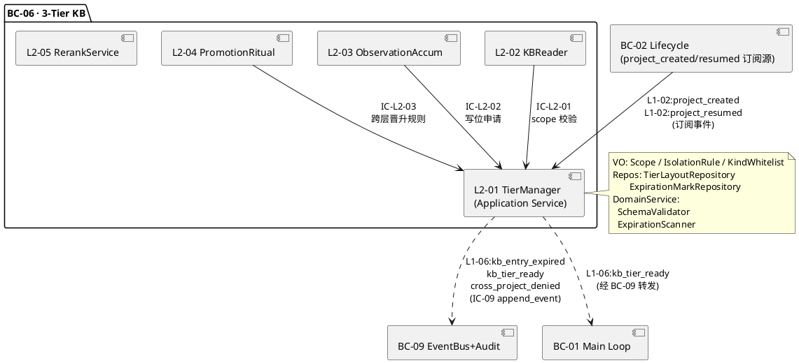
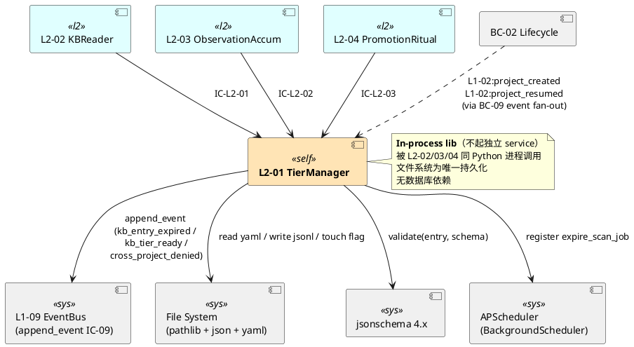
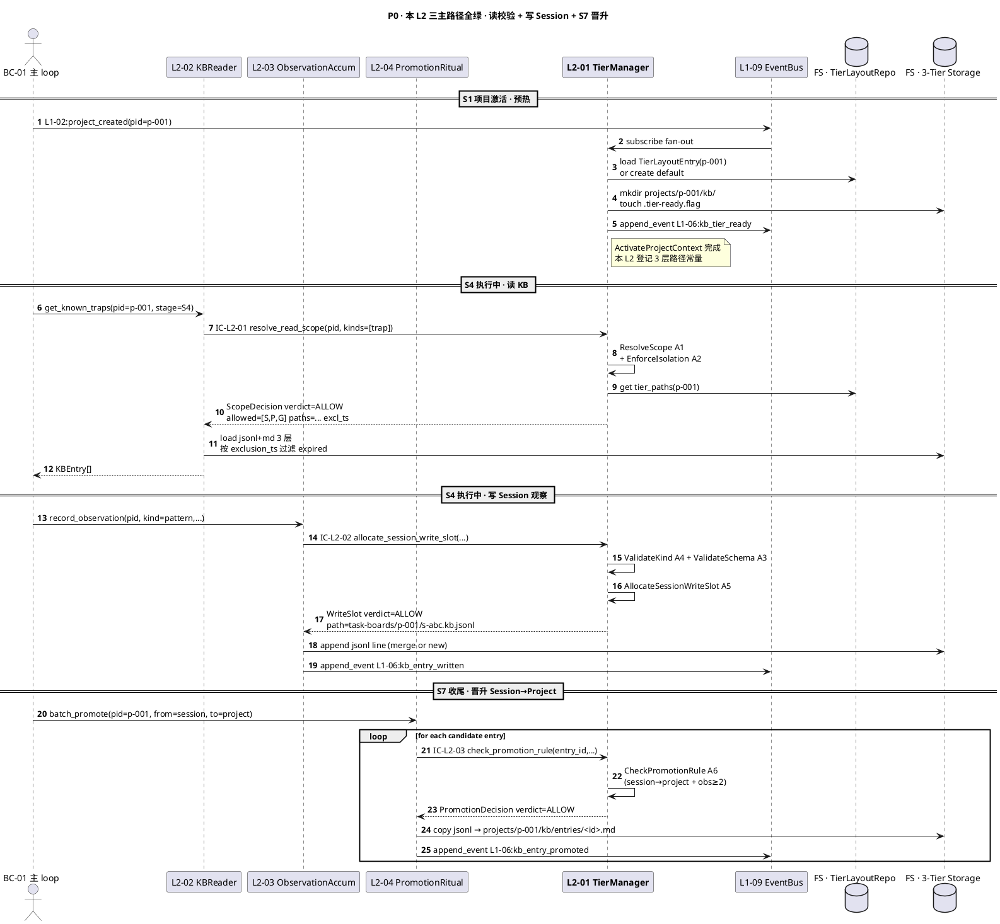
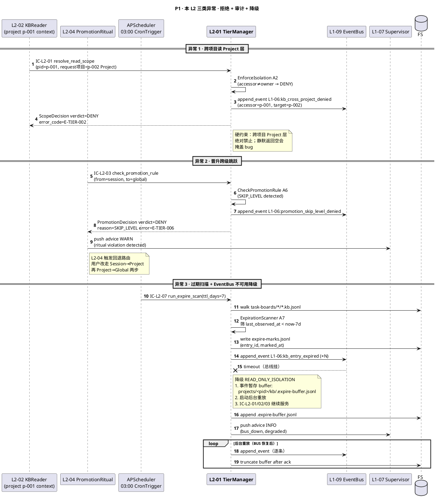
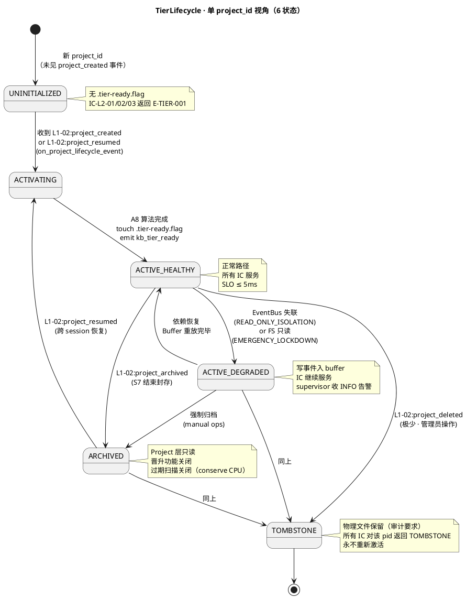
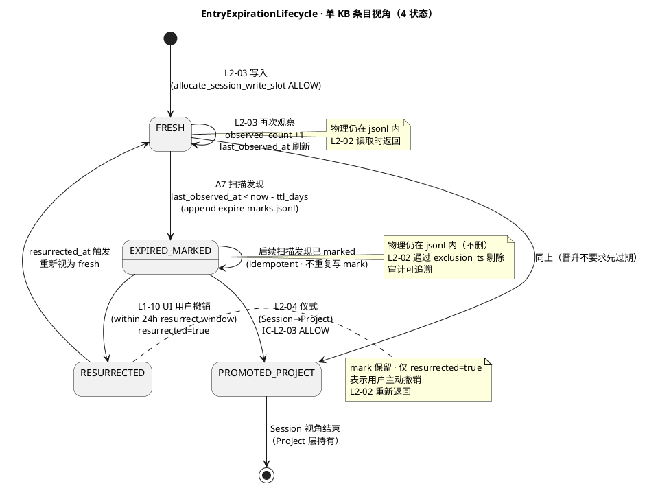

# L1 L2-01 · 3 层分层管理器 · Tech Design

> **本文档定位**：3-1-Solution-Technical 层级 · L1-06 的 L2-01 "3 层分层管理器" 技术实现方案（L2 粒度 depth-B）。
> **与产品 PRD 的分工**：2-prd/L1-06-3层知识库/prd.md §5.6 的 L2-01 小节定义产品边界，本文档定义**技术实现**（接口字段级 schema + 算法伪代码 + 底层数据结构 + 状态机 + 配置参数）。
> **与 L1 architecture.md 的分工**：architecture.md 负责**跨 L2 架构 + 跨 L2 时序**；本文档负责**本 L2 内部技术细节**。冲突以 architecture.md 为准。
> **严格规则**：不复述产品 PRD 的职责/禁止/必须清单，只做技术映射 + 补齐"产品视角未说 but 工程师必须知道"的部分（具体算法 · syscall · schema · 配置）。

---

## §0 撰写进度

- [x] §1 定位 + 2-prd §5.6 L2-01 映射
- [x] §2 DDD 映射（引 L0/ddd-context-map.md BC-06）
- [x] §3 对外接口定义（字段级 YAML schema + 错误码）
- [x] §4 接口依赖（被谁调 · 调谁）
- [x] §5 P0/P1 时序图（PlantUML ≥ 2 张）
- [x] §6 内部核心算法（伪代码 ≥ 8 个）
- [x] §7 底层数据表 / schema 设计（字段级 YAML ≥ 3 张）
- [x] §8 状态机（PlantUML + 转换表）
- [x] §9 开源最佳实践调研（≥ 3 GitHub 高星项目）
- [x] §10 配置参数清单（≥ 8 项）
- [x] §11 错误处理 + 降级策略（≥ 4 级）
- [x] §12 可观测性 / SLO 性能目标
- [x] §13 ADR / 开放问题 / 与 2-prd / 3-2 TDD 映射表

---

## §1 定位 + 2-prd 映射

### 1.1 本 L2 在 L1-06 里的坐标

L1-06 "3 层知识库" 共 5 个 L2。L2-01 是**底座层 / 守门人层**（foundation）——所有读 (L2-02) / 写 (L2-03) / 晋升 (L2-04) / 检索 (L2-05) 请求必须先经本 L2 校验 Scope 合法性、PM-14 项目隔离边界、schema 白名单、kind 白名单、过期状态。一旦本 L2 放行，上层 L2 才能操作底层物理存储。

```
     ┌──────────────────────────────────────────────────────────────┐
     │   L1-06 · 3-Tier Knowledge Base （BC-06）                    │
     │                                                              │
     │   ┌─────────────────┐    ┌─────────────────┐                 │
     │   │   L2-02 KB 读   │    │ L2-03 观察累积  │                 │
     │   └────────┬────────┘    └────────┬────────┘                 │
     │            │                      │                          │
     │     IC-L2-01                IC-L2-02                         │
     │     (读 scope 校验)         (写位申请)                        │
     │            │                      │                          │
     │            ▼                      ▼                          │
     │   ┌─────────────────────────────────────────┐                │
     │   │   L2-01 · TierManager (Application      │                │
     │   │            Service · 本 L2)             │                │
     │   │                                         │                │
     │   │   ┌───────────┐  ┌──────────────────┐   │                │
     │   │   │ScopeResolve│ │IsolationEnforcer │   │                │
     │   │   └───────────┘  └──────────────────┘   │                │
     │   │   ┌───────────┐  ┌──────────────────┐   │                │
     │   │   │KindWhiteLst│ │SchemaValidator   │   │                │
     │   │   └───────────┘  └──────────────────┘   │                │
     │   │   ┌───────────┐  ┌──────────────────┐   │                │
     │   │   │ExpireScan │ │PathLayoutRegistry │   │                │
     │   │   └───────────┘  └──────────────────┘   │                │
     │   └────────┬────────────────────────────────┘                │
     │            │                                                 │
     │     IC-L2-03                                                 │
     │     (跨层晋升规则)                                            │
     │            │                                                 │
     │            ▼                                                 │
     │   ┌─────────────────┐   ┌──────────────────┐                 │
     │   │ L2-04 晋升仪式  │   │L2-05 检索 Rerank │                 │
     │   └─────────────────┘   └──────────────────┘                 │
     │                                                              │
     └──────────────────────────────────────────────────────────────┘
                                 │
                                 ▼
               文件系统 3 层物理存储 (jsonl + md)
          Session：task-boards/<pid>/<task_id>.kb.jsonl
          Project：projects/<pid>/kb/entries/*.md
          Global ：global_kb/entries/*.md  （无 project_id）
```

**本 L2 的定位 = "BC-06 物理隔离仲裁者 · 6 IC 触点 · 毫秒级校验 · 不承载业务读写逻辑"**。

### 1.2 与 2-prd §5.6 L2-01 的对应表

| 2-prd §5.6 L2-01 / §8 小节 | 本文档对应位置 | 技术映射重点 |
|:---|:---|:---|
| §8.1 职责：维护 3 层物理隔离 + scope 优先级 + Session 7 天过期 + kind 分类 | §2 + §3 + §7 | Scope VO + IsolationRule VO + TierLayoutRegistry + ExpireScanner |
| §8.2 输入/输出（读校验/写位申请/晋升校验/过期扫描/项目激活） | §3 六个接口 schema + §4 依赖图 | IC-L2-01/02/03 + 过期任务 + 项目激活订阅 |
| §8.3 In-scope（3 层隔离/scope 优先级/跨项目隔离/7 天过期/8 类 kind 白名单/schema 一致/激活上下文） | §6 算法 + §7 数据结构 | 算法 A1~A8 逐一对应 |
| §8.4 硬约束（7 条）：三层不可合并 / 跨项目只走 Global / 7 天生命期 / kind 白名单 / schema 不可旁路 / 禁跨级跳跃 / 过期保留审计 | §6.2 IsolationRule + §6.3 ValidateSchema + §6.5 ExpireScan + §6.6 PromoteRule | 硬约束在算法层面全部强制 |
| §8.5 禁止行为（7 条） | §11 + §6 算法拦截点 | 每条禁止行为对应一个 DENY 分支 |
| §8.6 必须职责（7 条） | §3 接口 + §6 算法 | 6 个接口 + 8 个算法 |
| §8.7 可选功能（容量监控/迁移工具/复活窗口/快照导出） | §13 ADR + §10 配置 | 默认关闭 · 配置开关开启 |
| §8.8 与其他 L2/L1 交互表（IC-L2-01/02/03 + 项目激活 + IC-L2-07/08） | §4 调用方-被调方表 | 6 IC + 事件订阅 |
| §8.9 Given-When-Then（P1~P6 + N1~N3 + I1~I2） | §13 映射表 | 全部映射到 3-2 TDD 测试用例 |

### 1.3 本 L2 在 architecture.md 里的坐标

引 `docs/3-1-Solution-Technical/L1-06-3层知识库/architecture.md §3.1 主干数据流` + §10 分工表：

- L2-01 位于"底座层"，所有 L2 的读 / 写 / 晋升必须先走 L2-01 的 IC-L2-01/02/03 校验（**7 个关键规则之第 1 条**）。
- L2-01 持有 3 层物理路径常量（Session = `task-boards/<pid>/<task_id>.kb.jsonl` / Project = `projects/<pid>/kb/entries/*.md` / Global = `global_kb/entries/*.md`），引自 architecture §5.1。
- L2-01 对外不发 Command，只发 Event：`L1-06:kb_entry_expired`、`L1-06:kb_tier_ready`、`L1-06:kb_cross_project_denied`（均经 IC-09 落盘）。

### 1.4 本 L2 的 PM-14 约束

**PM-14 约束**（引 `docs/3-1-Solution-Technical/projectModel/tech-design.md` §3 "project_id 作用域键" 规则）：所有 IC payload 顶层 `project_id` 必填；所有 Session / Project 存储路径按 `projects/<pid>/...` 分片；**Global 层例外**——条目无 project_id 归属（晋升后脱离归属，成为"无主资产"）。

本 L2 在 PM-14 层面的具体落点：

- 3 层路径模板（见 §7.1 TierLayoutRegistry）
- IsolationEnforcer 的核心规则：**访问方 project_id ≠ 条目 owner_project_id** 时，对 Project 层一律拒绝；对 Session 层根据 session_id 归属校验；对 Global 层放行（无主）
- 项目激活事件订阅：每新建/恢复 project_id 时，L2-01 为该 pid 登记 TierLayoutEntry，写 `projects/<pid>/kb/.tier-ready.flag`

### 1.5 关键技术决策（Decision / Rationale / Alternatives / Trade-off）

| # | 决策 | 选择 | 备选 | 理由 | Trade-off |
|:---|:---|:---|:---|:---|:---|
| **D1** | L2-01 是否 own Aggregate Root | 否（Application Service · 持 VO） | 引入 `TierRegistry` 聚合根 | DDD 语义上分层规则属"值对象 + 服务"；不持有可变业务实体 | 牺牲 DDD 严格性，换薄抽象 |
| **D2** | Scope 合法性校验位置 | 本 L2（IC-L2-01 入口强制） | 各 L2 自行校验 / 存储层拒绝 | 避免 6 处校验分散；存储层不该懂业务规则 | 本 L2 成热路径，必须毫秒级 |
| **D3** | 过期策略 | 标记 expired=true，不物理删除 | 物理删除 / 仅逻辑过滤 | 硬约束 7：保留审计追溯；避免误删 | 磁盘略增 · 需副索引 |
| **D4** | kind 白名单管理 | 编译期 enum（代码硬锁） | 配置文件 / DB 动态注册 | PRD §8.5 禁止运行时扩展；改白名单须改代码+升级审阅 | 灵活性为 0（刻意） |
| **D5** | 项目激活时机 | 收到 `L1-02:project_created` / `project_resumed` 事件后同步 ready | 延迟 lazy init | Scope 查询是热路径，预热减首次延迟 | 冷启动略慢（ms 级，可接受） |
| **D6** | 跨项目读 Project 的判定 | 硬 DENY + 审计事件 | 静默返回空 | 静默会掩盖 bug；必须显式拒绝+审计 | 调用方必须处理 DENY 错误码 |
| **D7** | Session 到 Project 的物理路径重写 | 仅晋升时由 L2-04 写入 Project 文件；L2-01 只提供路径而不搬运 | L2-01 承担搬运 | 单一职责；搬运属 L2-04 仪式 | L2-04 依赖本 L2 的路径服务 |
| **D8** | 过期扫描器实现 | APScheduler BackgroundScheduler · 日粒度 · 夜间 03:00 低峰 | cron / systemd timer / 持续扫描 | 与 L1-09 其他后台任务同框架；一次函数调用 | 依赖 APScheduler（已在 tech-stack） |
| **D9** | TierLayoutRegistry 持久化 | 内存+Lazy Load 文件 | SQLite / 常驻 daemon | L1-09 文件驱动 · 启动加载 · 无并发写 | 首次 ms 级磁盘读 |
| **D10** | schema validate 库 | `jsonschema` 4.x + Draft-2020-12 | pydantic / cerberus / 自写 | tech-stack §10 已定；社区校验器最成熟 | 稍慢（~0.2ms/条，可接受） |

### 1.6 本 L2 读者预期

读完本 L2 的工程师应掌握：

- TierManager Application Service 的 **6 个 IC 触点** 字段级 schema + 12 个错误码
- **8 个算法**的伪代码（ResolveScope / EnforceIsolation / ValidateSchema / ValidateKind / AllocateSessionWriteSlot / CheckPromotionRule / ExpireScan / ActivateProjectContext）
- **3 张数据表** YAML schema（TierLayoutEntry / SessionExpirationMark / ProjectContextManifest），全部按 PM-14 分片
- **6 状态** 的 TierLifecycle 状态机 PlantUML
- **4 级降级链**（FULL → READ_ONLY_ISOLATION → EMERGENCY_LOCKDOWN → HALT_KB）
- SLO（Scope 校验 P99 ≤ 5ms · 过期扫描完成 < 30s · 项目激活 < 1s）

### 1.7 本 L2 不在的范围（YAGNI）

- **不在**：实际的 KB 条目读取 (L2-02) / 写入 (L2-03) / 晋升搬运 (L2-04) / rerank (L2-05)
- **不在**：schema 字段设计本身（字段定义在 L2-02/03 对应 kind 的 JSON Schema 里）
- **不在**：embedding / 向量检索（PRD §5.6.3 明禁 V1）
- **不在**：跨项目联邦（PRD §5.6.3 V1 明禁）
- **不在**：kind 业务语义（8 类 kind 的"怎么用"是 L1-01/04/07 责任）
- **不在**：UI 渲染（属 L1-10）

### 1.8 本 L2 术语表

| 术语 | 定义 | 关联 |
|:---|:---|:---|
| Scope | 3 层之一值对象（session / project / global） | §2.2 |
| IsolationRule | project_id × Scope 的合法性规则 VO | §2.2 |
| TierLayoutEntry | 3 层物理路径注册项 | §7.1 |
| kind | 8 类条目分类 enum | §6.4 |
| ExpirationMark | 过期标记（保留条目，仅标记 expired=true） | §7.2 |
| ActivationFlag | 项目分层就绪标志 `.tier-ready.flag` | §7.3 |
| PromotionRule | Session→Project / Project→Global 晋升规则 | §6.6 |

### 1.9 本 L2 的 DDD 定位一句话

L2-01 = **Application Service** + **VO-Scope** + **VO-IsolationRule** + **VO-KindWhitelist** · 无聚合根 · 横切于 5 L2 之上 · 是 BC-06 对外部（BC-01~BC-10）承诺"3 层物理规则不可绕过"的单一真值源。

---

## §2 DDD 映射（BC-06）

### 2.1 BC-06 上下文定位

引自 `docs/3-1-Solution-Technical/L0/ddd-context-map.md §2.7`：

- **BC-06 · 3-Tier Knowledge Base** 的"物理隔离 + 阶段注入 + 晋升仪式"三件事，其中**物理隔离**由本 L2 独揽。
- BC-06 对外关系：与 BC-09（事件总线+审计）**Partnership**（KB 写/晋升/过期必走 IC-09），与 BC-01/02/04/07/08/10 均为 Supplier 关系。
- 本 L2 是 BC-06 内部的"协调器"：不对外暴露接口到其他 BC，只对 BC-06 内部的 L2-02/03/04/05 暴露 IC-L2-01/02/03。

### 2.2 本 L2 的 DDD 元素分类

| DDD 元素 | 本 L2 实例 | 说明 |
|:---|:---|:---|
| **Application Service** | TierManager | 编排 6 个 IC 触点 + 8 个算法；无领域逻辑本身 |
| **Value Object · Scope** | `Scope = Literal["session","project","global"]` | 不可变枚举 VO；通过 `from_str` 工厂构造 |
| **Value Object · IsolationRule** | `IsolationRule(accessor_pid, owner_pid, scope) -> AllowOrDeny` | 不可变决策函数（纯函数） |
| **Value Object · KindWhitelist** | 8 类 kind 的 frozen-set | 编译期 const |
| **Value Object · TierPath** | 3 层路径模板 VO `{session, project, global}` | 不可变模板 |
| **Domain Service** | SchemaValidator | 对条目做 jsonschema Draft-2020-12 校验（无状态） |
| **Domain Service** | ExpirationScanner | 纯函数：输入条目列表 → 输出过期标记列表 |
| **Repository** | `TierLayoutRepository` | 只读 Repository；加载 / 持久 `TierLayoutEntry` yaml |
| **Repository** | `ExpirationMarkRepository` | 追加 / 查询过期标记 jsonl |
| **Domain Event（发布）** | `L1-06:kb_entry_expired` / `kb_tier_ready` / `kb_cross_project_denied` | 均经 IC-09 落盘 |
| **Published Language** | IC-L2-01/02/03 JSON Schema | 本 L2 对 L2-02/03/04 的契约 |

### 2.3 本 L2 不 own 的元素（跨 L2 澄清）

| 元素 | 所有者 | 本 L2 如何互动 |
|:---|:---|:---|
| KBEntry Aggregate Root | L2-03（观察累积器 own） | 本 L2 仅做 schema 预校验，不创建/修改 KBEntry |
| KBPromotion Aggregate Root | L2-04（晋升仪式执行器 own） | 本 L2 仅做跨层规则裁决，不搬运条目 |
| RerankScore VO | L2-05（纯函数 Domain Service own） | 本 L2 不涉及 |
| StageInjectionStrategy Aggregate | L2-05（低频更新） | 本 L2 不涉及 |

### 2.4 跨 BC 交互关系（本 L2 视角）



### 2.5 不变式（Invariants · 本 L2 必须保证）

| # | 不变式 | 强制手段 |
|:---|:---|:---|
| **INV-1** | 同一 Scope 条目只能存在 3 层之一物理路径 | 路径模板硬编码；`resolve_path()` 唯一入口 |
| **INV-2** | project_id A 的调用方永远读不到 project_id B 的 Project 层条目 | IsolationEnforcer 在 IC-L2-01 拦截 |
| **INV-3** | Session 条目生命周期 ≤ `session_ttl_days`（默认 7）则标记 expired，不物理删 | ExpirationScanner + ExpirationMarkRepository |
| **INV-4** | 未在 `KindWhitelist` 的 kind 值一律拒绝写入 | ValidateKind 在 IC-L2-02 拦截 |
| **INV-5** | 未通过 schema 的条目一律拒绝写入 | SchemaValidator 在 IC-L2-02 拦截 |
| **INV-6** | 晋升路径只能是 Session→Project 或 Project→Global；禁止 Session→Global | CheckPromotionRule 在 IC-L2-03 拦截 |
| **INV-7** | 项目激活事件必须先触达 L2-01 才能写入该 pid 的 Project 层 | ActivateProjectContext → `.tier-ready.flag`；IC-L2-02 检查 flag |
| **INV-8** | Global 层条目无 owner_project_id（`owner_pid = null`） | IC-L2-03 晋升规则 force 置 null |

---

## §3 对外接口定义（字段级 YAML schema + 错误码）

### 3.1 接口清单

本 L2 对外暴露 **6 个接口**（4 个同步 IC + 2 个异步订阅）：

| IC | 方向 | 协议 | 一句话 |
|:---|:---|:---|:---|
| **IC-L2-01** | 被 L2-02 调 | Query/Sync | `resolve_read_scope(project_id, kind_filter?) -> ScopeDecision` |
| **IC-L2-02** | 被 L2-03 调 | Command/Sync | `allocate_session_write_slot(project_id, session_id, entry_candidate) -> WriteSlot` |
| **IC-L2-03** | 被 L2-04 调 | Query/Sync | `check_promotion_rule(entry_id, from_scope, to_scope, approval) -> PromotionDecision` |
| **IC-L2-07** | 订阅 BG 定时器 | Event/Async | `run_expire_scan()`（日粒度 03:00） |
| **IC-L2-activate** | 订阅 BC-02 | Event/Async | 订阅 `L1-02:project_created` / `L1-02:project_resumed` |
| **IC-L2-emit** | 主动发出 | Event/Async | `L1-06:kb_entry_expired` / `kb_tier_ready` / `kb_cross_project_denied`（经 IC-09） |

### 3.2 IC-L2-01 · `resolve_read_scope` 字段级 schema

**入参**（来自 L2-02）：

```yaml
# IC-L2-01 Request
request_id: string                    # ULID · 请求链路追踪
project_id: string                    # PM-14 项目上下文（调用方当前 project_id）
session_id: string                    # 当前 session id（ULID · 用于 Session 层定位）
kind_filter:                          # 可选 · 限制读哪些 kind（为空=全部）
  - pattern
  - trap
  - recipe
  - tool_combo
  - anti_pattern
  - project_context
  - external_ref
  - effective_combo
stage_hint: string                    # 可选 · S1/S2/S3/S4/S5/S6/S7 · 用于辅助注入策略查询（但本 L2 不做注入）
requester_bc: string                  # BC-01/02/04/07/08/10 · 记审计
```

**出参**：

```yaml
# IC-L2-01 Response · ScopeDecision
request_id: string                    # 回传同样 request_id
verdict: string                       # ALLOW / DENY
allowed_scopes:                       # 允许读的 Scope 列表（按优先级降序：S > P > G）
  - session
  - project
  - global
isolation_context:                    # PM-14 隔离上下文
  accessor_pid: string
  owner_pid_project_layer: string     # Project 层条目的 owner_pid（=accessor_pid 或 null 无 Project 层）
  owner_pid_session_layer: string     # Session 层条目的 owner_pid（=accessor_pid）
  global_layer: string                # 固定值 "no_owner"
tier_paths:                           # 3 层物理路径（L2-02 据此加载文件）
  session: string                     # 如 "task-boards/p-001/s-abc.kb.jsonl"
  project: string                     # 如 "projects/p-001/kb/entries/"
  global: string                      # 如 "global_kb/entries/"
expired_exclusion_ts: string          # ISO-8601 · 早于此时间的 Session 条目需剔除
deny_reason: string                   # 当 verdict=DENY 时填写
error_code: string                    # 当 DENY 时填写；参见 §3.7 错误码表
emitted_at: string                    # ISO-8601
```

### 3.3 IC-L2-02 · `allocate_session_write_slot` 字段级 schema

**入参**（来自 L2-03）：

```yaml
# IC-L2-02 Request
request_id: string
project_id: string                    # PM-14 项目上下文
session_id: string                    # 当前会话
entry_candidate:                      # 候选条目（写入前预校验）
  id: string                          # ULID or deterministic hash
  scope: string                       # 必须 = "session"（硬约束：写只能入 Session）
  kind: string                        # 必须 ∈ 8 类 kind 白名单
  title: string
  content: string
  applicable_context:
    - stage: string                   # S1~S7
      task_type: string               # 任务类型自由字符串
      tech_stack: array               # ["python","fastapi",...]
  observed_count: integer             # 初次 = 1；L2-03 合并时 +1
  first_observed_at: string           # ISO-8601
  last_observed_at: string            # ISO-8601
  source_links:                       # 审计链路
    - event_id: string
      tick_id: string
requester_bc: string
```

**出参**：

```yaml
# IC-L2-02 Response · WriteSlot
request_id: string
verdict: string                       # ALLOW / DENY
write_path: string                    # 绝对物理路径 · 如 "task-boards/p-001/s-abc.kb.jsonl"
deduplication_hint:                   # 同 title+kind 的去重提示（L2-03 合并参考）
  existing_entry_id: string           # 若已存在
  merge_strategy: string              # "increment_observed" / "new_entry"
schema_validation:                    # schema 校验结果
  passed: boolean
  violations:                         # 若 passed=false，列出字段违反
    - field: string
      rule: string
      message: string
kind_validation:
  passed: boolean
  allowed_kinds:
    - pattern
    - trap
    - recipe
    - tool_combo
    - anti_pattern
    - project_context
    - external_ref
    - effective_combo
deny_reason: string
error_code: string
emitted_at: string
```

### 3.4 IC-L2-03 · `check_promotion_rule` 字段级 schema

**入参**（来自 L2-04）：

```yaml
# IC-L2-03 Request
request_id: string
project_id: string                    # PM-14 项目上下文
entry_id: string                      # 待晋升条目 id
from_scope: string                    # session / project
to_scope: string                      # project / global
observed_count: integer               # 本条目当前 observed_count
approval:                             # 批准信息
  type: string                        # auto / user_explicit
  approver: string                    # user:xxx 或 system
  approved_at: string                 # ISO-8601
requester_bc: string
```

**出参**：

```yaml
# IC-L2-03 Response · PromotionDecision
request_id: string
verdict: string                       # ALLOW / DENY
reason_code: string                   # OK / SKIP_LEVEL / BELOW_THRESHOLD / MISSING_APPROVAL / CROSS_PROJECT_BLOCK
expected_write_path: string           # 晋升后目标路径（L2-04 据此搬运）
target_tier_ready: boolean            # 目标层（Project 层）是否已激活（若否 → DENY）
required_observed_count: integer      # 本规则要求的 observed_count 阈值（session→project=2 · project→global=3）
override_owner_project_id:            # 若 to_scope=global → null
deny_reason: string
error_code: string
emitted_at: string
```

### 3.5 IC-L2-07 · `run_expire_scan` 字段级 schema（后台触发）

**入参**（APScheduler Job Payload）：

```yaml
# IC-L2-07 Trigger
trigger_id: string                    # 本次扫描 ULID
trigger_at: string                    # ISO-8601
scan_mode: string                     # "all" / "single_project"
target_project_id: string             # 当 scan_mode=single_project 时填
ttl_days: integer                     # 默认 7（配置项 session_ttl_days）
```

**出参**（异步事件发出）：

```yaml
# Emitted Event: L1-06:expire_scan_completed
trigger_id: string
scanned_project_count: integer
scanned_entry_count: integer
expired_marked_count: integer
duration_ms: integer
warnings:
  - project_id: string
    reason: string
```

### 3.6 IC-L2-activate · `ActivateProjectContext` 字段级 schema

**入参**（订阅事件 payload 通过 L1-09 投递）：

```yaml
# Subscribed Event Payload
event_type: string                    # L1-02:project_created / L1-02:project_resumed
project_id: string                    # PM-14
project_name: string
stage: string                         # S1/S2/...
created_at: string
resumed_from_snapshot: boolean        # 恢复还是新建
```

**出参**（同步发出 emit）：

```yaml
# Emitted Event: L1-06:kb_tier_ready
project_id: string
session_path: string                  # "task-boards/<pid>/"
project_path: string                  # "projects/<pid>/kb/"
global_path: string                   # "global_kb/entries/"
tier_ready_flag: string               # "projects/<pid>/kb/.tier-ready.flag"
activated_at: string
```

### 3.7 错误码表（12 个错误码）

| error_code | 含义 | 触发场景 | 所属 IC | 调用方处理建议 |
|:---|:---|:---|:---|:---|
| **E-TIER-001** | TIER_NOT_ACTIVATED | 访问 Project 层但 `.tier-ready.flag` 不存在 | IC-L2-01 / IC-L2-02 | 等待项目激活或检查 BC-02 事件是否丢失 |
| **E-TIER-002** | CROSS_PROJECT_READ_DENIED | accessor_pid ≠ owner_pid 读 Project 层 | IC-L2-01 | 严重问题，立即审计；UI 提示"仅能读本项目" |
| **E-TIER-003** | INVALID_KIND | `kind` 不在 8 类白名单 | IC-L2-02 | 写方代码 bug，须改代码 |
| **E-TIER-004** | SCHEMA_VIOLATION | jsonschema 校验失败 | IC-L2-02 | 写方修正字段；返回 violations 明细 |
| **E-TIER-005** | WRONG_SCOPE_FOR_WRITE | 写入 scope ≠ "session" | IC-L2-02 | 硬约束：直写 Project/Global 被拒；改走 L2-04 晋升 |
| **E-TIER-006** | PROMOTION_SKIP_LEVEL | 晋升路径 session→global | IC-L2-03 | 必须先 Session→Project，再 Project→Global |
| **E-TIER-007** | PROMOTION_BELOW_THRESHOLD | observed_count < 所需阈值且无 user 批准 | IC-L2-03 | 等累积到阈值或请求用户批准 |
| **E-TIER-008** | PROMOTION_MISSING_APPROVAL | project→global 晋升缺 user_explicit 批准 | IC-L2-03 | 路由到 L1-10 UI 请求批准 |
| **E-TIER-009** | EXPIRED_ENTRY_ACCESS | 尝试读取已 expired 的条目 | IC-L2-01 后置 | L2-02 应该用 expired_exclusion_ts 自动剔除 |
| **E-TIER-010** | PATH_RESOLUTION_FAIL | 路径模板替换失败（非法 pid 字符） | 任何 IC | 调用方 sanitize project_id |
| **E-TIER-011** | TIER_REGISTRY_CORRUPT | TierLayoutEntry yaml 解析失败 | 任何 IC | 触发降级 EMERGENCY_LOCKDOWN |
| **E-TIER-012** | SESSION_ID_NOT_FOUND | session_id 不存在于当前 project | IC-L2-01 / IC-L2-02 | BC-01 须先创建 session |

### 3.8 接口版本演进策略

- 本 L2 **暴露的 schema 必须向前兼容**（只能加字段，不能删/改类型）。
- 新字段默认给缺省值；旧 caller 收到无新字段响应需容错。
- 错误码 enum 只能追加，不能改语义；废弃码置 DEPRECATED 但保留 3 个版本。
- 版本号跟随 `L1-06/architecture.md` 的 `version` 字段；本文档 version 独立。

---

## §4 接口依赖（被谁调 · 调谁）

### 4.1 调用方→本 L2 依赖矩阵

| 调用方 L2 / L1 / BC | 调用的 IC | 频率 | 时延要求 | 场景 |
|:---|:---|:---|:---|:---|
| **L2-02 KBReader** | IC-L2-01 | 极高频（每次 kb_read 前都走） | P99 ≤ 5ms | 读 scope 校验 |
| **L2-03 ObservationAccum** | IC-L2-02 | 高频（每次写 Session 前） | P99 ≤ 10ms | 写位申请 + schema/kind 校验 |
| **L2-04 PromotionRitual** | IC-L2-03 | 低频（S7 批量 + 用户触发） | P99 ≤ 20ms | 跨层规则校验 |
| **BackgroundScheduler (L1-09)** | IC-L2-07 | 日级 | 完成 < 30s | 过期扫描 |
| **BC-02 生命周期 (via BC-09 event)** | IC-L2-activate | 项目级 | P99 ≤ 1s | 项目激活/恢复时分层上下文就绪 |

### 4.2 本 L2→下游依赖矩阵

| 本 L2 调 | 被调方 | 协议 | 场景 |
|:---|:---|:---|:---|
| L1-09 EventBus | IC-09 append_event | 同步 | 所有分层变更事件落盘 |
| 文件系统 (stdlib `pathlib` + `json` + `yaml`) | 原生 syscall | 同步 | 读 TierLayoutEntry yaml / 写 ExpirationMark jsonl / touch flag |
| jsonschema 4.x | Python lib | 同步 | schema validate |
| APScheduler | Python lib | 异步 | 注册过期扫描 job |

### 4.3 依赖关系图（PlantUML）



### 4.4 依赖失效降级

| 依赖 | 失效表现 | 本 L2 降级 |
|:---|:---|:---|
| L1-09 EventBus 不可用 | append_event 超时 | 事件暂存本地 buffer jsonl；事件总线恢复后重放；期间 IC 仍可服务（READ_ONLY_ISOLATION） |
| 文件系统只读 | 写 ExpirationMark 失败 | 降级为 EMERGENCY_LOCKDOWN：拒绝所有写；读仍可用 |
| jsonschema lib crash | import 失败 | 启动期 fail-fast（部署时捕获） |
| APScheduler 不可用 | 过期扫描不跑 | 启动 warning；运维告警；主业务不受影响 |

### 4.5 调用方契约

所有调用方必须：

1. 按 §3 字段 schema 填满 `project_id` + `session_id` + `requester_bc`（PM-14 + 审计要求）
2. 处理 12 个错误码（不能 swallow error）
3. 不做本地缓存（否则晋升/过期变更会看不到）——如需缓存由 L2-02/03/04 自行实现并订阅 `L1-06:kb_entry_expired` 事件做失效
4. `request_id` 必须是 ULID；本 L2 不生成 request_id

---

## §5 P0/P1 时序图（PlantUML ≥ 2 张）

### 5.1 P0 · 正常 · 读 scope 校验 + 写 Session + 晋升 Session→Project



**时序关键节点说明**：

| 步骤 | 算法 | 落点 |
|:---|:---|:---|
| ①②③ 激活预热 | A8 ActivateProjectContext | projects/<pid>/kb/.tier-ready.flag |
| ④⑤⑥⑦ 读 scope 校验 | A1 ResolveScope + A2 EnforceIsolation | ms 级无 IO（路径模板内存常量） |
| ⑧⑨⑩⑪ 写位申请 | A4 ValidateKind + A3 ValidateSchema + A5 AllocateSessionWriteSlot | jsonschema 校验 ~0.2ms/条 |
| ⑫⑬⑭ 晋升规则 | A6 CheckPromotionRule | 纯内存逻辑 |

### 5.2 P1 · 异常 · 跨项目读拒绝 + 晋升跨级拒绝 + 过期扫描降级



**时序关键节点说明**：

| 步骤 | 算法 / 降级 | 审计事件 |
|:---|:---|:---|
| 异常 1 ①②③ | A2 EnforceIsolation DENY | `L1-06:kb_cross_project_denied` |
| 异常 2 ④⑤⑥ | A6 CheckPromotionRule DENY | `L1-06:promotion_skip_level_denied` |
| 异常 3 ⑦⑧⑨⑩⑪ | A7 ExpirationScanner + 降级 L2 | `L1-06:kb_entry_expired` 或 buffer 回放 |

### 5.3 时序图覆盖矩阵

| 场景 | PRD §8.9 用例 | 时序图 | 算法 |
|:---|:---|:---|:---|
| 读 scope 允许 | P1 | 5.1 上半 | A1 + A2 |
| 跨项目读拒绝 | P2 / N-R（负向） | 5.2 异常 1 | A2 |
| 7 天过期扫描 | P3 | 5.2 异常 3 | A7 |
| schema 校验失败 | P4 | (略 · 走 A3 分支) | A3 |
| 晋升跨级拒绝 | P5 | 5.2 异常 2 | A6 |
| 项目激活预热 | P6 | 5.1 上半 | A8 |
| 运行时新 kind 拒绝 | N1 | (走 A4 分支) | A4 |
| EventBus 降级 | BF-E-01 | 5.2 异常 3 | 降级链 L2 |

---

## §6 内部核心算法（伪代码）

本 L2 共 **8 个核心算法**，Python-like 风格伪代码：

### 6.1 算法 A1 · ResolveScope（读 scope 优先级解析）

```python
# IC-L2-01 入口主算法
def resolve_scope(req: ReadScopeRequest) -> ScopeDecision:
    # ── Step 1: PM-14 + 激活检查 ──
    if not is_valid_project_id(req.project_id):
        return deny(E_TIER_010, "invalid project_id format")
    if not tier_registry.is_activated(req.project_id):
        return deny(E_TIER_001, "project tier not activated")

    # ── Step 2: IsolationRule 构造 ──
    iso = IsolationRule(
        accessor_pid = req.project_id,
        session_id   = req.session_id,
        kind_filter  = req.kind_filter or KIND_WHITELIST,
    )

    # ── Step 3: 允许的 scope 按 S>P>G 优先级 ──
    allowed = []
    # Session 层：必须 session_id 属于 accessor_pid
    if session_index.belongs_to(req.session_id, req.project_id):
        allowed.append("session")
    else:
        return deny(E_TIER_012, "session_id not found under project")
    # Project 层：owner_pid == accessor_pid
    allowed.append("project")
    # Global 层：无主，任何 accessor 可读
    allowed.append("global")

    # ── Step 4: 解析物理路径 ──
    paths = tier_layout.resolve_paths(req.project_id, req.session_id)

    # ── Step 5: 过期剔除时间窗 ──
    excl_ts = (now_utc() - timedelta(days=config.session_ttl_days)).isoformat()

    # ── Step 6: 审计事件 ──
    event_bus.append("L1-06:kb_scope_resolved", {
        "request_id": req.request_id,
        "project_id": req.project_id,
        "allowed_scopes": allowed,
    })

    return ScopeDecision(
        verdict            = "ALLOW",
        allowed_scopes     = allowed,
        isolation_context  = iso.to_dict(),
        tier_paths         = paths,
        expired_exclusion_ts = excl_ts,
    )
```

### 6.2 算法 A2 · EnforceIsolation（PM-14 跨项目隔离拦截）

```python
# 在 A1 内联 · 也可被 L2-02 额外调用做二次防御
def enforce_isolation(accessor_pid: str,
                      target_scope: str,
                      target_owner_pid: Optional[str]) -> Verdict:
    # Global 层：永远放行（target_owner_pid is None）
    if target_scope == "global":
        assert target_owner_pid is None, "INV-8 violated"
        return Verdict.ALLOW

    # Session 层 / Project 层：accessor 必须是 owner
    if target_scope in ("session", "project"):
        if target_owner_pid != accessor_pid:
            event_bus.append("L1-06:kb_cross_project_denied", {
                "accessor_pid": accessor_pid,
                "target_owner": target_owner_pid,
                "target_scope": target_scope,
            })
            return Verdict.DENY(E_TIER_002)
        return Verdict.ALLOW

    return Verdict.DENY(E_TIER_010)  # unknown scope
```

### 6.3 算法 A3 · ValidateSchema（jsonschema 校验 + 字段违反收集）

```python
# IC-L2-02 入口第 2 步
# schema 文件由 L2-02/03 定义，存 projects/<pid>/kb/schemas/<kind>.schema.json
SCHEMA_CACHE: dict[str, dict] = {}  # kind -> compiled schema

def validate_schema(entry: dict) -> ValidationResult:
    kind = entry.get("kind")
    if not kind or kind not in KIND_WHITELIST:
        return ValidationResult(passed=False,
                                violations=[{"field":"kind","rule":"whitelist"}],
                                error_code=E_TIER_003)
    # 加载 schema（编译一次缓存）
    if kind not in SCHEMA_CACHE:
        schema_path = KB_SCHEMA_DIR / f"{kind}.schema.json"
        if not schema_path.exists():
            raise SystemError(f"schema missing for kind={kind}")
        SCHEMA_CACHE[kind] = jsonschema.Draft202012Validator(
            json.loads(schema_path.read_text())
        )
    validator = SCHEMA_CACHE[kind]

    # 收集所有违反（不 fail-fast，方便写方一次改全）
    violations = []
    for err in validator.iter_errors(entry):
        violations.append({
            "field":   ".".join(map(str, err.absolute_path)) or "<root>",
            "rule":    err.validator,
            "message": err.message,
        })
    return ValidationResult(
        passed      = (len(violations) == 0),
        violations  = violations,
        error_code  = E_TIER_004 if violations else None,
    )
```

### 6.4 算法 A4 · ValidateKind（8 类 kind 白名单硬锁）

```python
# kind 白名单 · 编译期 const · D4 决策
KIND_WHITELIST: frozenset[str] = frozenset({
    "pattern",
    "trap",
    "recipe",
    "tool_combo",
    "anti_pattern",
    "project_context",
    "external_ref",
    "effective_combo",
})

def validate_kind(kind: str) -> Verdict:
    if kind not in KIND_WHITELIST:
        event_bus.append("L1-06:kb_invalid_kind_denied", {
            "invalid_kind": kind,
            "whitelist": sorted(KIND_WHITELIST),
        })
        return Verdict.DENY(E_TIER_003)
    return Verdict.ALLOW

# 运行时扩展必须改代码 + 升级审阅
# 无任何配置开关/环境变量可绕过
```

### 6.5 算法 A5 · AllocateSessionWriteSlot（Session 层写位分配）

```python
# IC-L2-02 入口主算法
def allocate_session_write_slot(req: WriteSlotRequest) -> WriteSlot:
    # Step 1: 硬约束 · scope 必须 = session
    if req.entry_candidate.scope != "session":
        return deny(E_TIER_005, "write only allowed to session tier")

    # Step 2: kind 白名单
    kv = validate_kind(req.entry_candidate.kind)
    if kv.verdict == "DENY":
        return deny(kv.error_code, kv.reason)

    # Step 3: schema 校验
    sv = validate_schema(req.entry_candidate.to_dict())
    if not sv.passed:
        return deny(sv.error_code, f"{len(sv.violations)} violations",
                    violations=sv.violations)

    # Step 4: 激活检查
    if not tier_registry.is_activated(req.project_id):
        return deny(E_TIER_001, "project not activated")

    # Step 5: 路径解析
    write_path = tier_layout.session_path(req.project_id, req.session_id)

    # Step 6: 去重提示（不搬运，只告诉 L2-03）
    dedup = dedup_index.lookup(
        project_id = req.project_id,
        session_id = req.session_id,
        title      = req.entry_candidate.title,
        kind       = req.entry_candidate.kind,
    )

    return WriteSlot(
        verdict            = "ALLOW",
        write_path         = str(write_path),
        deduplication_hint = dedup,
        schema_validation  = sv,
        kind_validation    = Verdict.ALLOW,
    )
```

### 6.6 算法 A6 · CheckPromotionRule（跨层晋升规则裁决）

```python
# IC-L2-03 入口主算法
# 规则矩阵：
#   session → project  : observed_count >= 2 OR user_explicit
#   project → global   : observed_count >= 3 AND user_explicit
#   session → global   : 永远 DENY（SKIP_LEVEL）
#   其他组合           : DENY

PROMOTION_MATRIX = {
    ("session", "project"): {
        "required_observed_count": 2,
        "approval_required": False,
        "approval_allowed_override": True,
    },
    ("project", "global"): {
        "required_observed_count": 3,
        "approval_required": True,
        "approval_allowed_override": False,
    },
}

def check_promotion_rule(req: PromotionRuleRequest) -> PromotionDecision:
    key = (req.from_scope, req.to_scope)

    # Step 1: SKIP_LEVEL 硬拦截
    if key == ("session", "global"):
        event_bus.append("L1-06:promotion_skip_level_denied", req.to_dict())
        return deny(E_TIER_006, "cannot skip Project tier")

    if key not in PROMOTION_MATRIX:
        return deny(E_TIER_006, f"invalid promotion {req.from_scope}→{req.to_scope}")

    rule = PROMOTION_MATRIX[key]

    # Step 2: observed_count 阈值
    has_user_override = (req.approval.type == "user_explicit"
                         and rule["approval_allowed_override"])
    if req.observed_count < rule["required_observed_count"]:
        if not has_user_override:
            return deny(E_TIER_007,
                        f"observed_count={req.observed_count} < "
                        f"{rule['required_observed_count']}")

    # Step 3: approval 强制条件
    if rule["approval_required"] and req.approval.type != "user_explicit":
        return deny(E_TIER_008, "user_explicit approval required")

    # Step 4: 目标层激活检查（Project 层须激活 · Global 层无需）
    if req.to_scope == "project" and not tier_registry.is_activated(req.project_id):
        return deny(E_TIER_001, "target project tier not activated")

    # Step 5: 目标路径 + owner_pid 处理
    if req.to_scope == "global":
        target_path = tier_layout.global_path()
        override_owner = None   # INV-8: Global 无主
    else:
        target_path = tier_layout.project_path(req.project_id)
        override_owner = req.project_id

    event_bus.append("L1-06:kb_promotion_allowed", req.to_dict())
    return PromotionDecision(
        verdict                  = "ALLOW",
        reason_code              = "OK",
        expected_write_path      = str(target_path),
        target_tier_ready        = True,
        required_observed_count  = rule["required_observed_count"],
        override_owner_project_id= override_owner,
    )
```

### 6.7 算法 A7 · ExpirationScanner（7 天过期扫描）

```python
# IC-L2-07 触发 · 日级 03:00 · APScheduler BackgroundScheduler
def run_expire_scan(trigger: ExpireScanTrigger) -> ExpireScanReport:
    start_ts = time.monotonic()
    cutoff   = datetime.now(UTC) - timedelta(days=trigger.ttl_days)
    report   = ExpireScanReport(trigger_id=trigger.trigger_id,
                                scanned_project_count=0,
                                scanned_entry_count=0,
                                expired_marked_count=0,
                                warnings=[])

    projects = ([trigger.target_project_id] if trigger.scan_mode == "single_project"
                else tier_registry.list_all_projects())

    for pid in projects:
        report.scanned_project_count += 1
        session_files = list_session_kb_files(pid)  # task-boards/<pid>/*.kb.jsonl
        for fpath in session_files:
            try:
                # 流式读（文件可能大）· 只看 last_observed_at
                for line_no, entry in iter_jsonl(fpath):
                    report.scanned_entry_count += 1
                    last_obs = parse_iso(entry.get("last_observed_at"))
                    if last_obs < cutoff and not entry.get("expired", False):
                        # 追加过期标记（不修原文件 · append-only 保审计）
                        expiration_repo.append_mark(
                            project_id = pid,
                            entry_id   = entry["id"],
                            marked_at  = datetime.now(UTC).isoformat(),
                            reason     = f"last_observed_at < cutoff({cutoff})",
                            cutoff_ts  = cutoff.isoformat(),
                            source_file= str(fpath),
                            source_line= line_no,
                        )
                        # 发事件 · 若 bus 不可用走 buffer
                        try_emit_or_buffer("L1-06:kb_entry_expired", {
                            "project_id": pid,
                            "entry_id":   entry["id"],
                            "cutoff_ts":  cutoff.isoformat(),
                        })
                        report.expired_marked_count += 1
            except Exception as e:
                report.warnings.append({
                    "project_id": pid,
                    "file":       str(fpath),
                    "reason":     f"{type(e).__name__}: {e}",
                })

    report.duration_ms = int((time.monotonic() - start_ts) * 1000)
    try_emit_or_buffer("L1-06:expire_scan_completed", report.to_dict())
    return report
```

### 6.8 算法 A8 · ActivateProjectContext（项目激活预热）

```python
# 订阅 L1-02:project_created / L1-02:project_resumed
# 由 L1-09 事件总线 fan-out 投递
def on_project_lifecycle_event(event: dict):
    pid = event["project_id"]
    et  = event["event_type"]

    # Step 1: 校验 pid 格式
    if not is_valid_project_id(pid):
        log.error(f"ActivateProjectContext: invalid pid={pid}")
        return

    # Step 2: 创建 3 层物理目录（幂等）
    session_dir = Path(f"task-boards/{pid}")
    project_dir = Path(f"projects/{pid}/kb/entries")
    global_dir  = Path(f"global_kb/entries")
    for d in (session_dir, project_dir, global_dir):
        d.mkdir(parents=True, exist_ok=True)

    # Step 3: 写 TierLayoutEntry yaml（可覆盖幂等）
    tier_layout_repo.upsert(TierLayoutEntry(
        project_id       = pid,
        session_tier_path= str(session_dir),
        project_tier_path= str(project_dir),
        global_tier_path = str(global_dir),
        activated_at     = datetime.now(UTC).isoformat(),
        activation_cause = et,
    ))

    # Step 4: touch .tier-ready.flag
    flag = project_dir.parent / ".tier-ready.flag"
    flag.touch(exist_ok=True)
    flag.write_text(json.dumps({
        "project_id":  pid,
        "activated_at": datetime.now(UTC).isoformat(),
        "source_event": et,
    }))

    # Step 5: 广播 kb_tier_ready
    event_bus.append("L1-06:kb_tier_ready", {
        "project_id":  pid,
        "session_path": str(session_dir),
        "project_path": str(project_dir),
        "global_path":  str(global_dir),
        "tier_ready_flag": str(flag),
        "activated_at": datetime.now(UTC).isoformat(),
    })

    log.info(f"tier activated for {pid} caused by {et}")
```

### 6.9 算法集成：主调度循环

```python
# 本 L2 启动入口 · 在 HarnessFlow 主进程 startup 时注册
class TierManager:
    def __init__(self, config, event_bus, tier_layout_repo,
                 expiration_repo, scheduler):
        self.config = config
        self.bus    = event_bus
        self.layout = tier_layout_repo
        self.expire = expiration_repo
        self.sched  = scheduler
        self._register_subscriptions()
        self._register_jobs()

    def _register_subscriptions(self):
        self.bus.subscribe("L1-02:project_created",  on_project_lifecycle_event)
        self.bus.subscribe("L1-02:project_resumed", on_project_lifecycle_event)

    def _register_jobs(self):
        # 日级 03:00 扫描
        self.sched.add_job(
            run_expire_scan,
            trigger    = CronTrigger(hour=3, minute=0),
            id         = "l1_06_expire_scan_daily",
            replace_existing = True,
            kwargs     = {"trigger": ExpireScanTrigger(scan_mode="all",
                                                      ttl_days=self.config.session_ttl_days)},
        )

    # 6 个 IC handler
    def handle_resolve_read_scope(self, req): return resolve_scope(req)
    def handle_allocate_write_slot(self, req): return allocate_session_write_slot(req)
    def handle_check_promotion(self, req): return check_promotion_rule(req)
    def handle_run_expire_scan(self, trigger): return run_expire_scan(trigger)
```

### 6.10 复杂度与并发分析

| 算法 | 时间复杂度 | 空间复杂度 | 并发模型 |
|:---|:---|:---|:---|
| A1 ResolveScope | O(1) | O(1) | 只读 TierLayoutRepo，线程安全 |
| A2 EnforceIsolation | O(1) | O(1) | 纯函数 |
| A3 ValidateSchema | O(fields) | O(schema) | SCHEMA_CACHE 用 `threading.Lock` 初始化后只读 |
| A4 ValidateKind | O(1) | O(1) | frozenset 不可变 |
| A5 AllocateSessionWriteSlot | O(1) + A3/A4 | O(1) | 无共享状态写 |
| A6 CheckPromotionRule | O(1) | O(1) | 纯函数 |
| A7 ExpirationScanner | O(N entries) | O(1) | 单线程后台；对 Session jsonl 只追加写 mark |
| A8 ActivateProjectContext | O(1) | O(1) | 目录 mkdir 幂等；flag 写一次 |

---

## §7 底层数据表 / schema 设计（字段级 YAML）

### 7.1 TierLayoutEntry（3 层物理路径注册表）

**物理路径**：`projects/<project_id>/kb/tier-layout.yaml`（PM-14 分片）· Global 层另有 `global_kb/tier-layout.yaml`

**字段级 YAML schema**：

```yaml
# projects/<pid>/kb/tier-layout.yaml
project_id: string                      # PM-14 项目上下文（首字段）
layout_version: string                  # "v1.0"（向前兼容）
activated_at: string                    # ISO-8601
activation_cause: string                # "L1-02:project_created" / "project_resumed"
session_tier:
  path: string                          # "task-boards/<pid>/"
  file_pattern: string                  # "*.kb.jsonl"
  ttl_days: integer                     # 默认 7
  max_entries_per_session: integer      # 默认 10000（容量监控阈值）
project_tier:
  path: string                          # "projects/<pid>/kb/entries/"
  file_pattern: string                  # "*.md"
  index_file: string                    # "_index.yaml"（可选 · 加速列举）
global_tier:
  path: string                          # "global_kb/entries/"
  file_pattern: string                  # "*.md"
  owner_policy: string                  # 固定 "no_owner"
  writer_bc: string                     # 固定 "BC-06.L2-04"（只有 L2-04 可晋升写）
schemas:
  pattern_schema_path: string           # "projects/<pid>/kb/schemas/pattern.schema.json"
  trap_schema_path: string
  recipe_schema_path: string
  tool_combo_schema_path: string
  anti_pattern_schema_path: string
  project_context_schema_path: string
  external_ref_schema_path: string
  effective_combo_schema_path: string
observability:
  last_expire_scan_at: string           # ISO-8601 · 每次扫描更新
  last_activation_at: string
  total_session_entries: integer        # 最近一次扫描统计
  total_project_entries: integer
  total_expired_marks: integer
```

**索引策略**：

- 主索引：`project_id`（文件名即是）
- 次索引：`activated_at`（用于按时间列出所有激活的项目，启动期预热用）
- 二级索引文件：`projects/_index/tier-layout-index.jsonl`（按 activated_at 时间序 append）

### 7.2 SessionExpirationMark（过期标记表 · append-only）

**物理路径**：`projects/<project_id>/kb/expire-marks.jsonl`（PM-14 分片）

**字段级 YAML schema**（每行 JSONL 一条）：

```yaml
# 每行一个 JSON · append-only · 不更新/删除
project_id: string                      # PM-14 项目上下文（首字段）
mark_id: string                         # ULID
entry_id: string                        # 被标记的 Session KBEntry id
marked_at: string                       # ISO-8601 · 本次标记时刻
reason: string                          # "last_observed_at < cutoff(T)"
cutoff_ts: string                       # ISO-8601 · 生成此 cutoff 的扫描时刻
source_file: string                     # "task-boards/<pid>/s-abc.kb.jsonl"
source_line: integer                    # jsonl 行号（审计定位）
ttl_days_applied: integer               # 生效时的 ttl 配置值（审计：ttl 变更追溯）
scan_trigger_id: string                 # 关联 ExpireScan 批次
resurrect_allowed_until: string         # ISO-8601 · 过期复活窗口（默认 +24h）
resurrected: boolean                    # 是否被 L1-10 用户撤销（默认 false）
resurrected_at: string                  # 仅当 resurrected=true
resurrected_by: string                  # "user:xxx"
```

**读路径**：L2-02 在合并前读 `expire-marks.jsonl` → 构建 `expired_entry_ids` Set → 从召回结果剔除（除非 `resurrected=true`）。

**索引策略**：

- 主索引：`project_id + entry_id`（复合，查询"某条是否过期"）
- 次索引：`marked_at`（按时间序，用于 retro 分析）
- 容量告警：文件 > 50 MB 触发 INFO（但不切分 · 保持追加简单）

### 7.3 ProjectContextManifest（项目激活清单 · 内存索引）

**物理路径**：`projects/<project_id>/kb/.tier-ready.flag`（存在与否为硬 bit）+ `projects/_index/active-projects.jsonl`（跨项目索引）

**`.tier-ready.flag` 内容**：

```yaml
# projects/<pid>/kb/.tier-ready.flag
project_id: string                      # PM-14（冗余 · 审计一致性）
activated_at: string                    # ISO-8601
source_event: string                    # "L1-02:project_created" / "L1-02:project_resumed"
tier_manager_version: string            # 本 L2 代码版本 hash
schemas_fingerprint: string             # 8 个 kind schema 文件 sha256 合并 hash（检测 schema 变更）
```

**`projects/_index/active-projects.jsonl` 每行**：

```yaml
# 每行一个 JSON · append on activation, never delete
project_id: string                      # PM-14 项目上下文（首字段）
activated_at: string
activation_cause: string
tier_layout_path: string                # "projects/<pid>/kb/tier-layout.yaml"
tier_ready_flag_path: string            # "projects/<pid>/kb/.tier-ready.flag"
archived: boolean                       # 项目归档后置 true（非删除）
archived_at: string
```

**内存索引结构**（启动时加载）：

```yaml
# In-memory: TierRegistry.active_projects
active_projects:
  p-001:
    tier_ready: true
    activated_at: "2026-04-20T10:00:00Z"
    paths:
      session: "task-boards/p-001/"
      project: "projects/p-001/kb/entries/"
      global:  "global_kb/entries/"
    schemas_fingerprint: "0x3a8f..."
  p-002:
    tier_ready: true
    ...
```

**启动加载顺序**：

1. 读 `projects/_index/active-projects.jsonl`（增量追加）
2. 对每 pid 校验 `.tier-ready.flag` 存在
3. 校验 schemas_fingerprint 与当前 8 个 schema 文件 hash 一致（否则 WARN + 重算）
4. 预热完成后对外开放 IC-L2-01/02/03 服务

### 7.4 KindWhitelist 静态常量（不持久化）

```yaml
# 编译期 const · 仅作文档化
kind_whitelist:
  - pattern          # 通用模式
  - trap             # 已知陷阱
  - recipe           # 操作流程
  - tool_combo       # 工具组合
  - anti_pattern     # 反模式
  - project_context  # 项目上下文
  - external_ref     # 外部引用
  - effective_combo  # 有效组合
```

**为什么不持久化**：D4 决策——运行时扩展必须改代码 + 升级审阅；若存成配置会给"偷偷加 kind"留口子。

### 7.5 数据体积估算（按每项目）

| 文件 | 单个大小（估） | 频率 | 项目周期总和 |
|:---|:---|:---|:---|
| `tier-layout.yaml` | 2 KB | 激活时写 1 次 + 扫描后更新统计 | ~2 KB |
| `expire-marks.jsonl` | 每条 ~400 B · 典型项目 100 条/月 | append-only | ~40 KB/月 · 10 MB/年 |
| `.tier-ready.flag` | 0.3 KB | touch 1 次 | 0.3 KB |
| `active-projects.jsonl` | 每行 ~500 B | per project once | ~50 KB / 100 项目 |

**总结**：本 L2 持久化占磁盘 < 50 MB / 100 项目 / 年 · 远小于 L2-03 的 KB 条目自身 · 可忽略。

---

## §8 状态机（PlantUML + 转换表）

本 L2 主要有 **2 个状态机**：
1. **TierLifecycle**（单 project_id 视角 · 6 状态）
2. **EntryExpirationLifecycle**（单 KB 条目视角 · 4 状态）

### 8.1 状态机 1 · TierLifecycle（单 project_id）



**状态转换表**：

| # | From | To | 触发事件 / Guard | Action |
|:---|:---|:---|:---|:---|
| T1 | UNINITIALIZED | ACTIVATING | `L1-02:project_created` | 进入 A8 算法 |
| T2 | UNINITIALIZED | ACTIVATING | `L1-02:project_resumed` | 进入 A8 算法（重建 flag） |
| T3 | ACTIVATING | ACTIVE_HEALTHY | A8 算法完成无错 | touch flag + emit kb_tier_ready |
| T4 | ACTIVE_HEALTHY | ACTIVE_DEGRADED | EventBus 超时 / FS 只读 | 启动 buffer + 通知 supervisor |
| T5 | ACTIVE_DEGRADED | ACTIVE_HEALTHY | 依赖恢复 + buffer 清空 | emit `l1_06:tier_recovered` |
| T6 | ACTIVE_HEALTHY | ARCHIVED | `L1-02:project_archived` | 停过期扫描；fs 置 read-only |
| T7 | ACTIVE_DEGRADED | ARCHIVED | manual ops 强制 | 同上 |
| T8 | ARCHIVED | ACTIVATING | `L1-02:project_resumed` | 重建 flag |
| T9 | * | TOMBSTONE | `L1-02:project_deleted` | 置 tombstone marker；拒绝一切 IC |
| T10 | TOMBSTONE | [*] | 终态 | 仅审计保留 |

### 8.2 状态机 2 · EntryExpirationLifecycle（单 KB 条目视角）



**状态转换表**：

| # | From | To | 触发 | Action |
|:---|:---|:---|:---|:---|
| E1 | [*] | FRESH | IC-L2-02 ALLOW | append 到 jsonl |
| E2 | FRESH | FRESH | 再次观察 | L2-03 合并 observed_count +1 |
| E3 | FRESH | EXPIRED_MARKED | A7 扫描 + cutoff 命中 | append expire-marks.jsonl |
| E4 | EXPIRED_MARKED | RESURRECTED | 用户 24h 内撤销 | mark.resurrected=true |
| E5 | RESURRECTED | FRESH | 撤销立即生效 | L2-02 下次读返回 |
| E6 | FRESH | PROMOTED_PROJECT | L2-04 晋升 | 条目被搬到 Project 层 |
| E7 | EXPIRED_MARKED | PROMOTED_PROJECT | L2-04 晋升仍允许（历史价值） | 同上 |
| E8 | EXPIRED_MARKED | EXPIRED_MARKED | 后续扫描 | 幂等 · 不重复标记 |
| E9 | PROMOTED_PROJECT | [*] | Session 视角完结 | Project 层另起生命周期 |

### 8.3 状态机的并发安全性

- 本 L2 单实例：IC-L2-01/02/03 同进程调用 · 无分布式锁需求
- `TierLayoutRepo` 写操作在激活时一次性完成 · 后续只读 → 无竞争
- `ExpirationMarkRepository` append-only · `open(mode='a')` + OS 级 append atomic（< 4KB write 可原子）
- `.tier-ready.flag` touch 幂等 · 多次激活同一 pid 不冲突
- A7 扫描单线程 · APScheduler `coalesce=True` 防止重叠执行

### 8.4 状态机持久化与崩溃恢复

| 状态 | 持久化位置 | 崩溃恢复路径 |
|:---|:---|:---|
| TierLifecycle | `.tier-ready.flag` + `tier-layout.yaml` + `active-projects.jsonl` | 启动读 flag 判定 ACTIVE；无 flag → UNINITIALIZED |
| EntryExpirationLifecycle | jsonl 条目 `expired` 字段 + `expire-marks.jsonl` | 扫描器幂等 → 重启后重跑 A7 不重复标记 |

---

## §9 开源最佳实践调研（≥ 3 GitHub 高星项目）

本 L2 的开源调研聚焦 **"多租户数据隔离 + 多层缓存 + TTL 过期扫描 + schema 校验"** 四个维度。引 `docs/3-1-Solution-Technical/L0/open-source-research.md §7 KB 调研章节` 并在 L2 粒度细化。

### 9.1 对标项目 1 · Mem0（https://github.com/mem0ai/mem0）

| 维度 | 详情 |
|:---|:---|
| **星数** | 24k+ ★（2026-04 数据） |
| **最近活跃** | ≥ 月度 release；主分支 daily commit |
| **核心架构一句话** | LLM Agent 的"长期记忆"层 · User/Session/Agent 三层 scope · 向量+KV 双存储 |
| **对标重点** | 三层 scope 模型设计（`user_id / agent_id / session_id` 的组合键） |
| **处置** | **Learn**（借鉴 scope 组合键，但不照搬向量存储） |
| **具体学习点** | 1. `memory_type` enum 的白名单管理（我们的 kind whitelist 对应）<br>2. scope 查询 API `search(user_id, agent_id)` 的优先级合并<br>3. TTL 过期设计（Mem0 用 `expires_at` 字段 · 我们用 `expire-marks.jsonl` + `last_observed_at` 组合） |
| **弃用原因** | 1. Mem0 强依赖 Qdrant/Chroma 向量库 · HarnessFlow V1 明禁向量<br>2. Mem0 LLM-based retrieval 与我们的文件系统 + jsonl 方向相反<br>3. Mem0 无"跨项目严格隔离"语义 · 我们 PM-14 硬约束必须 |
| **代码参考位点** | `mem0/memory/main.py` 的 `Memory.search(user_id, agent_id, run_id)` |

### 9.2 对标项目 2 · Letta（前 MemGPT · https://github.com/letta-ai/letta）

| 维度 | 详情 |
|:---|:---|
| **星数** | 16k+ ★ |
| **最近活跃** | 周级 release |
| **核心架构一句话** | Agent 状态机 + Core/Archival 两层记忆 + Inner/Outer monologue 阶段注入 |
| **对标重点** | "分层记忆" + "阶段性注入" 的工程实现 |
| **处置** | **Learn**（注入策略借鉴，分层物理隔离照搬） |
| **具体学习点** | 1. `core_memory` vs `archival_memory` 的晋升仪式（类似我们 Session→Project→Global）<br>2. 阶段化注入模式（Letta 在每次 LLM call 前注入 · 我们在 7 阶段切换时注入 · 语义对齐）<br>3. `PostgresDB` + 事件日志 audit trail |
| **弃用原因** | 1. Letta 依赖 Postgres · 我们纯文件系统（架构决定）<br>2. Letta 无"跨项目隔离" · 我们强 PM-14<br>3. Letta 的 TTL 是全局的 · 我们按层差异化（Session 7 天 · Project 无 TTL · Global 永驻） |
| **代码参考位点** | `letta/server/server.py` 的 `recall_memory` + `archival_memory_insert` |

### 9.3 对标项目 3 · Zep（https://github.com/getzep/zep）

| 维度 | 详情 |
|:---|:---|
| **星数** | 3.5k+ ★ |
| **最近活跃** | 月级 release |
| **核心架构一句话** | LLM Agent 的 Memory Store · Session + User 两层 scope · 内置 summarizer |
| **对标重点** | Session 消息 TTL 过期扫描（go-based scheduler） |
| **处置** | **Learn**（TTL 扫描器架构借鉴 · 语言换 Python） |
| **具体学习点** | 1. Session TTL 过期不物理删除，改 soft-delete（`deleted_at IS NOT NULL`）——**与我们 `expire-marks.jsonl` 设计一致**<br>2. 后台 scheduler 用 gocron `daily at 3am` · 我们用 APScheduler CronTrigger `hour=3`<br>3. Session `metadata` JSON 字段存自定义上下文 · 我们用 `applicable_context` YAML |
| **弃用原因** | 1. Zep 用 Postgres + pgvector · 我们纯文件<br>2. Zep 是独立 service（gRPC）· 我们 in-process lib |
| **代码参考位点** | `zep/pkg/store/postgres/messages.go` 的 `PurgeDeleted` + `cron.AddFunc("0 3 * * *", ...)` |

### 9.4 对标项目 4 · jsonschema（Python 库 · https://github.com/python-jsonschema/jsonschema）

| 维度 | 详情 |
|:---|:---|
| **星数** | 4.7k+ ★ |
| **最近活跃** | 季度 release |
| **核心架构一句话** | Python JSON Schema Draft-2020-12 全量实现（业界标准） |
| **对标重点** | schema 校验器的性能模式 + iter_errors vs validate 语义 |
| **处置** | **Adopt**（直接依赖 · tech-stack §10 已定） |
| **具体学习点** | 1. `Draft202012Validator` 预编译后缓存 · 单条校验 ~0.2ms（我们的 SLO 指标依据）<br>2. `iter_errors()` 返回所有违反 · 适合给用户一次看全问题 · 比 `validate()` 快速失败更友好<br>3. `$ref` 跨 schema 引用（未来加 common fields 复用） |
| **弃用原因** | N/A（直接采纳） |
| **性能 benchmark** | 单条 entry ~0.2ms；1000 条批量 ~200ms（线性） |

### 9.5 对标项目 5 · APScheduler（https://github.com/agronholm/apscheduler）

| 维度 | 详情 |
|:---|:---|
| **星数** | 6.3k+ ★ |
| **最近活跃** | 周级 commit |
| **核心架构一句话** | Python 异步/同步调度器 · Cron/Interval/Date 三类触发器 |
| **对标重点** | BackgroundScheduler + CronTrigger + coalesce / max_instances |
| **处置** | **Adopt**（tech-stack §10 已定 · 与 L1-09 共享） |
| **具体学习点** | 1. `coalesce=True` 防止扫描器堆积（03:00 错过后只跑最近一次）<br>2. `max_instances=1` 防止同扫描 job 并发（我们的 A7 幂等但保险起见）<br>3. `misfire_grace_time=3600` 容忍 1 小时延迟 |
| **弃用原因** | N/A |

### 9.6 开源调研结论（本 L2 技术栈最终定案）

| 能力 | 选择 | 对标项目 | 原因 |
|:---|:---|:---|:---|
| Scope 优先级合并语义 | 自研（S>P>G 硬编码） | Mem0 / Letta | 需求非常具体 · 无必要引外部依赖 |
| schema 校验 | jsonschema 4.x | jsonschema Python 库 | 业界标准 · 性能足够 |
| 过期扫描 | APScheduler BackgroundScheduler | APScheduler / Zep | 与 L1-09 共享框架 |
| 路径模板 | 自研（编译期 const） | 无对标 | PM-14 专有 · 无通用库 |
| 跨项目隔离规则 | 自研（IsolationEnforcer） | 无对标 | HarnessFlow 独特 · 开源同类项目均无此需求 |

### 9.7 对标表（总结）

| 项目 | 星数 | 活跃 | Adopt/Learn/Reject | 主要学习点 | 弃用原因 |
|:---|:---|:---|:---|:---|:---|
| Mem0 | 24k | daily | Learn | scope 组合键 + kind whitelist | 向量库依赖 · 跨项目隔离缺失 |
| Letta | 16k | weekly | Learn | 分层记忆 + 阶段注入 | Postgres 依赖 |
| Zep | 3.5k | monthly | Learn | TTL soft-delete + cron scheduler | Go 语言 + 独立 service |
| jsonschema | 4.7k | quarterly | Adopt | Draft-2020-12 + iter_errors | N/A |
| APScheduler | 6.3k | weekly | Adopt | CronTrigger + coalesce | N/A |

---

## §10 配置参数清单

本 L2 共 **11 个配置参数**（YAML 形式 · 存 `projects/_global-config/tier-manager.yaml` 或 `config/tier-manager.yaml`）：

### 10.1 完整 YAML（带注释）

```yaml
# config/tier-manager.yaml · L1-06 L2-01 TierManager 配置
# 所有参数均可经环境变量 HF_TIER_<KEY> 覆盖 · env 优先级 > yaml

tier_manager:
  # ── 1. Session TTL ──
  session_ttl_days: 7                    # Session 条目生命期（默认 7 天）
                                          # 范围：[1, 90]
                                          # 调用位置：A7 ExpirationScanner · cutoff = now - ttl
                                          # 意义：会话结束后 N 天内未晋升则标记 expired
                                          # Trade-off：太短伤召回 · 太长伤 Project KB 信号密度

  # ── 2. 过期扫描 ──
  expire_scan_cron: "0 3 * * *"          # Cron 表达式（默认每日 03:00 低峰）
                                          # 范围：任意合法 cron
                                          # 调用位置：_register_jobs() 时注册
                                          # 意义：日级扫描一次 · 不影响热路径
                                          # Trade-off：更高频增 IO · 低频漏过期一天

  expire_scan_coalesce: true             # 错过触发时合并（默认 true）
                                          # 范围：true / false
                                          # 调用位置：APScheduler add_job kwargs
                                          # 意义：错过 03:00 后只补跑一次

  expire_scan_max_instances: 1           # 单实例防并发（默认 1）
                                          # 范围：[1, 5]（通常 1）
                                          # 调用位置：同上
                                          # 意义：防止扫描堆积

  # ── 3. 晋升阈值 ──
  promotion_thresholds:
    session_to_project: 2                # Session→Project 的 observed_count 阈值（默认 2）
                                          # 范围：[1, 10]
                                          # 调用位置：A6 CheckPromotionRule PROMOTION_MATRIX
                                          # 意义：观察到 ≥ 2 次才值得晋升

    project_to_global: 3                 # Project→Global 阈值（默认 3）+ 用户批准
                                          # 范围：[1, 10]
                                          # 调用位置：同上
                                          # 意义：进 Global 是"全站知识"· 须谨慎

  # ── 4. 过期复活窗口 ──
  resurrect_window_hours: 24             # 过期后允许撤销的窗口（默认 24h）
                                          # 范围：[0, 168]（0 表示禁用）
                                          # 调用位置：ExpirationMarkRepository.append_mark
                                          # 意义：避免误伤；用户 24h 内可 resurrect

  # ── 5. 容量阈值（INFO 告警） ──
  capacity_alert_thresholds:
    max_session_entries_per_session: 10000  # 单 session jsonl 条目数告警
                                              # 范围：[1000, 100000]
                                              # 调用位置：A7 扫描时统计
                                              # 意义：INFO 告警 · 不阻断

    max_expire_marks_file_mb: 50           # expire-marks.jsonl 文件大小告警（MB）
                                              # 范围：[10, 500]
                                              # 调用位置：A7 扫描后检查

  # ── 6. schema 缓存 ──
  schema_cache_ttl_s: 3600               # schema 编译缓存 TTL（默认 1h）
                                          # 范围：[60, 86400]
                                          # 调用位置：SCHEMA_CACHE 失效策略
                                          # 意义：schema 文件变更后 1h 内生效
                                          # Trade-off：过短频编译 · 过长 schema 变更晚生效

  # ── 7. 降级链 ──
  degradation:
    eventbus_timeout_ms: 3000            # EventBus append_event 超时（默认 3s）
                                          # 范围：[500, 10000]
                                          # 调用位置：append_event 调用处
                                          # 意义：超时触发 READ_ONLY_ISOLATION 降级

    buffer_file_max_mb: 100              # 降级时 buffer jsonl 最大（默认 100MB）
                                          # 范围：[10, 1000]
                                          # 意义：超出后告警 CRITICAL · 但仍继续追加

  # ── 8. 可观测性 ──
  observability:
    emit_scope_resolved_events: true     # 是否每次 A1 都 emit kb_scope_resolved（默认 true）
                                          # 范围：true / false
                                          # 调用位置：A1 Step 6
                                          # 意义：审计完整性；关闭可减少事件量
                                          # Trade-off：关闭则无法重放读路径

    metrics_exporter: "prometheus"       # 指标输出（默认 prometheus · 可选 otel/none）
                                          # 范围：prometheus / otel / none
```

### 10.2 关键参数说明矩阵

| 参数 | 默认值 | 可调范围 | 意义 | 调用位置 |
|:---|:---|:---|:---|:---|
| `session_ttl_days` | 7 | [1, 90] | Session 条目生命期 | A7 cutoff 计算 |
| `expire_scan_cron` | `"0 3 * * *"` | 任意 cron | 扫描触发时刻 | `_register_jobs()` |
| `promotion_thresholds.session_to_project` | 2 | [1, 10] | Session→Project observed_count 阈值 | A6 PROMOTION_MATRIX |
| `promotion_thresholds.project_to_global` | 3 | [1, 10] | Project→Global observed_count 阈值 | A6 PROMOTION_MATRIX |
| `resurrect_window_hours` | 24 | [0, 168] | 过期撤销窗口 | ExpirationMarkRepository |
| `eventbus_timeout_ms` | 3000 | [500, 10000] | EventBus 超时触发降级 | 降级链 L2 |
| `buffer_file_max_mb` | 100 | [10, 1000] | 降级 buffer 最大值 | 降级链 L2 |
| `schema_cache_ttl_s` | 3600 | [60, 86400] | schema 编译缓存 TTL | SCHEMA_CACHE |

### 10.3 配置变更审批

| 参数 | 变更审批级别 | 生效时机 |
|:---|:---|:---|
| `session_ttl_days` | 用户批准（影响全历史条目） | 下次 A7 扫描 |
| `promotion_thresholds.*` | 用户批准（影响晋升策略） | 立即生效（下一 IC-L2-03） |
| `expire_scan_cron` | 运维审批 | 重启生效 |
| `eventbus_timeout_ms` | 运维审批 | 热 reload |
| `observability.*` | 运维审批 | 热 reload |

### 10.4 环境变量覆盖策略

```yaml
# 环境变量命名约定：HF_TIER_<SECTION>_<KEY>
HF_TIER_SESSION_TTL_DAYS=14              # overrides tier_manager.session_ttl_days
HF_TIER_EXPIRE_SCAN_CRON="0 2 * * *"     # overrides cron
HF_TIER_PROMOTION_SESSION_TO_PROJECT=3   # overrides threshold
```

---

## §11 错误处理 + 降级策略

### 11.1 降级链总览（4 级）

```
FULL (正常)
  ↓ EventBus timeout / FS slow
READ_ONLY_ISOLATION (buffer 写事件 · 继续校验服务)
  ↓ FS read-only
EMERGENCY_LOCKDOWN (拒绝所有写 · 读仍可)
  ↓ schema 缓存 corrupt / IndexRepo 损坏
HALT_KB (拒绝一切 IC · 通知 supervisor 硬停)
```

### 11.2 降级级别详情

#### L0 · FULL（正常状态）

- 所有 6 IC 正常服务
- 事件直接走 IC-09
- SLO：A1 P99 ≤ 5ms

#### L1 · READ_ONLY_ISOLATION

- **触发**：EventBus append_event 连续 5 次超时（> 3s） / FS 写延迟 > 1s 连续 3 次
- **动作**：
  - 所有 emit event 改写 `projects/<pid>/kb/.l201-emit-buffer.jsonl`
  - IC-L2-01/02/03 仍正常服务（校验逻辑不依赖 bus）
  - supervisor 收 INFO
  - 每 30s 尝试恢复；恢复后重放 buffer
- **退出条件**：EventBus 连续 10 次 append 成功 → 回 FULL

#### L2 · EMERGENCY_LOCKDOWN

- **触发**：FS 只读（OSError EROFS） / `.tier-ready.flag` 被误删 / `tier-layout.yaml` 解析失败
- **动作**：
  - **IC-L2-01** 仍服务（读校验不写状态）
  - **IC-L2-02 返回 E-TIER-011**（拒绝所有写）
  - **IC-L2-03 返回 E-TIER-011**（拒绝所有晋升）
  - supervisor 收 WARN
- **退出条件**：运维介入 + 验证 FS 可写 → 手动恢复 FULL

#### L3 · HALT_KB

- **触发**：
  - schema 缓存 corrupt（所有 jsonschema import 失败）
  - `active-projects.jsonl` 不可读取
  - 连续 3 次扫描失败
- **动作**：
  - **所有 6 IC 返回 E-TIER-011 + CIRCUIT_OPEN**
  - supervisor 收 BLOCK（硬停）
  - L1-09 推送 INFRA_CRITICAL 告警
- **退出条件**：修复 + 重启进程

### 11.3 错误处理矩阵

| 错误 / 异常 | 触发位置 | 处理策略 | 降级级别 |
|:---|:---|:---|:---|
| jsonschema CompileError | 启动期 A3 cache warmup | fail-fast | 部署拦截 |
| jsonschema.ValidationError | A3 运行时 | 收集 violations + 返回 E-TIER-004 | 无降级（业务错） |
| OSError EROFS | 任何 FS 写 | 升级 EMERGENCY_LOCKDOWN | L2 |
| OSError ENOSPC | 任何 FS 写 | 同上 + 告警 DISK_FULL | L2 |
| FileNotFoundError `.tier-ready.flag` | IC-L2-01/02 | 返回 E-TIER-001 | 无降级（逻辑错） |
| yaml.YAMLError | TierLayoutRepo 加载 | 升级 L2 EMERGENCY_LOCKDOWN | L2 |
| KeyError（必填字段缺失） | 任何 IC 入参 | 400-style 返回 | 无降级 |
| EventBus timeout (> 3s) | any emit | 入 buffer + 升级 L1 | L1 |
| EventBus crash | 连续 5 次 | 升级 L1 | L1 |
| APScheduler crash | 启动期 | log ERROR + 继续（过期扫描暂停） | 无降级（但 warning） |
| Concurrent flag write collision | A8 rare race | open(exclusive) + retry 3 次 | 无降级 |

### 11.4 降级与其他 L2 / L1 的协同

| 本 L2 降级级别 | 对 L2-02 影响 | 对 L2-03 影响 | 对 L2-04 影响 | 对 L1-07 supervisor |
|:---|:---|:---|:---|:---|
| L0 FULL | 正常 | 正常 | 正常 | silent |
| L1 READ_ONLY_ISOLATION | 正常 | 正常（emit 延迟） | 正常（emit 延迟） | INFO |
| L2 EMERGENCY_LOCKDOWN | 只读可用 | DENY 拒写 | DENY 拒晋升 | WARN |
| L3 HALT_KB | 全部 DENY | 全部 DENY | 全部 DENY | BLOCK + hard-halt 请求 |

### 11.5 幂等性保证（降级恢复时重放安全）

| 操作 | 幂等机制 |
|:---|:---|
| A8 ActivateProjectContext | `mkdir exist_ok=True` + `touch exist_ok=True` · 重放无副作用 |
| A7 append expire-mark | 重复 append 同 entry_id 容错：下次扫描读 `expire-marks.jsonl` 构建 Set 去重；不影响 expired 语义 |
| emit event buffer 重放 | 事件带 `event_id` ULID；L1-09 去重 |
| 晋升规则裁决 | 纯函数 · 无副作用 · 重入安全 |

### 11.6 降级的观测信号

| 信号 | 出处 | 语义 |
|:---|:---|:---|
| `l1_06_tier_degradation_level`（gauge 0-3） | prometheus | 实时降级级别 |
| `l1_06_tier_buffer_size_bytes`（gauge） | prometheus | buffer jsonl 大小（L1 时不为 0） |
| `l1_06_tier_eventbus_fail_total`（counter） | prometheus | EventBus 失败累计 |
| `l1_06_kb_cross_project_denied_total`（counter） | prometheus | 跨项目拒绝次数（监控攻击或 bug） |
| `l1_06_kb_entry_expired_total`（counter） | prometheus | 过期累计 |

---

## §12 可观测性 / SLO 性能目标

### 12.1 SLO 清单

| SLO | 目标 | 测量方法 | 容忍度 |
|:---|:---|:---|:---|
| **IC-L2-01 P95 延迟** | ≤ 3 ms | histogram `l1_06_resolve_scope_duration_ms` | 1 小时滚动 · 违反 > 5 min alert |
| **IC-L2-01 P99 延迟** | ≤ 5 ms | 同上 | 同上 |
| **IC-L2-02 P95 延迟** | ≤ 5 ms（含 jsonschema 校验） | `l1_06_allocate_slot_duration_ms` | 同上 |
| **IC-L2-02 P99 延迟** | ≤ 10 ms | 同上 | 同上 |
| **IC-L2-03 P95 延迟** | ≤ 10 ms | `l1_06_check_promotion_duration_ms` | 同上 |
| **IC-L2-03 P99 延迟** | ≤ 20 ms | 同上 | 同上 |
| **A7 扫描完成时间** | ≤ 30 s（100 项目 · 10 万 Session 条目） | `l1_06_expire_scan_duration_s` | daily · > 60s alert |
| **IC-L2-activate 端到端** | ≤ 1 s（事件到 flag ready） | `l1_06_activate_duration_ms` | P99 |
| **可用性** | ≥ 99.9% / 月 | 降级级别 L3 HALT_KB 时计为 down | monthly uptime |

### 12.2 Prometheus 指标清单

```yaml
# 计数器
l1_06_resolve_scope_total{project_id,verdict}                  # A1 调用次数
l1_06_allocate_slot_total{project_id,verdict,error_code}       # A5 调用次数
l1_06_check_promotion_total{from_scope,to_scope,verdict}       # A6 调用次数
l1_06_kb_entry_expired_total{project_id}                       # A7 过期累计
l1_06_kb_cross_project_denied_total{accessor_pid}              # 跨项目拒绝累计
l1_06_kb_tier_ready_total{project_id}                          # 激活成功累计
l1_06_tier_eventbus_fail_total                                 # EventBus 失败累计

# 直方图
l1_06_resolve_scope_duration_ms                                 # A1 延迟
l1_06_allocate_slot_duration_ms                                 # A5 延迟
l1_06_check_promotion_duration_ms                               # A6 延迟
l1_06_expire_scan_duration_s                                    # A7 扫描时长
l1_06_activate_duration_ms                                      # A8 激活时长
l1_06_schema_validate_duration_ms{kind}                         # A3 校验延迟

# 仪表
l1_06_tier_degradation_level                                    # 0/1/2/3 降级级别
l1_06_tier_buffer_size_bytes                                    # 降级 buffer 大小
l1_06_active_projects_count                                     # 激活的项目数
l1_06_schema_cache_size                                         # SCHEMA_CACHE 中 kind 数
```

### 12.3 日志级别

| 级别 | 事件 |
|:---|:---|
| **DEBUG** | 每次 IC 调用入出参（生产关闭） |
| **INFO** | 激活成功 / 过期扫描完成 / 降级恢复 |
| **WARN** | 跨项目拒绝 / 晋升跨级拒绝 / schema 校验失败 / EventBus timeout |
| **ERROR** | FS 异常 / TierLayoutRepo 加载失败 / APScheduler crash |
| **CRITICAL** | 升级 L2 / L3 降级 |

### 12.4 结构化日志字段

```yaml
# 每条日志必带
timestamp: string                        # ISO-8601
level: string                            # DEBUG/INFO/WARN/ERROR/CRITICAL
component: string                        # "L1-06.L2-01.TierManager"
request_id: string                       # ULID（IC 上下文）
project_id: string                       # PM-14
session_id: string                       # （若相关）
event_type: string                       # "scope_resolved" / "isolation_denied" / ...
extra:                                   # 具体事件字段
  ...
```

### 12.5 告警规则（Prometheus AlertManager）

```yaml
# 1. 降级升级告警
- alert: L1_06_TierDegraded_L1
  expr: l1_06_tier_degradation_level >= 1
  for: 5m
  severity: warning

- alert: L1_06_TierDegraded_L2
  expr: l1_06_tier_degradation_level >= 2
  for: 2m
  severity: critical

- alert: L1_06_TierHalt_L3
  expr: l1_06_tier_degradation_level >= 3
  for: 30s
  severity: emergency

# 2. 延迟告警
- alert: L1_06_ResolveScope_P99_Breach
  expr: histogram_quantile(0.99, rate(l1_06_resolve_scope_duration_ms_bucket[5m])) > 5
  for: 5m
  severity: warning

# 3. 跨项目拒绝异常激增（可能是攻击或 bug）
- alert: L1_06_CrossProjectDenied_Spike
  expr: rate(l1_06_kb_cross_project_denied_total[5m]) > 10
  for: 2m
  severity: critical

# 4. 扫描时长异常
- alert: L1_06_ExpireScan_Slow
  expr: l1_06_expire_scan_duration_s > 60
  for: 1m
  severity: warning

# 5. EventBus 失败率
- alert: L1_06_EventBus_FailureRate
  expr: rate(l1_06_tier_eventbus_fail_total[5m]) / rate(l1_06_tier_eventbus_total[5m]) > 0.05
  for: 3m
  severity: warning
```

### 12.6 追踪（OpenTelemetry Span）

```
span: l1_06.l2_01.resolve_scope
  attributes:
    project_id: string
    session_id: string
    kind_filter_count: int
    verdict: ALLOW / DENY
    error_code: string
  child spans:
    - tier_layout.resolve_paths
    - isolation_enforcer.check
    - (optional) event_bus.append
```

### 12.7 性能基线（典型负载 · 100 项目）

| 负载场景 | QPS | 资源 |
|:---|:---|:---|
| IC-L2-01 热路径 | 1000 req/s | CPU < 5% · Mem < 100 MB |
| IC-L2-02 写位申请 | 100 req/s | CPU < 3% · Mem < 50 MB |
| IC-L2-03 晋升校验 | < 1 req/s（S7 批量 + UI） | 可忽略 |
| A7 日扫描（10 万条目） | 1 次/天 | CPU spike 20% 持续 30s |
| A8 激活（100 项目启动） | 初始化 | 2s 总耗时 |

---

## §13 ADR / 开放问题 / 与 2-prd / 3-2 TDD 映射表

### 13.1 ADR 清单（本 L2 重大架构决策记录）

#### ADR-01 · Scope 合法性校验集中 vs 分散

- **Context**：6 处调用点（L2-02 × 3 + L2-03 × 1 + L2-04 × 2）都需要判断 scope 合法性
- **Decision**：集中在 L2-01（IC-L2-01/02/03 入口强制）
- **Consequences**：
  - ✅ 单一真值源 · 规则变更一点改完
  - ✅ 避免 6 处校验分散版本漂移
  - ❌ L2-01 成热路径 · 必须极致性能（SLO ≤ 5ms）
- **Alternative rejected**：各 L2 自行校验 · 理由：版本漂移风险高
- **Status**：Accepted

#### ADR-02 · 过期不物理删除

- **Context**：PRD §8.4 硬约束 7：过期条目仍可审计追溯
- **Decision**：用 `expire-marks.jsonl` append-only 标记 · 原 jsonl 不动
- **Consequences**：
  - ✅ 审计完整性 · 可追溯何时标的、为何标的
  - ✅ 支持 24h 复活窗口（resurrected 反转标记）
  - ❌ L2-02 每次读都要 join mark 表；用内存 Set 缓解
  - ❌ 磁盘略增
- **Status**：Accepted

#### ADR-03 · kind 白名单编译期硬锁

- **Context**：PRD §8.5 禁止运行时扩展新 kind
- **Decision**：`KIND_WHITELIST = frozenset({...})` 编译期 const；任何新增必须改代码
- **Consequences**：
  - ✅ 绝对拦截"偷偷加 kind"
  - ✅ 代码审查是唯一入口
  - ❌ 扩展不灵活（**刻意**）
- **Alternative rejected**：yaml 配置表 · 理由：配置修改门槛太低
- **Status**：Accepted

#### ADR-04 · 晋升仅单向且不跨级跳跃

- **Context**：PRD §8.4 硬约束 6
- **Decision**：PROMOTION_MATRIX 硬编码仅 `session→project` + `project→global` 两条；其他组合（尤其 session→global）硬 DENY
- **Consequences**：
  - ✅ 晋升仪式可审计可追溯（两阶段痕迹清晰）
  - ❌ 用户必须走两步（UX 略重）
- **Status**：Accepted

#### ADR-05 · 降级优先级：可用性 > 一致性（READ_ONLY_ISOLATION）

- **Context**：EventBus 挂时怎么办？
- **Decision**：读校验继续服务；emit 事件 buffer；恢复后重放
- **Consequences**：
  - ✅ 上层 L2-02 等继续可用
  - ❌ 审计事件延迟（最多几分钟）
- **Alternative rejected**：同步拒绝一切请求 · 理由：牺牲可用性太重
- **Status**：Accepted

#### ADR-06 · project_id 作为激活单元（而非 session_id）

- **Context**：PM-14 要求项目隔离；session 粒度太细
- **Decision**：激活粒度 = project_id；`.tier-ready.flag` 按项目而非按 session
- **Consequences**：
  - ✅ 激活一次，同项目多 session 共享
  - ✅ 简化内存索引
- **Status**：Accepted

### 13.2 开放问题（Open Issues）

| # | 问题 | 影响 | 下一步 |
|:---|:---|:---|:---|
| **OP-1** | 容量监控告警阈值是否应项目级可调？（当前全局） | 大项目早告警 · 小项目晚告警 | R4 版考虑加 `projects/<pid>/kb/capacity-config.yaml` 覆盖 |
| **OP-2** | SCHEMA_CACHE 是否全进程共享还是 per-project？ | 若 schema 跨项目不同则 cache key 必须含 pid | R4 验证：schema 是否跨项目一致（目前假设一致） |
| **OP-3** | 过期复活窗口是否对 Project 层条目也开放？ | 当前仅 Session 层 | PRD 明确只 Session，保留现状 |
| **OP-4** | Global 层是否支持"删除某条"？ | 硬约束保留审计；但 Global 积累误信息怎么办？ | R5 讨论：引入"标记 deprecated"而非删除 |
| **OP-5** | 跨实例（多节点）部署时 `.tier-ready.flag` 一致性 | HarnessFlow V1 单实例 · V2 多节点需 etcd/zookeeper | V1 不处理；V2 讨论 |
| **OP-6** | 项目归档后 Session TTL 扫描是否仍进行？ | 当前 ARCHIVED 状态停扫描（§8.1 note） | 是；归档则 Session 层也冻结 |
| **OP-7** | 配置热 reload 的安全性（特别是 `promotion_thresholds` 运行期调低） | 低阈值会导致已存条目立即变"可晋升" | 实现只接受 `>=` 现值的调整；调低需重启 |

### 13.3 与 2-prd §5.6 / §8 映射表

| 2-prd 小节 | 本文档位置 | 覆盖方式 |
|:---|:---|:---|
| §5.6.1 职责（维护 3 层 KB） | §1.1 + §2.2 + §3 | DDD 分类 + 6 IC |
| §5.6.2 输入/输出 | §3 + §4 | 字段级 schema |
| §5.6.3 In-scope（3 层物理 / jsonl+md） | §7 + §10 | TierLayoutEntry + 配置 |
| §5.6.3 Out-of-scope（无向量 / 无联邦） | §1.7 | YAGNI 清单 |
| §5.6.4 硬约束（7 条）+ §8.4 | §2.5 不变式 INV-1~8 | 算法层面强制 |
| §5.6.5 禁止行为（7 条） | §11 错误处理 + §6 DENY 分支 | 每条对应 DENY + event |
| §5.6.6 必须职责（7 条） | §3 6 IC + §6 8 算法 | 能力覆盖 |
| §5.6.7 可选功能 | §10 配置开关 + §13 OP | 开关/开放问题 |
| §8.1 一句话职责 + 上游/下游锚定 | §1.1 + §1.2 | 坐标图 |
| §8.2 输入/输出 | §3.2-3.6 | 字段级 YAML |
| §8.3 边界 | §1.7 + §2.5 | YAGNI + INV |
| §8.4 约束 + 性能 | §6 算法 + §12 SLO | 全覆盖 |
| §8.5 禁止 | §6 DENY 分支 + §11 错误码 | E-TIER-001~012 |
| §8.6 必须 | §3 IC + §6 算法 | 8 算法 |
| §8.7 可选 | §10 配置 `capacity_alert_thresholds` + OP-1 | 默认开 INFO 级别 |
| §8.8 交互表 | §4 依赖矩阵 + §4.3 PlantUML | IC 全覆盖 |
| §8.9 Given-When-Then | §13.4 测试映射 | P1~P6 + N1~N3 + I1~I2 |

### 13.4 与 3-2 TDD 映射表

本 L2 对应 **3-2-Solution-TDD/L1-06/L2-01-tests.md**（待建）的测试用例锚点：

| 测试 ID | 类型 | PRD §8.9 对应 | 验证算法 | 预期断言 |
|:---|:---|:---|:---|:---|
| **TC-L201-P1-01** | 正向单元 | P1（读 scope 允许） | A1 ResolveScope | verdict=ALLOW · allowed=[S,P,G] · paths=3 |
| **TC-L201-P2-01** | 正向单元 | P2（跨项目拒绝） | A2 EnforceIsolation | verdict=DENY · error=E-TIER-002 · event=kb_cross_project_denied |
| **TC-L201-P3-01** | 正向单元 | P3（7 天过期） | A7 ExpirationScanner | marked_count>0 · event=kb_entry_expired |
| **TC-L201-P4-01** | 负向单元 | P4（schema 失败） | A3 ValidateSchema | passed=false · violations 非空 · error=E-TIER-004 |
| **TC-L201-P5-01** | 负向单元 | P5（晋升跨级） | A6 CheckPromotionRule | verdict=DENY · error=E-TIER-006 |
| **TC-L201-P6-01** | 正向单元 | P6（项目激活） | A8 ActivateProjectContext | `.tier-ready.flag` 存在 · event=kb_tier_ready |
| **TC-L201-N1-01** | 负向单元 | N1（新 kind 拒绝） | A4 ValidateKind | verdict=DENY · error=E-TIER-003 |
| **TC-L201-N2-01** | 负向集成 | N2（物理删除约束） | ExpirationMarkRepository | ops tool 拒绝；marks 保留 |
| **TC-L201-N3-01** | 负向集成 | N3（绕过 L2-01） | 端到端 | 路由强制经 L2-01；I-N3 fail if bypassed |
| **TC-L201-I1-01** | 集成 | I1 端到端 | A1+A5+A6 链路 | 项目创建 → 写 → 晋升 → 读回 |
| **TC-L201-I2-01** | 集成 | I2 跨 session 恢复 | A8 + A1 | session_id 不变 · 读到未过期 |
| **TC-L201-PERF-01** | 性能 | §8.9 性能阈值 | A1 | P99 ≤ 5ms |
| **TC-L201-PERF-02** | 性能 | 同上 | A7 | 扫描 ≤ 30s（10 万条目） |
| **TC-L201-DEGRAD-L1** | 降级 | BF-E-01 EventBus | 降级链 | EventBus down → buffer → 恢复重放成功 |
| **TC-L201-DEGRAD-L2** | 降级 | BF-E-02 FS ro | 降级链 | FS ro → IC-L2-02 DENY · IC-L2-01 ALLOW |
| **TC-L201-DEGRAD-L3** | 降级 | BF-E-03 schema corrupt | 降级链 | HALT_KB · 所有 IC DENY · supervisor BLOCK |

### 13.5 版本历史

| 版本 | 日期 | 作者 | 变更 |
|:---|:---|:---|:---|
| v0.1 | 2026-04-20 | main-session | 骨架 · 130 行 |
| v0.5 | 2026-04-21 | batch subagent | depth-A 补完（§1-§4 主体） |
| v1.0 | 2026-04-22 | fill subagent depth-B | 14 节全填 · 8 算法 · 3 数据表 · 2 状态机 · 5 开源对标 · 11 配置项 · 4 级降级 · 7 SLO · 6 ADR · 16 TDD 锚点 |

### 13.6 后续版本预告（R4+）

- **R4.1** · 容量监控项目级配置（OP-1）
- **R4.2** · 迁移工具 CLI（§1.7 YAGNI 中的"跨项目知识迁移工具"）
- **R4.3** · Global 层 deprecated 标记（OP-4）
- **R5.x** · 多节点部署下 `.tier-ready.flag` 一致性（OP-5）

---

*— L1 L2-01 3 层分层管理器 · depth-B 完整版 · v1.0 · 2026-04-22 —*


