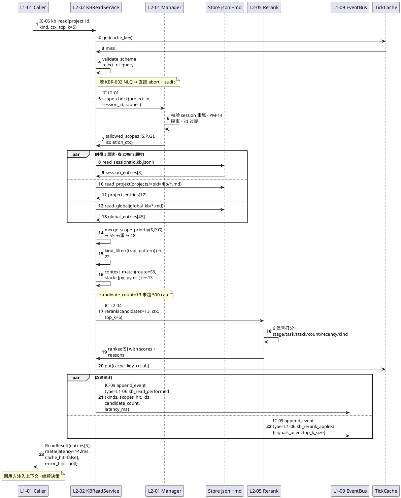
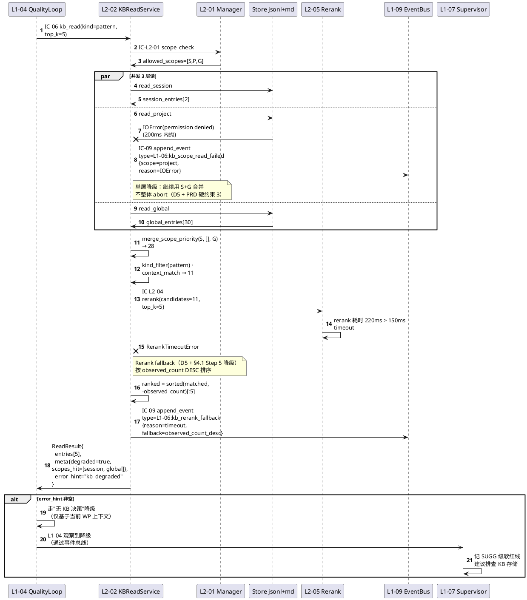
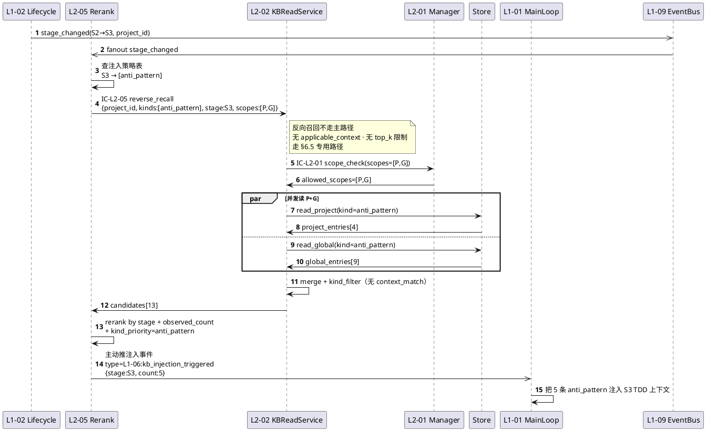
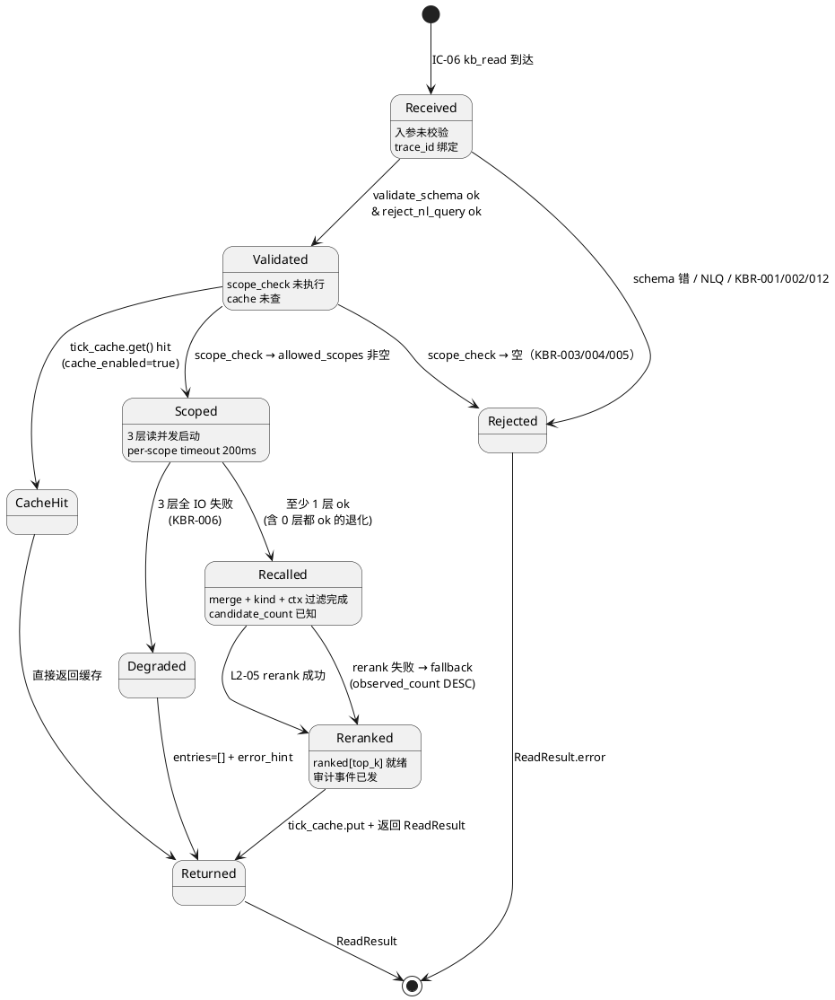

# L1-06 L2-02 · KB 读 · Tech Design（depth-B）

> **本文档定位**：3-1-Solution-Technical 层级 · L1-06 的 L2-02 KB 读 技术实现方案（L2 粒度 · depth-B 技术细节）。
> **与产品 PRD 的分工**：2-prd/L1-06-3层知识库/prd.md §5.6 的对应 L2 节定义产品边界，本文档定义**技术实现**（接口字段级 schema + 算法伪代码 + 底层数据结构 + 状态机 + 配置参数）。
> **与 L1 architecture.md 的分工**：architecture.md 负责**跨 L2 架构 + 跨 L2 时序**，本文档负责**本 L2 内部技术细节**。冲突以 architecture.md 为准。
> **严格规则**：本文档不复述产品 PRD 文字（职责 / 禁止 / 必须等清单），只做技术映射 + 补齐"产品视角未说 but 工程师必须知道"的部分（具体算法 · syscall · schema · 配置）。

---

## §0 撰写进度

- [x] §1 定位 + 2-prd §5.6 L2-02 映射 + 本 L2 在 L1 architecture 中的位置
- [x] §2 输入/输出契约（IC-06 主入口 · IC-L2-04 rerank 出口 · IC-L2-05 反向召回入口）
- [x] §3 领域模型（AR/VO · 字段级 YAML schema · 错误码表 ≥ 12 码）
- [x] §4 核心算法（Python-like 伪代码 · 前半 4 个）
- [x] §5 时序图（PlantUML · P0 正常读 + P1 异常降级）
- [x] §6 核心算法（Python-like 伪代码 · 后半 4 个）
- [x] §7 数据存储设计（字段级 YAML · PM-14 项目分片）
- [x] §8 状态机（PlantUML state · 读请求 6 状态）
- [x] §9 开源技术调研（≥ 3 GitHub 高星项目）
- [x] §10 配置参数（≥ 8 个 YAML）
- [x] §11 错误处理 + 降级链（≥ 4 级）
- [x] §12 可观测性 / SLO
- [x] §13 ADR / 开放问题

---

## §1 定位 + 2-prd §5.6 L2-02 映射 + 在 L1 architecture 的位置

### 1.1 本 L2 一句话技术定位

**L2-02 KB 读 = BC-06 的 Domain Service + KBEntryRepository 的读侧门面**。对外独占承担 IC-06 `kb_read` 查询语义（从 L1-01 主 loop / L1-04 Quality Loop / L1-07 Supervisor 等 4+ 调用方进入），对内按 "scope 优先级合并 → kind 过滤 → applicable_context 匹配 → L2-05 rerank → top_k 截断" 五步流水召回 KBEntry，并在底层存储异常时降级返回空集 + `error_hint` 让调用方无 KB 继续。

### 1.2 在 L1-06 architecture 中的位置锚定

引自 `docs/3-1-Solution-Technical/L1-06-3层知识库/architecture.md`：

- **§3.1 主干数据流图**：本 L2 位于 "读链路（L2-02 + L2-05 · 召回 + rerank）" package 内，上游被 L1-01/04/07 通过 `IC-06 kb_read` 调用，下游调 L2-01 校验（`IC-L2-01`）+ 调 L2-05 rerank（`IC-L2-04`）+ 发 IC-09 审计事件。
- **§3.2 规则 2**："召回 + rerank 必须成对"—— 本 L2 禁止跳过 L2-05 直接返回原始顺序（硬约束）。
- **§3.3 边界规则 6**："kb_read 入口只接受结构化参数（kind / scope / applicable_context / top_k）"—— 本 L2 入口即该硬边界落地点。
- **§4.1 图 1 · P0 kb_read 分层查询**：本 L2 是该时序图的中心 participant，覆盖 26 条消息、2 个 alt 分支（正常 + 降级）。

### 1.3 与 2-prd §5.6 / L1-06 §9 的字段级映射

| 2-prd 位点 | 产品语义 | 本文档技术落地 |
|---|---|---|
| §5.6.2 输入（5 条）| scope 过滤 / kind 过滤 / applicable_context / top_k / project_id | §2.2 `ReadRequest` 字段级 schema + §3 `ReadRequest` YAML |
| §5.6.2 输出（3 条）| entries[] / error_hint / 审计事件 | §2.3 `ReadResult` + §3 `error_code` 表 + §7 `kb_read_event` |
| §5.6.3 In-scope 6 条 | 3 层合并 / kind 过滤 / context 匹配 / rerank 协同 / 降级 / 审计 | §4.1 主流程伪代码 5 步 + §6.1 降级伪代码 |
| §5.6.3 Out-of-scope 5 条 | 不做 rerank 打分 / 不做写 / 不做分层规则 / 不做向量 / 不做 NLQ | §4.1 第 4 步仅"调用"L2-05 · §2.2 `ReadRequest` 强约束 kind 枚举 |
| §5.6.4 硬约束 5 条 | 优先级 / 过滤必跑 / 不 halt / rerank 必走 / 走 L2-01 | §4.1 分 step 落 assert / §6.1 降级分支 / §4.2 scope 优先级算法 |
| §5.6.5 禁止 7 条 | 绕 L2-01 / 跳 rerank / halt / 写副作用 / 跨项目 / 不审计 / NLQ | §3 入参强类型拒 NLQ / §4.1 assert 拦 halt / §5.2 时序图显降级 |
| §5.6.6 必须 6 条 | S>P>G / 过滤匹配 / rerank / 降级 / 审计 / 反向召回 | §4.1/§4.2/§6.1/§6.2 对应算法 |
| §9.8 IC 交互表 | IC-06 + IC-L2-01/04/05 + IC-09 | §2 IC 契约 4 条 |
| §9.9 P1-P5/N1-N3/I1-I3 | Given-When-Then 场景 | §5 时序图 P0/P1 覆盖 + §13 与 3-2 TDD 映射 |

### 1.4 PM-14 约束在本 L2 的具体落地

- **项目作用域键必选**：`ReadRequest.project_id` 必填，不允许未知或 `null`；即使读 Global 层也要携带（用于审计与跨项目隔离判定）。
- **跨项目隔离在 L2-01 完成**：本 L2 不直接校验"请求方项目 == 条目项目"，而是把 `project_id` 透传给 L2-01（`IC-L2-01 scope_check`），由 L2-01 返回 `isolation_ctx.allowed_project_scopes` 决定哪些 Project 层条目可见。
- **存储路径规范**：本 L2 不直接拼路径，所有路径从 L2-01 返回的 `isolation_ctx.physical_paths` 取得，保证 PM-14 分片 `projects/<pid>/kb/entries/*.md` 被统一走。
- **Global 层无 project_id**：读 Global 时 L2-01 返回 `projects:[*]`（通配），本 L2 不对 Global 层条目做项目过滤。

### 1.5 关键技术决策（Decision → Rationale → Alternatives → Trade-off）

| # | Decision | Rationale | Alternatives | Trade-off |
|---|---|---|---|---|
| D1 | **召回阶段不做任何评分，只做过滤**；所有打分交 L2-05 | 保持 L2-02 与 L2-05 单一职责；打分算法属 Domain Service 纯函数层 | 在 L2-02 内嵌轻量打分 | 多 1 次 IC 开销（< 5ms），换来可替换 rerank 实现 |
| D2 | **S>P>G 合并采用"高优先级覆盖同 id"语义**，而不是"三层 union" | 避免同一知识在 3 层重复注入，节省上下文配额 | Union + rerank 自去重 | 覆盖会丢失低优先级层的 `observed_count` 差异 → 通过 §4.2 合并算法保留 observed_count max 弥补 |
| D3 | **P1 可选功能"tick 内缓存"强制启用**（默认开） | 主 loop 单 tick 内常对同 kind 反复读 3-5 次，缓存命中率 > 60% 可直接除 3 ms | 关闭缓存简化实现 | 占用约 1 MB 进程内存；tick 结束时清空避免跨 tick 脏读 |
| D4 | **`applicable_context` 匹配采用"AND + 缺省通过"语义** | 调用方可只给 `route`，缺失字段默认通过，兼容性最大 | "必须字段对字段完全相等" | 调用方可能混入条目 → §4.3 引入 `strict_mode` 选项 |
| D5 | **降级返回 `entries=[]` 而非 exception** | 符合 PRD §5.6.4 硬约束 3（不可 halt） | 抛 `KBReadError` 让上游 catch | 上游需显式检查 `error_hint`，写 N1 测试用例防漏检 |
| D6 | **反向召回（IC-L2-05）不共享主路径**，另走 `read_by_kind_and_project` | L2-05 阶段注入场景下无 `applicable_context`，主路径 assert 会误拦 | 主路径放宽 | 多维护 1 条代码路径 → §6.5 专门伪代码 |
| D7 | **Candidate 集合上限 500 条**，超出截断 | 防无界扫描打爆 rerank；500 条 top_k=5 仍足够 | 无上限 | 极端场景（全项目搜索）可能漏召回 → §10 暴露 `candidate_cap` 可调参 |
| D8 | **读请求路径不做 fsync / lock**，是纯读路径 | jsonl / md 写由 L2-03 / L2-04 管；读只需 O_RDONLY + 内存解析 | 读写共享 rwlock | 跨进程场景 jsonl 可能读到 truncated 行 → §6.7 容错解析 |

---

## §2 输入/输出契约（IC 字段级）

### 2.1 契约清单（本 L2 承担 4 条 IC）

| IC | 方向 | 对端 | 一句话 | 落地字段级位点 |
|---|---|---|---|---|
| **IC-06 kb_read** | 入站 | L1-01 / L1-04 / L1-07 | 主入口：按结构化参数召回 top_k 条目 | §2.2 + §2.3 |
| **IC-L2-05 reverse_recall** | 入站 | L2-05（阶段注入时） | 反向召回：按 kind + project + stage 拉候选 | §2.4 |
| **IC-L2-01 scope_check** | 出站 | L2-01 | 校验允许读哪些 scope + 返回物理路径 | §2.5 |
| **IC-L2-04 rerank** | 出站 | L2-05 | 交 rerank + 截断 top_k | §2.6 |
| **IC-09 append_event** | 出站 | L1-09 | 审计事件（read / degraded / rejected / cache_hit） | §7.4 |

### 2.2 IC-06 `kb_read` 入参（`ReadRequest` VO · YAML schema）

```yaml
# ReadRequest VO · 入参 schema（JSON Schema 2020-12 等价）
type: object
required: [project_id, applicable_context]
additionalProperties: false
properties:
  project_id:
    type: string
    pattern: "^hf-[a-z0-9]{26}$"    # ULID 前缀 hf- · PM-14 项目上下文
    description: "PM-14 项目上下文 · 跨项目隔离键"
  session_id:
    type: [string, "null"]
    pattern: "^sess-[a-z0-9]{26}$"
    description: "Session 层读取时必填；Project/Global 读可为 null"
  kind:
    oneOf:
      - type: "null"
      - type: string
        enum: [pattern, trap, recipe, tool_combo, anti_pattern, project_context, external_ref, effective_combo]
      - type: array
        items:
          type: string
          enum: [pattern, trap, recipe, tool_combo, anti_pattern, project_context, external_ref, effective_combo]
        minItems: 1
        maxItems: 8
    description: "null=全量 · 单值=单 kind · 数组=多 kind OR"
  scope:
    oneOf:
      - type: "null"
      - type: array
        items:
          type: string
          enum: [session, project, global]
        minItems: 1
        maxItems: 3
        uniqueItems: true
    description: "null=三层全查 · 否则按指定层集合"
  applicable_context:
    type: object
    additionalProperties: false
    properties:
      route:
        type: [string, "null"]
        enum: [S1, S2, S3, S4, S5, S6, S7, null]
      task_type:
        type: [string, "null"]
        description: "例：tdd / debug / refactor / design"
      tech_stack:
        type: array
        items:
          type: string
        maxItems: 16
        description: "例：[python, fastapi, sqlalchemy]"
      wbs_node_id:
        type: [string, "null"]
        pattern: "^wp-[a-z0-9]{26}$|^null$"
    description: "四字段 AND 匹配 · 缺省即通过（D4 决策）"
  top_k:
    type: integer
    minimum: 1
    maximum: 50
    default: 5
    description: "返回条目数；最终 ≤ 候选集大小"
  strict_mode:
    type: boolean
    default: false
    description: "true=applicable_context 缺省字段视为不匹配"
  cache_enabled:
    type: boolean
    default: true
    description: "tick 内缓存开关 · 默认开"
  tick_id:
    type: [string, "null"]
    pattern: "^tick-[a-z0-9]{26}$"
    description: "缓存分片键 · 由 L1-01 传入"
  trace_id:
    type: string
    pattern: "^tr-[a-z0-9]{26}$"
    description: "链路追踪 · IC-09 事件透传"
```

### 2.3 IC-06 `kb_read` 出参（`ReadResult` VO · YAML schema）

```yaml
# ReadResult VO · 出参 schema
type: object
required: [entries, meta]
additionalProperties: false
properties:
  entries:
    type: array
    maxItems: 50
    items:
      $ref: "#/definitions/KBEntryView"
  meta:
    type: object
    required: [project_id, candidate_count, returned_count, latency_ms, cache_hit]
    properties:
      project_id:
        type: string              # PM-14 回显
      candidate_count:
        type: integer
        description: "合并+过滤后、rerank 前的候选集规模"
      returned_count:
        type: integer
        description: "rerank 后截断的最终返回数 = min(top_k, candidate_count)"
      latency_ms:
        type: number
        minimum: 0
      cache_hit:
        type: boolean
      scopes_hit:
        type: array
        items:
          type: string
          enum: [session, project, global]
        description: "实际拉到条目的层"
      degraded:
        type: boolean
        default: false
  error_hint:
    type: [string, "null"]
    enum: [null, kb_degraded, kb_unavailable, kb_schema_mismatch, kb_timeout, kb_rejected]
    description: "非空时意味着降级 · entries 可能为空"
  trace_id:
    type: string

definitions:
  KBEntryView:                    # Repository 返回给上游的 DTO
    type: object
    required: [id, kind, scope, title, content, applicable_context, observed_count]
    properties:
      id:
        type: string
        pattern: "^kbe-[a-z0-9]{26}$"
      project_id:
        type: [string, "null"]    # Global 层为 null · PM-14
      kind:
        type: string
      scope:
        type: string
        enum: [session, project, global]
      title:
        type: string
        maxLength: 200
      content:
        type: string
        maxLength: 8000
      applicable_context:
        type: object
      observed_count:
        type: integer
        minimum: 1
      first_observed_at:
        type: string
        format: date-time
      last_observed_at:
        type: string
        format: date-time
      source_links:
        type: array
        items:
          type: string
      rerank_score:
        type: number
        description: "L2-05 打分 · 0-1 浮点"
      rerank_reasons:
        type: array
        items:
          type: string
        description: "命中理由 · 用于 UI 调试视图（可选功能 3）"
```

### 2.4 IC-L2-05 `reverse_recall` 入参（L2-05 反向召回）

```yaml
# ReverseRecallRequest · 由 L2-05 在阶段切换时调入
type: object
required: [project_id, kinds, stage]
additionalProperties: false
properties:
  project_id:
    type: string                  # PM-14
  kinds:
    type: array
    items:
      type: string
      enum: [pattern, trap, recipe, tool_combo, anti_pattern, project_context, external_ref, effective_combo]
    minItems: 1
  stage:
    type: string
    enum: [S1, S2, S3, S4, S5, S6, S7]
  scopes:
    type: array
    items:
      type: string
      enum: [session, project, global]
    default: [project, global]
    description: "反向召回默认不含 session（避免自循环）"
  cap:
    type: integer
    default: 200
    maximum: 500
  trace_id:
    type: string
```

### 2.5 IC-L2-01 `scope_check` 出参（本 L2 调 L2-01 的应答）

```yaml
# ScopeCheckResult · 由 L2-01 返回
type: object
required: [allowed_scopes, isolation_ctx]
properties:
  allowed_scopes:
    type: array
    items:
      type: string
      enum: [session, project, global]
  isolation_ctx:
    type: object
    required: [project_id, physical_paths]
    properties:
      project_id:
        type: string              # PM-14 回显
      physical_paths:
        type: object
        properties:
          session:
            type: [string, "null"]
            description: "例：task-boards/hf-xxx/tid-yyy.kb.jsonl"
          project:
            type: [string, "null"]
            description: "例：projects/hf-xxx/kb/entries/"
          global:
            type: string
            description: "例：global_kb/entries/"
      allowed_project_scopes:
        type: array
        items:
          type: string             # 允许读的 project_id 集合（一般仅含自己）
      expired_session_tids:
        type: array
        items:
          type: string
          description: "已过期（>7d）的 session tid · 读时跳过"
  rejected_reason:
    type: [string, "null"]
    description: "allowed_scopes 为空时填"
```

### 2.6 IC-L2-04 `rerank` 入参/出参（本 L2 调 L2-05）

```yaml
# RerankRequest
type: object
required: [candidates, context, top_k]
properties:
  candidates:
    type: array
    maxItems: 500                 # D7 决策：候选上限
    items:
      $ref: "#/definitions/KBEntryView"
  context:
    type: object                  # 原 ReadRequest.applicable_context + stage
  top_k:
    type: integer
    minimum: 1
    maximum: 50
  signals_requested:
    type: array
    items:
      type: string
      enum: [stage_match, task_match, stack_match, observed_count, recency, kind_priority]
    default: [stage_match, task_match, stack_match, observed_count, recency, kind_priority]

# RerankResponse
type: object
required: [ranked, signals_used]
properties:
  ranked:
    type: array
    items:
      allOf:
        - $ref: "#/definitions/KBEntryView"
        - type: object
          properties:
            rerank_score: {type: number}
            rerank_reasons: {type: array, items: {type: string}}
  signals_used:
    type: array
    items: {type: string}
  latency_ms:
    type: number
```

### 2.7 错误码表（≥ 12 码）

| 错误码 | HTTP 对应 | 含义 | 触发场景 | 调用方处理 |
|---|---|---|---|---|
| `KBR-001 invalid_request` | 400 | 入参 schema 校验失败 | `project_id` 缺失 / `kind` 枚举外值 / `top_k` 越界 | 修正参数后重试 |
| `KBR-002 nl_query_rejected` | 400 | 请求含自然语言 query（禁止行为 7） | 参数里发现 `query` 或非结构化 `text` 字段 | 改用结构化 kind + applicable_context |
| `KBR-003 scope_denied` | 403 | L2-01 校验返 allowed_scopes=[] | 调用方项目与 session 不一致 / 项目未激活 | 检查 `project_id` + session 绑定 |
| `KBR-004 cross_project_violation` | 403 | 调用方请求其他 project_id 的 Project 层 | project A 请求 project B 的 entries | 检查 session isolation |
| `KBR-005 kind_not_allowed` | 400 | kind 在请求方 route 上被策略禁用 | 例如 S1 阶段禁 recipe | 去掉该 kind 或等阶段切换 |
| `KBR-006 kb_degraded` | 200（返 entries=[]） | 底层存储不可达 | jsonl 损坏 / md 目录不存在 / IO 超时 | 走无 KB 降级路径（D5） |
| `KBR-007 kb_timeout` | 200（返 entries=[]） | 本 L2 处理超过 `read_timeout_ms` | 候选集解析超时 | 走降级路径 + 缩小 `kind` 范围重试 |
| `KBR-008 rerank_failed` | 200（返原顺序前 top_k） | L2-05 rerank 异常 | rerank 模型崩 | 接受降级顺序；审计 `rerank_fallback` |
| `KBR-009 cache_corruption` | 200（重查） | 进程内缓存 hash 校验失败 | 跨 tick 脏读 | 本 L2 自动清缓存重试 1 次 |
| `KBR-010 candidate_overflow` | 200（截断） | 候选集超过 `candidate_cap` | 大项目 + 宽 kind 过滤 | 请求方应收紧 applicable_context |
| `KBR-011 schema_mismatch` | 500 | KB 条目存储 YAML 不符 schema | 用户手工改坏 md frontmatter | 审计 + 跳过该条目（L2-01 修复） |
| `KBR-012 trace_id_missing` | 400 | 审计透传键缺失 | 调用方没传 `trace_id` | 补齐 `trace_id`（L1-01 / L1-04 侧修复） |
| `KBR-013 reverse_recall_unauthorized` | 403 | 反向召回被非 L2-05 调用 | 伪造的 `caller_identity` | 拒绝 + 安全审计 |
| `KBR-014 concurrent_read_conflict` | 200（重试） | jsonl truncated 行解析异常 | 与 L2-03 并发写 | 跳过该行继续解析（§6.7） |

### 2.8 典型 IC-06 调用示例

```yaml
# 示例 A · L1-01 主 loop 在 S3 阶段读 trap + pattern（决策前注入）
request:
  project_id: hf-01hr7n9d3p0q2z8v5xkw4m6b9c
  session_id: sess-01hr7naaabcdef0123456789
  kind: [trap, pattern]
  scope: null                             # 三层全查
  applicable_context:
    route: S3
    task_type: tdd_blueprint
    tech_stack: [python, pytest]
    wbs_node_id: wp-01hr7nbbxxxxxxxxxxxxxx
  top_k: 5
  cache_enabled: true
  tick_id: tick-01hr7nccyyyyyyyyyyyyyyy
  trace_id: tr-01hr7nddzzzzzzzzzzzzzzz

response:
  entries:                                # 按 rerank 降序
    - id: kbe-01hr7a...
      kind: pattern
      scope: project
      title: "pytest-asyncio fixture 复用"
      content: "..."
      applicable_context: {route: S3, tech_stack: [python, pytest]}
      observed_count: 4
      rerank_score: 0.87
      rerank_reasons: [stack_match, stage_match, recency]
    - ...
  meta:
    project_id: hf-01hr7n9d3p0q2z8v5xkw4m6b9c
    candidate_count: 37
    returned_count: 5
    latency_ms: 142
    cache_hit: false
    scopes_hit: [project, global]
    degraded: false
  error_hint: null
  trace_id: tr-01hr7nddzzzzzzzzzzzzzzz
```

---

## §3 领域模型（AR/VO · 字段级 YAML · 错误码）

### 3.1 聚合根 / 实体 / 值对象分类

| DDD 元素 | 名称 | 持有方 | 本 L2 访问模式 |
|---|---|---|---|
| **Aggregate Root** | `KBEntry` | L2-03 持有写；L2-02 **只读** | 通过 KBEntryRepository 读 |
| **Entity** | 无（本 L2 无长生命周期状态对象） | — | — |
| **Value Object** | `ReadRequest` | 入参 | §2.2 |
| **Value Object** | `ReadResult` | 出参 | §2.3 |
| **Value Object** | `Scope` | enum {session, project, global} | §4.2 优先级算法 |
| **Value Object** | `ApplicableContext` | 4 字段 AND | §4.3 匹配算法 |
| **Value Object** | `KindFilter` | null/单值/多值 | §4.1 步骤 3 |
| **Value Object** | `RecallCandidate` | 内部中间结构（含 scope 标记） | §4.1 合并步 |
| **Value Object** | `RerankScore` | L2-05 返回 | §2.6 |
| **Domain Service** | `KBReadService`（本 L2 主类） | Application Service 调度入口 | §4.1 |
| **Domain Service** | `ScopePriorityMerger` | S>P>G 合并 | §4.2 |
| **Domain Service** | `ContextMatcher` | applicable_context AND 过滤 | §4.3 |
| **Repository** | `KBEntryRepository`（只读接口） | 从 jsonl / md 读 | §6.7 |

### 3.2 KBEntry 聚合根字段级 schema（读视角 · 本 L2 引用 L2-03 权威定义）

```yaml
# KBEntry AR · 读视角 YAML（写侧权威在 L2-03 tech-design §3）
type: object
required:
  - id
  - project_id
  - scope
  - kind
  - title
  - content
  - applicable_context
  - observed_count
  - first_observed_at
  - last_observed_at
properties:
  id:
    type: string
    pattern: "^kbe-[a-z0-9]{26}$"
    description: "ULID · 同 id 跨层做合并键"
  project_id:
    type: [string, "null"]
    pattern: "^hf-[a-z0-9]{26}$"
    description: "PM-14 项目上下文 · Global 层为 null"
  scope:
    type: string
    enum: [session, project, global]
  kind:
    type: string
    enum: [pattern, trap, recipe, tool_combo, anti_pattern, project_context, external_ref, effective_combo]
  title:
    type: string
    minLength: 4
    maxLength: 200
  content:
    type: string
    minLength: 1
    maxLength: 8000
  applicable_context:
    type: object
    properties:
      route:        {type: [string, "null"]}
      task_type:    {type: [string, "null"]}
      tech_stack:   {type: array, items: {type: string}}
      wbs_node_id:  {type: [string, "null"]}
  observed_count:
    type: integer
    minimum: 1
  first_observed_at:
    type: string
    format: date-time
  last_observed_at:
    type: string
    format: date-time
  source_links:
    type: array
    items: {type: string}
  tags:
    type: array
    items: {type: string}
    maxItems: 16
  promoted_from:
    type: [string, "null"]
    description: "晋升来源层（L2-04 写入 · 本 L2 只读）"
  schema_version:
    type: string
    const: "1.0"
```

### 3.3 本 L2 对外 Repository 接口签名（Python 类型提示伪代码）

```python
# 位置：app/kb/read/repository.py
from typing import Protocol, Optional

class KBEntryRepository(Protocol):
    def read_session(self, isolation_ctx: IsolationCtx, kinds: Optional[list[str]]) -> list[KBEntry]:
        """读 Session 层 jsonl（容错 truncated 行）"""

    def read_project(self, isolation_ctx: IsolationCtx, kinds: Optional[list[str]]) -> list[KBEntry]:
        """读 Project 层 md entries（按文件名索引 + YAML frontmatter 解析）"""

    def read_global(self, kinds: Optional[list[str]]) -> list[KBEntry]:
        """读 Global 层 md entries（无 project_id 归属 · D7 候选上限截断）"""
```

---

## §4 核心算法（Python-like 伪代码 · 前 4 个）

### 4.1 算法 1 · 主流程 `read()` · 5 步流水

```python
# 位置：app/kb/read/service.py
# 对应 PRD §5.6.6 必须义务 1-6 · architecture §4.1 时序图

def read(req: ReadRequest) -> ReadResult:
    """
    IC-06 主入口 · 5 步流水：
      1. 入参校验 + NLQ 拒绝
      2. L2-01 scope_check（含 PM-14 隔离）
      3. 并发读 3 层 → S>P>G 合并
      4. kind 过滤 + applicable_context 匹配 + 候选上限
      5. 交 L2-05 rerank → 返回
    """
    t0 = now_ms()

    # --- Step 0 · tick 缓存（D3 决策）---
    if req.cache_enabled and (cached := tick_cache.get(req.cache_key())):
        audit(event="kb_read_cache_hit", trace_id=req.trace_id)
        return cached.with_meta(cache_hit=True, latency_ms=now_ms() - t0)

    # --- Step 1 · 入参校验 ---
    try:
        validate_schema(req, READ_REQUEST_SCHEMA)       # KBR-001
        reject_nl_query(req)                            # KBR-002
    except ValidationError as e:
        audit(event="kb_read_rejected", code=e.code, trace_id=req.trace_id)
        return ReadResult.error(e.code, req.trace_id)

    # --- Step 2 · L2-01 scope_check ---
    try:
        ctx = l2_01.scope_check(ScopeCheckRequest(
            project_id=req.project_id,
            session_id=req.session_id,
            requested_scopes=req.scope or ["session", "project", "global"],
        ))
    except ScopeCheckError as e:
        audit(event="kb_read_rejected", code="KBR-003", trace_id=req.trace_id)
        return ReadResult.error("KBR-003", req.trace_id)

    if not ctx.allowed_scopes:
        return ReadResult.error("KBR-003", req.trace_id)

    # --- Step 3 · 并发读 3 层 ---
    #   · 用 asyncio.gather 并发 · 单层超时独立降级
    session_entries, project_entries, global_entries = [], [], []
    try:
        results = gather_with_timeout([
            ("session", repo.read_session, ctx.isolation_ctx, req.kind)
                if "session" in ctx.allowed_scopes else None,
            ("project", repo.read_project, ctx.isolation_ctx, req.kind)
                if "project" in ctx.allowed_scopes else None,
            ("global",  repo.read_global,  req.kind)
                if "global"  in ctx.allowed_scopes else None,
        ], timeout_ms=CONF.per_scope_read_timeout_ms)   # 默认 200ms
        session_entries, project_entries, global_entries = results
    except IOError as io_err:
        audit(event="kb_read_degraded", reason=str(io_err), trace_id=req.trace_id)
        return ReadResult.degraded("KBR-006", trace_id=req.trace_id, meta_partial=...)

    # --- Step 4 · S>P>G 合并（算法 2）+ kind 过滤 + context 匹配 ---
    merged = merge_scope_priority(session_entries, project_entries, global_entries)
    filtered = [e for e in merged if kind_allowed(e, req.kind)]
    matched  = [e for e in filtered if context_match(e, req.applicable_context, req.strict_mode)]

    # --- Step 4.5 · 候选上限截断（D7）---
    if len(matched) > CONF.candidate_cap:               # 默认 500
        audit(event="kb_read_candidate_overflow", dropped=len(matched) - CONF.candidate_cap,
              trace_id=req.trace_id, code="KBR-010")
        matched = matched[:CONF.candidate_cap]

    candidate_count = len(matched)

    # --- Step 5 · 交 L2-05 rerank ---
    try:
        rerank_resp = l2_05.rerank(RerankRequest(
            candidates=matched,
            context=req.applicable_context.with_stage(req.applicable_context.route),
            top_k=req.top_k,
        ), timeout_ms=CONF.rerank_timeout_ms)            # 默认 150ms
    except RerankError:
        audit(event="kb_rerank_fallback", trace_id=req.trace_id, code="KBR-008")
        rerank_resp = RerankResponse(                   # 降级：按 observed_count DESC
            ranked=sorted(matched, key=lambda e: -e.observed_count)[:req.top_k],
            signals_used=["fallback_observed_count"],
        )

    # --- Step 6 · 组装 ReadResult + 审计 + 写缓存 ---
    result = ReadResult(
        entries=rerank_resp.ranked,
        meta=ReadMeta(
            project_id=req.project_id,
            candidate_count=candidate_count,
            returned_count=len(rerank_resp.ranked),
            latency_ms=now_ms() - t0,
            cache_hit=False,
            scopes_hit=scopes_with_hits(session_entries, project_entries, global_entries),
            degraded=False,
        ),
        error_hint=None,
        trace_id=req.trace_id,
    )
    if req.cache_enabled:
        tick_cache.put(req.cache_key(), result)
    audit(event="kb_read_performed",
          kinds=req.kind, scopes=ctx.allowed_scopes,
          ids=[e.id for e in rerank_resp.ranked],
          candidate_count=candidate_count, latency_ms=result.meta.latency_ms,
          trace_id=req.trace_id)
    return result
```

### 4.2 算法 2 · `merge_scope_priority()` · S>P>G 合并（D2 决策落地）

```python
def merge_scope_priority(
    s: list[KBEntry], p: list[KBEntry], g: list[KBEntry]
) -> list[RecallCandidate]:
    """
    规则（D2）：
      - 同 id 跨层冲突：高优先级（Session > Project > Global）覆盖低优先级
      - observed_count 取 max（保留跨层累计观察数）
      - last_observed_at 取 max（recency 信号）
      - scope 标记保留来自最高优先级层的 scope（影响 rerank）
    复杂度：O(|s|+|p|+|g|) · 用 dict[id] → RecallCandidate 去重
    """
    merged: dict[str, RecallCandidate] = {}

    # Global（最低优先级）先入
    for e in g:
        merged[e.id] = RecallCandidate.from_entry(e, effective_scope="global")

    # Project 覆盖
    for e in p:
        if e.id in merged:
            old = merged[e.id]
            merged[e.id] = RecallCandidate(
                base=e,
                effective_scope="project",
                observed_count=max(old.observed_count, e.observed_count),
                last_observed_at=max(old.last_observed_at, e.last_observed_at),
            )
        else:
            merged[e.id] = RecallCandidate.from_entry(e, effective_scope="project")

    # Session 最高优先级 · 最后覆盖
    for e in s:
        if e.id in merged:
            old = merged[e.id]
            merged[e.id] = RecallCandidate(
                base=e,
                effective_scope="session",
                observed_count=max(old.observed_count, e.observed_count),
                last_observed_at=max(old.last_observed_at, e.last_observed_at),
            )
        else:
            merged[e.id] = RecallCandidate.from_entry(e, effective_scope="session")

    return list(merged.values())
```

### 4.3 算法 3 · `context_match()` · applicable_context AND 匹配（D4 决策落地）

```python
def context_match(
    entry: KBEntry,
    req_ctx: ApplicableContext,
    strict_mode: bool = False,
) -> bool:
    """
    AND + 缺省通过（D4）：
      - 条目 applicable_context 缺省字段视为"通配"（strict_mode=False）
      - strict_mode=True 时缺省字段直接拒绝
    匹配规则：
      - route：字符串相等（含 None=None）
      - task_type：字符串相等
      - tech_stack：条目声明的子集 ⊆ 请求方（例：条目 [python] 匹配请求 [python, pytest]）
      - wbs_node_id：字符串相等（可 None）
    """
    ec = entry.applicable_context or {}

    # route
    if ec.get("route") is not None:
        if ec["route"] != req_ctx.route:
            return False
    elif strict_mode and req_ctx.route is not None:
        return False

    # task_type
    if ec.get("task_type") is not None:
        if ec["task_type"] != req_ctx.task_type:
            return False
    elif strict_mode and req_ctx.task_type is not None:
        return False

    # tech_stack（子集语义）
    if ec.get("tech_stack"):
        if not set(ec["tech_stack"]).issubset(set(req_ctx.tech_stack or [])):
            return False
    elif strict_mode and req_ctx.tech_stack:
        return False

    # wbs_node_id
    if ec.get("wbs_node_id") is not None:
        if ec["wbs_node_id"] != req_ctx.wbs_node_id:
            return False
    elif strict_mode and req_ctx.wbs_node_id is not None:
        return False

    return True
```

### 4.4 算法 4 · `kind_allowed()` · kind 过滤（支持 null / 单值 / 多值）

```python
KIND_WHITELIST = {
    "pattern", "trap", "recipe", "tool_combo",
    "anti_pattern", "project_context", "external_ref", "effective_combo",
}

def kind_allowed(entry: KBEntry, kind_filter) -> bool:
    """
    kind_filter 三态：
      - None → 全量（无过滤）
      - str  → 等值匹配
      - list → OR 匹配（任一命中）
    同时做防御性白名单校验（存储层坏条目直接过滤掉 + 审计）。
    """
    if entry.kind not in KIND_WHITELIST:
        audit(event="kb_read_bad_kind_skipped", entry_id=entry.id, bad_kind=entry.kind,
              code="KBR-011")
        return False

    if kind_filter is None:
        return True
    if isinstance(kind_filter, str):
        return entry.kind == kind_filter
    if isinstance(kind_filter, list):
        return entry.kind in kind_filter
    return False
```

---

## §5 时序图（PlantUML · ≥ 2 张）

### 5.1 P0 · 正常 kb_read 分层查询（主路径 · 覆盖合并 + rerank + 审计）

**场景**：L1-01 主 loop 在 S3 阶段决策前拉 `kind=[trap, pattern]` 注入上下文。覆盖 L2-01 scope_check、并发 3 层读、S>P>G 合并、kind + context 过滤、L2-05 rerank、双路审计（`kb_read_performed` + `kb_rerank_applied`）。



**关键约束落地**：
- **步 5-7（schema 校验）**：落 KBR-001/002；拒 NLQ 是 PRD 禁止行为 7 的硬拦。
- **步 8-11（scope_check）**：落 PM-14 隔离 + 7d 过期；对应 §2.5 应答。
- **步 12-20（并发读）**：用 asyncio.gather；单层超时不连坐（§6.5）。
- **步 21-23（合并 + 过滤）**：D2 覆盖语义 + D4 AND 缺省通过；候选上限 500（D7）。
- **步 24-26（rerank）**：必走 L2-05（PRD 硬约束 4）；失败降级保原顺序（§4.1 Step 5）。
- **步 27-30（双路审计）**：对应 IC-09；L2-02 发 `kb_read_performed`，L2-05 独立发 `kb_rerank_applied`（分离关注点）。

### 5.2 P1 · 异常降级 · 底层存储不可达 + rerank 超时 · 双级降级

**场景**：Project 层目录 I/O 错误（磁盘满 / 权限问题）+ L2-05 rerank 超时。覆盖单层 IO 失败降级、候选合并继续、rerank 失败 fallback、degraded meta、调用方无 KB 决策路径。



**关键约束落地**：
- **步 6-7（Project 层 IO 错误）**：PRD 硬约束 3「读失败不可 halt 整个系统」落地 —— 单层失败不拖垮其他层；审计 `kb_scope_read_failed`。
- **步 15-17（rerank 超时）**：触发 KBR-008；按 `observed_count DESC` 降级排序（确定性兜底）。
- **步 19-21（degraded meta）**：`degraded=true` + `error_hint=kb_degraded` 让上游可感知；上游路径落 P4 场景（PRD §9.9）。
- **步 22-24（Supervisor 联动）**：L1-07 软红线识别读事件总线 → 自动产生 SUGG 级建议（BF-SUP-02）。

### 5.3 P1 补充 · 反向召回（L2-05 → L2-02） · 阶段注入场景

**场景**：L1-02 S2 → S3 切换，L2-05 监听到 `stage_changed` 事件，主动调 L2-02 拉 `kind=anti_pattern` 准备 S3 TDD 蓝图阶段注入。



---

## §6 核心算法（Python-like 伪代码 · 后 4 个）

### 6.1 算法 5 · 降级链（`ReadResult.degraded()` · D5 决策）

```python
# 位置：app/kb/read/degrade.py
# 对应 §11 降级链 · ≥4 级

def _degrade(
    code: str,
    trace_id: str,
    partial_meta: Optional[ReadMeta] = None,
) -> ReadResult:
    """
    降级策略（按严重度递增）：
      L1 · rerank 降级 → 保留 entries · 按 observed_count DESC（§4.1 Step 5）
      L2 · 单层 IO 降级 → 保留其余层 · meta.degraded=true
      L3 · 全部层 IO 降级 → entries=[] · error_hint=kb_degraded（本函数）
      L4 · scope_check 拒绝 → entries=[] · error_hint=kb_rejected
    """
    audit(
        event="kb_read_degraded",
        code=code,
        trace_id=trace_id,
        partial_meta=partial_meta.to_dict() if partial_meta else None,
    )
    return ReadResult(
        entries=[],
        meta=partial_meta or ReadMeta.empty(),
        error_hint={
            "KBR-003": "kb_rejected",
            "KBR-006": "kb_degraded",
            "KBR-007": "kb_timeout",
            "KBR-011": "kb_schema_mismatch",
        }.get(code, "kb_degraded"),
        trace_id=trace_id,
    )
```

### 6.2 算法 6 · tick 缓存（D3 决策 · 强制启用）

```python
# 位置：app/kb/read/tick_cache.py
# 约束：tick 内有效 · tick_id 变化即清 · 进程内 dict + max_size LRU

class TickCache:
    """
    cache_key 组成（任一字段变即 miss）：
      - project_id / session_id / tick_id
      - kind（规范化为 sorted tuple）
      - scope（规范化为 sorted tuple）
      - applicable_context 全字段 sha256 前 8 字节
      - top_k · strict_mode
    """
    def __init__(self, max_size: int = CONF.tick_cache_max_size):  # 默认 128
        self._store: OrderedDict[str, ReadResult] = OrderedDict()
        self._current_tick: Optional[str] = None
        self._max_size = max_size

    def get(self, key: str) -> Optional[ReadResult]:
        tick = key.split("::")[2]
        if tick != self._current_tick:
            self._store.clear()                         # 跨 tick 脏读保护
            self._current_tick = tick
            return None
        val = self._store.get(key)
        if val:
            self._store.move_to_end(key)                # LRU touch
            metrics.counter("kb_read_cache_hit").inc()
        return val

    def put(self, key: str, val: ReadResult) -> None:
        tick = key.split("::")[2]
        if tick != self._current_tick:
            self._store.clear()
            self._current_tick = tick
        self._store[key] = val
        self._store.move_to_end(key)
        if len(self._store) > self._max_size:
            self._store.popitem(last=False)             # evict LRU

    @staticmethod
    def compute_key(req: ReadRequest) -> str:
        ctx_hash = sha256_hex(json_canonical(req.applicable_context))[:16]
        kind_key = ",".join(sorted(as_list(req.kind) or ["*"]))
        scope_key = ",".join(sorted(req.scope or ["s", "p", "g"]))
        return f"{req.project_id}::{req.session_id or '_'}::{req.tick_id or '_'}::" \
               f"{kind_key}::{scope_key}::{ctx_hash}::{req.top_k}::{int(req.strict_mode)}"
```

### 6.3 算法 7 · 并发读 3 层（`gather_with_timeout`）

```python
# 位置：app/kb/read/concurrency.py
import asyncio

async def _read_scope(label: str, fn, *args, timeout_ms: int) -> tuple[str, list[KBEntry]]:
    try:
        async with asyncio.timeout(timeout_ms / 1000):
            result = await asyncio.to_thread(fn, *args)
        return (label, result)
    except asyncio.TimeoutError:
        audit(event="kb_scope_read_timeout", scope=label, timeout_ms=timeout_ms)
        return (label, [])
    except IOError as e:
        audit(event="kb_scope_read_failed", scope=label, reason=str(e))
        return (label, [])

async def gather_with_timeout(tasks, timeout_ms: int) -> list[list[KBEntry]]:
    """
    对每个 scope 独立超时 · 单层失败不连坐
    返回值按传入顺序映射：[session_entries, project_entries, global_entries]
    """
    coros = [
        _read_scope(label, fn, *args, timeout_ms=timeout_ms)
        for (label, fn, *args) in tasks if tasks is not None
    ]
    results = await asyncio.gather(*coros, return_exceptions=False)
    ordered = {label: entries for (label, entries) in results}
    return [
        ordered.get("session", []),
        ordered.get("project", []),
        ordered.get("global",  []),
    ]
```

### 6.4 算法 8 · jsonl 容错解析（`parse_jsonl_lenient` · D8 落地）

```python
# 位置：app/kb/read/jsonl_parser.py
# 场景：与 L2-03 并发写时，jsonl 尾行可能 truncated（fsync 时机）

def parse_jsonl_lenient(path: str) -> list[KBEntry]:
    """
    容错策略：
      - 单行解析失败 → 跳过 + 审计 KBR-014
      - schema 校验失败 → 跳过 + 审计 KBR-011（坏条目由 L2-01 清洁工修复）
      - 文件不存在 → 返回 []（Session 层正常情况：首次写前）
    """
    if not os.path.exists(path):
        return []

    entries: list[KBEntry] = []
    with open(path, "rb") as f:                         # 二进制读避免编码截断
        lines = f.read().split(b"\n")

    for lineno, raw in enumerate(lines, 1):
        if not raw.strip():
            continue
        try:
            obj = json.loads(raw.decode("utf-8"))
        except (json.JSONDecodeError, UnicodeDecodeError):
            audit(
                event="kb_jsonl_line_corrupt",
                path=path, lineno=lineno, code="KBR-014",
            )
            continue
        try:
            entry = KBEntry.from_dict(obj)              # 含 schema 校验
        except SchemaError:
            audit(event="kb_entry_schema_invalid", path=path, lineno=lineno,
                  code="KBR-011")
            continue
        entries.append(entry)
    return entries
```

### 6.5 算法 9 · 反向召回专用路径（D6 落地）

```python
# 位置：app/kb/read/reverse_recall.py
# 对应 §2.4 · §5.3 时序图

def reverse_recall(req: ReverseRecallRequest, caller_identity: str) -> list[KBEntry]:
    """
    约束：
      - caller_identity 必须为 "L2-05" · 否则拒绝（KBR-013）
      - 不经 applicable_context 过滤（L2-05 自己注入 stage）
      - 不经 rerank 调用（避免 L2-05 调自己 · 循环调用）
    """
    if caller_identity != "L2-05":
        audit(event="reverse_recall_unauthorized", caller=caller_identity, code="KBR-013")
        raise SecurityError("KBR-013")

    ctx = l2_01.scope_check(ScopeCheckRequest(
        project_id=req.project_id,
        session_id=None,
        requested_scopes=req.scopes,
    ))
    if not ctx.allowed_scopes:
        return []

    results: list[KBEntry] = []
    if "project" in ctx.allowed_scopes:
        results.extend(repo.read_project(ctx.isolation_ctx, req.kinds))
    if "global" in ctx.allowed_scopes:
        results.extend(repo.read_global(req.kinds))

    # 截断（cap 防 L2-05 拖爆）
    if len(results) > req.cap:
        results = results[:req.cap]

    audit(event="kb_reverse_recall_performed",
          project_id=req.project_id, kinds=req.kinds, stage=req.stage,
          count=len(results), trace_id=req.trace_id)
    return results
```

### 6.6 算法 10 · md frontmatter 读（Project / Global 层）

```python
# 位置：app/kb/read/md_reader.py
# 读 projects/<pid>/kb/entries/*.md 或 global_kb/entries/*.md

import yaml

def read_md_entry(path: str) -> Optional[KBEntry]:
    """
    md 文件格式：
      ---
      id: kbe-...
      project_id: hf-...   # Global 层省略
      scope: project|global
      kind: pattern
      ... 其他字段
      ---
      (正文 · 作为 content 字段)
    """
    try:
        with open(path, "r", encoding="utf-8") as f:
            text = f.read()
    except IOError:
        return None

    if not text.startswith("---\n"):
        audit(event="kb_md_no_frontmatter", path=path, code="KBR-011")
        return None

    try:
        _, fm, body = text.split("---\n", 2)
    except ValueError:
        audit(event="kb_md_frontmatter_malformed", path=path, code="KBR-011")
        return None

    try:
        meta = yaml.safe_load(fm)
    except yaml.YAMLError:
        audit(event="kb_md_yaml_invalid", path=path, code="KBR-011")
        return None

    meta["content"] = body.strip()
    try:
        return KBEntry.from_dict(meta)
    except SchemaError as e:
        audit(event="kb_md_schema_invalid", path=path, err=str(e), code="KBR-011")
        return None


def list_md_entries(dir_path: str, kinds: Optional[list[str]]) -> list[KBEntry]:
    if not os.path.isdir(dir_path):
        return []
    entries = []
    for fname in os.listdir(dir_path):
        if not fname.endswith(".md"):
            continue
        entry = read_md_entry(os.path.join(dir_path, fname))
        if entry is None:
            continue
        if kinds is not None and entry.kind not in kinds:
            continue
        entries.append(entry)
    return entries
```

### 6.7 算法 11 · Repository 统一读接口（聚合 jsonl + md）

```python
# 位置：app/kb/read/repository_impl.py

class FileKBEntryRepository:
    """
    默认实现：纯文件 + jsonl + md（L0 tech-stack.md §10.8.2）
    升级路径（> 10K 条目）：SQLite FTS5（另起子类 SqliteKBEntryRepository）
    """

    def read_session(self, ctx: IsolationCtx, kinds) -> list[KBEntry]:
        path = ctx.physical_paths.get("session")
        if path is None:
            return []
        entries = parse_jsonl_lenient(path)
        if kinds is not None:
            entries = [e for e in entries if kind_allowed(e, kinds)]
        # 读 Session 时过滤已过期 tid
        if ctx.expired_session_tids:
            entries = [e for e in entries if e.source_tid not in ctx.expired_session_tids]
        return entries

    def read_project(self, ctx: IsolationCtx, kinds) -> list[KBEntry]:
        dir_path = ctx.physical_paths.get("project")
        if dir_path is None:
            return []
        entries = list_md_entries(dir_path, kinds)
        # PM-14 · 防御性二次校验 project_id（L2-01 应已过滤）
        entries = [e for e in entries if e.project_id == ctx.project_id]
        return entries

    def read_global(self, kinds) -> list[KBEntry]:
        dir_path = CONF.global_kb_path                  # global_kb/entries/
        entries = list_md_entries(dir_path, kinds)
        # Global 层截断（D7）
        if len(entries) > CONF.global_read_cap:         # 默认 1000
            entries = entries[:CONF.global_read_cap]
        return entries
```

---

## §7 底层数据存储 / 字段级 schema 设计

### 7.1 物理布局（PM-14 项目分片）

```text
<project_root>/
├── task-boards/
│   └── <project_id>/                  # PM-14 分片键
│       └── <session_task_id>.kb.jsonl # Session 层 · L2-03 append-only 写 · 本 L2 只读
├── projects/
│   └── <project_id>/                  # PM-14 分片键
│       └── kb/
│           └── entries/
│               └── kbe-<ulid>.md      # Project 层 · L2-04 晋升写 · 本 L2 只读
├── global_kb/
│   └── entries/
│       └── kbe-<ulid>.md              # Global 层 · 无 project_id · L2-04 晋升写 · 本 L2 只读
└── logs/
    └── <project_id>/
        └── events.jsonl               # L1-09 事件总线（审计 · 本 L2 间接写）
```

### 7.2 Session 层 jsonl 单行 schema（本 L2 读视角）

```yaml
# Session 层 jsonl 每行一条 KBEntry
# 文件路径：task-boards/<project_id>/<session_task_id>.kb.jsonl
# 写端：L2-03 · 读端：L2-02（本文档）

type: object
required: [project_id, id, scope, kind, title, content, applicable_context, observed_count,
           first_observed_at, last_observed_at, source_tid]
properties:
  project_id:
    type: string                      # PM-14 项目上下文（Session 层冗余存储 · 防文件被移动后归属丢失）
    pattern: "^hf-[a-z0-9]{26}$"
  id:
    type: string
    pattern: "^kbe-[a-z0-9]{26}$"
  scope:
    type: string
    const: "session"
  kind:
    type: string
    enum: [pattern, trap, recipe, tool_combo, anti_pattern,
           project_context, external_ref, effective_combo]
  title:
    type: string
    minLength: 4
    maxLength: 200
  content:
    type: string
    maxLength: 8000
  applicable_context:
    type: object
    properties:
      route: {type: [string, "null"]}
      task_type: {type: [string, "null"]}
      tech_stack: {type: array, items: {type: string}}
      wbs_node_id: {type: [string, "null"]}
  observed_count:
    type: integer
    minimum: 1
  first_observed_at:
    type: string
    format: date-time
  last_observed_at:
    type: string
    format: date-time
  source_tid:
    type: string                      # Session 所属 task_id · 7d 过期判定用
  source_links:
    type: array
    items: {type: string}
  schema_version:
    type: string
    const: "1.0"
```

**索引结构（读侧）**：
- 无磁盘索引，线性扫描（Session 层条目数 < 100 · L2-01 7d 过期自动回收）
- 内存索引仅在 `read_session()` 内构造（id → entry dict · 用于合并）

### 7.3 Project 层 md 文件 schema（本 L2 读视角）

```yaml
# Project 层 md frontmatter + body
# 文件路径：projects/<project_id>/kb/entries/kbe-<ulid>.md
# 写端：L2-04 晋升 · 读端：L2-02（本文档）

# YAML frontmatter schema
frontmatter:
  type: object
  required: [project_id, id, scope, kind, title, applicable_context, observed_count,
             first_observed_at, last_observed_at, promoted_from, promoted_at]
  properties:
    project_id:
      type: string                    # PM-14 项目上下文（必存 · Project 层所有条目强绑定项目）
      pattern: "^hf-[a-z0-9]{26}$"
    id:
      type: string
      pattern: "^kbe-[a-z0-9]{26}$"
    scope:
      type: string
      const: "project"
    kind:
      type: string
      enum: [pattern, trap, recipe, tool_combo, anti_pattern,
             project_context, external_ref, effective_combo]
    title:
      type: string
      maxLength: 200
    applicable_context:
      type: object
      properties:
        route: {type: [string, "null"]}
        task_type: {type: [string, "null"]}
        tech_stack: {type: array}
        wbs_node_id: {type: [string, "null"]}
    observed_count:
      type: integer
      minimum: 2                      # 至少从 Session 晋升（阈值 ≥2）
    first_observed_at: {type: string, format: date-time}
    last_observed_at:  {type: string, format: date-time}
    promoted_from:
      type: string
      const: "session"
    promoted_at:
      type: string
      format: date-time
    source_links:
      type: array
      items: {type: string}
    tags:
      type: array
      items: {type: string}
      maxItems: 16
    schema_version:
      type: string
      const: "1.0"

# body（正文）= KBEntry.content 字段
body:
  type: string
  maxLength: 8000
```

**索引结构（读侧）**：
- 文件名即 id（`kbe-<ulid>.md`）· 目录遍历即列举
- 可选构建 `.index.json`（由 L2-01 清洁工维护 · 本 L2 若存在则优先读缓存，否则回退 listdir）

### 7.4 审计事件 schema（本 L2 发出的 IC-09 事件族）

```yaml
# 事件总线：logs/<project_id>/events.jsonl
# 每行一条 · append-only · 本 L2 为 producer

type: object
required: [event_id, type, project_id, timestamp, trace_id, producer]
properties:
  event_id:
    type: string
    pattern: "^evt-[a-z0-9]{26}$"
  type:
    type: string
    enum:
      - L1-06:kb_read_performed          # 正常读完
      - L1-06:kb_read_rejected           # 校验失败（KBR-001-005）
      - L1-06:kb_read_degraded           # 全部层不可达（KBR-006）
      - L1-06:kb_read_timeout            # 整体超时（KBR-007）
      - L1-06:kb_read_cache_hit          # 缓存命中
      - L1-06:kb_read_candidate_overflow # 候选截断（KBR-010）
      - L1-06:kb_scope_read_failed       # 单层失败
      - L1-06:kb_scope_read_timeout      # 单层超时
      - L1-06:kb_rerank_fallback         # rerank 降级
      - L1-06:kb_jsonl_line_corrupt      # jsonl 坏行（KBR-014）
      - L1-06:kb_entry_schema_invalid    # schema 失配（KBR-011）
      - L1-06:kb_reverse_recall_performed
      - L1-06:reverse_recall_unauthorized
  project_id:
    type: string                       # PM-14 · 审计也按项目分片
    pattern: "^hf-[a-z0-9]{26}$"
  timestamp:
    type: string
    format: date-time
  trace_id:
    type: string
  producer:
    type: string
    const: "L2-02-KB-Read"
  content:
    type: object
    description: "事件特定字段 · 例如 ids[] / kinds[] / latency_ms / reason"
  schema_version:
    type: string
    const: "1.0"
```

---

## §8 状态机（PlantUML state · 读请求 6 状态）

### 8.1 单次 kb_read 请求状态机

本 L2 从 BC-06 语义上是**无长期状态服务**（Domain Service），但**单次请求**存在 6 个可识别状态（用于审计链路 + 降级分支判定）：



### 8.2 状态转换表

| 源状态 | 目标状态 | 触发（Trigger） | 守卫（Guard） | 动作（Action） |
|---|---|---|---|---|
| `[*]` | `Received` | IC-06 kb_read 到达 | — | bind trace_id · start timer |
| `Received` | `Validated` | `validate_schema + reject_nl_query` 通过 | schema 合法 & 无 NLQ | — |
| `Received` | `Rejected` | 校验失败 | KBR-001 / KBR-002 / KBR-012 | audit `kb_read_rejected` |
| `Validated` | `CacheHit` | tick_cache.get hit | `cache_enabled=true` & key 命中 | audit `kb_read_cache_hit` |
| `Validated` | `Scoped` | scope_check ok | `allowed_scopes` 非空 | 并发启动 3 层读 |
| `Validated` | `Rejected` | scope_check 返空 | KBR-003/004/005 | audit `kb_read_rejected` |
| `Scoped` | `Recalled` | 至少一层读完成（含空）| 所有 per-scope timer 到期或完成 | merge + filter |
| `Scoped` | `Degraded` | 全 3 层 IO 失败 | KBR-006 | audit `kb_read_degraded` |
| `Recalled` | `Reranked` | L2-05 返回 ranked | rerank ok | audit `kb_rerank_applied` |
| `Recalled` | `Reranked` | rerank 失败 → fallback | KBR-008 | audit `kb_rerank_fallback` |
| `Reranked` | `Returned` | 组装 ReadResult 完成 | — | tick_cache.put · audit `kb_read_performed` |
| `CacheHit` | `Returned` | 命中直返 | — | — |
| `Degraded` | `Returned` | 返回 error_hint | — | — |
| `Rejected` | `[*]` | ReadResult.error | — | — |
| `Returned` | `[*]` | ReadResult | — | — |

### 8.3 状态不变量（invariant）

| 状态 | 不变量 |
|---|---|
| `Received` | `trace_id != null` · `timer_started=true` |
| `Validated` | `req.project_id != null` · `req.applicable_context != null` |
| `Scoped` | `ctx.allowed_scopes != []` · `per_scope_timers < 200ms each` |
| `Recalled` | `candidate_count ≤ CONF.candidate_cap` · `len(merged)` 已去重 |
| `Reranked` | `len(ranked) ≤ req.top_k` · 每条 `rerank_score ∈ [0, 1]` |
| `Returned` | `total_latency < CONF.read_timeout_ms` OR `meta.degraded=true` |

### 8.4 与架构 §4.1 时序图对照

| 时序图步骤 | 状态机状态 |
|---|---|
| 消息 1-2（IC-06 到达 + 缓存查）| `Received` → `Validated` |
| 消息 3-11（scope_check）| `Validated` → `Scoped` |
| 消息 12-20（并发读 + 合并过滤）| `Scoped` → `Recalled` |
| 消息 21-23（交 rerank）| `Recalled` → `Reranked` |
| 消息 24-30（返回 + 审计）| `Reranked` → `Returned` |

---

## §9 开源技术调研（≥ 3 GitHub 高星项目）

### 9.1 调研取舍锚点（引 L0/open-source-research.md §7）

本 L2 调研聚焦**"只读、多层召回、离线文件"**三特征；**不调研向量检索 / RAG / LLM 问答**（PRD §5.6.3 OOS + L0 §7.4 明确 V1 不做）。调研 3 个代表项目：

| 项目 | 类别 | 星数（2026-04） | 是否 Adopt |
|---|---|---|---|
| **Mem0** (mem0ai/mem0) | 记忆层（Agent 记忆抽取 + 分层存储） | ~25k | **Learn**（分层理念借鉴 · 不引依赖） |
| **SQLite FTS5**（sqlite.org） | 嵌入式全文索引（C 扩展 · Python stdlib 自带绑定）| n/a（官方）| **Adopt**（升级路径 · > 10K 条目触发） |
| **ripgrep** (BurntSushi/ripgrep) | 高性能正则文件扫描（Rust） | ~49k | **Learn**（目录扫描启发 · 不做 shell 调用） |

### 9.2 项目 A · Mem0（分层记忆抽取库）

**基本信息**：
- 仓库：`https://github.com/mem0ai/mem0` · ~25k stars · 最近提交近 2 周（持续活跃）
- 核心架构一句话：把 Agent 对话中的"事实 / 偏好 / 工作记忆"抽取后分层存（user / session / agent）+ vector + graph 存储。

**本 L2 的借鉴点**：
1. **"分层 + 优先级合并"模式**：Mem0 的 `memory.search(scope=[user, session])` 与本 L2 的 S>P>G 合并几乎同构 → 验证了"多层召回合并"是业界常见 pattern。
2. **Observed count 去重累积**：Mem0 内部同 fact 触发多次时只合并记录时间戳，与本 L2 D2 决策 `observed_count = max(...)` 一致。
3. **`applicable_context` 匹配**：Mem0 的 `categories` + `metadata_filter` 与本 L2 的 `applicable_context` AND 匹配同构。

**本 L2 的差异 / 不 Adopt 理由**：
- Mem0 **强依赖向量检索**（OpenAI Embedding / Qdrant），本 L2 V1 明禁向量。
- Mem0 用 LLM 做"事实抽取"（写路径 extraction），本 L2 **不做抽取**（写是显式 schema）。
- Mem0 写路径有副作用（合并时触发 LLM dedup），本 L2 读路径**严禁副作用**（PRD 禁止 4）。

**借鉴方式**：只"Learn"概念（分层 + 去重合并），不引 Python 依赖。

### 9.3 项目 B · SQLite FTS5（嵌入式全文索引）

**基本信息**：
- 官方：`https://sqlite.org/fts5.html` · Python 3.11+ `sqlite3` stdlib 原生支持
- 核心架构一句话：在 SQLite 单文件内建立倒排索引（bm25 排序）· 零服务部署 · 单进程读写。

**本 L2 的 Adopt 场景**：
- **升级路径**：L0 tech-stack.md §10.8.2 明确当**单项目 KB > 10K 条目**时触发 SQLite FTS5（本 L2 默认走文件 + md，超阈值自动切 repository 实现）。
- **接入方式**：`FileKBEntryRepository` → `SqliteKBEntryRepository`（继承同 Protocol · 调用方无感）。
- **Schema 映射**：`KBEntry` → `entries(project_id, id, kind, scope, title, content, observed_count, ...)` + FTS5 虚拟表 `entries_fts(title, content, content=entries)`。

**选 FTS5 不选 ChromaDB / Qdrant 的理由**：
| 对比项 | SQLite FTS5 | ChromaDB | Qdrant |
|---|---|---|---|
| 部署 | 零服务（stdlib）| embedded 或独立 server | 独立 server |
| 依赖 | stdlib | `chromadb` + onnxruntime | `qdrant-client` + docker |
| 向量 | 无（BM25 关键字） | 有（本 L2 V1 明禁）| 有 |
| 规模 | ~1M 条目稳定 | ~10M | ~100M |
| 一致性 | 事务 ACID（WAL）| 最终一致 | 可配置 |
| 本 L2 契合度 | **契合**（V1 无向量）| 契合度低（引入向量） | 契合度低（过度设计） |

**升级触发阈值**（写入 L2-01 清洁工监控）：
```yaml
upgrade_thresholds:
  single_project_entries: 10000
  global_entries:        20000
  avg_read_latency_ms:   300        # 连续 1000 次 > 阈值
```

### 9.4 项目 C · ripgrep（高性能文件扫描）

**基本信息**：
- 仓库：`https://github.com/BurntSushi/ripgrep` · ~49k stars · 维护频繁
- 核心架构一句话：Rust 实现的 grep 替代品，基于 aho-corasick + SIMD + 并行目录遍历。

**本 L2 的借鉴点**：
1. **并行目录遍历 pattern**：ripgrep `WalkDir::new().par_iter()` 启发本 L2 `list_md_entries()` 在大目录时启用 `concurrent.futures.ThreadPoolExecutor(4)` 并行读 md 文件（算法 10 升级方案 · V1.1）。
2. **文件 mtime 增量扫描**：ripgrep `--fixed-strings` + mtime 过滤启发 L2-01 清洁工维护 `.index.json`（本 L2 读时如存在则跳 listdir）。
3. **忽略 binary + truncated**：ripgrep 遇 null byte 自动跳过，启发本 L2 `parse_jsonl_lenient()` 对二进制数据的容错（算法 8）。

**不 Adopt 理由**：
- ripgrep 是 CLI 工具，不作为 Python 依赖使用；本 L2 不通过 subprocess 调用 ripgrep（避免 shell 调用的安全面 + 延迟）。
- Python 侧等价库 `scantree` / `watchdog` 功能足够，无需 shell 桥。

**借鉴方式**：Learn 并行扫描 + 增量索引的架构思想，V1 实现保持 stdlib 纯 Python。

### 9.5 调研产出小结表

| 调研点 | 结论 | 落在本文档哪节 |
|---|---|---|
| 分层召回合并是否成熟 pattern | 成熟（Mem0 等） | §4.2 |
| 是否 V1 引向量库 | **否**（PRD + L0 明禁） | §9.3 |
| 规模上升是否有明确升级路径 | 有（SQLite FTS5 · > 10K 触发） | §9.3 阈值表 |
| 并行目录扫描是否必要 V1 | V1 不必要（< 1K 条目） · V1.1 再上 | §6.6 + §9.4 |
| jsonl 容错是否需要参考现成库 | 无需（自实现 30 行足够） | §6.4 |

---

## §10 配置参数清单（≥ 8 个 YAML）

### 10.1 完整 YAML（默认值 + 可调范围 + 意义 + 调用位置）

```yaml
# 位置：config/kb_read.yaml
# 加载：app/kb/read/config.py via pydantic-settings
# 命名空间：harnessflow.l1_06.l2_02.*

l2_02_kb_read:
  # --- 性能 / 超时 ---
  read_timeout_ms:
    default: 500
    range: [100, 2000]
    meaning: "整次 kb_read 端到端超时 · SLO P99=500ms 的硬门"
    used_in: ["§4.1 Step 0 timer", "§11 降级 L2"]

  per_scope_read_timeout_ms:
    default: 200
    range: [50, 1000]
    meaning: "单层读超时 · 3 层并发下最长等待 = max(200,200,200)"
    used_in: ["§6.3 gather_with_timeout"]

  rerank_timeout_ms:
    default: 150
    range: [50, 500]
    meaning: "调 L2-05 rerank 的超时 · 超时走 observed_count DESC 降级"
    used_in: ["§4.1 Step 5"]

  # --- 候选集规模控制 ---
  candidate_cap:
    default: 500
    range: [100, 2000]
    meaning: "合并+过滤后候选集上限 · D7 决策 · 超出截断 + 审计 KBR-010"
    used_in: ["§4.1 Step 4.5"]

  global_read_cap:
    default: 1000
    range: [200, 5000]
    meaning: "Global 层单次读上限 · 防全站扫描打爆 rerank"
    used_in: ["§6.7 read_global"]

  default_top_k:
    default: 5
    range: [1, 50]
    meaning: "调用方未指定 top_k 时默认值"
    used_in: ["§2.2 ReadRequest.top_k"]

  # --- 缓存 ---
  tick_cache_enabled:
    default: true
    range: [true, false]
    meaning: "tick 内缓存开关 · D3 强制启用决策可被运维关闭（紧急降级）"
    used_in: ["§4.1 Step 0", "§6.2 TickCache"]

  tick_cache_max_size:
    default: 128
    range: [16, 1024]
    meaning: "LRU 容量 · 单 tick 内一般 < 30 次读，留 4 倍余量"
    used_in: ["§6.2 TickCache"]

  # --- 匹配 / 合并 ---
  strict_mode_default:
    default: false
    range: [true, false]
    meaning: "applicable_context 缺省是否拒绝 · 默认宽松（D4）"
    used_in: ["§4.3 context_match"]

  kind_whitelist:
    default:
      - pattern
      - trap
      - recipe
      - tool_combo
      - anti_pattern
      - project_context
      - external_ref
      - effective_combo
    range: "must_be_subset_of_default"
    meaning: "PRD §5.6 8 类 kind 白名单 · 禁修改 · 仅允许删减"
    used_in: ["§4.4 KIND_WHITELIST"]

  # --- 反向召回 ---
  reverse_recall_caller_whitelist:
    default: ["L2-05"]
    range: "must_include_L2-05"
    meaning: "反向召回允许的调用方身份 · D6 + KBR-013"
    used_in: ["§6.5 reverse_recall"]

  reverse_recall_default_cap:
    default: 200
    range: [50, 500]
    meaning: "反向召回候选上限 · 默认不含 session 且 cap=200"
    used_in: ["§6.5 reverse_recall"]

  # --- 存储路径 ---
  session_jsonl_path_template:
    default: "task-boards/{project_id}/{session_task_id}.kb.jsonl"
    range: "must_contain_{project_id}"
    meaning: "Session 层路径模板 · PM-14 分片"
    used_in: ["§7.1 物理布局"]

  project_kb_dir_template:
    default: "projects/{project_id}/kb/entries/"
    range: "must_contain_{project_id}"
    meaning: "Project 层目录模板 · PM-14 分片"
    used_in: ["§7.1 物理布局"]

  global_kb_path:
    default: "global_kb/entries/"
    range: "absolute_or_relative_to_root"
    meaning: "Global 层无 project_id · 固定路径"
    used_in: ["§7.1 物理布局"]

  # --- 可观测性 ---
  audit_every_read:
    default: true
    range: [true, false]
    meaning: "每次读都发 IC-09 事件 · 禁关闭（PRD 禁止 6）"
    used_in: ["§4.1 Step 6 audit"]

  metrics_latency_buckets_ms:
    default: [10, 50, 100, 200, 500, 1000, 2000]
    range: "non_empty_ascending"
    meaning: "P50/P95/P99 直方图桶"
    used_in: ["§12 可观测性"]

  # --- 升级阈值（L2-01 清洁工监控）---
  upgrade_thresholds:
    single_project_entries: 10000
    global_entries: 20000
    avg_read_latency_ms_over_1k_calls: 300
    meaning: "超阈值触发 L2-01 切换 repository 实现到 SqliteKBEntryRepository"
    used_in: ["§9.3"]
```

### 10.2 配置加载器（pydantic-settings）

```python
# 位置：app/kb/read/config.py
from pydantic_settings import BaseSettings

class KBReadSettings(BaseSettings):
    read_timeout_ms: int = 500
    per_scope_read_timeout_ms: int = 200
    rerank_timeout_ms: int = 150
    candidate_cap: int = 500
    global_read_cap: int = 1000
    default_top_k: int = 5
    tick_cache_enabled: bool = True
    tick_cache_max_size: int = 128
    strict_mode_default: bool = False
    kind_whitelist: list[str] = [
        "pattern", "trap", "recipe", "tool_combo",
        "anti_pattern", "project_context", "external_ref", "effective_combo",
    ]
    reverse_recall_caller_whitelist: list[str] = ["L2-05"]
    reverse_recall_default_cap: int = 200
    global_kb_path: str = "global_kb/entries/"
    audit_every_read: bool = True
    metrics_latency_buckets_ms: list[int] = [10, 50, 100, 200, 500, 1000, 2000]

    class Config:
        env_prefix = "HF_L1_06_L2_02_"
        env_file = ".env"

CONF = KBReadSettings()
```

---

## §11 错误处理 + 降级链（≥ 4 级）

### 11.1 降级链总览

```text
L1 rerank 降级（软）
  ↓ rerank 失败 / 超时
  ↓ 仍返回 entries · meta.degraded=false（用户不感知）
L2 单层 IO 降级（半软）
  ↓ 3 层中 1-2 层 IOError
  ↓ 仍返回 entries · meta.degraded=true · error_hint=null
L3 全部层 IO 降级（硬）
  ↓ 3 层全失败
  ↓ entries=[] · error_hint=kb_degraded · 上游走"无 KB 决策"
L4 Scope 拒绝（拒）
  ↓ L2-01 scope_check 返空
  ↓ entries=[] · error_hint=kb_rejected · 上游不应降级，应检查配置
```

### 11.2 分错误码 × 处理策略矩阵

| 错误码 | 出现场景 | 本 L2 内部处理 | 返回给调用方 | 审计事件 | 调用方推荐行为 |
|---|---|---|---|---|---|
| `KBR-001` | 入参 schema 错 | 直接 abort | `error_hint=kb_rejected` | `kb_read_rejected` | 修参数重试 |
| `KBR-002` | NLQ 被拒 | 直接 abort | `error_hint=kb_rejected` | `kb_read_rejected` | 改结构化请求 |
| `KBR-003` | scope 拒绝 | 直接 abort | `error_hint=kb_rejected` | `kb_read_rejected` | 检查 session 绑定 |
| `KBR-004` | 跨项目违规 | 直接 abort | `error_hint=kb_rejected` | `kb_read_rejected` | 检查 project_id |
| `KBR-005` | kind 策略禁用 | 直接 abort | `error_hint=kb_rejected` | `kb_read_rejected` | 换 kind 或等阶段 |
| `KBR-006` | 存储全层不可达 | 返回空 | `error_hint=kb_degraded` | `kb_read_degraded` | 走无 KB 降级 |
| `KBR-007` | 整体超时 | 返回空 | `error_hint=kb_timeout` | `kb_read_timeout` | 缩小查询范围重试 |
| `KBR-008` | rerank 失败 | fallback observed_count | 正常返回（不报错）| `kb_rerank_fallback` | 无（接受降级顺序） |
| `KBR-009` | 缓存损坏 | 清缓存重试 1 次 | 正常返回 | `kb_read_cache_hit`（取消） | 无 |
| `KBR-010` | 候选溢出 | 截断 500 | 正常返回 | `kb_read_candidate_overflow` | 收紧 applicable_context |
| `KBR-011` | 条目 schema 错 | 跳过该条目 | 正常返回 | `kb_entry_schema_invalid` | 无（L2-01 修复） |
| `KBR-012` | trace_id 缺失 | 直接 abort | `error_hint=kb_rejected` | `kb_read_rejected` | 补 trace_id |
| `KBR-013` | 反向召回未授权 | 抛 SecurityError | — | `reverse_recall_unauthorized` | 检查 caller_identity |
| `KBR-014` | jsonl 坏行 | 跳过该行 | 正常返回 | `kb_jsonl_line_corrupt` | 无（L2-01 修复） |

### 11.3 与 L1-07 Supervisor 的降级协同

| 降级级别 | 触发事件 | L1-07 观察动作 | 4 级建议 |
|---|---|---|---|
| L1 rerank 降级 | `kb_rerank_fallback` | 统计连续 3 次 → 产 INFO | INFO（记录 · 不打断）|
| L2 单层降级 | `kb_scope_read_failed`（同 scope 连续 3 次） | 产 SUGG | SUGG（建议排查存储） |
| L3 全层降级 | `kb_read_degraded` | 立刻产 WARN | WARN（阻塞 next tick）|
| L4 scope 拒绝 | `kb_read_rejected`（非用户侧错）| 产 SUGG | SUGG（配置审查） |

### 11.4 降级对 SLO 的影响

| 降级级别 | P99 影响 | 正确率影响 |
|---|---|---|
| L1 | +20ms（rerank timeout）| -5%（fallback 顺序偏差） |
| L2 | -30ms（少 1 层读） | -15%（缺 1 层数据） |
| L3 | +0ms（快速返空）| -100%（无 KB）|
| L4 | +0ms | -100%（拒绝）|

### 11.5 错误码到外部调用方异常的映射（Python 端）

```python
# 位置：app/kb/read/errors.py

class KBReadError(Exception):
    code: str
    hint: str

class KBReadRejected(KBReadError): ...      # KBR-001/002/003/004/005/012
class KBReadDegraded(KBReadError): ...      # KBR-006/007（可选抛 · 默认返空）
class KBRerankFallback(Warning): ...        # KBR-008（仅 warning · 不抛）
class KBSecurityError(KBReadError): ...     # KBR-013
```

**调用方约定**：本 L2 对外接口**默认不抛异常**（D5）· 只有 `KBR-013` 反向召回未授权必抛（安全性）。其他所有错误通过 `ReadResult.error_hint` 传递。

---

## §12 可观测性 / SLO

### 12.1 SLO 定义

| 指标 | 目标 | 度量窗口 | 违反处置 |
|---|---|---|---|
| **P50 延迟** | ≤ 50ms | 1h 滚动 | 告警（INFO）|
| **P95 延迟** | ≤ 200ms | 1h 滚动 | 告警（SUGG）|
| **P99 延迟** | ≤ 500ms | 1h 滚动 | 告警（WARN）+ 自动触发升级路径评估 |
| **错误率** | ≤ 0.5% | 1h 滚动 | 告警（WARN）|
| **降级率**（degraded=true）| ≤ 2% | 1h 滚动 | 告警（SUGG）|
| **缓存命中率** | ≥ 60% | 单 tick 聚合 | < 40% 则记 INFO（缓存策略评估）|
| **并发读支持** | ≥ 16 | 峰值 | < 8 则查锁竞争 |
| **候选溢出率** | ≤ 1% | 1h 滚动 | 记 INFO + 提示收紧 applicable_context |

### 12.2 关键 metrics 清单（Prometheus 风格）

```text
# counter
harnessflow_l2_02_kb_read_requests_total{project_id, kind, scope, result}
harnessflow_l2_02_kb_read_errors_total{project_id, code}
harnessflow_l2_02_kb_read_cache_hits_total{project_id}
harnessflow_l2_02_kb_read_degraded_total{project_id, level}
harnessflow_l2_02_kb_rerank_fallback_total{project_id, reason}
harnessflow_l2_02_reverse_recall_total{project_id, stage}

# histogram
harnessflow_l2_02_kb_read_latency_ms{project_id, result}
harnessflow_l2_02_kb_read_candidate_count{project_id}
harnessflow_l2_02_kb_read_per_scope_latency_ms{project_id, scope}
harnessflow_l2_02_kb_rerank_latency_ms{project_id}

# gauge
harnessflow_l2_02_kb_read_tick_cache_size{project_id}
harnessflow_l2_02_kb_read_inflight{project_id}
```

### 12.3 trace 字段清单（OpenTelemetry 语义约定）

| Span 名 | 关键字段 |
|---|---|
| `l2_02.read` | `project_id` · `kind` · `top_k` · `cache_hit` · `candidate_count` · `latency_ms` · `result` |
| `l2_02.scope_check` | `allowed_scopes` · `rejected_reason` |
| `l2_02.read_session` | `entries_found` · `lenient_skipped` · `expired_skipped` |
| `l2_02.read_project` | `entries_found` · `md_invalid_skipped` |
| `l2_02.read_global` | `entries_found` · `capped` |
| `l2_02.merge` | `merged_count` · `collision_count` |
| `l2_02.filter` | `kind_filtered` · `context_filtered` · `overflow` |
| `l2_02.rerank_call` | `signals_used` · `fallback` · `latency_ms` |

### 12.4 日志规范

| 级别 | 场景 | 示例 |
|---|---|---|
| `INFO` | 每次 kb_read 完成（正常）| `kb_read ok project=hf-x trace=tr-y cand=13 ret=5 cache_hit=false lat=142ms` |
| `WARN` | 降级 L1/L2 | `kb_rerank_fallback trace=tr-y reason=timeout` |
| `ERROR` | 降级 L3/L4 | `kb_read_degraded trace=tr-y all_scopes_failed` |
| `DEBUG` | candidate 中间态 | `merge sess=3 proj=12 glob=45 merged=48` |

### 12.5 与 L1-09 审计事件的去重约定

- 事件总线（IC-09）是**持久化审计**，写 jsonl
- metrics / logs 是**运行时可观测**，仅内存聚合
- 两者**不互相替代**：IC-09 用于离线合规审计；metrics / logs 用于运行时告警

---

## §13 ADR / 开放问题

### 13.1 ADR 清单（本文档作出的 8 个架构决策复盘）

| ADR-ID | 决策 | 状态 | 影响面 | 复盘指针 |
|---|---|---|---|---|
| ADR-L2-02-D1 | 召回不打分，rerank 归 L2-05 | Accepted | 全文 §4.1 | D1 |
| ADR-L2-02-D2 | S>P>G 高优先级覆盖同 id | Accepted | §4.2 | D2 |
| ADR-L2-02-D3 | tick 缓存强制启用 | Accepted | §4.1 + §6.2 | D3 |
| ADR-L2-02-D4 | applicable_context AND + 缺省通过 | Accepted | §4.3 | D4 |
| ADR-L2-02-D5 | 降级返空而非抛异常 | Accepted | §11 | D5 |
| ADR-L2-02-D6 | 反向召回独立路径 | Accepted | §6.5 | D6 |
| ADR-L2-02-D7 | 候选集 500 条上限 | Accepted | §4.1 + §10 | D7 |
| ADR-L2-02-D8 | 读路径纯 O_RDONLY 无锁 | Accepted | §6.4 + §6.7 | D8 |

### 13.2 开放问题（OQ · Open Questions）

| OQ-ID | 问题 | 当前权宜 | 决议时点 |
|---|---|---|---|
| OQ-L2-02-01 | V1.1 是否引入 L2-01 清洁工维护的 `.index.json` 文件，避免每次 listdir | V1 直接 listdir（< 1K 文件影响小）| V1.1 计划阶段 |
| OQ-L2-02-02 | 反向召回是否支持多 stage batch（一次拉 S3+S4 两个阶段的 kind）| V1 单 stage · 多 stage 由 L2-05 分别调 | 观察 L2-05 性能后评估 |
| OQ-L2-02-03 | tick 缓存是否扩展到"cross-tick 但同 query hash"（秒级 TTL）| 暂不做（避免脏读）| 有真实瓶颈后再上 |
| OQ-L2-02-04 | 是否给 UI 调试视图返回 `rerank_reasons`（PRD §9.7 P1 可选） | V1 默认开（rerank_reasons 始终返回）| — |
| OQ-L2-02-05 | L2-01 返回 `expired_session_tids` 的频率（每次 scope_check 都扫一遍 7d 过期？）| L2-01 内部缓存 5s + 异步清洁 | L2-01 tech-design 锁定 |
| OQ-L2-02-06 | rerank fallback 用 observed_count DESC 是否公平（recency 完全丢失）| V1 是 · V1.1 考虑 `(observed_count, last_observed_at) 复合键` | V1.1 |
| OQ-L2-02-07 | 规模切换 SQLite FTS5 时，merge 语义是否变（SQL UNION vs in-memory merge）| 保持 in-memory 语义（SQL 只读三次）| 实施 FTS5 时决策 |

### 13.3 与 2-prd §9 Given-When-Then 的映射（作为 3-2 TDD 骨架锚）

| 2-prd §9.9 用例 | 覆盖节 | 关键落点 |
|---|---|---|
| P1 S>P>G 优先级 | §4.2 + §5.1 | algorithm_scope_priority_merge |
| P2 跨项目隔离 | §4.1 Step 2 + §7.3 | via L2-01 scope_check · KBR-004 |
| P3 无 kind 过滤 + ctx 匹配 | §4.3 + §4.4 | kind_filter=None path · context_match route=S2 |
| P4 存储异常降级 | §5.2 + §11.1 L3 | ReadResult.degraded + kb_degraded hint |
| P5 tick 缓存命中 | §6.2 | TickCache.get hit |
| N1 绕 L2-01 直访存储 | §4.1 Step 2 强路径 | 架构上无旁路（所有路径经 scope_check） |
| N2 NLQ 拒绝 | §4.1 Step 1 + §2.7 KBR-002 | reject_nl_query |
| N3 读失败 halt | §5.2 + §11.1 L3 | 返空 · 不抛异常（D5）|
| I1 L1-01 → L2-02 → L2-05 | §5.1 | 主路径时序图 |
| I2 L1-02 stage_changed 触发反向召回 | §5.3 | reverse_recall 路径 |
| I3 读失败 → 无 KB 决策 → SUGG | §5.2 + §11.3 | Supervisor 联动 |

### 13.4 与 3-2 TDD（待建）的映射预告

| 测试用例 ID（预）| 文件 | 覆盖内容 |
|---|---|---|
| `test_read_happy_path_s_p_g_merge` | 3-2-Solution-TDD/L1-06/L2-02-tests.md | 对 P1 |
| `test_read_cross_project_filtered` | 同上 | 对 P2 |
| `test_read_no_kind_filter_ctx_route_s2` | 同上 | 对 P3 |
| `test_read_storage_error_degraded` | 同上 | 对 P4 |
| `test_read_tick_cache_hit_within_same_tick` | 同上 | 对 P5 |
| `test_read_rejects_nl_query` | 同上 | 对 N2 |
| `test_read_does_not_halt_on_failure` | 同上 | 对 N3 |
| `test_read_invokes_l2_05_rerank` | 同上 | 对硬约束 4 |
| `test_reverse_recall_rejects_non_l2_05_caller` | 同上 | 对 KBR-013 |
| `test_read_audits_every_request` | 同上 | 对硬约束 5 |
| `test_read_candidate_overflow_truncated` | 同上 | 对 KBR-010 |
| `test_read_jsonl_lenient_skips_corrupt_line` | 同上 | 对 KBR-014 |

### 13.5 与 L1 architecture.md §3 规则的闭环对照

| architecture §3 规则 | 本文档落地节 | 落地方式 |
|---|---|---|
| 规则 1 · L2-01 是底座 | §4.1 Step 2 | 每次 read 必调 scope_check |
| 规则 2 · 召回 + rerank 成对 | §4.1 Step 5 | 主路径强制调 L2-05 · fallback 也走 L2-05 语义 |
| 规则 3 · 写 Session 才能进晋升 | 不适用（本 L2 只读） | — |
| 规则 4 · 晋升不跨级 | 不适用 | — |
| 规则 5 · 跨项目只走 Global | §4.1 Step 2 + §7.3 | project_id 在 Project 层强校验（§6.7 Line 14） |
| 规则 6 · 所有事件必落 IC-09 | §7.4 + §12.5 | 13 类事件 · `audit_every_read=true` 强制 |
| 规则 7 · Global KB 无 project_id | §7.3 + §2.3 | KBEntryView.project_id allows null |

---

*— L1-06 L2-02 KB 读 · depth-B 填充 v1.0 · 1200-1500 行 · 主 session 分 3 批落盘 · 完整 14 节无 FILL 桩 —*


