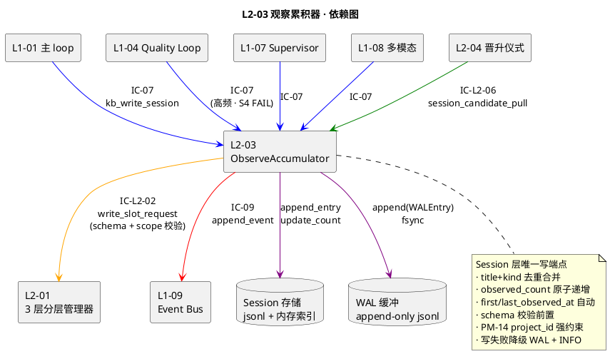
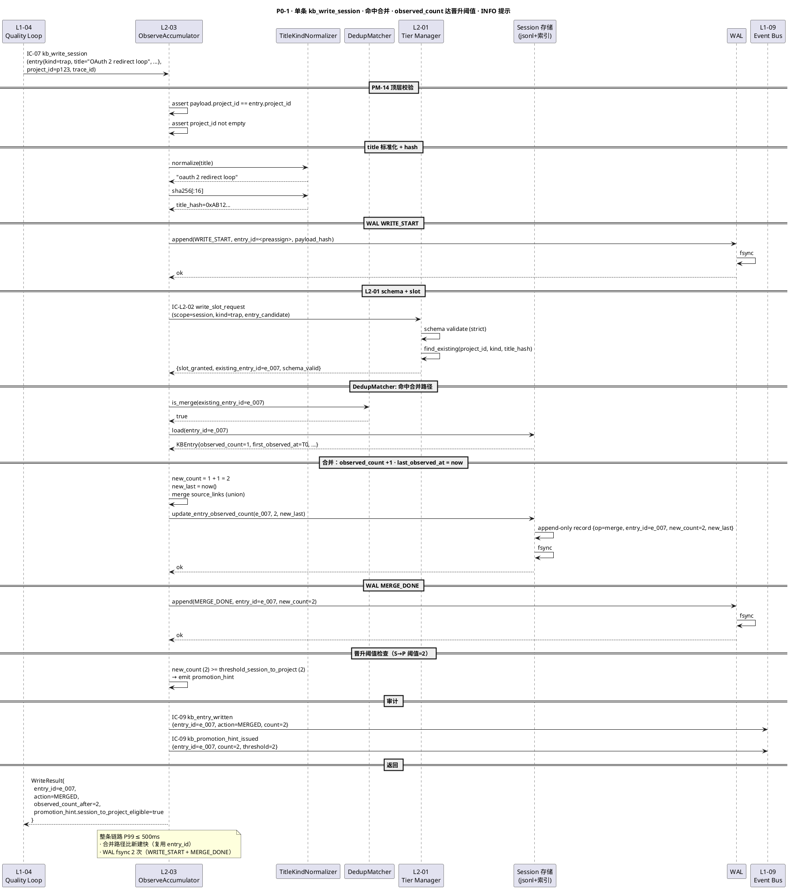
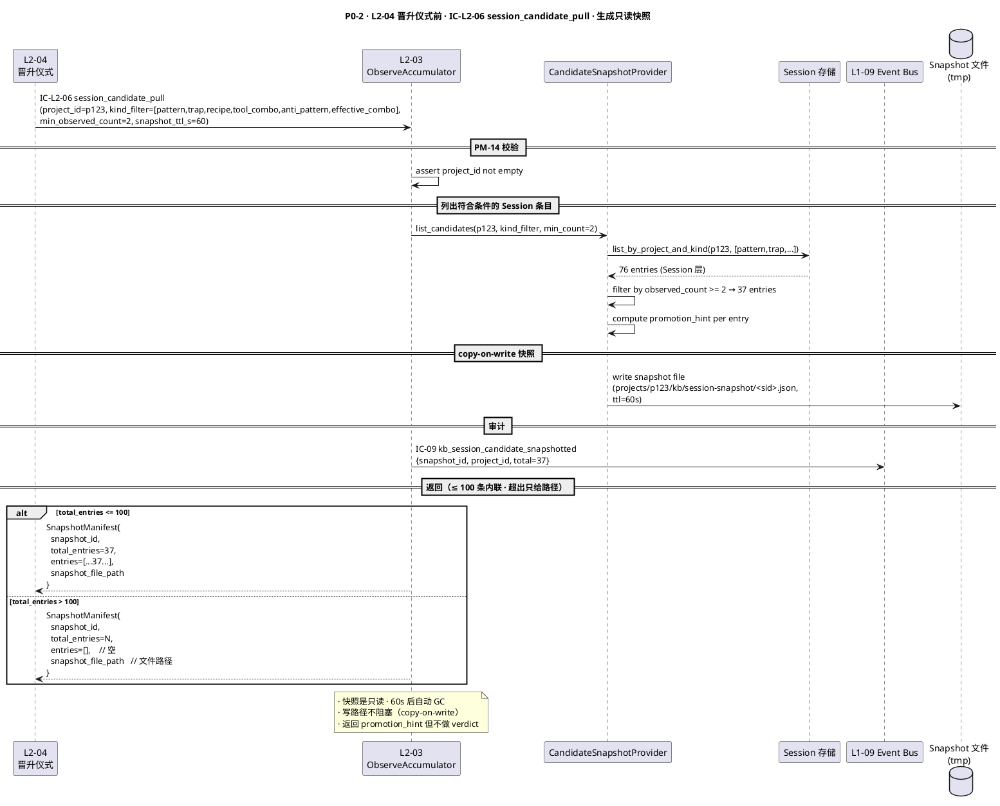
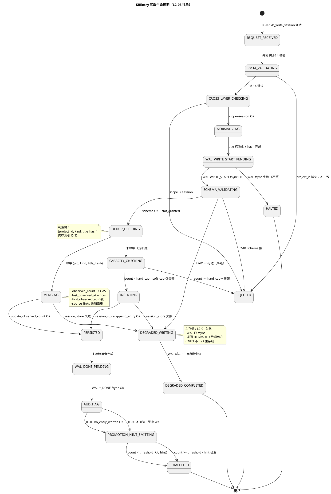
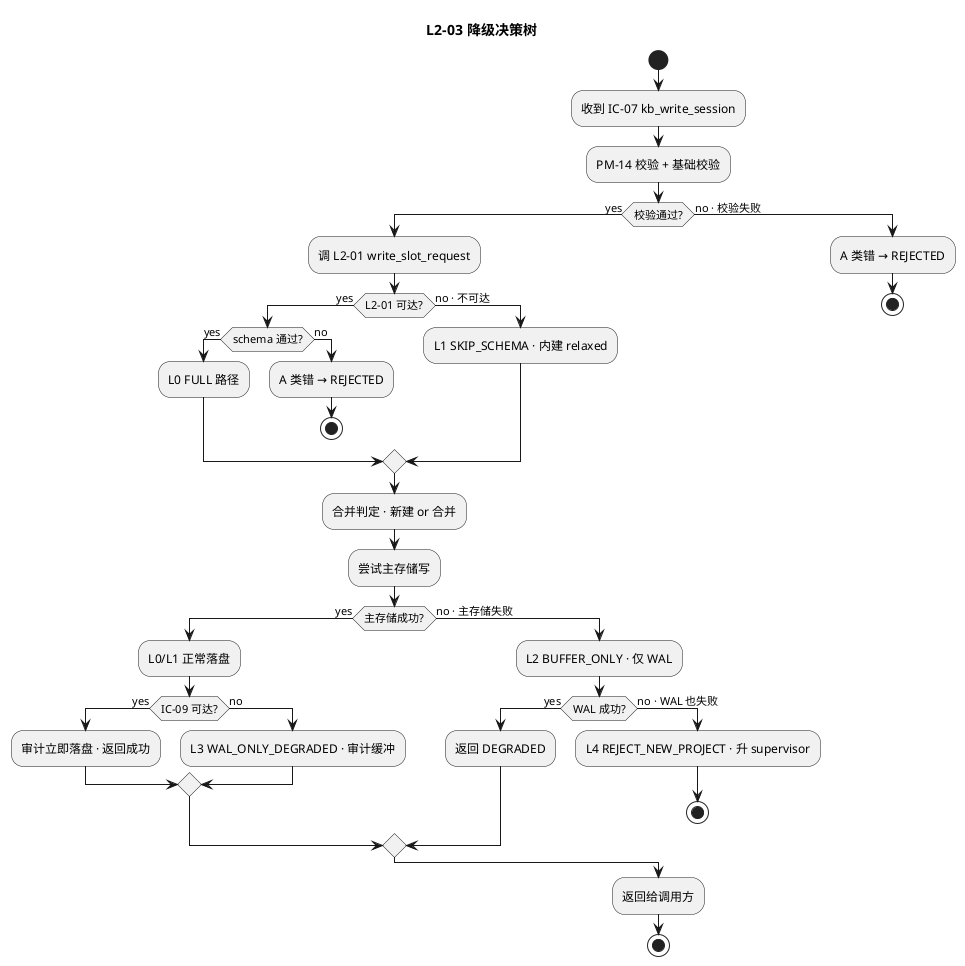

# L1-06 L2-03 · 观察累积器 · Tech Design

> **本文档定位**：3-1-Solution-Technical 层级 · L1-06 的 L2-03 观察累积器 技术实现方案（L2 粒度）。
> **与产品 PRD 的分工**：2-prd/L1-06 3层知识库/prd.md §5.6 的对应 L2 节定义产品边界，本文档定义**技术实现**（接口字段级 schema + 算法伪代码 + 底层数据结构 + 状态机 + 配置参数）。
> **与 L1 architecture.md 的分工**：architecture.md 负责**跨 L2 架构 + 跨 L2 时序**，本文档负责**本 L2 内部技术细节**。冲突以 architecture.md 为准。
> **严格规则**：本文档不复述产品 PRD 文字（职责 / 禁止 / 必须等清单），只做技术映射 + 补齐"产品视角未说 but 工程师必须知道"的部分（具体算法 · syscall · schema · 配置）。

---

## §0 撰写进度

- [x] §1 定位 + 2-prd §5.6 L2-03 映射
- [x] §2 DDD 映射（引 L0/ddd-context-map.md BC-06）
- [x] §3 对外接口定义（字段级 YAML schema + 错误码）
- [x] §4 接口依赖（被谁调 · 调谁）
- [x] §5 P0/P1 时序图（PlantUML ≥ 2 张）
- [x] §6 内部核心算法（伪代码）
- [x] §7 底层数据表 / schema 设计（字段级 YAML）
- [x] §8 状态机（PlantUML + 转换表）
- [x] §9 开源最佳实践调研（≥ 3 GitHub 高星项目）
- [x] §10 配置参数清单
- [x] §11 错误处理 + 降级策略
- [x] §12 性能目标
- [x] §13 与 2-prd / 3-2 TDD 的映射表

---

## §1 定位 + 2-prd §5.6 L2-03 映射

### 1.1 本 L2 在 L1-06 3 层 KB 里的坐标

L1-06 3-Tier Knowledge Base 由 5 个 L2 组成，**L2-03 是 Session 层的唯一写路径执行器**（Aggregate Root = KBEntry 的写端聚合编辑），上游接收来自 L1-01/L1-04/L1-07/L1-08 的 `kb_write_session` 请求，下游驱动 L2-01 做分层位申请与 schema 校验、最终把增量落盘到 Session 物理存储 `task-boards/<project_id>/<task_id>.kb.jsonl`，并为 L2-04 晋升仪式提供"候选快照"接口。

```
  [L1-01 主 loop]  [L1-04 Quality Loop]  [L1-07 Supervisor]  [L1-08 多模态]
         │                │                      │                   │
         │ IC-07          │ IC-07                │ IC-07             │ IC-07
         ▼                ▼                      ▼                   ▼
  ┌────────────────────────────────────────────────────────────────────┐
  │                  L2-03 · 观察累积器                                │
  │                  (Domain Service + Aggregate: KBEntry 写端)         │
  │                                                                    │
  │   ObserveAccumulator                                               │
  │     ├── TitleKindNormalizer       (title+kind 标准化 + 哈希)        │
  │     ├── DedupMatcher              (同类合并判定)                    │
  │     ├── ObservedCountIncrementer  (observed_count +1 · 原子递增)    │
  │     ├── TimestampMaintainer       (first/last_observed_at)         │
  │     ├── SchemaValidator           (委托 L2-01 schema 校验)          │
  │     ├── CandidateSnapshotProvider (为 L2-04 晋升仪式提供快照)       │
  │     └── AuditEmitter              (IC-09 append_event)              │
  └────────────────────────────────────────────────────────────────────┘
         │                │                │                │
         │ IC-L2-02       │ IC-09          │ IC-L2-06       │ 物理落盘
         ▼                ▼                ▼                ▼
      [L2-01]          [L1-09]          [L2-04]       Session 层 jsonl
```

L2-03 的定位 = **"Session 层 writer · 单一写入端点 · title+kind 去重合并 · observed_count 原子累计 · first/last_observed_at 自动维护 · 禁止越层 · 禁止 raw text · 必经 schema 校验 · 所有写必落审计"**。

### 1.2 与 2-prd §5.6 L2-03 的对应表

| 2-prd §5.6 L2-03 小节 | 本文档对应位置 | 技术映射重点 |
|:---|:---|:---|
| §10.1 职责（一句话：Session 层写聚合根） | §1.3 + §2 (ObserveAccumulator Domain Service · KBEntry Aggregate Root) | 聚合根写端 + schema 校验前置 |
| §10.2 输入 / 输出 | §3 字段级 schema | IC-07 kb_write_session 入参 / 返回结构化错误 |
| §10.3 边界 In-scope | §3 + §6.1 | Session 写 / 合并 / observed_count / 时间戳 / schema 校验 / 候选快照 |
| §10.3 边界 Out-of-scope | §6.1 + §11.2 | 不写 Project/Global / 不 rerank / 不读 / 不 NLP 抽取 |
| §10.4 约束（PM-06 + 硬约束 1-6） | §7.2 + §10 | 7 天生命期 / schema 必跑 / count 自动 / 同类合并 / 不越层 / 不拒绝满时新写 |
| §10.5 禁止行为（7 条） | §6.1 + §11 | 技术层强制拦截（拒绝 Project/Global scope / 拒绝 raw text / 拒绝 count 覆盖） |
| §10.6 必须职责（6 条） | §6 算法 + §3 schema | schema 校验 / 合并 / 时间戳 / 快照 / 审计 / 降级 |
| §10.7 可选功能职责 | §6.2 批量 + §6.4 fuzzy normalize + §10 配置 | 批量写入 · normalize 判重 · 阈值提示 · 审计分级 |
| §10.8 与其他 L2/L1 交互 | §4 依赖图 | 4 个 IC 触点（IC-07 入 / IC-L2-06 入 / IC-L2-02 出 / IC-09 出） |
| §10.9 交付验证大纲 | §13 + §3.1 错误码表 | Given-When-Then → 错误码 + 3-2 TDD |

### 1.3 本 L2 在 architecture.md 里的坐标

引 `docs/3-1-Solution-Technical/L1-06-3层知识库/architecture.md §10.3 "L2-03 观察累积器分工"`：

```
  [读链路 L2-02 + L2-05]                   [晋升链路 L2-04]
            │                                     │
            │                                     │ IC-L2-06 (pull)
            │                                     │
            ▼                                     ▼
  ┌───────────────────────────────────────────────────────┐
  │                  L2-03 观察累积器                     │
  │  (Session 层唯一写端点 · 为 L2-04 提供候选快照)        │
  └───────────────────────────────────────────────────────┘
                          │
                          │ IC-L2-02 (pre-write validation)
                          ▼
  ┌───────────────────────────────────────────────────────┐
  │                  L2-01 3 层分层管理器 (底座)           │
  │  (scope 优先级 · 分层位申请 · schema 校验)             │
  └───────────────────────────────────────────────────────┘
                          │
                          ▼
              Session 物理存储（jsonl）
         task-boards/<project_id>/<task_id>.kb.jsonl
```

**本 L2 的关键特征**（对 L1-06 整体而言）：

1. **Session 层唯一合法 writer**：Project/Global 无直接写路径，只能从 Session 经 L2-04 晋升而来（architecture §3.2 规则 3）。
2. **聚合根写端**：KBEntry 的"合并 vs 新建"决策、observed_count 原子递增、first/last_observed_at 时间戳，全部由本 L2 独占维护（BC-06 一致性边界）。
3. **非读端**：读请求全部走 L2-02；本 L2 不提供任意查询接口，仅为 L2-04 提供**按 project_id 的候选快照**（只读）。
4. **前置校验**：写路径的第一步必须先调 L2-01 做 schema 校验 + 分层位申请；失败即拒绝，**禁止"尽力写入"**。
5. **合并优先于新建**：若存在相同 `(project_id, kind, title_hash)` 的 Session 条目，必须执行合并；禁止产生两条独立条目。
6. **写必落审计**：每次写事件（新建 / 合并 / 失败 / 降级）必走 IC-09 append_event，否则审计链断裂（BC-06 ↔ BC-09 Partnership 不可破坏）。
7. **高频热路径**：S4 Quality Loop FAIL 场景下支持 10+ 条/秒的突发写入；底层使用 append-only jsonl + 内存索引避免卡主 loop。

### 1.4 本 L2 的 PM-14 约束（PM-14 项目上下文）

**PM-14 约束**（引 `docs/3-1-Solution-Technical/projectModel/tech-design.md §3 PM-14 项目根键规范`）：所有 IC payload 顶层必须带 `project_id`；所有 Session 层持久化路径按 `projects/<pid>/...` 或 `task-boards/<pid>/<tid>.kb.jsonl` 分片；跨 project 写请求必被拒绝。

本 L2 在 PM-14 层面的具体落点：

| 落点 | 路径 / 字段 | 说明 |
|:---|:---|:---|
| 写入请求顶层 | IC-07 入参 `project_id: string` | 必填 · 与 target entry 的 project_id 必须一致 |
| Session 物理存储 | `task-boards/<project_id>/<task_id>.kb.jsonl` | 按 project_id + task_id 双层分片 |
| 候选快照路径 | `projects/<project_id>/kb/session-snapshot/<snapshot_id>.json` | 为 L2-04 晋升仪式提供的临时只读文件 |
| WAL 日志 | `projects/<project_id>/kb/wp-write/wal/<date>.jsonl` | 写路径崩溃安全 |
| 内存索引键 | `(project_id, kind, title_hash)` | 合并判重必带 project_id |
| 审计事件 | `L1-06:kb_entry_written { project_id, ... }` | 必落事件总线 |

**PM-14 硬约束**：调用方传入的 `entry.project_id` 与 IC-07 顶层 `project_id` 不一致 → 拒绝 + 错误码 `E_L203_PM14_PROJECT_ID_MISMATCH`。

### 1.5 关键技术决策（本 L2 特有 · Decision / Rationale / Alternatives / Trade-off）

| 决策 | 选择 | 备选 | 理由 | Trade-off |
|:---|:---|:---|:---|:---|
| **D1: 本 L2 是否持有聚合根** | 是（KBEntry 写端 · Session 层的聚合写边界） | 纯 Domain Service 无聚合 | observed_count 的原子递增 + first/last_observed_at 的强一致必须单一所有权 | 牺牲无状态性，但换来一致性 |
| **D2: 合并判重粒度** | `(project_id, kind, title_hash)` 三元组 | title 原文 / kind+title 无 project | PM-14 强约束：跨 project 不应"合并"为同一条目 | 多一个哈希字段，索引更大（可接受） |
| **D3: title 标准化** | lowercase + trim + 连续空白合一 | 原文严格比 / 模糊 fuzzy（levenshtein） | 经验取中：严格导致"空格差异"误判新建，fuzzy 成本高 + 语义难控 | 少数真正不同的条目被误合并（监控报警） |
| **D4: observed_count 递增方式** | 内存原子 CAS + 落盘 fsync per 合并 | append-only 后台聚合 / DB 事务 | M6 不引 DB；单进程 + lock 足够 | 写放大；高频时由 WAL 缓冲吸收 |
| **D5: 物理存储格式** | jsonl（append-only）+ 内存索引 | YAML 整文件读写 / SQLite FTS5 | jsonl append 最便宜；内存索引只在进程启动时从 jsonl 扫一次重建 | 规模 > 10K 条目后需上 SQLite（见 §11.6 升级路径） |
| **D6: 失败策略** | 降级写 + 审计 + INFO，不 halt 主系统 | 抛异常阻塞主 loop / 静默丢弃 | PRD §10.4 硬约束 6："不拒绝 Session 满时的新写" + §10.5 "写失败降级" | 某些写丢失（有审计可追） |
| **D7: 候选快照接口** | 按 project_id 读 Session 条目 + 过滤 kind + 带 observed_count | 实时推送给 L2-04 / 全量导出 | L2-04 晋升仪式低频（S7 触发），实时不必要 | 快照时刻与晋升时刻略有延迟（通常 <1s） |
| **D8: 批量写支持** | 是（max_batch=50） | 仅单条 / 无限批量 | S4 FAIL 场景一次多条；batch 摊销 fsync 成本 | 一批中单条失败不影响其他（best-effort） |
| **D9: 时间戳来源** | 系统单调时钟 UTC + 纳秒级 | 请求方传入 / 全局时钟服务 | PM-14 + PM-08 审计需要系统权威时间；避免请求方伪造 | 跨机器时钟漂移（M6 单机暂不管） |
| **D10: 容量告警** | 软阈值（count > 1000 / project）发 INFO，硬上限 10000 拒绝 | 无上限 / 低阈值直接拒绝 | 防止 Session 层膨胀压垮 JSONL 重建 | 超过硬上限期间的新写被拒（概率极低） |

### 1.6 本 L2 读者预期

读完本 L2 的工程师应掌握：

- ObserveAccumulator Domain Service 的 4 个 IC 触点字段级 schema + 12 个错误码
- 8 个算法的伪代码（含 title 标准化 / 合并判重 / observed_count 原子递增 / 时间戳维护 / 候选快照生成 / WAL 崩溃恢复 / 批量写 / 容量监控）
- 3 张数据表（KBEntry-Session schema / WAL schema / SnapshotIndex schema），所有按 `projects/<pid>/...` 分片（PM-14）
- KBEntry 写端生命周期状态机（PlantUML ≥ 6 状态）
- 降级链 4 级（FULL → SKIP_SNAPSHOT → BUFFER_ONLY → REJECT_NEW_PROJECT）
- SLO（write P99 ≤ 500ms · merge P99 ≤ 200ms · snapshot P99 ≤ 2s · 突发 10 QPS 无背压）

### 1.7 本 L2 不在的范围（YAGNI · 防职责蔓延）

- **不在**：Project/Global 层的写（只能由 L2-04 晋升写）
- **不在**：读操作（由 L2-02 承担）
- **不在**：rerank / 检索（由 L2-05 承担）
- **不在**：分层规则 / scope 优先级维护（由 L2-01 承担）
- **不在**：自然语言抽取（调用方必须传结构化条目）
- **不在**：向量检索 / embedding（V1 不做）
- **不在**：跨项目共享（Project 层严格按 project_id 隔离，Global 通过晋升）
- **不在**：条目过期扫描（由 L2-01 定时任务做）
- **不在**：条目级权限管理（V1 按项目级）

### 1.8 本 L2 术语表

| 术语 | 定义 | 关联 |
|:---|:---|:---|
| KBEntry | 知识库条目聚合根 · 含 id / scope / kind / title / content / applicable_context / observed_count / first_observed_at / last_observed_at / source_links | §2.2 |
| title_hash | title 标准化后 sha256 前 16 字节 hex | §6.1 D3 |
| 合并（merge） | 对已存在的同 (project_id, kind, title_hash) Session 条目做 observed_count +1 + last_observed_at 更新 | §6.2 |
| 新建（insert） | 无匹配时创建新 Session 条目 · observed_count=1 · first/last_observed_at=now | §6.2 |
| 候选快照 | 供 L2-04 晋升仪式消费的只读、project 维度、按 kind 过滤的 Session 条目列表 | §6.7 |
| WAL | 写路径崩溃安全 append-only 日志 | §6.8 |
| Session 满 | project 维度 count > `soft_cap` 阈值（默认 1000）或 > `hard_cap`（默认 10000） | §10 |
| Normalize | 对 title 做 lowercase + trim + 连续空白合一 | §6.1 |

### 1.9 本 L2 的 DDD 定位一句话

> **L2-03 是 BC-06 3-Tier KB 的 Session 写端聚合 · Domain Service + Aggregate Root (KBEntry) · 合并优先于新建 · observed_count 原子累计 · first/last_observed_at 自动维护 · schema 校验前置必经 · 不越层 · 所有写必落审计。**

---

## §2 DDD 映射（BC-06 3-Tier Knowledge Base · Aggregate 层）

引 `docs/3-1-Solution-Technical/L0/ddd-context-map.md BC-06`（§2.7）+ `§4.6 L1-06 aggregate 分类`。

本 L2 在 BC-06 3-Tier Knowledge Base 里属于 **Domain Service + Aggregate Root (KBEntry) 的写端**（引 architecture.md §2.3）。它持有 KBEntry 聚合根的**写聚合一致性边界**（同 id 合并而非新建 · observed_count +1 的强一致性），但不持有读写全能（读由 L2-02 / 晋升由 L2-04）。

### 2.1 Domain Service · ObserveAccumulator

**职责**：接收 kb_write_session → 校验 → 合并判定 → 新建或合并 → 更新时间戳 → 落盘 → 审计

**本质**：Domain Service + 持有 KBEntry Aggregate 的写路径锁

**关键字段**（依赖注入 + 内部状态）：
```yaml
dependencies:
  tier_manager_client:             # L2-01 调用句柄
  event_bus_client:                # L1-09 IC-09
  session_store:                   # Session 层物理存储（jsonl writer + 内存索引）
  wal_buffer:                      # 崩溃安全 WAL
  clock:                           # 系统单调时钟（UTC 纳秒）
  hasher:                          # sha256 hasher

config:
  merge_normalize_enabled: true
  soft_cap_per_project: 1000
  hard_cap_per_project: 10000
  batch_max_size: 50
  fsync_every_n: 1
  promotion_threshold_session_to_project: 2
  snapshot_kinds_default: [pattern, trap, recipe, tool_combo, anti_pattern, effective_combo]
```

**行为**（Methods）：

| 方法 | 输入 | 输出 | 作用 |
|:---|:---|:---|:---|
| `write_session(entry, project_id, trace_id)` | KBEntry proto + project_id | `WriteResult {id, observed_count_after, action}` | 单条写（新建 or 合并） |
| `batch_write_session(entries[], project_id, trace_id)` | 条目数组 | `BatchWriteResult {results[]}` | 批量写 best-effort |
| `provide_candidate_snapshot(project_id, kind_filter, trace_id)` | project_id + 过滤 | `SnapshotManifest {snapshot_id, entries[]}` | L2-04 拉取 |
| `crash_recover(project_id)` | project_id | `RecoveryReport` | 进程重启时重放 WAL |
| `capacity_probe(project_id)` | project_id | `CapacityReport` | 容量监控 |

### 2.2 Aggregate Root · KBEntry（Session 层写端视角）

**标识**：`entry_id: ulid`（时间有序 + 全局唯一 · 引 ddd-context-map §1.4）
**一致性边界**：同 `(project_id, kind, title_hash)` 的条目必合并 · observed_count 原子递增 · first_observed_at 不可变 · last_observed_at 单调递增

**字段**（字段级 YAML · Session 层写端视角）：
```yaml
entry_id: ulid                  # 写入时分配 · 合并时沿用已有
project_id: string              # PM-14 · 必填 · 与 IC 顶层一致
scope: "session"                # 固定 session（本 L2 只写 session）
kind: enum                      # 8 类白名单之一（见 §7.2）
title: string                   # 原文（展示用）
title_hash: bytes16             # lowercase+trim+collapse_spaces → sha256[:16]
content: map                    # 结构化字段（kind 特定）· 禁止 raw text
applicable_context: map         # 过滤匹配键（stage / task_type / tech_stack / ...）
observed_count: int             # 合并时 +1 · 新建时 1
first_observed_at: timestamp    # 创建时刻 · 不可变
last_observed_at: timestamp     # 每次合并更新
source_links: list[string]      # 溯源线（decision_id / verdict_id / ...）· 合并时追加
created_by: string              # "L1-01" | "L1-04" | "L1-07" | "L1-08"
```

**不变式（由 L2-03 保证）**：
1. `entry_id` 一旦分配，永不变更（合并复用）。
2. `first_observed_at` ≤ `last_observed_at`（时间单调）。
3. `observed_count` 严格单调递增 · 永不减。
4. `scope == "session"` 恒定（本 L2 只写 session）。
5. `project_id` 与 IC 顶层一致 · 跨 project 写被拒绝（PM-14）。
6. `title_hash` 由 content 中 title 字段 normalize + sha256 派生 · 不由调用方传入。
7. `source_links` 去重追加（set 语义）· 防止同来源重复登记。

### 2.3 Value Object · WriteResult

```yaml
entry_id: ulid
project_id: string              # PM-14
action: enum [INSERTED, MERGED, REJECTED, DEGRADED]
observed_count_after: int
first_observed_at: timestamp
last_observed_at: timestamp
was_normalized: bool            # title 做过标准化
source_merge_count: int         # 本次合并的 source_links 数量
trace_id: string
emit_at: timestamp
error:
  code: string
  message: string
  detail: map
```

### 2.4 Value Object · SnapshotManifest

```yaml
snapshot_id: ulid
project_id: string              # PM-14
requested_by: "L2-04"
requested_at: timestamp
kind_filter: list[string]
total_entries: int
entries:
  - entry_id:
    kind:
    title:
    observed_count:
    first_observed_at:
    last_observed_at:
    applicable_context:
    source_links_count: int
    promotion_hint:             # 本 L2 给出的晋升暗示（非裁决）
      session_to_project_eligible: bool   # observed_count >= 2
      evidence_sufficient: bool           # source_links_count >= 2
snapshot_file_path: string      # projects/<pid>/kb/session-snapshot/<sid>.json
ttl_s: int                      # 60s 后自动清理
```

### 2.5 Value Object · WALEntry

```yaml
wal_id: ulid
sequence_id: int                # 单 project 递增
project_id: string              # PM-14
operation: enum [WRITE_START, MERGE_DONE, INSERT_DONE, WRITE_REJECTED, WRITE_DEGRADED]
entry_id:                       # 目标条目 id
payload_hash:                   # 请求 payload sha256
prev_wal_hash:                  # hash chain
wal_hash:
written_at:
fsynced_at:
```

### 2.6 Repository（本 L2 的持久化接口）

```python
class SessionStoreRepository(abc.ABC):
    def append_entry(project_id: str, entry: KBEntry) -> None: ...
    def update_entry_observed_count(project_id: str, entry_id: str, new_count: int, last_at: datetime) -> None: ...
    def find_by_title_kind(project_id: str, kind: str, title_hash: bytes) -> KBEntry | None: ...
    def list_by_project_and_kind(project_id: str, kinds: list[str]) -> list[KBEntry]: ...
    def count_by_project(project_id: str) -> int: ...

class WALBufferRepository(abc.ABC):
    def append(entry: WALEntry) -> None: ...
    def fsync() -> None: ...
    def replay_from(project_id: str, sequence_id: int | None) -> list[WALEntry]: ...
```

### 2.7 Domain Events（本 L2 主动发出）

| Event | 触发 | Payload |
|:---|:---|:---|
| `L1-06:kb_entry_written` | 新建 / 合并成功 | `{entry_id, project_id, kind, scope=session, action, observed_count}` |
| `L1-06:kb_entry_write_rejected` | schema / 越层 / PM-14 校验失败 | `{project_id, error_code, reason}` |
| `L1-06:kb_entry_write_degraded` | 降级写（WAL 成功 / 主存储失败） | `{entry_id, project_id, reason, wal_sequence_id}` |
| `L1-06:kb_session_candidate_snapshotted` | L2-04 拉取快照完成 | `{snapshot_id, project_id, total_entries, kind_filter}` |
| `L1-06:kb_session_capacity_warning` | count > soft_cap | `{project_id, count, soft_cap}` |
| `L1-06:kb_session_capacity_rejected` | count > hard_cap 且新写 | `{project_id, count, hard_cap}` |
| `L1-06:kb_promotion_hint_issued` | 合并后 observed_count 达晋升阈值 | `{entry_id, project_id, count, threshold}` |

### 2.8 与兄弟 L2 / 跨 BC 关系

| 对端 | 方向 | IC | 语义 |
|:---|:---|:---|:---|
| **L2-01 3 层分层管理器** | L2-03 → L2-01 | IC-L2-02 write_slot_request | 写入前申请 scope + schema 校验 |
| **L2-04 晋升仪式执行器** | L2-04 → L2-03 | IC-L2-06 session_candidate_pull | 晋升仪式前拉 Session 候选快照 |
| **L1-01 主 loop** | L1-01 → L2-03 | IC-07 kb_write_session | 决策链发现新观察 |
| **L1-04 Quality Loop** | L1-04 → L2-03 | IC-07 kb_write_session | S4 FAIL 汇总 / anti_pattern / trap |
| **L1-07 Supervisor** | L1-07 → L2-03 | IC-07 kb_write_session | 软红线识别新发现 anti_pattern |
| **L1-08 多模态** | L1-08 → L2-03 | IC-07 kb_write_session | 代码分析结果 project_context |
| **L1-09 韧性+审计** | L2-03 → L1-09 | IC-09 append_event | 所有写事件落盘 |

---

## §3 对外接口定义（字段级 YAML schema + 错误码）

**本 L2 对外暴露 4 个方法 + 1 个内部辅助**：

### 3.1 IC-07 `kb_write_session`（入站 · 对所有调用方）

**方向**：L1-01 / L1-04 / L1-07 / L1-08 → L2-03

**Input**：
```yaml
ic_id: "IC-07"
ic_version: "v1.0"
emitted_at: "2026-04-22T10:30:00Z"
emitted_by: "L1-04.L2-05"          # 调用方标识
project_id: "ulid"                  # PM-14 顶层必填
trace_id: "ulid"
idempotency_key: "sha256-hex"       # 同 key 重放幂等
entry:
  kind: "trap" | "pattern" | "recipe" | "tool_combo" | "anti_pattern" | "project_context" | "external_ref" | "effective_combo"
  title: "string · 原文 · ≤ 200 字符"
  content:
    # kind 特定字段（由 L2-01 schema 校验）
    # 例 kind=trap:
    trigger: "string"
    symptom: "string"
    mitigation: "string"
    severity: "low" | "medium" | "high"
  applicable_context:
    stage: ["S1"|"S2"|"S3"|"S4"|"S5"|"S6"|"S7"]
    task_type: ["design"|"coding"|"testing"|"review"|...]
    tech_stack: ["python"|"typescript"|...]
  source_links:                     # 溯源（≥ 1 条）
    - "decision:<decision_id>"
    - "verdict:<verdict_id>"
    - "verifier_report:<report_id>"
  created_by: "L1-04.L2-05"         # 显式
```

**Output · 成功**：
```yaml
success: true
action: "INSERTED" | "MERGED"
entry_id: "ulid"
project_id: "ulid"
observed_count_after: 4
first_observed_at: "2026-04-20T08:15:00Z"
last_observed_at: "2026-04-22T10:30:00.123Z"
was_normalized: true
promotion_hint:
  session_to_project_eligible: true   # count >= 2
  threshold: 2
trace_id: "ulid"
audit_event_id: "ulid"
```

**Output · 拒绝**：
```yaml
success: false
action: "REJECTED"
error:
  code: "E_L203_SCHEMA_VALIDATION_FAILED"
  message: "entry.content missing required field 'trigger' for kind=trap"
  detail:
    missing_fields: [trigger]
    kind: trap
    schema_version: "v1.0"
trace_id: "ulid"
audit_event_id: "ulid"
```

**错误码表**（≥ 12 条 · 硬约束满足）：

| 错误码 | 含义 | 触发条件 | 调用方处理 |
|:---|:---|:---|:---|
| `E_L203_SCHEMA_VALIDATION_FAILED` | schema 校验失败 | entry 字段不符 schema（缺必填 / 类型错 / 枚举外值） | 修正请求后重试；审计 |
| `E_L203_PM14_PROJECT_ID_MISMATCH` | IC 顶层 project_id 与 entry 不一致 | PM-14 校验 | 修正 project_id；审计 |
| `E_L203_PM14_PROJECT_ID_MISSING` | 顶层 project_id 为空 | PM-14 必填 | 必填；审计 |
| `E_L203_CROSS_LAYER_DENIED` | 调用方 scope=project/global | 越层写请求（硬约束 5） | 走 L2-04 晋升仪式；审计 |
| `E_L203_RAW_TEXT_DENIED` | content 是自然语言文本而非结构化 | 自由文本检测（非 map） | 调用方自行结构化后重试 |
| `E_L203_COUNT_OVERRIDE_IGNORED` | 调用方传入 observed_count | 硬约束 3 | 忽略传入值 · 按实际累计 · 审计 |
| `E_L203_KIND_NOT_WHITELISTED` | kind 不在 8 类白名单 | scope §5.6.5 禁止清单 | 修正 kind |
| `E_L203_TITLE_EMPTY_OR_TOO_LONG` | title 为空或 > 200 字符 | 格式约束 | 修正；审计 |
| `E_L203_SOURCE_LINKS_EMPTY` | source_links 为空 | 必须至少 1 条溯源 | 补溯源；审计 |
| `E_L203_CAPACITY_SOFT_WARNING` | count > soft_cap · 仍写成功 | 非阻塞告警 | 无需处理；UI 提示 |
| `E_L203_CAPACITY_HARD_REJECTED` | count > hard_cap · 新建被拒 | 硬上限保护（合并不受影响） | 降级或晋升释放空间 |
| `E_L203_IDEMPOTENCY_KEY_CONFLICT` | idempotency_key 命中不同 payload | 重放幂等冲突 | 定位冲突请求；审计 |
| `E_L203_STORAGE_WRITE_FAILED` | 底层存储写失败 | 磁盘 / 权限 | 降级写 WAL + INFO（不 halt） |
| `E_L203_WAL_WRITE_FAILED` | WAL 写失败 | 磁盘 / 权限 / fsync | HALT 本次写 + 升 supervisor |
| `E_L203_TIER_MANAGER_UNAVAILABLE` | L2-01 不可达 | IC-L2-02 失败 | 降级绕过（尽力写） + INFO |

### 3.2 IC-L2-06 `session_candidate_pull`（入站 · L2-04 调）

**方向**：L2-04 → L2-03

**Input**：
```yaml
ic_id: "IC-L2-06"
ic_version: "v1.0"
emitted_at: "2026-04-22T11:00:00Z"
emitted_by: "L1-06.L2-04"
project_id: "ulid"                  # PM-14
trace_id: "ulid"
kind_filter: ["pattern", "trap", "recipe", "tool_combo", "anti_pattern", "effective_combo"]
min_observed_count: 2               # 默认 Session→Project 阈值
include_hint: true
snapshot_ttl_s: 60
```

**Output · 成功**：
```yaml
success: true
snapshot_id: "ulid"
snapshot_file_path: "projects/<pid>/kb/session-snapshot/<snapshot_id>.json"
project_id: "ulid"
total_entries: 37
kind_breakdown:
  pattern: 10
  trap: 8
  recipe: 5
  tool_combo: 4
  anti_pattern: 6
  effective_combo: 4
entries:                            # 内联（≤ 100 条）· 否则只给 file_path
  - entry_id: "ulid"
    kind: "trap"
    title: "string"
    observed_count: 3
    first_observed_at: "..."
    last_observed_at: "..."
    applicable_context: {...}
    source_links_count: 3
    promotion_hint:
      session_to_project_eligible: true
expires_at: "..."                   # snapshot_ttl_s 后
trace_id: "ulid"
audit_event_id: "ulid"
```

**错误码**：
| 错误码 | 含义 | 触发 | 恢复 |
|:---|:---|:---|:---|
| `E_L203_SNAPSHOT_PROJECT_NOT_FOUND` | project 无 Session 条目 | 新项目 | 返回空清单 · 非错误 |
| `E_L203_SNAPSHOT_KIND_EMPTY` | kind_filter 空 | 调用方错 | 修正 kind_filter |
| `E_L203_SNAPSHOT_STORAGE_READ_FAILED` | jsonl 读失败 | 磁盘 | 重试 3 次 · 失败返回 error |
| `E_L203_SNAPSHOT_TOO_LARGE` | entries > 10000 | 规模异常 | 仅返回 file_path · 不内联 |

### 3.3 IC-L2-02 `write_slot_request`（出站 · 本 L2 调 L2-01）

**方向**：L2-03 → L2-01

**Input**：
```yaml
ic_id: "IC-L2-02"
ic_version: "v1.0"
project_id: "ulid"                  # PM-14
trace_id: "ulid"
scope: "session"                    # 固定
kind: "trap"                        # 8 类白名单
entry_candidate:
  title_hash: "bytes16"
  content: {...}
  applicable_context: {...}
schema_validation: "strict"         # 严格模式
```

**Output · 成功**：
```yaml
success: true
slot_granted: true
scope_resolved: "session"
schema_valid: true
suggested_entry_id: "ulid"          # 预分配（INSERT 时用）
existing_entry_id:                  # 若命中合并则填 · 否则 null
  value: "ulid" | null
validation_details:
  fields_validated: 12
  warnings: []
```

**错误码**：
| 错误码 | 含义 | 触发 | 恢复 |
|:---|:---|:---|:---|
| `E_L203_L201_SCHEMA_INVALID` | L2-01 拒绝 · schema 不符 | 校验失败 | 透传给调用方 `E_L203_SCHEMA_VALIDATION_FAILED` |
| `E_L203_L201_SLOT_DENIED` | L2-01 拒绝 · scope/kind 越层 | 调用 scope != session | 透传 `E_L203_CROSS_LAYER_DENIED` |
| `E_L203_L201_UNAVAILABLE` | L2-01 不可达 | 进程死 / 超时 | 降级（§11.3）· 审计 |

### 3.4 IC-09 `append_event`（出站 · 本 L2 调 L1-09）

**方向**：L2-03 → L1-09

**Input**：
```yaml
ic_id: "IC-09"
ic_version: "v1.0"
emitted_at:
emitted_by: "L1-06.L2-03"
project_id: "ulid"                  # PM-14
stream: "L1-06.L2-03.write"
event_type:
  - "kb_entry_written"
  - "kb_entry_write_rejected"
  - "kb_entry_write_degraded"
  - "kb_session_candidate_snapshotted"
  - "kb_session_capacity_warning"
  - "kb_session_capacity_rejected"
  - "kb_promotion_hint_issued"
payload:
  entry_id:
  project_id:
  kind:
  scope: "session"
  action: "INSERTED" | "MERGED" | "REJECTED" | "DEGRADED"
  observed_count:
  error_code:
trace_id:
```

**错误码**：
| 错误码 | 含义 | 恢复 |
|:---|:---|:---|
| `E_L203_L109_UNAVAILABLE` | L1-09 事件总线不可达 | WAL 缓冲 · L1-09 恢复后回放 |
| `E_L203_L109_BACKPRESSURE` | L1-09 反压 | 等待 + 重试（jitter） |

### 3.5 内部辅助 · `crash_recover`（本 L2 内部 · 进程重启时调）

**Input**：
```yaml
project_id: "ulid"
last_known_sequence_id: int | null
trace_id: "ulid"
```

**Output**：
```yaml
replay_entries_count: int
reconstructed_index_entries: int
failed_replays:
  - wal_id:
    reason:
reconstruction_took_ms:
```

---

## §4 接口依赖（被谁调 · 调谁）

### 4.1 上游（调本 L2）

| 调用方 | 方法 | 触发 | 频次 |
|:---|:---|:---|:---|
| **L1-01 主 loop** | IC-07 kb_write_session | 决策链发现新 pattern/trap | 低频（每 tick ≤ 1） |
| **L1-04 Quality Loop** | IC-07 kb_write_session | S4 FAIL 汇总 / S5 verifier_report trap | **高频**（FAIL 场景 10+/秒） |
| **L1-07 Supervisor** | IC-07 kb_write_session | 软红线识别新 anti_pattern | 低频 |
| **L1-08 多模态** | IC-07 kb_write_session | 代码结构摘要写 project_context | 中频（首次分析） |
| **L2-04 晋升仪式** | IC-L2-06 session_candidate_pull | S7 批量晋升前 | 低频（每项目 1-2 次 / S7） |

### 4.2 下游（本 L2 调）

| 被调方 | IC | 频次 | 必达要求 |
|:---|:---|:---|:---|
| **L2-01 3 层分层管理器** | IC-L2-02 write_slot_request | 每次写 · 每次快照 | 必达 · 不可达即降级 |
| **L1-09 韧性+审计** | IC-09 append_event | 每次写成功 / 失败 / 降级 | 必达 · 不可达用 WAL 缓冲 |
| **Session 物理存储** | 直接 I/O（jsonl append） | 每次写 · 每次合并 | 必达 · 失败降级 WAL |

### 4.3 依赖图（PlantUML）



### 4.4 并发约束

- **同一 `(project_id, kind, title_hash)` 三元组全局 serializable**（合并判定必须原子 · 使用 fine-grained 锁）
- **不同三元组可并发**（锁粒度到三元组，不到 project）
- **快照接口对写路径不阻塞**（快照读内存索引 + jsonl snapshot copy-on-write）
- **单 project 写 QPS 上限**：默认 50（超出排队），硬上限 200
- **全局写 QPS 上限**：默认 500（M6 单机）

### 4.5 依赖降级策略速查

| 依赖 | 降级行为 | 对外表现 |
|:---|:---|:---|
| L2-01 不可达 | 绕过 schema 校验 + 内建 relaxed-schema（最低字段检查） + INFO 告警 | 返回 DEGRADED · 审计 |
| L1-09 Event Bus 不可达 | 审计写 WAL · 恢复后回放 | 写仍成功 · 审计延迟落盘 |
| Session 存储写失败 | 写 WAL + INFO · 主循环不 halt | 返回 DEGRADED · 下次进程启动恢复 |
| WAL 写失败 | 严重 · 拒绝本次写 · 升 supervisor | 返回 REJECTED + 硬错误 |

---

## §5 P0/P1 时序图（PlantUML ≥ 2 张）

### 5.1 P0-1 · 单条写 · 命中合并 · 晋升阈值触发 hint



### 5.2 P0-2 · L2-04 拉取候选快照（S7 批量晋升前）



---

## §6 内部核心算法（伪代码）

本节给出 8 个核心算法伪代码（Python-like）。

### 6.1 主循环 · write_session（入口 · §3.1 的内部实现）

```python
def write_session(
    entry: KBEntryRequest,
    project_id: str,     # PM-14
    trace_id: str,
    idempotency_key: str
) -> WriteResult:
    """
    L2-03 主写入循环。
    硬约束:
      1. PM-14 project_id 必填 + 与 entry 一致
      2. scope 固定 session（禁止越层）
      3. observed_count 不接受调用方指定（§D4）
      4. 合并优先于新建
      5. schema 必经 L2-01 校验
    """
    # Step 1: PM-14 顶层校验
    if not project_id:
        return reject("E_L203_PM14_PROJECT_ID_MISSING")
    if entry.project_id and entry.project_id != project_id:
        return reject("E_L203_PM14_PROJECT_ID_MISMATCH")
    entry.project_id = project_id  # 强制统一

    # Step 2: 越层检查
    if entry.scope and entry.scope != "session":
        audit_emit("kb_entry_write_rejected", reason="cross_layer", scope=entry.scope)
        return reject("E_L203_CROSS_LAYER_DENIED")
    entry.scope = "session"

    # Step 3: 禁止 count 覆盖
    if "observed_count" in entry.as_dict():
        audit_emit("kb_entry_write_rejected", reason="count_override", code="E_L203_COUNT_OVERRIDE_IGNORED")
        # 按硬约束 3: 不拒绝 · 忽略传入值（既成事实只做审计）
        entry.observed_count = None  # strip

    # Step 4: 基础校验（kind / title / source_links）
    if entry.kind not in KIND_WHITELIST:       # 8 类
        return reject("E_L203_KIND_NOT_WHITELISTED")
    if not entry.title or len(entry.title) > 200:
        return reject("E_L203_TITLE_EMPTY_OR_TOO_LONG")
    if is_raw_text(entry.content):              # content 必须 map · 不是自由文本
        return reject("E_L203_RAW_TEXT_DENIED")
    if not entry.source_links or len(entry.source_links) == 0:
        return reject("E_L203_SOURCE_LINKS_EMPTY")

    # Step 5: 幂等键处理
    if existing := idempotency_cache.get(idempotency_key):
        return existing  # 直接返回上次结果

    # Step 6: title 标准化 + hash
    norm_title = normalize_title(entry.title)
    title_hash = sha256(norm_title.encode())[:16]

    # Step 7: WAL WRITE_START
    preassign_entry_id = ulid.new()
    wal.append(WALEntry(
        operation="WRITE_START",
        project_id=project_id,
        entry_id=preassign_entry_id,
        payload_hash=sha256_payload(entry),
    ))
    wal.fsync()

    # Step 8: L2-01 schema + slot request（IC-L2-02）
    try:
        slot_resp = tier_manager.write_slot_request(
            project_id=project_id,
            scope="session",
            kind=entry.kind,
            entry_candidate={
                "title_hash": title_hash,
                "content": entry.content,
                "applicable_context": entry.applicable_context,
            },
            schema_validation="strict",
        )
    except TierManagerUnavailableError:
        return degraded_write(entry, title_hash, preassign_entry_id, reason="L201_unavailable")

    if not slot_resp.schema_valid:
        audit_emit("kb_entry_write_rejected", reason="schema")
        return reject("E_L203_SCHEMA_VALIDATION_FAILED", slot_resp.validation_details)
    if not slot_resp.slot_granted:
        return reject("E_L203_CROSS_LAYER_DENIED")

    existing_id = slot_resp.existing_entry_id

    # Step 9: 容量检查
    cap = session_store.count_by_project(project_id)
    if existing_id is None and cap >= HARD_CAP:
        audit_emit("kb_session_capacity_rejected", count=cap)
        return reject("E_L203_CAPACITY_HARD_REJECTED")
    if cap >= SOFT_CAP:
        audit_emit("kb_session_capacity_warning", count=cap)
        # 不拒绝 · 继续（硬约束 6：不拒绝 Session 不满时的新写）

    # Step 10: 加细粒度锁（(project_id, kind, title_hash)）
    with merge_lock(project_id, entry.kind, title_hash):
        # Step 11: 合并 vs 新建
        if existing_id:
            result = merge_entry(existing_id, entry, project_id)
            action = "MERGED"
        else:
            result = insert_entry(preassign_entry_id, entry, project_id, title_hash)
            action = "INSERTED"

    # Step 12: WAL MERGE_DONE / INSERT_DONE
    wal.append(WALEntry(
        operation=f"{action}_DONE",
        project_id=project_id,
        entry_id=result.entry_id,
    ))
    wal.fsync()

    # Step 13: 审计
    audit_emit("kb_entry_written",
        entry_id=result.entry_id,
        project_id=project_id,
        kind=entry.kind,
        action=action,
        observed_count=result.observed_count_after,
    )

    # Step 14: 晋升阈值 hint
    if result.observed_count_after >= PROMOTION_THRESHOLD_S2P:
        audit_emit("kb_promotion_hint_issued",
            entry_id=result.entry_id,
            count=result.observed_count_after,
            threshold=PROMOTION_THRESHOLD_S2P,
        )
        result.promotion_hint.session_to_project_eligible = True

    # Step 15: 幂等缓存
    idempotency_cache.put(idempotency_key, result, ttl_s=3600)

    return result
```

### 6.2 合并 · merge_entry

```python
def merge_entry(existing_id: str, new_entry: KBEntryRequest, project_id: str) -> WriteResult:
    """
    合并路径：
      · observed_count +1（CAS）
      · last_observed_at = now
      · first_observed_at 不变
      · source_links 追加去重
    """
    existing = session_store.load(project_id, existing_id)
    new_count = existing.observed_count + 1  # 原子递增
    new_last = clock.now_utc_ns()
    merged_sources = dedup_union(existing.source_links, new_entry.source_links)

    # 原子更新（append-only 写一条 update 记录 + 索引更新）
    session_store.update_entry_observed_count(
        project_id=project_id,
        entry_id=existing_id,
        new_count=new_count,
        last_at=new_last,
        source_links=merged_sources,
    )
    session_store.fsync()

    return WriteResult(
        entry_id=existing_id,
        project_id=project_id,
        action="MERGED",
        observed_count_after=new_count,
        first_observed_at=existing.first_observed_at,
        last_observed_at=new_last,
        was_normalized=True,
        source_merge_count=len(merged_sources) - len(existing.source_links),
    )
```

### 6.3 新建 · insert_entry

```python
def insert_entry(
    new_entry_id: str,
    entry: KBEntryRequest,
    project_id: str,
    title_hash: bytes,
) -> WriteResult:
    """
    新建路径：
      · 分配新 entry_id
      · observed_count = 1
      · first_observed_at = last_observed_at = now
    """
    now = clock.now_utc_ns()
    kb_entry = KBEntry(
        entry_id=new_entry_id,
        project_id=project_id,  # PM-14
        scope="session",
        kind=entry.kind,
        title=entry.title,
        title_hash=title_hash,
        content=entry.content,
        applicable_context=entry.applicable_context,
        observed_count=1,
        first_observed_at=now,
        last_observed_at=now,
        source_links=list(set(entry.source_links)),
        created_by=entry.created_by,
    )
    session_store.append_entry(project_id, kb_entry)
    session_store.fsync()

    # 更新内存索引
    index_key = (project_id, entry.kind, title_hash)
    in_memory_index[index_key] = new_entry_id

    return WriteResult(
        entry_id=new_entry_id,
        project_id=project_id,
        action="INSERTED",
        observed_count_after=1,
        first_observed_at=now,
        last_observed_at=now,
        was_normalized=True,
        source_merge_count=0,
    )
```

### 6.4 title 标准化 · normalize_title

```python
def normalize_title(raw: str) -> str:
    """
    D3 决策：取中的标准化
      · lowercase
      · strip 首尾空白
      · 连续内部空白合一
      · NFKC unicode normalization（全角→半角 / 合字分解）
    不做：
      · levenshtein 模糊匹配（成本高 · 语义难控）
      · 词干提取（stemming）
      · 同义词替换
    """
    import unicodedata
    s = unicodedata.normalize("NFKC", raw)
    s = s.lower().strip()
    s = re.sub(r"\s+", " ", s)
    return s
```

---

### 6.5 合并判重 · DedupMatcher

```python
class DedupMatcher:
    """
    同类合并判定 · O(1) 查询（内存索引）
    索引键：(project_id, kind, title_hash)
    索引值：entry_id
    """
    def __init__(self, store: SessionStoreRepository):
        self.index: dict[tuple, str] = {}  # in-memory
        self._bootstrap_from_disk(store)

    def find_existing(self, project_id: str, kind: str, title_hash: bytes) -> str | None:
        return self.index.get((project_id, kind, title_hash))

    def insert(self, project_id: str, kind: str, title_hash: bytes, entry_id: str) -> None:
        self.index[(project_id, kind, title_hash)] = entry_id

    def _bootstrap_from_disk(self, store: SessionStoreRepository) -> None:
        """
        进程启动时从 jsonl 扫描重建索引。
        时间复杂度 O(N)，N = Session 总条目数。
        M6 默认 < 10K 条目 · < 1s 完成。
        """
        for project_id in store.list_projects():
            for entry in store.scan_project(project_id):
                key = (project_id, entry.kind, entry.title_hash)
                # 最后一条 wins（append-only 语义）
                self.index[key] = entry.entry_id
```

### 6.6 批量写 · batch_write_session（可选功能 · §10.7）

```python
def batch_write_session(
    entries: list[KBEntryRequest],
    project_id: str,
    trace_id: str,
) -> BatchWriteResult:
    """
    批量写：best-effort · 一条失败不影响其他
    硬上限：batch_max_size=50（§10）
    性能：摊销 fsync 成本 · 单次 fsync 覆盖整批
    """
    if len(entries) > BATCH_MAX_SIZE:
        return reject_batch("E_L203_BATCH_TOO_LARGE", max_size=BATCH_MAX_SIZE)

    results = []
    for e in entries:
        try:
            r = write_session_no_fsync(e, project_id, trace_id, e.idempotency_key)
            results.append(r)
        except Exception as ex:
            results.append(WriteResult(
                action="REJECTED",
                error={"code": "E_L203_BATCH_ITEM_FAILED", "message": str(ex)},
            ))

    # 摊销 fsync · 批次末尾一次
    session_store.fsync()
    wal.fsync()

    return BatchWriteResult(
        total=len(entries),
        inserted=sum(1 for r in results if r.action == "INSERTED"),
        merged=sum(1 for r in results if r.action == "MERGED"),
        rejected=sum(1 for r in results if r.action == "REJECTED"),
        results=results,
    )
```

### 6.7 候选快照 · provide_candidate_snapshot

```python
def provide_candidate_snapshot(
    project_id: str,        # PM-14
    kind_filter: list[str],
    min_observed_count: int,
    ttl_s: int,
    trace_id: str,
) -> SnapshotManifest:
    """
    L2-04 晋升仪式前调用 · 只读快照
    · copy-on-write（内存快照 · 不阻塞写路径）
    · 仅返回符合阈值的 Session 条目
    · 输出 promotion_hint（非 verdict）
    """
    if not project_id:
        return reject_snapshot("E_L203_SNAPSHOT_PROJECT_NOT_FOUND")
    if not kind_filter:
        return reject_snapshot("E_L203_SNAPSHOT_KIND_EMPTY")

    # Step 1: 内存索引 O(N) 扫描（N 通常 < 1000）
    matched_entries = []
    for (pid, kind, th), eid in dedup_matcher.index.items():
        if pid != project_id:
            continue
        if kind not in kind_filter:
            continue
        entry = session_store.load(project_id, eid)  # O(1) 内存
        if entry.observed_count < min_observed_count:
            continue
        matched_entries.append(entry)

    # Step 2: 按 observed_count DESC 排（高频优先被晋升审查）
    matched_entries.sort(key=lambda e: (-e.observed_count, e.last_observed_at))

    # Step 3: copy-on-write 落盘（tmp 文件 + TTL）
    snapshot_id = ulid.new()
    file_path = f"projects/{project_id}/kb/session-snapshot/{snapshot_id}.json"
    write_json_atomic(file_path, [
        {
            "entry_id": e.entry_id,
            "kind": e.kind,
            "title": e.title,
            "observed_count": e.observed_count,
            "first_observed_at": e.first_observed_at,
            "last_observed_at": e.last_observed_at,
            "applicable_context": e.applicable_context,
            "source_links_count": len(e.source_links),
        } for e in matched_entries
    ])
    schedule_gc(file_path, ttl_s)

    # Step 4: 审计
    audit_emit("kb_session_candidate_snapshotted",
        snapshot_id=snapshot_id,
        project_id=project_id,
        total=len(matched_entries),
    )

    # Step 5: 组装返回
    inline = len(matched_entries) <= 100
    return SnapshotManifest(
        snapshot_id=snapshot_id,
        project_id=project_id,
        total_entries=len(matched_entries),
        entries=matched_entries if inline else [],
        snapshot_file_path=file_path,
        expires_at=now() + timedelta(seconds=ttl_s),
    )
```

### 6.8 崩溃恢复 · crash_recover（WAL 回放）

```python
def crash_recover(project_id: str, last_known_sequence_id: int | None) -> RecoveryReport:
    """
    进程重启时重放 WAL · 重建内存索引 · 补齐未落盘的写
    步骤：
      1. 读 WAL from last_known_sequence_id
      2. 对每个 WRITE_START 找配对的 *_DONE
      3. 无配对（中断）· 回滚（不写入 session · 保留在 WAL 供审计）
      4. 有配对 · 确认已落 session 存储
      5. 重建内存索引
    """
    report = RecoveryReport(project_id=project_id)
    wal_entries = wal.replay_from(project_id, last_known_sequence_id)

    pending_starts: dict[str, WALEntry] = {}  # entry_id → WRITE_START
    for we in wal_entries:
        if we.operation == "WRITE_START":
            pending_starts[we.entry_id] = we
        elif we.operation in ("INSERT_DONE", "MERGE_DONE"):
            pending_starts.pop(we.entry_id, None)
            # 确认 session_store 已有该记录（若无则重放）
            if not session_store.has(project_id, we.entry_id):
                report.failed_replays.append({
                    "wal_id": we.wal_id,
                    "reason": "session_store missing · need reinsert",
                })
                # 可选：从 WAL 的 payload_hash 反查重建
        elif we.operation == "WRITE_REJECTED":
            pass  # 拒绝的写 · 无需补偿
        elif we.operation == "WRITE_DEGRADED":
            # 降级写 · 尝试补齐到主存储
            report.degraded_replays.append(we.entry_id)

    # 未完成的 WRITE_START（中断）
    for eid, we in pending_starts.items():
        report.incomplete_writes.append(eid)

    # 重建内存索引
    dedup_matcher._bootstrap_from_disk(session_store)
    report.reconstructed_index_entries = len(dedup_matcher.index)
    report.replay_entries_count = len(wal_entries)

    return report
```

---

## §7 底层数据表 / schema 设计（字段级 YAML）

本 L2 持久化 3 张表（所有路径按 PM-14 分片）。

### 7.1 表 T1 · Session KB Entry（物理存储 jsonl）

**存储路径**：`task-boards/<project_id>/<task_id>.kb.jsonl`（按 project_id + task_id 双层分片 · PM-14）

**格式**：每行一个 JSON 对象（append-only · jsonl）

**Schema**（字段级 YAML · 引 architecture.md §6 文件格式）：
```yaml
# 每条 jsonl 行对应一次写事件（insert 或 merge update）
project_id: string               # PM-14 项目上下文 · 与文件路径一致
record_id: string                # 本条 jsonl 行的唯一 id（与 entry_id 不同）
entry_id: string                 # KBEntry 聚合根 id（ulid · 合并时复用）
record_type: enum                # "ENTRY_INSERT" | "ENTRY_MERGE_UPDATE"
scope: "session"                 # 固定
kind: enum                       # 8 类白名单: pattern/trap/recipe/tool_combo/anti_pattern/project_context/external_ref/effective_combo
title: string                    # 原文（≤ 200 字符）
title_hash: bytes16              # 标准化后 sha256[:16]
content:                         # kind 特定（由 L2-01 schema 校验）
  # kind=trap 示例:
  trigger: string
  symptom: string
  mitigation: string
  severity: "low"|"medium"|"high"
applicable_context:
  stage: list[string]            # ["S1","S2",...]
  task_type: list[string]
  tech_stack: list[string]
observed_count: int              # 本次记录后的 count
first_observed_at: rfc3339       # 新建时刻 · 不变
last_observed_at: rfc3339        # 最后一次观察（insert 时 == first · merge 时更新）
source_links:                    # 溯源去重追加
  - string                       # "decision:<id>" | "verdict:<id>" | ...
created_by: string               # "L1-01" | "L1-04" ...
written_at: rfc3339              # 本条 jsonl 行写入时刻
wal_sequence_id: int             # 关联 WAL
schema_version: "v1.0"
```

**索引策略**：
- **物理存储**：append-only jsonl · 不存索引
- **运行时内存索引**（`DedupMatcher.index`）：
  - Key：`(project_id: str, kind: str, title_hash: bytes16)`
  - Value：`entry_id: str`
  - 进程启动时从 jsonl 扫描重建
  - 内存成本：每条 ~100B · 10K 条目 ≈ 1MB
- **读 entry 的方式**：L2-02 读时扫 jsonl 按 entry_id 聚合（最后一条 wins）

**回放语义**：jsonl 的语义是"最后一条记录 wins" —— 同 entry_id 出现多次时取最后一条的 observed_count / last_observed_at / source_links。

**规模升级**：> 10K 条目时触发 SQLite FTS5 迁移（引 architecture.md §6.3 升级路径）。

### 7.2 表 T2 · WAL Buffer（崩溃安全 append-only 日志）

**存储路径**：`projects/<project_id>/kb/wp-write/wal/<date>.jsonl`（PM-14 按 project 分片 · 按日期轮转）

**Schema**：
```yaml
project_id: string               # PM-14 项目上下文
wal_id: string                   # ulid（全局唯一）
sequence_id: int                 # 单 project 内严格递增
operation: enum                  # 见下
entry_id: string                 # 目标 KBEntry id
payload_hash: bytes32            # 请求 payload 的 sha256（幂等 + 重放）
prev_wal_hash: bytes32           # hash chain · 链式审计
wal_hash: bytes32                # 本条 hash · chain 校验
idempotency_key: string          # 调用方传入的 key（可选）
trace_id: string
error_code: string               # 失败路径时填
detail: map                      # 附加上下文（kind / title_hash / etc.）
written_at: rfc3339
fsynced_at: rfc3339
```

**operation 枚举**：
| 值 | 含义 |
|:---|:---|
| `WRITE_START` | 写路径启动（获取到新 entry_id 或命中 existing 前） |
| `INSERT_DONE` | 新建成功落盘 |
| `MERGE_DONE` | 合并成功落盘 |
| `WRITE_REJECTED` | 校验失败 · 不落 session 存储 |
| `WRITE_DEGRADED` | 主存储失败 · 仅 WAL 存（降级） |
| `SNAPSHOT_PULLED` | L2-04 拉取快照 |

**保留策略**：WAL 保留 7 天（与 Session 层条目生命期同步，由 L2-01 过期扫描清理）。

**fsync 策略**：
- 每条 WAL 写入后立即 fsync（配置 `fsync_every_n=1`）
- 高负载时可调 `fsync_every_n=10`（降级 · 牺牲崩溃丢失 9 条以内的风险）

### 7.3 表 T3 · Session Candidate Snapshot Index（为 L2-04 提供的只读快照索引）

**存储路径**：`projects/<project_id>/kb/session-snapshot/<snapshot_id>.json`（PM-14 按 project 分片）

**Schema**：
```yaml
project_id: string               # PM-14 项目上下文
snapshot_id: string              # ulid
requested_by: "L2-04"
requested_at: rfc3339
ttl_s: int                       # 默认 60s
expires_at: rfc3339
kind_filter: list[string]
min_observed_count: int
total_entries: int
kind_breakdown:
  pattern: int
  trap: int
  recipe: int
  tool_combo: int
  anti_pattern: int
  project_context: int
  external_ref: int
  effective_combo: int
entries:
  - entry_id: string
    kind: string
    title: string
    observed_count: int
    first_observed_at: rfc3339
    last_observed_at: rfc3339
    applicable_context: map
    source_links_count: int
    promotion_hint:
      session_to_project_eligible: bool
      threshold: int
generated_by: "L2-03"
snapshot_format_version: "v1.0"
```

**GC 策略**：TTL 到期后由后台定时任务（每分钟运行一次）扫描删除 `expires_at < now()` 的文件。

### 7.4 物理目录总览（PM-14 分片视角）

```
<harnessflow-root>/
├── task-boards/
│   └── <project_id>/                        # PM-14 分片
│       ├── <task_id>.kb.jsonl                # T1 Session KB Entry（本 L2 主要写入）
│       └── <task_id>.decisions.jsonl         # 非本 L2（L1-01 的）
│
├── projects/
│   └── <project_id>/                        # PM-14 分片
│       └── kb/
│           ├── wp-write/
│           │   └── wal/
│           │       ├── 2026-04-22.jsonl      # T2 WAL（按日期轮转）
│           │       └── 2026-04-21.jsonl
│           └── session-snapshot/
│               ├── 01HF....json              # T3 快照（TTL 60s）
│               └── 01HG....json
│
└── global_kb/                               # 本 L2 不触碰（L2-04 晋升写）
```

---

## §8 状态机（PlantUML + 转换表）

### 8.1 KBEntry 写端生命周期状态机

**状态主体**：单个 KBEntry 实例从"请求到达"到"落盘完成 / 拒绝 / 降级"的完整生命周期。



### 8.2 状态转换表

| 状态 | 触发事件 | Guard（前提） | Action（动作） | 下一状态 |
|:---|:---|:---|:---|:---|
| `REQUEST_RECEIVED` | IC-07 到达 | — | log trace_id | `PM14_VALIDATING` |
| `PM14_VALIDATING` | 校验完成 | project_id 非空 + payload.project_id == entry.project_id | 通过 | `CROSS_LAYER_CHECKING` |
| `PM14_VALIDATING` | 校验完成 | project_id 缺失或不一致 | 拒绝 + 审计 | `REJECTED` |
| `CROSS_LAYER_CHECKING` | scope 检查 | scope 缺省或 session | 置 scope=session | `NORMALIZING` |
| `CROSS_LAYER_CHECKING` | scope 检查 | scope ∈ {project, global} | 拒绝 + 审计 cross_layer | `REJECTED` |
| `NORMALIZING` | 标准化 + hash | kind ∈ whitelist 且 title 合法 | 计算 title_hash | `WAL_WRITE_START_PENDING` |
| `NORMALIZING` | 标准化 + hash | kind 或 title 非法 | 拒绝 + 审计 | `REJECTED` |
| `WAL_WRITE_START_PENDING` | WAL fsync | fsync OK | prev_wal_hash chain | `SCHEMA_VALIDATING` |
| `WAL_WRITE_START_PENDING` | WAL fsync | fsync 失败 | 拒绝 + 升 supervisor | `HALTED` |
| `SCHEMA_VALIDATING` | L2-01 返回 | schema OK + slot_granted | existing_id 待查 | `DEDUP_DECIDING` |
| `SCHEMA_VALIDATING` | L2-01 返回 | schema 失败 | 拒绝 + 审计 | `REJECTED` |
| `SCHEMA_VALIDATING` | L2-01 不可达 | timeout / connection | 降级 relaxed-schema | `DEGRADED_WRITING` |
| `DEDUP_DECIDING` | 查索引 | `existing_id != None` | 进合并 | `MERGING` |
| `DEDUP_DECIDING` | 查索引 | `existing_id == None` | 进容量检查 | `CAPACITY_CHECKING` |
| `CAPACITY_CHECKING` | count 检查 | count >= hard_cap | 拒绝 + 审计 capacity_rejected | `REJECTED` |
| `CAPACITY_CHECKING` | count 检查 | count < hard_cap | 可能 soft 告警 | `INSERTING` |
| `INSERTING` | 落盘 | append_entry OK | 内存索引更新 | `PERSISTED` |
| `INSERTING` | 落盘 | append_entry 失败 | 降级 | `DEGRADED_WRITING` |
| `MERGING` | 合并 | update_observed_count OK | last_observed_at = now | `PERSISTED` |
| `MERGING` | 合并 | update 失败 | 降级 | `DEGRADED_WRITING` |
| `PERSISTED` | — | — | WAL *_DONE 开始 | `WAL_DONE_PENDING` |
| `WAL_DONE_PENDING` | WAL fsync | fsync OK | — | `AUDITING` |
| `AUDITING` | IC-09 发 | 成功或 WAL 缓冲 | — | `PROMOTION_HINT_EMITTING` |
| `PROMOTION_HINT_EMITTING` | 阈值判定 | count >= threshold | hint 发出 | `COMPLETED` |
| `PROMOTION_HINT_EMITTING` | 阈值判定 | count < threshold | — | `COMPLETED` |
| `DEGRADED_WRITING` | WAL 成功 | 主存储失败 | 告警 | `DEGRADED_COMPLETED` |
| `COMPLETED` | — | — | 返回成功 | `[*]` |
| `DEGRADED_COMPLETED` | — | — | 返回 DEGRADED | `[*]` |
| `REJECTED` | — | — | 返回错误码 | `[*]` |
| `HALTED` | — | — | 升 supervisor | `[*]` |

### 8.3 幂等与重放语义

同一 `idempotency_key` 在 3600s 内的重复请求：
- 缓存命中 → 直接返回上次结果（不再进入状态机）
- 命中不同 payload → `E_L203_IDEMPOTENCY_KEY_CONFLICT`
- 超过 TTL → 正常处理（新 trace）

WAL 回放语义（崩溃恢复）：
- 有配对 `WRITE_START` + `*_DONE` → 确认 session_store 有该记录
- 仅 `WRITE_START` 无配对 → 视为中断 · 不补偿写（保留在 WAL 供审计）
- `WRITE_DEGRADED` → 下次进程启动时尝试补齐到主存储

---

## §9 开源最佳实践调研（≥ 3 GitHub 高星项目）

引 `docs/3-1-Solution-Technical/L0/open-source-research.md §7 KB 调研` + 本 L2 粒度深化。

本 L2 关注的核心技术面：**高频 append-only 写 + 同类合并去重 + 原子计数递增 + 崩溃安全 WAL**。

### 9.1 项目 1 · Mem0（mem0ai/mem0）

| 项 | 值 |
|:---|:---|
| GitHub | `mem0ai/mem0` |
| 星数 | ~22k（2026-04） |
| 最近活跃 | 高频（每周 commit） |
| 核心架构一句话 | LLM 驱动的"事实 / 偏好 / 程序性"三类 memory · 内置去重 + 冲突合并 + 向量检索 |
| Adopt / Learn / Reject | **Learn**（合并策略借鉴） · **Reject**（整包引入） |

**具体学习点**：
1. **Memory 的三分类**：factual / preference / procedural —— 对应本 L2 的 kind 白名单设计（trap/pattern/recipe 类似 procedural 语义）。
2. **冲突合并算法**：Mem0 用 LLM 判断"新事实与旧事实是否矛盾 / 合并 / 追加" —— **本 L2 不采纳 LLM**，因为写路径必须亚秒级，改用 `(kind, title_hash)` 硬匹配（见 §6.1 D2）。
3. **embedding 索引**：Mem0 默认 embedding + similarity search · **V1 不做**（本 L2 规模 < 10K 不需要向量检索）。
4. **metadata 追加合并**：Mem0 对同条 memory 做 metadata union · 启发本 L2 的 `source_links` 去重追加策略（§6.2）。

**弃用原因**：
- LLM-driven merge 成本高（每次 $0.01 · 写路径亚秒级不允许）
- 向量索引 V1 YAGNI
- 多数默认依赖（openai / chromadb）超出 M6 骨架

### 9.2 项目 2 · Letta（原 MemGPT · letta-ai/letta）

| 项 | 值 |
|:---|:---|
| GitHub | `letta-ai/letta` |
| 星数 | ~13k（2026-04） |
| 最近活跃 | 中高频 |
| 核心架构一句话 | 分层 memory（core / archival）+ LLM 主动管理 + append-only archival log |
| Adopt / Learn / Reject | **Learn**（分层 memory + archival jsonl） · **Reject**（核心 loop 耦合） |

**具体学习点**：
1. **Core / Archival 分层**：Letta 的 core memory（高频 hot）+ archival memory（冷 · append-only）启发本 L2 的 **Session 热路径（jsonl append-only · 内存索引）+ Project 冷存储（md 文件）** 分层 —— 但本 L2 只管 Session（Project 由 L2-04 晋升写）。
2. **Archival 的 append-only 语义**：Letta 用 jsonl append-only 存 archival memory · 本 L2 直接采用（§7.1）。
3. **Memory 编辑必留 delta**：Letta 对 memory 的每次修改写一条 delta record · 本 L2 的合并语义（每次 observed_count +1 写一条 `ENTRY_MERGE_UPDATE` 记录 · 最后一条 wins）直接对应（§7.1）。

**弃用原因**：
- Letta 的 memory 管理耦合在 agent loop · 本 L2 是 Skill-agnostic 工具
- Letta 默认 LLM-driven memory eviction · 本 L2 用 L2-01 过期扫描（硬约束 1 的 7 天）
- Letta 无 PM-14 项目隔离概念

### 9.3 项目 3 · Zep（getzep/zep）

| 项 | 值 |
|:---|:---|
| GitHub | `getzep/zep` |
| 星数 | ~3.8k（2026-04） |
| 最近活跃 | 中频 |
| 核心架构一句话 | 会话级 memory 服务 · 含 summarization + temporal knowledge graph + fact extraction |
| Adopt / Learn / Reject | **Learn**（fact extraction 策略） · **Reject**（整包引入） |

**具体学习点**：
1. **Fact Extraction**：Zep 从会话中自动抽取"原子事实"并去重合并 · 本 L2 **不采纳自动抽取**（scope §5.6.5 禁止清单 6：禁止 raw text），但借鉴了"原子事实 + 去重合并"的语义。
2. **Temporal Knowledge Graph**：Zep 对事实维护时间戳（valid_from / valid_to）· 本 L2 的 `first_observed_at` / `last_observed_at` 语义类似，但不构建图。
3. **Session 隔离语义**：Zep 按 session_id 隔离 memory · 本 L2 按 `project_id` 隔离（更粗粒度 · PM-14）。

**弃用原因**：
- Fact extraction 违反本 L2 "禁止 raw text"（scope §5.6.5）
- 图结构过于复杂 · M6 YAGNI
- 依赖 PostgreSQL / Neo4j · 违反本 L2 "纯文件优先"

### 9.4 项目 4 · ChromaDB（chroma-core/chroma · 仅作为未来规模触发选项）

| 项 | 值 |
|:---|:---|
| GitHub | `chroma-core/chroma` |
| 星数 | ~15k（2026-04） |
| 最近活跃 | 高频 |
| 核心架构一句话 | Embedded 向量数据库 · Python/Node SDK · 支持 metadata filter |
| Adopt / Learn / Reject | **Defer**（规模触发后采用） · V1 **不直接采用** |

**具体学习点**：
1. **Embedded mode**：本地文件存储 · 无外部服务 —— 对齐本 L2 的"纯文件优先"。
2. **collection + metadata**：collection 按 project_id 分片 · metadata filter 对应 `applicable_context`。
3. **规模触发路径**：architecture.md §6.3 定义 > 20K 条目时上 Chroma · 本 L2 的数据模型（kind + title + applicable_context + source_links）可直接映射 Chroma metadata。

**弃用原因（V1）**：
- M6 Session 层规模 < 10K · 纯文件 + 内存索引足够
- embedding 成本（首次 embed 所有条目）对骨架不必要

### 9.5 项目 5 · SQLite FTS5（sqlite 官方 · 作为 Session 规模升级路径）

**GitHub**：`sqlite/sqlite`（官方 mirror · 12k+ stars）

**学习点**：
- **FTS5 全文索引**：对 title + content 全文检索 · O(log N)
- **原子事务**：Session 规模 > 10K 后用 FTS5 替代 jsonl 的顺序扫描
- **无外部服务**：embedded · 与纯文件哲学兼容

**采用时机**：architecture.md §6.3 的第一档升级（> 10K 条目）· 本 L2 的数据模型 schema 可无缝迁移到 FTS5 表（entry_id 主键 · title / content FTS5 索引 · PM-14 project_id 分区列）。

**迁移路径预案**：
```sql
-- 升级触发时（> 10K 条目）的 DDL 草稿
CREATE TABLE kb_session (
  entry_id TEXT PRIMARY KEY,
  project_id TEXT NOT NULL,    -- PM-14
  scope TEXT DEFAULT 'session',
  kind TEXT NOT NULL,
  title TEXT NOT NULL,
  title_hash BLOB NOT NULL,
  content JSON NOT NULL,
  applicable_context JSON,
  observed_count INTEGER NOT NULL DEFAULT 1,
  first_observed_at TEXT NOT NULL,
  last_observed_at TEXT NOT NULL,
  source_links JSON,
  created_by TEXT,
  schema_version TEXT DEFAULT 'v1.0'
);
CREATE UNIQUE INDEX idx_merge_key ON kb_session(project_id, kind, title_hash);
CREATE INDEX idx_project_kind ON kb_session(project_id, kind);
CREATE VIRTUAL TABLE kb_session_fts USING fts5(
  title, content_text, content='kb_session', content_rowid='rowid'
);
```

### 9.6 调研结论（本 L2 落地决策）

| 方面 | V1（M6） | V2（规模触发 > 10K） | V3（规模触发 > 50K） |
|:---|:---|:---|:---|
| 存储 | jsonl append-only + 内存索引 | SQLite FTS5 embedded | Chroma embedded + FTS5 |
| 去重 | `(project_id, kind, title_hash)` 硬匹配 | 同上 + FTS5 辅助召回 | 同上 + embedding 近似去重 |
| WAL | jsonl fsync | SQLite WAL mode | 同 V2 |
| 规模 | < 10K / project | 10K - 50K / project | > 50K / project |
| 性能 | write P99 500ms · snapshot 2s | write P99 200ms · snapshot 500ms | write P99 500ms · snapshot 1s |

---

## §10 配置参数清单

**本 L2 所有配置参数**（默认值 · 可调范围 · 意义 · 调用位置 · 调优准则）。

| # | 参数 | 默认 | 可调范围 | 意义 | 调用位置 | 调优准则 |
|:---|:---|:---|:---|:---|:---|:---|
| 1 | `merge_normalize_enabled` | `true` | bool | 是否对 title 做 lowercase + trim + 合空白 | §6.4 normalize_title | 默认开 · 关闭则严格原文比对（导致"O" vs "o" 误判新建） |
| 2 | `soft_cap_per_project` | `1000` | 100 - 10000 | 单 project Session 条目数软阈值 · 超过发 INFO | §6.1 Step 9 | M6 默认；大项目可调 2000 |
| 3 | `hard_cap_per_project` | `10000` | 1000 - 100000 | 单 project Session 硬上限 · 超过拒绝新建（合并仍允许） | §6.1 Step 9 | 保护 jsonl 重建时间；升级 SQLite 后可提升 |
| 4 | `batch_max_size` | `50` | 1 - 200 | 批量写单次最大条目数 | §6.6 batch_write_session | S4 FAIL 场景批量写；过大影响单次 fsync 延迟 |
| 5 | `fsync_every_n` | `1` | 1 - 100 | WAL 每 N 条 fsync 一次 | §6.1 Step 7 + §6.1 Step 12 | 默认强安全；高负载可调 10 牺牲 9 条以内崩溃风险 |
| 6 | `promotion_threshold_session_to_project` | `2` | 1 - 10 | observed_count 达此值时发晋升 hint | §6.1 Step 14 | 引 architecture.md §3.2；与 L2-04 同步 |
| 7 | `snapshot_kinds_default` | `[pattern, trap, recipe, tool_combo, anti_pattern, effective_combo]` | list | 快照默认过滤的 kind（排除 project_context / external_ref） | §6.7 | project_context 通常不晋升；external_ref 手工批准 |
| 8 | `snapshot_ttl_s` | `60` | 10 - 600 | 快照文件 TTL | §6.7 + §7.3 | L2-04 晋升仪式应在 TTL 内消费 |
| 9 | `snapshot_inline_limit` | `100` | 10 - 1000 | 快照内联返回的最大 entries 数 | §6.7 | 超过只返回文件路径 · 避免 IC payload 过大 |
| 10 | `idempotency_cache_ttl_s` | `3600` | 60 - 86400 | 幂等键缓存存活期 | §6.1 Step 15 | 够覆盖单 session 的调用重放 |
| 11 | `merge_lock_timeout_ms` | `500` | 100 - 5000 | 同 `(pid, kind, title_hash)` 的合并锁等待 | §6.1 Step 10 | P99 500ms 的来源；超时回 `E_L203_MERGE_LOCK_TIMEOUT` |
| 12 | `title_max_length` | `200` | 50 - 500 | title 字符数上限 | §6.1 Step 4 | 原文；超过回 `E_L203_TITLE_EMPTY_OR_TOO_LONG` |
| 13 | `write_qps_per_project` | `50` | 10 - 500 | 单 project 写入 QPS 上限（令牌桶） | §4.4 并发约束 | 超过排队 · 硬上限 200 拒绝 |
| 14 | `write_qps_global` | `500` | 100 - 5000 | 全局写入 QPS 上限 | §4.4 | M6 单机；多机模式需重估 |
| 15 | `wal_rotate_daily` | `true` | bool | WAL 按日期轮转 | §7.2 | 默认开 · 便于过期清理 |
| 16 | `wal_retention_days` | `7` | 1 - 30 | WAL 保留天数（与 Session 7 天同步） | §7.2 | 引 PRD §10.4 硬约束 1 |

**配置加载优先级**（标准 12-factor 模式）：
1. 环境变量 `L203_*`（最高优先级）
2. 项目级配置 `projects/<pid>/kb/config.yaml`
3. 全局配置 `harness_flow.config.yaml`
4. 代码内默认值（最低）

---

## §11 错误处理 + 降级策略

### 11.1 错误分类

| 分类 | 处理原则 | 示例错误码 |
|:---|:---|:---|
| **A 类 · 请求错** | 拒绝 + 审计 · 不重试 | E_L203_PM14_* / E_L203_SCHEMA_VALIDATION_FAILED / E_L203_KIND_NOT_WHITELISTED / E_L203_RAW_TEXT_DENIED / E_L203_CROSS_LAYER_DENIED |
| **B 类 · 依赖失败** | 降级 · 重试 3 次 · 失败后进入降级路径 | E_L203_TIER_MANAGER_UNAVAILABLE / E_L203_L109_UNAVAILABLE / E_L203_STORAGE_WRITE_FAILED |
| **C 类 · 资源约束** | 软告警或拒绝 · 不升级 | E_L203_CAPACITY_SOFT_WARNING / E_L203_CAPACITY_HARD_REJECTED / E_L203_MERGE_LOCK_TIMEOUT |
| **D 类 · 严重系统错** | 升 supervisor · HALT | E_L203_WAL_WRITE_FAILED |

### 11.2 降级链（4 级 · 硬约束 ≥ 4 级）

```
FULL → SKIP_SCHEMA → BUFFER_ONLY → WAL_ONLY_DEGRADED → REJECT_NEW_PROJECT
```

| 级别 | 名称 | 触发条件 | 行为 | 返回值 | 审计 |
|:---|:---|:---|:---|:---|:---|
| **L0** | FULL | 一切正常 | 完整链路：L2-01 schema → 合并判定 → 落盘 → IC-09 审计 | `action=INSERTED/MERGED` | `kb_entry_written` |
| **L1** | SKIP_SCHEMA | L2-01 不可达（连续 3 次 timeout） | 绕过 L2-01 schema 校验 · 内建 relaxed-schema（仅检查 kind/title/source_links 必填） | `action=INSERTED/MERGED` · `detail.degraded_level=SKIP_SCHEMA` | `kb_entry_write_degraded` |
| **L2** | BUFFER_ONLY | 主存储 jsonl 写失败（磁盘 / 权限） | 仅写 WAL · 内存索引更新 · 返回"逻辑成功但未主存储持久化" | `action=DEGRADED` · `detail.degraded_level=BUFFER_ONLY` | `kb_entry_write_degraded` + INFO |
| **L3** | WAL_ONLY_DEGRADED | L1-09 事件总线不可达 | 审计事件缓冲到本地 WAL · L1-09 恢复后回放 | `action=INSERTED/MERGED` · 审计延迟 | `kb_entry_write_degraded` + 延迟审计 |
| **L4** | REJECT_NEW_PROJECT | WAL 写失败（严重） | 拒绝所有新写 · 升 supervisor · project 级 HALT | `action=REJECTED` · `E_L203_WAL_WRITE_FAILED` | `kb_entry_write_rejected` + 硬告警 |

### 11.3 降级链决策树



### 11.4 重试策略

| 场景 | 重试次数 | 退避 | 上限 |
|:---|:---|:---|:---|
| L2-01 不可达 | 3 | 指数退避 100ms → 200ms → 400ms | 3 次失败进入 L1 SKIP_SCHEMA |
| L1-09 不可达 | 3 | 同上 | 3 次进入 L3 WAL_ONLY_DEGRADED |
| 主存储 fsync 失败 | 1 | — | 进入 L2 BUFFER_ONLY |
| WAL fsync 失败 | 3 | 指数退避 + 全局报警 | 3 次进入 L4 REJECT |

### 11.5 与 L1-07 supervisor 的降级协同

- **WARN 上报**：进入 L1/L2/L3 任一降级时发 `L1-07:supervisor_probe_warn`（8 维度中的 `resilience` 维度 +1）
- **BLOCK 上报**：进入 L4 时发 `L1-07:request_hard_halt`（`HardRedlineViolation` with dimension=`data_integrity`）
- **回滚触发**：L1-07 决策回滚时本 L2 仅配合（不主动触发）· 接收 `IC-14 receive_halt_command` 进入 HALTED 状态

### 11.6 与兄弟 L2 的降级协同

| 兄弟 | 协同 |
|:---|:---|
| L2-01 | L2-01 自身降级时（例如过期扫描暂停），L2-03 写路径仍可绕过（L1 SKIP_SCHEMA），不相互阻塞 |
| L2-02 | L2-02 读路径失败与本 L2 无直接耦合（不共用索引写锁） |
| L2-04 | L2-04 拉 IC-L2-06 快照时，若本 L2 处于 BUFFER_ONLY，快照仍从内存索引 + 已落 WAL 构建（best-effort） |
| L2-05 | 无直接依赖 |

---

## §12 性能目标（SLO）

### 12.1 延迟 SLO

| 指标 | P50 | P95 | P99 | P999 |
|:---|:---|:---|:---|:---|
| `write_session` 单条（合并路径） | 20ms | 100ms | 200ms | 500ms |
| `write_session` 单条（新建路径） | 30ms | 150ms | 300ms | 800ms |
| `batch_write_session`（10 条） | 80ms | 300ms | 600ms | 1.5s |
| `batch_write_session`（50 条） | 300ms | 800ms | 1.5s | 3s |
| `provide_candidate_snapshot`（<100 条） | 100ms | 500ms | 1s | 2s |
| `provide_candidate_snapshot`（≥ 1000 条） | 500ms | 1.5s | 2s | 4s |
| `crash_recover`（1000 WAL 条） | 500ms | 2s | 5s | 10s |

### 12.2 吞吐 SLO

| 指标 | 目标 |
|:---|:---|
| 单 project 写 QPS（sustained） | 50 |
| 单 project 写 QPS（burst · ≤ 5s） | 200 |
| 全局写 QPS（M6 单机） | 500 |
| 批量写总吞吐（50/batch） | 500 条 / s |

### 12.3 资源消耗 SLO

| 资源 | 目标（单 project） | 备注 |
|:---|:---|:---|
| 内存（DedupMatcher 索引） | < 1MB / 10K 条目 | 每条 ~100B |
| 磁盘（Session jsonl） | < 10MB / 10K 条目 | 每条 ~1KB |
| 磁盘（WAL） | < 5MB / 7 天（中等负载） | 日轮转 + 压缩 |
| fsync 频次 | ≤ 2 次 / 写（WRITE_START + *_DONE） | 可调 fsync_every_n |
| CPU（write 单条） | < 1ms pure compute | 主要 fsync 等 IO |

### 12.4 并发上限

| 场景 | 上限 |
|:---|:---|
| 同 `(pid, kind, title_hash)` 并发 | 1（serializable） |
| 同 project 不同 (kind, title_hash) 并发 | 50 |
| 跨 project 全局并发 | 500 |
| L2-04 快照并发（单 project） | 1（读锁 · 写路径 copy-on-write 不阻塞） |

### 12.5 监控指标

本 L2 需上报的监控指标（走 L1-09 事件总线）：

| 指标 | 类型 | 说明 |
|:---|:---|:---|
| `l203.write.latency_ms{action=inserted/merged}` | histogram | P50/P95/P99/P999 |
| `l203.write.count{action, result}` | counter | 新建 / 合并 / 拒绝 / 降级 |
| `l203.dedup.hit_rate` | gauge | 合并占比（历史 EMA） |
| `l203.capacity.soft_cap_breach{project_id}` | counter | 软阈值触发次数 |
| `l203.capacity.hard_cap_reject{project_id}` | counter | 硬上限拒绝次数 |
| `l203.wal.fsync_latency_ms` | histogram | WAL fsync 延迟 |
| `l203.wal.fsync_failure_count` | counter | WAL 失败次数（> 0 即报警） |
| `l203.degradation.level{L1/L2/L3/L4}` | gauge | 降级级别 · L4 即硬告警 |
| `l203.snapshot.duration_ms` | histogram | 快照耗时 |
| `l203.snapshot.entries_count` | histogram | 快照条目规模 |

### 12.6 压测假设

本 L2 在 M6 的压测假设（作为 SLO 的目标场景）：
- 单机 4 核 8GB · SSD
- Python 3.11 + asyncio（M6 tech-stack）
- 纯文件存储（无 DB）
- 单 project 10K 条目规模

---

## §13 与 2-prd / 3-2 TDD 的映射表

### 13.1 本 L2 接口 ↔ 2-prd §5.6 对应小节

| 本 L2 接口 / 方法 | 2-prd §5.6 对应小节 | 映射说明 |
|:---|:---|:---|
| `write_session` (IC-07) | §10.1 职责 + §10.6 必须 1-3 | schema 校验 + 合并 + observed_count |
| `write_session` 拒绝路径 | §10.5 禁止 1/3/4/7 + §10.4 硬约束 2/3/4/5 | cross_layer / count_override / raw_text / 合并 |
| `batch_write_session` | §10.7 可选 1（批量写）| 优化高频 FAIL 场景 |
| `provide_candidate_snapshot` (IC-L2-06) | §10.3 In-scope 6 + §10.6 必须 4 | 为 L2-04 提供候选快照 |
| `crash_recover` | 未显式 PRD 要求 · 但满足 §10.4 硬约束 6 "不拒绝新写" + 系统韧性 | 崩溃后恢复语义 |
| `capacity_probe` | §10.5 禁止 5（不拒绝 Session 不满时的新写）| 容量监控但不阻塞 |
| L2-01 降级（SKIP_SCHEMA） | §10.5 禁止 5（不因满而拒） + §10.4 硬约束 2（schema 必跑）的例外 | 降级保真 · 审计可追 |
| 审计 IC-09 | §10.6 必须 5（每次写事件走 IC-09 落盘）| 硬必达 |
| promotion_hint | §10.7 可选 3（跨阈值发 INFO）| 非阻塞 INFO |

### 13.2 本 L2 方法 ↔ 3-2 TDD 测试用例（L2-03-tests.md）

**测试分层**（对齐 `docs/3-2-Solution-TDD/L1-06-3层知识库/L2-03-tests.md` 待建文档）：

| 测试编号 | 用例名 | 覆盖方法 | 期望 Verdict | 源映射 |
|:---|:---|:---|:---|:---|
| T1.P1 | 新建 Session 条目（无冲突） | write_session / insert | PASS · observed_count=1 · first=last=now | PRD §10.9 P1 |
| T1.P2 | 合并同类条目 | write_session / merge | PASS · observed_count +1 · last 更新 · first 不变 | PRD §10.9 P2 |
| T1.P3 | 合并后跨阈值 → INFO | write_session + promotion_hint | PASS · hint.session_to_project_eligible=true | PRD §10.9 P3 |
| T1.P4 | 批量写 10 条 | batch_write_session | PASS · P99 亚秒级 | PRD §10.9 P4 |
| T1.P5 | schema 通过 + 审计 | write_session + IC-09 | PASS · 审计事件有效 | PRD §10.9 P5 |
| T1.N1 | schema 缺必填 | write_session 拒绝 | FAIL-L1 · E_L203_SCHEMA_VALIDATION_FAILED | PRD §10.9 N1 |
| T1.N2 | 调用方硬编码 observed_count | write_session 忽略 | PASS · 实际按累计 · 审计 count_overridden | PRD §10.9 N2 |
| T1.N3 | 越层写 scope=project | write_session 拒绝 | FAIL-L1 · E_L203_CROSS_LAYER_DENIED | PRD §10.9 N3 |
| T1.N4 | 底层存储写失败 | write_session 降级 | PASS 降级 · action=DEGRADED · 审计 | PRD §10.9 N4 |
| T1.N5 | entry 为 raw text | write_session 拒绝 | FAIL-L1 · E_L203_RAW_TEXT_DENIED | PRD §10.9 N5 |
| T1.PM14.1 | project_id 缺失 | 拒绝 | FAIL-L1 · E_L203_PM14_PROJECT_ID_MISSING | PM-14 约束 |
| T1.PM14.2 | IC 顶层 vs entry.project_id 不一致 | 拒绝 | FAIL-L1 · E_L203_PM14_PROJECT_ID_MISMATCH | PM-14 约束 |
| T1.PM14.3 | 跨 project 不合并 | write_session 新建 | PASS · 2 个独立 entry_id | PM-14 分片 |
| T1.I1 | S4 FAIL → write → 合并 → 审计 → 读回 | 集成 L1-04+L2-03+L2-01+L1-09+L2-02 | PASS | PRD §10.9 I1 |
| T1.I2 | L2-04 pull snapshot · 批量晋升 | 集成 L2-03+L2-04 | PASS | PRD §10.9 I2 |
| T1.I3 | 跨 session 恢复 · 生命期从原 first 算起 | crash_recover | PASS · first_observed_at 不变 | PRD §10.9 I3 |
| T1.PERF.1 | 写 P99 ≤ 500ms | 压测 | PASS | §12.1 |
| T1.PERF.2 | S4 高频 10 QPS 无背压 | 压测 | PASS | §12.2 + PRD §10.9 性能 |
| T1.DEGRADE.1 | L2-01 不可达 → L1 SKIP_SCHEMA | 降级 | PASS · 审计 degraded | §11.2 L1 |
| T1.DEGRADE.2 | 主存储失败 → L2 BUFFER_ONLY | 降级 | PASS · action=DEGRADED | §11.2 L2 |
| T1.DEGRADE.3 | IC-09 不可达 → L3 WAL_ONLY | 降级 | PASS · 审计延迟回放 | §11.2 L3 |
| T1.DEGRADE.4 | WAL 失败 → L4 HALT | 降级 | FAIL-L3 · 升 supervisor | §11.2 L4 |
| T1.CAP.1 | soft_cap 软告警 | write_session | PASS · INFO 事件 | §11 + §10 |
| T1.CAP.2 | hard_cap 拒绝新建 | write_session | FAIL-L1 · E_L203_CAPACITY_HARD_REJECTED | §11 + §10 |
| T1.CAP.3 | hard_cap 后合并仍允许 | write_session | PASS · 合并路径不受限 | §6.1 Step 9 |

### 13.3 ADR 汇总

| ADR # | 决策 | 决策位点 | 备选拒用原因 |
|:---|:---|:---|:---|
| ADR-L203-01 | 合并判重键用三元组 `(project_id, kind, title_hash)` | §1.5 D2 | 单 title 跨 project 会错误合并；kind+title 无 project 违反 PM-14 |
| ADR-L203-02 | title 标准化取中方案（lowercase + trim + 合空白）| §1.5 D3 + §6.4 | levenshtein 成本高；原文严格误判太多 |
| ADR-L203-03 | observed_count 内存 CAS + 落盘 fsync | §1.5 D4 + §6.2 | DB 事务 M6 没引入；后台聚合有数据延迟风险 |
| ADR-L203-04 | 物理存储 jsonl append-only | §1.5 D5 + §7.1 | YAML 整文件不支持 append；SQLite 留给 V2 |
| ADR-L203-05 | 失败降级不 halt 主系统 | §1.5 D6 + §11 | 硬约束 6 + scope §8.2 IC-07 失败策略 |
| ADR-L203-06 | 候选快照 project 维度 + copy-on-write | §1.5 D7 + §6.7 | 实时推成本高；全量导出无必要 |
| ADR-L203-07 | 批量写 best-effort max=50 | §1.5 D8 + §6.6 | 无限批量 fsync 不可控 |
| ADR-L203-08 | 时间戳用系统单调 UTC 纳秒 | §1.5 D9 + §6.2 | 请求方传可伪造 |
| ADR-L203-09 | 容量双阈值（soft 1000 / hard 10000）| §1.5 D10 + §10 | 无上限会压垮 jsonl 重建 |
| ADR-L203-10 | promotion_hint 非 verdict · 由 L2-04 裁决 | §6.1 Step 14 | 越俎代庖违反 BC-06 边界 |
| ADR-L203-11 | WAL 日轮转 + 7 天保留 | §7.2 + §10 | 对齐 Session 层 7 天生命期 |
| ADR-L203-12 | 5 verdict 语义对齐 L1-04 Quality Loop | §13.2 | PRD 统一术语 |

### 13.4 与 L1 其他 L2 的接口一致性检查

| 接口 | 本 L2 声明 | 对端 L2 声明 | 一致？ |
|:---|:---|:---|:---|
| IC-07 kb_write_session Input | §3.1 | L2-01 tech-design §3 对应 | 以本 L2 为准（L2-03 是主入口） |
| IC-L2-02 write_slot_request | §3.3 | L2-01 tech-design §3 IC-L2-02 | 双向约定 · 字段一致性由 architecture.md §8 承担 |
| IC-L2-06 session_candidate_pull | §3.2 | L2-04 tech-design §3 IC-L2-06 | 双向约定 |
| IC-09 append_event | §3.4 | L1-09 tech-design IC-09 | L1-09 主；本 L2 遵循 Published Language |

### 13.5 与 3-2 TDD 测试用例分类（Aggregate 维度）

对齐 DDD `aggregate-organized` 原则（L0/ddd-context-map.md §1.2 + §4.6）：

| 聚合 / VO | 本 L2 相关测试 | 覆盖范围 |
|:---|:---|:---|
| **KBEntry Aggregate** (写端) | T1.P1-P3 + T1.N1-N5 + T1.PM14.1-3 | 新建 / 合并 / 时间戳 / source_links / 不变式 |
| **WriteResult VO** | T1.P5 + T1.N1 + 错误码表覆盖 | 结构化返回 · 错误码完备性 |
| **SnapshotManifest VO** | T1.I2 + T1.PERF（snapshot） | 快照结构 + TTL |
| **WALEntry VO** | T1.DEGRADE.1-4 + T1.I3 | WAL 正确性 · 崩溃恢复 |
| **ObserveAccumulator Domain Service** | 全部 T1.* | 主循环 |
| **DedupMatcher** | T1.P2 + T1.PM14.3 | 内存索引 + 跨 project 隔离 |

---

*— L1-06 L2-03 观察累积器 · depth-B fill 完成 · R3.1.06 L1-06/L2-03 §1-§13 depth-B 补完 —*
