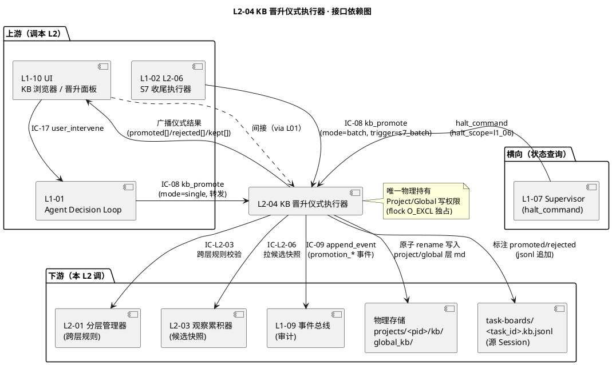
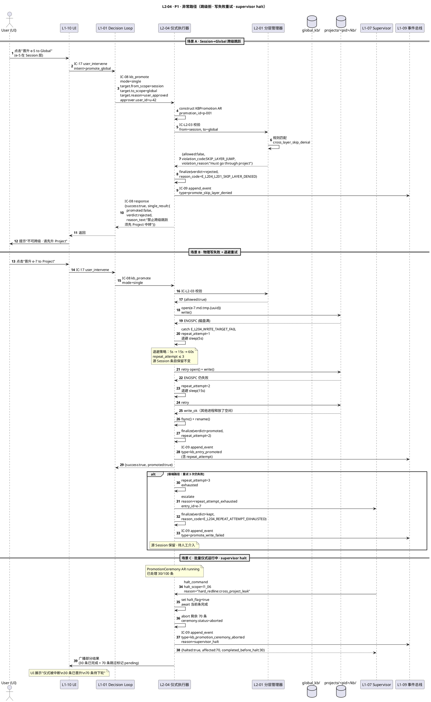
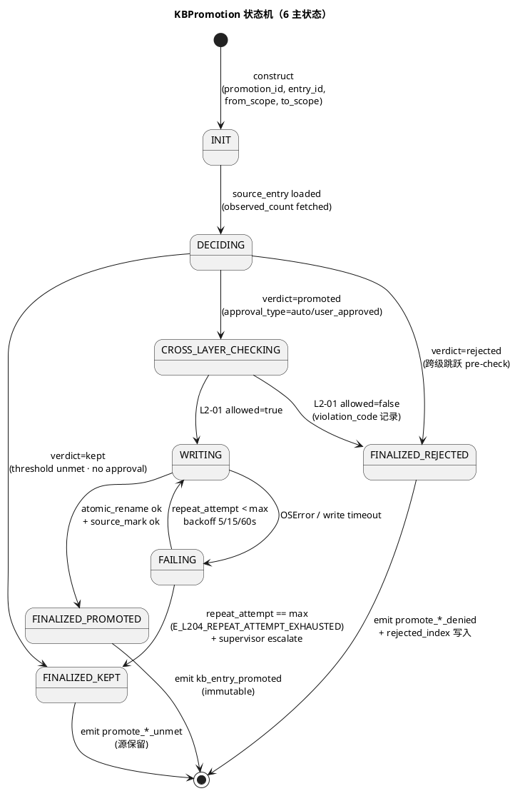
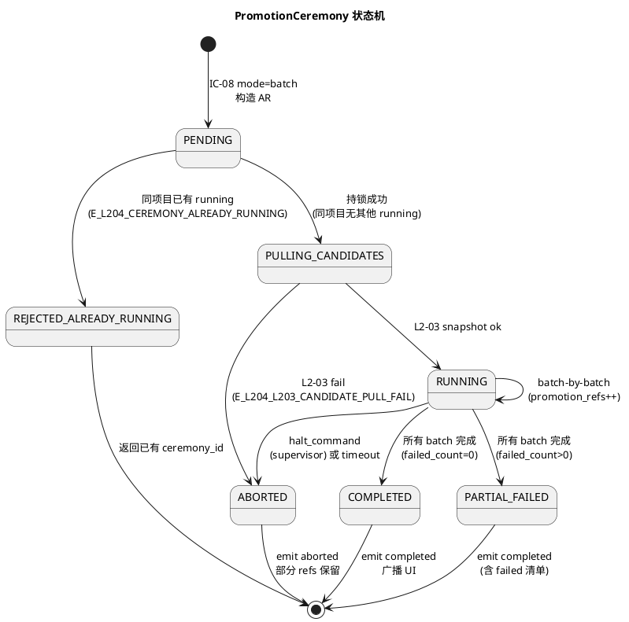

# L1 L2-04 · KB 晋升仪式执行器 · Tech Design

> **本文档定位**：3-1-Solution-Technical 层级 · L1 的 L2-04 KB 晋升仪式执行器 技术实现方案（L2 粒度）。
> **与产品 PRD 的分工**：2-prd/L1-06-3层知识库/prd.md §5.6 的对应 L2 节定义产品边界，本文档定义**技术实现**（接口字段级 schema + 算法伪代码 + 底层数据结构 + 状态机 + 配置参数）。
> **与 L1 architecture.md 的分工**：architecture.md 负责**跨 L2 架构 + 跨 L2 时序**，本文档负责**本 L2 内部技术细节**。冲突以 architecture.md 为准。
> **严格规则**：本文档不复述产品 PRD 文字（职责 / 禁止 / 必须等清单），只做技术映射 + 补齐"产品视角未说 but 工程师必须知道"的部分（具体算法 · syscall · schema · 配置）。

---

## §0 撰写进度

- [x] §1 定位 + 2-prd §5.6 L2-04 映射
- [x] §2 DDD 映射（引 L0/ddd-context-map.md BC-06）
- [x] §3 对外接口定义（字段级 YAML schema + 错误码）
- [x] §4 接口依赖（被谁调 · 调谁）
- [x] §5 P0/P1 时序图（PlantUML ≥ 2 张）
- [x] §6 内部核心算法（伪代码）
- [x] §7 底层数据表 / schema 设计（字段级 YAML）
- [x] §8 状态机（PlantUML + 转换表）
- [x] §9 开源最佳实践调研（≥ 3 GitHub 高星项目）
- [x] §10 配置参数清单
- [x] §11 错误处理 + 降级策略
- [x] §12 性能目标
- [x] §13 与 2-prd / 3-2 TDD 的映射表

---

## §1 定位 + 2-prd 映射

### 1.1 本 L2 在 L1-06 3-Tier KB 里的坐标

L1-06 3-Tier Knowledge Base 由 5 个 L2 组成（L2-01 分层管理器 / L2-02 KB 读 / L2-03 观察累积器 / **L2-04 KB 晋升仪式执行器** / L2-05 检索 + Rerank）。L2-04 **是唯一持有"迁层写权"的 L2**，即 Project 层 / Global 层的物理文件写操作物理上**只能**由 L2-04 进程发起（L1-06 architecture.md §5.3 物理不变式）。

```
 [L1-02 L2-06 S7 retro]  ──(IC-08 batch)──┐
                                            ↓
 [L1-01 / L1-10 UI]      ──(IC-17→IC-08)──→ [L2-04 KB Promotion Ceremony Executor]
                                                 │
                                                 │  (本 L2 · Application Service · AR: KBPromotion)
                                                 │
                                                 │  1. 拉候选 ─────────▶ [L2-03 观察累积器]
                                                 │  2. 跨层校验 ───────▶ [L2-01 分层管理器]
                                                 │  3. 物理写目标层 ───▶ [projects/<pid>/kb/ · global_kb/]
                                                 │  4. 源 Session 标注 ▶ [task-boards/*.kb.jsonl]
                                                 │  5. 审计事件 ───────▶ [L1-09 event_bus]
                                                 │  6. 广播结果 ───────▶ [L1-10 UI]
                                                 ↓
                             {promoted[], rejected[], kept[]}
```

本 L2 的定位 = **"三层 KB 的晋升裁判 + 迁层写执行者 · 以 KBPromotion 为聚合根 · 唯一物理掌控 Project/Global 层写权 · 批量 S7 + 单条 UI 两入口 · observed_count 阈值硬锁 + 用户显式批准旁路 · 跨级跳跃 zero-tolerance · project_id 剥离强制"**。

### 1.2 与 2-prd §5.6 L2-04 的对应表（PRD 职责 → 本文档技术映射）

| 2-prd §5.6 L2-04 小节 | 本文档对应位置 | 技术映射要点 |
|:---|:---|:---|
| §11.1 一句话职责（执行 Session→Project / Project→Global 仪式） | §2 (AR: KBPromotion) + §6.1 主编排算法 | AR 全生命周期 · 状态机 6 态 |
| §11.2 输入（S7 批量 / UI 单条 / L2-03 快照 / L2-01 校验） | §3.1 IC-08 schema + §3.2 IC-L2-03 + IC-L2-06 schema | 3 入口 × 统一 schema |
| §11.2 输出（promoted/rejected/kept 三分类） | §3.1 IC-08 返回 PromoteBatchResult VO | 三分类硬锁 · §3.4 错误码 |
| §11.3 边界 In-scope（5 条） | §6.1/§6.2/§6.6 实现 | observed_count 阈值判定 + UI 旁路 + 批量 + 失败路径 + 结果广播 |
| §11.3 边界 Out-of-scope（6 条） | §4 不调 L2-03/L2-01/L2-05 的写接口 | L2-04 只读其他 L2 输出 · 不侵入 |
| §11.4 硬约束 1（不跨级跳跃） | §6.3 判定分支：SESSION→GLOBAL 直接拒绝 + E_L204_SKIP_LAYER_DENIED | 强拒绝分支 |
| §11.4 硬约束 2（Global 双条件） | §6.3 判定分支：observed_count≥3 OR user_approved | 2 分支 OR 语义 |
| §11.4 硬约束 3（Project 单条件） | §6.3 判定分支：observed_count≥2 OR user_approved | OR 语义 |
| §11.4 硬约束 4（跨层必经 L2-01） | §6.4 必调 IC-L2-03 · 不可跳过 | hard wire 调用 · 无 bypass |
| §11.4 硬约束 5（不阻塞 L2-02 读） | §6.7 "快照语义 + 不持有全局写锁" | 条目级 advisory lock · L2-02 读 follower 快照 |
| §11.4 硬约束 6（rejected 不复活） | §7.2 KBPromotion.approval_type=rejected + L2-02 读过滤 | rejected 位终身 · 用户手动 undo 才翻转 |
| §11.4 硬约束 7（失败可重试） | §6.8 halt 路径保留源 Session · repeat_attempt 计数 | 源不丢 · 重试幂等 |
| §11.5 🚫 禁止清单（7 条） | §11 错误处理 + 降级链 | 硬拦截 + 审计 |
| §11.6 ✅ 必须清单（7 条） | §6.1 主流程必经节点 | 执行顺序硬锁 |
| §11.7 🔧 可选功能（4 条） | §6.9 预览 + §6.10 理由模板（标注 optional） | P1 · 配置开关控制 |
| §11.8 IC-08 入口 + IC-L2-03 + IC-L2-06 + IC-09 | §3 + §4 依赖图 | 4 IC 字段级 schema |
| §11.9 性能阈值（单条亚秒 · 百条秒级 · 不阻塞） | §12 SLO 表 | P99 ≤ 500ms 单条 · ≤ 30s 批量 100 条 |

**严格语义**：本文档不重抄 PRD 职责清单文字，仅做"PRD 产品语义 → 本 L2 算法分支 / schema 字段 / 错误码"的技术映射。

### 1.3 本 L2 在 L1-06 architecture.md 里的坐标

引 `docs/3-1-Solution-Technical/L1-06-3层知识库/architecture.md §4.2 图 2 · KB 晋升仪式（S7 收尾批量 · BF-S7-04）`：

- **架构图定位**：`architecture.md §2.2 组件图`的 `L2-04 晋升仪式执行器`
- **DDD 语义**：`architecture.md §2.3 表`的 `L1-06 L2-04 | Application Service + Aggregate Root: KBPromotion + VO: ApprovalType`
- **IC 触点**：`architecture.md §8 IC 一览表`的 IC-08 (入口) + IC-L2-03 (调) + IC-L2-06 (调) + IC-09 (调)
- **物理写权**：`architecture.md §5.3.3 + §6.2 "Project / Global 层的文件写操作只能由 L2-04 进程持有写权限"`
- **S7 时序**：`architecture.md §4.2 图 2` 覆盖正常批量 + 用户单条 + 跨级跳跃拒绝 + 并发读不阻塞

### 1.4 本 L2 的 PM-14 约束落点

**PM-14 约束**（引 `docs/3-1-Solution-Technical/projectModel/tech-design.md`）：所有 IC payload 顶层 `project_id` 必填；所有持久化路径按 `projects/<pid>/...` 分片；Global 层是 PM-14 的**合法例外**（`global_kb/` 无 project_id 归属）。

本 L2 的具体落点：
- KBPromotion 聚合根持久化：`projects/<pid>/kb/promotions/<promotion_id>.yaml`
- 批量仪式执行快照：`projects/<pid>/kb/ceremony/<ceremony_id>.yaml`
- rejected 标记索引：`projects/<pid>/kb/rejected_index.jsonl`（per-project）+ `global_kb/rejected_index.jsonl`（global）
- Global 晋升时必做的 **project_id 剥离**：写入 `global_kb/entries/<entry_id>.md` 的 YAML frontmatter **禁止**出现 `project_id` 字段（architecture.md §5.3.3 "无主资产"）
- 仪式事件：`projects/<pid>/task-boards/<task_id>.events.jsonl` (session-scope) + `projects/<pid>/kb/promotion.events.jsonl` (project-scope)

### 1.5 关键技术决策（本 L2 特有）

| 决策 | 选择 | 备选 | 理由 | Trade-off |
|:---|:---|:---|:---|:---|
| **D1: KBPromotion 是否聚合根** | 是（AR） | VO / Entity 挂 KBEntry | 晋升是独立业务过程 · 有完整生命周期 · 可审计 · 可重试 | 多一份持久化（promotion.yaml），但业务语义清晰 |
| **D2: Global 写权物理独占** | L2-04 进程独占文件写句柄（flock O_EXCL） | 多进程共享 + 乐观并发 | 物理不变式（arch §5.3.3）· 杜绝无据写 Global | 水平扩展时需外部 coordinator（M6 单机不需要） |
| **D3: 批量仪式并发模型** | 候选级并发（`max_concurrent_per_batch=8`）· 跨候选无依赖 | 全串行 / 全并发 | 百条级秒级完成 + 不打爆文件系统 + 易审计 | 并发度需配置化（取决于 IO/CPU） |
| **D4: L2-02 读不阻塞策略** | "发布-提交"快照语义（先写临时文件 + 原子 rename） | 全局 RWLock / 版本链 MVCC | 文件系统原生支持 · 不引入锁 | 写后读可见有 ms 级延迟（可接受） |
| **D5: 失败重试策略** | 源 Session 条目保留 + repeat_attempt 计数 + 5 分钟退避 | 立即重试 / 不重试 | 避免瞬时失败后"孤儿源"丢失 · PRD 硬约束 7 | repeat_attempt 上限 3 · 超则标记 error 上报 supervisor |
| **D6: rejected 条目的召回屏蔽** | L2-02 读时按 rejected_index.jsonl 过滤 | 物理删除条目 / tombstone 文件 | 保留审计痕迹 · 用户可 undo | 索引需要懒加载（首次读时 warm） |
| **D7: 用户批准字段承载** | IC-08 payload 中 `reason="user_approved"` + `approver_identity` 必填 | 独立 IC-18 approve | IC-08 已足够 · 避免 IC 膨胀 | 校验规则迁到 schema validation |
| **D8: Global 剥离 project_id** | 写 markdown 前强制 `frontmatter.pop("project_id")` | 保留空字段 / 改名 | architecture §5.3.3 硬约束 "无主资产" | 晋升后追溯"原 project"需查 promotion 记录 |

### 1.6 本 L2 的 DDD 定位一句话

> **L2-04 是 BC-06 3-Tier Knowledge Base 的应用服务 + 聚合根持有者 · 拥有 KBPromotion AR + ApprovalType/PromotionVerdict VO · 承担 IC-08 入口 + IC-L2-03/IC-L2-06 调 + IC-09 审计 · 唯一物理掌控 Project/Global 层写权限 · 批量秒级 + 单条亚秒 SLO · 零跨级跳跃 + 零自决通过。**

### 1.7 本 L2 不在的范围（YAGNI 边界）

- **不在**：observed_count 累计（L2-03 责任）
- **不在**：kind 白名单校验（L2-01 责任）
- **不在**：applicable_context 过滤（L2-01 责任）
- **不在**：过期扫描（L2-01 责任）
- **不在**：rerank / 相关性打分（L2-05 责任）
- **不在**：UI 授权 UI 本身（L1-10 责任 · 本 L2 只接收 IC-08 已携带的 user_approved 语义）
- **不在**：动态阈值学习（PRD 硬禁 · 阈值是配置硬锁）
- **不在**：跨 session 条目合并（L2-03 责任）

### 1.8 本 L2 术语表

| 术语 | 定义 | 关联 |
|:---|:---|:---|
| KBPromotion | 晋升聚合根 · 承载单条晋升的完整生命周期 | §2.1 |
| PromotionCeremony | 批量仪式会话 · 承载 S7 一次遍历 | §2.3 |
| ApprovalType | 批准类型 VO: `auto_threshold` / `user_approved` / `rejected` | §2.4 |
| PromotionVerdict | 本 L2 产出的判定 VO: `promoted` / `rejected` / `kept` | §2.4 |
| PromotionTarget | 目标层 VO: `project` / `global` | §2.4 |
| observed_count | 条目被观察到的次数（L2-03 累计 · 本 L2 只读） | §6.3 |
| SkipLayerJump | 跨级跳跃（Session→Global 直接晋升）· zero-tolerance | §6.4 |
| RejectedIndex | rejected 条目的持久化索引 · L2-02 读时过滤 | §7.3 |
| repeat_attempt | 单 KBPromotion 的重试次数计数（上限 3） | §6.8 |

### 1.9 与兄弟 L2 的技术边界

| 兄弟 L2 | 共享的领域概念 | 本 L2 怎么用 | 边界硬线 |
|:---|:---|:---|:---|
| L2-01 分层管理器 | KBScope / SchemaWhitelist / CrossLayerRule | 调 IC-L2-03 做 scope 合法性判定 · 写目标层前必校验 | L2-01 不参与晋升决策 · 只做"这一对 from/to 合不合法"的判定 |
| L2-02 KB 读 | KBEntry 只读视图 | 不调用 · 共享"发布-提交"快照语义 | L2-02 读过程与本 L2 写完全解耦 |
| L2-03 观察累积器 | KBEntry + observed_count | 调 IC-L2-06 拉候选快照 · 批量仪式开始时调一次 | 本 L2 绝不修改 observed_count |
| L2-05 检索 Rerank | 与本 L2 无直接依赖 | — | rerank 在本 L2 晋升**完成后**读新条目时自然生效 |

---

## §2 DDD 映射（BC-06 · Application Service + Aggregate Root）

引 `docs/3-1-Solution-Technical/L0/ddd-context-map.md BC-06 · 3-Tier Knowledge Base`（§2.7）。

本 L2 在 BC-06 内属于**应用服务层 + 聚合根持有层**：持有 `KBPromotion` AR（唯一持有者）+ `PromotionCeremony` AR（批量仪式聚合根）+ 若干 VO。

### 2.1 Aggregate Root · KBPromotion

**职责**：承载单条 KB 条目从源层到目标层的完整晋升决策 + 结果 + 审计追溯。

**标识**：`promotion_id: UUIDv7`
**不变性**：一次晋升产生一个 KBPromotion · 一旦终态不可修改（ImmutableOnceFinalized）

**字段级 YAML schema**：

```yaml
promotion_id: string              # UUIDv7 · 时间前缀
project_id: string                # PM-14 项目上下文
entry_id: string                  # KB 条目 id（由 L2-03 分配 · 本 L2 不生成）
from_scope: enum                  # [session, project] · 源层
to_scope: enum                    # [project, global] · 目标层
approval_type: enum               # [auto_threshold, user_approved, rejected, pending]
approver_identity:                # 批准来源
  type: enum                      # [system, user, supervisor_override]
  user_id: string|null            # type=user 时必填
  triggered_by:                   # 触发线索
    ic_id: string                 # IC-08 / IC-17
    source_module: string         # L1-02_L2-06_S7 / L1-10_UI / L1-01_forward
    trigger_time: timestamp
observed_count_at_decision: int   # 决策时的快照值（L2-03 给出）
observed_count_threshold: int     # 阈值值（2 或 3）
verdict: enum                     # [promoted, rejected, kept] · 本 L2 最终产出
reason_code: enum                 # 见 §3.4 错误码/原因码表
reason_text: string               # 人读摘要（含"晋升理由模板"的渲染结果）
cross_layer_rule_check:           # L2-01 IC-L2-03 返回
  allowed: bool
  rule_id: string
  check_time: timestamp
physical_write:                   # 实际写目标层的结果
  target_path: string             # projects/<pid>/kb/entries/<entry_id>.md 或 global_kb/entries/<entry_id>.md
  write_status: enum              # [success, failed, skipped]
  failure_code: string|null       # E_L204_L201_* 等
  bytes_written: int
  atomic_rename_time: timestamp
source_mark:                      # 源 Session 的标记结果
  mark_status: enum               # [marked_promoted, marked_rejected, untouched]
  mark_time: timestamp
repeat_attempt: int               # 重试次数（0-3）· D5
created_at: timestamp
finalized_at: timestamp|null      # 终态时间（一旦置值不可变）
```

**行为**（Methods）：
1. `decide(candidate_snapshot, scope_rule_result) -> PromotionVerdict` — 基于 observed_count + approval_type 决策
2. `write_target_layer() -> WriteResult` — 执行物理写（atomic rename）
3. `mark_source() -> MarkResult` — 标记源 Session 条目 promoted/rejected
4. `finalize(verdict) -> void` — 终态化 · 触发审计事件
5. `retry() -> KBPromotion` — 失败重试 · 产生新 KBPromotion 但继承 entry_id/reason
6. `strip_project_id_for_global() -> dict` — 晋升到 Global 时剥离 project_id 字段
7. `emit_audit_event() -> void` — 走 IC-09 落盘 L1-09

**聚合根一致性规则**：
- 一个 KBPromotion 对应一个 entry_id + from_scope + to_scope 三元组的"意图"
- 若 `verdict=promoted` 则必有 `physical_write.write_status=success` 和 `source_mark.mark_status=marked_promoted`
- 若 `verdict=rejected` 则必有 `source_mark.mark_status=marked_rejected`
- 若 `approval_type=user_approved` 则必有 `approver_identity.user_id != null`

### 2.2 Aggregate Root · PromotionCeremony（批量仪式聚合根）

**职责**：承载 S7 批量遍历的整体仪式会话（trigger=s7）· 包含若干 KBPromotion 的集合指针。

**标识**：`ceremony_id: UUIDv7`

**字段级 YAML schema**：

```yaml
ceremony_id: string
project_id: string                # PM-14
trigger_source: enum              # [s7_batch, user_manual_batch]
trigger_at: timestamp
snapshot_pulled_from_l203:        # 候选快照引用
  snapshot_id: string
  candidates_count: int
  pull_time: timestamp
concurrency_policy:
  max_concurrent: int             # 默认 8
  batch_size: int                 # 默认 100
  batch_count: int                # ceil(candidates_count / batch_size)
promotion_refs:                   # 本仪式产生的所有 KBPromotion
  - promotion_id
ceremony_status: enum             # [running, completed, partial_failed, aborted]
verdict_summary:
  promoted_count: int
  rejected_count: int
  kept_count: int
  failed_count: int               # physical_write 失败但保留源的计数
duration_ms: int
started_at: timestamp
completed_at: timestamp|null
```

**行为**：
1. `run_batch(candidates) -> PromotionBatchResult` — 主入口
2. `dispatch_candidates(candidates) -> list[Task]` — 拆 batch
3. `aggregate_results() -> VerdictSummary` — 汇总分类
4. `broadcast_to_ui() -> void` — 推送 L1-10
5. `abort_if_halt_requested(halt_command) -> void` — 响应 L1-07 halt

### 2.3 Value Object · ApprovalType

```yaml
enum:
  - auto_threshold      # 自动达阈值（observed_count ≥ 阈值）
  - user_approved       # 用户显式批准（旁路阈值）
  - rejected            # 用户显式拒绝（或跨级跳跃被拒）
  - pending             # 等待判定（中间态 · 不持久化）
```

### 2.4 Value Object · PromotionVerdict

```yaml
enum:
  - promoted            # 晋升成功（已写目标层 + 标记源）
  - rejected            # 拒绝（用户拒绝 或 跨级跳跃被拒）
  - kept                # 保留源层（observed_count 不足 且 无用户批准）
```

### 2.5 Value Object · PromotionTarget

```yaml
target_scope: enum      # [project, global]
target_path_template: string  # "projects/<pid>/kb/entries/<entry_id>.md"
strip_fields_on_write:  # Global 晋升时必须剥离的字段列表
  - project_id          # D8 硬约束
```

### 2.6 Domain Event

**发布事件**：
- `L1-06:kb_entry_promoted` — 单条晋升完成（含 promotion_id / verdict / approval_type / from_scope / to_scope）
- `L1-06:kb_promotion_ceremony_started` — 批量仪式启动
- `L1-06:kb_promotion_ceremony_completed` — 批量仪式完成（含 verdict_summary）
- `L1-06:promote_skip_layer_denied` — 跨级跳跃被拒
- `L1-06:promote_write_failed` — 物理写失败

### 2.7 与其他 BC 的 Context Map

| 邻居 BC | 关系 | 方向 | 接口 |
|:---|:---|:---|:---|
| BC-02 (L1-02) | Customer-Supplier | 作为供应者接收 IC-08 batch 请求 | IC-08 kb_promote |
| BC-10 (L1-10 UI) | Customer-Supplier | 作为供应者接收 IC-17 转发的单条晋升 + 广播结果 | IC-17 → IC-08 |
| BC-01 (L1-01) | Customer-Supplier | L1-01 转发 UI 晋升请求 | IC-08 |
| BC-09 (L1-09 Audit) | Partnership | 每次终态都必落审计 | IC-09 append_event |
| L1-06 内 L2-01 | Partnership | 跨层规则校验 · 不可绕过 | IC-L2-03 |
| L1-06 内 L2-03 | Partnership | 批量仪式启动时拉候选快照 | IC-L2-06 |
| BC-07 (L1-07 Supervisor) | Conformist（对本 L2 而言） | 响应 halt_command | halt_scope=l1_06 或 wp/project |

---

## §3 对外接口定义（字段级 YAML schema + 错误码）

### 3.1 入口 IC · IC-08 kb_promote

**方向**：被调用方
**上游**：L1-02 L2-06（S7 批量触发）/ L1-01（UI 单条转发）/ L1-10 UI（经 IC-17 再转 IC-08）
**核心语义**：单条或批量触发晋升仪式

#### 3.1.1 Request payload（字段级 YAML schema）

```yaml
ic_id: IC-08
ic_version: v1.0
project_id: string                # PM-14 必填
mode: enum                        # [single, batch]
trigger: enum                     # [s7_batch, user_manual, user_manual_batch]
request_id: string                # 幂等 key · UUIDv7
requested_at: timestamp

# mode=single 时使用
target:
  entry_id: string                # 必填 · 由 L2-03 分配
  from_scope: enum                # [session, project]
  to_scope: enum                  # [project, global]
  reason: enum                    # [auto_threshold, user_approved]
  approver:
    user_id: string|null          # reason=user_approved 时必填
    intent_source: enum           # [ui_click, cli, api]

# mode=batch 时使用（S7 场景）
batch_scope:
  pull_from_task_ids: [string]|null  # null 表示"当前项目所有 task 的 Session"
  filter_kinds: [string]|null        # 可选 · 按 kind 过滤（默认全 8 类）
  max_candidates_per_batch: int      # 默认 100

# 超时
timeout_ms: int                   # 默认 30000（批量）/ 5000（单条）
```

#### 3.1.2 Response payload（字段级 YAML schema）

```yaml
ic_id: IC-08
ic_version: v1.0
response_id: string               # UUIDv7
request_id: string                # echo
project_id: string                # PM-14
mode: enum                        # [single, batch]
success: bool                     # batch 模式：true 表示仪式完成（含部分失败）；false 表示仪式 abort

# mode=single 返回
single_result:
  promoted: bool
  final_scope: enum|null          # [session, project, global] · 最终所在层
  promotion_id: string|null       # 成功时返回
  verdict: enum                   # [promoted, rejected, kept]
  reason_code: string             # 见 §3.4
  reason_text: string

# mode=batch 返回
batch_result:
  ceremony_id: string
  candidates_total: int
  promoted: [entry_id_list]
  rejected: [entry_id_list]
  kept: [entry_id_list]
  failed:                         # physical_write 失败但源保留
    - entry_id: string
      failure_code: string
      will_retry: bool
  duration_ms: int
  verdict_summary:
    promoted_count: int
    rejected_count: int
    kept_count: int
    failed_count: int

error:                            # success=false 时填
  code: string
  message: string
  retriable: bool
```

### 3.2 内部 IC · IC-L2-03（调 L2-01）

**方向**：调用方
**下游**：L2-01 分层管理器
**语义**：晋升前跨层规则校验

#### 3.2.1 Request payload

```yaml
ic_id: IC-L2-03
project_id: string                # PM-14
entry_id: string
from_scope: enum                  # [session, project]
to_scope: enum                    # [project, global]
kind: string                      # KB 条目 kind（pattern/recipe/trap/tool_combo 等）
approval_hint: enum               # [auto_threshold, user_approved]
check_strict: bool                # true 表示"必须通过所有校验"
```

#### 3.2.2 Response payload

```yaml
allowed: bool
rule_id: string                   # 命中的规则 ID
rule_name: string                 # 如 "cross_layer_skip_denial" / "global_requires_threshold_or_approval"
violation:                        # allowed=false 时填
  violation_code: string          # 见 §3.4
  violation_reason: string
check_time: timestamp
```

### 3.3 内部 IC · IC-L2-06（调 L2-03）

**方向**：调用方
**下游**：L2-03 观察累积器
**语义**：批量仪式启动时拉候选快照

#### 3.3.1 Request payload

```yaml
ic_id: IC-L2-06
project_id: string                # PM-14
snapshot_request_type: enum       # [session_candidates, session_and_project_candidates]
task_id_filter: [string]|null
kind_filter: [string]|null
include_expired: bool             # 默认 false
include_rejected: bool            # 默认 false
max_candidates: int               # 默认 500 · 超则分页
cursor: string|null               # 分页 cursor
```

#### 3.3.2 Response payload

```yaml
snapshot_id: string               # 快照 ID · 供追溯
snapshot_time: timestamp
project_id: string
candidates:
  - entry_id: string
    scope: enum                   # [session, project]
    kind: string
    title: string
    observed_count: int
    first_observed_at: timestamp
    last_observed_at: timestamp
    task_ids: [string]             # 该条目被观察到的 task 列表（用于判断"跨 task 2 个"）
    source_links: [string]
    expired: bool
    rejected: bool
total_count: int
next_cursor: string|null          # 分页时返回
```

### 3.4 错误码表（≥ 12 码）

| 错误码 | 含义 | 触发场景 | 调用方处理 |
|:---|:---|:---|:---|
| `E_L204_L201_SKIP_LAYER_DENIED` | 跨级跳跃拒绝（Session→Global） | mode=single 且 from_scope=session & to_scope=global | 返回 promoted=false · 审计 promote_skip_layer_denied · UI 显示"须先升 Project"提示 |
| `E_L204_L201_GLOBAL_THRESHOLD_UNMET` | Global 晋升阈值未达且无用户批准 | observed_count<3 且 approval≠user_approved | kept 保留 Project · 审计 promote_global_threshold_unmet |
| `E_L204_L201_PROJECT_THRESHOLD_UNMET` | Project 晋升阈值未达且无用户批准 | observed_count<2 且 approval≠user_approved | kept 保留 Session · 审计 promote_project_threshold_unmet |
| `E_L204_L203_CANDIDATE_PULL_FAIL` | 拉候选快照失败 | L2-03 返回 error / 超时 | 批量仪式 abort · 审计 ceremony_pull_fail · 上报 supervisor |
| `E_L204_WRITE_TARGET_FAIL` | 物理写目标层失败 | 磁盘满 / 权限 / 冲突 | 源保留 · repeat_attempt++ · 退避重试（≤3 次） |
| `E_L204_SOURCE_MARK_FAIL` | 源 Session 标记失败 | Session jsonl 被外部进程占用 | write 已成功但 mark 失败 · 升 supervisor（数据不一致风险） |
| `E_L204_PROMOTION_LOCKED` | 同 entry_id 已有在途晋升 | 并发触发同 entry 晋升 | 幂等返回已在途的 promotion_id |
| `E_L204_CEREMONY_ALREADY_RUNNING` | 同项目已有批量仪式运行中 | S7 并发触发 | 拒绝 · 返回已有 ceremony_id · 建议等完成 |
| `E_L204_USER_APPROVAL_MISSING` | reason=user_approved 但 approver.user_id 为空 | schema 校验失败 | 422 拒绝 · 返回 schema 错误 |
| `E_L204_REJECTED_CANNOT_UNDO` | 尝试晋升已 rejected 的条目 | 条目存在于 rejected_index | 返回 error · UI 显示"已 rejected · 须先 undo" |
| `E_L204_INVALID_FROM_TO` | from_scope/to_scope 非法组合 | e.g. from=global / to=session | 422 schema error |
| `E_L204_PROJECT_ID_MISMATCH` | entry 的 project_id 与请求的 project_id 不一致 | PM-14 违反 | 拒绝 · 审计 cross_project_violation · 上报 supervisor |
| `E_L204_REPEAT_ATTEMPT_EXHAUSTED` | 重试 3 次仍失败 | WRITE_TARGET_FAIL 持续 | 升 supervisor · 标记 error · 源保留待人工 |
| `E_L204_SUPERVISOR_HALT` | 收到 L1-07 halt 命令 | 仪式运行时 halt_scope=l1_06 | 仪式立即 abort · 已完成部分保留 · 未开始跳过 |
| `E_L204_STRIP_PROJECT_ID_FAIL` | Global 晋升时 project_id 剥离失败 | frontmatter 结构异常 | abort 该条 · 审计 strip_fail · 源保留 |

---

## §4 接口依赖（被谁调 · 调谁）

### 4.1 依赖图（PlantUML）



### 4.2 上游调用方清单

| 调用方 | IC | 何时调 | 典型 payload |
|:---|:---|:---|:---|
| L1-02 L2-06 (S7 执行器) | IC-08 | S7 retro + archive 就绪后 | mode=batch · trigger=s7_batch · batch_scope.pull_from_task_ids=null |
| L1-01 (Agent Decision Loop) | IC-08 | 转发 UI 晋升请求 | mode=single · trigger=user_manual · target.reason=user_approved |
| L1-10 UI | IC-17 → IC-08 | 用户在 KB 浏览器点"晋升" | 经 L1-01 转发 · mode=single |
| L1-07 Supervisor | halt_command | 硬红线触发时中断仪式 | halt_scope=l1_06 或 project |

### 4.3 下游被调方清单

| 被调方 | IC | 何时调 | 调用语义 |
|:---|:---|:---|:---|
| L2-03 观察累积器 | IC-L2-06 | 批量仪式启动时（mode=batch） | 拉候选快照 · 不修改源 |
| L2-01 分层管理器 | IC-L2-03 | 每条候选决策前（必调） | 跨层规则校验（skip_layer / threshold / kind） |
| L1-09 事件总线 | IC-09 | 每次 finalize / 仪式启停 / 异常 | append_event · 落审计 |
| 物理存储 (kb/entries) | 直接 syscall | verdict=promoted 时 | 原子 rename（临时文件 → 目标路径） |
| Session 存储 (task-boards) | 直接 syscall | verdict=promoted/rejected 时 | jsonl 追加 `{entry_id, marker: promoted/rejected, at}` |

### 4.4 依赖健康度 + 降级触发

| 下游 | 健康探测 | 故障响应 | 降级 |
|:---|:---|:---|:---|
| L2-01 IC-L2-03 | 超时 3s · 连续 3 次失败 | 所有晋升暂停 | 仪式 abort · 本轮不继续 · 等下轮 |
| L2-03 IC-L2-06 | 超时 5s | 批量仪式 abort | 单条晋升可跳过（L2-03 快照非必需 · 单条直接用入参） |
| L1-09 IC-09 | 超时 2s | 审计事件进本地缓冲（`.audit_buffer.jsonl`）· 稍后重放 | 不阻塞主流程 |
| 物理存储 | ENOSPC / EACCES | 当前 promotion 失败 · 进入 repeat_attempt | 3 次后上报 supervisor |
| L1-07 halt_command | 必须响应 · 异步 push | 收到即 abort · 已完成部分保留 | 无降级（硬拦截） |

### 4.5 与 L2-02 KB 读的"不阻塞"协议（技术实现）

**核心机制**：L2-04 对 Project/Global 层的所有写操作都采用"临时文件 + 原子 rename"（即 `write()` 到 `*.tmp` → `fsync()` → `rename()` 到目标路径）；L2-02 读只看"已 rename 的稳定文件"，不扫临时文件。

```
[L2-04 写]: open("e-001.md.tmp.{uuid}") → write() → fsync() → rename("e-001.md")
[L2-02 读]: glob("*.md") · 过滤后缀不为 .tmp 的文件
```

**索引层不阻塞**：`global_kb/index.jsonl` 采用追加写；L2-02 读时取"当前长度"快照，不 seek 超出。

---

## §5 P0/P1 时序图（PlantUML ≥ 2 张）

### 5.1 图 1 · P0 · S7 批量晋升仪式 · 正常路径（BF-S7-04）

**场景一句话**：L1-02 L2-06 在 S7 收尾触发批量仪式 → 本 L2 拉候选快照 → 逐条判定 + 跨层校验 + 原子写目标层 → 聚合结果广播给 L1-10。

**覆盖路径**：auto_threshold 晋升 Project / auto_threshold 晋升 Global / observed_count 不足 kept / 并发批处理 / 每条落审计。

```plantuml
@startuml
autonumber
title L2-04 · P0 · S7 批量晋升仪式（正常路径）

participant "L1-02 L2-06\nS7 收尾执行器" as L0206
participant "L2-04 仪式执行器\n(PromotionCeremony AR)" as L204
participant "L2-03 观察累积器" as L203
participant "L2-01 分层管理器" as L201
database "projects/<pid>/\ntask-boards/\n*.kb.jsonl\n(Session)" as SessionFS
database "projects/<pid>/kb/\nentries/*.md\n(Project)" as ProjectFS
database "global_kb/\nentries/*.md\n(Global)" as GlobalFS
participant "L1-09 事件总线" as L09
participant "L1-10 UI" as L10

note over L0206
  S7 retro + archive 完成
  触发 IC-08 kb_promote (batch)
end note

L0206 -> L204 : IC-08 kb_promote\nmode=batch\ntrigger=s7_batch\nproject_id=<pid>
activate L204

L204 -> L204 : 构造 PromotionCeremony AR\nceremony_id=uuid7()\nstatus=running
L204 -> L09 : IC-09 append_event\ntype=kb_promotion_ceremony_started

L204 -> L203 : IC-L2-06 拉候选快照\nsnapshot_request_type=\nsession_and_project_candidates
activate L203
L203 -> SessionFS : 扫所有 <task>.kb.jsonl\n过滤 !expired && !rejected
SessionFS --> L203 : raw candidates
L203 -> ProjectFS : 扫 projects/<pid>/kb/entries/*.md\n过滤 !rejected
ProjectFS --> L203 : project candidates
L203 -> L203 : 聚合 observed_count\n跨 task 计数
L203 --> L204 : snapshot[N 条候选]\nsnapshot_id=snap-xxx
deactivate L203

note over L204
  候选按 batch_size=100 分批
  每批内 max_concurrent=8
end note

loop 每批 100 条 · 并发 8
  par 候选 e-i (observed_count=2, from=session)
    L204 -> L204 : decide(e-i)\n→ auto_threshold · target=project
    L204 -> L201 : IC-L2-03 校验\nfrom=session, to=project, kind=pattern
    L201 --> L204 : {allowed:true, rule_id=rule_session_to_project}
    L204 -> ProjectFS : open(e-i.md.tmp.{uuid})\n write(frontmatter + content)\n fsync()\n rename(e-i.md)
    ProjectFS --> L204 : write_ok
    L204 -> SessionFS : append {entry_id:e-i,\n marker:promoted,\n at:t}
    L204 -> L204 : promotion_id=uuid7()\n finalize(verdict=promoted,\n approval_type=auto_threshold)
    L204 -> L09 : IC-09 append_event\ntype=kb_entry_promoted\n from=session to=project\n approval=auto_threshold
  and 候选 e-j (observed_count=3, from=project, 跨 2 task)
    L204 -> L204 : decide(e-j)\n→ auto_threshold · target=global
    L204 -> L201 : IC-L2-03 校验\nfrom=project, to=global
    L201 --> L204 : {allowed:true}
    L204 -> L204 : strip_project_id_for_global()\n← frontmatter.pop(project_id)
    L204 -> GlobalFS : open(e-j.md.tmp.{uuid})\n write(无 project_id)\n fsync()\n rename(e-j.md)
    GlobalFS --> L204 : write_ok
    L204 -> ProjectFS : 标记 e-j.md\n frontmatter.promoted_to_global=true
    L204 -> L09 : IC-09 append_event\ntype=kb_entry_promoted\n from=project to=global
  and 候选 e-k (observed_count=1, from=session)
    L204 -> L204 : decide(e-k)\n→ kept (阈值不足)
    L204 -> L204 : finalize(verdict=kept,\n reason=PROJECT_THRESHOLD_UNMET)
    L204 -> L09 : IC-09 append_event\ntype=promote_project_threshold_unmet
  end
end

L204 -> L204 : aggregate_results()\npromoted[]=[e-i, e-j]\nrejected[]=[]\nkept[]=[e-k]\nfailed[]=[]
L204 -> L09 : IC-09 append_event\ntype=kb_promotion_ceremony_completed\n verdict_summary={promoted:2, kept:1}

L204 --> L0206 : IC-08 response\n{success:true, batch_result:{...}}
deactivate L204

L204 -> L10 : 广播仪式结果\nceremony_id + verdict_summary
L10 -> L10 : 渲染"本次 S7 晋升 2 条\n(1 Project · 1 Global) · 保留 1 条"

note over L10, L0206
  并发读：L2-02 在仪式期间可持续读
  (依赖原子 rename + tmp 文件过滤 · §4.5)
end note

@enduml
```

### 5.2 图 2 · P1 · 异常路径 · 跨级跳跃拒绝 + 物理写失败重试 + halt 中断

**场景一句话**：覆盖三条典型异常—— (a) 用户在 UI 尝试 Session→Global 跳级被拒；(b) 物理写失败触发重试链；(c) 仪式运行中收到 supervisor halt。



---

## §6 内部核心算法（伪代码 ≥ 8 算法）

### 6.1 主编排算法 · run_ceremony（batch 入口）

```python
class PromotionCeremonyExecutor:
    """
    L2-04 Application Service + AR 持有者
    对应 PromotionCeremony AR
    """

    async def run_ceremony(
        self,
        project_id: str,
        trigger: str,                # "s7_batch" | "user_manual_batch"
        batch_scope: BatchScope,
    ) -> PromoteBatchResult:
        # 0. 幂等 + 并发拦截
        if self._ceremony_running(project_id):
            raise E_L204_CEREMONY_ALREADY_RUNNING(
                existing_ceremony_id=self._active_ceremony(project_id)
            )

        # 1. 构造 PromotionCeremony AR
        ceremony = PromotionCeremony(
            ceremony_id=uuid7(),
            project_id=project_id,
            trigger_source=trigger,
            trigger_at=now(),
            ceremony_status="running",
        )
        self._ceremony_repo.save(ceremony)
        self._event_bus.append("kb_promotion_ceremony_started", {
            "ceremony_id": ceremony.ceremony_id,
            "project_id": project_id,
            "trigger": trigger,
        })

        # 2. 拉候选快照（IC-L2-06）
        try:
            snapshot = await self._l203_bridge.pull_candidates(
                project_id=project_id,
                snapshot_request_type="session_and_project_candidates",
                task_id_filter=batch_scope.pull_from_task_ids,
                kind_filter=batch_scope.filter_kinds,
                max_candidates=batch_scope.max_candidates_per_batch * 10,
            )
            ceremony.snapshot_pulled_from_l203 = {
                "snapshot_id": snapshot.snapshot_id,
                "candidates_count": len(snapshot.candidates),
                "pull_time": now(),
            }
        except Exception as e:
            ceremony.ceremony_status = "aborted"
            self._event_bus.append("ceremony_pull_fail", {
                "ceremony_id": ceremony.ceremony_id,
                "error": str(e),
            })
            raise E_L204_L203_CANDIDATE_PULL_FAIL(cause=e)

        # 3. 候选分批
        batches = self._dispatch_to_batches(
            candidates=snapshot.candidates,
            batch_size=self.config.batch_size,  # 默认 100
        )

        # 4. 批内并发
        promoted, rejected, kept, failed = [], [], [], []
        for batch in batches:
            if self._halt_flag:
                ceremony.ceremony_status = "aborted"
                self._event_bus.append("kb_promotion_ceremony_aborted", {
                    "ceremony_id": ceremony.ceremony_id,
                    "reason": "supervisor_halt",
                    "completed_before_halt": len(promoted) + len(rejected) + len(kept),
                })
                break

            batch_results = await self._run_batch_concurrent(
                candidates=batch,
                project_id=project_id,
                ceremony_id=ceremony.ceremony_id,
                max_concurrent=self.config.max_concurrent_per_batch,  # 默认 8
            )
            for r in batch_results:
                if r.verdict == "promoted":
                    promoted.append(r.entry_id)
                    ceremony.promotion_refs.append(r.promotion_id)
                elif r.verdict == "rejected":
                    rejected.append(r.entry_id)
                    ceremony.promotion_refs.append(r.promotion_id)
                elif r.verdict == "kept":
                    kept.append(r.entry_id)
                elif r.verdict == "failed":
                    failed.append({
                        "entry_id": r.entry_id,
                        "failure_code": r.failure_code,
                        "will_retry": r.repeat_attempt < self.config.repeat_attempt_max,
                    })

        # 5. 聚合 + 广播
        ceremony.verdict_summary = VerdictSummary(
            promoted_count=len(promoted),
            rejected_count=len(rejected),
            kept_count=len(kept),
            failed_count=len(failed),
        )
        if ceremony.ceremony_status == "running":
            ceremony.ceremony_status = "completed" if not failed else "partial_failed"
        ceremony.completed_at = now()
        ceremony.duration_ms = (ceremony.completed_at - ceremony.trigger_at).total_ms()
        self._ceremony_repo.save(ceremony)

        self._event_bus.append("kb_promotion_ceremony_completed", {
            "ceremony_id": ceremony.ceremony_id,
            "verdict_summary": ceremony.verdict_summary.to_dict(),
            "duration_ms": ceremony.duration_ms,
        })

        # 6. 推 L1-10 UI
        self._ui_broadcaster.push_ceremony_result(
            project_id=project_id,
            ceremony_id=ceremony.ceremony_id,
            result={
                "promoted": promoted,
                "rejected": rejected,
                "kept": kept,
                "failed": failed,
            }
        )

        return PromoteBatchResult(
            ceremony_id=ceremony.ceremony_id,
            promoted=promoted,
            rejected=rejected,
            kept=kept,
            failed=failed,
            duration_ms=ceremony.duration_ms,
            verdict_summary=ceremony.verdict_summary,
        )
```

### 6.2 单条晋升算法 · promote_single（UI / API 入口）

```python
async def promote_single(
    self,
    request: PromoteSingleRequest,
) -> PromoteSingleResult:
    """
    IC-08 mode=single 入口 · 典型来自 L1-10 UI 经 L1-01 转发
    """
    # 0. schema + PM-14 校验
    self._validate_request(request)              # E_L204_INVALID_FROM_TO / E_L204_USER_APPROVAL_MISSING
    if request.target.from_scope == "session" and request.target.to_scope == "global":
        # D1: 跨级跳跃预拦截（L2-01 也会拒 · 这里快失败）
        return self._finalize_rejected(
            entry_id=request.target.entry_id,
            project_id=request.project_id,
            from_scope="session",
            to_scope="global",
            reason_code="E_L204_L201_SKIP_LAYER_DENIED",
            reason_text="禁止跨级跳跃 · 须先 Project 中转",
            approver=request.target.approver,
        )

    # 1. rejected 拦截
    if await self._rejected_index.contains(request.target.entry_id):
        raise E_L204_REJECTED_CANNOT_UNDO(entry_id=request.target.entry_id)

    # 2. 同 entry_id 并发锁
    async with self._acquire_entry_lock(
        project_id=request.project_id,
        entry_id=request.target.entry_id,
    ) as lock:
        # 检查幂等（是否已有在途 promotion）
        existing = self._promotion_repo.find_in_flight(
            project_id=request.project_id,
            entry_id=request.target.entry_id,
        )
        if existing:
            raise E_L204_PROMOTION_LOCKED(
                entry_id=request.target.entry_id,
                existing_promotion_id=existing.promotion_id,
            )

        # 3. 构造 KBPromotion AR
        promotion = KBPromotion(
            promotion_id=uuid7(),
            project_id=request.project_id,
            entry_id=request.target.entry_id,
            from_scope=request.target.from_scope,
            to_scope=request.target.to_scope,
            approval_type="pending",
            approver_identity=self._build_approver(request),
            repeat_attempt=0,
            created_at=now(),
        )

        # 4. 读入条目详情（从源层）
        source_entry = await self._read_source_entry(
            project_id=request.project_id,
            entry_id=promotion.entry_id,
            scope=promotion.from_scope,
        )
        promotion.observed_count_at_decision = source_entry.observed_count

        # 5. decide
        verdict = self._decide(
            promotion=promotion,
            source_entry=source_entry,
            approval_hint=request.target.reason,
        )

        # 6. 分支执行
        if verdict == "rejected":
            return self._finalize_rejected_from_promotion(promotion)
        if verdict == "kept":
            return self._finalize_kept(promotion)
        # verdict == "promoted"
        return await self._execute_promote(promotion, source_entry)
```

### 6.3 决策判定算法 · _decide（核心分支树）

```python
def _decide(
    self,
    promotion: KBPromotion,
    source_entry: KBEntry,
    approval_hint: str,   # "auto_threshold" | "user_approved"
) -> str:                 # "promoted" | "rejected" | "kept"
    """
    决策分支树
    对应 PRD §11.4 硬约束 1-3
    """
    # 分支 1: from=session, to=global · 跨级跳跃 · 硬拒绝
    if promotion.from_scope == "session" and promotion.to_scope == "global":
        promotion.reason_code = "E_L204_L201_SKIP_LAYER_DENIED"
        return "rejected"

    # 分支 2: from=session, to=project · Project 晋升
    if promotion.from_scope == "session" and promotion.to_scope == "project":
        # 分支 2a: 阈值已达（observed_count ≥ 2）· 自动
        if source_entry.observed_count >= self.config.session_to_project_threshold:
            promotion.observed_count_threshold = self.config.session_to_project_threshold
            promotion.approval_type = "auto_threshold"
            return "promoted"
        # 分支 2b: 用户显式批准 · 旁路阈值
        if approval_hint == "user_approved":
            promotion.observed_count_threshold = self.config.session_to_project_threshold
            promotion.approval_type = "user_approved"
            return "promoted"
        # 分支 2c: 不满足 · kept
        promotion.observed_count_threshold = self.config.session_to_project_threshold
        promotion.reason_code = "E_L204_L201_PROJECT_THRESHOLD_UNMET"
        return "kept"

    # 分支 3: from=project, to=global · Global 晋升
    if promotion.from_scope == "project" and promotion.to_scope == "global":
        # 分支 3a: 阈值已达（observed_count ≥ 3）且跨至少 2 个 task
        if (source_entry.observed_count >= self.config.project_to_global_threshold
            and len(source_entry.task_ids) >= self.config.project_to_global_task_diversity):
            promotion.observed_count_threshold = self.config.project_to_global_threshold
            promotion.approval_type = "auto_threshold"
            return "promoted"
        # 分支 3b: 用户显式批准 · 旁路阈值
        if approval_hint == "user_approved":
            promotion.observed_count_threshold = self.config.project_to_global_threshold
            promotion.approval_type = "user_approved"
            return "promoted"
        # 分支 3c: 不满足 · kept
        promotion.observed_count_threshold = self.config.project_to_global_threshold
        promotion.reason_code = "E_L204_L201_GLOBAL_THRESHOLD_UNMET"
        return "kept"

    # 分支 4: 其他非法组合
    promotion.reason_code = "E_L204_INVALID_FROM_TO"
    return "rejected"
```

### 6.4 跨层校验调用算法 · _call_l201_cross_layer_check

```python
async def _call_l201_cross_layer_check(
    self,
    promotion: KBPromotion,
    source_entry: KBEntry,
) -> CrossLayerCheckResult:
    """
    调用 L2-01 IC-L2-03
    PRD §11.4 硬约束 4：所有晋升前必走 · 不可绕过
    """
    req = IC_L2_03_Request(
        project_id=promotion.project_id,
        entry_id=promotion.entry_id,
        from_scope=promotion.from_scope,
        to_scope=promotion.to_scope,
        kind=source_entry.kind,
        approval_hint=promotion.approval_type,
        check_strict=True,
    )

    try:
        result = await self._l201_bridge.check_cross_layer(
            req,
            timeout_ms=self.config.l201_timeout_ms,  # 默认 3000
        )
    except TimeoutError:
        # 超时不降级 · 直接失败（硬约束：不可绕过 L2-01）
        raise E_L204_L201_CHECK_TIMEOUT(promotion_id=promotion.promotion_id)

    promotion.cross_layer_rule_check = {
        "allowed": result.allowed,
        "rule_id": result.rule_id,
        "check_time": result.check_time,
    }

    if not result.allowed:
        promotion.reason_code = f"E_L204_L201_{result.violation.violation_code}"
        promotion.reason_text = result.violation.violation_reason

    return result
```

### 6.5 物理写算法 · _execute_promote（原子 rename）

```python
async def _execute_promote(
    self,
    promotion: KBPromotion,
    source_entry: KBEntry,
) -> PromoteSingleResult:
    """
    核心：调 L2-01 校验 → 写目标层 → 标记源 → 审计 finalize
    """
    # 1. 调 L2-01（硬约束 · 必经）
    check = await self._call_l201_cross_layer_check(promotion, source_entry)
    if not check.allowed:
        return self._finalize_rejected_from_promotion(promotion)

    # 2. 准备目标路径
    target_path = self._compute_target_path(
        project_id=promotion.project_id,
        to_scope=promotion.to_scope,
        entry_id=promotion.entry_id,
    )
    # Project: projects/<pid>/kb/entries/<entry_id>.md
    # Global:  global_kb/entries/<entry_id>.md

    # 3. 构造 frontmatter + content
    frontmatter = self._build_frontmatter(source_entry, promotion)
    if promotion.to_scope == "global":
        # D8 · 硬剥离
        frontmatter = self._strip_project_id_for_global(frontmatter)
    content = self._render_markdown(frontmatter, source_entry.body)

    # 4. 原子 rename 写
    try:
        await self._atomic_write(target_path, content)
    except OSError as e:
        return await self._handle_write_failure(promotion, e)

    # 5. 标记源 Session/Project
    await self._mark_source(
        project_id=promotion.project_id,
        entry_id=promotion.entry_id,
        from_scope=promotion.from_scope,
        marker="promoted",
        promotion_id=promotion.promotion_id,
    )

    # 6. finalize
    promotion.physical_write = {
        "target_path": target_path,
        "write_status": "success",
        "failure_code": None,
        "bytes_written": len(content.encode("utf-8")),
        "atomic_rename_time": now(),
    }
    promotion.verdict = "promoted"
    promotion.reason_code = (
        "PROMOTED_AUTO_THRESHOLD" if promotion.approval_type == "auto_threshold"
        else "PROMOTED_USER_APPROVED"
    )
    promotion.reason_text = self._render_reason_text(promotion, source_entry)
    promotion.finalized_at = now()
    self._promotion_repo.save(promotion)

    # 7. 审计（IC-09）
    self._event_bus.append("kb_entry_promoted", {
        "promotion_id": promotion.promotion_id,
        "project_id": promotion.project_id,
        "entry_id": promotion.entry_id,
        "from_scope": promotion.from_scope,
        "to_scope": promotion.to_scope,
        "approval_type": promotion.approval_type,
        "observed_count": promotion.observed_count_at_decision,
        "repeat_attempt": promotion.repeat_attempt,
        "rule_id": promotion.cross_layer_rule_check["rule_id"],
    })

    return PromoteSingleResult(
        promoted=True,
        final_scope=promotion.to_scope,
        promotion_id=promotion.promotion_id,
        verdict="promoted",
        reason_code=promotion.reason_code,
        reason_text=promotion.reason_text,
    )


async def _atomic_write(self, target_path: str, content: str):
    """
    原子写 · 先写 .tmp.{uuid} → fsync → rename
    保证 L2-02 读永远看到完整文件（§4.5）
    """
    import os, uuid, tempfile
    dir_path = os.path.dirname(target_path)
    os.makedirs(dir_path, exist_ok=True)

    tmp_path = f"{target_path}.tmp.{uuid.uuid4().hex}"
    fd = os.open(
        tmp_path,
        os.O_WRONLY | os.O_CREAT | os.O_EXCL,   # D2 独占创建
        mode=0o644,
    )
    try:
        os.write(fd, content.encode("utf-8"))
        os.fsync(fd)
    finally:
        os.close(fd)

    # 原子 rename（POSIX atomic if same filesystem）
    os.rename(tmp_path, target_path)

    # 同步目录（确保 rename 持久化）
    dir_fd = os.open(dir_path, os.O_RDONLY)
    try:
        os.fsync(dir_fd)
    finally:
        os.close(dir_fd)


def _strip_project_id_for_global(self, frontmatter: dict) -> dict:
    """
    D8 · architecture.md §5.3.3 硬约束
    Global 层条目必须"无主资产"
    """
    stripped = dict(frontmatter)
    for field in ["project_id", "source_project_id", "owning_project"]:
        stripped.pop(field, None)
    # 保留追溯线索（不暴露 project_id，但保留 promotion_id）
    if "promoted_from" not in stripped:
        raise E_L204_STRIP_PROJECT_ID_FAIL(
            reason="missing_promoted_from_trace",
        )
    return stripped
```

### 6.6 写失败处理 + 重试算法 · _handle_write_failure

```python
async def _handle_write_failure(
    self,
    promotion: KBPromotion,
    error: Exception,
) -> PromoteSingleResult:
    """
    D5 · PRD 硬约束 7：失败可重试 · 源保留不变
    退避链：5s → 15s → 60s
    """
    backoff_schedule = self.config.write_retry_backoff_ms  # [5000, 15000, 60000]

    promotion.repeat_attempt += 1
    promotion.physical_write = {
        "target_path": self._compute_target_path(
            project_id=promotion.project_id,
            to_scope=promotion.to_scope,
            entry_id=promotion.entry_id,
        ),
        "write_status": "failed",
        "failure_code": self._map_oserror_to_code(error),
        "bytes_written": 0,
        "atomic_rename_time": None,
    }

    self._event_bus.append("promote_write_failed", {
        "promotion_id": promotion.promotion_id,
        "entry_id": promotion.entry_id,
        "repeat_attempt": promotion.repeat_attempt,
        "error_code": promotion.physical_write["failure_code"],
        "error_message": str(error),
    })

    if promotion.repeat_attempt < self.config.repeat_attempt_max:
        # 退避重试
        backoff_ms = backoff_schedule[min(promotion.repeat_attempt - 1, len(backoff_schedule) - 1)]
        await asyncio.sleep(backoff_ms / 1000)
        # 递归 retry
        return await self._execute_promote(promotion, source_entry=self._reload_source(promotion))

    # 超过上限 · 升 supervisor
    promotion.verdict = "kept"   # 保留源 · 不强行 promoted
    promotion.reason_code = "E_L204_REPEAT_ATTEMPT_EXHAUSTED"
    promotion.reason_text = (
        f"物理写失败 {self.config.repeat_attempt_max} 次 · "
        f"源 Session/Project 条目保留 · 已上报 supervisor"
    )
    promotion.finalized_at = now()
    self._promotion_repo.save(promotion)

    await self._supervisor_bridge.escalate(
        reason="kb_promotion_repeat_exhausted",
        promotion_id=promotion.promotion_id,
        entry_id=promotion.entry_id,
    )

    return PromoteSingleResult(
        promoted=False,
        final_scope=promotion.from_scope,   # 保留源层
        promotion_id=promotion.promotion_id,
        verdict="kept",
        reason_code=promotion.reason_code,
        reason_text=promotion.reason_text,
    )


def _map_oserror_to_code(self, error) -> str:
    """OSError → 错误码映射"""
    import errno
    mapping = {
        errno.ENOSPC: "E_L204_WRITE_TARGET_FAIL_ENOSPC",
        errno.EACCES: "E_L204_WRITE_TARGET_FAIL_EACCES",
        errno.EEXIST: "E_L204_WRITE_TARGET_FAIL_EEXIST",
        errno.ENOENT: "E_L204_WRITE_TARGET_FAIL_ENOENT",
        errno.EIO:    "E_L204_WRITE_TARGET_FAIL_EIO",
    }
    if hasattr(error, "errno"):
        return mapping.get(error.errno, "E_L204_WRITE_TARGET_FAIL_UNKNOWN")
    return "E_L204_WRITE_TARGET_FAIL_UNKNOWN"
```

### 6.7 批量并发执行算法 · _run_batch_concurrent

```python
async def _run_batch_concurrent(
    self,
    candidates: list[CandidateSnapshot],
    project_id: str,
    ceremony_id: str,
    max_concurrent: int,
) -> list[PromoteSingleResult]:
    """
    批内候选并发执行
    D3 · 最大并发 8（默认）
    """
    sem = asyncio.Semaphore(max_concurrent)
    tasks = []

    for cand in candidates:
        if self._halt_flag:
            break
        tasks.append(self._run_one_with_sem(sem, cand, project_id, ceremony_id))

    return await asyncio.gather(*tasks, return_exceptions=False)


async def _run_one_with_sem(
    self,
    sem: asyncio.Semaphore,
    cand: CandidateSnapshot,
    project_id: str,
    ceremony_id: str,
) -> PromoteSingleResult:
    async with sem:
        # 决定 from/to
        if cand.scope == "session":
            from_scope, to_scope = "session", "project"
            # 后续会在 _decide 内部判定是否继续升 global（需要单独新 promotion）
        elif cand.scope == "project":
            from_scope, to_scope = "project", "global"
        else:
            return PromoteSingleResult(
                verdict="kept",
                reason_code="E_L204_INVALID_FROM_SCOPE",
                entry_id=cand.entry_id,
            )

        req = PromoteSingleRequest(
            project_id=project_id,
            target=PromoteTarget(
                entry_id=cand.entry_id,
                from_scope=from_scope,
                to_scope=to_scope,
                reason="auto_threshold",   # batch 默认走阈值
                approver=None,
            ),
            request_id=f"ceremony-{ceremony_id}-{cand.entry_id}",
            trigger="s7_batch",
        )

        try:
            return await self.promote_single(req)
        except Exception as e:
            # 单条失败不影响全批
            self._event_bus.append("candidate_skipped_due_to_error", {
                "ceremony_id": ceremony_id,
                "entry_id": cand.entry_id,
                "error": str(e),
            })
            return PromoteSingleResult(
                verdict="failed",
                reason_code="E_L204_CANDIDATE_UNCAUGHT",
                entry_id=cand.entry_id,
                failure_code=str(e)[:200],
            )
```

### 6.8 halt 响应算法 · handle_halt_command

```python
def handle_halt_command(self, halt_request: HaltCommand):
    """
    响应 L1-07 Supervisor 的 halt_command
    scope 可能：l1_06 / project / wp
    对 L2-04 主要意义：
    - l1_06 → 所有 ceremony abort
    - project → 该项目的 ceremony abort
    - wp → 对本 L2 无直接语义（本 L2 粒度为 project）
    """
    self._halt_flag = True

    affected_ceremonies = []
    if halt_request.halt_scope == "l1_06":
        for cid, c in list(self._active_ceremonies.items()):
            self._abort_ceremony(c, reason=halt_request.reason)
            affected_ceremonies.append(cid)
    elif halt_request.halt_scope == "project":
        project_id = halt_request.target.project_id
        for cid, c in list(self._active_ceremonies.items()):
            if c.project_id == project_id:
                self._abort_ceremony(c, reason=halt_request.reason)
                affected_ceremonies.append(cid)

    self._event_bus.append("supervisor_halt_acknowledged", {
        "halt_scope": halt_request.halt_scope,
        "reason": halt_request.reason,
        "affected_ceremonies": affected_ceremonies,
    })

    return {
        "halted": True,
        "affected_ceremonies": affected_ceremonies,
    }


def _abort_ceremony(self, ceremony: PromotionCeremony, reason: str):
    ceremony.ceremony_status = "aborted"
    ceremony.completed_at = now()
    ceremony.duration_ms = (ceremony.completed_at - ceremony.trigger_at).total_ms()
    self._ceremony_repo.save(ceremony)
    self._event_bus.append("kb_promotion_ceremony_aborted", {
        "ceremony_id": ceremony.ceremony_id,
        "reason": reason,
        "promotion_refs_completed": len(ceremony.promotion_refs),
    })
```

### 6.9 晋升预览算法（P1 optional · 配置开关）· preview_batch

```python
async def preview_batch(
    self,
    project_id: str,
    batch_scope: BatchScope,
) -> BatchPreview:
    """
    P1 功能（PRD §11.7 可选 1）
    仪式前给用户看"哪些条目将被自动晋升 + 哪些需批准"
    实现：只做 decide，不做 physical_write
    """
    if not self.config.preview_enabled:
        raise E_L204_PREVIEW_DISABLED()

    snapshot = await self._l203_bridge.pull_candidates(
        project_id=project_id,
        snapshot_request_type="session_and_project_candidates",
        task_id_filter=batch_scope.pull_from_task_ids,
        kind_filter=batch_scope.filter_kinds,
        max_candidates=batch_scope.max_candidates_per_batch,
    )

    preview = BatchPreview(project_id=project_id)
    for cand in snapshot.candidates:
        verdict_preview = self._decide_dry_run(cand)
        preview.items.append({
            "entry_id": cand.entry_id,
            "current_scope": cand.scope,
            "predicted_verdict": verdict_preview.verdict,
            "predicted_reason_code": verdict_preview.reason_code,
            "predicted_to_scope": verdict_preview.to_scope,
            "observed_count": cand.observed_count,
        })

    return preview
```

### 6.10 晋升理由模板渲染 · _render_reason_text

```python
def _render_reason_text(
    self,
    promotion: KBPromotion,
    source_entry: KBEntry,
) -> str:
    """
    PRD §11.7 可选 2 · 为自动晋升生成人读理由
    """
    templates = {
        ("auto_threshold", "session", "project"): (
            "observed {count} 次（阈值 {thr}）· 跨 {tasks} 个 task · 自动晋升到 Project"
        ),
        ("auto_threshold", "project", "global"): (
            "observed {count} 次（阈值 {thr}）· 跨 {tasks} 个 task · 自动晋升到 Global"
        ),
        ("user_approved", "session", "project"): (
            "用户 {user} 显式批准 · 旁路阈值（当前 {count} 次）· 晋升到 Project"
        ),
        ("user_approved", "project", "global"): (
            "用户 {user} 显式批准 · 旁路阈值（当前 {count} 次）· 晋升到 Global"
        ),
    }
    key = (promotion.approval_type, promotion.from_scope, promotion.to_scope)
    tpl = templates.get(key, "晋升 {entry} 从 {from_scope} 到 {to_scope}")
    return tpl.format(
        count=source_entry.observed_count,
        thr=promotion.observed_count_threshold,
        tasks=len(source_entry.task_ids),
        user=(promotion.approver_identity.get("user_id") or "system"),
        entry=promotion.entry_id,
        from_scope=promotion.from_scope,
        to_scope=promotion.to_scope,
    )
```

---

## §7 底层数据表 / schema 设计（字段级 YAML）

### 7.1 KBPromotion 持久化 schema

**物理路径**：`projects/<pid>/kb/promotions/<promotion_id>.yaml`（PM-14 分片）
**格式**：YAML · 一个 promotion 一个文件 · immutable once finalized

```yaml
# projects/<pid>/kb/promotions/<promotion_id>.yaml
project_id: string                # PM-14 项目上下文
promotion_id: string              # UUIDv7
entry_id: string                  # KB 条目 ID
from_scope: enum                  # [session, project]
to_scope: enum                    # [project, global]

approval_type: enum               # [auto_threshold, user_approved, rejected, pending]
approver_identity:
  type: enum                      # [system, user, supervisor_override]
  user_id: string|null
  triggered_by:
    ic_id: string                 # IC-08 / IC-17
    source_module: string
    trigger_time: timestamp

observed_count_at_decision: int
observed_count_threshold: int

verdict: enum                     # [promoted, rejected, kept, failed]
reason_code: string
reason_text: string

cross_layer_rule_check:
  allowed: bool
  rule_id: string
  check_time: timestamp

physical_write:
  target_path: string
  write_status: enum              # [success, failed, skipped]
  failure_code: string|null
  bytes_written: int
  atomic_rename_time: timestamp|null

source_mark:
  mark_status: enum               # [marked_promoted, marked_rejected, untouched]
  mark_time: timestamp|null
  source_jsonl_offset: int|null   # 源文件中的 offset · 便于审计

repeat_attempt: int               # 0-3
ceremony_id: string|null          # batch 模式时回指 PromotionCeremony

created_at: timestamp
finalized_at: timestamp|null

# 索引字段（供快速查找）
_index:
  by_entry_id: <entry_id>
  by_verdict: <verdict>
  by_finalized_date: YYYY-MM-DD
```

**索引物理实现**：
- 主索引：`projects/<pid>/kb/promotions/index.jsonl`（按 finalized_at 追加）
- 辅助索引：`projects/<pid>/kb/promotions/by_entry/<entry_id>.list`（软链接到多个 promotion_id）

### 7.2 PromotionCeremony 持久化 schema

**物理路径**：`projects/<pid>/kb/ceremony/<ceremony_id>.yaml`

```yaml
# projects/<pid>/kb/ceremony/<ceremony_id>.yaml
project_id: string                # PM-14
ceremony_id: string
trigger_source: enum              # [s7_batch, user_manual_batch]
trigger_at: timestamp

snapshot_pulled_from_l203:
  snapshot_id: string
  candidates_count: int
  pull_time: timestamp

concurrency_policy:
  max_concurrent: int
  batch_size: int
  batch_count: int

promotion_refs:                   # 所有产生的 promotion
  - promotion_id: string
    entry_id: string
    verdict: enum

ceremony_status: enum             # [running, completed, partial_failed, aborted]
verdict_summary:
  promoted_count: int
  rejected_count: int
  kept_count: int
  failed_count: int

abort_context:                    # 仅 aborted 时填
  reason: string
  requested_by: string            # supervisor / timeout / manual
  completed_before_abort: int

duration_ms: int
started_at: timestamp
completed_at: timestamp|null
```

### 7.3 rejected 条目索引 schema

**物理路径**：
- per-project：`projects/<pid>/kb/rejected_index.jsonl`
- global：`global_kb/rejected_index.jsonl`

**格式**：JSON Lines · 一行一条 · 追加写

```yaml
# projects/<pid>/kb/rejected_index.jsonl · 每行一个 JSON
project_id: string                # PM-14（global 层行不含）
entry_id: string
rejected_scope: enum              # [session, project, global]
rejected_by:
  type: enum                      # [user, system]
  user_id: string|null
  promotion_id: string            # 产生拒绝的 promotion
reject_reason_code: string
reject_time: timestamp
undo_allowed: bool                # true 表示用户可 undo（rejected_by.type=user）
undo_by:                          # 若已 undo 则填
  user_id: string|null
  undo_time: timestamp|null
```

**L2-02 读过滤规则**：
```python
def is_entry_rejected(entry_id, project_id, scope):
    index_path = (
        f"global_kb/rejected_index.jsonl"
        if scope == "global"
        else f"projects/{project_id}/kb/rejected_index.jsonl"
    )
    for line in read_jsonl(index_path):
        if line["entry_id"] == entry_id and line["rejected_scope"] == scope:
            if line["undo_by"] is None:
                return True
    return False
```

### 7.4 源 Session 标记 jsonl 追加格式

**物理路径**：`projects/<pid>/task-boards/<task_id>.kb.jsonl`（与 L2-03 共享文件 · 本 L2 只追加 marker 行，不改动 entry 行）

```yaml
# 追加行（type=promotion_marker）
type: promotion_marker
entry_id: string
project_id: string
marker: enum                      # [promoted, rejected]
to_scope: enum                    # [project, global]
promotion_id: string
marker_time: timestamp
```

**L2-02 读时的合并语义**：读 entry 时查最新 promotion_marker · 若 marker=promoted 则返回 `{entry, promoted_to: <to_scope>}`；若 marker=rejected 则不返回。

### 7.5 审计事件 schema（走 IC-09）

| 事件类型 | 触发时机 | 关键字段 |
|:---|:---|:---|
| `L1-06:kb_promotion_ceremony_started` | batch 仪式开始 | ceremony_id / project_id / trigger / snapshot_id / candidates_count |
| `L1-06:kb_entry_promoted` | 单条晋升成功 | promotion_id / entry_id / from_scope / to_scope / approval_type / observed_count / repeat_attempt |
| `L1-06:kb_promotion_ceremony_completed` | batch 仪式完成 | ceremony_id / verdict_summary / duration_ms |
| `L1-06:promote_skip_layer_denied` | 跨级跳跃拒绝 | promotion_id / entry_id / approver |
| `L1-06:promote_global_threshold_unmet` | Global 阈值未达 | entry_id / observed_count / threshold |
| `L1-06:promote_project_threshold_unmet` | Project 阈值未达 | entry_id / observed_count / threshold |
| `L1-06:promote_write_failed` | 物理写失败 | promotion_id / entry_id / error_code / repeat_attempt |
| `L1-06:promote_rejected_by_user` | 用户拒绝 | promotion_id / entry_id / user_id |
| `L1-06:kb_promotion_ceremony_aborted` | 仪式被 halt | ceremony_id / reason / completed_before_abort |
| `L1-06:promote_repeat_exhausted` | 重试 3 次仍失败 | promotion_id / entry_id / repeat_attempt |

### 7.6 Project 层 md 的 YAML frontmatter（写入目标）

```yaml
# projects/<pid>/kb/entries/<entry_id>.md 的 frontmatter
---
project_id: <pid>                 # PM-14 必填
entry_id: <entry_id>
kind: string                      # pattern / recipe / trap / tool_combo / ...
title: string
applicable_context: [string]      # L2-01 8 维度标签
observed_count: int
first_observed_at: timestamp
last_observed_at: timestamp
task_ids: [string]
source_links: [string]
promoted_from: session            # 来源层
promoted_at: timestamp
promoted_promotion_id: string     # 回指 promotion
---

# 条目正文（markdown body）
```

### 7.7 Global 层 md 的 YAML frontmatter（剥离 project_id）

```yaml
# global_kb/entries/<entry_id>.md 的 frontmatter
# D8 · 必须剥离 project_id（architecture §5.3.3）
---
# project_id: 禁止存在（物理不变式）
entry_id: <entry_id>
kind: string
title: string
applicable_context: [string]
observed_count: int               # 聚合 Project 层值
first_observed_at: timestamp
last_observed_at: timestamp
promoted_from: project
promoted_at: timestamp
promoted_promotion_id: string     # 回指 promotion（保留追溯线索）
# 注：追溯"来自哪个 project"需查 promotion 记录
---
```

### 7.8 entry_lock 分布式锁 schema（内存 + 文件哨兵）

**实现**：per-entry advisory lock · 基于 flock(2) + 超时

```yaml
lock_key: "l204:promotion:<project_id>:<entry_id>"
lock_file: "projects/<pid>/kb/.locks/promotion.<entry_id>.lock"
owner_pid: int
acquired_at: timestamp
timeout_ms: int                   # 默认 10000
```

---

## §8 状态机（PlantUML state + 转换表）

### 8.1 KBPromotion 状态机

**主状态**（6 态）：INIT / DECIDING / CROSS_LAYER_CHECKING / WRITING / FAILING / FINALIZED



### 8.2 PromotionCeremony 状态机



### 8.3 KBPromotion 状态转换表

| From | To | 触发（Event） | Guard | Action |
|:---|:---|:---|:---|:---|
| INIT | DECIDING | source_entry_loaded | observed_count available | 读源层 entry · 填 observed_count_at_decision |
| DECIDING | CROSS_LAYER_CHECKING | decide → promoted | approval_type ∈ [auto, user] | 进入 L2-01 校验阶段 |
| DECIDING | FINALIZED_KEPT | decide → kept | threshold 不足 且 无 user_approved | finalize(kept) · 源保留 |
| DECIDING | FINALIZED_REJECTED | decide → rejected | 跨级跳跃 SESSION→GLOBAL | finalize(rejected) · 写 rejected_index |
| CROSS_LAYER_CHECKING | WRITING | l201_allowed | allowed=true | 进入物理写阶段 |
| CROSS_LAYER_CHECKING | FINALIZED_REJECTED | l201_denied | allowed=false | finalize(rejected) |
| WRITING | FINALIZED_PROMOTED | write_ok + mark_ok | atomic_rename success | finalize(promoted) · emit kb_entry_promoted |
| WRITING | FAILING | OSError | write failed | backoff + repeat_attempt++ |
| FAILING | WRITING | backoff_elapsed | repeat_attempt < max | retry _execute_promote |
| FAILING | FINALIZED_KEPT | repeat_exhausted | repeat_attempt == max | escalate supervisor · finalize(kept) |

### 8.4 PromotionCeremony 状态转换表

| From | To | 触发 | Guard | Action |
|:---|:---|:---|:---|:---|
| PENDING | PULLING_CANDIDATES | 锁获取 | 无同项目 running | set active_ceremony[project_id] |
| PENDING | REJECTED_ALREADY_RUNNING | 锁冲突 | 同项目 running 存在 | 返回已有 ceremony_id · 不构建新 AR |
| PULLING_CANDIDATES | RUNNING | snapshot ready | candidates_count ≥ 0 | 进入批处理循环 |
| PULLING_CANDIDATES | ABORTED | IC-L2-06 fail | 超时 / 5xx | emit ceremony_pull_fail |
| RUNNING | COMPLETED | 全部 batch 完成 | failed_count == 0 | emit completed · 推 UI |
| RUNNING | PARTIAL_FAILED | 全部 batch 完成 | failed_count > 0 | emit completed · failed 清单 · 触发重试调度 |
| RUNNING | ABORTED | halt_command | halt_scope ∈ [l1_06, project=self] | 停止后续 batch · 保留已完成 |

### 8.5 状态机与 §11 降级链的映射

- FAILING (repeat 3 次) → §11.1 降级链 Level-2 (REJECT_CEREMONY)
- PULLING_CANDIDATES ABORTED → §11.1 降级链 Level-1 (ABORT_CEREMONY)
- RUNNING ABORTED (supervisor) → §11.1 降级链 Level-3 (HALT_L1_06)
- FINALIZED_REJECTED 批量堆积 → §11.1 降级链 Level-4 (SUSPEND_AUTO_PROMOTE)

---

## §9 开源最佳实践调研（≥ 3 GitHub 高星项目）

引 `docs/3-1-Solution-Technical/L0/open-source-research.md` · L2 粒度细化为"晋升 / 合并 / 迁层"模式。

### 9.1 Mem0（mem0ai/mem0）

- **星数**：~20k+ stars（2026-04 时）
- **最近活跃**：极活跃（周级更新）
- **核心架构一句话**：Session memory + User memory 两层 · LLM 判断语义相似度做 consolidation 合并 · 用户/系统两类触发
- **对标点**：
  - Mem0 的 "consolidation"（session → user memory 合并）≈ L2-04 Session→Project 晋升
  - Mem0 用 LLM 判断"相似 → 合并"，HarnessFlow 用 `title + kind` 结构化 hash 在 L2-03 阶段做去重
- **处置**：**Learn**（非 Adopt）
- **学习点**：
  1. "consolidation event loop" 的异步 worker 模型（启发本 L2 批量并发）
  2. "provenance tracking"（每条合并后保留来源 id · 对应本 L2 `promoted_promotion_id`）
  3. soft delete 模式（对应本 L2 rejected_index 不硬删）
- **弃用/不直接采纳原因**：
  1. Mem0 的 LLM 相似度去重 token 成本高；HarnessFlow 在 L2-03 阶段已完成合并，L2-04 不做相似度比对
  2. Mem0 无"三层物理隔离"约束（只有 session/user 两层）
  3. Mem0 无"阈值硬锁 + 用户批准"二分语义（PRD 硬约束 2/3）

### 9.2 MemGPT / Letta（letta-ai/letta）

- **星数**：~14k+ stars
- **最近活跃**：活跃
- **核心架构一句话**：Core memory + Archival memory 两层 · LLM agent 主动把 core 溢出内容 archive · 通过 tool_call 语义 promote
- **对标点**：
  - Letta 的 "archival promotion"（core memory 满 → archival）≈ L2-01 Session 7 天过期 + L2-04 晋升链路
  - Letta 用 agent 主动决策做晋升，HarnessFlow 用 observed_count 阈值 + 用户批准做晋升（架构不同）
- **处置**：**Learn**
- **学习点**：
  1. "archival event" 的事件 replay 模型（启发本 L2 审计事件设计 §7.5）
  2. "provenance"（archival 后保留 source_id · 对应本 L2 `promoted_promotion_id`）
  3. "retrieval after archive"（archive 后仍可检索 · 对应 L2-02 读 Global 层）
- **弃用/不直接采纳原因**：
  1. Letta 把决策交给 LLM，HarnessFlow 决策是"阈值 + 用户批准"硬锁（无 LLM 参与）
  2. Letta 无"跨级跳跃禁止"约束
  3. Letta 无"Global 剥离 project_id"的多租户语义

### 9.3 superpowers · instinct-promote skill（obra/superpowers）

- **星数**：引 `L0/open-source-research.md` 提及
- **最近活跃**：中等（月级更新）
- **核心架构一句话**：project-level instinct → global instinct 的"晋升 skill"· 人工触发 + 规则校验 · 对齐 Stage Gate 审批
- **对标点**：
  - superpowers 的 instinct-promote 是**本 L2 最接近的原型**
  - 把 "instinct" 晋升到 global 的 skill 调用 = HarnessFlow L2-04 IC-08 user_approved 路径
  - 同样接入 Stage Gate（对应本架构 L1-02 S7 Gate）
- **处置**：**Adopt**（对齐设计）
- **学习点**：
  1. "promote as skill intent" 的语义（本 L2 的 IC-08 user_approved 即同构）
  2. "审批来源结构化"（approver_identity 结构 · 本 L2 §3.1）
  3. "promotion 事件落盘"（本 L2 §7.5 审计事件表同构）
- **采纳要点**：
  1. approver_identity 字段结构（type / user_id / triggered_by）直接对齐 superpowers
  2. "晋升理由模板"（§6.10）参考 superpowers 的 `instinct-promote --reason` 文本结构

### 9.4 LangChain Memory（langchain-ai/langchain）

- **星数**：~90k+ stars
- **最近活跃**：极活跃
- **核心架构一句话**：多种 Memory 类（ConversationBufferMemory / VectorStoreRetrieverMemory / EntityMemory ...） · 无显式"晋升"概念 · 通过 VectorStore 做层级合并
- **对标点**：
  - LangChain 的"memory 多实例组合"≈ HarnessFlow 三层 KB
  - LangChain 无显式晋升仪式，需用户代码手动搬数据
- **处置**：**Reject**（仅参考 API 形态）
- **不采纳原因**：
  1. 无"仪式 + 审批"概念，不匹配 HarnessFlow 的"人机协作 KB"
  2. Memory 类树过于复杂（~30 类），HarnessFlow 的 5 IC 接口更精简
  3. 无"跨级跳跃禁止"+"用户批准旁路"语义

### 9.5 dstack KB promotion pattern（dstackai/dstack 社区参考）

- **星数**：~1.5k+ stars
- **最近活跃**：中等
- **核心架构一句话**：workspace 级 → org 级的配置晋升 · CLI 触发 + yaml 合并 · 无 observed_count 概念
- **对标点**：
  - "workspace → org 晋升"和 HarnessFlow "Project → Global" 同构
  - 都用 yaml/md 文件做持久化（非数据库）
- **处置**：**Learn**
- **学习点**：
  1. "原子 rename 写 yaml"（对应本 L2 §6.5 _atomic_write 算法）
  2. "晋升 dry-run 模式"（对应本 L2 §6.9 preview_batch）
- **不完全采纳原因**：dstack 没有"跨层规则校验器"，HarnessFlow 必经 L2-01 校验。

### 9.6 开源调研结论 · 技术选型

| 模式 | 最终选择 | 来源参考 | 理由 |
|:---|:---|:---|:---|
| 三层分层 | Session/Project/Global（自研） | Mem0 / Letta 启发 | Mem0/Letta 都是两层 · HarnessFlow 三层是 PM-06 硬约束 |
| 晋升语义 | observed_count 阈值 + user_approved 双路 | superpowers instinct-promote | 对齐 Stage Gate · 结构化审批来源 |
| 物理写 | 原子 rename（.tmp + fsync + rename） | dstack pattern | POSIX 原生 · 不引入锁服务 |
| 合并去重 | 结构化 hash（title + kind） | Mem0 consolidation 的 anti-pattern | 避免 LLM token 成本 |
| 审计事件 | 事件总线 append-only | Letta archival event | replay 友好 · 审计强 |
| 预览 dry-run | 同 decide 但不 physical_write | dstack dry-run | 用户体验 · P1 功能 |
| rejected 索引 | jsonl 追加 + undo 字段 | 自研（Mem0 soft delete 启发） | 保留审计痕迹 |

---

## §10 配置参数清单（≥ 8 个）

| 参数名 | 默认值 | 可调范围 | 意义 | 调用位置 | 约束来源 |
|:---|:---|:---|:---|:---|:---|
| `session_to_project_threshold` | 2 | **硬锁**（PRD §11.4 硬约束 3） | Session→Project 自动晋升的 observed_count 阈值 | §6.3 _decide | PRD |
| `project_to_global_threshold` | 3 | **硬锁**（PRD §11.4 硬约束 2） | Project→Global 自动晋升的 observed_count 阈值 | §6.3 _decide | PRD |
| `project_to_global_task_diversity` | 2 | [1, 5] | Project→Global 还需跨 N 个 task 的附加条件 | §6.3 _decide | 工程补充 |
| `batch_size` | 100 | [10, 500] | 批量仪式每批候选条数 | §6.1 run_ceremony | 性能调优 |
| `max_concurrent_per_batch` | 8 | [1, 16] | 批内候选并发上限 | §6.7 _run_batch_concurrent | 性能调优 / FS 压力 |
| `repeat_attempt_max` | 3 | **硬锁**（D5） | 物理写失败的最大重试次数 | §6.6 _handle_write_failure | 工程硬锁 |
| `write_retry_backoff_ms` | [5000, 15000, 60000] | 定制化 | 重试退避间隔（按 repeat_attempt 索引） | §6.6 | 工程 |
| `l201_timeout_ms` | 3000 | [1000, 10000] | 调 L2-01 IC-L2-03 的超时 | §6.4 | 工程 |
| `l203_timeout_ms` | 5000 | [2000, 30000] | 调 L2-03 IC-L2-06 的超时 | §6.1 | 工程 |
| `ic09_timeout_ms` | 2000 | [500, 10000] | 调 L1-09 IC-09 的超时 | §6.5 finalize | 工程 |
| `ceremony_timeout_ms` | 30000 | [10000, 300000] | 单次批量仪式总超时 | §6.1 | PRD 性能 |
| `single_promote_timeout_ms` | 5000 | [1000, 30000] | 单条晋升（含重试）总超时 | §6.2 | PRD 性能 |
| `entry_lock_timeout_ms` | 10000 | [2000, 30000] | per-entry advisory lock 超时 | §6.2 _acquire_entry_lock | 工程 |
| `preview_enabled` | false | [true, false] | 是否启用 preview_batch 功能 | §6.9 | P1 功能开关 |
| `reason_template_enabled` | true | [true, false] | 是否渲染晋升理由文本 | §6.10 | P1 功能开关 |
| `atomic_write_fsync_dir` | true | [true, false] | 写后是否 fsync 目录（性能 vs 可靠） | §6.5 _atomic_write | 工程 |
| `rejected_index_cache_size` | 1000 | [100, 10000] | rejected_index 内存 LRU 大小 | §7.3 | 性能 |
| `ceremony_concurrent_projects_max` | 4 | [1, 16] | 全局同时运行的项目仪式数上限 | §6.1 | 工程 |
| `halt_ack_deadline_ms` | 1000 | [200, 5000] | 响应 supervisor halt_command 的最晚时间 | §6.8 | L1-07 对齐 |
| `strip_fields_on_global_promote` | ["project_id", "source_project_id", "owning_project"] | 配置化 | Global 晋升时剥离的 frontmatter 字段 | §6.5 _strip_project_id_for_global | D8 |

**配置加载**：`projects/<pid>/kb/l204.config.yaml`（per-project override）+ `global_config/l204.defaults.yaml`（全局默认）

---

## §11 错误处理 + 降级策略

### 11.1 4 级降级链

| Level | 名称 | 触发条件 | 降级策略 | 上报 |
|:---|:---|:---|:---|:---|
| **L0** | FULL（正常） | 所有下游健康 | 完整执行（阈值 + L2-01 + 物理写 + 审计） | — |
| **L1** | ABORT_CEREMONY | L2-03 IC-L2-06 3 次连续失败 或 超时 5s | 当前 ceremony abort · 已处理保留 · 返回 `ceremony_status=aborted` · 等下轮手动重启 | IC-09 audit + L1-07 notice |
| **L2** | REJECT_SINGLE | 物理写重试 3 次失败 | 单条 verdict=kept · 源保留 · repeat_exhausted 审计 · escalate L1-07 | L1-07 escalate |
| **L3** | HALT_L1_06 | L1-07 halt_command(l1_06) 或 硬红线（如 cross_project_leak） | 所有 ceremony 立即 abort · 未来 IC-08 全部 503 · 等 supervisor 清标志位 | IC-09 audit + L1-10 UI banner |
| **L4** | SUSPEND_AUTO_PROMOTE | 连续 10 个 ceremony 都有 failed_count>0 · 或 FS 写失败率 > 50% | 自动仪式全面暂停 · 只接受 user_approved 单条 · 手动清理后恢复 | IC-09 audit + 人工介入 |

### 11.2 降级触发决策算法 · engage_degradation

```python
def engage_degradation(self, signal: DegradationSignal):
    """
    实时监听信号 · 升级降级 Level
    """
    current = self.current_level  # L0-L4

    if signal.type == "l203_pull_fail_streak":
        if signal.count >= 3 and current < 1:
            self._upgrade_to(1, reason="l203_unhealthy")
            self._abort_active_ceremonies("l203_unhealthy")

    elif signal.type == "write_fail_repeat_exhausted":
        # L2 不升 level · 仅单条
        self._event_bus.append("single_promote_exhausted", signal)

    elif signal.type == "supervisor_halt":
        self._upgrade_to(3, reason=f"supervisor_halt:{signal.halt_scope}")
        self._halt_flag = True

    elif signal.type == "ceremony_failed_count_high":
        # 连续 N 个 ceremony 都有 failed_count > 0
        recent = self._ceremony_repo.recent(limit=10)
        if sum(1 for c in recent if c.verdict_summary.failed_count > 0) == 10:
            self._upgrade_to(4, reason="mass_write_failure")

    # 降级恢复（人工清理后）
    elif signal.type == "supervisor_clear":
        self._downgrade_to(0, reason="supervisor_cleared")
        self._halt_flag = False
```

### 11.3 错误分类处理矩阵

| 错误类别 | 典型错误码 | 本 L2 响应 | 上报/审计 |
|:---|:---|:---|:---|
| 跨级跳跃 | E_L204_L201_SKIP_LAYER_DENIED | 单条 rejected · UI 友好提示 | IC-09 promote_skip_layer_denied |
| 阈值不满足 | E_L204_L201_PROJECT_THRESHOLD_UNMET / GLOBAL_THRESHOLD_UNMET | 单条 kept · 源保留 | IC-09 promote_*_threshold_unmet |
| L2-01 超时 | E_L204_L201_CHECK_TIMEOUT | 单条 failed（不绕过）· 等下轮 | IC-09 + L1-07 notice |
| L2-03 失败 | E_L204_L203_CANDIDATE_PULL_FAIL | ceremony abort（Level-1 降级） | IC-09 ceremony_pull_fail |
| 物理写失败 | E_L204_WRITE_TARGET_FAIL_* | 退避重试 ≤3 次；超则 kept + escalate | IC-09 promote_write_failed × N |
| 源标记失败 | E_L204_SOURCE_MARK_FAIL | 数据一致性风险 · 立即 escalate L1-07 · 人工介入 | IC-09 + L1-07 urgent |
| 并发冲突 | E_L204_PROMOTION_LOCKED | 返回已有 promotion_id（幂等） | 不额外审计 |
| 幂等重复 | E_L204_CEREMONY_ALREADY_RUNNING | 返回已有 ceremony_id · 不新建 | 不额外审计 |
| schema 违反 | E_L204_INVALID_FROM_TO / E_L204_USER_APPROVAL_MISSING | 422 · 拒绝 · 无副作用 | IC-09 invalid_request |
| PM-14 违反 | E_L204_PROJECT_ID_MISMATCH | 立即 escalate L1-07 · 记 cross_project_violation | IC-09 + L1-07 urgent |
| supervisor halt | E_L204_SUPERVISOR_HALT | abort 当前所有 ceremony · 进入 Level-3 | IC-09 ceremony_aborted |
| Global 剥离失败 | E_L204_STRIP_PROJECT_ID_FAIL | 本条 abort · 源保留 · 审计 | IC-09 strip_fail |

### 11.4 与 L1-07 Supervisor 的降级协同

**监听事件**：L1-07 通过订阅本 L2 的 `promote_*` 事件流做健康评估
**主动 escalate**：以下情况本 L2 主动 escalate：
1. repeat_attempt 3 次 exhausted（数据持久化风险）
2. source_mark 失败（一致性风险）
3. project_id_mismatch（跨项目泄露风险 · 硬红线候选）
4. ceremony 运行 > `ceremony_timeout_ms` 仍未完成（死循环候选）

**响应 halt_command**：
- halt_scope=l1_06 → 所有项目 ceremony abort
- halt_scope=project（含 project_id）→ 仅该项目 ceremony abort
- halt_ack 必须在 `halt_ack_deadline_ms`（默认 1s）内回复

### 11.5 与 L2-02 KB 读的协同

- **不阻塞保证**：所有降级路径不持有全局 RWLock · 不阻塞 L2-02 读
- **脏读避免**：L2-02 只读"已 rename 稳定文件"（过滤 `.tmp.*` 后缀）
- **rejected 过滤**：L2-02 读时查 rejected_index（§7.3）· 懒加载 LRU 缓存 1000 条

### 11.6 与 L1-09 审计的协同

- 所有审计事件走 `IC-09 append_event` · WAL 语义
- 超时 2s 时事件进本地缓冲 `.audit_buffer.jsonl`（不阻塞主流程）
- L1-09 恢复后异步重放缓冲
- 缓冲达 1MB 触发"audit 健康 warning"事件

### 11.7 幂等语义

- 同一 `request_id` 重复触发 IC-08 → 返回已有结果（不重新执行）
- 同一 `(project_id, entry_id)` 存在 in-flight promotion → 返回 E_L204_PROMOTION_LOCKED + 已有 promotion_id
- 同一 `project_id` 存在 running ceremony → 返回 E_L204_CEREMONY_ALREADY_RUNNING + 已有 ceremony_id
- finalized 的 promotion immutable · 重复 finalize 是 no-op

---

## §12 可观测性 / SLO

### 12.1 SLO 目标（引 PRD §11.4 性能约束 + L1-06 architecture §12）

| 指标 | 目标 | 说明 | 对应 PRD |
|:---|:---|:---|:---|
| **单条晋升 P50 延迟** | ≤ 200 ms | 含 L2-01 校验 + 物理写 + 审计 | PRD §11.4 亚秒级 |
| **单条晋升 P99 延迟** | ≤ 500 ms | 含一次重试 | PRD §11.4 亚秒级 |
| **批量仪式 100 条 P95 时长** | ≤ 20 s | 含 L2-03 快照拉取 + 并发写 + 审计 | PRD §11.4 秒级 |
| **批量仪式 100 条 P99 时长** | ≤ 30 s | 含少量重试 | PRD §11.4 秒级 |
| **批量仪式 500 条 P95 时长** | ≤ 2 min | 5 batch × 20s | architecture §13 极端 |
| **rejected_index 查询延迟** | ≤ 5 ms | 缓存命中 | 工程补充 |
| **atomic_write 成功率** | ≥ 99.95% | 非磁盘满情况 | 工程补充 |
| **L2-01 IC-L2-03 P95** | ≤ 50 ms | 校验快速 | L2-01 责任 |
| **L2-03 IC-L2-06 P95** | ≤ 500 ms | 快照拉取 · 扫多个 jsonl | L2-03 责任 |
| **IC-09 审计 P95** | ≤ 20 ms | 本地 append | L1-09 责任 |
| **并发 L2-02 读影响** | < 5% 读延迟增加 | 仪式期间 | PRD §11.4 不阻塞 |
| **halt_command 响应** | ≤ 1 s | ack 到位 | §11.4 |

### 12.2 吞吐 / 资源

| 维度 | 目标 | 备注 |
|:---|:---|:---|
| 晋升吞吐 | ≥ 100 条 / 秒（峰值 · 单项目 batch 内） | max_concurrent=8 × 每条 ~80ms |
| 并发项目 | 4 个 ceremony 同时运行 | 受 `ceremony_concurrent_projects_max` 限制 |
| 内存占用 | ≤ 200 MB（含所有 active AR + 索引缓存） | — |
| 磁盘写放大 | ≤ 3x（tmp + rename + audit） | 原子 rename + 审计事件 |
| 文件句柄 | ≤ 128（并发 8 × 每条 2 写 + buffer） | ulimit 兼容 |

### 12.3 Metrics 埋点（Prometheus 风格）

| Metric | 类型 | 标签 | 说明 |
|:---|:---|:---|:---|
| `l204_promote_total` | Counter | project_id / verdict / approval_type | 晋升总数 |
| `l204_promote_duration_ms` | Histogram | mode (single/batch) / verdict | 单次耗时分布 |
| `l204_ceremony_duration_ms` | Histogram | project_id / trigger | 批量仪式耗时 |
| `l204_ceremony_candidates_count` | Histogram | project_id | 候选数量分布 |
| `l204_write_fail_total` | Counter | project_id / error_code | 物理写失败 |
| `l204_repeat_attempt_histogram` | Histogram | project_id | 重试次数分布 |
| `l204_l201_check_duration_ms` | Histogram | allowed (true/false) | IC-L2-03 调用延迟 |
| `l204_l203_snapshot_duration_ms` | Histogram | — | IC-L2-06 调用延迟 |
| `l204_active_ceremonies` | Gauge | — | 当前 running 仪式数 |
| `l204_active_promotions` | Gauge | — | 当前 in-flight 单条 |
| `l204_degradation_level` | Gauge | — | 当前降级级别 0-4 |
| `l204_rejected_index_size` | Gauge | scope (project/global) | rejected 条目数 |

### 12.4 日志等级

| 事件 | 日志级别 | 保留期 |
|:---|:---|:---|
| 正常晋升完成 | INFO | 30d |
| 降级升级 | WARN | 90d |
| supervisor halt | ERROR | 永久 |
| project_id_mismatch | ERROR | 永久 |
| source_mark 失败 | ERROR | 永久 |
| repeat_exhausted | WARN | 90d |
| schema invalid | INFO | 30d |

### 12.5 健康检查接口

本 L2 对 L1-07 Supervisor 暴露 `probe_health` 接口：

```yaml
probe_type: enum              # [liveness, readiness, ceremony_progress]
# liveness: 进程在跑否
# readiness: 当前 degradation_level < 3
# ceremony_progress: 返回当前所有 active ceremony 的进度

response:
  healthy: bool
  degradation_level: int      # 0-4
  active_ceremonies: int
  active_single_promotions: int
  last_event_at: timestamp
  ceremony_progress:
    - ceremony_id: string
      project_id: string
      current_phase: enum     # running/paused/aborting
      processed_count: int
      total_count: int
      elapsed_ms: int
```

---

## §13 ADR / 开放问题 / 与 2-prd · 3-2 TDD 的映射表

### 13.1 本 L2 接口 ↔ 2-prd §11 对应小节映射

| 本 L2 组件 | 2-prd §11 小节 | 技术映射要点 |
|:---|:---|:---|
| §3.1 IC-08 mode=single 入口 | §11.1 职责（单条晋升）+ §11.8 IC-08 kb_promote | 字段级 schema 映射 PRD 文字职责 |
| §3.1 IC-08 mode=batch 入口 | §11.1 职责（S7 批量）+ BF-S7-04 | batch_scope 字段承载 trigger=s7 |
| §3.2 IC-L2-03 调用 | §11.6 必须义务 3（必走 L2-01）+ §11.8 IC-L2-03 | 所有 promotion 硬接线到 L2-01 |
| §3.3 IC-L2-06 调用 | §11.8 IC-L2-06（拉候选） | batch 启动时拉快照 |
| §3.4 E_L204_L201_SKIP_LAYER_DENIED | §11.4 硬约束 1（不跨级跳跃）+ §11.9 N1 | §6.3 分支 1 硬拒绝 |
| §3.4 E_L204_L201_GLOBAL_THRESHOLD_UNMET | §11.4 硬约束 2 + §11.9 N2 | §6.3 分支 3c |
| §3.4 E_L204_L201_PROJECT_THRESHOLD_UNMET | §11.4 硬约束 3 | §6.3 分支 2c |
| §3.4 E_L204_REPEAT_ATTEMPT_EXHAUSTED | §11.4 硬约束 7（失败可重试）+ §11.9 N5 | §6.6 3 次上限 |
| §3.4 E_L204_REJECTED_CANNOT_UNDO | §11.4 硬约束 6（rejected 不复活）+ §11.9 N4 | §7.3 rejected_index |
| §6 ≥ 8 算法 | §11.1 + §11.6 必须义务 7 条 | 逐条映射 |
| §7 KBPromotion YAML | §11.1 AR 落盘 | immutable once finalized |
| §7 PromotionCeremony YAML | §11.2 输出"晋升结果清单" | ceremony.verdict_summary |
| §7 rejected_index | §11.4 硬约束 6 | 永久不参与召回 |
| §7 源 Session jsonl marker | §11.4 硬约束 7 + §11.6 必须义务 6 | promoted/rejected marker 永久留痕 |
| §8 状态机 FINALIZED | §11.1 一次晋升终态不变 | immutable |
| §10 配置硬锁（阈值 2/3） | §11.4 硬约束 2/3 + §11.5 禁止动态学习 | 阈值不可配（硬锁） |
| §11 降级 Level-3 HALT_L1_06 | §11.8 halt_command 响应 | supervisor 协同 |
| §11 降级 Level-4 SUSPEND | §11.5 禁止静默丢弃 | 暂停仍保留源 |
| §12 SLO P99 亚秒 | §11.4 性能阈值 | P99 ≤ 500ms |
| §12 批量 100 条 ≤ 30s | §11.4 性能阈值 | batch_size × concurrency |

### 13.2 本 L2 方法 ↔ 3-2-Solution-TDD/L1/L2-04-tests.md 测试用例（待建）

| 本 L2 方法 / 场景 | 对应测试用例（建议编号） | 测试类型 | PRD §11.9 场景 |
|:---|:---|:---|:---|
| §6.1 run_ceremony · 百条正常批量 | TC-L204-001 | integration | P5 |
| §6.2 promote_single · auto_threshold Session→Project | TC-L204-002 | unit | P1 |
| §6.2 promote_single · auto_threshold Project→Global | TC-L204-003 | unit | P2 |
| §6.2 promote_single · user_approved 旁路 | TC-L204-004 | unit | P3 |
| §6.3 _decide · observed_count<2 · kept | TC-L204-005 | unit | P4 |
| §6.3 _decide · SESSION→GLOBAL · rejected | TC-L204-006 | unit | N1 |
| §6.3 _decide · Global threshold 未达 · kept | TC-L204-007 | unit | N2 |
| §6.4 _call_l201_cross_layer_check · 超时 | TC-L204-008 | integration | — |
| §6.5 _execute_promote · 原子 rename 成功 | TC-L204-009 | unit + fs mock | P1/P2 |
| §6.5 _strip_project_id_for_global · 剥离完整 | TC-L204-010 | unit | architecture §5.3.3 |
| §6.6 _handle_write_failure · 重试 2 次成功 | TC-L204-011 | integration | N5 |
| §6.6 _handle_write_failure · 3 次 exhausted · escalate | TC-L204-012 | integration | N5 |
| §6.7 _run_batch_concurrent · 并发 8 · 无 race | TC-L204-013 | integration | — |
| §6.8 handle_halt_command · scope=l1_06 | TC-L204-014 | integration | architecture §4.2 |
| §6.8 handle_halt_command · scope=project | TC-L204-015 | integration | — |
| §6.9 preview_batch · dry-run · 不落盘 | TC-L204-016 | unit | optional |
| §6.10 _render_reason_text · 4 类模板 | TC-L204-017 | unit | optional |
| §7.3 rejected_index 过滤 | TC-L204-018 | integration | N4 |
| §7.5 审计事件完整性 | TC-L204-019 | integration | 硬约束 |
| §8 状态机 INIT→...→FINALIZED_PROMOTED | TC-L204-020 | state-machine | 不变性 |
| §8 状态机 WRITING→FAILING→WRITING→FINALIZED_PROMOTED | TC-L204-021 | state-machine | N5 |
| §11.2 engage_degradation · L1→L3 升级 | TC-L204-022 | integration | — |
| §11.7 幂等 · 重复 request_id | TC-L204-023 | unit | — |
| §11.7 幂等 · 同 entry 并发锁 | TC-L204-024 | integration | — |
| §12 SLO · 单条 P99 ≤ 500ms | TC-L204-025 | perf | PRD §11.4 |
| §12 SLO · 100 条 ≤ 30s | TC-L204-026 | perf | PRD §11.4 |
| §4.5 L2-02 不阻塞 | TC-L204-027 | integration | N3 |

### 13.3 ADR 索引（关键决策记录）

| ADR-ID | 标题 | 决策 | §位点 | Trade-off 回顾 |
|:---|:---|:---|:---|:---|
| ADR-L204-001 | KBPromotion 聚合根化 | 采用 AR | §1.5 D1 + §2.1 | 持久化膨胀 vs 业务清晰性 |
| ADR-L204-002 | Global 写权物理独占 | flock O_EXCL | §1.5 D2 | 水平扩展牺牲（M6 单机不需要） |
| ADR-L204-003 | 批量候选级并发 | max_concurrent=8 | §1.5 D3 + §6.7 | 吞吐 vs IO 压力 |
| ADR-L204-004 | 不阻塞 L2-02 读 | 原子 rename + .tmp 过滤 | §1.5 D4 + §4.5 + §6.5 | 写后可见 ms 延迟 |
| ADR-L204-005 | 失败重试 3 次硬锁 | repeat_attempt_max=3 | §1.5 D5 + §6.6 | 卡住 vs 上报 supervisor |
| ADR-L204-006 | rejected 软删 + undo | rejected_index.jsonl | §1.5 D6 + §7.3 | 审计完整 vs 存储膨胀 |
| ADR-L204-007 | user_approved 字段承载 | IC-08.target.reason + approver | §1.5 D7 + §3.1 | IC 数量 vs schema 简洁 |
| ADR-L204-008 | Global 剥离 project_id | frontmatter.pop() 硬剥离 | §1.5 D8 + §6.5 | 追溯需查 promotion 记录 |
| ADR-L204-009 | observed_count 阈值硬锁 | 2/3 配置不可改 | §10 + PRD §11.4 硬约束 2/3 | 业务固化 vs 动态适应 |
| ADR-L204-010 | 必经 L2-01 不可绕过 | IC-L2-03 必调 | §6.4 + PRD §11.4 硬约束 4 | 一次 IC round-trip 开销 |

### 13.4 开放问题（留待后续版本）

| OQ-ID | 问题 | 当前立场 | 后续动作 |
|:---|:---|:---|:---|
| OQ-L204-001 | Global 剥离 project_id 后，用户如何追溯"原 project"？ | 查 promotion 记录（间接） | v2.0 考虑在 frontmatter 加 `promoted_from_project_hash`（单向 hash · 不暴露原 id） |
| OQ-L204-002 | 多节点部署时 Global 写权独占如何协调？ | M6 单机不考虑 | 引入 etcd / Redis 分布式锁（v2.0） |
| OQ-L204-003 | 大规模 batch（>500 条）是否拆多 ceremony？ | 当前按 batch_size 分批但同一 ceremony | 考虑 ceremony 拆分 + 父子关系（v1.1） |
| OQ-L204-004 | rejected 条目的批量 undo？ | 当前仅单条 undo（UI 操作） | v1.1 考虑 bulk_undo IC |
| OQ-L204-005 | 晋升后的 observed_count 是否重置？ | 当前不重置（继承） | 用户反馈后决定 |
| OQ-L204-006 | 晋升理由模板的多语言？ | 当前仅中文 | i18n 抽取（v1.1） |
| OQ-L204-007 | Global 层有性能压力时如何 shard？ | global_kb 单目录 | 按 kind 或 hash prefix 分目录（v2.0） |
| OQ-L204-008 | 跨项目"推荐到 Global"（PRD §11.7 可选 4）的 UX？ | 复用单条 IC-08 路径 | L1-10 UI 层面决定 UX |

### 13.5 向下游（3-2 TDD）的预期契约

本 L2 对 `docs/3-2-Solution-TDD/L1-06/L2-04-tests.md` 的测试契约预期：
1. **TDD 蓝图覆盖率**：§3 所有 IC + §6 全部 10 算法 + §8 状态机所有转换 + §11 所有降级 Level
2. **Mock 策略**：L2-01 / L2-03 / L1-09 / 物理存储 全部可 mock
3. **性能测试**：§12 SLO 的 5 条核心指标必须自动化 benchmark
4. **故障注入**：§11 错误分类矩阵的 12 类错误必须各有专门测试
5. **并发测试**：§6.7 batch 并发 8 + §7.8 entry_lock 必须做 race condition 测试

### 13.6 与 L1-06 其他 L2 的测试协同

| 联动 L2 | 协同测试 | 预期位点 |
|:---|:---|:---|
| L2-01 | IC-L2-03 跨层规则的 happy/sad path 全矩阵 | L2-01 tests |
| L2-02 | 仪式期间并发读不阻塞 | L2-02 tests + L2-04 tests |
| L2-03 | 候选快照 + observed_count 一致性 | L2-03 tests |
| L2-05 | 晋升后 rerank 是否能正确召回（间接） | L2-05 tests |

---

*— L1 L2-04 KB 晋升仪式执行器 · depth-B 技术设计 v1.0 完成 —*


