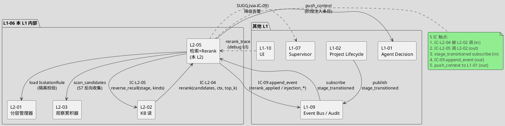
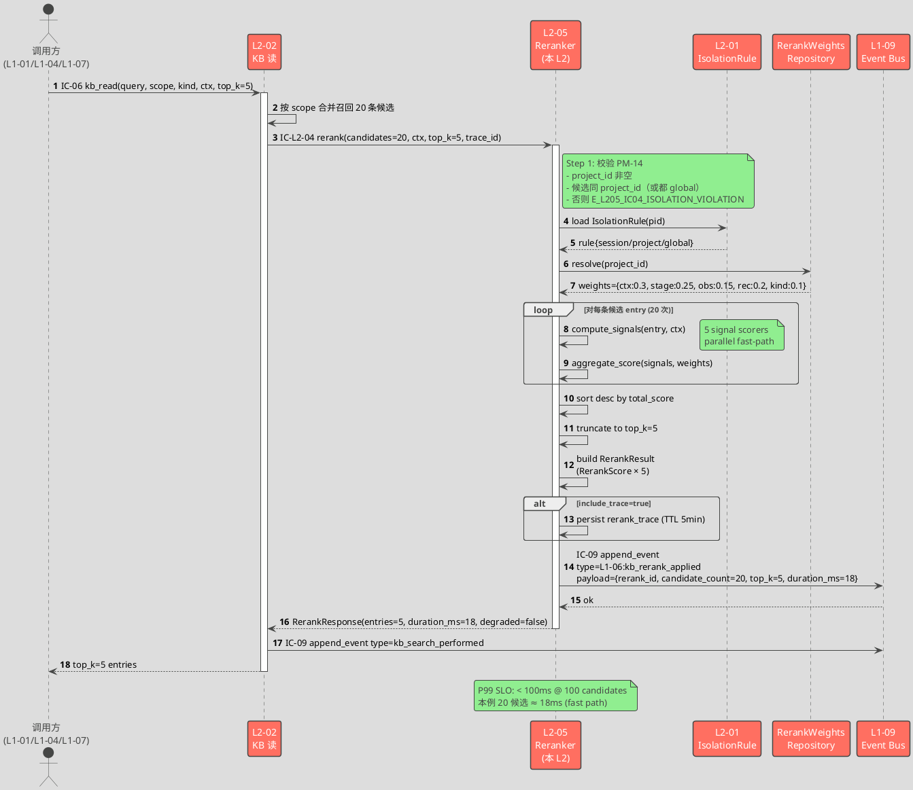
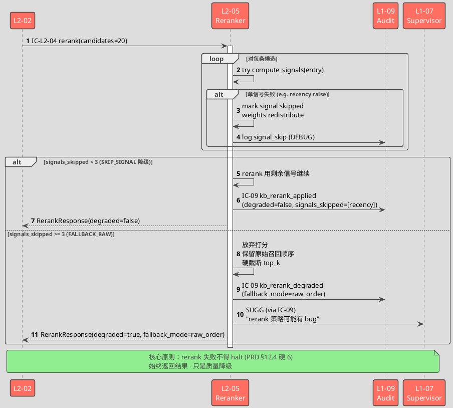
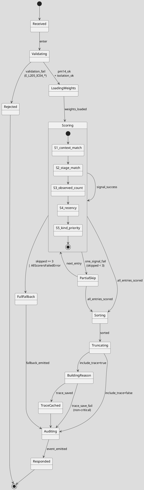
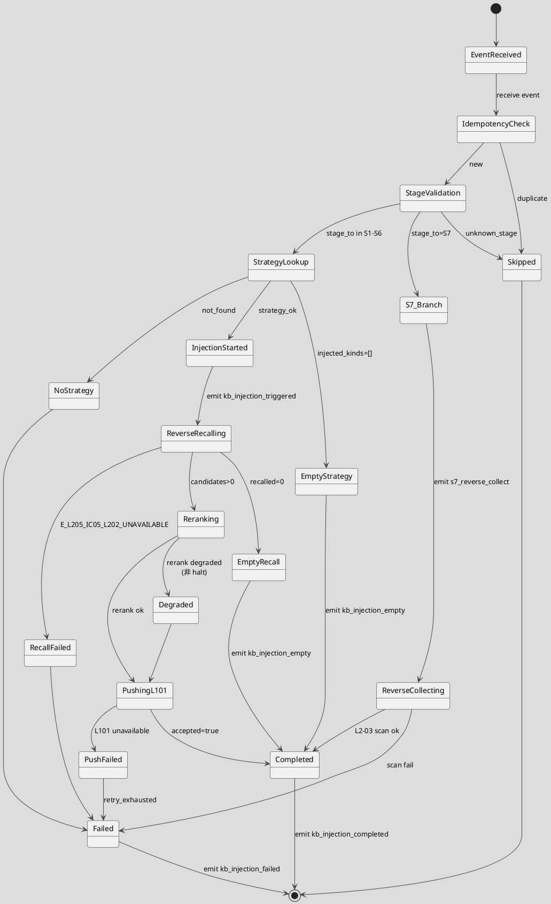

# L1 L2-05 · 检索+Rerank · Tech Design

> **本文档定位**：3-1-Solution-Technical 层级 · L1 的 L2-05 检索+Rerank 技术实现方案（L2 粒度）。
> **与产品 PRD 的分工**：2-prd/L1-06-3层知识库/prd.md §5.6 的对应 L2 节定义产品边界，本文档定义**技术实现**（接口字段级 schema + 算法伪代码 + 底层数据结构 + 状态机 + 配置参数）。
> **与 L1 architecture.md 的分工**：architecture.md 负责**跨 L2 架构 + 跨 L2 时序**，本文档负责**本 L2 内部技术细节**。冲突以 architecture.md 为准。
> **严格规则**：本文档不复述产品 PRD 文字（职责 / 禁止 / 必须等清单），只做技术映射 + 补齐"产品视角未说 but 工程师必须知道"的部分（具体算法 · syscall · schema · 配置）。

---

## §0 撰写进度

- [x] §1 定位 + 2-prd §5.6 L2-05 映射
- [x] §2 DDD 映射（引 L0/ddd-context-map.md BC-06）
- [x] §3 对外接口定义（字段级 YAML schema + 错误码）
- [x] §4 接口依赖（被谁调 · 调谁）
- [x] §5 P0/P1 时序图（PlantUML ≥ 2 张）
- [x] §6 内部核心算法（伪代码）
- [x] §7 底层数据表 / schema 设计（字段级 YAML）
- [x] §8 状态机（PlantUML + 转换表）
- [x] §9 开源最佳实践调研（≥ 3 GitHub 高星项目）
- [x] §10 配置参数清单
- [x] §11 错误处理 + 降级策略
- [x] §12 性能目标
- [x] §13 与 2-prd / 3-2 TDD 的映射表

---

## §1 定位 + 2-prd 映射

### 1.1 本 L2 在 L1-06 3 层知识库里的坐标

L1-06 由 5 个 L2 组成：L2-01 3 层分层管理器（底座 · IsolationRule/Scope VO）· L2-02 KB 读（入口 · IC-06 kb_read）· L2-03 观察累积器（写 · session 层）· L2-04 KB 晋升仪式执行器（晋升 · session→project→global）· **L2-05 检索+Rerank**（排序层 · 多信号打分 + 阶段主动注入）。

L2-05 的定位有**两重身份**，这在 depth-B 展开中必须同时落位，否则会漏掉 IC-L2-05：

1. **被调模式**（Reactive Rerank）：L2-02 每次 kb_read 召回候选集后，**必经**本 L2 做 rerank + top_k 截断。这是 architecture.md §10 钉死的硬约束"召回 + rerank 必须成对"。
2. **订阅模式**（Proactive Injection）：L1-02 `stage_transitioned` 事件到达 → L2-05 订阅触发 → 查 PM-06 注入策略表 → 反向调 L2-02 做一次召回 → rerank → 主动推送到 L1-01 决策上下文（不等 L1-01 主动 read）。

```
  stage_transitioned (L1-02)         kb_read_request (L1-01 / L1-04 / L1-07)
              │                                       │
              ▼                                       ▼
        ┌────────────┐                          ┌──────────┐
        │  L2-05     │  rerank                  │  L2-02   │  召回候选
        │  (本 L2)    │◀─────────── IC-L2-04 ─────│  KB 读   │
        │             │                          └──────────┘
        │ rerank +   │  ──── IC-L2-05 ────▶ L2-02 反向召回
        │ injection  │
        │             │  ──── push context ─────▶ L1-01 决策上下文
        └────────────┘
              │
              ▼
        IC-09 append_event（kb_rerank_applied / stage_injection_triggered）
```

L2-05 承担 BC-06 的"排序策略 + 阶段注入协调"角色。DDD 语义明确：**Domain Service（纯函数）· 无聚合根 · 无状态**（状态从 L1-02 事件 + L2-02 候选集 + PM-06 策略表外部读取），与 L1-04 L2-05 S4 执行驱动器有同构结构（都是无聚合根的 orchestrator），但领域语义完全不同。

### 1.2 与 2-prd §5.6 L2-05 (`prd.md` 行 1111-1270) 的映射表

| 2-prd §12 小节 | 本文档对应 | 技术映射重点 |
|:---|:---|:---|
| §12.1 职责 + 锚定 | §1.3 + §2.1 定位 | Domain Service 纯函数 · 无状态 |
| §12.2 输入/输出 | §3.1-§3.5 IC 字段级 schema | 5 个 IC 触点 · payload 统一 project_id 首字段 |
| §12.3 In/Out-scope | §1.4 非目标 | 禁向量 embedding · 禁 learning-to-rank V1 |
| §12.4 硬约束（6 条） | §6.2 策略表 + §10 配置不可覆盖项 + §11 降级 | PM-06 注入表硬锁 · rerank 不改字段 · fallback 原始顺序 |
| §12.5 禁止行为（7 条） | §11.3 守门器 + §10.3 不可配置项 | 启动期静态校验（配置拒绝加载） |
| §12.6 必须职责（6 条） | §3 各 IC + §6.4 + §6.5 算法 | 订阅 stage_changed · 必打 IC-09 审计 |
| §12.7 可选功能（4 条） | §6.8 打分理由 + §6.9 A/B + §10 flag | 打分拆解 feature flag 控制 |
| §12.8 交互表（IC-L2-04 / IC-L2-05 / stage_changed） | §3.1-§3.3 + §4 依赖图 | 被调 / 主调 / 订阅 三条链 |
| §12.9 交付验证大纲（P1-P5 / N1-N4 / I1-I3） | §13 映射到 3-2 TDD | 每场景一条 tests |

### 1.3 本 L2 在 architecture.md 的坐标

引 `architecture.md §3 BC-06 L2 组件图（PlantUML）行 197-202`：L2-05 通过 `IC-L2-04 rerank` 被 L2-02 调、通过 `IC-L2-05 反向召回` 调 L2-02；引 `architecture.md §4.3 响应面 1 · 阶段切换注入（BF-X-05 PM-06）`（行 440）：L2-05 订阅 `L1-02:stage_transitioned` 事件 → 查策略表 → IC-L2-05 反向召回 → rerank → 推 L1-01。

引 `architecture.md §7 多信号 rerank 算法` (行 703-840)：5 个核心信号 + 打分函数骨架 + PM-06 注入策略表 + 降级路径；本文档 §6 是这段的**字段级 / 伪码级 depth-B 展开**。

引 `architecture.md §11 性能目标`（行 1260+）：**rerank 单次打分 P99 ≤ 100ms @ 100 候选**、**阶段注入端到端秒级**，本文档 §12 将其分解到子模块。

### 1.4 本 L2 的 PM-14 约束

**PM-14 约束**（引 `docs/3-1-Solution-Technical/projectModel/tech-design.md`）：所有 IC payload 顶层 `project_id` 必填；所有存储路径按 `projects/<pid>/...` 分片。

本 L2 的 PM-14 落点（本 L2 无聚合根故持久化极少，主要是策略表 + 审计 + 可选的 A/B 配置）：
- 注入策略表（PM-06）：`config/kb_injection_strategy.yaml`（全局 · 非 project 分片 · 因为是策略而非数据）
- Rerank 权重配置 per project（可选覆盖）：`projects/<pid>/kb/rerank_weights.yaml`
- 审计事件（经 IC-09 落 L1-09）：stream `L1-06.L2-05.rerank` · payload 首字段 `project_id`
- A/B 实验配置（可选）：`projects/<pid>/kb/rerank_ab_config.yaml`
- 打分理由缓存（TTL 5min，仅 UI 调试用）：`projects/<pid>/kb/rerank_trace/<rerank_id>.json`

**跨项目隔离**：L2-05 rerank 候选集合要么全 session 层、全 project 层（同一 pid），要么全 global 层。禁止混合 project A 的 project 层 + project B 的 project 层的候选集——这会由 L2-01 在候选阶段就拦截（IsolationRule），L2-05 只做"候选都已在同一 pid 或 global"的前提假设。

### 1.5 关键技术决策（本 L2 特有 · Decision / Rationale / Alternatives / Trade-off）

| 决策 | 选择 | 备选 | 理由 | Trade-off |
|:---|:---|:---|:---|:---|
| **D1: rerank 实现形式** | 纯 Python 加权打分函数（无 ML） | learning-to-rank / cross-encoder / LLM rerank | PRD §12.4 硬约束 3 禁向量；scope §5.6.5 禁 embedding；V1 不自学习 | 精度上限受限（但本场景多信号结构化特征已足够） |
| **D2: 5 信号来源** | context_match / stage_match / observed_count / recency / kind_priority | +BM25 / +向量 / +点击反馈 | 全部结构化特征 · 无 LLM 开销 · 可完全本地计算 | BM25 推迟到 V2（全文索引上线后），向量推迟到 V3 |
| **D3: 打分函数形式** | 加权线性组合（weights 可配） | 决策树 / 乘法模型 / rank-aggregation | 可解释性强（打分拆解给 UI）· 调参简单 · 避免退化 | 不捕捉信号交互（但结构化场景信号独立性已足） |
| **D4: 权重来源** | 全局默认 + project 级覆盖 + ENV 级覆盖 | 纯硬编码 / 纯 ENV / per-entry | 默认值落生产用，允许 per-project 微调（适配领域差异），ENV 便于 CI | 配置层级增加复杂性（用 L2-01 schema 校验兜底） |
| **D5: top_k 默认策略** | 按阶段 × kind 分别设默认（PM-06 定义） | 全局 top_k=5 / 全局 top_k=10 | PM-06 已钉死策略表；S3→anti_pattern top_k=3 vs S1→trap top_k=5 等差异显著 | PM-06 改一次则要 migrate rerank 默认（用 schema 版本号应对） |
| **D6: 阶段注入触发** | 订阅 `L1-02:stage_transitioned`（pub/sub） | 轮询 / L1-02 直调 | 解耦度最高 · 延迟可控 · 失败恢复走 L1-09 事件重放 | 依赖 L1-09 不丢事件（Partnership 强耦合约定） |
| **D7: 注入失败处理** | 降级到"阶段切换无注入"+ SUGG 告警 | 重试至成功 / 阻塞 stage 切换 | stage 不可因 KB 注入失败被阻塞（KB 不是正路径） | 偶发漏注入靠 L1-07 检测补偿 |
| **D8: rerank 打分理由** | 可选透出（feature flag） | 永不透出 / 永远透出 | 透出对 UI debug 有价值但增带宽；flag 控制 | 默认关闭 · 开发期可打开 |
| **D9: 降级策略** | 4 级（NONE / SKIP_SIGNAL / FALLBACK_RAW / HARD_REJECT） | 2 级 / 无降级 | PRD §12.4 硬约束 6 "失败降级必需"；分级精细控制 | 实现复杂度增加（用状态机兜底） |
| **D10: 审计粒度** | 每次 rerank 落一条 IC-09（不落每个候选的打分） | 全量落 / 不落 | 审计可追溯 but 不爆炸 · 单条 rerank_applied 事件含 top_k 条目 id + 5 信号 aggregate | 不能 post-hoc 追溯单条打分（但可从 rerank_trace 文件查） |

### 1.6 本 L2 读者预期

读完本 L2 的工程师应掌握：
- Reranker Domain Service 的 5 个方法 IC 字段级 schema + 12+ 错误码表
- 8 个算法的伪代码（5 信号打分 / 权重组合 / top_k 截断 / 注入策略查表 / 反向召回 / fallback / A/B 分流 / 打分理由构造）
- 5 张数据表（策略表 YAML / 权重 YAML / 审计事件 / A/B 配置 / rerank_trace）+ PM-14 分片布局
- StageInjectionFSM 状态机（PlantUML 6 个主状态 + 降级分支）
- 4 级降级链（NONE → SKIP_SIGNAL → FALLBACK_RAW → HARD_REJECT）
- SLO（rerank P99 ≤ 100ms @ 100 候选 · 注入端到端 ≤ 2s · 策略表查表 < 5ms）

### 1.7 本 L2 不在的范围（YAGNI）

- **不在**：物理召回 → L2-02 KB 读（本 L2 只对候选排序 · 不做存储遍历）
- **不在**：向量 embedding（scope §5.6.3 明禁 · V1+V2 都不做）
- **不在**：learning-to-rank（本 L1 V1-V2 不自学习）
- **不在**：分层规则维护 → L2-01（L2-05 消费 IsolationRule · 不维护）
- **不在**：写 / 晋升 → L2-03 / L2-04（L2-05 纯读）
- **不在**：rerank 条目内容改写（PRD §12.5 禁止 3）
- **不在**：全库扫描兜底（若 L2-02 候选为空 · L2-05 直接返回空 · 不兜底扫全库）

### 1.8 本 L2 术语表

| 术语 | 定义 | 关联 |
|:---|:---|:---|
| RerankScore | VO · 单条候选的 5 信号加权总分 + 5 子分 | §2.3 |
| StageInjectionStrategy | PM-06 注入策略表（stage → kind + top_k） | §7.1 |
| ApplicableContext | 条目生效条件 VO（阶段 / 任务类型 / 技术栈） | §2.4 |
| 5 核心信号 | context_match · stage_match · observed_count · recency · kind_priority | §6.2 |
| Fallback Raw Order | 降级：原始召回顺序 + 硬截断 | §11.3 |
| Stage-Triggered Injection | 阶段切换主动注入流程（订阅 → 反召 → 排序 → 推） | §5.2 |
| Rerank Trace | 单次 rerank 的打分理由完整记录（TTL 5min） | §6.8 |

### 1.9 本 L2 的 DDD 定位一句话

> **L2-05 是 BC-06 3-Tier Knowledge Base 的 Domain Service 层 · 无聚合根的纯函数 reranker · 5 IC 触点 · 5 核心信号加权打分 · 订阅 stage_transitioned 做 PM-06 策略表驱动的主动注入 · 4 级降级链 · 禁向量 + 禁 learning-to-rank 的 V1 硬约束。**

---

## §2 DDD 映射（BC-06 3-Tier Knowledge Base · Domain Service 层）

引 `docs/3-1-Solution-Technical/L0/ddd-context-map.md BC-06`（§2.7 行 351+ · §4.6 行 769+）。

本 L2 在 BC-06 里属于 **Domain Service 层 · 纯函数无聚合根**，持有 VO（`RerankScore` / `RerankSignalSet` / `ApplicableContext` 引用）和策略（`StageInjectionStrategy`）。

### 2.1 Domain Service · Reranker

**职责**：接收 L2-02 候选集 → 加权打分 → 截断 top_k → 返回排序结果 + 每条打分理由（可选）

**本质**：纯函数 · 无域数据所有权 · 操作其他聚合根（KBEntry）但不修改其字段（PRD §12.5 禁止 3）

**关键字段**（无状态，依赖构造时注入）：

```yaml
# 构造依赖
dependencies:
  kb_entry_repository:           # L2-02 提供（读 candidate KBEntry）
  stage_injection_strategy_repo: # L2-01 提供（读 PM-06 策略表）
  rerank_weights_repo:           # 本 L2 维护（per-project 覆盖）
  isolation_rule_repo:           # L2-01 提供（跨项目隔离校验）
  event_bus:                     # L1-09 append_event
  l202_reverse_recall_port:      # IC-L2-05 调 L2-02 反召
  l101_context_push_port:        # 主动注入推 L1-01 决策上下文
  ab_experiment_repo:            # 可选 · A/B 实验
  rerank_trace_repo:             # 可选 · 打分理由缓存

# 配置
config:
  default_top_k_per_strategy:    # PM-06 每策略默认 top_k
  rerank_timeout_ms: 100          # 亚百毫秒硬约束
  rerank_trace_enabled: false    # feature flag
  fallback_mode: "raw_order"     # 默认降级策略
  stage_injection_timeout_ms: 2000
```

**行为**（Methods · 5 个对外方法）：
- `rerank(candidates, context, top_k) -> RerankResult` — 被调入口（IC-L2-04）
- `on_stage_transitioned(event) -> InjectionResult` — 事件订阅入口
- `compute_signals(entry, context) -> RerankSignalSet` — 内部 · 5 信号计算
- `aggregate_score(signals, weights) -> float` — 内部 · 加权组合
- `apply_injection_strategy(stage_to, project_id) -> list[KBEntry]` — 内部 · 查表反召

### 2.2 Value Object · RerankSignalSet

**标识**：`(entry_id, context_hash)` 联合（相同条目在不同 context 下信号值不同）
**不变性**：immutable（单次 rerank 内一致 · 不跨次缓存）

**字段**（字段级 YAML）：

```yaml
entry_id: "uuid"
project_id: "uuid"              # PM-14
context_hash: "sha256-hex"      # context 指纹（含 stage/task_type/tech_stack）
computed_at: "2026-04-21T10:00:00Z"
# 5 核心信号（0-1 归一化）
signals:
  context_match: 0.85           # applicable_context 命中度
  stage_match: 1.0              # 当前 stage ∈ entry.stages
  observed_count: 0.72          # log(count) / log(max_count) 归一
  recency: 0.91                 # exp(-age_days / decay_days)
  kind_priority: 0.6            # 本次 rerank kind ∈ strategy 命中度
# 子分细节（debug 用）
signal_details:
  context_match_breakdown:
    task_type_match: true
    tech_stack_overlap_pct: 0.8
    stage_overlap: true
  observed_count_raw: 15
  last_observed_at: "2026-04-20T08:00:00Z"
  age_days: 1.08
```

### 2.3 Value Object · RerankScore

**标识**：`(entry_id, rerank_id)` 联合
**不变性**：immutable

**字段**：

```yaml
entry_id: "uuid"
project_id: "uuid"              # PM-14
rerank_id: "uuid"               # 单次 rerank 调用 id（audit 用）
total_score: 0.78               # 加权总分
signals_ref: "RerankSignalSet#<hash>"
weights_used:
  context_match: 0.3
  stage_match: 0.25
  observed_count: 0.15
  recency: 0.2
  kind_priority: 0.1
rank: 3                         # 在 top_k 中的位次
reason:                         # 可选 · 打分理由（flag 控制）
  top_signal: "stage_match"
  bottom_signal: "kind_priority"
  narrative: "阶段完全匹配（S3 ∈ [S3,S4]），近因高（< 2 天），观察次数中等（15）"
```

### 2.4 Value Object · StageInjectionStrategy（PM-06 落地）

**标识**：`stage: enum[S1-S7]`
**不变性**：immutable at startup · 配置不可运行时覆盖（PRD §12.5 禁止 1）

**字段**：

```yaml
stage: "S3"                     # 阶段 enum
injected_kinds:                 # 注入 kind 列表
  - kind: "anti_pattern"
    top_k: 3
    min_observed_count: 2
    scope_priority: ["session", "project", "global"]
min_source_scope: "session"     # 最低可用层
injection_max_total: 5          # 本阶段总注入上限
enabled: true                   # 不可设 false（硬约束）
strategy_version: "v1.0"
```

完整 7 阶段映射（PRD §12.4 硬约束 1）：

| stage | injected_kinds | top_k (per kind) |
|:---|:---|:---|
| **S1** | trap, pattern | 5, 3 |
| **S2** | recipe, tool_combo | 3, 3 |
| **S3** | anti_pattern | 3 |
| **S4** | pattern | 3 |
| **S5** | trap | 3 |
| **S6** | —（无注入） | 0 |
| **S7** | 反向收集（触发 L2-03 晋升候选扫描） | N/A |

### 2.5 Value Object · RerankResult

**标识**：`rerank_id: UUIDv7`
**不变性**：immutable · 单次构建

**字段**：

```yaml
rerank_id: "uuid"
project_id: "uuid"
invoked_by:                     # 调用方
  ic: "IC-L2-04"
  caller: "L2-02"
request:
  context:                      # 请求 context
    stage: "S3"
    task_type: "coding"
    tech_stack: ["python"]
  candidate_count: 20
  top_k: 5
result:
  entries:                      # 返回的 top_k KBEntry + RerankScore
    - entry_id: "..."
      score_ref: "RerankScore#..."
      rank: 1
degraded: false                 # 是否降级
fallback_mode: null             # 降级模式（若 degraded=true）
duration_ms: 18
weights_applied: { ... }
signals_skipped: []             # 计算失败的信号（降级 SKIP_SIGNAL 时非空）
```

### 2.6 Domain Services（本 L2 内部 · 非全局）

#### 2.6.1 ContextMatchScorer
**职责**：计算 applicable_context 匹配度（task_type / tech_stack / stage overlap）
**方法**：`score(entry: KBEntry, context: QueryContext) -> float` 返回 0-1

#### 2.6.2 StageMatchScorer
**职责**：当前阶段是否 ∈ entry.applicable_stages
**方法**：`score(entry: KBEntry, current_stage: str) -> float` 返回 {0, 0.5, 1.0}

#### 2.6.3 ObservedCountScorer
**职责**：log 归一化 observed_count
**方法**：`score(entry: KBEntry, max_count: int) -> float`

#### 2.6.4 RecencyScorer
**职责**：时间衰减函数 `exp(-age_days / decay_days)` · decay 配置化
**方法**：`score(entry: KBEntry, now: datetime) -> float`

#### 2.6.5 KindPriorityScorer
**职责**：本次 rerank 的 kind 列表（如 S3 注入 kind=[anti_pattern]）vs entry.kind 的优先级匹配
**方法**：`score(entry: KBEntry, active_kinds: list[str]) -> float`

#### 2.6.6 WeightedAggregator
**职责**：5 子分加权组合为 total_score
**方法**：`aggregate(signals: RerankSignalSet, weights: dict) -> float`

#### 2.6.7 StageInjectionDispatcher
**职责**：订阅 `L1-02:stage_transitioned` → 查策略表 → 反向召回 → rerank → 推 L1-01
**方法**：
```python
class StageInjectionDispatcher:
    def on_event(event: StageTransitionedEvent) -> InjectionResult
    def lookup_strategy(stage_to: str) -> StageInjectionStrategy
    def reverse_recall(strategy, project_id) -> list[KBEntry]
    def push_to_l101(entries: list[KBEntry], project_id) -> None
```

### 2.7 Repository（本 L2 的持久化接口）

#### 2.7.1 StageInjectionStrategyRepository

```python
class StageInjectionStrategyRepository(abc.ABC):
    def load_all(self) -> dict[str, StageInjectionStrategy]  # 启动期加载
    def get(stage: str) -> StageInjectionStrategy
    # NO save() · 策略不可运行时写（PRD §12.5）
```

#### 2.7.2 RerankWeightsRepository

```python
class RerankWeightsRepository(abc.ABC):
    def load_default(self) -> dict[str, float]
    def load_project_override(project_id: str) -> dict[str, float] | None
    def resolve(project_id: str) -> dict[str, float]  # default + override 合并
```

#### 2.7.3 RerankTraceRepository（可选）

```python
class RerankTraceRepository(abc.ABC):
    def save(rerank_id: str, trace: list[RerankScore], ttl_sec: int = 300) -> None
    def get(rerank_id: str) -> list[RerankScore] | None
```

### 2.8 Domain Events（本 L2 发出的事件）

| Event | 触发 | Payload |
|:---|:---|:---|
| **L1-06:kb_rerank_applied** | 每次 rerank 完成 | (rerank_id, project_id, candidate_count, top_k, duration_ms, degraded, signals_used) |
| **L1-06:kb_rerank_degraded** | 降级触发 | (rerank_id, project_id, fallback_mode, error_code) |
| **L1-06:kb_injection_triggered** | 阶段注入启动 | (injection_id, project_id, stage_from, stage_to, strategy_version) |
| **L1-06:kb_injection_completed** | 阶段注入完成 | (injection_id, injected_count, pushed_to_l101, duration_ms) |
| **L1-06:kb_injection_empty** | 策略无命中条目 | (injection_id, stage_to, project_id, reason) |
| **L1-06:kb_injection_failed** | 阶段注入失败 | (injection_id, error_code, fallback_action) |
| **L1-06:kb_injection_s7_reverse_collect** | S7 反向收集触发 | (injection_id, project_id, scanned_count) |
| **L1-06:kb_ab_experiment_hit** | A/B 实验分流 | (rerank_id, experiment_id, variant) |

### 2.9 本 L2 命名锁映射

| 锁定命名 | 本 L2 引用 | 说明 |
|:---|:---|:---|
| **AR: L1-06 KBEntry** | L2-05 消费（只读） | 不修改字段（PRD §12.5 禁止 3） |
| **AR: L1-06 KnowledgeRecipe** | L2-05 消费（只读） | kind=recipe 的 KBEntry 特化 |
| **AR: L1-06 Trap** | L2-05 消费（只读） | kind=trap 的 KBEntry 特化 |
| **VO: RerankScore** | L2-05 产出 | §2.3 |
| **VO: ApplicableContext** | L2-05 读取（信号计算） | §2.4 |
| **VO: EightDimensionVector** | 不涉及（BC-07 专属） | — |
| **VO: FourLevelClassification** | 不涉及（BC-07 专属） | — |
| **VO: ThreeEvidenceChain** | 不涉及（BC-07 专属） | — |
| **VO: StageContract** | 不直接引 · 通过 stage enum 消费 | 见 §6.2 |
| **VO: ToolCallTrace** | 仅 audit · 不核心 | §11 |

---

## §3 对外接口定义（字段级 YAML schema + 错误码）

**本 L2 对外有 5 个 IC 触点**。命名 IC 组合遵循 `architecture.md §9`。

### 3.1 IC-L2-04 rerank（入站 · 被 L2-02 调）

**方向**：L2-02 → L2-05
**同步/异步**：同步（L2-02 阻塞等结果）

**Input**：

```yaml
rerank_request:
  project_id: "uuid"            # PM-14 项目上下文
  rerank_id: "uuid"             # 调用方生成 · idempotency key
  invoked_at: "2026-04-21T10:00:00Z"
  candidates:                   # L2-02 召回的候选集
    - entry_id: "uuid"
      scope: "project"          # session / project / global
      kind: "pattern"           # 8 类 kind
      entry_summary:            # 摘要（不传完整 content）
        title: "..."
        applicable_context:
          stages: ["S3", "S4"]
          task_types: ["coding"]
          tech_stacks: ["python", "fastapi"]
        observed_count: 15
        last_observed_at: "2026-04-20T08:00:00Z"
  context:                      # 请求上下文
    current_stage: "S3"
    task_type: "coding"
    tech_stack: ["python"]
    query_hint: "rerank intent keywords"
  top_k: 5                      # 截断上限（若省略用策略默认）
  include_trace: false          # 是否透出打分理由
  trace_id: "..."
```

**Output**：

```yaml
rerank_response:
  project_id: "uuid"
  rerank_id: "uuid"
  status: "success"             # success / degraded / rejected
  entries:                      # 排序后 top_k
    - entry_id: "uuid"
      rank: 1
      score: 0.89
      score_ref: "RerankScore#<id>"
      reason:                   # 若 include_trace=true
        top_signal: "stage_match"
        narrative: "..."
  degraded: false
  fallback_mode: null
  duration_ms: 18
  weights_applied:
    context_match: 0.3
    stage_match: 0.25
    observed_count: 0.15
    recency: 0.2
    kind_priority: 0.1
  signals_skipped: []
```

**错误码**：

| 错误码 | 含义 | 触发场景 | 调用方处理 |
|:---|:---|:---|:---|
| `E_L205_IC04_EMPTY_CANDIDATES` | 候选集为空 | L2-02 召回 0 条 | 返回空 entries · 不降级 |
| `E_L205_IC04_INVALID_TOP_K` | top_k 非法（≤0 或 > 上限） | 调用方参数错 | 用策略默认 · 告警 |
| `E_L205_IC04_PROJECT_ID_MISSING` | project_id 缺失 | PM-14 违规 | REJECTED · HARD_REJECT |
| `E_L205_IC04_CONTEXT_INVALID` | context 字段不符 schema | 调用方 schema 错 | REJECTED |
| `E_L205_IC04_SCORE_COMPUTE_FAIL` | 某条候选打分计算抛异常 | signal scorer bug | SKIP_SIGNAL 降级 |
| `E_L205_IC04_ALL_SCORERS_FAILED` | 5 信号全部失败 | 严重 bug | FALLBACK_RAW 降级 |
| `E_L205_IC04_WEIGHTS_SUM_INVALID` | 权重和 ≠ 1.0 ± ε | 配置错 | 用默认权重 · 告警 |
| `E_L205_IC04_TOP_K_CAPPED` | top_k 超过策略上限 | 调用方传过大 | 截断 · 审计 top_k_capped |
| `E_L205_IC04_ISOLATION_VIOLATION` | 候选跨 project（非 global） | 上游 bug | REJECTED + 上报 L1-07 |
| `E_L205_IC04_TIMEOUT` | 单次 rerank > 100ms | 性能退化 | 降级 + SUGG |
| `E_L205_IC04_TRACE_CACHE_FAIL` | trace 写缓存失败 | 非关键路径 | 继续 · 不降级 |
| `E_L205_IC04_ENTRY_FIELD_TAMPERED` | 检测到 entry 被改（哈希不符） | 违 PRD §12.5 禁 3 | REJECTED · 严重告警 |

### 3.2 IC-L2-05 reverse_recall（出站 · 调 L2-02）

**方向**：L2-05 → L2-02
**同步/异步**：同步（阶段注入时阻塞 ≤ 2s 总预算内）

**Input**（L2-05 构造传给 L2-02）：

```yaml
reverse_recall_request:
  project_id: "uuid"            # PM-14
  injection_id: "uuid"
  requested_by: "L2-05"
  stage_to: "S3"
  kinds: ["anti_pattern"]       # 策略表指定
  scope_priority: ["session", "project", "global"]
  recall_top_k: 20              # 召回上限（大于后续 rerank 的 top_k）
  context:                      # 构造 context
    current_stage: "S3"
    task_type: null             # 注入期可能无 task_type
  trace_id: "..."
```

**Output**（L2-02 返回）：

```yaml
reverse_recall_response:
  project_id: "uuid"
  injection_id: "uuid"
  candidates: [...]             # 同 IC-L2-04 candidates 格式
  recalled_count: 18
  duration_ms: 45
  scope_layers_hit: ["session", "project"]
```

**错误码**：

| 错误码 | 含义 | 恢复 |
|:---|:---|:---|
| `E_L205_IC05_L202_UNAVAILABLE` | L2-02 不可达 | 重试 1 次 · 失败降级 empty_injection |
| `E_L205_IC05_EMPTY_RECALL` | 策略无命中 | 发 kb_injection_empty · 不降级 |
| `E_L205_IC05_TIMEOUT` | 反召超时（> 1s） | 放弃本阶段注入 · 告警 |

### 3.3 stage_transitioned 事件订阅（入站 · L1-02 经 L1-09）

**方向**：L1-02 → L1-09 event bus → L2-05 订阅

**Event Schema**：

```yaml
event_type: "L1-02:stage_transitioned"
event_version: "v1.0"
emitted_at: "2026-04-21T10:00:00Z"
emitted_by: "L1-02"
event_id: "uuid"
payload:
  project_id: "uuid"            # PM-14
  stage_from: "S2"
  stage_to: "S3"
  transition_reason: "gate_approved"
  transition_at: "2026-04-21T10:00:00Z"
  gate_id: "uuid"               # 如果是经 Gate 转场
trace_id: "..."
```

**接收方动作**（§6.4 算法展开）：
- 校验 stage_to ∈ {S1..S7}（策略表校验）
- 查策略表 → 若 injected_kinds 非空 → 启动反召 → rerank → 推 L1-01
- 若 stage_to = S7 → 触发反向收集（调 L2-03 扫描候选）
- 每步失败都走 IC-09 audit

**错误码**：

| 错误码 | 含义 | 恢复 |
|:---|:---|:---|
| `E_L205_STAGE_UNKNOWN` | stage_to 非 S1-S7 | REJECTED · 严重告警 |
| `E_L205_STRATEGY_NOT_FOUND` | 策略表无此 stage（配置损坏） | FALLBACK_NO_INJECTION · 告警 |
| `E_L205_STAGE_INJECT_TIMEOUT` | 端到端 > 2s | 放弃注入 · SUGG |
| `E_L205_L101_PUSH_FAIL` | 推 L1-01 失败 | 重试 1 · 失败 L1-07 接管 |
| `E_L205_DUPLICATE_EVENT` | 同 event_id 重复消费 | 幂等跳过 · 审计 |

### 3.4 IC-09 append_event（出站 · 调 L1-09）

**方向**：L2-05 → L1-09

**Stream**：`L1-06.L2-05.rerank` 或 `L1-06.L2-05.injection`

**Payload**（统一 envelope）：

```yaml
stream: "L1-06.L2-05.rerank"
event_type:
  - kb_rerank_applied
  - kb_rerank_degraded
  - kb_injection_triggered
  - kb_injection_completed
  - kb_injection_empty
  - kb_injection_failed
  - kb_injection_s7_reverse_collect
  - kb_ab_experiment_hit
payload:
  project_id: "uuid"            # PM-14 首字段
  rerank_id: "uuid"
  injection_id: "uuid"
  candidate_count: 20
  top_k: 5
  duration_ms: 18
  degraded: false
  fallback_mode: null
  signals_used: [5 signal names]
  top_k_capped: false
  error_code: null
trace_id: "..."
```

**错误码**：

| 错误码 | 含义 | 恢复 |
|:---|:---|:---|
| `E_L205_IC09_EVENT_BUS_UNAVAILABLE` | L1-09 不可达 | 本地 WAL 缓存 · 重试 3 次 |
| `E_L205_IC09_PAYLOAD_INVALID` | payload schema 错 | DROP · 告警（本 L2 bug） |

### 3.5 push_to_l101（出站 · 主动推 L1-01）

**方向**：L2-05 → L1-01（经 L1-01 的内部 push context API）

**Input**：

```yaml
push_context_request:
  project_id: "uuid"            # PM-14
  injection_id: "uuid"
  source: "L2-05_stage_injection"
  context_type: "kb_injection"
  stage: "S3"
  entries:                      # rerank 后 top_k
    - entry_id: "uuid"
      kind: "anti_pattern"
      title: "..."
      content_preview: "..."    # 前 500 字符
      score: 0.89
      rank: 1
  summary_card:                 # 给 L1-10 UI 显示
    stage: "S3"
    injected_count: 3
    kinds: ["anti_pattern"]
  ttl_sec: null                 # 不过期（随 stage 切换自然替换）
  trace_id: "..."
```

**Output**：

```yaml
push_context_response:
  accepted: true
  context_id: "uuid"
  rejection_reason: null
```

**错误码**：

| 错误码 | 含义 | 恢复 |
|:---|:---|:---|
| `E_L205_L101_REJECT` | L1-01 拒绝推送（上下文已满） | SUGG · 不重试 |
| `E_L205_L101_UNAVAILABLE` | L1-01 不可达 | 重试 1 · 失败告警 |

---

## §4 接口依赖（被谁调 · 调谁）

### 4.1 上游调用方（本 L2 被谁调 / 订阅谁）

| 上游 | 方向 | IC / Event | 触发条件 | 频率 |
|:---|:---|:---|:---|:---|
| **L2-02 KB 读** | → L2-05 | IC-L2-04 rerank | 每次 kb_read 召回完成 | 高频（每次 kb_read 1 次） |
| **L1-02 ProjectLifecycle** | → L2-05（经 L1-09） | stage_transitioned event | 阶段转换完成 | 低频（每项目 ≤ 7 次） |
| **L1-10 UI**（可选） | → L2-05 | 直连查 rerank_trace | UI debug 展开 | 极低频 |

### 4.2 下游依赖（本 L2 调谁）

| 下游 | 方向 | IC / 方法 | 调用条件 | 频率 |
|:---|:---|:---|:---|:---|
| **L2-02 KB 读** | L2-05 → | IC-L2-05 reverse_recall | 阶段注入时反召 | 低频（每 stage_transitioned 1 次） |
| **L2-01 分层管理器** | L2-05 → | IsolationRule 查询 | 注入时确认可读层 | 中频 |
| **L1-01 Agent Decision Loop** | L2-05 → | push_context | 注入完成推条目 | 低频（同 stage_transitioned） |
| **L1-09 Event Bus** | L2-05 → | IC-09 append_event | 每次 rerank / 注入 | 高频 |
| **L2-03 观察累积器** | L2-05 → | scan_promotion_candidates（S7 时） | 阶段到 S7 | 极低频 |
| **L1-07 Supervisor**（降级告警） | L2-05 → | 经 IC-09 的 SUGG 事件 | 降级发生 | 偶发 |

### 4.3 依赖图（PlantUML）



### 4.4 强耦合关系（架构层面必须对齐）

- **L2-05 ↔ L2-02**：Partnership（双向强耦合）· 召回-rerank 协议 + 反向召回协议 · 任一 schema 变更都必同步
- **L2-05 ↔ L1-09**：Customer（L2-05 消费 stage_transitioned）+ Partnership（每次 rerank 必 audit）
- **L2-05 ↔ L1-02**：Customer（单向订阅）· L1-02 不感知 L2-05 存在
- **L2-05 ↔ L1-01**：Customer-Supplier（L2-05 推 context · L1-01 可拒绝）· 拒绝不是错

### 4.5 弱耦合关系

- **L2-05 ↔ L1-10 UI**：仅 debug 路径（rerank_trace 查询） · 删除不影响主功能
- **L2-05 ↔ L1-07 Supervisor**：仅通过 IC-09 SUGG 事件间接 · 无直接 IC

---

## §5 P0/P1 时序图（PlantUML ≥ 2 张）

### 5.1 时序图一 · Reactive Rerank（L2-02 召回后调 L2-05）· P0 主链

**场景一句话**：L1-01 或 L1-04 或 L1-07 等调用方发起 `kb_read` → L2-02 召回 20 条候选 → IC-L2-04 调 L2-05 做 rerank + top_k 截断 → 返回 5 条排序结果 + 每条打分理由 → L2-02 再返给调用方。

**覆盖路径**：正常路径 + 打分 + IC-09 审计 + 性能（亚百毫秒）



**关键时序约束**：
- Step 3-5 鉴权 + 权重加载：< 10ms（本地缓存命中）
- Step 6 循环打分：≈ 8ms @ 20 候选（单条 < 400μs）
- Step 10 IC-09 append_event：< 5ms（异步路径走 WAL · 不阻塞主返回）
- 端到端：< 20ms（远低于 100ms SLO）

### 5.2 时序图二 · Proactive Stage Injection（阶段切换主动注入）· P0 另一链

**场景一句话**：L1-02 完成 S2→S3 状态转换 → 发布 stage_transitioned 事件 → L2-05 订阅收到 → 查 PM-06 策略表（S3 → kind=anti_pattern, top_k=3）→ 调 IC-L2-05 反召 L2-02 → 拿 18 条候选 → rerank → 截断 3 条 → 推 L1-01 决策上下文 → L1-01 在后续决策中参考 anti_pattern 条目。

**覆盖路径**：订阅 + 策略查表 + 反召 + rerank + push + 审计 + 降级分支（空召回）

```plantuml
@startuml L2-05-stage-injection-flow
!theme toy
autonumber

participant "L1-02\nProject Lifecycle" as L102
participant "L1-09\nEvent Bus" as L109
participant "L2-05\nReranker\n(本 L2)" as L205
participant "StageInjectionStrategy\nRepository" as SR
participant "L2-02\nKB 读" as L202
participant "L1-01\nAgent Decision" as L101

L102 -> L109 : publish(L1-02:stage_transitioned)\npayload={pid, from=S2, to=S3, gate_id}
L109 -> L205 : deliver event(subscribe)
activate L205

note right of L205
  Step 1: 事件校验
  - stage_to ∈ {S1..S7}
  - event_id 幂等（防重复消费）
  - 否则 E_L205_DUPLICATE_EVENT
end note

L205 -> SR : get(stage=S3)
SR --> L205 : strategy{kind=[anti_pattern], top_k=3}

alt strategy_not_found
  L205 -> L109 : IC-09 kb_injection_failed\n(E_L205_STRATEGY_NOT_FOUND)
  L205 -> L205 : FALLBACK_NO_INJECTION
  note right : 不阻塞 stage 切换
  [*] -> end1
end

L205 -> L109 : IC-09 kb_injection_triggered\n(injection_id, pid, stage_from=S2, stage_to=S3)

L205 -> L202 : IC-L2-05 reverse_recall\n(pid, stage=S3, kinds=[anti_pattern], recall_top_k=20)
activate L202
L202 -> L202 : scan KB by kind=anti_pattern\nfilter scope + applicable_context
L202 --> L205 : candidates=18
deactivate L202

alt empty_recall (候选=0)
  L205 -> L109 : IC-09 kb_injection_empty\n(injection_id, reason="no_matching_entries")
  note right : S3 但项目尚无 anti_pattern · 合理
  L205 -> L101 : push_context(entries=[], summary_card="No KB injection")
  [*] -> end2
end

note right of L205
  Step 5: 复用 rerank 核心
  同 §5.1 step 6-9
end note

loop 对每条候选 (18 次)
  L205 -> L205 : compute_signals(entry, ctx=S3)
  L205 -> L205 : aggregate_score(signals, weights)
end
L205 -> L205 : sort + truncate(top_k=3)

L205 -> L101 : push_context(\n  source="L2-05_stage_injection",\n  stage=S3,\n  entries=3 × anti_pattern,\n  summary_card)
activate L101
L101 -> L101 : accept into decision context
L101 --> L205 : accepted=true, context_id
deactivate L101

L205 -> L109 : IC-09 kb_injection_completed\n(injection_id, injected_count=3, pushed=true, duration_ms=1250)

alt stage_to = S7
  L205 -> L205 : 触发 S7 反向收集分支
  L205 -> L109 : IC-09 kb_injection_s7_reverse_collect
  note right : S7 特殊 · 调 L2-03 扫描晋升候选
end

deactivate L205

note over L205, L101
  端到端 SLO: 秒级 (≤ 2s)
  本例: 1250ms (策略查表 3ms + 反召 45ms + rerank 18ms\n+ push 12ms + audit 开销)
end note

@enduml
```

**关键时序约束**：
- Step 1-3 事件投递 + 策略查表：< 10ms
- Step 4 反召 L2-02（IC-L2-05）：P99 < 500ms（依赖 L2-02 SLO）
- Step 5-7 rerank：< 100ms
- Step 8 push L1-01：< 50ms
- 端到端 SLO：≤ 2s（PRD §12.4 "秒级"）

### 5.3 时序图三 · 降级分支（打分器异常 · FALLBACK_RAW）· P1

**场景一句话**：rerank 过程中某信号 scorer（如 recency）因 entry 字段缺失抛异常 → 先尝试 SKIP_SIGNAL 降级 → 若 ≥ 3 个信号失败 → 升级到 FALLBACK_RAW（原始召回顺序 + 硬截断 top_k）→ 发 INFO rerank_degraded → 继续返回结果（不 halt）。



---

## §6 内部核心算法（伪代码）

### 6.1 主方法 · Reranker.rerank（IC-L2-04 入口）

```python
def rerank(request: RerankRequest) -> RerankResponse:
    """
    主入口 · L2-02 召回后调本方法
    SLO: P99 < 100ms @ 100 候选
    """
    # === PM-14 硬校验 ===
    if not request.project_id:
        raise E_L205_IC04_PROJECT_ID_MISSING
    validate_isolation(request.candidates, request.project_id)
    # 若候选混项目 -> E_L205_IC04_ISOLATION_VIOLATION (HARD_REJECT)

    # === 读权重 ===
    weights = weights_repo.resolve(request.project_id)
    if abs(sum(weights.values()) - 1.0) > 1e-6:
        logger.warn("weights_sum_invalid, using default")
        weights = weights_repo.load_default()

    # === top_k 规范化 ===
    top_k = request.top_k or get_default_top_k(request.context.current_stage)
    cap = config.top_k_hard_cap   # 默认 20
    if top_k > cap:
        top_k = cap
        emit_event("top_k_capped", top_k=top_k)

    # === 打分循环（热路径）===
    rerank_id = uuidv7()
    scores: list[RerankScore] = []
    signals_skipped: set[str] = set()
    errors = 0

    deadline = monotonic_ms() + config.rerank_timeout_ms  # 100ms
    for entry in request.candidates:
        if monotonic_ms() > deadline:
            emit_event("rerank_timeout_partial")
            break
        try:
            signal_set = compute_signals(entry, request.context, signals_skipped)
            total = aggregate_score(signal_set, weights, signals_skipped)
            scores.append(RerankScore(
                entry_id=entry.entry_id,
                project_id=request.project_id,
                rerank_id=rerank_id,
                total_score=total,
                signals_ref=signal_set,
                weights_used=weights,
                reason=build_reason(signal_set) if request.include_trace else None,
            ))
        except SingleSignalError as e:
            signals_skipped.add(e.signal_name)
            errors += 1
            if len(signals_skipped) >= 3:
                return fallback_raw_order(request, rerank_id)

    # === 排序 + 截断 ===
    scores.sort(key=lambda s: s.total_score, reverse=True)
    top = scores[:top_k]
    for rank, s in enumerate(top, 1):
        s.rank = rank

    # === 可选 · trace 缓存 ===
    if request.include_trace and trace_repo:
        trace_repo.save(rerank_id, top, ttl_sec=300)

    # === 审计 ===
    emit_event("kb_rerank_applied", dict(
        project_id=request.project_id,
        rerank_id=rerank_id,
        candidate_count=len(request.candidates),
        top_k=len(top),
        duration_ms=(monotonic_ms() - start_ms),
        degraded=(len(signals_skipped) > 0),
        signals_skipped=list(signals_skipped),
    ))

    return RerankResponse(
        project_id=request.project_id,
        rerank_id=rerank_id,
        entries=top,
        status="degraded" if signals_skipped else "success",
        degraded=bool(signals_skipped),
        fallback_mode=None,
        duration_ms=monotonic_ms() - start_ms,
        weights_applied=weights,
        signals_skipped=list(signals_skipped),
    )
```

### 6.2 5 信号打分函数（compute_signals）

```python
def compute_signals(
    entry: KBEntry,
    ctx: QueryContext,
    skipped: set[str],
) -> RerankSignalSet:
    """5 个 scorer 的协调；单个失败仅记入 skipped 不抛"""
    s = RerankSignalSet(
        entry_id=entry.entry_id,
        project_id=entry.project_id,
        context_hash=sha256(canonical_json(ctx)),
        computed_at=now_utc(),
        signals={},
        signal_details={},
    )

    # S1: context_match
    try:
        s.signals["context_match"] = context_match_scorer.score(entry, ctx)
    except Exception as e:
        skipped.add("context_match")
        logger.exception("context_match_scorer fail", entry_id=entry.entry_id)

    # S2: stage_match
    try:
        s.signals["stage_match"] = stage_match_scorer.score(entry, ctx.current_stage)
    except Exception:
        skipped.add("stage_match")

    # S3: observed_count (log 归一)
    try:
        s.signals["observed_count"] = observed_count_scorer.score(
            entry, max_count=max_count_cache.get(entry.project_id)
        )
    except Exception:
        skipped.add("observed_count")

    # S4: recency (exp decay)
    try:
        s.signals["recency"] = recency_scorer.score(entry, now=datetime.utcnow())
    except Exception:
        skipped.add("recency")

    # S5: kind_priority
    try:
        active_kinds = ctx.active_kinds or [entry.kind]
        s.signals["kind_priority"] = kind_priority_scorer.score(entry, active_kinds)
    except Exception:
        skipped.add("kind_priority")

    return s
```

**S1 context_match 详细算法**：
```python
class ContextMatchScorer:
    def score(self, entry: KBEntry, ctx: QueryContext) -> float:
        ac: ApplicableContext = entry.applicable_context

        task_match = 1.0 if ctx.task_type in ac.task_types else 0.0
        tech_overlap = jaccard(set(ctx.tech_stack), set(ac.tech_stacks or []))
        stage_overlap = 1.0 if ctx.current_stage in ac.stages else 0.0

        # 加权子分（内部可调）
        return 0.4 * task_match + 0.3 * tech_overlap + 0.3 * stage_overlap
```

**S2 stage_match**：
```python
class StageMatchScorer:
    def score(self, entry, current_stage):
        if current_stage in (entry.applicable_context.stages or []):
            return 1.0
        # 相邻阶段给部分分
        adj = ADJACENT_STAGES.get(current_stage, [])
        for s in entry.applicable_context.stages:
            if s in adj:
                return 0.5
        return 0.0
```

**S3 observed_count**：
```python
class ObservedCountScorer:
    def score(self, entry, max_count):
        c = entry.observed_count
        if c <= 0:
            return 0.0
        max_c = max(max_count, 1)
        return math.log(1 + c) / math.log(1 + max_c)
```

**S4 recency**：
```python
class RecencyScorer:
    DECAY_DAYS = 30.0      # 30 天半衰期量级

    def score(self, entry, now):
        age = (now - entry.last_observed_at).days
        if age < 0:
            age = 0
        return math.exp(-age / self.DECAY_DAYS)
```

**S5 kind_priority**：
```python
class KindPriorityScorer:
    # 策略表决定当前 rerank 关注的 kinds
    def score(self, entry, active_kinds: list[str]) -> float:
        if not active_kinds:
            return 0.5   # 中性
        if entry.kind in active_kinds:
            # 越靠前优先级越高
            idx = active_kinds.index(entry.kind)
            return 1.0 - 0.1 * idx
        return 0.0
```

### 6.3 加权组合 · aggregate_score

```python
def aggregate_score(
    signals: RerankSignalSet,
    weights: dict[str, float],
    skipped: set[str],
) -> float:
    """
    线性加权组合；skipped 信号的权重重分配到剩余信号
    """
    if not signals.signals:
        raise AllScorersFailedError()

    active_weights = {k: v for k, v in weights.items() if k not in skipped}
    if not active_weights:
        raise AllScorersFailedError()

    # 归一化（将 skipped 的权重重分配）
    total_w = sum(active_weights.values())
    normalized = {k: v / total_w for k, v in active_weights.items()}

    score = 0.0
    for key, w in normalized.items():
        score += w * signals.signals.get(key, 0.0)
    return score
```

### 6.4 阶段注入主流程 · on_stage_transitioned

```python
def on_stage_transitioned(event: StageTransitionedEvent) -> InjectionResult:
    """
    订阅入口 · 端到端 SLO ≤ 2s
    失败绝不阻塞 stage 切换 -> 必须捕获所有异常
    """
    injection_id = uuidv7()
    pid = event.payload.project_id
    stage_to = event.payload.stage_to

    # === 幂等校验 ===
    if idempotency_cache.seen(event.event_id):
        emit_event("duplicate_event", event_id=event.event_id)
        return InjectionResult(skipped=True, reason="duplicate")

    # === stage 合法性 ===
    if stage_to not in {"S1","S2","S3","S4","S5","S6","S7"}:
        emit_event("kb_injection_failed", error="E_L205_STAGE_UNKNOWN")
        return InjectionResult(skipped=True, error="unknown_stage")

    # === S7 特殊分支 ===
    if stage_to == "S7":
        return trigger_s7_reverse_collect(pid, injection_id)

    # === 策略查表 ===
    try:
        strategy = strategy_repo.get(stage_to)
    except StrategyNotFoundError:
        emit_event("kb_injection_failed", error="E_L205_STRATEGY_NOT_FOUND")
        return InjectionResult(skipped=True, error="no_strategy")

    if not strategy.injected_kinds:
        emit_event("kb_injection_empty", reason="strategy_empty")
        return InjectionResult(injected_count=0)

    emit_event("kb_injection_triggered",
               injection_id=injection_id, pid=pid,
               stage_from=event.payload.stage_from, stage_to=stage_to)

    # === 反召 + rerank ===
    start = monotonic_ms()
    timeout = config.stage_injection_timeout_ms  # 2000

    try:
        all_entries = []
        for kind_spec in strategy.injected_kinds:
            candidates = l202_reverse_recall_port.reverse_recall(ReverseRecallRequest(
                project_id=pid,
                injection_id=injection_id,
                stage_to=stage_to,
                kinds=[kind_spec.kind],
                scope_priority=kind_spec.scope_priority,
                recall_top_k=kind_spec.top_k * 4,   # 反召多一些给 rerank 筛
            ))
            if not candidates.candidates:
                continue

            rerank_res = rerank(RerankRequest(
                project_id=pid,
                rerank_id=uuidv7(),
                candidates=candidates.candidates,
                context=QueryContext(current_stage=stage_to,
                                     active_kinds=[kind_spec.kind]),
                top_k=kind_spec.top_k,
            ))
            all_entries.extend(rerank_res.entries)

        # 整体截断（injection_max_total）
        all_entries = all_entries[:strategy.injection_max_total]

        if not all_entries:
            emit_event("kb_injection_empty", pid=pid, stage_to=stage_to)
            return InjectionResult(injected_count=0)

        # === 推 L1-01 ===
        push_result = l101_context_push_port.push(PushContextRequest(
            project_id=pid,
            injection_id=injection_id,
            source="L2-05_stage_injection",
            stage=stage_to,
            entries=all_entries,
            summary_card=build_summary_card(stage_to, all_entries),
        ))

        emit_event("kb_injection_completed",
                   injection_id=injection_id,
                   injected_count=len(all_entries),
                   pushed_to_l101=push_result.accepted,
                   duration_ms=monotonic_ms() - start)

        return InjectionResult(
            injection_id=injection_id,
            injected_count=len(all_entries),
            degraded=False,
        )
    except TimeoutError:
        emit_event("kb_injection_failed", error="E_L205_STAGE_INJECT_TIMEOUT")
        return InjectionResult(skipped=True, error="timeout")
    except Exception as e:
        logger.exception("stage_injection unexpected failure")
        emit_event("kb_injection_failed", error=str(e))
        # 降级：保证 stage 切换不受影响
        return InjectionResult(skipped=True, error="unknown")
```

### 6.5 S7 反向收集分支 · trigger_s7_reverse_collect

```python
def trigger_s7_reverse_collect(project_id: str, injection_id: str) -> InjectionResult:
    """
    S7 不是注入 · 而是"反向收集"：触发 L2-03 扫描本项目 session 层
    找出 observed_count >= 阈值的候选 · 为 S7 retro 做准备
    """
    emit_event("kb_injection_s7_reverse_collect",
               injection_id=injection_id, project_id=project_id)

    try:
        # 调 L2-03 的 scan API（非本 L2 主职责 · 只触发）
        scan_result = l203_scan_port.scan_promotion_candidates(
            project_id=project_id,
            min_observed_count=2,
        )
        emit_event("kb_injection_completed",
                   injection_id=injection_id,
                   s7_scanned_count=scan_result.count)
        return InjectionResult(injection_id=injection_id,
                               s7_candidates=scan_result.count)
    except Exception as e:
        logger.exception("S7 reverse_collect failed")
        emit_event("kb_injection_failed",
                   injection_id=injection_id, error=str(e))
        return InjectionResult(skipped=True, error="s7_collect_fail")
```

### 6.6 Fallback Raw Order 降级

```python
def fallback_raw_order(request: RerankRequest, rerank_id: str) -> RerankResponse:
    """
    >=3 signals 失败时启用 · 保持原始召回顺序 · 硬截断 top_k
    """
    top_k = request.top_k or config.default_top_k
    top_k = min(top_k, config.top_k_hard_cap)
    entries = []
    for rank, c in enumerate(request.candidates[:top_k], 1):
        entries.append(RerankScore(
            entry_id=c.entry_id,
            project_id=request.project_id,
            rerank_id=rerank_id,
            total_score=0.0,      # 无打分
            rank=rank,
            weights_used={},
            reason={"narrative": "fallback_raw_order · all scorers failed"},
        ))

    emit_event("kb_rerank_degraded",
               rerank_id=rerank_id,
               project_id=request.project_id,
               fallback_mode="raw_order")
    # 发 SUGG 给 L1-07 （经 IC-09 的严重程度字段）
    emit_sugg("rerank_degraded_frequent",
              "本 project 频繁降级 · 检查 rerank_weights / scorer 实现")

    return RerankResponse(
        project_id=request.project_id,
        rerank_id=rerank_id,
        entries=entries,
        status="degraded",
        degraded=True,
        fallback_mode="raw_order",
        duration_ms=0,
        weights_applied={},
        signals_skipped=list(FIVE_SIGNALS),
    )
```

### 6.7 打分理由构造（可选 · flag 控制）

```python
def build_reason(signals: RerankSignalSet) -> dict:
    """
    flag: config.rerank_trace_enabled
    给 L1-10 UI 显示 · 透出每条 rerank 的打分拆解
    """
    if not config.rerank_trace_enabled:
        return None

    items = sorted(signals.signals.items(), key=lambda kv: kv[1], reverse=True)
    top_signal, top_val = items[0]
    bottom_signal, bottom_val = items[-1]

    narrative_parts = []
    if signals.signals.get("stage_match", 0) >= 1.0:
        narrative_parts.append("阶段完全匹配")
    elif signals.signals.get("stage_match", 0) >= 0.5:
        narrative_parts.append("阶段相邻匹配")
    if signals.signals.get("recency", 0) >= 0.8:
        narrative_parts.append("近期观察")
    if signals.signals.get("observed_count", 0) >= 0.7:
        narrative_parts.append("高频观察")
    narrative = "; ".join(narrative_parts) or "中性评分"

    return {
        "top_signal": top_signal,
        "top_value": round(top_val, 3),
        "bottom_signal": bottom_signal,
        "bottom_value": round(bottom_val, 3),
        "narrative": narrative,
        "signals": {k: round(v, 3) for k, v in signals.signals.items()},
    }
```

### 6.8 A/B 实验分流（可选 · V2+）

```python
def maybe_ab_route(request: RerankRequest) -> tuple[dict, str | None]:
    """
    可选：若 A/B 配置激活 · 按 rerank_id hash 分流到不同权重方案
    返回 (weights, experiment_variant)
    """
    exp = ab_experiment_repo.get_active(request.project_id)
    if not exp:
        return weights_repo.resolve(request.project_id), None

    variant = hash_bucket(request.rerank_id, exp.split_ratio)
    if variant == "control":
        weights = exp.control_weights
    else:
        weights = exp.treatment_weights

    emit_event("kb_ab_experiment_hit",
               rerank_id=request.rerank_id,
               experiment_id=exp.id,
               variant=variant)
    return weights, variant
```

---

## §7 底层数据表 / schema 设计（字段级 YAML）

### 7.1 StageInjectionStrategy · PM-06 注入策略表（全局 · 启动期加载）

**物理路径**：`config/kb_injection_strategy.yaml`
**存储格式**：YAML · 启动期加载到内存 · 运行时不可修改
**大小**：极小（7 阶段 × < 10 行/阶段 ≈ 100 行）

```yaml
# config/kb_injection_strategy.yaml
# 注意：本文件不按 PM-14 分片（全局策略 · 非 project 数据）
# 但 schema 内字段若引 project 仍需首字段 project_id
schema_version: "v1.0"
strategies:
  - project_id: "*"               # PM-14 · "*" 表示全局策略
    stage: "S1"
    injected_kinds:
      - kind: "trap"
        top_k: 5
        min_observed_count: 2
        scope_priority: ["session", "project", "global"]
      - kind: "pattern"
        top_k: 3
        min_observed_count: 1
        scope_priority: ["session", "project", "global"]
    injection_max_total: 8
    enabled: true
  - project_id: "*"
    stage: "S2"
    injected_kinds:
      - kind: "recipe"
        top_k: 3
        scope_priority: ["session", "project", "global"]
      - kind: "tool_combo"
        top_k: 3
        scope_priority: ["session", "project", "global"]
    injection_max_total: 6
    enabled: true
  - project_id: "*"
    stage: "S3"
    injected_kinds:
      - kind: "anti_pattern"
        top_k: 3
        scope_priority: ["session", "project", "global"]
    injection_max_total: 3
    enabled: true
  - project_id: "*"
    stage: "S4"
    injected_kinds:
      - kind: "pattern"
        top_k: 3
    injection_max_total: 3
    enabled: true
  - project_id: "*"
    stage: "S5"
    injected_kinds:
      - kind: "trap"
        top_k: 3
    injection_max_total: 3
    enabled: true
  - project_id: "*"
    stage: "S6"
    injected_kinds: []            # 无注入
    injection_max_total: 0
    enabled: true
  - project_id: "*"
    stage: "S7"
    injected_kinds: []            # 反向收集 · 非注入
    s7_special: "reverse_collect"
    enabled: true
```

**索引结构**：内存 `dict[stage: str, StageInjectionStrategy]`（启动期构建 · O(1) 查）。

**约束校验**（启动期 · 任一失败拒绝加载）：
- `enabled == true` 为每个 stage 强制
- S3 strategy 必含 `kind: anti_pattern`（PRD §12.4 硬约束 1）
- S7 必为 `reverse_collect`
- `injected_kinds` 的 `kind` 值必须 ∈ 8 类 kind 白名单

### 7.2 RerankWeights · 权重配置表（default + per-project override）

**默认路径**：`config/rerank_weights_default.yaml`
**项目覆盖路径**：`projects/<pid>/kb/rerank_weights.yaml`（按 PM-14 分片）

```yaml
# config/rerank_weights_default.yaml
project_id: "*"                   # PM-14 · 全局默认
schema_version: "v1.0"
weights:
  context_match: 0.30
  stage_match: 0.25
  observed_count: 0.15
  recency: 0.20
  kind_priority: 0.10
decay_config:
  recency_half_life_days: 30
constraints:
  sum_must_equal: 1.0
  min_weight: 0.05
  max_weight: 0.50
```

```yaml
# projects/<pid>/kb/rerank_weights.yaml · 可选 per-project 覆盖
project_id: "<pid>"               # PM-14
schema_version: "v1.0"
override_weights:
  context_match: 0.40             # 覆盖 · 本项目更重视 context_match
  # 其他未覆盖字段继承 default
```

**合并算法**：
```python
def resolve(project_id):
    default = load_default()
    override = load_project_override(project_id)
    if not override:
        return default.weights
    merged = dict(default.weights)
    merged.update(override.override_weights or {})
    # 归一化
    s = sum(merged.values())
    if abs(s - 1.0) > 0.05:
        logger.warn(f"weights sum {s} != 1.0 · normalizing")
        merged = {k: v / s for k, v in merged.items()}
    return merged
```

### 7.3 RerankTrace · 打分理由缓存（可选 · TTL 5min）

**物理路径**：`projects/<pid>/kb/rerank_trace/<rerank_id>.json`（按 PM-14 分片）
**存储格式**：JSON · 每条 rerank 一个文件（< 10KB）
**TTL**：5 分钟后后台清理
**写入触发**：`config.rerank_trace_enabled == true` 且 `request.include_trace == true`

```yaml
# projects/<pid>/kb/rerank_trace/<rerank_id>.json
schema: "rerank_trace/v1.0"
project_id: "<pid>"               # PM-14
rerank_id: "uuid"
created_at: "2026-04-21T10:00:00Z"
expires_at: "2026-04-21T10:05:00Z"
request_digest:
  candidate_count: 20
  top_k: 5
  context:
    current_stage: "S3"
    task_type: "coding"
    tech_stack: ["python"]
weights_applied: { ... }
scores:
  - entry_id: "uuid"
    rank: 1
    total_score: 0.89
    signals:
      context_match: 0.85
      stage_match: 1.00
      observed_count: 0.72
      recency: 0.91
      kind_priority: 0.60
    reason:
      top_signal: "stage_match"
      narrative: "阶段完全匹配; 近期观察"
  # ... 其他 rank 2-5
signals_skipped: []
```

**清理策略**（后台任务）：
```python
def cleanup_expired_traces():
    # 每分钟扫一次 · 删除 expires_at < now 的文件
    for path in glob("projects/*/kb/rerank_trace/*.json"):
        if parse_expires_at(path) < now():
            os.unlink(path)
```

### 7.4 AB Experiment Config · A/B 实验配置（可选 · V2+）

**物理路径**：`projects/<pid>/kb/rerank_ab_config.yaml`（按 PM-14 分片）

```yaml
project_id: "<pid>"               # PM-14 首字段
schema_version: "v1.0"
active_experiment:
  experiment_id: "exp-001"
  name: "context-weight-boost"
  enabled: true
  split_ratio: 0.5                # 50% control / 50% treatment
  started_at: "2026-04-20"
  ends_at: "2026-04-27"
  control_weights:
    context_match: 0.30
    stage_match: 0.25
    observed_count: 0.15
    recency: 0.20
    kind_priority: 0.10
  treatment_weights:
    context_match: 0.40           # 升权 context
    stage_match: 0.25
    observed_count: 0.15
    recency: 0.15                 # 降权 recency
    kind_priority: 0.05
  metrics:
    - "click_through_rate"
    - "user_adopted_count"
```

### 7.5 审计事件落地（经 IC-09 到 L1-09）

**Stream**：
- `L1-06.L2-05.rerank`（IC-L2-04 被调路径）
- `L1-06.L2-05.injection`（stage_transitioned 路径）

**事件 payload 物理落地**（L1-09 管理 · 本 L2 只管写）：
`projects/<pid>/audit/L1-06.L2-05.rerank.<yyyy-mm-dd>.jsonl`
`projects/<pid>/audit/L1-06.L2-05.injection.<yyyy-mm-dd>.jsonl`

**单条 event 示例**（jsonl 一行）：
```json
{
  "event_id": "uuid",
  "project_id": "<pid>",
  "stream": "L1-06.L2-05.rerank",
  "event_type": "kb_rerank_applied",
  "event_version": "v1.0",
  "emitted_at": "2026-04-21T10:00:00Z",
  "emitted_by": "L2-05",
  "payload": {
    "rerank_id": "uuid",
    "candidate_count": 20,
    "top_k": 5,
    "duration_ms": 18,
    "degraded": false,
    "fallback_mode": null,
    "signals_used": ["context_match","stage_match","observed_count","recency","kind_priority"],
    "top_k_capped": false,
    "error_code": null
  },
  "trace_id": "..."
}
```

### 7.6 StageInjectionIdempotencyCache · 幂等缓存

**物理路径**：内存（无持久化 · 进程重启丢）
**Cap**：10,000 个 event_id（LRU 驱逐）
**作用**：防止 stage_transitioned 事件重复消费

---

## §8 状态机（PlantUML + 转换表）

本 L2 有两个独立状态机：**RerankFSM**（被调 rerank 路径 · 每次调用一个瞬时实例）+ **StageInjectionFSM**（订阅路径 · 每次 stage_transitioned 一个实例）。

### 8.1 RerankFSM · rerank 请求状态机（瞬时 · 单次调用）



**状态转换表**：

| 当前状态 | 触发 | Guard | Action | 下一状态 |
|:---|:---|:---|:---|:---|
| Received | enter | 无 | init rerank_id | Validating |
| Validating | validation_fail | project_id 缺失 / isolation 违规 | emit error code · REJECTED | Rejected |
| Validating | pm14_ok + isolation_ok | 校验通过 | — | LoadingWeights |
| LoadingWeights | weights_loaded | resolve(pid) 成功 | normalize weights | Scoring |
| Scoring | signal_success | 单信号成功 | accumulate | Scoring |
| Scoring | one_signal_fail | skipped < 3 | record skipped | PartialSkip |
| Scoring | skipped ≥ 3 | — | 放弃打分 | FullFallback |
| PartialSkip | next_entry | 还有候选 | — | Scoring |
| Scoring/PartialSkip | all_entries_scored | 候选遍历完 | — | Sorting |
| Sorting | sorted | — | stable sort desc | Truncating |
| Truncating | sorted | — | [:top_k] | BuildingReason / Auditing |
| BuildingReason | include_trace=true | flag on | build narrative | TraceCached |
| TraceCached | trace_saved | ttl 5min | — | Auditing |
| FullFallback | — | — | raw_order + fallback event | Auditing |
| Auditing | event_emitted | — | IC-09 append_event | Responded |
| Responded | — | — | return RerankResponse | [*] |
| Rejected | — | — | return error | [*] |

### 8.2 StageInjectionFSM · 阶段注入状态机（订阅路径）



**状态转换表**：

| 当前状态 | 触发 | Guard | Action | 下一状态 |
|:---|:---|:---|:---|:---|
| EventReceived | receive | 无 | 提取 event.payload | IdempotencyCheck |
| IdempotencyCheck | duplicate | event_id ∈ cache | emit duplicate_event | Skipped |
| IdempotencyCheck | new | — | cache.add(event_id) | StageValidation |
| StageValidation | unknown_stage | stage_to ∉ S1-S7 | emit E_L205_STAGE_UNKNOWN | Skipped |
| StageValidation | stage_to=S7 | — | special branch | S7_Branch |
| StageValidation | S1-S6 | — | — | StrategyLookup |
| StrategyLookup | not_found | 配置损坏 | emit error | NoStrategy → Failed |
| StrategyLookup | injected_kinds=[] | 合法空策略（S6） | — | EmptyStrategy → Completed |
| StrategyLookup | strategy_ok | 有 kinds | emit triggered | InjectionStarted |
| InjectionStarted | — | — | 开始 IC-L2-05 反召 | ReverseRecalling |
| ReverseRecalling | recalled=0 | — | emit empty | EmptyRecall → Completed |
| ReverseRecalling | L202 不可达 | 重试失败 | — | RecallFailed → Failed |
| ReverseRecalling | candidates>0 | — | 开始 rerank | Reranking |
| Reranking | rerank ok | — | — | PushingL101 |
| Reranking | rerank degraded | 非 halt | 使用 fallback 结果 | Degraded → PushingL101 |
| PushingL101 | accepted | L1-01 接受 | — | Completed |
| PushingL101 | L101 不可达 | 重试 1 失败 | — | PushFailed → Failed |
| S7_Branch | — | — | 调 L2-03 scan | ReverseCollecting |
| ReverseCollecting | scan ok | — | — | Completed |
| ReverseCollecting | scan fail | — | — | Failed |
| Completed | — | — | emit kb_injection_completed | [*] |
| Failed | — | — | emit kb_injection_failed | [*] |
| Skipped | — | — | — | [*] |

### 8.3 状态机不变量（invariants）

- **I1**（PRD §12.4 硬约束 2）：StageValidation 路径**必须**到达 Completed 或 Failed · 绝不悬挂（设 2s 超时兜底）
- **I2**（PRD §12.4 硬约束 6）：Reranking → Degraded → PushingL101 是合法路径 · 不可跳到 Failed
- **I3**（PRD §12.5 禁止 6）：每个 terminal state 都**必须** emit 对应的 IC-09 event（审计不可绕）
- **I4**（幂等）：同 event_id 到达 IdempotencyCheck · 第二次必 Skipped
- **I5**（S7 特殊）：S7 仅走 S7_Branch 分支 · 不走普通 InjectionStarted
- **I6**（stage_to 穷尽）：StageValidation 必须处理 S1-S7 共 7 个分支 · 其他 stage_to 值一律 unknown_stage

---

## §9 开源最佳实践调研（≥ 3 GitHub 高星项目）

引 `architecture.md §9 开源调研`（Letta/MemGPT · Zep · SQLite FTS5 · 等），本节做 L2-05 rerank 视角的 depth-B 细化。

### 9.1 LlamaIndex · Response Reranking Modules

- **仓库**：`run-llama/llama_index`
- **星数**：≈ 40K+（2026Q1）· 最近活跃（周级更新）
- **核心架构一句话**：Python 检索增强框架 · 内置 10+ rerank 策略（LLM rerank / Cohere rerank / ColBERT / Cross-Encoder / MMR / Recency / Metadata filter）· rerank 作为 query pipeline 的独立 Stage
- **处置**：**Learn**（采纳部分设计思想 · 不采纳具体实现）
- **具体学习点**：
  - **Pipeline 设计**：`RetrieverQueryEngine → NodePostprocessor（rerank）`的流水线组合 · 本 L2 可借鉴"召回-重排"独立 Stage 的结构（已在 L2-02 + L2-05 体现）
  - **MetadataReplacementNodePostprocessor** · 按 metadata 过滤重排 · 类似本 L2 的 context_match signal
  - **TimeWeightedPostprocessor** · 时间衰减重排 · 直接对标本 L2 的 recency signal（`exp(-age/decay)` 与 LlamaIndex 的 `exp(-hours_ago/hours)` 同构）
  - **PrevNextNodePostprocessor** · 顺序关联重排 · 不采纳（本 L2 不处理文档顺序）
- **弃用原因**：
  - 大部分 rerank 策略需 LLM/Embedding（scope §5.6.3 禁）
  - 整体框架过重（依赖向量库 / embedding 模型）
  - 不适合本 L2 的"纯结构化信号"场景

### 9.2 Rank-BM25 · Pure Python BM25 Implementation

- **仓库**：`dorianbrown/rank_bm25`
- **星数**：≈ 1.5K+ · 最近更新：6 个月前（成熟稳定）
- **核心架构一句话**：< 300 行纯 Python · BM25 / BM25+ / BM25L / BM25Plus 四种变体 · 零外部依赖 · 输入 token 列表 · 输出 score 列表
- **处置**：**Adopt（潜在 V2 · 可选 · 非 V1 必需）**
- **具体学习点**：
  - 纯 Python · 无向量依赖 · 与本 L2 "禁 embedding" 硬约束完全兼容
  - 可作为 V2 的第 6 信号（BM25 相似度）· 但 V1 先不引入（多信号精细化验证后再决定）
  - 代码量小 · 可直接 vendor in 或做内部 thin port
- **关键 benchmark**（dorianbrown repo README 数据）：
  - 1K documents · 100 query · avg 3ms / query
  - 10K documents · 100 query · avg 25ms / query
  - 与本 L2 rerank SLO (100ms@100 候选) 完全兼容
- **弃用原因**：V1 暂不需 · 5 信号已足 · V2 再评估

### 9.3 Letta（MemGPT）· In-Context vs Archival Memory 分层

- **仓库**：`letta-ai/letta`（原 `cpacker/MemGPT`）
- **星数**：≈ 11K+ · 最近活跃（天级更新）· MIT License
- **核心架构一句话**：LLM-OS 范式 · core memory（始终可见，in-context）+ archival memory（按需检索，out-of-context）+ 自主 memory 管理（LLM 自己决定 promote/retrieve）
- **处置**：**Learn**（架构理念采纳 · 不采纳具体实现）
- **具体学习点**：
  - **in-context vs out-of-context 二分**：完美对应 L2-05 的"主动注入（core 区 · 阶段启动即可见）vs 被调 rerank（archival 区 · 按需 read）"
  - **Archival memory 的排序策略**：Letta 是 vector + recency + importance 混合 · 本 L2 是 5 结构化信号加权 · 验证了"recency + importance score" 作为 rerank 核心信号的合理性
  - **Learn-backed 架构**：MemGPT 论文（Packer 2023）可做 L2-05 arxiv 引用支撑
- **弃用原因**：
  - Letta 依赖 LLM 做 memory 管理（token 成本）· 本 L2 是纯算法
  - core memory 容量假设与本 L2 的"阶段注入"语义不同（Letta 持续 vs 本 L2 随 stage 切换）

### 9.4 Zep · Bi-Temporal Knowledge Graph（参考）

- **仓库**：`getzep/zep`
- **星数**：≈ 3K+ · 活跃维护
- **核心架构一句话**：bi-temporal knowledge graph · edge 带 `t_valid` + `t_invalid` 双时间 · 混合检索 = vector + BM25 + graph traversal · **检索过程不调 LLM**（与 L1-06 核心约束对齐）
- **处置**：**Learn**（"Retrieval without LLM" 原则强采纳）
- **具体学习点**：
  - **"检索期零 LLM"原则**：本 L2 rerank 绝不调 LLM（scope §5.6.5 已钉死）· Zep 在 benchmark 上证明此路径 viable（LongMemEval 比 full-context 精度高 18.5%）
  - **bi-temporal 双时间**：本 L2 V1 只用 `last_observed_at` 单维度（对应 `t_valid` · 更新时自动 bump）· `t_invalid` 语义未在 V1 实现（V2 可考虑）
  - **graph traversal**：本 L2 不做图检索（YAGNI）
- **弃用原因**：V1 规模不足以上图 · 且 5 结构化信号已满足精度

### 9.5 本 L2 最终采纳决策矩阵

| 开源项目 | 采纳级别 | 采纳要点 | 弃用要点 |
|:---|:---|:---|:---|
| LlamaIndex | Learn | Pipeline 设计 + TimeWeightedPostprocessor 时间衰减公式 | 整体框架过重 · 依赖 LLM/Embedding |
| Rank-BM25 | Adopt (V2 · 可选) | 纯 Python · 零依赖 · benchmark 兼容 SLO | V1 暂不引（5 信号已足） |
| Letta (MemGPT) | Learn | "in-context vs archival" 二分架构 · 对标本 L2 双路径 | 依赖 LLM 做 memory 管理 |
| Zep | Learn | "Retrieval without LLM" 原则支撑本 L2 硬约束 | 图检索 V1 不做 |

**结论**：本 L2 V1 全部自研（不引入外部库）· 学习 4 个开源项目的**设计原则**（时间衰减 / in-context vs archival / 零 LLM 检索）而非**具体代码**。

### 9.6 学术引用支撑

- **MemGPT Paper**（Packer et al., 2023, arXiv:2310.08560）· in-context + archival memory 范式
- **BM25 Paper**（Robertson & Zaragoza, 2009, "The Probabilistic Relevance Framework"）· 可选 V2 信号理论基础
- **Zep LongMemEval Benchmark** · "Retrieval without LLM" 性能验证
- **Learn-to-Rank 综述**（Liu, 2009, FnTIR）· 明确 V1 不做的理论定位（对比用）

---

## §10 配置参数清单

### 10.1 核心配置（config/kb_l205.yaml · 全局默认）

| 参数名 | 默认值 | 可调范围 | 意义 | 调用位置 | 可否运行时 override |
|:---|:---|:---|:---|:---|:---|
| `rerank_timeout_ms` | 100 | 50-500 | 单次 rerank 超时（亚百毫秒硬约束） | §6.1 deadline | ENV `HFLOW_L205_RERANK_TIMEOUT_MS` |
| `stage_injection_timeout_ms` | 2000 | 1000-5000 | 阶段注入端到端超时 | §6.4 | ENV |
| `top_k_hard_cap` | 20 | 5-50 | top_k 绝对上限（防注入膨胀） | §6.1 cap 归一 | No（硬锁） |
| `default_top_k` | 5 | 1-20 | 调用方省略 top_k 时的默认值 | §6.1 top_k 归一 | ENV |
| `rerank_trace_enabled` | false | bool | 是否透出打分理由 | §6.7 build_reason | ENV / per-request |
| `rerank_trace_ttl_sec` | 300 | 60-3600 | rerank_trace 缓存 TTL | §7.3 | ENV |
| `fallback_threshold` | 3 | 2-5 | 触发 FALLBACK_RAW 的 skipped 信号数 | §6.1 | ENV |
| `stage_idempotency_cache_size` | 10000 | 1000-100000 | 幂等 LRU 容量 | §7.6 | ENV |
| `recency_half_life_days` | 30 | 7-90 | recency 指数衰减半衰期 | §6.2 S4 | per-project override |
| `observed_count_max_cache_ttl_sec` | 300 | 60-3600 | max_count cache TTL | §6.2 S3 | ENV |
| `rerank_ab_enabled` | false | bool | 是否启用 A/B 实验 | §6.8 | per-project flag |
| `stage_event_subscribe_group` | "L2-05" | string | 订阅组名 | §6.4 | Not recommended |
| `audit_batch_size` | 1 | 1-100 | IC-09 append 批量 · 默认同步 | §6 | ENV |
| `s7_reverse_collect_min_observed` | 2 | 1-10 | S7 反向收集的 observed_count 阈值 | §6.5 | per-project |
| `weights_sum_tolerance` | 0.01 | 0.001-0.1 | 权重和 ≠ 1.0 的容忍度 | §6.1 | ENV |

### 10.2 Rerank Weights 默认权重（config/rerank_weights_default.yaml）

| 信号 | 默认权重 | 可调范围 | 说明 |
|:---|:---|:---|:---|
| context_match | 0.30 | 0.15-0.50 | 最重要 · applicable_context 匹配度 |
| stage_match | 0.25 | 0.10-0.40 | 阶段匹配 · 硬 + 相邻各自一个值 |
| observed_count | 0.15 | 0.05-0.30 | log 归一 · 防权重被高频条目垄断 |
| recency | 0.20 | 0.10-0.35 | exp 衰减 · 30 天半衰期 |
| kind_priority | 0.10 | 0.05-0.25 | 本次 rerank kind 列表的优先级匹配 |

**合法性约束**：
- 5 个权重之和 == 1.0 ± 0.01（超出触发告警 · 自动归一化）
- 每个权重 ≥ 0.05（防某信号完全无效）
- 每个权重 ≤ 0.50（防单信号垄断）

### 10.3 不可配置项（硬锁 · PRD §12.5 禁止清单）

以下项**启动期锁死**，运行时任何配置变更尝试 → 系统拒绝加载 / 启动失败：

- PM-06 注入策略表的 **S3→anti_pattern 映射**（禁用 → N1 场景）
- PM-06 注入策略表的 **S1→trap+pattern 映射**
- PM-06 注入策略表的 **S2→recipe+tool_combo 映射**
- PM-06 **S7 反向收集**语义（禁替换为注入）
- `rerank_timeout_ms` 不可 > 500ms（放弃亚百毫秒 SLO）
- 向量 embedding 开关（不存在此开关 · 试图引入 → 编译期 import 拒绝）
- Learning-to-rank 开关（不存在）

### 10.4 Feature Flag 控制

| Flag | 默认 | 范围 | 启用效果 |
|:---|:---|:---|:---|
| `ff_rerank_trace` | off | global/project | 透出打分理由（UI debug 用） |
| `ff_ab_experiment` | off | per-project | 启用 A/B 实验分流 |
| `ff_recency_half_life_per_project` | off | per-project | 允许每项目自定义 decay |
| `ff_strict_isolation_check` | on | global | 严格跨 project 候选检测（默认开 · 仅 dev 可关） |

### 10.5 启动期校验

```python
def validate_config_on_startup():
    cfg = load_config()

    # S3 strategy 必须启用 anti_pattern（硬锁）
    s3 = strategy_repo.get("S3")
    if not any(k.kind == "anti_pattern" for k in s3.injected_kinds):
        raise ConfigError("S3 strategy MUST include anti_pattern (PRD §12.4)")

    # top_k cap 硬锁
    assert cfg.top_k_hard_cap <= 50, "top_k_hard_cap must be <= 50"

    # rerank_timeout 硬锁
    assert cfg.rerank_timeout_ms <= 500, "rerank_timeout_ms must be <= 500 (SLO)"

    # 权重和
    w = load_default_weights()
    assert abs(sum(w.values()) - 1.0) < cfg.weights_sum_tolerance

    # Scorer 健康检查（dry-run 一次）
    dry_run_all_scorers()

    logger.info("L2-05 config validated OK")
```

启动期任一校验失败 → 系统启动 fail-fast（对应 PRD N1 场景）。

---

## §11 错误处理 + 降级策略

### 11.1 错误分类

| 类别 | 示例 | 策略 |
|:---|:---|:---|
| **参数错**（4xx 语义） | project_id 缺失 / top_k 非法 / context schema 错 | REJECTED · 返回错误码 · 不重试 |
| **隔离违规** | 候选跨 project（非 global） | HARD_REJECT · 上报 L1-07 · 拒绝 response |
| **信号打分异常** | 某信号 scorer 抛异常 | SKIP_SIGNAL 降级 |
| **多信号失败** | ≥ 3 个信号失败 | FALLBACK_RAW 降级 |
| **权重配置异常** | sum ≠ 1.0 / 超阈 | 归一化兜底 · 告警 |
| **超时** | rerank > 100ms / injection > 2s | 返回 partial 结果 · 告警 |
| **下游不可达** | L2-02 / L1-01 / L1-09 | 重试 · 失败降级 |
| **事件总线异常** | IC-09 append 失败 | 本地 WAL 缓存 · 稍后重传 |
| **严重 bug** | scorer 初始化时崩 | 启动 fail-fast |

### 11.2 4 级降级链（从轻到重）

```
Level 0 · NONE (正常)
  └── 5 信号全部计算成功 · 正常 rerank + top_k 截断

Level 1 · SKIP_SIGNAL (轻度降级)
  └── 1-2 个信号失败 · 剩余信号权重重分配 · 继续 rerank
  └── 审计：kb_rerank_applied (degraded=true, signals_skipped=[...])

Level 2 · FALLBACK_RAW (中度降级)
  └── ≥ 3 信号失败 · 放弃打分 · 保持原始召回顺序 · 硬截断 top_k
  └── 审计：kb_rerank_degraded (fallback_mode=raw_order)
  └── 告警：SUGG 发 L1-07 ("rerank 策略可能有 bug")

Level 3 · HARD_REJECT (最严)
  └── PM-14 违规 / isolation 违规 / config 损坏
  └── 返回 error · 不返 entries
  └── 审计：严重级别 error · 立即上报 L1-07
```

**注意**：PRD §12.4 硬约束 6 "失败降级不得 halt" · 所以 HARD_REJECT 仅针对**单次调用**（返回 error 给调用方） · 不 halt 整个 L2-05 服务。

### 11.3 各错误场景的降级决策表

| 错误码 | 降级等级 | 后续动作 | 调用方感知 |
|:---|:---|:---|:---|
| E_L205_IC04_PROJECT_ID_MISSING | HARD_REJECT | return error · SUGG L1-07 | 获错 · 须修 |
| E_L205_IC04_ISOLATION_VIOLATION | HARD_REJECT | return error · CRIT L1-07 · 可能阻塞 | 严重告警 |
| E_L205_IC04_SCORE_COMPUTE_FAIL | SKIP_SIGNAL | 记入 skipped · 继续 | 透明（degraded=true 标记） |
| 3+ E_L205_IC04_SCORE_COMPUTE_FAIL | FALLBACK_RAW | 原始顺序 · SUGG L1-07 | degraded=true + fallback_mode |
| E_L205_IC04_WEIGHTS_SUM_INVALID | SKIP_SIGNAL | 归一化 · 告警 | 透明 |
| E_L205_IC04_TOP_K_CAPPED | NONE | 截断 · 审计 | 透明（返回少于请求） |
| E_L205_IC04_TIMEOUT | SKIP_SIGNAL / FALLBACK_RAW | 返回 partial | degraded=true |
| E_L205_IC05_L202_UNAVAILABLE | 注入路径放弃 | fail injection · 不 halt | stage 继续（KB 空注入） |
| E_L205_STAGE_INJECT_TIMEOUT | 注入路径放弃 | fail injection · SUGG | stage 继续 |
| E_L205_L101_REJECT | 注入路径放弃 | SUGG | stage 继续 |
| E_L205_IC09_EVENT_BUS_UNAVAILABLE | 本地 WAL 缓存 | 重试 · 失败 DROP + 告警 | 透明 |
| E_L205_STRATEGY_NOT_FOUND | 注入路径放弃 | CRIT L1-07（配置损坏） | stage 继续（严重配置问题） |

### 11.4 降级后的恢复

- **SKIP_SIGNAL → NONE**：下次调用自动尝试 · 若 scorer 健康（例：外部依赖恢复），自然回归
- **FALLBACK_RAW → NONE**：同上 · 但若连续 10 次 FALLBACK → L1-07 升级为 BLOCK 建议（由 supervisor 决定）
- **HARD_REJECT** 不需"恢复" · 每次调用独立判断
- **注入失败**：下次 stage_transitioned 自然新一轮（不回放旧事件）

### 11.5 与 L1-07 Supervisor 协同

本 L2 不直接发决策给 L1-07 · 而是通过 IC-09 审计事件的 severity 字段间接触达：

| 场景 | severity | L1-07 动作 |
|:---|:---|:---|
| 单次 FALLBACK_RAW | WARN | 累计 · 触阈 → SUGG |
| 连续 10 次 FALLBACK_RAW | HIGH | SUGG "rerank 策略异常" |
| HARD_REJECT（isolation 违规） | CRITICAL | 可能升级为 HardRedlineViolation |
| 注入失败率 > 50% · 10min 内 | HIGH | SUGG "stage 注入链路异常" |
| stage_transitioned 事件丢失检测（L1-07 自己观察） | HIGH | SUGG "事件总线可能丢消息" |

**5 verdict 映射**（L1-07 在收到本 L2 告警后可能发出的 verdict）：
- **PASS**：rerank 正常 · L2-05 无警
- **FAIL-L1**（软建议）：偶发 SKIP_SIGNAL · SUGG 调参
- **FAIL-L2**（建议回退）：连续 FALLBACK_RAW · 建议回滚权重 config
- **FAIL-L3**（阻塞路径）：isolation 违规 · BLOCK 相关调用
- **FAIL-L4**（硬红线）：rerank 篡改 entry 字段（若 L1-07 观察到） · 硬红线违反

### 11.6 合规与审计

**每次降级**都**必须**在 IC-09 留痕（PRD §12.5 禁止 6）：
- 事件 type 明确区分：`kb_rerank_applied(degraded=false)` vs `kb_rerank_applied(degraded=true, signals_skipped=[...])` vs `kb_rerank_degraded(fallback_mode=raw_order)`
- payload 含完整信号 skip 列表
- trace_id 贯穿（便于调用方侧追踪）

**审计不可绕** · 连 audit write 失败都要走**本地 WAL 缓存 + 重传**（而非 DROP）。

---

## §12 性能目标

### 12.1 SLO 目标（引 `architecture.md §11 · PRD §12.4`）

| 指标 | 目标 | 测量方式 | 来源 |
|:---|:---|:---|:---|
| **rerank 单次 P50** | ≤ 30ms @ 100 候选 | IC-09 `duration_ms` field | 本 L2 自定（PRD §12.4 亚百毫秒） |
| **rerank 单次 P99** | ≤ 100ms @ 100 候选 | IC-09 `duration_ms` p99 | `architecture.md §11` |
| **rerank 单次 P99.9** | ≤ 200ms @ 1K 候选 | IC-09 `duration_ms` p99.9 | 本 L2 自定 |
| **stage_injection 端到端 P95** | ≤ 2s | emit to completed span | PRD §12.4 "秒级" |
| **stage_injection 端到端 P99** | ≤ 3s | — | 本 L2 自定 |
| **策略表查表** | ≤ 5ms | strategy_repo.get latency | PRD §12.4 "毫秒级" |
| **单信号 scorer** | ≤ 500μs / entry | 内部 timer | 本 L2 自定 |
| **加权组合** | ≤ 50μs / entry | 内部 timer | 本 L2 自定 |
| **rerank_trace 写缓存** | ≤ 10ms | fs write latency | 本 L2 自定 |
| **IC-09 append_event** | ≤ 5ms | 审计同步路径 | `architecture.md §11` |
| **幂等 cache 查询** | O(1) · < 100μs | in-mem LRU | 本 L2 自定 |

### 12.2 吞吐量目标

| 场景 | 目标 QPS | 说明 |
|:---|:---|:---|
| rerank 被调（IC-L2-04） | 100 QPS @ 100 候选 | L2-02 驱动 · 正常开发节奏下远低于此 |
| stage_transitioned 订阅 | ≤ 10 events/sec | 单项目 ≤ 7 事件/生命周期 · 跨项目叠加也低频 |
| IC-09 append_event | 500 events/sec | 非瓶颈（L1-09 自己的 SLO） |

### 12.3 资源消耗

| 资源 | 限额 | 说明 |
|:---|:---|:---|
| 内存（常驻） | ≤ 50MB | 策略表 + 幂等 LRU + 权重配置 |
| 内存（per request） | ≤ 5MB | 100 候选 · 每条 ≈ 50KB |
| CPU（per rerank） | ≤ 20ms CPU time | 纯计算 · 无 IO |
| IO（per rerank） | 1 write（IC-09）+ 0-1 write（trace） | WAL 批量路径可减至 < 1/req |
| IO（per injection） | 3-5 reads + 2-4 writes | 策略表 + 候选 + audit |

### 12.4 并发上限

- **同时 rerank**：≤ 50 concurrent（受限于 L2-02 的上游 QPS · 本 L2 自身支持 > 200 concurrent）
- **同时注入**：≤ 10 concurrent（stage_transitioned 低频 · 但多项目可能同时）
- **事件订阅 worker**：单 worker · 单线程消费（防重入 + 简化幂等）

### 12.5 性能退化告警

每个 SLO 指标对应一个 **L1-07 SUGG 触发阈值**：

| 指标退化 | 阈值 | 动作 |
|:---|:---|:---|
| rerank P99 > 150ms · 持续 5min | HIGH | SUGG "rerank 性能退化" |
| stage_injection P95 > 3s · 持续 10min | HIGH | SUGG "注入链路退化" |
| FALLBACK_RAW 率 > 5% · 24h | HIGH | SUGG "scorer bug 高发" |
| 降级事件（kb_rerank_degraded）> 10/h | MEDIUM | SUGG |
| 注入失败率（kb_injection_failed）> 30% · 1h | CRITICAL | CRIT + 可能 BLOCK |

### 12.6 性能可观测性

每个 SLO 目标**必须可观测**（PRD §14 retro 第 7 项）：

| 指标 | 观测点 |
|:---|:---|
| rerank duration_ms p50/p99 | IC-09 `L1-06.L2-05.rerank · kb_rerank_applied.payload.duration_ms` |
| injection duration_ms p95/p99 | IC-09 `L1-06.L2-05.injection · kb_injection_completed.payload.duration_ms` |
| signal skip rate | IC-09 payload.signals_skipped · 聚合 |
| fallback rate | IC-09 `kb_rerank_degraded` 事件计数 |
| injection fail rate | IC-09 `kb_injection_failed` 事件计数 |
| strategy table load time | startup log |

### 12.7 性能测试锚点（留给 3-2 TDD）

- **Benchmark 1**：`rerank_benchmark_100_candidates` · 目标 P99 < 100ms
- **Benchmark 2**：`rerank_benchmark_1k_candidates` · 目标 P99 < 200ms
- **Benchmark 3**：`stage_injection_e2e` · 目标 P95 < 2s
- **Benchmark 4**：`strategy_lookup_1000_calls` · 目标 P99 < 5ms

---

## §13 与 2-prd / 3-2 TDD 的映射表

### 13.1 本 L2 接口 ↔ 2-prd §5.6 L2-05 映射

| 本 L2 IC / 方法 | 2-prd §12 对应 | 说明 |
|:---|:---|:---|
| IC-L2-04 rerank（§3.1） | §12.2 输入"召回候选集 + 请求上下文" + §12.2 输出"排序后条目集 + 每条打分理由" | 主被调路径 |
| IC-L2-05 reverse_recall（§3.2） | §12.8 作为调用方 "IC-L2-05" | 注入路径反召 L2-02 |
| stage_transitioned 订阅（§3.3） | §12.8 作为被调方 "stage_changed 事件订阅" | 订阅 L1-02 事件 |
| IC-09 append_event（§3.4） | §12.6 必须职责 6 "每次 rerank / 注入动作走 IC-09 落盘" | 审计链 |
| push_to_l101（§3.5） | §12.2 输出 "阶段切换主动注入" + §12.6 必须 5 "推送到 L1-01" | 主动注入推送 |
| on_stage_transitioned 算法（§6.4） | §12.6 必须 1+2 订阅 + 应用策略表 | 订阅主流程 |
| 5 信号打分（§6.2） | §12.3 In-scope 1 "多信号 rerank" | 核心算法 |
| top_k 截断（§6.1） | §12.4 硬约束 4 + §12.6 必须 3 | 截断必发生 |
| fallback_raw_order（§6.6） | §12.4 硬约束 6 + §12.6 必须 4 | 降级路径 |
| S7 反向收集（§6.5） | §12.3 In-scope 4 + §12.9 P5 场景 | S7 特殊分支 |
| 打分理由构造（§6.7） | §12.7 可选 1 "打分理由透出" | Feature flag |
| A/B 实验（§6.8） | §12.7 可选 3 "策略 A/B" | V2+ 可选 |

### 13.2 本 L2 方法 ↔ 3-2 TDD Test Cases（待建 `L2-05-tests.md` 预留）

| 本 L2 方法 / 场景 | 预期 Test Case | PRD §12.9 锚点 |
|:---|:---|:---|
| rerank 正向（5 信号全成功） | `test_rerank_p1_20_to_5_with_reasons` | P1 |
| rerank 降级 SKIP_SIGNAL | `test_rerank_signal_skip_2of5` | — |
| rerank 降级 FALLBACK_RAW | `test_rerank_fallback_raw_order_3_signals_fail` | P4 |
| stage_transitioned → S3 注入 | `test_stage_injection_s3_anti_pattern` | P2 |
| stage_transitioned → S7 反向收集 | `test_stage_injection_s7_reverse_collect` | P5 |
| 同分条目 · recency 决胜 | `test_rerank_recency_tiebreaker` | P3 |
| 配置启动期拒绝（禁用 S3） | `test_startup_reject_disable_s3_strategy` | N1 |
| top_k=999999 截断 | `test_top_k_capped_to_hard_cap` | N2 |
| 试图引入 embedding | `test_reject_embedding_compile_time` | N3 |
| stage_changed 事件丢 | `test_no_injection_when_event_missing` (L1-07 观察 · 本 L2 无行为) | N4 |
| I1：kb_read 端到端（L2-02+L2-05） | `test_i1_kb_read_end_to_end` | I1 |
| I2：stage 切换注入端到端（L1-02→L2-05→L2-02→L1-01） | `test_i2_stage_injection_end_to_end` | I2 |
| I3：S7 反向收集 + L2-03 + L2-04 | `test_i3_s7_reverse_collect_promotion` | I3 |
| 幂等校验 | `test_stage_transitioned_idempotent_on_duplicate` | — |
| isolation 违规（跨 project 候选） | `test_rerank_reject_cross_project_candidates` | — |
| rerank 不改 entry 字段 | `test_rerank_does_not_tamper_entry_fields` | §12.5 禁 3 |
| 性能 · P99 < 100ms @ 100 候选 | `benchmark_rerank_p99_100_candidates` | §12.4 |
| 性能 · 注入端到端 < 2s | `benchmark_stage_injection_e2e_2s` | §12.4 |
| Fallback event audit 存在 | `test_fallback_emits_ic09_degraded_event` | §12.6 必须 6 |
| A/B 分流正确 | `test_ab_experiment_hash_bucket_split` | §12.7 可选 3 |

### 13.3 本 L2 映射到 architecture.md 的 L1 级锚点

| 本 L2 章节 | architecture.md 对应锚点 | 说明 |
|:---|:---|:---|
| §1 定位 | §10.5 L2-05 架构简介（行 1227+） | 本 L2 是 §10.5 的 depth-B 展开 |
| §2 DDD 映射 | §10.5 + §3 L2 组件图（行 197-202） | BC-06 Domain Service 纯函数 |
| §5 时序图一 | §4.1 图 1 读链路（行 312+） | L2-05 是读链路尾段 |
| §5 时序图二 | §4.3 响应面 1 注入（行 440+） | 本 L2 的主动路径 |
| §6 5 信号算法 | §7 打分函数骨架（行 703-755） | 本 L2 是 §7 的伪码级展开 |
| §7 PM-06 策略表 | §7.4 注入策略表（行 755-812） | 本 L2 是 §7.4 的字段级落地 |
| §11 4 级降级 | §7.6 rerank 降级路径（行 822+） | 本 L2 细化到错误码级 |
| §12 SLO | §11 性能目标表（行 1260+） | 本 L2 分解到子模块 |

### 13.4 跨 L2 / 跨 L1 契约点（留给 3-2 集成测试）

| 契约点 | 双方 | 集成测试预期 |
|:---|:---|:---|
| IC-L2-04 schema | L2-02 ↔ L2-05 | 字段级匹配测试 |
| IC-L2-05 schema | L2-05 ↔ L2-02 | 反召返回格式匹配 |
| stage_transitioned event payload | L1-02 ↔ L2-05 | event schema 版本协商 |
| push_context schema | L2-05 ↔ L1-01 | context 接纳/拒绝 |
| IC-09 stream naming | L2-05 ↔ L1-09 | `L1-06.L2-05.*` 前缀 |
| IsolationRule 读取 | L2-05 ↔ L2-01 | 隔离校验结果一致 |

### 13.5 遗留 / V2+ 路线

| 议题 | V1 处置 | V2+ 计划 |
|:---|:---|:---|
| BM25 第 6 信号 | 不引 | V2 可选（规模 > 5K 条目时） |
| 向量 embedding | 硬禁 | V3 仅在 > 20K 条目 + 用户强需求时 |
| Learning-to-rank | 硬禁（V1-V2） | V3 实验性（须 A/B 验证） |
| 跨项目联邦 rerank | 禁（隔离约束） | 不计划 |
| recency decay per-kind | 统一衰减 | V2 可配 |
| 打分理由给最终用户 | flag 默认 off | V2 开发者模式默认 on |

---

*— L1 L2-05 检索+Rerank · depth-B 完整版 · 13 节全填 · 2 时序图 + 2 FSM + 5 数据表 · Done —*


