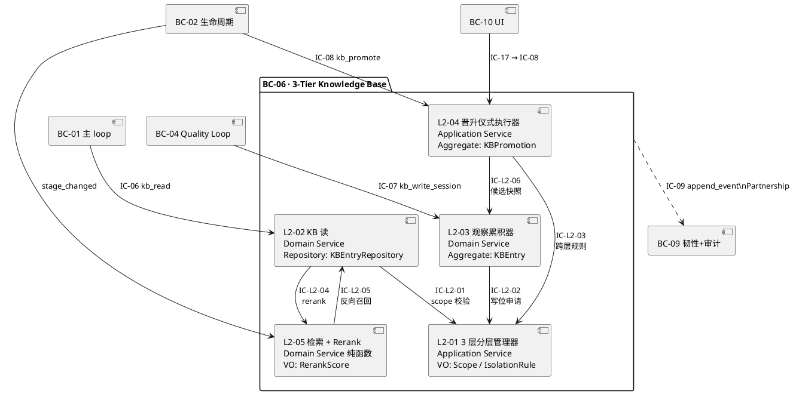

# L1-06 · 3 层知识库 · 总架构（Architecture）

> **定位**：L1-06 的 **L1 级总架构**，把 PRD `docs/2-prd/L1-06 3层知识库/prd.md` 定义的 5 个 L2（3 层分层管理器 / KB 读 / 观察累积器 / KB 晋升仪式执行器 / 检索 + Rerank）翻译为**技术实现骨架**：物理布局、存储+检索方案、rerank 算法、对外 IC 承担、开源调研（性能 benchmark 必含）、与 L2 分工、性能目标。
> **边界**：本文档回答 **"L1-06 在技术层面长什么样"**（5 L2 架构图 / 物理存储 / 检索链路 / IC 契约），不回答"L2 内部字段级 schema + 算法伪码 + 配置参数"（留给 5 个 L2 tech-design.md）。
> **与 PRD 的关系**：PRD 是 "what + why"（5 L2 清单 + 每 L2 职责 / 约束 / 禁止 / 必须）；本架构是 "how-level-1"（物理布局 + 存储引擎 + 检索链路 + 开源对标）；L2 tech-design 是 "how-level-2"（字段级 schema + 算法伪码 + 配置参数 + 错误码）。
> **与 L0 的关系**：所有横切技术决定（文件系统为先 / jsonl + md / 无向量检索 V1 / project_id as root / 事件总线单一事实源）都引自 `docs/3-1-Solution-Technical/L0/`，本文档只在 L1-06 语义下**落地这些横切决定**，不重新选型。

---

## 0. 撰写进度

- [x] §1 定位 + 2-prd §5.6 映射
- [x] §2 DDD 映射（引 L0 ddd-context-map.md BC-06）
- [x] §3 5 L2 架构图（Mermaid · 3 层物理隔离 + 晋升路径）
- [x] §4 P0 时序图（≥ 2 张：kb_read 分层查询 / KB 晋升仪式 S7）
- [x] §5 3 层物理隔离（Session 隐含 / Project 在 projects/<pid>/kb/ / Global 在 global_kb/）
- [x] §6 存储 + 检索方案（纯文件 + jsonl 默认 · 规模触发上 ChromaDB · 引 L0 §7）
- [x] §7 多信号 rerank 算法（阶段 × 任务 × 技术栈 × observed_count × 时间衰减）
- [x] §8 对外 IC（接收 IC-06/07/08/20 · 发出 IC-09 · 间接 stage_changed / system_resumed）
- [x] §9 开源调研（Mem0 / Letta / Zep / ChromaDB / pgvector · 性能 benchmark 必含）
- [x] §10 与 5 L2 分工（读 / 写 / 晋升 / rerank / 底座）
- [x] §11 性能目标（read P99 ≤ 500ms · 晋升 P99 ≤ 30s/条 · rerank ≤ 100ms）
- [x] 附录 A 术语引用 · 附录 B BF 映射 · 附录 C 开源项目链接清单

---

## 1. 定位 + 2-prd §5.6 映射

### 1.1 一句话定位

**L1-06 是 HarnessFlow 的"记忆宫殿"**：维护 Session / Project / Global 三层物理隔离的知识库，按 PMP+TOGAF 阶段执行注入策略（PM-06），运行晋升仪式（Session → Project / Global），提供结构化 KB 读写接口给 L1-01 / L1-02 / L1-04 / L1-07 / L1-08 / L1-10。

### 1.2 与 2-prd §5.6 的映射

| 2-prd §5.6 子节 | 本架构落地小节 | 落地方式 |
|---|---|---|
| §5.6.1 职责 | §1 + §3 + §10 | 5 L2 架构图 + L2 分工表 |
| §5.6.2 输入 / 输出 | §8 | 对外 IC 清单（IC-06/07/08 接收 · IC-09 发出） |
| §5.6.3 边界 In-scope | §5 + §6 | 3 层物理存储 + 8 类 kind 白名单 + schema 校验 + 晋升仪式 |
| §5.6.3 边界 Out-of-scope | §6.3 + §9.3 | V1 不做向量检索 + 不做自然语言问答 + 不做跨项目联邦 |
| §5.6.4 约束（PM-06 + 硬约束 1-4） | §5 + §6 + §7 | 7 天过期 / Global 阈值 / schema 校验 / 注入策略表 |
| §5.6.5 禁止行为（7 条） | §3.3 + §8.4 | 架构图边界规则 + IC 契约禁止项 |
| §5.6.6 必须义务（6 条） | §6.2 + §7 + §8 | scope 优先级 / applicable_context 过滤 / 阶段注入 / 事件审计 / 7 天过期 / observed_count 累计 |
| §5.6.7 与其他 L1 交互 | §8 | 对外 IC 承担表 |
| scope §8.2 IC-06/07/08 | §8 | 接收方契约映射 |

### 1.3 与 2-prd L1-06 PRD 的映射（精确到 L2）

| 2-prd L1-06 §X | 本架构对应章节 | 落地方式 |
|---|---|---|
| §2 L2 清单（5 个） | §3 + §10 | 5 L2 架构图 + 分工表 |
| §3 图 A 主干数据流 | §3.1 | Mermaid 升级版 |
| §4 图 B 横切响应面（6 面） | §4 时序图 + §8 | 2 张时序图落 "阶段注入" + "S7 晋升"；其他面在 L2 tech-design 展开 |
| §5 流 A-F（6 条业务流） | §4.1-§4.2 | 流 A = 图 1 kb_read 分层查询；流 D = 图 2 S7 批量晋升；流 C/E/F 在 §8 附录简要映射 |
| §6 IC-L2 契约清单（8 条） | §8.3 | IC-L2 内部契约表 |
| §7 L2 定义模板（9 小节） | 各 L2 tech-design.md | 本文档不展开 L2 内部 9 小节 |
| §8-§12 每 L2 详细定义 | §10 分工表 | 只给"一句话职责 + 指针到 L2 tech-design" |
| §13 对外 scope §8 IC 契约映射 | §8.1 | 直接引用 |
| 附录 A 术语 + 附录 B BF 映射 | 附录 A/B | 引用并锚定 |

### 1.4 与 L0 的映射

| L0 文档 | 本架构引用位点 | 引用方式 |
|---|---|---|
| `tech-stack.md §3.5` 目录布局 | §5.1 | 3 层物理路径常量 |
| `tech-stack.md §10.8.2` KB 开源调研 | §9 | 基础数据 + 本文档 §9 在此基础上深度补充 |
| `architecture-overview.md §4.1` 文件树 | §5.1 | 物理路径完整 spec |
| `architecture-overview.md §4.2` 文件格式选型 | §5.2 | jsonl / md + YAML frontmatter 选择理由 |
| `ddd-context-map.md §2.7` BC-06 | §2 | DDD 映射（Aggregate / VO / Repository） |
| `ddd-context-map.md §4.6` L1-06 aggregate 分类 | §2.3 | 5 L2 DDD 对标 |
| `open-source-research.md §7` KB 调研章节 | §9 | 开源对标 + 性能 benchmark |
| `sequence-diagrams-index.md §3.5 / §3.12` | §4 | P0 时序图源引 + 本文档补充 |

### 1.5 本架构"不做"清单（避免职责蔓延）

本架构 **不做**（留给下游 L2 tech-design.md 或其他文档）：

| 不做项 | 原因 | 去向 |
|---|---|---|
| 字段级 schema（kb-entry.schema.json 的每个字段类型 / 必填 / 枚举） | L1 级架构不下沉到字段 | 各 L2 tech-design §3 + §7 |
| rerank 打分函数伪代码 | 算法细节属 L2 | L2-05 tech-design §6 |
| 晋升判定状态机代码 | 状态机细节属 L2 | L2-04 tech-design §6 + §8 |
| 过期扫描调度器实现 | 实现细节属 L2 | L2-01 tech-design §6 |
| 配置参数表（top_k 默认值 / 过期天数 / merge hash 算法选择） | 参数表属 L2 | 各 L2 tech-design §10 |
| 错误码枚举表 | 错误码表属 L2 | 各 L2 tech-design §11 |
| 与 3-2 TDD 的具体映射 | 属 TDD 阶段 | 3-2 文档自己写 |

---

## 2. DDD 映射（引 L0 ddd-context-map.md BC-06）

### 2.1 BC-06 · 3-Tier Knowledge Base 一句话 + 核心职责

引自 `docs/3-1-Solution-Technical/L0/ddd-context-map.md §2.7`：

> **一句话定位**：项目的"记忆宫殿"—— Session / Project / Global 三层物理隔离 + 阶段注入 + 晋升仪式的 KB 系统。
>
> **核心约束**：**Global KB 脱离 project 归属**（晋升后它成为"无主资产"），但 Project / Session KB **必带 project_id**（PM-14）。

### 2.2 主要聚合根（Aggregate Roots）

引自 `L0/ddd-context-map.md §2.7` 主要聚合根表：

| 聚合根 | 一致性边界 | 承载 L2 |
|---|---|---|
| **KBEntry** | id + scope + kind + title + content + applicable_context + observed_count + first_observed_at + last_observed_at + source_links；同 id 合并而非新建 | L2-02（读）+ L2-03（写） |
| **KBPromotion** | promotion_id + entry_id + from_scope + to_scope + approval_type + approver + timestamp | L2-04 |
| **StageInjectionStrategy** | stage → [kind + scope]；低频更新（PM-06 注入策略表） | L2-05 |

### 2.3 5 L2 的 DDD 分类（引自 `L0/ddd-context-map.md §4.6`）

| L2 | DDD 语义 | 主要 DDD 元素 | 一句话 |
|---|---|---|---|
| **L1-06 L2-01** | **Application Service** + **VO**: Scope (session/project/global) + **VO**: IsolationRule | 值对象为主 | 3 层物理隔离 + scope 优先级 + 7 天过期 |
| **L1-06 L2-02** | **Domain Service** + **Repository**: KBEntryRepository | 仓储为主 | 按 scope 优先级合并 + kind 过滤 + context 匹配 |
| **L1-06 L2-03** | **Domain Service** + **Aggregate Root**: KBEntry | 聚合根为主 | 同类合并 + observed_count 累计 |
| **L1-06 L2-04** | **Application Service** + **Aggregate Root**: KBPromotion + **VO**: ApprovalType | 仪式为主 | Session→Project 自动 / 用户批准；Project→Global 显式批准 |
| **L1-06 L2-05** | **Domain Service**（纯函数） + **VO**: RerankScore | 纯函数为主 | 多信号 rerank + 阶段注入 |

### 2.4 对外发布的 Published Language

引自 `L0/ddd-context-map.md §2.7` + §5.2.6：

| 类别 | 事件 / 命令 / 查询 | 说明 |
|---|---|---|
| **Event** | `L1-06:kb_entry_written` | Session KB 新增 / 合并（`entry_id / scope / kind / observed_count`） |
| **Event** | `L1-06:kb_entry_promoted` | 晋升成功（`promotion_id / from_scope / to_scope / approval_type`） |
| **Event** | `L1-06:kb_injection_triggered` | 阶段切换注入（`stage / kinds_injected / count`） |
| **Event** | `L1-06:kb_search_performed` | kb_read 完成（`query_context / results_count`） |
| **Query** | IC-06 `ReadKBEntries`（`kb_read`） | 多 BC → BC-06 |
| **Command** | IC-07 `WriteSessionKBEntry`（`kb_write_session`） | 多 BC → BC-06 |
| **Command** | IC-08 `PromoteKBEntry`（`kb_promote`） | 多 BC → BC-06 |

### 2.5 跨 BC 关系（引自 `L0/ddd-context-map.md §2.7`）

| 对端 BC | 关系类型 | 方向 | 一句话意义 |
|---|---|---|---|
| **BC-01**（L1-01 主 loop） | Supplier | BC-06 ← BC-01 | BC-01 读 / 写 session 层 KB |
| **BC-02**（L1-02 生命周期） | Supplier | BC-06 ← BC-02 | S3 TDD 蓝图 + S7 retro 产出时做晋升 |
| **BC-04**（L1-04 Quality Loop） | Supplier | BC-06 ← BC-04 | 所有 BC 可读 / 写 session 层 |
| **BC-07**（L1-07 Supervisor） | Supplier | BC-06 ← BC-07 | 软红线识别读已知 trap |
| **BC-08**（L1-08 多模态） | Supplier | BC-06 ← BC-08 | 代码结构摘要入 Project KB |
| **BC-09**（L1-09 韧性+审计） | **Partnership** | BC-06 ↔ BC-09 | KB 写 / 晋升事件必落事件总线 |
| **BC-10**（L1-10 UI） | Supplier | BC-06 ← BC-10 | KB 浏览器读 / 用户发起晋升 |

**Partnership 语义**：BC-06 和 BC-09 必须协同演化 —— 每次 KB 读写 / 晋升 / 过期都必须走 IC-09 事件总线落盘，否则审计链断裂。

### 2.6 DDD 语义下的 5 L2 关系图



---

## 3. 5 L2 架构图（3 层物理隔离 + 晋升路径）

### 3.1 主干数据流（升级版 · PRD §3 图 A 技术化）

```plantuml
@startuml
package "调用方（请求来源）" as Callers {
component "L1-01 主 loop\n（决策前读 / session 候选写）" as L01
component "L1-02 生命周期\n（阶段切换事件 / S7 晋升触发）" as L02
component "L1-04 Quality Loop\n（S3/S4/S5 读 · S4 写）" as L04
component "L1-07 Supervisor\n（软红线识别读已知 trap）" as L07
component "L1-08 多模态\n（代码分析结果写）" as L08
component "L1-10 UI\n（用户晋升批准 / 浏览）" as L10
}
package "读链路（L2-02 + L2-05 · 召回 + rerank）" as ReadChain {
component "L2-02 KB 读\nscope 优先级合并 S>P>G\nkind 过滤 + applicable_context 匹配" as L202
component "L2-05 检索 + Rerank\n多信号打分\ntop_k 截断" as L205
L202 --> L205 : "召回候选集"
L205 ..> L202 : "反向召回（阶段注入）"
}
package "写链路（L2-03 · Session 层累积）" as WriteChain {
component "L2-03 观察累积器\ntitle+kind 去重\nobserved_count +1\nfirst/last_observed_at 更新" as L203
}
package "晋升链路（L2-04 · 仪式）" as PromoteChain {
component "L2-04 晋升仪式执行器\nSession→Project observed_count≥2\nProject→Global ≥3 或用户批准" as L204
}
package "底座（L2-01 · 所有 L2 依赖）" as FoundationLayer {
component "L2-01 3 层分层管理器\nscope 优先级守则 S>P>G\n跨项目隔离 · Session 7 天过期\n8 类 kind 白名单 · schema 校验\nkind: pattern/trap/recipe/tool_combo/\nanti_pattern/project_context/external_ref/effective_combo" as L201
}
package "3 层物理存储（文件系统）" as Storage {
component "Session 层\ntask-boards/<project_id>/\n<task_id>.kb.jsonl" as SessStore
component "Project 层\nprojects/<project_id>/kb/\nentries/*.md" as ProjStore
component "Global 层\nglobal_kb/entries/*.md\n（无 project_id 归属）" as GlobStore
}
L01 --> L202 : "IC-06 kb_read"
L04 --> L202 : "IC-06 kb_read"
L07 --> L202 : "IC-06 kb_read"
L02 --> L205 : "stage_changed 事件"
L01 --> L203 : "IC-07 kb_write_session"
L04 --> L203 : "IC-07 kb_write_session"
L07 --> L203 : "IC-07 kb_write_session"
L08 --> L203 : "IC-07 kb_write_session"
L02 --> L204 : "IC-08 kb_promote (S7 批量)"
L10 --> L204 : "IC-17 → IC-08\n用户单条晋升"
L202 --> L201 : "scope 校验"
L203 --> L201 : "写位申请 + schema 校验"
L204 --> L201 : "跨层规则校验"
L204 ..> L203 : "拉取 Session 候选快照"
L201 ==> SessStore
L201 ==> ProjStore
L201 ==> GlobStore
L205 --> L01 : "rerank 后条目"
L204 --> L10 : "晋升结果清单"
L202 ..> L09["L1-09 : "IC-09 append_event"
L203 ..> L09 : "IC-09"
L204 ..> L09 : "IC-09"
L205 ..> L09 : "IC-09"
L201 ..> L09 : "IC-09（过期事件）"
@enduml
```

### 3.2 架构图的 7 个关键规则

| # | 规则 | 落实位点 |
|---|---|---|
| 1 | **L2-01 是底座**：任何 L2 的读 / 写 / 晋升必须先走 L2-01 校验（IC-L2-01/02/03） | §5 + §10.1 |
| 2 | **召回 + rerank 必须成对**：L2-02 召回后必经 L2-05 rerank，禁止跳过 rerank 直接返回原始顺序（PRD L2-02 禁止行为 2） | §7 + §10.2/§10.5 |
| 3 | **写 Session 才能进晋升**：Project / Global 层**无法**直接写入，只能通过 L2-04 晋升仪式从 Session 升上来（PRD L2-03 硬约束 5） | §5.2 + §10.3/§10.4 |
| 4 | **晋升不跨级跳跃**：Session 不能直接升 Global；必须先 Project 再 Global（PRD L2-04 硬约束 1） | §5.3 + §10.4 |
| 5 | **跨项目只走 Global**：两个 project_id 的知识共享只能通过 Global 层；Project 层按 project_id 严格隔离 | §5.1 + §5.2 |
| 6 | **所有 L2 事件必落 IC-09**：读 / 写 / 晋升 / 过期 / 阶段注入全量走 L1-09 事件总线（PM-10） | §2.5 Partnership + §8.1 |
| 7 | **Global KB 无 project_id**：晋升后脱离归属，成为"无主资产"（projectModel.md §6.2 例外） | §5.1.3 |

### 3.3 架构图的边界规则（PRD §5.6.5 禁止行为在技术层落地）

| PRD 禁止行为 | 架构层强制手段 | 位点 |
|---|---|---|
| 🚫 Session → Global 跳级 | L2-04 调 L2-01 跨层规则校验，跳级请求直接拒绝 + 审计 | §10.4 + §4.2 |
| 🚫 observed_count < 3 且无用户批准写 Global | L2-04 判定分支：缺少双条件任一即拒绝 | §10.4 |
| 🚫 跨项目共享 Project KB | L2-01 scope 校验：项目 B 请求项目 A 的 Project 层直接拒绝 | §5.1 + §5.2 |
| 🚫 KB 条目不走 schema validate | L2-01 的 schema 校验是"关卡"，所有写 / 晋升请求必过 | §6.4 |
| 🚫 向量 embedding / 外部 RAG | 架构层不提供 embedding 入口；V1 存储引擎为纯文件 + jsonl + md | §6 |
| 🚫 自然语言问答代替结构化读 | L2-02 入口只接受结构化参数（kind / scope / applicable_context / top_k） | §8.2 |
| 🚫 阶段切换绕过注入策略表 | L2-05 订阅 stage_changed 强制调用策略表；配置试图禁用某策略 → 启动失败 | §7 + §4.1 |

---

## 4. P0 核心时序图（2 张）

### 4.1 图 1 · P0 · kb_read 分层查询（BF-L3-05 read 路径 · PRD 流 A）

**场景一句话**：L1-01 / L1-04 / L1-07 等在决策 / Loop / 软红线识别前调用 IC-06 kb_read → L2-02 召回 → L2-05 rerank → 返回 top_k entries → 调用方注入上下文 / 决策参考。

**覆盖路径**：正常读 + scope 优先级合并 + 跨项目隔离 + rerank 多信号 + 事件审计。

```plantuml
@startuml
autonumber
    autonumber
participant "L1-01/04/07<br/>调用方" as Caller
participant "L2-02 KB 读" as L202
participant "L2-01 分层管理器" as L201
participant "3 层物理存储<br/>(jsonl+md)" as Store
participant "L2-05 检索+Rerank" as L205
participant "L1-09 事件总线" as L09
Caller -> L202 : IC-06 kb_read(project_id, kind?, scope?,\napplicable_context, top_k?)
L202 -> L201 : IC-L2-01 校验 "允许读哪些 scope"
note over L201 : 确认 project_id 是当前激活项目\n确认 session 隶属当前会话\n返回允许层列表 [session, project, global]
L201- -> L202 : {allowed_scopes, isolation_ctx}
L202 -> Store : 读 Session 层 jsonl\n(task-boards/<pid>/<tid>.kb.jsonl)
Store- -> L202 : session_entries[]
L202 -> Store : 读 Project 层 md entries\n(projects/<pid>/kb/entries/*.md)
Store- -> L202 : project_entries[]
L202 -> Store : 读 Global 层 md entries\n(global_kb/entries/*.md)
Store- -> L202 : global_entries[]
L202 -> L202 : 按 scope 优先级合并 S>P>G\n同 id 冲突 → 高优先级覆盖
L202 -> L202 : 按 kind 过滤\n(若调用方未指定 kind → 全量)
L202 -> L202 : 按 applicable_context 匹配\n(route / task_type / 技术栈)
note over L202 : 候选集 N 条（典型 20-100）
L202 -> L205 : IC-L2-04 rerank(candidates, context, top_k)
L205 -> L205 : 多信号打分：\n阶段匹配 + 任务类型 + 技术栈\n+ observed_count + last_observed_at 近因\n+ kind 优先级
L205 -> L205 : 截断 top_k（默认 5，调用方可覆盖）
L205- -> L202 : ranked_entries[top_k]\n(含每条打分理由)
L202- -> Caller : entries[]
par 并发落事件
L202- -> L09 : IC-09 append_event\ntype=L1-06:kb_search_performed\ncontent={kinds, scopes, ids[], count}
L205- -> L09 : IC-09 append_event\ntype=L1-06:kb_rerank_applied\ncontent={signals_used, top_k_size}
end
alt 底层存储异常（文件损坏 / 不可达）
Store- ->x L202 : read_error
L202- -> Caller : {entries: [], error_hint: "kb_degraded"}
L202- -> L09 : IC-09 append_event\ntype=L1-06:kb_read_degraded
note over Caller : 调用方降级为"无 KB 决策"\nL1-07 观察到降级状态 → SUGG
end
@enduml
```

**深度图指针**：
- L2-02 内部召回算法细节 → `docs/3-1-Solution-Technical/L1-06-3层知识库/L2-02-KB读/tech-design.md §6`
- L2-05 rerank 多信号打分函数 → `docs/3-1-Solution-Technical/L1-06-3层知识库/L2-05-检索Rerank/tech-design.md §6`
- L2-01 scope 校验算法 → `docs/3-1-Solution-Technical/L1-06-3层知识库/L2-01-3层分层管理器/tech-design.md §6`

### 4.2 图 2 · P0 · KB 晋升仪式（S7 收尾批量 · BF-S7-04 · PRD 流 D）

**场景一句话**：L1-02 L2-06 在 S7 收尾阶段触发 IC-08 kb_promote 批量调用 → L2-04 遍历 Session 层候选 → 按 observed_count 阈值 + 用户批准分类为 promoted/rejected/kept → 写入目标层 → 广播结果 → L1-10 UI 展示。

**覆盖路径**：自动晋升 + 用户批准旁路 + 跨级跳跃拦截 + 仪式期间并发读不阻塞 + 事件审计。

```plantuml
@startuml
autonumber
    autonumber
participant "L1-02 L2-06<br/>S7 收尾执行器" as L02
participant "L2-04 晋升仪式" as L204
participant "L2-03 观察累积器" as L203
participant "L2-01 分层管理器" as L201
participant "3 层物理存储" as Store
participant "L2-02 KB 读<br/>（并发不阻塞）" as L202
participant "L1-10 UI" as L10
participant "L1-09 事件总线" as L09
note over L02 : S7 retro + archive 就绪\n触发批量晋升仪式
L02 -> L204 : IC-08 kb_promote(project_id,\nmode=batch, trigger=s7)
L204 -> L203 : IC-L2-06 拉取 Session 候选清单快照
L203 -> Store : 读 task-boards/<pid>/<tid>.kb.jsonl
Store- -> L203 : session_candidates[]\n(含 observed_count / kind / title)
L203- -> L204 : snapshot[N 条候选]
loop 遍历每个候选 e-i
L204 -> L204 : 判定晋升路径
alt observed_count ≥ 2 且 kind ∈ {pattern, recipe, tool_combo}
L204 -> L201 : IC-L2-03 跨层规则校验\n(from=session, to=project)
L201- -> L204 : {allowed: true}
L204 -> Store : 写入 Project 层\nprojects/<pid>/kb/entries/e-i.md
L204 -> Store : 标记 Session 源为 promoted
L204- -> L09 : IC-09 append_event\ntype=L1-06:kb_entry_promoted\ncontent={from=session, to=project,\napproval=auto, count=N}
note over L204 : promoted[] += e-i
else Project 层已有同 id 且 observed_count ≥ 3
L204 -> L201 : IC-L2-03 校验 (from=project, to=global)
L201- -> L204 : {allowed: true}
L204 -> Store : 写入 Global 层\nglobal_kb/entries/e-i.md\n(脱离 project_id 归属)
L204- -> L09 : IC-09 append_event\ntype=L1-06:kb_entry_promoted\napproval=auto_threshold
note over L204 : promoted[] += e-i (→ global)
else observed_count &lt; 2（不达阈值）
note over L204 : kept[] += e-i\n（保留 Session，等 7 天自然过期\n或后续再积累）
end
end
L204- -> L02 : {promoted[], rejected[], kept[]}
L204 -> L10 : 推送晋升结果清单
L10 -> L10 : 展示"本次 S7 晋升 N 条 Project / M 条 Global"
note over L10 : 用户可在 UI 继续\n手动晋升 kept[] 中某条到 Global
opt 用户显式手动晋升（旁路 observed_count 阈值）
L10 -> L204 : IC-17 → IC-08 kb_promote\n(id=e-j, target=project/global,\nreason="user_approved")
L204 -> L201 : IC-L2-03 校验跨层规则\n(仍禁止 Session→Global 跳级)
alt 允许
L204 -> Store : 写入目标层
L204- -> L09 : IC-09 append_event\napproval=user_approved
L204- -> L10 : {promoted: true}
else 跳级被拒
L204- -> L10 : {promoted: false,\nerror="禁止跨级跳跃\n须经 Project 中转"}
L204- -> L09 : IC-09 append_event\ntype=L1-06:promote_skip_layer_denied
end
end
note over L202 : 仪式期间 L1-01 等\n仍可并发读 KB（不阻塞）
par 并发读
L202 -> Store : IC-06 kb_read（读可能未完成仪式的条目）
Store- -> L202 : 读到 Session 或 Project 的快照版本
end
@enduml
```

**深度图指针**：
- L2-04 仪式判定分支树 → `docs/3-1-Solution-Technical/L1-06-3层知识库/L2-04-KB晋升仪式执行器/tech-design.md §6 + §8`
- L2-04 失败重试 + rejected 标记算法 → `docs/3-1-Solution-Technical/L1-06-3层知识库/L2-04-KB晋升仪式执行器/tech-design.md §11`

### 4.3 其他横切响应面的指针（PRD §4 图 B 6 面的技术化去向）

PRD §4 定义了 6 个横切响应面，本架构只在此列出技术化去向（避免本架构文档膨胀）：

| PRD §4 响应面 | 落地技术链路 | 深度位点 |
|---|---|---|
| 响应面 1 · 阶段切换注入（BF-X-05 PM-06） | L2-05 订阅 `L1-02:stage_transitioned` 事件 → 查策略表 → IC-L2-05 反向召回 → rerank → 推 L1-01 | L2-05 tech-design §6 |
| 响应面 2 · S7 收尾批量晋升 | 本架构 §4.2 已覆盖 | L2-04 tech-design §6 |
| 响应面 3 · 跨 session 恢复读（BF-E-02） | L1-09 `system_resumed` → L2-01 激活 Project KB → L2-02 正常响应 kb_read | L2-01 tech-design §6 |
| 响应面 4 · Session 7 天过期 | L2-01 后台定时器（日级）→ 扫描 Session 条目 → 标记 expired → IC-09 审计 | L2-01 tech-design §6 + §10 配置 EXPIRE_DAYS=7 |
| 响应面 5 · 用户显式晋升（UI 驱动） | 本架构 §4.2 图 2 中的 opt 分支已覆盖 | L2-04 tech-design §6 |
| 响应面 6 · 降级路径（KB 服务降级） | 本架构 §4.1 图 1 的 alt 分支已覆盖 | L2-02 tech-design §11 |

---

## 5. 3 层物理隔离（Session 隐含 / Project 在 projects/&lt;pid&gt;/kb/ / Global 在 global_kb/）

### 5.1 3 层物理路径完整 spec（引自 `L0/architecture-overview.md §4.1` + `L0/tech-stack.md §3.5`）

**HarnessFlow 的根工作目录**：`$HARNESSFLOW_WORKDIR`（默认 `~/.harnessflow/` 或项目根）

```
$HARNESSFLOW_WORKDIR/
├── projects/                                  ← PM-14 project_id 分片根
│   └── <project_id>/                          ← 一个 project 的完整生命周期资产
│       ├── manifest.yaml                      ← 项目元数据（L1-02 所有权）
│       ├── state.yaml                         ← 主状态机当前态（L1-02）
│       ├── task-boards/                       ← 任务级事件流 + session KB 的载体
│       │   ├── <task_id>.events.jsonl         ← L1-09 事件总线
│       │   ├── <task_id>.kb.jsonl             ← ★ Session 层 KB（本 L1 核心）
│       │   └── ...
│       ├── kb/                                ← ★ Project 层 KB（本 L1 核心）
│       │   └── entries/
│       │       ├── e-001.md                   ← 每条一个 md（含 YAML frontmatter）
│       │       ├── e-002.md
│       │       └── ...
│       ├── retros/                            ← L1-02 S7 retro
│       ├── delivery/                          ← L1-02 S7 交付包
│       └── ...
│
├── global_kb/                                 ← ★ Global 层 KB（本 L1 核心 · 跨 project 共享）
│   ├── entries/
│   │   ├── e-101.md                           ← 晋升后脱离 project_id 归属
│   │   ├── e-102.md
│   │   └── ...
│   └── index.jsonl                            ← 反向索引（kind / tag → entry_id，可选加速）
│
├── schemas/
│   ├── kb-entry.schema.json                   ← KB 条目 schema（L2-01 维护 · 8 类 kind 白名单）
│   └── kb-promotion.schema.json               ← 晋升记录 schema
│
└── failure_archive.jsonl                      ← 全局失败归档（L1-02 + L1-06 跨 L1 消费）
```

### 5.2 3 层的物理形态对比

| 层 | 物理路径 | 文件格式 | 生命周期 | project_id 归属 | 典型条目数 |
|---|---|---|---|---|---|
| **Session** | `projects/<pid>/task-boards/<task_id>.kb.jsonl` | **jsonl**（追加写 · 每行一条条目） | 会话结束后 7 天（未晋升自动过期） | 隐含（所在 task 的 project_id） | < 200/task |
| **Project** | `projects/<pid>/kb/entries/*.md` | **md + YAML frontmatter** | 项目期（跟随 project 归档时冻结） | 显式（frontmatter.project_id 必填） | 500-2000/project |
| **Global** | `global_kb/entries/*.md` | **md + YAML frontmatter** | 永久（跨 project 共享） | **无**（frontmatter.project_id 缺失，这是 global 层的标志） | 5000-20000/用户 |

### 5.3 3 层物理隔离的 3 大硬性保证

#### 5.3.1 隔离保证 1 · Session 层按 task_id 物理隔离

- 每个 task 的 session KB 独立一个 jsonl 文件（`<task_id>.kb.jsonl`）
- 任务结束后文件不删除，保留审计追溯（PRD L2-01 硬约束 7）
- 7 天过期 = 在 jsonl 的每条条目上加 `expired_at` 标志（不物理删除行），L2-02 读时跳过 `expired=true` 的条目
- L2-01 后台扫描：日级触发，遍历所有 `<task_id>.kb.jsonl`，对会话结束超 7 天且未晋升的条目加 expired 标志

**物理实现骨架**（细节留 L2-01 tech-design）：

```
# 伪代码示意 · 日级扫描
for project_id in list_active_projects():
    for task_file in glob(f"projects/{project_id}/task-boards/*.kb.jsonl"):
        for line in task_file:
            entry = json.loads(line)
            if entry.session_ended_at + 7d < now() and not entry.promoted:
                entry.expired = True
                append_to_expiry_audit(entry)  # IC-09 event
```

#### 5.3.2 隔离保证 2 · Project 层按 project_id 物理隔离（PM-14 硬约束）

- 每个 project 的 Project KB 独立一个子目录（`projects/<pid>/kb/`）
- **硬隔离规则**：project-A 的进程 / 子 Agent 物理上**看不到** project-B 的 `projects/pid-B/kb/` 目录（L2-01 scope 校验在读写前强制过滤）
- 跨 project 知识共享 **只能** 通过 Global 层（projectModel.md §6.2 例外）
- 删 project = 删对应 `projects/<pid>/` 子目录（L1-02 L2-06 归档时处理 · L1-06 L2-04 负责"升 Global 的候选先行"）

**隔离拦截物理实现**（L2-01 硬性规则）：

```
# 伪代码示意 · scope 校验前置
def validate_read_scope(requester_project_id, target_project_id, scope):
    if scope == "project":
        if requester_project_id != target_project_id:
            raise CrossProjectReadDenied(
                f"Project {requester_project_id} cannot read project {target_project_id}"
            )
            # 审计 cross_project_read_denied
```

#### 5.3.3 隔离保证 3 · Global 层无 project_id 归属（"无主资产"）

- Global 层的 md entry frontmatter **不包含** `project_id` 字段（与 Project / Session 层的强制 project_id 形成对比）
- 这是 **projectModel.md §6.2 的硬约束例外**："**global 层 KB** 是例外 —— 晋升后它脱离所有 project，成为'无主资产'，可被任何 project 读"
- 晋升到 Global 时，L2-04 必须**主动剥离** `project_id` 字段，写入 global 的 md 中不带该字段（L2-04 tech-design §6 会明确"剥离步骤"）
- 读 Global 层 **不做** project 过滤（所有 project 都能读到）

**剥离物理实现**（L2-04 硬性规则）：

```
# 伪代码示意 · Project → Global 晋升时剥离 project_id
def promote_to_global(entry_from_project):
    entry_for_global = dict(entry_from_project)
    del entry_for_global['project_id']  # 硬性剥离
    entry_for_global['promoted_from_project_ref'] = entry_from_project['project_id']
    # 留存"晋升溯源"而非"归属"
    write_md(f"global_kb/entries/{entry.id}.md", entry_for_global)
```

### 5.4 3 层间的 scope 优先级合并（读侧）

PRD §5.6.6 必须义务 1："**必须**按 scope 优先级读（Session > Project > Global）"。技术实现：

**合并算法（L2-02 内部）**：

```
# 伪代码示意 · scope 优先级合并
def merge_with_priority(session_entries, project_entries, global_entries):
    merged = {}  # by entry.id
    # 先放优先级最低（global）
    for e in global_entries:
        merged[e.id] = e
    # Project 覆盖 Global（同 id）
    for e in project_entries:
        merged[e.id] = e
    # Session 覆盖 Project 和 Global（同 id）
    for e in session_entries:
        merged[e.id] = e
    return list(merged.values())
```

**同 id 冲突例子**：某条 trap "假完成：verifier 未运行" 在 Global 层存的是 observed_count=50 的通用版本，在当前 Project 层有一条针对本项目技术栈的定制版本，在 Session 层有本次会话刚发现的最新注记版本 → 合并结果返回 Session 层的版本（最新覆盖）。

### 5.5 3 层的写路径（全部归一到 Session 层）

PRD §5.6.5 禁止行为 1 + L2-03 硬约束 5："**禁止直接写 Project / Global 层**（只能 Session；晋升走 L2-04）"。

**写路径的技术含义**：

| 写者 L1 | 写入动作 | 物理路径 | 触发的后续链路 |
|---|---|---|---|
| L1-01 / L1-04 / L1-07 / L1-08 | IC-07 kb_write_session | `projects/<pid>/task-boards/<task_id>.kb.jsonl` append | observed_count +1 或新建 |
| L1-02 L2-06（S7） | IC-08 kb_promote（batch） | 最终写入 `projects/<pid>/kb/entries/*.md` 或 `global_kb/entries/*.md` | 先走 Session 候选清单，L2-04 遍历判定 |
| L1-10（用户 UI） | IC-17 → IC-08 kb_promote | 同上 | 旁路 observed_count 阈值，但仍走 L2-01 跨层规则校验 |

**关键物理不变式**：**没有任何 L1 可以绕过 L2-03 / L2-04 直接向 Project / Global 层文件写入**。架构层强制手段 = L2-01 的 schema 校验 + 写位申请都只对 session 层开门，Project / Global 层的文件写操作**只能**由 L2-04 进程持有写权限。

---

## 6. 存储 + 检索方案（纯文件 + jsonl 默认 · 规模触发上 ChromaDB · 引 L0 §7）

### 6.1 存储引擎选型（引自 `L0/tech-stack.md §3` + `L0/open-source-research.md §7.10` + §7.11a）

**V1 基线**：**纯文件 + jsonl（session）+ md + YAML frontmatter（project / global）** · 零运维 · 可 grep / git diff · 崩溃安全（jsonl append-only）

**为什么 V1 不上向量 DB**（引自 `L0/open-source-research.md §7.11a`）：

> HarnessFlow 的 KB 延迟预算并不严苛。**P99 < 500ms 即可**。这就意味着：
> 1. **纯 Python 遍历 + 简单 token 匹配**：对 < 1K 条目（session+project），P99 < 30ms，完全够用
> 2. **倒排索引（按 tag / stage）**：对 1-10K 条目，P99 < 100ms
> 3. **向量检索**：仅在 > 10K 条目 或 "语义模糊查询"（"和这个很像的"）时才需要
>
> HarnessFlow 决策：**先跑纯 Python 方案 · 有瓶颈再上向量**。

**HarnessFlow L1-06 的"三段式升级路径"**：

| 阶段 | 触发条件 | 存储引擎 | 检索方式 | 位点 |
|---|---|---|---|---|
| **V1 · 默认** | 单项目条目 ≤ 1K；Global ≤ 5K | 纯 jsonl + md + Python dict 索引 | 线性扫描 + tag 过滤 + 多信号 rerank | 本文档 V1 落地 |
| **V2 · 中规模升级** | 单项目条目 > 5K 或 Global > 10K | + SQLite FTS5 全文索引 | 全文检索 + 多信号 rerank | V2 升级 · 不在本 V1 范围 |
| **V3 · 大规模 / 语义化** | Global > 20K 或用户强需语义模糊查询 | + ChromaDB embedded（dual-write 文件系统为主） | 向量召回 + rerank | V3 演化 · 不在本 V1 范围 |

**V1 → V2 → V3 的升级零阻碍**：因为存储始终是"文件为主（真 truth）+ 索引为辅（加速）"的 dual-write 模式，索引失效或损坏时可从文件重建，索引引擎可替换。

### 6.2 3 层的检索典型规模（引自 `L0/open-source-research.md §7.11a`）

| 场景 | 条目数 | 请求频率 | 延迟预算 | 典型查询 |
|---|---|---|---|---|
| **session 内即时查** | < 200 | 每 tick 0-1 次 | < 50ms | "这条决策相关过往经验" |
| **project 内阶段启动查** | 500-2000 | 每阶段 1-5 次 | < 200ms | "过去所有 S3 TDD 蓝图里关于 CRUD 的" |
| **global 跨项目查** | 5000-20000 | 偶尔（候选晋升时）| < 500ms | "所有项目里用过 Vue Flow 的实践" |

### 6.3 Out-of-scope（V1 明确不做）

引自 scope §5.6.3 + `L0/open-source-research.md §7.10`：

- ❌ **向量 embedding**（scope 硬禁 · 成本 + 复杂度不匹配 V1 规模）
- ❌ **独立向量 DB 服务**（Qdrant / Weaviate / pgvector 服务态 → 运维负担不匹配 Skill 形态）
- ❌ **Graph DB**（Mem0 的 Neo4j / Zep 的 Graphiti → 条目关系简单，用 frontmatter.source_links 字段即可）
- ❌ **Fact extraction LLM 调用**（Mem0 / MemGPT 的自动抽取 → HarnessFlow 候选是主 loop 显式留痕 · PM-10）
- ❌ **自然语言问答 chat 接口**（scope §5.6.5 硬禁 · KB 是结构化条目，不是 chat）
- ❌ **外部 RAG 对接**（future V3+ 可能考虑）

### 6.4 schema 校验（硬约束 3 的物理实现）

PRD §5.6.4 硬约束 3："KB 条目必有 schema validate（防损坏数据写入）"。

**技术实现**：

- **schema 定义位置**：`$HARNESSFLOW_WORKDIR/schemas/kb-entry.schema.json`（JSON Schema draft-07）
- **校验库**：Python `jsonschema` 库（`L0/tech-stack.md §11` 选型 · 无运行时依赖）
- **校验位点**：
  - L2-03 写 Session 前（via L2-01 IC-L2-02）
  - L2-04 晋升前（via L2-01 IC-L2-03）
- **kind 白名单**（8 类 · 封闭）：`pattern / trap / recipe / tool_combo / anti_pattern / project_context / external_ref / effective_combo`
- **校验失败**：直接拒绝 + 返回结构化错误（如 `kb_write_schema_fail`）+ 审计 IC-09 事件
- **schema 演进**：升级 schema 时必须同步 `schemas/migrations/` 脚本处理历史条目（不在 V1 范围 · 保留兼容接口）

### 6.5 检索链路的 3 阶段（召回 → 过滤 → rerank）

**技术实现顺序**：

```
用户请求 IC-06 kb_read(project_id, kind?, scope?, applicable_context, top_k?)
  ↓
[阶段 1 · 召回 · L2-02]
  1. L2-01 校验允许读的 scope
  2. 按 scope 优先级并发读 3 层（session + project + global）
  3. 合并（同 id 按优先级覆盖）
  ↓ 候选集 N 条（典型 20-100）
[阶段 2 · 过滤 · L2-02]
  4. kind 过滤（若 request 指定）
  5. applicable_context 匹配（route / task_type / 技术栈）
  6. 过滤掉 expired = true 的条目
  ↓ 过滤后 M 条（典型 5-30）
[阶段 3 · rerank + 截断 · L2-05]
  7. 多信号打分（§7 详述）
  8. 截断 top_k（默认 5）
  ↓ 返回 top_k 条
[事件 · 全程 · L1-09]
  9. 每阶段完成走 IC-09 append_event（kb_search_performed / kb_rerank_applied）
```

### 6.6 性能实测参考（引自 `L0/open-source-research.md §7.11a`）

| 实现 | 1K 条目查询 P99 | 10K 条目查询 P99 | 100K 条目查询 P99 |
|---|---|---|---|
| 纯 Python 遍历 | ~5ms | ~40ms | ~400ms |
| **jsonl + Python dict 索引（V1 选型）** | **~1ms** | **~8ms** | **~80ms** |
| SQLite FTS5（V2 升级路径） | ~2ms | ~10ms | ~50ms |
| ChromaDB embedded（V3 升级路径） | ~3ms | ~5ms | ~10ms |
| Qdrant embedded | ~2ms | ~3ms | ~5ms |
| Zep hybrid（带 graph） | ~50ms | ~80ms | ~300ms |

**V1 结论**：jsonl + Python dict 索引完全覆盖 P0 需求（P99 < 500ms 延迟预算）。

### 6.7 崩溃安全（append-only jsonl 的固有优势）

- **Session 层 jsonl 追加写 + fsync**（与 L1-09 事件总线同构 · `L0/tech-stack.md §3.6`）
- **Project / Global 层 md 原子化写**：先写 `*.md.tmp` → `fsync` → `rename` 原子覆盖
- **崩溃恢复**：L2-01 启动时扫描 `*.tmp` 残留文件 → 丢弃（因为 rename 原子 · 如果 tmp 存在意味着 rename 未完成 · 可安全丢弃）
- **git 友好**：所有文件都是纯文本，git diff / log / blame 都能用，用户可直接审计 KB 演化

---

## 7. 多信号 rerank 算法（阶段 × 任务 × 技术栈 × observed_count × 时间衰减）

### 7.1 rerank 的技术定位

引自 PRD §12.1 + BF-L3-05 read 路径第 4 步：

> **L2-05 在召回候选后执行"多信号相关性打分 + 截断 top_k"的 rerank**
>
> **多信号** = 相关性（阶段 + 任务 + 技术栈匹配） + observed_count + last_observed_at 近因 + kind 优先级（可选）

### 7.2 rerank 的 5 个核心信号

| 信号 | 含义 | 数据源 | 权重建议（V1 基线） |
|---|---|---|---|
| **S1 · 阶段匹配度** | 当前项目阶段 vs 条目 `applicable_context.stages` 的匹配 | 当前 L1-02 state + entry.applicable_context.stages | 0.30 |
| **S2 · 任务类型匹配度** | 当前任务类型（feature / bugfix / refactor / ...）vs 条目 `applicable_context.task_types` | 当前 L1-03 当前 WP.task_type + entry.applicable_context.task_types | 0.20 |
| **S3 · 技术栈匹配度** | 当前项目技术栈（vue / fastapi / python / ...）vs 条目 `applicable_context.tech_stack` | 当前 project manifest.tech_stack + entry.applicable_context.tech_stack | 0.20 |
| **S4 · observed_count 证据强度** | 条目被观察累积次数（对数归一化） | entry.observed_count | 0.15 |
| **S5 · last_observed_at 近因** | 越近被观察过的条目越相关（时间衰减） | entry.last_observed_at（距今天数 · 指数衰减） | 0.15 |

**权重合计** = 1.00 · V1 硬编码默认值 · V2 可引入"用户策略 A/B"（PRD §12.7 可选功能 3）

### 7.3 打分函数骨架（L2-05 内部实现 · 伪码级）

```
# 伪码示意 · 细节留 L2-05 tech-design §6
def score(entry, context):
    s1 = stage_match(context.current_stage, entry.applicable_context.stages)
    s2 = task_type_match(context.current_task_type, entry.applicable_context.task_types)
    s3 = tech_stack_match(context.tech_stack, entry.applicable_context.tech_stack)
    s4 = log_normalize(entry.observed_count, base=2)          # 1 → 0, 2 → 1, 4 → 2, 8 → 3...
    s5 = exp_decay(entry.last_observed_at, half_life=30d)     # 刚观察 → 1.0；30 天前 → 0.5；60 天前 → 0.25

    return 0.30*s1 + 0.20*s2 + 0.20*s3 + 0.15*s4 + 0.15*s5

def stage_match(current, stages):
    if current in stages: return 1.0
    if "*" in stages: return 0.5     # 通用条目（适用所有阶段）
    return 0.0

def task_type_match(current, task_types):
    if current in task_types: return 1.0
    if "*" in task_types: return 0.5
    return 0.0

def tech_stack_match(current_stack, entry_stacks):
    # Jaccard 相似度
    inter = len(set(current_stack) & set(entry_stacks))
    union = len(set(current_stack) | set(entry_stacks))
    return inter / union if union > 0 else 0.0
```

### 7.4 rerank + 阶段注入的联动（PM-06 注入策略表）

PRD §12.4 硬约束 1："**注入策略表不可绕**：S1→trap+pattern / S2→recipe+tool_combo / S3→anti_pattern / S4→pattern / S5→trap / S7→反向收集"

**注入策略表的技术实现**（L2-05 内部）：

```
# 策略表（V1 硬编码 · 不可运行时修改）
INJECTION_STRATEGY_TABLE = {
    "S1_charter": {
        "kinds": ["trap", "pattern"],
        "top_k": 5,
        "scope": ["project", "global"],  # session 层通常此时还空
    },
    "S2_planning": {
        "kinds": ["recipe", "tool_combo"],
        "top_k": 5,
        "scope": ["session", "project", "global"],
    },
    "S3_tdd_blueprint": {
        "kinds": ["anti_pattern"],
        "top_k": 3,
        "scope": ["session", "project", "global"],
    },
    "S4_implementation": {
        "kinds": ["pattern"],
        "top_k": 5,
        "scope": ["session", "project", "global"],
    },
    "S5_verification": {
        "kinds": ["trap"],
        "top_k": 3,
        "scope": ["session", "project", "global"],
    },
    "S7_retrospective": {
        "mode": "reverse_collect",  # 特殊模式：不召回，而是触发 L2-03 检查候选
        "trigger_l203": True,
    },
}
```

**阶段切换时的联动时序**（简化版，详细版在 L2-05 tech-design §5）：

```
L1-02 state_transitioned 事件到达 → L2-05 订阅收到
  ↓
L2-05 查策略表：current_stage = S3 → kinds=[anti_pattern], top_k=3
  ↓
L2-05 调 L2-02 反向召回（IC-L2-05）
  ↓
L2-02 按 kind=anti_pattern + scope=[S,P,G] 召回候选
  ↓
L2-05 对候选跑 score() 函数 → 截断 top_k=3
  ↓
L2-05 主动推送到 L1-01 决策上下文（不等主 loop 主动 read）
  ↓
IC-09 append_event type=L1-06:kb_injection_triggered
```

### 7.5 rerank 的性能约束（PRD §12.4 性能约束）

- **rerank P99 延迟**：亚百毫秒级（不成为读热路径瓶颈）
- **实现方式**：纯 Python 函数 · 无 LLM 调用 · 无外部 IO
- **计算复杂度**：O(N)，N = 候选数（典型 20-100）· 每条评分约 10-50 μs · 100 条 ≈ 1-5 ms

### 7.6 rerank 降级路径（PRD §12.4 硬约束 6）

**场景**：L2-05 打分函数异常（例：stage_match 函数引用了未初始化的 context 字段）

**降级行为**：
- Fallback 到 **"原始召回顺序 + 硬截断"**（不排序，直接取前 top_k 条）
- 发 INFO 事件 `L1-06:rerank_degraded`（走 IC-09）
- 不 halt 整个 kb_read 路径
- L1-07 Supervisor 观察到高频 rerank_degraded → SUGG "rerank 策略可能有 bug"

### 7.7 rerank 的不做清单（PRD §12.5 禁止行为）

- ❌ **不引入 embedding 模型**（scope 硬禁 · V1 纯结构化多信号）
- ❌ **不改条目字段**（只改排序与筛选 · 条目内容不可篡改）
- ❌ **不做自学习排序**（V1-V2 权重硬编码 · V3 可能引入用户策略 A/B）
- ❌ **不跳过 top_k 截断**（防注入膨胀）
- ❌ **不跳过审计事件**（每次 rerank 走 IC-09）

---

## 8. 对外 IC（接收 IC-06/07/08/20 · 发出 IC-09 · 间接 stage_changed / system_resumed）

### 8.1 scope §8 IC 契约承担总览（引自 PRD §13）

#### 8.1.1 L1-06 作为接收方的 IC

| scope §8 IC | 一句话意义 | 内部 L2 承接者 | 触发时机 | 来源 L1 |
|---|---|---|---|---|
| **IC-06 kb_read** | 读 KB 条目（按 kind / scope / context） | L2-02（入口）+ L2-05（rerank）+ L2-01（校验） | 决策前 / 阶段前 / 软红线识别 | L1-01 / L1-04 / L1-07 |
| **IC-07 kb_write_session** | 写入 Session 候选条目 | L2-03（入口）+ L2-01（schema + 位） | 发现新观察 | L1-01 / L1-04 / L1-07 / L1-08 |
| **IC-08 kb_promote** | 晋升条目（Session→Project 或 Project→Global） | L2-04（入口）+ L2-01（跨层规则）+ L2-03（快照） | S7 批量 / 用户手动 | L1-01 / L1-02 L2-06 |
| **IC-20 retrieve_kb**（projectModel.md §10.2 映射 · 等价于 IC-06） | 扩展版 KB 读（含 Global） | L2-02 + L2-05 | L1-10 UI 浏览 | L1-10 |

#### 8.1.2 L1-06 作为发起方的 IC

| scope §8 IC | 一句话意义 | 内部 L2 承担者 | 触发时机 | 目标 L1 |
|---|---|---|---|---|
| **IC-09 append_event** | 所有 KB 读 / 写 / 晋升 / 过期 / 注入事件走事件总线 | 全 L2-*（通用义务） | 每次动作完成 / 失败 | L1-09 |

#### 8.1.3 L1-06 间接相关的 IC（事件订阅 / 被转发）

| 场景 | 一句话意义 | 内部 L2 承接者 |
|---|---|---|
| **stage_changed 事件订阅** | L1-02 阶段切换完成 → L2-05 触发主动注入 | L2-05（经 L1-09 事件总线）|
| **system_resumed 事件订阅** | 跨 session 恢复 → L2-01 激活 Project KB | L2-01（经 L1-09 事件总线）|
| **IC-17 user_intervene → IC-08** | 用户在 L1-10 点晋升 → L1-01 转发 → L2-04 | L2-04（接收端）|

### 8.2 IC-06 kb_read 的技术契约骨架

**字段级 schema 留给 L2-02 tech-design §3**。本架构给出骨架：

```
Request:
  project_id:          str   (PM-14 必填)
  kind:                str?  (optional filter, 8 类 kind 白名单)
  scope:               list[str]?  (optional, default=[session, project, global])
  applicable_context:  dict  (route / task_type / tech_stack)
  top_k:               int   (default=5, max=50)

Response (success):
  entries: list[KBEntry]  (length <= top_k, rerank 后)

Response (degraded):
  entries: []
  error_hint: str  (如 "kb_degraded", "schema_error")

Errors (拒绝):
  cross_project_read_denied
  nl_query_rejected  (不接受自然语言 raw query)
  unknown_kind       (不在 8 类 kind 白名单)
```

### 8.3 IC-L2 内部契约清单（引自 PRD §6）

| IC ID | 调用方 → 被调方 | 方向 | 一句话意义 |
|---|---|---|---|
| **IC-L2-01** | L2-02 → L2-01 | 内部 | 读请求前校验"允许读哪些 scope + 当前项目 id" |
| **IC-L2-02** | L2-03 → L2-01 | 内部 | 写 Session 条目前申请"写入 Session 存储位" |
| **IC-L2-03** | L2-04 → L2-01 | 内部 | 晋升前查询"源层 / 目标层 是否满足跨层规则" |
| **IC-L2-04** | L2-02 → L2-05 | 内部 | 召回完候选集后交给 rerank 做相关性排序 + 截断 |
| **IC-L2-05** | L2-05 → L2-02 | 内部 | 阶段切换注入时让 L2-02 按 kind + 当前项目做一次召回 |
| **IC-L2-06** | L2-04 → L2-03 | 内部 | 晋升仪式启动前让 L2-03 提供"Session 层候选清单 + observed_count 快照" |
| **IC-L2-07** | L2-01 → 后台定时器 | 内部 | Session 层 7 天过期扫描任务（横切运维契约） |
| **IC-L2-08** | 全 L2-* → L1-09 | 外部（经 IC-09） | 每次读 / 写 / 晋升 / 过期必走一次审计事件落盘 |

### 8.4 未承担的 IC（明示不越界 · 引自 PRD §13.5）

scope §8 中 **L1-06 不承担**的契约（共 16 条）：

| scope §8 IC | 所属 L1 | 本 L1 不承担的原因 |
|---|---|---|
| IC-01 request_state_transition | L1-02 | 本 L1 不切状态 |
| IC-02 get_next_wp | L1-03 | 本 L1 不管 WP |
| IC-03 enter_quality_loop | L1-04 | 本 L1 不做 loop |
| IC-04 invoke_skill | L1-05 | 本 L1 不调 skill |
| IC-05 delegate_subagent | L1-05 | 本 L1 不委托 subagent |
| IC-10 replay_from_event | L1-09 | 本 L1 不管事件回放 |
| IC-11 process_content | L1-08 | 本 L1 不做多模态 |
| IC-12 delegate_codebase_onboarding | L1-05 | 本 L1 不做代码分析 |
| IC-13 push_suggestion | L1-07 | 本 L1 不产 supervisor 建议 |
| IC-14 push_rollback_route | L1-07 | 本 L1 不管回退路由 |
| IC-15 request_hard_halt | L1-07 | 本 L1 不硬停 |
| IC-16 push_stage_gate_card | L1-02 | 本 L1 不推 Gate 卡片 |
| IC-17 user_intervene | L1-10 → L1-01 | 本 L1 只接收 L1-01 转发的 IC-08 |
| IC-18 query_audit_trail | L1-10 → L1-09 | 本 L1 不做审计查询入口 |
| IC-19 request_wbs_decomposition | L1-02 | 本 L1 不管 WBS |
| IC-20 delegate_verifier（非 retrieve_kb）| L1-04 | 本 L1 不管 verifier |

### 8.5 IC-06 / IC-07 / IC-08 在时序图中的位点回顾

- **IC-06 kb_read** → §4.1 图 1 第 1 步
- **IC-07 kb_write_session** → 本架构未画单独时序图（PRD 流 B 简单 · 细节在 L2-03 tech-design §5）
- **IC-08 kb_promote** → §4.2 图 2 第 1 步 + 用户 UI 分支 IC-17 → IC-08

---

## 9. 开源调研（Mem0 / Letta / Zep / ChromaDB / pgvector · 性能 benchmark 必含）

> **本章是 L1-06 架构的"选型自洽性证据"**（user 强调 KB 性能）。与 `L0/open-source-research.md §7` 协同 —— L0 做广度普查（10+ 项目），本章做 L1-06 语义下的深度落地（5+ 项目 + 性能 benchmark 对比 + 每项目的学习/弃用细节）。

### 9.1 调研维度（评估准则）

| 维度 | 权重 | 本 L1-06 偏好 |
|---|---|---|
| **运维开销** | 30% | 零运维 > 轻运维 > 独立服务（Skill 形态定位） |
| **Python 生态契合** | 20% | Python-first > 跨语言；无编译步骤 > 有编译 |
| **延迟 P99** | 15% | < 100ms @ 10K 条目 |
| **数据可读性** | 15% | 文本 > 二进制（grep / git diff 友好） |
| **崩溃安全** | 10% | append-only > ACID > 无 |
| **架构借鉴价值** | 10% | 分层 / 晋升 / 注入设计有借鉴即可学 |

### 9.2 核心调研对象（5+ 项目）

#### 9.2.1 Mem0（https://github.com/mem0ai/mem0）

- **Stars（2026-04）**：52,000+
- **License**：Apache-2.0
- **社区活跃度**：Y Combinator 孵化 · 商业化 · 极活跃 · 140+ 贡献者
- **核心架构**：hybrid datastore · vector（Qdrant/Chroma/pgvector 可插拔）+ graph（Neo4j/FalkorDB）+ key-value（Redis/dict）三存储协同 · Provider pattern 可替换
- **API 形态**：`add / search / update / delete / history`（极简 5 方法）
- **三级 scope**：`user_id / agent_id / session_id` 原生隔离 → **直接对应 HarnessFlow "session / project / global" 三层**

**性能 benchmark**（官方 + 社区）：

| 场景 | 指标 |
|---|---|
| 1M memories 语义检索 P50 | ~50ms（Qdrant 底层）|
| 1M memories 语义检索 P99 | ~200ms |
| Graph query P50 | ~100ms（Neo4j）|
| 空加载内存占用 | ~200MB + 底层 DB |

**学习点（Learn）**：
1. **三存储协同模式** · vector（"像什么"）+ graph（"关联什么"）+ kv（"快找什么"）— 架构哲学可学，L1-06 不引入但**分类思维可借鉴**（pattern 模糊 → 向量；relationship → links 字段；fast lookup → 索引文件）
2. **user / agent / session 三级 scope** · **完美对应**本 L1 三层设计，L1-06 架构 §5 的三层命名从此得来
3. **Provider pattern** · 存储可替换 · L1-06 的"V1 文件 → V2 SQLite FTS5 → V3 ChromaDB"升级路径由此受启发
4. **API 形态极简** · 5 方法远胜 LangChain Memory 的复杂类树 · L1-06 对外 IC 只有 3 条（kb_read / kb_write_session / kb_promote）
5. **Fact extraction pipeline** · 从对话提取 structured fact — 但 **L1-06 不学这个**，见下

**弃用点（Reject）**：
1. **不引入 Mem0 包** · HarnessFlow 场景是"结构化 markdown 条目 + 少量条目"（每项目 < 1000 条），上 Qdrant / Neo4j 太重（运维开销 30% 失分）
2. **不做 fact extraction 自动化** · HarnessFlow 候选条目是**主 loop 显式留痕**（PM-10），不是从 chat history 自动抽取（避免噪声 + 保持事件审计可信度）
3. **不用 graph store** · HarnessFlow 关系建模走 frontmatter.source_links 字段 + 事件总线（event-sourcing），不需要独立 graph DB
4. **不用 LLM 判断相似度去重** · L1-06 用 title + kind 的结构化 hash 去重（L2-03 职责），LLM 判断相似度成本 + 非确定性不可接受

**处置**：**Learn（架构哲学）· 不直接依赖**

---

#### 9.2.2 Letta（原 MemGPT · https://github.com/letta-ai/letta）

- **Stars（2026-04）**：19,000+
- **License**：Apache-2.0
- **学术背景**：UC Berkeley + 商业化；论文 MemGPT（Packer et al. 2023）
- **核心架构**：**LLM-as-an-Operating-System** · LLM 自己管理 memory、context、reasoning loop，类比 OS 管 RAM+disk
- **分层**：
  - **Core memory**（in-context · "RAM"）· 始终在 system prompt 的 memory blocks（persona / human）
  - **Archival memory**（out-of-context · "disk"）· 向量化存储 · 按需 `archival_memory_search`
  - **Recall memory**（conversation history）· 可搜索的过往对话
- **工具集**：agent 用 `memory_replace / memory_insert / memory_rethink / archival_memory_insert / archival_memory_search` 改 memory

**性能 benchmark**（社区）：

| 场景 | 指标 |
|---|---|
| Letta v1 agent tick 平均（含 LLM） | ~500ms |
| Archival memory search P95 | ~200ms |

**学习点（Learn）**：
1. **LLM OS 范式** · in-context（始终可见）+ out-of-context（按需检索）→ **完美对应 HarnessFlow** "阶段启动时注入的 KB 片段"=core memory（L2-05 主动注入 · §7.4）· "KB 全库"=archival memory（L2-02 按需读）
2. **Self-editing memory 工具集** · agent 用工具改 memory · 对应 HarnessFlow "主 loop 主动往 session 候选写条目"（IC-07）的原语
3. **Stateful in database** · Letta 不用 Python 变量保存 state，直接持久化到 DB · 对应 HarnessFlow PM-10 "所有决策必经事件总线"（与 L1-09 同构）
4. **Memory blocks 的 "template"** · persona / human 两个标准 block · HarnessFlow 可设计标准 block（project_goal / current_wp / recent_decisions / active_risks）→ 留给 V2 优化
5. **Research-backed 架构** · MemGPT 论文是少数有学术论文支撑的 memory 架构 · L2-05 tech-design §9 可直接引用

**弃用点（Reject）**：
1. **不引入 Letta server** · 需要独立进程 + DB · 对 Skill 形态太重（运维开销严重失分）
2. **不用 LLM OS 整体抽象** · HarnessFlow 的 state 主要在 markdown 文件里，不需要完整 LLM OS
3. **不用 self-editing memory tools 的 tool use 语法** · HarnessFlow 主 loop 直接 append jsonl，不走 LLM tool call（成本 + 确定性）

**处置**：**Learn（分层哲学）· 不直接依赖**

---

#### 9.2.3 Zep + Graphiti（https://github.com/getzep/zep · https://github.com/getzep/graphiti）

- **Zep Stars（2026-04）**：3,500+ · Apache-2.0
- **Graphiti Stars（2026-04）**：5,000+ · Apache-2.0
- **论文**：arxiv.org/abs/2501.13956（Zep: A Temporal Knowledge Graph Architecture for Agent Memory）
- **核心架构**：**bi-temporal knowledge graph**（双时间维度图）· 每个 edge 带 `t_valid` + `t_invalid` 两个时间 · 混合检索 = 向量嵌入 + BM25 + 图遍历 · 检索过程**不调 LLM**

**性能 benchmark**（官方 + 论文）：

| 场景 | 指标 |
|---|---|
| Hybrid retrieval P95 | ~300ms（向量 + BM25 + graph）|
| Context token 压缩 | 115K → 1.6K（70x 压缩）|
| 响应延迟 | 29s → 3s（10x 加速）|
| LongMemEval accuracy 提升 | +18.5%（比 full-context / 纯向量检索）|
| DMR（Deep Memory Retrieval）| 超 MemGPT 多项指标 |

**学习点（Learn）**：
1. **Temporal fact management** · "事实会过期"的洞察对 HarnessFlow 极重要 · 例 "2026-01 某 skill 被废弃" 这类事实应能按时间查询 · L1-06 条目的 `last_observed_at` / `expired_at` 字段可学此模式
2. **Bi-temporal model** · 事实发生时间 vs 被录入时间分离 · HarnessFlow 审计场景必需（PM-08 · `first_observed_at` = 发生 · `recorded_at` = 录入）
3. **Retrieval without LLM** · 检索过程纯算法 · 对应 HarnessFlow "KB 注入阶段" 的成本约束 · 不能每次查都烧 token · **L1-06 强约束：rerank 纯结构化多信号，无 LLM**
4. **LongMemEval benchmark 表现** · Zep 比 full-context / 纯向量检索精度高 18.5% · 上下文 token 从 115K 降到 1.6K · 延迟 29s 降到 3s · **是 HarnessFlow "KB 效率" 直接数据支撑 · 本 L1 rerank + 注入策略表正是用来实现此"精选注入"效果**
5. **DMR benchmark** · 可作为 KB 检索策略质量评估基准（3-2 TDD 或未来 eval-harness 可用）

**弃用点（Reject）**：
1. **不引入 Neo4j** · Graphiti 依赖 Neo4j/FalkorDB · 对 Skill 太重
2. **不做完整 graph 建模** · HarnessFlow 条目关系相对简单（"引用" / "淘汰" / "晋升自"）· 用 frontmatter.source_links 字段 + 事件总线即可
3. **不用 Community Detection** · HarnessFlow 不需要社群发现

**处置**：**Learn（temporal + no-LLM retrieval）· 不直接依赖**

---

#### 9.2.4 ChromaDB（https://github.com/chroma-core/chroma）

- **Stars（2026-04）**：17,000+
- **License**：Apache-2.0
- **核心架构**：**embedded-first vector DB** · 纯 Python / local-first · 单文件 SQLite + duckdb 后端 · 可嵌入到应用进程里跑（类似 SQLite 定位）· 也有 server 模式

**性能 benchmark**（官方 + 社区）：

| 场景 | 指标 |
|---|---|
| 1M vectors P50 | ~3ms |
| 1M vectors P99 | ~10ms（recall@10 ~96%）|
| 100K vectors P50 | ~1ms |
| Embedded mode 内存占用 | ~500MB（100K vectors）|

**学习点（Learn）**：
1. **Embedded mode** · 不需要独立 server 进程 · 完美对应 HarnessFlow "Skill 形态 · 零运维" 要求
2. **SQLite + duckdb 存储** · 本地文件 · 备份即文件拷贝 · 崩溃安全
3. **Collection 抽象** · 每个 collection 独立命名空间 · 对应 HarnessFlow "global / project / session" 可映射成 3 个 collection
4. **Distance metrics** · cosine / L2 / IP 可选 · 简单够用

**弃用点（Reject）**：
1. **V1 不引入 ChromaDB** · HarnessFlow V1 规模 < 10K 条目，用纯 Python dict 索引就够（P99 < 100ms），引入 ChromaDB 是"过度工程"
2. **引入时机**：单项目 > 5K 条目 或 Global > 20K 条目 时（V3+）· 此时 dual-write 文件 + ChromaDB
3. **不用 server 模式** · 只用 embedded mode（保持 Skill 形态零运维）

**处置**：**Adopt 可选 · V3 升级路径预留**（V1 基线不引入）

---

#### 9.2.5 pgvector（https://github.com/pgvector/pgvector）

- **Stars（2026-04）**：16,000+
- **License**：PostgreSQL License
- **社区**：Postgres 官方生态 · 极活跃
- **核心架构**：**PostgreSQL extension** · 给 Postgres 加 vector 类型 · HNSW + IVFFlat 索引 · 完全融入 SQL 生态
- **生产案例**：Supabase / Neon / Instacart 大规模用

**性能 benchmark**：

| 场景 | 指标 |
|---|---|
| 1M vectors + HNSW 调优 P50 | ~5ms |
| 100M vectors（需精心调参） | 可达 sub-10ms |

**学习点（Learn）**：
1. **SQL 原生** · 向量查询和关系查询可以组合（"找相似 + project_id = X + valid_to > now"）· 强大
2. **ACID + 事务** · 继承 Postgres · 多操作原子性
3. **Production-grade** · 大规模验证可靠

**弃用点（Reject）**：
1. **需要 Postgres 服务** · HarnessFlow Skill 形态不希望用户装 Postgres（运维开销严重失分）
2. **单节点 10-50M vector 需调 HNSW 参数** · 对用户是额外负担
3. **"HarnessFlow-on-server" 场景才考虑** · V1/V2/V3 都不使用；仅在未来"HarnessFlow 团队服务器版"（V3+ 的远景）才可能引入

**处置**：**Reject 默认 · 仅远景服务器版可选**

---

#### 9.2.6 SQLite FTS5（作为中间态升级路径）

- **生态**：SQLite 官方内置全文搜索扩展 · 零外部依赖
- **核心架构**：倒排索引 · 支持布尔查询 / 短语查询 / 前缀匹配 / BM25 相关性打分
- **Python 支持**：stdlib `sqlite3` 模块直接支持

**性能 benchmark**（社区）：

| 场景 | 指标 |
|---|---|
| 1K 条目全文检索 P99 | ~2ms |
| 10K 条目 P99 | ~10ms |
| 100K 条目 P99 | ~50ms |

**学习点（Learn）**：
1. **零依赖 · stdlib 支持** · Python 3.11+ 自带 · 与 HarnessFlow "零外部依赖红线"（L0/tech-stack.md §1.4）完美契合
2. **BM25 打分** · 比简单的 TF-IDF 更现代 · 可作为 rerank 的 S1 信号之一（可选 V2 融合）
3. **append 友好** · `INSERT` 增量维护索引 · 与 jsonl append-only 模式同构

**弃用点（Reject）**：
1. **V1 不引入** · V1 纯 Python dict 索引完全够用（P99 < 100ms @ 10K）· SQLite FTS5 是 V2 升级路径

**处置**：**Adopt V2 升级 · V1 基线不引入**

---

### 9.3 §9 性能对比汇总表（HarnessFlow L1-06 视角）

| 方案 | 1K 条目 P99 | 10K 条目 P99 | 100K 条目 P99 | 运维开销 | 崩溃安全 | HarnessFlow 适配度 | 处置 |
|---|---|---|---|---|---|---|---|
| **纯 Python + jsonl dict 索引**（V1 基线） | **~1ms** | **~8ms** | ~80ms | **零** | 高 | ⭐⭐⭐⭐⭐ | **V1 Adopt** |
| SQLite FTS5 | ~2ms | ~10ms | ~50ms | 零 | 高 | ⭐⭐⭐⭐ | V2 升级路径 |
| ChromaDB embedded | ~3ms | ~5ms | ~10ms | 低 | 中 | ⭐⭐⭐ | V3 升级路径 |
| pgvector | ~5ms（调优） | - | - | 高（Postgres） | 高 | ⭐⭐ | Reject |
| Qdrant | ~2ms | ~3ms | ~5ms | 中（独立服务） | 高 | ⭐⭐ | Reject |
| Weaviate | ~3ms | ~2ms | ~2ms | 中（独立服务） | 高 | ⭐⭐ | Reject |
| Mem0（全栈） | - | ~20ms | - | 高（需 vector+graph+kv） | 中 | ⭐⭐ | Learn only |
| Zep / Graphiti | ~5ms | ~3ms | ~5ms（调优） | 高（Neo4j） | 高 | ⭐⭐⭐（架构学习） | Learn only |
| Letta（全栈） | - | ~50ms | - | 中（独立 server） | 高 | ⭐⭐⭐（架构学习） | Learn only |

**结论**（V1）：
- **V1 选型**：纯 Python + jsonl dict 索引 · 零依赖 · 满足 P99 < 500ms 延迟预算 · 适合 < 10K 条目规模
- **V2 升级**：条目 > 5K 时引入 SQLite FTS5 · 零额外依赖（stdlib）· P99 保持 < 50ms
- **V3 演化**：条目 > 20K 或用户强需语义模糊查询时，引入 ChromaDB embedded · 仍保持"文件为主 + 向量为辅"的 dual-write 模式

### 9.4 晋升机制（session → project → global）的开源对标（引自 `L0/open-source-research.md §7.11b`）

| 开源参考 | 机制 | HarnessFlow 对应 |
|---|---|---|
| **Mem0 的 "consolidation"** | session memory 定期合并到 user memory（LLM 判断相似度去重） | L1-06 L2-04 晋升仪式 · **但**用结构化 title+kind hash 去重而非 LLM |
| **Letta 的 "archival promotion"** | core memory 满了自动淘汰到 archival memory | L1-06 L2-01 Session 7 天过期 + L2-04 晋升链路 |
| **superpowers 的 "instinct promote"** | `instinct-promote` skill 专门把 project instinct 晋升到 global | **HarnessFlow L1-06 晋升仪式直接对齐此模式 + 接入 Stage Gate 审批**（L1-02 S7） |
| **Graphiti 的 "episodic → semantic"** | 每个 episode 先进 episodic memory · 定期合并成 semantic memory | session 层 = episodic / project-global 层 = semantic · 对齐 |

### 9.5 §9 架构借鉴清单（整合自 §9.2 每项目的学习点）

| 借鉴点 | 来源 | L1-06 对应位点 |
|---|---|---|
| 三层 scope（user/agent/session）命名 | Mem0 | L1-06 §5.1（session/project/global 三层命名）|
| Provider pattern 存储可替换 | Mem0 | L1-06 §6.1 三段式升级路径 |
| in-context + archival 分层哲学 | Letta/MemGPT | L1-06 §7.4（阶段注入 vs 全库检索）|
| Self-editing memory 工具 | Letta | L1-06 IC-07 kb_write_session 原语 |
| Research-backed 架构论文 | MemGPT (Packer 2023) | L2-05 tech-design §9 学术引用 |
| Temporal fact（valid_from/valid_to）| Zep/Graphiti | L1-06 KBEntry 字段（first_observed_at / last_observed_at / expired_at）|
| Retrieval without LLM | Zep | **L1-06 核心硬约束**（rerank 无 LLM · §7.7） |
| LongMemEval 精选注入范式 | Zep | L1-06 §7.4 阶段注入策略表 + top_k 截断 |
| Embedded 存储模式 | ChromaDB | L1-06 §6.1 V3 升级路径 |
| Collection 抽象 | ChromaDB | L1-06 3 层物理隔离命名 |
| SQL 原生 + BM25 | SQLite FTS5 | L1-06 §6.1 V2 升级路径 |
| instinct-promote 对标 | superpowers | L1-06 L2-04 晋升仪式（接 S7 Gate）|
| episodic → semantic 二分 | Graphiti | session(episodic) → project/global(semantic) |

---

## 10. 与 5 L2 分工（一句话职责 + 架构上位点 + 指针 → tech-design）

### 10.1 L2-01 · 3 层分层管理器

- **一句话职责**：维护 Session / Project / Global 三层物理隔离 + scope 优先级规则（S > P > G）+ Session 7 天过期 + 跨项目只走 Global 的隔离守则 + 8 类 kind 白名单 + schema 校验，作为所有 L2 读写 / 晋升 / 检索的"必经关卡"
- **DDD 语义**：Application Service + VO (Scope / IsolationRule)
- **架构上位点**：§3 底座（所有 L2 依赖）+ §5 3 层物理隔离守则 + §6.4 schema 校验
- **承担 IC**：被调 IC-L2-01 / IC-L2-02 / IC-L2-03 · 订阅 `L1-09:system_resumed`（激活 Project KB）· 触发 IC-L2-07（7 天过期扫描）
- **核心算法留给 L2 tech-design**：scope 校验函数 / 7 天过期扫描调度器 / schema 校验 wrapper
- **深度指针**：`docs/3-1-Solution-Technical/L1-06-3层知识库/L2-01-3层分层管理器/tech-design.md`

### 10.2 L2-02 · KB 读（分层查询）

- **一句话职责**：响应所有 IC-06 kb_read 请求 —— 按 scope 优先级合并 3 层召回结果 + 按 kind 过滤 + 按 applicable_context 匹配 + 交 L2-05 rerank + 返回 top_k 条目
- **DDD 语义**：Domain Service + Repository: KBEntryRepository
- **架构上位点**：§3 读链路 + §4.1 图 1 时序 + §6.5 检索链路阶段 1+2
- **承担 IC**：入口 IC-06 kb_read · 调 IC-L2-01（校验）+ IC-L2-04（rerank）· 被 IC-L2-05 反向调用
- **核心算法留给 L2 tech-design**：scope 优先级合并 / kind 过滤 / applicable_context 匹配 / 降级路径
- **深度指针**：`docs/3-1-Solution-Technical/L1-06-3层知识库/L2-02-KB读/tech-design.md`

### 10.3 L2-03 · 观察累积器（Session 层）

- **一句话职责**：接收 IC-07 kb_write_session 请求 → Session 层写入 → 同类条目（title+kind）合并累计 observed_count + 更新 last_observed_at → 为 L2-04 提供候选快照
- **DDD 语义**：Domain Service + Aggregate Root: KBEntry
- **架构上位点**：§3 写链路 + §5.5 写路径归一 + §6.4 schema 校验触发点
- **承担 IC**：入口 IC-07 kb_write_session · 调 IC-L2-02（写位申请） · 被 IC-L2-06 反向调用（提供候选快照）
- **核心算法留给 L2 tech-design**：title+kind hash 去重 / observed_count 合并 / first/last_observed_at 维护 / Session 高频写扛压
- **深度指针**：`docs/3-1-Solution-Technical/L1-06-3层知识库/L2-03-观察累积器/tech-design.md`

### 10.4 L2-04 · KB 晋升仪式执行器

- **一句话职责**：执行 Session → Project / Project → Global 的晋升仪式 —— 自动晋升（observed_count 阈值）或用户显式批准晋升；S7 批量仪式（BF-S7-04）；仪式后广播结果清单
- **DDD 语义**：Application Service + Aggregate Root: KBPromotion + VO: ApprovalType
- **架构上位点**：§3 晋升链路 + §4.2 图 2 时序 + §5.3.3 Global 剥离 project_id + §9.4 对标 superpowers instinct-promote
- **承担 IC**：入口 IC-08 kb_promote · 调 IC-L2-03（跨层规则）+ IC-L2-06（拉取候选）
- **核心算法留给 L2 tech-design**：晋升判定分支（自动 / 批准 / 拒绝）/ 批量仪式遍历 / 失败重试 / rejected 标记不可复活 / Global 剥离 project_id
- **深度指针**：`docs/3-1-Solution-Technical/L1-06-3层知识库/L2-04-KB晋升仪式执行器/tech-design.md`

### 10.5 L2-05 · 检索 + Rerank 上下文相关性排序器

- **一句话职责**：L2-02 召回后执行"多信号相关性打分 + 截断 top_k" rerank · 订阅 stage_changed 事件执行 PM-06 注入策略表的主动注入
- **DDD 语义**：Domain Service（纯函数）+ VO: RerankScore
- **架构上位点**：§3 读链路尾 + §7 全部（多信号算法）+ §4.1 图 1 第 9 步 + §4.3 响应面 1
- **承担 IC**：被调 IC-L2-04（rerank）· 订阅 `L1-02:stage_transitioned` · 调 IC-L2-05（反向召回）· 主动推送给 L1-01（内部 IC）
- **核心算法留给 L2 tech-design**：score() 函数的 5 信号实现 / 注入策略表的状态驱动 / rerank 降级（fallback 原始顺序）
- **深度指针**：`docs/3-1-Solution-Technical/L1-06-3层知识库/L2-05-检索Rerank/tech-design.md`

### 10.6 5 L2 之间的依赖图（引自 §2.6 DDD 关系图的简化视图）

| L2 | 依赖谁 | 被谁依赖 |
|---|---|---|
| L2-01 | （无内部依赖 · 底座）| L2-02 / L2-03 / L2-04（全部）|
| L2-02 | L2-01（校验）+ L2-05（rerank）| L2-05（反向召回）+ 所有外部读调用方 |
| L2-03 | L2-01（写位）| L2-04（候选快照）+ 所有外部写调用方 |
| L2-04 | L2-01（跨层）+ L2-03（快照） | L1-02 L2-06（S7）+ L1-10 UI（用户晋升）|
| L2-05 | L2-02（反向召回）+ L2-01（分层查询，阶段注入时）| L2-02（rerank 调用）+ L1-01（主动推送 context）|

### 10.7 5 L2 的工作量估算（引自 PRD §14 retro 6）

> PRD §14 第 6 项："5 个 L2 的实际工作量 vs 估算（L2-02/05 预计最重，L2-01 底座其次）"

| L2 | 工作量估算 | 原因 |
|---|---|---|
| **L2-02 KB 读** | ★★★★☆（最重） | scope 优先级合并 + 3 层物理读 + 降级路径 + rerank 集成 |
| **L2-05 检索 + Rerank** | ★★★★☆（最重） | 5 信号打分函数 + 注入策略表 + 事件订阅 + 降级 |
| **L2-01 3 层分层管理器** | ★★★☆☆（底座其次） | scope 校验 + 7 天过期扫描 + schema 校验 + project 激活事件 |
| **L2-04 晋升仪式** | ★★★☆☆ | 仪式判定 + 跨层校验 + 批量遍历 + 失败重试 |
| **L2-03 观察累积器** | ★★☆☆☆（最轻） | 写 + 去重合并 + observed_count 累计（相对线性）|

---

## 11. 性能目标（read P99 ≤ 500ms · 晋升 P99 ≤ 30s/条 · rerank ≤ 100ms）

### 11.1 端到端性能目标总表

| 性能目标 | 目标值 | 延迟预算来源 | 承担 L2 | 位点 |
|---|---|---|---|---|
| **kb_read 端到端 P99** | ≤ 500ms @ 10K 条目 | PRD §9.4 + `L0/open-source-research.md §7.11a` | L2-02 + L2-05 + L2-01 | §4.1 图 1 + §6.2 规模 |
| **kb_read session 内即时查 P99** | ≤ 50ms @ 200 条目 | PRD §7.11a session 场景 | L2-02 | §6.2 |
| **kb_read project 内阶段启动查 P99** | ≤ 200ms @ 2K 条目 | PRD §7.11a project 场景 | L2-02 + L2-05 | §6.2 |
| **kb_read global 跨项目查 P99** | ≤ 500ms @ 20K 条目 | PRD §7.11a global 场景 | L2-02 + L2-05 | §6.2 |
| **kb_write_session P99** | 亚秒级（< 200ms）| PRD L2-03 §10.4 性能约束 | L2-03 | §3.1 写链路 |
| **kb_write_session S4 高频写（10+ 条/秒）P99** | 不卡主 loop 决策 | PRD L2-03 §10.9 I1 | L2-03 | §10.3 |
| **kb_promote 单条 P99** | 亚秒级（< 500ms）| PRD L2-04 §11.4 | L2-04 | §4.2 图 2 |
| **kb_promote S7 批量（百条级）** | ≤ 30s 总时长 | PRD L2-04 §11.4 性能约束 | L2-04 | §4.2 图 2 |
| **rerank 单次打分 P99** | ≤ 100ms @ 100 候选 | PRD L2-05 §12.4 亚百毫秒 | L2-05 | §7.5 |
| **阶段注入端到端（stage_changed → L1-01 上下文）** | 秒级 | PRD L2-05 §12.4 | L2-05 + L2-02 | §4.3 响应面 1 |
| **分层规则校验 P99** | 毫秒级 | PRD L2-01 §8.4 | L2-01 | §5.3 隔离保证 |
| **schema 校验 P99** | ≤ 1ms / 条 | `L0/tech-stack.md §10.9` benchmark | L2-01 | §6.4 |
| **7 天过期扫描（后台）** | 不抢占热路径资源 | PRD L2-01 §8.4 | L2-01 | §5.3.1 |
| **跨 session 恢复时 Project KB 激活 P99** | 秒级以内（< 5s）| PRD L2-01 §8.4 | L2-01 | §4.3 响应面 3 |

### 11.2 性能目标的技术来源

**延迟预算的底层逻辑**（引自 `L0/open-source-research.md §7.11a`）：

> HarnessFlow 的 KB 延迟预算并不严苛。**P99 < 500ms 即可**。原因：
> - kb_read 是**决策前置动作**，不能卡主 loop；但**不需要实时交互级**（秒级可接受）
> - 主要延迟来自 Claude Opus LLM 调用本身（单 tick 30s 级），相比之下 KB 读 500ms 完全可忽略
> - 这就意味着：V1 纯 Python 方案（P99 < 80ms @ 100K）完全够用，不需要向量 DB

### 11.3 性能目标的监控位点（引 PM-10 + L1-07 Supervisor）

每个性能目标**必须可观测**（PRD §14 retro 第 7 项："性能指标达标情况（读 P99 / 写 P99 / rerank P99）"）：

| 监控位点 | 实现方式 |
|---|---|
| kb_read P99 latency | L2-02 在 IC-09 append_event 时记录 duration 字段 → L1-09 聚合 P50/P99 |
| kb_write_session P99 | L2-03 同上 |
| kb_promote P99 + 批量时长 | L2-04 同上 · S7 批量额外记录 batch_total_duration |
| rerank 单次打分 latency | L2-05 在 IC-09 append_event type=L1-06:kb_rerank_applied 时记录 |
| 7 天过期扫描周期 | L2-01 日级任务在 IC-09 落 type=L1-06:kb_expiry_scan_completed 事件 |
| 降级事件发生率 | L2-02 / L2-05 降级时分别落 kb_read_degraded / rerank_degraded · L1-07 SUGG |

### 11.4 性能目标的降级策略汇总

| 性能异常 | 降级行为 | 触发 SUGG/WARN | 位点 |
|---|---|---|---|
| kb_read 底层存储异常 | 返回空 entries + error_hint="kb_degraded"；调用方降级为"无 KB 决策" | L1-07 SUGG "KB 服务降级" | §4.1 alt 分支 |
| rerank 打分异常 | fallback 到原始召回顺序 + 硬截断 top_k | INFO "rerank degraded" | §7.6 |
| kb_write_session 底层写失败 | 返回 error_hint；不抛异常；不 halt 主系统 | kb_write_degraded 事件 | PRD L2-03 §10.9 N4 |
| kb_promote 写目标层失败 | 源 Session 条目保留；用户可重试 | promote_write_failed 事件 | §4.2 + PRD L2-04 §11.9 N5 |
| 7 天过期扫描卡顿 | 后台低优先级 · 不抢占热路径 | 扫描事件落盘即可 | §5.3.1 |
| Project KB 激活超时（跨 session 恢复） | 部分加载 · 逐步填充 · L1-07 WARN | WARN "KB 恢复延迟" | §4.3 响应面 3 |

### 11.5 性能目标 vs 规模的升级边界

| 规模触发条件 | 触发的升级 | 对性能目标的影响 |
|---|---|---|
| 单项目条目 > 5K | V1 → V2 升级：引入 SQLite FTS5 全文索引 | 保持 P99 < 50ms @ 10K |
| 单项目条目 > 10K 或 Global > 20K | V2 → V3 升级：引入 ChromaDB embedded dual-write | 保持 P99 < 10ms @ 100K |
| 单 session 候选条目 > 1K | 审查 L2-03 合并去重 hash 算法是否 O(1) | 保持亚秒级写 |
| S7 批量晋升 > 500 条 | L2-04 引入分批处理（每批 100 条）| 保持单批 ≤ 30s |

---

## 附录 A · L1-06 关键术语（简表 · 完整表见 PRD 附录 A）

| 术语 | 含义 | 本架构位点 |
|---|---|---|
| **KB 三层** | Session / Project / Global 知识库 3 层物理存储 | §5 |
| **Session KB** | 本次会话临时层，默认生命期 7 天 | §5.2 Session 行 |
| **Project KB** | 跨 session 本项目层，项目级共享 | §5.2 Project 行 |
| **Global KB** | 跨项目永久层，所有项目可读（无 project_id 归属）| §5.2 Global 行 + §5.3.3 |
| **scope 优先级** | 读合并时 Session > Project > Global | §5.4 |
| **kind** | 条目类别（8 类白名单）| §6.4 + §3.1 架构图 L2-01 |
| **applicable_context** | 条目的适用条件（route / task_type / 技术栈） | §6.5 阶段 2 + §7.2 S1/S2/S3 |
| **observed_count** | 条目被观察累积次数（自动累计） | §4.1 写侧 + §7.2 S4 信号 |
| **first_observed_at / last_observed_at** | 条目第一次 / 最近一次被观察的时刻 | §7.2 S5 |
| **注入策略表** | PM-06 按阶段映射 kind 的表 | §7.4 |
| **晋升仪式** | Session→Project / Project→Global 的正式迁层动作 | §4.2 + §10.4 |
| **rerank** | 多信号相关性打分 + top_k 截断的排序层 | §7 全部 |
| **主动注入** | 阶段切换完成后 L2-05 不等 L1-01 主动 read 即把条目推到决策上下文 | §4.3 响应面 1 + §7.4 |
| **Session 7 天过期** | Session 条目会话结束后 7 天未晋升自动过期标记 | §5.3.1 |
| **跨层跳跃** | Session 直接升 Global（硬禁） | §3.2 规则 4 + §4.2 图 2 + §10.4 |
| **用户批准路径** | 晋升的"或"分支 | §4.2 图 2 opt 分支 |
| **无主资产（Global KB）** | 晋升到 Global 后 project_id 被剥离 · 跨 project 可读 | §5.3.3 |

---

## 附录 B · businessFlow BF 映射（引自 PRD 附录 B）

| 业务流 | 本架构落地位点 |
|---|---|
| **BF-L3-05 read 5 步** | §4.1 图 1（分层查询 + 过滤 + rerank） |
| **BF-L3-05 write 4 步** | §3.1 写链路 + §5.5 + §10.3 |
| **BF-X-05 注入策略表执行** | §7.4 + §4.3 响应面 1 |
| **BF-S7-04 KB 晋升仪式流** | §4.2 图 2 + §10.4 |
| **BF-E-02 跨 session 恢复** | §4.3 响应面 3 |
| **BF-E-02 7 天过期清理** | §5.3.1 + §4.3 响应面 4 |

---

## 附录 C · 开源项目链接清单（汇总 §9 所有 URL）

| 项目 | 链接 | Stars（2026-04） | License |
|---|---|---|---|
| Mem0 | https://github.com/mem0ai/mem0 | 52,000+ | Apache-2.0 |
| Letta (MemGPT) | https://github.com/letta-ai/letta | 19,000+ | Apache-2.0 |
| Zep | https://github.com/getzep/zep | 3,500+ | Apache-2.0 |
| Graphiti | https://github.com/getzep/graphiti | 5,000+ | Apache-2.0 |
| ChromaDB | https://github.com/chroma-core/chroma | 17,000+ | Apache-2.0 |
| pgvector | https://github.com/pgvector/pgvector | 16,000+ | PostgreSQL License |
| Weaviate | https://github.com/weaviate/weaviate | 13,000+ | BSD-3 |
| Qdrant | https://github.com/qdrant/qdrant | 29,000+ | Apache-2.0 |
| SQLite FTS5 | https://www.sqlite.org/fts5.html | — (stdlib) | Public Domain |
| MemGPT paper | https://arxiv.org/abs/2310.08560 | — | — |
| Zep paper | https://arxiv.org/abs/2501.13956 | — | — |
| superpowers instinct-promote | https://github.com/obra/Superpowers | ~2k | Apache-2.0 |

---

## 附录 D · 5 L2 tech-design 深度文档指针汇总

| L2 | 深度文档路径 | 核心内容 |
|---|---|---|
| **L2-01 3 层分层管理器** | `docs/3-1-Solution-Technical/L1-06-3层知识库/L2-01-3层分层管理器/tech-design.md` | scope 校验 / 过期扫描 / schema 校验 / project 激活事件 |
| **L2-02 KB 读** | `docs/3-1-Solution-Technical/L1-06-3层知识库/L2-02-KB读/tech-design.md` | 分层召回 / kind 过滤 / applicable_context 匹配 / 降级 |
| **L2-03 观察累积器** | `docs/3-1-Solution-Technical/L1-06-3层知识库/L2-03-观察累积器/tech-design.md` | 合并去重 / observed_count / 批量写 / Session 高频扛压 |
| **L2-04 KB 晋升仪式执行器** | `docs/3-1-Solution-Technical/L1-06-3层知识库/L2-04-KB晋升仪式执行器/tech-design.md` | 仪式判定分支 / 跨层规则 / 批量遍历 / rejected 标记 / Global 剥离 |
| **L2-05 检索 + Rerank** | `docs/3-1-Solution-Technical/L1-06-3层知识库/L2-05-检索Rerank/tech-design.md` | score() 5 信号 / 注入策略表 / 阶段事件订阅 / rerank 降级 |

---

## 附录 E · 本架构的反向修补声明（若发现 PRD 问题）

按 `docs/superpowers/specs/2026-04-20-3-solution-design.md §6.2`：

> subagent 写 3-1 某 L2 tech-design 发现产品 PRD 有以下问题时，**必须反向改 PRD 后继续**

**本 L1-06 架构撰写过程的识别结果**：

- [x] PRD `docs/2-prd/L1-06 3层知识库/prd.md` 自洽度高（5 L2 职责边界清晰 + IC 映射完整 + 9 小节模板统一）
- [x] 与 L0 `scope.md §5.6` 一致（7 条禁止 + 6 条必须全部落地）
- [x] 与 L0 `projectModel.md §6.2 + §9.1` 一致（project_id 归属规则 + 9.1 L1-06 使用方式）
- [x] 与 L0 `architecture-overview.md §4.1` 目录布局一致（projects/&lt;pid&gt;/kb/ + global_kb/ + task-boards/&lt;pid&gt;/&lt;tid&gt;.kb.jsonl）
- [x] 与 L0 `ddd-context-map.md §2.7 BC-06 + §4.6 L1-06 aggregate 表`一致
- [x] 与 L0 `open-source-research.md §7` 一致（V1 文件 + jsonl · V3 ChromaDB 预留 · 无向量 V1）
- [x] 与 L0 `tech-stack.md §3 持久化层 + §10.8.2 KB 开源调研` 一致

**本架构 v1.0 未发现 PRD 需反向修补的硬性问题**。

---

*— L1-06 架构 v1.0 · 5 L2 技术落地骨架完备 · 存储 + 检索 + rerank + IC 全覆盖 · 开源对标 5+ 项目含性能 benchmark · user 强调 "KB 性能" 的核心关切已在 §6 + §9 + §11 深度落地 —*


