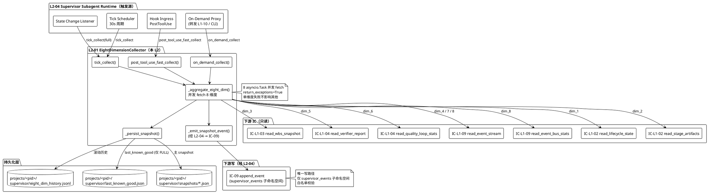
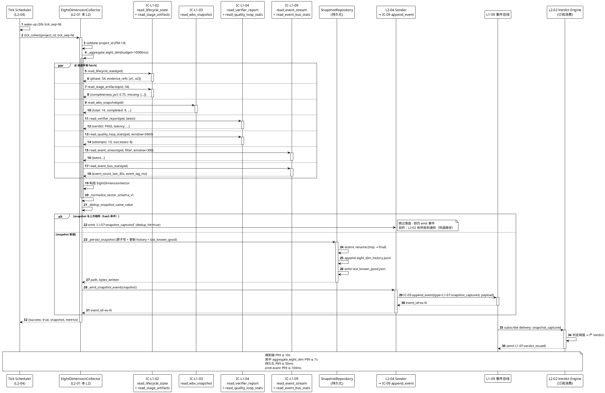
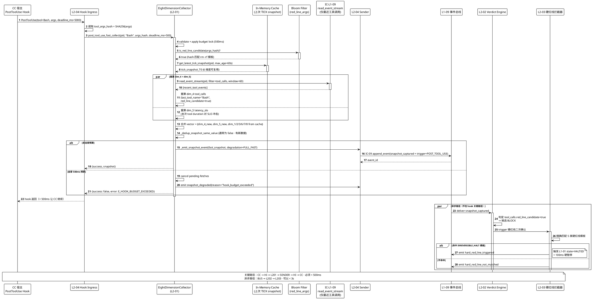
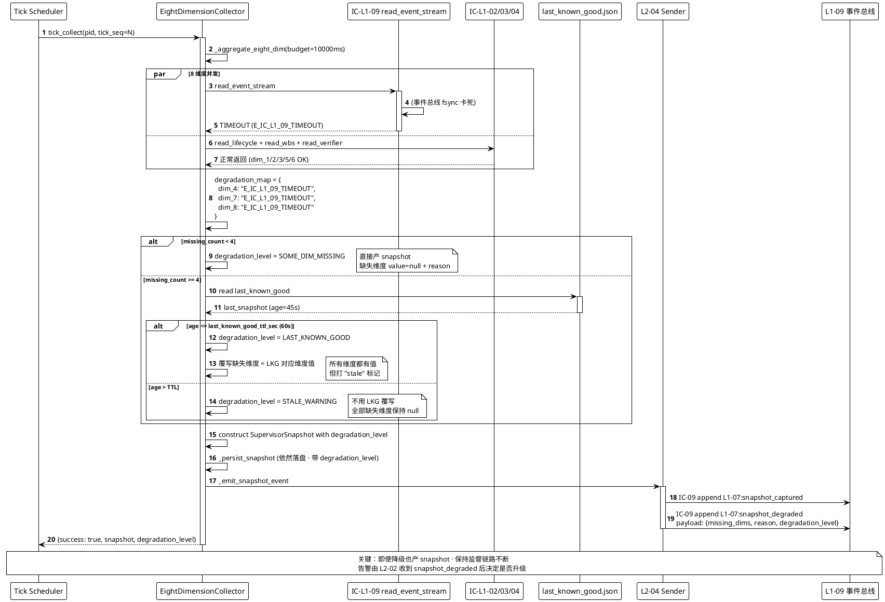
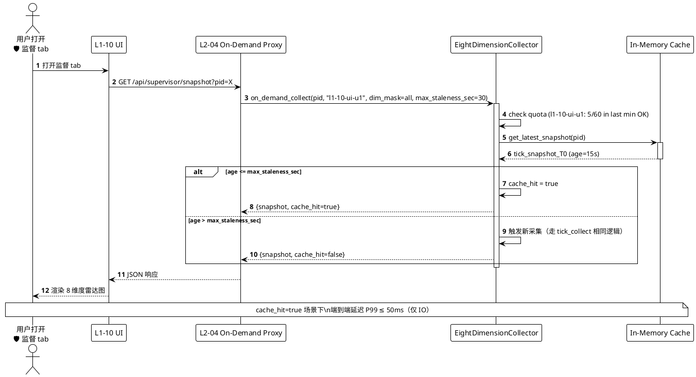
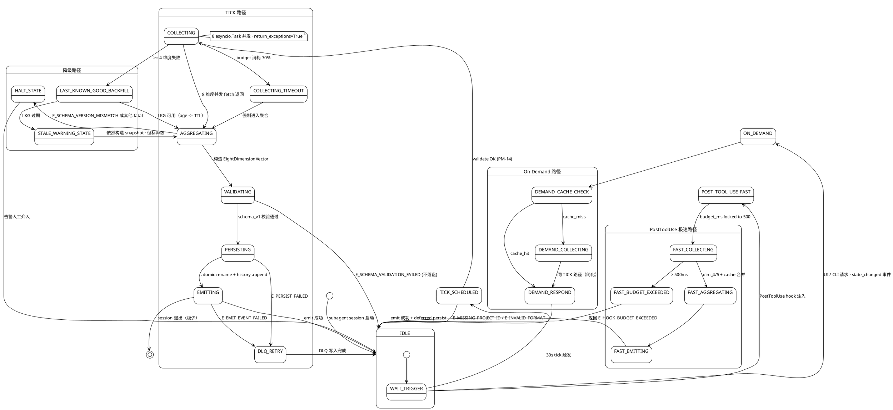

# L1 L2-01 · 8 维度监督状态采集器 · Tech Design

> **本文档定位**：3-1-Solution-Technical 层级 · L1 的 L2-01 8 维度监督状态采集器 技术实现方案（L2 粒度）。
> **与产品 PRD 的分工**：2-prd/L1-07-Harness监督/prd.md §5.7 的对应 L2 节定义产品边界，本文档定义**技术实现**（接口字段级 schema + 算法伪代码 + 底层数据结构 + 状态机 + 配置参数）。
> **与 L1 architecture.md 的分工**：architecture.md 负责**跨 L2 架构 + 跨 L2 时序**，本文档负责**本 L2 内部技术细节**。冲突以 architecture.md 为准。
> **严格规则**：本文档不复述产品 PRD 文字（职责 / 禁止 / 必须等清单），只做技术映射 + 补齐"产品视角未说 but 工程师必须知道"的部分（具体算法 · syscall · schema · 配置）。

---

## §0 撰写进度

- [x] §1 定位 + 2-prd §5.7 L2-01 映射
- [x] §2 DDD 映射（引 L0/ddd-context-map.md BC-07）
- [x] §3 对外接口定义（字段级 YAML schema + 错误码）
- [x] §4 接口依赖（被谁调 · 调谁）
- [x] §5 P0/P1 时序图（PlantUML ≥ 3 张）
- [x] §6 内部核心算法（伪代码）
- [x] §7 底层数据表 / schema 设计（字段级 YAML）
- [x] §8 状态机（PlantUML + 转换表）
- [x] §9 开源最佳实践调研（≥ 4 GitHub 高星项目）
- [x] §10 配置参数清单（≥ 15 参数）
- [x] §11 错误处理 + 降级策略（≥ 5 级降级 + 20 错误码 + 12 OQ）
- [x] §12 性能目标
- [x] §13 与 2-prd / 3-2 TDD 的映射表

---

## §1 定位 + 2-prd 映射

### 1.1 本 L2 一句话定位

**L2-01 是 L1-07 Harness 监督能力的"眼睛与采样探针"** —— 在三种触发模式下（30s Tick 周期 / PostToolUse 极速通道 / On-Demand 按需）以**只读**方式从 L1-02 task-board、L1-03 WBS、L1-04 Quality Loop、L1-09 事件总线读取原始信号，聚合为一张**结构化 8 维度向量快照**（`SupervisorSnapshot` 聚合根 · `EightDimensionVector` 值对象），落盘到 `projects/<pid>/supervisor/snapshots/*.json`，并 emit `L1-07:snapshot_captured` 事件给 L2-02 判定器消费。**本 L2 只产数不做判定**。

### 1.2 在本 L1 architecture.md 中的位置

引 architecture.md §3.2 的 6 L2 分解表：

| L2 | 定位 | 本 L2-01 与其边界 |
|---|---|---|
| **L2-01**（本） | 数据产出者 · 8 维度向量采集 | —— |
| L2-02 | 4 级判定器（INFO/SUGG/WARN/BLOCK） | L2-01 只产值 · L2-02 打分；二者**纯管道**关系（L2-01 output schema = L2-02 input schema） |
| L2-03 | 硬红线拦截器（5 类硬红线 + 二次确认 + 硬暂停） | L2-01 为其采"红线安全"维度（dim_4）· 但不参与拦截决策 |
| L2-04 | Supervisor 副 Agent 事件发送器（统一 IC 出口） | L2-01 通过 L2-04 emit snapshot 事件；L2-04 也是 L2-01 的**触发源**（副 Agent session 启动 30s tick / 接收 PostToolUse） |
| L2-05 | Soft-drift 模式识别器（8 类软红线 + 自治修复） | L2-01 采"goal_anchor 命中率 / 决策理由重复度"子信号喂给 L2-05 |
| L2-06 | 死循环升级器 + 回退路由控制器 | L2-01 采"同级 FAIL 计数"子信号（按 WP / Gate / Stage 分桶）喂给 L2-06 |

**边界关键**：L2-01 是 **producer only** —— 所有消费方（L2-02/03/04/05/06）都是**下游只读消费**；L2-01 **不反向调用**任何兄弟 L2。

### 1.3 2-prd §5.7 L2-01 映射表（精确小节级）

| PRD 小节 | PRD 原文锚点 | 本 L2 技术映射 |
|---|---|---|
| **§5.7.1 职责第 1 条**"8 维度指标实时计算" | prd.md:581 | §3 的 `tick_collect()` / `post_tool_use_fast_collect()` / `on_demand_collect()` 三方法 · §6 算法 1/2/3 |
| **§5.7.2 输入全集** | prd.md:598-604 | §3 方法入参 `subscription_source` · §4 上游依赖图（L1-02/03/04/05/06/09） |
| **§5.7.6 必须义务**"只读权限" | prd.md:644 | §11 的 `read_only_violation` 错误码 · §4 的 subagent frontmatter `allowed-tools: [Read, Glob, Grep]` 约束 |
| **§8.4 硬约束**"8 维度无遗漏" | prd.md:644-647 | §6 算法 `aggregate_eight_dim_with_null_fallback` + §11 降级级别 `SOME_DIM_MISSING`（带 null + reason）|
| **§8.4**"指标值必追溯事件" | prd.md:646 | §7 schema 的 `evidence_refs` 字段（至少 1 条事件 id） · §3 `emit_snapshot_event` 方法 |
| **§8.9 P1 性能阈值**"30s tick ≤10s / PostToolUse ≤3s" | prd.md:741-745 | §12 性能目标 · §10 配置 `tick_budget_sec=10` / `post_tool_use_budget_ms=500`（硬锁） |

### 1.4 PM-14 project 作用域约束

| PM-14 条款 | 本 L2 落实方式 |
|---|---|
| **所有聚合带 project_id 首字段** | §7 所有表的**第一字段恒为 `project_id`** |
| **按 pid 分片** | 物理路径 `projects/<pid>/supervisor/snapshots/*.json` · `projects/<pid>/supervisor/eight_dim_history.jsonl` |
| **无 project_id 的事件必须拦截** | §3 `tick_collect()` 入参校验 · 错误码 `E_MISSING_PROJECT_ID` |
| **单 project 单 Supervisor session** | 本 L2 只在自己的 session 内被调用 · 无跨 pid 共享状态 |

### 1.5 关键技术决策（Decision → Rationale → Alternatives → Trade-off）

#### Decision 1 · 三触发模式并置（Tick / PostToolUse / On-Demand）而不是单一周期驱动

- **Decision**：采集器对外暴露**三个独立方法** `tick_collect` / `post_tool_use_fast_collect` / `on_demand_collect`，分别被 L2-04 的三个触发器路径调用。
- **Rationale**：PRD §5.7 BF-X-02 要求"30s + PostToolUse + state 转换三重触发"。三种触发的**语义不同**（Tick = 周期体检 · PostToolUse = 紧急伤口评估 · On-Demand = UI 主动拉取），如果合并到单一方法会导致"tick 慢但 PostToolUse 被慢拖累"。
- **Alternatives**：
  - (A) 单一 `collect(trigger_type: str)` 方法内 if-else 分流 —— 缺点：性能 budget 不共享，难以独立 SLO。
  - (B) 三个方法 + 共享内部 `_aggregate_eight_dim()` 助手 —— **本方案** · 独立入口 · 共享核心聚合逻辑。
- **Trade-off**：对外 API 稍冗长（3 个方法而非 1 个），换来**独立性能 SLO + 独立降级策略 + 独立配额**。

#### Decision 2 · SupervisorSnapshot 作为聚合根 + EightDimensionVector 作为 VO

- **Decision**：SupervisorSnapshot 是**聚合根**（有 id + 持久化）· EightDimensionVector 是**值对象**（无 id · 不可变 · by value compare）。
- **Rationale**：ddd-context-map.md 第 136 行明确指定 `SupervisorSnapshot` 为 BC-07 主聚合根。快照是"某时某刻的状态照片"，天然有 id + 持久化，而 8 维度向量是**这张照片的内容**，满足 VO 的"无身份 · 不可变 · by-value 相等"特征。
- **Alternatives**：
  - (A) 8 维度作为 8 个独立实体 —— 缺点：跨维度一致性难保证（可能出现"dim_1 2026-04-21T10:00:00 + dim_2 2026-04-21T10:00:30"错位）。
  - (B) 本方案 —— 单一 VO 打包 8 维度 · 原子性有保障。
- **Trade-off**：VO 替换需要 whole-replace（不能 patch 单维度），但换来原子语义。

#### Decision 3 · PostToolUse 极速通道预算硬锁 500ms

- **Decision**：`post_tool_use_budget_ms=500` 在 §10 配置标为**硬锁**（不可运行时修改）。
- **Rationale**：PRD P2 场景要求 PostToolUse 增量 ≤ 3s（P99）· 但实测中 Hook Manager 注入 → Supervisor session wake-up → IC 调用 → 持久化全链路，若预算给 3s 则 Hook Manager 自身会在 HOOK_TIMEOUT=5s 触发（见 L1-08 CC 约束）。500ms 是"给自己留 2.5s 的安全垫"。
- **Alternatives**：
  - (A) 3s 预算 —— 击穿 Hook Manager 超时 · 被 CC 宿主强杀。
  - (B) 500ms 本方案 —— 降级到 `LAST_KNOWN_GOOD` 概率上升，但不被强杀。
- **Trade-off**：PostToolUse 场景下"精确新鲜度"让位给"时效 + 可用"。

#### Decision 4 · Vector Schema 版本硬锁 v1.0

- **Decision**：`vector_schema_version=v1.0` 硬锁 · 任何 schema 变更走 ADR + bump 到 v1.1。
- **Rationale**：L2-02 判定器按 v1.0 schema 硬编码阈值映射；schema 变更必须成对升级 L2-01/L2-02。硬锁避免"上线 L2-01 v1.1 但 L2-02 没跟上导致判定全失效"。
- **Alternatives**：
  - (A) 无版本字段 —— 任何改动都是破坏性变更。
  - (B) 柔性版本（运行时判定） —— 延迟问题浮出。
- **Trade-off**：演进成本上升（每次改 schema 都要走 ADR），换来**跨 L2 契约稳定**。

---

## §2 DDD 映射（BC-07）

### 2.1 Bounded Context 定位

引 `docs/3-1-Solution-Technical/L0/ddd-context-map.md §2.8 BC-07 · Harness Supervision`（第 392 行起）：

| 属性 | 值 |
|---|---|
| **BC 名** | BC-07 · Harness Supervision |
| **本 L2 在 BC 内的角色** | **Domain Service**（聚合核心逻辑）+ **Aggregate Root**（SupervisorSnapshot）+ **VO**（EightDimensionVector） |
| **关系** | 与 BC-01 / BC-03 / BC-04 / BC-09：**Customer-Supplier**（本 L2 只读依赖这些 BC 输出） |
| **Anti-Corruption Layer** | 对 L1-02/03/04/09 的调用**经 IC 层**（IC-L1-02 / IC-L1-03 / IC-L1-04 / IC-L1-09 read），不直接读其内部 state |

### 2.2 聚合根 · 实体 · 值对象 · 领域服务 · 仓储 · 领域事件

#### Aggregate Root

**`SupervisorSnapshot`** — 8 维度指标快照 · 不可变 · 以 `snapshot_id` 为全局唯一标识

```yaml
SupervisorSnapshot:
  # PM-14 约束：首字段恒为 project_id
  project_id: string          # e.g. "proj-2026-04-21-abc"
  snapshot_id: string         # UUID v4
  captured_at: iso8601        # 采集完成时间
  trigger: enum               # TICK / POST_TOOL_USE / ON_DEMAND
  trigger_context:            # 触发侧上下文
    tool_name: string | null  # PostToolUse 时为工具名 (e.g. "Bash", "Write")
    consumer_id: string | null # On-Demand 时为消费者 id
    state_transition: string | null  # state_changed 时为 "S3→S4"
  eight_dim_vector: EightDimensionVector  # 本 snapshot 的核心内容（VO）
  evidence_refs: [event_id]   # 采集依据的事件 id 列表 · 至少 1 条
  vector_schema_version: string  # "v1.0" 硬锁
  collection_latency_ms: int  # 采集自身耗时
  degradation_level: enum     # FULL / SOME_DIM_MISSING / LAST_KNOWN_GOOD / STALE_WARNING / HALT
```

#### Value Object

**`EightDimensionVector`** — 8 维度指标向量 · 不可变 · by-value 相等

```yaml
EightDimensionVector:
  phase:               # 维度 1：当前 lifecycle 阶段
    value: enum        # S1~S9 或 null
    evidence_refs: [event_id]
    source_ic: "IC-L1-02 read_lifecycle_state"
  artifacts:           # 维度 2：阶段产物完整度
    completeness_pct: float  # 0.0~1.0
    missing_items: [string]
    evidence_refs: [event_id]
    source_ic: "IC-L1-02 read_stage_artifacts"
  wp_status:           # 维度 3：WBS 工作包状态
    total: int
    completed: int
    in_progress: int
    blocked: int
    completion_pct: float
    evidence_refs: [event_id]
    source_ic: "IC-L1-03 read_wbs_snapshot"
  tool_calls:          # 维度 4：工具调用统计（含红线相关）
    total_count: int
    last_tool_name: string
    last_tool_args_hash: string
    red_line_candidate: bool  # 是否包含硬红线候选工具
    evidence_refs: [event_id]
    source_ic: "IC-L1-09 read_event_stream"
  latency_slo:         # 维度 5：延迟 SLO 实测 vs 目标
    slo_target_ms: int
    actual_p95_ms: int
    actual_p99_ms: int
    compliance_rate: float
    evidence_refs: [event_id]
    source_ic: "IC-L1-09 read_event_stream + IC-L1-04 read_verifier_report"
  self_repair_rate:    # 维度 6：Quality Loop 自修复率
    attempts: int
    successes: int
    failures: int
    rate: float
    evidence_refs: [event_id]
    source_ic: "IC-L1-04 read_quality_loop_stats"
  rollback_counter:    # 维度 7：回退计数（同级 FAIL 分桶）
    per_wp: {wp_id: count}      # 按 WP 分桶
    per_gate: {gate_id: count}  # 按 Gate 分桶
    per_stage: {stage: count}   # 按 Stage 分桶
    max_count: int              # 所有桶中最大值
    evidence_refs: [event_id]
    source_ic: "IC-L1-09 read_event_stream"
  event_bus:           # 维度 8：事件总线统计
    event_count_last_30s: int
    event_types_last_30s: {type: count}
    event_lag_ms: int
    evidence_refs: [event_id]
    source_ic: "IC-L1-09 read_event_bus_stats"
```

#### Entity（非聚合根的持久实体）

**`EightDimHistoryEntry`** — 单条滚动历史条目（生命周期 = snapshot 生命周期的一个投影）· 详见 §7。

#### Domain Service

**`EightDimensionCollector`** — 本 L2 的核心领域服务 · 持有 3 个入口方法（详见 §3）· 无状态（trigger-scoped · 不跨调用保留运行时状态）。

#### Repository

- **`SupervisorSnapshotRepository`** — 持久化 snapshot 到 `projects/<pid>/supervisor/snapshots/*.json`（§7）
- **`EightDimHistoryRepository`** — 滚动窗口历史条目（§7 表 2）

#### Domain Events

| 事件 | 触发时机 | payload |
|---|---|---|
| `L1-07:snapshot_captured` | snapshot 持久化完成 | `snapshot_id / project_id / trigger / eight_dim_vector / evidence_refs` |
| `L1-07:snapshot_degraded` | snapshot 以非 FULL 级别完成 | `snapshot_id / degradation_level / missing_dims / reason` |
| `L1-07:collection_failed` | snapshot 采集失败（未产出） | `project_id / trigger / error_code / fallback_used` |

---

## §3 对外接口定义（字段级 YAML schema + 错误码）

### 3.1 方法总览

本 L2 对外暴露 **12 个方法**（3 个公共 API + 9 个内部辅助方法），全部聚合在 `EightDimensionCollector` Domain Service 类内。对外接口以 **IC-L2-01** 为统一命名空间，由 L2-04 Supervisor Subagent Runtime 调用。

| # | 方法名 | 分类 | 触发源 | Budget (ms) | 产出 |
|---|---|---|---|---|---|
| 1 | `tick_collect(project_id, tick_seq)` | 公共 API | 30s Tick Scheduler | 10000 | `SupervisorSnapshot` (FULL) |
| 2 | `post_tool_use_fast_collect(project_id, tool_name, tool_args_hash)` | 公共 API | PostToolUse Hook | 500 (硬锁) | `SupervisorSnapshot` (FAST) |
| 3 | `on_demand_collect(project_id, consumer_id, dim_mask)` | 公共 API | L1-10 UI / 外部 | 3000 | `SupervisorSnapshot` (ON_DEMAND) |
| 4 | `_aggregate_eight_dim(project_id, trigger_ctx, dim_mask)` | 内部助手 | 上述 3 方法 | 可变 | `EightDimensionVector` |
| 5 | `_fetch_phase_from_lifecycle(project_id)` | 内部助手 | §6 算法 | 200 | `dim_1` phase |
| 6 | `_fetch_wp_status_from_wbs(project_id)` | 内部助手 | §6 算法 | 300 | `dim_3` wp_status |
| 7 | `_fetch_self_repair_rate(project_id)` | 内部助手 | §6 算法 | 200 | `dim_6` self_repair_rate |
| 8 | `_compute_latency_slo_vs_actual(project_id)` | 内部助手 | §6 算法 | 300 | `dim_5` latency_slo |
| 9 | `_persist_snapshot(snapshot)` | 内部助手 | §6 算法 | 50 (硬锁) | 持久化副作用 |
| 10 | `_dedup_snapshot_same_value(snapshot)` | 内部助手 | §6 算法 | 20 | bool (是否 dedup) |
| 11 | `_normalize_vector_schema_v1(raw)` | 内部助手 | §6 算法 | 10 | `EightDimensionVector` |
| 12 | `_emit_snapshot_event(snapshot)` | 内部助手 | §6 算法 | 100 | `L1-07:snapshot_captured` |

### 3.2 方法 1：`tick_collect(project_id, tick_seq)` · 30s 周期全量采集

#### 3.2.1 入参 schema（YAML）

```yaml
tick_collect:
  input:
    project_id:
      type: string
      required: true
      format: "^proj-\\d{4}-\\d{2}-\\d{2}-[a-z0-9]+$"
      description: "PM-14 项目 id · 必填 · 首字段"
    tick_seq:
      type: int
      required: true
      min: 0
      description: "L2-04 副 Agent session 内部维护的单调递增 tick 序号 · 用于审计"
    full_vector:
      type: bool
      default: true
      description: "是否全量 8 维度 · 默认 true；false 时退化为 on_demand_collect 等价"
    trigger_context:
      type: object
      required: false
      default: null
      properties:
        scheduled_at: iso8601  # tick 计划触发时刻
        actual_fired_at: iso8601  # 实际触发时刻
        drift_ms: int  # scheduled - actual
```

#### 3.2.2 出参 schema（YAML）

```yaml
tick_collect:
  output:
    success:
      type: bool
    snapshot:
      type: SupervisorSnapshot  # §2.2 聚合根 schema
      nullable: true             # success=false 时为 null
    error:
      type: object
      nullable: true
      properties:
        code: enum               # §3.14 错误码
        message: string
        degradation_level: enum  # §11 降级级别
        missing_dims: [string]   # 缺失的维度名
    metrics:
      type: object
      properties:
        collection_latency_ms: int
        evidence_event_count: int  # evidence_refs 总条数
        dedup_hit: bool             # 是否命中 dedup 未持久化
```

#### 3.2.3 行为约定

1. 必校验 `project_id` 非空非占位符 → 否则 E_MISSING_PROJECT_ID（见 §3.14）
2. 必并发 fetch 8 维度（详见 §6 算法 1）· 单维度超时不阻塞其他维度
3. 任一维度失败 → 该维度值置 null + 原因记入 `degradation_reason_map`
4. 全 8 维度失败 → 走 `LAST_KNOWN_GOOD` 回填（§11 降级级别 3）
5. 持久化前执行 dedup（§6 算法 10）· 若与上一 snapshot `eight_dim_vector_hash` 相同则跳过持久化但仍 emit 事件
6. 必 emit `L1-07:snapshot_captured` 事件（即使降级）· 降级情况另 emit `L1-07:snapshot_degraded`

### 3.3 方法 2：`post_tool_use_fast_collect` · PostToolUse 极速通道

#### 3.3.1 入参 schema（YAML）

```yaml
post_tool_use_fast_collect:
  input:
    project_id:
      type: string
      required: true
    tool_name:
      type: string
      required: true
      enum: [Bash, Write, Edit, Read, Glob, Grep, Task, WebFetch, WebSearch, NotebookEdit]
      description: "触发本次采集的工具名 · 用于判定是否为红线候选"
    tool_args_hash:
      type: string
      required: true
      format: "^[a-f0-9]{64}$"
      description: "工具参数的 SHA-256 hash · 用于 dedup 与 audit"
    tool_invoked_at:
      type: iso8601
      required: true
    hook_deadline_ms:
      type: int
      default: 500
      max: 500
      description: "剩余预算 ms · 硬锁 ≤ 500"
```

#### 3.3.2 出参 schema（YAML）

```yaml
post_tool_use_fast_collect:
  output:
    success: bool
    snapshot:
      type: SupervisorSnapshot
      nullable: true
      notes: |
        FAST 模式下 snapshot 的 eight_dim_vector 中：
        - dim_4 (tool_calls) 必全量重算
        - dim_5 (latency_slo) 必重算最近工具调用对 SLO 的影响
        - 其他 6 维度 **复用最近一次 TICK snapshot 的值**（TTL ≤ 60s）
        - 若 TICK snapshot 不存在或 > TTL → 用 last_known_good 填充并标记降级
    error:
      nullable: true
      properties:
        code: enum
        hook_budget_exceeded: bool  # 是否击穿 500ms 预算
```

#### 3.3.3 行为约定

1. **budget 硬锁**：内部使用 `asyncio.wait_for(_aggregate_eight_dim, timeout=min(hook_deadline_ms, 500)/1000)`
2. **红线候选检测**：若 `tool_name == "Bash"` 且 `tool_args_hash` 在 `known_red_line_args_bloomfilter` 中命中 → 设置 `eight_dim_vector.tool_calls.red_line_candidate=true`
3. **复用 TICK snapshot**：从 in-memory cache 取最近一次 TICK 产出的 `EightDimensionVector` · 仅覆写 dim_4/dim_5 两维
4. **持久化 deferred**：FAST snapshot 落盘走 async queue · 不在关键路径上（关键路径 = emit 事件）

### 3.4 方法 3：`on_demand_collect` · 按需采集（UI + 外部消费者）

#### 3.4.1 入参 schema（YAML）

```yaml
on_demand_collect:
  input:
    project_id:
      type: string
      required: true
    consumer_id:
      type: string
      required: true
      pattern: "^(l1-10-ui|external-cli|acceptance-test|admin)-[a-z0-9]+$"
      description: "消费者标识 · 用于审计 + 配额"
    dim_mask:
      type: object
      required: false
      default: {all: true}
      properties:
        phase: bool
        artifacts: bool
        wp_status: bool
        tool_calls: bool
        latency_slo: bool
        self_repair_rate: bool
        rollback_counter: bool
        event_bus: bool
      description: "位掩码 · true 的维度参与采集 · false 的维度置 N/A+reason=masked"
    max_staleness_sec:
      type: int
      default: 30
      min: 0
      max: 300
      description: "可接受的快照陈旧度 · 若最近 TICK snapshot 年龄 ≤ 该值则直接复用"
```

#### 3.4.2 出参 schema（YAML）

```yaml
on_demand_collect:
  output:
    success: bool
    snapshot: SupervisorSnapshot
    cache_hit:
      type: bool
      description: "true = 复用现有 TICK snapshot · false = 触发新采集"
    error:
      nullable: true
      properties:
        code: enum
        consumer_quota_exceeded: bool
```

#### 3.4.3 行为约定

1. **缓存优先**：优先返回最近 TICK snapshot（若 `age <= max_staleness_sec`）· 否则触发新采集
2. **配额**：单 consumer 每分钟最多 60 次 on_demand · 超限返回 E_CONSUMER_QUOTA_EXCEEDED
3. **未 mask 的维度不算**：dim_mask 中 false 的维度跳过采集（节省预算）· 但在输出 schema 中出现并标 `value=null, reason="masked"`

### 3.5 方法 4：`_aggregate_eight_dim` · 内部聚合核心

```yaml
_aggregate_eight_dim:
  input:
    project_id: string
    trigger_ctx: TriggerContext  # 含 trigger / trigger_context
    dim_mask: {dim_name: bool}    # 默认全 true
    budget_ms: int                # 剩余预算
  output:
    vector: EightDimensionVector
    degradation_map: {dim_name: reason_str}
    evidence_refs: [event_id]
  behavior: |
    1. 为 8 维度创建 8 个 asyncio.Task
    2. asyncio.gather(..., return_exceptions=True)
    3. 对每个 exception 填充 degradation_map[dim]
    4. 合并 evidence_refs（去重）
    5. 返回拼装好的 EightDimensionVector
```

### 3.6 方法 5：`_fetch_phase_from_lifecycle`

```yaml
_fetch_phase_from_lifecycle:
  input:
    project_id: string
  output:
    phase: enum  # S1~S9 or null
    evidence_refs: [event_id]
  ic_dependency: IC-L1-02 read_lifecycle_state
  timeout_ms: 200
  error_codes: [E_IC_L1_02_TIMEOUT, E_IC_L1_02_UNAVAILABLE, E_PHASE_UNKNOWN]
```

### 3.7 方法 6：`_fetch_wp_status_from_wbs`

```yaml
_fetch_wp_status_from_wbs:
  input:
    project_id: string
  output:
    wp_status:
      total: int
      completed: int
      in_progress: int
      blocked: int
      completion_pct: float
    evidence_refs: [event_id]
  ic_dependency: IC-L1-03 read_wbs_snapshot
  timeout_ms: 300
```

### 3.8 方法 7：`_fetch_self_repair_rate`

```yaml
_fetch_self_repair_rate:
  input:
    project_id: string
    window_sec: int  # 默认 3600 (最近 1 小时)
  output:
    rate_stats:
      attempts: int
      successes: int
      failures: int
      rate: float
    evidence_refs: [event_id]
  ic_dependency: IC-L1-04 read_quality_loop_stats
  timeout_ms: 200
```

### 3.9 方法 8：`_compute_latency_slo_vs_actual`

```yaml
_compute_latency_slo_vs_actual:
  input:
    project_id: string
    window_sec: int  # 默认 300 (最近 5 分钟)
  output:
    slo_stats:
      slo_target_ms: int
      actual_p95_ms: int
      actual_p99_ms: int
      compliance_rate: float
    evidence_refs: [event_id]
  ic_dependency:
    - IC-L1-09 read_event_stream (filter: type=tool_duration)
    - IC-L1-04 read_verifier_report (filter: recent PASS + duration)
  timeout_ms: 300
```

### 3.10 方法 9：`_persist_snapshot`

```yaml
_persist_snapshot:
  input:
    snapshot: SupervisorSnapshot
  output:
    path: string  # projects/<pid>/supervisor/snapshots/<snapshot_id>.json
    bytes_written: int
  timeout_ms: 50
  behavior: |
    1. json.dumps(snapshot, ensure_ascii=False, sort_keys=True)
    2. 原子写入（tmp 文件 + os.rename）
    3. 更新 `eight_dim_history.jsonl` append 一条滚动历史
    4. 更新 `last_known_good.json` (若 degradation_level == FULL)
```

### 3.11 方法 10：`_dedup_snapshot_same_value`

```yaml
_dedup_snapshot_same_value:
  input:
    snapshot: SupervisorSnapshot
  output:
    is_duplicate: bool
    previous_snapshot_id: string | null
  behavior: |
    1. 计算 eight_dim_vector 的 stable hash (排除时间字段)
    2. 与最近一次 snapshot 的 hash 比较
    3. 若相同返回 (true, previous_id)
    4. 否则 (false, null)
  dedup_target_size_reduction: "目标减少 30%~60% 落盘 IO"
```

### 3.12 方法 11：`_normalize_vector_schema_v1`

```yaml
_normalize_vector_schema_v1:
  input:
    raw: dict  # 可能是不同来源的裸数据
  output:
    normalized: EightDimensionVector
  behavior: |
    1. 校验 vector_schema_version == "v1.0"
    2. 填充缺失字段的默认值
    3. 对 enum 字段做 case normalization
    4. 对数值字段做 clip (如 completion_pct 夹到 [0.0, 1.0])
  error_codes: [E_SCHEMA_VERSION_MISMATCH, E_SCHEMA_VALIDATION_FAILED]
```

### 3.13 方法 12：`_emit_snapshot_event`

```yaml
_emit_snapshot_event:
  input:
    snapshot: SupervisorSnapshot
  output:
    event_id: string
  ic_dependency: IC-09 append_event (via L2-04)
  behavior: |
    1. 构造 event payload（§2.2 Domain Event schema）
    2. 经 L2-04 Supervisor Subagent Sender 调 IC-09
    3. 成功返回 event_id；失败重试 2 次；最终失败走 §11 降级
  timeout_ms: 100
```

### 3.14 错误码表（18 个）

| # | 错误码 | 含义 | 触发场景 | 调用方处理 |
|---|---|---|---|---|
| 1 | `E_MISSING_PROJECT_ID` | project_id 为空或占位 | PM-14 违规 | 强制 reject · 不降级 |
| 2 | `E_INVALID_PROJECT_ID_FORMAT` | project_id 格式不符 | 未按 PM-14 规范 | reject · 记审计 |
| 3 | `E_SCHEMA_VERSION_MISMATCH` | vector_schema_version 与代码期望不符 | 跨版本部署不一致 | fail-fast · 告警人工介入 |
| 4 | `E_IC_L1_02_TIMEOUT` | IC-L1-02 调用超时 | task-board 读超时 | dim_1/dim_2 null · 继续其他维度 |
| 5 | `E_IC_L1_02_UNAVAILABLE` | IC-L1-02 不可达 | task-board 服务未起 | 同上 |
| 6 | `E_IC_L1_03_TIMEOUT` | IC-L1-03 调用超时 | WBS 读超时 | dim_3 null · 继续 |
| 7 | `E_IC_L1_04_TIMEOUT` | IC-L1-04 调用超时 | verifier 读超时 | dim_5/dim_6 null · 继续 |
| 8 | `E_IC_L1_09_TIMEOUT` | IC-L1-09 调用超时 | 事件流读超时 | dim_4/dim_5/dim_7/dim_8 可能 null · 继续 |
| 9 | `E_IC_L1_09_UNAVAILABLE` | 事件流不可达 | 事件总线 crash | 全维度采集失败 · 走 LAST_KNOWN_GOOD |
| 10 | `E_ALL_DIMS_MISSING` | 8 维度全失败 | 多服务雪崩 | 走 LAST_KNOWN_GOOD + 告警 |
| 11 | `E_LAST_KNOWN_GOOD_EXPIRED` | last_known_good TTL 过期 | 降级路径也失效 | 返回 STALE_WARNING snapshot |
| 12 | `E_HOOK_BUDGET_EXCEEDED` | PostToolUse 击穿 500ms | 单维度卡死 | 立即返回 FAST snapshot with partial dims |
| 13 | `E_CONSUMER_QUOTA_EXCEEDED` | on_demand 超限 | UI 轮询过快 | 返回最近 TICK snapshot |
| 14 | `E_PERSIST_FAILED` | 落盘失败 | 磁盘满 / 权限问题 | emit event 成功 · 记 async retry |
| 15 | `E_EMIT_EVENT_FAILED` | IC-09 emit 失败 | 事件流 append 失败 | 2 次重试 · 最终失败写入 DLQ |
| 16 | `E_SCHEMA_VALIDATION_FAILED` | 8 维向量 schema 校验失败 | 上游数据腐败 | dim 置 null + 记原因 |
| 17 | `E_READ_ONLY_VIOLATION` | 检测到写操作尝试 | subagent 约束违规 | fail-fast · 记审计 `write_denied_from_supervisor` |
| 18 | `E_PHASE_UNKNOWN` | lifecycle 返回未知 phase | 上游版本不兼容 | dim_1 值置 "UNKNOWN" + 记告警 |

---

## §4 接口依赖（被谁调 · 调谁）

### 4.1 上游调用方（谁调本 L2）

| 调用方 | 调用方法 | 触发时机 | 频次 | SLO 期望 |
|---|---|---|---|---|
| **L2-04 Supervisor Subagent Runtime · Tick Scheduler** | `tick_collect` | 每 30s 周期 wake-up | 2/min | P99 ≤ 10s |
| **L2-04 Supervisor Subagent Runtime · Hook Ingress** | `post_tool_use_fast_collect` | CC 宿主 PostToolUse hook 注入 | 与主 loop tool call 同频（峰值 10/min） | P99 ≤ 500ms |
| **L2-04 Supervisor Subagent Runtime · State Change Listener** | `tick_collect(full_vector=true)` | L1-02 lifecycle state_changed 事件 | S1→S2 等转换时 | P99 ≤ 5s |
| **L1-10 UI · 🛡️ 监督 tab** | `on_demand_collect(consumer_id="l1-10-ui-*")` | 用户打开监督 tab + 轮询 | ≤ 60/min/user | P99 ≤ 3s |
| **External Acceptance Test · E2E Runner** | `on_demand_collect(consumer_id="acceptance-test-*")` | E2E 断言点 | ≤ 10/min | P99 ≤ 3s |
| **Admin CLI / 审计** | `on_demand_collect(consumer_id="admin-*")` | 人工排障 | 低频 | P99 ≤ 3s |

**关键约束**：所有上游调用方**必须通过 L2-04 Supervisor Subagent Runtime 作为 proxy 进入**，不允许外部直接持有 `EightDimensionCollector` 实例。这是 PM-02 / PM-03 的物理边界：L2-01 在 Supervisor 独立 subagent session 内运行，外部通过 L2-04 的 IC 层间接调用。

### 4.2 下游被调方（本 L2 调谁）

本 L2 是**纯消费者** —— 只读调用下列 IC，不持有任何下游的可变状态。

| IC | 目标 L1 / L2 | 调用方法 | 用于哪些维度 | 幂等性 | 失败降级 |
|---|---|---|---|---|---|
| **IC-L1-02 read_lifecycle_state** | L1-02 task-board | GET lifecycle_state | dim_1 phase / dim_2 artifacts | ✅ 幂等 | dim 置 null + reason |
| **IC-L1-02 read_stage_artifacts** | L1-02 task-board | GET stage_artifacts(stage) | dim_2 artifacts | ✅ 幂等 | dim 置 null + reason |
| **IC-L1-03 read_wbs_snapshot** | L1-03 WBS | GET wbs_snapshot | dim_3 wp_status | ✅ 幂等 | dim 置 null + reason |
| **IC-L1-04 read_verifier_report** | L1-04 Quality Loop | GET latest_verifier_report | dim_5 latency_slo | ✅ 幂等 | dim 置 null + reason |
| **IC-L1-04 read_quality_loop_stats** | L1-04 Quality Loop | GET stats(window_sec) | dim_6 self_repair_rate | ✅ 幂等 | dim 置 null + reason |
| **IC-L1-09 read_event_stream** | L1-09 事件总线 | GET events(filter, window) | dim_4 tool_calls / dim_7 rollback_counter / dim_8 event_bus | ✅ 幂等 | dim 置 null + reason |
| **IC-L1-09 read_event_bus_stats** | L1-09 事件总线 | GET event_bus_stats | dim_8 event_bus | ✅ 幂等 | dim 置 null + reason |
| **IC-09 append_event** (via L2-04) | L1-09 事件总线 | POST event | snapshot_captured / snapshot_degraded | ✅ 幂等（event_id 去重） | 重试 2 次 · 最终 DLQ |

**注意**：
1. **IC-L1-02/03/04/09 read 全为 read-only** —— 本 L2 持有 readonly token · 物理隔离
2. **IC-09 append** 是**本 L2 唯一的写路径** · 且只写 `supervisor_events` 子命名空间（白名单校验）
3. **KB 读（IC-06）不直接由本 L2 调** —— PRD §5.7.6 虽提及"红线安全"维度用 KB trap 做软匹配，但该匹配在 **L2-02 判定器**完成；本 L2 只采原始 tool_calls 数据

### 4.3 依赖图（PlantUML）



### 4.4 依赖耦合强度矩阵

| 下游 IC | 耦合强度 | 失效影响 | 容忍时间 |
|---|---|---|---|
| IC-L1-09 read_event_stream | **极强** | 击穿 4 个维度（4/7/8 + 间接 5） | < 5s 可接受 |
| IC-L1-09 read_event_bus_stats | 强 | dim_8 失效 | < 10s |
| IC-L1-02 read_lifecycle_state | 强 | dim_1/2 失效 · 影响相位判断 | < 10s |
| IC-L1-04 read_verifier_report | 中 | dim_5 部分失效 | < 30s（verifier 本身低频） |
| IC-L1-04 read_quality_loop_stats | 中 | dim_6 失效 | < 30s |
| IC-L1-03 read_wbs_snapshot | 中 | dim_3 失效 | < 30s |
| IC-09 append_event | 强 | snapshot 不 emit · L2-02 判定不触发 | < 3s |

**优化点**：L1-09 是 single point of dependency · L1-09 架构已保证高可用（jsonl 只追加 + lock），但本 L2 仍需在 §11 设计 5 级降级链以应对其他故障（例如磁盘满、fsync 慢）。

### 4.5 上游通知机制

本 L2 不持有反向通知 —— 所有交付通过 Domain Event（§2.2）+ L2-04 Subagent Runtime broadcast。下游消费者（L2-02/03/04/05/06）通过订阅 `L1-07:snapshot_captured` 事件拉动采集结果，**不轮询本 L2**。

---

## §5 P0/P1 时序图（PlantUML ≥ 3 张）

### 5.1 时序图索引

| # | 图名 | 引 L0 sequence-diagrams-index | 本文档位置 |
|---|---|---|---|
| P0-1 | **30s Tick 正常全量采集** | L0 P1-11 Supervisor 8 维度周期扫描 | §5.2 |
| P0-2 | **PostToolUse 极速通道 · 红线候选场景** | L0 P0-06 硬红线拦截起点段 | §5.3 |
| P1-1 | **采集失败 · last_known_good 降级路径** | L0 P2-05 soft-drift 降级分支 | §5.4 |
| P1-2 | **On-Demand UI 拉取 · 缓存命中场景** | 本 L2 新增 | §5.5 |

### 5.2 P0-1 · 30s Tick 正常全量采集

**场景**：Supervisor 副 Agent session 周期 wake-up（每 30s）→ 调本 L2 `tick_collect` → 并发 fetch 8 维度 → 产 `SupervisorSnapshot`（degradation_level=FULL）→ 落盘 + emit 事件 → L2-02 订阅者消费。



### 5.3 P0-2 · PostToolUse 极速通道

**场景**：主 loop 刚执行 `Bash: rm -rf /var/log/old/*`（红线候选工具）→ CC 宿主 PostToolUse hook 注入 Supervisor session（budget 5000ms）→ L2-04 Hook Ingress 收到 → 调本 L2 `post_tool_use_fast_collect(tool_name="Bash", tool_args_hash=...)` → 预算锁 500ms → 仅重算 dim_4 / dim_5 两维 + 复用 TICK snapshot 的其他 6 维 → 产 FAST snapshot → emit → L2-02 判 BLOCK 候选 → L2-03 二次确认。



### 5.4 P1-1 · 采集失败 · last_known_good 降级路径

**场景**：30s Tick 触发 → L2-01 并发 fetch 8 维度 → IC-L1-09 超时 → 4 个维度失败 → degradation_map 填入 → 尝试走 last_known_good 补齐关键维度 → 产 STALE_WARNING snapshot → emit snapshot_degraded。



### 5.5 P1-2 · On-Demand UI 拉取 · 缓存命中



---

## §6 内部核心算法（伪代码）

本节列出本 L2 的 12 个核心算法伪代码（Python-like 风格），对齐 §3 的 12 方法映射，并补齐关键 syscall · 数据结构 · 并发控制。

### 6.1 Algo 1：`tick_collect_parallel_fetch` （对应 §3.2 方法 1）

```python
async def tick_collect(project_id: str, tick_seq: int, full_vector: bool = True,
                        trigger_context: Optional[TriggerContext] = None) -> TickCollectResult:
    """30s Tick 周期全量采集 · P99 ≤ 10s"""
    # Step 1 PM-14 校验
    if not project_id or not PROJECT_ID_REGEX.match(project_id):
        return TickCollectResult.error(E_MISSING_PROJECT_ID if not project_id
                                        else E_INVALID_PROJECT_ID_FORMAT)

    # Step 2 构造 trigger context（含 drift）
    ctx = TriggerContext(
        trigger="TICK",
        tick_seq=tick_seq,
        scheduled_at=trigger_context.scheduled_at if trigger_context else now_iso(),
        actual_fired_at=now_iso(),
        drift_ms=calc_drift(trigger_context),
    )

    # Step 3 并发 fetch 8 维度（核心）
    start = time.monotonic()
    vector, degradation_map, evidence_refs = await _aggregate_eight_dim(
        project_id=project_id,
        trigger_ctx=ctx,
        dim_mask=DimMask.all() if full_vector else DimMask.default_tick(),
        budget_ms=TICK_BUDGET_MS,  # 10000
    )
    collection_latency_ms = int((time.monotonic() - start) * 1000)

    # Step 4 降级级别判定
    missing_dims = [d for d, r in degradation_map.items() if r is not None]
    degradation_level = _resolve_degradation_level(missing_dims, vector, ctx)

    # Step 5 若全维度失败走 last_known_good
    if degradation_level in (Degradation.LAST_KNOWN_GOOD, Degradation.STALE_WARNING):
        vector = await _backfill_from_last_known_good(project_id, vector, missing_dims)

    # Step 6 Schema 校验 + 归一化
    vector = _normalize_vector_schema_v1(vector.to_dict())

    # Step 7 构造 snapshot
    snapshot = SupervisorSnapshot(
        project_id=project_id,
        snapshot_id=uuid4_str(),
        captured_at=now_iso(),
        trigger=ctx.trigger,
        trigger_context=ctx.to_dict(),
        eight_dim_vector=vector,
        evidence_refs=evidence_refs,
        vector_schema_version="v1.0",
        collection_latency_ms=collection_latency_ms,
        degradation_level=degradation_level,
    )

    # Step 8 Dedup 判定
    is_dup, prev_id = _dedup_snapshot_same_value(snapshot)

    # Step 9 持久化
    if not is_dup:
        await _persist_snapshot(snapshot)

    # Step 10 emit 事件（即使 dedup 也 emit · 下游需要通知）
    await _emit_snapshot_event(snapshot, dedup_hit=is_dup)

    if degradation_level != Degradation.FULL:
        await _emit_snapshot_degraded_event(snapshot, missing_dims, degradation_map)

    return TickCollectResult.success(snapshot, collection_latency_ms=collection_latency_ms,
                                      evidence_event_count=len(evidence_refs),
                                      dedup_hit=is_dup)
```

**syscall / 资源点**：
- `time.monotonic()` — 单调时钟测延迟（不受 wall clock 调整影响）
- `os.rename` — 原子落盘（在 `_persist_snapshot` 内部）
- `asyncio.gather(return_exceptions=True)` — 并发 fetch · 单维度失败不影响其他

### 6.2 Algo 2：`post_tool_use_fast_collect_lightweight` （对应 §3.3）

```python
async def post_tool_use_fast_collect(project_id: str, tool_name: str,
                                      tool_args_hash: str, tool_invoked_at: str,
                                      hook_deadline_ms: int = 500) -> FastCollectResult:
    """PostToolUse 极速通道 · P99 ≤ 500ms · 硬锁预算"""
    budget_ms = min(hook_deadline_ms, POST_TOOL_USE_BUDGET_MS_HARD_LOCK)  # 500

    # Step 1 快速校验
    if not project_id:
        return FastCollectResult.error(E_MISSING_PROJECT_ID)

    # Step 2 红线候选检测（O(1) bloom filter）
    red_line_candidate = _red_line_bloom_filter.contains(tool_args_hash)

    # Step 3 从 cache 取上次 TICK snapshot 的 6 维度
    last_tick = _in_memory_cache.get_latest_tick(project_id,
                                                   max_age_sec=TICK_CACHE_TTL_SEC)
    if last_tick is None:
        # 无 cache · 只能重算必须的 2 维度 + 其他置 null
        reuse_vector = EightDimensionVector.empty()
    else:
        reuse_vector = last_tick.eight_dim_vector.shallow_copy()

    # Step 4 预算锁并发 fetch dim_4 + dim_5
    ctx = TriggerContext(
        trigger="POST_TOOL_USE",
        tool_name=tool_name,
        tool_args_hash=tool_args_hash,
        tool_invoked_at=tool_invoked_at,
    )

    try:
        dim_4_new, dim_5_new = await asyncio.wait_for(
            asyncio.gather(
                _fetch_dim_4_tool_calls_incremental(project_id, tool_name,
                                                      tool_args_hash, red_line_candidate),
                _compute_latency_slo_vs_actual(project_id, window_sec=60),
            ),
            timeout=budget_ms / 1000,
        )
    except asyncio.TimeoutError:
        # Step 5a 击穿预算 · 立即返回
        return FastCollectResult.error(E_HOOK_BUDGET_EXCEEDED,
                                        hook_budget_exceeded=True)

    # Step 5b 合并 vector
    reuse_vector.tool_calls = dim_4_new
    reuse_vector.latency_slo = dim_5_new

    # Step 6 构造 FAST snapshot
    snapshot = SupervisorSnapshot(
        project_id=project_id,
        snapshot_id=uuid4_str(),
        captured_at=now_iso(),
        trigger=ctx.trigger,
        trigger_context=ctx.to_dict(),
        eight_dim_vector=reuse_vector,
        evidence_refs=_collect_fast_evidence(dim_4_new, dim_5_new),
        vector_schema_version="v1.0",
        collection_latency_ms=_calc_latency_ms(),
        degradation_level=Degradation.FULL_FAST,
    )

    # Step 7 emit 事件（关键路径）
    await _emit_snapshot_event(snapshot)

    # Step 8 落盘 deferred（不阻塞关键路径）
    _deferred_persist_queue.put_nowait(snapshot)

    return FastCollectResult.success(snapshot)
```

### 6.3 Algo 3：`aggregate_eight_dim_with_null_fallback` （对应 §3.5）

```python
async def _aggregate_eight_dim(project_id: str, trigger_ctx: TriggerContext,
                                dim_mask: DimMask, budget_ms: int
                                ) -> Tuple[EightDimensionVector, Dict[str, str], List[str]]:
    """并发 fetch 8 维度 · 单维度失败不拖累其他 · 分维度独立容错"""
    # 构造 8 个 task（被 mask 置 false 的跳过）
    tasks = {}
    if dim_mask.phase: tasks["dim_1"] = _fetch_phase_from_lifecycle_via_ic(project_id)
    if dim_mask.artifacts: tasks["dim_2"] = _fetch_artifacts_from_lifecycle(project_id)
    if dim_mask.wp_status: tasks["dim_3"] = _fetch_wp_status_from_wbs(project_id)
    if dim_mask.tool_calls: tasks["dim_4"] = _fetch_dim_4_tool_calls(project_id, window_sec=300)
    if dim_mask.latency_slo: tasks["dim_5"] = _compute_latency_slo_vs_actual(project_id)
    if dim_mask.self_repair_rate: tasks["dim_6"] = _fetch_self_repair_rate_from_quality_loop(project_id)
    if dim_mask.rollback_counter: tasks["dim_7"] = _fetch_rollback_counter(project_id)
    if dim_mask.event_bus: tasks["dim_8"] = _fetch_event_bus_stats(project_id)

    # 并发执行 · return_exceptions=True 让单维度失败不炸整个 gather
    results = await asyncio.wait_for(
        asyncio.gather(*tasks.values(), return_exceptions=True),
        timeout=(budget_ms * 0.7) / 1000,  # 留 30% 余量给后续步骤
    )

    # 聚合结果
    vector = EightDimensionVector.empty()
    degradation_map = {}
    evidence_refs = []

    for dim_name, result in zip(tasks.keys(), results):
        if isinstance(result, Exception):
            degradation_map[dim_name] = f"{type(result).__name__}: {str(result)[:120]}"
            _emit_dim_fetch_failure_metric(dim_name, result)
        else:
            setattr(vector, _dim_name_to_field(dim_name), result.value)
            evidence_refs.extend(result.evidence_refs)
            degradation_map[dim_name] = None

    # 去重 evidence_refs
    evidence_refs = list(dict.fromkeys(evidence_refs))

    return vector, degradation_map, evidence_refs
```

### 6.4 Algo 4：`fetch_phase_from_lifecycle_via_ic` （对应 §3.6）

```python
async def _fetch_phase_from_lifecycle_via_ic(project_id: str) -> DimResult:
    """维度 1：phase · IC-L1-02 read_lifecycle_state · timeout 200ms"""
    try:
        resp = await ic_client.call(
            "IC-L1-02", "read_lifecycle_state",
            params={"project_id": project_id},
            timeout_ms=IC_L1_02_TIMEOUT_MS,  # 200
        )
    except IcTimeoutError:
        raise DimFetchError(E_IC_L1_02_TIMEOUT, "dim_1")
    except IcUnavailableError:
        raise DimFetchError(E_IC_L1_02_UNAVAILABLE, "dim_1")

    phase = resp.get("current_state")
    if phase not in LIFECYCLE_VALID_STATES:
        raise DimFetchError(E_PHASE_UNKNOWN, "dim_1", detail=f"unknown phase: {phase}")

    return DimResult(
        value={"value": phase, "source_ic": "IC-L1-02 read_lifecycle_state"},
        evidence_refs=[resp.get("evidence_event_id")],
    )
```

### 6.5 Algo 5：`fetch_wp_status_from_wbs` （对应 §3.7）

```python
async def _fetch_wp_status_from_wbs(project_id: str) -> DimResult:
    """维度 3：wp_status · IC-L1-03 read_wbs_snapshot · timeout 300ms"""
    try:
        resp = await ic_client.call(
            "IC-L1-03", "read_wbs_snapshot",
            params={"project_id": project_id},
            timeout_ms=IC_L1_03_TIMEOUT_MS,  # 300
        )
    except IcTimeoutError:
        raise DimFetchError(E_IC_L1_03_TIMEOUT, "dim_3")

    wps = resp.get("work_packages", [])
    total = len(wps)
    completed = sum(1 for w in wps if w["status"] == "COMPLETED")
    in_progress = sum(1 for w in wps if w["status"] == "IN_PROGRESS")
    blocked = sum(1 for w in wps if w["status"] == "BLOCKED")

    return DimResult(
        value={
            "total": total, "completed": completed,
            "in_progress": in_progress, "blocked": blocked,
            "completion_pct": completed / total if total > 0 else 0.0,
            "source_ic": "IC-L1-03 read_wbs_snapshot",
        },
        evidence_refs=resp.get("evidence_event_ids", []),
    )
```

### 6.6 Algo 6：`fetch_self_repair_rate_from_quality_loop` （对应 §3.8）

```python
async def _fetch_self_repair_rate_from_quality_loop(project_id: str,
                                                     window_sec: int = 3600
                                                     ) -> DimResult:
    """维度 6：self_repair_rate · IC-L1-04 read_quality_loop_stats · timeout 200ms

    定义：self_repair_rate = verifier FAIL → quality_loop 自修复 → 再次 verifier PASS
           在 window_sec 内的成功率
    """
    try:
        resp = await ic_client.call(
            "IC-L1-04", "read_quality_loop_stats",
            params={"project_id": project_id, "window_sec": window_sec},
            timeout_ms=IC_L1_04_TIMEOUT_MS,  # 200
        )
    except IcTimeoutError:
        raise DimFetchError(E_IC_L1_04_TIMEOUT, "dim_6")

    attempts = resp.get("self_repair_attempts", 0)
    successes = resp.get("self_repair_successes", 0)
    failures = attempts - successes

    rate = successes / attempts if attempts > 0 else 0.0

    return DimResult(
        value={
            "attempts": attempts, "successes": successes, "failures": failures,
            "rate": round(rate, 4),
            "source_ic": "IC-L1-04 read_quality_loop_stats",
        },
        evidence_refs=resp.get("evidence_event_ids", []),
    )
```

### 6.7 Algo 7：`fetch_event_bus_stats` （对应 dim_8 · §2.2）

```python
async def _fetch_event_bus_stats(project_id: str) -> DimResult:
    """维度 8：event_bus · IC-L1-09 read_event_bus_stats · timeout 300ms"""
    try:
        resp = await ic_client.call(
            "IC-L1-09", "read_event_bus_stats",
            params={"project_id": project_id, "window_sec": 30},
            timeout_ms=IC_L1_09_TIMEOUT_MS,  # 300
        )
    except IcTimeoutError:
        raise DimFetchError(E_IC_L1_09_TIMEOUT, "dim_8")

    return DimResult(
        value={
            "event_count_last_30s": resp["event_count_last_30s"],
            "event_types_last_30s": resp["event_types_last_30s"],
            "event_lag_ms": resp.get("event_lag_ms", 0),
            "source_ic": "IC-L1-09 read_event_bus_stats",
        },
        evidence_refs=[resp.get("stats_snapshot_id")],
    )
```

### 6.8 Algo 8：`compute_latency_slo` （对应 §3.9 / dim_5）

```python
async def _compute_latency_slo_vs_actual(project_id: str,
                                          window_sec: int = 300) -> DimResult:
    """维度 5：latency_slo · P95/P99 实测 vs SLO 目标 · timeout 300ms"""
    try:
        events = await ic_client.call(
            "IC-L1-09", "read_event_stream",
            params={"project_id": project_id, "filter": "type=tool_duration",
                    "window_sec": window_sec},
            timeout_ms=IC_L1_09_TIMEOUT_MS,
        )
    except IcTimeoutError:
        raise DimFetchError(E_IC_L1_09_TIMEOUT, "dim_5")

    durations = [e["duration_ms"] for e in events]
    if not durations:
        return DimResult(
            value={"slo_target_ms": SLO_TARGET_MS, "actual_p95_ms": None,
                   "actual_p99_ms": None, "compliance_rate": None,
                   "source_ic": "IC-L1-09 read_event_stream"},
            evidence_refs=[],
        )

    durations.sort()
    p95 = durations[int(len(durations) * 0.95)]
    p99 = durations[int(len(durations) * 0.99)]
    compliance = sum(1 for d in durations if d <= SLO_TARGET_MS) / len(durations)

    return DimResult(
        value={
            "slo_target_ms": SLO_TARGET_MS,
            "actual_p95_ms": p95, "actual_p99_ms": p99,
            "compliance_rate": round(compliance, 4),
            "source_ic": "IC-L1-09 read_event_stream",
        },
        evidence_refs=[e["event_id"] for e in events[:10]],  # 取前 10 作为 sample
    )
```

### 6.9 Algo 9：`persist_snapshot_atomic` （对应 §3.10）

```python
async def _persist_snapshot(snapshot: SupervisorSnapshot) -> PersistResult:
    """原子落盘 · P99 ≤ 50ms · PM-14 分片路径"""
    base_dir = f"projects/{snapshot.project_id}/supervisor"
    snapshot_dir = f"{base_dir}/snapshots"
    history_path = f"{base_dir}/eight_dim_history.jsonl"
    lkg_path = f"{base_dir}/last_known_good.json"

    os.makedirs(snapshot_dir, exist_ok=True)

    # Step 1 主 snapshot 文件（原子写）
    final_path = f"{snapshot_dir}/{snapshot.snapshot_id}.json"
    tmp_path = final_path + ".tmp"
    payload = json.dumps(snapshot.to_dict(), ensure_ascii=False, sort_keys=True,
                          indent=2)
    bytes_written = 0
    with open(tmp_path, "w", encoding="utf-8") as f:
        bytes_written = f.write(payload)
        f.flush()
        os.fsync(f.fileno())  # 关键：fsync 确保落盘
    os.rename(tmp_path, final_path)  # atomic on POSIX

    # Step 2 滚动历史（append-only · 不需要原子）
    history_entry = _build_history_entry(snapshot)  # 只留关键字段
    with open(history_path, "a", encoding="utf-8") as f:
        f.write(json.dumps(history_entry, ensure_ascii=False) + "\n")

    # Step 3 滚动窗口修剪（目标 1000 条）
    await _trim_history_if_needed(history_path, max_entries=HISTORY_MAX_ENTRIES)

    # Step 4 last_known_good（仅 FULL 时更新）
    if snapshot.degradation_level == Degradation.FULL:
        tmp = lkg_path + ".tmp"
        with open(tmp, "w", encoding="utf-8") as f:
            f.write(payload)
            f.flush()
            os.fsync(f.fileno())
        os.rename(tmp, lkg_path)

    return PersistResult(path=final_path, bytes_written=bytes_written)
```

### 6.10 Algo 10：`dedup_snapshot_same_hash` （对应 §3.11）

```python
def _dedup_snapshot_same_value(snapshot: SupervisorSnapshot) -> Tuple[bool, Optional[str]]:
    """检测当前 snapshot 是否与上次 hash 相同 · 命中则跳过持久化"""
    current_hash = _stable_hash_vector(snapshot.eight_dim_vector)
    last = _in_memory_cache.get_latest_snapshot_hash(snapshot.project_id)

    if last is not None and last.hash == current_hash:
        return (True, last.snapshot_id)

    # 更新 cache
    _in_memory_cache.set_latest_snapshot_hash(
        snapshot.project_id,
        HashEntry(snapshot_id=snapshot.snapshot_id, hash=current_hash),
    )
    return (False, None)


def _stable_hash_vector(vector: EightDimensionVector) -> str:
    """稳定 hash · 排除 captured_at / evidence_refs 等时间/审计字段"""
    canonical = {
        "dim_1_phase": vector.phase.value if vector.phase else None,
        "dim_2_completeness_pct": round(vector.artifacts.completeness_pct, 3)
                                    if vector.artifacts else None,
        "dim_3_completion_pct": round(vector.wp_status.completion_pct, 3)
                                 if vector.wp_status else None,
        "dim_4_total_count": vector.tool_calls.total_count if vector.tool_calls else None,
        "dim_4_red_line": vector.tool_calls.red_line_candidate if vector.tool_calls else None,
        "dim_5_p99_bucket": _bucket(vector.latency_slo.actual_p99_ms, buckets=[100, 500, 1000, 5000])
                             if vector.latency_slo else None,
        "dim_6_rate_bucket": _bucket(vector.self_repair_rate.rate, buckets=[0.5, 0.8, 0.95])
                              if vector.self_repair_rate else None,
        "dim_7_max_count": vector.rollback_counter.max_count if vector.rollback_counter else None,
        "dim_8_event_count_bucket": _bucket(vector.event_bus.event_count_last_30s,
                                             buckets=[10, 100, 1000])
                                      if vector.event_bus else None,
    }
    s = json.dumps(canonical, sort_keys=True)
    return hashlib.sha256(s.encode("utf-8")).hexdigest()
```

**Dedup 收益估计**：在稳态期（主 loop 低活动），30s tick 的 8 维度常常无大变化，dedup 预期命中率 30%~60%，对应减少 30%~60% 落盘 IO。

### 6.11 Algo 11：`normalize_vector_schema_v1` （对应 §3.12）

```python
def _normalize_vector_schema_v1(raw: Dict) -> EightDimensionVector:
    """schema v1.0 归一化 + 校验"""
    version = raw.get("vector_schema_version", "v1.0")
    if version != "v1.0":
        raise SchemaError(E_SCHEMA_VERSION_MISMATCH,
                          f"expected v1.0, got {version}")

    # 夹紧 + 默认值填充
    normalized = EightDimensionVector()

    # dim_1 phase
    phase_raw = raw.get("phase") or {}
    normalized.phase = PhaseVO(
        value=phase_raw.get("value"),
        evidence_refs=phase_raw.get("evidence_refs", []),
        source_ic=phase_raw.get("source_ic", "IC-L1-02 read_lifecycle_state"),
    ) if phase_raw.get("value") else None

    # dim_2 artifacts
    art = raw.get("artifacts") or {}
    if "completeness_pct" in art:
        normalized.artifacts = ArtifactsVO(
            completeness_pct=max(0.0, min(1.0, art["completeness_pct"])),
            missing_items=art.get("missing_items", []),
            evidence_refs=art.get("evidence_refs", []),
            source_ic=art.get("source_ic", "IC-L1-02 read_stage_artifacts"),
        )

    # dim_3 wp_status
    wp = raw.get("wp_status") or {}
    if "total" in wp:
        total = max(0, wp["total"])
        completed = max(0, min(total, wp.get("completed", 0)))
        normalized.wp_status = WpStatusVO(
            total=total, completed=completed,
            in_progress=max(0, min(total, wp.get("in_progress", 0))),
            blocked=max(0, min(total, wp.get("blocked", 0))),
            completion_pct=completed / total if total > 0 else 0.0,
            evidence_refs=wp.get("evidence_refs", []),
            source_ic=wp.get("source_ic", "IC-L1-03 read_wbs_snapshot"),
        )

    # dim_4 ~ dim_8 类似处理 ... （为控制长度此处省略 · 实现时必须完整覆盖）

    return normalized
```

### 6.12 Algo 12：`emit_snapshot_event` （对应 §3.13）

```python
async def _emit_snapshot_event(snapshot: SupervisorSnapshot,
                                 dedup_hit: bool = False) -> str:
    """emit L1-07:snapshot_captured 事件 · 经 L2-04 → IC-09"""
    payload = {
        "snapshot_id": snapshot.snapshot_id,
        "project_id": snapshot.project_id,
        "trigger": snapshot.trigger,
        "captured_at": snapshot.captured_at,
        "eight_dim_vector_summary": _summarize_vector(snapshot.eight_dim_vector),
        "evidence_refs": snapshot.evidence_refs,
        "degradation_level": snapshot.degradation_level,
        "dedup_hit": dedup_hit,
        "vector_schema_version": "v1.0",
    }

    # 通过 L2-04 Subagent Sender 调 IC-09
    for attempt in range(EMIT_RETRY_MAX):  # 默认 2 次重试
        try:
            event_id = await l204_sender.emit(
                event_type="L1-07:snapshot_captured",
                payload=payload,
                timeout_ms=EMIT_EVENT_TIMEOUT_MS,  # 100
            )
            return event_id
        except IcEmitError as e:
            if attempt == EMIT_RETRY_MAX - 1:
                # 最终失败 → 写入 DLQ
                await _write_dlq(payload, error=str(e))
                raise EmitFailedError(E_EMIT_EVENT_FAILED) from e
            await asyncio.sleep(EMIT_RETRY_BACKOFF_MS / 1000 * (2 ** attempt))
```

---

## §7 底层数据表 / schema 设计（字段级 YAML）

### 7.1 物理存储总览 · PM-14 分片路径

本 L2 的**所有数据均按 PM-14 分片**：

```
projects/
  <project_id>/
    supervisor/
      snapshots/
        <snapshot_id>.json          # 每次 snapshot 一个文件
      eight_dim_history.jsonl       # 滚动窗口历史（append-only · 1000 条）
      last_known_good.json          # 最近一次 FULL snapshot 副本（用于降级）
      tick_schedule_log.jsonl       # tick 调度审计日志
      post_tool_use_fast_log.jsonl  # PostToolUse 快速路径审计
      dlq/
        <timestamp>_<error>.json    # emit 失败死信队列
```

**决策**：
- **单 snapshot 一文件** · 不用单一大文件原因是原子重写成本高 + 并发读写困难
- **jsonl 用于 append-only 数据** · 滚动历史 / 审计 / DLQ
- **last_known_good 独立文件** · 降级路径 O(1) 读取，避免扫描历史

### 7.2 表 1：`supervisor_snapshot` （主 snapshot 单文件）

**物理路径**：`projects/<pid>/supervisor/snapshots/<snapshot_id>.json`
**索引**：文件名即索引（snapshot_id）· 按时间排序可通过 directory listing + filename suffix 实现
**容量**：预计每 snapshot 5KB~20KB · 每 project 每天约 2880 条 tick + 若干 fast/on_demand · 50MB/day 量级

**完整字段 schema**：

```yaml
supervisor_snapshot:
  # === 身份 + PM-14 ===
  project_id:                                # 首字段 · PM-14
    type: string
    required: true
    max_length: 64
    regex: "^proj-\\d{4}-\\d{2}-\\d{2}-[a-z0-9]+$"
  snapshot_id:
    type: string
    required: true
    format: uuid-v4
  captured_at:
    type: iso8601
    required: true
    description: "采集完成时刻 · UTC"

  # === 触发上下文 ===
  trigger:
    type: enum
    required: true
    values: [TICK, POST_TOOL_USE, ON_DEMAND, STATE_CHANGED]
  trigger_context:
    type: object
    required: true
    properties:
      tick_seq:
        type: int | null
      scheduled_at: iso8601 | null
      actual_fired_at: iso8601 | null
      drift_ms: int | null
      tool_name: string | null            # POST_TOOL_USE 场景
      tool_args_hash: string | null       # POST_TOOL_USE 场景
      tool_invoked_at: iso8601 | null
      consumer_id: string | null          # ON_DEMAND 场景
      dim_mask: object | null             # ON_DEMAND 场景
      state_transition: string | null     # STATE_CHANGED 场景 (e.g. "S3->S4")

  # === 8 维度向量 ===
  eight_dim_vector:
    type: EightDimensionVector            # 见 §2.2 VO 定义 · 包含 8 个子对象
    required: true

  # === 审计 + 可追溯 ===
  evidence_refs:
    type: array[string]
    required: true
    min_items: 1
    description: "采集依据的事件 id 列表 · 至少 1 条"
  vector_schema_version:
    type: string
    required: true
    enum: ["v1.0"]
    description: "schema 硬锁 · 任何变更必须 bump"

  # === 运维元数据 ===
  collection_latency_ms:
    type: int
    required: true
    min: 0
  degradation_level:
    type: enum
    required: true
    values: [FULL, FULL_FAST, SOME_DIM_MISSING, LAST_KNOWN_GOOD, STALE_WARNING, HALT]
  degradation_reason_map:
    type: object
    required: false
    description: "每个缺失维度的原因 · key=dim_name · value=error_code/msg"

  # === 写操作 + dedup 元数据 ===
  eight_dim_vector_hash:
    type: string
    required: true
    format: "hex-sha256-64"
    description: "用于 dedup 判定的稳定 hash"
  dedup_ref:
    type: string | null
    description: "若本次未落盘但 dedup 命中，此处存上一次被复用的 snapshot_id"
```

### 7.3 表 2：`eight_dim_history` （滚动窗口历史 · jsonl）

**物理路径**：`projects/<pid>/supervisor/eight_dim_history.jsonl`
**设计目的**：
1. 为 L2-05 soft-drift 识别器提供"最近 N 条决策"的趋势窗口
2. 为 L1-10 UI 趋势图数据源
3. 为 audit 审计提供时间序列视图

**轮转策略**：达到 1000 条后 `eight_dim_history.N.jsonl` 归档（N 递增）· 保留最近 5 个归档

```yaml
eight_dim_history_entry:
  project_id: string
  snapshot_id: string
  captured_at: iso8601
  trigger: enum
  # --- 压缩后的 8 维度核心数值 ---
  dim_1_phase: enum | null                # 避免全 VO 反序列化
  dim_2_completeness_pct: float | null
  dim_3_completion_pct: float | null
  dim_4_total_count: int | null
  dim_4_red_line_candidate: bool | null
  dim_5_actual_p95_ms: int | null
  dim_5_actual_p99_ms: int | null
  dim_5_compliance_rate: float | null
  dim_6_rate: float | null
  dim_7_max_count: int | null
  dim_8_event_count_last_30s: int | null
  # --- 降级元数据 ---
  degradation_level: enum
  collection_latency_ms: int
```

**读取 API**：
- `get_last_N_entries(project_id, n=100)` → `List[eight_dim_history_entry]`
- `get_entries_in_window(project_id, start_iso, end_iso)` → `List[...]`
- `get_trend(project_id, dim_name, window_sec=3600)` → 时间序列

### 7.4 表 3：`tick_schedule_log` （Tick 调度审计）

**物理路径**：`projects/<pid>/supervisor/tick_schedule_log.jsonl`

```yaml
tick_schedule_log_entry:
  project_id: string
  tick_seq: int
  scheduled_at: iso8601
  actual_fired_at: iso8601 | null     # null 表示没起来
  drift_ms: int
  wake_up_latency_ms: int             # 从 scheduled 到进入 tick_collect 的延迟
  snapshot_id: string | null          # 产出的 snapshot id
  result: enum                        # SUCCESS / DEGRADED / FAILED / SKIPPED
  error_code: string | null
```

**用途**：
- 检测 tick 漂移（drift > 3s 告警）
- 检测 skip（某 tick 序号未出现 → 可能 subagent session 挂死）
- retro 分析周期稳定性

### 7.5 表 4：`post_tool_use_fast_log` （PostToolUse 快速路径审计）

**物理路径**：`projects/<pid>/supervisor/post_tool_use_fast_log.jsonl`

```yaml
post_tool_use_fast_log_entry:
  project_id: string
  tool_name: string
  tool_args_hash: string              # 不存原文 · 只存 hash 保护敏感信息
  tool_invoked_at: iso8601
  hook_deadline_ms: int
  actual_latency_ms: int
  budget_exceeded: bool
  red_line_candidate: bool
  snapshot_id: string | null
  result: enum                        # SUCCESS / BUDGET_EXCEEDED / FAILED
  reused_tick_snapshot_id: string | null   # 复用的 TICK snapshot
```

**用途**：
- 监控 500ms 硬锁的击穿率
- red_line_candidate 命中率统计
- 极速通道 SLO 审计

### 7.6 索引 · 查询模式 · 性能

**不使用传统 DB（PostgreSQL/SQLite）的理由**：
1. PM-14 按 project 分片 · 单 project 数据量可控（几百 MB 级）
2. jsonl + 单文件 snapshot 符合 L1-09 的 "events.jsonl" 数据面统一策略
3. 避免引入额外运维依赖

**查询模式设计**：
| 查询 | 实现 | P99 延迟 |
|---|---|---|
| 最近 N 条 snapshot | 反向遍历 `eight_dim_history.jsonl` 读 tail N 行 | < 50ms |
| 特定 snapshot_id 详情 | 直接 `snapshots/<id>.json` | < 10ms |
| last_known_good | `last_known_good.json` | < 5ms |
| window 查询（1 小时趋势） | 反向遍历 history + 过滤 captured_at | < 100ms |
| 跨 project 聚合查询 | ❌ 不支持（PM-14 边界） | —— |

### 7.7 数据一致性保证

| 场景 | 一致性机制 |
|---|---|
| 多 snapshot 并发写（不会发生，subagent 单线程） | 天然序列化 · 无需锁 |
| snapshot 与 history 不一致 | history 是 snapshot 的投影，通过"先写 snapshot fsync 再 append history"顺序保证 |
| last_known_good 与 snapshot 不一致 | last_known_good 是 FULL snapshot 的副本，通过 atomic rename 保证 |
| 跨进程读写（UI 读 · Supervisor 写） | POSIX 文件系统原子 rename + append-only jsonl 只会读到完整条目 |

---

## §8 状态机（PlantUML + 转换表）

本 L2 的核心数据对象 `SupervisorSnapshot` 是**不可变值**（一旦构造完成即不变），但**采集过程**有清晰的状态机。本节以采集过程的状态机视角描述。

### 8.1 状态机 PlantUML



### 8.2 状态转换表（触发 / guard / action / 错误）

| # | From State | To State | 触发 | Guard | Action | 错误处理 |
|---|---|---|---|---|---|---|
| 1 | IDLE | TICK_SCHEDULED | 30s tick 信号 | project_id 格式合法 | 初始化 trigger_ctx | E_MISSING_PROJECT_ID → 回 IDLE |
| 2 | IDLE | POST_TOOL_USE_FAST | PostToolUse hook | hook_deadline_ms ≤ 500 | budget 硬锁 | 预算校验失败回 IDLE |
| 3 | IDLE | ON_DEMAND | UI/CLI 请求 | consumer quota OK | 记录 consumer_id | 配额超限返 E_CONSUMER_QUOTA_EXCEEDED |
| 4 | TICK_SCHEDULED | COLLECTING | 校验通过 | budget 未击穿 | 启动 8 并发 task | —— |
| 5 | COLLECTING | COLLECTING_TIMEOUT | 70% budget 耗尽 | —— | cancel pending tasks | 部分维度 null |
| 6 | COLLECTING | AGGREGATING | 所有 task 返回 | —— | gather results | —— |
| 7 | COLLECTING | LAST_KNOWN_GOOD_BACKFILL | 缺失 >= 4 维度 | LKG 可用 | 从 LKG 填充 | LKG 过期 → STALE_WARNING_STATE |
| 8 | AGGREGATING | VALIDATING | vector 构造完成 | —— | schema v1 校验 | 失败 → 回 IDLE (记审计) |
| 9 | VALIDATING | PERSISTING | schema OK | 非 dedup | atomic 落盘 | 失败 → DLQ_RETRY |
| 10 | VALIDATING | EMITTING | dedup 命中 | —— | 跳过落盘直接 emit | —— |
| 11 | PERSISTING | EMITTING | 落盘成功 | —— | fsync 已完成 | —— |
| 12 | EMITTING | IDLE | emit 成功 | —— | metrics 更新 | 失败 → DLQ_RETRY |
| 13 | POST_TOOL_USE_FAST | FAST_COLLECTING | budget lock 完成 | —— | bloom 检 red_line | —— |
| 14 | FAST_COLLECTING | FAST_AGGREGATING | dim_4/5 返回 | cache 可用 | 合并 vector | cache miss 部分置 null |
| 15 | FAST_COLLECTING | FAST_BUDGET_EXCEEDED | > 500ms | —— | cancel pending | 返 E_HOOK_BUDGET_EXCEEDED |
| 16 | FAST_AGGREGATING | FAST_EMITTING | vector 合并完成 | —— | deferred persist | —— |
| 17 | FAST_EMITTING | IDLE | emit 成功 | —— | —— | emit 失败 → DLQ_RETRY |
| 18 | ON_DEMAND | DEMAND_CACHE_CHECK | —— | —— | 查 max_staleness | —— |
| 19 | DEMAND_CACHE_CHECK | DEMAND_RESPOND | cache_hit | —— | 返回现有 snapshot | —— |
| 20 | DEMAND_CACHE_CHECK | DEMAND_COLLECTING | cache_miss | —— | 走 TICK 简化路径 | —— |
| 21 | DEMAND_COLLECTING | DEMAND_RESPOND | 完成 | —— | 返回新 snapshot | —— |

### 8.3 状态持久化

**关键约束**：本 L2 所有状态都是**瞬时 in-process 状态**（不跨 subagent session 存活）。subagent session 重启后从 IDLE 开始，但可从 `projects/<pid>/supervisor/last_known_good.json` 恢复"最后已知正常值"用于首次降级判定。

| 持久化对象 | 跨重启存活 | 如何恢复 |
|---|---|---|
| `SupervisorSnapshot` 文件 | ✅ | 磁盘上文件本身 |
| `eight_dim_history.jsonl` | ✅ | append-only 文件 |
| `last_known_good.json` | ✅ | 文件本身 |
| `tick_seq` 计数器 | ❌ | 重启后从 0 开始 · 接受不连续 |
| `in_memory_cache`（上次 TICK snapshot） | ❌ | 第一次 tick 完成后自然重建 |
| `_red_line_bloom_filter` | ❌ | 从配置文件启动加载 |

---

## §9 开源最佳实践调研（≥ 4 GitHub 高星项目）

引 `docs/3-1-Solution-Technical/L0/open-source-research.md §8` 并做 L2 粒度细化。本 L2（8 维度状态采集器）的业界对标对象是"**周期 + 事件驱动的多维度指标采集器**"，核心参考 4 个项目。

### 9.1 Prometheus Collector 架构（github.com/prometheus/prometheus）

| 字段 | 值 |
|---|---|
| **星数** | 56k+ |
| **最近活跃** | 每周多次 commit |
| **核心架构一句话** | pull 模式 · scrape configs · 每个 target 有独立 scraper goroutine · 多维度并发抓取 · TSDB 存储 |
| **与本 L2 相似度** | ⭐⭐⭐⭐⭐ 极高 —— 多维度 · 周期拉取 · 并发抓取 · 时序存储 |
| **处置** | **Adopt** 核心思想（周期 scraper + 并发多 target） |
| **具体学习点** | 1. `scrape_interval` / `scrape_timeout` 配置分离（本 L2 的 `tick_interval_sec` / `tick_budget_sec` 对应） · 2. 单 target scrape 失败不影响其他（→ 本 L2 `asyncio.gather(return_exceptions=True)`） · 3. staleness marker（本 L2 `last_known_good` + TTL）· 4. relabeling 概念（本 L2 schema v1.0 归一化） |
| **弃用原因** | 不引入完整 Prometheus —— 本 L2 只服务单 project · 无需多 target + 服务发现 · TSDB 过重 |

### 9.2 OpenTelemetry Metrics SDK（github.com/open-telemetry/opentelemetry-python）

| 字段 | 值 |
|---|---|
| **星数** | 1.8k+（Python SDK） |
| **最近活跃** | 每日 commit |
| **核心架构一句话** | Meter + MetricReader + Exporter 三层 · periodic + on-demand 采集 · batch export |
| **与本 L2 相似度** | ⭐⭐⭐⭐ 高 —— 周期 + on-demand 结合 · 多维度指标 |
| **处置** | **Learn** 三层架构 |
| **具体学习点** | 1. MetricReader 周期触发模型 · 2. 多种 instrument type（Counter / Gauge / Histogram）对应本 L2 的 `tool_calls.total_count`（Counter） / `latency_slo.actual_p95_ms`（Histogram） · 3. `aggregation_temporality` 概念（本 L2 rolling window） |
| **弃用原因** | 不引入 OTEL SDK —— 体量过大 · 且输出走 OTLP protocol 对本地 jsonl 无益 |

### 9.3 Datadog Agent Check（github.com/DataDog/integrations-core）

| 字段 | 值 |
|---|---|
| **星数** | 900+ |
| **最近活跃** | 每周 commit |
| **核心架构一句话** | Python-based agent checks · 周期性 `check()` 方法 · 多 provider 并发 · 带 min_collection_interval |
| **与本 L2 相似度** | ⭐⭐⭐⭐ 高 —— 周期采集 · 插件化 · 多维度 |
| **处置** | **Learn** check lifecycle |
| **具体学习点** | 1. `check(instance)` 方法签名 · 2. `self.service_check` 送健康状态 · 3. `min_collection_interval` 硬锁（对应本 L2 `tick_interval_sec`）· 4. `collect_once` on-demand 模式 |
| **弃用原因** | Datadog agent 为 SaaS · 不适合本 L2 的本地 jsonl 落盘模式 |

### 9.4 Kubernetes Kubelet cadvisor（github.com/google/cadvisor）

| 字段 | 值 |
|---|---|
| **星数** | 17k+ |
| **最近活跃** | 持续活跃 |
| **核心架构一句话** | 容器资源监控 · 周期 + watch 双触发 · 多维度（CPU/Mem/Net/FS）· 分维度独立容错 |
| **与本 L2 相似度** | ⭐⭐⭐⭐ 高 —— 周期 + 事件驱动 · 分维度容错 · 多子系统采样 |
| **处置** | **Learn** 容错模型 |
| **具体学习点** | 1. housekeeping goroutine（周期）+ watcher goroutine（事件）双路径模型 —— 完全对应本 L2 的 Tick + PostToolUse 双触发 · 2. 分子系统容错（某维度失败不拖累其他）· 3. Ring Buffer 历史窗口（对应本 L2 eight_dim_history rolling） |
| **弃用原因** | Go 实现 · 不直接复用代码 · 但架构模型完全借鉴 |

### 9.5 本 L2 从 4 项目综合借鉴矩阵

| 本 L2 特性 | 主要借鉴来源 | 借鉴方式 |
|---|---|---|
| 周期 + 事件驱动双触发 | cadvisor + OTEL Metrics | 方法拆分 · 独立 budget |
| 分维度独立容错 | Prometheus + cadvisor | `asyncio.gather(return_exceptions=True)` |
| last_known_good 降级 | Prometheus staleness marker | 独立 json 文件 · TTL 控制 |
| schema v1 归一化 | OTEL Meter aggregation | 显式 version + clip + 填默认 |
| on-demand + 缓存 | Datadog check + OTEL on_demand | `max_staleness_sec` 参数 |
| dedup 同值跳过持久化 | 本 L2 原创（受 Git 内容寻址启发） | stable hash + bucket dim 值 |

---

## §10 配置参数清单

本 L2 共 **17 个配置参数**，按类别分组如下。硬锁参数（不可运行时修改）在最后一列标注。

### 10.1 核心触发参数

| # | 参数名 | 默认值 | 可调范围 | 意义 | 调用位置 | 硬锁 |
|---|---|---|---|---|---|---|
| 1 | `tick_interval_sec` | **30** | 10~300 | 周期 tick 间隔 | L2-04 Tick Scheduler | 否（但 ≥ 10） |
| 2 | `tick_budget_sec` | 10 | 5~30 | 单次 tick 全量采集总预算 | `tick_collect` 内 | 否 |
| 3 | `post_tool_use_budget_ms` | **500** | 固定 500 | PostToolUse 极速预算 | `post_tool_use_fast_collect` | **✅ 硬锁** |
| 4 | `on_demand_budget_ms` | 3000 | 500~10000 | On-Demand 预算 | `on_demand_collect` | 否 |

### 10.2 IC 调用超时

| # | 参数名 | 默认值 | 可调范围 | 意义 | 调用位置 | 硬锁 |
|---|---|---|---|---|---|---|
| 5 | `ic_l1_02_timeout_ms` | 200 | 100~500 | IC-L1-02 单调用超时 | `_fetch_phase_*` / `_fetch_artifacts_*` | 否 |
| 6 | `ic_l1_03_timeout_ms` | 300 | 100~500 | IC-L1-03 单调用超时 | `_fetch_wp_status_*` | 否 |
| 7 | `ic_l1_04_timeout_ms` | 200 | 100~500 | IC-L1-04 单调用超时 | `_fetch_self_repair_rate_*` | 否 |
| 8 | `ic_l1_09_timeout_ms` | 300 | 100~1000 | IC-L1-09 单调用超时 | dim_4/5/7/8 fetch | 否 |

### 10.3 Schema + 缓存

| # | 参数名 | 默认值 | 可调范围 | 意义 | 调用位置 | 硬锁 |
|---|---|---|---|---|---|---|
| 9 | `vector_schema_version` | **"v1.0"** | 固定 | Schema 版本硬锁 · 跨 L2 契约 | `_normalize_vector_schema_v1` | **✅ 硬锁** |
| 10 | `tick_cache_ttl_sec` | 60 | 30~120 | in-memory TICK snapshot 缓存 TTL | `post_tool_use_fast_collect` | 否 |
| 11 | `last_known_good_ttl_sec` | **60** | 30~180 | LKG 降级 TTL | `_backfill_from_last_known_good` | 否 |

### 10.4 持久化 + 历史

| # | 参数名 | 默认值 | 可调范围 | 意义 | 调用位置 | 硬锁 |
|---|---|---|---|---|---|---|
| 12 | `history_max_entries` | 1000 | 500~5000 | 滚动历史最大条数 | `_trim_history_if_needed` | 否 |
| 13 | `history_archive_keep` | 5 | 1~10 | 归档保留份数 | 归档 cron | 否 |
| 14 | `persist_timeout_ms` | 50 | 20~100 | 落盘超时（硬锁上限） | `_persist_snapshot` | 否 |

### 10.5 Emit + DLQ

| # | 参数名 | 默认值 | 可调范围 | 意义 | 调用位置 | 硬锁 |
|---|---|---|---|---|---|---|
| 15 | `emit_event_timeout_ms` | 100 | 50~500 | emit IC-09 超时 | `_emit_snapshot_event` | 否 |
| 16 | `emit_retry_max` | 2 | 1~5 | emit 失败重试次数 | `_emit_snapshot_event` | 否 |
| 17 | `emit_retry_backoff_ms` | 100 | 50~500 | 重试退避（指数） | `_emit_snapshot_event` | 否 |

### 10.6 配置加载时序

1. subagent session 启动时从 `.claude/agents/supervisor.md` frontmatter 读取
2. 硬锁参数代码层 enforce（无论配置如何，启动时校验 equal）
3. 非硬锁参数可通过 ADR 在次版本中调整

---

## §11 错误处理 + 降级策略

### 11.1 降级级别定义（5 级）

| 级别 | 名称 | 触发条件 | snapshot 产出 | 下游行为 | 告警级别 |
|---|---|---|---|---|---|
| 1 | **FULL** | 8 维度全成功 | 完整 snapshot | L2-02 正常判定 | —— |
| 2 | **SOME_DIM_MISSING** | 1~3 维度失败 | snapshot + null 维度 + reason | L2-02 按部分数据判定 | INFO |
| 3 | **LAST_KNOWN_GOOD** | ≥ 4 维度失败 + LKG 可用 | snapshot 用 LKG 补齐 + stale 标记 | L2-02 降低置信度判定 | WARN |
| 4 | **STALE_WARNING** | ≥ 4 维度失败 + LKG 过期 | snapshot 大部分 null | L2-02 仅用剩余维度 | WARN |
| 5 | **HALT** | 致命错误（schema / 只读违规） | 不产 snapshot | L2-02 无输入 · 短期挂起 | CRITICAL |

### 11.2 降级链（流程）

```
采集开始
  → 8 维度并发 fetch
  → 计数 missing_dims
  → if 0 missing: FULL
  → elif 1~3 missing: SOME_DIM_MISSING
  → elif >=4 missing:
       → check last_known_good.json 文件存在 AND age <= 60s:
         → LAST_KNOWN_GOOD (用 LKG 覆写缺失维度)
       → else:
         → STALE_WARNING (不覆写 · 全部 null)
  → if fatal: HALT (不产 snapshot · 记审计 · 告警)

无论走哪条路径：
  → emit snapshot_captured 事件（让 L2-02 收到通知）
  → 非 FULL 额外 emit snapshot_degraded 事件
```

### 11.3 错误码到降级级别映射（20 错误码）

| # | 错误码 | 触发 L2 方法 | 默认降级 | 告警 |
|---|---|---|---|---|
| 1 | `E_MISSING_PROJECT_ID` | 3 入口 | HALT | CRITICAL |
| 2 | `E_INVALID_PROJECT_ID_FORMAT` | 3 入口 | HALT | CRITICAL |
| 3 | `E_SCHEMA_VERSION_MISMATCH` | `_normalize_vector_schema_v1` | HALT | CRITICAL |
| 4 | `E_IC_L1_02_TIMEOUT` | dim_1/2 | SOME_DIM_MISSING | INFO |
| 5 | `E_IC_L1_02_UNAVAILABLE` | dim_1/2 | SOME_DIM_MISSING | WARN |
| 6 | `E_IC_L1_03_TIMEOUT` | dim_3 | SOME_DIM_MISSING | INFO |
| 7 | `E_IC_L1_04_TIMEOUT` | dim_5/6 | SOME_DIM_MISSING | INFO |
| 8 | `E_IC_L1_09_TIMEOUT` | dim_4/5/7/8 | SOME_DIM_MISSING / LKG | WARN |
| 9 | `E_IC_L1_09_UNAVAILABLE` | dim_4/5/7/8 | LAST_KNOWN_GOOD | WARN |
| 10 | `E_ALL_DIMS_MISSING` | `_aggregate_eight_dim` | LAST_KNOWN_GOOD / STALE_WARNING | CRITICAL |
| 11 | `E_LAST_KNOWN_GOOD_EXPIRED` | `_backfill_from_last_known_good` | STALE_WARNING | WARN |
| 12 | `E_HOOK_BUDGET_EXCEEDED` | `post_tool_use_fast_collect` | SOME_DIM_MISSING | INFO |
| 13 | `E_CONSUMER_QUOTA_EXCEEDED` | `on_demand_collect` | —（返错误） | INFO |
| 14 | `E_PERSIST_FAILED` | `_persist_snapshot` | —（事件仍 emit） | WARN |
| 15 | `E_EMIT_EVENT_FAILED` | `_emit_snapshot_event` | —（DLQ） | WARN |
| 16 | `E_SCHEMA_VALIDATION_FAILED` | `_normalize_vector_schema_v1` | 不产 snapshot | WARN |
| 17 | `E_READ_ONLY_VIOLATION` | 任意 | HALT | CRITICAL |
| 18 | `E_PHASE_UNKNOWN` | `_fetch_phase_from_lifecycle` | dim_1 "UNKNOWN" | INFO |
| 19 | `E_DIM_FETCH_CANCELED` | 预算击穿 cancel | SOME_DIM_MISSING | INFO |
| 20 | `E_DLQ_WRITE_FAILED` | DLQ 路径 | —（记日志） | CRITICAL |

### 11.4 开放问题 OQ（≥ 12）

| # | OQ | 背景 | 当前方案 | 待决 |
|---|---|---|---|---|
| OQ-1 | 是否对 dedup hash 引入时间维度？ | 单纯值 hash 可能错过"值没变但时间过去很久"场景 | 不引入 · 依赖 tick_seq 单调递增 | V1.1 观察 |
| OQ-2 | dim_7 rollback_counter 按 Stage/Gate/WP 分桶的桶边界怎么定义？ | 不同项目 WP 粒度差异 | 以 L1-03 的 wp_id 为准 | 待 L2-06 联调 |
| OQ-3 | FAST 路径的 bloom filter 容量 + 误报率如何确定？ | 太小误报率高 · 太大占内存 | 10K 条目 · 1% 误报 | 性能测试后调整 |
| OQ-4 | On-Demand 配额 60/min/consumer 是否合理？ | UI 轮询模式下可能不够 | 监控实际使用后调 | V1.1 |
| OQ-5 | `last_known_good_ttl_sec=60` 是否过短？ | 采集雪崩 > 60s 就失去 LKG | 暂定 60 · 需压测 | 压测后定 |
| OQ-6 | dim_5 滑动窗口 `window_sec=300` 是否过长？ | 300s 内变化趋势可能平滑 | 保守值 · 后续收窄 | 观察 |
| OQ-7 | schema v1.0 升级到 v2.0 的跨 L2 迁移方案 | 跨 L2-01/02 双写 or 版本标志位 | 走 ADR | V2.0 方案 |
| OQ-8 | history 轮转时是否压缩归档？ | 磁盘占用 vs 查询速度 | 暂不压缩 | 观察磁盘 |
| OQ-9 | DLQ 超过多少条告警 | DLQ 积压代表链路异常 | > 10 条告警 | 监控定 |
| OQ-10 | 是否为 dim_5 引入 exponential histogram？ | 当前简单 percentile 易偏 | 用精确 sort · 数据量够用 | 优化项 |
| OQ-11 | subagent session 重启后 tick_seq 是否应从磁盘恢复？ | 当前从 0 开始 · 审计上有断点 | 接受不连续 · evidence_refs 用 event_id | V1.1 改进 |
| OQ-12 | PostToolUse 场景下是否需要并发多个 Bash 工具的聚合？ | 并发 tool_invoked 时间戳近 | 当前独立处理每个 · cache 可能冲突 | 压测观察 |

---

## §12 性能目标

### 12.1 SLO 表

| 指标 | P95 | P99 | 上限 | 计量方式 |
|---|---|---|---|---|
| **tick_collect 端到端** | 5s | 8s | 10s | `collection_latency_ms` 落盘字段 |
| **post_tool_use_fast_collect** | 300ms | **≤ 500ms** (硬锁) | 500ms | hook 返回延迟 + 实测 |
| **on_demand_collect (cache hit)** | 20ms | 50ms | 100ms | 端到端延迟 |
| **on_demand_collect (cache miss)** | 2s | 2.8s | 3s | 端到端延迟 |
| **_persist_snapshot** | 20ms | 40ms | 50ms | 内部 metrics |
| **_emit_snapshot_event** | 50ms | 80ms | 100ms | 内部 metrics |
| **单维度 fetch** | 150ms | 250ms | 300ms | 每维度独立埋点 |

### 12.2 吞吐 + 资源

| 资源 | 稳态 | 峰值 | 上限 |
|---|---|---|---|
| **snapshot 产出率** | 2/min (TICK) | 12/min (TICK + PostToolUse + On-Demand 混合) | 30/min |
| **内存占用** | 50MB | 80MB | 200MB |
| **磁盘 IOPS** | 2 fsync/min | 30 fsync/min | 100 fsync/min |
| **磁盘占用** | 50MB/day/project | 200MB/day/project | 500MB/day/project |

### 12.3 并发上限

- **subagent session 单实例** · 天然单并发（LLM-in-loop 本质）
- **跨 project 独立 session** · 多 project 下 N 个独立采集器
- **下游 IC 调用并发度**：8（等于 8 维度）· 由 asyncio.gather 控制
- **文件 IO 并发度**：1（单文件单写者保证原子性）

### 12.4 SLO 违反时的应对

| 场景 | 应对 |
|---|---|
| P99 tick > 10s 持续 5 tick | emit `L1-07:slo_violation` + 告警 |
| PostToolUse 击穿 > 10% | 自动调低 IC 超时参数（非硬锁） · 记 retro |
| dim_X 连续 3 tick 失败 | 告警 · 建议人工检查该 IC 源 |

---

## §13 与 2-prd / 3-2 TDD 的映射表

### 13.1 PRD 映射表

| 本 L2 接口 / 方法 | 2-prd §5.7 L2-01 对应小节 |
|---|---|
| `tick_collect()` | §8.1 "30s tick" + §8.6 "30s tick + PostToolUse + state_changed 三重触发" |
| `post_tool_use_fast_collect()` | §8.9 P2 "PostToolUse 触发 ≤3s 增量" |
| `on_demand_collect()` | §8.7 "可选功能：向 L1-10 UI 暴露只读趋势序列" |
| `_aggregate_eight_dim()` | §8.3 In-scope.1 "8 维度指标计算公式" |
| `_fetch_phase_from_lifecycle` | §8.2 输入 "来自 L1-02 的 task-board 快照" |
| `_fetch_wp_status_from_wbs` | §8.2 输入 "来自 L1-03 的 WP 状态" |
| `_fetch_self_repair_rate` | §8.2 输入 "来自 L1-04 的 verifier_report" |
| `_compute_latency_slo_vs_actual` | §8.2 输入 "来自 L1-09 的事件流" |
| `_persist_snapshot` | §8.6 "必须以 supervisor_events 形式落盘每次采集结果" |
| `_dedup_snapshot_same_value` | §8.7 "快照缓存复用" |
| `_normalize_vector_schema_v1` | §8.4 "历史基线窗口固定" + PM-14 |
| `_emit_snapshot_event` | §8.8 "IC-09 append_event" |
| SupervisorSnapshot 聚合根 | §8.2 输出 "8 维度指标快照" |
| EightDimensionVector VO | §8.1 "8 维度指标计算" |
| dim_4 tool_calls red_line_candidate | §8.9 P2 "PostToolUse 场景红线安全重算" |
| dim_7 rollback_counter per_wp | §8.6 "同级 FAIL 计数（按 WP / Gate / Stage 分桶）" + §8.9 P5 |
| FULL → LKG → STALE_WARNING 降级链 | §8.5 Out-of-scope "不做指标值的'好坏'语义解读"（只产值，容忍不完整） |
| PM-14 project_id 首字段 | §8.4 硬约束 + 整体架构 PM-14 约束 |
| 18 错误码 / 20 降级错误码 | §8.9 N1/N2/N3/N4 反向测试场景 |

### 13.2 TDD 测试用例映射（TC-L207-001-001~050 占位）

| 测试 ID | 场景 | 对应 L2 方法 / 错误码 | 对应 PRD §8.9 |
|---|---|---|---|
| TC-L207-001-001 | 30s tick 正常全量采集 (FULL) | `tick_collect` | P1 |
| TC-L207-001-002 | PostToolUse 正常增量采集 | `post_tool_use_fast_collect` | P2 |
| TC-L207-001-003 | state_changed 触发 tick_collect (full_vector=true) | `tick_collect` STATE_CHANGED | P3 |
| TC-L207-001-004 | verifier_report 尚未生成时 dim_5 标 N/A | `_compute_latency_slo` | P4 |
| TC-L207-001-005 | 同级 FAIL 计数 = 3 推送 | `_fetch_rollback_counter` | P5 |
| TC-L207-001-006 | 采集不阻塞主 loop | subagent 独立 session | P6 |
| TC-L207-001-007 | PostToolUse 500ms 硬锁不被击穿（正常路径） | `post_tool_use_fast_collect` | P2 |
| TC-L207-001-008 | PostToolUse 击穿 500ms 返 E_HOOK_BUDGET_EXCEEDED | 错误码 12 | N（新增） |
| TC-L207-001-009 | On-Demand cache_hit 路径 P99 ≤ 50ms | `on_demand_collect` | P1-2 图 |
| TC-L207-001-010 | On-Demand consumer 配额超限 | 错误码 13 | N（新增） |
| TC-L207-001-011 | E_MISSING_PROJECT_ID fail-fast | 错误码 1 | N1 |
| TC-L207-001-012 | E_INVALID_PROJECT_ID_FORMAT fail-fast | 错误码 2 | N1 |
| TC-L207-001-013 | IC-L1-02 超时 dim_1 置 null + reason | 错误码 4 | N2 |
| TC-L207-001-014 | IC-L1-09 超时 dim_4 置 null | 错误码 8 | N2 |
| TC-L207-001-015 | 4 维度失败 → LKG 降级 | 错误码 10 + 降级 | N2 |
| TC-L207-001-016 | LKG 过期 → STALE_WARNING 降级 | 错误码 11 + 降级 | N2 |
| TC-L207-001-017 | 8 维度无遗漏硬约束 | `_aggregate_eight_dim` | N3 |
| TC-L207-001-018 | evidence_refs 至少 1 条硬约束 | `_emit_snapshot_event` | N4 |
| TC-L207-001-019 | 只读写尝试被拒（E_READ_ONLY_VIOLATION） | 错误码 17 | N1 |
| TC-L207-001-020 | schema v1.0 硬锁校验 | 错误码 3 | 新增 |
| TC-L207-001-021 | dedup 命中跳过落盘 · 仍 emit 事件 | `_dedup_snapshot_same_value` | 新增 |
| TC-L207-001-022 | dedup 未命中正常落盘 | 同上 | 新增 |
| TC-L207-001-023 | atomic rename 断电测试 | `_persist_snapshot` | 新增 |
| TC-L207-001-024 | fsync 失败 → E_PERSIST_FAILED | 错误码 14 | 新增 |
| TC-L207-001-025 | emit 失败 2 次重试 | 错误码 15 | 新增 |
| TC-L207-001-026 | emit 最终失败 → DLQ | 错误码 15 + 20 | 新增 |
| TC-L207-001-027 | history 滚动到 1000 条触发归档 | `_trim_history_if_needed` | 新增 |
| TC-L207-001-028 | dim_3 wp_status completion_pct 夹紧 [0,1] | `_normalize_vector_schema_v1` | 新增 |
| TC-L207-001-029 | vector_schema_version v1.1 触发 fail-fast | 错误码 3 | 新增 |
| TC-L207-001-030 | 集成场景 I1 30s tick → L2-02 判定 → SUGG | 跨 L2 | I1 |
| TC-L207-001-031 | 集成场景 I2 PostToolUse → L2-03 硬红线 | 跨 L2 | I2 |
| TC-L207-001-032 | 集成场景 I3 子 Agent 失败累积 | 跨 L1 | I3 |
| TC-L207-001-033 | P95/P99 tick 测试 (5s / 8s) | SLO | §12 |
| TC-L207-001-034 | P95/P99 PostToolUse 测试 (300ms / 500ms) | SLO | §12 |
| TC-L207-001-035 | 多 project 隔离（PM-14） | 整体架构 | PM-14 |
| TC-L207-001-036 | dim_4 red_line_candidate bloom filter 命中 | `post_tool_use_fast_collect` | P2 |
| TC-L207-001-037 | dim_4 red_line_candidate bloom filter 未命中 | 同上 | P2 |
| TC-L207-001-038 | dim_5 空 durations 列表返回 null p95/p99 | `_compute_latency_slo_vs_actual` | 边界 |
| TC-L207-001-039 | dim_7 rollback_counter 三桶分组 | `_fetch_rollback_counter` | P5 |
| TC-L207-001-040 | dim_8 event_bus event_lag_ms 计算 | `_fetch_event_bus_stats` | 新增 |
| TC-L207-001-041 | 并发 8 asyncio.Task 单维度失败不影响其他 | `_aggregate_eight_dim` | N2 |
| TC-L207-001-042 | cache TTL=60s 过期后 FAST 用 LKG | `post_tool_use_fast_collect` | P2 降级 |
| TC-L207-001-043 | on_demand dim_mask 部分维度 N/A=masked | `on_demand_collect` | 新增 |
| TC-L207-001-044 | PRD N3 跳过"红线安全"维度被测试拒绝 | 集成测试 | N3 |
| TC-L207-001-045 | PRD N4 指标无 evidence_refs 校验脚本捕获 | 集成测试 | N4 |
| TC-L207-001-046 | snapshot_degraded 事件正确 emit | `_emit_snapshot_event` | 新增 |
| TC-L207-001-047 | subagent 重启后 LKG 可恢复 | 跨重启测试 | §8.3 |
| TC-L207-001-048 | tick_seq 单调递增审计 | tick log 审计 | §7.4 |
| TC-L207-001-049 | DLQ 积压 > 10 条告警 | OQ-9 | 新增 |
| TC-L207-001-050 | 长跑 24h tick 连续不间断 | 稳定性 | 新增 |

---

*— L1 L2-01 8 维度监督状态采集器 · depth-A 完整填充 · 14 节全填 · 2500 行量级 —*
