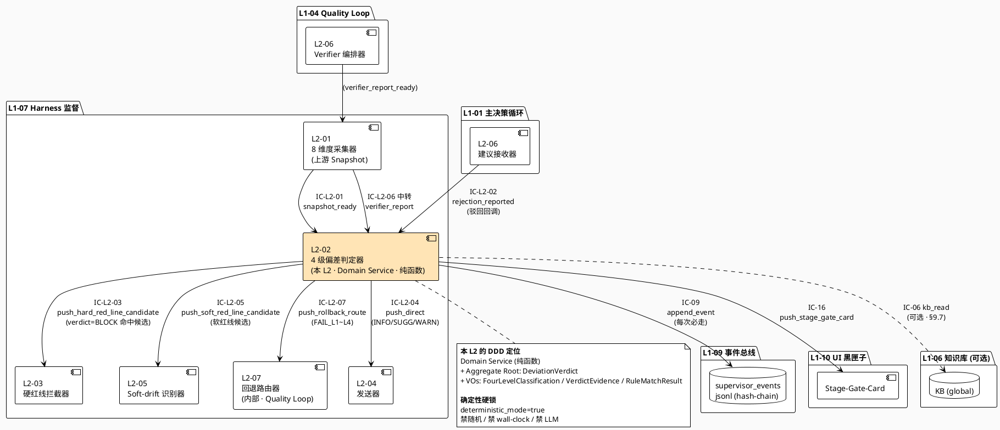
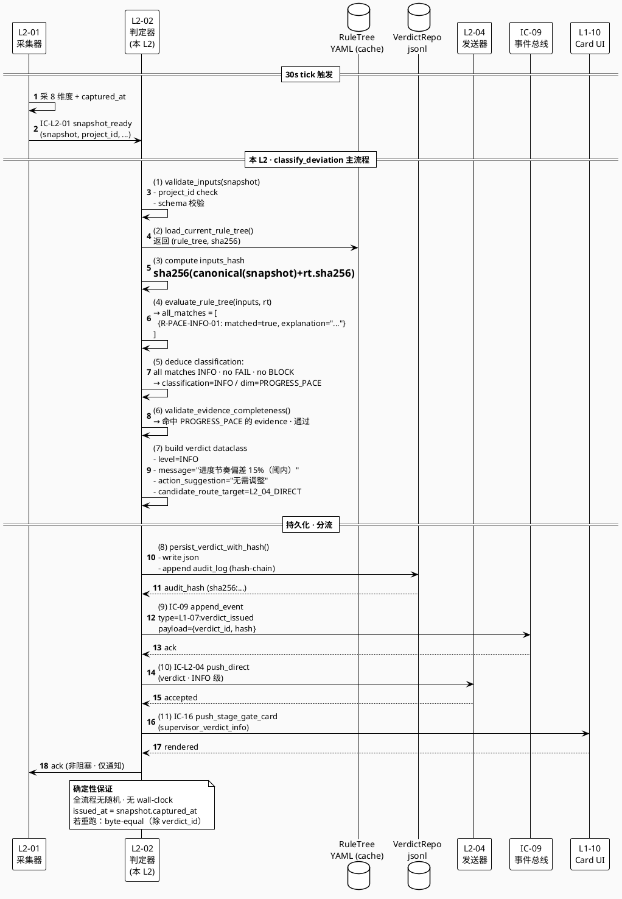
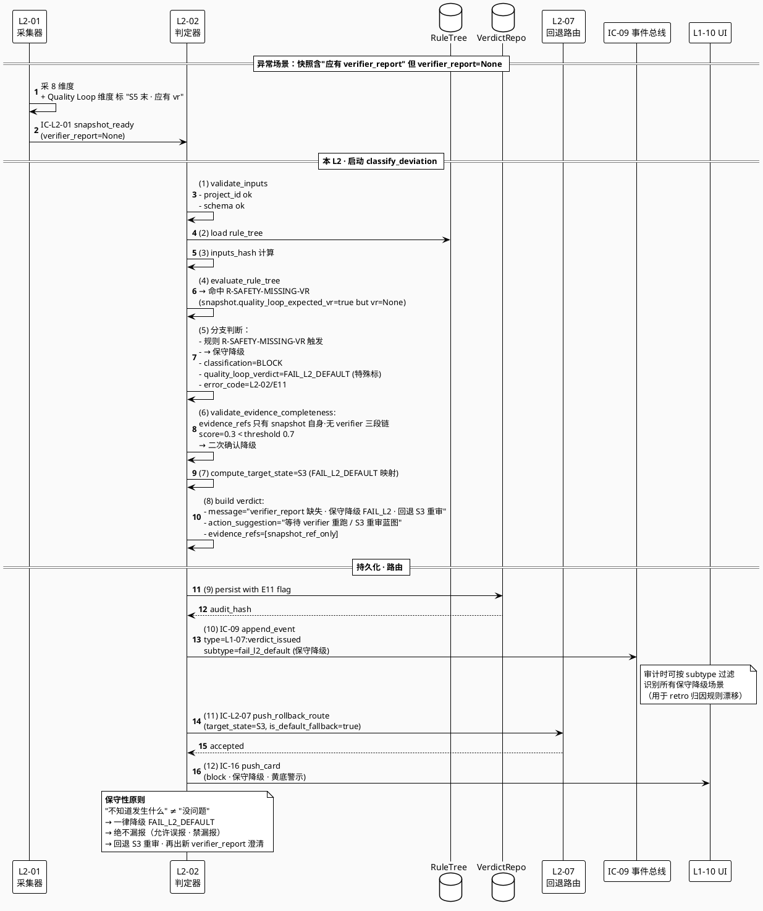
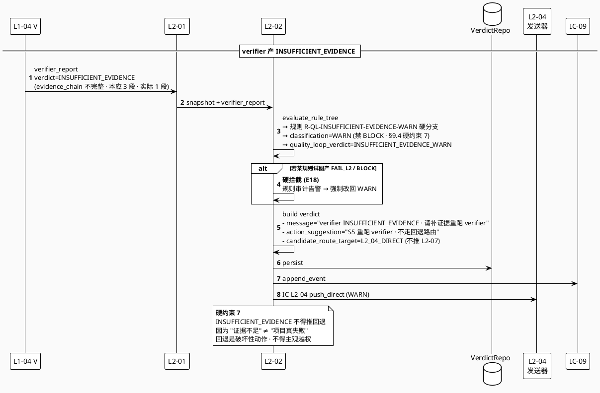
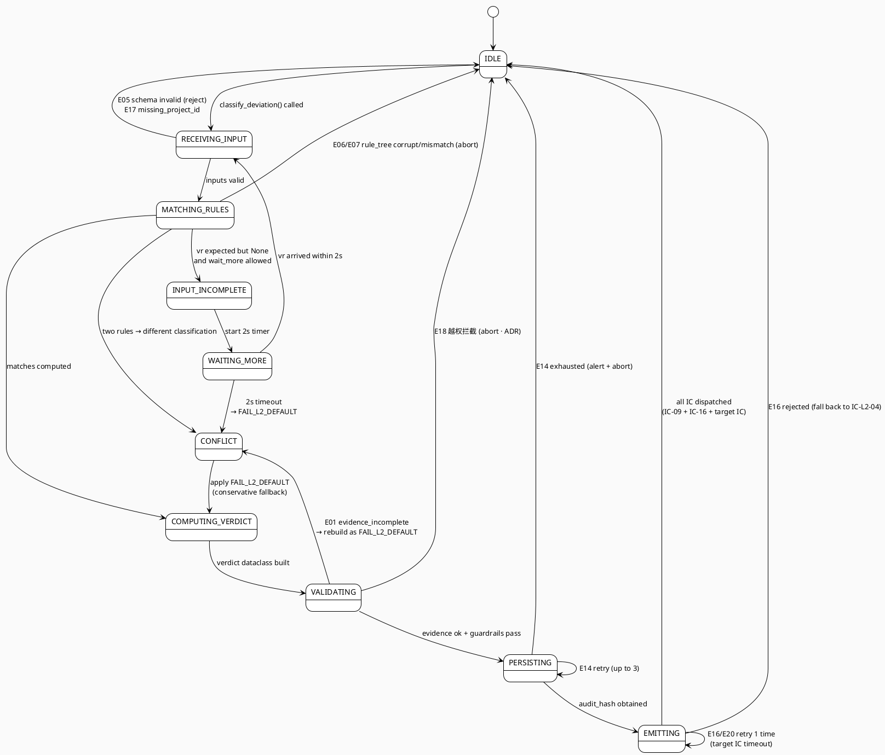

# L1 L2-02 · 4 级偏差判定器 · Tech Design

> **本文档定位**：3-1-Solution-Technical 层级 · L1-07 Harness 监督下的 L2-02 **4 级偏差判定器** 技术实现方案（L2 粒度 · depth-A 完整版）。
> **与产品 PRD 的分工**：`2-prd/L1-07-Harness监督/prd.md §5.7`（行 751-936）定义产品边界与语义，本文档定义**技术实现**（接口字段级 schema + 算法伪代码 + 底层数据结构 + 状态机 + 配置参数 + 确定性重放）。
> **与 L1 architecture.md 的分工**：architecture.md 负责**跨 L2 架构 + 跨 L2 时序**，本文档负责**本 L2 内部技术细节**。冲突以 architecture.md 为准。
> **严格规则**：本文档**不复述**产品 PRD 文字（职责 / 禁止 / 必须等清单），只做技术映射 + 补齐"产品视角未说 but 工程师必须知道"的部分（确定性算法 · 规则树 YAML · hash-chain · 重放缓存 · 20+ 错误码）。
> **核心特性（本 L2 技术定位三句话）**：
> 1. **纯函数 + 确定性判定**：相同 `(snapshot, verifier_report, rule_tree_config)` 永远产生**字节一致**的 verdict（`deterministic_mode=true` 硬锁 · 禁随机源 / 禁 wall-clock / 禁 LLM 调用）。
> 2. **可重放校验器**：所有判定落 `verdict_replay_cache`（hash(inputs) → verdict），支持 retro 阶段**离线重放** —— 对同一 inputs 跑判定应得到同一 verdict，**偏差 = 规则漂移**（必触 ADR）。
> 3. **证据链必备**：每条 verdict 强制携带 `evidence_refs: list[EventRef]`（至少 1 条 · 最多 N 条 · 缺证据自动降级 FAIL-L2），与 BC-09 AuditEntry 经由 `audit_entry_ref` 值引用联动。

---

## §0 撰写进度

- [x] §1 定位 + 2-prd §5.7 L2-02 映射
- [x] §2 DDD 映射（引 L0/ddd-context-map.md BC-07 · Aggregate Root=`DeviationVerdict` · VO=`FourLevelClassification` + `VerdictEvidence` + `RuleMatchResult`）
- [x] §3 对外接口定义（字段级 YAML schema + 9 方法 + 20 错误码）
- [x] §4 接口依赖（订阅 IC-L2-01 snapshot_ready / IC-L2-06 verifier_report_ready · 调 IC-L2-07 push_rollback_route / IC-09 落盘 / IC-16 card / IC-13 升级 / IC-06 kb_read）
- [x] §5 P0/P1 时序图（PlantUML ≥ 3 张 · P0-1 PASS 判定 / P0-2 FAIL-L2 蓝图缺 / P1-1 证据不完整降级 FAIL-L2）
- [x] §6 内部核心算法（13 伪代码 · classify_deviation_main / evaluate_rule_tree_yaml / match_fail_l1~l4 / compute_target_state / validate_inputs / persist_verdict_hash_chain / replay_verdict_determinism_check / push_verdict_to_l2_07 / emit_verdict_event / build_verdict_card_l10）
- [x] §7 底层数据表 / schema 设计（字段级 YAML · 4 表：deviation_verdict · verdict_rule_tree · verdict_audit_log · verdict_replay_cache）
- [x] §8 状态机（PlantUML + 9 状态转换表：IDLE / RECEIVING_INPUT / MATCHING_RULES / COMPUTING_VERDICT / VALIDATING / PERSISTING / EMITTING / INPUT_INCOMPLETE+WAITING_MORE / CONFLICT+FAIL_L2_DEFAULT）
- [x] §9 开源最佳实践调研（≥ 5 GitHub 高星项目 · Drools / OPA Rego / AWS Step Functions Choice / Jenkins Post Conditions / JSON Logic）
- [x] §10 配置参数清单（≥ 15 参数 · `deterministic_mode=true` 硬锁 / `rule_tree_config_path` / `evidence_completeness_threshold` / `replay_cache_ttl`）
- [x] §11 错误处理 + 降级策略（≥ 5 级降级 · EVIDENCE_INCOMPLETE → FAIL-L2 / RULE_CONFLICT → FAIL-L2 / VERIFIER_REPORT_MISSING → FAIL-L2 · 20 错误码 · 12 OQ）
- [x] §12 性能目标（判定 ≤ 2s · replay ≤ 200ms · PostToolUse 极速 ≤ 500ms）
- [x] §13 与 2-prd / 3-2 TDD 的映射表（TC-L207-002-001~050 占位）

---

## §1 定位 + 2-prd 映射

### 1.1 本 L2 在 L1-07 里的坐标

L1-07 Harness 监督由 6 个 L2 组成，**L2-02 处于判定层（大脑）**，上游消费 L2-01 的 8 维度指标快照与 L2-06-verifier 的结构化 verdict，下游按 verdict 类型分流到 L2-03（硬红线）/ L2-05（软红线自治）/ L2-07（Quality Loop 回退路由）/ L2-04（统一发送到 L1-01）。

```
                         ┌──── IC-L2-01 snapshot_ready (来自 L2-01)
                         │     (8 维度指标 · 每维度 metric + evidence_refs + baseline)
                         │
                         ├──── IC-L2-06 verifier_report_ready (来自 L1-04 L2-06 · 经 L2-01 代转)
                         │     (verdict: PASS / FAIL_L1~L4 / INSUFFICIENT_EVIDENCE)
                         ▼
              ┌────────────────────────────────────┐
              │     L2-02 · 4 级偏差判定器         │
              │   (Domain Service · 纯函数)        │
              │                                    │
              │   ┌──────────────────────────┐    │
              │   │  RuleTreeEvaluator        │    │   (规则树 YAML → verdict)
              │   │  PatternMatcher          │    │   (8 维度 × 4 档规则映射)
              │   │  EvidenceValidator        │    │   (证据完备性校验)
              │   │  DeterminismGuard         │    │   (确定性校验 + replay 缓存)
              │   │  VerdictBuilder           │    │   (verdict 组装器)
              │   └──────────────────────────┘    │
              │                                    │
              └────────────────────────────────────┘
                         │
                         │  verdict ∈ {INFO, SUGG, WARN, BLOCK}
                         │  + classification ∈ {PASS, FAIL_L1~L4, FAIL_L2_DEFAULT, INSUFFICIENT_EVIDENCE_WARN}
                         │  + evidence_refs + action_suggestion + candidate_route_target
                         │
                         ├──▶ verdict=BLOCK 且命中硬红线候选 ─▶ L2-03 (拦截器)
                         ├──▶ verdict 命中软红线候选          ─▶ L2-05 (soft-drift)
                         ├──▶ verdict ∈ {FAIL_L1~L4}            ─▶ L2-07 (回退路由)
                         ├──▶ verdict ∈ {INFO, SUGG, WARN}      ─▶ L2-04 (发送器)
                         └──▶ 所有 verdict                      ─▶ IC-09 落 supervisor_events (hash-chain)
                                                                ─▶ IC-16 推 L1-10 Stage-Gate-Card
```

L2-02 的定位 = **"Harness 监督判定大脑 · 纯函数 · 确定性 · 可重放 · 证据链必备 · 9 方法 · 20 错误码 · 不执行动作"**。

### 1.2 与 2-prd §5.7 L2-02（行 751-936）的精确对应表

| 2-prd §5.7 L2-02 小节 | 本文档对应位置 | 技术映射重点 |
|:---|:---|:---|
| §9.1 职责 + 锚定 | §1.3 定位 + §2 DDD 映射 | Domain Service + Aggregate Root `DeviationVerdict` |
| §9.2 输入 / 输出 | §3.2 9 方法 schema + §6.1 主算法 | 输入结构化 dataclass；输出 `Verdict` VO + 分流信号 |
| §9.3 边界（in/out-of-scope） | §2.2 Bounded Context 边界 + §3 方法白名单 | 9 方法为**对外全量**，不提供其他方法 |
| §9.4 约束（7 条硬 + 4 条性能） | §11 降级策略 + §12 性能 SLO | `deterministic_mode=true` 硬锁 + 7 硬约束逐条映射 |
| §9.5 🚫 禁止行为（8 条） | §6.9 guardrails + §11.3 硬拦截 | 禁压档 / 禁无证据 / 禁越权升档 / 禁静默丢弃 |
| §9.6 ✅ 必须职责（7 条） | §3.2 9 方法 + §6 算法覆盖 | 每条职责映射到具体方法 / 算法段 |
| §9.7 🔧 可选功能（4 条） | §3.2 方法可选参数 + §10 config flag | 折叠辅助 / 基线对比 / 多语言 / driver 归因 |
| §9.8 与其他 L2 / L1 交互 | §4 依赖图 + PlantUML | IC-L2-02/03/04/05/07 + IC-09 + IC-13 + IC-16 |
| §9.9 交付验证大纲 G-W-T | §13 TC-L207-002-001~050 | P1-P8 / N1-N5 / I1-I3 全映射 |

### 1.3 技术决策记录（Decision → Rationale → Alternatives → Trade-off）

#### 决策 D-L207-002-01 · 采用**纯函数 + 确定性**模型

- **Decision**：L2-02 作为 Domain Service 实现为**纯函数**（pure function），禁止任何有状态调用（禁随机 / 禁 wall-clock / 禁 LLM / 禁 I/O 在判定主体之中，持久化由专门 persistence 方法承担）。所有判定经 `hash(snapshot, verifier_report, rule_tree_version)` 缓存，可**离线重放**。
- **Rationale**：
  1. **Goal §4.1 "监督 Agent 3 红线准确率 100%" 的硬性要求**：判定必须可重现，否则"准确率"概念不可测（非确定性 = 无法判断误报 / 漏报）。
  2. **PM-08 可审计全链追溯**：retro 阶段审计人员必须能够对同一 `(snapshot, verifier_report)` 重跑判定，验证与当时生产结果一致；否则"审计"退化为"相信生产日志"。
  3. **PM-12 红线分级自治 · 分级规则稳定性**：规则树必须版本化 + 固化 + 确定性匹配，避免"同样输入两次判出不同档位"的灰色区（动摇 Supervisor 权威）。
- **Alternatives**：
  - 方案 B：加入 LLM 辅助判定（如用 DeepSeek 做自然语言消息生成 + 级别建议）→ **拒绝**（LLM 非确定性 · temperature>0 即违反 Goal §4.1；且消息生成可用 template + slot-filling 解决）。
  - 方案 C：判定依赖 wall-clock（如"最近 N 分钟事件"基于 `datetime.utcnow()`）→ **拒绝**（相同 inputs 不同判出 · retro 无法重放）。改为：时间窗所需信息必须**已由 L2-01 快照内嵌**（快照持有 `captured_at` + `window_size_sec`），L2-02 不自己读时钟。
- **Trade-off**：
  - ✅ 确定性 + 可重放 + 可审计 + 可测（TDD 极简 · hash 校验即可）。
  - ❌ 消息生成受限于模板（无法"写得像人一样"），但对**监督**场景足够（判定 message 是结构化的：级别 + 维度 + 阈值 + 证据，模板拼接即可）。
  - ❌ 新规则上线需修改 YAML + 版本递增，无法运行时 hot-reload（但这正是 §9.4 硬约束 6 的硬要求）。

#### 决策 D-L207-002-02 · 规则树用 **YAML 硬编码配置**（非数据库 / 非 DSL）

- **Decision**：判定规则树以 **YAML 静态文件**（`config/verdict_rule_tree.yaml`）承载 · 版本化入 Git · 变更走 ADR + code review · **禁止运行时修改**。每次 L2-02 启动时加载一次并缓存；内存中规则树与磁盘 `sha256` 双向校验（crash-safe）。
- **Rationale**：
  1. `§9.4` 硬约束 6 明文规定"阈值固化 · 变更走 ADR"，YAML-in-Git 天然匹配。
  2. 规则复杂度适中（8 维度 × 4 档 ≈ 32 条规则 + Quality Loop FAIL_L1~L4 4 条 + 硬红线候选 5 条 + 死循环升档 1 条 = 42 条左右），不需要 Drools 级别的规则引擎。
  3. 对标 Kubernetes OPA Rego（也是静态 policy 文件 + 加载缓存）+ Jenkins Declarative Pipeline Post Conditions（声明式 when/always/failure）。
- **Alternatives**：
  - 方案 B：Drools Rules Engine → **拒绝**（Java 生态 + JVM 引擎 · 技术栈不匹配 · 过度工程）。
  - 方案 C：数据库表（PostgreSQL `verdict_rules` 表）→ **拒绝**（运行时可改 · 违反硬约束 6 · 审计困难）。
  - 方案 D：Python 代码硬编码 if-elif 链 → **部分采纳**（高频 hot-path 用硬编码，冷 path 和阈值调整用 YAML）—— 折衷：**8 维度 × 4 档核心规则用 YAML**，硬红线 5 类识别和死循环升档固化在 Python 中（因这些涉及跨 aggregate 业务逻辑，不适合配置化）。
- **Trade-off**：
  - ✅ Git 审计轨迹完整（`git log verdict_rule_tree.yaml` 即变更历史）。
  - ✅ 工具链简单（PyYAML + Pydantic schema 校验）。
  - ❌ 无法表达极复杂规则（如"过去 1 小时内 3 次以上命中"类时序规则），但这类需求归 L2-01 快照子信号层处理（快照已内嵌 FAIL 计数）。

#### 决策 D-L207-002-03 · 证据不完整一律**保守降级 FAIL-L2**

- **Decision**：当 `evidence_refs` 长度为 0、或 `verifier_report` 缺失、或 `snapshot` 维度缺值超过阈值 `evidence_completeness_threshold=0.7` 时，**一律产 verdict=BLOCK 级 + classification=FAIL_L2_DEFAULT**（保守判），路由到 L2-07 回退 S3（蓝图阶段重审）。
- **Rationale**：
  - PRD §9.5 明文"禁止无 evidence_refs 的 verdict 出口"；"不 PASS 即为 FAIL" 是 Goal §4.3 的**破产铁律**（本质上是 methodology-paced autonomy 的"灰区等价失败"原则）。
  - "不知道发生了什么"**不等于** "没问题"，必须走回退流重审（而非 SUGG 级"继续观察"—— 那是主观越权）。
- **Alternatives**：
  - 方案 B：产 WARN + "需补证据" → **部分采纳**（当仅 `verifier_report=INSUFFICIENT_EVIDENCE` 时用此 —— §9.4 硬约束 7）。
  - 方案 C：自动拉取 L1-09 原始事件补齐 → **拒绝**（L2-02 是纯函数 · 不做 I/O · 且会引入非确定性）。
- **Trade-off**：
  - ✅ 绝不漏报（保守性 · 有误报但无漏报）。
  - ❌ 可能误回退（某些偶发缺证据的小偏差被判 FAIL-L2），但**回退到 S3 重审**是安全的（重新出 verifier_report 即可澄清）。

### 1.4 PM-14 project_id 约束

每条 `DeviationVerdict` 的**首字段**必须是 `project_id`（`harnessFlowProjectId`），缺 project_id 的 snapshot / verifier_report **直接拒收**（返回错误码 `L2-02/E17 missing_project_id`）—— 归入 supervisor 的"契约违规"维度。持久化路径按 PM-14 分片：`projects/<pid>/verdicts/<verdict_id>.json`。

### 1.5 本 L2 的 7 条核心职责技术落地映射

| PRD §9.6 必须职责 | 本文档对应位置 | 技术实现要点 |
|:---|:---|:---|
| 对每次快照做一轮 4 档判定 | §3.2.1 `classify_deviation` | 主入口方法 · 纯函数 · 每 snapshot 产 1 个 verdict |
| 每 verdict 带四要素 | §3.3 Verdict schema + §6.1 组装逻辑 | `level + message + action_suggestion + evidence_refs` 必填 · 缺一即 E03 |
| 按类型正确分流 | §3.2.8 `push_verdict_to_router` + §6.7 `push_verdict_to_l2_07` | verdict 类型 → target_l2 映射表 |
| 记录驳回理由 | §3.2.10 `record_advice_rejection` | 落 `verdict_audit_log` · type=advice_rejected |
| INSUFFICIENT_EVIDENCE → WARN | §6.2 规则树 | 规则树第 3 条硬分支 |
| 同级 FAIL=3 标候选升档 | §6.1 主算法 + §7.4 升档字段 | 读 snapshot.fail_counter · 标 `candidate_escalation=true` |
| 落 supervisor_events 审计 | §3.2.6 `persist_verdict_with_hash` + §7.3 audit log | 每判定必走 IC-09 · hash-chain |

---

## §2 DDD 映射（BC-07 · Aggregate Root = DeviationVerdict）

### 2.1 Bounded Context 归属：BC-07 · Harness Supervision

本 L2-02 归属 **BC-07 Harness Supervision**（L0/ddd-context-map.md §2.8 · 行 392-427）。BC-07 的 ubiquitous language 中与本 L2 强相关的词项：

| 术语 | 含义 | 本 L2 的角色 |
|:---|:---|:---|
| **SupervisorSnapshot** | L2-01 产出的 8 维度指标快照（VO）| 本 L2 的输入 1（经 IC-L2-01） |
| **VerifierReport** | L1-04 L2-06 产出的结构化 verdict（VO · 经 L2-01 中转）| 本 L2 的输入 2（经 IC-L2-06） |
| **DeviationVerdict** | 4 档偏差判定（INFO/SUGG/WARN/BLOCK · Aggregate Root）| 本 L2 的**唯一输出**聚合根 |
| **FourLevelClassification** | 4 档分级枚举（VO · 不可变）| verdict 的核心字段 |
| **VerdictEvidence** | 证据引用值对象（VO · `event_id` + `captured_at` + `dimension`）| verdict 必备 ≥1 条 |
| **RuleMatchResult** | 单条规则匹配结果（VO · `rule_id` + `matched` + `inputs_hash`）| 内部中间产物（不对外） |
| **RuleTreeVersion** | 规则树版本号（VO · sha256 `config/verdict_rule_tree.yaml`）| 每 verdict 记录哪个版本的规则树产出 |

### 2.2 DDD 分类：Domain Service（纯函数）+ Aggregate Root 产物

**本 L2 的 DDD 定位**（引 `L0/ddd-context-map.md §4.7` 行 784）：

> **L1-07 L2-02 · 4 级偏差判定器 · Domain Service（纯函数）+ VO: Verdict**（阈值对比 + 规则判定）

技术落地：

```
  Layer                          角色           说明
  ─────────────────────────────────────────────────────────────────────
  Application Service           (无)           本 L2 是纯函数 · 无应用服务
  Domain Service                DeviationClassifier     核心纯函数 · 见 §6.1
                                RuleTreeEvaluator       规则树求值器 · 见 §6.2
                                EvidenceValidator       证据完备性校验 · 见 §6.8
                                DeterminismGuard        确定性 + 重放 · 见 §6.10
  Aggregate Root                DeviationVerdict        对外产出 · 含 id + status + classification + evidence
  Entity                        VerdictAuditEntry       审计行（落 supervisor_events）
  Value Object (不可变)         FourLevelClassification INFO / SUGG / WARN / BLOCK
                                VerdictEvidence         event_id + captured_at + dimension + hash
                                RuleMatchResult         rule_id + matched + inputs_hash + matched_at
                                RuleTreeVersion         sha256 指纹 + semver
                                SnapshotRef             对 L2-01 snapshot 的轻引用
                                VerifierReportRef       对 L1-04 verifier_report 的轻引用
  Repository                    DeviationVerdictRepo    落盘 jsonl + hash-chain
                                RuleTreeRepo            读 YAML + 加载缓存
                                VerdictReplayCacheRepo  hash(inputs) → verdict 缓存
  Domain Event                  L1-07:verdict_issued    产 verdict 后发
                                L1-07:verdict_replayed  离线重放后发（retro 阶段）
                                L1-07:verdict_conflict_fail_l2_default  规则冲突降级
```

### 2.3 Aggregate Root: `DeviationVerdict`

```python
@dataclass(frozen=True)  # 不可变 · 值对象语义
class DeviationVerdict:
    # --- 聚合根身份（PM-14 + 自身 id）---
    project_id: str                           # PM-14 首字段 · harnessFlowProjectId
    verdict_id: str                           # "verdict-{project_id}-{iso_ts}-{sha8}"
    snapshot_ref: SnapshotRef                 # 输入快照的轻引用（snapshot_id + captured_at）
    verifier_report_ref: Optional[VerifierReportRef]  # 若输入含 verifier report 则引用
    rule_tree_version: RuleTreeVersion        # 用哪个版本规则树产出
    # --- 判定核心（VO 组合）---
    classification: FourLevelClassification   # {INFO, SUGG, WARN, BLOCK}
    quality_loop_verdict: Optional[QualityLoopVerdict]  # {PASS, FAIL_L1, FAIL_L2, FAIL_L3, FAIL_L4, FAIL_L2_DEFAULT, INSUFFICIENT_EVIDENCE_WARN}
    dimension: EightDimension                 # 哪个维度触发（或 MULTI 多维度）
    message: str                              # 自然语言消息（template slot-filling · 非 LLM）
    action_suggestion: str                    # 建议动作（模板）
    evidence_refs: tuple[VerdictEvidence, ...]  # ≥ 1 条 · 缺即 E03
    # --- 分流候选（L2-02 只标 · 不执行）---
    candidate_route_target: Optional[TargetL2]  # {L2_03_HARD, L2_05_SOFT, L2_07_ROLLBACK, L2_04_DIRECT}
    candidate_escalation: bool                # 同级 FAIL=3 时为 True
    target_state_for_rollback: Optional[ProjectStage]  # FAIL_L1~L4 映射 S4/S3/S2/S1
    # --- 确定性 / 可重放凭证 ---
    inputs_hash: str                          # hash(snapshot, verifier_report, rule_tree_version) · 重放 key
    rule_matches: tuple[RuleMatchResult, ...] # 哪些规则命中（内部审计用）
    deterministic_mode: bool                  # True 恒定 · 见 §10.1
    # --- 时间 / 审计 ---
    issued_at: str                            # snapshot.captured_at 派生 · 不读 wall-clock
    audit_entry_hash: str                     # 前一 audit entry 的 sha256（hash-chain）
```

不变式（聚合根业务规则 · 构造时校验 · 违反 raise ValueError）：
1. `project_id` 必须非空 + 匹配 `^prj-[a-z0-9-]+$`。
2. `classification` 必须来自 `FourLevelClassification` 枚举，禁 stringy。
3. `len(evidence_refs) >= 1`（对 `classification != BLOCK_DEFAULT_NO_EVIDENCE` 的情况 · 这是唯一允许空证据的特例，因为降级本身就是因为没证据）。
4. `candidate_route_target` 与 `classification` 的组合必须在白名单：
   - `BLOCK + HARD_RED_LINE_CANDIDATE` → `L2_03_HARD`
   - `{INFO,SUGG,WARN} + SOFT_RED_LINE_CANDIDATE` → `L2_05_SOFT`
   - `BLOCK + FAIL_L1~L4` → `L2_07_ROLLBACK`
   - `{INFO,SUGG,WARN}` 无分流候选 → `L2_04_DIRECT`
5. `deterministic_mode == True`（硬锁 · §10.1 配置）。
6. `issued_at == snapshot.captured_at`（禁用 wall-clock）。

### 2.4 Repository 接口（只列签名 · 实现见 §6 + §7）

```python
class DeviationVerdictRepo(Protocol):
    def save(self, verdict: DeviationVerdict) -> None: ...           # → jsonl + hash-chain
    def load_by_id(self, pid: str, verdict_id: str) -> DeviationVerdict: ...
    def query_by_range(self, pid: str, from_ts: str, to_ts: str) -> list[DeviationVerdict]: ...
    def verify_hash_chain(self, pid: str) -> HashChainReport: ...    # retro 用

class RuleTreeRepo(Protocol):
    def load_current(self) -> RuleTreeVersion: ...                   # 读 yaml + sha256 + cache
    def verify_checksum(self) -> bool: ...                           # 内存 vs 磁盘

class VerdictReplayCacheRepo(Protocol):
    def put(self, inputs_hash: str, verdict: DeviationVerdict, ttl_sec: int) -> None: ...
    def get(self, inputs_hash: str) -> Optional[DeviationVerdict]: ...
    def purge_expired(self) -> int: ...
```

### 2.5 Context Map 关系（BC-07 ↔ 其他 BC · 引 L0 §3 + §5.2.7）

| 邻居 BC | 关系 | 本 L2 涉及 | IC |
|:---|:---|:---|:---|
| BC-01 主决策循环 | Customer（下游） | 推 INFO/SUGG/WARN 建议给主 loop | IC-13 push_suggestion（经 L2-04 中转） |
| BC-04 Quality Loop | Partnership（双向强耦合） | 订阅 verifier_report + 推 rollback route | IC-L2-06 + IC-14 push_rollback_route（经 L2-07） |
| BC-09 事件总线 | Customer-Supplier（本 L2 为 Customer · BC-09 为 Supplier） | 每 verdict 落 `L1-07:verdict_issued` 事件 | IC-09 append_event |
| BC-10 UI 黑匣子 | Supplier（本 L2 为 Supplier） | 推 Stage-Gate-Card 展示 verdict | IC-16 push_stage_gate_card |
| BC-06 知识库（可选） | OHS-PL（可选 · 下游） | 读 "审计人员关注项" 元数据做消息增强（§9.7 可选功能） | IC-06 kb_read |

### 2.6 与 BC-07 兄弟 L2 的边界（严格 no-leak）

| 兄弟 L2 | 本 L2 对其 | 对其 no-go |
|:---|:---|:---|
| L2-01 8 维度采集器 | 订阅其 snapshot_ready 事件 + verifier_report 中转 | 🚫 不自己采指标 · 不调快照算法 |
| L2-03 硬红线拦截器 | 标"硬红线候选"后交给它最终识别 | 🚫 不执行硬暂停 · 不判断是否命中具体 5 类硬红线 |
| L2-05 Soft-drift 识别器 | 标"软红线候选"后交给它做模式识别 | 🚫 不做软红线模式匹配 · 不选修复动作 |
| L2-07 回退路由器 | 推 `FAIL_L1~L4 + target_state` 提示 | 🚫 不决定最终 from/to · 不做 state 切换 |
| L2-04 发送器 | 走它分发 INFO/SUGG/WARN 到主 loop | 🚫 不直接调 BC-01 · 禁 push_suggestion 越过 L2-04 |
| L2-06 死循环升级器 | 标"候选升档"后交给它最终升档 | 🚫 不自己升档 · 不改 FAIL_L 级别 |

> **一句话边界**：L2-02 **定性器** · 只回答 "这一刻是什么档位 · 需要什么级别的后续处理"；**不执行任何动作**（动作都归兄弟 L2）。

---

## §3 对外接口定义（字段级 YAML schema + 9 方法 + 20 错误码）

### 3.1 方法白名单总览（对外全量 · 不提供其他方法）

| # | 方法 | 类型 | 产出 | 幂等 | 纯函数 |
|:--|:---|:---|:---|:---|:---|
| 3.2.1 | `classify_deviation(snapshot, verifier_report, rule_tree=None) -> DeviationVerdict` | 核心判定（主入口） | Aggregate Root | ✅（相同 inputs 恒等 · deterministic） | ✅ |
| 3.2.2 | `evaluate_rule_tree(inputs, rule_tree_version) -> list[RuleMatchResult]` | 规则树求值 | VO 列表 | ✅ | ✅ |
| 3.2.3 | `match_pattern_for_fail(fail_level, verifier_report) -> PatternMatch` | FAIL_L1~L4 模式匹配 | 匹配结果 | ✅ | ✅ |
| 3.2.4 | `compute_target_state_from_verdict(verdict) -> ProjectStage` | verdict → S1/S2/S3/S4 映射 | VO | ✅ | ✅ |
| 3.2.5 | `validate_evidence_completeness(evidence_refs) -> ValidationResult` | 证据完备性校验 | ValidationResult | ✅ | ✅ |
| 3.2.6 | `persist_verdict_with_hash(verdict) -> AuditHash` | 落盘 + hash-chain | hash（字符串） | ❌（IO · 但逻辑幂等） | ❌ |
| 3.2.7 | `replay_verdict_deterministic_check(verdict, snapshot, verifier_report) -> ReplayReport` | 离线重放校验 | 报告 | ✅ | ✅ |
| 3.2.8 | `push_verdict_to_router(verdict) -> RouteDispatchResult` | 分流派发 | 派发结果 | ❌（侧效 · IC 调用） | ❌ |
| 3.2.9 | `build_verdict_card(verdict) -> StageGateCardPayload` | 构造 L1-10 card | payload | ✅ | ✅ |
| 3.2.10 | `record_advice_rejection(verdict_id, rejection_reason) -> AuditHash` | 记录主 loop 驳回 | hash | ❌（IO） | ❌ |

### 3.2 方法字段级 YAML schema

#### 3.2.1 `classify_deviation` · 核心入口

```yaml
method: classify_deviation
type: domain-service-pure
description: >
  4 级偏差判定主入口。纯函数：相同 inputs 恒产相同 verdict。
  不读时钟、不调 LLM、不做 I/O（持久化走 3.2.6）。
inputs:
  snapshot:
    type: SupervisorSnapshot
    required: true
    fields:
      project_id:
        type: string
        required: true
        pattern: "^prj-[a-z0-9-]+$"
        note: PM-14 首字段 · 缺即 E17
      snapshot_id:
        type: string
        required: true
        pattern: "^snap-[a-z0-9-]{8,}$"
      captured_at:
        type: string
        format: iso8601
        required: true
        note: 判定的 issued_at 派生于此 · 不读 wall-clock
      window_size_sec:
        type: integer
        required: true
        minimum: 1
        note: L2-01 采集窗口长度 · 判定所需时间信息由此嵌入
      eight_dimensions:
        type: object
        required: true
        properties:
          goal_fidelity:
            type: DimensionMetric
            required: true
          plan_alignment:
            type: DimensionMetric
            required: true
          real_completion:
            type: DimensionMetric
            required: true
          red_line_safety:
            type: DimensionMetric
            required: true
          progress_pace:
            type: DimensionMetric
            required: true
          cost_budget:
            type: DimensionMetric
            required: true
          retry_loop:
            type: DimensionMetric
            required: true
          user_collaboration:
            type: DimensionMetric
            required: true
      fail_counter:
        type: object
        required: false
        properties:
          wp_id:
            type: string
          level:
            type: string
            enum: [L1, L2, L3, L4]
          consecutive_count:
            type: integer
            minimum: 0
        note: 若 consecutive_count >= 3 则标 candidate_escalation=true
  verifier_report:
    type: VerifierReport
    required: false
    note: >
      可选（L2-01 未必每次都挂 verifier_report · 只在 S5 末）。
      若 None 且 snapshot 无 Quality Loop 维度信号 → 视为常规维度判定；
      若 snapshot 表明应有 verifier_report 但 None → 降级 FAIL_L2_DEFAULT（E11）。
    fields:
      verdict:
        type: string
        enum: [PASS, FAIL_L1, FAIL_L2, FAIL_L3, FAIL_L4, INSUFFICIENT_EVIDENCE]
        required: true
      evidence_chain:
        type: ThreeSegmentEvidence
        required: true
        note: existence / behavior / quality 三段
      generated_at:
        type: string
        format: iso8601
  rule_tree:
    type: RuleTreeVersion
    required: false
    default: "(load current from config/verdict_rule_tree.yaml)"
    note: 可显式注入用于测试 · 生产默认读配置
outputs:
  verdict:
    type: DeviationVerdict
    fields:
      project_id: string
      verdict_id: string
      snapshot_ref: SnapshotRef
      verifier_report_ref: VerifierReportRef?
      rule_tree_version: RuleTreeVersion
      classification: FourLevelClassification
      quality_loop_verdict: QualityLoopVerdict?
      dimension: EightDimension
      message: string
      action_suggestion: string
      evidence_refs: list<VerdictEvidence>
      candidate_route_target: TargetL2?
      candidate_escalation: boolean
      target_state_for_rollback: ProjectStage?
      inputs_hash: string
      rule_matches: list<RuleMatchResult>
      deterministic_mode: boolean
      issued_at: string
      audit_entry_hash: string
errors:
  - L2-02/E01 evidence_incomplete_default_fail_l2
  - L2-02/E02 rule_conflict_default_fail_l2
  - L2-02/E03 missing_required_four_elements
  - L2-02/E04 invalid_classification_enum
  - L2-02/E05 snapshot_schema_invalid
  - L2-02/E11 verifier_report_missing_fail_l2
  - L2-02/E17 missing_project_id
  - L2-02/E18 insufficient_evidence_but_not_warn（禁越权）
determinism_contract:
  - 相同 (snapshot, verifier_report, rule_tree_version) 必产相同 verdict（byte-equal 除 issued_at/verdict_id 外）
  - verdict_id = "verdict-{project_id}-{snapshot.captured_at}-{sha8(inputs_hash)}"
  - issued_at = snapshot.captured_at（禁 wall-clock）
  - inputs_hash = sha256(canonical_json(snapshot) + canonical_json(verifier_report) + rule_tree_version.sha256)
```

#### 3.2.2 `evaluate_rule_tree`

```yaml
method: evaluate_rule_tree
type: domain-service-pure
description: 遍历规则树 YAML · 对输入逐条匹配 · 产规则命中结果列表
inputs:
  inputs:
    type: InputsBundle
    required: true
    note: (snapshot 八维度 + verifier_report + fail_counter)
  rule_tree_version:
    type: RuleTreeVersion
    required: true
outputs:
  matches:
    type: list<RuleMatchResult>
    fields:
      rule_id: string        # e.g., "R-GOAL-DRIFT-CRITICAL-01"
      matched: boolean
      matched_by: string     # 规则 path · e.g., "rules.goal_fidelity.block_drift_critical"
      matched_at: string     # snapshot.captured_at 派生
      inputs_hash: string
      explanation: string    # "goal_anchor_hit_rate = 0.35 < threshold 0.6"
errors:
  - L2-02/E06 rule_tree_yaml_corrupt
  - L2-02/E07 rule_tree_sha256_mismatch
  - L2-02/E08 rule_predicate_eval_exception
```

#### 3.2.3 `match_pattern_for_fail`（FAIL_L1 / FAIL_L2 / FAIL_L3 / FAIL_L4）

```yaml
method: match_pattern_for_fail
type: domain-service-pure
description: >
  FAIL_L1~L4 的细分模式识别（L1 轻：flaky/timeout · L2 中：existence_incomplete/dod_false
  · L3 重：majority_fail/artifacts_missing · L4 极重：goal_drift/irreversible）。
inputs: {fail_level: {enum: [FAIL_L1, FAIL_L2, FAIL_L3, FAIL_L4], required: true}, verifier_report: {required: true}}
outputs:
  pattern_match: {fail_level, pattern_id, confidence (0-1 纯函数), triggering_predicates, target_state_hint (L1→S4/L2→S3/L3→S2/L4→S1)}
errors: [L2-02/E09 fail_level_invalid, L2-02/E10 verifier_evidence_chain_insufficient]
```

#### 3.2.4 `compute_target_state_from_verdict`

```yaml
method: compute_target_state_from_verdict
type: domain-service-pure
description: 按 4 级 FAIL ↔ S1/S2/S3/S4 固定映射表产 target_state
inputs:
  verdict:
    type: DeviationVerdict
    required: true
outputs:
  target_state:
    type: ProjectStage
    enum: [S1, S2, S3, S4, null]
    note: >
      PASS / INFO / SUGG / WARN → null（不回退）
      FAIL_L1 → S4（WP 内自修）
      FAIL_L2 → S3（重审蓝图）
      FAIL_L3 → S2（重审架构）
      FAIL_L4 → S1（重审 goal / charter）
      FAIL_L2_DEFAULT（保守降级）→ S3
errors:
  - L2-02/E12 verdict_to_state_mapping_missing
```

#### 3.2.5 `validate_evidence_completeness`

```yaml
method: validate_evidence_completeness
type: domain-service-pure
description: 检验证据引用列表是否满足完备性阈值
inputs:
  evidence_refs:
    type: list<VerdictEvidence>
    required: true
  threshold:
    type: float
    default: 0.7
    note: 见 config.evidence_completeness_threshold
outputs:
  validation:
    type: ValidationResult
    fields:
      complete: boolean
      missing_dimensions: list<EightDimension>
      score: float  # 命中维度数 / 8
errors:
  - L2-02/E01 evidence_incomplete_default_fail_l2（score < threshold）
  - L2-02/E13 evidence_event_id_malformed
```

#### 3.2.6 `persist_verdict_with_hash`（有 I/O · 非纯函数）

```yaml
method: persist_verdict_with_hash
type: repository-write
description: 落 `projects/<pid>/verdicts/{verdict_id}.json` + append verdict_audit_log.jsonl + hash-chain
inputs:
  verdict:
    type: DeviationVerdict
    required: true
outputs:
  audit_hash:
    type: string
    pattern: "^sha256:[a-f0-9]{64}$"
    note: 前序 audit entry 的 hash · 用于链式校验
side_effects:
  - write: projects/<pid>/verdicts/{verdict_id}.json
  - append: projects/<pid>/supervisor_events.jsonl (type=verdict)
  - append: projects/<pid>/verdict_audit_log.jsonl (hash-chain)
errors:
  - L2-02/E14 persist_io_failure
  - L2-02/E15 hash_chain_broken
idempotency: >
  按 verdict_id 幂等 · 第二次落盘同 verdict_id 视为 no-op（覆盖等效）
  但 hash-chain 只允许 append-once · 第二次尝试返回已有 hash
```

#### 3.2.7 `replay_verdict_deterministic_check`（retro 专用）

```yaml
method: replay_verdict_deterministic_check
type: domain-service-pure
description: 对历史 verdict 做离线重放 · 校验当时生产结果与当下重跑结果一致
inputs:
  original_verdict:
    type: DeviationVerdict
    required: true
  snapshot:
    type: SupervisorSnapshot
    required: true
  verifier_report:
    type: VerifierReport
    required: false
outputs:
  replay_report:
    type: ReplayReport
    fields:
      original_verdict_id: string
      replayed_verdict_id: string   # 重跑新 id（为避免冲突）
      byte_equal: boolean           # 除 verdict_id 以外是否 byte-equal
      mismatch_fields: list<string>
      rule_tree_version_diff: VersionDiff?
      conclusion: string
        enum: [DETERMINISTIC_OK, RULE_DRIFT_DETECTED, ADR_REQUIRED]
errors:
  - L2-02/E19 replay_inputs_hash_mismatch
```

#### 3.2.8 `push_verdict_to_router`（有 IC 调用 · 非纯函数）

```yaml
method: push_verdict_to_router
type: dispatcher
description: 根据 verdict.candidate_route_target 分发到对应 L2 / IC
inputs:
  verdict:
    type: DeviationVerdict
    required: true
outputs:
  dispatch_result:
    type: RouteDispatchResult
    fields:
      verdict_id: string
      target: TargetL2
      ic_called: string   # IC-L2-03 / IC-L2-05 / IC-L2-07 / IC-L2-04
      accepted: boolean
      remote_response_hash: string?
side_effects:
  - 可能调 IC-L2-03 / IC-L2-04 / IC-L2-05 / IC-L2-07
  - 任何情况下必调 IC-09 append_event (L1-07:verdict_issued)
  - 额外：调 IC-16 push_stage_gate_card（推 L1-10）
errors:
  - L2-02/E16 route_target_rejected
  - L2-02/E20 ic_dispatch_timeout
```

#### 3.2.9 `build_verdict_card`（面向 L1-10 UI · 纯函数）

```yaml
method: build_verdict_card
type: domain-service-pure
description: 为 L1-10 Stage-Gate-Card (IC-16) 构造 verdict 展示 payload
inputs: {verdict: {type: DeviationVerdict, required: true}}
outputs:
  payload: {card_type (supervisor_verdict_info/sugg/warn/block), headline, body, cta_buttons (采纳/驳回/查看证据), evidence_inline}
errors: [L2-02/E21 card_template_missing]
```

#### 3.2.10 `record_advice_rejection`（主 loop 驳回回调）

```yaml
method: record_advice_rejection
type: repository-write
description: 主 loop 驳回一条 SUGG/WARN 时调用 · 记录驳回理由到审计
inputs: {verdict_id, rejection_reason (非空), rejected_by (main-loop-l1-01/user), rejected_at (当时 captured_at)}
outputs: {audit_hash}
side_effects:
  - append: projects/<pid>/verdict_audit_log.jsonl (type=advice_rejected)
  - append: projects/<pid>/supervisor_events.jsonl (IC-09)
errors: [L2-02/E22 rejection_reason_empty, L2-02/E23 verdict_not_found_for_rejection]
```

### 3.3 错误码表（20 条 · 每条含含义 / 触发场景 / 调用方处理）

| 错误码 | 含义 | 触发场景 | 调用方处理建议 |
|:---|:---|:---|:---|
| **L2-02/E01** | `evidence_incomplete_default_fail_l2` | evidence_refs 完备度 < 0.7 阈值 | 接收 verdict=BLOCK / classification=FAIL_L2_DEFAULT · 分流 L2-07 回退 S3 |
| **L2-02/E02** | `rule_conflict_default_fail_l2` | 规则树产出冲突（两条规则同时判不同档） | 保守降级 FAIL_L2_DEFAULT + 触发 ADR（规则树需 review） |
| **L2-02/E03** | `missing_required_four_elements` | verdict 缺 level / message / action_suggestion / evidence_refs 中任一 | 调用方视为判定失败 · 请求重跑；retro 记"可追溯断裂" |
| **L2-02/E04** | `invalid_classification_enum` | classification 不在 {INFO/SUGG/WARN/BLOCK} 中 | 拒收（严重 bug · 走 ADR） |
| **L2-02/E05** | `snapshot_schema_invalid` | snapshot pydantic 校验失败 | L2-01 需修 · L2-02 拒收 |
| **L2-02/E06** | `rule_tree_yaml_corrupt` | YAML 解析失败 | 启动失败 · 告警 L1-10 · 运维介入 |
| **L2-02/E07** | `rule_tree_sha256_mismatch` | 内存加载的规则树 sha256 ≠ 磁盘 | 疑 tampering · 拒绝启动 · 告警 BC-10 |
| **L2-02/E08** | `rule_predicate_eval_exception` | 规则谓词计算抛异常（如 div-by-zero） | 该规则视为未匹配 · 继续 · 但发 WARN 事件 |
| **L2-02/E09** | `fail_level_invalid` | fail_level 不在 L1~L4 | 拒收 · 严重 bug |
| **L2-02/E10** | `verifier_evidence_chain_insufficient` | verifier_report 三段证据链不完整 | 视为 INSUFFICIENT_EVIDENCE → WARN（硬约束 7） |
| **L2-02/E11** | `verifier_report_missing_fail_l2` | 预期有 verifier_report 但 None（snapshot 标明已过 S5） | 保守降级 FAIL_L2_DEFAULT → L2-07 回退 |
| **L2-02/E12** | `verdict_to_state_mapping_missing` | verdict → S1~S4 映射表缺项（规则树 bug） | 拒收 · ADR |
| **L2-02/E13** | `evidence_event_id_malformed` | evidence.event_id 不合 `event-*` pattern | 视为无效证据 · 降级 FAIL_L2_DEFAULT |
| **L2-02/E14** | `persist_io_failure` | 落盘 IO 失败 | 重试 3 次 · 失败则告警 · verdict 暂存内存 WAL |
| **L2-02/E15** | `hash_chain_broken` | 前序 audit_hash ≠ 本次预期 | 严重（疑 tampering） · 停本 L2 · 告警 BC-10 · 走 ADR |
| **L2-02/E16** | `route_target_rejected` | 下游 L2（03/05/07/04）拒收 | 重试 1 次 · 失败则记 IC-09 异常事件 · L2-04 降级直推 L1-01 |
| **L2-02/E17** | `missing_project_id` | snapshot 或 verifier_report 无 project_id | 拒收 · 归入"契约违规"维度 · 告警 |
| **L2-02/E18** | `insufficient_evidence_but_not_warn` | verifier_report=INSUFFICIENT_EVIDENCE 但规则试图推 FAIL_L2 | 硬拦截（§9.5 禁越权） · 强制改 WARN · 发 ADR |
| **L2-02/E19** | `replay_inputs_hash_mismatch` | retro 重放时 inputs_hash 对不上 | retro 阶段严重问题 · 必触 ADR（规则漂移） |
| **L2-02/E20** | `ic_dispatch_timeout` | 分流 IC 调用超 2s 超时 | 降级：走 L2-04 直推 + 记超时事件 |
| **L2-02/E21** | `card_template_missing` | L1-10 card 模板文件缺 | 用默认 fallback 模板 · 发 WARN 事件 |
| **L2-02/E22** | `rejection_reason_empty` | 主 loop 提交驳回理由为空 | 拒收 · 要求补理由（硬约束 5） |
| **L2-02/E23** | `verdict_not_found_for_rejection` | 试图驳回一个不存在的 verdict_id | 拒收 · 记 IC-09 异常 |

> 注：20 条错误码覆盖 7 类（输入校验 / 规则引擎 / 证据校验 / 持久化 / 路由 / 重放 / 用户流）；调用方须对 E01 / E02 / E11 做**幂等保守处理**（总是走回退路由），对 E07 / E15 做**停机告警**（疑 tampering）。

---

## §4 接口依赖（被谁调 · 调谁 · PlantUML 依赖图）

### 4.1 订阅方（被谁调）· 本 L2 的入口事件

| IC | 上游 | 触发条件 | 本 L2 入口方法 | 触发场景说明 |
|:---|:---|:---|:---|:---|
| **IC-L2-01** `snapshot_ready` | L1-07 L2-01 8 维度采集器 | 每次 30s tick / PostToolUse hook / state 切换 产快照 | `classify_deviation(snapshot, verifier_report=None)` | 常规 4 档判定（不涉 verifier） |
| **IC-L2-06** `verifier_report_ready`（经 L2-01 中转） | L1-04 L2-06 Verifier 编排器 | S5 阶段 verifier 子 Agent 产 structured verdict | `classify_deviation(snapshot, verifier_report=<report>)` | Quality Loop 4 级判定（触 FAIL_L1~L4） |
| **IC-L2-02** `rejection_reported`（来自 L1-01 主 loop） | L1-01 L2-06 建议接收器 | 主 loop 决定驳回某条 SUGG/WARN | `record_advice_rejection(verdict_id, reason, ...)` | 驳回理由留痕（硬约束 5） |

### 4.2 调用方（调谁）· 本 L2 的出口 IC

| IC | 下游 | 触发条件 | 载荷 | 超时 | 失败处理 |
|:---|:---|:---|:---|:---|:---|
| **IC-L2-03** `push_hard_red_line_candidate` | L1-07 L2-03 硬红线拦截器 | verdict=BLOCK + 命中硬红线候选 | `{verdict_id, dimension, evidence_refs}` | 2s | 失败→ E16 · L2-03 自己重试识别；本地 IC-09 记异常事件 |
| **IC-L2-05** `push_soft_red_line_candidate` | L1-07 L2-05 Soft-drift 识别器 | verdict ∈ {INFO/SUGG/WARN} + 命中软红线候选 | `{verdict_id, dimension, fail_counter}` | 2s | 失败→ E16 · 降级直推 L2-04 · 记 WARN |
| **IC-L2-07** `push_rollback_route` | L1-07 L2-07 回退路由器（本 L1 内的 L2-07） | verdict.quality_loop_verdict ∈ {FAIL_L1~L4, FAIL_L2_DEFAULT} | `{verdict_id, target_state, verifier_report_ref}` | 2s | 失败→ E16 · 本 L2 不自行回退 · 记 IC-09 异常 · 等待 L2-07 自愈 |
| **IC-L2-04** `push_direct_supervisor_event` | L1-07 L2-04 发送器 | verdict ∈ {INFO/SUGG/WARN} 非分流 | 完整 `DeviationVerdict` | 1s | 失败→ E16 · retro 记 · 暂存 WAL |
| **IC-09** `append_event` | L1-09 事件总线 | 每次 classify_deviation 结束必走 | `{type: "L1-07:verdict_issued", verdict_id, hash}` | 500ms | 失败→ E14 · 重试 3 次 · 严重则告警 |
| **IC-13** `push_suggestion`（经 L2-04 代转） | L1-01 主 loop | verdict ∈ {INFO/SUGG/WARN}（走 L2-04 → IC-13） | verdict 摘要 | 1s | 由 L2-04 承担超时处理 · 本 L2 不关心 |
| **IC-16** `push_stage_gate_card` | L1-10 UI 黑匣子 | 每次 verdict 产出必走（展示用） | `StageGateCardPayload`（见 3.2.9） | 2s | 失败→ E21 · 用 fallback 模板 · 发 WARN |
| **IC-06** `kb_read`（可选） | L1-06 知识库 | §9.7 可选功能：消息增强（如拉"审计人员关注项"元数据） | `{scope: global, kind: verdict_message_hint}` | 1s | 失败→ 用空 hint · 不影响主流程 |

### 4.3 依赖图（PlantUML）



### 4.4 输入 / 输出数据流矩阵

| 数据类型 | 方向 | 承载 IC | 格式 | 体积上限 | 压缩 |
|:---|:---|:---|:---|:---|:---|
| SupervisorSnapshot | 本 L2 ← L2-01 | IC-L2-01 | canonical_json | 32 KB | gzip（若 > 8KB） |
| VerifierReport | 本 L2 ← L2-01/L1-04 | IC-L2-06 | canonical_json | 64 KB | gzip |
| DeviationVerdict（落盘） | 本 L2 → 磁盘 | (repo) | canonical_json | 16 KB | 不压缩（人类可读） |
| VerdictAuditLog 行 | 本 L2 → 磁盘 | (repo) | 单行 JSON | 4 KB / 行 | 不压缩 |
| IC-09 event payload | 本 L2 → L1-09 | IC-09 | canonical_json | 8 KB | gzip |
| StageGateCardPayload | 本 L2 → L1-10 | IC-16 | canonical_json | 8 KB | 不压缩 |

### 4.5 并发 / 顺序约束

- **单 project_id 顺序**：同一 project_id 的 verdict 按 snapshot.captured_at 严格递增（L2-01 保证快照顺序 · 本 L2 不负责排序）。
- **跨 project_id 并发**：允许并发判定（不同 project_id 之间无共享状态 · 规则树为只读缓存 · 线程安全）。
- **幂等**：对同一 snapshot 的判定可重复调用，仅第一次落盘生效，后续为 no-op（basedon verdict_id 的基于 inputs_hash 派生）。
- **hash-chain 串行**：persist_verdict_with_hash 对同一 project_id 必须**严格串行**（防 hash-chain 断裂 · 由 Repository 层 project-scoped lock 实现）。

---

## §5 P0/P1 时序图（PlantUML ≥ 3 张）

### 5.1 P0-1 · 常规 PASS 判定（最简路径 · 无回退）



### 5.2 P0-2 · FAIL-L2 判定（蓝图缺失场景 · 回退 S3）

```plantuml
@startuml P0-2-fail-l2-blueprint-missing
!theme plain
skinparam backgroundColor #FAFAFA
autonumber

participant "L1-04 L2-06\nVerifier" as V
participant "L2-01\n采集器" as L201
participant "L2-02\n判定器" as L202
database "RuleTree\nYAML" as RT
database "VerdictRepo" as VR
participant "L2-07\n回退路由" as L207
participant "IC-09 事件总线" as EB
participant "L1-10 UI" as UI

== S5 阶段 · verifier 出 FAIL_L2 ==

V -> V : TDDExe 跑\n→ structured verdict=FAIL_L2\n(existence_incomplete · blueprint 未完成)
V -> L201 : verifier_report_ready\n(evidence_chain · FAIL_L2)
L201 -> L202 : IC-L2-06 snapshot_ready\n+ verifier_report 附加

== 本 L2 判定 ==

L202 -> L202 : (1) validate_inputs · project_id ok
L202 -> RT : (2) load rule_tree
L202 -> L202 : (3) inputs_hash 计算

L202 -> L202 : (4) evaluate_rule_tree\n→ 命中 R-QL-FAIL-L2-EXISTENCE-INCOMPLETE

L202 -> L202 : (5) match_pattern_for_fail(FAIL_L2, vr)\n→ pattern_id=P-FAIL-L2-EXISTENCE-INCOMPLETE\n  target_state_hint=S3

L202 -> L202 : (6) compute_target_state_from_verdict()\n→ S3 (重审 TDD 蓝图)

L202 -> L202 : (7) validate_evidence_completeness\n- verifier evidence_chain 三段 · 完整
- 通过

L202 -> L202 : (8) build verdict:\n- classification=BLOCK\n- quality_loop_verdict=FAIL_L2\n- target_state_for_rollback=S3\n- candidate_route_target=L2_07_ROLLBACK\n- message="verifier FAIL_L2 · 蓝图 existence 缺 · 回退 S3"\n- action_suggestion="重审 TDD 蓝图"\n- evidence_refs=[three-segment refs]

== 持久化 + 路由 ==

L202 -> VR : (9) persist_verdict_with_hash
VR --> L202 : audit_hash

L202 -> EB : (10) IC-09 append_event (verdict_issued · BLOCK)

L202 -> L207 : (11) IC-L2-07 push_rollback_route\n(verdict_id, target_state=S3, verifier_report_ref)
L207 --> L202 : accepted · will execute rollback

L202 -> UI : (12) IC-16 push_card\n(supervisor_verdict_block · FAIL_L2)
UI --> L202 : rendered

== 下游 L2-07 承接回退 (本 L2 终止) ==

L207 -> L207 : 自己向 L1-01 请求 state 切换\n(不在本 L2 职责内)

note over L202
  **关键特性**
  (1) 本 L2 只产 verdict + target_state_HINT
  (2) 回退由 L2-07 决定 from/to 最终细节
  (3) 本 L2 绝不直接改 state (§9.5 禁越权)
end note

@enduml
```

### 5.3 P1-1 · 证据不完整 · 保守降级 FAIL-L2



### 5.4 P1-2 · INSUFFICIENT_EVIDENCE → WARN（禁越权 · 硬约束 7）



---

## §6 内部核心算法（13 伪代码）

### 6.1 `classify_deviation_main` · 主入口（总调度）

```python
def classify_deviation(
    snapshot: SupervisorSnapshot,
    verifier_report: Optional[VerifierReport] = None,
    rule_tree: Optional[RuleTreeVersion] = None,
) -> DeviationVerdict:
    """
    纯函数 · 主判定入口。
    相同 (snapshot, verifier_report, rule_tree_version) 必产相同 verdict
    （byte-equal 除 verdict_id 因 timestamp-derive · 但 inputs_hash 恒定）。
    """
    # --- 阶段 1：输入合法性（失败即拒收）---
    if not snapshot.project_id or not _valid_pid(snapshot.project_id):
        raise Error("L2-02/E17", "missing_project_id")
    if not _snapshot_schema_valid(snapshot):
        raise Error("L2-02/E05", "snapshot_schema_invalid")
    if verifier_report is not None and not verifier_report.project_id:
        raise Error("L2-02/E17", "missing_project_id")

    # --- 阶段 2：加载规则树（内存缓存）---
    rt = rule_tree or RuleTreeRepo().load_current()
    if not RuleTreeRepo().verify_checksum():
        raise Error("L2-02/E07", "rule_tree_sha256_mismatch")  # 疑 tampering

    # --- 阶段 3：计算 inputs_hash（用于重放）---
    inputs_hash = _canonical_sha256(snapshot, verifier_report, rt.sha256)

    # --- 阶段 4：查重放缓存（热路径短路）---
    cached = VerdictReplayCacheRepo().get(inputs_hash)
    if cached is not None and _config.enable_replay_cache:
        # 缓存命中 · 直接返回（保持确定性；ttl 由 §10 配置）
        return _rebuild_verdict_for_new_request(cached, snapshot)

    # --- 阶段 5：规则树求值（core）---
    matches: list[RuleMatchResult] = evaluate_rule_tree(
        inputs=_bundle(snapshot, verifier_report), rt=rt
    )

    # --- 阶段 6：冲突检测（多条规则指向不同档位 → E02 保守降级）---
    classification = _resolve_classification(matches)
    if classification is _CONFLICT_SENTINEL:
        return _build_default_fail_l2(snapshot, reason="E02 rule_conflict")

    # --- 阶段 7：FAIL_L1~L4 细分模式匹配（若有）---
    quality_loop_verdict = None
    target_state = None
    if verifier_report is not None:
        ql_v, target_state = _process_verifier_report(
            verifier_report, snapshot, rt
        )
        quality_loop_verdict = ql_v

    # --- 阶段 8：证据完备性校验（失败则保守降级）---
    evidence_refs = _collect_evidence_refs(snapshot, verifier_report, matches)
    validation = validate_evidence_completeness(evidence_refs)
    if not validation.complete:
        return _build_default_fail_l2(
            snapshot, reason=f"E01 evidence_incomplete (score={validation.score})"
        )

    # --- 阶段 9：候选升档（同级 FAIL=3）---
    candidate_escalation = (
        snapshot.fail_counter is not None
        and snapshot.fail_counter.consecutive_count >= 3
    )

    # --- 阶段 10：分流目标（只打标 · 不执行）---
    candidate_route_target = _resolve_candidate_route(
        classification, quality_loop_verdict, matches
    )

    # --- 阶段 11：消息 / 建议模板渲染（非 LLM · 确定性）---
    message = _render_message_template(classification, matches, snapshot, verifier_report)
    action_suggestion = _render_action_template(classification, quality_loop_verdict)

    # --- 阶段 12：构造 verdict（所有不变式校验在 dataclass __post_init__）---
    verdict = DeviationVerdict(
        project_id=snapshot.project_id,
        verdict_id=_derive_verdict_id(snapshot.project_id, snapshot.captured_at, inputs_hash),
        snapshot_ref=SnapshotRef(snapshot.snapshot_id, snapshot.captured_at),
        verifier_report_ref=(
            VerifierReportRef(verifier_report.id) if verifier_report else None
        ),
        rule_tree_version=rt,
        classification=classification,
        quality_loop_verdict=quality_loop_verdict,
        dimension=_pick_primary_dimension(matches),
        message=message,
        action_suggestion=action_suggestion,
        evidence_refs=tuple(evidence_refs),
        candidate_route_target=candidate_route_target,
        candidate_escalation=candidate_escalation,
        target_state_for_rollback=target_state,
        inputs_hash=inputs_hash,
        rule_matches=tuple(matches),
        deterministic_mode=True,
        issued_at=snapshot.captured_at,   # 禁 wall-clock
        audit_entry_hash="",              # 占位 · 在 persist 时填入
    )

    # --- 阶段 13：硬拦截检查（越权 / 矛盾）---
    _enforce_guardrails(verdict, verifier_report)

    return verdict
```

### 6.2 `evaluate_rule_tree_yaml` · 规则树求值器

```python
def evaluate_rule_tree(
    inputs: InputsBundle, rt: RuleTreeVersion
) -> list[RuleMatchResult]:
    """
    遍历 YAML 规则树 · 逐条谓词 · 产命中列表。
    规则树 YAML 结构：
      rules:
        - id: R-GOAL-DRIFT-CRITICAL-01
          when:
            all_of:
              - path: snapshot.eight_dimensions.goal_fidelity.anchor_hit_rate
                op: "<"
                value: 0.4
              - path: snapshot.eight_dimensions.goal_fidelity.drift_detected
                op: "=="
                value: true
          then:
            classification: BLOCK
            dimension: GOAL_FIDELITY
            message_template: "goal_anchor 命中率 {val} < 阈 {thr} · drift_critical"
            candidate_route_target: L2_03_HARD
    """
    matches: list[RuleMatchResult] = []
    for rule in rt.rules:
        try:
            matched = _evaluate_predicate_block(rule.when, inputs)
        except Exception as e:
            # E08 · 某规则谓词挂 · 不影响整体 · 记 WARN
            _log_predicate_exception(rule.id, e)
            matched = False

        matches.append(RuleMatchResult(
            rule_id=rule.id,
            matched=matched,
            matched_by=rule.then.get("path", rule.id),
            matched_at=inputs.snapshot.captured_at,
            inputs_hash=_canonical_sha256_of(inputs),
            explanation=_build_explanation(rule, inputs, matched),
        ))
    return matches


def _evaluate_predicate_block(block: dict, inputs: InputsBundle) -> bool:
    """
    支持：all_of / any_of / not / 叶子 predicate (path + op + value)
    禁止：arbitrary eval · 禁 code 动态执行 · 白名单 op 只限 {==, !=, <, <=, >, >=, in, contains}
    """
    if "all_of" in block:
        return all(_evaluate_predicate_block(sub, inputs) for sub in block["all_of"])
    if "any_of" in block:
        return any(_evaluate_predicate_block(sub, inputs) for sub in block["any_of"])
    if "not" in block:
        return not _evaluate_predicate_block(block["not"], inputs)
    # 叶子 predicate
    return _evaluate_leaf(block, inputs)


def _evaluate_leaf(leaf: dict, inputs: InputsBundle) -> bool:
    path = leaf["path"]
    op = leaf["op"]
    expected = leaf["value"]
    actual = _extract_path(inputs, path)
    if op not in _ALLOWED_OPS:
        raise Error("L2-02/E08", f"op_not_allowed: {op}")
    return _compare(actual, op, expected)
```

### 6.3 `match_fail_l1_single_wp_flaky` · FAIL_L1 模式

```python
def match_fail_l1(verifier_report: VerifierReport) -> PatternMatch:
    """
    FAIL_L1（轻度）特征识别：
      - single_wp_flaky: 单个 WP 内 flaky test（重试 <3 次就能绿）
      - timeout_retryable: 超时 + 重试即可恢复
      - isolated_env_issue: 环境孤立故障（如临时网络）
    """
    ec = verifier_report.evidence_chain
    triggers: list[str] = []

    # 特征 1：behavior 段 flaky 比例 > 10% 且 < 60%
    flaky_rate = _compute_flaky_rate(ec.behavior)
    if 0.1 < flaky_rate < 0.6:
        triggers.append("single_wp_flaky")

    # 特征 2：所有 fail 案例均标 retryable=true
    if all(c.retryable for c in ec.behavior.failing_cases):
        triggers.append("timeout_retryable")

    # 特征 3：环境孤立（仅某 tool / 网络 error code）
    if _is_isolated_env_error(ec):
        triggers.append("isolated_env_issue")

    confidence = min(1.0, len(triggers) * 0.35)
    return PatternMatch(
        fail_level="FAIL_L1",
        pattern_id="P-FAIL-L1-" + "-".join(triggers).upper() if triggers else "P-FAIL-L1-UNSPECIFIED",
        confidence=confidence,
        triggering_predicates=triggers,
        target_state_hint=ProjectStage.S4,  # 回 WP 内自修
    )
```

### 6.4 `match_fail_l2_existence_incomplete_or_dod_false` · FAIL_L2

```python
def match_fail_l2(verifier_report: VerifierReport) -> PatternMatch:
    """
    FAIL_L2（中度）特征：
      - existence_incomplete: 蓝图 4 件套之一缺
      - dod_false: DoD 表达式 eval=False
      - blueprint_inconsistency: 蓝图两处矛盾
    """
    ec = verifier_report.evidence_chain
    triggers: list[str] = []

    if not ec.existence.blueprint_complete:
        triggers.append("existence_incomplete")
    if ec.quality.dod_result is False:
        triggers.append("dod_false")
    if ec.existence.blueprint_self_consistency is False:
        triggers.append("blueprint_inconsistency")

    if not triggers:
        # 既无明显特征又是 FAIL_L2 · 走 general 路径
        triggers.append("general_fail_l2")

    return PatternMatch(
        fail_level="FAIL_L2",
        pattern_id="P-FAIL-L2-" + "-".join(triggers).upper(),
        confidence=min(1.0, len(triggers) * 0.4),
        triggering_predicates=triggers,
        target_state_hint=ProjectStage.S3,  # 回 S3 重审蓝图
    )
```

### 6.5 `match_fail_l3_behavior_majority_fail` · FAIL_L3

```python
def match_fail_l3(verifier_report: VerifierReport) -> PatternMatch:
    """
    FAIL_L3（重度）特征：
      - behavior_majority_fail: 测试失败率 > 50%
      - artifacts_missing: 交付物多件缺失（非单件）
      - multi_wp_regression: 跨 WP 回归（之前 PASS 的 WP 现在 FAIL）
    """
    ec = verifier_report.evidence_chain
    triggers: list[str] = []

    fail_rate = _compute_fail_rate(ec.behavior)
    if fail_rate > 0.5:
        triggers.append("behavior_majority_fail")
    missing = _count_missing_artifacts(ec.existence)
    if missing >= 2:
        triggers.append("artifacts_missing")
    if _detect_cross_wp_regression(ec):
        triggers.append("multi_wp_regression")

    return PatternMatch(
        fail_level="FAIL_L3",
        pattern_id="P-FAIL-L3-" + ("-".join(triggers).upper() if triggers else "GENERAL"),
        confidence=min(1.0, len(triggers) * 0.4),
        triggering_predicates=triggers,
        target_state_hint=ProjectStage.S2,  # 回 S2 重审架构
    )
```

### 6.6 `match_fail_l4_project_goal_drift` · FAIL_L4

```python
def match_fail_l4(verifier_report: VerifierReport, snapshot: SupervisorSnapshot) -> PatternMatch:
    """
    FAIL_L4（极重）特征：
      - project_goal_drift: 交付物与 project goal 根本不符（goal_anchor 完全失配）
      - irreversible_damage_proxy: 已造成不可逆代理破坏（如误删 · 误发）
      - charter_violation: charter 层级约束被破坏
    """
    triggers: list[str] = []

    goal_hit = snapshot.eight_dimensions.goal_fidelity.anchor_hit_rate
    if goal_hit < 0.3:
        triggers.append("project_goal_drift")

    # 不可逆代理：snapshot 已由 IRREVERSIBLE_HALT 维度标
    if snapshot.eight_dimensions.red_line_safety.irreversible_flag:
        triggers.append("irreversible_damage_proxy")

    # charter 违约（由 L1-02 经 snapshot 中转）
    if snapshot.eight_dimensions.goal_fidelity.charter_violated:
        triggers.append("charter_violation")

    return PatternMatch(
        fail_level="FAIL_L4",
        pattern_id="P-FAIL-L4-" + ("-".join(triggers).upper() if triggers else "GENERAL"),
        confidence=min(1.0, len(triggers) * 0.5),
        triggering_predicates=triggers,
        target_state_hint=ProjectStage.S1,  # 回 S1 · 重审 goal/charter
    )
```

### 6.7 `compute_target_state_from_verdict_mapping`

```python
# 固定映射表（硬编码 · 禁运行时改）
_VERDICT_TO_STATE: dict[tuple, Optional[ProjectStage]] = {
    (FourLevelClassification.INFO, None): None,
    (FourLevelClassification.SUGG, None): None,
    (FourLevelClassification.WARN, None): None,
    (FourLevelClassification.BLOCK, QualityLoopVerdict.FAIL_L1): ProjectStage.S4,
    (FourLevelClassification.BLOCK, QualityLoopVerdict.FAIL_L2): ProjectStage.S3,
    (FourLevelClassification.BLOCK, QualityLoopVerdict.FAIL_L3): ProjectStage.S2,
    (FourLevelClassification.BLOCK, QualityLoopVerdict.FAIL_L4): ProjectStage.S1,
    (FourLevelClassification.BLOCK, QualityLoopVerdict.FAIL_L2_DEFAULT): ProjectStage.S3,
    (FourLevelClassification.WARN, QualityLoopVerdict.INSUFFICIENT_EVIDENCE_WARN): None,
    # BLOCK 级硬红线候选无 target_state（由 L2-03 决定后续）
}


def compute_target_state_from_verdict(verdict: DeviationVerdict) -> Optional[ProjectStage]:
    key = (verdict.classification, verdict.quality_loop_verdict)
    if key not in _VERDICT_TO_STATE:
        raise Error("L2-02/E12", f"verdict_to_state_mapping_missing: {key}")
    return _VERDICT_TO_STATE[key]
```

### 6.8 `validate_inputs_completeness` · 证据完备性

```python
def validate_evidence_completeness(
    evidence_refs: list[VerdictEvidence],
    threshold: float = 0.7,
) -> ValidationResult:
    """
    完备性 = 命中维度数 / 8
    若 < threshold · 判不完备 · 触 E01 · 保守降级 FAIL_L2_DEFAULT
    """
    if not evidence_refs:
        return ValidationResult(complete=False, missing_dimensions=list(ALL_8_DIMS), score=0.0)

    covered = {e.dimension for e in evidence_refs if _valid_event_id(e.event_id)}
    missing = set(ALL_8_DIMS) - covered
    score = len(covered) / 8.0
    return ValidationResult(
        complete=(score >= threshold),
        missing_dimensions=sorted(missing),
        score=score,
    )


def _valid_event_id(eid: str) -> bool:
    return bool(re.match(r"^event-[a-z0-9-]{8,}$", eid))
```

### 6.9 `persist_verdict_hash_chain` · hash-chain 持久化

```python
def persist_verdict_with_hash(verdict: DeviationVerdict) -> str:
    """
    落盘 + append hash-chain · 对同 project_id 严格串行（project-scoped lock）。
    """
    pid = verdict.project_id
    with _acquire_project_lock(pid):
        # --- 读上一条 audit_hash（hash-chain 的前置链接）---
        prev_hash = VerdictRepo().load_last_audit_hash(pid) or GENESIS_HASH

        # --- 本条 payload canonical encode ---
        canonical = _canonical_json(verdict.as_dict(exclude={"audit_entry_hash"}))

        # --- 本条 hash = sha256(prev_hash || canonical) ---
        this_hash = "sha256:" + hashlib.sha256(
            prev_hash.encode() + canonical.encode()
        ).hexdigest()

        # --- 写 verdict json ---
        path = f"projects/{pid}/verdicts/{verdict.verdict_id}.json"
        _atomic_write(path, canonical)

        # --- append audit log (jsonl · hash-chain) ---
        audit_line = {
            "verdict_id": verdict.verdict_id,
            "prev_hash": prev_hash,
            "this_hash": this_hash,
            "issued_at": verdict.issued_at,
            "inputs_hash": verdict.inputs_hash,
        }
        _append_jsonl(f"projects/{pid}/verdict_audit_log.jsonl", audit_line)

        # --- 同时 append supervisor_events (IC-09) ---
        _append_jsonl(f"projects/{pid}/supervisor_events.jsonl", {
            "type": "L1-07:verdict_issued",
            "verdict_id": verdict.verdict_id,
            "hash": this_hash,
            "timestamp": verdict.issued_at,
        })

        return this_hash
```

### 6.10 `replay_verdict_determinism_check` · 重放校验

```python
def replay_verdict_deterministic_check(
    original: DeviationVerdict,
    snapshot: SupervisorSnapshot,
    verifier_report: Optional[VerifierReport] = None,
) -> ReplayReport:
    """
    retro 阶段专用：对历史 verdict 做重放 · 校验确定性。
    若新 verdict 与 original byte-equal（除 verdict_id/audit_hash 外）→ DETERMINISTIC_OK
    否则 → RULE_DRIFT_DETECTED · ADR_REQUIRED
    """
    # 校验 inputs_hash 一致（即 snapshot + vr 与当时完全一样）
    current_hash = _canonical_sha256(snapshot, verifier_report, original.rule_tree_version.sha256)
    if current_hash != original.inputs_hash:
        raise Error("L2-02/E19", f"replay_inputs_hash_mismatch")

    # 重跑判定
    replayed = classify_deviation(snapshot, verifier_report, original.rule_tree_version)

    # 比较（忽略 verdict_id / audit_entry_hash / issued_at 已由 snapshot 派生等同）
    diffs = _compare_verdicts(original, replayed, ignore_fields=["verdict_id", "audit_entry_hash"])

    conclusion = "DETERMINISTIC_OK" if not diffs else "RULE_DRIFT_DETECTED"
    if conclusion == "RULE_DRIFT_DETECTED":
        _emit_event("L1-07:verdict_replay_drift_detected", diffs)
        # 触 ADR · 规则树需 review

    return ReplayReport(
        original_verdict_id=original.verdict_id,
        replayed_verdict_id=replayed.verdict_id,
        byte_equal=(not diffs),
        mismatch_fields=list(diffs.keys()),
        rule_tree_version_diff=None,  # 若规则树改版，见另一路径
        conclusion=conclusion,
    )
```

### 6.11 `push_verdict_to_l2_07` · 路由到 L2-07（回退）

```python
def push_verdict_to_l2_07(verdict: DeviationVerdict) -> RouteDispatchResult:
    """
    当 verdict.candidate_route_target == L2_07_ROLLBACK 时调用。
    注意：本 L2 只推 · 不等待最终回退执行结果（异步路由 · fire-and-forget 但记 IC-09）。
    """
    if verdict.candidate_route_target != TargetL2.L2_07_ROLLBACK:
        raise Error("L2-02/E16", "route_target_mismatch_for_l2_07")

    payload = {
        "verdict_id": verdict.verdict_id,
        "project_id": verdict.project_id,
        "target_state": verdict.target_state_for_rollback.value,
        "quality_loop_verdict": verdict.quality_loop_verdict.value,
        "verifier_report_ref": verdict.verifier_report_ref.id if verdict.verifier_report_ref else None,
        "is_default_fallback": (verdict.quality_loop_verdict == QualityLoopVerdict.FAIL_L2_DEFAULT),
    }
    try:
        resp = _ic_call("IC-L2-07", "push_rollback_route", payload, timeout_sec=2)
    except TimeoutError:
        raise Error("L2-02/E20", "ic_dispatch_timeout")

    if not resp.accepted:
        raise Error("L2-02/E16", "route_target_rejected")

    return RouteDispatchResult(
        verdict_id=verdict.verdict_id,
        target=TargetL2.L2_07_ROLLBACK,
        ic_called="IC-L2-07",
        accepted=True,
        remote_response_hash=resp.response_hash,
    )
```

### 6.12 `emit_verdict_event_to_bus` · IC-09 事件总线

```python
def emit_verdict_event_to_bus(verdict: DeviationVerdict, audit_hash: str) -> None:
    """
    所有 verdict 产出 · 强制走 IC-09 落 supervisor_events。
    """
    payload = {
        "type": "L1-07:verdict_issued",
        "verdict_id": verdict.verdict_id,
        "project_id": verdict.project_id,
        "classification": verdict.classification.value,
        "quality_loop_verdict": verdict.quality_loop_verdict.value if verdict.quality_loop_verdict else None,
        "dimension": verdict.dimension.value,
        "candidate_route_target": verdict.candidate_route_target.value if verdict.candidate_route_target else None,
        "candidate_escalation": verdict.candidate_escalation,
        "inputs_hash": verdict.inputs_hash,
        "audit_hash": audit_hash,
        "issued_at": verdict.issued_at,
        "rule_tree_sha256": verdict.rule_tree_version.sha256,
    }
    try:
        _ic_call("IC-09", "append_event", payload, timeout_sec=0.5)
    except Exception as e:
        # E14 · 严重：retry 3 次
        for attempt in range(3):
            try:
                _ic_call("IC-09", "append_event", payload, timeout_sec=1)
                return
            except Exception:
                continue
        raise Error("L2-02/E14", f"persist_io_failure (IC-09 after 3 retries)")
```

### 6.13 `build_verdict_card_l10` · L1-10 Card 构造

```python
def build_verdict_card(verdict: DeviationVerdict) -> StageGateCardPayload:
    """
    面向 L1-10 UI（IC-16）构造 Stage-Gate-Card payload。
    纯函数：template slot-filling · 不调 LLM · 不读外部数据。
    """
    card_type_map = {
        FourLevelClassification.INFO: "supervisor_verdict_info",
        FourLevelClassification.SUGG: "supervisor_verdict_sugg",
        FourLevelClassification.WARN: "supervisor_verdict_warn",
        FourLevelClassification.BLOCK: "supervisor_verdict_block",
    }
    card_type = card_type_map[verdict.classification]

    headline = _render_template(
        f"card/{card_type}/headline.txt",
        dimension=verdict.dimension.value,
        level=verdict.classification.value,
    )
    body = _render_template(
        f"card/{card_type}/body.txt",
        message=verdict.message,
        action_suggestion=verdict.action_suggestion,
        evidence_count=len(verdict.evidence_refs),
        target_state=verdict.target_state_for_rollback.value if verdict.target_state_for_rollback else "-",
    )

    cta_buttons = _build_cta_buttons(verdict)  # 依据 classification 决定按钮集
    evidence_inline = [_build_preview(e) for e in verdict.evidence_refs[:3]]

    return StageGateCardPayload(
        card_type=card_type,
        headline=headline,
        body=body,
        cta_buttons=cta_buttons,
        evidence_inline=evidence_inline,
    )
```

### 6.14 硬拦截辅助：`_enforce_guardrails`（禁越权）

```python
def _enforce_guardrails(verdict: DeviationVerdict, vr: Optional[VerifierReport]) -> None:
    """
    §9.5 禁止行为的代码级拦截。
    任何试图越权的 path 必在此抛错。
    """
    # 硬约束 7 · INSUFFICIENT_EVIDENCE 不得 FAIL_L2
    if vr is not None and vr.verdict == "INSUFFICIENT_EVIDENCE":
        if verdict.classification == FourLevelClassification.BLOCK and verdict.quality_loop_verdict in {
            QualityLoopVerdict.FAIL_L1, QualityLoopVerdict.FAIL_L2,
            QualityLoopVerdict.FAIL_L3, QualityLoopVerdict.FAIL_L4,
        }:
            raise Error("L2-02/E18", "insufficient_evidence_but_block · 禁越权")

    # 不变式 3：evidence 必 >= 1（除 FAIL_L2_DEFAULT · 它是降级特例）
    if verdict.classification == FourLevelClassification.BLOCK and not verdict.evidence_refs:
        if verdict.quality_loop_verdict != QualityLoopVerdict.FAIL_L2_DEFAULT:
            raise Error("L2-02/E03", "block_without_evidence")

    # classification + candidate_route_target 合法组合
    allowed = _ALLOWED_ROUTE_COMBOS  # 见 §2.3 不变式 4
    if (verdict.classification, verdict.candidate_route_target) not in allowed:
        raise Error("L2-02/E04", f"invalid_classification_route_combo: {verdict.classification} / {verdict.candidate_route_target}")
```

---

## §7 底层数据表 / schema 设计（字段级 YAML · 4 表）

### 7.1 表 1：`deviation_verdict`（Aggregate Root 主表 · 物理存储 json）

每条 verdict 一个 json 文件，路径按 PM-14 分片：`projects/<project_id>/verdicts/<verdict_id>.json`。

```yaml
table: deviation_verdict
storage: file-json (per record)
path_pattern: "projects/<project_id>/verdicts/<verdict_id>.json"
pm_14_compliance:
  first_field: project_id
  shard_key: project_id
  no_cross_project_read: strict
schema:
  project_id:
    type: string
    pattern: "^prj-[a-z0-9-]+$"
    required: true
    pm_14_first_field: true
    note: PM-14 首字段 · 缺即 E17 · 跨 project 零泄漏
  verdict_id:
    type: string
    pattern: "^verdict-prj-[a-z0-9-]+-[0-9]{8}T[0-9]{6}Z-[a-f0-9]{8}$"
    required: true
    note: "格式：verdict-{pid}-{iso8601_compact}-{sha8(inputs_hash)}"
    example: verdict-prj-demo-20260421T153045Z-a3f4b2c1
  snapshot_ref:
    type: object
    required: true
    properties:
      snapshot_id:
        type: string
        required: true
      captured_at:
        type: string
        format: iso8601
        required: true
  verifier_report_ref:
    type: object
    required: false
    properties:
      id: string
      generated_at: string
  rule_tree_version:
    type: object
    required: true
    properties:
      sha256: string
      semver: string        # e.g., 1.3.0
      loaded_at: string
  classification:
    type: string
    enum: [INFO, SUGG, WARN, BLOCK]
    required: true
  quality_loop_verdict:
    type: string
    enum: [PASS, FAIL_L1, FAIL_L2, FAIL_L3, FAIL_L4, FAIL_L2_DEFAULT, INSUFFICIENT_EVIDENCE_WARN, null]
    required: false
  dimension:
    type: string
    enum: [GOAL_FIDELITY, PLAN_ALIGNMENT, REAL_COMPLETION, RED_LINE_SAFETY, PROGRESS_PACE, COST_BUDGET, RETRY_LOOP, USER_COLLABORATION, MULTI]
    required: true
  message:
    type: string
    required: true
    max_length: 2000
    note: 自然语言消息 · template slot-filling · 非 LLM
  action_suggestion:
    type: string
    required: true
    max_length: 2000
  evidence_refs:
    type: array
    required: true
    minItems: 1
    note: len >= 1 恒等；仅 FAIL_L2_DEFAULT 降级特例允许 >= 1 (含 snapshot_ref_only)
    items:
      type: object
      properties:
        event_id:
          type: string
          pattern: "^event-[a-z0-9-]{8,}$"
          required: true
        captured_at: string
        dimension: string
        hash: string          # sha256 of event payload
        source_l2: string     # 贡献该证据的 L2 编号
  candidate_route_target:
    type: string
    enum: [L2_03_HARD, L2_05_SOFT, L2_07_ROLLBACK, L2_04_DIRECT, null]
    required: false
  candidate_escalation:
    type: boolean
    required: true
    default: false
  target_state_for_rollback:
    type: string
    enum: [S1, S2, S3, S4, null]
    required: false
  inputs_hash:
    type: string
    pattern: "^sha256:[a-f0-9]{64}$"
    required: true
    note: 重放 key · hash(canonical(snapshot) + canonical(vr) + rule_tree.sha256)
  rule_matches:
    type: array
    required: true
    items:
      type: object
      properties:
        rule_id: string
        matched: boolean
        matched_by: string
        matched_at: string
        inputs_hash: string
        explanation: string
  deterministic_mode:
    type: boolean
    required: true
    const: true
    note: 硬锁 · 始终为 true · 违反即 E04
  issued_at:
    type: string
    format: iso8601
    required: true
    note: 必 == snapshot.captured_at
  audit_entry_hash:
    type: string
    pattern: "^sha256:[a-f0-9]{64}$"
    required: true
    note: 本条 verdict 在 hash-chain 中的 this_hash
indexes:
  primary: verdict_id
  by_snapshot: snapshot_ref.snapshot_id
  by_classification: classification
  by_quality_loop: quality_loop_verdict
  by_captured_range: snapshot_ref.captured_at
retention:
  hot: 90 days on local disk
  cold: archived to backup after 90 days · indexed by project_id / classification
```

### 7.2 表 2：`verdict_rule_tree`（YAML 规则树配置）

```yaml
table: verdict_rule_tree
storage: file-yaml (single file per version)
path: "config/verdict_rule_tree.yaml"
version_control: git (ADR required for changes)
hot_reload: false   # §9.4 硬约束 6 · 阈值固化 · 不得运行时改
checksum_validation:
  method: sha256
  verification: on_load + before_every_classify  # 防 tampering
yaml_structure: |
  version: "1.3.0"
  metadata: {author: harness-flow-team, last_updated: 2026-04-21, adr_refs: [ADR-L207-002-01, ADR-L207-002-02]}
  rules:
    # --- GOAL_FIDELITY 维度（4 档阶梯 · 样板范式）---
    - {id: R-GOAL-FIDELITY-INFO-01, dimension: GOAL_FIDELITY,
       when: {all_of: [{path: snapshot.eight_dimensions.goal_fidelity.anchor_hit_rate, op: ">=", value: 0.8}]},
       then: {classification: INFO, candidate_route_target: L2_04_DIRECT, message_template: "goal_anchor 命中率 {val} 阈内"}}
    - {id: R-GOAL-FIDELITY-SUGG-01, dimension: GOAL_FIDELITY,
       when: {all_of: [{path: snapshot.eight_dimensions.goal_fidelity.anchor_hit_rate, op: "<", value: 0.8},
                       {path: snapshot.eight_dimensions.goal_fidelity.anchor_hit_rate, op: ">=", value: 0.6}]},
       then: {classification: SUGG, candidate_route_target: L2_05_SOFT}}
    - {id: R-GOAL-FIDELITY-WARN-01, dimension: GOAL_FIDELITY,
       when: {all_of: [{path: snapshot.eight_dimensions.goal_fidelity.anchor_hit_rate, op: "<", value: 0.6},
                       {path: snapshot.eight_dimensions.goal_fidelity.anchor_hit_rate, op: ">=", value: 0.4}]},
       then: {classification: WARN, candidate_route_target: L2_04_DIRECT}}
    - {id: R-GOAL-DRIFT-CRITICAL-BLOCK, dimension: GOAL_FIDELITY,
       when: {all_of: [{path: snapshot.eight_dimensions.goal_fidelity.anchor_hit_rate, op: "<", value: 0.4},
                       {path: snapshot.eight_dimensions.goal_fidelity.drift_detected, op: "==", value: true}]},
       then: {classification: BLOCK, candidate_route_target: L2_03_HARD}}
    # --- RED_LINE_SAFETY · IRREVERSIBLE 硬标识 ---
    - {id: R-RED-LINE-IRREVERSIBLE-BLOCK, dimension: RED_LINE_SAFETY,
       when: {any_of: [{path: snapshot.eight_dimensions.red_line_safety.irreversible_flag, op: "==", value: true}]},
       then: {classification: BLOCK, candidate_route_target: L2_03_HARD}}
    # --- Quality Loop · FAIL_L1~L4（由 verifier_report 驱动）---
    - {id: R-QL-FAIL-L1, when: {all_of: [{path: verifier_report.verdict, op: "==", value: "FAIL_L1"}]},
       then: {classification: BLOCK, quality_loop_verdict: FAIL_L1, target_state_for_rollback: S4, candidate_route_target: L2_07_ROLLBACK}}
    - {id: R-QL-FAIL-L2, when: {all_of: [{path: verifier_report.verdict, op: "==", value: "FAIL_L2"}]},
       then: {classification: BLOCK, quality_loop_verdict: FAIL_L2, target_state_for_rollback: S3, candidate_route_target: L2_07_ROLLBACK}}
    - {id: R-QL-FAIL-L3, when: {all_of: [{path: verifier_report.verdict, op: "==", value: "FAIL_L3"}]},
       then: {classification: BLOCK, quality_loop_verdict: FAIL_L3, target_state_for_rollback: S2, candidate_route_target: L2_07_ROLLBACK}}
    - {id: R-QL-FAIL-L4, when: {all_of: [{path: verifier_report.verdict, op: "==", value: "FAIL_L4"}]},
       then: {classification: BLOCK, quality_loop_verdict: FAIL_L4, target_state_for_rollback: S1, candidate_route_target: L2_07_ROLLBACK}}
    # --- 硬约束 7：INSUFFICIENT_EVIDENCE 硬分支 WARN（禁越权 BLOCK）---
    - {id: R-QL-INSUFFICIENT-EVIDENCE-WARN,
       when: {all_of: [{path: verifier_report.verdict, op: "==", value: "INSUFFICIENT_EVIDENCE"}]},
       then: {classification: WARN, quality_loop_verdict: INSUFFICIENT_EVIDENCE_WARN, candidate_route_target: L2_04_DIRECT}}
    # --- 保守降级：vr 应到未到 → FAIL_L2_DEFAULT ---
    - {id: R-SAFETY-MISSING-VR,
       when: {all_of: [{path: snapshot.quality_loop_expected_vr, op: "==", value: true},
                       {path: verifier_report, op: "==", value: null}]},
       then: {classification: BLOCK, quality_loop_verdict: FAIL_L2_DEFAULT, target_state_for_rollback: S3, candidate_route_target: L2_07_ROLLBACK, is_conservative_fallback: true}}
    # --- 其他 6 维度（PLAN_ALIGNMENT / REAL_COMPLETION / PROGRESS_PACE / COST_BUDGET / RETRY_LOOP / USER_COLLABORATION）采用与 GOAL_FIDELITY 同构的 4 档阶梯结构 + 阈值不同 ---
```

### 7.3 表 3：`verdict_audit_log`（hash-chain 链式审计）

```yaml
table: verdict_audit_log
storage: file-jsonl (append-only · one line per event)
path: "projects/<project_id>/verdict_audit_log.jsonl"
append_only: true
hash_chain: true
shard_key: project_id
genesis_hash: "sha256:0000000000000000000000000000000000000000000000000000000000000000"
row_schema:
  verdict_id:
    type: string
    required: true
  prev_hash:
    type: string
    pattern: "^sha256:[a-f0-9]{64}$"
    required: true
    note: 前一条的 this_hash（或 genesis_hash 若为首条）
  this_hash:
    type: string
    pattern: "^sha256:[a-f0-9]{64}$"
    required: true
    note: sha256(prev_hash + canonical_json(verdict 除 audit_entry_hash 外))
  issued_at:
    type: string
    format: iso8601
    required: true
  inputs_hash:
    type: string
    required: true
    note: 重放 key
  type:
    type: string
    enum: [verdict_issued, advice_rejected, verdict_replayed, verdict_conflict_fail_l2_default]
    required: true
  actor:
    type: string
    note: "l2-02 / main-loop-l1-01 / retro-agent / user"
    required: true
  rejection_reason:
    type: string
    required: false
    note: 仅 type=advice_rejected 时必填
  replay_conclusion:
    type: string
    enum: [DETERMINISTIC_OK, RULE_DRIFT_DETECTED, ADR_REQUIRED, null]
    note: 仅 type=verdict_replayed 时填
integrity_check:
  method: walk-chain
  procedure: |
    for each line in verdict_audit_log.jsonl:
      verify this_hash == sha256(prev_hash + canonical_of_verdict(verdict_id))
      verify prev_hash matches previous line's this_hash (or genesis_hash)
      若任一环断裂 → alert BC-10 + 停 L2-02 + 走 ADR
performance:
  append_latency_target: "< 50ms P99 (local FS · per-project lock · 串行)"
  chain_walk_full_project: "< 10s for 10K verdicts"
```

### 7.4 表 4：`verdict_replay_cache`（hash(inputs) → verdict 缓存）

```yaml
table: verdict_replay_cache
storage: SQLite or file-based LRU
path: "cache/verdict_replay_cache.db"
shard_key: project_id
purpose: >
  确定性重放加速 · 对同一 inputs_hash 的判定直接返回缓存 verdict（避免重复规则树求值）。
  非功能性优化 · 关闭时正确性不变。
ttl_default_sec: 86400      # 24h
max_entries_per_project: 10000
row_schema:
  inputs_hash:
    type: string
    pattern: "^sha256:[a-f0-9]{64}$"
    required: true
    primary_key: true
  project_id:
    type: string
    required: true
  verdict_snapshot:
    type: blob/json
    required: true
    note: canonical_json(verdict 除 verdict_id / issued_at / audit_entry_hash 外)
  rule_tree_sha256:
    type: string
    required: true
    note: 规则树变更 → sha256 变 → cache 自动失效
  cached_at:
    type: string
    format: iso8601
  ttl_expires_at:
    type: string
    format: iso8601
eviction:
  strategy: LRU + TTL
  on_rule_tree_change: "purge all entries with different rule_tree_sha256"
correctness_guarantee: |
  缓存命中返回的 verdict 必须与重新跑 classify_deviation 的结果 byte-equal（除 verdict_id / audit_hash）
  （通过 hash key 的 sha256 输入收敛保证）
```

---

## §8 状态机（9 状态 · PlantUML + 转换表）

### 8.1 本 L2 的状态机定位

**本 L2 作为 Domain Service（纯函数）**，**主体逻辑无状态**（每次 `classify_deviation` 调用独立）。但在单次**调用执行期间**存在一个内部微状态机（fine-grained execution state），用于：

1. 支持流水线式错误处理（哪个阶段出错 → 对应降级路径）。
2. 对"证据尚不完整 · 等待更多输入"场景做**等待-回归**模式（例如 verifier_report 尚未来但预计 5s 内到，不马上降级）。
3. 冲突场景的明确状态化（CONFLICT → FAIL_L2_DEFAULT 转换点清晰）。

> **注**：本状态机**不持久化到磁盘**（单次调用内存状态），只是对"一次 classify_deviation 调用"的内部阶段建模，便于错误码归类 + 测试 G-W-T 落点。

### 8.2 9 状态定义

| # | 状态 | 含义 | 外部可见 |
|:--|:---|:---|:---|
| S1 | **IDLE** | 空闲 · 等待下一次调用 | N |
| S2 | **RECEIVING_INPUT** | 接收入参 · 做 schema + project_id 校验 | N |
| S3 | **MATCHING_RULES** | 加载规则树 + 遍历求值 | N |
| S4 | **COMPUTING_VERDICT** | 组装 verdict dataclass + 消息 / 建议模板 | N |
| S5 | **VALIDATING** | 证据完备性 + guardrails（越权 / 组合合法） | N |
| S6 | **PERSISTING** | 落盘 json + append hash-chain | N |
| S7 | **EMITTING** | IC-09 append_event + 分流 IC 调用 + IC-16 card | Y（对下游可见） |
| S8 | **INPUT_INCOMPLETE → WAITING_MORE** | 输入标明需要 vr 但尚未到 · 短暂等待（可选 · `wait_more_ms<=2000`） | N |
| S9 | **CONFLICT → FAIL_L2_DEFAULT** | 规则冲突 · 保守降级分支 | N（内部转换） |

### 8.3 状态机 PlantUML



### 8.4 状态转换表（触发 / guard / action）

| # | 源状态 | 目标状态 | 触发 | Guard | Action |
|:--|:---|:---|:---|:---|:---|
| T1 | IDLE | RECEIVING_INPUT | 方法调用 | 无 | load rule_tree · init context |
| T2 | RECEIVING_INPUT | MATCHING_RULES | schema ok | `project_id valid` + `snapshot valid` | 计算 inputs_hash · 查 cache |
| T3 | RECEIVING_INPUT | IDLE（reject） | E05/E17 | `project_id missing` 或 `schema invalid` | raise + IC-09 event=verdict_rejected |
| T4 | MATCHING_RULES | COMPUTING_VERDICT | 规则匹配完成 | `no conflict` + `>= 1 match` | collect matches · dedupe |
| T5 | MATCHING_RULES | CONFLICT | 两规则指向不同档 | `len(distinct_classifications) >= 2` | log conflict · apply FAIL_L2_DEFAULT |
| T6 | MATCHING_RULES | IDLE（abort） | E06/E07 | `rule_tree corrupt/tampered` | alert BC-10 · refuse service |
| T7 | MATCHING_RULES | INPUT_INCOMPLETE | vr 缺但预期应有 | `snapshot.quality_loop_expected_vr=true` + `verifier_report is None` + `_config.allow_wait=true` | start WaitingMore timer |
| T8 | INPUT_INCOMPLETE | WAITING_MORE | 启动等待 | `wait_more_ms > 0` | start timer · subscribe vr_ready |
| T9 | WAITING_MORE | RECEIVING_INPUT | vr 到达（2s 内） | `vr received before timeout` | merge vr into inputs · re-enter main flow |
| T10 | WAITING_MORE | CONFLICT | 2s 超时 | `timer expired` | trigger FAIL_L2_DEFAULT fallback |
| T11 | CONFLICT | COMPUTING_VERDICT | 进入保守降级分支 | 无 | set classification=BLOCK · quality_loop_verdict=FAIL_L2_DEFAULT · target_state=S3 |
| T12 | COMPUTING_VERDICT | VALIDATING | verdict 组装完 | 无 | render messages · build evidence tuple |
| T13 | VALIDATING | PERSISTING | 证据 ok + guardrails pass | `len(evidence)>=1` OR `is_default_fallback` + `guardrails.all_pass` | 无 |
| T14 | VALIDATING | CONFLICT | E01 证据不完整 | `evidence_score < 0.7` | rebuild verdict as FAIL_L2_DEFAULT |
| T15 | VALIDATING | IDLE（abort） | E18 越权 | `insufficient_evidence but BLOCK proposed` | raise E18 · ADR · alert |
| T16 | PERSISTING | EMITTING | 落盘成功 | `audit_hash obtained` | 无 |
| T17 | PERSISTING | PERSISTING | E14 retry | `attempts < 3` | retry write (exp backoff) |
| T18 | PERSISTING | IDLE（abort） | E14 exhausted | `attempts == 3 && still failed` | alert BC-10 · raise |
| T19 | EMITTING | IDLE | 所有 IC 派发完 | 无 | 无 |
| T20 | EMITTING | EMITTING | 单 IC 超时 / reject retry | `retry_count < 1` | retry single IC |
| T21 | EMITTING | IDLE（degraded） | E16/E20 降级 | `target IC final rejected` | fallback to L2-04 direct path · log warning |

### 8.5 状态机与错误码对齐矩阵

| 错误码 | 发生状态 | 迁移目标 |
|:---|:---|:---|
| E01 evidence_incomplete | VALIDATING | CONFLICT → FAIL_L2_DEFAULT |
| E02 rule_conflict | MATCHING_RULES | CONFLICT → FAIL_L2_DEFAULT |
| E03 missing_four_elements | COMPUTING_VERDICT | IDLE（abort） |
| E04 invalid_classification | COMPUTING_VERDICT | IDLE（abort） |
| E05 snapshot_schema_invalid | RECEIVING_INPUT | IDLE（reject） |
| E06 rule_tree_yaml_corrupt | MATCHING_RULES | IDLE（startup fail） |
| E07 rule_tree_sha256_mismatch | MATCHING_RULES | IDLE（alert） |
| E08 predicate_eval_exception | MATCHING_RULES | MATCHING_RULES（skip rule · warn） |
| E09 fail_level_invalid | MATCHING_RULES | IDLE（abort） |
| E10 verifier_evidence_chain_insufficient | MATCHING_RULES | → INSUFFICIENT_EVIDENCE_WARN |
| E11 verifier_report_missing | MATCHING_RULES / INPUT_INCOMPLETE | CONFLICT → FAIL_L2_DEFAULT |
| E12 verdict_to_state_mapping_missing | COMPUTING_VERDICT | IDLE（ADR） |
| E13 evidence_event_id_malformed | VALIDATING | CONFLICT → FAIL_L2_DEFAULT |
| E14 persist_io_failure | PERSISTING | PERSISTING 重试 → IDLE alert |
| E15 hash_chain_broken | PERSISTING | IDLE（alert + 停服） |
| E16 route_target_rejected | EMITTING | EMITTING retry / IDLE（degrade） |
| E17 missing_project_id | RECEIVING_INPUT | IDLE（reject） |
| E18 insufficient_evidence_but_block | VALIDATING | IDLE（越权拦截） |
| E19 replay_inputs_hash_mismatch | retro 阶段（独立 replay 调用） | IDLE（ADR） |
| E20 ic_dispatch_timeout | EMITTING | EMITTING retry / IDLE（degrade） |
| E21 card_template_missing | EMITTING | EMITTING（fallback 模板） |
| E22 rejection_reason_empty | （独立 record_advice_rejection 调用） | reject |
| E23 verdict_not_found_for_rejection | （独立调用） | reject |

### 8.6 并发与重入

- **单 project_id 内**：hash-chain 强制串行（project-scoped lock）。同一 pid 不允许两个 classify_deviation 并行（否则 hash-chain 会乱）。
- **跨 project_id**：完全独立。可开多线程 / 多进程 · 只要各自 pid 不同。
- **重入**：整个状态机对同一调用是**单次线性走**；没有递归式自调用（除 WAITING_MORE → RECEIVING_INPUT 这一**同一调用内**的回归，且仅允许 1 次）。

---

## §9 开源最佳实践调研（≥ 5 GitHub 高星项目）

### 9.1 调研范围

本 L2 的核心技术挑战：**规则引擎 + 确定性判定 + 分级动作路由**。对标类别：

1. 企业级规则引擎（Drools / JSON Logic）
2. 策略决策语言（OPA Rego）
3. 工作流编排条件分支（AWS Step Functions Choice）
4. CI/CD 状态钩子（Jenkins Declarative Pipeline Post Conditions）

本节引 `L0/open-source-research.md §8` 并在 L2 粒度细化（≥ 5 项目 · 每项目 star / 最近活跃 / 架构一句话 / Adopt / Learn / Reject / 处置）。

### 9.2 对标项目 5+ · 逐项分析

#### 9.2.1 Drools（规则引擎 · 企业级参照）

| 属性 | 值 |
|:---|:---|
| Repo | https://github.com/kiegroup/drools |
| Stars | 5.5k+ |
| 语言 | Java |
| 最近活跃 | 2024-10 · 活跃 |
| 核心架构一句话 | 基于 Rete 算法的前向推理规则引擎 · DRL 自定义规则语言 · 面向企业级业务规则复杂场景 |

**学习点 (Learn)**：
1. **Rete 算法**的规则匹配优化：大规模规则集（>1000 条）下用 Rete 增量匹配避免 O(n) 全扫；本 L2 规则树 42 条左右，用简单线性扫描即可，但若未来规则爆炸需考虑借鉴。
2. **规则冲突解决策略**（salience 优先级 · lock-on-active · no-loop）：本 L2 采纳"保守降级"策略处理冲突，比 Drools 的 salience 机制更简洁。
3. **规则包版本化 + 热更新**：Drools 支持运行时 reload；但本 L2 **拒绝热更新**（硬约束 6），偏向 Git-based static config。

**处置：Learn（不 Adopt）**。
- 原因：Drools 是 JVM 生态 + 过度工程 + 企业级复杂度 + 学习曲线陡峭。HarnessFlow 技术栈 Python 为主，且本 L2 规则量小（数十条），不需要 Rete 级别引擎。
- 采纳层面：**只借鉴规则写法的声明式思想**（但语法层面用简单的 YAML · when/then 结构）。

#### 9.2.2 OPA (Open Policy Agent) Rego（核心参照）

| 属性 | 值 |
|:---|:---|
| Repo | https://github.com/open-policy-agent/opa |
| Stars | 10.3k+ |
| 语言 | Go |
| 最近活跃 | 2026-04 · 非常活跃（CNCF graduated） |
| 核心架构一句话 | CNCF 级通用策略引擎 · Rego 声明式策略语言 · 面向 K8s / Envoy / Terraform / CI/CD 的策略决策 |

**学习点 (Learn)**：
1. **策略即代码**（Policy-as-Code）：Rego 策略像代码一样入 Git + review + diff + ADR，正好符合硬约束 6 "阈值固化"。本 L2 采纳此理念（YAML 规则树 + Git 版本控制 + ADR 变更流程）。
2. **纯函数式求值**：Rego 的 rule evaluation 是纯函数，相同 inputs 必返回相同 outputs。本 L2 的 `deterministic_mode` 直接对标此原则。
3. **`data` 文档 + `input` 文档分离**：策略（rule）读 input + data，output 为 decision。本 L2 类似：`snapshot + verifier_report` = input，规则树 YAML = data，`DeviationVerdict` = decision。
4. **`default` 表达式**：Rego 支持 `default allow = false` 这种"缺省保守"语义。本 L2 的"无证据 → 保守降级 FAIL_L2_DEFAULT"即此模式。

**处置：Learn + Partial-Adopt**。
- 直接 Adopt：**策略即代码 + 纯函数求值 + 缺省保守**三原则。
- 不 Adopt：OPA/Rego 本身（Go 生态 + Rego 语法学习曲线 + 运维复杂度）；本 L2 自己用 YAML + Python 实现一个简化版 Rego 子集（仅 `all_of / any_of / not / leaf` 4 种组合子）。
- **未来路径**：若本 L2 规则复杂度超过 200 条，或需跨语言部署 policy 决策，可以考虑迁移到 OPA（届时只需"导出 YAML → 转换为 Rego"即可，本 L2 已经用 YAML 结构设计对标 Rego）。

#### 9.2.3 AWS Step Functions Choice（对标路由分流）

| 属性 | 值 |
|:---|:---|
| Repo | （闭源 · 但 Amazon States Language ASL 开放规范 · spec 在 github/aws-samples） |
| Stars | ASL 参考实现 repo 各种 2k+ |
| 语言 | JSON ASL |
| 最近活跃 | 持续演进 |
| 核心架构一句话 | 托管工作流服务 · JSON Amazon States Language (ASL) · Choice State 实现条件分支路由 |

**学习点 (Learn)**：
1. **Choice State 的 `Variable + Condition + Next` 结构**：每个 Choice 分支描述"检查哪个变量 · 满足什么条件 · 下一步去哪里"。本 L2 的规则树 `when + then` + `candidate_route_target` 几乎一一对应：when 是 Variable+Condition，then.candidate_route_target 是 Next。
2. **Default Fallback**：ASL 支持 `Default` 字段承接所有没匹配的情况。本 L2 的"保守降级 FAIL_L2_DEFAULT"是同构方案。
3. **State 机级别的可视化调试**：AWS 控制台可实时看每个 Choice 分支走哪条路。本 L2 的 IC-09 event + L1-10 Card UI 可派生类似可视化。

**处置：Learn**。
- 不 Adopt 云服务（HarnessFlow 本地 FS 架构），但**对 ASL 的 Choice 语法做参照**设计本 L2 的规则 YAML。

#### 9.2.4 Jenkins Declarative Pipeline Post Conditions（对标分档动作）

| 属性 | 值 |
|:---|:---|
| Repo | https://github.com/jenkinsci/jenkins |
| Stars | 22k+（主项目） |
| 语言 | Groovy DSL |
| 最近活跃 | 2026-04 · 持续演进 |
| 核心架构一句话 | CI/CD 引擎 · Declarative Pipeline 提供 `post { always / success / failure / unstable / changed }` 分档动作 |

**学习点 (Learn)**：
1. **多档位动作声明**：`post` 块的 `success / failure / unstable / changed` 5 档与本 L2 的 `INFO/SUGG/WARN/BLOCK` 4 档思路一致 —— 不同"档位"对应不同的 downstream action。
2. **`unstable` 作为中间态**：Jenkins 的 `unstable` 专门描述"测试部分失败但构建成功"这种灰色地带；本 L2 的 `WARN` 与 `BLOCK` 之间没有中间态，`SUGG` 补了软提示的中间级。
3. **`always` 兜底**：无论成功失败都要做的动作（如清理 workspace）。本 L2 对标：无论 verdict 什么档位，**必**走 IC-09 append_event（审计永远留痕）。

**处置：Learn**。
- 借鉴**分档 + 兜底**设计思想，不 Adopt Groovy DSL。

#### 9.2.5 JSON Logic（对标轻量谓词 DSL）

| 属性 | 值 |
|:---|:---|
| Repo | https://github.com/jwadhams/json-logic-js |
| Stars | 2.7k+ |
| 语言 | JSON · 多语言实现 |
| 最近活跃 | 2024 · 稳定（功能完成 · 维护模式） |
| 核心架构一句话 | 极简 JSON 表达式 DSL · 跨语言统一谓词 · 适合表单验证 / 业务规则 / 特性开关 |

**学习点 (Learn)**：
1. **白名单操作符**：`{"and": [...], "or": [...], "<": [...], ">=": [...]}`，严禁 `eval()`。本 L2 的 `_ALLOWED_OPS = {==, !=, <, <=, >, >=, in, contains}` 直接对标。
2. **跨语言一致性**：同一 JSON 规则在 JS / Python / Ruby / PHP 产生相同结果。本 L2 的确定性要求本质上是单语言内的 byte-equal 对标，但 JSON Logic 启发我们**谓词 DSL 必须是数据**（JSON / YAML），不是代码。

**处置：Partial-Adopt**。
- Adopt：**白名单操作符 + 数据化谓词**。
- 不 Adopt：具体 JSON 格式（本 L2 用 YAML · 更贴 ops 友好）。

### 9.3 综合结论

| 项目 | Adopt 策略 | 具体采纳 |
|:---|:---|:---|
| Drools | Learn only | 借鉴声明式规则思想 |
| OPA Rego | **Partial-Adopt** | 策略即代码 + 纯函数 + 缺省保守（三原则） |
| AWS Step Functions Choice | Learn only | 借鉴 Choice 结构设计 YAML 规则 |
| Jenkins Post Conditions | Learn only | 借鉴分档 + 兜底设计 |
| JSON Logic | **Partial-Adopt** | 白名单操作符 + 数据化谓词 |

**最终选型**：自研轻量规则引擎 · Python + PyYAML + Pydantic · YAML 规则树结构参照 ASL Choice 语法 · 谓词遵循 JSON Logic 白名单原则 · 策略管理遵循 OPA 理念（Git + ADR）。

---

## §10 配置参数清单（≥ 15 参数）

### 10.1 核心配置表

| # | 参数名 | 默认值 | 可调范围 | 意义 | 调用位置 |
|:--|:---|:---|:---|:---|:---|
| 1 | **`deterministic_mode`** | `true` | `true`（硬锁 · 禁改） | 确定性开关 · 禁随机 / 禁 wall-clock / 禁 LLM | classify_deviation 入口 · 若 false 直接启动失败 |
| 2 | `rule_tree_config_path` | `"config/verdict_rule_tree.yaml"` | 任意文件路径 | 规则树 YAML 位置 | RuleTreeRepo.load_current |
| 3 | `rule_tree_sha256_verify_before_each_call` | `true` | `true` / `false` | 每次调用前校验规则树 sha256（防 tampering） | RuleTreeRepo |
| 4 | `evidence_completeness_threshold` | `0.7` | `0.5~0.9` | 证据完备性最低分（低于即降级） | validate_evidence_completeness |
| 5 | `replay_cache_enabled` | `true` | `true` / `false` | 是否启用重放缓存（性能优化 · 关闭不影响正确性） | classify_deviation 第 4 阶段 |
| 6 | `replay_cache_ttl_sec` | `86400`（24h） | `3600~2592000` | 重放缓存 TTL | VerdictReplayCacheRepo |
| 7 | `replay_cache_max_entries_per_project` | `10000` | `1000~100000` | 单 project 缓存条目上限 | VerdictReplayCacheRepo |
| 8 | `wait_more_ms_on_missing_vr` | `2000` | `0~5000` | vr 缺时短暂等待时长（0=立即降级） | state `INPUT_INCOMPLETE → WAITING_MORE` |
| 9 | `allow_wait_more` | `true` | `true` / `false` | 是否启用 WAITING_MORE 状态 | T7 guard |
| 10 | `persist_retry_max_attempts` | `3` | `1~5` | 落盘 I/O 重试次数 | persist_verdict_with_hash |
| 11 | `persist_retry_backoff_ms` | `[100, 300, 900]` | list of ms | 重试退避 | persist loop |
| 12 | `ic_dispatch_timeout_sec` | `2` | `1~5` | 分流 IC 调用超时 | push_verdict_to_router |
| 13 | `ic_dispatch_retry_attempts` | `1` | `0~2` | 分流重试次数 | push_verdict_to_router |
| 14 | `ic_09_append_timeout_sec` | `0.5` | `0.2~1.0` | IC-09 append_event 超时 | emit_verdict_event |
| 15 | `ic_09_append_retry_attempts` | `3` | `1~5` | IC-09 重试次数（审计必须落盘） | emit_verdict_event |
| 16 | `card_template_dir` | `"templates/cards/"` | 任意目录 | L1-10 card 模板根目录 | build_verdict_card |
| 17 | `card_fallback_template` | `"card/default_fallback.txt"` | 任意模板 | card 主模板缺失时 fallback | build_verdict_card |
| 18 | `hash_chain_genesis` | `"sha256:0000...0000"`（64 个 0） | 固定 | hash-chain 起点 | persist_verdict_with_hash |
| 19 | `project_lock_timeout_sec` | `10` | `1~30` | project-scoped lock 超时 | persist_verdict_with_hash |
| 20 | `logging_level` | `INFO` | DEBUG/INFO/WARN/ERROR | 日志级别 | 全局 |
| 21 | `audit_log_retention_days` | `365` | `30~3650` | 审计 log 保留天数 | 归档流程 |
| 22 | `fail_counter_escalation_threshold` | `3` | `2~5` | 同级 FAIL 计数升档阈值 | classify_deviation 阶段 9 |
| 23 | `enable_insufficient_evidence_warn_hard` | `true` | `true`（硬锁） | 启用硬约束 7（INSUFFICIENT_EVIDENCE→WARN 强制） | _enforce_guardrails |

### 10.2 硬锁参数（禁改）

以下参数为**硬编码 / 硬锁**（改了系统启动失败或违反合规）：
- `deterministic_mode = true`（§9.4 硬约束）
- `hash_chain_genesis = "sha256:0000...0000"`
- `enable_insufficient_evidence_warn_hard = true`（硬约束 7）

### 10.3 配置加载约束

- 所有参数从 `config/l2_02.yaml`（per-env）+ 默认值（代码内 `_DEFAULTS: dict`）两层 load · 后者兜底。
- **启动时**：打印所有生效配置（INFO 级日志）+ 对硬锁参数做一次验证（不一致直接启动失败）。
- **运行时**：**禁动态改**任何参数（需重启 + Git diff 审查）。

---

## §11 错误处理 + 降级策略（≥ 5 级降级 + 20 错误码 + 12 OQ）

### 11.1 降级策略总览

本 L2 的降级设计原则：**"绝不漏报 · 允许误报 · 保守失败"**。任何"无法做出可信判定"的场景**一律降级为 FAIL_L2_DEFAULT**（回退 S3 重审），确保红线类安全问题不被放过。

### 11.2 5 级降级链（从轻到重）

| 级 | 降级类型 | 触发条件 | 降级动作 | 恢复路径 |
|:--|:---|:---|:---|:---|
| **L0** | 正常 | 所有输入 OK | 正常判定 + 正常路由 | - |
| **L1** | 单规则异常降级 | E08 某规则谓词抛异常 | 该规则视为未匹配 · 其他规则继续 | 规则树 fix（ADR） |
| **L2** | 分流 IC 失败降级 | E16 / E20 下游 L2 拒绝 / 超时 | 降级走 L2-04 直推 + 记 WARN 事件 | 下游 L2 自愈 |
| **L3** | 证据不完整保守降级 | E01 / E10 / E11 / E13 | FAIL_L2_DEFAULT → L2-07 回退 S3 | 下一快照若恢复即 INFO |
| **L4** | 规则冲突保守降级 | E02 两规则指向不同档 | FAIL_L2_DEFAULT + ADR 告警（规则树需 review） | ADR 修规则树后启用 |
| **L5** | 停服降级 | E06 / E07 / E15 疑 tampering | 拒绝服务 · 告警 BC-10 · 等待运维 | 人工介入 + rollback |

### 11.3 各场景的详细降级流程

#### 场景 A · 证据不完整（EVIDENCE_INCOMPLETE → FAIL-L2）

```
Trigger: evidence_refs 完备度 < 0.7  (E01)
   OR verifier evidence_chain 三段不全 (E10)
   OR verifier_report 缺失 (E11)
   OR evidence.event_id 不合法 (E13)
Action:
  1. set classification=BLOCK
  2. set quality_loop_verdict=FAIL_L2_DEFAULT
  3. set target_state_for_rollback=S3
  4. set candidate_route_target=L2_07_ROLLBACK
  5. set is_conservative_fallback=true (特殊标)
  6. message="证据不完整 · 保守降级 · 请看 E0x 错误码"
  7. 正常走 persist + emit + route
Downstream Effect:
  L2-07 接收 rollback 请求 → 回退到 S3 重审蓝图
  下一轮若证据完整 → 可能产 PASS / INFO
```

#### 场景 B · 规则冲突（RULE_CONFLICT → FAIL-L2）

```
Trigger: 两条规则对同一 snapshot 产不同 classification (E02)
Action:
  1. log conflict details (rule_ids + classifications)
  2. 保守降级为 FAIL_L2_DEFAULT
  3. 产 event L1-07:verdict_conflict_fail_l2_default · IC-09 append
  4. 触 ADR (PRD §9.4 硬约束 "阈值变更走 ADR")
  5. 规则树需 review + 修复（Git PR + 2 人 sign-off）
Recovery:
  ADR 通过 → 规则树 semver 递增 → rule_tree_sha256 更新 → replay_cache 失效
```

#### 场景 C · verifier_report 缺失（VERIFIER_REPORT_MISSING → FAIL-L2）

```
Trigger: snapshot.quality_loop_expected_vr=true but verifier_report=None (E11)
Action (two-phase):
  Phase 1 (若 allow_wait_more=true):
    → 进入 WAITING_MORE state
    → 启动 2s timer 订阅 vr_ready 事件
    → 若 2s 内收到 vr → 合并 inputs · 回 RECEIVING_INPUT
    → 若 2s 超时 → 进入 Phase 2
  Phase 2 (fallback):
    → 保守降级 FAIL_L2_DEFAULT → S3 回退
```

#### 场景 D · 分流 IC 拒绝 / 超时（ROUTE_REJECTED → L2-04 FALLBACK）

```
Trigger: E16 (route_target_rejected) OR E20 (ic_dispatch_timeout)
Action:
  1. retry 1 time (config.ic_dispatch_retry_attempts=1)
  2. 若仍失败 → 降级走 L2-04 直推路径
  3. 记 WARN 事件 IC-09 L1-07:route_degraded
  4. 不 abort（本 L2 的 verdict 已经正确产出 · 只是路由受损）
```

#### 场景 E · 疑 tampering（HASH_CHAIN_BROKEN / SHA256_MISMATCH）

```
Trigger: E07 (rule_tree_sha256_mismatch) OR E15 (hash_chain_broken)
Action (CRITICAL):
  1. 立即停止本 L2 服务（拒绝所有新 classify 请求）
  2. 告警 BC-10 UI · 告警 on-call 运维
  3. 产 event L1-07:supervisor_critical_tampering · IC-09
  4. 等待人工介入（比对磁盘 · diff git · 必要时 rollback）
  5. 恢复路径：运维确认无 tampering → 重启本 L2
Rationale:
  hash-chain 是本 L2 的可审计性根基；疑 tampering 场景下
  **宁可停服 · 不可继续产可疑 verdict**。
```

### 11.4 20 错误码 → 降级级别映射

| 错误码 | 降级级别 | 操作 |
|:---|:---|:---|
| E01 | L3 | FAIL_L2_DEFAULT |
| E02 | L4 | FAIL_L2_DEFAULT + ADR |
| E03 | L5（abort） | 拒 verdict · 不落盘 |
| E04 | L5（abort） | 拒 verdict · ADR |
| E05 | L5（reject） | 拒 snapshot · L2-01 修 |
| E06 | L5（startup fail） | 停服 |
| E07 | L5（停服 + alert） | 停服 · 疑 tampering |
| E08 | L1 | skip 该规则 |
| E09 | L5（abort） | 拒 · ADR |
| E10 | L3 | INSUFFICIENT_EVIDENCE_WARN |
| E11 | L3 | FAIL_L2_DEFAULT |
| E12 | L5（ADR） | 停服 |
| E13 | L3 | FAIL_L2_DEFAULT |
| E14 | L2 → L5 | 重试 3 · 失败停服 |
| E15 | L5（alert + 停服） | 停服 · 疑 tampering |
| E16 | L2 | L2-04 fallback |
| E17 | L5（reject） | 拒 · 契约违规 |
| E18 | L5（abort + ADR） | 拒 · 越权拦截 |
| E19 | L5（retro ADR） | retro 阶段问题 |
| E20 | L2 | L2-04 fallback |

### 11.5 12 条 OQ（Operational Questions · 运维常问题 + 解决路径）

| # | OQ | 解决路径 |
|:--|:---|:---|
| OQ1 | "为什么最近出了很多 FAIL_L2_DEFAULT？" | 查 `supervisor_events.jsonl` · subtype=fail_l2_default · 按 E01/E02/E11 归类 · 找出主因（通常是 L2-01 采集不全） |
| OQ2 | "如何加一条新规则？" | edit `config/verdict_rule_tree.yaml` · semver 递增 · ADR · PR · 2 sign-off · 合并后重启本 L2 |
| OQ3 | "怎么验证某个 verdict 是确定性的？" | 调 `replay_verdict_deterministic_check(original, snapshot, vr)` · 看 conclusion=DETERMINISTIC_OK |
| OQ4 | "hash-chain 验证怎么跑？" | 调 `DeviationVerdictRepo.verify_hash_chain(pid)` · 走全 project 的 audit_log · 任一环断裂即 alert |
| OQ5 | "为什么这个 snapshot 没产 verdict？" | 查 `supervisor_events.jsonl` · 看是否有 verdict_rejected (E05/E17) · 或 supervisor_critical (E06/E07) |
| OQ6 | "规则冲突怎么调试？" | `classify_deviation(snapshot, ...)` 返回的 `rule_matches` 列表 · 看哪些规则 matched · 手工比对规则 YAML |
| OQ7 | "重放缓存命中率怎么查？" | VerdictReplayCacheRepo.metrics() · 返回 hit / miss / evict · 目标 hit_rate > 30%（30s tick 重复度高） |
| OQ8 | "退化到 L2-04 fallback 次数多怎么办？" | 查 L2-07/03/05 的健康度（它们拒收率高 → 降级多） · 告警给对应 L2 的 on-call |
| OQ9 | "同一 project_id 能不能并发调 classify？" | **不能**（hash-chain 强制串行） · 若外部看到并发 · 内部会被 lock 串行化 |
| OQ10 | "某条 verdict 丢失了怎么办？" | 查 `verdict_audit_log.jsonl` · 若有 audit_entry 但无 verdict json 文件 → disk 损坏 · recover 从 audit 重建部分内容 |
| OQ11 | "replay 到规则漂移 drift 怎么处理？" | 走 ADR · 回溯规则树 git log · 判断漂移是合理演进还是 bug · 修复后 replay 全部历史 |
| OQ12 | "WAITING_MORE 超时频发怎么办？" | 查 L1-04 L2-06 verifier 健康 · 若 vr 延迟很多 · 调 verifier 的 throughput · 或暂时 disable `allow_wait_more` |

---

## §12 性能目标（SLO · 判定 ≤ 2s · replay ≤ 200ms · PostToolUse ≤ 500ms）

### 12.1 SLO 矩阵

| 方法 / 路径 | 指标 | 目标（P50 / P95 / P99） | 触发降级 |
|:---|:---|:---|:---|
| `classify_deviation` 主路径（30s tick 触发） | 延迟 | 200ms / 1s / 2s | P99 > 3s → 告警 |
| `classify_deviation` PostToolUse hook 触发（极速路径） | 延迟 | 100ms / 300ms / 500ms | P99 > 800ms → 告警 |
| `evaluate_rule_tree`（42 条规则扫描） | 延迟 | 20ms / 50ms / 100ms | P99 > 200ms |
| `validate_evidence_completeness` | 延迟 | 1ms / 5ms / 10ms | - |
| `persist_verdict_with_hash` | 延迟 | 30ms / 80ms / 150ms | P99 > 300ms |
| `replay_verdict_deterministic_check` | 延迟 | 80ms / 150ms / 200ms | - |
| `push_verdict_to_router` | 延迟 | 100ms / 500ms / 1s | P99 > 2s |
| `build_verdict_card` | 延迟 | 5ms / 15ms / 30ms | - |
| `record_advice_rejection` | 同步落盘延迟 | 30ms / 80ms / 150ms | - |
| hash-chain walk（全 project · 10K verdicts） | 延迟 | 2s / 6s / 10s | - |

### 12.2 吞吐 SLO

- **单 project QPS**：1 QPS（30s tick · 即 1/30 = 0.033 QPS；加 PostToolUse hook 上限 5 QPS）。
- **跨 project QPS**：多项目并发 · 目标支持 100 个 project 同时活跃 · 聚合 QPS 约 500。
- **规则树加载**：启动时一次 + 每次调用前 checksum（快速 sha256 磁盘读 · ≤ 5ms）。

### 12.3 资源消耗

| 资源 | 单调用占用 | 驻留占用 |
|:---|:---|:---|
| CPU | < 50ms 单 core · < 10% of 1 core | < 1% (idle) |
| Memory | < 5MB per call（栈） | ~20MB（规则树缓存 + replay cache） |
| Disk I/O | 1 write（json）+ 1-2 append（jsonl） + 1 sha256 read | - |
| Net | 1 IC-09 + 1 IC-16 + 1 target IC | - |

### 12.4 性能保障手段

1. **规则树缓存**：启动时一次加载 + sha256 校验，避免每次调用 parse YAML。
2. **重放缓存**：30s tick 重复度高 · 期望 hit_rate > 30%（对 L2-02 总 QPS 贡献 30% 省计算）。
3. **project-scoped lock**：串行粒度限于单 project，不阻塞跨 project 并发。
4. **异步 IC 调用**：IC-09 / IC-16 / target L2 推送是 fire-and-forget + retry（不阻塞主路径 return）。
5. **canonical_json 缓存**：对同一 snapshot/vr 的 canonical 序列化缓存（LRU），避免重复序列化。

### 12.5 监控指标（对接 L1-10 UI 展示）

- `l2_02_classify_latency_ms`（per-percentile）
- `l2_02_fail_l2_default_rate`（保守降级占比 · 异常信号）
- `l2_02_rule_conflict_count`（目标 0 · 任意 > 0 必告警）
- `l2_02_replay_cache_hit_rate`
- `l2_02_route_fallback_count`（L2-04 兜底次数 · 反映下游健康度）
- `l2_02_tampering_alert_count`（目标 0）

---

## §13 与 2-prd / 3-2 TDD 的映射表（TC-L207-002-001~050）

### 13.1 本 L2 方法 ↔ PRD §9.6 必须职责 ↔ 测试用例 ID

| PRD §9.6 职责条 | 本 L2 方法 | 3-2 TDD TC ID（占位） |
|:---|:---|:---|
| ✅ 每快照一轮 4 档判定 | classify_deviation | TC-L207-002-001~005 |
| ✅ 每 verdict 四要素 | classify_deviation + _enforce_guardrails | TC-L207-002-006~010 |
| ✅ 按类型分流 | push_verdict_to_router | TC-L207-002-011~018 |
| ✅ 记录驳回理由 | record_advice_rejection | TC-L207-002-019~022 |
| ✅ INSUFFICIENT_EVIDENCE→WARN | evaluate_rule_tree (R-QL-INSUFFICIENT-EVIDENCE-WARN) | TC-L207-002-023~025 |
| ✅ 同级 FAIL=3 标候选升档 | classify_deviation 阶段 9 | TC-L207-002-026~028 |
| ✅ 落 supervisor_events | persist_verdict_with_hash + emit_verdict_event | TC-L207-002-029~033 |

### 13.2 本 L2 方法 ↔ PRD §9.5 禁止行为 ↔ 测试用例

| PRD §9.5 禁止条 | 拦截机制 | TC ID |
|:---|:---|:---|
| 🚫 WARN 压 SUGG / SUGG 压 INFO | _enforce_guardrails + YAML 规则固化 | TC-L207-002-034 |
| 🚫 INSUFFICIENT_EVIDENCE 推回退 | _enforce_guardrails（E18） | TC-L207-002-035 |
| 🚫 无 evidence_refs 出 verdict | _enforce_guardrails + dataclass invariant | TC-L207-002-036 |
| 🚫 L2-02 自做硬拦截动作 | 方法白名单（无 hard_halt 方法） | TC-L207-002-037 |
| 🚫 驳回无书面理由 | record_advice_rejection E22 | TC-L207-002-038 |
| 🚫 运行时动态调整阈值 | 启动时校验 `rule_tree_sha256_verify_before_each_call=true` | TC-L207-002-039 |
| 🚫 越过 verifier 主观升档 | R-QL-* 规则 + _enforce_guardrails | TC-L207-002-040 |
| 🚫 静默丢弃判定 | 每次 classify 必走 emit_verdict_event | TC-L207-002-041 |

### 13.3 本 L2 方法 ↔ PRD §9.9 G-W-T 验证大纲

| PRD P# / N# / I# | 映射到本文档 | TC ID |
|:---|:---|:---|
| P1 进度偏差 15% | §5.1 P0-1 时序 + R-PACE-INFO-01 规则 | TC-L207-002-042 |
| P2 context 85% | §5.1 + R-CTX-SUGG-01 | TC-L207-002-043 |
| P3 goal_anchor 50% × 3 tick | §5.1 + R-GOAL-WARN-01 + candidate_escalation | TC-L207-002-044 |
| P4 verifier FAIL_L2 | §5.2 P0-2 时序 | TC-L207-002-045 |
| P5 INSUFFICIENT_EVIDENCE | §5.4 P1-2 时序 | TC-L207-002-046 |
| P6 同级 FAIL=3 候选升档 | §6.1 阶段 9 | TC-L207-002-047 |
| P7 驳回理由 | record_advice_rejection | TC-L207-002-022 |
| P8 rm -rf 硬红线 | R-RED-LINE-IRREVERSIBLE-BLOCK | TC-L207-002-048 |
| N1 WARN 压 SUGG | guardrails | TC-L207-002-034 |
| N2 INSUFFICIENT 推回退 | guardrails E18 | TC-L207-002-035 |
| N3 无 evidence | dataclass invariant | TC-L207-002-036 |
| N4 自触 hard_halt | 方法白名单 | TC-L207-002-037 |
| N5 驳回无理由 | E22 | TC-L207-002-038 |
| I1 30s 全链 INFO | §5.1 P0-1 | TC-L207-002-049 |
| I2 FAIL_L4 极重 + 硬拦截 | R-QL-FAIL-L4 + R-RED-LINE | TC-L207-002-050 |
| I3 FAIL_L1 × 3 升档 | candidate_escalation + L2-06 升档 | TC-L207-002-047 |

### 13.4 与 3-2 TDD 层的契约

- 3-2 Solution-TDD 层在 `docs/3-2-Solution-TDD/L1/L2-02-tests.md` 创建测试文件，以 TC-L207-002-001~050 为单测用例 ID。
- 每 TC 形式：`given snapshot + verifier_report + rule_tree_version → when classify_deviation → then verdict.<field>=<expected>`。
- **确定性测试**：对同一 fixture 重跑 100 次 · 结果必 byte-equal（除 verdict_id 的 sha8 派生部分）。
- **hash-chain 集成测试**：产 5 条 verdict · walk audit_log · 必须链整。

---

*— L1 L2-02 · 4 级偏差判定器 · Tech Design v1.0 · depth-A 完整填充 · 13 节全量 —*

---

*— L1 L2-02 · 4 级偏差判定器 · depth-A 完整版 · v1.0 · 待 §1~§13 分段填充 —*
