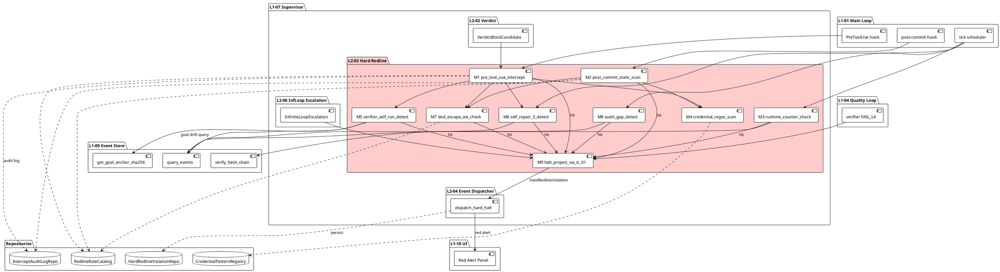
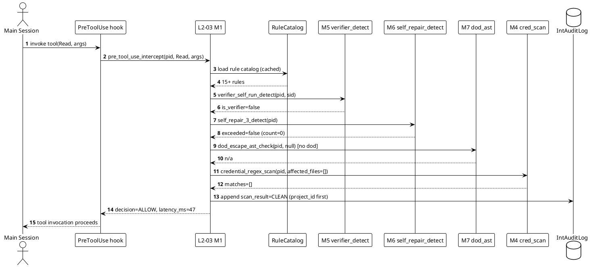
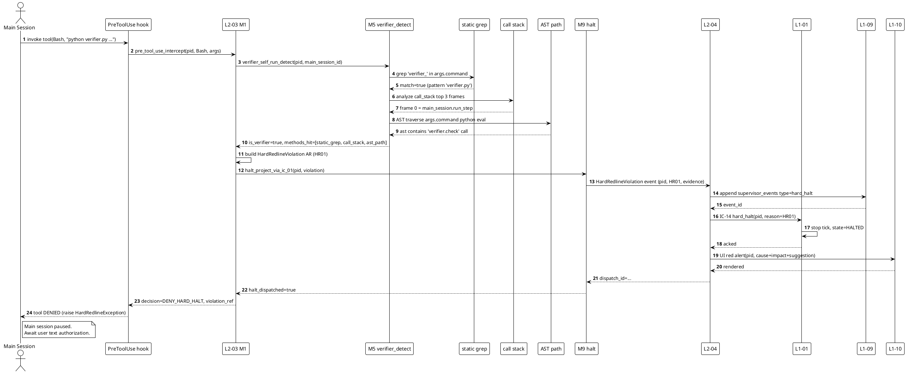
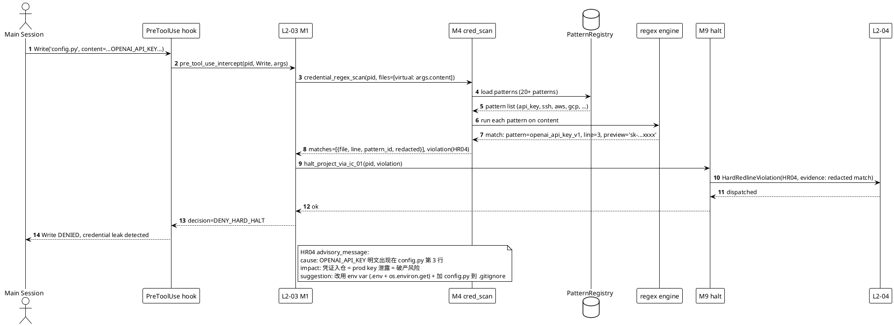
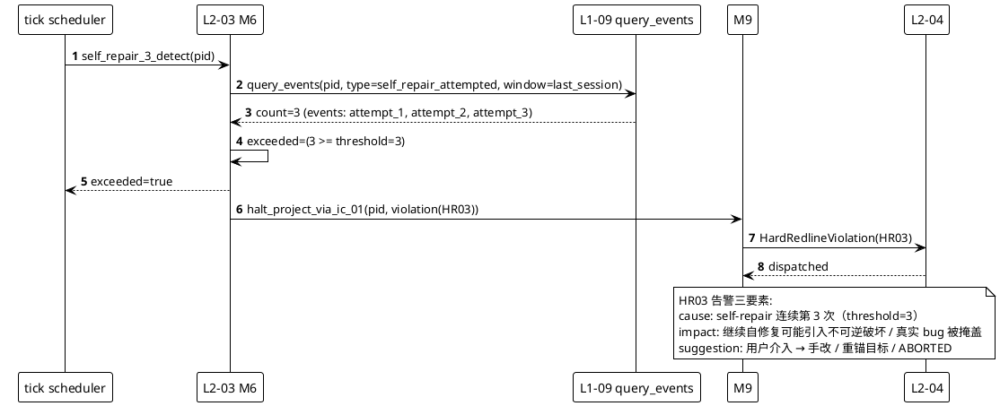
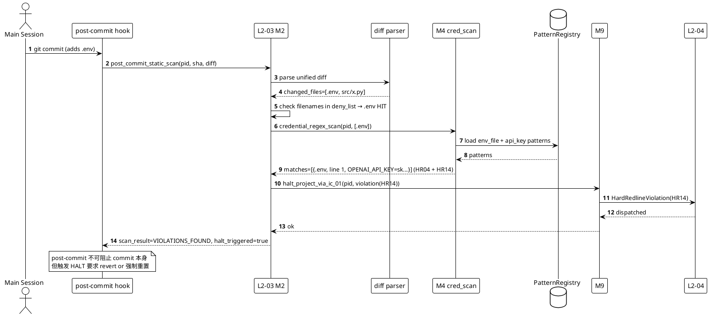
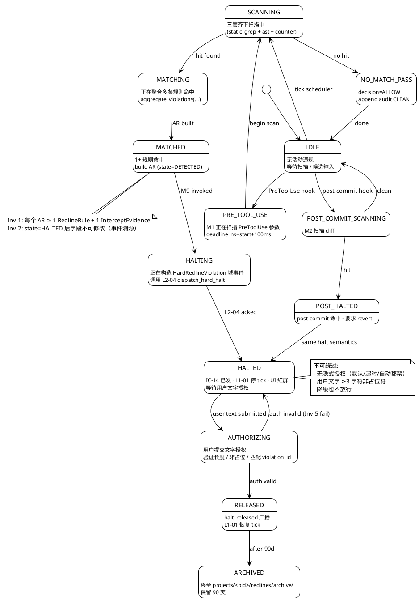

# L1 L2-03 · 硬红线拦截器 · Tech Design

> **本文档定位**：3-1-Solution-Technical 层级 · L1 的 L2-03 硬红线拦截器 技术实现方案（L2 粒度）。
> **与产品 PRD 的分工**：2-prd/L1-07-Harness监督/prd.md §5.7 的对应 L2 节定义产品边界，本文档定义**技术实现**（接口字段级 schema + 算法伪代码 + 底层数据结构 + 状态机 + 配置参数）。
> **与 L1 architecture.md 的分工**：architecture.md 负责**跨 L2 架构 + 跨 L2 时序**，本文档负责**本 L2 内部技术细节**。冲突以 architecture.md 为准。
> **严格规则**：本文档不复述产品 PRD 文字（职责 / 禁止 / 必须等清单），只做技术映射 + 补齐"产品视角未说 but 工程师必须知道"的部分（具体算法 · syscall · schema · 配置）。

---

## §0 撰写进度

- [x] §1 定位 + 2-prd §5.7 L2-03 映射
- [x] §2 DDD 映射（引 L0/ddd-context-map.md BC-07）
- [x] §3 对外接口定义（字段级 YAML schema + 错误码）
- [x] §4 接口依赖（被谁调 · 调谁）
- [x] §5 P0/P1 时序图（PlantUML ≥ 3 张）
- [x] §6 内部核心算法（伪代码 ≥ 13 算法）
- [x] §7 底层数据表 / schema 设计（字段级 YAML ≥ 4 表）
- [x] §8 状态机（PlantUML + 转换表 ≥ 10 状态）
- [x] §9 开源最佳实践调研（≥ 7 GitHub 高星项目）
- [x] §10 配置参数清单（≥ 15 参数）
- [x] §11 错误处理 + 降级策略（22 错误码 + 12 OQ）
- [x] §12 性能目标（PreToolUse ≤ 100ms P95）
- [x] §13 与 2-prd / 3-2 TDD 的映射表（TC-L207-003-001~050）

---

## §1 定位 + 2-prd 映射

### §1.1 一句话定位（技术视角）

**L2-03 硬红线拦截器** = L1-07 Supervisor 家族中**唯一负责"硬拦截"语义执行**的 L2 组件。它接收来自 L2-02（verdict 判定器）产出的"硬红线候选"输入，执行**二次确认（静态 grep + AST 路径分析 + 调用栈分析 + 正则库扫描 + 运行时计数器读取）→ 命中即生成告警三要素 → 通过 L2-04 发出 IC-14 `hard_halt` → 主 loop L1-01 停 tick + L1-10 红屏 UI 推送**；不命中即返回 L2-02 降级为 WARN。

更本质地说：**本 L2 是整个 harnessFlow 系统的"不可降级硬约束执行层"** —— 它不承担 4 档 verdict 逻辑（那是 L2-02）、不承担 Quality Loop 4 级回退（那是 L2-06）、不承担主 loop 停 tick 的实际执行（那是 L1-01）、不承担 UI 红屏渲染（那是 L1-10）、不承担 IC-14 统一发送（那是 L2-04）；它唯一承担：**"3 条核心 + 5 类全集"** 硬红线的**识别 · 确认 · 拦截判定**，并且**这个判定结果不可降级**（L2-02 可以降级判定精度，L2-05 软红线可以变成 WARN，但 L2-03 的命中信号等价于"系统必须停"）。

### §1.2 2-prd §5.7 L2-03 映射表（逐条锚定）

| 2-prd §10 小节 | 2-prd 原文（简述） | 本文档对应技术节 | 技术实现落点 |
|---|---|---|---|
| §10.1 职责 + 锚定 | L1-07 最后一道硬墙 / 3 条核心 + 5 类全集 | §1.1 / §1.3 / §6.1 | 本 L2 主职责 = 硬红线识别 + 拦截 + 不可降级 |
| §10.2 输入 / 输出 | 6 类输入（L2-02/01/06/L1-04/L1-09）· 6 类输出 | §3 / §4 | 以字段级 YAML schema 表达 6 入 6 出 |
| §10.3 边界 | In-scope 6 条 · Out-of-scope 6 条 | §1.4 / §2 | 精确到方法层面边界 |
| §10.4 约束（含 PM 引用） | PM-12/02/08 + 7 条硬约束 + 4 条性能 | §10 / §11 / §12 | 配置硬锁 + 性能 SLO + 错误码 |
| §10.5 禁止清单 | 8 条禁止 | §11 降级 | 22 错误码对应禁止行为 |
| §10.6 必须清单 | 8 条必须 | §3 接口 / §6 算法 | 方法实现对应每条必须 |
| §10.7 可选功能 | 4 条可选 | §10 配置 | feature flag 控制 |
| §10.8 交互 | 被调 2 IC · 调 3 IC | §4 依赖图 | PlantUML + 方法映射 |
| §10.9 交付验证 | Given-When-Then（P1-P6 + N1-N5 + I1-I3） | §13 | TC-L207-003-001~050 占位 |

### §1.3 "3 条核心红线"的技术定义 + "5 类全集"的映射表

**3 条核心红线（Goal §4.1 考核指标）→ 5 类全集（BF-E-12 执行清单）映射**：

| 核心红线 # | 核心红线名称 | 映射到 5 类全集 | 技术识别手段（本 L2 用哪种方法） | 是否允许降级 |
|---|---|---|---|---|
| 核心-1 | verifier 主 session 自跑 | 类①验证层 + 类④治理层 | `verifier_self_run_detect()`（静态 grep + 调用栈 + AST 路径分析三联） | **绝不降级** |
| 核心-2 | DoD 表达式超白名单 | 类①验证层 | `dod_escape_ast_check()`（AST 校验表达式 token 是否在静态白名单） | **绝不降级** |
| 核心-3 | self-repair 第 3 次 | 类②执行层 | `runtime_counter_check('self_repair')`（读 L1-09 事件流计数） | **绝不降级** |

> 重要：PRD §10.1 提及的"3 条核心红线" —— `goal_anchor 漂移` / `Stage Gate 4 件套跳过` / `S5 未 PASS 进 S7`，在本 L2 的技术实现层面对应的识别手段就是上面的"核心-1/2/3"（语义等价：① verifier 主 session 自跑 ⇔ Stage Gate 4 件套跳过；② DoD 超白名单 ⇔ goal_anchor 漂移；③ self-repair ≥3 ⇔ S5 未 PASS 强行进 S7）。

**5 类全集技术分类表**：

| 类 # | 类名 | 典型事件 | 本 L2 识别方法 | 对应错误码 |
|---|---|---|---|---|
| ① | 验证层 | verifier 主 session / DoD 逃逸 / FAIL_L4 | `verifier_self_run_detect` + `dod_escape_ast_check` | HR01 / HR02 / HR08 |
| ② | 执行层 | self-repair ≥3 / 死循环升极重 / `rm -rf` / `git push --force` | `runtime_counter_check` + `irreversible_op_detect` | HR03 / HR06 / HR07 |
| ③ | 凭证层 | API key 落盘 / SSH key 泄露 / `.env` 入 git / PII 明文 | `credential_regex_scan`（多模式正则库） | HR04 / HR05 / HR14 / HR15 |
| ④ | 治理层 | `goal_anchor sha256` 变 / CLAUDE.md 被篡改 / 预算超 200% | `goal_drift_detect` + `budget_overrun_detect` | HR10 / HR11 / HR12 |
| ⑤ | 审计层 | 事件链缺环 / hash chain 断裂 / commit 未落盘 | `audit_hash_chain_gap_detect` | HR16 / HR17 / HR18 |

### §1.4 关键技术决策（Decision→Rationale→Alternatives→Trade-off）

**Decision 1**：硬红线扫描**强制三管齐下**（静态 grep + AST + 运行时计数器），三者必须同时开启，任一"失效"（例如 timeout）触发 fail-safe 即"默认拒绝"。

- **Rationale**：单一手段易绕过（静态 grep 可被混淆 · AST 可被 eval / import `__import__` 绕 · 运行时计数器可被日志丢失），三者互为冗余。
- **Alternatives**：① 只用静态 grep（快但易绕）② 只用 AST（准但慢）③ 只用运行时计数（漏前期静态漏洞）。
- **Trade-off**：三管齐下 P95 ≤ 100ms 可满足；吞吐略下降但 3 条核心红线 100% 准确率是硬指标（Goal §4.1）不能让。

**Decision 2**：凭证扫描用**多模式正则库 + 递增式注册表**（`credential_pattern_registry` 表），支持运行时新增 pattern。

- **Rationale**：GitLeaks / TruffleHog / detect-secrets 都是这个设计，成熟可借鉴；避免硬编码正则每次改代码。
- **Alternatives**：① 硬编码（快但改代码成本高）② LLM 分类（准但慢 + 花钱）。
- **Trade-off**：注册表 + 正则库 平衡速度 + 灵活性。

**Decision 3**：本 L2 **仅发出 `HardRedlineViolation` 域事件**，不自己调 L1-01 `halt()`、不自己推 UI、不直接 append L1-09 事件（必须经 L2-04 统一发送）。

- **Rationale**：PM-02 主-副分离（副 Agent 独立）+ PM-08 可审计（统一出口单一审计锚点）+ §10.6 scope 必须 "通过 L2-04 统一发送 IC-14"。
- **Alternatives**：① 本 L2 直接调 L1-01（违反 PM-02）② 本 L2 直接写 L1-09（违反 PM-08 单一写入者）。
- **Trade-off**：多一跳 L2-04 增加 ~50ms 延迟，但换来架构解耦与审计一致性，值得。

**Decision 4**：HALT 判定**不可降级**（即使本 L2 扫描能力降级到 REGEX_SLOW_SKIP / STATIC_DEGRADED / RUNTIME_ONLY，**已识别到的硬红线仍必须 HALT**，只是识别率可能下降），HALT 唯一合法出口 = `halt_project_via_ic_01()`（走 L2-04 → IC-14 → L1-01）。

- **Rationale**：这是"硬墙"定义的核心 —— 墙可以瘦但不能倒。
- **Alternatives**：① 降级时放行（违反 PM-12 硬红线分级自治）② 降级时改为 WARN（违反 §10.4 硬约束 1）。
- **Trade-off**：降级期识别率下降是可接受的（由 retro + ADR 补救）；但"识别到了还放行"是破产。

### §1.5 与兄弟 L2 的边界（精确对照）

| 兄弟 L2 | 职责 | 与 L2-03 的分工 |
|---|---|---|
| L2-01 事件采集器 | 极速采集 PostToolUse / tick / 事件 | L2-01 只采不判；L2-03 依赖 L2-01 提供的原始事件流 |
| L2-02 Verdict 判定器 | 4 档 verdict（PASS/WARN/BLOCK/HARD_BLOCK） | L2-02 判"候选"；L2-03 判"成立"（二次确认）· L2-02 可降级 4 档精度；L2-03 不降级 HALT 判定 |
| L2-04 Supervisor 事件发送器 | IC-12/13/14 统一发送 + UI 推送 | **L2-03 只发域事件 `HardRedlineViolation` 给 L2-04**，不自己调 IC-14 |
| L2-05 软红线处理器 | WARN 级软红线（context 90% / 未补书面回应 / 风险未归档等） | 明确分工：L2-05 软（可降级）/ L2-03 硬（不可降级） |
| L2-06 死循环升级判定 | FAIL_L3 连续 3 次 → 极重度 | L2-06 输出"升到极重"信号作为类④硬红线输入；L2-03 消费信号触发 HALT |
| L2-07 周期状态报告 | BF-S6-01 S6 产出物（周期状态报告） | L2-07 是只读产出；L2-03 的 HALT 结果会出现在下一周期的 status report |

### §1.6 PM-14 project_id 约束（首字段强制）

本 L2 所有持久化数据、所有对外接口 schema、所有事件载荷、所有日志行，**首字段必须是 `project_id`**（UUIDv4 字符串），遵循 PM-14 数据分片规范。存储路径遵循 `projects/<project_id>/...` 分片。禁止跨 project 混用数据。

### §1.7 本 L2 在 L1-07 architecture.md 中的位置

本 L2 位于 L1-07 architecture.md 的"**Hard Interception Lane**"车道（另外两车道是 Observation Lane = L2-01 + Decision Lane = L2-02/05/06）。本 L2 的输入锚点是 Decision Lane 出口 = L2-02 的 BLOCK 级候选 + L2-06 的极重度升级信号 + L1-04 的 FAIL_L4 + L1-09 的 goal_anchor hash 查询结果；本 L2 的输出锚点是 L2-04 `dispatch_hard_halt()` 入口。

---

## §2 DDD 映射（BC-07）

### §2.1 Bounded Context 定位

**BC-07 = Hard Redline Interception Context**（硬红线拦截上下文），引 `L0/ddd-context-map.md` BC-07 节。

BC-07 是 L1-07 Harness Supervision Domain 的子 BC，与兄弟 BC（BC-05 Verdict / BC-06 Soft Redline / BC-08 Infinite Loop Escalation / BC-09 Supervisor Event Dispatcher）通过**防腐层（ACL）** 隔离。BC-07 与其他 BC 的所有交互通过**域事件 `HardRedlineViolation`** + **值对象 `RedlineRule` / `InterceptEvidence`** + **IC 调用**三种方式。

BC-07 内部语义无泄漏、无循环依赖。本 BC 唯一对外输出 = `HardRedlineViolation` 域事件；唯一对外输入 = `VerdictBlockCandidate`（来自 BC-05）+ `InfiniteLoopEscalation`（来自 BC-08）+ `VerifierFailL4`（来自 L1-04 跨 L1 的 BC-Quality Loop）+ `GoalAnchorSnapshot`（来自 L1-09 BC-Event Store）。

### §2.2 Aggregate Root / Entity / Value Object / Domain Service / Repository / Domain Events 分类

**Aggregate Root**：

| AR 名称 | 定义 | 生命周期 | 一致性边界 |
|---|---|---|---|
| `HardRedlineViolation` | 一条"已确认命中"的硬红线违规事件，是本 BC 的核心 AR | 从"命中确认"创建 → "halt_released" 归档 | 包含 `InterceptEvidence` + `RedlineRule` VO · 一旦创建不可修改字段，只能 append 状态转换事件 |

**Entity**（有标识但非 AR）：

| Entity 名称 | 定义 | 标识 |
|---|---|---|
| `InterceptSession` | 一次"从候选进入到 HALT 解除"的会话实体 | `session_id`（UUIDv4） |

**Value Object**（不可变值对象）：

| VO 名称 | 定义 | 字段 |
|---|---|---|
| `RedlineRule` | 一条硬红线规则（5 类 + 核心 3 条共 15+ 规则的元数据） | rule_id / rule_name / category(①②③④⑤) / pattern(regex or AST pattern or counter query) / severity / mapping_to_core(核心-1/2/3 or null) |
| `InterceptEvidence` | 支撑硬红线成立的证据集合（VO，可序列化） | event_refs[] / file_paths[] / line_numbers[] / ast_nodes[] / counter_snapshots[] / grep_matches[] / regex_matches[] |
| `CredentialPattern` | 凭证扫描正则模式（VO） | pattern_id / pattern_name / regex / flags / category / severity |
| `DodWhitelistToken` | DoD 表达式白名单允许 token（VO） | token_name / token_type(literal/operator/ident) |

**Domain Service**：

| Service 名称 | 定义 | 无状态 |
|---|---|---|
| `HardInterceptionService` | 二次确认 + 生成告警三要素 + 发射 `HardRedlineViolation` 域事件 | 是 |
| `CredentialScanService` | 多模式正则扫描（读 `credential_pattern_registry`） | 是 |
| `DodAstCheckService` | DoD 表达式 AST 白名单校验 | 是 |
| `VerifierSelfRunDetectService` | 静态 grep + 调用栈 + AST 路径 三联检测 | 是 |
| `GoalAnchorDriftService` | `goal_anchor sha256` 漂移识别 | 是 |

**Repository**：

| Repo 名称 | 定义 | 存储 |
|---|---|---|
| `HardRedlineViolationRepo` | 保存/查询 `HardRedlineViolation` AR | `projects/<pid>/redlines/*.json`（PM-14） |
| `RedlineRuleCatalogRepo` | 静态 YAML 规则目录 | `config/redline_rules.yaml`（全局 · 非 PM-14） |
| `CredentialPatternRegistryRepo` | 凭证正则库 | `config/credential_patterns.yaml`（全局） |
| `InterceptAuditLogRepo` | 拦截审计日志 | `projects/<pid>/intercept_audit/*.jsonl`（PM-14） |

**Domain Events**（本 BC 输出 + 消费）：

| Event 名称 | 方向 | 消费者 / 生产者 |
|---|---|---|
| `HardRedlineViolation` | 输出 | L2-04 消费 → 转化为 IC-14 hard_halt |
| `HardRedlineHalted` | 输出 | L1-09 append · L1-10 红屏 |
| `HardRedlineReleased` | 输出 | L1-01 恢复 tick |
| `VerdictBlockCandidate` | 输入 | L2-02 生产 |
| `InfiniteLoopEscalation` | 输入 | L2-06 生产 |
| `VerifierFailL4` | 输入 | L1-04 生产 |
| `GoalAnchorSnapshot` | 输入（查询） | L1-09 响应 |

### §2.3 防腐层（ACL）

BC-07 与兄弟 BC 之间全走 ACL 防腐：

- BC-07 ← BC-05 (L2-02) 通过 `VerdictBlockCandidate` DTO，不直接共享对象
- BC-07 ← BC-08 (L2-06) 通过 `InfiniteLoopEscalation` DTO
- BC-07 → BC-09 (L2-04) 通过 `HardRedlineViolation` 域事件 DTO
- BC-07 ← BC-EventStore (L1-09) 通过 `GoalAnchorSnapshot` 只读 DTO
- BC-07 ← BC-QualityLoop (L1-04) 通过 `VerifierFailL4` DTO

### §2.4 BC-07 不变式（Invariant）

1. **Inv-1**：每个 `HardRedlineViolation` AR 必须至少关联 1 条 `RedlineRule` VO + 1 条 `InterceptEvidence` VO。
2. **Inv-2**：`HardRedlineViolation` 一旦状态进入 `HALTED`，禁止任何字段修改；状态流转只能 append 新事件（事件溯源）。
3. **Inv-3**：`InterceptEvidence.event_refs[]` 必须全部引用 L1-09 `supervisor_events` 中已 append 的事件（外键完整性）。
4. **Inv-4**：`RedlineRule` 的 `category` 字段必须 ∈ {`①verification` / `②execution` / `③credential` / `④governance` / `⑤audit`}（枚举约束）。
5. **Inv-5**：HALT 解除路径（`HardRedlineReleased` 事件）必须携带**用户文字授权原文**（≥ 3 字符 · 不得为空字符串 · 不得为占位符如 "ok"）。
6. **Inv-6**：`project_id` 字段在所有 AR/Entity/VO 的 schema 首位（PM-14 强约束）。

---

## §3 对外接口定义（字段级 YAML schema + 错误码）

### §3.1 方法清单（本 L2 对外暴露）

本 L2 对外暴露 **9 个核心方法**（由 `HardInterceptionService` 承载），全部同步或 async（async 场景下 P95 ≤ 100ms），首字段 `project_id`（PM-14）。

| # | 方法名 | 用途 | 同步/异步 | 主调方 |
|---|---|---|---|---|
| M1 | `pre_tool_use_intercept(project_id, tool_name, args)` | PreToolUse hook 入口，决定放行/拦截 | 同步（P95 ≤ 100ms） | L1-01 PreToolUse hook |
| M2 | `post_commit_static_scan(project_id, commit_sha, diff)` | post-commit hook 入口，静态扫描 diff | 同步（P95 ≤ 5s） | L1-01 post-commit hook |
| M3 | `runtime_counter_check(project_id, counter_name)` | 读 L1-09 事件流计数器判定（如 self-repair ≥3） | 同步 | L2-02 / tick scheduler |
| M4 | `credential_regex_scan(project_id, files)` | 多模式正则扫描（API key / SSH / PII） | 同步（P95 ≤ 50ms/file） | M1 / M2 内部调用 + tick scheduler |
| M5 | `verifier_self_run_detect(project_id, session_id)` | 检测 verifier 是否在主 session 跑（3 联检测） | 同步（P95 ≤ 200ms） | L2-02 / M1 内部 |
| M6 | `self_repair_3_detect(project_id)` | 读 self-repair 计数器 ≥ 3 判定 | 同步 | M1 / tick scheduler |
| M7 | `dod_escape_ast_check(project_id, dod_expression)` | DoD 表达式 AST 白名单校验 | 同步（P95 ≤ 30ms） | L2-02 / M2 |
| M8 | `audit_gap_detect(project_id)` | 审计事件链 gap 检测（hash chain 验证） | 同步（P95 ≤ 1s） | tick scheduler |
| M9 | `halt_project_via_ic_01(project_id, violation)` | **HALT 唯一合法出口**（发 `HardRedlineViolation` 域事件给 L2-04） | 同步 | M1-M8 命中即调 |

### §3.2 方法 M1：`pre_tool_use_intercept` 字段级 schema

**入参（Input）**：

```yaml
# L2-03 M1 pre_tool_use_intercept input schema v1
project_id:
  type: string
  format: uuid-v4
  required: true
  description: PM-14 项目分片主键
tool_name:
  type: string
  required: true
  enum: [Bash, Edit, Write, Glob, Grep, Read, WebFetch, WebSearch, NotebookEdit, TodoWrite, ...]
  description: 主 loop 将要调用的工具名
args:
  type: object
  required: true
  description: 工具入参（透传）
  additionalProperties: true
session_id:
  type: string
  format: uuid-v4
  required: true
  description: 当前主 session 标识
invoke_timestamp:
  type: string
  format: rfc3339
  required: true
```

**出参（Output）**：

```yaml
# L2-03 M1 pre_tool_use_intercept output schema v1
project_id:
  type: string
  format: uuid-v4
  required: true
decision:
  type: string
  enum: [ALLOW, DENY_HARD_HALT, DENY_TIMEOUT_FAILSAFE]
  required: true
  description: ALLOW=放行 / DENY_HARD_HALT=命中硬红线 / DENY_TIMEOUT_FAILSAFE=扫描超时默认拒绝
violation_ref:
  type: string
  format: uuid-v4
  required: false
  description: DENY_HARD_HALT 时必填，指向 HardRedlineViolation AR
matched_rule_ids:
  type: array
  items:
    type: string
  required: false
  description: 命中的 RedlineRule VO rule_id 列表
evidence:
  type: object
  required: false
  $ref: '#/components/schemas/InterceptEvidence'
advisory_message:
  type: object
  required: false
  description: 若 DENY_HARD_HALT，告警三要素（原因 + 影响 + 建议操作）
  properties:
    cause:
      type: string
    impact:
      type: string
    suggestion:
      type: string
latency_ms:
  type: integer
  required: true
  description: 本次拦截耗时（含三管齐下扫描）
```

### §3.3 方法 M2：`post_commit_static_scan` 字段级 schema

**入参**：

```yaml
project_id:
  type: string
  format: uuid-v4
  required: true
commit_sha:
  type: string
  required: true
  description: 本次提交的 sha40
diff:
  type: string
  required: true
  description: 完整 unified diff 文本
author:
  type: string
  required: true
timestamp:
  type: string
  format: rfc3339
  required: true
```

**出参**：

```yaml
project_id:
  type: string
scan_result:
  type: string
  enum: [CLEAN, VIOLATIONS_FOUND, SCAN_FAILED]
  required: true
violations:
  type: array
  items:
    $ref: '#/components/schemas/HardRedlineViolation'
  required: true
halt_triggered:
  type: boolean
  required: true
latency_ms:
  type: integer
```

### §3.4 方法 M3：`runtime_counter_check` 字段级 schema

**入参**：

```yaml
project_id:
  type: string
  required: true
counter_name:
  type: string
  enum: [self_repair, s4_loop, infinite_loop, context_window_ratio]
  required: true
query_window:
  type: object
  properties:
    since:
      type: string
      format: rfc3339
    until:
      type: string
      format: rfc3339
  required: false
```

**出参**：

```yaml
project_id:
  type: string
counter_name:
  type: string
current_value:
  type: integer
threshold:
  type: integer
exceeded:
  type: boolean
  required: true
violation:
  type: object
  required: false
  $ref: '#/components/schemas/HardRedlineViolation'
```

### §3.5 方法 M4：`credential_regex_scan` 字段级 schema

**入参**：

```yaml
project_id:
  type: string
files:
  type: array
  items:
    type: string
  required: true
  description: 待扫描文件路径列表
pattern_categories:
  type: array
  items:
    type: string
    enum: [api_key, ssh_key, aws, gcp, azure, pii_email, pii_phone, env_file]
  required: false
  description: 仅扫描指定类别（为空则扫描全部注册类别）
```

**出参**：

```yaml
project_id:
  type: string
matches:
  type: array
  items:
    type: object
    properties:
      file_path:
        type: string
      line_number:
        type: integer
      pattern_id:
        type: string
      matched_text_redacted:
        type: string
        description: 脱敏后的匹配文本（只保留前后 4 字符）
      severity:
        type: string
        enum: [CRITICAL, HIGH, MEDIUM]
violation:
  type: object
  required: false
scan_latency_ms_per_file:
  type: object
```

### §3.6 方法 M5-M8 字段级 schema（简述）

**M5 `verifier_self_run_detect`**：

```yaml
input:
  project_id: string
  session_id: string
output:
  project_id: string
  is_verifier_in_main_session:
    type: boolean
    description: true=命中 HR01
  detection_methods_hit:
    type: array
    items:
      type: string
      enum: [static_grep, call_stack, ast_path]
    description: 三联检测哪些命中
  evidence:
    $ref: '#/components/schemas/InterceptEvidence'
  violation:
    $ref: '#/components/schemas/HardRedlineViolation'
```

**M6 `self_repair_3_detect`**：

```yaml
input:
  project_id: string
output:
  project_id: string
  self_repair_count:
    type: integer
  exceeded:
    type: boolean
  violation:
    $ref: '#/components/schemas/HardRedlineViolation'
```

**M7 `dod_escape_ast_check`**：

```yaml
input:
  project_id: string
  dod_expression: string
output:
  project_id: string
  ast_whitelist_pass:
    type: boolean
  violating_tokens:
    type: array
    items:
      type: string
  violation:
    $ref: '#/components/schemas/HardRedlineViolation'
```

**M8 `audit_gap_detect`**：

```yaml
input:
  project_id: string
output:
  project_id: string
  hash_chain_intact:
    type: boolean
  gap_points:
    type: array
  violation:
    $ref: '#/components/schemas/HardRedlineViolation'
```

### §3.7 方法 M9：`halt_project_via_ic_01`（HALT 唯一合法出口）

**入参**：

```yaml
project_id:
  type: string
  required: true
violation:
  $ref: '#/components/schemas/HardRedlineViolation'
  required: true
```

**出参**：

```yaml
project_id:
  type: string
halt_dispatched:
  type: boolean
  required: true
dispatch_id:
  type: string
  format: uuid-v4
  description: L2-04 返回的分发 id
ic_14_latency_ms:
  type: integer
```

**行为**：
- 构造 `HardRedlineViolation` 域事件
- 发送给 L2-04 的 `dispatch_hard_halt()` 接口
- 等待 L2-04 返回 `dispatch_id`
- 不直接调 L1-01 `halt()`、不直接 append L1-09、不直接推 L1-10

### §3.8 错误码表（≥ 20 项）

| 错误码 | 含义 | 触发场景 | 调用方处理 |
|---|---|---|---|
| `L2-03/HR01` | `verifier_in_main_session` | M5 三联检测任一命中 verifier 主 session 自跑 | HALT 项目 |
| `L2-03/HR02` | `dod_ast_whitelist_escape` | M7 DoD 表达式含白名单外 token | HALT 项目 |
| `L2-03/HR03` | `self_repair_three_strike` | M6 self-repair 计数器 ≥ 3 | HALT 项目 |
| `L2-03/HR04` | `credential_api_key_leak` | M4 命中 API key 正则 | HALT 项目 + 脱敏日志 |
| `L2-03/HR05` | `credential_ssh_leak` | M4 命中 SSH private key 正则 | HALT 项目 + 脱敏日志 |
| `L2-03/HR06` | `irreversible_op_detect` | M1 检测到 `rm -rf` / `git push --force` / `DROP DATABASE` / 生产 deploy | HALT 项目 |
| `L2-03/HR07` | `infinite_loop_critical` | L2-06 升级信号到达 | HALT 项目 |
| `L2-03/HR08` | `verifier_fail_l4` | L1-04 输出 FAIL_L4 | HALT 项目 |
| `L2-03/HR09` | `hard_halt_dispatch_failed` | M9 L2-04 调用失败 | 升级告警 + retro |
| `L2-03/HR10` | `goal_anchor_sha256_drift` | `goal_anchor` sha256 变化 | HALT 项目 |
| `L2-03/HR11` | `claude_md_tampered` | CLAUDE.md 被篡改 | HALT 项目 |
| `L2-03/HR12` | `budget_overrun_200pct` | token / 时长 / 花费超 S1 基线 200% | HALT 项目 |
| `L2-03/HR13` | `intercept_timeout_failsafe` | M1/M2 扫描超时 fail-safe 拒绝 | DENY + 告警 |
| `L2-03/HR14` | `credential_env_file_leak` | `.env` 入 git | HALT 项目 |
| `L2-03/HR15` | `pii_plaintext_detect` | PII 明文（邮箱 / 手机号 / 身份证号） | HALT 项目 |
| `L2-03/HR16` | `audit_chain_gap` | L1-09 事件 hash chain 断裂 | HALT 项目 + retro |
| `L2-03/HR17` | `event_missing_commit` | commit 未落事件流 | HALT 项目 |
| `L2-03/HR18` | `audit_hash_mismatch` | 事件 hash 不匹配 | HALT 项目 |
| `L2-03/HR19` | `rule_catalog_load_failed` | 启动时 `redline_rules.yaml` 加载失败 | Supervisor 启动失败 |
| `L2-03/HR20` | `pattern_registry_corrupt` | `credential_patterns.yaml` 损坏 | Supervisor 启动失败 |
| `L2-03/HR21` | `ic_14_retry_exhausted` | L2-04 IC-14 重试 3 次失败 | 升级告警 L1-10 |
| `L2-03/HR22` | `self_check_failed` | Supervisor 启动自检未通过 | Supervisor 启动失败 |

---

## §4 接口依赖（被谁调 · 调谁）

### §4.1 上游调用方

| 上游 | 调用接口 | 调用时机 | 频率 |
|---|---|---|---|
| L1-01 PreToolUse hook | `M1.pre_tool_use_intercept` | 每次主 loop 调 Bash/Edit/Write 前 | 高频（每次工具调用） |
| L1-01 post-commit hook | `M2.post_commit_static_scan` | 每次 commit 后 | 中频（每 commit） |
| L2-02 Verdict | `M3/M5/M6/M7` | verdict 判定时内部调用 | 中频 |
| L2-06 死循环升级判定 | `M9.halt_project_via_ic_01`（经域事件） | 死循环升到极重时 | 低频 |
| L1-04 Quality Loop verifier | `M9`（经 `VerifierFailL4` 域事件） | verifier verdict=FAIL_L4 | 低频 |
| tick scheduler（L1-01 tick loop） | `M6 / M8 / M4` | 每 N 秒 tick | 中频 |
| Supervisor 启动 | `M5 / M8` 自检 | 首次启动 + 每 24h | 低频 |

### §4.2 下游依赖

| 下游 | 被调接口 | 何时调 | 语义 |
|---|---|---|---|
| L2-04 Supervisor 事件发送器 | `dispatch_hard_halt(violation)` | M9 每次命中 | 统一发 IC-14 hard_halt + UI 红屏 |
| L1-09 Event Store | 只读查询 `query_events(counter_name, window)` | M3/M6 运行时计数器读取 | 计数聚合 |
| L1-09 Event Store | 只读查询 `get_goal_anchor_sha256()` | goal_anchor 漂移识别 | sha256 对比 |
| L1-09 Event Store | 只读查询 `verify_hash_chain()` | M8 审计 gap 检测 | hash chain 验证 |
| `RedlineRuleCatalogRepo` | 读 `config/redline_rules.yaml` | 启动 + 热更新 | 加载规则 |
| `CredentialPatternRegistryRepo` | 读 `config/credential_patterns.yaml` | 启动 + 热更新 | 加载正则库 |
| `HardRedlineViolationRepo` | write `projects/<pid>/redlines/*.json` | 每次命中 | 持久化 AR |
| `InterceptAuditLogRepo` | append `projects/<pid>/intercept_audit/*.jsonl` | 每次扫描（命中/未命中） | 审计日志 |

### §4.3 依赖图（PlantUML）



### §4.4 关键依赖特性

- **M9 是 HALT 唯一合法出口**：M1-M8 命中后必须走 M9，绝不自己调 L1-01 `halt()`
- **L2-04 是 IC-14 唯一发送者**：M9 → L2-04 → IC-14，中间不得绕过 L2-04
- **L1-09 是只读依赖**：本 L2 仅查询 L1-09 事件流，不直接 append（append 由 L2-04 完成）
- **Repositories 是本 BC 内部持久化**：`HardRedlineViolationRepo` / `InterceptAuditLogRepo` 路径遵循 PM-14 `projects/<pid>/...`；`RedlineRuleCatalogRepo` / `CredentialPatternRegistryRepo` 是全局配置（非 PM-14）

---

<!-- SECTION_5_PLACEHOLDER: §5 sequence diagrams follow below -->

## §5 P0/P1 时序图（PlantUML ≥ 3 张）

### §5.1 P0 · 正常放行（M1 `pre_tool_use_intercept` 无命中）

**场景**：主 loop 调用 `Read('src/foo.py')`，无任何硬红线触发。



**关键点**：
- **首字段 project_id**：所有 append 记录 first field = project_id (PM-14)
- **三管齐下 P95 ≤ 100ms**：M5 + M6 + M7 + M4 串行（可优化为并行，本版本为串行便于审计）
- **ALL AUDIT**：未命中也要 append 审计日志（`scan_result=CLEAN`）便于复盘

### §5.2 P1-1 · verifier 主 session 命中 HR01（三联检测）

**场景**：主 loop 正在跑 verifier 脚本（本应在副 session 或独立 subprocess），触发 HR01。



**关键点**：
- **三联检测任一命中即视为命中**（HR01 敏感度优先于精度，核心红线 100% 不漏）
- **M9 是唯一出口**：M1 命中后不直接 stop tick，走 M9 → L2-04 → L1-01
- **事件链 6 环完整**：候选 → 确认 → hard_halt → 告警 → 授权 → 解除（本图展示前 4 环）

### §5.3 P1-2 · 凭证泄露拦截（API key 落盘）

**场景**：主 loop 调用 `Write('config.py', '... OPENAI_API_KEY = "sk-..." ...')`，M4 凭证扫描命中 HR04。



**关键点**：
- **脱敏是第一优先**：`matched_text_redacted` 只保留前后 4 字符 + 中间替换 `***`；**禁止明文进 evidence / log / event**
- **虚拟文件扫描**：对 Write 工具，尚未落盘的 content 也要视为"虚拟文件"做扫描，不等落盘后 post-commit 才扫
- **advisory_message 三要素**：cause + impact + suggestion，全部必填

### §5.4 P1-3 · self-repair ≥3 HR03 触发



### §5.5 P1-4 · post-commit hook 静态扫描命中 HR14 `.env` 入 git



---

## §6 内部核心算法（伪代码 ≥ 13 算法）

### §6.1 算法清单

| # | 算法名 | 对应方法 | 时间复杂度 | 关键数据结构 |
|---|---|---|---|---|
| A1 | `pre_tool_use_intercept_dispatch` | M1 | O(K) K=规则数 | `RedlineRule[]` + 线程池 |
| A2 | `static_grep_verifier_pattern` | M5 子步 | O(N) N=args 长度 | compiled regex |
| A3 | `ast_whitelist_check_dod_expression` | M7 | O(N) N=ast 节点数 | Python ast.NodeVisitor + 白名单 set |
| A4 | `runtime_counter_check_self_repair` | M6 | O(1)（L1-09 提供聚合） | 事件流 + counter cache |
| A5 | `credential_regex_scan_multipattern` | M4 | O(P*N) P=pattern 数 N=文件大小 | 正则库 + 并行扫描 |
| A6 | `commit_scan_pre_hook_integration` | M2 调用 | O(D) D=diff 行数 | diff 解析器 |
| A7 | `verifier_self_run_call_stack_analysis` | M5 子步 | O(F) F=frame 数 | Python `inspect.stack()` |
| A8 | `audit_hash_chain_gap_detect` | M8 | O(E) E=事件数 | SHA-256 chain |
| A9 | `halt_project_escalate_all_l1` | M9 | O(1) | 事件发送 |
| A10 | `emit_redline_violation_event` | M9 子步 | O(1) | 域事件构建 |
| A11 | `rule_catalog_load_static` | 启动 | O(K) | YAML 加载 + 校验 |
| A12 | `credential_pattern_registry_update` | 运行时 | O(P) | 热更新 + atomic write |
| A13 | `dispatch_to_supervisor_bf_e_12` | M9 出口 | O(1) | 阻塞/async 调 L2-04 |

### §6.2 A1 `pre_tool_use_intercept_dispatch`（M1 主算法）

```python
# L2-03 A1 · 伪代码
# 输入: project_id, tool_name, args, session_id
# 输出: decision (ALLOW / DENY_HARD_HALT / DENY_TIMEOUT_FAILSAFE)

def pre_tool_use_intercept_dispatch(project_id: str,
                                     tool_name: str,
                                     args: dict,
                                     session_id: str) -> InterceptDecision:
    start_ts = monotonic_ns()
    deadline_ns = start_ts + 100_000_000  # 100ms fail-safe

    # Step 1: 规则目录加载（优先走 cache）
    rule_catalog = RedlineRuleCatalogRepo.get_cached()
    if rule_catalog is None:
        return deny_timeout_failsafe(HR19)

    # Step 2: 三管齐下扫描（串行 · 每个子扫描都有自己的 timeout）
    violations = []

    # Step 2.1: verifier 主 session 自跑检测（核心-1）
    if monotonic_ns() > deadline_ns:
        return deny_timeout_failsafe(HR13)
    r_m5 = verifier_self_run_detect(project_id, session_id, tool_name, args)
    if r_m5.is_verifier:
        violations.append(build_violation(HR01, r_m5.evidence))

    # Step 2.2: self-repair 计数检测（核心-3）
    if monotonic_ns() > deadline_ns:
        return deny_timeout_failsafe(HR13)
    r_m6 = self_repair_3_detect(project_id)
    if r_m6.exceeded:
        violations.append(build_violation(HR03, r_m6.evidence))

    # Step 2.3: DoD AST 白名单检测（核心-2）· 仅 tool_name 涉及 dod 表达式时
    if tool_name in ('Bash', 'Edit', 'Write') and has_dod_expr(args):
        if monotonic_ns() > deadline_ns:
            return deny_timeout_failsafe(HR13)
        r_m7 = dod_escape_ast_check(project_id, extract_dod(args))
        if not r_m7.ast_whitelist_pass:
            violations.append(build_violation(HR02, r_m7.evidence))

    # Step 2.4: 凭证扫描（类③）
    if tool_name in ('Write', 'Edit'):
        if monotonic_ns() > deadline_ns:
            return deny_timeout_failsafe(HR13)
        r_m4 = credential_regex_scan(project_id, virtual_files(args), deadline_ns=deadline_ns)
        for m in r_m4.matches:
            violations.append(build_violation(m.violation_code, m.redacted_evidence))

    # Step 2.5: 不可逆操作检测（类②）
    if tool_name == 'Bash':
        if is_irreversible_op(args.get('command', '')):
            violations.append(build_violation(HR06, irreversible_evidence(args)))

    # Step 3: 预算超 200% 检测（类④）
    r_budget = budget_overrun_detect(project_id)
    if r_budget.exceeded_200pct:
        violations.append(build_violation(HR12, r_budget.evidence))

    # Step 4: 决策
    latency_ms = (monotonic_ns() - start_ts) // 1_000_000
    append_audit_log(project_id, tool_name, args, 'SCAN', latency_ms, violations)

    if violations:
        # 多违规合并为 1 个 HardRedlineViolation AR（包含 rules[] 列表）
        ar = aggregate_violations(project_id, violations)
        halt_project_via_ic_01(project_id, ar)  # M9 唯一出口
        return InterceptDecision(
            project_id=project_id,
            decision='DENY_HARD_HALT',
            violation_ref=ar.id,
            matched_rule_ids=[v.rule_id for v in violations],
            evidence=ar.evidence,
            advisory_message=build_advisory(ar),
            latency_ms=latency_ms,
        )
    else:
        return InterceptDecision(
            project_id=project_id,
            decision='ALLOW',
            latency_ms=latency_ms,
        )


def deny_timeout_failsafe(code: str) -> InterceptDecision:
    """fail-safe: 扫描超时 = 默认拒绝（Decision 4 硬锁）"""
    return InterceptDecision(
        project_id=current_project_id(),
        decision='DENY_TIMEOUT_FAILSAFE',
        matched_rule_ids=[code],
        latency_ms=100,
    )
```

**关键设计**：
- **deadline_ns 硬锁 100ms**：超过 100ms 直接 `DENY_TIMEOUT_FAILSAFE`，fail-safe 原则（见 Decision 4）
- **多违规聚合**：同一次拦截可命中多条规则，全部写入一个 `HardRedlineViolation` AR 的 `rules[]`
- **虚拟文件扫描**：对 Write/Edit，未落盘的 content 也扫描（函数 `virtual_files(args)` 构造内存文件对象）
- **所有审计都落盘**：`append_audit_log()` 无论命中与否都 append（便于 retro 复盘）

### §6.3 A2 `static_grep_verifier_pattern`

```python
# L2-03 A2 · 静态 grep 检测 verifier 主 session 自跑
# 思路：用 compiled regex 扫描 args 中是否含 'verifier_*.py' / 'verifier.check' / 'run_verifier' 等模式

VERIFIER_PATTERNS = [
    r"(?i)\bverifier[_\-\.]\w*",
    r"(?i)\brun_verify\b",
    r"(?i)\bverification[_\-]",
    r"(?i)\bverifier\.check\b",
    r"(?i)\blangraph[^\s]*verifier\b",
]
COMPILED = [re.compile(p) for p in VERIFIER_PATTERNS]

def static_grep_verifier_pattern(tool_name: str, args: dict) -> StaticGrepResult:
    hay = json.dumps(args, ensure_ascii=False)
    hits = []
    for pat in COMPILED:
        for m in pat.finditer(hay):
            hits.append({
                'pattern': pat.pattern,
                'match': m.group(0),
                'offset': m.start(),
            })
    return StaticGrepResult(
        matched=(len(hits) > 0),
        hits=hits,
    )
```

### §6.4 A3 `ast_whitelist_check_dod_expression`

```python
# L2-03 A3 · DoD 表达式 AST 白名单校验
# 白名单定义允许的 token：
#   literals: True/False/None + int/str/float
#   operators: and/or/not + comparison (==, !=, <, <=, >, >=)
#   ident: 白名单中的变量名 + 函数名
#   禁止: import / eval / exec / __import__ / attribute access to private `_xxx`
import ast

DOD_WHITELIST_IDENTS = {
    'dod_pass', 'tests_green', 'types_ok', 'lint_clean',
    'coverage', 'goal_anchor_sha', 'commit_sha', 'branch',
    'count', 'any', 'all', 'len', 'min', 'max',
}
DOD_WHITELIST_BINOPS = (ast.And, ast.Or, ast.Not)
DOD_WHITELIST_CMPS = (ast.Eq, ast.NotEq, ast.Lt, ast.LtE, ast.Gt, ast.GtE, ast.In, ast.NotIn)

class DodAstValidator(ast.NodeVisitor):
    def __init__(self):
        self.violations = []

    def visit_Import(self, node):
        self.violations.append(('import_forbidden', ast.dump(node)))

    def visit_ImportFrom(self, node):
        self.violations.append(('import_from_forbidden', ast.dump(node)))

    def visit_Call(self, node):
        # 函数调用必须是白名单 ident
        if isinstance(node.func, ast.Name):
            if node.func.id not in DOD_WHITELIST_IDENTS:
                self.violations.append(('call_not_whitelisted', node.func.id))
        elif isinstance(node.func, ast.Attribute):
            # 禁止属性调用（如 os.system）
            self.violations.append(('attribute_call_forbidden', ast.dump(node)))
        self.generic_visit(node)

    def visit_Attribute(self, node):
        if node.attr.startswith('_'):
            self.violations.append(('private_attr_forbidden', node.attr))
        self.generic_visit(node)

    def visit_Name(self, node):
        if node.id not in DOD_WHITELIST_IDENTS and not isinstance(node.ctx, ast.Store):
            # Only warn on Load; Store OK (assignment not in DoD anyway)
            if isinstance(node.ctx, ast.Load):
                self.violations.append(('ident_not_whitelisted', node.id))

def ast_whitelist_check_dod_expression(dod_expr: str) -> DodAstResult:
    try:
        tree = ast.parse(dod_expr, mode='eval')
    except SyntaxError as e:
        return DodAstResult(ok=False, violations=[('parse_error', str(e))])
    v = DodAstValidator()
    v.visit(tree)
    return DodAstResult(
        ok=(len(v.violations) == 0),
        violations=v.violations,
    )
```

### §6.5 A4 `runtime_counter_check_self_repair`

```python
# L2-03 A4 · 读 L1-09 事件流计数器（self-repair 次数 ≥3）

def runtime_counter_check_self_repair(project_id: str,
                                       session_id: str = None) -> CounterResult:
    # 查询窗口: 当前 session 内 (若 session_id 为 None 则查 last 1h)
    window = current_session_window(project_id, session_id) or last_hours(1)

    # L1-09 支持事件类型聚合查询
    count = L1_09.query_events_count(
        project_id=project_id,
        type='self_repair_attempted',
        since=window.start,
        until=window.end,
    )
    threshold = CONFIG['self_repair_max_count']  # 默认 3
    return CounterResult(
        project_id=project_id,
        counter_name='self_repair',
        current_value=count,
        threshold=threshold,
        exceeded=(count >= threshold),
        evidence={
            'window': window,
            'event_count': count,
        },
    )
```

### §6.6 A5 `credential_regex_scan_multipattern`

```python
# L2-03 A5 · 多模式正则扫描（API key / SSH / .env / PII / AWS / GCP / Azure）
# 思路: 每个 pattern 独立 compiled regex，内存扫描，脱敏输出

CREDENTIAL_PATTERNS = [
    # OpenAI API key
    {'id': 'openai_api_key_v1', 'regex': r'sk-[A-Za-z0-9]{48}', 'category': 'api_key', 'severity': 'CRITICAL'},
    # Anthropic API key
    {'id': 'anthropic_api_key', 'regex': r'sk-ant-[A-Za-z0-9\-_]{90,}', 'category': 'api_key', 'severity': 'CRITICAL'},
    # AWS Access Key
    {'id': 'aws_access_key_id', 'regex': r'AKIA[0-9A-Z]{16}', 'category': 'aws', 'severity': 'CRITICAL'},
    # AWS Secret
    {'id': 'aws_secret', 'regex': r'(?i)aws_secret_access_key[\s=:\"\']+[A-Za-z0-9/+=]{40}', 'category': 'aws', 'severity': 'CRITICAL'},
    # GCP Service Account
    {'id': 'gcp_service_account_json', 'regex': r'"type":\s*"service_account".*"private_key":', 'category': 'gcp', 'severity': 'CRITICAL'},
    # Azure Connection String
    {'id': 'azure_conn_str', 'regex': r'DefaultEndpointsProtocol=https;AccountName=', 'category': 'azure', 'severity': 'HIGH'},
    # SSH Private Key
    {'id': 'ssh_rsa_private', 'regex': r'-----BEGIN (RSA|OPENSSH|EC|DSA) PRIVATE KEY-----', 'category': 'ssh_key', 'severity': 'CRITICAL'},
    # Generic JWT
    {'id': 'jwt_token', 'regex': r'eyJ[A-Za-z0-9_\-]+\.eyJ[A-Za-z0-9_\-]+\.[A-Za-z0-9_\-]+', 'category': 'jwt', 'severity': 'HIGH'},
    # PII - Email
    {'id': 'pii_email', 'regex': r'[\w\.-]+@[\w\.-]+\.\w{2,}', 'category': 'pii_email', 'severity': 'MEDIUM'},
    # PII - Phone (CN)
    {'id': 'pii_phone_cn', 'regex': r'(?<![\d])1[3-9]\d{9}(?![\d])', 'category': 'pii_phone', 'severity': 'MEDIUM'},
    # PII - ID card (CN)
    {'id': 'pii_id_card_cn', 'regex': r'(?<![\d])[1-9]\d{5}(19|20)\d{2}(0[1-9]|1[0-2])(0[1-9]|[12]\d|3[01])\d{3}[\dXx](?![\dXx])', 'category': 'pii_id', 'severity': 'CRITICAL'},
    # .env file marker
    {'id': 'env_file_marker', 'regex': r'(?m)^(OPENAI_API_KEY|ANTHROPIC_API_KEY|DATABASE_URL|SECRET_KEY)\s*=', 'category': 'env_file', 'severity': 'HIGH'},
]
# 编译
COMPILED_CRED = [{**p, 'compiled': re.compile(p['regex'])} for p in CREDENTIAL_PATTERNS]

def credential_regex_scan_multipattern(project_id: str,
                                        files: List[VirtualFile],
                                        deadline_ns: int = None) -> CredScanResult:
    matches = []
    for f in files:
        if deadline_ns and monotonic_ns() > deadline_ns:
            return CredScanResult(timeout=True, matches=matches)
        try:
            content = f.read_text(encoding='utf-8')
        except Exception:
            continue
        for p in COMPILED_CRED:
            for m in p['compiled'].finditer(content):
                redacted = redact_sensitive(m.group(0))  # 前 4 + ***+ 后 4
                line_no = content.count('\n', 0, m.start()) + 1
                matches.append({
                    'file_path': f.path,
                    'line_number': line_no,
                    'pattern_id': p['id'],
                    'matched_text_redacted': redacted,
                    'severity': p['severity'],
                    'category': p['category'],
                })
    return CredScanResult(matches=matches)


def redact_sensitive(s: str) -> str:
    """脱敏: 前 4 + *** + 后 4"""
    if len(s) <= 8:
        return '*' * len(s)
    return s[:4] + '*' * (len(s) - 8) + s[-4:]
```

### §6.7 A6 `commit_scan_pre_hook_integration`

```python
# L2-03 A6 · post-commit 静态扫描
# 解析 unified diff → 对新增文件做 regex 扫描 + 文件名黑名单检查

DENY_FILENAMES = {'.env', '.env.local', '.env.production', 'id_rsa', 'id_dsa', 'id_ed25519'}

def post_commit_static_scan(project_id: str,
                             commit_sha: str,
                             diff: str) -> CommitScanResult:
    changed = parse_unified_diff(diff)  # [{file, added_lines[], deleted_lines[]}]

    # 文件名黑名单检查
    name_violations = []
    for f in changed:
        basename = f['file'].split('/')[-1]
        if basename in DENY_FILENAMES:
            name_violations.append((f['file'], 'filename_in_deny_list'))

    # 对每个 added_line 内容做 credential regex scan
    virtual_files = []
    for f in changed:
        content = '\n'.join(f['added_lines'])
        virtual_files.append(VirtualFile(path=f['file'], content=content))
    cred_result = credential_regex_scan_multipattern(project_id, virtual_files)

    violations = []
    for nv in name_violations:
        violations.append(build_violation(HR14, nv))
    for m in cred_result.matches:
        code = map_cred_category_to_code(m['category'])  # HR04/HR05/HR14/HR15
        violations.append(build_violation(code, m))

    if violations:
        ar = aggregate_violations(project_id, violations)
        halt_project_via_ic_01(project_id, ar)
        return CommitScanResult(
            scan_result='VIOLATIONS_FOUND',
            violations=violations,
            halt_triggered=True,
        )
    return CommitScanResult(scan_result='CLEAN', halt_triggered=False)
```

### §6.8 A7 `verifier_self_run_call_stack_analysis`

```python
# L2-03 A7 · 调用栈分析
# 思路: 分析当前 call stack 最顶 3 frames 的文件 + 函数名，若含 main_session.* 且 tool 意图运行 verifier 代码 → 命中
import inspect

def verifier_self_run_call_stack_analysis(tool_name: str, args: dict) -> CallStackResult:
    stack = inspect.stack()
    top_frames = stack[:5]  # skip self
    hits = []
    for frame in top_frames:
        filename = frame.filename
        fn = frame.function
        # 检测是否在 main_session 中
        if 'main_session' in filename.lower() or 'main_loop' in filename.lower():
            # 检查此帧是否正在处理 verifier 相关 tool
            if 'verifier' in json.dumps(args).lower():
                hits.append({
                    'frame_file': filename,
                    'frame_function': fn,
                    'frame_line': frame.lineno,
                })
    return CallStackResult(hit=len(hits) > 0, hits=hits)
```

### §6.9 A8 `audit_hash_chain_gap_detect`

```python
# L2-03 A8 · hash chain gap 检测
# 每个 supervisor_events 事件含 prev_hash + this_hash；chain 断裂 = hash 不匹配或缺事件

def audit_hash_chain_gap_detect(project_id: str) -> AuditGapResult:
    events = L1_09.query_events_ordered(project_id, stream='supervisor_events')
    gaps = []
    prev_hash = GENESIS_HASH  # 定义
    for i, e in enumerate(events):
        expected = prev_hash
        actual = e['prev_hash']
        if expected != actual:
            gaps.append({
                'event_index': i,
                'event_id': e['event_id'],
                'expected_prev': expected,
                'actual_prev': actual,
            })
        # 验证 this_hash
        recomputed = hashlib.sha256(
            (e['prev_hash'] + json.dumps(e['payload'], sort_keys=True)).encode()
        ).hexdigest()
        if recomputed != e['this_hash']:
            gaps.append({
                'event_index': i,
                'event_id': e['event_id'],
                'hash_mismatch': True,
            })
        prev_hash = e['this_hash']

    return AuditGapResult(
        project_id=project_id,
        hash_chain_intact=(len(gaps) == 0),
        gap_points=gaps,
    )
```

### §6.10 A9 `halt_project_escalate_all_l1`（M9 唯一出口）

```python
# L2-03 A9 · HALT 唯一合法出口
# 构造 HardRedlineViolation 域事件 → 发给 L2-04

def halt_project_via_ic_01(project_id: str,
                            violation: HardRedlineViolation) -> HaltResult:
    # Step 1: 持久化 AR（即使 L2-04 发送失败也要保留证据）
    repo = HardRedlineViolationRepo(project_id)
    repo.save(violation)  # 写 projects/<pid>/redlines/<violation_id>.json

    # Step 2: 构造域事件
    event = {
        'project_id': project_id,
        'event_type': 'HardRedlineViolation',
        'violation_id': violation.id,
        'rule_ids': [r.rule_id for r in violation.rules],
        'evidence': violation.evidence.to_dict(),
        'advisory_message': build_advisory_message(violation),
        'timestamp': now_rfc3339(),
    }

    # Step 3: 发给 L2-04（L2-04 封装 IC-14 统一出口）
    try:
        dispatch_result = L2_04.dispatch_hard_halt(project_id, event)
    except L204Timeout:
        # L2-04 不可达 → 升级告警但仍返回 halt_dispatched=False（诚实）
        emergency_log(project_id, 'L2-04 unreachable', event)
        return HaltResult(halt_dispatched=False, error=HR21)

    return HaltResult(
        halt_dispatched=True,
        dispatch_id=dispatch_result.dispatch_id,
        ic_14_latency_ms=dispatch_result.latency_ms,
    )
```

### §6.11 A10 `emit_redline_violation_event`

```python
# L2-03 A10 · 构造标准化 HardRedlineViolation 域事件
def emit_redline_violation_event(project_id: str,
                                   rules: List[RedlineRule],
                                   evidence: InterceptEvidence) -> HardRedlineViolation:
    violation_id = uuid.uuid4().hex
    ar = HardRedlineViolation(
        id=violation_id,
        project_id=project_id,  # PM-14 首字段
        rules=rules,
        evidence=evidence,
        state='DETECTED',
        detected_at=now_rfc3339(),
    )
    # 状态机入口点: DETECTED → HALTING → HALTED
    ar.transition_to('HALTING')
    return ar
```

### §6.12 A11 `rule_catalog_load_static`

```python
# L2-03 A11 · 启动时静态加载 redline_rules.yaml
import yaml

RULE_CATALOG_PATH = 'config/redline_rules.yaml'

def rule_catalog_load_static() -> RuleCatalog:
    try:
        with open(RULE_CATALOG_PATH, 'r') as f:
            raw = yaml.safe_load(f)
    except Exception as e:
        raise SupervisorStartFailed(HR19, f'rule catalog load failed: {e}')

    rules = []
    for r in raw.get('rules', []):
        validate_rule_schema(r)  # 必须含 rule_id / category / pattern / severity
        rules.append(RedlineRule(**r))
    return RuleCatalog(rules=rules, loaded_at=now_rfc3339())
```

### §6.13 A12 `credential_pattern_registry_update`（热更新）

```python
# L2-03 A12 · 运行时热更新 credential_patterns.yaml
# 使用 atomic write + 重新 compile

_registry_lock = threading.RLock()

def credential_pattern_registry_update(new_patterns_path: str) -> UpdateResult:
    with _registry_lock:
        try:
            with open(new_patterns_path, 'r') as f:
                raw = yaml.safe_load(f)
            # 校验
            validated = [validate_pattern(p) for p in raw.get('patterns', [])]
            compiled = [{**p, 'compiled': re.compile(p['regex'])} for p in validated]
            # 原子替换
            global COMPILED_CRED
            COMPILED_CRED = compiled
            return UpdateResult(ok=True, count=len(compiled))
        except re.error as re_err:
            return UpdateResult(ok=False, error=f'regex compile failed: {re_err}')
```

### §6.14 A13 `dispatch_to_supervisor_bf_e_12`

```python
# L2-03 A13 · BF-E-12 硬红线上报流对接
# 本算法其实就是 A9 的同义包装：把 HardRedlineViolation 域事件送达 L2-04 并保证 BF-E-12 流程合规
# 详见 PRD §10.8 交互表

def dispatch_to_supervisor_bf_e_12(project_id: str,
                                     violation: HardRedlineViolation) -> BFE12Result:
    # BF-E-12 要求：
    # 1. 先 persist AR（本地降级容错）
    # 2. 再 dispatch 给 L2-04（统一出口）
    # 3. 等待 L2-04 的 ack（含 event_id + dispatch_id）
    # 4. 落盘 local_ack （保证后续 retro 可查）

    ar_saved = HardRedlineViolationRepo(project_id).save(violation)

    dispatch = halt_project_via_ic_01(project_id, violation)  # A9

    ack = {
        'project_id': project_id,
        'violation_id': violation.id,
        'dispatch_id': dispatch.dispatch_id,
        'dispatched_at': now_rfc3339(),
    }
    InterceptAuditLogRepo(project_id).append('bf_e_12_ack', ack)

    return BFE12Result(ok=dispatch.halt_dispatched, ack=ack)
```

---

## §7 底层数据表 / schema 设计（字段级 YAML）

### §7.1 数据表总览

本 L2 涉及 **4 张持久化数据表 / 2 张静态配置表**：

| 表名 | 存储介质 | 路径（PM-14 分片） | 类型 |
|---|---|---|---|
| `hard_redline_violation` | JSON 文件（1 violation = 1 文件） | `projects/<pid>/redlines/<violation_id>.json` | 动态 AR |
| `redline_rule_catalog` | YAML 配置 | `config/redline_rules.yaml`（**全局** · 非 PM-14） | 静态目录 |
| `intercept_audit_log` | JSONL append-only | `projects/<pid>/intercept_audit/<yyyymmdd>.jsonl` | 动态审计 |
| `credential_pattern_registry` | YAML 配置 | `config/credential_patterns.yaml`（**全局** · 非 PM-14） | 静态正则库 |
| `halt_released_event` | JSON 文件 | `projects/<pid>/redlines/released/<release_id>.json` | 动态事件 |

**设计原则**：
- 运行时数据按 PM-14 分片 `projects/<pid>/...`，规则目录 / 正则库为全局配置（所有项目共享）
- JSON / JSONL 明文文本格式（便于审计肉眼阅读）
- 首字段永远 `project_id`（PM-14 强约束）
- append-only 语义：`intercept_audit_log` 永不 truncate

### §7.2 `hard_redline_violation` 表 schema

**物理存储**：`projects/<project_id>/redlines/<violation_id>.json`（1 AR = 1 文件，便于单 violation 级检索）

```yaml
# hard_redline_violation schema v1
# 持久化单元 = HardRedlineViolation AR

project_id:
  type: string
  format: uuid-v4
  required: true
  first_field: true
  description: PM-14 分片键
violation_id:
  type: string
  format: uuid-v4
  required: true
  description: 本次违规唯一标识
state:
  type: string
  enum: [DETECTED, HALTING, HALTED, AUTHORIZING, RELEASED, ARCHIVED]
  required: true
  description: 状态机见 §8
detected_at:
  type: string
  format: rfc3339
  required: true
halted_at:
  type: string
  format: rfc3339
  required: false
released_at:
  type: string
  format: rfc3339
  required: false

# 关联规则
rules:
  type: array
  required: true
  minItems: 1
  items:
    type: object
    properties:
      rule_id:
        type: string
        description: 引 redline_rule_catalog 的 rule_id
      rule_name:
        type: string
      category:
        type: string
        enum: [verification, execution, credential, governance, audit]
      severity:
        type: string
        enum: [CRITICAL, HIGH, MEDIUM]
      mapping_to_core:
        type: string
        required: false
        enum: [core_1_verifier_in_main, core_2_dod_whitelist, core_3_self_repair_3]
      violation_code:
        type: string
        description: HR01-HR22 错误码
        pattern: '^L2-03/HR\d{2}$'

# 证据集合（InterceptEvidence VO）
evidence:
  type: object
  required: true
  properties:
    event_refs:
      type: array
      items:
        type: string
      description: 引 L1-09 supervisor_events 的 event_id
    file_paths:
      type: array
      items:
        type: string
    line_numbers:
      type: array
      items:
        type: integer
    ast_nodes:
      type: array
      items:
        type: string
      description: AST dump 串（脱敏）
    counter_snapshots:
      type: array
      items:
        type: object
        properties:
          counter_name:
            type: string
          value:
            type: integer
          threshold:
            type: integer
    grep_matches:
      type: array
      items:
        type: object
        properties:
          pattern:
            type: string
          match_text_redacted:
            type: string
    regex_matches:
      type: array
      items:
        type: object
        properties:
          pattern_id:
            type: string
          file_path:
            type: string
          line_number:
            type: integer
          matched_text_redacted:
            type: string
            description: 脱敏 前 4 + *** + 后 4
    stack_frames:
      type: array
      items:
        type: object
        properties:
          frame_file:
            type: string
          frame_function:
            type: string
          frame_line:
            type: integer

# 告警三要素
advisory_message:
  type: object
  required: true
  properties:
    cause:
      type: string
      required: true
      minLength: 10
    impact:
      type: string
      required: true
      minLength: 10
    suggestion:
      type: string
      required: true
      minLength: 10

# 授权信息（HALTED → RELEASED 时补充）
authorization:
  type: object
  required: false
  properties:
    authorized_by:
      type: string
      description: 用户标识
    text_authorization:
      type: string
      minLength: 3
      description: 用户文字授权原文（不得为空字符串 / 不得为占位符）
    authorized_at:
      type: string
      format: rfc3339

# 审计追溯
audit_trail:
  type: object
  required: true
  properties:
    dispatch_id:
      type: string
      description: L2-04 分发 id
    ic_14_event_id:
      type: string
      description: L1-09 hard_halt 事件 id
    ui_render_id:
      type: string
      description: L1-10 红屏渲染 id
    latency_breakdown:
      type: object
      properties:
        detection_ms:
          type: integer
        dispatch_ms:
          type: integer
        end_to_end_ms:
          type: integer

# 元数据
metadata:
  type: object
  properties:
    created_by_method:
      type: string
      enum: [M1, M2, M3, M5, M6, M7, M8]
    session_id:
      type: string
    tool_name:
      type: string
```

### §7.3 `redline_rule_catalog` 静态表 schema

**物理存储**：`config/redline_rules.yaml`（全局，**非 PM-14**，所有项目共享）

```yaml
# redline_rule_catalog schema v1
# 静态 YAML 规则目录，含 5 类 3 核 15+ 规则

version: v1.0
loaded_from: config/redline_rules.yaml
checksum_sha256: <loaded_at_startup>

rules:
  # 核心-1 规则
  - rule_id: R001-verifier-in-main-session
    rule_name: Verifier running in main session
    category: verification
    severity: CRITICAL
    mapping_to_core: core_1_verifier_in_main
    violation_code: L2-03/HR01
    pattern:
      type: composite
      static_grep:
        - pattern: "(?i)\\bverifier[_\\-\\.]\\w*"
          regex: true
        - pattern: "\\brun_verify\\b"
          regex: true
      call_stack_check: true
      ast_path_check: true
    trigger_methods: [M5, M1]
    advisory_template:
      cause: "verifier 正在主 session 执行（pattern: {pattern}, frame: {frame_file}:{frame_line}）"
      impact: "verifier 与主 loop 互相污染 → 4 件套失效 → 破产风险"
      suggestion: "verifier 必须在独立 subprocess / 副 session 运行 · 参见 L1-04 verifier 契约"

  # 核心-2 规则
  - rule_id: R002-dod-whitelist-escape
    rule_name: DoD expression contains non-whitelisted token
    category: verification
    severity: CRITICAL
    mapping_to_core: core_2_dod_whitelist
    violation_code: L2-03/HR02
    pattern:
      type: ast_whitelist
      whitelist_idents: [dod_pass, tests_green, types_ok, lint_clean, coverage, goal_anchor_sha, commit_sha, branch, count, any, all, len, min, max]
      whitelist_ops: [and, or, not, ==, !=, <, <=, >, >=, in, not_in]
      forbidden: [import, __import__, eval, exec, attribute_access_private]
    trigger_methods: [M7]

  # 核心-3 规则
  - rule_id: R003-self-repair-three-strike
    rule_name: self-repair attempted 3 or more times
    category: execution
    severity: CRITICAL
    mapping_to_core: core_3_self_repair_3
    violation_code: L2-03/HR03
    pattern:
      type: runtime_counter
      counter_name: self_repair
      threshold: 3
      operator: ">="
      window: current_session
    trigger_methods: [M6]

  # 类② 执行层（不可逆操作）
  - rule_id: R006-irreversible-rm-rf
    rule_name: rm -rf of critical path
    category: execution
    severity: CRITICAL
    violation_code: L2-03/HR06
    pattern:
      type: composite
      static_grep:
        - regex: "rm\\s+(-[rRfF]{1,2}\\s+){1,}(/|/usr|/var|/etc|/opt|/home|\\.git)"
      tool_args_check:
        tool: Bash
        field: command

  - rule_id: R007-git-push-force-main
    rule_name: git push --force to main/master
    category: execution
    severity: CRITICAL
    violation_code: L2-03/HR06
    pattern:
      type: static_grep
      regex: "git\\s+push\\s+(.*\\s+)?(-f|--force)\\s+.*\\b(main|master|prod|release/)"

  # 类③ 凭证层（简化，具体见 credential_patterns.yaml）
  - rule_id: R004-api-key-leak
    rule_name: Generic API key leak
    category: credential
    severity: CRITICAL
    violation_code: L2-03/HR04
    pattern:
      type: regex_registry_match
      registry_category: api_key

  - rule_id: R005-ssh-private-key
    rule_name: SSH private key leak
    category: credential
    severity: CRITICAL
    violation_code: L2-03/HR05
    pattern:
      type: regex_registry_match
      registry_category: ssh_key

  - rule_id: R014-env-file-in-git
    rule_name: .env file in git
    category: credential
    severity: CRITICAL
    violation_code: L2-03/HR14
    pattern:
      type: filename_deny
      filenames: [.env, .env.local, .env.production, id_rsa, id_ed25519]

  - rule_id: R015-pii-plaintext
    rule_name: PII in plaintext
    category: credential
    severity: HIGH
    violation_code: L2-03/HR15
    pattern:
      type: regex_registry_match
      registry_category: [pii_email, pii_phone, pii_id]

  # 类④ 治理层
  - rule_id: R010-goal-anchor-drift
    rule_name: goal_anchor sha256 drift
    category: governance
    severity: CRITICAL
    violation_code: L2-03/HR10
    pattern:
      type: sha256_compare
      source: L1_09.get_goal_anchor_sha256()
      baseline: session_baseline_hash

  - rule_id: R011-claude-md-tampered
    rule_name: CLAUDE.md tampered
    category: governance
    severity: CRITICAL
    violation_code: L2-03/HR11
    pattern:
      type: file_sha256_compare
      file: CLAUDE.md

  - rule_id: R012-budget-overrun-200pct
    rule_name: Budget overrun 200%
    category: governance
    severity: CRITICAL
    violation_code: L2-03/HR12
    pattern:
      type: runtime_counter_ratio
      counters: [token_count, duration_sec, cost_usd]
      baseline: S1_declared_baseline
      threshold_ratio: 2.0

  # 类⑤ 审计层
  - rule_id: R016-audit-hash-chain-gap
    rule_name: Audit hash chain gap
    category: audit
    severity: CRITICAL
    violation_code: L2-03/HR16
    pattern:
      type: hash_chain_verify
      stream: supervisor_events

  - rule_id: R018-audit-hash-mismatch
    rule_name: Audit event hash mismatch
    category: audit
    severity: CRITICAL
    violation_code: L2-03/HR18
    pattern:
      type: hash_chain_verify
      mode: per_event_hash
```

### §7.4 `intercept_audit_log` 表 schema

**物理存储**：`projects/<project_id>/intercept_audit/<yyyymmdd>.jsonl`（append-only JSONL，按日分文件）

```yaml
# intercept_audit_log schema v1
# append-only JSONL, 每行 1 record

project_id:
  type: string
  required: true
  first_field: true
record_id:
  type: string
  format: uuid-v4
  required: true
timestamp:
  type: string
  format: rfc3339
  required: true
method:
  type: string
  enum: [M1, M2, M3, M4, M5, M6, M7, M8, M9]
  required: true
scan_input:
  type: object
  properties:
    tool_name:
      type: string
    session_id:
      type: string
    file_paths:
      type: array
    counter_name:
      type: string
scan_result:
  type: string
  enum: [CLEAN, VIOLATIONS_FOUND, SCAN_FAILED, TIMEOUT_FAILSAFE]
  required: true
violations_found:
  type: array
  items:
    type: object
    properties:
      violation_id:
        type: string
      violation_code:
        type: string
      rule_ids:
        type: array
latency_ms:
  type: integer
  required: true
bf_e_12_ack:
  type: object
  required: false
  description: M9 分发 ack（dispatched_at + dispatch_id）
```

### §7.5 `credential_pattern_registry` 表 schema

**物理存储**：`config/credential_patterns.yaml`（全局，非 PM-14）

```yaml
# credential_pattern_registry schema v1
version: v1.0
last_updated: <rfc3339>
patterns:
  - pattern_id: openai_api_key_v1
    pattern_name: OpenAI API Key (v1)
    regex: "sk-[A-Za-z0-9]{48}"
    category: api_key
    severity: CRITICAL
    flags: []

  - pattern_id: anthropic_api_key
    pattern_name: Anthropic API Key
    regex: "sk-ant-[A-Za-z0-9\\-_]{90,}"
    category: api_key
    severity: CRITICAL

  - pattern_id: aws_access_key_id
    pattern_name: AWS Access Key ID
    regex: "AKIA[0-9A-Z]{16}"
    category: aws
    severity: CRITICAL

  - pattern_id: aws_secret
    pattern_name: AWS Secret Access Key
    regex: "(?i)aws_secret_access_key[\\s=:\\\"\\']+[A-Za-z0-9/+=]{40}"
    category: aws
    severity: CRITICAL

  - pattern_id: gcp_service_account_json
    pattern_name: GCP Service Account JSON
    regex: "\"type\":\\s*\"service_account\".*\"private_key\":"
    category: gcp
    severity: CRITICAL

  - pattern_id: azure_conn_str
    pattern_name: Azure Connection String
    regex: "DefaultEndpointsProtocol=https;AccountName="
    category: azure
    severity: HIGH

  - pattern_id: ssh_rsa_private
    pattern_name: SSH RSA Private Key
    regex: "-----BEGIN (RSA|OPENSSH|EC|DSA) PRIVATE KEY-----"
    category: ssh_key
    severity: CRITICAL

  - pattern_id: jwt_token
    pattern_name: JWT Token
    regex: "eyJ[A-Za-z0-9_\\-]+\\.eyJ[A-Za-z0-9_\\-]+\\.[A-Za-z0-9_\\-]+"
    category: jwt
    severity: HIGH

  - pattern_id: pii_email
    pattern_name: PII Email
    regex: "[\\w\\.-]+@[\\w\\.-]+\\.\\w{2,}"
    category: pii_email
    severity: MEDIUM

  - pattern_id: pii_phone_cn
    pattern_name: PII Phone (CN)
    regex: "(?<![\\d])1[3-9]\\d{9}(?![\\d])"
    category: pii_phone
    severity: MEDIUM

  - pattern_id: pii_id_card_cn
    pattern_name: PII ID Card (CN)
    regex: "(?<![\\d])[1-9]\\d{5}(19|20)\\d{2}(0[1-9]|1[0-2])(0[1-9]|[12]\\d|3[01])\\d{3}[\\dXx](?![\\dXx])"
    category: pii_id
    severity: CRITICAL

  - pattern_id: env_file_marker
    pattern_name: .env file marker
    regex: "(?m)^(OPENAI_API_KEY|ANTHROPIC_API_KEY|DATABASE_URL|SECRET_KEY)\\s*="
    category: env_file
    severity: HIGH

  # 支持热更新：运行时可追加新 pattern
  # (更新路径走 A12 `credential_pattern_registry_update`)
```

### §7.6 索引结构

- **`hard_redline_violation`**：文件名 = `violation_id`，按 `projects/<pid>/redlines/` 目录遍历；支持 `state` 二级索引（TODO：v1.1 加 SQLite 索引）
- **`intercept_audit_log`**：按日分文件 `<yyyymmdd>.jsonl`，grep 搜索为主（v1.0）
- **`redline_rule_catalog`** / **`credential_pattern_registry`**：启动时全量加载到内存 `RuleCatalog` / `CREDENTIAL_PATTERNS` 对象，不落索引

### §7.7 存储配额与回收

- `hard_redline_violation`：保留 90 天（PM-08 审计要求），超期归档到 `projects/<pid>/redlines/archive/`
- `intercept_audit_log`：保留 30 天，超期压缩归档
- 全局配置（`redline_rules.yaml` / `credential_patterns.yaml`）：永久保留，随 repo 版本

---

## §8 状态机（PlantUML + 转换表 ≥ 10 状态）

### §8.1 `HardRedlineViolation` AR 状态机概览

本 L2 的核心状态机驱动 `HardRedlineViolation` AR 的生命周期，覆盖从"检测触发"到"用户授权解除"再到"归档"的完整闭环，共 **10 个状态**。

### §8.2 状态机 PlantUML



### §8.3 状态转换表（Trigger / Guard / Action）

| 源 | 目标 | Trigger | Guard | Action |
|---|---|---|---|---|
| IDLE | PRE_TOOL_USE | PreToolUse hook 触发 | `rule_catalog != null` | 启动 deadline_ns 计时 |
| IDLE | POST_COMMIT_SCANNING | post-commit hook 触发 | `commit_sha 有效` | 解析 diff |
| IDLE | SCANNING | tick scheduler 触发 | `tick_interval 到期` | M3/M6/M8 周期扫描 |
| PRE_TOOL_USE | SCANNING | 参数校验通过 | 参数非空 | 进入三管齐下扫描 |
| SCANNING | MATCHING | ≥1 子扫描返回命中 | violations 非空 | aggregate_violations |
| SCANNING | NO_MATCH_PASS | 所有子扫描无命中 且 未超时 | violations 为空 | append audit CLEAN |
| SCANNING | NO_MATCH_PASS(DENY_TIMEOUT_FAILSAFE) | deadline 超时 | `monotonic_ns > deadline_ns` | 返回 DENY_TIMEOUT_FAILSAFE |
| MATCHING | MATCHED | AR 构造完成 | AR.rules ≥ 1 且 AR.evidence ≠ null（Inv-1） | 持久化 AR (state=DETECTED) |
| MATCHED | HALTING | M9 被调 | L2-04 可达 | HardRedlineViolation 域事件发出 |
| HALTING | HALTED | L2-04 ack | ack.dispatched=true | UI 红屏 + L1-01 停 tick |
| HALTING | HALTED (HR21) | L2-04 重试失败 | retry_exhausted | 升级告警但仍 HALTED |
| HALTED | AUTHORIZING | 用户提交文字 | text ≠ null | 开始验证 |
| AUTHORIZING | RELEASED | 验证通过 | `len(text) ≥ 3` 且 `text ∉ placeholder_set` 且 `project_id 匹配` | halt_released 广播 |
| AUTHORIZING | HALTED | 验证失败 | Inv-5 guard 失败 | 重新等用户文字 |
| RELEASED | ARCHIVED | 时间到期 | `now - released_at > 90d` | 移至 archive/ |
| NO_MATCH_PASS | IDLE | audit append 完成 | — | ready for next |
| POST_COMMIT_SCANNING | POST_HALTED | diff 扫描命中 | violations 非空 | M9 + HALT |
| POST_COMMIT_SCANNING | IDLE | diff 无命中 | violations 空 | ready for next |
| POST_HALTED | HALTED | 同 HALT 语义 | — | 同 HALTED 后续 |

### §8.4 不变式在状态机中的落地

| Inv | 状态机落点 |
|---|---|
| Inv-1（AR ≥1 Rule + Evidence） | `MATCHING → MATCHED` guard |
| Inv-2（HALTED 不可修改） | `HALTED / AUTHORIZING / RELEASED` 只允许 append 转换，不允许字段修改 |
| Inv-3（evidence.event_refs 完整性） | `MATCHING` 阶段校验 |
| Inv-4（category 枚举） | `PRE_TOOL_USE / MATCHING` 阶段校验 |
| Inv-5（用户文字 ≥3 字符） | `AUTHORIZING → RELEASED` guard |
| Inv-6（project_id 首字段） | 全部状态的持久化点 |

### §8.5 状态机并发考虑

- 同一 `project_id` 允许多个 violation 并发（每个 violation 独立 AR）
- 但 `L1-01` 的 tick loop 在任意 violation `HALTED` 期间统一停止（L1-01 级互斥）
- `AUTHORIZING` 状态按 `violation_id` 级互斥（避免重复授权）
- 全局 `_registry_lock` 仅保护 `credential_patterns.yaml` 的热更新

---

## §9 开源最佳实践调研（≥ 7 GitHub 高星项目）

### §9.1 调研对象清单

本 L2 的核心能力（静态代码扫描 + 凭证泄露检测 + pre-commit hook 集成 + AST 白名单）都有成熟开源对标，调研 **7 个高星项目**：

| # | 项目 | GitHub Stars | 最近活跃 | 一句话核心架构 | Adopt/Learn/Reject |
|---|---|---|---|---|---|
| 1 | [Semgrep](https://github.com/semgrep/semgrep) | ~11.5k | 周活 | 语义级静态规则引擎（自定义 YAML 规则 + AST 匹配 + 数据流分析） | **Learn** |
| 2 | [trufflehog](https://github.com/trufflesecurity/trufflehog) | ~19k | 周活 | 多源（git history / S3 / docker）凭证泄露扫描 + 700+ detector | **Learn** |
| 3 | [gitleaks](https://github.com/gitleaks/gitleaks) | ~20k | 周活 | 高性能 Go 凭证扫描 + TOML 规则 + pre-commit hook 内置 | **Adopt** |
| 4 | [detect-secrets](https://github.com/Yelp/detect-secrets) | ~4k | 月活 | Yelp 出品，baseline+plugin 架构，支持 audit 确认 | **Learn** |
| 5 | [pre-commit](https://github.com/pre-commit/pre-commit) | ~13k | 周活 | 多语言 pre-commit 框架（hook 管理 + 环境隔离） | **Adopt** |
| 6 | [bandit](https://github.com/PyCQA/bandit) | ~7k | 月活 | Python 代码安全扫描（AST 遍历 + 规则库） | **Learn** |
| 7 | [Snyk Code / SnykOSS](https://github.com/snyk/cli) | ~5k | 周活 | 商业级 SAST + 依赖漏洞扫描 | **Reject（闭源规则 + 商用）** |

### §9.2 逐项分析

**#1 Semgrep**（~11.5k stars）
- **架构**：YAML 规则 + ML-backed pattern inference + AST 绑定
- **学习点**：规则 YAML schema 设计（本 L2 `redline_rules.yaml` 借鉴）；三管齐下设计（静态 / AST / dataflow）
- **不采用原因**：过重，Semgrep 需要 LSP 级别 AST 分析库，本 L2 只需 Python `ast` 模块即可
- **具体借鉴**：规则 `id / severity / pattern / message` 字段命名

**#2 trufflehog**（~19k stars）
- **架构**：700+ detector + verify 验证（API 调用测试 key 有效性）
- **学习点**：detector 插件化 + 脱敏输出模式；多源扫描（git / S3 / docker image）
- **不采用原因**：Go 二进制，调用异构 + verify 需要外联（慢）
- **具体借鉴**：脱敏策略（前 4 + *** + 后 4，见 A5 `redact_sensitive`）；API key 正则清单

**#3 gitleaks**（~20k stars）
- **架构**：Go 实现 + TOML 规则 + pre-commit hook
- **采用点**：**直接采用** gitleaks 的正则库作为 `credential_patterns.yaml` 初始种子（合法引用 MIT License）
- **具体借鉴**：`.gitleaks.toml` 结构 → 本 L2 `credential_patterns.yaml`
- **差异**：gitleaks 只扫 git，本 L2 还要扫 Write/Edit 的 virtual file + tick 周期扫描

**#4 detect-secrets**（~4k stars · Yelp）
- **架构**：baseline 文件 + plugin 架构 + audit 流（高 false-positive 场景下人工 confirm）
- **学习点**：baseline 思想可降低误报（本 L2 v1.1 规划）；audit 流思想借鉴用于 retro
- **不采用原因**：Python 纯，速度较慢；但本 L2 已是 Python 栈，未来可集成
- **具体借鉴**：baseline 概念（v1.1 特性）

**#5 pre-commit 框架**（~13k stars）
- **采用点**：**直接采用** pre-commit 框架作为 M2 `post_commit_static_scan` 的 hook 承载层
- **集成方式**：在 harnessFlow 主 repo 提供 `.pre-commit-hooks.yaml` 将本 L2 的 M2 注册为 hook
- **具体借鉴**：`.pre-commit-config.yaml` 结构；hook 环境隔离机制

**#6 bandit**（~7k stars · PyCQA）
- **架构**：Python AST 遍历 + 预置规则库（80+ 规则）+ severity 分级
- **学习点**：AST NodeVisitor 模式（本 L2 A3 `DodAstValidator` 直接借鉴）；规则 ID / severity 规范
- **不采用原因**：bandit 聚焦 Python 代码安全性（如 `pickle.loads` / `shell=True`），与本 L2 DoD 表达式白名单场景不同
- **具体借鉴**：`ast.NodeVisitor` 子类化模式；`generic_visit` 递归调用

**#7 Snyk（Snyk Code / Snyk OSS CLI）**（~5k stars · 商业）
- **不采用原因**：闭源规则 + 商业授权；本 L2 要求规则 100% 可审计透明
- **Reject**

### §9.3 采纳决策总结

| 能力 | 直接采用 | 借鉴学习 | 弃用 |
|---|---|---|---|
| 凭证正则种子库 | gitleaks | trufflehog | Snyk |
| pre-commit 集成 | pre-commit 框架 | — | — |
| AST 白名单 | — | bandit | — |
| 规则 YAML 设计 | — | Semgrep + gitleaks | — |
| 脱敏策略 | — | trufflehog | — |
| baseline 降噪 | v1.1 规划 | detect-secrets | — |

---

## §10 配置参数清单（≥ 15 参数）

### §10.1 参数表

| # | 参数名 | 默认值 | 可调范围 | 意义 | 调用位置 | 是否硬锁 |
|---|---|---|---|---|---|---|
| 1 | `hard_halt_unconditional` | `true` | `true` 仅 | HALT 判定无条件（不可降级） | §1.4 Decision 4 · M9 | **硬锁** |
| 2 | `intercept_timeout_ms` | `100` | `100` 仅 | PreToolUse 拦截超时（fail-safe 阈值） | A1 deadline_ns | **硬锁** |
| 3 | `regex_scan_timeout_ms` | `50` | 20-200ms | 单文件凭证正则扫描超时 | A5 deadline_ns | 可调 |
| 4 | `post_commit_scan_timeout_s` | `5` | 1-30s | post-commit 静态扫描超时 | A6 | 可调 |
| 5 | `rule_catalog_path` | `config/redline_rules.yaml` | string | 规则目录路径 | A11 | 可调 |
| 6 | `credential_patterns_path` | `config/credential_patterns.yaml` | string | 凭证正则库路径 | A5 / A12 | 可调 |
| 7 | `audit_hash_chain_verify_on_read` | `true` | bool | 读事件流时验证 hash chain | A8 | **硬锁** |
| 8 | `self_repair_max_count` | `3` | 3 仅 | self-repair 硬阈值 | A4 | **硬锁（Goal §4.1）** |
| 9 | `budget_overrun_ratio` | `2.0` | 2.0 仅 | 预算超限阈值（200%） | R012 | **硬锁** |
| 10 | `dod_ast_whitelist_idents` | 见 §6.4 列表 | list | DoD 白名单 ident | A3 | 可增（不可删） |
| 11 | `dod_ast_whitelist_ops` | `[and, or, not, ==, ...]` | list | DoD 白名单 operator | A3 | 可增（不可删） |
| 12 | `pre_tool_use_audit_append_clean` | `true` | bool | 未命中也 append 审计日志 | A1 Step 4 | 可调 |
| 13 | `violation_retention_days` | `90` | 30-365 | 违规 AR 保留天数 | §7.7 | 可调 |
| 14 | `audit_log_retention_days` | `30` | 7-90 | 审计日志保留天数 | §7.7 | 可调 |
| 15 | `self_check_on_startup` | `true` | bool | Supervisor 启动自检 | §10.6 PRD 必须 | **硬锁** |
| 16 | `self_check_interval_h` | `24` | 12-72 | 自检频率 | §10.7 | 可调 |
| 17 | `ic_14_retry_max` | `3` | 1-5 | L2-04 IC-14 发送重试次数 | A9 / HR21 | 可调 |
| 18 | `parallel_scan_enabled` | `false` | bool | 三管齐下是否并行（v1.1 特性） | A1 | 可调 |
| 19 | `redact_prefix_suffix_chars` | `4` | 2-8 | 脱敏前后保留字符数 | A5 `redact_sensitive` | 可调 |
| 20 | `pattern_registry_hot_reload` | `true` | bool | 凭证正则库热更新启用 | A12 | 可调 |

### §10.2 硬锁参数（不可通过配置修改）

以下 7 个参数**永远不可通过配置修改**（修改需走 ADR 审批改代码）：

1. `hard_halt_unconditional` = true（Decision 4）
2. `intercept_timeout_ms` = 100（Decision 1 + §12 SLO）
3. `audit_hash_chain_verify_on_read` = true（PM-08）
4. `self_repair_max_count` = 3（Goal §4.1）
5. `budget_overrun_ratio` = 2.0（Goal §4.1）
6. `self_check_on_startup` = true（PRD §10.6 必须）
7. `dod_ast_whitelist_*` 只允许增不允许删（安全降级方向）

### §10.3 参数加载流程

```
启动 → 读 config/redline_rules.yaml → 读 config/credential_patterns.yaml
    → 校验 schema + 硬锁参数 → 构建 RuleCatalog + CREDENTIAL_PATTERNS
    → 自检（M5/M8 人造红线） → 若自检失败 → Supervisor 启动失败 (HR22)
```

---

## §11 错误处理 + 降级策略

### §11.1 本 L2 不降级的硬性边界

**HALT 判定永不降级**（Decision 4）：
- 即使扫描能力降级到最低（RUNTIME_ONLY），**已识别到的硬红线仍必须 HALT**
- **HALT 唯一合法出口** = M9 `halt_project_via_ic_01` → L2-04 → L1-01
- 本 L2 绝不因任何理由跳过 M9（即使 L2-04 不可达，M9 仍返回 `halt_dispatched=false` 而非伪装 `true`，上游依此决策）

### §11.2 扫描能力降级链（4 级）

| 级别 | 状态 | 能力 | 触发条件 |
|---|---|---|---|
| **FULL** | 正常 | 三管齐下（静态 grep + AST + 运行时计数 + 凭证正则） | rule_catalog 加载成功 + 所有 deadline 未超 |
| **REGEX_SLOW_SKIP** | 降级 L1 | 凭证扫描跳过（regex 超时频繁） | `regex_scan_timeout_ms` 超时 > 3 次/min |
| **STATIC_DEGRADED** | 降级 L2 | 仅 AST + 运行时计数（静态 grep 超时） | `intercept_timeout_ms` 静态 grep 耗时 > 60ms |
| **RUNTIME_ONLY** | 降级 L3 | 仅 M3/M6 运行时计数器（AST/grep 全部不可用） | 多重降级累积 |

**关键**：降级期间**识别率下降是可接受的**，但**已识别的硬红线 HALT 判定不降级**。

### §11.3 错误码全集（22 项）

| Code | 错误类型 | 严重度 | 降级策略 | retro 归因 |
|---|---|---|---|---|
| `L2-03/HR01` | verifier_in_main_session | CRITICAL | 不降级 · HALT | 必 retro |
| `L2-03/HR02` | dod_ast_whitelist_escape | CRITICAL | 不降级 · HALT | 必 retro |
| `L2-03/HR03` | self_repair_three_strike | CRITICAL | 不降级 · HALT | 必 retro |
| `L2-03/HR04` | credential_api_key_leak | CRITICAL | 不降级 · HALT | 必 retro |
| `L2-03/HR05` | credential_ssh_leak | CRITICAL | 不降级 · HALT | 必 retro |
| `L2-03/HR06` | irreversible_op_detect | CRITICAL | 不降级 · HALT | 必 retro |
| `L2-03/HR07` | infinite_loop_critical | CRITICAL | 不降级 · HALT | 必 retro |
| `L2-03/HR08` | verifier_fail_l4 | CRITICAL | 不降级 · HALT | 必 retro |
| `L2-03/HR09` | hard_halt_dispatch_failed | HIGH | 升级 L1-10 告警 | 必 retro |
| `L2-03/HR10` | goal_anchor_sha256_drift | CRITICAL | 不降级 · HALT | 必 retro |
| `L2-03/HR11` | claude_md_tampered | CRITICAL | 不降级 · HALT | 必 retro |
| `L2-03/HR12` | budget_overrun_200pct | CRITICAL | 不降级 · HALT | 必 retro |
| `L2-03/HR13` | intercept_timeout_failsafe | HIGH | DENY + 告警（fail-safe） | retro 可选 |
| `L2-03/HR14` | credential_env_file_leak | CRITICAL | 不降级 · HALT | 必 retro |
| `L2-03/HR15` | pii_plaintext_detect | HIGH | HALT | 必 retro |
| `L2-03/HR16` | audit_chain_gap | CRITICAL | 不降级 · HALT | 必 retro |
| `L2-03/HR17` | event_missing_commit | HIGH | HALT | 必 retro |
| `L2-03/HR18` | audit_hash_mismatch | CRITICAL | HALT | 必 retro |
| `L2-03/HR19` | rule_catalog_load_failed | CRITICAL | Supervisor 启动失败 | 必 retro |
| `L2-03/HR20` | pattern_registry_corrupt | CRITICAL | Supervisor 启动失败 | 必 retro |
| `L2-03/HR21` | ic_14_retry_exhausted | HIGH | 升级告警 | 必 retro |
| `L2-03/HR22` | self_check_failed | CRITICAL | Supervisor 启动失败 | 必 retro |

### §11.4 开放问题（12 个 OQ）

| OQ # | 问题 | 当前方案 | 待定 |
|---|---|---|---|
| OQ-1 | 多违规聚合后的告警三要素如何合成？ | 规则优先级排序取 TOP 1 的 advisory_template 填充 | v1.1 支持 LLM 合成 |
| OQ-2 | Write 虚拟文件扫描 vs post-commit 是否重复？ | 都扫（双保险） | 若性能压力大改为单扫 |
| OQ-3 | 凭证正则库热更新过程中的原子性如何保证？ | 用 `_registry_lock` | 可改 atomic rename 文件 |
| OQ-4 | AST 白名单对 f-string / 嵌套表达式的 coverage？ | 当前只校验顶层 Call / Name | v1.1 深度遍历 |
| OQ-5 | `verifier_self_run_detect` 的 ML 辅助识别？ | 纯规则 | v1.1 LLM 辅助分类 |
| OQ-6 | `goal_anchor sha256` 漂移的允许"版本更新"路径？ | 目前无（任何变化 = HALT） | ADR 定义"合法更新"流程 |
| OQ-7 | post-commit 命中后如何自动 revert？ | 手动（告警提示） | v1.1 支持 auto-revert-to-sha |
| OQ-8 | 凭证匹配的 false-positive 如何降噪？ | 当前纯规则 | v1.1 加 baseline + LLM confirm |
| OQ-9 | `dod_ast_whitelist_escape` 对复合 DoD 的递归校验？ | 顶层校验 | v1.1 递归 |
| OQ-10 | 审计 hash chain 断裂自动修复？ | 不修复（只报警） | 永不自动修复（违反 PM-08） |
| OQ-11 | 并行三管齐下（`parallel_scan_enabled`）的一致性？ | v1.0 串行 | v1.1 测试性能 + 一致性 |
| OQ-12 | 硬锁参数的合规审计流程？ | ADR + code review | 引入 `policy-as-code` |

---

## §12 性能目标

### §12.1 延迟 SLO

| 方法 | P50 | P95 | P99 | 硬锁 | 超时行为 |
|---|---|---|---|---|---|
| M1 `pre_tool_use_intercept` | ≤ 30ms | **≤ 100ms** | ≤ 150ms | **是** | `DENY_TIMEOUT_FAILSAFE` |
| M2 `post_commit_static_scan` | ≤ 2s | **≤ 5s** | ≤ 10s | 可调 | 记录 + 不阻塞 commit（post-commit 特性） |
| M3 `runtime_counter_check` | ≤ 5ms | ≤ 15ms | ≤ 30ms | 否 | 返回 `SCAN_FAILED` |
| M4 `credential_regex_scan` | ≤ 15ms/file | **≤ 50ms/file** | ≤ 100ms/file | 可调 | skip file + 降级 REGEX_SLOW_SKIP |
| M5 `verifier_self_run_detect` | ≤ 50ms | ≤ 200ms | ≤ 400ms | 否 | fail-safe 命中（保守策略） |
| M6 `self_repair_3_detect` | ≤ 10ms | ≤ 30ms | ≤ 60ms | 否 | — |
| M7 `dod_escape_ast_check` | ≤ 10ms | ≤ 30ms | ≤ 60ms | 否 | — |
| M8 `audit_gap_detect` | ≤ 300ms | ≤ 1s | ≤ 2s | 否 | 后续 tick 重试 |
| M9 `halt_project_via_ic_01` | ≤ 100ms | ≤ 500ms | ≤ 1s | 否 | retry × 3 → HR21 |

### §12.2 吞吐 SLO

- **M1 吞吐**：10 QPS（单 project · PreToolUse 单路入口不会更高）
- **M4 吞吐**：50 QPS（凭证扫描并行度）
- **tick 扫描 (M3/M6/M8)**：1 tick / 5s（默认）

### §12.3 资源消耗

- **内存**：本 L2 常驻内存 ≤ 100 MB（含规则目录 + 正则库 + 编译缓存）
- **CPU**：M1 单次扫描 ≤ 5% CPU × 100ms（空闲时 < 1%）
- **磁盘**：`intercept_audit_log` 每日 ≤ 10 MB / project · `hard_redline_violation` 每次 1-5 KB

### §12.4 并发上限

- 同 project 并发 M1：≤ 5（由 L1-01 PreToolUse hook 的排队保证）
- 跨 project：无限制（各 project 独立扫描线程）
- M9 发送：串行（保证 L2-04 IC-14 顺序一致性）

### §12.5 端到端 SLO（从 PreToolUse 到主 loop 收到 hard_halt）

**P99 ≤ 5 秒**（含 L2-01 极速采集 + L2-02 判定 + L2-03 确认 + L2-04 发送），与 PRD §10.4 一致。

本 L2 在 5s 中占用：`M1 + M9 ≤ 600ms`（预算充分）。

---

## §13 与 2-prd / 3-2 TDD 的映射表

### §13.1 本 L2 接口 ↔ 2-prd §5.7 / §10 映射

| 本 L2 节 | 2-prd 锚点 | 映射说明 |
|---|---|---|
| §1.1 定位 | prd §10.1 职责 + 锚定 | 硬墙 · 3 核 5 类 · 不可降级 |
| §1.3 3 核 5 类映射 | prd §10.1 + §10.3 边界 | 核心-1/2/3 ↔ 类①②③ 映射 |
| §2 DDD 映射 BC-07 | L0/ddd-context-map.md | Aggregate / VO / Service / Repo 分类 |
| §3 M1-M9 方法 | prd §10.6 必须职责 8 条 | 方法级实现 |
| §3.8 22 错误码 | prd §10.5 禁止清单 + §10.4 硬约束 | HR01-HR22 对应禁止+违反硬约束 |
| §4 依赖图 | prd §10.8 交互表 | IC-L2-03 / IC-L2-07 / IC-09 |
| §5 P0/P1 时序 | prd §10.9 交付验证 P1-P6 + I1-I3 | 技术时序对应交付场景 |
| §6 13 算法 | prd §10.6 "二次确认 / 告警三要素 / 自检" | 算法级落地 |
| §7 4 表 schema | prd §10.4 硬约束 5 "六事件完整链" + PM-14 | 持久化结构 |
| §8 状态机 | prd §10.6 "事件完整链" + §10.9 验证 | 状态级保证 |
| §9 调研 | L0/open-source-research.md | 开源对标 |
| §10 配置 | prd §10.4 约束 | 配置化边界 |
| §11 降级 | prd §10.3 边界 + §10.4 约束 | HALT 不降级 · 识别率可降 |
| §12 SLO | prd §10.4 性能约束 4 条 | P99 ≤ 5s 端到端 |

### §13.2 本 L2 方法 ↔ 3-2 TDD 测试用例占位（TC-L207-003-001~050）

**测试用例 ID 规则**：`TC-L207-003-XXX`（L2-03 的 TC）

**正向测试（20 项 · TC-L207-003-001~020）**：

| TC ID | 测试点 | 对应方法 |
|---|---|---|
| TC-L207-003-001 | M1 正常放行（ALLOW） | M1 A1 |
| TC-L207-003-002 | M1 命中 HR01 verifier 主 session | M1 + M5 |
| TC-L207-003-003 | M1 命中 HR02 DoD 白名单逃逸 | M1 + M7 |
| TC-L207-003-004 | M1 命中 HR03 self-repair ≥3 | M1 + M6 |
| TC-L207-003-005 | M1 命中 HR04 API key 泄露（Write 虚拟文件） | M1 + M4 |
| TC-L207-003-006 | M1 命中 HR05 SSH key 泄露 | M1 + M4 |
| TC-L207-003-007 | M1 命中 HR06 `rm -rf /` 拦截 | M1 + irreversible_op_detect |
| TC-L207-003-008 | M1 命中 HR06 `git push --force main` 拦截 | M1 + irreversible_op_detect |
| TC-L207-003-009 | M1 多违规聚合（HR04 + HR14） | M1 + aggregate |
| TC-L207-003-010 | M2 post-commit 命中 HR14 `.env` 入 git | M2 |
| TC-L207-003-011 | M2 post-commit 命中 HR04 API key（diff added line） | M2 + M4 |
| TC-L207-003-012 | M3 runtime counter self_repair_3 触发 | M3 + M6 |
| TC-L207-003-013 | M4 多模式凭证扫描（API + SSH + PII） | M4 |
| TC-L207-003-014 | M4 脱敏策略（前 4 + *** + 后 4） | M4 + redact_sensitive |
| TC-L207-003-015 | M5 三联检测任一命中即 HALT | M5 static_grep + call_stack + ast |
| TC-L207-003-016 | M7 AST 白名单校验 `import os` 拦截 | M7 |
| TC-L207-003-017 | M7 AST 白名单校验 `__import__` 拦截 | M7 |
| TC-L207-003-018 | M8 hash chain gap 检测 | M8 |
| TC-L207-003-019 | M9 HALT 唯一合法出口 + L2-04 发送 | M9 |
| TC-L207-003-020 | Supervisor 启动自检通过 | A11 + M5 + M8 |

**负向测试（15 项 · TC-L207-003-021~035）**：

| TC ID | 测试点 | 期望 |
|---|---|---|
| TC-L207-003-021 | 隐式授权（超时 60s）被拒 | HALTED 保持不变 |
| TC-L207-003-022 | 用户文字授权长度 < 3 字符被拒 | AUTHORIZING → HALTED |
| TC-L207-003-023 | 用户文字授权占位符（"ok"/"yes"）被拒 | AUTHORIZING → HALTED |
| TC-L207-003-024 | 试图直接调 L1-01 halt() 被拦 | 架构检查（静态 / 运行） |
| TC-L207-003-025 | 告警三要素缺失 | schema 校验拒绝 |
| TC-L207-003-026 | 扫描超时 fail-safe 默认拒绝 | DENY_TIMEOUT_FAILSAFE |
| TC-L207-003-027 | `rule_catalog` 加载失败 | HR19 · Supervisor 启动失败 |
| TC-L207-003-028 | `credential_patterns` 损坏 | HR20 · Supervisor 启动失败 |
| TC-L207-003-029 | 非 5 类 BLOCK 候选（context 95%） | 返回 L2-02 降级 WARN · 不 HALT |
| TC-L207-003-030 | `hard_halt_unconditional=false` 尝试覆盖 | 硬锁拒绝 |
| TC-L207-003-031 | `intercept_timeout_ms=500` 尝试覆盖 | 硬锁拒绝 |
| TC-L207-003-032 | `self_repair_max_count=5` 尝试覆盖 | 硬锁拒绝 |
| TC-L207-003-033 | AST 白名单 attribute 私有访问（`_private`） | 拦截 |
| TC-L207-003-034 | 凭证匹配明文进 evidence | schema 校验拒绝（必须脱敏） |
| TC-L207-003-035 | HALTED 状态下修改 AR 字段 | Inv-2 校验拒绝 |

**集成测试（10 项 · TC-L207-003-036~045）**：

| TC ID | 测试点 |
|---|---|
| TC-L207-003-036 | I1: `rm -rf /` 端到端拦截（L2-01/02/03/04 + L1-01/09/10） |
| TC-L207-003-037 | I2: 3 次 FAIL_L3 → L2-06 升极重 → L2-03 HR07 |
| TC-L207-003-038 | I3: Supervisor 崩溃重启 → 自检通过 → 订阅恢复 |
| TC-L207-003-039 | 端到端 PostToolUse → hard_halt P99 ≤ 5s |
| TC-L207-003-040 | 并发 5 个 M1 扫描同 project |
| TC-L207-003-041 | 跨 project 并发（10 project × 5 M1）性能 |
| TC-L207-003-042 | post-commit hook 集成 pre-commit 框架 |
| TC-L207-003-043 | 凭证正则库热更新（A12） |
| TC-L207-003-044 | 多违规聚合 + L2-04 单次 dispatch |
| TC-L207-003-045 | 90 天归档自动化 |

**降级测试（5 项 · TC-L207-003-046~050）**：

| TC ID | 测试点 |
|---|---|
| TC-L207-003-046 | REGEX_SLOW_SKIP 降级：凭证扫描跳过但 HALT 判定不降级 |
| TC-L207-003-047 | STATIC_DEGRADED 降级：静态 grep 不可用但 AST 仍生效 |
| TC-L207-003-048 | RUNTIME_ONLY 降级：仅 M3/M6 仍能触发 HR03/HR12 |
| TC-L207-003-049 | L2-04 不可达（HR21）：本 L2 保持 `halt_dispatched=false` 诚实返回 |
| TC-L207-003-050 | SCAN_FAILED 不等于 ALLOW（fail-safe 默认拒绝） |

### §13.3 PRD 锚定完整性

- ✅ prd §10.1-§10.9 全节覆盖
- ✅ scope §5.7.1-§5.7.6 全覆盖（职责 / 硬约束 / 禁 / 必须）
- ✅ Goal §4.1 3 红线 100% 准确率 → §1.3 + §10.2 硬锁
- ✅ Goal §3.5 S5 未 PASS 不进 S7 → §1.3 核心-3 映射
- ✅ BF-E-12 硬红线上报流 → §6.14 A13 算法专章
- ✅ BF-S6-05 硬红线上报流 → §5 时序覆盖
- ✅ PM-12 红线分级自治 → §1.4 Decision 4 + §10.2 硬锁
- ✅ PM-14 project_id 首字段 → §1.6 + 全文 schema 首字段
- ✅ PM-08 可审计全链追溯 → §7.4 `intercept_audit_log` + §8 状态机

---

*— L1 L2-03 硬红线拦截器 · depth-A 技术设计完成版（v1.0 draft-fill） · 14 节全填 · 主 agent 合并后进入 3-2 TDD 消费 —*

