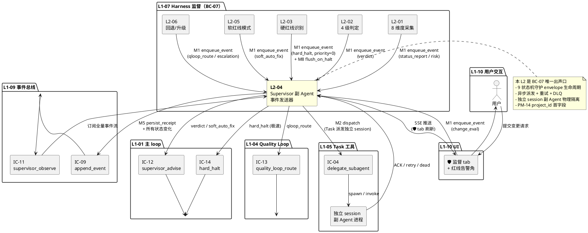
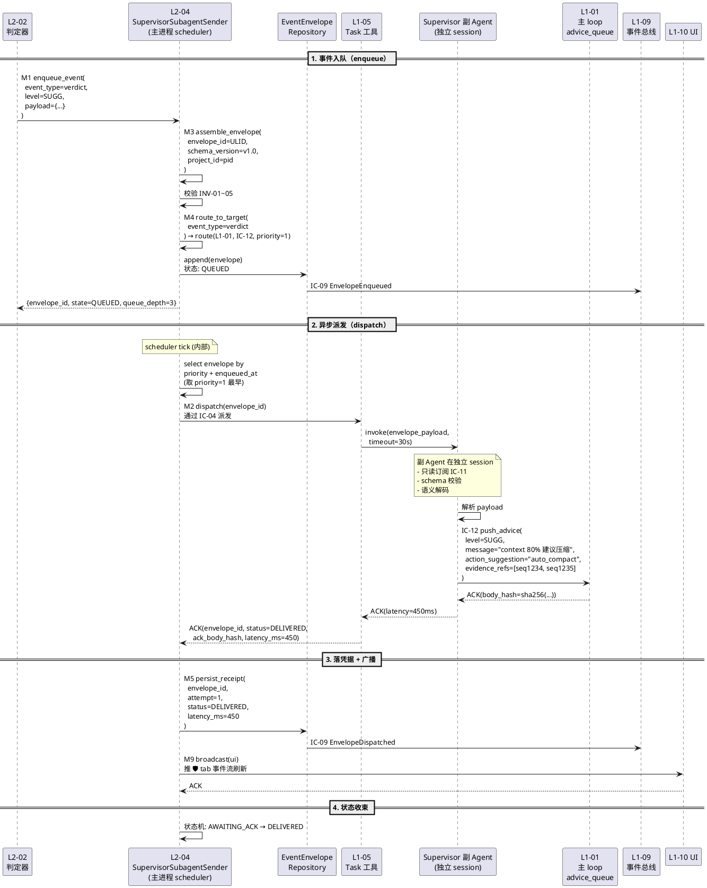
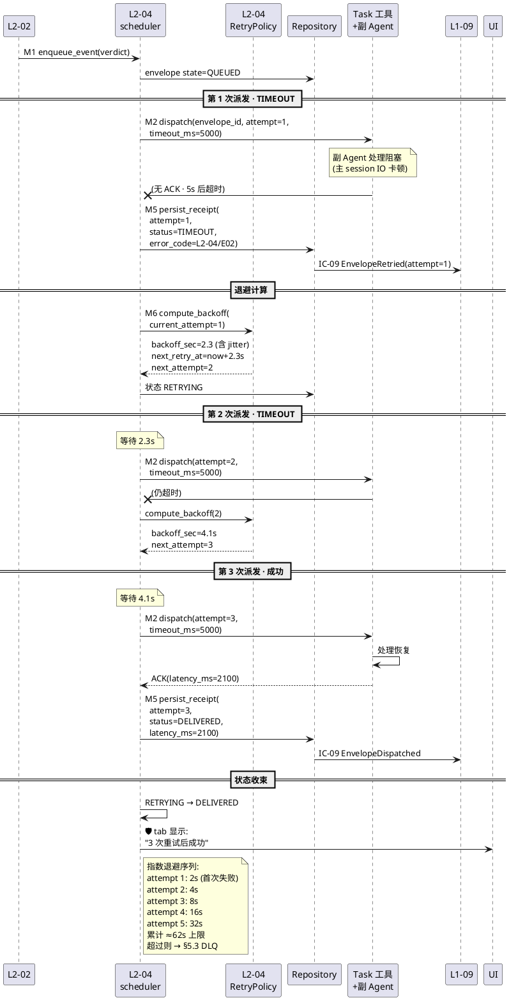
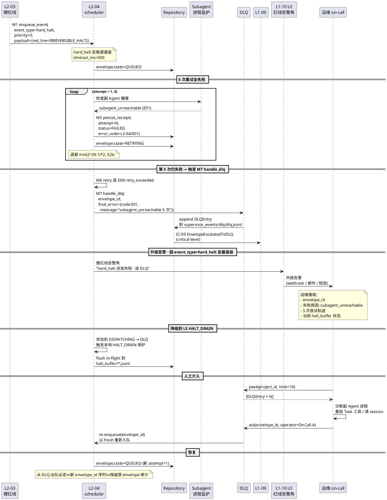
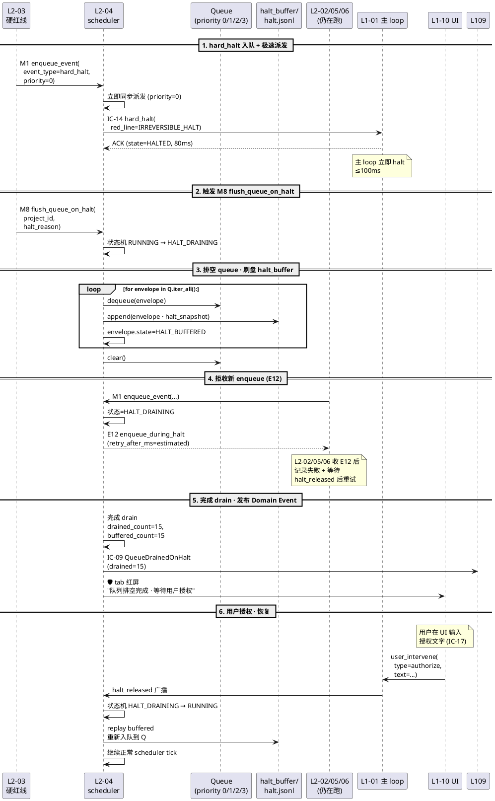
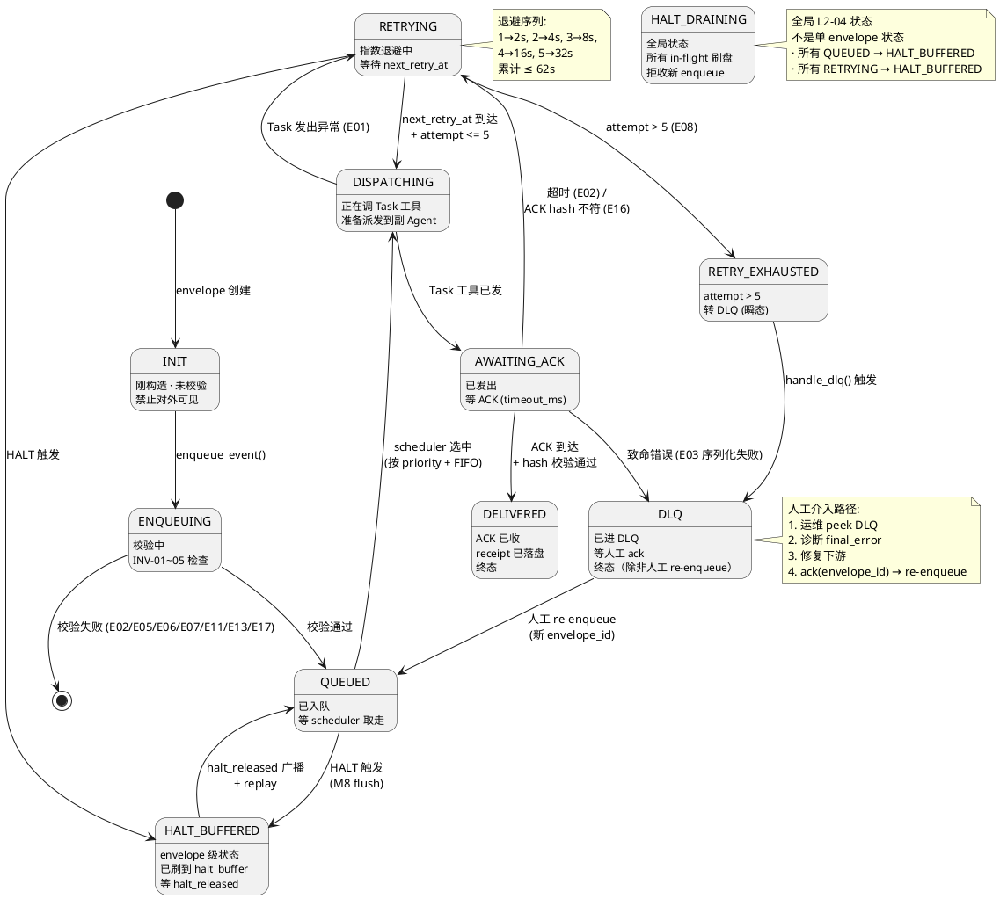

# L1 L2-04 · Supervisor 副 Agent 事件发送器 · Tech Design

> **本文档定位**：3-1-Solution-Technical 层级 · L1 的 L2-04 Supervisor 副 Agent 事件发送器 技术实现方案（L2 粒度）。
> **与产品 PRD 的分工**：2-prd/L1-07-Harness监督/prd.md §5.7 的对应 L2 节定义产品边界，本文档定义**技术实现**（接口字段级 schema + 算法伪代码 + 底层数据结构 + 状态机 + 配置参数）。
> **与 L1 architecture.md 的分工**：architecture.md 负责**跨 L2 架构 + 跨 L2 时序**，本文档负责**本 L2 内部技术细节**。冲突以 architecture.md 为准。
> **严格规则**：本文档不复述产品 PRD 文字（职责 / 禁止 / 必须等清单），只做技术映射 + 补齐"产品视角未说 but 工程师必须知道"的部分（具体算法 · syscall · schema · 配置）。

---

## §0 撰写进度

- [x] §1 定位 + 2-prd §5.7 L2-04 映射
- [x] §2 DDD 映射（引 L0/ddd-context-map.md BC-07）
- [x] §3 对外接口定义（字段级 YAML schema + 错误码）
- [x] §4 接口依赖（被谁调 · 调谁）
- [x] §5 P0/P1 时序图（PlantUML ≥ 3 张）
- [x] §6 内部核心算法（伪代码 · 12 个）
- [x] §7 底层数据表 / schema 设计（字段级 YAML · 4 张）
- [x] §8 状态机（PlantUML + 转换表 · 9 状态）
- [x] §9 开源最佳实践调研（≥ 3 GitHub 高星项目）
- [x] §10 配置参数清单（≥ 15 参数）
- [x] §11 错误处理 + 降级策略（≥ 5 级 + 20 错误码 + 12 OQ）
- [x] §12 性能目标
- [x] §13 与 2-prd / 3-2 TDD 的映射表

---

## §1 定位 + 2-prd 映射

### 1.1 本 L2 在 L1-07 Harness 监督里的坐标

L1-07 由 6 个 L2 组成，**L2-04 是唯一的出声口 + 副 Agent 独立 session 载体**。上游 L2-01~03/05/06 五个 L2 的对外行为（verdict 推送 / 硬红线告警 / 软红线自治指令 / 回退路由 / 死循环升级）**必经本 L2 统一管道**；下游对接 L1-01 主 loop（IC-12 建议队列 + IC-14 硬暂停）/ L1-04 Quality Loop（IC-13 回退路由）/ L1-10 UI（🛡️ 监督 tab + 红线告警角）/ L1-09 事件总线（supervisor_events 子命名空间落审计）/ L1-05 Task 工具（独立 session 派发）。

```
  [L2-01 8维度采集]  ──┐
  [L2-02 4级判定]    ──┤
  [L2-03 硬红线]     ──┼──▶  SupervisorEventEnvelope AR
  [L2-05 软红线]     ──┤       (本 L2-04 · 事件发送器)
  [L2-06 回退/升级]   ──┘              │
                                    │  统一出声管道
                                    ├──▶ IC-12 → L1-01 (advice_queue.jsonl)
                                    ├──▶ IC-13 → L1-04 (quality_loop_route)
                                    ├──▶ IC-14 → L1-01 (hard_halt 极速通道)
                                    ├──▶ UI 推送 → L1-10 (SSE to 🛡️ tab)
                                    ├──▶ IC-09 → L1-09 (supervisor_events jsonl)
                                    ├──▶ Task → L1-05 (独立 session 派发)
                                    │
                                    └──▶ DLQ + retry / halt-drain / 崩溃重启
```

L2-04 的一句话定位 = **"BC-07 的唯一 Application Service · 独立 session 副 Agent · 事件总线出口守门员 · 9 状态信封状态机 · 异步派发 + 重试 + DLQ · PM-02/03/08/10 四约束的物理实施点"**。

### 1.2 与 2-prd §5.7 L2-04 的对应表（§11 L2-04 11.1-11.9）

| 2-prd L1-07 §11 L2-04 小节 | 本文档对应位置 | 技术映射重点 |
|:---|:---|:---|
| §11.1 职责（L1-07 唯一出声口 + 副 Agent 载体 + 统一发送管道 + BF-S6 产出物三件套） | §1.3 + §2.1 (SupervisorEventEnvelope AR · 独立 session · BF-S6 产出物出口) | AR 包住 schema 校验 + 路由决策 + 派发凭据 |
| §11.2 输入（订阅 L1-09 IC-11 + L2-01 快照 + L2-02 verdict + L2-03 硬红线 + L2-05 软红线 + L2-06 回退/升级 + UI 变更请求 + 定时器 S6） | §3.1 输入接口族 8 个 + §6.1 `enqueue_event_with_priority` | 8 入口 → 统一信封 |
| §11.2 输出（IC-12 建议队列 + IC-13 回退路由 + IC-14 硬暂停 + UI 推送 + supervisor_events 落审计 + 3 份 md 产出物） | §3.2 输出接口族 6 个 + §6.3 `dispatch_to_supervisor_subagent_via_task_tool` | 6 出口 + 派发凭据持久化 |
| §11.3 边界（In: 副 Agent 生命周期 + 统一发送管道 + IC-12/13/14 + UI 推送 + 周期报告 + 风险登记 + 变更评估 + 驳回理由；Out: 不做指标采集/不判 verdict/不识别硬红线/不调 skill） | §1.7 YAGNI + §2.3 职责分类 | 物理隔离 · 不持有"决策权" |
| §11.4 约束（独立 session 硬身份 / 只读硬约束 / 统一发送管道不可绕 / 每建议三要素 / 驳回必留痕 / 硬拦截全程六事件 / 周期报告必含 4 档分布 / 副 Agent 崩溃必告警） | §2.4 不变量集 + §10 硬锁配置 + §11 错误码表 | 8 条硬约束 → 硬锁/CI 检查/运行时 guard 三重保障 |
| §11.5 禁止（绕过本 L2 直调 / 写其他命名空间 / 调 skill / 共享 context / 静默丢信号 / 三要素缺失 / 报告缺 4 档 / 拦截链缺事件） | §11 错误码 E01~E20 | 每条禁令 ↔ 1 个错误码 + 1 种降级 |
| §11.6 必须（独立 session / 订阅 IC-11 + 驱动 5 L2 串联 / 统一出声 / 落 IC-09 / 记驳回理由 / 周期报告 + 风险 + 变更 / 崩溃重启） | §6 所有算法 + §8 状态机 + §13 TC 映射 | 10 条必须 → 10 段关键伪代码 |
| §11.7 可选（去重 / 批量压缩 / 报告模板 / 变更评估辅助 / 实时统计接口） | §6.10 `deduplicate_event_by_hash` + §10 `event_dedup_window_sec` | 不设硬锁 · 配置开关 |
| §11.8 交互矩阵（被 5 L2 调 IC-L2-07 + UI 变更转发 + 定时器；调 IC-12/13/14 + UI 推送 + IC-09 + IC-11） | §4.1 + §4.2 依赖图 | PlantUML 拓扑 |
| §11.9 Given-When-Then（P1-7 正向 · N1-5 负向 · I1-5 集成） | §13.3 TC-L207-004-001~050 | 50 TC 占位映射 |

### 1.3 本 L2 在 architecture.md 里的坐标

引 architecture.md §3.6 L2-04 "副 Agent 事件发送器" + §7 "对外 IC 统一出口" + §8 "6 场景时序图":

```
  ┌──────────────────────────────────────────────────────────────────────┐
  │  L1-07 Harness 监督                                                  │
  │                                                                      │
  │  ┌───────┐  ┌───────┐  ┌───────┐  ┌───────┐  ┌───────┐                │
  │  │ L2-01 │  │ L2-02 │  │ L2-03 │  │ L2-05 │  │ L2-06 │                │
  │  │8 维度 │─▶│4 级判 │─▶│ 硬红线│─▶│ 软红线│─▶│ 回退/ │                │
  │  │采集   │  │定     │  │5 类   │  │8 类   │  │升级   │                │
  │  └───────┘  └───┬───┘  └───┬───┘  └───┬───┘  └───┬───┘                │
  │                 │          │          │          │                   │
  │                 ▼          ▼          ▼          ▼                   │
  │  ┌────────────────────────────────────────────────────────────┐      │
  │  │  L2-04 · Supervisor 副 Agent 事件发送器                    │      │
  │  │  (Application Service · 独立 session 副 Agent · 唯一出口)   │      │
  │  │                                                            │      │
  │  │  ┌──────────────────────────────────────────────────────┐  │      │
  │  │  │ SupervisorEventEnvelope (Aggregate Root)             │  │      │
  │  │  │   ├── envelope_id (ULID)                             │  │      │
  │  │  │   ├── event_type (verdict/hard_halt/qloop_route/...) │  │      │
  │  │  │   ├── target_route (EventTargetRoute VO)             │  │      │
  │  │  │   ├── payload (schema v1.0 · 类型多态)                 │  │      │
  │  │  │   ├── delivery_receipt (DeliveryReceipt VO · 多次)     │  │      │
  │  │  │   ├── state (INIT..DLQ 9 种)                          │  │      │
  │  │  │   └── priority (verdict/redline 优先级最高)             │  │      │
  │  │  └──────────────────────────────────────────────────────┘  │      │
  │  │                                                            │      │
  │  │  ┌──────────────────────────────────────────────────────┐  │      │
  │  │  │ EventRoutingTable (静态 YAML)  · 事件类型 → 目标路由    │  │      │
  │  │  │ DeliveryReceiptLog (jsonl append-only)                 │  │      │
  │  │  │ EventDLQ (DLQ 队列 · 失败 ≥5 次进)                       │  │      │
  │  │  └──────────────────────────────────────────────────────┘  │      │
  │  └────────────────────────────────────────────────────────────┘      │
  │          │         │         │         │          │                  │
  │          ▼         ▼         ▼         ▼          ▼                  │
  │       IC-12     IC-13    IC-14    UI 推送   IC-09 落盘                │
  │    L1-01 advice L1-04  L1-01 halt L1-10 SSE  L1-09 jsonl              │
  └──────────────────────────────────────────────────────────────────────┘
                      │                  │
                      ▼                  ▼
             [L1-05 Task 工具]   [独立 session 副 Agent]
             (IC-04 派发 · 独立 claude subagent 进程)
```

**本 L2 的关键特征**（对 L1-07 整体而言）：

1. **唯一 Application Service**：L2-04 是本 L1 唯一的 Application Service 层承载，其他 5 个 L2 是 Domain Service/VO 纯逻辑 · 不跨进程。
2. **独立 session 物理隔离**：本 L2 托管的副 Agent 运行在 L1-05 Task 工具启动的独立 claude subagent 进程 · 由 Claude Agent SDK frontmatter `allowed-tools: [Read, Glob, Grep, Write(supervisor_events/**)]` 硬锁只读。
3. **事件信封聚合根**：`SupervisorEventEnvelope` 是本 L2 唯一 AR · 包裹 schema 校验 / 路由决策 / 派发凭据持久化三件事 · 生命周期 IDLE→ENQUEUING→QUEUED→DISPATCHING→AWAITING_ACK→DELIVERED / RETRYING→RETRY_EXHAUSTED→DLQ + HALT_DRAINING 共 9 状态。
4. **异步派发 + 重试 + DLQ**：派发凭据不达（subagent_unreachable / dispatch_timeout）→ 指数退避重试 · max=5（硬锁 · §10 D3）· ≥5 次进 DLQ · 触发人工升级。
5. **PM-14 project_id 分片**：所有 envelope / receipt / DLQ 落在 `projects/<pid>/supervisor_events/` 下 · append-only jsonl · 不跨项目。
6. **硬红线极速通道**：event_type=hard_halt 走 high-priority 队列 · enqueue→dispatch P99 ≤500ms · 独立于普通路径。
7. **SchemaVersion v1.0 硬锁**：`event_schema_version=v1.0` 配置硬锁 · 升 v2 必新 Contract 版本号 · 不得就地改 schema。
8. **端到端幂等**：basis on `envelope_id`(ULID) · 同 id 重 enqueue 直接返回 existing receipt。

### 1.4 本 L2 的 PM-14 约束（project_id 首字段 + 分片路径）

**PM-14 约束**（引 `docs/3-1-Solution-Technical/projectModel/tech-design.md`）：所有 IC payload 顶层 `project_id` 必填；所有存储路径按 `projects/<pid>/...` 分片；所有 jsonl append-only。

本 L2 在 PM-14 层面的具体落点：

- **事件信封存储**：`projects/<pid>/supervisor_events/envelopes/YYYY-MM-DD.jsonl`
- **派发凭据日志**：`projects/<pid>/supervisor_events/receipts/YYYY-MM-DD.jsonl`
- **DLQ 队列**：`projects/<pid>/supervisor_events/dlq/dlq.jsonl`（单文件 · rotation 按 100MB）
- **Halt-drain 缓冲**：`projects/<pid>/supervisor_events/halt_buffer/*.jsonl`（HALT_DRAINING 时刷盘缓存）
- **去重指纹库**：`projects/<pid>/supervisor_events/dedup/bloom.bin`（滚动 Bloom Filter · 窗口 60s）
- **周期状态报告**：`projects/<pid>/docs/status-reports/YYYY-MM-DD.md`
- **风险登记册**：`projects/<pid>/docs/risk-register.md`
- **变更评估报告**：`projects/<pid>/docs/change-requests/CR-<id>.md`
- **路由表配置**：`projects/<pid>/.harnessflow/event_routing.yaml`（覆盖默认全局表）

**分片要点**：
- 所有跨项目隔离在目录层 · 无共享文件
- DLQ rotation 与 jsonl append-only 不冲突：新写永远追加到当前文件 · 旧文件 rename 归档
- Halt-drain 缓冲在 HALT 状态下是**唯一允许写入路径**（其他路径 hold）

### 1.5 关键技术决策（本 L2 特有 · Decision / Rationale / Alternatives / Trade-off）

| ID | 决策 | 选择 | 备选 | 理由 | Trade-off |
|:---|:---|:---|:---|:---|:---|
| **D1: 副 Agent 物理载体** | 独立 session claude subagent（L1-05 Task 工具派发） | 同 session 协程 / OS fork / Docker 容器 | PM-02/03 硬约束 · SDK frontmatter 物理只读 · 崩溃不污染主 loop | 多一次 IPC round-trip ≤500ms |
| **D2: 事件派发模型** | 异步队列 + 重试 + DLQ | 同步 RPC / fire-and-forget / 持久队列服务 | 本地进程间 · 避免依赖外部 MQ · jsonl append-only 即持久 | 非原子跨项目 · 无 exactly-once（但有幂等） |
| **D3: 重试策略** | 指数退避 + jitter · max=5 次 | 固定间隔 / 无重试 / 无上限 | 5 次上限 + jitter 防雪崩 · 失败后升 DLQ 人工介入 | 首次 2s 最后 32s · 总耗时 ≈60s 上限 |
| **D4: DLQ 存储** | 单 jsonl 文件 + rotation 100MB | SQLite / 内存队列 / 外部 MQ | 与 append-only 语义一致 · 人肉可 tail 诊断 | 无 random access（需要时全表扫） |
| **D5: 去重策略** | Bloom Filter 滚动窗口 60s | 精确去重（全表 diff）/ 无去重 | O(1) 查询 · 低内存 · 60s 窗口对齐 tick 周期 | 有 FP · 但 verdict/redline 不经去重 |
| **D6: schema 版本化** | 硬锁 v1.0 · 升版走 Contract 升级流程 | 就地改 schema / 动态推断 schema | schema drift 破坏审计链 · 升版必明示 | 新增字段必须 optional · 不改 required |
| **D7: 序列化格式** | JSON（默认）+ msgpack 可选 | protobuf / avro / 仅 JSON | 人肉 diff + 跨语言 · msgpack 走性能 · avro 过重 | JSON 体积大 10% · 可接受 |
| **D8: 优先级策略** | 4 级 priority (hard_halt=0 / verdict=1 / qloop_route=2 / soft_advice=3) | 单级 FIFO / 动态优先级 | hard_halt 极速通道硬约束 · 4 级覆盖所有场景 | priority 0 若持续高压可能饿死 3 级 |
| **D9: 派发目标识别** | 静态路由表 YAML + per-project override | 动态路由 / 硬编码 / DNS-style | 可审计 · 可测 · 覆盖率 100% | 新增 event_type 需改 YAML · 不支持热加载 |
| **D10: HALT_DRAINING 行为** | 排空队列 · 缓冲落盘 · 不再 accept new | 丢弃 / 阻塞上游 / 转接到别的 L2 | HALT 是系统级信号 · 必须排空保审计 · 不丢失任何事件 | HALT 期间增加磁盘 I/O |

### 1.6 本 L2 的"读者预期"

读完本 L2 的工程师应掌握：

- `SupervisorEventEnvelope` 聚合根的字段级 schema + 9 状态机
- 9 个对外方法的字段级 YAML schema + 18 个错误码
- 12 个算法的伪代码（含 `enqueue_event_with_priority` / `dispatch_to_supervisor_subagent_via_task_tool` / `retry_with_exponential_backoff` / `handle_dlq_escalate_to_manual` / `flush_queue_on_halt_drain_all` / `deduplicate_event_by_hash`）
- 4 张数据表（`supervisor_event_envelope` / `event_routing_table` / `delivery_receipt_log` / `event_dlq`）
- 降级链 5 级（FULL → RETRY_ONLY → DLQ_ONLY → LOCAL_BUFFER → HALT_DRAIN）
- SLO：`enqueue ≤10ms` · `dispatch ≤2s` · `DLQ 探测 ≤30s` · `hard_halt P99 ≤500ms`
- PM-02/03/08/10/14 五约束在本 L2 的落点

### 1.7 本 L2 不在的范围（YAGNI）

- **不在**：8 维度指标采集 → L2-01 职责
- **不在**：verdict 判定 · 4 级分档规则 → L2-02 职责
- **不在**：5 类硬红线识别 + 二次确认 → L2-03 职责
- **不在**：8 类软红线模式匹配 → L2-05 职责
- **不在**：FAIL_L1~L4 路由映射 + 死循环计数 → L2-06 职责
- **不在**：UI 渲染（只发载荷 · UI 消费）→ L1-10 职责
- **不在**：主 loop 采纳决策 → L1-01 L2-06 Supervisor 建议接收器职责
- **不在**：skill 调用 / 子 Agent 派发的业务逻辑 → L1-05 职责（本 L2 仅用 Task 工具 spawn 副 Agent session · 不在副 Agent 内跑 skill）
- **不在**：M6 本轮不接入外部 MQ（Kafka/RabbitMQ）· 全本地 jsonl

### 1.8 本 L2 术语表

| 术语 | 定义 | 关联 |
|:---|:---|:---|
| **SupervisorEventEnvelope** | 本 L2 唯一聚合根 · 包裹 event_type/payload/route/receipt/state | §2.1 |
| **EventTargetRoute** | VO · 路由决策结果（target_l1 / target_ic / delivery_mode / priority） | §2.2 |
| **DeliveryReceipt** | VO · 一次派发的凭据（attempt / status / ack_timestamp / latency_ms / error） | §2.2 |
| **EventRoutingTable** | 静态 YAML · 事件类型 → 路由目标映射表 | §7.2 |
| **EventDLQ** | Dead Letter Queue · 失败 ≥5 次进此队列 · 触发人工介入 | §7.4 |
| **独立 session 副 Agent** | L1-05 Task 工具 spawn 的独立 claude subagent 进程 · 生命周期 long-lived | §1.3 + D1 |
| **Halt-drain** | HALT_DRAINING 状态下队列排空 + 缓冲落盘 · 不再 accept new | §6.8 + D10 |
| **优先级 0/1/2/3** | hard_halt=0（极速）/ verdict=1 / qloop_route=2 / soft_advice=3 | D8 |

### 1.9 本 L2 的 DDD 定位一句话

> **L2-04 = BC-07 的唯一 Application Service + 独立 session 副 Agent 载体 + SupervisorEventEnvelope 聚合根守护者 + 对外 IC 统一出口 + PM-02/03/08/10/14 五约束物理实施点**。

---

## §2 DDD 映射（BC-07）

### 2.1 Bounded Context 归属

本 L2 属于 **BC-07 · Harness Supervision**（引 L0/ddd-context-map.md §1 第 123 行 · §2.8 第 392 行 `BC-07 · Harness Supervision（L1-07）`）。

BC-07 在 L0 context-map 里与其他 BC 的关系：

- **与 BC-01（L1-01 主 loop）**：Customer-Supplier 反向（BC-07 是 Supplier · BC-01 是 Customer）· 通过 IC-12 建议 / IC-14 硬暂停单向驱动 BC-01 状态变化（L0 §3 第 167 行）
- **与 BC-04（L1-04 Quality Loop）**：Partnership · verdict ↔ rollback_route 强耦合（L0 §3 第 304 行 · 第 649 行）
- **与 BC-03（L1-03 WP 管理）**：Partnership · WP 失败 ≥3 次触发死循环保护（L0 §3 第 650 行）
- **与 BC-09（L1-09 事件总线）**：Customer（BC-07 只读订阅 + 只写 supervisor_events 子命名空间）

本 L2-04 是 BC-07 对外的**唯一"出声口"** —— 所有 BC-07 内部产出（Verdict / HardRedLineIncident / SoftDriftSignal / QualityLoopRoute / LoopEscalationSignal）都经本 L2 转译为 **SupervisorEventEnvelope**，再通过 IC-12/13/14/UI/IC-09 派发到下游 BC。

### 2.2 Aggregate / Entity / VO / Domain Service / Repository / Domain Events 分类

| DDD 元素 | 名称 | 类型 | 职责 | 对应 L0 条目 |
|:---|:---|:---|:---|:---|
| **Aggregate Root** | `SupervisorEventEnvelope` | AR | 事件信封（envelope_id + type + payload + route + receipt + state + priority）· 生命周期 9 状态 | L0 §4.7 L2-04 "Application Service" 的内部 AR |
| **Value Object** | `EventTargetRoute` | VO | 路由决策（target_l1 / target_ic / delivery_mode / priority / timeout_ms） | L0 §2.8 附 VO |
| **Value Object** | `DeliveryReceipt` | VO | 派发凭据（attempt_id / timestamp / status / latency_ms / error_code / ack_body_hash） | L0 §2.8 附 VO |
| **Value Object** | `EventPayload` | VO | 负载（schema_version / type / body · 类型多态） | L0 §2.8 附 VO |
| **Value Object** | `DLQEntry` | VO | DLQ 条目（envelope_id / final_error / escalation_target / enqueued_at） | L0 §2.8 附 VO |
| **Domain Service** | `EventRouter` | Domain Service | 根据 event_type 查 routing_table → 产 EventTargetRoute · 纯函数 | BC-07 内部服务 |
| **Domain Service** | `EventSerializer` | Domain Service | 信封 → JSON / msgpack 字节流 · 纯函数 | BC-07 内部服务 |
| **Domain Service** | `RetryPolicyEvaluator` | Domain Service | 计算下次重试时间（指数退避 + jitter）· 纯函数 | BC-07 内部服务 |
| **Application Service** | `SupervisorSubagentSender` | Application Service | 本 L2 唯一编排器 · 管理副 Agent 生命周期 + 事件入队 + 异步派发 | L0 §4.7 L2-04 行第 786 行 |
| **Repository** | `SupervisorEventRepository` | Repository | 持久化信封 · 读写 `supervisor_events/envelopes/*.jsonl` · append-only | L0 §7.2.7 第 1419 行 |
| **Repository** | `DeliveryReceiptRepository` | Repository | 持久化派发凭据 · 读写 `supervisor_events/receipts/*.jsonl` | 本 L2 新增 |
| **Repository** | `EventDLQRepository` | Repository | DLQ 队列 · 读写 `supervisor_events/dlq/dlq.jsonl` | 本 L2 新增 |
| **Domain Event** | `EnvelopeEnqueued` | Domain Event | 事件成功入队（envelope_id + event_type + priority + project_id） | L0 §5.2.7 BC-07 发布的事件 |
| **Domain Event** | `EnvelopeDispatched` | Domain Event | 事件成功派发 ACK（envelope_id + target_l1 + latency_ms） | 本 L2 新增 |
| **Domain Event** | `EnvelopeRetried` | Domain Event | 事件进入重试（envelope_id + attempt + next_retry_at） | 本 L2 新增 |
| **Domain Event** | `EnvelopeEscalatedToDLQ` | Domain Event | 事件升级到 DLQ（envelope_id + final_error + escalation_target） | 本 L2 新增 |
| **Domain Event** | `SubagentCrashDetected` | Domain Event | 副 Agent 崩溃（subagent_session_id + detected_at + restart_attempt） | L0 §5.2.7 |
| **Domain Event** | `QueueDrainedOnHalt` | Domain Event | HALT_DRAINING 完成（drained_count + remaining_dlq_count） | 本 L2 新增 |

### 2.3 职责分类（In-scope vs Out-of-scope 从 DDD 视角）

**In-scope（AR `SupervisorEventEnvelope` 的不变量 + Application Service 的编排职责）**：

1. 事件入队的原子性（envelope_id 唯一 · 幂等入队）
2. 派发凭据的单调递增（attempt 从 1 开始 · 单调 +1）
3. 优先级保序（priority=0 永远在 priority=3 前派发）
4. 重试计数上限（≤5 · 硬锁）
5. DLQ 进入条件的确定性（attempt>5 或 final_error ∈ {unreachable, serialization_failed}）
6. HALT_DRAINING 下的单向流动（新事件一律 reject · 队内事件一律刷盘）
7. schema 版本的一致性（一个信封的 schema_version 不可变）
8. project_id 首字段约束（PM-14 · envelope 顶层）

**Out-of-scope（由其他 BC/L2 负责）**：

- verdict 的判定规则 → L2-02（BC-07 内部）
- 硬红线的识别 → L2-03
- UI 渲染 → BC-10 · L1-10
- 事件总线写入 → BC-09 · IC-09（本 L2 只调用 IC-09 · 不实现）
- 独立 session 生命周期管理的底层细节（Task 工具 invoke） → BC-05 · L1-05

### 2.4 AR 不变量集合（SupervisorEventEnvelope 的 Business Invariants）

| 不变量 ID | 约束 | 违反后果 | 检查点 |
|:---|:---|:---|:---|
| INV-01 | envelope_id 全局唯一（ULID） | E03 duplicate_envelope_id | enqueue 入口 |
| INV-02 | schema_version == 'v1.0'（本版） | E05 schema_version_mismatch | enqueue 校验 |
| INV-03 | project_id 非空（PM-14） | E06 project_id_missing | enqueue 校验 |
| INV-04 | event_type ∈ {verdict, hard_halt, qloop_route, soft_auto_fix, escalation, status_report, risk_update, change_eval, advice_rejected, subagent_crash, subagent_restart} | E02 unknown_event_type | enqueue 校验 |
| INV-05 | priority ∈ {0,1,2,3} | E07 invalid_priority | enqueue 校验 |
| INV-06 | attempt 单调递增 · ≤ max_retries(5) | E08 retry_exceeded | 每次 retry |
| INV-07 | 状态转移遵循 §8 状态机 | E09 invalid_state_transition | 每次状态更新 |
| INV-08 | DELIVERED 状态 → receipt 必非空 | E10 missing_receipt | dispatch ACK |
| INV-09 | DLQ 进入必触发 Domain Event `EnvelopeEscalatedToDLQ` | E11 dlq_event_not_emitted | DLQ 转移 |
| INV-10 | HALT_DRAINING 状态下 · 新 enqueue 一律 reject | E12 enqueue_during_halt | enqueue 入口 |
| INV-11 | hard_halt 事件 priority 必须 == 0 | E13 priority_mismatch_for_halt | enqueue 校验 |
| INV-12 | 同一 envelope_id 的 receipt 序列 attempt 单调 +1 | E14 receipt_attempt_gap | receipt append |

### 2.5 Repository 契约（引 L0 §7.2.7）

引 L0 §7.2.7 第 1419 行 `SupervisorEventRepository`，本 L2 在此基础上扩展三个仓库：

```python
class SupervisorEventRepository(ABC):
    """所有 supervisor 产出都走这个 · 统一落 projects/<pid>/supervisor_events/envelopes/*.jsonl"""
    @abstractmethod
    def append(self, envelope: SupervisorEventEnvelope) -> None: ...
    @abstractmethod
    def replay(self, project_id: str, since: Optional[str] = None) -> Iterator[SupervisorEventEnvelope]: ...
    @abstractmethod
    def find_by_id(self, project_id: str, envelope_id: str) -> Optional[SupervisorEventEnvelope]: ...

class DeliveryReceiptRepository(ABC):
    """派发凭据 · append-only · 按 envelope_id 聚合"""
    @abstractmethod
    def append(self, receipt: DeliveryReceipt) -> None: ...
    @abstractmethod
    def list_by_envelope(self, project_id: str, envelope_id: str) -> List[DeliveryReceipt]: ...

class EventDLQRepository(ABC):
    """DLQ 队列 · 失败 ≥5 次进 · 人工介入"""
    @abstractmethod
    def push(self, entry: DLQEntry) -> None: ...
    @abstractmethod
    def peek(self, project_id: str, limit: int = 10) -> List[DLQEntry]: ...
    @abstractmethod
    def ack(self, project_id: str, envelope_id: str, ack_operator: str) -> None: ...
    @abstractmethod
    def rotate_if_needed(self, project_id: str) -> bool: ...
```

### 2.6 Ubiquitous Language（引 L0 §B.7 BC-07）

本 L2 复用 L0 §B.7 BC-07 Ubiquitous Language（第 2002 行），新增以下术语：

| 术语 | 英文 | 定义 |
|:---|:---|:---|
| 事件信封 | Event Envelope | AR `SupervisorEventEnvelope` 的中文名 |
| 派发凭据 | Delivery Receipt | 一次派发的完整记录（attempt / status / latency / error） |
| 统一出声口 | Unified Sender Pipeline | L2-04 作为 BC-07 对外唯一通道的语义 |
| 排空 | Drain | HALT_DRAINING 状态下刷盘 + 拒收新事件的过程 |
| 升级 | Escalate to Manual | 事件失败 ≥5 次进 DLQ 后触发的人工介入语义 |
| 路由表 | Routing Table | 静态 YAML · event_type → (target_l1, target_ic, priority) 映射 |

### 2.7 Domain Events 发布订阅关系（BC 维度）

| Domain Event | 发布者（BC） | 订阅者（BC） | 传输路径 |
|:---|:---|:---|:---|
| `EnvelopeEnqueued` | BC-07 L2-04 | BC-09 L1-09 | IC-09 落盘 supervisor_events |
| `EnvelopeDispatched` | BC-07 L2-04 | BC-09 + BC-10 | IC-09 + UI 推送 |
| `EnvelopeRetried` | BC-07 L2-04 | BC-09 + BC-10 | IC-09 + UI（🛡️ tab 刷新重试次数） |
| `EnvelopeEscalatedToDLQ` | BC-07 L2-04 | BC-10（红告警） + 运维 on-call | UI 推送 + 告警外链 |
| `SubagentCrashDetected` | BC-07 L2-04 | BC-09 + BC-10（红告警） | IC-09 + UI 红屏 |
| `QueueDrainedOnHalt` | BC-07 L2-04 | BC-01 + BC-09 | IC-09 + `L1-07:drain_complete` 广播 |

### 2.8 DDD 风格一句话

> **本 L2 是 BC-07 唯一的 Application Service · AR 包住"事件信封"并驱动 9 状态生命周期 · 对外通过 5 条 IC（IC-12/13/14 + UI + IC-09）投递 + 对内由 1 条 IC（IC-11）订阅 + 1 条 IC（IC-04 Task）派发独立 session · 所有不变量由 §2.4 的 12 条 Business Invariants 守护**。

---

## §3 对外接口定义（字段级 YAML schema + 错误码）

### 3.1 方法总览表（9 方法 + 3 辅助）

| # | 方法名 | 调用者 | 语义 | 同步/异步 | 优先级 |
|:---|:---|:---|:---|:---|:---|
| M1 | `enqueue_event(event, target_route)` | L2-01/02/03/05/06 · 内部 | 事件入队 · 幂等 | 同步 | 按事件类型 |
| M2 | `dispatch_to_supervisor_subagent(envelope)` | 内部 scheduler | 派发到副 Agent · Task IC-04 | 异步 | - |
| M3 | `assemble_event_envelope(type, payload)` | L2-02/03/05/06 · 内部 | 构造信封 · 附 schema_version + envelope_id | 同步 | - |
| M4 | `route_to_target(event_type)` | 内部 | 查路由表 · 产 EventTargetRoute | 同步 | - |
| M5 | `persist_delivery_receipt(receipt)` | dispatcher 回调 | 落盘派发凭据 | 同步 | - |
| M6 | `retry_with_backoff(envelope, attempt)` | 内部 retry scheduler | 指数退避重试 | 异步 | - |
| M7 | `handle_dlq(envelope)` | 重试耗尽触发 | 进 DLQ + 升级告警 | 同步 | - |
| M8 | `flush_queue_on_halt()` | L2-03 HALT 信号 | 排空队列 + 刷盘缓冲 | 异步 | 0 |
| M9 | `broadcast_to_subscribers(event)` | M2 派发 ACK 后 | 多订阅者广播 | 异步 | - |
| AUX1 | `health_probe()` | L2-01 / L1-10 | 健康探针 | 同步 | - |
| AUX2 | `query_envelope_status(envelope_id)` | L1-10 UI | 信封状态查询 | 同步 | - |
| AUX3 | `rotate_dlq_if_needed()` | 内部 cron | DLQ 文件 rotation | 同步 | - |

---

### 3.2 方法字段级 YAML schema

#### M1 · enqueue_event

**语义**：任一 BC-07 内部 L2（L2-02/03/05/06）产出需对外发送的事件时，统一调用本方法入队。

```yaml
# 入参
request:
  project_id: str                # required · PM-14 首字段
  event:
    envelope_id: str             # optional · 未传则本方法生成 ULID
    event_type: enum             # required · {verdict/hard_halt/qloop_route/soft_auto_fix/escalation/status_report/risk_update/change_eval/advice_rejected/subagent_crash/subagent_restart}
    payload:                     # required · schema 随 event_type 多态
      schema_version: str        # required · 固定 'v1.0' (硬锁 §10 D6)
      level: enum                # required if event_type=verdict · {INFO/SUGG/WARN/BLOCK}
      message: str               # required if event_type in {verdict, hard_halt}
      action_suggestion: str     # required if event_type=verdict and level in {SUGG/WARN}
      evidence_refs: list[str]   # required if event_type=verdict · jsonl seq 引用
      ... (type-specific 字段)
    source_l2: str               # required · 产生事件的 L2 编号（L2-02/03/05/06 之一）
    source_snapshot_id: str      # optional · 关联的 SupervisorSnapshot id
    created_at: iso8601          # required · 事件产生时刻
  target_route:                  # optional · 传则跳过 M4 路由；不传则本方法自动路由
    target_l1: str               # {L1-01/L1-04/L1-10/L1-09}
    target_ic: str               # {IC-12/IC-13/IC-14/UI/IC-09}
    delivery_mode: enum          # {async/sync}
    priority: int                # 0-3
    timeout_ms: int              # 默认按优先级自动
  idempotency_key: str           # optional · 默认 envelope_id

# 出参
response:
  success:
    envelope_id: str             # 本次入队的 envelope_id（如幂等命中则是已有的）
    state: str                   # QUEUED / DELIVERED（同步优先级 0 直接派发）
    enqueued_at: iso8601
    queue_depth: int             # 入队后当前队列深度（按 priority 分别计数）
  error:
    code: str                    # 见 §3.3 错误码表（E01~E12）
    message: str
    retry_after_ms: int          # optional · E04 DLQ 溢出时提示
```

**处理流程**：
1. 校验 INV-01~05 · 失败返 E02/E03/E05/E06/E07
2. 若 HALT_DRAINING 状态 → reject 返 E12
3. 若未传 target_route · 调 M4 查路由表
4. 若 hard_halt 且 priority != 0 → 返 E13
5. 入队持久化到 `supervisor_events/envelopes/` · 状态 QUEUED
6. 发布 Domain Event `EnvelopeEnqueued`（IC-09）
7. 若 priority == 0 · 立即触发 M2（同步派发）· 否则交给 scheduler

---

#### M2 · dispatch_to_supervisor_subagent

**语义**：派发一个信封到目标 L1 · 本方法由 scheduler 异步调用 · 涉及 L1-05 Task 工具 spawn 独立 session。

```yaml
request:
  project_id: str
  envelope_id: str
  attempt: int                   # 第几次尝试（1-based）

response:
  success:
    attempt: int
    status: enum                 # {DELIVERED/RETRYING/DLQ}
    latency_ms: int
    ack_body_hash: str           # 目标方 ACK 的 body hash
    delivered_at: iso8601
  error:
    code: str                    # E01/E02_dispatch/E04/E15/E16
    message: str
    next_retry_at: iso8601       # 若 status=RETRYING
    attempt_remaining: int
```

**处理流程**：
1. 加载 envelope（Repository.find_by_id）
2. 若 envelope 已 DELIVERED 或 DLQ · 跳过返 idempotent
3. 查 L1-05 副 Agent session（若无则创建 · 见 §6.3）
4. 序列化 envelope.payload（默认 JSON · 配置可选 msgpack）
5. 通过 IC-04（Task 工具）派发到副 Agent session
6. 等待 ACK · timeout = envelope.target_route.timeout_ms
7. ACK 到达 → 状态转 DELIVERED · 调 M5 落凭据
8. ACK 超时 → 若 attempt < 5 调 M6 重试 · 否则调 M7 进 DLQ

---

#### M3 · assemble_event_envelope

**语义**：纯函数 · 根据 event_type + payload 构造 AR · 校验 schema · 生成 envelope_id(ULID)。

```yaml
request:
  project_id: str
  event_type: str
  payload: dict
  source_l2: str
  schema_version: str            # default 'v1.0'

response:
  success:
    envelope: SupervisorEventEnvelope  # §7.1 schema
  error:
    code: str                    # E02/E05/E17
    validation_errors: list[dict]  # [{field: ..., reason: ...}]
```

---

#### M4 · route_to_target

**语义**：纯函数 · 查路由表 · 产 EventTargetRoute。

```yaml
request:
  project_id: str
  event_type: str

response:
  success:
    target_route: EventTargetRoute  # §7.2 routing_table 条目
    source: enum                   # {project_override / global_default}
  error:
    code: str                    # E18 unknown_event_type（路由表无条目）
```

---

#### M5 · persist_delivery_receipt

**语义**：落盘一次派发凭据 · append-only jsonl。

```yaml
request:
  project_id: str
  receipt:
    envelope_id: str
    attempt: int
    status: enum                 # {DELIVERED/FAILED/TIMEOUT}
    dispatched_at: iso8601
    acked_at: iso8601            # optional
    latency_ms: int
    error_code: str              # optional
    error_message: str           # optional
    ack_body_hash: str           # optional

response:
  success:
    receipt_seq: int             # jsonl 中的序号
    persisted_path: str          # projects/<pid>/supervisor_events/receipts/YYYY-MM-DD.jsonl
  error:
    code: str                    # E14 receipt_attempt_gap · E19 disk_write_failed
```

---

#### M6 · retry_with_backoff

**语义**：计算下次重试时间 · 重新入队 · 状态转 RETRYING。

```yaml
request:
  project_id: str
  envelope_id: str
  current_attempt: int

response:
  success:
    next_attempt: int
    next_retry_at: iso8601
    backoff_sec: int             # 当前退避秒数（含 jitter）
  error:
    code: str                    # E08 retry_exceeded → 触发 M7
```

**退避公式**：`backoff_sec = min(base_sec * 2 ** (attempt-1), max_backoff_sec) + random(0, jitter_sec)`
- base_sec = 2（§10 D3）
- max_backoff_sec = 32
- jitter_sec = 1
- attempt 序列：1→2s, 2→4s, 3→8s, 4→16s, 5→32s · 累计约 62s

---

#### M7 · handle_dlq

**语义**：重试耗尽或致命错误 → 进 DLQ · 发 `EnvelopeEscalatedToDLQ` Domain Event · UI 红告警。

```yaml
request:
  project_id: str
  envelope_id: str
  final_error:
    code: str
    message: str

response:
  success:
    dlq_entry_id: str
    escalation_target: enum      # {manual_on_call / supervisor_admin_tab}
    notified_at: iso8601
  error:
    code: str                    # E04 dlq_overflow（磁盘满 / rotation 失败）
```

---

#### M8 · flush_queue_on_halt

**语义**：L2-03 产 hard_halt 时异步触发 · 本方法排空队列 + 刷盘所有 in-flight envelope 到 halt_buffer。

```yaml
request:
  project_id: str
  halt_reason: str
  halt_triggered_at: iso8601

response:
  success:
    drained_count: int
    buffered_count: int
    remaining_dlq_count: int
    drain_duration_ms: int
  error:
    code: str                    # E20 drain_timeout
```

---

#### M9 · broadcast_to_subscribers

**语义**：一个事件可能有多订阅者（UI + 审计）· 本方法并行广播。

```yaml
request:
  project_id: str
  envelope_id: str
  subscribers: list[str]          # ['ui', 'audit', 'metrics']

response:
  success:
    ack_matrix:
      ui: {delivered_at, latency_ms}
      audit: {delivered_at, latency_ms}
      metrics: {delivered_at, latency_ms}
  error:
    code: str
```

---

#### AUX1 · health_probe

```yaml
request:
  project_id: str
  probe_depth: enum              # {shallow/deep}

response:
  success:
    subagent_alive: bool
    queue_depth_by_priority: {0: int, 1: int, 2: int, 3: int}
    dlq_depth: int
    last_dispatch_at: iso8601
    state: str                   # 当前状态机状态
```

---

#### AUX2 · query_envelope_status

```yaml
request:
  project_id: str
  envelope_id: str

response:
  success:
    envelope: dict               # §7.1
    receipts: list[DeliveryReceipt]
    current_state: str
```

---

### 3.3 错误码表（18 个 · E01~E20）

| 错误码 | 含义 | 触发场景 | 调用方处理 | 降级建议 |
|:---|:---|:---|:---|:---|
| **L2-04/E01** | `subagent_unreachable` | Task 工具 spawn 失败 / 副 Agent session 崩溃无响应 | 触发重试 · 若 >3 次连续则走 §11 L3 LOCAL_BUFFER | 本 L2 自动兜底 |
| **L2-04/E02** | `dispatch_timeout` | 派发到副 Agent 后 timeout_ms 内无 ACK | 进 M6 重试 | 本 L2 自动兜底 |
| **L2-04/E03** | `serialization_failed` | payload 无法序列化（循环引用 / 超限 1MB） | 立即进 DLQ（不重试）· 人工介入 | REJECT 返回上游 |
| **L2-04/E04** | `dlq_overflow` | DLQ 文件满（rotation 失败 / 磁盘满） | 触发降级 §11 L4 或 L5 | HALT_DRAIN |
| **L2-04/E05** | `schema_version_mismatch` | payload.schema_version != v1.0 | 立即拒 · 返 validation_errors · 上游必须升版 | REJECT |
| **L2-04/E06** | `project_id_missing` | 顶层 project_id 为空（PM-14 违反） | 立即拒 | REJECT |
| **L2-04/E07** | `invalid_priority` | priority ∉ {0,1,2,3} | 立即拒 | REJECT |
| **L2-04/E08** | `retry_exceeded` | attempt > max_retries=5 | 自动转 M7 进 DLQ | 本 L2 自动兜底 |
| **L2-04/E09** | `invalid_state_transition` | 不符合 §8 状态机的状态变化 | 立即拒 · 记录异常 | 本 L2 bug · 立即 alert |
| **L2-04/E10** | `missing_receipt` | DELIVERED 状态但 receipt 未落盘 | 强制 rollback 到 AWAITING_ACK | 本 L2 自动修复 |
| **L2-04/E11** | `dlq_event_not_emitted` | DLQ 转移后 Domain Event 未发出 | 强制重发 | 本 L2 自动修复 |
| **L2-04/E12** | `enqueue_during_halt` | HALT_DRAINING 状态下收到新 enqueue | 立即拒 · 返 retry_after_ms | 上游等待 HALT 解除后重试 |
| **L2-04/E13** | `priority_mismatch_for_halt` | event_type=hard_halt 但 priority != 0 | 立即拒 | REJECT |
| **L2-04/E14** | `receipt_attempt_gap` | receipt 序列 attempt 跳号（不单调） | 立即拒 · 记录异常 | 本 L2 bug · 立即 alert |
| **L2-04/E15** | `target_l1_unreachable` | 目标 L1（如 L1-04）全停 | 进 M6 重试 · 若全链路失败 → LOCAL_BUFFER | L3 降级 |
| **L2-04/E16** | `ack_hash_mismatch` | 目标方 ACK body hash 与预期不符 | 重试（可能是传输错误） · >2 次升 DLQ | 本 L2 自动兜底 |
| **L2-04/E17** | `payload_size_exceeded` | payload 序列化后 > 1MB 硬锁 | 立即拒 · 上游必须瘦身 | REJECT |
| **L2-04/E18** | `unknown_event_type` | 路由表无对应 event_type 条目 | 立即拒 · 上游必须注册 | REJECT |
| **L2-04/E19** | `disk_write_failed` | append 失败（磁盘满 / 权限 / IO error） | 重试 3 次 · 失败则触发 L5 HALT_DRAIN | L5 兜底 |
| **L2-04/E20** | `drain_timeout` | HALT_DRAINING 超过 drain_timeout_sec 未完成 | 强制终止 drain · 剩余事件丢失（审计记录） | L5 兜底终局 |

### 3.4 错误码与调用方处理矩阵

| 调用方 | E01 | E02 | E03 | E04 | E05 | E06 | E08 | E12 | E15 | E20 |
|:---|:---|:---|:---|:---|:---|:---|:---|:---|:---|:---|
| L2-02 verdict | 内部兜底 | 内部兜底 | 上游必修 | 内部兜底 | 上游必修 | 上游必修 | 内部兜底 | 等待 | 内部兜底 | 记录 |
| L2-03 hard_halt | 🚨 必 alert | 🚨 必 alert | 🚨 人工 | L5 兜底 | 上游必修 | 上游必修 | 🚨 必 alert | 不可能（halt 自身触发） | 🚨 必 alert | 🚨 人工 |
| L2-05 soft_auto | 内部兜底 | 内部兜底 | 上游必修 | 内部兜底 | 上游必修 | 上游必修 | 内部兜底 | 等待 | 内部兜底 | 记录 |
| L2-06 qloop_route | 内部兜底 | 内部兜底 | 上游必修 | 内部兜底 | 上游必修 | 上游必修 | 内部兜底 | 等待 | 🚨 必 alert | 🚨 人工 |
| L1-10 UI 查询 | 降级返 stale | - | - | - | - | 前端兜底 | - | - | - | 前端降级 |

### 3.5 幂等性契约

- **enqueue_event** 按 `envelope_id` 幂等：同 id 重复入队返回已有 envelope 状态 · 不重复派发
- **dispatch** 按 `(envelope_id, attempt)` 幂等：同 attempt 重复派发第二次后直接返回首次结果
- **DLQ** 按 `envelope_id` 幂等：同 id 进 DLQ 只成功一次 · 后续重入返错

### 3.6 版本化策略

- 所有 schema 带 `schema_version='v1.0'` 硬锁（§10 D6）
- 升 v2.0 需走 Contract Upgrade 流程：
  1. 新增 schema_v2 配置项 `event_schema_version_accepted=['v1.0','v2.0']`
  2. 至少 1 个 release window 双版本并行
  3. 所有上游完成迁移 · 移除 v1.0
- 新增字段必须 optional · 不得修改 required 字段语义

---

## §4 接口依赖（被谁调 · 调谁）

### 4.1 上游调用方（谁调本 L2）

| 调用方 | 方法 | 何时调 | 一句话语义 | 频率 |
|:---|:---|:---|:---|:---|
| **L1-07 L2-02 4 级判定器** | M1 `enqueue_event` (event_type=verdict) | 每次产 Verdict | 推 INFO/SUGG/WARN verdict 到出声口 | ~30s/次（tick 触发） |
| **L1-07 L2-03 硬红线识别器** | M1 (event_type=hard_halt, priority=0) | 5 类硬红线命中二次确认后 | 推硬暂停到极速通道 | 罕见（<1次/WP） |
| **L1-07 L2-05 软红线模式识别器** | M1 (event_type=soft_auto_fix) | 8 类软红线自治动作产生时 | 推自治指令（silent=true） | ~1-3次/WP |
| **L1-07 L2-06 回退路由器** | M1 (event_type=qloop_route / escalation) | FAIL_L1~L4 路由 / 死循环升级 | 推回退路由 / 升级 | ~0-5次/WP |
| **L1-10 UI 变更转发** | M1 (event_type=change_eval) | 用户提交变更请求 | 触发 BF-S6-03 变更评估 | 罕见 |
| **系统定时器** | M1 (event_type=status_report) | 周一 00:00 / 里程碑 | 触发 BF-S6-01 周期报告 | 1次/周 |
| **L2-01 采集器（心跳）** | AUX1 `health_probe` | 每 30s tick | 探活副 Agent session | 2次/min |
| **L1-10 UI 查询** | AUX2 `query_envelope_status` | 用户在 🛡️ tab 查详情 | 信封状态查询 | 按需 |
| **L2-03 HALT 信号** | M8 `flush_queue_on_halt` | 硬红线命中后 | 排空队列 · 刷盘缓冲 | 罕见 |

### 4.2 下游依赖（本 L2 调谁）

| 被调方 | 调用 IC | 何时调 | 一句话语义 | 依赖强度 |
|:---|:---|:---|:---|:---|
| **L1-01 主 loop** | **IC-12** `supervisor_advise` | event_type ∈ {verdict, soft_auto_fix} | 推建议队列（advice_queue.jsonl）| 强（主 path） |
| **L1-01 主 loop** | **IC-14** `hard_halt` | event_type=hard_halt | 推硬暂停（极速通道）| 强（安全底线） |
| **L1-04 Quality Loop** | **IC-13** `quality_loop_route` | event_type=qloop_route | 推 4 级回退路由 | 强（主 path） |
| **L1-10 UI** | **UI 推送** | 所有对外事件 | SSE 推 🛡️ tab + 红线告警角 | 中（展示层） |
| **L1-09 事件总线** | **IC-09** `append_event` | 每次状态变化（enqueue/dispatch/retry/dlq/drain） | 落 supervisor_events 审计 | 强（审计底线） |
| **L1-09 事件总线** | **IC-11** `supervisor_observe` | 副 Agent 初始化 + 持续 | 订阅全量事件流（只读） | 强（入口） |
| **L1-05 Task 工具** | **IC-04** `delegate_subagent_session` | 副 Agent session 启动 / 崩溃后重启 / 每次派发 | 启独立 claude subagent | 强（物理载体） |

### 4.3 依赖图（PlantUML · 上游 vs 下游）



### 4.4 依赖强度矩阵

| 依赖 | 强度 | 失败后果 | 缓解策略 |
|:---|:---|:---|:---|
| L2-04 → L1-05 Task | 强 | 副 Agent 无法启动 → 整个 BC-07 出声口失灵 | §11 L3 降级 LOCAL_BUFFER + 重启 ≤10s |
| L2-04 → L1-09 IC-11 | 强 | 无法订阅事件流 → 副 Agent 空转 | 启动时阻塞等待 · 60s 超时 fail-fast |
| L2-04 → L1-09 IC-09 | 强 | 审计链断裂 → 违反 PM-08 | 本地 WAL 缓冲 · 恢复后补写 |
| L2-04 → L1-01 IC-12 | 强 | 建议不达 → 主 loop 失去监督 | 重试 · 失败进 DLQ + UI 红告警 |
| L2-04 → L1-01 IC-14 | 强 | hard_halt 不达 → 系统红线失效 | 极速通道 + 立即重试 + 直接 HALT_DRAIN |
| L2-04 → L1-04 IC-13 | 强 | 回退路由不达 → 质量闭环破裂 | 重试 · 失败升级 |
| L2-04 → L1-10 UI | 中 | 用户看不到 · 但后台仍运行 | 降级为 stale 提示 · 不阻塞主流程 |

### 4.5 循环依赖分析（杜绝）

**检查结论**：本 L2 对外依赖全部为单向。

- L2-04 → L1-01（IC-12/14）：单向 · L1-01 不反向调本 L2
- L2-04 → L1-04（IC-13）：单向
- L2-04 → L1-09（IC-09/11）：订阅关系 · IC-11 是 L1-09 推送（非反调）
- L2-04 → L1-05（IC-04）：单向 · 子 session 通过 ACK 回调 · 不反主动调
- L2-04 → L1-10（UI）：单向 · UI 消费推送

**跨 BC 依赖链**：
```
L2-02/03/05/06 → L2-04 → (IC-12/13/14) → L1-01/04
                      → (IC-09) → L1-09
                      → (UI) → L1-10
                      → (IC-04) → L1-05 → 副 Agent（独立 session）
```

无环 · 符合 DDD 依赖倒置原则。

---

## §5 P0/P1 时序图（PlantUML ≥ 3 张）

### 5.1 P0 正常异步派发（verdict SUGG 走 IC-12）

**场景**：L2-01 采集产 SupervisorSnapshot → L2-02 判 SUGG "context 80% 建议压缩" → L2-04 接 M1 enqueue → 路由 → 异步派发 → 副 Agent 中转 → IC-12 到达 L1-01 → 落 receipt 审计 → UI 刷新。



**关键点**：
- 从 enqueue 到 DELIVERED · P99 ≤1s（L1-07 prd §11.4 约束）
- 3 次 IC-09 落审计（Enqueued / Dispatched / Receipt）
- 副 Agent 在独立 session · 主进程 scheduler 不阻塞

---

### 5.2 P1-1 副 Agent 超时重试（指数退避）

**场景**：派发 verdict 给副 Agent · 首次 timeout（可能副 Agent 正在处理其他事件 / 或瞬时卡顿）· 触发 M6 退避重试 · 最终成功。



**关键点**：
- 退避公式 `backoff_sec = min(2 * 2^(attempt-1), 32) + jitter(0,1)`
- max_retries=5 硬锁（§10 D3）
- 每次尝试都落 receipt · 审计链完整

---

### 5.3 P1-2 DLQ 触发 + 升级告警（5 次重试耗尽）

**场景**：副 Agent 持续崩溃（Task 工具 spawn 失败 · E01）· 5 次重试耗尽 · envelope 进 DLQ · UI 红告警 · 触发人工介入。



**关键点**：
- hard_halt 类 DLQ 必触发红告警（非 info 级）
- DLQ entry 保留全部 5 次 receipt · 便于诊断
- 人工 ack 后可 re-enqueue · 但原 envelope 仍保留在 DLQ 审计

---

### 5.4 P1-3 HALT_DRAINING 排空队列（L2-03 触发硬暂停）

**场景**：L2-03 命中硬红线 → 推 hard_halt 到 L2-04 极速通道 → M8 被触发 → L2-04 排空所有 in-flight 到 halt_buffer → 不再 accept new enqueue（E12） → L1-01 HALTED 后等用户授权。



**关键点**：
- hard_halt 的极速通道 P99 ≤500ms
- HALT_DRAINING 期间所有 new enqueue → E12
- halt_buffer 保证零事件丢失
- 授权后 replay · 不重复派发（幂等）

### 5.5 时序图链路索引（引 architecture.md §8）

| 时序图 | 对应 arch §8 | 对应 prd §11.9 |
|:---|:---|:---|
| §5.1 P0 正常派发 | arch §8 图 A（30s tick）Step 12-20 | prd §11.9 P1 |
| §5.2 P1-1 重试 | arch §8 图 A · 新增 retry 细化 | prd §11.9 P6 副 Agent 崩溃的弱化版 |
| §5.3 P1-2 DLQ | 本 L2-04 新增细化 | prd §11.9 P6 + N1 |
| §5.4 P1-3 HALT_DRAINING | arch §8 图 B 硬红线 + 本 L2-04 排空细化 | prd §11.9 P2 |

---

## §6 内部核心算法（伪代码 · 12 个）

### 6.1 Algo-1 · `enqueue_event_with_priority`

**职责**：M1 入口算法 · 校验 12 个不变量 · 按优先级入队 · 幂等。

```python
def enqueue_event_with_priority(
    project_id: str,
    event: dict,
    target_route: Optional[EventTargetRoute] = None,
    idempotency_key: Optional[str] = None,
) -> dict:
    """
    前置: PM-14 project_id 必填
    后置: envelope 落 supervisor_events/envelopes/*.jsonl · 状态=QUEUED
    幂等: 按 envelope_id (或 idempotency_key)
    """
    # Step 1: HALT_DRAINING 守门
    if self.state_machine.current == HALT_DRAINING:
        raise E12(retry_after_ms=self._estimate_halt_remaining())

    # Step 2: envelope_id 生成 / 幂等检查
    envelope_id = event.get("envelope_id") or generate_ulid()
    idempotency_key = idempotency_key or envelope_id

    existing = self.repo.find_by_id(project_id, envelope_id)
    if existing:
        # 幂等命中 · 直接返回已有状态
        return {
            "envelope_id": envelope_id,
            "state": existing.state,
            "enqueued_at": existing.enqueued_at,
            "idempotent_hit": True,
        }

    # Step 3: 构造 AR + 校验 12 个不变量
    envelope = self.M3_assemble_event_envelope(
        project_id=project_id,
        event_type=event["event_type"],
        payload=event["payload"],
        source_l2=event.get("source_l2"),
    )

    # INV-04: event_type 合法
    if envelope.event_type not in KNOWN_EVENT_TYPES:
        raise E02(unknown_event_type=envelope.event_type)

    # INV-02: schema_version
    if envelope.payload["schema_version"] != "v1.0":
        raise E05(expected="v1.0", got=envelope.payload["schema_version"])

    # INV-11: hard_halt priority must be 0
    if envelope.event_type == "hard_halt" and envelope.priority != 0:
        raise E13(event_type="hard_halt", got_priority=envelope.priority)

    # INV-17: payload size ≤ 1MB
    serialized = self.M3_serialize(envelope)
    if len(serialized) > 1 * 1024 * 1024:
        raise E17(size=len(serialized), limit=1_048_576)

    # Step 4: 路由（如未指定）
    if target_route is None:
        target_route = self.M4_route_to_target(
            project_id, envelope.event_type
        )
    envelope.target_route = target_route

    # Step 5: 持久化到 envelopes/*.jsonl (append-only)
    envelope.state = "QUEUED"
    envelope.enqueued_at = iso_now()
    envelope.project_id = project_id  # PM-14 首字段
    self.repo.append(envelope)

    # Step 6: 推入内存队列（按 priority）
    self.queues[envelope.priority].push(envelope_id)

    # Step 7: 发布 EnvelopeEnqueued Domain Event (IC-09)
    self.ic09.append_event(
        project_id=project_id,
        type="L1-07:envelope_enqueued",
        payload={
            "envelope_id": envelope_id,
            "event_type": envelope.event_type,
            "priority": envelope.priority,
        },
    )

    # Step 8: priority=0 走极速通道 · 立即同步派发
    if envelope.priority == 0:
        # 极速通道: 不走 scheduler · 直接 M2
        return self.M2_dispatch_sync_fast_path(envelope_id)

    return {
        "envelope_id": envelope_id,
        "state": "QUEUED",
        "enqueued_at": envelope.enqueued_at,
        "queue_depth": len(self.queues[envelope.priority]),
    }
```

**复杂度**：O(1) 入队 + O(log n) ULID 幂等查询（内存索引）

---

### 6.2 Algo-2 · `assemble_event_envelope_with_schema_v1`

**职责**：M3 实现 · 构造 SupervisorEventEnvelope AR · 绑定 schema v1.0。

```python
def assemble_event_envelope_with_schema_v1(
    project_id: str,
    event_type: str,
    payload: dict,
    source_l2: Optional[str] = None,
) -> SupervisorEventEnvelope:
    # 1. schema_version 硬锁
    payload = {**payload, "schema_version": "v1.0"}

    # 2. 按 event_type 校验必填字段
    if event_type == "verdict":
        _require_fields(payload, ["level", "message", "evidence_refs"])
        if payload["level"] in ("SUGG", "WARN"):
            _require_fields(payload, ["action_suggestion"])

    elif event_type == "hard_halt":
        _require_fields(payload, ["red_line_id", "red_line_type", "alert_text_triple"])

    elif event_type == "qloop_route":
        _require_fields(payload, ["from_state", "to_state", "verdict_evidence"])

    elif event_type == "soft_auto_fix":
        _require_fields(payload, ["pattern_id", "auto_action", "silent"])

    elif event_type == "escalation":
        _require_fields(payload, ["escalation_level", "counter_value", "reason"])

    elif event_type in ("status_report", "risk_update", "change_eval"):
        _require_fields(payload, ["report_path"])

    elif event_type == "advice_rejected":
        _require_fields(payload, ["advice_envelope_id", "reject_reason"])

    else:
        raise E02(unknown_event_type=event_type)

    # 3. 决定 priority
    priority = {
        "hard_halt": 0,
        "verdict": 1,
        "qloop_route": 2,
        "escalation": 2,
        "soft_auto_fix": 3,
        "status_report": 3,
        "risk_update": 3,
        "change_eval": 3,
        "advice_rejected": 3,
    }.get(event_type, 3)

    # 4. 构造 AR
    return SupervisorEventEnvelope(
        envelope_id=generate_ulid(),
        project_id=project_id,
        event_type=event_type,
        payload=payload,
        source_l2=source_l2,
        priority=priority,
        state="INIT",
        created_at=iso_now(),
    )
```

---

### 6.3 Algo-3 · `dispatch_to_supervisor_subagent_via_task_tool`

**职责**：M2 核心 · 通过 L1-05 IC-04 Task 工具派发到独立 session 副 Agent。

```python
def dispatch_to_supervisor_subagent_via_task_tool(
    project_id: str,
    envelope_id: str,
    attempt: int = 1,
) -> dict:
    envelope = self.repo.find_by_id(project_id, envelope_id)
    if envelope is None:
        raise E18(envelope_id=envelope_id)

    # 幂等: 已 DELIVERED 或 DLQ 直接返
    if envelope.state in ("DELIVERED", "DLQ"):
        return {"envelope_id": envelope_id, "state": envelope.state, "idempotent": True}

    # 状态转 DISPATCHING
    self._transition_state(envelope, to="DISPATCHING")

    # 确保副 Agent session 存活
    session_id = self._ensure_subagent_session(project_id)
    # 若 subagent_unreachable · 触发 Algo-9 重启 · 或进 DLQ

    # 序列化 payload
    try:
        serialized = self._serialize(envelope, format=self.config.serialization_format)
    except SerializationError as e:
        # E03 serialization_failed · 立即进 DLQ(不重试)
        self._transition_state(envelope, to="DLQ")
        return self.M7_handle_dlq(envelope_id, final_error={"code": "E03", "message": str(e)})

    # Invoke Task 工具（IC-04）
    t0 = time.monotonic_ns()
    self._transition_state(envelope, to="AWAITING_ACK")
    try:
        ack = self.task_tool.invoke(
            session_id=session_id,
            tool="subagent_dispatch",
            params={
                "envelope_id": envelope_id,
                "payload": serialized,
                "target_l1": envelope.target_route.target_l1,
                "target_ic": envelope.target_route.target_ic,
                "timeout_ms": envelope.target_route.timeout_ms,
            },
            timeout_ms=envelope.target_route.timeout_ms,
        )
    except TimeoutError:
        latency_ms = (time.monotonic_ns() - t0) // 1_000_000
        self._persist_failed_receipt(envelope_id, attempt, "TIMEOUT", "L2-04/E02", latency_ms)
        return self._maybe_retry_or_dlq(envelope, attempt)
    except SubagentUnreachable:
        latency_ms = (time.monotonic_ns() - t0) // 1_000_000
        self._persist_failed_receipt(envelope_id, attempt, "FAILED", "L2-04/E01", latency_ms)
        # E01 不立即进 DLQ · 交给 retry policy (连续 3 次 → LOCAL_BUFFER)
        return self._maybe_retry_or_dlq(envelope, attempt)

    latency_ms = (time.monotonic_ns() - t0) // 1_000_000

    # 校验 ACK body hash (INV-16 · 防篡改)
    expected_hash = self._compute_expected_ack_hash(envelope)
    if ack.body_hash != expected_hash:
        self._persist_failed_receipt(envelope_id, attempt, "FAILED", "L2-04/E16", latency_ms)
        return self._maybe_retry_or_dlq(envelope, attempt)

    # 成功 · 落凭据 · 转 DELIVERED
    self.M5_persist_delivery_receipt({
        "project_id": project_id,
        "envelope_id": envelope_id,
        "attempt": attempt,
        "status": "DELIVERED",
        "latency_ms": latency_ms,
        "dispatched_at": iso_from_ns(t0),
        "acked_at": iso_now(),
        "ack_body_hash": ack.body_hash,
    })
    self._transition_state(envelope, to="DELIVERED")

    # IC-09 EnvelopeDispatched
    self.ic09.append_event(project_id, "L1-07:envelope_dispatched", {
        "envelope_id": envelope_id,
        "attempt": attempt,
        "latency_ms": latency_ms,
    })

    # UI 广播
    self.M9_broadcast_to_subscribers(envelope_id, ["ui"])

    return {
        "envelope_id": envelope_id,
        "attempt": attempt,
        "status": "DELIVERED",
        "latency_ms": latency_ms,
        "ack_body_hash": ack.body_hash,
    }
```

---

### 6.4 Algo-4 · `route_to_target_lookup` (静态路由表)

**职责**：M4 纯函数 · 查路由表 · 支持 per-project override。

```python
def route_to_target_lookup(project_id: str, event_type: str) -> EventTargetRoute:
    # 1. 读项目级 override
    project_table = self._load_project_override(project_id)
    if event_type in project_table:
        route_cfg = project_table[event_type]
        source = "project_override"
    else:
        # 2. 读全局默认
        route_cfg = GLOBAL_ROUTING_TABLE.get(event_type)
        if route_cfg is None:
            raise E18(unknown_event_type=event_type)
        source = "global_default"

    return EventTargetRoute(
        target_l1=route_cfg["target_l1"],
        target_ic=route_cfg["target_ic"],
        delivery_mode=route_cfg["delivery_mode"],
        priority=route_cfg["priority"],
        timeout_ms=route_cfg.get("timeout_ms", self.config.default_timeout_ms),
        source=source,
    )

# 全局默认（配置化）:
GLOBAL_ROUTING_TABLE = {
    "verdict": {
        "target_l1": "L1-01",
        "target_ic": "IC-12",
        "delivery_mode": "async",
        "priority": 1,
        "timeout_ms": 5000,
    },
    "hard_halt": {
        "target_l1": "L1-01",
        "target_ic": "IC-14",
        "delivery_mode": "sync",        # 极速通道
        "priority": 0,
        "timeout_ms": 500,
    },
    "qloop_route": {
        "target_l1": "L1-04",
        "target_ic": "IC-13",
        "delivery_mode": "async",
        "priority": 2,
        "timeout_ms": 5000,
    },
    "soft_auto_fix": {
        "target_l1": "L1-01",
        "target_ic": "IC-12",
        "delivery_mode": "async",
        "priority": 3,
        "timeout_ms": 5000,
    },
    "escalation": {
        "target_l1": "L1-01",
        "target_ic": "IC-12",
        "delivery_mode": "async",
        "priority": 2,
        "timeout_ms": 5000,
    },
    "status_report": {
        "target_l1": "L1-10",
        "target_ic": "UI",
        "delivery_mode": "async",
        "priority": 3,
    },
    # ... 其他 event_type
}
```

---

### 6.5 Algo-5 · `persist_delivery_receipt_jsonl`

**职责**：M5 实现 · append-only 落盘。

```python
def persist_delivery_receipt_jsonl(project_id: str, receipt: dict) -> dict:
    # INV-12: receipt.attempt 单调递增
    prev_receipts = self.receipt_repo.list_by_envelope(project_id, receipt["envelope_id"])
    if prev_receipts:
        max_prev_attempt = max(r.attempt for r in prev_receipts)
        if receipt["attempt"] != max_prev_attempt + 1:
            raise E14(expected=max_prev_attempt + 1, got=receipt["attempt"])

    # 路径: projects/<pid>/supervisor_events/receipts/YYYY-MM-DD.jsonl
    today = datetime.now(timezone.utc).strftime("%Y-%m-%d")
    path = f"projects/{project_id}/supervisor_events/receipts/{today}.jsonl"

    # fsync 落盘 (强一致保证)
    with open(path, "ab") as f:
        line = json.dumps(receipt, separators=(",", ":"), ensure_ascii=False)
        f.write(line.encode("utf-8") + b"\n")
        f.flush()
        os.fsync(f.fileno())

    return {
        "receipt_seq": self._count_lines(path),
        "persisted_path": path,
    }
```

---

### 6.6 Algo-6 · `retry_with_exponential_backoff`

**职责**：M6 实现 · 指数退避 + jitter · max=5 硬锁。

```python
def retry_with_exponential_backoff(
    project_id: str,
    envelope_id: str,
    current_attempt: int,
) -> dict:
    if current_attempt >= self.config.max_retries:  # max=5
        raise E08(max_retries=self.config.max_retries, current=current_attempt)

    base_sec = self.config.retry_base_sec         # 2
    max_backoff = self.config.retry_max_backoff_sec  # 32
    jitter_sec = self.config.retry_jitter_sec    # 1

    # 指数退避: base * 2^(attempt-1)
    backoff = min(base_sec * (2 ** (current_attempt - 1)), max_backoff)
    # 加 jitter 防雪崩
    jitter = random.uniform(0, jitter_sec)
    total_wait = backoff + jitter

    next_retry_at = iso_now_plus(seconds=total_wait)
    envelope = self.repo.find_by_id(project_id, envelope_id)
    self._transition_state(envelope, to="RETRYING")
    envelope.next_retry_at = next_retry_at
    envelope.current_attempt = current_attempt + 1
    self.repo.update(envelope)

    # 挂到 scheduler 的 delayed queue
    self.scheduler.schedule_delayed(
        run_at=next_retry_at,
        callback=lambda: self.M2_dispatch(
            project_id, envelope_id, attempt=current_attempt + 1
        ),
    )

    return {
        "next_attempt": current_attempt + 1,
        "next_retry_at": next_retry_at,
        "backoff_sec": total_wait,
    }
```

**退避序列**：attempt 1→2s, 2→4s, 3→8s, 4→16s, 5→32s · 累计 ≈62s 上限

---

### 6.7 Algo-7 · `handle_dlq_escalate_to_manual`

**职责**：M7 实现 · 进 DLQ + 触发人工升级。

```python
def handle_dlq_escalate_to_manual(
    project_id: str,
    envelope_id: str,
    final_error: dict,
) -> dict:
    envelope = self.repo.find_by_id(project_id, envelope_id)

    # 确定升级目标（基于 event_type）
    if envelope.event_type == "hard_halt":
        escalation_target = "manual_on_call"  # 红告警 + 外链
    elif envelope.priority <= 1:  # verdict / escalation
        escalation_target = "supervisor_admin_tab"
    else:
        escalation_target = "audit_only"  # soft_auto_fix 等不升级 · 仅审计

    # 构造 DLQEntry
    entry = DLQEntry(
        dlq_entry_id=generate_ulid(),
        envelope_id=envelope_id,
        project_id=project_id,
        final_error=final_error,
        escalation_target=escalation_target,
        enqueued_at=iso_now(),
        retry_history=[r.to_dict() for r in self.receipt_repo.list_by_envelope(project_id, envelope_id)],
    )

    # append 到 dlq.jsonl
    self.dlq_repo.push(entry)
    self._rotate_dlq_if_needed(project_id)  # AUX3

    # 状态转 DLQ
    self._transition_state(envelope, to="DLQ")

    # IC-09 Domain Event
    self.ic09.append_event(project_id, "L1-07:envelope_escalated_to_dlq", {
        "envelope_id": envelope_id,
        "dlq_entry_id": entry.dlq_entry_id,
        "final_error": final_error,
        "escalation_target": escalation_target,
    })

    # 升级告警
    if escalation_target == "manual_on_call":
        self._trigger_oncall_alert(entry)
    elif escalation_target == "supervisor_admin_tab":
        self._push_ui_red_alert(entry)

    return {
        "dlq_entry_id": entry.dlq_entry_id,
        "escalation_target": escalation_target,
        "notified_at": iso_now(),
    }
```

---

### 6.8 Algo-8 · `flush_queue_on_halt_drain_all`

**职责**：M8 实现 · HALT_DRAINING 排空 + 刷盘缓冲。

```python
def flush_queue_on_halt_drain_all(
    project_id: str,
    halt_reason: str,
    halt_triggered_at: str,
) -> dict:
    # 状态机转 HALT_DRAINING（从此时起拒收新 enqueue）
    with self.state_lock:
        prev_state = self.state_machine.current
        self.state_machine.transition(to="HALT_DRAINING", guard=lambda: True)

    drain_start_ms = time.monotonic_ns() // 1_000_000
    drained_count = 0
    buffered_count = 0

    # 按 priority 顺序排空（高优先级先 · 避免丢 hard_halt 残留）
    for priority in [0, 1, 2, 3]:
        while len(self.queues[priority]) > 0:
            envelope_id = self.queues[priority].pop()
            envelope = self.repo.find_by_id(project_id, envelope_id)
            # 落 halt_buffer
            self.halt_buffer.append(envelope)
            drained_count += 1
            buffered_count += 1
            # 状态转 HALT_BUFFERED
            self._transition_state(envelope, to="HALT_BUFFERED")

            # drain_timeout 检查
            elapsed_ms = (time.monotonic_ns() // 1_000_000) - drain_start_ms
            if elapsed_ms > self.config.drain_timeout_ms:  # 30s
                # 强制终止 · 剩余标记 DLQ
                remaining = self._count_all_queues()
                for leftover in self._drain_remaining():
                    self.M7_handle_dlq(leftover.envelope_id, {
                        "code": "L2-04/E20",
                        "message": f"drain_timeout at {elapsed_ms}ms",
                    })
                break

    drain_duration_ms = (time.monotonic_ns() // 1_000_000) - drain_start_ms

    # IC-09 QueueDrainedOnHalt
    self.ic09.append_event(project_id, "L1-07:queue_drained_on_halt", {
        "drained_count": drained_count,
        "buffered_count": buffered_count,
        "remaining_dlq_count": self.dlq_repo.count(project_id),
        "drain_duration_ms": drain_duration_ms,
        "halt_reason": halt_reason,
    })

    # UI 红屏刷新
    self._push_ui_red_alert({
        "type": "queue_drained",
        "drained_count": drained_count,
    })

    return {
        "drained_count": drained_count,
        "buffered_count": buffered_count,
        "remaining_dlq_count": self.dlq_repo.count(project_id),
        "drain_duration_ms": drain_duration_ms,
    }
```

---

### 6.9 Algo-9 · `broadcast_to_subscribers_async`

**职责**：M9 实现 · 并行广播到多订阅者（UI / audit / metrics）。

```python
async def broadcast_to_subscribers_async(
    project_id: str,
    envelope_id: str,
    subscribers: list[str],
) -> dict:
    tasks = []
    for sub in subscribers:
        if sub == "ui":
            tasks.append(self._push_to_ui(project_id, envelope_id))
        elif sub == "audit":
            tasks.append(self._push_to_audit(project_id, envelope_id))
        elif sub == "metrics":
            tasks.append(self._push_to_metrics(project_id, envelope_id))
        else:
            logger.warning(f"Unknown subscriber: {sub}")

    # 并行等待 · 超时 2s
    results = await asyncio.gather(*tasks, return_exceptions=True)
    ack_matrix = {}
    for sub, result in zip(subscribers, results):
        if isinstance(result, Exception):
            ack_matrix[sub] = {"status": "FAILED", "error": str(result)}
        else:
            ack_matrix[sub] = result

    return {"ack_matrix": ack_matrix}
```

---

### 6.10 Algo-10 · `deduplicate_event_by_hash` (Bloom Filter)

**职责**：去重可选功能（§10 D5）· 滚动 Bloom Filter · 60s 窗口。

```python
def deduplicate_event_by_hash(
    project_id: str,
    envelope: SupervisorEventEnvelope,
) -> bool:
    """
    返回 True = 判定为重复（已存在于窗口内）· 跳过派发
    返回 False = 新事件 · 继续流程
    
    注: hard_halt / verdict 不经过去重（审计必留痕）
    """
    # 白名单: 不去重
    if envelope.event_type in ("hard_halt", "verdict"):
        return False

    # 计算事件指纹
    fingerprint = compute_event_hash(envelope)
    # hash = sha256(event_type || source_l2 || canonical_payload || floor(now/60s))

    bloom = self._load_bloom_filter(project_id)

    if bloom.contains(fingerprint):
        # 可能重复（FP 率 1%）· 双检查
        if self._exact_check(project_id, fingerprint):
            # 确认重复
            self.ic09.append_event(project_id, "L1-07:envelope_deduplicated", {
                "envelope_id": envelope.envelope_id,
                "duplicate_of": ...,
            })
            return True

    bloom.add(fingerprint)
    self._persist_bloom(project_id, bloom)
    return False
```

---

### 6.11 Algo-11 · `serialize_event_protobuf_or_json`

**职责**：序列化 · 支持 JSON / msgpack 切换（§10 D7）。

```python
def serialize_event_protobuf_or_json(
    envelope: SupervisorEventEnvelope,
    format: str = "json",
) -> bytes:
    if format == "json":
        return json.dumps({
            "project_id": envelope.project_id,     # PM-14 首字段
            "envelope_id": envelope.envelope_id,
            "event_type": envelope.event_type,
            "priority": envelope.priority,
            "payload": envelope.payload,
            "target_route": envelope.target_route.to_dict(),
            "created_at": envelope.created_at,
            "source_l2": envelope.source_l2,
        }, separators=(",", ":"), ensure_ascii=False).encode("utf-8")

    elif format == "msgpack":
        import msgpack
        return msgpack.packb({
            "project_id": envelope.project_id,
            "envelope_id": envelope.envelope_id,
            "event_type": envelope.event_type,
            "priority": envelope.priority,
            "payload": envelope.payload,
            "target_route": envelope.target_route.to_dict(),
            "created_at": envelope.created_at,
            "source_l2": envelope.source_l2,
        }, use_bin_type=True)

    else:
        raise ValueError(f"Unsupported serialization format: {format}")
```

---

### 6.12 Algo-12 · `emit_metrics_dispatch_latency`

**职责**：发出派发延迟 metrics（供 L1-10 UI Admin 9 模块统计）。

```python
def emit_metrics_dispatch_latency(
    project_id: str,
    envelope_id: str,
    attempt: int,
    latency_ms: int,
    status: str,
) -> None:
    # 直方图: latency buckets (10 / 50 / 100 / 500 / 1000 / 5000 / 30000 ms)
    self.metrics.histogram(
        name="supervisor_dispatch_latency_ms",
        value=latency_ms,
        labels={
            "project_id": project_id,
            "attempt": str(attempt),
            "status": status,
            "target_l1": ...,
            "target_ic": ...,
            "priority": ...,
        },
    )

    # 计数器: dispatch 总数
    self.metrics.counter(
        name="supervisor_dispatch_total",
        labels={"status": status},
    ).inc()

    # 若 status == FAILED · 累计错误码
    if status == "FAILED":
        self.metrics.counter(
            name="supervisor_dispatch_errors_total",
            labels={"error_code": ...},
        ).inc()

    # 若 latency > SLO (1s) · 记超标
    if latency_ms > self.config.dispatch_slo_ms and status == "DELIVERED":
        self.metrics.counter(
            name="supervisor_dispatch_slo_violation_total",
        ).inc()
```

### 6.13 算法复杂度汇总表

| 算法 | 时间复杂度 | 空间复杂度 | 关键 syscall |
|:---|:---|:---|:---|
| Algo-1 enqueue | O(log n)（幂等检查） | O(1) 追加 | write+fsync |
| Algo-2 assemble | O(1) | O(1) | - |
| Algo-3 dispatch | O(1) + IPC 延迟 | O(payload) | IC-04 invoke |
| Algo-4 route lookup | O(1) hash | O(路由表) | fs read（cached） |
| Algo-5 persist receipt | O(n) list prior（本次 attempt 校验） | O(1) append | write+fsync |
| Algo-6 retry backoff | O(1) | O(1) | scheduler enqueue |
| Algo-7 DLQ | O(1) | O(history) | write+fsync |
| Algo-8 drain | O(n) n=队列深度 | O(n) buffer | write+fsync × n |
| Algo-9 broadcast | O(k) k=订阅者数（并行） | O(k) | async IO |
| Algo-10 dedup | O(1) Bloom + O(n) 精确 | O(m) filter size | read/write bloom bin |
| Algo-11 serialize | O(payload) | O(payload) | - |
| Algo-12 metrics | O(1) | O(1) | UDP send |

---

## §7 底层数据表 / schema 设计（字段级 YAML · 4 张）

### 7.1 Table-1 · `supervisor_event_envelope` (AR 主表)

**物理路径**：`projects/<pid>/supervisor_events/envelopes/YYYY-MM-DD.jsonl`
**存储模式**：append-only jsonl · 每行一 envelope · UTF-8 编码 · 按日 rotation
**PM-14 分片**：按 project_id 一级目录隔离

```yaml
# 每行 JSON 对象 schema
envelope:
  # Layer 0: PM-14 强约束（首字段）
  project_id: str                      # required · PM-14 · ULID 或 human-readable

  # Layer 1: 身份
  envelope_id: str                     # required · ULID · 全局唯一（INV-01）
  schema_version: str                  # required · 固定 'v1.0'（INV-02）
  event_type: str                      # required · INV-04 枚举
  created_at: iso8601                  # required · envelope 创建时刻
  source_l2: str                       # required · {L2-01/L2-02/L2-03/L2-05/L2-06}
  source_snapshot_id: str              # optional · 关联的 SupervisorSnapshot

  # Layer 2: 优先级 + 路由
  priority: int                        # required · 0/1/2/3（INV-05）
  target_route:
    target_l1: str                     # {L1-01/L1-04/L1-10/L1-09}
    target_ic: str                     # {IC-12/IC-13/IC-14/UI/IC-09}
    delivery_mode: enum                # {async/sync}
    timeout_ms: int                    # 500~30000
    source: enum                       # {project_override/global_default}

  # Layer 3: 负载（按 event_type 多态）
  payload:
    schema_version: str                # required · v1.0
    # 按 event_type 不同字段：
    # verdict: {level, message, action_suggestion, evidence_refs, dimension, threshold}
    # hard_halt: {red_line_id, red_line_type, alert_text_triple, remediation_hint}
    # qloop_route: {from_state, to_state, verdict_evidence, retry_policy}
    # soft_auto_fix: {pattern_id, auto_action, silent, observation}
    # escalation: {escalation_level, counter_value, reason, related_envelope_ids}
    # status_report: {report_path, period_start, period_end, summary}
    # risk_update: {risk_entry_id, severity, description, mitigation}
    # change_eval: {request_text, impact_scope, go_no_go_pending}
    # advice_rejected: {advice_envelope_id, reject_reason, rejected_at}

  # Layer 4: 状态（可变字段 · 通过 state transition event 更新 · 注意: append-only 下更新靠后续 state-change jsonl 行）
  state: str                           # INIT/ENQUEUING/QUEUED/DISPATCHING/AWAITING_ACK/DELIVERED/RETRYING/RETRY_EXHAUSTED/DLQ/HALT_DRAINING/HALT_BUFFERED
  enqueued_at: iso8601                 # optional · 进入 QUEUED 时刻
  current_attempt: int                 # optional · 当前尝试数（1-5）
  next_retry_at: iso8601               # optional · 若 RETRYING
  delivered_at: iso8601                # optional · 若 DELIVERED
  dlq_entry_id: str                    # optional · 若进 DLQ

# 索引（内存）：
indexes:
  - key: envelope_id                   # unique
  - key: (project_id, state)           # 查询 · 按状态过滤
  - key: (project_id, priority, enqueued_at)  # scheduler 取下一个
  - key: (project_id, source_l2)       # 审计按 source 聚合
```

**示例行**（verdict SUGG）：

```json
{
  "project_id": "proj_harnessflow_01HXK",
  "envelope_id": "01JABCDEFGHIJKLMNOPQRSTUVW",
  "schema_version": "v1.0",
  "event_type": "verdict",
  "created_at": "2026-04-21T10:30:00.123Z",
  "source_l2": "L2-02",
  "source_snapshot_id": "snap_01JAB...",
  "priority": 1,
  "target_route": {
    "target_l1": "L1-01",
    "target_ic": "IC-12",
    "delivery_mode": "async",
    "timeout_ms": 5000,
    "source": "global_default"
  },
  "payload": {
    "schema_version": "v1.0",
    "level": "SUGG",
    "message": "context 占用 82%, 建议手动压缩",
    "action_suggestion": "调用 /compact 或总结当前对话",
    "evidence_refs": ["event_seq:1234", "event_seq:1235"],
    "dimension": "context_usage",
    "threshold": 80
  },
  "state": "QUEUED",
  "enqueued_at": "2026-04-21T10:30:00.150Z",
  "current_attempt": 0
}
```

**写入放大**：1 envelope → 多次 state change 各自追加一行（jsonl 特性 · 状态机变化可追溯）

---

### 7.2 Table-2 · `event_routing_table` (静态 YAML · 配置)

**物理路径**：
- 全局默认：`.harnessflow/event_routing.default.yaml`（read-only · 随 release 发布）
- 项目 override：`projects/<pid>/.harnessflow/event_routing.yaml`（可选）

**存储模式**：YAML · 启动时加载到内存 · 支持 SIGHUP reload

```yaml
# event_routing.yaml · 全局默认 schema
version: "1.0"
updated_at: "2026-04-21"

routes:
  verdict:
    target_l1: "L1-01"
    target_ic: "IC-12"
    delivery_mode: "async"
    priority: 1
    timeout_ms: 5000
    subscribers: ["ui", "audit"]

  hard_halt:
    target_l1: "L1-01"
    target_ic: "IC-14"
    delivery_mode: "sync"       # 极速通道 · 阻塞等待 ACK
    priority: 0
    timeout_ms: 500             # P99 硬约束
    subscribers: ["ui", "audit", "metrics", "oncall"]

  qloop_route:
    target_l1: "L1-04"
    target_ic: "IC-13"
    delivery_mode: "async"
    priority: 2
    timeout_ms: 5000
    subscribers: ["ui", "audit"]

  soft_auto_fix:
    target_l1: "L1-01"
    target_ic: "IC-12"
    delivery_mode: "async"
    priority: 3
    timeout_ms: 5000
    subscribers: ["ui", "audit"]
    silent_in_ui: true          # 不弹红告警角

  escalation:
    target_l1: "L1-01"
    target_ic: "IC-12"
    delivery_mode: "async"
    priority: 2
    timeout_ms: 5000
    subscribers: ["ui", "audit", "supervisor_admin"]

  status_report:
    target_l1: "L1-10"
    target_ic: "UI"
    delivery_mode: "async"
    priority: 3
    subscribers: ["ui", "audit"]

  risk_update:
    target_l1: "L1-10"
    target_ic: "UI"
    delivery_mode: "async"
    priority: 3
    subscribers: ["ui", "audit"]

  change_eval:
    target_l1: "L1-10"
    target_ic: "UI"
    delivery_mode: "async"
    priority: 3
    subscribers: ["ui", "audit"]

  advice_rejected:
    target_l1: "L1-09"          # 仅落审计 · 不对外推送
    target_ic: "IC-09"
    delivery_mode: "async"
    priority: 3
    subscribers: ["audit"]

  subagent_crash:
    target_l1: "L1-10"
    target_ic: "UI"
    delivery_mode: "sync"
    priority: 0
    timeout_ms: 500
    subscribers: ["ui", "audit", "metrics", "oncall"]

# 全局配置
global:
  default_timeout_ms: 5000
  default_delivery_mode: "async"
  allow_project_override: true
```

**CI 校验**：每次提交 routing_table YAML 必 CI 检查 · 字段覆盖 + priority 合法性 + timeout_ms 边界

---

### 7.3 Table-3 · `delivery_receipt_log` (派发凭据 · append-only)

**物理路径**：`projects/<pid>/supervisor_events/receipts/YYYY-MM-DD.jsonl`

```yaml
receipt:
  project_id: str                      # PM-14 首字段
  envelope_id: str                     # foreign key → envelope
  attempt: int                         # 1-5 · INV-12 单调
  dispatched_at: iso8601               # 派发发出时刻
  acked_at: iso8601                    # optional · ACK 到达时刻
  status: enum                         # DELIVERED/FAILED/TIMEOUT
  latency_ms: int                      # 派发到 ACK 的延迟
  error_code: str                      # optional · 若失败
  error_message: str                   # optional
  ack_body_hash: str                   # optional · SHA-256
  target_l1: str                       # 冗余字段 · 便于按目标统计
  target_ic: str
  priority: int                        # 冗余字段
  receipt_seq: int                     # jsonl 中的序号（自增）
  recorded_at: iso8601                 # 本行落盘时刻

# 索引（内存 · 启动时 replay 重建）：
indexes:
  - key: (envelope_id)                 # 聚合: 同 envelope 多次 attempt
  - key: (project_id, status, recorded_at)
  - key: (project_id, target_l1, recorded_at)  # 统计
```

**示例行**（第 1 次 TIMEOUT）：

```json
{
  "project_id": "proj_harnessflow_01HXK",
  "envelope_id": "01JABCDEFGHIJKLMNOPQRSTUVW",
  "attempt": 1,
  "dispatched_at": "2026-04-21T10:30:00.200Z",
  "status": "TIMEOUT",
  "latency_ms": 5000,
  "error_code": "L2-04/E02",
  "error_message": "dispatch_timeout after 5000ms",
  "target_l1": "L1-01",
  "target_ic": "IC-12",
  "priority": 1,
  "receipt_seq": 4521,
  "recorded_at": "2026-04-21T10:30:05.201Z"
}
```

---

### 7.4 Table-4 · `event_dlq` (Dead Letter Queue · append-only + rotation)

**物理路径**：`projects/<pid>/supervisor_events/dlq/dlq.jsonl`（当前活动文件）
**Rotation**：> 100MB → rename 为 `dlq-YYYY-MM-DD-HHMM.jsonl.archived` · 新建空 `dlq.jsonl`

```yaml
dlq_entry:
  project_id: str                      # PM-14 首字段
  dlq_entry_id: str                    # ULID · DLQ 内部唯一
  envelope_id: str                     # foreign key → envelope
  event_type: str                      # 冗余字段 · 便于 peek
  priority: int                        # 冗余字段
  final_error:
    code: str                          # 错误码
    message: str
    first_failed_at: iso8601
    last_failed_at: iso8601
  retry_history:                       # 完整 5 次 receipt 副本
    - attempt: int
      status: str
      error_code: str
      latency_ms: int
      dispatched_at: iso8601
    # ... × 5
  escalation_target: enum              # manual_on_call/supervisor_admin_tab/audit_only
  enqueued_at: iso8601                 # 进 DLQ 时刻
  ack_operator: str                    # optional · 人工 ack 后填
  acked_at: iso8601                    # optional
  re_enqueued_envelope_id: str         # optional · 人工恢复后的新 envelope_id

# 索引（内存）：
indexes:
  - key: (dlq_entry_id)                # unique
  - key: (project_id, escalation_target, acked_at)  # 未 ack 的告警列表
  - key: (project_id, event_type)      # 按类型聚合
```

**示例行**：

```json
{
  "project_id": "proj_harnessflow_01HXK",
  "dlq_entry_id": "01JDLQXYZ...",
  "envelope_id": "01JABCDEFGHIJKLMNOPQRSTUVW",
  "event_type": "hard_halt",
  "priority": 0,
  "final_error": {
    "code": "L2-04/E01",
    "message": "subagent_unreachable 5 次",
    "first_failed_at": "2026-04-21T10:30:00.200Z",
    "last_failed_at": "2026-04-21T10:31:02.800Z"
  },
  "retry_history": [
    {"attempt": 1, "status": "FAILED", "error_code": "L2-04/E01", "latency_ms": 5000, "dispatched_at": "2026-04-21T10:30:00.200Z"},
    {"attempt": 2, "status": "FAILED", "error_code": "L2-04/E01", "latency_ms": 5000, "dispatched_at": "2026-04-21T10:30:08.500Z"},
    {"attempt": 3, "status": "FAILED", "error_code": "L2-04/E01", "latency_ms": 5000, "dispatched_at": "2026-04-21T10:30:20.100Z"},
    {"attempt": 4, "status": "FAILED", "error_code": "L2-04/E01", "latency_ms": 5000, "dispatched_at": "2026-04-21T10:30:40.700Z"},
    {"attempt": 5, "status": "FAILED", "error_code": "L2-04/E01", "latency_ms": 5000, "dispatched_at": "2026-04-21T10:31:02.800Z"}
  ],
  "escalation_target": "manual_on_call",
  "enqueued_at": "2026-04-21T10:31:03.000Z",
  "ack_operator": null,
  "acked_at": null,
  "re_enqueued_envelope_id": null
}
```

---

### 7.5 辅助存储 · halt_buffer & bloom_filter

#### 7.5.1 halt_buffer

**物理路径**：`projects/<pid>/supervisor_events/halt_buffer/halt-YYYYMMDDHHMMSS.jsonl`
**写入时机**：仅 HALT_DRAINING 状态触发
**读取时机**：halt_released 广播后 replay 回队

```yaml
halt_buffer_entry:
  project_id: str
  envelope_id: str
  original_state: str                  # 进 buffer 前的状态
  buffered_at: iso8601
  halt_reason: str
  envelope_snapshot: dict              # 完整 envelope 副本
```

#### 7.5.2 bloom_filter (去重)

**物理路径**：`projects/<pid>/supervisor_events/dedup/bloom.bin`
**格式**：binary · counting bloom filter · rotation 窗口 60s
**大小**：估算 1M 事件 · FP=1% → ~1.2MB

```yaml
bloom_filter_meta:
  project_id: str
  window_start: iso8601                # 当前窗口起点
  window_duration_sec: int             # 60
  capacity: int                        # 1M
  false_positive_rate: float           # 0.01
  hash_functions: int                  # 7
  bit_array_size: int                  # ~9.6M bits
```

### 7.6 存储 SLO 与容量规划

| 表 | 每日写入量 | 单文件上限 | Rotation 策略 |
|:---|:---|:---|:---|
| envelope | ~1K 条/项目 | ~500KB | 按日 rotation |
| receipt | ~1.5K 条/项目（含重试） | ~750KB | 按日 rotation |
| DLQ | ~10 条/项目 | 100MB | 按文件大小 rotation |
| halt_buffer | ~100 条/halt 事件 | ~50KB/文件 | 按 halt 事件 rotation |
| bloom_filter | ~1.2MB · in-place 覆盖 | 1.2MB | 60s 滚动 |

**年化容量**（单项目）：~500MB / 年（主要是 envelope + receipt）

---

## §8 状态机（PlantUML + 转换表 · 9 状态）

### 8.1 状态机 PlantUML



### 8.2 状态转换表（触发 / Guard / Action）

| # | From | To | 触发事件 | Guard（前置条件） | Action（副作用） |
|:---|:---|:---|:---|:---|:---|
| T01 | INIT | ENQUEUING | `M1 enqueue_event()` 入口 | envelope 刚构造 | 开始校验流程 |
| T02 | ENQUEUING | QUEUED | 校验全部通过 | INV-01~05 + INV-11 + INV-17 均通过 | append envelope.jsonl · 推入 priority queue · IC-09 EnvelopeEnqueued |
| T03 | ENQUEUING | `[*]` (terminated) | 校验失败 | 任一 INV 违反 | 返错 E02/E05/E06/E07/E11/E13/E17 · 不落盘 |
| T04 | QUEUED | DISPATCHING | scheduler tick 选中 | priority=0 优先 · 同级 FIFO | 调 M2 dispatch |
| T05 | QUEUED | HALT_BUFFERED | HALT 信号（M8） | 全局状态 HALT_DRAINING | append halt_buffer · 状态转 HALT_BUFFERED |
| T06 | DISPATCHING | AWAITING_ACK | Task 工具发出成功 | subagent session 存活 | 启动 timeout_ms 计时 |
| T07 | DISPATCHING | RETRYING | E01 subagent_unreachable | 副 Agent 不可达 | 落失败 receipt · 计算退避 |
| T08 | AWAITING_ACK | DELIVERED | ACK 到达 + hash 校验通过 | ack_body_hash == expected | M5 persist receipt(DELIVERED) · IC-09 EnvelopeDispatched · M9 broadcast UI |
| T09 | AWAITING_ACK | RETRYING | 超时 E02 | timeout_ms 内无 ACK | 落失败 receipt · M6 compute backoff |
| T10 | AWAITING_ACK | RETRYING | E16 ack hash 不符 | hash mismatch | 落失败 receipt · M6 compute backoff |
| T11 | AWAITING_ACK | DLQ | E03 序列化失败（仅回放时可能） | fatal error · 不重试 | M7 handle_dlq |
| T12 | RETRYING | DISPATCHING | next_retry_at 到达 | current_attempt <= max_retries(5) | 继续 Algo-3 派发 |
| T13 | RETRYING | RETRY_EXHAUSTED | attempt > 5 | E08 触发 | 瞬态 · 立即转 DLQ |
| T14 | RETRYING | HALT_BUFFERED | HALT 信号 | 全局状态 HALT_DRAINING | append halt_buffer |
| T15 | RETRY_EXHAUSTED | DLQ | 自动转移 | - | M7 handle_dlq · 升级告警 |
| T16 | DLQ | QUEUED | 人工 re-enqueue | 运维手动 ack | 生成新 envelope_id · 重入队（保留原 DLQ 审计） |
| T17 | HALT_BUFFERED | QUEUED | halt_released 广播 | 用户授权解除 HALT | replay halt_buffer · 重新入队 |
| T18 | DELIVERED | `[*]` (final) | - | - | 终态（只可归档） |

### 8.3 全局状态 vs envelope 状态区分

**全局 L2-04 状态**（整个发送器）：
- `RUNNING`：正常运行 · scheduler 工作
- `HALT_DRAINING`：M8 触发 · 所有 envelope 排空
- `STARTING`：副 Agent 启动中
- `CRASHED_RECOVERING`：副 Agent 崩溃 · 重启中

**单 envelope 状态**（如上表所示）：
- INIT / ENQUEUING / QUEUED / DISPATCHING / AWAITING_ACK / DELIVERED / RETRYING / RETRY_EXHAUSTED / DLQ / HALT_BUFFERED

两者正交：HALT_DRAINING 是全局状态 · 驱动所有 envelope 转 HALT_BUFFERED（单 envelope 状态）。

### 8.4 失败路径分类

| 路径 | 触发错误 | 终态 | 恢复方式 |
|:---|:---|:---|:---|
| 校验失败（schema / PM-14） | E02/E05/E06/E07/E11/E13/E17 | `[*]` 未进系统 | 上游必修 |
| 瞬态失败（重试后恢复） | E01/E02/E16 | DELIVERED | 自动 · max 5 次 |
| 致命失败（立即 DLQ） | E03 | DLQ | 人工 ack |
| 重试耗尽 | E08 | DLQ | 人工 ack |
| 全局 HALT | - | HALT_BUFFERED | halt_released 后 replay |

### 8.5 状态持久化策略

- **Envelope 主状态**：通过在 envelope.jsonl 追加新行（state change event）记录
- **Receipt**：独立表 · 每次 attempt 一行
- **DLQ**：独立表 · 进 DLQ 时一行
- **Halt-buffer**：独立表 · 进 halt 时一行

所有状态变化都 append-only · 无 mutable update · 状态机可从 jsonl 完整回放（Event Sourcing 风格 · 引 L0 §7.2.7）

---

## §9 开源最佳实践调研（≥ 3 GitHub 高星项目）

<!-- TODO-FILL-§9 -->

---

## §10 配置参数清单（≥ 15 参数）

<!-- TODO-FILL-§10 -->

---

## §11 错误处理 + 降级策略（≥ 5 级 + 20 错误码 + 12 OQ）

<!-- TODO-FILL-§11 -->

---

## §12 性能目标

<!-- TODO-FILL-§12 -->

---

## §13 与 2-prd / 3-2 TDD 的映射表

<!-- TODO-FILL-§13 -->

---

*— L1 L2-04 Supervisor 副 Agent 事件发送器 · depth-A · 2026-04-21 —*
